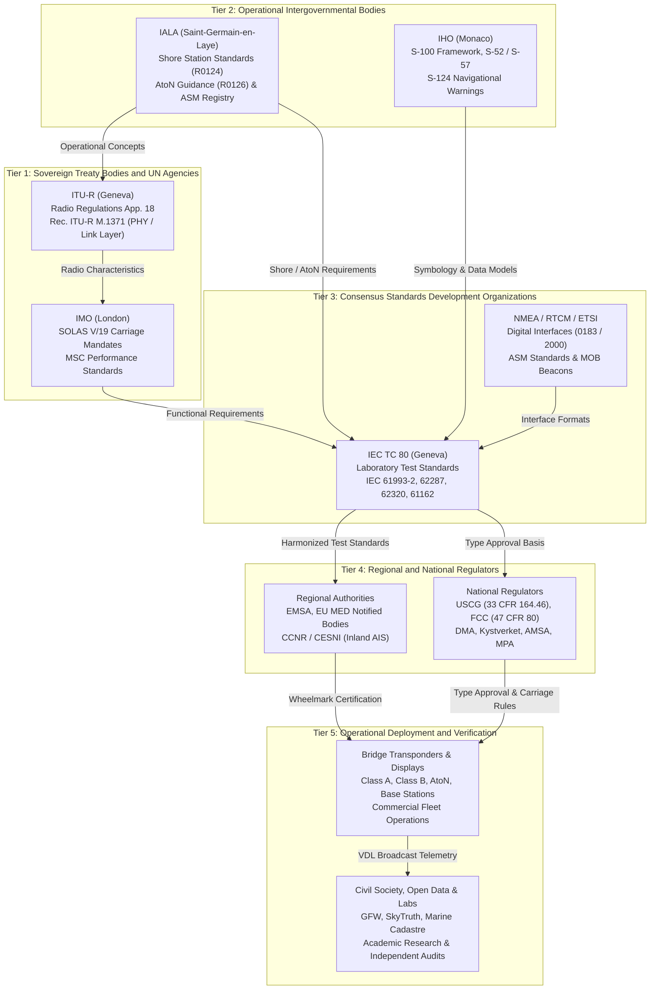

# Appendix J — Organizations directory

This directory catalogs the international treaty bodies, specialized United Nations agencies, intergovernmental organizations, standards development organizations (SDOs), industry associations, regional administrative commissions, national regulatory and operational authorities, non-governmental monitoring organizations, open-data repositories, and academic research laboratories that govern, standardize, operate, and analyze the Automatic Identification System (AIS) and VHF Data Exchange System (VDES).

The architecture of maritime surveillance and digital VHF telemetry relies on an interlocking division of institutional responsibilities:
1. **Treaty bodies and United Nations specialized agencies** enact statutory carriage requirements and allocate radio spectrum under binding international law ([Chapter 14](../chapters/ch14-key-organizations.md), [Chapter 15](../chapters/ch15-standards-that-define-ais.md), and [Chapter 16](../chapters/ch16-laws-and-treaties.md)).
2. **Intergovernmental and hydrographic organizations** formulate operational guidelines for shore-based base station networks, Aids to Navigation (AtoN), Vessel Traffic Services (VTS), and Electronic Navigational Chart (ENC) portrayal ([Chapter 20](../chapters/ch20-architecture-and-station-classes.md), [Chapter 51](../chapters/ch51-charts-enc-ecdis.md), and [Chapter 52](../chapters/ch52-ais-and-s100.md)).
3. **Standards development organizations and industry associations** draft consensus laboratory type-approval test specifications, equipment packaging standards, and digital bridge data bus protocols ([Chapter 26](../chapters/ch26-interfaces-and-logging.md) and [Appendix B](../appendices/appendix-b-standards-register.md)).
4. **Regional and supranational administrative authorities** coordinate vessel traffic monitoring networks across multinational economic areas and shared European inland waterways ([Chapter 4](../chapters/ch04-vts-and-ports.md), [Chapter 8](../chapters/ch08-security-and-national-security-uses.md), and [Chapter 41](../chapters/ch41-networks-and-providers.md)).
5. **National administrations** enforce statutory domestic carriage rules, grant equipment type approval, assign Maritime Identification Digits (MIDs) and Maritime Mobile Service Identities (MMSIs), construct coastal collection networks, and publish sovereign telemetry datasets ([Chapter 13](../chapters/ch13-mmsi-deep-dive.md), [Chapter 41](../chapters/ch41-networks-and-providers.md), and [Appendix G](../appendices/appendix-g-datasets-providers.md)).
6. **Civil society, non-governmental organizations, and academic laboratories** operate open data exchange platforms, publish independent audits of dark fleet activities and GNSS spoofing, develop open-source decoders, and pioneer advanced spatial analytics ([Chapter 6](../chapters/ch06-fisheries-iuu-dark-fleets.md), [Chapter 44](../chapters/ch44-open-source-decoders-history.md), [Chapter 59](../chapters/ch59-spoofing.md), and [Chapter 62](../chapters/ch62-gnss-jamming-spoofing.md)).

---

## J.1 Master directory of maritime and telecommunication organizations

The master directory in Table J.1 provides an authoritative index of every primary organization in the global AIS and VDES ecosystem. It records each entity's legal status, founding date, headquarters seat, relevant subordinate committees or working groups, primary AIS document series or mandates, public data availability, and cross-references to chapters in this handbook.

### Table J.1: Master Directory of AIS and VDES Organizations

| Organization | Legal Nature | Founded | Seat | Relevant Committee / Working Group | Key AIS Documents / Mandates | Data Access | Public Entry Point | Chapters citing |
|---|---|---|---|---|---|---|---|---|
| **International Maritime Organization (IMO)** | United Nations Specialized Agency (Treaty Body) | 1948 (entered into force 1958) | London, United Kingdom | Maritime Safety Committee (MSC); Sub-Committee on Navigation, Communications and Search and Rescue (NCSR; formed 2014 by merging NAV and COMSAR) | SOLAS Chapter V Regulation 19 (carriage); Res. MSC.74(69) Annex 3 (Class A performance); Res. A.1106(29) (operational guidelines); SN.1/Circ.289 (ASM guidance); MSC.1/Circ.1252 (annual testing); Res. MSC.592(111) (VDES performance) | Restricted (IMODOCS requires registration; resolutions public) | [imo.org](https://www.imo.org) | [Chapter 1](../chapters/ch01-what-ais-is.md), [Chapter 2](../chapters/ch02-uses-of-ais-data.md), [Chapter 3](../chapters/ch03-at-sea-operations.md), [Chapter 4](../chapters/ch04-vts-and-ports.md), [Chapter 5](../chapters/ch05-traders-finance-nowcasting.md), [Chapter 6](../chapters/ch06-fisheries-iuu-dark-fleets.md), [Chapter 7](../chapters/ch07-environment-and-science.md), [Chapter 8](../chapters/ch08-security-and-national-security-uses.md), [Chapter 9](../chapters/ch09-prehistory-and-stdma.md), [Chapter 10](../chapters/ch10-standardization-1996-2004.md), [Chapter 11](../chapters/ch11-growth-2004-2015.md), [Chapter 12](../chapters/ch12-2015-to-present.md), [Chapter 13](../chapters/ch13-mmsi-deep-dive.md), [Chapter 14](../chapters/ch14-key-organizations.md), [Chapter 15](../chapters/ch15-standards-that-define-ais.md), [Chapter 16](../chapters/ch16-laws-and-treaties.md), [Chapter 17](../chapters/ch17-legal-issues-and-court-cases.md), [Chapter 18](../chapters/ch18-patents.md), [Chapter 19](../chapters/ch19-privacy-and-ethics.md), [Chapter 20](../chapters/ch20-architecture-and-station-classes.md), [Chapter 21](../chapters/ch21-link-layer-tdma.md), [Chapter 22](../chapters/ch22-message-catalog.md), [Chapter 23](../chapters/ch23-asm-binary-payloads.md), [Chapter 24](../chapters/ch24-timing.md), [Chapter 25](../chapters/ch25-gnss-and-ais.md), [Chapter 26](../chapters/ch26-interfaces-and-logging.md), [Chapter 27](../chapters/ch27-rf-basics.md), [Chapter 31](../chapters/ch31-noise-and-interference.md), [Chapter 32](../chapters/ch32-antennas.md), [Chapter 33](../chapters/ch33-hardware-and-sdr.md), [Chapter 34](../chapters/ch34-rf-forensics-fingerprinting.md), [Chapter 35](../chapters/ch35-direction-finding-geolocation.md), [Chapter 36](../chapters/ch36-failure-modes.md), [Chapter 38](../chapters/ch38-collection-at-sea.md), [Chapter 39](../chapters/ch39-satellite-ais.md), [Chapter 40](../chapters/ch40-aircraft-and-drones.md), [Chapter 41](../chapters/ch41-networks-and-providers.md), [Chapter 42](../chapters/ch42-home-receiver.md), [Chapter 43](../chapters/ch43-demonstration-programs.md), [Chapter 44](../chapters/ch44-open-source-decoders-history.md), [Chapter 46](../chapters/ch46-government-software.md), [Chapter 47](../chapters/ch47-data-quality-track-reconstruction.md), [Chapter 49](../chapters/ch49-analytics-and-ml.md), [Chapter 51](../chapters/ch51-charts-enc-ecdis.md), [Chapter 52](../chapters/ch52-ais-and-s100.md), [Chapter 53](../chapters/ch53-mariner-training.md), [Chapter 54](../chapters/ch54-environmental-transmissions.md), [Chapter 55](../chapters/ch55-incidents-and-accidents.md), [Chapter 56](../chapters/ch56-vdr-forensics.md), [Chapter 57](../chapters/ch57-autonomous-ships.md), [Chapter 58](../chapters/ch58-threat-model.md), [Chapter 59](../chapters/ch59-spoofing.md), [Chapter 60](../chapters/ch60-malicious-payloads-robustness.md), [Chapter 61](../chapters/ch61-timing-and-network-attacks.md), [Chapter 62](../chapters/ch62-gnss-jamming-spoofing.md), [Chapter 63](../chapters/ch63-military-encrypted-ais.md), [Chapter 64](../chapters/ch64-authentication-future-security.md), [Chapter 65](../chapters/ch65-hacks-unintended-uses.md), [Chapter 66](../chapters/ch66-other-ways-to-track-ships.md), [Chapter 67](../chapters/ch67-mobile-phones-at-sea.md), [Chapter 68](../chapters/ch68-special-purpose-ais.md), [Chapter 69](../chapters/ch69-vdes-ais-2.md) |
| **International Telecommunication Union (ITU)** | United Nations Specialized Agency (Treaty Body) | 1865 (ITU-R established 1992) | Geneva, Switzerland | ITU-R Study Group 5 (Terrestrial Services); Working Party 5B (WP 5B — Maritime, aeronautical, and radiodetermination); World Radiocommunication Conference (WRC) | ITU Radio Regulations Appendix 18 (VHF maritime mobile band plan); Rec. ITU-R M.1371 (M.1371-0 through M.1371-6, TDMA physical/link layer); Rec. ITU-R M.585 (MMSI assignments); Rec. ITU-R M.2092 (VDES technical characteristics) | Free public access to ITU-R Recommendations and MARS ship station database | [itu.int](https://www.itu.int) | [Chapter 1](../chapters/ch01-what-ais-is.md), [Chapter 2](../chapters/ch02-uses-of-ais-data.md), [Chapter 3](../chapters/ch03-at-sea-operations.md), [Chapter 4](../chapters/ch04-vts-and-ports.md), [Chapter 5](../chapters/ch05-traders-finance-nowcasting.md), [Chapter 6](../chapters/ch06-fisheries-iuu-dark-fleets.md), [Chapter 7](../chapters/ch07-environment-and-science.md), [Chapter 8](../chapters/ch08-security-and-national-security-uses.md), [Chapter 9](../chapters/ch09-prehistory-and-stdma.md), [Chapter 10](../chapters/ch10-standardization-1996-2004.md), [Chapter 11](../chapters/ch11-growth-2004-2015.md), [Chapter 12](../chapters/ch12-2015-to-present.md), [Chapter 13](../chapters/ch13-mmsi-deep-dive.md), [Chapter 14](../chapters/ch14-key-organizations.md), [Chapter 15](../chapters/ch15-standards-that-define-ais.md), [Chapter 16](../chapters/ch16-laws-and-treaties.md), [Chapter 17](../chapters/ch17-legal-issues-and-court-cases.md), [Chapter 18](../chapters/ch18-patents.md), [Chapter 19](../chapters/ch19-privacy-and-ethics.md), [Chapter 20](../chapters/ch20-architecture-and-station-classes.md), [Chapter 21](../chapters/ch21-link-layer-tdma.md), [Chapter 22](../chapters/ch22-message-catalog.md), [Chapter 23](../chapters/ch23-asm-binary-payloads.md), [Chapter 24](../chapters/ch24-timing.md), [Chapter 25](../chapters/ch25-gnss-and-ais.md), [Chapter 26](../chapters/ch26-interfaces-and-logging.md), [Chapter 27](../chapters/ch27-rf-basics.md), [Chapter 28](../chapters/ch28-rf-encoding-physical-layer.md), [Chapter 29](../chapters/ch29-propagation-modeling.md), [Chapter 30](../chapters/ch30-network-loading-packet-loss.md), [Chapter 31](../chapters/ch31-noise-and-interference.md), [Chapter 32](../chapters/ch32-antennas.md), [Chapter 33](../chapters/ch33-hardware-and-sdr.md), [Chapter 34](../chapters/ch34-rf-forensics-fingerprinting.md), [Chapter 35](../chapters/ch35-direction-finding-geolocation.md), [Chapter 36](../chapters/ch36-failure-modes.md), [Chapter 37](../chapters/ch37-shore-collection-siting.md), [Chapter 38](../chapters/ch38-collection-at-sea.md), [Chapter 39](../chapters/ch39-satellite-ais.md), [Chapter 40](../chapters/ch40-aircraft-and-drones.md), [Chapter 41](../chapters/ch41-networks-and-providers.md), [Chapter 42](../chapters/ch42-home-receiver.md), [Chapter 43](../chapters/ch43-demonstration-programs.md), [Chapter 44](../chapters/ch44-open-source-decoders-history.md), [Chapter 45](../chapters/ch45-processing-software.md), [Chapter 46](../chapters/ch46-government-software.md), [Chapter 47](../chapters/ch47-data-quality-track-reconstruction.md), [Chapter 48](../chapters/ch48-spatial-statistics.md), [Chapter 49](../chapters/ch49-analytics-and-ml.md), [Chapter 50](../chapters/ch50-big-data-architecture.md), [Chapter 52](../chapters/ch52-ais-and-s100.md), [Chapter 53](../chapters/ch53-mariner-training.md), [Chapter 54](../chapters/ch54-environmental-transmissions.md), [Chapter 55](../chapters/ch55-incidents-and-accidents.md), [Chapter 57](../chapters/ch57-autonomous-ships.md), [Chapter 58](../chapters/ch58-threat-model.md), [Chapter 59](../chapters/ch59-spoofing.md), [Chapter 60](../chapters/ch60-malicious-payloads-robustness.md), [Chapter 61](../chapters/ch61-timing-and-network-attacks.md), [Chapter 62](../chapters/ch62-gnss-jamming-spoofing.md), [Chapter 63](../chapters/ch63-military-encrypted-ais.md), [Chapter 64](../chapters/ch64-authentication-future-security.md), [Chapter 65](../chapters/ch65-hacks-unintended-uses.md), [Chapter 66](../chapters/ch66-other-ways-to-track-ships.md), [Chapter 67](../chapters/ch67-mobile-phones-at-sea.md), [Chapter 68](../chapters/ch68-special-purpose-ais.md), [Chapter 69](../chapters/ch69-vdes-ais-2.md) |
| **Food and Agriculture Organization (FAO)** | United Nations Specialized Agency | 1945 | Rome, Italy | Committee on Fisheries (COFI); Joint FAO/IMO Ad Hoc Working Group on IUU Fishing | Agreement on Port State Measures (PSMA, in force 2016); Global Record of Fishing Vessels, Refrigerated Transport Vessels and Supply Vessels; Voluntary Guidelines for Flag State Performance | Free public access (Global Record database and FAO fisheries registries) | [fao.org](https://www.fao.org) | [Chapter 6](../chapters/ch06-fisheries-iuu-dark-fleets.md), [Chapter 16](../chapters/ch16-laws-and-treaties.md), [Chapter 66](../chapters/ch66-other-ways-to-track-ships.md) |
| **International Organization for Marine Aids to Navigation (IALA)** | Intergovernmental Organization (IGO; transitioned from NGO on 22 August 2024) | 1957 (IGO Convention effective 2024) | Saint-Germain-en-Laye, France | Digital Technologies Committee (DTEC, formerly ENAV); Vessel Traffic Services Committee (VTS); Aids to Navigation Engineering and Sustainability Committee (ENG); Policy and Advisory Committee (ARM) | IALA Recommendation R0124 (A-124, AIS shore stations); Rec. R0126 (A-126, AIS AtoN); Guideline G1082 (AIS overview); Guideline G1050 (management and monitoring); Guideline G1117 / G1139 (VDES technical specs); IALA International ASM Collection | Free PDF access upon user account registration; IALA ASM registry public | [iala.int](https://www.iala.int) | [Chapter 3](../chapters/ch03-at-sea-operations.md), [Chapter 4](../chapters/ch04-vts-and-ports.md), [Chapter 9](../chapters/ch09-prehistory-and-stdma.md), [Chapter 10](../chapters/ch10-standardization-1996-2004.md), [Chapter 12](../chapters/ch12-2015-to-present.md), [Chapter 14](../chapters/ch14-key-organizations.md), [Chapter 15](../chapters/ch15-standards-that-define-ais.md), [Chapter 19](../chapters/ch19-privacy-and-ethics.md), [Chapter 20](../chapters/ch20-architecture-and-station-classes.md), [Chapter 21](../chapters/ch21-link-layer-tdma.md), [Chapter 22](../chapters/ch22-message-catalog.md), [Chapter 23](../chapters/ch23-asm-binary-payloads.md), [Chapter 25](../chapters/ch25-gnss-and-ais.md), [Chapter 30](../chapters/ch30-network-loading-packet-loss.md), [Chapter 32](../chapters/ch32-antennas.md), [Chapter 35](../chapters/ch35-direction-finding-geolocation.md), [Chapter 37](../chapters/ch37-shore-collection-siting.md), [Chapter 38](../chapters/ch38-collection-at-sea.md), [Chapter 40](../chapters/ch40-aircraft-and-drones.md), [Chapter 41](../chapters/ch41-networks-and-providers.md), [Chapter 43](../chapters/ch43-demonstration-programs.md), [Chapter 45](../chapters/ch45-processing-software.md), [Chapter 48](../chapters/ch48-spatial-statistics.md), [Chapter 51](../chapters/ch51-charts-enc-ecdis.md), [Chapter 52](../chapters/ch52-ais-and-s100.md), [Chapter 53](../chapters/ch53-mariner-training.md), [Chapter 54](../chapters/ch54-environmental-transmissions.md), [Chapter 57](../chapters/ch57-autonomous-ships.md), [Chapter 59](../chapters/ch59-spoofing.md), [Chapter 61](../chapters/ch61-timing-and-network-attacks.md), [Chapter 62](../chapters/ch62-gnss-jamming-spoofing.md), [Chapter 63](../chapters/ch63-military-encrypted-ais.md), [Chapter 64](../chapters/ch64-authentication-future-security.md), [Chapter 65](../chapters/ch65-hacks-unintended-uses.md), [Chapter 68](../chapters/ch68-special-purpose-ais.md), [Chapter 69](../chapters/ch69-vdes-ais-2.md) |
| **International Hydrographic Organization (IHO)** | Intergovernmental Organization (Treaty Body) | 1921 (as IHB) | Monaco | Hydrographic Services and Standards Committee (HSSC); S-100 Working Group (S-100WG); Nautical Information Provision Working Group (NIPWG) | S-100 Universal Hydrographic Data Model; S-57 (ENC transfer); S-52 (ECDIS portrayal); S-124 (Navigational Warnings); S-125 (Marine Navigational Aids); S-201 (Aids to Navigation Information); S-421 (Route Plan Exchange) | Free public standards downloads and IHO Geospatial Information (GI) Registry | [iho.int](https://www.iho.int) | [Chapter 12](../chapters/ch12-2015-to-present.md), [Chapter 14](../chapters/ch14-key-organizations.md), [Chapter 15](../chapters/ch15-standards-that-define-ais.md), [Chapter 45](../chapters/ch45-processing-software.md), [Chapter 49](../chapters/ch49-analytics-and-ml.md), [Chapter 51](../chapters/ch51-charts-enc-ecdis.md), [Chapter 52](../chapters/ch52-ais-and-s100.md), [Chapter 54](../chapters/ch54-environmental-transmissions.md), [Chapter 68](../chapters/ch68-special-purpose-ais.md) |
| **International Electrotechnical Commission (IEC)** | International Standards Organization (SDO) | 1906 | Geneva, Switzerland | Technical Committee 80 (TC 80: Maritime navigation and radiocommunication equipment and systems) | IEC 61993-2 (Class A test standard); IEC 62287-1 (Class B CSTDMA); IEC 62287-2 (Class B SOTDMA); IEC 62320-1 (Base stations); IEC 62320-2 (AtoN); IEC 62320-3 (Repeaters); IEC 61097-14 (AIS-SART); IEC 61162 series (digital interfaces); IEC 62288 (presentation of navigation displays); IEC 60945 (environmental testing) | Commercial sales via IEC Webstore; dashboard and committee scopes public | [iec.ch](https://www.iec.ch) | [Chapter 1](../chapters/ch01-what-ais-is.md), [Chapter 2](../chapters/ch02-uses-of-ais-data.md), [Chapter 3](../chapters/ch03-at-sea-operations.md), [Chapter 4](../chapters/ch04-vts-and-ports.md), [Chapter 8](../chapters/ch08-security-and-national-security-uses.md), [Chapter 9](../chapters/ch09-prehistory-and-stdma.md), [Chapter 10](../chapters/ch10-standardization-1996-2004.md), [Chapter 11](../chapters/ch11-growth-2004-2015.md), [Chapter 12](../chapters/ch12-2015-to-present.md), [Chapter 13](../chapters/ch13-mmsi-deep-dive.md), [Chapter 14](../chapters/ch14-key-organizations.md), [Chapter 15](../chapters/ch15-standards-that-define-ais.md), [Chapter 16](../chapters/ch16-laws-and-treaties.md), [Chapter 17](../chapters/ch17-legal-issues-and-court-cases.md), [Chapter 18](../chapters/ch18-patents.md), [Chapter 19](../chapters/ch19-privacy-and-ethics.md), [Chapter 20](../chapters/ch20-architecture-and-station-classes.md), [Chapter 21](../chapters/ch21-link-layer-tdma.md), [Chapter 22](../chapters/ch22-message-catalog.md), [Chapter 23](../chapters/ch23-asm-binary-payloads.md), [Chapter 24](../chapters/ch24-timing.md), [Chapter 25](../chapters/ch25-gnss-and-ais.md), [Chapter 26](../chapters/ch26-interfaces-and-logging.md), [Chapter 27](../chapters/ch27-rf-basics.md), [Chapter 28](../chapters/ch28-rf-encoding-physical-layer.md), [Chapter 29](../chapters/ch29-propagation-modeling.md), [Chapter 30](../chapters/ch30-network-loading-packet-loss.md), [Chapter 31](../chapters/ch31-noise-and-interference.md), [Chapter 32](../chapters/ch32-antennas.md), [Chapter 33](../chapters/ch33-hardware-and-sdr.md), [Chapter 34](../chapters/ch34-rf-forensics-fingerprinting.md), [Chapter 35](../chapters/ch35-direction-finding-geolocation.md), [Chapter 36](../chapters/ch36-failure-modes.md), [Chapter 37](../chapters/ch37-shore-collection-siting.md), [Chapter 38](../chapters/ch38-collection-at-sea.md), [Chapter 39](../chapters/ch39-satellite-ais.md), [Chapter 40](../chapters/ch40-aircraft-and-drones.md), [Chapter 41](../chapters/ch41-networks-and-providers.md), [Chapter 42](../chapters/ch42-home-receiver.md), [Chapter 43](../chapters/ch43-demonstration-programs.md), [Chapter 44](../chapters/ch44-open-source-decoders-history.md), [Chapter 45](../chapters/ch45-processing-software.md), [Chapter 46](../chapters/ch46-government-software.md), [Chapter 47](../chapters/ch47-data-quality-track-reconstruction.md), [Chapter 48](../chapters/ch48-spatial-statistics.md), [Chapter 50](../chapters/ch50-big-data-architecture.md), [Chapter 51](../chapters/ch51-charts-enc-ecdis.md), [Chapter 52](../chapters/ch52-ais-and-s100.md), [Chapter 53](../chapters/ch53-mariner-training.md), [Chapter 54](../chapters/ch54-environmental-transmissions.md), [Chapter 55](../chapters/ch55-incidents-and-accidents.md), [Chapter 56](../chapters/ch56-vdr-forensics.md), [Chapter 57](../chapters/ch57-autonomous-ships.md), [Chapter 58](../chapters/ch58-threat-model.md), [Chapter 59](../chapters/ch59-spoofing.md), [Chapter 60](../chapters/ch60-malicious-payloads-robustness.md), [Chapter 61](../chapters/ch61-timing-and-network-attacks.md), [Chapter 62](../chapters/ch62-gnss-jamming-spoofing.md), [Chapter 63](../chapters/ch63-military-encrypted-ais.md), [Chapter 64](../chapters/ch64-authentication-future-security.md), [Chapter 65](../chapters/ch65-hacks-unintended-uses.md), [Chapter 66](../chapters/ch66-other-ways-to-track-ships.md), [Chapter 68](../chapters/ch68-special-purpose-ais.md), [Chapter 69](../chapters/ch69-vdes-ais-2.md) |
| **Radio Technical Commission for Maritime Services (RTCM)** | Non-Profit Standards Development Organization | 1947 | Arlington, Virginia, United States | Special Committee 121 (SC 121: AIS and Digital Messaging); SC 104 (Differential GNSS); SC 110 (Emergency Beacons); SC 123 (Digital Message Services) | RTCM Standard 12100.1 (Application-Specific Messages); RTCM Standard 12110.1 (AIS Mobile AtoN); RTCM Standard 10402.3 (DGNSS Message 17 format); RTCM Standard 11010.3 (Maritime Survivor Locating Devices / AIS MSLD) | Commercial sales via RTCM Store; incorporated by reference into US 47 CFR Part 80 and 33 CFR Part 164 | [rtcm.org](https://www.rtcm.org) | [Chapter 9](../chapters/ch09-prehistory-and-stdma.md), [Chapter 13](../chapters/ch13-mmsi-deep-dive.md), [Chapter 14](../chapters/ch14-key-organizations.md), [Chapter 15](../chapters/ch15-standards-that-define-ais.md), [Chapter 16](../chapters/ch16-laws-and-treaties.md), [Chapter 20](../chapters/ch20-architecture-and-station-classes.md), [Chapter 25](../chapters/ch25-gnss-and-ais.md), [Chapter 31](../chapters/ch31-noise-and-interference.md), [Chapter 37](../chapters/ch37-shore-collection-siting.md), [Chapter 42](../chapters/ch42-home-receiver.md), [Chapter 43](../chapters/ch43-demonstration-programs.md), [Chapter 51](../chapters/ch51-charts-enc-ecdis.md), [Chapter 55](../chapters/ch55-incidents-and-accidents.md), [Chapter 65](../chapters/ch65-hacks-unintended-uses.md), [Chapter 68](../chapters/ch68-special-purpose-ais.md) |
| **National Marine Electronics Association (NMEA)** | Trade and Standards Development Association | 1957 | Severna Park, Maryland, United States | NMEA Standards Committee; AIS Working Group | NMEA 0183 Version 4.11 (encapsulated `!AIVDM`/`!AIVDO` sentences and TAG blocks); NMEA 2000 (CAN bus PGNs 129038–129041, 129794, 129809–129810); NMEA OneNet (Lightweight Ethernet); NMEA 0400 (Marine Electronics Installation) | Commercial sales via NMEA Store; standard sentence and PGN definitions licensed | [nmea.org](https://www.nmea.org) | [Chapter 1](../chapters/ch01-what-ais-is.md), [Chapter 2](../chapters/ch02-uses-of-ais-data.md), [Chapter 3](../chapters/ch03-at-sea-operations.md), [Chapter 4](../chapters/ch04-vts-and-ports.md), [Chapter 5](../chapters/ch05-traders-finance-nowcasting.md), [Chapter 6](../chapters/ch06-fisheries-iuu-dark-fleets.md), [Chapter 8](../chapters/ch08-security-and-national-security-uses.md), [Chapter 9](../chapters/ch09-prehistory-and-stdma.md), [Chapter 10](../chapters/ch10-standardization-1996-2004.md), [Chapter 11](../chapters/ch11-growth-2004-2015.md), [Chapter 12](../chapters/ch12-2015-to-present.md), [Chapter 13](../chapters/ch13-mmsi-deep-dive.md), [Chapter 14](../chapters/ch14-key-organizations.md), [Chapter 15](../chapters/ch15-standards-that-define-ais.md), [Chapter 16](../chapters/ch16-laws-and-treaties.md), [Chapter 17](../chapters/ch17-legal-issues-and-court-cases.md), [Chapter 19](../chapters/ch19-privacy-and-ethics.md), [Chapter 20](../chapters/ch20-architecture-and-station-classes.md), [Chapter 21](../chapters/ch21-link-layer-tdma.md), [Chapter 22](../chapters/ch22-message-catalog.md), [Chapter 23](../chapters/ch23-asm-binary-payloads.md), [Chapter 24](../chapters/ch24-timing.md), [Chapter 25](../chapters/ch25-gnss-and-ais.md), [Chapter 26](../chapters/ch26-interfaces-and-logging.md), [Chapter 27](../chapters/ch27-rf-basics.md), [Chapter 28](../chapters/ch28-rf-encoding-physical-layer.md), [Chapter 29](../chapters/ch29-propagation-modeling.md), [Chapter 30](../chapters/ch30-network-loading-packet-loss.md), [Chapter 31](../chapters/ch31-noise-and-interference.md), [Chapter 32](../chapters/ch32-antennas.md), [Chapter 33](../chapters/ch33-hardware-and-sdr.md), [Chapter 34](../chapters/ch34-rf-forensics-fingerprinting.md), [Chapter 35](../chapters/ch35-direction-finding-geolocation.md), [Chapter 36](../chapters/ch36-failure-modes.md), [Chapter 37](../chapters/ch37-shore-collection-siting.md), [Chapter 38](../chapters/ch38-collection-at-sea.md), [Chapter 39](../chapters/ch39-satellite-ais.md), [Chapter 40](../chapters/ch40-aircraft-and-drones.md), [Chapter 41](../chapters/ch41-networks-and-providers.md), [Chapter 42](../chapters/ch42-home-receiver.md), [Chapter 43](../chapters/ch43-demonstration-programs.md), [Chapter 44](../chapters/ch44-open-source-decoders-history.md), [Chapter 45](../chapters/ch45-processing-software.md), [Chapter 46](../chapters/ch46-government-software.md), [Chapter 47](../chapters/ch47-data-quality-track-reconstruction.md), [Chapter 48](../chapters/ch48-spatial-statistics.md), [Chapter 49](../chapters/ch49-analytics-and-ml.md), [Chapter 50](../chapters/ch50-big-data-architecture.md), [Chapter 51](../chapters/ch51-charts-enc-ecdis.md), [Chapter 52](../chapters/ch52-ais-and-s100.md), [Chapter 53](../chapters/ch53-mariner-training.md), [Chapter 54](../chapters/ch54-environmental-transmissions.md), [Chapter 55](../chapters/ch55-incidents-and-accidents.md), [Chapter 56](../chapters/ch56-vdr-forensics.md), [Chapter 57](../chapters/ch57-autonomous-ships.md), [Chapter 58](../chapters/ch58-threat-model.md), [Chapter 59](../chapters/ch59-spoofing.md), [Chapter 60](../chapters/ch60-malicious-payloads-robustness.md), [Chapter 61](../chapters/ch61-timing-and-network-attacks.md), [Chapter 62](../chapters/ch62-gnss-jamming-spoofing.md), [Chapter 63](../chapters/ch63-military-encrypted-ais.md), [Chapter 64](../chapters/ch64-authentication-future-security.md), [Chapter 65](../chapters/ch65-hacks-unintended-uses.md), [Chapter 67](../chapters/ch67-mobile-phones-at-sea.md), [Chapter 68](../chapters/ch68-special-purpose-ais.md), [Chapter 69](../chapters/ch69-vdes-ais-2.md) |
| **European Telecommunications Standards Institute (ETSI)** | Regional Standards Development Organization | 1988 | Sophia Antipolis, France | Technical Committee Electromagnetic Compatibility and Radio Spectrum Matters (ERM); TG 26 (Maritime Radio) | ETSI EN 303 098 (Harmonised Standard for AIS-MOB locating beacons under Radio Equipment Directive 2014/53/EU); ETSI EN 303 132 (Maritime VHF DSC personal locating devices)  | Free public access to published European Norms (EN) | [etsi.org](https://www.etsi.org) | [Chapter 13](../chapters/ch13-mmsi-deep-dive.md), [Chapter 14](../chapters/ch14-key-organizations.md), [Chapter 15](../chapters/ch15-standards-that-define-ais.md), [Chapter 20](../chapters/ch20-architecture-and-station-classes.md), [Chapter 28](../chapters/ch28-rf-encoding-physical-layer.md), [Chapter 67](../chapters/ch67-mobile-phones-at-sea.md), [Chapter 68](../chapters/ch68-special-purpose-ais.md), [Chapter 69](../chapters/ch69-vdes-ais-2.md) |
| **Comité International Radio-Maritime (CIRM)** | International Non-Governmental Association | 1928 | London, United Kingdom | CIRM Technical Committee; Working Groups on AIS, VDES, and Navigation Displays | Technical advisory papers submitted to IMO NCSR, ITU-R WP 5B, and IEC TC 80; representation of marine electronics manufacturers during type-approval harmonization | Restricted to accredited industry members (public position summaries) | [cirm.org](https://cirm.org) | [Chapter 11](../chapters/ch11-growth-2004-2015.md), [Chapter 13](../chapters/ch13-mmsi-deep-dive.md), [Chapter 14](../chapters/ch14-key-organizations.md), [Chapter 68](../chapters/ch68-special-purpose-ais.md) |
| **World Meteorological Organization (WMO)** | United Nations Specialized Agency | 1950 | Geneva, Switzerland | Standing Committee on Earth Observing Systems and Monitoring Networks; Joint WMO/IOC Technical Commission for Oceanography and Marine Meteorology (JCOMM / GOOS) | Voluntary Observing Ship (VOS) scheme; standardized marine meteorological and oceanographic binary broadcast specifications over AIS (SN.1/Circ.289 Area Notices and Met/Hydro messages) | Free public meteorological data and observational catalogs | [wmo.int](https://wmo.int) | [Chapter 14](../chapters/ch14-key-organizations.md), [Chapter 52](../chapters/ch52-ais-and-s100.md), [Chapter 54](../chapters/ch54-environmental-transmissions.md), [Chapter 66](../chapters/ch66-other-ways-to-track-ships.md) |
| **International Civil Aviation Organization (ICAO)** | United Nations Specialized Agency | 1944 (Chicago Convention) | Montreal, Canada | Aeronautical Communications Panel (ACP); ICAO/IMO Joint Working Group on Harmonization of Aeronautical and Maritime SAR | Standards and Recommended Practices (SARPs) for VDL Mode 4; SAR aircraft AIS transponder integration (ITU-R M.1371 Message 9 broadcasts) | Standards by paid access; Joint SAR circulars free | [icao.int](https://www.icao.int) | [Chapter 9](../chapters/ch09-prehistory-and-stdma.md), [Chapter 14](../chapters/ch14-key-organizations.md), [Chapter 17](../chapters/ch17-legal-issues-and-court-cases.md), [Chapter 40](../chapters/ch40-aircraft-and-drones.md), [Chapter 62](../chapters/ch62-gnss-jamming-spoofing.md), [Chapter 68](../chapters/ch68-special-purpose-ais.md) |
| **North Atlantic Treaty Organization (NATO)** | Intergovernmental Military Alliance | 1949 | Brussels, Belgium | Allied Maritime Command (MARCOM, Northwood, UK); NATO Standardization Office (NSO) | Recognized Maritime Picture (RMP) ingest specifications; Warship AIS (W-AIS) encryption and tactical management protocols under STANAG 4664  | Classified / NATO Restricted defense distribution | [nato.int](https://www.nato.int) | [Chapter 14](../chapters/ch14-key-organizations.md), [Chapter 46](../chapters/ch46-government-software.md), [Chapter 59](../chapters/ch59-spoofing.md), [Chapter 62](../chapters/ch62-gnss-jamming-spoofing.md), [Chapter 63](../chapters/ch63-military-encrypted-ais.md) |
| **European Maritime Safety Agency (EMSA)** | European Union Decentralized Regulatory Agency | 2002 (Reg. EC 1406/2002) | Lisbon, Portugal | Operations and Technical Support Department (Vessel Traffic Monitoring) | Directive 2002/59/EC (Vessel Traffic Monitoring and Information System); SafeSeaNet operation; Integrated Maritime Services (IMS / IMDatE); CleanSeaNet (satellite oil spill detection); European Union LRIT Cooperative Data Centre | Restricted to EU Member State maritime administrations and law enforcement; public statistical reports | [emsa.europa.eu](https://www.emsa.europa.eu) | [Chapter 4](../chapters/ch04-vts-and-ports.md), [Chapter 8](../chapters/ch08-security-and-national-security-uses.md), [Chapter 10](../chapters/ch10-standardization-1996-2004.md), [Chapter 11](../chapters/ch11-growth-2004-2015.md), [Chapter 14](../chapters/ch14-key-organizations.md), [Chapter 16](../chapters/ch16-laws-and-treaties.md), [Chapter 41](../chapters/ch41-networks-and-providers.md), [Chapter 46](../chapters/ch46-government-software.md), [Chapter 47](../chapters/ch47-data-quality-track-reconstruction.md), [Chapter 53](../chapters/ch53-mariner-training.md), [Chapter 66](../chapters/ch66-other-ways-to-track-ships.md) |
| **European Commission Directorate-General for Mobility and Transport (DG MOVE)** | European Union Executive Department | 2010 (split from TREN) | Brussels, Belgium | Directorate D — Waterborne Transport; Unit D.2 — Maritime Safety | European maritime policy; oversight of Directive 2002/59/EC, Directive 2014/90/EU (Marine Equipment Directive / MED Wheelmark), and River Information Services (RIS) Directive 2005/44/EC | Public legislation via EUR-Lex | [transport.ec.europa.eu](https://transport.ec.europa.eu) | [Chapter 14](../chapters/ch14-key-organizations.md) |
| **European Commission Directorate-General for Maritime Affairs and Fisheries (DG MARE)** | European Union Executive Department | 1976 (DG XIV) | Brussels, Belgium | Maritime Policy and Blue Economy; Fisheries Control and Surveillance | EU Fisheries Control Regulation (Reg. EC 1224/2009; amended by Reg. EU 2023/2842 mandating AIS/VMS for fishing vessels); European Marine Observation and Data Network (EMODnet) funding | Public density maps and datasets via EMODnet Human Activities | [oceans-and-fisheries.ec.europa.eu](https://oceans-and-fisheries.ec.europa.eu) | [Chapter 14](../chapters/ch14-key-organizations.md) |
| **Central Commission for the Navigation of the Rhine (CCNR)** | Regional Intergovernmental River Commission | 1815 (Treaty of Vienna) / 1868 (Mannheim Act) | Strasbourg, France | Police Regulations Committee; RIS Committee | Police Regulations for the Navigation of the Rhine (RPNR); Resolution 2006-I-21 (Vessel Tracking and Tracing Standard for Inland Navigation); Inland AIS transponder mandate (Message 23 and DAC 200 ASMs) | Free public access to inland navigation regulations | [ccr-zkr.org](https://www.ccr-zkr.org) | [Chapter 11](../chapters/ch11-growth-2004-2015.md), [Chapter 12](../chapters/ch12-2015-to-present.md), [Chapter 14](../chapters/ch14-key-organizations.md), [Chapter 15](../chapters/ch15-standards-that-define-ais.md), [Chapter 16](../chapters/ch16-laws-and-treaties.md), [Chapter 20](../chapters/ch20-architecture-and-station-classes.md), [Chapter 43](../chapters/ch43-demonstration-programs.md), [Chapter 53](../chapters/ch53-mariner-training.md), [Chapter 54](../chapters/ch54-environmental-transmissions.md) |
| **European Committee for Drawing Up Standards in the Field of Inland Navigation (CESNI)** | European Technical Standards Body (established by CCNR) | 2015 | Strasbourg, France | CESNI/TI Working Group (Information Technologies); CESNI/PT (Technical Requirements) | European Standard for River Information Services (ES-RIS); European Standard laying down Technical Requirements for Inland Navigation vessels (ES-TRIN); technical definitions for European Inland AIS Class A stations | Free public access to technical standards | [cesni.eu](https://www.cesni.eu) | [Chapter 12](../chapters/ch12-2015-to-present.md), [Chapter 13](../chapters/ch13-mmsi-deep-dive.md), [Chapter 14](../chapters/ch14-key-organizations.md), [Chapter 15](../chapters/ch15-standards-that-define-ais.md), [Chapter 16](../chapters/ch16-laws-and-treaties.md), [Chapter 20](../chapters/ch20-architecture-and-station-classes.md), [Chapter 23](../chapters/ch23-asm-binary-payloads.md), [Chapter 43](../chapters/ch43-demonstration-programs.md), [Chapter 54](../chapters/ch54-environmental-transmissions.md) |
| **Helsinki Commission (HELCOM)** | Regional Intergovernmental Marine Environment Commission | 1974 (Helsinki Convention) | Helsinki, Finland | Maritime Working Group (HELCOM MARITIME); HELCOM AIS Expert Working Group | Regional Baltic AIS network agreement; multilateral government-to-government coastal AIS exchange network; regional vessel traffic density and pollution risk assessments | Public historical shipping density rasters; real-time feed restricted to treaty parties | [helcom.fi](https://www.helcom.fi) | [Chapter 8](../chapters/ch08-security-and-national-security-uses.md), [Chapter 11](../chapters/ch11-growth-2004-2015.md), [Chapter 41](../chapters/ch41-networks-and-providers.md) |
| **United States Coast Guard (USCG)** | Federal Armed Service and Maritime Regulatory Administration | 1790 (Revenue Cutter Service) | Washington, D.C., United States | Office of Navigation Systems (CG-NAV); Navigation Center (NAVCEN); Research and Development Center (RDC) | 33 CFR Part 164 § 164.46 (US domestic AIS carriage mandates); Nationwide Automatic Identification System (NAIS) operation; US AIS Encoding Guide; USCG DAC 367 Application-Specific Message Registry; Historical Data Request (HDR) portal | Public form-based historical data requests (NAVCEN); coastal raw feed restricted; open archives via Marine Cadastre | [navcen.uscg.gov](https://www.navcen.uscg.gov) | [Chapter 1](../chapters/ch01-what-ais-is.md), [Chapter 2](../chapters/ch02-uses-of-ais-data.md), [Chapter 3](../chapters/ch03-at-sea-operations.md), [Chapter 4](../chapters/ch04-vts-and-ports.md), [Chapter 5](../chapters/ch05-traders-finance-nowcasting.md), [Chapter 7](../chapters/ch07-environment-and-science.md), [Chapter 8](../chapters/ch08-security-and-national-security-uses.md), [Chapter 9](../chapters/ch09-prehistory-and-stdma.md), [Chapter 10](../chapters/ch10-standardization-1996-2004.md), [Chapter 11](../chapters/ch11-growth-2004-2015.md), [Chapter 12](../chapters/ch12-2015-to-present.md), [Chapter 13](../chapters/ch13-mmsi-deep-dive.md), [Chapter 14](../chapters/ch14-key-organizations.md), [Chapter 15](../chapters/ch15-standards-that-define-ais.md), [Chapter 16](../chapters/ch16-laws-and-treaties.md), [Chapter 17](../chapters/ch17-legal-issues-and-court-cases.md), [Chapter 19](../chapters/ch19-privacy-and-ethics.md), [Chapter 20](../chapters/ch20-architecture-and-station-classes.md), [Chapter 21](../chapters/ch21-link-layer-tdma.md), [Chapter 23](../chapters/ch23-asm-binary-payloads.md), [Chapter 24](../chapters/ch24-timing.md), [Chapter 25](../chapters/ch25-gnss-and-ais.md), [Chapter 26](../chapters/ch26-interfaces-and-logging.md), [Chapter 30](../chapters/ch30-network-loading-packet-loss.md), [Chapter 31](../chapters/ch31-noise-and-interference.md), [Chapter 32](../chapters/ch32-antennas.md), [Chapter 33](../chapters/ch33-hardware-and-sdr.md), [Chapter 35](../chapters/ch35-direction-finding-geolocation.md), [Chapter 36](../chapters/ch36-failure-modes.md), [Chapter 37](../chapters/ch37-shore-collection-siting.md), [Chapter 39](../chapters/ch39-satellite-ais.md), [Chapter 40](../chapters/ch40-aircraft-and-drones.md), [Chapter 41](../chapters/ch41-networks-and-providers.md), [Chapter 42](../chapters/ch42-home-receiver.md), [Chapter 43](../chapters/ch43-demonstration-programs.md), [Chapter 44](../chapters/ch44-open-source-decoders-history.md), [Chapter 46](../chapters/ch46-government-software.md), [Chapter 47](../chapters/ch47-data-quality-track-reconstruction.md), [Chapter 48](../chapters/ch48-spatial-statistics.md), [Chapter 50](../chapters/ch50-big-data-architecture.md), [Chapter 53](../chapters/ch53-mariner-training.md), [Chapter 54](../chapters/ch54-environmental-transmissions.md), [Chapter 56](../chapters/ch56-vdr-forensics.md), [Chapter 59](../chapters/ch59-spoofing.md), [Chapter 60](../chapters/ch60-malicious-payloads-robustness.md), [Chapter 61](../chapters/ch61-timing-and-network-attacks.md), [Chapter 62](../chapters/ch62-gnss-jamming-spoofing.md), [Chapter 63](../chapters/ch63-military-encrypted-ais.md), [Chapter 64](../chapters/ch64-authentication-future-security.md), [Chapter 65](../chapters/ch65-hacks-unintended-uses.md), [Chapter 69](../chapters/ch69-vdes-ais-2.md) |
| **Federal Communications Commission (FCC)** | Independent US Federal Regulatory Agency | 1934 | Washington, D.C., United States | Wireless Telecommunications Bureau (Mobility Division); Enforcement Bureau | 47 CFR Part 80 (Stations in the Maritime Services); equipment authorization, FCC ID certification, and spectrum licensing for maritime transmitters; Enforcement Advisories against non-compliant AIS fishing buoy transmitters | Public equipment authorization database (OET EAS) and Universal Licensing System (ULS) | [fcc.gov](https://www.fcc.gov) | [Chapter 1](../chapters/ch01-what-ais-is.md), [Chapter 13](../chapters/ch13-mmsi-deep-dive.md), [Chapter 14](../chapters/ch14-key-organizations.md), [Chapter 15](../chapters/ch15-standards-that-define-ais.md), [Chapter 16](../chapters/ch16-laws-and-treaties.md), [Chapter 17](../chapters/ch17-legal-issues-and-court-cases.md), [Chapter 24](../chapters/ch24-timing.md), [Chapter 29](../chapters/ch29-propagation-modeling.md), [Chapter 31](../chapters/ch31-noise-and-interference.md), [Chapter 33](../chapters/ch33-hardware-and-sdr.md), [Chapter 34](../chapters/ch34-rf-forensics-fingerprinting.md), [Chapter 35](../chapters/ch35-direction-finding-geolocation.md), [Chapter 36](../chapters/ch36-failure-modes.md), [Chapter 37](../chapters/ch37-shore-collection-siting.md), [Chapter 40](../chapters/ch40-aircraft-and-drones.md), [Chapter 42](../chapters/ch42-home-receiver.md), [Chapter 43](../chapters/ch43-demonstration-programs.md), [Chapter 44](../chapters/ch44-open-source-decoders-history.md), [Chapter 46](../chapters/ch46-government-software.md), [Chapter 58](../chapters/ch58-threat-model.md), [Chapter 61](../chapters/ch61-timing-and-network-attacks.md), [Chapter 63](../chapters/ch63-military-encrypted-ais.md), [Chapter 65](../chapters/ch65-hacks-unintended-uses.md), [Chapter 67](../chapters/ch67-mobile-phones-at-sea.md), [Chapter 68](../chapters/ch68-special-purpose-ais.md) |
| **National Oceanic and Atmospheric Administration (NOAA)** | Federal Scientific and Regulatory Agency (US Dept. of Commerce) | 1970 | Silver Spring, Maryland, United States | Office of Coast Survey (OCS); National Marine Fisheries Service (NMFS Office of Law Enforcement); National Data Buoy Center (NDBC) | Marine Cadastre project (joint with BOEM); Physical Oceanographic Real-Time System (PORTS); Right Whale Mandatory Ship Reporting System; dynamic acoustic buoy AIS alerts (Message 14 / DAC 367) | Free open data downloads (Marine Cadastre annual archives and AccessAIS portal) | [marinecadastre.gov](https://marinecadastre.gov) | [Chapter 2](../chapters/ch02-uses-of-ais-data.md), [Chapter 6](../chapters/ch06-fisheries-iuu-dark-fleets.md), [Chapter 7](../chapters/ch07-environment-and-science.md), [Chapter 8](../chapters/ch08-security-and-national-security-uses.md), [Chapter 11](../chapters/ch11-growth-2004-2015.md), [Chapter 12](../chapters/ch12-2015-to-present.md), [Chapter 13](../chapters/ch13-mmsi-deep-dive.md), [Chapter 14](../chapters/ch14-key-organizations.md), [Chapter 16](../chapters/ch16-laws-and-treaties.md), [Chapter 17](../chapters/ch17-legal-issues-and-court-cases.md), [Chapter 19](../chapters/ch19-privacy-and-ethics.md), [Chapter 23](../chapters/ch23-asm-binary-payloads.md), [Chapter 26](../chapters/ch26-interfaces-and-logging.md), [Chapter 31](../chapters/ch31-noise-and-interference.md), [Chapter 35](../chapters/ch35-direction-finding-geolocation.md), [Chapter 37](../chapters/ch37-shore-collection-siting.md), [Chapter 38](../chapters/ch38-collection-at-sea.md), [Chapter 41](../chapters/ch41-networks-and-providers.md), [Chapter 42](../chapters/ch42-home-receiver.md), [Chapter 43](../chapters/ch43-demonstration-programs.md), [Chapter 44](../chapters/ch44-open-source-decoders-history.md), [Chapter 46](../chapters/ch46-government-software.md), [Chapter 48](../chapters/ch48-spatial-statistics.md), [Chapter 49](../chapters/ch49-analytics-and-ml.md), [Chapter 50](../chapters/ch50-big-data-architecture.md), [Chapter 51](../chapters/ch51-charts-enc-ecdis.md), [Chapter 52](../chapters/ch52-ais-and-s100.md), [Chapter 54](../chapters/ch54-environmental-transmissions.md), [Chapter 59](../chapters/ch59-spoofing.md), [Chapter 63](../chapters/ch63-military-encrypted-ais.md), [Chapter 65](../chapters/ch65-hacks-unintended-uses.md), [Chapter 66](../chapters/ch66-other-ways-to-track-ships.md) |
| **Bureau of Ocean Energy Management (BOEM)** | Federal Resource Management Agency (US Dept. of the Interior) | 2011 (reorganized from MMS) | Sterling, Virginia, United States | Office of Renewable Energy Programs; Marine Cadastre Interagency Team | Co-developer of Marine Cadastre; vessel density modeling for offshore wind energy leasing, sand and gravel extraction, and marine spatial planning | Free open data access via Marine Cadastre | [boem.gov](https://www.boem.gov) | [Chapter 8](../chapters/ch08-security-and-national-security-uses.md), [Chapter 13](../chapters/ch13-mmsi-deep-dive.md), [Chapter 14](../chapters/ch14-key-organizations.md), [Chapter 16](../chapters/ch16-laws-and-treaties.md), [Chapter 17](../chapters/ch17-legal-issues-and-court-cases.md), [Chapter 19](../chapters/ch19-privacy-and-ethics.md), [Chapter 26](../chapters/ch26-interfaces-and-logging.md), [Chapter 41](../chapters/ch41-networks-and-providers.md), [Chapter 46](../chapters/ch46-government-software.md), [Chapter 48](../chapters/ch48-spatial-statistics.md), [Chapter 49](../chapters/ch49-analytics-and-ml.md), [Chapter 50](../chapters/ch50-big-data-architecture.md), [Chapter 63](../chapters/ch63-military-encrypted-ais.md) |
| **United States Army Corps of Engineers (USACE)** | Federal Engineering Command (US Dept. of the Army) | 1775 | Washington, D.C., United States | Institute for Water Resources (IWR); Engineer Research and Development Center (ERDC) | AIS Analysis Package (AISAP); inland waterway navigation lock monitoring; Lock Operations Management System (LOMS); water level and lock queue AIS broadcast beacons | Internal agency use; public research extracts on water resource management | [usace.army.mil](https://www.usace.army.mil) | [Chapter 23](../chapters/ch23-asm-binary-payloads.md), [Chapter 46](../chapters/ch46-government-software.md) |
| **Volpe National Transportation Systems Center (U.S. DOT)** | Federal Research and Technology Center | 1970 | Cambridge, Massachusetts, United States | Center for Advanced Technologies; Maritime Safety and Security Systems | Maritime Safety and Security Information System (MSSIS); SeaVision maritime situational awareness platform (co-sponsored by US Navy and regional partner nations); VTS sensor fusion | Restricted to authorized military, governmental, and international partner agencies | [volpe.dot.gov](https://www.volpe.dot.gov) | [Chapter 4](../chapters/ch04-vts-and-ports.md), [Chapter 8](../chapters/ch08-security-and-national-security-uses.md), [Chapter 41](../chapters/ch41-networks-and-providers.md), [Chapter 46](../chapters/ch46-government-software.md) |
| **Danish Maritime Authority (DMA)** | National Maritime Administration (Denmark) | 1988 | Korsør, Denmark | Navigational Information Division; e-Navigation and Technical Safety | Operation of Danish national coastal AIS base station network; AIS data logging and quality control; author of AisLib open-source processing toolkit; pioneer of open coastal AIS data distribution | Free public access to raw, full-rate historical coastal AIS CSV archives (2006–present) | [dma.dk](https://dma.dk) | [Chapter 7](../chapters/ch07-environment-and-science.md), [Chapter 14](../chapters/ch14-key-organizations.md), [Chapter 15](../chapters/ch15-standards-that-define-ais.md), [Chapter 19](../chapters/ch19-privacy-and-ethics.md), [Chapter 23](../chapters/ch23-asm-binary-payloads.md), [Chapter 26](../chapters/ch26-interfaces-and-logging.md), [Chapter 41](../chapters/ch41-networks-and-providers.md), [Chapter 43](../chapters/ch43-demonstration-programs.md), [Chapter 44](../chapters/ch44-open-source-decoders-history.md), [Chapter 45](../chapters/ch45-processing-software.md), [Chapter 49](../chapters/ch49-analytics-and-ml.md), [Chapter 64](../chapters/ch64-authentication-future-security.md) |
| **Norwegian Coastal Administration (Kystverket)** | National Maritime Administration (Norway) | 1974 | Ålesund, Norway | Department of Maritime Safety; VTS and AIS Infrastructure Unit; BarentsWatch Program | Operation of Norwegian coastal AIS network; commissioning and management of spaceborne AIS payloads (AISSat-1, AISSat-2, NorSat series); operation of BarentsWatch national information platform | Free real-time coastal AIS streaming API via BarentsWatch (client registration required) | [kystverket.no](https://www.kystverket.no) | [Chapter 14](../chapters/ch14-key-organizations.md), [Chapter 17](../chapters/ch17-legal-issues-and-court-cases.md), [Chapter 19](../chapters/ch19-privacy-and-ethics.md), [Chapter 26](../chapters/ch26-interfaces-and-logging.md), [Chapter 41](../chapters/ch41-networks-and-providers.md), [Chapter 43](../chapters/ch43-demonstration-programs.md), [Chapter 50](../chapters/ch50-big-data-architecture.md) |
| **Fintraffic Vessel Traffic Services (Digitraffic)** | State-Owned Traffic Management Enterprise (Finland) | 2019 (traffic operations corporatized from FTA) | Helsinki, Finland | Fintraffic VTS; Digitraffic Open Data Team | Operation of Gulf of Finland and Archipelago VTS coastal AIS networks; implementation of open REST, WebSocket, and MQTT streaming endpoints for live maritime telemetry | Free public access without API keys to real-time and historical coastal feeds | [digitraffic.fi](https://www.digitraffic.fi) | [Chapter 14](../chapters/ch14-key-organizations.md), [Chapter 19](../chapters/ch19-privacy-and-ethics.md), [Chapter 26](../chapters/ch26-interfaces-and-logging.md), [Chapter 41](../chapters/ch41-networks-and-providers.md), [Chapter 50](../chapters/ch50-big-data-architecture.md) |
| **Swedish Maritime Administration (Sjöfartsverket)** | National Maritime Administration (Sweden) | 1969 | Norrköping, Sweden | Maritime Operations; Navigation and Icebreaking Services | Swedish national coastal AIS network; operational testing of autonomous STDMA architecture (1994); e-Navigation Baltic testbeds (MonaLisa, Sea Traffic Management); R-Mode Baltic trials | Operational data shared through HELCOM; public nautical information | [sjofartsverket.se](https://www.sjofartsverket.se) | [Chapter 1](../chapters/ch01-what-ais-is.md), [Chapter 2](../chapters/ch02-uses-of-ais-data.md), [Chapter 4](../chapters/ch04-vts-and-ports.md), [Chapter 9](../chapters/ch09-prehistory-and-stdma.md), [Chapter 10](../chapters/ch10-standardization-1996-2004.md), [Chapter 12](../chapters/ch12-2015-to-present.md), [Chapter 17](../chapters/ch17-legal-issues-and-court-cases.md), [Chapter 18](../chapters/ch18-patents.md), [Chapter 33](../chapters/ch33-hardware-and-sdr.md), [Chapter 43](../chapters/ch43-demonstration-programs.md), [Chapter 62](../chapters/ch62-gnss-jamming-spoofing.md), [Chapter 63](../chapters/ch63-military-encrypted-ais.md) |
| **Australian Maritime Safety Authority (AMSA)** | National Maritime Safety Authority (Australia) | 1990 | Canberra, Australia | Maritime Operations Division; Response and Navigation Systems | Australian national coastal AIS base station network (>30,000 km coastline); mandatory Great Barrier Reef and Torres Strait Vessel Traffic Service (REEFVTS); craft-tracking mandates for domestic commercial vessels | Incident data public; coastal operational feeds restricted | [amsa.gov.au](https://www.amsa.gov.au) | [Chapter 8](../chapters/ch08-security-and-national-security-uses.md), [Chapter 14](../chapters/ch14-key-organizations.md), [Chapter 21](../chapters/ch21-link-layer-tdma.md), [Chapter 41](../chapters/ch41-networks-and-providers.md), [Chapter 46](../chapters/ch46-government-software.md) |
| **Maritime and Port Authority of Singapore (MPA)** | National Port and Maritime Authority (Singapore) | 1996 | Singapore | Vessel Traffic Management Department; Singapore Maritime R&D (SMRD) | Operation of Singapore Vessel Traffic Information System (VTIS) in the Singapore Strait; harbor craft Class B transponder mandates (HARTS); VDES maritime testbeds and coastal trials | Real-time tactical feeds restricted; port statistics and safety notices public | [mpa.gov.sg](https://www.mpa.gov.sg) | [Chapter 6](../chapters/ch06-fisheries-iuu-dark-fleets.md), [Chapter 12](../chapters/ch12-2015-to-present.md), [Chapter 14](../chapters/ch14-key-organizations.md), [Chapter 40](../chapters/ch40-aircraft-and-drones.md), [Chapter 46](../chapters/ch46-government-software.md) |
| **Canadian Coast Guard (CCG) / Transport Canada** | Special Operating Agency (Fisheries and Oceans Canada) / Federal Ministry | 1962 (CCG) / 1936 (TC) | Ottawa, Canada | Marine Communications and Traffic Services (MCTS); Marine Safety and Security Directorate | Canadian coastal AIS base station network (Atlantic, Pacific, St. Lawrence Seaway, Arctic); domestic carriage mandates under Navigation Safety Regulations 2020; environmental ASM broadcasts | Public domain incident extracts; operational streaming restricted | [ccg-gcc.gc.ca](https://www.ccg-gcc.gc.ca) | [Chapter 14](../chapters/ch14-key-organizations.md), [Chapter 23](../chapters/ch23-asm-binary-payloads.md), [Chapter 46](../chapters/ch46-government-software.md) |
| **Japan Coast Guard (JCG)** | National Maritime Safety Administration (Ministry of Land, Infrastructure, Transport and Tourism) | 1948 | Tokyo, Japan | Maritime Traffic Department; AIS Operation Center | Operation of coastal AIS and VTS network throughout Japanese coastal approaches, Tokyo Wan, and Seto Inland Sea; domestic Class A/B monitoring; SAR positioning | Navigational warnings public; operational sensor feeds restricted | [kaiho.mlit.go.jp](https://www.kaiho.mlit.go.jp) | [Chapter 14](../chapters/ch14-key-organizations.md) |
| **China Maritime Safety Administration (China MSA)** | National Maritime Safety Administration (Ministry of Transport) | 1998 | Beijing, China | Navigation Aids and Communications Department; VTS Oversight | Chinese coastal and inland waterway AIS network; domestic Class A/B carriage regulations; Data Security Law enforcement restricting unauthorized cross-border shore collection feeds | Coastal navigational broadcasts public; domestic telemetry strictly regulated | [msa.gov.cn](https://www.msa.gov.cn) | [Chapter 14](../chapters/ch14-key-organizations.md), [Chapter 17](../chapters/ch17-legal-issues-and-court-cases.md), [Chapter 43](../chapters/ch43-demonstration-programs.md), [Chapter 55](../chapters/ch55-incidents-and-accidents.md) |
| **Global Fishing Watch (GFW)** | Independent Non-Governmental Organization | 2015 (partnership) / 2017 (independent nonprofit) | Washington, D.C., United States | Research and Analytics Team | Big data tracking of commercial fishing vessels, transshipments, and dark fleets using satellite AIS, VMS, and optical/SAR imagery; author of global open fishing effort rasters and APIs; Joint Analytical Cell co-founder | Free public access to global fishing effort datasets, research APIs, and map portal | [globalfishingwatch.org](https://globalfishingwatch.org) | [Chapter 1](../chapters/ch01-what-ais-is.md), [Chapter 2](../chapters/ch02-uses-of-ais-data.md), [Chapter 4](../chapters/ch04-vts-and-ports.md), [Chapter 5](../chapters/ch05-traders-finance-nowcasting.md), [Chapter 6](../chapters/ch06-fisheries-iuu-dark-fleets.md), [Chapter 8](../chapters/ch08-security-and-national-security-uses.md), [Chapter 9](../chapters/ch09-prehistory-and-stdma.md), [Chapter 10](../chapters/ch10-standardization-1996-2004.md), [Chapter 12](../chapters/ch12-2015-to-present.md), [Chapter 14](../chapters/ch14-key-organizations.md), [Chapter 19](../chapters/ch19-privacy-and-ethics.md), [Chapter 26](../chapters/ch26-interfaces-and-logging.md), [Chapter 41](../chapters/ch41-networks-and-providers.md), [Chapter 44](../chapters/ch44-open-source-decoders-history.md), [Chapter 45](../chapters/ch45-processing-software.md), [Chapter 47](../chapters/ch47-data-quality-track-reconstruction.md), [Chapter 48](../chapters/ch48-spatial-statistics.md), [Chapter 49](../chapters/ch49-analytics-and-ml.md), [Chapter 50](../chapters/ch50-big-data-architecture.md), [Chapter 59](../chapters/ch59-spoofing.md), [Chapter 64](../chapters/ch64-authentication-future-security.md), [Chapter 66](../chapters/ch66-other-ways-to-track-ships.md) |
| **SkyTruth** | Non-Profit Environmental Remote Sensing Organization | 2001 | Shepherdstown, West Virginia, United States | Investigations and Geospatial Analytics Group | Pioneer of satellite radar and AIS correlation; published foundational investigations exposing industrial GNSS spoofing rings and illegal oil dumping; co-founder of Global Fishing Watch | Free public investigative reports and geospatial mapping tools | [skytruth.org](https://skytruth.org) | [Chapter 12](../chapters/ch12-2015-to-present.md), [Chapter 14](../chapters/ch14-key-organizations.md), [Chapter 41](../chapters/ch41-networks-and-providers.md), [Chapter 44](../chapters/ch44-open-source-decoders-history.md), [Chapter 59](../chapters/ch59-spoofing.md), [Chapter 62](../chapters/ch62-gnss-jamming-spoofing.md) |
| **Oceana** | International Ocean Conservation Non-Governmental Organization | 2001 | Washington, D.C., United States | Illegal Fishing and Transparency Campaign | Advocacy for mandatory AIS expansion to domestic commercial fishing fleets; investigative audits of transponder disabling near marine protected areas; co-founder of Global Fishing Watch | Free public policy reports, campaign briefings, and incident exposés | [oceana.org](https://oceana.org) | [Chapter 12](../chapters/ch12-2015-to-present.md), [Chapter 14](../chapters/ch14-key-organizations.md), [Chapter 41](../chapters/ch41-networks-and-providers.md) |
| **The Pew Charitable Trusts** | Non-Governmental Public Policy Organization | 1948 | Philadelphia, Pennsylvania, United States | Ending Illegal Fishing Project; Ocean Governance | Policy analysis and diplomatic advocacy supporting the FAO Port State Measures Agreement (PSMA), IMO identification mandates, and international fisheries transparency | Free public policy studies, treaty tracking, and white papers | [pewtrusts.org](https://www.pewtrusts.org) | [Chapter 14](../chapters/ch14-key-organizations.md) |
| **Center for Advanced Defense Studies (C4ADS)** | Non-Profit National Security Research Organization | 2005 | Washington, D.C., United States | Maritime Security Program; Environmental Crimes Program | Landmark investigation of state-sponsored GNSS and AIS spoofing in the Black Sea and Syria (*Above Us Only Stars*, 2019); North Korean illicit maritime sanctions evasion networks and flag-hopping tracking | Free public investigative reports, case files, and sanitised spatial data | [c4ads.org](https://c4ads.org) | [Chapter 6](../chapters/ch06-fisheries-iuu-dark-fleets.md), [Chapter 8](../chapters/ch08-security-and-national-security-uses.md), [Chapter 13](../chapters/ch13-mmsi-deep-dive.md), [Chapter 58](../chapters/ch58-threat-model.md), [Chapter 59](../chapters/ch59-spoofing.md), [Chapter 61](../chapters/ch61-timing-and-network-attacks.md), [Chapter 62](../chapters/ch62-gnss-jamming-spoofing.md) |
| **AISHub** | Crowdsourced Community Data Exchange | 2008 | Distributed / Global | Administrative Operator Pool | Global voluntary data exchange service; receiver operators upload local NMEA `!AIVDM` streams via TCP/UDP and receive reciprocal access to the worldwide aggregated raw stream | Free reciprocal access for active station hosts; API access for academic and research partners | [aishub.net](https://www.aishub.net) | [Chapter 11](../chapters/ch11-growth-2004-2015.md), [Chapter 12](../chapters/ch12-2015-to-present.md), [Chapter 14](../chapters/ch14-key-organizations.md), [Chapter 16](../chapters/ch16-laws-and-treaties.md), [Chapter 37](../chapters/ch37-shore-collection-siting.md), [Chapter 41](../chapters/ch41-networks-and-providers.md), [Chapter 42](../chapters/ch42-home-receiver.md), [Chapter 44](../chapters/ch44-open-source-decoders-history.md), [Chapter 48](../chapters/ch48-spatial-statistics.md), [Chapter 58](../chapters/ch58-threat-model.md) |
| **Equasis** | Public-Interest Maritime Safety Information System | 2000 (MOU signed by France and EC) | Lisbon, Portugal (Secretariat hosted by EMSA) | Equasis Management Committee; Editorial Board | Centralized database consolidating ship identity, IMO numbers, classification society records, P&I club coverage, and Port State Control inspection results across global Memoranda of Understanding | Free public access via web portal upon user registration; bulk scraping prohibited | [equasis.org](https://www.equasis.org) | [Chapter 11](../chapters/ch11-growth-2004-2015.md), [Chapter 13](../chapters/ch13-mmsi-deep-dive.md), [Chapter 14](../chapters/ch14-key-organizations.md), [Chapter 66](../chapters/ch66-other-ways-to-track-ships.md) |
| **Center for Coastal and Ocean Mapping / Joint Hydrographic Center (UNH CCOM)** | Academic Research Institution (University of New Hampshire / NOAA) | 1999 | Durham, New Hampshire, United States | Marine Data Processing and Navigation Tools Group | Development of foundational open-source decoders and utilities (`libais`, `noaadata`); prototyping of Right Whale AIS dynamic alert buoys and environmental Application-Specific Messages | Free public open-source software repositories (GitHub) and academic papers | [ccom.unh.edu](https://ccom.unh.edu) | [Chapter 11](../chapters/ch11-growth-2004-2015.md), [Chapter 14](../chapters/ch14-key-organizations.md), [Chapter 15](../chapters/ch15-standards-that-define-ais.md), [Chapter 23](../chapters/ch23-asm-binary-payloads.md), [Chapter 43](../chapters/ch43-demonstration-programs.md), [Chapter 44](../chapters/ch44-open-source-decoders-history.md) |
| **Deutsches Zentrum für Luft- und Raumfahrt (DLR)** | National Aerospace and Space Research Center (Germany) | 1969 | Cologne / Neustrelitz, Germany | Institute of Communications and Navigation; Maritime Safety and Security Lab | Research on R-Mode terrestrial radionavigation using AIS/VDES base station signals as GNSS backups; spaceborne AIS antenna design and interference mitigation | Scientific publications, open-access conference papers, and testbed trials | [dlr.de](https://www.dlr.de) | [Chapter 12](../chapters/ch12-2015-to-present.md), [Chapter 14](../chapters/ch14-key-organizations.md), [Chapter 43](../chapters/ch43-demonstration-programs.md), [Chapter 62](../chapters/ch62-gnss-jamming-spoofing.md), [Chapter 65](../chapters/ch65-hacks-unintended-uses.md) |
| **Forsvarets forskningsinstitutt (FFI)** | National Defence Research Establishment (Norway) | 1946 | Kjeller, Norway | Maritime Systems Division; Space and Surveillance Systems | Design, development, and orbital evaluation of the pioneering AISSat-1 (2010), AISSat-2 (2014), and NorSat satellite AIS receiver payloads in polar orbit | Scientific literature and technical research reports; operational feeds military | [ffi.no](https://www.ffi.no) | [Chapter 11](../chapters/ch11-growth-2004-2015.md), [Chapter 14](../chapters/ch14-key-organizations.md), [Chapter 39](../chapters/ch39-satellite-ais.md) |

*Table J.1: Master directory of maritime surveillance, standardization, regulatory, and research organizations.*

---

## J.2 Institutional hierarchy and standard-propagation workflows

A central complexity of the AIS ecosystem is that no individual institution exercises sole authority over shipboard transceivers, shore infrastructure, software decoders, and radio spectrum. The life cycle of an AIS standard moves through an interconnected multi-tier hierarchy:

### J.2.1 The standard propagation chain

The propagation of technical modifications across this institutional chain is governed by a five-stage administrative cycle documented in [Chapter 14](../chapters/ch14-key-organizations.md) and [Chapter 15](../chapters/ch15-standards-that-define-ais.md):
1. **Conceptualization and Operational Requirement (Years 0–1):** Operational challenges—such as the exhaustion of link capacity in high-density waterways or the requirement for dynamic environmental warnings—are initially formulated within IALA technical committees (such as DTEC) or national maritime administrations. IALA publishes an operational guideline or draft concept.
2. **Radio Standardization and Frequency Allocation (Years 1–2):** Proposals for radio protocol modifications or new channel allocations are submitted by sovereign member states to ITU-R Working Party 5B (WP 5B). If frequency reallocations are required (as occurred for satellite AIS channels 75/76 and VDES), the issue is placed on the agenda of a World Radiocommunication Conference (WRC). ITU-R Study Group 5 formally approves amendments to Recommendation ITU-R M.1371 or publishes new recommendations such as ITU-R M.2092.
3. **Statutory Performance Criteria (Years 2–3):** The International Maritime Organization's Sub-Committee on Navigation, Communications and Search and Rescue (NCSR) drafts performance criteria aligning shipboard equipment capabilities with the amended ITU technical parameters. The IMO Maritime Safety Committee (MSC) formally approves the Performance Standard via an MSC Resolution (e.g., Res. MSC.74(69) Annex 3 or Res. MSC.592(111)).
4. **Laboratory Test Specification (Years 3–5):** The International Electrotechnical Commission's Technical Committee 80 (IEC TC 80) convenes international working groups comprising equipment manufacturers, notified bodies, and military engineers. TC 80 translates the qualitative performance criteria of the IMO and the technical parameters of the ITU into granular, deterministic laboratory test suites with objective pass/fail limits (e.g., IEC 61993-2 or IEC 62287-1).
5. **Regulatory Transposition, Certification, and Shipboard Refit (Years 5–7+):** National regulatory administrations (such as the US Coast Guard and Federal Communications Commission under 47 CFR Part 80 and 33 CFR Part 164) and regional supranational authorities (such as the European Commission under Directive 2014/90/EU on marine equipment) update their statutory regulations by incorporating the published IEC test standard by reference. Accredited testing laboratories evaluate manufacturer hardware, flag states grant type-approval certificates, and vessel operators install updated transceivers during drydock surveys.

---

## J.3 Practical institutional workflows for practitioners and researchers

Navigating the global AIS directory requires interacting with specific administrative bodies depending on the practitioner's operational or analytical problem:

### Table J.2: Institutional Workflows by Practical Problem

| Practitioner Task | Responsible Organizations | Administrative Process and Relevant Guidance |
|---|---|---|
| **Registering a vessel transponder and obtaining an MMSI** | National telecommunications administration (e.g., FCC in the US; Ofcom in the UK; Traficom in Finland); ITU Radiocommunication Bureau | The vessel owner applies to the national licensing authority for a ship station radio licence. The administration assigns a 9-digit MMSI formatted in accordance with Recommendation ITU-R M.585 based on its sovereign Maritime Identification Digit (MID). The administration uploads the vessel details (call sign, EPIRB hex code, emergency contact) to the ITU Maritime mobile Access and Retrieval System (MARS) database ([Chapter 13](../chapters/ch13-mmsi-deep-dive.md)). |
| **Certifying new transponder hardware (Type Approval)** | IEC TC 80; accredited independent test laboratories (e.g., TÜV SÜD, BSH, Nemko); national coast guards and telecommunications regulators | The equipment manufacturer engineers transceivers conforming to the relevant IEC standard (IEC 61993-2 for Class A; IEC 62287-1/2 for Class B; IEC 62320-1/2 for shore and AtoN). An accredited testing laboratory executes the environmental (IEC 60945), radio, TDMA protocol, and bridge interface test procedures. For US markets, the test report is submitted to the USCG Navigation Center for review and the FCC for equipment authorization under 47 CFR Part 80. For European markets, a Notified Body issues an EC type-examination certificate granting the MED "Wheelmark" ([Chapter 14](../chapters/ch14-key-organizations.md) and [Chapter 15](../chapters/ch15-standards-that-define-ais.md)). |
| **Registering an Application-Specific Message (ASM)** | IALA Digital Technologies Committee (DTEC); national authorities (e.g., USCG Navigation Center); IMO Maritime Safety Committee | For international adoption, a national administration or liaison organization submits the proposed binary message structure to IALA DTEC for inclusion in the IALA International ASM Collection. If global mandatory carriage is sought, proposals proceed through IMO NCSR under the SN.1/Circ.289 framework. For US domestic waters, proposed messages must obtain an assigned Designated Area Code (DAC 367) and Function Identifier (FI) from the USCG NAVCEN ASM registrar, conforming to RTCM Standard 12100.1 ([Chapter 23](../chapters/ch23-asm-binary-payloads.md)). |
| **Procuring historical AIS data for research and analysis** | Sovereign open-data publishers (NOAA/BOEM Marine Cadastre, DMA, Fintraffic); intergovernmental organizations (EMODnet, HELCOM); commercial providers | Researchers download open-access national archives without cost from portals such as Marine Cadastre (US coastal archives, GeoParquet), the Danish Maritime Authority (raw CSV dumps), or Digitraffic (live streaming). For pan-European aggregated density models, EMODnet Human Activities provides free annual gridded rasters. For global transshipment tracking, researchers request academic API access from Global Fishing Watch or execute commercial procurement contracts with data aggregators ([Chapter 41](../chapters/ch41-networks-and-providers.md) and [Appendix G](../appendices/appendix-g-datasets-providers.md)). |
| **Investigating suspected AIS spoofing or jamming incidents** | National frequency enforcement bureaus (e.g., FCC Enforcement Bureau, national telecommunication agencies); regional coast guard operations centers; non-governmental investigative institutes (C4ADS, SkyTruth) | When vessels experience mass coordinate dislocations or unexplained VHF packet loss, navigators log raw `!AIVDM` sentences alongside bridge radar and ECDIS snapshots. Reports are filed with sovereign coast guard casualty investigators and national frequency enforcement authorities. Academic researchers and investigative analysts correlate logged GNSS carrier-to-noise ratios ($C/N_0$), Doppler shifts, and reported transponder positions against terrestrial transmitter coordinates and spaceborne radar collections ([Chapter 58](../chapters/ch58-threat-model.md), [Chapter 59](../chapters/ch59-spoofing.md), and [Chapter 62](../chapters/ch62-gnss-jamming-spoofing.md)). |

---

## References

- Central Commission for the Navigation of the Rhine (2006). *Vessel Tracking and Tracing Standard for Inland Navigation* (Resolution 2006-I-21). Strasbourg: CCNR.
- Center for Advanced Defense Studies (2019). *Above Us Only Stars: Exposing GPS Spoofing in Russia and Syria*. Washington, D.C.: C4ADS. https://c4ads.org/reports/above-us-only-stars/
- European Committee for Drawing Up Standards in the Field of Inland Navigation (2021). *European Standard for River Information Services (ES-RIS)* (Edition 2021/1). Strasbourg: CESNI.
- European Parliament and Council of the European Union (2002). Directive 2002/59/EC of the European Parliament and of the Council of 27 June 2002 establishing a Community vessel traffic monitoring and information system. *Official Journal of the European Communities*, L 208:10–27.
- European Telecommunications Standards Institute (2019). *Maritime Personal Homing and Rescue Beacons operating on the AIS frequencies (AIS-MOB); Harmonised Standard for access to radio spectrum* (ETSI Standard No. EN 303 098, Version 2.2.1). Sophia Antipolis: ETSI.
- International Association of Marine Aids to Navigation and Lighthouse Authorities (2012). *The AIS Service* (IALA Recommendation R0124, Edition 2.2). Saint-Germain-en-Laye: IALA.
- International Association of Marine Aids to Navigation and Lighthouse Authorities (2016). *An Overview of AIS* (IALA Guideline G1082, Edition 2.0). Saint-Germain-en-Laye: IALA.
- International Association of Marine Aids to Navigation and Lighthouse Authorities (2021). *The Use of the Automatic Identification System (AIS) in Marine Aids to Navigation Services* (IALA Recommendation R0126, Edition 2.0). Saint-Germain-en-Laye: IALA.
- International Association of Marine Aids to Navigation and Lighthouse Authorities (2024). *Convention on the International Organization for Marine Aids to Navigation*. Paris / Saint-Germain-en-Laye: IALA Secretariat.
- International Electrotechnical Commission (2001). *Maritime navigation and radiocommunication equipment and systems – Automatic identification systems (AIS) – Part 2: Class A shipborne equipment of the universal automatic identification system (AIS)* (IEC Standard No. 61993-2:2001, Edition 1.0). Geneva: IEC.
- International Electrotechnical Commission (2015). *Maritime navigation and radiocommunication equipment and systems – Automatic identification systems (AIS) – Part 1: AIS Base Stations – Minimum operational and performance requirements, methods of testing and required test results* (IEC Standard No. 62320-1:2015, Edition 2.0). Geneva: IEC.
- International Electrotechnical Commission (2017). *Maritime navigation and radiocommunication equipment and systems – Automatic identification systems (AIS) – Part 1: Class B shipborne equipment of the automatic identification system (AIS) – Carrier-sense time division multiple access (CSTDMA) techniques* (IEC Standard No. 62287-1:2017, Edition 3.0). Geneva: IEC.
- International Electrotechnical Commission (2018). *Maritime navigation and radiocommunication equipment and systems – Automatic identification systems (AIS) – Part 2: Class A shipborne equipment of the universal automatic identification system (AIS)* (IEC Standard No. 61993-2:2018, Edition 3.0). Geneva: IEC.
- International Hydrographic Organization (2022). *S-100 Universal Hydrographic Data Model* (Edition 5.0.0). Monaco: International Hydrographic Bureau.
- International Maritime Organization (1998). *Recommendation on Performance Standards for an Universal Shipborne Automatic Identification System (AIS)* (Resolution MSC.74(69), Annex 3). London: IMO.
- International Maritime Organization (2000). *Adoption of Amendments to the International Convention for the Safety of Life at Sea, 1974, as Amended* (Resolution MSC.99(73)). London: IMO.
- International Maritime Organization (2002). *Conference of Contracting Governments to the International Convention for the Safety of Life at Sea, 1974: Conference Resolution 1* (SOLAS/CONF.5/32). London: IMO.
- International Maritime Organization (2010). *Guidance on the Application of AIS Binary Messages* (Circular SN.1/Circ.289). London: IMO.
- International Maritime Organization (2015). *Revised Guidelines for the Onboard Operational Use of Shipborne Automatic Identification Systems (AIS)* (Resolution A.1106(29)). London: IMO.
- International Maritime Organization (2022). *Performance Standards for Electronic Chart Display and Information Systems (ECDIS)* (Resolution MSC.530(106)). London: IMO.
- International Maritime Organization (2026). *Performance Standards for Shipborne VHF Data Exchange System (VDES)* (Resolution MSC.592(111)). London: IMO.
- International Telecommunication Union (1998). *Technical characteristics for an automatic identification system using time division multiple access in the VHF maritime mobile band* (Recommendation ITU-R M.1371-0). Geneva: ITU Radiocommunication Sector.
- International Telecommunication Union (2024). *Assignment and use of identities in the maritime mobile service* (Recommendation ITU-R M.585-9 / M.585-10). Geneva: ITU Radiocommunication Sector.
- International Telecommunication Union (2026). *Technical characteristics for an automatic identification system using time division multiple access in the VHF maritime mobile band* (Recommendation ITU-R M.1371-6). Geneva: ITU Radiocommunication Sector.
- Kroodsma, D. A., Mayorga, J., Hochberg, T., Miller, N. A., Boerder, K., Ferretti, F., Wilson, A., Bergman, B., White, T. D., Block, B. A., Woods, P., Sullivan, B., Costello, C., Worm, B. (2018). Tracking the global footprint of fisheries. *Science*, 359(6378):904–908.
- National Marine Electronics Association (2012). *Standard for Interfacing Marine Electronic Devices* (NMEA 0183 Version 4.11). Severna Park: NMEA.
- Radio Technical Commission for Maritime Services (2015). *Standard for the Creation and Qualification of Application-Specific Messages* (RTCM Standard 12100.1). Arlington: RTCM.
- United States Coast Guard (2003). Automatic Identification System; Vessel Carriage Requirement. *Federal Register*, 68(126):39353–39368.
- United States Coast Guard (2015). Vessel Requirements for Carriage and Operation of Automatic Identification System. *Federal Register*, 80(20):5281–5342.
