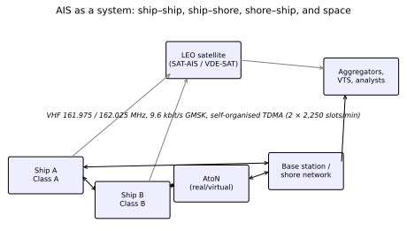

# Chapter 1 — What AIS is — and is not

> **Part I — Why AIS? Uses and users.** Orientation and foundation for the universal maritime broadcast network that connects ships, shore authorities, and orbital constellations.

**In this chapter.** You will learn what the Automatic Identification System (AIS) is and how its operational architecture functions across maritime domains. We define the technical core of AIS: a cooperative, unauthenticated, broadcast, self-organized time-division multiple access radio network operating in the VHF maritime mobile band. You will master the three foundational purposes laid down by the International Maritime Organization—ship-to-ship collision avoidance, littoral coastal surveillance, and vessel traffic services—and confront the strict operational boundaries of what AIS cannot do. We walk through the major equipment classes, surveying Class A transceivers, Class B variants, fixed and virtual aids to navigation, search and rescue transmitters, and base stations. You will examine the specific dynamic, static, and voyage-related data fields broadcast across the VHF data link, their mandatory reporting cadences, and the physical constraints of autonomous transmission. Finally, you will learn how to inspect, decode, and validate real AIS message streams.

## 1.1 The system picture

The **Automatic Identification System** (**AIS**) is an autonomous, continuous, broadcast transponder system operating in the maritime very high frequency (**VHF**) mobile band. Ships equipped with AIS continuously broadcast their identity, position, course, speed, and voyage parameters, while simultaneously listening for broadcasts transmitted by all other AIS-equipped stations within line-of-sight radio range. 

At its foundational level, AIS operates without a central coordinator, cellular base station master, or ground controller. Ships negotiate channel access directly with one another over the radio link. At the same time, the AIS ecosystem encompasses shore-based infrastructure, search and rescue aircraft, aids to navigation, and low Earth orbit satellite constellations.



As illustrated in the system overview above, the operational environment is organized into four complementary operational pathways:

1. **Ship-to-ship link (tactical collision avoidance):** Vessels exchange dynamic motion data autonomously. When two ships approach each other in open water or restricted channels, their transponders exchange real-time navigational vectors without manual operator intervention. This exchange provides watch officers on the bridge with target identification, calculated closest point of approach (**CPA**), and time to closest point of approach (**TCPA**), even when optical line of sight is obscured by fog, squalls, or coastal topography.
2. **Ship-to-shore link (traffic monitoring and surveillance):** Shore-based receiver networks operated by coast guards, port authorities, and Vessel Traffic Services (**VTS**) capture vessel transmissions to build continuous maritime domain awareness pictures across national territorial waters and Exclusive Economic Zones (**EEZs**).
3. **Shore-to-ship link (marine information broadcast and traffic management):** Authorized shore stations broadcast critical navigational safety data back to ships. These transmissions include synthetic or virtual Aids to Navigation (**AtoN**), meteorological and hydrographic conditions, tidal windows, and channel management directives.
4. **Satellite uplink (global tracking):** Receivers aboard low Earth orbit (**LEO**) satellites detect surface VHF broadcasts, capturing vessel movements across the open oceans where terrestrial coastal VHF line of sight cannot reach.

Underpinning these links is a rigorous definition that must govern every technical analysis of the system:

**Rule of thumb.** AIS is a cooperative, unauthenticated, broadcast, self-organized TDMA radio network. If an operational requirement demands guaranteed message delivery, non-repudiation of transmitter identity, cryptographic proof of location, or detection of non-cooperative targets, AIS cannot be the primary system.

This definition establishes the core characteristics of the protocol:
- **Cooperative:** A vessel appears on the network only if it carries an operating transponder configured to transmit data derived from its onboard positioning sensors.
- **Unauthenticated:** The RF bursts carry no digital signatures, cryptographic hashes, or transmission authentication tags. Any station can broadcast any message payload or identity code.
- **Broadcast:** Transmissions are sent in the clear across omnidirectional RF channels. Any standard receiver within radio horizon can intercept and decode the packets.
- **Self-organized:** The primary station class (Class A) uses Self-Organizing Time Division Multiple Access (**SOTDMA**) to synchronize time slots autonomously using Global Navigation Satellite System (**GNSS**) timing, resolving channel contention without central network management.

## 1.2 The three original purposes

When the Maritime Safety Committee (**MSC**) of the International Maritime Organization (**IMO**) codified the international performance standards for AIS in Resolution MSC.74(69), Annex 3 (adopted 12 May 1998), it established three specific operational purposes in Clause 1.2:

```
1.2 The AIS should improve the safety of navigation by assisting in the efficient
    navigation of ships, protection of the environment, and operation of
    Vessel Traffic Services (VTS), by satisfying the following operational requirements:
    .1 in a ship-to-ship mode for collision avoidance;
    .2 as a means for littoral States to obtain information about a ship and its cargo; and
    .3 as a VTS tool, i.e. ship-to-shore (traffic management).
```

These three statutory pillars—further confirmed under Regulation 19.2.4.5 of Chapter V of the International Convention for the Safety of Life at Sea (**SOLAS**)—shaped every design choice of the physical, data link, and presentation layers:

### 1.2.1 Ship-to-ship collision avoidance
Before AIS, radar and visual watchkeeping were the sole automated or semi-automated means of tactical collision avoidance at sea. Radar tracking systems such as Automatic Radar Plotting Aids (**ARPA**) rely on reflected RF energy. ARPA requires multiple antenna sweeps—typically thirty to ninety seconds of stable tracking—to compute a tracked target's speed over ground (**SOG**) and course over ground (**COG**). Furthermore, when a target alters helm or engine speed, ARPA exhibits filter lag before the vector update reflects the maneuver. Target swap can occur if two contacts pass in close proximity or enter heavy sea clutter.

AIS supplies direct sensor-to-sensor data. When a vessel initiates a turn, its gyrocompass or heading sensor updates the transmitted heading and Rate of Turn (**ROT**) fields immediately. The receiving vessel's Electronic Chart Display and Information System (**ECDIS**) or radar display plots the maneuver within seconds. Furthermore, AIS resolves bridge-to-bridge VHF radio calling ambiguity by broadcasting the vessel's official name, call sign, and Maritime Mobile Service Identity (**MMSI**), replacing ambiguous voice calls such as "vessel on my port bow" with direct identification (detailed in [Chapter 3](ch03-at-sea-operations.md)).

### 1.2.2 Littoral state surveillance and cargo reporting
Littoral states require visibility into dangerous cargoes traversing their coastal waters. Clause 1.2.2 establishes AIS as a mechanism for coastal authorities to identify ships and ascertain cargo classifications automatically. Rather than requiring mariners to conduct labor-intensive voice check-ins over VHF voice radio at every territorial boundary, the transponder periodically transmits static dimensions, vessel type, draught, and hazardous cargo status.

### 1.2.3 Vessel Traffic Services (VTS)
Port approaches, converging traffic lanes, and narrow straits require coordinated traffic management. Clause 1.2.3 designated AIS as an operational tool for VTS centers, defined under IMO Resolution A.1158(32) (superseding the historical Resolution A.857(20)). Shore operators integrate AIS with coastal surveillance radar, tracking vessels beyond radar obstructions, identifying radar targets automatically, and issuing routing advisories or speed directives to enforce traffic separation schemes (analyzed in [Chapter 4](ch04-vts-and-ports.md)).

## 1.3 What AIS cannot do

The widespread integration of AIS into modern ECDIS workstations, web mapping portals, and commodity tracking dashboards frequently engenders a false sense of comprehensive situational awareness. Both navigators on ship bridges and data analysts ashore must understand the strict physical and protocol boundaries of what AIS is fundamentally incapable of doing.

> **Definitions that bite.** AIS target vs. Radar target. An AIS target is an unauthenticated radio broadcast from a transmitting entity stating where it claims to be. A radar target is an objective electromagnetic echo indicating the physical presence of a reflective mass. Confusing the two, or assuming an absence of an AIS target equates to a clear channel, has caused fatal collisions.

```
+---------------------------+-----------------------------------+-----------------------------------+
| Capability Dimension      | AIS (VHF Transponder)             | Radar / ARPA (Primary Sensor)     |
+---------------------------+-----------------------------------+-----------------------------------+
| Cooperative requirement   | Yes: requires active, operating   | No: detects any physical object   |
|                           | transponder connected to sensors  | with sufficient radar cross-sect. |
+---------------------------+-----------------------------------+-----------------------------------+
| Identity verification     | Self-reported by transmitter;     | None inherent; requires manual or |
|                           | unauthenticated and unencrypted   | algorithmic association           |
+---------------------------+-----------------------------------+-----------------------------------+
| Positional integrity      | Dependent on GNSS receiver input  | Independent geometric measurement |
|                           | and manual antenna offsets        | of range and bearing from own ship|
+---------------------------+-----------------------------------+-----------------------------------+
| Small craft detection     | Poor: leisure craft, skiffs, and  | Variable: limited by target size  |
|                           | wooden vessels rarely carry AIS   | and sea clutter, but independent  |
+---------------------------+-----------------------------------+-----------------------------------+
| Delivery guarantee        | None: unacknowledged RF broadcast;| High: continuous sweep scanning   |
|                           | vulnerable to packet collision    | refreshed every antenna rotation  |
+---------------------------+-----------------------------------+-----------------------------------+
| Maneuver latency          | Near-instantaneous heading / ROT  | Tracking filter lag: 30-90 s      |
|                           | direct from internal sensors      | to stabilize vector calculation   |
+---------------------------+-----------------------------------+-----------------------------------+
```

### 1.3.1 AIS is not primary radar
AIS cannot detect non-cooperative targets. Wooden sailing vessels, fiberglass skiffs, non-mandated fishing boats, naval warships operating under tactical EMCON (emission control), navigation buoys without transponders, floating debris, container loss hazards, and icebergs emit no AIS signals. Navigators who configure bridge alarms to filter out non-AIS targets, or who navigate solely by AIS overlay on ECDIS, violate Rule 5 (Look-out) and Rule 7 (Risk of Collision) of the International Regulations for Preventing Collisions at Sea (**COLREGs**).

As stated in the IMO operational guidelines adopted under Resolution A.1106(29), Paragraph 36:
> "The accuracy of AIS information received is only as good as the accuracy of the AIS information transmitted."

Paragraph 37 further cautions:
> "Incorrect information about one ship displayed on the bridge of another could be dangerously confusing."

### 1.3.2 AIS is completely unauthenticated
At the physical and link layers defined in Recommendation ITU-R M.1371, AIS packets possess zero cryptographic authentication or non-repudiation features. There is no public key infrastructure (**PKI**), no symmetric message authentication code (**MAC**), and no cryptographic timestamping on the standard VHF channels. 

Consequently:
- Any software-defined radio (**SDR**) or rogue transponder can transmit packets claiming any MMSI, IMO number, vessel name, or call sign.
- Positions can be spoofed trivially to project phantom vessels ("ghost ships") across ECDIS displays or shore tracking dashboards.
- Dynamic fields such as speed, course, and navigational status can be forged without detection by the link-layer protocol.
- Channel management commands (Message 22) can theoretically be abused by malicious transmitters to force transponders onto alternate frequencies or command quiet zones (examined in [Chapter 61](ch61-timing-and-network-attacks.md)).

### 1.3.3 AIS does not guarantee packet delivery
AIS is an unacknowledged broadcast protocol. While certain point-to-point interrogation and acknowledgment messages exist in the technical catalog (such as Message 7 and Message 13), the core dynamic position reports (Messages 1, 2, 3, 18, and 19) are broadcast omnidirectionally without transmission acknowledgments. 

In congested waters—such as the Singapore Strait, the English Channel, or the Pearl River Delta—the VHF data link can reach slot saturation. When two vessels transmit in the same time slot within radio range of a receiver, packet collision occurs, causing cyclic redundancy check (**CRC**) failures at the receiver demodulator. Furthermore, atmospheric propagation anomalies, co-channel interference from coastal industrial installations, antenna shadowing during vessel rolling, and radio frequency desensitization during own-ship transmission routinely induce burst packet losses.

> **Threat model.** Unauthenticated VHF broadcasts.
> - **Attacker:** Any entity possessing an inexpensive Software Defined Radio (SDR) and power amplifier, or an altered commercial transponder.
> - **Capability:** Transmission of arbitrary bit sequences on maritime VHF channels AIS 1 (161.975 MHz) and AIS 2 (162.025 MHz), spoofing valid MMSIs and geographic coordinates.
> - **Impact:** Injection of false maritime contacts into ECDIS and VTS radar displays, disruption of collision assessment algorithms, and spoofing of search and rescue distress beacons.
> - **Mitigation:** Tactical sensor fusion; cross-verification of every AIS contact against raw radar reflectivity echoes and optical visual bearings before making navigational maneuvers; link-layer sanity filtering ashore.

## 1.4 Station classes at a glance

To accommodate diverse maritime operational environments, cost profiles, and power budgets, the ITU and IEC established a hierarchy of station classes. Each class is engineered to balance transmission priority, RF output power, receiver capability, and reporting frequency.

```
+--------------------+---------------------+------------------+---------------------+-------------------+
| Station Class      | Governing Standard  | RF Power Output  | Access Scheme       | Typical Platform  |
+--------------------+---------------------+------------------+---------------------+-------------------+
| Class A            | IEC 61993-2         | 12.5 W / 1 W     | SOTDMA              | Commercial ships, |
|                    | ITU-R M.1371 Annex 2|                  |                     | SOLAS vessels     |
+--------------------+---------------------+------------------+---------------------+-------------------+
| Class B "SO"       | IEC 62287-2         | 5 W / 1 W        | SOTDMA              | Yachts, workboats,|
|                    | ITU-R M.1371 Annex 2|                  |                     | fishing vessels   |
+--------------------+---------------------+------------------+---------------------+-------------------+
| Class B "CS"       | IEC 62287-1         | 2 W conducted    | CSTDMA              | Recreational craft|
|                    | ITU-R M.1371 Annex 6|                  |                     |                   |
+--------------------+---------------------+------------------+---------------------+-------------------+
| Base Station       | IEC 62320-1         | 12.5 W / 2 W     | Fixed / FATDMA      | Shore VTS centers,|
|                    | ITU-R M.1371 Annex 2|                  |                     | coast guard towers|
+--------------------+---------------------+------------------+---------------------+-------------------+
| AIS AtoN           | IEC 62320-2         | 12.5 W / 5 W / 2W| FATDMA / RATDMA     | Buoys, lighthouses|
|                    | ITU-R M.1371 Annex 2|                  |                     | virtual hazards   |
+--------------------+---------------------+------------------+---------------------+-------------------+
| AIS-SART / MOB     | IEC 61097-14        | 1 W e.i.r.p.     | Burst transmission  | Life rafts, EPIRBs|
|                    | ITU-R M.1371 Annex 8|                  |                     | personal beacons  |
+--------------------+---------------------+------------------+---------------------+-------------------+
```

### 1.4.1 Class A transceivers
Class A equipment is mandatory for all vessels subject to the IMO SOLAS carriage mandate. Operating at a default power of 12.5 W (switchable down to 1 W), a Class A unit contains one VHF transmitter, two dedicated TDMA receivers tuned to 161.975 MHz (**AIS 1**) and 162.025 MHz (**AIS 2**), and one internal GNSS receiver for time synchronization. It connects to external shipboard heading sensors (gyrocompass or satellite compass), speed logs, and the ship's primary Electronic Position Fixing System (**EPFS**). Class A transceivers feature a Minimum Keyboard and Display (**MKD**) and provide bidirectional IEC 61162 / NMEA 0183 high-speed interfaces (38,400 baud) for connection to the ship's ECDIS, radar, and Voyage Data Recorder (**VDR**).

### 1.4.2 Class B transceivers
Developed to provide voluntary or domestically mandated tracking for recreational craft, small commercial vessels, and artisanal fishing fleets without congesting the commercial VHF data link, Class B equipment exists in two distinct technical variants:
1. **Class B "CS" (Carrier-Sense TDMA):** Governed by IEC 62287-1 and M.1371 Annex 6. Class B CS devices transmit at 2 W conducted power. They do not pre-reserve time slots. Instead, they listen within a 1,146 µs carrier-sense window immediately preceding a time slot; if the slot is occupied by a Class A or base station transmission, the unit defers. Class B CS units yield priority to commercial shipping.
2. **Class B "SO" (Self-Organizing TDMA):** Governed by IEC 62287-2 and M.1371 Annex 2. Class B SO units transmit at 5 W, reserve future slots using SOTDMA identical to Class A, and achieve reporting intervals as rapid as five seconds when sailing at high speed. They bridge the gap between commercial transponders and low-power recreational units.

### 1.4.3 Base stations
Fixed coastal base stations operate under IEC 62320-1 at 12.5 W. In addition to monitoring marine traffic, base stations serve as regional master controllers. They transmit Message 4 (Base Station Report) to provide direct UTC timing references, broadcast Message 20 (Data Link Management) to reserve fixed slot blocks (FATDMA) for local repeaters or aids to navigation, and transmit Message 22 to command mobile stations to shift to designated regional operating frequencies.

### 1.4.4 Aids to Navigation (AtoN)
AIS AtoN transponders mark navigation hazards, lighthouses, and channel boundaries using Message 21 or the newer Message 28. These devices manifest across three operational configurations:
- **Physical AtoN:** The AIS transmitter is physically mounted directly on the buoy or lighthouse structure.
- **Synthetic AtoN:** The aid physically exists in the water, but the AIS transmission originates from a remote shore base station.
- **Virtual AtoN:** No physical marker exists in the water; the base station transmits coordinates to ECDIS displays indicating an uncharted shoal, new wreck, or temporary exclusion zone (analyzed in [Chapter 68](ch68-special-purpose-ais.md)).

### 1.4.5 Search and Rescue Locating Devices (AIS-SART, MOB, EPIRB-AIS)
Emergency locating beacons operate under ITU-R M.1371 Annex 8 and IEC 61097-14 at 1 W equivalent isotropically radiated power (**e.i.r.p.**). Rather than participating in regular TDMA slot reservation networks, these units employ a deliberate burst transmission mode. Upon manual activation or water immersion, the beacon fires a burst of eight identical position reports (Message 1) and safety text messages (Message 14) within a single minute, cycling across both AIS frequencies. This burst pattern maximizes the probability of at least one packet penetrating congested local radio traffic to reach search vessels or rescue aircraft.

## 1.5 What a ship broadcasts

An operating Class A ship transponder broadcasts four distinct categories of data across the VHF link, summarized in the table below:

```
+--------------------+------------------------------------------+-----------------------+-------------------+
| Category           | Specific Parameters Broadcast            | Sensor Source         | Update Interval   |
+--------------------+------------------------------------------+-----------------------+-------------------+
| Dynamic Data       | Position (Lat/Lon), Timestamp (sec),     | Internal/external     | 2 s to 3 min      |
|                    | SOG, COG, Heading, Rate of Turn (ROT),   | GNSS, Gyrocompass,    | depending on speed|
|                    | Navigational Status                      | Rate of turn sensor   | and course changes|
+--------------------+------------------------------------------+-----------------------+-------------------+
| Static Data        | MMSI, IMO Number, Call Sign, Name,       | Ship documentation,   | Every 6 minutes   |
|                    | Type of Ship, Length and Beam,           | programmed into unit  | or upon request   |
|                    | Location of GNSS antenna reference point | during installation   |                   |
+--------------------+------------------------------------------+-----------------------+-------------------+
| Voyage Data        | Draught, Hazardous Cargo Indicator,      | Manual input by bridge| Every 6 minutes   |
|                    | Destination, Estimated Time of Arrival   | watch officers via    | or when amended   |
|                    | (ETA), Persons on Board (optional ASM)   | transponder MKD       |                   |
+--------------------+------------------------------------------+-----------------------+-------------------+
| Safety-Related     | Freeform text safety alerts, navigation  | Manual or VTS entry;  | As required       |
| Text Messages      | warnings, search and rescue notices      | Messages 12 and 14    | (event-driven)    |
+--------------------+------------------------------------------+-----------------------+-------------------+
```

### 1.5.1 Dynamic reports (Messages 1, 2, and 3)
Dynamic reports broadcast the physical kinematic state of the vessel in real time. Coordinates are encoded with a precision of 1/10,000 of an arc-minute ($0.0001'$ or approximately $0.185\text{ m}$ of latitude). The reporting cadence for Class A vessels under IMO Resolution A.1106(29) is governed strictly by the ship's speed and operational maneuvering:

- **Ship at anchor or moored (not moving $>3\text{ kn}$):** Every 3 minutes.
- **Ship at anchor or moored (moving $>3\text{ kn}$):** Every 10 seconds.
- **Ship under way at 0–14 knots:** Every 10 seconds.
- **Ship under way at 0–14 knots and changing course:** Every $3\frac{1}{3}$ seconds.
- **Ship under way at 14–23 knots:** Every 6 seconds.
- **Ship under way at 14–23 knots and changing course:** Every 2 seconds.
- **Ship under way $>23$ knots:** Every 2 seconds.
- **Ship under way $>23$ knots and changing course:** Every 2 seconds.

### 1.5.2 Static and voyage-related data (Message 5)
Every six minutes, or immediately upon manual modification, the transponder broadcasts Message 5, spanning two consecutive time slots (424 bits). Static fields include the ship's 9-digit MMSI, official 7-digit IMO ship identification number, international radio call sign (up to 7 characters), vessel name (up to 20 characters), and dimensions. 

Crucially, Message 5 specifies the exact antenna location relative to the ship's physical perimeter (dimensions A, B, C, and D in meters: distances from the GNSS antenna to the bow, stern, port side, and starboard side). Without correct antenna offsets, an ECDIS rendering a 400-meter container vessel will miscalculate the physical position of the ship's bow relative to a narrow fairway by several hundred meters.

Voyage data fields include the current maximum static draught (measured in decimeters up to 25.5 m), the international hazardous cargo category, destination (up to 20 alphanumeric characters), and estimated time of arrival encoded as month, day, hour, and minute in UTC.

## 1.6 "On the wire" — A first look at NMEA sentences

A marine receiver or onboard transponder outputs its decoded bitstreams to connected bridge systems or processing computers over RS-422 serial lines or local network UDP multicasts using standardized sentences defined in IEC 61162-1 and NMEA 0183. The most common encapsulation format for incoming RF traffic is the `!AIVDM` sentence (VHF Data-link Message), while a vessel's own transmitted reports are encapsulated as `!AIVDO`.

> **On the wire.** Inspecting a live Message 1 dynamic position report.
> 
> ```
> !AIVDM,1,1,,A,15MwpU@01prtlJ0H9J@<Can00000,0*27
> ```
> 
> We deconstruct this NMEA 0183 sentence field by field:
> - `!AIVDM`: Talker identifier and sentence formatter (`AI` = Mobile AIS station; `VDM` = received VHF data link message).
> - `1`: Total sentence count for this message packet (single-sentence packet).
> - `1`: Sentence number (fragment 1 of 1).
> - ``: Sequential message identifier (null because this packet requires no multi-sentence assembly).
> - `A`: VHF radio channel over which the burst was received (`A` = AIS 1 at 161.975 MHz; `B` = AIS 2 at 162.025 MHz).
> - `15MwpU@01prtlJ0H9J@<Can00000`: Armored 6-bit ASCII payload representing the binary bitstream.
> - `0`: Number of fill bits appended to make the binary stream a multiple of 6 bits.
> - `*27`: NMEA XOR checksum delimiter and hexadecimal checksum value (`0x27`).

```
Six-bit ASCII Payload Decoding:
Character:   1      5      M      w      p      U      @      0      1      p      ...
ASCII Val:  49     53     77    119    112     85     64     48     49    112     ...
6-bit Dec:   1      5     29     55     48     21      0      0      1     48     ...
Binary:   000001 000101 011101 110111 110000 010101 000000 000000 000001 110000 ...

Bit Layout Extraction:
- Bits 0-5 (Message ID):       000001 = 1 (Position Report Class A, SOTDMA)
- Bits 6-7 (Repeat Indicator): 00 = 0 (Default, no repeat)
- Bits 8-37 (MMSI):            30-bit integer = 366999701 (US flagged vessel)
- Bits 38-41 (Nav Status):     0000 = 0 (Under way using engine)
- Bits 42-49 (Rate of Turn):   00000000 = 0 deg/min
- Bits 50-59 (SOG):            0001111000 = 120 (12.0 knots)
- Bits 60-60 (Position Acc):   1 (High accuracy, DGNSS / differential GNSS < 10 m)
- Bits 61-88 (Longitude):      28-bit signed integer = -42360000 (-70.6000 deg W)
- Bits 89-115 (Latitude):      27-bit signed integer = 25320000 (42.2000 deg N)
- Bits 116-127 (COG):          12-bit integer = 3150 (315.0 degrees)
- Bits 128-136 (True Heading): 9-bit integer = 315 (315 degrees)
- Bits 137-142 (Timestamp):    000000 = 0 seconds UTC
```

You can test and decode these sentences directly using the open-source `pyais` library:

> **Try it.** Decode an AIS sentence in Python.
> 
> ```python
> from pyais import decode
> 
> line = "!AIVDM,1,1,,A,15MwpU@01prtlJ0H9J@<Can00000,0*27"
> msg = decode(line)
> print(f"MMSI:     {msg.mmsi}")
> print(f"Type:     Message {msg.msg_type}")
> print(f"Position: {msg.lat:.4f} N, {msg.lon:.4f} W")
> print(f"Speed:    {msg.speed} knots")
> print(f"Heading:  {msg.heading} deg")
> ```
> 
> Expected output:
> ```text
> MMSI:     366999701
> Type:     Message 1
> Position: 42.2000 N, -70.6000 W
> Speed:    12.0 knots
> Heading:  315 deg
> ```

> **Legal note.** Maritime radio transmission laws. While intercepting, receiving, and decoding AIS VHF transmissions from shore, ship, or satellite is entirely lawful and unregulated in almost all global jurisdictions (with specific national data redistribution exceptions such as China's 2021 Data Security Law), transmitting on maritime VHF channels AIS 1 and AIS 2 without a valid statutory ship radio station license, FCC/national type-approved equipment, and an officially assigned MMSI is a violation of domestic communications law (e.g., 47 CFR Part 80 in the United States). Operating software-defined radios to inject transmissions on 161.975 MHz or 162.025 MHz carries severe criminal penalties, substantial regulatory fines, and vessel detention.

## Then & now

- ⟨H⟩ 1912 — Sinking of the RMS *Titanic* exposes catastrophic gaps in maritime safety communications.
- ⟨H⟩ 1914 — First International Convention for the Safety of Life at Sea (**SOLAS**) adopted.
- ⟨H⟩ 1984 — NMEA 0183 standard first released, establishing serial marine instrument interfacing.
- ⟨+⟩ 1991 — Håkan Lans files Swedish patent applications SE 9102034 (1 July 1991) and SE 9103542 (28 November 1991) for STDMA transponder architectures.
- ⟨+⟩ 1993 — Swedish Maritime Administration conducts real-world trials of the "4S" system on Lake Vänern and Styrsöbolaget ferries using modified NorControl VTS displays.
- ⟨H⟩ 1998 — Recommendation ITU-R M.1371-0 approved in November 1998, establishing the first global technical specification for maritime VHF AIS.
- ⟨+⟩ 1998 — IMO adopts Resolution MSC.74(69), Annex 3 (12 May 1998), establishing global performance standards for universal shipborne AIS.
- ⟨+⟩ 2000 — IMO Resolution MSC.99(73) (5 December 2000) formally revises SOLAS Chapter V, establishing the Regulation 19.2.4 AIS carriage mandate.
- ⟨+⟩ 2002 — Revised SOLAS Chapter V enters into force on 1 July 2002. Following the September 11 terrorist attacks, the IMO Diplomatic Conference on Maritime Security (December 2002) adopts Conference Resolution 1, accelerating international cargo carriage deadlines to not later than 31 December 2004.
- ⟨+⟩ 2006 — IEC 62287-1 standardizes Class B Carrier-Sense TDMA (CSTDMA) for non-SOLAS recreational and artisanal craft.
- ⟨+⟩ 2007 — IMO adopts Resolution MSC.246(83), approving AIS search and rescue transmitters (AIS-SART) as SOLAS-compliant locating devices from 1 January 2010.
- ⟨+⟩ 2008 — First spaceborne reception of maritime AIS signals from orbit achieved by Canada's NTS satellite (CanX-6, launched 28 April 2008).
- ⟨H⟩ 2010 — Kurt Schwehr writes and releases `libais` during the *Deepwater Horizon* oil spill response to process dense maritime vessel operations.
- ⟨+⟩ 2015 — IMO adopts Resolution A.1106(29), updating operational guidelines and clarifying Class B intervals and master switch-off discretion.
- ⟨H⟩ 2016 — Global Fishing Watch launched, scaling cloud-based big-data spatial analytics across tens of billions of global satellite and terrestrial AIS messages.
- ⟨+⟩ 2026 — Recommendation ITU-R M.1371-6 approved (February 2026), restructuring annexes, deprecating DSC channel management, and adding single-slot Message 28 for advanced Aids to Navigation.

## Validation, uncertainty & data quality

Because AIS relies on manual human configuration and external bridge sensor feeds, incoming data streams contain persistent errors, missing parameters, and systemic bias. Data engineers, accident investigators, and watch officers must apply rigorous validation checks:

### Error taxonomy and propagation
1. **Unconfigured and default MMSIs:** Factory transponders default to dummy IDs such as `000000000`, `111111111`, `123456789`, or `1193046`. In multi-receiver aggregation pipelines, tens of unrelated small craft sharing a factory default MMSI will interleave into an impossible, worldwide teleporting track.
2. **Missing sensor sentinels:** When an external gyrocompass or rate of turn sensor is disconnected or defective, the transponder transmits standardized "not available" bit sentinels:
   - Heading: `511` ($0\text{x}1\text{FF}$)
   - SOG: `1023` ($0\text{x}3\text{FF}$)
   - COG: `3600` ($0\text{x}E10$)
   - Rate of Turn: `-128` ($0\text{x}80$)
   - Longitude: $181^\circ$ (`0x6791AC0`)
   - Latitude: $91^\circ$ (`0x3412140`)
   Downstream software that fails to filter these sentinels will compute wild speed averages or plot vessels at the North Pole.
3. **Manual static data corruption:** IMO numbers, vessel names, and vessel dimensions are hand-keyed by installers or bridge crew. Typographical errors in Message 5 dimensions regularly swap the ship's beam and length or invert the antenna bow/stern offsets.
4. **Stale voyage status:** Bridge officers frequently forget to update navigational status when shifting from anchor to under way, or fail to edit destination and draught upon clearing port.

> **Worked example.** Identifying an unphysical track jump via kinematic sanity filtering.
> 
> Consider two consecutive position reports received ashore for a cargo vessel ($300\text{ GT}$):
> - **Report 1 ($T_1 = 14\text{:}10\text{:}00\text{ UTC}$):** Lat $42.2000^\circ\text{ N}$, Lon $-70.6000^\circ\text{ W}$, $\text{SOG} = 12.0\text{ kn}$.
> - **Report 2 ($T_2 = 14\text{:}10\text{:}30\text{ UTC}$):** Lat $42.2250^\circ\text{ N}$, Lon $-70.6400^\circ\text{ W}$.
> 
> We evaluate the physical feasibility of this movement:
> 1. Calculate elapsed time:
>    $$\Delta t = 30\text{ seconds} = \frac{30}{3600}\text{ hr} = 0.00833\text{ hr}$$
> 2. Calculate spherical or planar distance:
>    $$\Delta \text{Lat} = 0.0250^\circ = 0.0250 \times 60\text{ nmi} = 1.50\text{ nmi}$$
>    $$\Delta \text{Lon} = -0.0400^\circ \implies \Delta \text{East} = -0.0400 \times \cos(42.2^\circ) \times 60\text{ nmi} \approx -0.0400 \times 0.7408 \times 60 = -1.778\text{ nmi}$$
>    $$d = \sqrt{(1.50)^2 + (-1.778)^2} = \sqrt{2.25 + 3.16} = \sqrt{5.41} \approx 2.326\text{ nmi}$$
> 3. Calculate required implied velocity over ground:
>    $$V_{\text{implied}} = \frac{d}{\Delta t} = \frac{2.326\text{ nmi}}{0.00833\text{ hr}} \approx 279\text{ knots}$$
> 
> Because commercial cargo ships cannot achieve 279 knots, this packet must be rejected as an erroneous position jump (caused by an uncorrected GPS glitch, a multi-path reflection error, or an interleaved transmission from a second vessel sharing a duplicate MMSI).

## Software

**Open source:**
- `pyais` (Python): Pure-Python decoder supporting single- and multi-sentence AIVDM/AIVDO encapsulation, handling Messages 1–27. Caveat: Python interpretation overhead limits raw throughput when processing multi-gigabyte historical archive files.
- `libais` (C++ with Python bindings): High-performance decoding library originally created by Kurt Schwehr in 2010 during the Deepwater Horizon response. Caveat: Does not parse raw NMEA multi-sentence assembly automatically; requires pre-assembled payload strings.
- `AIS-catcher` (C++): Fast SDR receiver and demodulator for RTL-SDR, Airspy, and HackRF hardware with built-in JSON/NMEA streaming. Caveat: Highly optimized demodulation consumes significant CPU when multi-channel decoding across high-sample-rate SDR interfaces.
- `gpsd` (C): System daemon that monitors GPS, AIS, and marine sensors, outputting structured JSON streams over local sockets. Caveat: Extensive multi-sensor abstractions add configuration complexity for standalone AIS collection tasks.

**Free but closed:**
- `ShipPlotter` (Windows): Veteran coastal decoding and plotting utility popular among hobbyist receiver stations. Caveat: Proprietary license; limited native support for modern 64-bit Linux server automation.

**Commercial:**
- `Kpler` (incorporating MarineTraffic and FleetMon): Global terrestrial and satellite vessel tracking portal and maritime intelligence platform. Caveat: High commercial subscription costs for raw high-resolution downlinks and API access.
- `Spire Maritime`: Global satellite constellation tracking provider delivering continuous low-latency AIS data feeds. Caveat: Satellite revisit latency and slot collisions in high-density choke points still produce tracking gaps in coastal archipelagos.

## Standards & guides

- **IMO Resolution MSC.74(69), Annex 3** (1998): *Recommendation on Performance Standards for an Universal Shipborne Automatic Identification System (AIS)*. Establishes the three statutory operational purposes, capability requirements, and 2,000 reports-per-minute target capacity.
- **IMO Resolution A.1106(29)** (2015): *Revised Guidelines for the Onboard Operational Use of Shipborne Automatic Identification Systems (AIS)*. Sets the definitive operational guidelines for bridge watchkeeping, master switch-off discretion, and reporting intervals.
- **IMO Resolution MSC.99(73)** (2000): Amendments to the International Convention for the Safety of Life at Sea (SOLAS Chapter V), adopting the Regulation 19.2.4 carriage mandate.
- **IMO Conference of Contracting Governments to SOLAS Resolution 1** (December 2002): Post-9/11 diplomatic conference accelerating international carriage deadlines to 31 December 2004.
- **Recommendation ITU-R M.1371-6** (2026): *Technical characteristics for an automatic identification system using time division multiple access in the VHF maritime mobile band*. Defines physical layer modulation, HDLC framing, SOTDMA/CSTDMA link-layer protocols, and message bit layouts.
- **Recommendation ITU-R M.585-10** (2026): *Assignment and use of identities in the maritime mobile service*. Governs formatting, assignment, and conservation of 9-digit MMSIs and emergency identity codes.
- **IEC 61993-2:2018 (Edition 3.0)**: *Class A shipborne equipment of the automatic identification system (AIS) — Operational and performance requirements, methods of test and required test results*. Defines mandatory type-approval laboratory testing for Class A transponders.
- **IEC 62287-1:2017 (Edition 3.0)**: *Class B shipborne equipment of the automatic identification system (AIS) — Part 1: Carrier-sense time division multiple access (CSTDMA) techniques*.
- **IEC 62287-2:2017 (Edition 2.0)**: *Class B shipborne equipment of the automatic identification system (AIS) — Part 2: Self-organising time division multiple access (SOTDMA) techniques*.
- **USCG Navigation Center AIS Guidelines & 33 CFR 164.46**: Codification of federal AIS carriage requirements, equipment operation, and reporting rules in United States navigable waters.

## Pitfalls

1. **Treating AIS as a radar replacement** → Navigators assume the electronic chart displays every approaching surface hazard → Wooden boats, skiffs, icebergs, and non-broadcasting craft are invisible to AIS → Never alter course based on AIS alone without radar confirmation or visual sighting.
2. **Trusting transmitted static voyage parameters** → Cargo analysts treat draught and destination fields as ground truth → Bridge officers frequently fail to update Message 5 parameters when departing port → Validate vessel track trajectories and berth stops rather than relying solely on raw destination strings.
3. **Failing to check GNSS antenna offsets** → Bridge displays render ship outlines offset into piers or shallow shoals → The transponder was configured with default $(0,0,0,0)$ antenna offsets in Message 5 → Ensure dimension fields A, B, C, and D reflect the true distance from the antenna to bow, stern, port, and starboard.
4. **Interpreting missing AIS targets as an absence of traffic** → Watchstanders disable radar guard zones in congested waters relying on AIS alarms → Non-mandatory vessels or vessels suffering power brownouts are omitted → Maintain continuous radar plotting and optical visual lookouts per COLREGs Rule 5.
5. **Ignoring the ROT sensor indicator** → Mathematical track predictors calculate linear vessel extrapolation while a ship is swinging into a sharp maneuver → The transponder ROT field was ignored or improperly calibrated → Integrate ROT data into short-term track extrapolation algorithms.
6. **Confusing True Heading with Course Over Ground** → Data analysts assume a vessel's hull is aligned with its track vector in high cross-currents → Ships experience leeway, crab angles, and tidal drift → Always maintain strict distinction between gyrocompass Heading (hull orientation) and GNSS COG (direction of motion).
7. **Assuming AIS broadcasts are cryptographically secure** → Port security systems trust incoming AIS positions without independent RF or radar cross-verification → Attackers with SDRs can project fabricated vessels → Implement independent multi-sensor cross-checks, Time Difference of Arrival (TDOA) verification, and radar track correlation.
8. **Neglecting multi-sentence AIVDM reassembly** → Multi-slot messages (such as Message 5 static reports) arrive split across two NMEA sentences and fail to decode → Software drops fragment 2 or mixes fragments with differing sequential IDs → Ensure the ingest pipeline matches sentence sequence IDs and fragment counts before passing strings to the bit parser.
9. **Treating satellite AIS feeds as zero-latency streams** → Automated logistics dashboards assume orbital AIS provides real-time tracking → Satellite passes exhibit orbital revisit latency and packet collision de-correlation → Account for message reception timestamps versus ingest timestamps in streaming pipelines.
10. **Failing to sanitize default and invalid MMSIs** → Analytics engines group thousands of uninitialized recreational transponders into a single impossible vessel entity → Factory-default MMSIs (`000000000`, `123456789`) are shared across un-configured transponders → Enforce strict MMSI format and country MID validation at ingest.

## Key takeaways

- AIS is an autonomous, cooperative, unauthenticated, self-organized broadcast radio network operating in the VHF maritime mobile band.
- The three statutory IMO purposes of AIS are ship-to-ship collision avoidance, littoral state surveillance, and Vessel Traffic Services (VTS).
- AIS is fundamentally not radar: it cannot detect non-cooperative vessels, floating debris, ice, or craft operating without functional transponders.
- Link-layer transmissions carry zero cryptographic authentication or encryption; coordinates, identities, and parameters can be forged by arbitrary RF emitters.
- Class A transponders operate at 12.5 W using SOTDMA; Class B units operate at 2 W (Carrier-Sense) or 5 W (SOTDMA) for small commercial and pleasure vessels.
- Dynamic vessel reports are broadcast at speed-dependent intervals ranging from 2 seconds to 3 minutes, while static and voyage data broadcast every 6 minutes.
- Transmitted data contains frequent human errors in static parameters (dimensions, draught, destination); automated processing pipelines must apply kinematic sanity filters.
- Reception of AIS broadcasts is universally lawful, but uncertified, unlicensed transmission on maritime VHF frequencies violates national and international communications laws.

## References

1. Balduzzi, M., Pasta, A. & Wilhoit, K. (2014). A Security Evaluation of AIS Automated Identification System. In *Proceedings of the 30th Annual Computer Security Applications Conference (ACSAC '14)*, pages 436–445. New Orleans, USA: ACM. doi:10.1145/2664243.2664257.
2. Cutlip, K. (2017). *AIS for Safety and Tracking: A Brief History*. Washington, DC: Global Fishing Watch. https://globalfishingwatch.org/article/ais-brief-history/ (accessed 2026-10-06).
3. Harati-Mokhtari, A., Wall, A., Brooks, P. & Wang, J. (2007). Automatic Identification System (AIS): Data Reliability and Human Error Implications. *The Journal of Navigation*, 60(3):373–389. doi:10.1017/S037346330700429X.
4. Høye, G. K., Eriksen, T., Meland, B. J. & Narheim, A. (2008). Space-based AIS for global maritime surveillance. *Acta Astronautica*, 62(2–3):240–245. doi:10.1016/j.actaastro.2007.07.001.
5. International Electrotechnical Commission (2015). *Maritime navigation and radiocommunication equipment and systems – Automatic identification systems (AIS) – Part 1: AIS Base Stations – Minimum operational and performance requirements, methods of testing and required test results* (Standard No. IEC 62320-1:2015). Edition 2.0. Geneva: IEC.
6. International Electrotechnical Commission (2017). *Maritime navigation and radiocommunication equipment and systems – Class B shipborne equipment of the automatic identification system (AIS) – Part 1: Carrier-sense time division multiple access (CSTDMA) techniques* (Standard No. IEC 62287-1:2017). Edition 3.0. Geneva: IEC.
7. International Electrotechnical Commission (2017). *Maritime navigation and radiocommunication equipment and systems – Class B shipborne equipment of the automatic identification system (AIS) – Part 2: Self-organising time division multiple access (SOTDMA) techniques* (Standard No. IEC 62287-2:2017). Edition 2.0. Geneva: IEC.
8. International Electrotechnical Commission (2018). *Maritime navigation and radiocommunication equipment and systems – Automatic Identification Systems (AIS) – Part 2: Class A shipborne equipment of the automatic identification system (AIS) – Operational and performance requirements, methods of test and required test results* (Standard No. IEC 61993-2:2018). Edition 3.0. Geneva: IEC.
9. International Maritime Organization (1998). *Recommendation on Performance Standards for an Universal Shipborne Automatic Identification System (AIS)* (Resolution MSC.74(69), Annex 3). Adopted 12 May 1998. London: IMO.
10. International Maritime Organization (2000). *Adoption of Amendments to the International Convention for the Safety of Life at Sea, 1974, as Amended (SOLAS Chapter V)* (Resolution MSC.99(73)). Adopted 5 December 2000. London: IMO.
11. International Maritime Organization (2002). *Conference Resolution 1: Adoption of Amendments to the Annex to the International Convention for the Safety of Life at Sea, 1974*. Conference of Contracting Governments to the International Convention for the Safety of Life at Sea, 1974 (9–13 December 2002). London: IMO.
12. International Maritime Organization (2015). *Revised Guidelines for the Onboard Operational Use of Shipborne Automatic Identification Systems (AIS)* (Resolution A.1106(29)). Adopted 2 December 2015. London: IMO.
13. International Telecommunication Union (2014). *Technical characteristics for an automatic identification system using time division multiple access in the VHF maritime mobile band* (Recommendation ITU-R M.1371-5). Geneva: ITU Radiocommunication Sector.
14. International Telecommunication Union (2026). *Technical characteristics for an automatic identification system using time division multiple access in the VHF maritime mobile band* (Recommendation ITU-R M.1371-6). Geneva: ITU Radiocommunication Sector.
15. International Telecommunication Union (2026). *Assignment and use of identities in the maritime mobile service* (Recommendation ITU-R M.585-10). Geneva: ITU Radiocommunication Sector.
16. Swedish Maritime Administration (2018). *AIS – How a Swedish Innovation Became a Global Standard*. Norrköping: Sjöfartsverket.
17. United States Coast Guard Navigation Center (2024). *Automatic Identification System Overview and Requirements*. Alexandria, VA: USCG NAVCEN. https://www.navcen.uscg.gov/automatic-identification-system-overview (accessed 2026-10-06).
