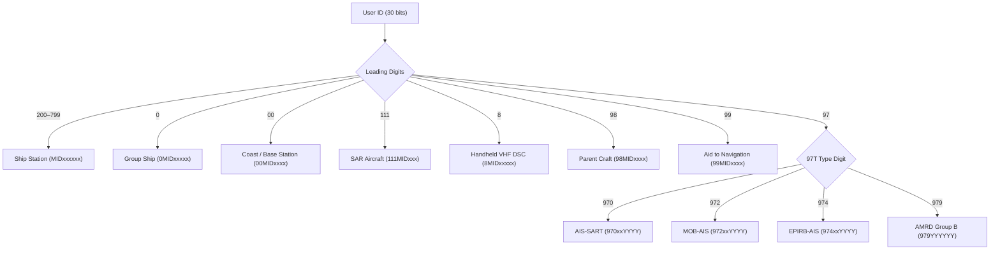
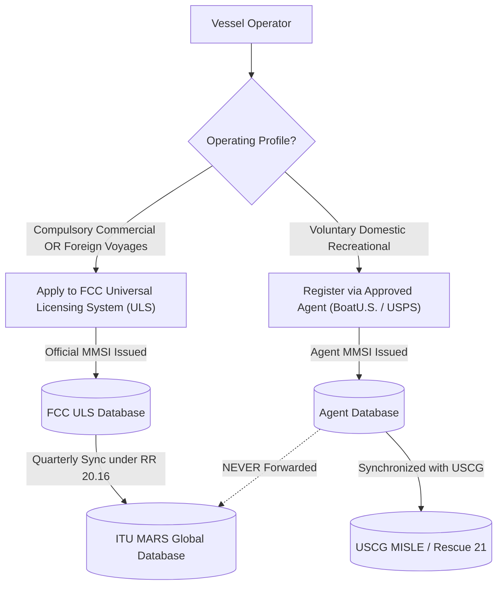
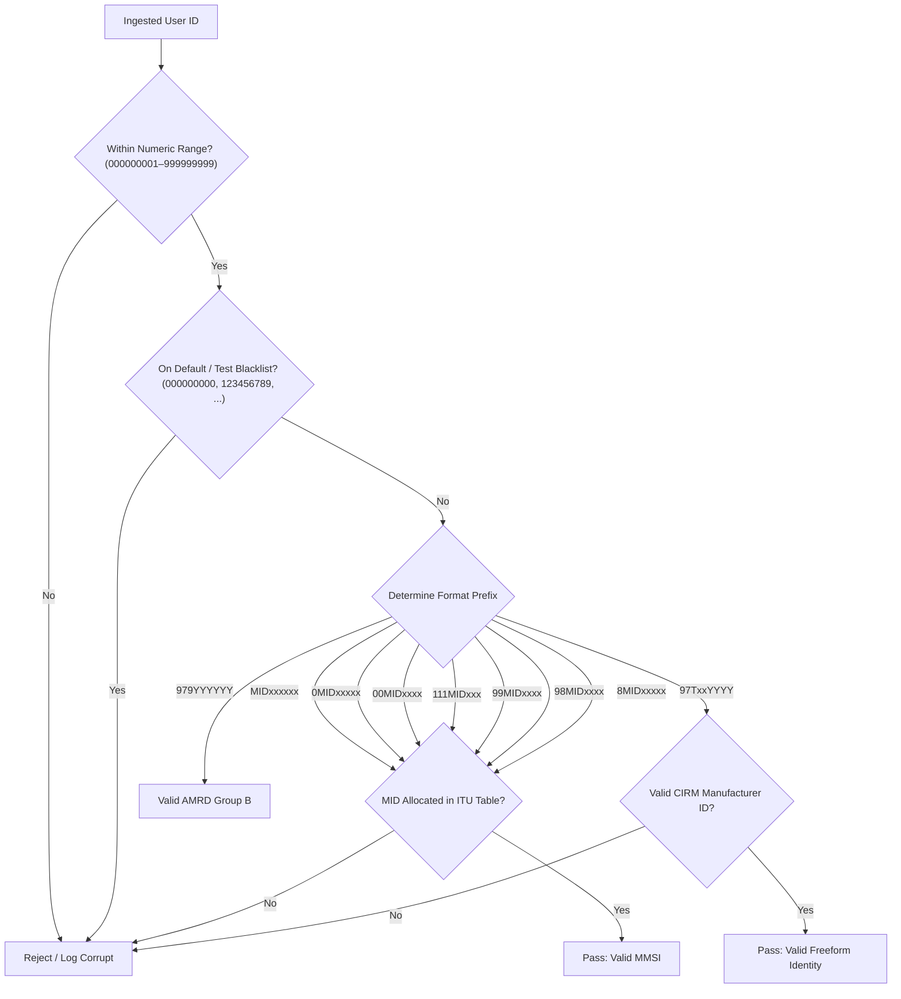

# Chapter 13 — What is an MMSI? A deep dive

> **Part III — Identity, institutions, law.** How the nine-digit Maritime Mobile Service Identity anchors digital maritime communications, why its hierarchical bit patterns partition every station on the VHF data link, and how numbering exhaustion, equipment locking, and identity fraud challenge global domain awareness.

**In this chapter.** You will learn how the Maritime Mobile Service Identity (**MMSI**) operates as the foundational identity layer for the Automatic Identification System (**AIS**) and Digital Selective Calling (**DSC**). You will dissect the technical architecture defined by Recommendation ITU-R M.585, mapping Maritime Identification Digits (**MIDs**) to flag administrations and decoding specialized numbering formats for ships, coast stations, search and rescue aircraft, aids to navigation, craft associated with parent vessels, and autonomous maritime radio devices. You will trace how national telecommunications authorities assign and manage identities, compare the FCC licensing process in the United States with recreational agent registries, and inspect the ITU Maritime mobile Access and Retrieval System (**MARS**) database. You will analyze identity collisions, default and invalid bit patterns, and mathematical distinctions separating MMSIs, IMO ship identification numbers, European Vessel Identification Numbers (**ENIs**), and radio call signs. Finally, you will implement validation algorithms and evaluate the operational threat of MMSI spoofing and identity laundering in maritime sanctions evasion.

## 13.1 Architecture of the nine-digit identity

Every digital transmission on the maritime VHF data link (**VDL**) requires an identity. Without a standardized, globally unique identifier, automated collision avoidance, digital selective calling, and coastal surveillance networks would collapse into an uncoordinated tangle of raw radio frequencies. In AIS, that identity is the **Maritime Mobile Service Identity** (**MMSI**): a nine-digit decimal number encoded directly into the bit headers of virtually every message defined in Recommendation ITU-R M.1371.

The MMSI did not originate with AIS. It was established under the International Telecommunication Union (**ITU**) Radio Regulations and Recommendation ITU-R M.585 to support automated terrestrial and satellite radiocommunications within the Global Maritime Distress and Safety System (**GMDSS**), specifically Digital Selective Calling on VHF Channel 70, medium frequency (**MF**), and high frequency (**HF**). When the International Maritime Organization (**IMO**) adopted performance standards for AIS in Resolution MSC.74(69) Annex 3 in 1998, it mandated that AIS transponders identify themselves using this established GMDSS identity rather than inventing an independent addressing scheme.

At its core, an MMSI is formatted as a nine-digit string of decimal digits:

$$D_1 D_2 D_3 D_4 D_5 D_6 D_7 D_8 D_9$$

In binary radio transmissions, this nine-digit decimal integer is broadcast as an unsigned 30-bit integer ($2^{30} = 1{,}073{,}741{,}824$, which comfortably accommodates the maximum theoretical nine-digit value $999{,}999{,}999$).

Rather than functioning as a flat serial number, the nine digits are structured hierarchically. The leading digits establish the station category, while embedded geographical prefixes identify the assigning sovereign state.

### 13.1.1 Maritime Identification Digits (MIDs)

The geographic backbone of the MMSI architecture is the **Maritime Identification Digit** (**MID**) code. A MID is a three-digit decimal sequence ($X_1 X_2 X_3$) allocated by the ITU to sovereign member administrations in accordance with the ITU Radio Regulations (Article 19) and Recommendation ITU-R M.585.

The leading digit of a MID denotes the geographic region:
- **2**: Europe (e.g., 211 Germany, 224 Spain, 226 France, 232 United Kingdom, 244 Netherlands, 257 Norway).
- **3**: North America, Central America, and Caribbean (e.g., 303 Alaska, 316 Canada, 338 United States, 351 Panama, 366 United States).
- **4**: Asia (excluding Southeast Asia) and Middle East (e.g., 412 China, 431 Japan, 440 Republic of Korea, 477 Hong Kong).
- **5**: Oceania, Southeast Asia, Australasia (e.g., 503 Australia, 512 New Zealand, 525 Indonesia, 563 Singapore).
- **6**: Africa and adjacent island territories (e.g., 601 Egypt, 636 Liberia).
- **7**: South America (e.g., 710 Brazil, 725 Chile, 730 Colombia).

When a maritime administration exhausts 80% of its assigned MID block, it may formally petition the ITU Radiocommunication Bureau for an additional MID allocation (ITU-R M.585-10, Annex 3 §1(d)). Large open registries such as Panama (holding MIDs 351–357 and 370–374) and coastal states such as the United States (303, 338, 366–369) hold multiple MIDs.

### 13.1.2 Standard ship stations

For an individual ship station, the MMSI format is:

$$\text{MID} X_4 X_5 X_6 X_7 X_8 X_9$$

The first three digits represent the vessel's flag state, where the first digit cannot be 0 or 1 ($2 \le \text{MID}[0] \le 7$). The remaining six digits ($X_4$ through $X_9$) are assigned by the national administration to the individual ship, providing a nominal capacity of $1{,}000{,}000$ identities per MID block. In early GMDSS installations, administrations reserved suffixes ending in consecutive trailing zeros for vessels with Inmarsat-A or B terminals to support telex routing.

### 13.1.3 Group ship station identities

Search and rescue authorities, shipping companies, and naval flotillas require the ability to address digital selective calls to an entire fleet simultaneously. For this purpose, ITU-R M.585 Annex 1 §2 defines the **Group Ship Station Identity**:

$$0 \text{ MID } X_5 X_6 X_7 X_8 X_9$$

A single leading zero designates the identity as a ship group call. The subsequent three digits specify the MID of the administration authorizing the group, followed by five digits assigned to the specific group.

### 13.1.4 Coast stations and port infrastructure

Shore-based infrastructure—including coastal radiotelephone stations, port authorities, Vessel Traffic Services centers, and shore AIS base stations—is identified by a prefix of two leading zeros (ITU-R M.585-10 Annex 1 §1):

$$0 0 \text{ MID } X_6 X_7 X_8 X_9$$

The two leading zeros immediately signal to decoders that the station is a fixed shore facility. The MID identifies the country where the coast station is situated. Within the remaining four digits ($X_6 X_7 X_8 X_9$), administrations frequently apply a standardized functional sub-allocation:
- $00\text{MID}1XXX$: Coast station providing public correspondence or general GMDSS watchkeeping.
- $00\text{MID}2XXX$: Port operations and harbor radio services.
- $00\text{MID}3XXX$: Pilot stations and pilot boarding services.
- $00\text{MID}4XXX$: AIS physical repeaters.
- $00\text{MID}5XXX$: AIS fixed base stations.

Special wide-area broadcast identities include $00\text{MID}0000$ (all coast stations of that administration) and $009990000$ (the universal "All Coast Stations" identity on Channel 70 DSC).

### 13.1.5 Search and rescue (SAR) aircraft

Search and rescue aircraft operate in close coordination with surface vessels. To allow SAR aircraft to communicate via DSC and broadcast positions over AIS (using Message 9, the SAR Aircraft Position Report, or Message 24), ITU-R M.585-10 Annex 1 §3 defines a dedicated pattern:

$$1 1 1 \text{ MID } X_7 X_8 X_9$$

The prefix `111` classifies the transmitter as a SAR aircraft, followed by the MID of the operating state. This architecture limits each administration to 1,000 distinct SAR aircraft identities per MID ($X_7 X_8 X_9$ from $000$ to $999$). The 7th digit ($X_7$) commonly designates airframe types: $1$ for fixed-wing aircraft and $5$ for helicopters. The identity $111\text{MID}000$ addresses all SAR aircraft of that administration.

### 13.1.6 Aids to navigation (AIS AtoN)

Aids to navigation—including floating buoys, fixed lighthouses, offshore beacons, and virtual hazard marks—broadcast data using AIS Message 21 or the single-slot Message 28. To distinguish navigational markers from navigable ships, ITU-R M.585-10 Annex 1 §4 allocates the prefix `99`:

$$9 9 \text{ MID } X_6 X_7 X_8 X_9$$

The prefix `99` indicates an **Aid to Navigation** (**AtoN**). The MID indicates the administration responsible for the mark. The sixth digit ($X_6$) provides operational distinctions: $1$ for physical floating/fixed AtoN, $6$ for virtual AtoN, and $8$ for mobile AtoN (drifting buoys or oil spill markers). Each administration possesses 10,000 discrete AtoN identities per MID.

### 13.1.7 Craft associated with a parent ship and handheld VHF

Tenders, lifeboats, and daughter craft carried aboard a larger parent vessel do not hold independent ship station licenses. ITU-R M.585-10 Annex 1 §5 provides a dedicated identity format:

$$9 8 \text{ MID } X_6 X_7 X_8 X_9$$

The prefix `98` indicates a daughter craft. In administrative practice, digits $X_6 X_7 X_8 X_9$ are derived directly from the parent ship's MMSI, enabling collision avoidance algorithms to link the daughter craft directly to its mother vessel.

For portable handheld VHF radios equipped with internal GNSS receivers and DSC emergency capability, ITU-R M.585-10 Annex 2 §1 allocates the prefix `8`:

$$8 \text{ MID } X_5 X_6 X_7 X_8 X_9$$

The leading digit `8` indicates a handheld portable transceiver. The MID reflects the country of assignment, and the remaining five digits provide an administrative capacity of 100,000 portable identities per MID.

| Station Category | Format | Capacity per MID | Standard Governing Clause | Example Identity |
|---|---|---|---|---|
| Individual ship station | $\text{MID} X_4 X_5 X_6 X_7 X_8 X_9$ | 1,000,000 | ITU-R M.585-10, Annex 1 §1 | `367300160` (US ship) |
| Group ship station | $0 \text{ MID } X_5 X_6 X_7 X_8 X_9$ | 100,000 | ITU-R M.585-10, Annex 1 §2 | `036612345` (US group) |
| Coast station / base station | $0 0 \text{ MID } X_6 X_7 X_8 X_9$ | 10,000 | ITU-R M.585-10, Annex 1 §1 | `003669739` (USCG shore) |
| All Coast Stations (VHF) | $0 0 9 9 9 0 0 0 0$ | Global (1) | ITU-R M.585-10, Annex 1 §1 | `009990000` (Universal) |
| SAR aircraft | $1 1 1 \text{ MID } X_7 X_8 X_9$ | 1,000 | ITU-R M.585-10, Annex 1 §3 | `111366123` (USCG aircraft) |
| Handheld DSC VHF | $8 \text{ MID } X_5 X_6 X_7 X_8 X_9$ | 100,000 | ITU-R M.585-10, Annex 2 §1 | `836654321` (US portable) |
| Aid to Navigation (AtoN) | $9 9 \text{ MID } X_6 X_7 X_8 X_9$ | 10,000 | ITU-R M.585-10, Annex 1 §4 | `993661001` (US physical buoy) |
| Craft of parent vessel | $9 8 \text{ MID } X_6 X_7 X_8 X_9$ | 10,000 | ITU-R M.585-10, Annex 1 §5 | `983671234` (US tender) |

> **Definitions that bite.** A nine-digit number broadcast in the 30-bit User ID field of an AIS message is colloquially called an "MMSI" across the industry, but under ITU-R M.585, numbers beginning with `97` are legally defined as **freeform maritime identities** or maritime device identities, *not* MMSI assignments. Because freeform identities are assigned directly by manufacturers using serial production runs rather than by sovereign telecommunications administrations, they do not establish nationality, cannot be registered in the ITU MARS ship station database, and do not convey flag-state jurisdiction.

## 13.2 Freeform identities: SART, MOB, EPIRB, and AMRD

Beginning in 2010 with Recommendation ITU-R M.1371-4 and subsequent revisions of M.585, the ITU introduced dedicated numbering formats for survival craft locating devices and autonomous maritime radio devices operating on AIS frequencies (161.975 MHz and 162.025 MHz).

Unlike ship station MMSIs, survival and locating devices are assigned fixed numerical codes at the factory. ITU-R M.585 Annex 2 §2 defines these **freeform identities** using the fixed two-digit prefix `97`:

$$9 7 T X_5 X_6 X_7 X_8 X_9$$

The third digit ($T$) defines the specific device type:
- **$T = 0$**: **AIS-SART** (Search and Rescue Transponder per IEC 61097-14).
- **$T = 2$**: **MOB-AIS** (Man Overboard device per ETSI EN 303 098 and RTCM 11901).
- **$T = 4$**: **EPIRB-AIS** (Emergency Position Indicating Radio Beacon incorporating an AIS homing transmitter per IEC 61097-2).
- **$T = 9$**: **AMRD Group B** (Autonomous Maritime Radio Devices not related to safety of navigation per ITU-R M.2135).

Digits $X_5$ and $X_6$ represent a two-digit **manufacturer identification code** ($01$–$99$, with $00$ reserved for testing), coordinated through the Comité International Radio-Maritime (**CIRM**). The final four digits ($X_7 X_8 X_9 X_{10}$) represent a sequential serial number ($0000$–$9999$).



### 13.2.1 The 12-character extended identity

With only four decimal digits allocated to the serial number ($0000$–$9999$), a manufacturer producing more than 10,000 units would exhaust its serial space. To overcome this limitation without altering the 30-bit User ID field in AIS position reports, the ITU introduced a **12-character extended identity** structure in Recommendation ITU-R M.585-9 and reaffirmed it in M.585-10:

$$9 7 T X_5 X_6 M P_1 P_2 Y_1 Y_2 Y_3 Y_4$$

In this extended scheme, `97T` is the prefix, $X_5 X_6$ is the CIRM manufacturer code, $M$ is an alphanumeric manufacturer suffix (`A`–`Z`), $P_1 P_2$ is a sequence prefix ($01$–$99$), and $Y_1 Y_2 Y_3 Y_4$ is the unit serial number ($0000$–$9999$). The device broadcasts the standard 9-digit identity ($97T X_5 X_6 Y_1 Y_2 Y_3 Y_4$) in the 30-bit User ID field of its Class A position reports, while transmitting the manufacturer suffix and sequence prefix ($M P_1 P_2$) within an accompanying AIS Message 14 safety-related broadcast (e.g., `"MOB ACTIVE A01"`).

> **Worked example.** Consider an AIS-SART programmed with extended identity `970 01 A 01 1234`. 
> 1. The device transmits standard position reports (AIS Message 1) using 30-bit User ID `970011234`. Decoders extract: Device type = AIS-SART (`970`), Manufacturer code = `01`, Serial number = `1234`.
> 2. The device transmits linked safety-related text broadcasts (AIS Message 14) containing the text payload `"SART ACTIVE A01"`. Bridge systems correlate the text broadcast with the position report, reconstructing the complete 12-character serial identity.

### 13.2.2 Autonomous Maritime Radio Devices (AMRD)

Autonomous Maritime Radio Devices (**AMRDs**), governed by Recommendation ITU-R M.2135, encompass oceanographic sensors, drifting scientific instruments, and fishing net buoys. ITU-R M.2135 divides AMRDs into two regulatory groups:
- **Group A:** Devices supporting safety of navigation (mobile aids to navigation, diver locating transponders), operating on standard AIS channels (AIS 1 and AIS 2) and Channel 70 DSC.
- **Group B:** Devices not supporting safety of navigation (oceanographic drifters, fishing net markers), transmitting on channel 2006 (160.900 MHz) using AMRD Messages 60–63 and freeform identities with the prefix `979`:

$$9 7 9 Y_1 Y_2 Y_3 Y_4 Y_5 Y_6$$

In Group B devices, the six digits ($Y_1$ through $Y_6$) are generated using a pseudo-random permutation of values from $000000$ to $999999$. Because these devices transmit on an isolated frequency outside the primary VDL collision-avoidance channels, occasional identity collisions between drifters deployed across opposite oceans are operationally tolerable.

## 13.3 National assignment: FCC, recreational agents, and ITU MARS

The allocation of Maritime Identification Digits to nations is managed globally by the ITU Radiocommunication Bureau, but the actual assignment of individual MMSIs to ships and coast stations is the sovereign responsibility of national telecommunications administrations.

### 13.3.1 United States licensing: The two-tier framework

In the United States, maritime radio identity assignment is split between federal licensing under the Federal Communications Commission (**FCC**) and delegated recreational registration:

1. **FCC Ship Station Licenses (Official Registry):**
   Under 47 CFR Part 80, commercial vessels, vessels subject to compulsory carriage (under MTSA 2002 or SOLAS Chapter V), and vessels traveling to foreign ports must hold an individual FCC Ship Station License. The FCC issues official MMSIs drawn from United States MID blocks (338, 366, 367, 368, 369). The FCC transmits these records directly to the ITU Radiocommunication Bureau for publication in the international registry.

2. **Recreational "Licensed by Rule" Registrations:**
   Under 47 CFR § 80.13, voluntary recreational vessels operating exclusively within domestic waters are "licensed by rule" and do not require an individual FCC station license. To provide recreational boaters with MMSIs for DSC radios and Class B transponders without fees, the FCC authorized third-party agents—including BoatU.S., the United States Power Squadrons (America's Boating Club), Sea Tow, and Shine Micro—to issue recreational MMSIs.



This domestic compromise created a significant international data-quality rift. Agent-issued MMSIs are maintained in private domestic databases and shared directly with the United States Coast Guard's MISLE system to support Rescue 21. However, **agent-issued recreational MMSIs are never forwarded to the ITU for inclusion in MARS**. When an American recreational vessel carrying an agent-issued MMSI sails into foreign waters, foreign rescue coordination centers searching MARS find zero matching records, appearing as an unregistered ghost ship.

### 13.3.2 The ITU MARS database and recycling

Under Article 20 of the ITU Radio Regulations (RR No. 20.16), the ITU Radiocommunication Bureau maintains the **Maritime mobile Access and Retrieval System** (**MARS**). The MARS system publishes official international vessel registrations derived from "List V: List of Ship Stations and Maritime Mobile Service Identity Assignments."

When a ship is scrapped or changes flag, its assigned MMSI must be reclaimed. Recommendation ITU-R M.585-10 Annex 3 §1(d) establishes strict conservation and reuse guidelines:

> An MMSI assignment may be reused only after it has been absent from two successive editions of List V (or its online equivalent in MARS), or after a period of at least two years has elapsed since formal cancellation, whichever interval is greater.

The two-year quarantine prevents active search and rescue files, outstanding communications bills, or maritime law enforcement alerts from attaching to the vessel's subsequent owner.

## 13.4 Numbering systems compared: MMSI, IMO, ENI, and Call Sign

Navigational databases routinely ingest multiple competing vessel identifiers. Disentangling their regulatory origins, lifetimes, and checksum properties is critical for avoiding track corruption.

### 13.4.1 IMO ship identification number

The **IMO Ship Identification Number** was introduced in 1987 under IMO Resolution A.600(15) and made mandatory for SOLAS vessels in 1994 through SOLAS Chapter XI-1 Regulation 3. The scheme is administered exclusively by S&P Global Maritime on behalf of the IMO.

The fundamental operational distinction between an MMSI and an IMO number is **permanence**:
- An **MMSI** belongs to the *radio license*. When a vessel changes its flag state, its MMSI is surrendered and replaced with a new identity containing the new nation's MID.
- An **IMO number** belongs to the *physical hull*. It is assigned at keel-laying and remains with the vessel until shipbreaking, through every change of name, ownership, flag, and radio station.

The IMO number consists of the prefix `IMO` followed by a seven-digit integer:

$$D_1 D_2 D_3 D_4 D_5 D_6 D_7$$

The first six digits ($D_1$–$D_6$) are a serial number. The final digit ($D_7$) is a mathematical check digit computed using a descending weighted sum modulo 10:

$$D_7 = \left( \sum_{i=1}^{6} D_i \times (8 - i) \right) \pmod{10}$$

$$D_7 = (7 D_1 + 6 D_2 + 5 D_3 + 4 D_4 + 3 D_5 + 2 D_6) \pmod{10}$$

If an ingested record carries an IMO number whose seventh digit fails this parity check, the identifier is mathematically corrupt.

### 13.4.2 Radio call signs and European ENIs

International **radio call signs** are allocated under ITU Radio Regulations Article 19. A call sign is an alphanumeric string between four and seven characters (e.g., `WDB4545`, `C6YZ3`) whose initial characters correspond to national call sign series. In AIS, call signs are broadcast in Message 5 and Message 24 Part B as a 42-bit field containing seven 6-bit ASCII characters.

The **European Vessel Identification Number** (**ENI**) is an eight-digit identifier mandated by the European Committee for Drawing Up Standards in Inland Navigation (**CESNI**) and Directive 2005/44/EC on River Information Services (**RIS**). It is assigned permanently to European inland waterway vessels (with leading digits specifying national authorities, e.g., `020`–`039` for Netherlands, `040`–`059` for Germany) and broadcast via application-specific messages (Inland DAC 200 FI 10).

| Feature | MMSI | IMO Ship Number | Radio Call Sign | European ENI |
|---|---|---|---|---|
| **Governing Body** | ITU-R (M.585) | IMO (Res. A.1117(30)) | ITU (Radio Regs Art. 19) | CESNI / European Union |
| **Administering Agent** | National telecom agencies | S&P Global Maritime | National telecom agencies | National river authorities |
| **Format** | 9 decimal digits | `IMO` + 7 decimal digits | 4–7 alphanumeric characters | 8 decimal digits |
| **Encoded Length in AIS** | 30 bits (User ID) | 30 bits (Message 5) | 42 bits (6-bit ASCII) | 48 bits (Inland ASM) |
| **Mathematical Check Digit** | None | Yes (descending mod 10) | None | None |
| **Scope of Attachment** | Radio station license | Physical vessel hull | Radio station license | Physical inland hull |
| **Changes on Flag Change?** | **Yes** (new MID required) | **No** (permanent for life) | **Yes** (new call sign) | **No** (permanent for life) |
| **Carriage Mandate** | GMDSS & AIS vessels | SOLAS commercial ≥300 GT | Vessels with radio station | European inland vessels |

> **Case file.** In 2021, the United States Department of Justice successfully seized the commercial oil tanker M/T *Courageous* (IMO 9015333) for facilitating illicit petroleum transfers to the Democratic Republic of Korea in direct violation of United Nations sanctions (UN Security Council Document S/2019/171). To mask its voyages between August and December 2019, the tanker falsified its AIS transmissions, broadcasting the identity of a decommissioned cargo ship and alternating between fabricated MMSI numbers while broadcasting false coordinates. However, satellite synthetic aperture radar (**SAR**) and optical imagery photographed the tanker at sea conducting a ship-to-ship transfer. Because the IMO ship identification number is permanently welded and carved into a commercial ship's stern and transverse bulkheads under SOLAS Regulation XI-1/3, investigators verified the physical hull markings upon interception, breaking the fraudulent digital identity trail.

## 13.5 Identity pathologies: Faults, reuse, and laundering

Because AIS was engineered without cryptographic authentication, the 30-bit User ID field accepts whatever numerical value is programmed into transceiver memory. This architectural openness spawns three distinct classes of identity pathology: configuration faults, legal recycling collisions, and deliberate identity laundering.

### 13.5.1 Default, test, and invalid patterns

A substantial percentage of raw AIS messages captured by coastal receivers contain structurally invalid MMSIs:
- **All-zero identities (`000000000`):** Many transponders default to nine zeros prior to initial programming. If an installer powers on an uncommissioned unit without entering an identity, or if a power brownout corrupts non-volatile EEPROM storage, the device may broadcast packets containing MMSI `0`.
- **Keyboard test sequences:** Sequences such as `123456789`, `987654321`, `111111111`, and `999999999` are entered by technicians during bench testing and inadvertently left active.
- **The software artifact `1193046`:** Pipeline engineers frequently observe bursts bearing MMSI `1193046`. These errors arise when decoders parse malformed serial ASCII sentences where buffer offsets are shifted by one byte, causing software to interpret fragmented bit patterns as an MMSI.
- **Out-of-range MIDs:** Transmissions displaying leading digits of `0` or `1` for ship stations, or containing unallocated MIDs, represent invalid data that should be filtered before trajectory analysis.

### 13.5.2 Equipment locking and RTCM 10160.0

To prevent casual identity manipulation, international type-approval standards impose rigid restrictions on transceiver firmware. Under 47 CFR § 80.231(b) and IEC 62287-1:

> In no event shall the entry of static data into a Class B AIS device be performed by the user of the device or the licensee of a ship station using the device.

When a retail boater purchases a Class B transponder, the installer must program the vessel's MMSI, dimensions, and call sign using password-protected dealer configuration software. Once programmed, the firmware permanently locks the static data registers.

If the owner sells the boat, the transceiver cannot simply be reprogrammed through bridge menus. To resolve this bottleneck while preserving regulatory security, RTCM published **RTCM Standard 10160.0** in November 2025. RTCM 10160.0 specifies secure cryptographic challenge-response protocols enabling certified field technicians to reset locked MMSI registers without returning hardware to factory depots.

### 13.5.3 Identity laundering and dark fleets

In geopolitical conflict and sanctions evasion, the vulnerability of the MMSI identity layer is systematically weaponized. Vessels belonging to the international "shadow fleet" employ identity laundering techniques:
1. **Identity Hijacking:** Reprogramming transponders with the valid MMSI, call sign, and IMO number of a legitimate vessel operating in another ocean.
2. **Identity Cloning:** Transmitting under the identity of a recently scrapped or decommissioned vessel whose MMSI lingers in commercial databases.
3. **MMSI Flag Hopping:** Repeatedly altering flag state across open registries within a single year, fragmenting tracking trails.
4. **Coordinated Transshipment Masking:** Disabling transponders during ship-to-ship petroleum transfers while broadcasting false positions via GNSS spoofers (C4ADS 2019).

## Then & now

How maritime identity structures, allocation protocols, and regulatory mechanisms evolved from early radio call signs to modern digital identities:

- **1912** ⟨H⟩: The International Radiotelegraph Convention of London establishes the first international radio call sign allocation tables following the loss of the RMS *Titanic*, assigning geographic letter blocks to maritime nations for Morse code identification.
- **1979** ⟨+⟩: WARC-79 adopts Resolution 311, approving the creation of a nine-digit numerical addressing scheme—the Maritime Mobile Service Identity—to support the emerging Digital Selective Calling system and future satellite distress communications.
- **1982** ⟨+⟩: CCIR issues Recommendation CCIR 585, formally standardizing the numeric bit architecture of the MMSI, including standard ship formats ($\text{MID}XXXXXX$) and coast station layouts ($00\text{MID}XXXX$).
- **1987** ⟨+⟩: IMO adopts Resolution A.600(15), creating the IMO Ship Identification Number scheme administered by Lloyd's Register to combat international maritime fraud by assigning permanent hull identities.
- **1998** ⟨H⟩: IMO Resolution MSC.74(69) Annex 3 and Recommendation ITU-R M.1371-0 mandate that the Universal Shipborne Automatic Identification System adopt the nine-digit MMSI as the 30-bit User ID for all VDL communications.
- **2003** ⟨+⟩: Recommendation ITU-R M.585-3 defines dedicated MMSI formats for aids to navigation ($99\text{MID}XXXX$) and search and rescue aircraft ($111\text{MID}XXX$).
- **2006** ⟨+⟩: FCC begins authorized delegation of recreational MMSI issuance within the United States to private third-party agents under 47 CFR § 80.13, establishing a dual-registry framework.
- **2009** ⟨+⟩: Recommendation ITU-R M.585-5 establishes the freeform `970` identity format for AIS Search and Rescue Transponders (AIS-SART), officially recognizing non-MMSI manufacturer identities on the VDL.
- **2012** ⟨+⟩: ITU-R M.585-6 expands freeform identities to Man Overboard devices (`972`) and EPIRB-AIS transmitters (`974`).
- **2019** ⟨+⟩: WRC-19 and Recommendation ITU-R M.2135 standardize Autonomous Maritime Radio Devices (AMRD), creating Group B `979` identities on channel 2006.
- **2022** ⟨+⟩: Recommendation ITU-R M.585-9 formalizes the 12-character extended identity structure ($97TXXMPPYYYY$) to prevent manufacturer serial exhaustion in locating devices.
- **2025** ⟨+⟩: RTCM adopts Standard 10160.0, establishing cryptographic challenge-response procedures for resetting locked own-ship MMSIs on AIS and DSC transceivers.
- **2026** ⟨+⟩: Recommendation ITU-R M.585-10 and ITU-R M.1371-6 enter into force, introducing single-slot Message 28 authentication flags and mobile AtoN identity rules.

## On the wire

The MMSI is transmitted over the air as an unsigned 30-bit integer. In Recommendation ITU-R M.1371-6, the User ID field occupies bits 8 through 37 in standard position reports (Messages 1, 2, and 3), immediately following the 6-bit Message ID (bits 0–5) and 2-bit Repeat Indicator (bits 6–7).

In NMEA 0183 and IEC 61162-1 serial sentences (`!AIVDM` and `!AIVDO`), binary payload bits are packed into printable 6-bit ASCII characters offset by 48 (or 56 for character codes between 88 and 95).

Let us walk through the bit-exact decomposition of a live Class A position report captured from a commercial container ship:

```text
!AIVDM,1,1,,A,15NB>@001o0h0v>EAlNM3?v0088h,0*22
```

We isolate the first four characters of the 6-bit armored ASCII payload: `15NB`.

Converting each character to its 6-bit integer value (subtracting 48 from ASCII codes up to 87, and 56 from ASCII codes 96 to 119):
- `'1'` $\to$ ASCII 49 $\to 49 - 48 = 1 \to \texttt{000001}_2$
- `'5'` $\to$ ASCII 53 $\to 53 - 48 = 5 \to \texttt{000101}_2$
- `'N'` $\to$ ASCII 78 $\to 78 - 48 = 30 \to \texttt{011110}_2$
- `'B'` $\to$ ASCII 66 $\to 66 - 48 = 18 \to \texttt{010010}_2$

Concatenating these 24 bits:
```text
Bit:    0      5 6 7 8                23
Binary: 0 0 0 0 0 1 0 0 0 1 0 1 0 1 1 1 1 0 0 1 0 0 1 0
Field:  [MsgID ] [R] [MMSI bits 0..15                   ]
```

- **Message ID (bits 0–5):** $\texttt{000001}_2 = 1$ (Class A Position Report).
- **Repeat Indicator (bits 6–7):** $\texttt{00}_2 = 0$ (Default, no repeat).
- **MMSI high bits (bits 8–23):** $\texttt{0101011110010010}_2$.

To complete the 30-bit User ID, we extract the subsequent two payload characters: `>@`:
- `'>'` $\to$ ASCII 62 $\to 62 - 48 = 14 \to \texttt{001110}_2$
- `'@'` $\to$ ASCII 64 $\to 64 - 48 = 16 \to \texttt{010000}_2$ (bits 24–35).

We take the high 14 bits of this block (bits 24 through 37): $\texttt{001110010000}_2$ plus the first 2 bits of the next block ($\texttt{00}_2$).

Reassembling the full 30-bit unsigned integer:
```text
Binary:  01 0101 1110 0100 1000 1110 0100 0000
Hex:     0x15E48E40
Decimal: 367300160
```

Deconstructing the decimal value `367300160`:
- **First three digits:** `367` $\to$ MID corresponding to the **United States of America**.
- **Station Category:** Leading digit `3` ($2 \le \text{MID}[0] \le 7$) $\to$ **Standard Ship Station**.
- **Remaining six digits:** `300160` $\to$ Unique commercial ship station assigned by the FCC.

> **On the wire.** An AIS Message 14 safety-related broadcast from an active Man Overboard device presents:
> `!AIVDM,1,1,,B,>02:n0000000000,2*3F`
> Bits 8–37 decode to decimal integer `972010001`. Decoders immediately unpack:
> - Prefix `97` $\to$ Freeform maritime locating device.
> - Type `2` $\to$ **MOB-AIS** unit.
> - Manufacturer `01` $\to$ Factory identifier allocated by CIRM.
> - Serial `0001` $\to$ First production unit.
> Navigational bridge systems recognizing the `972` prefix instantly trigger high-priority audible alarms, plot the target as a dedicated man-overboard circle-cross symbol per IEC 62288, and compute reciprocal rescue headings.

## Validation, uncertainty & data quality

In any automated data pipeline ingesting raw AIS streams, identity validation is the first line of defense against database corruption. When corrupted MMSIs bypass filtering, downstream spatial trajectory algorithms erroneously merge tracks from disparate vessels, generating physically impossible trajectories, distorted transit counts, and phantom port calls.

### 13.5.1 MMSI validation procedure

A robust data pipeline must execute a four-stage validation cascade on every received record:
1. **Range and Type Verification:** Ensure the 30-bit User ID falls strictly within $[200000000, 999999999]$ for regular vessels, or matches legitimate leading zero patterns ($[010000000, 099999999]$ for group ships, $[001000000, 009999999]$ for coast stations).
2. **MID Registry Verification:** Extract the embedded MID and verify it against the authoritative ITU table of allocated MIDs. For example, an identifier beginning with `280` or `790` must be rejected because those MID blocks have never been allocated to an ITU member state.
3. **Blacklist Filtering:** Strip universal uncommissioned patterns, including `000000000`, `111111111`, `123456789`, `987654321`, `999999999`, and the software artifact `1193046`.
4. **Contextual Plausibility:** Compare the station category implied by the MMSI prefix with the AIS message type. A standard Class A position report (Message 1) originating from an aid to navigation prefix (`99...`) signals an improperly configured transponder or synthetic AtoN broadcaster requiring correction.



> **Try it.** The following Python script implements a production-grade validator that inspects MMSIs, checks geographic MID allocation tables, validates IMO check digits, and decomposes freeform locating identities.
>
> ```python
> import re
> 
> # Table of sample allocated ITU MIDs for validation
> VALID_MIDS = {
>     211: "Germany", 224: "Spain", 225: "Spain", 226: "France",
>     232: "United Kingdom", 235: "United Kingdom", 244: "Netherlands",
>     316: "Canada", 338: "United States", 351: "Panama", 352: "Panama",
>     366: "United States", 367: "United States", 368: "United States",
>     412: "China", 413: "China", 431: "Japan", 503: "Australia",
>     636: "Liberia", 710: "Brazil"
> }
> 
> BLACKLIST = {0, 111111111, 123456789, 987654321, 999999999, 1193046}
> 
> def validate_mmsi(mmsi_int: int) -> dict:
>     if mmsi_int in BLACKLIST or not (0 < mmsi_int <= 999999999):
>         return {"valid": False, "category": "Invalid/Blacklisted"}
>     
>     s = f"{mmsi_int:09d}"
>     if s.startswith("00"):
>         mid = int(s[2:5])
>         return {"valid": mid in VALID_MIDS, "category": "Coast/Base Station", "country": VALID_MIDS.get(mid, "Unknown")}
>     elif s.startswith("0"):
>         mid = int(s[1:4])
>         return {"valid": mid in VALID_MIDS, "category": "Group Ship", "country": VALID_MIDS.get(mid, "Unknown")}
>     elif s.startswith("111"):
>         mid = int(s[3:6])
>         return {"valid": mid in VALID_MIDS, "category": "SAR Aircraft", "country": VALID_MIDS.get(mid, "Unknown")}
>     elif s.startswith("99"):
>         mid = int(s[2:5])
>         return {"valid": mid in VALID_MIDS, "category": "Aid to Navigation", "country": VALID_MIDS.get(mid, "Unknown")}
>     elif s.startswith("98"):
>         mid = int(s[2:5])
>         return {"valid": mid in VALID_MIDS, "category": "Parent Craft", "country": VALID_MIDS.get(mid, "Unknown")}
>     elif s.startswith("8"):
>         mid = int(s[1:4])
>         return {"valid": mid in VALID_MIDS, "category": "Handheld VHF DSC", "country": VALID_MIDS.get(mid, "Unknown")}
>     elif s.startswith("97"):
>         t = s[2]
>         types = {"0": "AIS-SART", "2": "MOB-AIS", "4": "EPIRB-AIS", "9": "AMRD-B"}
>         return {"valid": t in types, "category": types.get(t, "Unknown Freeform"), "manufacturer": s[3:5], "serial": s[5:]}
>     else:
>         mid = int(s[:3])
>         return {"valid": mid in VALID_MIDS, "category": "Ship Station", "country": VALID_MIDS.get(mid, "Unknown")}
> 
> def validate_imo(imo_str: str) -> bool:
>     m = re.match(r"^(?:IMO)?(\d{7})$", imo_str.strip().upper())
>     if not m:
>         return False
>     digits = [int(c) for c in m.group(1)]
>     checksum = sum(digits[i] * (7 - i) for i in range(6)) % 10
>     return checksum == digits[6]
> 
> # Execute test verification
> print(validate_mmsi(367300160))
> print(validate_mmsi(972010001))
> print("IMO 9627980 Valid:", validate_imo("IMO9627980"))
> print("IMO 9627981 Valid:", validate_imo("IMO9627981"))
> ```
>
> Expected output:
> ```text
> {'valid': True, 'category': 'Ship Station', 'country': 'United States'}
> {'valid': True, 'category': 'MOB-AIS', 'manufacturer': '01', 'serial': '0001'}
> IMO 9627980 Valid: True
> IMO 9627981 Valid: False
> ```

### 13.5.2 Error statistics in the wild

Empirical studies of global AIS archives reveal consistent error distributions. In a landmark analysis of maritime data quality, Harati-Mokhtari et al. (2007) analyzed over 1.2 million AIS messages collected along the United Kingdom coastline and found that between 2% and 8% of all broadcast records suffered from invalid, corrupted, or uninitialized static identity fields.

Analysis of public historical archives (such as NOAA/BOEM Marine Cadastre) confirms that while position error rates have dropped due to integrated GNSS receivers, identity errors remain stubborn:
- **Default/Unassigned MMSIs:** Approximately 0.4% of active dynamic messages broadcast User IDs that are unassigned or blacklisted.
- **IMO Checksum Failures:** Among messages broadcasting non-zero IMO numbers in AIS Message 5, between 1.5% and 3.2% fail the mod-10 descending check-digit validation.
- **MMSI-IMO Discrepancies:** Approximately 0.8% of observed vessels broadcast an MMSI whose country code (MID) conflicts directly with the vessel's flag state registered in IHS Markit / Equasis registries, typically reflecting delayed administrative updates following a commercial sale.

## Software

Practical software libraries and database engines for managing, parsing, and resolving MMSI records:

**Open source:**
- **pyais** (Python): High-performance pure-Python AIS decoding library. Parses all 27 standard messages, unpacking 30-bit User ID fields and Message 5 IMO fields directly into Python dictionaries. Caveat: does not natively validate MIDs against ITU tables; downstream scripts must perform country resolution.
- **libais** (C++ with Python bindings): Established decoding library originally developed for USCG and oceanographic research pipelines. Provides extremely rapid stream parsing. Caveat: strict adherence to older M.1371 specifications requires manual updates for new Message 28 formats.
- **gpsd** (C): Ubiquitous Linux sensor daemon supporting AIS NMEA stream decoding and JSON export. Caveat: handles identity anomalies by emitting parsed numerical values without flagging unassigned MIDs.

**Free but closed:**
- **ITU MARS Web Portal** (Web service): The official United Nations online retrieval system for searching international ship station licenses and MMSI assignments. Caveat: does not provide a public REST API for automated bulk querying; data updates are limited to monthly batch releases.
- **Equasis** (Web database): Public-interest maritime safety database operated under an international memorandum of understanding, aggregating Port State Control inspections, IMO numbers, and MMSIs. Caveat: free access requires individual account registration, and bulk scraping is strictly prohibited.

**Commercial:**
- **S&P Global Maritime Sea-web** (Commercial data platform): The authoritative registry for global merchant shipping, holding definitive owner, hull, IMO number, and MMSI historical records. Caveat: expensive proprietary licensing with strict terms preventing redistribution of raw identity graphs.
- **Kpler (MarineTraffic / FleetMon)** (Commercial intelligence platform): Global vessel tracking platform maintaining historical MMSI change logs, resolving dark fleet flag switching, and mapping agent-issued recreational registrations. Caveat: identity reconciliation algorithms are proprietary and closed-source.

## Standards & guides

The international standards, administrative recommendations, and statutory regulations governing maritime identities:

- **International Telecommunication Union**, Recommendation ITU-R M.585-10 (04/2026), *Assignment and use of identities in the maritime mobile service*. Governs nine-digit MMSI structures, MID allocations, SAR aircraft formats, AtoN numbers, handheld VHF identities, and 12-character extended freeform schemes.
- **International Telecommunication Union**, Recommendation ITU-R M.1371-6 (02/2026), *Technical characteristics for an automatic identification system using time division multiple access in the VHF maritime mobile band*. Defines the 30-bit User ID bit layout across Messages 1–28 and specifies burst transponder behavior.
- **International Telecommunication Union**, *Radio Regulations* (Edition of 2024). Governs global spectrum allocations; Article 19 regulates maritime station identities and international call sign blocks.
- **International Telecommunication Union**, Recommendation ITU-R M.2135-1 (02/2023), *Technical characteristics of autonomous maritime radio devices operating in the frequency band 156–162.05 MHz*. Establishes regulatory boundaries and `979` identity rules for AMRD Group A and Group B devices.
- **International Maritime Organization**, Resolution A.1117(30) (2017), *IMO Ship Identification Number Scheme*. Mandates the permanent seven-digit hull numbering scheme for commercial ships to prevent maritime identity fraud.
- **Radio Technical Commission for Maritime Services**, RTCM Standard 10160.0 (11/2025), *Standard on the Procedures for the Resetting of Own-Ship Maritime Mobile Service Identities (MMSIs) on DSC Marine Radios, and Setting and Resetting Static Data on Automatic Identification Systems (AIS)*. Governs authorized procedures for reprogramming locked Class B static data registers.
- **Federal Communications Commission**, Title 47, Code of Federal Regulations, Part 80 (§§ 80.13, 80.231, 80.275). Governs maritime station licensing, recreational licensing by rule, and mandatory installer programming of Class B AIS equipment.
- **United States Coast Guard**, Title 33, Code of Federal Regulations, Section 164.46 (*Automatic Identification System*). Mandates continuous AIS operation and requires the accurate broadcast of a properly assigned MMSI.

## Pitfalls

The operational mistakes, data pipeline traps, and regulatory failures encountered when working with maritime identities:

- **Treating MMSI as a permanent hull identifier** $\to$ Developers assume a vessel's MMSI never changes, using it as a primary database key across years of tracking data $\to$ Ships frequently change flag administrations upon sale, surrendering their old MMSI and acquiring a new one. Primary tracking keys must use the permanent IMO ship number or an internally generated synthetic hull ID.
- **Leading zero truncation in numerical pipelines** $\to$ Ingesting MMSIs into numeric database fields (`INTEGER` or `BIGINT`) strips leading zeros $\to$ Coast stations (`00MIDxxxx`) and group ships (`0MIDxxxxx`) lose their identifying syntax and are corrupted into invalid 7-digit or 8-digit integers. MMSIs must always be stored and manipulated as fixed 9-character text strings.
- **Confusing freeform identities with licensed MMSIs** $\to$ Treating `970`, `972`, or `974` identities as ship registrations $\to$ Locating devices belong to survival gear or crew members, not ships; querying them in ITU MARS or flag registries yields zero results. Pipelines must fork `97...` prefixes into dedicated survival craft workflows.
- **Assuming ITU MARS contains all active vessels** $\to$ Using ITU MARS as a ground-truth registry to validate US recreational boaters $\to$ Hundreds of thousands of recreational vessels hold legitimate MMSIs issued by private agents (BoatU.S., Power Squadrons) that are never forwarded to the ITU.
- **Assuming IMO numbers are present on all craft** $\to$ Enforcing mandatory IMO validation across an entire AIS dataset $\to$ IMO numbers are legally mandated only for commercial vessels above 300 gross tonnage and passenger ships. Fishing vessels, tugs, pleasure yachts, and small workboats rarely hold IMO numbers.
- **Failing to validate the IMO mod-10 check digit** $\to$ Storing corrupt, truncated, or fat-fingered IMO values broadcast in Message 5 $\to$ Always execute the descending weighted mod-10 algorithm before linking static records to external registries.
- **Overwriting historical tracks during MMSI recycling** $\to$ An administration reallocates a decommissioned MMSI to a newly constructed vessel after the two-year quarantine $\to$ A naive query grouping solely by MMSI splices the historical trajectories of two entirely distinct physical ships into a single nonsensical track. Trajectory segmentation must partition by vessel name, call sign, dimensions, and operational time gaps.
- **Relying on user interface reprogrammability for Class B units** $\to$ Buying a second-hand Class B transponder and expecting to update the MMSI via the onboard chartplotter $\to$ 47 CFR § 80.231 and IEC 62287-1 lock static data registers against user modification; owners must locate an authorized service agent equipped with RTCM 10160.0 tools.
- **Ignoring the software artifact MMSI `1193046`** $\to$ Counting `1193046` as an active high-density commercial vessel in spatial density maps $\to$ This value is a well-known binary parsing artifact resulting from unaligned bit buffers in buggy legacy decoders; it must be discarded during data cleaning.
- **Treating autonomous fishing markers as Class B vessels** $\to$ Analyzing uncertified `979` or illicit Class B fishing net buoys as commercial shipping traffic $\to$ Thousands of unlicensed transponders attached to tuna longlines and gillnets flood the VDL in East Asia and the South Atlantic, distorting vessel traffic densities.

## Key takeaways

- **The MMSI is a nine-digit GMDSS identity:** Mandated by ITU Radio Regulations and ITU-R M.585, the MMSI serves as the unique digital address for both Digital Selective Calling and Automatic Identification Systems.
- **Hierarchical syntax reveals station class:** Leading zeros denote coast stations (`00...`) or group calls (`0...`), the prefix `111` denotes SAR aircraft, `99` denotes aids to navigation, `98` denotes parent daughter craft, and `8` denotes handheld DSC radios.
- **The MID identifies flag jurisdiction:** A three-digit Maritime Identification Digit ($2\le \text{MID}[0] \le 7$) embedded in the prefix establishes the sovereign administration authorizing the station, with regional first digits spanning Europe (2), Americas (3), Asia (4), Oceania (5), Africa (6), and South America (7).
- **Freeform `97` identities are factory assigned:** AIS-SART (`970`), MOB-AIS (`972`), and EPIRB-AIS (`974`) transmitters carry factory-programmed serial identities coordinated by CIRM, expanded via 12-character extended formats to prevent numbering exhaustion.
- **MMSI belongs to the radio; IMO belongs to the hull:** An MMSI changes whenever a ship changes flag state or radio license; an IMO ship identification number remains permanently attached to the physical hull from keel-laying to shipbreaking.
- **The US operates a dual-registry framework:** Commercial vessels hold official FCC licenses synchronized with the ITU MARS database, whereas domestic recreational boaters hold agent-issued MMSIs unknown to international rescue authorities.
- **Equipment firmware is legally locked:** Class B transponders prohibit user entry of MMSI and static data under 47 CFR § 80.231; resetting locked units requires authorized procedures standardized under RTCM 10160.0.
- **Data pipelines require rigorous filtering:** Production AIS data pipelines must strip blacklisted patterns (`000000000`, `123456789`, `1193046`), validate MIDs against ITU tables, and verify IMO descending mod-10 check digits to maintain track integrity.

## References

- Harati-Mokhtari, A., Wall, A., Brooks, P., Wang, J. (2007). Automatic Identification System (AIS): Data Reliability and Human Error Implications. *The Journal of Navigation*, 60(3):373–389. doi:10.1017/S037346330700429X
- C4ADS (2019). *Above Us Only Stars: Exposing GPS Spoofing in Russia and Syria*. Washington, DC: Center for Advanced Defense Studies. https://c4ads.org/reports/above-us-only-stars/
- International Maritime Organization (1987). *IMO Ship Identification Number Scheme*. Resolution A.600(15). London: IMO.
- International Maritime Organization (1998). *Recommendation on Performance Standards for an Universal Shipborne Automatic Identification System (AIS)*. Resolution MSC.74(69), Annex 3. London: IMO.
- International Maritime Organization (2013). *IMO Ship Identification Number Scheme*. Resolution A.1078(28). London: IMO.
- International Maritime Organization (2017). *IMO Ship Identification Number Scheme*. Resolution A.1117(30). London: IMO.
- International Telecommunication Union (2014). *Technical characteristics for an automatic identification system using time division multiple access in the VHF maritime mobile band*. Recommendation ITU-R M.1371-5. Geneva: ITU.
- International Telecommunication Union (2022). *Assignment and use of identities in the maritime mobile service*. Recommendation ITU-R M.585-9. Geneva: ITU.
- International Telecommunication Union (2023). *Technical characteristics of autonomous maritime radio devices operating in the frequency band 156–162.05 MHz*. Recommendation ITU-R M.2135-1. Geneva: ITU.
- International Telecommunication Union (2024). *Radio Regulations*. Edition of 2024. Geneva: ITU.
- International Telecommunication Union (2026). *Assignment and use of identities in the maritime mobile service*. Recommendation ITU-R M.585-10. Geneva: ITU.
- International Telecommunication Union (2026). *Technical characteristics for an automatic identification system using time division multiple access in the VHF maritime mobile band*. Recommendation ITU-R M.1371-6. Geneva: ITU.
- Radio Technical Commission for Maritime Services (2025). *Standard on the Procedures for the Resetting of Own-Ship Maritime Mobile Service Identities (MMSIs) on DSC Marine Radios, and Setting and Resetting Static Data on Automatic Identification Systems (AIS)*. RTCM Standard 10160.0. Arlington: RTCM.
- United Nations Security Council (2019). *Report of the Panel of Experts Established Pursuant to Resolution 1874 (2009)*. Document S/2019/171. New York: United Nations.
- United States Coast Guard (2024). *Title 33, Section 164.46 — Automatic Identification System*. Code of Federal Regulations. Washington, DC: Government Publishing Office.
- United States Federal Communications Commission (2024). *Title 47, Part 80 — Stations in the Maritime Services*. Code of Federal Regulations. Washington, DC: Government Publishing Office.
