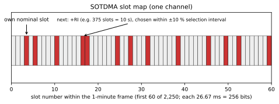

# Chapter 21 — The link layer: TDMA and the slot map

> **Part IV — The system: architecture and protocol.** How autonomous maritime transponders self-organize without a master station, carve continuous time into 2,250 synchronized slots per channel every minute, negotiate future transmission rights across dynamic communication states, and manage channel congestion through mathematical reuse rules.

**In this chapter.** You will learn how the Automatic Identification System (**AIS**) data-link layer orchestrates shared radio access across two international VHF channels without central arbitration. You will dissect the fundamental frame architecture of 2,250 time slots per minute, evaluate the microsecond timing budget of a single 26.67-millisecond slot, and trace how slot indices synchronize with Universal Coordinated Time (**UTC**). You will examine the five standardized channel-access schemes defined in Recommendation ITU-R M.1371-6—Self-Organizing Time Division Multiple Access (**SOTDMA**), Incremental Time Division Multiple Access (**ITDMA**), Random Access Time Division Multiple Access (**RATDMA**), Fixed Access Time Division Multiple Access (**FATDMA**), and Modified SOTDMA (**MSSA**)—alongside the Carrier-Sense Time Division Multiple Access (**CSTDMA**) mechanism used by Class B "CS" transponders. You will inspect communication-state bitfields, trace network entry and continuous nominal increment scheduling, calculate intentional slot reuse under high channel loading, and analyze link-management commands issued by coastal authorities via Messages 16, 20, 22, and 23.

## 21.1 Architecture of the TDMA link layer

AIS solves a classic distributed systems problem: thousands of high-speed mobile nodes must exchange safety-critical telemetry across shared radio frequencies without a central base station, cellular controller, or arbiter. The solution standardized in Recommendation ITU-R M.1371 (from M.1371-0 through M.1371-6) is a decentralized Time Division Multiple Access (**TDMA**) architecture.

Under ITU-R M.1371-6 Annex 2, the link layer contains three sub-layers:
1. **Medium Access Control (MAC) sub-layer (§A2-3.1):** Governs time division, frame synchronization, slot phase locking, and slot state classification, bridging physical signals and time blocks.
2. **Data Link Service (DLS) sub-layer (§A2-3.2):** Implements packet framing based on High-Level Data Link Control (**HDLC**) principles, bit stuffing, 16-bit cyclic redundancy check (**CRC**) frame check sequences, transmission buffering, and packet assembly.
3. **Link Management Entity (LME) sub-layer (§A2-3.3):** Executes the access protocols (SOTDMA, ITDMA, RATDMA, FATDMA, MSSA), maintains the internal directory, selects candidate slots, computes nominal slot increments, and orchestrates network entry.

Above the link layer, §A2-4 defines the **network layer**, coordinating multi-channel operation (parallel monitoring of AIS 1 and AIS 2), regional operating areas, channel switching, assigned modes, and intentional slot reuse priorities. §A2-5 establishes the **transport layer**, converting application payloads into sequenced packet fragments across single-slot or multi-slot transmissions.

```
+-------------------------------------------------------------------+
|                        Application Layer                          |
|         (Navigation Sensors, ECDIS, Radar, VTS Console)           |
+---------------------------------+---------------------------------+
                                  |
+---------------------------------v---------------------------------+
|                        Transport Layer                            |
|     Packet fragmentation (1 to 5 slots), sequence numbering       |
+---------------------------------+---------------------------------+
                                  |
+---------------------------------v---------------------------------+
|                         Network Layer                             |
| Multi-channel alternation, regional operating areas, slot reuse   |
+---------------------------------+---------------------------------+
                                  |
+---------------------------------v---------------------------------+
|                    Link Management Entity (LME)                   |
| SOTDMA / ITDMA / RATDMA / FATDMA candidate selection & scheduling |
+---------------------------------+---------------------------------+
                                  |
+---------------------------------v---------------------------------+
|                    Data Link Service (DLS)                        |
|   HDLC framing, 16-bit CRC-CCITT, bit stuffing, 24-bit buffer    |
+---------------------------------+---------------------------------+
                                  |
+---------------------------------v---------------------------------+
|                   Medium Access Control (MAC)                     |
|  2,250 slots/min, UTC frame lock, slot timing, sync state machine |
+---------------------------------+---------------------------------+
                                  |
+---------------------------------v---------------------------------+
|                        Physical Layer                             |
| 9,600 bit/s GMSK, 25 kHz channels: AIS 1 (161.975), AIS 2 (162.025)|
+-------------------------------------------------------------------+
```

Each physical VHF channel is partitioned into recurring one-minute **TDMA frames**. A single frame contains exactly 2,250 discrete **time slots**. Because transponders monitor and transmit across two independent maritime channels—AIS 1 (161.975 MHz, channel 2087) and AIS 2 (162.025 MHz, channel 2088)—simultaneously, the physical radio medium offers a combined capacity of 4,500 transmission slots every 60 seconds.

## 21.2 The frame, the slot, and the microsecond timing budget

Every TDMA frame coincides with the start of a UTC minute. When a transponder acquires a valid GNSS timing lock, slot 0 of the frame begins precisely at `XX:XX:00.000` UTC. Each subsequent slot is indexed sequentially from 0 through 2,249.

The duration of a single TDMA slot is:

$$T_{\text{slot}} = \frac{60.0 \text{ s}}{2,250} = 26.666\overline{6} \text{ ms} \approx 26.67 \text{ ms}$$

At 9,600 bit/s, one slot spans exactly:

$$N_{\text{bits}} = 0.026666\overline{6} \text{ s} \times 9,600 \text{ bit/s} = 256 \text{ bits}$$

One bit period ($T_{\text{bit}}$) is $1 / 9,600 \text{ s} \approx 104.167\ \mu\text{s}$. The 256 bits of a single-slot transmission are structured down to the individual bit period to balance transmitter ramp-up, receiver clock recovery, frame delineation, data payload delivery, error detection, and RF propagation flight time.

| Segment | Duration (bits) | Duration (ms) | Functional Purpose |
|---|---|---|---|
| **Transmitter ramp-up** | 8 | 0.833 | RF power ramping to rated output (1 W or 12.5 W) |
| **Preamble (training sequence)** | 24 | 2.500 | Alternating `0101...0101` pattern for receiver clock recovery |
| **Start flag** | 8 | 0.833 | HDLC frame delimiter byte `0x7E` (`01111110` binary) |
| **Data payload** | 168 | 17.500 | Message header, navigational telemetry, communication state |
| **Frame check sequence (FCS)** | 16 | 1.667 | 16-bit CRC-CCITT polynomial error-detection checksum |
| **End flag** | 8 | 0.833 | HDLC frame delimiter byte `0x7E` (`01111110` binary) |
| **Transmission buffer** | 24 | 2.500 | Propagation delay, bit stuffing slack, sync jitter, ramp-down |
| **Total slot** | **256** | **26.667** | Complete single-slot physical time block |

The 24-bit transmission buffer at the tail of the slot provides an engineered physical tolerance budget partitioned into three components:
1. **Bit stuffing allowance (4 bits):** Standard HDLC framing mandates that whenever a transmitter encounters five consecutive binary `1`s in the payload or CRC, it injects a dummy `0` bit to prevent false `0x7E` flag emulation. Statistically, for fixed-format position reports, 4 stuffing bits represent the 76th percentile of bit configurations.
2. **Synchronization jitter (6 bits = 625 $\mu$s):** Provides margin for transponder clock drift, GNSS timing uncertainties, and phase locking delays across mobile transmitters.
3. **Distance delay buffer (14 bits = 1,458.33 $\mu$s):** Radio waves propagate through the troposphere at the speed of light ($c \approx 299,792 \text{ km/s} \approx 161,875 \text{ nmi/s}$). In 1,458.33 microseconds, an RF wave travels:

$$D_{\text{buffer}} = 1,458.33\ \mu\text{s} \times 161,875 \text{ nmi/s} = 235.9 \text{ nautical miles (436.9 km)}$$

Clause A2-3.2.2.8.2 notes that this 14-bit buffer ensures a signal from within the 120-nautical-mile (222.2 km) protection radius arrives before the next slot starts, avoiding edge collisions.



> **Definitions that bite.** A TDMA **frame** in AIS is strictly 60 seconds (one UTC minute) comprising 2,250 slots. In satellite communications and cellular systems, "frames" often designate millisecond-level bursts. Furthermore, while Class A and Class B SO transponders allocate and track **slots** across this frame, Class B CS standards (Annex 6) formally designate these 26.67 ms intervals as **time periods** because the carrier-sensing station maintains no internal slot map and makes no future reservations.

## 21.3 The five ITU-R M.1371 access schemes

ITU-R M.1371-6 Annex 2 defines five channel-access algorithms for different reporting profiles:

```
                           +------------------------------------+
                           |    ITU-R M.1371 Access Schemes     |
                           +-----------------+------------------+
                                             |
         +-----------------+-----------------+-----------------+-----------------+
         |                 |                 |                 |                 |
+--------v-------+ +-------v-------+ +-------v-------+ +-------v-------+ +-------v-------+
|     SOTDMA     | |     ITDMA     | |     RATDMA    | |     FATDMA    | |      MSSA     |
| Continuous,    | | Transitions,  | | Bursts,       | | Shore base    | | Satellite LR  |
| autonomous,    | | network entry,| | unannounced,  | | fixed slots,  | | Message 27,   |
| self-organizing| | low-rate (<2) | | p-persistent  | | AtoN Type 1   | | Ch 75/76      |
+----------------+ +---------------+ +---------------+ +---------------+ +---------------+
```

### 21.3.1 SOTDMA: Self-Organizing TDMA

SOTDMA (§A2-3.3.4.4) is the core access scheme governing autonomous, continuous position reporting for Class A transponders and Class B "SO" (IEC 62287-2) units. In SOTDMA, a station does not query a central controller to obtain airtime. Instead, every transmission contains an embedded **communication state** that publicly declares the exact slot offset where the transmitting station intends to transmit its next burst, along with a countdown **slot time-out**. Surrounding vessels receive this declaration, record the reservation in their internal **slot maps**, and avoid transmitting in that slot.

The SOTDMA protocol relies on four mathematical parameters:
1. **Reporting Rate ($R_r$):** The number of reports scheduled per minute (e.g., $R_r = 6$ for a ship reporting every 10 seconds; $R_r = 30$ for a vessel reporting at 2-second intervals).
2. **Nominal Increment ($NI$):** The mathematical nominal spacing between transmissions on a single channel:

$$NI = \frac{2,250}{R_r}$$

When alternating across both AIS channels, each channel handles half the transmissions, yielding a nominal increment per channel of $NI_{\text{channel}} = 2,250 / (0.5 \times R_r) = 4,500 / R_r$.
3. **Selection Interval ($SI$):** To prevent periodic lock-stepping where two stations with the same interval collide continuously across every report, transponders do not transmit at rigid intervals. Instead, the next transmission slot is selected from a window spanning $\pm 10\%$ of the nominal increment around the nominal slot ($NS$):

$$SI = [NS - 0.1 \times NI,\ NS + 0.1 \times NI]$$

The total width of the selection interval is $0.2 \times NI$ (or 10 candidate slots, whichever is greater).
4. **Nominal Transmission Slot ($NTS$):** The specific physical slot selected pseudo-randomly from among the available candidate slots inside the selection interval.

```
Frame Timeline (slots):
... ---[ Nominal Slot NS ]--- ...
               |
        |<-- 0.1*NI -->|<-- 0.1*NI -->|
        +-----------------------------+
        |     Selection Interval      |
        |  [ Candidate Slots Set ]    |
        +-----------------------------+
                       ^
                       | (Station picks free candidate slot)
                      NTS (Nominal Transmission Slot)
```

Each reserved slot is assigned a random **slot time-out** between 3 and 7 frames. With every transmitted frame, the station decrements this time-out counter. Surrounding stations know exactly when the reservation expires. When the time-out counter hits zero, the station selects a brand-new $NTS$ within a new selection interval, announces the slot offset to the new slot in its sub-message field, and vacates the old slot.

> **Worked example: SOTDMA nominal increment and selection interval.**
> Consider a Class A vessel steaming at 16 knots under way and altering course. Under IMO performance standards, its autonomous reporting interval is 3.33 seconds, corresponding to a total reporting rate of $R_r = 18$ transmissions per minute across both channels.
> 
> Because the transponder alternates transmissions between AIS 1 and AIS 2, the reporting rate per channel is:
> 
> $$R_{r,\text{channel}} = \frac{18}{2} = 9 \text{ reports/min/channel}$$
> 
> The Nominal Increment ($NI$) between successive transmissions on Channel A is:
> 
> $$NI = \frac{2,250}{9} = 250 \text{ slots}$$
> 
> If the current nominal slot on Channel A is $NS = 500$, the transponder establishes a Selection Interval ($SI$) of $\pm 10\%$ of $NI$:
> 
> $$0.1 \times NI = 0.1 \times 250 = 25 \text{ slots}$$
> 
> $$SI = [500 - 25,\ 500 + 25] = [475,\ 525]$$
> 
> The selection interval contains 51 potential slots. The transponder consults its internal slot map, filters out slots reserved by other vessels or shore stations, forms a candidate set of free slots, and randomly selects slot 512 as its Nominal Transmission Slot ($NTS$). It sets a slot time-out of 5 frames. For the next five minutes, surrounding stations observe slot 512 reserved for this MMSI on Channel A.

### 21.3.2 ITDMA: Incremental TDMA

Incremental TDMA (§A2-3.3.4.1) handles non-repetitive transmissions, dynamic reporting rate changes, and initial network entry. Unlike SOTDMA, which binds reservations across multiple consecutive frames, ITDMA reserves slots up to a maximum of one frame into the future or announces immediate continuation in the same frame.

Under §A2-3.3.4.1, an AIS station uses ITDMA under four operational conditions:
1. **Network entry:** When a station powers up, it uses ITDMA to insert its first position report (Message 3) without waiting to establish a multi-frame SOTDMA pattern.
2. **Temporary rate changes:** When a vessel maneuvers or alters course, temporarily demanding a faster reporting interval for 1 or 2 frames before settling into a new steady state.
3. **Pre-announcing safety-related packets:** Scheduling transmission of binary or safety text messages (Messages 12, 14, or multi-slot Message 6/8).
4. **Periodic reporting below two per minute ($R_r < 2$):** When reporting intervals are 3 minutes, 6 minutes, or longer (such as moored vessels or low-power AtoNs), maintaining a multi-frame SOTDMA time-out is inefficient. ITDMA handles these spaced transmissions using an extended increment parameter.

The ITDMA communication state communicates three parameters: a **slot increment** (0–8,191 slots forward), the **number of consecutive slots** reserved (1–5 slots for multi-slot packets), and a 1-bit **keep flag**. When the keep flag is set to `1`, surrounding transponders maintain the slot reservation for the subsequent transmission; when cleared to `0`, the slot is immediately de-allocated after use.

### 21.3.3 RATDMA: Random Access TDMA

Random Access TDMA (§A2-3.3.4.2) is an unannounced, contention-based access protocol based on a slotted $p$-persistent algorithm. Transponders resort to RATDMA when an immediate transmission is required and no prior slot reservation exists in the slot map—such as interrogations (Message 15), unannounced safety text (Messages 12/14), or initial poll responses.

Because RATDMA is unannounced, collisions are more probable. Clause A2-3.3.4.2.1 states: *"An AIS station should avoid using RATDMA. A scheduled message should primarily be used to announce a future transmission to avoid RATDMA transmissions."*

When RATDMA must be used, the station establishes a 150-slot Selection Interval ($SI \approx 4 \text{ seconds}$) beginning at the current slot. The station compiles a candidate set of free or available slots within that interval and executes a $p$-persistent draw:
- At the initial candidate slot, the transmission probability ($LME.RTPS$) is initialized to:

$$p_0 = \frac{100\%}{\text{Candidate Count}} = \frac{100\%}{C}$$

If $C = 4$ candidates, the station transmits with probability $p_0 = 25\%$.
- If the station draws a random variable above $p_0$, it defers transmission to the next candidate slot. For each deferred candidate slot, the transmission probability increments:

$$p_{k} = p_{k-1} + \frac{100\% - p_0}{C}$$

As the station steps through the candidate set, the cumulative probability escalates monotonically, reaching $100\%$ at the final candidate slot, ensuring deterministic packet dispatch within the 150-slot window.

To prevent link saturation, Recommendation ITU-R M.1371 imposes strict throttles on RATDMA: mobile stations must not transmit more than 20 RATDMA slots per minute per frame, and no single RATDMA burst may exceed 3 consecutive slots (Table 44, Note 10).

### 21.3.4 FATDMA: Fixed Access TDMA

Fixed Access TDMA (§A2-3.3.4.3) is reserved for fixed shore infrastructure: base stations and physical Aids to Navigation (**AtoN**). Under FATDMA, specific slot numbers across the 2,250-slot frame are permanently reserved and assigned by coastal administration authorities (such as the US Coast Guard, Trinity House, or the Australian Maritime Safety Authority) through frequency coordination guidelines (such as IALA Recommendation R0124 and Guideline G1082).

FATDMA slots do not carry dynamic communication states that count down or re-negotiate airtime. Instead:
- Fixed base stations broadcast **Message 4** (Base Station Report) and **Message 20** (Data Link Management Message) to declare their fixed slot allocations.
- Fixed AtoN transponders (such as isolated Type 1 AtoN buoys equipped with transmit-only hardware and no VHF receivers) transmit exclusively inside these assigned FATDMA slots without sensing the channel.
- Mobile stations receiving Message 4 and Message 20 from a base station mark the designated slots as **UNAVAILABLE** in their internal slot maps, provided the mobile station is within 120 nautical miles (222.2 km) of the base station. Outside 120 nmi, mobile transponders may treat those slots as available for reuse.

### 21.3.5 MSSA: Modified SOTDMA

Modified SOTDMA (Annex 3 and Table 44) is an adaptation of SOTDMA optimized for long-range satellite AIS detection. MSSA is deployed exclusively for **Message 27** (Long-Range AIS Broadcast) on maritime channels 75 (156.775 MHz) and 76 (156.825 MHz).

Standard terrestrial AIS transmits 256-bit packets across 26.67 ms slots. However, satellites in Low Earth Orbit (**LEO**) possess massive field-of-view footprints spanning thousands of kilometers, encompassing multiple distinct terrestrial SOTDMA cells. In a satellite footprint, terrestrial slots overlap asynchronously, leading to extreme packet collision rates. MSSA mitigates this by compressing Message 27 into a compact 96-bit burst, utilizing a dedicated frequency band and modified slot selection intervals to maximize the probability of collision-free detection by overhead orbital receivers.

## 21.4 The Class B "CS" alternative: CSTDMA

Class B transponders are split into two categories: high-end Class B "SO" transponders that implement full SOTDMA under IEC 62287-2, and economical Class B "CS" transponders governed by Annex 6 of ITU-R M.1371-6 and IEC 62287-1.

A Class B CS transponder does not maintain a dynamic slot map, does not decode the communication states of surrounding ships, and makes no future slot reservations. Instead, it relies on **Carrier-Sense TDMA (CSTDMA)**: a polite, listen-before-talk mechanism operating within the standardized 26.67 ms time period.

```
TDMA Slot (26.667 ms = 256 bits):
T0 = 0 us (Slot boundary)
|
|-- Ramp-up / Guard: bits 0..7 (0 to 833.3 us)
|
|   +-----------------------------------------------------+
|   | Carrier-Sense Window: bits 8..19 (833.3 to 1979.2 us)|
|   | Transponder samples RF energy (1,146 us window)     |
|   +-----------------------------------------------------+
|
|-- TA = Bit 20 (2,083.3 us): Class B CS Tx starts IF channel was clear
|
|======================== Data Packet Burst ========================>|
```

The CSTDMA operational cycle unfolds as follows:
1. **Time-period synchronization:** The Class B CS unit acquires timing from received Class A position reports (Messages 1, 2, 3), base station reports (Message 4), or Class B SO reports (Message 18). It maintains time-period synchronization within $\pm 312\ \mu\text{s}$ ($\pm 3$ bit periods).
2. **Carrier-sensing window:** At the beginning of a potential transmission slot ($T_0$), the transmitter remains silent during bits 0–7 ($0.0 \text{ to } 833.3\ \mu\text{s}$) to allow any distant Class A transponder's RF ramp-up and propagation delay to manifest. Between **bit 8 and bit 19** (spanning $833.3\ \mu\text{s} \text{ to } 1,979.2\ \mu\text{s}$, a total duration of **$1,146\ \mu\text{s}$**), the receiver samples RF signal strength across the channel.
3. **Threshold evaluation:** The receiver measures the background noise floor over a rolling 60-second window. The carrier-detect threshold is set dynamically to $10 \text{ dB}$ above the minimum background floor, with an absolute floor of $-107 \text{ dBm}$ and an upper ceiling of $-77 \text{ dBm}$.
4. **Transmission or deferral:** If the measured RF power within the $1,146\ \mu\text{s}$ window remains below the threshold, the channel is declared **FREE**, and the transmitter immediately ramps up RF power at bit 20 ($T_A = 2,083.3\ \mu\text{s}$). If RF energy is detected, the slot is declared **USED**, transmission is aborted, and the unit checks the next candidate period.
5. **Ten candidate periods:** When scheduling a transmission, the unit defines a Transmission Interval ($TI = \text{Reporting Interval} / 3$ or 10 seconds, whichever is smaller) centered on its nominal time. Within $TI$, it randomly selects **10 candidate periods**. It tests each candidate sequentially. If all 10 candidate periods are detected as USED (or are marked UNAVAILABLE by base-station Message 20 commands), the transmission is **abandoned** entirely for that cycle.

Under heavy RF congestion, CSTDMA transponders back off completely, yielding the VHF spectrum to safety-critical Class A commercial vessels.

## 21.5 Communication state and the synchronization hierarchy

The decentralized SOTDMA slot map functions because transponders embed their future intentions into every position report. The final 19 bits of Messages 1, 2, and 4 (and conditionally Messages 3, 9, 18, and 26) are dedicated to the **communication state**.

### 21.5.1 The SOTDMA communication state

The 19-bit SOTDMA communication state comprises three structured fields defined in Table 18 of ITU-R M.1371-6:

| Field | Bit Length | Valid Values | Semantic Meaning |
|---|---|---|---|
| **Sync State** | 2 bits | `0`–`3` | Synchronization hierarchy level |
| **Slot Time-out** | 3 bits | `0`–`7` | Frames remaining before this slot is vacated |
| **Sub-Message** | 14 bits | Variable | Context-dependent data dictated by the Slot Time-out |

```
 0                   1                   1
 0 1 2 3 4 5 6 7 8 9 0 1 2 3 4 5 6 7 8
+-+-+-+-+-+-+-+-+-+-+-+-+-+-+-+-+-+-+-+
|Sync | Time  |          Sub-Message          |
|State| -out  |           (14 bits)           |
+-+-+-+-+-+-+-+-+-+-+-+-+-+-+-+-+-+-+-+
```

The 14-bit **Sub-Message** changes its semantic payload dynamically based on the current value of the 3-bit **Slot Time-out**, as mandated in Table 19:

| Slot Time-out | Sub-Message Meaning | Bit Allocations and Semantic Interpretation |
|---|---|---|
| **`0`** | **Slot Offset** | 14-bit relative offset to the new slot reserved for the next frame (`NTS_new - NTS_current + 2,250`). A value of `0` indicates the slot is de-allocated and will not be renewed. |
| **`1`** | **UTC Hour and Minute** | Bits 13–9: UTC Hour (0–23); Bits 8–2: UTC Minute (0–59); Bits 1–0: Spare (set to zero). Broadcasts master time to network. |
| **`2`, `4`, `6`** | **Slot Number** | 14-bit absolute slot number (0–2,249) within the current frame, providing direct slot-phase synchronization to listening stations. |
| **`3`, `5`, `7`** | **Received Stations** | Number of other operational stations (0–16,383) detected on the VDL during the previous frame, providing a real-time local channel density metric. |

### 21.5.2 The ITDMA communication state

When operating under ITDMA (such as during network entry with Message 3), the 19 bits are reorganized into Table 20 format:
- **Sync State (2 bits):** Synchronization hierarchy level (`0`–`3`).
- **Slot Increment (13 bits):** Relative offset (0–8,191 slots) to the next scheduled transmission. A value of `0` signals that this is the final transmission.
- **Number of Slots (3 bits):** Number of consecutive slots allocated (values `0`–`4` indicate 1 to 5 consecutive slots; values `5`–`7` encode 1 to 3 slots with an added offset of $+8,192$ slots for extended multi-minute reporting intervals).
- **Keep Flag (1 bit):** `0` = slot released immediately after transmission; `1` = slot reservation maintained for the next interval.

### 21.5.3 Synchronization hierarchy and semaphores

To maintain strict slot timing, transponders must synchronize their frame boundaries. Recommendation ITU-R M.1371-6 establishes a strict 5-level **synchronization hierarchy** (§A2-3.1.3):

```
[Level 1: UTC Direct (Sync State 0)]
   |  (Internal GNSS locked to UTC clock)
   v
[Level 2: UTC Indirect (Sync State 1)]
   |  (Synchronized to a mobile station reporting UTC Direct)
   v
[Level 3: Base Direct (Sync State 2)]
   |  (Synchronized directly to a coastal base station)
   v
[Level 4: Base Indirect (Sync State 3)]
   |  (Synchronized to a station locked to a base station)
   v
[Level 5: Mobile as Semaphore (Sync State 3)]
      (Synchronized to highest-connectivity mobile node)
```

1. **UTC Direct (Priority 1, Sync State `0`):** The transponder's internal GNSS timing receiver is locked to UTC 1 PPS. Slot timing jitter must remain within $\pm 104\ \mu\text{s}$ (1 bit period) for mobile units and $\pm 52\ \mu\text{s}$ for base stations. A station in UTC Direct serves as a primary synchronization reference.
2. **UTC Indirect (Priority 2, Sync State `1`):** The station has lost GNSS timing lock but synchronizes its slot clock to the received RF burst of an adjacent mobile station broadcasting UTC Direct. Only *one level* of indirect synchronization is legally permitted; a station receiving UTC Indirect cannot pass indirect timing to a third station.
3. **Base Direct (Priority 3, Sync State `2`):** The station locks its slot clock directly to the transmission of a fixed shore base station.
4. **Base Indirect (Priority 4, Sync State `3`):** The station locks its clock to another mobile station that is directly synchronized to a base station.
5. **Mobile as Semaphore (Priority 5, Sync State `3`):** When all GNSS signals and base stations are completely absent across the horizon, the network self-stabilizes through **semaphore stations**. A transponder evaluates all received stations over the preceding nine frames (minimum 2 reports received within the last 40 seconds) and synchronizes to the specific mobile node reporting the highest number of received stations (with tie-breaks resolved in favor of the lowest numerical MMSI). That dominant mobile node assumes the role of network **semaphore**. Under Table 8, a mobile semaphore increases its position reporting rate to once every 2 seconds to broadcast stable timing across the cluster. Class B SO units and Search and Rescue (**SAR**) aircraft are strictly forbidden from acting as semaphores.

## 21.6 Network entry, continuous operation, and channel alternation

Network entry requires channel evaluation, directory initialization, and progressive scheduling:

```
Step 1: Passive Channel Monitoring (1 Minute = 2,250 Slots)
  [ Transponder monitors AIS 1 & AIS 2; builds dynamic slot map & frame directory ]
                                  |
                                  v
Step 2: Nominal Start Slot (NSS) Determination
  [ Transponder selects NSS between current slot and NI slots forward ]
                                  |
                                  v
Step 3: Network Entry via ITDMA (Message 3)
  [ Transponder transmits Message 3 in free candidate slot within Selection Interval; ]
  [ ITDMA comm state reserves next slot with Keep Flag = 1 ]
                                  |
                                  v
Step 4: Transition to Continuous SOTDMA Operation (Messages 1 / 2)
  [ Transponder allocates permanent SOTDMA slot; sets random timeout (3 to 7 frames); ]
  [ Enters autonomous ping-pong alternation between AIS 1 and AIS 2 ]
```

1. **Passive initialization (§A2-3.3.3):** Upon boot, the transponder activates both VHF receivers and passively monitors AIS 1 and AIS 2 for exactly one full minute (2,250 slots). During this initialization frame, the transponder decodes all received packets, maps slot reservations, identifies free and busy slots, logs base station FATDMA boundaries, and establishes its internal slot directory. The transponder is prohibited from transmitting during this minute.
2. **Network entry (§A2-3.3.5.2):** At the conclusion of the monitoring frame, the Link Management Entity determines a Nominal Start Slot ($NSS$) randomly between the current slot and $NI$ slots forward. It constructs a Selection Interval ($SI$) around $NSS$ and chooses a free candidate slot. The station enters the link by broadcasting **Message 3** (Position Report with ITDMA communication state). The ITDMA header specifies the relative slot increment to the next transmission and sets the keep flag to `1`.
3. **Continuous autonomous operation (§A2-3.3.5.4):** After establishing initial airtime, the transponder transitions to **Message 1** (or Message 2 in assigned mode) utilizing SOTDMA communication states. For each channel, the transponder maintains an active slot reservation characterized by a slot time-out counter randomly initialized between 3 and 7 frames.
4. **Slot rollover and offset calculation:** At each transmission, the transponder decrements its slot time-out counter. When the time-out reaches `0`, the transponder selects a new Nominal Transmission Slot ($NTS_{\text{new}}$) within a fresh Selection Interval for the next frame. The transponder computes the relative **slot offset** connecting its current slot to the future slot:

$$\text{Slot Offset} = NTS_{\text{new}} - NTS_{\text{current}} + 2,250$$

The transponder places this offset into the 14-bit sub-message field of its final transmission in the expiring slot, initializes a new random time-out of 3–7 frames for $NTS_{\text{new}}$, and relocates its airtime.
5. **Dual-channel alternation (§A2-4.1.2):** Under standard autonomous operation, periodic position reports alternate transmission-by-transmission between AIS 1 and AIS 2. If a transponder transmits Report $k$ on AIS 1, Report $k+1$ is dispatched on AIS 2, Report $k+2$ on AIS 1, and so forth. Each channel maintains its own independent nominal start slots, selection intervals, and SOTDMA time-out state machines. Addressed messages, channel acknowledgments, and interrogation replies are returned exclusively on the specific channel upon which the initiating packet was received.

## 21.7 Congestion, slot states, and intentional slot reuse

In open waters, link loading is typically 5%–10%. In congested chokepoints—the Dover Strait, Singapore Strait, or Pearl River Delta—hundreds of transponders compete for airtime. When free slots are exhausted, transponders activate mathematical **intentional slot reuse** rules (§A2-4.4.1).

### 21.7.1 Slot states

Every slot in a transponder's internal directory is classified into one of four fundamental states (§A2-3.1.6):
- **Free:** No RF carrier detected and no SOTDMA/ITDMA/FATDMA reservation recorded by any station.
- **Internal:** Currently reserved and occupied by own station.
- **External:** Allocated and occupied by another received station.
- **Garbled:** Corrupted RF energy or invalid CRC checksum detected without a decipherable MMSI or communication state.

When compiling candidate slots within a Selection Interval, the LME maps external slots into sub-categories based on geographic range and station identity:
- **Available 1 (D):** Slots occupied by the most distant mobile stations within the selection interval.
- **Available 2 (E):** Standard external slots reserved by active stations.
- **Free 2 (T):** Slots previously occupied by a mobile station under way that has not been received for $\ge 3$ consecutive minutes (considered abandoned).
- **Unavailable (B):** Slots reserved by a shore base station within 120 nautical miles (222.2 km), or slots occupied by mobile stations failing to report a valid geographic position.

### 21.7.2 Intentional slot reuse rules

When searching for a candidate transmission slot within the Selection Interval, a transponder must always maintain a minimum candidate set of **four candidate slots** exhibiting equal probability of selection.

If the transponder cannot find four completely Free slots within its selection interval, it executes intentional slot reuse governed by Rules 1 through 5 of §A2-4.4.1:

```
Intentional Slot Reuse Priority Hierarchy:
----------------------------------------------------------------------------------
Priority 1: Candidate slot FREE on current channel & AVAILABLE on opposite channel
Priority 2: Candidate slot AVAILABLE on current channel & FREE on opposite channel
Priority 3: Candidate slot AVAILABLE on current channel & AVAILABLE on opposite channel
Priority 4: Candidate slot FREE on current channel & UNAVAILABLE on opposite channel
Priority 5: Candidate slot AVAILABLE on current channel & UNAVAILABLE on opposite channel
----------------------------------------------------------------------------------
Forbidden Combinations:
  * Slots occupied by Base Stations within 120 nmi
  * Slots occupied by vessels reporting no geographic position
  * Slots adjacent to own-station transmissions on the alternate channel
```

To harvest slots under Priorities 2, 3, and 5, the transponder applies the **most distant station rule**:
1. The transponder measures the geographic distance to every vessel occupying an external slot within the Selection Interval.
2. It ranks these stations in descending order of range.
3. It reuses the slot occupied by the *single most distant vessel*.
4. **Anti-piggybacking protection:** Once a distant vessel's slot has been stolen, that specific vessel's remaining slots are excluded from further reuse by this transponder for one full frame (60 seconds).
5. **Base station immunity:** Slots reserved by a shore base station within 120 nautical miles (222.2 km) are declared **UNAVAILABLE** and can never be reused under any loading condition. Outside 120 nmi, base station reservations may be reclaimed.

Because VHF propagation attenuates with distance and RF receivers capture stronger signals via FM capture effect, reusing the slot of a vessel 40 nautical miles away creates negligible interference for local receivers within a 5-to-10 nautical mile tactical collision horizon.

## 21.8 Assigned mode, link management, and regional areas

Shore authorities retain tools to optimize spectrum, modify reporting rates, reserve slots, and reassign frequencies via link-management messages:

```
+-----------------------------------------------------------------------------+
|                           Shore Base Station                                |
+---------------------+---------------------+---------------------------------+
                      |                     |
   Message 16 / 23    |     Message 20      |       Message 22
   Assigned Mode      |     FATDMA Slot     |       Channel Management
   & Group Assignment |     Reservation     |       & Regional Operating Areas
                      v                     v
+---------------------+---------------------+---------------------------------+
|                         VHF Data Link (VDL)                                 |
+---------------------+---------------------+---------------------------------+
                      |                     |
                      v                     v
+-----------------------------------------------------------------------------+
|                         Mobile Shipborne Stations                           |
|  - Adjust reporting rates (Class A never slower than autonomous)            |
|  - Mark FATDMA slots UNAVAILABLE within 120 nmi                             |
|  - Re-tune VHF frequencies across regional polygons (max 8 memories)       |
+-----------------------------------------------------------------------------+
```

### 21.8.1 Message 16: Assigned mode

Coastal Vessel Traffic Services (**VTS**) deploy **Message 16** (Assigned Mode Command) to command specific transponders into assigned operation (§A2-3.3.6). Message 16 can be addressed to individual MMSIs and commands two distinct assignment modes:
1. **Assigned report rate:** Dictating the number of reports per 10-minute interval (offset 0–600).
2. **Assigned slot increment:** Directly prescribing specific slot numbers and nominal increments on AIS 1 or AIS 2.

When assigned specific slots, the transponder transmits using SOTDMA communication states with an assignment time-out randomly set between 4 and 8 minutes. When the assignment time-out expires, the transponder automatically reverts to autonomous SOTDMA operation without requiring a cancellation command.

Crucially, under clause A2-3.3.6: **If a Class A station's autonomous reporting algorithm dictates a faster reporting interval than the rate commanded by Message 16 or Message 23, the Class A station must ignore the commanded rate and transmit at its faster autonomous rate.** A shore base station (or an adversary) cannot command a maneuvering Class A vessel to slow its transmission rate.

### 21.8.2 Message 20: Data link management

Coastal networks broadcast **Message 20** to establish pre-configured FATDMA reservations. A single Message 20 can reserve up to four distinct slot blocks across AIS 1 and AIS 2, defining:
- Relative slot offset (0–2,249).
- Number of consecutive slots (1–4).
- Reservation time-out (1–8 minutes).
- Slot increment to the next block (e.g., 375 slots for a 10-second repeating reservation).

To guarantee spatial integrity, clause A2-3.3.4.3.1 dictates: **A Message 20 data-link management message received without an accompanying Message 4 from the identical MMSI must be completely ignored.** Mobile stations must receive Message 4 to calculate their physical distance from the transmitting base station; if the distance exceeds 120 nautical miles, the Message 20 reservation is discarded.

### 21.8.3 Message 22: Channel management and regional operating areas

Where local maritime VHF bands conflict with domestic land-mobile services, or to activate supplementary frequencies, coastal authorities issue **Message 22** (Channel Management). Message 22 can be addressed directly to an MMSI or broadcast across a geographic bounding box defining a **regional operating area**.

Message 22 controls:
- Channel assignments for AIS 1 and AIS 2 (e.g., re-tuning from channels 2087/2088 to channels 2078/2079).
- Transmit/Receive operational modes (e.g., TxA/TxB, RxA/RxB, or simplex fallback).
- RF output power switching (toggling transponders between 12.5 W high power and 1 W low power).
- Geographic boundaries defining the regional operating zone.

Under clause A2-4.1.6, mobile transponders store a maximum of **eight regional operating areas** in non-volatile memory. To prevent vessels from remaining locked to invalid frequencies after leaving a jurisdiction, regional operating configurations are governed by strict spatial and temporal boundaries:
- A stored regional area is automatically erased if the vessel's current position exceeds **500 nautical miles (926 km)** from the boundary.
- A stored regional area is automatically erased if **24 hours** elapse without receiving a refreshing Message 22 broadcast.

### 21.8.4 Message 23: Group assignment

**Message 23** provides bulk management across defined categories of vessels within a geographic footprint. A coastal station can target specific station types (such as Class B transponders, AtoNs, or commercial fishing vessels) and command operating intervals, channel bandwidths, or high/low RF power.

Crucially for network survivability, Message 23 is the exclusive delivery mechanism for the **Quiet Time** command. A base station can command Class B CS transponders to enter quiet time for a duration of 1 to 15 minutes. During quiet time, Class B CS units maintain internal scheduling but cease all transmissions of standard position reports (Messages 18 and 24), instantly clearing the VHF data link for emergency traffic or severe harbor congestion.

## Then & now

- ⟨H⟩ **1991–1996:** Håkan Lans invents and patents Self-Organizing Time Division Multiple Access (US Patent 5,506,587, granted April 9, 1996), originally conceiving decentralized GNSS-synchronized TDMA for civil aviation collision avoidance.
- ⟨H⟩ **1998:** The International Telecommunication Union formally standardizes maritime STDMA as SOTDMA in Recommendation ITU-R M.1371-0, establishing the 2,250-slot, 60-second frame on maritime VHF channels 87B and 88B.
- ⟨+⟩ **2001:** ITU-R M.1371-1 introduces Annex 6, formalizing Carrier-Sense TDMA (CSTDMA) to enable low-cost Class B transponders without requiring complex SOTDMA slot-tracking receivers.
- ⟨+⟩ **2006:** Recommendation ITU-R M.1371-2 standardizes Class B SOTDMA (Class B "SO"), allowing high-end recreational vessels to participate fully in slot reservations alongside Class A ships.
- ⟨+⟩ **2014:** ITU-R M.1371-5 defines Modified SOTDMA (MSSA) and incorporates maritime channels 75 and 76 for long-range satellite AIS (Message 27).
- ⟨+⟩ **2026:** Recommendation ITU-R M.1371-6 enters into force, updating technical definitions, refining multi-channel operational procedures, and cementing the modern VDES link-layer coexistence framework.

## On the wire

The following hex dump and binary walk-through demonstrates an authentic SOTDMA position report (Message 1) received on Channel A (AIS 1).

```
!AIVDM,1,1,,A,13aEO:001m0f=JeK2nf00?wf06:D,0*01
```

Decoding the six-bit ASCII payload yields the raw 168-bit bitstream:

```
Payload bits:
000001 00 000101010001011110000000 0000 0000000000 1 0001101100000101111000110100 0000100111001001001101110100 000000000000 000000000 001101 00 00 0 000000 00 00 11000000101010001
```

We parse the specific protocol fields according to ITU-R M.1371-6 Annex 8:

| Bit Range | Field Name | Raw Bits | Decoded Value | Semantic Meaning |
|---|---|---|---|---|
| **0–5** | Message ID | `000001` | `1` | Message 1 (Scheduled Class A Position Report) |
| **6–7** | Repeat Indicator | `00` | `0` | Default (transmitted by original station) |
| **8–37** | MMSI | `000101010001011110000000` | `244670000` | Maritime Mobile Service Identity |
| **38–41** | Navigational Status | `0000` | `0` | Under way using engine |
| **42–49** | Rate of Turn | `00000000` | `0` | Not turning |
| **50–59** | Speed Over Ground | `0000000000` | `0.0` | 0.0 knots |
| **60** | Position Accuracy | `1` | `1` | High accuracy ($\le 10 \text{ m}$, DGNSS/RAIM active) |
| **61–88** | Longitude | `0001101100000101111000110100` | `28335668` | $28335668 / 600,000 = 4.722611^\circ \text{ E}$ |
| **89–115** | Latitude | `0000100111001001001101110100` | `31185012` | $31185012 / 600,000 = 51.975020^\circ \text{ N}$ |
| **116–127** | Course Over Ground | `000000000000` | `0.0` | $0.0^\circ$ relative to true north |
| **128–136** | True Heading | `000000000` | `0` | $0^\circ$ heading |
| **137–142** | Time Stamp | `001101` | `13` | Second 13 of the UTC minute |
| **143–144** | Special Maneuver | `00` | `0` | Not available / default |
| **145–147** | Spare | `000` | `0` | Reserved bits |
| **148** | RAIM Flag | `0` | `0` | RAIM not in use |
| **149–167** | **Communication State** | `00 011 000000101010001` | SOTDMA | **19-bit SOTDMA Communication State** |

Focusing specifically on the 19-bit **Communication State** (bits 149–167):
- **Sync State (bits 149–150):** `00` binary = `0` decimal $\rightarrow$ **UTC Direct**. The station's internal GNSS timing receiver is fully locked to UTC 1 PPS, qualifying this vessel as a primary synchronization source for surrounding stations.
- **Slot Time-out (bits 151–153):** `011` binary = `3` decimal $\rightarrow$ **3 frames remaining**. This transponder will continue utilizing this specific slot on Channel A for three more one-minute frames before vacating and relocating.
- **Sub-Message (bits 154–167):** Because the Slot Time-out is `3`, Table 19 dictates that the 14-bit sub-message represents **Received Stations**.
  - Raw binary: `00000010101001` $\rightarrow$ `85` decimal.
  - Semantic deduction: The transmitting vessel's AIS receiver actively detected **85 operational transponders** on the VDL during the preceding 60-second frame. This provides coastal monitoring systems and adjacent vessels with a direct metric of local RF link density.

> **Worked example: Computing slot offsets across frame boundaries.**
> Suppose a Class A transponder is transmitting in slot $NTS_{\text{current}} = 2,180$ on Channel B. Its slot time-out has decremented to `0`, requiring an immediate slot relocation for the upcoming frame.
> 
> The vessel's reporting interval is 10 seconds ($NI = 375$ slots). The nominal slot for the next frame is:
> 
> $$NS_{\text{next}} = (2,180 + 375) \bmod 2,250 = 2,555 \bmod 2,250 = 305$$
> 
> The selection interval spans $305 \pm 37$ slots ($[268, 342]$). Examining its internal slot map, the transponder identifies slot 320 as an unreserved candidate slot: $NTS_{\text{new}} = 320$.
> 
> To broadcast this reservation to the fleet, the transponder computes the relative **slot offset** using the formula in §A2-3.3.5.4:
> 
> $$\text{Slot Offset} = NTS_{\text{new}} - NTS_{\text{current}} + 2,250 = 320 - 2,180 + 2,250 = 390 \text{ slots}$$
> 
> The transponder encodes the integer `390` (`00000110000110` binary) into the 14-bit sub-message field of its SOTDMA communication state, paired with a Slot Time-out of `0`.
> 
> Every surrounding transponder that decodes this packet takes its own arrival slot index ($2,180$), adds the received offset ($390$), performs modulo arithmetic:
> 
> $$\text{Reserved Slot} = (2,180 + 390) \bmod 2,250 = 2,570 \bmod 2,250 = 320$$
> 
> The receiving stations mark slot 320 on Channel B as externally allocated in their directories for the next frame, ensuring zero contention when the ship arrives at its new slot.

## Validation, uncertainty & data quality

Errors within the TDMA link layer originate from three primary physical and logical vectors: RF channel packet collisions, GNSS clock degradation leading to slot drift, and software slot-map desynchronization.

### Data link degradation mechanisms
1. **Packet collisions:** Simultaneous transmission by two or more stations in the same slot. In an error-free terrestrial SOTDMA network with line-of-sight, collision rates remain below 1%. However, in saturated waterways where intentional slot reuse activates, or in space-based reception where orbital footprints aggregate disparate terrestrial cells, collision rates can exceed 80%. Because the AIS DLS sub-layer implements only an error-detecting 16-bit CRC without forward error correction (**FEC**), any single-bit collision results in the silent dropping of the entire packet.
2. **Timing drift and slot overlap:** If a transponder loses GNSS synchronization and exhausts its holdover stability without falling back to indirect sync, its internal clock drifts. Because the guard interval between slots is only 2.5 ms (24 bits), a timing error exceeding $\pm 1.25 \text{ ms}$ causes the transmitter's RF burst to bleed into adjacent slots, corrupting neighboring transmissions.
3. **Hidden terminal anomalies:** Station A can hear Station B; Station C can hear Station B; but Station A and Station C cannot hear each other due to terrain obstructions. Stations A and C may both identify the same slot as free, reserving it simultaneously. Station B, positioned between them, suffers continuous packet collisions in that slot.

```
+--------------------+                       +--------------------+
|     Station A      |                       |     Station C      |
| (Transmits Slot 42)|                       | (Transmits Slot 42)|
+---------+----------+                       +----------+---------+
          \                                             /
           \                                           /
            \                                         /
             v                                       v
         +-----------------------------------------------+
         |                   Station B                   |
         |  Receives colliding RF bursts in Slot 42;     |
         |  CRC checksum fails; packet dropped silently  |
         +-----------------------------------------------+
```

### Detection and diagnostic procedures
To audit link-layer health and quantify data quality in shore-based VTS or research archives, data analysts apply four concrete validation tests:
- **Communication state continuity check:** Track the reported SOTDMA slot time-out sequence for a given MMSI on a single channel. An uncorrupted track must show monotonic decrementing: $k, k-1, k-2, \dots, 0$. If a transponder jumps erratically (e.g., $5 \rightarrow 2 \rightarrow 6$), the receiving station is either dropping frames or the vessel's transponder firmware is violating ITU-R M.1371 state transitions.
- **Received stations density audit:** Extract the 14-bit sub-message when slot time-out is 3, 5, or 7. Plotting the reported station count over time reveals local RF crowding. A sudden drop from 120 stations to 0 indicates local receiver desensitization, antenna failure, or high-power jamming.
- **Time stamp vs. GNSS arrival delta:** Compare the 6-bit time stamp field (bits 137–142, seconds 0–59) against the wall-clock second of arrival logged by the shore receiver. In a healthy link, the delta $\Delta t = |t_{\text{arrival}} - t_{\text{timestamp}}|$ should satisfy $\Delta t \le 1.0 \text{ s}$. Deltas exceeding 2 seconds indicate buffered network backhaul latency, spoofed AIS bursts, or transponder clock slippage.
- **Class B CS deferral tracking:** Monitor the ratio of Class A to Class B position reports received from a congested port sector. When channel loading surpasses 60%, Class B CS reporting rates drop dramatically due to the 10-candidate-period abandonment rule, providing a quantifiable indicator of link starvation.

> **Try it.** You can simulate SOTDMA slot allocation, candidate selection, and CSTDMA carrier-sense starvation directly using the book's repository model in `code/tdma/sotdma_sim.py`. Activate the virtual environment and execute a parameter sweep to observe channel occupancy, Class A collisions, and Class B deferral rates as vessel counts scale:
> 
> ```bash
> . .venv/bin/activate
> python code/tdma/sotdma_sim.py --sweep
> ```
> 
> Expected output:
> ```
> n_A  occupancy  A_loss  B_defer
>   50  0.100     0.000   0.000
>  100  0.168     0.000   0.000
>  200  0.327     0.000   0.000
>  300  0.487     0.000   0.051
>  400  0.637     0.024   0.319
>  500  0.724     0.157   0.549
>  600  0.774     0.305   0.687
> ```
> Notice how Class A loss remains near zero while channel occupancy climbs below 50%. As occupancy exceeds 60%, Class B deferrals skyrocket past 30%, illustrating how CSTDMA polite carrier-sensing protects commercial Class A traffic during link saturation.

> **Threat model: VDL slot starvation and assignment abuse.**
> - **Threat Actor:** Malicious actor operating a software-defined radio (**SDR**) power amplifier or an unauthorized maritime transmitter.
> - **Capabilities & Vectors:** Broadcaster spoofing coastal base station identities to issue fraudulent link-management messages:
>   1. *Forged Message 20:* Reserving blocks of FATDMA slots across both channels, commanding mobile transponders within 120 nmi to declare those slots UNAVAILABLE.
>   2. *Forged Message 23 Quiet Time:* Commanding Class B stations across a geographic region to cease transmissions for 15 minutes.
>   3. *Channel Re-tuning via Message 22:* Transmitting regional operating commands shifting transponders to alternate frequencies.
> - **Inherent Protocol Mitigations:**
>   - *Class A Autonomy Protection:* Under clause A2-3.3.6, a Class A station **never** reduces its reporting rate below its autonomous threshold upon receiving Message 16 or 23.
>   - *Message 4 Pairing Requirement:* Under clause A2-3.3.4.3.1, a mobile station **must ignore** any Message 20 reservation unless accompanied by a valid Message 4 from the identical MMSI, allowing distance-bounding to 120 nmi.
>   - *Regional Memory and Distance Expiry:* Under clause A2-4.1.6, regional operating areas are strictly capped at 8 entries and automatically self-purge after 24 hours or upon exceeding 500 nmi from the boundary.

> **Legal note.** Transmitting on international maritime VHF frequencies (specifically 161.975 MHz and 162.025 MHz) is strictly governed by international treaty under the ITU Radio Regulations and national telecommunications legislation (such as Title 47 of the US Code of Federal Regulations and EU maritime radiocommunication directives). Operating an intentional transmitter, SDR exciter, or jamming device on AIS channels without an authorized station license is a felony in most jurisdictions, carrying substantial statutory fines, forfeiture of equipment, and criminal imprisonment. Testing of AIS link-layer software must be conducted exclusively into non-radiating RF dummy loads or within shielded RF anechoic chambers.

## Software

**Open source:**
- **`code/tdma/sotdma_sim.py`** (The AIS Handbook): Python simulation modeling SOTDMA candidate intervals, slot offsets, CSTDMA carrier-sense windows, and link starvation curves under scaling vessel density. Caveat: models single-frame behavior without full multi-frame geographic radio propagation modeling.
- **`libais`** (Google / Kurt Schwehr): High-performance C++ decoder with Python bindings. Efficiently decodes 19-bit communication state bitfields across Messages 1, 2, 3, 4, 9, 18, and 21, extracting sync states, time-outs, and sub-messages. Caveat: library is strictly a message parser; it does not reconstruct an internal TDMA slot map or track RF link layer state.
- **`gpsd`** (Eric S. Raymond et al.): System daemon parsing NMEA 0183 AIVDM/AIVDO sentences and providing decoded JSON representations of communication-state radio status. Caveat: historical versions treat communication states generically without distinguishing SOTDMA sub-message semantic shifts across decrementing time-outs.

**Free but closed:**
- None relevant. (Commercial link-layer network controllers and base station TDMA scheduling engines are proprietary closed software).

**Commercial:**
- **CNS Systems / Saab Transponder Engine:** Embedded link-layer protocol stack deployed in Type Approved Class A transponders and coastal base stations. Implements full ITU-R M.1371 Annex 2 state machines, FATDMA link management, and dynamic slot reuse. Caveat: proprietary firmware locked to specific certified transponder hardware architectures.

## Standards & guides

- **ITU-R Recommendation M.1371-6 (2026):** *Technical characteristics for an automatic identification system using time division multiple access in the VHF maritime mobile frequency band.* Governs the complete physical, link, network, and transport layers of AIS; specifically Annex 2 (Link layer, SOTDMA/ITDMA/RATDMA/FATDMA), Annex 3 (MSSA), Annex 6 (Class B CSTDMA), and Annex 7 (Messages 16, 20, 22, 23).
- **IMO Resolution MSC.74(69), Annex 3 (1998):** *Recommendation on Performance Standards for a Universal Shipborne Automatic Identification System (AIS).* Mandates functional carriage requirements, autonomous reporting rates, and operational modes for SOLAS vessels.
- **IMO Resolution A.1106(29) (2015):** *Revised Guidelines for the Onboard Operational Use of Shipborne Automatic Identification Systems (AIS).* Defines operational policies for shipborne AIS, including guidelines for de-activating transmission in security-sensitive zones.
- **IEC 61993-2:2018 (Edition 3.0):** *Class A Shipborne Equipment of the Universal Automatic Identification System (AIS) — Operational and performance requirements, methods of test and required test results.* Mandates compliance tests for SOTDMA timing, slot selection, and assigned mode handling.
- **IEC 62287-1:2017 (Edition 3.0):** *Class B Shipborne Equipment of the Automatic Identification System (AIS) — Part 1: Carrier-Sense Time Division Multiple Access (CSTDMA) techniques.* Specifies RF threshold testing, candidate period definition, and transmission timing for Class B CS equipment.
- **IEC 62287-2:2017 (Edition 2.0):** *Class B Shipborne Equipment of the Automatic Identification System (AIS) — Part 2: Self-Organising Time Division Multiple Access (SOTDMA) techniques.* Governs Class B "SO" transponders operating under standard Annex 2 SOTDMA protocols.
- **IEC 62320-1:2015 (Edition 2.0):** *AIS Base Stations — Minimum operational and performance requirements, methods of testing and required test results.* Governs shore station link control, FATDMA reservations, and Messages 16, 20, 22, and 23 link management.
- **IALA Guideline G1082 (Edition 2.0, 2016):** *An Overview of AIS.* Comprehensive technical guide explaining station architectures, TDMA access schemes, and Aids to Navigation deployment.
- **IALA Recommendation R0124 (A-124) (Edition 2.2, 2012):** *The AIS Service.* Coastal authority guide covering FATDMA slot planning, shore network architecture, and VDL load management.
- **Report ITU-R M.2287-0 (2014):** *Automatic identification system VHF data link loading.* Authoritative technical report compiling empirical measurements and theoretical models of VDL loading, packet collisions, and slot capacity limits.

## Pitfalls

1. **Assuming a 60-second SOTDMA time-out:** Assuming the 3-bit slot time-out represents elapsed seconds rather than one-minute frames $\rightarrow$ Misinterpreting a time-out of `3` as 3 seconds instead of 3 minutes $\rightarrow$ Always treat SOTDMA slot time-outs as frame multipliers spanning 60 seconds each.
2. **Treating SOTDMA Sub-Messages as static fields:** Decoding bits 154–167 of Message 1 with a fixed schema $\rightarrow$ Misinterpreting a Received Stations count of 42 as a slot offset or UTC timestamp $\rightarrow$ Dynamically branch decoder logic based on the value of the 3-bit Slot Time-out field.
3. **Miscalculating the SOTDMA slot offset formula:** Forgetting to add 2,250 when the future slot index is numerically smaller than the current slot index $\rightarrow$ Generating negative numbers or erroneous slot indices $\rightarrow$ Apply the standard formula: $\text{Offset} = NTS_{\text{new}} - NTS_{\text{current}} + 2,250$.
4. **Expecting CSTDMA transponders to reserve slots:** Searching decoded Class B CS (Message 18) bitstreams for future slot reservations $\rightarrow$ Annex 6 CSTDMA transponders make zero reservations and possess no communication state $\rightarrow$ Verify whether Message 18 carries an SOTDMA or CSTDMA flag before parsing the radio status.
5. **Confusing the CSTDMA sensing window width:** Believing Class B CS listens for a full slot or an arbitrary window $\rightarrow$ M.1371 Annex 6 establishes an exact $1,146\ \mu\text{s}$ sensing window spanning bit 8 to bit 19 $\rightarrow$ Model CSTDMA clear-channel assessments strictly across this 11-bit microsecond interval.
6. **Ignoring the adjacent-slot switching constraint:** Assuming a dual-channel transponder can transmit in Slot $k$ on AIS 1 and immediately transmit in Slot $k+1$ on AIS 2 $\rightarrow$ RF frequency synthesizer switching requires up to $25 \text{ ms}$ $\rightarrow$ Enforce the adjacent-slot exclusion rule: slots adjacent to a transmission on one channel are forbidden on the alternate channel.
7. **Believing shore stations can slow down Class A vessels:** Assuming an adversary or VTS can force a maneuvering Class A ship to stop reporting via Message 16 $\rightarrow$ Clause A2-3.3.6 gives precedence to autonomous rate schedules over assigned commands if the autonomous rate is faster $\rightarrow$ Class A reporting rates cannot be suppressed below autonomous requirements via link-management messages.
8. **Applying FATDMA reservations universally:** Assuming a Message 20 reservation applies worldwide $\rightarrow$ Neglecting the 120-nautical-mile validity limit $\rightarrow$ Only enforce FATDMA reservations if the mobile transponder is within 120 nmi of the issuing base station.
9. **Confusing UTC Direct with external GNSS connectivity:** Believing an external NMEA GPS input guarantees UTC Direct status $\rightarrow$ Only an internal, direct 1 PPS timing lock to the transponder's internal clock meets the jitter budget for UTC Direct $\rightarrow$ Inspect the 2-bit Sync State field to determine true timing hierarchy levels.
10. **Treating RATDMA as a regular transmission scheme:** Deploying RATDMA for routine scheduled transmissions in custom AIS transponder stacks $\rightarrow$ M.1371 explicitly discourages RATDMA due to elevated collision probabilities $\rightarrow$ Restrict RATDMA strictly to unannounced emergency bursts and poll responses, enforcing the 20-slot-per-frame limit.

## Key takeaways

- AIS partitions each VHF maritime channel into recurring 60-second frames containing exactly 2,250 slots, each lasting 26.67 ms (256 bits at 9,600 bit/s GMSK).
- A 256-bit single-slot packet allocates 168 bits to data payload, protected by a 24-bit tail buffer that accommodates bit stuffing, clock jitter, and up to 235.9 nmi of RF propagation delay.
- SOTDMA achieves decentralized synchronization by embedding a 19-bit communication state into position reports, publicly announcing future slot offsets and countdown time-outs (3–7 frames).
- SOTDMA schedules transmissions across a Selection Interval spanning $\pm 10\%$ of the Nominal Increment ($NI = 2,250 / R_r$), pseudo-randomly selecting an available candidate slot.
- Transponders achieve frame lock through a 5-tier synchronization hierarchy: UTC Direct (GNSS 1 PPS), UTC Indirect, Base Direct, Base Indirect, and Mobile Semaphore.
- Class B CS transponders deploy CSTDMA rather than SOTDMA, maintaining no slot map and sensing RF carrier power across an exact $1,146\ \mu\text{s}$ window (bits 8–19) before transmitting.
- Under high link saturation, transponders execute intentional slot reuse, stealing slots from the single most distant mobile station while treating base stations within 120 nmi as strictly unavailable.
- Shore base stations issue link management via Messages 16 (Assigned Mode), 20 (FATDMA reservations), 22 (Regional Areas), and 23 (Group Assignment / Quiet Time), but cannot command Class A vessels slower than their autonomous rates.

## References

- Balduzzi, M., Pasta, A., Wilhoit, K. (2014). A Security Evaluation of AIS Automated Identification System. *Proceedings of the 30th Annual Computer Security Applications Conference (ACSAC 2014)*, pages 436–445. doi:10.1145/2664243.2664257
- IALA (2012). *The AIS Service*. Recommendation R0124 (A-124), Edition 2.2. Saint-Germain-en-Laye: International Association of Marine Aids to Navigation and Lighthouse Authorities.
- IALA (2016). *An Overview of AIS*. Guideline G1082, Edition 2.0. Saint-Germain-en-Laye: International Association of Marine Aids to Navigation and Lighthouse Authorities.
- IEC (2015). *Automatic Identification Systems (AIS) — Part 1: AIS Base Stations — Minimum Operational and Performance Requirements, Methods of Testing and Required Test Results*. Standard IEC 62320-1:2015, Edition 2.0. Geneva: International Electrotechnical Commission.
- IEC (2017). *Class B Shipborne Equipment of the Automatic Identification System (AIS) — Part 1: Carrier-Sense Time Division Multiple Access (CSTDMA) Techniques*. Standard IEC 62287-1:2017, Edition 3.0. Geneva: International Electrotechnical Commission.
- IEC (2017). *Class B Shipborne Equipment of the Automatic Identification System (AIS) — Part 2: Self-Organising Time Division Multiple Access (SOTDMA) Techniques*. Standard IEC 62287-2:2017, Edition 2.0. Geneva: International Electrotechnical Commission.
- IEC (2018). *Class A Shipborne Equipment of the Universal Automatic Identification System (AIS) — Operational and Performance Requirements, Methods of Test and Required Test Results*. Standard IEC 61993-2:2018, Edition 3.0. Geneva: International Electrotechnical Commission.
- IMO (1998). *Adoption of New and Amended Performance Standards for Navigation Technology: Recommendation on Performance Standards for a Universal Shipborne Automatic Identification System (AIS)*. Resolution MSC.74(69), Annex 3. London: International Maritime Organization.
- IMO (2015). *Revised Guidelines for the Onboard Operational Use of Shipborne Automatic Identification Systems (AIS)*. Resolution A.1106(29). London: International Maritime Organization.
- ITU (2014). *Automatic Identification System VHF Data Link Loading*. Report ITU-R M.2287-0. Geneva: International Telecommunication Union.
- ITU (2014). *Technical Characteristics for an Automatic Identification System Using Time Division Multiple Access in the VHF Maritime Mobile Frequency Band*. Recommendation ITU-R M.1371-5. Geneva: International Telecommunication Union.
- ITU (2026). *Technical Characteristics for an Automatic Identification System Using Time Division Multiple Access in the VHF Maritime Mobile Frequency Band*. Recommendation ITU-R M.1371-6. Geneva: International Telecommunication Union.
- Lans, H. (1996). *Position Indicating System*. US Patent 5,506,587. Washington, DC: US Patent and Trademark Office.
- Raymond, E. S., Schwehr, K. (2026). *AIVDM/AIVDO Protocol Decoding*. Living document. https://gpsd.gitlab.io/gpsd/AIVDM.html (accessed 2026-10-05)
