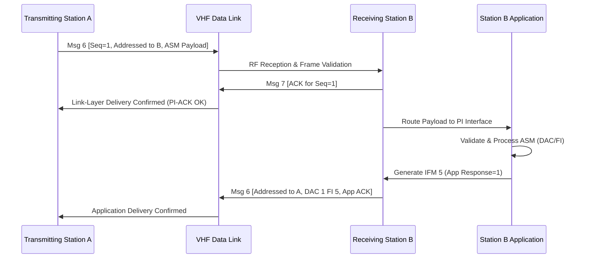

# Chapter 23 — Application-specific messages (ASM) and binary payloads

> **Part IV — The system: architecture and protocol.** Structured application telemetry, environmental broadcasts, and custom binary extensions over the VHF data link.

**In this chapter.** You will learn how application-specific messages (**ASMs**) encapsulate structured maritime telemetry, hydrographic observations, fairway closures, and dynamic navigation notices inside Automatic Identification System (**AIS**) binary containers. We examine the 16-bit application identifier architecture spanning Designated Area Codes (**DACs**) and Function Identifiers (**FIs**), the Annex 4 drafting rules governing bit packing and byte alignment, and the international functions established under International Maritime Organization (**IMO**) circulars SN/Circ.236 and SN.1/Circ.289. You will inspect regional extensions in North American waterways and European inland rivers, evaluate link-layer capacity constraints and sequence-acknowledgment handshakes, and deconstruct area notices and meteorological payloads down to the individual bit. Finally, we dissect real-world parser divergence across open-source decoders, review regulatory boundaries under US and international law, examine the threat model surrounding arbitrary binary payloads, and understand why the presentation display gap historically restricted widespread operational uptake.

## 23.1 The binary encapsulation architecture

The primary mission of the Automatic Identification System is broadcast collision avoidance and situational awareness via autonomous position reports and voyage declarations. However, the system architects recognized from the outset that the VHF data link (**VDL**) could also serve as an over-the-air digital bearer for custom maritime telemetry, port administration, hydrographic broadcasts, and tactical waterway management. This capability is delivered through **application-specific messages**, defined by the International Telecommunication Union Radiocommunication Sector (**ITU-R**) in **Recommendation ITU-R M.1371** (Annex 4 in ITU-R M.1371-6; formerly Annex 5 in ITU-R M.1371-5).

Rather than standardizing hundreds of distinct top-level message identifiers in the core protocol catalog, the standard defines a clean binary container architecture. As detailed in [Chapter 22](ch22-message-catalog.md), four dedicated container messages carry application payloads across the link:
- **Message 6 (Addressed Binary Message, ABM):** Point-to-point delivery from a mobile station or base station to a specific recipient MMSI, supporting link-layer retries and sequence numbers.
- **Message 8 (Broadcast Binary Message, BBM):** Point-to-multipoint omnidirectional broadcast received by all stations within VHF line-of-sight.
- **Message 25 (Single-Slot Binary Message):** An ultra-compact binary format designed to transmit either addressed or broadcast payloads within a single 256-bit slot without the overhead of multi-slot scheduling.
- **Message 26 (Multiple-Slot Binary Message with Communications State):** An autonomous multi-slot binary burst that appends SOTDMA or ITDMA link-state bits to reserve future transmission slots directly from mobile transponders.

Inside these container envelopes, the binary payload is routed to downstream applications using a standardized 16-bit **Application Identifier** (**AI**), composed of two subfields:
1. **Designated Area Code (DAC):** A 10-bit integer (values 0–1023) defining the geographic or jurisdictional scope of the message.
2. **Function Identifier (FI):** A 6-bit integer (values 0–63) identifying the specific functional data structure within that DAC.

```
+-----------------------------------------------------------------------------+
|                          ITU-R M.1371 Binary Container                      |
|                                                                             |
|  +--------------------+---------------------------+-----------------------+  |
|  | Container Header   | Application Identifier    | Application Payload   |  |
|  | (Msg 6, 8, 25, 26) | (16 bits)                 | (Structured Bits)     |  |
|  |                    |                           |                       |  |
|  | Msg ID, Repeat,    | +-----------+-----------+ | Field 1, Field 2, ... |  |
|  | Source MMSI, ...   | |  10-bit   |   6-bit   | | Spares for alignment |  |
|  |                    | |    DAC    |    FI     | |                     |  |
|  |                    | +-----------+-----------+ |                       |  |
|  +--------------------+---------------------------+-----------------------+  |
+-----------------------------------------------------------------------------+
```

The 10-bit DAC allocation divides the namespace into well-defined governance domains:
- **DAC 0:** Reserved for system testing and manufacturer demonstrations.
- **DAC 1–9:** International Application Identifiers (**IAI**), governed globally by international bodies including ITU and IMO.
- **DAC 10–999:** Regional Application Identifiers (**RAI**). These numeric identifiers directly mirror the 3-digit Maritime Identification Digits (**MID**) assigned to nation-states under ITU-R M.585, allowing national maritime administrations to allocate regional messages without international coordination conflicts. Certain special regional codes also reside here, such as DAC 200 dedicated to European Inland Navigation.
- **DAC 1000–1023:** Reserved for future global expansion.

By prefixing every payload with this 16-bit AI tuple `(DAC, FI)`, a receiving station's AIS transponder does not need to parse or understand the application data. The transponder simply validates the frame check sequence, extracts the binary payload, encapsulates it into an `!AIVDM` sentence on its Presentation Interface (**PI**), and passes it to attached charting systems, shipboard controllers, or telemetry processors.

> **Definitions that bite.** An **Application-Specific Message (ASM)** refers strictly to the combination of the 16-bit Application Identifier `(DAC, FI)` and its formatted binary payload. It is often conflated with container **Message 8**, but an ASM can be transported across Messages 6, 8, 25, or 26. Conversely, not all Message 25 packets contain an ASM: Message 25 includes a 1-bit *structured data flag*; when this flag is `0`, the payload represents unstructured raw binary bits lacking a DAC/FI header entirely.

## 23.2 International function messages (DAC 1) and core link operations

Annex 4 of ITU-R M.1371 sets aside the first block of Function Identifiers under International DAC 1 (`DAC = 001`) for core link administration, text telegrams, and capability negotiation. These built-in system functions are known as **International Function Messages** (**IFMs**):

```
+--------+---------------------------------------+------------------+
| FI     | Operational Function                  | Transport Mode   |
+--------+---------------------------------------+------------------+
| FI 0   | Text Telegram                         | Msg 6, 8, 25, 26 |
| FI 1   | General Acknowledgment (Discontinued) | Legacy           |
| FI 2   | Interrogation on Specific IFM         | Msg 6 (Addressed)|
| FI 3   | Capability Interrogation              | Msg 6 (Addressed)|
| FI 4   | Capability Reply                      | Msg 6 (Addressed)|
| FI 5   | Application Acknowledgment            | Msg 6 (Addressed)|
| FI 6–9 | Reserved for System Architecture      | System           |
| FI 10– | International Operational Messages   | IMO Governance   |
+--------+---------------------------------------+------------------+
```

### 23.2.1 Text telegrams (IFM 0) and the padding artifact
International Function Message 0 provides unstructured plain-text messaging. It begins with an 11-bit text sequence number (where `0` denotes an unsequenced text message, and `1`–`2047` tracks transaction state), immediately followed by text serialized using the standard AIS 6-bit ASCII character table. 

Under the framing rules of Annex 4 (§A4-4), the total length of an application payload should maintain 8-bit byte alignment. Because text characters occupy 6 bits and the leading sequence field occupies 11 bits, padding bits must often be appended to reach a byte boundary. When an odd number of spare bits is required, a curious visual artifact emerges:
- If 7 spare bits are required to satisfy the byte boundary, the first 6 zero bits (`000000`) match the 6-bit ASCII code for the `@` character.
- Naive decoder implementations that parse text strictly to the byte boundary without inspecting the explicit character length frequently display a spurious `@` at the end of the line (e.g., displaying `ALBANY@` instead of `ALBANY`).

### 23.2.2 Capability negotiation and application acknowledgments
A persistent operational problem in marine VHF networking is determining whether a remote vessel possesses the software capable of interpreting a specialized binary message. ITU-R M.1371 solves this through IFM 2, IFM 3, and IFM 4:
- An interrogation station transmits **IFM 3 (Capability Interrogation)** addressed to a target MMSI via Message 6, specifying a target DAC.
- The recipient, if equipped with an active Presentation Interface application, replies with **IFM 4 (Capability Reply)**. IFM 4 carries a fixed 352-bit payload across 2 TDMA slots containing a 10-bit DAC and a 128-bit availability bitmap. The bitmap allocates exactly 2 bits per FI (covering FI 0 through FI 63), where the first bit indicates operational availability (`1 = available`, `0 = not available`) and the second bit is reserved.

When an addressed operational binary message is delivered, link-layer delivery confirmation is established by a Message 7 or 13 acknowledgment. However, link-layer delivery does not guarantee that the downstream navigation software consumed the data. For true end-to-end confirmation, the sender requests an **IFM 5 (Application Acknowledgment)**. Carried in a single-slot Message 6 (168 bits), IFM 5 returns the exact `(DAC, FI)` tuple, the 11-bit sequence number, and a 3-bit application response code:
- `0`: Application unable to process payload.
- `1`: Successfully processed and acknowledged.
- `2`: Request accepted, complete response to follow.
- `3`: Processing capable, but currently inhibited by operator or configuration.

Crucially, ITU-R M.1371 §A4-5.5 dictates that an application station must **never** acknowledge a broadcast binary message (Message 8). If an interrogator receives a Message 7 link acknowledgment but no IFM 5 response, it must conclude that while the remote transponder is functioning on the airwaves, no host application is connected to its Presentation Interface.

> **Try it.** You can decode and verify real-world ASM payloads using the Python virtual environment configured for this handbook. Open a terminal, activate the book's environment, and run this verification snippet against the Cape Cod right-whale area notice vector:
> ```bash
> . /usr/local/google/home/schwehr/sdd-books/ais/fable/.venv/bin/activate
> python -c '
> import pyais
> sample = "!AIVDM,1,1,,B,803Ovrh0EP:024\`@02PN04da=3V<>N0000,4*39"
> msg = pyais.decode(sample)
> print(f"Message ID: {msg.msg_type}, MMSI: {msg.mmsi}")
> print(f"DAC: {msg.dac}, FI: {msg.fid}")
> print(f"Linkage ID: {msg.linkage}, Notice Type: {msg.notice}")
> print(f"Valid: Month {msg.month}, Day {msg.day} at {msg.hour:02d}:{msg.minute:02d} UTC")
> print(f"Duration: {msg.duration} min, Sub-areas: {msg.sub_areas}")
> '
> ```
> Expected output:
> ```text
> Message ID: 8, MMSI: 3669739
> DAC: 1, FI: 22
> Linkage ID: 10, Notice Type: 0
> Valid: Month 1, Day 1 at 05:02 UTC
> Duration: 20 min, Sub-areas: [{'shape': 0, 'shape_str': 'circle', 'scale': 1, 'lon': -69.86498, 'lat': 42.08295, 'precision': 4, 'radius': 9260}]
> ```

## 23.3 The international registry: SN/Circ.236 to SN.1/Circ.289

While ITU-R standardizes the transport mechanics of ASMs, the semantic catalog of international maritime applications is governed by the IMO Sub-Committee on Navigation, Communications and Search and Rescue (**NCSR**, formerly the NAV Sub-Committee). The evolution of international operational ASMs occurred across two major regulatory eras.

### 23.3.1 The trial era: SN/Circ.236 (2004)
In May 2004, the IMO issued **SN/Circ.236**, titled *Guidance on the Application of AIS Binary Messages*. Designed as an initial trial framework for operational testing, SN/Circ.236 standardized seven foundational functional messages under DAC 1:
- **FI 11 (Broadcast):** Meteorological and hydrographic data.
- **FI 12 (Addressed):** Dangerous cargo indication.
- **FI 13 (Broadcast):** Fairway closed notification.
- **FI 14 (Addressed):** Tidal window advice.
- **FI 15 (Broadcast):** Extended ship static and voyage-related data (air draught and hazardous categories).
- **FI 16 (Addressed):** Number of persons on board.
- **FI 17 (Broadcast):** Pseudo-AIS targets (synthetic targets created by shore radar).

Although widely implemented across pilot projects in Northern Europe and North America, SN/Circ.236 suffered from structural limitations. Coordinate encodings lacked standardized scaling; meteorological structures lacked precision flags; and the message catalog lacked dynamic geographic shapes, waterway routing instructions, or generalized area warnings.

### 23.3.2 The mature framework: SN.1/Circ.289 (2010)
Following extensive technical development by the IMO NAV 55 Correspondence Group (coordinated largely by Sweden, with substantial contributions from the US Coast Guard and the international navigation community), the IMO approved **SN.1/Circ.289** on 2 June 2010. 

SN.1/Circ.289 revoked SN/Circ.236 effective 1 January 2013 and established a comprehensive, rigorously specified catalog of international applications under DAC 1:

```
+----+------------------------------------------------+-----+-------+
| FI | Description / Purpose                          | Msg | Slots |
+----+------------------------------------------------+-----+-------+
| 16 | Number of persons on board (SAR & emergency)   |  6  |   1   |
| 17 | VTS-generated / Synthetic targets              |  8  |  1–2  |
| 18 | Clearance time to enter port                   |  6  |   1   |
| 19 | Marine traffic signal status                   |  8  |   1   |
| 20 | Berthing data                                  |  6  |  1–2  |
| 21 | Weather observation report from ship           |  8  |  1–2  |
| 22 | Area notice broadcast                          |  8  |  1–5  |
| 23 | Area notice addressed                          |  6  |  1–5  |
| 24 | Extended ship static & voyage-related data     |  8  |   2   |
| 25 | Dangerous cargo indication                     |  6  |   1   |
| 26 | Environmental conditions                       |  8  |  1–2  |
| 27 | Route information broadcast                    |  8  |  1–5  |
| 28 | Route information addressed                    |  6  |  1–5  |
| 29 | Text description broadcast                     |  8  |  1–5  |
| 30 | Text description addressed                     |  6  |  1–5  |
| 31 | Meteorological and hydrographic data           |  8  |  1–2  |
| 32 | Tidal window                                   |  6  |   1   |
+----+------------------------------------------------+-----+-------+
```

Concurrently, the IMO published companion circular **SN.1/Circ.290**, setting forth human-machine interface (**HMI**) guidelines for the portrayal of ASM information on navigation displays.

### 23.3.3 The Area Notice architecture (FI 22 and FI 23)
Among the Circ.289 messages, **FI 22 (Broadcast Area Notice)** and **FI 23 (Addressed Area Notice)** represent the most flexible geospatial constructs in AIS. Engineered to deliver dynamic maritime safety information directly to electronic charting systems, an Area Notice defines a time-bounded geographic feature linked to an operational warning or navigation instruction.

An Area Notice packet begins with a common header:
- **Message Linkage ID (10 bits):** Groups multi-part messages or links updates to an earlier notice.
- **Notice Description (7 bits):** Identifies the operational category (values 0–127), spanning caution areas, marine mammal habitats, military firing exercises, dredge operations, pipeline construction, salvage operations, and offshore regattas.
- **Start Time (20 bits total):** Packed into month (4 bits), day (5 bits), hour (5 bits), and minute (6 bits) in UTC.
- **Duration (18 bits):** Active duration in minutes (0 to 262,143 minutes, representing up to ~182 days; `0` denotes cancellation).

Immediately following the header, the payload packs between one and nine geometric **sub-areas**, using up to 5 TDMA slots. Each sub-area is identified by a 3-bit shape code:
- `Shape 0 (Circle or Point):` Center latitude and longitude, precision (3 bits), and radius (12 bits) scaled by a 2-bit multiplier ($1\times, 10\times, 100\times, 1000\times$).
- `Shape 1 (Rectangle):` Center point, easting/northing dimensions, and azimuth orientation.
- `Shape 2 (Sector):` Center point, inner/outer radius, and angular bearings.
- `Shape 3 (Polyline):` A sequence of up to four relative or absolute waypoint bearings and distances representing channels, cables, or boundaries.
- `Shape 4 (Polygon):` Closed perimeter formed by boundary vertices.
- `Shape 5 (Associated Text):` Plain-text description directly linked to the spatial geometry.

By projecting dynamic hazards into mathematical geometries, the Area Notice transformed AIS from a ship-tracking channel into a dynamic tactical charting protocol.

## 23.4 Regional registries: North America, Europe, and national DACs

Because international standardization through the IMO requires multi-year consensus cycles, Recommendation ITU-R M.1371 deliberately reserved regional DACs (10–999) to empower national hydrographic offices, river commissions, and coastal authorities to innovate.

```
+-----------------------------------------------------------------------------+
|                          The Global DAC Address Space                       |
|                                                                             |
| [ 0 ]       [ 1 - 9 ]        [ 10 - 999 ]                    [ 1000 - 1023] |
| Test & Demo  International    Regional (RAI based on MID)     Reserved      |
|             (IAI - IMO)       - 200: European Inland (CESNI)                |
|                               - 219: Denmark (DMA)                          |
|                               - 235 / 250: United Kingdom (Trinity House)   |
|                               - 265: Sweden (SMA)                           |
|                               - 316: Canada (CCG / Seaway)                  |
|                               - 366 / 367: United States (USCG / USACE)     |
|                               - 412: China (MSA)                            |
+-----------------------------------------------------------------------------+
```

### 23.4.1 The St. Lawrence Seaway (DAC 316 and DAC 366)
The St. Lawrence Seaway was the first waterway in North America to mandate universal AIS carriage, establishing binding requirements in March 2003 under 33 CFR § 401.20. Jointly managed by the Canadian St. Lawrence Seaway Management Corporation (**SLSMC**) and the US Great Lakes St. Lawrence Seaway Development Corporation (**GLS**, formerly SLSDC), the Seaway deployed an integrated Traffic Management System (**TMS**) utilizing shore-originated binary messages.

Because the Seaway straddles international borders, transmissions originating from Canadian shore stations employ Canadian **DAC 316**, while transmissions from US stations employ US **DAC 366**. The Seaway specification introduced an internal **sub-identifier** scheme within its Function Identifiers:
- **FI 1 (Waterway Environmental Data):** Sub-ID 1 (Weather station), Sub-ID 2 (Wind conditions), Sub-ID 3 (Water levels referenced to the International Great Lakes Datum, **IGLD-85**), Sub-ID 6 (Water flow and surface currents).
- **FI 2 (Vessel Traffic Management):** Sub-ID 1 (Lockage order schedule), Sub-ID 2 (Estimated lock arrival times).
- **FI 32 (System Management):** Sub-ID 1 (Protocol and software version verification).

In April 2010, the Seaway released Revision 4.1 of its data specification, standardizing reserved alignment bits and adding 2 bits to the Water Level Report to indicate whether readings represent rolling averages, real-time measurements, or predicted hydraulic levels.

### 23.4.2 United States Coast Guard and USACE (DAC 366 and DAC 367)
In the United States, early research and development into binary messaging was spearheaded by the USCG Research & Development Center (**RDC**) under the *AIS Transmit Project* initiated in 2007. The baseline operational trials began in September 2008 in Tampa Bay, Florida, where NOAA Physical Oceanographic Real-Time System (**PORTS**) water-level and meteorological observations were fetched every 3 minutes, formatted into Message 8 packets, and broadcast over the Largo, Florida VTS base station.

Historically, US prototypes were deployed under **DAC 366** (the primary US Maritime Identification Digit). To cleanly separate experimental R&D messages from operational fleet standards, the USCG transitioned its public civil specifications to secondary **DAC 367**:
- **DAC 367 FI 22:** Geographic Notice (Version 2, multi-slot area warnings).
- **DAC 367 FI 29:** Linked Text Description (Version 1).
- **DAC 367 FI 33:** Environmental Observation Message (Version 3, packing wind, water levels, currents, sea state, and air/water temperature across 2 slots).
- **DAC 367 FI 35:** Waterways Management Message (Version 2, controlling dynamic bridge clearances and anchorage zones).

Concurrently, the US Army Corps of Engineers (**USACE**) registered specialized drafts under DAC 367, including FI 23–25 (Satellite Ship Weather) and FI 26 (GPS Jamming and Spoofing Report). Meanwhile, DAC 366 was permanently retained by the USCG for its secure tactical "Blue Force" tracking family, utilizing encrypted Message 25 and 26 variants (e.g., FI 13 SAR Pattern, FI 15 Trackline Report, and FI 38 SITREP) to support federal maritime law enforcement and search operations.

### 23.4.3 European Inland Navigation (DAC 200)
In stark contrast to the optional maritime guidelines of the open ocean, European inland waterways established mandatory, legally binding ASM standards. Under the European Union River Information Services (**RIS**) framework (**Directive 2005/44/EC** and implementing regulations **Regulation (EC) No 415/2007** and **Regulation (EU) 2019/838**), inland commercial craft traversing European waterways (such as the Rhine and Danube) must broadcast dedicated inland data structures governed by the European Committee for Drawing Up Standards in the Field of Inland Navigation (**CESNI**).

All European inland applications operate under **DAC 200**:
- **FI 10 (Inland Ship Static and Voyage-Related Data):** Mandatory for all inland vessels. It broadcasts the European Vessel Identification Number (**ENI**, an 8-character unique alphanumeric code), length and beam rounded to decimeters, specific inland vessel and convoy type classifications, maximum present static draught, hazardous cargo blue-cone indicators, and sensor quality flags.
- **FI 24 / FI 26 (Water Level Report):** Transmits gauge readings and trend indicators for shallow-draft navigation.
- **FI 40 / FI 41 (Signal Station Status):** Encapsulates the visual signaling displays (traffic lights, regulatory shapes) of shore-based lock control stations.
- **FI 55 (Number of Persons on Board):** Transmits crew and passenger totals directly from transponder firmware to support emergency first responders during canal incidents.

Because DAC 200 FI 10 and FI 55 are embedded directly into the type-approved firmware of certified Inland AIS transponders, European inland waterways achieved virtually 100% operational ASM compliance within their commercial fleet.

> **Case file.** In 2008, the Right Whale AIS Project (**RAP**) deployed an automated bioacoustic listening array consisting of ten subsurface hydrophone buoys along the Boston Harbor Traffic Separation Scheme (**TSS**) in Massachusetts Bay. Developed through a partnership between Cornell University's Bioacoustics Research Program, the Woods Hole Oceanographic Institution (**WHOI**), NOAA's Stellwagen Bank National Marine Sanctuary, and the University of New Hampshire's Center for Coastal and Ocean Mapping (**CCOM**), the system detected the distinctive vocalizations of endangered North Atlantic right whales in real time. Upon acoustic confirmation, a shore-side processing node synthesized a dynamic caution zone and triggered a broadcast binary message (Message 8, DAC 1, FI 22 Area Notice) from a regional USCG base station. Commercial container ships and tankers entering Boston approaches received the 20-minute, 5-nautical-mile cautionary circle directly on their shipboard electronic displays, instructing watchstanders to reduce speed to 10 knots to mitigate fatal ship-strike risks.

## 23.5 Link-layer economics, capacity budgeting, and the display gap

Deploying application-specific messages over the maritime VHF data link requires strict adherence to link-layer physics. AIS is fundamentally a radio network engineered for cooperative collision avoidance. Every transmission dedicated to an environmental report or lock schedule consumes transmission slots that would otherwise carry Class A and Class B position reports.

### 23.5.1 Capacity arithmetic and the 168-bit slot budget
As detailed in [Chapter 21](ch21-link-layer-tdma.md), the physical link operates at 9,600 bits per second across 25-kHz channels, dividing each 60-second minute into exactly 2,250 slots of 26.67 milliseconds. A standard TDMA slot spans 256 nominal bit periods. 

However, protocol overhead drastically reduces the space available for user payloads. The link-layer frame includes:
- Power ramp-up and synchronization preamble: 24 bits
- HDLC start flag (`01111110`): 8 bits
- Frame Check Sequence (16-bit CCITT CRC): 16 bits
- HDLC stop flag (`01111110`): 8 bits
- Transmitter power ramp-down and distance propagation buffer: 24 bits

This leaves exactly **168 raw data bits** per single-slot transmission. 

When evaluating a single-slot **Message 8** transmission:
$$\text{Available Slot Bits} = 168\text{ bits}$$
$$\text{Message 8 Header (Msg ID, Repeat, Source MMSI, Spare)} = 6 + 2 + 30 + 2 = 40\text{ bits}$$
$$\text{Application Identifier (DAC + FI)} = 10 + 6 = 16\text{ bits}$$
$$\text{Remaining Usable Payload} = 168 - 40 - 16 = 112\text{ bits}$$

For **Message 6**, the overhead is even heavier due to the 30-bit destination MMSI, 2-bit sequence number, and 1-bit retransmit flag, leaving only **80 bits** of usable application data in a single slot.

When an application payload exceeds 112 bits, the transponder must bind consecutive slots together:
- A 2-slot packet provides $168 + 256 = 424$ data bits.
- A 3-slot packet provides $424 + 256 = 680$ data bits.
- A 4-slot packet provides $680 + 256 = 936$ data bits.
- A 5-slot packet provides $936 + 256 = 1{,}192$ data bits.

Furthermore, HDLC bit-stuffing rules insert an extra `0` bit after any sequence of five consecutive `1`s. As cautioned in ITU-R M.1371 Table 29, bit stuffing expands the serialized frame by up to 5–10% depending on bit entropy. If an unconstrained application developer packs maximum data bits into a nominal multi-slot boundary without leaving margin for bit stuffing, the physical packet will spill over into the guard buffer or leak into the subsequent TDMA slot, destroying adjacent ship transmissions.

### 23.5.2 Sequencing, timeouts, and link handshakes
Addressed application messages (Message 6, 25, and 26) carry a 2-bit link-layer sequence number (values 0–3). When a coastal station transmits an addressed ASM, it initiates a strict state machine defined in ITU-R M.1371 Annex 5.



If Station B fails to hear the initial transmission, Station A waits for an acknowledgment timeout window (typically 4 to 8 seconds). If no Message 7 arrives, Station A retransmits up to two times. If all retries fail, Station A's transponder logs a failure and outputs a `PI-ACK(FAIL)` sentence to its presentation host.

### 23.5.3 The presentation display gap
Despite two decades of intensive technical development and international circulars, operational adoption of ASMs in open ocean navigation remained remarkably low. The failure of maritime ASMs to achieve universal adoption was not driven by link-layer flaws, but by an institutional **display gap**:
1. **Absence of Carriage Mandates:** IMO Resolution MSC.74(69) and SOLAS Chapter V mandate AIS for navigation tracking, but neither SOLAS nor the international ECDIS performance standard (**IEC 61174**) required chart displays to parse or portray ASMs. Shipboard ECDIS units were mandated only to display standard AIS target symbols (sleeping, activated, and dangerous vessel triangles).
2. **Firmware and Interface Isolation:** Transponders routinely delivered `!AIVDM` binary sentences out of their NMEA 0183 presentation ports, but bridge navigation displays discarded them as unhandled sentences.
3. **Display Clutter and Liability:** Marine electronics manufacturers were reluctant to render non-standard polygons, weather vectors, or text notes over official navigational charts without rigorous, legally binding display performance standards.
4. **Competition from Internet Protocols:** When mobile broadband (cellular LTE near shore, and satellite services such as Starlink and FleetBroadband offshore) became ubiquitous, maritime services bypassed AIS entirely. Dynamic right-whale alerts, weather overlays, and port schedules migrated to pilot tablets, mobile apps (such as *Whale Alert*), and web portals, which delivered rich cartographic interfaces without consuming scarce VHF radio spectrum.

## Then & now

| Historical baseline (2002–2010) | Modern state (2026) |
|---|---|
| ⟨H⟩ Regional binary messaging emerged as isolated, ad-hoc waterway trials (e.g., St. Lawrence Seaway DAC 316/366 in 2002). | ⟨+⟩ Fully unified international registry maintained under the IALA ASM Collection, harmonized with S-100 data modeling (ITU-R M.1371-6). |
| ⟨H⟩ Initial international framework defined under trial circular IMO SN/Circ.236 (2004) covering early met/hydro, tidal, and cargo indicators. | ⟨+⟩ Comprehensive international catalog operating under IMO SN.1/Circ.289; SN/Circ.236 formally deprecated. |
| ⟨H⟩ US Coast Guard tested experimental environmental and area notices under national MID DAC 366 (2007–2009). | ⟨+⟩ Public US civil waterway applications standardized under DAC 367; DAC 366 permanently reserved for secure tactical Blue Force operations. |
| ⟨H⟩ Fixed single-slot and multi-slot Message 6 and 8 containers frequently caused TDMA slot congestion and buffer overruns under bit-stuffing spikes. | ⟨+⟩ Stringent capacity budgeting rules under ITU-R M.1371-6 Table 29, paired with compact Message 25 and 26 structures. |
| ⟨H⟩ Incompatible proprietary formats forced shore operators to build custom parser scripts for every local port. | ⟨+⟩ Universal open-source decoding libraries (pyais, libais, ais-area-notice) and standardized JSON schemas provide turnkey multi-message parsing. |
| ⟨H⟩ Bridge navigation software universally ignored binary messages, discarding incoming `!AIVDM` sentences at the presentation layer. | ⟨+⟩ S-100 dual-fuel ECDIS standards (IEC 61174 / IMO MSC.530(106)) natively integrate dynamic digital data services. |
| ⟨H⟩ All application telemetry competed directly with safety-critical Class A position reports across channels AIS 1 and AIS 2. | ⟨+⟩ VHF Data Exchange System (**VDES**) allocates dedicated, high-speed maritime ASM and satellite channels (ITU-R M.2092-1). |

## On the wire

Every ASM packet transmitted across the airwaves is packaged within an encapsulated ASCII armor string conforming to the NMEA 0183 / IEC 61162-1 standard. To see how bits map from radio modulation to application parameters, we trace a real-world broadcast area notice.

### Deconstructing the right-whale Area Notice vector
Consider the following verified broadcast binary sentence from the historical test corpus:
```text
!AIVDM,1,1,,B,803Ovrh0EP:024`@02PN04da=3V<>N0000,4*39
```

This single-sentence NMEA packet encapsulates a 40-character 6-bit ASCII payload armor string `803Ovrh0EP:024`@02PN04da=3V<>N0000` with 4 fill bits. 

Subtracting ASCII offset 48 (and adjusting for codes $> 40$ by subtracting an additional 8), each ASCII armor character unpacks into a 6-bit nibble. The total bitstream length is:
$$\text{Total Bits} = (40 \times 6) - 4 = 240 - 4 = 236\text{ bits}$$

The table below provides a bit-level field deconstruction of this exact packet:

| Bit range | Field description | Encoded bits (Hex/Bin) | Decoded value | Engineering interpretation |
|---|---|---|---|---|
| **0–5** | Message Identifier | `001000` | 8 | Message 8 (Broadcast Binary Container) |
| **6–7** | Repeat Indicator | `00` | 0 | Original transmission (no relay) |
| **8–37** | Source MMSI | `000000001101111111111011101011` | 3669739 | US Coast Guard Shore Base Station |
| **38–39** | Spare | `00` | 0 | Link-layer boundary alignment |
| **40–49** | Designated Area Code (DAC) | `0000000001` | 1 | International Application Identifier (IAI) |
| **50–55** | Function Identifier (FI) | `010110` | 22 | Area Notice Broadcast (IMO SN.1/Circ.289) |
| **56–65** | Message Linkage ID | `0000001010` | 10 | Unique notice instance identifier |
| **66–72** | Notice Description | `0000000` | 0 | Caution Area: Marine mammal habitat |
| **73–76** | Validity Month | `0001` | 1 | January |
| **77–81** | Validity Day | `00001` | 1 | 1st day of the month |
| **82–86** | Validity Hour | `00101` | 5 | 05:00 UTC |
| **87–92** | Validity Minute | `000010` | 2 | :02 minutes (Start: 05:02 UTC) |
| **93–110** | Active Duration | `000000000000010100` | 20 | Active for 20 minutes |
| **111–113** | Sub-Area Shape | `000` | 0 | Circular Area Geometry |
| **114–115** | Scale Factor Multiplier | `01` | 1 | Radius Multiplier: $10^1 = 10\times$ |
| **116–140** | Center Longitude | `1110000000000100101100101` | −4,191,899 | $-69.864983^\circ$ (Signed two's comp, $1/1000'$) |
| **141–164** | Center Latitude | `001001101000011100110001` | 2,524,977 | $+42.082950^\circ$ (Signed two's comp, $1/1000'$) |
| **165–167** | Position Precision | `100` | 4 | Coordinates precise to 4 decimal places |
| **168–179** | Geographic Radius | `001110011110` | 926 | $926 \times 10 = 9{,}260\text{ m}$ (5.00 nmi) |
| **180–199** | Sub-Area Spare | `00000000000000000000` | 0 | Sub-area 90-bit frame padding |
| **200–235** | Container Padding | `0000...` | 0 | Spares to byte boundary & fill bits |

### Key on-the-wire architectural insights
1. **Coordinate Projection Divergence:** Notice that standard AIS position reports (Messages 1, 2, 3, and 18) scale latitude and longitude by $1/10{,}000$ of an arc-minute ($1/600{,}000$ degree), yielding 28-bit longitude and 27-bit latitude fields. By contrast, the Circ.289 Area Notice utilizes a more compact $1/1{,}000$ of an arc-minute ($1/60{,}000$ degree) scaling, requiring only 25 bits for longitude and 24 bits for latitude. Inverting these scale factors results in massive cartographic displacement errors.
2. **The 90-Bit Sub-Area Geometry:** A circular sub-area occupies exactly 90 bits: Shape (3) + Scale (2) + Longitude (25) + Latitude (24) + Precision (3) + Radius (12) + Spare (21) = 90 bits. Up to nine sub-areas can be chained consecutively within a single Message 8 multi-slot burst.

> **Worked example.** Let us verify the geographic coordinates and radius calculation from the raw two's complement integers extracted above:
> 
> 1. **Center Longitude Decoding:**
>    Raw 25-bit binary: `1110000000000100101100101`
>    The leading bit is `1`, indicating a negative coordinate. Computing the two's complement:
>    $$\text{Invert bits} = \mathtt{0001111111111011010011010}$$
>    $$\text{Add 1} = \mathtt{0001111111111011010011011}_2 = 4{,}191{,}899_{10}$$
>    The scaling factor specified by SN.1/Circ.289 is $1/1{,}000$ of an arc-minute ($1/60{,}000$ of a degree):
>    $$\text{Longitude} = -\frac{4{,}191{,}899}{60{,}000} \approx -69.8649833^\circ\text{ W}$$
> 
> 2. **Center Latitude Decoding:**
>    Raw 24-bit binary: `001001101000011100110001`
>    The leading bit is `0`, indicating a positive coordinate:
>    $$\text{Decimal Value} = 2{,}524{,}977_{10}$$
>    $$\text{Latitude} = +\frac{2{,}524{,}977}{60{,}000} \approx +42.0829500^\circ\text{ N}$$
> 
> 3. **Radius Calculation:**
>    Raw 12-bit radius: $\mathtt{001110011110}_2 = 926_{10}$
>    Scale multiplier code `01` signifies $10^1 = 10$:
>    $$\text{Radius} = 926 \times 10 = 9{,}260\text{ meters}$$
>    $$9{,}260\text{ m} / 1{,}852\text{ m/nmi} = 5.000\text{ nautical miles}$$
> 
> The packet defines a 5.0-nautical-mile circular cautionary zone centered at $42^\circ 04.977'\text{ N}, 069^\circ 51.899'\text{ W}$ in Massachusetts Bay directly over the Boston shipping lanes.

## Validation, uncertainty & data quality

Because application-specific messages encapsulate custom data structures that bypass core transponder validation, they represent a significant source of silent data corruption in marine software systems. Data pipelines must implement rigorous validation checks across every transformation layer.

```
Incoming RF Bitstream
  │
  ├── [Layer 1: Frame Integrity] ─────── Check HDLC CRC-16 & bit-stuffing budget
  │
  ├── [Layer 2: Registry Validation] ─── Match (DAC, FI) against authoritative catalog
  │
  ├── [Layer 3: Coordinate Scaling] ──── Enforce 1/1,000' (ASM) vs 1/10,000' (Msg 1-3)
  │
  ├── [Layer 4: Sentinel Filtering] ──── Purge "Data Not Available" placeholder states
  │
  └── Clean Application Object Passed to Navigation Display / Analytics DB
```

### 23.5.3 Parser divergence and unit disagreement
A major challenge in processing historical and live ASM feeds is software divergence between popular open-source decoding engines. Because the international specifications are published across dozens of disparate PDF circulars and tables, developers frequently disagree on unit conversions, field widths, and signedness:

1. **Area Notice Duration Field Divergence:**
   In IMO SN.1/Circ.289, the duration field of an Area Notice is an 18-bit integer expressing active duration in minutes. In the test sentence decoded above (`803Ovrh...`), the raw 18-bit integer is $20_{10}$ (`000000000000010100`). While `pyais` correctly extracts `duration = 20`, historical versions of `libais` contained a unit scaling bug that emitted `duration_minutes: 2`. Systems relying on unverified parsers risk discarding active safety warnings prematurely.
2. **Atmospheric Pressure in Met/Hydro Reports (DAC 1 FI 31):**
   In the Circ.289 meteorological and hydrographic message, atmospheric pressure is transmitted as a 9-bit offset integer, representing pressure from 799 hPa to 1310 hPa ($P = \text{val} + 799$). When sensor data is missing, the standard mandates a sentinel value of `511` ($511 + 799 = 1{,}310\text{ hPa}$). While `pyais` reports the raw integer `1310` hPa, certain legacy decoders incorrectly divide by 100, outputting `13.11`, confounding barometric trend analyses.
3. **Inland Navigation Vessel Draught (DAC 200 FI 10):**
   The CESNI Inland AIS specification defines vessel draught as an 11-bit unsigned integer scaled in centimeters ($1\text{ to }2{,}000\text{ cm}$, representing 0.01 m to 20.00 m). In the test vector `!AIVDM,1,1,,B,83aDChPj2d<dL<uM=hhhI?a@6HP0,0*40`, the encoded value is 204 centimeters (2.04 m). While `pyais` correctly decodes `draught: 2.04`, legacy decoders lacking the centimeter scale factor output `20.4`, falsely depicting a shallow-water canal barge as a deep-draft supertanker.

### 23.5.4 Sentinel value filtering
Sensors mounted on offshore buoys, lighthouses, and commercial vessels frequently fail or disconnect. When an automated station transmits an ASM, it must populate missing sensor readings with the standardized "data not available" sentinels defined in the circular. 

A worked example of this is the test sentence from an Irish AtoN buoy:
```text
!AIVDO,1,1,5,A,8>jR06@0Gwli:QQUP3en?wvlFR06EuOwgwl?wnSwe7wvlOwwsAwwnSGmwvh0,0*51
```
Decoding this sentence via `pyais` yields a complete array of "not available" sentinels:
- **Wind Speed:** `127` (Sentinel for not available; valid range 0–126 kn).
- **Wind Direction:** `360` (Sentinel for not available; valid range 0–359°).
- **Air Temperature:** `-102.4` °C (Sentinel for not available; valid range $-60.0$ to $+60.0$ °C).
- **Relative Humidity:** `101` % (Sentinel for not available; valid range 0–100 %).
- **Dew Point:** `50.1` °C (Sentinel for not available; valid range $-20.0$ to $+50.0$ °C).
- **Sea State:** `13` (Sentinel for not available; valid range 0–12 Beaufort).

Data processing systems that fail to check for sentinel values will compute catastrophic averages, such as reporting sea water temperatures of $+50.1^\circ\text{C}$ or sustained winds of 127 knots during calm harbor conditions.

When designing data ingestion pipelines for binary AIS payloads, **never rely on generic type inference**. As a practical rule of thumb, always wrap binary decoding in explicit schema filters that validate `(DAC, FI)` registration against the IALA collection, check each numeric field against its specific sentinel value, and discard unaligned payloads before passing data to downstream relational tables.

## Software

The software ecosystem for creating, parsing, and rendering application-specific messages is bifurcated between academic decoding libraries and specialized agency servers.

**Open source:**
- **pyais** (Python, MIT License): A modern, pure-Python AIS decoding library. It natively supports a comprehensive catalog of operational ASMs, including DAC 1 FIs 0, 11, 16, 17, 19, 20, 21, 22, 24, 26, 27, 29, 31; DAC 200 FIs 10, 23, 24, 40; and USCG DAC 367 FI 33. *Caveat:* Relegates unrecognized DAC/FI tuples to generic unparsed raw byte payloads without schema validation.
- **libais** (C++ with Python bindings, Apache-2.0): High-performance streaming decoder engineered for massive historical AIS archives. Provides deep parsing of legacy Circ.236 and modern Circ.289 formats. *Caveat:* Strictly raises `DecodeError` exceptions on unknown or malformed DAC/FI payloads, requiring applications to implement custom fallback exception wrappers.
- **ais-area-notice** (Python, BSD/MIT): Reference library and command-line utility originally developed by Kurt Schwehr for encoding and decoding IMO SN.1/Circ.289 Area Notices and USCG Geographic Notices into standard GeoJSON and Keyhole Markup Language (**KML**) geometries. *Caveat:* Focused exclusively on Area Notices (FI 22/23); does not decode meteorological or inland voyage payloads.
- **gpsd** (C, BSD License): The ubiquitous open-source GPS and sensor management daemon. Provides real-time decoding of standard AIVDM/AIVDO streams into structured JSON objects. *Caveat:* The ASM decoding engine in version 1.58 relies on outdated draft specifications for DAC 367 and partial Circ.289 schemas.

**Commercial:**
- **Kongsberg Norcontrol / Transas / Wärtsilä VTS Suites:** Comprehensive Vessel Traffic Management software deployed in coastal command centers worldwide. Features turnkey fetcher/formatter engines that ingest real-time sensor streams (radar, hydrometeo stations, lock controllers) and schedule automated FATDMA binary broadcasts over coastal base station networks. *Caveat:* Highly proprietary, expensive, closed-source ecosystems with rigid display constraints that resist third-party ASM prototyping.

## Standards & guides

- **ITU-R Recommendation M.1371-6** (2026): *Technical characteristics for an automatic identification system using time division multiple access in the VHF maritime mobile band.* Annex 4 specifies the global ASM architecture, DAC/FI allocation, International Function Messages 0–5, and capacity rules.
- **IMO SN.1/Circ.289** (2010): *Guidance on the use of AIS Application-Specific Messages.* The international catalog defining DAC 1 operational messages (FIs 16–32), revoking SN/Circ.236.
- **IMO SN.1/Circ.290** (2010): *Guidance for the presentation and display of AIS application-specific messages information.* Standards for rendering ASM symbols and text on shipboard displays.
- **IALA Guideline G1095** (Edition 1.1, 2013): *Harmonised Implementation of Application-Specific Messages (ASM).* Governing guide for national administrations on designing, registering, and testing ASMs.
- **IALA ASM Collection** (Ongoing): The international web registry hosted by IALA maintaining the authoritative status (proposal, testing, in force, deprecated, discontinued) of all global and regional DAC/FI assignments.
- **Commission Implementing Regulation (EU) 2019/838** (2019): *Technical specifications for vessel tracking and tracing systems.* Mandates DAC 200 FI 10 and FI 55 across the European inland waterway fleet.
- **Title 33, Code of Federal Regulations, Section 164.46** (USCG, 2015): Governs US domestic AIS operations, codifying strict transmission caps and permitted ASM catalogs.
- **ITU-R Recommendation M.2092-1** (2022): *Technical characteristics for a VHF data exchange system (VDES).* Establishes high-capacity ASM and VDE satellite channels that succeed legacy AIS VDL binary operations.

## Pitfalls

1. **Confusing coordinate scaling factors.** Standard position reports scale coordinates by $1/10{,}000$ of an arc-minute, while Circ.289 Area Notices scale coordinates by $1/1{,}000$ of an arc-minute. Treating an Area Notice coordinate with standard position report scaling shifts geographic features by a factor of 10, placing a hazard warning hundreds of miles away in another ocean basin.
2. **Ignoring bit-stuffing overhead in multi-slot budgeting.** Transmitting multi-slot binary messages that approach theoretical capacity limits without accounting for HDLC bit stuffing causes packet expansion over the air. The resulting burst exceeds the reserved TDMA slot boundary, generating destructive co-channel interference in adjacent time slots.
3. **Displaying the spurious `@` padding character.** Naive text decoders that read IFM 0 text telegrams to the 8-bit byte boundary interpret the 6 zero spare bits as valid ASCII code `000000`, appending an unwanted `@` symbol to the end of ship names and destination strings.
4. **Failing to filter invalid-data sentinels.** Interpreting unpopulated sensor fields (such as air temperature $-102.4^\circ\text{C}$, barometric pressure $1{,}310\text{ hPa}$, or wind speed 127 kn) as real measurements severely pollutes weather forecasting models and navigation safety assessments.
5. **Broadcasting unapproved regional DACs on the high seas.** Transmitting regional binary messages (such as DAC 367 or DAC 200) in international waters where foreign bridge displays possess no decoders pollutes the VDL with unparseable data. Regional DACs should only be transmitted within their recognized national jurisdictions.
6. **Violating regional transmission rate caps.** Transmitting high-frequency binary telemetry bursts violates coastal regulations, such as the US Coast Guard mandate under 33 CFR § 164.46(d)(4) capping binary messages at no more than one ASM per minute.
7. **Assuming link-layer delivery equals application processing.** A Message 7 or Message 13 link acknowledgment confirms only that the remote transponder's radio receiver demodulated the RF burst. It does not prove that an attached electronic chart system was powered on, configured, or capable of parsing the encapsulated `(DAC, FI)` payload.
8. **Inverting two's complement sign bits on negative coordinates.** Truncating or zero-padding signed 25-bit longitude or 24-bit latitude fields during integer conversion strips the sign bit, flipping western longitudes into eastern longitudes and placing North American notices in Siberia.
9. **Transmitting variable-length strings without length headers.** Packing free-text strings without explicit character counts or standard null-termination schemes forces downstream parsers to guess field boundaries, causing subsequent telemetry fields in the payload to suffer fatal phase alignment errors.
10. **Relying on deprecated SN/Circ.236 message structures.** Formulating meteorological or fairway broadcasts using obsolete SN/Circ.236 structures (such as FI 11 or FI 13) causes modern compliant ECDIS systems to discard the packets as deprecated or unparseable.

> **Threat model.** 
> - *Attacker capability:* A malicious actor equipped with an inexpensive Software-Defined Radio (SDR) and an open-source packet framing pipeline can transmit arbitrary Message 6 or Message 8 binary frames on marine VHF channels 87B and 88B.
> - *Exploitation vector:* Transmitting forged Area Notices (DAC 1 FI 22) to draw fake exclusion zones, bogus mine-warfare exercise areas, or fabricated dynamic speed limits over high-density traffic separation schemes. Alternatively, transmitting malformed variable-length payloads with malicious buffer lengths to trigger heap overflow or parser crash vulnerabilities in unpatched legacy ECDIS software.
> - *Operational impact:* Disruption of commercial navigation lanes, false avoidance maneuvers, bridge alarm storms, and denial of service against electronic charting displays.
> - *Defensive mitigation:* Bridge displays and coastal processors must implement defensive input validation, enforcing strict bounding boxes on coordinates, sanity-checking start/duration times, rejecting overlapping contradictory notices, and filtering unauthenticated binary messages from vessels operating without verified base station authorization.

> **Legal note.** Under **Title 33, Code of Federal Regulations, Section 164.46(d)(4)**, the transmission of AIS application-specific messaging within navigable waters of the United States is strictly regulated:
> 
> *"AIS application-specific messaging (ASM) is permissible, but is limited to applications adopted by the International Maritime Organization (such as IMO SN.1/Circ.289) or those denoted in the … (IALA) ASM Collection for use in the United States or Canada, and to no more than one ASM per minute."*
> 
> Transmitting unauthorized binary messages, utilizing unregistered private DAC/FI structures without Coast Guard authorization, or exceeding the statutory rate limit of one message per minute violates federal navigation safety regulations, exposing the vessel master, owner, or transmitting entity to administrative civil penalties and operational suspension under the Ports and Waterways Safety Act.

## Key takeaways

- Application-specific messages package structured telemetry, environmental observations, and dynamic waterway notices inside standard AIS binary containers (Messages 6, 8, 25, and 26).
- Every ASM is routed using a 16-bit Application Identifier tuple composed of a 10-bit Designated Area Code (**DAC**) and a 6-bit Function Identifier (**FI**).
- DAC 1 governs global International Application Identifiers under IMO supervision, while DACs 10–999 map directly to national Maritime Identification Digits (**MID**) for regional coastal management.
- International Function Messages (IFM 0–5) provide core system utilities, including plain-text telegrams, capability interrogations, bitmap replies, and application-level delivery confirmations.
- **IMO SN.1/Circ.289** represents the authoritative international operational catalog, defining robust formats for meteorological/hydrographic data, dangerous cargo, berthing, and dynamic Area Notices, formally superseding the trial SN/Circ.236 standard.
- The Area Notice format (DAC 1 FI 22/23) encapsulates dynamic point, circular, sector, and polygonal warning zones, but scales geographic coordinates by $1/1{,}000$ of an arc-minute rather than the $1/10{,}000$ scaling used in standard position reports.
- European inland waterways achieved widespread, mandatory ASM compliance under **DAC 200** (European Vessel Identification Numbers and cargo indicators), whereas open-ocean adoption remained constrained by an institutional display gap on shipboard navigation systems.
- Addressed binary transfers require a multi-stage delivery verification: Message 7/13 confirms link-layer packet reception, whereas IFM 5 confirms that the downstream navigation software successfully processed the payload.
- Ingestion systems must explicitly filter "data not available" sentinels and accommodate decoder discrepancies in unit scaling and field widths to prevent silent data corruption in maritime pipelines.
- Modern e-Navigation data services are transitioning from bandwidth-constrained AIS VHF channels to the dedicated terrestrial and satellite links of the VHF Data Exchange System (**VDES**).

## References

- European Commission (2019). Commission Implementing Regulation (EU) 2019/838 on technical specifications for vessel tracking and tracing systems and repealing Regulation (EC) No 415/2007. *Official Journal of the European Union*, L 138:31–69.
- Gonin, M., Johnson, G., Shalaev, R., Tetreault, J., Alexander, L. (2009). USCG Development, Test and Evaluation of AIS Binary Messages for Enhanced VTS Operations. In *Proceedings of the 2009 International Technical Meeting of The Institute of Navigation*, pages 389–398, Anaheim, CA.
- International Association of Marine Aids to Navigation and Lighthouse Authorities (2012). *The Provision of AIS Shore Services*. IALA Recommendation R0124 (formerly A-124), Edition 2.1. Saint-Germain-en-Laye, France: IALA.
- International Association of Marine Aids to Navigation and Lighthouse Authorities (2013). *Harmonised Implementation of Application-Specific Messages (ASM)*. IALA Guideline G1095, Edition 1.1. Saint-Germain-en-Laye, France: IALA.
- International Maritime Organization (2004). *Guidance on the Application of AIS Binary Messages*. SN/Circ.236. London, UK: IMO.
- International Maritime Organization (2010). *Guidance on the Use of AIS Application-Specific Messages*. SN.1/Circ.289. London, UK: IMO.
- International Maritime Organization (2010). *Guidance for the Presentation and Display of AIS Application-Specific Messages Information*. SN.1/Circ.290. London, UK: IMO.
- International Maritime Organization (2014). *Policy on Use of AIS Aids to Navigation*. Resolution MSC.1/Circ.1473. London, UK: IMO.
- International Telecommunication Union (2001). *Technical characteristics for a universal shipborne automatic identification system using time division multiple access in the VHF maritime mobile band*. Recommendation ITU-R M.1371-1. Geneva, Switzerland: ITU.
- International Telecommunication Union (2014). *Technical characteristics for an automatic identification system using time division multiple access in the VHF maritime mobile band*. Recommendation ITU-R M.1371-5. Geneva, Switzerland: ITU.
- International Telecommunication Union (2022). *Technical characteristics for a VHF data exchange system in the VHF maritime mobile band*. Recommendation ITU-R M.2092-1. Geneva, Switzerland: ITU.
- International Telecommunication Union (2026). *Technical characteristics for an automatic identification system using time division multiple access in the VHF maritime mobile band*. Recommendation ITU-R M.1371-6. Geneva, Switzerland: ITU.
- McGillivary, P. A., Schwehr, K., Fall, K. (2009). Enhancing AIS to Improve Whale-Ship Collision Avoidance and Maritime Security. In *OCEANS 2009*, pages 1–7. IEEE. doi:10.23919/OCEANS.2009.5422119
- Raymond, E. S., Schwehr, K. (2023). *AIVDM/AIVDO Protocol Decoding* (Version 1.58). GPSD Project. URL: https://gpsd.gitlab.io/gpsd/AIVDM.html
- United States Coast Guard (2015). Navigation Safety Regulations: Automatic Identification System. *Code of Federal Regulations*, Title 33, Section 164.46. Washington, DC.
