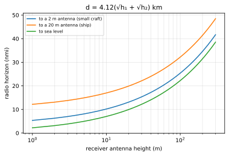
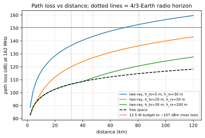

# Chapter 27 — RF basics for ships

> **Part V — Radio.** The physical reality of maritime VHF: frequencies, radio horizons, line-of-sight propagation, path loss, cable attenuation, antenna characteristics, and link budgets that govern whether an AIS burst survives over water.

**In this chapter.** You will learn how radio frequency physics dictates the performance, range, and failure modes of shipboard and coastal Automatic Identification System (**AIS**) installations. We examine the marine Very High Frequency (**VHF**) band (156.025–162.025 MHz) and Appendix 18 of the Radio Regulations, including primary AIS channels, long-range satellite allocations, and Application-Specific Message channels. You will master line-of-sight geometry, the physical origin of the 4/3-Earth effective radius model, and the dual-terminal radio horizon equation. We analyze path loss using free-space and two-ray ground reflection models, showing why received power rolls off at 40 dB per decade over seawater and how sea state induces multipath lobing. You will calculate complete RF link budgets for ship-to-ship, ship-to-shore, and ship-to-satellite encounters, incorporating transmitter power, coaxial cable attenuation, antenna gains, receiver noise floors, and required signal margins. Finally, we explore Voltage Standing Wave Ratio (**VSWR**), lightning protection, and systematic RF validation procedures.

## 27.1 The marine VHF band and the Appendix 18 channel plan

Marine AIS operates within the maritime mobile VHF band, spanning 156.025 MHz to 162.025 MHz. Governed by Appendix 18 of the International Telecommunication Union (**ITU**) Radio Regulations (Edition of 2020, Rev. WRC-19), this band allocates spectrum for safety calling, port operations, digital selective calling (**DSC**), and autonomous tracking.

Standard AIS transmissions occupy two dedicated 25 kHz simplex channels near the top of the band:
- **AIS 1:** 161.975 MHz (Channel 2087 in the ITU plan)
- **AIS 2:** 162.025 MHz (Channel 2088)

These frequencies correspond to a carrier wavelength $\lambda \approx 1.85$ m ($c / f$). Because $\lambda \approx 1.85$ m, resonant shipboard antennas are compact: a quarter-wave whip ($\lambda/4$) measures roughly 0.46 m (18 in), a center-loaded half-wave dipole ($\lambda/2$) measures 0.92 m (36 in), and high-gain collinear antennas measure between 1.2 m and 2.4 m.

```
Marine VHF Appendix 18 Band (Selected Channels)
=============================================================================
Channel 16          Channel 70          Channel 75/76      AIS 1      AIS 2
156.800 MHz         156.525 MHz         156.775/825 MHz    161.975    162.025
[Voice Distress]    [DSC Calling]       [Long-Range AIS]   [TDMA]     [TDMA]
       |                   |                   |              |          |
-------+-------------------+-------------------+--------------+----------+-->
156.0 MHz                                                           162.05 MHz
```

Under ITU Radio Regulations Appendix 18 and Recommendation ITU-R M.1371-6, several additional frequencies are assigned to AIS-related services:
- **Long-Range AIS (Message 27):** Channels 75 (156.775 MHz) and 76 (156.825 MHz). To protect voice distress channel 16 (156.800 MHz), terrestrial voice on 75 and 76 is restricted to navigation communications at 1 W (Note n). Under Note s (WRC-12), these channels are allocated to the mobile-satellite service (Earth-to-space) for reception of Message 27 reports broadcast by Class A and Class B-SO transponders (see [Chapter 22](ch22-message-catalog.md) and [Chapter 39](ch39-satellite-ais.md)).
- **Application-Specific Messages (ASM):** In the VHF Data Exchange System (**VDES**) framework (ITU-R M.2092), ASM 1 is allocated at 161.950 MHz (Channel 2027) and ASM 2 at 162.000 MHz (Channel 2028), relieving traffic congestion on the primary AIS frequencies (see [Chapter 23](ch23-asm-binary-payloads.md) and [Chapter 69](ch69-vdes-ais-2.md)).
- **Digital Selective Calling (DSC):** Channel 70 (156.525 MHz) is reserved exclusively for DSC distress, safety, and calling (Note j). Class A transponders incorporate a dedicated DSC receiver tuned to 156.525 MHz to process channel management commands broadcast via Message 22 or DSC calls.
- **Autonomous Maritime Radio Devices (AMRD):** Under Appendix 18 Note f and ITU-R M.2135 (WRC-19), Group A AMRD units (safety aids) share Channels 70, AIS 1, and AIS 2. Group B AMRD units (non-safety tracking devices, such as fishing net buoys) are confined by Note r to Channel 2006 (160.900 MHz), with radiated power capped at 100 mW equivalent isotropically radiated power (**e.i.r.p.**) and antenna heights limited to 1 m above the water line.

| Channel | Frequency (MHz) | Appendix 18 Notes | Primary Role | Standard TX Power |
|---|---|---|---|---|
| **AIS 1** | 161.975 | f, l, p | Ship-to-ship, ship-to-shore TDMA | 1 W / 12.5 W (Class A) |
| **AIS 2** | 162.025 | f, l, p | Ship-to-ship, ship-to-shore TDMA | 1 W / 12.5 W (Class A) |
| **Ch. 75** | 156.775 | n, s | Long-range satellite (Msg 27) | Current power setting |
| **Ch. 76** | 156.825 | n, s | Long-range satellite (Msg 27) | Current power setting |
| **ASM 1** | 161.950 | z, w | VDES Application-Specific Messages | 1 W / 12.5 W |
| **ASM 2** | 162.000 | z, w | VDES Application-Specific Messages | 1 W / 12.5 W |
| **Ch. 70** | 156.525 | f, j | Dedicated DSC channel management | Receive-only on AIS |
| **Ch. 2006**| 160.900 | r | Group B AMRD (net buoys) | $\le 100\text{ mW e.i.r.p.}$ |

> **Definitions that bite.** Radiated versus conducted power. Marine transponder specifications cite **conducted power**—the RF power delivered directly to the 50 $\Omega$ transmitter output connector (e.g., 12.5 W or +41 dBm for Class A). Conversely, emergency locator beacons and burst devices (AIS-SART, MOB-AIS, and EPIRB-AIS) are specified in **e.i.r.p.** (equivalent isotropically radiated power), set at a nominal 1 W (+30 dBm) under ITU-R M.1371-6 Annex 8. Conducted power ignores cable attenuation and antenna gain; e.i.r.p. combines conducted transmitter power, transmission line losses, and antenna directivity. Confusing conducted power with e.i.r.p. leads to systematic link-budget calculation errors.

## 27.2 Decibels, dBm, and antenna gain (dBi vs. dBd)

Radio frequency engineering uses logarithmic units to handle wide dynamic ranges. The ratio of two power levels $P_1$ and $P_2$ in **decibels** (**dB**) is $10 \log_{10}(P_1 / P_2)$.

Absolute power levels in AIS transceivers are expressed in **dBm**, referenced to 1 milliwatt (1 mW):
$$P_{\text{dBm}} = 10 \log_{10}(P_{\text{mW}}) = 10 \log_{10}(P_{\text{W}}) + 30$$

Standard maritime AIS conducted power levels:
- **Class A high power (12.5 W):** $+41\text{ dBm}$
- **Class A low power (1.0 W):** $+30\text{ dBm}$
- **Class B "SO" (SOTDMA) (5.0 W):** $+37\text{ dBm}$
- **Class B "CS" (CSTDMA) (2.0 W):** $+33\text{ dBm}$
- **AIS-SART / MOB-AIS (1.0 W e.i.r.p.):** $+30\text{ dBm}$
- **Standard Class A sensitivity threshold:** $-107\text{ dBm}$ ($2 \times 10^{-14}\text{ W}$ or 0.02 pW)

Antenna gain quantifies how effectively an antenna focuses radiated energy relative to a reference radiator:
- **dBi (isotropic):** Gain referenced to a theoretical isotropic antenna radiating equally in all directions ($0\text{ dBi} = 1$).
- **dBd (dipole):** Gain referenced to an ideal half-wave dipole in free space ($2.15\text{ dBi}$ directive gain):
$$G_{\text{dBi}} = G_{\text{dBd}} + 2.15\text{ dB}$$

An antenna sold as a "6 dB marine whip" may deliver 6 dBi (3.85 dBd) or 6 dBd (8.15 dBi). In link budgets, all gains must be converted to dBi.

Gain is achieved by redirecting energy away from the zenith and nadir toward the horizon. As collinear elements are stacked inside a whip, the omnidirectional horizontal pattern is maintained while vertical beamwidth narrows:
- **Unity gain dipole (2.15 dBi / 0 dBd):** Vertical beamwidth ($-3\text{ dB}$) $\approx \pm 39^\circ$.
- **Commercial 6 dBi collinear whip (approx. 4 dBd):** Vertical beamwidth $\approx \pm 15^\circ$.
- **Commercial 9 dBi collinear whip (approx. 7 dBd):** Vertical beamwidth $\approx \pm 7^\circ$.

> **Rule of thumb.** High antenna gain degrades performance on rolling vessels. On a commercial ship, cargo vessel, or coastal shore mast, a 6 dBi or 9 dBi collinear antenna increases effective range toward the horizon. However, on small craft, offshore patrol boats, or sailing vessels subject to dynamic roll and heel angles exceeding $15^\circ$, a high-gain antenna sweeps its narrow radiation disc away from the sea surface. When a sailboat heels over $20^\circ$, a 9 dBi antenna projects its main lobe into the water on the leeward side and into the upper atmosphere on the windward side, causing severe packet loss. For small or sailing vessels, use low-gain antennas ($\le 3\text{ dBi}$) with broad vertical beamwidths.

## 27.3 Line-of-sight propagation and the 4/3-Earth radio horizon

VHF waves travel primarily along line-of-sight paths. Under standard atmospheric conditions, air refractivity decreases with altitude ($dn/dh \approx -39\text{ N-units/km}$), bending wavefronts downward toward the Earth. In radio engineering, this atmospheric refraction is modeled by an **effective Earth radius** $a_e = k \cdot a$.

Under standard conditions near sea level (ITU-R P.453 and P.526), $k = 4/3 \approx 1.333$, giving $a_e \approx 8{,}495$ km.

The geometric distance $d$ from an antenna at height $h$ to the horizon is $d = \sqrt{2 a_e h}$. Substituting $a_e = 8{,}495$ km with $h$ in meters:
$$d\text{ (km)} \approx 4.122 \sqrt{h\text{ (m)}}$$
In nautical miles:
$$d\text{ (nmi)} \approx 2.226 \sqrt{h\text{ (m)}} \approx 1.23 \sqrt{h\text{ (ft)}}$$

For two terminals with antenna heights $h_1$ and $h_2$, the total radio horizon distance $d_{\text{max}}$ is:
$$d_{\text{max}}\text{ (km)} \approx 4.12 \left(\sqrt{h_1\text{ (m)}} + \sqrt{h_2\text{ (m)}}\right)$$
$$d_{\text{max}}\text{ (nmi)} \approx 2.23 \left(\sqrt{h_1\text{ (m)}} + \sqrt{h_2\text{ (m)}}\right)$$



| Station 1 ($h_1$) | Station 2 ($h_2$) | Horizon (km) | Horizon (nmi) |
|---|---|---|---|
| AIS-SART (1.0 m) | Small craft (4.0 m) | 12.4 km | 6.7 nmi |
| AIS-SART (1.0 m) | Ship mast (30.0 m) | 26.7 km | 14.4 nmi |
| Small craft (4.0 m)| Small craft (4.0 m) | 16.5 km | 8.9 nmi |
| Small craft (4.0 m)| Ship mast (30.0 m) | 30.8 km | 16.6 nmi |
| Medium ship (15 m) | Medium ship (15 m) | 31.9 km | 17.2 nmi |
| Ship mast (30.0 m) | Ship mast (30.0 m) | 45.1 km | 24.4 nmi |
| Ship mast (30.0 m) | Shore station (100 m)| 63.8 km | 34.4 nmi |
| Ship mast (30.0 m) | Shore lookout (300 m)| 93.9 km | 50.7 nmi |

The TDMA slot design in ITU-R M.1371-6 explicitly accounts for this geometry. The 24-bit buffer includes 14 bits for distance delay (1.458 ms or 437 km / 236 nmi), protecting ranges beyond 120 nmi so over-the-horizon packets do not spill into adjacent time slots (see [Chapter 21](ch21-link-layer-tdma.md)).

## 27.4 Path loss: free-space and two-ray ground reflection

Two models govern AIS propagation within the line of sight: **Free-Space Path Loss** (**FSPL**) and the **Two-Ray Ground Reflection** model.

### Free-space path loss (ITU-R P.525)

In free space without reflections, power density decreases inversely with $d^2$. Under Recommendation ITU-R P.525-5:
$$\text{FSPL (dB)} = 20 \log_{10}(d\text{ (km)}) + 20 \log_{10}(f\text{ (MHz)}) + 32.44$$
At 162.0 MHz:
$$\text{FSPL (dB)} = 20 \log_{10}(d\text{ (km)}) + 76.63$$
Free-space loss increases by 20 dB per decade of distance (6 dB per doubling of distance).

### The two-ray sea reflection model

Over seawater, the direct ray is accompanied by a specular reflection from the sea surface. At low grazing angles ($\theta < 1^\circ$) with vertical polarization, seawater reflection produces a $180^\circ$ phase inversion ($\Gamma \approx -1$). The path difference is $\Delta d \approx 2 h_1 h_2 / d$, causing phase shift $\Delta \phi = 4 \pi h_1 h_2 / (\lambda d)$.

At short distances, $\Delta \phi$ produces constructive and destructive **multipath lobing**. In the far field where $\Delta \phi \ll 1$, the field sum yields asymptotic two-ray path loss:
$$\frac{P_{rx}}{P_{tx}} \approx G_{tx} G_{rx} \frac{(h_1 h_2)^2}{d^4}$$
In decibels:
$$L_{\text{2-ray}}\text{ (dB)} \approx 40 \log_{10}(d\text{ (m)}) - 20 \log_{10}(h_1\text{ (m)}) - 20 \log_{10}(h_2\text{ (m)})$$



Key characteristics of maritime VHF links:
1. **40 dB per decade roll-off:** In the asymptotic far field, received power rolls off as $1/d^4$ (40 dB/decade), compared to 20 dB/decade in free space.
2. **Height squared:** Power scales with $(h_1 h_2)^2$; doubling antenna height adds 6 dB of received signal power.
3. **Wavelength independence:** In the far field, $\lambda$ cancels out.

Rough seas diffuse reflections, reducing interference null depth, while 2–6 m tides shift multipath lobes over 12-hour cycles.

## 27.5 Receiver noise floor, sensitivity, and packet error rate

Thermal noise across 50 $\Omega$ is governed by Johnson–Nyquist relation $N_0 = k_B T B$. For a 25 kHz channel at $T = 290$ K, ideal thermal noise is $-130.0\text{ dBm}$.

Internal semiconductor noise adds 4–6 dB (Noise Figure), setting the receiver floor to $-126$ to $-124\text{ dBm}$. Environmental harbor noise (ITU-R P.372-18) raises the practical background to $-118$ to $-112\text{ dBm}$ (see [Chapter 31](ch31-noise-and-interference.md)).

Under IEC 61993-2 (Class A) and IEC 62287-1/2 (Class B), performance is standardized against **Packet Error Rate** (**PER**):
- **Sensitivity threshold:** $\text{PER} \le 20\%$ at **$-107\text{ dBm}$** ($0.7\text{ }\mu\text{V}$ across 50 $\Omega$).
- **High-level performance:** $\text{PER} \le 1\%$ at $-77\text{ dBm}$; $\text{PER} \le 10\%$ at $-7\text{ dBm}$.
- **Co-channel rejection:** $\text{PER} \le 20\%$ with co-channel interference 10 dB below desired signal ($C/I \ge 10\text{ dB}$).
- **Adjacent-channel selectivity:** $\text{PER} \le 20\%$ with interference 70 dB stronger at $\pm 25\text{ kHz}$.

Across 208 bits (Message 1 plus CRC), 20% PER equals $\text{BER} \approx 1.07 \times 10^{-3}$, requiring an SNR ($E_b/N_0$) of roughly 10 dB for 9,600 bit/s GMSK ($BT = 0.4$). Added to a $-118\text{ dBm}$ harbor noise floor, this confirms $-107\text{ dBm}$ as the practical reception limit.

## 27.6 Transmission lines, coaxial loss, and connectors

At 162 MHz, coaxial cable loss stems from conductor skin effect and dielectric losses. Lines are standardized at 50 $\Omega$.

IMO SN/Circ.227 §2.2.2 recommends:
> *"The cable should be kept as short as possible to minimize attenuation of the signal. Double screened coaxial cables equal or better than RG214 are recommended. Coaxial cables should be installed in separate cable channels, at least 10 cm from power cables."*

| Cable Type | Outer Diameter | Shield Type | Loss (dB/100 m at 162 MHz) | Loss (dB/100 ft at 162 MHz) | Delivered Power (12.5 W over 30 m) |
|---|---|---|---|---|---|
| **RG-58 C/U** | 5.0 mm | Single braid (85%) | 20.3 dB | 6.2 dB | 3.06 W ($-6.1\text{ dB}$) |
| **RG-8X** | 6.1 mm | Single braid (95%) | 15.4 dB | 4.7 dB | 4.31 W ($-4.6\text{ dB}$) |
| **RG-213 /U** | 10.3 mm| Single braid (97%) | 9.2 dB | 2.8 dB | 6.58 W ($-2.8\text{ dB}$) |
| **RG-214 /U** | 10.8 mm| Double silver (98%)| 9.2 dB | 2.8 dB | 6.58 W ($-2.8\text{ dB}$) |
| **LMR-240** | 6.1 mm | Foil + braid (100%) | 9.8 dB | 3.0 dB | 6.39 W ($-2.9\text{ dB}$) |
| **LMR-400** | 10.3 mm| Foil + braid (100%) | 4.9 dB | 1.5 dB | 8.89 W ($-1.5\text{ dB}$) |
| **1/2" Heliax** | 16.0 mm| Corrugated copper | 2.8 dB | 0.85 dB | 10.27 W ($-0.84\text{ dB}$) |

Running RG-58 over 30 meters dissipates 6.1 dB as heat, delivering only 3.06 W to the antenna and degrading receive sensitivity by 6.1 dB. Upgrading to LMR-400 cuts loss to 1.5 dB, delivering 8.89 W.

Type N connectors are the marine standard, maintaining 50 $\Omega$ impedance up to 11 GHz with internal elastomeric gaskets. PL-259 connectors have variable impedance and lack weather seals, requiring self-amalgamating tape outdoors. Seawater ingress into braided shields corrodes copper into high-resistance carbonates, adding 10–20 dB of attenuation.

## 27.7 VSWR, impedance matching, and lightning protection

Impedance mismatches between line ($Z_0 = 50\text{ }\Omega$) and antenna ($Z_L$) reflect power toward the transmitter. Reflection coefficient $\Gamma$, Voltage Standing Wave Ratio (**VSWR**), and Return Loss (**RL**) are:
$$\Gamma = \frac{Z_L - Z_0}{Z_L + Z_0},\quad \text{VSWR} = \frac{1 + |\Gamma|}{1 - |\Gamma|},\quad \text{RL (dB)} = -20 \log_{10}|\Gamma|$$

| VSWR | $|\Gamma|$ | Return Loss | Reflected Power | Mismatch Loss | Operational Status |
|---|---|---|---|---|---|
| **1.00:1** | 0.000 | $\infty$ | 0.0% | 0.00 dB | Ideal theoretical match |
| **1.15:1** | 0.070 | 23.1 dB | 0.5% | 0.02 dB | Excellent professional mast |
| **1.50:1** | 0.200 | 14.0 dB | 4.0% | 0.18 dB | Standard operational target |
| **2.00:1** | 0.333 | 9.54 dB | 11.1% | 0.51 dB | Acceptable; inspect annually |
| **3.00:1** | 0.500 | 6.02 dB | 25.0% | 1.25 dB | High; transponder alerts |
| **5.00:1** | 0.667 | 3.52 dB | 44.4% | 2.55 dB | Severe fault; foldback active |

Under ITU-R M.1371-6 Annex 2 §A2-2.14, AIS stations must withstand open or shorted antenna terminals without damage. At $\text{VSWR} > 3:1$, transceivers activate **power foldback**, throttling 12.5 W down to 1–2 W to protect output transistors and triggering a "VSWR Alarm" on the MKD.

> **Pitfall.** A flat 1.0:1 VSWR reading across the band often indicates high cable attenuation, not an ideal antenna. If damaged cable attenuates signals by 10 dB each way, reflected power returns attenuated by 20 dB, presenting an apparent VSWR of 1.2:1 despite a disconnected antenna. Always measure cable attenuation independently.

For lightning protection:
1. **DC-grounded antennas:** Choose designs with internal matching presenting a DC short across terminals while resonant at 162 MHz to bleed off static.
2. **Surge arrestors:** Place a gas discharge tube arrestor at bulkhead entry, bonded to ship ground with heavy strap ($\ge 16\text{ mm}^2$).
3. **Shield bonding:** Ground the coaxial screen at the masthead and entry bulkhead per IMO SN/Circ.227 §2.2.3.

## 27.8 Link budgets: ship-to-ship, ship-to-shore, and ship-to-satellite

A **link budget** accounts for all gains and losses between transmitter and receiver:
$$P_{rx} = P_{tx} + G_{tx} - L_{c\text{,tx}} - L_{\text{path}} + G_{rx} - L_{c\text{,rx}}$$
The Link Margin $M$ relative to sensitivity $S_{\text{rx}} = -107\text{ dBm}$ is $M = P_{rx} + 107\text{ dB}$.

> **Worked example.** Ship-to-ship link budget at 20 nautical miles.
> 
> Two commercial ships equipped with Class A transponders encounter each other in open water.
> - **Transmitter (Ship 1):** $P_{tx} = +41.0\text{ dBm}$ (12.5 W), mast $h_1 = 30.0$ m, $G_{tx} = 2.15\text{ dBi}$, feeder loss $L_{c\text{,tx}} = 2.0\text{ dB}$ (20 m RG-214).
> - **Receiver (Ship 2):** Mast $h_2 = 20.0$ m, $G_{rx} = 2.15\text{ dBi}$, feeder loss $L_{c\text{,rx}} = 1.6\text{ dB}$, sensitivity $S_{\text{rx}} = -107.0\text{ dBm}$.
> - **Geometry:** Distance $d = 20.0\text{ nmi} \approx 37.04\text{ km} = 37{,}040\text{ m}$. Horizon $d_{\text{max}} = 4.122 \times (\sqrt{30} + \sqrt{20}) \approx 41.0\text{ km} \approx 22.1\text{ nmi}$ (within line of sight).
> - **Path loss:** Free-space loss is $\text{FSPL} = 20 \log_{10}(37.04) + 76.63 = 108.0\text{ dB}$. Far-field two-ray loss is:
>   $$L_{\text{2-ray}} = 40 \log_{10}(37{,}040) - 20 \log_{10}(30) - 20 \log_{10}(20) = 182.75 - 29.54 - 26.02 = 127.19 \approx 127.2\text{ dB}$$
>   Two-ray governs ($L_{\text{path}} = 127.2\text{ dB}$).
> - **Received power and margin:**
>   $$P_{rx} = +41.0 + 2.15 - 2.0 - 127.2 + 2.15 - 1.6 = -85.5\text{ dBm}$$
>   $$\text{Margin} = P_{rx} - S_{\text{rx}} = -85.5 - (-107.0) = +21.5\text{ dB}$$
>   The packet arrives 21.5 dB above threshold, ensuring clean demodulation.

### Ship-to-shore link budget (30 nautical miles)

For a coastal VTS station on a headland:
- Coastal RX mast: $h_2 = 100$ m, $G_{rx} = 6.0\text{ dBi}$, $L_{c\text{,rx}} = 1.0\text{ dB}$ (1/2" Heliax)
- Ship TX: Class A ($h_1 = 30$ m, $P_{tx} = +41\text{ dBm}$, $G_{tx} = 2.15\text{ dBi}$, $L_{c\text{,tx}} = 1.5\text{ dB}$)
- Distance: $d = 30\text{ nmi} \approx 55.56\text{ km}$ (horizon $d_{\text{max}} \approx 63.8\text{ km}$)
- Two-ray path loss: $L_{\text{2-ray}} = 40 \log_{10}(55{,}560) - 20 \log_{10}(30) - 20 \log_{10}(100) = 120.25\text{ dB}$
- Received power: $P_{rx} = +41.0 + 2.15 - 1.5 - 120.25 + 6.0 - 1.0 = -73.6\text{ dBm}$
- Margin: $\text{Margin} = -73.6 - (-107.0) = +33.4\text{ dB}$

### Ship-to-satellite link budget (LEO orbit, 700 km altitude)

Satellite AIS reception operates under free-space path loss (see Høye et al. 2008 and [Chapter 39](ch39-satellite-ais.md)):
- Satellite altitude: 700 km; slant range to footprint edge: $d_{\text{slant}} \approx 2{,}000\text{ km}$
- Ship TX: Class A ($P_{tx} = +41\text{ dBm}$, $L_{c\text{,tx}} = 1.5\text{ dB}$, elevation gain $G_{tx} \approx -1.0\text{ dBi}$)
- Slant path free-space loss at 162 MHz (P.525): $\text{FSPL} = 20 \log_{10}(2{,}000) + 76.63 = 142.65\text{ dB}$
- Ionospheric absorption: $L_{\text{iono}} \approx 0.5\text{ dB}$; Faraday polarization mismatch: $L_{\text{pol}} \approx 3.0\text{ dB}$
- Satellite receiver: $G_{rx} \approx +3.0\text{ dBi}$, $L_{c\text{,rx}} \approx 1.0\text{ dB}$, sensitivity $S_{\text{sat}} \approx -115.0\text{ dBm}$
- Received power: $P_{rx} = +41.0 - 1.5 - 1.0 - 142.65 - 0.5 - 3.0 + 3.0 - 1.0 = -105.65\text{ dBm}$
- Margin: $\text{Margin} = -105.65 - (-115.0) = +9.35\text{ dB}$

The link closes with ~9 dB margin; performance in orbit is limited by packet collisions across large footprints (see [Chapter 30](ch30-network-loading-packet-loss.md)).

> **Try it.** Compute link budget and radio horizon interactively using `code/rf/linkbudget.py`.
> 
> ```bash
> . .venv/bin/activate
> python code/rf/linkbudget.py --ptx 12.5 --gtx 2.15 --grx 3.0 --htx 30 --hrx 50 --d 30
> ```
> Expected output:
> ```text
> {'d_km': 30.0, 'd_nmi': 16.198704103671707, 'fspl_db': 106.2, 'two_ray_db': 115.6, 'loss_used_db': 115.6, 'p_rx_dbm': -72.0, 'margin_vs_-107dBm': 35.0, 'horizon_km': 51.7}
> ```

## Then & now

- **⟨H⟩ 1901:** Guglielmo Marconi bridges the Atlantic with maritime radio telegraphy, establishing electromagnetic propagation over open seawater.
- **⟨H⟩ 1948:** Claude Shannon publishes *A Mathematical Theory of Communication*, establishing fundamental limits for SNR, bandwidth, and channel capacity.
- **⟨+⟩ 1982:** NTIA Report 82-100 documents the Irregular Terrain Model (**ITM** / Longley–Rice), formalizing diffraction and horizon calculations over coastal topography.
- **⟨H⟩ 1998:** ITU Recommendation ITU-R M.1371-0 introduces the AIS physical layer, fixing GMSK modulation, 9,600 bit/s, and 25 kHz channels on AIS 1 and AIS 2.
- **⟨+⟩ 2003:** IMO issues SN/Circ.227, defining antenna placement, coaxial cabling standards (RG-214 or better), and separation rules.
- **⟨+⟩ 2007:** WRC-07 designates maritime frequencies AIS 1 and AIS 2 for satellite reception under Appendix 18 Note p.
- **⟨+⟩ 2012:** WRC-12 adopts Channels 75 and 76 for long-range satellite AIS (Message 27), restricting local terrestrial voice to 1 W.
- **⟨+⟩ 2018:** IEC 61993-2 Edition 3.0 updates Class A type-approval standards, standardizing automated VSWR protection and Bridge Alert Management interfacing.
- **⟨+⟩ 2019:** WRC-19 finalizes Appendix 18 provisions for AMRD, reserving Channel 2006 for non-safety buoys.
- **⟨+⟩ 2026:** ITU-R M.1371-6 consolidates the physical layer across Class A, Class B-SO, Class B-CS, and burst transmitters.

## On the wire

At the antenna terminal, an AIS transmission is a 26.67 ms Gaussian Minimum Shift Keying (**GMSK**) burst spanning one TDMA slot (256 bits at 9,600 bit/s).

```
Structure of an AIS RF Slot Burst in Time
=============================================================================
Slot Duration: 26.667 ms (256 bits at 9,600 bit/s)

| Ramp | Training | Flag | Data Payload & CRC-16 | Flag | Buffer Guard |
| 8 b  | 24 b     | 8 b  | 184 b (nominal)       | 8 b  | 24 b         |
|0.83ms| 2.50 ms  |0.83ms| 19.17 ms              |0.83ms| 2.50 ms      |
+------+----------+------+-----------------------+------+--------------+
^      ^          ^                              ^      ^              ^
T0     TB2        Ts                             TE     TF             TG
(0 ms) (0.833 ms) (4.167 ms)                     (24.3) (25.10 ms)     (26.67 ms)
```

Under ITU-R M.1371-6 Table 6, the RF burst must adhere to power-envelope constraints:
1. **$T_0$ (0.000 ms, Bit 0):** Slot boundary; RF power $\le -50\text{ dBc}$ relative to steady-state power $P_{ss}$.
2. **$T_{B1}$ (0.625 ms, Bit 6):** Power reaches within $+1.5\text{ dB} / -3.0\text{ dB}$ of $P_{ss}$.
3. **$T_{B2}$ (0.833 ms, Bit 8):** Power stabilizes within $+1.5\text{ dB} / -1.0\text{ dB}$ of $P_{ss}$; frequency settles within $\pm 1{,}000\text{ Hz}$. The 24-bit training sequence starts.
4. **$T_s$ (4.167 ms, Bit 40):** End of start flag (`01111110`), marking slot phase synchronization.
5. **$T_E$ (24.271 ms, Bit 233):** End of transmission for a single-slot report (with 1 stuffing bit). Modulation ceases.
6. **$T_F$ (25.104 ms, Bit 241):** Ramp-down completes; power drops below $-50\text{ dBc}$.
7. **$T_G$ (26.667 ms, Bit 256):** Slot end. The final 1.56 ms (15 bits) absorbs propagation delay before the next slot.

Under Table 5, emissions must attenuate relative to carrier power ($0\text{ dBc}$): within $\pm 10\text{ kHz}$ ($0\text{ dBc}$), at $\pm 25\text{ kHz}$ ($\le -70\text{ dBc}$; $\le -60\text{ dBc}$ for Class B CS), and $\pm 25$ to $\pm 62.5\text{ kHz}$ ($\le -70\text{ dBc}$).

## Validation, uncertainty & data quality

RF system validation detects physical-layer degradation before navigation encounters fail.

```
RF Validation Workflow
=============================================================================
[Vector Network Analyzer] ----> Measure S11 Sweep (150-170 MHz)
                                  - Return Loss > 14 dB (VSWR < 1.5:1)
                                         |
                                         v
[In-Line RF Power Meter] -----> Measure Conducted Output & Reflected Power
                                  - Class A TX: 12.5 W (+/- 1.5 dB)
                                         |
                                         v
[Packet Monitoring Tool] -----> Statistical Range & RSSI Decay Verification
                                  - Plot Received Packet Counts vs. Range
```

### Concrete diagnostic procedures

1. **Swept return loss and VSWR measurement:**
   - Disconnect the coaxial line from the AIS transponder.
   - Connect a calibrated Vector Network Analyzer (**VNA**) to the cable connector.
   - Sweep return loss ($S_{11}$) across 150.0 MHz to 170.0 MHz.
   - **Acceptance criteria:** Return loss at 161.975 MHz and 162.025 MHz must be $\ge 14.0\text{ dB}$ ($\text{VSWR} \le 1.5:1$). Readings between 10 dB and 14 dB ($1.5 < \text{VSWR} \le 2.0$) indicate minor detuning or cable wear. Return loss $< 10\text{ dB}$ ($\text{VSWR} > 2.0$) demands replacement of antenna or cable.
2. **Conducted forward and reflected power test:**
   - Insert a calibrated in-line RF wattmeter between transponder and feedline.
   - Trigger a test transmission from the transponder menu.
   - Verify forward power: Class A conducted power must be between 10.0 W and 15.6 W ($12.5\text{ W} \pm 1.5\text{ dB}$). Reflected power must be $\le 0.5\text{ W}$.
3. **Statistical receiver coverage auditing:**
   - Record raw NMEA `!AIVDM` sentences with timestamps over 24 hours.
   - Compute vessel distance using haversine against own-ship position.
   - Bin decoded message counts by range intervals (0–5 nmi, 5–10 nmi, etc.).
   - Compare reception density against two-ray curves. Sharp drop-offs within the radio horizon indicate mast shadowing or local RF interference.

Validate empirical log ranges with the repository utility:
```bash
. .venv/bin/activate
python code/rf/propagation_compare.py data/samples/synthetic_harbor.nmea --rx 42.36 -70.95 --hrx 30 --htx 20
```

Sample output:
```text
radio horizon (h_tx=20.0 m, h_rx=30.0 m): 22.1 nmi
 range_nmi   p_obs   Prx_fspl  Prx_2ray  margin_2ray  note
    0–5       0.60     -46.5     -47.6        59.4  
    5–10      0.70     -56.0     -66.7        40.3  
   10–15      0.73     -60.5     -75.5        31.5  
   15–20      0.64     -63.4     -81.4        25.6  
   20–25      0.32     -65.6     -85.8        21.2  margin ok but poor reception: shadowing/noise/antenna?
   25–30      0.27     -67.3     -89.2        17.8  margin ok but poor reception: shadowing/noise/antenna?
   30–35      0.16     -68.8     -92.1        14.9  
```

Observation probability $p_{\text{obs}}$ falls from 0.64 to 0.32 across 20–25 nmi, matching the 22.1 nmi horizon where line of sight yields to diffraction.

## Software

- **Open source:**
  - `code/rf/linkbudget.py`: Python CLI tool calculating line-of-sight horizons, free-space loss, two-ray loss, and link margins at 162 MHz. *Caveat:* Uses flat-sea equations without ducting or terrain diffraction.
  - `code/rf/propagation_compare.py`: Validates empirical NMEA log files against propagation models, binning packet reception probability by distance. *Caveat:* Requires accurate antenna heights, rarely populated in static reports.
  - **SPLAT!**: Radio propagation modeling engine based on the Longley–Rice ITM model, generating coastal coverage heatmaps from SRTM elevation rasters. *Caveat:* Designed for overland terrain; does not model evaporation ducting.
  - **AIS-catcher**: High-performance multi-platform SDR receiver for AIS signals, outputting real-time RSSI, SNR, and frequency offset metrics. *Caveat:* USB tuner front ends lack pre-selector filtering and can overload in high-RF harbor environments.
- **Free but closed:**
  - **Radio Mobile Online** (Roger Coudé, VE2DBE): Cloud RF prediction tool implementing ITM. *Caveat:* Restricted processing quotas and limited maritime boundary layer modeling.
- **Commercial:**
  - **Cloud-RF / Signal Server**: Commercial GPU-accelerated propagation engine implementing ITU-R P.1546, P.1812, and two-ray models. *Caveat:* Commercial subscription required for coastal terrain rasters and API access.

## Standards & guides

- **ITU Radio Regulations, Appendix 18 (Rev. WRC-19):** Allocates AIS 1 (161.975 MHz), AIS 2 (162.025 MHz), Ch. 70 (156.525 MHz), Ch. 75/76 (156.775/156.825 MHz), and AMRD frequencies.
- **Recommendation ITU-R M.1371-6 (2026):** Governs physical-layer modulation, GMSK parameters, slotted spectrum masks, power-vs-time envelopes, and receiver sensitivity.
- **Recommendation ITU-R P.525-5 (2024):** Formulates geometric free-space propagation loss between isotropic antennas.
- **Recommendation ITU-R P.526-16 (2025):** Provides mathematical formulations for spherical-Earth diffraction, obstacle shadowing, and radio horizons.
- **Recommendation ITU-R P.1546-6 (2019):** Governs coastal and maritime field-strength curves across land and sea paths.
- **Recommendation ITU-R P.2001-6 (2025):** General-purpose wide-range propagation model including ducting and refraction anomalies.
- **Recommendation ITU-R P.372-18 (2026):** Quantifies atmospheric, galactic, and man-made electromagnetic noise floors across marine and industrial settings.
- **IEC 61993-2:2018 (Ed. 3.0):** Class A equipment standard mandating sensitivity ($-107\text{ dBm}$), co-channel rejection, adjacent-channel rejection, and power foldback.
- **IEC 62287-1:2017 (Ed. 3.0):** Class B CSTDMA standard governing timing, 2 W output power, and receiver thresholds.
- **IEC 62287-2:2017 (Ed. 2.0):** Class B SOTDMA standard specifying 5 W power requirements and physical layer.
- **IMO SN/Circ.227 (2003, as amended):** Dictates antenna placement, separation distances, cabling types, grounding, and lightning protection.
- **COMSAR.1/Circ.32/Rev.3:** Antenna separation guidance for maritime VHF radiotelephone and AIS installations.

## Pitfalls

1. **Installing economy RG-58 cable on long masthead runs:** Running RG-58 over 30 meters introduces over 6 dB attenuation at 162 MHz, wasting 75% of transmitter power as heat and cutting receiver sensitivity by 6 dB. Always use double-screened cable equal to or better than RG-214 or LMR-400.
2. **Installing high-gain (9 dBi) antennas on small or sailing vessels:** High-gain whips compress vertical beamwidth to less than $\pm 10^\circ$. When rolling beyond $10^\circ$, the pattern sweeps away from the sea surface, causing packet blackout. Small craft must use broad-beamwidth antennas ($\le 3\text{ dBi}$).
3. **Placing AIS and VHF voice antennas at the same physical elevation:** Mounting antennas side by side induces desensitization and audible clicking. Separate antennas vertically by $\ge 2$ m along the mast axis, or horizontally by $\ge 5$ to 10 m.
4. **Interpreting 1.0:1 VSWR through lossy cable as an optimal antenna:** Severe cable attenuation masks antenna mismatches by attenuating reflected waves. Measure cable loss independently or inspect reflection at the antenna base.
5. **Omitting weatherproofing tape on exterior coaxial connectors:** Unsealed threaded connectors allow salt humidity to penetrate copper shields. Use self-amalgamating tape sealed with UV-rated vinyl overwrap.
6. **Employing passive receiver splitters on transponders:** Passive splitters cannot handle 12.5 W pulses, causing component destruction and triggering VSWR alarms. Use dedicated antennas or approved active splitters with solid-state isolation.
7. **Confusing conducted transmitter power with e.i.r.p.:** Class A transponders are rated at 12.5 W conducted, while AIS-SART beacons are rated at 1 W e.i.r.p. Failing to distinguish them causes multi-decibel link-budget errors.
8. **Assuming line of sight follows the optical horizon:** Ignoring atmospheric refraction underestimates range. The 4/3-Earth model extends the radio horizon ~15% beyond the optical horizon under standard conditions.
9. **Ignoring environmental noise floor elevation in commercial harbors:** Assuming an idealized $-130\text{ dBm}$ thermal floor in industrial ports overpredicts range; man-made noise raises the floor to $-115\text{ dBm}$ or higher.
10. **Failing to ground antenna coaxial shields at bulkhead entry:** Omitting an exterior ground allows static currents to travel along shields directly into bridge navigation consoles.
11. **Assuming free-space loss applies across the open ocean:** Applying a 20 dB/decade free-space model ignores destructive sea reflections. Over water, two-ray propagation rolls off at 40 dB/decade until diffraction takes over.
12. **Mounting antennas within radar beam paths:** Installing whips within the horizontal sweep of high-power radar transceivers exposes the AIS front end to microwave pulses, degrading receivers. Maintain $\ge 3$ m separation outside radar beams.

## Key takeaways

- Maritime AIS operates in the VHF mobile band on two primary 25 kHz simplex frequencies: **AIS 1 (161.975 MHz)** and **AIS 2 (162.025 MHz)**, with a nominal wavelength of $\lambda \approx 1.85$ m.
- Resonant antennas are compact: quarter-wave whips measure roughly 0.46 m, while half-wave dipoles measure 0.92 m.
- Atmospheric refraction bends VHF radio waves downward, modeled by an effective **4/3-Earth radius** ($a_e \approx 8{,}495$ km) that extends the radio horizon to $d \approx 4.12 \left(\sqrt{h_1} + \sqrt{h_2}\right)$ km.
- Within line of sight over sea, destructive surface reflection causes received signal power to roll off at **40 dB per decade** ($1/d^4$) under the two-ray ground reflection model, in contrast to the 20 dB per decade of free space.
- Standard Class A transponders broadcast at **12.5 W conducted power (+41 dBm)**, while Class B units transmit at **2 W (+33 dBm for CSTDMA)** or **5 W (+37 dBm for SOTDMA)**.
- Under IEC 61993-2, standard AIS receiver sensitivity requires a **Packet Error Rate $\le 20\%$ at $-107\text{ dBm}$**, requiring an operational carrier-to-noise ratio of approximately 10 dB.
- High-gain antennas ($\ge 6\text{ dBi}$) compress vertical beamwidth ($\le \pm 15^\circ$); small craft and sailboats subject to rolling must use broad-beamwidth antennas ($\le 3\text{ dBi}$) to prevent blackout.
- Transmission line attenuation degrades both transmit power and receive sensitivity; IMO SN/Circ.227 recommends double-screened cable equal to or better than **RG-214**.
- An operational antenna installation should exhibit a **VSWR $\le 1.5:1$** (Return Loss $\ge 14\text{ dB}$) at 162 MHz; VSWR exceeding 3:1 triggers transponder power foldback and bridge alarms.
- Satellite AIS reception operates under free-space path loss ($1/d^2$) over slant ranges exceeding 1,500 km, closing with 6–10 dB of margin but limited primarily by message collisions across vast orbital footprints.

## References

* American Radio Relay League (2023). *The ARRL Antenna Book for Radio Communications* (25th ed., H. W. Silver, Ed.). Newington, CT: American Radio Relay League.
* Høye, G. K., Eriksen, T., Meland, B. J., and Narheim, B. T. (2008). Space-based AIS for global maritime traffic monitoring. *Acta Astronautica*, 62(2–3):240–245. doi:10.1016/j.actaastro.2007.07.001
* International Electrotechnical Commission (2017a). *Maritime navigation and radiocommunication equipment and systems – Class B shipborne equipment of the automatic identification system (AIS) – Part 1: Carrier-sense time division multiple access (CSTDMA) techniques* (IEC 62287-1:2017, Ed. 3.0). Geneva: IEC.
* International Electrotechnical Commission (2017b). *Maritime navigation and radiocommunication equipment and systems – Class B shipborne equipment of the automatic identification system (AIS) – Part 2: Self-organising time division multiple access (SOTDMA) techniques* (IEC 62287-2:2017, Ed. 2.0). Geneva: IEC.
* International Electrotechnical Commission (2018). *Maritime navigation and radiocommunication equipment and systems – Automatic Identification Systems (AIS) – Part 2: Class A shipborne equipment of the universal automatic identification system (AIS) – Operational and performance requirements, methods of test and required test results* (IEC 61993-2:2018, Ed. 3.0). Geneva: IEC.
* International Maritime Organization (2003). *Guidelines for the Installation of a Shipborne Automatic Identification System (AIS)* (SN/Circ.227). London: IMO.
* International Telecommunication Union (2019). *Method for point-to-area predictions for terrestrial services in the frequency range 30 MHz to 4 000 MHz* (Recommendation ITU-R P.1546-6). Geneva: ITU.
* International Telecommunication Union (2020). *Radio Regulations, Appendix 18 (Rev. WRC-19): Table of transmitting frequencies in the VHF maritime mobile band*. Geneva: ITU.
* International Telecommunication Union (2024). *Calculation of free-space attenuation* (Recommendation ITU-R P.525-5). Geneva: ITU.
* International Telecommunication Union (2025a). *A general purpose wide-range terrestrial propagation model in the frequency range 30 MHz to 50 GHz* (Recommendation ITU-R P.2001-6). Geneva: ITU.
* International Telecommunication Union (2025b). *Propagation by diffraction* (Recommendation ITU-R P.526-16). Geneva: ITU.
* International Telecommunication Union (2026a). *Radio noise* (Recommendation ITU-R P.372-18). Geneva: ITU.
* International Telecommunication Union (2026b). *Technical characteristics for an automatic identification system using time division multiple access in the VHF maritime mobile band* (Recommendation ITU-R M.1371-6). Geneva: ITU.
* Rautiainen, L., Johansson, L., Lensu, M., Tyynelä, J., Jalkanen, J.-P., Hasu, E., Stenbäck, K., Lonka, H., and Laakso, A. (2026). Studying anomalous propagation over marine areas using an experimental AIS receiver set-up. *Atmospheric Measurement Techniques*, 19(8):2763–2785. doi:10.5194/amt-19-2763-2026
* Sirkova, I. (2023). Revisiting Enhanced AIS Detection Range under Anomalous Propagation Conditions. *Journal of Marine Science and Engineering*, 11(9):1838. doi:10.3390/jmse11091838
* Valčić, S., and Brčić, D. (2023). On Detection of Anomalous VHF Propagation over the Adriatic Sea Utilising a Software-Defined Automatic Identification System Receiver. *Journal of Marine Science and Engineering*, 11(6):1170. doi:10.3390/jmse11061170
