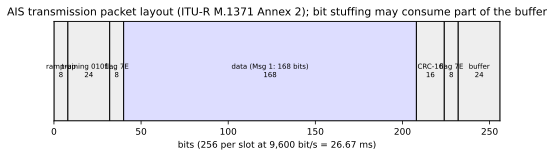

# Chapter 28 — AIS RF encoding and the physical layer

> **Part V — Radio.** The electromagnetic foundation of the Automatic Identification System: how digital bits become Gaussian Minimum Shift Keying bursts on the maritime VHF data link, and how receivers capture, filter, and decode them.

**In this chapter.** You will master the radio frequency physical layer of the Automatic Identification System (**AIS**). You will trace the complete signal transformation pipeline from raw binary payloads through High-Level Data Link Control (**HDLC**) bit stuffing, Non-Return-to-Zero Inverted (**NRZI**) encoding, and Gaussian Minimum Shift Keying (**GMSK**) frequency modulation. You will dissect the exact bit-level burst anatomy across standard 26.67-millisecond time slots, examining the function of ramp-up intervals, synchronization preambles, framing flags, 16-bit Frame Check Sequences (**FCS**), and propagation buffer budgets. You will analyze transmitter spectral masks, power-versus-time transient envelopes, carrier frequency tolerances, and power tiers across Class A, Class B, and search-and-rescue burst transmitters. Furthermore, you will inspect receiver selectivity, sensitivity, intermodulation, and co-channel rejection criteria, mapping their consequences onto physical link budgets and software-defined radio (**SDR**) receiver design. Finally, you will explore the international VHF channel plan under ITU Radio Regulations Appendix 18, evaluate physical-layer security vulnerabilities, and inspect raw in-phase and quadrature (**IQ**) burst captures.

## 28.1 The physical layer in the AIS protocol stack

The Automatic Identification System is a broadcast, open-access, cooperative maritime transponder network operating in the VHF maritime mobile band. While higher layers manage station identities ([Chapter 13](ch13-mmsi-deep-dive.md)), link-layer slot reservations ([Chapter 21](ch21-link-layer-tdma.md)), and structured message semantics ([Chapter 22](ch22-message-catalog.md)), the physical layer (**PHY**) governs the transformation between abstract binary data and electromagnetic radiation propagating over sea water.

Standardized internationally by the International Telecommunication Union Radiocommunication Sector in Recommendation **ITU-R M.1371** (historically ITU-R M.1371-5, and now ITU-R M.1371-6 [2026]), the physical layer must operate reliably in hostile maritime radio environments. Transponders must withstand severe multipath sea reflections, substantial Doppler shifts induced by vessel and satellite dynamics, co-channel interference from distant stations beyond the radio horizon, and adjacent-channel energy from high-power analog coastal stations.

Table 28.1 summarizes the foundational physical-layer constants specified in ITU-R M.1371-6 Annex 2 for standard maritime mobile stations.

| Parameter | Specification | Standard Reference |
|---|---|---|
| Channel spacing | 25 kHz | ITU-R M.1371-6 Annex 2 Table 3 |
| Modulation | Continuous-phase GMSK / FM | ITU-R M.1371-6 Annex 2 Table 4 |
| Modulation index ($h$) | Nominal 0.5 (deviation $\pm 2.4$ kHz at 9,600 bit/s) | ITU-R M.1371-6 Annex 2 §A2-2.4 |
| Transmit bandwidth-time product ($BT$) | Nominal 0.4 (highest nominal value) | ITU-R M.1371-6 Annex 2 §A2-2.3.1 |
| Receiver design filter ($BT$) | Nominal 0.5 | ITU-R M.1371-6 Annex 2 §A2-2.3.2 |
| Bit rate | 9,600 bit/s $\pm 50$ ppm ($\pm 0.48$ bit/s) | ITU-R M.1371-6 Annex 2 §A2-2.4 |
| Data encoding | NRZI (level transition on logical 0) | ITU-R M.1371-6 Annex 2 §A2-2.6 |
| Forward error correction (FEC) | None | ITU-R M.1371-6 Annex 2 Table 4 |
| Bit scrambling / interleaving | None | ITU-R M.1371-6 Annex 2 Table 4 |
| Frame Check Sequence (FCS) | 16-bit CRC-CCITT (ISO/IEC 13239:2002) | ITU-R M.1371-6 Annex 2 §A2-3.2.2.6 |
| Nominal transmission slot duration | 26.667 ms (256 bit periods at 9,600 bit/s) | ITU-R M.1371-6 Annex 2 §A2-3.1.2 |
| Primary operating frequencies | AIS 1: 161.975 MHz; AIS 2: 162.025 MHz | ITU Radio Regs. Appendix 18 |

A foundational architectural decision in AIS is the total absence of baseband scrambling, interleaving, and forward error correction (**FEC**). Unlike terrestrial cellular protocols or modern aeronautical links that interleave symbols across time to disperse burst noise, AIS transmits each bit in strictly linear sequence. If atmospheric noise, antenna desensitization, or an overlapping burst corrupts even a single bit in the payload, the 16-bit CRC fails. Per ITU-R M.1371-6 Annex 2 §A2-3.2.3, any packet failing its Frame Check Sequence results in "no further action by the AIS station"—the entire message is unconditionally discarded.

```
+-----------------------------------------------------------------------------------+
| Upper Protocol Layers: Messages 1-28, SOTDMA/CSTDMA Slot Allocation, NMEA Output |
+-----------------------------------------------------------------------------------+
                                         |  Raw payload bits (e.g. 168 bits for Msg 1)
                                         v
+-----------------------------------------------------------------------------------+
| Data-Link / Framing: Compute 16-bit FCS CRC -> HDLC Bit Stuffing (after 5x '1's) |
+-----------------------------------------------------------------------------------+
                                         |  Framed bitstream (Flags + Payload + CRC)
                                         v
+-----------------------------------------------------------------------------------+
| Line Encoding: NRZI (Invert output level on '0', maintain level on '1')           |
+-----------------------------------------------------------------------------------+
                                         |  Bipolar NRZ levels (+1 / -1)
                                         v
+-----------------------------------------------------------------------------------+
| Pulse Shaping: Gaussian Low-Pass Filter (BT = 0.4)                                |
+-----------------------------------------------------------------------------------+
                                         |  Band-limited frequency deviation pulse
                                         v
+-----------------------------------------------------------------------------------+
| Frequency Modulation: Phase accumulator (h = 0.5) -> VHF Power Amplifier (1/12.5W)|
+-----------------------------------------------------------------------------------+
```

## 28.2 Modulation and line coding: GMSK and NRZI

AIS employs Gaussian Minimum Shift Keying (**GMSK**), a continuous-phase frequency shift keying (**CPFSK**) modulation technique first characterized by Murota and Hirade (1981). GMSK combines constant envelope properties with compact spectral containment, making it ideal for power-efficient non-linear Class C and Class D RF power amplifiers on maritime vessels.

### 28.2.1 Non-Return-to-Zero Inverted (NRZI) encoding

Before modulation, the raw framed digital bitstream undergoes Non-Return-to-Zero Inverted (**NRZI**) encoding. As defined in ITU-R M.1371-6 Annex 2 §A2-2.6, the rule is strictly:
- A logical `0` produces a transition (toggle) in the physical signal level.
- A logical `1` produces no transition; the signal level remains unchanged.

NRZI encoding resolves polarity ambiguity in FM discriminators and phase demodulators: an inverted baseband signal at the discriminator output preserves all transitions, ensuring that logical zeros and ones are recovered identically regardless of sign inversion.

However, an extended sequence of logical `1` bits produces no transitions, causing the line-coded signal to dwell indefinitely at either $+1$ or $-1$. In an analog FM transmitter or receiver with AC-coupled baseband filters, an extended dwell induces baseline wander and loss of bit clock synchronization. Conversely, a sequence of logical `0` bits forces a level transition on every single bit clock, generating an alternating waveform that toggles at the Nyquist frequency of 4,800 Hz.

### 28.2.2 The Gaussian filter and modulation index

In classical Minimum Shift Keying (**MSK**), frequency modulation occurs with a modulation index of:
$$h = 2 \Delta f \cdot T_b = 0.5$$
where $\Delta f$ is the peak frequency deviation and $T_b = 1 / 9600 \text{ s} \approx 104.167\ \mu\text{s}$ is the bit duration. For AIS, this yields a peak nominal frequency deviation of:
$$\Delta f = \frac{h}{2 T_b} = \frac{0.5}{2 \times 104.167 \times 10^{-6}\text{ s}} = 2,400\text{ Hz}$$
A digital sequence driving MSK shifts the carrier frequency by $+2,400$ Hz for one level and $-2,400$ Hz for the other, yielding an instantaneous frequency separation of 4,800 Hz. Because the frequency shifts smoothly without phase discontinuities, MSK exhibits sidelobes that roll off proportional to $f^{-4}$.

To fit within a strict 25 kHz maritime channel without spilling excessive energy into adjacent voice and data channels, AIS filters the rectangular NRZ pulses with a Gaussian low-pass filter prior to frequency modulation. The continuous impulse response of a Gaussian filter is:
$$g(t) = \frac{1}{\sqrt{2\pi}\sigma T_b} \exp\left(-\frac{t^2}{2\sigma^2 T_b^2}\right)$$
where the parameter $\sigma$ is governed by the bandwidth-time product $BT$:
$$\sigma = \frac{\sqrt{\ln 2}}{2\pi BT}$$
For an AIS transmitter, the specification dictates $BT \le 0.4$. The 3 dB cut-off bandwidth of the pre-modulation filter is therefore:
$$B = \frac{BT}{T_b} = 0.4 \times 9,600\text{ Hz} = 3,840\text{ Hz}$$

Gaussian filtering rounds the sharp edges of the rectangular pulses. While this suppresses high-frequency spectral sidelobes, it introduces deliberate, controlled inter-symbol interference (**ISI**): the energy of a single symbol spreads across approximately three adjacent symbol periods.

Receivers designed for AIS are specified with a wider nominal filter of $BT \approx 0.5$ ($B = 4,800$ Hz) to balance noise suppression against excessive filter-induced ISI prior to symbol slicing.

> **Definitions that bite.**
>
> **NRZI polarity vs. UART inversion.** In standard asynchronous serial UARTs (such as RS-232 and NMEA 0183), an "inverted" line simply means that an active space is represented by a high voltage and a mark by a low voltage. In AIS RF encoding, **NRZI** is a differential transition code: bits are represented not by absolute voltage levels, but by whether the level changes at the clock boundary. Demodulating an AIS signal requires keeping track of the state transition between consecutive symbol intervals, not sampling the instantaneous sign of the baseband voltage. Confusing level inversion with differential transition decoding will yield complete garbage from any AIS demodulator.

### 28.2.3 Modulation accuracy requirements

To guarantee interoperability among diverse transceiver manufacturers, ITU-R M.1371-6 Annex 2 Table 5 establishes strict modulation accuracy benchmarks during transmitter type-approval testing. When driven by specific diagnostic bit patterns, the frequency deviation of the transmitter must fall within narrow error bands:
- **Preamble bits 0–1:** Peak frequency deviation must remain below 3,400 Hz.
- **Preamble bits 2–3:** Peak deviation must settle to $2,400 \pm 480$ Hz.
- **Preamble bits 4–31:** Settled frequency deviation must remain within $2,400 \pm 240$ Hz under normal operating conditions.
- **Test pattern `010101...` (bits 32–199):** The measured frequency deviation must equal $1,740 \pm 175$ Hz under normal temperature and voltage conditions ($\pm 350$ Hz under extreme environmental conditions).
- **Test pattern `00001111...` (bits 32–199):** The measured frequency deviation must equal $2,400 \pm 240$ Hz under normal conditions ($\pm 480$ Hz under extreme conditions).

The difference between the 1,740 Hz deviation for the `0101` pattern and the 2,400 Hz deviation for the `00001111` pattern illustrates the direct physical impact of the $BT = 0.4$ Gaussian filter. The rapid transitions of an alternating `0101` bitstream are attenuated by the pre-modulation filter before reaching the FM modulator, reducing peak carrier deviation from 2,400 Hz down to 1,740 Hz. In contrast, the wider four-bit blocks of `00001111` permit the filter output to reach steady-state saturation at the full 2,400 Hz deviation.

## 28.3 Burst anatomy and slot timing

In the TDMA data link layer, time is divided into recurring 60-second frames containing exactly 2,250 time slots ([Chapter 21](ch21-link-layer-tdma.md)). Each slot has a duration of:
$$T_{\text{slot}} = \frac{60\text{ s}}{2,250} = 26.6667\text{ ms} = 26\ \frac{2}{3}\text{ ms}$$
At the transmission rate of 9,600 bit/s, one slot corresponds to exactly:
$$N_{\text{slot}} = 26.6667\text{ ms} \times 9.6\text{ bit/ms} = 256\text{ bits}$$

Every standard single-slot AIS transmission—such as a Class A Position Report (Messages 1, 2, or 3)—is packaged into an HDLC-like transmission frame structured across seven distinct bit segments. Figure 28.1 shows the physical partition of the 256-bit slot.



### 28.3.1 Detailed bit-budget breakdown

Table 28.2 lists the exact bit allocation for a default single-slot AIS packet, as specified in ITU-R M.1371-6 Annex 2 Table 12.

| Field Name | Bit Count | Cumulative Bits | Duration ($\mu\text{s}$) | Physical Purpose |
|---|---|---|---|---|
| **Ramp-up** | 8 | 0–7 | 833.3 | RF power amplifier ramping and carrier frequency settling |
| **Training sequence** | 24 | 8–31 | 2,500.0 | Receiver bit-clock synchronization and phase acquisition |
| **Start flag** | 8 | 32–39 | 833.3 | HDLC frame delineation boundary (`01111110`, `0x7E`) |
| **Data payload** | 168 | 40–207 | 17,500.0 | Message payload (e.g. Message 1 position report) |
| **CRC / FCS** | 16 | 208–223 | 1,666.7 | 16-bit Frame Check Sequence (ISO/IEC 13239) |
| **End flag** | 8 | 224–231 | 833.3 | HDLC frame closing boundary (`01111110`, `0x7E`) |
| **Buffer** | 24 | 232–255 | 2,500.0 | Bit stuffing cushion, propagation delay, and jitter budget |
| **Total** | **256** | — | **26,666.7** | Exactly one TDMA time slot |

### 28.3.2 Ramp-up and training sequence

The transmission begins at slot boundary $T_0$. During the first 8 bits ($833.3\ \mu\text{s}$), the radio frequency power amplifier energizes and ramps up toward its nominal output power (12.5 W or 1 W). During this ramp interval, unshaped RF emission must be carefully controlled to prevent wideband transient splattering into neighboring slots.

Bits 8 through 31 constitute a 24-bit **training sequence** consisting of alternating zeros and ones (`010101010101010101010101`). Because the bitstream is passed through NRZI encoding, this alternating pattern converts to a stable square-wave transition sequence at the receiver, exciting a discrete tone at half the symbol rate (4,800 Hz). Receiver demodulators utilize this tone to lock their symbol timing recovery phase-locked loops (**PLL**) and establish coherent bit boundaries before the arrival of the frame boundary.

For Class A mobile transponders, the training sequence is permitted to begin with either a `0` or a `1` due to NRZI state continuity. For Class B Carrier-Sense units, however, ITU-R M.1371-6 Annex 6 §A6-4.2.1.4 explicitly mandates that the training sequence must always start with a `0`.

### 28.3.3 HDLC framing and zero-bit stuffing

Following the training sequence, the transmitter emits an 8-bit HDLC start flag: `01111110` (`0x7E` in hexadecimal). This flag establishes byte synchronization and marks the precise link-layer slot phase synchronization marker ($T_s = 4.167\text{ ms}$).

Between the start flag and the closing end flag (`01111110`), the payload and its appended 16-bit CRC are subjected to mandatory **zero-bit stuffing** per ISO/IEC 13239:2002:
> Whenever the transmitter encounters five consecutive logical `1` bits in the unmodulated data stream (including the CRC), it automatically inserts a logical `0` bit immediately following the fifth `1`.

Bit stuffing guarantees that the framing flag pattern `01111110` (six consecutive ones bounded by zeros) can never appear anywhere inside the message payload or CRC. The receiving station continuously scans the incoming bitstream: whenever five consecutive `1`s are followed by a `0`, the receiver discards the `0` bit and restores the original data sequence. If six consecutive `1`s followed by a `0` are detected, the receiver recognizes a valid framing flag; if seven or more consecutive `1`s appear, the frame is flagged as an illegal abort condition.

### 28.3.4 The 24-bit buffer decomposition

Because zero-bit stuffing expands the physical length of the transmitted frame, the number of bits transmitted between the start and end flags is variable. For a standard 168-bit message payload and 16-bit CRC (184 bits total), the theoretical maximum number of inserted stuff bits is:
$$\left\lfloor \frac{184}{5} \right\rfloor = 36\text{ bits}$$
In practice, real-world AIS data distributions rarely generate more than 3 or 4 stuff bits. To ensure that an expanded burst does not spill over into the subsequent time slot, ITU-R M.1371 allocates a 24-bit **buffer** ($2.5\text{ ms}$) at the end of the slot.

The 24-bit buffer is rigorously partitioned into three distinct engineering margins:
1. **Bit stuffing allowance (4 bits / $416.7\ \mu\text{s}$):** Accommodates the typical zero-insertion expansion of standard fixed-length position reports. Statistical analysis confirms that over 76% of random message bit combinations require 3 or fewer stuff bits.
2. **Distance propagation delay (14 bits / $1,458.3\ \mu\text{s}$):** Electromagnetic waves propagate in free space at the speed of light ($c \approx 299,792\text{ km/s} \approx 300\text{ m/}\mu\text{s}$). A delay allowance of $1,458.3\ \mu\text{s}$ corresponds to a maximum one-way propagation distance of:
   $$D_{\text{buffer}} = c \times 1,458.3\ \mu\text{s} \approx 437.2\text{ km} \approx 236.1\text{ nmi}$$
   This 14-bit window provides absolute protection against slot collision for signals traveling up to 120 nmi (222 km), which represents the maximum design reuse distance of terrestrial SOTDMA cells.
3. **Synchronization timing jitter (6 bits / $625.0\ \mu\text{s}$):** Absorbs cumulative clock drift, GNSS 1PPS receiver jitter, and baseband phase-tracking tolerances across transmitting and receiving nodes.

> **Worked example.**
>
> **Calculating one-way distance delay budget from buffer bits.**
> A coastal shore station receives a Class A transmission originating from a vessel located 115 nmi (213 km) offshore during an anomalous atmospheric ducting event.
> 1. Calculate the one-way electromagnetic time of flight:
>    $$\tau = \frac{213,000\text{ m}}{2.9979 \times 10^8\text{ m/s}} \approx 710.5\ \mu\text{s}$$
> 2. Convert time of flight to bit periods at 9,600 bit/s:
>    $$N_{\text{delay}} = 710.5\ \mu\text{s} \times 0.0096\text{ bit/}\mu\text{s} \approx 6.82\text{ bits}$$
> 3. If the message payload incurs 3 zero-stuffing bits, calculate total buffer consumption:
>    $$\text{Buffer consumed} = 3\text{ (stuffing)} + 6.82\text{ (propagation)} = 9.82\text{ bits}$$
> 4. Subtract from the 24-bit buffer allowance:
>    $$\text{Margin remaining} = 24 - 9.82 = 14.18\text{ bits} \approx 1.48\text{ ms}$$
> The burst arrives comfortably within its allocated slot boundary without overlapping the preamble of the subsequent slot.

## 28.4 The Frame Check Sequence (CRC-16)

Data integrity on the AIS physical layer is guarded by a 16-bit **Frame Check Sequence** (**FCS**). As defined in ITU-R M.1371-6 Annex 2 §A2-3.2.2.6 and ISO/IEC 13239:2002, the FCS generator polynomial is the classical CRC-16-CCITT:
$$G(x) = x^{16} + x^{12} + x^5 + 1$$
In binary notation, this polynomial is represented by the 17-bit mask `1 0001 0000 0010 0001` (`0x11021`).

### 28.4.1 Mathematical calculation and register presets

The FCS computation covers all data bits situated strictly between the opening start flag and the CRC itself. The opening flag, preamble, ramp-up bits, closing flag, and all zero-stuffed bits are excluded from the mathematical computation. The framing pipeline executes CRC calculation *before* bit stuffing at the transmitter, and *after* bit unstuffing at the receiver.

The implementation rules specified in ISO/IEC 13239 dictate:
1. The 16-bit shift register is initialized to all ones: `0xFFFF`.
2. Bits are processed in the order of transmission (least significant bit first per field).
3. The polynomial is evaluated using reflected (bit-reversed) logic, corresponding to polynomial mask `0x8408`.
4. Upon processing the final payload bit, the 16-bit register value is complemented (ones-complement inversion, or XOR with `0xFFFF`).
5. The resulting 16 bits are transmitted across the channel MSB first.

When an uncorrupted burst is processed by a hardware receiver that feeds both the data payload and the received 16-bit FCS through the polynomial register without pre-inversion, the shift register terminates in a unique, non-zero constant residue known as the **magic residue**: `0xF0B8` (reverse polynomial `0x0F47`). If the register matches this constant upon consuming the last FCS bit, the packet is confirmed error-free.

### 28.4.2 Open-source reference implementation

The following C implementation, excerpted from the reference open-source decoder `rtl-ais` (`aisdecoder/lib/protodec.c`), demonstrates the bit-by-bit reflected CRC computation:

```c
/* Standard HDLC / SDLC CRC-16 implementation (ISO/IEC 13239) */
unsigned short protodec_sdlc_crc(const unsigned char *data, int len) {
    unsigned short crc = 0xFFFF;
    int i, j;

    for (i = 0; i < len; i++) {
        crc ^= data[i];
        for (j = 0; j < 8; j++) {
            if (crc & 0x0001) {
                crc = (crc >> 1) ^ 0x8408;
            } else {
                crc >>= 1;
            }
        }
    }
    return ~crc;
}
```

## 28.5 Transmitter specifications and RF masks

Because thousands of transponders share just two international radio frequencies, transmitter spectral purity and switching agility are rigorously regulated by IEC 61993-2 (for Class A) and IEC 62287-1/-2 (for Class B).

### 28.5.1 Power tiers and power classes

AIS transponders operate across defined transmitter power tiers:
- **Class A Shipborne Mobile:** Operates with two nominal power levels: High (12.5 W / $+41$ dBm) and Low (1 W / $+30$ dBm), with an allowable manufacturing tolerance of $\pm 1.5$ dB. Transponders default to high power, but shore base stations can command vessels to low power in crowded harbors via Message 22 or Message 16 ([Chapter 20](ch20-architecture-and-station-classes.md)).
- **Class B "SO" (SOTDMA):** Operates at 5 W ($+37$ dBm) or 1 W ($+30$ dBm) $\pm 1.5$ dB conducted power.
- **Class B "CS" (CSTDMA):** Operates at a single nominal conducted power level of 2 W ($+33$ dBm $\pm 1.5$ dB) per ITU-R M.1371-6 Annex 6 Table 35.
- **Search and Rescue Burst Transmitters (AIS-SART, MOB-AIS, EPIRB-AIS):** Specified at 1 W effective isotropic radiated power (**e.i.r.p.**) per ITU-R M.1371-6 Annex 8 Table 89.

### 28.5.2 Slotted modulation spectrum mask

The transmitter output spectrum under GMSK modulation must satisfy the slotted modulation mask defined in ITU-R M.1371-6 Annex 2 Table 5:
- **$\Delta f = \pm 10\text{ kHz}$:** Maximum relative attenuation $0\text{ dBc}$.
- **$\pm 10\text{ kHz}$ to $\pm 25\text{ kHz}$:** Relative attenuation must decrease linearly along a straight decibel slope from $-25\text{ dBc}$ to $-70\text{ dBc}$.
- **$\pm 25\text{ kHz}$ to $\pm 62.5\text{ kHz}$:** Attenuation must remain strictly below $-70\text{ dBc}$.

For Class B "CS" transponders, the mask requirement at $\pm 25$ kHz is relaxed from $-70\text{ dBc}$ down to $-60\text{ dBc}$ (Table 35), significantly lowering manufacturing costs for low-cost consumer synthesizers.

### 28.5.3 Power-versus-time mask

The transient RF power envelope during burst switching must conform to the timing boundaries tabulated in Table 28.3 and illustrated in ITU-R M.1371-6 Figure 2.

| Timing Marker | Bit Offset | Time from $T_0$ | Required RF Power Envelope |
|---|---|---|---|
| **$T_0$** | 0.0 | $0.000\text{ ms}$ | Slot start; RF power must be $\le -50\text{ dBc}$ (relative to steady-state $P_{\text{ss}}$) |
| **$T_A$** | 0–6 | $0.000–0.625\text{ ms}$ | Power ramping interval; RF power rises above $-50\text{ dBc}$ |
| **$T_{B1}$** | 6.0 | $0.625\text{ ms}$ | RF power must reach within $+1.5\text{ dB} / -3.0\text{ dB}$ of nominal $P_{\text{ss}}$ |
| **$T_{B2}$** | 8.0 | $0.833\text{ ms}$ | Training sequence starts; power must stabilize within $+1.5\text{ dB} / -1.0\text{ dB}$ |
| **$T_E$** | 233.0 | $24.271\text{ ms}$ | End of flat region (assuming 1 stuff bit); power begins controlled ramp-down |
| **$T_F$** | 241.0 | $25.104\text{ ms}$ | RF power must fall below $-50\text{ dBc}$ and remain attenuated |
| **$T_G$** | 256.0 | $26.667\text{ ms}$ | End of slot; beginning of subsequent TDMA time slot |

### 28.5.4 Hardware safety shutdown

A critical physical-layer reliability feature is the **hardware transmitter shutdown** mandated by ITU-R M.1371-6 Annex 2 §A2-2.13.1:
> "An automatic transmitter shutdown feature should be provided which will inhibit the transmitter in the event that the transmitter output is active for more than 2 s. This feature should be independent of the software controlling the normal transmission."

Because a software crash or firmware lockup that locks a power amplifier into continuous transmit would completely jam the VHF data link for all vessels within 30 nautical miles, hardware circuits (typically an analog RC one-shot or dedicated hardware watchdog timer) unconditionally cut DC power to the RF driver stage after two continuous seconds of transmission. Furthermore, per §A2-2.14, transmitters must survive continuous open-circuit and short-circuit terminations across their antenna ports without incurring permanent damage.

## 28.6 Receiver architecture and radio performance

A standard shipborne AIS transponder incorporates two independent, parallel TDMA receivers capable of continuously monitoring AIS 1 and AIS 2 simultaneously, alongside an optional third DSC receiver tuned to Channel 70 (156.525 MHz).

### 28.6.1 Sensitivity and bit error rate criteria

Per ITU-R M.1371-6 Annex 2 Table 7, a Class A receiver must demonstrate a reference sensitivity of:
$$\text{Sensitivity} = -107\text{ dBm at a Packet Error Rate (PER)} \le 20\%$$
For an AIS transmission with nominal length $L = 256$ bits, a PER of 20% translates to a raw physical-layer Bit Error Rate (**BER**) derived from the binomial packet success probability:
$$P_{\text{packet}} = (1 - \text{BER})^L \implies 0.80 = (1 - \text{BER})^{256} \implies \text{BER} \approx 1 - (0.80)^{1/256} \approx 8.7 \times 10^{-4}$$
Thus, the $-107$ dBm sensitivity benchmark requires a raw channel BER better than approximately $1 \times 10^{-3}$.

Under extreme signal input levels, the receiver must not distort or latch up:
- At an input level of $-77\text{ dBm}$, the PER must remain $\le 1\%$.
- At an extreme high input level of $-7\text{ dBm}$ (representing a high-power vessel passing within tens of meters), the PER must remain $\le 1\%$.

### 28.6.2 Selectivity, intermodulation, and blocking

Table 28.4 details the rigorous RF rejection thresholds enforced during IEC 61993-2 type-approval testing.

| Receiver Parameter | Required Rejection | Measurement Condition |
|---|---|---|
| **Co-channel rejection** | $10\text{ dB}$ | Wanted signal at $-101\text{ dBm}$, unwanted co-channel modulated signal at $-111\text{ dBm}$ |
| **Adjacent channel selectivity** | $70\text{ dB}$ | Unwanted signal placed at $\pm 25\text{ kHz}$ off carrier |
| **Spurious response rejection** | $70\text{ dB}$ | Unwanted signals from $9\text{ kHz}$ to $4\text{ GHz}$ |
| **Intermodulation response** | $74\text{ dB}$ | Two-tone intermodulation test at $\pm 50\text{ kHz}$ and $\pm 100\text{ kHz}$ |
| **Blocking performance** | $86\text{ dB}$ | Unwanted unmodulated continuous wave carrier offset by $\pm 1\text{ MHz}$ to $\pm 10\text{ MHz}$ |

The $10\text{ dB}$ co-channel rejection specification is the physical mechanism enabling the capture effect in FM/GMSK demodulators. If two AIS transmitters broadcast in the identical time slot, a receiver will successfully lock and decode the stronger burst provided its received power exceeds the interfering burst by at least 10 dB.

## 28.7 The international VHF maritime channel plan

AIS operates within the maritime mobile VHF band governed by Appendix 18 of the ITU Radio Regulations (**RR**).

### 28.7.1 Frequencies and Appendix 18 channel designations

The international frequencies designated for AIS and its associated systems are tabulated in Table 28.5.

| Channel Name | RR App. 18 Number | Frequency (MHz) | Primary Operational Role |
|---|---|---|---|
| **AIS 1** | Channel 2087 | 161.975 | Default international shipborne AIS operations; SOTDMA/CSTDMA |
| **AIS 2** | Channel 2088 | 162.025 | Default international shipborne AIS operations; SOTDMA/CSTDMA |
| **ASM 1** | Channel 2027 | 161.950 | Application-Specific Messages per ITU-R M.2092 (VDES) |
| **ASM 2** | Channel 2028 | 162.000 | Application-Specific Messages per ITU-R M.2092 (VDES) |
| **Channel 75** | Channel 75 | 156.775 | Long-range satellite AIS uplink (Message 27); navigation voice (1 W limit) |
| **Channel 76** | Channel 76 | 156.825 | Long-range satellite AIS uplink (Message 27); navigation voice (1 W limit) |
| **DSC 70** | Channel 70 | 156.525 | Digital Selective Calling; AMRD Group A safety alert alerting |
| **AMRD Group B**| Channel 2006 | 160.900 | Autonomous Maritime Radio Devices (non-safety, fishing gear markers) |

Transponders continuously alternate periodic transmissions between AIS 1 and AIS 2. For instance, if a vessel transmits a Position Report on AIS 1 at $t = 0\text{ s}$, its subsequent report at $t = 10\text{ s}$ will transmit on AIS 2. This dual-channel alternation doubles network capacity and provides channel redundancy against localized RF interference.

### 28.7.2 Long-range AIS: Message 27 on channels 75 and 76

To facilitate satellite detection without congesting terrestrial coastal cells ([Chapter 39](ch39-satellite-ais.md)), ITU-R M.1371 Annex 3 establishes **Message 27** (Long-range AIS broadcast). Transmitted exclusively on simplex maritime channels 75 (156.775 MHz) and 76 (156.825 MHz), Message 27 modifies the physical layer burst structure:
- **Shortened data payload:** The payload field is compressed from 168 bits down to **96 bits**, omitting dynamic status details to focus on core positioning.
- **Shortened burst duration:** The burst occupies only 160 bits (16.67 ms), leaving an expanded **96-bit buffer** ($10.0\text{ ms}$).
- **Orbital delay mitigation:** A Low Earth Orbit (**LEO**) satellite orbiting at 800–1,000 km altitude possesses a footprint exceeding 5,000 km across. Differential propagation delays across this orbital footprint span several milliseconds. The expanded 96-bit buffer prevents satellite-received bursts from smearing across slot boundaries.

Per RR Appendix 18 footnote *n)*, terrestrial voice stations on channels 75 and 76 are legally restricted to 1 W output power to protect satellite AIS reception and prevent adjacent-channel interference into maritime distress Channel 16 (156.800 MHz).

### 28.7.3 Autonomous Maritime Radio Devices (AMRD)

With the proliferation of cheap AIS transmitters deployed on commercial fishing nets, fish aggregating devices (**FAD**s), and private oceanographic buoys, coastal AIS networks experienced severe slot starvation ([Chapter 68](ch68-special-purpose-ais.md)).

At the 2019 World Radiocommunication Conference (WRC-19), the ITU introduced Recommendation **ITU-R M.2135** and amended Appendix 18:
- **Group A AMRD:** Safety-related devices (e.g. personal MOB beacons and floating AtoNs) remain authorized to transmit on AIS 1, AIS 2, and DSC Channel 70 under footnote *f)*.
- **Group B AMRD:** Non-safety tracking beacons (such as fishing net markers) are strictly banned from transmitting on AIS 1 and AIS 2. Instead, footnote *r)* designates **Channel 2006 (160.900 MHz)** exclusively for Group B devices, capping transmission power at 100 mW e.i.r.p. and restricting antenna height to 1 meter above the sea surface.

## 28.8 Physical layer variations across station classes

Not all AIS devices execute the identical physical-layer protocol. Significant variations exist across station classes to balance hardware complexity against battery life and spectral impact.

### 28.8.1 Class B Carrier-Sense (CSTDMA) physical timing

Class B "CS" transponders (IEC 62287-1) do not possess the autonomous SOTDMA slot reservation engine used by Class A units. Instead, they utilize polite **Carrier-Sense** listening before transmitting.

As specified in ITU-R M.1371-6 Annex 6 §A6-4.3.1:
1. **Carrier-sense detection window:** The transponder listens to the RF channel during a specific $1,146\ \mu\text{s}$ time window situated between $833\ \mu\text{s}$ and $1,979\ \mu\text{s}$ after nominal slot start $T_0$. The first 8 bits are intentionally ignored to permit preceding bursts from distant stations to ramp down.
2. **Carrier-sense threshold:** The receiver samples RSSI. If the measured energy exceeds the rolling 60-second background noise floor by $+10\text{ dB}$, the slot is declared occupied, and transmission is aborted. The threshold is bounded between a floor of $-107\text{ dBm}$ and a ceiling of $-77\text{ dBm}$.
3. **Transmission start:** If declared clear, transmission begins exactly 20 bit periods ($T_A = 2,083\ \mu\text{s}$) after $T_0$.

### 28.8.2 Search and Rescue burst transmitters

Emergency locating devices—including AIS Search and Rescue Transmitters (**AIS-SART**; IEC 61097-14), Man Overboard (**MOB-AIS**; ETSI EN 303 098), and Emergency Position Indicating Radio Beacons (**EPIRB-AIS**)—operate under ITU-R M.1371-6 Annex 8.

Because emergency beacons must survive in freezing seas for at least 96 hours on non-rechargeable lithium batteries, they contain no receivers:
- They transmit an 8-burst salvo within a single one-minute frame.
- Four bursts are transmitted on AIS 1 and four on AIS 2, with successive transmissions spaced by exactly 75 slots.
- Radiated power is fixed at 1 W e.i.r.p.
- In ITU-R M.1371-6 Annex 8 §A8-1, the ITU explicitly acknowledges that burst transmissions do not conform to SOTDMA rules and are "disruptive to the VDL," but sanctions the protocol exclusively for maritime safety-of-life distress situations.

## Then & now

- **1981** ⟨+⟩ Murota and Hirade publish the theoretical foundations of Gaussian Minimum Shift Keying (*IEEE Trans. Commun.*), establishing $BT = 0.25$–$0.5$ as optimal for power-efficient mobile radio channels.
- **1990** ⟨+⟩ Håkan Lans files patents on Self-Organized Time Division Multiple Access (**STDMA**), demonstrating synchronized digital packet radio networks using GPS time references.
- **1998** ⟨H⟩ ITU approves Recommendation ITU-R M.1371-0, standardizing 9,600 bit/s GMSK modulation, 25 kHz VHF maritime channelization, and SOTDMA packet structures.
- **2001** ⟨H⟩ IEC publishes IEC 61993-2 Edition 1.0, defining mandatory Class A physical-layer test procedures, RF masks, and receiver sensitivity criteria.
- **2006** ⟨+⟩ ITU-R M.1371-2 incorporates Annex 7, introducing Class B Carrier-Sense (**CSTDMA**) with relaxed $-60\text{ dBc}$ spectrum masks and 2 W conducted power.
- **2007** ⟨+⟩ ITU WRC-07 assigns mobile-satellite service uplink allocations to AIS 1 and AIS 2 under Appendix 18 footnote *p)*, legalizing space-based AIS reception.
- **2010** ⟨+⟩ ITU-R M.1371-4 standardizes Message 27 for long-range satellite AIS, adding shortened 96-bit payloads and 96-bit buffers, and introduces Annex 9 for AIS-SART burst devices.
- **2012** ⟨+⟩ ITU WRC-12 designates Channels 75 and 76 for satellite Message 27 uplinks and restricts terrestrial voice stations to 1 W under footnote *n)*.
- **2014** ⟨+⟩ ITU approves Recommendation ITU-R M.1371-5, which becomes the governing physical-layer standard for a decade of marine electronic type approvals.
- **2019** ⟨+⟩ WRC-19 establishes Channel 2006 (160.900 MHz) for Autonomous Maritime Radio Devices (Group B AMRD) under Appendix 18 footnote *r)*, expelling non-safety fishing markers from AIS 1/2.
- **2022** ⟨+⟩ ITU approves Recommendation ITU-R M.2092-1, establishing the VHF Data Exchange System (**VDES**) and designating ASM 1 (161.950 MHz) and ASM 2 (162.000 MHz).
- **2026** ⟨+⟩ ITU approves Recommendation ITU-R M.1371-6, reorganizing annexes, introducing single-slot Message 28 for AtoN reporting, and standardizing extended 12-character locating device identities.

## On the wire

To understand the physical layer as observed by a software-defined radio or laboratory protocol analyzer, we examine a real-world single-slot AIS burst down to its raw binary representation.

> **On the wire.**
>
> Consider a Class A vessel (MMSI 368123450) broadcasting a standard Message 1 Position Report. After baseband demodulation and symbol synchronization, the physical packet emerges as a 235-bit burst (including bit stuffing), fitting inside the 256-bit slot.
>
> 1. **Preamble and Framing Flags:**
>    - Preamble (24 bits): `010101010101010101010101` (`0x555555`)
>    - Start Flag (8 bits): `01111110` (`0x7E`)
> 2. **Unstuffed Message 1 Payload (168 bits):**
>    ```
>    Message ID:         000001 (Msg 1)
>    Repeat Indicator:   00
>    MMSI (368123450):   000101011110111000111000111010
>    Navigational Status:0000 (Under way using engine)
>    Rate of Turn:       00000000 (0 deg/min)
>    SOG (12.4 kn):      0001111100
>    Position Accuracy:  1 (High, < 10 m)
>    Longitude (-122.4): 1101110100100111110001000000
>    Latitude (37.8):    000100100110010101111000000
>    COG (245.0 deg):    100110010010
>    True Heading (244): 011110100
>    Time Stamp:         100011 (35 s)
>    Special Maneuver:   00
>    Spare:              000
>    RAIM flag:          0
>    Communication State:00 00010 00000000000000 (SOTDMA, UTC direct)
>    ```
> 3. **FCS CRC-16 Calculation:**
>    - Computed across the 168 data bits: `0xA4F2` (`1010010011110010`)
> 4. **Bit Stuffing Execution:**
>    - Scanning the combined 184-bit sequence (Data + CRC), two sequences of five consecutive `1`s appear (e.g. in Longitude and MMSI).
>    - The transmitter automatically injects a `0` after each run:
>      `...11111` $\to$ `...11111[0]...`
>    - Total stuffed bits: 2. Transmitted body length increases from 184 to 186 bits.
> 5. **End Flag and Buffer:**
>    - End Flag (8 bits): `01111110` (`0x7E`)
>    - Buffer: 22 unmodulated bit periods remaining until the next slot boundary.

The following Python script illustrates how to synthesize, modulate, channel-impair, and decode an AIS burst using the companion `gmsk_demo.py` utility.

> **Try it.**
>
> Run the physical layer GMSK synthesis and demodulation test:
> ```bash
> . /usr/local/google/home/schwehr/sdd-books/ais/fable/.venv/bin/activate
> python code/rf/gmsk_demo.py --snr-db 15.0 --sps 8
> ```
> Expected output:
> ```text
> burst bits=235 (slot budget 256), SNR=15.0 dB, raw BER=0.0000, CRC ok=True
> ```
>
> Notice that the total burst occupies 235 bits, leaving a 21-bit safety margin within the 256-bit slot budget.

## Validation, uncertainty & data quality

Physical-layer degradation propagates directly into systemic data link failures. Because AIS lacks forward error correction, physical impairments manifest not as degraded numerical precision, but as total packet loss.

### 28.7.1 Noise floor and link margin uncertainty

The theoretical thermal noise floor in an equivalent 25 kHz AIS channel at room temperature ($T = 290\text{ K}$) is given by Johnson–Nyquist thermal noise:
$$P_{\text{thermal}} = k T B = -174\text{ dBm/Hz} + 10 \log_{10}(25,000) = -174 + 43.98 = -130.02\text{ dBm}$$
In real-world marine installations, the true environmental noise floor is substantially higher due to atmospheric noise, galactic background, and shipboard electrical interference ([Chapter 31](ch31-noise-and-interference.md)):
- A high-grade marine receiver typically exhibits an internal **Noise Figure (NF)** of 6 to 8 dB, setting the internal receiver noise floor to approximately $-122\text{ dBm}$.
- Demodulating GMSK ($BT = 0.4$, $h = 0.5$) with a simple non-coherent FM discriminator requires an energy-per-bit to noise-density ratio ($E_b/N_0$) of approximately $10.5\text{ dB}$ to achieve a raw BER of $1 \times 10^{-3}$ (corresponding to the standard 20% PER limit).
- Coherent Viterbi trellis demodulators (such as those implemented in advanced SDR engines) reduce the required $E_b/N_0$ to approximately $7.5\text{ dB}$, providing a $3\text{ dB}$ link margin improvement over basic FM slicers.

Combining a $-122\text{ dBm}$ noise floor with a $10.5\text{ dB}$ required signal-to-noise ratio yields a theoretical minimum sensitivity threshold of $-111.5\text{ dBm}$. The standard ITU-R requirement of $-107\text{ dBm}$ builds in a conservative $4.5\text{ dB}$ implementation margin to absorb analog component degradation and temperature drift.

### 28.7.2 Quantifying packet loss mechanisms

When evaluating data quality across shore networks or satellite constellations ([Chapter 47](ch47-data-quality-track-reconstruction.md)), data scientists must distinguish three independent physical-layer packet loss mechanisms:
1. **Gaussian noise thresholding:** As SNR drops below 10 dB, PER transitions sharply from near zero to 100% across a narrow 3 dB window.
2. **Co-channel collision:** If two vessels transmit within overlapping time slots, both packets will be destroyed unless one signal is at least 10 dB stronger than the other (co-channel capture).
3. **Doppler desynchronization:** Commercial cargo vessels moving at 25 kn generate negligible Doppler shifts at 162 MHz ($\approx \pm 6.9\text{ Hz}$). However, LEO satellites moving at 7.5 km/s incur Doppler shifts up to $\pm 4.0\text{ kHz}$. An SDR receiver without dynamic Doppler frequency tracking will experience severe bit slippage and packet rejection.

Table 28.6 provides empirical Packet Error Rate benchmarks measured across representative receiver architectures under varying SNR conditions.

| Channel SNR ($E_b/N_0$) | Raw Bit Error Rate (BER) | Single-Slot PER (256 bits) | Two-Slot PER (448 bits) | Primary Impact |
|---|---|---|---|---|
| **$\ge 16\text{ dB}$** | $< 1 \times 10^{-6}$ | $< 0.03\%$ | $< 0.05\%$ | Flawless reception; line-of-sight tracking |
| **$12\text{ dB}$** | $1.2 \times 10^{-4}$ | $3.0\%$ | $5.2\%$ | Nominal reception; rare static drops |
| **$10\text{ dB}$** | $8.7 \times 10^{-4}$ | $20.0\%$ | $32.3\%$ | Standard ITU-R sensitivity threshold |
| **$8\text{ dB}$** | $5.5 \times 10^{-3}$ | $75.6\%$ | $91.5\%$ | Severe packet loss; dynamic tracks fragment |
| **$\le 6\text{ dB}$** | $> 2.2 \times 10^{-2}$ | $> 99.6\%$ | $> 99.9\%$ | Total link failure; complete message dropout |

## Software

**Open source:**
- **AIS-catcher** (Jasper van de Ven; C++; GPL-3.0): High-performance dual-channel AIS receiver for software-defined radios. Implements multi-model coherent and non-coherent demodulation engines, automatic frequency offset estimation, and multi-threaded decoding. *Caveat:* High CPU consumption when running maximum oversampling filters on low-power single-board computers.
- **gr-ais** (Nick Foster; C++/Python; GPL-3.0): GNU Radio out-of-tree physical-layer receiver module implementing GMSK demodulation, preamble correlation, and HDLC deframing. *Caveat:* Unmaintained for recent GNU Radio releases without community patches.
- **rtl-ais** (dgiardini; C; GPL-2.0): Lightweight command-line utility for RTL-SDR dongles that streams decoded `!AIVDM` NMEA sentences over UDP. *Caveat:* Utilizes a simplified non-coherent frequency discriminator that exhibits poor sensitivity in low SNR environments.

**Free but closed:**
- **SDR# (SDRSharp)** (Airspy; Freeware): General-purpose Windows SDR application with third-party AIS demodulator plugins. *Caveat:* Windows-only, closed-source binary without programmatic automation APIs.

**Commercial:**
- **Rohde & Schwarz SMBV100B Vector Signal Generator**: Industry-standard laboratory RF signal generator featuring dedicated ITU-R M.1371-5/-6 and IEC 61993-2 physical-layer waveform synthesis suites. *Caveat:* Extremely expensive proprietary hardware platform restricted to certified test houses.

## Standards & guides

- **ITU-R Recommendation M.1371-6 (02/2026)**: *Technical characteristics for an automatic identification system using time division multiple access in the VHF maritime mobile band*. Governs modulation, framing, packet layouts, power tiers, RF masks, and link layer protocols.
- **ITU Radio Regulations Appendix 18 (Edition of 2020 / 2024)**: *Table of transmitting frequencies in the VHF maritime mobile band*. Allocates AIS 1, AIS 2, ASM 1/2, Channels 75/76, and Channel 2006.
- **IEC 61993-2:2018 (Edition 3.0)**: *Class A shipborne equipment of the automatic identification system (AIS) — Operational and performance requirements, methods of test and required test results*. Establishes type-approval testing for Class A physical and link layers.
- **IEC 62287-1:2017 (Edition 3.0)**: *Class B shipborne equipment of the automatic identification system (AIS) — Part 1: Carrier-sense time division multiple access (CSTDMA) techniques*. Specifies Class B CS physical layer and carrier-sense windows.
- **IEC 62287-2:2017 (Edition 2.0)**: *Class B shipborne equipment of the automatic identification system (AIS) — Part 2: Self-organising time division multiple access (SOTDMA) techniques*. Governs 5 W Class B SO transponders.
- **IEC 61097-14:2010 (Edition 1.0)**: *GMDSS — Part 14: AIS search and rescue transmitter (AIS-SART)*. Governs physical burst timing, 1 W e.i.r.p. radiated power, and environmental survival criteria.
- **ISO/IEC 13239:2002**: *Information technology — Telecommunications and information exchange between systems — High-level data link control (HDLC) procedures*. Defines framing flags, zero-bit stuffing, and the 16-bit CRC generator polynomial.
- **ITU-R Recommendation M.2092-1 (02/2022)**: *Technical characteristics for a VHF data exchange system in the VHF maritime mobile band*. Defines ASM channels and VDES modulation schemes.
- **ITU-R Recommendation M.2135-1 (02/2023)**: *Technical characteristics of autonomous maritime radio devices operating in the frequency band 156–162.05 MHz*. Establishes regulatory separation between Group A safety devices and Group B markers.

## Pitfalls

1. **Assuming zero stuffing occurs at fixed intervals** $\to$ Developers expect bit stuffing every 5 bits $\to$ Bit stuffing occurs *only* when five consecutive `1`s appear in the raw data stream.
2. **Computing the FCS over framing flags or stuffed zeros** $\to$ Attempting to validate CRC on raw wire samples including `0x7E` flags or zero-stuffing bits $\to$ Always execute zero-bit unstuffing *before* evaluating the 16-bit CRC.
3. **Inverting NRZI decoding logic** $\to$ Treating NRZI as a standard high/low polarity mask rather than a transition detector $\to$ Demodulator code must check for state transitions on logical `0`, not static voltage signs.
4. **Neglecting the 10 dB co-channel capture ratio** $\to$ Assuming simultaneous transmissions always corrupt both packets $\to$ If one signal is $\ge 10\text{ dB}$ stronger, the receiver demodulates it successfully while suppressing the weaker packet.
5. **Ignoring Doppler shift in satellite AIS receivers** $\to$ Demodulating LEO satellite downlinks with fixed terrestrial filters $\to$ LEO orbital velocities induce up to $\pm 4\text{ kHz}$ Doppler offsets, necessitating wide-tracking AFC loops.
6. **Treating Class B CS carrier power as 12.5 W** $\to$ Applying Class A link budget parameters to small recreational craft $\to$ Class B CS transponders radiate at 2 W conducted power, significantly reducing line-of-sight range.
7. **Deploying SDR receivers without front-end bandpass filtering** $\to$ Connecting broadband SDRs directly to marine antennas in urban harbors $\to$ High-power coastal VHF voice stations and nearby paging transmitters overload low-cost SDR LNAs, inducing severe intermodulation and desensitization.
8. **Assuming hardware transmitter shutdown can be bypassed in software** $\to$ Attempting to command continuous carrier transmission for propagation testing via firmware hacks $\to$ Hardware watchdog circuitry automatically disables the power amplifier after 2 continuous seconds of RF output.

> **Threat model.**
>
> - **Attacker Profile:** Rogue radio operator, hostile maritime actor, or electronic warfare operative equipped with an inexpensive software-defined radio (e.g. HackRF, BladeRF) and an RF power amplifier.
> - **Capability:** The physical layer of AIS lacks cryptographic authentication, encryption, and spread-spectrum processing. An attacker can synthesize arbitrary GMSK bursts, transmit invalid CRCs, or emit high-power continuous carriers on 161.975 MHz and 162.025 MHz.
> - **Impact:**
>   - *Denial of Service (DoS):* Overpowering legitimate ship transmissions, raising the localized noise floor, and triggering slot starvation across a 25-nautical-mile radius.
>   - *Ghost Vessels and Spoofing:* Injecting synthetic Message 1 position bursts to fabricate non-existent collision hazards on bridge ECDIS displays ([Chapter 59](ch59-spoofing.md)).
> - **Mitigation:**
>   - Multi-receiver coastal direction finding (**DF**) and Time Difference of Arrival (**TDOA**) geolocation ([Chapter 35](ch35-direction-finding-geolocation.md)).
>   - RF emitter fingerprinting analyzing ramp-up transient shapes, carrier frequency offsets, and modulation index deviations ([Chapter 34](ch34-rf-forensics-fingerprinting.md)).
>   - Cross-sensor track validation against primary marine radar and satellite synthetic aperture radar (**SAR**).

> **Legal note.**
>
> Transmitting on international maritime VHF frequencies—including AIS 1 (161.975 MHz), AIS 2 (162.025 MHz), ASM 1/2, and Channels 75/76—without a valid station license and type-approved hardware is a serious criminal offense in virtually every maritime jurisdiction. In the United States, unauthorized transmission violates the Communications Act of 1934 and 47 CFR Part 80, subjecting violators to severe civil penalties, equipment forfeiture, and criminal prosecution. In the United Kingdom and Europe, similar prohibitions are enforced by Ofcom and national regulatory authorities under maritime safety statutes. Software-defined radio transmit experimentation on AIS channels must be conducted strictly inside closed, RF-shielded enclosures or anechoic chambers terminated with certified 50-ohm dummy loads.

## Key takeaways

- AIS utilizes Gaussian Minimum Shift Keying (**GMSK**) with $BT = 0.4$ on transmit and $BT = 0.5$ on receive, operating at 9,600 bit/s across 25 kHz channels.
- Line coding employs Non-Return-to-Zero Inverted (**NRZI**) encoding, where a logical `0` forces a physical level transition and a logical `1` produces no transition.
- Standard single-slot bursts occupy exactly 256 bits ($26.6667\text{ ms}$), comprising an 8-bit ramp, 24-bit training preamble, 8-bit start flag, 168-bit data payload, 16-bit CRC, 8-bit end flag, and a 24-bit buffer.
- Data integrity relies strictly on a 16-bit CRC-CCITT Frame Check Sequence; corrupted packets are unconditionally discarded without forward error correction or retransmission.
- Mandatory zero-bit stuffing inserts a `0` after any run of five consecutive `1`s between framing flags, preventing false frame boundary detection.
- The 24-bit slot buffer provides vital margins: 4 bits for bit stuffing expansion, 14 bits ($1.458\text{ ms} \approx 236\text{ nmi}$) for electromagnetic distance delay, and 6 bits for synchronization clock jitter.
- Power tiers span 12.5 W / 1 W for Class A, 5 W / 1 W for Class B SO, 2 W for Class B CS, and 1 W e.i.r.p. for search-and-rescue burst beacons.
- Class B Carrier-Sense units evaluate channel occupancy within an 1,146 $\mu\text{s}$ listening window (833 to 1,979 $\mu\text{s}$ after slot start) against a dynamic RSSI threshold.
- The channel plan reserves AIS 1 (161.975 MHz) and AIS 2 (162.025 MHz) for primary operations, Channels 75/76 for satellite long-range Message 27, and Channel 2006 for non-safety AMRD Group B fishing gear markers.
- Continuous transmitter activation is restricted by an autonomous hardware watchdog circuit that unconditionally terminates RF output after 2 seconds.

## References

- Balduzzi, M., Pasta, A., & Wilhoit, K. (2014). A Security Evaluation of AIS Automated Identification System. In *Proceedings of the 30th Annual Computer Security Applications Conference (ACSAC 2014)*, pages 436–445. New Orleans, LA, USA. doi:10.1145/2664243.2664257
- International Electrotechnical Commission (2010). *Global maritime distress and safety system (GMDSS) — Part 14: AIS search and rescue transmitter (AIS-SART) — Operational and performance requirements, methods of testing and required test results*. Standard IEC 61097-14:2010, Edition 1.0. Geneva: IEC.
- International Electrotechnical Commission (2017). *Maritime navigation and radiocommunication equipment and systems — Class B shipborne equipment of the automatic identification system (AIS) — Part 1: Carrier-sense time division multiple access (CSTDMA) techniques*. Standard IEC 62287-1:2017, Edition 3.0. Geneva: IEC.
- International Electrotechnical Commission (2017). *Maritime navigation and radiocommunication equipment and systems — Class B shipborne equipment of the automatic identification system (AIS) — Part 2: Self-organising time division multiple access (SOTDMA) techniques*. Standard IEC 62287-2:2017, Edition 2.0. Geneva: IEC.
- International Electrotechnical Commission (2018). *Maritime navigation and radiocommunication equipment and systems — Automatic Identification Systems (AIS) — Part 2: Class A shipborne equipment of the automatic identification system (AIS) — Operational and performance requirements, methods of test and required test results*. Standard IEC 61993-2:2018, Edition 3.0. Geneva: IEC.
- International Organization for Standardization & International Electrotechnical Commission (2002). *Information technology — Telecommunications and information exchange between systems — High-level data link control (HDLC) procedures*. Standard ISO/IEC 13239:2002, Third edition. Geneva: ISO/IEC.
- International Telecommunication Union (2014). *Technical characteristics for an automatic identification system using time division multiple access in the VHF maritime mobile band*. Recommendation ITU-R M.1371-5. Geneva: ITU.
- International Telecommunication Union (2020). *Radio Regulations, Appendix 18 (Rev. WRC-19): Table of transmitting frequencies in the VHF maritime mobile band*. Geneva: ITU.
- International Telecommunication Union (2022). *Technical characteristics for a VHF data exchange system in the VHF maritime mobile band*. Recommendation ITU-R M.2092-1. Geneva: ITU.
- International Telecommunication Union (2023). *Technical characteristics of autonomous maritime radio devices operating in the frequency band 156–162.05 MHz*. Recommendation ITU-R M.2135-1. Geneva: ITU.
- International Telecommunication Union (2026). *Technical characteristics for an automatic identification system using time division multiple access in the VHF maritime mobile band*. Recommendation ITU-R M.1371-6. Geneva: ITU.
- Murota, K., & Hirade, K. (1981). GMSK Modulation for Digital Mobile Radio Telephony. *IEEE Transactions on Communications*, 29(7):1044–1050. doi:10.1109/TCOM.1981.1095089
- van de Ven, J. (2021). *AIS-catcher: A dual-channel AIS receiver for SDR*. GitHub repository: https://github.com/jvde-github/AIS-catcher
