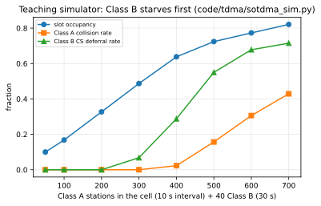

# Chapter 30 — Network loading, packet loss, and collisions

> **Part V — Radio.** How the self-organizing VHF data link behaves as slots fill up: capacity boundaries, intentional slot reuse, Class B starvation, satellite footprint collisions, advanced receiver recovery, and quantitative loss modeling.

**In this chapter.** You will learn how the Automatic Identification System (**AIS**) VHF data link (**VDL**) transitions from low-density operation to severe channel saturation. You will calculate the theoretical slot capacity of the dual-channel TDMA frame across vessel speeds, reporting intervals, and station classes. You will examine standard congestion-resolution mechanisms in Recommendation ITU-R M.1371-6, including 120-nautical-mile intentional slot reuse, base-station protection, and Carrier-Sense Time Division Multiple Access (**CSTDMA**) candidate abandonment. You will see why Class B "CS" transponders suffer asymmetric starvation while Class B "SO" transponders switch reporting cadences. You will evaluate satellite AIS packet collisions across orbital footprints, analyzing Doppler spreads, differential delays, and detection probabilities. You will explore signal processing techniques—coherent Viterbi decoding, successive interference cancellation, multi-antenna beamforming, and partial-CRC recovery—that extract packets from colliding bursts. Finally, you will construct a modular packet-loss model for spatial analytics.

## 30.1 VDL capacity arithmetic and reporting intervals

The AIS VHF data link operates on two maritime channels from Radio Regulations Appendix 18: **AIS 1** (161.975 MHz) and **AIS 2** (162.025 MHz). Time is organized into repeating frames synchronized to Universal Coordinated Time (**UTC**). Under Recommendation ITU-R M.1371-6 Annex 2, each 60-second frame contains 2,250 slots per channel. Each slot spans 26.67 ms (256 bits at 9,600 bit/s).

Because transponders alternate transmissions between AIS 1 and AIS 2, combined link capacity across both channels is:
$$\text{Capacity} = 2 \times 2{,}250 = 4{,}500\text{ slots/min}$$

A single-slot burst conveys 168 data bits enveloped by ramp-up, training, start flag, 16-bit Frame Check Sequence (**FCS**), end flag, and a 24-bit guard buffer ([Chapter 28](ch28-rf-encoding-physical-layer.md)). Multi-slot messages—such as static data (Message 5) or binary Application-Specific Messages (**ASM**, [Chapter 23](ch23-asm-binary-payloads.md))—span up to five consecutive slots.

Load imposed by any station is governed by its reporting interval (**RI**) under ITU-R M.1371-6 Annex 1:

* **Class A mobile stations (SOTDMA):**
  * At anchor or moored ($\le 3\text{ kn}$): $\text{RI} = 3\text{ min}$ (1/3 slot/min).
  * At anchor or moored ($> 3\text{ kn}$): $\text{RI} = 10\text{ s}$ (6 slots/min).
  * Under way ($0 \le \text{SOG} \le 14\text{ kn}$): $\text{RI} = 10\text{ s}$ (6 slots/min); turning: 3⅓ s (18 slots/min).
  * Under way ($14 < \text{SOG} \le 23\text{ kn}$): $\text{RI} = 6\text{ s}$ (10 slots/min); turning: 2 s (30 slots/min).
  * Under way ($> 23\text{ kn}$): $\text{RI} = 2\text{ s}$ (30 slots/min).
  * Static voyage data (Message 5, two slots): every 6 minutes (1/3 slot/min).
* **Class B "SO" mobile stations (SOTDMA, IEC 62287-2):**
  * $\text{SOG} \le 2\text{ kn} \implies 3\text{ min}$; $2 < \text{SOG} \le 14\text{ kn} \implies 30\text{ s}$ (2 slots/min).
  * $14 < \text{SOG} \le 23\text{ kn} \implies 15\text{ s}$ (4 slots/min, modified 30 s); turning: 5 s (modified 15 s).
  * $\text{SOG} > 23\text{ kn} \implies 5\text{ s}$ (12 slots/min, modified 15 s).
  * Static data (Message 24A/B, two single slots): every 6 minutes (1/3 slot/min).
* **Class B "CS" mobile stations (CSTDMA, IEC 62287-1):**
  * $\text{SOG} \le 2\text{ kn} \implies 3\text{ min}$; $2 < \text{SOG} \le 14\text{ kn} \implies 30\text{ s}$; $> 14\text{ kn} \implies 15\text{ s}$.
  * Static data (Message 24A/B): every 6 minutes.
* **Aids to Navigation (AtoN, Message 21):** Standard interval 3 minutes (1/3 slot/min).
* **Base Stations (Message 4):** Standard interval 10 seconds (6 slots/min); 3⅓ seconds (18 slots/min) as sync master.

> **Worked example.** Consider an ultra-dense harbor cell containing:
> - 300 anchored Class A ships ($\le 3\text{ kn}$): $300 \times (1/3 + 1/3) = 200\text{ slots/min}$.
> - 80 cruising Class A ships at 12 kn ($\text{RI} = 10\text{ s}$): $80 \times (6 + 1/3) \approx 507\text{ slots/min}$.
> - 30 fast Class A craft at 25 kn ($\text{RI} = 2\text{ s}$): $30 \times (30 + 1/3) = 910\text{ slots/min}$.
> - 150 Class B "CS" craft at 8 kn ($\text{RI} = 30\text{ s}$): $150 \times (2 + 1/3) = 350\text{ slots/min}$.
> - 40 Fixed Aids to Navigation ($\text{RI} = 3\text{ min}$): $40 \times 1/3 \approx 13.3\text{ slots/min}$.
> - 3 Coastal Base Stations (Messages 4 and 20): $3 \times 12 = 36\text{ slots/min}$.
>
> Total cell demand is $2{,}016.3\text{ slots/min}$. Distributed across both channels, channel occupancy is $2{,}016.3 / 4{,}500 \approx 44.8\%$. While within raw capacity, localized maneuvering course changes can rapidly push utilization past 50%, initiating link-layer congestion controls.

---

## 30.2 Terrestrial loading and slot occupancy in major waterways

VDL loading is shaped by traffic concentration, port geography, and radio propagation. International Association of Marine Aids to Navigation and Lighthouse Authorities (**IALA**) Recommendation R0124 (formerly A-124), Appendix 18 and Report ITU-R M.2287 define loading tiers:

- **Nominal load (< 50%):** Free slots are plentiful. SOTDMA candidate selection encounters no contention; Class B CSTDMA units transmit unimpeded.
- **Moderate load (50% to 70%):** Candidate sets contract. Intentional slot reuse evaluates distant targets; Class B "SO" stations initiate cadence throttling.
- **High load (> 70%):** The radio cell contracts spatially ("cell breathing"). Class B CSTDMA deferrals rise sharply, generating packet loss for small craft.
- **Critical load (> 90%):** SOTDMA transponders cannibalize slots from stations beyond immediate tactical ranges; carrier-sensing units are almost completely starved of access.

Terrestrial slot occupancy reaches high levels across major maritime choke points:
1. **The Singapore and Malacca Straits:** With over 1,000 commercial ships, regional ferries, and tugs, slot utilization frequently exceeds 60% across base-station sectors. Vessel Traffic Services (**VTS**) authorities manage capacity through FATDMA pre-allocations.
2. **The Dover Strait:** Traffic Separation Schemes (**TSS**) combined with cross-channel ferries and fishing fleets create localized loading surges.
3. **The Bosporus and Turkish Straits:** Narrow fairways bordered by urban ferries, commercial convoys, and terrain that confines VHF energy.
4. **The Yangtze River Estuary and Shanghai Approaches:** One of the densest maritime VHF environments globally, where merchant vessels and domestic fishing fleets generate acute co-channel contention.
5. **The Lower Mississippi River:** Deep-draft shipping operating alongside towboats pushing multi-barge flotillas, producing localized load spikes near terminal anchorages.

> [!NOTE]
> Under tropospheric ducting across warm seawater ([Chapter 29](ch29-propagation-modeling.md)), VHF signals propagate 200 to 500 nautical miles instead of 20 to 30 nautical miles. A shore station can suddenly receive bursts from distant ports, elevating local VDL loading from 25% to over 85% without changes in local vessel numbers.

---

## 30.3 Standard congestion resolution: SOTDMA intentional slot reuse

AIS avoids ALOHA-like collapse through deterministic **intentional slot reuse** specified in Recommendation ITU-R M.1371-6 Annex 2 §A2-4.4.

Under §A2-3.1.6, transponders categorize each slot into one of four states:
1. **Free:** Unused in receiving range, or reserved by a station situated > 120 nautical miles (nmi) away. Silent reservations for three consecutive frames are also reclassified as Free.
2. **Internal allocation:** Reserved by the transponder's own station.
3. **External allocation:** Reserved and announced by another AIS station within range.
4. **Garbled:** No valid HDLC packet decoded, but Received Signal Strength Indication (**RSSI**) exceeded 16 dB above the noise floor.

When scheduling a position report, a SOTDMA transponder defines a Selection Interval (**SI**) of $\pm 10\%$ of its nominal increment around its nominal transmission slot. The transponder compiles a candidate set of at least **four candidate slots** within that interval (§A2-3.3.1.2).

If fewer than four Free slots exist within the SI, the Link Management Entity enters intentional slot reuse (§A2-4.4.1):
1. **Distant stations first:** Reused slots are cannibalized from the **most distant** mobile station(s) reporting within the SI.
2. **Position requirement:** A station may only reuse slots if its own position sensor is valid. It must never reuse slots from stations reporting no position.
3. **Base station immunity:** Slots reserved by coastal base stations must **never** be reused unless the base station is > 120 nmi away.
4. **One-frame cooldown:** A station whose slot has been cannibalized is granted immunity from further reuse by the cannibalizing station for one frame.
5. **Opposite-channel protection:** Because transceiver frequency switching requires up to 25 ms settling time (§A2-2.11.1), the two slots adjacent to an own-station slot on Channel A are excluded from candidate selection on Channel B.

This mechanism produces **cell breathing**: as ship density rises, each transponder's radio cell contracts inward, sacrificing reception of distant vessels 25 nautical miles away to guarantee conflict-free tracking of tactical targets within 3 to 5 nautical miles.

---

## 30.4 Class B starvation: CSTDMA vs. SOTDMA

While Class A transponders degrade gracefully via cell breathing, Class B transponders experience radically different outcomes depending on whether they operate under CSTDMA or SOTDMA.

> **Definitions that bite.**
> - **Class B "CS" (Carrier-Sense TDMA, IEC 62287-1):** Low-cost transponders (typically 2 W RF output). They maintain no internal slot map and make no future slot reservations. Before transmitting, they perform carrier sensing within an 1,146 $\mu$s listen window; if RF energy is detected, they defer. Under heavy load, they drop packets.
> - **Class B "SO" (SOTDMA, IEC 62287-2, marketed as "Class B+"):** Full SOTDMA transponders (typically 5 W RF output). They maintain a real-time slot map, broadcast pre-announced slot reservations identical to Class A, and participate directly in autonomous slot negotiation.

### 30.4.1 CSTDMA candidate abandonment mechanism

The Class B CS transmission algorithm is defined in ITU-R M.1371-6 Annex 6 §A6-4.3.3.1:
1. The transponder defines a Transmission Interval (**TI**) equal to $\text{RI}/3$ or 10 seconds, whichever is shorter, centered on its Nominal Transmission Time (**NTT**).
2. It randomly selects **10 candidate periods** (**CP**) within this TI.
3. In each candidate period, the receiver samples the radio channel during a sensing window from $833\;\mu\text{s}$ to $1{,}979\;\mu\text{s}$ after the slot boundary (a window of $1{,}146\;\mu\text{s}$).
4. Carrier-sense threshold is dynamically computed: minimum background noise floor over rolling 60 seconds plus 10 dB, with floor at $-107\text{ dBm}$ and ceiling at $-77\text{ dBm}$ (§A6-4.3.1.3).
5. If the channel is sensed busy in CP 1, the unit evaluates CP 2, and so forth.
6. **The starvation cliff:** If all 10 candidate periods are occupied by Class A or base-station bursts, **the transmission is abandoned**.

Abandoned packets are discarded without queuing. At 75% occupancy, the probability of 10 consecutive busy periods is $(0.75)^{10} \approx 5.6\%$, but commercial traffic clustering elevates real-world deferrals above 30%. The shipboard display generates no warning, leaving mariners unaware of reduced visibility.

### 30.4.2 Class B "SO" modified reporting intervals

In contrast, Class B "SO" transponders (IEC 62287-2) manage congestion through standardized cadence throttling rather than packet abandonment. Under ITU-R M.1371-6 Annex 1 Table 2 Note 3:
* A Class B SO transponder transitions to a **modified (slower) reporting interval** only when the last four consecutive frames each have **less than 50% Free slots**.
* It returns to its normal reporting interval only when **65% or more of the slots** in each of the last four consecutive frames are verified Free.

When throttled, a Class B SO vessel running at $>14\text{ kn}$ extends its reporting interval from 5 seconds to 15 seconds, and a vessel running at 2–14 kn extends from 15 seconds to 30 seconds. Because it reserves slots via SOTDMA communication states, its bursts are actively protected from Class A override.

The accompanying figure illustrates the systemic disparity between Class A collision rates and Class B CS deferral rates as channel occupancy rises.



> **Try it.** The Python script `code/tdma/sotdma_sim.py` models SOTDMA slot reservation against CSTDMA carrier-sensing across a 2,250-slot channel frame. You can reproduce the saturation curve and measure Class B starvation directly:
> ```bash
> . .venv/bin/activate
> python code/tdma/sotdma_sim.py --sweep
> ```
> Expected output:
> ```text
> n_A  occupancy  A_loss  B_defer
>   50  0.100     0.000   0.000
>  100  0.168     0.000   0.000
>  200  0.327     0.000   0.000
>  300  0.487     0.000   0.051
>  400  0.637     0.024   0.319
>  500  0.724     0.157   0.549
>  600  0.774     0.305   0.687
> ```
> At 400 Class A vessels ($63.7\%$ occupancy), Class A packet collision loss is only $2.4\%$, while Class B CS deferral has already climbed to $31.9\%$. At 600 Class A vessels ($77.4\%$ occupancy), over $68.7\%$ of Class B CS transmissions are starved and abandoned.

---

## 30.5 Active link management: Message 20, 22, and 23

When passive self-organization is insufficient to preserve link integrity, coastal maritime administrations intervene using link-management broadcasts transmitted from shore base stations.

### 30.5.1 FATDMA pre-allocation via Message 20

Under ITU-R M.1371-6 Annex 7 §A7-3.18, coastal base stations broadcast **Message 20** (Data Link Management Message) to reserve slot sequences for Aids to Navigation, oceanographic sensors ([Chapter 54](ch54-environmental-transmissions.md)), and base-station sync bursts. A single Message 20 announces up to four reservation blocks, defining slot offset (12 bits), block size (4 bits, up to 5 slots), time-out (3 bits), and increment (11 bits). Ships within 120 nmi mark these slots as **Unavailable**, protecting fixed services from mobile interference.

### 30.5.2 Channel management via Message 22

When local channels suffer chronic interference, coastal authorities broadcast **Message 22** (Channel Management, §A7-3.20), designating a geographic bounding box and commanding transponders to switch to regional simplex or duplex frequencies (e.g., Channels 75 or 76). Transponders store up to eight regional operating areas, switching frequencies upon crossing boundaries.

### 30.5.3 Group assignment and forced quiet time via Message 23

During emergencies or acute congestion, shore stations broadcast **Message 23** (Group Assignment Command, §A7-3.21) targeting specific station types (e.g., all Class B). It commands increased reporting intervals or imposes a **Quiet Time** (1–15 minutes). Silenced stations continue monitoring the channel and answering interrogations but suspend autonomous position broadcasts, immediately venting VDL load.

---

## 30.6 The satellite footprint collision problem

The design of the AIS VHF data link assumes a radio horizon bounded by Earth curvature and antenna heights: typically 20 to 30 nautical miles between ships, and up to 50 nautical miles for high coastal towers.

When an AIS receiver is placed in Low Earth Orbit (**LEO**) aboard a satellite (at altitudes between 500 km and 850 km), this terrestrial architecture breaks down completely, as established by Høye, Eriksen, Meland, and Narheim (2008), Cervera, Ginesi, and Eckstein (2011), and Clazzer, Munari, Berioli, and Blasco (2014).

### 30.6.1 Footprint scale and asynchronous cell superposition

An orbital receiver at an altitude of 700 km surveys a circular field of view spanning roughly 5,000 kilometers in diameter. Within this vast footprint sit hundreds of independent terrestrial AIS cells.
- In coastal Western Europe or East Asia, a single footprint can encompass over 20,000 active transponders simultaneously.
- Vessels in separate coastal cells operate without mutual visibility. A ship in Rotterdam and another in Lisbon may independently select Slot 1,042 on AIS 1; both bursts arrive simultaneously at the satellite antenna, colliding at the orbital receiver.

### 30.6.2 Differential propagation delay and Doppler dispersion

The satellite geometry introduces two physical impairments:
1. **Differential propagation delay:** Slant range to nadir is ~700 km (delay ~2.3 ms), while slant range to the horizon exceeds 2,800 km (~9.3 ms). This 7.3 ms differential delay spans 27% of a 26.67 ms slot, destroying slot alignment and converting synchronized SOTDMA into unslotted pure ALOHA.
2. **Orbital Doppler shift:** A LEO satellite moves at roughly 7.5 km/s. At 162 MHz, this velocity produces dynamic Doppler frequency shifts of up to $\pm 4{,}050\text{ Hz}$. Two vessels transmitting on nominal carrier 161.975 MHz can arrive at the satellite separated in frequency by up to 8 kHz.

### 30.6.3 Satellite detection probability mathematics

In pure ALOHA, the probability that a packet of duration $T_p$ transmits without overlapping another packet under aggregate Poisson arrival rate $G$ is $P_0 = e^{-2G}$. In their seminal study, Høye et al. (2008) modeled the detection probability of a vessel within an orbital pass. Let $N$ be the number of active vessels in the satellite field of view, each broadcasting position reports at an average interval $T_{\text{rep}}$ across $C$ channels ($C = 2$ for standard AIS). Total packet arrival rate at the satellite is $\lambda = N / (C \cdot T_{\text{rep}})$.

If $T_{\text{slot}}$ is the slot duration (26.67 ms), the vulnerability window for asynchronous burst overlap is approximately $2 T_{\text{slot}}$. The single-burst success probability in an uncoordinated ALOHA channel is:
$$P_{\text{succ}} = \exp\left( -2 \frac{N \cdot T_{\text{slot}}}{C \cdot T_{\text{rep}}} \right)$$

During an orbital pass of duration $T_{\text{pass}}$ (typically 8 to 12 minutes for a LEO spacecraft), the vessel transmits $k = T_{\text{pass}} / T_{\text{rep}}$ opportunities. Assuming independent slot encounters, the probability $P_{\text{det}}$ of successfully detecting the vessel at least once during the pass is:
$$P_{\text{det}} = 1 - (1 - P_{\text{succ}})^k = 1 - \left[1 - \exp\left( - \frac{2 N T_{\text{slot}}}{C T_{\text{rep}}} \right)\right]^{T_{\text{pass}} / T_{\text{rep}}}$$

In low-density oceanic waters ($N < 500$), $P_{\text{succ}}$ remains high ($>80\%$), and $P_{\text{det}}$ approaches $100\%$ on every pass. But in congested waters like the South China Sea where $N > 10{,}000$, $P_{\text{succ}}$ collapses below $0.1\%$, rendering standard single-receiver orbital capture ineffective. This reality drove both specialized satellite messages—specifically **Message 27** ([Chapter 22](ch22-message-catalog.md)) with its shortened 96-bit payload and 96-bit guard buffer—and advanced decollision signal processing.

---

## 30.7 What survives corruption: recovery and decollision techniques

When two or more AIS bursts collide at an antenna, standard hardware decoders discard the burst upon CRC failure. However, advanced coastal installations, software-defined radios, and commercial satellite operators employ digital signal processing (**DSP**) algorithms to recover valid packets from collided RF mixtures.

### 30.7.1 Coherent Viterbi demodulation and trellis constraints

Standard AIS uses Gaussian Minimum Shift Keying (**GMSK**) with bandwidth-time product $BT = 0.4$ at transmit and $BT = 0.5$ at receive. Burzigotti, Ginesi, and Colavolpe (2012) and Colavolpe et al. (2014) showed that coherent Viterbi equalization of GMSK as continuous-phase modulation (**CPM**) significantly lowers the required $E_b/N_0$ threshold for error-free decoding. Prévost et al. (2012) extended this with a **constrained Viterbi algorithm**: because HDLC bit stuffing prohibits sequences of six contiguous ones, illegal trellis transitions can be pruned, correcting bit errors before CRC evaluation.

### 30.7.2 Partial-CRC error correction

While ITU-R M.1371-6 treats the 16-bit CRC strictly as error detection (§A2-3.2.3), Prévost et al. (2014) showed that the syndrome can correct 1–2 bit errors on low-confidence soft-decision bits. Although this elevates undetected error risk above $2^{-16}$, it recovers thousands of otherwise discarded bursts in satellite archives.

### 30.7.3 Successive Interference Cancellation (SIC) and capture effect

FM receivers exhibit the **RF capture effect**: if two frequency-modulated signals collide and one arrives with an amplitude greater than the co-channel rejection threshold (typically 8 to 10 dB stronger), the receiver locks onto the stronger burst, capturing it cleanly.

In **Successive Interference Cancellation (SIC)**, the receiver digitizes colliding Bursts A and B, decodes the stronger burst (Burst A), verifies its CRC, re-modulates Burst A into an idealized digital waveform, and subtracts it from the digitized sample buffer. The residual signal is then fed back to demodulate the weaker Burst B.

### 30.7.4 Multi-antenna beamforming and Doppler separation

Aboard modern commercial AIS satellite constellations (operated by Spire, exactEarth, and ORBCOMM), physical diversity provides additional separation axes:
- **Doppler separation:** Because LEO orbital motion imposes up to $\pm 4\text{ kHz}$ Doppler shift depending on vessel position relative to the satellite velocity vector, overlapping bursts in time frequently occupy different instantaneous frequencies, separated via channelized digital filter banks.
- **Multi-antenna spatial processing:** Picard, Oularbi, Flandin, and Houcke (2012) and Zhou, van der Veen, and van Leuken (2012) established multi-user receiver architectures using dual circular-polarization or phased-array antennas. Computing spatial covariance matrices across antenna elements allows adaptive beamformers to steer nulls toward interfering vessels while maximizing gain toward the desired target.

### 30.7.5 The patent landscape of satellite decollision

Patent activity documents these techniques: US Patent 7,876,865 B2 (Robert Peach / COM DEV Ltd., 2011) covers Doppler filtering and multi-pass decoding from space, while US Patent 9,246,575 B2 (Antoine de Latour and Michel Faup / CNES, 2016) correlates digitized RF bursts against prior database records of vessel MMSIs and static dimensions to extract deeply buried signals.

---

## 30.8 Shore-network deduplication and downstream packet loss

A real-world terrestrial AIS network does not rely on a single receiver. Coastal authorities, port operators, and commercial aggregators deploy overlapping arrays of shore base stations along coastlines.

When multiple coastal stations capture a single burst, they stream NMEA 0183 `!AIVDM` sentences ([Chapter 26](ch26-interfaces-and-logging.md)) to ingest aggregators. The aggregator deduplicates incoming records across a 1–3 second sliding window keyed by $\langle \text{MMSI}, \text{Message ID}, \text{Payload Hash} \rangle$, emitting a single record while preserving receiver identifiers and SNR metrics in NMEA TAG blocks.

The count of independent stations that successfully decoded a specific burst provides an empirical metric of local link health. When the average receiver diversity count for a waterway drops from 4.2 down to 1.1, the network has entered severe localized congestion long before total packet dropouts occur.

---

## 30.9 Building a packet-loss model

Treating AIS reception as a binary feed introduces analytical bias ([Chapter 48](ch48-spatial-statistics.md)). A rigorous packet-loss model decomposes detection probability into four independent conditional stages:
$$P(\text{Received}_{ij}) = P(\text{Horizon}_{ij}) \cdot P(\text{SNR}_{ij}) \cdot P(\text{No Collision}_{ij}) \cdot P(\text{Decode}_{ij})$$

1. **Radio Horizon Factor ($P(\text{Horizon})$):** Dictated by Earth curvature and tropospheric refraction ([Chapter 27](ch27-rf-basics.md)). Using the 4/3-Earth model, geometric line-of-sight distance is $d_{\text{LOS}} = 4.12 \times (\sqrt{h_{\text{tx}}} + \sqrt{h_{\text{rx}}})\text{ km}$. If distance $d > d_{\text{LOS}}$, transmission relies on diffraction or ducting, causing $P(\text{Horizon})$ to roll off sharply.
2. **Signal-to-Noise Factor ($P(\text{SNR})$):** Computed from the RF link budget:
   $$\text{SNR} = P_{\text{tx}} + G_{\text{tx}} - L_{\text{cable}} - L_{\text{path}}(d) + G_{\text{rx}} - N_0$$
   where path loss follows free-space loss or two-ray sea reflection. For GMSK at 9,600 bit/s, packet error rate transitions sharply: $\text{PER} \approx 1$ below $-109\text{ dBm}$, dropping to $\text{PER} < 0.05$ above $-104\text{ dBm}$.
3. **Collision Avoidance Factor ($P(\text{No Collision})$):** Modeled as a function of localized VDL occupancy $U$:
   - For Class A stations within a coherent cell: $P(\text{No Collision}) \approx 1 - \alpha U^{\beta}$, where $\alpha \approx 0.05$ and $\beta \approx 3$ reflect robust SOTDMA coordination up to $70\%$ load.
   - For Class B CSTDMA stations: $P(\text{No Collision}) \approx (1 - U)^{10}$, reflecting the probability of locating at least one clear candidate period among 10 attempts.
   - For satellite receivers: $P(\text{No Collision}) \approx \exp\left( -2 \frac{N T_{\text{slot}}}{C T_{\text{rep}}} \right)$, reflecting Poisson ALOHA superposition across uncorrelated cells.
4. **Demodulation Robustness Factor ($P(\text{Decode})$):** Reflects receiver implementation: standard limiter-discriminator ($P \approx 0.85$ under multipath fading), coherent Viterbi ($P \approx 0.96$), or multi-antenna beamforming arrays ($P \approx 0.99$).

---

## Then & now

- `⟨H⟩` **1990s:** Early ship-reporting concepts relied on manual VHF voice polling or low-baud satellite telex (Inmarsat-C). High-density tracking was impossible due to mutual voice channel blockage.
- `⟨H⟩` **1998:** ITU-R M.1371-0 standardizes Self-Organizing TDMA, carving 4,500 slots per minute across two channels. The specification relies on autonomous candidate-set selection and 120-nautical-mile slot reuse to prevent channel breakdown.
- `⟨+⟩` **2006:** IEC 62287-1 introduces Class B Carrier-Sense TDMA (CSTDMA). To prevent low-cost recreational transponders from disrupting commercial SOTDMA slot reservations, Class B CS is mandated to carrier-sense and abandon transmissions after 10 busy candidate periods, embedding an intentional asymmetric starvation mechanism.
- `⟨H⟩` **2008:** Høye et al. publish proof-of-concept analyses of space-based AIS reception aboard LEO satellites, demonstrating that while oceanic vessel tracking is viable, satellite footprint collisions severely degrade packet detection over dense coastal waterways.
- `⟨+⟩` **2012–2014:** Advanced digital signal processing literature (Burzigotti, Prévost, Colavolpe, Picard) establishes coherent Viterbi trellis decoding, partial-CRC error correction, and Successive Interference Cancellation, transforming satellite AIS from a simple listening experiment into an operational global intelligence network.
- `⟨+⟩` **2014:** ITU-R M.1371-5 formally adopts Message 27 (Long-range automatic identification system broadcast message) on VHF Channels 75 and 76, incorporating a shortened 96-bit payload and a 96-bit propagation buffer to eliminate satellite footprint delay skew.
- `⟨+⟩` **2017:** IEC 62287-2 standardizes Class B "SO" (SOTDMA, "Class B+"), giving non-SOLAS vessels access to 5 W RF output and full slot-reservation rights, backed by the 50%/65% Free slot throttling hysteresis.
- `⟨+⟩` **2026:** Recommendation ITU-R M.1371-6 consolidates modern VDL link rules, clarifying MSSA access on satellite channels and harmonizing multi-channel slot selection alongside the burgeoning VHF Data Exchange System (**VDES**, [Chapter 69](ch69-vdes-ais-2.md)).

---

## On the wire

### On-the-wire walk-through: SOTDMA communication state in Message 1

Dynamic position reports (Messages 1, 2, and 3) conclude with a 19-bit **Communication State** field (bits 149–167). When transmitting Message 1, these bits contain the SOTDMA communication state:
- **Sync State (2 bits):** `00` = UTC direct; `01` = UTC indirect; `10` = Base direct; `11` = Base indirect or mobile semaphore.
- **Slot Time-out (3 bits):** Frames remaining before this slot reservation expires (`111` = 7 frames, down to `000` = 0 frames).
- **Sub-message (14 bits):** Meaning is conditioned directly on the Slot Time-out value:
  - If Time-out is 3, 5, or 7: Sub-message conveys **Received Stations** (0 to 16,383), an integer count of active stations decoded in the previous frame.
  - If Time-out is 2, 4, or 6: Sub-message conveys **Slot Number** (0 to 2,249), broadcasting the transponder's internal slot reference for frame synchronization.
  - If Time-out is 1: Sub-message conveys **UTC Hour and Minute** (bits 13–9: UTC hour 0–23; bits 8–2: UTC minute 0–59; bits 1–0: reserved).
  - If Time-out is 0: Sub-message conveys **Slot Offset** (0 to 2,249). An offset of 0 indicates the slot is de-allocated; a non-zero offset points directly to the next reserved transmission slot.

Consider the raw NMEA 0183 sentence received from a container ship navigating the Dover Strait:
```text
!AIVDM,1,1,,A,13aEO:0P00000000000000000000,0*12
```
Decoding the 19-bit communication state at the tail of the payload:
```text
Binary Comm State:  00 011 00000101001110
Sync State:         00       -> UTC Direct
Slot Time-out:      011 (3)  -> 3 frames remaining until slot reallocation
Sub-message:        00000101001110 (decimal 334) -> Received Stations: 334
```
The transponder's GNSS timing receiver has direct UTC lock (`00`). Its slot reservation will persist for 3 more minutes. During the previous 60 seconds, its receiver decoded valid transmissions from exactly **334 distinct AIS stations**, instantly providing listeners with an empirical measure of local VDL density.

### On-the-wire walk-through: Message 22 Channel Management

When a coastal base station commands a regional channel shift to relieve link loading, it broadcasts Message 22:
```text
!AIVDM,1,1,,B,F030oP023F010000000000000000,0*17
```
Dissecting the binary payload bitfields (168 bits total):
- **Message ID (6 bits):** `010110` (Message 22: Channel Management).
- **Repeat Indicator (2 bits):** `00`.
- **Source MMSI (30 bits):** `003669991` (US Coast Guard coastal base station).
- **Channel A (12 bits):** `001000001000` (VHF Channel 2087 = default AIS 1, 161.975 MHz).
- **Channel B (12 bits):** `001000001001` (VHF Channel 2088 = default AIS 2, 162.025 MHz).
- **Tx/Rx Mode (4 bits):** `0000` (Transmit on both, receive on both).
- **Power (1 bit):** `0` (Standard high power: 12.5 W Class A, 5 W Class B SO).
- **Geographic Area Coordinates (70 bits total):** Northeast Corner Longitude (18b) & Latitude (17b); Southwest Corner Longitude (18b) & Latitude (17b).
- **Addressed/Broadcast Flag (1 bit):** `0` (Broadcast to all vessels within the area).
- **Channel A / B Bandwidth (1 bit each):** `0` (Default 25 kHz channel).
- **Transitional Zone Size (3 bits):** `001` (Transitional boundary buffer of 1 nautical mile).

Upon receiving this sentence, any transponder entering the designated coordinates switches its transceiver operating parameters immediately, clearing the primary channels for regional traffic management.

---

## Validation, uncertainty & data quality

Quantifying packet loss and link congestion in real-world AIS data archives requires rigorous analytical protocols. Downstream data analysts frequently misinterpret tracking gaps as deliberate "AIS dark" events when they are simply physical consequences of SOTDMA slot saturation, CSTDMA carrier-sense deferrals, or satellite footprint collisions.

### Procedures for identifying packet loss mechanisms

1. **Class B CS cadence degradation check:**
   - *Procedure:* Extract all Message 18 position reports for a target MMSI across a 24-hour observation window. Calculate empirical inter-message arrival delta $\Delta t = t_k - t_{k-1}$. Plot $\Delta t$ against vessel speed over ground ($SOG$).
   - *Expected distribution:* For $SOG > 2\text{ kn}$, standard nominal interval is 30 seconds. In uncongested waters, the inter-arrival histogram exhibits a sharp Gaussian peak centered at 30 seconds ($\sigma \approx 1.5\text{ s}$).
   - *Congestion signature:* As local VDL loading exceeds 60%, the 30-second peak degrades into an exponential distribution with long tails stretching to 180–600 seconds. If an analyst observes an anchored Class B vessel ($SOG < 2\text{ kn}$) dropping from 3 minutes to 15 minutes, or a cruising vessel skipping reports during harbor transits while maintaining 30-second cadence in open bays, the root cause is **CSTDMA candidate period starvation**, not equipment failure or tampering.
2. **Coinciding burst density and cell saturation estimation:**
   - *Procedure:* In terrestrial sensor networks, inspect the SOTDMA communication state sub-message across decoded Message 1 packets when Slot Time-out is 3, 5, or 7.
   - *Metric:* The Received Stations field provides an omnidirectional count of unique transmitters heard by that specific ship within the previous 60 seconds.
   - *Threshold:* If Received Stations consistently exceeds 300 to 400 stations, the local cell has entered intentional slot reuse. Any observed tracking dropouts for peripheral vessels must be attributed to **intentional slot reuse** and SOTDMA cell breathing.
3. **Satellite pass detection verification:**
   - *Procedure:* When analyzing satellite AIS archives for suspected dark-vessel activity ([Chapter 59](ch59-spoofing.md)), cross-reference the vessel's estimated position against the satellite's orbital sub-track and footprint circle. Compute total vessel count $N$ present within the 5,000 km footprint during the pass.
   - *Validation metric:* Evaluate single-pass detection probability using Høye's model:
     $$P_{\text{det}} = 1 - \left[1 - \exp\left( - \frac{2 N T_{\text{slot}}}{C T_{\text{rep}}} \right)\right]^{T_{\text{pass}} / T_{\text{rep}}}$$
   - If $N > 8{,}000$ (e.g., East China Sea, Malacca Strait) and the vessel is a low-power Class B CS unit ($2\text{ W}$, $T_{\text{rep}} = 30\text{ s}$), $P_{\text{det}}$ is under $15\%$. A missing fix during such a pass is statistically normal and carries zero evidentiary value regarding non-compliance.

### Concrete numbers and reporting uncertainty

When publishing vessel traffic maps or transit audits, analysts must report observed versus theoretical reporting intervals by station class, the receiver diversity index, estimated channel slot utilization, and data completeness confidence intervals.

---

## Software

The software tools below analyze, simulate, and decode VDL slot occupancy, packet loss, and collision recovery:

* **Open source:**
  * **`AIS-catcher` (C++):** Software-defined radio receiver supporting RTL-SDR, Airspy, HackRF, and file inputs. Implements coherent demodulation, multi-frequency tracking, and timing offsets. *Caveat:* Designed primarily for terrestrial reception; does not perform multi-pass successive interference cancellation for satellite collisions.
  * **`code/tdma/sotdma_sim.py` (Python, included with this handbook):** Discrete-event slot-map simulator modeling SOTDMA candidate selection, CSTDMA carrier sensing, intentional reuse, and synthetic slot flooding. *Caveat:* Pedagogical model; does not simulate physical RF fading, multipath, or capture effect.
  * **`libais` (C++ with Python bindings):** Parser for decoding binary AIS payloads into structured JSON/objects. *Caveat:* Operates strictly on pre-demodulated ASCII `!AIVDM` sentences; cannot process raw IQ samples or inspect failed CRC bursts.
* **Free but closed:**
  * **`iNAVPro / AIS VDL Analyser` (Maritime authorities/OEMs):** Diagnostic suite distributed to port operators for monitoring base-station slot utilization, FATDMA reservations, and regional channel noise. *Caveat:* Restricted availability; requires proprietary hardware interfaces to coastal base-station equipment.
* **Commercial:**
  * **Spire Maritime / Kpler Vessel Tracking APIs:** Global tracking data engine combining terrestrial AIS feeds with commercial LEO satellite constellations running proprietary orbital decollision DSP. *Caveat:* Commercial subscription required; underlying decollision algorithms and raw burst confidence metrics are proprietary trade secrets.

---

## Standards & guides

* **ITU-R Recommendation M.1371-6 (2026):** Technical characteristics for an automatic identification system using TDMA in the VHF maritime mobile band. Governs SOTDMA/ITDMA/CSTDMA frame structures, slot states (§A2-3.1.6), intentional reuse (§A2-4.4.1), and link management (Annex 7).
* **ITU-R Report M.2287-0 (2014):** Automatic identification system VHF data link loading. Technical report analyzing channel congestion, message growth, and operational link capacities.
* **IALA Recommendation R0124 (formerly A-124), Edition 2.2 (2012):** The AIS Service. Defines coastal network architecture; Appendix 18 establishes shore-side VDL load monitoring, capacity thresholds, and mitigation guidelines.
* **IEC 61993-2, Edition 3.0 (2018):** Class A shipborne equipment of the AIS — Operational and performance requirements, methods of test and required test results. Governs Class A SOTDMA channel-access performance, synchronization hierarchy, and intentional slot-reuse compliance.
* **IEC 62287-1, Edition 3.0 (2017):** Class B shipborne equipment of the AIS — Part 1: Carrier-sense time division multiple access (CSTDMA) techniques. Governs Class B CS carrier-sensing thresholds, 10 candidate periods, and transmission abandonment rules.
* **IEC 62287-2, Edition 2.0 (2017):** Class B shipborne equipment of the AIS — Part 2: Self-organising time division multiple access (SOTDMA) techniques. Governs Class B SO slot reservation, 5 W RF output, and the 50%/65% Free slot throttling hysteresis.

---

## Pitfalls

1. **Assuming a missing Class B target means the vessel is powered down or dark.** → *The mistake:* Accusing small craft of turning off AIS when transiting busy ports. → *Why it happens:* Class B CS transponders automatically abandon transmissions when all 10 candidate periods are sensed busy, causing reports to drop during peak traffic. → *How to avoid:* Check local Class A vessel density and slot loading; evaluate whether the missing vessel is Class B CS before inferring intentional silence.
2. **Treating terrestrial SOTDMA capacity as an absolute hard cliff at 2,250 slots.** → *The mistake:* Assuming that the 2,251st vessel will crash the network. → *Why it happens:* Equating TDMA with rigid telephony circuits. → *How to avoid:* Recognize that SOTDMA executes intentional slot reuse, cannibalizing slots from the most distant stations (> 120 nmi first) and causing the cell to gracefully shrink ("cell breathing").
3. **Believing satellite AIS captures all ships in view.** → *The mistake:* Expecting orbital receivers to maintain continuous 3-minute tracking over coastal choke points. → *Why it happens:* Overlooking that thousands of uncoordinated terrestrial SOTDMA cells superimpose asynchronously across the 5,000 km satellite footprint, causing severe ALOHA packet collisions. → *How to avoid:* Use Høye's Poisson collision model to compute realistic single-pass detection probabilities conditioned on regional vessel density.
4. **Ignoring differential propagation delay at the satellite receiver.** → *The mistake:* Assuming satellite collisions remain neatly aligned to 26.67 ms slot boundaries. → *Why it happens:* Forgetting that the slant range to the horizon is 2,000 km greater than to nadir. → *How to avoid:* Budget for a 7.3 ms arrival skew that transforms slotted TDMA into unslotted ALOHA, and utilize Message 27's 96-bit guard buffer.
5. **Classifying atmospheric ducting pulses as local fleet surges.** → *The mistake:* Misinterpreting a sudden spike in base-station slot occupancy as an influx of local vessels. → *Why it happens:* Marine tropospheric ducting carries VHF signals hundreds of miles over the horizon, superimposing distant ports onto local receivers. → *How to avoid:* Filter incoming base-station logs by MMSI and reported GPS coordinates to confirm physical presence within the local harbor.
6. **Confusing Class B "CS" with Class B "SO" behavior.** → *The mistake:* Expecting all Class B devices to behave identically under congestion. → *Why it happens:* Marketing materials blur the distinction between 2 W CSTDMA and 5 W SOTDMA units. → *How to avoid:* Check the transponder type: Class B CS (IEC 62287-1) carrier-senses and abandons; Class B SO (IEC 62287-2) reserves slots and gracefully throttles cadence across the 50%/65% Free hysteresis band.
7. **Discarding corrupted bursts that contain salvageable payload data.** → *The mistake:* Dropping all radio bursts with failed 16-bit CRCs in data-recovery pipelines. → *Why it happens:* Relying on hardware decoders that implement strict ITU-R M.1371 standard pass/fail filters. → *How to avoid:* Use software-defined radio archives with soft-decision Viterbi decoders, partial-CRC correction, or successive interference cancellation to rescue uncorrupted sub-fields.
8. **Neglecting deduplication bias in density and coverage statistics.** → *The mistake:* Counting raw ingested NMEA messages as independent vessel tracking observations. → *Why it happens:* Overlapping coastal receivers capture the same burst multiple times. → *How to avoid:* Implement spatial deduplication on `(MMSI, Message ID, Payload Hash)` within a 2-second sliding window, logging receiver diversity count as a metadata attribute.

---

## Key takeaways

* **Theoretical link capacity:** Each 60-second frame offers 2,250 slots per channel (4,500 total slots/minute across AIS 1 and AIS 2), accommodating standard 26.67 ms (256-bit) bursts.
* **Deterministic congestion rules:** Under high channel loading, SOTDMA does not collapse; transponders execute intentional slot reuse, cannibalizing slots from the most distant mobile stations to shrink the cell inward ("cell breathing").
* **Protected base stations:** Coastal base-station slot reservations within 120 nautical miles are immune to intentional reuse, guaranteeing the integrity of critical aids to navigation and sync broadcasts.
* **Asymmetric Class B starvation:** Class B CS units test 10 candidate periods and abandon their transmission if all are busy, causing small craft to vanish from receiver feeds in congested waterways without triggering bridge alarms.
* **Class B SO resilience:** Class B SO transponders utilize full SOTDMA reservations with 5 W output, managing congestion via standardized 50%/65% Free slot throttling hysteresis.
* **The orbital collision challenge:** Low Earth Orbit satellite footprints span up to 5,000 km, superimposing thousands of uncoordinated terrestrial cells, while a 7.3 ms differential propagation delay transforms slotted TDMA into pure ALOHA.
* **Advanced signal recovery:** Software-defined receivers recover colliding and noisy bursts using coherent Viterbi decoding, bit-stuffing trellis constraints, Successive Interference Cancellation, and multi-antenna beamforming.
* **Multi-stage loss modeling:** Accurate vessel tracking analytics require decomposing packet reception into radio horizon, SNR path loss, SOTDMA/ALOHA collision probability, and demodulation robustness.

---

## References

* Burzigotti, P., Ginesi, A., Colavolpe, G. (2012). Advanced receiver design for satellite-based automatic identification system signal detection. *Int. J. Satell. Commun. Netw.*, 30(2):52–63. doi:10.1002/sat.1007
* Cervera, M. A., Ginesi, A., Eckstein, K. (2011). Satellite-based vessel Automatic Identification System: A feasibility and performance analysis. *Int. J. Satell. Commun. Netw.*, 29(2):117–142. doi:10.1002/sat.957
* Clazzer, F., Munari, A., Berioli, M., Blasco, F. L. (2014). On the characterization of AIS traffic at the satellite. In *Proc. IEEE OCEANS 2014 — Taipei*, pp. 1–6. doi:10.1109/oceans-taipei.2014.6964425
* Clazzer, F., Munari, A. (2015). Analysis of capture and multi-packet reception on the AIS satellite system. In *Proc. IEEE OCEANS 2015 — Genova*, pp. 1–7. doi:10.1109/oceans-genova.2015.7271399
* Colavolpe, G., Foggi, T., Ugolini, A., Lizarraga, J., Cioni, S. (2014). A highly efficient receiver for satellite-based Automatic Identification System signal detection. In *Proc. ASMS/SPSC 2014*, pp. 120–127. doi:10.1109/asms-spsc.2014.6934533
* de Latour, A., Faup, M. (2016). *Method for Detecting AIS Messages*. US Patent 9,246,575 B2, assigned to Centre National d'Études Spatiales (CNES).
* Eriksen, T., Høye, G., Narheim, B., Meland, B. J. (2006). Maritime traffic monitoring using a space-based AIS receiver. *Acta Astronautica*, 58(10):537–549. doi:10.1016/j.actaastro.2005.12.016
* Høye, G. K., Eriksen, T., Meland, B. J., Narheim, B. T. (2008). Space-based AIS for global maritime traffic monitoring. *Acta Astronautica*, 62(2–3):240–245. doi:10.1016/j.actaastro.2007.07.001
* IALA (2012). *The AIS Service*. Recommendation R0124 (A-124), Ed. 2.2. Saint-Germain-en-Laye: International Association of Marine Aids to Navigation and Lighthouse Authorities.
* IEC (2017). *Class B shipborne equipment of the Automatic Identification System (AIS) — Part 1: Carrier-sense time division multiple access (CSTDMA) techniques*. IEC 62287-1:2017, Ed. 3.0. Geneva: International Electrotechnical Commission.
* IEC (2017). *Class B shipborne equipment of the Automatic Identification System (AIS) — Part 2: Self-organising time division multiple access (SOTDMA) techniques*. IEC 62287-2:2017, Ed. 2.0. Geneva: International Electrotechnical Commission.
* IEC (2018). *Class A shipborne equipment of the Automatic Identification System (AIS) — Operational and performance requirements, methods of test and required test results*. IEC 61993-2:2018, Ed. 3.0. Geneva: International Electrotechnical Commission.
* ITU-R (2014). *Automatic Identification System VHF Data Link Loading*. Report ITU-R M.2287-0. Geneva: International Telecommunication Union.
* ITU-R (2026). *Technical Characteristics for an Automatic Identification System Using Time Division Multiple Access in the VHF Maritime Mobile Frequency Band*. Recommendation ITU-R M.1371-6. Geneva: International Telecommunication Union.
* Peach, R. (2011). *System and Method for Decoding Automatic Identification System Signals*. US Patent 7,876,865 B2, assigned to COM DEV Ltd.
* Picard, P., Oularbi, M., Flandin, G., Houcke, S. (2012). An adaptive multi-user multi-antenna receiver for satellite-based AIS detection. In *Proc. ASMS/SPSC 2012*, pp. 273–280. doi:10.1109/asms-spsc.2012.6333088
* Prévost, C., Coulon, M., Bonacci, D., LeMaitre, F., Millerioux, J.-P., Tourneret, J.-Y. (2012). Extended constrained Viterbi algorithm for AIS signals received by satellite. In *Proc. IEEE ESTEL 2012*, pp. 1–6. doi:10.1109/estel.2012.6400111
* Prévost, C., Coulon, M., Bonacci, D., LeMaitre, F., Millerioux, J.-P., Tourneret, J.-Y. (2014). Partial CRC-assisted error correction of AIS signals received by satellite. In *Proc. IEEE ICASSP 2014*, pp. 1951–1955. doi:10.1109/icassp.2014.6853939
* Zhou, Y., van der Veen, A.-J., van Leuken, R. (2012). Multi-user LEO-satellite receiver for robust space detection of AIS messages. In *Proc. IEEE ICASSP 2012*, pp. 2529–2532. doi:10.1109/icassp.2012.6288431
