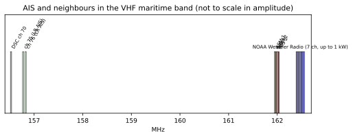

# Chapter 31 — Noise and interference sources, aboard and ashore

> **Part V — Radio.** A critical examination of electromagnetic noise and radio frequency interference degrading Automatic Identification System reception: shipboard unintentional radiators, bridge and mast layout conflicts, shore-side co-location hazards, receiver immunity limits, diagnostic measurement, and physical mitigation.

**In this chapter.** You will learn how electromagnetic noise and out-of-band interference blind Automatic Identification System (**AIS**) receivers both at sea and on shore. You will analyze the physical mechanisms of switch-mode power supplies, variable-frequency drives, and Light Emitting Diode (**LED**) lighting that elevate shipboard noise floors. You will evaluate the regulatory gap between commercial standards like FCC Part 15 and maritime standards like IEC 60945 and RTCM 13700.0. You will trace how high-power transmitters—including marine VHF radiotelephones, S-band and X-band radar, satellite uplinks, paging networks, and NOAA Weather Radio—trigger receiver desensitization, blocking, and intermodulation. You will execute standard diagnostics, including the USCG squelch test and software-defined radio waterfall surveys, and calculate link-budget degradation caused by noise-floor rise. Finally, you will design robust physical and electrical mitigations using cavity duplexers, bandpass filters, cable separation, and single-point grounding.

## 31.1 The AIS RF environment: noise floors and immunity boundaries

The Automatic Identification System operates in the international VHF maritime mobile band on two designated 25 kHz simplex frequencies: **AIS 1** (161.975 MHz) and **AIS 2** (162.025 MHz), alongside auxiliary channels for long-range messaging (Channels 75 and 76) and VHF Data Exchange (**VDES**, [Chapter 69](ch69-vdes-ais-2.md)). In an ideal, interference-free maritime environment, the noise floor at the antenna terminals is governed primarily by thermal noise and environmental radio noise described in Recommendation ITU-R P.372-18. 

For an equivalent noise bandwidth $B = 25\text{ kHz}$ at an ambient temperature $T = 290\text{ K}$, the theoretical thermal noise floor $P_{\text{thermal}}$ is:
$$P_{\text{thermal}} = k T B = 1.3806 \times 10^{-23}\text{ J/K} \times 290\text{ K} \times 25{,}000\text{ Hz} \approx 1.00 \times 10^{-16}\text{ W} = -130.0\text{ dBm}$$

A typical marine VHF receiver front end exhibits an internal noise figure ($NF$) between 6 dB and 8 dB, setting the internal receiver noise floor between $-124\text{ dBm}$ and $-122\text{ dBm}$. In quiet oceanic waters, man-made noise ($F_{\text{am}}$) below 200 MHz adds minimal penalty. However, in industrial ports and elevated shore sites, anthropogenic noise elevates the effective noise floor by 10 dB to 30 dB.

```
       156.525 MHz     156.8 MHz     161.975 MHz  162.025 MHz      162.400 - 162.550 MHz
            |              |              |            |                     |
     [ DSC Ch 70 ]    [ Ch 16 Voice ]  [ AIS 1 ]    [ AIS 2 ]    [ NOAA Weather Radio (7 ch) ]
            |              |              |            |                     |
  <---------+--------------+--------------+------------+---------------------+--------->
                                          |<- 50 kHz ->|
                                          |            |<------- 375 kHz --->|
```

Recommendation ITU-R M.1371-6 establishes the operational sensitivity and immunity baseline required for type-approved AIS stations:

* **Class A Mobile Stations (Annex 2 Table 7):**
  * **Sensitivity:** Packet Error Ratio (**PER**) $\le 20\%$ at a wanted input signal of $-107\text{ dBm}$.
  * **High-Level Dynamic Range:** $\text{PER} \le 1\%$ at $-77\text{ dBm}$ and at $-7\text{ dBm}$.
  * **Co-Channel Rejection:** $\text{PER} \le 20\%$ with an unwanted co-channel carrier 10 dB below the wanted signal.
  * **Adjacent-Channel Selectivity:** $\text{PER} \le 20\%$ with an unwanted signal at $\pm 25\text{ kHz}$ at 70 dB above sensitivity ($-31\text{ dBm}$).
  * **Spurious Response Rejection:** 70 dB relative to sensitivity ($-31\text{ dBm}$).
  * **Intermodulation Response Rejection:** 74 dB relative to sensitivity ($-36\text{ dBm}$ to $-27\text{ dBm}$).
  * **Blocking:** 86 dB relative to sensitivity ($-23\text{ dBm}$ to $-15\text{ dBm}$).

* **Class B "CS" Mobile Stations (Annex 6 Table 36):**
  * **Sensitivity:** $\text{PER} \le 20\%$ at $-107\text{ dBm}$ (relaxed to $-104\text{ dBm}$ under $\pm 500\text{ Hz}$ frequency offset).
  * **Carrier-Sense Threshold:** Minimum energy detection floor at $-107\text{ dBm}$, dynamically tracking background noise over $\ge 30\text{ dB}$ (up to $-77\text{ dBm}$) with threshold set at $\text{Background} + 10\text{ dB}$.
  * **Adjacent-Channel Rejection:** Wanted signal at $-101\text{ dBm}$ with unwanted carrier at $-31\text{ dBm}$ (70 dB ratio).
  * **Intermodulation:** Wanted signal at $-101\text{ dBm}$ with unwanted pair at $-36\text{ dBm}$ (65 dB ratio).
  * **Blocking:** $-23\text{ dBm}$ for offsets $< 5\text{ MHz}$; $-15\text{ dBm}$ for offsets $> 5\text{ MHz}$.

These receiver immunity specifications define the exact boundary between linear reception and front-end overload.

---

## 31.2 Shipboard noise sources: LEDs, switch-mode supplies, and inverters

Shipboard electromagnetic interference (**EMI**) has shifted with the adoption of solid-state electronics, high-efficiency lighting, and switch-mode power conversion. The primary culprits are unscreened switch-mode power supplies (**SMPS**), buck-boost DC-DC converters, variable-frequency motor drives (**VFD**), and non-compliant LED fixtures.

### 31.2.1 Switch-mode LED drivers and harmonic generation

Light Emitting Diodes require constant current. To maximize energy efficiency, LED fixtures employ switching regulators operating at fundamental frequencies between 50 kHz and 3 MHz. To minimize inductor size, converters switch power MOSFETs with fast rise times ($\tau_{\text{rise}} < 10\text{ ns}$).

Fourier analysis of trapezoidal switching waveforms indicates high-frequency harmonic roll-off at $-20\text{ dB/decade}$ up to a corner frequency $f_1 = 1/(\pi \tau_{\text{rise}})$, and $-40\text{ dB/decade}$ thereafter. For an edge transition of $\tau_{\text{rise}} = 3\text{ ns}$, the first break point extends past 100 MHz ($f_1 \approx 106\text{ MHz}$).

Unfiltered switching harmonics, ringing from PCB trace inductance, and diode reverse-recovery spikes generate a dense comb of RF emissions across the VHF maritime band (156–165 MHz). Because navigation lights are located on railings and mastheads, they are installed adjacent to VHF and AIS antennas. Unshielded DC wiring running up the mast acts as an efficient antenna, radiating broadband RF noise directly into the receiver.

> **Definitions that bite.**
> - **Desensitization ("Desense"):** The degradation of effective signal-to-noise ratio caused by external broadband noise or strong adjacent carriers, forcing the receiver to require a stronger signal to achieve the same packet error rate. Desense is silent: unlike analog FM voice, which crackles with static, digital AIS simply drops packets without sounding an alarm.
> - **Blocking:** Complete saturation and gain compression of the receiver's low-noise amplifier (LNA) or mixer by an out-of-band signal, rendering the receiver deaf to wanted in-band signals.

```
       Generic Consumer Standard (FCC Part 15 Class B)
       [ 43.5 dBµV/m @ 3 m (88 - 216 MHz)             ]
       |==============================================|
                                                      |
       Maritime Protected Band Standard (IEC 60945)   | 19.5 dB Gap!
       [ 24.0 dBµV/m @ 3 m (156 - 165 MHz) ]          | (Consumer devices can radiate
       |===================================|          |  ~89x higher RF power)
       +-----------------------------------+----------+------------------------->
       0                                  24.0       43.5               dBµV/m
```

### 31.2.2 The regulatory gap: IEC 60945 vs. FCC Part 15

Equipment installed on maritime bridges is governed internationally by **IEC 60945**. IEC 60945 Edition 4.0 establishes two radiated emission boundaries at a 3-meter measurement distance:
1. **General Band (30 MHz to 2 GHz):** Quasi-peak limit of $54\text{ dB}\mu\text{V/m}$.
2. **Protected Maritime VHF Band (156 MHz to 165 MHz):** A strict quasi-peak limit of **$24\text{ dB}\mu\text{V/m}$** measured with a 9 kHz resolution bandwidth.

In contrast, United States **47 CFR 15.109** (FCC Part 15, Subpart B) regulates unintentional radiators marketed for home and commercial environments:
* **Class B (Residential Devices):** $150\ \mu\text{V/m}$ at 3 meters across 88 MHz to 216 MHz, equivalent to:
  $$E_{\text{limit}} = 20 \log_{10}(150) \approx 43.5\text{ dB}\mu\text{V/m}$$
* **Class A (Commercial Devices):** $150\ \mu\text{V/m}$ at 10 meters, equivalent to $54.0\text{ dB}\mu\text{V/m}$ at 3 meters.

The regulatory discrepancy between FCC Part 15 Class B ($43.5\text{ dB}\mu\text{V/m}$) and IEC 60945 in the marine VHF band ($24.0\text{ dB}\mu\text{V/m}$) is **$19.5\text{ dB}$**. In linear power terms:
$$\Delta P = 10^{19.5 / 10} \approx 89.1$$

An LED spotlight, USB charger, or inverter that complies with consumer EMC laws (FCC Part 15) can radiate nearly **90 times more RF power** in the AIS channel band than permitted for marine-certified hardware. When mounted within 1 to 3 meters of an AIS antenna, such devices overwhelm the $-107\text{ dBm}$ sensitivity threshold. To address this, RTCM published **RTCM 13700.0**, defining radiated and conducted emission test methods for fixtures mounted above deck.

> **Case file.**
> In August 2018, the United States Coast Guard issued **Marine Safety Alert 13-18**, titled *"Let Us Enlighten You About LED Lighting! Potential Interference of VHF-FM Radio and AIS Reception."* The alert detailed incidents where commercial fishing vessels, workboats, and pleasure craft experienced complete loss of VHF-FM radiotelephone reception and automated AIS tracking upon turning on navigation, deck, or floodlighting. In several emergency events, Search and Rescue (**SAR**) controllers and vessel traffic centers were unable to contact vessels due to RF desensitization. The USCG identified poorly designed switching power supplies in LED fixtures as the root cause, outlined an onboard squelch-threshold test procedure, and urged mariners to report interference events to the USCG Navigation Center (**NAVCEN**). On April 21, 2022, the Coast Guard published **Marine Safety Information Bulletin 03-22**, directing industry to the adopted RTCM Standard 13700.0.

### 31.2.3 Power electronics: inverters, battery chargers, and VFDs

Modern vessel power systems concentrate significant electrical noise:
* **Variable-Frequency Drives (VFDs):** Used for thrusters, pumps, and compressors. VFDs synthesize motor waveforms using Insulated Gate Bipolar Transistors (**IGBTs**) pulsing at carrier frequencies of 2 kHz to 16 kHz with kilovolt-level edges. Without shielded motor leads bonded with $360^\circ$ glands, common-mode ground currents circulate through the hull and superstructure, coupling noise onto antenna feeder shields.
* **Inverters and Switch-Mode Chargers:** Marine battery chargers, solar MPPT controllers, and DC-to-AC inverters utilize high-power switching circuits. Deficient filtering on the DC bus turns the vessel's wiring harness into an extensive radiating dipole.
* **Satellite Terminal Power Units:** Modern phased-array satellite terminals (such as maritime Starlink or OneWeb) and Ku/Ka-band VSAT antennas require high-current switch-mode power injectors. Unshielded DC converters in these supplies generate broad VHF combs between 130 MHz and 175 MHz.

---

## 31.3 Shipboard RF transmitters: radar, VHF voice, and satellite uplinks

Co-site interference occurs when a vessel's intentional RF transmitters couple high power directly into the AIS antenna port.

### 31.3.1 Own-ship VHF radiotelephone desensitization

Under SOLAS Chapter IV, commercial vessels maintain continuous watch on VHF Channel 16 (156.800 MHz) and Channel 70 (156.525 MHz DSC), equipped with 25 W ($+44\text{ dBm}$) marine VHF radiotelephones.

The installation guidelines in **IMO SN/Circ.227** and **IMO COMSAR.1/Circ.32/Rev.3 §5.2.8** mandate antenna separation rules:
* The AIS antenna should be mounted **directly above or below** the ship's primary VHF antenna, with zero horizontal offset and a minimum of **2 meters vertical separation**.
* If antennas are mounted on the same horizontal plane, they must maintain a separation of at least **10 meters** under SN/Circ.227 §2.2.1, or at least **5 meters** under COMSAR.1/Circ.32/Rev.3 §5.2.8.

Vertical collinear dipole antennas exhibit a deep radiation null along their vertical axis. At 2 meters of vertical collinear separation, coupling isolation is typically **40 dB to 50 dB**. If horizontal separation is used without vertical displacement, isolation drops to **20 dB to 25 dB**.

> **Worked example.**
> A ship's officer keys the primary 25 W ($+44\text{ dBm}$) marine VHF radiotelephone on Channel 16 (156.800 MHz). The VHF antenna and AIS antenna are mounted on the same yardarm with 3 meters horizontal separation and no vertical offset, yielding an isolation coupling of only $26\text{ dB}$.
> 
> The power coupled directly into the AIS receiver antenna port is:
> $$P_{\text{coupled}} = P_{\text{tx}} - \text{Isolation} = +44\text{ dBm} - 26\text{ dB} = +18\text{ dBm}$$
> 
> Under Recommendation ITU-R M.1371-6 Table 7 and Table 36, the blocking limit for offsets $> 5\text{ MHz}$ is $-15\text{ dBm}$. Because Channel 16 is $5.175\text{ MHz}$ below AIS 1, the incoming $+18\text{ dBm}$ carrier exceeds the receiver's blocking threshold by $33\text{ dB}$. The AIS front-end LNA is driven deep into saturation, blinding the receiver during voice transmissions.
> 
> Conversely, vertically stacking the antennas with 2 meters vertical separation increases axial null isolation to $48\text{ dB}$. The coupled power drops to:
> $$P_{\text{coupled}} = +44\text{ dBm} - 48\text{ dB} = -4\text{ dBm}$$
> This prevents front-end damage and limits receiver desensitization.

SN/Circ.227 §2.1 notes that AIS transmissions (12.5 W Class A bursts lasting 26.7 ms) induce a periodic "soft clicking sound" in nearby VHF radiotelephone audio, audible every 2 to 10 seconds on adjacent marine channels (Channels 27, 28, and 86).

### 31.3.2 Marine radar front-end overload (S-band and X-band)

Marine radar systems transmit high-peak-power pulses:
* **X-band Radar (9.3 to 9.5 GHz):** Magnetron peak powers from 4 kW to 25 kW.
* **S-band Radar (2.9 to 3.1 GHz):** Magnetron peak powers from 10 kW to 30 kW.

While radar frequencies are gigahertz away from 162 MHz, installed systems present specific interference risks:
1. **Radar Main-Beam Sweep Overload:** A 30 kW S-band pulse radiated 2 meters away illuminates the AIS whip with field strengths of several hundred volts per meter. Package parasitics allow pulse energy to reach the first-stage LNA, causing momentary gain compression.
2. **Solid-State Radar Switching Noise:** Modern solid-state pulse-compression radars (50 W to 250 W) operate with long chirps. Switch-mode power supplies in the pedestal radiate continuous VHF noise if grounding bonds deteriorate.
3. **Physical Placement Rules:** IMO SN/Circ.227 §2.2.1 mandates that the AIS antenna must be mounted **outside the radar transmitting beam** and preferably at least **3 meters** away from radar antennas.

### 31.3.3 Satellite communications (Inmarsat, VSAT, and Iridium)

Maritime satellite systems employ high RF powers: Inmarsat-C and FleetBroadband transmit L-band uplinks (1626.5–1660.5 MHz) up to $+33\text{ dBm}$ EIRP, while Ku/Ka-band VSAT systems deliver 4 W to 40 W. Switch-mode DC converters and motor controllers in tracking pedestals frequently radiate VHF noise. Furthermore, L-band uplinks around 1620 MHz represent the 10th harmonic of the 162 MHz AIS band; non-linear mixing in ungrounded mast junctions can produce reciprocal intermodulation products.

---

## 31.4 Shore-side interference sources: broadcast, paging, and land mobile

Operating an AIS receiver ashore introduces high-power interference mechanisms rarely encountered on the open sea.



### 31.4.1 NOAA Weather Radio (NWR) co-location

In North America, the **NOAA Weather Radio All Hazards** network operates continuous FM broadcasts across seven designated VHF channels:

| Channel | Frequency (MHz) | Offset from AIS 1 (161.975 MHz) | Offset from AIS 2 (162.025 MHz) |
|---|---|---|---|
| WX 1 | 162.550 | $+575\text{ kHz}$ | $+525\text{ kHz}$ |
| WX 2 | 162.400 | $+425\text{ kHz}$ | **$+375\text{ kHz}$** |
| WX 3 | 162.475 | $+500\text{ kHz}$ | $+450\text{ kHz}$ |
| WX 4 | 162.425 | $+450\text{ kHz}$ | $+400\text{ kHz}$ |
| WX 5 | 162.450 | $+475\text{ kHz}$ | $+425\text{ kHz}$ |
| WX 6 | 162.500 | $+525\text{ kHz}$ | $+475\text{ kHz}$ |
| WX 7 | 162.525 | $+550\text{ kHz}$ | $+500\text{ kHz}$ |

NOAA Weather Radio stations operate at continuous transmitter output powers up to **1,000 W** ($+60\text{ dBm}$), with effective radiated powers (**ERP**) often exceeding $+65\text{ dBm}$ from high-gain collinear antenna arrays sited on prominent coastal ridges.

The closest NWR channel, **WX 2 (162.400 MHz)**, sits a mere **375 kHz** above AIS 2. While 375 kHz is outside the receiver's $\pm 25\text{ kHz}$ adjacent-channel test window, it falls inside the $< 5\text{ MHz}$ **blocking zone** governed by Recommendation ITU-R M.1371-6 Table 36 ($-23\text{ dBm}$ Class B threshold). 

```
                       AIS 2            NOAA WX 2
                     162.025 MHz       162.400 MHz
                          |                 |
                          |<--- 375 kHz --->|
                          |                 |
               [AIS 2]    |                 |   [ 1,000 W Continuous FM ]
               [ 25 kHz ] |                 |   [ Broadcast Transmitter ]
               +----------+                 +---------------------------+
               |          |                 |                           |
  <------------+----------+-----------------+---------------------------+--------->
             162.0 MHz                   162.4 MHz
```

When an AIS collection station is co-located on a tower alongside an active 1,000 W NWR transmitter, standard SDR front ends saturate, generating intermodulation hash and desensitizing reception across large areas.

> **Try it.**
> Calculate the free-space path loss and received power from a 1,000 W NOAA Weather Radio transmitter using the repository's RF link-budget tool:
> ```bash
> . .venv/bin/activate
> python code/rf/linkbudget.py --ptx 1000 --gtx 5 --grx 2 --htx 100 --hrx 10 --d 1.0 --model fspl
> ```
> Expected output:
> ```text
> {'d_km': 1.0, 'd_nmi': 0.5399568034557235, 'fspl_db': 76.6, 'two_ray_db': 60.0, 'loss_used_db': 76.6, 'p_rx_dbm': -12.1, 'margin_vs_-107dBm': 94.9, 'horizon_km': 54.2}
> ```
> At 1.0 km, the received carrier power is **$-12.1\text{ dBm}$**—well above the $-23\text{ dBm}$ Class B blocking threshold and within 1 dB of the Class A high-level limit ($-7\text{ dBm}$). An external, high-Q cavity bandpass or notch filter is mandatory to suppress the NWR carrier before it enters the receiver LNA.

### 31.4.2 Commercial FM broadcast intermodulation (88 to 108 MHz)

Commercial FM broadcast stations radiate tens to hundreds of kilowatts ERP across 88.0 MHz to 108.0 MHz. When multiple high-power FM carriers enter an unselective receiver front end, third-order intermodulation distortion (**IMD3**) occurs within the non-linear transfer curve of the LNA or mixer:
$$f_{\text{IMD3}} = 2f_1 - f_2 \quad \text{and} \quad f_{\text{IMD3}} = 2f_2 - f_1$$

On low-cost SDR receivers lacking preselector front-end filters, strong broadcast signals saturate the analog-to-digital converter (**ADC**), raising the effective noise floor across the VHF spectrum by 20 dB to 40 dB.

### 31.4.3 VHF paging, land-mobile radio, and public safety

The land-mobile radio spectrum flanking the maritime band (150 MHz to 174 MHz) contains high-power transmitters:
* **High-Power Paging (152.000 to 158.700 MHz):** Paging transmitters radiate bursts at 250 W to 500 W. These prompted the creation of standard **RTCM 11701.0** (*Standard for Installed Maritime VHF Radiotelephone Equipment Operating in High Level Electromagnetic Environments*).
* **Railway and Utility Dispatch (160.215 to 161.565 MHz):** Port rail dispatch radio repeaters transmit with 50 W to 100 W ERP just kilohertz below the lower edge of the marine VHF band.
* **Cellular Base Stations:** Co-located LTE/5G base stations radiate high total RF power. Poorly shielded receiver enclosures allow UHF energy to induce rectified DC offsets and intermodulation across front-end diodes.

---

## 31.5 Measurement methods and diagnostic procedures

Accurate identification of noise and interference requires disciplined diagnostic workflows, moving from functional checks to calibrated spectral analysis.

```
       +--------------------------------------------------------------+
       | Step 1: Baseline Check                                       |
       | Turn off all auxiliary loads, LEDs, inverters, chargers.     |
       | Tune VHF to quiet channel (Ch 13/67/77) or weak WX station.  |
       +------------------------------+-------------------------------+
                                      |
                                      v
       +--------------------------------------------------------------+
       | Step 2: Squelch Threshold Calibration                        |
       | Open squelch until static hiss is continuous.                |
       | Slowly tighten squelch until audio cuts out (threshold).     |
       +------------------------------+-------------------------------+
                                      |
                                      v
       +--------------------------------------------------------------+
       | Step 3: Sequential Load Energization                         |
       | Energize suspect loads one by one:                           |
       | Nav lights -> Deck floods -> Inverter -> Chargers -> VFDs.   |
       +------------------------------+-------------------------------+
                                      |
                 +--------------------+--------------------+
                 |                                         |
                 v                                         v
       [ Audio breaks squelch! ]                  [ Audio stays silent ]
       Identified active EMI emitter              Load meets quiet baseline
       Isolate fixture, install ferrites          Proceed to next load check
```

### 31.5.1 The USCG Marine Safety Alert squelch test

USCG Marine Safety Alert 13-18 defines a rapid diagnostic procedure utilizing the vessel's installed VHF-FM radiotelephone:

1. **De-energize Equipment:** Switch off all non-vital electrical loads, including LED navigation lights, floodlights, inverters, battery chargers, and display backlights.
2. **Channel Selection:** Tune the marine VHF radiotelephone to a quiet simplex channel (such as Channel 13, 67, or 77) or to a weak NOAA Weather Radio station.
3. **Open the Squelch:** Turn the squelch control counter-clockwise until open-channel thermal static hiss is audible.
4. **Set Squelch Threshold:** Slowly turn the squelch control clockwise until the audio static cuts out completely, setting it at the threshold of silence.
5. **Sequential Energization:** Switch on suspect electrical devices one at a time: navigation lights, deck floodlights, USB power adapters, DC-to-AC inverters, MPPT solar controllers, and auxiliary machinery drives.
6. **Evaluate Output:** If the VHF radio un-squelches and emits static hiss upon energizing any individual circuit, that device is radiating RF noise in the 156–165 MHz band, elevating the noise floor and desensitizing the AIS receiver.

### 31.5.2 SDR waterfall survey and spectrum analysis

On shore collection sites or during complex marine installations, an engineer should employ a calibrated spectrum analyzer or a wideband Software-Defined Radio (**SDR**, [Chapter 33](ch33-hardware-and-sdr.md)):

1. **Center Frequency and Span:** Configure the SDR to a center frequency of $162.000\text{ MHz}$ with a sample rate of $2.4\text{ MS/s}$ (spanning 160.8 MHz to 163.2 MHz).
2. **FFT Resolution:** Set the Fast Fourier Transform (**FFT**) size to 8,192 bins with a Blackman-Harris window ($\approx 293\text{ Hz}$ resolution per bin) with 16-frame averaging.
3. **Baseline Waterfall Capture:** With the antenna connected and local loads off, record a 60-second baseline waterfall. In a quiet environment, the noise floor sits uniform at $-120\text{ dBm}$ to $-125\text{ dBm}$, punctuated by TDMA bursts at 161.975 MHz and 162.025 MHz.
4. **Active Noise Identification:**
   * **Broadband Comb Lines:** Switching power supplies appear as vertical hash lines spaced at uniform harmonic intervals (e.g., every 150 kHz, 300 kHz, or 1.2 MHz) across the passband, elevating the baseline by 6 dB to 20 dB.
   * **Continuous Carrier Inundation:** NOAA Weather Radio appears as a continuous FM carrier at 162.400 MHz or 162.550 MHz rising 60 dB to 80 dB above baseline.
   * **Intermodulation Spikes:** Dense spectral spikes that shift in frequency when an external step attenuator is toggled indicate front-end mixer overload.

### 31.5.3 Class B "CS" carrier-sense background monitoring

Recommendation ITU-R M.1371-6 Annex 6 §A6-4.3.1.3 mandates that Class B CSTDMA transponders continuously track the local background noise floor:
* The transponder samples RSSI across each channel at an internal rate $\ge 1\text{ kHz}$.
* It computes a sliding 20 ms average across a 4-second observation window and maintains a history of 15 intervals (60 seconds).
* The carrier-sense threshold is locked to:
  $$\text{Threshold} = \text{Minimum Energy (Background)} + 10\text{ dB}$$
* The transponder tracks background noise across a dynamic range from $-107\text{ dBm}$ up to $-77\text{ dBm}$.

If onboard equipment elevates the ambient noise floor from $-115\text{ dBm}$ to $-85\text{ dBm}$, the carrier-sense threshold automatically rises to $-75\text{ dBm}$. Under these conditions, the transponder fails to detect incoming Class B packets arriving between $-105\text{ dBm}$ and $-80\text{ dBm}$. As detailed in [Chapter 30](ch30-network-loading-packet-loss.md), if noise rises sufficiently to violate CSTDMA candidate slot thresholds, the unit continually defers, silently ceasing own-ship broadcasts while bridge displays indicate normal operation.

---

## 31.6 Mitigation techniques and physical design

Curing RF interference requires a multi-layered engineering approach combining spatial separation, RF filtering, structural bonding, and shielded cabling.

| Interference Source | Dominant Coupling Mechanism | Primary Diagnostic Signature | Engineering Mitigation |
|---|---|---|---|
| **LED Navigation & Deck Lights** | Direct radiation from fixture & unshielded DC wire acting as mast antenna | Broadband hash and 6–20 dB noise-floor lift across 156–165 MHz; breaks VHF squelch | Replace with RTCM 13700.0/IEC 60945 certified fixtures; clamp Type 31/43 ferrite chokes on DC leads; use shielded twisted-pair cabling |
| **Inverters & Solar MPPT Chargers** | Conducted common-mode currents radiating from DC battery bus | 100 kHz–2 MHz harmonic comb lines extending past 170 MHz | Install multi-stage common-mode DC line filters; bond inverter chassis to hull grounding bus with copper strap |
| **Variable Frequency Drives (VFD)** | Radiated and conducted common-mode pulses from unshielded motor leads | High-amplitude impulsive buzz correlating with motor RPM | Install shielded symmetrical motor cable with $360^\circ$ EMC glands at both ends; install sine-wave output filters on drive |
| **Own-Ship VHF Voice Transmit** | Direct antenna-to-antenna near-field electromagnetic coupling | Receiver front-end overload/blocking ($-4\text{ dBm}$ to $+18\text{ dBm}$); clicks on VHF audio | Enforce IMO 2 m vertical collinear stacking; maintain $\ge 10\text{ m}$ horizontal separation if co-planar; use active fail-safe splitters |
| **Marine Radar (X/S-Band)** | Main-beam microwave illumination and turning-gear power supply noise | Periodic pulsed desensitization synchronised with radar rotation | Mount AIS antenna outside radar vertical beamwidth ($\ge 3\text{ m}$ separation); bond radar turning pedestal to mast steelwork |
| **NOAA Weather Radio (NWR)** | Continuous high-power adjacent-carrier overload (375 kHz offset) | Continuous LNA saturation and intermodulation on shore SDR receivers | Install a multi-cavity bandpass filter (161.9–162.05 MHz) or high-Q notch filter tuned to specific NWR frequency |
| **FM Broadcast (88–108 MHz)** | Intermodulation (IMD3) and ADC dynamic range clipping in wideband receivers | Dense spurious intermod products across entire VHF waterfall | Install a sharp 88–108 MHz broadcast bandstop notch filter ahead of LNA; replace RTL-SDR with preselected receiver |
| **Land-Mobile & Paging Systems** | Out-of-band front-end overload from co-located 250–500 W tower transmitters | Periodic high-level carrier blocking during land-mobile transmissions | Install sharp helical or SAW bandpass preselection filters; place LNA *after* preselection filter |

### 31.6.1 Antenna placement and spatial separation

Antenna coupling between two vertical dipoles depends fundamentally on geometry:

> **Rule of thumb.**
> Vertical separation beats horizontal separation every time: two meters of vertical collinear spacing provides 45 dB to 55 dB of antenna isolation, whereas achieving that same isolation on a horizontal yardarm requires more than 30 meters of physical separation—impossible on most ships. Always stack the AIS antenna directly above or below the primary VHF voice antenna.
2. **Horizontal Separation:** If antennas are mounted on the same horizontal plane (such as on yardarms), coupling loss follows the horizontal path loss formula:
   $$\text{Isolation}_{\text{horizontal}} \approx 22\text{ dB} + 20 \log_{10}(d / \lambda)$$
   At 162 MHz ($\lambda = 1.85\text{ m}$), a horizontal spacing of 5 meters yields only $\approx 31\text{ dB}$ of isolation; 10 meters yields $\approx 37\text{ dB}$. Horizontal co-planar mounting should be avoided wherever vertical masthead stacking is feasible.

```
       Vertical Stacking (Preferred)               Horizontal Separation (Avoid)
       =============================               =============================
                   ( ) AIS Antenna                                 
                    |                                              
                    |                                              
                    | 2 m min vertical                             
                    | separation (in axial null)                   
                    |                                ( ) AIS             ( ) VHF
                   ( ) Primary VHF                    |                   |
                    |                                 |<--- 5 to 10 m --->|
                    |                                        separation
             Isolation: 45 - 55 dB                         Isolation: 30 - 37 dB
```

### 31.6.2 RF filtering: cavity duplexers, helical resonators, and SAW filters

Active front-end LNAs must be protected by sharp RF filters:
* **Quarter-Wave Coaxial Cavity Filters:** For shore collection sites co-located within 2 km of NOAA Weather Radio or paging transmitters, standard lumped-element filters lack sufficient Q-factor. High-Q silver-plated quarter-wave coaxial cavities achieve loaded Q-factors exceeding 2,000. A dual-cavity bandpass filter provides insertion loss $< 0.8\text{ dB}$ across 161.975–162.025 MHz while delivering $> 35\text{ dB}$ attenuation at 162.400 MHz (NWR WX 2) and $> 60\text{ dB}$ rejection across the 88–108 MHz broadcast band.
* **Surface Acoustic Wave (SAW) Filters:** Modern compact receivers utilize ceramic-packaged SAW bandpass filters centered on 162 MHz. SAW filters achieve sharp transition skirts and up to 50 dB out-of-band rejection within a small footprint, with an insertion loss between 2.0 dB and 3.5 dB. Maximum input power is typically limited to $+10\text{ dBm}$.
* **LNA Siting and Filter Ordering:** A critical architectural rule is filter order:
  $$\text{Antenna} \longrightarrow \text{Passive High-Q Bandpass Filter} \longrightarrow \text{Low-Noise Amplifier (LNA)} \longrightarrow \text{Receiver}$$
  Placing a wideband LNA directly at the antenna ahead of filtering causes the LNA to generate intermodulation and compress under strong out-of-band signals. Preselection filtering must precede active amplification.

### 31.6.3 Cabling, screening, and single-point grounding

Electromagnetic energy couples onto coaxial transmission lines through braid shield leakage:
* **Coaxial Screening Quality:** IMO SN/Circ.227 §2.2.2 recommends: *"Double screened coaxial cables equal or better than RG214 are recommended."* Standard RG-58 cable possesses a single copper braid providing only 70 dB to 80 dB of screening efficiency. High-power RF fields penetrate the braid, conducting noise currents directly onto the center conductor. Commercial installations should deploy double-shielded cables (RG-214, Times Microwave LMR-400, or Heliax) providing $> 90\text{ dB}$ screening effectiveness.
* **Physical Cable Routing:** Antenna down-leads must be segregated from power distribution wiring. Under SN/Circ.227 §2.2.2, coaxial cables must be separated by at least **10 cm** from electrical power cables (and at least **1 meter** for radar pulse leads and satellite waveguides). Where antenna cables cross power conduits, they must cross at strict **$90^\circ$ right angles** to minimize mutual coupling.
* **Single-Point Grounding:** Ground loops between masthead brackets, transceiver chassis, and vessel DC distribution buses introduce 50/60 Hz hum harmonics and inverter hash. Coaxial cable shields must be bonded to the vessel's primary radio ground bus at a single bulkhead entrance point using coaxial ground clamps.

---

## Then & now

| Dimension | Then (1998–2004) | Now (2015–Present) |
|---|---|---|
| **Primary shipboard noise source** | ⟨H⟩ Commutator motors, dirty alternator slip-rings, poorly suppressed diesel engine ignition systems, and mechanical relay arcing. | ⟨+⟩ Switch-mode LED drivers, DC-to-DC converters, MPPT solar chargers, VFD motor controllers, and phased-array satellite terminals. |
| **Emission standards enforcement** | ⟨H⟩ General reliance on generic bridge equipment EMC testing under IEC 60945 Edition 3. | ⟨+⟩ Strict protected-band enforcement ($24\text{ dB}\mu\text{V/m}$ at 3 m) and dedicated marine LED lighting standards under RTCM 13700.0 (2022). |
| **Shipboard lighting technology** | ⟨H⟩ Incandescent tungsten filament bulbs and halogen spotlights exhibiting zero RF switching noise. | ⟨+⟩ Pervasive high-efficiency LED fixtures with cheap buck converters, driving widespread VHF desensitization (USCG Safety Alert 13-18). |
| **VHF voice co-location diagnostics** | ⟨H⟩ Manual checks for receiver desensitization using analog needle signal meters and squelch pots. | ⟨+⟩ Automated SDR FFT waterfall recordings, Class B CSTDMA carrier-sense background tracking, and calibrated VNA sweeps. |
| **Shore collection RF density** | ⟨H⟩ Low-density coastal sites sharing towers with analog land-mobile repeaters and pagers. | ⟨+⟩ Extreme spectrum crowding from LTE/5G base stations, high-power NOAA Weather Radio, and urban FM broadcast overload. |
| **Front-end receiver architecture** | ⟨H⟩ Superheterodyne receivers with dual analog IF conversions, crystal preselection, and high dynamic range helical filters. | ⟨+⟩ Direct-sampling or direct-conversion SDR receivers with broad analog front ends requiring external cavity and notch filtering. |

---

## On the wire

While electromagnetic interference is an analog physical phenomenon, its impact manifests directly in Link Layer and physical decoding failures across the wire.

When broadband noise elevates the noise floor, the Signal-to-Noise-and-Distortion ratio (**SINAD**) of incoming GMSK packet bursts drops. AIS modulation utilizes Gaussian Minimum Shift Keying (**GMSK**) with a nominal bandwidth-time product $BT = 0.4$ for Class A transmitters and $BT = 0.5$ for receivers at 9,600 bit/s ([Chapter 28](ch28-rf-encoding-physical-layer.md)). The relationship between Bit Error Rate ($P_b$) and energy-per-bit to noise-power-spectral-density ratio ($E_b/N_0$) for coherent GMSK is:
$$P_b \approx Q\left(\sqrt{2 \gamma \frac{E_b}{N_0}}\right)$$
where $\gamma \approx 0.68$ to $0.85$ is the GMSK degradation factor relative to ideal BPSK, and $Q(x)$ is the Gaussian tail integral:
$$Q(x) = \frac{1}{\sqrt{2\pi}} \int_x^\infty e^{-t^2 / 2} \,\mathrm{d}t$$

Because AIS transmits HDLC-framed packets containing a 16-bit CRC Frame Check Sequence (**FCS**) with **zero Forward Error Correction (FEC)**, a packet is successfully decoded if and only if **every single bit** across the packet is received without error. 

For a standard single-slot position report (Message 1, 2, or 3) containing $N = 256$ bits (preamble, flags, data, CRC, and buffer), the Packet Error Ratio ($\text{PER}$) is:
$$\text{PER} = 1 - (1 - P_b)^N$$

If ambient noise degrades $E_b/N_0$ by only 3 dB (e.g., dropping from 14 dB to 11 dB), the bit error rate $P_b$ jumps from $\approx 10^{-6}$ to $\approx 2 \times 10^{-3}$. The single-slot packet error rate increases significantly:
$$\text{PER} = 1 - (1 - 0.002)^{256} = 1 - (0.597) \approx 40.3\%$$

A 3 dB noise floor rise transforms an almost error-free link into a channel dropping four out of ten position reports. For multi-slot transmissions—such as a 2-slot Message 5 static report ($N = 424$ bits) or a 5-slot binary message ($N = 1{,}192$ bits)—packet loss probability exceeds 90%.

In NMEA 0183 output streams ([Chapter 26](ch26-interfaces-and-logging.md)), this corruption does not output mangled `!AIVDM` sentences; the transponder's internal HDLC processor silently discards frames failing CRC-16 checks. To the ECDIS operator, distant targets simply vanish from the screen.

```
       Frame Check Sequence (CRC-16/X-25) Verification Flow
       ====================================================
       Incoming Bit Stream:  [ Training (24) ][ Start Flag (8) ][ Payload (168) ][ CRC (16) ][ End Flag (8) ]
                                                                       |               |
                                                                       v               v
                                                                 Compute CRC-16  Compare to FCS
                                                                       |               |
                                                      +----------------+---------------+
                                                      |
                                     +----------------+----------------+
                                     |                                 |
                                 [ Match! ]                       [ Mismatch! ]
                                     |                                 |
                                     v                                 v
                             Emit !AIVDM NMEA              Silently Discard Frame
                             Update Target on ECDIS        Target Disappears from Screen
```

---

## Validation, uncertainty & data quality

Quantifying interference requires measuring how noise floor elevation degrades operational coverage range and track continuity.

### Link margin and operational range reduction

Under smooth-Earth spherical geometry and standard atmospheric refraction ($4/3$-Earth model), VHF propagation within the radio horizon transitions from free-space path loss ($20\text{ dB/decade}$) at short distances to the two-ray plane-Earth reflection model ($40\text{ dB/decade}$) as distance approaches the horizon:
* **Free-Space Path Loss:** $L_{\text{path}} \propto d^2 \implies 20 \log_{10}(d)$
* **Two-Ray Plane-Earth Loss:** $L_{\text{path}} \approx 40 \log_{10}(d) - 20 \log_{10}(h_1) - 20 \log_{10}(h_2)$

When shipboard EMI or co-channel interference raises the receiver noise floor by $\Delta N\text{ (dB)}$, the effective link margin is reduced by exactly $\Delta N\text{ (dB)}$. The proportional range retention factor $\rho = d_{\text{new}} / d_{\text{nominal}}$ depends on the dominant propagation regime:
* **In the free-space regime ($20\text{ dB/decade}$):**
  $$\Delta N = 20 \log_{10}\left(\frac{d_{\text{nominal}}}{d_{\text{new}}}\right) \implies \rho_{\text{FS}} = 10^{-\Delta N / 20}$$
* **In the two-ray interference regime ($40\text{ dB/decade}$):**
  $$\Delta N = 40 \log_{10}\left(\frac{d_{\text{nominal}}}{d_{\text{new}}}\right) \implies \rho_{\text{2-ray}} = 10^{-\Delta N / 40}$$

```
                          Effective Coverage Range Retention vs. Noise Floor Rise
       100% +-------------------------------------------------------------------------+
            |*                                                                        |
            | \                                                                       |
        80% |  \                                                                      |
            |   \                  Two-Ray Regime (40 dB/decade)                      |
            |    *---\                                                                |
        60% |         \---*                                                           |
            |              \-----\                                                    |
        40% |                     *-----\                                             |
            |                            \-----\                                      |
            |                                   *-----\     Free-Space (20 dB/decade) |
        20% |                                          \-----\                        |
            |                                                 *-----------------------|
         0% +-------------------------------------------------------------------------+
            0 dB                 3 dB                 6 dB                 12 dB
                                           Noise Floor Elevation
```

Consider the impact of common noise elevations:
1. **$\Delta N = 3\text{ dB}$ (Minor LED/charger noise):**
   * $\rho_{\text{FS}} = 10^{-3/20} \approx 0.708$ (29.2% range loss)
   * $\rho_{\text{2-ray}} = 10^{-3/40} \approx 0.841$ (15.9% range loss)
2. **$\Delta N = 6\text{ dB}$ (Moderate unshielded inverter hash):**
   * $\rho_{\text{FS}} = 10^{-6/20} \approx 0.501$ (49.9% range loss)
   * $\rho_{\text{2-ray}} = 10^{-6/40} \approx 0.708$ (29.2% range loss)
3. **$\Delta N = 12\text{ dB}$ (Severe non-compliant LED mast floodlight):**
   * $\rho_{\text{FS}} = 10^{-12/20} \approx 0.251$ (74.9% range loss)
   * $\rho_{\text{2-ray}} = 10^{-12/40} \approx 0.501$ (49.9% range loss)

A vessel whose AIS receiver normally tracks Class A traffic out to 20 nautical miles sees its tracking bubble collapse to 10 nautical miles under a 12 dB noise floor elevation. For Class B craft transmitting with 2 W ($+33\text{ dBm}$), tracking range collapses from 7–8 nautical miles down to less than 2–3 nautical miles—well inside dangerous collision-avoidance reaction distances.

---

## Software

* **AIS-catcher** (Open source, GPL-3.0). Multi-platform SDR AIS receiver supporting RTL-SDR, Airspy, SDRplay, HackRF, and file inputs. Features integrated RF waterfall display, real-time RSSI and frequency-error tracking, and multi-channel decoders. *Caveat:* Internal digital AGC must be calibrated or disabled when measuring relative noise floor changes to avoid misleading automatic gain scaling.
* **GQRX / SDR++** (Open source, GPL-3.0). General-purpose SDR spectral analysis suites. Provide calibrated spectrum analyzer and waterfall displays with variable FFT sizes, persistence averaging, and peak-hold functions for surveying VHF band contamination. *Caveat:* Displayed dBFS levels must be referenced to a known external RF calibration source to obtain absolute dBm figures.
* **rtl_power** (Open source, GPL-2.0). Wideband spectrum surveillance utility for RTL-SDR hardware. Executes automated max-hold and average-power sweeps across tens of megahertz over 24-hour cycles, ideal for identifying intermittent shore-side paging or LMR interferers. *Caveat:* Prone to internal mixer-overload intermodulation artifacts if used in high-RF urban areas without external bandpass filtering.
* **SignalShark / Rohde & Schwarz Instrument Suites** (Commercial). Laboratory and field spectrum monitoring tools providing calibrated channel power, quasi-peak CISPR detectors matching IEC 60945 testing, and automated direction-finding. *Caveat:* Prohibitive cost and specialized operational complexity for vessel operators.

---

## Standards & guides

* **ITU-R Recommendation M.1371-6 (2026):** Technical characteristics for AIS using TDMA in the VHF maritime band; defines receiver sensitivity, adjacent-channel selectivity, intermodulation, and blocking limits.
* **IEC 60945:2002 (Ed. 4.0):** General maritime navigation equipment requirements; enforces the $24\text{ dB}\mu\text{V/m}$ radiated emission limit in the 156–165 MHz protected band.
* **IEC 61993-2:2018 (Ed. 3.0):** Class A shipborne equipment tests; sets receiver dynamic range and spurious rejection standards.
* **IEC 62287-1:2017 (Ed. 3.0):** Class B CSTDMA equipment tests; establishes carrier-sense background noise tracking and slot deferral rules.
* **RTCM Standard 13700.0 (2022):** EMC requirements for LED devices and electrical equipment near shipboard antennas; establishes above-deck emission limits.
* **RTCM Standard 11701.0 (1999):** Installed VHF radiotelephone performance in high-level RF environments such as paging bands.
* **IMO Circular SN/Circ.227 (2003):** Shipborne AIS installation guidelines; mandates antenna siting, 2 m vertical separation, and double-screened coax.
* **IMO Circular COMSAR.1/Circ.32/Rev.3 (2007):** Harmonization of GMDSS installations; governs antenna separation between AIS and VHF radiotelephones.
* **USCG Marine Safety Alert 13-18 (2018):** Alerts mariners to LED switch-mode noise blinding VHF/AIS receivers and describes the squelch diagnostic test.
* **USCG Marine Safety Information Bulletin 03-22 (2022):** Recommends adoption of RTCM 13700.0 for shipboard LED lighting.
* **47 CFR Part 15 (2026):** FCC unintentional radiator rules; permits consumer emissions up to $43.5\text{ dB}\mu\text{V/m}$ at 3 m across 88–216 MHz.

---

## Pitfalls

1. **Assuming non-static means zero interference** → Digital GMSK signals degrade by increasing packet error rates rather than generating audible clicks or buzzes → Verify receiver noise floors using calibrated spectrum analyzers or SDR waterfalls, not human ears.
2. **Purchasing consumer LED lighting for bridge or masthead mounting** → Consumer LEDs meeting FCC Part 15 Class B can radiate nearly 20 dB more VHF noise than allowed under IEC 60945, blinding receivers mounted nearby → Specify fixtures compliant with RTCM 13700.0 or IEC 60945 protected-band standards.
3. **Mounting AIS and VHF antennas side-by-side on the same yardarm** → Horizontal separation provides poor isolation ($\approx 25\text{ dB}$ at 3 m), driving the AIS receiver into severe front-end blocking during 25 W voice transmissions → Stack antennas vertically with at least 2 meters of collinear tip-to-base separation.
4. **Installing a low-noise amplifier ahead of front-end filtering** → Wideband LNAs amplify strong out-of-band signals from broadcast FM, pagers, and NOAA Weather Radio, generating severe intermodulation distortion inside the LNA itself → Always place a high-Q bandpass or cavity filter between the antenna and the LNA.
5. **Using single-shielded RG-58 coaxial cable for long masthead runs** → Loose braid shields allow strong RF fields from radar, switch-mode supplies, and inverter lines to couple directly into the feeder → Use double-shielded or solid-shielded coax (RG-214, LMR-400, or Heliax) with $> 90\text{ dB}$ shielding efficiency.
6. **Co-locating shore collection sites directly adjacent to NOAA Weather Radio transmitters** → 1,000 W continuous FM broadcasts at 162.400 MHz sit only 375 kHz above AIS 2, completely saturating standard receiver front ends → Install sharp coaxial cavity notch filters tuned to the NWR frequency or select sites several kilometers removed.
7. **Routing coaxial down-leads alongside vessel high-voltage or DC power bundles** → Parallel cable runs induce capacitive and inductive common-mode noise into the antenna feedline → Maintain at least 10 cm clearance from standard power wiring and cross power conduits at strict $90^\circ$ angles.
8. **Neglecting VFD common-mode shielding on motor leads** → Pulsed IGBT edges propagate through hull metalwork, elevating baseline noise across all bridge electronics → Install symmetrical, continuously shielded motor cabling with $360^\circ$ EMC compression glands at both ends.
9. **Relying on AGC indicators to evaluate reception health** → Automatic Gain Control circuits mask high noise floors by reducing front-end gain, preserving output stability while destroying sensitivity → Monitor actual packet reception statistics and RSSI distribution over time.
10. **Overlooking Class B CSTDMA candidate abandonment** → Elevated ambient noise raises the Class B carrier-sense threshold, causing units to continually defer transmissions without alerting the navigator → Regularly verify own-ship transmissions on external monitoring displays or shore aggregation feeds.

---

## Key takeaways

* The AIS physical link is governed by strict receiver immunity standards (ITU-R M.1371-6 Table 7/36): sensitivity of $-107\text{ dBm}$, adjacent-channel selectivity of 70 dB, and blocking limits of $-23\text{ dBm}$ to $-15\text{ dBm}$.
* A critical 19.5 dB regulatory gap exists between consumer EMC limits (FCC Part 15 Class B at $43.5\text{ dB}\mu\text{V/m}$) and the maritime protected band (IEC 60945 at $24.0\text{ dB}\mu\text{V/m}$), allowing uncertified LEDs to radiate ~89 times more RF noise.
* USCG Marine Safety Alert 13-18 and RTCM Standard 13700.0 establish that solid-state switch-mode LED drivers mounted on mastheads and railings are primary sources of silent VHF/AIS desensitization.
* Unfiltered switching harmonics and fast edge transitions ($\tau \le 3\text{ ns}$) generate broad RF combs extending past 170 MHz that radiate efficiently from unshielded DC wiring.
* Antenna separation on ships must follow IMO SN/Circ.227 and COMSAR.1/Circ.32/Rev.3: vertical collinear stacking with $\ge 2\text{ m}$ separation delivers 45–55 dB of isolation, far outperforming coplanar horizontal separation.
* Shore-side collection stations must mitigate extreme local interferers, particularly 1,000 W continuous NOAA Weather Radio broadcasts (162.400–162.550 MHz) operating as close as 375 kHz from AIS 2.
* A 6 dB elevation in the ambient receiver noise floor reduces effective vessel detection range by approximately 30% to 50%, silently shrinking the bridge collision-avoidance horizon.
* Robust mitigation requires passive preselection filtering before any active LNA, double-screened coax (RG-214/LMR-400), single-point bulkhead grounding, and physical cable segregation.

---

## References

- Federal Communications Commission (2026). *Title 47, Code of Federal Regulations, Section 15.109: Radiated Emission Limits*. Electronic Code of Federal Regulations. https://www.law.cornell.edu/cfr/text/47/15.109
- International Electrotechnical Commission (2002). *Maritime Navigation and Radiocommunication Equipment and Systems – General Requirements – Methods of Testing and Required Test Results* (IEC 60945:2002, Edition 4.0). Geneva: IEC. https://webstore.iec.ch/publication/4043
- International Electrotechnical Commission (2017). *Maritime Navigation and Radiocommunication Equipment and Systems – Class B Shipborne Equipment of the Automatic Identification System (AIS) – Part 1: Carrier-Sense Time Division Multiple Access (CSTDMA) Techniques* (IEC 62287-1:2017, Edition 3.0). Geneva: IEC. https://webstore.iec.ch/publication/30282
- International Electrotechnical Commission (2018). *Maritime Navigation and Radiocommunication Equipment and Systems – Automatic Identification Systems (AIS) – Part 2: Class A Shipborne Equipment of the Automatic Identification System (AIS) – Operational and Performance Requirements, Methods of Test and Required Test Results* (IEC 61993-2:2018, Edition 3.0). Geneva: IEC. https://webstore.iec.ch/publication/32057
- International Maritime Organization (2003). *Guidelines for the Installation of a Shipborne Automatic Identification System (AIS)* (SN/Circ.227). London: IMO. https://wwwcdn.imo.org/localresources/en/OurWork/Safety/Documents/AIS/SN.1-Circ.227.pdf
- International Maritime Organization (2007). *Harmonization of GMDSS Requirements for Radio Installations on Board SOLAS Ships* (COMSAR.1/Circ.32/Rev.3). London: IMO.
- International Telecommunication Union (2026). *Radio Noise* (Recommendation ITU-R P.372-18). Geneva: ITU Radiocommunication Sector. https://www.itu.int/rec/R-REC-P.372/en
- International Telecommunication Union (2026). *Technical Characteristics for an Automatic Identification System Using Time Division Multiple Access in the VHF Maritime Mobile Frequency Band* (Recommendation ITU-R M.1371-6). Geneva: ITU Radiocommunication Sector. https://www.itu.int/rec/R-REC-M.1371-6-202602-I/en
- National Oceanic and Atmospheric Administration (2026). *NOAA Weather Radio All Hazards: Station Listing and Transmitter Technical Specifications*. National Weather Service. https://www.weather.gov/nwr/
- Radio Technical Commission for Maritime Services (1999). *Standard for Installed Maritime VHF Radiotelephone Equipment Operating in High Level Electromagnetic Environments* (RTCM Paper 87-99/SC117-STD, RTCM 11701.0). Arlington, VA: RTCM. https://www.rtcm.org/publications
- Radio Technical Commission for Maritime Services (2022). *Standard for Electromagnetic Compatibility Requirements for Light Emitting Diode (LED) Devices and Other Electrical and Electronic Equipment in the Vicinity of Shipboard Antennas for the Protection of Onboard Receivers* (RTCM 13700.0). Arlington, VA: RTCM Special Committee 137. https://www.rtcm.org/publications
- United States Coast Guard (2018). *Let Us Enlighten You About LED Lighting! Potential Interference of VHF-FM Radio and AIS Reception* (Marine Safety Alert 13-18). Washington, DC: USCG Office of Investigations and Casualty Analysis. https://www.dco.uscg.mil/Portals/9/DCO%20Documents/5p/CG-5PC/INV/Alerts/1318.pdf
- United States Coast Guard (2022). *Electromagnetic Interference (EMI) Caused by Light Emitting Diode (LED) Lighting* (Marine Safety Information Bulletin 03-22). Washington, DC: USCG Headquarters.
