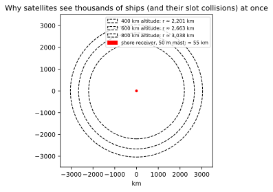

# Chapter 39 — Satellite AIS: how satellites receive and process AIS

> **Part VI — Receiving and collecting.** Space-based receivers transform maritime VHF broadcasts from localized coastal line-of-sight signals into an unencrypted planetary surveillance network.

**In this chapter.** You will learn how spaceborne receivers in Low Earth Orbit (**LEO**) capture, demodulate, and decollide Automatic Identification System (**AIS**) transmissions from hundreds of kilometers above the Earth. We begin with orbital geometry and radio-frequency link budgets, contrasting terrestrial line of sight against orbital footprints spanning 5,000 km across the globe. You will analyze the fundamental physics of space-based AIS: orbital Doppler shifts of up to $\pm 4\text{ kHz}$, differential propagation delays across wide fields of view, slant-range path loss, and ionospheric Faraday rotation. We dissect the severe packet-collision problem created when thousands of uncoordinated terrestrial Self-Organizing Time Division Multiple Access (**SOTDMA**) cells map into a single satellite antenna beam. You will examine protocol remedies, notably Message 27 and dedicated long-range channels, alongside advanced receiver signal processing: Doppler filtering, beamforming, Successive Interference Cancellation (**SIC**), and partial-CRC recovery. We trace orbital missions from pioneering cubesats to commercial constellations, address whether satellites have ever transmitted AIS downlinks, and investigate space-based collection of GNSS interference.

## 39.1 The spaceborne reception challenge

Terrestrial AIS was conceived as a tactical collision-avoidance and coastal Vessel Traffic Services (**VTS**) protocol ([Chapter 01](ch01-what-ais-is.md); [Chapter 09](ch09-prehistory-and-stdma.md)). Designers optimized the physical and link layers for horizontal radio horizons over seawater: a shipboard mast 15 m above sea level reaches a terrestrial base station elevated 50 m on a headland at a line-of-sight distance of roughly 28 nmi (52 km), as governed by the standard 4/3-Earth refraction model ([Chapter 27](ch27-rf-basics.md)). Transmitters broadcast with vertical polarization on two maritime VHF channels (AIS 1 at 161.975 MHz and AIS 2 at 162.025 MHz) at 12.5 W for Class A or 2 W for Class B units ([Chapter 28](ch28-rf-encoding-physical-layer.md)).

Because marine VHF whip antennas radiate omnidirectionally in azimuth with broad vertical elevation patterns, substantial radio energy propagates into space. Placing an automated AIS receiver in Low Earth Orbit (**LEO**) at an altitude between 400 km and 850 km allows an orbiting antenna to intercept these broadcasts directly from above. Pioneered in the mid-2000s (Eriksen et al. 2006; Høye et al. 2008), **Satellite AIS** (**S-AIS**) revolutionized maritime domain awareness by eliminating open-ocean surveillance blind spots.

However, capturing terrestrial AIS from orbit violates the core assumptions of Recommendation ITU-R M.1371 ([Chapter 21](ch21-link-layer-tdma.md)). A terrestrial receiver listens inside a localized radio cell bounded by terrain and curvature. An orbiting spacecraft commands a footprint spanning millions of square kilometers. Thousands of ships from hundreds of independent, unsynchronized terrestrial SOTDMA cells transmit simultaneously into the satellite's field of view. What was an orderly time-division multiplex on the surface becomes an asynchronous, congested interference field in orbit. Overcoming this requires treating spaceborne AIS as an advanced multi-user communications problem.

```
                                  LEO Satellite
                               (Alt: 500 - 800 km)
                                      /   \
                                     /     \
                                    / Slant \
                                   /  Ranges \
                                  /    up to  \
                                 /    3,300 km \
                                /               \
        -----------------------/-----------------\-----------------------
       /       Cell A         /      Cell B       \        Cell C        \
      /   (Tokyo Bay TSS)    /  (East China Sea)   \    (Yellow Sea)      \
     /    [SOTDMA Cell 1]   /   [SOTDMA Cell 2]     \   [SOTDMA Cell 3]    \
    ~~~~~~~~~~~~~~~~~~~~~~~~~~~~~~~~~~~~~~~~~~~~~~~~~~~~~~~~~~~~~~~~~~~~~~~~~
                           Planetary Surface (Earth)
               Footprint Diameter: 4,400 km - 6,000 km across
```

---

## 39.2 Orbital geometry and footprint kinematics

Most AIS-carrying satellites occupy circular Sun-Synchronous Orbits (**SSO**) or polar orbits with inclinations between $97^\circ$ and $99^\circ$ at altitudes $h$ between 500 km and 800 km.

### 39.2.1 Footprint geometry and field of view

Let $R_E \approx 6,371\text{ km}$ be the mean radius of Earth, and $h$ denote satellite altitude. At grazing incidence ($\theta_{\text{elev}} = 0^\circ$), the geocentric angular footprint radius $\lambda_{\text{fp}}$ satisfies:
$$\cos(\lambda_{\text{fp}}) = \frac{R_E}{R_E + h}$$

The surface footprint radius $r_{\text{fp}}$ along Earth's curvature and diameter $D_{\text{fp}}$ are:
$$r_{\text{fp}} = R_E \lambda_{\text{fp}} = R_E \arccos\left(\frac{R_E}{R_E + h}\right), \quad D_{\text{fp}} = 2 r_{\text{fp}}$$

The maximum slant range to the horizon $d_{\text{slant,max}}$ is:
$$d_{\text{slant,max}} = \sqrt{(R_E + h)^2 - R_E^2} = \sqrt{2 R_E h + h^2}$$

| Altitude $h$ | Surface Radius $r_{\text{fp}}$ | Surface Diameter $D_{\text{fp}}$ | Max Slant Range $d_{\text{slant,max}}$ | Footprint Area $A_{\text{fp}}$ | Orbital Speed $v_{\text{orb}}$ |
|---|---|---|---|---|---|
| **400 km** (ISS) | 2,201 km (1,188 nmi) | 4,402 km (2,377 nmi) | 2,293 km | $1.50 \times 10^7\text{ km}^2$ | 7.67 km/s |
| **500 km** (Cubesat) | 2,442 km (1,319 nmi) | 4,884 km (2,637 nmi) | 2,573 km | $1.83 \times 10^7\text{ km}^2$ | 7.61 km/s |
| **600 km** (Commercial) | 2,663 km (1,438 nmi) | 5,325 km (2,875 nmi) | 2,829 km | $2.17 \times 10^7\text{ km}^2$ | 7.56 km/s |
| **700 km** (Commercial) | 2,859 km (1,544 nmi) | 5,718 km (3,087 nmi) | 3,066 km | $2.49 \times 10^7\text{ km}^2$ | 7.50 km/s |
| **800 km** (Sun-sync) | 3,038 km (1,640 nmi) | 6,076 km (3,281 nmi) | 3,291 km | $2.80 \times 10^7\text{ km}^2$ | 7.45 km/s |

A satellite at 600 km views a circle over 5,300 km in diameter ($>21\times 10^6\text{ km}^2$). An orbital pass over central Europe simultaneously encompasses Gibraltar, the English Channel, the Baltic Sea, and the Levant.



### 39.2.2 Orbital velocity and Doppler shift

LEO satellites travel at circular orbital speeds:
$$v_{\text{orb}} = \sqrt{\frac{G M_E}{R_E + h}}$$
where $G M_E \approx 398,600.44\text{ km}^3/\text{s}^2$, yielding $7.45\text{ to } 7.65\text{ km/s}$ relative to an Earth-centered inertial frame.

The relative radial velocity produces a kinematic **Doppler frequency shift** $\Delta f_D$:
$$\Delta f_D(t) = - \frac{f_0}{c} \frac{d}{dt} d_{\text{slant}}(t)$$
where $f_0 \approx 162.0\text{ MHz}$ and $c \approx 299,792.458\text{ km/s}$.

At the horizon along the velocity vector, radial velocity peaks at $v_{\text{radial,max}} = v_{\text{orb}} \sin(\lambda_{\text{fp}}) = v_{\text{orb}} \frac{d_{\text{slant,max}}}{R_E + h}$. At 600 km altitude, $v_{\text{radial,max}} \approx 3.07\text{ km/s}$, producing a pure kinematic Doppler shift of $\pm 1,658\text{ Hz}$.

In operational collection, three additional factors widen the receiver frequency window:
1. **Transmitter oscillator tolerance:** ITU-R M.1371 permits transponders a carrier tolerance of $\pm 500\text{ Hz}$ ($\pm 3.1\text{ ppm}$) for Class A and $\pm 1,000\text{ Hz}$ for Class B ([Chapter 28](ch28-rf-encoding-physical-layer.md)).
2. **Earth rotational velocity:** Earth rotates at $v_{\text{rot}} \approx 465\text{ m/s}$ at the equator, contributing up to $\pm 250\text{ Hz}$ in polar and retrograde orbits.
3. **Spacecraft receiver local oscillator drift:** Temperature variations in cubesat front-ends contribute several hundred hertz.

Summing maximum geometric Doppler ($\pm 2.0\text{ kHz}$ at higher altitudes), carrier drift, and Earth rotation yields an operational frequency uncertainty band of **$\pm 3.5\text{ kHz}$ to $\pm 4.0\text{ kHz}$**.

> **Definitions that bite.**
> **Doppler shift vs. Doppler rate.** While the instantaneous Doppler shift $\Delta f_D(t)$ measures radial velocity, the **Doppler rate** ($\dot{f}_D = d(\Delta f_D)/dt$, in Hz/s) reflects the geometry of closest approach. An emitter at nadir experiences the steepest slope ($\dot{f}_D \approx -35\text{ to } -50\text{ Hz/s}$ at 600 km), whereas an emitter at the horizon exhibits a flat profile. Spacecraft use Doppler rate curves to validate claimed positions and filter spoofed transmissions ([Chapter 35](ch35-direction-finding-geolocation.md)).

### 39.2.3 Differential propagation delay

In terrestrial networks, propagation delay across a 20 nmi (37 km) cell is $\approx 123\text{ }\mu\text{s}$, fitting within the $833\text{ }\mu\text{s}$ (8-bit) guard interval of the 256-bit slot ([Chapter 21](ch21-link-layer-tdma.md)).

In orbit, the difference in slant range between nadir ($d = 600\text{ km}$) and horizon ($d = 2,829\text{ km}$) is $\Delta d_{\text{slant}} = 2,229\text{ km}$. The differential propagation delay $\Delta \tau_{\text{prop}}$ across the footprint is:
$$\Delta \tau_{\text{prop}} = \frac{2,229\text{ km}}{299,792\text{ km/s}} \approx 7.44\text{ ms}$$

This delay represents $27.9\%$ of a 26.667 ms slot ($71.4\text{ bits}$ at 9,600 bit/s). Even if two ships in separate regions synchronize transmissions to precise TDMA boundaries via GNSS, their bursts arrive at the satellite shifted in time, overlapping slot boundaries and colliding with adjacent traffic.

---

## 39.3 RF propagation, polarization, and link budget

Unlike terrestrial links where sea reflections cause $1/d^4$ two-ray attenuation in the far field ([Chapter 27](ch27-rf-basics.md)), satellite reception operates under direct **Free-Space Path Loss** (**FSPL**).

### 39.3.1 Free-space path loss and atmospheric attenuation

Free-space path loss at frequency $f_{\text{MHz}}$ and distance $d_{\text{km}}$ is:
$$\text{FSPL} = 20 \log_{10}(d_{\text{km}}) + 20 \log_{10}(f_{\text{MHz}}) + 32.44$$
At $f = 162.0\text{ MHz}$, this simplifies to $\text{FSPL}(d) \approx 20 \log_{10}(d_{\text{km}}) + 76.63\text{ dB}$.
- **At nadir** ($d = 600\text{ km}$): $\text{FSPL} = 132.2\text{ dB}$.
- **At horizon** ($d = 2,829\text{ km}$): $\text{FSPL} = 145.7\text{ dB}$.

Slant range variation introduces a $13.5\text{ dB}$ power spread between nadir and horizon emitters. Tropospheric attenuation at 162 MHz is negligible ($<0.1\text{ dB}$), while ionospheric absorption is typically under $0.5\text{ dB}$.

### 39.3.2 Faraday rotation and antenna polarization

A major challenge in spaceborne VHF reception is **Faraday rotation**. As a linearly polarized wave traverses the ionosphere through geomagnetic field $\mathbf{B}_0$, it decomposes into circular modes with differing phase velocities, rotating the linear polarization angle by $\Omega_F$:
$$\Omega_F = \frac{e^3}{8 \pi^2 \varepsilon_0 m_e^2 c f^2} \int_0^h n_e(s) B_0(s) \cos(\theta_B) \, ds$$

Because $\Omega_F \propto 1/f^2$, rotation at 162 MHz is severe. A daytime ionosphere ($30\text{ to } 70\text{ TECU}$) can induce multiple $360^\circ$ rotations. A linear dipole in orbit would suffer periodic cross-polarization nulls exceeding $20\text{ to } 30\text{ dB}$.

To prevent nulling, satellites employ **circular polarization** (RHCP or LHCP) using quadrifilar helix or crossed-dipole antennas. This imposes a constant, deterministic polarization mismatch loss of exactly **$3.0\text{ dB}$** ($10 \log_{10}(2)$), independent of ionospheric rotation.

### 39.3.3 Space-to-Earth link budget

Received power $P_{\text{rx}}$ at the satellite receiver is:
$$P_{\text{rx}} = P_{\text{tx}} + G_{\text{tx}} + G_{\text{rx}} - L_{\text{cable,tx}} - L_{\text{cable,rx}} - L_{\text{pol}} - L_{\text{iono}} - \text{FSPL}$$

With $G_{\text{tx}} = +2.0\text{ dBi}$, $G_{\text{rx}} = +3.0\text{ dBi}$, $L_{\text{cable,tx}} = 1.0\text{ dB}$, $L_{\text{cable,rx}} = 0.5\text{ dB}$, $L_{\text{pol}} = 3.0\text{ dB}$, and $L_{\text{iono}} = 0.5\text{ dB}$:
- **Class A (12.5 W / $+41.0\text{ dBm}$):**
  - Nadir (600 km, $\text{FSPL} = 132.2\text{ dB}$): $P_{\text{rx}} = -91.2\text{ dBm}$ ($+15.8\text{ dB}$ margin vs. $-107\text{ dBm}$).
  - Horizon (2,829 km, $\text{FSPL} = 145.7\text{ dB}$): $P_{\text{rx}} = -104.7\text{ dBm}$ ($+2.3\text{ dB}$ margin).
- **Class B (2.0 W / $+33.0\text{ dBm}$):**
  - Nadir (600 km): $P_{\text{rx}} = -99.2\text{ dBm}$ ($+7.8\text{ dB}$ margin).
  - Horizon (2,829 km): $P_{\text{rx}} = -112.7\text{ dBm}$ ($-5.7\text{ dB}$ margin; below sensitivity threshold).

Class A transmissions close the link across the entire footprint in clear channels, whereas 2 W Class B signals decode only within $\approx 45^\circ$ of nadir ($d < 1,400\text{ km}$).

> **Worked example.**
> A 3U CubeSat at $h = 500\text{ km}$ carries an RHCP antenna ($G_{\text{rx}} = +2.5\text{ dBi}$). A Class A ship operates at $d = 1,800\text{ km}$ slant range.
> 1. Compute path loss:
>    $$\text{FSPL} = 20 \log_{10}(1800) + 76.63 = 65.11 + 76.63 = 141.74\text{ dB}$$
> 2. Sum power:
>    $$P_{\text{rx}} = 41.0 + 2.0 + 2.5 - 1.0 - 0.5 - 3.0 - 0.5 - 141.74 = -101.24\text{ dBm}$$
> 3. Link margin against $-107.0\text{ dBm}$ threshold is $+5.76\text{ dB}$.

---

## 39.4 The packet collision problem and detection probability

While the link budget closes for isolated emitters, satellite reception is severely degraded by **packet collisions** ([Chapter 30](ch30-network-loading-packet-loss.md)).

### 39.4.1 Footprint loading and overlapping SOTDMA cells

In terrestrial SOTDMA, local cells arbitrate 2,250 slots/min per channel (4,500 total slots/min). Cells 40 nmi apart reuse slots without interference ([Chapter 21](ch21-link-layer-tdma.md)). A LEO satellite encloses hundreds of these independent cells. In congested regions (South China Sea, Malacca Strait, North Sea), 2,000 to 5,000 Class A ships and tens of thousands of Class B craft operate simultaneously in view.

If $N_{\text{ships}}$ vessels transmit $\mu$ packets/min, offered load $G$ (packets/slot) is $G = (N_{\text{ships}} \cdot \mu) / S_{\text{total}}$, where $S_{\text{total}} = 4,500$. Because terrestrial cells are unsynchronized, arrival at the satellite approximates an unslotted ALOHA channel (Eriksen et al. 2006; Clazzer et al. 2014), where non-collision probability is $P_{\text{no\_collision}} = e^{-2 G}$:

| Active Ships in View $N_{\text{ships}}$ | Mean Cadence $\mu$ (pkts/min) | Offered Load $G$ (pkts/slot) | Theoretical $P_{\text{no\_collision}}$ |
|---|---|---|---|
| **100** (Open ocean) | 6 (10 s interval) | 0.133 | 76.6% |
| **500** (Continental shelf) | 6 | 0.667 | 26.4% |
| **1,000** (Approaching chokepoint)| 6 | 1.333 | 6.9% |
| **2,500** (North Sea / Dover) | 6 | 3.333 | 0.13% |
| **5,000** (East Asian waters) | 6 | 6.667 | $1.5 \times 10^{-6}$ |

In dense waterways, single-packet reception with conventional receivers drops near zero.

### 39.4.2 Cumulative probability of detection over a satellite pass

Ocean surveillance does not require capturing every consecutive report. Tracking requires **at least one** report per pass or reporting epoch.

If a vessel transmits $k$ times during a pass of duration $T_{\text{pass}}$ (typically 8 to 14 minutes), and each transmission has single-burst detection probability $p_{\text{single}}$, cumulative pass detection probability $P_{\text{det}}$ is (Høye et al. 2008):
$$P_{\text{det}} = 1 - (1 - p_{\text{single}})^k$$

For a Class A vessel reporting every 6 seconds ($k = 100$ in a 10-minute pass), even if collisions reduce $p_{\text{single}}$ to $3\%$:
$$P_{\text{det}} = 1 - (1 - 0.03)^{100} = 1 - (0.97)^{100} \approx 95.25\%$$

For a Class B craft reporting every 30 seconds ($k = 20$), if lower power drops $p_{\text{single}}$ to $1\%$:
$$P_{\text{det}} = 1 - (0.99)^{20} \approx 18.2\%$$

This explains why commercial satellite maps display merchant fleets in congested straits while Class B fishing and recreational craft disappear ([Chapter 06](ch06-fisheries-iuu-dark-fleets.md); [Chapter 48](ch48-spatial-statistics.md)).

---

## 39.5 Protocol remedies: Message 27 and long-range channels

To address differential delay and link loading, the international maritime community introduced formal protocol mechanisms into ITU-R M.1371.

### 39.5.1 The Message 27 burst structure

Recommendation ITU-R M.1371 Annex 3 defines **Message 27** ("Position report for long-range applications"). Standard single-slot messages (Messages 1, 2, 3) contain 168 data bits with a 24-bit ($2.5\text{ ms}$) buffer. Message 27 compresses the payload:
- **Total transmission duration:** 160 bits ($16.67\text{ ms}$), leaving **96 bits** ($10.0\text{ ms}$) as an unmodulated **long-range guard buffer**.
- **Data payload:** 96 bits (compressed position, SOG, COG, status).
- **CRC:** 16-bit CRC-CCITT.

```
+---------------+----------------+----------------+----------------+---------------+---------------+--------------------+
| Ramp Up (8 b) | Training (24 b)| Start Flag (8b)| Data (96 bits) |  CRC (16 bits)| Stop Flag (8b)| Guard Buffer (96 b)|
+---------------+----------------+----------------+----------------+---------------+---------------+--------------------+
|<------------------------- 160 bits (16.67 ms) ---------------------------------->|<--- 96 bits (10.0 ms) ---------->|
|<------------------------------------------ Full Slot = 256 bits (26.67 ms) ----------------------------------------->|
```

The 96-bit ($10.0\text{ ms}$) guard buffer exceeds the maximum differential propagation delay across a 1,000 km altitude footprint ($\Delta \tau_{\text{prop}} \approx 9.03\text{ ms}$), preventing Message 27 bursts from spilling into adjacent time slots.

### 39.5.2 Dedicated long-range channels (75 and 76)

To protect terrestrial safety channels, ITU World Radiocommunication Conferences allocated dedicated simplex channels:
- **Channel 75:** 156.775 MHz.
- **Channel 76:** 156.825 MHz.

Under Radio Regulations Appendix 18, channels 75 and 76 carry Footnote *s)*, allocating them to Earth-to-space reception of Message 27. Transponders broadcast Message 27 using Multi-channel Slot Selection Access (**MSSA**) every **3 minutes**, alternating between channels 75 and 76. Base stations can suppress Message 27 locally via Message 4 and Message 23 commands when ships enter coastal coverage.

---

## 39.6 Decollision and advanced signal processing

Because most ships broadcast standard Messages 1–5 on AIS 1 and 2, satellite operators developed advanced digital signal processing (**DSP**) algorithms to **decollide** overlapping waveforms.

```
                                  Composite RF IQ Stream
                              (Overlapping Collided Bursts)
                                            |
                                            v
                              +---------------------------+
                              | Matched Doppler Filtering |  <--- Separate bursts by
                              |  & Frequency-Bin Sorting  |       orbital Doppler shift
                              +---------------------------+
                                            |
                                            v
                              +---------------------------+
                              | Multi-Antenna Beamforming |  <--- Spatial nulling across
                              |   & Polarization Split    |       multiple antenna feeds
                              +---------------------------+
                                            |
                                            v
         +----------------->  +---------------------------+
         |                    |    Demodulate Strongest   |  <--- Coherent Viterbi
         |                    |      Packet (Capture)     |       GMSK demodulation
         |                    +---------------------------+
         |                                  |
         |                                  v
         |                    +---------------------------+
         |                    |   CRC Verification & Parity|  <--- Partial-CRC
         |                    |      Integrity Check      |       error recovery
         |                    +---------------------------+
         |                                  |
         |                                  v (Clean bits decoded)
         |                    +---------------------------+
         |                    |  Re-modulate & Subtract   |  <--- Successive Interference
         +------------------- |  Synthesized Waveform     |       Cancellation (SIC)
          (Residual Energy)   +---------------------------+
```

### 39.6.1 Matched Doppler and frequency separation

Spacecraft orbital velocity ($7.5\text{ km/s}$) causes emitters at different geographic locations to arrive with distinct Doppler shifts. Bursts colliding in the time domain can be resolved in frequency if their Doppler separation exceeds the modulation bandwidth (Burzigotti et al. 2012). Harris Corporation secured US Patent 9,729,374 B2 (Dyson et al. 2017) covering matched Doppler and spatial filtering for spaceborne AIS.

### 39.6.2 Successive Interference Cancellation (SIC)

When signals overlap in frequency, differences in power, range, and antenna gain allow the receiver to exploit the **capture effect** (Clazzer & Munari 2015). **Successive Interference Cancellation** (**SIC**) demodulates the strongest burst, verifies the CRC, synthesizes a replica waveform from estimated channel parameters, and subtracts it from the IQ buffer. The receiver then demodulates the remaining weaker burst from the residual buffer (Peach 2011, US Patent 7,876,865 B2).

### 39.6.3 Constrained trellis demodulation and partial-CRC recovery

Spaceborne processing utilizes coherent maximum-likelihood sequence estimation and soft-decision Viterbi decoding (Burzigotti et al. 2012). Trellis paths violating HDLC bit-stuffing rules (five consecutive `1`s followed by anything other than `0`) are pruned immediately (Prévost et al. 2012). Soft-decision reliability metrics combined with syndrome decoding allow the 16-bit CRC to correct 1 or 2 bit errors in marginal packets (Prévost et al. 2014).

### 39.6.4 Correlative detection against vessel position databases

In 2016, CNES secured US Patent 9,246,575 B2 (de Latour & Faup 2016) for database-assisted detection. Because commercial vessels transmit known static data and follow predictable courses, candidate coordinates are extracted from historical databases to synthesize expected waveforms. Correlating these waveforms against raw, heavily collided orbital recordings uncovers signals below the receiver noise floor.

---

## 39.7 Onboard processing vs. ground-based decoding

Constellations divide processing between spacecraft payloads and ground stations:
- **On-board processing (OBP):** FPGAs demodulate packets in orbit, downlinking compact ASCII NMEA messages. This minimizes downlink data volume and enables real-time inter-satellite relay (e.g. exactView RT on Iridium NEXT), but is limited by spacecraft compute and power.
- **Raw IQ store-and-forward:** Payloads digitize raw spectrum and buffer it for high-latitude ground downlinks. Ground computing clusters re-process the recordings using iterative multi-pass SIC and database correlation, extracting packets that overwhelmed the flight FPGA at the cost of hours of revisit latency.

---

## 39.8 Constellations and orbital history

Satellite AIS evolved across three generations:
1. **Demonstrators (2008–2010):** CanX-6/NTS (UTIAS-SFL/COM DEV) proved orbital reception in 2008. Norway launched AISSat-1 in 2010, establishing polar maritime tracking. ESA deployed the NORAIS receiver aboard the Columbus module of the ISS in 2010.
2. **Commercial constellations (2014–2015):** ORBCOMM deployed the 17-satellite OG2 constellation. Spire launched dozens of Lemur-2 3U cubesats carrying software-defined radios for maritime AIS and aviation ADS-B.
3. **Real-time cross-linked networks (2019–present):** exactEarth partnered with L3Harris to host AIS payloads across all 66 operational Iridium NEXT satellites, eliminating store-and-forward latency and delivering global reports in seconds.

---

## 39.9 Have satellites ever transmitted AIS downlinks?

The technical and regulatory answer is: **No operational satellite has ever transmitted standard Recommendation ITU-R M.1371 AIS downlinks.**

### 39.9.1 Why operational AIS downlinks do not exist

Broadcasting AIS signals down from space is precluded by physics and treaty:
1. **Slot poisoning:** A high-power VHF broadcast across a 5,000 km footprint would penetrate thousands of coastal SOTDMA cells, blocking local slot allocations and collapsing collision avoidance networks.
2. **Frequency regulations:** Under ITU Radio Regulations Appendix 18, channels AIS 1 and AIS 2 are allocated to the Maritime Mobile Service, with spaceborne reception permitted only Earth-to-space (uplink). Space-to-Earth downlinks on these channels are prohibited.
3. **Bridge display incompatibility:** Shipboard ECDIS units cannot interpret orbital telemetry or distinguish space broadcasts from local hazards.

### 39.9.2 The VDE-SAT evolution: bidirectional maritime data

Spaceborne maritime transmission occurs instead via the **VHF Data Exchange System** (**VDES**) under Recommendation ITU-R M.2092 ([Chapter 69](ch69-vdes-ais-2.md)). VDES provides dedicated space-to-Earth channels (1026, 2026, 1086, 2086) using $\pi/4$-QPSK, 8PSK, and 16QAM for hydrographic and ice updates ([Chapter 52](ch52-ais-and-s100.md)).

Test downlinks were conducted by NorSat-2 (2017), NorSat-TD (2023), Sternula-1 (2023), and YMIR-1 (2023). These spacecraft broadcast VDE-SAT waveforms, never legacy M.1371 AIS.

---

## 39.10 Space-based detection of GNSS interference

Spaceborne AIS receivers serve as orbital sensors for detecting **GNSS jamming and spoofing** ([Chapter 25](ch25-gnss-and-ais.md)):
1. **Accuracy flag degradation:** Transponders broadcast a 1-bit Position Accuracy flag ($<10\text{ m}$ vs. $>10\text{ m}$). Clusters of vessels toggling accuracy flags reveal regional jamming.
2. **Spoofing trajectory signatures:** Commercial vessels reporting airport coordinates or circular tracks at high speeds reveal false GNSS broadcasts across conflict theaters.
3. **VHF and L-band noise mapping:** SDR payloads measure broadband RF power, mapping terrestrial electronic warfare installations via orbital direction finding ([Chapter 35](ch35-direction-finding-geolocation.md)).

---

## Then & now

- **1998** ⟨H⟩: ITU-R M.1371-0 establishes AIS as a terrestrial VHF broadcast protocol; experts assume spaceborne collection is impossible due to path loss and slot collisions.
- **2006** ⟨+⟩: Eriksen et al. at the Norwegian Defence Research Establishment publish the first mathematical feasibility analysis of space-based AIS in *Acta Astronautica*.
- **2008** ⟨+⟩: CanX-6/NTS (COM DEV/UTIAS-SFL) and TacSat-2 prove satellite AIS from LEO, detecting commercial ship broadcasts across open oceans.
- **2010** ⟨+⟩: Norway launches AISSat-1, the first dedicated operational maritime monitoring satellite; ESA deploys NORAIS aboard the ISS.
- **2010** ⟨+⟩: ITU-R Report M.2169 documents improved satellite detection techniques, setting the stage for Message 27 standardization.
- **2014** ⟨+⟩: ORBCOMM launches the OG2 constellation, establishing the first multi-satellite commercial spaceborne AIS monitoring network.
- **2015** ⟨+⟩: Spire begins mass deployment of Lemur-2 cubesats; researchers demonstrate multi-user Successive Interference Cancellation (SIC) on collided bursts.
- **2017** ⟨+⟩: NorSat-2 conducts the world's first spaceborne VHF transmission test using VDE-SAT protocols.
- **2019** ⟨+⟩: exactView RT achieves full deployment aboard 66 cross-linked Iridium NEXT satellites, delivering spaceborne AIS data with sub-minute latency.
- **2026** ⟨+⟩: ITU-R M.1371-6 and M.2092-2 solidify the integration of satellite AIS and VDES; spaceborne collection serves as the primary sensor grid for global fisheries and logistics.

---

## On the wire

Spaceborne AIS data is downlinked from satellites as specialized telemetry packets and converted by ground station decoders into standard NMEA 0183 `!AIVDM` sentences ([Chapter 26](ch26-interfaces-and-logging.md)). 

The listing below illustrates a space-received Message 27 burst captured by a LEO satellite on VHF Channel 75 (156.775 MHz) and wrapped in an IEC 61162-1 / NMEA 0183 TAG block (`\s:...,c:...*hh\`).

```
\s:SAT-LEO-04,c:1775438400,r:1775438403,d:2820,f:-1650*1B\!AIVDM,1,1,,A,KC5E-81000000000000000000000,0*18
```

### TAG block telemetry decomposition
- `\s:SAT-LEO-04`: Station source identifier—satellite vehicle LEO-04 in the receiving constellation.
- `c:1775438400`: Spacecraft reception timestamp in Unix epoch seconds (UTC).
- `r:1775438403`: Ground gateway ingestion timestamp (reflecting a 3-second inter-satellite relay latency).
- `d:2820`: Estimated slant range to the emitter in kilometers, derived from satellite ephemeris.
- `f:-1650`: Measured carrier Doppler frequency offset in hertz ($-1,650\text{ Hz}$).
- `*1B`: NMEA TAG block checksum.

### Message 27 bit-level payload walkthrough
The encapsulated ASCII payload `KC5E-81000000000000000000000` represents a 96-bit Message 27 packet:

| Bit Range | Field Name | Width | Raw Bits | Decoded Value | Interpretation |
|---|---|---|---|---|---|
| **0–5** | Message Type | 6 | `011011` | 27 | Long-range AIS broadcast |
| **6–7** | Repeat Indicator | 2 | `00` | 0 | Default; no repeat |
| **8–37** | MMSI | 30 | `010010110110001001011110001000` | 316014280 | Commercial cargo vessel (MID 316 = Canada) |
| **38–39** | Position Accuracy | 2 | `01` | 1 | Low accuracy ($> 10\text{ m}$) |
| **40–40** | RAIM Flag | 1 | `0` | 0 | RAIM not in use |
| **41–44** | Navigational Status | 4 | `0000` | 0 | Under way using engine |
| **45–62** | Longitude | 18 | `011010101100110010` | 109,362 | $-64^\circ 15.6'\text{ W}$ (resolution $0.1' \approx 185\text{ m}$) |
| **63–79** | Latitude | 17 | `00110100101101100` | 27,000 | $+45^\circ 00.0'\text{ N}$ (resolution $0.1' \approx 185\text{ m}$) |
| **80–85** | SOG | 6 | `001110` | 14 | 14 knots (resolution 1 knot) |
| **86–94** | COG | 9 | `010110100` | 180 | $180^\circ$ True (resolution $1^\circ$) |
| **95–95** | GNSS Position Latency | 1 | `0` | 0 | Current report |

Unlike standard Message 1 reports encoding coordinates to $0.0001'$ ($0.18\text{ m}$), Message 27 compresses coordinates to $0.1'$ ($185\text{ m}$) resolution, dropping payload size from 168 to 96 bits to provide the 96-bit orbital guard time.

---

## Validation, uncertainty & data quality

Ingesting satellite AIS data requires fundamentally different quality filters than processing terrestrial feeds.

### Error mechanisms in spaceborne collection
1. **Doppler-induced decoding jitter:** High Doppler offsets ($\pm 4\text{ kHz}$) can cause frequency tracking loops to slip cycles, resulting in bit inversion errors that corrupt the 16-bit CRC.
2. **Co-channel collision truncation:** In dense areas, a packet's preamble or start flag may be wiped out by a colliding burst, preventing demodulators from detecting the packet boundary.
3. **Out-of-order store-and-forward batch delivery:** Store-and-forward satellites buffer packets across an entire 90-minute orbit, dumping millions of messages simultaneously upon passing over high-latitude ground stations. Ingestion pipelines that do not re-sort messages strictly by the spacecraft's hardware reception timestamp experience temporal inversion, corrupting vessel trajectory reconstructions ([Chapter 47](ch47-data-quality-track-reconstruction.md)).
4. **MMSI collision artifacts:** Colliding bursts with identical power can produce hybrid bit sequences that accidentally satisfy the CRC-16 polynomial, generating phantom vessels with invalid MMSIs.

### Quality auditing procedure
Data pipelines must execute a five-stage verification pipeline on all satellite-derived records:
1. **Timestamp integrity gate:** Reject records where the satellite reception timestamp differs from the ground receipt timestamp by more than the maximum orbital buffer duration (typically 6 hours).
2. **Kinematic velocity check:** Compare sequential satellite position reports:
   $$v_{\text{inferred}} = \frac{\text{haversine}(\mathbf{x}_{k-1}, \mathbf{x}_k)}{t_k - t_{k-1}}$$
   If $v_{\text{inferred}} > 60\text{ kn}$ for a commercial merchant vessel, flag the report as an artifact.
3. **Doppler consistency cross-check:** Where metadata exposes carrier Doppler ($\Delta f_{\text{meas}}$), compute theoretical Doppler from satellite ephemeris:
   $$\epsilon_{\text{Doppler}} = |\Delta f_{\text{meas}} - \Delta f_{\text{theoretical}}(\mathbf{x}_{\text{claimed}}, t_{\text{rx}})|$$
   If $\epsilon_{\text{Doppler}} > 250\text{ Hz}$ (accounting for oscillator offsets), the ship is not at its broadcast location ([Chapter 35](ch35-direction-finding-geolocation.md)).
4. **Message 27 coordinate quantization:** Ensure algorithms do not infer sub-meter precision from Message 27 reports, whose intrinsic quantization step is $0.1\text{ arcmin}$ ($185\text{ m}$).
5. **Coverage probability weighting:** Never interpret a lack of satellite AIS detections in high-density waterways as an absence of vessels. Analysts must apply detection probability weighting functions ($P_{\text{det}}$) conditioned on local vessel density when producing traffic density maps ([Chapter 48](ch48-spatial-statistics.md)).

> **Case file.**
> **The Arctic surveillance breakthrough.** In 2011, the Norwegian Coast Guard integrated AISSat-1 feeds into their BarentsWatch platform. Prior to satellite AIS, authorities lost contact with merchant ships transiting the Northern Sea Route 30 nmi beyond Vardø. AISSat-1 provided continuous orbital tracking across the Barents Sea, Svalbard, and the Arctic basin. In its first year, AISSat-1 captured over 50 million messages, enabling Norwegian rescue services to coordinate distress assistance for fishing vessels in pack ice thousands of kilometers from the mainland.

> **Try it.**
> Run the Python snippet below to calculate the LEO satellite radio footprint radius, maximum slant range, and free-space path loss for an orbital altitude of 600 km:
> ```python
> import math
> 
> R_E = 6371.0       # Earth radius in km
> h = 600.0          # Satellite altitude in km
> f_mhz = 162.0      # Marine VHF frequency
> 
> # Geocentric footprint angle and surface radius
> lambda_fp = math.acos(R_E / (R_E + h))
> r_fp = R_E * lambda_fp
> d_slant_max = math.sqrt(2 * R_E * h + h**2)
> 
> # Free space path loss at nadir and grazing horizon
> fspl_nadir = 20 * math.log10(h) + 20 * math.log10(f_mhz) + 32.44
> fspl_horizon = 20 * math.log10(d_slant_max) + 20 * math.log10(f_mhz) + 32.44
> 
> print(f"Footprint Radius: {r_fp:.1f} km ({r_fp / 1.852:.1f} nmi)")
> print(f"Max Slant Range:  {d_slant_max:.1f} km")
> print(f"FSPL at Nadir:    {fspl_nadir:.1f} dB")
> print(f"FSPL at Horizon:  {fspl_horizon:.1f} dB")
> ```
> Expected output:
> ```text
> Footprint Radius: 2662.6 km (1437.7 nmi)
> Max Slant Range:  2829.2 km
> FSPL at Nadir:    132.2 dB
> FSPL at Horizon:  145.7 dB
> ```

---

## Software

**Open source:**
- **GNU Radio (`gr-ais`)** (GPL-3.0): Digital signal processing blocks for GMSK demodulation, carrier tracking, and HDLC framing. Widely adapted for academic satellite demodulation testbeds; caveat: requires custom Doppler-tracking front-ends to handle orbital frequency shifts exceeding $\pm 1\text{ kHz}$.
- **AIS-catcher** (GPL-3.0): High-performance SDR receiver and decoding engine. Includes coherent demodulation models and multi-frequency tracking; caveat: optimized for terrestrial ground SDRs, requiring file-based pre-processing for orbital IQ datasets.
- **pyais** (MIT): Modular Python message decoder. Fully supports Message 27 decoding and long-range coordinate extraction; caveat: does not perform RF demodulation or signal decollision.

**Free but closed:**
- **ESA NORAIS Processing Tool** (Proprietary free license): Academic software suite developed for processing recorded IQ streams from the Columbus ISS payload. Provides advanced multi-packet demodulation; caveat: restricted distribution to authorized research consortia.

**Commercial:**
- **Spire Maritime Automated Ingestion Pipeline** (Commercial): Real-time streaming API providing global satellite AIS tracks enriched with Doppler validation and satellite ID tags; caveat: subscription cost scales rapidly with geographic bounding boxes and update frequency.
- **L3Harris exactView RT Network Engine** (Commercial): Ground processing architecture for real-time decollision across the Iridium NEXT constellation; caveat: closed proprietary system with no raw waveform access.

---

## Standards & guides

- **ITU-R Recommendation M.1371-6 (2026):** Technical characteristics for an automatic identification system using TDMA in the VHF maritime mobile band. Governs Message 27 burst structure (Annex 3) and MSSA access rules.
- **ITU-R Recommendation M.2092-2 (2026):** Technical characteristics for a VHF data exchange system in the maritime mobile service. Governs the VDE-SAT satellite component, frequencies, and modulation schemes.
- **ITU-R Report M.2169-0 (2009):** Improved satellite detection of a shipborne automatic identification system. Foundational technical study detailing footprint collisions, Doppler effects, and receiver architectures.
- **ITU Radio Regulations, Appendix 18 (2024):** Table of transmitting frequencies in the VHF maritime mobile band. Designates Channels 75 and 76 for long-range satellite reception under Footnote *s)*.
- **IMO Resolution MSC.74(69), Annex 3:** Adoption of new performance standards for Universal AIS. Established baseline carriage requirements adapted for global surveillance.

---

## Pitfalls

1. **Assuming zero satellite detections means zero vessels.** In congested chokepoints, packet collisions reduce satellite detection probability to single digits. Interpreting missing orbital signals as "dark vessels" or intentional evasion is an analytical error ([Chapter 06](ch06-fisheries-iuu-dark-fleets.md)).
2. **Ignoring Doppler shift in raw orbital demodulation.** Attempting to process satellite IQ recordings with standard terrestrial narrowband filters results in $>80\%$ packet loss due to orbital Doppler shifts reaching $\pm 4\text{ kHz}$.
3. **Neglecting Faraday rotation.** Deploying linearly polarized antennas on orbit causes deep signal nulls exceeding $20\text{ dB}$ as ionospheric plasma rotates the wave's polarization angle. Circular polarization is mandatory.
4. **Treating Message 27 as high-precision positioning.** Message 27 quantizes latitude and longitude to $0.1\text{ arcmin}$ ($185\text{ m}$) resolution. Using Message 27 for close-quarters collision-risk algorithms induces false CPA alarms.
5. **Ignoring differential propagation delay across the footprint.** Bursts from vessels separated by $2,000\text{ km}$ arrive shifted by up to $7.4\text{ ms}$, obliterating standard terrestrial slot boundaries.
6. **Conflating terrestrial timestamping with satellite capture time.** Processing store-and-forward satellite batches using ground station ingestion timestamps corrupts voyage chronology and trajectory interpolation.
7. **Believing satellites broadcast legacy AIS.** Designing bridge electronics or navigation algorithms under the assumption that satellites downlink M.1371 AIS signals to ships is false; satellites operate strictly in receive mode.
8. **Overlooking Class B power limitations.** Standard 2 W Class B CSTDMA units exhibit negative link margins at grazing angles and are reliably received only within a narrow nadir cone.
9. **Failing to account for ship antenna elevation patterns.** Marine vertical whips direct energy toward the horizontal horizon, radiating significantly reduced power toward zenith ($>60^\circ$ elevation), causing signal dips directly beneath the satellite.
10. **Using terrestrial deduping windows on orbital feeds.** Merging high-latency satellite bursts with real-time coastal feeds requires multi-hour deduplication windows keyed on `(MMSI, timestamp_utc, payload)`.

---

## Key takeaways

- Low Earth Orbit satellites at altitudes of 500 km to 800 km command surface footprints spanning 4,400 km to 6,000 km in diameter, intercepting unamplified maritime VHF signals across entire oceans.
- Satellite reception is governed by free-space path loss (132 dB to 146 dB), orbital Doppler frequency shifts ($\pm 4\text{ kHz}$ operational window), and ionospheric Faraday rotation requiring circularly polarized antennas.
- Terrestrial SOTDMA fails from orbit: thousands of unsynchronized coastal cells transmit into a single satellite beam, producing severe co-channel collisions that mimic an unslotted ALOHA channel.
- While single-packet detection probability plummets in dense straits, cumulative detection probability across a 10-minute pass remains high ($>95\%$) for active Class A merchant vessels.
- ITU-R M.1371 Annex 3 standardizes Message 27 on Channels 75 (156.775 MHz) and 76 (156.825 MHz), using a 96-bit compressed payload and a 96-bit guard buffer to absorb orbital delay spread.
- Spaceborne processing relies on advanced DSP: matched Doppler filtering, multi-antenna beamforming, Successive Interference Cancellation (SIC), and database-assisted correlative detection.
- Constellations evolved from cubesat demonstrators (CanX-6, AISSat-1) to commercial networks (ORBCOMM, Spire) and real-time cross-linked constellations (exactView RT on Iridium NEXT).
- No operational satellite has ever transmitted standard M.1371 AIS downlinks; space-to-Earth maritime broadcasting is restricted to VDES-SAT protocols.
- Satellite AIS serves as a planetary diagnostic tool for identifying GNSS jamming, spoofing, and electronic warfare environments.

---

## References

- Burzigotti, P., Ginesi, A., Colavolpe, G. (2012). Advanced receiver design for satellite-based automatic identification system signal detection. *International Journal of Satellite Communications and Networking*, 30(2):52–63. doi:10.1002/sat.1007
- Cervera, M. A., Ginesi, A., Eckstein, K. (2011). Satellite-based vessel Automatic Identification System: A feasibility and performance analysis. *International Journal of Satellite Communications and Networking*, 29(2):117–142. doi:10.1002/sat.957
- Clazzer, F., Munari, A. (2015). Analysis of capture and multi-packet reception on the AIS satellite system. *Proceedings of OCEANS 2015 - Genova*, pp. 1–6. doi:10.1109/oceans-genova.2015.7271399
- Clazzer, F., Munari, A., Berioli, M., Lopez-Blasco, F. (2014). On the characterization of AIS traffic at the satellite. *Proceedings of OCEANS 2014 - Taipei*, pp. 1–7. doi:10.1109/oceans-taipei.2014.6964425
- de Latour, A., Faup, M. (2016). Method for detecting AIS messages. *US Patent 9,246,575 B2*, assigned to Centre National d'Etudes Spatiales (CNES).
- Dyson, H. S., Gittins, C. M., Horan, S. C. (2017). Space-based matched-Doppler and spatial filtering for AIS signals. *US Patent 9,729,374 B2*, assigned to Harris Corporation.
- Eriksen, T., Høye, G., Narheim, B., Meland, B. J. (2006). Maritime traffic monitoring using a space-based AIS receiver. *Acta Astronautica*, 58(10):537–549. doi:10.1016/j.actaastro.2005.12.016
- Høye, G. K., Eriksen, T., Meland, B. J., Narheim, B. T. (2008). Space-based AIS for global maritime traffic monitoring. *Acta Astronautica*, 62(2–3):240–245. doi:10.1016/j.actaastro.2007.07.001
- International Telecommunication Union (2009). *Report ITU-R M.2169-0: Improved satellite detection of a shipborne automatic identification system*. Geneva: ITU-R.
- International Telecommunication Union (2026). *Recommendation ITU-R M.1371-6: Technical characteristics for an automatic identification system using time division multiple access in the VHF maritime mobile frequency band*. Geneva: ITU-R.
- International Telecommunication Union (2026). *Recommendation ITU-R M.2092-2: Technical characteristics for a VHF data exchange system in the maritime mobile service*. Geneva: ITU-R.
- Peach, R. (2011). System and method for decoding automatic identification system signals. *US Patent 7,876,865 B2*, assigned to COM DEV Ltd.
- Picard, J., Oularbi, M., Flandin, G., Houcke, S. (2012). An adaptive multi-user multi-antenna receiver for satellite-based AIS detection. *Proceedings of the 6th Advanced Satellite Multimedia Systems Conference (ASMS) and 12th Signal Processing for Space Communications Workshop (SPSC)*, pp. 273–280. doi:10.1109/asms-spsc.2012.6333088
- Prévost, C., Coulon, M., Bonacci, D., Le Maitre, F., Millerioux, J.-P., Tourneret, J.-Y. (2012). Extended constrained Viterbi algorithm for AIS signals received by satellite. *Proceedings of the 2012 IEEE First AESS European Conference on Satellite Telecommunications (ESTEL)*, pp. 1–6. doi:10.1109/estel.2012.6400111
- Prévost, C., Coulon, M., Bonacci, D., Le Maitre, F., Tourneret, J.-Y. (2014). Partial CRC-assisted error correction of AIS signals received by satellite. *Proceedings of the 2014 IEEE International Conference on Acoustics, Speech and Signal Processing (ICASSP)*, pp. 1951–1955. doi:10.1109/icassp.2014.6853939
