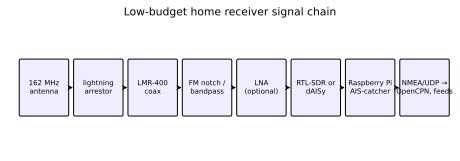

# Chapter 42 — A low-budget home AIS receiver

> **Part VI — Receiving and collecting.** Siting, tuning, and operating a home AIS monitoring station bridges the gap between theoretical radio propagation and tangible maritime situational awareness on a modest budget.

**In this chapter.** You will learn how to design, construct, calibrate, and operate an autonomous, continuous-duty Automatic Identification System (**AIS**) shore receiving station using low-cost hardware. We evaluate three practical hardware architectures: a minimalist software-defined radio (**SDR**) station (~US$50), a hardened single-board computer station with dedicated sub-gigahertz receiver silicon (~US$200), and a semi-professional dual-channel setup with ultra-low-loss coaxial feedlines and masthead preamplification (~US$500). You will build and tune resonant half-wave dipole and quarter-wave ground plane antennas cut precisely for the 162 MHz maritime mobile VHF band, measuring Voltage Standing Wave Ratio (**VSWR**) with a handheld vector network analyzer (**VNA**). You will configure the open-source **AIS-catcher** decoding engine, optimizing tuner gain, sample rates, automatic frequency control, and decimation models across both TDMA channels. You will distribute parsed `!AIVDM` sentences to crowdsourced global aggregators and electronic chart plotters via UDP/TCP, attach standardized NMEA 4.10 metadata TAG blocks, containerize the ingestion daemon under Docker, and systematically audit reception statistics against theoretical radio horizons and tropospheric ducting phenomena.

## 42.1 Three hardware tiers: budget, mid-range, and semi-pro

Building a terrestrial AIS receiving station does not require thousands of dollars in commercial coastal infrastructure. Because maritime AIS signals are broadcast at relatively high transmitter power—$12.5\text{ W}$ for Class A transponders ($+41\text{ dBm}$) and $2\text{ W}$ or $5\text{ W}$ for Class B devices ($+33\text{ dBm}$ to $+37\text{ dBm}$) across **AIS 1** ($161.975\text{ MHz}$) and **AIS 2** ($162.025\text{ MHz}$)—a well-sited receiver equipped with a modest antenna can harvest vessels across dozens of nautical miles. 

The primary engineering trade-offs govern three variables: dynamic range (preventing front-end desensitization from strong nearby VHF or FM broadcast transmitters), frequency stability (mitigating local oscillator drift across temperature swings), and continuous autonomous uptime. We structure the hardware space into three distinct tiers.

```
       +-------------------------------------------------------------+
       |             Home AIS Receiver Architecture Tiers            |
       +-------------------------------------------------------------+
                                      |
         +----------------------------+----------------------------+
         |                                                         |
         v                                                         v
+-----------------------------+                           +-----------------------------+
| Tier 1: Minimalist SDR      |                           | Tier 2: Dedicated Appliance |
| - Budget: ~US$50            |                           | - Budget: ~US$200           |
| - RTL-SDR Blog v4 / v3      |                           | - Raspberry Pi 4 / 5        |
| - Homebrew half-wave dipole |                           | - Wegmatt dAISy 2+ / HAT    |
| - Laptop or existing PC     |                           | - Commercial marine whip    |
| - AIS-catcher demodulator   |                           | - Broadcast FM band-stop    |
+-----------------------------+                           +-----------------------------+
                                      |
                                      v
                       +-----------------------------+
                       | Tier 3: Semi-Professional   |
                       | - Budget: ~US$500           |
                       | - Metal enclosure / SBC     |
                       | - Filtered masthead LNA     |
                       | - Times Microwave LMR-400   |
                       | - Base-station omni (6 dBi) |
                       | - Gas-tube surge arrestor   |
                       +-----------------------------+
```

### 42.1.1 Tier 1: The minimalist SDR (~US$50)
The absolute entry-level station leverages ubiquitous DVB-T television tuner dongles repurposed as software-defined radios. An **RTL-SDR Blog v4** or **v3** dongle ($US\$30–$US$40) integrates a Realtek **RTL2832U** demodulator and an **R828D** (v4) or **R820T2** (v3) tuner chip. Crucially, newer revisions feature a temperature-compensated crystal oscillator (**TCXO**) with a frequency stability rating of $\le 1\text{ ppm}$, eliminating the severe thermal frequency drift of generic blue/black DVB-T sticks (which frequently drift 30 to 80 ppm as they warm up).

Paired with a homebuilt half-wave center-fed dipole fabricated from coaxial cable, speaker wire, and a BNC or SMA connector (~US$10), this setup plugs into any existing laptop, desktop, or spare micro-PC running Linux, macOS, or Windows. The digital signal processing is offloaded entirely to host software such as **AIS-catcher**. 

*Trade-offs:* The RTL-SDR's 8-bit Analog-to-Digital Converter (**ADC**) provides approximately $48–50\text{ dB}$ of effective dynamic range. In an electrically clean coastal environment, this provides outstanding sensitivity (often exceeding $-110\text{ dBm}$ with software oversampling). However, in dense urban RF environments, strong out-of-band signals—particularly high-power broadcast FM stations ($88–108\text{ MHz}$)—overload the unshielded front end, causing wideband intermodulation distortion that degrades the noise floor across the entire VHF band.

### 42.1.2 Tier 2: The dedicated edge appliance (~US$200)
The mid-range architecture separates RF reception from general-purpose desktop computing, establishing a 24/7 autonomous appliance. The computing core is an embedded single-board computer (**SBC**), typically a **Raspberry Pi 4 Model B** (2 GB or 4 GB), a Raspberry Pi Zero 2 W, or a comparable ARM board running Debian/Raspberry Pi OS Lite.

Rather than relying purely on broad-spectrum software sampling, Tier 2 often adopts a dedicated silicon receiver such as the **Wegmatt dAISy 2+** or **dAISy HAT** (based on the Silicon Labs **Si4362** sub-GHz transceiver IC) or a **Quark-elec QK-A026**. The Si4362 performs narrow-band filtering, GMSK demodulation, and packet deframing directly on hardware, consuming less than $1\text{ W}$ and delivering pre-parsed NMEA 0183 ASCII sentences over a local UART or USB serial interface. Alternatively, an RTL-SDR Blog v4 is coupled with an inline **FM broadcast notch filter** (e.g., RTL-SDR Blog broadcast band-stop filter, attenuating $88–108\text{ MHz}$ by $>40\text{ dB}$) and a tuned fiberglass marine VHF antenna mounted at gutter or roof level.

*Trade-offs:* Extremely low power consumption ($3–5\text{ W}$ total system draw), negligible CPU overhead, high thermal reliability, and clean recovery from power interruptions.

### 42.1.3 Tier 3: The semi-professional shore node (~US$500)
The semi-professional tier maximizes radio horizon and packet capture rate while surviving severe meteorological and electromagnetic conditions. 

The RF signal chain incorporates:
1. A commercial, high-gain, vertically polarized marine base-station antenna (e.g., a $1.2\text{ m}$ to $2.4\text{ m}$ collinear fiberglass whip with $3\text{ dBi}$ to $6\text{ dBi}$ gain) installed on an elevated rooftop mast or tower.
2. An inline, 1/4-wave gas-discharge tube lightning surge arrestor bonded directly to an exterior grounding rod with heavy-gauge copper conductor ($16\text{ mm}^2$ / 6 AWG).
3. A filtered masthead Low-Noise Amplifier (**LNA**), such as the Uputronics 162 MHz AIS Filtered Preamp (integrating an Epcos SAW bandpass filter centered on 162 MHz with $\approx 18\text{ dB}$ gain and a $1.2\text{ dB}$ noise figure), powered via a coaxial **bias-T** circuit.
4. Premium low-loss coaxial cable (e.g., **Times Microwave LMR-400** or Belden 9913), keeping feeder attenuation under $1.5\text{ dB}$ per $30\text{ m}$ at 162 MHz.
5. A high-dynamic-range SDR receiver, such as an **Airspy Mini** (12-bit ADC, $80\text{ dB}$ dynamic range) or an SDRplay RSP1B, enclosed within an extruded aluminum shielding chassis and interfaced to an industrial SBC powered via Power-over-Ethernet (**PoE**).

| Parameter | Tier 1: Minimalist SDR | Tier 2: Edge Appliance | Tier 3: Semi-Professional |
|---|---|---|---|
| **Typical Cost** | ~US$50 | ~US$200 | ~US$500 |
| **RF Front End** | RTL-SDR v3/v4 (8-bit ADC) | dAISy 2+ (Si4362) or RTL-SDR+Notch | Airspy Mini (12-bit ADC) + SAW LNA |
| **Antenna** | DIY 1/2-wave dipole / ground-plane | 1/2-wave marine whip ($0–3\text{ dBi}$) | Collinear fiberglass whip ($3–6\text{ dBi}$) |
| **Feeder Line** | $3\text{ m}$ RG-174 / RG-58 ($>0.6\text{ dB}$) | $10\text{ m}$ RG-8X / LMR-240 ($1.0\text{ dB}$) | $20–30\text{ m}$ LMR-400 ($\le 1.5\text{ dB}$) |
| **Host System** | Host PC / Laptop | Raspberry Pi 4 / Zero 2 W | Rugged Pi 4 / CM4 / PoE SBC |
| **Power Draw** | $2.5\text{ W}$ (dongle only) | $3.5–5.0\text{ W}$ (system total) | $6.0–8.5\text{ W}$ (system total) |
| **Selectivity** | Wideband tracking filter | Narrowband IF / HW preselection | Sharp cavity / SAW bandpass |
| **Expected Range** | $10–25\text{ nmi}$ (indoor/low mast) | $20–40\text{ nmi}$ (eaves/roof) | $35–65+\text{ nmi}$ (elevated mast) |

---

## 42.2 Antenna fabrication, tuning, and feedlines

The antenna is the single most critical transducer in the entire reception chain. At $162\text{ MHz}$, the radio wavelength in free space is:

$$\lambda = \frac{c}{f} = \frac{299{,}792{,}458\text{ m/s}}{162{,}000{,}000\text{ Hz}} \approx 1.8506\text{ m}$$

Because maritime AIS utilizes exclusively vertical polarization (Recommendation ITU-R M.1371-6), the antenna must be oriented strictly perpendicular to the earth's surface. A horizontally oriented antenna will suffer a cross-polarization attenuation penalty of $20\text{ dB}$ to $30\text{ dB}$, effectively blinding the receiver to all but the closest vessels.

### 42.2.1 Building a center-fed half-wave dipole
A half-wave dipole is balanced, inexpensive, and highly efficient. The physical length of each quarter-wavelength leg ($\lambda/4$) accounts for the velocity factor and end-effect capacitive shortening in metallic conductors (typically an empirical velocity factor of $k \approx 0.95$ for copper wire or aluminum tubing):

$$L_{\text{leg}} = \frac{\lambda}{4} \times 0.95 = \frac{1.8506\text{ m}}{4} \times 0.95 \approx 0.4395\text{ m} = 44.0\text{ cm}$$

```
                [Top Radiating Element: 44.0 cm]
                              |
                              |  (Attached to Coaxial Center Conductor)
                              |
                     +--[Feedpoint Isolator]--+
                     |                        |
             =======Coax Center      Coax Shield=======
                     |                        |
                              |
                              |  (Attached to Coaxial Braided Shield)
                              |
               [Bottom Element / Counterpoise: 44.0 cm]
```

To construct this:
1. Cut two straight lengths of solid copper wire (14 AWG household electrical wire or $3\text{ mm}$ brass rod) to $46.0\text{ cm}$ (leaving $2\text{ cm}$ extra for tuning).
2. Mount the two elements vertically on a non-conductive spine (such as a $1\text{ m}$ length of $20\text{ mm}$ schedule 40 PVC pipe).
3. Solder the upper vertical element to the center conductor of a $50\ \Omega$ coaxial feedline, and the lower downward-hanging element to the braided outer shield.
4. Weatherproof the center feedpoint thoroughly using marine-grade adhesive-lined polyolefin heat-shrink tubing and self-amalgamating silicone tape.

### 42.2.2 Building a quarter-wave ground plane antenna
An alternative design that matches $50\ \Omega$ coaxial feedlines without requiring a balanced-to-unbalanced (**balun**) transformer is the quarter-wave ground plane antenna constructed around a chassis-mount SO-239 or female N-type connector:
- Solder a vertical radiating element of length $L = 44.0\text{ cm}$ directly into the center solder cup.
- Affix four radial wires of equal length ($46.0\text{ cm}$) to each of the four corner mounting holes of the chassis flange.
- Bend the four radials downward at an angle of approximately $45^\circ$ below the horizontal. This downward droop raises the feedpoint radiation resistance from the theoretical $36.6\ \Omega$ of a flat ground plane up to almost exactly $50\ \Omega$, ensuring an excellent impedance match.

### 42.2.3 Feeder line attenuation and impedance
Connecting the antenna to the receiver requires $50\ \Omega$ coaxial cable. A common amateur error is using surplus $75\ \Omega$ television coax (RG-6). While RG-6 exhibits low loss, the impedance mismatch creates reflections that degrade the receiver noise figure. More critically, cheap thin coaxial cables like RG-174 or economy RG-58 suffer disastrous attenuation at VHF frequencies over runs exceeding several meters.

```
+--------------------------------------------------------------------------+
|                  Coaxial Cable Attenuation at 162 MHz                    |
+-------------------+-----------------+------------------+-----------------+
| Cable Type        | Nominal OD (mm) | Loss / 10 m (dB) | Loss / 30 m (dB)|
+-------------------+-----------------+------------------+-----------------+
| RG-174            | 2.8 mm          | 3.2 dB           | 9.6 dB          |
| RG-58A/U          | 5.0 mm          | 1.9 dB           | 5.7 dB          |
| RG-8X (Mini-8)    | 6.1 mm          | 1.4 dB           | 4.2 dB          |
| RG-213 / RG-214   | 10.3 mm         | 0.85 dB          | 2.5 dB          |
| LMR-240           | 6.1 mm          | 0.95 dB          | 2.8 dB          |
| LMR-400           | 10.3 mm         | 0.49 dB          | 1.5 dB          |
+-------------------+-----------------+------------------+-----------------+
```

> **Worked example.** A station installer runs $30\text{ m}$ of feedline from a rooftop mast to an indoor receiver. If cheap RG-58 is deployed, the cable introduces $5.7\text{ dB}$ of signal loss. An incoming Class B burst arriving at the antenna at $-102\text{ dBm}$ will be attenuated to $-107.7\text{ dBm}$ at the receiver input, dropping below the receiver's demodulation sensitivity threshold. By replacing the run with Times Microwave LMR-400 ($1.5\text{ dB}$ total loss), the signal arrives at $-103.5\text{ dBm}$, preserving a healthy $+3.5\text{ dB}$ link margin and allowing clean, zero-error packet extraction.

### 42.2.4 Tuning with a Vector Network Analyzer (VNA)
A modern handheld vector network analyzer (such as a **NanoVNA v2**) allows precise verification of antenna resonance and return loss:
1. Calibrate the NanoVNA across the frequency span $150.0\text{ MHz}$ to $170.0\text{ MHz}$ using the standard Open-Short-Load (**OSL**) calibration kit at the end of the test jumper cable.
2. Connect the antenna feedline to Port 1 (CH0). Set the display traces to **LOGMAG** (Return Loss, $S_{11}$) and **SWR** (VSWR).
3. Identify the frequency of minimum $S_{11}$ (the resonant dip). If the dip occurs below $161.975\text{ MHz}$ (e.g., at $156.8\text{ MHz}$, the center of the marine voice band), the physical elements are too long.
4. Trim both elements symmetrically in increments of $3\text{ mm}$ until the minimum $S_{11}$ settles between $161.975\text{ MHz}$ and $162.025\text{ MHz}$. A return loss $S_{11} \le -15\text{ dB}$ corresponds to a $\text{VSWR} \le 1.43:1$, indicating that over $97\%$ of incident RF power is successfully transferred to the receiver front end.

---

## 42.3 Radio-frequency filtering and receiver front-end design

The signal environment encountered by a coastal home receiver is depicted in the complete signal chain below:



### 42.3.1 The urban RF problem: FM broadcast and out-of-band desensitization
A common failure mode for SDR-based home stations is severe front-end **desensitization** (**desense**). Broad-spectrum SDR tuners like the Rafael Micro R820T2/R828D employ wideband input tracking filters that pass substantial RF energy outside the maritime band. 

In suburban and urban areas, Commercial FM broadcast transmitters ($88–108\text{ MHz}$) radiate effective radiated powers (**ERP**) of $50\text{ kW}$ to $100\text{ kW}$. Even several kilometers away, these massive signals generate signal levels exceeding $-10\text{ dBm}$ at the VHF antenna terminals. Because an 8-bit ADC provides only $48\text{ dB}$ of dynamic range, the automatic gain control (**AGC**) pulls down receiver gain to prevent clipping, driving weak maritime AIS signals (often $-100\text{ dBm}$ to $-115\text{ dBm}$) entirely below the ADC quantization noise floor. Furthermore, third-order intermodulation products ($2f_1 - f_2$) generated in the unshielded silicon mix directly into the $156–163\text{ MHz}$ region.

### 42.3.2 Selecting and placing filters and LNAs
To recover sensitivity, filtering must be inserted ahead of any active gain stages:
1. **Band-Stop (Notch) Filters:** An inexpensive 7th-order elliptic FM notch filter provides $>40\text{ dB}$ attenuation across $88–108\text{ MHz}$ with less than $0.5\text{ dB}$ insertion loss at $162\text{ MHz}$.
2. **Band-Pass Filtering:** A high-Q Surface Acoustic Wave (**SAW**) or helical ceramic filter centered on $162.0\text{ MHz}$ with a $3\text{ dB}$ bandwidth of $\approx 3–5\text{ MHz}$ rejects both low-frequency broadcast FM and high-frequency land-mobile/cellular signals. It also suppresses nearby NOAA Weather Radio (**NWR**) transmitters operating between $162.400\text{ MHz}$ and $162.550\text{ MHz}$ at powers up to $1{,}000\text{ W}$.
3. **LNA Placement:** A Low-Noise Amplifier must always be installed **at the antenna masthead**, immediately following the preselection filter and ahead of long feedline runs. Installing an LNA at the bottom of a lossy cable amplifies the cable noise alongside the attenuated signal, permanently degrading the system noise figure per Friis' formula for cascaded noise:

$$F_{\text{total}} = F_1 + \frac{F_2 - 1}{G_1} + \frac{F_3 - 1}{G_1 G_2}$$

Where $F_1$ is the filter insertion loss, $F_2$ is the LNA noise figure, and $G_1, G_2$ are stage gains. When the LNA precedes the cable, $G_2$ overcomes the attenuation of the feeder run.

---

## 42.4 Demodulation with AIS-catcher

**AIS-catcher** (developed by Jasper van de Ven, GPL-3.0) has become the gold-standard open-source demodulator for software-defined radios. Implemented in optimized C++, AIS-catcher simultaneously processes both AIS channel A ($161.975\text{ MHz}$) and channel B ($162.025\text{ MHz}$) from a single coherent IQ sample stream.

```
       +-------------------------------------------------------------+
       |             AIS-catcher Demodulation Architecture           |
       +-------------------------------------------------------------+
                                      |
                             [Raw IQ @ 1.536 MS/s]
                                      |
                                      v
                      +-------------------------------+
                      | Digital Downconverter & Decim |
                      | Splits to Ch A & Ch B (48 kHz)|
                      +-------------------------------+
                                      |
         +----------------------------+----------------------------+
         |                                                         |
         v                                                         v
+-------------------------------+                         +-------------------------------+
| Channel A Demodulation Engine |                         | Channel B Demodulation Engine |
| - Model 2 (Non-coherent FM)   |                         | - Model 2 (Non-coherent FM)   |
| - Model 3 (Coherent Matched)  |                         | - Model 3 (Coherent Matched)  |
| - AFC & Timing Recovery       |                         | - AFC & Timing Recovery       |
+-------------------------------+                         +-------------------------------+
         |                                                         |
         +----------------------------+----------------------------+
                                      |
                                      v
                      +-------------------------------+
                      | HDLC Deframing & CRC-16 Check |
                      | (Destuffing, Invert, Frame OK)|
                      +-------------------------------+
                                      |
                                      v
                      +-------------------------------+
                      | Multiplexed Outputs           |
                      | - NMEA 0183 (!AIVDM / TAG)    |
                      | - UDP (OpenCPN / Aggregators) |
                      | - JSON & Embedded HTTP Server |
                      +-------------------------------+
```

### 42.4.1 Demodulation models and computational trade-offs
AIS signals use Gaussian Minimum Shift Keying (**GMSK**) with a time-bandwidth product $BT = 0.4$ at a symbol rate of $9{,}600\text{ baud}$ and frequency deviation $\Delta f = \pm 2.4\text{ kHz}$ ([Chapter 28](ch28-rf-encoding-physical-layer.md)). AIS-catcher implements multiple concurrent demodulator engines selectable via the `-m` switch:
- **Model 1 (Standard FM discriminator):** Demodulates the FM carrier into baseband audio and applies a zero-crossing or integrate-and-dump clock recovery filter. Highly efficient, ideal for legacy hardware (Raspberry Pi 1 / Zero).
- **Model 2 (Non-coherent multi-model, default):** Employs enhanced matched filtering and dynamic thresholding across frequency offsets. Robust against carrier frequency offsets up to $\pm 4\text{ kHz}$.
- **Model 3 (Fully coherent matched filter):** Models the exact phase trellis of GMSK using a Viterbi-like maximum likelihood sequence estimator. It decodes packets buried deep in noise with Packet Error Rates (**PER**) $3–4\text{ dB}$ superior to Model 1, but demands approximately $2.5\times$ more CPU cycles.

### 42.4.2 Essential command-line parameters
A production invocaton of AIS-catcher balances tuner gain, decimation, frequency offset correction, metadata injection, and network delivery:

```bash
AIS-catcher -v 10 -s 1536000 -p 1 -m 2 -gr TUNER 38.6 RTLAGC off \
  -M T -M D -o 2 \
  -u 127.0.0.1 10110 \
  -u 5.9.207.224 4321 \
  -N 8100
```

Dissecting these parameters:
- `-v 10`: Emits station reception statistics every 10 seconds (message counts, signal-to-noise ratio, PPM frequency offset).
- `-s 1536000`: Configures the SDR sample rate to $1.536\text{ MS/s}$. This integer multiple of $48\text{ kHz}$ allows clean decimation down to channel rates while capturing both $161.975\text{ MHz}$ and $162.025\text{ MHz}$ (spaced $50\text{ kHz}$ apart) comfortably within the Nyquist bandwidth.
- `-p 1`: Sets the crystal frequency correction to $+1\text{ ppm}$.
- `-m 2`: Runs the high-performance non-coherent demodulation engine.
- `-gr TUNER 38.6 RTLAGC off`: Fixes the tuner front-end gain at $+38.6\text{ dB}$ while disabling the digital baseband RTL AGC. Manual gain control is vital; hardware AGC creates gain pumping during the 24-bit training sequence of incoming bursts, corrupting preamble bits.
- `-M T -M D`: Injects high-precision system reception timestamps (`T`) and decoder physical diagnostics (`D`: signal level in dBFS and carrier frequency offset in ppm).
- `-o 2`: Formats output as NMEA 0183 sentences augmented with diagnostic metadata.
- `-u 127.0.0.1 10110`: Forwards decoded `!AIVDM` sentences over UDP port 10110 to a local electronic chart display (such as OpenCPN).
- `-u 5.9.207.224 4321`: Forwards UDP datagrams to an external marine aggregator.
- `-N 8100`: Launches the integrated web server on port 8100, serving an interactive OpenStreetMap tracking display, receiver waterfalls, and diagnostic charts.

---

## 42.5 Downstream distribution: feeds, chartplotters, and TAG blocks

Once demodulated, AIS data must be formatted and distributed to navigational consumers, loggers, and aggregation databases.

### 42.5.1 Crowdsourced aggregators: MarineTraffic, AISHub, and VesselFinder
Amateur home stations serve as the foundational backbone for global maritime tracking aggregators ([Chapter 41](ch41-networks-and-providers.md)). Platforms such as **MarineTraffic**, **AISHub**, and **VesselFinder** ingest raw NMEA UDP streams. In exchange for continuous uncorrupted feeds, operators receive free premium/enterprise subscriptions:
- **MarineTraffic:** Feeds are routed via UDP to a designated host and port (typically `5.9.207.224:XXXX` or `report.marinetraffic.com`).
- **AISHub:** Requires data contributors to provide an uninterrupted stream with verified GPS coordinates of the receiver, redistributing combined global feeds back to members via JSON and raw NMEA APIs.
- **VesselFinder:** Accepts standard UDP datagrams on dedicated ports assigned per station ID.

### 42.5.2 Displaying live traffic on OpenCPN
To display real-time shipping traffic on an electronic chart:
1. Launch **OpenCPN** ([Chapter 51](ch51-charts-enc-ecdis.md)).
2. Navigate to **Options $\rightarrow$ Connections $\rightarrow$ Add Connection**.
3. Select **Network**, set protocol to **UDP**, address to `0.0.0.0` (or `127.0.0.1`), and DataPort to `10110`.
4. Check **Receive Input on this Port**.
5. Within seconds, vessel targets populate the chart. Selecting a target renders MMSI, vessel name, callsign, Speed Over Ground (**SOG**), Course Over Ground (**COG**), and Closest Point of Approach (**CPA**).

```
+--------------------------------------------------------------------------+
|                       OpenCPN Target Information Box                     |
+--------------------------------------------------------------------------+
| Name: ATLANTIC COMPANION          MMSI: 211234567     Callsign: DFIC     |
| Class: Class A                    Status: Underway using Engine          |
| SOG: 16.4 kn                      COG: 078.2 deg      HDG: 079 deg       |
| Position: 42 deg 18.412' N, 070 deg 48.915' W (WGS84)                   |
| CPA: 2.14 nmi                     TCPA: 18 min 42 sec                    |
+--------------------------------------------------------------------------+
```

### 42.5.3 Preserving provenance with NMEA 4.10 TAG blocks
Standard NMEA 0183 sentences (`!AIVDM`) do not contain native fields indicating *when* a packet was received or *which* station received it. This causes severe forensic ambiguity when aggregating data from multiple stations ([Chapter 26](ch26-interfaces-and-logging.md)). 

The **NMEA 4.10** standard (harmonized with IEC 61162-1 and IEC 62320-1) resolves this by prefixing sentences with a standardized **TAG block** enclosed between backslashes (`\...`):

```text
\s:STATION_1,c:1774886400*1E\!AIVDM,1,1,,A,13aEO:00000vct4K>4al0?vN0000,0*00
```

TAG block parameters include:
- `s:STATION_1`: Alphanumeric station identifier.
- `c:1774886400`: UNIX epoch timestamp in seconds (or milliseconds).
- `*1E`: Dedicated TAG block XOR checksum, calculated exclusively across all characters between the leading backslash and the asterisk.

> **Try it.** You can parse, validate, and verify NMEA 4.10 TAG blocks and sentence encapsulation using the book's repository tools. Run the Python verification script directly against sample sentences:
>
> ```bash
> python3 -c "import sys; sys.path.insert(0, 'code/decode'); import tagblock as tb; \
>   tb_obj, s = tb.parse_line(r'\s:BASE1,c:1700000000*1E\!AIVDM,1,1,,A,13aEO:00000vct4K>4al0?vN0000,0*00'); \
>   print(f'Valid: {tb_obj.checksum_ok}, Station: {tb_obj.source}, Epoch: {tb_obj.unix_time}')"
> ```
> Expected output:
> ```text
> Valid: True, Station: BASE1, Epoch: 1700000000.0
> ```

---

## 42.6 System automation, containerization, and monitoring

An appliance-grade shore receiver must operate hands-off for months at a time, surviving power blackouts, internet outages, and system updates.

### 42.6.1 Hardening Linux for USB SDR reliability
Linux distributions frequently attempt to load default kernel TV tuner modules (`dvb_usb_rtl28xxu`) when an RTL-SDR is inserted, blocking user-space access via `librtlsdr`. 

Create a kernel module blacklist file at `/etc/modprobe.d/nortlsdr.conf`:
```text
blacklist dvb_usb_rtl28xxu
blacklist rtl2832
blacklist rtl2830
```

Additionally, grant non-root service accounts access to USB endpoints by defining a udev rule at `/etc/udev/rules.d/99-rtlsdr.rules`:
```text
SUBSYSTEM=="usb", ATTRS{idVendor}=="0bda", ATTRS{idProduct}=="2838", MODE="0666"
SUBSYSTEM=="usb", ATTRS{idVendor}=="0bda", ATTRS{idProduct}=="2832", MODE="0666"
```

Reload rules via `sudo udevadm control --reload-rules && sudo udevadm trigger`.

### 42.6.2 Docker container deployment
Deploying AIS-catcher via Docker isolates dependencies and enforces automatic restarts. Below is an appliance `compose.yaml` specification:

```yaml
services:
  ais-catcher:
    image: jvde/ais-catcher:latest
    container_name: ais-receiver
    restart: unless-stopped
    devices:
      - /dev/bus/usb:/dev/bus/usb
    network_mode: host
    command: >
      -v 10 -s 1536000 -p 1 -m 2 -gr TUNER 38.6 RTLAGC off
      -M T -M D -o 2
      -u 127.0.0.1 10110
      -u report.marinetraffic.com 4321
      -N 8100
```

Running `docker compose up -d` brings up the ingest pipeline and exposes the monitoring web dashboard on host port 8100.

### 42.6.3 Operational monitoring and health alerting
Continuous station telemetry should track five diagnostic metrics:
1. **Hourly Packet Count:** A sudden drop to zero indicates USB controller disconnect, antenna feedline failure, or software crash.
2. **Frequency Error (ppm):** Tracking the average estimated carrier frequency offset across all received bursts detects aging oscillator crystals or thermal instability.
3. **Average Received Signal Strength Indicator (RSSI):** A steady decline in average RSSI over weeks signals water ingress into coaxial connectors or cable shield oxidation.
4. **CRC Error Ratio:** Monitored via the `-v` verbose logs. If the ratio of invalid checksums to valid decodes spikes above $15\%$, local RF interference has corrupted the channel.
5. **System Core Temperature:** Monitored on single-board computers via `/sys/class/thermal/thermal_zone0/temp` to prevent CPU thermal throttling.

---

## 42.7 Expected ranges and coverage estimation

Understanding whether a home receiver is performing properly requires establishing its theoretical maximum line-of-sight horizon and comparing it with observed reception logs.

### 42.7.1 The radio horizon calculation
Due to atmospheric refraction in a standard atmosphere, VHF radio waves curve slightly toward the earth. Radio engineers model this by expanding the true earth radius by a factor of $k = 4/3$ (effective Earth radius $R_e \approx 8{,}495\text{ km}$; Recommendation ITU-R P.526-16 and P.1546-6).

The distance $d$ from an antenna of height $h$ (meters) to the radio horizon is:

$$d = \sqrt{2 R_e h} = \sqrt{2 \times 8{,}495{,}000\text{ m} \times \frac{h}{1000}} \approx 4.12 \sqrt{h}\text{ km}$$

Converted to nautical miles ($1\text{ nmi} = 1.852\text{ km}$):

$$d \approx 2.22 \sqrt{h}\text{ nmi}$$

When two antennas communicate—a coastal shore station at height $h_{\text{rx}}$ and a commercial vessel masthead at height $h_{\text{tx}}$—the total geometric line-of-sight distance $D_{\text{LOS}}$ is the sum of their individual horizons:

$$D_{\text{LOS}} = 4.12 \left( \sqrt{h_{\text{rx}}} + \sqrt{h_{\text{tx}}} \right)\text{ km} \approx 2.22 \left( \sqrt{h_{\text{rx}}} + \sqrt{h_{\text{tx}}} \right)\text{ nmi}$$

```
+--------------------------------------------------------------------------+
|                  Theoretical Radio Horizon Matrix (nmi)                  |
+---------------------+----------------------------------------------------+
| Receiver Height     | Ship Transmitter Masthead Height (htx)             |
| (hrx)               | 5 m (Small Craft)  | 15 m (Tug/Feeder) | 35 m (Tanker/Box)  |
+---------------------+--------------------+-------------------+--------------------+
| 5 m (Window Sill)   | 10.0 nmi           | 13.6 nmi          | 18.1 nmi           |
| 15 m (Roof Ridge)   | 13.6 nmi           | 17.2 nmi          | 21.7 nmi           |
| 30 m (Coastal Bluff)| 17.1 nmi           | 20.7 nmi          | 25.3 nmi           |
| 60 m (Tower/Hill)   | 22.2 nmi           | 25.8 nmi          | 30.3 nmi           |
| 100 m (High Ridge)  | 27.2 nmi           | 30.8 nmi          | 35.3 nmi           |
+---------------------+--------------------+-------------------+--------------------+
```

Under normal atmospheric conditions, a home receiver whose antenna sits $15\text{ m}$ above sea level will reliably track large commercial vessels ($h_{\text{tx}} = 35\text{ m}$) out to approximately $22\text{ nmi}$ ($40\text{ km}$), whereas low-slung fishing craft and recreational yachts ($h_{\text{tx}} = 5\text{ m}$) drop below the horizon beyond $14\text{ nmi}$.

### 42.7.2 Tropospheric ducting and anomalous propagation
Home station operators frequently observe astonishing bursts of extreme-range reception, decoding ships located $150\text{ nmi}$ to $350+\text{ nmi}$ ($300–600\text{ km}$) away. These events are not software artifacts or transmitter spoofing; they are the result of **tropospheric ducting** ([Chapter 29](ch29-propagation-modeling.md)).

Tropospheric ducting occurs when a steep negative vertical gradient of humidity or a sharp temperature inversion causes the modified atmospheric refractive index $M$ to decrease with height ($dM/dh < 0$; Recommendation ITU-R P.453-14). This creates a dielectric waveguide channel that traps VHF electromagnetic waves, guiding them over the earth's curvature with path attenuation far lower than free-space spherical spreading:
- **Evaporation Ducts:** Formed continuously over warm oceanic waters by high surface humidity gradients, typically $10–25\text{ m}$ thick. At $162\text{ MHz}$, evaporation ducts are generally too thin to fully trap the long $1.85\text{ m}$ wavelength, resulting in leaky waveguiding.
- **Surface and Elevated Inversion Ducts:** Formed by nocturnal radiational cooling or large-scale advection (warm continental air sliding over cold sea surfaces). These ducts extend from tens to hundreds of meters in height, providing full trapping conditions at $162\text{ MHz}$.

In extensive empirical studies of Baltic coastal AIS reception conducted by Rautiainen et al. (2026), elevated antennas observed anomalous over-the-horizon propagation $59\%$ of the time during spring and summer months, capturing sustained packets up to $600\text{ km}$ from the Finnish archipelago. Similarly, Valčić and Brčić (2023) demonstrated that inexpensive SDR receivers deployed along the Adriatic Sea routinely decode vessels hundreds of miles distant under atmospheric ducting.

> **Rule of thumb.** When evaluating home station performance, do not treat extreme reception distances ($>100\text{ nmi}$) as your baseline benchmark. Baseline coverage is determined by the $4.12(\sqrt{h_{\text{rx}}} + \sqrt{h_{\text{tx}}})$ geometric horizon on a cold, windy, well-mixed afternoon. Tropospheric ducting is a seasonal, meteorological bonus.

---

## Then & now

- **2001** ⟨H⟩: Class A AIS standards ratified under IEC 61993-2. Dedicated commercial dual-channel receivers (Comar, Nauticast) cost US$1,500–$3,000, requiring proprietary serial cards, external GPS sync, and bulky marine power converters.
- **2004** ⟨+⟩: The first hobbyist AIS decoders appear (e.g., `gnuais`), requiring users to tap discriminator audio from an analog VHF scanner radio via a soldering iron, feed the raw audio into a PC sound card line-in jack, and process it at $44.1\text{ kHz}$.
- **2007** ⟨H⟩: MarineTraffic launches as an academic research initiative at the University of the Aegean, pioneering crowdsourced amateur AIS reception and demonstrating the immense value of distributed volunteer coastal nodes.
- **2010** ⟨+⟩: OpenCPN Version 2.1.0 formalizes integrated open-source AIS radar displays and target plotting, democratizing electronic navigation on consumer PCs.
- **2012** ⟨+⟩: Eric Fry and Antti Palosaari uncover raw IQ sampling modes in the Realtek RTL2832U DVB-T television chip. The US$15 "RTL-SDR" revolution begins, enabling software-defined reception of the entire VHF maritime band.
- **2015** ⟨+⟩: Wegmatt releases the open-hardware dAISy receiver based on Silicon Labs Si4362 silicon, introducing sub-watt dedicated dual-channel AIS decoding for under US$60.
- **2021** ⟨+⟩: Jasper van de Ven publishes AIS-catcher, introducing multi-model coherent matched filtering, SSE/AVX vector acceleration, and direct support for SDR hardware, outperforming legacy software discriminators by several dB.
- **2026** ⟨+⟩: Modern home receivers combine sub-PPM TCXO SDRs, integrated web-based tactical geographic viewers, and containerized Docker pipelines, streaming millions of verified positional packets daily to global research and open-data repositories.

---

## Validation, uncertainty & data quality

A home AIS receiver operates as an uncalibrated, open-loop measurement instrument. Data errors arise across the physical, demodulation, and system layers:

1. **Quantization Noise and Dynamic Range Limits:** An 8-bit ADC provides an ideal Signal-to-Quantization-Noise Ratio ($\text{SQNR}$) of:
   $$\text{SQNR} \approx 6.02 \cdot N + 1.76\text{ dB} \approx 49.92\text{ dB}$$
   In the presence of a strong $+30\text{ dBm}$ local interferer or a Class A ship transmitting $12.5\text{ W}$ at $500\text{ m}$ range, an unshielded dongle clips, generating intermodulation spurs that blind the receiver across both channels.
2. **Frequency Offset Drift:** Inexpensive crystal oscillators drift by $\Delta f = f_0 \cdot \text{ppm} \times 10^{-6}$. At $162\text{ MHz}$, a $30\text{ ppm}$ offset shifts the IF center by $4.86\text{ kHz}$—more than the total FM deviation of the signal ($\pm 2.4\text{ kHz}$)—causing total demodulation failure unless wideband Automatic Frequency Control (**AFC**) is active.
3. **Packet Loss and Slot Collision:** High local shipping traffic density induces co-channel packet collisions ([Chapter 30](ch30-network-loading-packet-loss.md)). A single home receiver cannot resolve two packets colliding in the same TDMA slot unless one arrives with $\ge 10\text{ dB}$ capture ratio.
4. **Validation Procedure:** 
   - **Checksum Verification:** Discard all sentences failing the 16-bit HDLC Frame Check Sequence or the NMEA 8-bit XOR checksum.
   - **Kinematic Plausibility Audits:** Compute delta velocities between successive Type 1/2/3 position reports. Flag reports implying vessel speeds $>60\text{ kn}$ unless originating from high-speed passenger craft or SAR aircraft (Message Type 9).
   - **Clock Synchronization:** Synchronize host system clocks via **Network Time Protocol** (**NTP**) or **Chrony** against Stratum 1 reference servers. Latency between radio burst arrival and TAG block timestamping must be maintained within $\pm 20\text{ ms}$.

> **Legal note.** Intercepting and decoding maritime Automatic Identification System (AIS) radio transmissions from shore is entirely lawful in the vast majority of global jurisdictions, as AIS broadcasts are unencrypted safety-of-life transmissions intended for open navigational coordination under international maritime law (Regulation 19 of Chapter V of the SOLAS Convention). However, station operators must remain strictly passive: under Title 47 of the US Code of Federal Regulations (47 CFR Part 80) and corresponding international telecommunication treaties, transmitting on maritime mobile frequencies (161.975 MHz and 162.025 MHz) without an authorized statutory station license and type-approved maritime equipment is a federal offense carrying severe statutory fines and criminal liability. Software-defined radios must be strictly configured in receive-only modes. Furthermore, certain jurisdictions (e.g., specific national implementations of data security laws) restrict the unauthorized redistribution or public internet aggregation of coastal vessel movements within territorial waters; operators must ensure local regulatory compliance before publishing external feeds.

---

## Software

- **Open source:** 
  - **AIS-catcher** (Jasper van de Ven; C++; GPL-3.0): High-performance SDR receiver and demodulation engine featuring multi-model matched filtering, built-in HTTP server, and multi-protocol forwarding. *Caveat:* Running maximum oversampling and coherent demodulation on all channels can saturate older ARM SBC cores.
  - **rtl-ais** (dgiardini; C; GPL-2.0): Lightweight dual-channel receiver based on `librtlsdr`. *Caveat:* Relies on simple discriminator filtering; lacks advanced multi-model frequency recovery and modern web UI.
  - **OpenCPN** (OpenCPN Development Team; C++; GPL-2.0): Premier open-source chartplotter providing AIS target visualization, collision vector calculation, and CPA/TCPA alerting. *Caveat:* Desktop graphical interface requires X11/Wayland display environment; unsuitable for headless edge servers.
- **Free but closed:** 
  - **SDR# (SDRSharp)** (Airspy): Advanced SDR software suite supporting RTL-SDR and Airspy hardware with extensive DSP plugins. *Caveat:* Windows-only, proprietary binaries, resource-heavy.
- **Commercial:** 
  - **Comar AIS Multi Receiver Software** (Comar Systems): Professional coastal monitoring and decoding suite. *Caveat:* Locked to proprietary hardware dongles; high licensing fees for enterprise features.

---

## Standards & guides

- **ITU-R Recommendation M.1371-6 (2026):** *Technical characteristics for an automatic identification system using time division multiple access in the VHF maritime mobile frequency band.* Defines physical layer modulation ($BT=0.4$ GMSK), TDMA slot structure, and receiver sensitivity requirements.
- **IEC 61162-1 Ed. 5.0 (2016):** *Maritime navigation and radiocommunication equipment and systems – Digital interfaces – Part 1: Single talker and multiple listeners.* Governs NMEA 0183 encapsulation format and NMEA 4.10 TAG block metadata syntax.
- **IEC 62320-1 Ed. 2.0 (2015):** *Maritime navigation and radiocommunication equipment and systems – Automatic Identification Systems (AIS) – Part 1: AIS Base Stations.* Specifies shore station RF performance, sensitivity, and presentation interface protocols.
- **IMO SN/Circ.227 (2003):** *Guidelines for the installation of a shipborne Automatic Identification System (AIS).* Outlines vertical and horizontal antenna separation criteria, coaxial cable shielding specifications, and lightning protection.
- **RTCM Standard 13700.0 (2022):** *Electromagnetic Compatibility Requirements for Light Emitting Diode (LED) Devices and Other Electrical Equipment in the Vicinity of Shipboard Antennas.* Details VHF band noise emission thresholds and suppression techniques.
- **47 CFR Part 15 / Part 80 (FCC):** United States regulations governing unintentional radiated emissions (Part 15) and maritime radiocommunication station licensing and operations (Part 80).

---

## Pitfalls

1. **Deploying unshielded 75-ohm television coax** $\rightarrow$ High dielectric losses and impedance mismatch reflect RF energy $\rightarrow$ Measure feedline return loss with a VNA and deploy genuine $50\ \Omega$ double-shielded cable (LMR-240 or LMR-400).
2. **Mounting the antenna horizontally** $\rightarrow$ VHF AIS signals are vertically polarized, imposing a $20–30\text{ dB}$ cross-polarization penalty $\rightarrow$ Maintain strictly vertical antenna orientation.
3. **Placing an LNA at the receiver instead of the masthead** $\rightarrow$ The LNA amplifies cable attenuation noise alongside the weak signal, degrading total system noise figure $\rightarrow$ Install the LNA at the masthead directly after the antenna preselector.
4. **Neglecting an FM broadcast notch filter in urban areas** $\rightarrow$ Powerful $88–108\text{ MHz}$ broadcast towers overload wideband SDR ADCs, causing catastrophic desense $\rightarrow$ Insert a $>40\text{ dB}$ band-stop notch ahead of the SDR or LNA.
5. **Enabling hardware AGC on the SDR tuner** $\rightarrow$ Rapid amplitude swings during packet preambles disrupt gain control loops, corrupting packet headers $\rightarrow$ Fix manual gain at an optimal plateau (typically $+35\text{ dB}$ to $+42\text{ dB}$) with `RTLAGC off`.
6. **Relying on cheap uncompensated crystal oscillators** $\rightarrow$ Thermal drift shifting the local oscillator by $>20\text{ ppm}$ pushes signals outside the demodulator IF filter $\rightarrow$ Utilize SDRs featuring $\le 1\text{ ppm}$ TCXOs.
7. **Ignoring local switch-mode power supply noise** $\rightarrow$ Cheap USB wall adapters and unshielded single-board computer supplies radiate broadband VHF hash $\rightarrow$ Power stations using linear or certified low-noise power supplies and snap ferrite chokes over DC and USB leads.
8. **Omitting lightning protection on roof masts** $\rightarrow$ Atmospheric static buildup and nearby lightning strikes destroy delicate receiver front ends $\rightarrow$ Install a 1/4-wave gas-discharge surge arrestor bonded to a certified ground rod.
9. **Failing to configure automatic service restarts** $\rightarrow$ Transient USB bus resets leave the decoder process orphaned, halting feeds indefinitely $\rightarrow$ Supervise daemons with `systemd` or Docker restart policies (`restart: unless-stopped`).
10. **Using indoor antennas behind modern energy-efficient glass** $\rightarrow$ Low-emissivity (Low-E) window coatings contain microscopic metallic oxide layers that attenuate VHF signals by $15–25\text{ dB}$ $\rightarrow$ Mount antennas externally above the roofline.

---

## Key takeaways

- An appliance-grade, dual-channel AIS shore receiving station can be established for ~US$50 using an RTL-SDR Blog v4, a homebuilt half-wave dipole, and AIS-catcher.
- Vertical antenna polarization is mandatory; a half-wave dipole cut for $162\text{ MHz}$ requires two radiating legs of approximately $44.0\text{ cm}$ each.
- In urban and suburban settings, an FM broadcast notch filter ($88–108\text{ MHz}$) is vital to prevent front-end ADC clipping and intermodulation desensitization.
- Coaxial cable choice dominates reception efficiency; feedline runs exceeding $15\text{ m}$ require low-loss double-screened cable such as LMR-400.
- AIS-catcher provides state-of-the-art multi-model coherent GMSK demodulation, outperforming legacy software discriminators by multiple dB.
- Baseline geometric reception range is bounded by $d \approx 4.12(\sqrt{h_{\text{rx}}} + \sqrt{h_{\text{tx}}})\text{ km}$; seasonal tropospheric ducting can extend reception beyond $300\text{ nmi}$.
- Encapsulate outgoing streams using NMEA 4.10 TAG blocks (`\s:...*hh\`) to preserve exact receiver provenance and microsecond arrival times.
- Receiving and processing AIS broadcasts from shore is lawful and unencrypted, but transmitting on maritime VHF frequencies without statutory type-approval and licensing is strictly prohibited.

---

## References

- Balduzzi, M., Pasta, A., Wilhoit, K. (2014). A security evaluation of AIS automated identification system. *Proceedings of the 30th Annual Computer Security Applications Conference (ACSAC '14)*, pages 436–445. ACM. doi:10.1145/2664243.2664257
- Federal Communications Commission (2026). *Title 47, Code of Federal Regulations, Part 15: Radio Frequency Devices, Section 15.109: Radiated Emission Limits*. Washington, DC: National Archives and Records Administration.
- Federal Communications Commission (2026). *Title 47, Code of Federal Regulations, Part 80: Stations in the Maritime Services*. Washington, DC: National Archives and Records Administration.
- International Electrotechnical Commission (2002). *IEC 60945:2002 — Maritime Navigation and Radiocommunication Equipment and Systems – General Requirements – Methods of Testing and Required Test Results*. Edition 4.0. Geneva: IEC.
- International Electrotechnical Commission (2015). *IEC 62320-1:2015 — Maritime Navigation and Radiocommunication Equipment and Systems – Automatic Identification Systems (AIS) – Part 1: AIS Base Stations – Minimum Operational and Performance Requirements, Methods of Testing and Required Test Results*. Edition 2.0. Geneva: IEC.
- International Electrotechnical Commission (2016). *IEC 61162-1:2016 — Maritime Navigation and Radiocommunication Equipment and Systems – Digital Interfaces – Part 1: Single Talker and Multiple Listeners*. Edition 5.0. Geneva: IEC.
- International Maritime Organization (2003). *Guidelines for the Installation of a Shipborne Automatic Identification System (AIS)*. SN/Circ.227. London: IMO.
- International Telecommunication Union (2025). *Recommendation ITU-R P.526-16: Propagation by Diffraction*. Geneva: ITU Radiocommunication Sector.
- International Telecommunication Union (2026). *Recommendation ITU-R M.1371-6: Technical Characteristics for an Automatic Identification System Using Time Division Multiple Access in the VHF Maritime Mobile Frequency Band*. Geneva: ITU Radiocommunication Sector.
- International Telecommunication Union (2026). *Recommendation ITU-R P.372-18: Radio Noise*. Geneva: ITU Radiocommunication Sector.
- Radio Technical Commission for Maritime Services (2022). *RTCM Standard 13700.0: Standard for Electromagnetic Compatibility Requirements for Light Emitting Diode (LED) Devices and Other Electrical and Electronic Equipment in the Vicinity of Shipboard Antennas for the Protection of Onboard Receivers*. Arlington: RTCM.
- Rautiainen, L., Johansson, L., Lensu, M., Tyynelä, J., Jalkanen, J.-P., Hasu, V., Stenbäck, K., Lonka, H., Laakso, A. (2026). Studying anomalous propagation over marine areas using an experimental AIS receiver set-up. *Atmospheric Measurement Techniques*, 19:2763–2785. doi:10.5194/amt-19-2763-2026
- United States Coast Guard (2018). *Potential Interference of VHF-FM Radio and AIS Reception from LED Lighting*. Marine Safety Alert 13-18. Washington, DC: USCG.
- Valčić, S., Brčić, D. (2023). On detection of anomalous VHF propagation over the Adriatic Sea utilising a software-defined Automatic Identification System receiver. *Journal of Marine Science and Engineering*, 11(6):1170. doi:10.3390/jmse11061170
- van de Ven, J. (2026). *AIS-catcher: A Multi-Platform AIS Receiver for SDR and NMEA Streams*. GitHub repository: https://github.com/jvde-github/AIS-catcher
- Wegmatt LLC (2026). *dAISy 2+ Dual-Channel AIS Receiver Technical Manual*. Seattle: Wegmatt LLC.
