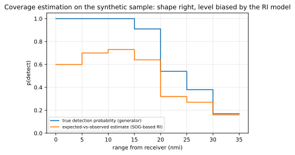

# Chapter 48 — Spatial statistics with AIS: coverage, bias, and honest maps

> **Part VII — Decoding, software, and data engineering.** Modeling heterogeneous detection probabilities, spatial sampling biases, and receiver topologies to transform raw AIS broadcasts into honest, uncertainty-bounded spatial statistics and maps.

**In this chapter.** You will learn how to treat raw Automatic Identification System (**AIS**) position reports not as an exhaustive census of maritime traffic, but as an observational sample shaped by heterogeneous, time-varying detection probabilities. You will calculate expected message generation rates across vessel operating dynamics under Recommendation ITU-R M.1371-6, and use the ratio of observed to expected transmissions to estimate empirical receiver detection-probability curves. You will analyze how fixed terrestrial base stations, mobile receivers mounted on ships or autonomous surface vehicles, and Low Earth Orbit (**LEO**) satellite constellations distort spatial density estimates. You will apply capture–recapture models across multi-receiver networks to infer true vessel populations in overlapping coverage zones. You will evaluate discrete global grid systems—comparing equal-area hexagonal indexations such as Uber H3 against planar equal-angle grids—to prevent high-latitude area distortions. Finally, you will implement bias-corrected traffic-density pipelines using DuckDB, GeoPandas, and Marine Cadastre methodologies, rendering honest maps paired with explicit spatial uncertainty layers.

## 48.1 The illusion of completeness: AIS as an observational sample

A common misconception in marine spatial planning and spatial data science is that an AIS dataset represents an exhaustive census of vessels on the water. Plotting millions of decoded position points (Messages 1, 2, 3, 18, and 19; [Chapter 22](ch22-message-catalog.md)) onto a basemap produces bright ribbons outlining shipping lanes and ports that resemble exhaustive census data.

Raw AIS data is an opportunistic sample from a broadcast radio network ([Chapter 1](ch01-what-ais-is.md)). The probability that a vessel report appears in a database is the product of conditional probabilities across the RF physical layer ([Chapter 28](ch28-rf-encoding-physical-layer.md)), the SOTDMA link layer ([Chapter 21](ch21-link-layer-tdma.md)), atmospheric propagation ([Chapter 29](ch29-propagation-modeling.md)), and ingest pipelines ([Chapter 50](ch50-big-data-architecture.md)).

Mathematically, let a vessel $v$ broadcast a position message at time $t$ from geographic coordinates $(x, y)$. The probability $P(\text{recorded}_{v,t})$ that this transmission is captured, decoded, and preserved in the spatial dataset is:
$$P(\text{recorded}_{v,t} \mid x, y, t) = P(\text{Tx}_{v,t}) \cdot P(\text{prop}_{v \to \text{Rx}} \mid x, y) \cdot P(\text{no\_collision} \mid \rho) \cdot P(\text{decode} \mid \text{SNR}) \cdot P(\text{ingest})$$

Each component introduces systematic spatial and temporal bias:

1. **Transmission probability $P(\text{Tx}_{v,t})$:** Transponders do not transmit at fixed global intervals. Under Recommendation ITU-R M.1371-6 Annex 1, Class A reporting cadences vary by a factor of 90: from once every 2 seconds for a fast ferry executing a high-speed turn ($> 23\text{ kn}$) to once every 180 seconds for a tanker moored or riding at anchor ($\le 3\text{ kn}$). Class B transponders broadcast every 30 seconds down to 3 minutes under Carrier-Sense Time Division Multiple Access (**CSTDMA**, IEC 62287-1:2017) or SOTDMA (IEC 62287-2:2017). A naive point-density map without cadence normalization depicts a single maneuvering container ship as equivalent to 90 anchored bulk carriers.
2. **Propagation probability $P(\text{prop}_{v \to \text{Rx}} \mid x, y)$:** Marine VHF signals at 162 MHz are governed by line-of-sight geometry, two-ray ground reflection over seawater, and tropospheric refraction ([Chapter 27](ch27-rf-basics.md), [Chapter 29](ch29-propagation-modeling.md)). As range $d$ from a coastal receiver increases beyond the radio horizon $d_{\text{horiz}} \approx 4.12(\sqrt{h_{\text{Rx}}} + \sqrt{h_{\text{Tx}}})\text{ km}$, path loss steepens sharply into diffraction roll-off (ITU-R P.526-16, ITU-R P.1546-6). Detection probability drops with distance even across open water with zero terrain obstructions.
3. **Collision-free reception $P(\text{no\_collision} \mid \rho)$:** As local vessel density $\rho$ rises in congested straits or port anchorages, channel slot occupancy approaches or exceeds 50% ([Chapter 30](ch30-network-loading-packet-loss.md)). While Class A units invoke intentional slot reuse to cannibalize slots from distant stations, Class B CSTDMA units carrier-sense the channel, find all 10 candidate periods occupied, and abandon scheduled transmissions entirely (IEC 62287-1:2017 §A6-4.3.3.1). In Low Earth Orbit (**LEO**) satellite footprints spanning 5,000 km, thousands of uncoordinated terrestrial TDMA cells collide asynchronously as unslotted ALOHA, driving packet completion rates down in dense traffic (Høye et al. 2008, Cervera, Ginesi & Eckstein 2011).
4. **Demodulation and CRC success $P(\text{decode} \mid \text{SNR})$:** Even when a burst arrives without co-channel collision, RF interference from vessel electronics, shore paging transmitters, or marine LED navigation lights ([Chapter 31](ch31-noise-and-interference.md)) can degrade the Signal-to-Noise Ratio (**SNR**). Under ITU-R M.1371-6 §A2-3.2.3, the 16-bit Frame Check Sequence (**FCS**) detects bit errors; any corrupted burst is discarded by standard hardware decoders without forward error correction.
5. **Network ingest and filtering $P(\text{ingest})$:** Telemetry downlinks from commercial satellite providers, volunteer crowdsourced feeds (such as AISHub or MarineTraffic), and government aggregators (such as US Coast Guard Nationwide AIS, **NAIS**) apply disparate filtering rules, rate limiting, deduplication windows, and licensing redactions ([Chapter 41](ch41-networks-and-providers.md)).

When raw AIS points are aggregated into heatmaps without modeling these mechanics, the visualizations map **receiver infrastructure and radio reception**, not vessel traffic. A coastline bristling with coastal base stations blazes red with apparent density, while an equally busy offshore transit corridor 40 nautical miles (**nmi**) offshore—monitored only by intermittent satellite passes or a distant antenna—fades into dark blue or vanishes.

> **Definitions that bite.**
> * **Raw point density:** The raw count of decoded position messages falling within a geographic grid cell per unit time. This metric conflates vessel presence, vessel speed, transponder class, and local RF reception probability. It has no valid physical interpretation as maritime traffic intensity.
> * **Time-in-cell (vessel-hours):** The integrated total duration that unique vessels spent within a geographic boundary, calculated by interpolating validated trajectories between consecutive position reports.
> * **Transit count (unique transits):** The count of distinct vessel voyages entering and exiting a geographic cell or crossing a designated counting gate without stopping.
> * **Coverage-corrected density:** Spatial traffic intensity normalized by local spatial-temporal detection probability $P(\text{detect} \mid x, y, t)$, reconstructing unobserved vessel traffic estimated by radio-link models or multi-receiver capture–recapture statistics.

---

## 48.2 Receiver footprints and spatial detection heterogeneity

Constructing an honest map requires cataloging the physical topology and sampling properties of the receiving network: fixed coastal stations, mobile platforms, and orbital satellites.

```
+-----------------------------------------------------------------------------------+
|                            AIS SENSOR ARCHITECTURES                               |
+-----------------------------------------------------------------------------------+
|  [ Fixed Coastal Base Station ]                                                   |
|    - Static coordinates, high elevation (mast/lighthouse: 20-100 m)              |
|    - Continuous temporal reception (100% duty cycle)                              |
|    - Radial detection decay: p(r) ~ 1.0 within LOS, drops sharply past horizon    |
|    - Susceptible to tropospheric ducting pulses (Rautiainen et al. 2026)          |
|                                                                                   |
|  [ Mobile Platform (Ship / ASV / Buoy) ]                                          |
|    - Moving sensor coordinates: Rx(t) = (lat_t, lon_t)                            |
|    - Low antenna height (2-15 m), restricted horizon (8-15 nmi)                   |
|    - Intermittent backhaul (cellular/satellite store-and-forward)                 |
|    - Severe moving-observer bias: samples only traffic along its own track        |
|                                                                                   |
|  [ LEO Satellite Constellation ]                                                  |
|    - Orbiting at 500-800 km altitude, footprint diameter ~5,000 km                |
|    - Episodic revisit cadence: 5-15 min snapshot pass every 60-180 min            |
|    - Extreme ALOHA packet collision under dense traffic (Høye et al. 2008)        |
|    - Severe spatial heterogeneity: p_sat > 0.9 in mid-ocean, < 0.05 in chokepoints|
+-----------------------------------------------------------------------------------+
```

### Fixed coastal receivers

A fixed terrestrial antenna mounted on a headland, lighthouse, or coastal tower provides continuous temporal monitoring within its line-of-sight footprint. The radio horizon distance $d$ in kilometers between an antenna at height $h_1$ and a vessel antenna at height $h_2$ (in meters) under standard atmospheric refraction (effective Earth radius factor $k = 4/3$) is:
$$d \approx 4.12 \left(\sqrt{h_1} + \sqrt{h_2}\right)\text{ km} \approx 2.22 \left(\sqrt{h_1} + \sqrt{h_2}\right)\text{ nmi}$$

For a commercial shore station at $h_1 = 45\text{ m}$ receiving a commercial cargo ship whose masthead antenna sits at $h_2 = 25\text{ m}$:
$$d \approx 4.12 (\sqrt{45} + \sqrt{25}) = 4.12 (6.71 + 5.00) = 48.25\text{ km} \approx 26.0\text{ nmi}$$

Inside this line-of-sight radius, the empirical detection probability $P(\text{detect})$ for Class A position bursts is typically near 1.0, dipping slightly in port environments characterized by severe man-made noise or Class A channel saturation ([Chapter 30](ch30-network-loading-packet-loss.md), [Chapter 31](ch31-noise-and-interference.md)). Beyond the horizon, diffraction loss increases rapidly, creating a characteristic drop-off curve in detection probability.

Coastal radio propagation is not static. Under marine atmospheric temperature inversions, elevated refractivity gradients form tropospheric ducts that duct 162 MHz VHF waves hundreds of kilometers over the horizon. In a continuous one-year measurement campaign at Utö island in the Baltic Sea, Rautiainen et al. (2026) demonstrated that an antenna at 30 m elevation received over-the-horizon transmissions 59% of the time, with decoded messages originating from ships up to 600 km away. During ducting events, observed Received Signal Strength (**RSS**) decayed significantly slower with distance. Similar ducting phenomena over the Adriatic Sea were recorded by Valčić & Brčić (2023), who decoded over 159,000 packets at distances reaching hundreds of nautical miles. Computing seasonal density without filtering these events lets distant shipping lanes register on coastal receivers, generating artifacts that track weather cycles rather than true maritime transport shifts.

### Mobile collection platforms: Ships, buoys, and autonomous surface vehicles

When AIS receivers are deployed aboard moving platforms—such as oceanographic research vessels, commercial ferries, NOAA environmental buoys, or Autonomous Surface Vehicles (**ASVs**, such as Saildrone platforms; [Chapter 38](ch38-collection-at-sea.md))—the spatial sampling footprint becomes non-stationary:
$$\text{Footprint}(t) = \left\{ (x, y) \mid \text{dist}\left((x, y), (x_{\text{Rx}}(t), y_{\text{Rx}}(t))\right) \le R_{\text{horizon}} \right\}$$

Mobile receivers introduce classic **moving-observer bias**. The spatial distribution of observed vessels is heavily conflated with the patrol route and voyage frequency of the receiving platform itself. A ferry traversing a strait ten times a day records the vessels along its path with dense temporal repetition, while an adjacent shallow-water bay visited once a month by an ASV appears virtually empty. Furthermore, antenna heights on buoys and small autonomous craft are constrained ($h_{\text{Rx}} \approx 1\text{ to }3\text{ m}$), restricting the direct radio horizon to less than 8–12 nmi ($15\text{–}22\text{ km}$). Normalizing mobile receiver data requires computing dynamic space-time coverage polygons: each grid cell must accumulate an exposure metric—such as receiver-observation hours—prior to evaluating vessel density.

### Satellite constellations in Low Earth Orbit

Space-based AIS reception ([Chapter 39](ch39-satellite-ais.md)) provides global geographic reach, monitoring open-ocean basins that lie far beyond terrestrial shore networks. However, satellite AIS introduces severe spatial heterogeneity driven by orbital physics and packet collisions:

1. **Episodic temporal revisit:** A single LEO satellite orbiting at 600–800 km altitude crosses overhead in an orbital pass lasting 10–15 minutes. Revisit intervals between passes for a given low-latitude region can span 60 to 180 minutes depending on constellation architecture (such as Spire Global, ORBCOMM, or exactEarth).
2. **Asynchronous ALOHA message collision:** A LEO satellite antenna illuminates a circular footprint on the Earth's surface roughly 5,000 km in diameter, encompassing surface areas exceeding 15 million square kilometers. Inside this footprint, thousands of independent terrestrial SOTDMA cells broadcast simultaneously. Because slot synchronization is purely local to each 30–50 nmi cell, burst arrivals at the satellite overlap arbitrarily in time. Furthermore, differential path delays of up to 7.3 ms between the sub-satellite point (nadir) and the orbital horizon smear discrete TDMA slots into continuous, unslotted ALOHA packet collisions (Høye et al. 2008, Cervera, Ginesi & Eckstein 2011).
3. **Spatial inversion of detection probability:** In open mid-ocean basins where vessel density is sparse ($\le 50\text{ ships in the field of view}$), message collision probability is low, and satellite detection probability $P_{\text{sat}}$ exceeds 0.90 to 0.95 during an orbital pass. Conversely, in dense maritime bottlenecks—such as the English Channel, the Strait of Malacca, the East China Sea, or the Gulf of Mexico—where tens of thousands of transponders broadcast concurrently, packet collisions destroy the majority of incoming bursts. In these congested zones, raw satellite detection probability for an unenhanced receiver can plunge below 0.05 (Cervera, Ginesi & Eckstein 2011, Paolo et al. 2024).

Consequently, a naive global map constructed purely from satellite AIS exhibits an inverted bias: traffic appears vibrant and complete in the mid-Pacific, but drops to a fraction of reality in the busiest ports and coastal straits on Earth.

---

## 48.3 Estimating detection probability from data: Expected vs. observed reporting

How can an analyst estimate the detection probability $P(\text{detect} \mid x, y)$ of a receiving network when ground truth is unknown? The structural design of the AIS protocol provides an internal calibration signal: **the standardized reporting interval model**.

### Protocol-mandated reporting cadences

Under Recommendation ITU-R M.1371-6 Annex 1, an operational Class A shipborne mobile station autonomously adjusts its position reporting cadence based on its Speed Over Ground (**SOG**) and navigational status, as shown in Table 48.1.

| Navigational Status | Speed Over Ground (SOG) | Course Dynamics | Nominal Reporting Interval ($T_{\text{nom}}$) | Expected Reports per Minute ($R_{\text{exp}}$) |
|---|---|---|---|---|
| At anchor or moored | $\le 3\text{ kn}$ | Steady | 3 min (180 s) | 0.333 |
| At anchor or moored | $> 3\text{ kn}$ | Maneuvering/dragging | 10 s | 6.0 |
| Under way | $0 \le \text{SOG} \le 14\text{ kn}$ | Steady | 10 s | 6.0 |
| Under way | $0 \le \text{SOG} \le 14\text{ kn}$ | Changing course | 3⅓ s (3.33 s) | 18.0 |
| Under way | $14 < \text{SOG} \le 23\text{ kn}$ | Steady | 6 s | 10.0 |
| Under way | $14 < \text{SOG} \le 23\text{ kn}$ | Changing course | 2 s | 30.0 |
| Under way | $> 23\text{ kn}$ | Steady / changing | 2 s | 30.0 |

*Table 48.1: Class A position reporting intervals under Recommendation ITU-R M.1371-6 Annex 1 Table 1.*

For Class B transponders, standard reporting intervals under IEC 62287-1 (CSTDMA) and IEC 62287-2 (SOTDMA) are:
* $\text{SOG} \le 2\text{ kn} \implies 3\text{ minutes}$ (0.333 reports/min).
* $2 < \text{SOG} \le 14\text{ kn} \implies 30\text{ seconds}$ (2.0 reports/min).
* $> 14\text{ kn} \implies 15\text{ seconds}$ (4.0 reports/min; SOTDMA units step down to 5 seconds when $> 23\text{ kn}$ unless link congestion forces throttling).

### The expected-vs-observed estimator

For any tracked vessel $v$ detected during a temporal observation window $[t_0, t_1]$ of duration $\Delta t$ minutes, the analyst can compute the expected number of transmitted position messages $\hat{N}_{\text{exp}}(v)$ by integrating its instantaneous expected reporting rate $r(t) = 60.0 / T_{\text{nom}}(\text{SOG}(t), \text{status}(t))$ over its track:
$$\hat{N}_{\text{exp}}(v) = \int_{t_0}^{t_1} \frac{60.0}{T_{\text{nom}}(\text{SOG}(t), \text{status}(t))} \, dt$$

Summing the actual observed report count $N_{\text{obs}}(v)$ and expected report count $\hat{N}_{\text{exp}}(v)$ across all vessels operating within a specific spatial grid cell or distance bin $b$ yields the empirical detection probability:
$$\hat{P}_{\text{detect}}(b) = \min\left(1.0, \, \frac{\sum_{v \in b} N_{\text{obs}}(v)}{\sum_{v \in b} \hat{N}_{\text{exp}}(v)}\right)$$



Figure 48.1 illustrates this estimation process applied to a synthetic coastal dataset:
1. **The shape is robust:** The estimated curve tracks the transition from complete reception ($P = 1.0$) inside the radio line of sight to complete attenuation ($P \to 0$) past 30 nmi.
2. **The level is subject to operational bias:** In the near field ($0\text{–}15\text{ nmi}$), the empirical estimate $\hat{P}$ hovers around 0.60–0.73, despite true physical reception being 1.00. This occurs because the SOG-based reporting model assumes vessels transmit at steady-state intervals, but vessels entering or exiting the spatial bin, temporary transponder pauses, or misconfigured navigational status fields depress the ratio.

> **Worked example.**
> A coastal station at $42.36^\circ\text{ N}, 70.95^\circ\text{ W}$ tracks a chemical tanker transiting an offshore fairway located in range bin $20\text{–}25\text{ nmi}$. Over a 20-minute transit through the bin, the tanker maintains a steady SOG of $15.2\text{ kn}$ with navigational status `0: Under way using engine`.
> 
> * **Nominal cadence:** Under ITU-R M.1371-6 Table 1, $14 < \text{SOG} \le 23\text{ kn}$ dictates a nominal reporting interval of $T_{\text{nom}} = 6\text{ s}$.
> * **Expected transmissions:** Over 20 minutes ($1{,}200\text{ s}$), expected transmissions are:
>   $$\hat{N}_{\text{exp}} = \frac{1{,}200\text{ s}}{6\text{ s/report}} = 200\text{ reports}$$
> * **Observed transmissions:** The coastal receiver decodes exactly 64 position bursts from this tanker during the window.
> * **Empirical detection probability:**
>   $$\hat{P}_{\text{detect}} = \frac{64}{200} = 0.32\text{ (or } 32\%)$$
> 
> If the cell aggregated 86 observed reports across all ships against an expected 270 reports, regional cell detection probability is $\hat{P} = 86 / 270 \approx 0.318$. To reconstruct true message density, each observed report is scaled by $1 / 0.318 \approx 3.14$, converting 86 recorded bursts into an estimated 270 true transmissions.

### Execution with open-source tools

The calculation can be executed directly against decoded AIS NMEA streams or Parquet logs using Python and DuckDB.

> **Try it.** The following Python script runs the coverage estimation tool `code/analytics/coverage_estimate.py` against the synthetic harbor sample and compares the expected-vs-observed curve against generator ground truth:
> ```bash
> . .venv/bin/activate
> python code/analytics/coverage_estimate.py data/samples/synthetic_harbor.nmea \
>   --rx 42.36 -70.95 --truth data/samples/synthetic_harbor_truth.csv
> ```
> Expected output:
> ```text
> range_bin_nmi  vessel_min  observed  expected  p_detect
>        0–5           11        66       110      0.60
>        5–10          44       259       372      0.70
>       10–15          60       360       492      0.73
>       15–20          47       256       402      0.64
>       20–25          27        86       270      0.32
>       25–30          33        89       330      0.27
>       30–35           9        14        90      0.16
> 
> against truth: range_bin  truth_reports  received  p_true
>        0–5           65        65     1.00
>        5–10         261       261     1.00
>       10–15         354       354     1.00
>       15–20         287       261     0.91
>       20–25         160        86     0.54
>       25–30         232        89     0.38
>       30–35          82        14     0.17
> ```

---

## 48.4 Multi-receiver capture–recapture models

When ingesting data from multiple overlapping receivers—coastal antennas, patrol cutters, and satellites—analysts can estimate true vessel populations without assuming an a priori radio model by adapting **mark-recapture (capture–recapture)** methods from wildlife statistics (Otis et al. 1978).

### The Lincoln–Petersen two-sensor estimator

Consider a defined maritime geographic area monitored simultaneously by two independent receiving systems: Sensor 1 (e.g., a coastal shore receiver network) and Sensor 2 (e.g., a commercial satellite pass).
* Let $n_1$ be the number of unique vessels (identified by distinct MMSI) detected by Sensor 1 during time interval $\Delta t$.
* Let $n_2$ be the number of unique vessels detected by Sensor 2 during the same window.
* Let $m_{12}$ be the number of vessels detected by **both** Sensor 1 and Sensor 2 (the recaptures).

If detection by Sensor 1 is statistically independent of detection by Sensor 2, the proportion of Sensor 2 vessels detected by Sensor 1 should equal the proportion of the total population $N$ detected by Sensor 1:
$$\frac{m_{12}}{n_2} \approx \frac{n_1}{N}$$

Rearranging gives the classical **Lincoln–Petersen estimator** of total vessel population $\hat{N}$:
$$\hat{N} = \frac{n_1 \cdot n_2}{m_{12}}$$

To eliminate small-sample upward bias when $m_{12}$ is small, Chapman's modified estimator is applied:
$$\hat{N}_{\text{Chapman}} = \frac{(n_1 + 1)(n_2 + 1)}{m_{12} + 1} - 1$$
with variance:
$$\widehat{\operatorname{Var}}(\hat{N}_{\text{Chapman}}) = \frac{(n_1 + 1)(n_2 + 1)(n_1 - m_{12})(n_2 - m_{12})}{(m_{12} + 1)^2 (m_{12} + 2)}$$

From $\hat{N}_{\text{Chapman}}$, the absolute detection probability of each individual sensor network across that specific geographic cell is recovered directly:
$$\hat{p}_1 = \frac{n_1}{\hat{N}_{\text{Chapman}}}, \qquad \hat{p}_2 = \frac{n_2}{\hat{N}_{\text{Chapman}}}$$

### Multi-receiver models and heterogeneity

When three or more sensors monitor an area ($K \ge 3$), data can be structured as capture histories for each vessel $v$ (e.g., $\boldsymbol{\omega}_v = [1, 0, 1]$, indicating detection by Sensor 1 and Sensor 3, but missed by Sensor 2). Standard log-linear models (Otis et al. 1978) allow analysts to estimate:
* **Model $M_0$:** Constant detection probability across all vessels and all sensors.
* **Model $M_t$:** Detection probabilities vary by sensor/pass, but are equal across vessels.
* **Model $M_h$:** Detection probabilities vary across vessels (heterogeneity driven by transponder class, RF installation quality, and antenna height).
* **Model $M_{th}$:** Detection probabilities vary by both sensor and vessel dynamics.

The primary limitation of capture–recapture models in AIS spatial statistics is **heterogeneity of capture**. A 300-meter container ship equipped with a 12.5 W Class A transponder at 40 m elevation will have high detection probabilities on both sensors, whereas a 10-meter wooden fishing vessel operating a 2 W Class B transponder with a low antenna may have low detection probabilities on both. This positive correlation violates the independence assumption, causing $\hat{N}$ to underestimate the true population of small craft. Stratifying the population by transceiver class (Class A vs. Class B) and vessel length prior to computing capture–recapture estimates mitigates this heterogeneity bias.

---

## 48.5 Density metrics done right: Marine Cadastre, EMODnet, and time-in-cell

In marine spatial planning, ocean zoning, and environmental impact assessments, analysts must distill billions of points into continuous spatial surfaces. Two distinct mapping traditions have emerged: **transit-count mapping** and **time-in-cell (track-length) mapping**.

### Marine Cadastre track-line and transit methodology

The US National Oceanic and Atmospheric Administration (**NOAA**) and the Bureau of Ocean Energy Management (**BOEM**) publish the *Marine Cadastre* AIS data product (Marine Cadastre 2026). To eliminate the speed-dependent bias of raw point counts, Marine Cadastre applies a track-reconstruction and transit-gate workflow:

1. **Filtering:** Position records are filtered to remove invalid MMSIs (`0`, `111111111`, `123456789`), coordinates outside valid US coastal bounding boxes, and records where $\text{SOG} < 0.1\text{ kn}$ or $\text{SOG} > 50\text{ kn}$ ([Chapter 47](ch47-data-quality-track-reconstruction.md)).
2. **Trajectory reconstruction:** Valid position points belonging to the same MMSI are ordered chronologically and connected into linear vector segments.
3. **Voyage segmentation:** If the time delta between consecutive points exceeds a threshold (typically $\Delta t > 30\text{ minutes}$) or the spatial displacement implies an impossible speed, the track is severed into separate voyage segments.
4. **Grid intersection:** A regular spatial grid (typically $100\text{ m} \times 100\text{ m}$ for harbor scales, or $1\text{ km} \times 1\text{ km}$ for regional offshore planning) is overlaid across vector lines.
5. **Transit counting:** Rather than counting the number of points within each grid cell, the algorithm counts **unique vessel transits**: a single continuous track crossing a grid cell increments the cell transit counter by exactly 1, regardless of whether the ship was tracked at 2-second intervals (yielding 30 points in the cell) or 3-minute intervals (yielding a single interpolated line crossing).

### EMODnet vessel density methodology

The European Marine Observation and Data Network (**EMODnet**) Human Activities consortium produces standardized vessel density maps covering European sea basins at $1\text{ km} \times 1\text{ km}$ resolution (EMODnet 2024). EMODnet measures maritime intensity using **hours per square kilometer**:

$$\text{Density}_{\text{EMODnet}}(C, m) = \frac{\sum_{v \in C} \Delta t_{v, C, m}}{\text{Area}(C)}$$
where $\Delta t_{v, C, m}$ is the duration in hours that vessel $v$ of category $m$ (cargo, tanker, passenger, fishing, recreational) occupied cell $C$ during the aggregation period (monthly or annual).

When a vessel's track is continuously observed, $\Delta t$ is the exact sum of line segment durations. When tracking gaps occur between points $P_1(t_1)$ and $P_2(t_2)$, EMODnet interpolates linear trajectories if $\Delta t \le 2\text{ hours}$. If $\Delta t > 2\text{ hours}$, points are treated as disconnected, and no artificial dwell time is assigned to intervening cells.

---

## 48.6 Spatial partitioning: Hexagonal hierarchies (H3) vs. planar grids

The choice of spatial grid geometry strongly influences spatial statistics and map honesty. Analysts generally choose between planar latitude/longitude bins and Discrete Global Grid Systems (**DGGS**).

### The distortion of planar equirectangular grids

Early AIS density databases partitioned space into fixed angular grids, such as $0.01^\circ \times 0.01^\circ$ or $0.1^\circ \times 0.1^\circ$ cells. On a spherical or ellipsoidal Earth, the linear surface width of a degree of longitude $\Delta \lambda$ varies with latitude $\phi$:
$$\text{Width}(\phi) = \frac{\pi R}{180} \cos\phi$$

At the equator ($\phi = 0^\circ$), a $0.01^\circ$ cell spans approximately $1.11\text{ km} \times 1.11\text{ km} \approx 1.23\text{ km}^2$. At the northern tip of Denmark ($\phi = 57^\circ\text{ N}$), the cell's longitudinal width narrows to $0.605\text{ km}$, shrinking cell area to $0.67\text{ km}^2$—a $45\%$ loss in area. In the Gulf of Bothnia or the Gulf of Alaska ($\phi = 60^\circ\text{ N}$), the area is halved.

If an analyst calculates "vessel transits per $0.01^\circ$ cell" across a regional or continental scale, high-latitude cells appear systematically less dense than equatorial cells simply because they contain half the physical surface area. Any valid density metric computed on an angular grid **must** divide the metric by the exact geodesic cell area computed via ellipsoidal geometry (WGS 84).

### Equal-area hexagonal tessellations: Uber H3

To avoid latitude-dependent area distortions and directional adjacency artifacts, modern spatial data architectures adopt equal-area hexagonal global grid systems, most prominently **Uber H3**.

Hexagonal tessellations provide two core mathematical advantages:
1. **Isotropic neighborhood connectivity:** In a square grid, a cell has two distinct classes of neighbors: four orthogonal neighbors sharing an edge (centroid distance $d = 1$) and four diagonal neighbors sharing only a vertex (centroid distance $d = \sqrt{2} \approx 1.414$). In a hexagonal grid, every cell has exactly six contiguous neighbors, and the distance between the center of a hexagon and each neighbor centroid is strictly identical. This isotropy simplifies kernel density smoothing, spatial autocorrelation calculations (Moran's $I$), and maritime route-finding graph models.
2. **Reduced perimeter-to-area ratio:** The regular hexagon maximizes enclosed area for a given perimeter among all space-tiling regular polygons, minimizing edge-effect boundary crossing errors during transit analysis.

Table 48.2 summarizes common H3 resolutions utilized in maritime analytics.

| H3 Resolution | Average Hexagon Area | Average Edge Length | Typical Maritime Analytics Use Case |
|---|---|---|---|
| **Res 5** | $252.9\text{ km}^2$ | $8.54\text{ km}$ | Continental routing, ocean-basin overview maps |
| **Res 6** | $36.13\text{ km}^2$ | $3.23\text{ km}$ | Regional EEZ surveillance, offshore wind farm siting |
| **Res 7** | $5.16\text{ km}^2$ | $1.22\text{ km}$ | Coastal shipping channels, transit corridor density |
| **Res 8** | $0.737\text{ km}^2$ ($73.7\text{ ha}$) | $461\text{ m}$ | Harbor approaches, anchorage boundary delineation |
| **Res 9** | $0.105\text{ km}^2$ ($10.5\text{ ha}$) | $174\text{ m}$ | Terminal berths, lock transits, collision-risk zones |

*Table 48.2: Uber H3 spatial resolution hierarchy and maritime applications.*

---

## 48.7 Honest maps: Visualizing spatial uncertainty and bias

A core ethical rule of spatial statistics is: **never publish a density layer without its corresponding uncertainty layer**.

Regulators designating Marine Protected Areas (**MPAs**), acousticians modeling underwater noise, or judges evaluating collision risk instinctively interpret an absence of tracks as an absence of vessels. If a map conceals that a region had an 80% packet-loss rate or lacked coverage, decisions may be fatally flawed. Honest cartography pairs density maps with uncertainty layers or uses bivariate choropleth cartography.

### The three-step protocol for honest mapping

1. **Explicit coverage threshold masking:** Calculate the local detection probability surface $\hat{P}(\text{detect} \mid x, y)$. Any cell where $\hat{P} < P_{\text{threshold}}$ (typically set at $0.10\text{–}0.15$) must be rendered with distinctive diagonal hatching or masked out entirely. The map legend must state: *"Hatched regions indicate insufficient radio coverage ($P < 0.15$); vessel presence cannot be determined from available sensor data."*
2. **Bivariate color ramps:** Encode traffic intensity along one color axis (e.g., sequentially from light yellow to deep red) and detection confidence along an orthogonal axis (e.g., saturation or transparency). Cells with high traffic and high confidence appear saturated red; cells with zero observed traffic and high confidence appear light yellow; cells with low confidence fade into neutral gray, signaling to the viewer that data is missing.
3. **Disclosure of sensor provenance:** Every map must include a data provenance block stating:
   * Receiving platforms included (e.g., *"Terrestrial fixed (4 stations), Satellite LEO (Spire constellation passes)"*).
   * Aggregation metric used (e.g., *"Transit counts per H3 Res 7 cell"* vs. *"Raw message point density"*).
   * Filtering thresholds applied (e.g., *"Speed range 0.5–30.0 kn; track separation threshold 30 min"*).
   * Temporal sampling window (e.g., *"01-Jan-2026 to 31-Jan-2026; uncorrected for seasonal tropospheric ducting"*).

---

## 48.8 Worked pipeline: From raw NMEA to a normalized density map

To demonstrate how these principles are implemented in practice, consider a pipeline that decodes a raw NMEA log, bins vessel positions on a spatial grid, computes range to the nearest coastal receiver, applies a calibrated radio-detection model, and outputs coverage-corrected traffic metrics using DuckDB.

> **Try it.** The following Python script executes `code/analytics/duckdb_density.py` against the synthetic harbor dataset, normalizing raw message counts by an empirical range-decay model:
> ```bash
> . .venv/bin/activate
> python code/analytics/duckdb_density.py data/samples/synthetic_harbor.nmea \
>   --rx 42.36 -70.95 --cell 0.02 --limit 10
> ```
> Expected output:
> ```text
>  cell_lat  cell_lon  reports  vessels  range_nmi  p_detect  reports_corrected
>     42.28    -70.74       47        2       10.6      1.00               47.0
>     42.28    -70.72       42        2       11.5      1.00               42.0
>     42.24    -70.68       39        1       14.0      1.00               39.0
>     42.26    -70.70       38        1       12.8      1.00               38.0
>     42.20    -70.62       35        1       17.6      0.87               40.0
>     42.30    -70.76       35        1        9.4      1.00               35.0
>     42.32    -70.92       31        2        2.6      1.00               31.0
>     42.32    -70.80       26        1        7.4      1.00               26.0
>     42.28    -70.92       25        1        4.5      1.00               25.0
>     42.24    -70.94       25        1        6.7      1.00               25.0
> ```

Notice how cell `(42.20, -70.62)` at range $17.6\text{ nmi}$ receives a detection probability factor $\hat{P} = 0.87$, scaling its 35 observed reports up to 40.0 corrected reports. At range $24.2\text{ nmi}$ (cell `42.30, -70.42`), the detection probability drops to $\hat{P} = 0.54$, scaling 23 observed reports up to 43.0 corrected reports. A raw point map would show traffic at `(42.20, -70.62)` exceeding traffic at `(42.30, -70.42)` by $52\%$ (35 vs. 23 reports); the honest, coverage-corrected map reveals that both cells supported virtually identical traffic intensity (~40–43 true transmissions).

---

## Then & now

- **⟨H⟩ 1960s–1980s:** Point-density mapping in maritime geography relied on manual plotting of vessel position reports extracted from ship paper logbooks, Lloyd's Voyage Records, and voluntary coastal radio reporting schemes (such as AMVER).
- **⟨H⟩ 2002–2006:** Following the entry into force of SOLAS Chapter V Regulation 19 carriage requirements, initial digital AIS maps aggregated raw NMEA sentences directly into GIS software (such as ArcView and GRASS GIS). Maps depicted unweighted point density, creating massive visual over-representation of slow, maneuvering harbor craft and coastal tugs.
- **⟨+⟩ 2008:** Høye et al. publish the foundational mathematical model of satellite-based AIS detection, establishing that ALOHA packet collisions in LEO footprints create severe spatial-density drop-offs in congested waters.
- **⟨+⟩ 2009–2011:** NOAA and BOEM initiate the Marine Cadastre project, developing automated Python and ArcObjects algorithms to convert raw USCG NAIS point feeds into track-line vector transits, establishing the modern transit-counting standard.
- **⟨+⟩ 2018:** Uber open-sources the H3 Discrete Global Grid System, offering equal-area hexagonal tessellations and establishing an open standard for multi-resolution maritime spatial indexing.
- **⟨+⟩ 2019:** EMODnet Human Activities formalizes the European standard for vessel density mapping, defining standardized 1 km monthly grids based on vessel-hours per square kilometer across distinct ship categories.
- **⟨+⟩ 2023–2026:** Micro-benchmarking studies (Valčić & Brčić 2023, Rautiainen et al. 2026) demonstrate that anomalous VHF propagation (tropospheric ducting) regularly corrupts terrestrial coverage baselines up to 600 km, forcing modern big-data pipelines to incorporate meteorological refractivity modeling and multi-sensor capture–recapture filters.

---

## Validation, uncertainty & data quality

To ensure that spatial statistics derived from AIS feeds conform to rigorous metrological standards, analysts must implement automated validation checks across four analytical dimensions:

```
+-----------------------------------------------------------------------------------+
|                        SPATIAL METRICS VALIDATION STACK                           |
+-----------------------------------------------------------------------------------+
|  [ LAYER 4: Regional Population Cross-Validation ]                                |
|    - Dual-sensor Lincoln-Petersen / Chapman capture-recapture estimates.          |
|    - SAR and optical satellite cross-matching (Paolo et al. 2024).                |
|                                                                                   |
|  [ LAYER 3: Propagation and Meteorological Plausibility ]                         |
|    - Radio horizon validation: d <= 4.12 * (sqrt(h_rx) + sqrt(h_tx)) km.          |
|    - Hourly 95th-percentile range checks to flag tropospheric ducting pulses.     |
|                                                                                   |
|  [ LAYER 2: Cadence and Kinematic Filtering ]                                     |
|    - ITU-R M.1371 Table 1 cadence consistency against observed SOG.               |
|    - Kinematic speed-jump rejection: delta_dist / delta_t <= 50 kn.               |
|                                                                                   |
|  [ LAYER 1: Link and Identity Integrity ]                                         |
|    - 16-bit CRC / FCS validation on raw bursts.                                   |
|    - Syntactic MMSI sanitation: reject MID < 200, MID > 775, default sentinels.   |
+-----------------------------------------------------------------------------------+
```

### Concrete verification procedure
1. **Receiver baseline profiling:** Compute the empirical 95th-percentile reception radius $R_{95}(h)$ for each terrestrial station across 1-hour rolling windows. If $R_{95}$ exceeds the standard 4/3-Earth line-of-sight horizon by more than a factor of 1.5, flag the hour as an anomalous propagation event (tropospheric ducting) and isolate its records from baseline density aggregations.
2. **Stationary target segregation:** Identify all position reports where $\text{SOG} < 0.5\text{ kn}$ or navigational status is set to `1: At anchor` or `5: Moored`. Segregate these records into an independent "anchorage dwell-time" raster; never pool stationary dwell points into underway transit surfaces.
3. **Sensitivity auditing:** Recompute spatial density under varying temporal aggregation windows (e.g., 10-minute vs. 30-minute track segmentation limits) and spatial grid geometries (e.g., H3 Res 7 vs. $1\text{ km}$ planar grid). If a traffic corridor's ranking shifts by more than 15% under grid change, investigate local latitude distortion or track fragmentation artifacts.

---

## Software

### Open source
* **DuckDB Spatial:** Embedded analytical OLAP engine capable of executing spatial SQL, Haversine range calculations, and hexagonal H3 binning directly over Parquet AIS archives at tens of millions of rows per second. *Caveat:* Spatial indexing (R-tree) must be built manually in memory for large joins.
* **MovingPandas:** Trajectory data analysis library built on GeoPandas and Shapely. Provides built-in functions for trajectory cleaning, temporal gap segmentation, and stop detection. *Caveat:* Memory-intensive; processing global or annual datasets requires distributed chunking via Dask.
* **H3-py:** Official Python bindings for Uber's H3 hierarchical hexagonal spatial index. Enables instantaneous coordinate-to-cell indexing and hierarchical aggregation. *Caveat:* Hexagons cannot be perfectly subdivided into smaller hexagons (aperture 7 hierarchy introduces slight pentagonal edge adjustments).

### Free but closed
* **Google Earth Engine (GEE):** Cloud geospatial platform hosting global Global Fishing Watch AIS datasets and environmental covariates. *Caveat:* Proprietary execution environment with strict query timeout and memory quotas.
* **Marine Cadastre National Viewer:** Web-based interactive GIS viewer developed by NOAA/BOEM providing pre-computed annual transit counts and vessel tracks across US waters. *Caveat:* Cannot ingest or recompute custom user feeds or non-US territories.

### Commercial
* **Spire Maritime AIS Analytics:** Commercial satellite and terrestrial fused AIS streaming and historical archive API offering pre-computed vessel density and port-call analytics. *Caveat:* High licensing cost; proprietary data cleaning and deduplication logic not fully disclosed.
* **Kpler (MarineTraffic / FleetMon):** Enterprise maritime tracking and port-flow intelligence platform. *Caveat:* Spatial aggregation algorithms and raw receiver weightings are closed intellectual property.

---

## Standards & guides

* **ITU-R Recommendation M.1371-6 (2026):** *Technical Characteristics for an Automatic Identification System Using Time Division Multiple Access in the VHF Maritime Mobile Frequency Band*. Annex 1 establishes protocol-mandated position reporting intervals across ship speeds and operating conditions.
* **ITU-R Recommendation P.1546-6 (2019):** *Method for Point-to-Area Predictions for Terrestrial Services in the Frequency Range 30 MHz to 4 000 MHz*. Governs coastal VHF field strength and propagation curve estimation.
* **ITU-R Recommendation P.2001-6 (2025):** *A General Purpose Wide-Range Terrestrial Propagation Model in the Frequency Range 30 MHz to 50 GHz*. Provides explicit sub-models for tropospheric ducting, layer reflection, and surface diffraction over seawater.
* **IALA Recommendation R0124 (A-124), Edition 2.2 (2012):** *The AIS Service*. Appendix 18 defines shore-side VHF data link monitoring, capacity thresholds, and base station coverage planning.
* **IEC 61993-2, Edition 3.0 (2018):** *Class A Shipborne Equipment of the Automatic Identification System (AIS)*. Establishes operational and testing standards for Class A reporting behavior.
* **IEC 62287-1, Edition 3.0 (2017):** *Class B Shipborne Equipment of the Automatic Identification System (AIS) — Part 1: CSTDMA Techniques*. Establishes carrier-sense channel access and transmission abandonment rules.
* **NOAA/BOEM Marine Cadastre AIS Data Dictionary (2026):** Project documentation detailing US federal standards for track building, transit counting, and AIS quality control.
* **EMODnet Human Activities Vessel Density Methodology (2024):** European Commission guidelines for computing vessel-hours per square kilometer across marine sectors.

---

## Pitfalls

1. **Mapping raw position message counts as vessel traffic.** → *The mistake:* Creating a heatmap directly from the raw table of decoded Messages 1, 2, and 3. → *Why it happens:* Confusing message delivery volume with vessel presence. → *How to avoid:* Always normalize by the expected reporting interval or reconstruct tracks to compute transit counts or time-in-cell hours.
2. **Treating missing data as proof of vessel absence.** → *The mistake:* Declaring an offshore area free of shipping traffic because no AIS points appear in a coastal receiver log. → *Why it happens:* Ignoring the line-of-sight radio horizon. → *How to avoid:* Compute and display an explicit receiver coverage mask; flag cells where $P(\text{detect}) < 0.15$ as unobserved.
3. **Conflating Class A and Class B traffic densities.** → *The mistake:* Pooling Class A and Class B transponders into a single unweighted transit density map. → *Why it happens:* Failing to account for different RF transmission powers (12.5 W vs. 2 W) and reporting intervals (10 s vs. 30 s). → *How to avoid:* Stratify spatial statistics by transponder class and analyze small-craft activity separately.
4. **Ignoring latitude distortion in equirectangular grids.** → *The mistake:* Calculating transits per $0.01^\circ$ cell across wide latitudinal expanses. → *Why it happens:* Forgetting that longitude lines converge toward the poles. → *How to avoid:* Project coordinates to a local equal-area projection (such as Albers Equal Area or LAEA) or index data using an equal-area Discrete Global Grid System like Uber H3.
5. **Treating tropospheric ducting pulses as local fleet surges.** → *The mistake:* Interpreting a temporary 500% increase in message volume from 150 nmi offshore as a sudden surge in regional maritime transit. → *Why it happens:* Marine temperature inversions channel VHF signals far beyond the radio horizon. → *How to avoid:* Filter incoming messages by receiver-to-vessel range and flag hours where the 95th-percentile reception range exceeds 1.5 times the radio horizon.
6. **Failing to sever tracks across long temporal reception gaps.** → *The mistake:* Connecting two AIS position reports separated by 12 hours with a straight line across an intervening peninsula or landmass. → *Why it happens:* Naive `ST_MakeLine` grouping by MMSI without temporal delta segmentation. → *How to avoid:* Sever trajectories whenever the time delta between consecutive reports exceeds 30–60 minutes or requires an unrealistic speed over ground.
7. **Pooling stationary anchored vessels with underway transits.** → *The mistake:* Generating a navigation corridor density map where anchorages appear as intense hotspots while fairway channels look faint. → *Why it happens:* Anchored ships broadcast continuously for days or weeks in a single grid cell. → *How to avoid:* Filter out records where $\text{SOG} < 0.5\text{ kn}$ or navigational status indicates at anchor or moored before computing transit densities.
8. **Assuming satellite AIS provides uniform spatial coverage.** → *The mistake:* Using uncorrected satellite AIS data to evaluate shipping density in high-traffic bottlenecks like the Strait of Malacca. → *Why it happens:* Overlooking ALOHA message collisions in dense orbital footprints. → *How to avoid:* Apply regional collision-loss correction curves (Cervera et al. 2011) or cross-validate satellite AIS with terrestrial radar and Synthetic Aperture Radar (**SAR**) imagery.
9. **Neglecting mobile receiver track bias.** → *The mistake:* Using AIS collected aboard a research vessel or patrol cutter to generate a regional traffic map. → *Why it happens:* Treating a mobile observer as if it were a fixed, omnidirectional sensor network. → *How to avoid:* Normalize message counts by the mobile receiver's dynamic space-time visibility footprint.
10. **Publishing traffic density maps without spatial uncertainty layers.** → *The mistake:* Presenting a single polished density map to regulators or researchers without disclosing underlying detection probabilities. → *Why it happens:* Pressure to produce visually clean, uncomplicated figures. → *How to avoid:* Always pair density maps with coverage surfaces or apply bivariate choropleth mapping with explicit detection masks.

---

## Key takeaways

* **AIS is an observational sample:** Raw AIS messages do not represent an exhaustive maritime census; they are an opportunistic sample shaped by speed-dependent reporting intervals, radio line of sight, channel congestion, and network ingest filters.
* **Raw point density is fundamentally misleading:** Mapping raw message counts produces maps of radio infrastructure and vessel maneuvering dynamics rather than true vessel traffic.
* **The reporting model enables calibration:** Standardized reporting intervals under Recommendation ITU-R M.1371-6 allow analysts to compute expected transmissions and derive empirical detection probability curves without external ground truth.
* **Satellite detection probability inverts in dense traffic:** While orbital receivers achieve $> 90\%$ detection in sparse mid-ocean basins, ALOHA packet collisions in dense bottlenecks can drive single-pass detection below $5\%$.
* **Capture–recapture models recover unobserved traffic:** Structuring multi-receiver data (coastal, satellite, and mobile) into capture histories enables Lincoln–Petersen and log-linear estimation of true vessel populations.
* **Equal-area grids prevent latitudinal distortion:** Planar equirectangular grids distort physical cell areas by more than $50\%$ between the tropics and sub-polar waters; equal-area hexagonal indexations such as Uber H3 preserve isotropic geometric properties.
* **Honest maps require uncertainty disclosure:** Transparent spatial analysis requires publishing detection probability surfaces alongside traffic layers and masking regions where detection probability drops below defensible thresholds.

---

## References

* Cervera, M. A., Ginesi, A., Eckstein, K. (2011). Satellite-based vessel Automatic Identification System: A feasibility and performance analysis. *Int. J. Satell. Commun. Netw.*, 29(2):117–142. doi:10.1002/sat.957
* EMODnet (2024). *EMODnet Human Activities: Vessel Density Maps Methodology and Quality Information Document*. European Commission Directorate-General for Maritime Affairs and Fisheries. https://emodnet.ec.europa.eu/en/human-activities
* Harati-Mokhtari, A., Wall, A., Brooks, P., Wang, J. (2007). Automatic Identification System (AIS): Data reliability and human error implications. *J. Navigation*, 60(3):373–389. doi:10.1017/S0373463307004298
* Høye, G. K., Eriksen, T., Meland, B. J., Narheim, B. T. (2008). Space-based AIS for global maritime traffic monitoring. *Acta Astronautica*, 62(2–3):240–245. doi:10.1016/j.actaastro.2007.07.001
* IALA (2012). *The AIS Service*. Recommendation R0124 (A-124), Ed. 2.2. Saint-Germain-en-Laye: International Association of Marine Aids to Navigation and Lighthouse Authorities. https://www.iala-aism.org
* IEC (2017). *Class B shipborne equipment of the Automatic Identification System (AIS) — Part 1: Carrier-sense time division multiple access (CSTDMA) techniques*. IEC 62287-1:2017, Ed. 3.0. Geneva: International Electrotechnical Commission.
* IEC (2017). *Class B shipborne equipment of the Automatic Identification System (AIS) — Part 2: Self-organising time division multiple access (SOTDMA) techniques*. IEC 62287-2:2017, Ed. 2.0. Geneva: International Electrotechnical Commission.
* IEC (2018). *Class A shipborne equipment of the Automatic Identification System (AIS) — Operational and performance requirements, methods of test and required test results*. IEC 61993-2:2018, Ed. 3.0. Geneva: International Electrotechnical Commission.
* ITU-R (2019). *Method for point-to-area predictions for terrestrial services in the frequency range 30 MHz to 4 000 MHz*. Recommendation ITU-R P.1546-6. Geneva: International Telecommunication Union. https://www.itu.int/rec/R-REC-P.1546/en
* ITU-R (2025). *A general purpose wide-range terrestrial propagation model in the frequency range 30 MHz to 50 GHz*. Recommendation ITU-R P.2001-6. Geneva: International Telecommunication Union. https://www.itu.int/rec/R-REC-P.2001/en
* ITU-R (2026). *Technical characteristics for an automatic identification system using time division multiple access in the VHF maritime mobile frequency band*. Recommendation ITU-R M.1371-6. Geneva: International Telecommunication Union. https://www.itu.int/rec/R-REC-M.1371-6-202602-I/en
* Kroodsma, D. A., Mayorga, J., Hochberg, T., Miller, N. A., Boerder, K., Ferretti, F., Wilson, A., Bergman, B., White, T. D., Block, B. A., Woods, P., Sullivan, B., Costello, C., Worm, B. (2018). Tracking the global footprint of fisheries. *Science*, 359(6378):904–908. doi:10.1126/science.aao5646
* Marine Cadastre (2026). *AIS Vessel Traffic Data Dictionary and National Vessel Traffic Methodology*. NOAA Office for Coastal Management and Bureau of Ocean Energy Management. https://coast.noaa.gov/data/marinecadastre/ais/data-dictionary.pdf
* Otis, D. L., Burnham, K. P., White, G. C., Anderson, D. R. (1978). Statistical inference from capture data on closed animal populations. *Wildlife Monographs*, 62:3–135.
* Paolo, F. S., Kroodsma, D., Raynor, J., Hochberg, T., Davis, P., Cleary, J., Marsaglia, L., Orofino, S., Thomas, C., Halpin, P. N. (2024). Satellite mapping reveals extensive industrial activity at sea. *Nature*, 625:85–91. doi:10.1038/s41586-023-06825-8
* Rautiainen, L., Johansson, J., Lensu, M., Tyynel{\"a}, J., Jalkanen, J.-P., Hasu, V., Stenb{\"a}ck, K., Lonka, H., Laakso, A. (2026). Studying anomalous propagation over marine areas using an experimental AIS receiver set-up. *Atmos. Meas. Tech.*, 19:2763–2785. doi:10.5194/amt-19-2763-2026
* Val{\v{c}}i{\'{c}}, S., Br{\v{c}}i{\'{c}}, D. (2023). On detection of anomalous VHF propagation over the Adriatic Sea utilising a software-defined automatic identification system receiver. *J. Mar. Sci. Eng.*, 11(6):1170. doi:10.3390/jmse11061170
