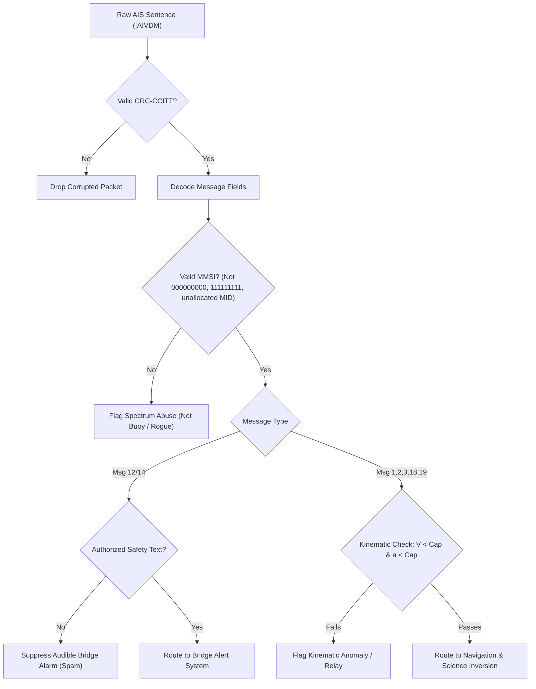

# Chapter 65 — Hacks and unintended uses of AIS

> **Part IX — Security.** Non-standard, scientific, opportunistic, and unauthorized exploitations of the Automatic Identification System, spanning terrestrial radionavigation backups, geophysical sensing, telemetry hacking, pseudo-AIS mobile relays, network text spam, data visualization art, and illegal fishing beacons.

**In this chapter.** You will learn how the Automatic Identification System (**AIS**)—originally conceived as an unauthenticated broadcast VHF data link for collision avoidance and coastal Vessel Traffic Services (**VTS**)—has been adapted across disciplines far beyond its statutory charter. We analyze the physical and algorithmic mechanics of **Ranging Mode** (**R-Mode**) terrestrial positioning, in which synchronized coastal AIS and VHF Data Exchange System (**VDES**) base stations serve as resilient backups during Global Navigation Satellite System (**GNSS**) disruptions. You will examine opportunistic environmental sensing techniques that invert vessel hydrodynamic drift to measure open-ocean tsunami wavefield propagation, surface current vectors, and wave state dynamics. We explore telemetry adaptations using AIS messages on autonomous gliders, research buoys, and iceberg tracking beacons, alongside contentious applications including mobile pseudo-AIS internet relays, Message 12 and 14 safety-text spam, trajectory visualization art, and radio-frequency DXing contests. Finally, we dissect illicit spectrum abuse by uncertified fishing-net buoys, model localized slot starvation, and establish rigorous detection and defensive filtering pipelines.

## 65.1 The malleable VHF Data Link: from safety to signals of opportunity

Recommendation ITU-R M.1371 (2014) defines AIS as a cooperative, unauthenticated, time-division broadcast system on two VHF channels: AIS 1 (161.975 MHz) and AIS 2 (162.025 MHz). The link layer divides each 60-second frame into 2,250 slots per channel, transmitting Gaussian Minimum Shift Keying (**GMSK**) bursts at 9,600 bit/s with High-Level Data Link Control (**HDLC**) framing and a 16-bit Cyclic Redundancy Check (**CRC-CCITT**) ([Chapter 21](ch21-link-layer-tdma.md), [Chapter 28](ch28-rf-encoding-physical-layer.md)).

Mandated under International Maritime Organization (**IMO**) Resolution MSC.74(69) (1998) for ship-to-ship collision avoidance, Vessel Traffic Services (**VTS**), and coastal reporting, the protocol omitted cryptographic authentication, sender verification, and encryption ([Chapter 58](ch58-threat-model.md)). It also provided flexible structures: free-text Safety-Related Messages (Messages 12 and 14), Application-Specific Messages (**ASM**, Messages 6 and 8), and Aids to Navigation reports (Message 21 and single-slot Message 28).

This combination of open access, over-water VHF propagation, and ubiquitous low-cost receivers transformed the VHF Data Link (**VDL**) into a platform for engineering hacks, geophysical instrumentation, artistic visualization, and spectrum abuse:
- **Terrestrial Alternative PNT:** Modulating ranging codes onto synchronized coastal base stations (R-Mode);
- **Opportunistic Geophysical Sensing:** Inverting ship kinematics to measure tsunami wavefields, surface current vectors, and wave state;
- **Ad-hoc Telemetry & Virtual Marking:** Relaying sensor data from ocean gliders, buoys, and temporary regatta marks;
- **Network Hijacking & Spectrum Abuse:** Relaying pseudo-AIS targets from smartphones, transmitting safety-text spam, and deploying uncertified fishing-net buoys.

While scientific and resilience innovations deliver major public benefits, uncoordinated transmissions erode VDL slot capacity and jeopardize safety.

## 65.2 R-Mode: terrestrial radionavigation from AIS and VDES base stations

Heavy reliance on GNSS (GPS, GLONASS, Galileo, BeiDou) leaves shipping vulnerable to jamming and spoofing ([Chapter 62](ch62-gnss-jamming-spoofing.md)). When satellite fixes fail, vessels lose Electronic Position Fixing System (**EPFS**) inputs to Electronic Chart Display and Information Systems (**ECDIS**) and radar, while Class A transponders lose primary time synchronization, drifting to indirect sync (ITU-R M.1371-5 Annex 2 §3.1.1.4).

To address this vulnerability, European authorities designed **Ranging Mode** (**R-Mode**)—a terrestrial, GNSS-independent backup exploiting existing coastal transmitters without new spectrum allocations.

### 65.2.1 Evolution from ACCSEAS to R-Mode Baltic
The conceptual foundation emerged in the EU Interreg IVB **ACCSEAS** project (2012–2015). In *Feasibility Study of R-Mode using AIS Transmissions* (Johnson & Swaszek 2014; ACCSEAS 2014), researchers evaluated shore-based AIS GMSK bursts as signals of opportunity for time-of-arrival (**TOA**) ranging.

ACCSEAS showed that standard 9,600 bit/s GMSK ($BT = 0.4$) exhibited substantial timing jitter and poor correlation properties, bounding ranging accuracy between 50 m and 100 m under realistic signal-to-noise ratios (Šafář et al. 2019). Moreover, sporadic slot transmissions prevented continuous tracking.

Work transitioned to **R-Mode Baltic** (2017–2021) and **R-Mode Baltic 2** (2021–2023), led by the German Aerospace Center (**DLR**) with Swedish, Polish, and industrial partners. The consortium developed a hybrid architecture:
1. **MF R-Mode:** Adding pseudo-random noise (**PRN**) sequences and continuous-wave tones to 283.5–325 kHz maritime DGNSS radiobeacons (Koch & Gewies 2020; Rizzi et al. 2023);
2. **VHF/VDES R-Mode:** Broadcasting synchronized ranging waveforms from coastal VDES base stations under Recommendation ITU-R M.2092 (Wirsing et al. 2023).

```
                      R-Mode Terrestrial Positioning
                                    |
     +------------------------------+------------------------------+
     |                                                             |
[MF Radiobeacon R-Mode]                                  [VHF / VDES R-Mode]
  Carrier: 283.5–325 kHz (MF)                             Carrier: 156–162 MHz (VHF band)
  Range: 150–250 km (groundwave)                          Range: 30–50 km (line-of-sight)
  Accuracy: 10–30 m (day) / ~55 m (night)                 Accuracy: ~10 m (95% circular error)
  Modulation: CW tones / MSK PRN on DGNSS                 Modulation: Multi-carrier spread spectrum
```

### 65.2.2 Signal structure and ranging mechanics
In VHF/VDES R-Mode, coastal base stations are disciplined to atomic time standards (cesium or rubidium clocks, or high-precision terrestrial optical-fiber time transfer networks). Each participating base station transmits a pre-announced, phase-synchronized sequence within assigned TDMA time slots.

A shipboard R-Mode receiver measures the pseudorange $\rho_i$ to base station $i$ located at known Cartesian coordinates $\mathbf{x}_i = (x_i, y_i, z_i)$:

$$\rho_i = c \cdot (\tau_{\text{rx}} - \tau_{\text{tx}, i}) = \|\mathbf{x} - \mathbf{x}_i\| + c \cdot \delta t_{\text{rx}} - c \cdot \delta t_{\text{tx}, i} + \Delta_{\text{tropo}, i} + \epsilon_i$$

where $c$ is the speed of light in vacuum, $\tau_{\text{rx}}$ is signal arrival time recorded by the receiver clock, $\tau_{\text{tx}, i}$ is broadcast time recorded by the transmitter clock, $\mathbf{x} = (x, y, z)$ is the unknown vessel position, $\delta t_{\text{rx}}$ is receiver clock bias, $\delta t_{\text{tx}, i}$ is transmitter clock residual synchronization offset, $\Delta_{\text{tropo}, i}$ is tropospheric propagation delay, and $\epsilon_i$ represents multipath and thermal noise.

Because both receiver clock bias $\delta t_{\text{rx}}$ and spatial coordinates $(x, y)$ are unknown, signals from at least three coastal base stations are required for a 2D horizontal fix, or at least two base stations if operating in Time Difference of Arrival (**TDOA**) hyperbolic multilateration mode.

### 65.2.3 Performance and international standardization
Trials conducted aboard the German research vessel *Deneb* in the southern Baltic Sea confirmed that MF R-Mode delivers horizontal 95% positioning accuracy between 10 m and 30 m under daytime groundwave conditions, degrading to approximately 55 m during nighttime due to ionospheric sky-wave interference (Rizzi et al. 2023). In contrast, VHF/VDES R-Mode—unaffected by ionospheric sky-waves and operating within VHF line-of-sight—achieved horizontal positioning accuracy around 10 m (Gewies et al. 2023; Wirsing et al. 2023).

The International Association of Marine Aids to Navigation and Lighthouse Authorities (**IALA**) formalized this architecture in **IALA Guideline G1158** (*VDES R-Mode*, Edition 2.0, December 2024), standardizing frame allocations, base-station clock synchronization budgets, and receiver performance requirements. In North America, the Radio Technical Commission for Maritime Services (**RTCM**) established Special Committee 138 (**SC 138**, *R-Mode for VDES*) to harmonize transatlantic standards.

## 65.3 AIS as an opportunistic oceanographic and geophysical sensor

Every day, tens of thousands of commercial vessels broadcast their kinematic state every few seconds over the VDL. A Class A position report (Messages 1, 2, and 3) conveys latitude and longitude with $1/10,000$-minute precision ($\approx 0.18\text{ m}$), Speed Over Ground (**SOG**) with 0.1-knot resolution, Course Over Ground (**COG**) with 0.1-degree resolution, and True Heading ($\psi$) with 1-degree resolution from gyrocompasses or transmitting heading devices. Physical oceanographers realized that merchant ships act as massive, free-floating, instrumented Lagrangian drifters.

```
       True Heading (\psi) & Speed Through Water (STW)
             \                       
              \                     
   Ship Hull   \================> Vector V_water
                \                   \
                 \                   \  Surface Current (V_current)
                  \                   \
                   \                   V
                    +---------------------> Course Over Ground (COG) & SOG
                                            (Vector V_ground)
```

### 65.3.1 Inverting surface ocean currents: the eOdyn methodology
When a ship navigates through water, its kinematic velocity vector over ground $\mathbf{V}_{\text{ground}}$ (measured by onboard GNSS) is the vector sum of its hydrodynamic velocity through the water column $\mathbf{V}_{\text{water}}$ and the horizontal ambient sea-surface current vector $\mathbf{V}_{\text{current}}$, perturbed by aerodynamic windage and wave drift forces:

$$\mathbf{V}_{\text{ground}} = \mathbf{V}_{\text{water}} + \mathbf{V}_{\text{current}} + \mathbf{V}_{\text{wind\_drift}} + \mathbf{V}_{\text{wave\_drift}}$$

In 2016, French oceanographic firm **eOdyn**, founded by Yann Guichoux, introduced the "Omni-Situ" methodology for calculating sea surface currents using vessel tracking data (Guichoux, Lennon & Thomas 2016). Guichoux filed patent application **US 2016/0290812 A1** (*Method for calculating the surface speed of at least one vessel and sea current*), establishing a computational framework to invert current fields from AIS streams.

The inversion relies on observing ships undergoing steady transits across localized spatial cells ($5\times 5\text{ km}$ to $20\times 20\text{ km}$). Because commercial vessels maintain relatively constant engine RPM and propeller thrust on open-ocean passages, the vessel's longitudinal speed through the water ($u_{\text{water}}$) remains stable. By observing multiple vessels navigating on intersecting headings, or individual vessels executing course alterations, the coupled kinematic equations can be solved:

$$\begin{aligned}
u_{\text{ground}} &= V_{\text{SOG}} \sin(\theta_{\text{COG}}) = u_{\text{water}} \sin(\psi) + u_{\text{current}} + \Delta u_{\text{leeway}} \\
v_{\text{ground}} &= V_{\text{SOG}} \cos(\theta_{\text{COG}}) = u_{\text{water}} \cos(\psi) + v_{\text{current}} + \Delta v_{\text{leeway}}
\end{aligned}$$

where $(u_{\text{current}}, v_{\text{current}})$ are zonal and meridional components of the ocean surface current, and $\Delta u_{\text{leeway}}, \Delta v_{\text{leeway}}$ are aerodynamic windage forces estimated from meteorological reanalysis models (such as ECMWF ERA5) and vessel superstructure parameters extracted from static AIS Message 5 dimensions. In high-traffic shipping lanes (such as the English Channel or the Strait of Gibraltar), eOdyn demonstrated current vector retrieval accuracy within 0.1 to 0.2 m/s compared against coastal High-Frequency (**HF**) radar and Acoustic Doppler Current Profilers (**ADCP**).

### 65.3.2 Tsunami detection from ship kinematics
In open oceans with depths $h > 1,000\text{ m}$, tsunamis propagate as shallow-water gravity waves at phase speed $c = \sqrt{g h} \approx 200\text{ m/s}$ ($720\text{ km/h}$). While the vertical surface displacement ($\eta$) of a deep-water tsunami is often less than 1 meter—rendering it virtually imperceptible on a ship's bridge—the wave carries a massive horizontal barotropic water particle velocity $u_{\text{tsu}}$:

$$u_{\text{tsu}} = \eta \sqrt{\frac{g}{h}}$$

For a tsunami wave of amplitude $\eta = 0.5\text{ m}$ in depth $h = 2,000\text{ m}$, the horizontal current velocity is approximately $0.035\text{ m/s}$ ($0.07\text{ kn}$). In shallower continental shelf regions ($h = 100\text{ m}$), a 1.0 m tsunami wave induces horizontal currents exceeding $1.0\text{ m/s}$ ($2.0\text{ kn}$).

Inazu, Ikeya, Waseda, Hibiya, and Shigihara (2018) proved that commercial merchant ships tracked by coastal and spaceborne AIS record open-ocean tsunami wavefields in real time. Analyzing high-resolution AIS records from the 11 March 2011 Great East Japan Earthquake ($M_w 9.1$), Inazu et al. extracted high-frequency kinematic perturbations in vessel SOG and COG. Because merchant vessels operate with high vessel inertia and automated autopilot heading control, the impulsive, oscillatory hydrodynamic force of the passing tsunami wavefield imparts a coherent kinematic deflection on the vessel's track.

By applying high-pass filtering (isolating velocity fluctuations in the period band of 5 to 45 minutes) to vessels transiting Sendai Bay, Inazu et al. reconstructed horizontal tsunami current waveforms matching offshore bottom-pressure gauges and hydrodynamic numerical simulations with correlation coefficients $r > 0.85$. This discovery established that global AIS data streams can serve as a distributed, opportunistic tsunami early-warning network, detecting wave pulses 10 to 30 minutes prior to coastal landfall without requiring dedicated seafloor buoys.

### 65.3.3 Sea-level and wave height estimation
Beyond horizontal currents, vertical vessel kinematics and link-layer RF propagation characteristics can serve as proxies for wave state:
- **Heave and Pitch from GNSS Kinematics:** When vessels carry multi-antenna GNSS receivers interfacing with Class A transponders, high-frequency position jitter correlates with the wave spectrum.
- **VHF Ducting as a Meteorological Sensor:** Atmospheric temperature inversions and maritime evaporation ducts trap VHF waves, extending the line-of-sight horizon beyond the nominal $4/3$-Earth radio horizon ($d \approx 4.12(\sqrt{h_1} + \sqrt{h_2})\text{ km}$, [Chapter 27](ch27-rf-basics.md)). Monitoring long-range packet receptions across fixed shore stations (detecting bursts from 200 to 500 nmi) enables tracking of marine boundary layer refractivity.

## 65.4 Telemetry hacking: buoys, ocean gliders, and ad-hoc AtoNs

Because marine VHF transceivers are commercially accessible, low-power, and operate on globally coordinated channels, maritime researchers have adapted AIS into a low-rate telemetry and remote-marking link.

### 65.4.1 Oceanographic gliders and scientific telemetry
Autonomous underwater vehicles (**AUVs**), profiling floats, and wave gliders operate across remote ocean basins for months. While satellite communication systems (such as Iridium Short Burst Data) provide reliable over-the-horizon data links, they consume substantial battery reserves and incur recurring airtime costs.

Oceanographers have integrated miniature Class B or Aids to Navigation (**AtoN**) transceivers into ocean gliders. When surfacing to obtain a GPS fix, the glider broadcasts an AIS Message 18 (Class B position report) or Message 21 (AtoN report), broadcasting its telemetry, battery state, and scientific payloads either encoded within spare bits or packaged into Application-Specific Messages (Message 8). Nearby research vessels, patrol craft, or passing merchant ships ingest these transmissions, alerting surface traffic to avoid colliding with the semi-submerged glider while simultaneously relaying scientific status packets to shore via satellite AIS aggregators.

> **On the wire.** An Aids to Navigation (Message 21) transmission configured for an oceanographic data buoy appears as follows:
> `!AIVDM,1,1,,A,E02:n0299f2:N`>`000000000000,0*1B`
> Decoders unpack:
> - Message Type `21` $\to$ Aids to Navigation Report (272 bits, 2 slots).
> - User ID `993661001` $\to$ US-encoded national AtoN ($99$ prefix, MID $366$).
> - AtoN Type `30` $\to$ Ocean Data Acquisition System (**ODAS**) buoy per IALA Recommendation A-126.
> - Name `ODAS BUOY 4` $\to$ 20 6-bit ASCII characters padded with spaces.
> - Position Accuracy `1` $\to$ Differential GNSS fix ($<10\text{ m}$).
> When rendered on shipboard ECDIS, the unit displays the standard yellow spherical ODAS buoy diamond symbol, warning watchstanders of an anchored environmental monitoring asset.

### 65.4.2 Race marks, regattas, and virtual swimming zones
Sailing regattas and ocean yacht races have widely adopted AIS for course management. Rather than relying on static paper charts or difficult-to-spot inflatable buoys, race committees deploy portable Class B or AtoN transmitters on turning marks.

Furthermore, coastal municipal authorities have utilized **Synthetic** and **Virtual AtoNs** (broadcast via Message 21 or Message 28 from shore-based AIS base stations) to delineate temporary marine zones:
- **Virtual Regatta Boundaries:** Shore stations project virtual polygon waypoints marking race exclusion areas directly onto ship radar and ECDIS displays;
- **Temporary Swim Zones and Marine Sanctuaries:** Delineating bathing beaches or active marine mammal protection sectors ([Chapter 7](ch07-environment-and-science.md)) without deploying physical hardware in the water.

However, the proliferation of temporary and unauthorized virtual AtoNs has introduced chart clutter on commercial bridges, leading to regulatory scrutiny regarding who is legally authorized to project navigational obstructions onto international shipping displays.

## 65.5 Pseudo-AIS internet relays: the app controversy

The proliferation of mobile smartphones equipped with GPS receivers, cellular transceivers, and high-resolution chart applications (such as Boat Beacon, MarineTraffic, VesselFinder, and Navionics) created an unintended operational bypass: **pseudo-AIS internet relays**.

### 65.5.1 The architecture of internet-relayed targets
A recreational boater or kayaker lacking a hardware marine VHF transponder runs a smartphone tracking application. The application reads the phone's internal GNSS position, speed, and heading, encapsulating telemetry into an IP payload transmitted over 4G/5G cellular data links to a central cloud server.

The cloud server translates the vessel's coordinates into synthetic NMEA 0183 `!AIVDM` sentences, injecting the pseudo-target into commercial aggregator feeds. Crucially, applications such as Boat Beacon market reciprocal collision warnings: the smartphone downloads surrounding AIS targets from the cloud server and displays them on the user's screen, while simultaneously broadcasting the smartphone's position to other app users.

```
                      The Mobile Pseudo-AIS Pipeline
                                    |
[Mobile Phone on Boat]              |             [Commercial Merchant Ship]
  Internal GPS fix                  |               Hardware Class A Transponder
  Transmits IP packet via Cellular  |               Listens ONLY to 161.975/162.025 MHz
        |                           |                     ^
        V                           |                     | (VHF Radio Blindness!)
[Cloud Aggregator Server]           |                     |
  Translates IP -> NMEA !AIVDM      |           +-----------------------+
  Injects into Internet Map Feeds   |           | Marine VHF Data Link  |
        |                           |           +-----------------------+
        V                           |                     ^
[Web Browsers & Mobile Apps]        |                     |
  Displays "vessel" to phone users  |                     |
  (NOT received by ship radar/ECDIS)----------------------+
```

### 65.5.2 Operational hazards and bridge blindness
While developers promote pseudo-AIS apps as affordable safety innovations for small craft, professional mariners and maritime administrations strongly condemn them when marketed as collision-avoidance tools:
1. **The VHF Gap (Bridge Blindness):** Merchant ships navigate using dedicated marine VHF Class A transponders connected directly to Type-Approved ARPA radar and ECDIS consoles. Commercial vessels do not navigate using consumer internet map feeds. A small boat relying on a smartphone app is completely invisible to shipboard radar and Class A transponders.
2. **Cellular Latency and Packet Dropout:** Marine VHF broadcasts travel at the speed of light with deterministically scheduled TDMA transmission intervals (every 2 to 10 seconds for moving vessels). In contrast, cellular IP links exhibit variable latency ranging from 5 seconds to several minutes, accompanied by total packet dropout when craft transit outside coastal base-station coverage. A fast container ship transiting at 24 knots covers 740 meters in one minute; stale internet data creates extreme collision risk.
3. **Ghost Duplication:** If a vessel carries a real Class B transponder while the crew simultaneously operates an internet tracking app, aggregators often instantiate two separate targets with slight coordinate and timing offsets, confusing shore observers and coastal VTS operators.

Consequently, national coast guards and safety agencies mandate that mobile phone apps must never be used or relied upon for collision avoidance under the International Regulations for Preventing Collisions at Sea (**COLREGs** Rule 5 and Rule 7).

## 65.6 Safety-text abuse: Message 12 and 14 spam, prayer, and political messaging

Recommendation ITU-R M.1371 defines two message types dedicated to exchanging text:
- **Message 12 (Addressed Safety-Related Message):** Point-to-point text transmitted to a specific 30-bit MMSI (up to 936 data bits across 3 slots);
- **Message 14 (Broadcast Safety-Related Message):** Cleartext broadcast delivered to all stations in the VHF radio cell (up to 968 data bits across 3 slots).

Both message types encode text using 6-bit uppercase ASCII (6 bits per character, supporting characters `0x20` space through `0x5F` underscore, [Chapter 22](ch22-message-catalog.md)). When an AIS transponder receives a Message 14 burst, IEC 61993-2 mandates that the Minimum Keyboard and Display (**MKD**) trigger an immediate audible or visual alert, displaying the text on the bridge to notify the watchstander of immediate hazards (such as drifting navigation buoys, distress alerts, or military firing exercises).

> **Threat model.** Unintended and malicious exploitation of AIS text messages.
> - **Attacker / Vector:** Rogues, coastal pranksters, political activists, or religious evangelists utilizing software-defined radios (**SDRs**) or hacked transponders to inject Message 14 broadcasts.
> - **Capability:** Injecting arbitrary 6-bit ASCII text packets over maritime VHF channels with high RF output power (12.5 W or amplified) from shore vantage points.
> - **Impact:** Triggering disruptive bridge audible alarms, causing watchstander alert fatigue, occluding electronic navigation displays, and spreading disinformation during maritime search-and-rescue operations.
> - **Mitigation:** Protocol-level text rate limiting in ECDIS software; filtering unverified coastal shore origins; blacklisting non-maritime character sequences; enforcing cryptographic authentication in next-generation VDES networks.

In practice, this safety alert mechanism has been repeatedly hijacked for non-safety communications, religious proselytizing, political posturing, and outright spam:
- **Religious Proselytizing:** In several high-traffic waterways (such as the English Channel and the Malacca Strait), coastal shore stations and anchored vessels have broadcast religious messages (e.g., `"REPENT AND BELIEVE"`, `"JESUS SAVES ALL MARINERS"`) formatted as Message 14 safety broadcasts.
- **Political Slogans and Geopolitical Trolling:** During regional conflicts in the Black Sea, eastern Mediterranean, and Persian Gulf, transmitters have broadcast political slogans, military threats, or taunts directed at rival naval forces over Message 12 and 14.
- **Commercial Solicitation and Chat:** Harbor service vendors (bunkering agents, water taxis, ship chandlers) frequently abuse Message 12 to hail incoming vessels, treating the safety text channel as an ad-hoc SMS messaging service.

Because bridge displays must visually flag safety-related messages, unsolicited text spam forces watchstanders to silence annoying bridge alarms manually. In severe cases, crews disable audible text alerts entirely—creating catastrophic risk that genuine distress messages (such as an AIS-SART or MOB beacon broadcasting `"SART ACTIVE"` or `"MOB ACTIVE"` via Message 14) will be overlooked.

> **On the wire.** An unauthorized broadcast safety-related text message transmitting religious spam:
> `!AIVDM,1,1,,A,>1b4N?A185V0Hu:10D4<D,2*19`
> Bit decoding:
> - Bits 0–5: Message Type `14` (`001110`$_2$).
> - Bits 6–7: Repeat Indicator `0`.
> - Bits 8–37: Source MMSI `111222333` (a fabricated, unassigned identifier).
> - Bits 38–39: Spare bits `00`$_2$.
> - Bits 40–123: 84 bits representing 14 6-bit ASCII characters:
>   `100000 010010 000001 011001 100000 000110 001111 010010 100000 010000 000101 000001 000011 000101`
>   $\to$ `"PRAY FOR PEACE"`
> This transmission occupies valuable TDMA slot capacity and triggers safety-alert annunciators across every ECDIS console within line-of-sight.

## 65.7 AIS data visualization, art, and long-distance DX contests

The global availability of unencrypted, crowdsourced AIS data feeds has inspired innovative cultural, artistic, and hobbyist subcultures.

### 65.7.1 AIS cartography as art
Because AIS captures human maritime movement at continental scales, data artists and cartographers transform vessel trajectory logs into striking visual works:
- **"All the Ships" (2013):** Presented at the Google I/O developer conference in 2013, researchers demonstrated large-scale geospatial analytics and cloud rendering of global shipping movements, visualizing intricate marine highways, anchorage holding patterns, and canal choke points.
- **Temporal Trajectory Art and Blender Renders:** Digital artists ingest historical AIS Parquet datasets, loading cleaned vessel tracks into 3D rendering suites (such as Blender, CesiumJS, and Kepler.gl). By mapping vessel speed to color gradients and extruding ship trajectories across time, visualizations expose the rhythmic pulse of global trade, fisheries clustering around oceanic fronts, and illicit "dark fleet" rendezvous ([Chapter 6](ch06-fisheries-iuu-dark-fleets.md)).
- **GPS Drawing at Sea:** Ship masters maneuvering large commercial vessels or tugboats have occasionally traced deliberate geometric figures, text, or holiday greetings in coastal bays during sea trials or holding patterns—visible only on public ship-tracking websites.

### 65.7.2 Long-distance reception contests (AIS DXing)
Amateur radio enthusiasts operate an active subculture known as **AIS DXing**—the pursuit of receiving VHF AIS signals over extreme distances far exceeding normal line-of-sight propagation.

Under standard atmospheric refraction (the $4/3$-Earth model), a coastal VHF antenna at 30 m height communicating with a ship masthead antenna at 15 m achieves a maximum radio horizon of approximately 24 nautical miles (44 km). However, under specific tropospheric ducting conditions (such as high-pressure summer temperature inversions over cold sea water), VHF signals travel through atmospheric waveguides over hundreds or thousands of kilometers.

Amateur DXers deploy high-gain collinear antennas, ultra-low-noise preamplifiers (**LNAs**), and Software-Defined Radios (**SDRs** like RTL-SDR, Airspy, or HackRF), logging confirmed single-hop receptions exceeding 800 nautical miles (1,500 km)—such as coastal UK receivers logging vessel bursts from the coast of Spain or northwest Africa. Enthusiasts log these events on specialized DX cluster platforms, competing for record distance verifications.

## 65.8 Spectrum abuse: fishing-net buoys and illegal transponders

The most pervasive and operationally damaging hack of the AIS system is the global proliferation of unauthorized **AIS fishing-net buoys** (frequently designated "net markers" or "longline beacons").

```
             The AIS Spectrum Abuse Problem: Net Buoys
                                   |
    +------------------------------+------------------------------+
    |                                                             |
[Certified AMRD Group B]                                 [Illegal Clone Net Buoys]
  Channel: 2006 (160.900 MHz)                             Channel: AIS 1 / AIS 2 (161.975/162.025 MHz)
  Protocol: ITU-R M.2135 / IEC 63287                      Protocol: Fake Class A/B Message 1 or 21
  MMSI Prefix: 979XXXXXX                                  MMSI: Bogus 9-digit (000000000, 111111111...)
  Transmit Power: <= 1 W e.i.r.p.                         Transmit Power: 5 W to 12 W
  Bridge Impact: Invisible to ECDIS navigation            Bridge Impact: Severe screen clutter, TDMA slot
                 (unless specifically filtered)           starvation, false collision alarms
```

### 65.8.1 The economic driver and mechanical hack
Commercial fishing vessels deploying drift nets, purse seines, or longlines spanning 10 to 50 nautical miles must track gear in rough seas. Historically, fishers deployed medium-frequency (2 MHz) direction-finding beacons or satellite transponders.

Starting around 2012, East Asian manufacturers introduced low-cost spar buoys with miniature VHF transceivers. Instead of using dedicated gear frequencies, they programmed devices to broadcast standard AIS **Message 1** or **Message 21** reports directly on distress and safety channels AIS 1 and AIS 2. Priced at $50 to $150 USD, millions entered service, hardcoded with bogus 9-digit MMSIs (`000000000`, `111111111`, `123456789`).

### 65.8.2 Operational impacts: slot starvation and bridge clutter
The impact on maritime safety is severe:
1. **TDMA Slot Starvation:** Unlike certified Class B units using Carrier-Sense TDMA (**CSTDMA**), cheap net buoys transmit autonomously using fixed slot intervals (FATDMA or unsynchronized bursts). In dense fishing grounds (East China Sea, South China Sea, Malacca Strait, coastal Peru), hundreds of buoys saturate the VDL, causing merchant ship reports to collide and drop ([Chapter 30](ch30-network-loading-packet-loss.md)).
2. **ECDIS Target Saturation:** Merchant bridges encounter hundreds of phantom "vessel" triangles and AtoN markers. Tracks merge, displays lag, and collision-alarm processors trigger continuous alarm storms. Watchstanders, unable to distinguish a drift net from a bulk carrier, mute alarms, compromising collision avoidance.

> **Legal note.** Regulatory enforcement against unauthorized maritime transmitters.
> In the United States, operating non-certified transmitters on maritime safety frequencies violates the Communications Act of 1934 (47 U.S.C. § 301) and Federal Communications Commission (**FCC**) regulations under 47 CFR Part 80.
> On 28 November 2018, the FCC Enforcement Bureau issued a formal Enforcement Advisory (*Marketing, Sale, and Use of Noncompliant Fishing Net Buoys is Illegal*, Enforcement Advisory No. DA 18-1210). The FCC warned that devices operating on AIS channels 161.975 MHz and 162.025 MHz are authorized strictly for certified shipborne Class A/B stations, AIS-SARTs, and Maritime Survivor Locating Devices. Marketing or using non-compliant fishing net buoys carries statutory civil penalties up to $19,639 per day per violation, up to a maximum statutory forfeiture of $147,290 for a continuing violation, plus potential criminal seizure of radio equipment.
> Internationally, ITU Radio Regulations Article 19 strictly reserves AIS frequencies for safety of navigation. To provide a lawful alternative, the World Radiocommunication Conference 2019 (**WRC-19**) approved Resolution 362 and updated Recommendation ITU-R M.2135, creating **Autonomous Maritime Radio Devices** (**AMRD** Group B). Under this framework, authorized fishing gear markers must transmit exclusively on maritime VHF Channel 2006 (160.900 MHz) with $\le 1\text{ W}$ e.i.r.p., utilizing freeform identities prefixed with `979` to segregate gear tracking completely from navigation safety channels.

## Then & now

- **1998** ⟨+⟩ — IMO adopts Resolution MSC.74(69), formalizing operational requirements for AIS as a safety broadcast link for collision avoidance and VTS.
- **2002** ⟨H⟩ — Kurt Schwehr and coastal hydrographers begin testing environmental and oceanographic data payloads over AIS binary messages.
- **2007** ⟨+⟩ — Schwehr & McGillivary demonstrate oil spill tracking and oceanographic plume modeling using AIS Application-Specific Messages at IEEE OCEANS (Schwehr & McGillivary 2007).
- **2008** ⟨+⟩ — US Coast Guard Research and Development Center launches the "AIS Transmit Project" in Tampa Bay, broadcasting NOAA PORTS environmental telemetry over AIS Message 8.
- **2011** ⟨+⟩ — The Great East Japan Earthquake ($M_w 9.1$) triggers an open-ocean tsunami whose hydrodynamic currents are inadvertently recorded by commercial vessel AIS streams (Inazu et al. 2018).
- **2012** ⟨H⟩ — Low-cost autonomous AIS fishing-net buoys enter commercial production in East Asia, initiating widespread VDL spectrum congestion.
- **2013** ⟨H⟩ — "All the Ships" Google I/O demonstration showcases global AIS big-data processing and cloud-scale trajectory visualization.
- **2014** ⟨+⟩ — The EU ACCSEAS project publishes its landmark feasibility study demonstrating terrestrial R-Mode positioning using AIS base stations (Johnson & Swaszek 2014).
- **2016** ⟨+⟩ — Oceanographic startup eOdyn introduces the "Omni-Situ" method, mathematically inverting 2D surface current vectors from merchant vessel drift (Guichoux, Lennon & Thomas 2016).
- **2017** ⟨+⟩ — DLR, Sweden, and regional partners launch the R-Mode Baltic testbed, retrofitting coastal radiobeacons and AIS/VDES stations for GNSS-independent positioning.
- **2018** ⟨+⟩ — The US FCC Enforcement Bureau issues Enforcement Advisory DA 18-1210, declaring the marketing and operation of non-certified AIS fishing-net buoys illegal under federal law.
- **2019** ⟨+⟩ — ITU WRC-19 adopts Resolution 362 and establishes Channel 2006 (160.900 MHz) as the dedicated international frequency for AMRD Group B fishing gear markers, banishing net buoys from AIS 1 and AIS 2.
- **2024** ⟨+⟩ — IALA publishes Guideline G1158 (Edition 2.0) defining international implementation standards for VDES R-Mode terrestrial positioning.
- **2026** ⟨+⟩ — ITU-R formally approves Recommendation M.1371-6, integrating single-slot AtoN Message 28 and dedicated AMRD message identifiers 60–63.

## On the wire

Non-standard and unintended applications manifest on the wire through distinctive bit structures, message types, and timing cadences.

### 65.9.1 Illicit fishing-net buoy position burst
An unauthorized fishing-net buoy transmitting a fraudulent Class A position report (Message 1) presents the following NMEA 0183 sentence:

`!AIVDM,1,1,,B,1000000000000000000000000000,0*25`

Decoding the 168-bit payload reveals the signature of an uncertified microcontroller:
- **Message Type:** Bits 0–5 = `000001`$_2$ (Message 1: Position Report Class A).
- **Repeat Indicator:** Bits 6–7 = `00`$_2$.
- **MMSI (User ID):** Bits 8–37 = `000000000` (unassigned, invalid).
- **Navigational Status:** Bits 38–41 = `0000`$_2$ (`0` = Under way using engine, physically false for a drifting spar buoy).
- **Rate of Turn (ROT):** Bits 42–49 = `10000000`$_2$ (`-128` = not available).
- **Speed Over Ground (SOG):** Bits 50–59 = `0000000000`$_2$ (`0.0 kn`).
- **Position Accuracy:** Bit 60 = `0` (unaugmented GNSS).
- **Longitude & Latitude:** Bits 61–115 encode geographic coordinates with high decimal noise.
- **Course Over Ground (COG):** Bits 116–127 = `111111111111`$_2$ (`3600` = not available).
- **True Heading:** Bits 128–136 = `111111111`$_2$ (`511` = not available).
- **Time Stamp:** Bits 137–142 = `111100`$_2$ (`60` = not available / default).
- **Communication State:** Bits 149–167 contain hardcoded, non-cycling SOTDMA bits, failing to negotiate proper slot reservations.

### 65.9.2 Freeform safety-text spam
A broadcast Message 14 sentence containing unauthorized text:

`!AIVDM,1,1,,A,>1mg=5@l5T@5V1@E=@,2*0E`

- **Message Type:** Bits 0–5 = `001110`$_2$ (Message 14).
- **User ID:** Bits 8–37 = `123456789`.
- **Text Payload:** Encodes 11 6-bit ASCII characters: `"MAYDAY TEST"`. Transmitted on international safety channels, this message triggers audible bridge alarms on commercial ECDIS equipment, in direct violation of SOLAS and ITU regulations.

## Validation, uncertainty & data quality

Ingesting global AIS data streams for operational navigation, scientific research, or maritime surveillance requires automated validation pipelines to filter out hacks, pseudo-relays, and spectrum pollution.

### 65.10.1 Multi-stage anomaly detection procedure
Data processing architectures must implement a four-tier filtering pipeline:
1. **MMSI Structural and Range Validation:**
   - Filter unallocated MIDs, repeated-digit strings (`000000000`, `111111111`, `123456789`), and internal software test identifiers (`1193046`).
   - Flag non-standard prefix usage: for instance, standard Class A position reports (Messages 1–3) originating from `99...` (AtoN) or `970...`/`972...`/`974...` (search-and-rescue burst transmitters).
2. **Kinematic Plausibility Screening:**
   - Compute implied velocity $V_{\text{implied}} = \Delta d / \Delta t$ between consecutive fixes. For commercial merchant hulls, cap speeds at 45 knots; for high-speed craft, cap at 60 knots.
   - Compute implied acceleration $a = \Delta V / \Delta t$ (cap at $2.5\text{ m/s}^2$).
   - Flag "teleportation" anomalies where $\Delta d > 1.0\text{ nmi}$ over $\Delta t < 60\text{ s}$.
3. **Sensor Completeness and Gyro Heading Availability:**
   - For oceanographic current or tsunami inversions, true heading $\psi$ is strictly required. Reject records where $\psi = 511$ ("not available").
   - Filter records where SOG $= 102.3\text{ kn}$ or COG $= 360.0^\circ$.
4. **RF and Receiver Footprint Plausibility:**
   - Calculate distance from the receiving station to the reported vessel coordinate: $d_{\text{rx}} = \text{haversine}(\text{lat}_{\text{fix}}, \text{lon}_{\text{fix}}, \text{lat}_{\text{rx}}, \text{lon}_{\text{rx}})$.
   - For terrestrial coastal receivers, flag records where $d_{\text{rx}} > 60\text{ nmi}$ unless verified by anomalous propagation (tropospheric ducting) indices.



### 65.10.2 Worked example: classifying fishing net buoys vs. merchant vessels
Consider an automated coastal receiver station at $42.0^\circ\text{ N}, 070.0^\circ\text{ W}$ logging two consecutive AIS targets:

```
Target A: MMSI 123456789, Msg 1, SOG = 0.8 kn, COG = 180.0, Heading = 511, NavStatus = 0, Rate of Turn = -128
          Fix 1: t = 00:00:00, 42.1000 N, 070.0500 W
          Fix 2: t = 00:05:00, 42.1001 N, 070.0501 W

Target B: MMSI 477123400, Msg 1, SOG = 18.2 kn, COG = 095.4, Heading = 096, NavStatus = 0, Rate of Turn = 0
          Fix 1: t = 00:00:00, 42.1000 N, 070.0500 W
          Fix 2: t = 00:00:10, 42.1000 N, 070.0487 W
```

*Classification Analysis:*
1. **Target A Evaluation:**
   - MMSI `123456789` fails the ITU allocation check (sequential test string).
   - Heading is `511` (sensor unavailable). Rate of Turn is `-128` (unavailable).
   - In 300 seconds, the target moved:
     $$\Delta \text{lat} = 0.0001^\circ \approx 11.1\text{ m}, \quad \Delta \text{lon} = 0.0001^\circ \times \cos(42.1^\circ) \approx 8.2\text{ m}$$
     $$\Delta d = \sqrt{11.1^2 + 8.2^2} \approx 13.8\text{ m}$$
     $$V_{\text{implied}} = \frac{13.8\text{ m}}{300\text{ s}} = 0.046\text{ m/s} \approx 0.09\text{ kn}$$
   - Target A reports SOG $= 0.8\text{ kn}$ while drift velocity is $0.09\text{ kn}$, with missing gyro heading and an illegal MMSI. *Classification:* **Illicit fishing-net buoy**.
2. **Target B Evaluation:**
   - MMSI `477123400` is a valid Hong Kong flag commercial vessel (MID $477$).
   - Heading ($096^\circ$) closely matches COG ($095.4^\circ$).
   - In 10 seconds, distance traveled is $93.6\text{ m}$:
     $$V_{\text{implied}} = \frac{93.6\text{ m}}{10\text{ s}} = 9.36\text{ m/s} = 18.2\text{ kn}$$
   - Implied velocity matches reported SOG exactly ($18.2\text{ kn}$). *Classification:* **Legitimate commercial merchant ship**.

> **Try it.** The following Python snippet detects illicit net buoys and text spam from an NMEA log:
> ```python
> import re
> 
> def triage_ais_line(nmea_sentence: str):
>     if nmea_sentence.startswith("!AIVDM") and ",>1" in nmea_sentence:
>         return "FLAG_MESSAGE_14_TEXT_ALERT"
>     if re.search(r",10000000000000000000", nmea_sentence):
>         return "FLAG_ILLEGAL_NET_BUOY_ZERO_MMSI"
>     return "NORMAL_TRAFFIC"
> 
> line_spam = "!AIVDM,1,1,,A,>1mg=5@l5T@5V1@E=@,2*0E"
> line_buoy = "!AIVDM,1,1,,B,1000000000000000000000000000,0*25"
> print("Line 1:", triage_ais_line(line_spam))
> print("Line 2:", triage_ais_line(line_buoy))
> ```
> Expected output:
> ```
> Line 1: FLAG_MESSAGE_14_TEXT_ALERT
> Line 2: FLAG_ILLEGAL_NET_BUOY_ZERO_MMSI
> ```

## Software

**Open source:**
- **pyais** (Python; MIT Licence): Fast pure-Python AIS sentence decoder and serializer supporting all ITU-R M.1371 messages, Application-Specific Messages, and NMEA encapsulation. *Caveat:* Multi-sentence reassembly requires strict buffering; malformed text frames can raise exceptions if not wrapped in error handlers.
- **libais** (C++ with Python bindings; Apache 2.0 Licence): High-performance decoding library originally created by Kurt Schwehr for the Deepwater Horizon oil spill response; provides robust bitfield extraction for standard and binary messages. *Caveat:* Does not serialize or generate NMEA sentences; focuses exclusively on decoding.
- **gpsd** (C; BSD Licence): Pervasive GPS/AIS receiver daemon translating serial and TCP streams into structured JSON. *Caveat:* Ingests internet and mobile pseudo-AIS relays uncritically unless client software enforces kinematic filtering.

**Free but closed:**
- **OpenCPN AIS Radar View** (GPL / community closed plugins): Recreational chartplotting radar overlay that visualizes surrounding AIS targets and sounds CPA/TCPA collision alarms. *Caveat:* Prone to alarm fatigue when exposed to uncertified fishing-net buoy clusters.

**Commercial:**
- **eOdyn Omni-Situ** (Commercial cloud service; eOdyn): Proprietary oceanographic platform that ingests global satellite and terrestrial AIS data, inverting commercial merchant ship drift to output real-time 2D ocean surface current vectors and wave data. *Caveat:* Closed-source proprietary inversion models; requires commercial licensing.
- **Spire Maritime / Kpler / Windward** (Commercial data services): Enterprise tracking platforms that filter and flag illicit dark-fleet operations, MMSI spoofing, and fishing-gear clutter across spaceborne feeds. *Caveat:* High commercial subscription fees; proprietary anomaly scoring models.

## Standards & guides

- **International Telecommunication Union (2014):** *Recommendation ITU-R M.1371-5 — Technical characteristics for an automatic identification system using time division multiple access in the VHF maritime mobile frequency band*. Governs VDL TDMA timing, message architectures, and modulation.
- **International Telecommunication Union (2026):** *Recommendation ITU-R M.1371-6 — Technical characteristics for an automatic identification system using time division multiple access in the VHF maritime mobile frequency band*. Formally standardizes single-slot AtoN Message 28 and dedicated AMRD message identifiers 60–63.
- **International Telecommunication Union (2019):** *Recommendation ITU-R M.2135-1 — Technical characteristics of autonomous maritime radio devices operating in the frequency band 156–162.05 MHz*. Governs AMRD Group B devices operating on Channel 2006 (160.900 MHz).
- **International Telecommunication Union (2015):** *Recommendation ITU-R M.2092-0 — Technical characteristics for a VHF data exchange system in the VHF maritime mobile band*. Defines physical and link layers for VDES and VDES R-Mode.
- **International Association of Marine Aids to Navigation and Lighthouse Authorities (2024):** *IALA Guideline G1158 — VDES R-Mode* (Edition 2.0). Governs base-station clock synchronization, signal architecture, and performance standards for terrestrial radionavigation backups.
- **International Electrotechnical Commission (2014):** *IEC 61993-2 — Maritime navigation and radiocommunication equipment and systems — Automatic Identification Systems (AIS) — Part 2: Class A shipborne equipment*. Specifies operational requirements and alarm annunciation for Safety-Related Messages.
- **Federal Communications Commission (2018):** *FCC Enforcement Advisory: Marketing, Sale, and Use of Noncompliant Fishing Net Buoys is Illegal* (Enforcement Advisory No. DA 18-1210). Reaffirms statutory bans and forfeiture exposure for uncertified AIS beacons in US waters.
- **International Maritime Organization (1998):** *Resolution MSC.74(69), Annex 3 — Recommendation on Performance Standards for a Universal Automatic Identification System (AIS)*. Establishes the foundational international carriage requirements and operational scope for AIS.

## Pitfalls

1. **Relying on mobile phone tracking apps for collision avoidance** → Smartphone apps operate over cellular networks with multi-minute latency and total dropout offshore; commercial ships do not see internet targets → Never navigate or assess risk of collision using mobile tracking apps; comply strictly with COLREGs Rule 5.
2. **Treating AIS fishing-net buoys as genuine navigational targets** → Uncertified net buoys clutter ECDIS consoles with fake Class A/B triangles and bogus MMSIs → Implement automated filter rules flagging invalid MMSI patterns (`000000000`, `111111111`) and zero-speed drifting targets.
3. **Muting bridge alarms due to Message 14 safety-text spam** → Watchstanders exhausted by religious or commercial text spam silence MKD audible alarms → Never globally disable safety-related alerts; configure software to filter non-emergency strings while preserving critical `"SART ACTIVE"` alerts.
4. **Attempting oceanographic current inversion without true gyro heading** → SOG and COG alone cannot distinguish ship maneuvering from ocean current drift → Discard records where True Heading is `511` or when the vessel executes rudder maneuvers ($|\text{ROT}| > 0$).
5. **Ignoring aerodynamic wind leeway in drift calculations** → Assuming vessel drift over ground is caused solely by sea-surface currents yields massive errors during gale-force winds → Incorporate meteorological windage models and vessel superstructure dimensions into hydrodynamic inversion pipelines.
6. **Assuming coastal AIS range is strictly limited to 25 nautical miles** → Tropospheric ducting under atmospheric temperature inversions extends VHF propagation to hundreds of miles → Verify receiver site elevation and local refractivity profiles before classifying long-distance receptions as spoofed packets.
7. **Assuming R-Mode is available from any standard AIS base station** → Legacy AIS base stations transmit unsynchronized, bursty GMSK signals with high timing jitter → R-Mode requires upgraded coastal base stations equipped with atomic clocks and VDES multi-carrier ranging modulators.
8. **Deploying ad-hoc virtual AtoNs without regulatory authorization** → Enthusiasts and race committees broadcasting unauthorized Message 21 waypoints cause dangerous chart clutter → Delineate virtual navigation marks exclusively through competent national hydrographic authorities.
9. **Confusing AMRD Group A and Group B devices** → Group A devices (lifejacket MOB beacons) transmit safety signals on AIS 1 and AIS 2; Group B devices (fishing gear markers) are legally restricted to Channel 2006 → Verify device frequency certification before deploying marine tracking equipment.
10. **Inverting tsunami wavefields from vessels in shallow harbors** → Shallow bathymetry and complex coastal reflections induce non-linear hydrodynamic turbulence → Restrict tsunami current inversions to vessels operating in open continental-shelf or deep-water transits.

## Key takeaways

- AIS is an open, unauthenticated, broadcast VHF system whose technical parameters have been widely adapted beyond its original collision-avoidance mandate.
- Terrestrial R-Mode modulates synchronized ranging signals onto coastal MF radiobeacons and VHF/VDES base stations, providing a resilient GNSS-independent positioning backup achieving 10 to 30 m accuracy.
- Physical oceanographers invert merchant ship drift kinematics to measure open-ocean tsunami wavefields and sea-surface current vectors without dedicated oceanographic moorings.
- Autonomous ocean gliders, research buoys, and yacht regattas exploit AIS messages for low-cost telemetry and dynamic boundary marking.
- Mobile phone tracking apps relay pseudo-AIS data over cellular internet, creating severe hazards when recreational boaters mistakenly assume commercial ships see them.
- Free-text Message 12 and 14 broadcasts are frequently abused for ideological spam and commercial solicitation, causing hazardous bridge alert fatigue.
- Uncertified AIS fishing-net buoys flooding maritime channels with bogus MMSIs cause severe TDMA slot starvation and dangerous bridge display clutter.
- International regulators have responded by banning non-compliant net buoys, reserving AIS 1 and AIS 2 for navigation safety, and establishing Channel 2006 for Autonomous Maritime Radio Devices.

## References

1. ACCSEAS (2014). *Feasibility Study of R-Mode Using AIS Transmissions: Part 1 -- Concept Evaluation and Performance Bounds* (Report Issue 1.0 Final). Hamburg: ACCSEAS Project.
2. Federal Communications Commission (2018). *FCC Enforcement Advisory: Marketing, Sale, and Use of Noncompliant Fishing Net Buoys is Illegal*. Enforcement Advisory No. DA 18-1210. Washington, DC: FCC Enforcement Bureau.
3. Gewies, S., Rizzi, F. G., Grundhöfer, L., Hoppe, M. & Bäckstedt, J. (2023). R-Mode -- Terrestrial Navigation for Maritime Users. In *Proceedings of the 36th International Technical Meeting of the Satellite Division of the Institute of Navigation (ION GNSS+ 2023)*, pages 3125–3134. Denver: Institute of Navigation.
4. Guichoux, Y., Lennon, M. & Thomas, N. (2016). Sea surface currents calculation using vessel tracking data. In *Proceedings of the Maritime Knowledge Discovery and Anomaly Detection Workshop*, pages 45–48. Ispra: Joint Research Centre, European Commission.
5. Inazu, D., Ikeya, T., Waseda, T., Hibiya, T. & Shigihara, Y. (2018). Measuring offshore tsunami currents using ship navigation records. *Progress in Earth and Planetary Science*, 5(1):38. doi:10.1186/s40645-018-0194-5
6. International Association of Marine Aids to Navigation and Lighthouse Authorities (2024). *IALA Guideline G1158 on VDES R-Mode*. Edition 2.0. Saint-Germain-en-Laye: IALA.
7. International Electrotechnical Commission (2014). *IEC 61993-2 — Maritime navigation and radiocommunication equipment and systems — Automatic Identification Systems (AIS) — Part 2: Class A shipborne equipment*. Geneva: IEC.
8. International Maritime Organization (1998). *Recommendation on Performance Standards for a Universal Automatic Identification System (AIS)* (Resolution MSC.74(69), Annex 3). London: IMO.
9. International Telecommunication Union (2014). *Recommendation ITU-R M.1371-5: Technical characteristics for an automatic identification system using time division multiple access in the VHF maritime mobile frequency band*. Geneva: ITU.
10. International Telecommunication Union (2015). *Recommendation ITU-R M.2092-0: Technical characteristics for a VHF data exchange system in the VHF maritime mobile band*. Geneva: ITU.
11. International Telecommunication Union (2019). *Recommendation ITU-R M.2135-1: Technical characteristics of autonomous maritime radio devices operating in the frequency band 156-162.05 MHz*. Geneva: ITU.
12. International Telecommunication Union (2026). *Recommendation ITU-R M.1371-6: Technical characteristics for an automatic identification system using time division multiple access in the VHF maritime mobile frequency band*. Geneva: ITU.
13. Johnson, G. W. & Swaszek, P. F. (2014). *Feasibility Study of R-Mode using AIS Transmissions* (Technical Report for WSV Northern Region). ACCSEAS Project.
14. Koch, V. & Gewies, S. (2020). Worldwide Availability of Maritime Medium-Frequency Radio Infrastructure for R-Mode-Supported Navigation. *Journal of Marine Science and Engineering*, 8(3):209. doi:10.3390/jmse8030209
15. Rizzi, M., Grundhöfer, L., Gewies, S. & Ehlers, F. (2023). Performance Evaluation of Medium-Frequency R-Mode in the Baltic Sea. *Applied Sciences*, 13(3):1872. doi:10.3390/app13031872
16. Šafář, J., Grant, A., Williams, P. & Ward, N. (2019). Performance Bounds for VDES R-Mode. *The Journal of Navigation*, 73(1):103–118. doi:10.1017/S0373463319000559
17. Schwehr, K. & McGillivary, P. (2007). Marine Ship Automatic Identification System (AIS) for Enhanced Coastal Security Capabilities: An Oil Spill Tracking Application. In *Proceedings of the MTS/IEEE OCEANS 2007 Conference*, pages 1–7. Vancouver: IEEE.
18. Wirsing, M., Dammann, A. & Raulefs, R. (2023). Direct Position Estimation for VDES R-Mode. In *Proceedings of the 2023 IEEE/ION Position, Location and Navigation Symposium (PLANS)*, pages 724–728. Monterey: IEEE/ION. doi:10.1109/PLANS53410.2023.10140053
