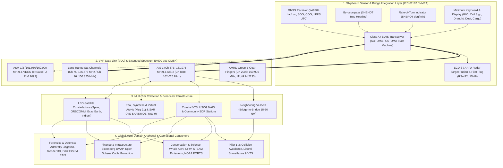
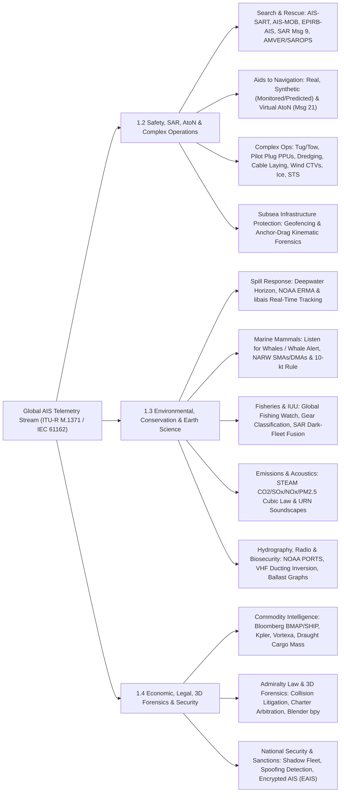

# Chapter 1: Introduction to AIS and the Taxonomy of All AIS Uses

> **Purpose:** The **Automatic Identification System (AIS)** was engineered in the late 1980s and 1990s as a line-of-sight VHF radio navigation aid with three strictly bounded objectives: ship-to-ship collision avoidance, littoral state hazardous-cargo monitoring, and Vessel Traffic Services (VTS) traffic management. Over the ensuing three decades, the unencrypted, self-organizing broadcast architecture of AIS transformed it into the primary telemetry backbone of global Maritime Domain Awareness (MDA), search and rescue, marine mammal conservation, industrial fisheries enforcement, atmospheric and emission modeling, macroeconomic commodity trading, subsea critical infrastructure protection, and 3D forensic casualty reconstruction. This chapter introduces the end-to-end physical and logical architecture of AIS, establishes its three original international regulatory pillars, and presents an exhaustive, mathematically grounded taxonomy of every primary, secondary, and opportunistic application of AIS data.

---

## 1. Operational & Conceptual Overview: The Three Original IMO/ITU Pillars of AIS

At its physical core, AIS is an autonomous, digital Very High Frequency (VHF) radio broadcast system operating primarily on two internationally dedicated $25\text{ kHz}$ simplex channels in the maritime mobile band: **AIS 1** (Channel 87B, $161.975\text{ MHz}$) and **AIS 2** (Channel 88B, $162.025\text{ MHz}$). Unlike cellular networks or traditional shore-polled transponders that require a central master tower to assign bandwidth, Class A and Class B "SO" AIS transceivers coordinate access to the shared radio medium autonomously using **Self-Organized Time Division Multiple Access (SOTDMA)**, invented by Swedish engineer Håkan Lans (priority patent filed September 1988; standardized in **ITU-R M.1371**).

Every 60-second Universal Coordinated Time (UTC) minute is partitioned into $2{,}250$ discrete time slots per channel ($4{,}500$ combined slots per minute across AIS 1 and AIS 2), each lasting exactly:

$$T_{\text{slot}} = \frac{60\text{ s}}{2{,}250} = 26.6667\text{ ms} \quad \left(256\text{ bits at } R_b = 9{,}600\text{ bps}\right)$$

Synchronized to the microsecond via an internal Global Navigation Satellite System (GNSS) 1-Pulse-Per-Second (1PPS) clock reference, each shipboard transceiver listens continuously to both VHF channels, builds a dynamic map of which time slots are occupied by neighboring vessels within its radio horizon, and embeds its own future slot reservations inside the header of its position reports. Dynamic kinematic reports (Messages 1, 2, 3, 18, and 19) are broadcast automatically every $2\text{ seconds}$ (when a Class A vessel is steaming $>23\text{ knots}$ or changing course) down to every $3\text{ minutes}$ (when anchored or moored), while static and voyage-related data (Message 5 and Message 24) are broadcast every $6\text{ minutes}$.



### 1.1 Pillar 1: Ship-to-Ship Mode for Collision Avoidance
When the International Maritime Organization (IMO) adopted the mandatory AIS carriage requirements under **SOLAS Chapter V, Regulation 19** in December 2000 and codified operational guidelines in **IMO Resolution A.917(22)** ( subsequently superseded by **Resolution A.1106(29)** in 2015), the foremost objective was enhancing bridge-to-bridge situational awareness to prevent collisions under the **International Regulations for Preventing Collisions at Sea (COLREGs, 1972)**.

Prior to AIS, bridge watchstanders relied exclusively on visual lookout (COLREGs Rule 5) and X-band ($9.4\text{ GHz}$, $\lambda \approx 3.2\text{ cm}$) or S-band ($3.0\text{ GHz}$, $\lambda \approx 10\text{ cm}$) marine radar equipped with **Automatic Radar Plotting Aids (ARPA)**. While marine radar remains the primary skin-paint sensor for detecting uncooperative targets, it suffers from severe physical limitations that AIS directly resolves:

| Operational Metric | Marine Radar / ARPA (X-Band & S-Band) | Shipborne AIS (VHF $162\text{ MHz}$ SOTDMA) | Sensor Fusion Synergy (IEC 62388) |
|---|---|---|---|
| **Line-of-Sight & Obstacles** | Microwave beams are blocked by headlands, islands, bridges, and tall hulls in river bends. | Longer wavelength ($\lambda \approx 1.85\text{ m}$) diffracts around terrain obstacles and bends along coastal topography. | AIS alerts the Officer of the Watch (OOW) to oncoming vessels around river bends minutes before radar line-of-sight. |
| **Clutter & Weather Attenuation** | Severe sea clutter in high sea states and heavy rain/squall attenuation (especially X-band). | Unaffected by rain, fog, snow, or sea-surface wave clutter. | Maintains solid target tracking through tropical squalls where ARPA tracks swap or drop. |
| **Target Maneuver Latency** | ARPA alpha-beta/Kalman trackers require $30\text{–}90\text{ s}$ of radar scans to converge on a target's turn. | Broadcasts gyrocompass True Heading ($\psi$) and Rate-of-Turn ($\text{ROT}$) Indicator within $2\text{ seconds}$ of rudder execution. | Immediate detection of a target's helm alteration via $\text{ROT}$ and $\psi - \chi$ drift angle. |
| **Target Identity & Aspect** | Anonymous radar blip; target Swap occurs when two ships pass close aboard. | Broadcasts MMSI, IMO number, Vessel Name, Call Sign, exact $L_{\text{OA}} \times W$, and navigational status. | Eliminates target swapping and ambiguity during multi-vessel passing situations. |
| **Trust & Authentication** | **Independent physical measurement** by own-ship transceiver; cannot be disabled by target's switch. | **Cooperative, unauthenticated self-report**; fails if target disables AIS, loses GPS, or spoofs data. | COLREGs Rule 7 mandates never relying on AIS alone; radar verifies physical range and bearing. |

> [!WARNING]
> **The "VHF Assisted Collision" Trap:** While AIS provides target vessel names and call signs, IMO Resolution A.1106(29) §29–34 and maritime casualty boards repeatedly warn against using AIS identities to negotiate ad-hoc passing agreements over VHF voice radio (e.g., agreeing to a "starboard-to-starboard" pass that contradicts COLREGs Rule 14/15). Misidentified vessels, language barriers, and delayed helm execution from VHF voice negotiations remain a primary cause of modern collisions.

### 1.2 Pillar 2: Littoral State Mode for Coastal Surveillance and Hazardous Cargo Monitoring
The second original IMO pillar grants coastal ("littoral") states automated visibility into the identity, legal registry, cargo hazard class, and trajectory of vessels transiting their territorial seas ($12\text{ NM}$), contiguous zones ($24\text{ NM}$), Exclusive Economic Zones ($200\text{ NM}$), and environmentally sensitive sea areas. Catalyzed by catastrophic tanker groundings—including the *Torrey Canyon* (1967), *Amoco Cadiz* (1978), *Exxon Valdez* (1989), *Erika* (1999), and *Prestige* (2002)—littoral authorities required an automated mechanism to know *which* ships were off their coasts and *what* pollutants they carried without relying on manual voice radio reporting points.

Through Class A **Message 5** (Static and Voyage Related Data) and regional **Application-Specific Messages (ASMs, Messages 6 and 8)**, coastal states monitor:
* **Vessel Identity & Registry:** 9-digit Maritime Mobile Service Identity (**MMSI**, encoding the 3-digit flag-state Maritime Identification Digits [MID]), permanent 7-digit **IMO Ship Identification Number**, International Radio Call Sign, and Ship Name.
* **Ship Type & Hazardous Cargo Category:** The 8-bit `Ship and Cargo Type` field (codes `10–99`) explicitly differentiates tankers, passenger ships, high-speed craft (HSC), WIG craft, and cargo vessels carrying **Dangerous Goods (DG), Harmful Substances (HS), or Marine Pollutants (MP)** categorized under IMO MARPOL Annex I/II/III and the International Maritime Dangerous Goods (IMDG) Code:
  * **Category X (`x1` — e.g., Type `71`, `81`):** Major hazard to marine resources or human health; discharging into the sea is strictly prohibited.
  * **Category Y (`x2` — e.g., Type `72`, `82`):** Hazard to marine resources or human health, or causes harm to amenities.
  * **Category Z (`x3` — e.g., Type `73`, `83`):** Minor hazard to marine resources or human health.
  * **Category OS (`x4` — e.g., Type `74`, `84`):** Other Substances currently evaluated as presenting no harm.
* **Mandatory Ship Reporting Systems (MSRS):** Under SOLAS Chapter V, Regulation 11, AIS automates check-ins to littoral reporting zones (such as WETREP in Western Europe, TORRESREP in the Torres Strait, and CALDOVREP in the Dover Strait).

### 1.3 Pillar 3: Vessel Traffic Services (VTS) Ship-to-Shore Traffic Management
The third original pillar integrates AIS as the core sensor and two-way data link of shore-based **Vessel Traffic Services (VTS)** governed by **SOLAS Chapter V, Regulation 12**, **IMO Resolution A.1158(32)**, and **IALA Recommendation V-128**. Before AIS, VTS centers depended on expensive, high-maintenance networks of shore-based microwave radars supplemented by verbal VHF voice check-ins at geographic calling-in points. In 1998, the United States Coast Guard (USCG) **Ports and Waterways Safety System (PAWSS)** established the Lower Mississippi River / New Orleans VTS as the world's first primarily AIS-based VTS, proving that AIS could cover sinuous river networks where radar was blinded by levees and wooded bends.

In a modern VTS architecture, AIS functions bidirectionally:
1. **Ship-to-Shore Surveillance:** Shore base stations ingest real-time positions, SOG, COG, heading, ROT, and static draught, fusing them with shore radar tracks via multi-hypothesis Kalman filters to monitor **Traffic Separation Schemes (TSS)**, enforce speed limits, detect anchor dragging in crowded roadsteads, and schedule lock, canal, and berth windows.
2. **Shore-to-Ship Control & Data Link Management:** Using **AIS Base Station (Message 4)** and control messages (**Message 20** Data Link Management to reserve FATDMA slots, **Message 22** Channel Management, **Message 23** Group Assignment, **Message 16** Assigned Mode Command, and **Messages 12/14** Safety-Related Text), VTS authorities dynamically manage the VHF Data Link (VDL) and project virtual navigational aids (**Message 21**) and environmental notices (**Message 8**) directly onto transiting ships' Electronic Chart Display and Information Systems (**ECDIS**).

---

## 2. Historical Context & Evolution (`schwehr/gis-history` Lineage)

The transformation of AIS from a localized 3-pillar navigational aid into a planetary geospatial sensor was only possible because three independent historical trajectories—**celestial and electronic positioning**, **international maritime safety law**, and **open-source scientific computing and GIS**—converged between 1960 and 2016. Drawing on the chronological synthesis in [`schwehr/gis-history`](https://github.com/schwehr/gis-history) and Global Fishing Watch's historical documentation ([Cutlip, 2017](https://globalfishingwatch.org/article/ais-brief-history/)), Table 1.1 traces the foundational milestones that built the modern AIS ecosystem.

| Year / Era | Historical Milestone (`schwehr/gis-history` & Maritime Lineage) | Direct Architectural Impact on AIS & Its Downstream Uses |
|---|---|---|
| **1761 & 1884** | John Harrison's **H4 marine chronometer** (1761); International Meridian Conference establishes **Greenwich Prime Meridian** (1884). | Proves that precise timekeeping is the mathematical dual of longitude; establishes the global prime meridian ($\lambda = 0^\circ$) used by WGS84. |
| **1912 – 1914** | Sinking of ***RMS Titanic*** (April 15, 1912) leads to the first **International Convention for the Safety of Life at Sea (SOLAS, 1914)**. | Creates the international treaty mechanism (SOLAS Chapter V) and mandatory radio carriage principle that later enforced global AIS installation. |
| **1948 & 1958** | Claude Shannon publishes *A Mathematical Theory of Communication* (1948); **Kalman Filter** developed by Swerling/Kalman (1958). | Establishes channel capacity and error-coding bounds for the $9{,}600\text{ bps}$ VHF link; provides the optimal state estimator for ARPA+AIS target fusion. |
| **1960 – 1974** | **UTC** time coordination begins (1960); **CGIS** first GIS (1963); **Unix epoch** & **NOAA** formed (1970); **COLREGs** (1972); **SOLAS 1974**. | Defines the UTC minute boundary driving the 2,250 SOTDMA slots, the POSIX timestamp standard, and the legal rules of collision avoidance. |
| **1978 – 1984** | First **GPS** satellite launched (1978); **PROJ** cartographic library (1983); **NMEA 0183** & **WGS84** reference ellipsoid adopted (1984). | Assembles the exact shipboard AIS interface stack: GPS 1PPS timing, WGS84 $(\lambda, \phi)$ coordinates, and ASCII serial NMEA 0183 sentences. |
| **1988 – 1990** | **Håkan Lans** files priority patent for **STDMA** (Sept 9, 1988); ***Exxon Valdez* oil spill** (March 24, 1989); US **Oil Pollution Act (OPA-90)**. | OPA-90 mandates automated tanker tracking in Prince William Sound; Lans's STDMA provides the decentralized MAC protocol capable of scaling globally. |
| **1994 – 2000** | **Blender** initial release (1994); **ITU-R M.1371-0** ratified (1998); **GPS Selective Availability (SA) disabled** (May 2000); **GDAL** & **SQLite** (2000); **SOLAS Ch V Reg 19** AIS mandate adopted (Dec 2000). | Disabling intentional GPS dithering drops standalone civilian positioning error from $\sim 100\text{ m}$ to $<10\text{ m}$ overnight, making unaugmented AIS viable globally. |
| **2001 – 2005** | **SkyTruth** & **PostGIS** founded (2001); **Sept 11, 2001 attacks**; **SOLAS AIS mandate takes effect** (July 1, 2002); **Blender open-sourced** (2002); US **MTSA 2002** & **USCG NAIS**; **QGIS** & **GEOS** (2002). | 9/11 shifts AIS from a bridge-only tool to coast-wide homeland security networks (USCG NAIS), while PostGIS, QGIS, and Blender create the open-source spatial stack. |
| **2006 – 2010** | **NOAA ERMA** & **OSGeo** (2006); UNH/CCOM pioneers **Blender + Python (`noaadata`)** 3D AIS animations; **Class B CSTDMA** (2006); **USPTO cancels Lans US Patent 5,506,587 claims** (March 2010); ***Deepwater Horizon* spill** & **`libais` released** (April 2010). | The Macondo well blowout catalyzes high-speed C++/Python open-source AIS decoding (`libais`) to feed live emergency response vessel tracks into NOAA ERMA. |
| **2012 – 2016** | **WhaleAlert** presented to US Congress (2012); **"All the Ships"** Google I/O talk & **GeoPandas** (2013); **Sentinel-1 SAR** & **ITU-R M.1371-5** (2014); **ITU-R M.2092 VDES** (2015); **Global Fishing Watch** launched (Sept 2016). | Low-Earth Orbit (LEO) satellite AIS constellations merge with cloud computing and machine learning to expose global industrial fishing and protect endangered whales. |
| **2018 – 2028** | **DuckDB** & **MovingPandas** (2018); **GeoArrow/GeoParquet** (2020–2021); **NorSat-TD / Sternula-1 VDES** satellites (2023); **Paolo et al. *Nature* SAR+AIS dark-fleet study** (2024); **SOLAS VDES** amendments (2026–2028). | Petabyte-scale columnar trajectory analytics, multi-sensor SAR/RF dark-ship unmasking, and next-generation two-way cryptographically authenticated VDES (AIS 2.0). |

---

## 3. Comprehensive Taxonomy of All AIS Uses & Mathematical Foundations

Once ships began broadcasting unencrypted position, velocity, identity, and draught packets every few seconds, coastal receivers and Low-Earth Orbit (LEO) nanosatellite constellations (e.g., Norwegian FFI *AISSat-1*, ORBCOMM, ExactEarth, Spire Global) turned a local VHF link into a continuous global census of human activity at sea. Figure 1.2 and Sections 3.1 through 3.4 organize all primary, secondary, and opportunistic applications of AIS into four rigorous engineering domains.



---

### 3.1 Safety, Search & Rescue (SAR), Aids to Navigation, and Complex Marine Operations

#### 3.1.1 Search and Rescue (SAR): Homing Beacons, SAR Aircraft, and Drift Optimization
AIS revolutionized maritime Search and Rescue by bridging the "last-mile" homing gap between satellite distress alerts ($406\text{ MHz}$ COSPAS-SARSAT EPIRBs, which locate a casualty to within $1\text{–}2\text{ NM}$) and immediate on-scene recovery by nearby merchant vessels and rescue craft:
* **AIS-SART (Search and Rescue Transmitter — IEC 61097-14, MMSI `970YYXXXX`):** Replaces or supplements traditional $9\text{ GHz}$ X-band radar SARTs in survival craft. Using pre-allocated manufacturer ID `YY` and sequential serial `XXXX`, an AIS-SART transmits a burst of **eight position messages per minute** (four on AIS 1, four on AIS 2) every $60\text{ seconds}$ using **Message 1** with the `Navigation Status` field set to **`14` (`AIS-SART is active`)**, supplemented every $4\text{ minutes}$ by a **Message 14** safety broadcast containing the text `"SART ACTIVE"` (or `"SART TEST"`). On any IEC-compliant ECDIS or radar overlay within $5\text{–}10\text{ NM}$, the survival craft renders as a high-priority circle with an internal cross ($\oplus$).
* **AIS-MOB (Man Overboard — RTCM 11901.1 / ITU-R M.1371-5, MMSI `972YYXXXX`):** Personal lifejacket-mounted beacons triggered automatically upon water immersion or bladder inflation. They broadcast Message 1 (`Nav Status = 14`) and Message 14 (`"MOB ACTIVE"`), allowing the casualty's own mother ship to execute a Williamson or Anderson recovery turn with continuous meter-level range and bearing updates on the bridge chartplotter.
* **EPIRB-AIS (IMO MSC.471(101) / IEC 61097-2 Ed. 4, MMSI `974YYXXXX`):** Mandatory for new SOLAS EPIRB installations since July 2022, combining a global $406\text{ MHz}$ COSPAS-SARSAT transmitter and $121.5\text{ MHz}$ direction-finding beacon with an integral GNSS receiver and AIS transmitter (`"EPIRB ACTIVE"`).
* **Standard SAR Aircraft Position Report (Message 9):** Fixed-wing coast guard patrol aircraft and rescue helicopters cannot use standard ship Messages 1–3 because their speeds exceed the $102.2\text{ knot}$ ceiling of the 0.1-knot scaled SOG field. **Message 9** repurposes the 12-bit ROT/NavStatus bits into an unsigned **12-bit Altitude field** ($0\text{–}4{,}094\text{ meters}$ above mean sea level; `4095` = not available) and changes the 10-bit SOG scaling factor from $0.1\text{ knots}$ to **whole knots ($0\text{–}1{,}022\text{ knots}$)**.
* **USCG AMVER & SAROPS Integration:** The US Coast Guard's **Search and Rescue Optimal Planning System (SAROPS)** ingests global satellite and terrestrial AIS feeds alongside **AMVER (Automated Mutual-Assistance Vessel Rescue)** tracks to identify the closest merchant vessels capable of diverting to a distress scene and to backward-project ("hindcast") a person-in-water's trajectory from the exact timestamp and coordinate where they fell overboard from an AIS-tracked vessel.

#### 3.1.2 Aids to Navigation (AtoN — Message 21) and Autonomous Maritime Radio Devices (AMRD)
Under **IALA Recommendation A-126** and **ITU-R M.1371-5 Message 21** (272–360 bits, MMSI format `99MIDXXXX`), hydrographic and coast guard authorities broadcast the identity, IALA buoyage type (5-bit code `0–31`, covering Cardinal N/E/S/W marks, Lateral Port/Starboard marks, Safe Water, Isolated Danger, Special Purpose, and Emergency Wreck Marking Buoys), dimensions, off-position status flag, and electronic position reference device (EPRD) of four distinct architectural classes of Aids to Navigation:

| AtoN Class | Physical Infrastructure | AIS Transmission Mechanism | Primary Operational Use Case |
|---|---|---|---|
| **1. Real AIS AtoN** | Physical buoy, lighthouse, or beacon equipped with an onboard AIS transceiver (IEC 62320-2). | Transmitted directly from the physical structure (`Virtual AtoN Flag = 0`). | High-value approach buoys, Racon replacements, and offshore platforms; monitors buoy watch-circle excursion (`Off-Position Indicator = 1`). |
| **2. Synthetic Monitored AtoN** | Physical unlit/lit buoy without an AIS transmitter, monitored via telemetry link by a shore station. | Transmitted remotely by a coastal AIS Base Station (`Virtual Flag = 0`, integrity confirmed). | Buoys where solar/battery budgets cannot support a $12.5\text{ W}$ VHF transmitter, but position is verified via shore radar or low-power link. |
| **3. Synthetic Predicted AtoN** | Physical buoy with neither an AIS transmitter nor a real-time monitoring link. | Broadcast by a shore AIS Base Station at the charted coordinates (`Virtual Flag = 0`). | Warning mariners of charted physical buoys in poor visibility (carries risk that the physical buoy may have dragged off station unnoticed). |
| **4. Virtual AIS AtoN** | **No physical structure exists in the water.** | Broadcast by a shore AIS Base Station (`Virtual AtoN Flag = 1`). | Immediate marking of newly sunken wrecks (within minutes of a casualty), shifting river sandbars, dynamic ice edges, and high-seas regatta gates. |

To prevent non-regulated fishing net buoys and dive markers from saturating AIS 1 and AIS 2 with unauthorized Message 21 or Class B bursts, **ITU-R Recommendation M.2135-0 (2019)** separated **Autonomous Maritime Radio Devices (AMRDs)** into **Group A** (safety-of-navigation devices permitted on AIS 1/2, such as AIS-MOB and mobile AtoNs) and **Group B** (non-safety devices such as commercial fishing gear pingers and oceanographic drifters, restricted to **Channel 2006 at $160.900\text{ MHz}$** with MMSI `979XXXXXX` and $1\text{ W}$ maximum EIRP).

#### 3.1.3 Complex At-Sea and Inland Waterways Operations
Specialized maritime operations depend on high-rate AIS telemetry and extended regional binary messages:
* **Tug and Tow Operations:** Ocean-going tugs towing barges astern on $300\text{–}800\text{ m}$ steel hawsers present a lethal "invisible wire" hazard to crossing ships that attempt to pass between the tug and its tow. Tugs broadcast Ship Type `31` (Towing) or `32` (Towing: length $>200\text{ m}$ or breadth $>25\text{ m}$), Nav Status `11` (Power-driven vessel towing astern) or `12` (Pushing ahead/towing alongside), and frequently equip the unmanned tow barge with its own Class B transponder or Real AIS AtoN so the catenary envelope is visible on ECDIS.
* **Harbor Pilotage & Portable Pilot Units (PPUs):** Every SOLAS Class A installation mandates a standardized **Pilot Plug** (an AMP 9-pin circular RS-422 serial receptacle mounted near the conning position per IMO SN.1/Circ.227, supplemented on modern bridges by IEC 61162-450 Wi-Fi gateways). When a harbor pilot boards a Ultra-Large Container Vessel (ULCV) or VLCC, they connect their independent tablet PPU (often augmented with dual-antenna RTK GNSS sensors placed on the bridge wings) to the Pilot Plug, ingesting raw `$AIVDM` traffic and own-ship `$AIVDO` gyro/ROT sentences to execute centimeter-precision berthing maneuvers with $<5\text{ cm/s}$ lateral approach velocity.
* **Dredging, Subsea Cable/Pipeline Laying, Offshore Wind CTVs, Icebreaking, and Lightering:**
  * **Dredgers & Cable Layers:** Broadcast Nav Status `3` (*Restricted in ability to manoeuvre*) and Ship Type `33` (Dredging or underwater ops). Port authorities and the US Army Corps of Engineers (USACE) track trailing-suction hopper dredgers via AIS draught and polygon geofences to verify that dredged spoils are dumped exclusively inside designated offshore disposal sites.
  * **Offshore Wind Farm Crew Transfer Vessels (CTVs) & SOVs:** High-speed catamarans use 2-second Class A / Class B+ SOTDMA updates integrated with offshore wind Marine Coordination Centers (MCCs) to monitor "push-on" fendered transfers onto turbine monopiles and enforce $500\text{ m}$ safety zones around jack-up installation vessels.
  * **Icebreaking Convoys:** In the Baltic Sea, Gulf of St. Lawrence, and Northern Sea Route, icebreakers lead single-file merchant convoys through fractured pack ice. Because trailing ships must follow within $2\text{–}5\text{ ship lengths}$ at matched speeds before the ice channel refreezes, bridge teams rely on 2-second AIS SOG and acceleration vectors from the lead icebreaker to prevent rear-end telescopic collisions when the icebreaker stalls in a pressure ridge.
  * **Ship-to-Ship (STS) Lightering:** Tankers conducting legitimate offshore crude lightering (e.g., US Gulf of Mexico SOUTEX/Galveston lightering zones) use AIS relative velocity vectors during approach and mooring alongside.
* **Inland AIS (European CCNR/UNECE & US Western Rivers):** On the Rhine, Danube, and Mississippi river systems, standard ITU-R M.1371 is extended by the **Inland AIS Standard** (CCNR / EU Directive 2005/44/EC), which uses **Message 8 Application-Specific Messages (`DAC = 200`)** to broadcast **Functional ID 10** (Inland Vessel Static and Voyage Data: Unique European Vessel Identification Number [ENI], precise convoy length/beam to $0.1\text{ m}$, dynamic loaded draught to $1\text{ cm}$, hazardous cargo "Blue Cones" count `0–3`), **FI 21/22** (ETA at locks and bridges), **FI 23/24** (EMMA meteorological warnings and real-time river gauge water levels), and the **Oncoming "Blue Sign" Switch** (packed into the `Regional Reserved` bits of Messages 1/2/3 to confirm starboard-to-starboard river passing agreements).

#### 3.1.4 Subsea Critical Infrastructure Protection & Anchor-Drag Forensics
Over $99\%$ of intercontinental internet traffic and trillions of dollars of daily financial transactions traverse roughly $1.4\text{ million km}$ of submarine fiber-optic cables, alongside vital subsea high-voltage DC (HVDC) power interconnectors and natural gas pipelines. Historically, unintentional anchor dragging by merchant ships accounted for $\sim 30\%$ of subsea cable faults. Since 2022, however, high-profile incidents—including the October 2023 severance of the **Balticconnector** gas pipeline and telecom cables in the Gulf of Finland by the container ship ***Newnew Polar Bear*** (dragging a 6-tonne anchor over $180\text{ km}$), the November 2024 cuts of the **BCS East-West Interlink** and **C-Lion1** cables in the Baltic Sea involving the bulk carrier ***Yi Peng 3***, and Red Sea cable severances by the sinking ***MV Rubymar*** (February 2024)—have elevated AIS-based subsea asset protection to a top national security priority.

Subsea cable operators, naval Maritime Operations Centers, and automated protection platforms (e.g., OceanShield, UltraMap) run real-time kinematic state detectors over buffered cable/pipeline corridor polygons $\mathcal{P}_{\text{cable}}$. When a vessel underway drops or drags an anchor across the seabed at speed, three physical signatures appear simultaneously in its Class A AIS stream:
1. **Unexplained Deceleration Impulse ($\Delta v < 0$):** As the anchor flukes dig into consolidated clay or snag a pipeline/cable while main engine telegraph RPM remains constant, Speed Over Ground drops sharply by $\Delta v = v(t_0) - v(t) \in [2.5, 8.0]\text{ knots}$ without a corresponding change in `Navigation Status` to `1` (*At anchor*).
2. **Asymmetrical Hawsepipe Crab / Drift Angle ($|\psi - \chi|$):** Because a ship's port or starboard hawsepipe is offset laterally and forward near the bow ($y_{\text{body}} \approx +A$), tension $\mathbf{T}_{\text{chain}}$ along the anchor chain applies a continuous restoring yaw moment about the ship's center of lateral resistance. Even as the autopilot applies counter-rudder to maintain track, the difference between gyrocompass **True Heading ($\psi$)** and GNSS **Course Over Ground ($\chi$)** spikes above normal wind/current leeway thresholds:
   $$\Delta \theta_{\text{crab}}(t) = \left| \bigl(\psi(t) - \chi(t) + 180^\circ\bigr) \bmod 360^\circ - 180^\circ \right| > \theta_{\text{crit}} \quad (\text{typically } 10^\circ\text{–}25^\circ)$$
3. **High-Frequency Rate-of-Turn ($\text{ROT}$) Jerk:** As the anchor skips across boulders or tensions and parts a submarine cable, the 8-bit signed Rate-of-Turn field ($\text{ROT}_{\text{AIS}} = \text{sgn}(\omega)\cdot 4.733\sqrt{|\omega_{\text{deg/min}}|}$) exhibits abrupt, non-maneuvering yaw oscillations $|\omega(t)| > 8^\circ/\text{min}$.

---

### 3.2 Environmental, Scientific, Conservation, and Hydrographic Uses

#### 3.2.1 Environmental Disaster Response: The 2010 *Deepwater Horizon* Blowout and `libais`
On April 20, 2010, the ultra-deepwater semi-submersible drilling rig ***Deepwater Horizon*** suffered a catastrophic blowout at the Macondo Prospect (Mississippi Canyon Block 252) in the Gulf of Mexico, killing 11 crew members and releasing an estimated $4.9\text{ million barrels}$ ($780{,}000\text{ m}^3$) of crude oil over 87 days. At the peak of the response, more than **6,500 vessels**—including dynamic-positioning drillships (*Discoverer Enterprise*, *Q4000*), offshore supply vessels, mechanical skimmers, Controlled In-Situ Burn (ISB) task forces, chemical dispersant vessels, and thousands of local "Vessels of Opportunity" (VoO) shrimp trawlers laying containment boom—were operating simultaneously across the northern Gulf.

The Unified Area Command's common operational picture was **NOAA ERMA (Environmental Response Management Application)**, co-developed at the University of New Hampshire's Center for Coastal and Ocean Mapping (**UNH/CCOM**). Existing commercial AIS parsers choked on the volume, bit-level edge cases, and multi-line NMEA fragments pouring in from USCG Nationwide AIS (NAIS) shore towers, offshore buoys, and airborne receivers. In direct response to the blowout, UNH/CCOM researcher **Kurt Schwehr** wrote and open-sourced **`libais`** ([`https://github.com/schwehr/libais`](https://github.com/schwehr/libais)), a high-performance C++ and Python bit-level AIS decoding library capable of parsing hundreds of thousands of `!AIVDM` sentences per second. By streaming decoded USCG AIS tracks into NOAA ERMA alongside satellite SAR oil-slick polygons and NOAA GNOME trajectory forecasts, responders audited mechanical skimming efficiency, verified whether dispersant vessels remained outside excluded nearshore zones, and reconstructed 24/7 operational exposures across the entire response fleet.

#### 3.2.2 Marine Mammal Conservation: *Listen for Whales / Whale Alert* and the 10-Knot Rule
Lethal vessel strikes and chronic fishing gear entanglement are the two primary drivers pushing the critically endangered **North Atlantic Right Whale (*Eubalaena glacialis*)**—with fewer than 370 individuals remaining—toward extinction. Hydrodynamic modeling and historical necropsy records compiled by **Vanderlaan & Taggart (2007)** and **Wiley et al. (2011)** demonstrated that the probability $P(\text{Lethal} \mid v)$ that a vessel strike kills or severely injures a large whale follows a steep logistic relationship with vessel speed $v$ (in knots):

$$P(\text{Lethal} \mid v) = \frac{1}{1 + \exp\bigl(-(\beta_0 + \beta_1 v)\bigr)}, \qquad \beta_0 = -4.89,\quad \beta_1 = 0.41\text{ kt}^{-1}$$

At a normal container ship transit speed of $v = 18\text{ knots}$, lethality probability exceeds $P(\text{Lethal} \mid 18) = 92.3\%$. Reducing vessel speed to **$v = 10\text{ knots}$** drops the lethality probability to **$P(\text{Lethal} \mid 10) = 31.2\%$** (and down to $18.5\%$ at $8.6\text{ knots}$), while also reducing hydrodynamic bow-wave suction forces. Based on these physics, NOAA Fisheries enacted the **Mandatory Ship Speed Rule (50 CFR § 224.105)** requiring most vessels $\ge 65\text{ ft}$ ($19.8\text{ m}$) to travel at **$10.0\text{ knots}$ or less** inside active **Seasonal Management Areas (SMAs)** and voluntary **Dynamic Management Areas (DMAs) / Right Whale Slow Zones**.

To close the operational loop between whale detections and ship bridges in real time, a coalition of NOAA Stellwagen Bank National Marine Sanctuary, Woods Hole Oceanographic Institution (WHOI), Cornell Lab of Ornithology, UNH/CCOM, IFAW, and industry partners created **Whale Alert** and the **Listen for Whales** program (presented to the US Congress in 2012):
1. **Real-Time Acoustic & Visual Detection:** Moored passive acoustic monitoring (PAM) buoys and autonomous Slocum gliders equipped with WHOI Digital Acoustic Monitoring (**DMON**) instruments automatically classify North Atlantic right whale contact "up-calls" ($100\text{–}200\text{ Hz}$ frequency-modulated sweeps) in the Boston Harbor Traffic Separation Scheme and along the US East Coast.
2. **AIS Area Notice Broadcast (`ais-area-notice`):** Using the open-source reference implementation **`ais-area-notice`** ([`https://github.com/schwehr/ais-area-notice`](https://github.com/schwehr/ais-area-notice)) implementing **IMO SN.1/Circ.289 (DAC 1, FI 22)** and **USCG (DAC 366, FI 22)** Binary Area Notices, USCG AIS Base Stations broadcast dynamic polygon coordinates and status directly over VHF Message 8 to transiting ships' ECDIS displays, while simultaneously pushing alerts to the **Whale Alert** iPad/iPhone bridge application.
3. **Automated Speed Enforcement & Report Cards:** Shore and satellite AIS networks continuously integrate every transiting vessel's SOG inside active SMAs/DMAs, generating automated compliance grades (used by NOAA Office of Law Enforcement to assess civil penalties of tens of thousands of dollars per violation and by ports to award green-shipping port-fee discounts).

#### 3.2.3 Fisheries Management and Combating IUU Fishing (Global Fishing Watch)
Illegal, Unreported, and Unregulated (IUU) fishing accounts for roughly $20\%$ of global wild marine catch ($11\text{–}26\text{ million tonnes/year}$). Launched in September 2016 as a partnership between **SkyTruth**, **Oceana**, and **Google**, **Global Fishing Watch (GFW)** transformed global fisheries transparency by applying deep learning to billions of satellite AIS positions:
* **Behavioral Gear Classification (Kroodsma et al., 2018, *Science*):** Using convolutional neural networks (CNNs) trained on vessel trajectory kinematics ($\Delta\text{SOG}$, $\Delta\text{COG}$, diurnal periodicity, and distance to shore/bathymetry), GFW classifies both vessel gear type (**trawlers**, **drifting longliners**, **tuna purse seiners**, **squid jiggers**, **pot/trap vessels**) and instantaneous fishing vs. transiting state at $>90\%$ accuracy—revealing that industrial fishing occurs across more than $55\%$ of the world's ocean surface (four times the spatial footprint of terrestrial agriculture).
* **Transshipment ("Reefer Rendezvous") Detection:** Identifying when a fishing vessel and a refrigerated cargo vessel ("reefer") remain within $500\text{ m}$ of each other at $<2\text{ knots}$ for $>2\text{ hours}$ on the high seas—a critical choke point used to launder IUU catch and enable forced labor abuse by keeping crews at sea for years without port calls.
* **Unmasking the "Dark Fleet" via Multi-Sensor SAR Fusion (Paolo et al., 2024, *Nature*):** By fusing 2 million spaceborne **Sentinel-1 Synthetic Aperture Radar (SAR)** and optical scenes ($2017\text{–}2021$) with historical AIS tracks, GFW demonstrated that **$\sim 75\%$ of the world's industrial fishing vessels and $\sim 25\%$ of transport and energy vessels are not publicly tracked by AIS**, mapping previously invisible fishing hotspots in South Asia, Southeast Asia, North Korea, and African coastal waters.

#### 3.2.4 Ship Exhaust Emissions (`STEAM`) and Underwater Radiated Noise (`URN`) Modeling
Before global AIS archives, maritime air-pollution inventories relied on crude top-down global marine bunker fuel sales statistics divided by static trade-route assumptions. In 2009–2012, **Jalkanen et al.** at the Finnish Meteorological Institute developed the **Ship Traffic Emission Assessment Model (STEAM)**—now the methodological foundation of the **IMO Fourth Greenhouse Gas Study** and the **International Council on Clean Transportation (ICCT)** global models—which computes bottom-up, vessel-by-vessel exhaust emissions at 1-second to 1-minute resolution by coupling AIS kinematics with naval architecture resistance equations and Lloyd's Register / S&P Global IHS engine databases.

For a vessel with installed Main Engine Maximum Continuous Rating power $P_{\text{MCR}}$ ($\text{kW}$), design service speed $v_{\text{design}}$ ($\text{knots}$), and design moulded draught $d_{\text{design}}$ ($\text{m}$), the instantaneous main engine shaft power $P_{\text{ME}}(t)$ required to propel the hull at AIS-observed speed $v(t)$ and AIS Message 5 static draught $d_{\text{inst}}(t)$ follows the **draught-adjusted Admiralty Cubic Law**:

$$P_{\text{ME}}(t) = \frac{\text{LF}_{\text{design}} \cdot P_{\text{MCR}}}{\eta_w \cdot \eta_f} \left(\frac{d_{\text{inst}}(t)}{d_{\text{design}}}\right)^{2/3} \left(\frac{v(t)}{v_{\text{design}} + v_{\text{safety}}}\right)^3$$

where:
* $\text{LF}_{\text{design}} \approx 0.80\text{–}0.85$ is the engine load factor at design service speed,
* $\eta_w \cdot \eta_f \approx 0.85\text{–}0.90$ accounts for wave/weather resistance and hull biofouling margins,
* $\left(d_{\text{inst}}(t) / d_{\text{design}}\right)^{2/3}$ approximates the wetted-surface/displacement scaling $\left(\nabla_{\text{inst}} / \nabla_{\text{design}}\right)^{2/3}$ from the Admiralty coefficient $C_A = \frac{\nabla^{2/3} v^3}{P_{\text{ME}}}$, and
* $v_{\text{safety}} \approx 0.5\text{ kt}$ prevents over-prediction near $v_{\text{design}}$.

Given the instantaneous load factor $\text{LF}(t) = P_{\text{ME}}(t) / P_{\text{MCR}}$, the parabolic **Specific Fuel Oil Consumption** curve $\text{SFOC}(\text{LF})$ ($\text{g fuel/kWh}$, minimum near $\text{LF} \approx 0.75\text{–}0.80$, rising sharply at low loads $\text{LF} < 0.20$), and Auxiliary Engine power $P_{\text{AE}}(t)$, the instantaneous mass emission rate $\dot{m}_p(t)$ ($\text{g/h}$) for pollutant $p \in \{\text{CO}_2, \text{SO}_x, \text{NO}_x, \text{PM}_{2.5}, \text{BC}\}$ is:

$$\dot{m}_p(t) = P_{\text{ME}}(t) \cdot \text{SFOC}_{\text{ME}}\bigl(\text{LF}(t)\bigr) \cdot \text{EF}_{p,\text{ME}}\bigl(\text{Tier}, S_{\text{fuel}}, \text{LF}(t)\bigr) + P_{\text{AE}}(t) \cdot \text{SFOC}_{\text{AE}} \cdot \text{EF}_{p,\text{AE}}$$

This cubic sensitivity explains why **slow steaming** (reducing container ship speed by $20\%$, e.g., from $20\text{ kts}$ to $16\text{ kts}$) cuts instantaneous propulsion power by $1 - (0.8)^3 = 48.8\%$ and why coastal Emission Control Areas (**ECAs** under MARPOL Annex VI, limiting fuel sulfur $S_{\text{fuel}} \le 0.10\%$) are audited directly via AIS trajectories.

Simultaneously, the **JOMOPANS-ECHO** and **RANDI 3.1** acoustic source models (used by NOAA **CetSound** and EU Marine Strategy Framework Directive Descriptor 11) ingest AIS vessel length $L_{\text{OA}}$, ship class $c$, and speed $v(t)$ above the propeller cavitation inception speed $v_{\text{cav}}$ to compute the underwater radiated noise monopole source level $L_s(f, v, L_{\text{OA}})$ in $\text{dB re } 1\text{ }\mu\text{Pa}\,\text{m}$ across decidecade frequency bands ($10\text{ Hz}$ to $50\text{ kHz}$):

$$L_s(f, v, L_{\text{OA}}, c) = L_{s,0}(f, c) + 60 \log_{10}\!\left(\frac{v(t)}{v_{\text{ref}}}\right) + 20 \log_{10}\!\left(\frac{L_{\text{OA}}}{L_{\text{ref}}}\right)$$

Propagating $L_s$ through 3D parabolic-equation or normal-mode ocean acoustic models over gridded bathymetry maps the continuous masking of baleen whale communication space across entire ocean basins.

#### 3.2.5 Real-Time Hydrographic Broadcasting, Radio Science, and Marine Biosecurity
* **Real-Time Hydrographic & Meteorological Broadcasting (NOAA PORTS® & `noaadata`):** Through **NOAA PORTS® (Physical Oceanographic Real-Time System)** and USCG/IALA Environmental Application-Specific Messages (**Message 8 DAC 1 FI 11/31** and **USCG DAC 366**, supported by the open-source Python library **`noaadata`** [`https://github.com/schwehr/noaadata`](https://github.com/schwehr/noaadata)), shore sensors mounted on buoys and bridges broadcast real-time water level (tide + storm surge), acoustic Doppler current profiler (ADCP) surface currents, wind speed/gusts, salinity, water temperature, and laser **bridge air-gap** measurements directly over the AIS VHF link. Coupled with the emerging **IHO S-100** framework (**S-102** High-Resolution Bathymetry, **S-104** Water Levels, **S-111** Surface Currents), this enables dynamic **Under-Keel Clearance (UKC)** management for deep-draught vessels entering shoal channels.
* **Opportunistic Radio Science (VHF Tropospheric Ducting & Passive Bistatic Radar):** Because thousands of ships and coastal AIS base stations transmit calibrated $12.5\text{ W}$ GMSK bursts at $162\text{ MHz}$ every few seconds with embedded GPS coordinates inside the packet payload, atmospheric physicists use shore AIS receivers as an opportunistic **over-the-horizon refractivity network**. When a temperature inversion and steep moisture lapse rate over the sea surface cause the vertical gradient of modified refractivity $M(z) = N(z) + 0.157\,z$ to turn negative ($dM/dz < 0$), an **evaporation or surface-based tropospheric duct** forms, trapping $162\text{ MHz}$ waves and guiding them $300\text{ to } 1{,}500+\text{ NM}$ beyond the normal $20\text{ NM}$ radio horizon. Inverting observed AIS path loss $L(d, t)$ reconstructs atmospheric duct height and strength to validate Numerical Weather Prediction (NWP) models, while **passive bistatic radar** systems correlate direct-path AIS signals against weak echoes scattered off uncooperative coastal targets.
* **Marine Biosecurity & Invasive Species Network Modeling:** Ecologists construct time-varying directed graphs $G = (V, E, W)$ of global port-to-port connectivity from multi-year AIS archives. By combining port residence durations (which govern hull **biofouling** recruitment in warm ports) with ballast-to-laden AIS draught transitions (which quantify where millions of cubic meters of **ballast water** are pumped aboard and discharged), biosecurity agencies predict and intercept the spread of non-indigenous marine species (e.g., zebra mussels, Asian kelp, toxic dinoflagellates) and waterborne pathogens (*Vibrio cholerae*).

---

### 3.3 Economic, Legal, 3D Forensics, and National Security Uses

#### 3.3.1 Commodity Trading, Supply-Chain Intelligence, and the Bloomberg Terminal
Historically, global commodity markets for crude oil, liquefied natural gas (LNG), iron ore, coal, and agricultural grains traded in the dark until national customs agencies or the US Energy Information Administration (EIA) published lagged monthly import/export aggregates weeks after cargoes landed. Today, hedge funds, physical commodity houses (Vitol, Trafigura, Glencore), central banks (**IMF PortWatch**), and maritime analytics platforms (**Bloomberg Terminal**, **Kpler**, **Vortexa**) ingest real-time global satellite and terrestrial AIS feeds to price physical supply chains milliseconds after a tanker changes draught or course.

Inside the **Bloomberg Terminal** shipping suite (see Chapter 30 and the Alperin Financial Center *Bloomberg Training Manual*), analysts execute:
* **`BMAP <GO>` (Bloomberg Map) & `SHIP <GO>`:** Interactive global geospatial terminal overlaying live AIS tracks of Very Large Crude Carriers (VLCCs, $\sim 2\text{ million barrels}$), Suezmax, Aframax, Q-Max LNG carriers, and Capesize dry-bulk ships onto refineries, LNG regasification terminals, storage tank farms, and hurricane forecast cones.
* **`VSRC <GO>` (Vessel Search), `VSTK <GO>`, & `FLET <GO>` (Fleet Analysis):** Filtering global fleets by deadweight tonnage (DWT), scrubber installation, charter status, anchorage queue wait times, and **floating storage** (tankers stationary or slow-looping offshore with laden draughts for $>7\text{–}20\text{ days}$ during contango market structures).
* **Quantitative Cargo Mass Estimation from AIS Draught ($\Delta d \times \text{TPC}$):** When a dry-bulk carrier or crude tanker loads at an export terminal (e.g., Ras Tanura, Port Hedland, or Santos), the crew updates the 8-bit **Static Draught** field in AIS Message 5 from its arrival ballast draught $d_{\text{ballast}}$ ($\text{m}$) to its departure laden draught $d_{\text{laden}}$ ($\text{m}$). Using the vessel's hydrostatic **Tonnes Per Centimeter immersion ($\text{TPC}$)**—defined by its waterplane area $A_{\text{WP}}(d)$ ($\text{m}^2$) and seawater density $\rho_{\text{sw}} \approx 1.025\text{ t/m}^3$ as $\text{TPC}(d) = \frac{A_{\text{WP}}(d)\,\rho_{\text{sw}}}{100}$—the mass of cargo loaded $\Delta m_{\text{cargo}}$ (in metric tonnes) is estimated directly from AIS:

$$\Delta m_{\text{cargo}} \approx 100 \int_{d_{\text{ballast}}}^{d_{\text{laden}}} \text{TPC}(z) \, dz \, \left(\frac{\rho_{\text{port}}}{\rho_{\text{sw}}}\right) \approx 100 \cdot \bigl(d_{\text{laden}} - d_{\text{ballast}}\bigr) \cdot \overline{\text{TPC}} \cdot \left(\frac{\rho_{\text{port}}}{1.025}\right)$$

where $\rho_{\text{port}}$ corrects for freshwater/brackish river ports (e.g., New Orleans or Rosario at $\rho \approx 1.000\text{ t/m}^3$, where a ship sits deeper by the Fresh Water Allowance $\text{FWA} = \frac{\Delta}{40\,\text{TPC}}$).

#### 3.3.2 Admiralty Litigation, Casualty Forensics, and 3D/4D Reconstruction in Blender (`bpy`)
In maritime law, collision liability, salvage awards, and charter-party arbitration have been revolutionized by digital track forensics:
* **Landmark Admiralty Court Decisions & Compulsory Electronic Disclosure:** In ***Nautical Challenge Ltd v Evergreen Marine (UK) Ltd (The "Alexandra 1" and "Ever Smart")* [2021] UKSC 6** (the first collision appeal heard by the UK Supreme Court, involving a VLCC and a 7,024-TEU container ship at the Jebel Ali pilot boarding area) and ***Sakizaya Kalon & Osios David v Panamax Alexander* [2020] EWHC 2604 (Admlty)**, the courts apportioned millions of dollars in liability based on second-by-second reconstructions of AIS and Voyage Data Recorder (VDR) tracks, affirming that proper watchkeeping under **COLREGs Rule 5 and Rule 7** requires systematic monitoring of AIS and ECDIS alongside visual and radar lookout. Effective **April 2023**, the UK **Civil Procedure Rules (CPR) Part 61 (Admiralty Claims)** were reformed to mandate early compulsory exchange of electronic track data (AIS, ECDIS, VDR) within 21 days of acknowledgment of service, often forcing settlements before trial.
* **Charter-Party Speed and Consumption Arbitration:** Time-charter contracts contain strict warranties governing a vessel's service speed and daily fuel consumption in "good weather" (typically Beaufort Force $\le 4$, significant wave height $H_s \le 1.25\text{ m}$). In London Maritime Arbitrators Association (LMAA) and Society of Maritime Arbitrators (SMA) disputes, naval architects combine historical AIS **Speed Over Ground ($\mathbf{v}_{\text{SOG}}$)** with Copernicus / HYCOM ocean surface current vectors ($\mathbf{v}_{\text{curr}}$) to recover true **Speed Through Water ($\mathbf{v}_{\text{STW}} = \mathbf{v}_{\text{SOG}} - \mathbf{v}_{\text{curr}}$)** and audit hull-fouling claims.
* **3D/4D Spatiotemporal Visualization & Casualty Reconstruction in Blender (`bpy`):**
  Pioneered at UNH/CCOM in 2006 (combining `noaadata`, `libais`, multibeam bathymetry, and open-source **Blender** [`https://www.blender.org`](https://www.blender.org)) and now standard before the US National Transportation Safety Board (NTSB), UK Marine Accident Investigation Branch (MAIB), and admiralty courts (e.g., the 2021 ***Ever Given*** Suez Canal grounding and 2024 ***MV Dali*** Francis Scott Key Bridge allision), **4D Blender scenes** ($X, Y, Z, t$) solve three critical analytical problems that flat 2D GIS maps cannot represent:
  1. **Eliminating `float32` Vertex Jitter via Local East-North-Up (ENU) Projection:** Because Blender stores 3D mesh vertices and object matrices in single-precision IEEE 754 `float32` ($\sim 7.2$ significant decimal digits), importing raw UTM coordinates ($N \approx 4{,}700{,}000\text{ m}$) quantizes positions to $0.5\text{ m}$ steps, causing severe ship-hull jitter. Projecting WGS84 $(\lambda_k, \phi_k)$ into a local tangent plane centered at the casualty origin $(\lambda_0, \phi_0)$ yields sub-millimeter precision in Blender's $(+X = \text{East}, +Y = \text{North}, +Z = \text{Up})$ frame.
  2. **Exact GNSS Antenna-to-Hull-Center Pivot Geometry:** An AIS position $(\lambda, \phi)$ marks the ship's **GNSS antenna**, typically mounted atop the aft bridge house ($150\text{–}300\text{ m}$ behind the bow on a container ship or tanker). Using the four Message 5 dimension offsets $(A = d_{\text{bow}}, B = d_{\text{stern}}, C = d_{\text{port}}, D = d_{\text{starboard}})$, the Blender Python (`bpy`) pipeline parents the 3D hull mesh ($L_{\text{OA}} = A+B$, $W = C+D$) so its local origin sits exactly at the GNSS antenna, rotating the hull by the gyrocompass True Heading $\psi(t)$ while the path follows Course Over Ground $\chi(t)$—accurately rendering stern-swing swept paths in narrow channels!
  3. **Coupled Bathymetry, Tides, Bridge Wing Viewsheds, and Acoustic Fields:** By keyframing the 3D ship hull over high-resolution multibeam echosounder (MBES) bathymetry meshes and time-varying tidal water surfaces $z_{\text{tide}}(t)$, investigators compute instantaneous 3D **Under-Keel Clearance (UKC)** and hydrodynamic bank-suction proximity, place virtual cameras at the exact eye height of the pilot on the bridge wing to verify whether deck container stacks or cranes occluded an approaching vessel's COLREGs navigation lights, and render 3D underwater acoustic propagation spheres around foraging whales.

#### 3.3.3 Sanctions Enforcement, "Shadow Fleet" Detection, and Naval Blue Force Tracking
For intelligence agencies, the US Treasury Office of Foreign Assets Control (OFAC), the UN Panel of Experts, and naval forces, AIS is the primary battlespace of maritime Open-Source Intelligence (OSINT) and counter-deception:
* **Unmasking Sanctions Evasion & the "Shadow Fleet":** Tankers transporting sanctioned Iranian, Russian, or Venezuelan crude oil routinely engage in **intentional AIS disabling ("going dark")**, **MMSI/IMO identity laundering** (where two tankers in different oceans simultaneously broadcast the same MMSI—"dual-broadcasting"), and **anchor-loop spoofing** (leaving an SDR or secondary transponder broadcasting a fake holding pattern while the physical hull sails dark to conduct a ship-to-ship transfer). Because a vessel's 9-digit **MMSI** changes whenever the ship changes flag state and can be reprogrammed in software, analysts link AIS tracks to the permanent 7-digit **IMO Ship Identification Number** (welded into the hull and verified via the **IMO Resolution A.600(15) check-digit relation**, where for digits $d_1 d_2 d_3 d_4 d_5 d_6 d_7$, the check digit satisfies $d_7 = \left(\sum_{i=1}^6 (8 - i)\,d_i\right) \bmod 10$) and cross-verify positions against spaceborne SAR, optical imagery, RF radar/VHF emitter geolocation (HawkEye 360, Unseenlabs), and cellular SS7/Diameter / ad-tech telemetry (Chapters 28–30).
* **Naval Maritime Domain Awareness (MDA) & Encrypted AIS (EAIS):** Following the fatal 2017 collisions of *USS Fitzgerald* and *USS John S. McCain*—which occurred while the warships were operating without broadcasting AIS in congested waters—naval forces refined dual-mode AIS doctrines. To share real-time **Blue Force Tracking (BFT)** among friendly coast guard and naval assets without exposing warship locations to civilian web trackers, the US Coast Guard and Department of Defense employ **Encrypted AIS (EAIS)**, encapsulating AES-256 or NSA Type-1 encrypted position reports inside standard ITU-R M.1371 **Message 6 (Addressed Binary)** and **Message 8 (Broadcast Binary)** frames. To civilian receivers, an EAIS burst is a valid GMSK packet that reserves its SOTDMA time slot cleanly (preventing RF collisions), while authorized military ECDIS-N and Command21 terminals decrypt the payload into a live tactical track.

---

### 3.4 Mathematical Foundations of Ship-to-Ship Collision Avoidance ($\text{CPA}$ and $\text{TCPA}$)

To ground Pillar 1 mathematically and prepare for our multi-domain engineering walkthrough in Section 6, consider two vessels—Own Ship $O$ and Target Ship $T$—observed at epoch $t_0$ with WGS84 coordinates $(\lambda_O, \phi_O)$ and $(\lambda_T, \phi_T)$, Speed Over Ground $v_O, v_T$ ($\text{knots}$), Course Over Ground $\chi_O, \chi_T$ ($\text{degrees true}$, clockwise from North), True Heading $\psi_O, \psi_T$, and Message 5 GNSS antenna offsets $(A_i, B_i, C_i, D_i)$.

#### Step 1: Projection to Local Tangent Plane (East-North-Up [ENU])
Using the WGS84 reference ellipsoid semi-major axis $a = 6{,}378{,}137.0\text{ m}$ and first eccentricity squared $e^2 = 0.00669437999014$, the prime vertical radius of curvature $R_N(\phi_0)$ and meridional radius of curvature $R_M(\phi_0)$ at local reference latitude $\phi_0$ are:

$$R_N(\phi_0) = \frac{a}{\sqrt{1 - e^2 \sin^2\phi_0}}, \qquad R_M(\phi_0) = \frac{a(1 - e^2)}{\left(1 - e^2 \sin^2\phi_0\right)^{3/2}}$$

The GNSS antenna coordinates $(x_{\text{ant},i}, y_{\text{ant},i})$ in local East ($+x$) and North ($+y$) meters relative to $(\lambda_0, \phi_0)$ are:

$$x_{\text{ant},i} = (\lambda_i - \lambda_0)_{\text{rad}} \, R_N(\phi_0) \cos\phi_0, \qquad y_{\text{ant},i} = (\phi_i - \phi_0)_{\text{rad}} \, R_M(\phi_0)$$

#### Step 2: Shifting from GNSS Antenna Reference Point to Geometric Hull Center
In the vessel's horizontal body frame ($+x_{\text{body}} = \text{Starboard}$, $+y_{\text{body}} = \text{Bow}$), the vector from the GNSS antenna to the geometric center of the rectangular hull bounding box ($L_{\text{OA}} = A+B$, $W = C+D$) is:

$$\Delta x_{\text{body}} = \frac{D - C}{2}, \qquad \Delta y_{\text{body}} = \frac{A - B}{2}$$

Rotating by the vessel's True Heading $\psi_i$ (measured clockwise from North, so the unit bow vector in ENU is $\hat{\mathbf{u}}_{\text{bow}} = [\sin\psi_i, \cos\psi_i]^T$ and the unit starboard vector is $\hat{\mathbf{u}}_{\text{stbd}} = [\cos\psi_i, -\sin\psi_i]^T$), the true geometric hull center $\mathbf{r}_i = [x_i, y_i]^T$ in ENU meters is:

$$\begin{bmatrix} x_i \\ y_i \end{bmatrix} = \begin{bmatrix} x_{\text{ant},i} \\ y_{\text{ant},i} \end{bmatrix} + \begin{bmatrix} \cos\psi_i & \sin\psi_i \\ -\sin\psi_i & \cos\psi_i \end{bmatrix} \begin{bmatrix} \Delta x_{\text{body},i} \\ \Delta y_{\text{body},i} \end{bmatrix}$$

#### Step 3: Vector $\text{TCPA}$ and $\text{DCPA}$ Derivation
Converting Speed Over Ground from knots to meters per second ($c_{\text{kt}} = \frac{1{,}852}{3{,}600} \approx 0.514444\text{ m/s}$), each vessel's velocity vector in ENU is:

$$\mathbf{v}_i = c_{\text{kt}} \, v_i \begin{bmatrix} \sin\chi_i \\ \cos\chi_i \end{bmatrix}$$

Defining the relative position vector $\mathbf{r}_{\text{rel}}(0) = \mathbf{r}_T - \mathbf{r}_O$ and relative velocity vector $\mathbf{v}_{\text{rel}} = \mathbf{v}_T - \mathbf{v}_O$, the future separation vector under constant velocity at elapsed time $\tau \ge 0$ is $\mathbf{r}_{\text{rel}}(\tau) = \mathbf{r}_{\text{rel}}(0) + \mathbf{v}_{\text{rel}}\,\tau$. Differentiating the squared separation distance $D^2(\tau) = \|\mathbf{r}_{\text{rel}}(\tau)\|^2$ with respect to $\tau$ and setting $\frac{d}{d\tau}D^2(\tau) = 2\,\mathbf{r}_{\text{rel}}(\tau)\cdot\mathbf{v}_{\text{rel}} = 0$ yields the exact **Time to Closest Point of Approach ($\text{TCPA}$)** and **Distance at Closest Point of Approach ($\text{DCPA}$)**:

$$\text{TCPA} = -\frac{\mathbf{r}_{\text{rel}}(0) \cdot \mathbf{v}_{\text{rel}}}{\|\mathbf{v}_{\text{rel}}\|^2}, \qquad \text{DCPA} = \left\| \mathbf{r}_{\text{rel}}(0) + \max(0, \text{TCPA})\,\mathbf{v}_{\text{rel}} \right\|_2$$

When $\text{TCPA} > 0$, the vessels are converging; if $\text{DCPA}$ falls below the combined elliptical ship safety domain (typically $0.5\text{–}1.0\text{ NM}$ in open waters or $2\text{–}4$ ship lengths in restricted channels), a COLREGs Rule 7 risk of collision exists.

---

## 4. Hardware, Standards, & Software Ecosystem

### 4.1 Taxonomy of AIS Device Classes and Message Types Across Use Domains
Table 1.2 cross-references the hardware transceiver classes, transmit powers, Medium Access Control (MAC) schemes, and primary ITU-R M.1371-5 messages that power the applications surveyed in Section 3.

| Device Class / Station Type | Governing IEC / ITU Standard | RF Power ($\text{W}$ / $\text{dBm}$) | MAC Access Scheme | Reporting Interval | Primary ITU-R M.1371 Messages | Primary Operational & Analytical Domains |
|---|---|---|---|---|---|---|
| **Class A Shipborne** | IEC 61993-2, ITU-R M.1371-5 | $12.5\text{ W}$ ($+41.0\text{ dBm}$) | **SOTDMA** (RATDMA, ITDMA, FATDMA) | $2\text{–}10\text{ s}$ underway; $3\text{ min}$ anchored; $6\text{ min}$ static | Msgs 1, 2, 3, 5, 6, 8, 12, 14, 27 | SOLAS ships ($\ge 300\text{ GT}$ intl, $\ge 500\text{ GT}$ dom, all passenger); core source for collision avoidance, commodity trading, and STEAM emissions. |
| **Class B "SO" (Class B+)** | IEC 62287-2, ITU-R M.1371-5 | $5.0\text{ W}$ ($+37.0\text{ dBm}$) | **SOTDMA** | $5\text{–}30\text{ s}$ (speed-dependent); $3\text{ min}$ $<2\text{ kts}$ | Msgs 18, 19, 24 (Part A & B), 14 | Fast workboats, offshore wind CTVs, trawlers, and ocean yachts requiring guaranteed time-slot reservation in congested ports. |
| **Class B "CS"** | IEC 62287-1, ITU-R M.1371-5 | $2.0\text{ W}$ ($+33.0\text{ dBm}$) | **CSTDMA** (Carrier-Sense) | $30\text{ s}$ ($\ge 2\text{ kts}$); $3\text{ min}$ ($<2\text{ kts}$) | Msgs 18, 24 (Part A & B), 14 | Recreational vessels, small coastal fishing boats; listens for RSSI floor before transmitting into unreserved slots. |
| **AIS Base Station (VTS / Shore)** | IEC 62320-1, IALA A-124 | $12.5\text{ W}$ ($+41.0\text{ dBm}$) | **FATDMA** (Fixed Access) | Every $10\text{ s}$ (Msg 4) + scheduled control | Msgs 4, 8, 15, 16, 17, 20, 21, 22, 23 | Provides UTC timing fallback, reserves FATDMA slots, broadcasts DGNSS (Msg 17), Virtual AtoNs (Msg 21), and Whale Alert Area Notices (Msg 8). |
| **AIS Aid to Navigation (AtoN)** | IEC 62320-2, IALA A-126 | $1\text{–}12.5\text{ W}$ | **FATDMA** or **RATDMA** | typically $3\text{ min}$ | Msg 21, Msg 6, Msg 8 | Real, Synthetic, and Virtual AtoNs (`99MIDXXXX`), hydrographic/met sensors (NOAA PORTS). |
| **SAR Aircraft** | ITU-R M.1371-5 Annex 8 | $12.5\text{ W}$ ($+41.0\text{ dBm}$) | **SOTDMA** / **RATDMA** | $10\text{ s}$ | Msg 9 (Altitude in m, SOG in whole knots) | Coast Guard fixed-wing and rotary SAR aircraft (`111MIDXXX`). |
| **AIS-SART / MOB / EPIRB-AIS** | IEC 61097-14, RTCM 11901.1, MSC.471(101) | $1.0\text{ W}$ ($+30.0\text{ dBm}$) | Burst **RATDMA** (8 slots/min) | 8 msgs/min (pos) + 1 msg/4 min (safety text) | Msg 1 (`Nav Status = 14`), Msg 14 | Lifeboat survival homing (`970`), personal Man Overboard (`972`), and distress EPIRB homing (`974`). |
| **Long-Range Satellite AIS** | ITU-R M.1371-5 Annex 4 | $12.5\text{ W}$ (Ch 75/76) | **RATDMA** (No slot map) | $3\text{ min}$ | **Msg 27** (96 bits compressed, no CRC bit-stuff bloat) | Dedicated spaceborne reception over $156.775 / 156.825\text{ MHz}$ with reduced 96-bit payload to minimize co-channel satellite collisions. |

### 4.2 Open-Source Software Stack for AIS Decoding and Spatial Analytics
Modern maritime data engineering relies on a layered open-source ecosystem that transforms raw RF samples or NMEA serial streams into queryable spatial trajectories and 3D scenes:
1. **RF Demodulation & SDR Receivers:** **`AIS-catcher`** ([`jvde-github/AIS-catcher`](https://github.com/jvde-github/AIS-catcher)) and `gr-ais` demodulate $161.975 / 162.025\text{ MHz}$ GMSK bursts from RTL-SDR, Airspy, and SDRplay hardware into NMEA 0183 `!AIVDM` sentences with signal-level metadata.
2. **Bit-Level Payload Decoders:** **`libais`** ([`schwehr/libais`](https://github.com/schwehr/libais), C++/Python), **`gpsd`** ([`AIVDM.html`](https://gpsd.gitlab.io/gpsd/AIVDM.html), C/Python), **`pyais`** ([`M0r13n/pyais`](https://github.com/M0r13n/pyais), Python), **`aisparser`** ([`bcl/aisparser`](https://github.com/bcl/aisparser), C), **`noaadata`** ([`schwehr/noaadata`](https://github.com/schwehr/noaadata)), and **`ais-area-notice`** ([`schwehr/ais-area-notice`](https://github.com/schwehr/ais-area-notice)) unpack 6-bit ASCII armor and extract two's complement signed/unsigned bit fields.
3. **Cloud-Native Columnar Storage & Trajectory Analytics:** **`DuckDB`** (`duckdb-spatial`), **Apache Arrow / GeoArrow**, **GeoParquet**, **PostGIS / MobilityDB**, **H3** hexagonal indexing, and **`MovingPandas`** ([Graser, 2019](https://doi.org/10.1553/giscience2019_01_s54)) execute billion-row trajectory segmentation, stop detection, and polygon geofencing.
4. **3D/4D Forensic & Scientific Visualization:** **Blender** (`bpy` Python API) and `BlenderGIS` combine ENU-projected AIS trajectories with multibeam bathymetry (`GDAL`/`PROJ`) for courtroom reconstructions and marine mammal acoustic visualizations.

---

## 5. Security, Adversarial Abuse, & Failure Modes

Every downstream application cataloged in Section 3 is vulnerable if engineers or watchstanders forget a foundational truth: **AIS has zero cryptographic authentication at the physical or link layer (ITU-R M.1371-5), and its payload mixes automated sensor outputs with unvalidated human keyboard entries.**

1. **Unauthenticated RF & Software Spoofing:** Because standard AIS messages carry no digital signature or Message Authentication Code (MAC), a $300 Software-Defined Radio (e.g., HackRF One or PlutoSDR) or a UDP packet injector targeting commercial web aggregators can fabricate arbitrary vessels, spoof a warship onto foreign territory, project fake Virtual AtoNs (Message 21), or broadcast malicious Base Station Channel Management commands (Message 22) to blind transceivers in a strait (see [Balduzzi et al., 2014](https://doi.org/10.1145/2664243.2664257) and Chapters 27–28).
2. **GNSS Jamming and Spoofing Cascade:** An AIS transponder does not compute its own position; it repeats whatever NMEA `$GPRMC`/`$GPGGA` coordinate its external GNSS receiver outputs. In regions of active electronic warfare (the Black Sea, Eastern Mediterranean, Baltic Sea, Persian Gulf, and Red Sea), area-denial GNSS spoofers force legitimate, unmodified merchant vessels to broadcast AIS coordinates sitting inside onshore international airports or spinning in tight circles ([C4ADS, 2019](https://c4ads.org/reports/above-us-only-stars/)).
3. **Stale and Misconfigured Human-Entered Fields ("Garbage In, Garbage Out"):**
   * **Draught & Destination (Message 5):** Entered manually on the bridge Minimum Keyboard and Display (MKD). Crews routinely forget to update static draught after discharging cargo or enter ambiguous free-text destinations (`"FOR ORDERS"`, `"HIGH SEAS"`, `"GIB"`, or port codes with typos). Commodity trading algorithms that do not cross-check Message 5 draught changes against terminal berth dwell times will generate false cargo flow signals.
   * **Navigation Status (Messages 1–3):** Frequently left set to `0` (*Under way using engine*) while a ship is anchored for days, or left set to `1` (*At anchor*) while steaming at $14\text{ knots}$ across an ocean!
   * **GNSS Antenna Offsets ($A, B, C, D$):** Occasionally entered as `0, 0, 0, 0` on poorly commissioned transponders, collapsing the computed $L_{\text{OA}}$ and $W$ to zero.
4. **Unfiltered ITU-R M.1371 Sentinel ("Not Available") Values:** When a ship's gyrocompass, rate-of-turn indicator, or GNSS loses lock, the AIS transceiver inserts standardized binary sentinel values: `181.0°` for Longitude, `91.0°` for Latitude, `102.3 kts` (`1023`) for SOG, `360.0°` (`3600`) for COG, `511°` for True Heading, and `-128` (`0x80`) for ROT. Naive spatial pipelines that treat `511°` as a valid heading angle or `102.3 kts` as a valid speed corrupt trajectory derivatives and emissions totals.
5. **VDL Slot Collisions and Spaceborne Detection Bias:** While SOTDMA prevents co-channel collisions within a single $20\text{–}30\text{ NM}$ self-organized cell, a LEO satellite at $600\text{ km}$ altitude views a footprint $>3{,}000\text{ km}$ wide encompassing dozens of independent SOTDMA cells that reuse the same 2,250 time slots simultaneously. In high-density zones (Northern Gulf of Mexico, East China Sea, North Sea, Singapore Strait), co-channel packet collisions reduce single-pass satellite reception probability $P_d$, requiring analysts to distinguish true intentional transponder disabling ("going dark") from RF slot saturation (Chapter 6 and Chapter 29).

---

## 6. Practical Engineering / Code Walkthrough: Multi-Domain AIS Analytics Engine

The following self-contained, dependency-free Python 3 script demonstrates how a **single unified AIS observation stream** (combining kinematic fields from Message 1/2/3 with static hull/voyage fields from Message 5) simultaneously feeds four distinct engineering domains covered in this chapter:
1. **Pillar 1 Navigation Safety:** Projecting WGS84 coordinates into a centered East-North-Up (ENU) frame, shifting from the GNSS antenna reference point to the true geometric hull center using $(A, B, C, D)$, and calculating exact vector $\text{DCPA}$ and $\text{TCPA}$.
2. **Environmental & Conservation Modeling:** Computing instantaneous main-engine propulsion power $P_{\text{ME}}$ and $\text{CO}_2$ mass emission rate via the draught-adjusted STEAM cubic law, alongside the Vanderlaan & Taggart (2007) North Atlantic Right Whale strike lethality probability $P(\text{Lethal} \mid v)$.
3. **Commodity Trading Intelligence:** Estimating the metric tonnage of crude cargo loaded from the ballast-to-laden AIS draught delta $\Delta d \times 100 \times \text{TPC}$.
4. **Subsea Critical Infrastructure Protection:** Detecting an anchor-drag kinematic anomaly (abrupt SOG drop, elevated heading-vs-COG crab angle $|\psi - \chi|$, and high ROT) inside a buffered subsea telecom cable corridor.

```python
#!/usr/bin/env python3
"""Multi-Domain AIS Analytics Walkthrough (Chapter 1).

Demonstrates how a single decoded AIS record stream drives:
  1. Collision Avoidance (ENU projection, antenna-to-hull offset, CPA/TCPA)
  2. Environmental Modeling (STEAM cubic power/CO2 & NARW whale lethality)
  3. Commodity Intelligence (Draught-based cargo tonnage estimation)
  4. Subsea Cable Protection (Kinematic anchor-drag anomaly detection)
"""

from dataclasses import dataclass
import math
from typing import Tuple

KNOTS_TO_MPS: float = 1852.0 / 3600.0
METERS_PER_NM: float = 1852.0
WGS84_A: float = 6378137.0
WGS84_E2: float = 0.0066943799901413165


@dataclass(frozen=True)
class AISObservation:
    """Unified kinematic (Msg 1/2/3) and static/voyage (Msg 5) AIS record."""
    timestamp_s: float
    mmsi: int
    imo: int
    name: str
    lon_deg: float
    lat_deg: float
    sog_kts: float
    cog_deg: float
    hdg_deg: int
    rot_ais: int
    draught_m: float
    dim_a: int  # GNSS antenna to Bow (m)
    dim_b: int  # GNSS antenna to Stern (m)
    dim_c: int  # GNSS antenna to Port (m)
    dim_d: int  # GNSS antenna to Starboard (m)


def verify_imo_check_digit(imo: int) -> bool:
    """Validate 7-digit IMO Ship Identification Number per IMO Res. A.600(15)."""
    s = f"{imo:07d}"
    if len(s) != 7 or not s.isdigit():
        return False
    weighted_sum = sum(int(s[i]) * (7 - i) for i in range(6))
    return (weighted_sum % 10) == int(s[6])


def decode_rot_deg_per_min(rot_ais: int) -> float:
    """Convert ITU-R M.1371 8-bit signed ROT indicator to degrees/minute."""
    if rot_ais in (-128, -127, 127):
        return float("nan")
    sign = -1.0 if rot_ais < 0 else 1.0
    return sign * ((rot_ais / 4.733) ** 2)


def wgs84_to_enu(
    lon_deg: float, lat_deg: float, lon0_deg: float, lat0_deg: float
) -> Tuple[float, float]:
    """Project WGS84 (lon, lat) into local East-North-Up (ENU) meters."""
    if lon_deg == 181.0 or lat_deg == 91.0:
        raise ValueError("ITU-R M.1371 sentinel coordinate (181.0 / 91.0) encountered")
    lat0_rad = math.radians(lat0_deg)
    sin_lat0 = math.sin(lat0_rad)
    cos_lat0 = math.cos(lat0_rad)
    denom = math.sqrt(1.0 - WGS84_E2 * sin_lat0 * sin_lat0)
    r_n = WGS84_A / denom
    r_m = WGS84_A * (1.0 - WGS84_E2) / (denom ** 3)
    x_east = math.radians(lon_deg - lon0_deg) * r_n * cos_lat0
    y_north = math.radians(lat_deg - lat0_deg) * r_m
    return x_east, y_north


def antenna_to_hull_center_enu(
    x_ant: float, y_ant: float, obs: AISObservation
) -> Tuple[float, float]:
    """Shift GNSS antenna reference point to geometric hull center in ENU."""
    if obs.hdg_deg == 511:
        return x_ant, y_ant
    dx_body = (obs.dim_d - obs.dim_c) / 2.0  # +x_body = Starboard
    dy_body = (obs.dim_a - obs.dim_b) / 2.0  # +y_body = Bow
    psi = math.radians(obs.hdg_deg)
    x_center = x_ant + dy_body * math.sin(psi) + dx_body * math.cos(psi)
    y_center = y_ant + dy_body * math.cos(psi) - dx_body * math.sin(psi)
    return x_center, y_center


def compute_cpa_tcpa(
    own: AISObservation, target: AISObservation, lon0: float, lat0: float
) -> Tuple[float, float, float]:
    """Compute vector Distance at CPA (m), DCPA (NM), and Time to CPA (min)."""
    x1, y1 = antenna_to_hull_center_enu(
        *wgs84_to_enu(own.lon_deg, own.lat_deg, lon0, lat0), own
    )
    x2, y2 = antenna_to_hull_center_enu(
        *wgs84_to_enu(target.lon_deg, target.lat_deg, lon0, lat0), target
    )

    chi1, chi2 = math.radians(own.cog_deg), math.radians(target.cog_deg)
    v1x = own.sog_kts * KNOTS_TO_MPS * math.sin(chi1)
    v1y = own.sog_kts * KNOTS_TO_MPS * math.cos(chi1)
    v2x = target.sog_kts * KNOTS_TO_MPS * math.sin(chi2)
    v2y = target.sog_kts * KNOTS_TO_MPS * math.cos(chi2)

    rx, ry = x2 - x1, y2 - y1
    vx, vy = v2x - v1x, v2y - v1y
    v_rel_sq = vx * vx + vy * vy

    if v_rel_sq < 1e-9:
        dcpa_m = math.hypot(rx, ry)
        return dcpa_m, dcpa_m / METERS_PER_NM, 0.0

    tcpa_s = -(rx * vx + ry * vy) / v_rel_sq
    tcpa_clamped_s = max(0.0, tcpa_s)
    cpa_x = rx + vx * tcpa_clamped_s
    cpa_y = ry + vy * tcpa_clamped_s
    dcpa_m = math.hypot(cpa_x, cpa_y)
    return dcpa_m, dcpa_m / METERS_PER_NM, tcpa_s / 60.0


def estimate_power_emissions_and_whale_risk(
    obs: AISObservation,
    p_mcr_kw: float = 18660.0,
    v_design_kts: float = 14.5,
    d_design_m: float = 16.0,
    sfoc_g_kwh: float = 175.0,
    ef_co2_g_gfuel: float = 3.114,
) -> Tuple[float, float, float]:
    """Compute STEAM main-engine power (kW), CO2 rate (kg/h), and whale strike risk."""
    draught_factor = (obs.draught_m / d_design_m) ** (2.0 / 3.0)
    speed_factor = (obs.sog_kts / v_design_kts) ** 3.0
    p_me_kw = (0.85 * p_mcr_kw / 0.87) * draught_factor * speed_factor
    co2_kg_per_h = (p_me_kw * sfoc_g_kwh * ef_co2_g_gfuel) / 1000.0
    p_lethal = 1.0 / (1.0 + math.exp(-(-4.89 + 0.41 * obs.sog_kts)))
    return p_me_kw, co2_kg_per_h, p_lethal


def detect_anchor_drag_over_cable(
    prev_obs: AISObservation,
    curr_obs: AISObservation,
    cable_y_min_m: float,
    cable_y_max_m: float,
    lon0: float,
    lat0: float,
) -> Tuple[bool, dict]:
    """Detect kinematic anchor-drag anomaly inside a subsea cable corridor."""
    _, y_curr = wgs84_to_enu(curr_obs.lon_deg, curr_obs.lat_deg, lon0, lat0)
    in_corridor = cable_y_min_m <= y_curr <= cable_y_max_m
    speed_drop_kts = prev_obs.sog_kts - curr_obs.sog_kts
    crab_angle_deg = abs((curr_obs.hdg_deg - curr_obs.cog_deg + 180.0) % 360.0 - 180.0)
    rot_deg_min = abs(decode_rot_deg_per_min(curr_obs.rot_ais))
    is_dragging = (
        in_corridor
        and speed_drop_kts >= 3.5
        and crab_angle_deg >= 12.0
        and rot_deg_min >= 8.0
    )
    return is_dragging, {
        "in_corridor": in_corridor,
        "speed_drop_kts": round(speed_drop_kts, 2),
        "crab_angle_deg": round(crab_angle_deg, 2),
        "rot_deg_min": round(rot_deg_min, 2),
    }


if __name__ == "__main__":
    # Local tangent plane origin in Stellwagen Bank / Boston Harbor approach
    lon0, lat0 = -70.4000, 42.3000

    own_t0 = AISObservation(
        timestamp_s=1728000000.0, mmsi=367599990, imo=9288875, name="MV NORTHERN STAR",
        lon_deg=-70.4120, lat_deg=42.2950, sog_kts=13.2, cog_deg=72.0, hdg_deg=73,
        rot_ais=5, draught_m=14.8, dim_a=195, dim_b=55, dim_c=18, dim_d=26
    )
    tgt_t0 = AISObservation(
        timestamp_s=1728000000.0, mmsi=636099991, imo=9411202, name="MT BALTIC TRADER",
        lon_deg=-70.3720, lat_deg=42.3180, sog_kts=11.8, cog_deg=218.0, hdg_deg=219,
        rot_ais=-7, draught_m=15.4, dim_a=210, dim_b=64, dim_c=24, dim_d=24
    )
    # 120 seconds later: own ship snags an anchor inside an East-West cable corridor
    own_t1_drag = AISObservation(
        timestamp_s=1728000120.0, mmsi=367599990, imo=9288875, name="MV NORTHERN STAR",
        lon_deg=-70.4025, lat_deg=42.2992, sog_kts=6.4, cog_deg=86.5, hdg_deg=65,
        rot_ais=-18, draught_m=14.8, dim_a=195, dim_b=55, dim_c=18, dim_d=26
    )

    dcpa_m, dcpa_nm, tcpa_min = compute_cpa_tcpa(own_t0, tgt_t0, lon0, lat0)
    p_kw, co2_kgh, p_whale = estimate_power_emissions_and_whale_risk(own_t0)
    tpc_tonnes_per_cm = 98.5  # Typical Aframax/Suezmax waterplane TPC
    cargo_tonnes = (own_t0.draught_m - 8.2) * 100.0 * tpc_tonnes_per_cm
    drag_flag, drag_metrics = detect_anchor_drag_over_cable(
        own_t0, own_t1_drag, cable_y_min_m=-250.0, cable_y_max_m=250.0, lon0=lon0, lat0=lat0
    )

    print(f"IMO Check-Digit Valid ({own_t0.imo}): {verify_imo_check_digit(own_t0.imo)}")
    print(f"[1. Navigation] DCPA: {dcpa_m:.1f} m ({dcpa_nm:.3f} NM) | TCPA: {tcpa_min:.2f} min")
    print(f"[2. Environment] Main Engine: {p_kw:.1f} kW | CO2: {co2_kgh:.1f} kg/h | Whale Lethality: {p_whale:.1%}")
    print(f"[3. Commodities] Estimated Laden Cargo Mass: {cargo_tonnes:,.0f} metric tonnes")
    print(f"[4. Subsea Cable] Anchor-Drag Alert: {drag_flag} | Metrics: {drag_metrics}")
```

### Verified Execution Output
```text
IMO Check-Digit Valid (9288875): True
[1. Navigation] DCPA: 275.2 m (0.149 NM) | TCPA: 5.46 min
[2. Environment] Main Engine: 13057.4 kW | CO2: 7115.6 kg/h | Whale Lethality: 62.8%
[3. Commodities] Estimated Laden Cargo Mass: 65,010 metric tonnes
[4. Subsea Cable] Anchor-Drag Alert: True | Metrics: {'in_corridor': True, 'speed_drop_kts': 6.8, 'crab_angle_deg': 21.5, 'rot_deg_min': 14.46}
```

---

## 7. Key Takeaways & Operational Checklist

* [ ] **For Mariners & VTS Watchstanders (COLREGs & IMO Res. A.1106(29)):**
  * Treat AIS as a cooperative situational-awareness supplement—**never** as a standalone substitute for visual lookout (Rule 5) or marine radar/ARPA target tracking (Rule 7).
  * Verify that own-ship static and voyage fields (`Draught`, `Destination`, `ETA`, `Navigation Status`, and dangerous cargo category) are updated prior to every departure and arrival.
  * Never negotiate COLREGs-contravening passing agreements over VHF voice radio based solely on an AIS vessel name overlay.
* [ ] **For RF & Embedded Systems Engineers:**
  * Always validate message bit-lengths before unpacking fields and explicitly filter out ITU-R M.1371 sentinel values (`181.0°` Lon, `91.0°` Lat, `102.3 kts` SOG, `360.0°` COG, `511°` HDG, `-128` ROT).
  * Account for the four Message 5/24 GNSS antenna dimension offsets ($A, B, C, D$) whenever fusing AIS tracks with marine radar centroids or docking sensors.
* [ ] **For Geospatial Data Scientists, Financial Analysts, & Forensics Investigators:**
  * Transform WGS84 coordinates into a centered **East-North-Up (ENU)** local tangent plane before computing metric kinematics ($\text{CPA}/\text{TCPA}$, anchor-drag crab angles) or importing 3D geometry into **Blender (`bpy`)** to avoid cosine-latitude distortion and single-precision `float32` vertex jitter.
  * Link vessels across flag changes using the permanent 7-digit **IMO Ship Identification Number** (validated via its modulo-10 check digit) rather than relying solely on the mutable 9-digit MMSI.
  * When analyzing AIS gaps ("dark ships") or Message 5 draught changes, model local VDL reception probability $P_d$ and verify static draught updates against terminal berth residence times and multi-sensor SAR/optical imagery.

---

## 8. Cited References & Primary Sources

1. **International Regulatory & Technical Standards:**
   * **IMO.** (2000/2002). *International Convention for the Safety of Life at Sea (SOLAS), Chapter V, Regulation 19: Carriage requirements for shipborne navigational systems and equipment*. London: International Maritime Organization.
   * **IMO.** (2015). *Resolution A.1106(29): Revised guidelines for the onboard operational use of shipborne Automatic Identification Systems (AIS)* (revoking Resolution A.917(22)). London: IMO.
   * **IMO.** (2010). *SN.1/Circ.289: Guidance on the use of AIS Application-Specific Messages*. London: IMO.
   * **IMO.** (1987). *Resolution A.600(15): IMO Ship Identification Number Scheme*. London: IMO.
   * **ITU-R.** (1998–2014). *Recommendation ITU-R M.1371-5: Technical characteristics for an automatic identification system using time division multiple access in the VHF maritime mobile frequency band*. Geneva: International Telecommunication Union. [`https://www.itu.int/rec/R-REC-M.1371/`](https://www.itu.int/rec/R-REC-M.1371/)
   * **ITU-R.** (2019). *Recommendation ITU-R M.2135-0: Technical characteristics of autonomous maritime radio devices operating in the frequency band 156–162.05 MHz*. Geneva: ITU.
   * **ITU-R.** (2022). *Recommendation ITU-R M.2092-1: Technical characteristics for a VHF data exchange system in the VHF maritime mobile band (VDES)*. Geneva: ITU.
   * **IALA.** (2016–2024). *Recommendation A-124 (AIS Shore Station and Networking Aspect)*, *Recommendation A-126 (The Use of the Automatic Identification System in Marine Aids to Navigation Services)*, and *Guideline G1082 (An Overview of AIS)*. Saint-Germain-en-Laye: IALA.
   * **IEC.** *IEC 61993-2 (Class A AIS)*, *IEC 62287-1/2 (Class B CSTDMA & SOTDMA AIS)*, *IEC 62320-1/2/3 (AIS Base Station, AtoN, Repeater)*, *IEC 61097-14 (AIS-SART)*, and *IEC 61162-1/2/3/450 (Digital Interfaces)*. Geneva: International Electrotechnical Commission.
2. **History, Open-Source Software, and 3D Visualization:**
   * **Cutlip, K.** (2017, updated 2025). *AIS for Safety and Tracking: A Brief History*. Global Fishing Watch. [`https://globalfishingwatch.org/article/ais-brief-history/`](https://globalfishingwatch.org/article/ais-brief-history/)
   * **Schwehr, K.** (2024–2026). *gis-history: A list of key events in the history of Geographic Information Systems (GIS) and spatial data processing*. GitHub. [`https://github.com/schwehr/gis-history`](https://github.com/schwehr/gis-history)
   * **Schwehr, K.** (2010–present). *libais: C++/Python library for decoding maritime Automatic Identification System messages*. GitHub. [`https://github.com/schwehr/libais`](https://github.com/schwehr/libais)
   * **Schwehr, K.** (2006–2011). *noaadata: Python library for NOAA/USCG AIS and water level messages* ([`https://github.com/schwehr/noaadata`](https://github.com/schwehr/noaadata)) and *ais-area-notice* ([`https://github.com/schwehr/ais-area-notice`](https://github.com/schwehr/ais-area-notice)).
   * **Raymond, E. S., Schwehr, K., Lane, B. C., et al.** *AIVDM/AIVDO protocol decoding*. The `gpsd` Project. [`https://gpsd.gitlab.io/gpsd/AIVDM.html`](https://gpsd.gitlab.io/gpsd/AIVDM.html)
   * **Graser, A.** (2019). MovingPandas: Efficient structures for movement data in Python. *GI_Forum*, 2019(1), 54–68. [`https://doi.org/10.1553/giscience2019_01_s54`](https://doi.org/10.1553/giscience2019_01_s54)
   * **Blender Online Community.** (1994/2002–present). *Blender — a 3D modelling and rendering package*. Blender Foundation, Amsterdam. [`https://www.blender.org`](https://www.blender.org)
   * **Lans, H.** (1996). *Position indicating system* (U.S. Patent No. 5,506,587, priority Sept 9, 1988; Ex Parte Reexamination Certificate C1 issued March 30, 2010 cancelling all claims). U.S. Patent and Trademark Office.
3. **Fisheries, Conservation, Emissions, Acoustics, Finance, and Admiralty Law:**
   * **Kroodsma, D. A., Mayorga, J., Hochberg, T., et al.** (2018). Tracking the global footprint of fisheries. *Science*, 359(6378), 904–908. [`https://doi.org/10.1126/science.aao5646`](https://doi.org/10.1126/science.aao5646)
   * **Paolo, F. S., Kroodsma, D., Raynor, J., et al.** (2024). Satellite mapping reveals extensive industrial activity at sea. *Nature*, 625(7993), 85–91. [`https://doi.org/10.1038/s41586-023-06825-8`](https://doi.org/10.1038/s41586-023-06825-8)
   * **Harris, J., & Global Fishing Watch.** (2025). *What's really happening in the ocean's "dark zones"*. YouTube. [`https://youtu.be/2tuS1LLOcsI`](https://youtu.be/2tuS1LLOcsI)
   * **Vanderlaan, A. S. M., & Taggart, C. T.** (2007). Vessel collisions with whales: The probability of lethal injury based on vessel speed. *Marine Mammal Science*, 23(1), 144–156. [`https://doi.org/10.1111/j.1748-7692.2006.00098.x`](https://doi.org/10.1111/j.1748-7692.2006.00098.x)
   * **Wiley, D. N., Thompson, M., Pace, R. M., & Levenson, J.** (2011). Modeling speed restrictions to mitigate lethal collisions between ships and whales in the Stellwagen Bank National Marine Sanctuary, USA. *Biological Conservation*, 144(9), 2377–2381. [`https://doi.org/10.1016/j.biocon.2011.05.007`](https://doi.org/10.1016/j.biocon.2011.05.007)
   * **Jalkanen, J.-P., Brink, A., Kalli, J., Pettersson, H., Kukkonen, J., & Stipa, T.** (2009). A modelling system for the exhaust emissions of marine traffic and its application in the Baltic Sea area. *Atmospheric Chemistry and Physics*, 9(23), 9209–9223. [`https://doi.org/10.5194/acp-9-9209-2009`](https://doi.org/10.5194/acp-9-9209-2009)
   * **Jalkanen, J.-P., Johansson, L., Kukkonen, J., Brink, A., Kalli, J., & Stipa, T.** (2012). Extension of an assessment model of ship traffic exhaust emissions for particulate matter and carbon monoxide. *Atmospheric Chemistry and Physics*, 12(5), 2641–2659. [`https://doi.org/10.5194/acp-12-2641-2012`](https://doi.org/10.5194/acp-12-2641-2012)
   * **MacGillivray, A., & de Jong, C.** (2021). A reference spectrum model for estimating source levels of marine shipping based on Automated Identification System data (JOMOPANS-ECHO). *Journal of Marine Science and Engineering*, 9(4), 369. [`https://doi.org/10.3390/jmse9040369`](https://doi.org/10.3390/jmse9040369)
   * **University of Scranton, Alperin Financial Center.** *Bloomberg Training Manual* (`BMAP`, `SHIP`, `VSRC`, `VSTK`, `FLET`). [`https://www.scranton.edu/academics/ksom/alperin/Bloomberg%20Training%20Manual.pdf`](https://www.scranton.edu/academics/ksom/alperin/Bloomberg%20Training%20Manual.pdf)
   * **Balduzzi, M., Pasta, A., & Wilhoit, K.** (2014). A security evaluation of AIS automated identification system. In *Proceedings of the 30th Annual Computer Security Applications Conference (ACSAC)* (pp. 436–445). ACM. [`https://doi.org/10.1145/2664243.2664257`](https://doi.org/10.1145/2664243.2664257)
   * **C4ADS.** (2019). *Above Us Only Stars: Exposing GPS Spoofing in Russia and Syria*. Washington, DC: Center for Advanced Defense Studies.
   * ***Nautical Challenge Ltd v Evergreen Marine (UK) Ltd (The "Alexandra 1" and "Ever Smart")*** [2021] UKSC 6.
   * ***Sakizaya Kalon & Osios David v Panamax Alexander*** [2020] EWHC 2604 (Admlty).
