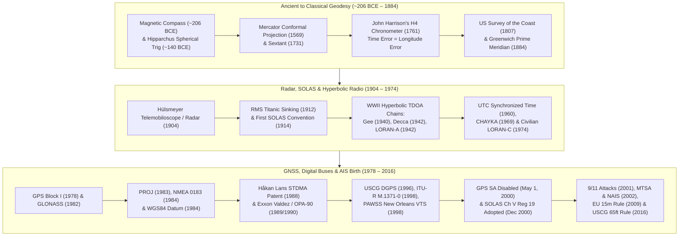

# Chapter 2: Deep History of Maritime Navigation, Geodesy, and the Birth of AIS

## 1. Operational & Conceptual Overview

To a modern deck officer glancing at an Electronic Chart Display and Information System (ECDIS) or a data scientist querying billions of rows of satellite vessel trajectories in DuckDB, an Automatic Identification System (AIS) position report appears deceptively simple: a 9-digit Maritime Mobile Service Identity (MMSI), a UTC timestamp, a WGS84 latitude and longitude, Speed Over Ground (SOG), Course Over Ground (COG), and True Heading. Yet every single bit inside that 168-bit over-the-air frame is the direct descendant of a two-millennia scientific and regulatory lineage.

Understanding *why* AIS operates the way it does—why it divides every UTC minute into 2,250 time slots of $26.667\text{ ms}$ each, why it encodes coordinates in $1/10{,}000\text{th}$ of an arc-minute on the WGS84 ellipsoid, why it includes a built-in VHF channel for Differential GNSS corrections (Message 17), why it uses a self-organizing broadcast medium access control (MAC) layer instead of cellular or shore-based polling, and why it completely lacks cryptographic authentication—requires examining the historical convergence of four domains:

1. **Celestial Timekeeping, Geodesy, and Radio Positioning (`schwehr/gis-history`):** The mathematical realization that **measuring position on a rotating Earth is fundamentally a problem of precise time transfer**—from John Harrison's 1761 H4 marine chronometer ($\Delta \lambda = \omega_{\oplus}\Delta t$) and World War II hyperbolic Time-Difference-of-Arrival (TDOA) chains (Gee, Decca, LORAN, CHAYKA) to atomic clocks, Navstar GPS, and the May 1, 2000 disabling of GPS Selective Availability (SA).
2. **Catastrophic Maritime Disasters and Regulatory Mandates:** How the 1912 sinking of *RMS Titanic* created the International Convention for the Safety of Life at Sea (**SOLAS Chapter V**), and how the March 24, 1989 grounding of the supertanker ***Exxon Valdez*** on Bligh Reef exposed the fatal blindness of shore-based radar alone, prompting the U.S. Congress to mandate automated tanker tracking in the **Oil Pollution Act of 1990 (OPA-90)**.
3. **The 1990s Architecture Wars (Polling vs. Self-Organizing TDMA):** How competing regional tracking prototypes in the UK Dover Strait (**"4S" VHF DSC polling**), the Panama Canal (**UHF CTAN**), and the Swedish/Finnish Baltic Sea (**Håkan Lans's SOTDMA**) battled in international working groups at IALA, ITU-R, and IMO until distributed SOTDMA proved mathematically superior for autonomous, high-density ship-to-ship collision avoidance.
4. **The Post-September 11, 2001 Homeland Security Pivot:** How the terrorist attacks of September 11, 2001 transformed AIS overnight from a short-range bridge-to-bridge navigation aid into the backbone of global **Maritime Domain Awareness (MDA)**, driving the U.S. **Maritime Transportation Security Act of 2002 (MTSA)**, the USCG **Nationwide AIS (NAIS)** network, the **2009 European Union fishing vessel mandate**, and the **2016 USCG carriage expansion**.

---

## 2. Historical Context & Evolution (`schwehr/gis-history` Integration)

### 2.1 Pre-AIS Navigation, Geodesy, and Positioning Lineage (`schwehr/gis-history`)

The technological stack underlying modern AIS did not emerge in a vacuum in the 1990s; it represents the synthesis of navigation, cartography, geodesy, radio physics, and open-source software documented in Kurt Schwehr's historical catalog ([`https://github.com/schwehr/gis-history`](https://github.com/schwehr/gis-history)).



#### 2.1.1 Directional References, Conformal Charts, and the Longitude Problem (206 BCE – 1884)
* **Magnetic Compass (~206 BCE) and Spherical Trigonometry (~140 BCE):** First recorded during China's Han Dynasty (`gis-history`), the lodestone magnetic compass enabled mariners to maintain a heading vector when clouds obscured celestial bodies. Around 140 BCE, **Hipparchus of Nicaea** formulated the chord tables and spherical trigonometry required to relate solar declinations to terrestrial latitude ($\phi$) and great-circle orthodromic arcs.
* **Gerardus Mercator's Conformal Projection (1569):** A vessel steering a constant compass heading follows a **rhumb line (loxodrome)** that spirals toward the poles on a sphere. In 1569, **Gerardus Mercator** introduced his cylindrical conformal map projection (`gis-history`), scaling meridional latitude spacing by $\sec\phi$ so that every rhumb line plots as a straight line segment preserving true local angles. This remains the display foundation of paper nautical charts and modern ECDIS.
* **The Sextant (1731) and John Harrison's H4 Marine Chronometer (1761):** While the octant/sextant independently invented by **John Hadley** and **Thomas Godfrey** in 1731 (`gis-history`) allowed mariners to measure the altitude of the Sun or Polaris above the horizon to determine latitude ($\phi$) within a few arc-minutes, determining **longitude ($\lambda$)** at sea remained intractable without knowing the exact time at a reference meridian. Following catastrophic fleet groundings (such as Sir Cloudesley Shovell's squadron off the Isles of Scilly in 1707), the British Parliament passed the **Longitude Act of 1714**, offering £20,000 for a method capable of fixing longitude to within $0.5^\circ$ ($30\text{ NM}$ at the Equator). Self-taught English clockmaker **John Harrison** solved the problem with his temperature-compensated, low-friction **H4 marine chronometer** in 1761 (`gis-history`), proving the foundational law of modern navigation: *precise positioning is inseparable from precise timekeeping*.
* **Hydrographic Surveying and the Prime Meridian (1807–1884):** In 1807, President Thomas Jefferson established the **U.S. Survey of the Coast** (precursor to the U.S. Coast and Geodetic Survey and **NOAA**, `gis-history`) under Ferdinand Rudolph Hassler to establish geodetic triangulation networks and chart coastal hazards. Seventy-seven years later, the **1884 International Meridian Conference** in Washington, D.C. (`gis-history`) unified global navigation around the **Greenwich Prime Meridian ($0^\circ$ Longitude)** and a universal 24-hour solar day—replacing a dangerous patchwork of national prime meridians (Paris, Cadiz, Pulkovo, Naples) that had caused frequent charting errors.

#### 2.1.2 Radar, the *Titanic* Catalyst, and Hyperbolic Radio Navigation (1904–1974)
* **Hülsmeyer's Telemobiloscope / Radar (1904):** On April 30, 1904, German engineer **Christian Hülsmeyer** filed Reichspatent DE 165546 for the *Telemobiloscope* (`gis-history`), demonstrating on the Hohenzollern Bridge in Cologne and in Rotterdam Harbor that spark-gap radio waves reflected off metal ship hulls could detect vessels in dense fog up to $3\text{ km}$ away.
* ***RMS Titanic* (1912) and the First SOLAS Convention (1914):** On the night of April 14–15, 1912, the White Star liner *RMS Titanic* struck an iceberg in the North Atlantic and sank with the loss of over 1,500 lives (`gis-history`). Nearby vessels, including the *SS Californian* less than $20\text{ NM}$ away, had switched off their Marconi wireless sets for the night when their single radio operators went to sleep. The disaster directly produced the **1914 International Convention for the Safety of Life at Sea (SOLAS)** (`gis-history`), which established mandatory 24-hour radio watches and created **SOLAS Chapter V (*Safety of Navigation*)**—the exact treaty instrument used 86 years later to mandate AIS on the world's merchant fleet.
* **WWII Hyperbolic Radio Systems — Gee (1940), Decca (1942), LORAN-A/C (1942/1974), and CHAYKA (1969):** During World War II, British and American physicists realized that while skin-paint radar was range-limited and required line-of-sight, synchronized chains of land-based low- and medium-frequency transmitters could provide all-weather regional positioning via **Time Difference of Arrival (TDOA)**:
  * **Gee (1940):** Developed by Robert Dippy at the UK Telecommunications Research Establishment (`gis-history`), operating at VHF ($20\text{–}85\text{ MHz}$) with cathode-ray oscilloscope pulse matching for Royal Air Force bombers.
  * **Decca Navigator (1942):** Invented by William O'Brien and Harvey Schwarz (`gis-history`), using phase comparison of continuous-wave low-frequency signals ($70\text{–}129\text{ kHz}$). First deployed secretly to guide minesweepers and landing craft during the D-Day invasion of Normandy (June 6, 1944), Decca later became the primary coastal positioning system for North Sea and English Channel shipping for half a century.
  * **LORAN-A (1942), CHAYKA (1969), and LORAN-C (1974):** Developed at the MIT Radiation Laboratory (`gis-history`), **LORAN-A** (*LOng RAnge Navigation*) measured pulse arrival differences at $1.75\text{–}1.95\text{ MHz}$. To achieve longer over-water groundwave range ($1,000+\text{ NM}$) and sub-microsecond cycle-matching accuracy, the U.S. developed **LORAN-C** at **$100\text{ kHz}$** (designated for U.S. civilian maritime use in 1974 to replace LORAN-A, `gis-history`), while the Soviet Union deployed the compatible $100\text{ kHz}$ **CHAYKA** system in 1969 (`gis-history`).

#### 2.1.3 Atomic Time, GNSS, Digital Standards, and Disabling Selective Availability (1960–2000)
* **Coordinated Universal Time (UTC, 1960):** Following the invention of the Cesium-133 atomic clock by Louis Essen and Jack Parry in 1955 (`gis-history`), international timekeeping was standardized as **UTC** in 1960 (`gis-history`). Every Class A and Class B SOTDMA AIS transponder relies directly on UTC, partitioning every 60-second UTC minute into 2,250 discrete time slots per channel.
* **GPS (1978) and GLONASS (1982):** Approved in 1973 under Bradford Parkinson and Roger L. Easton, the first **Navstar GPS Block I** satellite launched on February 22, 1978 (`gis-history`), followed by the first Soviet **GLONASS** launch on October 12, 1982 (`gis-history`). By broadcasting atomic-clock timestamps and orbital ephemerides on L-band carriers ($L_1 = 1575.42\text{ MHz}$ for GPS), GNSS provided both three-dimensional global positioning and a global **1-Pulse-Per-Second (1PPS)** timing reference synchronized to UTC within $<100\text{ ns}$.
* **PROJ (1983), NMEA 0183 (1984), and WGS84 (1984):** In a remarkable two-year convergence (`gis-history`):
  1. USGS geophysicist Gerald Evenden created the open-source **`PROJ`** cartographic projection library in 1983.
  2. The U.S. Defense Mapping Agency defined the **World Geodetic System 1984 (WGS84)** earth-centered, earth-fixed reference ellipsoid ($a = 6{,}378{,}137.0\text{ m}$, $f = 1/298.257223563$), resolving the dangerous datum offsets (frequently $100\text{–}500\text{ m}$ between NAD27, ED50, Tokyo Datum, and local chart datums) that caused vessels plotting satellite fixes on paper charts to run aground.
  3. The National Marine Electronics Association published **NMEA 0183** in 1984, establishing a $4,800\text{ baud}$ serial ASCII bus (`$GPRMC`, `$GPGGA`, `$HEHDT`) that allowed shipboard GPS receivers, gyrocompasses, and later AIS transponders (`!AIVDM` / `!AIVDO` at $38,400\text{ baud}$) to exchange telemetry over differential RS-422 twisted pairs.
* **USCG DGPS (1996) and the May 1, 2000 Decision to Turn Off GPS Selective Availability (SA):** Throughout the 1980s and 1990s, the U.S. Department of Defense intentionally degraded the civilian GPS Standard Positioning Service via **Selective Availability (SA)**, dithering satellite clock frequencies and ephemeris parameters to limit standalone civilian horizontal accuracy ($95\%$) to **$\sim 100\text{ meters}$** (and vertical accuracy to $\sim 156\text{ m}$). Because a $100\text{ m}$ position error is wider than most dredged shipping channels and lock chambers, early AIS architects had to rely on coastal **Medium-Frequency Differential GPS (MF DGPS)** radiobeacons ($283.5\text{–}325.0\text{ kHz}$, declared operational by the USCG in 1996, `gis-history`) and created **AIS Message 17 (*DGNSS Broadcast Binary Message*)** so AIS shore stations could transmit RTCM SC-104 pseudorange corrections over VHF. On **May 1, 2000**, President Bill Clinton announced the historic decision to discontinue Selective Availability (`gis-history`). When the SA modulation was set to zero at **04:00 UTC on May 2, 2000**, standalone civilian GPS horizontal error dropped tenfold overnight from $\sim 100\text{ m}$ to **$<10\text{ meters}$** ($3\text{–}5\text{ m}$ typical), instantaneously making unaugmented shipboard AIS accurate across the entire globe.

---

### 2.2 The Catalyst Disasters and Competing 1980s–1990s Prototypes

#### 2.2.1 March 24, 1989: The *Exxon Valdez* Grounding on Bligh Reef and Why Shore Radar Failed
Just after midnight (00:04 AKST) on **March 24, 1989**, the $300.8\text{-meter}$ single-hull supertanker ***Exxon Valdez***—outbound from the Alyeska Pipeline Terminal in Valdez, Alaska, carrying $1.26\text{ million}$ barrels of North Slope crude oil—struck **Bligh Reef** in Prince William Sound (`gis-history`). The grounding ruptured eight of the vessel's eleven cargo tanks, spilling approximately $10.8\text{ million}$ U.S. gallons ($\sim 37{,}000\text{ metric tons}$) of crude oil, contaminating $1,300\text{ miles}$ of subarctic shoreline, and causing one of the most devastating ecological disasters in maritime history.

Before departing Valdez Narrows, the master of the *Exxon Valdez* had requested and received permission from the U.S. Coast Guard **Vessel Traffic Service (VTS) Valdez** to deviate from the outbound Traffic Separation Scheme (TSS) lane, cross the separation zone into the inbound lane, and eventually steer further east of the TSS to avoid low-lying glacial icebergs calved from the Columbia Glacier. The master then left the bridge, leaving the fatigued third mate to execute a critical right turn back into deep water off Busby Island Light. Delaying the turn and initially failing to disengage the autopilot, the watch team drove the supertanker at $12\text{ knots}$ directly onto the 6-fathom shoals of Bligh Reef.

Crucially for the engineering history of AIS, the National Transportation Safety Board (NTSB) investigation revealed **four structural reasons why the existing USCG VTS shore radar in Valdez failed to prevent the grounding**:
1. **Radar Range Limits, Terrain Masking, and Downgraded Hardware:** Due to early-1980s federal budget cuts, the USCG had decided not to install a forward radar relay station on Glacier Island and had replaced the Potato Point radar in Valdez Narrows with less powerful equipment. Bligh Reef lay roughly $15\text{ NM}$ south of the Potato Point radar site—at the extreme edge of reliable detection where low-angle returns were obscured by sea clutter, snow/rain squalls, and fjord headlands.
2. **Inability to Distinguish Ship Echoes from Glacial Ice Clutter:** Primary marine radar is a non-cooperative "skin-paint" sensor. When hundreds of wet glacial icebergs calved from Columbia Glacier drifted into the traffic lanes, radar returns from ice floes and vessels merged into ambiguous clutter.
3. **Zero Cooperative Identity or Shipboard Sensor Telemetry:** Even when a primary radar blip is visible on a VTS Plan Position Indicator (PPI), it carries no intrinsic vessel identity (MMSI/IMO), no shipboard GNSS position, no gyrocompass heading, and no Rate of Turn (ROT). A shore radar tracker must observe multiple sequential antenna scans over $30\text{–}90\text{ seconds}$ just to infer that a $150{,}000\text{-ton}$ tanker has failed to initiate a turn.
4. **Absence of Automated Digital Geofencing:** The single VTS watchstander on duty in Valdez lost radar track of the *Exxon Valdez* south of Rocky Point, did not adjust the radar range scale, and had no automated digital telemetry system to sound an alarm when the tanker crossed east of the Busby Island safety sector.

#### 2.2.2 The Oil Pollution Act of 1990 (OPA-90, Pub. L. 101-380)
In direct response to the *Exxon Valdez* catastrophe, the U.S. Congress enacted the **Oil Pollution Act of 1990 (OPA-90, Pub. L. 101-380)** on August 18, 1990. While OPA-90 is best known for mandating the phase-in of double-hulled oil tankers (Section 4115) and strict liability for spill cleanup, **Title IV, Subtitle A (Section 4107)** amended the Ports and Waterways Safety Act to mandate active VTS participation and explicitly directed the Secretary of Transportation to establish an **automated vessel tracking system** in Prince William Sound so that the Coast Guard could monitor the continuous satellite-derived position and identity of every laden tanker without relying solely on line-of-sight radar reflections.

To meet the immediate OPA-90 statutory deadline for Prince William Sound before a global AIS standard existed, the USCG deployed an interim **Automated Dependent Surveillance System (ADSS)** in 1994 using Differential GPS and VHF Digital Selective Calling (DSC) transponders on tankers transiting Valdez. That real-world deployment immediately exposed the severe throughput bottlenecks of DSC polling—setting the stage for the international architecture competition of the 1990s.

#### 2.2.3 Deep Technical Comparison of the Three Competing 1990s Prototypes
As documented by Kimbra Cutlip in her landmark Global Fishing Watch history ([*AIS for Safety and Tracking: A Brief History*, 2017](https://globalfishingwatch.org/article/ais-brief-history/)) and preserved in the historical archives of **Jorge Arroyo** (longtime U.S. Coast Guard programme manager and lead U.S. delegate to the IMO, ITU, and IALA AIS working groups), three distinct vessel-tracking architectures competed for international adoption during the early-to-mid 1990s:

| Architectural Dimension | 1. UK Dover Strait "4S" System | 2. Panama Canal Commission CTAN | 3. Swedish/Finnish Baltic SOTDMA (Håkan Lans) |
|---|---|---|---|
| **Primary Champions** | UK Marine Safety Agency (MSA) & French VTS authorities | Panama Canal Commission (PCC) & U.S. DOT Volpe Center | Sweden (Sjöfartsverket / LFV), Finland, & inventor **Håkan Lans** |
| **Radio Band & Channel** | Maritime VHF **Channel 70 ($156.525\text{ MHz}$)** (GMDSS DSC channel) or dedicated DSC working pair | Dedicated **UHF ($450\text{–}470\text{ MHz}$)** shore-repeater channels | Dedicated dual Maritime VHF **AIS 1 ($161.975\text{ MHz}$)** & **AIS 2 ($162.025\text{ MHz}$)** |
| **Modulation & Data Rate** | FSK ($1{,}700\text{ Hz} \pm 400\text{ Hz}$), **$1{,}200\text{ bps}$** (ITU-R M.493 / M.825) | Narrowband UHF FSK/GMSK ($4{,}800\text{–}9{,}600\text{ bps}$) | **GMSK ($BT=0.4$)** at **$9{,}600\text{ bps}$** ($8\times$ faster than DSC) |
| **MAC Layer Protocol** | **Centralized Polling / Roll-Call** (Shore VTS or ship interrogates target MMSI; target replies) | **Shore Master TDMA** (Central canal server assigns fixed polling/reporting slots to pilots) | **Distributed Self-Organizing TDMA (SOTDMA)** (Every ship announces its own future slots using GNSS 1PPS) |
| **Burst / Transaction Time** | $\sim 450\text{–}950\text{ ms}$ per poll-response cycle (heavy 10-bit FEC & phasing overhead) | $\sim 50\text{–}100\text{ ms}$ per shore-assigned slot | **$26.667\text{ ms}$** ($256\text{ bits}$), yielding **$2{,}250\text{ slots/min}$** per channel ($4{,}500\text{ slots/min}$ dual-channel) |
| **Maximum Practical Capacity** | **$\sim 20\text{–}40\text{ ships}$** before polling latency exceeds $10\text{–}30\text{ s}$ or channel collapses | **$\sim 50\text{–}150\text{ ships}$** within shore repeater footprint | **$400+\text{ ships}$** in a single radio horizon with autonomous $2\text{–}10\text{ s}$ dynamic updates |
| **Autonomous High-Seas Operation?** | **Poor:** Requires knowing who is present to poll them, or suffers high unslotted ALOHA collisions | **No:** Fails completely outside the coverage of the central shore master station | **Yes:** Operates identically mid-ocean between two ships or in a congested strait of 400 ships |

##### 1. The UK Dover Strait "4S" System (VHF DSC Polling)
In the early 1990s, British and French maritime authorities sought a way to positively identify anonymous radar targets crossing the Dover Strait—one of the world's busiest shipping lanes. Because vessels were already being fitted with **Global Maritime Distress and Safety System (GMDSS)** VHF radios equipped with **Digital Selective Calling (DSC)** on **Channel 70 ($156.525\text{ MHz}$)**, UK engineers proposed the **"4S" (*Ship-to-Shore and Ship-to-Ship*) transponder system** standardized initially in **ITU-R Recommendation M.825** (*Characteristics of a transponder system using digital selective calling techniques for use with vessel traffic services and ship-to-ship identification*).

As Jorge Arroyo recounted in [Cutlip (2017)](https://globalfishingwatch.org/article/ais-brief-history/), the DSC polling concept appeared cost-effective on paper because it piggybacked on GMDSS hardware, but it suffered from four fatal engineering flaws:
* **Catastrophic Baud Rate and Framing Overhead:** ITU-R M.493/M.825 DSC transmits at just **$1{,}200\text{ bps}$**, encoding each 7-bit symbol with a 3-bit error-check code (10 bits per character) and transmitting every character *twice* in a time-diversity stagger separated by $4\text{ characters}$ ($33.3\text{ ms}$), preceded by a $200\text{-ms}$ dot pattern and phasing sequence. Consequently, a single DSC poll and ship position reply consumes nearly **$0.5\text{ to }1.0\text{ second}$** of channel airtime.
* **The Centralized Polling Trap ("You Don't Know Who to Poll Until You Poll Them"):** In a roll-call system, the shore VTS station must first discover a new ship entering its zone (via a random unslotted "all-ships" registration burst) and then add that MMSI to a sequential polling loop. If two ships meet in the middle of the Pacific Ocean outside VTS coverage, neither knows the other's MMSI to poll it; if they resort to periodic unslotted broadcasts on a $1{,}200\text{ bps}$ channel, classic **Pure ALOHA** collision physics limits maximum channel throughput to $1/(2e) \approx 18.4\%$.
* **Inability to Track High-Rate Maneuvers:** When a large vessel alters course in a narrow channel, its heading and rate of turn change within seconds. Under DSC polling with 50 ships in a sector, polling each ship sequentially at 1 ship/second means each ship's position is updated only once every **50 seconds**—by which time a ship steaming at $18\text{ knots}$ has traveled nearly half a nautical mile!
* **Endangering GMDSS Distress Alerting:** Channel 70 ($156.525\text{ MHz}$) is the sacred international VHF distress, urgency, and safety calling channel. Saturating Channel 70 (or adjacent front-ends) with continuous automated position polls risked blocking a sinking vessel's `MAYDAY` DSC distress alert.

##### 2. The Panama Canal Commission CTAN System
Simultaneously, the **Panama Canal Commission (PCC)**, working with the U.S. Department of Transportation's Volpe National Transportation Systems Center, developed the **CTAN (*Communications, Tracking, and Navigation*)** system. Canal pilots boarded transiting ships carrying a portable briefcase unit that received local Differential GPS corrections and transmitted the ship's precise position back to the Marine Traffic Control Center via a **shore-controlled UHF radio network**, while displaying other transiting ships and Canal tugboats on the pilot's laptop screen.

While CTAN transformed safety and scheduling inside the $82\text{-km}$ Panama Canal—allowing two Panamax vessels to safely pass in the narrow Gaillard Cut during tropical downpours that blinded marine radar—it was fundamentally a **centralized, infrastructure-dependent architecture**. Its time-slot allocation depended on shore repeater master clocks, and its UHF frequencies were neither available globally nor harmonized with the international Maritime Mobile VHF band (ITU Radio Regulations Appendix 18).

##### 3. The Swedish & Finnish Baltic Sea Trials: Håkan Lans and SOTDMA
The breakthrough that solved autonomous maritime tracking came from Swedish inventor **Håkan Lans**, who had previously pioneered color graphics controllers and digitizer tablets. On **September 9, 1988**, Lans filed his priority Swedish patent application (later granted as **U.S. Patent 5,506,587** on April 9, 1996, *"Position indicating system"*, and European Patent **EP 0 465 532 B1**) for **Self-Organizing Time Division Multiple Access (STDMA / SOTDMA)**.

Working with the Swedish Maritime Administration (*Sjöfartsverket*), the Finnish Maritime Administration, and the Swedish Civil Aviation Administration (*Luftfartsverket*, which simultaneously tested STDMA for aviation surveillance as **VDL Mode 4**), Lans demonstrated a radical departure from master-slave polling:
1. **Universal GNSS 1PPS Synchronization:** Every shipboard transponder extracts the microsecond-accurate **1-Pulse-Per-Second (1PPS)** timing strobe from its GPS/GLONASS receiver. Thus, every vessel on Earth shares an identical, drift-free 60-second UTC frame clock without needing a shore master station.
2. **High-Speed GMSK Slotted Frame ($9{,}600\text{ bps}$):** Instead of $1{,}200\text{ bps}$ FSK, the $25\text{ kHz}$ VHF channel is modulated with **Gaussian Minimum Shift Keying (GMSK)** at **$9{,}600\text{ bps}$**, dividing every 60-second UTC minute into **2,250 time slots** of exactly $26.667\text{ ms}$ ($256\text{ bits}$) per channel—or **4,500 time slots per minute** when alternating across two dedicated simplex channels (**AIS 1: $161.975\text{ MHz}$** and **AIS 2: $162.025\text{ MHz}$**).
3. **In-Band Distributed Slot Reservation:** Every ship continuously listens to both AIS channels and maintains an internal **slot map** of which slots are currently occupied or reserved by other stations within radio range. When a ship transmits its 168-bit Position Report (Messages 1, 2, or 3), the final 24 bits of the packet (**bits `144–167` in 0-based indexing**) contain the **SOTDMA Communication State**, which explicitly tells every receiving ship within earshot: *"I have reserved this time slot for the next $k$ frames (Slot Timeout), or I will jump to slot offset $+\Delta s$ on my next frame."*
4. **Dynamic Kinematic Reporting Rates:** Instead of a fixed polling loop, each vessel autonomously scales its reporting rate based on its own kinematics: every **$3\text{ minutes}$** when anchored/moored ($\le 3\text{ kts}$), every **$10\text{ seconds}$** when steaming at $0\text{–}14\text{ kts}$, every **$6\text{ seconds}$** at $14\text{–}23\text{ kts}$, and every **$2\text{ seconds}$** when steaming $>23\text{ kts}$ or actively altering course!
5. **Graceful Overload via Intentional Slot Reuse (Cell Shrinking):** What happens if 600 ships converge in the Singapore Strait or English Channel and exhaust all 4,500 slots/minute? Because every SOTDMA position report includes the transmitter's exact WGS84 coordinates, a congested transponder never drops offline; instead, it looks up the geographic distance to every station in its slot map and **intentionally reuses the time slot of the most distant vessel** (e.g., $>15\text{ NM}$ away, while never overwriting any vessel within $8\text{ NM}$). Through FM/GMSK capture effect, local vessels within collision-avoidance range continue to receive $100\%$ of each other's packets seamlessly.

---

### 2.3 International Standardization (1994–2000)

Between 1994 and 1998, intense technical debates played out across the **International Association of Marine Aids to Navigation and Lighthouse Authorities (IALA)**, the **International Maritime Organization (IMO)** Sub-Committee on Safety of Navigation (NAV), and **International Telecommunication Union Radiocommunication Sector (ITU-R)** Working Party 8B.

Initially, countries that had invested heavily in GMDSS VHF DSC infrastructure favored the UK's DSC polling approach (termed a "transponder" system because it responded only when interrogated), whereas Sweden, Finland, and eventually the United States (led by the USCG's Jorge Arroyo after witnessing DSC's limitations in Prince William Sound and comparing it against Lans's Baltic trials) championed the continuous-broadcast SOTDMA architecture ([Cutlip, 2017](https://globalfishingwatch.org/article/ais-brief-history/)).

To satisfy both the ship-to-ship autonomous broadcast camp and the shore VTS management camp, IALA and ITU-R engineered a brilliant compromise embedded directly into the final AIS standard:
* **Primary Autonomous Operation:** Shipboard transponders operate continuously in autonomous **SOTDMA broadcast mode** on **AIS 1 (Channel 87B, $161.975\text{ MHz}$)** and **AIS 2 (Channel 88B, $162.025\text{ MHz}$)**—two simplex frequencies carved out from the upper duplex legs of marine VHF Channels 87 and 88 under ITU World Radiocommunication Conference 1997 (WRC-97).
* **Assigned & Polling Modes Retained:** Shore VTS Base Stations retain the authority to switch vessels into **Assigned Mode** (via Message 16) or interrogate specific vessels on demand (via Message 15), and every Class A AIS unit was required to include an auxiliary **Channel 70 DSC receiver** so regional authorities lacking dedicated AIS channels could still issue frequency-management commands (Message 22) over DSC.

This consensus produced three landmark milestones between 1998 and 2000:
1. **IMO Resolution MSC.74(69) Annex 3 (May 1998) & ITU-R Recommendation M.1371-0 (November 1998):** In May 1998, the IMO Maritime Safety Committee adopted the *Performance Standards for an Universal Shipborne Automatic Identification System (AIS)* (MSC.74(69) Annex 3). Six months later, in November 1998, the ITU ratified **ITU-R Recommendation M.1371-0** (*Technical characteristics for a universal shipborne automatic identification system using time division multiple access in the VHF maritime mobile band*), defining the physical GMSK layer, SOTDMA/RATDMA/ITDMA/FATDMA link layers, and the binary bit layouts of the core AIS messages (`gis-history`).
2. **1998 USCG PAWSS Deployment in New Orleans / Lower Mississippi River:** Also in 1998, the U.S. Coast Guard initiated the **Ports and Waterways Safety System (PAWSS)** project and selected the **Lower Mississippi River / Port of New Orleans** as the testing ground and world's first operational, primarily AIS-based Vessel Traffic Service ([Cutlip, 2017](https://globalfishingwatch.org/article/ais-brief-history/)). The Lower Mississippi below Baton Rouge and past Algiers Point in New Orleans is a sinuous, high-current river corridor bordered by levees and industrial facilities that severely block shore-based X-band radar line-of-sight. By equipping Mississippi River vessels and VTS Lower Mississippi with PAWSS AIS transponders, watchstanders and river pilots could suddenly "see around the bend" at Algiers Point in real time, proving that VHF AIS could provide complete VTS situational awareness at a fraction of the cost of constructing dozens of riverine radar towers.
3. **December 2000 Adoption of Revised SOLAS Chapter V, Regulation 19:** At its 73rd session in December 2000, the IMO Maritime Safety Committee adopted a comprehensive revision of **SOLAS Chapter V, Regulation 19** (Paragraph 2.4), mandating that all new ships built on or after **July 1, 2002**—and existing ships on a phased schedule initially stretching to 2008—carry an approved Class A AIS transponder if they fell into any of three categories:
   * All ships of **$300\text{ gross tonnage (GT)}$ and upwards** engaged on **international voyages**;
   * Cargo ships of **$500\text{ GT}$ and upwards** not engaged on international voyages (domestic coastwise trade); and
   * **All passenger ships** irrespective of size.

---

### 2.4 September 11, 2001 and the Pivot to Homeland Security

#### 2.4.1 How 9/11 Transformed AIS from a Navigation Aid into Homeland Security Infrastructure
When SOLAS Chapter V, Regulation 19 was adopted in December 2000, maritime regulators viewed AIS primarily as a localized **bridge-to-bridge collision-avoidance tool** and a **port VTS traffic management aid**. Indeed, under the original December 2000 SOLAS phase-in timetable, older non-tanker cargo vessels were not scheduled to complete AIS retrofits until July 1, 2007 or 2008.

Nine months later, the **terrorist attacks of September 11, 2001** permanently altered the trajectory of AIS ([Cutlip, 2017](https://globalfishingwatch.org/article/ais-brief-history/)). Suddenly, U.S. defense and intelligence planners confronted a stark vulnerability: thousands of foreign-flagged container ships, LNG carriers, chemical tankers, and domestic tug-barge units entered U.S. ports and passed within hundreds of meters of Manhattan, refineries, naval bases, and nuclear power plants every day, yet the Coast Guard had no automated nationwide system to know which vessels were approaching the U.S. coastline or navigating inland waters.

As USCG programme leader Jorge Arroyo observed ([Cutlip, 2017](https://globalfishingwatch.org/article/ais-brief-history/)), September 11 shifted AIS overnight from a localized safety device into the foundational sensor of national **Maritime Domain Awareness (MDA)**:
* **IMO Diplomatic Conference Accelerates the Global SOLAS Deadline (December 2002):** At the urging of the United States, the IMO Diplomatic Conference on Maritime Security in December 2002 adopted the ISPS Code and compressed the SOLAS Chapter V AIS retrofit schedule for all international vessels $\ge 300\text{ GT}$, moving the final compliance deadline forward by nearly four years to **December 31, 2004** (at the first safety equipment survey after July 1, 2004).
* **The Maritime Transportation Security Act of 2002 (MTSA, Pub. L. 107-295):** Signed into law on **November 25, 2002**—simultaneously with the creation of the **Department of Homeland Security (DHS)**, into which the U.S. Coast Guard was transferred in March 2003—MTSA enacted **46 U.S.C. § 70114**, mandating AIS carriage across U.S. navigable waters and authorizing the Secretary of Homeland Security to build a comprehensive coastal tracking infrastructure.
* **The USCG Nationwide AIS (NAIS) Network:** To receive and fuse these broadcasts along $95{,}000\text{ miles}$ of U.S. coastline, the Great Lakes, and the Western Rivers, the Coast Guard launched the **Nationwide AIS (NAIS)** acquisition programme. NAIS deployed an integrated network of high-sensitivity VHF shore base stations co-located at Rescue 21 coastal towers, offshore buoys/platforms, and VTS centers, streaming real-time NMEA TAG-block data into a centralized national Common Operational Picture (COP) shared with the U.S. Navy, Customs and Border Protection (CBP), and later NOAA/BOEM via **MarineCadastre.gov**.

#### 2.4.2 Subsequent Regulatory Expansions: The 2009 EU Fishing Mandate and 2016 USCG Final Rule
While MTSA 2002 initially required AIS on self-propelled commercial vessels $\ge 65\text{ feet}$ on international voyages and within VTS zones by 2003–2004, thousands of domestic fishing vessels, smaller coastal freighters, and inland towing vessels outside VTS areas remained exempt during the 2000s due to the high cost ($\sim \$3{,}000\text{–}\$5{,}000$) of early Class A transponders. Two major regulatory milestones closed this gap following the 2006 standardization of lower-cost **Class B AIS** (**IEC 62287-1** CSTDMA and later **IEC 62287-2** SOTDMA):

1. **The 2009 European Union 15-Meter Fishing Vessel Mandate (Directive 2002/59/EC & Council Regulation (EC) No 1224/2009):** Recognizing that commercial fishing vessels suffered the highest occupational fatality rates at sea and frequently collided with merchant ships in coastal fog, the European Union amended its Community Vessel Traffic Monitoring Directive (`2002/59/EC` via Directive `2009/17/EC` and Fisheries Control Regulation `1224/2009`) to mandate **Class A AIS** on all EU-flagged fishing vessels of **$\ge 15\text{ meters}$ Length Overall (LOA)** (`gis-history`). The mandate was phased in over 24 months:
   * **May 31, 2012:** Fishing vessels $\ge 24\text{ m}$ and $<45\text{ m}$ LOA;
   * **May 31, 2013:** Fishing vessels $\ge 18\text{ m}$ and $<24\text{ m}$ LOA;
   * **May 31, 2014:** Fishing vessels $\ge 15\text{ m}$ and $<18\text{ m}$ LOA.
   This single European mandate brought more than $10{,}000$ industrial trawlers, purse seiners, and longliners onto public AIS feeds, providing the empirical training corpus that later enabled **Global Fishing Watch** (`gis-history`, launched September 2016) to train machine-learning classifiers for fishing behavior.
2. **The March 2016 USCG Final Rule (33 CFR § 164.46):** On January 30, 2015, the U.S. Coast Guard published its comprehensive Final Rule (*Vessel Requirements for Notices of Arrival and Departure, and Automatic Identification System*, 80 FR 5281), amending **33 CFR § 164.46** with a mandatory compliance deadline of **March 2, 2016** (`gis-history`). The 2016 rule expanded mandatory AIS carriage across **all U.S. navigable waters** (up to $12\text{ NM}$ offshore, no longer limited to VTS zones) to include:
   * All commercial self-propelled vessels of **$\ge 65\text{ feet}$ ($\ge 19.8\text{ m}$) in length**, explicitly including **commercial fishing industry vessels** (which were authorized to use lower-cost USCG-approved Class B AIS devices);
   * All **towing vessels of $\ge 26\text{ feet}$ ($\ge 7.9\text{ m}$) in length** and **more than $600\text{ horsepower}$**;
   * All vessels certified to carry more than **150 passengers**, or vessels engaged in moving **certain dangerous cargo (CDC)** or flammable/combustible liquid cargo in bulk; and
   * All **dredges** operating in or near a commercial channel where they may restrict or affect navigation.

---

## 3. Deep Technical & Mathematical Foundations

### 3.1 Chronometer Time Error to Longitude Error ($\Delta \lambda = \omega_{\oplus}\Delta t$) and GNSS Timing

To see why John Harrison's 1761 **H4 chronometer** (`gis-history`) and modern AIS share the exact same physical foundation, consider the rotation of the Earth relative to the mean Sun. Over one mean solar day ($T_{\text{solar}} = 86{,}400\text{ s}$), the Earth rotates through $360^\circ$ ($2\pi\text{ radians}$), yielding an angular rotation rate:

$$\omega_{\oplus} = \frac{360^\circ}{86{,}400\text{ s}} = \frac{15^\circ}{\text{hour}} = \frac{15'}{\text{min}} = 0.25'\text{ arc-min/s} = 7.2722052 \times 10^{-5}\text{ rad/s}$$

*(Note: Relative to the inertial stars, Earth's WGS84 sidereal rotation rate is $\omega_{\oplus,\text{sidereal}} = 7.2921150 \times 10^{-5}\text{ rad/s}$, completing $360^\circ$ in $86{,}164.0905\text{ s}$.)*

When a navigator measures local apparent noon (or a lunar/stellar altitude with a sextant) and compares that local time $t_{\text{local}}$ against the Greenwich reference time $t_{\text{Greenwich}}$ maintained by a marine chronometer, any cumulative clock drift $\Delta t = \delta t_{\text{chron}}$ maps linearly into a **longitude error $\Delta \lambda$**:

$$\Delta \lambda = \omega_{\oplus} \, \Delta t$$

On the **WGS84 reference ellipsoid** ($a = 6{,}378{,}137.0\text{ m}$, $f = 1/298.257223563$, first eccentricity squared $e^2 = 2f - f^2 \approx 0.006694380$), the radius of curvature in the prime vertical at geodetic latitude $\phi$ is:

$$N(\phi) = \frac{a}{\sqrt{1 - e^2 \sin^2\phi}}$$

Consequently, a chronometer time error $\Delta t$ (in seconds) produces an East-West linear position error $\Delta x_{\text{E}}(\phi)$ (in meters):

$$\Delta x_{\text{E}}(\phi) = N(\phi) \cos\phi \, \omega_{\oplus,\text{rad/s}} \, \Delta t \approx \left(463.831\text{ m/s}\right) \frac{\cos\phi}{\sqrt{1 - e^2 \sin^2\phi}} \, \Delta t$$

* **18th-Century Celestial Navigation:** At the Equator ($\phi = 0^\circ$), a clock error of just **$\Delta t = 1\text{ second}$** causes an eastward/westward position error of **$463.83\text{ meters}$** ($0.25\text{ NM}$). To win the top £20,000 prize under the 1714 British Longitude Act (`gis-history`)—which required an error $\le 0.5^\circ$ ($30\text{ NM} \approx 55.6\text{ km}$) after a six-week voyage to the West Indies—a clock could drift by no more than $\Delta t_{\max} = \frac{0.5^\circ}{0.25'/\text{s}} = 120\text{ seconds}$ ($2\text{ minutes}$). Harrison's H4 lost only $5.1\text{ s}$ over an 81-day Atlantic crossing in 1761 ($\Delta x_{\text{E}} \approx 2.37\text{ km}$ or $1.28\text{ NM}$).
* **Modern GNSS and AIS SOTDMA Timing:** In satellite navigation (GPS/GLONASS/Galileo/BeiDou), radio waves travel at the speed of light $c = 299{,}792{,}458\text{ m/s}$ rather than Earth's surface rotation speed ($463.8\text{ m/s}$)—a factor of $6.46 \times 10^5$ faster! Thus, an uncompensated satellite clock error $\Delta t_{\text{sat}}$ produces a pseudorange error:
  $$\Delta \rho = c \, \Delta t_{\text{sat}} \implies 1\text{ }\mu\text{s clock error} = 299.79\text{ meters}; \quad 1\text{ ns clock error} = 0.2998\text{ meters}$$
  Simultaneously, at the AIS VHF link layer (ITU-R M.1371-5 Annex 2), each $26.667\text{ ms}$ time slot includes a $24\text{-bit}$ buffer ($2.50\text{ ms}$ at $9{,}600\text{ bps}$) allocated across bit-stuffing expansion ($417\text{ }\mu\text{s}$), transmitter ramp-down, and speed-of-light propagation delay ($1{,}250\text{ }\mu\text{s}$, corresponding to $c \times 1.25\text{ ms} \approx 375\text{ km}$ or $202\text{ NM}$ range). If a shipboard AIS transponder loses its GNSS 1PPS synchronization and its internal quartz crystal drifts by more than $\pm 1\text{ ms}$, its burst will spill across the slot boundary and corrupt adjacent time slots!

---

### 3.2 Mathematical Derivation of Hyperbolic TDOA Lines of Position (Gee, Decca, LORAN-C, CHAYKA)

Before satellite GNSS became operational and before Selective Availability was disabled in May 2000, coastal mariners relied on hyperbolic radio navigation systems (**Gee**, **Decca**, **LORAN-A/C**, **CHAYKA** from `gis-history`). Remarkably, the exact same **Time Difference of Arrival (TDOA)** mathematics is used today by maritime security analysts to geolocate **AIS spoofers** and **"dark ships"** using multiple coastal SDR receivers or spaceborne RF satellites (explored in Part VI).

Let a **Master transmitter** be located at $\mathbf{p}_M = (x_M, y_M)$ and a **Secondary (Slave) transmitter** be located at $\mathbf{p}_S = (x_S, y_S)$, separated by baseline length $B = \|\mathbf{p}_S - \mathbf{p}_M\|$.
1. At $t = 0$, the Master station transmits a radio pulse (e.g., a $100\text{ kHz}$ pulse group in LORAN-C).
2. The Secondary station transmits its pulse after a precisely known **Coding / Emission Delay** $T_{\text{ED}} = \frac{B}{v_p} + \tau_{\text{coding}}$, chosen larger than the baseline propagation time $B/v_p$ so that anywhere in the coverage area, the Master pulse always arrives *before* the Secondary pulse ($\tau_{MS} > 0$), eliminating sign ambiguity.
3. A vessel at unknown position $\mathbf{p} = (x, y)$ measures the arrival time difference $\tau_{MS}(\mathbf{p}) = t_S(\mathbf{p}) - t_M(\mathbf{p})$. Subtracting the known emission delay $T_{\text{ED}}$ and multiplying by the groundwave phase velocity $v_p$ yields the **geometric range difference $\Delta d(\mathbf{p})$**:

$$\Delta d(\mathbf{p}) = d_S(\mathbf{p}) - d_M(\mathbf{p}) = \|\mathbf{p} - \mathbf{p}_S\| - \|\mathbf{p} - \mathbf{p}_M\| = v_p \left(\tau_{MS}(\mathbf{p}) - T_{\text{ED}}\right)$$

To derive the geometric locus of a constant TDOA measurement $\Delta d(\mathbf{p}) = 2a_h$ (where $|2a_h| < B$), place the origin of a local Cartesian coordinate frame at the midpoint of the baseline with the $x$-axis aligned from Master to Secondary, so $\mathbf{p}_M = (-c_h, 0)$ and $\mathbf{p}_S = (+c_h, 0)$ with half-baseline $c_h = B/2$:

$$\sqrt{(x - c_h)^2 + y^2} - \sqrt{(x + c_h)^2 + y^2} = \pm 2a_h$$

Isolating one radical, squaring both sides, simplifying $4 c_h x$, and squaring a second time yields the canonical equation of a **two-sheeted hyperbola** with foci at $\mathbf{p}_M$ and $\mathbf{p}_S$:

$$\frac{x^2}{a_h^2} - \frac{y^2}{b_h^2} = 1 \qquad \text{where } a_h = \frac{|\Delta d|}{2}, \quad c_h = \frac{B}{2}, \quad b_h = \sqrt{c_h^2 - a_h^2} = \frac{1}{2}\sqrt{B^2 - \Delta d^2}$$

Taking the spatial gradient of $\Delta d(\mathbf{p}) = \|\mathbf{p} - \mathbf{p}_S\| - \|\mathbf{p} - \mathbf{p}_M\|$ reveals the **Geometric Dilution of Precision (GDOP)** of a hyperbolic lane:

$$\nabla\left(\Delta d(\mathbf{p})\right) = \frac{\mathbf{p} - \mathbf{p}_S}{\|\mathbf{p} - \mathbf{p}_S\|} - \frac{\mathbf{p} - \mathbf{p}_M}{\|\mathbf{p} - \mathbf{p}_M\|} = \hat{\mathbf{u}}_S - \hat{\mathbf{u}}_M$$

Let $\psi_{MS}$ be the crossing angle subtended at the ship by the Master and Secondary stations ($\cos\psi_{MS} = \hat{\mathbf{u}}_M \cdot \hat{\mathbf{u}}_S$). The magnitude of the gradient is:

$$\left\|\nabla\left(\Delta d(\mathbf{p})\right)\right\| = \sqrt{2 - 2\cos\psi_{MS}} = 2 \sin\left(\frac{\psi_{MS}}{2}\right)$$

Therefore, a timing measurement error $\sigma_\tau$ translates into a cross-lane positional uncertainty $\sigma_\perp$:

$$\sigma_\perp = \frac{v_p \, \sigma_\tau}{\left\|\nabla(\Delta d)\right\|} = \frac{v_p \, \sigma_\tau}{2 \sin(\psi_{MS}/2)}$$

* **On the baseline between Master and Secondary ($\psi_{MS} = 180^\circ$):** $\sin(90^\circ) = 1$, so positional precision is at its physical maximum ($\sigma_\perp = \frac{1}{2} v_p \sigma_\tau \approx 150\text{ m}/\mu\text{s}$).
* **Near the baseline extension behind either station ($\psi_{MS} \to 0^\circ$):** $\sin(\psi_{MS}/2) \to 0$, causing the hyperbolic lines of position to diverge rapidly and $\sigma_\perp \to \infty$. Two independent Master-Secondary pairs (e.g., Master–Xray and Master–Yankee) intersecting at a strong crossing angle $\theta_{\text{cross}}$ are required to fix a 2D position $(\lambda, \phi)$.

---

### 3.3 Mathematical Proof: Why Centralized DSC Polling ("4S") Collapses vs. Distributed SOTDMA Scaling

Why did the international community reject the UK Dover Strait **VHF DSC Channel 70 polling ("4S")** architecture in favor of Håkan Lans's **SOTDMA** during the 1994–1998 standardization battles? We can prove the divergence rigorously using queueing and multiple-access channel theory.

#### 3.3.1 Centralized DSC Polling ("4S") Latency and Saturation
In an ITU-R M.825 / M.493 DSC polling system operating on a single $25\text{ kHz}$ channel at $R_{\text{DSC}} = 1{,}200\text{ bps}$:
* Every interrogation poll from the shore master station requires a $200\text{-bit}$ dot preamble, phasing characters, 10-bit encoded address/command symbols transmitted twice with time-diversity interleaving, and transmitter ramp-up/down, consuming $T_{\text{poll}} \approx 0.35\text{ s}$.
* After propagation and transceiver turnaround delay $T_{\text{turn}} \approx 0.05\text{ s}$, the polled vessel transmits its DSC position reply containing its 9-digit MMSI, coordinates, COG, SOG, and UTC time, consuming $T_{\text{reply}} \approx 0.45\text{ s}$.
* Thus, a single collision-free poll-and-response cycle requires:

$$T_{\text{cycle, DSC}} = T_{\text{poll}} + T_{\text{turn}} + T_{\text{reply}} \approx 0.85\text{ seconds/ship}$$

Suppose $N$ vessels are operating in a VTS sector (such as the Dover Strait or New Orleans harbor approach), and each vessel requires a tactical position update every $\Delta T_{\text{req}}$ seconds (e.g., $\Delta T_{\text{req}} = 10\text{ s}$ for normal steaming, or $6\text{ s}$ for fast/maneuvering ships). The offered channel utilization $\rho_{\text{DSC}}(N)$ under sequential roll-call polling is:

$$\rho_{\text{DSC}}(N) = \frac{N \cdot T_{\text{cycle, DSC}}}{\Delta T_{\text{req}}}$$

For polling to remain stable ($\rho_{\text{DSC}} \le 1.0$), the maximum number of vessels $N_{\max,\text{DSC}}$ that can be tracked at reporting interval $\Delta T_{\text{req}} = 10\text{ s}$ is:

$$N_{\max,\text{DSC}} = \left\lfloor \frac{\Delta T_{\text{req}}}{T_{\text{cycle, DSC}}} \right\rfloor = \left\lfloor \frac{10.0\text{ s}}{0.85\text{ s}} \right\rfloor = 11\text{ ships!}$$

Even if the shore VTS station abandons individual polling and broadcasts a single group schedule while ships transmit compressed $0.45\text{ s}$ DSC replies back-to-back, $N_{\max}$ at $\Delta T_{\text{req}} = 10\text{ s}$ is barely $\lfloor 10.0 / 0.45 \rfloor = 22\text{ ships}$. With $N = 200\text{ ships}$ in the Dover Strait, sequential DSC polling stretches the update latency per ship to:

$$L_{\text{DSC}}(N) = N \cdot T_{\text{cycle, DSC}} = 200 \times 0.85\text{ s} = 170\text{ seconds (2.83 minutes)}$$

And if vessels outside shore VTS control attempt to broadcast unslotted DSC position reports autonomously (Pure ALOHA with vulnerable period $2 T_{\text{reply}}$), the probability that a packet survives without collision at offered traffic load $G = \frac{N \cdot T_{\text{reply}}}{\Delta T_{\text{req}}}$ is:

$$P_{\text{success, ALOHA}}(N) = e^{-2 G} = \exp\left(-\frac{2 N T_{\text{reply}}}{\Delta T_{\text{req}}}\right)$$

At $N = 100$ ships with $\Delta T_{\text{req}} = 10\text{ s}$ and $T_{\text{reply}} = 0.45\text{ s}$, $G = 4.5$, and the packet survival probability collapses to $e^{-9.0} = 0.000123$ (**$99.988\%$ packet loss**)!

#### 3.3.2 Distributed SOTDMA Capacity and Intentional Slot Reuse
Now contrast this with Håkan Lans's dual-channel **SOTDMA** architecture (ITU-R M.1371):
* By operating at $R_{\text{AIS}} = 9{,}600\text{ bps}$ ($8\times$ faster than DSC) across **two** parallel $25\text{ kHz}$ channels (AIS 1 and AIS 2), each 256-bit slot lasts only:

$$T_{\text{slot}} = \frac{256\text{ bits}}{9{,}600\text{ bps}} = 26.667\text{ ms} = \frac{1}{37.5}\text{ s}$$

* Over a $T_{\text{frame}} = 60\text{ s}$ UTC frame, the two AIS channels provide a combined capacity of:

$$C_{\text{slots/min}} = 2 \times \frac{60\text{ s}}{0.026667\text{ s}} = 2 \times 2{,}250 = 4{,}500\text{ slots/minute} \quad (75\text{ slots/second})$$

* For a fleet of $N$ vessels where vessel $i$ transmits every $\Delta T_i$ seconds (requiring $r_i = \frac{60}{\Delta T_i}$ slots/minute), the fractional VDL loading $\eta_{\text{VDL}}$ is:

$$\eta_{\text{VDL}}(N) = \frac{1}{4{,}500} \sum_{i=1}^{N} \frac{60}{\Delta T_i} = \frac{N \cdot \overline{r}}{4{,}500}$$

For a realistic mixed harbor/strait fleet where the average reporting interval is $\overline{\Delta T} = 10\text{ s}$ ($\overline{r} = 6\text{ slots/min}$ per ship), $N = 400\text{ ships}$ consumes $400 \times 6 = 2{,}400\text{ slots/min}$—a channel loading of only **$\eta_{\text{VDL}} = 53.3\%$** with **zero slot collisions** ($\text{PER}_{\text{collision}} = 0\%$) because every ship reads the in-band SOTDMA reservation map and selects vacant slots! Even if $N$ exceeds $750\text{ ships}$ ($\eta_{\text{VDL}} > 100\%$), SOTDMA candidate slot selection reuses slots occupied by stations beyond distance threshold $d_{\text{reuse}}$, guaranteeing $0\%$ co-channel interference for all nearby vessels within collision-avoidance range.

---

## 4. Hardware, Standards, & Software Ecosystem

### 4.1 Evolution of Foundational Standards (1974–2016)

| Standard / Statute | Issuing Body & Year | Historical & Technical Role in the AIS Ecosystem |
|---|---|---|
| **SOLAS Chapter V, Reg. 19** | IMO (1914 / 1974 / **Dec 2000** / **Dec 2002**) | Treaty mandate requiring Class A AIS carriage on international ships $\ge 300\text{ GT}$, domestic cargo ships $\ge 500\text{ GT}$, and all passenger vessels (`gis-history`). |
| **NMEA 0183 / IEC 61162-1** | NMEA (**1984**) / IEC TC80 | Serial ASCII interface standard (`$GP...` at $4{,}800\text{ Bd}$; `!AIVDM`/`!AIVDO` 6-bit armored AIS sentences at $38{,}400\text{ Bd}$) (`gis-history`). |
| **WGS84 (`EPSG:4326`)** | US DMA / NGA (**1984**) | Global reference ellipsoid mandated by ITU-R M.1371 for all AIS latitude/longitude coordinates (`gis-history`). |
| **OPA-90 (Pub. L. 101-380)** | U.S. Congress (**Aug 1990**) | Enacted after *Exxon Valdez* (1989); Section 4107 mandated automated tanker tracking in Prince William Sound. |
| **ITU-R Rec. M.825** | ITU-R (**1992 / 1995**) | Early VHF DSC Channel 70 ($1{,}200\text{ bps}$) polling transponder specification ("4S"), later superseded by M.1371. |
| **US Patent 5,506,587** | USPTO / **Håkan Lans** (Priority **1988**, Issued **1996**, Cancelled **2010**) | *"Position indicating system"* defining STDMA/SOTDMA; all 19 claims cancelled on USPTO Ex Parte Reexamination (`90/008,299`) on March 30, 2010. |
| **IMO Res. MSC.74(69) Annex 3** | IMO (**May 1998**) | Operational Performance Standards for Universal Shipborne AIS. |
| **ITU-R Rec. M.1371-0 to -5** | ITU-R (**Nov 1998** – **Feb 2014**) | Global radio and protocol bible for AIS (`-0` in 1998; `-1` in 2001; `-2` in 2006; `-3` in 2007; `-4` in 2010; `-5` in 2014 adding Msg 27 Long-Range Satellite AIS). |
| **IEC 61993-2** | IEC TC80 (**2001 / 2018**) | Hardware certification and type-approval test standard for **Class A** shipborne AIS transponders ($12.5\text{ W}$ SOTDMA). |
| **MTSA 2002 (Pub. L. 107-295)** | U.S. Congress (**Nov 2002**) | Post-9/11 statute (46 U.S.C. § 70114) mandating U.S. domestic AIS carriage and funding the USCG **Nationwide AIS (NAIS)** network. |
| **IEC 62287-1 & 62287-2** | IEC TC80 (**2006** / **2013**) | Certification standards for lower-cost **Class B "CS"** ($2\text{ W}$ CSTDMA, 2006) and **Class B "SO"** ($5\text{ W}$ SOTDMA, 2013) transponders. |
| **EU Directive 2009/17/EC & Reg. 1224/2009** | European Union (**2009**, phased **2012–2014**) | Mandated Class A AIS on all EU fishing vessels **$\ge 15\text{ meters}$ LOA** (`gis-history`). |
| **33 CFR § 164.46 (80 FR 5281)** | U.S. Coast Guard (**Jan 2015**, effective **March 2, 2016**) | Expanded U.S. AIS carriage to all commercial/fishing vessels **$\ge 65\text{ ft}$** and towing vessels **$\ge 26\text{ ft}$ with $>600\text{ hp}$** (`gis-history`). |

### 4.2 Open-Source Software Lineage (`schwehr/gis-history`)

As AIS hardware rolled out across the world's merchant fleet between 2002 and 2010, an open-source software ecosystem emerged in parallel (`gis-history`) to decode, project, store, and visualize the resulting data firehose:
* **Coordinate & Spatial Foundations:** **`PROJ`** (1983) and **`GDAL/OGR`** (Frank Warmerdam, 2000) enabled lossless transformations between WGS84 (`EPSG:4326`), UTM zones, and local tangent planes, while **`PostGIS`** (Refractions Research, 2001), **`GEOS`** (2002), and **`QGIS`** (Gary Sherman, 2002) brought spatial indexing (`R-tree` / `GiST`) to open-source databases.
* **3D Visualization & Early Python Decoders (2002–2009):** Following the open-sourcing of **Blender** under the GPL in October 2002 (`gis-history`), Kurt Schwehr at the University of New Hampshire Center for Coastal and Ocean Mapping (**UNH CCOM/JHC**) created **`noaadata`** (2006) and **`ais-area-notice`**, combining Python AIS decoding with **Blender (`bpy`)** to render true-scale 3D vessel animations over multibeam bathymetry and North Atlantic Right Whale conservation zones in Stellwagen Bank. During the same period, Brian C. Lane released the C library **`aisparser`**, and Eric S. Raymond and Kurt Schwehr authored the canonical open-source protocol specification **`AIVDM.txt`** inside **`gpsd`** (`gis-history`).
* **The 2010 *Deepwater Horizon* Catalyst for `libais`:** When the *Deepwater Horizon* mobile offshore drilling unit exploded in the Gulf of Mexico on **April 20, 2010** (`gis-history`), thousands of skimmers, booms, supply vessels, and research ships converged on the spill site. Pure-Python `BitVector` AIS decoding proved far too slow to ingest the real-time Gulf-wide USCG NAIS feed into **NOAA's Environmental Response Management Application (ERMA)** (`gis-history`, 2006). In response, Kurt Schwehr wrote **`libais`** (2010) in high-performance C++ with Python bindings, establishing the benchmark open-source decoder later joined by **`pyais`**, **`AIS-catcher`**, **`MovingPandas`** (Anita Graser, 2018), **`DuckDB`** (2018), **`GeoArrow`** (2020), and **`GeoParquet`** (2021).

---

## 5. Security, Adversarial Abuse, & Failure Modes

Every major security vulnerability and operational failure mode afflicting AIS today is a direct artifact of the historical constraints under which AIS was designed between 1988 and 1998:

1. **Zero Cryptographic Authentication (Cooperative Trust Assumption):**
   * *Historical Cause:* In the early 1990s, AIS was conceived as a cooperative safety beacon—analogous to a ship's navigation lights or radar racon—operating inside a tightly constrained **168-bit** payload ($26.667\text{ ms}$ slot at $9{,}600\text{ bps}$). Adding a 256-bit or 512-bit public-key digital signature (e.g., RSA or ECDSA) would have tripled the burst length, required a global maritime Public Key Infrastructure (PKI) that did not exist on 1990s ship bridges, and violated export controls on cryptography.
   * *Modern Vulnerability:* Because ITU-R M.1371 includes no cryptographic message authentication code (MAC) or digital signature, anyone with a $\$300$ Software-Defined Radio (HackRF, bladeRF, USRP) or access to an unauthenticated UDP network feed can spoof arbitrary ghost vessels, falsify MMSI identities, or broadcast fake Virtual Aids to Navigation (demonstrated by Balduzzi et al., 2014).
2. **Reliance on Unauthenticated Civilian GNSS for Both Position and TDMA Slot Timing:**
   * *Historical Cause:* SOTDMA relies entirely on the civilian GPS/GLONASS L1 signal for both WGS84 coordinates and the 1PPS UTC frame clock.
   * *Modern Vulnerability:* When state or non-state actors transmit high-power L-band GNSS spoofing signals (as documented in the Black Sea, Eastern Mediterranean, Baltic Sea, and Strait of Hormuz by C4ADS *Above Us Only Stars*, 2019), a ship's GNSS receiver locks onto the false satellite signals. The ship's legitimate AIS transponder then dutifully broadcasts the spoofed coordinates (often placing tankers in concentric circles inside airports or miles inland) while simultaneously suffering 1PPS timing pulls that desynchronize its SOTDMA slot clock.
3. **Unverified Manual Entry of Static & Voyage Fields:**
   * *Historical Cause:* During the 1998 standardization of Message 5 (*Static and Voyage Related Data*), the ship's MMSI, IMO number, Call Sign, Vessel Name, Dimensions ($A, B, C, D$), Draught, Cargo Type, and Destination were designed to be typed manually via a keypad during installation or watch turnover.
   * *Modern Vulnerability:* Sanctions-evading "shadow fleet" tankers routinely engage in **identity laundering** ("MMSI swapping" or "zombie vessel" impersonation) simply by reprogramming another vessel's MMSI and IMO number into their Class A/B configuration menu.
4. **Geodetic Datum Mismatches (Local Datums vs. WGS84):**
   * *Historical Failure Mode:* Although ITU-R M.1371 mandates WGS84 (`EPSG:4326`), older GPS receivers in the 1990s and 2000s were occasionally left configured by mariners to output NMEA `$GPRMC`/`$GPGGA` sentences in a local paper-chart datum (such as **NAD27**, **Tokyo Datum**, or **ED50**). Because the AIS transponder blindly packs the numeric latitude/longitude from the NMEA serial bus into bits `61–88` and `89–115` without knowing the datum string, the resulting AIS target plots on another ship's ECDIS shifted by **$100\text{ to }500\text{ meters}$**—enough to place a vessel on the wrong side of a narrow channel!

---

## 6. Practical Engineering / Code Walkthrough

The following self-contained, runnable Python script models two foundational mathematical problems from this chapter:
1. **Navigation Timing Physics:** Calculating the exact WGS84 East-West positional error $\Delta x_{\text{E}}(\phi)$ for historical marine chronometers (1714 Longitude Act vs. John Harrison's 1761 H4) and comparing it against modern GNSS pseudorange timing and hyperbolic LORAN-C TDOA lane sensitivity.
2. **Protocol Architecture Simulation ("4S" DSC Polling vs. Håkan Lans's SOTDMA):** Simulating how the 1990s UK Dover Strait VHF DSC Channel 70 polling system ($1{,}200\text{ bps}$) and unslotted DSC ALOHA compare against dual-channel VHF SOTDMA ($9{,}600\text{ bps}$, $4{,}500\text{ slots/min}$) as the number of ships $N$ scales from $10$ to $400$.

```python
#!/usr/bin/env python3
"""
Chapter 2 Engineering Walkthrough:
1. WGS84 Chronometer Longitude Error & Hyperbolic TDOA Sensitivity
2. 1990s Prototype Comparison: UK "4S" VHF DSC Polling vs. Håkan Lans SOTDMA
"""

import math
from dataclasses import dataclass

# --- WGS84 Ellipsoid & Physical Constants ---
WGS84_A = 6378137.0                 # Semi-major axis (meters)
WGS84_F = 1.0 / 298.257223563       # Flattening
WGS84_E2 = 2 * WGS84_F - WGS84_F**2 # First eccentricity squared
OMEGA_SOLAR_RAD_S = 2.0 * math.pi / 86400.0  # Mean solar rotation rate (rad/s)
SPEED_OF_LIGHT = 299792458.0        # c (m/s)


def chronometer_east_error_m(delta_t_sec: float, lat_deg: float) -> float:
    """
    Compute the East-West linear position error (in meters) on the WGS84
    ellipsoid resulting from a marine chronometer error delta_t_sec at latitude.
    """
    phi = math.radians(lat_deg)
    n_prime = WGS84_A / math.sqrt(1.0 - WGS84_E2 * (math.sin(phi) ** 2))
    return n_prime * math.cos(phi) * OMEGA_SOLAR_RAD_S * delta_t_sec


def hyperbolic_tdoa_sigma_m(
    sigma_tau_sec: float, crossing_angle_deg: float, v_phase: float = SPEED_OF_LIGHT
) -> float:
    """
    Compute cross-lane positional uncertainty (meters) for a hyperbolic TDOA
    system (e.g., Gee, Decca, LORAN-C) given timing jitter sigma_tau_sec and
    the baseline subtended angle crossing_angle_deg at the vessel.
    """
    psi_rad = math.radians(crossing_angle_deg)
    sin_half = math.sin(psi_rad / 2.0)
    if sin_half <= 1e-9:
        return float("inf")
    return (v_phase * sigma_tau_sec) / (2.0 * sin_half)


@dataclass
class ChannelMetrics:
    vessels: int
    dsc_poll_utilization_pct: float
    dsc_poll_cycle_latency_s: float
    dsc_aloha_collision_pct: float
    sotdma_vdl_loading_pct: float
    sotdma_update_interval_s: float
    sotdma_local_collision_pct: float


def compare_dsc_vs_sotdma(
    vessel_counts: list[int],
    target_interval_s: float = 10.0,
    dsc_poll_cycle_s: float = 0.85,
    dsc_burst_s: float = 0.45,
    sotdma_slots_per_min: int = 4500,
) -> list[ChannelMetrics]:
    """
    Compare UK Dover Strait '4S' VHF DSC (1,200 bps, Ch 70) against
    Håkan Lans's dual-channel VHF SOTDMA (9,600 bps, 4,500 slots/min).
    """
    results: list[ChannelMetrics] = []
    slots_per_ship_per_min = 60.0 / target_interval_s

    for n in vessel_counts:
        # 1. Centralized DSC Roll-Call Polling ("4S")
        dsc_util = (n * dsc_poll_cycle_s / target_interval_s) * 100.0
        # Actual latency to poll all N ships sequentially:
        dsc_latency = max(target_interval_s, n * dsc_poll_cycle_s)

        # 2. Unslotted DSC Broadcast (Pure ALOHA fallback when no shore master exists)
        g_offered = (n * dsc_burst_s) / target_interval_s
        aloha_success_prob = math.exp(-2.0 * g_offered)
        aloha_collision_pct = (1.0 - aloha_success_prob) * 100.0

        # 3. Distributed Dual-Channel AIS SOTDMA (ITU-R M.1371)
        sotdma_loading = (n * slots_per_ship_per_min / sotdma_slots_per_min) * 100.0
        # Below 100% loading, deterministic slot reservation yields 0% collision.
        # Above 100% loading, intentional slot reuse (cell shrinking) overwrites only
        # the most distant stations (>15 NM), preserving 0% collision for close ships.
        sotdma_local_collision = 0.0

        results.append(
            ChannelMetrics(
                vessels=n,
                dsc_poll_utilization_pct=dsc_util,
                dsc_poll_cycle_latency_s=dsc_latency,
                dsc_aloha_collision_pct=aloha_collision_pct,
                sotdma_vdl_loading_pct=sotdma_loading,
                sotdma_update_interval_s=target_interval_s,
                sotdma_local_collision_pct=sotdma_local_collision,
            )
        )
    return results


if __name__ == "__main__":
    print("=== 1. HISTORICAL TIMING & GEODESY ERROR COMPARISON ===")
    h4_error_m = chronometer_east_error_m(delta_t_sec=5.1, lat_deg=18.0)  # Jamaica lat ~18°N
    lon_act_m = chronometer_east_error_m(delta_t_sec=120.0, lat_deg=0.0)
    loran_baseline_m = hyperbolic_tdoa_sigma_m(sigma_tau_sec=0.1e-6, crossing_angle_deg=180.0)
    loran_edge_m = hyperbolic_tdoa_sigma_m(sigma_tau_sec=0.1e-6, crossing_angle_deg=15.0)

    print(f"1714 Longitude Act 2-min drift at Equator : {lon_act_m / 1852.0:6.2f} NM ({lon_act_m:,.1f} m)")
    print(f"1761 Harrison H4 5.1-sec drift at 18°N    : {h4_error_m / 1852.0:6.2f} NM ({h4_error_m:,.1f} m)")
    print(f"LORAN-C (100 ns jitter) on baseline (180°): {loran_baseline_m:6.2f} m")
    print(f"LORAN-C (100 ns jitter) poor angle  ( 15°): {loran_edge_m:6.2f} m\n")

    print("=== 2. 1990s PROTOTYPE SCALING: UK '4S' DSC (1,200 bps) vs. SOTDMA (9,600 bps) ===")
    print(
        f"{'Ships (N)':>9} | {'DSC Poll Util':>13} | {'DSC Poll Latency':>16} | "
        f"{'DSC ALOHA Loss':>14} | {'SOTDMA VDL Load':>15} | {'SOTDMA Latency':>14}"
    )
    print("-" * 92)
    fleet_sizes = [10, 25, 50, 100, 200, 400]
    for m in compare_dsc_vs_sotdma(fleet_sizes, target_interval_s=10.0):
        print(
            f"{m.vessels:9d} | {m.dsc_poll_utilization_pct:12.1f}% | "
            f"{m.dsc_poll_cycle_latency_s:14.1f} s | {m.dsc_aloha_collision_pct:13.2f}% | "
            f"{m.sotdma_vdl_loading_pct:14.1f}% | {m.sotdma_update_interval_s:12.1f} s"
        )
```

### 6.1 Simulation Output and Engineering Interpretation

Running the script produces the following exact quantitative output:

```text
=== 1. HISTORICAL TIMING & GEODESY ERROR COMPARISON ===
1714 Longitude Act 2-min drift at Equator :  30.05 NM (55,659.7 m)
1761 Harrison H4 5.1-sec drift at 18°N    :   1.21 NM (2,249.6 m)
LORAN-C (100 ns jitter) on baseline (180°):  14.99 m
LORAN-C (100 ns jitter) poor angle  ( 15°): 114.84 m

=== 2. 1990s PROTOTYPE SCALING: UK '4S' DSC (1,200 bps) vs. SOTDMA (9,600 bps) ===
Ships (N) | DSC Poll Util | DSC Poll Latency | DSC ALOHA Loss | SOTDMA VDL Load | SOTDMA Latency
--------------------------------------------------------------------------------------------
       10 |         85.0% |           10.0 s |         59.34% |            1.3% |         10.0 s
       25 |        212.5% |           21.2 s |         89.46% |            3.3% |         10.0 s
       50 |        425.0% |           42.5 s |         98.89% |            6.7% |         10.0 s
      100 |        850.0% |           85.0 s |         99.99% |           13.3% |         10.0 s
      200 |       1700.0% |          170.0 s |        100.00% |           26.7% |         10.0 s
      400 |       3400.0% |          340.0 s |        100.00% |           53.3% |         10.0 s
```

The simulation makes the outcome of the 1994–1998 IMO/ITU standardization debate unmistakable:
* At just **$N = 25\text{ vessels}$**, centralized VHF DSC Channel 70 polling exceeds $200\%$ of channel capacity for a $10\text{-second}$ update requirement, doubling update latency to $21.2\text{ s}$.
* At **$N = 200\text{ vessels}$** (a routine traffic load in the Dover Strait, Singapore Strait, or Houston Ship Channel), DSC roll-call latency degrades to **$170\text{ seconds}$** ($2.83\text{ minutes}$ between updates), while unslotted DSC ALOHA experiences **$100.00\%$ collision loss**.
* Under Håkan Lans's dual-channel **$9{,}600\text{ bps}$ SOTDMA**, $N = 200\text{ vessels}$ consumes only **$26.7\%$** of the VHF Data Link, and even **$N = 400\text{ vessels}$** consumes just **$53.3\%$** of the link while maintaining a guaranteed **$10.0\text{-second}$** update interval for every vessel without a single shore master station.

---

## 7. Key Takeaways & Operational Checklist

1. **Positioning Is Applied Timekeeping:** From John Harrison's 1761 H4 chronometer ($\Delta \lambda = \omega_{\oplus}\Delta t$) and WWII hyperbolic TDOA chains (Gee, Decca, LORAN-C) to GNSS and AIS, every navigation breakthrough has depended on synchronized clocks. In AIS, losing the GNSS **1PPS** timing pulse degrades a Class A transponder from deterministic **SOTDMA** down to **RATDMA** (or stops transmission if fallback sync fails).
2. **Shore Radar Alone Cannot Replace Cooperative Telemetry:** The March 24, 1989 *Exxon Valdez* grounding on Bligh Reef demonstrated that non-cooperative shore radar is vulnerable to terrain masking, sea/ice clutter, and target anonymity. Conversely, AIS is cooperative and unauthenticated—meaning **mariners and VTS watchstanders must fuse radar and AIS** rather than relying on either sensor alone.
3. **Why SOTDMA Won:** Håkan Lans's 1988 STDMA invention succeeded because $9{,}600\text{ bps}$ GMSK with in-band distributed slot reservations across 4,500 slots/minute scales autonomously from two ships mid-ocean to 400+ ships in a congested strait, whereas $1{,}200\text{ bps}$ VHF DSC polling saturates above 15–25 ships.
4. **May 1, 2000 Changed Global Maritime Accuracy:** President Clinton's decision to turn off GPS Selective Availability (SA) on May 1–2, 2000 reduced standalone civil GPS horizontal error from $\sim 100\text{ m}$ to $<10\text{ m}$, enabling high-accuracy shipboard AIS worldwide even outside coastal MF DGPS or AIS Message 17 footprints.
5. **Regulatory Threshold Checklist:**
   * **IMO SOLAS Chapter V, Reg. 19 (effective July 1, 2002 / Dec 31, 2004):** Mandatory Class A AIS on all international voyages $\ge 300\text{ GT}$, domestic cargo voyages $\ge 500\text{ GT}$, and all passenger ships.
   * **EU Directive 2009/17/EC & Reg. 1224/2009 (phased 2012–2014):** Mandatory Class A AIS on all EU fishing vessels **$\ge 15\text{ m}$ LOA**.
   * **U.S. MTSA 2002 & USCG Final Rule 33 CFR § 164.46 (effective March 2, 2016):** Mandatory AIS across U.S. navigable waters for all commercial/fishing vessels **$\ge 65\text{ ft}$** and towing vessels **$\ge 26\text{ ft}$ with $>600\text{ hp}$**.

---

## 8. Cited References & Primary Sources

1. **Schwehr, K.** (2015–2026). *GIS, Navigation, and Maritime Technology History (`gis-history`)*. GitHub Repository. [`https://github.com/schwehr/gis-history`](https://github.com/schwehr/gis-history).
2. **Cutlip, K.** (2017). *AIS for Safety and Tracking: A Brief History* (featuring interviews and historical records from USCG AIS Programme Manager **Jorge Arroyo**). Global Fishing Watch, August 2017. [`https://globalfishingwatch.org/article/ais-brief-history/`](https://globalfishingwatch.org/article/ais-brief-history/).
3. **National Transportation Safety Board (NTSB).** (1990). *Marine Accident Report: Grounding of the U.S. Tankship Exxon Valdez on Bligh Reef, Prince William Sound Near Valdez, Alaska, March 24, 1989*. Report NTSB/MAR-90/04.
4. **U.S. Congress.** (1990). *Oil Pollution Act of 1990 (OPA-90)*, Public Law 101-380, 104 Stat. 484 (enacted August 18, 1990), § 4107 (Automated Vessel Tracking in Prince William Sound).
5. **Lans, H.** (1996). *Position Indicating System*. **U.S. Patent 5,506,587** (Swedish Priority Application SE8803180, filed September 9, 1988; PCT filed October 28, 1992; granted April 9, 1996; Ex Parte Reexamination Certificate `90/008,299` & `90/008,522` cancelling all claims 1–19 issued March 30, 2010).
6. **International Telecommunication Union (ITU-R).** (1992/1995). *Recommendation ITU-R M.825: Characteristics of a transponder system using digital selective calling techniques for use with vessel traffic services and ship-to-ship identification*. Geneva: ITU.
7. **International Telecommunication Union (ITU-R).** (1998–2014). *Recommendation ITU-R M.1371-0 (Nov 1998) through M.1371-5 (Feb 2014): Technical characteristics for an automatic identification system using time division multiple access in the VHF maritime mobile frequency band*. Geneva: ITU.
8. **International Maritime Organization (IMO).** (1998). *Resolution MSC.74(69), Annex 3: Recommendation on Performance Standards for an Universal Shipborne Automatic Identification System (AIS)* (adopted May 12, 1998). London: IMO.
9. **The White House (Office of the Press Secretary).** (2000). *Statement by the President Regarding the United States' Decision to Stop Degrading Global Positioning System Accuracy (Selective Availability)*, May 1, 2000.
10. **International Maritime Organization (IMO).** (2000/2002). *International Convention for the Safety of Life at Sea (SOLAS), Chapter V (Safety of Navigation), Regulation 19: Carriage requirements for shipborne navigational systems and equipment* (MSC.99(73), December 2000; accelerated by December 2002 Diplomatic Conference on Maritime Security).
11. **U.S. Congress.** (2002). *Maritime Transportation Security Act of 2002 (MTSA)*, Public Law 107-295, 116 Stat. 2064 (enacted November 25, 2002; codified at 46 U.S.C. § 70114).
12. **European Parliament and Council of the European Union.** (2009). *Directive 2009/17/EC amending Directive 2002/59/EC establishing a Community vessel traffic monitoring and information system* & *Council Regulation (EC) No 1224/2009* (mandating AIS on EU fishing vessels $\ge 15\text{ m}$ LOA).
13. **U.S. Coast Guard (DHS).** (2015). *Final Rule: Vessel Requirements for Notices of Arrival and Departure, and Automatic Identification System*, 80 Federal Register 5281–5336 (January 30, 2015; effective March 2, 2016; codified at **33 CFR § 164.46**).
14. **Sobel, D.** (1995). *Longitude: The True Story of a Lone Genius Who Solved the Greatest Scientific Problem of His Time*. New York: Walker & Co.
