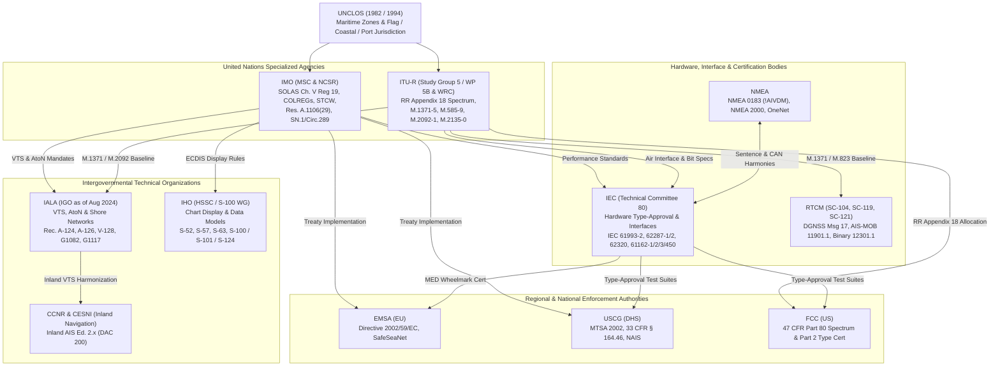
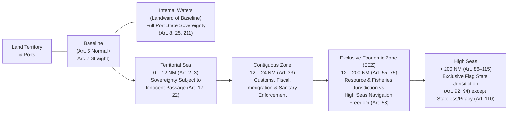

# Chapter 3: Governance, International Organizations, Treaties, Standards, and Patents

## 3.0 Operational & Conceptual Overview and Historical Lineage

### 3.0.1 Why AIS Governance Is a Multi-Layered Polyarchy
When a mariner glances at an Electronic Chart Display and Information System (ECDIS) target triangle, or a spatial data scientist queries a petabyte-scale archive of `!AIVDM` sentences in DuckDB, it is easy to assume that a single global authority designed and regulates the Automatic Identification System (AIS). In reality, **no single organization "owns" AIS**. Because an AIS transponder is simultaneously:
1. A **mandatory safety-of-life navigation instrument** aboard merchant vessels on international voyages,
2. A **VHF radio transmitter** radiating $2\text{ W}$ to $12.5\text{ W}$ of Gaussian Minimum Shift Keying (GMSK) RF energy across internationally coordinated maritime mobile frequency bands,
3. An **embedded computing node** speaking standardized serial, Controller Area Network (CAN), and Ethernet protocols to shipboard sensors,
4. A **hydrographic symbol** rendered on certified electronic nautical charts, and
5. A **shore-side traffic management and coastal surveillance sensor**,

its governance is distributed across an interlocking ecosystem of United Nations specialized agencies, intergovernmental treaties, electrotechnical certification bodies, marine industry associations, and national law-enforcement authorities.



Understanding this regulatory architecture is essential for both mariners and engineers:
* **For the Mariner and Fleet Manager:** It explains *when* a vessel is legally required to carry a Class A versus Class B transponder, *who* assigns the 9-digit Maritime Mobile Service Identity (MMSI) versus the permanent 7-digit IMO hull number, *under what exact legal conditions* a ship's Master may switch off AIS in piracy High Risk Areas (HRAs), and *why* relying on AIS alone for collision avoidance violates the International Regulations for Preventing Collisions at Sea (COLREGs).
* **For the Hardware, RF, and Software Engineer:** It explains why the over-the-air bit layouts live in **ITU-R M.1371-5**, why the `!AIVDM` serial framing lives in **NMEA 0183 / IEC 61162-1**, why laboratory RF ramp-up and spurious-emission masks live in **IEC 61993-2** and **47 CFR Part 80**, why green sleeping/active target triangles on ECDIS are dictated by **IHO S-52**, and why the foundational Self-Organizing Time Division Multiple Access (SOTDMA) protocol—once the subject of fierce international patent litigation under Håkan Lans's **US Patent 5,506,587**—had all 19 of its US claims cancelled on reexamination by the USPTO in March 2010 before expiring globally.

---

### 3.0.2 Historical Context & Evolution (`schwehr/gis-history` Integration)
The institutional framework governing AIS did not emerge in a vacuum in the 1990s; it represents the convergence of two centuries of international diplomatic treaties on rivers, telegraphs, safety at sea, hydrography, and radio spectrum management documented in [`schwehr/gis-history`](https://github.com/schwehr/gis-history) ([Front Matter Timeline](00-front-matter/ais-and-gis-history-timeline.md)):

| Year | Institutional, Legal, or Patent Milestone (`gis-history` & AIS Lineage) | Governance & Technical Impact on Modern AIS |
|---|---|---|
| **1815** | **Central Commission for the Navigation of the Rhine (CCNR)** established at the Congress of Vienna | World's oldest extant international organization; today governs **Inland AIS** (`DAC 200`) across European inland waterways. |
| **1865** | **International Telegraph Union (ITU)** founded in Paris (UN specialized agency in 1947) | Establishes global treaty governance over telecommunication frequencies, call signs, and later **ITU-R** maritime VHF allocations. |
| **1906** | **International Electrotechnical Commission (IEC)** founded in London (now Geneva); Berlin International Radiotelegraph Convention mandates `SOS` and cross-vendor radio interoperability | Ends Marconi's refusal to relay messages from competing radio hardware; establishes the principle that **maritime safety radio protocols must be open and interoperable across all manufacturers**. |
| **1912 – 1914** | ***RMS Titanic* sinking (April 15, 1912)** spurs the first **SOLAS Convention (1914)** (`gis-history`) | Birth of international treaty mandates for shipboard radio carriage and **SOLAS Chapter V** (*Safety of Navigation*). |
| **1921** | **International Hydrographic Bureau (now IHO)** founded in Monaco (`gis-history`) | Standardizes international nautical chart symbology, culminating in **IHO S-52**, **S-57**, and **S-100**. |
| **1947 – 1948** | **RTCM** founded (1947); **IMO Convention** adopted in Geneva (1948, entered into force 1958 as IMCO, renamed IMO in 1982) (`gis-history`) | Establishes the UN agency responsible for global maritime safety and pollution prevention alongside US/international radio technical committees. |
| **1957** | **IALA** founded in Paris and **NMEA** founded in the United States (`gis-history`) | Lighthouse/VTS authorities organize globally under IALA while marine electronics interfaces organize under NMEA. |
| **1972 – 1974** | **COLREGs 1972** and **SOLAS 1974** adopted (`gis-history`) | **SOLAS 1974** introduces the **tacit acceptance procedure**, allowing technical amendments to Chapter V (such as the 2000 AIS mandate) to enter into force automatically on a fixed date without waiting decades for parliament-by-parliament ratification. |
| **1982 – 1984** | **UNCLOS** signed at Montego Bay (1982, effective 1994); **NMEA 0183** and **WGS84** adopted (1984) (`gis-history`) | Codifies the $12\text{ NM}$ territorial sea, $24\text{ NM}$ contiguous zone, and $200\text{ NM}$ EEZ alongside the ASCII serial bus and reference ellipsoid of AIS. |
| **Sept 9, 1988** | **Håkan Lans** files Swedish priority patent application `SE 8803164` for **STDMA** | Priority date for the self-organizing TDMA slot-reservation mechanism later adopted into AIS (`gis-history`). |
| **1989 – 1990** | ***Exxon Valdez* grounding (March 24, 1989)** and US **Oil Pollution Act of 1990 (OPA-90)** (`gis-history`) | Statutory catalyst mandating automated vessel position reporting in Prince William Sound and VTS waters ([Cutlip, 2017](https://globalfishingwatch.org/article/ais-brief-history/)). |
| **1996 – 1998** | **US Patent 5,506,587** granted to Håkan Lans (April 9, 1996); **WRC-97** designates VHF Ch 87B (`161.975 MHz`) & Ch 88B (`162.025 MHz`); **IMO MSC.74(69)** (May 1998) & **ITU-R M.1371-0** (Nov 1998) adopted | First global spectrum allocation, performance standard, and air-interface specification for Universal Shipborne AIS. |
| **Dec 2000 – July 2002** | **IMO MSC.99(73)** revises **SOLAS Chapter V, Regulation 19** (Dec 2000); **9/11 attacks** (2001); **SOLAS AIS mandate takes effect (July 1, 2002)**; **US MTSA 2002** enacted (`gis-history`) | AIS transitions from regional VTS prototypes to mandatory global shipboard equipment and coastal homeland security infrastructure. |
| **March 30, 2010** | **USPTO issues Ex Parte Reexamination Certificate `US 5,506,587 C1`** cancelling all claims 1–19 of Håkan Lans's STDMA patent (`gis-history`) | Resolves over a decade of RAND licensing and royalty disputes over the core terrestrial SOTDMA protocol; **Kurt Schwehr releases `libais`** in April 2010 during *Deepwater Horizon*. |
| **Aug 22, 2024** | **IALA transitions from an NGO to an Intergovernmental Organization (IGO)** | Elevates IALA to the same diplomatic treaty tier as IMO and IHO as maritime navigation transitions toward **VDES (AIS 2.0)** and **IHO S-100**. |

---

## 3.1 Key Organizations and What They Are

### 3.1.1 International Maritime Organization (IMO)
The **International Maritime Organization (IMO)**, headquartered on the Albert Embankment in London, United Kingdom, is the specialized agency of the United Nations with global responsibility for the safety and security of shipping and the prevention of marine and atmospheric pollution by ships. Established by convention in Geneva on March 6, 1948 (originally as the *Inter-Governmental Maritime Consultative Organization* [IMCO], entering into force in 1958 and renamed IMO in 1982), the IMO comprises 176 Member States and 3 Associate Members.

Within the IMO's institutional hierarchy, AIS is governed primarily through three bodies:
1. **The IMO Assembly:** The highest governing body of all Member States, meeting biennially to adopt overarching operational guidelines such as **Resolution A.917(22)** (2001) and its modern replacement, **Resolution A.1106(29)** (*Revised Guidelines for the Onboard Operational Use of Shipborne Automatic Identification Systems (AIS)*, adopted December 2, 2015).
2. **The Maritime Safety Committee (MSC):** The senior technical body empowered to adopt binding amendments to the **SOLAS Convention** (such as Chapter V, Regulation 19 and Regulation 19-1) and mandatory equipment performance standards such as **Resolution MSC.74(69) Annex 3** (*Recommendation on Performance Standards for an Universal Shipborne Automatic Identification System (AIS)*, 1998), **Resolution MSC.246(83)** (AIS-SART, 2007), **Resolution MSC.466(101)** (AMRD, 2019), and amendments introducing the VHF Data Exchange System (**VDES**) into SOLAS Chapter V.
3. **The Sub-Committee on Navigation, Communications and Search and Rescue (NCSR):** Formed in 2013/2014 by merging the historical Sub-Committee on Safety of Navigation (**NAV**), Sub-Committee on Radiocommunications and Search and Rescue (**COMSAR**), and parts of Standards of Training and Watchkeeping (**STW**). NCSR drafts all technical circulars governing AIS display symbology (**SN.1/Circ.243/Rev.2**), installation guidelines (**SN.1/Circ.227**), annual testing requirements (**MSC.1/Circ.1252**), and international Application-Specific Messages (**SN.1/Circ.289** and **SN.1/Circ.290**).

> [!IMPORTANT]
> **How IMO Decisions Become Binding Law:** The IMO itself does not maintain an international coast guard or police force. Instead, IMO conventions (SOLAS, COLREGs, STCW) are binding international treaties. Once adopted by the MSC under SOLAS's **tacit acceptance procedure** (Article VIII), an amendment automatically enters into force unless objections are received from more than one-third of Contracting Governments (or Contracting Governments whose combined merchant fleets constitute not less than $50\%$ of world gross tonnage). Each Contracting Government then incorporates the SOLAS rule into its domestic statute code (e.g., the US Code of Federal Regulations or UK Merchant Shipping Regulations) and enforces it via **Flag State** surveys and **Port State Control (PSC)** inspections.

---

### 3.1.2 International Telecommunication Union (ITU and ITU-R)
Founded in Paris on May 17, 1865 as the *International Telegraph Union* and headquartered in Geneva, Switzerland, the **International Telecommunication Union (ITU)** is the oldest specialized agency in the United Nations system. The ITU is organized into three sectors: Radiocommunication (**ITU-R**), Telecommunication Standardization (**ITU-T**), and Telecommunication Development (**ITU-D**).

AIS is an over-the-air radio system, placing its physical layer, link layer, message structure, and spectrum allocation squarely under **ITU-R**:
* **World Radiocommunication Conferences (WRC):** Held every three to four years, WRCs revise the **ITU Radio Regulations (RR)**—an international treaty binding on all 193 ITU Member States. At **WRC-97** (Geneva, 1997), the ITU amended **RR Appendix 18** (*Table of transmitting frequencies in the VHF maritime mobile band*) to designate **AIS 1** (Channel 87B, $161.975\text{ MHz}$) and **AIS 2** (Channel 88B, $162.025\text{ MHz}$) for universal shipborne AIS. Subsequent conferences expanded the spectrum:
  * **WRC-07** and **WRC-12** designated **Channel 75** ($156.775\text{ MHz}$) and **Channel 76** ($156.825\text{ MHz}$) for Long-Range AIS (Message 27) to support spaceborne Low Earth Orbit (LEO) satellite reception.
  * **WRC-15** allocated **ASM 1** (Channel 2027, $161.950\text{ MHz}$) and **ASM 2** (Channel 2028, $162.000\text{ MHz}$) to offload Application-Specific Messages from AIS 1/2, and allocated terrestrial VDES channels (**VDE-TER**).
  * **WRC-19** established the satellite downlink and uplink frequency allocations for **VDE-SAT** in RR Appendix 18 and designated **Channel 2006** ($160.900\text{ MHz}$) for non-navigational Autonomous Maritime Radio Devices (**AMRD Group B**).
* **ITU-R Study Group 5 (Terrestrial Services) and Working Party 5B (WP 5B):** WP 5B is responsible for the maritime mobile service (including GMDSS), the aeronautical mobile service, and the radiodetermination service. WP 5B authors and maintains the core technical recommendations that define AIS bit-by-bit:
  * **Recommendation ITU-R M.1371** (*Technical characteristics for an automatic identification system using time division multiple access in the VHF maritime mobile frequency band*): First ratified as **M.1371-0** in November 1998, and updated through **M.1371-1** (2001), **M.1371-2** (2006, adding Class B CS), **M.1371-3** (2007), **M.1371-4** (2010, adding Class B SO and Message 27), and **M.1371-5** (February 2014). It specifies the OSI Physical, Link (SOTDMA/RATDMA/ITDMA/FATDMA/CSTDMA), Network, and Transport layers and the exact bit layouts of **Messages 1 through 27**.
  * **Recommendation ITU-R M.585-9** (2022, *Assignment and use of identities in the maritime mobile service*): Defines the structure and numbering rules for 9-digit **MMSI** numbers across ships, coast stations, SAR aircraft (`111MIDxxx`), AtoNs (`99MIDxxxx`), craft associated with a parent ship (`98MIDxxxx`), AIS-SART (`970xxxxxx`), MOB (`972xxxxxx`), EPIRB-AIS (`974xxxxxx`), and AMRD Group B (`979xxxxxx`), alongside **Maritime Identification Digits (MID)** listed in ITU Radio Regulations Table of Allocation of International Call Sign Series and MIDs.
  * **Recommendation ITU-R M.2092-1** (2022, *Technical characteristics for a VHF data exchange system in the VHF maritime mobile band*): The master air-interface specification for **VDES** (AIS + ASM + VDE-TER + VDE-SAT).
  * **Recommendation ITU-R M.2135-0** (2019, *Technical characteristics of autonomous maritime radio devices operating in the frequency band 156–162.05 MHz*): Divides autonomous beacons into **AMRD Group A** (safety-related, e.g., MOB, permitted on AIS 1/2) and **AMRD Group B** (non-safety fishing gear/scientific buoys, restricted to Channel 2006 at $160.900\text{ MHz}$ with $1\text{ W}$ e.i.r.p. max).

---

### 3.1.3 International Organization for Marine Aids to Navigation (IALA) — and Its Historic August 2024 Transition to an IGO
Founded on July 1, 1957, and headquartered in Saint-Germain-en-Laye (near Paris), France, **IALA** coordinates the world's lighthouse authorities, coast guards, and Vessel Traffic Services (VTS) providers. Historically known for harmonizing the global maritime buoyage system (IALA Regions A and B) and playing a pivotal role in the 1990s technical evaluations that selected SOTDMA as the foundation of AIS, IALA underwent a landmark legal transformation in **August 2024**:

> [!NOTE]
> **IALA's August 22, 2024 Elevation from NGO to Intergovernmental Organization (IGO):**
> From 1957 until August 2024, IALA operated under French law as a non-governmental association (*International Association of Marine Aids to Navigation and Lighthouse Authorities*). Because IALA recommendations increasingly governed sovereign coastal VTS infrastructure, Virtual AIS Aids to Navigation (V-AtoN), e-Navigation, and cybersecurity, Member States negotiated the **Convention on the International Organization for Marine Aids to Navigation**, adopted at a diplomatic conference in Kuala Lumpur in February 2020 and opened for signature in Paris in November 2020. Under Article 20 of the Convention, the treaty entered into force on the 90th day after the deposit of the 30th instrument of ratification—which occurred when Singapore deposited the 30th ratification in May 2024. Consequently, on **August 22, 2024**, IALA officially became an **Intergovernmental Organization (IGO)** (*International Organization for Marine Aids to Navigation*, retaining the acronym **IALA**), placing it on the same diplomatic footing as the IMO and IHO, and holding its inaugural IGO General Assembly in Singapore in February 2025.

While the IMO focuses on **what ships must carry**, IALA focuses on **how coastal authorities build, network, and operate AIS shore infrastructure, VTS centers, and Aids to Navigation**:
* **IALA Recommendation A-124** (*The AIS Service*, Ed. 2.1, accompanied by technical appendices A-124.1 through A-124.19): The definitive architectural blueprint for **AIS Shore Stations and National/Regional AIS Networks**, defining the Logical AIS Shore Station (LSS), AIS Service Management (ASM), message filtering/deduplication, IEC 61162-450 TAG-block timestamping, and inter-regional data sharing.
* **IALA Recommendation A-126** (*The Use of the Automatic Identification System (AIS) in Marine Aids to Navigation Services*): Establishes the international taxonomy and operational rules for **Real AIS AtoNs** (physically mounted on a buoy or lighthouse), **Synthetic AIS AtoNs** (Monitored vs. Predicted—transmitted by a shore AIS Base Station to coincide with a real physical buoy that lacks its own AIS transmitter), and **Virtual AIS AtoNs** (transmitted by a Base Station via Message 21 at a coordinate where *no physical buoy exists at all*, e.g., to mark a newly sunken wreck, shifting sandbar, or dynamic ice hazard).
* **IALA Recommendation V-128** (*Operational and Technical Performance of VTS Systems*) and **Model Courses V-103/1 through V-103/4**: Define how AIS tracks are fused with coastal surveillance radar inside VTS centers and how VTS operators are certified.
* **IALA Guideline G1082** (*An Overview of AIS*) and **Guideline G1117** (*VHF Data Exchange System [VDES] Overview*): Comprehensive engineering and operational guides for coastal authorities.
* **IWRAP Mk II (IALA Waterway Risk Assessment Program):** Quantitative probabilistic collision and grounding risk modeling tool powered by empirical AIS traffic distributions (developed in partnership with GateHouse Maritime; see Chapter 25).

---

### 3.1.4 International Hydrographic Organization (IHO)
Established in 1921 as the *International Hydrographic Bureau (IHB)* at the invitation of Prince Albert I of Monaco and renamed the **International Hydrographic Organization (IHO)** in 1970, the IHO is an intergovernmental organization headquartered in Monaco that coordinates the activities of national hydrographic offices (such as NOAA Office of Coast Survey in the US and the UK Hydrographic Office).

The IHO governs how AIS targets, Aids to Navigation, and maritime safety overlays are encoded and rendered on **Electronic Chart Display and Information Systems (ECDIS)**:
* **IHO S-52** (*Specifications for Chart Content and Display Aspects of ECDIS*, together with the **S-52 Presentation Library**): Standardizes the visual rendering of AIS targets on bridge displays (in alignment with IMO **SN.1/Circ.243/Rev.2**), including sleeping vs. activated Class A/B triangles, heading lines, speed/course vectors, Rate-of-Turn flags, Real/Synthetic/Virtual AIS AtoN diamond symbols, and AIS-SART/MOB distress crosshairs.
* **IHO S-57** (*IHO Transfer Standard for Digital Hydrographic Data*) and **IHO S-63** (*IHO Data Protection Scheme*): First-generation vector Electronic Navigational Chart (ENC) encoding and cryptographic licensing standards.
* **IHO S-100 (*Universal Hydrographic Data Model*):** Adopted by the IMO for mandatory phase-in on new ECDIS systems starting **January 1, 2026** (mandatory for all new installations by **January 1, 2029** under IMO Resolution MSC.530(106)), the S-100 framework replaces monolithic S-57 charts with modular, machine-readable ISO 19100 geospatial product specifications that interact directly with AIS and VDES broadcasts (Chapter 21):
  * **S-101:** Next-generation Electronic Navigational Charts (ENC),
  * **S-102:** High-resolution Bathymetric Surface grids,
  * **S-104:** Water Level Information for Surface Navigation (replacing legacy AIS tidal binary messages),
  * **S-111:** Surface Currents,
  * **S-124:** Navigational Warnings (superseding ad-hoc AIS Area Notices with structured GML/HDF5 polygons over VDES),
  * **S-129:** Under Keel Clearance Management (UKCM), and
  * **S-421** (jointly with IEC 63173-1): Route Plan Exchange.

---

### 3.1.5 International Electrotechnical Commission (IEC — Technical Committee 80)
Founded in 1906 and headquartered in Geneva, the **International Electrotechnical Commission (IEC)** is the global organization that prepares and publishes international standards for all electrical, electronic, and related technologies. Within the IEC, **Technical Committee 80 (TC 80 — *Maritime navigation and radiocommunication equipment and systems*)** serves as the bridge between high-level IMO/ITU treaties and physical silicon hardware.

While ITU-R M.1371 says *what* an AIS message is and IMO MSC.74(69) says *what* a Class A unit should do functionally, **IEC TC 80 specifies the exact laboratory test harnesses, RF spectrum analyzer masks, packet error rate (PER) thresholds, co-channel rejection tests, temperature/vibration cycles, and digital electrical interfaces** required for a manufacturer (such as Furuno, JRC, Kongsberg, Saab, Raymarine, Garmin, or em-trak) to receive a legal **Type Approval Certificate** (e.g., EU Marine Equipment Directive [MED] "Wheelmark", USCG Type Approval, or FCC Part 80 Certification):
* **IEC 61993-2** (*Maritime navigation and radiocommunication equipment and systems — Automatic identification systems (AIS) — Part 2: Class A shipborne equipment of the universal automatic identification system (AIS) — Operational and performance requirements, methods of test and required test results*, Ed. 3.0, 2018): The definitive certification standard for SOLAS **Class A** transponders ($12.5\text{ W}$ / $1\text{ W}$ output, 1 SOTDMA transmitter, 2 parallel TDMA receivers + 1 DSC Ch 70 receiver, built-in GNSS timing engine, Minimum Keyboard and Display [MKD], and Pilot Plug).
* **IEC 62287-1** (Class B "CS" CSTDMA shipborne equipment, $2\text{ W}$ carrier-sense) and **IEC 62287-2** (Class B "SO" SOTDMA shipborne equipment, $5\text{ W}$ / $1\text{ W}$ self-organizing TDMA).
* **IEC 62320-1** (AIS Base Stations), **IEC 62320-2** (AIS Aids to Navigation [AtoN] equipment), and **IEC 62320-3** (AIS Repeater Stations).
* **IEC 61097-14** (AIS Search and Rescue Transmitter [AIS-SART]) and **IEC 63269** (Autonomous Maritime Radio Devices [AMRD] Group A & B).
* **IEC 61162 Series (*Digital interfaces for navigational equipment within a ship*):**
  * **IEC 61162-1:** Single talker and multiple listeners (the international standardization of **NMEA 0183** RS-422 at $4{,}800\text{ bps}$ and **NMEA 0183-HS** at $38{,}400\text{ bps}$, used by AIS Pilot Plugs and `!AIVDM` / `!AIVDO` outputs),
  * **IEC 61162-2:** High-speed single talker and multiple listeners ($38{,}400\text{ bps}$),
  * **IEC 61162-3:** Serial data instrument network (the international standardization of **NMEA 2000** CAN bus),
  * **IEC 61162-450:** Multiple talkers and multiple listeners — **Lightweight Ethernet (LWE)** (UDP/IPv4 multicast `239.192.0.1`–`239.192.0.64` on ports `60001`–`60064`, prefixing NMEA sentences with `\s:...,c:...\*hh\` **TAG blocks**; see Chapter 14), and
  * **IEC 61162-460:** Safety and security gateway extensions for IEC 61162-450 networks.

---

### 3.1.6 Radio Technical Commission for Maritime Services (RTCM)
Founded in 1947 in the United States as a government-industry advisory committee and reconstituted in 1983 as an independent international non-profit scientific and educational organization based in Arlington, Virginia, the **Radio Technical Commission for Maritime Services (RTCM)** develops detailed technical standards where specialized working groups of GNSS, distress-beacon, and AIS engineers are needed:
* **RTCM Special Committee 104 (SC-104 — *Differential Global Navigation Satellite Systems [DGNSS]*):** Authors **RTCM 10402.x** and **10403.x**, whose Type 1, 3, 9, and 16 differential pseudorange correction words are encapsulated directly inside **AIS Message 17** (*DGNSS Broadcast Binary Message*) per ITU-R M.823 (Chapter 15).
* **RTCM Special Committee 119 (SC-119 — *Maritime Survivor Locating Devices [MSLD]*):** Authors **RTCM Standard 11901.1** (and Ed. 2), which defines the safety interlock, water/manual activation, integrated GNSS acquisition latency, and burst schedule for personal lifejacket **AIS-MOB (Man Overboard)** beacons (`972xxxxxx` MMSI series).
* **RTCM Special Committee 121 (SC-121 — *Automatic Identification Systems (AIS) and Digital Messaging*):** Authors **RTCM Standard 12301.1** (*Standard for Україн/Enhanced Binary Messages and AIS Application-Specific Messages*), closely coordinated with USCG, NOAA PORTS®, and the St. Lawrence Seaway for regional environmental, water-level, and lock-scheduling binary messages (`DAC 366` / `DAC 316`).

---

### 3.1.7 National Marine Electronics Association (NMEA)
Founded in 1957 by marine electronics dealers and manufacturers in the United States, the **National Marine Electronics Association (NMEA)** created the physical and logical wiring standards that connect every sensor on a vessel's bridge:
* **NMEA 0183** (introduced in 1983/1984; current v4.11 / v4.30 harmonized with **IEC 61162-1**): Defines the printable ASCII sentence structure (`$--xxx` for standard talkers and `!AIVDM` / `!AIVDO` for 6-bit armored binary AIS payloads, terminated by `*hh<CR><LF>` XOR checksums) over optically isolated differential EIA-422 serial lines (`4,800` baud for legacy GNSS/gyro; `38,400` baud `NMEA 0183-HS` required for AIS due to multi-target VHF bursts).
* **NMEA 2000 (N2K)** (introduced in 2000/2001; harmonized with **IEC 61162-3**): A plug-and-play $250\text{ kbps}$ Controller Area Network (CAN 2.0B) bus derived from SAE J1939 and ISO 11783. Rather than ASCII strings, NMEA 2000 transmits compact binary **Parameter Group Numbers (PGNs)**—such as `PGN 129038` (AIS Class A Position Report), `PGN 129039` (AIS Class B Position Report), `PGN 129794` (AIS Class A Static and Voyage Related Data), and `PGN 129041` (AIS Aids to Navigation Report)—using Fast-Packet framing for payloads $>8\text{ bytes}$ (Chapter 14).
* **NMEA OneNet:** Next-generation IPv6/Ethernet marine network standard transporting NMEA 2000 PGN messages over standard IEEE 802.3 Gigabit Ethernet with Power over Ethernet (PoE) and TLS authentication.

---

### 3.1.8 Regional and National Authorities: EMSA, CCNR, USCG, and FCC

#### 1. European Maritime Safety Agency (EMSA)
Established by the European Union in 2002 (**Regulation (EC) No 1406/2002**) in the immediate aftermath of the *Erika* (1999) and *Prestige* (2002) oil tanker disasters and headquartered in Lisbon, Portugal, **EMSA** operates the world's largest transnational government maritime surveillance infrastructure under **EU Directive 2002/59/EC** (*Community vessel traffic monitoring and information system*):
* **SafeSeaNet (SSN):** The pan-European coastal AIS and voyage-reporting network aggregating terrestrial AIS feeds from all EU/EEA Member States plus Norway and Iceland.
* **EU Fishing Vessel AIS Mandate:** Under Article 6a of Directive 2002/59/EC (as amended by Directive 2009/17/EC and Regulation (EC) No 1224/2009), the EU mandated **Class A AIS** on all EU fishing vessels with Length Overall ($L_{\text{OA}}$) **$\ge 15\text{ meters}$** (phased in between 2012 and May 31, 2014)—a threshold vastly stricter than SOLAS's $300\text{ GT}$ rule.
* **Integrated Maritime Services (IMS) & CleanSeaNet:** Fuses terrestrial SSN, Satellite AIS (S-AIS), LRIT, VMS, and Copernicus **Sentinel-1 SAR** radar imagery to detect oil spills and dark vessels across European and global waters.

#### 2. Central Commission for the Navigation of the Rhine (CCNR) & CESNI
Established at the **Congress of Vienna in 1815** and headquartered in Strasbourg, France, the **CCNR** (comprising Belgium, France, Germany, the Netherlands, and Switzerland) is the oldest active international organization in the world. Working alongside **CESNI** (*Comité Européen pour l'élaboration de Standards dans le domaine de la Navigation Intérieure*, established 2015) and the EU **River Information Services (RIS)** Directive (2005/44/EC), CCNR maintains the **Inland AIS Standard** (*Vessel Tracking and Tracing Standard for Inland Navigation*, Edition 2.x / **ES-RIS**):
* Because inland barges and push-tow convoys on the Rhine, Danube, Elbe, and Seine have operational needs not met by ocean-going SOLAS AIS—such as reporting exact barge convoy length/beam in decimeters, loaded draught in centimeters for shallow river sills, hazardous cargo "Blue Cones" (ADN 1, 2, or 3 cones), **Electronic Reporting International (ERI)** hull/convoy codes (`8000`–`8490`), and the status of the **Blue Sign** (stbd-to-stbd oncoming passing board)—CCNR defined **Designated Area Code (DAC) `200`** Application-Specific Messages (Message 8/6 `DAC 200`, `FI 10`, `FI 21`, `FI 22`, `FI 23`, `FI 24`, `FI 40`, `FI 55`) and mandated Inland AIS certification across the Rhine and European inland waterways.

#### 3. United States Coast Guard (USCG)
Operating under the U.S. Department of Homeland Security (DHS), the **USCG** enforces both international SOLAS treaties and domestic U.S. statutory mandates (OPA-90, MTSA 2002) within U.S. navigable waters under **Title 33 of the Code of Federal Regulations, Part 164** (**33 CFR § 164.46**):
* **USCG Navigation Center (NAVCEN):** Located in Alexandria, Virginia, NAVCEN manages US AIS frequency assignments, coordinates DGNSS/AIS Area Notice broadcasts, publishes the USCG AIS Encoding Guide, and resolves MMSI/equipment anomalies.
* **Nationwide Automatic Identification System (NAIS):** A network of $>120$ coastal, Great Lakes, and inland river transceiver towers (supplemented by offshore buoys and commercial satellite feeds) feeding **Command21 / WatchKeeper**, **SeaVision**, **SAROPS**, and **NOAA ERMA / MarineCadastre.gov** (Chapter 22).

#### 4. Federal Communications Commission (FCC)
In the United States, federal government spectrum (such as USCG shore stations) is coordinated by the **NTIA** (National Telecommunications and Information Administration), whereas all non-federal commercial, fishing, and recreational shipboard transmitters are regulated by the **Federal Communications Commission (FCC)** under **Title 47 of the Code of Federal Regulations**:
* **47 CFR Part 80 (*Stations in the Maritime Services*, Subpart E & Subpart K — §§ 80.231, 80.275, 80.371, 80.393):** Governs maritime VHF licensing, MMSI issuance (delegated via Memorandum of Understanding to BoatUS, Sea Tow, US Power Squadrons, and Shine Micro for domestic-only vessels, while the FCC directly licenses ships making international voyages via FCC Form 605), and technical requirements for Class A, Class B, AIS-SART, and AIS-MOB equipment.
* **47 CFR Part 2 (*Equipment Authorization Procedures*):** Prohibits the importation, marketing, sale, or operation in the United States of any AIS transmitter that has not passed laboratory testing at an accredited Telecommunications Certification Body (TCB) and received both an **FCC ID** and **USCG Type Approval number**. In 2018–2024, the FCC Enforcement Bureau issued multiple Public Notices and civil forfeiture penalties against distributors importing uncertified Chinese AIS fishing-net buoys that illegally transmitted on AIS 1/2 ($161.975 / 162.025\text{ MHz}$) using forged MMSIs.

---

## 3.2 Key Laws and Treaties Impacting AIS

### 3.2.1 United Nations Convention on the Law of the Sea (UNCLOS, 1982 / 1994)
Signed at Montego Bay, Jamaica, on December 10, 1982, and entering into force on November 16, 1994, the **United Nations Convention on the Law of the Sea (UNCLOS)** is the "constitution for the oceans." Although UNCLOS was drafted a decade before AIS was invented, its jurisdictional partitions determine **who has the legal authority to require a vessel to broadcast AIS, and who can board or penalize a vessel that turns its AIS off**.



#### 1. Baselines and Maritime Zones Under UNCLOS
All maritime zones are measured seaward from the **Baseline**:
* **Normal Baseline (Article 5):** The low-water line along the coast as marked on large-scale charts officially recognized by the coastal state.
* **Straight Baselines (Article 7) and Archipelagic Baselines (Article 47):** Straight geodesic lines joining appropriate points where the coastline is deeply indented and cut into, or where there is a fringe of islands along the coast in its immediate vicinity (or connecting the outermost points of an archipelagic state such as Indonesia or the Philippines).

| UNCLOS Zone | Spatial Extent from Baseline | UNCLOS Articles | Coastal / Port State Authority Over AIS Carriage & Enforcement |
|---|---|---|---|
| **Internal Waters & Ports** | Landward of the Baseline (rivers, bays, harbors) | Art. 8, 25(2), 211(3) | **Absolute Sovereignty.** A Port State has unrestricted legal authority to require any domestic or foreign vessel entering its ports or internal waters to carry and operate AIS (e.g., US 33 CFR § 164.46 on the Mississippi River; CCNR Inland AIS on the Rhine) and to detain non-compliant ships under **Port State Control (PSC)**. |
| **Territorial Sea** | Up to **$12\text{ NM}$** ($22.224\text{ km}$) seaward of the Baseline | Art. 2–3, 17–26 | **Sovereignty Subject to Innocent Passage.** Under **Art. 17–19**, foreign ships (including warships) enjoy the right of *innocent passage* (continuous and expeditious traversal not prejudicial to peace, good order, or security). Under **Art. 21(1)(a)** and **Art. 22**, the coastal state may enact laws regulating innocent passage for *"the safety of navigation and the regulation of maritime traffic"* and Traffic Separation Schemes (TSS). Crucially, **Art. 21(2)** states that such laws *"shall not apply to the design, construction, manning or equipment of foreign ships unless they are giving effect to generally accepted international rules or standards"* (**GAIRS**, i.e., **SOLAS Chapter V, Reg 19**). Thus, a coastal state can enforce SOLAS AIS rules on a foreign ship in innocent passage, or require AIS as a condition of *entering a port*, but cannot force a small $100\text{ GT}$ foreign yacht merely transiting its territorial sea in innocent passage to install Class A hardware beyond SOLAS! |
| **International Straits** | Straits connecting two parts of the high seas / EEZ (e.g., Dover, Hormuz, Malacca, Gibraltar) | Art. 34–45 | **Transit Passage (Art. 38).** More permissive than innocent passage; cannot be suspended. Under **Art. 41–42**, strait states may designate sea lanes/TSS approved by the IMO and enforce international safety/pollution regulations (including mandatory IMO ship reporting systems `SRS` and SOLAS AIS operation). |
| **Contiguous Zone** | **$12\text{ NM}$ to $24\text{ NM}$** from the Baseline | Art. 33 | **Preventive & Punitive Enforcement.** The coastal state may exercise control necessary to **prevent or punish infringement of its customs, fiscal, immigration, or sanitary laws** committed within its territory or territorial sea (e.g., intercepting a dark smuggling vessel or sanctions-evading tanker preparing to enter or fleeing territorial waters). |
| **Exclusive Economic Zone (EEZ)** | **$12\text{ NM}$ to $200\text{ NM}$** ($370.4\text{ km}$) from the Baseline | Art. 55–75 | **Functional Resource Sovereignty vs. Freedom of Navigation.** Under **Art. 56**, the coastal state holds sovereign rights over living and non-living natural resources (fisheries, offshore oil/gas, wind energy) and environmental protection. Under **Art. 62(4)(e)**, the coastal state can strictly mandate **AIS and VMS** on all **fishing vessels** operating in its EEZ and arrest ships fishing illegally (IUU). However, under **Art. 58(1)**, foreign non-fishing vessels enjoy high-seas **freedom of navigation** through the EEZ! A coastal state generally cannot board a foreign merchant tanker at $100\text{ NM}$ solely because it turned off its AIS, unless the vessel is engaged in illegal resource extraction, marine pollution (Art. 220), or unauthorized broadcasting. |
| **High Seas** | Beyond **$200\text{ NM}$** from Baselines | Art. 86–115 | **Exclusive Flag State Jurisdiction (Art. 92 & 94).** Ships on the high seas are subject to the **exclusive jurisdiction of their Flag State**. Under **Art. 94**, the Flag State is legally obligated to ensure its vessels comply with SOLAS (including keeping AIS on). Another state's warship may only board a foreign ship on the high seas under **Art. 110 (Right of Visit)** if there is reasonable ground for suspecting piracy, slave trade, unauthorized broadcasting, or that the ship is **without nationality (stateless / flying a false flag)**—a critical legal tool used by the US Coast Guard and allied navies to board "zombie" shadow-fleet tankers broadcasting falsified MMSIs! |

---

### 3.2.2 International Convention for the Safety of Life at Sea (SOLAS, 1914 / 1974 / Chapter V, Reg 19 & Reg 19-1)
First adopted on January 20, 1914 in response to the sinking of the *RMS Titanic* (April 15, 1912), revised in 1929, 1948, 1960, and adopted in its current permanent framework on November 1, 1974 (**SOLAS 1974**, entering into force May 25, 1980), the **SOLAS Convention** is the most important international treaty governing merchant ship safety.

While Chapters I–IV of SOLAS apply only to ships engaged on international voyages above certain tonnage thresholds, **SOLAS Chapter V (*Safety of Navigation*)** applies in principle to **all ships on all voyages** (Regulation 1.1), with specific equipment exemptions and tonnage thresholds defined in individual regulations.

#### 1. SOLAS Chapter V, Regulation 19.2.4: Exact AIS Carriage Thresholds
Adopted in December 2000 via **Resolution MSC.99(73)** and entering into force on **July 1, 2002** (with phased retrofit deadlines originally spanning 2002–2008 and expedited to December 31, 2004 following the September 11, 2001 attacks at the Dec 2002 Diplomatic Conference on Maritime Security), **SOLAS Chapter V, Regulation 19, paragraph 2.4** mandates that a **Class A AIS** complying with IMO Resolution MSC.74(69) Annex 3 and IEC 61993-2 shall be fitted aboard:
1. **All ships of $300\text{ gross tonnage}$ ($\text{GT}$) and upwards** engaged on **international voyages**;
2. **Cargo ships of $500\text{ gross tonnage}$ ($\text{GT}$) and upwards not** engaged on international voyages (i.e., purely domestic voyages); and
3. **All passenger ships irrespective of size** (where a passenger ship under SOLAS Reg I/2(f) is any ship carrying more than $12$ passengers on an international voyage).

> [!WARNING]
> **Gross Tonnage ($\text{GT}$) Is Volume, Not Weight!**
> Data scientists frequently confuse **Gross Tonnage ($\text{GT}$)**—which triggers SOLAS AIS carriage—with **Deadweight Tonnage ($\text{DWT}$)** or displacement. Under the *International Convention on Tonnage Measurement of Ships (1969)*, Gross Tonnage is a **dimensionless non-linear function of the total moulded volume $V$ (in $\text{m}^3$) of all enclosed spaces of the ship**:
> $$\text{GT} = K_1 \cdot V, \qquad \text{where } K_1 = 0.2 + 0.02 \log_{10}(V)$$
> A vessel of $300\text{ GT}$ has an enclosed hull/superstructure volume of roughly $V \approx 1{,}128\text{ m}^3$ (typically a coastal vessel or large yacht of $30\text{–}45\text{ m}$ length), regardless of how heavy its cargo is.

Per **SOLAS Chapter V, Regulation 19.2.4.5**, ships fitted with AIS must automatically provide to appropriately equipped shore stations, other ships, and aircraft: the ship's identity (MMSI, Call Sign, Name, IMO Number), type, position $(\lambda, \phi)$, course (COG), speed (SOG), navigational status, and other safety-related information, while automatically receiving such information from similarly fitted ships, monitoring and tracking ships, and exchanging data with shore-based facilities.

#### 2. The Continuous Operation Mandate (Reg 19.2.4.7) and the Master's Security Discretion Clause (IMO Resolution A.1106(29) §§ 21–22)
The single most litigated sentence in AIS law is **SOLAS Chapter V, Regulation 19.2.4.7**:
> *"Ships fitted with AIS shall maintain AIS in operation at all times except where international agreements, rules or standards provide for the protection of navigational information."*

What are those *"international agreements, rules or standards"*? They are codified in **IMO Resolution A.1106(29)** (*Revised Guidelines for the Onboard Operational Use of Shipborne Automatic Identification Systems (AIS)*, adopted December 2, 2015, revoking and replacing Resolution A.917(22) and A.956(23)). Specifically, **Paragraphs 21 and 22 of the Annex to Resolution A.1106(29)** state:
* **Paragraph 21:** *"AIS should always be in operation when ships are underway or at anchor. If the master believes that the continual operation of AIS might compromise the safety or security of his/her ship or where security incidents are imminent, the AIS may be switched off. Unless it would further compromise the safety or security, if the ship is operating in a mandatory ship reporting system, the master should report this action and the reason for doing so to the competent authority."*
* **Paragraph 22:** *"Actions of this nature should always be recorded in the ship's logbook together with the reason for doing so. The master should however restart the AIS as soon as the source of danger has disappeared. If the AIS is shut down, static data and voyage related information remains stored. Restart is done by switching on the power to the AIS unit. Ship's own data will be transmitted after a two-minute initialization period. In ports AIS operation should be in accordance with port requirements."*

This creates a strict **four-part legal test** whenever a SOLAS vessel switches off its AIS:
1. **Bona Fide Imminent Threat:** The Master must hold a genuine, articulable belief that broadcasting AIS compromises ship safety or security (e.g., transiting High Risk Areas [HRAs] for piracy or armed attack in the Gulf of Aden, Somali Basin, Southern Red Sea / Bab el-Mandeb, or Gulf of Guinea).
2. **Mandatory Deck Logbook Entry:** The Master **must** record the exact UTC time, latitude/longitude, action taken, and specific security justification in the official Ship's Logbook.
3. **Notification to Competent Authority:** If operating inside a mandatory ship reporting system (or VTS / UKMTO / MSCHOA reporting area), the Master must report the switch-off unless doing so would itself compromise security.
4. **Immediate Reactivation:** The Master **must** switch the AIS back on immediately once the specific security danger has passed.

As we examine in Section 3.6 and Chapters 4 and 29, sanctions-evading tankers ("dark ships") and IUU fishing vessels routinely claim "security discretion" to excuse multi-day AIS blackouts in calm, piracy-free waters (such as off Malaysia, Kalamata, or the Galápagos)—claims that Port State Control inspectors, OFAC sanctions investigators, and admiralty courts reject when deck logs, VDR records, and threat assessments fail the four-part A.1106(29) test.

#### 3. SOLAS Chapter V, Regulation 19-1: Long-Range Identification and Tracking (LRIT)
Adopted in May 2006 via **Resolution MSC.202(81)** (effective January 1, 2008), **SOLAS Chapter V, Regulation 19-1** established **Long-Range Identification and Tracking (LRIT)** for passenger ships, cargo ships $\ge 300\text{ GT}$ on international voyages, and mobile offshore drilling units (MODUs). Unlike AIS—which is an open, unencrypted VHF broadcast received by anyone within radio or satellite view every 2 to 180 seconds—LRIT uses the ship's existing GMDSS satellite terminal (Inmarsat-C or Iridium) to send closed, encrypted point-to-point position reports **every 6 hours** to a National/Regional LRIT Data Center audited by the International Mobile Satellite Organization (**IMSO**), accessible strictly to the Flag State, the destination Port State, or Coastal States within $1{,}000\text{ NM}$ (Chapter 30).

---

### 3.2.3 International Regulations for Preventing Collisions at Sea (COLREGs, 1972)
Adopted by the IMO on October 20, 1972 (entering into force July 15, 1977), the **COLREGs** represent the binding "rules of the road" at sea. Three rules in Part B (*Steering and Sailing Rules*) govern how watch officers must—and must **not**—use AIS:

1. **Rule 5 (Look-out):**
   > *"Every vessel shall at all times maintain a proper look-out by sight and hearing as well as by all available means appropriate in the prevailing circumstances and conditions so as to make a full appraisal of the situation and of the risk of collision."*
   * **Legal Consequence for AIS:** Admiralty courts (such as the English High Court in *The Panamax Alexander* [2020] EWHC 2604 (Admlty); see Chapter 4) hold that when a vessel is equipped with AIS and ECDIS, **AIS is one of the "all available means"** that a prudent Officer of the Watch (OOW) must monitor alongside visual bearings and radar/ARPA—especially where AIS provides instantaneous turn indication (ROT) or visibility around river bends and island headlands. However, AIS **never** replaces visual lookout or radar.

2. **Rule 7 (Risk of Collision):**
   > *"(a) Every vessel shall use all available means appropriate to the prevailing circumstances and conditions to determine if risk of collision exists. If there is any doubt such risk shall be deemed to exist.*
   > *(b) Proper use shall be made of radar equipment if fitted and operational, including long-range scanning to obtain early warning of risk of collision and radar plotting or equivalent systematic observation of detected objects.*
   > *(c) **Assumptions shall not be made on the basis of scanty information, especially scanty radar information.**"*
   * **Legal Consequence for AIS:** **IMO Resolution A.1106(29) §§ 28–35** explicitly applies Rule 7(c)'s prohibition on *"scanty information"* to AIS. Why is AIS information legally considered potentially "scanty" for collision avoidance?
     * **Not all vessels carry or transmit AIS:** Warships, small fishing boats, wooden dhows, leisure craft, floating containers, and icebergs may have no AIS at all, or a ship's AIS may be switched off or suffering high VSWR antenna failure.
     * **Sensor Dependency & Stale Latency:** Radar measures the *direct physical echo* off the target's steel hull relative to own-ship's bow. AIS merely repeats whatever coordinates the target ship's GNSS receiver computed—which may be degraded by a $180\text{ s}$ Class B reporting interval, an uncalibrated gyrocompass (`511°`), or a misconfigured Message 5 GNSS antenna offset that shifts a $400\text{ m}$ container ship's plotted position by $300\text{ m}$!

3. **Rule 8 (Action to Avoid Collision) and the Prohibition on VHF "Negotiation by Name":**
   > *"Any action to avoid collision shall... be positive, made in ample time and with due regard to the observance of good seamanship."*
   * Before AIS, when two ships approached at $8\text{ NM}$ at night, neither OOW knew the name of the other ship; both were forced to assess the geometry via radar/visual bearings and execute deterministic COLREGs maneuvers (Rules 13–17). Once AIS began displaying `VESSEL NAME` and `CALL SIGN` on the bridge screen, watch officers began calling approaching vessels by name on VHF Channel 16 or 13 to negotiate ad-hoc passing agreements (often contradicting COLREGs, e.g., agreeing on VHF to pass *"red-to-red / starboard-to-starboard"* in a standard crossing or head-on situation). Both **IMO Resolution A.1106(29) § 33** and UK Marine Accident Investigation Branch (MAIB) / US National Transportation Safety Board (NTSB) casualty notices warn that calling a target by its AIS name on VHF to negotiate non-COLREGs maneuvers is a primary cause of modern **"AIS-assisted collisions"** (Chapter 23).

---

### 3.2.4 STCW, OPA-90, MTSA 2002, and US 33 CFR § 164.46

1. **STCW Convention (1978, as amended in 1995 and the 2010 Manila Amendments):**
   * The *International Convention on Standards of Training, Certification and Watchkeeping for Seafarers (STCW)* establishes mandatory minimum training standards for mariners worldwide. **STCW Code Table A-II/1** (Officers in Charge of a Navigational Watch on ships $\ge 500\text{ GT}$) and **Table A-II/2** (Masters and Chief Mates) mandate demonstrated simulator and operational competence in interpreting AIS data, recognizing faulty static/dynamic inputs, and cross-checking AIS targets against radar ARPA. The curriculum is standardized in **IMO Model Course 1.34 (*Automatic Identification Systems*)** (Chapter 23).
2. **U.S. Oil Pollution Act of 1990 (OPA-90, Pub. L. 101-380, 104 Stat. 484):**
   * Enacted on August 18, 1990, following the March 24, 1989 *Exxon Valdez* oil spill on Bligh Reef in Prince William Sound, Alaska. Section 4107 and Section 5004 of OPA-90 amended the Ports and Waterways Safety Act (33 U.S.C. § 1223) and mandated that the US Coast Guard require tank vessels operating in Prince William Sound (and designated VTS areas) to be equipped with automated position-reporting transponders—creating the statutory mandate that drove the 1990s USCG VTS trials and the 1998 New Orleans **PAWSS** deployment (Chapter 2).
3. **U.S. Maritime Transportation Security Act of 2002 (MTSA, Pub. L. 107-295, 116 Stat. 2064, codified at 46 U.S.C. § 70114):**
   * Enacted on November 25, 2002, in direct response to the September 11, 2001 terrorist attacks. MTSA § 102 (46 U.S.C. § 70114) mandated AIS carriage across domestic US commercial vessels and directed the Secretary of Homeland Security / USCG to deploy the **Nationwide Automatic Identification System (NAIS)** to collect, integrate, and analyze AIS tracks across all US navigable waters.
4. **U.S. 33 CFR § 164.46 (*Automatic Identification System*):**
   * The implementing regulation enforced by the US Coast Guard in all U.S. navigable waters (extending out to $12\text{ NM}$ from the baseline). Substantially expanded by the **January 30, 2015 Final Rule** (80 FR 5281, effective **March 2, 2015**, with a compliance deadline of **March 1, 2016**), **33 CFR § 164.46(b)** mandates a USCG type-approved **AIS Class A** device on:
     * Self-propelled commercial vessels of **$65\text{ feet}$ ($19.8\text{ meters}$) or more** in length;
     * Towing vessels of **$26\text{ feet}$ ($7.9\text{ meters}$) or more** in length and more than **$600\text{ horsepower}$**;
     * Self-propelled vessels that are certificated to carry **more than $150$ passengers**;
     * Self-propelled vessels engaged in **dredging operations** in or near a commercial channel or shipping fairway in a manner likely to restrict or affect navigation of other vessels;
     * Self-propelled vessels moving **Certain Dangerous Cargo (CDC)** (as defined in 33 CFR Subpart C of Part 160), or flammable/combustible liquid cargo in bulk; and
     * All vessels on an **international voyage** subject to SOLAS Chapter V, Regulation 19.2.4.
   * **Permitted Use of Class B AIS under 33 CFR § 164.46(b)(2):** Recognizing the cost burden of Class A hardware on smaller domestic operators, the USCG explicitly permits a USCG type-approved **AIS Class B** device (CS or SO) to be used in lieu of Class A on:
     1. **Fishing industry vessels** (even if $\ge 65\text{ ft}$),
     2. Vessels certificated to carry **less than $150$ passengers** that do not operate in a VTS or VMRS area at speeds in excess of $14\text{ knots}$ and do not carry more than $12$ passengers for hire, and
     3. Self-propelled vessels engaged in **dredging operations**.

---

## 3.3 Overview of Standards Defining and Impacting AIS

Because over 70 distinct international recommendations, resolutions, circulars, and test specifications govern AIS, engineers and compliance officers need a clear structural mental model of how these standards map to the OSI protocol stack and ship-to-shore architecture.

> [!TIP]
> **Exhaustive Reference Lookup:** Every standard summarized in this section is cataloged with its full official document number, title, edition/year, governing technical committee, detailed scope, and cross-referenced handbook chapters in **[Appendix E: Master Standards Matrix](../appendices/appendix-e-master-standards-matrix.md)**.

### 3.3.1 The Seven Functional Layers of the AIS Standards Stack

| Layer | Functional Domain | Core Standards | Primary Engineering / Operational Scope |
|---|---|---|---|
| **Layer 1** | **RF Spectrum & Identities** | **ITU RR Appendix 18**, **ITU-R M.585-9**, **47 CFR Part 80** | Allocates VHF channels (AIS 1/2, Ch 75/76, ASM 1/2, VDES, Ch 2006 AMRD) and defines 9-digit MMSI & MID numbering rules. |
| **Layer 2** | **Air Interface, MAC & Messages 1–27** | **ITU-R M.1371-5**, **ITU-R M.2092-1**, **ITU-R M.2135-0**, **ITU-R M.823-3**, **ITU-R Report M.2287-0** | Defines GMSK physical layer, HDLC framing, SOTDMA/RATDMA/ITDMA/FATDMA/CSTDMA slot state machines, bit layouts for Messages 1–27, DGNSS Msg 17, AMRD, and VDES. |
| **Layer 3** | **Treaty Mandates, Operations & Binary ASMs** | **SOLAS Ch. V Reg 19 & 19-1**, **IMO MSC.74(69)**, **IMO Res. A.1106(29)**, **SN.1/Circ.227**, **SN.1/Circ.289**, **MSC.1/Circ.1252**, **IMO Model Course 1.34** | Defines who must carry AIS, onboard operational rules (Master's discretion), installation/antenna separation rules, annual surveyor testing, and international DAC 1 binary messages. |
| **Layer 4** | **Hardware Type-Approval & EMC Testing** | **IEC 61993-2**, **IEC 62287-1/2**, **IEC 62320-1/2/3**, **IEC 61097-14**, **IEC 63269**, **IEC 60945**, **RTCM 11901.1** | Defines exact laboratory RF, TDMA protocol, GNSS, environmental, and EMC certification tests for Class A, Class B CS/SO, Base Stations, AtoNs, Repeaters, AIS-SART, MOB, and AMRD. |
| **Layer 5** | **Shipboard Digital Buses & Bridge Integration** | **NMEA 0183 / IEC 61162-1/2**, **NMEA 2000 / IEC 61162-3**, **IEC 61162-450/460**, **NMEA OneNet**, **IEC 62388**, **IEC 61996-1**, **IEC 62923-1/2** | Defines `!AIVDM`/`!AIVDO` 6-bit ASCII sentences, NMEA 2000 CAN PGNs, UDP multicast LWE TAG blocks, Radar/AIS target fusion gates, VDR recording, and Bridge Alert Management (BAM). |
| **Layer 6** | **Shore Networks, VTS & Aids to Navigation** | **IALA Rec. A-124**, **IALA Rec. A-126**, **IALA Rec. V-128**, **IALA G1082**, **IALA G1117** | Defines coastal Base Station networking, LSS architecture, Real/Synthetic/Virtual AIS AtoNs, and VTS sensor fusion. |
| **Layer 7** | **Hydrographic Display, Regional & Inland Extensions** | **IHO S-52**, **IHO S-57 / S-63**, **IHO S-100 (S-101..S-421)**, **CCNR Inland AIS Ed. 2.x**, **RTCM 12301.1** | Defines ECDIS AIS target symbology, S-100 next-generation data layers, European Inland AIS (`DAC 200`), and regional North American binary extensions (`DAC 366`/`316`). |

---

## 3.4 AIS Patents: History, Litigation, Reexamination, and Expiration

Few engineers writing AIS decoders or deploying coastal receivers realize that for the first twelve years of AIS's standardized existence (1998–2010), the core **Self-Organizing Time Division Multiple Access (SOTDMA)** protocol at the heart of ITU-R M.1371 was the subject of high-stakes international patent litigation, royalty battles, and standard-setting body disputes.

### 3.4.1 Håkan Lans, GP&C Systems International AB, and the STDMA Patent Family
In the mid-1980s, Swedish inventor **Håkan Lans** (1947–)—already known in computer engineering for early color graphics controller patents and the HIPAD digitizer tablet—investigated how hundreds of mobile aircraft and ships could continuously broadcast their satellite-derived GPS positions over a single shared VHF radio channel without relying on a vulnerable, range-limited central master polling station.

Lans's breakthrough was **STDMA (Self-Organizing Time Division Multiple Access)**: using the highly accurate Coordinated Universal Time (UTC) 1-Pulse-Per-Second (1PPS) output of every station's onboard GNSS receiver to synchronize a global time frame divided into thousands of short time slots, and embedding each station's **future slot reservation coordinates and timeout** directly inside its position broadcast burst. Every station within radio range listens to the channel, builds a real-time map of reserved vs. free time slots, and autonomously selects an unreserved slot for its own transmissions—dynamically shrinking its effective reuse cell by intentionally overwriting only the *most geographically distant* station if channel loading exceeds $100\%$.

To protect and commercialize STDMA across both aviation (**VDL Mode 4 / ADS-B**) and maritime (**AIS**) markets, Lans assigned his patents to his Swedish holding company, **GP&C Systems International AB** (*Global Positioning & Communication Systems International AB*, based in Saltsjöbaden, Sweden).

#### Complete Patent Lineage of the Foundational STDMA Patent (`US 5,506,587` & `EP 0 465 532 B1`)

| Jurisdiction / Stage | Application / Patent Number | Filing / Priority / Grant Date | Legal Status & Expiration / Cancellation |
|---|---|---|---|
| **Swedish Priority Application** | **SE 8803164** (`SE8803164-0`) | **Filed Sept 9, 1988** | Priority root for the entire international STDMA patent family. |
| **PCT International Application** | **PCT/SE89/00480** (Pub. **WO 90/02957 A1**) | **Filed Sept 8, 1989** (Published March 22, 1990) | International PCT entry designating Europe, US, Japan, and maritime states. |
| **European Patent (EPO)** | **EP 0 465 532 B1** (*App. 89910688.4*) | **Filed Sept 8, 1989**; **Granted Sept 28, 1994** | **Expired Sept 8, 2009** (natural 20-year statutory term from PCT filing date under Art. 63 EPC). |
| **US National Phase (Abandoned Parent)** | **US App. 07/663,759** | **Entered April 19, 1991** (Abandoned after continuation) | Parent linking the US patent back to PCT/SE89/00480 and SE 8803164. |
| **US Continuation Application** | **US App. 07/967,853** | **Filed Oct 28, 1992** | Continuation of `07/663,759`. |
| **US Granted Patent** | **US Patent 5,506,587** (*"Position indicating system"*) | **Granted April 9, 1996** (19 Claims) | Nominal pre-URAA / URAA statutory expiration would have been **Oct 28, 2012** (20 yrs from US filing) or **April 9, 2013** (17 yrs from grant), **before all claims 1–19 were cancelled early on March 30, 2010!** |
| **USPTO Ex Parte Reexamination** | **Reexam Control Nos. `90/008,299` & `90/008,522`** $\rightarrow$ **Certificate `US 5,506,587 C1`** | **Reexam Ordered 2006/2007**; **Certificate Issued March 30, 2010** | **All Claims 1–19 Cancelled** by the USPTO as anticipated/obvious over prior-art reservation TDMA systems. |

---

### 3.4.2 Technical Anatomy of the Claims of US Patent 5,506,587
Why did **US Patent 5,506,587** (*"Position indicating system"*, Håkan Lans, granted April 9, 1996) cover virtually every SOLAS Class A AIS transponder and SOTDMA base station?

Let us examine the structure of **Independent Claim 1** and **Dependent Claims 2–19** of `US 5,506,587`:
1. **Claim 1 (Core Independent Claim):** Claimed a position-indicating system for determining the position of mobile objects (crafts, vehicles, ships, aircraft) and exchanging information among them over a single shared communication channel, comprising at each unit:
   * A **position-measuring device** (e.g., GPS receiver) determining the unit's spatial coordinates $(\lambda, \phi)$;
   * A **synchronizing device** synchronizing all units to a common time cycle (frame) divided into a plurality of numbered **time slots** ($k \in \{0, \dots, N_{\text{slots}}-1\}$);
   * A **receiver** continuously listening to the shared channel during all time slots in which the unit is not transmitting, decoding incoming position reports and slot-occupancy metadata from surrounding units;
   * A **processor / memory** maintaining a dynamic table of occupied vs. free time slots along with the geographic positions of the units occupying each slot; and
   * A **transmitter** controlled to transmit the unit's position in a selected time slot at a recurring rate corresponding to the velocity/maneuvering state of the craft, while **reserving the selected time slot for a predetermined timeout period (number of frames)** and announcing a **new slot offset** before releasing the old slot.
2. **Dependent Claims 2–19:** Covered specific features directly adopted into **ITU-R M.1371**:
   * **Dynamic Velocity-Dependent Reporting Rate (Claims 2–5):** Increasing the number of reserved slots per frame when the craft increases speed or changes course (Rate of Turn), and decreasing the reporting rate when stationary or slow.
   * **Intentional Slot Reuse / Cell Shrinking by Distance (Claims 6–9):** When all time slots in the frame are occupied ($>100\%$ VDL loading), selecting and reusing the time slot belonging to the unit at the **greatest calculated geographical distance** from own-ship (exploiting VHF FM/GMSK capture effect).
   * **Randomized Timeout and Slot Selection Window (Claims 10–14):** Selecting a random integer timeout $n \in [3, 8]$ frames for each reserved slot and broadcasting the countdown $(n, n-1, \dots, 0)$ alongside the slot offset to the next candidate slot when $n = 0$.

Because ITU-R M.1371-0 (1998) codified this exact state machine in Annex 2 (as **SOTDMA**, **ITDMA**, and **RATDMA**), any manufacturer building a compliant Class A AIS transponder inherently practiced the steps described in US 5,506,587 and EP 0 465 532 B1.

---

### 3.4.3 The Late-1990s / 2000s ITU/IMO RAND Licensing Battles and Industry Litigation
Under the **ITU-R Patent Policy** (now the common ITU-T/ITU-R/ISO/IEC Patent Policy), a patent holder whose technology is included in an international standard must submit a licensing declaration selecting one of three options:
1. **Option 1:** Free of charge (royalty-free) on a non-discriminatory basis;
2. **Option 2 (RAND / FRAND):** Willing to negotiate licenses with other parties on **Reasonable and Non-Discriminatory (RAND)** terms and conditions; or
3. **Option 3:** Unwilling to license under Option 1 or 2 (in which case the standard must be rewritten to remove the patented technology).

During the drafting of ITU-R M.1371 (and ICAO VDL Mode 4), GP&C Systems International AB submitted RAND declarations, and Swedish authorities backed STDMA as the global standard. However, once the IMO mandated AIS on all SOLAS ships in December 2000, fierce commercial disputes erupted across the marine electronics and VTS industries:
* **Hardware Manufacturer Royalty Disputes & Class B CSTDMA:** Transceiver manufacturers (including Saab TransponderTech, Kongsberg Seatex, Furuno, JRC, L-3 Communications, and ACR/Shine Micro) and industry associations (RTCM, IEC TC 80) clashed with GP&C over royalty rates, per-unit license fees, and scope. In fact, one of the primary motivations behind the UK and US proposals in **IEC 62287-1 (2006)** to create **Class B "CS" (Carrier-Sense TDMA — CSTDMA)** for recreational and non-SOLAS vessels—where a low-cost $2\text{ W}$ transponder listens for background RSSI energy right before transmitting rather than maintaining a full multi-frame SOTDMA reservation state machine—was to **design around GP&C's STDMA slot-reservation patent claims** as well as reduce microprocessor RAM and crystal cost!
* **Shore Software & VTS Controversies (GateHouse and Coast Guards):** GP&C and its licensing affiliates also asserted that shore-based AIS base stations, VTS networks, and software providers (such as **GateHouse** in Denmark and national coast guard contractors) required STDMA licenses even when operating shore infrastructure—triggering intense pushback at IALA, IMO, and IEC meetings, where delegates warned that aggressive patent assertions threatened global adoption of mandatory maritime safety systems.

---

### 3.4.4 USPTO Ex Parte Reexamination (`90/008,299` & `90/008,522`) and the March 30, 2010 Cancellation of All Claims
As licensing disputes escalated in the United States during the rollout of the USCG Nationwide AIS (NAIS) network and domestic carriage rules, third-party challengers petitioned the **United States Patent and Trademark Office (USPTO)** to reexamine the validity of Håkan Lans's **US Patent 5,506,587**:
1. **First Ex Parte Reexamination Request (`Control No. 90/008,299`):** Filed on **November 3, 2006**.
2. **Second Ex Parte Reexamination Request (`Control No. 90/008,522`):** Filed on **March 9, 2007**.
3. **Consolidation by the USPTO Central Reexamination Unit (CRU):** The USPTO found that both requests raised a **Substantial New Question of Patentability (SNQ)** and merged proceedings `90/008,299` and `90/008,522` into a consolidated reexamination of all 19 claims of `US 5,506,587`.

#### Why the USPTO Cancelled All 19 Claims
The reexamination requesters presented extensive prior art from the 1970s and 1980s packet-radio and satellite TDMA literature that had not been fully considered during the original 1992–1996 prosecution, including:
* **Reservation ALOHA (R-ALOHA)** protocols (Crowther et al., 1973; Lam, 1980; Roberts, 1973), which established autonomous distributed time-slot reservation in framed TDMA channels without a central master controller;
* **JTIDS / Link 16** (Joint Tactical Information Distribution System) and **GPS time-synchronized TDMA** position-reporting architectures published in IEEE and DoD proceedings prior to September 1988; and
* **Effective Priority Date Challenges under 35 U.S.C. § 112 / § 120:** Scrutinizing whether specific dependent claims added in the 1992 US continuation were fully supported by the 1988 Swedish priority disclosure or were rendered obvious by intervening 1988–1991 publications.

The USPTO Central Reexamination Unit examiner rejected **all claims 1 through 19** under **35 U.S.C. § 102 (anticipation)** and **35 U.S.C. § 103 (obviousness)**. Following appeals to the **Board of Patent Appeals and Interferences (BPAI)**, the rejections were sustained, and on **March 30, 2010**, the USPTO officially published **Ex Parte Reexamination Certificate `US 5,506,587 C1` (7916th)**, stating:

> ***"AS A RESULT OF REEXAMINATION, IT HAS BEEN DETERMINED THAT: Claims 1–19 are cancelled."***

Meanwhile, the European counterpart (**EP 0 465 532 B1**) had already reached the end of its natural 20-year statutory term on **September 8, 2009**, and even had the US claims survived reexamination, their statutory term would have expired in **2012/2013**.

> [!IMPORTANT]
> **Freedom to Operate for Core AIS Hardware and Open-Source Software:**
> Because `EP 0 465 532 B1` expired in September 2009 and all claims of `US 5,506,587` were cancelled on March 30, 2010 (with the entire 1988/1992 patent family expiring by 2013), **all core terrestrial AIS physical, link (SOTDMA, RATDMA, ITDMA, FATDMA, CSTDMA), and message-encoding protocols defined in ITU-R M.1371-5 are 100% in the public domain worldwide**. Open-source decoders and encoders (`libais`, `gpsd`, `pyais`, `AIS-catcher`, Rust `nmea-parser`) and SDR transceivers face zero patent encumbrance on the ITU-R M.1371 protocol.

---

### 3.4.5 Second-Generation AIS Patents: Satellite AIS (S-AIS) De-Collision, Doppler, and Beamforming (2008–2035)
Just as the first-generation terrestrial SOTDMA patents were expiring in 2009–2010, a **second generation of AIS patents** was filed between **2005 and 2020**—not on the shipboard transmitter protocol, but on **Space-Based AIS (Satellite AIS / S-AIS) receiver signal processing**.

#### Why Satellite AIS Triggered a New Wave of Patents
SOTDMA was engineered for a terrestrial VHF radio horizon of $20\text{–}40\text{ NM}$, within which at most a few hundred vessels share the 2,250 time slots per minute. When a Low Earth Orbit (LEO) satellite at an altitude of $h = 600\text{ km}$ looks down at the Earth, its radio horizon spans a circle of diameter $>5{,}400\text{ km}$ (covering the entire North Atlantic, Mediterranean, or South China Sea simultaneously). Inside that footprint lie **10,000 to 50,000+ vessels** organized into hundreds of mutually invisible SOTDMA cells—all transmitting simultaneously in the exact same time slots!

To recover AIS packets from this massive co-channel collision environment, aerospace and maritime engineering firms—led by **COM DEV International / exactEarth** (later acquired by **Spire Global** in November 2021), **ORBCOMM**, **Kongsberg Seatex / Norwegian Defence Research Establishment (FFI)**, and **LuxSpace**—patented advanced spaceborne receiver architectures and ground-based Digital Signal Processing (DSP) de-collision algorithms:

| Patent Number | Title | Original Assignee (Current Holder) | Priority / Filing Date | Grant Date | Core Technical Claim | Statutory Expiration Date |
|---|---|---|---|---|---|---|
| **US 7,839,336 B2** (and **EP 1 949 124 B1**) | *Method and apparatus for space-based automatic identification system (AIS) receiver* | **COM DEV Ltd.** (exactEarth / **Spire Global**) | Prov. Nov 14, 2005; Filed Nov 13, 2006 | Nov 23, 2010 | Sampling raw wideband VHF spectrum on a LEO satellite, downlinking raw digitized complex baseband I/Q data to ground stations, and performing **multi-pass iterative ground-based signal separation (Successive Interference Cancellation [SIC])** exploiting Doppler frequency shifts, arrival time offsets, and known training preambles. | **May 2028** (Nov 13, 2026 + 550 days PTA) |
| **US 8,218,670 B2** | *Method and system for detecting messages from automatic identification system (AIS) transmissions* | **COM DEV Ltd.** (exactEarth / **Spire Global**) | Filed Sept 26, 2008 | July 10, 2012 | Iterative estimation of carrier frequency offset (Doppler), symbol timing, and complex channel gain of the dominant colliding AIS burst, **re-synthesizing the clean GMSK waveform, subtracting it from the composite I/Q buffer**, and decoding weaker underlying bursts. | **~March 2030** (Sept 26, 2028 + 539 days PTA) |
| **US 8,761,775 B2** | *Method and apparatus for de-colliding AIS signals* | **exactEarth Ltd.** (**Spire Global**) | Filed Dec 17, 2010 | June 24, 2014 | Multi-antenna / dual-polarization spaceborne reception combining **spatial/polarization diversity** (Faraday rotation through the ionosphere rotates linear VHF polarization as a function of slant path and geomagnetic field!) with blind source separation (ICA/MLSE) to separate colliding co-channel bursts. | **~Oct 2031** (Dec 17, 2030 + 301 days PTA) |
| **US 9,112,590 B2** | *Satellite-based automatic identification system (AIS) signal processing* | **ORBCOMM Inc.** | Prov. 2011; Filed Oct 26, 2012 | Aug 18, 2015 | Joint space-time / Doppler filtering and **prior-aided trajectory tracking** (using predicted orbital Doppler curves $\Delta f_d(t)$ from known historical vessel positions and MMSIs) to aid weak/colliding packet demodulation and verify CRC candidates. | **~March 2033** (Oct 26, 2032 + 148 days PTA) |
| **US 8,340,602 B2** / **NO 324942 B1** | *Method and system for receiving AIS signals from space* | **Kongsberg Seatex AS / FFI** | Priority 2006/2007 | Dec 25, 2012 | Onboard satellite SDR demodulation with Doppler bank filtering and optimal antenna pattern shaping to reject nadir/horizon interference (`AISSat-1` / `NorSat` lineage). | **~2027–2029** |
| **US 10,432,337 B2** | *Method and system for high detection rate satellite AIS reception* | **exactEarth Ltd.** (**Spire Global**) | Filed 2016 | Oct 1, 2019 | High-density micro-burst and short-message (**Message 27** / **ABM**) joint trellis decoding and cross-satellite time/frequency difference of arrival (TDOA/FDOA) fusion. | **~2036** |

#### Litigation Between exactEarth and ORBCOMM (2014–2015 Settlement)
Just as terrestrial AIS saw litigation in the 2000s, the S-AIS industry saw patent litigation in 2014 when **exactEarth** and **COM DEV** filed suit against **ORBCOMM** alleging infringement of `US 7,839,336` over ground-based S-AIS de-collision processing. In **April 2015**, exactEarth, COM DEV, and ORBCOMM announced a strategic settlement and **global cross-licensing agreement**, sharing spectrum/de-collision patent rights across both companies.

#### Key Boundary for Researchers and Engineers
Notice carefully *what* these second-generation patents cover:
1. They apply specifically to **spaceborne LEO satellite reception and multi-signal RF de-collision DSP** (and mostly expire between **2027 and 2035**).
2. They do **not** restrict parsing decoded NMEA `!AIVDM` sentences, running spatial statistics on satellite AIS datasets, or operating terrestrial AIS receivers, SDRs, or shipboard transponders.

---

## 3.5 Deep Technical & Mathematical Foundations

To translate the treaties, identity standards, and patent claims of Sections 3.1–3.4 into rigorous engineering specifications, we formalize three mathematical systems used in maritime compliance and RF forensics:
1. **Vessel Identity Mathematics:** The structural divergence between the **30-bit MMSI** (ITU-R M.585-9) and the **7-digit IMO Ship Identification Number** (SOLAS Chapter XI-1, Reg 3).
2. **UNCLOS Maritime Zone Geodesy:** Computing exact $12\text{ NM}$, $24\text{ NM}$, and $200\text{ NM}$ outer-envelope boundaries on the WGS84 reference ellipsoid.
3. **Patent Physics:** Formalizing Håkan Lans's Claim 1 SOTDMA reservation state machine versus COM DEV / exactEarth's spaceborne Successive Interference Cancellation (SIC) and Faraday-rotation de-collision equations.

---

### 3.5.1 Mathematical Structure of MMSI (ITU-R M.585-9) vs. IMO Ship Identification Numbers (SOLAS Reg XI-1/3)

A frequent error in maritime data science is treating the **MMSI** as a permanent vessel identifier. In law and bit-level engineering, a ship has two completely different primary numerical identities:

#### 1. The 9-Digit / 30-Bit MMSI (ITU-R M.585-9)
Transmitted in **0-based bits `8–37`** (1-based bits `9–38`) of almost every AIS message as a 30-bit unsigned integer $U_{\text{MMSI}} \in [0, 2^{30}-1]$ (where $2^{30} - 1 = 1{,}073{,}741{,}823$, comfortably holding any 9-digit decimal integer $000000000 \dots 999999999$), the **MMSI is tied to the ship's radio license and current Flag State**, *not* the physical steel hull! Whenever a ship changes its flag registry (e.g., from Panama `MID = 351` to Liberia `MID = 636` or Gabon `MID = 626`), its MMSI **must** change.

Under **Recommendation ITU-R M.585-9**, the 9 decimal digits $d_1 d_2 d_3 d_4 d_5 d_6 d_7 d_8 d_9$ of an MMSI partition the global identity space using a 3-digit **Maritime Identification Digits (MID)** code $\text{MID} \in [201, 775]$, where the first digit $d_1 \in \{2, 3, 4, 5, 6, 7\}$ denotes the geographical region of the Flag State ($2 = \text{Europe}$, $3 = \text{North/Central America & Caribbean}$, $4 = \text{Asia}$, $5 = \text{Oceania/SE Asia}$, $6 = \text{Africa}$, $7 = \text{South America}$):

| MMSI Decimal Pattern | First Digits | Placement of $\text{MID}$ ($M_1 M_2 M_3$) | ITU-R M.585-9 Identity Category |
|---|---|---|---|
| $M_1 M_2 M_3 X_1 X_2 X_3 X_4 X_5 X_6$ | $d_1 \in \{2\dots 7\}$ | Digits $1\text{–}3$ | **Individual Ship Station** (if $X_4 X_5 X_6 = 000$, required by legacy Inmarsat-B/C/M; all 6 trailing digits used today). |
| $0 M_1 M_2 M_3 X_1 X_2 X_3 X_4 X_5$ | $d_1 = 0, d_2 \in \{2\dots 7\}$ | Digits $2\text{–}4$ | **Group of Ships** (used for group DSC / AIS calls to a company fleet or national navy). |
| $0 0 M_1 M_2 M_3 X_1 X_2 X_3 X_4$ | $d_1 d_2 = 00, d_3 \in \{2\dots 7\}$ | Digits $3\text{–}5$ | **Coast Station / AIS Base Station** (transmitting Message 4, 20, 22, 23). |
| $1 1 1 M_1 M_2 M_3 X_1 X_2 X_3$ | $d_1 d_2 d_3 = 111$ | Digits $4\text{–}6$ | **SAR Aircraft** (fixed-wing or helicopter transmitting **AIS Message 9**). |
| $9 9 M_1 M_2 M_3 X_1 X_2 X_3 X_4$ | $d_1 d_2 = 99$ | Digits $3\text{–}5$ | **AIS Aid to Navigation (AtoN)** (transmitting **Message 21**; $X_1=1$ physical, $X_1=6$ virtual). |
| $9 8 M_1 M_2 M_3 X_1 X_2 X_3 X_4$ | $d_1 d_2 = 98$ | Digits $3\text{–}5$ | **Craft Associated with a Parent Ship** (tenders, daughter boats, workboats, lifeboats). |
| $9 7 0 X_1 X_2 X_3 X_4 X_5 X_6$ | $d_1 d_2 d_3 = 970$ | None ($X_1 X_2$ = Manufacturer ID) | **AIS-SART** (Search and Rescue Transmitter, IEC 61097-14). |
| $9 7 2 X_1 X_2 X_3 X_4 X_5 X_6$ | $d_1 d_2 d_3 = 972$ | None ($X_1 X_2$ = Manufacturer ID) | **Man Overboard (AIS-MOB)** personal locator device (RTCM 11901.1 / AMRD Group A). |
| $9 7 4 X_1 X_2 X_3 X_4 X_5 X_6$ | $d_1 d_2 d_3 = 974$ | None ($X_1 X_2$ = Manufacturer ID) | **EPIRB-AIS** ($406\text{ MHz}$ Cospas-Sarsat EPIRB with integrated $162\text{ MHz}$ AIS homing transmitter). |
| $9 7 9 X_1 X_2 X_3 X_4 X_5 X_6$ | $d_1 d_2 d_3 = 979$ | None | **AMRD Group B** (Autonomous Maritime Radio Device non-navigational buoy on Ch 2006, $160.900\text{ MHz}$, ITU-R M.2135-0). |

#### 2. The Permanent 7-Digit IMO Ship Identification Number (SOLAS Reg XI-1/3 & IMO Res. A.1117(30))
Broadcast inside **AIS Message 5** (0-based bits `40–69`, 30-bit unsigned integer), the **IMO Ship Identification Number** is assigned to the physical hull at keel-laying by S&P Global Market Intelligence (formerly IHS Markit / Lloyd's Register-Fairplay) on behalf of the IMO. **It never changes for the entire life of the ship**, regardless of how many times the vessel is sold, renamed, or re-flagged, until the hull is broken up on a scrapyard beach.

To detect data-entry typos and forged Message 5 broadcasts, every valid 7-digit IMO number $D = d_1 d_2 d_3 d_4 d_5 d_6 d_7$ satisfies an exact **weighted modulo-10 check-digit congruence**: the 7th digit $d_7$ MUST equal the units digit (modulo 10) of the weighted sum of the first six digits multiplied by descending weights $(7, 6, 5, 4, 3, 2)$:

$$d_7 \equiv \left( \sum_{k=1}^{6} (8 - k) \, d_k \right) \pmod{10} = \left( 7 d_1 + 6 d_2 + 5 d_3 + 4 d_4 + 3 d_5 + 2 d_6 \right) \pmod{10}$$

For example, for the container ship *Ever Given* (`IMO 9811000`):
$$(7 \times 9) + (6 \times 8) + (5 \times 1) + (4 \times 1) + (3 \times 0) + (2 \times 0) = 63 + 48 + 5 + 4 + 0 + 0 = 120 \equiv 0 \pmod{10} = d_7 \quad \checkmark$$

> [!CAUTION]
> **Filtering Bogus `IMO` Numbers in AIS Message 5 Archives:**
> In raw global AIS feeds, roughly $15\%\text{–}25\%$ of non-SOLAS or poorly configured vessels broadcast `IMO = 0` (the official ITU-R M.1371 default for vessels without an IMO number), `1111111`, `1234567`, or copy their MMSI digits into the IMO field. Applying the modulo-10 check-digit test above—combined with checking $d_1 d_2 \in [50, 99]$ (or $[10, 49]$ under the expanded IMO Resolution A.1117(30) scheme)—instantly rejects $>90\%$ of unconfigured or naive spoofed IMO numbers!

---

### 3.5.2 Geodesy of UNCLOS Maritime Zones (Envelope of Arcs on the WGS84 Ellipsoid)
Under UNCLOS Articles 3, 4, 33, and 57, the outer limit of the **Territorial Sea ($R = 12\text{ NM} = 22{,}224\text{ m}$)**, **Contiguous Zone ($R = 24\text{ NM} = 44{,}448\text{ m}$)**, and **Exclusive Economic Zone ($R = 200\text{ NM} = 370{,}400\text{ m}$)** is defined legally by the **Envelope of Arcs (Tracé Parallèle)** method: it is the locus of points on the reference ellipsoid whose minimum geodesic distance to the nearest point on the baseline $\mathcal{B}$ equals $R$:

$$\partial \mathcal{Z}(R) = \left\{ \mathbf{p} = (\lambda, \phi) \in \text{Sea} \;\middle|\; \min_{\mathbf{b} \in \mathcal{B}} \, d_{\text{geodesic}}(\mathbf{p}, \mathbf{b}; a, f) = R \right\}$$

Why is spherical or planar (`EPSG:3857` Web Mercator) buffering legally invalid for UNCLOS enforcement?
* On the WGS84 ellipsoid ($a = 6{,}378{,}137.0\text{ m}$, $f = 1/298.257223563$, eccentricity squared $e^2 = 2f - f^2 \approx 0.00669438$), the radius of curvature in the meridian $M(\phi)$ and prime vertical $N(\phi)$ vary with latitude $\phi$:
  $$M(\phi) = \frac{a(1 - e^2)}{(1 - e^2 \sin^2\phi)^{3/2}}, \qquad N(\phi) = \frac{a}{(1 - e^2 \sin^2\phi)^{1/2}}$$
* A spherical approximation ($R_\oplus = 6{,}371{,}000\text{ m}$) introduces positional errors of **up to $600\text{–}900\text{ meters}$** over a $200\text{ NM}$ ($370.4\text{ km}$) EEZ buffer—more than enough to falsely accuse a fishing trawler fishing legally at $200.2\text{ NM}$ ("Mile 201" off Argentina or the Galápagos) of illegally entering the EEZ, or vice versa! Geodesic distances $d_{\text{geodesic}}(\mathbf{p}, \mathbf{b})$ must be solved using **Karney's (2013) algorithm** (`GeographicLib` / `pyproj.Geod(ellps="WGS84")`) accurate to $<15\text{ nanometers}$.

---

### 3.5.3 Mathematical Formulation of the Two AIS Patent Generations

#### 1. Generation 1 (Håkan Lans `US 5,506,587` Claim 1): Distributed SOTDMA Slot Selection
In `US 5,506,587`, each UTC minute ($T_{\text{frame}} = 60\text{ s}$) is partitioned into $N_s = 2{,}250$ slots of duration $T_{\text{slot}} = \frac{60}{2250}\text{ s} = 26.\overline{66}\text{ ms}$. For a mobile station $i$ with nominal reporting interval $\Delta t_{\text{nom}}(v_i, \omega_i)$ requiring $R_i = \frac{60}{\Delta t_{\text{nom}}}$ reports per frame, the nominal slot spacing is $\text{NI}_i = \lfloor 2250 / R_i \rfloor$.
Around each nominal transmission slot $s_{\text{nom}}$, station $i$ defines a **Selection Interval (SI)** of width $0.2 \cdot \text{NI}_i$:

$$\text{SI}(s_{\text{nom}}) = \left[ s_{\text{nom}} - \lfloor 0.1 \cdot \text{NI}_i \rfloor, \; s_{\text{nom}} + \lfloor 0.1 \cdot \text{NI}_i \rfloor \right] \pmod{2250}$$

Station $i$ maintains a local slot-state map $\mathcal{M}_i(s) \in \{\text{Free}, \text{Internally Allocated}, \text{Externally Allocated by } j \text{ at } \mathbf{x}_j\}$. If at least $4$ candidate slots exist in $\text{SI}(s_{\text{nom}}) \cap \{s : \mathcal{M}_i(s) = \text{Free}\}$, station $i$ selects a slot $s^* \sim \text{Uniform}(\text{Free} \cap \text{SI})$ and draws an integer reservation timeout $n_i \sim \text{Uniform}\{3, 4, 5, 6, 7, 8\}\text{ frames}$. If fewer than $4$ free slots exist (VDL congestion), station $i$ identifies the set of externally allocated slots in $\text{SI}$ belonging to stations $j$ **excluding the closest stations** and intentionally reuses the slot of the **most distant station**:

$$s^*_{\text{reuse}} = \arg\max_{s \in \text{SI}_{\text{ext}}} \left\| \mathbf{x}_i - \mathbf{x}_{j(s)} \right\|_{\text{geodesic}}$$

#### 2. Generation 2 (`US 7,839,336 B2` & `US 8,218,670 B2`): Spaceborne Successive Interference Cancellation (SIC)
When $K$ vessels transmit simultaneously in the same time slot $s$ within the footprint of a LEO satellite moving at velocity $\mathbf{v}_{\text{sat}} \approx 7.5\text{ km/s}$, the composite complex baseband signal $r(t)$ received at the satellite antenna is the superposition of $K$ GMSK bursts with distinct propagation delays $\tau_k$, Doppler shifts $f_{d,k} = \frac{f_c}{c}(\mathbf{v}_{\text{sat}} - \mathbf{v}_k)\cdot \hat{\mathbf{u}}_k$ (spanning $\pm 3.7\text{ kHz}$ at $162\text{ MHz}$), carrier phases $\theta_k$, and complex amplitudes $A_k$:

$$r(t) = \sum_{k=1}^{K} A_k \, s_{\text{GMSK}}\!\left(t - \tau_k; \, \mathbf{b}^{(k)}\right) e^{j\left(2\pi f_{d,k} t + \theta_k\right)} + w(t)$$

where $\mathbf{b}^{(k)} \in \{-1, +1\}^N$ is the NRZI-encoded bit sequence of vessel $k$ and $w(t) \sim \mathcal{CN}(0, \sigma_w^2)$ is thermal + galactic/man-made VHF noise.

The patented **Successive Interference Cancellation (SIC)** pipeline operates iteratively across $m = 1, 2, \dots, M$:
1. **Detect & Demodulate Strongest Burst ($k=1$):** Perform 2D time-frequency cross-correlation of the residual signal $r^{(m)}(t)$ (initialized to $r^{(1)}(t) = r(t)$) against the known 24-bit AIS training preamble + start flag (`0101...01111110`) across a grid of candidate delays and Doppler shifts $(\hat{\tau}_m, \hat{f}_{d,m})$. Demodulate the candidate payload $\hat{\mathbf{b}}^{(m)}$ via Viterbi GMSK trellis decoding and verify the **16-bit CRC-CCITT FCS**.
2. **Waveform Re-Synthesis & Channel Estimation:** If the CRC-16 passes (or passes after 1–2 soft bit flips), pass the verified deterministic bits $\hat{\mathbf{b}}^{(m)}$ through an ideal transmitter GMSK modulator ($h = 0.5, BT = 0.4$) to generate the exact noise-free reference waveform $\tilde{s}_m(t) = s_{\text{GMSK}}(t - \hat{\tau}_m; \hat{\mathbf{b}}^{(m)})$. Estimate the least-squares complex amplitude and phase trajectory $\hat{h}_m(t)$:
   $$\hat{A}_m e^{j\hat{\theta}_m} = \frac{\int_{T_{\text{burst}}} r^{(m)}(t) \, \tilde{s}_m^*(t) \, e^{-j 2\pi \hat{f}_{d,m} t} \, dt}{\int_{T_{\text{burst}}} \left|\tilde{s}_m(t)\right|^2 \, dt}$$
3. **Coherent Subtraction:** Subtract the reconstructed burst from the composite baseband buffer to unveil weaker colliding vessels buried $6\text{–}20\text{ dB}$ underneath:
   $$r^{(m+1)}(t) = r^{(m)}(t) - \hat{A}_m \, \tilde{s}_m(t) \, e^{j\left(2\pi \hat{f}_{d,m} t + \hat{\theta}_m\right)}$$

---

## 3.6 Security, Adversarial Abuse, & Regulatory Failure Modes

Even the best-designed technical standards fail when exploited by adversarial state/non-state actors or undermined by lax regulatory enforcement:

1. **Systematic Abuse of the SOLAS / IMO Res. A.1106(29) §§ 21–22 "Master's Security Discretion" Loophole:**
   * Designed narrowly to protect crews from pirate skiffs in the Somali Basin or Gulf of Guinea, Paragraph 21 of IMO Resolution A.1106(29) is routinely cited as a pretext by the **"shadow fleet"** of sanctions-evading oil tankers (carrying Russian, Iranian, or Venezuelan crude) and IUU distant-water fishing fleets to switch off AIS for days or weeks during illicit Ship-to-Ship (STS) transfers.
   * **How Enforcement Counters This:** In May 2020 (*Sanctions Advisory for the Maritime Industry, Energy and Metals Sectors*) and in **IMO Assembly Resolution A.1192(33)** (adopted December 2023, *Urging Member States and All Relevant Stakeholders to Promote Actions to Prevent Illegal Operations in the Maritime Sector by the 'Dark Fleet' or 'Shadow Fleet'*), the US Treasury (OFAC), UK OFSI, EU, and IMO established that switching off AIS without a verifiable, logged physical safety/piracy threat constitutes deceptive shipping practices, triggering insurance P&I club cancellation, Port State Control detention, and vessel seizure.
2. **Flag-of-Convenience (FoC) and Fraudulent "Zombie" Flag Registries:**
   * Under UNCLOS Article 91 and 94, each Flag State is responsible for enforcing SOLAS and ITU-R M.585-9 on its ships. However, in the 2020s, operators of aging shadow-fleet tankers have exploited **fraudulent ship registries**—private websites falsely claiming to represent landlocked or small developing nations without their government's authorization—issuing fake registry certificates and assigning unauthorized **MMSI** numbers from that country's `MID` block (`ITU-R M.585-9`). Since 2019, the IMO Legal Committee (LEG) maintains a formal registry test database in GISIS to expose fraudulent flags.
3. **Uncertified "AIS Fishing Net Beacons" Violating ITU-R M.2135 andIEC/FCC Type Approval:**
   * Hundreds of thousands of low-cost ($15–$40), uncertified VHF beacons manufactured without IEC 61993-2 / 62287 / 63269 type approval are attached by commercial fishermen to longlines, gillnets, and fish aggregating devices (FADs) worldwide.
   * These illegal pingers transmit **Message 1** (Class A position report!) or **Message 18/21** on AIS 1 and AIS 2 ($161.975 / 162.025\text{ MHz}$) without a proper SOTDMA/CSTDMA receiver, using fabricated MMSIs (`999xxxxxx`, `123456789`, or random country MIDs) and vessel names displaying net voltage and battery percentage (e.g., `"NET12 12.4V 95%"`). In high-density fishing zones (East China Sea, Bay of Bengal, North Sea), they saturate VDL slots, trigger continuous false CPA collision alarms on merchant ship bridges, and violate **ITU-R M.2135-0** (which requires non-safety fishing buoys to operate as **AMRD Group B** on **Channel 2006 at $160.900\text{ MHz}$** with `979xxxxxx` MMSIs).
4. **Stale Firmware and Regulatory Version Lag on Ship Bridges:**
   * Once a Class A AIS transponder is installed on a ship and certified under the edition of IEC 61993-2 in force at the time of keel-laying ("grandfathering"), it often operates for $15\text{–}20\text{ years}$ without firmware updates—explaining why older transponders still exhibit GPS Week Number Rollover (WNRO) bugs or fail to display newer ITU-R M.1371-5 / S-100 messages.

---

## 3.7 Practical Engineering / Code Walkthrough: Automated AIS Regulatory, Identity, & Jurisdiction Audit Engine

Below is a complete, production-ready Python module that implements the mathematical and legal rules covered in this chapter:
1. **IMO Ship Identification Number Validator** (SOLAS Reg XI-1/3 modulo-10 check digit and prefix verification),
2. **ITU-R M.585-9 MMSI Classifier** (extracting device category, parent/child/AtoN/SAR/MOB/EPIRB/AMRD-B type, and Flag State `MID` region),
3. **Multi-Regime Carriage Mandate Evaluator** (testing whether a vessel requires Class A, Class B, or Inland AIS under **SOLAS Chapter V Reg 19**, **US 33 CFR § 164.46**, **EU Directive 2002/59/EC**, and **CCNR Inland AIS**), and
4. **UNCLOS Zone & IMO Res. A.1106(29) §§ 21–22 Dark-Gap Compliance Auditor**.

```python
#!/usr/bin/env python3
"""
Automated AIS Regulatory, Identity, and Jurisdiction Audit Engine.
Implements:
  - SOLAS Ch. XI-1 Reg 3 IMO Ship Identification Number Modulo-10 Check-Digit Validation
  - ITU-R M.585-9 MMSI Taxonomy & Maritime Identification Digits (MID) Extraction
  - Multi-Regime AIS Carriage Checker (SOLAS V/19, US 33 CFR 164.46, EU Dir. 2002/59/EC)
  - UNCLOS Maritime Zone & IMO Res. A.1106(29) §§ 21-22 Dark-Event Legal Audit
"""

from dataclasses import dataclass
from typing import Optional, List, Dict


# Representative ITU-R Table of Maritime Identification Digits (MID)
Sample_MID_Registry: Dict[int, str] = {
    211: "Germany",
    219: "Denmark",
    220: "Denmark",
    226: "France",
    232: "United Kingdom",
    235: "United Kingdom",
    244: "Netherlands",
    257: "Norway",
    265: "Sweden",
    303: "United States (Alaska)",
    316: "Canada",
    338: "United States (Domestic)",
    351: "Panama",
    352: "Panama",
    353: "Panama",
    366: "United States",
    367: "United States",
    368: "United States",
    369: "United States",
    370: "Panama",
    412: "China",
    413: "China",
    431: "Japan",
    477: "Hong Kong (China)",
    538: "Marshall Islands",
    563: "Singapore",
    626: "Gabon",
    636: "Liberia",
}


@dataclass(frozen=True)
class MMSIInspectionResult:
    mmsi: int
    is_valid_format: bool
    category: str
    mid: Optional[int]
    flag_region: Optional[str]
    flag_state_sample: Optional[str]
    regulatory_notes: str


BOGUS_IMO_PLACEHOLDERS = frozenset({
    1111111, 2222222, 3333333, 4444444, 5555555,
    6666666, 7777777, 8888888, 9999999, 1234567, 7654321,
})


def validate_imo_number(imo: int) -> bool:
    """
    Validates a 7-digit IMO Ship Identification Number per SOLAS Ch. XI-1 Reg 3
    and IMO Resolution A.1117(30) using the weighted modulo-10 check digit:
      d7 == (7*d1 + 6*d2 + 5*d3 + 4*d4 + 3*d5 + 2*d6) % 10
    Also filters trivial keypad placeholders (e.g., 1234567, whose weighted sum
    is 77 == 7 mod 10 by arithmetic coincidence!).
    """
    if not (1_000_000 <= imo <= 9_999_999) or imo in BOGUS_IMO_PLACEHOLDERS:
        return False
    digits = [int(ch) for ch in f"{imo:07d}"]
    weights = (7, 6, 5, 4, 3, 2)
    weighted_sum = sum(w * d for w, d in zip(weights, digits[:6]))
    return (weighted_sum % 10) == digits[6]


def _mid_region(mid: int) -> Optional[str]:
    if not (201 <= mid <= 775):
        return None
    first = mid // 100
    regions = {
        2: "Europe",
        3: "North & Central America / Caribbean",
        4: "Asia (excl. SE Asia)",
        5: "Oceania & Southeast Asia",
        6: "Africa",
        7: "South America",
    }
    return regions.get(first)


def classify_mmsi(mmsi: int) -> MMSIInspectionResult:
    """
    Classifies a 9-digit MMSI integer according to Recommendation ITU-R M.585-9.
    """
    if not (0 <= mmsi <= 999_999_999):
        return MMSIInspectionResult(
            mmsi=mmsi,
            is_valid_format=False,
            category="INVALID_RANGE",
            mid=None,
            flag_region=None,
            flag_state_sample=None,
            regulatory_notes="Exceeds 9-digit decimal MMSI range [0, 999999999].",
        )

    s = f"{mmsi:09d}"

    # 1. Free-form survival craft & autonomous devices (970, 972, 974, 979)
    if s.startswith("970"):
        return MMSIInspectionResult(
            mmsi, True, "AIS_SART", None, None, None,
            "AIS Search and Rescue Transmitter (IEC 61097-14); Mfg ID=" + s[3:5]
        )
    if s.startswith("972"):
        return MMSIInspectionResult(
            mmsi, True, "AIS_MOB", None, None, None,
            "Man Overboard Device (RTCM 11901.1 / AMRD Group A); Mfg ID=" + s[3:5]
        )
    if s.startswith("974"):
        return MMSIInspectionResult(
            mmsi, True, "EPIRB_AIS", None, None, None,
            "406 MHz EPIRB with AIS homing transmitter; Mfg ID=" + s[3:5]
        )
    if s.startswith("979"):
        return MMSIInspectionResult(
            mmsi, True, "AMRD_GROUP_B", None, None, None,
            "Autonomous Maritime Radio Device Group B (ITU-R M.2135-0, Ch 2006 160.900 MHz only)."
        )

    # 2. AIS Aid to Navigation (99MIDxxxx)
    if s.startswith("99"):
        mid = int(s[2:5])
        region = _mid_region(mid)
        aton_sub = s[5]
        aton_kind = {
            "1": "Physical AIS AtoN",
            "6": "Virtual AIS AtoN",
        }.get(aton_sub, "AIS AtoN (General)")
        return MMSIInspectionResult(
            mmsi, region is not None, "AIS_ATON", mid, region,
            Sample_MID_Registry.get(mid, "Other ITU Member State"),
            f"{aton_kind} per IALA Rec. A-126 & ITU-R M.585-9."
        )

    # 3. Craft associated with a parent ship (98MIDxxxx)
    if s.startswith("98"):
        mid = int(s[2:5])
        region = _mid_region(mid)
        return MMSIInspectionResult(
            mmsi, region is not None, "DAUGHTER_CRAFT", mid, region,
            Sample_MID_Registry.get(mid, "Other ITU Member State"),
            "Craft associated with a parent ship (tender, lifeboat, workboat)."
        )

    # 4. SAR Aircraft (111MIDxxx)
    if s.startswith("111"):
        mid = int(s[3:6])
        region = _mid_region(mid)
        return MMSIInspectionResult(
            mmsi, region is not None, "SAR_AIRCRAFT", mid, region,
            Sample_MID_Registry.get(mid, "Other ITU Member State"),
            "Search and Rescue Aircraft (transmits AIS Message 9)."
        )

    # 5. Coast Station / AIS Base Station (00MIDxxxx)
    if s.startswith("00"):
        mid = int(s[2:5])
        region = _mid_region(mid)
        return MMSIInspectionResult(
            mmsi, region is not None, "COAST_BASE_STATION", mid, region,
            Sample_MID_Registry.get(mid, "Other ITU Member State"),
            "Coast Station / AIS Base Station (transmits Message 4, 20, 22, 23)."
        )

    # 6. Group Ship Station (0MIDxxxxx)
    if s.startswith("0") and not s.startswith("00"):
        mid = int(s[1:4])
        region = _mid_region(mid)
        return MMSIInspectionResult(
            mmsi, region is not None, "GROUP_SHIP_STATION", mid, region,
            Sample_MID_Registry.get(mid, "Other ITU Member State"),
            "Group of ships call identity."
        )

    # 7. Standard Individual Ship Station (MIDxxxxxx where d1 in 2..7)
    mid = int(s[0:3])
    region = _mid_region(mid)
    if region is not None:
        return MMSIInspectionResult(
            mmsi, True, "SHIP_STATION", mid, region,
            Sample_MID_Registry.get(mid, "Other ITU Member State"),
            "Standard Ship Station MMSI per ITU-R M.585-9."
        )

    return MMSIInspectionResult(
        mmsi, False, "NON_STANDARD_OR_SPOOFED", None, None, None,
        "Does not match any valid ITU-R M.585-9 prefix or MID (201-775); common on uncertified net buoys."
    )


@dataclass(frozen=True)
class VesselProfile:
    name: str
    mmsi: int
    imo: Optional[int]
    gross_tonnage: float
    length_overall_m: float
    is_international_voyage: bool
    is_passenger_ship: bool          # >12 passengers international
    passengers_certificated: int
    is_fishing_vessel: bool
    is_towing_vessel: bool
    horsepower: float
    carries_cdc_or_bulk_flammable: bool


def evaluate_ais_carriage_mandates(vessel: VesselProfile) -> Dict[str, str]:
    """
    Evaluates mandatory AIS carriage class across:
      1. IMO SOLAS Chapter V, Regulation 19.2.4
      2. USCG 33 CFR § 164.46 (in US Navigable Waters <= 12 NM)
      3. EU Directive 2002/59/EC (incl. Art. 6a 15m fishing vessel mandate)
    """
    # 1. SOLAS Chapter V Reg 19.2.4
    if vessel.is_passenger_ship:
        solas = "MANDATORY Class A (SOLAS V/19.2.4: All passenger ships regardless of size)"
    elif vessel.is_international_voyage and vessel.gross_tonnage >= 300.0:
        solas = "MANDATORY Class A (SOLAS V/19.2.4: >= 300 GT on international voyage)"
    elif (not vessel.is_international_voyage) and (not vessel.is_fishing_vessel) and vessel.gross_tonnage >= 500.0:
        solas = "MANDATORY Class A (SOLAS V/19.2.4: Cargo ship >= 500 GT domestic)"
    else:
        solas = "EXEMPT under SOLAS V/19.2.4 (subject to national coastal/port state rules)"

    # 2. USCG 33 CFR § 164.46 (65 ft == 19.812 m; 26 ft == 7.9248 m)
    length_ft = vessel.length_overall_m / 0.3048
    if "MANDATORY Class A" in solas and vessel.is_international_voyage:
        uscg = "MANDATORY Class A (33 CFR § 164.46(b)(1)(v): SOLAS international voyage)"
    elif vessel.carries_cdc_or_bulk_flammable:
        uscg = "MANDATORY Class A (33 CFR § 164.46(b)(1)(iv): Moving CDC or bulk flammable liquid)"
    elif vessel.is_towing_vessel and length_ft >= 26.0 and vessel.horsepower > 600.0:
        uscg = "MANDATORY Class A (33 CFR § 164.46(b)(1)(ii): Towing >= 26 ft and > 600 hp)"
    elif vessel.passengers_certificated > 150:
        uscg = "MANDATORY Class A (33 CFR § 164.46(b)(1)(iii): Certificated > 150 passengers)"
    elif length_ft >= 65.0:
        if vessel.is_fishing_vessel:
            uscg = "MANDATORY Class A or USCG-Approved Class B (33 CFR § 164.46(b)(2)(i): Fishing vessel >= 65 ft)"
        else:
            uscg = "MANDATORY Class A (33 CFR § 164.46(b)(1)(i): Commercial vessel >= 65 ft)"
    else:
        uscg = "VOLUNTARY (Class B CS/SO permitted if FCC Part 80 / USCG certified)"

    # 3. EU Directive 2002/59/EC (SafeSeaNet & Art. 6a Fishing Vessels)
    if "MANDATORY Class A" in solas:
        eu = "MANDATORY Class A (EU Dir. 2002/59/EC: SOLAS threshold)"
    elif vessel.is_fishing_vessel and vessel.length_overall_m >= 15.0:
        eu = "MANDATORY Class A (EU Dir. 2002/59/EC Art. 6a: Fishing vessel LOA >= 15 m)"
    elif (not vessel.is_fishing_vessel) and vessel.gross_tonnage >= 300.0:
        eu = "MANDATORY Class A (EU Dir. 2002/59/EC: Non-SOLAS cargo ship >= 300 GT)"
    else:
        eu = "EXEMPT from EU mandatory Class A (Voluntary Class B permitted)"

    return {"SOLAS_V_19": solas, "USCG_33CFR_164_46": uscg, "EU_Dir_2002_59_EC": eu}


def audit_unclos_and_a1106_dark_event(
    distance_from_baseline_nm: float,
    is_fishing_in_eez: bool,
    imminent_security_threat: bool,
    recorded_in_deck_logbook: bool,
    restarted_immediately_after_danger: bool,
) -> Dict[str, str]:
    """
    Audits an intentional AIS switch-off ('dark event') against:
      - UNCLOS (1982) Maritime Zone Jurisdiction (Art. 2, 17-22, 33, 56-58, 87-94, 110)
      - IMO Resolution A.1106(29) §§ 21-22 Master's Security Discretion four-part test
    """
    if distance_from_baseline_nm <= 0.0:
        zone = "Internal Waters / Port (UNCLOS Art. 8, 25)"
        jurisdiction = "Full Port/Coastal State Sovereignty: Immediate detention & civil/criminal penalty."
    elif distance_from_baseline_nm <= 12.0:
        zone = "Territorial Sea (0-12 NM, UNCLOS Art. 2, 17-22)"
        jurisdiction = "Coastal State Sovereignty (Art. 21(1)(a)): Coastal State may enforce SOLAS AIS rules."
    elif distance_from_baseline_nm <= 24.0:
        zone = "Contiguous Zone (12-24 NM, UNCLOS Art. 33)"
        jurisdiction = "Coastal State may intercept to prevent/punish customs, fiscal, immigration, or sanitary offenses."
    elif distance_from_baseline_nm <= 200.0:
        zone = "Exclusive Economic Zone (12-200 NM, UNCLOS Art. 55-75)"
        if is_fishing_in_eez:
            jurisdiction = "Coastal State Resource Sovereignty (Art. 56, 62(4)(e)): Direct boarding/arrest for IUU fishing."
        else:
            jurisdiction = "Freedom of Navigation (Art. 58): Flag State jurisdiction (or next Port State PSC / sanctions)."
    else:
        zone = "High Seas (>200 NM, UNCLOS Art. 86-115)"
        jurisdiction = "Exclusive Flag State Jurisdiction (Art. 92, 94), unless stateless/false flag (Art. 110 Right of Visit)."

    # IMO Resolution A.1106(29) §§ 21-22 Compliance Check
    a1106_valid = (
        imminent_security_threat
        and recorded_in_deck_logbook
        and restarted_immediately_after_danger
    )
    if a1106_valid:
        a1106_status = "LAWFUL under IMO Res. A.1106(29) §§ 21-22 (Bona fide threat + logged + prompt restart)."
    else:
        missing: List[str] = []
        if not imminent_security_threat:
            missing.append("no bona fide imminent safety/security threat")
        if not recorded_in_deck_logbook:
            missing.append("omitted mandatory Ship's Logbook entry (time/pos/reason)")
        if not restarted_immediately_after_danger:
            missing.append("failed to restart AIS once danger passed")
        a1106_status = "VIOLATION of SOLAS V/19.2.4.7 & IMO Res. A.1106(29): " + "; ".join(missing) + "."

    return {"UNCLOS_Zone": zone, "Jurisdiction": jurisdiction, "SOLAS_A1106_Audit": a1106_status}


if __name__ == "__main__":
    print("=== 1. IMO Number & MMSI Identity Audit ===")
    test_vessels = [
        ("Ever Given (Container Ship)", 353136000, 9811000),
        ("USCG AIS Base Station", 3669999, None),
        ("AIS-MOB Lifejacket Beacon", 972123456, None),
        ("Illegal Fishing Net Pinger", 888123456, 1234567),
    ]
    for label, mmsi_val, imo_val in test_vessels:
        mmsi_info = classify_mmsi(mmsi_val)
        imo_ok = validate_imo_number(imo_val) if imo_val is not None else None
        print(f"• {label}: MMSI={mmsi_val:09d} -> {mmsi_info.category} "
              f"(MID={mmsi_info.mid}, State={mmsi_info.flag_state_sample}) | "
              f"IMO={imo_val} (Valid={imo_ok})")

    print("\n=== 2. Multi-Regime AIS Carriage Evaluation ===")
    trawler = VesselProfile(
        name="F/V Northern Star",
        mmsi=219012345,
        imo=None,
        gross_tonnage=180.0,
        length_overall_m=21.0,  # 68.9 ft (>= 65 ft USCG; >= 15 m EU; < 300 GT SOLAS)
        is_international_voyage=False,
        is_passenger_ship=False,
        passengers_certificated=0,
        is_fishing_vessel=True,
        is_towing_vessel=False,
        horsepower=850.0,
        carries_cdc_or_bulk_flammable=False,
    )
    mandates = evaluate_ais_carriage_mandates(trawler)
    for regime, ruling in mandates.items():
        print(f"  [{regime}] {ruling}")

    print("\n=== 3. UNCLOS & IMO Res. A.1106(29) Dark-Event Audit ===")
    dark_audit = audit_unclos_and_a1106_dark_event(
        distance_from_baseline_nm=45.0,
        is_fishing_in_eez=False,
        imminent_security_threat=False,
        recorded_in_deck_logbook=False,
        restarted_immediately_after_danger=False,
    )
    for k, v in dark_audit.items():
        print(f"  {k}: {v}")
```

---

## 3.8 Key Takeaways & Operational Checklist

* [ ] **Distinguish MMSI from IMO Number in Every Database Schema:** Treat the 9-digit **MMSI** (`ITU-R M.585-9`) as a **mutable radio-license identifier** that changes whenever a ship changes Flag State (`MID`), and treat the 7-digit **IMO Ship Identification Number** (`SOLAS Reg XI-1/3`) as the **immutable physical hull key** verified via the weighted modulo-10 check digit $d_7 \equiv \sum_{k=1}^6 (8-k)d_k \pmod{10}$.
* [ ] **Know the Exact Carriage Thresholds Across Jurisdictions:**
  * **SOLAS Chapter V, Reg 19.2.4:** Class A required on all ships $\ge 300\text{ GT}$ on international voyages, cargo ships $\ge 500\text{ GT}$ on domestic voyages, and all passenger ships on international voyages.
  * **USCG 33 CFR § 164.46:** Extends AIS in US waters to commercial vessels $\ge 65\text{ ft}$ ($19.8\text{ m}$), towing vessels $\ge 26\text{ ft}$ ($7.9\text{ m}$) with $>600\text{ hp}$, vessels certificated for $>150$ passengers, dredges, and CDC carriers—while allowing USCG-approved **Class B** on fishing vessels and dredges.
  * **EU Directive 2002/59/EC (Art. 6a):** Requires **Class A AIS** on all EU fishing vessels with $L_{\text{OA}} \ge 15\text{ m}$.
* [ ] **Enforce the Four-Part Test of IMO Resolution A.1106(29) §§ 21–22:** A SOLAS vessel must keep AIS in operation at all times except where a genuine, imminent safety/security threat exists, the Master logs the exact UTC time, position, and reason in the official Ship's Logbook, notifies the competent authority if in a mandatory reporting system, and restarts AIS immediately once the danger passes.
* [ ] **Never Violate COLREGs Rules 5, 7, and 8 Using AIS:** AIS supplements—never replaces—visual lookout and radar/ARPA (Rule 5). Never make collision-avoidance assumptions on scanty or potentially stale AIS vectors (Rule 7(c)), and never use AIS vessel names to negotiate ad-hoc non-COLREGs passing agreements over VHF voice radio (Rule 8).
* [ ] **Verify Patent Freedom-to-Operate:** Håkan Lans's foundational terrestrial STDMA patent (**US Patent 5,506,587**) had **all 19 of its claims cancelled by the USPTO on March 30, 2010** (`Ex Parte Reexamination Certificate C1`, Control Nos. `90/008,299` & `90/008,522`), and its European counterpart (`EP 0 465 532 B1`) expired in September 2009. Second-generation **Satellite AIS (S-AIS)** de-collision patents (`US 7,839,336 B2`, `US 8,218,670 B2`, `US 8,761,775 B2`, `US 9,112,590 B2`) apply strictly to spaceborne multi-signal RF separation and expire between **2027 and 2035**.

---

## 3.9 Cited References & Primary Sources

1. **United Nations & International Treaties:**
   * United Nations. (1982, entered into force Nov 16, 1994). *United Nations Convention on the Law of the Sea (UNCLOS)*, 1833 UNTS 3. Montego Bay.
   * International Maritime Organization (IMO). (1974/2000). *International Convention for the Safety of Life at Sea (SOLAS), Chapter V: Safety of Navigation, Regulation 19 (Carriage requirements for shipborne navigational systems and equipment) & Regulation 19-1 (LRIT)*. Adopted via Resolution MSC.99(73) (Dec 2000) and Resolution MSC.202(81) (May 2006). London: IMO.
   * IMO. (1972). *Convention on the International Regulations for Preventing Collisions at Sea (COLREGs)*, Rules 5, 7, and 8. London: IMO.
   * IMO. (1978/2010). *International Convention on Standards of Training, Certification and Watchkeeping for Seafarers (STCW)*, Manila Amendments, Code Tables A-II/1 & A-II/2. London: IMO.
   * IMO. (2015). *Resolution A.1106(29): Revised guidelines for the onboard operational use of shipborne Automatic Identification Systems (AIS)* (Adopted Dec 2, 2015, revoking Resolution A.917(22)). London: IMO.
   * IMO. (2023). *Resolution A.1192(33): Urging Member States and all relevant stakeholders to promote actions to prevent illegal operations in the maritime sector by the 'dark fleet' or 'shadow fleet'*. London: IMO.
2. **ITU-R, IALA, IHO, IEC, RTCM, CCNR, and National Regulations:**
   * ITU-R. (1998–2014). *Recommendation ITU-R M.1371-5: Technical characteristics for an automatic identification system using time division multiple access in the VHF maritime mobile frequency band*. Geneva: International Telecommunication Union. [`https://www.itu.int/rec/R-REC-M.1371/`](https://www.itu.int/rec/R-REC-M.1371/)
   * ITU-R. (2022). *Recommendation ITU-R M.585-9: Assignment and use of identities in the maritime mobile service*. Geneva: ITU.
   * ITU-R. (2022). *Recommendation ITU-R M.2092-1: Technical characteristics for a VHF data exchange system in the VHF maritime mobile band*. Geneva: ITU.
   * ITU-R. (2019). *Recommendation ITU-R M.2135-0: Technical characteristics of autonomous maritime radio devices operating in the frequency band 156–162.05 MHz*. Geneva: ITU.
   * IALA. (2020/2024). *Convention on the International Organization for Marine Aids to Navigation* (Adopted Kuala Lumpur, Feb 2020; entered into force **August 22, 2024**, transitioning IALA to an IGO); *Recommendation A-124*, *Recommendation A-126*, *Recommendation V-128*, *Guideline G1082*, and *Guideline G1117*. Saint-Germain-en-Laye: IALA.
   * IHO. (2014–2025). *S-52 (Specifications for Chart Content and Display Aspects of ECDIS)*, *S-57*, *S-63*, and *S-100 Universal Hydrographic Data Model (Ed. 5.x)*. Monaco: International Hydrographic Organization.
   * IEC TC 80. *IEC 61993-2:2018 (Class A AIS)*, *IEC 62287-1 (Class B CS)*, *IEC 62287-2 (Class B SO)*, *IEC 62320-1/2/3 (Base Station, AtoN, Repeater)*, *IEC 61097-14 (AIS-SART)*, *IEC 63269 (AMRD)*, *IEC 61162-1/2/3/450 (Digital Interfaces)*. Geneva: International Electrotechnical Commission.
   * CCNR / CESNI. (2021–2024). *Inland AIS Standard (Vessel Tracking and Tracing Standard for Inland Navigation, Edition 2.x / ES-RIS)*. Strasbourg: Central Commission for the Navigation of the Rhine.
   * U.S. Congress & U.S. Coast Guard. *Oil Pollution Act of 1990 (OPA-90)*, Pub. L. 101-380; *Maritime Transportation Security Act of 2002 (MTSA)*, Pub. L. 107-295, 46 U.S.C. § 70114; **33 CFR § 164.46** (*Automatic Identification System*, 80 FR 5281, Jan 30, 2015); **47 CFR Part 80** (*FCC Stations in the Maritime Services*).
3. **Patents, USPTO Reexamination Records, and Historical Sources:**
   * Lans, H. (1996). *Position indicating system*. **U.S. Patent No. 5,506,587** (Priority `SE 8803164` filed Sept 9, 1988; PCT `PCT/SE89/00480` filed Sept 8, 1989; US Continuation App. `07/967,853` filed Oct 28, 1992; granted April 9, 1996) and **European Patent EP 0 465 532 B1**.
   * U.S. Patent and Trademark Office (USPTO). (2010). *Ex Parte Reexamination Certificate, U.S. Patent No. 5,506,587 C1 (7916th)*, Reexamination Control Nos. `90/008,299` (filed Nov 3, 2006) & `90/008,522` (filed March 9, 2007), **issued March 30, 2010 (Cancelling Claims 1–19)**. Alexandria, VA: USPTO.
   * Tobey, W., et al. / COM DEV Ltd. & exactEarth Ltd. **U.S. Patent No. 7,839,336 B2** (2010, *Method and apparatus for space-based AIS receiver*); **U.S. Patent No. 8,218,670 B2** (2012, *Method and system for detecting messages from AIS transmissions*); **U.S. Patent No. 8,761,775 B2** (2014, *Method and apparatus for de-colliding AIS signals*); and **U.S. Patent No. 9,112,590 B2** (2015, *Satellite-based AIS signal processing*).
   * Cutlip, K. (2017). *AIS for Safety and Tracking: A Brief History*. Global Fishing Watch. [`https://globalfishingwatch.org/article/ais-brief-history/`](https://globalfishingwatch.org/article/ais-brief-history/)
   * Schwehr, K. (2024–2026). *gis-history: A list of key events in the history of GIS and spatial data processing*. GitHub. [`https://github.com/schwehr/gis-history`](https://github.com/schwehr/gis-history)
