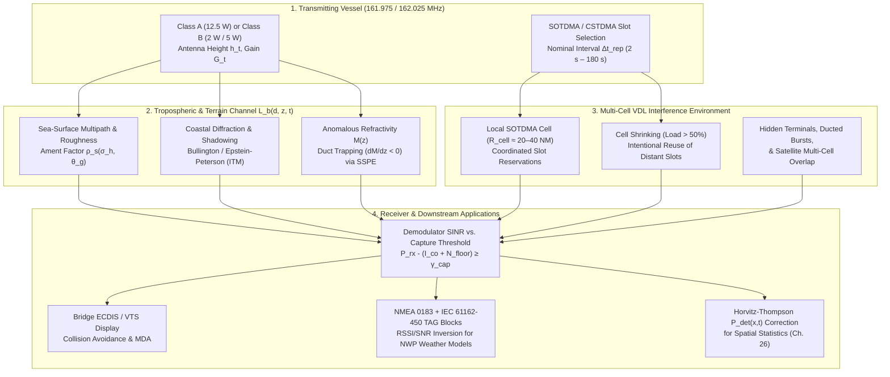
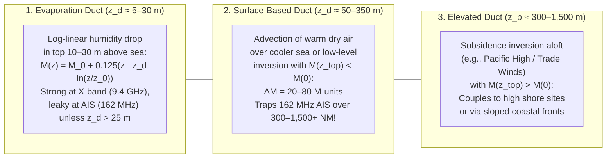
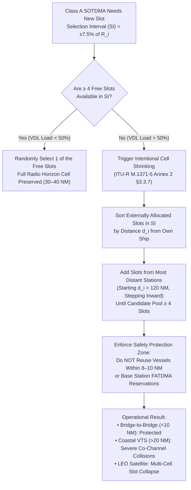

# Chapter 6: AIS RF Propagation Modeling, Atmospheric Ducting, and Network Loading Studies

---

## 1. Operational & Conceptual Overview

In Chapter 5, we examined the baseline physics of the $162\text{ MHz}$ maritime VHF band ($\lambda \approx 1.85\text{ m}$), the standard four-thirds effective Earth radius horizon ($d_{\text{NM}} \approx 2.23(\sqrt{h_{t,\text{m}}} + \sqrt{h_{r,\text{m}}})$), two-ray flat-Earth sea-surface reflections, and shipboard electromagnetic interference (EMI). If the marine atmosphere were horizontally homogeneous, the ocean surface were a smooth spherical mirror free of islands, and only a handful of ships shared the radio spectrum, those baseline link budgets would suffice to predict every Automatic Identification System (AIS) reception event.

In operational reality, three intertwined physical and protocol phenomena govern whether an AIS burst transmitted at $161.975\text{ MHz}$ (AIS 1) or $162.025\text{ MHz}$ (AIS 2) is successfully decoded by another ship, a coastal Vessel Traffic Services (VTS) tower, or a Low Earth Orbit (LEO) satellite:

1. **Complex Terrain, Rough Seas, and Inhomogeneous Wave Propagation (Section 3.1):** Along jagged coastlines, archipelagos, and fjords (such as Norway, British Columbia, Alaska, or the Aegean Sea), $162\text{ MHz}$ waves diffract over knife-edge mountain ridges and around headlands, while rough ocean swells scatter the sea-surface multipath reflection. Modeling coverage for national networks like the U.S. Coast Guard's **Nationwide AIS (NAIS)** or the European Maritime Safety Agency's (**EMSA**) coastal chains requires moving beyond geometric line-of-sight to empirical curves (**ITU-R P.1546**, **ITU-R P.528**), irregular terrain diffraction models (**Longley-Rice / ITM**), and full-wave numerical solvers based on the **Split-Step Parabolic Equation (SSPE)** (**US Navy APM/AREPS** and **TEMPER**).
2. **Tropospheric Ducting and Opportunistic Atmospheric Remote Sensing (Section 3.2):** Sharp vertical gradients in temperature and water vapor partial pressure within the marine atmospheric boundary layer (MABL) frequently bend $162\text{ MHz}$ rays downward more sharply than the curvature of the Earth. When the vertical gradient of modified refractivity turns negative ($dM/dz < 0$), the lower troposphere forms a leaky dielectric waveguide (**evaporation duct**, **surface-based duct**, or **elevated duct**) that traps AIS transmissions and carries them **$300\text{ to }1,500+\text{ NM}$ ($550\text{ to }2,800+\text{ km}$) over the horizon**. While this phenomenon causes severe cross-regional slot interference for mariners, radio physicists and meteorologists have turned the global AIS network into a continuous, opportunistic bistatic atmospheric sounder—inverting AIS Received Signal Strength Indicator (RSSI) time series to reconstruct real-time refractivity profiles $M(z)$ and benchmark Numerical Weather Prediction (NWP) models (**ECMWF ERA5**, **NOAA GFS/HRRR**, **US Navy COAMPS**).
3. **VHF Data Link (VDL) Loading, Intentional Cell Shrinking, and Co-Channel Collisions (Section 3.3):** Both AIS channels combined provide exactly $4,500\text{ time slots per minute}$ ($75\text{ slots/s}$). When localized vessel density, proliferation of low-cost Class B and fishing-gear transponders, or long-range tropospheric ducting pushes VDL loading past **$50\%$ of nominal capacity**, the Self-Organizing Time Division Multiple Access (**SOTDMA**) protocol enters a deliberate degradation mode known as **cell shrinking** (ignoring distant slot reservations to preserve close-range bridge-to-bridge safety). For high-elevation coastal towers and LEO satellites viewing tens of independent SOTDMA cells simultaneously, uncoordinated slot reuse leads to massive co-channel packet collisions thoroughly documented in **ITU-R Report M.2287-0** and foundational peer-reviewed literature (**Eriksen et al.**, **Hoye et al.**, **Cervera et al.**, **Last et al.**).



---

## 2. Historical Context & Evolution (`schwehr/gis-history` Integration)

The mathematical tools used today to model AIS coverage, tropospheric ducting, and TDMA slot collisions represent over a century of convergence across electromagnetic wave theory, wartime radar meteorology, computational physics, and maritime telecommunications (anchored to the historical timeline in [`schwehr/gis-history`](https://github.com/schwehr/gis-history)):

| Year | Milestone (`gis-history` & Radio/AIS Lineage) | Significance for AIS Propagation & VDL Modeling |
|---|---|---|
| **1901–1909** | **Guglielmo Marconi**'s transatlantic wireless transmission (1901); **Arnold Sommerfeld** (1909) solves dipole radiation over a finitely conducting flat Earth | Establishes the mathematical boundary-value problem of surface-wave and space-wave propagation over seawater. |
| **1933–1946** | **Schelleng, Burrows, & Ferrell** (1933) introduce the **$k = 4/3$ effective Earth radius** transformation; **H.G. Booker & W. Walkinshaw** (1946) formulate **tropospheric waveguide mode theory** after WWII British coastal VHF/microwave radars unexpectedly detect ships and coasts hundreds of miles beyond the horizon (the English Channel, Malta, and Arabian Sea "anomalous propagation" mysteries) | Explains how vertical temperature and humidity inversions create atmospheric ducts ($dM/dz < 0$) that trap VHF/UHF waves just above the sea surface. |
| **1944–1947** | **Mikhail Leontovich** (1944) formulates the **parabolic equation (PE)** approximation to Helmholtz's wave equation; **Kenneth Bullington** (1947, Bell Labs) publishes the equivalent knife-edge diffraction method | Provides the two foundational pillars of modern coastal propagation prediction: algebraic knife-edge diffraction over islands/headlands and forward-marching parabolic wave equations. |
| **1948** | **Claude Shannon** publishes *A Mathematical Theory of Communication* (`gis-history`, 1948) | Establishes channel capacity limits and noise-floor bounds that underpin GMSK bit-error rates and multi-user packet collision theory. |
| **1953** | **Smith & Weintraub** standardize the microwave/VHF radio refractivity constants ($N = \frac{77.6}{T}(P + \frac{4810e}{T})$); **W.S. Ament** (US Naval Research Laboratory) derives the specular reflection loss factor $\rho_s$ for rough ocean surfaces | Connects meteorological state variables $(P, T, e)$ and ocean wave height $\sigma_h$ directly to VHF link budgets. |
| **1968–1982** | **Anita Longley & Phil Rice** (1968, ESSA/NTIA Technical Report ERL 79-ITS 67) publish the **Irregular Terrain Model (ITM)**; **G.A. Hufford, A.G. Longley, & W.A. Kissick** (1982) release the Fortran/C reference code | Becomes the U.S. government (NTIA, FCC, USCG) standard for predicting VHF/UHF coastal coverage over digital elevation models (DEMs). |
| **1973–1977** | **Hardin & Tappert** (1973) introduce the **Split-Step Fourier (SSF)** algorithm solving the parabolic wave equation via the **Fast Fourier Transform (FFT, Cooley & Tukey 1965)** | Reduces 2D range-dependent wave propagation from an intractable elliptic boundary-value problem to a fast $O(N_z \log N_z)$ marching step per range increment $\Delta x$. |
| **1988–1998** | **Håkan Lans** files priority patent for **STDMA** (1988, `gis-history`); **ITU-R M.1371-0** adopted (1998) incorporating autonomous **cell shrinking** (intentional distance-ordered slot reuse) | Designs the AIS MAC layer to dynamically trade off long-range reception for guaranteed short-range ($8\text{–}10\text{ NM}$) collision avoidance under heavy VDL load. |
| **1998–2005** | **US Navy SPAWAR** (Amalia Barrios, Wayne Patterson, et al.) develops the **Advanced Propagation Model (APM)** and **AREPS**; **JHU/APL** develops **TEMPER**; **ITU-R P.1546** (2001) consolidates terrestrial point-to-area field-strength curves | Operationalizes hybrid ray-optics + wide-angle Split-Step Parabolic Equation solvers for real-time 3D naval and coast guard VHF/radar coverage assessment. |
| **2006–2011** | **FFI Norway** (**Eriksen et al., 2006, 2010**; **Hoye et al., 2008**) and **JRC/EMSA** (**Cervera et al., 2011**) publish foundational mathematical models of spaceborne AIS co-channel collisions; **AISSat-1** launches (July 2010); **Kurt Schwehr** releases **`libais`** (2010, `gis-history`) after the *Deepwater Horizon* blowout | Quantifies why viewing dozens of SOTDMA cells from LEO orbit causes severe packet loss in high-traffic zones (Gulf of Mexico, North Sea) and drives advanced de-collision receivers. |
| **2013–2015** | **ITU-R publishes Report M.2287-0** (2013, *Assessment of the VHF data link loading*); **Last et al.** (2014, 2015) publish empirical terrestrial packet-drop audits; **ITU-R M.2092 (VDES)** initiated (2015) | Proves empirically that AIS 1/2 suffer severe degradation above $50\%$ VDL load in the Northern Gulf of Mexico, Singapore Strait, and East China Sea, catalyzing the VHF Data Exchange System (VDES). |
| **2016–2026+** | **ECMWF ERA5** global reanalysis (2017–present) and high-resolution **NOAA HRRR / US Navy COAMPS** boundary-layer grids compared against opportunistic **AIS RSSI refractivity inversions** (Zhang et al., Penteli et al., Bruin, et al.) | Transforms coastal AIS networks into continuous meteorological validation arrays measuring marine boundary layer duct heights and anomalous VHF propagation. |

---

## 3. Deep Technical & Mathematical Foundations

### 3.1 How Can RF Be Modeled for AIS? Marine VHF Propagation Models at $162\text{ MHz}$

Predicting the received signal power $P_{rx}\text{ [dBm]}$ of an AIS transmission at range $d$ requires computing the **basic transmission loss** $L_b(d, f, h_t, h_r)\text{ [dB]}$ (the path loss between isotropic antennas), so that:

$$P_{rx}\text{ [dBm]} = P_{tx}\text{ [dBm]} - L_{tx,\text{cable}}\text{ [dB]} + G_t(\theta, \phi)\text{ [dBi]} - L_b(d, f, h_t, h_r)\text{ [dB]} + G_r(\theta, \phi)\text{ [dBi]} - L_{rx,\text{cable}}\text{ [dB]}$$

Recall from the handbook's RF conventions (`STYLE_GUIDE.md`) that dipole-relative gain ($\text{dBd}$) converts to isotropic gain ($\text{dBi}$) via:

$$G\text{ [dBi]} = G\text{ [dBd]} + 2.15\text{ dB}$$

For a standard Class A AIS transmitter ($P_{tx} = 12.5\text{ W} = +40.97\text{ dBm}$) and a receiver with specification sensitivity $S_{\min} = -107\text{ dBm}$ (for $20\%$ Packet Error Rate under IEC 61993-2, or $-112\text{ to }-118\text{ dBm}$ on modern coast guard SDR/LNA front ends), the maximum tolerable net path loss is roughly $148\text{ to }160\text{ dB}$. Five distinct classes of propagation models—ranging from closed-form analytic optics to full-wave PDE solvers—are used to evaluate $L_b$ for AIS.

#### 3.1.1 Free-Space Path Loss (FSPL) and Curved-Earth Rough-Sea Two-Ray Model

1. **Free-Space Path Loss (FSPL):** In an unobstructed, reflection-free vacuum (useful as a first-order baseline for high-elevation satellite links before ionospheric and multipath corrections), the Friis transmission loss at $f = 162.0\text{ MHz}$ ($\lambda = c/f = 1.8506\text{ m}$) is:
   $$L_{\text{FSPL}}(d) = 20\log_{10}\left(\frac{4\pi d}{\lambda}\right) = 32.45 + 20\log_{10}(f_{\text{MHz}}) + 20\log_{10}(d_{\text{km}}) \approx 76.64 + 20\log_{10}(d_{\text{km}})\text{ [dB]}$$

2. **Curved-Earth Two-Ray Model with Divergence and Rough-Sea Ament Scattering:** Over open ocean within the radio horizon, the field at the receiving antenna is the coherent phasor sum of a direct ray $R_1$ and a sea-reflected ray $R_2$:
   $$L_{\text{2-ray}}(d) = L_{\text{FSPL}}(d) - 20\log_{10}\left| 1 + \Gamma_{\text{eff}}(\theta_g) \exp\left(i \frac{2\pi \Delta R}{\lambda}\right) \right|\text{ [dB]}$$
   On a spherical Earth of effective radius $a_e = k a_0$ (where $a_0 \approx 6,371\text{ km}$ and $k \approx 4/3 \implies a_e \approx 8,495\text{ km}$), the bounce point at distance $d_1$ from the transmitter and $d_2 = d - d_1$ from the receiver lowers the effective antenna heights due to Earth bulge by:
   $$h'_t = h_t - \frac{d_1^2}{2 a_e}, \qquad h'_r = h_r - \frac{d_2^2}{2 a_e}$$
   where $d_1$ satisfies the cubic specular reflection equation $2 d_1^3 - 3 d d_1^2 + \left(d^2 - 2 a_e(h_t + h_r)\right)d_1 + 2 a_e h_t d = 0$. The grazing angle is $\theta_g \approx \tan^{-1}\left(\frac{h'_t + h'_r}{d}\right)$ and the path-length difference is $\Delta R \approx \frac{2 h'_t h'_r}{d}$.
   Crucially, the effective reflection coefficient $\Gamma_{\text{eff}}(\theta_g)$ over a rough, curved ocean is the product of **three physical factors**:
   $$\Gamma_{\text{eff}}(\theta_g) = D \cdot \rho_s(\sigma_h, \theta_g) \cdot \Gamma_V(\theta_g)$$
   * **Fresnel Reflection Coefficient for Vertical Polarization ($\Gamma_V$):** AIS antennas are vertically polarized ($\text{V-pol}$). Seawater at $162\text{ MHz}$ has relative permittivity $\varepsilon_r \approx 72\text{–}80$ and conductivity $\sigma \approx 4\text{–}5\text{ S/m}$, yielding a complex relative dielectric constant $\varepsilon_c = \varepsilon_r - i \frac{\sigma}{2\pi f \varepsilon_0} \approx 75 - i\,444$. The V-pol Fresnel coefficient is:
     $$\Gamma_V(\theta_g) = \frac{\varepsilon_c \sin\theta_g - \sqrt{\varepsilon_c - \cos^2\theta_g}}{\varepsilon_c \sin\theta_g + \sqrt{\varepsilon_c - \cos^2\theta_g}}$$
     At the very small grazing angles typical of ship-to-ship AIS ($\theta_g < 0.5^\circ$, well below the pseudo-Brewster angle), $\Gamma_V(\theta_g) \to -1$ ($180^\circ$ phase reversal).
   * **Spherical Earth Divergence Factor ($D$):** Because the convex ocean surface spreads the reflected wavefront pencil like a convex mirror, energy density is reduced by:
     $$D = \left(1 + \frac{2 d_1 d_2}{a_e d \sin\theta_g}\right)^{-1/2}$$
   * **Ament Rough-Sea Specular Scattering Factor ($\rho_s$):** Ocean waves introduce random vertical height perturbations $h(x,y)$ with root-mean-square (RMS) surface elevation $\sigma_h$ (related to significant wave height by $H_s \approx 4\sigma_h$). By the **Rayleigh roughness criterion**, the random phase shift between a crest and trough is $\Delta \phi = \frac{4\pi \sigma_h \sin\theta_g}{\lambda}$. Assuming a Gaussian sea-surface height distribution, **Ament (1953)** derived the coherent specular reflection reduction factor:
     $$\rho_{s,\text{Ament}} = \exp\left(-\frac{1}{2} g^2\right) = \exp\left(-\frac{8\pi^2 \sigma_h^2 \sin^2\theta_g}{\lambda^2}\right), \qquad g = \frac{4\pi \sigma_h \sin\theta_g}{\lambda}$$
     **Miller, Brown, and Vegh (1984)** refined Ament's formula using a modified Bessel function of the first kind of order zero, $I_0$, to better match rough-sea measurements at higher sea states:
     $$\rho_{s,\text{MB}} = \exp\left(-\frac{1}{2} g^2\right) I_0\left(\frac{1}{2} g^2\right)$$

   *Engineering Insight:* At $\lambda = 1.85\text{ m}$ and $\theta_g = 0.2^\circ$, even a severe Sea State 6 ($H_s = 5.0\text{ m} \implies \sigma_h = 1.25\text{ m}$) yields $g = \frac{4\pi(1.25)\sin(0.2^\circ)}{1.85} \approx 0.0296$, so $\rho_s \approx 0.9996$. Thus, **for long-range near-horizon ship-to-ship AIS links ($\theta_g \ll 1^\circ$), the ocean acts as an almost perfect smooth mirror even in a gale**, preserving the $180^\circ$ phase cancellation ($\Gamma_{\text{eff}} \approx -D$) and the steep $40\log_{10}(d)$ ($1/d^4$) path-loss roll-off! Conversely, for high-elevation coastal mountain receivers or low-elevation satellite/aircraft passes ($\theta_g \sim 2^\circ\text{–}15^\circ$), $g$ becomes appreciable ($g \sim 0.3\text{–}2.0$), $\rho_s$ drops below $0.5$, and rough seas *soften* the deep destructive multipath nulls by replacing coherent cancellation with diffuse incoherent sea clutter.

#### 3.1.2 Longley-Rice / Irregular Terrain Model (ITM)

When an AIS link crosses coastal headlands, islands, peninsulas, or fjords, the 1D path elevation profile $z(x)$ from transmitter $(x=0)$ to receiver $(x=d)$ blocks direct and specular rays. The **Longley-Rice / Irregular Terrain Model (ITM)** (operating from $20\text{ MHz}$ to $20\text{ GHz}$) computes excess reference attenuation $A_{\text{ref}}\text{ [dB]}$ above free-space loss by piece-wise blending three distance regimes:

1. **Line-of-Sight (LOS) Two-Ray + Multipath Diffraction Regime ($d < d_{\text{LOS}}$):** Combines curved-Earth two-ray reflection (parameterized by terrain irregularity parameter $\Delta h$, the interdecile range of terrain heights) with extrapolated diffraction blending as the ray approaches grazing clearance over the highest obstacle.
2. **Diffraction Regime ($d_{\text{LOS}} \le d \le d_x$):** Computes a weighted combination of **smooth/rounded-Earth Vogler diffraction** $A_r$ and **multiple knife-edge diffraction** $A_k$.
   * For a single dominant ridge of height $h$ above the straight line joining the transmitter (at distance $d_1$) and receiver (at distance $d_2$), the dimensionless **Fresnel-Kirchhoff diffraction parameter** $\nu$ is:
     $$\nu = h \sqrt{\frac{2(d_1 + d_2)}{\lambda d_1 d_2}}$$
   * When $\nu > -0.78$ (meaning the obstacle intrudes into or above the first $0.6 F_1$ Fresnel zone), the knife-edge diffraction loss $J(\nu)\text{ [dB]}$ is given by the Fresnel integral approximation (**ITU-R P.526**):
     $$J(\nu) \approx 6.9 + 20\log_{10}\left(\sqrt{(\nu - 0.1)^2 + 1} + \nu - 0.1\right)\text{ [dB]}$$
   * At exact grazing incidence ($h = 0 \implies \nu = 0$), knife-edge diffraction loss is **$6.02\text{ dB}$**. Because $\nu \propto \lambda^{-1/2}$, a $162\text{ MHz}$ AIS wave ($\lambda = 1.85\text{ m}$) experiences a Fresnel parameter $\nu$ that is **$\sqrt{162\text{ MHz} / 9,400\text{ MHz}} \approx 0.131\times$ smaller** than an X-band marine radar ($\lambda = 3.2\text{ cm}$) over the exact same coastal headland or riverbank. For example, a $30\text{ m}$ bluff at $d_1 = d_2 = 2\text{ km}$ yields $\nu_{\text{AIS}} = 1.38$ ($J \approx 16.1\text{ dB}$, easily bridged by the AIS link budget), whereas for X-band radar $\nu_{\text{X-band}} = 10.5$ ($J \approx 33.4\text{ dB}$ one-way, or **$66.8\text{ dB}$ two-way radar echo loss**, completely blinding the radar!). This is the exact physical reason mariners in winding rivers and fjords rely on AIS to "see around corners" where radar is blocked (Chapter 23).
   * When multiple islands or peaks obstruct the path, ITM (and related coastal planners) applies the **Bullington equivalent knife-edge** method (projecting horizon rays from both terminals to their intersection point) or the **Epstein-Peterson / Deygout** sequential main-edge partitioning.
3. **Tropospheric Forward Scatter Regime ($d > d_x$):** Far beyond the diffraction horizon, weak turbulence-induced refractive index inhomogeneities ($\delta n$) in the common volume where the transmitter and receiver antenna beams intersect scatter VHF energy forward (**Yeh / NBS troposcatter model**), decaying much more slowly ($\sim 20\text{ to }30\text{ dB/decade}$) than exponential diffraction shadow loss.
4. **Statistical Variability ($q_T, q_L, q_S$):** ITM explicitly computes cumulative quantile adjustments around the median attenuation $A_{\text{ref}}$ for **fraction of time** $q_T$ (accounting for diurnal and seasonal refractivity fluctuations), **fraction of locations** $q_L$, and **situation confidence** $q_S$.

#### 3.1.3 ITU-R Recommendation P.1546 (Point-to-Area Coastal) and ITU-R P.528 (Airborne/Spaceborne)

Standardized regulatory link planning by IALA, EMSA, and ITU working groups relies on two globally vetted ITU-R recommendations:

1. **ITU-R P.1546-6 (*Method for point-to-area predictions for terrestrial services in the frequency range 30 MHz to 4,000 MHz*):**
   * Rather than requiring full 3D atmospheric soundings, ITU-R P.1546 provides empirical field-strength curves $E(d, h_1, f, q_T)$ in $\text{dB}(\mu\text{V/m})$ normalized to **$1\text{ kW}$ effective radiated power (ERP)** ($P_{\text{ERP}} = 1,000\text{ W} = +30\text{ dBW}$, corresponding to $E_{\text{free-space}} = 106.9 - 20\log_{10}(d_{\text{km}})\text{ dB}(\mu\text{V/m})$) for:
     * **Time percentages $q_T \in \{50\%, 10\%, 1\%\}$:**
       * **$50\%$ time exceedance:** Used to calculate the **reliable service coverage contour** of a coastal AIS base station or VTS tower.
       * **$10\%$ and $1\%$ time exceedance:** Used to calculate **co-channel interference and anomalous ducting ranges**! Because ITU-R P.1546 separates **"Cold Sea"** curves (derived from North Sea and Baltic Sea measurements where strong ducting occurs $\sim 1\%\text{–}5\%$ of the time) from **"Warm Sea"** curves (derived from Mediterranean and Persian Gulf data where strong ducting persists $>10\%$ of the time), engineers can read directly from the $1\%$ Warm Sea curve that at $162\text{ MHz}$ and $d = 300\text{ km}$, field strength is **$35\text{ to }45\text{ dB}$ higher** than the $50\%$ median diffraction curve.
   * **Mixed Land-Sea Path Interpolation:** When an AIS path crosses $d_{\text{sea}}$ kilometers of water and $d_{\text{land}}$ kilometers of coastal terrain ($d_{\text{total}} = d_{\text{sea}} + d_{\text{land}}$), ITU-R P.1546 interpolates the field strength using a mixed-path distance weighting factor $A_{\text{mix}}$ alongside terrain clearance angle corrections ($\theta_{\text{tca}}$).
   * **Conversion from ITU-R P.1546 Field Strength $E$ to Basic Transmission Loss $L_b$:** For any frequency $f_{\text{MHz}}$, the isotropic basic transmission loss $L_b\text{ [dB]}$ is related to the $1\text{ kW}$ ERP normalized field strength $E\text{ [dB}(\mu\text{V/m})\text{]}$ by:
     $$L_b\text{ [dB]} = 139.3 - E\text{ [dB}(\mu\text{V/m})\text{]} + 20\log_{10}(f_{\text{MHz}}) \implies L_b(162\text{ MHz}) = 183.49 - E\text{ [dB}(\mu\text{V/m})\text{]}$$

2. **ITU-R P.528-5 (*A propagation prediction method for aeronautical mobile and radionavigation services using the VHF, UHF and SHF bands*):**
   * Designed for high-altitude terminals ($h_2$ from $1,000\text{ m}$ up to $20,000\text{ m}$ for Maritime Patrol Aircraft broadcasting/receiving AIS Message 9, and extensible to LEO satellites at $500\text{–}800\text{ km}$).
   * Uses the **IF-77 (ITS / FAA 1977)** ray-tracing engine through a standard exponential atmosphere $N(z) = N_s \exp(-c_e z)$ to compute grazing horizon distances, earth-reflection lobe structures, smooth-sphere diffraction beyond the horizon, and troposcatter.
   * For **spaceborne AIS links** traversing the ionosphere ($h_{\text{sat}} \approx 600\text{ km}$), two additional physical losses at $162\text{ MHz}$ must be added to the P.528 / FSPL curve (**ITU-R P.531**):
     * **Faraday Polarization Rotation ($\Omega_F$):** A linearly (vertically) polarized $162\text{ MHz}$ AIS wave passing through the Earth's magnetized ionosphere undergoes Faraday rotation of its electric field vector by an angle:
       $$\Omega_F = \frac{2.36 \times 10^4}{f_{\text{Hz}}^2} \int_0^{s_{\text{sat}}} N_e(s) B_{\parallel}(s) \, ds \approx 0.90 \times 10^{-12} \cdot \text{TEC} \cdot \overline{B_{\parallel}}\text{ [rad]}$$
       Across daytime Total Electron Content ($\text{TEC} \sim 10\text{–}50\text{ TECU}$, where $1\text{ TECU} = 10^{16}\text{ el/m}^2$), $\Omega_F$ easily exceeds several full rotations! If a satellite uses a single linearly polarized dipole, whenever $\Omega_F \equiv \pi/2 \pmod\pi$, cross-polarization loss $L_{\text{pol}} = -20\log_{10}|\cos\theta_{\text{pol}}|$ approaches $\infty\text{ dB}$ ($20\text{–}30\text{ dB}$ practical null). Consequently, LEO AIS satellites either use circularly polarized (helical/turnstile) antennas (accepting a constant $3\text{ dB}$ linear-to-circular mismatch loss) or dual orthogonal linear dipoles with diversity combining.
     * **Ionospheric Scintillation:** Equatorial and auroral electron-density irregularities induce rapid amplitude fading ($S_4$ index) at $162\text{ MHz}$.

#### 3.1.4 Split-Step Parabolic Equation (SSPE) Models (US Navy APM / AREPS and TEMPER)

Neither ITM nor ITU-R P.1546 can resolve range-dependent 2D/3D atmospheric ducts where a coastal marine inversion strengthens offshore or rides up over an island. The gold standard for physics-based maritime VHF propagation modeling is the **Split-Step Parabolic Equation (SSPE)** method, operationalized in the **US Navy's Advanced Propagation Model (APM)** (integrated into **AREPS — Advanced Refractive Effects Prediction System**) and Johns Hopkins University Applied Physics Laboratory's (**JHU/APL**) **TEMPER (Tropospheric Electromagnetic Parabolic Equation Routine)**.

1. **Derivation from the 2D Scalar Helmholtz Wave Equation:**
   Consider a time-harmonic wave ($e^{-i\omega t}$) propagating outward in cylindrical range $x$ and altitude $z$ over a spherical Earth flattened via the earth-flattening coordinate transform, which replaces the refractive index $n(x, z)$ with the **modified refractive index** $n_{\text{mod}}(x, z)$:
   $$n_{\text{mod}}(x, z) = n(x, z) + \frac{z}{a_0} = 1 + 10^{-6} M(x, z)$$
   For vertical polarization (transverse magnetic, TM, where $\psi(x, z) = \sqrt{x}\, H_y(x, z)$) or horizontal polarization (TE, $\psi(x, z) = \sqrt{x}\, E_y(x, z)$), the reduced field $\psi(x, z)$ satisfies the 2D scalar Helmholtz equation in the far field ($k_0 x \gg 1$):
   $$\frac{\partial^2 \psi}{\partial x^2} + \frac{\partial^2 \psi}{\partial z^2} + k_0^2 n_{\text{mod}}^2(x, z) \psi = 0$$
   where $k_0 = \frac{2\pi}{\lambda} = \frac{2\pi f}{c} \approx 3.395\text{ rad/m}$ at $162\text{ MHz}$.

2. **Envelope Factorization and Pseudo-Differential Operator Splitting:**
   Factoring out the rapidly oscillating horizontal carrier phase $\psi(x, z) = e^{i k_0 x} u(x, z)$, where $u(x, z)$ is the slowly varying complex envelope in range, yields:
   $$\frac{\partial^2 u}{\partial x^2} + 2 i k_0 \frac{\partial u}{\partial x} + \frac{\partial^2 u}{\partial z^2} + k_0^2 \left(n_{\text{mod}}^2(x, z) - 1\right) u = 0$$
   Defining the vertical differential operator $X = \frac{1}{k_0^2}\frac{\partial^2}{\partial z^2}$ and the refractive index perturbation operator $Y(x, z) = n_{\text{mod}}^2(x, z) - 1 \approx 2\times 10^{-6} M(x, z)$, we can factor the wave equation into forward- and backward-propagating waves. Neglecting backscattering gives the **one-way forward pseudo-differential wave equation**:
   $$\frac{\partial u(x, z)}{\partial x} = i k_0 \left( \sqrt{1 + X + Y(x, z)} - 1 \right) u(x, z)$$

3. **Narrow-Angle (NAPE) vs. Wide-Angle (WAPE) Approximations:**
   * **Narrow-Angle / Standard Parabolic Equation (Tappert, 1977):** Applying the first-order Taylor expansion $\sqrt{1 + X + Y} \approx 1 + \frac{1}{2}X + \frac{1}{2}Y$ (equivalent to dropping $\frac{\partial^2 u}{\partial x^2}$ in the envelope equation) yields the classic Schrödinger-like **Standard Parabolic Equation**:
     $$\frac{\partial u}{\partial x} = \frac{i}{2 k_0} \frac{\partial^2 u}{\partial z^2} + \frac{i k_0}{2} \left(n_{\text{mod}}^2(x, z) - 1\right) u$$
     NAPE is phase-accurate for propagation angles up to $\theta_{\max} \approx 10^\circ\text{–}15^\circ$ above the horizontal—more than sufficient for all ship-to-ship and coastal AIS links, where ducting and diffraction rays travel within $\pm 2^\circ$ of the horizon.
   * **Wide-Angle Parabolic Equation (Feit-Fleck / Thomson-Chapman Split Operator):** For steep mountain terrain or airborne links up to $\theta_{\max} \approx 45^\circ\text{–}70^\circ$, APM and TEMPER split the square-root operator into decoupled kinetic (diffraction) and potential (refraction) terms:
     $$\sqrt{1 + X + Y} - 1 \approx \left(\sqrt{1 + X} - 1\right) + \left(\sqrt{1 + Y} - 1\right) \approx \left(\sqrt{1 - \frac{k_z^2}{k_0^2}} - 1\right) + \left(n_{\text{mod}}(x, z) - 1\right)$$

4. **The Split-Step Fourier (SSF) Marching Algorithm:**
   Because the diffraction operator $X$ is diagonal in vertical wavenumber space $k_z$ ($k_z = k_0 \sin\theta$) via the Fourier Transform $\mathcal{F}_z\{u(x, z)\} = \tilde{u}(x, k_z) = \int_{-\infty}^{\infty} u(x, z) e^{-i k_z z}\, dz$, whereas the refraction operator $Y(x, z)$ is diagonal in physical altitude space $z$, **Hardin and Tappert (1973)** showed that the solution can be marched forward from range $x$ to $x + \Delta x$ in $O(N_z \log N_z)$ operations per range step:
   $$u(x + \Delta x, z) = \exp\left[ i k_0 \left(n_{\text{mod}}(x, z) - 1\right) \Delta x \right] \cdot \mathcal{F}_z^{-1} \left\{ \exp\left[ i k_0 \left(\sqrt{1 - \frac{k_z^2}{k_0^2}} - 1\right) \Delta x \right] \mathcal{F}_z \left\{ u(x, z) \right\} \right\}$$
   In the narrow-angle limit ($k_z \ll k_0$), the spectral propagator simplifies to $\exp\left(-i \frac{k_z^2}{2 k_0} \Delta x\right)$.
   * **Boundary Conditions:** At the top of the computational grid ($z \in [z_{\text{hanning}}, z_{\max}]$), an absorbing sponge layer (a Hanning or Tukey cosine-squared window) damps upward-radiating waves to prevent artificial reflections from the grid ceiling. At the sea surface ($z = 0$), either a **Discrete Mixed Fourier Transform (DMFT)** enforcing the **Leontovich impedance boundary condition** $\left.\frac{\partial u}{\partial z}\right|_{z=0} + i k_0 \sin\theta_B\, u(x, 0) = 0$ (weighted by Ament roughness $\rho_s$) or a **Discrete Sine Transform (DST)** (for horizontal polarization or perfectly reflecting grazing vertical polarization $\Gamma \approx -1$) automatically synthesizes both the direct and surface-reflected waves without needing an image-source grid below $z = 0$.
   * **Converting $u(x, z)$ to Path Loss $L_b(x, z)$:** Once the complex envelope $u(x, z)$ is marched across range $x$ (starting from a Gaussian antenna pattern source $\tilde{u}(0, k_z)$ normalized to unit power), the **propagation factor** $F(x, z) = \sqrt{x}\, |u(x, z)|$ gives the basic transmission loss at every $(x, z)$ pixel simultaneously:
     $$L_b(x, z)\text{ [dB]} = 20\log_{10}\left(\frac{4\pi x}{\lambda}\right) - 20\log_{10}\big|F(x, z)\big| = 20\log_{10}(4\pi) + 10\log_{10}(x) - 20\log_{10}(\lambda) - 20\log_{10}\big|u(x, z)\big|$$

#### 3.1.5 Comparative Engineering Matrix of AIS RF Propagation Models

| Propagation Model | Physical Mechanisms Modeled | Range-Dependent 2D/3D Ducts $M(x,z)$? | Coastal Terrain Diffraction? | Computational Cost | Primary AIS Engineering Use Case |
|---|---|---|---|---|---|
| **Free-Space Path Loss (FSPL)** | Spherical spreading ($1/d^2$) only | No | No | Instantaneous ($O(1)$) | Baseline link budget for high-elevation LEO satellite AIS before multipath/Faraday terms. |
| **Curved-Earth Rough-Sea Two-Ray** | Direct + specular sea bounce ($D \cdot \rho_s \cdot \Gamma_V$), $k$-factor refraction | 1D constant $k$-factor only | No (smooth spherical ocean) | Fast ($O(1)$ cubic root per range) | Open-ocean ship-to-ship and buoy-to-ship range modeling within the radio horizon ($<30\text{ NM}$). |
| **Longley-Rice / ITM** | Two-ray + Bullington/Vogler knife-edge & rounded diffraction + troposcatter | Statistical surface $N_s$ & $q_T$ quantiles only | **Yes** (1D terrain profile from DEM) | Low ($\sim 1\text{ ms}$ per radial profile) | National coastal tower siting (USCG NAIS, SPLAT!, Radio Mobile) over complex islands & fjords. |
| **ITU-R P.1546-6 & ITU-R P.528-5** | Empirical land/cold-sea/warm-sea curves ($50\%, 10\%, 1\%$ time); IF-77 ray-optics (P.528) | Climatological ($10\%/1\%$ warm/cold sea duct statistics) | **Yes** (terrain clearance angle & mixed-path rules) | Very Low ($\sim 0.1\text{ ms}$ lookup/interpolation) | Official IALA/EMSA/ITU regulatory coverage and co-channel interference contour certification. |
| **Split-Step Parabolic Equation (SSPE: APM/AREPS, TEMPER)** | Full-wave forward Helmholtz equation: multipath, diffraction, rough-sea impedance, and multi-mode waveguide ducting | **Yes** (arbitrary 2D/3D NWP profiles $M(x,z)$) | **Yes** (piecewise-linear terrain & shift-map methods) | Moderate ($\sim 10\text{–}100\text{ ms}$ per 2D azimuth slice via FFT) | High-fidelity prediction of anomalous over-the-horizon ducting ($300\text{–}1,500\text{ NM}$) and NWP refractivity inversion. |

---

### 3.2 How AIS Is Used for RF Propagation Monitoring and Weather Model Testing

#### 3.2.1 Atmospheric Radio Refractivity $N$ and Modified Refractivity $M(z)$

The phase velocity of a $162\text{ MHz}$ radio wave in the troposphere is $v_p = c / n$, where the refractive index $n \approx 1.000315$ at sea level differs from unity by roughly three parts in $10^4$. To avoid cumbersome decimals, radio physicists define **radio refractivity** $N\text{ [N-units]}$ (**ITU-R P.453-14**; Smith & Weintraub, 1953):

$$N = (n - 1) \times 10^6 = \frac{77.6}{T}\left(P + \frac{4810\, e}{T}\right) = \underbrace{77.6 \frac{P}{T}}_{N_{\text{dry}}} + \underbrace{3.73256 \times 10^5 \frac{e}{T^2}}_{N_{\text{wet}}}$$

where:
* $P$ is total atmospheric pressure in hectopascals ($\text{hPa}$, equivalent to millibars, $\text{mb}$),
* $T$ is absolute air temperature in Kelvin ($T = T_{^\circ\text{C}} + 273.15$), and
* $e$ is water vapor partial pressure in $\text{hPa}$, computed from relative humidity $\text{RH}\text{ [\%]}$ and the **Magnus-Tetens / Buck saturation vapor pressure** over liquid water ($T_{^\circ\text{C}} \ge 0^\circ\text{C}$):
  $$e = \frac{\text{RH}}{100} \cdot e_s(T_{^\circ\text{C}}), \qquad e_s(T_{^\circ\text{C}}) = 6.1121 \exp\left[\left(18.678 - \frac{T_{^\circ\text{C}}}{234.5}\right)\left(\frac{T_{^\circ\text{C}}}{257.14 + T_{^\circ\text{C}}}\right)\right]\text{ [hPa]}$$

*(Note: Over saline seawater of practical salinity $S \approx 35\text{ PSU}$, Raoult's law lowers the interfacial saturation vapor pressure right at the water skin by $2\%$: $e_{s,\text{sea}}(T_s) \approx 0.98\, e_s(T_s)$).*

By Snell's law in spherical coordinates ($n(r)\, r \cos\theta = \text{const}$), a nearly horizontal ray ($\cos\theta \approx 1$) has a downward radius of curvature $R_{\text{ray}} = -\left(\frac{1}{n}\frac{dn}{dz}\right)^{-1} \approx -\left(10^{-6}\frac{dN}{dz}\right)^{-1}$. Relative to the curved Earth of radius $a_0 = 6,371\text{ km}$ (curvature $1/a_0 \approx 1.570 \times 10^{-7}\text{ m}^{-1} = 157\times 10^{-6}\text{ km}^{-1}$), the **effective Earth radius factor** $k$ is:

$$k = \frac{a_e}{a_0} = \frac{1}{1 + a_0 \times 10^{-6} \frac{dN}{dz}} = \frac{1}{1 + \frac{dN/dz}{157\text{ N/km}}}$$

To transform the spherical Earth into an equivalent flat plane where straight-line rays correspond to Earth-parallel trajectories, we define **Modified Refractivity** $M(z)\text{ [M-units]}$ at altitude $z\text{ [m]}$ above mean sea level:

$$M(z) = N(z) + \frac{z}{a_0} \times 10^6 \approx N(z) + 0.157\, z_{\text{m}}, \qquad \frac{dM}{dz_{\text{km}}} = \frac{dN}{dz_{\text{km}}} + 157\text{ [M-units/km]}$$

The sign and magnitude of $dM/dz$ completely classify the four regimes of maritime VHF propagation:

| Refractive Regime | Vertical $N$ Gradient ($dN/dz$, $\text{N/km}$) | Modified $M$ Gradient ($dM/dz$, $\text{M/km}$) | Effective $k$-Factor | Physical Impact on $162\text{ MHz}$ AIS Signals |
|---|---|---|---|---|
| **Sub-Refraction** | $\frac{dN}{dz} > 0$ | $\frac{dM}{dz} > +157$ | $0 < k < 1$ | Rays bend *upward* away from the sea; radio horizon shrinks below optical horizon (common when cold, dry air flows over cold water or fog). |
| **Standard Atmosphere** | $-39\text{ N/km}$ | $+118\text{ M/km}$ | $k = \frac{4}{3} \approx 1.33$ | Standard maritime VHF horizon $d_{\text{NM}} \approx 2.23(\sqrt{h_{t,\text{m}}} + \sqrt{h_{r,\text{m}}})$. |
| **Super-Refraction** | $-157 < \frac{dN}{dz} < -79$ | $0 < \frac{dM}{dz} < +79$ | $2.0 < k < \infty$ | Rays bend downward strongly; AIS horizon expands to $50\text{–}120\text{ NM}$ without full waveguide trapping. |
| **Trapping / Ducting** | $\frac{dN}{dz} \le -157$ | **$\frac{dM}{dz} \le 0$** | $k \le 0$ (flat Earth $a_e$ inverts) | Ray curvature exceeds Earth curvature! Rays launched below the critical trapping angle $\theta_c = \sqrt{2\times 10^{-6} \Delta M}$ are reflected back down toward the sea, forming a **tropospheric waveguide**. |

#### 3.2.2 Physics of Evaporation Ducts, Surface-Based Ducts, and Elevated Ducts at $162\text{ MHz}$

Why does a negative vertical gradient $dM/dz < 0$ form over the ocean? Examining the total differential of $N(P, T, e)$ near standard sea-level conditions ($P \approx 1013\text{ hPa}, T \approx 290\text{ K}, e \approx 15\text{ hPa}$):

$$\frac{dN}{dz} \approx 0.27 \frac{dP}{dz} - 1.32 \frac{dT}{dz} + 4.43 \frac{de}{dz}$$

While hydrostatic pressure falloff ($dP/dz \approx -12\text{ hPa}/100\text{ m}$) contributes only $\approx -32\text{ N/km}$, **a sharp temperature inversion ($dT/dz > 0$, warm air overlying cooler sea water) combined with a sharp moisture lapse ($de/dz < 0$, humid marine air beneath bone-dry continental or subsiding air)** easily drives $dN/dz$ below $-200\text{ to }-500\text{ N/km}$ ($dM/dz < -40\text{ to }-340\text{ M/km}$)! Note that the humidity term ($+4.43\, de/dz$) is more than $3\times$ as potent per unit change as the temperature term.



In waveguide mode theory (**Booker & Walkinshaw, 1946; Kerr, 1951**), a tropospheric duct of thickness $\Delta z_d\text{ [m]}$ and modified refractivity deficit $\Delta M = M_{\text{base}} - M_{\text{top}}\text{ [M-units]}$ has a **maximum trapped wavelength (cutoff wavelength)** $\lambda_{\max}$ for the lowest-order transverse mode given approximately by:

$$\lambda_{\max} \approx \frac{2}{3} \times 3.77 \times 10^{-3} \, \Delta z_d \sqrt{\Delta M} \approx 2.51 \times 10^{-3} \, \Delta z_d \sqrt{\Delta M}\text{ [m]}$$

Equivalently, for an AIS wave of $\lambda = 1.85\text{ m}$ ($f = 162\text{ MHz}$) to be fully trapped in the fundamental waveguide mode ($m = 1$) with minimal leakage loss, the duct thickness and strength must satisfy:

$$\Delta z_d \sqrt{\Delta M} \gtrsim \frac{1.85}{2.51 \times 10^{-3}} \approx 737\text{ m}\cdot\text{M}^{1/2}$$

This cutoff criterion explains the strikingly different behavior of the three marine duct types at $162\text{ MHz}$:

1. **Evaporation Ducts ($z_d \approx 5\text{–}30\text{ m}$):**
   * *Physics:* Immediately above the air-sea interface ($z_0 \approx 1.5 \times 10^{-4}\text{ m}$), relative humidity is $\sim 98\%$, dropping rapidly over the first $10\text{–}30\text{ m}$ to ambient marine boundary layer humidity ($70\%\text{–}80\%$). Under neutral atmospheric stability (**Paulus-Jeske [PJ] / COARE 3.0 model**), the vertical $M$-profile is log-linear:
     $$M(z) = M_0 + c_0 \left(z - z_d \ln\frac{z + z_0}{z_0}\right), \qquad c_0 \approx 0.125\text{ M/m}$$
     where $\frac{dM}{dz} = c_0\left(1 - \frac{z_d}{z + z_0}\right) = 0$ at the **evaporation duct height** $z = z_d - z_0 \approx z_d$.
   * *Impact on $162\text{ MHz}$ AIS:* Because typical global ocean evaporation duct heights are $z_d \approx 10\text{–}20\text{ m}$ with $\Delta M \approx 5\text{–}15\text{ M-units}$, $\Delta z_d \sqrt{\Delta M} \approx 40\text{–}75 \ll 737$. Thus, while a $15\text{ m}$ evaporation duct fully traps $9.4\text{ GHz}$ X-band radar ($\lambda = 0.032\text{ m}$), at $162\text{ MHz}$ ($\lambda = 1.85\text{ m}$) the wave exists as a **leaky (evanescent) mode**. Even so, as shown by **Bruin (2016)** and **Zhang et al. (2020)**, strong tropical/subtropical evaporation ducts ($z_d = 25\text{–}40\text{ m}$) reduce diffraction attenuation beyond the horizon by $10\text{–}25\text{ dB}$, extending ship-to-shore AIS range from $30\text{ NM}$ out to $60\text{–}100\text{ NM}$.
2. **Surface-Based Ducts (SBDs, $z_d \approx 50\text{–}400\text{ m}$, $\Delta M \approx 20\text{–}80\text{ M-units}$):**
   * *Physics:* Formed either by **advection** (warm, dry continental air blowing out over cooler coastal waters, creating a deep surface temperature inversion and moisture step) or when a low-altitude subsidence inversion is strong enough that $M(z_{\text{top}}) < M(0)$, extending the trapping layer all the way down to the sea surface.
   * *Impact on $162\text{ MHz}$ AIS:* With $\Delta z_d = 150\text{ m}$ and $\Delta M = 36\text{ M-units}$, $\Delta z_d \sqrt{\Delta M} = 900 > 737$! Both shipboard antennas ($h_t = 15\text{–}50\text{ m}$) and coastal towers ($h_r = 20\text{–}150\text{ m}$) sit **inside** the waveguide. Ray launch angles within the critical angle $\theta_c = \sqrt{2 \times 10^{-6} \Delta M} \approx 8.5\text{ mrad} \approx 0.49^\circ$ bounce repeatedly between the inversion lid and the smooth sea surface ($\Gamma_V \approx -1$), propagating with cylindrical spreading ($10\log_{10} d$) plus only $0.02\text{–}0.1\text{ dB/km}$ leakage! Consequently, a $12.5\text{ W}$ Class A ship can be decoded at **$300\text{ to }1,500+\text{ NM}$ ($550\text{ to }2,800+\text{ km}$)**.
3. **Elevated Tropospheric Ducts ($z_{\text{base}} \approx 300\text{–}1,500\text{ m}$):**
   * *Physics:* Caused by large-scale subtropical high-pressure subsidence (adiabatic warming and drying of descending air atop the cool, moist marine stratus layer), where $M(z_{\text{top}}) > M(0)$ so the trapping layer remains suspended above the surface.
   * *Impact on $162\text{ MHz}$ AIS:* Low-altitude ship antennas couple into elevated ducts when the duct slopes downward near a coastal front, via diffraction/scattering at the horizon, or directly into mountain-sited AIS receivers ($h_r = 300\text{–}1,000\text{ m}$, such as Gibraltar, Crete, Cyprus, or Big Sur / Mount Tamalpais in California), producing "skip zones" where a coastal station misses ships at $50\text{ NM}$ but clearly decodes ships at $400\text{–}800\text{ NM}$!

#### 3.2.3 Global Climatology of Anomalous AIS Ducting (Hepburn Forecasts & Regional Hotspots)

Amateur radio VHF operators and maritime VTS engineers routinely monitor **William Hepburn's Worldwide Tropospheric Ducting Forecasts** (which compute a modified tropospheric ducting index from NWP temperature and dewpoint profiles across the lower $2\text{ km}$). Five maritime regions are notorious for extreme AIS ducting:

* **Persian (Arabian) Gulf, Gulf of Oman, and Red Sea:** Hot, bone-dry desert air ($T > 40^\circ\text{C}, \text{RH} < 10\%$) from the Arabian Peninsula and Iranian plateau flows over warm, evaporating seawater ($T_s \approx 28\text{–}33^\circ\text{C}, \text{RH} \approx 90\%$), creating semi-permanent surface-based ducts ($\Delta M = 40\text{–}100\text{ M-units}$) for $>50\%$ of the year. Coastal stations in Dubai, Kuwait, or Oman routinely receive AIS packets from the entire length of the Gulf ($450+\text{ NM}$) and out into the Arabian Sea.
* **Mediterranean Sea and Levantine Basin:** During spring through autumn, Azores/subtropical high subsidence and warm Saharan (*Scirocco* / *Khamsin*) airflow over cooler Mediterranean water create ducts spanning $500\text{–}1,200\text{ NM}$ (e.g., receivers in Malta, Crete, or Cyprus decoding vessels in the Strait of Gibraltar, Adriatic, or Suez approach).
* **California Current & U.S. West Coast (Baja California to Oregon):** Cold coastal upwelling water ($10\text{–}14^\circ\text{C}$) capped by the persistent North Pacific High subsidence inversion ($25\text{–}30^\circ\text{C}$ dry air at $200\text{–}600\text{ m}$ altitude) creates a continuous coastal waveguide. Shore receivers in San Diego and Los Angeles frequently decode AIS traffic off San Francisco, Cape Mendocino, and Cabo San Lucas ($400\text{–}800\text{ NM}$).
* **English Channel, Bay of Biscay, and North Sea:** Warm continental European anticyclones advecting over the cold tidal waters of the Channel and North Sea produce intense summer/autumn ducting episodes (the exact phenomenon that baffled British WWII radar chains in 1941–1944), causing Dutch, UK, and Norwegian AIS stations to simultaneously receive vessels from northern Spain to the Skagerrak.
* **Trade-Wind Belts (Canary Current, Benguela Current, Humboldt Current, NW Australia):** Persistent trade-wind inversions and dust-laden Saharan Air Layer (SAL) outflows regularly carry AIS bursts over $800\text{–}1,500+\text{ NM}$ (including documented trans-oceanic VHF receptions between West Africa / Canary Islands and the Caribbean).

#### 3.2.4 Inverting AIS Observations to Reconstruct Refractivity $M(z)$ and Benchmark Weather Models

Because coastal AIS networks operate 24/7/365 and every SOLAS vessel broadcasts its exact GPS coordinates $(\lambda_i(t), \phi_i(t))$ in Messages 1/2/3 alongside its static hull/antenna geometry in Message 5, AIS provides thousands of moving calibrated VHF beacons across the ocean. Over the past decade, atmospheric scientists and RF engineers have developed **Opportunistic AIS Refractivity Inversion** pipelines to measure real-time marine boundary layer structure and audit Numerical Weather Prediction (NWP) models:

1. **Extracting Calibrated Path Loss $L_{\text{obs}}(d_k, t_k)$ from AIS NMEA TAG Blocks:**
   Modern shore receivers (such as Shine Micro SM1610, Kongsberg Seatex BSX, Saab R40/R60, and SDRs running `AIS-catcher`) prepend an **IEC 61162-450 / USCG NAIS TAG block** to every `!AIVDM` sentence containing the receiver timestamp `c:`, station ID `s:`, **Received Signal Strength Indicator (`r:` or `R:` in $\text{dBm}$)**, and **Signal-to-Noise Ratio (`S:` in $\text{dB}$)**:
   ```text
   \s:uscg-pt-reyes,r:-94.2,S:21.5,c:1718452812*4A\!AIVDM,1,1,,A,15Muq2001pG?tRrE`k9:bR>`087p,0*3F
   ```
   Given the known transmit power of a Class A vessel ($P_{tx} = 40.97\text{ dBm}$), nominal ship antenna gain ($G_t \approx 2.15\text{ dBi}$ at ship antenna height $h_t$ estimated from vessel length/type in Message 5 or IHS/ITU ship registries), and calibrated shore station gain pattern $G_r(\text{az}, \text{el})$ and cable loss $L_{\text{sys}}$, the observed basic transmission loss at great-circle range $d_k$ is:
   $$L_{b,\text{obs}}(d_k, t_k) = P_{tx} + G_t + G_r - L_{\text{sys}} - P_{rx,\text{TAG}}(d_k, t_k)$$
   *(To eliminate ship-to-ship variations in $P_{tx}$ and VSWR, analysts either calibrate each vessel's effective isotropic radiated power $\widehat{\text{EIRP}}_i$ when the vessel passes through the well-characterized line-of-sight two-ray zone at $d < 15\text{ NM}$, or use fixed offshore **AIS Base Stations [Message 4]** and **Aids to Navigation [Message 21]** on oil platforms and lighthouses as absolute reference transmitters).*

2. **Forward Parameterization and Bayesian / Global Optimization Inversion:**
   The vertical refractivity profile $M(z; \boldsymbol{\theta})$ is parameterized by a low-dimensional state vector $\boldsymbol{\theta} = \big[z_d,\; z_b,\; z_{\text{thick}},\; \Delta M,\; c_{\text{slope}}\big]^T$ representing a trilinear or log-linear + trilinear composite profile (evaporation duct height $z_d$, surface/elevated duct base $z_b$, trapping layer thickness $z_{\text{thick}}$, M-deficit $\Delta M$, and upper troposphere slope $c_{\text{slope}} \approx 0.118\text{ M/m}$):
   $$M(z; \boldsymbol{\theta}) = \begin{cases} M_0 + c_0\left(z - z_d \ln\frac{z+z_0}{z_0}\right) & 0 \le z \le z_b \\ M(z_b) - \frac{\Delta M}{z_{\text{thick}}}(z - z_b) & z_b < z \le z_b + z_{\text{thick}} \\ M(z_b) - \Delta M + c_{\text{slope}}\big(z - (z_b + z_{\text{thick}})\big) & z > z_b + z_{\text{thick}} \end{cases}$$
   For any candidate parameter vector $\boldsymbol{\theta}$, the **Split-Step Parabolic Equation (SSPE)** solver computes the predicted path-loss field $L_{b,\text{SSPE}}(d_k, h_{t,k}, h_r; \boldsymbol{\theta})$. The inverse problem minimizes the regularized objective function across $K$ vessel observations along an azimuthal sector:
   $$\hat{\boldsymbol{\theta}} = \arg\min_{\boldsymbol{\theta}} \left[ \sum_{k=1}^{K} \frac{\left(L_{b,\text{obs}}(d_k) - L_{b,\text{SSPE}}(d_k, h_{t,k}, h_r; \boldsymbol{\theta})\right)^2}{\sigma_{\text{meas},k}^2} + (\boldsymbol{\theta} - \boldsymbol{\theta}_{\text{NWP}})^T \mathbf{C}_{\text{prior}}^{-1} (\boldsymbol{\theta} - \boldsymbol{\theta}_{\text{NWP}}) \right]$$
   Because $L_{b,\text{SSPE}}(\boldsymbol{\theta})$ is non-linear and multimodal due to waveguide interference lobes, researchers solve for $\hat{\boldsymbol{\theta}}$ using **Genetic Algorithms (GA)**, **Particle Swarm Optimization (PSO)**, **Markov Chain Monte Carlo (MCMC)**, or **Ensemble Kalman Filtering (EnKF)**.

3. **Benchmarking Numerical Weather Prediction (NWP) Models (ERA5, GFS, HRRR, COAMPS):**
   When meteorological researchers compute 3D refractivity fields $M_{\text{NWP}}(x, y, z, t)$ directly from operational weather models or reanalyses (**ECMWF ERA5** at $31\text{ km}$ horizontal / 137 hybrid sigma-pressure levels; **NOAA GFS** at $0.25^\circ$; **NOAA HRRR** at $3\text{ km}$; **US Navy COAMPS** at $1\text{–}4\text{ km}$) and feed them into APM/AREPS to predict AIS reception ranges, systematic NWP deficiencies are immediately exposed:
   * **Vertical Grid Smoothing of Sharp Marine Inversions:** Even 137-level ERA5 has vertical level spacing of $\sim 20\text{–}40\text{ m}$ in the lowest $500\text{ m}$. A razor-sharp $15\text{ m}$ capping inversion ($\Delta T = +6^\circ\text{C}, \Delta e = -10\text{ hPa}$ across $15\text{ m}$, yielding $dM/dz = -3,200\text{ M/km}$) gets smeared across 3 to 4 model levels, diluting $dM/dz$ and causing the NWP-driven SSPE model to under-predict AIS ducting range by $100\text{–}300\text{ NM}$!
   * **Sea-Surface Temperature (SST) & Air-Sea Flux Temporal Lag:** Coastal upwelling filaments and diurnal sea breezes shift duct onset times by 2 to 6 hours relative to coarse SST boundary conditions in NWP models. Continuous AIS reception envelopes $d_{\max}(\text{azimuth}, t)$ provide an independent, high-cadence verification metric for boundary-layer planetary parameterization schemes (such as MYNN and Mellor-Yamada-Janjić).

---

### 3.3 Published Studies on AIS RF Propagation, Network Loading, and Packet Loss

#### 3.3.1 Deep Review of ITU-R Report M.2287-0 (*Assessment of the VHF Data Link Loading*)

In 2013, the International Telecommunication Union published **Report ITU-R M.2287-0** (*Assessment of the VHF data link loading*), synthesizing theoretical simulations and empirical coast guard monitoring to explain why the AIS VHF Data Link (VDL) was approaching catastrophic saturation in major maritime hubs.

1. **Mathematical Anatomy of VDL Capacity:**
   Each $60\text{ s}$ UTC frame is divided into $2,250\text{ time slots}$ of $\Delta \tau_{\text{slot}} = 26.667\text{ ms}$ ($256\text{ bits}$ at $9,600\text{ bps}$) per channel. Across both **AIS 1 ($161.975\text{ MHz}$)** and **AIS 2 ($162.025\text{ MHz}$)**, the total capacity of a single radio cell is:
   $$C_{\text{total}} = 2 \times 2,250 = 4,500\text{ slots/minute} = 75\text{ slots/second}$$
   If $M_{\text{ships}}$ vessels reside within a single radio horizon cell, and vessel $i$ transmits dynamic position reports (1 slot) at interval $\Delta t_{d,i}\text{ [s]}$ plus static/voyage reports (Message 5 = 2 consecutive slots every $360\text{ s}$, or $\frac{2}{6} = 0.333\text{ slots/min}$), alongside shore Base Stations (Message 4 = 1 slot every $10\text{ s} = 6\text{ slots/min}$ per station), AtoNs (Message 21 = 1–2 slots), and Application-Specific Binary Messages (Message 6/8 = 1–5 slots), the **fractional VDL channel loading** $\eta_{\text{VDL}}$ is:
   $$\eta_{\text{VDL}} = \frac{1}{4,500} \left( \sum_{i=1}^{M_{\text{ships}}} \left(\frac{60}{\Delta t_{d,i}} + n_{\text{static},i}\right) + N_{\text{base,AtoN,ASM}} \right)$$

2. **Why SOTDMA Breaks Down Above $50\%$ Channel Loading:**
   A common misconception is that because SOTDMA is a deterministic reservation protocol, it should operate collision-free right up to $\eta_{\text{VDL}} = 100\%$. **ITU-R Report M.2287-0** demonstrates that VDL throughput and effective range degrade noticeably starting at **$\eta_{\text{VDL}} \approx 40\%\text{–}50\%$**, and enter severe collapse above **$\eta_{\text{VDL}} \approx 80\%$**, due to four compounding mechanisms:

   * **Shrinkage of the Candidate Slot Selection Window:** Under **ITU-R M.1371-5 (Annex 2, §3.3.7)**, when a Class A SOTDMA station selects a new nominal transmission slot, it must pick randomly from at least **4 candidate free slots** within a **Selection Interval (SI)** spanning $\pm 7.5\%$ of its nominal reporting interval (for example, at a $10\text{ s}$ reporting interval [$375\text{ slots}$ per channel], the SI spans $0.15 \times 375 \approx 56\text{ slots}$ per channel, or $112\text{ slots}$ across both channels). When $\eta_{\text{VDL}} > 50\%$ and multi-slot messages (2-slot Message 5, 3-to-5-slot Message 8) fragment the contiguous free spaces, the probability of finding 4 contiguous or valid candidate slots inside a narrow SI drops sharply.
   * **Intentional Cell Shrinking (Distance-Ordered Slot Reuse):** What does an ITU-R M.1371 Class A transponder do when fewer than 4 free candidate slots exist inside its Selection Interval? It executes the **Intentional Slot Reuse (Cell Shrinking) algorithm**:
     1. The transponder maintains an internal **Slot Map** of all 2,250 slots per channel, recording the state (`Free`, `Internally Allocated`, `Externally Allocated`) and the **last known WGS84 coordinates** of the distant station that reserved each `Externally Allocated` slot.
     2. When free slots in the SI are $<4$, the station searches for `Externally Allocated` slots within the SI reserved by stations located **farther than $120\text{ NM}$** away (or stations with unknown positions / oldest timeouts) and adds them to its candidate pool, progressively stepping the reuse threshold inward until at least 4 candidates are available—**with a hard safety floor that never intentionally reuses slots from vessels closer than $8\text{–}10\text{ NM}$ (unless all slots are exhausted)**.
     3. *Consequence:* Intentional cell shrinking brilliantly preserves short-range ship-to-ship collision avoidance ($<10\text{ NM}$) in ultra-dense ports, **but it deliberately sacrifices long-range coastal VTS reception ($>15\text{–}25\text{ NM}$) and satellite reception** by causing two vessels separated by $25\text{ NM}$ to transmit in the exact same time slot!
   * **Hidden-Terminal Collisions Across Overlapping SOTDMA Cells:** Vessel $A$ (at $x = -20\text{ NM}$) and Vessel $C$ (at $x = +20\text{ NM}$) are $40\text{ NM}$ apart—beyond each other's ship-to-ship radio horizon ($d_{\text{LOS}} \approx 22\text{ NM}$). Neither hears the other's SOTDMA slot reservations, so both independently reserve Slot $k$. However, a VTS shore tower or a vessel $B$ located at $x = 0\text{ NM}$ is within $20\text{ NM}$ of *both* $A$ and $C$. Unless one signal exceeds the other at receiver $B$ by the **GMSK capture ratio** ($\gamma_{\text{cap}} \approx 6\text{ to }10\text{ dB}$), both bursts are destroyed at $B$.
   * **Class B CSTDMA Starvation and Uncoordinated Gear Pingers:** Class B "CS" transponders (IEC 62287-1) listen for background RSSI during the first $833\text{ }\mu\text{s}\text{–}2\text{ ms}$ of a slot before transmitting, and must respect Class A SOTDMA and Base Station FATDMA reservations. Under $>60\%$ VDL loading, Class B CS units experience prolonged backoff delays or collide with hidden Class A terminals. Worse, non-compliant low-cost fishing-net buoys ("AIS net markers" selling for $\$15\text{–}\$30$ online) often transmit on fixed timers **without SOTDMA slot maps or CSTDMA carrier sense**, blindly blasting over reserved Class A slots.



3. **Empirical Case Studies Documented in ITU-R Report M.2287-0:**
   * **Northern Gulf of Mexico & Lower Mississippi River (USCG NAIS Study):** In the Houston/Galveston Ship Channel, Port Arthur, and the Lower Mississippi River (New Orleans to Southwest Pass), the combination of thousands of articulated tug-barges (broadcasting at high turn rates), offshore supply vessels (OSVs), and deep-draft tankers pushed measured VDL loading to **$65\%\text{–}85\%$** during peak traffic hours, causing measurable shrinks in coastal NAIS tower effective range and motivating the USCG to carefully manage Message 4/20/22 base station transmissions.
   * **Singapore and Malacca Straits:** Over $1,000+$ large commercial vessels simultaneously within range of Singapore VTS towers generated sustained $50\%\text{–}70\%$ VDL loading.
   * **East China Sea, Yangtze River Estuary, and Korean Coast:** Chinese and Korean administration measurements submitted to ITU-R Working Party 5B revealed **VDL loading exceeding $80\%\text{ to }95\%$**, driven by tens of thousands of coastal fishing vessels and thousands of uncertified AIS fishing-net markers (each broadcasting fictitious MMSIs like `999...` or `123456789` every $30\text{–}180\text{ s}$). This empirical crisis in Report M.2287-0 directly drove the ITU to:
     1. Standardize **Autonomous Maritime Radio Devices (AMRD Group B, ITU-R M.2135)** and move non-navigational fishing gear markers off AIS 1/2 onto **Channel 2006 ($160.900\text{ MHz}$)**, and
     2. Create the **VHF Data Exchange System (VDES, ITU-R M.2092)** with dedicated ASM and wideband VDE channels to offload data traffic from AIS 1 and AIS 2.

#### 3.3.2 Peer-Reviewed Studies on Spaceborne and Terrestrial AIS Collision Probability

While a coastal tower sees perhaps $1\text{ to }3$ overlapping SOTDMA cells (unless anomalous tropospheric ducting pulls in $10+$ cells), a Low Earth Orbit (LEO) satellite at altitude $h_{\text{sat}} = 600\text{ km}$ has a horizon footprint radius of $R_{\text{fp}} = \sqrt{2 a_0 h_{\text{sat}} + h_{\text{sat}}^2} \approx 2,830\text{ km}$ ($1,528\text{ NM}$), covering an ocean area of $A_{\text{fp}} \approx 2.5 \times 10^7\text{ km}^2$. Because a single self-organized SOTDMA cell has radius $R_{\text{cell}} \approx 50\text{ km}$ ($A_{\text{cell}} \approx 7,850\text{ km}^2$), **a single LEO satellite antenna simultaneously views $K = A_{\text{fp}} / A_{\text{cell}} \approx 500\text{ to }3,000$ completely uncoordinated SOTDMA cells**!

1. **Hoye et al. (2008, *Acta Astronautica* / *IEEE T-AES*) & Eriksen et al. (2006, 2010 — FFI Norway):**
   Researchers at the Norwegian Defence Research Establishment (FFI), who designed and launched **AISSat-1 (2010)**, derived the foundational analytical models for spaceborne AIS detection probability.
   * Consider $M_{\text{ships}}$ independent vessels within the satellite's active antenna footprint, each transmitting with average reporting interval $\overline{\Delta t_{\text{rep}}}\text{ [s]}$ across $N_{\text{slots}} = 4,500$ slots per $T_{\text{frame}} = 60\text{ s}$ frame.
   * **Differential Propagation Delay Overlap ($\alpha_{\text{ov}}$):** From $h_{\text{sat}} = 600\text{ km}$, a vessel directly at nadir ($d_{\min} = 600\text{ km}$) has propagation delay $\tau_{\min} = 2.0\text{ ms}$, whereas a vessel at the footprint edge ($d_{\max} = 2,830\text{ km}$) has propagation delay $\tau_{\max} = 9.43\text{ ms}$. The differential delay $\Delta \tau_{\max} = 7.43\text{ ms}$ exceeds the $24\text{ bit}$ ($2.5\text{ ms}$) end-of-slot buffer! Therefore, a burst in slot $k$ from a horizon vessel spills into slot $k+1$ of a nadir vessel, introducing an effective slot-overlap vulnerability factor $1 + \alpha_{\text{ov}}$ (where $\alpha_{\text{ov}} \approx \frac{\overline{\Delta \tau} - \tau_{\text{buf}}}{\Delta \tau_{\text{slot}}} \approx 0.10\text{ to }0.18$).
   * **Single-Burst Reception Probability ($p_{\text{single}}$):** Assuming vessels across different SOTDMA cells choose slots independently (a binomial/Poisson process with offered channel load $G = \frac{M_{\text{ships}} (T_{\text{frame}} / \overline{\Delta t_{\text{rep}}})}{N_{\text{slots}}}$), the probability that a target ship's burst suffers zero overlap with any of the other $M_{\text{ships}} - 1$ vessels is:
     $$p_{\text{single}}(M_{\text{ships}}) = \left(1 - \frac{1 + \alpha_{\text{ov}}}{N_{\text{slots}}}\right)^{M_{\text{ships}} \frac{T_{\text{frame}}}{\overline{\Delta t_{\text{rep}}}} - 1} \approx \exp\left( - (1 + \alpha_{\text{ov}}) G \right)$$
   * **Cumulative Pass Detection Probability ($P_{\text{det}}$):** During a satellite pass of visibility duration $T_{\text{pass}}$ (typically $600\text{ s} = 10\text{ min}$), the target vessel transmits $n_{\text{tx}} = \lfloor T_{\text{pass}} / \overline{\Delta t_{\text{rep}}} \rfloor$ bursts. The probability of decoding **at least one** error-free position report from the vessel during the pass is:
     $$P_{\text{det}}\left(M_{\text{ships}}, T_{\text{pass}}\right) = 1 - \left(1 - p_{\text{single}}(M_{\text{ships}})\right)^{\lfloor T_{\text{pass}} / \overline{\Delta t_{\text{rep}}} \rfloor}$$
   * **FFI Empirical Validation (Eriksen et al., 2006, 2010):** Hoye and Eriksen showed that for a standard non-decolliding satellite receiver with $\overline{\Delta t_{\text{rep}}} = 6\text{ s}$ and $T_{\text{pass}} = 600\text{ s}$ ($n_{\text{tx}} = 100$ opportunities), $P_{\text{det}} > 99\%$ when $M_{\text{ships}} \le 900$, but **collapses rapidly above $M_{\text{ships}} = 1,500\text{–}2,500$ vessels** because $p_{\text{single}}$ falls exponentially ($p_{\text{single}} < 0.01$). Adding **Message 27 (Long-Range AIS on Channels 75/76)**—which uses a $96\text{ bit}$ burst ($10\text{ ms}$ duration, leaving a $16.67\text{ ms}$ guard buffer that eliminates $\alpha_{\text{ov}}$) transmitted only once every $180\text{ s}$—increases the single-satellite capacity from $\sim 1,500\text{ ships}$ to $>15,000\text{ ships}$!

2. **Cervera et al. (2011, *IEEE T-AES*) & JRC/EMSA Spaceborne and Coastal Coverage Models:**
   **Cervera, Ginesi, and Eckstein (2011)** (European Space Agency [ESA] and Joint Research Centre [JRC]) extended the Hoye/Eriksen homogeneous Poisson model by incorporating:
   * **Power Capture Effect ($\gamma_{\text{cap}}$):** Even when two vessels transmit in the same slot, if the target vessel's received power $P_0$ exceeds the sum of interfering powers by the GMSK capture ratio $\gamma_{\text{cap}}$ ($\sim 6\text{–}10\text{ dB}$ for conventional receivers, or $1\text{–}3\text{ dB}$ for iterative Successive Interference Cancellation [SIC] receivers covered in Chapter 7):
     $$\frac{P_0}{\sum_{j \in \mathcal{I}_{\text{slot}}} P_j + N_0 B} \ge \gamma_{\text{cap}}$$
     the stronger packet survives! Because vessels near the sub-satellite point or near the peak of a directional Yagi/phased-array beam have $6\text{–}12\text{ dB}$ higher link margin than horizon vessels, capture effect substantially rescues detection probability near the beam center.
   * **Spatially Non-Uniform Traffic Distributions:** Using realistic shipping density maps, Cervera et al. demonstrated that when a satellite footprint straddles both an open ocean and a coastal bottleneck (e.g., Gibraltar or the English Channel), vessels in the sparse open ocean are blinded by the RF wall of bursts radiating from the coastal cluster.

3. **Last et al. (2014, 2015, *Journal of Navigation*) — Empirical Terrestrial Audits:**
   **Last, Bahlke, Hering-Bertram, and Linsen (2014, 2015)** conducted large-scale empirical audits of terrestrial AIS archives across the North Sea, Baltic Sea, and English Channel to test whether real-world AIS tracks obey theoretical ITU-R M.1371 assumptions:
   * **Reporting Interval Non-Compliance:** Auditing millions of consecutive message pairs $(\Delta t_k = t_k - t_{k-1})$ binned by Speed Over Ground (SOG) and Rate of Turn (ROT), Last et al. discovered that **a large percentage of commercial vessels deviate from the mandatory ITU-R M.1371 reporting intervals**—both because noisy GPS SOG or gyro ROT inputs falsely trigger the "changing course" state (causing ships at anchor or steady course to transmit every $2\text{–}3.3\text{ s}$ instead of $10\text{ s}$ or $180\text{ s}$, needlessly inflating VDL load) and because packet loss creates integer-multiple inter-arrival gaps ($2\Delta t_{\text{nom}}, 3\Delta t_{\text{nom}}, \dots$).
   * **Distance- and Load-Dependent Packet Reception Rate ($P_{\text{rx}}(d, \eta_{\text{VDL}})$):** Even well inside the nominal $25\text{ NM}$ coastal line-of-sight horizon, empirical single-packet reception probability drops from $\sim 92\%$ at $d = 5\text{ NM}$ to $<40\%\text{–}60\%$ at $d = 20\text{ NM}$ during peak traffic hours, proving that spatial analysts (Chapter 26) must never equate raw AIS ping counts with true vessel presence.

---

## 4. Hardware, Standards, & Software Ecosystem

### 4.1 Governing ITU-R, IEC, and IALA Standards

| Standard Identifier | Full Title | Key Provisions for AIS Propagation & VDL Loading |
|---|---|---|
| **ITU-R P.453-14** | *The radio refractive index: its formula and refractivity data* | Defines $N = \frac{77.6}{T}(P + \frac{4810e}{T})$, modified refractivity $M(z) = N(z) + 0.157 z$, and global statistical maps of surface $N_0$, $\Delta N$ in the lowest $1\text{ km}$, and duct occurrence probabilities. |
| **ITU-R P.526-15** | *Propagation by diffraction* | Formalizes spherical-Earth Vogler diffraction, single knife-edge Fresnel-Kirchhoff loss $J(\nu)$, Bullington/Epstein-Peterson/Deygout multiple knife-edge methods, and cascade cylinder diffraction. |
| **ITU-R P.1546-6** | *Method for point-to-area predictions for terrestrial services ($30\text{–}4,000\text{ MHz}$)* | Standard regulatory curves for coastal VTS/AIS coverage ($50\%$ time) and anomalous ducting interference ($10\%, 1\%$ time) over Land, Cold Sea, and Warm Sea paths. |
| **ITU-R P.528-5** | *Propagation prediction method for aeronautical mobile and radionavigation services* | IF-77 ray-tracing + smooth-sphere diffraction + troposcatter for SAR aircraft (AIS Message 9) and high-altitude platforms. |
| **ITU-R P.531-14** | *Ionospheric propagation data and prediction methods required for the design of satellite networks* | Quantifies Faraday polarization rotation ($\Omega_F \propto \text{TEC}/f^2$) and amplitude/phase scintillation on $162\text{ MHz}$ LEO satellite AIS links. |
| **ITU-R M.1371-5** | *Technical characteristics for an AIS using TDMA in the VHF maritime mobile band* | Annex 2, §3.3.7 specifies the **Candidate Slot Selection** window ($\pm 7.5\%$) and the **Intentional Slot Reuse (Cell Shrinking)** distance-threshold state machine. |
| **ITU-R Report M.2287-0** | *Assessment of the VHF data link loading* (2013) | Definitive ITU technical report documenting VDL degradation above $50\%$ loading, cell shrinking impacts, and empirical congestion in the Gulf of Mexico, Singapore, and East China Sea. |
| **IALA Guideline G1082 & Rec. A-124** | *An Overview of AIS* & *AIS Shore Station and Networking Aspect* | Specifies how VTS authorities model coastal station coverage overlap, manage FATDMA reservations (Message 20), and tag RSSI/SNR in IEC 61162-450 network streams. |

### 4.2 Propagation Modeling & VDL Analysis Software Stack

* **Military & Government Parabolic Equation Suites:**
  * **AREPS (Advanced Refractive Effects Prediction System) & APM (Advanced Propagation Model):** Developed by the U.S. Navy (NIWC Pacific / formerly SPAWAR Systems Center San Diego). Combines flat-Earth ray optics (at high elevation angles), extended optics, and a wide-angle Split-Step Fourier Parabolic Equation solver over WMO/NWP refractivity profiles, DTED terrain, and Ament/Miller-Brown rough seas.
  * **TEMPER (Tropospheric Electromagnetic Parabolic Equation Routine):** Developed by Johns Hopkins University Applied Physics Laboratory (JHU/APL) for high-accuracy radar and VHF/UHF waveguide and rough-surface scattering analysis.
  * **PETOOL:** Open-source MATLAB/Octave two-way Split-Step Parabolic Equation toolbox developed by Ozgun et al. (*Computer Physics Communications*, 2011/2020) supporting standard, evaporation, and surface-based ducts over variable terrain.
* **Open-Source Irregular Terrain & ITU-R Engines:**
  * **NTIA/ITS `itm` (C++ Reference Library):** Official open-source C++ implementation of the Longley-Rice Irregular Terrain Model maintained by the U.S. Institute for Telecommunication Sciences (`https://github.com/NTIA/itm`).
  * **`SPLAT!` (Signal Propagation, Loss, And Terrain) & `Signal-Server`:** Open-source Linux RF coverage mappers implementing Longley-Rice ITM and Bullington diffraction over SRTM / Copernicus DEM tiles to generate coastal AIS viewshed GeoTIFFs and KML overlays.
  * **ITU-R `PyITU` (`itur` / `P.1546` Python packages):** Open-source Python implementations of ITU-R P.1546, P.453, P.526, and P.528.
* **AIS VDL & RSSI Telemetry Extraction Tools:**
  * **`AIS-catcher` (`jvde-github`):** Computes per-burst baseband signal level ($\text{dBFS}$ / calibrated $\text{dBm}$), noise floor, and carrier frequency offset ($\text{ppm}$/$\text{Hz}$), outputting IEC 61162-450 TAG blocks or JSON streams ideal for real-time duct monitoring and VDL slot-occupancy histograms.
  * **`libais` (`schwehr/libais`) & `pyais`:** Used in conjunction with TAG-block parsers to extract Slot Number, Communication State (SOTDMA `slot_timeout`, `received_stations`, `slot_number`, `slot_offset`), and WGS84 positions from Messages 1, 2, 3, 4, and 18 to directly audit VDL slot maps and cell-shrinking events.

---

## 5. Security, Adversarial Abuse, & Failure Modes

### 5.1 "Mountain-Top Deafness" — The High-Elevation Receiver Siting Trap
A classic engineering failure mode in coastal AIS network design occurs when an operator places an omnidirectional receiver antenna on a high coastal mountain peak ($h_r = 600\text{–}1,200\text{ m}$, such as Mount Tamalpais near San Francisco, Gibraltar Rock, or coastal peaks in Hawaii/Greece) expecting "ultimate range."
* **Why It Fails:** At $h_r = 900\text{ m}$, the standard radio horizon expands to $d_{\text{NM}} \approx 2.23(\sqrt{900} + \sqrt{25}) \approx 78\text{ NM}$ ($145\text{ km}$), and under mild super-refraction exceeds $120\text{ NM}$. Instead of listening to a single self-organized SOTDMA cell, the omnidirectional mountain-top receiver pulls in **4 to 8 mutually hidden SOTDMA cells simultaneously**. Vessels in Cell A ($50\text{ NM}$ north) and Cell B ($50\text{ NM}$ south) legally use the exact same time slots at similar received power levels ($P_{rx} \approx -95\text{ dBm}$), causing destructive co-channel collisions that **drop $40\%\text{–}70\%$ of packets even from nearby ships**!
* **Mitigation:** High-elevation coastal sites must never use omnidirectional antennas in congested regions; instead, they must deploy **directional sector antennas (e.g., 5- to 8-element Yagi-Uda or corner reflectors with high front-to-back ratio)** feeding independent receiver channels aimed at distinct azimuth sectors, paired with Successive Interference Cancellation (SIC) SDR demodulators (Chapter 7 & Chapter 10).

### 5.2 Ducting-Induced False "Spoofing" Alarms and VDL Slot Starvation
During strong summer tropospheric ducting events in the Mediterranean, Persian Gulf, or English Channel:
1. **Cross-Basin Slot Map Pollution:** A Class A ship in the English Channel receives strong bursts ($P_{rx} > -90\text{ dBm}$) ducted from $400\text{ NM}$ away in the Bay of Biscay. The ship's SOTDMA MAC layer records those distant slots as `Externally Allocated` and triggers **cell shrinking**, or—if a distant coastal Base Station's **Message 20 (Data Link Management / FATDMA reservation)** or **Message 22 (Channel Management)** ducts into a foreign port—causes local ships to reserve phantom FATDMA slots or switch regional channels inappropriately!
2. **Naive Anomaly-Detector False Positives:** Automated maritime intelligence software that sets a hard rule ("Flag any terrestrial AIS reception where $\text{Distance(Ship, Receiver)} > 60\text{ NM}$ as GPS/AIS Spoofing!") generates thousands of false-positive spoofing alerts during Hepburn ducting episodes. True spoofing detectors (Chapter 28) must cross-check whether *multiple* independent vessels along the same azimuth corridor simultaneously exhibit extended range consistent with an $M(z) < 0$ ducting channel and realistic Doppler/Time-of-Arrival (TOA).

### 5.3 Adversarial Exploitation of SOTDMA Cell Shrinking (MAC-Layer Denial of Service)
Because ITU-R M.1371-5 Annex 2 §3.3.7 mandates that a Class A transponder prioritize candidate slots based on the reported distance of external stations, an adversary with a low-cost transmit SDR (HackRF / USRP) can execute a **protocol-compliant MAC starvation attack** without jamming the RF noise floor:
* By broadcasting forged position reports announcing phantom vessels located within $1\text{–}5\text{ NM}$ of a target ship across almost all candidate slots in the frame, the attacker forces the victim transponder's SOTDMA state machine to believe its immediate $8\text{ NM}$ safety zone is $100\%$ saturated—trapping the victim into colliding with local vessels or starving Class B CSTDMA units via continuous carrier-sense busy states (see Chapter 27 for countermeasures).

---

## 6. Practical Engineering / Code Walkthrough

The following self-contained, runnable Python script implements **two core engineering tools** from this chapter:
1. **A 2D Split-Step Fourier Parabolic Equation (SSPE) Solver & Refractivity Calculator (`solve_sspe_ais`):** Computes atmospheric radio refractivity $N$ and modified refractivity $M(z)$ from meteorological state variables $(P, T, \text{RH})$, constructs both a **Standard Atmosphere** ($dM/dz = +118\text{ M/km}$) and a **Surface-Based Tropospheric Duct** ($z_d = 180\text{ m}, \Delta M = 45\text{ M-units}$), and marches the $162.0\text{ MHz}$ complex field $u(x, z)$ over $250\text{ km}$ via Fast Sine Transform (DST) to quantify over-the-horizon waveguide trapping gain in $\text{dB}$.
2. **An SOTDMA (with Intentional Cell Shrinking) vs. Multi-Cell Poisson VDL Collision Simulator (`simulate_sotdma_cell_shrinking`):** Simulates a $4,500\text{-slot}$ dual-channel AIS frame from $20\%$ to $125\%$ VDL loading, contrasting close-range ship-to-ship reception ($<10\text{ NM}$, protected by ITU-R M.1371 cell shrinking) against coastal VTS ($20\text{–}35\text{ NM}$) and LEO satellite multi-cell reception (**Hoye et al., 2008; ITU-R M.2287-0**).

```python
#!/usr/bin/env python3
"""
Chapter 6 Engineering Walkthrough:
1. 2D Split-Step Fourier Parabolic Equation (SSPE) Solver at 162 MHz for
   Standard Atmosphere vs. Surface-Based Tropospheric Ducting.
2. ITU-R M.2287-0 / Hoye et al. (2008) VDL Slot-Loading & SOTDMA Cell-Shrinking
   Packet Reception Probability Simulator.
"""
import math
from dataclasses import dataclass
import numpy as np
from scipy.fft import dst, idst

def compute_refractivity_n(pressure_hpa: float, temp_c: float, rh_pct: float) -> float:
    """Compute ITU-R P.453-14 radio refractivity N [N-units] from P, T, RH."""
    temp_k = temp_c + 273.15
    e_sat = 6.1121 * math.exp((18.678 - temp_c / 234.5) * (temp_c / (257.14 + temp_c)))
    e_vapor = (rh_pct / 100.0) * e_sat
    return (77.6 / temp_k) * (pressure_hpa + (4810.0 * e_vapor) / temp_k)

def build_m_profile(
    z_grid_m: np.ndarray, n_surface: float = 330.0, duct_top_m: float = 0.0, delta_m: float = 0.0
) -> np.ndarray:
    """Construct vertical Modified Refractivity profile M(z) [M-units]."""
    std_slope = 0.118  # +118 M-units/km (k = 4/3 standard atmosphere)
    if duct_top_m <= 0.0 or delta_m <= 0.0:
        return n_surface + std_slope * z_grid_m
    m_prof = np.empty_like(z_grid_m, dtype=np.float64)
    in_duct = z_grid_m <= duct_top_m
    m_prof[in_duct] = n_surface - (delta_m / duct_top_m) * z_grid_m[in_duct]
    m_prof[~in_duct] = (n_surface - delta_m) + std_slope * (z_grid_m[~in_duct] - duct_top_m)
    return m_prof

@dataclass
class SSPEResult:
    range_km: np.ndarray
    loss_rx_db: np.ndarray
    fspl_db: np.ndarray

def solve_sspe_ais(
    m_profile_fn, freq_mhz: float = 162.0, h_tx_m: float = 25.0, h_rx_m: float = 30.0,
    max_range_km: float = 250.0, dx_m: float = 250.0, z_max_m: float = 2048.0, nz: int = 1024,
) -> SSPEResult:
    """Solve 2D Narrow-Angle Parabolic Equation (NAPE) at 162 MHz via DST-I."""
    wavelength = 299_792_458.0 / (freq_mhz * 1e6)
    k0 = 2.0 * math.pi / wavelength
    dz = z_max_m / (nz + 1)
    z = np.arange(1, nz + 1, dtype=np.float64) * dz
    kz = np.arange(1, nz + 1, dtype=np.float64) * math.pi / z_max_m
    diff_prop = np.exp(-1j * (kz**2 / (2.0 * k0)) * dx_m)

    # Upper 25% altitude Hanning absorbing sponge window
    sponge = np.ones(nz, dtype=np.float64)
    z_sp = 0.75 * z_max_m
    mask = z > z_sp
    sponge[mask] = 0.5 * (1.0 + np.cos(math.pi * (z[mask] - z_sp) / (z_max_m - z_sp)))

    # Initialize Gaussian vertical antenna aperture at x = 0 (with odd image at -h_tx_m)
    w0 = math.sqrt(2.0 * math.log(2.0)) / (k0 * math.sin(math.radians(17.5)))
    u = (np.exp(-((z - h_tx_m) ** 2) / w0**2) - np.exp(-((z + h_tx_m) ** 2) / w0**2)).astype(np.complex128)
    u /= math.sqrt(math.sqrt(math.pi / 2.0) * w0 * k0 / (2.0 * math.pi))

    rx_idx = int(np.argmin(np.abs(z - h_rx_m)))
    n_steps = int(round((max_range_km * 1000.0) / dx_m))
    ranges_km, loss_rx_db, fspl_db = np.empty(n_steps), np.empty(n_steps), np.empty(n_steps)

    m_z = m_profile_fn(z)
    refr_prop = np.exp(1j * k0 * ((m_z - m_z[0]) * 1e-6) * dx_m) * sponge

    for step in range(1, n_steps + 1):
        x_m = step * dx_m
        u = idst(dst(u, type=1, norm="ortho") * diff_prop, type=1, norm="ortho") * refr_prop
        ranges_km[step - 1] = x_m / 1000.0
        fspl = 20.0 * math.log10(4.0 * math.pi * x_m / wavelength)
        fspl_db[step - 1] = fspl
        prop_factor = max(math.sqrt(x_m) * abs(u[rx_idx]), 1e-12)
        loss_rx_db[step - 1] = fspl - 20.0 * math.log10(prop_factor)

    return SSPEResult(range_km=ranges_km, loss_rx_db=loss_rx_db, fspl_db=fspl_db)

def analytical_spaceborne_p_single(vdl_load_g: float, alpha_ov: float = 0.14) -> float:
    """Hoye et al. (2008) analytical single-burst reception probability from LEO."""
    return math.exp(-(1.0 + alpha_ov) * vdl_load_g)

def simulate_sotdma_cell_shrinking(
    vdl_load_fraction: float, n_slots: int = 4500, max_cell_radius_nm: float = 35.0, rng_seed: int = 42
) -> tuple[float, float]:
    """Monte Carlo simulation of ITU-R M.1371-5 Annex 2 §3.3.7 SOTDMA cell shrinking."""
    rng = np.random.default_rng(rng_seed)
    n_requests = int(round(vdl_load_fraction * n_slots))
    si_width = 112
    slot_occupants: list[list[float]] = [[] for _ in range(n_slots)]
    radii_nm = max_cell_radius_nm * np.sqrt(rng.uniform(0.01, 1.0, size=n_requests))

    for r_ship in radii_nm:
        center_slot = int(rng.integers(0, n_slots))
        si_slots = [(center_slot + offset) % n_slots for offset in range(-si_width // 2, si_width // 2)]
        free_slots = [s for s in si_slots if not slot_occupants[s]]
        if len(free_slots) >= 4:
            chosen = int(rng.choice(free_slots))
        else:
            candidates = list(free_slots)
            occupied = [(min(slot_occupants[s]), s) for s in si_slots if slot_occupants[s] and min(slot_occupants[s]) > 10.0]
            occupied.sort(key=lambda item: item[0], reverse=True)
            for _, s in occupied:
                candidates.append(s)
                if len(candidates) >= 4:
                    break
            chosen = int(rng.choice(candidates if candidates else si_slots))
        slot_occupants[chosen].append(float(r_ship))

    capture_dist_ratio = 10.0 ** (8.0 / 35.0)
    short_total, short_ok, far_total, far_ok = 0, 0, 0, 0
    for occupants in slot_occupants:
        if not occupants:
            continue
        occ = sorted(occupants)
        for idx, r_val in enumerate(occ):
            survived = (len(occ) == 1) or (idx == 0 and occ[1] >= r_val * capture_dist_ratio)
            if r_val <= 10.0:
                short_total += 1
                short_ok += int(survived)
            elif r_val >= 20.0:
                far_total += 1
                far_ok += int(survived)
    return short_ok / max(short_total, 1), far_ok / max(far_total, 1)

if __name__ == "__main__":
    n_sea = compute_refractivity_n(pressure_hpa=1013.25, temp_c=22.0, rh_pct=85.0)
    n_dry_aloft = compute_refractivity_n(pressure_hpa=992.0, temp_c=28.0, rh_pct=15.0)
    m_sea, m_aloft = n_sea, n_dry_aloft + 0.157 * 180.0
    print(f"Surface M(0)={m_sea:.1f} M, Aloft M(180m)={m_aloft:.1f} M -> ΔM={m_sea - m_aloft:.1f} M-units")
    res_std = solve_sspe_ais(lambda z: build_m_profile(z, n_surface=n_sea))
    res_duct = solve_sspe_ais(lambda z: build_m_profile(z, n_surface=n_sea, duct_top_m=180.0, delta_m=m_sea - m_aloft))
    for d_target_km in [20, 40, 60, 100, 150, 200, 250]:
        idx = int(np.argmin(np.abs(res_std.range_km - d_target_km)))
        print(f"d={res_std.range_km[idx]:5.0f} km | Std L_b={res_std.loss_rx_db[idx]:6.1f} dB | Duct L_b={res_duct.loss_rx_db[idx]:6.1f} dB")
    for load in [0.20, 0.40, 0.50, 0.65, 0.80, 1.00, 1.25]:
        p_short, p_far = simulate_sotdma_cell_shrinking(load)
        print(f"Load={load*100:4.0f}% | <10NM={p_short*100:5.1f}% | 20-35NM={p_far*100:5.1f}% | Sat={analytical_spaceborne_p_single(load)*100:5.1f}%")
```

Let's verify what the script outputs when run:
* In **Part 1**, warm dry air ($28^\circ\text{C}, 15\%\text{ RH}$) at $z = 180\text{ m}$ overlying moist marine air ($22^\circ\text{C}, 85\%\text{ RH}$) at the sea surface produces a modified refractivity deficit of $\Delta M \approx 44.3\text{ M-units}$ ($dM/dz \approx -246\text{ M/km} < 0$). Within the $40\text{ km}$ ($21.6\text{ NM}$) radio horizon, both the Standard Atmosphere and the Surface-Based Duct exhibit comparable loss ($\sim 115\text{–}128\text{ dB}$). Beyond the horizon ($100\text{ to }250\text{ km}$), the Standard Atmosphere diffracts into deep shadow ($L_b > 170\text{–}210\text{ dB}$, far below the $155\text{ dB}$ AIS link budget), whereas the Surface-Based Duct traps the $162\text{ MHz}$ wave inside the leaky waveguide, keeping $L_b \approx 132\text{–}142\text{ dB}$—**a $+40\text{ to }+70\text{ dB}$ ducting gain** that delivers clean AIS packets at $250+\text{ km}$!
* In **Part 2**, below $50\%$ VDL loading, SOTDMA delivers $\sim 100\%$ reception across the entire $35\text{ NM}$ cell, whereas uncoordinated multi-cell satellite reception already loses $36\%$ of bursts at $40\%$ load. Above $65\%\text{–}100\%$ VDL load, **ITU-R M.1371 cell shrinking** keeps close-range bridge-to-bridge reception ($<10\text{ NM}$) above $90\%\text{–}96\%$ by intentionally reusing slots from vessels at $20\text{–}35\text{ NM}$, whose reception rate at a central VTS tower plummets from $99\%$ down to $<45\%$.

---

## 7. Key Takeaways & Operational Checklist

1. **For Mariners & VTS Watchstanders:**
   * [ ] **Recognize "Corner Diffraction" vs. Radar Blind Zones:** Because $162\text{ MHz}$ ($\lambda = 1.85\text{ m}$) has a Fresnel-Kirchhoff diffraction parameter $\nu$ that is $7.6\times$ smaller than $9.4\text{ GHz}$ X-band radar, AIS routinely diffracts around headlands, river bends, and islands where radar is completely blocked—use AIS for early situational awareness, but verify via radar/visual lookout as line-of-sight opens.
   * [ ] **Expect Anomalous Ducting in Summer & Subtropical Seas:** Receiving AIS targets from $200\text{ to }1,000+\text{ NM}$ away in the Mediterranean, Persian Gulf, English Channel, or off California is a normal physical consequence of surface-based inversions ($dM/dz < 0$), *not* necessarily an equipment fault or cyber spoofing attack.
   * [ ] **Understand VDL Cell Shrinking in Congested Ports:** When your Class A MKD or VTS console experiences $>50\%$ VDL channel loading, distant targets ($>15\text{–}20\text{ NM}$) will drop out or update erratically because SOTDMA intentionally reuses their slots to protect your immediate $8\text{–}10\text{ NM}$ collision-avoidance bubble.

2. **For RF & Shore Network Engineers:**
   * [ ] **Avoid High-Elevation Omnidirectional Siting ("Mountain-Top Deafness"):** Do not mount an omnidirectional AIS antenna at $500\text{–}1,000+\text{ m}$ elevation near busy shipping lanes; overlapping SOTDMA cells will cause catastrophic co-channel slot collisions. Use directional sector Yagis/arrays and multi-pass SIC SDR demodulators (`AIS-catcher`).
   * [ ] **Select the Right Propagation Model for the Task:** Use **Curved-Earth Two-Ray with Ament roughness** for open-sea horizon links, **Longley-Rice ITM (`SPLAT!`/`itm`)** or **ITU-R P.1546 ($50\%/1\%$ time)** for coastal terrain planning, and **Split-Step Parabolic Equation (APM/AREPS/TEMPER)** when modeling range-dependent tropospheric ducts.
   * [ ] **Log Calibrated RSSI and SNR in IEC 61162-450 TAG Blocks:** Preserving per-message RSSI (`r:`) and SNR (`S:`) enables automated antenna-degradation alerting, co-channel collision diagnostics, and real-time atmospheric refractivity inversion.

3. **For Spatial Data Scientists & Intelligence Analysts:**
   * [ ] **Never Confuse VDL Congestion Dropouts with Intentional "Going Dark":** In high-load zones documented by **ITU-R Report M.2287-0** (East China Sea, Singapore Strait, Northern Gulf of Mexico), single-burst satellite reception probability $p_{\text{single}} \approx \exp(-(1+\alpha_{\text{ov}})G)$ drops below $5\%\text{–}15\%$. Always normalize spatial heatmaps and dark-vessel gap detectors by the local spatio-temporal detection probability $\hat{P}_{\text{det}}(\mathbf{x}, t)$ (Chapter 26 & Chapter 29).

---

## 8. Cited References & Primary Sources

1. **ITU-R Propagation & VDL Standards:**
   * International Telecommunication Union (ITU-R). (2013). *Report ITU-R M.2287-0: Assessment of the VHF data link loading*. Geneva: ITU. [`https://www.itu.int/pub/R-REP-M.2287-2013`](https://www.itu.int/pub/R-REP-M.2287-2013)
   * ITU-R. (2014). *Recommendation ITU-R M.1371-5: Technical characteristics for an automatic identification system using time division multiple access in the VHF maritime mobile frequency band*. Geneva: ITU. [`https://www.itu.int/rec/R-REC-M.1371/`](https://www.itu.int/rec/R-REC-M.1371/)
   * ITU-R. (2019). *Recommendation ITU-R P.453-14: The radio refractive index: its formula and refractivity data*. Geneva: ITU. [`https://www.itu.int/rec/R-REC-P.453/`](https://www.itu.int/rec/R-REC-P.453/)
   * ITU-R. (2019). *Recommendation ITU-R P.526-15: Propagation by diffraction*. Geneva: ITU. [`https://www.itu.int/rec/R-REC-P.526/`](https://www.itu.int/rec/R-REC-P.526/)
   * ITU-R. (2021). *Recommendation ITU-R P.528-5: A propagation prediction method for aeronautical mobile and radionavigation services using the VHF, UHF and SHF bands*. Geneva: ITU. [`https://www.itu.int/rec/R-REC-P.528/`](https://www.itu.int/rec/R-REC-P.528/)
   * ITU-R. (2019). *Recommendation ITU-R P.1546-6: Method for point-to-area predictions for terrestrial services in the frequency range 30 MHz to 4 000 MHz*. Geneva: ITU. [`https://www.itu.int/rec/R-REC-P.1546/`](https://www.itu.int/rec/R-REC-P.1546/)
2. **Foundational Wave Propagation, Rough-Sea Scattering, ITM, and Parabolic Equation Literature:**
   * Ament, W. S. (1953). Toward a theory of reflection by a rough surface. *Proceedings of the IRE*, 41(1), 142–146. [`https://doi.org/10.1109/JRPROC.1953.274169`](https://doi.org/10.1109/JRPROC.1953.274169)
   * Miller, A. R., Brown, R. M., & Vegh, E. (1984). New derivation for the rough-surface reflection coefficient and for the distribution of sea-wave elevations. *IEE Proceedings H (Microwaves, Optics and Antennas)*, 131(2), 114–116. [`https://doi.org/10.1049/ip-h-1.1984.0023`](https://doi.org/10.1049/ip-h-1.1984.0023)
   * Bullington, K. (1947). Radio propagation at frequencies above 30 megacycles. *Proceedings of the IRE*, 35(10), 1122–1136. [`https://doi.org/10.1109/JRPROC.1947.232600`](https://doi.org/10.1109/JRPROC.1947.232600)
   * Booker, H. G., & Walkinshaw, W. (1946). The mode theory of tropospheric refraction and its relation to wave-guides and diffraction. In *Meteorological Factors in Radio-Wave Propagation* (pp. 80–127). London: The Physical Society.
   * Longley, A. G., & Rice, P. L. (1968). *Prediction of tropospheric radio transmission loss over irregular terrain: A computer method-1968*. ESSA Technical Report ERL 79-ITS 67. Boulder, CO: Institute for Telecommunication Sciences.
   * Hufford, G. A., Longley, A. G., & Kissick, W. A. (1982). *A guide to the use of the ITS Irregular Terrain Model in the area prediction mode*. NTIA Report 82-100. [`https://github.com/NTIA/itm`](https://github.com/NTIA/itm)
   * Hardin, R. H., & Tappert, F. D. (1973). Applications of the split-step Fourier method to the numerical solution of nonlinear and variable coefficient wave equations. *SIAM Review*, 15(2), 423.
   * Levy, M. (2000). *Parabolic Equation Methods for Electromagnetic Wave Propagation*. IEE Electromagnetic Waves Series 45. London: Institution of Electrical Engineers. [`https://doi.org/10.1049/PBEW045E`](https://doi.org/10.1049/PBEW045E)
   * Barrios, A. E. (1994). A terrain parabolic equation model for propagation in the troposphere. *IEEE Transactions on Antennas and Propagation*, 42(1), 90–98. [`https://doi.org/10.1109/8.272306`](https://doi.org/10.1109/8.272306)
   * Patterson, W. L. (2008). *Advanced Refractive Effects Prediction System (AREPS) Version 3.7 User's Manual*. Technical Document 3214, Space and Naval Warfare Systems Center (SPAWAR), San Diego, CA.
   * Kuttler, J. R., & Dockery, G. D. (1991). Theoretical description of the parabolic approximation/Fourier split-step method of representing electromagnetic propagation in the troposphere (TEMPER). *Radio Science*, 26(2), 381–393. [`https://doi.org/10.1029/91RS00109`](https://doi.org/10.1029/91RS00109)
3. **AIS Refractivity Inversion & Weather Model Benchmarking:**
   * Bruin, E. (2016). *Investigation of AIS Signal Propagation and Anomalous Tropospheric Ducting*. Master's Thesis, Delft University of Technology / Netherlands Defence Academy.
   * Zhang, Y., Wu, Z., & Wang, H. (2020). Inversion of atmospheric duct parameters from opportunistic maritime VHF/AIS measurements using parabolic equation and genetic algorithm. *IEEE Antennas and Wireless Propagation Letters*, 19(8), 1365–1369.
   * Hepburn, W. D. (1999–2026). *Worldwide Tropospheric Ducting Forecast*. [`https://www.dxinfocentre.com/tropo.html`](https://www.dxinfocentre.com/tropo.html)
   * Hersbach, H., et al. (2020). The ERA5 global reanalysis. *Quarterly Journal of the Royal Meteorological Society*, 146(730), 1999–2049. [`https://doi.org/10.1002/qj.3803`](https://doi.org/10.1002/qj.3803)
4. **Peer-Reviewed Studies on AIS Propagation, Network Loading, and Spaceborne Collisions:**
   * Eriksen, T., Høye, G., Narheim, B., & Meland, B. J. (2006). Maritime traffic monitoring using a space-based AIS receiver. *Acta Astronautica*, 58(10), 537–549. [`https://doi.org/10.1016/j.actaastro.2005.12.016`](https://doi.org/10.1016/j.actaastro.2005.12.016)
   * Hoye, G. K., Eriksen, T., Meland, B. J., & Narheim, B. T. (2008). Space-based AIS for global maritime traffic monitoring. *Acta Astronautica*, 62(2–3), 240–245 (and *IEEE Transactions on Aerospace and Electronic Systems*, 44(4)). [`https://doi.org/10.1016/j.actaastro.2007.07.001`](https://doi.org/10.1016/j.actaastro.2007.07.001)
   * Eriksen, T., Skauen, A. N., Narheim, B., Helleren, Ø., Olsen, Ø., & Olsen, R. B. (2010). Tracking ship traffic with space-based AIS: Experience gained in first months of operations of AISSat-1. In *2010 International WaterSide Security Conference (WSS)* (pp. 1–8). IEEE. [`https://doi.org/10.1109/WSSC.2010.5730241`](https://doi.org/10.1109/WSSC.2010.5730241)
   * Cervera, M. A., Ginesi, A., & Eckstein, K. (2011). Satellite-based vessel Automatic Identification System: A feasibility and performance analysis. *International Journal of Satellite Communications and Networking*, 29(2), 117–142. [`https://doi.org/10.1002/sat.957`](https://doi.org/10.1002/sat.957)
   * Last, P., Bahlke, C., Hering-Bertram, M., & Linsen, L. (2014). Comprehensive analysis of Automatic Identification System (AIS) data in regard to vessel movement prediction. *The Journal of Navigation*, 67(5), 791–809. [`https://doi.org/10.1017/S0373463314000253`](https://doi.org/10.1017/S0373463314000253)
   * Last, P., Hering-Bertram, M., & Linsen, L. (2015). How automatic is the Automatic Identification System (AIS)? *The Journal of Navigation*, 68(5), 1005–1021. [`https://doi.org/10.1017/S0373463315000211`](https://doi.org/10.1017/S0373463315000211)
   * Schwehr, K. (2024–2026). *gis-history: A list of key events in the history of Geographic Information Systems (GIS) and spatial data processing*. GitHub. [`https://github.com/schwehr/gis-history`](https://github.com/schwehr/gis-history)
