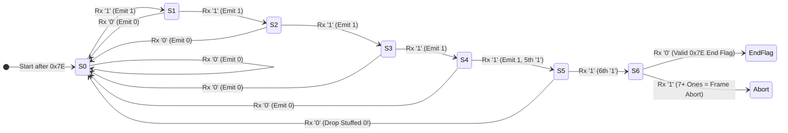
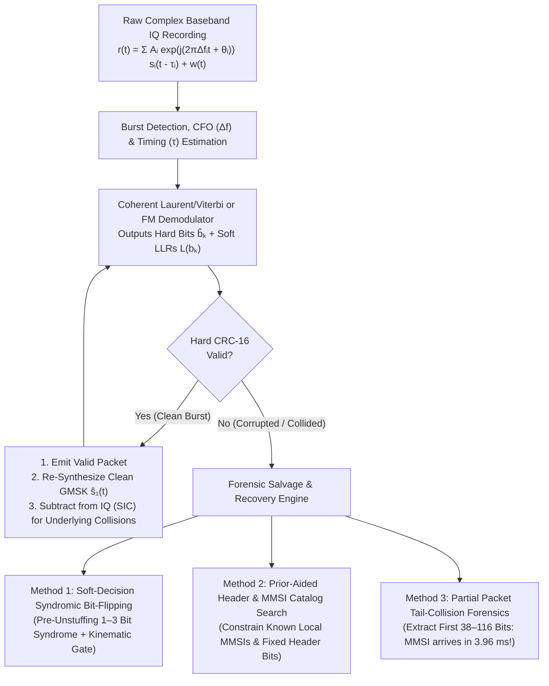

# Chapter 7: AIS Physical Layer: Bit Encoding, HDLC Framing, GMSK Modulation, and Salvaging Corrupted RF Recordings

## 1. Operational & Conceptual Overview

To a bridge watchstander viewing an Electronic Chart Display and Information System (ECDIS) or a data scientist querying a cloud table of decoded vessel trajectories, an Automatic Identification System (AIS) position report appears to be an atomic, error-free record: a 9-digit Maritime Mobile Service Identity (MMSI), a WGS84 latitude and longitude, Speed Over Ground (SOG), Course Over Ground (COG), and True Heading. Beneath that clean abstraction, however, every AIS report begins life as an ephemeral **$26.667\text{-millisecond}$ analog radio frequency (RF) burst** transmitted over a $25\text{ kHz}$ maritime Very High Frequency (VHF) channel at $161.975\text{ MHz}$ (AIS 1 / Channel 87B) or $162.025\text{ MHz}$ (AIS 2 / Channel 88B).

```mermaid
flowchart LR
    A["168-Bit AIS Payload<br/>(MSB-First Fields)"] --> B["Byte-Level Reversal<br/>(LSB-First per 8-Bit Byte)"]
    B --> C["CRC-CCITT-16 FCS<br/>(G(x)=x¹⁶+x¹²+x⁵+1)"]
    C --> D["HDLC Zero-Bit Stuffing<br/>(Insert 0 after five 1s)"]
    D --> E["Burst Framing<br/>(Preamble + 0x7E Flags)"]
    E --> F["NRZI Line Coding<br/>(0 = Transition, 1 = Hold)"]
    F --> G["GMSK Modulation<br/>(h=0.5, BT=0.4 TX / 0.5 RX)"]
    G --> H["VHF Channel & SDR IQ<br/>(161.975 / 162.025 MHz)"]
```



Understanding the exact physical-layer (PHY) and data-link-layer (DLL) pipeline defined in **ITU-R Recommendation M.1371-5 Annex 2** is indispensable for three distinct communities:

1. **RF, Embedded Hardware, and Software-Defined Radio (SDR) Engineers:** Implementing a compliant transceiver or high-sensitivity SDR demodulator (`AIS-catcher`, `gr-ais`, `rtl-ais`) requires handling a notorious bit-ordering duality: multi-bit data fields inside an AIS message are packed **Most Significant Bit (MSB) first**, yet each 8-bit byte of the payload is clocked onto the radio link **Least Significant Bit (LSB) first**, followed by a 16-bit Cyclic Redundancy Check (CRC-CCITT), High-Level Data Link Control (HDLC) zero-bit stuffing, Non-Return-to-Zero Inverted (NRZI) differential encoding, and Gaussian Minimum Shift Keying (GMSK) continuous-phase modulation.
2. **Spaceborne AIS Operators and High-Density Coastal VTS Architects:** Within the $60\text{-second}$ Self-Organized Time Division Multiple Access (SOTDMA) frame, $2{,}250$ slots of $26.667\text{ ms}$ each are available per channel. While SOTDMA prevents co-channel collisions among vessels within a single line-of-sight cell ($20\text{–}40\text{ NM}$), a Low Earth Orbit (LEO) satellite at $500\text{–}650\text{ km}$ altitude views a footprint exceeding $3{,}000\text{ km}$ in diameter encompassing dozens of independent SOTDMA cells simultaneously. Similarly, coastal receivers during summer tropospheric ducting events (Chapter 6) receive overlapping signals from hundreds of miles away. Standard hardware receivers drop every collided packet; advanced DSP pipelines recover them.
3. **Maritime Casualty Investigators, SAR Planners, and Intelligence Analysts:** When a vessel sinks during a storm, drags anchor across a subsea cable, or operates in a congested strait prior to a collision, the critical final AIS bursts recorded by coastal SDRs or satellites frequently fail standard 16-bit CRC checks due to low Signal-to-Noise Ratio (SNR), impulsive shipboard ignition/LED noise, or mid-slot packet collisions. Treating the AIS physical layer as a black box that outputs either a valid `!AIVDM` NMEA sentence or nothing discards up to **$40\text{–}70\%$ of recoverable forensic evidence** present in raw baseband In-Phase/Quadrature (IQ) recordings or soft-decision demodulator buffers.

---

## 2. Historical Context & Evolution (`schwehr/gis-history` Integration)

The AIS physical and link layers did not emerge in isolation; they represent a synthesis of four decades of information theory, synchronous telecom framing, cellular radio modulation, and maritime navigation standards documented in [`schwehr/gis-history`](https://github.com/schwehr/gis-history):

| Year | Historical Milestone | Engineering Significance to AIS Physical Layer & Packet Recovery |
|---|---|---|
| **1948** | **Claude Shannon** publishes *A Mathematical Theory of Communication* (*Bell System Technical Journal*) | Establishes channel capacity $C = B\log_2(1 + \text{SNR})$ and the theoretical foundation for soft-decision maximum-likelihood decoding over noisy channels. |
| **1961** | **W. Wesley Peterson & D. T. Brown** publish *Cyclic Codes for Error Detection* (*Proc. IRE*) | Introduces polynomial Cyclic Redundancy Checks (CRCs) capable of detecting single, double, and burst errors in serial bitstreams with simple shift-register hardware. |
| **1967** | **Andrew Viterbi** introduces the **Viterbi Algorithm** (*IEEE Trans. Inf. Theory*) | Provides maximum-likelihood sequence estimation (MLSE) over finite-state trellises—later used to optimally demodulate continuous-phase GMSK and separate colliding AIS bursts. |
| **1974–1979** | **IBM SDLC** (1974) standardized by ISO as **HDLC (ISO 3309 / ISO/IEC 13239)** and CCITT **X.25 / V.41** | Defines the `01111110` (`0x7E`) flag byte, zero-bit stuffing after five consecutive `1`s, LSB-first byte transmission, and the 16-bit CRC-CCITT polynomial $G(x) = x^{16} + x^{12} + x^5 + 1$. |
| **1981** | **Kazuaki Murota & Kenkichi Hirade** (NTT Japan) publish *GMSK Modulation for Digital Mobile Radio Telephony* (*IEEE Trans. Commun.*) | Adds a pre-modulation Gaussian low-pass filter to Minimum Shift Keying (MSK, $h=0.5$), achieving constant envelope (for nonlinear Class-C RF power amplifiers) and compact spectral sidelobes. |
| **1986–1991** | **Pierre Laurent** (1986) decomposes continuous-phase modulation (CPM) into linear superimposed pulses; **GSM** adopts GMSK (1987/1991) | Laurent's Amplitude Modulated Pulse (AMP) decomposition enables coherent linear matched-filter banks and Viterbi trellis receivers for GMSK. |
| **1988–1998** | **Håkan Lans** files STDMA priority patent (1988); **ITU-R M.1371-0** ratified (1998) | Adapts HDLC framing, NRZI line coding, and $9{,}600\text{ bps}$ GMSK ($BT=0.4$ TX / $0.5$ RX) into a $26.667\text{ ms}$ (256-bit) VHF time slot synchronized to GPS 1PPS UTC time. |
| **2006–2012** | **FFI Norway (`AISSat-1`, Eriksen et al.)**, **COM DEV / exactEarth**, **ORBCOMM**, and **Spire** pioneer spaceborne AIS de-collision | Develops Successive Interference Cancellation (SIC), Doppler/delay compensation, and blind source separation (e.g., US Patents `7,839,336`, `8,218,670`, `8,761,775`) to untangle colliding bursts from LEO. |
| **2010–2024** | Open-source AIS software revolution: **Kurt Schwehr (`libais`, 2010)**, **`gr-ais`**, **`rtl-ais`**, and **Jasper Hertog (`AIS-catcher`, 2021–2024)** | Brings multi-rate coherent GMSK demodulation, frequency-offset tracking, and soft-bit CRC error recovery to commodity $\$25$ RTL-SDR and Airspy receivers. |

---

## 3. Deep Technical & Mathematical Foundations

### 7.1 Complete AIS Physical & Link-Layer Encoding Pipeline (ITU-R M.1371-5 Annex 2)

An AIS time slot has a nominal duration of exactly:

$$T_{\text{slot}} = \frac{60\text{ seconds}}{2{,}250\text{ slots}} = \frac{4}{150}\text{ s} = 26.666\overline{6}\text{ ms}$$

At the standard AIS bit rate of $R_b = 9{,}600\text{ bits/s}$, a single symbol (bit) period is:

$$T_b = \frac{1}{R_b} = \frac{1}{9{,}600}\text{ s} = 104.166\overline{6}\text{ }\mu\text{s}$$

Consequently, one nominal time slot spans exactly $N_{\text{slot}} = R_b \cdot T_{\text{slot}} = 9{,}600 \times \frac{4}{150} = \mathbf{256\text{ bit periods}}$.

#### 7.1.1 Anatomy of a 1-Slot AIS Burst (256 Bits / $26.667\text{ ms}$)

Per **ITU-R M.1371-5 Annex 2 (§3.2.1–3.2.3, Table 1 & Table 2)**, a standard 1-slot transmission packet (such as Class A Position Report Messages 1, 2, and 3; Base Station Message 4; SAR Aircraft Message 9; or Class B Position Report Message 18) is structured into seven sequential segments:

| Segment Order | Segment Name | Nominal Bit Length | Duration ($\mu\text{s}$ / $\text{ms}$) | Cumulative Bit Index (0-Based) | Cumulative Time from Slot Start ($\text{ms}$) | Subject to Bit-Stuffing? | Over-the-Air Pattern / Function |
|---|---|---|---|---|---|---|---|
| **1** | **Transmitter Ramp-Up** | $8\text{ bits}$ | $833.3\text{ }\mu\text{s}$ ($0.833\text{ ms}$) | `0–7` | $0.000\text{–}0.833\text{ ms}$ | No | RF carrier envelope rises from $<-50\text{ dBc}$ to within $2\text{ dB}$ of nominal power to prevent key-click spectral splatter. |
| **2** | **Training Sequence (Preamble)** | $24\text{ bits}$ | $2{,}500.0\text{ }\mu\text{s}$ ($2.500\text{ ms}$) | `8–31` | $0.833\text{–}3.333\text{ ms}$ | No | Alternating `010101010101010101010101` (`0x555555` / `0xAAAAAA`) for AGC stabilization, carrier offset, and symbol-clock lock. |
| **3** | **HDLC Start Flag** | $8\text{ bits}$ | $833.3\text{ }\mu\text{s}$ ($0.833\text{ ms}$) | `32–39` | $3.333\text{–}4.167\text{ ms}$ | No | `01111110` (`0x7E`). Six consecutive `1`s uniquely mark the start of the payload bit stream. |
| **4** | **Data Payload** | $168\text{ bits}$ | $17{,}500.0\text{ }\mu\text{s}$ ($17.500\text{ ms}$) | `40–207` *(pre-stuffing)* | $4.167\text{–}21.667\text{ ms}$ | **Yes** | Standard 1-slot message (21 bytes). Internal fields are packed **MSB-first**, but each 8-bit byte is transmitted **LSB-first**! |
| **5** | **Frame Check Sequence (FCS / CRC-16)** | $16\text{ bits}$ | $1{,}666.7\text{ }\mu\text{s}$ ($1.667\text{ ms}$) | `208–223` *(pre-stuffing)* | $21.667\text{–}23.333\text{ ms}$ | **Yes** | 16-bit **CRC-CCITT** ($G(x) = x^{16} + x^{12} + x^5 + 1$), preset to `0xFFFF`, ones'-complemented prior to transmission. |
| **6** | **HDLC End Flag** | $8\text{ bits}$ | $833.3\text{ }\mu\text{s}$ ($0.833\text{ ms}$) | `224–231` *(pre-stuffing)* | $23.333\text{–}24.167\text{ ms}$ | No | `01111110` (`0x7E`). Terminates the HDLC frame immediately after the last (stuffed) FCS bit. |
| **7** | **Buffer (Stuffing, Ramp-Down, Delay)** | $24\text{ bits}$ | $2{,}500.0\text{ }\mu\text{s}$ ($2.500\text{ ms}$) | `232–255` | $24.167\text{–}26.667\text{ ms}$ | N/A | Absorbs bit-stuffing expansion ($4\text{ bits}$), PA ramp-down ($6\text{ bits}$), distance propagation delay ($12\text{ bits}$), and jitter ($2\text{ bits}$). |

> [!IMPORTANT]
> **Multi-Slot and Long-Range Burst Exceptions:**
> * **Multi-Slot Bursts (Messages 5, 6, 8, 12, 14, 17, 19, 20, 21, 24):** When an AIS message spans $N_{\text{slots}} \in \{2, 3, 5\}$ consecutive slots, the Ramp-Up, Preamble, Flags, CRC-16, and 24-bit Buffer occur **only once** for the entire contiguous burst, yielding maximum unstuffed payload capacities of $424\text{ bits}$ (2 slots, e.g., Msg 5 Static & Voyage Data), $680\text{ bits}$ (3 slots), and $1{,}192\text{ bits}$ (5 slots).
> * **Message 27 (Long-Range AIS Broadcast for Satellite Reception):** Truncates the data payload from $168\text{ bits}$ down to **$96\text{ bits}$** (total burst $= 160\text{ bits} = 16.667\text{ ms}$), leaving a massive **$96\text{-bit}$ ($10.0\text{ ms}$) guard buffer** at the end of the slot able to absorb up to $c \cdot 10.0\text{ ms} \approx 2{,}998\text{ km}$ ($1{,}619\text{ NM}$) of slant-range propagation delay to a LEO satellite without colliding into the subsequent time slot.

#### 7.1.2 The MSB-First Field vs. LSB-First Byte Transmission Duality

One of the most frequent sources of subtle software bugs when bridging SDR physical-layer demodulators to NMEA 0183 payload parsers (`libais`, `gpsd`, `pyais`) is **ITU-R M.1371-5 Annex 2 §3.2.2.1** (*Bit ordering*):

1. **Logical Message Assembly (MSB-First):** When constructing the 168-bit payload vector $\mathbf{m} = (m_0, m_1, \dots, m_{167}) \in \{0,1\}^{168}$, every parameter field (6-bit Message ID, 2-bit Repeat Indicator, 30-bit MMSI, 28-bit two's-complement Longitude, etc.) is written from its Most Significant Bit (MSB) to its Least Significant Bit (LSB). This 168-bit MSB-first array is the exact bit layout produced when unpacking the 6-bit ASCII characters of an NMEA `!AIVDM` sentence.
2. **Physical Over-the-Air Serialization (LSB-First per 8-Bit Byte):** Prior to CRC calculation and HDLC bit-stuffing, the 168-bit logical message $\mathbf{m}$ is partitioned into $21$ octets (8-bit bytes) $B_0, B_1, \dots, B_{20}$, where byte $B_i = (m_{8i}, m_{8i+1}, \dots, m_{8i+7})$ has MSB $m_{8i}$ and LSB $m_{8i+7}$. Per ISO/IEC 13239 (HDLC) convention, **each byte is transmitted over the air LSB-first**:

$$b_{\text{tx}}(8i + k) = m_{8i + (7 - k)} \qquad \text{for } i \in \{0, \dots, 20\},\; k \in \{0, \dots, 7\}$$

Let us trace the first byte ($B_0$, logical bits `0..7`) of a **Message 1** (`Message ID = 1 = 000001₂`) with `Repeat Indicator = 0 = 00₂`:
* **Logical MSB-first bit sequence (`m[0:8]`):** `000001` (Message ID) concatenated with `00` (Repeat Indicator) $= \texttt{00000100}_2$ (`0x04`).
* **Over-the-air transmission order (`b_tx[0:8]`, LSB-first of `B_0`):** Reversing the 8 bits of `B_0` yields $\texttt{00100000}_2$! Thus, the very first two payload bits clocked out after the `0x7E` start flag are actually the **Repeat Indicator** (`m[7]`, `m[6]`), followed by the **Message ID from LSB to MSB** (`m[5]` down to `m[0]`).

> [!WARNING]
> **Why `168` is Divisible by Both `6` and `8`:**
> A standard 1-slot AIS payload is $168\text{ bits}$ specifically because $\text{lcm}(6, 8) = 24$ divides $168$ ($168 = 21 \times 8\text{ bits for HDLC byte reversal} = 28 \times 6\text{ bits for NMEA ASCII armoring}$). If a variable-length binary message (Message 6 or 8) is not an integer multiple of 8 bits at the physical layer, it is padded to an 8-bit boundary before byte reversal and CRC calculation.

#### 7.1.3 Frame Check Sequence (16-Bit CRC-CCITT / ISO/IEC 13239)

To detect bit errors introduced on the VHF channel, a 16-bit **Frame Check Sequence (FCS)** is calculated over the unstuffed payload bits in their over-the-air transmission order $\mathbf{b}_{\text{tx}} = (b_0, b_1, \dots, b_{N-1})$ (where $N = 168$ for a 1-slot message) using the **CRC-CCITT** generator polynomial specified in **ISO/IEC 13239** and **ITU-R M.1371-5 Annex 2 §3.2.2.3**:

$$G(x) = x^{16} + x^{12} + x^5 + 1$$

In binary polynomial notation, the 16-bit feedback mask is `0x1021` (MSB-first normal form) or `0x8408` (LSB-first reflected form). The calculation proceeds as follows:

1. **Preset to All Ones (`0xFFFF`):** Initialize the 16-bit shift register to $\mathbf{r}^{(-1)} = \texttt{0xFFFF}$ ($1111111111111111_2$) so that leading zero bits in the payload alter the register state.
2. **Polynomial Division over $N$ Payload Bits:** For each transmitted bit $b_k \in \{0, 1\}$ ($k = 0, \dots, N-1$), shift the register and XOR with $G(x)$ whenever the feedback bit is $1$:
   $$f_k = r_{15}^{(k-1)} \oplus b_k, \qquad \mathbf{r}^{(k)} = \bigl(\mathbf{r}^{(k-1)} \ll 1\bigr)_{16\text{-bit}} \oplus \bigl(f_k \cdot \texttt{0x1021}\bigr)$$
3. **Ones'-Complement Inversion & Transmission Order:** After all $N$ payload bits have been clocked in, take the bitwise ones'-complement of the remainder:
   $$\text{FCS} = \mathbf{r}^{(N-1)} \oplus \texttt{0xFFFF}$$
   The 16 bits of $\text{FCS}$ are then appended to $\mathbf{b}_{\text{tx}}$ from $r_{15}$ (highest-order coefficient of the remainder) down to $r_0$ (lowest-order coefficient).

**Mathematical Properties of CRC-CCITT ($G(x) = x^{16} + x^{12} + x^5 + 1$):**
Because $G(x)$ factors over $\text{GF}(2)$ into $(x + 1)$ and a primitive degree-15 irreducible trinomial/pentanomial $P_{15}(x) = x^{15} + x^{14} + x^{13} + x^{12} + x^4 + x^3 + x^2 + x + 1$ with cyclic period $2^{15} - 1 = 32{,}767\text{ bits}$, the 16-bit FCS guarantees:
* **100% detection** of all single-bit, double-bit, and triple-bit errors anywhere within an AIS burst (since burst length $N + 16 \le 1{,}208 \ll 32{,}767$),
* **100% detection** of any odd number of bit errors (due to the $(x+1)$ parity factor),
* **100% detection** of any single error burst of length $L_{\text{burst}} \le 16\text{ bits}$,
* **$99.9969\%$ ($1 - 2^{-15}$) detection** of 17-bit error bursts, and **$99.9985\%$ ($1 - 2^{-16}$)** of longer bursts or random corruptions.

#### 7.1.4 The 24-Bit Buffer Breakdown (Stuffing, Ramp-Down, and $202\text{ NM}$ Distance Delay)

Why does a 256-bit time slot terminate its nominal End Flag at bit `231`, leaving $24\text{ bits}$ ($2.500\text{ ms}$) of apparent dead time at the end of the slot? **ITU-R M.1371-5 Annex 2 Table 2** partitions this 24-bit buffer into four physical link-budget budgets:

| Buffer Sub-Allocation | Bit Budget | Time Budget ($\mu\text{s}$) | Physical / Engineering Justification |
|---|---|---|---|
| **Bit-Stuffing Expansion** | $4\text{ bits}$ | $416.7\text{ }\mu\text{s}$ | Absorbs HDLC zero-bit insertions in the 184-bit payload+FCS stream. |
| **Transmitter Ramp-Down** | $6\text{ bits}$ | $625.0\text{ }\mu\text{s}$ | Smoothly decays RF PA output power below $-50\text{ dBc}$ without adjacent-channel transients. |
| **Distance Propagation Delay** | $12\text{ bits}$ | $1{,}250.0\text{ }\mu\text{s}$ | At $c = 299{,}792.458\text{ km/s}$, $1.25\text{ ms}$ equals **$374.74\text{ km}$ ($202.34\text{ NM}$)** of RF travel before overlapping the next slot's ramp-up. |
| **Synchronization Jitter** | $2\text{ bits}$ | $208.3\text{ }\mu\text{s}$ | Absorbs GNSS 1PPS timing jitter or fallback internal crystal drift ($\pm 104\text{ }\mu\text{s}$). |
| **Total Buffer** | **$24\text{ bits}$** | **$2{,}500.0\text{ }\mu\text{s}$** | Completes the $256\text{-bit}$ ($26{,}666.7\text{ }\mu\text{s}$) time slot. |

---

### 7.2 Bit-Stuffing, NRZI Line Coding, and GMSK Modulation

#### 7.2.1 HDLC Zero-Bit Stuffing and Worst-Case Frame Expansion

Both the Start Flag and End Flag are the 8-bit sequence `01111110` (`0x7E`), which contains **six consecutive `1` bits**. To prevent arbitrary binary data inside the 168-bit Payload or 16-bit FCS from accidentally synthesizing a `0x7E` flag and prematurely terminating the frame at the receiver, the transmitter applies **HDLC zero-bit stuffing** across the $184\text{-bit}$ combined Payload + FCS stream (and **never** to the preamble or the `0x7E` flags themselves):

* **Transmitter Stuffing Rule:** Monitor the outgoing Payload + FCS bit stream. Whenever **five consecutive `1` bits** (`11111`) have been output, unconditionally insert a **`0` bit** immediately after the fifth `1` (producing `111110`), regardless of whether the next data bit is a `0` or a `1`.
* **Receiver Unstuffing Rule:** After detecting the `01111110` Start Flag, monitor the incoming demodulated NRZI-decoded bit stream. Whenever **five consecutive `1` bits** are observed:
  * If the **6th bit is `0`**, it is a stuffed bit—delete it and continue accumulating payload/FCS bits.
  * If the **6th bit is `1` and the 7th bit is `0`** (`01111110`), the receiver has reached the valid **HDLC End Flag** (`0x7E`), terminating the frame.
  * If the **6th and 7th bits are both `1`** (`1111111`, seven or more consecutive ones), the receiver declares an **HDLC Frame Abort / Corruption Error**.



**Statistical vs. Worst-Case Bit-Stuffing Analysis:**
How many stuffed zeros can be inserted into an $L = 184\text{-bit}$ (168 payload + 16 FCS) unstuffed stream?
1. **Random Uniform Data Expectation:** For independent, identically distributed bits $P(b_k = 1) = 0.5$, a run of five ones terminating a previous zero occurs with probability $p_{\text{stuff}} \approx 2^{-5} \text{ to } 2^{-6}$, yielding an expected expansion of:
   $$\mathbb{E}[N_{\text{stuff}}] \approx \frac{184}{62} \approx 2.97\text{ bits}, \qquad P(N_{\text{stuff}} \le 4) \approx 83.2\%$$
2. **Real-World AIS Payload Distribution:** Because common AIS fields contain long runs of zeros (e.g., `Spare = 00`, positive Northern/Eastern coordinates, low speeds), empirical coastal AIS datasets average $N_{\text{stuff}} \approx 1.8\text{ bits}$ per 1-slot message. However, negative Western longitudes ($\lambda < 0$), Southern latitudes ($\phi < 0$), and "not available" sentinels (`SOG = 1023 = 1111111111₂`, `Heading = 511 = 111111111₂`, `ROT = -1 = 11111111₂`) contain dense clusters of `1`s that routinely trigger $6\text{ to }12$ stuffed bits.
3. **Strict Mathematical Worst Case:** Because every inserted `0` resets the transmitter's consecutive-ones counter to zero, triggering each stuffed `0` requires **five distinct `1` bits** from the unstuffed $184\text{-bit}$ stream. Therefore, the absolute maximum number of stuffed bits in a 1-slot AIS frame is:
   $$N_{\text{stuff, max}} = \left\lfloor \frac{184}{5} \right\rfloor = 36\text{ bits}$$
   Wait—if the buffer only allocates $4\text{ bits}$ specifically labeled "bit stuffing" in Table 2, what happens if a frame has $10$ stuffed bits? In practice, the $4\text{-bit}$ stuffing allocation and $12\text{-bit}$ propagation distance delay share the same contiguous 24-bit guard interval at the end of the slot. A vessel with $16$ stuffed bits ($4 + 12$) simply borrows the propagation-delay margin, which causes zero slot overlap for any receiver within close-to-moderate range!

#### 7.2.2 NRZI (Non-Return-to-Zero Inverted) Line Coding

After the complete burst bit sequence $\mathbf{b} = (b_0, b_1, \dots, b_{M-1}) \in \{0,1\}^M$ (comprising Preamble + Start Flag + Stuffed Payload & FCS + End Flag) is assembled, it is passed through a **Non-Return-to-Zero Inverted (NRZI)** differential encoder (**ITU-R M.1371-5 Annex 2 §2.1.4**). In NRZI:
* A logical **`0`** causes a **transition** (inversion) of the output state,
* A logical **`1`** causes **no transition** (the output state remains constant).

Mathematically, letting $d_k \in \{0, 1\}$ denote the NRZI encoded level during symbol interval $k$ (with initial state $d_{-1} \in \{0, 1\}$) and $\alpha_k = 2 d_k - 1 \in \{-1, +1\}$ denote the corresponding bipolar modulation symbol:

$$d_k = d_{k-1} \oplus (1 - b_k), \qquad \alpha_k = \alpha_{k-1} \cdot (2 b_k - 1)$$

At the receiver, recovering the original bit $b_k$ from consecutive demodulated decisions $\hat{d}_k, \hat{d}_{k-1}$ requires only a 1-bit delay and XNOR gate:

$$\hat{b}_k = 1 - (\hat{d}_k \oplus \hat{d}_{k-1}) = \frac{1 + \hat{\alpha}_k \hat{\alpha}_{k-1}}{2}$$

NRZI combined with HDLC zero-bit stuffing solves two fundamental RF engineering challenges simultaneously:

1. **Complete Immunity to $180^\circ$ Phase and Polarity Inversion:** In a non-coherent FM discriminator or coherent Costas-loop IQ demodulator, an inverted local oscillator phase ($\phi \to \phi + \pi$) or swapped I/Q leads negates every demodulated symbol ($\hat{\alpha}_k \to -\hat{\alpha}_k$). Because NRZI decoding depends only on the product $\hat{\alpha}_k \hat{\alpha}_{k-1} = (-\hat{\alpha}_k)(-\hat{\alpha}_{k-1})$, polarity inversion has **zero effect** on the decoded bitstream $\hat{b}_k$.
2. **Guaranteed Minimum Transition Density for Symbol Clock Tracking:** A receiver's timing recovery loop (e.g., Gardner or Mueller-Müller timing error detector) requires periodic zero-crossings to prevent symbol clock drift over a 184-bit payload. Because HDLC zero-bit stuffing guarantees that at most five consecutive `1`s can ever occur inside the payload/FCS, and because every stuffed `0` forces an NRZI transition ($\alpha_k = -\alpha_{k-1}$), the transmitter is **mathematically guaranteed to produce at least one phase/frequency transition every 6 bit periods ($625\text{ }\mu\text{s}$)** throughout the data payload! Meanwhile, the 24-bit alternating training sequence at the start of the burst produces rapid periodic transitions ($2{,}400\text{ Hz}$ or $4{,}800\text{ Hz}$ tone, depending on whether `010101...` is defined at the NRZI output as in standard hardware transceivers or prior to NRZI) for instantaneous symbol-clock acquisition.

#### 7.2.3 GMSK (Gaussian Minimum Shift Keying) Modulation Mathematics

The bipolar NRZI symbol stream $\alpha_k \in \{-1, +1\}$ modulates the VHF carrier using **Gaussian Minimum Shift Keying (GMSK)**, a constant-envelope Continuous-Phase Frequency Shift Keying (CPFSK) scheme with modulation index:

$$h = 0.5$$

At bit rate $R_b = 9{,}600\text{ bps}$, a modulation index of $h = 0.5$ sets the peak instantaneous frequency deviation from the channel center frequency $f_c$ to:

$$\Delta f = \pm \frac{h R_b}{2} = \pm \frac{0.5 \times 9{,}600\text{ Hz}}{2} = \pm 2{,}400\text{ Hz}$$

Over a single isolated symbol period $T_b = 1/R_b$, a frequency deviation of $\pm 2{,}400\text{ Hz}$ integrates to a net carrier phase rotation of:

$$\Delta \phi = 2\pi (\pm \Delta f) T_b = \pm \pi h = \pm \frac{\pi}{2}\text{ radians } (\pm 90^\circ)$$

**Gaussian Pre-Modulation Pulse Shaping ($BT = 0.4$ Transmit / $BT = 0.5$ Receive):**
In unfiltered Minimum Shift Keying (MSK), instantaneous frequency jumps between $-2{,}400\text{ Hz}$ and $+2{,}400\text{ Hz}$ at symbol boundaries produce wide $\text{sinc}^2$ spectral sidelobes that violate the $25\text{ kHz}$ maritime VHF channel mask ($-60\text{ dBc}$ at $\pm 25\text{ kHz}$). GMSK eliminates these discontinuities by passing the non-return-to-zero rectangular pulse train through a Gaussian low-pass filter prior to frequency modulation.

Per **ITU-R M.1371-5 Annex 2 §2.1.2**, the normalized $3\text{ dB}$ bandwidth-time product $BT = B_{3\text{dB}} T_b$ is specified as:
* **Transmitter ($25\text{ kHz}$ channel):** $BT_{\text{TX}} = 0.4 \implies B_{3\text{dB}} = 0.4 \times 9{,}600\text{ Hz} = 3{,}840\text{ Hz}$ (or $BT_{\text{TX}} = 0.3$ in $12.5\text{ kHz}$ narrowband mode).
* **Receiver Demodulator:** $BT_{\text{RX}} = 0.5 \implies B_{3\text{dB}} = 0.5 \times 9{,}600\text{ Hz} = 4{,}800\text{ Hz}$.

The Gaussian filter has frequency response $H_G(f)$ and impulse response $h_G(t)$:

$$H_G(f) = \exp\!\left(-\frac{\ln 2}{2}\left(\frac{f}{B_{3\text{dB}}}\right)^2\right), \qquad h_G(t) = \sqrt{\frac{2\pi}{\ln 2}}\, B_{3\text{dB}} \exp\!\left(-\frac{2\pi^2 B_{3\text{dB}}^2}{\ln 2}\, t^2\right)$$

Convolving $h_G(t)$ with the unit-area rectangular symbol pulse $\frac{1}{T_b}\text{rect}\!\left(\frac{t}{T_b}\right)$ yields the **GMSK frequency pulse $g(t)$**:

$$g(t) = \frac{1}{2 T_b} \left[ \operatorname{erf}\!\left(\pi \sqrt{\frac{2}{\ln 2}}\, (BT)\left(\frac{t}{T_b} + \frac{1}{2}\right)\right) - \operatorname{erf}\!\left(\pi \sqrt{\frac{2}{\ln 2}}\, (BT)\left(\frac{t}{T_b} - \frac{1}{2}\right)\right) \right]$$

where $\operatorname{erf}(z) = \frac{2}{\sqrt{\pi}}\int_0^z e^{-u^2}du$ and $\int_{-\infty}^{\infty} g(t)\,dt = \frac{1}{2}$. For $BT = 0.4$, $g(t)$ spans approximately $L_g = 3$ symbol periods ($-1.5 T_b \le t \le +1.5 T_b$), introducing controlled **partial-response intersymbol interference (ISI)** over 3 adjacent bits.

The instantaneous frequency deviation $f_{\text{inst}}(t)$, continuous phase trajectory $\phi(t)$, and complex baseband IQ envelope $s_{\text{BB}}(t)$ are therefore:

$$f_{\text{inst}}(t) = h R_b \sum_{k} \alpha_k\, g(t - k T_b)$$

$$\phi(t) = \phi_0 + 2\pi h \sum_{k} \alpha_k \int_{-\infty}^{t - k T_b} g(\tau)\,d\tau$$

$$s_{\text{BB}}(t) = A(t)\exp\bigl(j\phi(t)\bigr) = A(t)\cos\phi(t) + j\,A(t)\sin\phi(t)$$

where $A(t)$ is the transmitter power-amplifier ramp-up/ramp-down shaping envelope. Because $|s_{\text{BB}}(t)| = A(t)$ is strictly constant during the active burst, shipboard Class A transceivers can use high-efficiency ($>70\%$) nonlinear Class-C VHF power amplifiers without generating amplitude-to-phase (AM-PM) spectral regrowth.

---

### 7.3 What Can Be Used and Salvaged from RF Recordings Where There Is Packet Corruption and/or Collisions?

In commercial off-the-shelf (COTS) AIS hardware receivers, a single corrupted bit out of 184 payload+FCS bits causes the 16-bit CRC-CCITT check to fail, and the microcontroller silently drops the entire packet. However, when a shore station, aircraft, VDR forensic tap, or LEO satellite records **raw baseband IQ samples** (e.g., $48\text{–}288\text{ kS/s}$ complex `int16`/`float32`) or retains **soft demodulator outputs**, a remarkable wealth of navigational and forensic information can be salvaged from corrupted and collided bursts.



#### 7.3.1 Method 1: Soft-Decision Syndromic Bit-Flipping & Viterbi Trellis Recovery

When an AIS burst arrives near the receiver thermal sensitivity threshold ($\text{SINAD} \approx 10\text{–}12\text{ dB}$, $\text{BER} \approx 10^{-3}\text{ to }10^{-2}$) or suffers a brief broadband impulse from a shipboard LED driver or ignition spike, typically **only $1\text{ to }3\text{ bits}$** out of the 184-bit frame are flipped while the remaining $181+\text{ bits}$ are completely intact.

1. **Viterbi Trellis Demodulation of GMSK Memory:** Because the $BT=0.4$ Gaussian pulse spans $L=3$ symbol periods and NRZI introduces a 1-bit differential memory, the GMSK phase trajectory forms a finite-state machine (trellis) with $2^{L-1} \times 4$ phase states (simplified via Pierre Laurent's 1986 decomposition to a dominant linear pulse $c_0(t)$ spanning $4 T_b$ plus a negligible secondary pulse $c_1(t)$). Replacing a memoryless FM frequency discriminator with a coherent **Viterbi Maximum-Likelihood Sequence Estimator (MLSE)** or **BCJR (Bahl-Cocke-Jelinek-Raviv)** algorithm recovers $2.0\text{–}3.5\text{ dB}$ of coding/modulation gain before a single bit is even checked against the CRC.
2. **Extracting Per-Bit Soft Log-Likelihood Ratios (LLRs):** Whether using a BCJR trellis or a matched-filter FM discriminator, the demodulator produces a continuous analog decision variable $y_k \in \mathbb{R}$ at each bit strobe $k$. Under locally Gaussian noise variance $\sigma_k^2$, the **Log-Likelihood Ratio (LLR)** $L(b_k)$ and **bit reliability** $|L(b_k)|$ are:
   $$L(b_k) = \ln \frac{P(b_k = 1 \mid \mathbf{r})}{P(b_k = 0 \mid \mathbf{r})} \propto \frac{2 \mu y_k}{\sigma_k^2}, \qquad \hat{b}_k = \begin{cases} 1 & L(b_k) \ge 0 \\ 0 & L(b_k) < 0 \end{cases}$$
   Bits whose decision strobe falls near zero ($|L(b_k)| \approx 0$) are **erasure-like weak bits** with nearly $50\%$ error probability, whereas bits with large $|L(b_k)|$ are rock-solid.
3. **Linearity of the 16-Bit CRC Syndrome:** Let $\mathbf{u} = (\mathbf{b}_{\text{payload}}, \mathbf{b}_{\text{FCS}}) \in \{0,1\}^{184}$ denote the unstuffed 184-bit vector, and define the 16-bit **error syndrome** $\mathbf{s}(\hat{\mathbf{u}})$ as the XOR difference between the CRC-CCITT computed over the received 168-bit payload and the received 16-bit FCS:
   $$\mathbf{s}(\hat{\mathbf{u}}) = \operatorname{CRC}_{16}\!\bigl(\hat{\mathbf{u}}_{0:168}\bigr) \oplus \hat{\mathbf{u}}_{168:184} \in \{0,1\}^{16}$$
   Because the affine initialization (`0xFFFF`) and final complement (`0xFFFF`) cancel out under XOR addition, $\mathbf{s}(\mathbf{u} \oplus \mathbf{e}) = \mathbf{s}(\mathbf{e})$ is **strictly linear over $\text{GF}(2)$**:
   $$\mathbf{s}\!\left(\mathbf{u} \oplus \sum_{i \in \mathcal{E}} \mathbf{e}_i\right) = \bigoplus_{i \in \mathcal{E}} \mathbf{s}(\mathbf{e}_i)$$
   where $\mathbf{e}_i$ is a unit error vector with a single `1` at bit index $i \in \{0, \dots, 183\}$. Because $184 \ll 32{,}767$, all $184$ single-bit syndromes $\mathbf{s}(\mathbf{e}_i)$ are **mutually distinct**!
4. **The Pre-Unstuffing Bit-Flip Insight:** A critical failure mode of naive CRC bit-flippers is applying bit-flipping *after* HDLC bit unstuffing. If a channel error flips the 5th `1` in `111110` to `111100` (or creates a false `111110` from `110110`), the HDLC unstuffer either fails to strip a stuffed `0` or falsely deletes a genuine payload `0`, shifting every subsequent bit in the frame by $\pm 1$ position and producing $185$ or $183$ bits instead of $184$! Therefore, a production forensic recovery engine ranks the **$K$ lowest-confidence bits ($K \approx 16\text{–}24$) in the raw NRZI-decoded stream prior to unstuffing**:
   * If the unstuffed frame length between `0x7E` flags is $183$ or $185$ bits, first test single-bit flips adjacent to runs of four or five `1`s in the raw stream that restore the exact $184\text{-bit}$ unstuffed length and yield $\mathbf{s} = \texttt{0x0000}$.
   * If the unstuffed length is already $184\text{ bits}$ and $\mathbf{s} \ne \texttt{0x0000}$, check in $O(1)$ hash-table lookup whether $\mathbf{s} = \mathbf{s}(\mathbf{e}_i)$ (1-bit error) or $\mathbf{s} \oplus \mathbf{s}(\mathbf{e}_i) = \mathbf{s}(\mathbf{e}_j)$ for $i, j$ among the $K$ weakest soft bits (2-bit and 3-bit Chase-2 decoding).
5. **Mandatory Plausibility Gate against False CRC Collisions:** Because there are $2^{16} = 65{,}536$ possible 16-bit syndromes, testing $M$ candidate bit flips carries a false-positive CRC collision probability of $P_{\text{false}} \approx M / 65{,}536$. To reduce false positives below $10^{-7}$, every candidate recovery must pass a **domain plausibility filter**:
   * Reserved/Spare bits (e.g., bits `145–147` in Msg 1/2/3) must equal `0`,
   * The decoded 30-bit MMSI must have a valid Maritime Identification Digits (MID) prefix ($201\text{–}775$) or match an active vessel tracked within the last $30\text{ minutes}$, and
   * Decoded kinematics $(\lambda, \phi, \text{SOG}, \text{COG})$ must satisfy physical continuity ($|\mathbf{x}(t) - \mathbf{x}(t_0)| \le v_{\text{max}} \Delta t$) with the vessel's trajectory.

#### 7.3.2 Method 2: Prior-Aided Header & MMSI Catalog Constraints

When a deep fade or multi-bit interference burst corrupts $4\text{ to }8\text{ bits}$—exceeding the false-alarm limit of blind CRC syndrome search—we can exploit **known prior information** about the AIS protocol and local maritime traffic.

In any coastal VTS sector or historical incident investigation, the set of active vessels $\mathcal{M}_{\text{local}} = \{\text{MMSI}_1, \dots, \text{MMSI}_V\}$ within radio range during a given 10-minute window is small ($V \sim 20\text{ to }500$ ships). Furthermore, in a standard Class A Position Report (Messages 1, 2, 3), the first $42\text{ payload bits}$ have near-zero conditional entropy once the vessel identity is hypothesized:
* **Bits `0–5` (Message ID):** Almost exclusively `000001` (`1`), `000010` (`2`), or `000011` (`3`),
* **Bits `6–7` (Repeat Indicator):** `00` for $>98\%$ of direct broadcasts,
* **Bits `8–37` (MMSI):** Known 30-bit integer for each candidate ship $v \in \mathcal{M}_{\text{local}}$,
* **Bits `38–41` (Navigation Status):** Invariant over consecutive minutes (e.g., `0000` = Under way using engine, `0001` = At anchor, `0101` = Moored).

Moreover, SOTDMA is deterministic: in frame $f$, a Class A vessel announces its slot offset for frame $f+1$ inside its own communication state (`bits 149–167`). Thus, the receiver often knows *in advance* which MMSI is scheduled to transmit in slot $s$! Fixing the $42$ header bits (plus `Spare = 000` at `bits 145–147`) leaves only the kinematic fields and frees the 16-bit CRC to algebraically solve for a burst error up to **16 bits long** elsewhere in the packet, or to score the $V$ candidate MMSIs against the received soft LLRs:

$$\hat{v} = \arg\max_{v \in \mathcal{M}_{\text{local}}} \sum_{k=0}^{37} \bigl(2 b_{k}^{(v)} - 1\bigr)\, L(b_{\text{tx},\pi(k)})$$

where $\pi(k)$ maps logical payload bit $k$ to its LSB-first over-the-air position.

#### 7.3.3 Method 3: Partial Packet Forensics from Tail-Collided Bursts

One of the most important operational insights in AIS RF forensics is that **a packet destroyed in its second half by a co-channel collision still contains intact, high-SNR telemetry in its first half**.

Consider two vessels $A$ and $B$ transmitting in the same time slot:
* In **coastal tropospheric ducting** or **wide-area airborne reception**, Vessel $A$ is $10\text{ NM}$ from the receiver ($\tau_A = 62\text{ }\mu\text{s}$) while distant Vessel $B$ is $180\text{ NM}$ away ($\tau_B = 1.11\text{ ms}$) or using un-synchronized CSTDMA/RATDMA.
* In **LEO satellite reception**, a satellite at $600\text{ km}$ altitude has a nadir path of $600\text{ km}$ ($\tau_{\text{nadir}} = 2.0\text{ ms}$) and a horizon slant range of $2{,}830\text{ km}$ ($\tau_{\text{limb}} = 9.44\text{ ms}$), creating differential arrival delays up to $\Delta \tau = 7.44\text{ ms}$ ($\sim 71\text{ bits}$), and even larger overlaps when adjacent time slots collide due to extreme slant range!

When Vessel $B$'s burst arrives $\Delta \tau = 6\text{ to }14\text{ ms}$ after Vessel $A$'s burst begins, Vessel $A$'s Preamble, Start Flag (`0x7E`), and early payload bits are received **completely free of interference**, before Vessel $B$'s carrier ramps up and destroys Vessel $A$'s tail and CRC-16. Let us examine the exact microsecond timeline of a 1-slot AIS Position Report (Messages 1, 2, 3) measured from the end of the `0x7E` Start Flag ($t_{\text{payload}} = 0.0\text{ ms}$, or $t_{\text{slot}} = 4.167\text{ ms}$ from burst ramp-up):

| Logical Field (ITU-R M.1371 Msg 1/2/3) | Logical Bits (0-Based MSB) | Over-the-Air Byte Range | Payload Time Completed ($t_{\text{payload}}$) | Total Burst Time from Ramp-Up ($t_{\text{slot}}$) | Forensic Value When Tail & CRC Are Destroyed |
|---|---|---|---|---|---|
| **Message ID** ($6\text{ bits}$) + **Repeat Ind.** ($2\text{ bits}$) | `0–5`, `6–7` | Byte `0` (bits `0–7`) | **$0.833\text{ ms}$** ($8\text{ bits}$) | $5.000\text{ ms}$ | Identifies Class A Position Report (`1`, `2`, `3`) or Class B (`18`). |
| **User ID (Full 30-Bit MMSI)** + **Nav Status** ($2\text{ MSBs}$) | `8–37`, `38–39` | Bytes `1–4` (bits `8–39`) | **$4.167\text{ ms}$** ($40\text{ bits}$) | **$8.333\text{ ms}$** | **Full 9-digit MMSI is complete by bit 38 ($3.96\text{ ms}$ after Start Flag)!** Unmasks vessel presence even in severe slot collisions. |
| **Nav Status** (all $4\text{ bits}$) + **Rate of Turn (ROT)** ($8\text{ bits}$) | `38–41`, `42–49` | Bytes `4–6` (bits `32–55`) | **$5.833\text{ ms}$** ($56\text{ bits}$) | $10.000\text{ ms}$ | Reveals whether vessel is at anchor/underway and if executing an emergency helm turn. |
| **Speed Over Ground (SOG)** ($10\text{ bits}$) + **Pos Accuracy** ($1\text{ bit}$) | `50–59`, `60` | Bytes `6–7` (bits `48–63`) | **$6.667\text{ ms}$** ($64\text{ bits}$) | $10.833\text{ ms}$ | Extracts exact vessel speed in $0.1\text{-knot}$ increments (e.g., anchor-drag deceleration). |
| **Longitude ($\lambda$, $28\text{ bits}$)** | `61–88` | Bytes `7–11` (bits `56–95`) | **$10.000\text{ ms}$** ($96\text{ bits}$) | $14.167\text{ ms}$ | Complete WGS84 Longitude at $1/10{,}000\text{ min}$ ($\sim 0.18\text{ m}$) precision. |
| **Latitude ($\phi$, $27\text{ bits}$)** | `89–115` | Bytes `11–14` (bits `88–119`) | **$12.500\text{ ms}$** ($120\text{ bits}$) | $16.667\text{ ms}$ | **Complete 2D WGS84 Fix $(\lambda, \phi)$ recovered with $48\text{ payload bits}$ ($5.0\text{ ms}$) still remaining!** |
| **Course Over Ground (COG, $12\text{ bits}$)** + **True Heading ($\psi$, $9\text{ bits}$)** + **UTC Sec ($6\text{ bits}$)** | `116–127`, `128–136`, `137–142` | Bytes `14–17` (bits `112–143`) | **$15.000\text{ ms}$** ($144\text{ bits}$) | $19.167\text{ ms}$ | Complete kinematic state vector $(\text{MMSI}, \lambda, \phi, \text{SOG}, \text{COG}, \psi, t_{\text{sec}})$ complete before SOTDMA state! |
| **Maneuver Ind., Spare, RAIM, SOTDMA State ($25\text{ bits}$)** + **CRC-16 ($16\text{ bits}$)** | `143–167` + FCS | Bytes `17–22` | $19.167\text{ ms}$ ($184\text{ bits}$) | $23.333\text{ ms}$ | Only link-management SOTDMA slot state and CRC are lost if collision starts after $t_{\text{payload}} = 15\text{ ms}$. |

> [!TIP]
> **Detecting Exact Collision Entry Time $\tau_{\text{coll}}$ in IQ Recordings:**
> Because a single uncollided GMSK signal has constant instantaneous envelope $|r(t)| \approx A_1$ and smooth phase derivative $|\dot{\phi}(t)| \le 2\pi(2{,}400\text{ Hz})$, the exact sample $n_{\text{coll}}$ where a second burst collides with Packet 1 is immediately visible as a step jump in envelope variance $\operatorname{Var}(|r[n]|)$ and instantaneous frequency spikes exceeding $\pm 2.4\text{ kHz}$. Every bit prior to $n_{\text{coll}} - 2 T_b$ whose soft reliability $|L(b_k)|$ exceeds $10\text{ dB}$ can be extracted with confidence $>99.9\%$ even without a trailing CRC!

#### 7.3.4 Method 4: Co-Channel Collision Separation in Raw Baseband IQ Recordings

When two or more AIS bursts overlap in time within a raw complex baseband IQ recording, they combine linearly at the receiving antenna according to the superposition principle:

$$r(t) = \sum_{m=1}^{M} A_m\, e^{j(2\pi \Delta f_m t + \theta_m)}\, s_m(t - \tau_m) + w(t)$$

where $A_m > 0$ is the received amplitude of vessel $m$, $\Delta f_m$ is its carrier frequency offset (combining transmitter crystal tolerance up to $\pm 500\text{ Hz}$ and LEO Doppler shift up to $\pm 3.8\text{ kHz}$), $\theta_m \in [-\pi, \pi)$ is its initial carrier phase, $\tau_m$ is its time-of-arrival delay, $s_m(t) = \exp(j\phi_m(t))$ is its unit-envelope GMSK baseband waveform, and $w(t) \sim \mathcal{CN}(0, N_0 B)$ is complex additive white Gaussian noise.

##### 1. Successive Interference Cancellation (SIC) under the Capture Effect ($\text{SIR} \ge 6\text{ dB}$)
When the Signal-to-Interference Ratio $\text{SIR} = 20\log_{10}(A_1 / A_2)$ between the stronger burst ($m=1$) and weaker burst ($m=2$) is at least $5\text{–}6\text{ dB}$ (or up to $2\text{–}3\text{ dB}$ with a coherent Viterbi demodulator), the **FM/GMSK capture effect** allows the demodulator to lock onto Vessel 1, demodulate its 168-bit payload $\hat{\mathbf{m}}_1$, and verify its 16-bit CRC-CCITT.

Once $\hat{\mathbf{m}}_1$ is verified by CRC-16, we know **every single bit** transmitted by Vessel 1 with certainty! We can then peel Vessel 1 out of the raw IQ buffer via **Successive Interference Cancellation (SIC)**:
1. **Waveform Re-Synthesis:** Pass $\hat{\mathbf{m}}_1$ through the exact forward AIS physical layer (LSB byte reversal $\to$ CRC-16 $\to$ HDLC zero-bit stuffing $\to$ Preamble/Flag attachment $\to$ NRZI $\to$ $BT=0.4$ Gaussian pulse convolution and phase integration) to generate the noise-free unit-envelope reference signal $\hat{s}_1(t)$.
2. **Fine Parameter Refinement ($\hat{\tau}_1, \Delta \hat{f}_1, \hat{h}_1$):** Jointly refine the subsample timing delay $\hat{\tau}_1$, carrier frequency offset $\Delta \hat{f}_1$ (plus linear Doppler rate $\dot{f}_1$ for LEO satellites), and complex amplitude/phase envelope $\hat{h}_1 = \hat{A}_1 e^{j\hat{\theta}_1}$ by minimizing the least-squares residual over the active burst interval $T_1$:
   $$\bigl(\hat{\tau}_1, \Delta \hat{f}_1, \hat{h}_1\bigr) = \arg\min_{\tau, \Delta f, h} \int_{T_1} \left| r(t) - h\, e^{j 2\pi \Delta f t}\, \hat{s}_1(t - \tau) \right|^2 dt$$
   For any candidate $(\tau, \Delta f)$, the optimal complex gain $\hat{h}_1(\tau, \Delta f)$ has the closed-form matched-filter solution:
   $$\hat{h}_1(\tau, \Delta f) = \frac{\int_{T_1} r(t)\, e^{-j 2\pi \Delta f t}\, \hat{s}_1^*(t - \tau)\, dt}{\int_{T_1} |\hat{s}_1(t - \tau)|^2\, dt}$$
3. **Coherent Subtraction and Second-Pass Demodulation:** Subtract the reconstructed signal from the raw IQ recording:
   $$r_{\text{res}}(t) = r(t) - \hat{h}_1\, e^{j 2\pi \Delta \hat{f}_1 t}\, \hat{s}_1(t - \hat{\tau}_1)$$
   Achieving $25\text{–}35\text{ dB}$ of cancellation suppression leaves Vessel 2's burst $A_2 e^{j(2\pi \Delta f_2 t + \theta_2)} s_2(t - \tau_2)$ standing cleanly above the noise floor in $r_{\text{res}}(t)$, allowing the demodulator to run a second pass and recover Vessel 2 with full CRC-16 verification!

##### 2. Equal-Power Collisions ($\text{SIR} \in [0, 5]\text{ dB}$): Joint MLSE, Doppler/Timing Offset, and Multi-Antenna Beamforming
What if two colliding bursts arrive at nearly equal power ($A_1 \approx A_2$, $\text{SIR} < 3\text{ dB}$), where single-user capture fails for both signals? Three physical degrees of freedom allow separation:
* **Differential Arrival Delay ($\Delta \tau = |\tau_2 - \tau_1| > 0$):** If $\Delta \tau \ge 3.33\text{ ms}$ (32 bits), Vessel 1's preamble and start flag arrive in the clear, enabling spotless estimation of $(\hat{A}_1, \Delta \hat{f}_1, \hat{\theta}_1, \hat{\tau}_1)$ before Vessel 2 turns on. Even for fractional-symbol offsets ($\Delta \tau \approx 0.25\text{–}0.75\, T_b$), sampling at $M \ge 8$ samples/symbol allows a **Two-User Joint Maximum-Likelihood Sequence Estimator (JMLSE)** (a product Viterbi trellis whose state space tracks both $(\alpha_{1,k}, \alpha_{1,k-1})$ and $(\alpha_{2,k}, \alpha_{2,k-1})$ with branch metric $|r(t) - \hat{r}_1(t; \boldsymbol{\alpha}_1) - \hat{r}_2(t; \boldsymbol{\alpha}_2)|^2$) to simultaneously decode both bitstreams.
* **Differential Doppler / Carrier Frequency Offset ($\Delta f_{12} = |\Delta f_1 - \Delta f_2|$):** On a LEO satellite moving at $v_{\text{sat}} \approx 7.56\text{ km/s}$, vessels at the forward and aft edges of the antenna footprint experience Doppler shifts of $+3.8\text{ kHz}$ and $-3.8\text{ kHz}$ respectively ($f_d = \frac{v_{\text{sat}}}{c} f_c \cos\psi$). When $\Delta f_{12} \ge 1.5\text{ kHz}$, frequency-selective matched filtering and Joint MLSE separate equal-power bursts effortlessly.
* **Multi-Antenna / Dual-Polarization Spatial Diversity (MVDR & Blind Source Separation):** Shore stations equipped with 2-to-4 element phased arrays and LEO satellites carrying orthogonal linear dipoles (accounting for Faraday rotation in the ionosphere and geometric polarization tilt across the swath) observe an $N_{\text{ant}} \times 1$ complex vector $\mathbf{r}(t) = \mathbf{a}_1 s_1(t) + \mathbf{a}_2 s_2(t) + \mathbf{w}(t)$. Estimating the spatial covariance matrix $\widehat{\mathbf{R}}_{rr}$ over the non-overlapping preamble/tail segments or applying **Constant-Modulus Algorithm (CMA)** / **Independent Component Analysis (ICA / JADE)** separates the two constant-envelope GMSK sources spatially before single-channel demodulation.

---

## 4. Hardware, Standards, & Software Ecosystem

### 4.1 Governing Physical & Link-Layer Standards

| Standard Identifier | Issuing Body | Scope Relevant to Chapter 7 |
|---|---|---|
| **ITU-R M.1371-5 Annex 2** | ITU Radiocommunication Sector | Definitive technical specification of AIS TDMA synchronization, $9{,}600\text{ bps}$ GMSK modulation ($BT=0.4/0.5$), NRZI coding, HDLC framing, LSB byte transmission, 16-bit CRC-CCITT, and 256-bit slot structure. |
| **ISO/IEC 13239 (HDLC)** | ISO / IEC | High-Level Data Link Control procedures: `0x7E` flag sequence, zero-bit stuffing/unstuffing, and 16-bit Frame Check Sequence ($G(x) = x^{16} + x^{12} + x^5 + 1$, `0xFFFF` preset, inverted output). |
| **IEC 61993-2** | International Electrotechnical Commission | Type-approval testing for Class A shipborne AIS transponders: transmitter spectral mask ($-60\text{ dBc}$ at $\pm 25\text{ kHz}$), ramp-up/down timing profile, receiver sensitivity ($-107\text{ dBm}$ for $\le 20\%$ Packet Error Rate [PER]), and co-channel capture rejection ($10\text{ dB}$). |
| **IEC 62287-1 & 62287-2** | IEC | Class B CSTDMA ($2\text{ W}$, carrier-sense) and Class B SOTDMA ($5\text{ W}$) physical-layer test specifications. |
| **ITU-R M.2092-1 (VDES)** | ITU-R | VHF Data Exchange System (AIS 2.0): preserves legacy $9.6\text{ kbps}$ GMSK on AIS 1/2 while introducing $19.2\text{ kbps}$ $\pi/4$-QPSK on ASM 1/2 and up to $307.2\text{ kbps}$ 16-QAM/OFDM on VDE terrestrial/satellite channels with forward error correction (FEC Turbo/LDPC codes). |

### 4.2 Open-Source SDR Demodulators vs. Commercial/Spaceborne Receivers

* **`AIS-catcher` (Jasper Hertog, C++):** The state-of-the-art open-source SDR receiver supporting RTL-SDR, Airspy, SDRplay, HackRF, and raw IQ files (`-r cf32 / cu8 / cs16`). Implements a bank of parallel coherent GMSK phase-tracking demodulators, fast frequency-offset estimation, and optional single-bit CRC error correction.
* **`gr-ais` (Nick Foster, GNU Radio C++/Python):** Classic GNU Radio flowgraph implementing frequency-locked loops, MSK timing recovery (`gr::digital::clock_recovery_mm_ff`), NRZI differential decoding, HDLC unstuffing, and CRC-16 checking.
* **`libais` (Kurt Schwehr, C++/Python) & `pyais` (Leon Morten Richter):** High-performance payload decoders that take the unstuffed, byte-reversed MSB-first bit vector (or NMEA `!AIVDM` 6-bit ASCII string) and decode all 27 ITU-R M.1371 message schemas.

---

## 5. Security, Adversarial Abuse, & Failure Modes

1. **Software-Defined Radio (SDR) Unauthenticated Spoofing ("Ghost Fleet" Injection):** Because ITU-R M.1371-5 Annex 2 contains **zero cryptographic authentication or message integrity codes (MACs)**—only a linear 16-bit CRC—anyone with a transmit-capable SDR (HackRF One, bladeRF, USRP) and $50\text{ lines}$ of Python/GNU Radio code can synthesize valid GMSK IQ bursts that pass every hardware receiver's CRC check. (Defenses using RF physical-layer fingerprinting—carrier frequency offset stability, PA ramp-up transient signatures, phase noise, and Direction of Arrival [DoA]—are covered in detail in Chapter 24.)
2. **Bit-Flipping Desynchronization and False-Positive CRC Acceptance:** Enabling aggressive multi-bit CRC brute-forcing ($>2\text{ bits}$ flipped without soft-LLR ranking or kinematic/MMSI plausibility checks) in noisy RF environments produces "phantom" vessels with random MMSIs (`1 / 65,536` random frames pass CRC-16 by chance!). Always gate soft-bit CRC repair on: (a) raw soft-bit LLR magnitude $|L(b_k)|$, (b) zero spare bits, and (c) active MMSI / trajectory consistency.
3. **Transmitter Power Amplifier (PA) Ramp Degradation & Filter Detuning:** Aging electrolytic capacitors in a shipboard Class A PA bias circuit cause slow ramp-up envelopes that clip the first $8\text{–}12\text{ bits}$ of the 24-bit training sequence, or oscillator crystal aging shifts the carrier beyond $\pm 1.5\text{ kHz}$, causing narrowband hardware receivers to drop packets that a wide-capture SDR IQ demodulator can still recover.

---

## 6. Practical Engineering / Code Walkthrough

The following self-contained, runnable Python module implements the **entire AIS Physical and Link Layer (ITU-R M.1371-5 Annex 2)** end-to-end using only the Python standard library and NumPy:
1. Packing a real **Message 1 Position Report** into its 168-bit MSB-first logical representation (plus 6-bit NMEA `!AIVDM` ASCII armoring for cross-verification),
2. Byte-level **LSB-first bit reversal**,
3. **16-bit CRC-CCITT** calculation (`0xFFFF` preset, $G(x) = x^{16}+x^{12}+x^5+1$, ones'-complement output) and linear syndrome table construction,
4. **HDLC zero-bit stuffing and unstuffing** with `0x7E` flags,
5. **NRZI** differential encoding and decoding,
6. **GMSK ($h=0.5, BT=0.4$) complex baseband IQ waveform synthesis** at $48{,}000\text{ Hz}$ ($5\text{ samples/symbol}$), and
7. **Forensic Packet Recovery Demonstration:** Injecting channel noise that corrupts two bits in the IQ burst, showing that a standard hard-decision receiver rejects the frame, and recovering the exact 168-bit payload via **soft-LLR syndromic Chase-2 bit-flipping**, plus demonstrating **Successive Interference Cancellation (SIC)** on two colliding bursts!

```python
#!/usr/bin/env python3
"""Complete ITU-R M.1371-5 Annex 2 AIS Physical/Link Layer & Forensic Recovery."""

from __future__ import annotations
import numpy as np


# ============================================================================
# 1. AIS Logical Message 1 Builder (168-bit MSB-First) & NMEA 6-Bit Armoring
# ============================================================================
def pack_uint(val: int, width: int) -> list[int]:
  return [(val >> (width - 1 - i)) & 1 for i in range(width)]


def pack_int_twos_comp(val: int, width: int) -> list[int]:
  if val < 0:
    val = (1 << width) + val
  return pack_uint(val, width)


def build_msg1_payload_msb(
    mmsi: int = 366999123,
    nav_status: int = 0,
    rot: int = 0,
    sog_kts: float = 14.2,
    lon_deg: float = -122.4194,
    lat_deg: float = 37.7749,
    cog_deg: float = 285.5,
    hdg_deg: int = 284,
    utc_sec: int = 42,
) -> list[int]:
  """Pack a standard 168-bit AIS Message 1 in logical MSB-first order."""
  bits: list[int] = []
  bits.extend(pack_uint(1, 6))  # Bits 0-5:   Message ID = 1
  bits.extend(pack_uint(0, 2))  # Bits 6-7:   Repeat Indicator = 0
  bits.extend(pack_uint(mmsi, 30))  # Bits 8-37:  User ID (MMSI)
  bits.extend(pack_uint(nav_status, 4))  # Bits 38-41: Navigation Status
  bits.extend(pack_int_twos_comp(rot, 8))  # Bits 42-49: Rate of Turn
  bits.extend(pack_uint(round(sog_kts * 10), 10))  # Bits 50-59: SOG (0.1 kts)
  bits.extend(pack_uint(1, 1))  # Bit 60:     Position Accuracy
  bits.extend(pack_int_twos_comp(round(lon_deg * 600_000), 28))  # Bits 61-88
  bits.extend(pack_int_twos_comp(round(lat_deg * 600_000), 27))  # Bits 89-115
  bits.extend(pack_uint(round(cog_deg * 10), 12))  # Bits 116-127: COG
  bits.extend(pack_uint(hdg_deg, 9))  # Bits 128-136: True Heading
  bits.extend(pack_uint(utc_sec, 6))  # Bits 137-142: UTC Second
  bits.extend(pack_uint(0, 2))  # Bits 143-144: Maneuver Indicator
  bits.extend(pack_uint(0, 3))  # Bits 145-147: Spare (must be 0)
  bits.extend(pack_uint(1, 1))  # Bit 148:      RAIM Flag
  bits.extend(pack_uint(0x0041D, 19))  # Bits 149-167: SOTDMA Comm State
  assert len(bits) == 168
  return bits


def decode_msg1_prefix(bits_msb: list[int]) -> dict[str, int | float]:
  """Decode early fields of a (possibly truncated) MSB-first Message 1."""

  def uint(b: list[int]) -> int:
    v = 0
    for bit in b:
      v = (v << 1) | (bit & 1)
    return v

  def sint(b: list[int]) -> int:
    u = uint(b)
    return u - (1 << len(b)) if b[0] == 1 else u

  out: dict[str, int | float] = {}
  if len(bits_msb) >= 6:
    out["msg_id"] = uint(bits_msb[0:6])
  if len(bits_msb) >= 38:
    out["mmsi"] = uint(bits_msb[8:38])
  if len(bits_msb) >= 60:
    out["sog_kts"] = uint(bits_msb[50:60]) / 10.0
  if len(bits_msb) >= 89:
    out["lon_deg"] = round(sint(bits_msb[61:89]) / 600_000.0, 6)
  if len(bits_msb) >= 116:
    out["lat_deg"] = round(sint(bits_msb[89:116]) / 600_000.0, 6)
  return out


# ============================================================================
# 2. Link Layer: LSB-First Byte Reversal, CRC-CCITT-16 & HDLC Bit-Stuffing
# ============================================================================
def reverse_bytes_lsb_first(bits: list[int]) -> list[int]:
  """Reverse bit order within each 8-bit byte (ITU-R M.1371-5 Annex 2 §3.2.2)."""
  assert len(bits) % 8 == 0
  out: list[int] = []
  for i in range(0, len(bits), 8):
    out.extend(reversed(bits[i : i + 8]))
  return out


def compute_crc16_ccitt(bits_tx_order: list[int]) -> list[int]:
  """Compute 16-bit ISO/IEC 13239 CRC-CCITT (G(x)=x^16+x^12+x^5+1, init 0xFFFF, inverted)."""
  crc = 0xFFFF
  for b in bits_tx_order:
    xor_in = ((crc >> 15) ^ (b & 1)) & 1
    crc = ((crc << 1) & 0xFFFF) ^ (0x1021 if xor_in else 0x0000)
  crc ^= 0xFFFF
  return [(crc >> (15 - i)) & 1 for i in range(16)]


def hdlc_bit_stuff(bits: list[int]) -> list[int]:
  """Insert a 0 bit after every five consecutive 1 bits."""
  out: list[int] = []
  ones = 0
  for b in bits:
    out.append(b)
    if b == 1:
      ones += 1
      if ones == 5:
        out.append(0)
        ones = 0
    else:
      ones = 0
  return out


def hdlc_bit_unstuff(stuffed_bits: list[int]) -> list[int] | None:
  """Remove stuffed 0s after five consecutive 1s; return None on abort (6+ ones)."""
  out: list[int] = []
  ones = 0
  i = 0
  while i < len(stuffed_bits):
    b = stuffed_bits[i]
    if ones == 5:
      if b == 0:
        ones = 0
        i += 1
        continue
      else:
        return None  # Invalid 6th consecutive '1' inside frame
    out.append(b)
    ones = ones + 1 if b == 1 else 0
    i += 1
  return out


# ============================================================================
# 3. Physical Layer: NRZI Encoding/Decoding & GMSK (BT=0.4, h=0.5) IQ Synthesis
# ============================================================================
def nrzi_encode(bits: list[int], initial_state: int = 0) -> list[int]:
  """NRZI encode: logical 0 -> transition, logical 1 -> hold state."""
  state = initial_state
  out: list[int] = []
  for b in bits:
    if b == 0:
      state ^= 1
    out.append(state)
  return out


def nrzi_decode_soft(soft_nrzi: np.ndarray, initial_level: float = -1.0) -> np.ndarray:
  """Differential soft NRZI decoder returning soft LLRs L(b_k) (>0 => '1', <0 => '0')."""
  prev = np.concatenate([[initial_level], soft_nrzi[:-1]])
  # Same sign (no transition) => bit 1 (+); opposite sign (transition) => bit 0 (-)
  return soft_nrzi * prev


def gmsk_modulate_burst(
    nrzi_bits: list[int], sps: int = 5, bt: float = 0.4
) -> tuple[np.ndarray, np.ndarray]:
  """Synthesize complex baseband GMSK IQ samples (h=0.5, BT=0.4) at sps samples/bit."""
  bipolar = np.array([2.0 * b - 1.0 for b in nrzi_bits], dtype=np.float64)
  upsampled = np.repeat(bipolar, sps)

  # Gaussian filter impulse response spanning +/- 2 symbol periods
  t_norm = np.arange(-2 * sps, 2 * sps + 1, dtype=np.float64) / sps
  alpha = np.sqrt(2.0 / np.log(2.0)) * np.pi * bt
  h_gauss = np.exp(-(alpha**2) * (t_norm**2))
  h_gauss /= np.sum(h_gauss)  # Normalize DC gain so each symbol integrates to +/- pi/2

  freq_pulse = np.convolve(upsampled, h_gauss, mode="same")
  phase = np.cumsum(freq_pulse) * (np.pi * 0.5)  # h = 0.5 => pi/2 rad per bit
  iq = np.exp(1j * phase)
  return iq, freq_pulse


def gmsk_demodulate_soft(iq: np.ndarray, sps: int = 5) -> np.ndarray:
  """FM discriminator + matched integration returning soft NRZI symbol values."""
  phase_diff = np.angle(iq[1:] * np.conj(iq[:-1]))
  phase_diff = np.concatenate([[phase_diff[0]], phase_diff])
  num_bits = len(iq) // sps
  return np.array(
      [np.mean(phase_diff[k * sps : (k + 1) * sps]) for k in range(num_bits)]
  )


# ============================================================================
# 4. Soft-Decision Syndromic Bit-Flipping (Chase-2 Pre-Unstuffing Recovery)
# ============================================================================
def build_crc16_syndrome_tables() -> dict[int, int]:
  """Map each 16-bit single-bit error syndrome to its bit position in 0..183."""
  zero_msg = [0] * 168
  base_crc = compute_crc16_ccitt(zero_msg)
  table: dict[int, int] = {}
  for pos in range(184):
    vec = zero_msg + base_crc
    vec[pos] ^= 1
    syn_bits = [
        a ^ b for a, b in zip(compute_crc16_ccitt(vec[:168]), vec[168:184])
    ]
    syn_int = int("".join(map(str, syn_bits)), 2)
    table[syn_int] = pos
  return table


def recover_unstuffed_frame_soft(
    unstuffed_bits: list[int],
    unstuffed_llrs: np.ndarray,
    syn_table: dict[int, int],
    max_candidates: int = 16,
) -> tuple[list[int] | None, list[int]]:
  """Recover a 184-bit unstuffed frame with up to 2 bit errors using soft LLRs + CRC syndrome."""
  if len(unstuffed_bits) != 184:
    return None, []
  calc_fcs = compute_crc16_ccitt(unstuffed_bits[:168])
  syn_bits = [a ^ b for a, b in zip(calc_fcs, unstuffed_bits[168:184])]
  syn = int("".join(map(str, syn_bits)), 2)
  if syn == 0:
    return unstuffed_bits[:168], []

  weakest_idx = list(np.argsort(np.abs(unstuffed_llrs))[:max_candidates])

  # 1-bit syndrome check restricted to low-reliability bits
  if syn in syn_table and syn_table[syn] in weakest_idx:
    pos = syn_table[syn]
    fixed = list(unstuffed_bits)
    fixed[pos] ^= 1
    return fixed[:168], [pos]

  # 2-bit syndrome check (s = s_i ^ s_j => s_j = s ^ s_i) among weakest bits
  pos_to_syn = {p: s for s, p in syn_table.items()}
  for idx_a, i in enumerate(weakest_idx):
    rem_syn = syn ^ pos_to_syn[i]
    if rem_syn in syn_table:
      j = syn_table[rem_syn]
      if j in weakest_idx[idx_a + 1 :]:
        fixed = list(unstuffed_bits)
        fixed[i] ^= 1
        fixed[j] ^= 1
        return fixed[:168], [i, j]
  return None, []


if __name__ == "__main__":
  # 1. Construct transmit burst for Vessel 1 (MMSI 366999123)
  payload_msb = build_msg1_payload_msb(mmsi=366999123, sog_kts=14.2)
  payload_tx = reverse_bytes_lsb_first(payload_msb)
  fcs_tx = compute_crc16_ccitt(payload_tx)
  stuffed_body = hdlc_bit_stuff(payload_tx + fcs_tx)

  preamble = [0, 1] * 12
  flag = [0, 1, 1, 1, 1, 1, 1, 0]
  burst_bits = preamble + flag + stuffed_body + flag
  nrzi_tx = nrzi_encode(burst_bits, initial_state=0)
  iq_clean, _ = gmsk_modulate_burst(nrzi_tx, sps=5, bt=0.4)

  # 2. Demo A: Soft-Decision 2-Bit CRC Syndrome Recovery
  soft_nrzi = gmsk_demodulate_soft(iq_clean, sps=5)
  soft_llrs = nrzi_decode_soft(soft_nrzi, initial_level=-1.0)
  rx_stuffed_llrs = soft_llrs[32 : 32 + len(stuffed_body)].copy()
  rx_unstuffed = hdlc_bit_unstuff([1 if x >= 0 else 0 for x in rx_stuffed_llrs])
  rx_unstuffed_llrs = np.array(
      [1.0 if b == 1 else -1.0 for b in rx_unstuffed], dtype=np.float64
  )
  # Corrupt unstuffed bits 15 and 78 with low-confidence erasure-like LLRs
  for err_pos in (15, 78):
    rx_unstuffed[err_pos] ^= 1
    rx_unstuffed_llrs[err_pos] *= -0.08

  syn_table = build_crc16_syndrome_tables()
  recovered_tx, flipped = recover_unstuffed_frame_soft(
      rx_unstuffed, rx_unstuffed_llrs, syn_table
  )
  recovered_msb = reverse_bytes_lsb_first(recovered_tx)
  decoded = decode_msg1_prefix(recovered_msb)
  print(f"Stuffed body length: {len(stuffed_body)} bits (expansion: {len(stuffed_body)-184} bits)")
  print(f"Soft-CRC Syndrome Recovery flipped unstuffed bits {flipped} -> Decoded: {decoded}")

  # 3. Demo B: Successive Interference Cancellation (SIC) on 2 Colliding Ships
  p2_msb = build_msg1_payload_msb(mmsi=211555888, sog_kts=9.6, lon_deg=-122.50, lat_deg=37.80)
  p2_tx = reverse_bytes_lsb_first(p2_msb)
  stuffed_2 = hdlc_bit_stuff(p2_tx + compute_crc16_ccitt(p2_tx))
  iq_2, _ = gmsk_modulate_burst(nrzi_encode(preamble + flag + stuffed_2 + flag), sps=5, bt=0.4)

  # Composite IQ with Vessel 1 (A1=1.0) and weaker colliding Vessel 2 (A2=0.32, SIR=+9.9 dB)
  n_len = max(len(iq_clean), len(iq_2))
  s1_pad = np.pad(iq_clean, (0, n_len - len(iq_clean)))
  s2_pad = np.pad(iq_2, (0, n_len - len(iq_2)))
  r_composite = 1.0 * s1_pad + 0.32 * np.exp(1j * 0.7) * s2_pad

  # Estimate Vessel 1 complex gain h1 and subtract (SIC) to uncover Vessel 2
  h1_est = np.vdot(s1_pad, r_composite) / np.vdot(s1_pad, s1_pad)
  r_residual = r_composite - h1_est * s1_pad
  llrs_2 = nrzi_decode_soft(gmsk_demodulate_soft(r_residual[: len(iq_2)], sps=5))
  bits_2_unstuffed = hdlc_bit_unstuff([1 if x >= 0 else 0 for x in llrs_2[32 : 32 + len(stuffed_2)]])
  crc_2_ok = compute_crc16_ccitt(bits_2_unstuffed[:168]) == bits_2_unstuffed[168:184]
  print(f"SIC Vessel 2 CRC-16 valid: {crc_2_ok} -> {decode_msg1_prefix(reverse_bytes_lsb_first(bits_2_unstuffed[:168]))}")
```

---

## 7. Key Takeaways & Operational Checklist

* **Verify Bit-Order Domain Before Slicing:** Always confirm whether a buffer is in **over-the-air HDLC order** (bytes LSB-first, bit-stuffed, CRC-16 appended) or **unpacked NMEA `!AIVDM` order** (6-bit de-armored, MSB-first `0..167`). Slicing MSB-first offsets directly out of an un-reversed HDLC byte stream scrambles every multi-bit field.
* **Preserve Raw Baseband IQ or Soft LLRs on Critical Collection Nodes:** For VTS incident recorders, subsea cable protection receivers, and satellite ground stations, configure SDRs (`AIS-catcher` or circular IQ ring buffers) to retain raw IQ or failed-CRC soft frames during anomalies.
* **Perform Soft-Bit Recovery Prior to (or Jointly with) HDLC Unstuffing:** A single bit error inside a run of four or five `1`s alters the bit-stuffing state machine and shifts all downstream bits by $\pm 1\text{ bit}$. Always validate candidate bit flips against both the 16-bit CRC-CCITT syndrome and physical/kinematic plausibility constraints.
* **Mine Tail-Collided Packets for Identity and Position:** In a 1-slot AIS position report, the **entire 30-bit MMSI is transmitted within the first $3.96\text{ ms}$ ($38\text{ bits}$)** after the `0x7E` Start Flag, and the complete 2D WGS84 position $(\lambda, \phi)$ completes by **$12.08\text{ ms}$ ($116\text{ bits}$)**—long before late-arriving co-channel bursts destroy the trailing SOTDMA state and CRC.
* **Deploy Iterative SIC on High-Traffic Channels:** Subtracting the re-synthesized GMSK waveform of strong CRC-verified packets routinely recovers $20\text{–}45\%$ additional weaker underlying packets in congested straits and LEO satellite passes.

---

## 8. Cited References & Primary Sources

1. **ITU-R Recommendation M.1371-5 (2014):** *Technical characteristics for an automatic identification system using time-division multiple access in the VHF maritime mobile frequency band*, Annex 2 (Technical characteristics of the AIS physical and link layers). [https://www.itu.int/rec/R-REC-M.1371-5-201402-I/](https://www.itu.int/rec/R-REC-M.1371-5-201402-I/)
2. **ISO/IEC 13239:2002:** *Information technology — Telecommunications and information exchange between systems — High-level data link control (HDLC) procedures*.
3. **Murota, K., & Hirade, K. (1981):** "GMSK Modulation for Digital Mobile Radio Telephony," *IEEE Transactions on Communications*, 29(7), 1044–1050. DOI: `10.1109/TCOM.1981.1095089`.
4. **Laurent, P. A. (1986):** "Exact and Approximate Construction of Digital Phase Modulations by Superposition of Amplitude Modulated Pulses (AMP)," *IEEE Transactions on Communications*, 34(2), 150–160. DOI: `10.1109/TCOM.1986.1096504`.
5. **Eriksen, T., Høye, G., Narheim, B., & Meland, B. J. (2006):** "Maritime traffic monitoring using a space-based AIS receiver," *Acta Astronautica*, 58(10), 537–549. DOI: `10.1016/j.actaastro.2005.12.016`.
6. **Colavolpe, G., Foggi, T., Ugolini, A., Lizarraga, J., Cioni, S., & Ginesi, A. (2014):** "A highly efficient receiver for satellite-based automatic identification system signal detection," *2014 7th Advanced Satellite Multimedia Systems Conference (ASMS/SPSC)*, IEEE, 120–127. DOI: `10.1109/ASMS-SPSC.2014.6934533`.
7. **Cervera, M. A., Ginesi, A., & Eckstein, K. (2011):** "Satellite-based vessel Automatic Identification System: A feasibility and performance analysis," *International Journal of Satellite Communications and Networking*, 29(2), 117–142. DOI: `10.1002/sat.957`.
8. **Lans, H. (1996):** *Position Indicating System*, US Patent `5,506,587` (priority Sept 9, 1988; Ex Parte Reexamination Certificate cancelling claims 1–19 issued March 30, 2010).
9. **Cain, J. S., & Meger, E. (COM DEV / exactEarth, 2010–2014):** *Method and System for Space-Based Automated Identification System (AIS) Signal Detection and De-collision*, US Patents `7,839,336 B2` & `8,761,775 B2`.
10. **Schwehr, K. (2010–2026):** `libais` (C++/Python AIS decoder) & `gis-history`. [https://github.com/schwehr/libais](https://github.com/schwehr/libais), [https://github.com/schwehr/gis-history](https://github.com/schwehr/gis-history).
11. **Hertog, J. (2021–2026):** `AIS-catcher` — A multi-platform SDR receiver for Automatic Identification System signals. [https://github.com/jvde-github/AIS-catcher](https://github.com/jvde-github/AIS-catcher).
