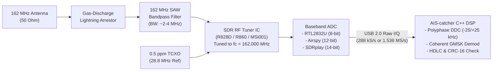
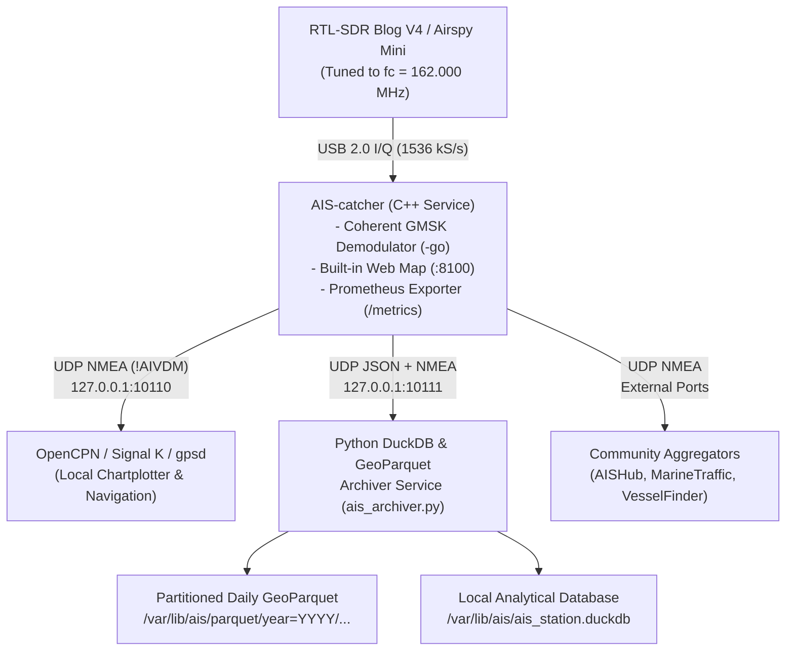

# Chapter 9: Transceiver Hardware, Software-Defined Radios (SDRs), and Building a Low-Budget Home AIS Station

---

## 1. Operational & Conceptual Overview

Between the abstract protocol definitions of ITU-R M.1371 and the geospatial trajectories analyzed in a database lies physical radio hardware: oscillators, mixers, low-noise amplifiers (LNAs), surface acoustic wave (SAW) filters, analog-to-digital converters (ADCs), baseband digital signal processors (DSPs), and power amplifiers (PAs). Whether an Automatic Identification System (AIS) burst is transmitted by a $12.5\text{ W}$ type-approved Class A transponder aboard an ultra-large container ship or captured 40 nautical miles away by a $\$30$ Software-Defined Radio (SDR) plugged into a Raspberry Pi, the underlying hardware architecture determines whether a marginal VHF packet is cleanly decoded or lost to thermal noise, intermodulation distortion, or co-channel collision.

```
+-----------------------------------------------------------------------------------+
|                        THE AIS HARDWARE SPECTRUM                                  |
|                                                                                   |
|  [SOLAS Class A]       [Class B+ SOTDMA]    [Class B CSTDMA]   [Receive-Only]     |
|   IEC 61993-2            IEC 62287-2          IEC 62287-1       dAISy / SDR       |
|   12.5 W (+41 dBm)       5.0 W (+37 dBm)      2.0 W (+33 dBm)   Rx Only (0 W)     |
|   2x TDMA Rx + 1x DSC    2x TDMA Rx           2x TDMA Rx        1x or 2x Rx       |
|   Autonomous SOTDMA      Autonomous SOTDMA    Listen-Before-    Passive Baseband  |
|   2s - 3min rate         5s - 3min rate       Talk (30s/3min)   Demodulation      |
+-----------------------------------------------------------------------------------+
```

Different maritime stakeholders interact with AIS hardware across three distinct operational tiers:

1. **Type-Approved Shipboard Transponders (Class A, Class B "CS", and Class B "SO"):** Mariners, marine electricians, and naval architects work with tightly regulated "black-box" transceivers governed by International Electrotechnical Commission (IEC) standards. These units must maintain microsecond-level UTC slot synchronization via an internal Global Navigation Satellite System (GNSS) timing engine, survive harsh shipboard electromagnetic interference (EMI), and interface deterministically with bridge radars, Electronic Chart Display and Information Systems (ECDIS), Voyage Data Recorders (VDRs), and portable pilot units (PPUs).
2. **Dedicated Commercial & Military Receivers:** Vessel Traffic Services (VTS) engineers, Coast Guard search-and-rescue planners, and offshore buoy designers deploy specialized receive-only hardware. At the low-power end, embedded sub-GHz transceiver chips (such as the Wegmatt dAISy) consume less than $100\text{ mW}$, enabling solar-powered ocean buoys. At the high-performance end, military-grade receivers (such as Shine Micro units deployed on US Coast Guard aircraft and Nationwide AIS towers) employ ultra-low-noise front ends, high third-order intercept points ($\text{IIP}_3$), and FPGA-based coherent packet de-collision.
3. **Software-Defined Radios (SDRs) & Community Shore Stations:** RF engineers, academic researchers, cybersecurity analysts, and coastal citizens use wideband SDRs to sample the entire $50\text{ kHz}$ AIS spectrum ($161.975\text{ MHz}$ and $162.025\text{ MHz}$) simultaneously in complex baseband ($I/Q$) form. Moving the demodulator from fixed silicon into open-source C++ software (such as `AIS-catcher`) has enabled multi-pass coherent Gaussian Minimum Shift Keying (GMSK) demodulation that frequently outperforms commercial marine transponders at a fraction of the cost—provided the analog RF front end is properly filtered against out-of-band broadcast interference.

---

## 2. Historical Context & Evolution (`schwehr/gis-history` Integration)

The evolution of AIS hardware reflects a 35-year convergence of telecommunications standardization, silicon RF integration, and open-source software engineering documented in [`schwehr/gis-history`](https://github.com/schwehr/gis-history) and historical reviews of maritime tracking ([Cutlip, 2017](https://globalfishingwatch.org/article/ais-brief-history/)).

| Year | Historical Milestone (`gis-history` & Hardware Lineage) | Engineering Impact on AIS Transceivers & SDRs |
|---|---|---|
| **1984** | **NMEA 0183** and **WGS84** standardized | Established the `4,800` baud RS-422 serial interface (later expanded to `38,400` baud in NMEA 0183 High Speed / IEC 61162-2 for AIS) and the geodetic reference frame embedded in all AIS position reports. |
| **1988–1991** | **Håkan Lans** files priority patent for **STDMA** (1988); **Exxon Valdez** spill (1989) & **OPA-90** (1990); **Linux** kernel released (1991) | Early Swedish/Finnish STDMA hardware prototypes built from discrete VHF land-mobile transceivers, external GPS timing boards, and Motorola 68000 / Z80 microprocessors prove autonomous time-slot organization. |
| **1998–2002** | **ITU-R M.1371-0** (1998); **GPS Selective Availability disabled** (May 2000); **IEC 61993-2** Class A standard (2001); **SOLAS AIS mandate** effective (July 2002) | First generation of commercial SOLAS Class A transponders (Saab R3/R4, Furuno FA-100, JRC JHS-180, Kongsberg Seatex AIS 100) enters mass production, requiring 3 independent VHF receivers and an internal GPS receiver for 1PPS slot timing. |
| **2001–2006** | **GNU Radio** founded by Eric Blossom (2001); **IEC 62287-1 Class B CSTDMA** ratified (2006); **Kurt Schwehr** begins `noaadata` / Blender AIS visualization (2006) | Introduction of $2\text{ W}$ Carrier-Sense TDMA (Class B "CS") eliminates the expensive 1PPS-locked SOTDMA state machine and mandatory MKD, bringing AIS transponders under $\$1,000$ for recreational yachts and small fishing boats. |
| **2010–2012** | ***Deepwater Horizon* spill** & **`libais`** released (2010); **Antti Palosaari, Eric Fry, and Osmocom** discover undocumented raw $I/Q$ mode in **Realtek RTL2832U** DVB-T TV tuners (Feb 2012) | A $\$20$ USB digital television dongle becomes a wideband VHF/UHF Software-Defined Radio (`rtl-sdr`), democratizing coastal AIS reception and launching thousands of volunteer community shore stations worldwide. |
| **2013–2016** | **IEC 62287-2 Class B "SO" (SOTDMA)** adopted (2013); **Balduzzi et al.** SDR security analysis using USRP/GNU Radio (2014); **Wegmatt dAISy** launched (2015) | $5\text{ W}$ Class B+ SOTDMA bridges the performance gap between Class B and Class A; meanwhile, transceiver SDRs (USRP, HackRF One, bladeRF) demonstrate over-the-air AIS packet injection in laboratory security studies. |
| **2018–2026+** | **DuckDB** (2018) & **GeoParquet** (2021); **Jasper Vries releases `AIS-catcher`** (2021); **ITU-R M.2092-1 VDES** & **IEC 63173-2 SECOM** (2022–2026) | Coherent multi-sample DSP in `AIS-catcher` turns low-cost RTL-SDR Blog V3/V4 and Airspy receivers into high-sensitivity coastal monitors capable of logging millions of messages per day directly into columnar DuckDB/GeoParquet archives. |

---

## 3. Deep Technical & Mathematical Foundations

To understand why a $\$6,000$ Class A transponder, a $\$70$ dAISy receiver, and a $\$30$ RTL-SDR behave so differently in congested RF environments, we must examine the mathematical principles governing **single-SDR dual-channel baseband downconversion**, **ADC dynamic range and oversampling processing gain**, **cascaded receiver noise figure**, and **quarter-wave stub transmission-line matching**.

### 3.1 Simultaneous Dual-Channel Baseband Downconversion ($f_c = 162.000\text{ MHz}$)

Maritime AIS operates primarily on two $25\text{ kHz}$ simplex channels separated by exactly $50\text{ kHz}$:
* **AIS 1 (Channel 87B):** $f_{\text{AIS1}} = 161.975\text{ MHz}$
* **AIS 2 (Channel 88B):** $f_{\text{AIS2}} = 162.025\text{ MHz}$

In traditional hardware transponders, monitoring both channels simultaneously requires two independent narrowband superheterodyne or low-IF receiver chains, each with its own local oscillator (LO) synthesizer, mixer, and IF filter. In a Software-Defined Radio, however, a single quadrature ($I/Q$) tuner can be tuned directly to the geometric/arithmetic midpoint between the two channels:

$$f_c = \frac{f_{\text{AIS1}} + f_{\text{AIS2}}}{2} = \frac{161.975\text{ MHz} + 162.025\text{ MHz}}{2} = \mathbf{162.000\text{ MHz}}$$

When the incoming real RF signal $s_{\text{RF}}(t)$ is mixed with a quadrature local oscillator at $f_c = 162.000\text{ MHz}$, the resulting complex baseband representation $z_{\text{BB}}(t) = I(t) + jQ(t)$ shifts both AIS channels symmetrically around DC ($0\text{ Hz}$):

$$z_{\text{BB}}(t) = \text{LPF}\left\{ s_{\text{RF}}(t) \cdot e^{-j 2\pi f_c t} \right\}$$

Consequently, in the complex baseband spectrum:
* **AIS 1 ($161.975\text{ MHz}$)** appears centered at negative frequency:
  $$f_{\text{BB,1}} = f_{\text{AIS1}} - f_c = 161.975\text{ MHz} - 162.000\text{ MHz} = \mathbf{-25.0\text{ kHz}}$$
* **AIS 2 ($162.025\text{ MHz}$)** appears centered at positive frequency:
  $$f_{\text{BB,2}} = f_{\text{AIS2}} - f_c = 162.025\text{ MHz} - 162.000\text{ MHz} = \mathbf{+25.0\text{ kHz}}$$
* Any residual **DC offset spike** from the SDR's analog mixer/ADC falls harmlessly at $\mathbf{0.0\text{ kHz}}$ (corresponding to $162.000\text{ MHz}$, the guard boundary between Channel 2028 and the two AIS channels), exactly $25\text{ kHz}$ away from both signals of interest!

```
               Complex Baseband Spectrum (Tuned to fc = 162.000 MHz)
               
      Power (dB)
          ^
          |            [AIS 1: Ch 87B]                 [AIS 2: Ch 88B]
          |             161.975 MHz                     162.025 MHz
          |               _____                           _____
          |              /     \           |             /     \
          |             /       \          | DC Spike   /       \
          |            /  25kHz  \         | (0 Hz)    /  25kHz  \
          +-----------+-----+-----+--------+----------+-----+-----+----------> Baseband Freq
                   -37.5  -25.0 -12.5      0        +12.5 +25.0 +37.5  (kHz)
```

To extract each individual channel at sample rate $f_s$ (for example, $f_s = 288\text{ kS/s}$ or $1.536\text{ MS/s}$, both exact integer multiples of the $9,600\text{ bps}$ AIS symbol rate: $288\text{ kS/s} = 30 \times 9,600$ and $1,536\text{ kS/s} = 160 \times 9,600$), the software digital downconverter (DDC) rotates the discrete complex samples $z[n]$ in opposite directions and applies a low-pass channel filter $h_{\text{LPF}}[k]$ with a $\pm 12.5\text{ kHz}$ passband:

$$z_{\text{AIS1}}[n] = \left( z[n] \cdot e^{+j 2\pi \frac{25,000}{f_s} n} \right) * h_{\text{LPF}}[n]$$

$$z_{\text{AIS2}}[n] = \left( z[n] \cdot e^{-j 2\pi \frac{25,000}{f_s} n} \right) * h_{\text{LPF}}[n]$$

Notice the sign reversal in the complex exponential: multiplying by $e^{+j 2\pi (25\text{ kHz}/f_s) n}$ shifts the $-25\text{ kHz}$ AIS 1 carrier up to $0\text{ Hz}$, while multiplying by $e^{-j 2\pi (25\text{ kHz}/f_s) n}$ shifts the $+25\text{ kHz}$ AIS 2 carrier down to $0\text{ Hz}$.

### 3.2 ADC Quantization Noise, Oversampling Gain, and Spurious-Free Dynamic Range (SFDR)

A major architectural differentiator among SDRs is the bit resolution $N$ of the Analog-to-Digital Converter ($N = 8\text{ bits}$ for RTL-SDR, $12\text{ bits}$ for Airspy/PlutoSDR/USRP B210, $14\text{ bits}$ for SDRplay/USRP N210). For an ideal $N$-bit ADC sampling a full-scale sinusoid at Nyquist rate $f_s$, the theoretical quantization Signal-to-Noise Ratio ($\text{SNR}_{\text{ADC}}$) across the full Nyquist bandwidth is:

$$\text{SNR}_{\text{Nyquist}} = 6.02 N + 1.76\text{ dB}$$

However, when sampling a wideband stream at $f_s$ (e.g., $f_s = 1.536\text{ MS/s}$ Complex, where the complex Nyquist bandwidth equals $f_s$) and digitally filtering and decimating down to a narrowband AIS channel bandwidth $B_{\text{AIS}} = 25\text{ kHz}$ (or matched-filter bandwidth $B_{\text{GMSK}} \approx 12.5\text{ kHz}$), white quantization noise power outside $B_{\text{AIS}}$ is rejected by the digital decimation filter. This yields an **Oversampling Processing Gain ($\text{PG}_{\text{OSR}}$)**:

$$\text{PG}_{\text{OSR}} = 10 \log_{10}\left(\frac{f_s}{B_{\text{AIS}}}\right)\text{ dB}$$

Combining both terms gives the ideal channelized dynamic range:

$$\text{DR}_{\text{channel}} = 6.02 N + 1.76 + 10 \log_{10}\left(\frac{f_s}{B_{\text{AIS}}}\right)\text{ dB}$$

For an 8-bit RTL-SDR ($N = 8$, effective number of bits $\text{ENOB} \approx 7.0$ due to thermal jitter and integral nonlinearity) sampling at $f_s = 1.536\text{ MS/s}$ and filtering to $B_{\text{AIS}} = 25\text{ kHz}$:

$$\text{SNR}_{\text{Nyquist, eff}} \approx 6.02(7.0) + 1.76 = 43.9\text{ dB}$$

$$\text{PG}_{\text{OSR}} = 10 \log_{10}\left(\frac{1,536,000}{25,000}\right) = 10 \log_{10}(61.44) \approx 17.88\text{ dB}$$

$$\text{DR}_{\text{channel}} \approx 43.9 + 17.88 = \mathbf{61.8\text{ dB}}$$

> [!IMPORTANT]
> **Why Oversampling Gain Cannot Save an Unfiltered ADC from Clipping:**
> While decimation gain lowers the *quantization noise floor* inside the $25\text{ kHz}$ AIS channel by $\sim 18\text{ dB}$, the **hard clipping ceiling** of the ADC is still determined by the total composite voltage across the entire analog anti-aliasing passband prior to the ADC ($1.5\text{–}8\text{ MHz}$ wide in the R820T2/R828D tuner). If an out-of-band $1\text{ kW}$ NOAA Weather Radio carrier at $162.400\text{ MHz}$ ($+425\text{ kHz}$ away) or an intermodulation product from a $100\text{ kW}$ FM broadcast station ($88\text{–}108\text{ MHz}$) drives the 8-bit ADC beyond its $\pm 127$ full-scale rails, hard clipping creates broadband impulse harmonics across *every* frequency bin simultaneously. Therefore, **analog RF bandpass filtering before the LNA/ADC is mandatory** on low-bit-depth SDRs.

### 3.3 Cascaded Receiver Noise Figure (Friis Formula) and Third-Order Intercept ($\text{IIP}_3$)

When designing a home or coastal AIS receiving station, engineers must decide where in the coaxial chain to place the bandpass filter and low-noise amplifier (LNA). By **Friis's Formula for Cascaded Noise Factor**, the total linear noise factor $F_{\text{total}}$ of $K$ cascaded RF stages with individual noise factors $F_k$ and linear power gains $G_k$ is:

$$F_{\text{total}} = F_1 + \frac{F_2 - 1}{G_1} + \frac{F_3 - 1}{G_1 G_2} + \cdots + \frac{F_K - 1}{\prod_{i=1}^{K-1} G_i}$$

where $\text{NF}_k\text{ (dB)} = 10 \log_{10}(F_k)$ and $G_k\text{ (dB)} = 10 \log_{10}(G_k)$. For a passive coaxial cable or passive SAW filter with insertion loss $L_k\text{ (dB)}$ at ambient temperature $T_0 = 290\text{ K}$, its linear gain is $G_k = 10^{-L_k/10} = 1/L_{\text{lin}}$ and its linear noise factor equals its loss: $F_k = L_{\text{lin}} = 10^{+L_k/10}$.

 Conversely, the **Cascaded Input Third-Order Intercept Point ($\text{IIP}_{3,\text{total}}$)**—which governs immunity to intermodulation distortion from strong out-of-band signals—satisfies:

$$\frac{1}{\text{IIP}_{3,\text{total}}} = \frac{1}{\text{IIP}_{3,1}} + \frac{G_1}{\text{IIP}_{3,2}} + \frac{G_1 G_2}{\text{IIP}_{3,3}} + \cdots$$

This reveals a fundamental engineering trade-off:
1. **LNA First $\rightarrow$ Filter Second:** Minimizes system Noise Figure $\text{NF}_{\text{total}} \approx \text{NF}_{\text{LNA}}$ (best for rural/remote ocean sites with zero nearby transmitters), but exposes the LNA's active transistor directly to megawatt FM broadcast towers, risking LNA saturation.
2. **Filter First $\rightarrow$ LNA Second (Standard Urban/Harbor AIS Architecture):** Placing a low-loss $162\text{ MHz}$ SAW bandpass filter ($L_{\text{SAW}} \approx 2.2\text{ dB}$) *ahead* of the LNA increases the system noise figure by exactly $2.2\text{ dB}$, which is negligible at $162\text{ MHz}$ where external man-made and galactic/atmospheric VHF background noise already exceeds thermal $k_B T_0 B$ by $5\text{–}15\text{ dB}$, while improving out-of-band $\text{IIP}_3$ immunity by **$>35\text{–}50\text{ dB}$**!

---

## 4. Hardware, Standards, & Software Ecosystem

### 9.1 Commercial AIS Hardware Architectures (Receive and Transmit)

Commercial AIS transponders and receivers are segmented by the International Maritime Organization (IMO), ITU-R M.1371-5, and the International Electrotechnical Commission (IEC) into distinct hardware classes based on transmit power, media access control (MAC) state machines, receiver channel count, and bridge interface redundancies.

#### 9.1.1 Master Architectural Comparison of AIS Transceivers and Receivers

| Architectural Parameter | **Class A Transponder** | **Class B "SO" (Class B+)** | **Class B "CS"** | **Dedicated MCU Receiver (e.g., dAISy 2+)** | **Military/VTS High-Dynamic Receiver (e.g., Shine Micro)** |
|---|---|---|---|---|---|
| **Primary IEC Test Standard** | **IEC 61993-2** | **IEC 62287-2** | **IEC 62287-1** | IEC 62287 / EN 300 338 (Rx clauses) | MIL-STD-810G / IEC 62320-1 / USCG NAIS Spec |
| **MAC Access Scheme** | **SOTDMA**, RATDMA, ITDMA, FATDMA | **SOTDMA**, RATDMA, ITDMA | **CSTDMA** (Carrier-Sense Listen-Before-Talk) | Passive Receive Only | Passive Receive Only + Co-Channel De-Collision |
| **Transmit Power (High / Low)** | **$12.5\text{ W}$ ($+41\text{ dBm}$)** / $1.0\text{ W}$ ($+30\text{ dBm}$ tanker mode) | **$5.0\text{ W}$ ($+37\text{ dBm}$)** / $2.0\text{ W}$ ($+33\text{ dBm}$) | **$2.0\text{ W}$ ($+33\text{ dBm}$)** fixed | None ($0\text{ W}$) | None ($0\text{ W}$) |
| **VHF Receiver Chains** | **3 Independent Receivers** (2x TDMA + 1x Dedicated Ch 70 DSC) | **2 Independent TDMA Receivers** (time-shared DSC polling) | **2 Independent TDMA Receivers** (or 1x alternating on legacy Annex D) | **2 Independent Narrowband RF IC Chains** (TI CC1120 / Si4362) | **2 to 4 Wide-Dynamic Superhet + FPGA SDR Chains** |
| **Sensitivity ($\le 20\%$ PER)** | $\le -107\text{ dBm}$ (typ. $-110\text{ dBm}$) | $\le -107\text{ dBm}$ (typ. $-109\text{ dBm}$) | $\le -107\text{ dBm}$ | $\approx -109\text{ to }-111\text{ dBm}$ | **$-118\text{ to }-122\text{ dBm}$** (ultra-low NF + coherent DSP) |
| **Internal GNSS Requirement** | **Mandatory Internal GNSS** (for 1PPS UTC slot clock; external GNSS allowed for Lat/Lon) | **Mandatory Internal GNSS** (for 1PPS UTC slot clock & Lat/Lon) | **Mandatory Internal GNSS** (for Lat/Lon & frame sync) | Optional external NMEA/GPS input | Optional 1PPS / GPS input for TDOA timestamping |
| **Reporting Interval (Dynamic)** | **$2\text{ s}$ to $10\text{ s}$** underway ($3\text{ min}$ anchored) | **$5\text{ s}$ to $30\text{ s}$** underway ($3\text{ min}$ $\le 2\text{ kts}$) | **$30\text{ s}$** ($>2\text{ kts}$) / **$3\text{ min}$** ($\le 2\text{ kts}$) | Continuous real-time stream | Continuous real-time stream + IQ/Burst diagnostics |
| **Position Message Types Tx** | **Msgs 1, 2, 3** (168 bits) | **Msgs 18, 19** (168 / 312 bits, `CS=0`) | **Msg 18** (168 bits, `CS=1`) | None (Outputs `!AIVDM` for all Rx types) | None (Outputs `!AIVDM` + VSI/TAG blocks) |
| **Static Voyage Message Tx** | **Msg 5** (424 bits, 2 slots, every 6 min) | **Msg 24 Part A & B** (168 bits each, every 6 min) | **Msg 24 Part A & B** (168 bits each, every 6 min) | None | None |
| **Mandatory Bridge Hardware** | **Minimum Keyboard & Display (MKD)** + **AMP 9-pin Pilot Plug** | None (LED status indicators; configured via USB/NMEA) | None (LED status indicators) | USB CDC-ACM / UART $3.3\text{ V}$ / RS-422 | Ethernet (IEC 61162-450), RS-422, MIL-DTL-38999 |
| **Power Consumption (Avg / Peak)** | $15\text{–}25\text{ W}$ avg / $60\text{–}85\text{ W}$ Tx peak | $4\text{–}6\text{ W}$ avg / $25\text{ W}$ Tx peak | $2\text{–}3\text{ W}$ avg / $12\text{ W}$ Tx peak | **$<0.1\text{ W}$ ($80\text{–}100\text{ mW}$)** | $5\text{–}15\text{ W}$ continuous |
| **Representative Hardware** | **Furuno FA-170**, **JRC JHS-183**, **Saab R5/R6**, **Kongsberg AIS 300** | **em-trak B95x**, **Digital Yacht Nomad/AIT5000**, **True Heading Cortex** | **Raymarine AIS700**, **Garmin AIS 800**, **B&G V60-B** | **Wegmatt dAISy / dAISy 2+ / HAT**, **Quark-elec QK-A026** | **Shine Micro SA161-UA**, **SM1610**, **RadarPlus** |

---

#### 9.1.2 Class A Transponder Architecture (IEC 61993-2)

A SOLAS Class A transponder (such as the **Furuno FA-170**, **Japan Radio Co. [JRC] JHS-183**, **Saab R5 SUPREME / R6**, or **Kongsberg Seatex AIS 300**) is an industrial real-time embedded system engineered for continuous 24/7 operation over a 10- to 15-year shipboard lifecycle.

```mermaid
flowchart LR
    subgraph Ant["Shipboard Antennas"]
        VHFAnt["VHF Masthead Antenna\n(156-162.025 MHz, 50 Ohm)"]
        GNSSAnt["Dedicated AIS GNSS Antenna\n(1575.42 MHz L1)"]
    end

    subgraph ClassA["Class A Transponder Transceiver Unit (IEC 61993-2)"]
        TR["PIN-Diode TR Switch\n& Harmonic LPF"]
        PA["VHF Synthesizer & PA\n12.5W (+41dBm) / 1W (+30dBm)\nGMSK Modulator (BT=0.4)"]
        Rx1["TDMA Receiver A\n(Default: 161.975 MHz\nor Dynamic Msg 22/75/76)"]
        Rx2["TDMA Receiver B\n(Default: 162.025 MHz\nor Dynamic Msg 22/75/76)"]
        RxDSC["Dedicated Ch 70 DSC Rx\n(156.525 MHz, 1200 bps FSK\nITU-R M.825 Channel Mgmt)"]
        GNSS["Internal GNSS Engine\n(UTC Sync + 1PPS Clock\n& Fallback Lat/Lon)"]
        CPU["Real-Time SOTDMA DSP & MCU\n- 2,250-Slot Map RAM\n- HDLC/NRZI/CRC-16\n- BIIT Fault Monitor"]
    end

    subgraph Bridge["Bridge Sensor & Display Interfaces"]
        Sensors["3x IEC 61162-1/2 Sensor Inputs\n- Ext GNSS ($GPRMC/$GPGGA)\n- Gyrocompass ($HEHDT)\n- Rate of Turn ($HEROT)"]
        ECDIS["ECDIS / ARPA Radar / VDR\n- NMEA 0183 HS (38,400 bd)\n- NMEA 2000 CAN\n- IEC 61162-450 LWE UDP"]
        MKD["Mandatory MKD\n(Minimum Keyboard & Display)"]
        Pilot["AMP 9-Pin RS-422 Pilot Plug\n(38,400 bd Bi-Directional)"]
        BAMS["BAMS / Relay Alarm Outputs\n(IEC 62923 Bridge Alerts)"]
    end

    VHFAnt <--> TR
    TR <-- "Tx Burst (26.67ms)" --- PA
    TR --> Rx1
    TR --> Rx2
    TR --> RxDSC
    GNSSAnt --> GNSS
    Rx1 --> CPU
    Rx2 --> CPU
    RxDSC --> CPU
    GNSS -- "1PPS (<1 us jitter)\n+ NMEA Time/Pos" --> CPU
    CPU --> PA
    Sensors --> CPU
    CPU <--> ECDIS
    CPU <--> MKD
    CPU <--> Pilot
    CPU --> BAMS
```

Key architectural subsystems required by **IEC 61993-2** include:

1. **Dual-Power GMSK Transmitter ($12.5\text{ W}$ / $1\text{ W}$ Tanker Mode):**
   * The transmitter uses a fast-settling Fractional-N Phase-Locked Loop (PLL) or Direct Digital Synthesizer (DDS) capable of locking onto any $25\text{ kHz}$ or $12.5\text{ kHz}$ channel between $156.025\text{ MHz}$ and $162.025\text{ MHz}$ within less than $1\text{ ms}$.
   * Normal transmit power is **$12.5\text{ W}$ ($+40.97\text{ dBm} \approx +41\text{ dBm}$)** into $50\text{ }\Omega$.
   * When an oil or chemical tanker is berthed at a terminal handling volatile cargo, the officer of the watch (or an automated terminal interlock) switches the unit into **$1\text{ W}$ ($+30\text{ dBm}$) Low-Power "Tanker Mode"** (in accordance with ISGOTT — *International Safety Guide for Oil Tankers and Terminals*), preventing RF-induced spark hazards in crane wires while automatically setting the `RAIM` / status indicators and suppressing long-range transmissions.
   * **PA Ramp-Up and Ramp-Down:** To prevent adjacent-channel splatter, an Automatic Level Control (ALC) loop shapes the RF envelope during the 8-bit ($833\text{ }\mu\text{s}$) ramp-up and ramp-down intervals so that output power reaches $90\%$ of nominal within strict IEC spectral mask bounds ($-25\text{ dBc}$ at $\pm 10\text{ kHz}$, $-60\text{ dBc}$ at $\pm 25\text{ kHz}$, and $-70\text{ dBc}$ at $\pm 62.5\text{ kHz}$).

2. **Three Independent VHF Receivers (2x TDMA + 1x Dedicated Channel 70 DSC):**
   * Why three receivers? While **TDMA Receiver 1** and **TDMA Receiver 2** continuously demodulate $9,600\text{ bps}$ GMSK traffic on AIS 1 ($161.975\text{ MHz}$) and AIS 2 ($162.025\text{ MHz}$) (or switch temporarily to Long-Range Satellite Channels 75 [$156.775\text{ MHz}$] and 76 [$156.825\text{ MHz}$] to transmit Message 27), a **third dedicated receiver** permanently monitors **VHF Channel 70 ($156.525\text{ MHz}$)** using $1,200\text{ bps}$ Frequency Shift Keying (FSK) per **ITU-R M.825**.
   * This DSC receiver allows coastal authorities without AIS base stations to issue regional frequency-switching commands (equivalent to Message 22) or poll a vessel's position over GMDSS Channel 70 without interrupting dual-channel TDMA slot tracking.

3. **Dedicated Internal GNSS Engine with 1PPS Synchronization:**
   * A Class A unit *always* incorporates its own internal GNSS receiver module connected to a dedicated external GNSS antenna, even when the ship has three survey-grade bridge DGNSS systems connected via NMEA 0183.
   * Why? Serial NMEA sentences (`$GPGGA`, `$GPRMC`) arriving over a `4,800` or `38,400` baud bus suffer variable UART buffering latency ($10\text{–}500\text{ ms}$), which is far too coarse to align $26.667\text{ ms}$ SOTDMA slots. The internal GNSS receiver provides a hardware **1-Pulse-Per-Second (1PPS)** edge accurate to **$<100\text{ ns}$** of UTC. If the external bridge GNSS is valid, the Class A transponder broadcasts the *external* sensor's position (setting `Position Accuracy = 1` if DGNSS-corrected), while using its *internal* GNSS strictly for 1PPS slot timing. If the internal GNSS loses sky view, the unit falls back to synchronizing its clock off received AIS Base Station broadcasts (Message 4) or peer ships before eventually degrading to RATDMA/ITDMA mode.

4. **Built-In Integrity Testing (BIIT) and Bridge Alert Management (BAMS):**
   * Every Class A transponder continuously executes **Built-In Integrity Testing (BIIT)**: a directional coupler after the PA measures forward and reflected RF power during every transmit burst. If the antenna cable is severed or shorted (high VSWR), if the synthesizer loses lock, or if critical sensor inputs drop out, BIIT triggers a hardware alarm relay and outputs standardized `$AIALR` / `$AIALF` alert sentences to the ship's **Bridge Alert Management System (BAMS, IEC 62923)**.

5. **Minimum Keyboard and Display (MKD), Pilot Plug, and High-Speed Interfaces:**
   * **MKD:** Mandatory physical control unit (ranging from a 3-line monochrome LCD on budget units like the Furuno FA-150 to a 4.3- to 7-inch color touchscreen on the Furuno FA-170, JRC JHS-183, and Saab R5 SUPREME) allowing the crew to enter static voyage data (Draught, Destination, ETA, Navigational Status, Hazardous Cargo category) and read incoming safety text messages (Msgs 12, 14) even if the ship's main ECDIS fails.
   * **Pilot Plug (AMP/TE Connectivity 9-Pin Circular CPC Connector):** Mounted near the bridge conning position, providing a dedicated bi-directional **RS-422 differential interface at `38,400` baud** (`TX+`, `TX-`, `RX+`, `RX-`, Shield). Harbor pilots plug a Wi-Fi/Bluetooth dongle into this receptacle to stream raw `!AIVDM` (other ships), `!AIVDO` (own ship), and pass-through heading/ROT sentences directly into their Portable Pilot Unit (PPU) laptops and iPads.
   * **IEC 61162-450 Lightweight Ethernet (LWE):** Modern Class A units (Saab R5/R6, Furuno FA-170, JRC JHS-183) include an isolated Ethernet interface that multicasts NMEA sentences encapsulated in UDP packets with IEC 61162-450 TAG blocks (e.g., `\s:AI0001,c:1712000000*XX\!AIVDM,...`) to redundant ECDIS workstations and the Voyage Data Recorder (VDR).

---

#### 9.1.3 Class B "CS" (CSTDMA, IEC 62287-1) vs. Class B "SO" / Class B+ (SOTDMA, IEC 62287-2)

To bring AIS to hundreds of thousands of non-SOLAS vessels (pleasure craft, sailing yachts, artisanal fishing boats, and workboats) without overloading either the vessel's electrical budget or the VHF Data Link (VDL), the ITU and IEC created **Class B AIS** in two distinct architectural generations.

```
         CLASS B "CS" (CSTDMA - IEC 62287-1) LISTEN-BEFORE-TALK TIMING
         
|<----------------------- 1 TDMA Slot = 26.667 ms (256 bits) ----------------------->|
+-------------------+----------------------------------------------------+-----------+
| RSSI Sense Window |          GMSK Payload Burst (168 bits)             | Ramp Down |
| 0.3125 - 1.125 ms |   (Transmitted ONLY if RSSI < Floor + 10 dB        | & Guard   |
| (3 to 11 bits)    |    AND slot is not reserved by Class A / Base Stn) |           |
+-------------------+----------------------------------------------------+-----------+
```

1. **Class B "CS" — Carrier-Sense TDMA (IEC 62287-1):**
   * **Transmit Power:** Fixed at **$2.0\text{ W}$ ($+33\text{ dBm}$)**—$8\text{ dB}$ lower than Class A ($12.5\text{ W}$), limiting typical ship-to-ship range to $7\text{–}10\text{ NM}$.
   * **Reporting Rate:** Strictly fixed at **$30\text{ seconds}$** when Speed Over Ground ($\text{SOG}) > 2\text{ knots}$, and **$3\text{ minutes}$** when $\text{SOG} \le 2\text{ knots}$ (unless temporarily modified by a Base Station Message 16 or Message 23 command).
   * **The CSTDMA Listen-Before-Talk State Machine:** Unlike Class A transponders that maintain a continuous 2,250-slot reservation map in RAM and broadcast future slot offsets (ITDMA/SOTDMA), a Class B "CS" unit does **not** reserve future slots on the VDL. Instead, when its 30-second timer expires:
     1. It continuously measures the background RF noise floor on AIS 1 and AIS 2 over a rolling 4-second window, defining the **Channel Background Noise Level ($L_{\text{bg}}$)** as the lowest RSSI observed during that window (clamped between $-107\text{ dBm}$ and $-77\text{ dBm}$).
     2. It sets a dynamic **Carrier-Sense Threshold**:
        $$T_{\text{CS}} = \max\left(-107\text{ dBm},\; \min\left(-77\text{ dBm},\; L_{\text{bg}} + 10\text{ dB}\right)\right)$$
     3. It selects a candidate slot inside its nominal transmission interval, first checking that the slot has not been explicitly reserved by a nearby AIS Base Station (Message 4 / Message 20 FATDMA) or a Class A vessel's SOTDMA timeout counter.
     4. During the first **$312.5\text{ }\mu\text{s}$ to $1,125\text{ }\mu\text{s}$ (3 to 11 bit periods)** of the candidate slot, the Class B "CS" unit keeps its transmitter **off** and measures the in-slot RSSI.
     5. If $\text{RSSI}_{\text{slot}} < T_{\text{CS}}$, the channel is declared clear: the Class B "CS" unit immediately keys its $2\text{ W}$ PA and transmits **Message 18** (with bit 141 `CS Unit Flag = 1`).Notice that because of this $1.125\text{ ms}$ listen window, a CSTDMA Message 18 burst starts slightly later inside the $26.667\text{ ms}$ slot than a SOTDMA burst and uses a shorter end-of-slot buffer!
     6. If $\text{RSSI}_{\text{slot}} \ge T_{\text{CS}}$, the unit defers politely to the next candidate slot. This guarantees that Class B "CS" vessels **never overwrite** a local Class A or Base Station transmission.

2. **Class B "SO" / Class B+ — Self-Organizing TDMA (IEC 62287-2):**
   * On fast planing powerboats, high-speed ferries, crew transfer vessels (CTVs), and racing yachts moving at $25\text{–}40\text{ knots}$, a 30-second reporting interval means a vessel travels **more than a quarter of a nautical mile ($500\text{–}600\text{ meters}$) between position updates**, rendering ARPA/AIS collision vectors dangerously stale. Furthermore, in ultra-congested ports (e.g., Singapore or Rotterdam), polite CSTDMA units can be deferred repeatedly across multiple frames.
   * Standardized in **IEC 62287-2** (and ITU-R M.1371-5), **Class B "SO"** (marketed commercially as **Class B+**, e.g., **em-trak B950/B954**, **True Heading Cortex**, **Digital Yacht AIT5000**) upgrades the hardware to:
     * **$5.0\text{ W}$ ($+37\text{ dBm}$)** transmit power ($2.5\times$ the power of Class B "CS"),
     * A full **1PPS-synchronized SOTDMA engine** that actively reserves future time slots on the VDL (setting Message 18 bit 141 `CS Unit Flag = 0` and populating the 19-bit SOTDMA communication state), guaranteeing transmission even at $100\%$ VDL loading, and
     * **Speed-Dependent Reporting Intervals:**
       * $\text{SOG} \le 2\text{ knots}$: **$3\text{ minutes}$**
       * $2\text{ kts} < \text{SOG} \le 14\text{ knots}$: **$30\text{ seconds}$**
       * $14\text{ kts} < \text{SOG} \le 23\text{ knots}$: **$15\text{ seconds}$**
       * $\text{SOG} > 23\text{ knots}$: **$5\text{ seconds}$**

3. **Message 24 Static Data Splitting (Part A & Part B):**
   * Because a Class B unit is prohibited from transmitting a 2-slot burst like Class A's 424-bit Message 5 (which would double collision vulnerability and require extended PA duty cycles), both Class B "CS" and Class B "SO" split their static vessel metadata across two separate 1-slot (**168-bit**) broadcasts of **Message 24** every 6 minutes:
     * **Message 24 Part A (`Part Number = 0`):** Contains only the MMSI and the 120-bit (20-character) **Vessel Name**.
     * **Message 24 Part B (`Part Number = 1`):** Contains the MMSI, **Ship and Cargo Type** (8 bits), **Vendor ID** (42 bits), **Call Sign** (42 bits), and **Hull Dimensions / GNSS Antenna Offsets** (`to_bow`, `to_stern`, `to_port`, `to_starboard`, 30 bits total) or Mother Ship MMSI.

---

#### 9.1.4 Dedicated Hardware Receivers: From Ultra-Low-Power MCU Chips (dAISy) to Military High-Dynamic Receivers (Shine Micro)

When transmission is not required, dedicated hardware receivers trade away the transmitter chain to optimize either **ultra-low power consumption** or **extreme RF sensitivity and dynamic range**.

1. **Ultra-Low-Power Sub-GHz Transceiver IC Architecture — Wegmatt dAISy / dAISy 2+ / dAISy HAT:**
   * Designed by Adrian Studer (Wegmatt LLC), the **dAISy** family replaces power-hungry wideband SDR ADCs with dedicated narrowband sub-GHz ISM/maritime receiver integrated circuits (**Texas Instruments CC1120** or **Silicon Labs Si4362 EZRadioPRO**) managed by an ultra-low-power **TI MSP430** microcontroller.
   * In the **dAISy 2+** and **dAISy HAT** (for Raspberry Pi), two independent Si4362 receiver ICs are wired in parallel—one locked permanently to $161.975\text{ MHz}$ and the other to $162.025\text{ MHz}$. Each chip performs internal low-IF quadrature downconversion, sharp digital channel filtering ($25\text{ kHz}$), GMSK bit slicing, and preamble/sync detection entirely in silicon, handing raw bitstreams over SPI to the MSP430 for HDLC bit-unstuffing, CRC-16 verification, and `!AIVDM` formatting.
   * **Why Engineers Choose dAISy for Buoys & Autonomous Surface Vessels (ASVs):** Whereas a Raspberry Pi + RTL-SDR draws $3.5\text{–}6.0\text{ W}$ ($700\text{–}1,200\text{ mA}$ at $5\text{ V}$), a **dAISy 2+ draws less than $100\text{ mW}$ ($\sim 18\text{–}25\text{ mA}$ at $5\text{ V}$)**! It can run for months on a small LiFePO4 battery pack and a $5\text{ W}$ solar panel aboard an ocean drifter or kayak.
   * **Other Commercial Dedicated Receivers:** **Quark-elec** (`QK-A026` / `QK-A027` combining dual-channel AIS with NMEA multiplexer, GPS, and Wi-Fi), **Digital Yacht** (`AIS100` / `iAIS`), and **Comar Systems** (`AIS-2-USB` / `SLR200N`).

2. **Military & Coast Guard Ultra-High-Sensitivity Receivers — Shine Micro (`SA161-UA`, `SM1610`, `RadarPlus`):**
   * At the opposite extreme of the hardware spectrum sit the ruggedized receivers engineered by **Shine Micro, Inc.** (Port Townsend, Washington) for the **US Coast Guard Nationwide AIS (NAIS)** network, **USCG Cutters**, **MH-60 Jayhawk / HC-144 Ocean Sentry / HC-130J** maritime patrol aircraft, and DoD Maritime Domain Awareness platforms.
   * Why do standard commercial receivers fail on military aircraft and mountaintop VTS towers?
     * **Noise Figure & Sensitivity:** Standard IEC 61993-2 transponders only require $-107\text{ dBm}$ sensitivity for $20\%$ Packet Error Rate (PER). Shine Micro receivers (`SA161-UA`, `SM1610`) combine ultra-low-noise PHEMT front ends ($\text{NF} < 1.5\text{ dB}$), steep helical/cavity preselectors, and FPGA-based multi-symbol coherent GMSK trellis demodulation to achieve sensitivities of **$-118\text{ dBm}$ to $-122\text{ dBm}$**—an $11\text{–}15\text{ dB}$ link-budget advantage that more than doubles free-space detection range for airborne receivers!
     * **Wide Instantaneous Dynamic Range ($>100\text{ dB}$):** On a USCG cutter or coastal tower, a $25\text{ W}$ VHF voice radio transmitting 3 meters away injects $+10\text{ dBm}$ into the AIS antenna while a distant fishing vessel's AIS-SART arrives at $-115\text{ dBm}$. Shine Micro front ends avoid slow AGC pumping so strong adjacent bursts do not blind the receiver during the next $26.67\text{ ms}$ time slot.
     * **Signal-Strength & Time-of-Arrival Forensics:** Shine Micro receivers output proprietary `$PSSN,VSI` (Video/Signal Information) or IEC 61162-450 sentences appending precise **RSSI ($\text{dBm}$)**, **Signal-to-Noise Ratio ($\text{dB}$)**, **Carrier Frequency Offset ($\text{Hz}$)**, and **Time of Arrival (TOA)** to every decoded `!AIVDM` burst—enabling Time Difference of Arrival (TDOA) localization and RF spoofing detection across NAIS shore towers.

---

### 9.2 Software-Defined Radios (SDRs) for AIS Receive and Lab Transmit

#### 9.2.1 Receive-Only SDR Architectures



| SDR Hardware Model | RF Tuner IC | ADC Resolution & Chip | Effective Dynamic Range (SFDR) | Max Alias-Free Bandwidth | Clock Stability (TCXO) | Built-In Filtering & Features | Typical Street Price (USD) |
|---|---|---|---|---|---|---|---|
| **RTL-SDR Blog V3** | Rafael Micro **R820T2** | **8-bit** (Realtek RTL2832U) | $\sim 45\text{ dB}$ Nyquist ($\sim 62\text{ dB}$ in $25\text{ kHz}$) | $2.4\text{ MS/s}$ ($1.536\text{ MS/s}$ optimal for AIS) | **$0.5\text{ ppm}$ TCXO** | Software-switchable $4.5\text{ V}$ Bias-Tee, aluminum shield case, SMA-F | $\$30\text{–}\$35$ |
| **RTL-SDR Blog V4** | Rafael Micro **R828D** | **8-bit** (Realtek RTL2832U) | $\sim 46\text{ dB}$ Nyquist ($\sim 63\text{ dB}$ in $25\text{ kHz}$) | $2.4\text{ MS/s}$ ($1.536\text{ MS/s}$ optimal for AIS) | **$0.5\text{ ppm}$ TCXO** | Triplexed VHF/UHF/HF input, switchable FM/AM/DAB notch filters, $4.5\text{ V}$ Bias-Tee | $\$30\text{–}\$35$ |
| **Nooelec NESDR SMArt v5** | Rafael Micro **R820T2** | **8-bit** (Realtek RTL2832U) | $\sim 45\text{ dB}$ Nyquist | $2.4\text{ MS/s}$ | **$0.5\text{ ppm}$ TCXO** | Ultra-slim form factor (fits adjacent Raspberry Pi USB ports) | $\$32\text{–}\$38$ |
| **Airspy Mini** | Rafael Micro **R820T2 / R860** | **12-bit** (NXP LPC4370 @ $12\text{ MS/s}$) | **$\sim 70\text{ dB}$** | $3.0\text{ MS/s}$ or $6.0\text{ MS/s}$ | **$0.5\text{ ppm}$ TCXO** | Tracking RF filters, ultra-low phase noise, $4.5\text{ V}$ Bias-Tee | $\$99\text{–}\$119$ |
| **Airspy R2** | Rafael Micro **R820T2 / R860** | **12-bit** (NXP LPC4370 @ $20\text{ MS/s}$) | **$\sim 75\text{ dB}$** | $10.0\text{ MS/s}$ | **$0.5\text{ ppm}$ TCXO** + **External $10\text{ MHz}$ Clkin** | External $10\text{ MHz}$ GPSDO reference input for precision CFO forensics | $\$169\text{–}\$189$ |
| **SDRplay RSP1B / RSPdx-R2** | Mirics **MSi001** | **14-bit** (Mirics MSi2500 up to $6\text{ MS/s}$) | **$\sim 80\text{ dB}$** | Up to $10.0\text{ MS/s}$ ($14\text{-bit}$ $\le 6\text{ MS/s}$) | **$0.5\text{ ppm}$ TCXO** ($24\text{ MHz}$ ref input on RSPdx) | 11 built-in sub-octave preselection filters + switchable FM/DAB notches | $\$139\text{–}\$249$ |

##### Why the $0.5\text{ ppm}$ TCXO Is Non-Negotiable for AIS
At $f_c = 162.000\text{ MHz}$, a cheap generic DVB-T dongle with an uncompensated $50\text{ ppm}$ crystal oscillator can drift by:
$$\Delta f = 162 \times 10^6\text{ Hz} \times 50 \times 10^{-6} = \pm 8,100\text{ Hz}$$
As ambient temperature changes between day and night, an $8.1\text{ kHz}$ drift pushes a $25\text{ kHz}$ AIS signal completely outside the narrow digital channel filter! By contrast, an **RTL-SDR Blog V3/V4** or **Airspy Mini** equipped with a **$0.5\text{ ppm}$ Temperature-Compensated Crystal Oscillator (TCXO)** holds frequency error to:
$$\Delta f = 162 \times 10^6\text{ Hz} \times 0.5 \times 10^{-6} = \mathbf{\pm 81\text{ Hz}}$$
Every modern coherent AIS demodulator tracks $\pm 81\text{ Hz}$ immediately on the first preamble bit without requiring manual `ppm` calibration offsets.

---

#### 9.2.2 Transmit-Capable SDRs (Authorized Laboratory & Shielded RF Bench Testing Only)

For protocol conformance testing, receiver sensitivity benchmarking, co-channel packet collision experiments, and cybersecurity vulnerability research (Chapters 27–28), engineers require transceiver SDRs capable of synthesizing arbitrary complex baseband GMSK waveforms at $161.975 / 162.025\text{ MHz}$.

| Transceiver SDR Model | RF Transceiver Architecture | DAC / ADC Resolution | Duplex Mode | Frequency Range | Timing & Synchronization (1PPS / $10\text{ MHz}$) | AIS Lab Transmit Suitability |
|---|---|---|---|---|---|---|
| **Great Scott Gadgets HackRF One** | MAX2837 + RFFC5072 mixer + MAX5864 | **8-bit** ADC / DAC | **Half-Duplex** | $1\text{ MHz}\text{–}6\text{ GHz}$ | `CLKIN` / `CLKOUT` ($10\text{ MHz}$); hardware trigger pin | Entry-level burst generator; **high LO leakage & $-10\text{ dBc}$ 3rd harmonic ($486\text{ MHz}$)**; half-duplex prevents true SOTDMA listen-while-transmit. |
| **Analog Devices ADALM-Pluto (PlutoSDR)** | AD9363 / AD9364 RFIC + Zynq Z-7010 SoC | **12-bit** ADC / DAC | **Full-Duplex** | $325\text{ MHz}\text{–}3.8\text{ GHz}$ (**$70\text{ MHz}\text{–}6\text{ GHz}$ via `ad9364` U-Boot env mod**) | Internal XO is $25\text{ ppm}$ (requires **$0.5\text{ ppm}$ TCXO / external clock mod** for $162\text{ MHz}$) | Compact full-duplex bench transceiver once frequency-unlocked (`fw_setenv attr_name compatible`, `ad9364`) and fitted with a $40\text{ MHz}$ TCXO. |
| **Nuand bladeRF 2.0 micro (xA4 / xA9)** | Analog Devices **AD9361** RFIC + Altera Cyclone V FPGA | **12-bit** ADC / DAC | **Full-Duplex** ($2\times 2$ MIMO) | **$47\text{ MHz}\text{–}6\text{ GHz}$** (native VHF support!) | Onboard VCTCXO + $10\text{ MHz}$ Ref In + hardware trigger | Native $162\text{ MHz}$ support without firmware hacks; FPGA timestamped sample scheduling supports slot-accurate burst injection. |
| **Ettus Research USRP B200 / B210** | Analog Devices **AD9364 / AD9361** + Spartan-6 FPGA | **12-bit** ADC / DAC | **Full-Duplex** ($1\times 1$ or $2\times 2$) | **$70\text{ MHz}\text{–}6\text{ GHz}$** | **Board-mounted GPSDO option** + external **$10\text{ MHz}$ & 1PPS SMA inputs** | **Gold standard for AIS lab testing:** UHD timed bursts (`uhd::tx_metadata_t` with `has_time_spec = true`) align transmissions to $<1\text{ }\mu\text{s}$ of the 1PPS UTC slot boundary. |
| **Ettus Research USRP N210 + WBX Daughterboard** | Discrete 14-bit ADC / 16-bit DAC + WBX ($50\text{ MHz}\text{–}2.2\text{ GHz}$) | **14-bit ADC / 16-bit DAC** | **Full-Duplex** | $50\text{ MHz}\text{–}2.2\text{ GHz}$ | Jackson Labs **GPSDO** + external $10\text{ MHz}$ & 1PPS | Highest dynamic range and lowest phase noise for Specific Emitter Identification (SEI) and co-channel collision emulation. |

---

#### 9.2.3 Critical RF Engineering & Regulatory Warnings for SDR Transmit

> [!CAUTION]
> **STRICT REGULATORY & SAFETY WARNING — DO NOT TRANSMIT OVER THE AIR ON $161.975 / 162.025\text{ MHz}$:**
> AIS 1 ($161.975\text{ MHz}$) and AIS 2 ($162.025\text{ MHz}$) are internationally protected safety-of-life maritime distress and navigation frequencies governed by **ITU Radio Regulations Appendix 18**, **47 CFR Part 80** (United States FCC / USCG), **Ofcom** (UK), and **ETSI EN 300 338**. Transmitting from an uncertified SDR into an antenna on or near these frequencies is a severe criminal and civil offense carrying heavy fines and imprisonment, and risks causing real-world maritime collisions or masking Search-and-Rescue (AIS-SART / AIS-MOB) distress beacons. **All SDR transmit experiments MUST be conducted exclusively via closed coaxial cables into $50\text{ }\Omega$ dummy loads or inside a certified double-shielded RF Faraday test enclosure ($>80\text{ dB}$ shielding effectiveness).**

Beyond legal prohibitions, wideband transceiver SDRs (HackRF One, PlutoSDR, bladeRF, USRP B200/B210) possess three hardware characteristics at $162\text{ MHz}$ that every RF engineer must mitigate on the lab bench:

1. **Square-Wave Local Oscillator Harmonics ($324.0\text{ MHz}$ Military UHF & $486.0\text{ MHz}$):**
   * Wideband SDRs spanning $50\text{ MHz}$ to $6\text{ GHz}$ do not contain narrowband VHF harmonic output filters. Their CMOS/BiCMOS quadrature upconversion mixers are driven by a digital square-wave Local Oscillator (LO) at $f_{\text{LO}} = 162.0\text{ MHz}$.
   * By Fourier expansion of a square wave, the mixer output contains strong odd harmonics ($3 f_{\text{LO}}, 5 f_{\text{LO}}, \dots$) and—due to non-ideal $50\%$ duty cycle and PA nonlinearity—significant even harmonics ($2 f_{\text{LO}}, 4 f_{\text{LO}}$):
     $$V_{\text{LO}}(t) = \frac{4}{\pi} \sum_{k=1,3,5,\dots}^{\infty} \frac{1}{k} \sin(2\pi k f_{\text{LO}} t)$$
   * Consequently, when transmitting a fundamental carrier at $f_0 = 162.0\text{ MHz}$:
     * **3rd Harmonic ($3 f_0 = \mathbf{486.0\text{ MHz}}$):** Ideally $20 \log_{10}(1/3) = -9.54\text{ dBc}$ below the fundamental! On an unfiltered HackRF One or PlutoSDR, the $486.0\text{ MHz}$ spur typically measures **$-10\text{ to }-13\text{ dBc}$** (violating IEC 61993-2 spurious emission limits of $-60\text{ to }-70\text{ dBc}$ by **50 dB**).
     * **2nd Harmonic ($2 f_0 = \mathbf{324.0\text{ MHz}}$):** Typically $-25\text{ to }-35\text{ dBc}$ on an unfiltered SDR, falling directly inside the **$225\text{–}400\text{ MHz}$ NATO / US DoD Military UHF Tactical Aviation & Satellite Communications (FLTSATCOM / UFO / MUOS) band**!
   * **Mandatory Mitigation:** Always place a **7th-order LC Chebyshev or Cauer Low-Pass Filter** with a cutoff of $f_{\text{cutoff}} \approx 175\text{ MHz}$ (providing $>50\text{ dB}$ rejection at $324\text{ MHz}$ and $>65\text{ dB}$ rejection at $486\text{ MHz}$) directly on the SDR's TX port.

2. **Direct-Conversion DC Local Oscillator Leakage and I/Q Image Spurs:**
   * Zero-IF (direct-conversion) SDR transmitters like the HackRF One and AD936x family exhibit finite DC offset at the DAC outputs, causing an unmodulated **LO carrier spike** to leak continuously or during burst windows right at $f_{\text{LO}}$, alongside a mirror-image GMSK sideband caused by slight quadrature phase ($\Delta \phi$) and amplitude ($\Delta A$) imbalances.
   * When testing AIS receivers on a bench, avoid tuning the transmit SDR's LO directly on top of the AIS channel ($161.975\text{ MHz}$). Instead, **offset-tune the SDR's LO** to $f_{\text{LO}} = 162.000\text{ MHz}$ (or $161.900\text{ MHz}$) and generate the GMSK waveform digitally at an offset baseband frequency ($f_{\text{BB}} = -25\text{ kHz}$ or $+75\text{ kHz}$), keeping any DC LO leakage out of the receiver's $25\text{ kHz}$ passband.

3. **Closed-Loop Coaxial Attenuation Budget (Preventing Receiver Front-End Destruction):**
   * Never connect a transmit SDR (outputting $0\text{ dBm}$ to $+15\text{ dBm}$) directly via coaxial cable to a receiving SDR or commercial AIS receiver! Receiver LNAs saturate above $-20\text{ dBm}$ and suffer permanent gate-oxide breakdown above $+10\text{ dBm}$.
   * For cabled bench testing, use a **Directional Coupler / Power Splitter** terminated into a **$50\text{ }\Omega$ dummy load**, followed by **$40\text{ dB}$ to $80\text{ dB}$ of inline SMA coaxial attenuators** (e.g., two $30\text{ dB}$ fixed pads plus a step attenuator) to bring the signal injected into the device under test (DUT) down to realistic maritime levels ($-60\text{ dBm}$ to $-110\text{ dBm}$):

```
+---------------+    +----------------+    +------------------+    +-------------------+    +----------------+
| Transceiver   |--->| 175 MHz 7-Pole |--->| 30 dB Coaxial    |--->| 30 dB Coaxial     |--->| AIS Receiver / |
| SDR TX Port   |    | Harmonic LPF   |    | Attenuator Pad 1 |    | Attenuator Pad 2  |    | DUT RX Port    |
| (+10 dBm max) |    | (>50dB @324MHz)|    | (-20 dBm out)    |    | (-50 dBm out)     |    | (Safe Level!)  |
+---------------+    +----------------+    +------------------+    +-------------------+    +----------------+
     (Inside Shielded RF Test Enclosure / Cabled 50-Ohm Bench Loop Only — NO ANTENNA)
```

---

### 9.3 Recommended Low-Budget Home AIS Receiver Setup (Hardware & Software Guide)

Building a dedicated, high-sensitivity coastal or harbor AIS receiving station does not require a $\$5,000$ VTS budget. For **$\$110$ to $\$185$**, a carefully matched combination of a filtered SDR, low-loss coaxial feedline, resonant $162\text{ MHz}$ vertical antenna, and coherent C++ DSP (`AIS-catcher`) will routinely outperform commercial shipboard transponders, capturing vessels $25\text{–}45\text{ NM}$ away (and $150+\text{ NM}$ during tropospheric ducting events).

#### 9.3.1 Hardware Bill of Materials (Two Budget Tiers)

| Component Category | **Tier 1: Entry-Level SDR Station (~$110 Total)** | **Tier 2: High-Immunity Coastal Station (~$185 Total)** | Engineering Rationale |
|---|---|---|---|
| **1. Compute Host** | **Raspberry Pi Zero 2 W** or **Pi 4B (2 GB)** + Industrial A2 microSD ($32\text{ GB}$) *(~$25–$45)* | **Refurbished x86-64 Mini-PC** (Dell Wyse 5070 / Lenovo ThinkCentre Tiny M710q, 8 GB RAM, 128 GB NVMe SSD) *(~$45)* | Mini-PCs include fast NVMe/SATA storage that never suffers SD-card wear-out when logging millions of AIS rows to DuckDB/Parquet! |
| **2. AIS Receiver** | **RTL-SDR Blog V4** (or V3) ($0.5\text{ ppm}$ TCXO, SMA-F) *(~$30)* | **Airspy Mini** (12-bit ADC, $\sim 70\text{ dB}$ SFDR) *(~$99)* **OR** **Wegmatt dAISy 2+ / HAT** *(~$65–$85)* | Airspy Mini adds $\sim 25\text{ dB}$ of instantaneous dynamic range in urban RF environments; dAISy 2+ is ideal if running off solar power. |
| **3. Mandatory RF Bandpass Filter** | **Sysmocom / Upronics $162\text{ MHz}$ AIS SAW Bandpass Filter** (Passive SMA, $2.2\text{ dB}$ insertion loss) *(~$25)* | **Upronics $162\text{ MHz}$ Filtered LNA** (SAW Filter $\rightarrow$ Low-Noise PGA-103+ Amplifier, Bias-Tee powered) *(~$40)* | **Essential:** Rejects $88\text{–}108\text{ MHz}$ FM broadcast by $>50\text{ dB}$ and attenuates $162.40\text{–}162.55\text{ MHz}$ NOAA Weather Radio before the SDR tuner. |
| **4. Antenna** | **DIY $162.000\text{ MHz}$ Copper-Pipe J-Pole** ($15\text{ mm}$ / $1/2\text{''}$ Type M copper pipe) *(~$15)* | **Commercial Marine $162\text{ MHz}$ Fiberglass Whip** (Shakespeare 5215-AIS Squatty Body $3\text{ dBi}$ or $4\text{ ft}$ 5241-R $3\text{ dBi}$ tuned to $162\text{ MHz}$) *(~$60)* | A center-tuned $162.0\text{ MHz}$ antenna achieves $\text{VSWR} < 1.2:1$ vs. standard $156.8\text{ MHz}$ marine VHF voice whips ($\text{VSWR} \approx 2.0:1$ at $162\text{ MHz}$). |
| **5. Coaxial Feedline & Lightning Protection** | **$5\text{–}10\text{ m}$ Times Microwave LMR-240** + SMA pigtail *(~$15)* | **$10\text{–}20\text{ m}$ Times Microwave LMR-400** ($5.1\text{ dB/100m}$ loss @ $162\text{ MHz}$) + **Inline Gas-Discharge Lightning Arrestor** (Alpha Delta / PolyPhaser) *(~$40)* | Standard cheap RG-58 coax loses $20.5\text{ dB/100m}$ ($75\%$ of your signal over $30\text{ m}$!). LMR-400 preserves every decibel from the masthead. |

---

#### 9.3.2 Why the $162\text{ MHz}$ SAW Bandpass Filter Is Mandatory (The FM & NOAA Weather Radio Trap)

The single most common reason a beginner's RTL-SDR home AIS station fails to receive ships beyond $3\text{ NM}$ is **omitting the external $162\text{ MHz}$ Surface Acoustic Wave (SAW) bandpass filter**. Two out-of-band emitters dominate the coastal VHF spectrum:

1. **FM Broadcast Stations ($88.0\text{–}108.0\text{ MHz}$, $50\text{–}100\text{ kW}$ ERP):**
   * The Rafael Micro R820T2/R828D silicon TV tuner has a wideband front-end LNA designed to cover $24\text{ MHz}$ to $1,766\text{ MHz}$. Near any city, FM broadcast carriers arrive at the antenna at $-20\text{ dBm}$ to $-5\text{ dBm}$—more than **$90\text{ dB}$ stronger** than a distant ship's AIS burst ($-105\text{ dBm}$).
   * Even worse, third-order intermodulation ($2 f_1 - f_2$ or $f_1 + f_2 - f_3$) and second-harmonic mixing inside a saturated wideband LNA generate phantom noise floors right across $162\text{ MHz}$, while forcing the SDR's Automatic Gain Control (AGC) to throttle gain down by $30\text{ dB}$.
2. **NOAA Weather Radio (NWR) / Environment Canada Weatheradio ($162.400\text{–}162.550\text{ MHz}$, $300\text{–}1,000\text{ W}$ Continuous FM):**
   * In North America, seven NWR channels (`WX1` through `WX7`: $162.400$, $162.425$, $162.450$, $162.475$, $162.500$, $162.525$, and $162.550\text{ MHz}$) broadcast **continuous $100\%$ duty-cycle FM voice** at up to $1,000\text{ W}$ from coastal hilltops.
   * The lowest NWR channel ($162.400\text{ MHz}$) sits a mere **$375\text{ kHz}$ above AIS 2 ($162.025\text{ MHz}$)**!
   * Because $375\text{ kHz}$ is *inside* the analog IF bandwidth of an RTL-SDR sampling at $1.536\text{ MS/s}$ ($\pm 768\text{ kHz}$), a nearby NWR transmitter passes straight through the tuner into the 8-bit RTL2832U ADC. To prevent the continuous NWR carrier from clipping the 8-bit ADC rails, you must reduce tuner gain so far that weak ship signals vanish below the quantization floor.
   * A dedicated **$162\text{ MHz}$ AIS SAW Bandpass Filter** (centered at $162.0\text{ MHz}$ with a narrow $2\text{–}3\text{ MHz}$ passband, or paired with a tuned quarter-wave coaxial stub notch at $162.475\text{ MHz}$) strips away FM broadcast by $>50\text{ dB}$ and rolls off NWR while passing $161.975 / 162.025\text{ MHz}$ with only $\sim 2.2\text{ dB}$ insertion loss.

---

#### 9.3.3 DIY Copper-Pipe J-Pole Antenna Engineering for $162.000\text{ MHz}$

For a permanent outdoor home station, a **$\frac{1}{2}\lambda$ Copper-Pipe J-Pole** (or its folded cousin, the **Slim-Jim**) built from standard $15\text{ mm}$ ($1/2\text{''}$ nominal, $15.88\text{ mm}$ OD) rigid copper water pipe is one of the best-performing, most durable AIS antennas in existence:

```
      DIY 162.000 MHz COPPER-PIPE J-POLE ANTENNA (15mm / 1/2" Pipe)
      
             ^
             |   |
             |   |  <-- Half-Wave Radiator Section
             |   |      L_rad = 898 mm (35.35 in)
             |   |
      Total  |   |
     Length  |   |             ^
     L_long  |   |             |   |  <-- Quarter-Wave Matching Stub
    1341 mm  |   |             |   |      L_stub = 443 mm (17.44 in)
   (52.80")  |   |             |   |
             |   |             |   |
             |   |=====[o]=====[o] |  <-- 50-Ohm Coax Tap: L_tap = 48 mm (1.89 in)
             |   |   Center     |  |      above shorting bar (Shield to Long,
             v   +--------------+--+      Center Conductor + Choke to Short)
             |   |<--- 50 mm -->|  |  <-- Center-to-Center Spacing S = 50 mm (1.97 in)
             |   |  Shorting Bar
             |   |
             |   |  <-- Lower Mounting Mast Extension (DC Grounded to Earth!)
```

##### Exact Electromagnetic Design Equations at $f_c = 162.000\text{ MHz}$
1. **Free-Space Wavelength ($\lambda_0$):**
   $$\lambda_0 = \frac{c}{f_c} = \frac{299,792,458\text{ m/s}}{162.000 \times 10^6\text{ Hz}} = \mathbf{1.85057\text{ m}} = \mathbf{1,850.6\text{ mm}}\text{ }(72.86\text{ in})$$
2. **Radiating $\frac{1}{2}\lambda$ Element ($L_{\text{rad}}$):**
   Accounting for the conductor diameter end-effect factor ($k_{\text{end}} \approx 0.970$ for $15.88\text{ mm}$ copper tubing at $162\text{ MHz}$, where $\lambda_0 / d \approx 116$):
   $$L_{\text{rad}} = \frac{\lambda_0}{2} \cdot k_{\text{end}} = 925.3\text{ mm} \times 0.970 = \mathbf{898\text{ mm}}\text{ }(35.35\text{ in})$$
3. **Quarter-Wave Parallel Transmission-Line Matching Stub ($L_{\text{stub}}$):**
   An end-fed half-wave radiator presents a very high terminal impedance ($Z_{\text{end}} \approx 1,500\text{–}2,500\text{ }\Omega$). The parallel $\frac{1}{4}\lambda$ shorted stub transforms this high impedance down to $0\text{ }\Omega$ at the bottom shorting bar. With a velocity factor $v_f \approx 0.958$ for open-air copper tubing:
   $$L_{\text{stub}} = \frac{\lambda_0}{4} \cdot v_f = 462.6\text{ mm} \times 0.958 = \mathbf{443\text{ mm}}\text{ }(17.44\text{ in})$$
4. **Total Long Element Length ($L_{\text{long}}$ above the shorting bar center):**
   $$L_{\text{long}} = L_{\text{rad}} + L_{\text{stub}} = 898\text{ mm} + 443\text{ mm} = \mathbf{1,341\text{ mm}}\text{ }(52.80\text{ in})$$
5. **$50\text{ }\Omega$ Feed-Point Tap Height ($L_{\text{tap}}$):**
   Along the shorted stub of characteristic impedance $Z_0 = 276 \log_{10}(2S/d) \approx 220\text{ }\Omega$ (for center-to-center spacing $S = 50\text{ mm}$ and pipe diameter $d = 15.88\text{ mm}$), the distance $L_{\text{tap}}$ above the shorting bar center where the input resistance matches $R_{\text{in}} = 50\text{ }\Omega$ occurs at:
   $$L_{\text{tap}} \approx \mathbf{48\text{ mm}}\text{ }(1.89\text{ in})\quad\text{(fine-tune between }44\text{ mm}\text{ and }54\text{ mm}\text{ for VSWR} < 1.15:1\text{)}$$
   Attach the **$50\text{ }\Omega$ coax center conductor** to the short $\frac{1}{4}\lambda$ matching stub, attach the **coax braided shield** to the long radiator element, and wind **4 turns of coax ($100\text{ mm}$ diameter) or snap 3 ferrite beads (`Mix 43` or `Mix 31`)** immediately below the feed point as a $1:1$ common-mode choke balun!

> [!WARNING]
> **Critical Hardware Pitfall — DC-Grounded J-Pole vs. Active Bias-Tee / Filtered LNAs:**
> Because a copper J-Pole has a solid copper shorting bar at its base, **the antenna is a dead DC short circuit ($0\text{ }\Omega$ at DC)**. This is a massive safety advantage outdoors because you can bolt the bottom of the copper pipe directly to an earth-ground rod to bleed off static charge and lightning surges. **HOWEVER**, if you enable the $4.5\text{ V}$ software Bias-Tee on your RTL-SDR without an active LNA/DC-block in between, or if your inline SAW filter does not have a DC-blocking capacitor on its antenna port, the J-Pole will short the $4.5\text{ V}$ Bias-Tee straight to ground! Always keep `BIAS TEE = OFF` unless powering a masthead LNA that includes an internal output DC-blocking capacitor.

---

#### 9.3.4 Complete Software Stack: `AIS-catcher`, `gpsd`, `Signal K`, `OpenCPN`, and `DuckDB`



1. **`AIS-catcher` (Jasper Vries, `jvde-github/AIS-catcher`) — The Modern SDR Demodulator Standard:**
   * Older first-generation tools like `rtl_ais` used simple non-coherent frequency-discriminator demodulation at $24\text{ kS/s}$, leaving $4\text{–}6\text{ dB}$ of weak-signal performance on the table.
   * **`AIS-catcher`** runs a multi-model coherent C++ DSP pipeline directly at $1.536\text{ MS/s}$ (or $288\text{ kS/s}$ on low-power Pi Zero 2 W boards), maintaining multiple parallel phase-tracking hypotheses per channel, computing exact per-message RSSI ($\text{dBm}$) and frequency offset ($\text{ppm}$), serving a rich built-in real-time web map and waterfall UI on port `8100` (with Prometheus `/metrics`), and streaming both standard NMEA 0183 (`!AIVDM`) and rich JSON metadata over UDP/TCP.
   * **Gain Tuning Best Practice:** Never leave RTL-SDR gain set to maximum (`49.6 dB`) or enable the RTL2832U internal digital AGC (`RTLAGC on`). Use:
     ```bash
     AIS-catcher -d:0 -gr TUNER 38.6 RTLAGC off BIASTEE off -N 8100 -u 127.0.0.1 10110 -u 127.0.0.1 10111 JSON on
     ```
     (Adjust `TUNER` between `33.8` and `42.1 dB` while watching the `AIS-catcher` noise floor graph so background noise sits around $-32\text{ to }-28\text{ dBFS}$ without clipping on nearby vessels.)

2. **Multiplexing & Local Visualization (`gpsd`, `Signal K`, and `OpenCPN`):**
   * **`gpsd`:** Can ingest UDP port `10110` directly (`gpsd -N udp://127.0.0.1:10110`), decoding all 27 ITU-R M.1371 message types into unified JSON (`gpspipe -w`) and sharing them across local clients.
   * **`Signal K`:** Translates NMEA 0183 `!AIVDM` sentences into the open maritime JSON delta model (`vessels.urn:mrn:imo:mmsi:XXXXXXXXX`), integrating shore or boat AIS with weather instruments and InfluxDB/Grafana dashboards.
   * **`OpenCPN`:** Connects directly to `UDP 127.0.0.1:10110` to render live AIS targets, CPA/TCPA collision vectors, S-57/S-101 Electronic Navigational Charts (ENCs), and AIS Aids to Navigation (Msg 21).

3. **Automated Local Columnar Archiving (`DuckDB` + Hive-Partitioned `GeoParquet`):**
   * Instead of letting decoded AIS messages vanish after display or overwhelming a Raspberry Pi SD card with millions of unindexed SQLite row inserts, the recommended architecture (detailed with complete production scripts in **Appendix G**) batches incoming `AIS-catcher` JSON/NMEA records in RAM and flushes compressed **ZSTD GeoParquet** files partitioned by `year=YYYY/month=MM/day=DD/` alongside a local **DuckDB** database.
   * A full day of busy harbor traffic ($500,000$ AIS messages) compresses to **$<12\text{ MB}$ per day** ($\sim 4.2\text{ GB/year}$) in GeoParquet, and DuckDB can query a full year of local vessel trajectories in under $150\text{ milliseconds}$!

---

## 5. Security, Adversarial Abuse, & Failure Modes

### 5.1 Real-World Hardware & RF Failure Modes
1. **Silent PA Degradation from Coax Water Ingress (The "Deaf & Mute" Bridge Paradox):**
   * On commercial ships and pleasure craft, salt water wicking past an unsealed PL-259 connector corrodes the coaxial braid, raising antenna VSWR above $5:1$. To protect its final RF MOSFET from thermal runaway, the transponder's ALC folds transmit power back from $12.5\text{ W}$ to $<100\text{ mW}$, yet the receiver still picks up strong ships within $1\text{–}2\text{ NM}$. Watchstanders who do not check the MKD BIIT alarm or verify reception range assume their AIS is broadcasting normally when they are practically invisible beyond a mile.
2. **Antenna Splitter PIN-Diode Burnout:**
   * Yachts that share a single masthead VHF whip between a $25\text{ W}$ VHF voice radio and a Class B AIS via an active antenna splitter rely on fast PIN-diode switching. If a nearby lightning strike damages the PIN diode, keying the $25\text{ W}$ VHF radio injects $+44\text{ dBm}$ straight into the AIS receiver front end, permanently destroying the LNA.
3. **Raspberry Pi USB Undervoltage & Sample Drops:**
   * Running an RTL-SDR or Airspy Mini at $1.536\text{–}6.0\text{ MS/s}$ through a cheap phone charger or unpowered USB hub causes $5\text{ V}$ rail droop ($<4.65\text{ V}$). This induces USB isochronous transfer drops (`cb transfer status: 1`), corrupting the middle of $26.67\text{ ms}$ GMSK bursts and causing silent CRC-16 failures. Always use an official $5.1\text{ V} / 3\text{ A}$ ($5\text{ A}$ on Pi 5) power supply and check `vcgencmd get_throttled` (must return `0x0`).

### 5.2 Software Parser Vulnerabilities in Shore Stations
* Because an SDR home station demodulates arbitrary untrusted payloads off the air and parses them in C++ or Python, decoder software must be kept patched:
  * **`CVE-2025-66217` (`AIS-catcher` prior to v0.64):** A heap buffer overflow triggered by an integer underflow when processing malformed packet lengths in specific message handlers. Always build or pull `AIS-catcher` $\ge\text{v0.64}$ and run the daemon under an unprivileged `DynamicUser=yes` / `ais` Linux account with `ProtectSystem=strict` (as configured in **Appendix G**).

---

## 6. Practical Engineering / Code Walkthrough

The following self-contained Python engineering script (`ch09_hardware_and_sdr_analyzer.py`) implements four core calculations used when designing and validating an AIS hardware/SDR station:
1. **Dual-Channel SDR Baseband Frequency & Sample-Rate Planner** (verifying integer oversampling ratios for $9,600\text{ bps}$ GMSK and computing DDC phase increments).
2. **ADC Dynamic Range & Cascaded Friis Noise Figure / $\text{IIP}_3$ Calculator** (comparing an unfiltered RTL-SDR, a SAW-filtered RTL-SDR, an Airspy Mini, and a Shine Micro receiver).
3. **Precision $162.000\text{ MHz}$ Copper-Pipe J-Pole Dimensional Calculator** (computing exact millimeter cutting dimensions for any copper pipe diameter).
4. **Live/Simulated `AIS-catcher` JSON Stream Link-Budget & Coverage Analyzer** (ingesting `AIS-catcher` JSON packets into **DuckDB** to profile real-world RSSI vs. distance, frequency offset stability in $\text{ppm}$, and Channel A vs. Channel B balance).

```python
#!/usr/bin/env python3
"""
Chapter 9 Engineering Walkthrough:
AIS Hardware Link-Budget, Cascaded Friis NF, J-Pole Calculator, and
AIS-catcher DuckDB RF Diagnostics.
"""

from __future__ import annotations
import json
import math
from dataclasses import dataclass
from typing import List
import duckdb


# =====================================================================
# 1. Dual-Channel SDR Baseband & ADC Dynamic Range Calculator
# =====================================================================
@dataclass
class SDRSpec:
    name: str
    adc_bits: int
    enob: float
    sample_rate_sps: int
    tuner_nf_db: float
    saw_filter_loss_db: float  # 0.0 if unfiltered
    lna_gain_db: float         # External LNA gain after SAW filter
    lna_nf_db: float


def analyze_sdr_chain(sdr: SDRSpec, ais_bw_hz: float = 25_000.0) -> dict:
    """Computes oversampling gain, channel DR, and Friis cascaded Noise Figure."""
    # 1. Oversampling ratio and processing gain
    osr = sdr.sample_rate_sps / ais_bw_hz
    samples_per_symbol = sdr.sample_rate_sps / 9_600.0
    pg_osr_db = 10.0 * math.log10(osr)

    # 2. Nyquist and channelized ADC dynamic range
    snr_nyquist_db = 6.02 * sdr.enob + 1.76
    dr_channel_db = snr_nyquist_db + pg_osr_db

    # 3. Cascaded Noise Figure via Friis Formula:
    # Stage 1: Passive SAW Filter (F1 = L_saw, G1 = 1 / L_saw)
    f1 = 10.0 ** (sdr.saw_filter_loss_db / 10.0)
    g1 = 1.0 / f1

    # Stage 2: Optional external LNA (or straight to SDR tuner)
    f_tuner = 10.0 ** (sdr.tuner_nf_db / 10.0)
    if sdr.lna_gain_db > 0.0:
        f2 = 10.0 ** (sdr.lna_nf_db / 10.0)
        g2 = 10.0 ** (sdr.lna_gain_db / 10.0)
        f_total = f1 + (f2 - 1.0) / g1 + (f_tuner - 1.0) / (g1 * g2)
    else:
        f_total = f1 + (f_tuner - 1.0) / g1

    nf_total_db = 10.0 * math.log10(f_total)

    # 4. Thermal noise floor in 25 kHz bandwidth (-174 dBm/Hz + 10*log10(BW) + NF)
    noise_floor_dbm = -174.0 + 10.0 * math.log10(ais_bw_hz) + nf_total_db
    # Minimum detectable signal at SNR = 10 dB for 20% PER GMSK
    mds_dbm = noise_floor_dbm + 10.0

    return {
        "name": sdr.name,
        "samples_per_sym": samples_per_symbol,
        "snr_nyquist_db": round(snr_nyquist_db, 1),
        "dr_channel_db": round(dr_channel_db, 1),
        "nf_total_db": round(nf_total_db, 2),
        "mds_dbm": round(mds_dbm, 1),
    }


# =====================================================================
# 2. Precision 162.000 MHz Copper-Pipe J-Pole Dimensional Calculator
# =====================================================================
def design_copper_jpole(
    freq_mhz: float = 162.000,
    pipe_od_mm: float = 15.875,  # Standard 1/2" Type M copper pipe (15.875 mm OD)
    stub_spacing_c2c_mm: float = 50.0,
) -> dict:
    """Computes millimeter dimensions for a 162 MHz copper-pipe J-Pole antenna."""
    c_mps = 299_792_458.0
    wavelength_mm = (c_mps / (freq_mhz * 1e6)) * 1000.0

    # Diameter-to-wavelength ratio end-effect shortening factor
    k_end = 0.970
    vf_stub = 0.958

    l_radiator_mm = 0.5 * wavelength_mm * k_end
    l_stub_mm = 0.25 * wavelength_mm * vf_stub
    l_long_total_mm = l_radiator_mm + l_stub_mm
    l_tap_50ohm_mm = 0.026 * wavelength_mm

    # Parallel two-wire characteristic impedance of matching stub
    z0_stub_ohms = 276.0 * math.log10((2.0 * stub_spacing_c2c_mm) / pipe_od_mm)

    return {
        "freq_mhz": freq_mhz,
        "wavelength_mm": round(wavelength_mm, 1),
        "long_element_mm": round(l_long_total_mm, 1),
        "radiator_section_mm": round(l_radiator_mm, 1),
        "short_stub_mm": round(l_stub_mm, 1),
        "feed_tap_from_short_mm": round(l_tap_50ohm_mm, 1),
        "center_to_center_spacing_mm": round(stub_spacing_c2c_mm, 1),
        "stub_z0_ohms": round(z0_stub_ohms, 1),
    }


# =====================================================================
# 3. DuckDB RF Diagnostics on AIS-catcher JSON Stream
# =====================================================================
def run_station_rf_diagnostics() -> None:
    """Analyzes AIS-catcher JSON telemetry in DuckDB to audit station RF health."""
    sample_packets = [
        {"mmsi": 366999001, "channel": "A", "msg": 1, "level": -64.2, "ppm": 0.12, "lat": 37.810, "lon": -122.470},
        {"mmsi": 366999001, "channel": "B", "msg": 1, "level": -64.8, "ppm": 0.14, "lat": 37.812, "lon": -122.472},
        {"mmsi": 367123450, "channel": "A", "msg": 18, "level": -88.5, "ppm": -0.31, "lat": 37.705, "lon": -122.610},
        {"mmsi": 367123450, "channel": "B", "msg": 18, "level": -89.1, "ppm": -0.28, "lat": 37.706, "lon": -122.612},
        {"mmsi": 477555888, "channel": "A", "msg": 3, "level": -104.3, "ppm": 0.45, "lat": 37.420, "lon": -123.050},
        {"mmsi": 477555888, "channel": "B", "msg": 1, "level": -103.9, "ppm": 0.42, "lat": 37.422, "lon": -123.052},
    ]

    con = duckdb.connect(":memory:")
    con.execute("""
        CREATE TABLE rx_log (
            mmsi BIGINT,
            channel VARCHAR,
            msg INTEGER,
            level DOUBLE,
            ppm DOUBLE,
            lat DOUBLE,
            lon DOUBLE
        )
    """)
    for pkt in sample_packets:
        con.execute(
            "INSERT INTO rx_log VALUES (?, ?, ?, ?, ?, ?, ?)",
            [pkt["mmsi"], pkt["channel"], pkt["msg"], pkt["level"], pkt["ppm"], pkt["lat"], pkt["lon"]],
        )

    # Compute Haversine distance (NM) from home station at Golden Gate (37.8199, -122.4783)
    summary = con.execute("""
        WITH dist_calc AS (
            SELECT
                channel,
                level,
                ppm,
                2.0 * 3440.065 * ASIN(SQRT(
                    POWER(SIN(RADIANS(lat - 37.8199) / 2.0), 2) +
                    COS(RADIANS(37.8199)) * COS(RADIANS(lat)) *
                    POWER(SIN(RADIANS(lon - (-122.4783)) / 2.0), 2)
                )) AS range_nm
            FROM rx_log
        )
        SELECT
            channel,
            COUNT(*) AS msg_count,
            ROUND(AVG(level), 1) AS avg_rssi_dbm,
            ROUND(MIN(level), 1) AS weakest_rssi_dbm,
            ROUND(AVG(ppm), 2) AS mean_cfo_ppm,
            ROUND(MAX(range_nm), 1) AS max_range_nm
        FROM dist_calc
        GROUP BY channel
        ORDER BY channel
    """).fetchall()

    print("\n=== 3. AIS-CATCHER STATION RF HEALTH SUMMARY (DUCKDB) ===")
    for row in summary:
        ch, cnt, avg_rssi, min_rssi, cfo, max_nm = row
        print(
            f"Channel {ch} | Packets: {cnt} | Avg RSSI: {avg_rssi:6.1f} dBm | "
            f"Min RSSI: {min_rssi:6.1f} dBm | Mean CFO: {cfo:+5.2f} ppm | Max Range: {max_nm:5.1f} NM"
        )


if __name__ == "__main__":
    configs: List[SDRSpec] = [
        SDRSpec("RTL-SDR V4 (Unfiltered)", 8, 7.0, 1_536_000, 4.5, 0.0, 0.0, 0.0),
        SDRSpec("RTL-SDR V4 + Passive 162MHz SAW", 8, 7.0, 1_536_000, 4.5, 2.2, 0.0, 0.0),
        SDRSpec("RTL-SDR V4 + Upronics SAW+LNA", 8, 7.0, 1_536_000, 4.5, 2.2, 18.0, 1.2),
        SDRSpec("Airspy Mini + Passive 162MHz SAW", 12, 10.5, 3_000_000, 3.5, 2.2, 0.0, 0.0),
    ]

    print("=== 1. SDR BASEBAND & CASCADED FRIIS NOISE FIGURE COMPARISON ===")
    for cfg in configs:
        res = analyze_sdr_chain(cfg)
        print(
            f"{res['name']:34s} | SymOSR: {res['samples_per_sym']:5.1f}x | "
            f"Ch DR: {res['dr_channel_db']:4.1f} dB | Sys NF: {res['nf_total_db']:4.2f} dB | "
            f"MDS: {res['mds_dbm']:6.1f} dBm"
        )

    print("\n=== 2. 162.000 MHz COPPER-PIPE J-POLE CUTTING BLUEPRINT ===")
    jpole = design_copper_jpole()
    for k, v in jpole.items():
        print(f"  {k:30s}: {v}")

    run_station_rf_diagnostics()
```

---

## 7. Key Takeaways & Operational Checklist

* **Know Your Transponder Class:** Class A ($12.5\text{ W}$ SOTDMA, IEC 61993-2) uses 3 receivers (2 TDMA + 1 DSC), an internal 1PPS GNSS timing reference, and reports every $2\text{–}10\text{ s}$ underway. Class B "CS" ($2\text{ W}$ CSTDMA, IEC 62287-1) uses listen-before-talk and reports every $30\text{ s}$. Class B "SO" / Class B+ ($5\text{ W}$ SOTDMA, IEC 62287-2) reserves slots autonomously and scales its reporting rate up to every $5\text{ s}$ above $23\text{ knots}$.
* **Single-SDR Dual-Channel Tuning:** Always tune wideband SDRs to **$f_c = 162.000\text{ MHz}$** so AIS 1 ($161.975\text{ MHz}$) sits at $-25\text{ kHz}$ baseband, AIS 2 ($162.025\text{ MHz}$) sits at $+25\text{ kHz}$ baseband, and DC offset spikes sit harmlessly at $0\text{ Hz}$.
* **Never Run an Unfiltered SDR for Coastal AIS:** Always install a **$162\text{ MHz}$ SAW bandpass filter** ahead of the SDR to prevent $88\text{–}108\text{ MHz}$ FM broadcast intermodulation and $162.40\text{–}162.55\text{ MHz}$ NOAA Weather Radio carriers from saturating the front end.
* **Verify DC-Short vs. Bias-Tee Compatibility:** A copper J-Pole antenna is a DC short circuit ($0\text{ }\Omega$). Keep software `BIASTEE off` unless powering an inline masthead LNA that incorporates a DC block toward the antenna.
* **Never Transmit Over the Air with an SDR:** Wideband SDRs generate strong $2\times$ ($324\text{ MHz}$ military UHF) and $3\times$ ($486\text{ MHz}$) square-wave LO harmonics and violate international maritime safety-of-life spectrum laws. Test SDR transmitters exclusively into cabled $50\text{ }\Omega$ dummy loads with $40\text{–}80\text{ dB}$ attenuation and a $175\text{ MHz}$ harmonic low-pass filter inside a shielded RF enclosure.

---

## 8. Cited References & Primary Sources

1. **IEC.** (2018). *IEC 61993-2: Maritime navigation and radiocommunication equipment and systems — Automatic identification systems (AIS) — Part 2: Class A shipborne equipment of the automatic identification system (AIS) — Operational and performance requirements, methods of test and required test results* (Edition 3.0). Geneva: International Electrotechnical Commission.
2. **IEC.** (2017). *IEC 62287-1: Maritime navigation and radiocommunication equipment and systems — Class B shipborne equipment of the automatic identification system (AIS) — Part 1: Carrier-sense time division multiple access (CSTDMA) techniques* (Edition 3.0). Geneva: IEC.
3. **IEC.** (2017). *IEC 62287-2: Maritime navigation and radiocommunication equipment and systems — Class B shipborne equipment of the automatic identification system (AIS) — Part 2: Self-organising time division multiple access (SOTDMA) techniques* (Edition 2.0). Geneva: IEC.
4. **ITU-R.** (2014). *Recommendation ITU-R M.1371-5: Technical characteristics for an automatic identification system using time division multiple access in the VHF maritime mobile frequency band*. Geneva: International Telecommunication Union. [`https://www.itu.int/rec/R-REC-M.1371/`](https://www.itu.int/rec/R-REC-M.1371/)
5. **Vries, J.** (2021–2026). *AIS-catcher: A multi-platform SDR receiver for Automatic Identification System*. GitHub. [`https://github.com/jvde-github/AIS-catcher`](https://github.com/jvde-github/AIS-catcher)
6. **Studer, A.** (2015–2025). *dAISy: Low-cost, low-power AIS receiver documentation and hardware design*. Wegmatt LLC / GitHub. [`https://github.com/astuder/dAISy`](https://github.com/astuder/dAISy)
7. **Shine Micro, Inc.** (2020). *SA161-UA and SM1610 High-Sensitivity Airborne and Shore AIS Receiver Technical Manuals*. Port Townsend, WA: Shine Micro.
8. **Balduzzi, M., Pasta, A., & Wilhoit, K.** (2014). A security evaluation of AIS automated identification system. In *Proceedings of the 30th Annual Computer Security Applications Conference (ACSAC)* (pp. 436–445). ACM. [`https://doi.org/10.1145/2664243.2664257`](https://doi.org/10.1145/2664243.2664257)
9. **Schwehr, K.** (2010–2026). *libais: C++/Python library for decoding maritime Automatic Identification System messages* and *gis-history*. GitHub. [`https://github.com/schwehr/libais`](https://github.com/schwehr/libais) / [`https://github.com/schwehr/gis-history`](https://github.com/schwehr/gis-history)
