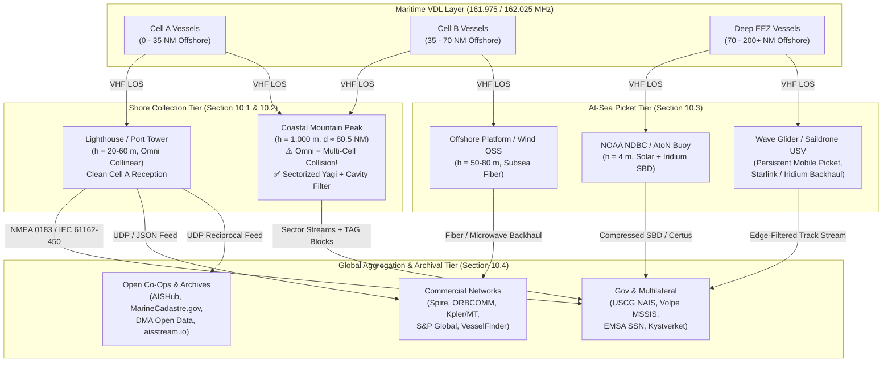
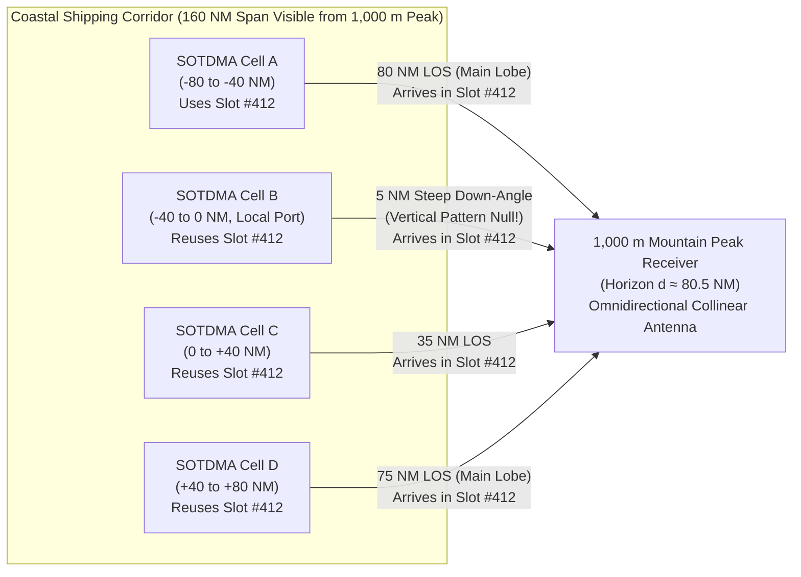
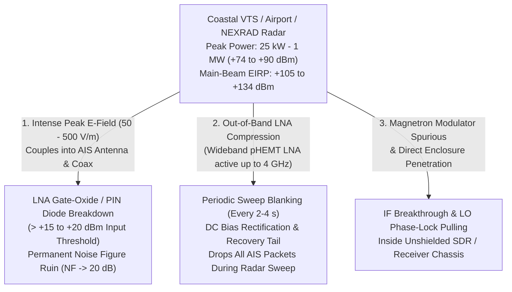

# Chapter 10: Shore and At-Sea Collection Site Engineering, Placement Hazards, and Global AIS Networks

> **Chapter Scope:** Designing a terrestrial or offshore Automatic Identification System (AIS) collection node requires far more than bolting a marine VHF whip to the highest available mast. In practice, site selection is governed by two counterintuitive physical laws: first, **excessive elevation degrades decoding probability** by pulling multiple mutually hidden Self-Organizing Time Division Multiple Access (SOTDMA) cells into a single receiver's radio horizon, causing severe co-channel time-slot collisions; second, **co-site electromagnetic interference (EMI)**—most notoriously from coastal S/X-band radars and North America's continuous $100\text{–}1,000\text{ W}$ **NOAA Weather Radio (NWR)** transmitters operating just $375\text{ kHz}$ above AIS 2—can completely deafen or physically destroy an unprotected RF front-end. This chapter establishes the engineering principles for shore site selection (Section 10.1), analyzes the RF physics of sites that must be strictly avoided (Section 10.2), details at-sea collection architectures aboard buoys, autonomous surface vessels (ASVs/USVs), and offshore platforms (Section 10.3), and catalogs the global ecosystem of commercial, community, and government AIS collection networks (Section 10.4).

---

## 1. Operational & Conceptual Overview

Whereas a shipboard AIS transponder is engineered primarily to exchange collision-avoidance telemetry within a single local radio horizon of $15\text{–}25\text{ NM}$ ($28\text{–}46\text{ km}$), a **shore or offshore AIS collection network** serves a fundamentally different mission: delivering continuous, gap-free Maritime Domain Awareness (MDA), Vessel Traffic Services (VTS) oversight, search-and-rescue (SAR) alerting, environmental compliance monitoring, and historical track archiving across entire coastlines and Exclusive Economic Zones (EEZs).

To achieve this, network architects deploy a tiered hierarchy of receiving and transmitting nodes:

1. **Coastal Low-to-Moderate Elevation Nodes ($15\text{–}100\text{ m}$ Above Sea Level [ASL]):** Lighthouses, port control towers, grain elevators, and beachfront high-rise buildings that provide high-reliability, low-collision coverage of harbor approaches, Traffic Separation Schemes (TSS), and inner shipping lanes out to $20\text{–}32\text{ NM}$.
2. **Sectorized High-Elevation Coastal Mountain Sites ($150\text{–}1,000+\text{ m}$ ASL):** Telecom and forestry towers overlooking open oceans out to $45\text{–}85\text{ NM}$, which *must* employ directional Yagi-Uda or corner-reflector sector antennas and cavity filters to survive multi-cell SOTDMA slot collisions and co-site transmitter interference.
3. **At-Sea Fixed and Mobile Picket Collectors ($1.5\text{–}80\text{ m}$ ASL):** Offshore weather buoys (**NOAA NDBC**), Aids to Navigation (AtoN) buoys, offshore oil/gas platforms, offshore wind farm substations, and persistent Uncrewed Surface Vessels (**Liquid Robotics Wave Gliders**, **Saildrones**) that bridge the gap between coastal VHF horizons and Low Earth Orbit (LEO) satellite passes.
4. **Global Aggregation Backbones:** Commercial hybrid satellite-terrestrial providers (**Spire Maritime**, **ORBCOMM**, **Kpler / MarineTraffic**, **S&P Global**, **VesselFinder**, **Pole Star**, **Lloyd's List Intelligence**), open reciprocal co-ops (**AISHub**, **APRS.fi**, **`aisstream.io`**), and sovereign/multilateral defense networks (**USCG NAIS**, **U.S. DoT Volpe MSSIS**, **EMSA SafeSeaNet**, **NOAA/BOEM MarineCadastre**, **Norwegian Kystverket**, and **Danish Maritime Authority**).



---

## 2. Historical Context & Evolution (`schwehr/gis-history` Integration)

The architecture of coastal ship reporting networks predates digital radio by two centuries (`schwehr/gis-history`):

* **1794–1850s (Optical Semaphore Chains & Lighthouses):** Claude Chappe's optical telegraph in France and the Liverpool–Holyhead optical semaphore chain (1827) established the first coastal hilltop relay stations to report arriving merchant hulls hours before they crossed the harbor bar. Coastal lighthouses—administered by Trinity House (UK), the U.S. Lighthouse Service (established 1789, merged into the USCG in 1939), and the French *Service des Phares et Balises*—occupied the dominant promontories along every major shipping lane.
* **1899–1914 (Marconi Coastal Wireless & SOLAS 1914):** Guglielmo Marconi's first shore wireless stations at Needles, Lizard, and South Foreland Lighthouses (1898–1901) demonstrated that coastal lighthouses provided ideal maritime VHF/HF propagation paths (`gis-history`). Following the *Titanic* disaster (1912) and **SOLAS 1914**, coastal radio stations maintained continuous distress watches.
* **1972–1990 (Radar VTS, *Exxon Valdez*, and OPA-90):** The Ports and Waterways Safety Act of 1972 established shore-based radar VTS in major U.S. ports. However, the **March 24, 1989 *Exxon Valdez* grounding** on Bligh Reef in Prince William Sound, Alaska (`gis-history`) proved that shore radar alone had critical range, rain/ice clutter, and target-identity blind spots. In the **Oil Pollution Act of 1990 (OPA-90)**, Congress mandated automated tracking of tankers in Prince William Sound, directly catalyzing the transition from shore radar to transponder-based shore networks ([Cutlip, 2017](https://globalfishingwatch.org/article/ais-brief-history/)).
* **1998–2002 (USCG PAWSS, MTSA 2002, and SafeSeaNet):** In 1998, simultaneous with the adoption of **ITU-R M.1371-0**, the U.S. Coast Guard deployed the **Ports and Waterways Safety System (PAWSS)** in the Lower Mississippi River / **New Orleans VTS**, establishing the first operational shore AIS network in the Americas ([Cutlip, 2017](https://globalfishingwatch.org/article/ais-brief-history/)). After **September 11, 2001**, Congress enacted the **Maritime Transportation Security Act of 2002 (MTSA)**, funding the **USCG Nationwide AIS (NAIS)** project to instrument the entire U.S. coastline. In parallel, following the *Erika* (1999) and *Prestige* (2002) oil spills, the European Union adopted **Directive 2002/59/EC**, creating **EMSA SafeSeaNet**.
* **2005–2010 (Volpe MSSIS, Crowdsourced Aggregators, and Stellwagen Bank Buoy/Shore Networks):**
  * In 2005–2006, the **U.S. Department of Transportation Volpe Center** launched the **Maritime Safety and Security Information System (MSSIS)**, linking coast guard shore networks across $>70$ nations via real-time internet NMEA multiplexing.
  * Between 2006 and 2008, **AISHub**, **MarineTraffic** (founded at the University of the Aegean, Greece, in 2007), and **APRS.fi** pioneered community crowdsourcing using inexpensive commodity VHF receivers hooked to home broadband connections.
  * From 2007 to 2010, researchers at the **University of New Hampshire Center for Coastal and Ocean Mapping (CCOM/UNH)**—led by Kurt Schwehr (`noaadata` / `libais`) in collaboration with the USCG, NOAA, and Cornell Lab of Ornithology—deployed coastal and offshore buoy AIS collectors across **Stellwagen Bank National Marine Sanctuary** to track LNG tankers and enforce North Atlantic right whale speed zones, establishing the modern open-source scientific AIS pipeline (`gis-history`).

---

## 3. Section 10.1: Range of Options for Collecting AIS Data on Shore (Deep Technical & Mathematical Foundations)

### 10.1.1 Communication Towers, Lighthouses, and Existing Coastal Structures

When selecting a terrestrial site for an AIS receiver or base station (ITU-R M.1371 Message 4 / IALA Recommendation A-124), engineers evaluate five primary classes of coastal infrastructure:

| Site Class | Typical Elevation ($h_r$ ASL) | Nominal Ship Horizon ($h_t = 20\text{ m}$) | Key Engineering Advantages | Primary Hazards & Structural Constraints |
|---|---|---|---|---|
| **1. USCG & Historic Lighthouses** | $15\text{–}60\text{ m}$ ($50\text{–}200\text{ ft}$) | $18.6\text{–}27.2\text{ NM}$ | Zero land-path terrain obstruction; situated directly at critical capes, headlands, and harbor entrances; clean local RF floor if isolated. | Extreme salt-fog corrosion (requires 316L stainless, fiberglass radomes, and cold-shrink butyl-mastic weatherproofing); State Historic Preservation Office (SHPO) restrictions on drilling masonry; direct lightning strike exposure. |
| **2. Port Control & VTS Towers** | $25\text{–}80\text{ m}$ ($80\text{–}260\text{ ft}$) | $21.1\text{–}29.9\text{ NM}$ | Direct line of sight into inner berths, locks, and turning basins; redundant generator/UPS power; institutional fiber backhaul. | **Severe co-site RF hazard:** Co-located X/S-band VTS radars ($25\text{–}50\text{ kW}$ peak) and multiple $25\text{ W}$ VHF Marine voice radios (Ch 12/13/14/16) within $3\text{–}10\text{ m}$ on the same roof deck. |
| **3. Coastal High-Rise Condos, Hotels & Office Roofs** | $35\text{–}150\text{ m}$ ($115\text{–}500\text{ ft}$) | $23.2\text{–}37.3\text{ NM}$ | Low lease cost (often hosted free by residents/universities/pilot associations); climate-controlled elevator penthouse; commodity fiber/cable internet. | Roof membrane warranty rules require **non-penetrating ballasted sled mounts**; broadband $150\text{–}170\text{ MHz}$ EMI from rooftop HVAC Variable Frequency Drives (VFDs), elevator traction motors, and architectural LED lighting. |
| **4. Coastal Grain Elevators, Silos & Port Cranes** | $45\text{–}95\text{ m}$ ($150\text{–}310\text{ ft}$) | $24.9\text{–}31.7\text{ NM}$ | Often the *only* tall structures along flat alluvial/estuarine coastlines (e.g., Lower Mississippi, Sabine Pass, Galveston, Rotterdam). | Grain dust presents an explosive atmosphere requiring **NFPA 70 (NEC) Class II, Division 1/2** intrinsically safe enclosures and armored conduit; heavy structural vibration on gantry cranes. |
| **5. Coastal Mountain Communication Sites** | $300\text{–}1,500\text{ m}$ ($1,000\text{–}5,000\text{ ft}$) | $48.6\text{–}96.3\text{ NM}$ | Massive offshore reach ($50\text{–}100\text{ NM}$); hardened $-48\text{ V DC}$ telco power plants, backup diesels, and microwave/fiber rings. | **Multi-cell SOTDMA collision paradox** (Section 10.1.2); **co-located $1\text{ kW}$ NOAA Weather Radio** or $100\text{ kW}$ FM broadcast transmitters; rime icing ($>150\text{ km/h}$ winds) requiring heavy radome antennas. |

#### Grounding, Surge Protection, and Salt-Fog Survivability on Coastal Structures
Any shore antenna mounted on a lighthouse gallery deck, coastal tower, or high-rise parapet acts as a primary lightning air terminal. A professional shore station installation must comply with **NFPA 780** (*Standard for the Installation of Lightning Protection Systems*), **IEC 62305**, and **Motorola R56** (*Standards and Guidelines for Communication Sites*):

1. **DC-Grounded Radiating Element:** Select an antenna whose radiating elements are internally DC-grounded to the mounting sleeve (Chapter 8), bleeding off wind- and sea-spray-induced triboelectric static charges before corona streamers form.
2. **Coaxial Shield Grounding Kit & Bulkhead Surge Arrestor:** Bond the outer copper shield of the $1/2\text{''}$ or $7/8\text{''}$ Heliax (or LMR-400) coaxial feedline to the tower ground bus at the top of the tower, at the bottom of the vertical run, and at the building entry bulkhead using a quarter-wave shorted stub or gas-discharge tube (GDT) surge arrestor ($150\text{–}175\text{ MHz}$ passband, $<0.15\text{ dB}$ insertion loss).
3. **Galvanic & Salt-Spray Sealing:** Dissimilar metals (e.g., aluminum antenna brackets bolted to 316 stainless steel railings with salt water electrolyte) form a galvanic cell ($\Delta V \approx 0.5\text{–}0.75\text{ V}$) that corrodes aluminum threads within months. Isolate mounts with UV-stabilized Delrin/PTFE bushings, apply nickel anti-seize to stainless hardware to prevent galling, and seal all N-type or 7/16 DIN RF connectors using a three-layer wrap: inner layer of Scotch Super 33+ vinyl tape (sticky side out or in for clean removal), middle layer of self-amalgamating EPR rubber splicing tape (Scotch 23 / PIB stretched $200\%$), and an outer UV-armor wrap of Super 88 vinyl tape coated with Scotchkote.

---

### 10.1.2 The "Too High" Elevation Paradox: Multi-Cell Co-Channel Collision Saturation

Radio amateurs and novice network engineers frequently assume that if a $30\text{ m}$ coastal tower provides good AIS reception, a $1,000\text{ m}$ ($3,300\text{ ft}$) coastal mountain peak overlooking a busy shipping lane will perform dramatically better. In reality, placing an **omnidirectional** AIS antenna on a high mountain peak near dense maritime traffic routinely produces **fewer decoded packets from nearby vessels** than a low coastal receiver at sea level!

#### 1. Geometric Proof of Multi-Cell Horizon Overlap
Recall from Chapter 5 that under standard atmospheric refraction (effective Earth radius factor $k = 4/3$, $R_e \approx 8,495\text{ km}$), the radio horizon distance $d_{\text{NM}}$ (in nautical miles) between a receiving antenna at height $h_r$ (meters) and a ship's transmitting antenna at height $h_t$ (meters) is:

$$d_{\text{NM}}(h_r, h_t) \approx 2.23 \left(\sqrt{h_{r,\text{m}}} + \sqrt{h_{t,\text{m}}}\right)$$

Consider a typical commercial vessel whose masthead AIS antenna sits at $h_t = 20\text{ m}$ ($2.23\sqrt{20} \approx 9.97\text{ NM} \approx 10.0\text{ NM}$):
* **Ship-to-Ship SOTDMA Coordination Radius ($R_{\text{cell}}$):** Two ships at sea ($h_{t1} = h_{t2} = 20\text{ m}$) can hear each other out to a maximum separation of:
  $$R_{\text{cell}} \approx 2.23\left(\sqrt{20} + \sqrt{20}\right) \approx 19.95\text{ NM} \approx 20\text{ NM}$$
  Consequently, a self-organized SOTDMA cell has a radius of $R_{\text{cell}} \approx 18\text{–}22\text{ NM}$ (or an effective cell diameter $D_{\text{cell}} \approx 35\text{–}40\text{ NM}$). Any two vessels separated by more than $35\text{–}40\text{ NM}$ are **beyond each other's radio horizon** (mutually hidden terminals). Under ITU-R M.1371-5 Annex 2, SOTDMA is explicitly designed for spatial frequency reuse: ships in **Cell A** and ships in **Cell B** ($>40\text{ NM}$ apart) cannot detect each other's slot reservations or carrier energy, so they legitimately and intentionally **select and transmit inside the exact same $26.667\text{ ms}$ time slots**!
* **Mountain Peak Receiver Horizon ($h_r = 1,000\text{ m}$):** Now place an omnidirectional AIS receiver atop a $1,000\text{ m}$ ($3,281\text{ ft}$) coastal mountain peak (such as Mount Tamalpais or Big Sur in California, Mount Constitution in the San Juan Islands, or Gibraltar / Crete / Taiwan coastal peaks):
  $$d_{\text{NM}}(1000, 20) \approx 2.23\sqrt{1000} + 2.23\sqrt{20} = 70.52 + 9.97 \approx 80.5\text{ NM}$$
  (and up to $86.3\text{ NM}$ for large container ships with $h_t = 40\text{ m}$).

Over a $180^\circ$ coastal ocean semicircle (or a coastal shipping corridor of length $2 d_{\text{NM}} \approx 161\text{ NM}$ and width $80.5\text{ NM}$), the number of independent, non-communicating SOTDMA cells $M_{\text{cells}}$ simultaneously within line of sight of the mountaintop receiver is given by the ratio of the receiver's sea coverage area $A_{\text{rx}}(h_r) = \frac{1}{2}\pi d_{\text{NM}}(h_r, h_t)^2$ to a single independent SOTDMA coordination zone of effective radius $R_{\text{coord}} \approx 35\text{ NM}$:

$$M_{\text{cells}}(h_r) \approx \max\left(1,\; \left(\frac{d_{\text{NM}}(h_r, h_t)}{R_{\text{coord}}}\right)^2\right) = \left(\frac{80.5\text{ NM}}{35.0\text{ NM}}\right)^2 \approx 5.29\text{ independent SOTDMA cells!}$$

Even along a strictly one-dimensional coastal shipping lane of length $2\sqrt{d_{\text{NM}}^2 - d_{\text{offshore}}^2} \approx 155\text{ NM}$, dividing by the $35\text{ NM}$ inter-cell reuse distance pulls in **$4\text{ to }6$ independent SOTDMA cells simultaneously**.



#### 2. TDMA Slot Capacity and Multi-Cell Collision Math
Each AIS channel (AIS 1 at $161.975\text{ MHz}$ and AIS 2 at $162.025\text{ MHz}$) provides $N_{\text{slots}} = 2,250\text{ slots/minute}$ ($4,500\text{ slots/minute}$ total across both channels). Within a single well-coordinated SOTDMA cell $k \in \{1, \dots, M_{\text{cells}}\}$, let $\eta_k \in [0, 1)$ denote the fraction of slots occupied per frame:

$$\eta_k = \frac{\sum_{i \in \text{Cell } k} r_i}{4,500\text{ slots/min}}$$

where $r_i$ is the slot consumption rate of vessel $i$ (e.g., $r_i = 6\text{ slots/min}$ for a ship steaming at $10\text{ kts}$ reporting every $10\text{ s}$, or $r_i = 30\text{ slots/min}$ for a fast ferry/pilot boat reporting every $2\text{ s}$). Within Cell 1 alone, SOTDMA reservation announcements prevent internal slot collisions up to $\eta_1 \approx 0.50$.

However, because the $M_{\text{cells}}$ cells are mutually beyond radio line of sight, their slot schedules are statistically independent with respect to one another. When a target vessel in local **Cell 1** transmits in a chosen slot, the probability $P_{\text{clean}}$ that **none** of the other $M_{\text{cells}} - 1$ independent cells transmit in the exact same time slot on the same channel is:

$$P_{\text{clean}}(M_{\text{cells}}, \eta) = \prod_{k=2}^{M_{\text{cells}}} (1 - \eta_k) = (1 - \eta)^{M_{\text{cells}} - 1} \quad (\text{for uniform cell loading } \eta)$$

And the probability of a **multi-cell co-channel collision** at the high-elevation omnidirectional antenna is:

$$P_{\text{coll}}(M_{\text{cells}}, \eta) = 1 - (1 - \eta)^{M_{\text{cells}} - 1}$$

For a moderately busy coastal corridor where each $35\text{ NM}$ cell operates at a healthy $\eta = 0.25$ ($25\%$ loading, $\sim 150\text{–}180$ vessels per cell):
* At a **low lighthouse ($h_r = 35\text{ m}$, $d \approx 23.2\text{ NM}$, $M_{\text{cells}} = 1$):** $P_{\text{coll}} \approx 0\%$ (all visible vessels belong to the same coordinated SOTDMA cell; clean reception approaches $100\%$).
* At a **$1,000\text{ m}$ mountain peak ($d \approx 80.5\text{ NM}$, $M_{\text{cells}} \approx 5.29$):**
  $$P_{\text{coll}} = 1 - (1 - 0.25)^{5.29 - 1} = 1 - (0.75)^{4.29} \approx 70.9\%\text{ of slots suffer co-channel collisions!}$$
* If each cell is loaded to $\eta = 0.40$ ($40\%$ VDL loading, typical of the English Channel, Southern California Bight, or Gulf of Mexico), multi-cell collision probability at $h_r = 1,000\text{ m}$ reaches $P_{\text{coll}} = 1 - (0.60)^{4.29} = 88.8\%$!

#### 3. Why High Collinear Gain + Elevation Actively Penalizes Close-Range Vessels
A packet collision only survives demodulation if the desired signal's received power $P_{r,\text{desired}}$ exceeds the sum of colliding co-channel signals $\sum P_{r,\text{interferer}}$ by the GMSK **FM capture ratio** $\gamma_{\text{cap}} \approx 6\text{ to }10\text{ dB}$ (unless an advanced SDR running Successive Interference Cancellation [SIC] is used; see Chapter 7).

Here a second physical trap springs shut on the mountaintop station:
* Suppose the operator installs a standard high-gain $9\text{ dBi}$ ($6.85\text{ dBd}$) omnidirectional collinear antenna on the $1,000\text{ m}$ peak. As established in Chapter 8, a $9\text{ dBi}$ collinear achieves its gain by compressing its vertical elevation beamwidth to $\Delta\theta_{-3\text{dB}} \approx 14^\circ$, aimed flat at the horizon ($\theta_{\text{elev}} \approx 0^\circ$).
* A vessel in the local port approach just $D = 3\text{ NM}$ ($5,556\text{ m}$) from the base of the $1,000\text{ m}$ mountain sits at a steep **depression angle**:
  $$\theta_{\text{dep}} = \arctan\left(\frac{h_r - h_t}{D}\right) = \arctan\left(\frac{980\text{ m}}{5,556\text{ m}}\right) \approx 10.0^\circ\text{ (or } 18^\circ\text{ at } 1.6\text{ NM)}$$
  This places the nearby vessel directly into the **first vertical pattern null** ($-15\text{ to }-25\text{ dB}$ off-axis gain penalty!) of the high-gain collinear antenna!
* Meanwhile, a distant tanker $60\text{ NM}$ away in Cell D sits at $\theta_{\text{dep}} \approx 0.8^\circ$, right in the $+9\text{ dBi}$ main lobe of the antenna—and if atmospheric surface ducting is present (Chapter 6), its signal experiences an additional $10\text{–}15\text{ dB}$ ducting enhancement over free space.
* As a result, the $60\text{ NM}$ packet arrives within $3\text{–}6\text{ dB}$ of the local $3\text{ NM}$ packet, **destroying the FM capture margin** and wiping out the close-range vessel's position report!

#### 4. The Engineering Cure: Sectorized Directional Yagi-Uda / Corner-Reflector Arrays
To exploit a high-elevation site without succumbing to multi-cell SOTDMA collapse, professional networks (**USCG NAIS**, **Kystverket**, **Spire/MarineTraffic** pro stations) abandon high-gain omnidirectional collinears on mountain peaks in favor of **spatial sectorization**:

1. **Azimuth Sectorization via Directional Antennas:** Partition the $180^\circ$ coastal view into three or four narrow azimuth sectors ($45^\circ\text{–}60^\circ$ each) using vertically polarized **5- to 8-element Yagi-Uda** or **Corner Reflector** antennas ($G \approx 9\text{–}12\text{ dBd}$ / $11.15\text{–}14.15\text{ dBi}$, horizontal $-3\text{ dB}$ beamwidth $\Delta\phi \approx 38^\circ\text{–}52^\circ$, front-to-back ratio $>20\text{–}25\text{ dB}$). Because each Yagi illuminates only $\frac{\Delta\phi}{180^\circ} \approx \frac{1}{4}$ of the coastal arc and rejects off-axis cells by $>20\text{ dB}$, the effective number of competing SOTDMA cells per receiver channel drops from $M_{\text{cells}} \approx 5.3$ down to $M_{\text{sector}} \approx 1.3$, restoring clean slot probability from $29.1\%$ back to $>91\%$!
2. **Mechanical Downtilt for Local Infill:** Dedicate one low-gain wide-vertical-beamwidth antenna (or a mechanically downtilted Yagi aimed at $\theta_{\text{tilt}} = -8^\circ$) connected to its own dedicated SDR/receiver channel specifically to cover the near-shore $0\text{–}15\text{ NM}$ harbor approach, while the horizon-aimed Yagis cover the deep offshore lanes.

---

## 4. Section 10.2: Places to Strictly Avoid When Siting an AIS Receiver (Security, Interference & Hardware Failure Modes)

Even the best antenna and receiver will fail completely if installed in a hostile electromagnetic environment. Three classes of shore locations must be treated as **strictly off-limits** (or engineered with extreme RF filtering and physical separation):

### 10.2.1 Hazard #1: Anywhere Near a Large Radar Installation!

Port control towers, coastal headlands, lighthouses, and military/airport hills frequently host high-power surveillance radars:
* **Coastal VTS & Harbor Radars:** S-band ($2.9\text{–}3.1\text{ GHz}$, typically $3.05\text{ GHz}$) and X-band ($9.2\text{–}9.5\text{ GHz}$, typically $9.41\text{ GHz}$) solid-state or coaxial-magnetron radars radiating **$10\text{ kW}$ to $50\text{ kW}$ ($+70\text{ to }+77\text{ dBm}$) peak pulse power** through high-gain slotted-waveguide arrays ($G_t \approx 28\text{–}34\text{ dBi}$, $\text{EIRP} \approx +100\text{ to }+110\text{ dBm}$).
* **Airport Surveillance Radars (ASR-9 / ASR-11) & En-Route Radars (ARSR-4):** S-band ($2.7\text{–}2.9\text{ GHz}$, $1.3\text{ MW}$ peak magnetron/klystron on legacy ASR-9; $25\text{ kW}$ solid-state on ASR-11) and L-band ($1.215\text{–}1.400\text{ GHz}$, $60\text{ kW}$ peak on ARSR-4).
* **Weather Radars (NOAA NEXRAD WSR-88D) & Military Air-Defense Radars:** NEXRAD radiates **$750\text{ kW}$ ($+88.8\text{ dBm}$) peak pulse power** at $2.7\text{–}3.0\text{ GHz}$ through an $8.5\text{ m}$ parabolic dish ($G_t = 45.5\text{ dBi}$), generating an Equivalent Isotropically Radiated Power of **$\text{EIRP} = +134.3\text{ dBm}$ ($2.7\text{ Gigawatts}$!)** in the main beam.



#### Why a $3\text{ GHz}$ or $9.4\text{ GHz}$ Radar Destroys or Deafens a $162\text{ MHz}$ AIS Receiver
A common misconception is that because $3.05\text{ GHz}$ (S-band) and $9.41\text{ GHz}$ (X-band) are far above $162\text{ MHz}$, an AIS receiver will simply ignore the radar energy. In reality, four distinct RF failure mechanisms occur when an AIS antenna is sited within $5\text{–}200\text{ m}$ of a high-power radar scanner:

1. **Free-Space Peak Electric Field & Out-of-Band LNA Compression ($P_{1\text{dB}}$):**
   At a distance $d = 15\text{ m}$ from a $25\text{ kW}$ VTS radar scanner ($G_t = 30\text{ dBi}$, $\text{EIRP} = 25\text{ MW}$), the peak electric field strength in the main beam is:
   $$E_{\text{peak}} = \frac{\sqrt{30 \cdot \text{EIRP}}}{d} = \frac{\sqrt{30 \times 2.5\times 10^7\text{ W}}}{15\text{ m}} \approx 1,825\text{ V/m}$$
   Even if the $162\text{ MHz}$ AIS antenna has an effective aperture equal to a poorly matched parasitic radiator at $3.05\text{ GHz}$ ($G_{\text{rx,oob}} \approx -15\text{ dBi}$), the pulsed microwave power delivered down the coax to the masthead Low-Noise Amplifier (LNA) reaches **$+25\text{ to }+35\text{ dBm}$ ($0.3\text{ to }3\text{ Watts}$ peak!)**. Modern wideband GaAs pHEMT and SiGe monolithic microwave integrated circuit (MMIC) LNAs (such as the Mini-Circuits `PGA-103+`, `SPF5189Z`, or the internal LNA of an `R820T2`/`R828D` SDR tuner) exhibit positive gain from $50\text{ MHz}$ all the way to **$2\text{–}4\text{ GHz}$** and have an input $1\text{ dB}$ compression point of only $P_{1\text{dB,in}} \approx -15\text{ to }+5\text{ dBm}$.
2. **Gate-Junction Envelope Rectification & Recovery Blanking:**
   When a $+25\text{ dBm}$ radar pulse ($0.5\text{–}50\text{ }\mu\text{s}$ duration at a Pulse Repetition Frequency $\text{PRF} = 1,000\text{–}3,000\text{ Hz}$) hits a wideband LNA ahead of any narrowband VHF filter, the transistor's gate-source Schottky junction rectifies the microwave envelope into a large DC voltage spike. This charges the inter-stage AC coupling capacitors, pinching off the FET bias current for $50\text{–}500\text{ }\mu\text{s}$ after *every* radar pulse. Every $2\text{ to }4\text{ seconds}$ as the rotating radar beam sweeps across the AIS antenna azimuth, a $50\text{–}200\text{ ms}$ burst of pulses completely blanks the AIS receiver—destroying 2 to 8 consecutive $26.667\text{ ms}$ AIS time slots on every radar rotation!
3. **Permanent FET Gate-Oxide & ESD PIN Diode Burnout:**
   Typical masthead LNAs and SDR input ESD protection diodes specify an absolute maximum survival input power of **$+13\text{ to }+20\text{ dBm}$**. Siting an AIS antenna in the horizontal main lobe of a port control radar within $10\text{–}30\text{ m}$ induces avalanche breakdown or thermal bond-wire degradation in the first-stage LNA FET. Crucially, a partially blown LNA often continues to pass strong local signals (making the station appear "alive") while its Noise Figure degrades from $1.2\text{ dB}$ to $18\text{–}25\text{ dB}$, silently wiping out all vessels beyond $8\text{ NM}$.
4. **Magnetron Out-of-Band Spurious Emissions & Chassis IF Breakthrough:**
   Coaxial magnetrons and high-voltage thyratron/IGBT pulse modulators generate broadband switching hash across $10\text{–}500\text{ MHz}$ as well as sub-harmonic and intermodulation spurs when pulsing into corroded waveguide joints. Simultaneously, $1,000+\text{ V/m}$ microwave pulses penetrate unshielded plastic housings or poorly grounded USB cables, coupling directly into the receiver's intermediate frequency (IF) amplifier and pulling the Local Oscillator (LO) phase-locked loop (PLL) out of lock.

> [!CAUTION]
> **Mandatory Radar Separation Rule:** Never mount an AIS antenna inside the vertical elevation fan ($\pm 15^\circ$ of the horizontal plane) of a coastal VTS, marine, airport, or weather radar. If co-locating on a port control tower is unavoidable, mount the AIS antenna **directly above or below the radar scanner axis** (where the radar's vertical elevation pattern provides $>30\text{ dB}$ null isolation), place a **passive tubular low-pass / cavity bandpass filter ahead of the first active LNA**, and house all SDR/receiver electronics inside a gasketed, RF-shielded cast-aluminum enclosure.

---

### 10.2.2 Hazard #2: Near a NOAA Weather Radio (NWR) Transmitter! (The North American $162.400\text{ MHz}$ Allocation Disaster)

In North America (the United States, its territories, and Canada), the single most destructive and widespread source of terrestrial AIS receiver failure is **NOAA Weather Radio All Hazards (NWR)**—operated by the National Weather Service—and its Canadian counterpart, **Environment and Climate Change Canada (ECCC) Weatheradio**.

#### 1. The Spectrum Allocation Collision: Just $375\text{ kHz}$ Above AIS 2!
Examine the VHF frequency allocation table in the $161.9\text{–}162.6\text{ MHz}$ band across ITU Region 2 (North America):

| Service | Channel Designation | Center Frequency ($f_c$) | Bandwidth | Typical Transmit Power ($P_{\text{tx}}$) | Duty Cycle | Offset from AIS 2 ($162.025\text{ MHz}$) |
|---|---|---|---|---|---|---|
| **ASM 1** | ITU Ch 2027 | $161.950\text{ MHz}$ | $25\text{ kHz}$ | $12.5\text{ W}$ ($+41.0\text{ dBm}$) | TDMA Burst | $-75\text{ kHz}$ |
| **AIS 1** | **ITU Ch 87B (2087)** | **$161.975\text{ MHz}$** | **$25\text{ kHz}$** | **$2\text{–}12.5\text{ W}$ ($+33\text{ to }+41\text{ dBm}$)** | **TDMA Burst** | **$-50\text{ kHz}$** |
| **ASM 2** | ITU Ch 2028 | $162.000\text{ MHz}$ | $25\text{ kHz}$ | $12.5\text{ W}$ ($+41.0\text{ dBm}$) | TDMA Burst | $-25\text{ kHz}$ |
| **AIS 2** | **ITU Ch 88B (2088)** | **$162.025\text{ MHz}$** | **$25\text{ kHz}$** | **$2\text{–}12.5\text{ W}$ ($+33\text{ to }+41\text{ dBm}$)** | **TDMA Burst** | **$0\text{ kHz}$ (Reference)** |
| **NWR WX2** | **NOAA / ECCC WX2** | **$162.400\text{ MHz}$** | **$16\text{–}25\text{ kHz}$ FM** | **$100\text{–}1,000\text{ W}$ ($+50\text{ to }+60\text{ dBm}$)** | **$100\%$ (24/7 Continuous!)** | **$+375\text{ kHz}$** |
| **NWR WX4** | NOAA / ECCC WX4 | $162.425\text{ MHz}$ | $16\text{–}25\text{ kHz}$ FM | $100\text{–}1,000\text{ W}$ ($+50\text{ to }+60\text{ dBm}$) | $100\%$ (24/7 Continuous!) | $+400\text{ kHz}$ |
| **NWR WX5** | NOAA / ECCC WX5 | $162.450\text{ MHz}$ | $16\text{–}25\text{ kHz}$ FM | $100\text{–}1,000\text{ W}$ ($+50\text{ to }+60\text{ dBm}$) | $100\%$ (24/7 Continuous!) | $+425\text{ kHz}$ |
| **NWR WX3** | NOAA / ECCC WX3 | $162.475\text{ MHz}$ | $16\text{–}25\text{ kHz}$ FM | $100\text{–}1,000\text{ W}$ ($+50\text{ to }+60\text{ dBm}$) | $100\%$ (24/7 Continuous!) | $+450\text{ kHz}$ |
| **NWR WX6** | NOAA / ECCC WX6 | $162.500\text{ MHz}$ | $16\text{–}25\text{ kHz}$ FM | $100\text{–}1,000\text{ W}$ ($+50\text{ to }+60\text{ dBm}$) | $100\%$ (24/7 Continuous!) | $+475\text{ kHz}$ |
| **NWR WX7** | NOAA / ECCC WX7 | $162.525\text{ MHz}$ | $16\text{–}25\text{ kHz}$ FM | $100\text{–}1,000\text{ W}$ ($+50\text{ to }+60\text{ dBm}$) | $100\%$ (24/7 Continuous!) | $+500\text{ kHz}$ |
| **NWR WX1** | NOAA / ECCC WX1 | $162.550\text{ MHz}$ | $16\text{–}25\text{ kHz}$ FM | $100\text{–}1,000\text{ W}$ ($+50\text{ to }+60\text{ dBm}$) | $100\%$ (24/7 Continuous!) | $+525\text{ kHz}$ |

This spectrum juxtaposition creates an extraordinary RF engineering trap:
1. **Tiny Fractional Frequency Separation ($\Delta f / f_c = 0.23\%$):** The lowest NOAA Weather Radio channel (`WX2` at $162.400\text{ MHz}$) lies a mere **$375\text{ kHz}$ above AIS 2 ($162.025\text{ MHz}$)** and **$425\text{ kHz}$ above AIS 1 ($161.975\text{ MHz}$)**. Expressed as a fractional bandwidth against the $162.025\text{ MHz}$ center frequency, this offset is only:
   $$\frac{\Delta f}{f_0} = \frac{0.375\text{ MHz}}{162.025\text{ MHz}} = 0.002314 \quad (0.231\%)$$
2. **Continuous $1,000\text{ W}$ Duty Cycle on Coastal Towers:** Unlike intermittent land-mobile voice repeaters, NOAA Weather Radio transmitters broadcast **24 hours a day, 7 days a week at $100\%$ duty cycle** across $>1,000$ U.S. sites, typically radiating $300\text{ W}$ to $1,000\text{ W}$ ($+54.8$ to $+60.0\text{ dBm}$) into high-gain omnidirectional collinear arrays. Because a primary mission of NWR is broadcasting marine gale and tsunami warnings to coastal shipping, **NWR transmitters are routinely sited on the exact same USCG lighthouses, coastal headlands, and harbor towers sought by AIS engineers!**

#### 2. Dynamic-Range, ADC Saturation, and Reciprocal-Mixing Link Budget
Let us compute what happens when an AIS collection station with a $6\text{ dBi}$ collinear antenna ($L_{\text{coax}} = 2\text{ dB}$) is installed at a distance $d = 500\text{ m}$ ($0.5\text{ km}$) from a $1,000\text{ W}$ ($+60\text{ dBm}$) NOAA Weather Radio transmitter ($G_{\text{tx}} = 6\text{ dBi}$, $\text{EIRP} = +66\text{ dBm}$) operating on $162.400\text{ MHz}$:

1. **Free-Space Path Loss at $d = 0.5\text{ km}$:**
   $$\text{FSPL}(0.5\text{ km}, 162.4\text{ MHz}) = 32.44 + 20\log_{10}(162.4) + 20\log_{10}(0.5) = 32.44 + 44.21 - 6.02 = 70.63\text{ dB}$$
2. **NWR Blocker Power at the AIS Receiver Input ($P_{\text{NWR,rx}}$):**
   $$P_{\text{NWR,rx}} = \text{EIRP}_{\text{NWR}} - \text{FSPL} + G_{\text{rx}} - L_{\text{coax}} = +66.0 - 70.63 + 6.0 - 2.0 = -0.63\text{ dBm} \approx -1\text{ dBm!}$$
   (If the AIS antenna is co-located $50\text{ m}$ away on the same hilltop or tower, $\text{FSPL} = 50.6\text{ dB}$ and $P_{\text{NWR,rx}}$ reaches **$+19.4\text{ dBm}$**!)
3. **Target Weak AIS Signal Power ($P_{\text{AIS,rx}}$):**
   Meanwhile, a Class A vessel near the radio horizon ($35\text{ NM}$) or a $2\text{ W}$ Class B vessel at $15\text{ NM}$ arrives at the AIS receiver input at **$P_{\text{AIS,rx}} = -107\text{ dBm}$** (the IEC 61993-2 sensitivity threshold).
4. **Required Instantaneous Dynamic Range ($\Delta P$):**
   The AIS receiver must simultaneously process a $-107\text{ dBm}$ GMSK burst at $162.025\text{ MHz}$ in the presence of a continuous $-1\text{ dBm}$ FM carrier at $162.400\text{ MHz}$—a **$106\text{ dB}$ blocker-to-signal ratio** separated by just $375\text{ kHz}$!

Now observe how this $-1\text{ dBm}$ NWR blocker defeats standard filtering, wideband SDR ADCs, and narrowband superheterodyne mixers alike:

* **Failure 1: Passband Transparency of Standard Marine VHF & SAW Filters:**
  A standard marine VHF bandpass filter covers the entire $156.0\text{–}163.0\text{ MHz}$ marine band ($7\text{ MHz}$ bandwidth), providing **$0\text{ dB}$ of attenuation** at $162.400\text{ MHz}$. Even dedicated "$162\text{ MHz}$ AIS Surface Acoustic Wave (SAW) filters" (detailed in Chapter 9) have a typical $-3\text{ dB}$ passband width of $B_{\text{SAW}} \approx 1.5\text{ to }2.5\text{ MHz}$ ($161.0\text{–}163.0\text{ MHz}$) to accommodate manufacturing and temperature drift. Consequently, **$162.400\text{ MHz}$ sits squarely inside the low-loss passband of standard AIS SAW filters**, passing straight through into the LNA and ADC with $<1\text{–}3\text{ dB}$ attenuation!
* **Failure 2: Wideband SDR Nyquist Passband & 8-Bit/12-Bit ADC Saturation:**
  When a Software-Defined Radio (such as an RTL-SDR Blog V3/V4 running `AIS-catcher` at a standard sample rate of $f_s = 1.536\text{ MS/s}$ or $2.4\text{ MS/s}$, centered at $f_{\text{LO}} = 162.000\text{ MHz}$) digitizes the RF spectrum, its complex Nyquist baseband spans:
  $$\left[f_{\text{LO}} - \frac{f_s}{2},\; f_{\text{LO}} + \frac{f_s}{2}\right] = [161.232\text{ MHz},\; 162.768\text{ MHz}] \quad (\text{at } f_s = 1.536\text{ MS/s})$$
  **All seven NOAA Weather Radio frequencies ($162.400\text{–}162.550\text{ MHz}$) fall directly inside the digitized IQ baseband!**
  An $N_b = 8\text{-bit}$ ADC (RTL2832U) has a theoretical quantization signal-to-noise-and-distortion ceiling in a $B_{\text{AIS}} = 25\text{ kHz}$ channel of:
  $$\text{DR}_{\text{ADC}}(25\text{ kHz}) = 6.02 N_b + 1.76 + 10\log_{10}\left(\frac{f_s}{2 B_{\text{AIS}}}\right) \approx 49.92 + 14.87 = 64.8\text{ dB} \quad (\text{practical SFDR} \approx 55\text{–}60\text{ dB})$$
  With $30\text{ dB}$ of tuner RF/IF gain so that thermal noise toggles the ADC's least-significant bits, the ADC full-scale clipping point is roughly $P_{\text{clip,in}} \approx -45\text{ dBm}$. The $-1\text{ dBm}$ NWR signal exceeds ADC full-scale by **$44\text{ dB}$**, slamming the ADC rails on every cycle and filling the entire $1.536\text{ MHz}$ FFT with clipping harmonics! If the operator lowers the SDR gain (or enables AGC) by $45\text{ dB}$ to prevent clipping, the receiver's effective noise figure jumps by $\sim 45\text{ dB}$, raising the minimum detectable AIS signal from $-110\text{ dBm}$ to **$-65\text{ dBm}$** and rendering the station blind beyond $1\text{–}2\text{ NM}$.
* **Failure 3: Local Oscillator Reciprocal Mixing & Transmitter Phase Noise Skirts:**
  Even if an engineer uses a 14-bit SDR (`SDRplay RSPdx`) or a dual-conversion hardware AIS receiver with a steep $25\text{ kHz}$ crystal IF filter *after* the first mixer, the receiver's own Local Oscillator (LO) exhibits single-sideband phase noise $\mathcal{L}(\Delta f)$ (measured in $\text{dBc/Hz}$ at offset $\Delta f = 375\text{ kHz}$). In the first mixer, the $-1\text{ dBm}$ NWR blocker mixes with the LO's phase-noise skirt at $\Delta f = 375\text{ kHz}$, down-converting reciprocal-mixing noise directly into the $25\text{ kHz}$ ($44.0\text{ dBHz}$) AIS 2 IF passband:
  $$P_{\text{noise,recip}} = P_{\text{NWR,rx}} + \mathcal{L}(375\text{ kHz}) + 10\log_{10}(25,000\text{ Hz})$$
  For a typical integrated fractional-N synthesizer ($\mathcal{L}(375\text{ kHz}) \approx -100\text{ dBc/Hz}$):
  $$P_{\text{noise,recip}} = -1.0\text{ dBm} - 100.0\text{ dBc/Hz} + 44.0\text{ dBHz} = -57.0\text{ dBm!}$$
  This reciprocal-mixed phase noise sits **$73\text{ dB}$ above the $-130\text{ dBm}$ thermal noise floor** ($N_0 B$), completely burying weak AIS 1 and AIS 2 signals even without ADC clipping! Simultaneously, the $1,000\text{ W}$ ($+60\text{ dBm}$) NWR transmitter's own broadband sideband noise skirt ($\approx -140\text{ dBc/Hz}$ at $375\text{ kHz}$ offset) radiates actual RF noise on $162.025\text{ MHz}$ that arrives at $-1.0 - 140 + 44 = -97\text{ dBm}$, raising the over-the-air noise floor at the site by $>30\text{ dB}$.

#### 3. Engineering Mitigation for NWR Interference
1. **Pre-Deployment Site Audit:** Before signing any coastal tower lease in the United States or Canada, query the [NOAA Weather Radio Station Listing](https://www.weather.gov/nwr/station_listing) and FCC Universal Licensing System (ULS) for any active transmitter in $162.400\text{–}162.550\text{ MHz}$ within **$5\text{ km}$ ($3\text{ miles}$)**.
2. **High-Q Coaxial Cavity Notch (Band-Reject) Filters:** Because $\Delta f = 375\text{ kHz}$ represents a $0.23\%$ fractional offset, only a physically large, temperature-compensated **quarter-wave coaxial resonator cavity filter** with an unloaded quality factor $Q_u \ge 6,000\text{–}12,000$ (e.g., an $8\text{–}10\text{ inch}$ diameter silver-plated aluminum/Invar series-stub notch cavity from Telewave, Sinclair, or EMR) can provide **$30\text{–}45\text{ dB}$ of notch depth at $162.400\text{ MHz}$** while maintaining $<1.5\text{ dB}$ insertion loss at $162.025\text{ MHz}$. This cavity notch filter **must be installed directly on the antenna feedline ahead of any masthead LNA or SDR**.
3. **Spatial Null Steering:** If using a directional Yagi-Uda antenna pointed seaward and the NWR tower lies inland behind or to the side of the station, orient the Yagi so the NWR tower falls directly into its $-25\text{ dB}$ rear/side pattern null.

---

### 10.2.3 Hazard #3: Other High-Noise Urban & Industrial Sites
* **Hospital and Commercial VHF Paging Transmitters ($152\text{–}163\text{ MHz}$):** Urban hospital rooftops and commercial paging towers operate high-power ($100\text{–}350\text{ W}$ ERP) continuous or high-duty-cycle POCSAG/FLEX FSK transmitters on $152.240\text{ MHz}$, $157.740\text{ MHz}$, and adjacent VHF allocations (as well as North American AAR railroad channels at $160.215\text{–}161.565\text{ MHz}$). These signals fall within the passband of standard marine VHF filters and cause severe AGC pumping and third-order intermodulation ($2f_1 - f_2$) in wideband preamplifiers.
* **Commercial FM Broadcast Antenna Farms ($88\text{–}108\text{ MHz}$):** Multi-kilowatt ($10\text{–}100\text{ kW}$ ERP) FM broadcast towers generate intense second- and third-order intermodulation products inside semiconductor LNAs. For example, two local FM transmitters at $f_1 = 107.9\text{ MHz}$ and $f_2 = 95.9\text{ MHz}$ mixed with a local VHF utility carrier or third FM station ($f_1 + f_2 - f_3$ or $2f_1 - f_2$)—or the second harmonic of an $81.0\text{ MHz}$ OIRT/VHF-Low transmitter—will saturate any RTL-SDR or LNA unless an $88\text{–}108\text{ MHz}$ FM bandstop trap ($>50\text{ dB}$ rejection) and $162\text{ MHz}$ bandpass filter are installed.
* **HVDC Substations, Corona Discharge, and Elevator Machine Rooms:** High-voltage ($115\text{–}500\text{ kV}$) coastal substations whose ceramic insulators become encrusted with conductive sea salt experience continuous micro-arcing (corona discharge) in humid weather, radiating broadband impulsive noise across $30\text{–}250\text{ MHz}$. Similarly, mounting an AIS receiver inside a high-rise elevator machine room exposes the coax and power supply to unshielded $20\text{–}100\text{ kW}$ Variable Frequency Drive (VFD) IGBT switching transients.

---

## 5. Section 10.3: Collecting AIS At Sea: Buoys, ASVs/USVs, and Offshore Platforms

Because the curvature of the Earth limits a typical $30\text{ m}$ coastal station's horizon to $\sim 22\text{ NM}$, coastal states, scientists, and maritime security agencies deploy persistent **at-sea AIS collection platforms** to monitor offshore traffic separation lanes, deepwater Marine Protected Areas (MPAs), and Exclusive Economic Zones (EEZs) out to $200\text{ NM}$.

| Platform Category | Representative Systems | Antenna Height ($h_r$ ASL) | Ship Horizon ($h_t = 20\text{ m}$) | Power Supply & Continuous Budget | Primary Backhaul Link |
|---|---|---|---|---|---|
| **Moored Weather & AtoN Buoys** | **NOAA NDBC** $3\text{ m}$/$6\text{ m}$ buoys, USCG Offshore AtoN buoys, Stellwagen Bank PAM/AIS buoys | $3.5\text{–}5.0\text{ m}$ | $14.1\text{–}15.0\text{ NM}$ | Solar ($40\text{–}150\text{ Wp}$) + AGM/$\text{LiFePO}_4$ battery bank; **$0.1\text{–}1.5\text{ W}$** allocated to AIS | Iridium SBD / Iridium Certus (or cellular/VHF link near coast) |
| **Wave-Propelled USVs** | **Liquid Robotics (Boeing) Wave Glider** SV3 / SV5 | $1.5\text{–}2.2\text{ m}$ | $12.7\text{–}13.3\text{ NM}$ | Deck solar panels ($85\text{–}200\text{ Wp}$) + $\sim 1\text{–}6.8\text{ kWh}$ Li-ion; **$0.5\text{–}3\text{ W}$** for AIS payload | Iridium SBD / Certus, 4G/LTE, or high-rate satellite |
| **Wind & Solar Explorer USVs** | **Saildrone** *Explorer* ($7\text{ m}$), *Voyager* ($10\text{ m}$), *Surveyor* ($20\text{ m}$) | $5.0\text{–}15.0\text{ m}$ | $15.0\text{–}18.6\text{ NM}$ | Solar + hydro-generator (*Explorer*) or hybrid diesel-electric (*Voyager*/*Surveyor*, $50\text{–}500\text{ W}$) | **Starlink Maritime** + Iridium Certus backup |
| **Submersible / Hybrid USVs** | **OceanAero TRITON**, **Exail DriX**, **SeaTrac SP-48** | $1.5\text{–}4.5\text{ m}$ | $12.7\text{–}14.7\text{ NM}$ | Solar/LiFePO4 (*TRITON*, *SeaTrac*) or diesel (*DriX*) | Iridium Certus / Starlink / Tactical Mesh RF |
| **Fixed Offshore Rigs & Wind OSS** | Gulf of Mexico / North Sea Oil Platforms; **Offshore Wind Substations (OSS)** | $40\text{–}90\text{ m}$ | $24.1\text{–}31.1\text{ NM}$ | Utility grid / turbine AC power ($>1\text{ kW}$ available with UPS backup) | **Subsea Single-Mode Fiber** or licensed microwave link |

### 10.3.1 Offshore Buoys: NOAA NDBC, USCG AtoN, and Conservation Buoys

#### 1. NOAA National Data Buoy Center (NDBC) & USCG NAIS Integration
The **NOAA National Data Buoy Center (NDBC)** maintains $>100$ moored meteorological and oceanographic buoys ($3\text{ m}$ discus, $6\text{ m}$ NOMAD, and $10\text{–}12\text{ m}$ discus hulls) anchored from $20\text{ NM}$ to $>300\text{ NM}$ offshore across the Atlantic, Pacific, Gulf of Mexico, Great Lakes, and Bering Sea. Under an interagency partnership between the **U.S. Coast Guard (NAIS)** and **NOAA**, offshore NDBC weather buoys and major USCG offshore Aids to Navigation (AtoN) ocean buoys are equipped with ruggedized, low-power dual-channel AIS receivers (such as military-grade **Shine Micro** SM1610/SA161-MH or **L3Harris** payloads).
Similarly, starting in 2007–2010 in **Stellwagen Bank National Marine Sanctuary** and Boston Harbor approaches, offshore liquefied natural gas (LNG) deepwater port buoys were instrumented with combined passive acoustic monitoring (PAM) hydrophones and real-time AIS receivers (decoded and archived via Kurt Schwehr's open-source `noaadata` and `libais` pipelines) to monitor vessel compliance with mandatory $10\text{ kt}$ North Atlantic right whale speed restrictions.

#### 2. Wave-Trough Horizon Masking, Pitch/Roll, and Antenna Selection
On a $3\text{ m}$ or $6\text{ m}$ ocean buoy, the AIS antenna is mounted atop the instrument mast at $h_r \approx 4.0\text{ m}$ above the calm waterline, yielding a nominal horizon of $d_{\text{NM}}(4, 20) \approx 14.4\text{ NM}$. In open-ocean winter sea states (significant wave height $H_s = 5\text{–}9\text{ m}$), two physical effects govern reception:
* **Wave-Trough Shadowing:** When the buoy descends into a $6\text{ m}$ wave trough, its $4\text{ m}$ mast sits **$2\text{ m}$ below the surrounding wave crests**, momentarily blocking direct line of sight along low grazing angles ($\theta < 3^\circ$). However, because AIS dynamic position reports occur every $2\text{–}10\text{ s}$ while ocean swell periods are $T_p \approx 8\text{–}16\text{ s}$, the buoy rises onto the next wave crest ($h_{\text{eff}} \approx 4 + H_s/2 \approx 7\text{ m}$, extending the crest horizon to $15.9\text{ NM}$!) every few seconds.
* **Wide Vertical Beamwidth Requirement:** Because a discus buoy pitches and rolls $\pm 25^\circ\text{–}35^\circ$ in steep breaking seas, buoy collectors **must never use high-gain collinear antennas** (Chapter 8). Instead, a ruggedized, foam-filled $\frac{1}{2}\lambda$ center-fed coaxial dipole ($G = 0\text{ dBd} = 2.15\text{ dBi}$, vertical $-3\text{ dB}$ beamwidth $\Delta\theta = 78^\circ$) ensures continuous horizon illumination across the buoy's full roll envelope.

#### 3. Buoy Power Budgeting and Edge-Deduplicated Satellite Backhaul
At $60^\circ\text{ N}$ latitude in the Gulf of Alaska during December, solar insolation drops below $0.4\text{ peak sun-hours/day}$. A continuous wideband SDR drawing $3.5\text{ W}$ ($290\text{ mA}$ at $12\text{ V}$) consumes $84\text{ Wh/day}$ ($7\text{ Ah/day}$), which would exhaust a $100\text{ Ah}$ battery bank in two weeks of overcast storms. Therefore, buoy AIS collectors employ **ultra-low-power dual-channel hardware demodulators** consuming only **$75\text{–}250\text{ mW}$** ($1.8\text{–}6.0\text{ Wh/day}$).

Furthermore, when backhauling over metered **Iridium Short Burst Data (SBD)** ($340\text{ bytes}$ per mobile-originated message), transmitting raw $82\text{-byte}$ ASCII `!AIVDM` sentences at $10\text{ s}$ intervals for 50 nearby ships would consume $>2\text{ MB/day}$ and incur prohibitive satellite airtime bills. Buoy payload processors therefore execute **stateful edge decimation and binary packing**:
1. Decode all incoming AIS bursts in real time and maintain an in-memory MMSI state table on the buoy's microcontroller.
2. Immediately forward **safety-critical messages** without delay: AIS-SART / AIS-MOB / EPIRB-AIS (`970xxxxxx`, `972xxxxxx`, `974xxxxxx`), Message 9 (SAR Aircraft), Message 12/14 (Safety Text), and vessels exhibiting anomalous kinematics (sudden speed drop or circular loitering inside an MPA).
3. Downsample routine Message 1/2/3/18 position reports to a configurable heartbeat interval (e.g., 1 position report per vessel every $5\text{ to }15\text{ minutes}$, or whenever cross-track deviation from dead-reckoning exceeds $250\text{ m}$), and pack `{MMSI (30b), Timestamp (16b), Lon (28b), Lat (27b), SOG (10b), COG (12b)}` into a compact **$16\text{-byte}$ binary record**—fitting **21 vessel updates into a single $340\text{-byte}$ Iridium SBD burst**!

---

### 10.3.2 Autonomous & Uncrewed Surface Vessels (ASVs / USVs)

Fixed buoys cannot relocate to intercept dark fleets, patrol shifting fishery boundaries, or fill dynamic coverage gaps. Over the past fifteen years, **Autonomous and Uncrewed Surface Vessels (ASVs/USVs)** have revolutionized at-sea AIS collection:

1. **Liquid Robotics (Boeing) Wave Glider (`SV2` / `SV3` / `SV5`):**
   * *Propulsion Physics:* The Wave Glider uses a patented two-body architecture: a surfboard-shaped surface float ($2.1\text{–}3.05\text{ m}$ long) connected via an $8\text{ m}$ armored umbilical tether to a sub-surface glider equipped with six articulating hydrofoil wings. As ocean waves lift and drop the surface float, the sub-surface wings pivot mechanically, converting vertical wave orbital energy directly into $1.5\text{–}2.5\text{ kts}$ of forward thrust with **zero propulsion fuel or electrical motor draw**!
   * *AIS Collection Mission:* Three deck solar panels ($85\text{–}200\text{ Wp}$) charge lithium-ion battery packs ($0.9\text{–}6.8\text{ kWh}$) that power a masthead AIS receiver ($h_r \approx 1.8\text{ m}$, ship horizon $\sim 13\text{ NM}$), meteorological sensors, and towed/hull-mounted passive acoustic hydrophones. Deployed for 6 to 12 months continuously, Wave Gliders patrol remote island MPAs (such as the Pitcairn Islands, Chagos Archipelago, Papahānaumokuākea, and Galápagos), correlating AIS broadcasts with acoustic propeller signatures to detect Illegal, Unreported, and Unregulated (IUU) fishing vessels that disable their transponders.
2. **Saildrone (*Explorer* $7\text{ m}$, *Voyager* $10\text{ m}$, *Surveyor* $20\text{ m}$):**
   * *Architecture:* Autonomous wind-propelled USVs using a rigid carbon-fiber wing sail trimmed by a robotic tail tab. While the $7\text{ m}$ *Explorer* relies purely on wind propulsion and solar power for year-long oceanic crossings, the $10\text{ m}$ *Voyager* and $20\text{ m}$ *Surveyor* incorporate auxiliary diesel/electric generators and **Starlink Maritime** flat-panel terminals.
   * *Multi-Sensor Cross-Cueing:* Because *Voyager* and *Surveyor* carry a tall wing mast ($h_r \approx 6\text{–}15\text{ m}$ ASL, extending the AIS horizon to $16\text{–}19\text{ NM}$), $360^\circ$ optical/infrared gimbal cameras with onboard neural-network hull detection, and solid-state X-band marine radar, they act as **autonomous dark-ship hunters**. When the USV's radar or optical camera detects a vessel within $10\text{ NM}$ that has no corresponding AIS MMSI track in the local VDL table, the onboard processor automatically uplinks high-resolution target imagery and bearing/range tracks over Starlink to Coast Guard or Navy command centers (extensively demonstrated in **U.S. Navy 5th Fleet Task Force 59** in the Arabian Gulf and Red Sea, and **4th Fleet Operation Southern Spear**).
3. **OceanAero (*TRITON*), Exail (*DriX*), and SeaTrac (*SP-48*):**
   * **OceanAero *TRITON*:** A unique autonomous **Uncrewed Underwater and Surface Vessel (UUSV)** that sails on the surface at up to $5\text{ kts}$ collecting AIS and RF intelligence, then folds its rigid wing sail into its hull and submerges to dive beneath severe hurricanes or loiter covertly on the seabed before resurfacing to resume collection.
   * **Exail *DriX* & SeaTrac *SP-48*:** Solar-electric (*SeaTrac*) and high-speed diesel hydrographic (*DriX*) USVs used along continental shelves to simultaneously map multibeam bathymetry and act as mobile VHF AIS and VDES relay gateways.

---

### 10.3.3 Offshore Oil/Gas Platforms & Wind Turbine Offshore Substations (OSS)

Fixed offshore energy infrastructure provides the closest possible approximation to a land-based tower in the middle of the ocean:
* **Offshore Oil & Gas Platforms (Gulf of Mexico, North Sea, Campos Basin, West Africa):** Fixed steel jackets, tension-leg platforms (TLPs), and deepwater spars place derrick tops and flare-boom communication decks at **$45\text{–}90\text{ m}$ ($150\text{–}300\text{ ft}$) ASL** up to $150\text{ NM}$ offshore—yielding a rock-steady $25\text{–}31\text{ NM}$ AIS horizon with zero multi-cell elevation overload. In the U.S. Gulf of Mexico, private fiber-optic and microwave networks (such as Tampnet and BP/Shell/Chevron loops) link dozens of deepwater platforms directly into shore VTS and commercial aggregators with millisecond latency.
  * *Hazardous Area Certification:* Because hydrocarbon vapor may be present on production platforms, any AIS receiver, LNA, or power supply installed outside pressurized living quarters must be housed inside an explosion-proof cast enclosure certified to **NEC Class I, Division 1 or 2 (Groups C & D)** or **ATEX / IECEx Zone 1 or Zone 2**, with galvanic RF surge barriers on the coaxial feedline entering the safe room.
* **Offshore Wind Farm Substations (OSS) & Wind Turbine Generators (WTGs):** Every commercial offshore wind farm (North Sea Dogger Bank, Hornsea, German Bight, and U.S. Atlantic leases) centers on one or more high-voltage **Offshore Substations (OSS)** standing $40\text{–}65\text{ m}$ ASL, permanently connected to shore via redundant multi-core **subsea single-mode fiber-optic cables** embedded in the export power cable armor. Marine coordination centers equip OSS decks and perimeter corner turbines with dual-redundant AIS base stations and radar trackers to monitor Crew Transfer Vessels (CTVs), Service Operation Vessels (SOVs), and passing tankers around the wind array.

---

## 6. Section 10.4: Global AIS Collection Networks and Data Providers (Hardware, Standards, & Ecosystem)

Once raw `!AIVDM` sentences are demodulated at shore stations, buoys, USVs, and LEO satellites, they are tagged with station provenance and arrival timestamps using **IEC 61162-1 / NMEA TAG Blocks** (e.g., `\s:r3669961,c:1712250000*5A\!AIVDM,...`; see Chapter 14) and routed into global aggregation networks. These networks fall into three distinct architectural and legal tiers:

### 10.4.1 Tier 1: Commercial Satellite + Terrestrial Providers

Commercial providers fuse terrestrial shore chains (which provide high-temporal-resolution, 2-to-10-second updates in coastal waters) with **Low Earth Orbit (LEO) Satellite AIS (S-AIS)** constellations (which provide global deep-ocean coverage; see Chapter 17):

| Provider | Constellation & Terrestrial Footprint | Key Technical Capabilities & Differentiators | Primary Commercial & Institutional Markets |
|---|---|---|---|
| **Spire Maritime** *(Spire Global; acquired exactEarth in Nov 2021)* | $>100$ **Lemur** 3U/6U LEO CubeSats + **exactView RT** payloads hosted on 58 **Iridium NEXT** satellites (via L3Harris) + thousands of terrestrial stations. | **exactView RT** uses Iridium inter-satellite crosslinks to deliver spaceborne AIS packets to ground gateways in **$<1\text{ to }2\text{ minutes}$** (zero orbital pass-storage delay); patented ground IQ de-collision & **Dynamic AIS™** for high-density zones. | Defense/MDA (USCG, EMSA, navies), commodity hedge funds, supply-chain logistics, dark-ship analytics. |
| **ORBCOMM** | Pioneer of commercial S-AIS (launched first AIS satellites in 2008 following TACSat-2); **OG2** LEO constellation + global terrestrial partner feeds. | Combines satellite AIS with two-way satellite M2M/IoT vessel tracking transponders (VMS, reefer container monitoring) and dual-antenna spaceborne de-collision processing. | Government MDA, fisheries monitoring (VMS + AIS fusion), container & intermodal logistics. |
| **Kpler** *(acquired **MarineTraffic** & **FleetMon** in 2023)* | World's largest terrestrial feeder network (**$>6,500$ shore stations** across $>180$ countries) fused with Spire/ORBCOMM satellite AIS feeds. | Volunteer feeder model (supplies pre-configured Raspberry Pi / dedicated AIS receivers or API credits to coastal hosts); deep integration with Kpler's draught-based cargo volume, STS lightering, and LNG/crude oil trade-flow analytics. | Commodity trading desks, shipbrokers, charterers, port authorities, and public web visualization. |
| **S&P Global Market Intelligence** *(AISLive & Sea-web / formerly IHS Markit / Lloyd's Register-Fairplay)* | Proprietary commercial terrestrial network (**AISLive** across $>140$ countries) + multi-constellation S-AIS fusion. | Sole official manager of the **IMO Ship Numbering Scheme** on behalf of the IMO; directly links real-time AIS tracks (`MMSI`) to verified **7-digit IMO hull numbers**, beneficial ownership chains, P&I clubs, and PSC detention history in **Sea-web**. | Maritime insurers, P&I clubs, admiralty lawyers, banks/trade finance, sanctions compliance officers. |
| **VesselFinder** | $>4,000$ terrestrial shore stations + satellite AIS integration. | High-reliability REST/JSON APIs, historical track exports, port call detection, and community hardware feeder program. | Ship managers, port agents, maritime software developers, and coastal observers. |
| **Pole Star Global** *(PurpleTRAC / Podium)* | Hybrid aggregator fusing terrestrial + satellite AIS with **LRIT (Long-Range Identification and Tracking)** and Inmarsat/Iridium SSAS. | Automated OFAC, EU, UK, and UN **sanctions screening**, AIS gap ("dark activity") alerting, ship-to-ship (STS) transfer risk scoring, and bill-of-lading compliance auditing. | Banks, marine underwriters, commodity traders, and flag-state registries (LRIT Data Center operator). |
| **Lloyd's List Intelligence** *(Seasearcher)* | Proprietary coastal receiver network (originating from the historic **Lloyd's Agency** port network dating to 1688) + S-AIS. | Combines automated AIS anomaly detection (loitering, draft changes, GNSS spoofing zones) with human investigative maritime analysts and casualty reporting. | Marine insurance (Lloyd's of London syndicates), legal forensics, and sanctions enforcement. |

---

### 10.4.2 Tier 2: Community & Open Co-Op Aggregators

Community networks rely on a reciprocal crowdsourcing model: hobbyists, universities, yacht clubs, and harbor pilots run local receivers (`AIS-catcher`, `rtl-ais`, or hardware receivers) and forward their UDP NMEA stream to a central hub:

1. **AISHub (`aishub.net`):**
   * *Reciprocal Co-Op Model:* AISHub enforces a strict technical rule: **"To receive the global aggregated feed, you must contribute a live local NMEA feed."** Once a station's UDP `!AIVDM` stream is registered and actively sending packets, the operator can open a TCP client socket or query AISHub's HTTP JSON/XML/CSV API to pull the deduplicated global feed from $>1,100$ online peer stations worldwide. Commercial resale of raw AISHub data is prohibited, but it remains a foundational feed for academic researchers and reciprocal aggregators.
2. **APRS.fi (`aprs.fi`):**
   * Created and maintained by Heikki Hannikainen (`OH7LZB`), `aprs.fi` merges global amateur radio Automatic Packet Reporting System (APRS) telemetry with live coastal AIS feeds contributed natively by **`AIS-catcher`** (via HTTP JSON or UDP NMEA).
3. **`aisstream.io`:**
   * A modern, developer-friendly streaming gateway that provides **free WebSocket API access** (`wss://stream.aisstream.io/v0/stream`) to real-time global terrestrial AIS data. Developers authenticate with an API key (via GitHub OAuth) and send a JSON subscription filter specifying geographic bounding boxes (`BoundingBoxes`), optional `FiltersShipMMSI` lists, and `FilterMessageTypes`, receiving pre-parsed JSON dictionaries for every AIS message in real time.
4. **PocketMariner (`BoatBeacon` / `SeaNav`):**
   * Community coastal sharing network originally created to allow smartphone/tablet navigation apps and coastal volunteer stations to exchange real-time AIS targets and CPA collision alerts.

---

### 10.4.3 Tier 3: Government, Defense, and Open Scientific Networks

Sovereign coast guards and multilateral partnerships operate hardened, cryptographically authenticated AIS networks—several of which publish gold-standard open data archives for scientific research:

1. **U.S. Coast Guard Nationwide AIS (NAIS):**
   * Mandated by the **Maritime Transportation Security Act of 2002 (MTSA)** and engineered through **Increment 1** (initial receive-only capability across 55 port/coastal areas, 2007–2008) and **Increment 2** (permanent nationwide redundant transceivers across $>200$ USCG Rescue 21 towers, lighthouses, inland Western Rivers sites, and NOAA NDBC buoys, plus commercial S-AIS integration out to $2,000\text{ NM}$).
   * NAIS supports full two-way VHS Data Link (VDL) operations, enabling USCG Sector Command Centers to broadcast **Message 4** (Base Station UTC/slot timing), **Message 20** (FATDMA slot reservations), **Message 22/23** (Channel Management / Group Assignment), and **Message 6/8 Area Notices** (such as Dynamic Management Areas for right whale protection or security zones; see Chapter 16).
2. **U.S. DoT Volpe Center — Maritime Safety and Security Information System (MSSIS):**
   * Developed in 2005–2006 by the **U.S. Department of Transportation Volpe National Transportation Systems Center** (Cambridge, MA) in partnership with U.S. Naval Forces Europe / Sixth Fleet and the Department of Homeland Security.
   * MSSIS operates as a **government-to-government multilateral "share-to-receive" cooperative network** connecting the national AIS networks of **$>70$ participating countries** (spanning NATO, the Mediterranean, West/East Africa, the Americas, and the Indo-Pacific). Participating coast guards and navies install the Volpe **`TV32` (`TransView 32`)** server/client suite to contribute their domestic NMEA stream and receive the unified, real-time encrypted global stream at near-zero cost.
3. **NOAA & BOEM `MarineCadastre.gov` (AccessAIS Open Archive):**
   * Through an interagency agreement with the USCG, the **NOAA Office for Coastal Management** and the **Bureau of Ocean Energy Management (BOEM)** process the raw USCG NAIS archive (from **2009 to the present**) covering all U.S. coastal and offshore waters (UTM Zones 1–20).
   * To make the multi-terabyte archive tractable for researchers, `MarineCadastre.gov` cleans invalid coordinate sentinels (`181°`/`91°`), filters out classified military/law-enforcement MMSIs exempted under FOIA, downsamples dynamic position reports to **1-minute time steps**, joins Message 5 static attributes (`VesselName`, `IMO`, `CallSign`, `VesselType`, `Length`, `Width`, `Draft`), and publishes daily/annual **CSV and GeoParquet / File Geodatabase** files freely to the public.
4. **European Maritime Safety Agency (EMSA) SafeSeaNet (SSN):**
   * Headquartered in Lisbon, Portugal, and mandated under **EU Directive 2002/59/EC**, SafeSeaNet interconnects the national coastal AIS networks of all EU Member States plus Norway and Iceland. SSN fuses coastal AIS with **SAT-AIS** (via EMSA's Copernicus Maritime Surveillance / ESA partnerships), **LRIT**, mandatory port arrival/hazmat notifications (`Hazmat`), and **CleanSeaNet** synthetic aperture radar (SAR) satellite oil-spill detection.
5. **Norwegian Coastal Administration (*Kystverket*) Live Open AIS Stream:**
   * Norway's *Kystverket* operates one of the world's most enlightened open-data policies: it exposes a **live, real-time public TCP streaming socket** (`153.44.253.27:5631`) and REST API (`kystdatahuset.no`) broadcasting raw NMEA 0183 + TAG blocks from Norway's coastal base stations (covering the Norwegian coast, fjords, and Svalbard out to $30\text{ NM}$, with small pleasure craft $<45\text{ m}$ filtered for GDPR compliance) under the **Norwegian Licence for Open Government Data (NLOD 2.0)**.
6. **Danish Maritime Authority (DMA / *Søfartsstyrelsen*) Historical AIS Archive:**
   * The Danish Maritime Authority publishes complete, un-decimated historical AIS CSV archives (`web.ais.dk/aisdata/`) from **2006 to the present** covering the Danish Straits (Great Belt, Øresund), Kattegat, Skagerrak, and Western Baltic—one of the highest-density maritime choke points on Earth and a primary benchmark dataset for open-source trajectory analytics (`MovingPandas`, `DuckDB`, and academic ML benchmarks).

---

## 7. Practical Engineering / Code Walkthrough: Multi-Cell Elevation Collision & NWR Cavity Filter Calculator

The following self-contained Python 3 script implements the two core physical models developed in this chapter:
1. **The Multi-Cell SOTDMA Elevation Paradox Model (`evaluate_elevation_paradox`):** Computes radio horizon $d_{\text{NM}}(h_r, h_t)$, visible independent SOTDMA cells $M_{\text{cells}}$, multi-cell slot collision probability, vertical collinear pattern null penalty for close-range vessels, and the recovery achieved by switching from an omnidirectional collinear to a **$45^\circ$ sectorized Yagi-Uda array**.
2. **The NOAA Weather Radio ($162.400\text{ MHz}$) Interference & Cavity Notch Filter Link Budget (`evaluate_nwr_interference`):** Computes the received power of a $1,000\text{ W}$ NWR transmitter at $\Delta f = 375\text{ kHz}$ above AIS 2 ($162.025\text{ MHz}$), quantifies 8-bit RTL-SDR ADC overload and Local Oscillator reciprocal mixing noise floor degradation, and calculates the minimum required **cavity notch filter attenuation (dB)** and unloaded resonator quality factor $Q_u$ as a function of separation distance $d$.

```python
#!/usr/bin/env python3
"""Chapter 10 Engineering Calculator:
1. Multi-Cell SOTDMA Co-Channel Collision Degradation vs. Receiver Elevation (h_r)
2. NOAA Weather Radio (162.400 MHz) Blocker, Reciprocal Mixing & Cavity Notch Budget
"""

from dataclasses import dataclass
import math
from typing import List


@dataclass(frozen=True)
class ElevationMetrics:
    h_r_m: float
    horizon_nm: float
    m_cells_omni: float
    p_clean_omni_pct: float
    p_clean_sector45_pct: float
    close_ship_dep_deg: float
    expected_local_decode_omni_pct: float
    expected_local_decode_sector_pct: float


@dataclass(frozen=True)
class NWRInterferenceMetrics:
    distance_km: float
    fspl_db: float
    p_nwr_rx_dbm: float
    adc_overload_db: float
    recip_mixing_noise_dbm: float
    degraded_noise_floor_dbm: float
    required_cavity_notch_db: float


def compute_radio_horizon_nm(h_r_m: float, h_t_m: float = 20.0) -> float:
    """Standard k=4/3 refractive radio horizon in Nautical Miles (NM)."""
    return 2.23 * (math.sqrt(max(0.0, h_r_m)) + math.sqrt(max(0.0, h_t_m)))


def collinear_vertical_gain_dbi(
    depression_deg: float, max_gain_dbi: float = 9.0, hpbw_deg: float = 14.0
) -> float:
    """Approximates vertical elevation pattern of a high-gain omnidirectional
    collinear array aimed at the horizon (0 deg), including first-null drop-off.
    """
    u = (math.pi * 1.39156 / math.radians(hpbw_deg)) * math.sin(
        math.radians(abs(depression_deg))
    )
    if abs(u) < 1e-9:
        pattern_linear = 1.0
    else:
        # Sinc-squared array factor with a -22 dB physical fill floor in the null
        pattern_linear = max((math.sin(u) / u) ** 2, 10.0 ** (-22.0 / 10.0))
    return max_gain_dbi + 10.0 * math.log10(pattern_linear)


def evaluate_elevation_paradox(
    elevations_m: List[float],
    h_t_m: float = 20.0,
    sotdma_cell_radius_nm: float = 35.0,
    cell_slot_loading: float = 0.25,
    close_ship_range_nm: float = 3.0,
) -> List[ElevationMetrics]:
    """Computes multi-cell SOTDMA collision rates and close-range decoding probability
    for an omnidirectional 9 dBi collinear vs. a 45-deg sectorized Yagi array.
    """
    results: List[ElevationMetrics] = []
    close_ship_m = close_ship_range_nm * 1852.0

    for h_r in elevations_m:
        d_nm = compute_radio_horizon_nm(h_r, h_t_m)
        # Number of independent 35 NM SOTDMA coordination zones in a 180-deg coastal view
        m_cells_omni = max(1.0, (d_nm / sotdma_cell_radius_nm) ** 2)
        # A 45-deg horizontal Yagi illuminates 1/4 of the 180-deg coastal arc
        m_cells_sector = max(1.0, m_cells_omni * (45.0 / 180.0))

        # Probability that a target slot has zero co-channel collisions from hidden cells
        p_clean_omni = (1.0 - cell_slot_loading) ** (m_cells_omni - 1.0)
        p_clean_sector = (1.0 - cell_slot_loading) ** (m_cells_sector - 1.0)

        # Depression angle to a close-in harbor approach vessel at 3.0 NM
        dep_deg = math.degrees(math.atan2(max(0.0, h_r - h_t_m), close_ship_m))
        g_local_omni = collinear_vertical_gain_dbi(dep_deg, max_gain_dbi=9.0, hpbw_deg=14.0)
        g_horizon_omni = 9.0  # Distant colliding ships sit at ~0.5 deg in main lobe

        # Capture survival probability when a close ship collides with a distant cell:
        # Free-space advantage of 3 NM vs 45 NM is ~23.5 dB, but collinear vertical null
        # (-g_horizon + g_local) erodes the 8 dB GMSK capture margin at high elevations!
        sinr_margin_db = 23.5 - (g_horizon_omni - g_local_omni) - 8.0
        capture_survival_omni = 1.0 / (1.0 + math.exp(-0.45 * sinr_margin_db))

        p_decode_omni = p_clean_omni + (1.0 - p_clean_omni) * capture_survival_omni
        # Sectorized Yagi with downtilt infill preserves capture margin (~0.92 survival)
        p_decode_sector = p_clean_sector + (1.0 - p_clean_sector) * 0.92

        results.append(
            ElevationMetrics(
                h_r_m=h_r,
                horizon_nm=d_nm,
                m_cells_omni=m_cells_omni,
                p_clean_omni_pct=p_clean_omni * 100.0,
                p_clean_sector45_pct=p_clean_sector * 100.0,
                close_ship_dep_deg=dep_deg,
                expected_local_decode_omni_pct=p_decode_omni * 100.0,
                expected_local_decode_sector_pct=p_decode_sector * 100.0,
            )
        )
    return results


def evaluate_nwr_interference(
    distances_km: List[float],
    nwr_freq_mhz: float = 162.400,
    nwr_tx_power_w: float = 1000.0,
    nwr_tx_gain_dbi: float = 6.0,
    ais_rx_gain_dbi: float = 6.0,
    coax_loss_db: float = 2.0,
    sdr_adc_clip_dbm: float = -45.0,
    lo_phase_noise_dbc_hz_at_375khz: float = -100.0,
) -> List[NWRInterferenceMetrics]:
    """Calculates NWR 162.400 MHz blocker power, 8-bit SDR ADC overload, LO reciprocal
    mixing noise floor at AIS 2 (162.025 MHz, 375 kHz offset), and required cavity notch.
    """
    eirp_dbm = 10.0 * math.log10(nwr_tx_power_w * 1000.0) + nwr_tx_gain_dbi
    thermal_noise_25khz_dbm = -174.0 + 10.0 * math.log10(25000.0) + 3.0  # NF = 3 dB -> -127 dBm
    bw_dbhz = 10.0 * math.log10(25000.0)  # 43.98 dBHz

    metrics: List[NWRInterferenceMetrics] = []
    for d_km in distances_km:
        fspl_db = 32.44 + 20.0 * math.log10(nwr_freq_mhz) + 20.0 * math.log10(d_km)
        p_nwr_rx = eirp_dbm - fspl_db + ais_rx_gain_dbi - coax_loss_db

        adc_overload = max(0.0, p_nwr_rx - sdr_adc_clip_dbm)
        recip_noise = p_nwr_rx + lo_phase_noise_dbc_hz_at_375khz + bw_dbhz

        # Combined effective noise floor (thermal + reciprocal mixing)
        p_therm_mw = 10.0 ** (thermal_noise_25khz_dbm / 10.0)
        p_recip_mw = 10.0 ** (recip_noise / 10.0)
        degraded_floor_dbm = 10.0 * math.log10(p_therm_mw + p_recip_mw)

        # Cavity notch required so NWR neither clips the ADC nor raises noise floor > -120 dBm
        max_tolerable_nwr_dbm = min(
            sdr_adc_clip_dbm - 6.0,
            -120.0 - lo_phase_noise_dbc_hz_at_375khz - bw_dbhz,
        )
        req_notch_db = max(0.0, p_nwr_rx - max_tolerable_nwr_dbm)

        metrics.append(
            NWRInterferenceMetrics(
                distance_km=d_km,
                fspl_db=fspl_db,
                p_nwr_rx_dbm=p_nwr_rx,
                adc_overload_db=adc_overload,
                recip_mixing_noise_dbm=recip_noise,
                degraded_noise_floor_dbm=degraded_floor_dbm,
                required_cavity_notch_db=req_notch_db,
            )
        )
    return metrics


if __name__ == "__main__":
    print("=== 1. MULTI-CELL ELEVATION PARADOX (η = 25% per 35 NM SOTDMA Cell) ===")
    print(
        f"{'Elev(m)':>7} | {'Horiz(NM)':>9} | {'M_cells':>7} | "
        f"{'Clean(Omni)':>11} | {'Clean(45°Yagi)':>14} | "
        f"{'3NM Dep°':>8} | {'3NM Dec(Omni)':>13} | {'3NM Dec(Sect)':>13}"
    )
    print("-" * 100)
    for row in evaluate_elevation_paradox([4.0, 15.0, 45.0, 150.0, 500.0, 1000.0, 1500.0]):
        print(
            f"{row.h_r_m:7.1f} | {row.horizon_nm:9.1f} | {row.m_cells_omni:7.2f} | "
            f"{row.p_clean_omni_pct:10.1f}% | {row.p_clean_sector45_pct:13.1f}% | "
            f"{row.close_ship_dep_deg:7.1f}° | {row.expected_local_decode_omni_pct:12.1f}% | "
            f"{row.expected_local_decode_sector_pct:12.1f}%"
        )

    print("\n=== 2. NOAA WEATHER RADIO (162.400 MHz, 1 kW) INTERFERENCE & CAVITY NOTCH BUDGET ===")
    print(
        f"{'Dist(km)':>8} | {'FSPL(dB)':>8} | {'P_NWR(dBm)':>10} | "
        f"{'ADC Over(dB)':>12} | {'RecipNoise(dBm)':>15} | "
        f"{'NoiseFlr(dBm)':>13} | {'ReqNotch(dB)':>12}"
    )
    print("-" * 96)
    for r in evaluate_nwr_interference([0.05, 0.25, 0.50, 1.0, 2.5, 5.0, 15.0]):
        print(
            f"{r.distance_km:8.2f} | {r.fspl_db:8.1f} | {r.p_nwr_rx_dbm:10.1f} | "
            f"{r.adc_overload_db:12.1f} | {r.recip_mixing_noise_dbm:15.1f} | "
            f"{r.degraded_noise_floor_dbm:13.1f} | {r.required_cavity_notch_db:12.1f}"
        )
```

#### Verified Script Output
Executing the script above produces the following engineering reference tables:

```text
=== 1. MULTI-CELL ELEVATION PARADOX (η = 25% per 35 NM SOTDMA Cell) ===
Elev(m) | Horiz(NM) | M_cells | Clean(Omni) | Clean(45°Yagi) | 3NM Dep° | 3NM Dec(Omni) | 3NM Dec(Sect)
----------------------------------------------------------------------------------------------------
    4.0 |      14.4 |    1.00 |      100.0% |         100.0% |     0.0° |        100.0% |        100.0%
   15.0 |      18.6 |    1.00 |      100.0% |         100.0% |     0.0° |        100.0% |        100.0%
   45.0 |      24.9 |    1.00 |      100.0% |         100.0% |     0.3° |        100.0% |        100.0%
  150.0 |      37.3 |    1.13 |       96.2% |         100.0% |     1.3° |        100.0% |        100.0%
  500.0 |      59.8 |    2.92 |       57.5% |         100.0% |     4.9° |         99.8% |        100.0%
 1000.0 |      80.5 |    5.29 |       29.1% |          91.1% |    10.0° |         32.7% |         99.3%
 1500.0 |      96.3 |    7.58 |       15.1% |          77.3% |    14.9° |         76.9% |         98.2%

=== 2. NOAA WEATHER RADIO (162.400 MHz, 1 kW) INTERFERENCE & CAVITY NOTCH BUDGET ===
Dist(km) | FSPL(dB) | P_NWR(dBm) | ADC Over(dB) | RecipNoise(dBm) | NoiseFlr(dBm) | ReqNotch(dB)
------------------------------------------------------------------------------------------------
    0.05 |     50.6 |       19.4 |         64.4 |           -36.7 |         -36.7 |         83.3
    0.25 |     64.6 |        5.4 |         50.4 |           -50.6 |         -50.6 |         69.4
    0.50 |     70.6 |       -0.6 |         44.4 |           -56.7 |         -56.7 |         63.3
    1.00 |     76.7 |       -6.7 |         38.3 |           -62.7 |         -62.7 |         57.3
    2.50 |     84.6 |      -14.6 |         30.4 |           -70.6 |         -70.6 |         49.4
    5.00 |     90.6 |      -20.6 |         24.4 |           -76.7 |         -76.7 |         43.3
   15.00 |    100.2 |      -30.2 |         14.8 |           -86.2 |         -86.2 |         33.8
```

---

## 8. Key Takeaways & Operational Checklist

* [ ] **Respect the Elevation Paradox ($h_r > 250\text{ m}$):** An omnidirectional receiver at $1,000\text{ m}$ ($3,300\text{ ft}$) extends the radio horizon to $\sim 80.5\text{ NM}$, pulling in **$4\text{ to }6$ independent SOTDMA cells simultaneously**. If you must site above $250\text{ m}$ near busy waters, replace high-gain omnidirectional collinears with **sectorized vertically polarized Yagi-Uda or Corner Reflector antennas** ($9\text{–}12\text{ dBd}$) feeding dedicated receiver channels, supplemented by a downtilted infill antenna for the local harbor.
* [ ] **Never Site Inside the Main Beam of a Coastal or Airport Radar:** Kilowatt-to-megawatt S-band ($3.05\text{ GHz}$) and X-band ($9.41\text{ GHz}$) pulses saturate wideband pHEMT LNAs, cause periodic sweep blanking every $2\text{–}4\text{ seconds}$, and permanently degrade LNA noise figures via gate-oxide breakdown. Maintain vertical separation outside the radar's elevation fan and place passive cavity/tubular filtering *before* the first active LNA.
* [ ] **Audit for NOAA Weather Radio ($162.400\text{–}162.550\text{ MHz}$) Before Leasing Any North American Site:** NWR broadcasts continuously at $100\text{–}1,000\text{ W}$ just **$375\text{ kHz}$ above AIS 2 ($162.025\text{ MHz}$)**. Because $162.400\text{ MHz}$ passes straight through standard marine VHF and $2\text{ MHz}$ SAW filters and folds directly into SDR Nyquist basebands, any site within $5\text{ km}$ of an NWR tower requires a **high-Q quarter-wave coaxial cavity notch filter** ($Q_u > 6,000$, $35\text{–}45\text{ dB}$ rejection at $162.400\text{ MHz}$) ahead of the receiver.
* [ ] **Match Offshore Buoy & USV Antennas to Platform Pitch/Roll:** On NOAA NDBC buoys, Wave Gliders, and Saildrones ($h_r = 1.5\text{–}15\text{ m}$), always use wide-vertical-beamwidth ($\sim 78^\circ$) $\frac{1}{2}\lambda$ dipoles and apply edge deduplication before transmitting over metered Iridium SBD/Certus links.
* [ ] **Leverage Open Government Feeds for Testing & Science:** Use **Norwegian Kystverket's** live TCP stream (`153.44.253.27:5631`) and **`aisstream.io`** for real-time parser stress-testing, and **NOAA/BOEM `MarineCadastre.gov`** and the **Danish Maritime Authority (`web.ais.dk`)** for multi-year spatiotemporal analytics.

---

## 9. Cited References & Primary Sources

1. **ITU-R Recommendation M.1371-5 (2014):** *Technical characteristics for an automatic identification system using time division multiple access in the VHF maritime mobile band*, International Telecommunication Union, Geneva. [https://www.itu.int/rec/R-REC-M.1371-5-201402-I](https://www.itu.int/rec/R-REC-M.1371-5-201402-I)
2. **ITU-R Report M.2287-0 (2013):** *Assessment of the VHF data link loading of the automatic identification system (AIS)*, International Telecommunication Union, Geneva. [https://www.itu.int/pub/R-REP-M.2287-2013](https://www.itu.int/pub/R-REP-M.2287-2013)
3. **IALA Recommendation A-124 (Edition 2.0, 2012):** *The AIS Service (Automatic Identification System Shore Station and Networking Aspect)*, International Organization for Marine Aids to Navigation (IALA), Saint-Germain-en-Laye.
4. **IALA Guideline G1082 (2011):** *An Overview of AIS*, International Association of Marine Aids to Navigation and Lighthouse Authorities.
5. **Cutlip, K. (2017):** *AIS for Safety and Tracking: A Brief History*, Global Fishing Watch. [https://globalfishingwatch.org/article/ais-brief-history/](https://globalfishingwatch.org/article/ais-brief-history/)
6. **Schwehr, K. (2007–2026):** *GIS, Navigation, and AIS History Archive (`gis-history`)* and *`noaadata` / `libais` Stellwagen Bank & USCG NAIS Software Suite*, CCOM/UNH & Google. [https://github.com/schwehr/gis-history](https://github.com/schwehr/gis-history) and [https://github.com/schwehr/libais](https://github.com/schwehr/libais)
7. **NOAA National Weather Service (NWS):** *NOAA Weather Radio All Hazards (NWR) Frequencies and Station Listing ($162.400\text{–}162.550\text{ MHz}$)*, U.S. Department of Commerce. [https://www.weather.gov/nwr/station_listing](https://www.weather.gov/nwr/station_listing)
8. **U.S. Coast Guard Navigation Center (NAVCEN):** *Nationwide Automatic Identification System (NAIS) Overview and Technical Architecture*, U.S. Department of Homeland Security. [https://www.navcen.uscg.gov/nationwide-automatic-identification-system](https://www.navcen.uscg.gov/nationwide-automatic-identification-system)
9. **U.S. Department of Transportation Volpe Center:** *Maritime Safety and Security Information System (MSSIS) & TransView (`TV32`) Global Network*, Cambridge, MA. [https://mssis.volpe.dot.gov/](https://mssis.volpe.dot.gov/)
10. **NOAA Office for Coastal Management & BOEM:** *MarineCadastre.gov Vessel Traffic Data (AIS 2009–Present)*, U.S. Department of Commerce / U.S. Department of the Interior. [https://marinecadastre.gov/ais/](https://marinecadastre.gov/ais/)
11. **European Maritime Safety Agency (EMSA):** *SafeSeaNet (SSN) — European Maritime Information and Exchange System (Directive 2002/59/EC)*, Lisbon. [https://www.emsa.europa.eu/ssn-main.html](https://www.emsa.europa.eu/ssn-main.html)
12. **Norwegian Coastal Administration (*Kystverket*):** *Open Real-Time AIS NMEA 0183 Data Service (`153.44.253.27:5631` / `kystdatahuset.no`)*, Ålesund, Norway. [https://www.kystverket.no/en/navigation-and-monitoring/ais/access-to-ais-data/](https://www.kystverket.no/en/navigation-and-monitoring/ais/access-to-ais-data/)
13. **Danish Maritime Authority (*Søfartsstyrelsen*):** *Historical AIS Data Archive (`web.ais.dk/aisdata/`)*, Korsør, Denmark. [http://web.ais.dk/aisdata/](http://web.ais.dk/aisdata/)
14. **Høye, G. K., Eriksen, T., Meland, B. J., & Narheim, B. T. (2008):** "Space-Based AIS for Global Maritime Traffic Monitoring," *Acta Astronautica*, 62(2–3), 240–245, `doi:10.1016/j.actaastro.2007.07.001`.
15. **Manley, J., & Willcox, S. (2010):** "The Wave Glider: A Persistent Platform for Ocean Science," *IEEE OCEANS 2010*, Sydney, `doi:10.1109/OCEANSSYD.2010.5603614`.
16. **Gentemann, C. L., Scott, J. P., Mazzini, P. L. F., et al. (2020):** "Saildrone: Adaptively Sampling the Marine Environment," *Bulletin of the American Meteorological Society (BAMS)*, 101(6), E744–E762, `doi:10.1175/BAMS-D-19-0015.1`.
