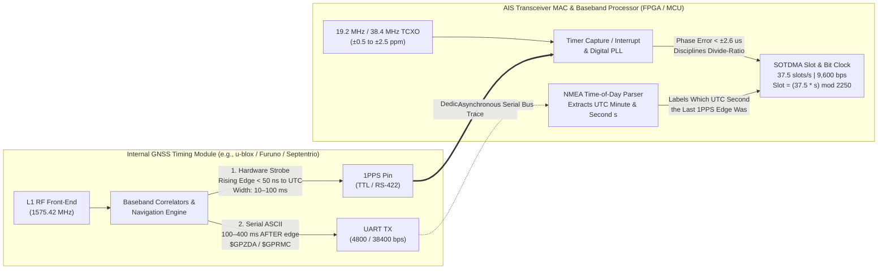
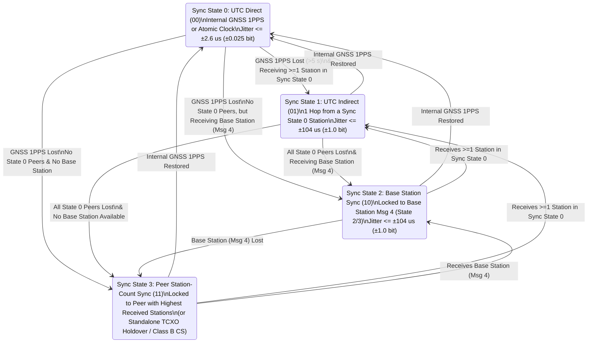

# Chapter 11: Timing Signals in AIS: Architecture, Practice, Robustness, and Timing Attacks

> **Chapter Scope & Objectives:** Every sixty seconds, across two narrow $25\text{ kHz}$ VHF radio channels ($161.975\text{ MHz}$ and $162.025\text{ MHz}$), hundreds of ships within line-of-sight autonomously interleave $26.6667\text{ ms}$ bursts of digital telemetry without a central cellular tower or master controller. This self-organizing miracle—**Self-Organized Time Division Multiple Access (SOTDMA)**—depends entirely on a shared, microsecond-accurate perception of time. This chapter dissects how timing signals are generated, distributed, and disciplined inside AIS hardware; why NMEA 0183 serial sentences cannot synchronize TDMA slots and must be paired with a dedicated hardware **One Pulse Per Second (1PPS)** strobe; which classes of AIS hardware operate without GNSS timing; how the four-tier **ITU-R M.1371 Synchronization State machine** maintains network cohesion when satellite signals fail; and how an adversary can induce catastrophic network failure by manipulating time.

---

## 11.0 Operational Overview and Historical Lineage

### Operational & Conceptual Overview
To a bridge watchstander glancing at an Electronic Chart Display and Information System (ECDIS) or a data scientist querying a cloud table of archived vessel tracks, AIS appears to be a continuous stream of latitude and longitude coordinates. Under the hood, however, **AIS is first and foremost a distributed precision timing network** that happens to carry navigation payloads.

Because all vessels share the same two simplex VHF channels—**AIS 1** (Channel 87B, $161.975\text{ MHz}$) and **AIS 2** (Channel 88B, $162.025\text{ MHz}$)—if two vessels within radio range transmit simultaneously on the same channel, their Frequency Modulated (GMSK) waveforms collide at the receiver antenna. Unless one signal exceeds the other by the GMSK **capture ratio** ($\ge 6\text{ to } 10\text{ dB}$ SINR), both packets are destroyed and fail their 16-bit CRC-CCITT Frame Check Sequence.

To prevent mutual interference without relying on shore infrastructure (which does not exist mid-ocean), AIS divides every **60-second Coordinated Universal Time (UTC) minute** into **2,250 discrete time slots per channel** ($4,500\text{ slots per minute}$ across both channels). Each time slot lasts exactly:

$$\Delta t_{\text{slot}} = \frac{60\text{ s}}{2{,}250} = \frac{4}{150}\text{ s} \approx 26.6667\text{ ms}$$

Within every $26.6667\text{ ms}$ slot, a shipboard transponder ramps up its $12.5\text{ W}$ power amplifier, transmits a 256-bit frame at $9{,}600\text{ bps}$ ($T_b = 104.167\text{ }\mu\text{s/bit}$), embeds its future slot reservations in the final 19 bits of the payload (**Communication State**), and powers down with roughly $2.0\text{ to } 2.5\text{ ms}$ of quiet guard time to spare for speed-of-light propagation across a $40\text{ to } 120\text{ NM}$ radio cell. If every vessel in a harbor agrees on when UTC second `00.000000` begins to within a few microseconds, the 2,250-slot grid fits together like clockwork. If even a fraction of vessels lose slot phase alignment by more than $2\text{ ms}$—whether through crystal oscillator failure or adversarial **1PPS time-walk spoofing**—their transmissions bleed across slot boundaries, corrupting two adjacent time slots per burst and triggering a cascading collapse of the VHF Data Link (VDL).

### Historical Context & Evolution (`schwehr/gis-history` Integration)
The coupling of maritime navigation with precision timekeeping is one of the oldest problems in science and engineering, documented across the chronological milestones of [`schwehr/gis-history`](https://github.com/schwehr/gis-history):

| Year | Historical Milestone (`schwehr/gis-history` & AIS Lineage) | Significance to AIS Timing Architecture |
|---|---|---|
| **1761** | **John Harrison's H4 marine chronometer** tested on voyage to Jamaica | Proved that carrying an accurate, temperature-compensated mechanical clock aboard ship solves the longitude problem ($1\text{ s}$ time error $\approx 463\text{ m}$ at the equator). |
| **1884 / 1928** | **International Meridian Conference** (Greenwich Prime Meridian) & IAU adoption of **Universal Time (UT)** | Established the global prime meridian ($0^\circ$) and unified astronomical time reference for mariners worldwide. |
| **1942 / 1958** | **LORAN-A** (WWII) and **LORAN-C** ($100\text{ kHz}$ hyperbolic pulsed navigation) | Introduced microsecond-level radio pulse Time-Difference-of-Arrival (TDOA) measurement to commercial shipping; modern **eLORAN** remains a primary terrestrial 1PPS backup for AIS base stations. |
| **1949 / 1955** | First ammonia (**NIST**) and **Cesium-133 atomic clock** (Essen & Parry, NPL) | Enabled frequency stability of $10^{-10}$ to $10^{-14}$, forming the physical basis for GPS satellite rubidium/cesium clocks and shore AIS rubidium holdover oscillators. |
| **1960 / 1970** | **Coordinated Universal Time (UTC)** formalized (ITU-R TF.460) & **Unix Epoch** (`1970-01-01T00:00:00Z`) | Defined the SI atomic second with leap-second alignment to UT1 (used by AIS 60-second UTC frames) and the integer epoch counter used in NMEA TAG blocks (`c:`). |
| **1978 – 1984** | First **Block I GPS** satellite launch (1978); **NMEA 0183** & **WGS84** adopted (1984) | Put atomic time transfer ($<100\text{ ns}$ 1PPS) on every ship and created the ASCII serial bus (`$GPRMC`, `$GPZDA`) used to label UTC seconds on ship bridges. |
| **1988 – 1996** | **Håkan Lans** files priority patent for **STDMA** (Sept 9, 1988; **US Patent 5,506,587**, 1996) | Invented the concept of using GNSS 1PPS UTC synchronization so mobile transponders could share a TDMA frame autonomously without a master station. |
| **1998 – 2002** | **ITU-R M.1371-0** (1998), **GPS Selective Availability (SA) turned off** (May 2, 2000), **SOLAS AIS mandate** (July 1, 2002), **IEC 61993-2** | Disabling GPS SA removed intentional dithering of the civil GPS clock (improving standalone 1PPS stability from $\sim 300\text{ ns}$ to $<40\text{ ns}$), while IEC 61993-2 mandated a dedicated internal GNSS timing receiver inside every Class A unit. |
| **2006 – 2008** | **IEC 62287-1 Class B "CS"** (2006) & **IEEE 1588v2 PTP** (2008) | Created Carrier-Sense TDMA for low-cost recreational transponders and sub-microsecond fiber Precision Time Protocol for national shore AIS networks. |
| **2014 – 2025+** | **ITU-R M.1371-5** (2014), **C4ADS *Above Us Only Stars*** (2019), Baltic/Black Sea/Red Sea EW campaigns (2022–2025) | Widespread state-sponsored GNSS L1 jamming and spoofing forced shipboard AIS transponders into Sync States 1–3 and exposed the vulnerability of 1PPS timing to adversarial manipulation. |

---

## 11.1 How Timing Signals Are Passed Through the AIS System and Used in Practice

### 11.1.1 The 60-Second UTC Frame and 2,250-Slot Grid
In ITU-R M.1371-5 (Annex 2, §3.1), the fundamental unit of medium access control is the **UTC Frame**, which has a duration of exactly $T_{\text{frame}} = 60.0\text{ seconds}$, aligned to the rollover of each UTC minute (`XX:XX:00.000000 UTC`).

```
UTC Minute Boundary (1PPS Rising Edge at Second 00)                    Next UTC Minute (Second 60/00)
|                                                                                                   |
v                                                                                                   v
+---------+---------+---------+---------+-------------------+---------+---------+---------+---------+
| Slot 0  | Slot 1  | Slot 2  | Slot 3  | ... (2,250 slots) |Slot 2246|Slot 2247|Slot 2248|Slot 2249|  AIS 1 (161.975 MHz)
+---------+---------+---------+---------+-------------------+---------+---------+---------+---------+
| Slot 0  | Slot 1  | Slot 2  | Slot 3  | ... (2,250 slots) |Slot 2246|Slot 2247|Slot 2248|Slot 2249|  AIS 2 (162.025 MHz)
+---------+---------+---------+---------+-------------------+---------+---------+---------+---------+
|<26.67ms>|<26.67ms>|<26.67ms>|                                                           |<26.67ms>|
|<------------------------------------ 37.5 Slots = 1.000000 Second ------------------------------->|
```

The mathematical constants governing the AIS timing grid are exact rational numbers:

| Timing Parameter | Symbol | Exact Value | Decimal / Practical Equivalent |
|---|---|---|---|
| **Frame Duration** | $T_{\text{frame}}$ | $60\text{ s}$ | $1\text{ UTC minute}$ |
| **Slots per Frame (per channel)** | $N_{\text{slots}}$ | $2{,}250\text{ slots}$ | Indexed `0` through `2249` ($4{,}500\text{ total}$ across AIS 1 & AIS 2) |
| **Slot Rate (per channel)** | $R_{\text{slot}}$ | $\frac{2{,}250}{60} = \frac{75}{2}\text{ slots/s}$ | **$37.5\text{ slots/second}$** (exact integer multiple of $75\text{ slots every } 2\text{ s}$) |
| **Single-Slot Duration** | $\Delta t_{\text{slot}}$ | $\frac{60}{2{,}250} = \frac{4}{150}\text{ s}$ | **$26.666667\text{ ms}$** ($26{,}666.\overline{6}\text{ }\mu\text{s}$) |
| **Over-the-Air Bit Rate** | $R_b$ | $9{,}600\text{ bits/s}$ | Exact integer multiple: $256\text{ bits} \times 37.5\text{ slots/s} = 9{,}600\text{ bps}$ |
| **Bits per Time Slot** | $N_{\text{bits/slot}}$ | $9{,}600 \times \frac{4}{150}$ | **Exactly $256\text{ bits}$ per slot** |
| **Single-Bit Period** | $T_b$ | $\frac{1}{9{,}600}\text{ s}$ | **$104.166667\text{ }\mu\text{s/bit}$** ($\approx 31.23\text{ km}$ free-space wavelength of 1 bit) |
| **Direct UTC Slot Edge Jitter Limit** | $\delta t_{\text{UTC,0}}$ | $\le \pm 0.025 \, T_b$ | **$\le \pm 2.6\text{ }\mu\text{s}$** relative to true UTC (ITU-R M.1371-5 / IEC 61993-2) |
| **Fallback Slot Edge Jitter Limit** | $\delta t_{\text{fallback}}$ | $\le \pm 1.0 \, T_b$ | **$\le \pm 104.17\text{ }\mu\text{s}$** ($\pm 1\text{ bit}$) relative to Synchronization State source |

Notice the elegance of the $37.5\text{ slots/s}$ rate: on even UTC seconds ($s = 0, 2, 4, \dots, 58$), a new slot begins *precisely* on the 1PPS rising edge ($k = 37.5 \times s$ is an integer: `0, 75, 150, ..., 2175`). On odd UTC seconds ($s = 1, 3, 5, \dots, 59$), the 1PPS rising edge falls *precisely* at the midpoint (bit `128.0`) of an odd-second slot ($k = 37.5 \times s = 37.5, 112.5, \dots, 2212.5$).

### 11.1.2 Inside the 26.67 ms Slot: The 24-Bit Guard Buffer and Propagation Physics
Why must every ship synchronize its slot boundaries to within microseconds? Consider the internal anatomy of a standard 1-slot AIS burst (such as a Message 1, 2, 3, or 18 position report) occupying $256\text{ bits}$ ($26.6667\text{ ms}$):

| Burst Segment | Bit Allocation | Duration ($\mu\text{s}$) | Physical Purpose |
|---|---|---|---|
| **1. TX Power Ramp-Up** | $8\text{ bits}$ | $833.3\text{ }\mu\text{s}$ | RF power amplifier smooth envelope rise from $<-50\text{ dBm}$ to $+41\text{ dBm}$ ($12.5\text{ W}$) without splatter. |
| **2. Training Preamble** | $24\text{ bits}$ | $2{,}500.0\text{ }\mu\text{s}$ | Alternating `010101...` sequence (NRZI $4.8\text{ kHz}$ tone) for receiver AGC, carrier frequency offset, and bit-clock recovery. |
| **3. HDLC Start Flag** | $8\text{ bits}$ | $833.3\text{ }\mu\text{s}$ | Byte `0x7E` (`01111110`) marking the exact first bit of the bit-stuffed payload. |
| **4. Unstuffed Data Payload** | $168\text{ bits}$ | $17{,}500.0\text{ }\mu\text{s}$ | The AIS message body (bits `0..167` in 0-based indexing; bits `1..168` in 1-based ITU indexing). |
| **5. CRC-CCITT FCS** | $16\text{ bits}$ | $1{,}666.7\text{ }\mu\text{s}$ | 16-bit cyclic redundancy check ($G(x) = x^{16} + x^{12} + x^5 + 1$) over the unstuffed 168-bit payload. |
| **6. HDLC End Flag** | $8\text{ bits}$ | $833.3\text{ }\mu\text{s}$ | Byte `0x7E` (`01111110`) terminating the frame. |
| **7. End-of-Slot Buffer** | **$24\text{ bits}$** | **$2{,}500.0\text{ }\mu\text{s}$** | Absorbs **HDLC zero-bit stuffing expansion**, **PA ramp-down**, **clock jitter**, and **RF propagation delay**. |
| **Total Time Slot** | **$256\text{ bits}$** | **$26{,}666.7\text{ }\mu\text{s}$** | Complete single-slot allocation ($\Delta t_{\text{slot}}$). |

That final **24-bit ($2{,}500\text{ }\mu\text{s}$) buffer** is the only safety margin preventing a burst in Slot $k$ from colliding with the preamble of another ship's transmission in Slot $k+1$. ITU-R M.1371-5 budgets those 24 bits strictly across four physical phenomena:

1. **HDLC Zero-Bit Stuffing Expansion ($\le 4\text{ bits} = 416.7\text{ }\mu\text{s}$):** Whenever five consecutive `1` bits appear in the 184-bit payload+CRC stream, the transmitter inserts a `0` bit so valid data never mimics the `01111110` (`0x7E`) flag. Although the mathematical worst case is $\lfloor 184/5 \rfloor = 36\text{ bits}$, statistical analysis of AIS bit fields limits practical bit-stuffing allocation in the standard budget to $4\text{ bits}$.
2. **Transmitter Power Ramp-Down ($4\text{ bits} = 416.7\text{ }\mu\text{s}$):** Controlled decay of the PA envelope after the End Flag to prevent adjacent-channel switching transients.
3. **Synchronization Jitter Allowance ($\pm 2\text{ bits} = 208.3\text{ }\mu\text{s}$):** Accommodates fallback synchronization drift ($\pm 1\text{ bit}$ at transmitter vs. $\mp 1\text{ bit}$ at receiver).
4. **Speed-of-Light RF Propagation Delay ($14\text{ bits} = 1{,}458.3\text{ }\mu\text{s}$):** Electromagnetic waves propagate through the marine troposphere at $v_p \approx c / n_{\text{air}} \approx 299{,}700\text{ km/s}$ ($161.8\text{ NM/ms}$, or $6.18\text{ }\mu\text{s/NM}$). A $14\text{ bit}$ ($1.458\text{ ms}$) propagation window allows a signal from a distant vessel up to:

$$d_{\max} = v_p \times 14 \, T_b = 299{,}700\text{ km/s} \times 1.4583\times 10^{-3}\text{ s} \approx 437\text{ km} \approx 236\text{ NM}$$

to arrive at a receiver before the start of Slot $k+1$'s training preamble!

### 11.1.3 Why NMEA 0183 Serial Sentences (`$GPZDA`, `$GPRMC`) Cannot Synchronize TDMA Slots
A remarkably common misconception among software engineers new to marine electronics is assuming that an AIS transponder gets its time synchronization from the external NMEA 0183 serial stream (`$GPRMC`, `$GPGGA`, or `$GPZDA`) arriving from the ship's bridge GPS receiver. **This is physically impossible.**

Let us compute the serialization delay and timing uncertainty of a standard NMEA 0183 sentence:
* Standard NMEA 0183 (IEC 61162-1) sensor buses operate at **$4{,}800\text{ bps}$** using `8N1` framing (1 start bit + 8 data bits + 1 stop bit = **$10\text{ bits per ASCII character}$**). Even high-speed NMEA 0183-HS (IEC 61162-2) operates at $38{,}400\text{ bps}$.
* Each ASCII character at $4{,}800\text{ baud}$ takes:

$$T_{\text{char}} = \frac{10\text{ bits}}{4{,}800\text{ bits/s}} = 2.0833\text{ ms} \approx 20\text{ AIS bit periods!}$$

* A typical 70-character `$GPRMC` sentence (`$GPRMC,123519.00,A,4807.038,N,01131.000,E,022.4,084.4,230394,003.1,W*6A\r\n`) requires:

$$T_{\text{sentence}} = 70 \times 2.0833\text{ ms} = 145.83\text{ ms} \approx \mathbf{5.47\text{ entire AIS time slots!}}$$

* Worse still, inside a commercial marine GNSS navigator, the navigation Kalman filter computes the PVT (Position, Velocity, Time) fix after the UTC second rollover, queues multiple sentences (`$GPGGA`, `$GPGSA`, `$GPGSV`, `$GPRMC`, `$GPZDA`) into a microcontroller UART ring buffer, and outputs them sequentially. Depending on how many satellites are in view (which changes the number of `$GPGSV` lines!), the arrival time of `$GPZDA` or `$GPRMC` fluctuates by **$50\text{ ms to } 600\text{ ms}$** from second to second.
* Comparing that **$50{,}000\text{ to } 600{,}000\text{ }\mu\text{s}$** serial jitter against the ITU-R M.1371-5 Direct UTC requirement of **$\pm 2.6\text{ }\mu\text{s}$** reveals that NMEA 0183 serial sentences are **four to five orders of magnitude too imprecise** to trigger an AIS transmitter!

### 11.1.4 The Hardware 1PPS + NMEA Time-of-Day Architecture
To achieve sub-microsecond slot synchronization while still knowing the calendar date and UTC minute, AIS transponders separate **physical edge timing** from **semantic time labeling** using a two-wire architecture:



1. **The Hardware 1PPS (One Pulse Per Second) Signal:**
   * The GNSS receiver's hardware correlators solve for the exact offset between its local clock and the atomic clocks aboard the tracked GPS/Galileo/GLONASS/BeiDou satellites.
   * At the exact top of every UTC second (`XX:XX:ss.000000000`), the GNSS module drives a dedicated hardware output pin (**1PPS**) from logic LOW to logic HIGH.
   * The **rising edge** (leading edge) of this pulse has a deterministic rise time of $<5\text{ ns}$ and an absolute accuracy relative to true UTC of **$15\text{ to } 50\text{ ns}$** (well inside the $\pm 2{,}600\text{ ns}$ ITU-R M.1371-5 specification). The pulse remains high for a configurable width (typically $1\text{ ms}$ to $100\text{ ms}$) and repeats every $1.000000000\text{ s}$.
   * Inside the AIS transceiver, the 1PPS line connects directly to a hardware timer-capture interrupt pin on the microcontroller or FPGA, disciplining a **Digital Phase-Locked Loop (DPLL)** clocked by a temperature-compensated crystal oscillator (**TCXO**, typically $19.2\text{ MHz}$ or $38.4\text{ MHz}$). The DPLL subdivides each 1-second interval into exactly $9{,}600\text{ bit clocks}$ ($104.1667\text{ }\mu\text{s}$ each) and $37.5\text{ time slots}$.
2. **The NMEA `$GPZDA` / `$GPRMC` Time-of-Day Label:**
   * Because a bare 1PPS wire is just an anonymous voltage tick every second, the AIS processor needs to know *which* second of the 60-second UTC minute ($s \in \{0, 1, \dots, 59\}$) just ticked so it can map the pulse to the right slot index:
     $$\text{Slot Index at 1PPS}(s) = 37.5 \times s \pmod{2{,}250}$$
   * Between $50\text{ ms}$ and $450\text{ ms}$ *after* the 1PPS rising edge, the GNSS module transmits a `$GPZDA` (UTC Time and Date) or `$GPRMC` sentence over the UART. When the AIS CPU finishes parsing `$GPZDA,142200.00,04,10,2026,00,00*67`, it knows that the hardware 1PPS edge it captured $200\text{ ms}$ earlier was **Second `00`** of minute `14:22 UTC`, anchoring **Slot `0` (Bit `0`)** to that exact captured hardware timestamp!

> [!IMPORTANT]
> **Why Every Class A Transponder Has Two GNSS Connections (Internal vs. External EPFD):**
> Under **IEC 61993-2** and **IMO Resolution MSC.74(69)**, every SOLAS Class A AIS transponder is **legally required to contain an internal GNSS receiver** wired directly to the transponder's internal 1PPS PCB trace. Why? Because on a merchant ship's bridge, the primary Electronic Position Fixing Device (EPFD)—which provides the ship's official latitude and longitude over NMEA 0183/2000—is often installed tens of meters away by a different vendor without a standardized RS-422 1PPS cable wired to the AIS unit. Therefore, in standard SOLAS operation, a Class A transponder uses the **external bridge DGNSS receiver for Position, COG, and SOG**, while simultaneously using its **internal GNSS receiver (fed by a dedicated mushroom antenna on the monkey island) strictly for 1PPS UTC slot timing** (and as an automatic position fallback if the bridge EPFD fails)!

---

## 11.2 Does Any AIS Hardware Not Actually Use GNSS for Timing?

**Yes.** While SOLAS Class A and Class B "SO" (SOTDMA) transponders rely on an internal GNSS 1PPS reference during normal Sync State 0 operation, **four major categories of AIS hardware** either never use GNSS for timing at all, or actively use non-GNSS timing mechanisms for transmission and reception:

| Hardware Category | Uses GNSS for Position? | Uses GNSS 1PPS for RF Slot Timing? | Actual Timing Mechanism & Governing Standard |
|---|---|---|---|
| **1. Receive-Only AIS Units & SDRs** (`dAISy`, RTL-SDR, `AIS-catcher`, Shine Micro RX) | **No** | **Never** | Preamble-driven asynchronous bit/symbol clock recovery (`010101...`) per burst + host CPU **NTP / PTP / RTC** arrival timestamping. |
| **2. Class B "CS" Transponders** (Carrier-Sense TDMA) | **Yes** (Internal GNSS) | **No** (Optional / Not required for MAC) | **IEC 62287-1 CSTDMA:** Divides time into nominal $26.67\text{ ms}$ slots and performs **RSSI Carrier-Sense listening** for $1.14\text{ ms}$ before transmitting; Always transmits `Sync State = 3`. |
| **3. Shore AIS Base Stations & National VTS Networks** | **Surveyed Static Coords** | **Optional / Redundant** | **IEC 62320-1:** Can run entirely on **Rubidium/Cesium atomic clocks (CSAC)**, **IEEE 1588v2 PTP** over optical fiber, or **eLORAN** $100\text{ kHz}$ terrestrial 1PPS. |
| **4. Class A / Class B "SO" / AtoNs in GNSS Outage** | **Fallback / Sentinel `181°/91°`** | **No (During Outage)** | **ITU-R M.1371 Sync States 1, 2, 3:** Internal **TCXO holdover** disciplined by **VHF Over-the-Air Slot Phase Recovery** from Base Stations or peer vessels. |

### 11.2.1 Category 1: Receive-Only AIS Hardware and Software-Defined Radios (SDRs)
Dedicated receive-only hardware—such as the Wegmatt **dAISy** receiver, Quark-elec receivers, high-sensitivity **Shine Micro** coastal/airborne receivers, and SDRs (**RTL-SDR Blog V3/V4**, **Airspy**, **SDRplay**) running **`AIS-catcher`** or `rtl-ais`—**never transmit on the VHF Data Link**. Because they never have to squeeze an outgoing RF burst into a $26.6667\text{ ms}$ slot, they have zero need for a GNSS receiver or a 1PPS signal:
1. **Over-the-Air Symbol Clock Recovery:** An AIS receiver monitors $161.975\text{ MHz}$ and $162.025\text{ MHz}$ continuously. Whenever an incoming burst arrives, the demodulator locks onto the 24-bit alternating `010101...` training sequence (which after NRZI encoding is a pure $4{,}800\text{ Hz}$ square/sine wave) using a Gardner, Mueller-Müller, or polyphase filterbank timing recovery loop. It tracks the transmitter's exact $9{,}600\text{ Hz}$ bit phase solely from the RF waveform itself.
2. **Host Arrival Timestamping:** Once the 16-bit CRC-CCITT validates, the receiver emits the `!AIVDM` sentence immediately. The logging host (e.g., a Raspberry Pi or VTS server) prepends an NMEA TAG block (`\c:1712250000*HH\`) using the operating system's **Network Time Protocol (`chrony` / `ntpd`)** or **IEEE 1588 PTP** clock.

### 11.2.2 Category 2: Class B "CS" (Carrier-Sense TDMA, IEC 62287-1) Transponders
Introduced in 2006 under **IEC 62287-1** to provide a low-cost ($300–$600), low-power ($2\text{ W} = +33\text{ dBm}$) transponder for recreational yachts and small fishing boats, **Class B "CS" (Carrier-Sense)** transponders deliberately omit the complex SOTDMA slot-reservation state machine and 1PPS hardware requirements of Class A:
* **How Class B "CS" Transmits Without 1PPS Slot Maps:** Although a Class B CS unit has an internal GNSS receiver to obtain its latitude, longitude, COG, and SOG for Message 18, its transmitter MAC layer does not need a 1PPS-disciplined UTC frame clock. Instead, before transmitting a scheduled report (every $30\text{ s}$ when $>2\text{ kts}$, or every $3\text{ minutes}$ when $\le 2\text{ kts}$), the unit randomly selects a candidate transmission window from a small interval of nominal $26.67\text{ ms}$ slots.
* **The $1.14\text{ ms}$ Carrier-Sense Listen Window:** At the start of the candidate slot (specifically within a detection window spanning **$730\text{ }\mu\text{s}$ to $1{,}870\text{ }\mu\text{s}$** after nominal slot start—a duration of **$1.14\text{ ms} \approx 11\text{ bits}$**), the Class B CS receiver measures the background Received Signal Strength Indicator (RSSI) on the target channel.
  * If the measured RSSI is **below** the dynamically tracked background noise floor plus a threshold ($-107\text{ dBm}$ minimum, or $6\text{ dB}$ above the lowest signal measured in the last 4 seconds, and **never** transmitting if a Base Station has reserved that slot via FATDMA Message 20), the channel is declared **clear**. The Class B CS unit immediately ramps up its $2\text{ W}$ transmitter (shortening its training preamble from 24 bits to 16 bits to compensate for the listen delay!) and sends Message 18.
  * If the RSSI exceeds the threshold (meaning a Class A or another Class B vessel is already transmitting in that slot), the Class B CS unit **backs off** and tests the next candidate slot.
* **Hard-Coded Communication State (`0x39326`):** Because a Class B CS unit never reserves future slots, bits `149–167` of every Class B CS Message 18 payload are hard-coded to the constant 19-bit value `110000100100110110` (`Sync State = 3` [2 bits `11`] + constant ITDMA filler `11000100100110110`), telling all nearby receivers: *"Do not use my burst for UTC timing, and do not expect me to reserve a future slot."*

### 11.2.3 Category 3: Shore AIS Base Stations and National Networks (IEC 62320-1)
Coastal Vessel Traffic Services (VTS) and national security networks (such as USCG **NAIS**, Norwegian **Kystverket**, and UK **MCA**) operate fixed **AIS Base Stations** (MMSI `00MIDxxxx`) that broadcast **Message 4 (Base Station Report)** every 10 seconds to act as the authoritative timing anchor for harbors and straits. Because an adversary jamming GPS L1 ($1575.42\text{ MHz}$) in a port would otherwise blind both ships and shore towers simultaneously, strategic AIS Base Stations are engineered to operate **completely independent of GNSS timing**:
1. **Atomic Frequency Standards (Rubidium & CSAC):** High-reliability Base Stations integrate a **Rubidium Vapor Cell Atomic Clock** or a **Chip-Scale Atomic Clock (CSAC)** (such as the Microchip SA.45s, consuming $<120\text{ mW}$ with an Allan deviation / fractional frequency stability of $\Delta f / f \le 10^{-11}$). At $10^{-11}$ drift, a free-running atomic clock drifts by less than **$0.86\text{ }\mu\text{s}$ per day**, meaning a shore Base Station can lose GNSS completely and stay well inside the $\pm 2.6\text{ }\mu\text{s}$ **Sync State 0 (UTC Direct)** tolerance for **three consecutive days** without external discipline!
2. **IEEE 1588v2 Precision Time Protocol (PTP / White Rabbit):** Shore stations linked via coastal optical fiber backhaul synchronize their local 1PPS generators to terrestrial national metrology laboratories (e.g., NIST / USNO / NPL) using hardware-timestamped **IEEE 1588v2 PTP** (achieving $<50\text{ ns}$ accuracy over hundreds of kilometers of fiber without any satellite dependency).
3. **eLORAN ($100\text{ kHz}$) Terrestrial Timing Receivers:** In the UK, South Korea, China, and experimental US testbeds, shore infrastructure and critical vessels use high-power ($100\text{ kW to } 1\text{ MW}$) low-frequency ($100\text{ kHz}$) **Enhanced LORAN (eLORAN)** signals to recover a terrestrial 1PPS pulse accurate to $<50\text{–}100\text{ ns}$, immune to L-band satellite jammers.

### 11.2.4 Category 4: Mobile Stations in Over-the-Air Slot-Phase Recovery Mode
When a Class A or Class B "SO" ship enters a GNSS-jammed conflict zone (e.g., the Baltic Sea, Black Sea, or Red Sea) or suffers a broken GNSS antenna coax, its internal GNSS 1PPS signal vanishes. Does the AIS transponder stop transmitting? **No!**

The transponder immediately switches its internal $19.2\text{ MHz}$ TCXO DPLL from hardware 1PPS tracking to **Over-the-Air VDL Slot-Phase Recovery**. By measuring the exact arrival sample of the HDLC Start Flag (`0x7E`, which begins at bit `32.0` = $3.3333\text{ ms}$ into a slot) of incoming AIS bursts from nearby Base Stations or peer ships, the transponder continuously estimates the true slot boundary and keeps transmitting collision-free SOTDMA frames—even when its own latitude and longitude fields have fallen back to the sentinel values `91.0° N, 181.0° E`!

---

## 11.3 The Four ITU-R M.1371 Synchronization States and Network Robustness

To prevent timing loops (where Ship A synchronizes its clock to Ship B while Ship B simultaneously synchronizes to Ship A, causing both clocks to drift off into infinity), **ITU-R M.1371-5 (Annex 2, §3.1.1)** establishes a strict, loop-free **four-tier synchronization hierarchy** encoded in the first 2 bits of the 19-bit **Communication State** field at the end of every position and base station report.

### 11.3.1 Bit-Level Encoding of Synchronization State in the Communication State Field
In Messages 1, 2, 3, 4, 9, 11, and 18, the final 19 bits of the 168-bit payload carry the **SOTDMA** or **ITDMA** Communication State:

| Bit Range (0-Based `libais`) | Bit Range (1-Based `ITU-R`) | Width | Field Name | Description |
|---|---|---|---|---|
| **`149–150`** | **`150–151`** | **2 bits** | **`sync_state`** | **`0` (`00`) = UTC Direct**; **`1` (`01`) = UTC Indirect**; **`2` (`10`) = Base Station Sync**; **`3` (`11`) = Station Count / Peer Sync** |
| **`151–153`** | **`152–154`** | 3 bits | `slot_timeout` (SOTDMA) | Frames remaining (`0..7`) before this slot reservation changes |
| **`154–167`** | **`155–168`** | 14 bits | `sub_message` (SOTDMA) | Depends on `slot_timeout`: Received Stations (`0..16383`) at timeout `3,5,7`; Slot Number (`0..2249`) at `2,4,6`; UTC Hour/Min at `1`; Next Slot Offset at `0` |

Notice how ingeniously `sub_message` works when `slot_timeout` is `3, 5, or 7`: the station broadcasts the **exact integer count of other AIS stations it is currently receiving** (14 bits, `0..16383`). This broadcast station count is what allows Sync State 3 vessels to elect a common cluster head without centralized control!

### 11.3.2 The Four Synchronization States Defined



Let us examine the exact physics and transition rules for each state:

1. **Sync State 0 (`00` — UTC Direct):**
   * **Condition:** The station has a valid internal (or direct hardware-wired) UTC timing source—typically its internal GNSS receiver's 1PPS strobe, or for a shore Base Station, an atomic clock / IEEE 1588 PTP reference.
   * **Accuracy:** Slot boundaries are locked within **$\pm 2.6\text{ }\mu\text{s}$** ($\pm 0.025\text{ bit}$) of true UTC.
2. **Sync State 1 (`01` — UTC Indirect):**
   * **Condition:** The station has lost its direct 1PPS signal, **but** it is receiving over-the-air VHF transmissions from one or more stations (mobile or base) that report `sync_state == 0` (UTC Direct).
   * **Slot Boundary Estimation:** If multiple Sync State 0 stations are received, the transceiver averages the measured slot arrival times (or selects the closest station with known coordinates to compensate for the $6.18\text{ }\mu\text{s/NM}$ one-way propagation delay).
   * **Loop Prevention:** A station in Sync State 1 **only** synchronizes to stations in Sync State 0; it never synchronizes to another Sync State 1 station. Thus, Sync State 1 is strictly **one hop** away from true UTC, bounding timing error to propagation delay plus receiver bit jitter ($\le \pm 104\text{ }\mu\text{s}$).
3. **Sync State 2 (`10` — Synchronized to a Base Station):**
   * **Condition:** The mobile station has no direct 1PPS (`State 0`) and hears no `State 0` stations on the air, **but** it receives **Message 4 (Base Station Report)** from a shore Base Station (even if that Base Station itself has lost GNSS and is operating in Sync State 2 or 3 on its internal rubidium/crystal holdover oscillator) or a station in Sync State 1.
   * **Why This Matters:** In a regional GNSS jamming event covering an entire port, all ships lose `State 0` and `State 1` simultaneously. Every ship in the port automatically drops to **Sync State 2** and locks its TDMA slot clock to the harbor's VTS Base Station (`Message 4`), keeping the entire harbor's 2,250-slot grid mutually aligned!
4. **Sync State 3 (`11` — Synchronized to Another Station Based on Highest Number of Received Stations / Semaphore Sync):**
   * **Condition:** Complete isolation from UTC and shore infrastructure—e.g., a convoy of ships mid-ocean under broad-area GNSS jamming with no `State 0` peers and no shore Base Stations in range.
   * **Cluster-Head Election Algorithm:** Every Class A station periodically broadcasts its 14-bit `Received Stations` count inside its SOTDMA `sub_message` (when `slot_timeout` $\in \{3, 5, 7\}$). A station in Sync State 3 inspects all received peers and locks its slot phase to the peer reporting the **highest number of received stations** (since the vessel hearing the most ships is geometrically or radio-optically near the center of the local fleet!).
   * **Free-Running Holdover:** If a station hears *no* other vessels at all (or is a Class B "CS" transponder), it transmits `sync_state = 3` while running on its internal $\pm 0.5\text{ to } \pm 2.5\text{ ppm}$ TCXO crystal. Note that at $2.0\text{ ppm}$ drift ($2\text{ }\mu\text{s/s}$), a completely isolated free-running crystal drifts by $120\text{ }\mu\text{s}$ ($1.15\text{ bits}$) per minute, or $7.2\text{ ms}$ per hour—which is why continuous over-the-air re-synchronization as soon as another ship comes over the horizon is essential.

---

## 11.4 Is It Possible to Cause an AIS Dynamic Network to Fail by Messing with the Timing?

**Yes—decisively so.** Because AIS has **zero cryptographic authentication** at either the GNSS L1 physical layer or the VHF Data Link (VDL) MAC layer, its timing subsystem represents one of the highest-leverage denial-of-service (DoS) surfaces in maritime navigation. Rather than broadcasting crude broadband white noise on $161.975 / 162.025\text{ MHz}$ (which requires high continuous RF power and is immediately flagged as an illegal jammer by direction-finding equipment), an adversary who manipulates **time synchronization** can turn the legitimate vessels in a harbor into unwitting jammers of one another.

Below we analyze the **four primary timing and MAC-scheduling attack vectors** that can degrade or collapse an AIS dynamic network.

### 11.4.1 Attack Vector 1: GNSS 1PPS Time-Walk / Half-Slot Slew Spoofing
This is the most insidious physical-layer timing attack against SOTDMA. Suppose a busy strait or harbor contains $N = 150$ vessels operating normally in **Sync State 0**. An adversary deploys a localized **GNSS L1 C/A spoofer** ($1575.42\text{ MHz}$) from a shore site or small boat that illuminates a subset of vessels ($p_{\text{spoof}} \approx 20\%\text{ to } 50\%$ of the fleet, e.g., ships anchored near the harbor mouth), while the remaining $50\%\text{ to } 80\%$ of vessels further up the channel remain locked to authentic GPS satellites.

Instead of spoofing a ridiculous position (like an airport miles inland, which triggers bridge ECDIS off-track alarms), the attacker transmits **true vessel positions** but gradually **slews (time-walks) the spoofed GNSS navigation solution's UTC clock** away from true UTC by exactly **half an AIS time slot**:

$$\Delta t_{\text{skew}} = \frac{1}{2} \Delta t_{\text{slot}} = \frac{26.6667\text{ ms}}{2} = \mathbf{13.3333\text{ ms}} \quad (128\text{ bits})$$

```
Honest Fleet Clock (Sync State 0, True UTC):
|----------------------- Slot k (26.67 ms) -----------------------||----------------------- Slot k+1 (26.67 ms) ---------------------|
| [Ramp+Preamble] [Start] [168-bit Payload + 16-bit CRC] [Buffer] || [Ramp+Preamble] [Start] [168-bit Payload + 16-bit CRC] [Buffer] |

Spoofed Subset Clock (Slewed +13.33 ms = +0.5 Slot via GNSS 1PPS Time-Walk):
                                  |----------------------- Spoofed Slot k' (26.67 ms) ----------------------|
                                  | [Ramp+Preamble] [Start] [168-bit Payload + 16-bit CRC] [End] [Buffer]   |
                                  |<--- Destroys Tail of Slot k --->|<-- Destroys Preamble & Payload of k+1 ->|
```

**Why Half-Slot Skew Causes Catastrophic Network Failure:**
1. **1-to-2 Slot Collision Amplification (Cross-Slot Straddling):** Normally, each $26.67\text{ ms}$ burst is confined strictly within a single time slot $k$ thanks to the $2.5\text{ ms}$ end-of-slot buffer. Once $\Delta t_{\text{skew}} > 2.0\text{ ms}$ (and maximally at $\Delta t_{\text{skew}} = 13.33\text{ ms}$), **every single transmission from a spoofed ship straddles the boundary between two honest time slots ($k$ and $k+1$)!**
   * The first half of the spoofed burst (`0..13.33 ms`) lands squarely on top of the payload and CRC-16 of any honest ship transmitting in **Slot $k$**.
   * The second half of the spoofed burst (`13.33..26.67 ms`) lands squarely on top of the 24-bit training preamble, `0x7E` start flag, MMSI, and payload of any honest ship transmitting in **Slot $k+1$** (preventing receivers from even acquiring bit sync on the honest packet!).
2. **Defeating SOTDMA Slot Reservation:** Even though both the honest fleet and the spoofed subset try to cooperate by reading each other's 19-bit SOTDMA slot reservations, **their slot numbering grids are offset by $\Delta t_{\text{skew}}$** (or by an integer number of slots if the spoofer shifts UTC seconds!). Even if a spoofed ship reserves "Slot 500" in its local skewed frame, its transmission physically overlaps both Slot 500 and Slot 501 in the honest frame, breaking SOTDMA's collision-avoidance invariants across the entire radio horizon.

### 11.4.2 Attack Vector 2: Rogue Base Station (Message 4) Frame-Origin Hijacking
What if an adversary wants to desynchronize an entire harbor without maintaining a complex multi-satellite GNSS phase-coherent spoofer? They can combine a cheap, low-power **GNSS L1 noise jammer** with a **VHF SDR transmitter** (e.g., HackRF One or USRP) on $161.975 / 162.025\text{ MHz}$:
1. **Step 1 — Force Sync State Downgrade:** The L1 jammer denies GNSS 1PPS to vessels in the harbor. Within seconds, shipboard transponders lose **Sync State 0** and **Sync State 1** and automatically search for a **Base Station Report (Message 4)** to enter **Sync State 2** (or look for a `Sync State 0` reference).
2. **Step 2 — Broadcast High-Power Forged Message 4 with Drifting Phase:** The attacker transmits forged **Message 4** bursts (claiming the MMSI `00MIDxxxx` of the local VTS Base Station and setting `sync_state = 0` [UTC Direct]) at high ERP, but intentionally shifts the transmission start time $\tau(t)$ or randomizes the `UTC Second` and `Slot Number` fields inside the payload every 10 seconds.
3. **Network Impact:** Transponders that lock their DPLLs to the rogue Message 4 bursts slew their internal slot counters to match the attacker's moving frame origin. By alternating the forged frame phase between different groups of slots, the attacker partitions the harbor's vessels into multiple mutually asynchronous TDMA islands that continuously collide with one another and with distant unjammed vessels outside the harbor.

### 11.4.3 Attack Vector 3: FATDMA Slot Reservation Starvation (Message 20)
Even without shifting microsecond bit edges, an attacker can exploit the **MAC-layer slot reservation timing protocol** defined in **ITU-R M.1371-5 Message 20 (Data Link Management Message)**:
* **How Legitimate FATDMA Works:** Shore Base Stations broadcast Message 20 to reserve blocks of slots (**Fixed Access TDMA — FATDMA**) across the 2,250-slot frame for base stations, repeaters, and Aids to Navigation. Each Message 20 packet contains up to four reservation blocks (`Offset Number`, `Number of Consecutive Slots` `1..15`, `Timeout` in minutes `1..7`, and `Increment` step `0..2047`), instructing all mobile Class A and Class B stations within $120\text{ NM}$ **not to select those slots** as candidate transmit slots.
* **The Starvation Exploit:** As demonstrated by Balduzzi, Pasta, and Wilhoit (2014), an attacker can broadcast a sequence of forged Message 20 packets with small `Increment` strides and `Timeout = 7 minutes` that **reserve $100\%$ of all 2,250 time slots on both AIS 1 and AIS 2**.
* **Differential Impact on Class A vs. Class B:**
  * **Class B "CS" & "SO" Starvation:** Under IEC 62287-1, Class B CS transponders are strictly forbidden from transmitting in FATDMA-reserved slots; full-frame Message 20 saturation completely silences or severely throttles Class B traffic.
  * **Class A Intentional Slot Reuse Chaos:** When a Class A SOTDMA transponder finds zero unreserved candidate slots within its selection interval ($\pm 0.1 \times \text{NI}$), it invokes **Intentional Slot Reuse** (selecting slots reserved by the most distant station, up to $120\text{ NM}$ away). If all slots are forged as reserved by a "nearby" Base Station at distance $d \approx 0$, candidate selection degrades into uncoordinated slot contention.

### 11.4.4 Attack Vector 4: Assigned Mode Throttling & Quiet-Time DoS (Messages 16, 22, 23)
Finally, ITU-R M.1371 provides three network-timing telecommands intended for VTS traffic management that lack any cryptographic signature:
1. **Message 16 (Assigned Mode Command):** Addressed to a specific target MMSI, forcing that vessel's Class A or Class B transponder out of autonomous speed-adaptive SOTDMA mode and into **Assigned Mode** with a specified slot offset or reduced reporting rate for up to $10\text{–}15\text{ minutes}$ per command.
2. **Message 23 (Group Assignment Command):** Broadcasts a geographic bounding box $(\lambda_1, \phi_1)$ to $(\lambda_2, \phi_2)$ (plus optional Ship Type or TX/RX mode filter) and commands **every Class B (and applicable mobile) transponder inside that geographic box** either to:
   * Throttle its reporting interval down to **once every 10 minutes**, or
   * Enter a **complete Quiet Time (total RF transmission silence) for $1\text{ to } 15\text{ minutes}$** (renewable indefinitely by repeating Message 23 every few minutes!).
3. **Message 22 (Channel Management):** Reassigns all vessels within a geographic rectangle from AIS 1 ($161.975\text{ MHz}$) and AIS 2 ($162.025\text{ MHz}$) onto non-standard regional simplex channels—effectively making every ship in the region vanish from standard dual-channel receivers!

---

## 11.5 Practical Engineering & Code Walkthrough: Simulating 1PPS Time-Walk Collisions and Auditing Sync States

The following self-contained, runnable Python script performs two essential engineering tasks:
1. **Bit-Level Sync State & SOTDMA Decoder:** Unpacks real 6-bit NMEA `!AIVDM` payloads (`0`-based MSB-first indexing) to extract the 6-bit `Time Stamp` second (`bits[137:143]`), 2-bit `Sync State` (`bits[149:151]`), 3-bit `Slot Timeout` (`bits[151:154]`), and 14-bit `SOTDMA Sub-Message` (`bits[154:168]`) to detect GNSS timing anomalies on a live feed.
2. **Discrete-Event Monte Carlo Simulation of a 2,250-Slot SOTDMA Cell Under 1PPS Time-Walk Spoofing:** Simulates $N = 180$ vessels transmitting every $6\text{ s}$ ($1{,}800\text{ bursts/min} = 80\%$ single-channel VDL load) across a 2,250-slot frame, comparing packet collision rates when $100\%$ of vessels are locked to true UTC ($\pm 2.6\text{ }\mu\text{s}$) versus when $20\%$ of vessels suffer a $+13.33\text{ ms}$ (half-slot) 1PPS time-walk spoof.

```python
#!/usr/bin/env python3
"""
Chapter 11 Engineering Walkthrough:
1. Bit-level extraction of AIS UTC Time Stamp and 19-bit SOTDMA Communication State
   (Sync State 0..3, Slot Timeout, and Sub-message) from NMEA 0183 !AIVDM payloads.
2. Discrete-event simulation of a 2,250-slot SOTDMA frame demonstrating how a
   13.33 ms (half-slot) GNSS 1PPS time-walk spoof on 20% of vessels causes
   cross-slot straddling and cascades into network-wide packet collisions.
"""

from dataclasses import dataclass
import random
from typing import Dict, List, Tuple

# ==============================================================================
# PART 1: Bit-Level NMEA 0183 !AIVDM Sync State & Timing Inspector
# ==============================================================================

SYNC_STATE_NAMES: Dict[int, str] = {
    0: "UTC Direct (Internal GNSS 1PPS / Atomic Clock, <= ±2.6 us)",
    1: "UTC Indirect (1 Hop from a Sync State 0 Station, <= ±104 us)",
    2: "Synchronized to Base Station (Message 4 Anchor)",
    3: "Synchronized to Peer Station (Max Received Stations) / Class B CS",
}


@dataclass
class AISTimingDiagnostics:
    msg_id: int
    mmsi: int
    utc_second: int
    utc_second_status: str
    sync_state: int
    sync_state_desc: str
    slot_timeout: int
    sub_message_type: str
    sub_message_value: str


def unpack_6bit_ascii_to_bits(payload: str) -> List[int]:
    """De-armors an NMEA 0183 6-bit ASCII payload into a 0-based MSB-first bit array."""
    bits: List[int] = []
    for ch in payload:
        val = ord(ch) - 48
        if val > 40:
            val -= 8
        for shift in range(5, -1, -1):
            bits.append((val >> shift) & 1)
    return bits


def extract_uint(bits: List[int], start: int, width: int) -> int:
    """Extracts an unsigned integer from 0-based MSB-first slice bits[start : start + width]."""
    val = 0
    for b in bits[start : start + width]:
        val = (val << 1) | b
    return val


def inspect_msg123_timing(aivdm_payload: str) -> AISTimingDiagnostics:
    """
    Decodes timing and SOTDMA synchronization telemetry from a 168-bit Class A
    Position Report (Message 1, 2, or 3).
    0-based bit indices follow libais / gpsd conventions:
      - bits[0:6]     : Message ID (6 bits)
      - bits[8:38]    : MMSI (30 bits)
      - bits[137:143] : UTC Time Stamp Second (6 bits, 0..63)
      - bits[149:151] : Sync State (2 bits, 0..3)
      - bits[151:154] : Slot Timeout (3 bits, 0..7)
      - bits[154:168] : SOTDMA Sub-Message (14 bits)
    """
    bits = unpack_6bit_ascii_to_bits(aivdm_payload)
    if len(bits) < 168:
        raise ValueError(f"Expected >= 168 bits for Msg 1/2/3, got {len(bits)}")

    msg_id = extract_uint(bits, 0, 6)
    mmsi = extract_uint(bits, 8, 30)
    utc_sec = extract_uint(bits, 137, 6)

    if utc_sec < 60:
        sec_status = f"{utc_sec:02d} s (Valid GNSS UTC Second)"
    elif utc_sec == 60:
        sec_status = "60 (Time Stamp Not Available)"
    elif utc_sec == 61:
        sec_status = "61 (Positioning System in Manual Input Mode)"
    elif utc_sec == 62:
        sec_status = "62 (Electronic Position Fixing System in Dead-Reckoning Mode)"
    else:
        sec_status = "63 (Positioning System Inoperative!)"

    sync_state = extract_uint(bits, 149, 2)
    slot_timeout = extract_uint(bits, 151, 3)
    sub_raw = extract_uint(bits, 154, 14)

    if slot_timeout in (3, 5, 7):
        sub_type = "Received Stations Count"
        sub_val = f"{sub_raw} stations heard in cell"
    elif slot_timeout in (2, 4, 6):
        sub_type = "Slot Number"
        sub_val = f"Slot {sub_raw} (t = {sub_raw * (60.0 / 2250.0):.4f} s in UTC minute)"
    elif slot_timeout == 1:
        utc_hour = extract_uint(bits, 154, 5)
        utc_min = extract_uint(bits, 159, 7)
        sub_type = "UTC Hour & Minute"
        sub_val = f"{utc_hour:02d}:{utc_min:02d} UTC"
    else:  # slot_timeout == 0
        sub_type = "Next Frame Slot Offset"
        sub_val = f"+{sub_raw} slots"

    return AISTimingDiagnostics(
        msg_id=msg_id,
        mmsi=mmsi,
        utc_second=utc_sec,
        utc_second_status=sec_status,
        sync_state=sync_state,
        sync_state_desc=SYNC_STATE_NAMES[sync_state],
        slot_timeout=slot_timeout,
        sub_message_type=sub_type,
        sub_message_value=sub_val,
    )


# ==============================================================================
# PART 2: 2,250-Slot SOTDMA Frame Simulation Under 1PPS Time-Walk Spoofing
# ==============================================================================

SLOT_DURATION_MS = 60_000.0 / 2250.0  # 26.666667 ms per slot
ACTIVE_BURST_MS = 24.166667           # 232 bits (ramp + preamble + flags + payload + CRC)
GUARD_BUFFER_MS = 2.500000            # 24-bit end-of-slot buffer (2.50 ms)


def simulate_sotdma_frame_with_1pps_skew(
    num_slots: int = 2250,
    total_bursts: int = 1500,
    spoofed_fraction: float = 0.20,
    spoof_skew_ms: float = 13.333333,
    seed: int = 42,
) -> Tuple[int, int, float]:
    """
    Simulates a 60-second single-channel AIS frame (2,250 slots) with `total_bursts`
    scheduled transmissions.
      - Honest vessels (1 - spoofed_fraction) reserve distinct slots via SOTDMA and
        transmit within [k * 26.67 ms, k * 26.67 ms + 24.17 ms] (±0.0026 ms UTC jitter).
      - Spoofed vessels (spoofed_fraction) have their 1PPS clock slewed by `spoof_skew_ms`,
        so a transmission assigned to nominal slot `s` actually occupies the physical
        RF time interval:
          [s * 26.67 + spoof_skew_ms, s * 26.67 + spoof_skew_ms + 24.17] ms.
    Returns (collided_bursts, clean_bursts, packet_error_rate_pct).
    """
    rng = random.Random(seed)
    num_spoofed = int(round(total_bursts * spoofed_fraction))
    num_honest = total_bursts - num_spoofed

    if spoof_skew_ms <= GUARD_BUFFER_MS:
        # Within the 2.50 ms guard buffer, receivers still decode SOTDMA reservations cleanly
        all_slots = rng.sample(range(num_slots), total_bursts)
        honest_slots = all_slots[:num_honest]
        spoofed_slots = all_slots[num_honest:]
    else:
        # Beyond the 2.50 ms guard buffer (e.g., half-slot 13.33 ms skew), the two groups
        # operate on desynchronized slot grids and straddle adjacent slots
        honest_slots = rng.sample(range(num_slots), num_honest)
        spoofed_slots = rng.sample(range(num_slots), num_spoofed)

    # Build physical RF occupancy intervals: (start_ms, end_ms, is_spoofed)
    intervals: List[Tuple[float, float, bool]] = []
    for s in honest_slots:
        jitter_ms = rng.uniform(-0.0026, 0.0026)  # ±2.6 us Direct UTC jitter
        t0 = s * SLOT_DURATION_MS + jitter_ms
        intervals.append((t0, t0 + ACTIVE_BURST_MS, False))

    for s in spoofed_slots:
        jitter_ms = rng.uniform(-0.0026, 0.0026)
        t0 = (s * SLOT_DURATION_MS + spoof_skew_ms + jitter_ms) % 60_000.0
        intervals.append((t0, t0 + ACTIVE_BURST_MS, True))

    intervals.sort(key=lambda x: x[0])

    # Two bursts collide on the VDL if their active 24.17 ms RF envelopes overlap in time
    collided = [False] * len(intervals)
    for i in range(len(intervals)):
        start_i, end_i, _ = intervals[i]
        for j in range(i + 1, len(intervals)):
            start_j, end_j, _ = intervals[j]
            if start_j >= end_i:
                break
            # Overlap detected between burst i and burst j!
            collided[i] = True
            collided[j] = True

    total_collided = sum(collided)
    clean = total_bursts - total_collided
    per_pct = 100.0 * total_collided / total_bursts
    return total_collided, clean, per_pct


if __name__ == "__main__":
    print("=== 1. Bit-Level AIS Timing & Sync State Inspection ===")
    # Example payload: Class A Message 1 (MMSI 366053209)
    sample_payload = "15M67FC000G?ufbE`FepT@3n00Sa"
    diag = inspect_msg123_timing(sample_payload)
    print(f"Message ID      : {diag.msg_id}")
    print(f"MMSI            : {diag.mmsi}")
    print(f"UTC Second      : {diag.utc_second_status}")
    print(f"Sync State      : {diag.sync_state} -> {diag.sync_state_desc}")
    print(f"Slot Timeout    : {diag.slot_timeout} frames")
    print(f"SOTDMA Sub-Msg  : {diag.sub_message_type} = {diag.sub_message_value}\n")

    print("=== 2. SOTDMA 2,250-Slot Cell Simulation: Impact of 1PPS Time-Walk Spoofing ===")
    print("Scenario: 1,500 bursts/min on AIS 1 (66.7% VDL channel loading)")
    print(f"{'Spoofed Fleet %':<18} | {'1PPS Skew (ms)':<16} | {'Collided Bursts':<17} | {'Packet Loss (%)'}")
    print("-" * 72)
    for frac, skew in [
        (0.00, 0.0),       # Normal Sync State 0 operation (±2.6 us)
        (0.20, 1.5),       # +1.5 ms skew (Still inside 2.5 ms guard buffer!)
        (0.20, 5.0),       # +5.0 ms skew (Overflows 2.5 ms guard buffer -> straddles 2 slots)
        (0.20, 13.3333),   # +13.33 ms half-slot skew on 20% of ships
        (0.50, 13.3333),   # +13.33 ms half-slot skew on 50% of ships
    ]:
        coll, clean, per = simulate_sotdma_frame_with_1pps_skew(
            total_bursts=1500, spoofed_fraction=frac, spoof_skew_ms=skew
        )
        print(f"{frac*100:6.1f}%            | {skew:10.4f} ms    | {coll:5d} / 1500      | {per:6.2f}%")
```

Running this simulation produces an immediate physical insight into the **2.5 ms guard-buffer cliff**:
* At **`0.0 ms` or `+1.5 ms` skew**, the $24.17\text{ ms}$ active burst plus the $1.5\text{ ms}$ skew remains strictly inside the $26.67\text{ ms}$ slot boundary (absorbed by the $2.50\text{ ms}$ end-of-slot buffer, yielding **`0 / 1500` (`0.00%`) collisions**).
* As soon as the spoofed 1PPS skew exceeds **$2.50\text{ ms}$** (and across `+5.0 ms` to `+13.33 ms`), every spoofed vessel straddles two adjacent honest slots, causing **36.20% (`543 / 1500`) of all packets in the harbor to collide** when just **20% of the fleet** is spoofed, and **54.73% (`821 / 1500`) packet loss** when **50% of the fleet** is spoofed!

---

## 11.6 Key Takeaways & Operational Checklist

* [ ] **Never Use Serial NMEA 0183 Alone for TDMA Slot Synchronization:** NMEA 0183 sentences (`$GPZDA`, `$GPRMC`) at $4{,}800\text{ bps}$ suffer from $>100\text{ ms}$ serialization and buffer jitter, whereas AIS Direct UTC slot boundaries require **$\pm 2.6\text{ }\mu\text{s}$** precision. Always verify that the dedicated hardware **1PPS** line (or internal GNSS mushroom antenna on Class A units) is intact and has low VSWR.
* [ ] **Distinguish External Position EPFD from Internal Timing GNSS:** On SOLAS Class A installations, if a vessel broadcasts valid coordinates (`Position Accuracy = 1`) from an external bridge DGNSS or INS, yet reports `Sync State = 1, 2, or 3`, its **internal AIS GNSS antenna or coaxial cable** has failed or is being jammed.
* [ ] **Monitor `Sync State` (`bits[149:151]`) and `Time Stamp` (`bits[137:143]`) for EW/Jamming Detection:** A simultaneous transition of coastal vessels from `Sync State = 0` to `Sync State = 2` (Base Station Sync) or `Sync State = 3` (Peer Station Sync), accompanied by `Time Stamp` jumping to `61`, `62`, or `63`, is the definitive real-time signature of regional GNSS L1 interference.
* [ ] **Harden Shore Base Stations Against GNSS Denial:** VTS and national AIS Base Stations (`00MIDxxxx`) should never rely solely on an unhardened rooftop GPS L1 antenna for 1PPS; equip critical shore sites with **Rubidium / CSAC atomic holdover oscillators**, **IEEE 1588v2 PTP** fiber timing, or **eLORAN** receivers, and monitor the VDL for unauthorized **Message 4, 16, 20, 22, and 23** broadcasts.
* [ ] **Measure Arrival Time Residuals ($\Delta \text{TOA}$) at Shore Receivers:** By comparing the actual RF arrival timestamp of each burst against the expected UTC slot boundary plus known range propagation delay ($\tau_{\text{prop}} = d / c \approx 6.18\text{ }\mu\text{s/NM}$), shore VTS networks can immediately detect **1PPS time-walk spoofing** and **position spoofing** (VHF R-Mode range verification).

---

## 11.7 Cited References & Primary Sources

1. **ITU-R Recommendation M.1371-5 (2014):** *Technical characteristics for an automatic identification system using time division multiple access in the VHF maritime mobile frequency band*, International Telecommunication Union, Annex 2, §3.1 ("Synchronization"), §3.2 ("Frame structure"), and §3.3 ("Communication state"). [https://www.itu.int/rec/R-REC-M.1371-5-201402-I/en](https://www.itu.int/rec/R-REC-M.1371-5-201402-I/en)
2. **IEC 61993-2:2018:** *Maritime navigation and radiocommunication equipment and systems — Automatic identification systems (AIS) — Part 2: Class A shipborne equipment of the automatic identification system (AIS) — Operational and performance requirements, methods of test and required test results*, International Electrotechnical Commission (requiring internal GNSS receiver for UTC 1PPS synchronization).
3. **IEC 62287-1:2017 & IEC 62287-2:2017:** *Class B shipborne equipment of the automatic identification system (AIS) — Part 1: Carrier-sense time division multiple access (CSTDMA) techniques; Part 2: Self-organising time division multiple access (SOTDMA) techniques*, International Electrotechnical Commission.
4. **IEC 62320-1:2015:** *Automatic identification system (AIS) — Part 1: AIS Base Stations — Minimum operational and performance requirements, methods of test and required test results*, International Electrotechnical Commission.
5. **IALA Guideline G1082 (2011) & Recommendation A-124 (2012):** *An Overview of AIS* and *The AIS Service*, International Organization for Marine Aids to Navigation (detailing Base Station rubidium/atomic holdover and UTC synchronization topologies).
6. **Lans, Håkan (1996):** *Position indicating system*, **US Patent 5,506,587** (Priority Sept 9, 1988; Granted April 9, 1996; Ex Parte Reexamination Certificate cancelling claims 1–19 issued March 30, 2010), describing GNSS 1PPS synchronized STDMA slot multiplexing.
7. **Balduzzi, M., Pasta, A., & Wilhoit, K. (2014):** "A Security Evaluation of AIS Automated Identification System," *Proceedings of the 30th Annual Computer Security Applications Conference (ACSAC '14)*, ACM, pp. 436–445. DOI: `10.1145/2664243.2664257` (demonstrating FATDMA Message 20 slot starvation and Message 16/23 timing throttling).
8. **C4ADS (2019):** *Above Us Only Stars: Exposing GPS Spoofing in Russia and Syria*, Center for Advanced Defense Studies, Washington, D.C. [https://c4ads.org/reports/above-us-only-stars/](https://c4ads.org/reports/above-us-only-stars/)
9. **ITU-R Report M.2287-0 (2013):** *Assessment of the VHF data link loading*, International Telecommunication Union (quantifying SOTDMA slot collision probabilities under high channel loading).
10. **Schwehr, K. (2010–present):** *`libais`: C++/Python Library for Decoding Maritime Automatic Identification System Messages* and *`gis-history`: Chronological History of GIS, Navigation, and Computing*, GitHub. [https://github.com/schwehr/libais](https://github.com/schwehr/libais) and [https://github.com/schwehr/gis-history](https://github.com/schwehr/gis-history)
