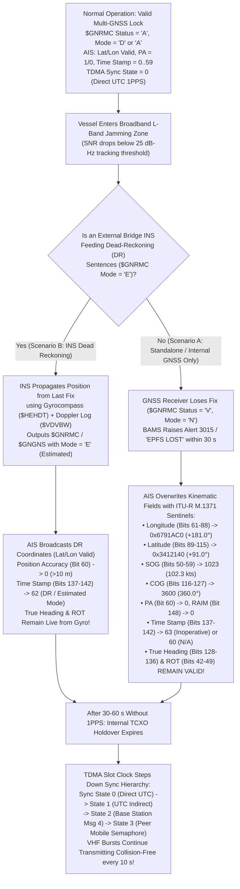

# Chapter 12: GNSS Systems Overview, Support Matrix, GNSS-Denied Locations, and Jamming Workarounds

---

## 12.0 Operational & Conceptual Overview

Every position report transmitted over the Automatic Identification System (AIS)—whether from a $400\text{ m}$ Ultra-Large Container Vessel (ULCV), an offshore supply vessel, or a coastal Class B sailboat—is fundamentally a relay of an onboard **Electronic Position Fixing System (EPFS)**. Contrary to a common misconception among casual maritime analysts, AIS transponders do not determine their own geographic position from VHF radio signals under normal operation. Instead, an AIS transceiver relies on **Global Navigation Satellite Systems (GNSS)** for two distinct, mission-critical functions:

1. **Spatiotemporal State Estimation (Navigation Payload):** Computing the vessel's geodetic latitude ($\phi$), longitude ($\lambda$), Speed Over Ground ($\text{SOG}$), and Course Over Ground ($\text{COG}$) referenced to the **World Geodetic System 1984 (WGS84)** datum, which are packed into the binary payload of AIS Messages 1, 2, 3, 4, 9, 18, 19, 21, and 27.
2. **Physical-Layer Time Synchronization (TDMA Slot Clock):** Generating a hardware **One Pulse Per Second (1PPS)** timing reference aligned to Coordinated Universal Time ($\text{UTC}$) within $\pm 2.6\text{ }\mu\text{s}$ (as detailed in [Chapter 11](ch11-utc-timing-synchronization.md)) so the transceiver can slice each 60-second UTC minute into $2,250$ collision-free $26.667\text{ ms}$ time slots.

Because satellite signals arrive at the ocean surface after traveling $20,000\text{ to }36,000\text{ km}$ from Medium Earth Orbit (MEO) or Geostationary/Inclined Geosynchronous Orbit (GEO/IGSO) with transmit powers of only $25\text{ to }100\text{ W}$, their received signal power at a ship's masthead antenna is extraordinarily weak—typically **$-125\text{ to }-130\text{ dBm}$** ($10^{-16}\text{ W}$), or roughly $15\text{ to }20\text{ dB}$ *below* the ambient thermal noise floor in a $2\text{ MHz}$ receiver bandwidth. Consequently, maritime GNSS reception is fragile. Over the past decade, intentional electronic warfare (**jamming** and **spoofing**) in contested littoral waters—from the Baltic and Black Seas to the Eastern Mediterranean, Red Sea, Strait of Hormuz, and East Asian ports—has transformed GNSS denial from a rare equipment fault into a daily operational hazard.

This chapter provides a complete technical reference on the four global GNSS constellations (**GPS**, **GLONASS**, **BeiDou/BDS**, and **Galileo**) and their maritime augmentation systems (**SBAS**, **MF DGNSS radiobeacons**, and **AIS Message 17**); breaks down hardware support across AIS transceiver generations (including non-GPS and sovereign configurations); traces the exact bit-level and NMEA state transitions of an AIS transponder inside a GNSS-denied zone; and details modern terrestrial and cryptographic workarounds (**R-Mode**, **eLORAN**, **CRPA** phased arrays, **Galileo OSNMA**, and **INS/DVL/Gyrocompass** dead-reckoning fusion).

---

## 12.1 Overview of Global and Regional Navigation Satellite Systems (GNSS) in Maritime AIS

### 12.1.1 Historical Context & Evolution (`schwehr/gis-history` Integration)

The coupling of maritime vessel tracking to satellite radionavigation sits atop a multi-century lineage of geodesy, hyperbolic radio navigation, and space-based timing documented in [`schwehr/gis-history`](https://github.com/schwehr/gis-history) and Global Fishing Watch's historical synthesis ([Cutlip, 2017](https://globalfishingwatch.org/article/ais-brief-history/)):

| Year / Era | Milestone (`schwehr/gis-history` & Maritime Navigation Lineage) | Architectural Impact on AIS & GNSS |
|---|---|---|
| **1761** | **John Harrison's H4 marine chronometer** solves the Longitude Problem | Establishes the fundamental equivalence between precise timekeeping and longitude determination ($1\text{ s}$ of sidereal time $\approx 463\text{ m}$ at the equator; $1\text{ ns}$ of radio light-time $\approx 0.30\text{ m}$). |
| **1940 – 1942** | **Gee** (1940), **Decca Navigator** (1942), and **LORAN-A** (1942) | First pulsed and continuous-wave hyperbolic terrestrial radionavigation chains measuring Time-Difference-of-Arrival (TDOA) between synchronized master/slave shore stations. |
| **1957 – 1964** | **Sputnik 1** Doppler tracking (1957) leads to US Navy **TRANSIT / NNSS** (operational 1964) | First satellite navigation system; proved that satellite Doppler shifts could fix a ship's position at sea, though only intermittently every $35\text{–}100\text{ minutes}$. |
| **1969 – 1974** | Soviet **Chayka** ($100\text{ kHz}$, 1969) and US Coast Guard **LORAN-C** ($100\text{ kHz}$, designated primary US coastal radionavigation system in 1974) | High-power terrestrial LF chains encoded explicitly into ITU-R M.1371-5 as `EPFD = 4` (Loran-C) and `EPFD = 5` (Chayka) and modern **eLORAN** GNSS backups. |
| **1978 – 1984** | First **GPS Block I** launch (Feb 22, 1978); first Soviet **GLONASS** launch (Oct 12, 1982); **NMEA 0183** & **WGS84** standardized (1984) | Creates the foundational triad of modern AIS: continuous 3D satellite pseudorange positioning, the WGS84 reference ellipsoid, and ASCII serial sentences (`$GPRMC`, `$GPGGA`). |
| **1988 – 1996** | **Håkan Lans** files priority patent for **STDMA** (Sept 1988); *Exxon Valdez* grounding (1989) & **OPA-90** (1990); **USCG Maritime DGPS** ($283.5\text{–}325\text{ kHz}$) achieves full operational capability (1996) | Under GPS **Selective Availability (SA)**, standalone civil GPS was intentionally dithered to $\sim 100\text{ m}$ ($95\%$) horizontal error. Coastal MF DGPS beacons and AIS Message 17 were therefore mandatory to achieve $<10\text{ m}$ harbor accuracy (`Position Accuracy = 1`). |
| **1998 – 2000** | **ITU-R M.1371-0** adopted (1998); **President Clinton disables GPS Selective Availability on May 1–2, 2000**; IMO adopts **SOLAS Chapter V Reg 19** AIS carriage mandate (Dec 2000) | Turning off GPS SA overnight improved unaugmented civil GPS accuracy from $\sim 100\text{ m}$ to $<8\text{ m}$, making standalone internal GPS receivers viable for global AIS collision avoidance. |
| **2011 – 2016** | First **Galileo** IOV satellites launch (2011); **IMO Resolution MSC.401(95)** (2015) mandates Multi-System Shipborne Radionavigation Receivers (MSR) | Shifts commercial marine electronics from single-constellation GPS-only modules to multi-constellation **GPS + GLONASS + BeiDou + Galileo** receivers. |
| **2017 – 2020** | Black Sea *Atria* spoofing event (June 2017); **C4ADS *Above Us Only Stars* report** (2019); **BeiDou-3 (BDS-3)** and **Galileo** reach full global constellations (2020) | Exposes systematic state-level GNSS spoofing placing hundreds of AIS-equipped merchant ships at onshore airports and inside circular "crop circles." |
| **2021 – 2026+** | **Baltic R-Mode** terrestrial VHF/VDES & MF ranging trials (2021–2025); **Galileo OSNMA** operational declaration (2023–2025); widespread Baltic/Black Sea/Red Sea GNSS denial | Deployment of cryptographic navigation message authentication and terrestrial VHF/MF ranging (R-Mode) over AIS/VDES base stations. |

### 12.1.2 Mathematical Formulation of Code-Division and Frequency-Division Pseudorange Positioning

A shipboard GNSS receiver measures the apparent propagation time $\Delta \tau_i = t_{\text{rx}} - t_{\text{tx}}^{(i)}$ of radio signals transmitted by $N \ge 4$ satellites at known Earth-Centered, Earth-Fixed (ECEF) positions $\mathbf{r}_i = [x_i, y_i, z_i]^T$. Scaling $\Delta \tau_i$ by the vacuum speed of light $c = 299{,}792{,}458\text{ m/s}$ yields the **pseudorange** $\rho_i$ for satellite $i$:

$$\rho_i = c\,\Delta\tau_i = \sqrt{(x_i - x_u)^2 + (y_i - y_u)^2 + (z_i - z_u)^2} + c\left(\delta t_u - \delta t^{(i)}\right) + I_i(f) + T_i + \epsilon_{\text{mp},i} + \eta_i$$

where:
* $\mathbf{r}_u = [x_u, y_u, z_u]^T$ is the unknown ECEF position of the ship's GNSS antenna reference point (subsequently converted to WGS84 geodetic coordinates $\phi, \lambda, h$ and adjusted by hull offsets $A, B, C, D$ in AIS Message 5 / 24),
* $\delta t_u$ is the unknown receiver clock bias relative to the GNSS system time scale (solving for $\delta t_u$ is what steers the AIS transponder's **1PPS** TDMA slot clock!),
* $\delta t^{(i)}$ is the known satellite atomic clock offset broadcast in the navigation ephemeris,
* $I_i(f) = \frac{40.3 \cdot \text{STEC}_i}{f^2}$ is the dispersive ionospheric group delay (in meters), inversely proportional to the squared carrier frequency $f^2$,
* $T_i$ is the non-dispersive tropospheric wet/dry delay, and $\epsilon_{\text{mp},i}, \eta_i$ represent sea-surface/superstructure multipath and receiver thermal noise.

Defining the unit line-of-sight vector $\mathbf{1}_i = \frac{\mathbf{r}_i - \hat{\mathbf{r}}_u}{\|\mathbf{r}_i - \hat{\mathbf{r}}_u\|}$ from the linearized vessel position estimate $\hat{\mathbf{r}}_u$ to satellite $i$, the $N \times 4$ observation geometry matrix $\mathbf{H}$ and the **Position/Time Dilution of Precision ($\text{PDOP}, \text{HDOP}, \text{TDOP}$)** covariance matrix $\mathbf{Q}$ in the local East-North-Up (ENU) frame are:

$$\mathbf{H} = \begin{bmatrix} -e_{x,1} & -e_{y,1} & -e_{z,1} & 1 \\ -e_{x,2} & -e_{y,2} & -e_{z,2} & 1 \\ \vdots & \vdots & \vdots & \vdots \\ -e_{x,N} & -e_{y,N} & -e_{z,N} & 1 \end{bmatrix}, \qquad \mathbf{Q} = \left(\mathbf{H}^T \mathbf{H}\right)^{-1} = \begin{bmatrix} \sigma_E^2 & \sigma_{EN} & \sigma_{EU} & \sigma_{Et} \\ \sigma_{EN} & \sigma_N^2 & \sigma_{NU} & \sigma_{Nt} \\ \sigma_{EU} & \sigma_{NU} & \sigma_U^2 & \sigma_{Ut} \\ \sigma_{Et} & \sigma_{Nt} & \sigma_{Ut} & \sigma_t^2 \end{bmatrix}$$

$$\text{HDOP} = \sqrt{Q_{11} + Q_{22}}, \qquad \text{VDOP} = \sqrt{Q_{33}}, \qquad \text{TDOP} = \sqrt{Q_{44}}$$

Combining multiple GNSS constellations simultaneously increases the visible satellite count $N$ from $7\text{–}10$ (GPS alone) to $28\text{–}45+$ (GPS + GLONASS + BeiDou + Galileo), reducing $\text{HDOP}$ below $0.6$, improving Receiver Autonomous Integrity Monitoring (**RAIM**) fault exclusion in narrow fjords or alongside high container terminals, and tightening 1PPS timing jitter ($\sigma_{\text{1PPS}} = \frac{\sigma_\rho}{c}\cdot\text{TDOP} < 10\text{ ns}$).

### 12.1.3 The Four Global GNSS Constellations in Maritime Use

1. **GPS (NAVSTAR Global Positioning System — United States Space Force):**
   * **Space Segment:** Nominal $24$ satellites (typically $30\text{–}31$ active) distributed across $6$ circular MEO orbital planes at $20,180\text{ km}$ altitude, $55^\circ$ inclination, and an $11\text{ h } 58\text{ min}$ ($\frac{1}{2}$ sidereal day) period.
   * **Civil Signals & Modulation:**
     * **L1 C/A ($1575.42\text{ MHz}$):** Legacy Coarse/Acquisition signal using Direct-Sequence Spread Spectrum (DSSS) $\text{BPSK}(1)$ with $1,023$-chip Gold codes at $1.023\text{ Mcps}$ ($1\text{ ms}$ code period) and a $50\text{ bps}$ LNAV telemetry stream. Every GPS-capable AIS unit ever manufactured decodes L1 C/A.
     * **L1C ($1575.42\text{ MHz}$):** Modernized Block III civil signal using Time-Multiplexed Binary Offset Carrier ($\text{TMBOC}(6,1,4/33)$) with a $10,230$-chip pilot channel, interoperable with Galileo E1 and BeiDou B1C.
     * **L2C ($1227.60\text{ MHz}$, $\text{BPSK}(1)$) & L5 ($1176.45\text{ MHz}$, $\text{BPSK}(10)$ at $10.23\text{ Mcps}$):** Aeronautical Radio Navigation Service (ARNS) safety-of-life band enabling dual-frequency ionospheric delay cancellation:
       $$\rho_{\text{IF}} = \frac{f_1^2}{f_1^2 - f_5^2}\rho_{L1} - \frac{f_5^2}{f_1^2 - f_5^2}\rho_{L5}$$
   * **Datum & Time:** WGS84 (G2139 realization, aligned to ITRF within $<1\text{ cm}$); GPS Time ($\text{GPST}$) is a continuous atomic time scale without leap seconds since January 6, 1980 ($\text{GPST} - \text{UTC} = +18\text{ s}$ as of 2026; the current leap-second offset $\Delta t_{\text{LS}}$ is broadcast in Subframe 4, Page 18 of LNAV so the AIS receiver can align its 1PPS to true $\text{UTC}$).

2. **GLONASS (*Globalnaya Navigatsionnaya Sputnikovaya Sistema* — Russia / Roscosmos):**
   * **Space Segment:** Nominal $24$ operational satellites across $3$ MEO orbital planes ($8$ satellites per plane) at $19,130\text{ km}$ altitude, **$64.8^\circ$ inclination**, and an $11\text{ h } 15\text{ min } 44\text{ s}$ orbital period. Because of its high $64.8^\circ$ inclination (compared to $55^\circ$ for GPS/BeiDou and $56^\circ$ for Galileo), GLONASS achieves superior high-elevation geometry in polar and sub-polar waters along the **Northern Sea Route (NSR)**, Barents Sea, and Alaskan Arctic.
   * **Civil Signals & Modulation (FDMA + CDMA):**
     * **L1OF ($1602.0\text{ MHz}$ base):** Legacy Open Frequency-Division Multiple Access (**FDMA**) signal where each satellite transmits the *same* $511$-chip maximal-length PRN sequence at $0.511\text{ Mcps}$ on a satellite-specific frequency channel $k \in \{-7, -6, \dots, +5, +6\}$ (antipodal satellites share the same slot number $k$):
       $$f_{\text{L1OF}}(k) = 1602.0\text{ MHz} + k \times 0.5625\text{ MHz} \qquad \left(\text{spanning } 1598.0625\text{ to } 1605.375\text{ MHz}\right)$$
     * **L2OF ($1246.0\text{ MHz} + k \times 0.4375\text{ MHz}$):** Secondary FDMA civil signal.
     * **L1OC ($1600.995\text{ MHz}$), L2OC ($1248.06\text{ MHz}$), and L3OC ($1202.025\text{ MHz}$):** Modernized CDMA signals transmitted by GLONASS-K1/K2 satellites.
   * **Datum & Time:** **PZ-90.11** (*Parametry Zemli 1990*), which aligns with WGS84/ITRF to within a few centimeters; **GLONASS Time ($\text{GLONASST}$)** is tied to $\text{UTC(SU)} + 3\text{ hours}$ and—uniquely among global GNSS constellations—**incorporates leap seconds directly**.
   * **Maritime Standards:** Performance standards for shipborne GLONASS receiver equipment are specified in **IMO Resolution MSC.113(73)** and **IEC 61108-2**.

3. **BeiDou Navigation Satellite System / BDS-3 (China National Space Administration):**
   * **Space Segment (Hybrid 3-Orbit Architecture):** Unlike purely MEO constellations, BDS-3 operates a hybrid constellation of **$24\text{ MEO}$** satellites ($21,528\text{ km}$ altitude, $55^\circ$ inclination), **$3\text{ IGSO}$** (Inclined Geosynchronous Orbit at $35,786\text{ km}$, $55^\circ$ inclination tracing a figure-eight ground track over the Asia-Pacific), and **$3\text{ GEO}$** (Geostationary Orbit at $35,786\text{ km}$ over $80^\circ\text{E}$, $110.5^\circ\text{E}$, and $140^\circ\text{E}$). Consequently, ships in the South China Sea, East China Sea, Taiwan Strait, and Malacca Strait typically see $14\text{ to }20$ BeiDou satellites simultaneously!
   * **Civil Signals & Two-Way Short-Message Service (RDSS):**
     * **B1I ($1561.098\text{ MHz}$):** Backward-compatible BDS-2/BDS-3 open signal using $\text{BPSK}(2)$ at $2.046\text{ Mcps}$.
     * **B1C ($1575.42\text{ MHz}$, $\text{QMBOC}(6,1,4/33)$) & B2a ($1176.45\text{ MHz}$, $\text{BPSK}(10)$):** Modernized global open signals sharing center frequencies with GPS L1/L5 and Galileo E1/E5a.
     * **B2b ($1207.14\text{ MHz}$ / PPP-B2b):** Real-time Precise Point Positioning (PPP) corrections broadcast directly via BDS-3 GEO satellites, enabling decimeter-level maritime positioning without shore cellular backhaul.
     * **BDS Radio Determination Satellite Service (RDSS) / Short-Message Communication (SMC):** A unique two-way L-band uplink ($1610\text{–}1626.5\text{ MHz}$) / S-band downlink ($2483.5\text{–}2500\text{ MHz}$) capability through the GEO/MEO constellation allowing domestic Chinese fishing vessels to transmit short text messages and position reports ($1,000\text{–}14,000\text{ bits}$) up to $1,000+\text{ NM}$ offshore without Inmarsat or Iridium.
   * **Datum & Time:** China Geodetic Coordinate System 2000 (**CGCS2000**, practical realization identical to WGS84 at the centimeter level for AIS); BeiDou Time ($\text{BDT}$, continuous without leap seconds since January 1, 2006; $\text{GPST} - \text{BDT} = 14\text{ s}$).
   * **Maritime Standards:** **IMO Resolution MSC.379(93)** and **IEC 61108-5**.

4. **Galileo (European Union / European Union Agency for the Space Programme [EUSPA]):**
   * **Space Segment:** Nominal $24$ active satellites (+ $6$ orbital spares) across $3$ MEO Walker $24/3/1$ planes at $23,222\text{ km}$ altitude, $56^\circ$ inclination, and a $14\text{ h } 05\text{ min}$ period.
   * **Civil Signals & Cryptographic Authentication:**
     * **E1 OS ($1575.42\text{ MHz}$):** Open Service signal using Composite Binary Offset Carrier ($\text{CBOC}(6,1,1/11)$) at $1.023\text{ Mcps}$ ($4,092$-chip tiered code) carrying the **I/NAV** navigation message.
     * **Galileo OSNMA (Open Service Navigation Message Authentication):** Embedded in $40$ reserved bits per 2-second I/NAV page on E1-B, **OSNMA** uses the **TESLA** (Timed Efficient Stream Loss-Tolerant Authentication) protocol with one-way hash chains ($H(K_i) = K_{i-1}$) anchored by **ECDSA P-256 / P-521** public-key digital signatures. OSNMA allows a shipboard multi-GNSS AIS receiver to cryptographically verify that the received ephemeris and clock parameters originated from authentic Galileo satellites rather than a software-defined radio (SDR) spoofer!
     * **E5a ($1176.45\text{ MHz}$), E5b ($1207.14\text{ MHz}$), and Full-Band E5 AltBOC ($1191.795\text{ MHz}$, $51.15\text{ MHz}$ bandwidth):** Ultra-wideband AltBOC modulation provides the lowest code-tracking thermal noise and sea-surface multipath error ($\sigma_{\text{code}} < 5\text{ cm}$) of any civil GNSS signal.
     * **E6 HAS ($1278.75\text{ MHz}$):** Galileo High Accuracy Service broadcasting free global PPP orbit/clock/bias corrections achieving $<20\text{ cm}$ horizontal accuracy ($95\%$).
   * **Datum & Time:** Galileo Terrestrial Reference Frame (**GTRF**); Galileo System Time ($\text{GST}$).
   * **Maritime Standards:** **IMO Resolution MSC.233(82)** and **IEC 61108-3**; assigned dedicated AIS EPFD code **`8` (`Galileo`)** in ITU-R M.1371-5.

| Constellation | Operator | Nominal Orbit & Planes | Primary Civil Frequencies ($\text{MHz}$) | Access & Modulation | Maritime Standards (IMO / IEC) | Typical Horizontal / 1PPS Accuracy ($95\%$) |
|---|---|---|---|---|---|---|
| **GPS** | US Space Force | $24+$ MEO ($6$ planes, $20,180\text{ km}$, $55^\circ$) | **L1:** $1575.42$<br>**L2C:** $1227.60$<br>**L5:** $1176.45$ | CDMA: $\text{BPSK}(1)$, $\text{TMBOC}$, $\text{BPSK}(10)$ | MSC.112(73) / IEC 61108-1 | $3.0\text{–}5.0\text{ m}$ (L1)<br>$1.0\text{–}1.5\text{ m}$ (L1+L5)<br>$<15\text{ ns}$ 1PPS |
| **GLONASS** | Roscosmos (Russia) | $24$ MEO ($3$ planes, $19,130\text{ km}$, $64.8^\circ$) | **L1OF:** $1602 + 0.5625k$<br>**L2OF:** $1246 + 0.4375k$<br>**L1/L2/L3OC:** CDMA | FDMA ($\text{BPSK}$ $0.511\text{ Mcps}$) & CDMA ($\text{BOC}$) | MSC.113(73) / IEC 61108-2 | $4.5\text{–}7.5\text{ m}$ (L1OF)<br>$<25\text{ ns}$ 1PPS |
| **BeiDou (BDS-3)** | CNSA (China) | $24$ MEO ($21,528\text{ km}$) + $3$ IGSO + $3$ GEO ($35,786\text{ km}$) | **B1I:** $1561.098$<br>**B1C:** $1575.42$<br>**B2a:** $1176.45$<br>**B2b:** $1207.14$ | CDMA: $\text{BPSK}(2)$, $\text{QMBOC}$, $\text{BPSK}(10)$ + RDSS L/S | MSC.379(93) / IEC 61108-5 | $2.5\text{–}4.5\text{ m}$ (Global)<br>$1.5\text{–}2.5\text{ m}$ (Asia-Pacific)<br>$<15\text{ ns}$ 1PPS |
| **Galileo** | EU / EUSPA | $24+$ MEO ($3$ planes, $23,222\text{ km}$, $56^\circ$) | **E1:** $1575.42$ (**OSNMA**)<br>**E5a:** $1176.45$<br>**E5b:** $1207.14$<br>**E6 HAS:** $1278.75$ | CDMA: $\text{CBOC}$, $\text{AltBOC}(15,10)$, $\text{BPSK}(5)$ | MSC.233(82) / IEC 61108-3 | $1.8\text{–}3.5\text{ m}$ (E1)<br>$<0.2\text{ m}$ (E6 HAS PPP)<br>$<10\text{ ns}$ 1PPS |

### 12.1.4 Differential and Augmentation Systems: Setting `Position Accuracy = 1` in AIS

In ITU-R M.1371-5 Messages 1, 2, 3, 4, 9, 18, 19, and 21, the single-bit **`Position Accuracy` (`PA`)** flag (bit `60` 0-based / bit `61` 1-based in Messages 1–3) encodes whether the reported position is augmented by a differential reference system:
* **`PA = 0` (Low — $>10\text{ m}$):** Unaugmented standalone GNSS fix (or dead reckoning / estimated position).
* **`PA = 1` (High — $\le 10\text{ m}$):** Differential GNSS (DGNSS) or Space-Based Augmentation System (SBAS) fix in use (`$GPGGA` Fix Quality indicator `2` or `$GNRMC` Mode Indicator `'D'`).

Three differential architectures supply these corrections to shipboard AIS installations:

1. **Space-Based Augmentation Systems (SBAS — IEC 61108-7):**
   Geostationary satellites broadcast wide-area vector corrections (fast/long-term satellite clock, 3D orbit, and $5^\circ \times 5^\circ$ ionospheric grid point vertical delays) and $6$-second integrity alerts directly on the GPS L1 frequency ($1575.42\text{ MHz}$) using PRN codes $120\text{–}158$ at $250\text{ bps}$:
   * **WAAS** (North America — FAA), **EGNOS** (Europe — EUSPA), **MSAS & QZSS SLAS** (Japan — JCAB/Cabinet Office), **GAGAN** (India — ISRO/AAI), **SDCM** (Russia), **BDSBAS** (China), **KASS** (South Korea), and **SouthPAN** (Australia / New Zealand).
   * Almost every modern Class A and Class B AIS internal GNSS module (e.g., u-blox M8/M9) tracks SBAS PRNs automatically with zero additional antenna hardware, achieving $0.8\text{–}1.5\text{ m}$ horizontal accuracy and setting `PA = 1`.

2. **Coastal Medium-Frequency (MF) DGNSS Radiobeacons ($283.5\text{–}325.0\text{ kHz}$ — ITU-R M.823-3 & IEC 61108-4):**
   Operated by national lighthouse and coast guard authorities (in accordance with **IALA Recommendation R-121**), coastal reference stations surveyed to millimeter accuracy compute pseudorange corrections $\text{PRC}_i(t_0)$ and range-rate corrections $\text{RRC}_i(t_0)$ for every visible satellite $i$ and broadcast them using Minimum Shift Keying (**MSK**) at $100\text{ or }200\text{ bps}$ on the maritime MF radiobeacon band ($283.5\text{–}325.0\text{ kHz}$). A shipboard DGNSS beacon receiver applies the correction at time $t$:
   $$\rho_{i,\text{corr}}(t) = \rho_i(t) + \text{PRC}_i(t_0) + \text{RRC}_i(t_0)\cdot(t - t_0)$$
   * *Historical Note:* While the US Coast Guard completed the decommissioning of its legacy MF Nationwide DGPS beacons in 2020 following the maturity of WAAS and multi-frequency GPS, coastal MF DGNSS radiobeacon networks remain actively operated across Europe, the Baltic Sea, the United Kingdom, China, South Korea, and major international waterways—and today serve as the primary shore transmitters for **MF R-Mode** ranging backups (Section 12.4.3).

3. **Over-the-Air AIS Message 17 (DGNSS Binary Broadcast Message — ITU-R M.1371-5 §3.17):**
   To eliminate the need for a separate $300\text{ kHz}$ MF beacon antenna and receiver on every ship, ITU-R M.1371 defines **Message 17** (spanning $80\text{ to }816\text{ bits}$, 1 to 4 time slots). An AIS Base Station surveys its own reference position (`bits 40–57` Longitude in $1/10\text{ min}$, `bits 58–74` Latitude in $1/10\text{ min}$) and encapsulates standard **RTCM SC-104 Type 1, Type 9, or Type 31** differential pseudorange corrections directly inside the AIS VHF payload (`bits 80..N`). Any Class A or Class B AIS transponder receiving Message 17 automatically routes the decoded RTCM differential word stream directly into its internal GNSS engine (and outputs it on its serial port via `$AIDLM`/RTCM sentences), upgrading its internal fix to DGNSS (`PA = 1`) within the VTS coverage area!

---

## 12.2 Breakdown of Hardware Support & Do Any AIS Systems Not Include Support for GPS?

### 12.2.1 The 4-Bit Electronic Position Fixing Device (`EPFD`) Field in ITU-R M.1371-5

AIS transceivers advertise the type of radionavigation sensor feeding their position coordinates via the 4-bit unsigned **`Type of Electronic Position Fixing Device` (`EPFD`)** field across five message types:
* **Message 4 (Base Station Report)** & **Message 11 (UTC/Date Response):** Bits `79–82` (0-based) / `80–83` (1-based)
* **Message 5 (Class A Static and Voyage Related Data):** Bits `270–273` (0-based) / `271–274` (1-based)
* **Message 19 (Extended Class B Equipment Position Report):** Bits `305–308` (0-based) / `306–309` (1-based)
* **Message 21 (Aid-to-Navigation Report):** Bits `164–167` (0-based) / `165–168` (1-based)
* **Message 24 (Class B Static Data Report, Part B):** Embedded in the Vendor ID / spare configuration on specific inland/extended implementations, though standard Class B CS units primarily rely on Message 18 without an EPFD field.

| `EPFD` Code (4-bit `uint4`) | Binary (`MSB..LSB`) | ITU-R M.1371-5 Official Definition | Operational Meaning & Typical Hardware Context |
|---|---|---|---|
| **`0`** | `0000` | Undefined (default) | Unconfigured default or external NMEA `$GNRMC` talker without explicit EPFD mapping. |
| **`1`** | `0001` | GPS | Standalone or differential US GPS receiver (`$GPRMC` / `$GPGGA`). |
| **`2`** | `0010` | GLONASS | Russian GLONASS-only receiver (`$GLRMC` / `$GLGGA`). |
| **`3`** | `0011` | Combined GPS/GLONASS | Dual/multi-constellation GNSS receiver (`$GNRMC` / `$GNGGA`). Also commonly emitted by 4-constellation receivers when code `15` is not selected. |
| **`4`** | `0100` | Loran-C | $100\text{ kHz}$ terrestrial Loran-C or modern **eLORAN** receiver (`$LCRMC`). |
| **`5`** | `0101` | Chayka | Russian $100\text{ kHz}$ terrestrial Chayka LF hyperbolic receiver. |
| **`6`** | `0110` | Integrated Navigation System (INS) | Bridge INS (IEC 61924-2) fusing multi-GNSS, Gyrocompass, Doppler Speed Log, and Radar (`$INRMC`). |
| **`7`** | `0111` | Surveyed | **Fixed, non-moving installation** whose WGS84 coordinates were surveyed once and permanently hardcoded in non-volatile memory (Shore Base Stations, Lighthouses, Offshore Oil/Wind Platforms, Virtual AtoNs). |
| **`8`** | `1000` | Galileo | European Galileo receiver (`$GARMC` / `$GAGGA`). |
| **`9–14`** | `1001`–`1110` | Not used / Reserved | Reserved for future ITU-R M.1371 revisions (note: **BeiDou/BDS** `$BDRMC`/`$GBGGA` was not assigned a standalone number in M.1371-5, so BDS-capable commercial units report `1`, `3`, or `15`). |
| **`15`** | `1111` | Internal GNSS | The AIS transponder has fallen back to (or is exclusively using) its **internal built-in GNSS module** rather than an external bridge EPFS. |

> [!IMPORTANT]
> **Diagnostic Significance of `EPFD = 15` (`Internal GNSS`):** On a SOLAS Class A vessel, the primary position source during normal operation is an external, wheelmark-certified bridge DGNSS or INS (`EPFD = 1, 3, 6, or 8`) connected via RS-422 (IEC 61162-1/2) or LWE Ethernet (IEC 61162-450), while the Class A unit's *internal* GNSS receiver is dedicated to generating the 1PPS timing pulse and acting as a hot standby. Whenever a shore analyst sees a merchant vessel's Message 5 `EPFD` flip from `1` or `6` to **`15`**, it proves that the ship's primary bridge navigation bus or external DGNSS failed (or was disconnected by the crew) and the AIS transponder automatically switched to its internal backup GNSS antenna!

### 12.2.2 Explicitly Answering: "Do Any AIS Systems Not Include Support for GPS?"

**Yes.** While $>95\%$ of international commercial SOLAS and recreational AIS transceivers manufactured globally support GPS (either as legacy GPS-only or modern multi-GNSS including GPS), **four distinct categories of real-world AIS systems either omit GPS hardware entirely or are statutorily configured to operate without GPS**:

1. **Domestic Chinese BeiDou-Only (BDS-Only) Fishing and Coastal Terminals:**
   * Under vessel monitoring and safety mandates issued by China's **Ministry of Agriculture and Rural Affairs (MARA)** and the **China Maritime Safety Administration (MSA)**, tens of thousands of domestic Chinese coastal fishing vessels, inland river barges (Yangtze and Pearl River basins), and maritime militia craft are equipped with subsidized **BeiDou-AIS integrated terminals** (manufactured by domestic vendors such as Haige Communications, BDStar Navigation, and Highlander).
   * To enforce technological sovereignty and leverage two-way beyond-line-of-sight messaging, many domestic Chinese fishery terminals use **BDS-only RF/baseband ASICs** receiving **BeiDou B1I ($1561.098\text{ MHz}$)** for positioning/1PPS timing alongside **BDS RDSS L/S-band** short-message transceivers for distress alerting and catch reporting. These domestic non-SOLAS units omit GPS L1 C/A decoding in firmware or hardware so they remain immune to foreign GPS Selective Availability or regional US GPS denial.

2. **Russian GLONASS-Only and Chayka Statutory Configurations (`EPFD = 2` and `EPFD = 5`):**
   * Under Russian Federation Government Decrees (including Rosmorrechflot and **Russian Maritime Register of Shipping [RS]** rules for vessels operating in Russian internal waterways, coastal cabotage, and the **Northern Sea Route [NSR]**), shipborne navigation and AIS equipment (e.g., Transas / Navis / Koden / domestic Russian-certified Class A and river-register transponders) are mandated to support **GLONASS** and **Chayka**.
   * During routine Russian military Electronic Warfare (EW) exercises in the Baltic, Black Sea, and Barents Sea—where Russian ground jammers intentionally blank the GPS L1 center frequency ($1575.42\text{ MHz}$) while leaving the upper GLONASS FDMA sub-band ($1602\text{–}1605.375\text{ MHz}$) or $100\text{ kHz}$ Chayka chain clear—Russian state and coastal vessels lock their AIS EPFS configuration strictly to **GLONASS-only (`EPFD = 2`)** or **Chayka (`EPFD = 5`)** mode, rejecting any GPS L1 inputs to prevent Western GPS spoofing.

3. **Fixed Shore Base Stations, Offshore Platforms, and Virtual AtoN Transmitters (`EPFD = 7` Surveyed):**
   * An **AIS Base Station** (IEC 62320-1, broadcasting Message 4), a lighthouse **Aid to Navigation (AtoN)** (IEC 62320-2, broadcasting Message 21), or an offshore oil/gas platform does **not move**.
   * While many coastal base stations include an internal GNSS receiver for UTC 1PPS synchronization, high-resilience national VTS networks (such as USCG NAIS coastal sites, UK GLA sites, and Baltic/Norwegian VTS towers) hardcode their surveyed WGS84 coordinates (`EPFD = 7`) into firmware and derive their 1PPS slot timing from **Rubidium/Cesium atomic frequency standards**, **IEEE 1588v2 Precision Time Protocol (PTP)** over synchronous optical fiber, or **eLORAN** receivers (see [Chapter 11](ch11-utc-timing-synchronization.md)). These stations contain zero dependence on GPS for either position or time.

4. **Receive-Only AIS Hardware and Software-Defined Radios (SDRs):**
   * Shore-based AIS receivers (e.g., Shine Micro SM1610, Wegmatt dAISy, RTL-SDR Blog V4, Airspy) and shipboard receive-only units never transmit on the VHF Data Link and never broadcast own-ship coordinates. They require no GNSS hardware whatsoever, relying instead on Network Time Protocol (**NTP**) or host system clocks to attach arrival timestamps (`c:` in NMEA TAG blocks).

### 12.2.3 Hardware Support Matrix Across AIS Generations (2000–2026+)

In June 2015, the IMO adopted **Resolution MSC.401(95)** (subsequently amended by **MSC.466(101)** in 2019), establishing performance standards for **Multi-System Shipborne Radionavigation Receivers (MSR)** and encouraging all newly type-approved SOLAS receivers to track at least two independent GNSS constellations concurrently:

| Hardware Era & Category | Representative Transceivers & GNSS Modules | Supported Constellations & Signals | NMEA Talker ID & `EPFD` | Jamming / Spoofing Resilience Profile |
|---|---|---|---|---|
| **Gen 1: Legacy Single-Constellation SOLAS Class A (2000–2011)** | Furuno FA-100 / FA-150 (early), JRC JHS-180 / JHS-182, Saab R4, Kongsberg Seatex AIS 100/200 (12-channel L1 GPS engines: Trimble/Motorola Oncore, u-blox ANTARIS 4) | **GPS L1 C/A only** ($1575.42\text{ MHz}$) + external MF DGPS beacon input (RTCM SC-104) | `$GP` (`EPFD = 1` or `15`) | **Very Low:** Single-frequency ($1575.42\text{ MHz}$); susceptible to GPS Week Number Rollover (WNRO 1,024-week bug on April 6, 2019!) and trivial CW/chirp L1 jammers. |
| **Gen 2: Dual-Constellation Class A & Class B (2012–2017)** | Saab R5 SUPREME, Furuno FA-150 (rev B), JRC JHS-183, True Heading Carbon, early em-trak Class B (u-blox 6 / u-blox 7 / Furuno eRide) | **GPS L1 C/A + GLONASS L1OF** + SBAS (WAAS/EGNOS/MSAS) + Msg 17 DGNSS | `$GN` (`EPFD = 3` or `15`) | **Moderate:** Frequency diversity between $1575.42\text{ MHz}$ (GPS) and $1602\text{ MHz}$ (GLONASS) survives narrowband single-spot L1 jammers ($<10\text{ MHz}$ wide). |
| **Gen 3: Modern Quad-Constellation Multi-GNSS Class A & B+ SOTDMA (2018–Present)** | Furuno FA-170, Saab R6 SUPREME, Kongsberg Seatex AIS 300, JRC JHS-800S, em-trak B953/B954, Vesper Cortex (u-blox M8 / M9, 72–92 channels) | **GPS L1 + GLONASS L1OF + Galileo E1 + BeiDou B1I/B1C** + SBAS + Msg 17 | `$GN` (`EPFD = 3, 6, 8, 15`) | **High Satellite Redundancy:** Tracks 30+ satellites simultaneously; built-in CW interference notches and RAIM consistency checks, though all L1/E1/B1 signals still reside in the upper L-band ($1561\text{–}1605\text{ MHz}$). |
| **Gen 4: Dual-Band (L1+L5) & Authenticated / CRPA Resilient Systems (2023–2026+)** | Naval/Coast Guard W-AIS & High-End INS feeds (Septentrio AsteRx-m3 / Mosaic-X5, u-blox F9P/F9T, NovAtel OEM7 + CRPA) | **L1/E1/B1 + L5/E5a/B2a + L2C/E5b/E6** + **Galileo OSNMA** + AIM+ spectrum analysis | `$GN` / `$IN` (`EPFD = 6` or `8`) | **High Anti-Jam / Anti-Spoof:** Dual-band ($1575\text{ MHz}$ + $1176\text{ MHz}$) defeats single-band L1 jammers; **Galileo OSNMA** rejects unauthenticated spoofed ephemerides; CRPA nulls horizon jammers by $35\text{–}50\text{ dB}$. |
| **Sovereign Non-GPS Configurations** | Chinese MARA BDS-AIS fishery terminals; Russian RS-configured Arctic/River AIS; Surveyed VTS Base Stations (Saab R60 / Kongsberg BS300) | **BeiDou B1I + RDSS** only; **GLONASS L1OF / Chayka** only; or **Hardcoded Surveyed Coordinates** + Atomic/PTP/eLORAN 1PPS | `$BD`/`$GB`, `$GL`, or Static (`EPFD = 2, 5, 7`) | Operates normally when US GPS L1 ($1575.42\text{ MHz}$) is jammed or denied. |

---

## 12.3 What Happens to AIS in a GNSS-Denied Location?

What actually happens on the bridge, on the NMEA serial bus, and inside the 168-bit over-the-air VHF burst when a vessel sails into a total broadband GNSS jamming zone (where all L-band bands from $1160\text{ to }1610\text{ MHz}$ are drowned in high-power white noise)? The behavior bifurcates depending on whether the vessel relies solely on GNSS (`Scenario A`) or has an external **Integrated Navigation System (INS)** capable of **Dead Reckoning (DR)** (`Scenario B`).

### 12.3.1 Second-by-Second Hardware, NMEA, and Bit-Level State Transitions



### 12.3.2 Exact Bit-Field Mutations in AIS Messages 1, 2, 3, and 18 During GNSS Denial

When both the external EPFS and the internal backup GNSS lose satellite lock (and no INS dead-reckoning feed is active), **IEC 61993-2** and **ITU-R M.1371-5 Annex 8** require the AIS transponder to **keep transmitting** on its scheduled SOTDMA time slots while substituting explicit sentinel bit patterns for every GNSS-derived parameter:

| AIS Field (Messages 1, 2, 3) | 0-Based Bit Slice (`libais`) | 1-Based Bit Slice (`ITU-R`) | Bit Width & Type | Normal State (GNSS Locked) | **Scenario A: Total GNSS Loss (No INS DR)** | **Scenario B: INS Dead-Reckoning Fallback (`Mode = 'E'`)** |
|---|---|---|---|---|---|---|
| **Rate of Turn (`ROT`)** | `42–49` | `43–50` | `8` (`int8`) | $-126 \dots +126$ ($4.733\sqrt{\omega}$) | **Remains Valid!** (Fed by `$HEROT` rate gyro) | **Remains Valid!** (Fed by `$HEROT` rate gyro) |
| **Speed Over Ground (`SOG`)** | `50–59` | `51–60` | `10` (`uint10`) | $0\text{–}1022$ ($0.0\text{–}102.2\text{ kts}$) | **`1023`** (`0x3FF` = **`102.3 kts` N/A**) | Valid DR speed ($v_{\text{log}}$ from Doppler speed log) |
| **Position Accuracy (`PA`)** | `60` | `61` | `1` (`uint1`) | `1` ($\le 10\text{ m}$) or `0` ($>10\text{ m}$) | **`0`** (Low / Unaugmented) | **`0`** (Forced to `0` during Dead Reckoning) |
| **Longitude ($\lambda$)** | `61–88` | `62–89` | `28` (`int28`) | $\pm 180.0^\circ \times 600{,}000$ | **`0x6791AC0`** ($108{,}600{,}000$ = **`181.0°`**) | Valid DR Longitude $\hat{\lambda}_{\text{DR}}(t)$ |
| **Latitude ($\phi$)** | `89–115` | `90–116` | `27` (`int27`) | $\pm 90.0^\circ \times 600{,}000$ | **`0x3412140`** ($54{,}600{,}000$ = **`91.0°`**) | Valid DR Latitude $\hat{\phi}_{\text{DR}}(t)$ |
| **Course Over Ground (`COG`)** | `116–127` | `117–128` | `12` (`uint12`) | $0\text{–}3599$ ($0.0^\circ\text{–}359.9^\circ$) | **`3600`** (`0xE10` = **`360.0°` N/A**) | Valid DR Course $\hat{\chi}_{\text{DR}}(t)$ |
| **True Heading (`HDG`)** | `128–136` | `129–137` | `9` (`uint9`) | $0\text{–}359^\circ$ | **Remains Valid!** (Fed by `$HEHDT` gyrocompass) | **Remains Valid!** (Fed by `$HEHDT` gyrocompass) |
| **Time Stamp (`UTC Second`)** | `137–142` | `138–143` | `6` (`uint6`) | `0–59` (UTC second of fix) | **`63`** (EPFS Inoperative) or **`60`** (N/A) | **`62`** (EPFS in **Dead Reckoning / Estimated** mode) or **`61`** (Manual mode) |
| **RAIM Flag (`RAIM`)** | `148` | `149` | `1` (`uint1`) | `1` (In use) or `0` | **`0`** (RAIM not in use) | **`0`** (RAIM not in use) |
| **SOTDMA `Sync State`** | `149–150` | `150–151` | `2` (`uint2`) | **`0`** (UTC Direct via 1PPS) | Steps down: **`0` $\rightarrow$ `1` $\rightarrow$ `2` $\rightarrow$ `3`** | Steps down: **`0` $\rightarrow$ `1` $\rightarrow$ `2` $\rightarrow$ `3`** |

### 12.3.3 Crucial Operational Insights During GNSS Denial

1. **Why True Heading (`HDG`) and Rate of Turn (`ROT`) Survive Total GNSS Blackout:**
   A commercial ship's **Gyrocompass** (e.g., Anschütz Standard 22, Sperry Marine Navigat X MK1/MK2, or fiber-optic/ring-laser compass) senses the mechanical or optical rotation of the Earth ($\Omega_\oplus = 15.041^\circ/\text{hr}$) and gravity to find True North completely independent of radio signals, outputting `$HEHDT,xxx.x,T*hh` over RS-422. Similarly, the **Rate-of-Turn Indicator** outputs `$HEROT,x.x,A*hh`. Consequently, when a ship enters a Baltic or Black Sea jamming zone and its AIS latitude/longitude jumps to `(91.0°, 181.0°)`, **its AIS messages still broadcast live, accurate `True Heading` (`0–359°`) and `ROT` (`-126..+126`)**! For forensic analysts and coastal VTS operators, monitoring the live `HDG` and `ROT` stream of a GNSS-denied vessel reveals exactly when the ship alters course, steadies on a new heading, or drops anchor even while its coordinates are `(91.0°, 181.0°)`.

2. **Decoding the Four Special `Time Stamp` Values (`60`, `61`, `62`, `63`):**
   Most naive AIS parsers discard the 6-bit `Time Stamp` field (`bits 137–142`) or assume it is merely the UTC second of transmission. In fact, values `60` through `63` encode the operational health of the ship's navigation architecture (driven by the NMEA 0183 FAA Mode Indicator field in `$GNRMC`, `$GPGLL`, and `$GNGNS`):
   * **`Time Stamp = 60` (`111100`):** Time stamp is not available (default when no `$GPZDA` or valid UTC time is provided).
   * **`Time Stamp = 61` (`111101`):** Positioning system is in **manual input mode** (NMEA Mode Indicator `'M'` — an officer manually keyed a fixed latitude/longitude into the bridge navigation system).
   * **`Time Stamp = 62` (`111110`):** Electronic Position Fixing System is in **estimated (dead reckoning) mode** (NMEA Mode Indicator `'E'`). The ship's INS is integrating heading $\psi(t)$ from the gyrocompass and velocity $\mathbf{v}_{\text{log}}(t)$ from the electromagnetic/Doppler speed log:
     $$\hat{\phi}_{\text{DR}}(t) = \phi(t_0) + \int_{t_0}^{t} \frac{v_N(\tau)}{M(\phi) + h}\,d\tau, \qquad \hat{\lambda}_{\text{DR}}(t) = \lambda(t_0) + \int_{t_0}^{t} \frac{v_E(\tau)}{(N(\phi) + h)\cos\phi}\,d\tau$$
     Because a water-referenced speed log cannot sense ocean currents $\mathbf{v}_{\text{curr}}$ or wind leeway (unless a bottom-tracking Doppler Velocity Log is within $<200\text{ m}$ depth), a vessel broadcasting `Time Stamp = 62` will steadily drift away from its true track by $0.5\text{ to }3.0\text{ knots}$ of unmodeled current!
   * **`Time Stamp = 63` (`111111`):** Positioning system is **inoperative** (NMEA Mode Indicator `'N'` / Status `'V'`).

3. **How Reporting Interval Changes When `SOG = 102.3 kts` (`1023`):**
   Under ITU-R M.1371-5 Table 1, a Class A transponder's reporting interval ($2\text{ s}$ to $180\text{ s}$) is dynamically controlled by its `Navigation Status`, `SOG`, and `ROT`. When GNSS fails and `SOG` becomes `1023` (`Not Available`), **IEC 61993-2** specifies that if the vessel is not at anchor/moored, the Class A transponder defaults to the **nominal $10\text{ s}$ reporting interval** (or $3\frac{1}{3}\text{ s}$ if the live gyrocompass `ROT` indicates the vessel is changing course!).

---

## 12.4 GNSS Jamming and Spoofing: Maritime Impacts and Practical Workarounds

### 12.4.1 Jamming (Noise Denial) vs. Spoofing (Coherent Deception): Why Spoofing Is Far More Dangerous

| Characteristic | **GNSS Jamming (RF Noise Denial)** | **GNSS Spoofing (Coherent False Signals)** |
|---|---|---|
| **Physical Mechanism** | Transmits high-power CW tones, swept chirps, or broadband AWGN across $1560\text{–}1610\text{ MHz}$ (and/or $1176 / 1227\text{ MHz}$), crushing the receiver's Carrier-to-Noise-Density ratio ($C/N_0 < 25\text{ dB-Hz}$) so tracking loops lose lock. | Transmits structurally valid, synchronized PRN codes and navigation ephemeris frames that mimic a constellation of satellites at a fabricated location/time, capturing the receiver's Delay Lock Loop (DLL) and Phase Lock Loop (PLL). |
| **Bridge Alarm Behavior (BAMS / IEC 62923)** | **Loud & Immediate:** Within $\le 30\text{ s}$, the GNSS receiver flags an invalid fix (`Status = 'V'`), triggering mandatory visual and audible `EPFS LOST` / `HDOP EXCEEDED` bridge alarms on ECDIS, Radar, and the AIS MKD. | **Silent Capture:** Unless equipped with OSNMA, multi-antenna angle-of-arrival checks, or INS cross-validation, a standard GNSS receiver reports a healthy 3D fix (`Status = 'A'`, low `HDOP`) with **zero alarms**. |
| **AIS Broadcast Signature** | Honest failure: `Lat = 91.0°`, `Lon = 181.0°`, `SOG = 102.3 kts`, `COG = 360.0°`, `Time Stamp = 63` (or `62` if on INS DR), `PA = 0`. | **Deceptive "Healthy" Broadcast:** Valid-looking `Lat/Lon` at the spoofed coordinates (e.g., an onshore airport), `Time Stamp = 0–59`, and often `PA = 1`! |
| **Bridge ECDIS, Autopilot, & ARPA Impact** | ECDIS freezes or switches to DR mode (`EPFS` yellow/red alert); officer of the watch (OOW) immediately transitions to radar parallel indexing and visual bearings. | **Catastrophic Hazard:** Ship's own-ship symbol on ECDIS jumps onto land or shifts $1\text{–}5\text{ NM}$ sideways; if coupled to Track Control / Autopilot, the ship may execute an uncommanded rudder hard-over! Furthermore, every nearby vessel inside the spoofing zone broadcasts false AIS coordinates, breaking **Radar/ARPA + AIS target association** (IEC 62388). |

### 12.4.2 Global Hotspots of Maritime GNSS Interference (2017–2026)

1. **The Black Sea, Sea of Azov, and Kerch Strait ("Airport Teleportation"):**
   * On June 22, 2017, the $37,000\text{ DWT}$ tanker *Atria* and over $20$ nearby merchant ships anchored off Novorossiysk had their bridge GPS and AIS positions simultaneously teleported $20\text{ NM}$ inland to **Gelendzhik Airport** ($44.566^\circ\text{N}, 38.012^\circ\text{E}$).
   * In a landmark 2019 investigation (*Above Us Only Stars*, [C4ADS, 2019]), researchers analyzed global AIS archives and documented **$9,883$ separate GNSS spoofing incidents affecting $1,311$ civilian vessel systems** across Russian coastal waters, the Kerch Strait, and Syria—triggered by state VIP-protection and counter-UAV electronic warfare systems that force consumer drone geofences (which inhibit flight inside airport exclusion cylinders) to refuse takeoff by spoofing the local area to the coordinates of the nearest commercial airport (Gelendzhik, Sochi, Simferopol, and Latakia).

2. **The Baltic Sea and Gulf of Finland ("The Baltic Jammer"):**
   * Since 2022–2026, continuous high-power L-band jamming and spoofing originating from **Kaliningrad**, **St. Petersburg / Kingisepp**, and the Gulf of Finland (attributed to Russian *Tobol*, *Pole-21*, and *R-330Zh Zhitel* strategic/tactical EW complexes) has routinely denied GNSS across the southern and eastern Baltic Sea, causing thousands of merchant ships and ferries between Sweden, Poland, Lithuania, Latvia, Estonia, and Finland to drop to `Lat = 91.0°, Lon = 181.0°` (`Time Stamp = 63` or `62`) or teleport in circular patterns off Gdansk and Gotland.

3. **The Eastern Mediterranean, Red Sea, and Strait of Hormuz:**
   * Vessels transiting the **Levant basin** (between Cyprus, Lebanon, Israel, and Port Said), the **southern Red Sea / Bab el-Mandeb**, and the **Strait of Hormuz** experience persistent multi-constellation spoofing (frequently teleporting ships to Beirut Rafic Hariri Airport, Cairo Airport, or Tel Aviv Ben Gurion Airport) alongside directional naval counter-missile/counter-drone jamming. In the Strait of Hormuz (e.g., during the July 2019 seizure of the British-flagged tanker *Stena Impero*), targeted GNSS spoofing has been used operationally to induce cross-track errors that lure merchant tankers out of international Traffic Separation Schemes (TSS) into contested territorial waters.

4. **Chinese Port "Crop Circles" and Point Reyes (California):**
   * Between 2018 and 2020, AIS analysts observed hundreds of ships berthed or anchored in **Shanghai (Huangpu River)**, **Qingdao**, **Dalian**, **Tianjin**, **Guangzhou**, and briefly off **Point Reyes, California**, suddenly jumping onshore and appearing to race around tight, constant-radius circles ($R \approx 1.5\text{ to }3.0\text{ NM}$) at $15\text{–}25\text{ knots}$ while physically moored to the pier ([C4ADS, 2019]; [Bergman, 2019]). These "crop-circle" signatures are generated by circular-trajectory GNSS spoofers deployed around oil terminals and government facilities to disorient unauthorized commercial drones.

### 12.4.3 Engineering and Operational Workarounds for GNSS-Denied Waters

To break maritime navigation's single-point failure dependence on fragile spaceborne L-band signals, four complementary technical layers are being deployed across commercial fleets and coastal VTS infrastructure:

#### 1. R-Mode (Ranging Mode) over VHF AIS/VDES Base Stations and MF DGNSS Beacons
Instead of building an entirely new shore transmitter network from scratch, **R-Mode** upgrades existing **Coastal MF DGNSS Radiobeacons ($283.5\text{–}325.0\text{ kHz}$)** and **VHF AIS / VDES Shore Base Stations ($161.975\text{–}162.025\text{ MHz}$ and VDES $157\text{–}162\text{ MHz}$)** by synchronizing every shore transmitter to a nanosecond-grade atomic clock (**Rubidium/Cesium + IEEE 1588 PTP White Rabbit** over fiber) and adding ranging signals:
* **MF R-Mode:** Adds two Continuous Wave (CW) phase-locked pilot tones at $f_c \pm 225\text{ Hz}$ alongside the standard MSK DGNSS modulation, allowing ships to measure both beat-frequency group delay and sub-meter carrier **Phase-of-Arrival (POA)** out to $100\text{–}150\text{ NM}$.
* **VHF / VDES R-Mode:** Transmits known pseudorandom ranging bursts over $25\text{ kHz}$ AIS or $100\text{ kHz}$ **VDE-TER** channels (ITU-R M.2092-1). By the **Cramér-Rao Lower Bound (CRLB)** for Time-of-Arrival (TOA) estimation in additive white Gaussian noise:
  $$\sigma_{\hat{d}} = c\,\sigma_{\hat{\tau}} \ge \frac{c}{2\pi \beta_{\text{rms}} \sqrt{2 E_s / N_0}}$$
  Expanding the terrestrial VHF channel bandwidth from $25\text{ kHz}$ (legacy AIS) to $100\text{ kHz}$ (VDES R-Mode) increases the root-mean-square Gabor bandwidth $\beta_{\text{rms}}$ fourfold, improving single-burst ranging precision to $<3\text{ m}$!
* **Baltic R-Mode Operational Testbed:** Spanning Germany, Sweden, Poland, Norway, Finland, and Estonia ($>20$ synchronized MF and VHF/VDES shore stations), Baltic R-Mode has demonstrated **$5\text{ to }12\text{ m}$ ($95\%$) horizontal positioning accuracy at sea** with zero satellite input—and because it operates at $300\text{ kHz}$ (MF) and $162\text{ MHz}$ (VHF) at kilowatts/tens-of-watts of shore power, it is completely immune to $1575\text{ MHz}$ L-band GNSS jammers!

#### 2. eLORAN (Enhanced Long-Range Navigation — $100\text{ kHz}$)
Modernized **eLORAN** transmits high-power ($100\text{ kW}\text{ to }1.5\text{ MW}$ ERP) low-frequency groundwave pulses centered at **$100\text{ kHz}$** ($\lambda = 3\text{ km}$). Unlike legacy hyperbolic Loran-C, eLORAN synchronizes every station to UTC without master-to-secondary chain blink delays ("all-in-view" TOA pseudorange positioning) and adds a pulse-position-modulated **Loran Data Channel (LDC / Eurofix)** carrying UTC time/date and real-time differential **Additional Secondary Factor (ASF)** ground-conductivity phase corrections from harbor reference monitors.
* **Performance & Deployment:** eLORAN delivers **$8\text{ to }20\text{ m}$ ($95\%$) harbor entrance accuracy** and **$<50\text{ ns}$ 1PPS UTC timing** (directly feeding AIS Base Stations and shipboard transponders via `EPFD = 4`), with active operational chains in **South Korea** (built specifically to counter North Korean cross-border GPS jamming in the Yellow Sea), **China**, **Saudi Arabia**, **Russia (Chayka, `EPFD = 5`)**, and the **United Kingdom**.

#### 3. CRPA (Controlled Reception Pattern Antennas) & Galileo OSNMA Authentication
* **Spatial Null-Steering via CRPA:** Because maritime jammers and spoofers are almost always located on the coast, on another ship, or on a low-altitude UAV, their interfering RF energy arrives near the **local horizon** (elevation angle $\theta_{\text{jam}} \approx 0^\circ\text{–}5^\circ$), whereas genuine GNSS satellites are distributed across the upper hemisphere ($\theta_{\text{sat}} \in [10^\circ, 90^\circ]$). An $M$-element **Controlled Reception Pattern Antenna (CRPA)** (typically $M = 4$ or $7$ patch elements spaced by $\lambda/2 \approx 9.5\text{ cm}$) computes complex baseband element weights $\mathbf{w} \in \mathbb{C}^M$ using **Space-Time Adaptive Processing (STAP)** or Minimum Variance Distortionless Response (**MVDR** / Capon beamforming) from the sample spatial covariance matrix $\hat{\mathbf{R}}_{xx} = \frac{1}{K}\sum_{k=1}^K \mathbf{x}[k]\mathbf{x}^H[k]$:
  $$\mathbf{w}_{\text{MVDR}} = \frac{\hat{\mathbf{R}}_{xx}^{-1}\mathbf{a}(\theta_0, \phi_0)}{\mathbf{a}^H(\theta_0, \phi_0)\hat{\mathbf{R}}_{xx}^{-1}\mathbf{a}(\theta_0, \phi_0)}$$
  An $M$-element CRPA automatically steers **$M - 1$ deep spatial nulls ($35\text{ to }50\text{ dB}$ attenuation)** directly at horizon jammers/spoofers while preserving gain toward high-elevation satellites! Even without an expensive military CRPA, mounting the ship's AIS GNSS antenna inside a metallic **choke-ring ground plane** or positioning it on a lower bridge deck shielded by the ship's own steel funnel/superstructure toward the hostile coastline provides $15\text{ to }25\text{ dB}$ of passive horizon attenuation.
* **Cryptographic & Multi-Band Receiver Defenses:** Combining **L1 + L5 / E1 + E5a** dual-frequency tracking with **Galileo OSNMA** digital signature verification, $C/N_0$ vs. AGC (Automatic Gain Control) power-jump monitors (which immediately flag when a high-power spoofer raises total in-band RF power while keeping apparent $C/N_0$ normal), and **Gyrocompass vs. GNSS COG cross-checks**.

#### 4. Tightly Coupled INS + Bottom-Tracking Doppler Velocity Log (DVL) + Radar Map-Matching
* On modern vessels operating in shallow continental shelf waters ($\le 200\text{ m}$ depth, such as the entire Baltic Sea, Persian Gulf, and North Sea), coupling a **Fiber-Optic Gyro (FOG)** or **Ring-Laser Gyro (RLG) Inertial Navigation System (INS)** with an acoustic **Bottom-Tracking Doppler Velocity Log (DVL)** measures true 3-axis velocity over the seabed (eliminating water-current drift) and bounds dead-reckoning position error to **$<0.1\%\text{–}0.2\%$ of distance traveled** ($<100\text{ m}$ after $30\text{ NM}$ of complete GNSS blackout).
* On the ECDIS display, **Radar Overlay and Automated Coastline/Target Map-Matching** correlates X-band/S-band marine radar returns from piers, headlands, and RACON buoys against the IHO S-57 / S-101 Electronic Navigational Chart (ENC) vector shoreline, continuously resetting INS dead-reckoning drift and immediately exposing any divergence between radar range/bearing and spoofed GNSS coordinates.

---

## 12.5 Practical Engineering / Code Walkthrough: Detecting GNSS Jamming vs. Spoofing in AIS Streams

To operationalize the bit-level and kinematic principles in Sections 12.2–12.4, the following self-contained Python module (`gnss_anomaly_detector.py`) inspects a time-ordered stream of decoded AIS position reports and classifies every vessel track into one of five states:
1. **`NORMAL_GNSS`:** Valid WGS84 coordinates, `Time Stamp` $\in [0, 59]$, consistent kinematics, and aligned Gyrocompass Heading (`HDG`) vs. Course Over Ground (`COG`).
2. **`GNSS_JAMMED_SENTINEL`:** Explicit ITU-R M.1371 GNSS loss (`lon == 181.0` / `lat == 91.0`, `sog == 102.3`, `cog == 360.0`, `timestamp` $\in \{60, 63\}$) while checking whether **Gyrocompass `HDG`** (`0..359°`) and **`ROT`** remain alive and whether SOTDMA `sync_state` degrades (`0 -> 1 -> 2 -> 3`).
3. **`GNSS_DENIED_INS_DR`:** Vessel has lost satellite lock but its bridge INS is feeding Dead-Reckoning coordinates (`timestamp == 62` and `position_accuracy == 0`).
4. **`GNSS_SPOOFED_TELEPORT`:** "Airport Teleportation" signature where `timestamp <= 59` claims a live GNSS fix, but the implied WGS84 great-circle velocity $v_{\text{implied}} = \Delta d / \Delta t$ exceeds physical vessel hull limits ($>55\text{ knots}$).
5. **`GNSS_SPOOFED_CROP_CIRCLE`:** "C4ADS Crop-Circle" signature where a vessel's reported position traces a constant-radius circle ($R \in [300\text{ m}, 6000\text{ m}]$ with low algebraic circle-fit residual in local **East-North-Up [ENU]** meters) and/or its spoofed GNSS `COG` rotates through $360^\circ$ while its unspoofable **Gyrocompass `HDG`** remains stationary or aligned with the pier!

```python
#!/usr/bin/env python3
"""
gnss_anomaly_detector.py
Bit-level and kinematic detector for GNSS Jamming, INS Dead-Reckoning Fallback,
Airport Teleportation Spoofing, and C4ADS-style "Crop-Circle" Spoofing in AIS streams.
"""

from dataclasses import dataclass
from enum import Enum
import math
from typing import List, Optional, Tuple
import numpy as np

# WGS84 constants and ITU-R M.1371-5 Sentinel Definitions
WGS84_A_METERS = 6378137.0
KNOTS_TO_MPS = 1852.0 / 3600.0  # 0.514444 m/s per knot

LON_SENTINEL_DEG = 181.0  # Raw int28: 0x6791AC0 (108,600,000)
LAT_SENTINEL_DEG = 91.0  # Raw int27: 0x3412140 (54,600,000)
SOG_SENTINEL_KTS = 102.3  # Raw uint10: 1023 (0x3FF)
COG_SENTINEL_DEG = 360.0  # Raw uint12: 3600 (0xE10)
HDG_SENTINEL_DEG = 511  # Raw uint9:  511  (0x1FF)
ROT_SENTINEL_RAW = -128  # Raw int8:  -128  (0x80)


class GNSSState(str, Enum):
  NORMAL_GNSS = "NORMAL_GNSS"
  GNSS_JAMMED_SENTINEL = "GNSS_JAMMED_SENTINEL"
  GNSS_DENIED_INS_DR = "GNSS_DENIED_INS_DR"
  GNSS_SPOOFED_TELEPORT = "GNSS_SPOOFED_TELEPORT"
  GNSS_SPOOFED_CROP_CIRCLE = "GNSS_SPOOFED_CROP_CIRCLE"


@dataclass
class AISPositionReport:
  """Represents a decoded ITU-R M.1371 Message 1, 2, or 3 record with receiver TAG timestamp."""

  rx_unix_time: float  # Receiver TAG block timestamp (seconds since epoch)
  mmsi: int  # 30-bit MMSI
  lon: float  # Longitude in degrees (-180..+180, or 181.0 sentinel)
  lat: float  # Latitude in degrees (-90..+90, or 91.0 sentinel)
  sog: float  # Speed Over Ground in knots (0..102.2, or 102.3 sentinel)
  cog: float  # Course Over Ground in degrees (0..359.9, or 360.0 sentinel)
  true_heading: int  # Gyrocompass True Heading (0..359, or 511 sentinel)
  rot_ais: int  # Rate of Turn AIS code (-127..+127, or -128 sentinel)
  position_accuracy: int  # Bit 60: 1 (<=10m DGNSS) or 0 (>10m)
  timestamp_sec: (
      int  # Bits 137-142: 0..59 UTC sec, 60=N/A, 61=Manual, 62=DR, 63=Inop
  )
  raim: int  # Bit 148: 0 or 1
  sync_state: int  # Bits 149-150: 0=UTC Direct, 1=UTC Indirect, 2=Base, 3=Peer


@dataclass
class AnomalyDiagnosis:
  state: GNSSState
  mmsi: int
  rx_unix_time: float
  gyro_alive: bool
  implied_speed_kts: Optional[float]
  hdg_cog_divergence_deg: Optional[float]
  circle_radius_m: Optional[float]
  circle_rmse_m: Optional[float]
  explanation: str


def haversine_meters(
    lon1: float, lat1: float, lon2: float, lat2: float
) -> float:
  """Computes great-circle distance in meters between two WGS84 coordinates."""
  phi1, phi2 = math.radians(lat1), math.radians(lat2)
  dphi = math.radians(lat2 - lat1)
  dlam = math.radians(lon2 - lon1)
  a = (
      math.sin(dphi / 2.0) ** 2
      + math.cos(phi1) * math.cos(phi2) * math.sin(dlam / 2.0) ** 2
  )
  return 2.0 * WGS84_A_METERS * math.asin(min(1.0, math.sqrt(a)))


def wgs84_to_local_enu(
    lons: np.ndarray, lats: np.ndarray, lon0: float, lat0: float
) -> Tuple[np.ndarray, np.ndarray]:
  """Projects WGS84 (lon, lat) arrays into centered local tangent plane ENU (x_east, y_north) meters."""
  lat0_rad = math.radians(lat0)
  x_east = np.radians(lons - lon0) * WGS84_A_METERS * math.cos(lat0_rad)
  y_north = np.radians(lats - lat0) * WGS84_A_METERS
  return x_east, y_north


def fit_kasa_circle_enu(
    x_e: np.ndarray, y_n: np.ndarray
) -> Tuple[float, float, float, float]:
  """Fits an algebraic circle (x - xc)^2 + (y - yc)^2 = R^2 in local ENU meters using least squares.

  Returns (xc, yc, radius_m, radial_rmse_m).
  """
  # Linear system: 2*x*xc + 2*y*yc + (R^2 - xc^2 - yc^2) = x^2 + y^2
  A = np.column_stack([2.0 * x_e, 2.0 * y_n, np.ones_like(x_e)])
  b = x_e**2 + y_n**2
  sol, _, _, _ = np.linalg.lstsq(A, b, rcond=None)
  xc, yc, c_param = sol[0], sol[1], sol[2]
  radius_m = math.sqrt(max(0.0, c_param + xc**2 + yc**2))
  radial_residuals = np.sqrt((x_e - xc) ** 2 + (y_n - yc) ** 2) - radius_m
  rmse_m = float(np.sqrt(np.mean(radial_residuals**2)))
  return float(xc), float(yc), radius_m, rmse_m


def angular_diff_deg(a: float, b: float) -> float:
  """Smallest absolute angle in [0, 180] degrees between two bearings."""
  diff = abs(a - b) % 360.0
  return 360.0 - diff if diff > 180.0 else diff


def analyze_vessel_gnss_stream(
    reports: List[AISPositionReport], max_hull_speed_kts: float = 55.0
) -> List[AnomalyDiagnosis]:
  """Analyzes a chronological sequence of AISPositionReports for a single MMSI."""
  diagnoses: List[AnomalyDiagnosis] = []
  valid_window: List[AISPositionReport] = []

  for idx, msg in enumerate(reports):
    gyro_alive = (0 <= msg.true_heading <= 359) or (
        msg.rot_ais != ROT_SENTINEL_RAW
    )
    is_sentinel_pos = math.isclose(
        msg.lon, LON_SENTINEL_DEG, abs_tol=1e-4
    ) or math.isclose(msg.lat, LAT_SENTINEL_DEG, abs_tol=1e-4)

    # 1. Check for GNSS Jamming / Sentinel Denial
    if (
        is_sentinel_pos
        or msg.timestamp_sec == 63
        or math.isclose(msg.sog, SOG_SENTINEL_KTS, abs_tol=1e-2)
    ):
      diagnoses.append(
          AnomalyDiagnosis(
              state=GNSSState.GNSS_JAMMED_SENTINEL,
              mmsi=msg.mmsi,
              rx_unix_time=msg.rx_unix_time,
              gyro_alive=gyro_alive,
              implied_speed_kts=None,
              hdg_cog_divergence_deg=None,
              circle_radius_m=None,
              circle_rmse_m=None,
              explanation=(
                  f"GNSS Denied: Lat/Lon={msg.lat:.1f}°/{msg.lon:.1f}°,"
                  f" TS={msg.timestamp_sec}, SyncState={msg.sync_state}."
                  f" Gyrocompass HDG={msg.true_heading}°"
                  f" ({'ALIVE' if gyro_alive else 'LOST'})."
              ),
          )
      )
      continue

    # 2. Check for INS Dead-Reckoning Fallback (Time Stamp = 62)
    if msg.timestamp_sec == 62:
      diagnoses.append(
          AnomalyDiagnosis(
              state=GNSSState.GNSS_DENIED_INS_DR,
              mmsi=msg.mmsi,
              rx_unix_time=msg.rx_unix_time,
              gyro_alive=gyro_alive,
              implied_speed_kts=msg.sog,
              hdg_cog_divergence_deg=angular_diff_deg(msg.true_heading, msg.cog)
              if gyro_alive
              else None,
              circle_radius_m=None,
              circle_rmse_m=None,
              explanation=(
                  "GNSS Lost but Bridge INS in Dead-Reckoning Mode (TS=62,"
                  f" PA={msg.position_accuracy}, SyncState={msg.sync_state})."
                  " Expect unmodeled current/leeway drift."
              ),
          )
      )
      continue

    # Maintain sliding window of valid-coordinate reports for kinematic & geometric checks
    prev_msg = valid_window[-1] if valid_window else None
    valid_window.append(msg)
    if len(valid_window) > 8:
      valid_window.pop(0)

    implied_kts: Optional[float] = None
    if prev_msg is not None:
      dt = msg.rx_unix_time - prev_msg.rx_unix_time
      if dt > 0.5:
        dist_m = haversine_meters(prev_msg.lon, prev_msg.lat, msg.lon, msg.lat)
        implied_kts = (dist_m / dt) / KNOTS_TO_MPS

    hdg_cog_diff = (
        angular_diff_deg(msg.true_heading, msg.cog)
        if (0 <= msg.true_heading <= 359 and msg.cog < 360.0)
        else None
    )

    # 3. Check for "Airport Teleportation" Spoofing
    if implied_kts is not None and implied_kts > max_hull_speed_kts:
      diagnoses.append(
          AnomalyDiagnosis(
              state=GNSSState.GNSS_SPOOFED_TELEPORT,
              mmsi=msg.mmsi,
              rx_unix_time=msg.rx_unix_time,
              gyro_alive=gyro_alive,
              implied_speed_kts=implied_kts,
              hdg_cog_divergence_deg=hdg_cog_diff,
              circle_radius_m=None,
              circle_rmse_m=None,
              explanation=(
                  "Spoofed Teleportation Jump: Implied velocity"
                  f" {implied_kts:.1f} kts exceeds hull limit"
                  f" ({max_hull_speed_kts} kts) while TS={msg.timestamp_sec}"
                  " claims valid GNSS!"
              ),
          )
      )
      continue

    # 4. Check for "C4ADS Crop-Circle" Spoofing (Circular ENU trajectory + steady Gyro HDG vs rotating COG)
    if len(valid_window) >= 6:
      recent_window = valid_window[-6:]
      lons = np.array([m.lon for m in recent_window])
      lats = np.array([m.lat for m in recent_window])
      x_e, y_n = wgs84_to_local_enu(lons, lats, lons[0], lats[0])
      _, _, radius_m, rmse_m = fit_kasa_circle_enu(x_e, y_n)

      cogs = [m.cog for m in recent_window if m.cog < 360.0]
      hdgs = [
          float(m.true_heading)
          for m in recent_window
          if 0 <= m.true_heading <= 359
      ]
      cog_span = (max(cogs) - min(cogs)) if len(cogs) >= 6 else 0.0
      hdg_std = float(np.std(hdgs)) if len(hdgs) >= 6 else 999.0

      if (
          (300.0 <= radius_m <= 6000.0)
          and (rmse_m < 25.0)
          and (cog_span > 90.0)
          and (hdg_std < 5.0)
      ):
        diagnoses.append(
            AnomalyDiagnosis(
                state=GNSSState.GNSS_SPOOFED_CROP_CIRCLE,
                mmsi=msg.mmsi,
                rx_unix_time=msg.rx_unix_time,
                gyro_alive=gyro_alive,
                implied_speed_kts=implied_kts,
                hdg_cog_divergence_deg=hdg_cog_diff,
                circle_radius_m=radius_m,
                circle_rmse_m=rmse_m,
                explanation=(
                    f"C4ADS Crop-Circle Spoof Detected: R={radius_m:.1f} m"
                    f" (RMSE={rmse_m:.2f} m), GNSS COG rotated"
                    f" {cog_span:.1f}° while Gyro HDG stayed fixed"
                    f" (std={hdg_std:.2f}°)."
                ),
            )
        )
        continue

    # 5. Otherwise Normal GNSS
    diagnoses.append(
        AnomalyDiagnosis(
            state=GNSSState.NORMAL_GNSS,
            mmsi=msg.mmsi,
            rx_unix_time=msg.rx_unix_time,
            gyro_alive=gyro_alive,
            implied_speed_kts=implied_kts,
            hdg_cog_divergence_deg=hdg_cog_diff,
            circle_radius_m=None,
            circle_rmse_m=None,
            explanation=(
                f"Nominal GNSS lock (PA={msg.position_accuracy},"
                f" TS={msg.timestamp_sec}, SyncState={msg.sync_state})."
            ),
        )
    )

  return diagnoses


if __name__ == "__main__":
  # Synthetic test sequence demonstrating all 5 states on a Baltic/Black Sea merchant vessel
  base_t = 1712250000.0
  mmsi_test = 265123000

  stream = [
      # Step 0-1: Normal transit heading 045° true at 14.0 kts
      AISPositionReport(
          base_t + 0, mmsi_test, 19.5000, 55.0000, 14.0, 45.2, 45, 0, 1, 12, 1, 0
      ),
      AISPositionReport(
          base_t + 10,
          mmsi_test,
          19.5008,
          55.0005,
          14.0,
          45.0,
          45,
          0,
          1,
          22,
          1,
          0,
      ),
      # Step 2: Enters Kaliningrad jamming zone -> switches to INS Dead Reckoning (TS=62, PA=0)
      AISPositionReport(
          base_t + 20,
          mmsi_test,
          19.5016,
          55.0010,
          13.9,
          45.1,
          45,
          0,
          0,
          62,
          0,
          1,
      ),
      # Step 3: INS DR disabled -> drops to ITU-R M.1371 Sentinels (181°/91°, TS=63, SyncState=2), Gyro HDG=45° survives!
      AISPositionReport(
          base_t + 30,
          mmsi_test,
          181.0,
          91.0,
          102.3,
          360.0,
          45,
          0,
          0,
          63,
          0,
          2,
      ),
  ]

  # Steps 4-10: Teleported 25 NM inland to an airport and spun in a 1,500 m radius "crop circle"
  # (90 s between samples along the ring -> ~16.8 kts apparent speed) while true Gyro HDG stays at 45°!
  center_lon, center_lat, R_m = 20.5926, 54.8900, 1500.0
  for step_idx, angle_deg in enumerate([0, 30, 60, 90, 120, 150, 180]):
    theta = math.radians(angle_deg)
    d_east = R_m * math.cos(theta)
    d_north = R_m * math.sin(theta)
    lon_k = center_lon + math.degrees(
        d_east / (WGS84_A_METERS * math.cos(math.radians(center_lat)))
    )
    lat_k = center_lat + math.degrees(d_north / WGS84_A_METERS)
    cog_k = (angle_deg + 90.0) % 360.0
    t_rx = base_t + 40.0 + step_idx * 90.0
    stream.append(
        AISPositionReport(
            rx_unix_time=t_rx,
            mmsi=mmsi_test,
            lon=lon_k,
            lat=lat_k,
            sog=16.8,
            cog=cog_k,
            true_heading=45,  # Unspoofable shipboard gyrocompass stays steady at 45°!
            rot_ais=0,
            position_accuracy=1,
            timestamp_sec=int(t_rx) % 60,
            raim=1,
            sync_state=0,
        )
    )

  results = analyze_vessel_gnss_stream(stream)
  for i, r in enumerate(results):
    print(f"[{i:02d}] t={r.rx_unix_time:.0f} | {r.state.value:<24} | {r.explanation}")
```

Executing `gnss_anomaly_detector.py` produces the following step-by-step diagnostic classification across the five operational and adversarial regimes:

```text
[00] t=1712250000 | NORMAL_GNSS              | Nominal GNSS lock (PA=1, TS=12, SyncState=0).
[01] t=1712250010 | NORMAL_GNSS              | Nominal GNSS lock (PA=1, TS=22, SyncState=0).
[02] t=1712250020 | GNSS_DENIED_INS_DR       | GNSS Lost but Bridge INS in Dead-Reckoning Mode (TS=62, PA=0, SyncState=1). Expect unmodeled current/leeway drift.
[03] t=1712250030 | GNSS_JAMMED_SENTINEL     | GNSS Denied: Lat/Lon=91.0°/181.0°, TS=63, SyncState=2. Gyrocompass HDG=45° (ALIVE).
[04] t=1712250040 | GNSS_SPOOFED_TELEPORT    | Spoofed Teleportation Jump: Implied velocity 4688.4 kts exceeds hull limit (55.0 kts) while TS=40 claims valid GNSS!
[05] t=1712250130 | NORMAL_GNSS              | Nominal GNSS lock (PA=1, TS=10, SyncState=0).
[06] t=1712250220 | NORMAL_GNSS              | Nominal GNSS lock (PA=1, TS=40, SyncState=0).
[07] t=1712250310 | NORMAL_GNSS              | Nominal GNSS lock (PA=1, TS=10, SyncState=0).
[08] t=1712250400 | NORMAL_GNSS              | Nominal GNSS lock (PA=1, TS=40, SyncState=0).
[09] t=1712250490 | GNSS_SPOOFED_CROP_CIRCLE | C4ADS Crop-Circle Spoof Detected: R=1500.0 m (RMSE=0.00 m), GNSS COG rotated 150.0° while Gyro HDG stayed fixed (std=0.00°).
[10] t=1712250580 | GNSS_SPOOFED_CROP_CIRCLE | C4ADS Crop-Circle Spoof Detected: R=1499.7 m (RMSE=0.02 m), GNSS COG rotated 150.0° while Gyro HDG stayed fixed (std=0.00°).
```

---

## 12.6 Key Takeaways & Operational Checklist

* [ ] **Never Conflate `Lat = 91.0° / Lon = 181.0°` with Spoofing:** The bit values `0x3412140` (`91.0°`) and `0x6791AC0` (`181.0°`), paired with `SOG = 102.3 kts` (`1023`), `COG = 360.0°` (`3600`), and `Time Stamp = 60` or `63`, are the honest ITU-R M.1371-5 hardware sentinel outputs when an AIS transponder loses GNSS lock (e.g., inside a jamming zone or due to a severed GNSS antenna coax).
* [ ] **Exploit the Unspoofable Gyrocompass (`HDG`) and Rate-of-Turn (`ROT`) Sensors:** Shipboard gyrocompasses (`$HEHDT`) and rate gyros (`$HEROT`) are purely inertial/mechanical/optical instruments immune to L-band RF jamming and spoofing. During GNSS jamming (`91°/181°`), `HDG` and `ROT` remain live in AIS Messages 1–3; during GNSS spoofing ("crop circles" or false track injection), a large persistent divergence between rotating GNSS `COG` and steady Gyro `HDG` immediately unmasks the attack.
* [ ] **Monitor the 6-Bit `Time Stamp` (`61`, `62`, `63`) and 4-Bit `EPFD` (`15`) Fields:** A transition to `Time Stamp = 62` indicates the ship is sailing on INS Dead Reckoning (`$GNRMC` Mode `'E'`), whereas a Message 5 transition to `EPFD = 15` reveals that the ship's primary bridge DGNSS failed and the AIS switched to its internal backup GNSS receiver.
* [ ] **Understand Non-GPS AIS Configurations:** Domestic Chinese MARA fishing terminals (`BeiDou-only` B1I + RDSS), Russian statutory configurations (`GLONASS-only` `EPFD = 2` or `Chayka` `EPFD = 5`), and surveyed fixed Base Stations (`EPFD = 7` synced via Rubidium/PTP/eLORAN) operate with zero reliance on US GPS.
* [ ] **Deploy Layered Resilient PNT:** Combine multi-constellation dual-band (L1/E1/B1 + L5/E5a/B2a) receivers supporting **Galileo OSNMA** authentication, horizon-shielded or **CRPA** null-steering antennas, terrestrial **R-Mode** (over VHF AIS/VDES base stations and MF DGNSS radiobeacons) or **eLORAN**, and tightly coupled **FOG/RLG INS + bottom-tracking DVL + ECDIS Radar Map-Matching**.

---

## 12.7 Cited References & Primary Sources

1. **ITU, IMO, IEC, and IALA Standards:**
   * ITU-R. (2014). *Recommendation ITU-R M.1371-5: Technical characteristics for an automatic identification system using time division multiple access in the VHF maritime mobile frequency band*. Geneva: International Telecommunication Union. [`https://www.itu.int/rec/R-REC-M.1371/`](https://www.itu.int/rec/R-REC-M.1371/)
   * ITU-R. (2006). *Recommendation ITU-R M.823-3: Technical characteristics of differential transmissions for global navigation satellite systems from maritime radio beacons in the frequency band 283.5–315 kHz in Region 1 and 285–325 kHz in Regions 2 and 3*. Geneva: ITU.
   * ITU-R. (2022). *Recommendation ITU-R M.2092-1: Technical characteristics for a VHF data exchange system in the VHF maritime mobile band (VDES)*. Geneva: ITU.
   * IMO. (2015). *Resolution MSC.401(95) & MSC.466(101) (2019): Performance standards for multi-system shipborne radionavigation receivers*. London: International Maritime Organization.
   * IMO. *Resolution MSC.112(73) (GPS)*, *MSC.113(73) (GLONASS)*, *MSC.233(82) (Galileo)*, and *MSC.379(93) (BeiDou/BDS)*. London: IMO.
   * IEC. *IEC 61108-1 (GPS)*, *IEC 61108-2 (GLONASS)*, *IEC 61108-3 (Galileo)*, *IEC 61108-4 (DGNSS Radiobeacons)*, *IEC 61108-5 (BeiDou)*, *IEC 61108-7 (SBAS)*, and *IEC 61993-2 (Class A AIS)*. Geneva: International Electrotechnical Commission.
   * IALA. (2021–2024). *Recommendation R-121 (The Performance and Monitoring of DGNSS Services in the Frequency Band 283.5–325 kHz)* and *Guideline G1145 (R-Mode)*. Saint-Germain-en-Laye: IALA.
2. **GNSS Constellations & Cryptographic Authentication:**
   * European Union Agency for the Space Programme (EUSPA). (2023–2025). *Galileo Open Service Navigation Message Authentication (OSNMA) Receiver Guidelines and SIS ICD*. Prague: EUSPA. [`https://www.gsc-europa.eu/`](https://www.gsc-europa.eu/)
   * China Satellite Navigation Office (CSNO). (2019–2021). *BeiDou Navigation Satellite System Open Service Performance Standard (Version 3.0)* and *BDS-SIS-ICD-B1C / B1I*. Beijing: CSNO.
   * Kaplan, E. D., & Hegarty, C. J. (Eds.). (2017). *Understanding GPS/GNSS: Principles and Applications* (3rd ed.). Boston: Artech House.
3. **GNSS Jamming, Spoofing, R-Mode, and Historical Lineage:**
   * C4ADS. (2019). *Above Us Only Stars: Exposing GPS Spoofing in Russia and Syria*. Washington, DC: Center for Advanced Defense Studies. [`https://c4ads.org/reports/above-us-only-stars/`](https://c4ads.org/reports/above-us-only-stars/)
   * Bergman, M. (2019). *Mystery of the "Crop Circle" GPS Spoofing in Shanghai*. MIT Technology Review / SkyTruth.
   * Gewies, S., Dammann, A., Ziebold, R., et al. (2020–2024). *R-Mode Baltic: Signals of Opportunity and Terrestrial Ranging on MF DGNSS Beacons and VHF VDES Base Stations*. German Aerospace Center (DLR) Institute of Communications and Navigation.
   * Cutlip, K. (2017, updated 2025). *AIS for Safety and Tracking: A Brief History*. Global Fishing Watch. [`https://globalfishingwatch.org/article/ais-brief-history/`](https://globalfishingwatch.org/article/ais-brief-history/)
   * Schwehr, K. (2024–2026). *gis-history: A list of key events in the history of Geographic Information Systems (GIS) and spatial data processing*. GitHub. [`https://github.com/schwehr/gis-history`](https://github.com/schwehr/gis-history)
