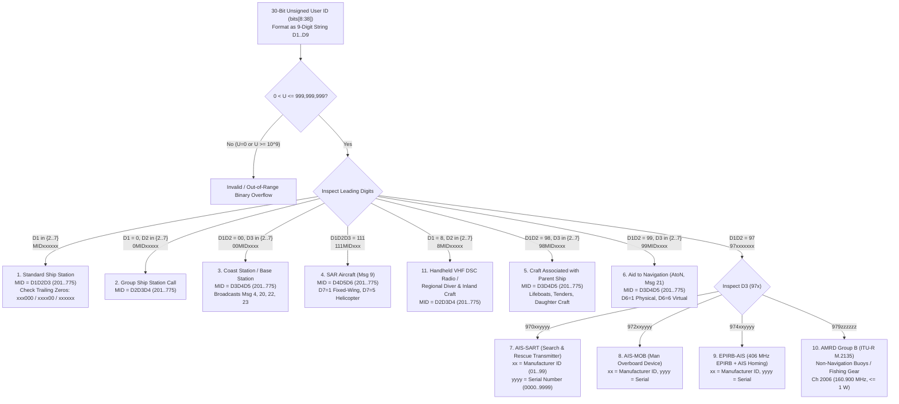
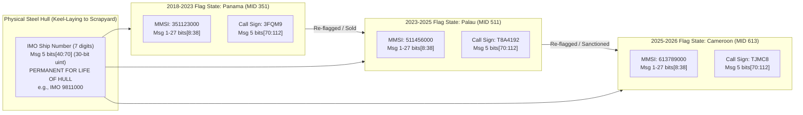

# Chapter 13: What Is an MMSI? Deep Dive into Maritime Identity

---

## 1. Operational & Conceptual Overview

Every AIS message transmitted over the VHF Data Link (VDL)—whether a 2-second high-speed turn report from a container ship, a 3-minute base station synchronization pulse, a search-and-rescue helicopter altitude broadcast, or a lifejacket man-overboard distress burst—carries a mandatory 30-bit unsigned integer in bits `8` through `37` (0-based indexing; bits `9` through `38` in 1-based ITU-R M.1371 tables). In the ITU-R M.1371 specification, this field is formally titled **`User ID`**. In operational bridge practice, maritime law, and data engineering, it is universally known as the **Maritime Mobile Service Identity (MMSI)**.

An MMSI is a **9-digit decimal number** (`000000000` to `999999999`) defined by **Recommendation ITU-R M.585-9** (*Assignment and use of identities in the maritime mobile service*). It was originally engineered not for AIS, but for **Digital Selective Calling (DSC)** and the **Global Maritime Distress and Safety System (GMDSS)** so that any ship, coast station, aircraft, or group of vessels could be dialed over automated radio telex, VHF/MF/HF DSC, and satellite links using a standard telephone-style numeric keypad.

Despite its ubiquity as the primary key in almost every naive AIS database, the MMSI is one of the most frequently misunderstood identifiers in geospatial data science and maritime operations:

1. **An MMSI Identifies a Radio License, Not a Physical Ship Hull:** Unlike a vessel's **7-digit IMO Ship Identification Number**—which is permanently welded into the hull at keel-laying and never changes until the vessel is broken up—an MMSI is tied to the vessel's **Flag State radio station license** via a 3-digit country prefix called the **Maritime Identification Digits (MID)**. Whenever a vessel changes flag (for example, re-flagging from Panama [`351xxxxxx`] to the Marshall Islands [`538xxxxxx`] or Palau [`511xxxxxx`]), its MMSI changes completely.
2. **An MMSI Encodes a Rich Structural Taxonomy:** The leading digits of a 9-digit MMSI deterministically classify the transmitter into one of **11 distinct ITU-R M.585-9 station categories**—distinguishing ocean-going ships (`MIDxxxxxx`), fleet group calls (`0MIDxxxxx`), shore VTS base stations (`00MIDxxxx`), SAR aircraft (`111MIDxxx`), handheld VHF radios (`8MIDxxxxx`), parent-ship tenders/lifeboats (`98MIDxxxx`), physical and virtual Aids to Navigation (`99MIDxxxx`), and free-form emergency/autonomous devices (`970` AIS-SART, `972` AIS-MOB, `974` EPIRB-AIS, and `979` AMRD Group B buoys).
3. **MMSIs Are Unauthenticated and Prone to Real-World Collisions:** Because AIS lacks cryptographic authentication and relies on human technicians to program the 9-digit number into shipboard hardware, global AIS feeds are chronically polluted by factory-default MMSIs (`000000000`, `111111111`, `123456789`, `999999999`), copy-paste shipyard errors, uncertified fishing net-buoys hijacking arbitrary numbers, and deliberate "shadow fleet" identity laundering.

For the mariner on watch, understanding MMSI structure prevents fatal misinterpretations on ECDIS and radar displays (such as confusing a Virtual AtoN `99MID6xxx` or an autonomous net pinger `979zzzzzz` with a steel vessel, or recognizing a `970`/`972` distress beacon immediately). For the software engineer and spatial statistician, mastering the structural rules of ITU-R M.585-9 and coupling MMSI parsing with **IMO check-digit verification** and **spatiotemporal entity resolution** is the prerequisite for turning raw AIS pings into trustworthy vessel trajectories.

---

## 2. Historical Context & Evolution (`schwehr/gis-history` Integration)

The evolution of maritime identity reflects a century-long progression from human-keyed Morse code call signs to automated numeric addressing and global satellite trajectory reconciliation (see [`schwehr/gis-history`](https://github.com/schwehr/gis-history)):

| Year / Era | Milestone in Maritime Identity & Addressing | Engineering & Operational Impact |
|---|---|---|
| **1906 – 1912** | **Berlin (1906) & London (1912) Radiotelegraph Conventions** following the sinking of *RMS Titanic* (April 15, 1912) | Standardized three- and four-letter **International Radio Call Signs (IRCS)** (e.g., *Titanic*'s `MGY`) allocated by national prefix blocks to eliminate ambiguity between competing wireless companies (Marconi vs. Telefunken). |
| **1947 – 1959** | **ITU Atlantic City (1947) & Geneva (1959) Radio Regulations** | Expanded international call-sign prefix tables (ITU Radio Regulations Article 19) to accommodate post-WWII merchant fleet growth and VHF marine radiotelephony (156 MHz band). |
| **1974 – 1982** | **SOLAS 1974**, **Inmarsat Founded (1979)**, and **ITU-R M.585-0 (1982)** | Development of **GMDSS** and **Digital Selective Calling (DSC, ITU-R M.493)** required a purely decimal identity that could be dialed through the international Public Switched Telephone Network (PSTN, ITU-T E.164) and Inmarsat-A/B/C/M earth stations. ITU-R M.585 introduced the 9-digit **MMSI** and 3-digit **MID** country code. |
| **1987 – 1996** | **IMO Resolution A.600(15) (1987)** & **SOLAS Chapter XI-1 Reg 3 (1994, effective Jan 1, 1996)** | To combat maritime fraud, "phantom ships," and flag-hopping, IMO established the permanent **7-digit IMO Ship Identification Number** (derived from the 6-digit Lloyd's Register number plus a modulo-10 check digit), permanently marked on the ship's hull and engine room bulkhead. |
| **1988 – 1998** | **Håkan Lans STDMA Patent (1988)** & **ITU-R M.1371-0 (Nov 1998)** | To keep the 256-bit ($26.67\text{ ms}$) AIS time slot compact, alphanumeric Call Signs (42 bits) and Vessel Names (120 bits) were relegated to 6-minute static broadcasts (Message 5), while the 9-digit MMSI—compressed into a **30-bit unsigned binary integer (`User ID`)**—was placed in the header of every dynamic position report. |
| **2002 – 2010** | **SOLAS AIS Mandate (2002)**, **IEC 62287-1 Class B (2006)**, **AIS-SART IEC 61097-14 (2009)**, & **`libais` Released (2010)** | Proliferation of Class B transponders, AIS Aids to Navigation (`99MIDxxxx`), parent-craft tenders (`98MIDxxxx`), and `970xxyyyy` AIS-SARTs. During the 2010 *Deepwater Horizon* response, open-source decoders (`libais`, `gpsd`) had to handle widespread default MMSIs (`000000000`, `111111111`) in the Gulf of Mexico. |
| **2012 – 2019** | **ITU-R M.585-6/7/8** & **ITU-R M.2135-0 (2019)** | Standardization of `972xxyyyy` (AIS-MOB), `974xxyyyy` (EPIRB-AIS), and `8MIDxxxxx` (handheld VHF DSC/GNSS radios). In 2019, ITU-R M.2135 created the **AMRD Group B (`979zzzzzz`)** identity block on $160.900\text{ MHz}$ to quarantine hundreds of thousands of uncertified fishing gear net-buoys polluting AIS 1 and AIS 2. |
| **2016 – 2026+** | **Global Fishing Watch (2016)**, **ITU-R M.585-9 (2022)**, **IMO Res. A.1117(30)**, & **Shadow Fleet Analytics (2022–2026)** | Machine-learning identity resolution pipelines (`Global Fishing Watch`, `Kpler`, `Windward`, `Starboard`) fuse MMSI, IMO check digits, hull dimensions, SAR imagery, and RF fingerprints to track rapid re-flagging and dual-MMSI spoofing across sanctions-evading fleets. |

---

## 3. Deep Technical & Mathematical Foundations

### 13.1 What Is an MMSI? Complete Technical Deep Dive (ITU-R M.585-9)

#### 13.1.1 Why a 9-Digit Decimal Integer Requires 30 Unsigned Bits
An MMSI is defined as a sequence of nine decimal digits:

$$\text{MMSI} = D_1 D_2 D_3 D_4 D_5 D_6 D_7 D_8 D_9 = \sum_{k=1}^{9} D_k \, 10^{9 - k}, \qquad D_k \in \{0, 1, \dots, 9\}$$

The decimal domain of a 9-digit number spans $[0, 999{,}999{,}999]$ (or $10^9$ distinct values). In early Digital Selective Calling (ITU-R M.493), MMSIs were transmitted over the air in Binary-Coded Decimal (BCD), requiring $9 \times 4 = 36\text{ bits}$ (or ten-unit error-detecting symbols). When Håkan Lans and the ITU-R Working Party 8B designed the 168-bit AIS single-slot payload (ITU-R M.1371), every bit of air-interface overhead was precious. Converting the 9-digit decimal integer into a **packed unsigned binary integer** reduced the required bit width $W$ to:

$$W = \lceil \log_2(10^9) \rceil = \lceil 29.89735285 \rceil = 30\text{ bits}$$

Because 29 bits can only represent integers up to $2^{29} - 1 = 536{,}870{,}911$ (which would cut off all African [`6xx`], South American [`7xx`], handheld [`8xx`], and AtoN/SAR [`9xx`] MMSIs!), **30 bits** is the minimum binary width capable of encoding all 9-digit decimal numbers.

| Bit-Level Parameter | 0-Based Indexing (`libais` / `pyais` / `AIVDM.txt`) | 1-Based Indexing (`ITU-R M.1371-5`) | Mathematical / Binary Value |
|---|---|---|---|
| **Field Slice in AIS Messages 1–27** | `bits[8:38]` (inclusive `8..37`) | Bits `9–38` | $U = \sum_{j=0}^{29} b_{8+j} \, 2^{29-j}$ |
| **Minimum Valid Decimal MMSI** | `000000000` (all zeros) | `000000000` | `0x00000000` ($0$) — Unconfigured / Default |
| **Maximum Valid 9-Digit MMSI** | `999999999` | `999999999` | `0x3B9AC9FF` ($999{,}999{,}999$) |
| **Maximum 30-Bit Unsigned Integer** | $2^{30} - 1$ | $2^{30} - 1$ | `0x3FFFFFFF` ($1{,}073{,}741{,}823$) |
| **Out-of-Range 10-Digit Binary Space** | $[1{,}000{,}000{,}000, \; 1{,}073{,}741{,}823]$ | `0x3B9ACA00` .. `0x3FFFFFFF` | $73{,}741{,}824$ unused binary states ($6.87\%$ of $2^{30}$) |

> [!WARNING]
> **The 10-Digit `uint30` Overflow Trap (`1000000000`–`1073741823`):** Because $2^{30} - 1 = 1{,}073{,}741{,}823 > 999{,}999{,}999$, there are **$73{,}741{,}824$ valid 30-bit unsigned integers (`0x3B9ACA00` through `0x3FFFFFFF`) that decode to 10-digit decimal numbers!** These values occur in the wild when: (a) a corrupted RF packet passes the 16-bit CRC-CCITT check due to an undetected multi-bit noise burst (which happens with probability $2^{-16} \approx 1.53 \times 10^{-5}$ among corrupt bursts), (b) a buggy transmitter sets all 30 bits to `1` (`0x3FFFFFFF` = `1073741823`) as a "not available" sentinel, or (c) an adversarial fuzzing packet is injected. Any database schema that defines `mmsi CHAR(9)` or `VARCHAR(9)` without first checking `mmsi <= 999999999` will crash with a string-truncation exception!

---

#### 13.1.2 Maritime Identification Digits (MID): Structure, Continental Blocks, and Multi-MID Allocation
At the heart of the MMSI system is the 3-digit **Maritime Identification Digits (`MID`)** code, spanning integers **`201` through `775`**. The first digit of the MID ($M_1 \in \{2, 3, 4, 5, 6, 7\}$) denotes the geographic region/continent of the licensing administration:

| First Digit of MID ($M_1$) | ITU-R M.585 Geographic Region | Valid MID Range | Example Administrations |
|---|---|---|---|
| **`2`** | **Europe** (including Mediterranean & Russian Federation) | `201` – `299` | `201` Albania, `211` Germany, `219`/`220` Denmark, `224`/`225` Spain, `226`–`228` France, `232`–`235` United Kingdom, `244`–`246` Netherlands, `257`–`259` Norway, `273` Russian Federation |
| **`3`** | **North America, Central America, and Caribbean** | `301` – `379` | `303`/`338`/`366`–`369` USA, `308`/`309`/`311` Bahamas, `310` Bermuda, `316` Canada, `319` Cayman Islands, `345` Mexico, `351`–`357` & `370`–`374` Panama |
| **`4`** | **Asia and Middle East** (excluding Southeast Asia) | `401` – `478` | `412`–`414` China, `416` Taiwan, `419` India, `422` Iran, `431`/`432` Japan, `440`/`441` South Korea, `470`/`471` UAE, `477` Hong Kong |
| **`5`** | **Oceania and Southeast Asia** | `501` – `578` | `501` Adélie Land, `503` Australia, `511` Palau, `512` New Zealand, `525` Indonesia, `533` Malaysia, `538` Marshall Islands, `548` Philippines, `563`–`566` Singapore, `574` Vietnam |
| **`6`** | **Africa** | `601` – `679` | `601` South Africa, `613` Cameroon, `621` Djibouti, `622` Egypt, `626` Gabon, `636`/`637` Liberia, `657` Nigeria, `667` Sierra Leone, `677` Tanzania |
| **`7`** | **South America** | `701` – `775` | `701` Argentina, `710` Brazil, `720` Bolivia, `725` Chile, `730` Colombia, `735` Ecuador, `740` Falkland Islands, `760` Peru, `770` Uruguay, `775` Venezuela |

##### Why Major Registries Have Multiple MIDs
Mathematically, a single 3-digit `MID` followed by six digits (`xxxxxx`) provides $10^6 = 1{,}000{,}000$ raw numbers. Why, then, does **Panama hold 12 MIDs** (`351`–`357`, `370`–`374`), the **United States hold 6 MIDs** (`303`, `338`, `366`, `367`, `368`, `369`), **Malta hold 5 MIDs** (`215`, `229`, `248`, `249`, `256`), and **Singapore** (`563`–`566`), **United Kingdom** (`232`–`235`), and **China** (`412`–`414`, plus `477` Hong Kong and `453` Macao) hold multiple MIDs?

Two historical and structural factors caused rapid MID exhaustion:
1. **The Legacy Inmarsat Trailing-Zero Rule (`MIDxxx000`):** Under early revisions of ITU-R M.585 (M.585-1 through M.585-7) and ITU-T Recommendation E.210, international telephone networks (PSTN) switching calls to Inmarsat-B, Inmarsat-M, and Fleet satellite terminals could only analyze up to **6 significant digits** of the ship's identity after the satellite ocean-region country code. Consequently, any ship requiring global satellite-to-shore / shore-to-satellite public switched telephone or telex dialing had to be assigned an MMSI ending in **three trailing zeros (`MIDxxx000`)**! That single constraint reduced the capacity of an entire national MID from $1{,}000{,}000$ vessels to **just $1{,}000$ global ocean-going ships** (`MID000000` to `MID999000`), or **$10{,}000$ regional ships** with two trailing zeros (`MIDxxxx00`). Whenever a major open registry (Panama, Liberia, Bahamas, Malta, Cyprus) licensed more than 1,000 ocean-going ships with Inmarsat terminals, the ITU had to allocate an additional MID!
2. **Explosion of Recreational Class B & VHF DSC Radios:** In domestic administrations like the United States and United Kingdom, millions of pleasure craft carry fixed VHF DSC radios or Class B AIS transponders. In the US, the Federal Communications Commission (FCC) and USCG delegated blocks of domestic non-SOLAS MMSIs (primarily under `338xxxxxx` and sub-blocks of `366`–`369`) to automated online registrars such as **BoatUS**, **Sea Tow**, **US Power Squadrons**, and **Shine Micro**, while reserving `303` specifically for **Alaska** and specific blocks of `366`–`369` for FCC-licensed commercial/international vessels and US federal/military vessels.

---

#### 13.1.3 Exhaustive Structural Taxonomy of All 11 ITU-R M.585-9 MMSI Categories
Depending on the leading digits ($D_1$, $D_1 D_2$, or $D_1 D_2 D_3$), an MMSI falls into one of **11 mutually exclusive structural formats** defined across Annexes 1 through 5 of **Recommendation ITU-R M.585-9** and **Recommendation ITU-R M.2135-0**:



Let us examine the exact technical rules, bit/digit semantics, and operational behaviors of each of the 11 categories:

##### Category 1: Standard Ship Station (`MIDxxxxxx`, First Digit `2`–`7`)
* **Format:** $M_1 M_2 M_3 X_4 X_5 X_6 X_7 X_8 X_9$, where $M_1 M_2 M_3 = \text{MID} \in [201, 775]$ and $X_k \in [0, 9]$.
* **Historical Inmarsat Trailing-Zero Tiers (ITU-R M.585-9 Annex 1):**
  1. **Three Trailing Zeros (`MIDxxx000`, $X_7=X_8=X_9=0$):** Historically assigned to ocean-going SOLAS vessels fitted with Inmarsat-B, Inmarsat-M, or Fleet satellite earth stations requiring automatic direct dialing from global terrestrial PSTN networks.
  2. **Two Trailing Zeros (`MIDxxxx00`, $X_8=X_9=0, X_7 \ne 0$):** Historically assigned to vessels fitted with Inmarsat-C terminals or ships trading regionally where national PSTN gateways routed 7 digits.
  3. **One Trailing Zero (`MIDxxxxx0`, $X_9=0, X_8 \ne 0$) or No Trailing Zeros (`MIDxxxxxx`, $X_9 \ne 0$):** Assigned to domestic vessels, fishing vessels, pleasure craft, and modern SOLAS vessels using IP-based satellite communications (FleetBroadband, VSAT, Iridium Certus, Starlink) that no longer rely on legacy 6-digit circuit-switched PSTN numbering plans.

##### Category 2: Group Ship Station Call (`0MIDxxxxx`, First Digit `0`, Second Digit `2`–`7`)
* **Format:** $0 M_1 M_2 M_3 X_5 X_6 X_7 X_8 X_9$, where $D_1 = 0$ and $D_2 D_3 D_4 = \text{MID} \in [201, 775]$.
* **Operational Role:** Used in VHF/MF/HF DSC and addressed AIS messages (e.g., Message 6 Addressed Binary, Message 12 Addressed Safety Text) to call multiple vessels simultaneously—such as all ships belonging to a single shipping company, a naval squadron, a Coast Guard district, or a commercial towing fleet. A single ship's DSC/AIS transceiver stores both its unique individual Ship Station MMSI (`MIDxxxxxx`) and one or more Group MMSIs (`0MIDxxxxx`). For example, the US Coast Guard uses `036699999` as an all-ships/group identity in US waters.

##### Category 3: Coast Station / Base Station (`00MIDxxxx`, Prefix `00`)
* **Format:** $0 0 M_1 M_2 M_3 X_6 X_7 X_8 X_9$, where $D_1 D_2 = 00$ and $D_3 D_4 D_5 = \text{MID} \in [201, 775]$.
* **Operational Role:** Assigned to shore-based Coast Radio Stations, Vessel Traffic Services (VTS) centers, and fixed AIS Base Stations (IEC 62320-1) and Repeaters (IEC 62320-3).
* **Expected AIS Message Types:** Coast stations broadcast **Message 4** (Base Station Report, providing UTC date/time and Sync State 0/2 slot synchronization), **Message 20** (Data Link Management / FATDMA slot reservations), **Message 22** (Channel Management), **Message 23** (Group Assignment), **Message 16** (Assigned Mode), **Message 17** (DGNSS Broadcast Binary corrections), and **Message 6/8/12/14** (environmental/safety broadcasts).
* **Examples:** `003669945` (USCG NAIS shore station, USA `366`), `002320001` (UK MCA Coastguard station, UK `232`), `002190001` (Danish Maritime Authority base station, Denmark `219`).

##### Category 4: Search and Rescue (SAR) Aircraft (`111MIDxxx`, Prefix `111`)
* **Format:** $1 1 1 M_1 M_2 M_3 X_7 X_8 X_9$, where $D_1 D_2 D_3 = 111$ and $D_4 D_5 D_6 = \text{MID} \in [201, 775]$.
* **Seventh-Digit ($X_7$) Aircraft Subtype Convention (ITU-R M.585-9 Annex 1, §4):**
  * **`111MID1xx` ($X_7 = 1$):** **Fixed-Wing SAR Aircraft** (e.g., USCG HC-130J Super Hercules, HC-144 Ocean Sentry, Frontex maritime patrol aircraft).
  * **`111MID5xx` ($X_7 = 5$):** **Rotary-Wing SAR Helicopter** (e.g., USCG MH-60T Jayhawk, MH-65E Dolphin, UK HM Coastguard Sikorsky S-92 / AW189).
  * *(Other values of $X_7 \in \{0, 2, 3, 4, 6, 7, 8, 9\}$ may be assigned by national administrations for specialized airborne SAR assets or long-endurance SAR UAVs).*
* **Expected AIS Message Type:** SAR aircraft transmit **Message 9** (*Standard SAR Aircraft Position Report*), which replaces `Rate of Turn`, `Navigation Status`, and `True Heading` with a **12-bit Altitude in meters** (`0–4094 m`, `4095` = N/A) and a **whole-knot Speed Over Ground** (`0–1022 knots`, instead of the $0.1\text{-knot}$ resolution of Messages 1/2/3 that caps at $102.2\text{ knots}$!).

##### Category 5: Craft Associated with a Parent Ship (`98MIDxxxx`, Prefix `98`)
* **Format:** $9 8 M_1 M_2 M_3 X_6 X_7 X_8 X_9$, where $D_1 D_2 = 98$ and $D_3 D_4 D_5 = \text{MID} \in [201, 775]$.
* **Operational Role:** Assigned to lifeboats, fast rescue boats (FRBs), ship's tenders, hydrographic survey launches, workboats, and unmanned surface vehicles (USVs) that are normally carried aboard and deployed from a larger parent vessel ("mothership").
* **Protocol Linkage in Message 24 Part B:** When a `98MIDxxxx` craft transmits a Class B Static Data Report (**Message 24 Part B**, `bits[132:162]`), the 30-bit field that normally encodes hull dimensions (`to_bow`, `to_stern`, `to_port`, `to_starboard`) is overloaded to carry the **30-bit MMSI of the Mother Ship**! Decoders (`libais`, `pyais`) must check whether `mmsi // 10_000_000 == 98` (or inspect the auxiliary craft indicator) when unpacking bits `132..161` of Message 24 Part B so they do not misinterpret a 30-bit mothership MMSI as absurd ship dimensions!

##### Category 6: Aids to Navigation — AtoNs (`99MIDxxxx`, Prefix `99`)
* **Format:** $9 9 M_1 M_2 M_3 X_6 X_7 X_8 X_9$, where $D_1 D_2 = 99$ and $D_3 D_4 D_5 = \text{MID} \in [201, 775]$.
* **Sixth-Digit ($X_6$) AtoN Subtype Convention (ITU-R M.585-9 Annex 1, §6 & IALA Recommendation A-126):**
  * **`99MID1xxx` ($X_6 = 1$):** **Physical Aid to Navigation** (a real lighthouse, lateral/cardinal buoy, Racon, or offshore wind turbine structure physically located at the broadcast coordinates, either carrying an onboard AIS AtoN transceiver [*Real AIS AtoN*] or having its status monitored/predicted and broadcast by a shore base station [*Synthetic AIS AtoN*]).
  * **`99MID6xxx` ($X_6 = 6$):** **Virtual Aid to Navigation (V-AtoN)** (no physical buoy or structure exists at the water surface; a shore AIS Base Station transmits a **Message 21** report with `Virtual AtoN Flag = 1` at `bit[269]` to project a digital marker onto ships' ECDIS displays to mark newly sunken wrecks, shifting shoals, icebergs, or Right Whale Slow Zones).
  * **`99MID0xxx` / `99MID2xxx`–`99MID9xxx`:** Used by some administrations for mobile/floating AtoNs, meteorological buoys, or regional sub-classifications; therefore, decoders must always verify both $X_6$ and the explicit `Virtual AtoN Flag` inside Message 21.

##### Category 7: AIS-SART — Search and Rescue Transmitter (`970xxyyyy`, Prefix `970`)
* **Format:** $9 7 0 X_4 X_5 Y_6 Y_7 Y_8 Y_9$, where:
  * `970` ($D_1 D_2 D_3$): Fixed prefix for **AIS Search and Rescue Transmitters** compliant with **IEC 61097-14** and **IMO Resolution MSC.246(83)**.
  * `xx` ($X_4 X_5 \in [01, 99]$): **2-digit Manufacturer ID** assigned centrally by the ITU/CIRM (International Association of Marine Electronics Companies).
  * `yyyy` ($Y_6 Y_7 Y_8 Y_9 \in [0000, 9999]$): **4-digit Sequential Unit Serial Number** assigned at the factory by the manufacturer (wrapping around to `0000` after unit `9999`).
* **On-Air Behavior:** Unlike standard ships, an AIS-SART does not depends on a Flag State radio license (`MID`). When activated in a liferaft, it transmits a burst of **8 messages per minute** (4 on AIS 1, 4 on AIS 2, spaced every 15 seconds) using **Message 1** with **`Navigation Status = 14` (`SART is active`)**, supplemented every 4 minutes by **Message 14** (*Safety Related Broadcast Message*) containing the text `"SART ACTIVE"` (or `"SART TEST"` during self-test). On ECDIS and radar displays, any target with MMSI `970xxyyyy` or `NavStatus = 14` renders as a high-priority **circle with an inscribed cross ($\otimes$)** and triggers an audible bridge distress alarm.

##### Category 8: AIS-MOB — Man Overboard Device (`972xxyyyy`, Prefix `972`)
* **Format:** $9 7 2 X_4 X_5 Y_6 Y_7 Y_8 Y_9$, where `972` identifies a personal **Man Overboard (MOB)** beacon (compliant with **IEC 63269** / **RTCM Standard 11901.1**), `xx` is the 2-digit Manufacturer ID, and `yyyy` is the 4-digit unit serial number.
* **On-Air Behavior:** Worn on a crew member's inflatable lifejacket. Upon water immersion or manual pull, it transmits **Message 1** (`Navigation Status = 14`) and **Message 14** (`"MOB ACTIVE"` or `"MOB TEST"`), often paired with a closed-loop VHF DSC Channel 70 distress alert back to the parent vessel.

##### Category 9: EPIRB-AIS — Emergency Position Indicating Radio Beacon with AIS (`974xxyyyy`, Prefix `974`)
* **Format:** $9 7 4 X_4 X_5 Y_6 Y_7 Y_8 Y_9$, where `974` identifies a **406 MHz Cospas-Sarsat EPIRB** equipped with an integrated **AIS local homing transmitter** (mandated under **IMO Resolution MSC.471(101)** and **IEC 61097-2** for new SOLAS EPIRBs installed on or after July 1, 2022), `xx` is the 2-digit Manufacturer ID, and `yyyy` is the 4-digit serial number.
* **On-Air Behavior:** While the $406\text{ MHz}$ uplink alerts global Rescue Coordination Centers via MEOSAR/LEOSAR/GEOSAR satellites (carrying the beacon's 15-character hexadecimal Cospas-Sarsat ID, which itself embeds the vessel's MMSI or call sign), the integrated VHF AIS transmitter broadcasts **Message 1** (`NavStatus = 14`) and **Message 14** (`"EPIRB ACTIVE"`) under the `974xxyyyy` identity so nearby ships within $4\text{–}10\text{ NM}$ can pinpoint the floating beacon directly on ECDIS!

##### Category 10: Autonomous Maritime Radio Devices — AMRD Group B (`979zzzzzz`, Prefix `979`)
* **Format:** $9 7 9 Z_4 Z_5 Z_6 Z_7 Z_8 Z_9$, where `979` is the fixed prefix assigned by **ITU-R M.585-9 Annex 4** and **Recommendation ITU-R M.2135-0** to **Autonomous Maritime Radio Devices (AMRD) Group B**, and `zzzzzz` ($Z_4 \dots Z_9 \in [000000, 999999]$) is a 6-digit device number.
* **Operational Role:** AMRD Group B encompasses devices that do *not* enhance the safety of general navigation—specifically commercial **fishing gear net-buoys, longline markers, fish-aggregating devices (FADs), and low-cost oceanographic surface drifters**. To prevent these devices from saturating AIS 1 ($161.975\text{ MHz}$) and AIS 2 ($162.025\text{ MHz}$) or triggering false collision alarms on SOLAS bridges, ITU-R M.2135 restricts `979zzzzzz` devices to **VHF Channel 2006 ($160.900\text{ MHz}$)**, caps radiated power at $\le 1\text{ W}$ EIRP, limits antenna height to $\le 1\text{ m}$ above sea level, and constrains reporting intervals to $\ge 1\text{ minute}$ using Message 24 Part A (`"AMRD"`).

##### Category 11: Handheld VHF DSC Radios & Regional Inland Craft (`8MIDxxxxx`, First Digit `8`)
* **Format:** $8 M_1 M_2 M_3 X_5 X_6 X_7 X_8 X_9$, where $D_1 = 8$ and $D_2 D_3 D_4 = \text{MID} \in [201, 775]$.
* **Operational Role:** Defined in **ITU-R M.585-9 Annex 3** for **handheld VHF transceivers with DSC and GNSS** carried by mariners, harbor pilots, kayakers, and divers that are *not* permanently associated with a single ship (in the US, assigned by the FCC/BoatUS as a **Mobile Marine Identity [MMI]**, e.g., `8366xxxxx` or `8338xxxxx`). Historically and regionally in certain European/inland administrations, `8MIDxxxxx` was also used for inland waterway craft, though modern European Inland AIS (CCNR) primarily uses standard `MIDxxxxxx` ship station identities supplemented by an 8-digit **Unique European Vessel Identification Number (ENI)** inside Inland AIS Binary Message 8 (`DAC = 200, FI = 10`).

##### Summary Master Table of All 11 ITU-R M.585-9 Categories

| # | Category Name | 9-Digit Pattern | Prefix / Digit Rule | Contains Flag State `MID`? | Primary AIS Message Types | Standard Reference |
|---|---|---|---|---|---|---|
| **1** | **Standard Ship Station** | `MIDxxxxxx` | $D_1 \in \{2..7\}$, $D_1 D_2 D_3 \in [201, 775]$ | **Yes** (`bits` / digits `1–3`) | Msgs `1, 2, 3, 5, 18, 19, 24, 27` | ITU-R M.585-9 Annex 1 §1 |
| **2** | **Group Ship Station Call** | `0MIDxxxxx` | $D_1 = 0$, $D_2 D_3 D_4 \in [201, 775]$ | **Yes** (digits `2–4`) | Msgs `6, 12, 16, 23` (Addressed/Group) | ITU-R M.585-9 Annex 1 §2 |
| **3** | **Coast / Base Station** | `00MIDxxxx` | $D_1 D_2 = 00$, $D_3 D_4 D_5 \in [201, 775]$ | **Yes** (digits `3–5`) | Msgs `4, 11, 16, 17, 20, 22, 23` | ITU-R M.585-9 Annex 1 §3 |
| **4** | **SAR Aircraft** | `111MIDxxx` | $D_1 D_2 D_3 = 111$, $D_4 D_5 D_6 \in [201, 775]$ | **Yes** (digits `4–6`) | Msg `9` (`111MID1xx` Fixed, `111MID5xx` Helo) | ITU-R M.585-9 Annex 1 §4 |
| **5** | **Craft Associated with Parent Ship** | `98MIDxxxx` | $D_1 D_2 = 98$, $D_3 D_4 D_5 \in [201, 775]$ | **Yes** (digits `3–5`) | Msgs `18, 19, 24` (Part B has Mothership MMSI) | ITU-R M.585-9 Annex 1 §5 |
| **6** | **Aid to Navigation (AtoN)** | `99MIDxxxx` | $D_1 D_2 = 99$, $D_3 D_4 D_5 \in [201, 775]$ | **Yes** (digits `3–5`) | Msg `21` (`99MID1xxx` Real, `99MID6xxx` Virtual) | ITU-R M.585-9 Annex 1 §6 |
| **7** | **AIS-SART** | `970xxyyyy` | $D_1 D_2 D_3 = 970$, `xx` = Mfg, `yyyy` = Serial | **No** (Free-form global) | Msgs `1` (`NavStatus=14`), `14` (`"SART ACTIVE"`) | ITU-R M.585-9 Annex 2 §1 |
| **8** | **AIS-MOB** | `972xxyyyy` | $D_1 D_2 D_3 = 972$, `xx` = Mfg, `yyyy` = Serial | **No** (Free-form global) | Msgs `1` (`NavStatus=14`), `14` (`"MOB ACTIVE"`) | ITU-R M.585-9 Annex 2 §2 |
| **9** | **EPIRB-AIS** | `974xxyyyy` | $D_1 D_2 D_3 = 974$, `xx` = Mfg, `yyyy` = Serial | **No** (Free-form global) | Msgs `1` (`NavStatus=14`), `14` (`"EPIRB ACTIVE"`) | ITU-R M.585-9 Annex 2 §3 |
| **10** | **AMRD Group B (Non-Nav Buoy)** | `979zzzzzz` | $D_1 D_2 D_3 = 979$, `zzzzzz` = Device ID | **No** (Free-form global) | Ch 2006 ($160.900\text{ MHz}$), Msg `18/24` | ITU-R M.585-9 Annex 4 / M.2135 |
| **11** | **Handheld VHF DSC / Diver** | `8MIDxxxxx` | $D_1 = 8$, $D_2 D_3 D_4 \in [201, 775]$ | **Yes** (digits `2–4`) | DSC Ch 70 / Class B / Inland | ITU-R M.585-9 Annex 3 |

---

### 13.2 MMSI vs. Permanent IMO Ship Identification Number vs. Call Sign

A foundational error in maritime data engineering is treating the MMSI as a permanent primary key for a vessel. In reality, a commercial ship carries **three distinct identifiers** inside AIS **Message 5** (*Static and Voyage Related Data*), each governed by a different international treaty and exhibiting a completely different lifecycle:



#### 13.2.1 Comparison of the Three Core Maritime Identifiers

| Attribute | 1. MMSI (`User ID`) | 2. IMO Ship Identification Number | 3. International Radio Call Sign (IRCS) |
|---|---|---|---|
| **Governing Standard** | ITU-R M.585-9 | **SOLAS Chapter XI-1, Regulation 3** (IMO Res. A.600(15), A.1078(28), A.1117(30)) | **ITU Radio Regulations, Article 19** & Appendix 42 |
| **Issuing Authority** | National Flag State Telecom/Maritime Administration (e.g., FCC, Ofcom, PMA) | **S&P Global Market Intelligence** (formerly IHS Markit / Lloyd's Register) on behalf of the IMO | National Flag State Telecom Administration |
| **Persistence Across Re-Flagging or Sale** | **Ephemeral.** Changes *every time* the vessel changes Flag State (since the 3-digit `MID` must match the new flag). | **Permanent for Life.** Assigned at keel-laying; never changes across owner changes, name changes, or flag changes until scrapped. | **Ephemeral.** Changes whenever the vessel changes Flag State (since the 2-char/3-char call-sign prefix belongs to the flag nation). |
| **Physical Marking on Vessel** | Programmed into AIS, VHF/MF/HF DSC, and EPIRB memory chips. | **Permanently welded, raised, or cut** into the stern/hull ($h \ge 200\text{ mm}$) and transverse engine-room bulkhead ($h \ge 100\text{ mm}$). | Painted on bridge nameboards / carried on Ship Station License certificate. |
| **AIS Message Location & Bit Slice (0-Based)** | **All Messages (1–27):** `bits[8:38]` (`30-bit uint`) | **Message 5 only:** `bits[40:70]` (`30-bit uint`, `0` = not available) | **Message 5:** `bits[70:112]` (`42 bits` = 7 chars); **Message 24B:** `bits[90:132]` (`42 bits`) |
| **Eligibility / Scope** | All radio-equipped vessels, Class B pleasure craft, SAR aircraft, Base Stations, AtoNs, SART/MOB/EPIRBs. | Propelled sea-going merchant ships $\ge 100\text{ GT}$ and fishing vessels $\ge 100\text{ GT}$ or $\ge 12\text{ m}$ LOA outside national waters (excludes barges without propulsion, pleasure yachts, and warships). | All licensed ship radio stations. |
| **Built-In Error Checksum?** | **No.** Any 9-digit number in `201000000`–`775999999` is syntactically plausible. | **Yes.** 7th digit $d_7$ is a weighted modulo-10 check digit over $d_1 \dots d_6$. | **No.** Alphanumeric string padded with `@` or spaces (`"@@@@@@@"` = N/A). |

#### 13.2.2 Mathematical Derivation and Error Analysis of the IMO 7-Digit Check-Digit Equation
Under **SOLAS Chapter XI-1, Regulation 3**, an IMO Ship Identification Number consists of the three letters `IMO` followed by a **7-digit decimal integer** $N_{\text{IMO}} = d_1 d_2 d_3 d_4 d_5 d_6 d_7$ (encoded in AIS Message 5 `bits[40:70]` as the raw unsigned integer $N_{\text{IMO}} \in [1{,}000{,}000, \; 9{,}999{,}999]$, or `0` when not applicable/available).

The first six digits ($d_1 d_2 d_3 d_4 d_5 d_6$, where $d_1 \ne 0$) form the sequential hull registration number originally issued by Lloyd's Register. The seventh digit $d_7 \in \{0, 1, \dots, 9\}$ is a **weighted positional modulo-10 check digit** defined by multiplying each of the first six digits $d_i$ ($i \in \{1, \dots, 6\}$) by its descending positional weight $w_i = 8 - i \in \{7, 6, 5, 4, 3, 2\}$, summing the products, and taking the remainder modulo 10:

$$d_7 = \left( \sum_{i=1}^{6} (8 - i)\, d_i \right) \bmod 10 = \left( 7 d_1 + 6 d_2 + 5 d_3 + 4 d_4 + 3 d_5 + 2 d_6 \right) \bmod 10$$

##### Worked Verification Examples
1. **Standard IMO Test Case (`IMO 9074729`):**
   * Digits: $d_1=9, \; d_2=0, \; d_3=7, \; d_4=4, \; d_5=7, \; d_6=2$, claimed check digit $d_7 = 9$.
   * Weighted sum:
     $$S = (7 \times 9) + (6 \times 0) + (5 \times 7) + (4 \times 4) + (3 \times 7) + (2 \times 2) = 63 + 0 + 35 + 16 + 21 + 4 = 139$$
   * Modulo 10: $139 \bmod 10 = 9 = d_7 \quad \checkmark \text{ (Valid)}$.
2. ***Ever Given* (`IMO 9811000`):**
   * Digits: $d_1=9, \; d_2=8, \; d_3=1, \; d_4=1, \; d_5=0, \; d_6=0$, claimed check digit $d_7 = 0$.
   * Weighted sum:
     $$S = (7 \times 9) + (6 \times 8) + (5 \times 1) + (4 \times 1) + (3 \times 0) + (2 \times 0) = 63 + 48 + 5 + 4 + 0 + 0 = 120$$
   * Modulo 10: $120 \bmod 10 = 0 = d_7 \quad \checkmark \text{ (Valid)}$.
3. ***MV Dali* (`IMO 9697428`):**
   * Digits: $d_1=9, \; d_2=6, \; d_3=9, \; d_4=7, \; d_5=4, \; d_6=2$, claimed check digit $d_7 = 8$.
   * Weighted sum:
     $$S = (7 \times 9) + (6 \times 6) + (5 \times 9) + (4 \times 7) + (3 \times 4) + (2 \times 2) = 63 + 36 + 45 + 28 + 12 + 4 = 188$$
   * Modulo 10: $188 \bmod 10 = 8 = d_7 \quad \checkmark \text{ (Valid)}$.

##### Number-Theoretic Error-Detection Analysis of the IMO Checksum
Because Message 5 is manually typed into a ship's AIS Minimum Keyboard and Display (MKD) by a bridge officer or technician during commissioning, human transcription errors (single-digit substitutions $d_i \to d'_i$ and adjacent transpositions $d_i d_{i+1} \to d_{i+1} d_i$) are exceedingly common:
* **Random Invalid Input Rejection:** Exactly $90\%$ of random 7-digit integers (such as `1234567`, `9999999`, or `1111111`) fail the check-digit equation and are immediately rejected!
* **Single-Digit Substitution Errors ($d_i \to d'_i = d_i + \delta, \; \delta \in \{\pm 1, \dots, \pm 9\}$):** A single-digit error at position $i$ goes undetected if and only if $w_i \, \delta \equiv 0 \pmod{10}$.
  * For $i \in \{1, 7\}$ ($w_1 = 7, w_7 = -1$): $\gcd(w_i, 10) = 1$, so **100% of single-digit errors at $d_1$ and $d_7$ are detected**.
  * For $i = 5$ ($w_5 = 3$): $\gcd(3, 10) = 1$, so **100% of single-digit errors at $d_5$ are detected**.
  * For $i \in \{2, 4, 6\}$ ($w_i \in \{6, 4, 2\}$): $\gcd(w_i, 10) = 2$, so a single-digit error of exactly $|\delta| = 5$ (e.g., mistyping `0` as `5` or `3` as `8`) gives $w_i (\pm 5) \equiv 0 \pmod{10}$ and is undetected ($90\%$ detection rate on those positions).
  * For $i = 3$ ($w_3 = 5$): $\gcd(5, 10) = 5$, so any even error $|\delta| \in \{2, 4, 6, 8\}$ at $d_3$ satisfies $5 \delta \equiv 0 \pmod{10}$.
* **Adjacent Transposition Errors ($d_i d_{i+1} \to d_{i+1} d_i$):** Because adjacent weights differ by $(8 - i) - (8 - (i+1)) = 1$ for $i \in \{1, \dots, 5\}$, swapping two adjacent digits among $d_1 \dots d_6$ changes the weighted sum by:
  $$\Delta S = w_i d_{i+1} + w_{i+1} d_i - (w_i d_i + w_{i+1} d_{i+1}) = (w_i - w_{i+1})(d_{i+1} - d_i) = 1 \cdot (d_{i+1} - d_i)$$
  Since $\gcd(1, 10) = 1$, **100% of adjacent transposition errors anywhere in the first six digits ($d_1 \dots d_6$) are guaranteed to be detected!**

---

## 4. Hardware, Standards, & Software Ecosystem

### 13.2.3 Standards Governing Maritime Identity & Hardware Protection
1. **Recommendation ITU-R M.585-9 (05/2022):** *Assignment and use of identities in the maritime mobile service*. Specifies the 11 MMSI categories across Annexes 1–5.
2. **Recommendation ITU-R M.1371-5 (02/2014):** Defines the 30-bit `User ID` field (`bits[8:38]`), 30-bit `IMO number` field (`bits[40:70]` of Msg 5), 42-bit `Call sign` field (`bits[70:112]` of Msg 5; `bits[90:132]` of Msg 24B), and 30-bit `Mother-ship MMSI` (`bits[132:162]` of Msg 24B).
3. **SOLAS Chapter XI-1, Regulation 3 & Regulation 5 (Continuous Synopsis Record — CSR):** Mandates permanent physical hull marking of the 7-digit IMO number and requires every SOLAS ship to carry on board a **Continuous Synopsis Record (CSR)**—an official onboard ledger issued by the Flag State that records the complete chronological history of the ship's flag states, registered owners, ISM managers, classification societies, and names alongside its immutable IMO number.
4. **IEC 61993-2 (Class A) & IEC 62287-1/2 (Class B) Hardware Lockout Rules:** To prevent mariners from casually changing their identity at sea, IEC type-approval standards mandate that the **MMSI, IMO Number, Call Sign, Vessel Name, and GNSS Antenna Offsets** be stored in non-volatile memory protected by an **administrator/installer password** or hardware programming interface. On certified Class B consumer units, firmware allows a user to enter an MMSI **exactly once** out of the box; changing it thereafter requires a factory dealer reset dongle or authorized service software. (Conversely, voyage-related fields in Message 5—`Draught`, `Destination`, `ETA`, and `Navigation Status`—remain freely editable by the Officer of the Watch on the bridge MKD).

### 13.2.4 Open-Source and Enterprise Software Handling
* **`libais` (Kurt Schwehr, C++/Python) & `gpsd` (`AIVDM.txt`):** Extract `mmsi = ubits(bits, 8, 30)` as a fast native unsigned 32-bit integer (`uint32_t`). In `Message 24 Part B`, `libais` exposes both the hull dimension interpretation (`to_bow`, `to_stern`, `to_port`, `to_starboard`) and the auxiliary craft `mothership_mmsi` interpretation (`ubits(bits, 132, 30)`).
* **`pyais` (Leon Morten Richter):** Provides helper methods and decodes Message 24 Part B conditionally based on whether the transmitting `mmsi` starts with `98`.
* **Enterprise Mediation (`GateHouse`, `USCG NAIS`, `EMSA SafeSeaNet`):** Maintain live cross-reference registries linking incoming `MMSI` + `IMO` pairs against the **S&P Global Sea-web / IHS Markit** database and **ITU MARS (Maritime mobile Access and Retrieval System)** database, flagging any vessel whose broadcast MMSI `MID` disagrees with its registered Flag State or whose IMO number fails the modulo-10 check digit.

---

## 5. Security, Adversarial Abuse, & Failure Modes

### 13.3 Real-World MMSI Pathologies, Collisions, and Entity Resolution

When an analyst queries a raw multi-year global AIS table (`SELECT * FROM ais WHERE mmsi = ...`) and plots a line connecting consecutive points ordered by timestamp, they frequently encounter bizarre tracks appearing to jump across continents at Mach 20. These are not supersonic ships; they are **MMSI identity collisions**. Below is the complete taxonomy of real-world MMSI pathologies and how to resolve them algorithmically.

#### 13.3.1 Taxonomy of MMSI Anomalies in the Wild

| Pathology Class | Signatures / Examples | Root Cause | Impact on Naive AIS Pipelines |
|---|---|---|---|
| **1. Factory-Default & Placeholder MMSIs** | `000000000`, `111111111`, `123456789`, `999999999`, `888888888`, `000000001`, `100000000` | Installer mounted the transponder and connected power/GNSS without configuring the MMSI, or entered a dummy keypad test sequence (`123456789`) to bypass the "No MMSI" startup warning. | Hundreds of unconfigured vessels across every ocean share `123456789` or `000000000`, creating a single "spiderweb monster track" spanning the entire globe. |
| **2. Bare-MID / Country-Code Truncation** | `366000000`, `412000000`, `200000000`, `563000000` | Technician entered the 3-digit country `MID` (`366` USA, `412` China) and padded the remaining 6 digits with zeros (`000000`). | Multiple coastal workboats and fishing vessels within the same country collide on the exact same bare-MID number. |
| **3. Shipyard & Dealer Copy-Paste Collisions** | Two or more distinct hulls broadcasting a valid-looking MMSI (e.g., `412345678` or `367123456`) | A shipyard or marine electronics dealer cloned a master configuration file onto a batch of newly built tugs, barges, or fishing boats, forgetting to increment the MMSI. | Creates simultaneous tracks in the same port or across different ports with conflicting Message 5/24 static names and dimensions. |
| **4. Uncertified Fishing Net-Buoy Hijacking** | `190xxxxxx`, `888xxxxxx`, `998xxxxxx`, `111xxxxxx` (fake SAR aircraft!), or random `412xxxxxx` / `351xxxxxx` | Low-cost ($40) uncertified AIS fishing net pingers transmit every 30–180 seconds on AIS 1/2 using fabricated or auto-incremented 9-digit numbers instead of ITU-R M.2135 `979zzzzzz` on Ch 2006. | Clutters ECDIS with hundreds of fake vessels/aircraft; when a random buoy MMSI matches a real SOLAS tanker's MMSI, the tanker's track appears to teleport into a fishing ground! |
| **5. AIS-SART / AIS-MOB 4-Digit Serial Rollover** | `970xxyyyy` and `972xxyyyy` | Because `yyyy` is only 4 decimal digits (`0000`–`9999`), any manufacturer `xx` that builds $>10{,}000$ SART or MOB beacons wraps around and re-issues identical `970xxyyyy` MMSIs. | Self-tests (`"SART TEST"` / `"MOB TEST"`) from two different ships carrying the same serial-wrapped beacon share the same MMSI. |
| **6. Deliberate Identity Laundering & "Zombie" Spoofing** | Sanctioned tanker broadcasting the MMSI/IMO of a scrapped ship or an active innocent vessel ("dual-broadcasting") | Illicit "shadow fleet" operators reprogram Class A transponders (via service passwords or modified firmware) to impersonate another vessel while loading sanctioned cargo or conducting dark STS transfers. | Two vessels simultaneously broadcast the same MMSI and IMO number thousands of miles apart (e.g., one in the Baltic/Persian Gulf, one off Malaysia). |

#### 13.3.2 Spatiotemporal Entity-Resolution & Track-Stitching Architecture
To transform raw, untrusted AIS observations into clean physical vessel histories (`vessel_entity_id`), production maritime intelligence pipelines (such as Global Fishing Watch's `pipe-anchorages`/`vessel-identity` and national MDA fusion engines) execute a **two-stage mathematical entity-resolution algorithm**:

##### Stage 1: Kinematic Tracklet Splitting (De-Colliding Shared MMSIs)
Given a chronological sequence of position reports $P = \{p_1, p_2, \dots, p_N\}$ sharing the same broadcast `mmsi`, we partition $P$ into kinematically coherent **tracklets** $\{T_1, T_2, \dots, T_K\}$ using a greedy or Multi-Hypothesis Tracking (MHT) great-circle velocity gate.

For an candidate assignment of observation $p_{\text{new}} = (\lambda_{\text{new}}, \phi_{\text{new}}, t_{\text{new}}, \text{SOG}_{\text{new}}, \text{COG}_{\text{new}})$ to the tail of active tracklet $T_j$ whose last validated observation is $p_{\text{last}} = (\lambda_{\text{last}}, \phi_{\text{last}}, t_{\text{last}}, \text{SOG}_{\text{last}}, \text{COG}_{\text{last}})$, we compute the great-circle Haversine/geodesic distance $d_{\text{geo}}(p_{\text{last}}, p_{\text{new}})$ in nautical miles and the elapsed time $\Delta t = t_{\text{new}} - t_{\text{last}}$ in hours. The **implied transit speed** is:

$$v_{\text{implied}}(p_{\text{last}}, p_{\text{new}}) = \frac{d_{\text{geo}}(p_{\text{last}}, p_{\text{new}})}{\Delta t + \tau_{\text{jitter}}}$$

where $\tau_{\text{jitter}} \approx \frac{2\text{ s}}{3600\text{ s/hr}}$ prevents division-by-zero when duplicate receivers timestamp the same burst slightly differently. Observation $p_{\text{new}}$ is compatible with tracklet $T_j$ only if:

$$v_{\text{implied}}(p_{\text{last}}, p_{\text{new}}) \le v_{\max}(\text{Category}) \qquad \left(\text{typically } 35\text{–}50\text{ knots for surface ships, } 600\text{ knots for } \texttt{111MIDxxx} \text{ SAR aircraft}\right)$$

If $v_{\text{implied}} > v_{\max}$ for all existing active tracklets of that MMSI (for example, `p_last` is in the Gulf of Mexico and `p_new` arrives 10 seconds later in the South China Sea, implying $v_{\text{implied}} > 3{,}000{,}000\text{ knots}$!), $p_{\text{new}}$ is spawned as a **separate concurrent tracklet $T_{K+1}$**, cleanly separating simultaneous MMSI collisions!

##### Stage 2: Cross-Flag Tracklet Stitching (Linking Re-Flagged Vessels)
When a vessel legitimately re-flags from Flag State $A$ (Tracklet $T_A$ with $\text{MMSI}_A$, ending at time $t_{A,\text{end}}$ and position $\mathbf{x}_{A,\text{end}}$) to Flag State $B$ (Tracklet $T_B$ with $\text{MMSI}_B$, starting at time $t_{B,\text{start}} \ge t_{A,\text{end}}$ and position $\mathbf{x}_{B,\text{start}}$), we compute a composite **Identity & Kinematic Affinity Score** $J(T_A, T_B)$:

1. **Validated IMO Number Hard Match:** If both $T_A$ and $T_B$ broadcast a valid 7-digit IMO number ($\text{validate\_imo}(\text{IMO}) = \text{True}$) and $\text{IMO}_A = \text{IMO}_B$ while $v_{\text{implied}}(\mathbf{x}_{A,\text{end}}, \mathbf{x}_{B,\text{start}}) \le v_{\max}$, the two tracklets belong to the **same physical hull** across a flag transition ($\text{MID}_A \to \text{MID}_B$).
2. **Hull Dimension Vector Invariance ($\mathbf{d} = [A, B, C, D]^T$):** Because a ship's steel Length Overall ($L_{\text{OA}} = A + B$), Beam ($W = C + D$), and GNSS masthead antenna offset don't change when a clerk issues a new radio license, the $\ell_2$ dimension mismatch norm between $T_A$ and $T_B$:
   $$\|\mathbf{d}_A - \mathbf{d}_B\|_2 = \sqrt{(A_A - A_B)^2 + (B_A - B_B)^2 + (C_A - C_B)^2 + (D_A - D_B)^2}$$
   is typically $0\text{ m}$ (and acts as a powerful discriminator when checking whether two vessels claiming the same IMO number are actually the same physical ship!).

---

## 6. Practical Engineering / Code Walkthrough

Below is a complete, production-ready, zero-dependency Python module (`mmsi_identity_engine.py`) that implements:
1. **Exhaustive ITU-R M.585-9 11-Category MMSI Parsing & Anomaly Classification** (including MID country lookup, Inmarsat trailing-zero tier detection, SAR aircraft fixed/rotary-wing classification, AtoN physical/virtual classification, and `970`/`972`/`974` manufacturer/serial extraction).
2. **SOLAS XI-1 Reg 3 IMO 7-Digit Check-Digit Validation.**
3. **Spatiotemporal MMSI De-Collision & Cross-Flag Track Stitching** demonstrating how to split a collided `123456789` default MMSI into separate Gulf of Mexico and South China Sea tracklets while seamlessly stitching a tanker that re-flags in Singapore anchorage from Panama (`351234000`) to Palau (`511987000`) under its permanent IMO number (`9811000`).

```python
#!/usr/bin/env python3
"""
Production ITU-R M.585-9 MMSI Classifier, IMO Check-Digit Validator,
and Spatiotemporal Entity-Resolution Engine (Chapter 13).
"""

from __future__ import annotations
from dataclasses import dataclass, field
from enum import Enum
import math
from typing import Dict, List, Optional, Tuple


class MMSICategory(str, Enum):
    """All 11 ITU-R M.585-9 station categories plus anomaly states."""
    SHIP_STATION = "1_STANDARD_SHIP_STATION"                 # MIDxxxxxx (D1 in 2..7)
    GROUP_SHIP_STATION = "2_GROUP_SHIP_STATION"              # 0MIDxxxxx
    COAST_BASE_STATION = "3_COAST_OR_BASE_STATION"           # 00MIDxxxx
    SAR_AIRCRAFT = "4_SAR_AIRCRAFT"                          # 111MIDxxx
    CRAFT_PARENT_SHIP = "5_CRAFT_ASSOCIATED_WITH_PARENT"     # 98MIDxxxx
    AID_TO_NAVIGATION = "6_AID_TO_NAVIGATION_ATON"           # 99MIDxxxx
    AIS_SART = "7_AIS_SART_TRANSMITTER"                      # 970xxyyyy
    AIS_MOB = "8_AIS_MAN_OVERBOARD"                          # 972xxyyyy
    EPIRB_AIS = "9_EPIRB_AIS_HOMING"                         # 974xxyyyy
    AMRD_GROUP_B = "10_AMRD_GROUP_B_NON_NAV"                 # 979zzzzzz
    HANDHELD_VHF_OR_INLAND = "11_HANDHELD_VHF_DSC_OR_INLAND" # 8MIDxxxxx
    INVALID_OR_ANOMALOUS = "INVALID_OR_ANOMALOUS"


# Representative ITU MID lookup dictionary (see Appendix B for full 201..775 table)
MID_COUNTRY_TABLE: Dict[int, str] = {
    201: "Albania", 209: "Cyprus", 210: "Cyprus", 211: "Germany", 212: "Cyprus",
    215: "Malta", 219: "Denmark", 220: "Denmark", 224: "Spain", 225: "Spain",
    226: "France", 227: "France", 228: "France", 229: "Malta", 232: "United Kingdom",
    233: "United Kingdom", 234: "United Kingdom", 235: "United Kingdom",
    244: "Netherlands", 245: "Netherlands", 246: "Netherlands", 247: "Italy",
    248: "Malta", 249: "Malta", 256: "Malta", 257: "Norway", 258: "Norway",
    259: "Norway", 265: "Sweden", 266: "Sweden", 273: "Russian Federation",
    303: "United States (Alaska)", 308: "Bahamas", 309: "Bahamas", 310: "Bermuda",
    311: "Bahamas", 316: "Canada", 319: "Cayman Islands", 338: "United States (Domestic)",
    345: "Mexico", 351: "Panama", 352: "Panama", 353: "Panama", 354: "Panama",
    355: "Panama", 356: "Panama", 357: "Panama", 366: "United States",
    367: "United States", 368: "United States", 369: "United States",
    370: "Panama", 371: "Panama", 372: "Panama", 373: "Panama", 374: "Panama",
    412: "China", 413: "China", 414: "China", 416: "Taiwan", 419: "India",
    422: "Iran", 431: "Japan", 432: "Japan", 440: "Korea (Republic of)",
    441: "Korea (Republic of)", 477: "Hong Kong (China)", 503: "Australia",
    511: "Palau", 512: "New Zealand", 525: "Indonesia", 533: "Malaysia",
    538: "Marshall Islands", 548: "Philippines", 563: "Singapore", 564: "Singapore",
    565: "Singapore", 566: "Singapore", 601: "South Africa", 613: "Cameroon",
    622: "Egypt", 626: "Gabon", 636: "Liberia", 637: "Liberia", 667: "Sierra Leone",
    701: "Argentina", 710: "Brazil", 725: "Chile", 775: "Venezuela",
}

KNOWN_BOGUS_MMSIS = {
    0, 1, 111111111, 123456789, 222222222, 333333333, 444444444,
    555555555, 666666666, 777777777, 888888888, 999999999, 987654321,
}


@dataclass(frozen=True)
class MMSIInspectionResult:
    raw_int: int
    formatted_9digit: str
    category: MMSICategory
    is_valid_itu: bool
    is_known_bogus_or_default: bool
    mid: Optional[int] = None
    flag_administration: Optional[str] = None
    subtype_detail: Optional[str] = None
    manufacturer_id: Optional[int] = None
    unit_serial: Optional[int] = None
    anomaly_notes: List[str] = field(default_factory=list)


def is_valid_mid(mid: int) -> bool:
    """Checks whether a 3-digit integer falls in the ITU-R M.585 MID range (201..775)."""
    return 201 <= mid <= 775


def lookup_mid_country(mid: int) -> str:
    """Returns the administration name or regional continent block for an MID."""
    if mid in MID_COUNTRY_TABLE:
        return MID_COUNTRY_TABLE[mid]
    if not is_valid_mid(mid):
        return "Unallocated / Invalid MID"
    region_map = {
        2: "Europe (Allocated/Reserved MID)",
        3: "North/Central America & Caribbean (Allocated/Reserved MID)",
        4: "Asia / Middle East (Allocated/Reserved MID)",
        5: "Oceania / Southeast Asia (Allocated/Reserved MID)",
        6: "Africa (Allocated/Reserved MID)",
        7: "South America (Allocated/Reserved MID)",
    }
    return region_map.get(mid // 100, "Unknown")


def parse_and_classify_mmsi(mmsi_raw: int) -> MMSIInspectionResult:
    """
    Parses a 30-bit unsigned AIS User ID into its ITU-R M.585-9 category,
    extracts MID / manufacturer / subtype metadata, and flags known anomalies.
    """
    notes: List[str] = []

    if mmsi_raw < 0 or mmsi_raw > 999_999_999:
        notes.append(
            f"Out of 9-digit decimal bounds ({mmsi_raw}); "
            "likely 30-bit unsigned overflow (1000000000..1073741823) or corrupted packet."
        )
        return MMSIInspectionResult(
            raw_int=mmsi_raw,
            formatted_9digit=str(mmsi_raw),
            category=MMSICategory.INVALID_OR_ANOMALOUS,
            is_valid_itu=False,
            is_known_bogus_or_default=True,
            anomaly_notes=notes,
        )

    s = f"{mmsi_raw:09d}"
    is_bogus = mmsi_raw in KNOWN_BOGUS_MMSIS
    if is_bogus:
        notes.append("Matches known factory-default or keypad-test placeholder MMSI.")

    # Check repeating identical digits (e.g., 222222222)
    if len(set(s)) == 1:
        is_bogus = True
        notes.append(f"All 9 digits are identical ('{s[0]}').")

    # 1. Standard Ship Station: D1 in '2'..'7' (MIDxxxxxx)
    if s[0] in "234567":
        mid = int(s[0:3])
        suffix = s[3:]
        valid_mid = is_valid_mid(mid)
        if suffix == "000000":
            is_bogus = True
            notes.append("Bare MID with six trailing zeros (MID000000); unconfigured suffix.")
        if s.endswith("000") and suffix != "000000":
            tier = "Inmarsat Global Direct-Dial Tier (MIDxxx000)"
        elif s.endswith("00") and suffix != "000000":
            tier = "Regional / Inmarsat-C Tier (MIDxxxx00)"
        else:
            tier = "General Ship Station / Class A or B (MIDxxxxxx)"
        return MMSIInspectionResult(
            raw_int=mmsi_raw,
            formatted_9digit=s,
            category=MMSICategory.SHIP_STATION,
            is_valid_itu=valid_mid and not is_bogus,
            is_known_bogus_or_default=is_bogus,
            mid=mid,
            flag_administration=lookup_mid_country(mid),
            subtype_detail=tier,
            anomaly_notes=notes,
        )

    # 3. Coast Station / Base Station: '00MIDxxxx'
    if s.startswith("00"):
        mid = int(s[2:5])
        valid_mid = is_valid_mid(mid)
        if not valid_mid:
            notes.append(f"Coast station MID {mid} is outside valid range 201..775.")
        return MMSIInspectionResult(
            raw_int=mmsi_raw,
            formatted_9digit=s,
            category=MMSICategory.COAST_BASE_STATION,
            is_valid_itu=valid_mid and not is_bogus,
            is_known_bogus_or_default=is_bogus,
            mid=mid,
            flag_administration=lookup_mid_country(mid),
            subtype_detail=f"Shore Base/Coast Station ID {s[5:]}",
            anomaly_notes=notes,
        )

    # 2. Group Ship Station Call: '0MIDxxxxx' (where D2 != '0')
    if s.startswith("0") and not s.startswith("00"):
        mid = int(s[1:4])
        valid_mid = is_valid_mid(mid)
        if not valid_mid:
            notes.append(f"Group station MID {mid} is outside valid range 201..775.")
        return MMSIInspectionResult(
            raw_int=mmsi_raw,
            formatted_9digit=s,
            category=MMSICategory.GROUP_SHIP_STATION,
            is_valid_itu=valid_mid and not is_bogus,
            is_known_bogus_or_default=is_bogus,
            mid=mid,
            flag_administration=lookup_mid_country(mid),
            subtype_detail=f"Fleet/Group ID {s[4:]}",
            anomaly_notes=notes,
        )

    # 4. SAR Aircraft: '111MIDxxx'
    if s.startswith("111"):
        mid = int(s[3:6])
        valid_mid = is_valid_mid(mid)
        d7 = s[6]
        if d7 == "1":
            air_type = "Fixed-Wing SAR Aircraft (111MID1xx)"
        elif d7 == "5":
            air_type = "Rotary-Wing SAR Helicopter (111MID5xx)"
        else:
            air_type = f"SAR Aircraft / UAV Subtype D7={d7} (111MID{d7}xx)"
        return MMSIInspectionResult(
            raw_int=mmsi_raw,
            formatted_9digit=s,
            category=MMSICategory.SAR_AIRCRAFT,
            is_valid_itu=valid_mid and not is_bogus,
            is_known_bogus_or_default=is_bogus,
            mid=mid,
            flag_administration=lookup_mid_country(mid),
            subtype_detail=air_type,
            anomaly_notes=notes,
        )

    # 11. Handheld VHF DSC Radio / Regional Inland Craft: '8MIDxxxxx'
    if s.startswith("8"):
        mid = int(s[1:4])
        valid_mid = is_valid_mid(mid)
        if not valid_mid:
            notes.append(
                f"Prefix '8' with invalid MID {mid}; often used by uncertified fishing net buoys (e.g. 888xxxxxx)."
            )
        return MMSIInspectionResult(
            raw_int=mmsi_raw,
            formatted_9digit=s,
            category=MMSICategory.HANDHELD_VHF_OR_INLAND if valid_mid else MMSICategory.INVALID_OR_ANOMALOUS,
            is_valid_itu=valid_mid and not is_bogus,
            is_known_bogus_or_default=is_bogus or not valid_mid,
            mid=mid if valid_mid else None,
            flag_administration=lookup_mid_country(mid) if valid_mid else None,
            subtype_detail="Handheld VHF DSC with GNSS (ITU-R M.585-9 Annex 3)",
            anomaly_notes=notes,
        )

    # 5. Craft Associated with a Parent Ship: '98MIDxxxx'
    if s.startswith("98"):
        mid = int(s[2:5])
        valid_mid = is_valid_mid(mid)
        return MMSIInspectionResult(
            raw_int=mmsi_raw,
            formatted_9digit=s,
            category=MMSICategory.CRAFT_PARENT_SHIP,
            is_valid_itu=valid_mid and not is_bogus,
            is_known_bogus_or_default=is_bogus,
            mid=mid,
            flag_administration=lookup_mid_country(mid),
            subtype_detail=f"Lifeboat / Tender / Daughter Craft {s[5:]} (check Msg 24B for Mothership MMSI)",
            anomaly_notes=notes,
        )

    # 6. Aid to Navigation (AtoN): '99MIDxxxx'
    if s.startswith("99"):
        mid = int(s[2:5])
        valid_mid = is_valid_mid(mid)
        d6 = s[5]
        if d6 == "1":
            aton_sub = "Physical AtoN (99MID1xxx)"
        elif d6 == "6":
            aton_sub = "Virtual AtoN (99MID6xxx)"
        else:
            aton_sub = f"AtoN Subtype D6={d6} (99MID{d6}xxx)"
        return MMSIInspectionResult(
            raw_int=mmsi_raw,
            formatted_9digit=s,
            category=MMSICategory.AID_TO_NAVIGATION,
            is_valid_itu=valid_mid and not is_bogus,
            is_known_bogus_or_default=is_bogus,
            mid=mid,
            flag_administration=lookup_mid_country(mid),
            subtype_detail=aton_sub,
            anomaly_notes=notes,
        )

    # 7, 8, 9, 10. Free-Form 97xxxxxxx Emergency & Autonomous Devices
    if s.startswith("970"):
        mfg = int(s[3:5])
        serial = int(s[5:9])
        return MMSIInspectionResult(
            raw_int=mmsi_raw,
            formatted_9digit=s,
            category=MMSICategory.AIS_SART,
            is_valid_itu=True,
            is_known_bogus_or_default=False,
            subtype_detail=f"AIS-SART (IEC 61097-14), Mfg={mfg:02d}, Serial={serial:04d}",
            manufacturer_id=mfg,
            unit_serial=serial,
            anomaly_notes=notes,
        )

    if s.startswith("972"):
        mfg = int(s[3:5])
        serial = int(s[5:9])
        return MMSIInspectionResult(
            raw_int=mmsi_raw,
            formatted_9digit=s,
            category=MMSICategory.AIS_MOB,
            is_valid_itu=True,
            is_known_bogus_or_default=False,
            subtype_detail=f"AIS-MOB (IEC 63269), Mfg={mfg:02d}, Serial={serial:04d}",
            manufacturer_id=mfg,
            unit_serial=serial,
            anomaly_notes=notes,
        )

    if s.startswith("974"):
        mfg = int(s[3:5])
        serial = int(s[5:9])
        return MMSIInspectionResult(
            raw_int=mmsi_raw,
            formatted_9digit=s,
            category=MMSICategory.EPIRB_AIS,
            is_valid_itu=True,
            is_known_bogus_or_default=False,
            subtype_detail=f"EPIRB-AIS (MSC.471(101)), Mfg={mfg:02d}, Serial={serial:04d}",
            manufacturer_id=mfg,
            unit_serial=serial,
            anomaly_notes=notes,
        )

    if s.startswith("979"):
        device_id = int(s[3:9])
        return MMSIInspectionResult(
            raw_int=mmsi_raw,
            formatted_9digit=s,
            category=MMSICategory.AMRD_GROUP_B,
            is_valid_itu=True,
            is_known_bogus_or_default=False,
            subtype_detail=f"AMRD Group B (ITU-R M.2135 Ch 2006 160.900 MHz), ID={device_id:06d}",
            unit_serial=device_id,
            anomaly_notes=notes,
        )

    # All other prefixes (e.g., 100..110, 112..199, 90..96) are non-standard
    notes.append(f"Prefix '{s[:3]}' is not allocated in ITU-R M.585-9 (often uncertified net buoy or test unit).")
    return MMSIInspectionResult(
        raw_int=mmsi_raw,
        formatted_9digit=s,
        category=MMSICategory.INVALID_OR_ANOMALOUS,
        is_valid_itu=False,
        is_known_bogus_or_default=True,
        anomaly_notes=notes,
    )


def validate_imo_number(imo_input: int | str) -> Tuple[bool, Optional[int], str]:
    """
    Validates a 7-digit IMO Ship Identification Number per SOLAS XI-1 Reg 3:
        d_7 = (7*d_1 + 6*d_2 + 5*d_3 + 4*d_4 + 3*d_5 + 2*d_6) mod 10
    Accepts either an integer (e.g. 9811000) or string (e.g. 'IMO 9811000').
    """
    if isinstance(imo_input, int):
        if imo_input == 0:
            return False, None, "IMO = 0 (ITU-R M.1371 'Not Available' sentinel)"
        digits_str = str(imo_input)
    else:
        cleaned = imo_input.strip().upper().replace("IMO", "").strip()
        if not cleaned.isdigit():
            return False, None, f"Non-numeric IMO string: '{imo_input}'"
        digits_str = cleaned

    if len(digits_str) != 7 or digits_str[0] == "0":
        return False, None, f"IMO number must be 7 digits with d_1 != 0 (got '{digits_str}')"

    d = [int(ch) for ch in digits_str]
    weighted_sum = sum((8 - i) * d[i - 1] for i in range(1, 7))
    expected_d7 = weighted_sum % 10
    imo_int = int(digits_str)

    if d[6] == expected_d7:
        return True, imo_int, f"Valid IMO {imo_int} (weighted sum={weighted_sum}, {weighted_sum} mod 10 = {expected_d7})"
    return (
        False,
        imo_int,
        f"Invalid check digit for IMO {imo_int}: expected d_7={expected_d7}, got d_7={d[6]}",
    )


# ==============================================================================
# Spatiotemporal MMSI De-Collision & Re-Flagging Track-Stitching Engine
# ==============================================================================

@dataclass
class AISPing:
    timestamp_s: float
    mmsi: int
    lat_deg: float
    lon_deg: float
    imo: int = 0
    callsign: str = ""
    vessel_name: str = ""
    dims_abcd: Tuple[int, int, int, int] = (0, 0, 0, 0)  # (to_bow, to_stern, to_port, to_starboard)


@dataclass
class Tracklet:
    tracklet_id: str
    mmsi: int
    pings: List[AISPing] = field(default_factory=list)
    validated_imo: Optional[int] = None
    dims_abcd: Tuple[int, int, int, int] = (0, 0, 0, 0)


def haversine_nm(lat1: float, lon1: float, lat2: float, lon2: float) -> float:
    """Computes great-circle distance in Nautical Miles (1 NM = 1852 m)."""
    r_earth_nm = 6371008.8 / 1852.0
    phi1, phi2 = math.radians(lat1), math.radians(lat2)
    dphi = math.radians(lat2 - lat1)
    dlambda = math.radians(lon2 - lon1)
    a = math.sin(dphi / 2.0) ** 2 + math.cos(phi1) * math.cos(phi2) * math.sin(dlambda / 2.0) ** 2
    return 2.0 * r_earth_nm * math.atan2(math.sqrt(a), math.sqrt(max(0.0, 1.0 - a)))


def resolve_mmsi_collisions_and_stitch_reflagging(
    pings: List[AISPing],
    max_ship_speed_kts: float = 45.0,
) -> Dict[str, List[Tracklet]]:
    """
    Stage 1: Splits shared/collided MMSIs into kinematically coherent Tracklets
             using a great-circle implied velocity gate.
    Stage 2: Stitches Tracklets across Flag-State MMSI changes using validated
             IMO numbers, hull dimension invariance, and kinematic continuity.
    """
    sorted_pings = sorted(pings, key=lambda p: p.timestamp_s)
    active_tracklets_by_mmsi: Dict[int, List[Tracklet]] = {}
    all_tracklets: List[Tracklet] = []

    for ping in sorted_pings:
        candidates = active_tracklets_by_mmsi.get(ping.mmsi, [])
        matched_tracklet: Optional[Tracklet] = None
        best_dist_nm = float("inf")

        for trk in candidates:
            last_p = trk.pings[-1]
            dt_hours = (ping.timestamp_s - last_p.timestamp_s) / 3600.0
            if dt_hours < 0:
                continue
            dist_nm = haversine_nm(last_p.lat_deg, last_p.lon_deg, ping.lat_deg, ping.lon_deg)
            implied_kts = dist_nm / (dt_hours + (2.0 / 3600.0))
            if implied_kts <= max_ship_speed_kts and dist_nm < best_dist_nm:
                best_dist_nm = dist_nm
                matched_tracklet = trk

        if matched_tracklet is None:
            idx = len(all_tracklets) + 1
            matched_tracklet = Tracklet(tracklet_id=f"TRK-{idx:03d}-MMSI-{ping.mmsi}", mmsi=ping.mmsi)
            all_tracklets.append(matched_tracklet)
            active_tracklets_by_mmsi.setdefault(ping.mmsi, []).append(matched_tracklet)

        matched_tracklet.pings.append(ping)
        valid_imo, imo_val, _ = validate_imo_number(ping.imo)
        if valid_imo:
            matched_tracklet.validated_imo = imo_val
        if any(d > 0 for d in ping.dims_abcd):
            matched_tracklet.dims_abcd = ping.dims_abcd

    # Stage 2: Group Tracklets into Unified Physical Vessel Entities
    entities: Dict[str, List[Tracklet]] = {}
    for trk in all_tracklets:
        if trk.validated_imo is not None:
            entity_key = f"HULL-IMO-{trk.validated_imo}-DIMS-{trk.dims_abcd}"
        else:
            entity_key = f"UNVERIFIED-ENTITY-{trk.tracklet_id}"
        entities.setdefault(entity_key, []).append(trk)

    return entities


if __name__ == "__main__":
    print("=== 1. ITU-R M.585-9 MMSI Taxonomy & Anomaly Verification ===")
    sample_mmsis = [
        366987000,   # US SOLAS ship with 3 trailing zeros
        36699999,    # Group Ship Station (036699999)
        3669945,     # USCG Base Station (003669945)
        111232105,   # UK Fixed-Wing SAR Aircraft
        111366512,   # USCG Rotary-Wing SAR Helicopter
        985380102,   # Daughter Craft / Tender of Marshall Islands parent ship
        993661042,   # USCG Physical AtoN
        993666088,   # USCG Virtual AtoN
        970014589,   # AIS-SART
        972140023,   # AIS-MOB
        974089912,   # EPIRB-AIS
        979104521,   # AMRD Group B Fishing Buoy (Ch 2006)
        836612345,   # US Handheld VHF DSC Radio with GPS
        123456789,   # Factory default / keypad test anomaly
        1073741823,  # 30-bit unsigned all-ones overflow (0x3FFFFFFF)
    ]
    for m in sample_mmsis:
        res = parse_and_classify_mmsi(m)
        print(
            f"MMSI {res.formatted_9digit:>10} -> {res.category.value:<34} | "
            f"ITU_Valid={str(res.is_valid_itu):<5} | Admin={res.flag_administration or 'N/A'} | "
            f"{res.subtype_detail or '; '.join(res.anomaly_notes)}"
        )

    print("\n=== 2. IMO 7-Digit Check-Digit Verification ===")
    for test_imo in [9074729, 9811000, 9697428, 9811005, 0]:
        ok, val, msg = validate_imo_number(test_imo)
        print(f"Input {test_imo:<8} -> Valid={str(ok):<5} | {msg}")

    print("\n=== 3. Spatiotemporal De-Collision & Re-Flagging Stitching ===")
    synthetic_stream = [
        # Two simultaneous vessels colliding on default MMSI 123456789 (Gulf of Mexico vs. South China Sea)
        AISPing(0.0, 123456789, 28.500, -90.100, vessel_name="TUG GULF"),
        AISPing(10.0, 123456789, 14.200, 115.300, vessel_name="FISHING SCS"),
        AISPing(60.0, 123456789, 28.502, -90.102, vessel_name="TUG GULF"),
        AISPing(70.0, 123456789, 14.203, 115.303, vessel_name="FISHING SCS"),
        # Tanker (IMO 9811000) arriving in Singapore under Panama flag (351234000) and re-flagging to Palau (511987000)
        AISPing(100.0, 351234000, 1.250, 103.850, imo=9811000, dims_abcd=(300, 100, 29, 30)),
        AISPing(400.0, 351234000, 1.252, 103.852, imo=9811000, dims_abcd=(300, 100, 29, 30)),
        AISPing(3600.0, 511987000, 1.253, 103.854, imo=9811000, dims_abcd=(300, 100, 29, 30)),
    ]
    resolved = resolve_mmsi_collisions_and_stitch_reflagging(synthetic_stream)
    for entity_id, tracklets in resolved.items():
        mmsi_chain = " -> ".join(f"{t.mmsi} ({len(t.pings)} pings)" for t in tracklets)
        print(f"Entity {entity_id:<44} : {mmsi_chain}")
```

---

## 7. Key Takeaways & Operational Checklist

* [ ] **Never Use `CHAR(9)` Without `uint30` Range Validation:** Because the `User ID` field is 30 unsigned bits (`bits[8:38]`), values between `1,000,000,000` and `1,073,741,823` (`0x3B9ACA00`–`0x3FFFFFFF`) exist in binary space and appear in corrupted RF packets. Store raw MMSIs as 32-bit unsigned/signed integers (`INTEGER`) and filter `1 <= mmsi <= 999999999`.
* [ ] **Format With Leading Zeros (`f"{mmsi:09d}"`) Before Prefix Inspection:** Coast stations (`00MIDxxxx`) and group ship stations (`0MIDxxxxx`) lose their leading zeros when cast naively to strings (`str(3669945) == "3669945"` instead of `"003669945"`). Always format to a 9-character zero-padded string or use integer division (`mmsi // 10_000_000`) when classifying ITU-R M.585-9 prefixes.
* [ ] **Check `98MIDxxxx` Before Unpacking Message 24 Part B Dimensions:** When an auxiliary craft (`98MIDxxxx`) broadcasts Message 24 Part B, bits `132..161` contain the **30-bit Mother-Ship MMSI**, not the `to_bow`/`to_stern`/`to_port`/`to_starboard` hull dimensions!
* [ ] **Quarantine Factory-Default MMSIs & Split Simultaneous Collisions:** Never construct trajectory lines by `GROUP BY mmsi ORDER BY timestamp` alone. Filter known placeholders (`000000000`, `111111111`, `123456789`, `999999999`, `MID000000`) and apply a great-circle velocity gate ($v_{\text{implied}} \le v_{\max}$) to split collided MMSIs into distinct kinematic tracklets.
* [ ] **Anchor Long-Term Vessel Analytics on Validated 7-Digit IMO Numbers:** Always validate Message 5 `bits[40:70]` against the SOLAS XI-1 Reg 3 check-digit equation $d_7 = (\sum_{i=1}^6 (8-i)d_i) \bmod 10$ and cross-check hull dimension offsets $(A, B, C, D)$ to maintain continuous vessel identity across Flag State (`MID`) transitions.

---

## 8. Cited References & Primary Sources

1. **ITU-R.** (2022). *Recommendation ITU-R M.585-9: Assignment and use of identities in the maritime mobile service*. Geneva: International Telecommunication Union. [`https://www.itu.int/rec/R-REC-M.585/`](https://www.itu.int/rec/R-REC-M.585/)
2. **ITU-R.** (2014). *Recommendation ITU-R M.1371-5: Technical characteristics for an automatic identification system using time division multiple access in the VHF maritime mobile frequency band*. Geneva: ITU. [`https://www.itu.int/rec/R-REC-M.1371/`](https://www.itu.int/rec/R-REC-M.1371/)
3. **ITU-R.** (2019). *Recommendation ITU-R M.2135-0: Technical characteristics of autonomous maritime radio devices operating in the frequency band 156–162.05 MHz*. Geneva: ITU.
4. **ITU.** (2024). *Table of Maritime Identification Digits (MID)*. ITU Radiocommunication Bureau (BR) / MARS Database. [`https://www.itu.int/en/ITU-R/terrestrial/fmd/Pages/mid.aspx`](https://www.itu.int/en/ITU-R/terrestrial/fmd/Pages/mid.aspx)
5. **IMO.** (1987/2013/2017). *SOLAS Chapter XI-1, Regulation 3 (Ship Identification Number)*; *Resolution A.600(15)*; *Resolution A.1078(28)*; and *Resolution A.1117(30): IMO Ship Identification Number Scheme*. London: International Maritime Organization.
6. **IALA.** (2021). *Recommendation A-126: The Use of the Automatic Identification System (AIS) in Marine Aids to Navigation Services*. Saint-Germain-en-Laye: IALA.
7. **IEC.** (2009/2018). *IEC 61097-14 (AIS-SART)*, *IEC 61993-2 (Class A AIS)*, *IEC 62287-1/2 (Class B AIS)*, and *IEC 63269 (AIS-MOB)*. Geneva: International Electrotechnical Commission.
8. **Kroodsma, D. A., Mayorga, J., Hochberg, T., et al.** (2018). Tracking the global footprint of fisheries. *Science*, 359(6378), 904–908. [`https://doi.org/10.1126/science.aao5646`](https://doi.org/10.1126/science.aao5646)
9. **Park, J., Lee, J., Seto, K., Hochberg, T., Wong, B. A., Miller, N. A., ... & Kroodsma, D. A.** (2020). Illuminating dark fishing fleets in North Korea. *Science Advances*, 6(30), eabb1197. [`https://doi.org/10.1126/sciadv.abb1197`](https://doi.org/10.1126/sciadv.abb1197)
10. **Schwehr, K.** (2010–present). *libais: C++/Python library for decoding maritime Automatic Identification System messages*. GitHub. [`https://github.com/schwehr/libais`](https://github.com/schwehr/libais)
11. **Schwehr, K.** (2024–2026). *gis-history: A list of key events in the history of Geographic Information Systems (GIS) and spatial data processing*. GitHub. [`https://github.com/schwehr/gis-history`](https://github.com/schwehr/gis-history)
