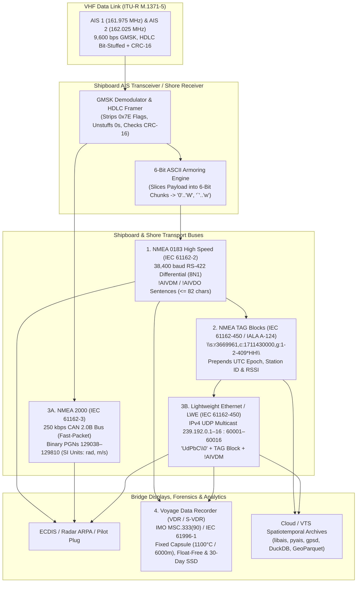
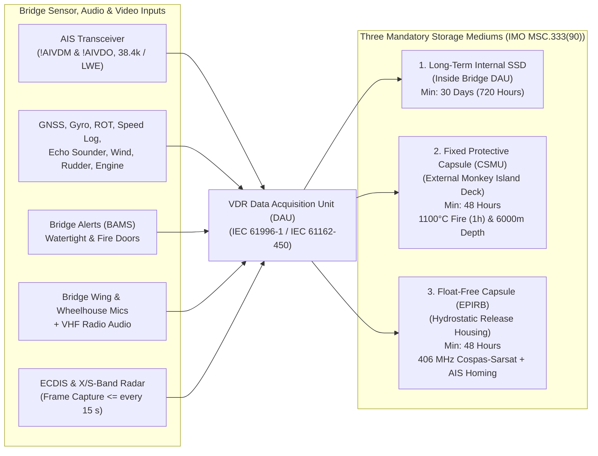

# Chapter 14: Shipboard Buses and Sharing/Logging Standards: NMEA 0183, NMEA 2000, NMEA TAG Blocks, and Voyage Data Recorders (VDRs)

---

## 1. Operational & Conceptual Overview: From VHF Radio Bursts to Bridge Buses and Forensic Black Boxes

Once an AIS transceiver demodulates a $26.667\text{ ms}$ GMSK radio burst on $161.975\text{ MHz}$ (AIS 1) or $162.025\text{ MHz}$ (AIS 2), removes the HDLC zero-bit stuffing, and verifies the 16-bit CRC-CCITT Frame Check Sequence (Chapter 7), its radio-frequency work is complete. Yet a raw 168-bit or 424-bit payload trapped inside a transceiver's microcontroller has zero operational value until it is transported to the systems and people that rely on it:
* On a **ship's bridge**, the AIS unit must ingest own-ship sensor data—latitude/longitude from a Primary Electronic Position Fixing System (EPFS / GNSS), True Heading from a gyrocompass, Rate of Turn from a turn indicator, and speed through water from a Doppler log—while simultaneously streaming decoded target reports and own-ship transmissions out to the Electronic Chart Display and Information System (ECDIS), Marine Radar/ARPA overlay, Bridge Alert Management System (BAMS), the harbor pilot's **AIS Pilot Plug**, and the ship's **Voyage Data Recorder (VDR)**.
* On a **shore collection network** (such as the US Coast Guard's Nationwide AIS [NAIS] or a European national VTS network governed by IALA Recommendation A-124), thousands of remote coastal base stations and repeaters must stamp every received AIS packet with its exact UTC arrival time, receiving station identity, and RF signal strength before multiplexing the stream over IP backhaul to central databases.

Because marine electronics evolved across four decades of dramatic technological change, an AIS observation routinely traverses **four distinct interface and archival standards** between the masthead antenna and the analyst's workstation:



Understanding the electrical, bit-level, and mathematical details of these four layers is essential for both bridge engineers and data scientists:
1. **Why raw `!AIVDM` sentences are ASCII-armored:** NMEA 0183 is a line-oriented printable 7-bit ASCII protocol where bytes such as `<CR>` (`0x0D`), `<LF>` (`0x0A`), `'$'` (`0x24`), `'!'` (`0x21`), `','` (`0x2C`), and `'*'` (`0x2A`) are reserved framing characters. To transmit raw binary AIS payloads across an NMEA 0183 serial link without colliding with reserved delimiters, IEC 61162-1 slices the binary payload into 6-bit integers (`0..63`) and shifts them into two contiguous blocks of printable ASCII characters (`'0'`–`'W'` and `` '`' ``–`'w'`).
2. **Why raw `!AIVDM` logs have no calendar date or hour:** A standard Class A position report (Messages 1, 2, 3) contains only a 6-bit UTC second (`0..59`) indicating the second within the minute when the position fix was generated, while a Class A static report (Message 5) contains *no transmission timestamp at all*. Without an external wrapper—specifically an **NMEA TAG Block** (`\c:1711430000*HH\`)—an archived `.nmea` file cannot be placed on a calendar date or hour.
3. **Why NMEA 2000 conversions can corrupt AIS precision:** Whereas NMEA 0183 `!AIVDM` preserves the exact over-the-air ITU-R M.1371 bit vector, **NMEA 2000 (IEC 61162-3)** unpacks the AIS message inside the transponder or gateway and re-encodes latitude, longitude, Course Over Ground (COG), Speed Over Ground (SOG), and Rate of Turn (ROT) into **SI units** (radians, meters per second, and radians per second). Naive bidirectional gateways (`!AIVDM` $\rightarrow$ NMEA 2000 PGN $\rightarrow$ `!AIVDM`) introduce non-reversible quantization rounding drift.

---

## 2. Historical Context & Evolution (`schwehr/gis-history` Integration)

The data buses on a modern ship bridge represent a half-century archaeological layering of telecommunications and computing history (see [`schwehr/gis-history`](https://github.com/schwehr/gis-history)):

| Year | Historical & Technical Milestone | Impact on AIS Bus & Logging Architecture |
|---|---|---|
| **1969–1970** | **RS-232-C** (1969) & **Unix Epoch Time `0`** (`1970-01-01T00:00:00Z`, `schwehr/gis-history`) | Unix epoch seconds (`c:`) later become the universal timestamp standard inside IEC 61162-450 and USCG NAIS NMEA TAG blocks. |
| **1975–1978** | **EIA RS-422** balanced differential voltage signaling standardized; first **GPS** satellite launched (1978) | Differential twisted-pair signaling eliminates common-mode hull ground noise over $100+\text{ m}$ shipboard cable runs. |
| **1980–1984** | **NMEA 0180 / 0182** succeeded by **NMEA 0183 v1.0** (1983) alongside **WGS84** datum (1984, `schwehr/gis-history`) | Establishes `$TalkerSentence,...*CS\r\n` ASCII sentences at $4{,}800\text{ baud}$ (`8N1`) for connecting LORAN-C and early GPS receivers to chartplotters and autopilots. |
| **1986–1994** | Robert Bosch GmbH introduces **Controller Area Network (CAN)** (1986); **SAE J1939** heavy-vehicle bus standardized (1994) | Provides the multi-master, priority-arbitrated 29-bit CAN 2.0B physical and data-link foundation later adopted by **NMEA 2000**. |
| **1998–2000** | **ITU-R M.1371-0** (1998), **IEC 61162-1 Ed. 2 / IEC 61162-2** (1998–2000), and **SOLAS Chapter V Regs 19 & 20** (Dec 2000) | Two $9{,}600\text{ bps}$ VHF AIS channels ($19{,}200\text{ bps}$ combined raw capacity) cannot fit through a $4{,}800\text{ baud}$ serial port! IEC 61162-2 introduces **NMEA 0183 High Speed ($38{,}400\text{ baud}$)** and the `!` encapsulated 6-bit armor format (`!AIVDM` / `!AIVDO`). Simultaneously, SOLAS Reg 20 mandates **Voyage Data Recorders (VDRs)** starting July 1, 2002. |
| **2001–2004** | **NMEA 2000** / **IEC 61162-3** released; US **MTSA 2002** initiates **USCG Nationwide AIS (NAIS)**; **IALA Recommendation A-124** published | NMEA 2000 brings $250\text{ kbps}$ CAN bus plug-and-play PGNs (`129038`–`129810`) to small and medium vessels. On shore, USCG NAIS and GateHouse introduce backslash-delimited **TAG blocks** (`\s:...,c:...*HH\`) to attach Unix timestamps and receiver IDs to NMEA streams. |
| **2006–2010** | `gpsd` (`AIVDM.txt`), `noaadata`, and **`libais`** (Kurt Schwehr, 2010 during *Deepwater Horizon*) | Open-source C++ and Python parsers standardize high-speed de-armoring, multi-line `!AIVDM` fragment reassembly, and USCG NAIS TAG block extraction at millions of lines per second. |
| **2011–2014** | **IEC 61162-450 Ed. 1** (*Lightweight Ethernet — LWE*, 2011) and **IMO Resolution MSC.333(90)** (2012, effective July 1, 2014) | Shipboard bridges migrate from point-to-point RS-422 copper pairs to UDP multicast (`UdPbC`) with mandatory TAG blocks. IMO MSC.333(90) overhauls VDR rules to require **Dual Capsules (Fixed + Float-Free, 48h each)** plus a **30-day (720h) internal SSD** and 15-second ECDIS/Radar captures. |
| **2018–2026+** | **IEC 61162-450 Ed. 2/3**, **IEC 63173-2 (SECOM)**, and **NMEA OneNet** | IPv6/IPv4 high-speed Ethernet backbones integrate cryptographic node authentication and IHO S-100 data streams with legacy TAG-blocked `!AIVDM` compatibility. |

---

## 3. Deep Technical & Mathematical Foundations

### 3.1 NMEA 0183 / IEC 61162-1 & IEC 61162-2 (`!AIVDM` and `!AIVDO`)

#### 3.1.1 Electrical Layer: Opto-Isolated Differential RS-422 vs. Single-Ended RS-232 Hazards
Early revisions of NMEA 0183 (v1.0–v1.5) permitted single-ended signaling, but beginning with **NMEA 0183 v2.0 (1992)** and codified in **IEC 61162-1** ($4{,}800\text{ baud}$) and **IEC 61162-2** ($38{,}400\text{ baud}$ High Speed for AIS), all compliant shipboard interfaces use **differential RS-422 signaling** paired with **opto-isolated listener inputs**:

1. **Serial Framing (`8N1`):** Asynchronous serial transmission using **1 start bit** (logical `0` / Space), **8 data bits** (LSB transmitted first, MSB set to `0` for 7-bit printable ASCII), **No parity bit**, and **1 stop bit** (logical `1` / Mark) = **10 bits per ASCII character**.
   * **IEC 61162-1 (Standard Speed):** $4{,}800\text{ bps}$ ($T_{\text{bit}} = 208.33\text{ }\mu\text{s}$, throughput $= 480\text{ chars/sec} \approx 5.8$ max-length sentences/sec). Used for low-rate navigation sensors (`$GPGGA`, `$HEHDT`).
   * **IEC 61162-2 (High Speed — Mandatory for AIS):** $38{,}400\text{ bps}$ ($T_{\text{bit}} = 26.04\text{ }\mu\text{s}$, throughput $= 3{,}840\text{ chars/sec} \approx 46.8$ max-length sentences/sec). Required because an AIS transceiver receiving two $9{,}600\text{ bps}$ VHF channels can output up to 75 single-slot `!AIVDM` sentences per second (~48 characters each $= 3{,}600\text{ chars/sec}$) during peak VDL traffic.
2. **Differential Voltage Levels & Opto-Isolation:**
   * A **Talker** (output) drives a twisted pair labeled **`A (-)`** and **`B (+)`** (or `TX-` / `TX+`) with a differential voltage $V_{\text{diff}} = V_B - V_A$ between $\pm 2.0\text{ V}$ and $\pm 6.0\text{ V}$ under load:
     * **Idle / Stop Bit / Logical `1` (Mark):** $V_A - V_B < -0.2\text{ V}$ (Line `B` is positive relative to Line `A` in NMEA 0183 nomenclature).
     * **Start Bit / Logical `0` (Space):** $V_A - V_B > +0.2\text{ V}$ (Line `A` is positive relative to Line `B`).
   * Every **Listener** (input) must present an **optocoupler (photodiode/phototransistor)** isolation barrier with a minimum input impedance of $R_{\text{in}} \ge 4\text{ k}\Omega$ (IEC 61162-2 requires termination/bias networks for $38{,}400\text{ baud}$ lines), drawing $\le 2.0\text{ mA}$ at $2.0\text{ V}$ and incorporating a reverse-polarity protection diode so zero galvanic current flows between the Talker's chassis ground and the Listener's chassis ground.

> [!WARNING]
> **Two Classic Shipboard RS-422 Wiring Pitfalls:**
> 1. **The TIA/EIA-422 vs. NMEA 0183 `A`/`B` Labeling Inversion:** In the telecommunications standard **TIA/EIA-422**, pin `A` is defined as the non-inverting (`+` in Mark/Idle) terminal and pin `B` as the inverting (`-` in Mark/Idle) terminal. In **NMEA 0183 v2.0–v4.11**, the labels were historically reversed (`A = TX-`, `B = TX+` in Idle)! When connecting an industrial USB-to-RS-422 adapter to a shipboard AIS Pilot Plug or junction box, if the serial terminal displays garbage characters (`0xFF`/`0xFE`), simply swap the `A` and `B` wires—differential RS-422 drivers are short-circuit protected and swapping `A` and `B` cannot damage hardware.
> 2. **Why Connecting Single-Ended RS-232 Ground Directly to RS-422 `B (-)` Causes Ground Loops and Dropouts:** When field technicians attempt to feed a differential RS-422 Talker (`TX+`, `TX-`) into an older single-ended RS-232 serial port (`RX`, `GND`), they frequently wire `TX-` directly to the RS-232 `GND` pin. Because an RS-422 output is a **push-pull H-bridge driver** that actively drives `TX-` between $+0.5\text{ V}$ (when `TX+` is $+4.5\text{ V}$) and $+4.5\text{ V}$ (when `TX+` is $+0.5\text{ V}$) relative to the Talker's internal $0\text{ V}$ supply rail, tying `TX-` to `GND` **dead-shorts the Talker's lower push-pull transistor to chassis ground for every `'0'` bit**! This causes three immediate failures:
>    * **Half-Voltage Swing & Threshold Starvation:** The differential swing collapses from $\pm 4\text{ V}$ ($8\text{ V}_{\text{pp}}$) to a unipolar $0\text{ V}$ to $+4\text{ V}$ swing that fails to cross the negative threshold of strict RS-232 receivers (which require $\le -3\text{ V}$ for Mark).
>    * **Thermal Driver Shutdown:** The shorted `TX-` stage dumps $50\text{–}150\text{ mA}$ of fault current continuously, overheating the RS-422 line driver IC and causing intermittent packet dropouts as thermal protection cycles.
>    * **Hull Ground-Loop Currents:** On steel or aluminum ships (or fiberglass boats with high-current $12\text{ V}/24\text{ V}$ DC panels), the voltage potential between the masthead/chart-table AIS ground and the bridge PC ground can swing by $1.5\text{–}5.0\text{ V}$ whenever bow thrusters, winches, or HF transmitters key up—driving amps of AC/DC ground-loop current straight through the signal wire and burning out the serial port. Always use an opto-isolated RS-422-to-USB or RS-422-to-RS-232 converter where `RX+` and `RX-` float entirely isolated from host ground.

#### 3.1.2 Complete Field-by-Field Anatomy of `!AIVDM` and `!AIVDO`
Consider a canonical single-sentence Class A position report received on VHF Channel B ($162.025\text{ MHz}$):

```text
!AIVDM,1,1,,B,15M67FC000G?ufbE`FepT@3n00Sa,0*5C<CR><LF>
```

Every `!` encapsulated NMEA 0183 AIS sentence adheres to the strict 7-field grammar defined in **IEC 61162-1** (`VDM` / `VDO` formatter) and **ITU-R M.1371-5**:

```text
! <Talker><Formatter> , <total> , <num> , <seq_id> , <channel> , <payload> , <fill> * <CS> <CR><LF>
|---------0-----------|----1----|---2---|----3-----|-----4-----|-----5-----|---6----|------7------|
```

| Field Index | Field Name | Example Value | Valid Domain / Constraints | Engineering & Protocol Semantics |
|---|---|---|---|---|
| **Prefix** | Start Character | `!` (`0x21`) | `!` (`0x21`) or `$` (`0x24`) | **`!`** indicates an **encapsulated binary bitstream sentence** whose payload is 6-bit ASCII-armored (`!AIVDM`, `!AIVDO`, `!ABVDM`). **`$`** indicates a **parametric comma-delimited ASCII sentence** containing human-readable fields (`$AIALR` alarm state, `$AITXT` text status, `$AIACA` channel assignment, `$GPZDA` UTC time/date, `$HEHDT` gyro heading). |
| **0 (Chars 1–2)** | Talker ID | `AI` | 2 uppercase ASCII letters (`AI`, `AB`, `AD`, `AN`, `AR`, `AS`, `AT`, `AX`, `BS`, `SA`) | Identifies the class of AIS station that generated the NMEA sentence (see Table 14.2 below). Decoders must never hard-code `!AIVDM` alone, or they will silently drop shore base station (`!ABVDM`), repeater (`!AXVDM`), and AtoN (`!ANVDM`) sentences! |
| **0 (Chars 3–5)** | Sentence Formatter | `VDM` | `VDM` or `VDO` | **`VDM`** (*VHF Data-link Message*): Message received over the VHF radio link from **another** station. **`VDO`** (*VHF Data-link Own-vessel report*): Message generated by the **local (own-ship)** AIS transponder reporting its own position (`Msg 1/18`) or static data (`Msg 5/24`) to the ship's ECDIS and VDR. |
| **1** | `total` (Fragment Count) | `1` | `'1'` to `'9'` | Total number of NMEA sentences required to transport the complete binary AIS message. Because IEC 61162-1 caps total sentence length at **82 characters** (including `!` and `<CR><LF>`), the `payload` field in a single sentence holds at most **61 or 62 armored characters** ($366\text{–}372\text{ bits}$). Messages $>366\text{ bits}$ (e.g., 424-bit Message 5) must be split across `total = 2` (or up to `3..5` for long binary Messages 8/26). |
| **2** | `num` (Fragment Number) | `1` | `'1'` to `total` | 1-based sequential index of this fragment within the multi-sentence message (`1, 2, ..., total`). A message is complete only when all fragments `1..total` have been received in order. |
| **3** | `seq_id` (Sequential Message ID) | `""` (empty) | Empty (`""`) or `'0'` to `'9'` | When `total == 1`, this field is normally empty (null between commas: `,,`). When `total > 1`, it contains a single digit `'0'`–`'9'` that remains identical across all fragments of the same message (`!AIVDM,2,1,3,B,...` followed by `!AIVDM,2,2,3,B,...`) and increments modulo 10 for subsequent multi-sentence messages so parsers can distinguish interleaved fragments. |
| **4** | `channel` (VHF Channel Code) | `B` | `'A'`, `'B'`, `'1'`, `'2'`, or `""` | Identifies the VHF radio channel on which the burst was received: `'A'` (or legacy `'1'`) = **AIS 1** (Channel 87B, $161.975\text{ MHz}$); `'B'` (or legacy `'2'`) = **AIS 2** (Channel 88B, $162.025\text{ MHz}$). Often empty (`,,`) on `!AIVDO` own-ship sentences when queried internally rather than over RF. |
| **5** | `payload` (6-Bit Armored Data) | `15M67FC0...` | 1 to 62 chars in `['0'..'W', '`'..'w']` | The binary ITU-R M.1371 message bits, partitioned into 6-bit integers (`0..63`) MSB-first and mapped to printable ASCII characters via Equation 14.1. Across all fragments `1..total`, the concatenated payload strings yield $6 \times N_{\text{chars}}$ raw bits. |
| **6** | `fill` (Fill Bits) | `0` | `'0'` to `'5'` | Number of trailing zero padding bits (`0..5`) appended to the final 6-bit character of the **last fragment** (`num == total`) so the total bit length is divisible by 6. Must be `'0'` on all intermediate fragments (`num < total`). When unpacking the final fragment, the decoder **discards the last `fill` bits**. |
| **7** | `*CS` (Checksum + Termination) | `*5C\r\n` | `*` + 2 uppercase hex digits (`00`–`FF`) + `\r\n` | Mandatory 8-bit XOR checksum calculated over all characters strictly between `!` and `*`, followed by `<CR><LF>` (`0x0D 0x0A`). |

##### Complete Catalog of AIS NMEA Talker Identifiers (IEC 61162-1 & IALA A-124)
While shipboard Class A and Class B transponders emit `!AIVDM` and `!AIVDO`, shore networks and specialized stations use ten distinct 2-character Talker IDs:

| Talker ID | Station Category (IEC 61162-1 / NMEA 0183 v4.11) | Typical Deployment Context |
|---|---|---|
| **`AI`** | Mobile AIS Station (Class A or Class B vessel transponder) | Shipboard bridges, Pilot Plugs, VDRs, and recreational chartplotters (`!AIVDM`, `!AIVDO`). |
| **`AB`** | Independent AIS Base Station | Shore VTS and coastal authority base stations compliant with IEC 62320-1 (`!ABVDM`, `!ABVDO`). |
| **`AD`** | Dependent AIS Base Station | Remotely controlled shore base stations managed by a central VTS mediation server. |
| **`AN`** | AIS Aid to Navigation (AtoN) Station | Buoys, lighthouses, and offshore structures compliant with IEC 62320-2 (`!ANVDM`, `!ANVDO`). |
| **`AR`** | AIS Receiving Station | Receive-only coastal monitoring sites, SDRs (`AIS-catcher`), and passive shore stations (`!ARVDM`). |
| **`AS`** | AIS Limited Base Station | Restricted-power or localized port/lock base stations. |
| **`AT`** | AIS Transmitting Station | Dedicated shore transmit-only uplinks. |
| **`AX`** | AIS Simplex Repeater Station | Mountaintop or island store-and-forward simplex repeaters compliant with IEC 62320-3 (`!AXVDM`). |
| **`BS`** | Base Station (Legacy / Deprecated) | Pre-IEC 62320-1 shore stations (still encountered in older USCG and European port logs: `!BSVDM`). |
| **`SA`** | Physical Shore AIS Station | IALA A-124 physical shore station wrapper identifier. |

#### 3.1.3 Multi-Sentence Fragmentation and Reassembly Mechanics
Why do messages like **Message 5** (*Class A Static and Voyage Related Data*, 424 bits) always arrive as two NMEA sentences?
1. Under IEC 61162-1 §5.3.3, the maximum permitted length of an NMEA 0183 sentence from `!` through `<CR><LF>` is **82 characters**.
2. Subtracting the 20–21 fixed framing characters (`!AIVDM,2,1,3,B,` [15 chars] + `,0*HH\r\n` [7 chars] = 22 chars) leaves a maximum of **60 to 62 characters** ($360\text{–}372\text{ bits}$) for the `payload` field in a single sentence.
3. Because Message 5 is **424 bits** long, it requires:
   $$N_{\text{chars}} = \left\lceil \frac{424}{6} \right\rceil = \lceil 70.6667 \rceil = 71\text{ armored characters}, \qquad \text{fill\_bits} = (71 \times 6) - 424 = 426 - 424 = 2\text{ bits}$$
4. A Class A transponder therefore splits those 71 armored characters across two sentences sharing the same `seq_id` (here `3`):
   ```text
   !AIVDM,2,1,3,B,55P5TL01VIaAL@7WKO@mBplU@<PDhh000000001S;AJ::4A80?4i@E53,0*3E
   !AIVDM,2,2,3,B,1@0000000000000,2*55
   ```
   * **Fragment 1 (`2,1,3`):** Carries 56 armored characters ($56 \times 6 = 336\text{ bits}$) with `fill = 0`.
   * **Fragment 2 (`2,2,3`):** Carries the remaining 15 armored characters ($15 \times 6 = 90\text{ bits}$) with `fill = 2` (instructing the parser to strip the last 2 padding bits, leaving $90 - 2 = 88\text{ bits}$).
   * **Reassembled Payload:** $336 + 88 = 424\text{ bits}$.

#### 3.1.4 The 6-Bit ASCII Armor Encoding and Decoding Algorithm
To map each 6-bit integer $v \in \{0, 1, \dots, 63\}$ (`000000` to `111111` in binary) into a printable 7-bit ASCII byte $c \in \{48, \dots, 87\} \cup \{96, \dots, 119\}$ without touching reserved NMEA control characters, IEC 61162-1 defines a piecewise linear shift:

##### Forward 6-Bit Armor Encoding Function $c = \text{Armor}(v)$
$$\text{Armor}(v) = \begin{cases} v + 48 & \text{if } 0 \le v \le 39 \quad \longrightarrow \quad \text{ASCII } 48\text{–}87 \;\; (\texttt{0x30}\text{–}\texttt{0x57}: \;\texttt{'0'}\text{ through }\texttt{'W'}) \\ v + 56 & \text{if } 40 \le v \le 63 \quad \longrightarrow \quad \text{ASCII } 96\text{–}119 \; (\texttt{0x60}\text{–}\texttt{0x77}: \;\texttt{'`'}\text{ through }\texttt{'w'}) \end{cases} \tag{14.1}$$

Notice the **8-character gap** between ASCII `87` (`'W'`) and ASCII `96` (`` '`' ``). The eight ASCII codes **`88..95` (`0x58`–`0x5F`: `'X'`, `'Y'`, `'Z'`, `'['`, `'\\'`, `']'`, `'^'`, `'_'`) are strictly excluded** from NMEA 6-bit armor because backslash `'\\'` (`0x5C`) is the NMEA TAG block delimiter and caret `'^'` (`0x5E`) is the IEC 61162-1 hex escape character!

##### Inverse 6-Bit De-Armoring Function $v = \text{DeArmor}(c)$
Given an armored ASCII character with byte value $c = \text{ord}(\text{char})$:
1. Validate that $c \in [48, 87] \cup [96, 119]$ (rejecting any character in the forbidden gap $88 \le c \le 95$ or outside $[48, 119]$).
2. Subtract `48`, and if the intermediate result exceeds `39` (meaning $c \ge 96$), subtract an additional `8`:

$$v = \text{DeArmor}(c) = \begin{cases} c - 48 & \text{if } 48 \le c \le 87 \quad (\texttt{'0'}\text{–}\texttt{'W'} \to 0\text{–}39) \\ c - 56 = (c - 48) - 8 & \text{if } 96 \le c \le 119 \quad (\texttt{'`'}\text{–}\texttt{'w'} \to 40\text{–}63) \end{cases} \tag{14.2}$$

> [!IMPORTANT]
> **Do Not Confuse NMEA 6-Bit Armor (`!AIVDM` Transport) with ITU-R M.1371 Table 44 Internal 6-Bit Text (`'@'`–`'_'`)!**
> AIS uses **two completely different 6-bit character tables** at different layers of the stack (both are tabulated in full in **Appendix C**):
> 1. **Outer Layer — NMEA 0183 6-Bit Armor (Equation 14.1):** Encodes the *entire binary message* (integers, flags, coordinates, and text alike) into `'0'`–`'W'` and `` '`' ``–`'w'` for transport over serial lines. Here, 6-bit `0` (`000000`) is `'0'` (`0x30`), and 6-bit `1` (`000001`) is `'1'` (`0x31`). That is why every single-slot Message 1 payload starts with `'1'`, Message 2 starts with `'2'`, Message 3 starts with `'3'`, Message 5 starts with `'5'`, and Message 18 (`010010` = 18) starts with `'B'` ($18 + 48 = 66 = \texttt{'B'}$)!
> 2. **Inner Layer — ITU-R M.1371-5 Annex 2 Table 44 Internal 6-Bit ASCII:** Once you de-armor the NMEA payload into a binary bit vector and slice out a text field (such as the 120-bit `Vessel Name` or 42-bit `Call Sign` in Message 5), each 6-bit integer $u \in \{0, \dots, 63\}$ *inside* that text field maps to uppercase ASCII via:
>    $$\text{TextChar}(u) = \begin{cases} \text{chr}(u + 64) & \text{if } 0 \le u \le 31 \quad (\texttt{'@'}, \texttt{'A'}\text{–}\texttt{'Z'}, \texttt{'['}, \texttt{'\\'}, \texttt{']'}, \texttt{'\^'}, \texttt{'\_'}) \\ \text{chr}(u) & \text{if } 32 \le u \le 63 \quad (\texttt{' '}, \texttt{'!'}\text{–}\texttt{'?'}, \text{including digits }\texttt{'0'}\text{–}\texttt{'9'}) \end{cases} \tag{14.3}$$
>    In this inner text table, `0` (`000000`) is **`'@'`**, which ITU-R M.1371 uses to pad unused trailing characters in vessel names and call signs!

#### 3.1.5 The 8-Bit XOR Checksum (`*HH`)
Every NMEA 0183 sentence ends with an asterisk `*` (`0x2A`) followed by a two-character uppercase hexadecimal checksum (`00`–`FF`) and `<CR><LF>` (`\r\n`). Let $s_1, s_2, \dots, s_L$ denote the exact sequence of ASCII bytes **strictly between** the start delimiter (`!` or `$`) and the asterisk (`*`), excluding both `!` and `*`. The 8-bit checksum $\text{CS} \in [0, 255]$ is the bitwise exclusive-OR ($\oplus$) of their ASCII codes:

$$\text{CS} = \bigoplus_{i=1}^{L} \text{ord}(s_i) = \text{ord}(s_1) \oplus \text{ord}(s_2) \oplus \cdots \oplus \text{ord}(s_L) \tag{14.4}$$

For example, in `!AIVDM,1,1,,B,15M67FC000G?ufbE`FepT@3n00Sa,0*5C`:
* The checksummed substring is `AIVDM,1,1,,B,15M67FC000G?ufbE`FepT@3n00Sa,0` ($L = 43\text{ bytes}$).
* XORing all 43 ASCII bytes yields `0x5C` ($92_{10}$), formatted as `*5C`.
* If the same payload arrived on Channel `A` instead of `B`, only a single byte changes (`'B'` = `0x42` $\rightarrow$ `'A'` = `0x41`), flipping the checksum by `0x42 ^ 0x41 = 0x03` to produce `*5F`.

---

### 3.2 NMEA TAG Blocks (IEC 61162-450 / USCG NAIS / IALA A-124)

#### 3.2.1 Why Raw `!AIVDM` Sentences Cannot Stand Alone in Archives
A raw `!AIVDM` stream suffers from three fatal archival omissions:
1. **No Full Timestamp:** Messages 1, 2, 3, 9, 18, and 19 only encode the **6-bit UTC second (`0..59`)** when the vessel's GNSS fix was computed. They contain **no year, month, day, hour, or minute**. Worse still, static and voyage reports (Messages 5 and 24), safety broadcasts (Messages 12 and 14), AtoN reports (Message 21), and Long-Range satellite reports (Message 27) contain **zero time fields of any kind**.
2. **No Receiver Provenance:** When an aggregator or Coast Guard network combines feeds from 200 coastal towers and 40 LEO satellites, a bare `!AIVDM` line gives no indication of *which* station received the burst.
3. **No Multi-Source Fragment Protection:** If two shore towers simultaneously receive the same 2-line Message 5 and both assign `seq_id = 3`, a naive central multiplexer merging their raw `!AIVDM` streams can accidentally pair Fragment 1 from Tower A with Fragment 2 from another ship at Tower B.

#### 3.2.2 Complete Specification of the `\parameter:value,...*HH\` TAG Block Header
To solve these limitations without breaking backward compatibility with legacy NMEA 0183 parsers, **IALA Recommendation A-124**, the **USCG Nationwide AIS (NAIS)** network, and **IEC 61162-1 / IEC 61162-450** standardized the **NMEA TAG Block**: a backslash-delimited (`\...*HH\`) comma-separated `key:value` prefix placed immediately before the `!` or `$` start character of the sentence:

```text
\s:r3669961,c:1711430000,g:1-1-4092*05\!AIVDM,1,1,,B,15M67FC000G?ufbE`FepT@3n00Sa,0*5C
|------------- TAG Block --------------||--------------- NMEA Sentence ----------------|
```

* **Framing & Checksum:** The TAG block opens with `\` (`0x5C`), lists one or more `parameter:value` pairs separated by commas `,` (`0x2C`), and terminates with `*HH\` where `HH` is the 2-digit uppercase hexadecimal **8-bit XOR checksum of all characters strictly between the opening `\` and the `*`** (here `s:r3669961,c:1711430000,g:1-1-4092` $\rightarrow$ `*05`).
* **Maximum Length:** Under IEC 61162-450, the TAG block (including both `\` delimiters and `*HH`) must not exceed **80 characters**.

| TAG Parameter | Name (IEC 61162-450 / IALA A-124) | Format & Units | Example | Engineering Purpose & Semantics |
|---|---|---|---|---|
| **`c:`** | **UNIX Time (`ctime`)** | Positive integer: seconds (10 digits) or milliseconds (13 digits) since `1970-01-01T00:00:00Z` | `c:1711430000` or `c:1711430000125` | Authoritative UTC arrival timestamp applied by the receiving station or mediation server. Parsers check whether the integer exceeds $10^{11}$ to distinguish seconds from milliseconds (`t_sec = val / 1000.0 if val > 1e11 else float(val)`). |
| **`s:`** | **Source Identifier** | 1–15 alphanumeric characters (or 6-char IEC 61162-450 System Function ID `AAxxxx`) | `s:r3669961` or `s:AI0001` | Identifies the receiving shore station, buoy, satellite, or shipboard talker. In USCG NAIS logs, prefixes such as `r` or `b` followed by site code or MMSI (`s:r003669945`, `s:d11NDBC`) identify the exact coastal tower or NDBC weather buoy. |
| **`d:`** | **Destination Identifier** | 1–15 alphanumeric characters | `d:EC0001` or `d:VTS_NY` | Target recipient system or bridge function (e.g., ECDIS `#1` or VTS sector console). |
| **`g:`** | **Sentence Grouping** | `num-total-group_id` (three integers separated by hyphens `-`) | `g:1-2-7384`, `g:2-2-7384` | Binds multi-sentence NMEA sequences together across network links. Even if two different multi-sentence `!AIVDM` messages share the same NMEA `seq_id`, their TAG block `group_id` (`1..99999`) uniquely groups the exact lines belonging to a single reception event, and can also bind an `$ABVSI` signal-strength sentence to its corresponding `!AIVDM` sentence! |
| **`n:`** | **Line Count** | Positive integer (`0` to `999999`, wrapping to `0`) | `n:48219` | Monotonically incrementing sentence counter emitted by a source (`s:`). Allows IEC 61162-450 listeners and VDRs to detect dropped UDP multicast packets immediately. |
| **`r:`** | **Relative Time** *(or Legacy RSSI)* | Integer seconds (standard) or signed float/int (vendor RSSI) | `r:3600` or `r:-92` | In standard IEC 61162-450, `r:` is relative elapsed time in seconds. However, in several shore receiver dialects, `r:` or uppercase `R:`/`S:` was overloaded to report **Received Signal Strength Indicator (RSSI)** in $\text{dBm}$! |
| **`t:`** | **Text String** | Printable ASCII string (excluding `\ , * ! $ ^ ~`) | `t:CH87B_OK` | Free-form diagnostic or operator annotation text. |

#### 3.2.3 Vendor & RF Diagnostic Extensions (USCG NAIS, Shine Micro, `AIS-catcher`, GateHouse)
High-assurance shore receivers (such as **Shine Micro** receivers used by the USCG, **GateHouse** IALA A-124 base station controllers, and open-source SDR demodulators like **`AIS-catcher`**) attach physical-layer RF diagnostics either inside extended TAG blocks or via companion NMEA sentences grouped by `g:`:

1. **Extended TAG Parameters (`S:`, `f:`, `p:`, `a:`):**
   * **Signal Level / RSSI (`S:` or `s_rssi:`):** Received burst power in $\text{dBm}$ (e.g., `S:-84.2`).
   * **Carrier Frequency Offset (`f:` or `ppm:`):** Measured frequency deviation from nominal $161.975 / 162.025\text{ MHz}$ in $\text{Hz}$ (e.g., `f:+312`), invaluable for Specific Emitter Identification (SEI) and Doppler tracking (Chapter 28).
   * **Slot Number (`slot:` or `a:`):** TDMA time slot index (`0..2249`) within the 60-second UTC frame.
2. **Grouped Companion Sentences (`$ABVSI` / `$AIVSI` — VHF Signal Information):**
   In USCG NAIS and IEC 62320-1 shore base stations, a multi-line TAG group (`g:1-2-1045` and `g:2-2-1045`) frequently pairs the `!AIVDM` sentence with an `$ABVSI` sentence containing the exact TDMA slot number, UTC arrival time, RSSI ($\text{dBm}$), and Signal-to-Noise Ratio ($\text{SNR}$ in $\text{dB}$):
   ```text
   \g:1-2-1045,s:r003669945,c:1711430000*3A\!AIVDM,1,1,9,B,15M67FC000G?ufbE`FepT@3n00Sa,0*55
   \g:2-2-1045,s:r003669945,c:1711430000*39\$ABVSI,r003669945,9,051320.4266,1250,-86.4,24.1*1E
   ```

---

### 3.3 NMEA 2000 (IEC 61162-3) and Lightweight Ethernet (LWE / IEC 61162-450)

#### 3.3.1 NMEA 2000 CAN Bus Architecture ($250\text{ kbps}$)
On yachts, workboats, patrol craft, and modern commercial bridge Drop-Cables, point-to-point NMEA 0183 wiring is replaced by **NMEA 2000 (IEC 61162-3)**—a multi-master, differential serial bus based on **Controller Area Network (CAN 2.0B, ISO 11898-2)** and **SAE J1939** operating at **$250\text{ kbps}$** over a shielded twisted pair (`NET-H`, `NET-L`, plus `12V` power, `NET-C` ground, and drain shield) terminated at both ends of the backbone with **$120\text{ }\Omega$ resistors** ($60\text{ }\Omega$ parallel equivalent loop resistance).

##### 29-Bit CAN 2.0B Identifier and PGN Extraction
Every NMEA 2000 frame carries a **29-bit extended CAN Identifier** (`bits 28..0`) that governs non-destructive bitwise bus arbitration and encodes the **18-bit Parameter Group Number (PGN)**:

```text
+---------------+----------+----------+--------------------+--------------------+--------------------+
| Priority (3b) | EDP (1b) |  DP (1b) |  PDU Format PF (8b)| PDU Specific PS(8b)| Source Addr SA (8b)|
|  Bits 28..26  |  Bit 25  |  Bit 24  |     Bits 23..16    |     Bits 15..8     |     Bits 7..0      |
+---------------+----------+----------+--------------------+--------------------+--------------------+
                                      |<----------- 18-Bit PGN ------------>|
```

Given a 29-bit CAN ID integer $\text{ID}_{29}$:
* $\text{Priority} = (\text{ID}_{29} \gg 26) \ \& \ \texttt{0x07}$ (`0` = highest priority, `7` = lowest; AIS position reports typically use priority `4` or `6`).
* $\text{EDP (Extended Data Page)} = (\text{ID}_{29} \gg 25) \ \& \ \texttt{0x01}$ (always `0` for standard NMEA 2000 PGNs).
* $\text{DP (Data Page)} = (\text{ID}_{29} \gg 24) \ \& \ \texttt{0x01}$ (`1` for all AIS PGNs `129038`–`129810`).
* $\text{PF (PDU Format)} = (\text{ID}_{29} \gg 16) \ \& \ \texttt{0xFF}$.
* $\text{PS (PDU Specific)} = (\text{ID}_{29} \gg 8) \ \& \ \texttt{0xFF}$.
* $\text{SA (Source Address)} = \text{ID}_{29} \ \& \ \texttt{0xFF}$ (unique node address `0..251` claimed on the CAN bus).

The **Parameter Group Number (PGN)** is extracted from $(\text{EDP}, \text{DP}, \text{PF}, \text{PS})$ according to whether the message is **PDU1 (Addressed, $\text{PF} < 240$, where $\text{PS}$ is the Destination Address and the lower 8 bits of the PGN are zeroed)** or **PDU2 (Broadcast, $\text{PF} \ge 240$, where $\text{PS}$ is the Group Extension included in the PGN)**:

$$\text{PGN} = \begin{cases} (\text{EDP} \ll 17) \mid (\text{DP} \ll 16) \mid (\text{PF} \ll 8) & \text{if } \text{PF} < 240 \quad (\text{PDU1: Point-to-Point}) \\ (\text{EDP} \ll 17) \mid (\text{DP} \ll 16) \mid (\text{PF} \ll 8) \mid \text{PS} & \text{if } \text{PF} \ge 240 \quad (\text{PDU2: Broadcast}) \end{cases} \tag{14.5}$$

For example, AIS Class A Position Report has $\text{DP} = 1$, $\text{PF} = \texttt{0xF8}$ ($248 \ge 240$), and $\text{PS} = \texttt{0x06}$, yielding $\text{PGN} = \texttt{0x1F806} = \mathbf{129038}$.

##### NMEA 2000 Fast-Packet Segmentation (Up to 223 Bytes)
Because a single CAN 2.0B frame holds at most **8 bytes** ($64\text{ bits}$) of data—whereas an AIS position report requires **27–28 bytes** and an AIS Class A Static report (Message 5) requires **76+ bytes**—IEC 61162-3 defines the **NMEA 2000 Fast-Packet Protocol**:
* **First Frame (`Frame Counter = 0`, 8 bytes total):**
  * **Byte 0:** Upper 3 bits (`bits 7..5`) = `Sequence Counter` (`0..7`, identifying the message instance); Lower 5 bits (`bits 4..0`) = `Frame Counter` = `00000` (`0`).
  * **Byte 1:** `Total Payload Byte Length` ($L_{\text{total}} \in \{1, \dots, 223\}$).
  * **Bytes 2..7:** First **6 bytes** of the PGN payload.
* **Subsequent Frames (`Frame Counter` $k \in \{1, \dots, 31\}$, 8 bytes each):**
  * **Byte 0:** Upper 3 bits = same `Sequence Counter` (`0..7`); Lower 5 bits = `Frame Counter` $k$.
  * **Bytes 1..7:** Next **7 bytes** of the PGN payload (padded with `0xFF` after $L_{\text{total}}$).
* **Maximum Fast-Packet Capacity:** $6 + (31 \times 7) = \mathbf{223\text{ bytes}}$ ($1{,}784\text{ bits}$) across 32 consecutive CAN frames, transmitted without inter-frame handshakes so a 28-byte AIS position report (4 CAN frames = $4 \times 444\text{ }\mu\text{s}$) completes in **$1.78\text{ ms}$**!

#### 3.3.2 Complete Catalog of NMEA 2000 AIS Parameter Group Numbers (PGNs)

| PGN (Dec) | PGN (Hex) | NMEA 2000 Parameter Group Name | ITU-R M.1371 Msg Equivalent | Transport Mode | Typical Payload Size | Key Encoded Fields (Little-Endian Binary) |
|---|---|---|---|---|---|---|
| **`129038`** | `0x1F806` | **AIS Class A Position Report** | **Msgs 1, 2, 3** | Fast-Packet (4 frames) | 28 bytes | Msg ID (6b), Repeat (2b), User ID / MMSI (`uint32`), Lon (`int32`, $10^{-7}\text{ deg}$), Lat (`int32`, $10^{-7}\text{ deg}$), Accuracy (1b), RAIM (1b), Time Stamp (6b), COG (`uint16`, $10^{-4}\text{ rad}$), SOG (`uint16`, $10^{-2}\text{ m/s}$), Comm State (19b), Transceiver Info (5b), Heading (`uint16`, $10^{-4}\text{ rad}$), ROT (`int16`, $3.125\times 10^{-5}\text{ rad/s}$), Nav Status (4b), Special Maneuver (2b), Sequence ID (`uint8`). |
| **`129039`** | `0x1F807` | **AIS Class B Position Report** | **Msg 18** | Fast-Packet (4 frames) | 26 bytes | Msg ID, Repeat, MMSI (`uint32`), Lon/Lat ($10^{-7}\text{ deg}$), Accuracy, RAIM, Time Stamp, COG ($10^{-4}\text{ rad}$), SOG ($10^{-2}\text{ m/s}$), Comm State, Unit Type (CS/SO), Integrated Display/DSC/Band/Msg22/Mode flags. |
| **`129040`** | `0x1F808` | **AIS Class B Extended Position Report** | **Msg 19** | Fast-Packet (5 frames) | 33+ bytes | All fields of `129039` plus Ship Type (`uint8`), Length/Beam (`0.1 m`), Position Reference from Starboard/Bow (`0.1 m`), Vessel Name (20 ASCII chars), DTE, Assigned Mode. |
| **`129041`** | `0x1F809` | **AIS Aids to Navigation (AtoN) Report** | **Msg 21** | Fast-Packet (6+ frames) | 38–72 bytes | Msg ID, Repeat, MMSI (`uint32`), Lon/Lat ($10^{-7}\text{ deg}$), Accuracy, RAIM, Time Stamp, Structure Length/Beam (`0.1 m`), Ref from Starboard/Bow (`0.1 m`), AtoN Type (5b), Off-Position/Virtual/Assigned flags, EPFD Type, Variable-length AtoN Name (`1..34` chars). |
| **`129792`** | `0x1FB00` | **AIS DGNSS Broadcast Binary Message** | **Msg 17** | Fast-Packet | Variable | MMSI, Lon/Lat ($10^{-7}\text{ deg}$), N of DGNSS data bits, RTCM SC-104 Type 1/9/31 differential pseudorange payload. |
| **`129793`** | `0x1FB01` | **AIS UTC and Date Report** | **Msgs 4 & 11** | Fast-Packet (4 frames) | 26 bytes | Msg ID, Repeat, MMSI (`uint32`), Lon/Lat ($10^{-7}\text{ deg}$), Accuracy, RAIM, Position Time (`uint32`, $10^{-4}\text{ s}$ since midnight), Comm State, Position Date (`uint16`, days since `1970-01-01`), GNSS Type. |
| **`129794`** | `0x1FB02` | **AIS Class A Static and Voyage Related Data** | **Msg 5** | Fast-Packet (11+ frames) | 76+ bytes | Msg ID, Repeat, MMSI (`uint32`), IMO Number (`uint32`), Call Sign (7 ASCII8 chars), Vessel Name (20 ASCII8 chars), Ship Type (`uint8`), Length/Beam (`uint16`, $0.1\text{ m}$), Pos Ref Starboard/Bow (`uint16`, $0.1\text{ m}$), ETA Date (`uint16` days) & ETA Time (`uint32`, $10^{-4}\text{ s}$), Draught (`uint16`, $10^{-2}\text{ m}$), Destination (20+ ASCII8 chars), AIS Version, GNSS Type, DTE. |
| **`129795`** | `0x1FB03` | **AIS Addressed Binary Message** | **Msg 6** | Fast-Packet | Variable | Source MMSI, Sequence #, Destination MMSI, Retransmit flag, DAC/FI (`uint16`), Binary Data. |
| **`129796`** | `0x1FB04` | **AIS Acknowledge** | **Msgs 7 & 13** | Fast-Packet | 12–28 bytes | Source MMSI, 1 to 4 Destination MMSIs and Sequence Numbers acknowledged. |
| **`129797`** | `0x1FB05` | **AIS Binary Broadcast Message** | **Msg 8** | Fast-Packet | Variable | Source MMSI, DAC/FI (`uint16`), Binary Application Data (up to 952 bits). |
| **`129798`** | `0x1FB06` | **AIS SAR Aircraft Position Report** | **Msg 9** | Fast-Packet (4 frames) | 28 bytes | Msg ID, Repeat, MMSI (`uint32`), Lon/Lat ($10^{-7}\text{ deg}$),COG ($10^{-4}\text{ rad}$), SOG ($10^{-2}\text{ m/s}$), **Altitude** (`int64`, $10^{-6}\text{ m}$), DTE, Comm State. |
| **`129800`** | `0x1FB08` | **AIS UTC/Date Inquiry** | **Msg 10** | Fast-Packet | 14 bytes | Source MMSI, Destination MMSI. |
| **`129801`** | `0x1FB09` | **AIS Addressed Safety Related Message** | **Msg 12** | Fast-Packet | Variable | Source MMSI, Seq #, Destination MMSI, Retransmit flag, Safety Text string. |
| **`129802`** | `0x1FB0A` | **AIS Safety Related Broadcast Message** | **Msg 14** | Fast-Packet | Variable | Source MMSI, Safety Broadcast Text string (`1..161` chars). |
| **`129803`** | `0x1FB0B` | **AIS Interrogation** | **Msg 15** | Fast-Packet | Variable | Interrogator MMSI, Interrogated MMSI #1 & #2, Requested Message IDs & Slot Offsets. |
| **`129804`** | `0x1FB0C` | **AIS Assignment Mode Command** | **Msg 16** | Fast-Packet | 20–32 bytes | Source MMSI, Destination MMSI A/B, Offset A/B, Increment A/B. |
| **`129805`** | `0x1FB0D` | **AIS Data Link Management Message** | **Msg 20** | Fast-Packet | 16–37 bytes | Source MMSI, 1 to 4 FATDMA reservation blocks (Start Slot, # Slots, Timeout, Increment). |
| **`129806`** | `0x1FB0E` | **AIS Channel Management** | **Msg 22** | Fast-Packet | 28 bytes | Channel A/B numbers, Tx/Rx mode, Power, NE/SW bounding box or Addressed MMSIs, Bandwidth, Transitional Zone Size. |
| **`129807`** | `0x1FB0F` | **AIS Group Assignment Command** | **Msg 23** | Fast-Packet | 28 bytes | NE/SW bounding box, Station Type, Ship Type, Tx/Rx Mode, Reporting Interval, Quiet Time. |
| **`129809`** | `0x1FB11` | **AIS Class B "CS" Static Data Report, Part A** | **Msg 24 Part A** | Fast-Packet (4 frames) | 25 bytes | Msg ID (`24`), Repeat, MMSI (`uint32`), Vessel Name (20 ASCII8 chars). |
| **`129810`** | `0x1FB12` | **AIS Class B "CS" Static Data Report, Part B** | **Msg 24 Part B** | Fast-Packet (6 frames) | 37 bytes | Msg ID (`24`), Repeat, MMSI (`uint32`), Ship Type (`uint8`), Vendor ID (7 chars), Call Sign (7 chars), Length/Beam (`0.1 m`), Pos Ref Starboard/Bow (`0.1 m`), Mothership MMSI (`uint32`). |

#### 3.3.3 Unit-Conversion Fidelity Traps Between NMEA 0183 and NMEA 2000
A widespread misconception among marine software engineers is that converting an NMEA 0183 `!AIVDM` sentence into an NMEA 2000 PGN (via a bridge gateway such as an Actisense NGW-1, Yacht Devices YDNG, or `canboat` / `Signal K`) and later re-serializing it back into `!AIVDM` is a lossless operation. **It is not.**

Because NMEA 2000 mandates **SI units** (radians, meters, meters per second, radians per second) across all PGNs so chartplotters can consume AIS, GNSS, and gyro data with uniform scaling routines, every dynamic field undergoes a non-integer unit basis change:

| Field | ITU-R M.1371 / `!AIVDM` Native Unit & Resolution | NMEA 2000 PGN `129038` SI Unit & Resolution | Exact Scaling Ratio ($N_{\text{N2K}} / N_{\text{AIS}}$) | The Rounding & Fidelity Trap |
|---|---|---|---|---|
| **Longitude / Latitude** | Signed `int28` / `int27` in $\frac{1}{600{,}000}\text{ deg}$ ($\approx 1.6667 \times 10^{-6}\text{ deg}$) | Signed `int32` in $10^{-7}\text{ deg}$ (`0x7FFFFFFF` = N/A) | $$\frac{10^7}{600{,}000} = \frac{50}{3} = 16.666\dots$$ | Because $3 \nmid 50$, two-thirds of all valid AIS coordinates ($S_{\text{AIS}} \not\equiv 0 \pmod 3$) have a repeating decimal in $10^{-7}\text{ deg}$! If a gateway uses integer truncation (`int(lon_deg * 1e7)`) instead of nearest-integer rounding (`round(S_ais * 50 / 3)`), converting back to $\frac{1}{600{,}000}^\circ$ shifts the least-significant bit by $1\text{ unit}$ ($\approx 18.5\text{ cm}$), breaking bit-level message deduplication! |
| **Course Over Ground (COG) & True Heading** | Unsigned `uint12` in $0.1^\circ$ (`0..3599`) / `uint9` in $1.0^\circ$ (`0..359`) | Unsigned `uint16` in $10^{-4}\text{ rad}$ (`0..62831`, `0xFFFF` = N/A) | $$\frac{\pi}{1800 \times 10^{-4}} = \frac{\pi}{0.18} \approx 17.4532925$$ | Irrational $\pi$ scaling! For example, $\text{COG} = 045.3^\circ$ (`453`) maps to $453 \times 17.4532925 = 7906.34 \to 7906 \times 10^{-4}\text{ rad}$. If an N2K-to-0183 gateway truncates $\lfloor 7906 \times \frac{1800}{\pi} \times 10^{-4} \rfloor = \lfloor 452.980^\circ \rfloor = 452$, the output `!AIVDM` sentence reports **`045.2°`**—a $0.1^\circ$ drift on every pass through a poorly implemented gateway! |
| **Speed Over Ground (SOG)** | Unsigned `uint10` in $0.1\text{ knots}$ (`0..1022`) | Unsigned `uint16` in $10^{-2}\text{ m/s}$ (`0xFFFF` = N/A) | $$\frac{0.1 \times 1852}{3600 \times 0.01} = \frac{463}{90} = 5.1444\dots$$ | $1\text{ knot} = \frac{1852}{3600}\text{ m/s} = 0.51444\dots\text{ m/s}$. For $\text{SOG} = 10.0\text{ kts}$ (`100`), $100 \times \frac{463}{90} = 514.444 \to 514 \times 10^{-2}\text{ m/s}$ ($5.14\text{ m/s}$). Unrounded truncation back to knots yields $\lfloor 5.14 \times \frac{3600}{1852} \times 10 \rfloor = \lfloor 99.9136 \rfloor = 99$ (**`9.9 kts`**). |
| **Rate of Turn (ROT)** | Signed `int8` non-linear: $\text{ROT}_{\text{AIS}} = \text{sgn}(\omega)\cdot 4.733\sqrt{|\omega_{^\circ/\text{min}}|}$ (`±127` = turning without TI) | Signed `int16` linear in $3.125 \times 10^{-5}\text{ rad/s}$ ($\frac{10^{-3}}{32}\text{ rad/s}$) | Non-linear quadratic $\leftrightarrow$ linear SI conversion | In ITU-R M.1371, `+127` and `-127` are special semantic flags meaning *"turning right/left at $>5^\circ / 30\text{ s}$, no Turn Indicator (TI) available"*, whereas `+126` means *"turning at $\ge 708^\circ/\text{min}$ with TI"*. Many NMEA 2000 gateways convert `+127` numerically via $(127 / 4.733)^2 = 720.0^\circ/\text{min} = 0.2094\text{ rad/s}$, permanently erasing the "No TI" sensor-integrity flag! |
| **Hull Dimensions vs. Antenna Offsets** | Four integers $(A, B, C, D)$ in whole **meters** ($1\text{ m}$ resolution) | `Length`, `Beam`, `Pos Ref Starboard`, `Pos Ref Bow` in **$0.1\text{ m}$** | $10.0$ (with coordinate change: $L = A+B$, $W = C+D$, $R_{\text{bow}} = A$, $R_{\text{stbd}} = D$) | NMEA 2000 stores total Length and Beam plus Bow ($A$) and Starboard ($D$) offsets, from which Stern ($B = L - A$) and Port ($C = W - D$) must be algebraically recovered. |

#### 3.3.4 IEC 61162-450 Lightweight Ethernet (LWE)
On modern SOLAS commercial ships built after 2012, connecting dozens of sensors, multi-function displays (MFDs), radars, ECDIS workstations, and the VDR with point-to-point RS-422 copper pairs became unmanageable. **IEC 61162-450 (*Lightweight Ethernet — LWE*)** replaces serial point-to-point wiring with an **IPv4 UDP Multicast** backbone over $100\text{BASE-TX} / 1000\text{BASE-T}$ switched Ethernet:

1. **Multicast Addressing & Port Allocation:**
   IEC 61162-450 reserves 16 IPv4 Organization-Local Multicast addresses (`239.192.0.1` through `239.192.0.16`, MAC multicast range `01:00:5E:40:00:01`–`01:00:5E:40:00:10`) paired one-to-one with destination UDP ports `60001` through `60016`:

   | Multicast Group | UDP Port | IEC 61162-450 Functional Transmission Group | Typical Shipboard Traffic |
   |---|---|---|---|
   | **`239.192.0.1`** | `60001` | **`MISC`** (Miscellaneous) | Non-classified bridge equipment. |
   | **`239.192.0.2`** | `60002` | **`TGTD`** (Target Data — **Primary AIS Bus!**) | **High-rate AIS `!AIVDM` / `!AIVDO`**, ARPA radar tracked targets (`$RATTM`), and target association sentences. |
   | **`239.192.0.3`** | `60003` | **`SATD`** (High-Update Sensor Data) | High-rate gyrocompass (`$HEHDT`), ROT (`$HEROT`), attitude, and speed log. |
   | **`239.192.0.4`** | `60004` | **`NAVD`** (Navigation Data) | GNSS EPFS (`$GPGGA`, `$GPRMC`, `$GPZDA`), echo sounder, wind, route data. |
   | **`239.192.0.5`** | `60005` | **`VDRD`** (Voyage Data Recorder Data) | Dedicated status, doors, hull stress, and engine telemetry destined for VDR archival. |
   | **`239.192.0.6`** | `60006` | **`RCOM`** (Radiocommunication) | VHF DSC, Navtex, Inmarsat/GMDSS, and AIS channel management. |
   | **`239.192.0.7`** | `60007` | **`TIME`** (Time Data) | UTC timing distribution. |
   | **`239.192.0.8`** | `60008` | **`PROP`** (Propulsion & Steering) | Rudder angle (`$ERRSA`), engine telegraph, RPM, thruster pitch. |

2. **Exact Binary Wire Format of an LWE `UdPbC` UDP Datagram:**
   Every IEC 61162-450 UDP payload begins with a fixed **6-byte ASCII magic header `UdPbC\0`** (`0x55 0x64 0x50 0x62 0x43 0x00`), followed immediately by one or more **TAG-blocked NMEA 0183 sentences** (maximum total UDP payload $\le 1{,}472\text{ bytes}$ to prevent IPv4 fragmentation over a 1,500-byte Ethernet MTU):

   ```text
   +------+------+------+------+------+------+----------------------------------------------+
   | 'U'  | 'd'  | 'P'  | 'b'  | 'C'  | '\0' | \s:AI0001,n:142*0F\!AIVDM,1,1,,B,15M67...*5C |
   | 0x55 | 0x64 | 0x50 | 0x62 | 0x43 | 0x00 | <CR><LF>                                     |
   +------+------+------+------+------+------+----------------------------------------------+
   |<--------- 6-Byte LWE Header ----------->|<--- Mandatory TAG Block + NMEA Sentence ---->|
   ```

   Inside an LWE TAG block, the source identifier `s:` uses a 6-character **System Function ID (SFI)** consisting of a 2-letter Talker code plus a 4-digit instance number (`0000`–`9999`), such as `s:AI0001` for the primary AIS transponder or `s:GP0001` for GNSS receiver #1, paired with a monotonic line counter `n:` (`0..999999`).

---

## 4. Hardware, Standards, & Software Ecosystem: Voyage Data Recorders (VDR and S-VDR)

### 4.1 Regulatory Mandate: SOLAS Chapter V Regulation 20, IMO MSC.333(90), and IEC 61996-1/2
Just as commercial aircraft carry a Cockpit Voice Recorder (CVR) and Flight Data Recorder (FDR), commercial ships on international voyages are required under **SOLAS Chapter V, Regulation 20** (adopted in December 2000 alongside the Regulation 19 AIS mandate, entering into force **July 1, 2002**) to carry a **Voyage Data Recorder (VDR)**:
* **Full VDR Mandate (SOLAS V/20.1):** Mandatory on all passenger ships, all Ro-Ro passenger ships, and all cargo ships of **$\ge 3{,}000\text{ gross tonnage (GT)}$** constructed on or after July 1, 2002.
* **Simplified VDR (S-VDR) Mandate (SOLAS V/20.2 & IMO Resolution MSC.163(78), tested under IEC 61996-2):** Mandatory retrofit for cargo ships of $\ge 3{,}000\text{ GT}$ constructed *before* July 1, 2002. An S-VDR relaxes the requirement to interface with legacy analog hull/door sensors that lack digital NMEA outputs and allows either a fixed *or* float-free capsule, **but still mandates full recording of bridge audio, GNSS, Gyro, Radar/ECDIS, and AIS (`!AIVDM` / `!AIVDO`)**.

#### The IMO Resolution MSC.333(90) Revolution (Effective July 1, 2014)
First-generation VDRs installed under **IMO Resolution A.861(20)** (1997–2014) suffered from severe operational shortcomings exposed during major casualty investigations: their single protective capsule only held **12 hours** of loop recording (so if a crew failed to press the manual "Save" button within 12 hours of a collision or grounding, the critical evidence was overwritten!), radar video was often degraded, and ECDIS screen states were not captured.

To eliminate these blind spots, the IMO adopted **Resolution MSC.333(90)** in May 2012 (codified technically in **IEC 61996-1 Ed. 2**), mandating that every VDR installed on or after **July 1, 2014** record data simultaneously to **three independent physical storage mediums**:



| Storage Medium | Minimum Retention (IMO MSC.333(90)) | Physical & Environmental Survivability Specifications (IEC 61996-1 / EUROCAE ED-112) | Forensic Recovery Mechanism |
|---|---|---|---|
| **1. Fixed Protective Capsule (CSMU)** | **48 hours** continuous loop (12h on pre-2014 A.861(20) VDRs) | **High-Temperature Fire:** $1{,}100^\circ\text{C}$ ($2{,}012^\circ\text{F}$) for **60 minutes**, followed by $260^\circ\text{C}$ for **10 hours**.<br/>**Deep-Sea Pressure:** **$6{,}000\text{ m}$ depth ($60\text{ MPa}$)** for 24 hours ($3{,}000\text{ m}$ for 30 days).<br/>**Mechanical Shock & Penetration:** $50\text{ g}$ half-sine impact for $11\text{ ms}$; $250\text{ kg}$ steel pin dropped from $3\text{ m}$.<br/>**Underwater Locator Beacon (ULB):** $37.5\text{ kHz}$ acoustic pinger active for **$\ge 90\text{ days}$** (upgraded from 30 days after the *AF447* and *El Faro* searches). | Recovered from the sunken wreck by Remotely Operated Vehicle (ROV) (as in the $4{,}500\text{ m}$ recovery of *SS El Faro*'s VDR in 2016) or unbolted from the upper deck after a fire/collision. |
| **2. Float-Free Capsule** | **48 hours** continuous loop | Mounted in a hydrostatic release unit (HRU) that severs at $4\text{ m}$ water depth. Houses a $406\text{ MHz}$ Cospas-Sarsat satellite EPIRB, $121.5\text{ MHz}$ homing beacon, high-intensity strobe, and (on modern units) an **AIS homing transmitter** (`974xxyyyy`). Survives $260^\circ\text{C}$ fire for 10 hours and floats indefinitely. | Automatically floats to the surface if the vessel sinks rapidly; located via Cospas-Sarsat LEO/GEO/MEO satellite triangulation and ship/aircraft AIS homing. |
| **3. Long-Term Internal Recording Medium** | **30 days (720 hours)** continuous loop | Solid-State Drive (SSD) array housed inside the locked Data Acquisition Unit (DAU) cabinet on or behind the bridge. | Extracted via Ethernet / USB download port (`IEC 61162-450` / vendor player) by casualty investigators, Port State Control, or the vessel's Designated Person Ashore (DPA) even weeks after an incident. |

### 4.2 Forensic Extraction and Multi-Sensor Synchronization After a Casualty
Why is a VDR archive far more powerful for admiralty litigation and casualty reconstruction (Chapter 4) than a commercial shore or satellite AIS feed?
1. **Complete Local VDL Visibility (`!AIVDM` + `!AIVDO`):** Shore or satellite AIS databases often miss $30\%\text{–}80\%$ of high-rate 2-second turning bursts due to range or slot collisions. The ship's VDR records **every single `!AIVDO` own-ship report** generated by its own transponder and **every `!AIVDM` report** received by its masthead antenna from nearby vessels within line-of-sight.
2. **Sub-Second Own-Ship Kinematics vs. Quantized AIS Output:** While AIS only transmits True Heading in whole degrees (`uint9`, $1^\circ$) every $2\text{–}10\text{ seconds}$, the VDR simultaneously logs the raw gyrocompass serial bus (`$HEHDT`) at **$1\text{–}10\text{ Hz}$ with $0.1^\circ$ resolution**, rudder order vs. actual rudder angle (`$ERRSA`), engine telegraph/RPM (`$ERRPM`), and Doppler speed log longitudinal/transverse water speed (`$VDVBW`).
3. **15-Second ECDIS and Radar Frame-Buffer Captures:** Under IMO MSC.333(90), the VDR captures lossless digital images of the primary **ECDIS display** and **X-band / S-band Radar displays** at least once every **15 seconds**. In courtroom reconstructions (such as *The "Alexandra 1" and "Ever Smart"* [2021] UKSC 6 or the *MV Dali* Baltimore bridge allision investigation), pairing the `!AIVDM` stream with the 15-second ECDIS screen captures proves beyond dispute whether the Officer of the Watch (OOW) had AIS target vectors enabled, what safety contour was selected, and when a CPA/TCPA alarm flashed on screen.
4. **Synchronized Multi-Channel Bridge & VHF Audio:** By aligning the UTC timestamps of the VDR's wheelhouse microphones, port/starboard bridge wing microphones, and VHF transceiver audio channels against the `!AIVDO` and `$ERRSA` streams, investigators can pinpoint to the exact second when the pilot ordered *"Hard Starboard"*, when the helmsman turned the wheel, when the gyro Rate of Turn (`$HEROT`) responded, and when the ship's `!AIVDO` broadcast reflected the maneuver to surrounding vessels (and animate the entire sequence in **Blender**—see Chapter 25).

---

## 5. Security, Adversarial Abuse, & Failure Modes

### 5.1 Hardware and Bus Failure Modes in the Wild
1. **RS-422 Baud-Rate Mismatch ($4{,}800$ vs. $38{,}400\text{ baud}$):** Connecting an AIS `38,400 baud` output to a legacy `4,800 baud` NMEA 0183 listener port produces continuous framing errors (`0x00`/`0xFF`). Conversely, configuring an AIS transponder's auxiliary output to `4,800 baud` in a busy port causes the transponder's internal TX ring buffer to overflow within seconds, silently dropping $80\%+$ of incoming `!AIVDM` targets!
2. **NMEA 2000 Backbone Termination & Voltage Drop Failures:** An NMEA 2000 CAN bus requires **two $120\text{ }\Omega$ resistors** (one at each physical end of the trunk cable). Measuring resistance between `NET-H` (white) and `NET-L` (blue) with bus power off must read **$60\text{ }\Omega \pm 3\text{ }\Omega$**. If a technician installs a third terminator ($40\text{ }\Omega$) or omits one ($120\text{ }\Omega$), reflections corrupt multi-frame Fast-Packet sequences (such as the 11-frame PGN `129794` Class A Static report) while 8-byte single-frame messages appear to work normally.
3. **Dropped Binary Application-Specific Messages (ASMs) on NMEA 2000 Gateways:** Many commercial NMEA 0183 $\leftrightarrow$ NMEA 2000 gateways only translate position and static reports (`Msgs 1–5, 9, 18, 19, 21, 24`) and **silently discard Binary Messages 6, 8, 25, and 26** (or truncate payloads exceeding 223 bytes), blinding NMEA 2000 chartplotters to NOAA PORTS® real-time tidal/current broadcasts and Whale Alert Area Notices (Chapter 16).

### 5.2 Parser & Network Attack Vectors
1. **Multi-Sentence Fragment Reassembly Starvation (Memory / Slot Exhaustion):**
   Embedded chartplotters and C/C++ decoders maintain a fixed-size table of pending multi-sentence fragments indexed by `(Talker, Formatter, seq_id, channel)`. If an attacker (or a noisy RF channel) injects orphan first fragments—e.g., `!AIVDM,9,1,0,A,...` through `!AIVDM,9,1,9,B,...`—without ever sending the closing fragments, a parser that fails to enforce a strict **inter-fragment timeout** (IEC 61162-1 recommends expiring incomplete fragment chains within $1\text{–}3\text{ seconds}$ or as soon as a new `num == 1` arrives for the same `seq_id`) will either leak memory or permanently block reassembly on that `seq_id`.
2. **Unauthenticated UDP Multicast Injection on Flat IEC 61162-450 Bridge Networks:**
   Because standard IEC 61162-450 (`UdPbC`) uses unencrypted, unauthenticated IPv4 UDP multicast (`239.192.0.2:60002` for AIS `TGTD` and `239.192.0.4:60004` for GNSS `NAVD`), any compromised computer connected to the bridge Ethernet VLAN (for example, via an unsegmented chart-update PC or wireless Pilot Plug dongle) can broadcast spoofed `UdPbC\0\s:AI0001,n:999*HH\!AIVDM,...` packets directly onto the ECDIS and VDR without ever transmitting over VHF radio! This vulnerability drove the creation of **IEC 61162-460** (*Safety and Security* gateway firewalling) and **NMEA OneNet**.

---

## 6. Practical Engineering / Code Walkthrough

The following complete, self-contained Python 3 module implements:
1. **NMEA 0183 6-Bit ASCII Armor Encoder & Decoder** (`armor_6bit` and `dearmor_6bit`) with strict gap validation (`88..95` rejected) and `fill_bits` handling,
2. **8-Bit XOR Checksum Calculator & Verifier** supporting both standard NMEA sentences (`!` / `$`) and **IEC 61162-450 / USCG NAIS TAG Blocks** (`\...*HH\`),
3. **Stateful Multi-Sentence `!AIVDM` Fragment Reassembler** with sequence-ID and TAG-group (`g:`) validation,
4. **IEC 61162-450 Lightweight Ethernet (`UdPbC\0`)** datagram builder and parser, and
5. **NMEA 2000 Fast-Packet Segmenter & Unit-Fidelity Benchmark** proving how naive truncation in NMEA 0183 $\leftrightarrow$ NMEA 2000 gateways causes coordinate, COG, and SOG drift—and how exact rational rounding eliminates it.

```python
#!/usr/bin/env python3
"""
Chapter 14 Reference Implementation:
NMEA 0183 (!AIVDM/!AIVDO), NMEA TAG Blocks, IEC 61162-450 (LWE UdPbC),
and NMEA 2000 Fast-Packet & Unit-Conversion Fidelity Engine.
"""

from __future__ import annotations
import math
import struct
from dataclasses import dataclass, field
from typing import Dict, List, Optional, Tuple


# ============================================================================
# 1. NMEA 0183 8-Bit XOR Checksum & 6-Bit ASCII Armor Engine
# ============================================================================

def compute_nmea_xor_checksum(body: str) -> str:
    """Compute 2-digit uppercase hex 8-bit XOR checksum over `body`."""
    cs = 0
    for ch in body:
        cs ^= ord(ch)
    return f"{cs:02X}"


def armor_bits_to_nmea_payload(bitstring: str) -> Tuple[str, int]:
    """
    Encode an MSB-first binary string ('0'/'1') into NMEA 0183 6-bit ASCII armor.
    Returns (armored_payload, fill_bits).
    """
    rem = len(bitstring) % 6
    fill_bits = (6 - rem) % 6
    padded = bitstring + ("0" * fill_bits)

    chars: List[str] = []
    for i in range(0, len(padded), 6):
        val = int(padded[i : i + 6], 2)
        # Equation 14.1: 0..39 -> +48 ('0'..'W'), 40..63 -> +56 ('`'..'w')
        ascii_code = val + 48 if val < 40 else val + 56
        chars.append(chr(ascii_code))
    return "".join(chars), fill_bits


def dearmor_nmea_payload_to_bits(payload: str, fill_bits: int = 0) -> str:
    """
    Decode an NMEA 0183 6-bit ASCII armored string into an MSB-first bitstring.
    Strictly validates that no character falls inside the forbidden 88..95 gap.
    """
    if not (0 <= fill_bits <= 5):
        raise ValueError(f"Invalid fill_bits={fill_bits}; must be in 0..5")

    chunks: List[str] = []
    for ch in payload:
        c = ord(ch)
        if 48 <= c <= 87:
            val = c - 48
        elif 96 <= c <= 119:
            val = c - 56
        else:
            raise ValueError(
                f"Illegal NMEA 6-bit armor character {ch!r} (ASCII {c}); "
                "must be in 48..87 ('0'..'W') or 96..119 ('`'..'w')"
            )
        chunks.append(f"{val:06b}")

    bitstring = "".join(chunks)
    if fill_bits > 0:
        if len(bitstring) < fill_bits:
            raise ValueError("Payload shorter than fill_bits")
        bitstring = bitstring[:-fill_bits]
    return bitstring


# ============================================================================
# 2. NMEA TAG Block & Sentence Parser + Multi-Fragment Reassembler
# ============================================================================

@dataclass
class ParsedAisLine:
    tag_params: Dict[str, str]
    talker: str
    formatter: str
    total: int
    num: int
    seq_id: str
    channel: str
    payload: str
    fill_bits: int
    checksum: str


def parse_tag_and_nmea_sentence(raw_line: str) -> ParsedAisLine:
    """
    Parse an optional IEC 61162-450 / USCG NAIS TAG block (\\...*HH\\)
    followed by an encapsulated !AIVDM / !AIVDO NMEA 0183 sentence.
    """
    line = raw_line.strip()
    tag_params: Dict[str, str] = {}

    # 1. Extract and verify optional leading TAG block: \key:val,...*HH\
    if line.startswith("\\"):
        end_slash = line.find("\\", 1)
        if end_slash == -1:
            raise ValueError("Malformed TAG block: missing closing backslash")
        tag_block = line[1:end_slash]
        line = line[end_slash + 1 :]

        if "*" not in tag_block:
            raise ValueError("Malformed TAG block: missing *HH checksum")
        tag_body, tag_cs = tag_block.rsplit("*", 1)
        expected_tag_cs = compute_nmea_xor_checksum(tag_body)
        if tag_cs.upper() != expected_tag_cs:
            raise ValueError(
                f"TAG checksum mismatch: got *{tag_cs}, expected *{expected_tag_cs}"
            )
        for kv in tag_body.split(","):
            if ":" in kv:
                k, v = kv.split(":", 1)
                tag_params[k] = v

    # 2. Verify NMEA sentence framing and XOR checksum
    if not line.startswith(("!", "$")) or "*" not in line:
        raise ValueError(f"Malformed NMEA sentence: {line!r}")

    nmea_body, nmea_cs = line[1:].rsplit("*", 1)
    expected_nmea_cs = compute_nmea_xor_checksum(nmea_body)
    if nmea_cs.upper() != expected_nmea_cs:
        raise ValueError(
            f"NMEA checksum mismatch: got *{nmea_cs}, expected *{expected_nmea_cs}"
        )

    fields = nmea_body.split(",")
    if len(fields) != 7:
        raise ValueError(f"Expected 7 comma-separated fields, got {len(fields)}")

    header, total_s, num_s, seq_id, channel, payload, fill_s = fields
    return ParsedAisLine(
        tag_params=tag_params,
        talker=header[:2],
        formatter=header[2:],
        total=int(total_s),
        num=int(num_s),
        seq_id=seq_id,
        channel=channel,
        payload=payload,
        fill_bits=int(fill_s),
        checksum=nmea_cs.upper(),
    )


class AisFragmentReassembler:
    """
    Stateful reassembler for multi-sentence !AIVDM / !AIVDO messages (1..9).
    Keys reassembly slots by (source_station, talker, formatter, seq_id, channel)
    to prevent cross-station fragment collisions.
    """

    def __init__(self) -> None:
        self._buffers: Dict[Tuple[str, str, str, str, str], List[ParsedAisLine]] = {}

    def ingest(self, raw_line: str) -> Optional[Tuple[str, Dict[str, str]]]:
        """
        Ingest a raw NMEA line. Returns (full_bitstring, merged_tag_params)
        as soon as all fragments of a message are complete, or None if waiting.
        """
        parsed = parse_tag_and_nmea_sentence(raw_line)
        if parsed.total == 1 and parsed.num == 1:
            bits = dearmor_nmea_payload_to_bits(parsed.payload, parsed.fill_bits)
            return bits, parsed.tag_params

        source = parsed.tag_params.get("s", "LOCAL")
        key = (source, parsed.talker, parsed.formatter, parsed.seq_id, parsed.channel)

        if parsed.num == 1:
            # Start fresh buffer (automatically evicts any stale orphan chain)
            self._buffers[key] = [parsed]
            return None

        chain = self._buffers.get(key)
        if not chain or len(chain) != parsed.num - 1 or chain[0].total != parsed.total:
            # Out-of-order or missing intermediate fragment: drop broken chain
            self._buffers.pop(key, None)
            return None

        chain.append(parsed)
        if len(chain) == parsed.total:
            del self._buffers[key]
            combined_payload = "".join(frag.payload for frag in chain)
            bits = dearmor_nmea_payload_to_bits(combined_payload, parsed.fill_bits)
            merged_tags = dict(chain[0].tag_params)
            merged_tags.update(parsed.tag_params)
            return bits, merged_tags

        return None


# ============================================================================
# 3. IEC 61162-450 Lightweight Ethernet (LWE 'UdPbC\0') Framing
# ============================================================================

LWE_MAGIC = b"UdPbC\x00"


def build_lwe_datagram(sfi: str, line_count: int, nmea_sentence: str) -> bytes:
    """Build an IEC 61162-450 UDP multicast payload with 'UdPbC\\0' + TAG block."""
    tag_body = f"s:{sfi},n:{line_count % 1000000}"
    tag_cs = compute_nmea_xor_checksum(tag_body)
    framed = f"\\{tag_body}*{tag_cs}\\{nmea_sentence.strip()}\r\n"
    payload = LWE_MAGIC + framed.encode("ascii")
    if len(payload) > 1472:
        raise ValueError(f"LWE datagram ({len(payload)} B) exceeds 1472 B MTU limit")
    return payload


# ============================================================================
# 4. NMEA 2000 Fast-Packet Segmenter & Unit-Conversion Fidelity Benchmark
# ============================================================================

def segment_n2k_fast_packet(seq_counter: int, payload: bytes) -> List[bytes]:
    """
    Segment a multi-byte NMEA 2000 PGN payload (up to 223 bytes) into 8-byte
    CAN 2.0B Fast-Packet frames per IEC 61162-3.
    """
    if not (1 <= len(payload) <= 223):
        raise ValueError("Fast-Packet payload must be 1..223 bytes")
    seq_bits = (seq_counter & 0x07) << 5
    frames: List[bytes] = []

    # Frame 0: [Seq(3b)|Frame=0(5b), TotalLen(1B), Data[0..5] (6B)]
    chunk0 = payload[:6].ljust(6, b"\xff")
    frames.append(bytes([seq_bits | 0, len(payload)]) + chunk0)

    # Frames 1..31: [Seq(3b)|Frame=k(5b), Data (7B)]
    offset = 6
    frame_idx = 1
    while offset < len(payload):
        chunk = payload[offset : offset + 7].ljust(7, b"\xff")
        frames.append(bytes([seq_bits | frame_idx]) + chunk)
        offset += 7
        frame_idx += 1

    return frames


def demonstrate_n2k_unit_conversion_trap(
    ais_lon_raw: int, ais_cog_raw: int, ais_sog_raw: int
) -> None:
    """
    Demonstrate why naive truncation in NMEA 0183 <-> NMEA 2000 gateways
    causes unit drift, whereas exact rational/nearest rounding is lossless.
    """
    # 1. Convert AIS raw units to NMEA 2000 SI integers
    # Lon: 1/600,000 deg -> 1e-7 deg (ratio = 50/3)
    n2k_lon = round(ais_lon_raw * 50 / 3)
    # COG: 0.1 deg -> 1e-4 rad
    n2k_cog = round((ais_cog_raw * 0.1) * (math.pi / 180.0) * 1e4)
    # SOG: 0.1 kts -> 1e-2 m/s (1 kt = 1852/3600 m/s => ratio = 463/90)
    n2k_sog = round(ais_sog_raw * 463 / 90)

    # 2A. Naive Gateway (truncating float back to AIS integer)
    naive_lon_back = int((n2k_lon * 1e-7) * 600_000)
    naive_cog_back = int((n2k_cog * 1e-4) * (180.0 / math.pi) * 10.0)
    naive_sog_back = int((n2k_sog * 1e-2) * (3600.0 / 1852.0) * 10.0)

    # 2B. Exact Nearest-Integer Gateway
    exact_lon_back = round(n2k_lon * 3 / 50)
    exact_cog_back = round((n2k_cog * 1e-4) * (180.0 / math.pi) * 10.0)
    exact_sog_back = round(n2k_sog * 90 / 463)

    print("NMEA 0183 <-> NMEA 2000 Round-Trip Fidelity Comparison:")
    print(
        f"  Lon (raw 1/600000 deg): Original={ais_lon_raw} | "
        f"N2K(1e-7 deg)={n2k_lon} | Naive={naive_lon_back} (DRIFT!) | Exact={exact_lon_back}"
    )
    print(
        f"  COG (raw 0.1 deg):      Original={ais_cog_raw} ({ais_cog_raw/10:.1f}°) | "
        f"N2K(1e-4 rad)={n2k_cog} | Naive={naive_cog_back} ({naive_cog_back/10:.1f}° DRIFT!) | "
        f"Exact={exact_cog_back} ({exact_cog_back/10:.1f}°)"
    )
    print(
        f"  SOG (raw 0.1 kts):      Original={ais_sog_raw} ({ais_sog_raw/10:.1f} kts) | "
        f"N2K(1e-2 m/s)={n2k_sog} | Naive={naive_sog_back} ({naive_sog_back/10:.1f} kts DRIFT!) | "
        f"Exact={exact_sog_back} ({exact_sog_back/10:.1f} kts)"
    )


if __name__ == "__main__":
    reassembler = AisFragmentReassembler()

    # Single-sentence Message 1 with USCG NAIS TAG Block
    msg1_line = (
        "\\s:r3669961,c:1711430000,g:1-1-4092*05\\"
        "!AIVDM,1,1,,B,15M67FC000G?ufbE`FepT@3n00Sa,0*5C"
    )
    res1 = reassembler.ingest(msg1_line)
    assert res1 is not None
    bits1, tags1 = res1
    print(f"Msg 1 Unpacked: {len(bits1)} bits | MMSI={int(bits1[8:38], 2)} | Tags={tags1}")

    # Multi-sentence Message 5 (2 fragments, 424 bits total)
    msg5_frag1 = "!AIVDM,2,1,3,B,55P5TL01VIaAL@7WKO@mBplU@<PDhh000000001S;AJ::4A80?4i@E53,0*3E"
    msg5_frag2 = "!AIVDM,2,2,3,B,1@0000000000000,2*55"
    assert reassembler.ingest(msg5_frag1) is None
    res5 = reassembler.ingest(msg5_frag2)
    assert res5 is not None
    bits5, _ = res5
    print(f"Msg 5 Reassembled: {len(bits5)} bits | MsgID={int(bits5[0:6], 2)} | MMSI={int(bits5[8:38], 2)}")

    # IEC 61162-450 LWE Datagram
    lwe_pkt = build_lwe_datagram("AI0001", 142, msg5_frag2)
    print(f"LWE Datagram ({len(lwe_pkt)} bytes): {lwe_pkt!r}")

    # NMEA 2000 Fast-Packet segmentation (28-byte PGN 129038 Class A Position Report)
    fp_frames = segment_n2k_fast_packet(seq_counter=5, payload=bytes(range(28)))
    print(f"PGN 129038 Fast-Packet segmented into {len(fp_frames)} CAN frames:")
    for idx, fr in enumerate(fp_frames):
        print(f"  CAN Frame {idx}: {fr.hex(' ')}")

    # Demonstrate NMEA 0183 <-> NMEA 2000 unit rounding trap
    demonstrate_n2k_unit_conversion_trap(
        ais_lon_raw=-73_404_971,  # -122.3416183 deg
        ais_cog_raw=453,          # 45.3 deg
        ais_sog_raw=100,          # 10.0 knots
    )
```

---

## 7. Key Takeaways & Operational Checklist

* **Electrical Layer Verification (RS-422 at $38{,}400\text{ baud}$):**
  * [ ] Always configure AIS NMEA 0183 ports to **IEC 61162-2 High Speed ($38{,}400\text{ baud}$, `8N1`)**; never throttle a dual-channel AIS receiver down to $4{,}800\text{ baud}$ or bursts will be silently dropped during peak port congestion.
  * [ ] Never connect a differential RS-422 `TX-` (`A` or `B`) wire directly to a single-ended RS-232 `GND` pin; always use an **opto-isolated RS-422 interface** and remember that NMEA 0183 `A`/`B` polarity labels are inverted relative to TIA/EIA-422.
* **Parser & TAG Block Robustness:**
  * [ ] Ensure NMEA parsers accept **all ten AIS Talker IDs** (`AI`, `AB`, `AD`, `AN`, `AR`, `AS`, `AT`, `AX`, `BS`, `SA`) and distinguish `!AIVDM` (other vessels) from `!AIVDO` (own ship).
  * [ ] Always prepend **IEC 61162-450 / IALA A-124 TAG blocks** (`\s:station,c:epoch_sec*HH\`) at the moment of RF reception; raw `!AIVDM` sentences lack calendar dates and hours.
  * [ ] Key multi-sentence fragment reassembly buffers by `(source_station, talker, formatter, seq_id, channel)` (or TAG group `g:`) and enforce a strict timeout to prevent orphan-fragment memory exhaustion.
* **NMEA 2000 & VDR Forensics:**
  * [ ] When translating between NMEA 2000 PGNs (`129038`–`129810`) and ITU-R M.1371 `!AIVDM` payloads, use **nearest-integer rational rounding** rather than floating-point truncation to prevent $0.1^\circ$ COG, $0.1\text{ kt}$ SOG, and $18.5\text{ cm}$ coordinate drift, and verify whether the gateway preserves Binary Messages 6/8/25/26.
  * [ ] Following any maritime incident or near-miss, immediately extract the **30-day (720-hour) internal SSD archive** from the IMO MSC.333(90) Voyage Data Recorder (VDR) in addition to preserving the 48-hour Fixed and Float-Free capsules, and correlate `!AIVDM`/`!AIVDO` against the 15-second ECDIS screen captures and $10\text{ Hz}$ gyro/rudder logs.

---

## 8. Cited References & Primary Sources

1. **IEC.** (2016–2024). *IEC 61162-1: Maritime navigation and radiocommunication equipment and systems — Digital interfaces — Part 1: Single talker and multiple listeners* ($4{,}800\text{ baud}$); *IEC 61162-2: Part 2: Single talker and multiple listeners, high-speed transmission* ($38{,}400\text{ baud}$); *IEC 61162-3: Part 3: Serial data instrument network* (NMEA 2000 CAN bus); *IEC 61162-450: Part 450: Multiple talkers and multiple listeners — Ethernet interconnection* (Lightweight Ethernet `UdPbC` & TAG Blocks). Geneva: International Electrotechnical Commission.
2. **ITU-R.** (2014). *Recommendation ITU-R M.1371-5: Technical characteristics for an automatic identification system using time division multiple access in the VHF maritime mobile frequency band*. Geneva: International Telecommunication Union. [`https://www.itu.int/rec/R-REC-M.1371/`](https://www.itu.int/rec/R-REC-M.1371/)
3. **IMO.** (2012). *Resolution MSC.333(90): Adoption of Revised Performance Standards for Shipborne Voyage Data Recorders (VDRs)* (superseding Resolution A.861(20) effective July 1, 2014), and *Resolution MSC.163(78): Performance Standards for Shipborne Simplified Voyage Data Recorders (S-VDRs)*. London: International Maritime Organization.
4. **IEC.** (2013–2021). *IEC 61996-1: Maritime navigation and radiocommunication equipment and systems — Shipborne voyage data recorder (VDR) — Part 1: Performance requirements, methods of testing and required test results*. Geneva: IEC.
5. **IALA.** (2016–2024). *IALA Recommendation A-124: The AIS Service (AIS Shore Station and Networking Aspect)*. Saint-Germain-en-Laye: International Organization for Marine Aids to Navigation.
6. **Raymond, E. S., Schwehr, K., Lane, B. C., et al.** (2006–present). *AIVDM/AIVDO Protocol Decoding (`AIVDM.txt`)*. The `gpsd` Project. [`https://gpsd.gitlab.io/gpsd/AIVDM.html`](https://gpsd.gitlab.io/gpsd/AIVDM.html)
7. **Schwehr, K.** (2010–present). *libais: C++/Python library for decoding maritime Automatic Identification System messages*. GitHub. [`https://github.com/schwehr/libais`](https://github.com/schwehr/libais)
8. **Schwehr, K.** (2024–2026). *gis-history: A list of key events in the history of Geographic Information Systems (GIS) and spatial data processing*. GitHub. [`https://github.com/schwehr/gis-history`](https://github.com/schwehr/gis-history)
9. **Versluis, K.** (2009–present). *CANboat: NMEA 2000 and SAE J1939 PGN analyzer and JSON converter*. GitHub. [`https://github.com/canboat/canboat`](https://github.com/canboat/canboat)
