# Chapter 15: Complete ITU-R M.1371 Message Catalog (Messages 1–27)

---

## 1. Operational & Conceptual Overview

Every Automatic Identification System (AIS) burst transmitted over the VHF Data Link (VDL) begins with a 6-bit **Message ID** field (`bits 0..5` in 0-based indexing; `bits 1..6` in 1-based ITU-R M.1371 numbering). Although a 6-bit unsigned integer can represent values from `0` to `63`, **Recommendation ITU-R M.1371-5** standardizes exactly **27 message types** (`Message ID` `1` through `27`), leaving `0` and `28` through `63` reserved for future or test expansion.

Why did the architects of AIS design 27 distinct binary message schemas rather than a single self-describing format like JSON, XML, or Protocol Buffers? The answer lies in the uncompromising physical constraints of a **$9{,}600\text{ bps}$ VHF radio channel** divided into **$26.667\text{ ms}$ time slots**:
1. **Strict Single-Slot Budget (168 Payload Bits):** After deducting $88\text{ bits}$ of physical-layer and HDLC framing overhead (ramp-up, 24-bit preamble, start/end flags, 16-bit CRC-CCITT, and propagation guard buffer; see [Chapter 7](../part2-rf-physical-layer/ch07-physical-layer-hdlc-gmsk-salvaging-rf.md)), a standard 1-slot AIS burst carries **at most $168\text{ payload bits}$ ($21\text{ bytes}$)**.
2. **Separation of Kinematic and Static Cadences:** A ship's position, speed over ground (SOG), course over ground (COG), true heading, and rate of turn (ROT) change every few seconds during a maneuver, whereas its IMO number, call sign, vessel name, hull dimensions, draught, and destination remain constant for hours or days. Broadcast together in every burst, static text strings would consume 2 to 3 time slots every 2 seconds, collapsing the VHF Data Link in any major port. By separating **high-frequency dynamic position reports** (168-bit Messages 1, 2, 3, and 18, sent every 2 to 180 seconds) from **low-frequency static and voyage reports** (424-bit Message 5 and 160/168-bit Message 24, sent every 6 minutes), ITU-R M.1371 reduces VDL channel loading by more than an order of magnitude.
3. **Specialized Platform and Control Roles:** Search-and-rescue (SAR) aircraft fly at up to $1{,}000\text{ knots}$ and require altitude reporting instead of rate of turn (**Message 9**). Shore-based Vessel Traffic Services (VTS) base stations must broadcast UTC synchronization (**Message 4**), reserve fixed time slots (**Message 20**), transmit differential GNSS pseudorange corrections (**Message 17**), and command regional channel or reporting-rate changes (**Messages 16, 22, 23**). Buoyage authorities require real and virtual Aids-to-Navigation broadcasts (**Message 21**). Finally, low-Earth-orbit (LEO) satellites require an ultra-compact **96-bit burst** (**Message 27**) that tolerates $7\text{ ms}$ of orbital propagation delay without overflowing a single time slot.

```mermaid
flowchart TD
    Root["ITU-R M.1371-5 Message Catalog<br/>(Messages 1–27, 6-Bit Message ID)"]
    
    Root --> Dyn["Dynamic Position Reports"]
    Root --> Stat["Static & Voyage Metadata"]
    Root --> Base["Base Station, DGNSS & VDL Control"]
    Root --> Safe["Safety, Inquiry & Interrogation"]
    Root --> AtoN["Aids to Navigation (AtoN)"]
    Root --> Bin["Binary & Application-Specific (ASM)"]

    Dyn --> M123["Msgs 1, 2, 3: Class A Position<br/>(168 bits, 1 slot, SOTDMA/ITDMA)"]
    Dyn --> M9["Msg 9: SAR Aircraft Position<br/>(168 bits, 1 slot, Altitude + 0–1022 kt)"]
    Dyn --> M1819["Msgs 18, 19: Class B Position<br/>(168 / 312 bits, CSTDMA/SOTDMA)"]
    Dyn --> M27["Msg 27: Long-Range Satellite Position<br/>(96 bits, Ch 75/76, No Comm State)"]

    Stat --> M5["Msg 5: Class A Static & Voyage<br/>(424 bits, 2 slots, IMO/Name/Dims/ETA)"]
    Stat --> M24["Msg 24: Class B Static Data Report<br/>(Part A 160b / Part B 168b, 1 slot each)"]

    Base --> M411["Msgs 4, 11: Base Station & UTC/Date<br/>(168 bits, 1 slot, Full UTC Timestamp)"]
    Base --> M1623["Msgs 16, 23: Assigned Mode & Group Cmd<br/>(96–160 bits, Rate & Quiet Time Control)"]
    Base --> M17["Msg 17: DGNSS Binary Broadcast<br/>(80–816 bits, RTCM SC-104 Type 1/9)"]
    Base --> M2022["Msgs 20, 22: FATDMA & Channel Mgmt<br/>(72–168 bits, Slot & Frequency Control)"]

    Safe --> M1015["Msgs 10, 15: UTC Inquiry & Interrogation<br/>(72 / 88–160 bits)"]
    Safe --> M121314["Msgs 12, 13, 14: Safety Text & Ack<br/>(40–1008 bits, Addressed & Broadcast)"]

    AtoN --> M21["Msg 21: Aids-to-Navigation Report<br/>(272–360 bits, Real/Synthetic/Virtual)"]

    Bin --> M6782526["Msgs 6, 7, 8, 25, 26: Binary & ASM<br/>(DAC/FI Met-Hydro, Area Notice — Ch 16)"]
```



### 15.1 Functional Taxonomy and Reporting Intervals of All 27 ITU-R M.1371-5 Messages

Table 15.1 provides the master architectural cross-reference for all 27 messages defined in Recommendation ITU-R M.1371-5, including their Media Access Control (MAC) access schemes (**SOTDMA** [Self-Organizing TDMA], **ITDMA** [Incremental TDMA], **RATDMA** [Random Access TDMA], **FATDMA** [Fixed Access TDMA], and **CSTDMA** [Carrier-Sense TDMA]), slot footprints, bit lengths, and primary transmitters.

#### Table 15.1: Complete Architectural Summary of ITU-R M.1371-5 Messages 1–27

| Msg ID | Official ITU-R M.1371-5 Name | Primary Transmitter | Access Scheme(s) | Slots | Bit Length | TX Channels | Nominal Schedule / Trigger |
|---:|---|---|---|---:|---:|---|---|
| **1** | Position report (Scheduled) | Class A Shipborne | SOTDMA | 1 | `168` | AIS 1 & 2 (alt) | $2\text{ s}$ to $3\text{ min}$ (Table 15.2) |
| **2** | Position report (Assigned scheduled) | Class A Shipborne | SOTDMA | 1 | `168` | AIS 1 & 2 | Assigned by Base Station (Msg 16/23) |
| **3** | Position report (Special / interrogated) | Class A Shipborne | ITDMA | 1 | `168` | AIS 1 & 2 | Rate transition or Msg 15 interrogation |
| **4** | Base station report | Shore Base Station | FATDMA / SOTDMA | 1 | `168` | AIS 1 & 2 (alt) | Every $10\text{ s}$ ($3.33\text{ s}$ per ch pair) |
| **5** | Static and voyage related data | Class A Shipborne | RATDMA / ITDMA | 2 | `424` | AIS 1 & 2 (alt) | Every $6\text{ min}$, on data edit, or Msg 15 |
| **6** | Binary addressed message | Any AIS Station | RATDMA / FATDMA / ITDMA | 1–5 | `88–1008` | AIS 1 or 2 | As required (point-to-point DAC/FI) |
| **7** | Binary acknowledge | Any AIS Station | RATDMA / FATDMA / ITDMA | 1 | `72–168` | Same as Rx Msg 6 | Auto-response to received Msg 6 |
| **8** | Binary broadcast message | Any AIS Station | RATDMA / FATDMA / ITDMA | 1–5 | `56–1008` | AIS 1 or 2 | As required (Met/Hydro, Area Notice) |
| **9** | Standard SAR aircraft position report | SAR Aircraft (`111MIDxxx`) | SOTDMA / ITDMA | 1 | `168` | AIS 1 & 2 (alt) | Every $10\text{ s}$ |
| **10** | UTC and date inquiry | Any AIS Station | RATDMA / FATDMA / ITDMA | 1 | `72` | AIS 1 or 2 | On demand when station lacks UTC date |
| **11** | UTC and date response | Mobile or Base Station | ITDMA | 1 | `168` | Same as Rx Msg 10 | Response to received Msg 10 inquiry |
| **12** | Addressed safety-related message | Any AIS Station | RATDMA / FATDMA / ITDMA | 1–5 | `72–1008` | AIS 1 or 2 | Manual/automated safety alert |
| **13** | Safety-related acknowledgment | Any AIS Station | RATDMA / FATDMA / ITDMA | 1 | `72–168` | Same as Rx Msg 12 | Auto-response to received Msg 12 |
| **14** | Safety-related broadcast message | Any AIS Station / SART | RATDMA / FATDMA / ITDMA | 1–5 | `40–1008` | AIS 1 or 2 | Safety broadcast / AIS-SART every $4\text{ min}$ |
| **15** | Interrogation | Base Station or Ship | RATDMA / FATDMA / ITDMA | 1 | `88–160` | AIS 1 or 2 | VTS or ship requesting remote msg(s) |
| **16** | Assignment mode command | Shore Base Station | FATDMA / RATDMA | 1 | `96` or `144` | AIS 1 or 2 | VTS assigning slot offset/rate to 1–2 ships |
| **17** | DGNSS broadcast binary message | Shore Base Station | FATDMA | 1–5 | `80–816` | AIS 1 or 2 | Every $2\text{–}30\text{ s}$ (RTCM SC-104 Type 1/9) |
| **18** | Standard Class B equipment position report | Class B ("CS" or "SO") | CSTDMA or SOTDMA/ITDMA | 1 | `168` | AIS 1 & 2 (alt) | $5\text{ s}$ to $3\text{ min}$ (Table 15.2) |
| **19** | Extended Class B equipment position report | Class B Shipborne | ITDMA / CSTDMA | 2 | `312` | AIS 1 or 2 | Legacy / Msg 15 interrogation response |
| **20** | Data link management message | Shore Base Station | FATDMA | 1 | `72–160` | AIS 1 & 2 | Every $4\text{–}10\text{ min}$ (reserves FATDMA slots) |
| **21** | Aids-to-navigation report | AIS AtoN / Base Station | FATDMA / RATDMA | 2 | `272–360` | AIS 1 & 2 | Every $3\text{ min}$ (or on status change) |
| **22** | Channel management | Shore Base Station | FATDMA | 1 | `168` | AIS 1 & 2 | Regional VHF channel/bandwidth control |
| **23** | Group assignment command | Shore Base Station | FATDMA | 1 | `160` | AIS 1 & 2 | Regional group rate & Quiet Time control |
| **24** | Static data report (Part A & Part B) | Class B & Class A | RATDMA / CSTDMA / ITDMA | 1 (ea) | `160` / `168` | AIS 1 & 2 | Every $6\text{ min}$ (Part A followed by Part B) |
| **25** | Single slot binary message | Any AIS Station | RATDMA / ITDMA / FATDMA / CS | 1 | `40–168` | AIS 1 or 2 | Compact 1-slot structured/unstructured ASM |
| **26** | Multiple slot binary message with Comm State | Any AIS Station | SOTDMA / ITDMA / FATDMA | 1–5 | `60–1004` | AIS 1 or 2 | Scheduled multi-slot ASM with slot reservation |
| **27** | Position report for long-range applications | Class A / Class B "SO" | No reservation (Random) | 1 | `96` | Ch 75 & Ch 76 | Every $3\text{ min}$ outside Base Station coverage |

#### Dynamic Reporting Intervals (ITU-R M.1371-5 Annex 1, Tables 1 & 2)

A critical feature of AIS—and a primary source of sampling bias in naive spatial analyses (see [Chapter 26](../part6-software-analytics/ch26-spatial-statistics-trajectory-modeling.md))—is that dynamic position reporting intervals are governed by a **kinematic state machine** driven by Speed Over Ground (`SOG`), Rate of Turn (`ROT` / course change), and Navigation Status. When a Class A vessel accelerates across a speed threshold or initiates a turn exceeding $5^\circ$ per $30\text{ seconds}$ ($10^\circ/\text{min}$), it cannot wait for its existing SOTDMA reservation to expire; instead, it immediately transmits **Message 3** using **ITDMA** to announce temporary intermediate slots until its new **Message 1** SOTDMA schedule stabilizes.

#### Table 15.2: Autonomous Dynamic Reporting Intervals by Platform and Kinematic State

| Platform / Equipment Class | Dynamic / Kinematic Condition | Nominal Reporting Interval $\Delta t$ | Pings per Hour | Primary Message ID(s) |
|---|---|---:|---:|---|
| **Class A Shipborne** | Anchored or moored and not moving faster than $3\text{ knots}$ | **$3\text{ minutes}$** ($180\text{ s}$) | $20$ | Msg 1 (or Msg 3) |
| **Class A Shipborne** | Anchored or moored and moving faster than $3\text{ knots}$ | **$10\text{ seconds}$** | $360$ | Msg 1 / Msg 3 |
| **Class A Shipborne** | Underway: $0 \le \text{SOG} \le 14\text{ knots}$ (steady course) | **$10\text{ seconds}$** | $360$ | Msg 1 |
| **Class A Shipborne** | Underway: $0 \le \text{SOG} \le 14\text{ knots}$ **and changing course** | **$3\frac{1}{3}\text{ seconds}$** ($3.33\text{ s}$) | $1{,}080$ | Msg 1 + Msg 3 (ITDMA) |
| **Class A Shipborne** | Underway: $14 < \text{SOG} \le 23\text{ knots}$ (steady course) | **$6\text{ seconds}$** | $600$ | Msg 1 |
| **Class A Shipborne** | Underway: $14 < \text{SOG} \le 23\text{ knots}$ **and changing course** | **$2\text{ seconds}$** | $1{,}800$ | Msg 1 + Msg 3 (ITDMA) |
| **Class A Shipborne** | Underway: $\text{SOG} > 23\text{ knots}$ (steady course) | **$2\text{ seconds}$** | $1{,}800$ | Msg 1 |
| **Class A Shipborne** | Underway: $\text{SOG} > 23\text{ knots}$ **and changing course** | **$2\text{ seconds}$** | $1{,}800$ | Msg 1 + Msg 3 (ITDMA) |
| **Class B "SO" (SOTDMA, 5 W)** | $\text{SOG} \le 2\text{ knots}$ | **$3\text{ minutes}$** ($180\text{ s}$) | $20$ | Msg 18 (SOTDMA) |
| **Class B "SO" (SOTDMA, 5 W)** | $2 < \text{SOG} \le 14\text{ knots}$ | **$30\text{ seconds}$** | $120$ | Msg 18 (SOTDMA) |
| **Class B "SO" (SOTDMA, 5 W)** | $14 < \text{SOG} \le 23\text{ knots}$ | **$15\text{ seconds}$** | $240$ | Msg 18 (SOTDMA) |
| **Class B "SO" (SOTDMA, 5 W)** | $\text{SOG} > 23\text{ knots}$ | **$5\text{ seconds}$** | $720$ | Msg 18 (SOTDMA) |
| **Class B "CS" (CSTDMA, 2 W)** | $\text{SOG} \le 2\text{ knots}$ | **$3\text{ minutes}$** ($180\text{ s}$) | $20$ | Msg 18 (CSTDMA) |
| **Class B "CS" (CSTDMA, 2 W)** | $\text{SOG} > 2\text{ knots}$ (regardless of speed or turn rate!) | **$30\text{ seconds}$** | $120$ | Msg 18 (CSTDMA) |
| **SAR Aircraft** | Airborne Search and Rescue (`111MIDxxx`) | **$10\text{ seconds}$** | $360$ | Msg 9 |
| **AIS-SART / MOB / EPIRB** | Active distress homing (`970/972/974xxxxxx`) | **$8\text{ bursts/min}$** ($7.5\text{ s}$ avg) | $480$ | Msg 1 (`Status=14`) + Msg 14 |
| **Aids to Navigation (AtoN)** | Real, Synthetic, or Virtual AtoN (`99MIDxxxx`) | **$3\text{ minutes}$** ($180\text{ s}$) | $20$ | Msg 21 |
| **Shore Base Station** | Fixed VTS / Coastal Base Station (`00MIDxxxx`) | **$10\text{ seconds}$** ($3.33\text{ s}$ high-rate) | $360$ | Msg 4 |
| **Long-Range Satellite (S-AIS)**| Class A / B-SO outside Base Station Message 4 footprint | **$3\text{ minutes}$** ($180\text{ s}$) | $20$ | Msg 27 (Ch 75 & 76) |

---

## 2. Historical Context & Evolution (`schwehr/gis-history` Integration)

The 27-message catalog of ITU-R M.1371-5 did not emerge fully formed in a single standard; it evolved across five major ITU revisions between 1998 and 2014 in direct response to operational gaps discovered at sea, in space, and in software parsers:

* **1998 — ITU-R M.1371-0 (The Original 17 Messages):** Ratified in November 1998 following the Swedish/Finnish Baltic SOTDMA trials and the USCG Lower Mississippi / New Orleans PAWSS demonstration ([Cutlip, 2017](https://globalfishingwatch.org/article/ais-brief-history/)), the original specification defined only **Messages 1 through 17**—covering Class A vessels, Base Stations, SAR Aircraft, Safety text, DGNSS corrections, and binary messages.
* **2001 — ITU-R M.1371-1 (Class B, FATDMA, AtoN, and Channel Management — Messages 18–22):** Just before the July 1, 2002 SOLAS Chapter V carriage mandate took effect, M.1371-1 added **Messages 18 and 19** for lower-cost Class B transponders, **Message 20** for FATDMA Data Link Management, **Message 21** for Aids to Navigation (AtoN), and **Message 22** for regional VHF Channel Management.
* **2006–2007 — ITU-R M.1371-2 and M.1371-3 (Carrier-Sense Class B & Static Data Report — Messages 23–24):** As IEC 62287-1 standardized $2\text{ W}$ Carrier-Sense TDMA (CSTDMA) Class B transponders for pleasure craft and small fishing boats, engineers realized that 2-slot messages (**Message 5** at 424 bits and **Message 19** at 312 bits) were vulnerable to mid-burst collisions when transmitted via unreserved carrier-sense listening. M.1371-2/3 introduced **Message 23** (Group Assignment Command) and **Message 24** (Static Data Report), splitting static vessel metadata into two independent 1-slot bursts (**Part A** at 160 bits and **Part B** at 168 bits).
* **2005–2010 — Open-Source Bit-Layout Reverse Engineering and Standardization (`schwehr/gis-history`):** Because early ITU-R M.1371 PDFs were paywalled and contained ambiguous bit-numbering conventions, the open-source geospatial community created the first publicly accessible, machine-verified bit catalogs:
  * **Kurt Schwehr** at UNH's Center for Coastal and Ocean Mapping (CCOM) wrote **`noaadata`** (2005–2009) using Python's `BitVector` (`bitvector-modern`) to encode and decode AIS and NOAA PORTS® water-level messages.
  * **Brian C. Lane** released **`aisparser`** (2006) in ANSI C.
  * **Eric S. Raymond**, **Kurt Schwehr**, **Brian C. Lane**, and the **`gpsd`** team authored **`AIVDM.txt`** (*"AIVDM/AIVDO protocol decoding"*), which standardized **0-based MSB-first bit indexing** across open-source software and documented real-world firmware deviations from the ITU tables.
  * Following the April 2010 ***Deepwater Horizon* oil spill**, Kurt Schwehr created **`libais`** in C++ to decode millions of USCG NAIS messages per second for NOAA's **ERMA** response platform and later **Global Fishing Watch**.
* **2010–2014 — ITU-R M.1371-4 and M.1371-5 (Compact Binary & Spaceborne Long-Range AIS — Messages 25–27):** After experimental LEO satellites (TACSAT-2, Rubin, AISSat-1, Orbcomm) demonstrated that spaceborne receivers suffered catastrophic co-channel slot collisions over dense shipping lanes, M.1371-4 (2010) and M.1371-5 (2014) added **Message 25** (Single-Slot Binary), **Message 26** (Multiple-Slot Binary with Comm State), and **Message 27** (a compact **96-bit** Long-Range Satellite Position Report broadcast on dedicated VHF Channels 75 and 76).

---

## 3. Deep Technical & Mathematical Foundations

### 15.2 Class A Position & Static Messages (Messages 1, 2, 3, and 5)

#### 15.2.1 Complete Dissection of Messages 1, 2, and 3 (Class A Position Reports — 168 Bits)

Messages 1, 2, and 3 account for roughly $70\%\text{–}85\%$ of all commercial AIS traffic worldwide. All three share the **exact same 168-bit payload layout** through bit `148` (ITU bit `149`), differing only in their MAC-layer trigger and the structure of their final 19-bit **Communication State** (`bits 149..167` / ITU `150..168`):
* **Message 1 (Scheduled Position Report):** Transmitted autonomously by a Class A mobile station using **SOTDMA** (where the 19-bit Communication State announces future slot reservations via `Slot Time-Out` and `Sub-Message`).
* **Message 2 (Assigned Scheduled Position Report):** Transmitted by a Class A mobile station using **SOTDMA** when operating under a shore Base Station's **Assigned Mode** schedule (commanded via Message 16 or Message 23).
* **Message 3 (Special Position Report):** Transmitted by a Class A mobile station using **ITDMA** either in response to a **Message 15 Interrogation** or during an autonomous **rate transition** (e.g., when initiating a turn or accelerating across a speed threshold, requiring immediate one-shot `Slot Increment` announcements before a new repeating SOTDMA slot is established).

```
0                   1                   2                   3
0 1 2 3 4 5 6 7 8 9 0 1 2 3 4 5 6 7 8 9 0 1 2 3 4 5 6 7 8 9 0 1
+-+-+-+-+-+-+-+-+-+-+-+-+-+-+-+-+-+-+-+-+-+-+-+-+-+-+-+-+-+-+-+-+
|  Msg ID   |R I|                     MMSI                      |
+-+-+-+-+-+-+-+-+-+-+-+-+-+-+-+-+-+-+-+-+-+-+-+-+-+-+-+-+-+-+-+-+
|     MMSI (cont.)      |NavStat|      ROT      |      SOG      |
+-+-+-+-+-+-+-+-+-+-+-+-+-+-+-+-+-+-+-+-+-+-+-+-+-+-+-+-+-+-+-+-+
|SOG(c.)|P|                      Longitude                      |
+-+-+-+-+-+-+-+-+-+-+-+-+-+-+-+-+-+-+-+-+-+-+-+-+-+-+-+-+-+-+-+-+
|  Lon (c.) |                     Latitude                      |
+-+-+-+-+-+-+-+-+-+-+-+-+-+-+-+-+-+-+-+-+-+-+-+-+-+-+-+-+-+-+-+-+
|  Lat (c.) |          COG          |      True Heading     |TS |
+-+-+-+-+-+-+-+-+-+-+-+-+-+-+-+-+-+-+-+-+-+-+-+-+-+-+-+-+-+-+-+-+
|TS (c.)|M I|S p r|R|        SOTDMA / ITDMA Comm State          |
+-+-+-+-+-+-+-+-+-+-+-+-+-+-+-+-+-+-+-+-+-+-+-+-+-+-+-+-+-+-+-+-+
|  Comm State (c.)  |
+-+-+-+-+-+-+-+-+-+-+
```

#### Table 15.3: Bit-Level Layout of Messages 1, 2, and 3 (168 Bits, 1 Slot)

| 0-Based Bits | 1-Based ITU Bits | Width | Field Name | Variable / `libais` Name | Type | Scale / Units | Valid Range & Sentinel ("Not Available") |
|---|---|---:|---|---|---|---|---|
| `0..5` | `1..6` | 6 | Message ID | `message_id` | `uint6` | Enum | `1`, `2`, or `3` |
| `6..7` | `7..8` | 2 | Repeat Indicator | `repeat_indicator` | `uint2` | Hops | `0–3` (`0` = default, `3` = do not repeat) |
| `8..37` | `9..38` | 30 | User ID (MMSI) | `mmsi` | `uint30` | 9-digit ID | `000000000`–`999999999` |
| `38..41` | `39..42` | 4 | Navigation Status | `nav_status` | `uint4` | Enum (Table 15.4) | `0–14`; **`15` = Not defined / default** |
| `42..49` | `43..50` | 8 | Rate of Turn (ROT) | `rot_over_range` / `rot` | `int8` | $4.733\sqrt{\|\omega\|}$ | `-126`..`+126`; `±127` = TI N/A; **`-128` (`0x80`) = N/A** |
| `50..59` | `51..60` | 10 | Speed Over Ground | `sog` | `uint10` | $0.1\text{ knot}$ | `0.0–102.1 kts` (`1022` = $\ge 102.2$); **`1023` = N/A** |
| `60..60` | `61..61` | 1 | Position Accuracy | `position_accuracy` | `bool` | Flag | `1` = High ($\le 10\text{ m}$ DGNSS); `0` = Low ($>10\text{ m}$) |
| `61..88` | `62..89` | 28 | Longitude ($\lambda$) | `x` / `longitude` | `int28` | $\frac{1}{10{,}000}\text{ min}$ ($\frac{1}{600{,}000}^\circ$) | $[-180^\circ, +180^\circ]$; **`181.0°` (`0x6791AC0`) = N/A** |
| `89..115` | `90..116` | 27 | Latitude ($\phi$) | `y` / `latitude` | `int27` | $\frac{1}{10{,}000}\text{ min}$ ($\frac{1}{600{,}000}^\circ$) | $[-90^\circ, +90^\circ]$; **`91.0°` (`0x3412140`) = N/A** |
| `116..127` | `117..128` | 12 | Course Over Ground | `cog` | `uint12` | $0.1^\circ\text{ true}$ | `0.0°–359.9°`; **`3600` (`360.0°`) = N/A** |
| `128..136` | `129..137` | 9 | True Heading | `true_heading` | `uint9` | $1^\circ\text{ true}$ | `0°–359°`; **`511` (`0x1FF`) = N/A** |
| `137..142` | `138..143` | 6 | Time Stamp | `timestamp` | `uint6` | UTC second | `0–59 s`; **`60`=N/A, `61`=Manual, `62`=DR, `63`=Inop** |
| `143..144` | `144..145` | 2 | Maneuver Indicator | `special_manoeuvre` | `uint2` | Enum | **`0` = N/A**, `1` = No special, `2` = Special (Blue Sign) |
| `145..147` | `146..148` | 3 | Spare | `spare` | `uint3` | — | `0` (Must be zero) |
| `148..148` | `149..149` | 1 | RAIM Flag | `raim` | `bool` | Flag | `0` = RAIM not in use; `1` = RAIM in use |
| `149..167` | `150..168` | 19 | Communication State | `sync_state`, etc. | `uint19` | SOTDMA / ITDMA | SOTDMA (Msgs 1, 2) or ITDMA (Msg 3) — Table 15.5 |

#### Navigation Status (`bits 38..41`, 4 bits)
The 4-bit `Navigation Status` field reflects the vessel's COLREGs operational state and directly controls the Class A reporting interval when `nav_status` is set to `1` (At anchor) or `5` (Moored):

#### Table 15.4: Navigation Status Codes (`0–15`)

| Code | Meaning (ITU-R M.1371-5) | Operational & COLREGs Notes |
|---:|---|---|
| `0` | Under way using engine | Standard steaming state; reporting interval governed by `SOG` and `ROT` ($2\text{–}10\text{ s}$) |
| `1` | At anchor | Drops reporting interval to $3\text{ min}$ if $\text{SOG} \le 3\text{ kts}$ ($10\text{ s}$ if dragging/swinging $>3\text{ kts}$) |
| `2` | Not under command (NUC) | COLREGs Rule 3(f) — exceptional circumstance (steering/engine failure) |
| `3` | Restricted maneuverability (RAM) | COLREGs Rule 3(g) — dredging, cable/pipe laying, replenishment, buoy tending |
| `4` | Constrained by her draught (CBD) | COLREGs Rule 3(h) — deep-draught vessel severely restricted in channel width |
| `5` | Moored | Alongside berth or mooring buoys; reporting interval $3\text{ min}$ if $\text{SOG} \le 3\text{ kts}$ |
| `6` | Aground | Hull in contact with seabed |
| `7` | Engaged in fishing | Fishing with nets, lines, or trawls that restrict maneuverability (not trolling) |
| `8` | Under way sailing | Vessel under sail alone (not propelling by machinery) |
| `9` | Reserved for HSC | High-Speed Craft carrying dangerous goods (HSC category) |
| `10` | Reserved for WIG | Wing-in-Ground (WIG) craft carrying dangerous goods |
| `11` | Power-driven vessel towing astern | Added in M.1371-4/5 for regional/towing operations |
| `12` | Power-driven vessel pushing ahead or towing alongside | Added in M.1371-4/5 for articulated tug-barges (ATBs) and river tows |
| `13` | Reserved for future use | — |
| `14` | **AIS-SART, AIS-MOB, or EPIRB-AIS is active** | Renders as a high-priority **distress cross-in-circle** symbol on ECDIS/MKD! |
| `15` | **Undefined / Default** | Unconfigured by watch officer (common on vessels whose crews forget to update MKD) |

#### Nonlinear Rate of Turn (`ROT`, `bits 42..49`, 8-bit Signed Two's Complement)
Why does AIS use a nonlinear square-root formula for Rate of Turn instead of a simple linear scale?
A massive Ultra-Large Container Vessel (ULCV) or VLCC initiates a turn at only $0.2^\circ/\text{min}$ to $2.0^\circ/\text{min}$, where detecting the onset of a turn $30\text{ seconds}$ before the ship's COG vector shifts is vital for collision avoidance. Conversely, a harbor tugboat or high-speed craft can spin at over $700^\circ/\text{min}$. With only $8\text{ bits}$ available (`-128` to `+127`), a linear scale covering $\pm 720^\circ/\text{min}$ would have a coarse step size of $5.7^\circ/\text{min}$—completely masking the turns of large merchant ships!

To achieve fine resolution near $0^\circ/\text{min}$ while spanning up to $708^\circ/\text{min}$ in a single signed byte, ITU-R M.1371-5 applies a **square-root companding transformation** to the sensor rate of turn $\omega_{\text{deg/min}}$ (received from an IEC 60945 Rate-of-Turn Indicator [ROTI] via `$--ROT` NMEA sentences):

$$\text{ROT}_{\text{AIS}} = \text{sgn}(\omega_{\text{deg/min}}) \cdot \text{round}\!\left(4.733 \sqrt{|\omega_{\text{deg/min}}|}\right), \qquad \text{ROT}_{\text{AIS}} \in [-126, +126]$$

When decoding an AIS message, for any raw signed 8-bit value $\text{ROT}_{\text{AIS}} \in [-126, +126]$, the physical angular velocity $\omega_{\text{deg/min}}$ (where positive is turning **starboard / clockwise** and negative is turning **port / counter-clockwise**) is recovered via the exact inverse:

$$\omega_{\text{deg/min}} = \text{sgn}(\text{ROT}_{\text{AIS}}) \left(\frac{\text{ROT}_{\text{AIS}}}{4.733}\right)^2 \approx \text{sgn}(\text{ROT}_{\text{AIS}}) \cdot 0.044641 \cdot \left(\text{ROT}_{\text{AIS}}\right)^2$$

Notice the remarkable dynamic range compression achieved by this equation:
* At $\text{ROT}_{\text{AIS}} = \pm 1$: $\omega = \pm (1 / 4.733)^2 = \pm 0.0446^\circ/\text{min}$ (sub-tenth of a degree per minute resolution!).
* At $\text{ROT}_{\text{AIS}} = \pm 5$: $\omega = \pm (5 / 4.733)^2 = \pm 1.116^\circ/\text{min}$.
* At $\text{ROT}_{\text{AIS}} = \pm 15$: $\omega = \pm (15 / 4.733)^2 = \pm 10.04^\circ/\text{min}$ (the $5^\circ / 30\text{ s}$ course-change threshold).
* At $\text{ROT}_{\text{AIS}} = \pm 126$: $\omega = \pm (126 / 4.733)^2 = \pm 708.7^\circ/\text{min}$.

The remaining three code points (`+127`, `-127`, and `-128`) are **non-numeric sentinel flags** that must never be passed into the inverse square-root formula:
* **`+127` (`0x7F`):** Turning right at more than $5^\circ$ per $30\text{ s}$ ($>10^\circ/\text{min}$), **No TI (Rate-of-Turn Indicator) available** (i.e., turn detected solely by differentiating Gyrocompass Heading, without a dedicated ROTI sensor).
* **`-127` (`0x81`):** Turning left at more than $5^\circ$ per $30\text{ s}$ ($>10^\circ/\text{min}$), **No TI available**.
* **`-128` (`0x80`):** **No turn information available** (default when neither a ROTI nor a Gyrocompass heading input is connected).

> [!CAUTION]
> **Common Parser Bug — Passing `-128` or `±127` into the ROT Formula:**
> Naive decoders that apply $(\text{ROT}_{\text{AIS}} / 4.733)^2$ to raw `-128` (`0x80`) compute a phantom port turn of $-731.4^\circ/\text{min}$ for every ship lacking a gyrocompass! Always branch on `-128` and `±127` before squaring.

#### Geodetic Coordinates (`Longitude` 28 bits, `Latitude` 27 bits)
Both `Longitude` (`bits 61..88`) and `Latitude` (`bits 89..115`) are stored as two's complement signed integers in units of **$\frac{1}{10{,}000}\text{ arc-minute}$** ($\frac{1}{600{,}000}\text{ degree}$):

$$\lambda_{\text{deg}} = \frac{S_{\text{lon}}}{600{,}000}, \qquad \phi_{\text{deg}} = \frac{S_{\text{lat}}}{600{,}000}$$

At the equator ($1\text{ arc-minute} \approx 1{,}852\text{ m}$), one LSB ($\frac{1}{10{,}000}\text{ min}$) equals:

$$\Delta s_{\text{LSB}} = \frac{1{,}852\text{ m}}{10{,}000} = 0.1852\text{ meters} \approx 18.5\text{ cm}$$

Thus, the quantization floor of standard AIS position reports is well below the error of standalone GNSS ($\sim 2\text{–}5\text{ m}$) and maritime DGNSS ($\sim 0.5\text{–}1.5\text{ m}$). When GNSS is unavailable, `Longitude` is set to $181^\circ \times 600{,}000 = 108{,}600{,}000$ (`0x6791AC0`) and `Latitude` is set to $91^\circ \times 600{,}000 = 54{,}600{,}000$ (`0x3412140`).

#### The 19-Bit SOTDMA and ITDMA Communication State (`bits 149..167`)
The final 19 bits of Messages 1, 2, and 3 form the heartbeat of Håkan Lans's distributed TDMA media access control protocol. Every vessel receiving a position report inspects these 19 bits to mark the sender's future time slots as busy in its internal $2{,}250$-slot frame map.

#### Table 15.5: Bit-Level Structure of the 19-Bit SOTDMA and ITDMA Communication State (`bits 149..167`)

| Access Scheme | 0-Based Bits | 1-Based ITU Bits | Width | Sub-Field Name | Condition / Polymorphic Interpretation |
|---|---|---:|---:|---|---|
| **SOTDMA** (Msgs 1, 2, 4, 9, 18) | `149..150` | `150..151` | 2 | **Sync State** | `0` = UTC Direct; `1` = UTC Indirect; `2` = Base Station Sync; `3` = Station Sync |
| **SOTDMA** | `151..153` | `152..154` | 3 | **Slot Time-Out** | `0–7` frames remaining until the station changes its slot assignment |
| **SOTDMA** | `154..167` | `155..168` | 14 | **Sub-Message** | **If `Slot Time-Out` $\in \{3, 5, 7\}$:** `Received Stations` (`uint14`, `0–16383`) |
| **SOTDMA** | `154..167` | `155..168` | 14 | **Sub-Message** | **If `Slot Time-Out` $\in \{2, 4, 6\}$:** `Slot Number` (`uint14`, `0–2249` of current slot) |
| **SOTDMA** | `154..167` | `155..168` | 14 | **Sub-Message** | **If `Slot Time-Out` $= 1$:** `UTC Hour` (`bits 154..158`, `0–23`), `UTC Minute` (`bits 159..165`, `0–59`), `Spare` (`bits 166..167`) |
| **SOTDMA** | `154..167` | `155..168` | 14 | **Sub-Message** | **If `Slot Time-Out` $= 0$:** `Slot Offset` (`uint14`/`int14`, offset to new slot in next frame; `0` = release slot) |
| **ITDMA** (Msgs 3, 9, 18) | `149..150` | `150..151` | 2 | **Sync State** | `0` = UTC Direct; `1` = UTC Indirect; `2` = Base Station Sync; `3` = Station Sync |
| **ITDMA** | `151..163` | `152..164` | 13 | **Slot Increment** | `0–8191` slots offset to next transmission (`0` = no further reservation) |
| **ITDMA** | `164..166` | `165..167` | 3 | **Number of Slots** | `0–4` = 1 to 5 consecutive slots; `5–7` = 1 to 3 slots with `Slot Increment + 8192` |
| **ITDMA** | `167..167` | `168..168` | 1 | **Keep Flag** | `1` = Slot remains allocated for one additional frame; `0` = release |

---

#### 15.2.2 Complete Dissection of Message 5 (Class A Static and Voyage Related Data — 424 Bits)

**Message 5** broadcasts the identity, physical hull geometry, and voyage plan of a Class A vessel every **6 minutes** (or immediately when any static/voyage field is edited on the ship's Minimum Keyboard and Display [MKD] or interrogated via Message 15). Because $424\text{ bits}$ exceeds a single $168\text{-bit}$ slot, Message 5 occupies **2 consecutive time slots** over the air ($424\text{ bits} < 256 + 168 = 424\text{ bits}$ maximum 2-slot capacity) and is transported across shipboard buses as a **2-sentence multi-fragment `!AIVDM` sequence** (`!AIVDM,2,1,seq,ch,...` and `!AIVDM,2,2,seq,ch,...,2*hh`, where the final `2` indicates 2 padding fill bits because $71 \times 6 = 426 = 424 + 2$).

#### Table 15.6: Bit-Level Layout of Message 5 (424 Bits, 2 Slots)

| 0-Based Bits | 1-Based ITU Bits | Width | Field Name | Variable / `libais` Name | Type | Scale / Units | Valid Range & Sentinel ("Not Available") |
|---|---|---:|---|---|---|---|---|
| `0..5` | `1..6` | 6 | Message ID | `message_id` | `uint6` | Enum | `5` |
| `6..7` | `7..8` | 2 | Repeat Indicator | `repeat_indicator` | `uint2` | Hops | `0–3` |
| `8..37` | `9..38` | 30 | User ID (MMSI) | `mmsi` | `uint30` | 9-digit ID | `000000000`–`999999999` |
| `38..39` | `39..40` | 2 | AIS Version Indicator | `ais_version` | `uint2` | Enum | `0`=M.1371-1, `1`=M.1371-3, `2`=M.1371-5, `3`=Future |
| `40..69` | `41..70` | 30 | IMO Number | `imo_num` | `uint30` | 7-digit ID | `1000000`–`999999999`; **`0` = N/A (Inland/Warship)** |
| `70..111` | `71..112` | 42 | Call Sign | `callsign` | `str6` (7 chars) | 6-bit ASCII | 7 chars; **`@@@@@@@` = N/A** (strip trailing `@`/spaces) |
| `112..231` | `113..232` | 120 | Name | `name` | `str6` (20 chars)| 6-bit ASCII | 20 chars; **`@@@@@@@@@@@@@@@@@@@@` = N/A** |
| `232..239` | `233..240` | 8 | Type of Ship and Cargo | `type_and_cargo` | `uint8` | Enum (`0–99`) | Table 15.7 (`0` = N/A; `>99` mapped to `0`) |
| `240..248` | `241..249` | 9 | Dimension to Bow ($A$) | `dim_a` | `uint9` | $1\text{ meter}$ | `0–511 m` (`511` = $\ge 511\text{ m}$); $A=B=0 \Rightarrow$ N/A |
| `249..257` | `250..258` | 9 | Dimension to Stern ($B$) | `dim_b` | `uint9` | $1\text{ meter}$ | `0–511 m` (`511` = $\ge 511\text{ m}$) |
| `258..263` | `259..264` | 6 | Dimension to Port ($C$) | `dim_c` | `uint6` | $1\text{ meter}$ | `0–63 m` (`63` = $\ge 63\text{ m}$); $C=D=0 \Rightarrow$ N/A |
| `264..269` | `265..270` | 6 | Dimension to Starboard ($D$) | `dim_d` | `uint6` | $1\text{ meter}$ | `0–63 m` (`63` = $\ge 63\text{ m}$) |
| `270..273` | `271..274` | 4 | Type of EPFD | `fix_type` | `uint4` | Enum (`0–15`) | `1`=GPS, `2`=GLONASS, `3`=Comb, `7`=Surveyed, `8`=Galileo, `0`/`15`=N/A |
| `274..277` | `275..278` | 4 | ETA Month (UTC) | `eta_month` | `uint4` | Month | `1–12`; **`0` = N/A (default)** |
| `278..282` | `279..283` | 5 | ETA Day (UTC) | `eta_day` | `uint5` | Day | `1–31`; **`0` = N/A (default)** |
| `283..287` | `284..288` | 5 | ETA Hour (UTC) | `eta_hour` | `uint5` | Hour | `0–23`; **`24` = N/A (default)** |
| `288..293` | `289..294` | 6 | ETA Minute (UTC) | `eta_minute` | `uint6` | Minute | `0–59`; **`60` = N/A (default)** |
| `294..301` | `295..302` | 8 | Max Present Static Draught | `draught` | `uint8` | $0.1\text{ meter}$ | `0.1–25.5 m` (`255` = $\ge 25.5\text{ m}$); **`0` = N/A** |
| `302..421` | `303..422` | 120 | Destination | `destination` | `str6` (20 chars)| 6-bit ASCII | 20 chars; **`@@@@@@@@@@@@@@@@@@@@` = N/A** |
| `422..422` | `423..423` | 1 | DTE (Data Terminal Ready) | `dte` | `bool` | Flag | `0` = Data terminal available; `1` = Not available (default) |
| `423..423` | `424..424` | 1 | Spare | `spare` | `uint1` | — | `0` |

#### Ship and Cargo Type (`bits 232..239`, 8 bits, `0–99`)
ITU-R M.1371-5 encodes `Type of Ship and Cargo` as a two-digit decimal code $10 d_1 + d_2 \in [10, 99]$ (plus `0` for not available):
* **Special Craft (`30–39` and `50–59`):** Every individual code designates a distinct vessel role (`30` Fishing, `31` Towing, `32` Large Towing [$L > 200\text{ m}$ or $W > 25\text{ m}$], `33` Dredging or underwater ops, `34` Diving ops, `35` Military ops, `36` Sailing, `37` Pleasure craft; `50` Pilot vessel, `51` Search and rescue, `52` Tug, `53` Port tender, `54` Anti-pollution equipment, `55` Law enforcement, `56–57` Local vessel, `58` Medical transport, `59` Noncombatant ship according to RR Resolution No. 18).
* **Commercial Categories (`20s`, `40s`, `60s`, `70s`, `80s`, `90s`):** The first digit $d_1$ specifies the hull category (`2x` Wing in Ground [WIG], `4x` High-Speed Craft [HSC], `6x` Passenger ship, `7x` Cargo ship, `8x` Tanker, `9x` Other type of ship), while the second digit $d_2 \in \{0..9\}$ encodes the **IMO MARPOL / IBC / IMDG Dangerous Goods (DG), Hazardous Substance (HS), or Marine Pollutant (MP) category**:
  * $d_2 = 0$: All ships of this type (no additional hazard information).
  * $d_2 = 1$: Carrying DG, HS, or MP, **IMO Hazard or Pollutant Category X** (major hazard to marine resources or human health; discharge strictly prohibited).
  * $d_2 = 2$: Carrying DG, HS, or MP, **IMO Hazard or Pollutant Category Y** (hazard to marine resources or human health).
  * $d_2 = 3$: Carrying DG, HS, or MP, **IMO Hazard or Pollutant Category Z** (minor hazard).
  * $d_2 = 4$: Carrying DG, HS, or MP, **IMO Hazard or Pollutant Category OS** (Other Substances).
  * $d_2 = 9$: No additional information.
  *(See Appendix A, Table A.29 for the complete `0–99` enumeration).*

#### Hull Dimensions and GNSS Antenna Reference Point (`bits 240..269`, 30 bits: $9+9+6+6$)
As established in the front-matter notation, the 30-bit dimension block in Message 5 (and Message 19, 21, and 24 Part B) does **not** merely transmit overall length and beam; it encodes the exact horizontal offset of the **GNSS antenna reference point** relative to the four extremities of the vessel's hull:
* `Dimension to Bow` ($A$, 9 bits, `0–511 m`),
* `Dimension to Stern` ($B$, 9 bits, `0–511 m`),
* `Dimension to Port` ($C$, 6 bits, `0–63 m`), and
* `Dimension to Starboard` ($D$, 6 bits, `0–63 m`).

```
                 Bow (Forward, +y_body)
                   +----------------+
                  /        ^         \
                 /         |          \
                |          | A (9 bits)|
                |          |           |
   Port         |   C      v     D     |      Starboard
 (-x_body) <----+--------- Reference --+----> (+x_body)
                |   (6b)   *    (6b)   |
                |          ^           |
                |          |           |
                |          | B (9 bits)|
                |          v           |
                +----------------------+
                 Stern (Aft, -y_body)
      * = GNSS Antenna Reference Point (Reported Lat/Lon)
```

ITU-R M.1371-5 defines specific saturation and fallback conventions for $(A, B, C, D)$:
1. **Length Overall ($L_{\text{OA}}$) and Beam ($W$):** $L_{\text{OA}} = A + B$ (up to $1{,}022\text{ m}$) and $W = C + D$ (up to $126\text{ m}$).
2. **Oversized Vessel Saturation (`511 m` or `63 m`):** If a vessel or tow has a distance from the GNSS antenna to the stern exceeding $511\text{ m}$, $B$ is set to `511` and $A$ is set to $\min(511, L_{\text{OA}} - 511)$. Similarly, if the starboard offset exceeds $63\text{ m}$ (e.g., on an offshore heavy-lift semi-submersible such as *Pioneering Spirit* with a $124\text{ m}$ beam), $D$ is set to `63` and $C = \min(63, W - 63)$.
3. **Known Hull Dimensions, Unknown GNSS Antenna Position:** When a vessel's overall length and beam are known but the GNSS antenna offset has not been surveyed, ITU-R M.1371-5 mandates setting **$A = 0$**, **$B = L_{\text{OA}}$**, **$C = 0$**, and **$D = W$**. In 3D reconstruction (such as in **Blender**, see [Chapter 25](../part6-software-analytics/ch25-software-processing-visualizing-blender.md)) or harbor pilotage, analysts must check for $A = 0, B > 0$ or $C = 0, D > 0$ so they do not mistakenly shift the 3D hull mesh pivot to the extreme port-bow corner!

---

### 15.3 Base Station, Data Link Management, and DGNSS Messages (Messages 4, 11, 16, 17, 20, 22, 23)

Coastal authorities and Vessel Traffic Services (VTS) manage the VHF Data Link using seven specialized messages.

#### 15.3.1 Messages 4 and 11: Base Station Report & UTC/Date Response (168 Bits)
One of the most consequential architectural omissions in Class A/B position reports (Messages 1, 2, 3, 18) is the absence of a full UTC timestamp—position reports carry only the 6-bit **UTC Second** (`0–59`). Full calendar time (`Year`, `Month`, `Day`, `Hour`, `Minute`, `Second`) is broadcast over the air exclusively in **Message 4** and **Message 11**, which share an **identical 168-bit bit layout**:
* **Message 4 (Base Station Report):** Broadcast periodically (nominally every $10\text{ seconds}$, alternating every $3\frac{1}{3}\text{ seconds}$ or $5\text{ seconds}$ between AIS 1 and AIS 2) by a fixed shore **Base Station** (`MMSI` `00MIDxxxx`) using **FATDMA** or **SOTDMA**. It provides UTC frame/slot synchronization (Sync State 2 fallback for GNSS-denied ships), advertises the base station's surveyed WGS84 position, and includes bit `138` (ITU bit `139`), the **Transmission Control for Long-Range Broadcast Message** (`0` = suppress automatic Message 27 transmission while within this base station's coverage; `1` = instruct ships in range to transmit Message 27 on Channels 75/76).
* **Message 11 (UTC and Date Response):** Transmitted by a mobile or base station using **ITDMA** on the same channel on which it received a **Message 10 (UTC and Date Inquiry)**.

#### Table 15.7: Bit-Level Layout of Messages 4 and 11 (168 Bits, 1 Slot)

| 0-Based Bits | 1-Based ITU Bits | Width | Field Name | Variable / `libais` Name | Type | Scale / Units | Valid Range & Sentinel ("Not Available") |
|---|---|---:|---|---|---|---|---|
| `0..5` | `1..6` | 6 | Message ID | `message_id` | `uint6` | Enum | `4` (Base Station) or `11` (UTC/Date Response) |
| `6..7` | `7..8` | 2 | Repeat Indicator | `repeat_indicator` | `uint2` | Hops | `0–3` |
| `8..37` | `9..38` | 30 | MMSI | `mmsi` | `uint30` | 9-digit ID | Base Station (`00MIDxxxx`) or Mobile Station |
| `38..51` | `39..52` | 14 | UTC Year | `year` | `uint14` | Year | `1–9999`; **`0` = UTC Year not available** |
| `52..55` | `53..56` | 4 | UTC Month | `month` | `uint4` | Month | `1–12`; **`0` = N/A** |
| `56..60` | `57..61` | 5 | UTC Day | `day` | `uint5` | Day | `1–31`; **`0` = N/A** |
| `61..65` | `62..66` | 5 | UTC Hour | `hour` | `uint5` | Hour | `0–23`; **`24` = N/A** |
| `66..71` | `67..72` | 6 | UTC Minute | `minute` | `uint6` | Minute | `0–59`; **`60` = N/A** |
| `72..77` | `73..78` | 6 | UTC Second | `second` | `uint6` | Second | `0–59`; **`60` = N/A** |
| `78..78` | `79..79` | 1 | Position Accuracy | `position_accuracy` | `bool` | Flag | `1` = High ($\le 10\text{ m}$ / surveyed); `0` = Low ($>10\text{ m}$) |
| `79..106` | `80..107` | 28 | Longitude ($\lambda$) | `x` / `longitude` | `int28` | $\frac{1}{600{,}000}^\circ$ | $[-180^\circ, +180^\circ]$; **`181.0°` (`0x6791AC0`) = N/A** |
| `107..133` | `108..134` | 27 | Latitude ($\phi$) | `y` / `latitude` | `int27` | $\frac{1}{600{,}000}^\circ$ | $[-90^\circ, +90^\circ]$; **`91.0°` (`0x3412140`) = N/A** |
| `134..137` | `135..138` | 4 | Type of EPFD | `fix_type` | `uint4` | Enum (`0–15`) | Usually `7` (Surveyed) for fixed shore Base Stations |
| `138..138` | `139..139` | 1 | Long-Range TX Control | `tx_ctl` | `bool` | Flag | `0` = Default (suppress auto Msg 27); `1` = Enable Msg 27 |
| `139..147` | `140..148` | 9 | Spare | `spare` | `uint9` | — | `0` |
| `148..148` | `149..149` | 1 | RAIM Flag | `raim` | `bool` | Flag | `0` = Not in use; `1` = In use |
| `149..167` | `150..168` | 19 | Communication State | `sync_state`, etc. | `uint19` | SOTDMA / ITDMA | SOTDMA in Msg 4; ITDMA in Msg 11 |

#### 15.3.2 Message 16: Assigned Mode Command (96 or 144 Bits)
A shore Base Station transmits **Message 16** to override the autonomous SOTDMA schedule of one (**96-bit payload**) or two (**144-bit payload**) specific vessels (`Destination ID A` at bits `40..69`, `Destination ID B` at bits `92..121`). Each target receives a 12-bit **`Offset`** (`0–3999` slots from the slot of the Message 16 burst) and a 10-bit **`Increment`** (`0–1023`).
* If **`Increment` $> 0$**: The vessel is assigned a specific **slot schedule** inside the 2,250-slot frame (switching from Message 1 to **Message 2**), where the slot step is $\Delta\text{slot} = \text{Increment}$.
* If **`Increment` $= 0$**: The 12-bit **`Offset`** is reinterpreted as an **assigned reporting rate in transmissions per 10 minutes** ($\Delta t_{\text{sec}} = 600 / \text{Offset}$, ranging from $2\text{ s}$ up to $600\text{ s}$), while the vessel continues to select its own slots autonomously! The assignment automatically expires after a random timeout between $4$ and $8\text{ minutes}$ unless refreshed by the Base Station.

#### 15.3.3 Message 17: DGNSS Broadcast Binary Message (80 to 816 Bits)
Before Space-Based Augmentation Systems (WAAS/EGNOS) became ubiquitous, coastal authorities used **Message 17** to broadcast Differential GNSS (DGNSS) pseudorange corrections directly over the AIS VHF link, supplementing or replacing $300\text{ kHz}$ medium-frequency (MF) radiobeacons:
* **AIS Header (`bits 0..79`, 80 bits):** `Message ID` (`17`, 6 bits), `Repeat Indicator` (2 bits), `Source MMSI` (30 bits), `Spare` (2 bits), **Reference Station `Longitude`** in $\frac{1}{10}\text{ arc-minute}$ (18 bits, signed two's complement), **Reference Station `Latitude`** in $\frac{1}{10}\text{ arc-minute}$ (17 bits, signed two's complement), and `Spare` (5 bits).
* **Embedded RTCM SC-104 v2.x Payload (`bits 80..815`, 0 to 736 bits):** Contains between $1$ and $29$ words ($24\text{ data bits}$ per word; the standard 6-bit RTCM parity tail of each 30-bit RTCM word is stripped because the AIS HDLC frame is already protected by a 16-bit CRC-CCITT!).
  * **Words 1 & 2 (48 bits):** RTCM Header (`Preamble` `01100110`, `Message Type` [`1` = Differential GPS Corrections, `9` = Partial Satellite Set], `Reference Station ID` [10 bits], `Modified Z-Count` [13 bits in $0.6\text{ s}$ increments], `Sequence Number` [3 bits], `Length of Frame` [5 bits in words], `Station Health` [3 bits]).
  * **Subsequent Words (40 bits per satellite):** Each satellite correction block packs `Scale Factor` (1 bit: `0` leads to $0.02\text{ m}$ PRC / $0.002\text{ m/s}$ RRC; `1` leads to $0.32\text{ m}$ PRC / $0.032\text{ m/s}$ RRC), `UDRE` (User Differential Range Error, 2 bits), `Satellite PRN ID` (5 bits, `1–32`), **`Pseudorange Correction (PRC)`** (16-bit signed two's complement), **`Range Rate Correction (RRC)`** (8-bit signed two's complement), and **`Issue of Data (IOD)`** (8 bits matching the GPS navigation ephemeris page).

#### 15.3.4 Message 20: Data Link Management Message (72 to 160 Bits)
Because Shore Base Stations, Simplex/Duplex Repeaters, and AIS Aids to Navigation transmit on fixed pre-configured schedules (**FATDMA**), mobile ships approaching within $120\text{ NM}$ of the coast must be warned not to select those slots for SOTDMA/CSTDMA transmissions. A Base Station broadcasts **Message 20** every $4\text{ to }10\text{ minutes}$ to reserve between **1 and 4 FATDMA slot blocks**:
* After the 40-bit header (`Message ID = 20`, `Repeat`, `Base Station MMSI`, 2-bit `Spare`), each 30-bit reservation block $k \in \{1..4\}$ specifies:
  * `Offset Number` (12 bits, `0–2249` slots offset from the slot of this Message 20 transmission),
  * `Number of Reserved Slots` (4 bits, `1–5` consecutive slots per burst),
  * `Time-Out` (3 bits, `1–7` minutes before reservation expires), and
  * `Increment` (11 bits, `0–2047` slot spacing between repeated FATDMA blocks inside the 2,250-slot frame).
* Depending on whether 1, 2, 3, or 4 blocks are included (padded to an 8-bit byte boundary with `2`, `4`, `6`, or `0` spare bits), Message 20 has valid total lengths of **`72`, `104`, `136`, or `160` bits**.

#### 15.3.5 Message 22: Channel Management (168 Bits)
**Message 22** allows a national maritime authority to dynamically reconfigure the VHF operating frequencies, channel bandwidths ($25\text{ kHz}$ vs. $12.5\text{ kHz}$), and transmit/receive modes of AIS transponders within a geographic region (up to $200 \times 200\text{ NM}$ with a $1\text{–}8\text{ NM}$ transitional zone) or addressed to two specific vessels.

> [!WARNING]
> **Polymorphic Bit Slicing in Message 22 (`Addressed` Flag at Bit `139` / ITU Bit `140`):**
> Bits `69..138` (70 bits total) change their data type completely depending on the 1-bit `AddressedIndicator` at bit `139`:
> * **When `Addressed = 0` (Geographic Broadcast Mode):**
>   * `bits 69..86` (18 bits, `int18`): **North-East Longitude 1** ($\frac{1}{10}\text{ min}$),
>   * `bits 87..103` (17 bits, `int17`): **North-East Latitude 1** ($\frac{1}{10}\text{ min}$),
>   * `bits 104..121` (18 bits, `int18`): **South-West Longitude 2** ($\frac{1}{10}\text{ min}$),
>   * `bits 122..138` (17 bits, `int17`): **South-West Latitude 2** ($\frac{1}{10}\text{ min}$).
> * **When `Addressed = 1` (Addressed Mode):**
>   * `bits 69..98` (30 bits, `uint30`): **Destination MMSI 1** (followed by 5 spare bits at `99..103`),
>   * `bits 104..133` (30 bits, `uint30`): **Destination MMSI 2** (followed by 5 spare bits at `134..138`).

#### 15.3.6 Message 23: Group Assignment Command (160 Bits)
Whereas Message 16 targets 1 or 2 individual MMSIs, **Message 23** assigns operating parameters simultaneously to **an entire group of vessels** located inside a geographic bounding box (`NE Longitude/Latitude` and `SW Longitude/Latitude` at `bits 40..109`) that match a `Station Type` filter (`bits 110..113`, e.g., Class B, Inland, Regional) and/or a `Ship and Cargo Type` filter (`bits 114..121`, `0–99`).
Message 23 can command:
1. **`Tx/Rx Mode` (`bits 144..145`):** Force vessels to transmit on Channel A only (`1`), Channel B only (`2`), or both (`0`).
2. **`Reporting Interval` (`bits 146..149`, 4 bits, `0–11`):** Override autonomous reporting intervals to a fixed period ranging from $2\text{ seconds}$ (`9`) up to $10\text{ minutes}$ (`1`), or instruct Class B "CS" vessels to speed up from $30\text{ s}$ to $5\text{ s}$ (`10`).
3. **`Quiet Time` (`bits 150..153`, 4 bits, `0–15`):** If set to `1–15`, **commands all matching transponders in the geographic box to cease all VHF transmissions for $1\text{ to }15\text{ minutes}$!** While designed to clear the radio channel during emergency SAR or military operations, this unauthenticated field represents a severe denial-of-service attack vector (see Section 5 and [Chapter 27](../part7-security-intelligence/ch27-cybersecurity-malicious-data-dos-failures.md)).

---

### 15.4 Safety, Interrogation, SAR Aircraft, Class B, AtoN, and Long-Range Satellite Messages (Messages 9, 10, 12–15, 18, 19, 21, 24, 27)

#### 15.4.1 Message 9: Standard SAR Aircraft Position Report (168 Bits)
Manned fixed-wing aircraft (`MMSI` `111MID1xx`) and helicopters (`111MID5xx`) engaged in maritime Search and Rescue cannot use Messages 1–3 because `SOG` in Messages 1–3 saturates at $102.2\text{ knots}$ and lacks an altitude field. **Message 9** modifies the 168-bit position frame as follows:
* **`Altitude` (`bits 38..49`, 12 bits, `uint12`):** Replaces `Navigation Status` (4 bits) and `ROT` (8 bits) with aircraft altitude in **whole meters above mean sea level** (`0–4094 m`, where `4094` indicates $\ge 4{,}094\text{ m}$ [$\ge 13{,}432\text{ ft}$] and **`4095` (`0xFFF`) = Not available**).
* **`SOG` (`bits 50..59`, 10 bits, `uint10`):** Scaled in **whole knots (`1 kt` per LSB)** instead of $0.1\text{ kt}$, spanning **`0–1022 knots`** (`1022` = $\ge 1{,}022\text{ kts}$; **`1023` = Not available**).
* **`Altitude Sensor` (`bit 134`, 1 bit):** Replaces `True Heading` (`bits 128..136` in Msg 1–3) with `Spare` (`bits 128..133`), `Altitude Sensor` (`0` = GNSS-derived altitude, `1` = Barometric altitude sensor), and `Spare` (`bits 135..136`).
* **`Comm State Selector Flag` (`bit 148`, 1 bit):** Indicates whether the final 19 bits (`bits 149..167`) contain an **SOTDMA (`0`)** or **ITDMA (`1`)** communication state.

#### 15.4.2 Messages 10 and 15: UTC/Date Inquiry (72 Bits) and Interrogation (88–160 Bits)
* **Message 10 (UTC and Date Inquiry — 72 bits):** A station needing full UTC calendar date sends `Message ID` (`10`), `Repeat`, `Source MMSI` (30 bits), `Spare` (2 bits), `Destination MMSI` (30 bits), and `Spare` (2 bits), triggering a **Message 11** response.
* **Message 15 (Interrogation — 88, 110, 112, or 160 bits):** Allows a Base Station or ship to request one or two specific message types (e.g., requesting Message 5 Static Data and Message 3 Position Report) from `Destination MMSI 1` (with `Message ID 1.1` + `Slot Offset 1.1` and optional `Message ID 1.2` + `Slot Offset 1.2`), and optionally a third message from `Destination MMSI 2` (`Message ID 2.1` + `Slot Offset 2.1`).

#### 15.4.3 Messages 12, 13, and 14: Safety-Related Text & Acknowledgment
* **Message 12 (Addressed Safety-Related Message — 72 to 1008 bits):** Point-to-point free-text safety message from `Source MMSI` to `Destination MMSI` with a 2-bit `Sequence Number` (`0–3`), 1-bit `Retransmit Flag`, and `1` to `156` 6-bit ASCII characters (up to $936\text{ text bits}$).
* **Message 13 (Safety-Related Acknowledgment — 72, 104, 136, or 168 bits):** Automatically transmitted by the recipient of a Message 12 to acknowledge between **1 and 4** addressed messages (`Destination MMSI 1..4` [30 bits] + `Sequence Number 1..4` [2 bits]). Its bit layout is identical to **Message 7 (Binary Acknowledge)**.
* **Message 14 (Safety-Related Broadcast Message — 40 to 1008 bits):** Unaddressed broadcast containing `40` header bits (`Message ID = 14`, `Repeat`, `Source MMSI`, 2-bit `Spare`) followed by up to `161` 6-bit ASCII characters ($968\text{ bits}$). In addition to bridge-to-bridge safety alerts, **AIS-SART**, **AIS-MOB**, and **EPIRB-AIS** beacons (`970/972/974xxxxxx`) broadcast Message 14 every $4\text{ minutes}$ with the payload `"SART ACTIVE"` (during distress) or `"SART TEST"` (during self-test).

#### 15.4.4 Messages 18, 19, and 24 (Part A & Part B): Class B Position and Static Data Reports

To accommodate smaller recreational vessels, fishing boats, and workboats under **IEC 62287-1 (Class B CSTDMA, $2\text{ W}$)** and **IEC 62287-2 (Class B SOTDMA, $5\text{ W}$)**:
* **Message 18 (Standard Class B Equipment Position Report — 168 bits):**
  * Replaces `Navigation Status` and `ROT` (`bits 38..49`) with 8 bits of `Regional Reserved` (`bits 38..45`, set to `0`) while retaining the exact same bit positions (`bits 46..134` shifted by 4 bits relative to Msg 1–3! Specifically: `SOG` is at `bits 46..55`, `Position Accuracy` at `bit 56`, `Longitude` at `bits 57..84`, `Latitude` at `bits 85..111`, `COG` at `bits 112..123`, `True Heading` at `bits 124..132`, and `Time Stamp` at `bits 133..138`!).
  * **Wait—let's highlight that 4-bit shift!** In Messages 1, 2, and 3, `Navigation Status` (4b) + `ROT` (8b) = **12 bits** (`bits 38..49`), so `SOG` starts at bit `50` and `Longitude` starts at bit `61`. In **Message 18** (and **Message 19**), `Regional Reserved` is only **8 bits** (`bits 38..45`), so **`SOG` starts at bit `46` and `Longitude` starts at bit `57`**—shifted 4 bits earlier than in Class A!
  * Bits `141..148` carry the 8 **Class B Capability and Control Flags**:
    * `Bit 141` (`cs_unit`): `0` = Class B **SOTDMA** unit; `1` = Class B **Carrier-Sense (CS)** unit.
    * `Bit 142` (`display_flag`): `0` = No visual display; `1` = Equipped with integrated display for safety messages.
    * `Bit 143` (`dsc_flag`): `1` = Equipped with dedicated or time-shared VHF Ch 70 DSC receiver.
    * `Bit 144` (`band_flag`): `0` = Capable of operating only on upper $525\text{ kHz}$ band; `1` = Capable of operating over the whole marine VHF band via Msg 22.
    * `Bit 145` (`msg22_flag`): `1` = Supports frequency management via Message 22.
    * `Bit 146` (`mode_flag`): `0` = Autonomous and continuous mode; `1` = Assigned mode.
    * `Bit 147` (`raim`): RAIM flag.
    * `Bit 148` (`commstate_flag`): `0` = SOTDMA communication state follows; `1` = ITDMA communication state follows. *(Note: Every Class B CSTDMA unit sets `commstate_flag = 1` and fills `bits 149..167` with the fixed 19-bit constant `1100000000000000110` = `0x30006`!)*.
* **Message 19 (Extended Class B Equipment Position Report — 312 bits):** Appends `Vessel Name` (120b), `Ship Type` (8b), `Dimensions` (30b), `EPFD` (4b), `RAIM` (1b), `DTE` (1b), and `Assigned Mode` (1b) directly to the Message 18 position fields (omitting the 19-bit Comm State). Because it requires 2 slots and cannot be used by CSTDMA units autonomously, it is superseded in normal operation by **Message 24**.
* **Message 24 (Static Data Report — 160 Bits for Part A / 168 Bits for Part B):**
  * **Part Number (`bits 38..39`, 2 bits):** `0` = **Part A**; `1` = **Part B** (`2` and `3` are invalid).
  * **Message 24 Part A (`Part Number = 0`, 160 bits):** Contains `Vessel Name` (`bits 40..159`, 120 bits = 20 6-bit ASCII characters; occasionally transmitted with 8 trailing spare bits as 168 bits).
  * **Message 24 Part B (`Part Number = 1`, 168 bits):**
    * `bits 40..47` (8 bits): `Type of Ship and Cargo` (`0–99`).
    * `bits 48..89` (42 bits): **`Vendor ID` Block** — In ITU-R M.1371-3, this was $7 \times 6\text{-bit}$ ASCII characters; in **ITU-R M.1371-4/5**, it is subdivided into a 3-character manufacturer `Vendor ID` (`bits 48..65`, 18 bits), `Unit Model Code` (`bits 66..69`, 4 bits), and `Unit Serial Number` (`bits 70..89`, 20 bits).
    * `bits 90..131` (42 bits): `Call Sign` (7 6-bit ASCII characters).
    * **`bits 132..161` (30 bits) — Polymorphic Hull Dimensions vs. Mothership MMSI:**
      * If the sender's MMSI (`bits 8..37`) is a **standard ship MMSI** (does *not* begin with `98`), `bits 132..161` encode **`Dimension to Bow` (9b), `Stern` (9b), `Port` (6b), and `Starboard` (6b)**.
      * If the sender's MMSI begins with **`98MIDxxxx` (Craft Associated with a Parent Ship)**, `bits 132..161` encode the 30-bit **`Mothership MMSI`**!

#### 15.4.5 Message 21: Aids-to-Navigation (AtoN) Report (272 to 360 Bits)
**Message 21** is broadcast every $3\text{ minutes}$ by physical buoys/lighthouses equipped with an AIS AtoN transponder (**Real AtoN**) or by a shore Base Station on behalf of a monitored buoy (**Synthetic Monitored AtoN**), an unmonitored buoy (**Synthetic Predicted AtoN**), or a location where no physical structure exists (**Virtual AtoN**):

#### Table 15.8: Bit-Level Layout of Message 21 (Aids-to-Navigation Report — 272 to 360 Bits, 2 Slots)

| 0-Based Bits | 1-Based ITU Bits | Width | Field Name | Variable / `libais` Name | Type | Scale / Units | Valid Range & Sentinel ("Not Available") |
|---|---|---:|---|---|---|---|---|
| `0..5` | `1..6` | 6 | Message ID | `message_id` | `uint6` | Enum | `21` |
| `6..7` | `7..8` | 2 | Repeat Indicator | `repeat_indicator` | `uint2` | Hops | `0–3` |
| `8..37` | `9..38` | 30 | ID (MMSI) | `mmsi` | `uint30` | 9-digit ID | `99MID1xxx` (Physical) or `99MID6xxx` (Virtual) |
| `38..42` | `39..43` | 5 | Type of Aid to Navigation | `aton_type` | `uint5` | Enum (`0–31`) | Table 15.9 (`0`=Default, `1–19`=Fixed, `20–31`=Floating) |
| `43..162` | `44..163` | 120 | Name of Aid to Navigation | `name` | `str6` (20 chars)| 6-bit ASCII | 20 chars (extended by `Name Extension` at bit `272+`) |
| `163..163` | `164..164` | 1 | Position Accuracy | `position_accuracy` | `bool` | Flag | `1` = High ($\le 10\text{ m}$); `0` = Low ($>10\text{ m}$) |
| `164..191` | `165..192` | 28 | Longitude ($\lambda$) | `x` / `longitude` | `int28` | $\frac{1}{600{,}000}^\circ$ | $[-180^\circ, +180^\circ]$; **`181.0°` = N/A** |
| `192..218` | `193..219` | 27 | Latitude ($\phi$) | `y` / `latitude` | `int27` | $\frac{1}{600{,}000}^\circ$ | $[-90^\circ, +90^\circ]$; **`91.0°` = N/A** |
| `219..227` | `220..228` | 9 | Dimension to Bow ($A$) | `dim_a` | `uint9` | $1\text{ meter}$ | `0` for Virtual AtoN or circular buoy |
| `228..236` | `229..237` | 9 | Dimension to Stern ($B$) | `dim_b` | `uint9` | $1\text{ meter}$ | `0` for Virtual AtoN or circular buoy |
| `237..242` | `238..243` | 6 | Dimension to Port ($C$) | `dim_c` | `uint6` | $1\text{ meter}$ | `0` for Virtual AtoN; diameter if $A=B=0$ |
| `243..248` | `244..249` | 6 | Dimension to Starboard ($D$) | `dim_d` | `uint6` | $1\text{ meter}$ | `0` for Virtual AtoN; diameter if $A=B=0$ |
| `249..252` | `250..253` | 4 | Type of EPFD | `fix_type` | `uint4` | Enum (`0–15`) | `7` = Surveyed (fixed/virtual); `1–3` = GNSS (floating) |
| `253..258` | `254..259` | 6 | Time Stamp | `timestamp` | `uint6` | UTC second | `0–59 s`; `60`=N/A, `61`=Manual, `62`=Est, `63`=Inop |
| `259..259` | `260..260` | 1 | **Off-Position Indicator** | `off_position` | `bool` | Flag | `0` = On position; **`1` = Off position / adrift!** |
| `260..267` | `261..268` | 8 | AtoN Status | `aton_status` | `uint8` | Bitmask | Regional/IALA lantern, RACON, & battery health bits |
| `268..268` | `269..269` | 1 | RAIM Flag | `raim` | `bool` | Flag | `0` = Not in use; `1` = In use |
| `269..269` | `270..270` | 1 | **Virtual AtoN Flag** | `virtual_aton` | `bool` | Flag | **`0` = Real/Synthetic AtoN; `1` = Virtual AtoN** |
| `270..270` | `271..271` | 1 | Assigned Mode Flag | `assigned` | `bool` | Flag | `0` = Autonomous/FATDMA; `1` = Assigned mode |
| `271..271` | `272..272` | 1 | Spare | `spare` | `uint1` | — | `0` |
| `272..359` | `273..360` | 0–88 | **Name Extension + Pad** | `name_extension` | `str6` (0–14 ch)| 6-bit ASCII | Up to 14 extra chars (`0–84b`) + `0–6b` byte-align pad |

#### Table 15.9: Aid-to-Navigation (`aton_type`) Codes (`0–31`, IALA A-126 & ITU-R M.1371-5)

| Code | Nature | Aid to Navigation Description | Code | Nature | Aid to Navigation Description |
|---:|---|---|---:|---|---|
| `0` | Unspecified | Default, Type of AtoN not specified | `16` | Fixed | Beacon, Preferred Channel starboard hand |
| `1` | Fixed | Reference point | `17` | Fixed | Beacon, Isolated danger |
| `2` | Fixed | RACON (radar transponder marking a hazard) | `18` | Fixed | Beacon, Safe water |
| `3` | Fixed | Fixed structure off-shore (oil platform, wind farm) | `19` | Fixed | Beacon, Special mark |
| `4` | — | **Emergency Wreck Marking Buoy** (IALA) | `20` | Floating | Cardinal Mark N |
| `5` | Fixed | Light, without sectors | `21` | Floating | Cardinal Mark E |
| `6` | Fixed | Light, with sectors | `22` | Floating | Cardinal Mark S |
| `7` | Fixed | Leading Light Front | `23` | Floating | Cardinal Mark W |
| `8` | Fixed | Leading Light Rear | `24` | Floating | Port hand Mark |
| `9` | Fixed | Beacon, Cardinal N | `25` | Floating | Starboard hand Mark |
| `10` | Fixed | Beacon, Cardinal E | `26` | Floating | Preferred Channel Port hand |
| `11` | Fixed | Beacon, Cardinal S | `27` | Floating | Preferred Channel Starboard hand |
| `12` | Fixed | Beacon, Cardinal W | `28` | Floating | Isolated danger |
| `13` | Fixed | Beacon, Port hand | `29` | Floating | Safe Water |
| `14` | Fixed | Beacon, Starboard hand | `30` | Floating | Special Mark |
| `15` | Fixed | Beacon, Preferred Channel port hand | `31` | Floating | Light Vessel / LANBY / Rigs |

#### 15.4.6 Message 27: Position Report for Long-Range Applications (96 Bits — LEO Satellite AIS)
Why did ITU-R M.1371-4/5 introduce **Message 27** specifically for spaceborne reception?
When a LEO satellite at $600\text{ km}$ altitude looks across a $5{,}000\text{ km}$ swath of ocean, two physical phenomena degrade standard 168-bit Messages 1, 2, 3, and 18 (see [Chapter 17](../part4-space-air-specialized/ch17-satellite-ais-rf-decollision-transmission.md)):
1. **Slant-Range Propagation Delay Overflow:** A terrestrial AIS slot includes only a $24\text{-bit}$ ($2.5\text{ ms}$) end-of-slot buffer designed for a $200\text{ NM}$ coastal cell. From nadir ($600\text{ km}$, $2.0\text{ ms}$ propagation time) to the satellite's horizon ($2{,}800\text{ km}$, $9.3\text{ ms}$ propagation time), the differential time-of-arrival spread is **$7.3\text{ ms}$ ($\sim 70\text{ bits}$)**—causing standard 168-bit bursts from distant ships to spill directly across the start of the next time slot!
2. **Multi-Cell Co-Channel Collisions:** Dozens of independent terrestrial SOTDMA cells are simultaneously visible to the satellite, causing massive co-channel packet collisions on AIS 1 and AIS 2.

**Message 27** solves both problems simultaneously:
* **Dedicated Satellite Frequencies:** Transmitted every **3 minutes** alternating on **Channel 75 ($156.775\text{ MHz}$)** and **Channel 76 ($156.825\text{ MHz}$)** (whenever the vessel is outside the coverage of a shore Base Station broadcasting Message 4 with `Long-Range TX Control = 0`, and never transmitted by Class B CSTDMA units).
* **96-Bit Compact Payload ($9.6\text{ ms}$ Duration):** By stripping out `ROT`, `True Heading`, `Time Stamp`, `Maneuver Indicator`, and the 19-bit `Communication State`, and quantizing `Longitude`/`Latitude` to $\frac{1}{10}\text{ arc-minute}$ ($\frac{1}{600}^\circ \approx 185\text{ m}$), `SOG` to whole knots (`0–62 kts`), and `COG` to whole degrees (`0–359°`), the payload shrinks from $168\text{ bits}$ to **$96\text{ bits}$**!
* **Expanded $10.8\text{ ms}$ Guard Buffer:** Over the air, a 96-bit payload plus 56 bits of HDLC overhead (ramp, 24b preamble, start/end flags, 16b CRC) totals only **$152\text{ bits}$ ($15.83\text{ ms}$)** inside a $256\text{-bit}$ ($26.67\text{ ms}$) slot—leaving **$104\text{ bits}$ ($10.83\text{ ms}$)** of buffer to absorb the entire $7.3\text{ ms}$ satellite slant-range delay without ever overlapping the adjacent slot!

#### Table 15.10: Bit-Level Layout of Message 27 (Long-Range Broadcast — 96 Bits, 1 Slot)

| 0-Based Bits | 1-Based ITU Bits | Width | Field Name | Variable / `libais` Name | Type | Scale / Units | Valid Range & Sentinel ("Not Available") |
|---|---|---:|---|---|---|---|---|
| `0..5` | `1..6` | 6 | Message ID | `message_id` | `uint6` | Enum | `27` |
| `6..7` | `7..8` | 2 | Repeat Indicator | `repeat_indicator` | `uint2` | Hops | **`3` (Always set to `3` = Do not repeat!)** |
| `8..37` | `9..38` | 30 | User ID (MMSI) | `mmsi` | `uint30` | 9-digit ID | `000000000`–`999999999` |
| `38..38` | `39..39` | 1 | Position Accuracy | `position_accuracy` | `bool` | Flag | `1` = High ($\le 10\text{ m}$); `0` = Low ($>10\text{ m}$) |
| `39..39` | `40..40` | 1 | RAIM Flag | `raim` | `bool` | Flag | `0` = Not in use; `1` = In use |
| `40..43` | `41..44` | 4 | Navigation Status | `nav_status` | `uint4` | Enum (`0–15`) | Table 15.4 (`15` = Not defined / default) |
| `44..61` | `45..62` | 18 | Longitude ($\lambda$) | `x` / `longitude` | `int18` | $\frac{1}{10}\text{ min}$ ($\frac{1}{600}^\circ$) | $[-180^\circ, +180^\circ]$; **`181.0°` (`108600` / `0x1A838`) = N/A** |
| `62..78` | `63..79` | 17 | Latitude ($\phi$) | `y` / `latitude` | `int17` | $\frac{1}{10}\text{ min}$ ($\frac{1}{600}^\circ$) | $[-90^\circ, +90^\circ]$; **`91.0°` (`54600` / `0xD548`) = N/A** |
| `79..84` | `80..85` | 6 | Speed Over Ground | `sog` | `uint6` | $1\text{ knot}$ | `0–62 knots`; **`63` (`0x3F`) = N/A** |
| `85..93` | `86..94` | 9 | Course Over Ground | `cog` | `uint9` | $1^\circ\text{ true}$ | `0°–359°`; **`511` (`0x1FF`) = N/A** |
| `94..94` | `95..95` | 1 | GNSS Position Status | `gnss` | `bool` | Latency Flag | **`0` = Current GNSS position ($<5\text{ s}$); `1` = Not current** |
| `95..95` | `96..96` | 1 | Spare | `spare` | `uint1` | — | `0` |

#### 15.4.7 Binary & Application-Specific Messages (Messages 6, 7, 8, 25, 26)
The remaining five messages (**Message 6** Addressed Binary, **Message 7** Binary Acknowledge, **Message 8** Broadcast Binary, **Message 25** Single-Slot Binary, and **Message 26** Multiple-Slot Binary with Comm State) serve as extensible transport containers for regional and international **Application-Specific Messages (ASMs)** identified by a 10-bit **Designated Area Code (`DAC`)** and 6-bit **Function Identifier (`FI`)**. Their complete bit-header layouts are cataloged in [Appendix A](../appendices/appendix-a-message-1-to-27-bit-tables.md), and their environmental, hydrographic, tidal, and **Area Notice (`ais-area-notice`)** payloads are analyzed in depth in [Chapter 16](ch16-binary-messages-asm-tides-area-notices.md).

---

## 4. Hardware, Standards, & Software Ecosystem

| Standard / Library | Role in the Message 1–27 Ecosystem | Key Technical Details |
|---|---|---|
| **ITU-R M.1371-5** (2014) | Master over-the-air protocol specification | Annex 8 defines bit layouts for Messages 1–27; Annex 2 defines SOTDMA/ITDMA/RATDMA/FATDMA/CSTDMA state machines |
| **IEC 61993-2** | Class A shipborne certification standard | Mandates TX/RX of Msgs 1–3, 5, 6–8, 10–14, 24, 27 and obedience to Base Station control Msgs 15, 16, 20, 22, 23 |
| **IEC 62287-1 & -2** | Class B "CS" (CSTDMA) & "SO" (SOTDMA) | Mandates TX of Msg 18 and Msg 24 (Part A & B), RX of Msgs 1–3, 4, 5, 9, 14, 18, 19, 21, 24, and obedience to Msgs 20, 22, 23 |
| **IEC 62320-1 / -2 / -3** | Shore Base Station, AtoN, & Repeater | Certifies generation of Msg 4, 16, 17, 20, 22, 23 (Base Station) and Msg 21 (Real/Synthetic/Virtual AtoN) |
| **NMEA 2000 (IEC 61162-3)**| Shipboard CAN-bus PGN mapping | Maps Msgs 1–3 $\rightarrow$ `PGN 129038`, Msg 4/11 $\rightarrow$ `129793`, Msg 5 $\rightarrow$ `129794`, Msg 9 $\rightarrow$ `129798`, Msg 14 $\rightarrow$ `129802`, Msg 18 $\rightarrow$ `129039`, Msg 19 $\rightarrow$ `129040`, Msg 21 $\rightarrow$ `129041`, Msg 24A $\rightarrow$ `129809`, Msg 24B $\rightarrow$ `129810` |
| **`libais`** (C++/Python) | High-throughput reference decoder | Dedicated classes (`Ais1_2_3`, `Ais4_11`, `Ais5`, ..., `Ais27` in `src/libais/`) validating bit bounds and polymorphic states at $>10^6\text{ msgs/s}$ |
| **`pyais` & `nmea-parser`** | Modern Python and Rust decoders | Type-safe bit-unpacking of all 27 message types with automatic multi-sentence fragment reassembly |

---

## 5. Security, Adversarial Abuse, & Failure Modes

1. **Bit-Length Mismatch & Buffer Overrun Exploits:**
   Over the air or via injected `!AIVDM` feeds, an attacker can transmit a packet claiming `Message ID = 5` (nominally 424 bits) or `Message ID = 21` (272–360 bits) while supplying only $48\text{ bits}$ or $1{,}024\text{ bits}$. C/C++ decoders that index a fixed buffer based solely on `message_id` without checking `bit_length` first suffer out-of-bounds reads or heap buffer overflows (such as historical Wireshark/NMEA and `AIS-catcher` CVE-2025-66217 vulnerabilities).
2. **Polymorphic Field Confusion (Msg 22 & Msg 24 Part B):**
   * In **Message 22**, failing to check `Addressed` (`bit 139`) causes parsers to interpret two 30-bit destination MMSIs as a giant bounding box spanning the globe—or vice versa.
   * In **Message 24 Part B**, failing to check whether `mmsi // 10_000_000 == 98` (or whether `dim_a == 0` with a 9-digit MMSI in bits `132..161`) causes parsers to unpack a `98MIDxxxx` daughter craft's `Mothership MMSI` as random hull dimensions (`dim_a`, `dim_b`, `dim_c`, `dim_d`), creating phantom 500-meter lifeboats on ECDIS and in spatial databases!
3. **Unfiltered Sentinel Values ("Point Nemo" and "Null Island / 181°E" Artifacts):**
   When a transponder's GNSS receiver loses lock, it outputs `Longitude = 181.0°` (`0x6791AC0` in 28-bit Msg 1–3 or `0x1A838` in 18-bit Msg 27) and `Latitude = 91.0°` (`0x3412140` or `0xD548`). Broken firmware on low-cost transponders occasionally transmits `0.0°, 0.0°` ("Null Island" in the Gulf of Guinea) instead of `181.0°, 91.0°`.
4. **Unauthenticated Control Message Abuse (Messages 16, 20, 22, 23):**
   Because ITU-R M.1371-5 has **zero cryptographic authentication** on Base Station commands, any software-defined radio transmitting on $161.975 / 162.025\text{ MHz}$ can forge **Message 22** (switching ships to a dead VHF frequency), **Message 23** (enforcing a 15-minute `Quiet Time` blackout across a strait), or **Message 20** (reserving all FATDMA slots).

---

## 6. Practical Engineering / Code Walkthrough

The following complete, self-contained Python 3 module implements bit-exact unpacking and decoding for the core dynamic, static, base-station, AtoN, channel-management, Class B, and long-range satellite message families (**Messages 1, 2, 3, 4, 5, 9, 11, 18, 21, 22, 24, and 27**), including:
* NMEA 0183 XOR checksum verification and multi-fragment `!AIVDM` reassembly,
* Exact nonlinear **Rate of Turn (`ROT`)** forward and inverse companding with sentinel handling,
* **19-bit SOTDMA and ITDMA Communication State** polymorphic sub-message decoding,
* **IMO 7-digit check-digit verification** and **3D Hull / GNSS Antenna Offset** computation, and
* **Polymorphic bit-slicing** for Message 21 (`Name Extension`), Message 22 (`Addressed` vs. `Geographic Box`), and Message 24 Part B (`Hull Dimensions` vs. `Mothership MMSI`).

```python
#!/usr/bin/env python3
"""
Complete Bit-Exact Reference Decoder for ITU-R M.1371-5 AIS Messages
Covers Messages 1, 2, 3, 4, 5, 9, 11, 18, 21, 22, 24 (Part A & B), and 27.
Follows 0-based MSB-first indexing (libais / gpsd AIVDM.txt convention).
"""

from __future__ import annotations
import math
from dataclasses import dataclass
from typing import Any, Dict, List, Optional, Tuple


# ---------------------------------------------------------------------------
# 1. NMEA 0183 6-Bit ASCII Armor & Two's Complement Bit Extraction Primitives
# ---------------------------------------------------------------------------

AIS_6BIT_ASCII = (
    "@ABCDEFGHIJKLMNOPQRSTUVWXYZ[\\]^_ !\"#$%&'()*+,-./0123456789:;<=>?"
)


def verify_nmea_checksum(sentence: str) -> bool:
    """Verify the 8-bit XOR checksum (*HH) of an NMEA 0183 sentence."""
    line = sentence.strip()
    if not line or line[0] not in ("!", "$") or "*" not in line:
        return False
    body, checksum_hex = line[1:].rsplit("*", 1)
    calc_xor = 0
    for ch in body:
        calc_xor ^= ord(ch)
    return calc_xor == int(checksum_hex[:2], 16)


def dearmor_payload_to_bitstring(payload: str, fill_bits: int = 0) -> str:
    """Convert NMEA 6-bit ASCII-armored payload into an MSB-first '0'/'1' bitstring."""
    bits: List[str] = []
    for ch in payload:
        val = ord(ch) - 48
        if val > 40:
            val -= 8
        if not (0 <= val <= 63):
            raise ValueError(f"Invalid 6-bit ASCII armor character: {ch!r}")
        bits.append(f"{val:06b}")
    full_bits = "".join(bits)
    return full_bits[:-fill_bits] if fill_bits > 0 else full_bits


def get_uint(bits: str, start: int, width: int) -> int:
    """Extract an unsigned integer from 0-based MSB-first bit slice [start : start+width]."""
    if start + width > len(bits):
        raise IndexError(
            f"Bit slice [{start}:{start + width}] exceeds payload length {len(bits)}"
        )
    return int(bits[start : start + width], 2)


def get_int(bits: str, start: int, width: int) -> int:
    """Extract a two's complement signed integer from 0-based bit slice [start : start+width]."""
    u = get_uint(bits, start, width)
    if u >= (1 << (width - 1)):
        return u - (1 << width)
    return u


def get_ais_str(bits: str, start: int, width: int) -> str:
    """Decode 6-bit ASCII characters from bit slice, stripping trailing '@' padding."""
    chars: List[str] = []
    for offset in range(start, start + width - 5, 6):
        code = get_uint(bits, offset, 6)
        chars.append(AIS_6BIT_ASCII[code])
    return "".join(chars).rstrip("@").strip()


# ---------------------------------------------------------------------------
# 2. Mathematical Conversions: Nonlinear ROT, IMO Check Digit, & Comm State
# ---------------------------------------------------------------------------

def decode_rot(rot_raw: int) -> Dict[str, Any]:
    """
    Invert the ITU-R M.1371-5 nonlinear Rate of Turn (ROT) encoding:
        ROT_AIS = sgn(w) * round(4.733 * sqrt(|w_deg_per_min|))
    """
    if rot_raw == -128:
        return {"rot_raw": rot_raw, "rot_deg_min": None, "rot_status": "NOT_AVAILABLE"}
    if rot_raw == 127:
        return {
            "rot_raw": rot_raw,
            "rot_deg_min": None,
            "rot_status": "TURNING_RIGHT_GT_5DEG_30S_NO_TI",
        }
    if rot_raw == -127:
        return {
            "rot_raw": rot_raw,
            "rot_deg_min": None,
            "rot_status": "TURNING_LEFT_GT_5DEG_30S_NO_TI",
        }
    sign = 1.0 if rot_raw >= 0 else -1.0
    omega = sign * ((abs(rot_raw) / 4.733) ** 2)
    return {
        "rot_raw": rot_raw,
        "rot_deg_min": round(omega, 3),
        "rot_status": "TI_SENSOR_VALID",
    }


def encode_rot(omega_deg_min: Optional[float], has_ti_sensor: bool = True) -> int:
    """Encode physical Rate of Turn (deg/min) into signed 8-bit ITU-R M.1371 ROT_AIS."""
    if omega_deg_min is None:
        return -128
    if not has_ti_sensor:
        if omega_deg_min > 10.0:
            return 127
        if omega_deg_min < -10.0:
            return -127
        return 0
    sign = 1 if omega_deg_min >= 0 else -1
    mag = min(126, int(round(4.733 * math.sqrt(abs(omega_deg_min)))))
    return sign * mag


def verify_imo_number(imo: int) -> bool:
    """
    Validate a 7-digit IMO ship identification number using the IMO check digit rule:
    d_7 == (7*d_1 + 6*d_2 + 5*d_3 + 4*d_4 + 3*d_5 + 2*d_6) mod 10.
    """
    s = f"{imo:07d}"
    if len(s) != 7 or imo < 1_000_000:
        return False
    weights = (7, 6, 5, 4, 3, 2)
    checksum = sum(w * int(d) for w, d in zip(weights, s[:6])) % 10
    return checksum == int(s[6])


def decode_comm_state(bits: str, start: int, is_itdma: bool) -> Dict[str, Any]:
    """Decode the 19-bit SOTDMA or ITDMA Communication State at bits [start : start+19]."""
    raw_19 = get_uint(bits, start, 19)
    # Check for standard Class B CSTDMA constant 1100000000000000110 (0x30006 = 393222)
    if is_itdma and raw_19 == 0b1100000000000000110:
        return {"scheme": "CSTDMA", "raw": hex(raw_19)}

    sync_state = get_uint(bits, start, 2)
    if not is_itdma:
        slot_timeout = get_uint(bits, start + 2, 3)
        sub_raw = get_uint(bits, start + 5, 14)
        res: Dict[str, Any] = {
            "scheme": "SOTDMA",
            "sync_state": sync_state,
            "slot_timeout": slot_timeout,
        }
        if slot_timeout in (3, 5, 7):
            res["received_stations"] = sub_raw
        elif slot_timeout in (2, 4, 6):
            res["slot_number"] = sub_raw
        elif slot_timeout == 1:
            res["utc_hour"] = get_uint(bits, start + 5, 5)
            res["utc_minute"] = get_uint(bits, start + 10, 7)
        elif slot_timeout == 0:
            res["slot_offset"] = sub_raw
        return res
    else:
        slot_increment = get_uint(bits, start + 2, 13)
        num_slots = get_uint(bits, start + 15, 3)
        keep_flag = bool(get_uint(bits, start + 18, 1))
        return {
            "scheme": "ITDMA",
            "sync_state": sync_state,
            "slot_increment": slot_increment,
            "num_slots": num_slots,
            "keep_flag": keep_flag,
        }


# ---------------------------------------------------------------------------
# 3. Message-Specific Bit Unpackers (Messages 1–3, 4/11, 5, 9, 18, 21, 22, 24, 27)
# ---------------------------------------------------------------------------

def decode_msg_1_2_3(bits: str) -> Dict[str, Any]:
    """Decode ITU-R M.1371-5 Messages 1, 2, and 3 (168 bits)."""
    if len(bits) < 168:
        raise ValueError(f"Msg 1/2/3 requires 168 bits, got {len(bits)}")
    msg_id = get_uint(bits, 0, 6)
    sog_raw = get_uint(bits, 50, 10)
    lon_raw = get_int(bits, 61, 28)
    lat_raw = get_int(bits, 89, 27)
    cog_raw = get_uint(bits, 116, 12)
    hdg_raw = get_uint(bits, 128, 9)

    return {
        "message_id": msg_id,
        "repeat_indicator": get_uint(bits, 6, 2),
        "mmsi": get_uint(bits, 8, 30),
        "nav_status": get_uint(bits, 38, 4),
        **decode_rot(get_int(bits, 42, 8)),
        "sog_kts": None if sog_raw == 1023 else sog_raw / 10.0,
        "position_accuracy": bool(get_uint(bits, 60, 1)),
        "longitude": None if lon_raw == 0x6791AC0 else round(lon_raw / 600_000.0, 6),
        "latitude": None if lat_raw == 0x3412140 else round(lat_raw / 600_000.0, 6),
        "cog_deg": None if cog_raw == 3600 else cog_raw / 10.0,
        "true_heading_deg": None if hdg_raw == 511 else hdg_raw,
        "timestamp_sec": get_uint(bits, 137, 6),
        "special_manoeuvre": get_uint(bits, 143, 2),
        "raim": bool(get_uint(bits, 148, 1)),
        "comm_state": decode_comm_state(bits, 149, is_itdma=(msg_id == 3)),
    }


def decode_msg_4_11(bits: str) -> Dict[str, Any]:
    """Decode ITU-R M.1371-5 Messages 4 (Base Station) and 11 (UTC/Date Response) (168 bits)."""
    if len(bits) < 168:
        raise ValueError(f"Msg 4/11 requires 168 bits, got {len(bits)}")
    msg_id = get_uint(bits, 0, 6)
    lon_raw = get_int(bits, 79, 28)
    lat_raw = get_int(bits, 107, 27)
    return {
        "message_id": msg_id,
        "repeat_indicator": get_uint(bits, 6, 2),
        "mmsi": get_uint(bits, 8, 30),
        "utc_year": get_uint(bits, 38, 14) or None,
        "utc_month": get_uint(bits, 52, 4) or None,
        "utc_day": get_uint(bits, 56, 5) or None,
        "utc_hour": None if (h := get_uint(bits, 61, 5)) >= 24 else h,
        "utc_minute": None if (m := get_uint(bits, 66, 6)) >= 60 else m,
        "utc_second": None if (s := get_uint(bits, 72, 6)) >= 60 else s,
        "position_accuracy": bool(get_uint(bits, 78, 1)),
        "longitude": None if lon_raw == 0x6791AC0 else round(lon_raw / 600_000.0, 6),
        "latitude": None if lat_raw == 0x3412140 else round(lat_raw / 600_000.0, 6),
        "fix_type": get_uint(bits, 134, 4),
        "long_range_tx_ctl": bool(get_uint(bits, 138, 1)),
        "raim": bool(get_uint(bits, 148, 1)),
        "comm_state": decode_comm_state(bits, 149, is_itdma=(msg_id == 11)),
    }


def decode_msg_5(bits: str) -> Dict[str, Any]:
    """Decode ITU-R M.1371-5 Message 5 (Static & Voyage Related Data, 424 bits)."""
    if len(bits) < 420:  # Tolerate 420..424 bits for legacy transponders omitting spare/DTE
        raise ValueError(f"Msg 5 requires >=420 bits, got {len(bits)}")
    imo_num = get_uint(bits, 40, 30)
    dim_a = get_uint(bits, 240, 9)
    dim_b = get_uint(bits, 249, 9)
    dim_c = get_uint(bits, 258, 6)
    dim_d = get_uint(bits, 264, 6)
    draught_raw = get_uint(bits, 294, 8)

    return {
        "message_id": get_uint(bits, 0, 6),
        "repeat_indicator": get_uint(bits, 6, 2),
        "mmsi": get_uint(bits, 8, 30),
        "ais_version": get_uint(bits, 38, 2),
        "imo_num": imo_num if imo_num > 0 else None,
        "imo_valid_check_digit": verify_imo_number(imo_num) if imo_num > 0 else False,
        "callsign": get_ais_str(bits, 70, 42),
        "name": get_ais_str(bits, 112, 120),
        "type_and_cargo": get_uint(bits, 232, 8),
        "dim_a_bow_m": dim_a,
        "dim_b_stern_m": dim_b,
        "dim_c_port_m": dim_c,
        "dim_d_starboard_m": dim_d,
        "length_overall_m": dim_a + dim_b,
        "beam_m": dim_c + dim_d,
        "hull_center_offset_from_gnss_m": (
            (dim_d - dim_c) / 2.0,  # +x_body (starboard)
            (dim_a - dim_b) / 2.0,  # +y_body (forward)
        ),
        "fix_type": get_uint(bits, 270, 4),
        "eta_month": get_uint(bits, 274, 4) or None,
        "eta_day": get_uint(bits, 278, 5) or None,
        "eta_hour": None if (eh := get_uint(bits, 283, 5)) >= 24 else eh,
        "eta_minute": None if (em := get_uint(bits, 288, 6)) >= 60 else em,
        "draught_m": None if draught_raw == 0 else draught_raw / 10.0,
        "destination": get_ais_str(bits, 302, 120),
        "dte": bool(get_uint(bits, 422, 1)) if len(bits) >= 423 else None,
    }


def decode_msg_18(bits: str) -> Dict[str, Any]:
    """Decode ITU-R M.1371-5 Message 18 (Standard Class B Position Report, 168 bits)."""
    if len(bits) < 168:
        raise ValueError(f"Msg 18 requires 168 bits, got {len(bits)}")
    sog_raw = get_uint(bits, 46, 10)
    lon_raw = get_int(bits, 57, 28)
    lat_raw = get_int(bits, 85, 27)
    cog_raw = get_uint(bits, 112, 12)
    hdg_raw = get_uint(bits, 124, 9)
    commstate_flag = bool(get_uint(bits, 148, 1))

    return {
        "message_id": get_uint(bits, 0, 6),
        "repeat_indicator": get_uint(bits, 6, 2),
        "mmsi": get_uint(bits, 8, 30),
        "sog_kts": None if sog_raw == 1023 else sog_raw / 10.0,
        "position_accuracy": bool(get_uint(bits, 56, 1)),
        "longitude": None if lon_raw == 0x6791AC0 else round(lon_raw / 600_000.0, 6),
        "latitude": None if lat_raw == 0x3412140 else round(lat_raw / 600_000.0, 6),
        "cog_deg": None if cog_raw == 3600 else cog_raw / 10.0,
        "true_heading_deg": None if hdg_raw == 511 else hdg_raw,
        "timestamp_sec": get_uint(bits, 133, 6),
        "cs_unit": bool(get_uint(bits, 141, 1)),
        "display_flag": bool(get_uint(bits, 142, 1)),
        "dsc_flag": bool(get_uint(bits, 143, 1)),
        "band_flag": bool(get_uint(bits, 144, 1)),
        "msg22_flag": bool(get_uint(bits, 145, 1)),
        "assigned_mode": bool(get_uint(bits, 146, 1)),
        "raim": bool(get_uint(bits, 147, 1)),
        "comm_state": decode_comm_state(bits, 149, is_itdma=commstate_flag),
    }


def decode_msg_21(bits: str) -> Dict[str, Any]:
    """Decode ITU-R M.1371-5 Message 21 (Aids-to-Navigation Report, 272..360 bits)."""
    if len(bits) < 272:
        raise ValueError(f"Msg 21 requires >=272 bits, got {len(bits)}")
    lon_raw = get_int(bits, 164, 28)
    lat_raw = get_int(bits, 192, 27)
    base_name = get_ais_str(bits, 43, 120)
    ext_bits = len(bits) - 272
    name_ext = get_ais_str(bits, 272, (ext_bits // 6) * 6) if ext_bits >= 6 else ""

    return {
        "message_id": get_uint(bits, 0, 6),
        "repeat_indicator": get_uint(bits, 6, 2),
        "mmsi": get_uint(bits, 8, 30),
        "aton_type": get_uint(bits, 38, 5),
        "name": base_name,
        "name_extension": name_ext,
        "full_name": (base_name + name_ext).strip(),
        "position_accuracy": bool(get_uint(bits, 163, 1)),
        "longitude": None if lon_raw == 0x6791AC0 else round(lon_raw / 600_000.0, 6),
        "latitude": None if lat_raw == 0x3412140 else round(lat_raw / 600_000.0, 6),
        "dim_a": get_uint(bits, 219, 9),
        "dim_b": get_uint(bits, 228, 9),
        "dim_c": get_uint(bits, 237, 6),
        "dim_d": get_uint(bits, 243, 6),
        "fix_type": get_uint(bits, 249, 4),
        "timestamp_sec": get_uint(bits, 253, 6),
        "off_position": bool(get_uint(bits, 259, 1)),
        "aton_status": get_uint(bits, 260, 8),
        "raim": bool(get_uint(bits, 268, 1)),
        "virtual_aton": bool(get_uint(bits, 269, 1)),
        "assigned_mode": bool(get_uint(bits, 270, 1)),
    }


def decode_msg_22(bits: str) -> Dict[str, Any]:
    """Decode ITU-R M.1371-5 Message 22 (Channel Management, 168 bits) with polymorphic box/MMSI."""
    if len(bits) < 168:
        raise ValueError(f"Msg 22 requires 168 bits, got {len(bits)}")
    addressed = bool(get_uint(bits, 139, 1))
    result: Dict[str, Any] = {
        "message_id": get_uint(bits, 0, 6),
        "repeat_indicator": get_uint(bits, 6, 2),
        "mmsi": get_uint(bits, 8, 30),
        "channel_a": get_uint(bits, 40, 12),
        "channel_b": get_uint(bits, 52, 12),
        "tx_rx_mode": get_uint(bits, 64, 4),
        "low_power": bool(get_uint(bits, 68, 1)),
        "addressed": addressed,
        "band_a": bool(get_uint(bits, 140, 1)),
        "band_b": bool(get_uint(bits, 141, 1)),
        "zone_size_nm": get_uint(bits, 142, 3) + 1,
    }
    if not addressed:
        result["ne_lon"] = round(get_int(bits, 69, 18) / 600.0, 4)
        result["ne_lat"] = round(get_int(bits, 87, 17) / 600.0, 4)
        result["sw_lon"] = round(get_int(bits, 104, 18) / 600.0, 4)
        result["sw_lat"] = round(get_int(bits, 122, 17) / 600.0, 4)
    else:
        result["dest_mmsi_1"] = get_uint(bits, 69, 30)
        result["dest_mmsi_2"] = get_uint(bits, 104, 30)
    return result


def decode_msg_24(bits: str) -> Dict[str, Any]:
    """Decode ITU-R M.1371-5 Message 24 (Part A [160b] & Part B [168b] with Auxiliary Craft check)."""
    if len(bits) < 160:
        raise ValueError(f"Msg 24 requires >=160 bits, got {len(bits)}")
    mmsi = get_uint(bits, 8, 30)
    part_num = get_uint(bits, 38, 2)
    if part_num == 0:
        return {
            "message_id": 24,
            "repeat_indicator": get_uint(bits, 6, 2),
            "mmsi": mmsi,
            "part_number": 0,
            "name": get_ais_str(bits, 40, 120),
        }
    elif part_num == 1:
        if len(bits) < 168:
            raise ValueError(f"Msg 24 Part B requires 168 bits, got {len(bits)}")
        is_aux_craft = (mmsi // 10_000_000) == 98
        res: Dict[str, Any] = {
            "message_id": 24,
            "repeat_indicator": get_uint(bits, 6, 2),
            "mmsi": mmsi,
            "part_number": 1,
            "type_and_cargo": get_uint(bits, 40, 8),
            "vendor_id": get_ais_str(bits, 48, 18),
            "unit_model": get_uint(bits, 66, 4),
            "serial_number": get_uint(bits, 70, 20),
            "callsign": get_ais_str(bits, 90, 42),
            "is_auxiliary_craft": is_aux_craft,
        }
        if is_aux_craft:
            res["mothership_mmsi"] = get_uint(bits, 132, 30)
        else:
            res["dim_a_bow_m"] = get_uint(bits, 132, 9)
            res["dim_b_stern_m"] = get_uint(bits, 141, 9)
            res["dim_c_port_m"] = get_uint(bits, 150, 6)
            res["dim_d_starboard_m"] = get_uint(bits, 156, 6)
        return res
    raise ValueError(f"Invalid Msg 24 part_number: {part_num}")


def decode_msg_27(bits: str) -> Dict[str, Any]:
    """Decode ITU-R M.1371-5 Message 27 (Long-Range Satellite Position Report, 96 bits)."""
    if len(bits) < 96:
        raise ValueError(f"Msg 27 requires 96 bits, got {len(bits)}")
    lon_raw = get_int(bits, 44, 18)
    lat_raw = get_int(bits, 62, 17)
    sog_raw = get_uint(bits, 79, 6)
    cog_raw = get_uint(bits, 85, 9)
    return {
        "message_id": get_uint(bits, 0, 6),
        "repeat_indicator": get_uint(bits, 6, 2),
        "mmsi": get_uint(bits, 8, 30),
        "position_accuracy": bool(get_uint(bits, 38, 1)),
        "raim": bool(get_uint(bits, 39, 1)),
        "nav_status": get_uint(bits, 40, 4),
        "longitude": None if lon_raw == 108_600 else round(lon_raw / 600.0, 4),
        "latitude": None if lat_raw == 54_600 else round(lat_raw / 600.0, 4),
        "sog_kts": None if sog_raw == 63 else sog_raw,
        "cog_deg": None if cog_raw == 511 else cog_raw,
        "gnss_current_position": not bool(get_uint(bits, 94, 1)),
    }


if __name__ == "__main__":
    # 1. Verify a Class A Position Report (Message 1)
    nmea_msg1 = "!AIVDM,1,1,,A,15M67FC000G?ufbE`FepT@3n00Sa,0*5C"
    assert verify_nmea_checksum(nmea_msg1)
    payload_1 = nmea_msg1.split(",")[5]
    bits_1 = dearmor_payload_to_bitstring(payload_1, fill_bits=0)
    print("Decoded Message 1:", decode_msg_1_2_3(bits_1))

    # 2. Verify a 2-slot Class A Static & Voyage Report (Message 5)
    frag1 = "!AIVDM,2,1,3,B,55P5TL01VIaAL@7WKO@mBplU@<PDhh000000001S;AJ::4A80?4i@E53,0*3E"
    frag2 = "!AIVDM,2,2,3,B,1@0000000000000,2*55"
    assert verify_nmea_checksum(frag1) and verify_nmea_checksum(frag2)
    bits_5 = dearmor_payload_to_bitstring(
        frag1.split(",")[5] + frag2.split(",")[5], fill_bits=2
    )
    print("Decoded Message 5:", decode_msg_5(bits_5))
```

---

## 7. Key Takeaways & Operational Checklist

* **Always Validate Bit Lengths Before Slicing Fields:** Never assume a packet with `Message ID = 1` has 168 bits or `Message ID = 5` has 424 bits; RF truncation, missing multi-sentence fragments, or adversarial fuzzing will crash decoders that skip bounds checks.
* **Branch on Sentinel Values First:** Before converting integer fields to floating-point units, explicitly filter out `181.0°` (`Longitude`), `91.0°` (`Latitude`), `102.3 kts` (`SOG`), `360.0°` (`COG`), `511°` (`True Heading`), `-128` / `±127` (`ROT`), and `0` (`Draught` / `IMO`).
* **Mind the 4-Bit Left Shift in Class B Messages 18 and 19:** Because Class B replaces the 12-bit `Navigation Status` (4b) + `ROT` (8b) block with an 8-bit `Regional Reserved` field, `SOG`, `Longitude`, `Latitude`, `COG`, `True Heading`, and `Time Stamp` in Messages 18 and 19 are shifted **4 bits earlier** (`bits 46..138`) than in Class A Messages 1–3 (`bits 50..142`).
* **Handle Polymorphic Bit Layouts Correctly:** Always inspect `Slot Time-Out` (`bits 151..153`) when unpacking SOTDMA sub-messages, `Addressed` (`bit 139`) in Message 22, and the `98MIDxxxx` MMSI prefix in Message 24 Part B (`bits 132..161`).
* **Account for Dynamic Reporting Intervals in Spatial Analytics:** Because a maneuvering Class A vessel transmits every $2\text{ seconds}$ while an anchored vessel transmits every $180\text{ seconds}$, always weight or integrate AIS trajectories over continuous time rather than counting raw pings.

---

## 8. Cited References & Primary Sources

1. **ITU-R.** (2014). *Recommendation ITU-R M.1371-5: Technical characteristics for an automatic identification system using time division multiple access in the VHF maritime mobile frequency band*. Geneva: International Telecommunication Union. [`https://www.itu.int/rec/R-REC-M.1371/`](https://www.itu.int/rec/R-REC-M.1371/)
2. **IMO.** (2015). *Resolution A.1106(29): Revised guidelines for the onboard operational use of shipborne Automatic Identification Systems (AIS)*. London: International Maritime Organization.
3. **IALA.** (2016–2024). *Recommendation A-126: The Use of the Automatic Identification System (AIS) in Marine Aids to Navigation Services* & *Guideline G1082: An Overview of AIS*. Saint-Germain-en-Laye: IALA.
4. **IEC.** (2018). *IEC 61993-2: Maritime navigation and radiocommunication equipment and systems — Automatic identification systems (AIS) — Part 2: Class A shipborne equipment*. Geneva: International Electrotechnical Commission.
5. **IEC.** (2017). *IEC 62287-1 & -2: Class B shipborne equipment of the automatic identification system (AIS) — Part 1: Carrier-sense time division multiple access (CSTDMA) & Part 2: Self-organising time division multiple access (SOTDMA)*. Geneva: IEC.
6. **RTCM.** (2001). *RTCM Recommended Standards for Differential GNSS (Global Navigation Satellite Systems) Service, Version 2.3 (RTCM SC-104)*. Arlington, VA: Radio Technical Commission for Maritime Services.
7. **Schwehr, K.** (2010–present). *libais: C++/Python library for decoding maritime Automatic Identification System messages*. GitHub. [`https://github.com/schwehr/libais`](https://github.com/schwehr/libais)
8. **Raymond, E. S., Schwehr, K., Lane, B. C., et al.** (2006–present). *AIVDM/AIVDO protocol decoding (`AIVDM.txt`)*. The `gpsd` Project. [`https://gpsd.gitlab.io/gpsd/AIVDM.html`](https://gpsd.gitlab.io/gpsd/AIVDM.html)
9. **Schwehr, K.** (2024–2026). *gis-history: A list of key events in the history of Geographic Information Systems (GIS) and spatial data processing*. GitHub. [`https://github.com/schwehr/gis-history`](https://github.com/schwehr/gis-history)
10. **Cutlip, K.** (2017, updated 2025). *AIS for Safety and Tracking: A Brief History*. Global Fishing Watch. [`https://globalfishingwatch.org/article/ais-brief-history/`](https://globalfishingwatch.org/article/ais-brief-history/)
