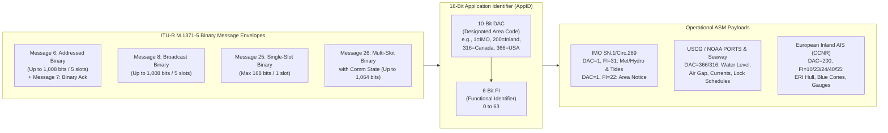
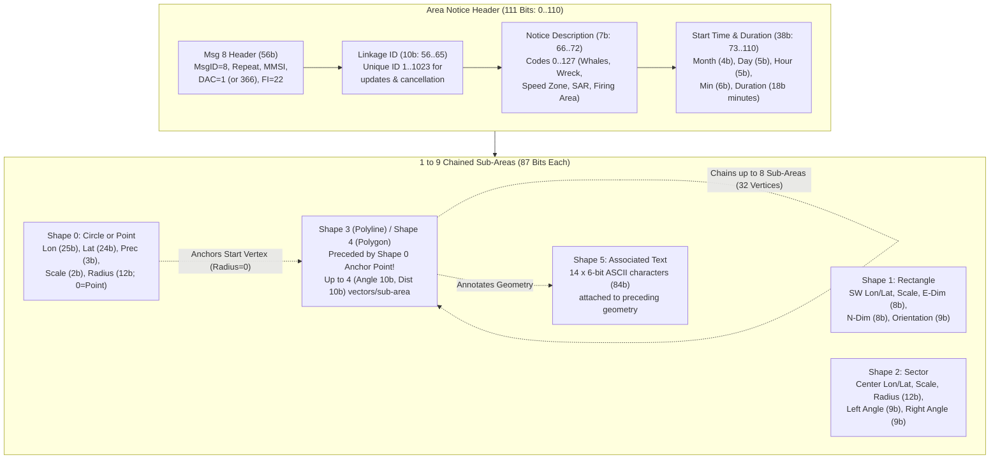
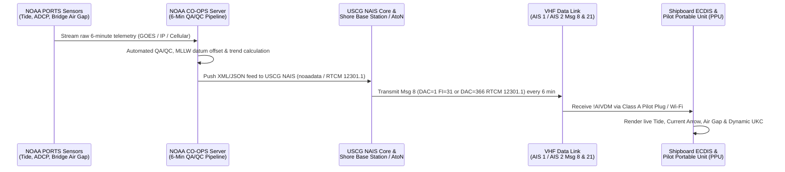

# Chapter 16: Binary Messages, Application-Specific Messages (ASM), Tides/Marine State, and Area Notices

---

## 1. Operational & Conceptual Overview

While standard AIS position and static voyage messages (Messages 1–5, 18, 19, 21, 24, and 27) provide fixed-schema telemetry for collision avoidance and vessel identification, safe navigation in constrained waterways requires dynamic, structured operational data that cannot fit inside fixed 168-bit position frames. A deep-draft container ship approaching the Ambrose Channel in New York or passing beneath the Chesapeake Bay Bridge needs real-time **water level (tidal height relative to chart datum)**, **vertical bridge air gap**, **multi-depth acoustic Doppler current profiles**, and **visibility**. A vessel transiting the St. Lawrence Seaway needs **lock gate schedules** and **reach flow rates**. A cargo ship steaming past Cape Cod or through the Boston Traffic Separation Scheme needs dynamic polygonal boundaries for **North Atlantic Right Whale Slow Zones** and military firing areas rendered directly on its Electronic Chart Display and Information System (ECDIS).

To support these domain-specific workflows without altering the core SOTDMA link layer, Recommendation **ITU-R M.1371-5** provides five **Binary Message envelopes**—**Messages 6, 7, 8, 25, and 26**—that carry **Application-Specific Messages (ASMs)**. Instead of hard-coding every maritime sensor into the base radio standard, ITU-R M.1371 places a 16-bit **Application Identifier (`AppID`)** at the start of the binary payload:
1. A 10-bit **Designated Area Code (`DAC`)** identifying the governing jurisdiction (`DAC = 1` for international IMO standards, `DAC = 200` for European Inland AIS, `DAC = 316` for Canada, `DAC = 366` for the United States), and
2. A 6-bit **Functional Identifier (`FI`, `0–63`)** specifying the exact binary schema within that jurisdiction.



This chapter dissects the bit-level architecture of the AIS binary message envelopes, traces the evolution of meteorological, hydrographic, and tidal broadcasts from **IMO SN/Circ.236** to **IMO SN.1/Circ.289**, **NOAA PORTS®**, **RTCM Standard 12301.1**, the **St. Lawrence Seaway (`DAC=316/366`)**, and **European Inland AIS (`DAC=200`)**, and provides an authoritative engineering walkthrough of **Dynamic Area Notices (`DAC=1, FI=22` and `DAC=366, FI=22`)** and Kurt Schwehr's **`ais-area-notice`** reference architecture.

---

## 2. Historical Context & Evolution (`schwehr/gis-history` Integration)

The evolution of AIS Binary Application-Specific Messages sits at the intersection of coastal hydrography, vessel traffic management, marine mammal conservation, and open-source geospatial software (`https://github.com/schwehr/gis-history`):

| Year / Era | Milestone (`schwehr/gis-history` & ASM Lineage) | Technical & Operational Significance |
|---|---|---|
| **1807 – 1991** | **Survey of the Coast** founded (1807); **NOAA** established (1970); **Tampa Bay *Summit Venture* Sunshine Skyway Bridge disaster** (May 9, 1980, 35 killed) leads NOAA to deploy the first **PORTS® (Physical Oceanographic Real-Time System)** in Tampa Bay (1991) | Demonstrated that real-time water level, current shear, and bridge clearance sensors must be delivered directly to pilots and bridge teams in the wheelhouse. |
| **1998 – 2003** | **ITU-R M.1371-0/1** defines Binary Messages 6, 7, 8, 25, and 26; **St. Lawrence Seaway AIS Project** (2002–2003) becomes the first mandatory commercial waterway to broadcast lock schedules, water levels, and wind via regional binary ASMs (`DAC=316` / `DAC=366`) | Proved that AIS Base Stations could turn the VHF Data Link (VDL) into a real-time digital environmental and traffic telemetry bus. |
| **May 2004** | **IMO SN/Circ.236** (*Guidance on the Application of AIS Binary Messages*) published | Defined the first seven international trial ASMs (`DAC=1`), including **`FI=11` (Meteorological and Hydrographic Data)** for a 4-year evaluation period. |
| **2005 – 2009** | **Kurt Schwehr** at UNH **CCOM/JHC** develops **`noaadata`** (2005–2009, built on Python `BitVector`) and **`ais-area-notice`**; collaborates with USCG, NOAA, and IMO on environmental ASM redesign and Stellwagen Bank right-whale dynamic zoning | Exposed severe bit-packing flaws in `SN/Circ.236` `FI=11` (ambiguous signed encodings, coarse $10\text{ cm}$ water-level steps, and lack of polygon notices) and prototyped the modern Area Notice (`FI=22`) and upgraded Met/Hydro (`FI=31`) schemas. |
| **June 2010** | **IMO SN.1/Circ.289** (*Guidance on the Use of AIS Application-Specific Messages*) adopted (superseding `SN/Circ.236` on Jan 1, 2013); ***Deepwater Horizon* blowout** (April 2010) catalyzes **Kurt Schwehr's `libais`** in C++ | `SN.1/Circ.289` ratified **`DAC=1, FI=31`** ($1\text{ cm}$ water-level resolution, 360 bits) and **`DAC=1, FI=22`** (chained 87-bit sub-area geometries). `libais` implemented ultra-fast C++ decoders for every Circ.236, Circ.289, Inland, and USCG ASM. |
| **2011 – 2015** | **RTCM Standard 12301.1** (*Standard for Binary Messaging in the AIS*) published; **Whale Alert** presented to US Congress (2012); **USCG / NOAA PORTS®** nationwide AIS environmental broadcast rollout | Standardized North American tide, air-gap, and current ASMs alongside dynamic right-whale speed restriction zones (`DAC=366, FI=22` and `DAC=1, FI=22`). |
| **2015 – 2028+** | **ITU-R M.2092-1 (VDES / AIS 2.0)** dedicates **ASM 1 ($161.950\text{ MHz}$) & ASM 2 ($162.000\text{ MHz}$)** channels; **IHO S-100** ecosystem (**S-104 Water Level**, **S-111 Surface Currents**, **S-124 Navigational Warnings**) | Offloads multi-slot binary ASMs from congested AIS 1/2 channels onto $19.2\text{ kbps}$ ASM channels and transitions ad-hoc binary payloads into cryptographically signed S-100 datasets. |

---

## 3. Deep Technical & Mathematical Foundations

### 3.1 Architecture of AIS Binary Application-Specific Messages (Messages 6, 7, 8, 25, and 26)

ITU-R M.1371-5 provides four transport envelopes for binary payloads (Messages 6, 8, 25, and 26) plus one dedicated link-layer acknowledgment message (Message 7). Choosing the wrong envelope or miscalculating multi-slot bit padding is a common failure mode in shore base station software.

#### 3.1.1 Comparative Matrix of Binary Transport Envelopes

| Characteristic | Message 6 (Addressed Binary) | Message 7 (Binary Acknowledge) | Message 8 (Broadcast Binary) | Message 25 (Single-Slot Binary) | Message 26 (Multi-Slot Binary + Comm State) |
|---|---|---|---|---|---|
| **Addressing Mode** | Point-to-Point (`Source MMSI` $\rightarrow$ `Dest MMSI`) | Point-to-Point Ack (up to 4 `Dest MMSIs` per slot) | Point-to-Multipoint Broadcast | Configurable (`Dest Indicator`: `0`=Broadcast, `1`=Addressed) | Configurable (`Dest Indicator`: `0`=Broadcast, `1`=Addressed) |
| **Application ID (`DAC`+`FI`)** | Mandatory (Bits `72–87`) | None (Uses 2-bit `Seq Num` from Msg 6) | Mandatory (Bits `40–55`) | Optional (`Binary Data Flag`: `0`=Raw, `1`=`AppID`) | Optional (`Binary Data Flag`: `0`=Raw, `1`=`AppID`) |
| **Header Overhead** | 88 bits (incl. 16-bit `AppID`) | 40 bits + $32 \times N_{\text{acks}}$ ($N \in \{1..4\}$) | 56 bits (incl. 16-bit `AppID`) | 40, 56, 72, or 88 bits | 40, 56, 72, or 88 bits (+ 20-bit Comm State tail) |
| **Max Binary Data Bits** | **920 bits** | N/A | **952 bits** | **128 bits** (raw broadcast) down to **80 bits** (addressed + `AppID`) | **1,004 bits** (raw broadcast) down to **956 bits** (addressed + `AppID`) |
| **Max Total Length** | **1,008 bits** (1 to 5 slots) | **168 bits** (1 slot) | **1,008 bits** (1 to 5 slots) | **168 bits** (Strictly 1 slot) | **1,064 bits** (1 to 5 slots) |
| **VDL Access Scheme** | RATDMA, ITDMA, or FATDMA | RATDMA (auto-sent by receiving transponder) | RATDMA, ITDMA, or FATDMA | RATDMA, ITDMA, FATDMA, or CSTDMA | SOTDMA or ITDMA (carries 20-bit Comm State) |

> [!WARNING]
> **VDL Channel Loading Penalty of Multi-Slot Binary Messages:** Under ITU-R M.1371-5, a single-slot message occupies $26.67\text{ ms}$ (up to 168 payload bits), a 2-slot message up to 424 bits, a 3-slot message up to 680 bits, a 4-slot message up to 936 bits, and a 5-slot message up to 1,008 bits (or 1,064 bits for Message 26). Because HDLC zero-bit stuffing adds variable overhead whenever five consecutive `1` bits occur, IMO SN.1/Circ.289 recommends keeping Message 8 payloads $\le 3\text{ slots}$ ($\le 616\text{ data bits}$) in high-traffic ports so a single bit error or co-channel collision does not destroy a $133\text{ ms}$ 5-slot frame.

#### 3.1.2 Bit-Level Envelope Layouts (Messages 6, 7, 8, 25, and 26)

Following the dual-indexing standard established in [Notation and Conventions](../00-front-matter/notation-and-conventions.md), all tables specify both **0-based MSB-first (`libais` / `AIVDM.txt`)** and **1-based MSB-first (`ITU-R M.1371-5`)** bit ranges.

##### Table 16.1: Message 6 (Addressed Binary Message) and Message 7 (Binary Acknowledge)

| 0-Based Bits | 1-Based Bits | Width | Field Name | Type | Description & Constraints |
|---|---|---|---|---|---|
| **Message 6** | | | | | **Addressed Binary Message (Max 1,008 bits / 5 slots)** |
| `0–5` | `1–6` | 6 | `message_id` | `uint6` | Constant `6` (`000110`) |
| `6–7` | `7–8` | 2 | `repeat_indicator` | `uint2` | `0–3` (`3` = do not repeat) |
| `8–37` | `9–38` | 30 | `source_mmsi` | `uint30` | 9-digit MMSI of originating station |
| `38–39` | `39–40` | 2 | `seq_num` | `uint2` | Sequence number `0–3` (matched by Message 7) |
| `40–69` | `41–70` | 30 | `dest_mmsi` | `uint30` | 9-digit MMSI of addressed target station |
| `70` | `71` | 1 | `retransmit_flag` | `bool` | `0` = initial transmission, `1` = retransmitted after timeout |
| `71` | `72` | 1 | `spare` | `uint1` | Must be `0` |
| `72–81` | `73–82` | 10 | `dac` | `uint10` | **Designated Area Code (`1–1023`)** |
| `82–87` | `83–88` | 6 | `fi` | `uint6` | **Functional Identifier (`0–63`)** |
| `88–1007` | `89–1008` | $\le 920$ | `app_data` | `bit[]` | Application-specific binary payload (padded to byte/slot boundary) |
| **Message 7** | | | | | **Binary Acknowledge (72, 104, 136, or 168 bits / 1 slot)** |
| `0–5` | `1–6` | 6 | `message_id` | `uint6` | Constant `7` (`000111`) |
| `6–7` | `7–8` | 2 | `repeat_indicator` | `uint2` | `0–3` |
| `8–37` | `9–38` | 30 | `source_mmsi` | `uint30` | MMSI of acknowledging station |
| `38–39` | `39–40` | 2 | `spare` | `uint2` | Must be `0` |
| `40–69` | `41–70` | 30 | `dest_mmsi_1` | `uint30` | MMSI of 1st station being acknowledged |
| `70–71` | `71–72` | 2 | `seq_num_1` | `uint2` | Sequence number (`0–3`) of acknowledged Message 6 |
| `72–167` | `73–168` | $0, 32, 64, 96$ | `dest_2..4` | `(uint30, uint2)` | Up to 3 additional `(dest_mmsi_k, seq_num_k)` pairs |

When a Class A or Class B transponder receives a Message 6 addressed to its own MMSI on Channel A or B, its link layer automatically generates a **Message 7 (Binary Acknowledge)** on the same channel copying `source_mmsi` into `dest_mmsi_1` and echoing the 2-bit `seq_num`. If the sender does not receive Message 7 within its link-layer retry window (typically 4 seconds), it sets `retransmit_flag = 1` and retransmits Message 6 up to 3 times.

##### Table 16.2: Message 8 (Binary Broadcast Message)

| 0-Based Bits | 1-Based Bits | Width | Field Name | Type | Description & Constraints |
|---|---|---|---|---|---|
| `0–5` | `1–6` | 6 | `message_id` | `uint6` | Constant `8` (`001000`) |
| `6–7` | `7–8` | 2 | `repeat_indicator` | `uint2` | `0–3` (`0` = default, `3` = do not repeat) |
| `8–37` | `9–38` | 30 | `source_mmsi` | `uint30` | MMSI of broadcasting Base Station, AtoN, or Vessel |
| `38–39` | `39–40` | 2 | `spare` | `uint2` | Must be `0` |
| `40–49` | `41–50` | 10 | `dac` | `uint10` | **Designated Area Code (`DAC`, `1–1023`)** |
| `50–55` | `51–56` | 6 | `fi` | `uint6` | **Functional Identifier (`FI`, `0–63`)** |
| `56–1007` | `57–1008` | $\le 952$ | `app_data` | `bit[]` | Application-specific binary payload (total frame $\le 1{,}008\text{ bits}$) |

##### Table 16.3: Conditional Header Geometry of Messages 25 and 26

Messages 25 and 26 use two control bits at indices `38` (`addressed`) and `39` (`structured`) to dynamically shift the start offset of the binary payload between bit `40`, `56`, `72`, and `88`:

| `addressed` (Bit `38`) | `structured` (Bit `39`) | Bits `40–69` (30 bits) | Bits `70–71` (2 bits) | `AppID` (`DAC`+`FI`, 16 bits) | Binary Data Slice (Msg 25) | Binary Data Slice (Msg 26, before 20-bit Comm State) |
|---|---|---|---|---|---|---|
| `0` (Broadcast) | `0` (Unstructured) | *Absent* | *Absent* | *Absent* | `40–167` ($\le 128\text{ bits}$) | `40..(N-21)` ($\le 1{,}004\text{ bits}$) |
| `0` (Broadcast) | `1` (`AppID` present) | *Absent* | *Absent* | Bits `40–55` | `56–167` ($\le 112\text{ bits}$) | `56..(N-21)` ($\le 988\text{ bits}$) |
| `1` (Addressed) | `0` (Unstructured) | `dest_mmsi` | `spare` (`00`) | *Absent* | `72–167` ($\le 96\text{ bits}$) | `72..(N-21)` ($\le 972\text{ bits}$) |
| `1` (Addressed) | `1` (`AppID` present) | `dest_mmsi` | `spare` (`00`) | Bits `72–87` | `88–167` ($\le 80\text{ bits}$) | `88..(N-21)` ($\le 956\text{ bits}$) |

#### 3.1.3 The 16-Bit Application Identifier (`AppID = (DAC << 6) | FI`)

The 16-bit `AppID` partitions the binary namespace into $2^{10} = 1{,}024$ Designated Area Codes, each holding $2^6 = 64$ Functional Identifiers:

$$\text{AppID}_{16} = (\text{DAC}_{10} \times 64) + \text{FI}_6, \qquad \text{DAC} \in [0, 1023], \quad \text{FI} \in [0, 63]$$

* **`DAC = 0`:** Reserved for test and debugging (never transmitted in operational waters).
* **`DAC = 1` (International / IMO):** Globally standardized ASMs defined in **IMO SN.1/Circ.289** (and legacy **SN/Circ.236**). Every IMO-certified ECDIS and Class A MKD is expected to recognize core `DAC = 1` messages.
* **`DAC = 200` (European Inland AIS):** Managed by the **Central Commission for the Navigation of the Rhine (CCNR)** and the **UNECE / European Committee for drawing up Standards in the field of Inland Navigation (CESNI)** under the **ES-TRIN** standard for vessels on the Rhine, Danube, Main, Moselle, and Elbe.
* **National/Regional `DAC` Codes (`201–775`):** Equal to the nation's 3-digit **Maritime Identification Digits (MID)** assigned by ITU-R M.585-9—most notably **`DAC = 316` (Canada)** and **`DAC = 366` (United States)** for the St. Lawrence Seaway, Great Lakes, and USCG/NOAA PORTS®, and **`DAC = 232` / `235` (United Kingdom & Ireland)** for Trinity House, Northern Lighthouse Board, and Commissioners of Irish Lights AtoN telemetry.

---

### 3.2 Tide and Marine State Transmissions (IMO Circ.289, NOAA PORTS®, Seaway, Inland AIS)

#### 3.2.1 Evolution from IMO SN/Circ.236 (`DAC=1, FI=11`) to IMO SN.1/Circ.289 (`DAC=1, FI=31`)

In May 2004, **IMO SN/Circ.236** introduced the first international Meteorological and Hydrographic broadcast message: **Message 8, `DAC = 1, FI = 11`** (352 bits). Operational trials conducted between 2004 and 2009 by the US Coast Guard, NOAA, the Swedish Maritime Administration, and researchers at UNH CCOM (documented in Kurt Schwehr's `noaadata` and `libais` source commentary) revealed four critical engineering defects in `FI = 11`:

1. **Inversed Latitude/Longitude Field Ordering:** In every standard ITU-R M.1371 position message (Messages 1, 2, 3, 4, 9, 18, 19, 21, 27), **Longitude** precedes **Latitude**. In `DAC = 1, FI = 11`, the committee accidentally placed **Latitude** (`56–79`, 24 bits) *before* **Longitude** (`80–104`, 25 bits), causing widespread coordinate-swap bugs in early ECDIS and VTS parsers!
2. **Unsigned Offset Encoding vs. Two's Complement Confusion:** Instead of using standard two's complement for signed temperatures and water levels, `FI = 11` specified unsigned offset encodings (e.g., mapping $-60.0^\circ\text{C}$ to `0`), which conflicted with ITU-R M.1371 conventions and resulted in firmware vendors implementing incompatible sign conventions.
3. **Coarse $0.1\text{ m}$ ($10\text{ cm}$) Water-Level Resolution:** `FI = 11` allocated only 9 bits (`192–200`) to water level in $0.1\text{ m}$ increments ($-10.0\text{ m}$ to $+30.0\text{ m}$). For a Panamax or Post-Panamax vessel calculating dynamic Under-Keel Clearance (UKC) in a dredged channel where every inch of tide governsmillions of dollars of cargo draft, $10\text{ cm}$ quantization was operationally unacceptable.
4. **Lack of Position Accuracy Flag:** Mariners had no way to tell whether the met/hydro sensor location was a surveyed DGNSS fix or an approximate buoy position.

In June 2010, **IMO SN.1/Circ.289** deprecated `FI = 11` (formally discontinuing it on January 1, 2013) and introduced **Message 8, `DAC = 1, FI = 31`** (**360 bits**, occupying 2 TDMA slots). `FI = 31` restored standard **Longitude-before-Latitude** ordering, adopted **two's complement** for signed fields, added a 1-bit **Position Accuracy** flag, and expanded **Water Level (incl. Tide)** to **12 bits at $0.01\text{ m}$ ($1\text{ cm}$) resolution**.

#### 3.2.2 Complete Bit-Level Specification of IMO `DAC = 1, FI = 31` (360 Bits)

##### Table 16.4: Message 8, `DAC = 1, FI = 31` — Meteorological and Hydrographic Data (IMO SN.1/Circ.289)

| 0-Based Bits | 1-Based Bits | Width | Field Name | Type | Scaling / Units | Valid Operational Range | "Not Available" Sentinel |
|---|---|---|---|---|---|---|---|
| `0–5` | `1–6` | 6 | `message_id` | `uint6` | Constant `8` | `8` | N/A |
| `6–7` | `7–8` | 2 | `repeat_indicator` | `uint2` | Count | `0–3` | N/A |
| `8–37` | `9–38` | 30 | `source_mmsi` | `uint30` | Station MMSI | `000000000–999999999` | N/A |
| `38–39` | `39–40` | 2 | `spare_1` | `uint2` | Zero | `0` | N/A |
| `40–49` | `41–50` | 10 | `dac` | `uint10` | International DAC | `1` | N/A |
| `50–55` | `51–56` | 6 | `fi` | `uint6` | Met/Hydro v2 FI | `31` | N/A |
| `56–80` | `57–81` | 25 | `longitude` | `int25` | $\frac{S}{60{,}000}\text{ deg}$ ($10^{-3}\text{ min}$) | $[-180.0^\circ, +180.0^\circ]$ | `10860000` (`0xA5B940`) = **`181.0°`** |
| `81–104` | `82–105` | 24 | `latitude` | `int24` | $\frac{S}{60{,}000}\text{ deg}$ ($10^{-3}\text{ min}$) | $[-90.0^\circ, +90.0^\circ]$ | `5460000` (`0x535020`) = **`91.0°`** |
| `105` | `106` | 1 | `pos_accuracy` | `bool` | GNSS quality | `0` ($>10\text{ m}$), `1` ($\le 10\text{ m}$) | `0` (default) |
| `106–110` | `107–111` | 5 | `utc_day` | `uint5` | Day of month | `1–31` | `0` |
| `111–115` | `112–116` | 5 | `utc_hour` | `uint5` | Hour (UTC) | `0–23` | `24` (`24–31`) |
| `116–121` | `117–122` | 6 | `utc_minute` | `uint6` | Minute (UTC) | `0–59` | `60` (`60–63`) |
| `122–128` | `123–129` | 7 | `wind_ave` | `uint7` | $1\text{ kt}$ (10-min avg) | `0–125 kts` (`126` = $\ge 126\text{ kts}$) | `127` (`0x7F`) |
| `129–135` | `130–136` | 7 | `wind_gust` | `uint7` | $1\text{ kt}$ (10-min max) | `0–125 kts` (`126` = $\ge 126\text{ kts}$) | `127` (`0x7F`) |
| `136–144` | `137–145` | 9 | `wind_dir` | `uint9` | $1^\circ\text{ True}$ | `0–359°` | `360` (`360–511`) |
| `145–153` | `146–154` | 9 | `wind_gust_dir` | `uint9` | $1^\circ\text{ True}$ | `0–359°` | `360` (`360–511`) |
| `154–164` | `155–165` | 11 | `air_temp` | `int11` | $0.1^\circ\text{C}$ | $-60.0^\circ\text{C}\text{ to }+60.0^\circ\text{C}$ (`-600..+600`) | `-1024` (`0x400`) |
| `165–171` | `166–172` | 7 | `rel_humidity` | `uint7` | $1\%$ | `0–100%` | `101` (`101–127`) |
| `172–181` | `173–182` | 10 | `dew_point` | `int10` | $0.1^\circ\text{C}$ | $-20.0^\circ\text{C}\text{ to }+50.0^\circ\text{C}$ (`-200..+500`) | `501` (`0x1F5`) |
| `182–190` | `183–191` | 9 | `air_pressure` | `uint9` | $P = U + 799\text{ hPa}$ | `0` ($\le 799$), `1–401` ($800\text{–}1200\text{ hPa}$), `402` ($\ge 1201$) | `511` (`0x1FF`) |
| `191–192` | `192–193` | 2 | `pressure_tend` | `uint2` | WMO Tendency | `0`=steady, `1`=falling, `2`=rising | `3` |
| `193` | `194` | 1 | `vis_greater` | `bool` | Range limit flag | `0`=exact, `1`=greater than `horiz_vis` | `0` |
| `194–200` | `195–201` | 7 | `horiz_vis` | `uint7` | $0.1\text{ NM}$ | $0.0\text{–}12.6\text{ NM}$ (`0–126`) | `127` (`0x7F`) |
| `201–212` | `202–213` | 12 | `water_level` | `uint12` | $\frac{U}{100} - 10.0\text{ m}$ ($1\text{ cm}$) | $-10.00\text{ m}$ (`0`) to $+30.00\text{ m}$ (`4000`); `4001` = $>30\text{ m}$ | `4001` (`>30m`) / `4002–4095` (`4095` N/A) |
| `213–214` | `214–215` | 2 | `water_level_trend` | `uint2` | Tidal trend | `0`=steady, `1`=falling/ebbing, `2`=rising/flooding | `3` |
| `215–222` | `216–223` | 8 | `surf_cur_speed` | `uint8` | $0.1\text{ kts}$ | $0.0\text{–}25.0\text{ kts}$ (`251` = $\ge 25.1\text{ kts}$) | `255` (`0xFF`) |
| `223–231` | `224–232` | 9 | `surf_cur_dir` | `uint9` | $1^\circ\text{ True}$ (set/flow to) | `0–359°` | `360` (`360–511`) |
| `232–239` | `233–240` | 8 | `cur_speed_2` | `uint8` | $0.1\text{ kts}$ | $0.0\text{–}25.0\text{ kts}$ | `255` |
| `240–248` | `241–249` | 9 | `cur_dir_2` | `uint9` | $1^\circ\text{ True}$ | `0–359°` | `360` |
| `249–253` | `250–254` | 5 | `cur_level_2` | `uint5` | $1\text{ m}$ depth | `0–30 m` below surface | `31` |
| `254–261` | `255–262` | 8 | `cur_speed_3` | `uint8` | $0.1\text{ kts}$ | $0.0\text{–}25.0\text{ kts}$ | `255` |
| `262–270` | `263–271` | 9 | `cur_dir_3` | `uint9` | $1^\circ\text{ True}$ | `0–359°` | `360` |
| `271–275` | `272–276` | 5 | `cur_level_3` | `uint5` | $1\text{ m}$ depth | `0–30 m` below surface | `31` |
| `276–283` | `277–284` | 8 | `sig_wave_height` | `uint8` | $0.1\text{ m}$ ($H_s$) | $0.0\text{–}25.0\text{ m}$ (`251` = $\ge 25.1\text{ m}$) | `255` |
| `284–289` | `285–290` | 6 | `wave_period` | `uint6` | $1\text{ s}$ | `0–60 s` | `63` |
| `290–298` | `291–299` | 9 | `wave_dir` | `uint9` | $1^\circ\text{ True}$ (coming from) | `0–359°` | `360` |
| `299–306` | `300–307` | 8 | `swell_height` | `uint8` | $0.1\text{ m}$ | $0.0\text{–}25.0\text{ m}$ | `255` |
| `307–312` | `308–313` | 6 | `swell_period` | `uint6` | $1\text{ s}$ | `0–60 s` | `63` |
| `313–321` | `314–322` | 9 | `swell_dir` | `uint9` | $1^\circ\text{ True}$ (coming from) | `0–359°` | `360` |
| `322–325` | `323–326` | 4 | `sea_state` | `uint4` | Beaufort Scale | `0–12` | `13` (`13–15`) |
| `326–335` | `327–336` | 10 | `water_temp` | `int10` | $0.1^\circ\text{C}$ | $-10.0^\circ\text{C}\text{ to }+50.0^\circ\text{C}$ (`-100..+500`) | `501` (`0x1F5`) |
| `336–338` | `337–339` | 3 | `precip_type` | `uint3` | WMO Code | `1`=rain, `2`=thunderstorm, `3`=freezing, `4`=mixed, `5`=snow | `7` (`0` reserved) |
| `339–347` | `340–348` | 9 | `salinity` | `uint9` | $0.1\text{‰}$ (PSU) | $0.0\text{–}50.0\text{‰}$ (`0–500`), `501` = $>50.0\text{‰}$ | `510` (no sensor), `511` (N/A) |
| `348–349` | `349–350` | 2 | `ice` | `uint2` | Sea ice presence | `0`=no, `1`=yes, `2`=reserved | `3` |
| `350–359` | `351–360` | 10 | `spare_2` | `uint10` | Zero | `0` | N/A |

> [!IMPORTANT]
> **Opposite Directional Conventions for Wind/Waves vs. Currents:** In `DAC = 1, FI = 31`, **`wind_dir`**, **`wind_gust_dir`**, **`wave_dir`**, and **`swell_dir`** follow the meteorological convention: the direction *from which* the wind or wave is blowing/approaching ($0^\circ$ = North wind blowing southward). Conversely, **`surf_cur_dir`**, **`cur_dir_2`**, and **`cur_dir_3`** follow the oceanographic/hydrographic convention: the **set** or direction *toward which* the water is flowing ($0^\circ$ = current flowing due North). Mixing these conventions in a 3D Blender scene or ship-drift simulator reverses current vectors by $180^\circ$!

---

### 3.3 Dynamic Area Notices (`DAC=1, FI=22` & USCG `DAC=366, FI=22`) and `ais-area-notice`

While NAVTEX and SafetyNET broadcast navigational warnings as unstructured blocks of English prose (requiring a watch officer to manually plot latitude/longitude coordinates onto a chart), **AIS Area Notice** (**Message 8 or 6, `DAC = 1, FI = 22`** and **USCG `DAC = 366, FI = 22`**) transmits machine-readable vector geometries directly over the VHF Data Link into the ship's ECDIS.

#### 3.3.1 Kurt Schwehr's `ais-area-notice` Architecture

The modern Area Notice specification was designed and validated by **Kurt Schwehr** (at UNH CCOM/JHC and NOAA) in collaboration with the US Coast Guard (`DAC = 366, FI = 22`) and the IMO Sub-Committee on Safety of Navigation (**IMO SN.1/Circ.289**, `DAC = 1, FI = 22`), with the canonical open-source reference library published at [`https://github.com/schwehr/ais-area-notice`](https://github.com/schwehr/ais-area-notice) and integrated into `libais` (`ais8_1_22.cpp` and `ais8_366_22.cpp`).

An Area Notice message consists of:
1. A fixed **111-bit Header** (Bits `0–110`, including the 56-bit Message 8 envelope + 55-bit Area Notice metadata), followed by
2. **1 to 9 variable-geometry Sub-Areas**, where each Sub-Area is a fixed **87-bit block** in IMO `DAC = 1, FI = 22` (or **93 bits** in the pre-2013 USCG `DAC = 366, FI = 22` dialect, which used 28-bit/27-bit $10^{-4}\text{ min}$ coordinates instead of 25-bit/24-bit $10^{-3}\text{ min}$ coordinates before USCG harmonized `DAC = 366, FI = 22` with `SN.1/Circ.289`).

$$\text{Total Bits (IMO DAC=1, FI=22)} = 111 + 87 \times N_{\text{subareas}}, \qquad N_{\text{subareas}} \in \{1, 2, \dots, 9\}$$

For $N_{\text{subareas}} = 9$, the message length is $111 + 783 = 894\text{ bits}$ (padded to 896 bits / 5 slots, comfortably within the 1,008-bit Message 8 limit).



#### 3.3.2 Area Notice Header Specification (Bits `0–110`)

##### Table 16.5: Area Notice Header (`DAC = 1, FI = 22` and Harmonized `DAC = 366, FI = 22`)

| 0-Based Bits | 1-Based Bits | Width | Field Name | Type | Description & Sentinel Values |
|---|---|---|---|---|---|
| `0–5` | `1–6` | 6 | `message_id` | `uint6` | `8` (Broadcast) or `6` (Addressed; shifts subsequent indices by $+32$ bits) |
| `6–7` | `7–8` | 2 | `repeat_indicator` | `uint2` | `0–3` |
| `8–37` | `9–38` | 30 | `source_mmsi` | `uint30` | MMSI of VTS / USCG Base Station |
| `38–39` | `39–40` | 2 | `spare` | `uint2` | `0` |
| `40–49` | `41–50` | 10 | `dac` | `uint10` | `1` (IMO International) or `366` (USCG) |
| `50–55` | `51–56` | 6 | `fi` | `uint6` | `22` (Area Notice) |
| `56–65` | `57–66` | 10 | `link_id` | `uint10` | **Message Linkage ID** (`1–1023`; `0` = N/A). Uniquely identifies this notice from `source_mmsi` so later broadcasts can modify or cancel it. |
| `66–72` | `67–73` | 7 | `notice_type` | `uint7` | **Notice Description Code (`0–127`)** — see Table 16.6 below. |
| `73–76` | `74–77` | 4 | `month` | `uint4` | Start UTC Month (`1–12`; `0` = N/A) |
| `77–81` | `78–82` | 5 | `day` | `uint5` | Start UTC Day (`1–31`; `0` = N/A) |
| `82–86` | `83–87` | 5 | `hour` | `uint5` | Start UTC Hour (`0–23`; `24` = N/A) |
| `87–92` | `88–93` | 6 | `minute` | `uint6` | Start UTC Minute (`0–59`; `60` = N/A) |
| `93–110` | `94–111` | 18 | `duration` | `uint18` | **Duration in minutes** from Start Time (`0` = cancel notice immediately; `1–262142` min [$\approx 182\text{ days}$]; `262143` = `0x3FFFF` = indefinite/N/A). |

#### 3.3.3 Notice Description Codes (`0–127`)

The 7-bit `notice_type` (`66–72`) encodes the operational meaning and ECDIS portrayal symbol of the Area Notice. Table 16.6 lists the critical operational codes across IMO SN.1/Circ.289 and `ais-area-notice` (noting where early USCG/RTCM draft codes evolved into grouped Circ.289 categories):

##### Table 16.6: Selected Area Notice Description Codes (`notice_type`, Bits `66–72`)

| Code | Category | IMO SN.1/Circ.289 / `ais-area-notice` Description | Operational / Regional Notes |
|---|---|---|---|
| **`0`** | Caution Area | **Marine mammals habitat** (Whale / Marine Mammal Area) | Used in NOAA/USCG **Whale Alert** Seasonal Management Areas (SMAs). |
| **`1`** | Caution Area | **Marine mammals in area – reduce speed** | Used for **Right Whale Dynamic Management Areas (DMAs) / Slow Zones** ($\le 10\text{ kts}$); in early regional drafts, code `1` was also tested for Tuna Net cautions. |
| **`2`** | Caution Area | **Marine mammals in area – stay clear** | Dynamic whale aggregation avoidance zone. |
| **`3`** | Caution Area | **Marine mammals in area – report sightings** | Requests bridge lookouts to report whale sightings to VTS/USCG. |
| **`4–6`** | Caution Area | **Marine habitat** (`4`=reduce speed, `5`=stay clear, `6`=no fishing/anchoring) | Coral reefs and Particularly Sensitive Sea Areas (PSSAs). |
| **`7–12`** | Caution Area | `7`=Derelicts, `8`=Traffic congestion, `9`=Marine event, `10`=Diver ops, `11`=Swim area, `12`=Dredge operations | Harbor safety and port construction alerts. |
| **`13`** | Caution Area | **Caution Area: Survey operations** | Hydrographic, seismic, or autonomous underwater vehicle (AUV) surveys. |
| **`14–15`** | Caution Area | `14`=Underwater operation, `15`=Seaplane operations | Subsea cable work or seaplane landing lanes. |
| **`16–17`** | Caution Area | `16`=**Fishery – nets in water** (Tuna/gill nets), `17`=Cluster of fishing vessels | Prevents merchant vessel entanglement with commercial fishing gear. |
| **`18–21`** | Caution Area | `18`=Fairway closed, `19`=Harbour closed, `20`=Risk (see text), **`21`=Underwater vehicle operation** (or **Wreck** in early regional tables; see `96` for Circ.289 Sunken Vessel) | Alerts vessels to submerged hazards or ROV/UUV operations. |
| **`23–30`** | Env. Caution | `23`=Storm front, `24`=**Hazardous sea ice**, `25`=Storm warning, `26`=High wind, `27`=High waves, `28`=Restricted visibility, `29`=Strong currents, `30`=Heavy icing | Dynamic weather hazard polygons broadcast by VTS. |
| **`32–37`** | Restricted Area | `32`=Fishing prohibited, `33`=No anchoring, `34`=Entry approval required, `35`=**No entry / To Be Avoided**, `36`=**Military firing**, `37`=Minefield | Mandatory exclusion and naval live-fire exercise zones. |
| **`40–45`** | Anchorage | `40`=Open, `41`=Closed, `42`=Prohibited, `43`=Deep draft, `44`=Shallow draft, `45`=Vessel transfer (STS) | Dynamic port anchorage management. |
| **`56–58`** | Security / Avoid | **`56`=Security Alert – Level 1** (`57`=Level 2, `58`=Level 3; `56` also mapped to *Area To Be Avoided* in early RTCM drafts) | ISPS Code maritime security zones around high-value assets or terminals. |
| **`64–76`** | Distress / SAR | `64`=Disabled/adrift, **`65`=Vessel sinking** (or *Speed Restricted Area* in early regional drafts), `66`=Abandoning ship, `69`=Fire/explosion, `70`=Grounding, `71`=Collision, `74`=Person overboard, **`75`=SAR area**, **`76`=Pollution response area** | Dynamic Search and Rescue (SAR) search patterns and oil-spill booming zones (used in *Deepwater Horizon* response). |
| **`80–95`** | VTS / Info | `80`=Contact VTS, `82`=Do not proceed, `88`=Pilot boarding, `90`=Place of refuge, `93`=VTS active target, **`94`=Rogue or suspicious vessel** (or SAR in regional tables) | Tactical VTS traffic control and law-enforcement alerts. |
| **`96–108`** | Chart Feature | **`96`=Sunken vessel (Wreck)**, `97`=Submerged object, `99`=Shoal area, `104`=Channel obstruction, `105`=Reduced vertical clearance, `106–108`=Bridge closed/partial/open | Real-time electronic chart updates prior to formal Notice to Mariners. |
| **`120–122`** | Route | `120`=Recommended route, `121`=Alternative route, `122`=Recommended route through ice | Icebreaker convoy routing and temporary traffic lanes. |
| **`125`** | Free Text | **Other – see associated text** (`Shape 5` required) | Custom operational notice defined by `Shape 5` text. |
| **`126`** | Cancellation | **Cancellation – cancel area identified by `link_id`** | Immediately removes notice `link_id` from ECDIS display (also triggered by `duration = 0`). |

#### 3.3.4 The Six 87-Bit Sub-Area Geometries (`Shape 0` through `Shape 5`)

Every 87-bit Sub-Area (starting at bit offset $b_k = 111 + 87k$ for $k \in \{0..8\}$) begins with a 3-bit **Shape ID (`0–5`)**. Geometries with metric dimensions (`Shapes 0..4`) include a 2-bit **Scale Factor (`sf` $\in \{0, 1, 2, 3\}$)** that multiplies raw integer distances or radii by $10^{\text{sf}}$ meters:

$$\text{Scale Multiplier } M(\text{sf}) = 10^{\text{sf}}\text{ meters} = \begin{cases} 1\text{ m} & (\text{sf} = 0) \\ 10\text{ m} & (\text{sf} = 1) \\ 100\text{ m} & (\text{sf} = 2) \\ 1{,}000\text{ m} & (\text{sf} = 3) \end{cases}$$

##### Table 16.7: Bit-Level Layout of All Six 87-Bit Sub-Area Types (Relative Bits `0–86` within Sub-Area)

| Sub-Area Type | Rel. Bits | Width | Field Name | Type & Scaling | Mathematical & Geometric Interpretation |
|---|---|---|---|---|---|
| **`Shape 0`: Circle or Point** | `0–2` | 3 | `shape_id` | `uint3` = `0` | Circle (if `radius > 0`) or Point / Anchor Vertex (if `radius == 0`) |
| | `3–4` | 2 | `scale_factor` | `uint2` ($\text{sf} \in 0..3$) | Multiplier $10^{\text{sf}}\text{ m}$ (`1, 10, 100, 1000 m`) |
| | `5–29` | 25 | `longitude` | `int25` ($10^{-3}\text{ min}$) | Center/Point Longitude $\lambda_0 = S / 60{,}000^\circ$ (`181.0°` = N/A) |
| | `30–53` | 24 | `latitude` | `int24` ($10^{-3}\text{ min}$) | Center/Point Latitude $\phi_0 = S / 60{,}000^\circ$ (`91.0°` = N/A) |
| | `54–56` | 3 | `precision` | `uint3` (`0–4`) | Number of decimal places of minutes to display (`4` = default) |
| | `57–68` | 12 | `radius` | `uint12` | $R = \text{radius} \times 10^{\text{sf}}\text{ m}$. **`0` = Point**; max $4{,}094 \times 1{,}000\text{ m} = 4{,}094\text{ km}$. |
| | `69–86` | 18 | `spare` | `uint18` = `0` | Zero-filled spare bits |
| **`Shape 1`: Rectangle** | `0–2` | 3 | `shape_id` | `uint3` = `1` | Rotated bounding rectangle anchored at SW corner |
| | `3–4` | 2 | `scale_factor` | `uint2` ($\text{sf} \in 0..3$) | Multiplier $10^{\text{sf}}\text{ m}$ |
| | `5–29` | 25 | `longitude` | `int25` ($10^{-3}\text{ min}$) | SW (lower-left) corner Longitude $\lambda_{\text{SW}}$ |
| | `30–53` | 24 | `latitude` | `int24` ($10^{-3}\text{ min}$) | SW (lower-left) corner Latitude $\phi_{\text{SW}}$ |
| | `54–56` | 3 | `precision` | `uint3` (`0–4`) | Coordinate display precision |
| | `57–64` | 8 | `e_dim` | `uint8` (`0–255`) | East dimension $D_E = \text{e\_dim} \times 10^{\text{sf}}\text{ m}$ (`0` = N-S line) |
| | `65–72` | 8 | `n_dim` | `uint8` (`0–255`) | North dimension $D_N = \text{n\_dim} \times 10^{\text{sf}}\text{ m}$ (`0` = E-W line) |
| | `73–81` | 9 | `orientation` | `uint9` (`0–359°`) | Clockwise rotation angle $\theta$ of the North axis from True North |
| | `82–86` | 5 | `spare` | `uint5` = `0` | Zero-filled spare bits |
| **`Shape 2`: Sector** | `0–2` | 3 | `shape_id` | `uint3` = `2` | Circular wedge / radar sector anchored at vertex $(\lambda_0, \phi_0)$ |
| | `3–4` | 2 | `scale_factor` | `uint2` ($\text{sf} \in 0..3$) | Multiplier $10^{\text{sf}}\text{ m}$ |
| | `5–29` | 25 | `longitude` | `int25` ($10^{-3}\text{ min}$) | Sector center vertex Longitude $\lambda_0$ |
| | `30–53` | 24 | `latitude` | `int24` ($10^{-3}\text{ min}$) | Sector center vertex Latitude $\phi_0$ |
| | `54–56` | 3 | `precision` | `uint3` (`0–4`) | Coordinate display precision |
| | `57–68` | 12 | `radius` | `uint12` | Sector outer radius $R = \text{radius} \times 10^{\text{sf}}\text{ m}$ |
| | `69–77` | 9 | `left_bound` | `uint9` (`0–359°`) | Left boundary azimuth $\alpha_L$ (degrees True, swept clockwise to $\alpha_R$) |
| | `78–86` | 9 | `right_bound` | `uint9` (`0–359°`) | Right boundary azimuth $\alpha_R$ (degrees True; 0 spare bits!) |
| **`Shape 3`: Polyline** & **`Shape 4`: Polygon** | `0–2` | 3 | `shape_id` | `3` (Line) or `4` (Poly) | **MUST be preceded by a `Shape 0` Point (`radius=0`)** defining start vertex $\mathbf{v}_0 = (\lambda_0, \phi_0)$! |
| | `3–4` | 2 | `scale_factor` | `uint2` ($\text{sf} \in 0..3$) | Multiplier $10^{\text{sf}}\text{ m}$ applied to all 4 distances in this sub-area |
| | `5–14` | 10 | `angle_1` | `uint10` ($0.5^\circ$ steps) | Bearing $\theta_1 = \text{angle\_1} \times 0.5^\circ$ (`0–719` $\rightarrow 0.0^\circ\text{–}359.5^\circ$; `720` = N/A) |
| | `15–24` | 10 | `dist_1` | `uint10` (`0–1023`) | Leg 1 length $d_1 = \text{dist\_1} \times 10^{\text{sf}}\text{ m}$ (`0` = unused/end of vertices) |
| | `25–44` | 20 | `angle_2, dist_2` | `uint10, uint10` | Vertex 2 polar vector $(\theta_2, d_2)$ from Vertex 1 |
| | `45–64` | 20 | `angle_3, dist_3` | `uint10, uint10` | Vertex 3 polar vector $(\theta_3, d_3)$ from Vertex 2 |
| | `65–84` | 20 | `angle_4, dist_4` | `uint10, uint10` | Vertex 4 polar vector $(\theta_4, d_4)$ from Vertex 3 |
| | `85–86` | 2 | `spare` | `uint2` = `0` | Zero-filled spare bits |
| **`Shape 5`: Associated Text** | `0–2` | 3 | `shape_id` | `uint3` = `5` | Attaches free text to the immediately preceding geometry sub-area |
| | `3–86` | 84 | `text` | $14 \times \text{char6}$ | **14 6-bit AIS ASCII characters** (`@` = `0` padding; multiple `Shape 5` blocks concatenate) |

#### 3.3.5 Forward Geodesic Reconstruction of Chained Polylines (`Shape 3`) and Polygons (`Shape 4`)

Because a single 87-bit sub-area does not have enough bits to store absolute 49-bit $(\lambda, \phi)$ coordinates for multiple polygon vertices, `ais-area-notice` uses **relative polar dead-reckoning chains**:
1. Sub-Area $0$ is encoded as **`Shape 0` (Point)** with `radius = 0`, establishing the initial anchor coordinate $\mathbf{v}_0 = (\lambda_0, \phi_0)$.
2. Sub-Area $1$ is encoded as **`Shape 3` (Polyline)** or **`Shape 4` (Polygon)**, containing up to four relative polar vectors $(\theta_i, d_i)$ for $i \in \{1..4\}$.
3. Each active leg ($d_i > 0$ and $\theta_i < 360^\circ$) advances the current vertex $\mathbf{v}_{i-1} = (\lambda_{i-1}, \phi_{i-1})$ along true azimuth $\theta_i$ by distance $d_i$:
   $$\Delta y_{N, i} = d_i \cos\theta_i, \qquad \Delta x_{E, i} = d_i \sin\theta_i$$
   $$\phi_i \approx \phi_{i-1} + \frac{d_i \cos\theta_i}{M(\phi_{i-1})} \left(\frac{180^\circ}{\pi}\right), \qquad \lambda_i \approx \lambda_{i-1} + \frac{d_i \sin\theta_i}{N(\phi_{i-1})\cos\phi_{i-1}} \left(\frac{180^\circ}{\pi}\right)$$
   (or evaluated via exact WGS84 ellipsoid direct geodesic `pyproj.Geod(ellps="WGS84").fwd`).
4. If a polygon requires more than 4 segments, **additional `Shape 4` sub-areas are chained immediately after Sub-Area 1**, continuing from the last vertex $\mathbf{v}_4$ up to $8 \times 4 = 32\text{ segments}$! For **`Shape 4` (Polygon)**, the decoder automatically closes the ring by connecting the final valid vertex $\mathbf{v}_K$ back to the `Shape 0` anchor $\mathbf{v}_0$.

---

## 4. Hardware, Standards, & Software Ecosystem

### 4.1 NOAA PORTS® (Physical Oceanographic Real-Time System), USCG NAIS, and RTCM 12301.1

In major United States ports—including Tampa Bay, New York/New Jersey, Chesapeake Bay, Houston/Galveston, San Francisco Bay, and the Lower Columbia River—**NOAA's Center for Operational Oceanographic Products and Services (CO-OPS)** operates **PORTS®**, a network of real-time environmental sensors that sample **every 6 minutes** (10 times per hour):
* **Microwave & Acoustic Water-Level Gauges:** Measuring water level relative to **Mean Lower Low Water (MLLW)** chart datum with millimeter precision.
* **Acoustic Doppler Current Profilers (ADCPs):** Bottom-mounted or buoy-mounted profilers measuring horizontal current speed and direction across multiple depth bins in main shipping channels.
* **Bridge Air-Gap Microwave Radar Sensors:** Mounted at the center span of major bridges (e.g., Verrazzano-Narrows, Bayonne, Francis Scott Key [prior to 2024], Sunshine Skyway, Gerald Desmond) measuring instantaneous vertical clearance from the low steel of the bridge girder straight down to the water surface.
* **Meteorological Towers:** Measuring 6-minute wind speed, peak 5-second gusts, barometric pressure, air/water temperature, visibility, and salinity.



Through the joint **NOAA / USCG AIS Environmental Broadcast** program (standardized in **RTCM Standard 12301.1** and prototyped in Kurt Schwehr's **`noaadata`** package), NOAA CO-OPS streams quality-controlled 6-minute observations to the **USCG Nationwide AIS (NAIS)** network. USCG AIS Base Stations and AIS Aids to Navigation (AtoNs) format these observations into **Message 8 (`DAC = 1, FI = 31` or `DAC = 366` RTCM 12301.1 Water Level / Current / Air Gap payloads)** and broadcast them over the VDL. Harbor pilots boarding vessels connect their **Portable Pilot Units (PPUs)** (e.g., SEAiq, QPS Qastor) to the ship's AIS Pilot Plug and immediately view live bridge air-gap and tidal height without requiring cellular internet coverage offshore.

### 4.2 St. Lawrence Seaway & Great Lakes (`DAC = 316` Canada & `DAC = 366` USA)

Operated jointly by the **St. Lawrence Seaway Management Corporation (SLSMC, Canada, `DAC = 316`)** and the **Great Lakes St. Lawrence Seaway Development Corporation (GLS, USA, `DAC = 366`)**, the St. Lawrence Seaway was the world's first inland/seaway system to mandate AIS (March 2003) and relies heavily on Message 6 and Message 8 binary ASMs:
* **Wind Information (`FI = 1`, 216 bits):** Broadcasts 10-minute average wind speed/direction and peak gusts from lock-wall anemometers so masters can plan high-wind lock approaches.
* **Water Level (`FI = 2`, 216 bits):** Broadcasts real-time water level at up to 6 gauge stations per message (in $1\text{ cm}$ steps referenced to **IGLD 1985** [International Great Lakes Datum] or local chart datum).
* **Lockage Order / Scheduling (`Message 6, DAC = 316/366, FI = 1`, 552 bits):** Addressed directly to approaching vessels, listing the lock identifier and the scheduled sequence (`vessel name`, `direction`, and `ETA/tie-up time`) of the next 6 vessels in the lock queue.
* **Seaway Hydrological / Flow Rate (`FI = 3` / `FI = 32`):** Transmits dam spillway and reach water flow rates in cubic meters per second ($\text{m}^3/\text{s}$) affecting cross-currents in narrow canal cuts.

### 4.3 European Inland AIS (`DAC = 200`, CCNR / CESNI ES-TRIN)

On European inland waterways (Rhine, Danube, Elbe, Moselle, Amsterdam-Rhine Canal), vessels operate under the **Inland AIS** standard (**CCNR / CESNI ES-TRIN** and **EU RIS [River Information Services] Directive 2005/44/EC**), which extends ITU-R M.1371 using **`DAC = 200`**:

1. **Inland Ship Static and Voyage Related Data (`Message 8, DAC = 200, FI = 10`, 168 bits):**
   Broadcast every 6 minutes alongside standard Message 5 to supply inland-specific fields missing from maritime AIS:
   * **Unique European Vessel Identification Number (`ENI`, bits `56–103`, 48 bits / 8 ASCII characters):** The permanent 8-digit European inland hull registry number.
   * **Length of Ship/Convoy (`104–116`, 13 bits, $0.1\text{ m}$ steps, $0.0\text{–}800.0\text{ m}$)** and **Beam of Ship/Convoy (`117–126`, 10 bits, $0.1\text{ m}$ steps, $0.0\text{–}100.0\text{ m}$):** Providing decimeter-accurate composite dimensions for pushed barge convoys (whereas standard Message 5 only has $1\text{ m}$ resolution).
   * **Combination / ERI Ship Type (`127–140`, 14 bits):** **Electronic Reporting International (ERI)** numeric code (`8000–8690`) distinguishing motor tankers, dry cargo barges, pushed convoys, and coupled formations.
   * **Hazardous Cargo / Number of Blue Cones (`141–143`, 3 bits):** Under ADN (European Agreement concerning the International Carriage of Dangerous Goods by Inland Waterways), inland vessels display **0, 1, 2, or 3 blue cones/lights** (`0–3`, `4` = B-flag, `5` = unknown) indicating flammable (`1`), toxic (`2`), or explosive (`3`) cargo, determining minimum mooring separation distances!
   * **Draught (`144–154`, 11 bits, $0.01\text{ m}$ [$1\text{ cm}$] steps, $0.00\text{–}20.00\text{ m}$):** Upgrading Message 5's $10\text{ cm}$ draught resolution to **$1\text{ cm}$** for shallow river sills.
   * **Loaded/Unloaded Status (`155–156`, 2 bits):** `0` = not available, `1` = loaded, `2` = unloaded/ballast.
2. **EMMA Meteorological Warning (`Message 8, DAC = 200, FI = 23`, 256 bits):** European Multiservice Meteorological Awareness warnings for river sectors (wind, fog, ice, heavy rain).
3. **Water Level Gauge (`Message 8, DAC = 200, FI = 24`, 168 bits):** Broadcasts real-time water level at up to 4 river gauges (2-character ISO country code + 11-bit gauge ID + 14-bit signed water level in $1\text{ cm}$ steps above gauge zero).
4. **Signal Status (`Message 8, DAC = 200, FI = 40`, 168 bits):** Broadcasts the real-time light aspect of shore-based lock and bridge traffic signals.
5. **Number of Persons on Board (`Message 6 or 8, DAC = 200, FI = 55`, 168 bits):** Crew (`8 bits`), passengers (`13 bits`, $0\text{–}8190$), and shipboard personnel (`8 bits`) for passenger vessel SAR response (mirroring IMO `DAC = 1, FI = 16`).

---

## 5. Security, Adversarial Abuse, & Failure Modes

### 5.1 Unauthenticated Area Notice & Environmental Spoofing

Like all legacy ITU-R M.1371 messages, Binary Messages 6, 8, 25, and 26 contain **zero cryptographic authentication**. This creates three high-impact operational vulnerabilities:
1. **Fake Exclusion Zones & Harbor Closure Injection (`FI = 22` Spoofing):** An adversary with a $300 Software-Defined Radio (e.g., HackRF One or USRP) can transmit a forged **Message 8, `DAC = 1, FI = 22`** using a coastal VTS Base Station's `00MIDxxxx` MMSI and `notice_type = 18` (*Fairway Closed*), `36` (*Military Firing*), or `96` (*Sunken Vessel / Wreck*) across a choke point such as the Strait of Hormuz, Dover Strait, or Panama Canal approach. On bridge ECDIS terminals configured to auto-display received Area Notices, the spoofed polygon renders immediately over the shipping lane.
2. **Premature Notice Cancellation (`notice_type = 126` or `duration = 0`):** Because an Area Notice is keyed solely by `(source_mmsi, link_id)`, a malicious transmitter that observes a legitimate USCG Right Whale Slow Zone or SAR Area Notice (`link_id = 42`) can immediately broadcast a 1-slot Message 8 with the same `source_mmsi`, `link_id = 42`, and `duration = 0` (or `notice_type = 126`), erasing the active conservation or safety zone from every nearby ship's display!
3. **Tidal / UKC Poisoning (`FI = 31` Spoofing):** Broadcasting a falsified `DAC = 1, FI = 31` message reporting a $+2.5\text{ m}$ high tide during an actual $-0.5\text{ m}$ spring low tide could mislead an automated Under-Keel Clearance calculator if the bridge team fails to cross-check against astronomical tide tables.

### 5.2 Parser Bugs and Dialect Collisions in the Wild

1. **The `DAC = 1, FI = 11` vs. `FI = 31` Coordinate Swap:** Legacy coastal AtoNs that were never flashed with post-2013 firmware still occasionally broadcast `DAC = 1, FI = 11` (Lat-then-Lon) while buggy shore converters relabel the FI to `31` without swapping the 24-bit and 25-bit coordinate fields—plotting weather buoys in the wrong hemisphere!
2. **USCG `DAC = 366, FI = 22` 93-Bit vs. 87-Bit Sub-Area Length Mismatch:** Prior to IMO SN.1/Circ.289, early USCG Area Notice testbeds packed 28-bit Longitude and 27-bit Latitude ($10^{-4}\text{ min}$) into sub-areas (making each sub-area **93 bits**), whereas IMO `DAC = 1, FI = 22` and modernized USCG `DAC = 366, FI = 22` use 25-bit Longitude and 24-bit Latitude ($10^{-3}\text{ min}$, **87 bits** per sub-area). A parser that does not check the exact bit-length modulo (`(len(bits) - 111) % 87 == 0`) will desynchronize by 6 bits per sub-area and decode garbage polygons.
3. **Orphaned `Shape 3` / `Shape 4` Sub-Areas:** If a software encoder emits a `Shape 3` (Polyline) or `Shape 4` (Polygon) as Sub-Area 0 *without* a preceding `Shape 0` Point anchor (`radius = 0`), the relative `(angle, distance)` vectors have no geographic origin $(\lambda_0, \phi_0)$ and cannot be positioned on Earth.

---

## 6. Practical Engineering / Code Walkthrough

The following self-contained, dependency-free Python 3 script implements a bit-exact encoder and decoder for **both**:
1. **IMO `DAC = 1, FI = 31` (Meteorological and Hydrographic Data, 360 bits)**—simulating a NOAA PORTS® / USCG Base Station broadcast at Boston Harbor with tide level ($+2.45\text{ m}$ rising), multi-depth currents, wind, and waves, and
2. **IMO/USCG `FI = 22` (Dynamic Area Notice)**—encoding and decoding a multi-sub-area **North Atlantic Right Whale Speed-Restriction Polygon (`notice_type = 1`)** (`ais-area-notice` architecture: `Shape 0` anchor point + `Shape 4` 4-vertex closed polygon + `Shape 5` associated text `"10KT WHALE ZN"`), including WGS84 forward geodesic vertex reconstruction and GeoJSON output.

```python
#!/usr/bin/env python3
"""
Bit-exact Encoder & Decoder for AIS Binary Application-Specific Messages (ASM):
  1. Message 8, DAC=1, FI=31: IMO SN.1/Circ.289 Meteorological & Hydrographic Data (360 bits)
  2. Message 8, DAC=1/366, FI=22: IMO/USCG Area Notice (ais-area-notice Polygon + Text)
"""

from __future__ import annotations
import json
import math
from dataclasses import dataclass
from typing import Any, Dict, List, Tuple


# =============================================================================
# 1. Core Bit-Packing, Two's Complement, and NMEA 0183 6-Bit Armor Utilities
# =============================================================================

SIXBIT_CHARS = "@ABCDEFGHIJKLMNOPQRSTUVWXYZ[\\]^_ !\"#$%&'()*+,-./0123456789:;<=>?"


def pack_uint(val: int, width: int) -> str:
    """Format an unsigned integer into an MSB-first binary string of length `width`."""
    if val < 0 or val >= (1 << width):
        raise ValueError(f"Unsigned value {val} out of range for {width} bits")
    return format(val, f"0{width}b")


def pack_int(val: int, width: int) -> str:
    """Format a signed two's complement integer into an MSB-first binary string."""
    min_val = -(1 << (width - 1))
    max_val = (1 << (width - 1)) - 1
    if val < min_val or val > max_val:
        raise ValueError(f"Signed value {val} out of range [{min_val}, {max_val}] for {width} bits")
    if val < 0:
        val = (1 << width) + val
    return format(val, f"0{width}b")


def unpack_uint(bits: str, start: int, width: int) -> int:
    """Extract an unsigned integer from 0-based MSB-first `bits[start : start + width]`."""
    return int(bits[start : start + width], 2)


def unpack_int(bits: str, start: int, width: int) -> int:
    """Extract a two's complement signed integer from 0-based `bits[start : start + width]`."""
    u = unpack_uint(bits, start, width)
    if u >= (1 << (width - 1)):
        return u - (1 << width)
    return u


def pack_ais_ascii(text: str, num_chars: int) -> str:
    """Encode an uppercase ASCII string into `num_chars * 6` AIS 6-bit ASCII bits, padded with '@'."""
    padded = text.upper()[:num_chars].ljust(num_chars, "@")
    return "".join(pack_uint(SIXBIT_CHARS.index(ch), 6) for ch in padded)


def unpack_ais_ascii(bits: str, start: int, num_chars: int) -> str:
    """Decode `num_chars` 6-bit AIS ASCII characters from `bits` and strip trailing '@' padding."""
    chars = []
    for i in range(num_chars):
        idx = unpack_uint(bits, start + 6 * i, 6)
        chars.append(SIXBIT_CHARS[idx])
    return "".join(chars).rstrip("@").rstrip()


def nmea_checksum(sentence_body: str) -> str:
    """Compute the 2-hex-digit XOR checksum over characters between '!' and '*'."""
    csum = 0
    for ch in sentence_body:
        csum ^= ord(ch)
    return f"{csum:02X}"


def bits_to_aivdm(bits: str, channel: str = "A", seq_id: str = "1") -> List[str]:
    """Armor a raw MSB-first bitstream into one or more NMEA 0183 !AIVDM sentences."""
    fill_bits = (6 - (len(bits) % 6)) % 6
    padded_bits = bits + ("0" * fill_bits)
    payload_chars = []
    for i in range(0, len(padded_bits), 6):
        val = int(padded_bits[i : i + 6], 2)
        ascii_code = val + 48
        if ascii_code > 87:
            ascii_code += 8
        payload_chars.append(chr(ascii_code))
    full_payload = "".join(payload_chars)

    # Split into max 60-character NMEA payload chunks
    max_chars = 60
    chunks = [full_payload[i : i + max_chars] for i in range(0, len(full_payload), max_chars)]
    sentences = []
    total_frags = len(chunks)
    seq_field = seq_id if total_frags > 1 else ""
    for idx, chunk in enumerate(chunks, start=1):
        frag_fill = fill_bits if idx == total_frags else 0
        body = f"AIVDM,{total_frags},{idx},{seq_field},{channel},{chunk},{frag_fill}"
        sentences.append(f"!{body}*{nmea_checksum(body)}")
    return sentences


def aivdm_to_bits(sentences: List[str]) -> str:
    """De-armor one or more !AIVDM sentences back into an MSB-first binary string."""
    bit_chunks = []
    for line in sentences:
        body, csum_hex = line.strip()[1:].split("*")
        if nmea_checksum(body) != csum_hex.upper():
            raise ValueError(f"NMEA checksum mismatch in {line}")
        fields = body.split(",")
        payload, fill_bits = fields[5], int(fields[6])
        for ch in payload:
            val = ord(ch) - 48
            if val > 40:
                val -= 8
            bit_chunks.append(format(val, "06b"))
        raw = "".join(bit_chunks)
        if fill_bits > 0:
            raw = raw[:-fill_bits]
        bit_chunks = [raw]
    return bit_chunks[0]


# =============================================================================
# 2. IMO SN.1/Circ.289 DAC=1, FI=31 (Meteorological & Hydrographic Data, 360b)
# =============================================================================

def encode_msg8_dac1_fi31(
    mmsi: int,
    lon_deg: float,
    lat_deg: float,
    pos_acc: int,
    utc_day: int,
    utc_hour: int,
    utc_min: int,
    wind_ave_kt: int,
    wind_gust_kt: int,
    wind_dir_deg: int,
    wind_gust_dir_deg: int,
    air_temp_c: float,
    rel_humid_pct: int,
    dew_point_c: float,
    air_press_hpa: int,
    press_tend: int,
    vis_greater: int,
    horiz_vis_nm: float,
    water_level_m: float,
    water_level_trend: int,
    surf_cur_kt: float,
    surf_cur_dir_deg: int,
    cur2_kt: float = 25.5,
    cur2_dir_deg: int = 360,
    cur2_level_m: int = 31,
    cur3_kt: float = 25.5,
    cur3_dir_deg: int = 360,
    cur3_level_m: int = 31,
    sig_wave_m: float = 25.5,
    wave_period_s: int = 63,
    wave_dir_deg: int = 360,
    swell_height_m: float = 25.5,
    swell_period_s: int = 63,
    swell_dir_deg: int = 360,
    sea_state_beaufort: int = 13,
    water_temp_c: float = 50.1,
    precip_type: int = 7,
    salinity_ppt: float = 51.1,
    ice: int = 3,
) -> str:
    """Encode an IMO SN.1/Circ.289 Message 8 DAC=1, FI=31 (360-bit) Met/Hydro payload."""
    lon_raw = int(round(lon_deg * 60_000))
    lat_raw = int(round(lat_deg * 60_000))
    air_temp_raw = int(round(air_temp_c * 10))
    dew_raw = int(round(dew_point_c * 10))
    press_raw = 511 if air_press_hpa == 511 else max(0, min(402, air_press_hpa - 799))
    vis_raw = int(round(horiz_vis_nm * 10))
    wl_raw = int(round((water_level_m + 10.0) * 100))
    wtemp_raw = int(round(water_temp_c * 10))
    sal_raw = int(round(salinity_ppt * 10))

    bits = "".join([
        pack_uint(8, 6),                       # 0-5: Message ID = 8
        pack_uint(0, 2),                       # 6-7: Repeat Indicator
        pack_uint(mmsi, 30),                   # 8-37: Source MMSI
        pack_uint(0, 2),                       # 38-39: Spare
        pack_uint(1, 10),                      # 40-49: DAC = 1 (International)
        pack_uint(31, 6),                      # 50-55: FI = 31 (Met/Hydro v2)
        pack_int(lon_raw, 25),                 # 56-80: Longitude (1/1000 min)
        pack_int(lat_raw, 24),                 # 81-104: Latitude (1/1000 min)
        pack_uint(pos_acc, 1),                 # 105: Position Accuracy
        pack_uint(utc_day, 5),                 # 106-110: UTC Day
        pack_uint(utc_hour, 5),                # 111-115: UTC Hour
        pack_uint(utc_min, 6),                 # 116-121: UTC Minute
        pack_uint(wind_ave_kt, 7),             # 122-128: Average Wind Speed (kts)
        pack_uint(wind_gust_kt, 7),            # 129-135: Wind Gust Speed (kts)
        pack_uint(wind_dir_deg, 9),            # 136-144: Wind Direction (deg True)
        pack_uint(wind_gust_dir_deg, 9),       # 145-153: Wind Gust Direction (deg True)
        pack_int(air_temp_raw, 11),            # 154-164: Air Temperature (0.1 C)
        pack_uint(rel_humid_pct, 7),           # 165-171: Relative Humidity (%)
        pack_int(dew_raw, 10),                 # 172-181: Dew Point (0.1 C)
        pack_uint(press_raw, 9),               # 182-190: Air Pressure (hPa - 799)
        pack_uint(press_tend, 2),              # 191-192: Pressure Tendency
        pack_uint(vis_greater, 1),             # 193: Visibility Greater-Than Flag
        pack_uint(vis_raw, 7),                 # 194-200: Horizontal Visibility (0.1 NM)
        pack_uint(wl_raw, 12),                 # 201-212: Water Level (0.01 m, offset -10.0m)
        pack_uint(water_level_trend, 2),       # 213-214: Water Level Trend
        pack_uint(int(round(surf_cur_kt * 10)), 8),  # 215-222: Surface Current Speed (0.1 kts)
        pack_uint(surf_cur_dir_deg, 9),        # 223-231: Surface Current Direction (deg True)
        pack_uint(int(round(cur2_kt * 10)), 8),      # 232-239: Current #2 Speed (0.1 kts)
        pack_uint(cur2_dir_deg, 9),            # 240-248: Current #2 Direction (deg True)
        pack_uint(cur2_level_m, 5),            # 249-253: Current #2 Depth Level (m)
        pack_uint(int(round(cur3_kt * 10)), 8),      # 254-261: Current #3 Speed (0.1 kts)
        pack_uint(cur3_dir_deg, 9),            # 262-270: Current #3 Direction (deg True)
        pack_uint(cur3_level_m, 5),            # 271-275: Current #3 Depth Level (m)
        pack_uint(int(round(sig_wave_m * 10)), 8),   # 276-283: Significant Wave Height (0.1 m)
        pack_uint(wave_period_s, 6),           # 284-289: Wave Period (s)
        pack_uint(wave_dir_deg, 9),            # 290-298: Wave Direction (deg True)
        pack_uint(int(round(swell_height_m * 10)), 8),  # 299-306: Swell Height (0.1 m)
        pack_uint(swell_period_s, 6),          # 307-312: Swell Period (s)
        pack_uint(swell_dir_deg, 9),           # 313-321: Swell Direction (deg True)
        pack_uint(sea_state_beaufort, 4),      # 322-325: Sea State (Beaufort 0-12)
        pack_int(wtemp_raw, 10),               # 326-335: Water Temperature (0.1 C)
        pack_uint(precip_type, 3),             # 336-338: Precipitation Type
        pack_uint(sal_raw, 9),                 # 339-347: Salinity (0.1 ppt)
        pack_uint(ice, 2),                     # 348-349: Ice (0=No, 1=Yes, 3=N/A)
        pack_uint(0, 10),                      # 350-359: Spare (10 bits -> 360 bits total)
    ])
    assert len(bits) == 360, f"Expected 360 bits, got {len(bits)}"
    return bits


def decode_msg8_dac1_fi31(bits: str) -> Dict[str, Any]:
    """Decode a 360-bit IMO SN.1/Circ.289 Message 8 DAC=1, FI=31 bitstream."""
    if len(bits) < 360:
        raise ValueError(f"DAC=1, FI=31 requires 360 bits, got {len(bits)}")
    press_raw = unpack_uint(bits, 182, 9)
    wl_raw = unpack_uint(bits, 201, 12)
    return {
        "message_id": unpack_uint(bits, 0, 6),
        "repeat_indicator": unpack_uint(bits, 6, 2),
        "source_mmsi": unpack_uint(bits, 8, 30),
        "dac": unpack_uint(bits, 40, 10),
        "fi": unpack_uint(bits, 50, 6),
        "longitude_deg": round(unpack_int(bits, 56, 25) / 60_000.0, 6),
        "latitude_deg": round(unpack_int(bits, 81, 24) / 60_000.0, 6),
        "pos_accuracy": unpack_uint(bits, 105, 1),
        "utc_day": unpack_uint(bits, 106, 5),
        "utc_hour": unpack_uint(bits, 111, 5),
        "utc_minute": unpack_uint(bits, 116, 6),
        "wind_ave_kt": unpack_uint(bits, 122, 7),
        "wind_gust_kt": unpack_uint(bits, 129, 7),
        "wind_dir_deg": unpack_uint(bits, 136, 9),
        "wind_gust_dir_deg": unpack_uint(bits, 145, 9),
        "air_temp_c": round(unpack_int(bits, 154, 11) / 10.0, 1),
        "rel_humidity_pct": unpack_uint(bits, 165, 7),
        "dew_point_c": round(unpack_int(bits, 172, 10) / 10.0, 1),
        "air_pressure_hpa": None if press_raw == 511 else press_raw + 799,
        "pressure_tendency": unpack_uint(bits, 191, 2),
        "vis_greater_flag": bool(unpack_uint(bits, 193, 1)),
        "horiz_vis_nm": round(unpack_uint(bits, 194, 7) / 10.0, 1),
        "water_level_m": None if wl_raw > 4001 else round((wl_raw / 100.0) - 10.0, 2),
        "water_level_trend": {0: "steady", 1: "falling", 2: "rising", 3: "N/A"}[
            unpack_uint(bits, 213, 2)
        ],
        "surf_cur_speed_kt": round(unpack_uint(bits, 215, 8) / 10.0, 1),
        "surf_cur_dir_deg": unpack_uint(bits, 223, 9),
        "cur2_speed_kt": round(unpack_uint(bits, 232, 8) / 10.0, 1),
        "cur2_dir_deg": unpack_uint(bits, 240, 9),
        "cur2_level_m": unpack_uint(bits, 249, 5),
        "sig_wave_height_m": round(unpack_uint(bits, 276, 8) / 10.0, 1),
        "wave_period_s": unpack_uint(bits, 284, 6),
        "wave_dir_deg": unpack_uint(bits, 290, 9),
        "sea_state_beaufort": unpack_uint(bits, 322, 4),
        "water_temp_c": round(unpack_int(bits, 326, 10) / 10.0, 1),
        "precip_type": unpack_uint(bits, 336, 3),
        "salinity_ppt": round(unpack_uint(bits, 339, 9) / 10.0, 1),
        "ice": unpack_uint(bits, 348, 2),
    }


# =============================================================================
# 3. Area Notice (DAC=1/366, FI=22) Encoder & Decoder (`ais-area-notice` style)
# =============================================================================

def forward_wgs84_spherical(
    lon_deg: float, lat_deg: float, azimuth_deg: float, dist_m: float
) -> Tuple[float, float]:
    """Compute next vertex (lon, lat) from (lon_deg, lat_deg) along true azimuth and distance."""
    R_earth = 6_371_008.8  # Mean WGS84 spherical radius in meters
    phi1 = math.radians(lat_deg)
    lam1 = math.radians(lon_deg)
    theta = math.radians(azimuth_deg)
    delta = dist_m / R_earth

    sin_phi2 = math.sin(phi1) * math.cos(delta) + math.cos(phi1) * math.sin(delta) * math.cos(theta)
    phi2 = math.asin(max(-1.0, min(1.0, sin_phi2)))
    y = math.sin(theta) * math.sin(delta) * math.cos(phi1)
    x = math.cos(delta) - math.sin(phi1) * math.sin(phi2)
    lam2 = lam1 + math.atan2(y, x)
    return (round(math.degrees(lam2), 6), round(math.degrees(phi2), 6))


def encode_subarea_shape0_point_or_circle(
    lon_deg: float, lat_deg: float, radius_m: int = 0, scale_factor: int = 0, precision: int = 4
) -> str:
    """Encode an 87-bit Shape 0 Sub-Area (Circle if radius_m > 0, Anchor Point if radius_m == 0)."""
    scale_mult = 10 ** scale_factor
    scaled_radius = radius_m // scale_mult
    bits = "".join([
        pack_uint(0, 3),                                   # 0-2: Shape ID = 0
        pack_uint(scale_factor, 2),                        # 3-4: Scale factor (0..3)
        pack_int(int(round(lon_deg * 60_000)), 25),        # 5-29: Longitude (1/1000 min)
        pack_int(int(round(lat_deg * 60_000)), 24),        # 30-53: Latitude (1/1000 min)
        pack_uint(precision, 3),                           # 54-56: Precision (0..4)
        pack_uint(scaled_radius, 12),                      # 57-68: Scaled radius (0 = Point)
        pack_uint(0, 18),                                  # 69-86: Spare (18 bits)
    ])
    assert len(bits) == 87
    return bits


def encode_subarea_shape4_polygon(
    vectors_deg_m: List[Tuple[float, int]], scale_factor: int = 1
) -> str:
    """Encode an 87-bit Shape 4 (Polygon) Sub-Area with up to 4 (angle_deg, dist_m) legs."""
    scale_mult = 10 ** scale_factor
    chunks = [pack_uint(4, 3), pack_uint(scale_factor, 2)]
    for i in range(4):
        if i < len(vectors_deg_m):
            ang_deg, dist_m = vectors_deg_m[i]
            ang_raw = int(round(ang_deg * 2.0))            # 0.5 deg steps (0..719)
            dist_raw = max(1, min(1022, dist_m // scale_mult))
        else:
            ang_raw, dist_raw = 720, 0                     # Unused vertex slot
        chunks.append(pack_uint(ang_raw, 10))
        chunks.append(pack_uint(dist_raw, 10))
    chunks.append(pack_uint(0, 2))                         # 85-86: Spare (2 bits)
    bits = "".join(chunks)
    assert len(bits) == 87
    return bits


def encode_subarea_shape5_text(text: str) -> str:
    """Encode an 87-bit Shape 5 (Associated Text) Sub-Area (3-bit shape + 14 x 6-bit chars)."""
    bits = pack_uint(5, 3) + pack_ais_ascii(text, 14)
    assert len(bits) == 87
    return bits


def encode_area_notice_msg8(
    mmsi: int,
    dac: int,
    link_id: int,
    notice_type: int,
    month: int,
    day: int,
    hour: int,
    minute: int,
    duration_min: int,
    subareas_bits: List[str],
) -> str:
    """Encode a complete Message 8 Area Notice (111-bit header + N x 87-bit sub-areas)."""
    if not (1 <= len(subareas_bits) <= 9):
        raise ValueError("Area Notice must contain between 1 and 9 sub-areas")
    header = "".join([
        pack_uint(8, 6),               # 0-5: Message ID = 8
        pack_uint(0, 2),               # 6-7: Repeat Indicator
        pack_uint(mmsi, 30),           # 8-37: Source MMSI
        pack_uint(0, 2),               # 38-39: Spare
        pack_uint(dac, 10),            # 40-49: DAC (1=IMO, 366=USCG)
        pack_uint(22, 6),              # 50-55: FI = 22 (Area Notice)
        pack_uint(link_id, 10),        # 56-65: Message Linkage ID
        pack_uint(notice_type, 7),     # 66-72: Notice Description Code (0..127)
        pack_uint(month, 4),           # 73-76: Start UTC Month
        pack_uint(day, 5),             # 77-81: Start UTC Day
        pack_uint(hour, 5),            # 82-86: Start UTC Hour
        pack_uint(minute, 6),          # 87-92: Start UTC Minute
        pack_uint(duration_min, 18),   # 93-110: Duration (minutes)
    ])
    assert len(header) == 111
    return header + "".join(subareas_bits)


def decode_area_notice_msg8(bits: str) -> Dict[str, Any]:
    """Decode an IMO/USCG FI=22 Area Notice and reconstruct GeoJSON polygon coordinates."""
    if len(bits) < 198 or (len(bits) - 111) % 87 != 0:
        raise ValueError(f"Invalid Area Notice bit length: {len(bits)}")
    num_subareas = (len(bits) - 111) // 87
    result: Dict[str, Any] = {
        "message_id": unpack_uint(bits, 0, 6),
        "source_mmsi": unpack_uint(bits, 8, 30),
        "dac": unpack_uint(bits, 40, 10),
        "fi": unpack_uint(bits, 50, 6),
        "link_id": unpack_uint(bits, 56, 10),
        "notice_type": unpack_uint(bits, 66, 7),
        "start_utc": (
            f"M{unpack_uint(bits, 73, 4):02d}-D{unpack_uint(bits, 77, 5):02d} "
            f"{unpack_uint(bits, 82, 5):02d}:{unpack_uint(bits, 87, 6):02d}Z"
        ),
        "duration_min": unpack_uint(bits, 93, 18),
        "subareas": [],
        "reconstructed_polygon_ring": [],
        "associated_text": "",
    }

    current_vertex: Tuple[float, float] | None = None
    poly_ring: List[Tuple[float, float]] = []

    for idx in range(num_subareas):
        sb = bits[111 + 87 * idx : 111 + 87 * (idx + 1)]
        shape_id = unpack_uint(sb, 0, 3)
        if shape_id == 0:
            sf = unpack_uint(sb, 3, 2)
            lon = round(unpack_int(sb, 5, 25) / 60_000.0, 6)
            lat = round(unpack_int(sb, 30, 24) / 60_000.0, 6)
            rad_m = unpack_uint(sb, 57, 12) * (10 ** sf)
            current_vertex = (lon, lat)
            poly_ring = [current_vertex]
            result["subareas"].append(
                {"shape": "Point/Circle", "lon": lon, "lat": lat, "radius_m": rad_m}
            )
        elif shape_id in (3, 4):
            sf = unpack_uint(sb, 3, 2)
            scale_mult = 10 ** sf
            legs = []
            for v in range(4):
                ang_raw = unpack_uint(sb, 5 + 20 * v, 10)
                dist_raw = unpack_uint(sb, 15 + 20 * v, 10)
                if dist_raw > 0 and ang_raw < 720 and current_vertex is not None:
                    ang_deg = ang_raw / 2.0
                    dist_m = dist_raw * scale_mult
                    current_vertex = forward_wgs84_spherical(
                        current_vertex[0], current_vertex[1], ang_deg, dist_m
                    )
                    poly_ring.append(current_vertex)
                    legs.append({"angle_deg": ang_deg, "dist_m": dist_m})
            if shape_id == 4 and len(poly_ring) >= 3:
                # Close Polygon ring back to Shape 0 anchor point
                result["reconstructed_polygon_ring"] = poly_ring + [poly_ring[0]]
            result["subareas"].append(
                {"shape": "Polygon" if shape_id == 4 else "Polyline", "legs": legs}
            )
        elif shape_id == 5:
            txt = unpack_ais_ascii(sb, 3, 14)
            result["associated_text"] += txt
            result["subareas"].append({"shape": "AssociatedText", "text": txt})

    return result


# =============================================================================
# 4. Self-Test Demonstration: NOAA PORTS Tide/Met-Hydro & Right Whale Slow Zone
# =============================================================================

if __name__ == "__main__":
    print("=== 1. IMO DAC=1, FI=31 (NOAA PORTS / USCG Met-Hydro & Tide Broadcast) ===")
    met_bits = encode_msg8_dac1_fi31(
        mmsi=3669991,            # USCG Sector Boston Base Station MMSI (003669991)
        lon_deg=-70.8835,        # Boston Harbor approach buoy
        lat_deg=42.3545,
        pos_acc=1,               # Surveyed DGNSS (<10 m)
        utc_day=4,
        utc_hour=18,
        utc_min=36,
        wind_ave_kt=18,
        wind_gust_kt=25,
        wind_dir_deg=65,         # ENE wind (blowing from 065 deg True)
        wind_gust_dir_deg=70,
        air_temp_c=11.4,
        rel_humid_pct=82,
        dew_point_c=8.5,
        air_press_hpa=1016,
        press_tend=1,            # Decreasing
        vis_greater=0,
        horiz_vis_nm=6.5,
        water_level_m=2.45,      # +2.45 m above MLLW chart datum (1 cm resolution!)
        water_level_trend=2,     # Rising (Flooding tide)
        surf_cur_kt=1.8,
        surf_cur_dir_deg=275,    # Flowing West into Boston Harbor (set = 275 deg True)
        cur2_kt=1.3,
        cur2_dir_deg=272,
        cur2_level_m=10,         # ADCP bin at 10 m depth
        sig_wave_m=1.6,
        wave_period_s=8,
        wave_dir_deg=75,
        sea_state_beaufort=4,
        water_temp_c=9.8,
        precip_type=1,           # Rain
        salinity_ppt=32.4,
        ice=0,
    )
    met_nmea = bits_to_aivdm(met_bits, channel="A", seq_id="4")
    for s in met_nmea:
        print("  NMEA:", s)
    decoded_met = decode_msg8_dac1_fi31(aivdm_to_bits(met_nmea))
    print("  Decoded Met/Hydro:", json.dumps(decoded_met, indent=2))

    print("\n=== 2. IMO/USCG FI=22 Area Notice (Right Whale Speed-Restriction Polygon) ===")
    # Sub-Area 0: Anchor Point (Shape 0, radius=0) at SW corner in Stellwagen Bank
    sa0_anchor = encode_subarea_shape0_point_or_circle(
        lon_deg=-70.5000, lat_deg=42.1500, radius_m=0, scale_factor=0
    )
    # Sub-Area 1: Closed Polygon (Shape 4) with 3 legs (East 10 km, North 10 km, West 10 km;
    # 4th leg auto-closes South back to (-70.5000, 42.1500) anchor!)
    sa1_poly = encode_subarea_shape4_polygon(
        vectors_deg_m=[(90.0, 10_000), (0.0, 10_000), (270.0, 10_000)],
        scale_factor=2,          # Scale factor 2 = 100 m steps (10_000 m -> raw 100)
    )
    # Sub-Area 2: Associated Text (Shape 5, 14 6-bit ASCII chars)
    sa2_text = encode_subarea_shape5_text("10KT WHALE ZN")

    an_bits = encode_area_notice_msg8(
        mmsi=3669991,
        dac=1,                   # IMO DAC=1 (or 366 for USCG)
        link_id=108,             # Unique Linkage ID for Stellwagen Slow Zone
        notice_type=1,           # Code 1 = Caution Area: Marine mammals in area - reduce speed
        month=10,
        day=4,
        hour=18,
        minute=0,
        duration_min=15 * 1440,  # 15-day Dynamic Management Area (21,600 minutes)
        subareas_bits=[sa0_anchor, sa1_poly, sa2_text],
    )
    an_nmea = bits_to_aivdm(an_bits, channel="B", seq_id="7")
    for s in an_nmea:
        print("  NMEA:", s)
    decoded_an = decode_area_notice_msg8(aivdm_to_bits(an_nmea))
    print("  Decoded Area Notice:", json.dumps(decoded_an, indent=2))
```

---

## 7. Key Takeaways & Operational Checklist

1. **Choose the Appropriate Binary Envelope:** Use **Message 8** for area-wide broadcasts (tides, weather, Area Notices), **Message 6 + Message 7** when point-to-point delivery confirmation is required (St. Lawrence Seaway lock orders, vessel-specific clearance), and **Message 25** only for ultra-compact single-slot telemetry ($\le 112\text{ bits}$ with `AppID`).
2. **Enforce `DAC = 1, FI = 31` Over Deprecated `FI = 11`:** Never deploy `SN/Circ.236` `FI = 11` on new hydrographic stations; `SN.1/Circ.289` `FI = 31` fixes the inverted Lat/Lon ordering, standardizes two's complement signed integers, and delivers **$0.01\text{ m}$ ($1\text{ cm}$) water-level precision** required for modern Under-Keel Clearance (UKC) systems.
3. **Respect Directional Sign Conventions:** In `DAC = 1, FI = 31`, wind and wave directions indicate the azimuth **from which** the phenomenon originates, whereas surface and depth current directions indicate the **set (direction toward which)** the water flows.
4. **Anchor Every Polyline (`Shape 3`) and Polygon (`Shape 4`) Area Notice:** When constructing an `FI = 22` Area Notice (`ais-area-notice`), every `Shape 3` or `Shape 4` sub-area sequence **must** be preceded by a `Shape 0` Point sub-area (`radius = 0`) to define the initial WGS84 coordinate $(\lambda_0, \phi_0)$.
5. **Cross-Verify Critical Safety Notices:** Because AIS binary messages lack cryptographic signatures (until the transition to **VDES / IHO S-100 SECOM** in Chapter 20 and Chapter 21), bridge teams and automated VTS pipelines must cross-check unexpected harbor-closure or wreck Area Notices against authenticated NAVTEX, SafetyNET, or VTS voice broadcasts.

---

## 8. Cited References & Primary Sources

1. **International Telecommunication Union (ITU-R):** *Recommendation ITU-R M.1371-5: Technical characteristics for an automatic identification system using time division multiple access in the VHF maritime mobile frequency band* (Annex 8: Messages 6, 7, 8, 25, and 26). Geneva: ITU, 2014. [`https://www.itu.int/rec/R-REC-M.1371/`](https://www.itu.int/rec/R-REC-M.1371/)
2. **International Maritime Organization (IMO):** *SN.1/Circ.289: Guidance on the Use of AIS Application-Specific Messages*. London: IMO, June 2, 2010 (superseding *SN/Circ.236*, May 28, 2004).
3. **Schwehr, K.:** *ais-area-notice: Reference implementation for IMO Circular 289 and USCG AIS Area Notice binary messages*. GitHub. [`https://github.com/schwehr/ais-area-notice`](https://github.com/schwehr/ais-area-notice)
4. **Schwehr, K.:** *libais: C++/Python library for decoding maritime Automatic Identification System messages* (`ais8_1_22.cpp`, `ais8_1_31.cpp`, `ais8_200.cpp`, `ais8_366_22.cpp`). GitHub, 2010–present. [`https://github.com/schwehr/libais`](https://github.com/schwehr/libais)
5. **Schwehr, K.:** *noaadata: Python library for NOAA/USCG AIS and water level messages*. UNH Center for Coastal and Ocean Mapping (CCOM/JHC), 2006–2011. [`https://github.com/schwehr/noaadata`](https://github.com/schwehr/noaadata)
6. **Radio Technical Commission for Maritime Services (RTCM):** *RTCM Standard 12301.1: Standard for Binary Messaging in the Automatic Identification System (AIS)*. Arlington, VA: RTCM Special Committee 121.
7. **Central Commission for the Navigation of the Rhine (CCNR) / CESNI:** *European Standard laying down Technical Requirements for Inland Navigation vessels (ES-TRIN) — Edition 2023/1, Annex 5: Vessel Tracking and Tracing Standard for Inland Navigation (Inland AIS, DAC 200)*. Strasbourg: CESNI.
8. **IALA:** *IALA Guideline G1128: The Specification of e-Navigation Technical Services* and *IALA Binary Message Collection (ASM Registry)*. Saint-Germain-en-Laye: IALA.
9. **Wiley, D. N., Thompson, M., Pace, R. M., & Levenson, J.:** "Modeling speed restrictions to mitigate lethal collisions between ships and whales in the Stellwagen Bank National Marine Sanctuary, USA," *Biological Conservation*, 144(9), 2377–2381, 2011.
10. **Raymond, E. S., Schwehr, K., Lane, B. C., et al.:** *AIVDM/AIVDO Protocol Decoding*. The `gpsd` Project. [`https://gpsd.gitlab.io/gpsd/AIVDM.html`](https://gpsd.gitlab.io/gpsd/AIVDM.html)
