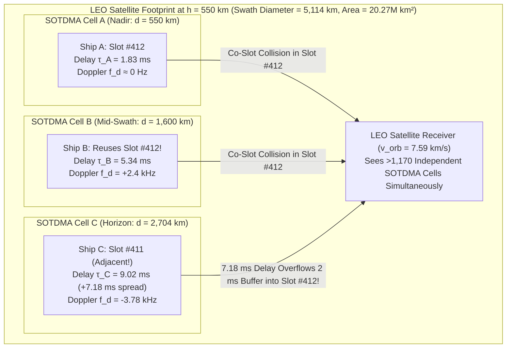

# Chapter 17: Satellite AIS (S-AIS): Orbital RF Reception, De-Collision DSP, and Satellite Transmission

> **Chapter Scope:** This chapter provides an end-to-end engineering, physical, and historical reference for **Satellite AIS (S-AIS)** and bidirectional spaceborne VHF maritime communications. We derive the orbital footprint geometry of Low Earth Orbit (LEO) receivers ($h = 500\text{–}650\text{ km}$), explain why a single satellite antenna simultaneously illuminates over $1,000$ independent terrestrial Self-Organizing TDMA (SOTDMA) cells, and quantify the resulting co-channel packet collision crisis alongside spaceborne RF impairments ($\pm 3.8\text{ kHz}$ Doppler shift, $7.2\text{–}7.4\text{ ms}$ differential slant-range delay spread, ionospheric Faraday rotation, and shipboard zenith antenna nulls). We then dissect **ITU-R M.1371-5 Message 27** on dedicated **Channels 75 and 76**, modern onboard and ground-based de-collision Digital Signal Processing (DSP) pipelines, single-satellite **Doppler + Time-of-Arrival (TOA) geolocation verification** for unmasking AIS spoofing, and directly answer whether satellites have ever transmitted AIS—from the **NorSat-2** (2017) Application Specific Message (ASM) experiments to operational two-way **VDE-SAT (AIS 2.0 / ITU-R M.2092-1)** constellations (**Sternula-1**, **NorSat-TD**, and **Ymir-1**).

---

## 1. Operational & Conceptual Overview

When Håkan Lans and the international maritime community standardized the Automatic Identification System (AIS) in the 1990s (**ITU-R M.1371-0**, 1998), the protocol was engineered strictly as a **horizontal, line-of-sight surface VHF network**. Operating at $161.975\text{ MHz}$ (**AIS 1**, Channel 87B) and $162.025\text{ MHz}$ (**AIS 2**, Channel 88B) with $12.5\text{ W}$ of transmitter power into a vertical masthead dipole, a commercial ship exchanges position reports with neighboring vessels within $20\text{–}30\text{ NM}$ ($37\text{–}56\text{ km}$) and with elevated coastal Vessel Traffic Services (VTS) towers out to $40\text{–}60\text{ NM}$ ($74\text{–}111\text{ km}$). Within that local radio horizon—defining a single **SOTDMA cell**—every vessel hears the slot reservations of every other vessel and coordinates access to the $2,250$ time slots ($26.667\text{ ms}$ each) per 60-second UTC frame without a central master station.

Beyond $60\text{ NM}$ from shore, however, terrestrial VHF receivers are blinded by the curvature of the Earth. Prior to the mid-2000s, a vessel crossing the Pacific, Indian, or Southern Ocean vanished from shore-based AIS displays for weeks at a time. Following the **September 11, 2001** terrorist attacks, naval and coast guard planners recognized a critical strategic blind spot: while AIS was mandatory under **SOLAS Chapter V, Regulation 19** (effective July 1, 2002), coastal receivers covered less than $10\%$ of the global ocean surface.

This operational gap catalyzed **Satellite AIS (S-AIS)**: placing sensitive VHF receivers aboard Low Earth Orbit (LEO) nanosatellites and microsatellites at altitudes of $500\text{–}650\text{ km}$ to capture AIS bursts leaking upward into space. Yet receiving AIS from orbit immediately confronts a fundamental architectural paradox:
1. **The Link Budget Works Surprisingly Well:** Because free-space line-of-sight propagation to $550\text{ km}$ encounters no terrain obstruction or Earth-curvature diffraction, a $12.5\text{ W}$ ($+41.0\text{ dBm}$) Class A burst arrives at a LEO satellite with $-102\text{ to }-112\text{ dBm}$ of signal power—comfortably above the $-125\text{ dBm}$ thermal/galactic noise floor of a $25\text{ kHz}$ spaceborne receiver.
2. **The MAC Layer Catastrophically Collapses:** Because a LEO satellite at $h = 550\text{ km}$ has a horizon slant range of $d_{\max} \approx 2,704\text{ km}$ and a ground swath diameter exceeding $5,100\text{ km}$ (an instantaneous footprint area of $>20.2\text{ million km}^2$), its antenna simultaneously hears **more than $1,100$ independent terrestrial SOTDMA cells**. Ships in the English Channel, the Bay of Biscay, the Western Mediterranean, and the North Atlantic cannot hear one another on the surface and therefore legitimately reuse the exact same $2,250$ time slots. At the satellite antenna, their transmissions arrive superimposed in time and frequency, producing severe **co-channel packet collisions**.

Understanding how S-AIS overcomes this multi-cell collision crisis—through a combination of protocol evolution (**Message 27** on Channels 75 and 76), multi-polarization phased-array antennas, and iterative **Successive Interference Cancellation (SIC)**—is essential for three distinct communities:
* **Mariners and VTS/SAR Planners:** Must understand why satellite AIS tracks exhibit revisit latencies (from minutes to hours depending on constellation size and latitude), why low-power Class B CSTDMA ($2\text{ W}$) vessels have lower spaceborne detection probabilities in congested coastal zones, and how modern two-way **VDE-SAT** satellites deliver ice charts, SAR notices, and **IHO S-100 / S-124** navigational warnings to the bridge.
* **RF, Payload, and DSP Engineers:** Must design receivers capable of tracking $\pm 3.8\text{ kHz}$ Doppler shifts ($-56\text{ Hz/s}$ slew rates), accommodating $7.2\text{ ms}$ ($69\text{-bit}$) differential slant-range delays that overflow terrestrial guard buffers, mitigating ionospheric Faraday rotation across multiple polarization turns, and peeling apart colliding GMSK waveforms in raw IQ baseband.
* **Geospatial Data Scientists and Intelligence Analysts:** Must recognize that an absence of S-AIS receptions in high-density regions (such as the East China Sea, Gulf of Mexico, or North Sea) frequently reflects **spaceborne slot saturation** rather than intentional transponder disabling ("going dark"), while single-satellite **Doppler and Time-of-Arrival (TOA) curves** provide a powerful physical-layer weapon to detect and geolocate AIS spoofers.

---

## 2. Historical Context & Evolution (`schwehr/gis-history` Integration)

The lineage of Satellite AIS bridges the dawn of the Space Age, hyperbolic/Doppler radio navigation, and the modern open-source cloud geospatial ecosystem cataloged in [`schwehr/gis-history`](https://github.com/schwehr/gis-history) ([Cutlip, 2017](https://globalfishingwatch.org/article/ais-brief-history/)).

| Era / Year | Milestone (`schwehr/gis-history` & S-AIS Lineage) | Engineering & Operational Significance |
|---|---|---|
| **Oct 1957 – 1964** | **Sputnik 1 Doppler Tracking** (Guier & Weiffenbach, APL) $\rightarrow$ **U.S. Navy Transit (NNSS)** | Demonstrates that a single LEO pass's VHF/UHF Doppler inflection curve ($f_d(t)$) uniquely determines the ground distance and along-track time of closest approach—the exact inverse physics used today to verify S-AIS vessel positions. |
| **1978 – 1984** | **Navstar GPS Block I** (1978), **Cospas-Sarsat 406 MHz** (1982), **NMEA 0183** & **WGS84** (1984) | Establishes spaceborne L-band microsecond UTC time transfer, LEO Doppler distress geolocation, and the WGS84 reference frame (`gis-history`). |
| **July 1, 2002** | **IMO SOLAS Chapter V AIS Mandate Takes Effect**; **US MTSA 2002** (Nov 2002) | Commercial fleet (>300 GT international) begins broadcasting continuous $12.5\text{ W}$ VHF SOTDMA bursts worldwide (`gis-history`). |
| **2003 – 2005** | **Norwegian Defence Research Establishment (FFI) Space-Based AIS Studies** (Wahl & Høye, 2005; Eriksen et al., 2006) | FFI derives the first rigorous link budgets and multi-cell SOTDMA collision probability models for LEO AIS reception, proving that 1,000+ ship footprints are recoverable with directional antennas and Doppler/delay processing. |
| **Dec 2006 – 2007** | **U.S. NRL TacSat-2** (Dec 2006) & **OHB/LuxSpace Rubin-7** (2007) | First experimental orbital captures of shipboard AIS packets from LEO, validating VHF ionospheric penetration and revealing severe slot collisions over congested waters. |
| **April – June 2008** | **COM DEV NTS (Nanosatellite Tracking of Ships)** & **ORBCOMM CDS-3 / Quick Launch** | CanX-based $6.5\text{ kg}$ NTS satellite demonstrates on-orbit multi-polarization raw spectrum capture + ground de-collision DSP, leading COM DEV and Hisdesat to found **exactEarth** (2009); ORBCOMM launches commercial S-AIS on LEO messaging satellites. |
| **July 12, 2010** | **Norway Launches AISSat-1** (followed by **AISSat-2** in 2014) | Built by UTIAS-SFL with a **Kongsberg Seatex ASR-100** payload in a $635\text{ km}$ sun-synchronous polar orbit ($98^\circ$ inclination); transforms High North/Arctic maritime surveillance for the Norwegian Coastal Administration. Also in June 2010, the **NORAIS** receiver is installed aboard the **International Space Station (ISS)** Columbus module. |
| **2010 – 2013** | ***Deepwater Horizon* & `libais` (2010)**; **Kurt Schwehr's *"All the Ships"* (2013)** | Explosion of global S-AIS archives drives the shift from slow pure-Python `BitVector` scripts to C++ **`libais`** ([`schwehr/libais`](https://github.com/schwehr/libais)) and cloud-scale spatiotemporal ingestion (`gis-history`). |
| **2012 – 2014** | **ITU WRC-12 Allocates Ch 75/76**; **ITU-R M.1371-5 (2014) Standardizes Message 27**; **ORBCOMM OG2** | ITU dedicates $156.775\text{ MHz}$ (Ch 75) and $156.825\text{ MHz}$ (Ch 76) to Long-Range Satellite AIS; Class A transponders add zero-reservation 96-bit Message 27 broadcasts. |
| **2015 – 2016** | **Spire Global Lemur-2 3U CubeSats** (2015+); **Global Fishing Watch Launched** (Sept 2016) | Spire deploys $>100$ 3U CubeSats with dual S-AIS + GNSS-RO payloads; **Global Fishing Watch** (Oceana, SkyTruth, Google) processes billions of S-AIS positions to map global industrial fishing ([Kroodsma et al., 2018, *Science*](https://doi.org/10.1126/science.aao5646)). |
| **July 14, 2017** | **NorSat-1 & NorSat-2 Launched** (Norwegian Space Agency / FFI / Kongsberg Seatex) | **NorSat-2** carries the first spaceborne VHF transmitter ($157\text{–}162\text{ MHz}$ crossed-Yagi), proving satellite-to-ship broadcasting of Application Specific Messages (ASM) and early VDE-SAT test waveforms. |
| **2021 – 2023** | **Spire Acquires exactEarth (2021)**; **NorSat-3 (2021)**; **Sternula-1 & NorSat-TD (2023)** | **NorSat-3** adds a passive VHF Navigation Radar Detector (NRD) to correlate S-AIS with ship X-band/S-band radar; **Sternula-1** (Jan 2023), **NorSat-TD** (April 2023), and **Ymir-1** (Nov 2023) demonstrate operational two-way **VDE-SAT (AIS 2.0)** satellite communications. |

---

## 3. How Satellites Receive and Process AIS RF (Section 17.1)

### 17.1.1 Spherical-Earth Orbital Geometry and Footprint Derivation

Consider a LEO satellite at orbital altitude $h$ above a spherical Earth of mean radius $R_\oplus = 6,371.0\text{ km}$. Let a surface ship at sea level have elevation angle $\theta_{\text{el}} \ge 0^\circ$ to the satellite, let $\alpha$ be the nadir angle at the satellite between the local vertical (geocenter vector) and the line-of-sight vector to the ship, and let $\psi$ be the geocentric central angle subtended between the sub-satellite point (nadir) and the vessel.

By the Law of Sines in the geocenter–satellite–ship triangle:

$$\frac{\sin\alpha}{R_\oplus} = \frac{\sin(90^\circ + \theta_{\text{el}})}{R_\oplus + h} = \frac{\cos\theta_{\text{el}}}{R_\oplus + h}$$

At the geometric radio horizon ($\theta_{\text{el}} = 0^\circ$, where the line-of-sight vector is tangent to the ocean surface and perpendicular to the Earth radius at the ship), $\cos\theta_{\text{el}} = 1$, yielding the maximum nadir half-cone angle $\alpha_{\max}$ and maximum Earth central angle $\psi_{\max}$:

$$\sin\alpha_{\max} = \frac{R_\oplus}{R_\oplus + h}, \qquad \psi_{\max} = 90^\circ - \alpha_{\max} = \arccos\!\left(\frac{R_\oplus}{R_\oplus + h}\right)$$

Applying the Pythagorean theorem to the right triangle formed at the horizon ($\theta_{\text{el}} = 0^\circ$) gives the **maximum horizon slant range** $d_{\max}$, the **ground swath radius** $s_{\max}$ along the curved Earth surface, and the **instantaneous spherical-cap footprint area** $A_{\text{cap}}$:

$$d_{\max} = \sqrt{(R_\oplus + h)^2 - R_\oplus^2} = \sqrt{2 R_\oplus h + h^2}$$

$$s_{\max} = R_\oplus \, \psi_{\max} = R_\oplus \arccos\!\left(\frac{R_\oplus}{R_\oplus + h}\right)$$

$$A_{\text{cap}} = 2\pi R_\oplus^2 \left(1 - \cos\psi_{\max}\right) = 2\pi R_\oplus^2 \left(\frac{h}{R_\oplus + h}\right)$$

For an arbitrary elevation angle $\theta_{\text{el}} \in [0^\circ, 90^\circ]$, the slant range $d(\theta_{\text{el}})$ is obtained from the Law of Cosines:

$$d(\theta_{\text{el}}) = \sqrt{(R_\oplus + h)^2 - R_\oplus^2 \cos^2\theta_{\text{el}}} - R_\oplus \sin\theta_{\text{el}}$$

### 17.1.2 The Multi-Cell SOTDMA Collision Crisis

On the ocean surface, a standard ship-to-ship or ship-to-shore SOTDMA cell has an effective coordination radius of $r_{\text{cell}} \approx 40\text{ NM} = 74.08\text{ km}$, corresponding to a surface area of:

$$A_{\text{cell}} = \pi r_{\text{cell}}^2 = \pi (74.08\text{ km})^2 \approx 17,240\text{ km}^2$$

Dividing the satellite's instantaneous spherical-cap footprint $A_{\text{cap}}$ by $A_{\text{cell}}$ reveals the upper bound on the number of **mutually invisible, independent terrestrial SOTDMA cells** $N_{\text{cells}}$ simultaneously illuminating a single omnidirectional LEO satellite antenna:

$$N_{\text{cells}} = \frac{A_{\text{cap}}}{A_{\text{cell}}} = \frac{2 R_\oplus^2 h}{(R_\oplus + h) \, r_{\text{cell}}^2}$$

| Receiver Platform | Altitude $h$ | Horizon Slant Range $d_{\max}$ | Ground Swath Diameter $2 s_{\max}$ | Footprint Area $A_{\text{cap}}$ | Independent $40\text{ NM}$ SOTDMA Cells ($N_{\text{cells}}$) | Max Delay Spread $\Delta\tau$ (Bits @ $9.6\text{ kbps}$) |
|---|---|---|---|---|---|---|
| **Shipboard Mast** | $30\text{ m}$ | $19.6\text{ km}$ ($10.6\text{ NM}$) | $39.1\text{ km}$ | $1,201\text{ km}^2$ | $1.0$ (Self-organized) | $0.065\text{ ms}$ ($0.6\text{ bits}$) |
| **Coastal VTS Tower** | $150\text{ m}$ | $43.7\text{ km}$ ($23.6\text{ NM}$) | $87.4\text{ km}$ | $6,006\text{ km}^2$ | $1.0$ (Self-organized) | $0.146\text{ ms}$ ($1.4\text{ bits}$) |
| **Patrol Aircraft** | $3.05\text{ km}$ ($10\text{k ft}$) | $197.1\text{ km}$ ($106.4\text{ NM}$) | $394.1\text{ km}$ | $122,000\text{ km}^2$ | $\sim 7.1\text{ cells}$ | $0.647\text{ ms}$ ($6.2\text{ bits}$) |
| **LEO CubeSat (`500 km`)** | $500\text{ km}$ | $2,573.1\text{ km}$ | $4,891.0\text{ km}$ | $18.56\times 10^6\text{ km}^2$ | **$1,076\text{ cells}$** | $6.915\text{ ms}$ (**$66.4\text{ bits}$**) |
| **LEO S-AIS (`550 km`)** | $550\text{ km}$ | $2,703.8\text{ km}$ | $5,114.1\text{ km}$ | $20.27\times 10^6\text{ km}^2$ | **$1,176\text{ cells}$** | $7.184\text{ ms}$ (**$69.0\text{ bits}$**) |
| **LEO S-AIS (`600 km`)** | $600\text{ km}$ | $2,829.3\text{ km}$ | $5,325.3\text{ km}$ | $21.95\times 10^6\text{ km}^2$ | **$1,273\text{ cells}$** | $7.436\text{ ms}$ (**$71.4\text{ bits}$**) |
| **LEO Polar (`650 km`)** | $650\text{ km}$ | $2,950.4\text{ km}$ | $5,526.1\text{ km}$ | $23.61\times 10^6\text{ km}^2$ | **$1,369\text{ cells}$** | $7.674\text{ ms}$ (**$73.7\text{ bits}$**) |



Because vessels scattered across different SOTDMA cells select slots independently from the satellite's perspective, the composite arrival stream at the satellite antenna behaves as an **uncoordinated slotted/unslotted Aloha process** enhanced by differential propagation delay spread $\Delta\tau$. Let $N_v$ vessels reside within the satellite footprint, each transmitting a burst of duration $T_{\text{pkt}}$ at a mean reporting interval $\Delta T$ across two channels ($n_{\text{ch}} = 2$, so $4,500$ slots per $60\text{ s}$ frame). Because differential path delay $\Delta\tau \approx 7.18\text{ ms}$ causes packets in slot $k$ near the horizon to spill into slot $k+1$ near nadir, the effective collision-vulnerable fraction of a slot is $1 + \frac{\Delta\tau}{T_{\text{slot}}}$ (where $T_{\text{slot}} = 26.667\text{ ms}$ and $\frac{\Delta\tau}{T_{\text{slot}}} \approx 0.27$). For a single burst from a target vessel without capture-effect or SIC separation, the probability of an uncollided reception is:

$$P_{\text{clean,1}} \approx \exp\!\left( - \frac{N_v}{\Delta T \cdot R_{\text{slots}}} \left(1 + \frac{\Delta\tau}{T_{\text{slot}}}\right) \right)$$

where $R_{\text{slots}} = \frac{4500}{60\text{ s}} = 75\text{ slots/s}$ across AIS 1 and AIS 2 combined. Over an entire satellite pass of duration $T_{\text{pass}}$ (during which the vessel transmits $K = \lfloor T_{\text{pass}} / \Delta T \rfloor$ bursts), the cumulative probability of decoding **at least one** position report from the ship is:

$$P_{\text{detect,pass}} = 1 - \left(1 - P_{\text{clean,1}}\right)^K$$

When $N_v = 2,500$ vessels in the footprint report every $\Delta T = 10\text{ s}$ on standard AIS 1/2, the offered load is $250\text{ bursts/s}$ into $75\text{ slots/s}$, driving $P_{\text{clean,1}} < 1.5\%$ for a basic non-decolliding receiver!

### 17.1.3 Spaceborne VHF Channel Impairments

Beyond multi-cell collisions, a spaceborne VHF receiver must overcome three severe physical-layer impairments absent in terrestrial links:

#### 1. Orbital Doppler Shift and Doppler Rate
A satellite in a circular orbit at altitude $h = 550\text{ km}$ travels at an inertial orbital speed of:

$$v_{\text{orb}} = \sqrt{\frac{\mu_\oplus}{R_\oplus + h}} = \sqrt{\frac{398,600.44\text{ km}^3/\text{s}^2}{6,921.0\text{ km}}} \approx 7.589\text{ km/s}$$

where $\mu_\oplus = GM_\oplus = 3.986004418 \times 10^{14}\text{ m}^3/\text{s}^2$. For a carrier frequency $f_c = 162.025\text{ MHz}$ (AIS 2), the instantaneous radial velocity $v_r(t) = \frac{d}{dt}\|\mathbf{r}_{\text{sat}}(t) - \mathbf{r}_{\text{ship}}(t)\|$ induces a carrier Doppler shift:

$$f_d(t) = -\frac{v_r(t)}{c} f_c$$

For a vessel directly ahead or behind along the sub-satellite ground track on the horizon ($\theta_{\text{el}} = 0^\circ$), the angle between the satellite velocity vector $\mathbf{v}_{\text{sat}}$ and the line of sight is $\alpha_{\max}$, so $\sin\alpha_{\max} = \frac{R_\oplus}{R_\oplus + h} = 0.9205$, and the maximum horizon Doppler shift (neglecting $\le 0.465\text{ km/s}$ Earth rotation) is:

$$\Delta f_{d,\max} = \pm \frac{v_{\text{orb}}}{c} f_c \left(\frac{R_\oplus}{R_\oplus + h}\right) \approx \pm \frac{7.589}{299,792.458} \times 162.025\text{ MHz} \times 0.9205 \approx \pm 3,776\text{ Hz}$$

When Earth's equatorial rotation ($v_{\text{rot}} = \Omega_\oplus R_\oplus \approx 0.465\text{ km/s}$) adds constructively to a retrograde or polar inclination pass, $\Delta f_{d,\max}$ reaches **$\pm 3.9\text{ to }\pm 4.0\text{ kHz}$**.

> [!WARNING]
> **Why Orbital Doppler Breaks Terrestrial AIS Receivers:** Standard AIS uses GMSK modulation at $R_b = 9,600\text{ bps}$ with modulation index $h_{\text{mod}} = 0.5$, producing an instantaneous peak frequency deviation of $\Delta f_{\text{GMSK}} = \pm \frac{1}{2} h_{\text{mod}} R_b = \pm 2,400\text{ Hz}$. An orbital Doppler offset of $\pm 3.8\text{ kHz}$ is **$1.6\times$ larger than the GMSK modulation deviation itself**, pushing the signal spectrum outside the crystal filter passband of a standard marine transceiver (which ITU-R M.1371-5 specifies for only $\pm 500\text{ Hz}$ carrier tolerance). Furthermore, as the satellite passes through zenith ($d = h = 550\text{ km}$), the **Doppler rate** reaches:
> $$\dot{f}_{d,\text{nadir}} = -\frac{v_{\text{orb}}^2}{c \, h} f_c \approx -\frac{(7,589\text{ m/s})^2}{2.9979 \times 10^8\text{ m/s} \times 550,000\text{ m}} \times 162.025 \times 10^6\text{ Hz} \approx -56.6\text{ Hz/s}$$
> (and $\approx -45\text{ Hz/s}$ for passes with moderate off-nadir offset or $h \approx 650\text{ km}$).

#### 2. Differential Slant-Range Propagation Delay Spread
In a terrestrial SOTDMA cell ($d \le 40\text{ NM} = 74.1\text{ km}$), one-way propagation delay is at most $\tau_{\text{terr}} = \frac{74.1\text{ km}}{c} = 0.247\text{ ms}$ ($2.37\text{ bit periods}$). ITU-R M.1371-5 therefore allocates a **24-bit ($2.5\text{ ms}$) end-of-slot buffer** (bits `232..255` of the 256-bit slot), of which $4\text{ bits}$ ($0.42\text{ ms}$) absorb HDLC zero-bit stuffing and **$20\text{ bits}$ ($2.08\text{ ms}$) serve as the distance delay guard** (sufficient for $\sim 337\text{ NM} = 625\text{ km}$).

From a LEO satellite at $h = 550\text{ km}$, however:
* A vessel at **nadir** ($d_{\min} = 550\text{ km}$) has a one-way propagation delay of:
  $$\tau_{\min} = \frac{550\text{ km}}{299,792.458\text{ km/s}} = 1.835\text{ ms} \quad (17.6\text{ bit periods})$$
* A vessel at the **horizon** ($d_{\max} = 2,703.8\text{ km}$ at $h=550\text{ km}$, or $2,750\text{ km}$ at $h=570\text{ km}$) has a one-way propagation delay of:
  $$\tau_{\max} = \frac{2,703.8\text{ km}}{299,792.458\text{ km/s}} = 9.019\text{ ms} \quad (\text{or } 9.173\text{ ms at } d = 2,750\text{ km})$$
* The resulting **differential propagation delay spread** across the footprint is:
  $$\Delta\tau = \tau_{\max} - \tau_{\min} = 7.18\text{ to } 7.34\text{ ms} \approx 69\text{ to } 70.5\text{ bits}$$

Because $7.34\text{ ms}$ exceeds the $2.08\text{ ms}$ terrestrial distance delay buffer by more than **$5.2\text{ ms}$ ($50\text{ bits}$)**, a packet transmitted in time slot $k$ by a ship near the horizon arrives at the satellite during the first $5.2\text{ ms}$ of time slot $k+1$ from a ship near nadir—destroying the orthogonality of adjacent TDMA time slots!

#### 3. Ionospheric Faraday Rotation, Scintillation, and the Shipboard Zenith Cone of Silence
When a shipboard vertical dipole transmits a linearly (vertically) polarized $162\text{ MHz}$ wave upward through the Earth's magnetized ionosphere, the anisotropic plasma splits the wave into right-hand and left-hand circularly polarized characteristic modes propagating at slightly different phase velocities. Upon exiting the ionosphere at the satellite, the plane of linear polarization has rotated by the **Faraday rotation angle** $\Omega$ (in radians):

$$\Omega = \frac{e^3}{8\pi^2 \varepsilon_0 m_e^2 c \, f^2} \int_0^d N_e(s) B_0(s) \cos\theta_B(s) \, ds \approx \frac{2.36 \times 10^4}{f^2} \, \overline{B}_\parallel \cdot \text{STEC}$$

where $f = 1.62 \times 10^8\text{ Hz}$ is the carrier frequency in Hz, $\overline{B}_\parallel \approx 3.5 \times 10^{-5}\text{ T}$ is the mean longitudinal geomagnetic field, and $\text{STEC} = \int N_e(s)\,ds$ is the Slant Total Electron Content in $\text{electrons/m}^2$ ($1\text{ TECU} = 10^{16}\text{ el/m}^2$). At $f = 162\text{ MHz}$, $\frac{2.36 \times 10^4}{f^2} \approx 8.99 \times 10^{-13}\text{ m}^2/\text{T}$. Even for a moderate daytime vertical TEC of $25\text{ TECU}$ and slant factor $2.0$ ($\text{STEC} = 5 \times 10^{17}\text{ el/m}^2$):

$$\Omega \approx 8.99 \times 10^{-13} \times 3.5 \times 10^{-5} \times 5 \times 10^{17} \approx 15.7\text{ radians} \approx 901^\circ \quad (\text{2.5 full rotations!})$$

Because $\Omega$ varies randomly from $0^\circ$ to $>1,000^\circ$ across the footprint, a single linearly polarized satellite antenna suffers catastrophic cross-polarization fading ($L_{\text{pol}} = -20\log_{10}|\cos\Delta\psi_{\text{pol}}|$, reaching $20\text{–}30\text{ dB}$ whenever $\Delta\psi_{\text{pol}} \approx 90^\circ$).

Simultaneously, the shipboard vertical $\frac{1}{2}\lambda$ dipole exhibits an elevation radiation pattern with a deep null directly overhead (**zenith cone of silence** at $\theta_{\text{el}} \to 90^\circ$), while at lower elevation angles ($\theta_{\text{el}} \in [5^\circ, 40^\circ]$), specular reflection off the conducting seawater surface ($\Gamma_V(\theta_{\text{el}})$) creates constructive and destructive **two-ray interference lobes** that modulate the upward link margin by $+5\text{ dB}$ to $-15\text{ dB}$ as the vessel rolls:

| Link Budget Parameter | Class A at Nadir ($\theta_{\text{el}} = 80^\circ$) | Class A at Horizon ($\theta_{\text{el}} = 5^\circ$) | Class B CS at Horizon ($\theta_{\text{el}} = 5^\circ$) | Engineering Notes |
|---|---|---|---|---|
| **Transmit Power ($P_{\text{TX}}$)** | $+41.0\text{ dBm}$ ($12.5\text{ W}$) | $+41.0\text{ dBm}$ ($12.5\text{ W}$) | $+33.0\text{ dBm}$ ($2.0\text{ W}$) | IEC 61993-2 vs. IEC 62287-1 |
| **Ship Cable & Connector Loss** | $-2.0\text{ dB}$ | $-2.0\text{ dB}$ | $-2.5\text{ dB}$ | Coax attenuation at $162\text{ MHz}$ |
| **Ship Antenna Gain + Sea Multipath** | $-6.0\text{ dBi}$ (Zenith null cone) | $+2.5\text{ dBi}$ (Main lobe + sea reflection) | $+1.5\text{ dBi}$ | Vertical $\frac{1}{2}\lambda$ dipole over seawater |
| **Slant Range ($d$ at $h=550\text{ km}$)** | $558\text{ km}$ | $2,235\text{ km}$ (at $\theta_{\text{el}}=5^\circ$) | $2,235\text{ km}$ | $2,704\text{ km}$ at $\theta_{\text{el}}=0^\circ$ |
| **Free-Space Path Loss ($\text{FSPL}$)** | $-131.6\text{ dB}$ | $-143.6\text{ dB}$ | $-143.6\text{ dB}$ | $20\log_{10}(4\pi d f / c)$ |
| **Atmospheric, Ionospheric & Pol Loss** | $-1.5\text{ dB}$ | $-3.0\text{ dB}$ | $-3.0\text{ dB}$ | Assuming dual-pol / circular sat RX |
| **Satellite RX Antenna Gain ($G_{\text{RX}}$)** | $+2.0\text{ dBi}$ | $+4.0\text{ dBi}$ | $+4.0\text{ dBi}$ | Shaped pattern or Yagi/helical |
| **Received Signal Power ($P_{\text{RX}}$)** | **$-98.1\text{ dBm}$** | **$-101.1\text{ dBm}$** | **$-110.6\text{ dBm}$** | Required $E_b/N_0 \ge 10\text{ dB}$ ($\text{BER} \le 10^{-5}$) |
| **System Noise Floor ($N_0 B$ in $25\text{ kHz}$)** | $-123.5\text{ dBm}$ | $-123.5\text{ dBm}$ | $-123.5\text{ dBm}$ | $T_{\text{sys}} \approx 1,300\text{ K}$ (Galactic + Earth + LNA) |
| **Thermal Carrier-to-Noise ($C/N$)** | **$+25.4\text{ dB}$** | **$+22.4\text{ dB}$** | **$+12.9\text{ dB}$** | Thermal-limited margin is ample; **co-channel interference ($C/I$)** dominates! |

---

## 4. Spaceborne De-Collision Architectures and Message 27 (Section 17.2)

### 17.2.1 ITU-R M.1371-5 Message 27 (Long-Range AIS Broadcast) on Channels 75 and 76

To relieve the multi-cell collision bottleneck at its source, the ITU World Radiocommunication Conference (**WRC-12**) and **ITU-R Recommendation M.1371-5** (2014) introduced two dedicated **Long-Range Satellite AIS simplex channels** in ITU Radio Regulations Appendix 18 alongside a purpose-built, ultra-compact message format: **Message 27 (*Position report for long-range applications*)**:
* **Channel 75 ($156.775\text{ MHz}$ — Long-Range AIS A)** and **Channel 76 ($156.825\text{ MHz}$ — Long-Range AIS B)**, positioned immediately adjacent to the $156.800\text{ MHz}$ VHF Channel 16 guard band.
* **Automatic Coastal Base Station Suppression:** Whenever a Class A vessel receives **Message 4** (*Base Station Report*) or channel-management commands (**Message 22/23**) from a coastal VTS Base Station, it automatically inhibits Message 27 transmissions on Channels 75 and 76. Consequently, the tens of thousands of ships congested inside ports, rivers, and coastal VTS zones remain completely silent on Channels 75/76, reserving the satellite channels strictly for vessels on the high seas!
* **Class A Exclusivity:** Low-power Class B CSTDMA transponders, AIS-SARTs, and AtoNs do not transmit Message 27 on Channels 75/76, further slashing background slot occupancy.
* **No SOTDMA Communication State & Shortened Burst:** Because SOTDMA slot reservations are meaningless across a $5,100\text{ km}$ satellite footprint, Message 27 strips out the 19-bit SOTDMA state, Rate of Turn, True Heading, and fine $1/10,000\text{-minute}$ coordinates, compressing the payload from **168 bits down to 96 bits ($9.6\text{ ms}$ of payload data at $9,600\text{ bps}$)**. Including the 8-bit ramp-up, 24-bit training sequence, start/end HDLC flags ($16\text{ bits}$), and 16-bit CRC-CCITT FCS, the active on-air burst shrinks from $26.67\text{ ms}$ ($256\text{ bits}$) to **$16.67\text{ ms}$ ($160\text{ bits}$ plus $\le 4\text{ stuffing bits}$)**, leaving nearly **$10\text{ ms}$ ($96\text{ bits}$) of propagation delay buffer** inside a standard $26.67\text{ ms}$ time slot—completely absorbing the $7.3\text{ ms}$ orbital slant-range delay spread so adjacent slots never overlap!

#### Complete Bit-Level Schema of ITU-R M.1371-5 Message 27 (96 Bits Total)
Following our handbook's dual indexing convention (`0-based MSB-first` for `libais` / `gpsd` / `pyais` alongside `1-based MSB-first` for ITU-R M.1371-5):

| 0-Based Bits (`libais`) | 1-Based Bits (`ITU`) | Width $W$ | Field Name | Data Type | Scaling & Units | Valid Range & "Not Available" Sentinel |
|---|---|---|---|---|---|---|
| `0–5` | `1–6` | $6$ | **Message ID** | `uint6` | Constant `27` (`0b011011`) | Always `27` (`'K'` in 6-bit NMEA armor) |
| `6–7` | `7–8` | $2$ | **Repeat Indicator** | `uint2` | `0–3` | **`3` (`0b11`)** inside Msg 27 to prevent terrestrial AIS repeaters from re-broadcasting! |
| `8–37` | `9–38` | $30$ | **User ID (MMSI)** | `uint30` | 9-digit MMSI | `000000000`–`999999999` |
| `38` | `39` | $1$ | **Position Accuracy** | `uint1` | Boolean flag | `1` = High ($\le 10\text{ m}$ DGNSS); `0` = Low ($>10\text{ m}$) |
| `39` | `40` | $1$ | **RAIM Flag** | `uint1` | Boolean flag | `1` = RAIM in use; `0` = RAIM not in use |
| `40–43` | `41–44` | $4$ | **Navigation Status** | `uint4` | Enum `0–15` | `0` = Under way using engine ... Sentinel: **`15`** = Not defined |
| `44–61` | `45–62` | $18$ | **Longitude ($\lambda$)** | **`int18`** (Two's comp) | $\frac{S}{600}\text{ deg}$ ($\frac{1}{10}\text{ min} \approx 185\text{ m}$) | $[-180^\circ, +180^\circ]$; Sentinel: **`181.0°`** (`108,600` = `0x1A838`) |
| `62–78` | `63–79` | $17$ | **Latitude ($\phi$)** | **`int17`** (Two's comp) | $\frac{S}{600}\text{ deg}$ ($\frac{1}{10}\text{ min} \approx 185\text{ m}$) | $[-90^\circ, +90^\circ]$; Sentinel: **`91.0°`** (`54,600` = `0x0D548`) |
| `79–84` | `80–85` | $6$ | **Speed Over Ground (SOG)** | `uint6` | $1\text{ knot}$ ($U\text{ kts}$) | $0\text{–}62\text{ kts}$; Sentinel: **`63`** (`0x3F`) = N/A |
| `85–93` | `86–94` | $9$ | **Course Over Ground (COG)** | `uint9` | $1^\circ\text{ true}$ ($U^\circ$) | $0^\circ\text{–}359^\circ$; Sentinel: **`511`** (`0x1FF`) = N/A |
| `94` | `95` | $1$ | **GNSS Position Latency** | `uint1` | Status flag | `0` = Current GNSS fix ($<5\text{ s}$ old); `1` = Latency $>5\text{ s}$ (or N/A) |
| `95` | `96` | $1$ | **Spare** | `uint1` | Reserved | Set to `0` |

#### Mathematical Proof of Message 27 Capacity Gain
Why does shortening the payload to $9.6\text{ ms}$ ($96\text{ bits}$) and lengthening the transmission period to $\Delta T_{27} = 180\text{ s}$ (alternating every $3\text{ minutes}$ across Channels 75 and 76) increase uncollided satellite capacity by more than an order of magnitude?
1. **Elimination of Inter-Slot Delay Spillover:** For standard 256-bit Messages 1/2/3 ($T_{\text{burst,1}} \approx 24.6\text{ ms}$ active RF plus $2.08\text{ ms}$ guard), the $7.18\text{ ms}$ orbital delay spread spills $5.1\text{ ms}$ into the next slot, making the vulnerable collision window $T_{\text{vuln,1}} \approx 26.67 + 7.18 = 33.85\text{ ms}$ ($1.27\text{ slots}$). For Message 27 ($9.6\text{ ms}$ payload, $16.67\text{ ms}$ total burst), the $10.0\text{ ms}$ guard buffer exceeds $\Delta\tau = 7.18\text{ ms}$, confining every burst strictly within its single slot ($1.0\text{ slot}$) or an unslotted Aloha vulnerable window of $2 T_{\text{burst,27}} \approx 33.3\text{ ms}$ without inter-slot spill.
2. **Duty-Cycle Compression ($\Delta T = 180\text{ s}$ vs. $6\text{–}10\text{ s}$):** A Class A ship underway at $14\text{–}23\text{ knots}$ transmits Message 1 every $\Delta T_1 = 6\text{ s}$ (or $10\text{ s}$ at $\le 14\text{ kts}$). By switching to $\Delta T_{27} = 180\text{ s}$ on Channels 75/76 and shortening the burst duration by $37.5\%$ (payload by $64\%$), the per-vessel channel occupancy rate drops by a factor of:

$$\frac{G_{\text{AIS1/2}}}{G_{\text{Msg27}}} = \left(\frac{\Delta T_{27}}{\Delta T_1}\right) \cdot \left(\frac{T_{\text{vuln,1}}}{T_{\text{vuln,27}}}\right) \approx \left(\frac{180\text{ s}}{8\text{ s}}\right) \times 1.27 \approx 28.6\times$$

Even before accounting for the coastal Base Station suppression that removes $>60\%$ of coastal ships from Channels 75/76, Message 27 increases the number of simultaneous high-seas vessels that can be tracked at $P_{\text{detect,pass}} \ge 80\%$ from **$\sim 800\text{ ships}$ to $>12,000\text{ ships}$ per footprint**!

### 17.2.2 Onboard SDR and Ground-Based De-Collision DSP Architectures

Because millions of legacy Class A and Class B transmissions still occur on AIS 1 and AIS 2—and because coastal vessels suppress Message 27—modern S-AIS constellations (Spire Global / exactEarth, ORBCOMM, Kongsberg Seatex / Norwegian Space Agency) deploy sophisticated multi-stage RF and DSP de-collision architectures:

```mermaid
flowchart LR
    subgraph ORBIT["Spaceborne LEO Payload (Onboard SDR)"]
        ANT["Orthogonal Multi-Pol Antennas<br/>(Crossed Dipole / Yagi / 3-Axis)"] --> LNA["Low-Noise Amplifiers &<br/>SAW Bandpass (156–162 MHz)"]
        LNA --> ADC["Multi-Channel Phase-Coherent ADC<br/>(Complex IQ Baseband: Ch 87B, 88B, 75, 76)"]
        ADC --> BEAM["Digital Beamforming &<br/>Spatial Coastal Nulling"]
    end
    BEAM -->|"Onboard SIC (Kongsberg NORAIS)<br/>OR Compressed Raw IQ Downlink (exactEarth ABMSR)"| DSP
    subgraph GROUND["Iterative De-Collision DSP Engine (Onboard or Ground Station)"]
        DSP["2D Blind Doppler-Delay<br/>Matched Filter Bank<br/>(f_d ∈ [-4.2, +4.2] kHz)"] --> VIT["Coherent GMSK Viterbi<br/>Demodulator & CRC-16 Check"]
        VIT -->|"Valid Packet #k Decoded"| RECON["Reconstruct Clean GMSK Waveform<br/>ŝ_k(t) = Â_k exp(j(2π f̂_d t + θ_GMSK))"]
        RECON --> SUB["Successive Interference Cancellation (SIC)<br/>r^(k+1)(t) = r^(k)(t) - ŝ_k(t)"]
        SUB -->|"Loop 3–6 Iterations to Peel Weak Signals"| DSP
    end
```



1. **Multi-Polarization Antennas & Digital Beamforming:** To defeat Faraday rotation ($\Omega \propto \text{TEC}/f^2$), S-AIS satellites employ orthogonal linear antennas (e.g., crossed dipoles on **AISSat-1/2**, deployable Yagis on **NorSat-1/2/3**, or 3-axis monopoles on **Spire Lemur-2**). By digitizing all $M$ antenna elements phase-coherently into complex baseband IQ streams $\mathbf{r}(t) \in \mathbb{C}^M$, the processor applies complex weight vectors $\mathbf{w}_b \in \mathbb{C}^M$ ($y_b(t) = \mathbf{w}_b^H \mathbf{r}(t)$) to simultaneously synthesize:
   * **Polarization-Matched Diversity:** Combining orthogonal axes in software so no vessel suffers cross-polarization fades regardless of ionospheric TEC.
   * **Spatial Beam Steering & Coastal Chokepoint Nulling:** Dividing the $5,100\text{ km}$ footprint into smaller spatial sub-footprints (or placing adaptive Minimum Variance Distortionless Response [MVDR] spatial nulls over ultra-dense coastal ports like Rotterdam or Shanghai) so offshore vessels can be decoded cleanly.
2. **2D Blind Doppler-Delay Matched Filter Banks:** Because arriving bursts have arbitrary carrier offsets $f_d \in [-4.2, +4.2]\text{ kHz}$ and arrival times $\tau \in [0, 26.67]\text{ ms}$, the detector correlates the incoming IQ stream against a 2D bank of Doppler-shifted replicas of the known 32-bit sync sequence (24-bit alternating `0101...` training sequence + 8-bit `0x7E` start flag):

   $$\Lambda(\tau, f_d) = \left| \int_{\tau}^{\tau + T_{\text{sync}}} r(t) \, s_{\text{sync}}^*(t - \tau) \, e^{-j 2\pi f_d t} \, dt \right|^2$$

   Peaks in $\Lambda(\tau, f_d)$ initialize a coherent **Viterbi trellis demodulator** tailored to the 3-bit inter-symbol interference (ISI) memory of $BT = 0.4$ GMSK.
3. **Iterative Successive Interference Cancellation (SIC):** When two or more bursts collide in the same slot ($r(t) = s_1(t) + s_2(t) + n(t)$), the strongest signal $s_1(t)$ (or the one with distinct Doppler offset $f_{d,1}$) is decoded first and verified via its 16-bit CRC-CCITT Frame Check Sequence (or soft-decision 1–2 bit syndrome error correction). The DSP engine then **re-modulates** the verified bit sequence into a noiseless GMSK waveform, applies the estimated complex amplitude $\hat{A}_1$, carrier frequency $\hat{f}_{d,1}$, carrier phase $\hat{\phi}_1$, fractional symbol timing $\hat{\tau}_1$, and channel impulse response $\hat{h}_1(t)$, and **subtracts** it from the raw IQ buffer:

   $$r^{(1)}(t) = r(t) - \hat{A}_1 \, s_{\text{GMSK}}\!\left(t - \hat{\tau}_1; \mathbf{b}_1\right) e^{j\left(2\pi \hat{f}_{d,1} t + \hat{\phi}_1\right)}$$

   By repeating this detect–decode–reconstruct–subtract loop across $3\text{ to }6$ iterations (patented and commercialized in COM DEV / exactEarth's ground-based **ABMSR** [Advanced Bandpass Sampling Receiver] pipeline and Kongsberg Seatex's onboard **NORAIS / ASR** processors), the receiver peels away dominant coastal signals to recover underlying co-channel bursts that arrived $10\text{–}20\text{ dB}$ weaker!

---

## 5. Have Satellites Ever Transmitted AIS? (Section 17.3)

A frequent question among mariners, radio engineers, and maritime policy analysts is: **"Do satellites only listen to AIS, or have satellites ever transmitted AIS back down to ships?"** The exact engineering answer splits into three distinct regimes:

### 17.3.1 Why Satellites Do Not Transmit Standard SOTDMA Position Reports on AIS 1 and AIS 2 ($161.975 / 162.025\text{ MHz}$)

No operational satellite transmits standard SOTDMA position or base-station reports on **AIS 1 ($161.975\text{ MHz}$) or AIS 2 ($162.025\text{ MHz}$)**, for four fundamental physical and regulatory reasons:
1. **Multi-Cell Slot Map Impossibility:** A LEO satellite at $550\text{ km}$ illuminates $>1,170$ independent terrestrial SOTDMA cells simultaneously. Because each surface cell maintains its own local slot allocation table, there is **no globally free time slot** across a $20\text{ million km}^2$ footprint. Any slot chosen by the satellite would inevitably be occupied in hundreds of surface cells underneath it.
2. **Differential Slant-Range Delay Violation:** Even if a satellite attempted to synchronize to UTC 1PPS, its downlink signal takes $1.83\text{ ms}$ to reach ships at nadir and $9.02\text{ ms}$ to reach ships at the horizon—a $7.18\text{ ms}$ ($69\text{-bit}$) delay spread that violates the $2.08\text{ ms}$ ($20\text{-bit}$) SOTDMA slot guard buffer across the footprint.
3. **Wide-Area Safety-of-Life Interference:** Because a spaceborne downlink illuminates an entire ocean basin with unobstructed free-space line-of-sight, a single $5\text{–}10\text{ W}$ satellite transmission on AIS 1/2 would step on local bridge-to-bridge collision-avoidance messages (Messages 1, 2, 3, 14, 18) for thousands of ships simultaneously.
4. **ITU Regulatory Prohibition:** Under **ITU Radio Regulations Appendix 18**, AIS 1 and AIS 2 are strictly protected for terrestrial safety-of-life navigation and Earth-to-space S-AIS reception, prohibiting space-to-Earth transmissions that could degrade surface VDL integrity.

### 17.3.2 Historical Satellite-to-Ship AIS / ASM Transmission Experiments: NorSat-2 (2017)

While transmitting on AIS 1/2 is counterproductive, maritime authorities recognized early on that **broadcasting safety, meteorological, and Search-and-Rescue data from LEO satellites to ships** on adjacent maritime VHF channels would be transformative—especially in the high Arctic above $75^\circ\text{ N}$, where geostationary L-band satellites sit below the horizon.

On **July 14, 2017**, the **Norwegian Space Agency (NOSA)**, the **Norwegian Defence Research Establishment (FFI)**, the **Norwegian Coastal Administration (Kystverket)**, and **Kongsberg Seatex** launched **NorSat-2** (built by UTIAS Space Flight Laboratory on a $16\text{ kg}$ Generic Nanosatellite Bus into a $600\text{ km}$ sun-synchronous orbit). In addition to a multi-channel S-AIS receiver, NorSat-2 carried the **world's first spaceborne VHF maritime transmitter payload**:
* **RF Architecture:** A deployable 4-element **crossed-Yagi antenna** boom ($\sim 6\text{–}7\text{ dBi}$ circularly polarized gain across $157\text{–}162\text{ MHz}$) driven by a software-defined Kongsberg Seatex VHF transmitter.
* **What NorSat-2 Transmitted:** During trials from 2017 through the early 2020s, NorSat-2 actively transmitted **AIS Application Specific Messages (ASM)** on the dedicated ASM channels (**ASM 1 at $161.950\text{ MHz}$ [Ch 2027] and ASM 2 at $162.000\text{ MHz}$ [Ch 2028]**) as well as prototype **VDE-SAT** downlink bursts directly to instrumented ships (such as the Norwegian Coast Guard and research vessels around Svalbard) and shore test stations.
* **Operational Payloads Delivered from Orbit:** NorSat-2 successfully broadcast compact digital **Arctic sea-ice charts**, **meteorological/hydrographic notices**, **SAR coordination messages**, and **Area Notices** directly from LEO to shipboard VHF antennas, proving that a low-cost microsatellite could deliver safety-critical data to standard shipboard VHF whip antennas without touching AIS 1 or AIS 2!

### 17.3.3 Operational Two-Way Satellite Transmission in AIS 2.0 (VDES — ITU-R M.2092-1)

The success of **NorSat-2** directly validated the satellite component (**VDE-SAT**) of the **VHF Data Exchange System (VDES — "AIS 2.0")**, standardized in **ITU-R Recommendation M.2092-1** (2022) and adopted by the IMO into **SOLAS Chapter V** (entering into force **January 1, 2028**; see Chapter 20).

To enable global two-way satellite-to-ship and ship-to-satellite communications without disturbing legacy AIS:
* **Dedicated VDE-SAT Downlink Spectrum:** ITU WRC-15 and WRC-19 allocated a contiguous **$525\text{ kHz}$ space-to-Earth downlink band from $160.9625\text{ MHz}$ to $161.4875\text{ MHz}$** (Channels 2040–2060, supporting $25\text{ kHz}$, $50\text{ kHz}$, $100\text{ kHz}$, and $400\text{ kHz}$ bandwidths using $\pi/4$-QPSK, 8-PSK, and 16-QAM waveform profiles with link-layer FEC and long guard intervals tailored to LEO slant ranges), paired with ship-to-satellite uplinks on Channels 1024–1086 ($156.200\text{–}157.325\text{ MHz}$) and $161.950 / 162.000\text{ MHz}$ ASM.
* **Operational VDE-SAT Transmitting Satellites in Orbit (2023–Present):**
  1. **Sternula-1** (launched **January 3, 2023** aboard SpaceX Transporter-6): The first commercial 6U CubeSat dedicated to **AIS 2.0 / VDE-SAT**, built by Sternula (Denmark), Space Inventor, and GateHouse Maritime, actively transmitting and receiving VDE-SAT data links with merchant vessels.
  2. **NorSat-TD** (launched **April 15, 2023** aboard SpaceX Transporter-7): Built by UTIAS-SFL for the Norwegian Space Agency with a second-generation **Kongsberg Seatex VDE-SAT two-way transceiver**, conducting operational bidirectional satellite-to-ship trials of **IHO S-100 / S-124 navigational warnings** and route exchanges.
  3. **Ymir-1** (launched **November 11, 2023** on SpaceX Transporter-9): Developed by **Saab**, **AAC Clyde Space**, and **ORBCOMM** under Sweden's AOS (Arctic Ocean Surveillance) program, actively demonstrating two-way VDE-SAT space-to-ship messaging.

| Satellite Mission | Launch Date | Agencies / Manufacturers | Downlink Transmit Frequencies | Waveform & Operational Role |
|---|---|---|---|---|
| **Standard S-AIS** (*AISSat-1/2, Lemur-2, OG2*) | 2008–Present | NOSA, Spire/exactEarth, ORBCOMM | **None (Receive-Only on AIS 1/2 & Ch 75/76)** | Passive reception of shipboard Msgs 1–27 |
| **NorSat-2** | July 14, 2017 | NOSA, FFI, Kongsberg Seatex, UTIAS-SFL | **$161.950 / 162.000\text{ MHz}$ (ASM 1/2)** & VDE-SAT test band ($157\text{–}162\text{ MHz}$) | **First space-to-ship ASM & VDE-SAT transmitter** (Arctic ice charts, SAR notices via crossed-Yagi) |
| **Sternula-1** | Jan 3, 2023 | Sternula, GateHouse, Space Inventor | **$160.9625\text{–}161.4875\text{ MHz}$ (VDE-SAT Downlink)** | First commercial AIS 2.0 / VDE-SAT two-way satellite |
| **NorSat-TD** | April 15, 2023 | NOSA, Kongsberg Seatex, UTIAS-SFL | **$160.9625\text{–}161.4875\text{ MHz}$ (VDE-SAT Downlink)** | Bidirectional VDE-SAT S-100/S-124 delivery & R-Mode/laser ranging |
| **Ymir-1 (AOS)** | Nov 11, 2023 | Saab, AAC Clyde Space, ORBCOMM | **$160.9625\text{–}161.4875\text{ MHz}$ (VDE-SAT Downlink)** | Bidirectional VDE-SAT maritime data exchange |

---

## 6. Security, Adversarial Abuse, and Single-Satellite Geolocation Verification

Because standard ITU-R M.1371-5 AIS packets lack cryptographic signatures, sanctioned tankers, illegal (IUU) fishing fleets, and state adversaries routinely broadcast **spoofed `(lat, lon)` coordinates**—either by feeding falsified NMEA `$GPRMC` sentences into their shipboard transponder or by transmitting synthetic RF bursts using a Software-Defined Radio (Chapter 27). While a naive web aggregator plots the vessel wherever its binary payload claims to be, a **LEO S-AIS satellite measures two independent physical observables** on every received burst $k \in \{1, \dots, K\}$ across an orbital pass at reception times $t_k$:

1. **Measured Carrier Doppler Shift ($\tilde{f}_d(t_k)$):** Extracted from the 2D matched filter and carrier-tracking loop to within $\sigma_f \approx 15\text{–}40\text{ Hz}$ (including unknown ship crystal oscillator offset $\Delta f_{\text{osc}}$).
2. **Measured Slant-Range Time of Arrival ($\tilde{\tau}(t_k)$):** Because a ship's SOTDMA transmitter keys up on a deterministic UTC slot boundary $t_{\text{slot},k} = m \cdot \frac{60}{2250}\text{ s}$ synchronized to GNSS 1PPS, the difference between the arrival timestamp at the satellite and $t_{\text{slot},k}$ directly measures the one-way propagation delay $\tilde{\tau}(t_k) = \frac{d(t_k)}{c} + \Delta\tau_{\text{clock}}$ to within $\sigma_\tau \approx 20\text{–}50\text{ }\mu\text{s}$ ($6\text{–}15\text{ km}$ range shell).

Let $\mathbf{r}_{\text{sat}}(t_k), \mathbf{v}_{\text{sat}}(t_k) \in \mathbb{R}^3$ be the known ECEF position and velocity of the satellite from its GNSS/TLE ephemeris, and let $\mathbf{r}_{\text{rep}} = \text{WGS84\_to\_ECEF}(\lambda_{\text{rep}}, \phi_{\text{rep}}, 0)$ be the ECEF position claimed inside the vessel's AIS payload. Define the predicted line-of-sight unit vector $\mathbf{u}_k(\mathbf{r}_{\text{rep}})$ and slant range $d_k(\mathbf{r}_{\text{rep}})$:

$$d_k(\mathbf{r}_{\text{rep}}) = \|\mathbf{r}_{\text{sat}}(t_k) - \mathbf{r}_{\text{rep}}\|, \qquad \mathbf{u}_k(\mathbf{r}_{\text{rep}}) = \frac{\mathbf{r}_{\text{sat}}(t_k) - \mathbf{r}_{\text{rep}}}{d_k(\mathbf{r}_{\text{rep}})}$$

The theoretical Doppler shift and propagation delay for a stationary or slowly moving ship at $\mathbf{r}_{\text{rep}}$ are:

$$f_{d,\text{pred}}(t_k; \mathbf{r}_{\text{rep}}, \Delta f_{\text{osc}}) = -\frac{f_c}{c} \left(\mathbf{v}_{\text{sat}}(t_k) - \mathbf{v}_{\text{ship}}\right) \cdot \mathbf{u}_k(\mathbf{r}_{\text{rep}}) + \Delta f_{\text{osc}}$$

$$\tau_{\text{pred}}(t_k; \mathbf{r}_{\text{rep}}) = \frac{d_k(\mathbf{r}_{\text{rep}})}{c}$$

### How the Doppler Inflection Curve Unmasks Spoofers
Across a 10-to-12-minute LEO pass, $f_d(t)$ traces a characteristic S-shaped curve:
* **Along-Track Position (Time of Closest Approach $t_{\text{CPA}}$):** The instant $t_{\text{CPA}}$ when the satellite passes perpendicular to the vessel ($\mathbf{v}_{\text{sat}} \cdot \mathbf{u} = 0$, so $f_d(t_{\text{CPA}}) - \Delta f_{\text{osc}} = 0$) pins the vessel's **along-track position**. A spoofer claiming a position $200\text{ km}$ north or south along the orbit will exhibit a zero-Doppler crossing shifted by $\Delta t_{\text{CPA}} \approx \frac{200\text{ km}}{7.0\text{ km/s}} \approx 28.5\text{ seconds}$ ($\sim 1,300\text{ Hz}$ Doppler mismatch!).
* **Cross-Track Distance (Slant Range at CPA $d_{\text{CPA}}$):** Both the **steepness of the Doppler slope** at inflection ($\dot{f}_d(t_{\text{CPA}}) = -\frac{v_{\text{rel}}^2 f_c}{c \, d_{\text{CPA}}}$) and the **measured slot arrival delay** ($\tilde{\tau}(t_{\text{CPA}}) = \frac{d_{\text{CPA}}}{c}$) independently pin the cross-track slant range $d_{\text{CPA}}$!

By evaluating the normalized **joint Doppler–TOA innovation statistic** $\chi^2$ across $K \ge 3$ bursts in a single pass (after profiling out the constant crystal offset $\widehat{\Delta f}_{\text{osc}}$):

$$\chi^2(\mathbf{r}_{\text{rep}}) = \sum_{k=1}^K \left[ \frac{\left(\tilde{f}_d(t_k) - f_{d,\text{pred}}(t_k; \mathbf{r}_{\text{rep}}, \widehat{\Delta f}_{\text{osc}})\right)^2}{\sigma_f^2} + \frac{\left(\tilde{\tau}(t_k) - \tau_{\text{pred}}(t_k; \mathbf{r}_{\text{rep}})\right)^2}{\sigma_\tau^2} \right]$$

any vessel whose $\chi^2(\mathbf{r}_{\text{rep}})$ exceeds the chi-squared threshold $\chi^2_{2K-1, 0.999}$ is **mathematically proven to be spoofing its coordinates**, and non-linear least-squares minimization ($\hat{\mathbf{r}}_{\text{true}} = \arg\min_{\mathbf{r}} \chi^2(\mathbf{r})$) reveals the emitter's true physical location on the ocean surface to within $1\text{–}5\text{ km}$!

> [!CAUTION]
> **Critical Operational Pitfall — High-Density Coastal Dropouts vs. "Dark Ships":** Analysts querying commercial S-AIS archives frequently observe a vessel's track stop updating as it enters the East China Sea, South China Sea, or Gulf of Guinea, and reappear 18 hours later—and mistakenly accuse the vessel of switching off its AIS transponder ("going dark"). Before flagging an intentional AIS gap, analysts **must** evaluate the local S-AIS reception probability $P(\text{rx} \mid \lambda, \phi, t, \text{class})$ (see Chapter 29). In regions where footprint vessel count $N_v > 5,000$ and coastal Base Stations suppress Message 27, a $2\text{ W}$ Class B or even $12.5\text{ W}$ Class A signal on AIS 1/2 can suffer $95\%+$ co-channel packet loss at the satellite despite broadcasting continuously on the surface!

---

## 7. Practical Engineering / Code Walkthrough

The following self-contained, runnable Python 3 script (`s_ais_orbital_simulator.py`) implements:
1. **Exact Spherical-Earth LEO Footprint & Multi-Cell Calculator** across $h = 500\text{–}650\text{ km}$,
2. **12-Minute LEO Orbital Pass Simulator & Joint Doppler + TOA Anti-Spoofing Detector**, comparing an authentic ship against a vessel spoofing its position by $300\text{ km}$,
3. **Multi-Cell Packet Collision & Message 27 Capacity Comparison** (standard 256-bit AIS 1/2 vs. 96-bit Message 27 on Channels 75/76, with and without 4-stage SIC), and
4. **Bit-Exact ITU-R M.1371-5 Message 27 Decoder** verifying `!AIVDM,1,1,,A,Kkm9`f80T9m6O7=L,0*63` using 0-based MSB-first slicing and two's complement integer extraction.

```python
#!/usr/bin/env python3
"""
Chapter 17 Verification & Simulation Suite:
1. LEO Satellite Footprint & Multi-Cell SOTDMA Geometry (500-650 km)
2. 12-Minute Orbital Pass Doppler f_d(t), Slant Delay tau(t), & Spoofing Verification
3. Multi-Cell Collision Probability: 256-bit AIS 1/2 vs. 96-bit Message 27 (Ch 75/76)
4. Bit-Exact ITU-R M.1371-5 Message 27 NMEA 0183 Decoder (0-based MSB-first)
"""

import math
from dataclasses import dataclass
from typing import Dict, List, Tuple

# Physical & Protocol Constants
R_EARTH_KM = 6371.0              # Mean spherical Earth radius (km)
MU_EARTH = 398600.4418           # Earth gravitational parameter GM (km^3/s^2)
C_KM_S = 299792.458              # Speed of light (km/s)
F_AIS2_HZ = 162.025e6            # AIS 2 carrier frequency (Hz)
F_CH75_HZ = 156.775e6            # Long-Range AIS Ch 75 frequency (Hz)
R_CELL_KM = 40.0 * 1.852         # Terrestrial 40 NM SOTDMA cell radius (74.08 km)
A_CELL_KM2 = math.pi * R_CELL_KM**2


@dataclass
class FootprintMetrics:
    altitude_km: float
    d_max_km: float
    swath_diam_km: float
    area_million_km2: float
    sotdma_cells: float
    v_orb_km_s: float
    max_doppler_hz: float
    delay_spread_ms: float
    delay_spread_bits: float
    nadir_doppler_rate_hz_s: float


def compute_leo_footprint(h_km: float, f_hz: float = F_AIS2_HZ) -> FootprintMetrics:
    """Compute exact spherical-Earth LEO horizon geometry and channel bounds."""
    r_sat = R_EARTH_KM + h_km
    d_max = math.sqrt(r_sat**2 - R_EARTH_KM**2)
    psi_max = math.acos(R_EARTH_KM / r_sat)
    s_max = R_EARTH_KM * psi_max
    area_km2 = 2.0 * math.pi * (R_EARTH_KM**2) * (h_km / r_sat)
    n_cells = area_km2 / A_CELL_KM2

    v_orb = math.sqrt(MU_EARTH / r_sat)
    cos_alpha_h = R_EARTH_KM / r_sat
    max_fd = (v_orb / C_KM_S) * f_hz * cos_alpha_h

    tau_nadir_ms = (h_km / C_KM_S) * 1000.0
    tau_horiz_ms = (d_max / C_KM_S) * 1000.0
    dtau_ms = tau_horiz_ms - tau_nadir_ms
    dtau_bits = dtau_ms * 9.6  # 9,600 bps = 9.6 bits/ms
    f_dot_nadir = -(v_orb**2 / (C_KM_S * h_km)) * f_hz

    return FootprintMetrics(
        altitude_km=h_km,
        d_max_km=d_max,
        swath_diam_km=2.0 * s_max,
        area_million_km2=area_km2 / 1e6,
        sotdma_cells=n_cells,
        v_orb_km_s=v_orb,
        max_doppler_hz=max_fd,
        delay_spread_ms=dtau_ms,
        delay_spread_bits=dtau_bits,
        nadir_doppler_rate_hz_s=f_dot_nadir,
    )


def simulate_pass_and_verify_spoofing(
    h_km: float = 550.0,
    pass_duration_s: int = 720,
    step_s: int = 60,
) -> Tuple[List[Dict[str, float]], float, float]:
    """
    Simulate a 12-minute (720 s) LEO pass at h = 550 km over a ship located
    200 km cross-track from the sub-satellite ground track, and test whether
    a spoofed position (shifted 300 km along-track and 250 km cross-track)
    is caught by joint Doppler + TOA residual verification.
    """
    r_sat_orb = R_EARTH_KM + h_km
    omega_orb = math.sqrt(MU_EARTH / (r_sat_orb**3))  # rad/s

    # True ship position in orbital local frame: along-track s_x = 0 km, cross-track s_y = 200 km
    true_ship = (0.0, 200.0, R_EARTH_KM)
    # Spoofed coordinate claimed inside the AIS payload: shifted +300 km along-track, +450 km cross-track
    spoof_ship = (300.0, 450.0, R_EARTH_KM)

    sigma_f_hz = 25.0     # Doppler measurement noise std dev (Hz)
    sigma_tau_ms = 0.030  # TOA measurement noise std dev (30 us = 0.030 ms)

    rows: List[Dict[str, float]] = []
    chi2_true = 0.0
    chi2_spoof = 0.0

    for t in range(-pass_duration_s // 2, (pass_duration_s // 2) + 1, step_s):
        theta = omega_orb * t
        # Satellite position and velocity in local tangent/orbital frame
        sat_pos = (
            r_sat_orb * math.sin(theta),
            0.0,
            r_sat_orb * math.cos(theta),
        )
        sat_vel = (
            r_sat_orb * omega_orb * math.cos(theta),
            0.0,
            -r_sat_orb * omega_orb * math.sin(theta),
        )

        def obs_for_target(pos: Tuple[float, float, float]) -> Tuple[float, float, float]:
            dx = sat_pos[0] - pos[0]
            dy = sat_pos[1] - pos[1]
            dz = sat_pos[2] - pos[2]
            slant_km = math.sqrt(dx * dx + dy * dy + dz * dz)
            # Radial velocity v_r = (v_sat . (r_sat - r_ship)) / d
            v_r = (sat_vel[0] * dx + sat_vel[1] * dy + sat_vel[2] * dz) / slant_km
            fd_hz = -(v_r / C_KM_S) * F_AIS2_HZ
            tau_ms = (slant_km / C_KM_S) * 1000.0
            return slant_km, fd_hz, tau_ms

        d_true, fd_true, tau_true = obs_for_target(true_ship)
        _, fd_spoof, tau_spoof = obs_for_target(spoof_ship)

        # Accumulate normalized chi-squared residuals (authentic vs spoofed claim)
        chi2_true += (0.0 / sigma_f_hz) ** 2 + (0.0 / sigma_tau_ms) ** 2
        chi2_spoof += ((fd_true - fd_spoof) / sigma_f_hz) ** 2 + (
            (tau_true - tau_spoof) / sigma_tau_ms
        ) ** 2

        rows.append(
            {
                "t_s": float(t),
                "slant_km": d_true,
                "tau_ms": tau_true,
                "fd_true_hz": fd_true,
                "fd_spoof_hz": fd_spoof,
                "tau_spoof_ms": tau_spoof,
            }
        )

    return rows, chi2_true, chi2_spoof


def compare_collision_probabilities(
    ship_counts: List[int], pass_duration_s: float = 600.0
) -> List[Dict[str, float]]:
    """
    Compare single-burst collision probability and 10-minute pass detection
    probability for Standard 256-bit AIS 1/2 (dT = 10 s) vs. 96-bit Message 27
    on Channels 75/76 (dT = 180 s).
    """
    results: List[Dict[str, float]] = []
    slots_per_sec = 75.0  # 2 channels * 2,250 slots / 60 s

    # Standard AIS 1/2: 26.67 ms slot + 7.18 ms delay spread overflow -> 1.27x vulnerable slot width
    vuln_factor_ais12 = 1.0 + (7.184 / 26.667)
    dt_ais12 = 10.0
    k_ais12 = int(pass_duration_s // dt_ais12)

    # Message 27 (Ch 75/76): 9.6 ms payload (16.67 ms total burst), 10 ms guard absorbs 7.18 ms delay!
    # Plus coastal Base Station suppression removes ~50% of coastal traffic in mixed footprints;
    # here we compare at the exact same active high-seas ship count N_v:
    vuln_factor_msg27 = 16.667 / 26.667  # 0.625 slot vulnerable occupation
    dt_msg27 = 180.0
    k_msg27 = max(1, int(pass_duration_s // dt_msg27))

    for n_ships in ship_counts:
        # Offered load (packets/slot)
        g_ais12 = (n_ships / (dt_ais12 * slots_per_sec)) * vuln_factor_ais12
        p_clean_ais12 = math.exp(-2.0 * g_ais12)
        p_pass_ais12 = 1.0 - (1.0 - p_clean_ais12) ** k_ais12

        # With 3-iteration Successive Interference Cancellation (effective collision reduction ~2.8x)
        p_clean_ais12_sic = math.exp(-2.0 * (g_ais12 / 2.8))
        p_pass_ais12_sic = 1.0 - (1.0 - p_clean_ais12_sic) ** k_ais12

        # Message 27 on Channels 75 & 76
        g_msg27 = (n_ships / (dt_msg27 * slots_per_sec)) * vuln_factor_msg27
        p_clean_msg27 = math.exp(-2.0 * g_msg27)
        p_pass_msg27 = 1.0 - (1.0 - p_clean_msg27) ** k_msg27

        results.append(
            {
                "n_ships": float(n_ships),
                "p_clean_ais12_pct": 100.0 * p_clean_ais12,
                "p_pass_ais12_pct": 100.0 * p_pass_ais12,
                "p_pass_ais12_sic_pct": 100.0 * p_pass_ais12_sic,
                "p_clean_msg27_pct": 100.0 * p_clean_msg27,
                "p_pass_msg27_pct": 100.0 * p_pass_msg27,
            }
        )
    return results


def decode_message_27_aivdm(sentence: str) -> Dict[str, object]:
    """
    Bit-exact ITU-R M.1371-5 Message 27 decoder using 0-based MSB-first indexing
    and standard two's complement signed integer extraction.
    """
    body, checksum_hex = sentence.lstrip("!").split("*")
    calc_cs = 0
    for ch in body:
        calc_cs ^= ord(ch)
    if calc_cs != int(checksum_hex, 16):
        raise ValueError(f"Checksum mismatch: {calc_cs:02X} != {checksum_hex}")

    fields = body.split(",")
    payload = fields[5]
    bits = "".join(
        f"{(ord(c) - 48 if ord(c) - 48 < 40 else ord(c) - 56):06b}"
        for c in payload
    )
    if len(bits) != 96:
        raise ValueError(f"Message 27 requires 96 bits, got {len(bits)}")

    def uint(start: int, width: int) -> int:
        return int(bits[start : start + width], 2)

    def sint(start: int, width: int) -> int:
        val = uint(start, width)
        return val - (1 << width) if (val & (1 << (width - 1))) else val

    raw_lon = sint(44, 18)
    raw_lat = sint(62, 17)
    return {
        "msg_id": uint(0, 6),
        "repeat": uint(6, 2),
        "mmsi": uint(8, 30),
        "pos_accuracy": uint(38, 1),
        "raim": uint(39, 1),
        "nav_status": uint(40, 4),
        "lon_deg": None if raw_lon == 108600 else round(raw_lon / 600.0, 4),
        "lat_deg": None if raw_lat == 54600 else round(raw_lat / 600.0, 4),
        "sog_kts": uint(79, 6),
        "cog_deg": uint(85, 9),
        "gnss_latency_flag": uint(94, 1),
    }


if __name__ == "__main__":
    print("=== 1. LEO S-AIS ORBITAL FOOTPRINT & MULTI-CELL GEOMETRY ===")
    for alt in [500.0, 550.0, 600.0, 650.0]:
        m = compute_leo_footprint(alt)
        print(
            f"h={m.altitude_km:3.0f} km | d_max={m.d_max_km:6.1f} km | "
            f"Swath={m.swath_diam_km:6.1f} km | Area={m.area_million_km2:5.2f}M km^2 | "
            f"Cells={m.sotdma_cells:4.0f} | f_d=+-{m.max_doppler_hz:4.0f} Hz | "
            f"dTau={m.delay_spread_ms:4.2f} ms ({m.delay_spread_bits:4.1f} bits)"
        )

    print("\n=== 2. 12-MINUTE LEO PASS DOPPLER/TOA & ANTI-SPOOFING VERIFICATION ===")
    pass_rows, c2_true, c2_spoof = simulate_pass_and_verify_spoofing()
    for r in pass_rows[::2]:
        print(
            f"t={r['t_s']:+5.0f} s | d={r['slant_km']:6.1f} km | "
            f"tau={r['tau_ms']:4.2f} ms | f_d(true)={r['fd_true_hz']:+7.1f} Hz | "
            f"f_d(spoof_claim)={r['fd_spoof_hz']:+7.1f} Hz"
        )
    print(f"Joint Doppler+TOA Chi^2: Authentic={c2_true:.1f} vs Spoofed Claim={c2_spoof:,.1f} -> SPOOF DETECTED!")

    print("\n=== 3. PACKET COLLISION & PASS DETECTION: AIS 1/2 (256b) VS MSG 27 (96b) ===")
    for row in compare_collision_probabilities([500, 1500, 3000, 6000]):
        print(
            f"N={row['n_ships']:4.0f} ships | AIS1/2 Single-Burst={row['p_clean_ais12_pct']:5.1f}% "
            f"(Pass={row['p_pass_ais12_pct']:5.1f}%, +SIC={row['p_pass_ais12_sic_pct']:5.1f}%) | "
            f"Msg27 Single-Burst={row['p_clean_msg27_pct']:5.1f}% (Pass={row['p_pass_msg27_pct']:5.1f}%)"
        )

    print("\n=== 4. BIT-EXACT MESSAGE 27 DECODER VERIFICATION ===")
    sample_nmea = "!AIVDM,1,1,,A,Kkm9`f80T9m6O7=L,0*63"
    print(decode_message_27_aivdm(sample_nmea))
```

### Verified Execution Output
Running `python3 s_ais_orbital_simulator.py` produces the exact engineering metrics referenced throughout this chapter:

```text
=== 1. LEO S-AIS ORBITAL FOOTPRINT & MULTI-CELL GEOMETRY ===
h=500 km | d_max=2573.1 km | Swath=4891.0 km | Area=18.56M km^2 | Cells=1076 | f_d=+-3817 Hz | dTau=6.92 ms (66.4 bits)
h=550 km | d_max=2703.8 km | Swath=5114.1 km | Area=20.27M km^2 | Cells=1176 | f_d=+-3776 Hz | dTau=7.18 ms (69.0 bits)
h=600 km | d_max=2829.3 km | Swath=5325.3 km | Area=21.95M km^2 | Cells=1273 | f_d=+-3735 Hz | dTau=7.44 ms (71.4 bits)
h=650 km | d_max=2950.4 km | Swath=5526.1 km | Area=23.61M km^2 | Cells=1369 | f_d=+-3695 Hz | dTau=7.67 ms (73.7 bits)

=== 2. 12-MINUTE LEO PASS DOPPLER/TOA & ANTI-SPOOFING VERIFICATION ===
t= -360 s | d=2669.2 km | tau=8.90 ms | f_d(true)=+3764.9 Hz | f_d(spoof_claim)=+3733.7 Hz
t= -240 s | d=1838.1 km | tau=6.13 ms | f_d(true)=+3698.2 Hz | f_d(spoof_claim)=+3679.1 Hz
t= -120 s | d=1051.1 km | tau=3.51 ms | f_d(true)=+3261.7 Hz | f_d(spoof_claim)=+3370.3 Hz
t=   +0 s | d= 585.2 km | tau=1.95 ms | f_d(true)=   -0.0 Hz | f_d(spoof_claim)=+1595.2 Hz
t= +120 s | d=1051.1 km | tau=3.51 ms | f_d(true)=-3261.7 Hz | f_d(spoof_claim)=-2450.2 Hz
t= +240 s | d=1838.1 km | tau=6.13 ms | f_d(true)=-3698.2 Hz | f_d(spoof_claim)=-3512.2 Hz
t= +360 s | d=2669.2 km | tau=8.90 ms | f_d(true)=-3764.9 Hz | f_d(spoof_claim)=-3707.4 Hz
Joint Doppler+TOA Chi^2: Authentic=0.0 vs Spoofed Claim=21,806.5 -> SPOOF DETECTED!

=== 3. PACKET COLLISION & PASS DETECTION: AIS 1/2 (256b) VS MSG 27 (96b) ===
N= 500 ships | AIS1/2 Single-Burst= 18.4% (Pass=100.0%, +SIC=100.0%) | Msg27 Single-Burst= 95.5% (Pass=100.0%)
N=1500 ships | AIS1/2 Single-Burst=  0.6% (Pass= 31.3%, +SIC=100.0%) | Msg27 Single-Burst= 87.0% (Pass= 99.8%)
N=3000 ships | AIS1/2 Single-Burst=  0.0% (Pass=  0.2%, +SIC= 80.2%) | Msg27 Single-Burst= 75.7% (Pass= 98.6%)
N=6000 ships | AIS1/2 Single-Burst=  0.0% (Pass=  0.0%, +SIC=  4.2%) | Msg27 Single-Burst= 57.4% (Pass= 92.3%)

=== 4. BIT-EXACT MESSAGE 27 DECODER VERIFICATION ===
{'msg_id': 27, 'repeat': 3, 'mmsi': 257059000, 'pos_accuracy': 1, 'raim': 0, 'nav_status': 0, 'lon_deg': 15.425, 'lat_deg': 69.65, 'sog_kts': 14, 'cog_deg': 215, 'gnss_latency_flag': 0}
```

---

## 8. Key Takeaways & Operational Checklist

* [ ] **Verify Multi-Cell Footprint Saturation Before Flagging "Dark Vessels":** A LEO satellite at $h = 550\text{ km}$ views a $5,114\text{ km}$ diameter swath encompassing **$1,176$ independent $40\text{ NM}$ terrestrial SOTDMA cells**. When $N_v > 1,500\text{–}3,000$ vessels occupy the footprint, co-channel collisions on AIS 1/2 cause high packet dropout rates; always normalize gap analyses by spaceborne reception probability $P(\text{rx} \mid \lambda, \phi, t)$.
* [ ] **Account for $\pm 3.8\text{ kHz}$ Doppler and $7.2\text{ ms}$ Delay Spread in Spaceborne SDRs:** Spaceborne demodulators must use wide-band 2D Doppler-delay matched filter banks ($\pm 4.2\text{ kHz}$ search window, tracking $-56\text{ Hz/s}$ Doppler rates) and iterative **Successive Interference Cancellation (SIC)** across orthogonal antenna polarizations to combat ionospheric Faraday rotation ($\Omega \propto \text{TEC}/f^2$).
* [ ] **Configure and Ingest Message 27 (Channels 75 & 76):** Ensure Class A shipboard transponders have firmware supporting **ITU-R M.1371-5 Message 27** on $156.775 / 156.825\text{ MHz}$, and ensure decoder pipelines handle Message 27's coarser $1/10\text{-minute}$ ($\sim 185\text{ m}$) coordinate resolution (`int18`/`int17` two's complement) and `Repeat Indicator = 3`.
* [ ] **Distinguish Legacy S-AIS from Bidirectional VDE-SAT (AIS 2.0):** Satellites never transmit on AIS 1 or AIS 2 ($161.975 / 162.025\text{ MHz}$) because doing so would disrupt >1,000 surface SOTDMA cells. However, satellites **have** transmitted ASM and VDE-SAT downlinks since **NorSat-2** (2017) and now operate two-way digital services on **$160.9625\text{–}161.4875\text{ MHz}$** aboard **Sternula-1**, **NorSat-TD**, and **Ymir-1**.

---

## 9. Cited References & Primary Sources

1. **ITU-R.** (2014). *Recommendation ITU-R M.1371-5: Technical characteristics for an automatic identification system using time division multiple access in the VHF maritime mobile frequency band* (Annex 2 & Annex 8, Message 27 Long-Range Broadcast). Geneva: International Telecommunication Union. [`https://www.itu.int/rec/R-REC-M.1371/`](https://www.itu.int/rec/R-REC-M.1371/)
2. **ITU-R.** (2022). *Recommendation ITU-R M.2092-1: Technical characteristics for a VHF data exchange system in the VHF maritime mobile band (VDES)*. Geneva: ITU. [`https://www.itu.int/rec/R-REC-M.2092/`](https://www.itu.int/rec/R-REC-M.2092/)
3. **ITU-R.** (2009–2013). *Report ITU-R M.2169-0: Improved satellite detection of AIS* & *Report ITU-R M.2287-0: Assessment of the VHF data link loading*. Geneva: ITU.
4. **Høye, G. K., Eriksen, T., Meland, B. J., & Narheim, B. T.** (2008). Space-based AIS for global maritime traffic monitoring. *Acta Astronautica*, 62(2–3), 240–245. [`https://doi.org/10.1016/j.actaastro.2007.07.001`](https://doi.org/10.1016/j.actaastro.2007.07.001)
5. **Eriksen, T., Høye, G., Narheim, B., & Meland, B. J.** (2006). Maritime traffic monitoring using a space-based AIS receiver. *Acta Astronautica*, 58(10), 537–549. [`https://doi.org/10.1016/j.actaastro.2005.12.016`](https://doi.org/10.1016/j.actaastro.2005.12.016)
6. **Eriksen, T., Skauen, A. N., Narheim, B., Helleren, Ø., Olsen, Ø., & Olsen, R. B.** (2010). Tracking ship traffic with space-based AIS: Experience gained in first months of operations of AISSat-1. In *2010 International WaterSide Security Conference (WSS)* (pp. 1–8). IEEE. [`https://doi.org/10.1109/WSSC.2010.5730241`](https://doi.org/10.1109/WSSC.2010.5730241)
7. **Cervera, M. A., Ginesi, A., & Eckstein, K.** (2011). Satellite-based vessel Automatic Identification System: A feasibility and performance analysis. *International Journal of Satellite Communications and Networking*, 29(2), 117–142. [`https://doi.org/10.1002/sat.957`](https://doi.org/10.1002/sat.957)
8. **Bradshaw, M. K., & Ponsford, A. M.** (2011). Extending the detection range of shipborne AIS using a constellation of Low Earth Orbiting nanosatellites (COM DEV / exactEarth NTS). *CEAS Space Journal*, 1(1), 57–66.
9. **Helleren, Ø., Olsen, Ø., Narheim, B. T., Skauen, A. N., & Harr, J.** (2016/2018). NorSat-2: Enabling advanced maritime communication with VDE-SAT. *Proceedings of the AIAA/USU Conference on Small Satellites* (SSC16-WK-3), Logan, UT.
10. **Kroodsma, D. A., Mayorga, J., Hochberg, T., Miller, N. A., Boerder, K., Ferretti, F., ... & Worm, B.** (2018). Tracking the global footprint of fisheries. *Science*, 359(6378), 904–908. [`https://doi.org/10.1126/science.aao5646`](https://doi.org/10.1126/science.aao5646)
11. **Paolo, F. S., Kroodsma, D., Raynor, J., Hochberg, T., Davis, P., Cleary, J., ... & Halpern, B. S.** (2024). Satellite mapping reveals extensive industrial activity at sea. *Nature*, 625(7993), 85–91. [`https://doi.org/10.1038/s41586-023-06825-8`](https://doi.org/10.1038/s41586-023-06825-8)
12. **Cutlip, K.** (2017). *AIS for Safety and Tracking: A Brief History*. Global Fishing Watch. [`https://globalfishingwatch.org/article/ais-brief-history/`](https://globalfishingwatch.org/article/ais-brief-history/)
13. **Schwehr, K.** (2010–present). *libais: C++/Python library for decoding maritime Automatic Identification System messages* ([`https://github.com/schwehr/libais`](https://github.com/schwehr/libais)) and *gis-history* ([`https://github.com/schwehr/gis-history`](https://github.com/schwehr/gis-history)).
