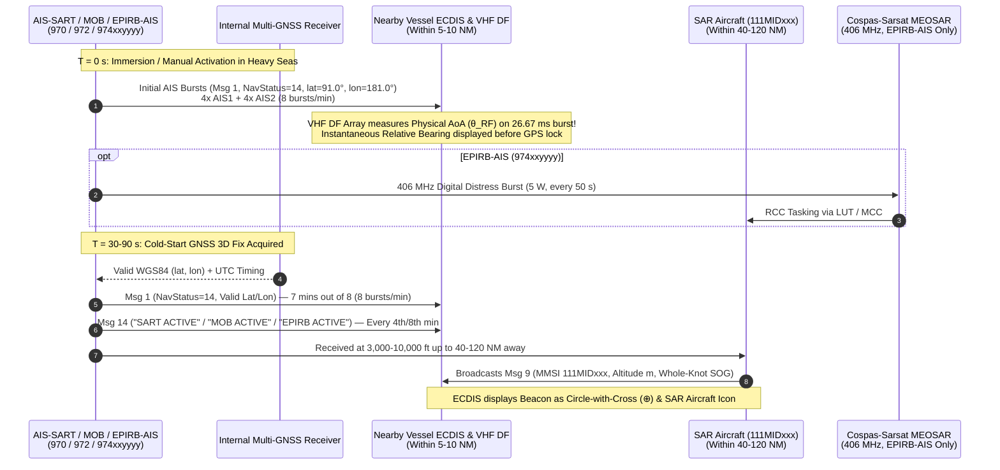
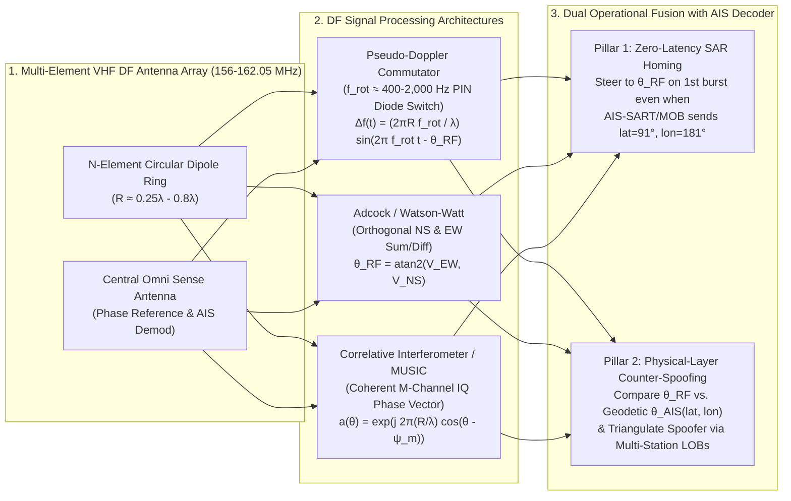

# Chapter 18: AIS in Aircraft, Drones (UAVs), Search and Rescue, and Direction Finding

> **Chapter Overview:** While the Automatic Identification System was originally engineered for surface vessels operating within a $20\text{–}40\text{ NM}$ sea-level radio horizon, modern maritime operations depend on extending the VHF Data Link (VDL) into the third dimension and linking packet decoding with physical-layer direction finding. This chapter examines the complete architecture of airborne AIS transmission (**ITU-R M.1371-5 Message 9**), manned and unmanned aerial ISR collection platforms (**USCG Minotaur**, **P-8A Poseidon**, **MQ-9B SeaGuardian**, **MQ-4C Triton**, **ScanEagle**, **Camcopter S-100**, **V-Bat**, and **Tekever AR3/AR5**), the RF engineering challenge of high-altitude multi-cell SOTDMA reception, emergency AIS Search and Rescue beacons (**AIS-SART**, **AIS-MOB**, and **EPIRB-AIS**), and the integration of **VHF Radio Direction Finding (RDF / DF)** arrays for zero-latency SAR homing and physical-layer counter-spoofing.

---

## 1. Operational & Conceptual Overview

When a distress call is received by a Rescue Coordination Center (RCC) or when a maritime patrol aircraft surveys a contested sea lane, surface-level AIS displays tell only part of the story. Three specialized extensions of the AIS ecosystem bridge the gap between surface ship transponders, aviation assets, survivors in the water, and electromagnetic spectrum surveillance:

1. **Airborne AIS Transmission and Wide-Area ISR Collection (Section 18.1):**
   * **Active SAR Aircraft Transmission:** Search and Rescue helicopters and fixed-wing aircraft carry specialized transponders assigned a **`111MIDxxx` MMSI** that broadcast **Message 9 (*Standard SAR Aircraft Position Report*)**. Because an aircraft flies at hundreds of knots and thousands of meters above sea level, Message 9 repurposes the bit fields used by ships for Rate of Turn, Navigation Status, and True Heading into a **12-bit Altitude field ($0\text{–}4{,}094\text{ m}$)** and re-scales **Speed Over Ground (SOG) to whole knots ($0\text{–}1{,}022\text{ kts}$)**. Surface ships within range see the rescue aircraft plotted directly on their ECDIS and radar overlays, enabling coordinated helicopter hoist evolutions and AMVER surface-vessel rendezvous.
   * **Airborne ISR Collection:** Conversely, when an aircraft or Unmanned Aerial Vehicle (UAV) climbs to $10{,}000\text{–}40{,}000\text{ ft}$ ($3{,}048\text{–}12{,}192\text{ m}$), its VHF radio horizon expands from $20\text{ NM}$ to **$123\text{–}246\text{ NM}$**. An airborne receiver simultaneously illuminates **6 to 25 independent terrestrial SOTDMA cells**, necessitating high-dynamic-range aviation receivers (such as the **Shine Micro SA161-UA / SM1610**) and automatic cross-cueing with airborne Inverse Synthetic Aperture Radar (**ISAR**) and Electro-Optical/Infrared (**EO/IR**) turrets.
2. **Search and Rescue AIS Distress Beacons (Section 18.2):**
   * Traditional $9\text{ GHz}$ X-band radar Search and Rescue Transponders (SARTs) paint a line of 12 dots on a ship's X-band radar screen, but they do not transmit digital coordinates, cannot be seen on S-band radar or ECDIS alone, and suffer from severe sea-clutter masking.
   * Modern survival craft and mariners rely on three families of digital $161.975 / 162.025\text{ MHz}$ beacons identified by the **`97xxxxxxx` MMSI prefix**: **AIS-SART (`970xxyyyy`)** for life rafts, **AIS-MOB (`972xxyyyy`)** inflated automatically inside a crew member's lifejacket with integrated VHF DSC Channel 70 distress alerting, and **EPIRB-AIS (`974xxyyyy`)** pairing global $406\text{ MHz}$ Cospas-Sarsat MEOSAR satellite alerting with local AIS homing.
3. **AIS Integrated with VHF Radio Direction Finding (RDF / DF) (Section 18.3):**
   * Standard AIS is a *cooperative, self-reported* protocol: a receiver decodes the bits inside a packet and trusts the `(lat, lon)` written by the sender. By coupling an AIS receiver to a **multi-element VHF Direction Finding antenna array** (Pseudo-Doppler, Adcock/Watson-Watt, or Correlative Interferometer), the receiving ship, aircraft, or VTS tower measures the physical **Angle of Arrival (AoA, $\hat{\theta}_{\text{RF}}$)** of every $26.67\text{ ms}$ GMSK RF burst.
   * This physical-layer bearing serves two critical operational missions:
     1. **Zero-Latency SAR Homing Before GNSS Lock:** When an AIS-SART or AIS-MOB hits cold, breaking seas, its internal GNSS receiver may require $30\text{–}120\text{ seconds}$ to achieve a cold-start 3D fix—during which its AIS packets report the sentinel coordinates `lat = 91.0°, lon = 181.0°`. A VHF DF array extracts an immediate relative bearing from the very first RF burst, allowing the bridge watch or SAR helicopter pilot to turn toward the survivor immediately.
     2. **Physical-Layer Counter-Spoofing and Emitter Triangulation:** Every decoded AIS position `(lat, lon)` implies a mathematical geodetic azimuth $\theta_{\text{AIS}}$ from the receiver. If the measured RF arrival bearing $\hat{\theta}_{\text{RF}}$ deviates from $\theta_{\text{AIS}}$ by more than $3\sigma_\theta$—or if twenty "ships" scattered across an ocean basin all arrive from the exact same coastal bearing—the system immediately flags an RF spoofing attack and triangulates the covert transmitter's physical coordinates via intersecting **Lines of Bearing (LOBs)**.

---

## 2. Historical Context & Evolution (`schwehr/gis-history` Integration)

The convergence of airborne maritime surveillance, emergency radio beacons, and radio direction finding predates satellite navigation by nearly a century:

* **1907–1926 — Early Maritime Radio Direction Finding (Bellini-Tosi, Adcock, and Watson-Watt):** In 1907, Ettore Bellini and Alessandro Tosi invented the orthogonal crossed-loop goniometer antenna, enabling ships to take bearings on shore Spark/CW radiobeacons. In **1919**, British engineer **Frank Adcock** patented the four-monopole vertical dipole array (**UK Patent 130,490**), eliminating horizontal-polarization skywave errors that plagued loop antennas at night. In **1926**, **Robert Watson-Watt** paired Adcock antennas with a dual-channel cathode-ray oscilloscope to display instantaneous bearing ellipses on short radio bursts—the direct physical ancestor of modern $26.67\text{ ms}$ AIS burst direction finders.
* **1941–1945 — WWII Shipborne and Airborne HF/DF ("Huff-Duff") and ASV Radar:** During the Battle of the Atlantic, Allied escort vessels equipped with Watson-Watt **FH3 / FH4 HF/DF** arrays triangulated brief U-boat *Kurzsignale* transmissions before the submarine could submerge, while RAF Coastal Command and US Navy PB4Y/PBY patrol aircraft combined Airborne Surface Vessel (ASV) radar with radio homing.
* **1979–1988 — GMDSS, Cospas-Sarsat ($406\text{ MHz}$), and $9\text{ GHz}$ Radar SARTs:** Following the **1979 IMO SAR Convention** and the **1982** launch of *Cospas-1* (the first Cospas-Sarsat search-and-rescue satellite), the **1988 SOLAS GMDSS Amendments** mandated float-free $406\text{ MHz}$ EPIRBs ($121.5\text{ MHz}$ homing) and $9\text{ GHz}$ X-band radar SARTs (**IMO Resolution A.802(19)**, **IEC 61097-1**) on SOLAS vessels.
* **1990–1998 — Håkan Lans's STDMA in Aviation (VDL Mode 4) and Maritime AIS (Message 9):** Håkan Lans tested Self-Organized TDMA simultaneously on Swedish ships and aircraft throughout the early 1990s. When **ITU-R Recommendation M.1371-0** was ratified in **1998**, **Message 9 (*Standard SAR Aircraft Position Report*)** was baked into the foundational message catalog so SAR helicopters and fixed-wing patrol aircraft could participate directly on the maritime VHF data link.
* **2006–2010 — IMO Resolution MSC.246(83) and IEC 61097-14 (The Birth of AIS-SART):** Sea trials in Norway, Germany, and the United States demonstrated that $9\text{ GHz}$ radar SARTs were often missed in heavy swell or by vessels running New Technology (solid-state pulse-compression) radars, whereas a $162\text{ MHz}$ AIS transmitter carrying a GPS receiver plotted the survival craft's exact latitude and longitude on every nearby ship's ECDIS up to $10\text{ NM}$ away (and $>35\text{ NM}$ to SAR aircraft). In **October 2007**, the IMO adopted **Resolution MSC.246(83)**, permitting **AIS-SARTs** (**IEC 61097-14**, published 2010) to fulfill SOLAS Chapter III Regulation 6.2.2 SART carriage requirements starting **January 1, 2010**.
* **2006–2015 — USCG Rescue 21, Airborne Minotaur, and Tactical Maritime UAVs:** The US Coast Guard deployed the **Rescue 21** coastal command-and-control network (incorporating Rohde & Schwarz VHF DF arrays along $42{,}000\text{ miles}$ of coastline) and transitioned its **HC-130J**, **C-27J**, and **MH-60T** fleet to the **Minotaur** multi-sensor mission architecture alongside **Insitu ScanEagle** UAVs aboard National Security Cutters.
* **2019–2024 — IMO MSC.471(101) EPIRB-AIS Mandate, IEC 63269 AIS-MOB, and Counter-Spoofing DF:** In **June 2019**, IMO adopted **Resolution MSC.471(101)** (effective **July 1, 2022**), requiring all new SOLAS $406\text{ MHz}$ EPIRBs to include an internal **AIS homing transmitter (`974xxyyyy`)** alongside GNSS and night-vision infrared strobes. Concurrently, widespread state-actor GNSS and AIS spoofing in the Black Sea, Baltic Sea, and Persian Gulf drove VTS authorities and naval intelligence to fuse **VHF Correlative Interferometer DF** bearings with AIS packet streams to unmask phantom fleets in real time.

---

## 3. Deep Technical & Mathematical Foundations

### 18.1 AIS in Manned Aircraft and Unmanned Aerial Vehicles (Drones / UAVs)

#### 18.1.1 Active Airborne AIS Transmission — Message 9 (*Standard SAR Aircraft Position Report*)

Under **ITU-R Recommendation M.585-9** (*Assignment and use of identities in the maritime mobile service*, Annex 1, §4), aircraft conducting Search and Rescue or maritime safety operations are assigned a 9-digit MMSI beginning with the three-digit prefix **`111`**, followed by the flag state's 3-digit **Maritime Identification Digits (`MID`)** and three aircraft-specific digits:

$$\text{MMSI}_{\text{SAR Aircraft}} = \texttt{111}\underbrace{\texttt{MID}}_{\text{Flag State}}\underbrace{\texttt{xxx}}_{\text{Aircraft ID}}$$

By international convention (and USCG/NATO practice):
* **`111MID1xx` (`100–499`):** Fixed-wing SAR aircraft (e.g., USCG HC-130J Super Hercules or HC-144B Ocean Sentry using `MID = 366` or `303`).
* **`111MID5xx` (`500–999`):** Rotary-wing SAR helicopters (e.g., USCG MH-60T Jayhawk or MH-65E Dolphin, `1113665xx`).

Why cannot a SAR aircraft simply broadcast a standard Class A **Message 1, 2, or 3**? Three physical realities of flight break the surface-vessel schema:
1. **Speed Over Ground (SOG) Overflow:** In Messages 1/2/3/18, the 10-bit `SOG` field is scaled in $\frac{1}{10}\text{ knot}$ increments (`0` to `1022` $\rightarrow 0.0$ to $102.2\text{ kts}$, with `1023` = N/A). A SAR helicopter cruising at $145\text{ kts}$ or a turboprop/jet maritime patrol aircraft flying at $280\text{–}450\text{ kts}$ permanently saturates a surface transponder's SOG at `102.2 kts`. **Message 9 re-scales the 10-bit `SOG` field to whole knots ($1\text{ kt}$ resolution)**, spanning **$0$ to $1{,}022\text{ kts}$** (`1022` = $\ge 1{,}022\text{ kts}$, `1023` = N/A).
2. **Three-Dimensional Altitude vs. Surface Orientation:** Surface vessels operate at $z \approx 0\text{ m}$ MSL and require `Navigation Status` (4 bits), `Rate of Turn (ROT)` (8 bits), and `True Heading` (9 bits) for close-quarters COLREGs maneuvering. For an aircraft, vertical separation is paramount, while magnetic/gyro heading differs markedly from ground track in strong upper-level crosswinds. **Message 9 replaces `Navigation Status` and `ROT` (4 + 8 = 12 bits) at bit positions `38..49` with a 12-bit unsigned `Altitude` field in meters ($0\text{–}4{,}094\text{ m}$)**, and repurposes the former `True Heading` and `Maneuver Indicator` bits into `Altitude Sensor` (`0` = GNSS height above MSL/geoid, `1` = barometric pressure altitude), `DTE`, and `Spare` bits.
3. **Dual Access-Scheme Support (Mode A SOTDMA vs. Mode B ITDMA):** Because a high-speed aircraft enters and exits coastal SOTDMA cells rapidly, bit `148` (0-based) acts as a **Communication State Selector Flag**:
   * **Message 9 Mode A (`Selector = 0`):** Bits `149..167` carry a 19-bit **SOTDMA** communication state (autonomous slot reservation).
   * **Message 9 Mode B (`Selector = 1`):** Bits `149..167` carry a 19-bit **ITDMA** communication state, allowing the airborne transponder to operate in intermittent or base-station-assigned modes without maintaining long-term frame maps.

##### Complete Bit-Level Layout of ITU-R M.1371-5 Message 9 (168 Bits / 1 Time Slot)

| 0-Based Bits (`libais`) | 1-Based Bits (ITU-R) | Width (Bits) | Field Name | Data Type | Scaling / Units | Valid Range & Sentinel ("Not Available") Values |
|---|---|---|---|---|---|---|
| `0..5` | `1..6` | 6 | **Message ID** | `uint6` | Constant `9` | Always `9` (`001001`) |
| `6..7` | `7..8` | 2 | **Repeat Indicator** | `uint2` | Repeats `0–3` | `0` = default; `3` = do not repeat any further |
| `8..37` | `9..38` | 30 | **User ID (MMSI)** | `uint30` | `111MIDxxx` | 9-digit SAR Aircraft MMSI (`111000000`–`111999999`) |
| `38..49` | `39..50` | 12 | **Altitude** | `uint12` | $1\text{ meter}$ steps | `0`–`4093` m; `4094` = $\ge 4{,}094\text{ m}$; **`4095` (`0xFFF`) = N/A** |
| `50..59` | `51..60` | 10 | **Speed Over Ground (SOG)** | `uint10` | **$1\text{ knot}$ steps** | `0`–`1021` kts; `1022` = $\ge 1{,}022\text{ kts}$; **`1023` (`0x3FF`) = N/A** |
| `60` | `61` | 1 | **Position Accuracy** | `uint1` | Boolean flag | `1` = High ($\le 10\text{ m}$, DGNSS/SBAS); `0` = Low ($> 10\text{ m}$) |
| `61..88` | `62..89` | 28 | **Longitude** | `int28` | $\frac{1}{10{,}000}\text{ min}$ ($\frac{1}{600{,}000}^\circ$) | $[-180^\circ, +180^\circ]$; **`0x6791AC0` ($108{,}600{,}000$) = `181.0°` (N/A)** |
| `89..115` | `90..116` | 27 | **Latitude** | `int27` | $\frac{1}{10{,}000}\text{ min}$ ($\frac{1}{600{,}000}^\circ$) | $[-90^\circ, +90^\circ]$; **`0x3412140` ($54{,}600{,}000$) = `91.0°` (N/A)** |
| `116..127` | `117..128` | 12 | **Course Over Ground (COG)** | `uint12` | $0.1^\circ\text{ true}$ | `0`–`3599` ($0.0^\circ\text{–}359.9^\circ$); **`3600` (`0xE10`) = `360.0°` (N/A)** |
| `128..133` | `129..134` | 6 | **Time Stamp** | `uint6` | UTC second | `0`–`59` s; `60` = N/A; `62` = Dead reckoning; `63` = Inoperative |
| `134` | `135` | 1 | **Altitude Sensor** | `uint1` | Boolean flag | `0` = GNSS altitude; `1` = Barometric altitude sensor |
| `135..141` | `136..142` | 7 | **Spare** | `uint7` | Reserved | Set to `0` (`0000000`) |
| `142` | `143` | 1 | **DTE** | `uint1` | Data Terminal Flag | `0` = Data terminal ready; `1` = Not ready (default) |
| `143..145` | `144..146` | 3 | **Spare** | `uint3` | Reserved | Set to `0` (`000`) |
| `146` | `147` | 1 | **Assigned Mode Flag** | `uint1` | Boolean flag | `0` = Autonomous/continuous mode; `1` = Assigned mode |
| `147` | `148` | 1 | **RAIM Flag** | `uint1` | Boolean flag | `0` = RAIM not in use; `1` = RAIM in use |
| `148` | `149` | 1 | **Comm State Selector Flag** | `uint1` | Mode A / B | `0` = **SOTDMA** (Msg 9 Mode A); `1` = **ITDMA** (Msg 9 Mode B) |
| `149..167` | `150..168` | 19 | **Communication State** | `uint19` | TDMA state | 19-bit SOTDMA (`bit 148 = 0`) or ITDMA (`bit 148 = 1`) state |

> [!NOTE]
> On shipboard **NMEA 2000 (IEC 61162-3)** buses, Message 9 is translated into **PGN 129798** (*AIS SAR Aircraft Position Report*), which converts Altitude to $10^{-2}\text{ m}$ signed 32-bit resolution and SOG to $10^{-2}\text{ m/s}$ ($1\text{ kt} = 0.514444\text{ m/s}$). On **ECDIS (IHO S-52 / IEC 62288)**, a Message 9 target is portrayed with a dedicated aircraft silhouette (`AIS_SAR_AIRCRAFT`) oriented along its `COG` vector with an adjacent data label displaying `[ALT m / ft]` and `[SOG kts]`.

---

#### 18.1.2 Airborne ISR & Maritime Patrol Collection (Manned Aircraft & Drones)

While SAR helicopters transmit Message 9 to coordinate rescues, maritime patrol aircraft (MPA) and Unmanned Aerial Vehicles (UAVs) use AIS primarily as a **wide-area passive Intelligence, Surveillance, and Reconnaissance (ISR) sensor**, fusing VHF AIS receptions with surface-search radar and electro-optical/infrared (EO/IR) imaging:

| Platform Category | Representative Aircraft / UAV Platforms | Primary Mission System & AIS Hardware Integration | Operational Altitude & Typical AIS Horizon |
|---|---|---|---|
| **USCG & DHS Manned Patrol / SAR** | **HC-130J Super Hercules**, **C-27J Spartan**, **HC-144B Ocean Sentry**, **MH-60T Jayhawk**, **CBP P-3 AEW & DHC-8 SeaVue** | **Minotaur** multi-agency mission system (Johns Hopkins APL / USCG / USN / CBP) + **Shine Micro SA161-UA / SM1610** airborne AIS receiver/transponder + inverse-SAR (EL/M-2022 / Telephonics APS-143 / SeaVue) + Wescam MX-15/MX-20 EO/IR | $1{,}500\text{–}28{,}000\text{ ft}$ ($450\text{–}8{,}500\text{ m}$) $\rightarrow$ **$60\text{–}205\text{ NM}$** |
| **Naval Maritime Patrol & ASW (MPA)** | **US Navy / Allied P-8A Poseidon**, **ATR 72MP**, **Kawasaki P-1**, **Airbus C295 MPA** | Tactical Open Mission Software (**TOMS**) + dual-channel high-dynamic-range AIS receiver + **AN/APS-154 Advanced Airborne Sensor** or **AN/APY-10** littoral/ISAR radar + ESM direction finding | $5{,}000\text{–}41{,}000\text{ ft}$ ($1{,}500\text{–}12{,}500\text{ m}$) $\rightarrow$ **$86\text{–}250\text{ NM}$** |
| **European Coast Guard & Border Surveillance** | **EMSA & Frontex** contracted **Beechcraft King Air 350**, **Diamond DA42/DA62 MPP**, **Cessna Citation / Dash-8** | Integrated airborne AIS + VHF Marine DF homing + Synthetic Aperture Radar (SAR) oil-spill/vessel detection streamed live to **EMSA Integrated Maritime Services (IMS) / SafeSeaNet** via Ku/Ka-band SATCOM | $5{,}000\text{–}25{,}000\text{ ft}$ ($1{,}500\text{–}7{,}600\text{ m}$) $\rightarrow$ **$86\text{–}195\text{ NM}$** |
| **High-Altitude / Medium-Altitude Long-Endurance UAVs (HALE / MALE)** | **Northrop Grumman MQ-4C Triton** (USN/RAAF), **General Atomics MQ-9B SeaGuardian** (USCG/JMSDF/UK/EMSA) | **MQ-4C:** AN/ZPY-3 MFAS $360^\circ$ AESA radar + AIS + ESM ($24+\text{ hr}$ endurance at $50{,}000\text{ ft}$). **MQ-9B SeaGuardian:** Leonardo Seaspray 7500E V2 AESA radar + Shine Micro AIS + EO/IR ($30+\text{ hr}$ endurance) | $25{,}000\text{–}50{,}000\text{ ft}$ ($7{,}600\text{–}15{,}240\text{ m}$) $\rightarrow$ **$195\text{–}275\text{ NM}$** |
| **Ship-Launched Tactical VTOL & Catapult UAVs** | **Boeing/Insitu ScanEagle** (USCG NSC cutters), **Schiebel Camcopter S-100**, **Shield AI V-Bat**, **Tekever AR3 / AR5** (EMSA & UK MCA) | Miniaturized low-SWaP dual-channel AIS receiver ($<150\text{ g}$, e.g., **Shine Micro SM1610** or custom SDR blade) + cooled/uncooled EO/IR gimbal + automated AI hull/wake optical detector | $1{,}000\text{–}12{,}000\text{ ft}$ ($300\text{–}3{,}650\text{ m}$) $\rightarrow$ **$40\text{–}135\text{ NM}$** |

##### Multi-Sensor Cross-Cueing in Airborne Mission Systems (`Minotaur` & `SeaGuardian`)
On a patrol aircraft or drone, AIS is never viewed in isolation. Inside the mission processor (such as **Minotaur**), a multi-hypothesis **Extended Kalman Filter (EKF) / Joint Probabilistic Data Association (JPDA)** tracker correlates every decoded AIS MMSI against surface-search radar tracks:
1. **Cooperative Target Verification:** When an AIS report correlates in position and velocity with a radar blip, the mission system tags the radar track with the vessel's MMSI, name, call sign, dimensions, and flag.
2. **Automated Dark-Target Flagging:** Any maritime radar contact whose $3\sigma$ error ellipse contains **no correlated AIS track** is immediately promoted to a **Dark Target (Non-Emitting Vessel)** priority queue. The mission software automatically computes the slant-range look vector and commands the aircraft's **ISAR imaging mode** (generating a range-Doppler profile silhouette of the ship's superstructure) or slews the **EO/IR turret** to capture high-resolution day/thermal hull-number imagery.
3. **Phantom / Spoofed Target Detection:** Conversely, an AIS track residing within the unobstructed swath of the aircraft's surface-search radar that exhibits **zero radar cross-section return** is flagged as a **Synthetic / Spoofed AIS Track**.

---

#### 18.1.3 Airborne RF Engineering & The High-Altitude Multi-Cell Horizon

Why does a simple $30 marine AIS receiver fail catastrophically when connected to a belly blade antenna on an aircraft at $10{,}000\text{–}40{,}000\text{ ft}$? The answer lies in the **quadratic explosion of the airborne radio horizon** and the resulting breakdown of terrestrial SOTDMA spatial reuse.

##### Derivation of the Airborne Radio Horizon and Illuminated SOTDMA Cell Count
Accounting for standard atmospheric refraction via an effective Earth radius $R_e = k R_{\text{Earth}}$ with $k = \frac{4}{3}$ ($R_e \approx 8{,}495\text{ km}$), the radio horizon distance $d_{\text{NM}}$ (in nautical miles) between an aircraft at altitude $h_a$ (in meters) and a surface vessel antenna at height $h_s$ (in meters) is:

$$d_{\text{NM}}(h_a, h_s) = \frac{\sqrt{2 k R_{\text{Earth}}}}{1{,}852}\left(\sqrt{h_a} + \sqrt{h_s}\right) \approx 2.23\left(\sqrt{h_a} + \sqrt{h_s}\right)$$

Assuming a commercial ship antenna height $h_s = 20\text{ m}$ ($\sqrt{h_s} \approx 4.47\text{ m}^{1/2}$, contributing $\sim 10.0\text{ NM}$) and a nominal terrestrial SOTDMA cell radius of $r_{\text{cell}} \approx 35\text{ NM}$ (area $A_{\text{cell}} = \pi r_{\text{cell}}^2 \approx 3{,}848\text{ NM}^2$):

| Platform & Flight Level | Altitude $h_a$ ($\text{ft}$ / $\text{m}$) | Aircraft Horizon $2.23\sqrt{h_a}$ ($\text{NM}$) | Total Ship-to-Air LOS $d_{\text{NM}}$ ($h_s = 20\text{ m}$) | Instantaneous Footprint Area $A = \pi d_{\text{NM}}^2$ ($\text{NM}^2$) | Simultaneous SOTDMA Cells Illuminated $N_{\text{cells}} = A / A_{\text{cell}}$ |
|---|---|---|---|---|---|
| **Surface Ship Bridge** | $65\text{ ft}$ ($20\text{ m}$) | $10.0\text{ NM}$ | $20.0\text{ NM}$ | $1{,}257\text{ NM}^2$ | **$0.3\text{–}1.0$ cell** (Collision-free SOTDMA) |
| **Tactical Shipboard UAV (`ScanEagle` / `S-100`)** | $3{,}000\text{ ft}$ ($914\text{ m}$) | $67.4\text{ NM}$ | $77.4\text{ NM}$ | $18{,}820\text{ NM}^2$ | **$\sim 4.9$ cells** |
| **SAR Helicopter / Turboprop MPA (`MH-60T` / `HC-130J`)** | $10{,}000\text{ ft}$ ($3{,}048\text{ m}$) | **$123.1\text{ NM}$** | **$133.1\text{ NM}$** | **$55{,}655\text{ NM}^2$** | **$\sim 14.5$ cells** ($9.8$ cells for $h_s=0$) |
| **High-Altitude MPA / MALE UAV (`P-8A` / `MQ-9B`)** | $25{,}000\text{ ft}$ ($7{,}620\text{ m}$) | $194.7\text{ NM}$ | $204.6\text{ NM}$ | $131{,}510\text{ NM}^2$ | **$\sim 34.2$ cells** |
| **HALE UAV (`MQ-4C Triton`)** | $40{,}000\text{ ft}$ ($12{,}192\text{ m}$) | **$246.2\text{ NM}$** | **$256.2\text{ NM}$** | **$206{,}205\text{ NM}^2$** | **$\sim 53.6$ cells** ($40.2$ cells for $h_s=0$) |

Because vessels in SOTDMA cell $A$ (e.g., off Rotterdam) cannot hear vessels in SOTDMA cell $B$ $100\text{ NM}$ away (e.g., off Dover or Felixstowe), both cells independently schedule transmissions in the exact same $26.67\text{ ms}$ time slots! An aircraft at $10{,}000\text{–}40{,}000\text{ ft}$ receives all of these cells simultaneously, creating three severe RF engineering challenges that aviation-grade receivers (such as the **Shine Micro SA161-UA** and **SM1610**, qualified to **RTCA DO-160G**) are purpose-built to solve:

1. **Extreme Near-Far Dynamic Range and Co-Channel Capture Recovery:** A vessel directly beneath a helicopter at $1{,}000\text{ m}$ altitude ($d = 1\text{ km}$) delivers a received signal power of $P_{\text{rx}} \approx -45\text{ dBm}$, whereas a vessel on the $200\text{ NM}$ radio horizon delivers $P_{\text{rx}} \approx -115\text{ dBm}$—a **$70\text{ dB}$ ($10{,}000{,}000:1$) power differential** on the same channel, plus $+20\text{ dBm}$ out-of-band blocking from the aircraft's own $25\text{ W}$ VHF/UHF AM/FM voice radios mounted a few meters away on the fuselage. Aviation AIS receivers incorporate high-IP3 front-end preselectors, fast slot-by-slot Automatic Gain Control (AGC) that settles within the 8-bit ($833\text{ }\mu\text{s}$) ramp-up interval, and coherent GMSK capture-effect demodulation capable of recovering the stronger of two colliding packets whenever the Carrier-to-Interference ratio exceeds $C/I \ge 6\text{–}8\text{ dB}$.
2. **Differential Propagation Delay Across the Footprint:** At $d_{\text{NM}} = 246\text{ NM}$ ($455.6\text{ km}$), the one-way speed-of-light propagation delay is $\tau = \frac{d}{c} = \frac{455{,}600\text{ m}}{2.9979 \times 10^8\text{ m/s}} \approx 1.52\text{ ms}$ ($14.6\text{ bits}$), consuming over $60\%$ of the 24-bit ($2.5\text{ ms}$) TDMA slot guard buffer when comparing a nadir ship against a horizon ship.
3. **Airborne Velocity Doppler Shift:** A P-8A Poseidon cruising at $v_a = 450\text{ kts}$ ($231.5\text{ m/s}$) experiences a carrier Doppler shift of $\Delta f = \pm \frac{v_a}{c} f_0 = \pm \frac{231.5}{2.9979\times 10^8} \times 162.025\times 10^6 \approx \pm 125\text{ Hz}$, which is easily tracked by modern digital Costas/Viterbi GMSK demodulators (rated to $\pm 1.5\text{ kHz}$).

---

### 18.2 Search and Rescue AIS Beacons (AIS-SART, AIS-MOB, and EPIRB-AIS)

Under **ITU-R Recommendation M.585-9** (Annex 2), free-form 9-digit identities beginning with **`970`**, **`972`**, and **`974`** are allocated globally to three standardized classes of emergency Search and Rescue AIS transmitters. All three formats follow the structure:

$$\text{MMSI}_{\text{SAR Beacon}} = \texttt{97}k\,\underbrace{\texttt{xx}}_{\substack{\text{2-Digit}\\\text{Mfr ID}}}\,\underbrace{\texttt{yyyy}}_{\substack{\text{4-Digit}\\\text{Serial No.}}}, \qquad k \in \{0, 2, 4\}$$

where `xx` (`01`–`99`) is the manufacturer identifier assigned by **IALA / CIRM** (Comité International Radio-Maritime), and `yyyy` (`0000`–`9999`) is a unique sequential serial number programmed at the factory (cycling once 9,999 units of a given model are produced).



#### 18.2.1 AIS-SART (`970xxyyyy`, IMO Resolution MSC.246(83) & IEC 61097-14)

From 1988 until 2010, SOLAS Chapter III required survival craft to carry $9\text{ GHz}$ X-band radar SARTs (**IEC 61097-1**). When interrogated by a ship's $9.2\text{–}9.5\text{ GHz}$ radar pulse, a radar SART sweeps across the band, generating a line of 12 radial blips on the radar PPI. However, radar SARTs suffer from three major operational limitations:
1. They are completely invisible to **S-band ($3\text{ GHz}$) radars** and to **ECDIS** systems that do not have radar video overlay enabled.
2. First-generation solid-state **New Technology (NT) pulse-compression radars** initially failed to trigger or display swept-frequency $9\text{ GHz}$ SART responses outside their narrow matched-filter passbands.
3. They convey **zero identity, zero text status, and zero GNSS coordinates**.

To overcome these limitations, **IMO Resolution MSC.246(83)** (adopted October 2007, effective **January 1, 2010**) amended SOLAS to permit an **AIS Search and Rescue Transmitter (AIS-SART)** certified to **IEC 61097-14** as a direct replacement for a $9\text{ GHz}$ radar SART.

##### IEC 61097-14 Transmission Schedule, Wave-Crest Burst Diversity, and Message Formats
Because a life raft or floating AIS-SART ($1\text{ m}$ telescopic pole, minimum EIRP $1\text{ W} = +30\text{ dBm}$, minimum 96-hour battery life at $-20^\circ\text{C}$ to $+55^\circ\text{C}$) rides up and down ocean swells of $8\text{–}15\text{ seconds}$ period, a single transmission once per minute would frequently be blocked when the raft sits in a deep wave trough. **IEC 61097-14** solves wave-trough masking through rapid **8-burst-per-minute dual-channel diversity**:

* **8 Bursts Per Minute (Every 15 Seconds in 14-Second Rapid Groups):** Once per minute, the AIS-SART wakes its transmitter and sends **8 packets within 14 seconds** (approximately one burst every $\sim 1.75\text{–}2.0\text{ seconds}$), alternating strictly between **AIS 1 ($161.975\text{ MHz}$)** and **AIS 2 ($162.025\text{ MHz}$)** (4 bursts on AIS 1, 4 bursts on AIS 2). Because 8 bursts span 14 seconds—longer than a typical ocean wave period—at least 2 to 4 bursts are guaranteed to be radiated while the survival craft is near a **wave crest**!
* **Message 1 vs. Message 14 Interleaving Cycle:**
  * **Minutes 1–3 and 5–7 (or 7 out of every 8 minutes):** All 8 bursts in the minute are **Message 1 (*Position Report*)** with:
    * `User ID (MMSI)` = `970xxyyyy`
    * **`Navigation Status` (bits `38..41`) = `14` (`1110` binary)**, defined in ITU-R M.1371-5 Table 45 as **`"AIS-SART (active), MOB-AIS, EPIRB-AIS"`**.
    * `SOG` and `COG` computed from the internal GNSS receiver, `True Heading = 511` (N/A), `Rate of Turn = -128` (N/A).
  * **Every 4th (or 8th) Minute Safety Text Broadcast:** The beacon transmits **Message 14 (*Safety-Related Broadcast Message*)** 4 times on AIS 1 and 4 times on AIS 2 containing the exact 6-bit ASCII string:
    * **`"SART ACTIVE"`** when activated in an emergency (accompanied by `Navigation Status = 14` in its Message 1 reports).
    * **`"SART TEST"`** when triggered manually in self-test mode (during which its Message 1 reports set **`Navigation Status = 15`** [`"Undefined / default"`] so nearby ships do not sound a false emergency alarm, while still displaying the test target on ECDIS!).

---

#### 18.2.2 AIS-MOB (`972xxyyyy`, IEC 63269 / RTCM 11901.1 / ITU-R M.2135 AMRD Group A)

While an AIS-SART is stowed in a survival craft grab-bag, a **Man Overboard (AIS-MOB)** beacon is a pocket-sized personal safety device clipped directly to a mariner's inflatable lifejacket bladder and wired to trigger automatically within seconds of immersion and inflation.

Standardized internationally under **ITU-R Recommendation M.2135** (*Technical characteristics of autonomous maritime radio devices operating in the frequency band 156–162.05 MHz*, categorized as **AMRD Group A** safety devices permitted on AIS 1 and AIS 2), **RTCM Standard 11901.1**, and **IEC 63269**, an AIS-MOB (`972xxyyyy`, $\ge 1\text{ W}$ EIRP, $\ge 24\text{-hour}$ battery life) combines two complementary VHF alerting mechanisms:
1. **AIS 1 & AIS 2 Position and Safety Broadcasts (`161.975 / 162.025 MHz`):** Transmits 8 bursts per minute of **Message 1** (`Navigation Status = 14`, or `15` during test) plus periodic **Message 14** (`"MOB ACTIVE"` or `"MOB TEST"`). Every AIS-equipped vessel within $4\text{–}6\text{ NM}$ immediately plots the swimmer's live GPS drift vector on its chartplotter/ECDIS.
2. **VHF Digital Selective Calling (DSC) on Channel 70 (`156.525 MHz`):** Because recreational vessels or small fishing boats may have their chartplotter dimmed at night, Class M DSC-equipped AIS-MOB units also transmit a $1{,}200\text{ bps}$ FSK **DSC Distress Alert / Distress Relay on Channel 70**:
   * **Closed-Loop Mode:** Immediately alerts the pre-programmed mother vessel's MMSI (ringing the bridge VHF radio's loud DSC distress alarm within 5–15 seconds of the crew member hitting the water).
   * **Open-Loop ("All Ships") Escalation:** In jurisdictions permitting open-loop DSC MOB operation (such as US RTCM 11901.1 Type 1 units), if the mother ship fails to acknowledge the closed-loop DSC call within a set timeout (typically 2–5 minutes), the beacon escalates to an **All-Ships DSC Distress Alert**, waking every GMDSS VHF radio within line of sight.

---

#### 18.2.3 EPIRB-AIS (`974xxyyyy`, IMO Resolution MSC.471(101) & IEC 61097-2 Ed. 4)

A $406\text{ MHz}$ Emergency Position Indicating Radio Beacon (**EPIRB**) provides **global satellite alerting** via the Cospas-Sarsat LEO/GEOSAR/MEOSAR constellation, alerting shore Rescue Coordination Centers anywhere on Earth. Historically, however, a merchant ship steaming only $3\text{ NM}$ away from a floating $406\text{ MHz}$ EPIRB had **no way to receive the $406\text{ MHz}$ satellite uplink directly on its bridge**—it had to wait 15 to 60 minutes for a shore RCC to relay the distress coordinates via Inmarsat-C EGC or VHF voice!

To close this "local recovery gap," **IMO Resolution MSC.471(101)** (adopted June 2019, mandatory for all SOLAS EPIRBs installed on or after **July 1, 2022**) and **IEC 61097-2 Edition 4** created the **EPIRB-AIS**:

| Subsystem Inside an MSC.471(101) EPIRB-AIS | Operating Frequency & Power | Function in the Search and Rescue Chain |
|---|---|---|
| **1. Cospas-Sarsat Satellite Transmitter (First-Gen or SGB)** | **$406.025\text{–}406.092\text{ MHz}$** ($5\text{ W}$ burst every $\sim 50\text{ s}$) | **Global Alerting ($0\text{–}12{,}000\text{ NM}$):** Relayed instantaneously by **MEOSAR** payloads aboard GPS, Galileo, and GLONASS satellites to LUTs/MCCs worldwide. Supports Galileo **Return Link Service (RLS)** blue LED confirmation that the distress call was received. |
| **2. Integrated AIS Homing Transmitter (`974xxyyyy`)** | **$161.975\text{ MHz}$ (AIS 1) & $162.025\text{ MHz}$ (AIS 2)** ($\ge 1\text{ W}$ EIRP) | **Local Surface & Airborne Homing ($0\text{–}10\text{ NM}$ surface, $0\text{–}80\text{ NM}$ air):** Broadcasts Message 1 (`Nav Status = 14`) and Message 14 (`"EPIRB ACTIVE"` / `"EPIRB TEST"`), plotting the beacon directly on the ECDIS of every nearby ship and SAR aircraft. |
| **3. Aeronautical Swept-Tone Homing Beacon** | **$121.500\text{ MHz}$** ($25\text{–}50\text{ mW}$ AM swept tone) | **Legacy Aircraft DF Homing:** Allows civil and military aircraft equipped with $121.5\text{ MHz}$ VHF DF receivers to home on the continuous audio sweep during final approach. |
| **4. Dual Visible + Night-Vision (NIR) Strobe** | White LED ($380\text{–}780\text{ nm}$) + **Infrared LED ($800\text{–}900\text{ nm}$)** | **Final Visual / NVG Recovery:** Allows helicopter flight crews wearing Night Vision Goggles (NVGs) to spot the beacon in pitch darkness from miles away. |

##### Summary Comparison of Emergency AIS Beacons (`970`, `972`, `974`)

| Characteristic | AIS-SART (`970xxyyyy`) | AIS-MOB (`972xxyyyy`) | EPIRB-AIS (`974xxyyyy`) |
|---|---|---|---|
| **Governing Standards** | IMO MSC.246(83), IEC 61097-14, ITU-R M.1371-5 | ITU-R M.2135 (AMRD Group A), IEC 63269, RTCM 11901.1 | IMO MSC.471(101), IEC 61097-2 Ed. 4, Cospas-Sarsat C/S T.001 / T.018 |
| **Primary Deployment** | Survival craft (lifeboats / life rafts) on $1\text{ m}$ pole | Personal crew lifejacket (auto-inflated) | Float-free hydrostatic bridge bracket or manual survival craft |
| **MMSI Prefix** | `970xxyyyy` | `972xxyyyy` | `974xxyyyy` |
| **Active Message 14 Text** | `"SART ACTIVE"` (Test: `"SART TEST"`) | `"MOB ACTIVE"` (Test: `"MOB TEST"`) | `"EPIRB ACTIVE"` (Test: `"EPIRB TEST"`) |
| **Active Nav Status (Msg 1)** | `14` (Test: `15`) | `14` (Test: `15`) | `14` (Test: `15`) |
| **Additional Radio Channels** | None (AIS 1 & AIS 2 only) | VHF DSC Ch 70 ($156.525\text{ MHz}$) | $406\text{ MHz}$ Satellite + $121.5\text{ MHz}$ Aero Homing |
| **Minimum Battery Endurance** | $\ge 96\text{ hours}$ ($-20^\circ\text{C}$ to $+55^\circ\text{C}$) | $\ge 24\text{ hours}$ | $\ge 48\text{ hours}$ |
| **ECDIS Portrayal Symbol** | Circle with inscribed cross (`⊕`) | Circle with inscribed cross (`⊕`) | Circle with inscribed cross (`⊕`) |

---

### 18.3 AIS and Radio Direction Finding (RDF / DF) Systems

#### 18.3.1 Physical Principles and Array Architectures of VHF Direction Finders

At the AIS carrier frequencies ($f_1 = 161.975\text{ MHz}$, $f_2 = 162.025\text{ MHz}$), the free-space wavelength is:

$$\lambda = \frac{c}{f} \approx \frac{2.99792 \times 10^8\text{ m/s}}{1.620 \times 10^8\text{ Hz}} \approx 1.8506\text{ meters}$$

Because a single AIS time slot lasts only $\Delta t_{\text{slot}} = 26.67\text{ ms}$ (and the active unbuffered burst lasts $\sim 24.2\text{ ms}$), a mechanical rotating directional Yagi cannot spin fast enough to measure the bearing of an AIS packet. Instead, maritime and airborne VHF Direction Finders use **stationary multi-element circular or orthogonal dipole arrays** with no moving parts, estimating the incident horizontal **Angle of Arrival ($\hat{\theta}_{\text{RF}}$)** within $1\text{–}15\text{ ms}$ via three physical architectures:



##### 1. Pseudo-Doppler Commuted Circular Arrays (`RhoTheta RT-500-M / RT-800`, `Taiyo Musen TD-L1550A`)
An array of $M = 4$ to $8$ vertical dipoles arranged on a circle of radius $R < \frac{\lambda}{2}$ (typically $R \approx 0.20\text{–}0.45\text{ m}$ to avoid spatial aliasing) is sequentially sampled by a high-speed PIN-diode electronic commutator at a synthetic rotation rate $f_{\text{rot}} \approx 400\text{–}2{,}000\text{ Hz}$. At $f_{\text{rot}} = 1{,}000\text{ Hz}$, the commutator completes **$24$ full revolutions during a single $24.2\text{ ms}$ AIS packet**!

For a plane wave arriving from azimuth $\theta_{\text{RF}}$, the spatial phase at antenna element $m$ located at angle $\psi_m = \frac{2\pi m}{M}$ is $\Phi_m = \frac{2\pi R}{\lambda}\cos(\psi_m - \theta_{\text{RF}})$. Continuous commutation around the circle $\psi(t) = 2\pi f_{\text{rot}} t$ induces a sinusoidal **synthetic Doppler frequency shift** on the received carrier:

$$\Delta f_{\text{Doppler}}(t) = \frac{1}{2\pi}\frac{d\Phi(t)}{dt} = -\frac{2\pi R f_{\text{rot}}}{\lambda}\sin(2\pi f_{\text{rot}} t - \theta_{\text{RF}})$$

After FM discrimination and narrowband bandpass filtering at the fundamental rotation frequency $f_{\text{rot}}$, the zero-crossing phase of the recovered $f_{\text{rot}}$ sine wave relative to the internal commutator clock yields $\hat{\theta}_{\text{RF}}$ directly. To cancel the $9.6\text{ kbps}$ GMSK data modulation (which also frequency-modulates the carrier by $\pm 2.4\text{ kHz}$), modern marine Pseudo-Doppler DF units subtract the reference FM audio demodulated from a stationary central omnidirectional dipole (**differential Doppler compensation**).

##### 2. Adcock / Watson-Watt Orthogonal Phase-Amplitude Arrays (`Cobham / Techtest SeaHomer / SkyHomer`)
Four vertical monopoles or dipoles placed at North ($0^\circ$), East ($90^\circ$), South ($180^\circ$), and West ($270^\circ$) at spacing $d \ll \lambda$ form two orthogonal figure-of-eight difference channels ($V_{\text{NS}} = V_{\text{N}} - V_{\text{S}}$ and $V_{\text{EW}} = V_{\text{E}} - V_{\text{W}}$) plus a central omnidirectional sense channel $V_{\text{omni}}$:

$$V_{\text{NS}}(t) = A_0 \frac{2\pi d}{\lambda}\cos(\theta_{\text{RF}})\,s(t), \qquad V_{\text{EW}}(t) = A_0 \frac{2\pi d}{\lambda}\sin(\theta_{\text{RF}})\,s(t)$$

Correlating $V_{\text{NS}}$ and $V_{\text{EW}}$ against $V_{\text{omni}}$ resolves the $180^\circ$ quadrant ambiguity and yields the instantaneous four-quadrant angle of arrival across even a $1\text{ ms}$ sub-slot slice:

$$\hat{\theta}_{\text{RF}} = \operatorname{atan2}\!\Big(\operatorname{Re}\{V_{\text{EW}} V_{\text{omni}}^*\},\; \operatorname{Re}\{V_{\text{NS}} V_{\text{omni}}^*\}\Big)$$

##### 3. Wide-Aperture Correlative Interferometers and Subspace (MUSIC) Arrays (`Rohde & Schwarz DDF205 / DDF255 / ADD197`, `KrakenSDR`)
High-precision coastal VTS, Rescue 21 towers, naval surface combatants, and airborne ESM platforms use $M = 5$ to $9$ phase-coherent receiver channels sampling a circular dipole array of radius $R \approx 0.4\lambda\text{–}1.2\lambda$. For each $26.67\text{ ms}$ AIS slot, the DSP forms the $M \times M$ sample spatial covariance matrix $\widehat{\mathbf{R}}_{xx} = \frac{1}{N_s}\sum_{n=1}^{N_s} \mathbf{x}[n]\mathbf{x}^H[n]$ and correlates the measured inter-element phase differences against a pre-calibrated **array manifold vector** $\mathbf{a}(\theta)$:

$$\mathbf{a}(\theta) = \begin{bmatrix} \exp\!\left(j\frac{2\pi R}{\lambda}\cos(\theta - \psi_0)\right) & \exp\!\left(j\frac{2\pi R}{\lambda}\cos(\theta - \psi_1)\right) & \cdots & \exp\!\left(j\frac{2\pi R}{\lambda}\cos(\theta - \psi_{M-1})\right) \end{bmatrix}^T$$

When two vessels in different SOTDMA cells collide in the same time slot from distinct azimuths $\theta_1 \neq \theta_2$, eigenvalue decomposition of $\widehat{\mathbf{R}}_{xx}$ via the **MUSIC (Multiple Signal Classification)** algorithm or minimum-variance distortionless response (**MVDR**) beamforming can simultaneously estimate **both arrival bearings** and steer a spatial null toward one vessel to cleanly demodulate the other!

---

#### 18.3.2 Operational Pillar 1 — Immediate SAR Bearing Homing Before GNSS Lock

Consider a crew member who falls overboard in heavy $4\text{ m}$ North Atlantic swells at night. As their lifejacket inflates, the **AIS-MOB (`972xxyyyy`)** activates and transmits its first burst of 8 AIS packets within 15 seconds. However:
* Inside the crew member's foul-weather gear prior to immersion, the MOB's internal GNSS antenna was shielded from the sky (**cold-start ephemeris condition**).
* In breaking seas, green water and salt-spray foam repeatedly submerge the tiny $1575.42\text{ MHz}$ L1 patch antenna, attenuating $-130\text{ dBm}$ satellite signals by $>20\text{ dB}$.
* Consequently, acquiring a valid 3D GNSS fix routinely takes **$30\text{ to }120\text{ seconds}$** (and under active L-band GNSS jamming, may never succeed).

During those critical first two minutes—when the vessel is steaming away at $15\text{–}20\text{ kts}$ ($460\text{–}620\text{ m/min}$) and visual contact is lost—what does the AIS-MOB transmit?
* It transmits completely valid **Message 1** bursts with `MMSI = 972xxyyyy` and **`Navigation Status = 14` (Active SART/MOB)**, but with its position fields set to the ITU-R M.1371-5 "Not Available" sentinels:
  $$\text{Longitude} = \texttt{0x6791AC0} = 181.0^\circ, \qquad \text{Latitude} = \texttt{0x3412140} = 91.0^\circ$$
* A bridge **ECDIS or chartplotter connected only to a standard AIS transponder** triggers an audible distress buzzer (`"AIS SART/MOB RECEIVED — NO POSITION"`), **but cannot plot a symbol or bearing line on the chart** because $(91.0^\circ, 181.0^\circ)$ does not exist on the Earth!
* By contrast, a vessel or SAR helicopter equipped with an **AIS-integrated VHF Direction Finder** (such as a **RhoTheta RT-500-M / RT-800**, **Cobham SeaHomer**, or **Taiyo TD-L1550A**) measures the physical **Angle of Arrival $\hat{\theta}_{\text{RF}}$** directly from the $26.67\text{ ms}$ RF carrier of that very first `91°/181°` burst. Within $0.1\text{ seconds}$, the DF display and radar/ECDIS overlay draw an unmistakable **Relative and True Line of Bearing ($\text{LOB} = \hat{\theta}_{\text{RF, rel}} + \psi_{\text{ship}}$)** pointing straight at the swimmer in the water, enabling an immediate Williamson Turn before the GPS chip even finishes its cold start!

---

#### 18.3.3 Operational Pillar 2 — Physical-Layer Counter-Spoofing and Multi-Station Emitter Triangulation

Because legacy AIS (ITU-R M.1371-5) contains **zero cryptographic authentication or digital signatures**, any adversary with a $\$300$ Software-Defined Radio (HackRF One, bladeRF, or USRP) can transmit perfectly formatted AIS packets claiming that a warship, tanker, or phantom fishing fleet is located at arbitrary coordinates $(\phi_{\text{AIS}}, \lambda_{\text{AIS}})$.

However, an RF spoofer **cannot spoof the laws of Maxwell's electrodynamics at the receiving antenna array**. Every time a shore VTS station or naval vessel at known geodetic coordinates $(\phi_r, \lambda_r)$ receives an AIS packet, it performs a two-stage physical-layer verification:

##### Stage 1: Single-Station AoA vs. Geodetic Azimuth Hypothesis Test
From the receiver's surveyed coordinates $(\phi_r, \lambda_r)$ and the vessel's self-reported AIS coordinates $(\phi_{\text{AIS}}, \lambda_{\text{AIS}})$ (with $\Delta\lambda = \lambda_{\text{AIS}} - \lambda_r$), the expected forward geodetic azimuth $\theta_{\text{AIS}} \in [0^\circ, 360^\circ)$ is:

$$\theta_{\text{AIS}} = \left(\frac{180^\circ}{\pi}\operatorname{atan2}\!\Big(\sin(\Delta\lambda)\cos\phi_{\text{AIS}},\; \cos\phi_r\sin\phi_{\text{AIS}} - \sin\phi_r\cos\phi_{\text{AIS}}\cos(\Delta\lambda)\Big) + 360^\circ\right) \bmod 360^\circ$$

Let $\hat{\theta}_{\text{RF}} = \theta_{\text{true}} + \epsilon_\theta$ be the physical RF arrival bearing measured by the VHF DF array, where $\epsilon_\theta \sim \mathcal{N}(0, \sigma_\theta^2)$ represents the calibrated instrumental plus multipath bearing error (typically $\sigma_\theta \approx 1.0^\circ\text{–}2.0^\circ$ RMS for a coastal interferometer). We compute the wrapped angular residual $\Delta\theta \in [-180^\circ, +180^\circ)$ and normalized $z$-score:

$$\Delta\theta = \left(\hat{\theta}_{\text{RF}} - \theta_{\text{AIS}} + 180^\circ\right) \bmod 360^\circ - 180^\circ, \qquad z = \frac{|\Delta\theta|}{\sigma_\theta}$$

* **Single-Target Spoof Detection:** If $z > \gamma$ (where $\gamma = 3.0$ corresponds to a $99.73\%$ Gaussian confidence gate, or $\sim 3.6^\circ\text{–}6.0^\circ$), the packet is flagged as **`SPOOF_ALERT`**—the RF energy is arriving from a completely different direction than the coordinates claimed in the payload!
* **Multi-Target "Fleet-in-a-Box" Spoof Detection:** Suppose an adversary broadcasts $K \ge 2$ fake vessels claiming widely separated coordinates $\{(\phi_{\text{AIS},k}, \lambda_{\text{AIS},k})\}_{k=1}^K$ (so the spread of claimed geodetic azimuths is large, $\operatorname{std}(\theta_{\text{AIS},1..K}) \gg 3\sigma_\theta$), yet the physical RF arrival bearings measured by the DF array are identical within measurement noise:
  $$\max_{1 \le j < k \le K} \left|\operatorname{wrap}(\hat{\theta}_{\text{RF},j} - \hat{\theta}_{\text{RF},k})\right| < 2\sigma_\theta \quad \text{while} \quad \max_{1 \le j < k \le K} \left|\operatorname{wrap}(\theta_{\text{AIS},j} - \theta_{\text{AIS},k})\right| > 10\sigma_\theta$$
  This immediately proves that all $K$ "vessels" are being radiated from a **single physical antenna** (even if one of the fake tracks happens to cross the true line of bearing of the spoofer!).

##### Stage 2: Multi-Station Line-of-Bearing (LOB) Emitter Triangulation (Stansfield & Gauss-Newton MLE)
When $M \ge 2$ synchronized coastal or shipborne VHF DF stations at local East-North-Up (ENU) coordinates $\{(x_i, y_i)\}_{i=1}^M$ measure physical arrival bearings $\{\hat{\theta}_i\}_{i=1}^M$ (measured clockwise from True North, so the unit ray vector is $\mathbf{u}_i = [\sin\hat{\theta}_i, \cos\hat{\theta}_i]^T$ and the orthogonal normal vector is $\mathbf{n}_i = [\cos\hat{\theta}_i, -\sin\hat{\theta}_i]^T$) on the same $26.67\text{ ms}$ AIS burst (correlated via NMEA TAG block timestamp `c:` and CRC-16 hash), we can triangulate the covert transmitter's true physical coordinates $\mathbf{p} = [x, y]^T$:

1. **Closed-Form Stansfield / Orthogonal Least-Squares Initialization:** Minimizing the weighted sum of squared perpendicular distances from $\mathbf{p}$ to each Line of Bearing yields the linear system $\mathbf{H}_0 \mathbf{p} = \mathbf{b}_0$:
   $$\underbrace{\begin{bmatrix} \cos\hat{\theta}_1 & -\sin\hat{\theta}_1 \\ \vdots & \vdots \\ \cos\hat{\theta}_M & -\sin\hat{\theta}_M \end{bmatrix}}_{\mathbf{H}_0} \begin{bmatrix} x \\ y \end{bmatrix} = \underbrace{\begin{bmatrix} x_1\cos\hat{\theta}_1 - y_1\sin\hat{\theta}_1 \\ \vdots \\ x_M\cos\hat{\theta}_M - y_M\sin\hat{\theta}_M \end{bmatrix}}_{\mathbf{b}_0}, \qquad \hat{\mathbf{p}}^{(0)} = \left(\mathbf{H}_0^T \mathbf{W} \mathbf{H}_0\right)^{-1} \mathbf{H}_0^T \mathbf{W} \mathbf{b}_0$$
2. **Iterative Gauss-Newton Maximum Likelihood Estimation (MLE) & $95\%$ Error Ellipse:** Refining $\hat{\mathbf{p}}^{(k)}$ directly on the nonlinear bearing observation model $h_i(x, y) = \operatorname{atan2}(x - x_i, y - y_i)$ with Jacobian row $\mathbf{J}_i = \frac{\partial h_i}{\partial \mathbf{p}} = \left[\frac{y - y_i}{r_i^2},\; -\frac{x - x_i}{r_i^2}\right]$ (where $r_i^2 = (x - x_i)^2 + (y - y_i)^2$) and weight matrix $\mathbf{W} = \operatorname{diag}(\sigma_{\theta,1}^{-2}, \dots, \sigma_{\theta,M}^{-2})$:
   $$\hat{\mathbf{p}}^{(k+1)} = \hat{\mathbf{p}}^{(k)} + \left(\mathbf{J}^T \mathbf{W} \mathbf{J}\right)^{-1} \mathbf{J}^T \mathbf{W} \,\Delta\boldsymbol{\theta}^{(k)}, \qquad \mathbf{P}_{\text{ENU}} = \left(\mathbf{J}^T \mathbf{W} \mathbf{J}\right)^{-1}$$
   The $95\%$ confidence error ellipse semi-major and semi-minor axes ($\chi^2_{2,\;0.95} = 5.9915$) are given by $a_{95} = \sqrt{5.9915\,\lambda_{\max}(\mathbf{P}_{\text{ENU}})}$ and $b_{95} = \sqrt{5.9915\,\lambda_{\min}(\mathbf{P}_{\text{ENU}})}$, dispatching coastal enforcement or electronic warfare teams directly to the spoofing transmitter's physical location.

---

## 4. Hardware, Standards, & Software Ecosystem

| Subsystem / Role | Key International & National Standards | Representative Hardware & Software Implementations |
|---|---|---|
| **SAR Aircraft AIS (Message 9)** | **ITU-R M.1371-5** (Annex 8, §3.9 Msg 9), **ITU-R M.585-9** (`111MIDxxx`), **IEC 61162-3** (NMEA 2000 PGN `129798`), **IHO S-52 / IEC 62288** (`AIS_SAR_AIRCRAFT`), **RTCA DO-160G** | **Shine Micro SA161-UA / SM1610 / SA161-MH**, **L3Harris / Raytheon** airborne AIS transponders, **Kongsberg Seatex AIS 300**, **Johns Hopkins APL Minotaur**, **USCG SAROPS** |
| **AIS-SART (`970xxyyyy`)** | **IMO Resolution MSC.246(83)**, **SOLAS Ch. III Reg. 6.2.2**, **IEC 61097-14** (*AIS search and rescue transmitter*), **ITU-R M.585-9** | **McMurdo SmartFind S5A**, **Ocean Signal SafeSea S1000**, **Jotron Tron AIS-SART**, **ACR Pathfinder PRO**, **Samyung SAR-16** |
| **AIS-MOB (`972xxyyyy`)** | **ITU-R M.2135** (AMRD Group A), **IEC 63269** (*Maritime navigation and radiocommunication equipment — Personal man overboard devices*), **RTCM Standard 11901.1** | **Ocean Signal rescueME MOB1**, **ACR AISLink MOB**, **McMurdo SmartFind S20 / FastFind Crew1**, **Weatherdock easyONE-DSC**, **em-trak B900 MOB alarm** |
| **EPIRB-AIS (`974xxyyyy`)** | **IMO Resolution MSC.471(101)** (mandatory July 1, 2022), **IEC 61097-2 Ed. 4**, **Cospas-Sarsat C/S T.001 & C/S T.018 (SGB)** | **ACR GlobalFix V5 / V6**, **Ocean Signal rescueME EPIRB3 / SafeSea EPIRB3 Pro**, **Jotron Tron 40VDR AIS / Tron 60AIS**, **McMurdo SmartFind G8 AIS** |
| **VHF Direction Finding (RDF / DF)** | **ITU-R SM.2060** (*Direction finding accuracy verification*), **IEC 60945**, **USCG Rescue 21** & **IALA V-128** VTS sensor integration | **Rohde & Schwarz DDF205 / DDF255 + ADD197**, **RhoTheta RT-500-M / RT-800 / RT-600**, **Cobham / Techtest SeaHomer / SkyHomer**, **Taiyo Musen TD-L1550A**, **KrakenSDR** (5-ch coherent SDR DF) |

---

## 5. Security, Adversarial Abuse, & Failure Modes

> [!WARNING]
> **1. Mass "Ghost SART / MOB" Bridge Alarm Denial-of-Service (DoS) Attacks:**
> Under **IEC 62288** and **IEC 61174**, whenever a ship's ECDIS or radar receives an AIS Message 1 or 14 from an MMSI in the `970xxyyyy`, `972xxyyyy`, or `974xxyyyy` range with `Navigation Status = 14`, it immediately sounds a high-priority audible distress alarm and pops up an alert modal on the bridge console. In documented grey-zone harassment incidents (and academic SDR security evaluations by Balduzzi et al., 2014), an attacker transmitting 50 to 200 synthetic `970xxyyyy` SART packets across a strait can paralyze bridge watchstanders with continuous, un-mutable alarm sirens—tempting officers to lower volume or ignore real MOB alerts. **Mitigation:** Cross-checking every `97xxxxxxx` burst against a shipboard **VHF DF array** immediately reveals that all 200 "survivors in the water" originate from a single shore azimuth $\hat{\theta}_{\text{RF}}$ with identical RSSI and carrier frequency offset!

* **2. Uncalibrated Shipboard Mast Multipath ("Mast Pulling" / Quadrantal Error):** When a VHF DF antenna array is mounted on a steel yardarm beside a thicker radar mast, wire stays, or exhaust funnel, the secondary currents induced in the steel structure re-radiate $162\text{ MHz}$ waves, pulling measured bearings toward or away from the ship's fore-and-aft centerline by up to $\pm 8^\circ\text{–}15^\circ$. A shipboard DF installation **must** undergo a $360^\circ$ swinging calibration at sea (transmitting from a known reference boat or coastal AIS Base Station while turning the ship through $360^\circ$) to populate its harmonic correction lookup table $\Delta\theta_{\text{cal}}(\theta_{\text{rel}})$.
* **3. Accidental Activation of Real `Nav Status = 14` During Beacon Testing:** If a technician or crew member holds the **Emergency Activation** switch instead of the dedicated **TEST** switch when inspecting an AIS-SART, AIS-MOB, or EPIRB-AIS in port, the unit broadcasts `Navigation Status = 14` and `"SART ACTIVE"` (and for an EPIRB-AIS, a live $406\text{ MHz}$ Cospas-Sarsat satellite distress alert!), scrambling Coast Guard helicopters and triggering alarms across every ship in the harbor.
* **4. Airborne OPSEC Leakage vs. Flight Safety (Message 9 Mode Switching):** Because public web aggregators (MarineTraffic, ADS-B Exchange, VesselFinder) ingest coastal AIS feeds in real time, a Coast Guard, Customs, or Navy aircraft continuously broadcasting **Message 9 (`111MIDxxx`)** reveals its live patrol orbit to smugglers, dark-fleet tankers, and illegal fishing vessels equipped with satellite internet. Consequently, military and law-enforcement aircraft wire their airborne AIS transponders to a cockpit **Tactical / EMCON switch** that places the unit in **Receive-Only (Silent ISR) mode** during covert surveillance, switching to **Active Message 9 Transmit mode** only during active Search and Rescue hoists or congested traffic de-confliction.

---

## 6. Practical Engineering / Code Walkthrough

The following self-contained, runnable Python script implements:
1. A bit-exact **ITU-R M.1371-5 Message 9 (*Standard SAR Aircraft Position Report*)** encoder and decoder (verifying the 168-bit layout, 12-bit altitude in meters, whole-knot SOG, and 6-bit NMEA 0183 ASCII armoring),
2. **SAR Beacon Pre-GNSS Lock Homing (`lat = 91.0°, lon = 181.0°`)** using VHF DF Line-of-Bearing extraction, and
3. **Physical-Layer AoA Spoofing Detection & Multi-Station Weighted Least-Squares (Stansfield + Gauss-Newton MLE) Emitter Triangulation** with $95\%$ confidence error ellipses.

```python
#!/usr/bin/env python3
"""Chapter 18 Walkthrough: SAR Aircraft Msg 9, SAR Beacon DF Homing & Counter-Spoofing Triangulation."""

import math
from dataclasses import dataclass
from typing import Dict, List, Tuple
import numpy as np

EARTH_RADIUS_M = 6_371_000.0


# ==============================================================================
# PART 1: ITU-R M.1371-5 Message 9 (SAR Aircraft Position Report) Codec
# ==============================================================================
def int_to_bits(val: int, width: int, signed: bool = False) -> str:
    if signed and val < 0:
        val = (1 << width) + val
    return format(val & ((1 << width) - 1), f"0{width}b")


def bits_to_int(bits: str, signed: bool = False) -> int:
    val = int(bits, 2)
    if signed and bits[0] == "1":
        val -= 1 << len(bits)
    return val


def armor_payload(bits: str) -> Tuple[str, int]:
    pad = (6 - (len(bits) % 6)) % 6
    bits_padded = bits + ("0" * pad)
    chars = []
    for i in range(0, len(bits_padded), 6):
        v = int(bits_padded[i : i + 6], 2)
        chars.append(chr(v + 48 if v < 40 else v + 56))
    return "".join(chars), pad


def dearmor_payload(payload: str, fill_bits: int = 0) -> str:
    bits = []
    for ch in payload:
        v = ord(ch) - 48
        if v > 40:
            v -= 8
        bits.append(format(v, "06b"))
    full = "".join(bits)
    return full[:-fill_bits] if fill_bits else full


def encode_msg9(
    mmsi: int,
    alt_m: int,
    sog_kts: int,
    lon_deg: float,
    lat_deg: float,
    cog_deg: float,
    timestamp_s: int = 18,
    alt_sensor_baro: int = 0,
    comm_selector_itdma: int = 0,
) -> str:
    """Encodes a 168-bit ITU-R M.1371-5 Message 9 into a checksummed !AIVDM sentence."""
    lon_raw = 0x6791AC0 if abs(lon_deg - 181.0) < 1e-6 else int(round(lon_deg * 600_000))
    lat_raw = 0x3412140 if abs(lat_deg - 91.0) < 1e-6 else int(round(lat_deg * 600_000))
    cog_raw = 3600 if abs(cog_deg - 360.0) < 1e-6 else int(round(cog_deg * 10))
    bits = (
        int_to_bits(9, 6)                        # 0..5: Message ID = 9
        + int_to_bits(0, 2)                      # 6..7: Repeat Indicator
        + int_to_bits(mmsi, 30)                  # 8..37: User ID (111MIDxxx)
        + int_to_bits(min(alt_m, 4095), 12)      # 38..49: Altitude (m, 4095=N/A)
        + int_to_bits(min(sog_kts, 1023), 10)    # 50..59: SOG (whole knots, 1023=N/A)
        + int_to_bits(1, 1)                      # 60: Position Accuracy (1 = <=10m)
        + int_to_bits(lon_raw, 28, signed=True)  # 61..88: Longitude (int28)
        + int_to_bits(lat_raw, 27, signed=True)  # 89..115: Latitude (int27)
        + int_to_bits(cog_raw, 12)               # 116..127: COG (0.1 deg)
        + int_to_bits(timestamp_s, 6)            # 128..133: Time Stamp (UTC sec)
        + int_to_bits(alt_sensor_baro, 1)        # 134: Altitude Sensor (0=GNSS, 1=Baro)
        + int_to_bits(0, 7)                      # 135..141: Spare
        + int_to_bits(1, 1)                      # 142: DTE (1=Not ready)
        + int_to_bits(0, 3)                      # 143..145: Spare
        + int_to_bits(0, 1)                      # 146: Assigned Mode Flag
        + int_to_bits(1, 1)                      # 147: RAIM Flag
        + int_to_bits(comm_selector_itdma, 1)    # 148: Comm State Selector (0=SOTDMA, 1=ITDMA)
        + int_to_bits(0, 19)                     # 149..167: Communication State
    )
    assert len(bits) == 168
    payload, pad = armor_payload(bits)
    body = f"AIVDM,1,1,,A,{payload},{pad}"
    cs = 0
    for ch in body:
        cs ^= ord(ch)
    return f"!{body}*{cs:02X}"


def decode_msg9(nmea: str) -> Dict[str, object]:
    """Decodes an !AIVDM Message 9 sentence using 0-based MSB-first slicing."""
    fields = nmea.split("*")[0].split(",")
    bits = dearmor_payload(fields[5], int(fields[6]))
    alt_raw = bits_to_int(bits[38:50])
    sog_raw = bits_to_int(bits[50:60])
    lon_raw = bits_to_int(bits[61:89], signed=True)
    lat_raw = bits_to_int(bits[89:116], signed=True)
    cog_raw = bits_to_int(bits[116:128])
    return {
        "msg_id": bits_to_int(bits[0:6]),
        "mmsi": bits_to_int(bits[8:38]),
        "altitude_m": None if alt_raw == 4095 else alt_raw,
        "sog_kts": None if sog_raw == 1023 else sog_raw,
        "lon_deg": None if lon_raw == 0x6791AC0 else round(lon_raw / 600_000.0, 6),
        "lat_deg": None if lat_raw == 0x3412140 else round(lat_raw / 600_000.0, 6),
        "cog_deg": None if cog_raw == 3600 else round(cog_raw / 10.0, 1),
        "alt_sensor": "Barometric" if bits_to_int(bits[134:135]) == 1 else "GNSS",
        "comm_mode": "ITDMA (Mode B)" if bits_to_int(bits[148:149]) == 1 else "SOTDMA (Mode A)",
    }


# ==============================================================================
# PART 2: Multi-Station VHF DF Triangulation & Physical-Layer Spoofing Detector
# ==============================================================================
def wgs84_to_enu(lat_deg: float, lon_deg: float, lat0_deg: float, lon0_deg: float) -> Tuple[float, float]:
    dlat = math.radians(lat_deg - lat0_deg)
    dlon = math.radians(lon_deg - lon0_deg)
    lat0_rad = math.radians(lat0_deg)
    return EARTH_RADIUS_M * dlon * math.cos(lat0_rad), EARTH_RADIUS_M * dlat


def enu_to_wgs84(east_m: float, north_m: float, lat0_deg: float, lon0_deg: float) -> Tuple[float, float]:
    lat0_rad = math.radians(lat0_deg)
    lat_deg = lat0_deg + math.degrees(north_m / EARTH_RADIUS_M)
    lon_deg = lon0_deg + math.degrees(east_m / (EARTH_RADIUS_M * math.cos(lat0_rad)))
    return lat_deg, lon_deg


def geodetic_azimuth_deg(lat1_deg: float, lon1_deg: float, lat2_deg: float, lon2_deg: float) -> float:
    phi1, phi2 = math.radians(lat1_deg), math.radians(lat2_deg)
    dlon = math.radians(lon2_deg - lon1_deg)
    y = math.sin(dlon) * math.cos(phi2)
    x = math.cos(phi1) * math.sin(phi2) - math.sin(phi1) * math.cos(phi2) * math.cos(dlon)
    return (math.degrees(math.atan2(y, x)) + 360.0) % 360.0


def wrap_angle_deg(angle_deg: float) -> float:
    return (angle_deg + 180.0) % 360.0 - 180.0


@dataclass
class DFStation:
    station_id: str
    lat_deg: float
    lon_deg: float
    sigma_deg: float = 1.2


@dataclass
class AISDFFrame:
    mmsi: int
    nav_status: int
    claimed_lat_deg: float
    claimed_lon_deg: float
    measured_lob_deg: List[float]


def verify_aoa_and_triangulate(
    stations: List[DFStation],
    frame: AISDFFrame,
    lat0_deg: float,
    lon0_deg: float,
    z_threshold: float = 3.0,
) -> Dict[str, object]:
    """Fuses VHF DF Lines of Bearing with AIS payload coordinates for SAR & Counter-Spoofing."""
    mmsi_str = f"{frame.mmsi:09d}"
    is_sar_beacon = mmsi_str[:3] in {"970", "972", "974"} or frame.nav_status == 14
    gnss_unavail = abs(frame.claimed_lat_deg - 91.0) < 1e-4 or abs(frame.claimed_lon_deg - 181.0) < 1e-4

    st_enu = np.array([wgs84_to_enu(s.lat_deg, s.lon_deg, lat0_deg, lon0_deg) for s in stations])
    thetas_rad = np.radians(frame.measured_lob_deg)
    sigmas_rad = np.radians([s.sigma_deg for s in stations])

    # Step 1: Closed-form Stansfield orthogonal least-squares initialization
    H0 = np.column_stack((np.cos(thetas_rad), -np.sin(thetas_rad)))
    b0 = st_enu[:, 0] * np.cos(thetas_rad) - st_enu[:, 1] * np.sin(thetas_rad)
    W = np.diag(1.0 / (sigmas_rad**2))
    pos_est = np.linalg.solve(H0.T @ W @ H0, H0.T @ W @ b0)

    # Step 2: Iterative Gauss-Newton Maximum Likelihood refinement on bearing angles
    for _ in range(8):
        dx = pos_est[0] - st_enu[:, 0]
        dy = pos_est[1] - st_enu[:, 1]
        r2 = np.maximum(dx**2 + dy**2, 1.0)
        pred_theta = np.arctan2(dx, dy)
        residual = np.arctan2(np.sin(thetas_rad - pred_theta), np.cos(thetas_rad - pred_theta))
        J = np.column_stack((dy / r2, -dx / r2))
        JT_W = J.T @ W
        step = np.linalg.solve(JT_W @ J, JT_W @ residual)
        pos_est += step
        if np.linalg.norm(step) < 1e-4:
            break

    cov_enu = np.linalg.inv(J.T @ W @ J)
    eigvals = np.sort(np.linalg.eigvalsh(cov_enu))[::-1]
    cep95_major_m = 2.4477 * math.sqrt(max(eigvals[0], 0.0))
    cep95_minor_m = 2.4477 * math.sqrt(max(eigvals[1], 0.0))
    est_lat, est_lon = enu_to_wgs84(pos_est[0], pos_est[1], lat0_deg, lon0_deg)

    if gnss_unavail:
        return {
            "mmsi": frame.mmsi,
            "status": "SAR_PRE_GNSS_DF_FIX" if is_sar_beacon else "GNSS_DENIED_DF_FIX",
            "primary_lob_deg": round(frame.measured_lob_deg[0], 1),
            "triangulated_pos": (round(est_lat, 5), round(est_lon, 5)),
            "ellipse_95_m": (round(cep95_major_m, 1), round(cep95_minor_m, 1)),
        }

    residuals_deg, z_scores = [], []
    for s, lob_deg in zip(stations, frame.measured_lob_deg):
        expected_deg = geodetic_azimuth_deg(s.lat_deg, s.lon_deg, frame.claimed_lat_deg, frame.claimed_lon_deg)
        res = wrap_angle_deg(lob_deg - expected_deg)
        residuals_deg.append(round(res, 2))
        z_scores.append(abs(res) / s.sigma_deg)

    max_z = max(z_scores)
    claimed_e, claimed_n = wgs84_to_enu(frame.claimed_lat_deg, frame.claimed_lon_deg, lat0_deg, lon0_deg)
    pos_offset_km = math.hypot(pos_est[0] - claimed_e, pos_est[1] - claimed_n) / 1000.0

    return {
        "mmsi": frame.mmsi,
        "status": "SPOOF_ALERT" if max_z > z_threshold else "VERIFIED_AUTHENTIC",
        "max_z_score": round(max_z, 2),
        "residuals_deg": residuals_deg,
        "claimed_pos": (frame.claimed_lat_deg, frame.claimed_lon_deg),
        "triangulated_pos": (round(est_lat, 5), round(est_lon, 5)),
        "offset_km": round(pos_offset_km, 2),
        "ellipse_95_m": (round(cep95_major_m, 1), round(cep95_minor_m, 1)),
    }


if __name__ == "__main__":
    # 1. Encode & decode a USCG MH-60T Jayhawk SAR Helicopter Message 9 (MMSI 111366501)
    msg9_nmea = encode_msg9(mmsi=111366501, alt_m=305, sog_kts=145, lon_deg=-122.52, lat_deg=37.81, cog_deg=245.5)
    print("Encoded Msg 9:", msg9_nmea)
    print("Decoded Msg 9:", decode_msg9(msg9_nmea))

    # 2. San Francisco Bay Approach VHF DF Network (3 Coastal Stations)
    lat0, lon0 = 37.8000, -122.5000
    df_net = [
        DFStation("VTS-PtBonita", 37.8156, -122.5295, sigma_deg=1.2),
        DFStation("VTS-Alcatraz", 37.8267, -122.4230, sigma_deg=1.2),
        DFStation("VTS-FtFunston", 37.7161, -122.5036, sigma_deg=1.5),
    ]

    # Case A: Legitimate tanker in Main Ship Channel (37.7950, -122.5600)
    lobs_tanker = [geodetic_azimuth_deg(s.lat_deg, s.lon_deg, 37.7950, -122.5600) + 0.4 for s in df_net]
    # Case B: Spoofed warship claiming (37.7500, -122.6200) but radiated from a coastal van at (37.7750, -122.5110)
    lobs_spoof = [geodetic_azimuth_deg(s.lat_deg, s.lon_deg, 37.7750, -122.5110) - 0.3 for s in df_net]
    # Case C: Newly inflated AIS-MOB (972360412) at (37.8080, -122.4850) before GPS fix (lat=91, lon=181)
    lobs_mob = [geodetic_azimuth_deg(s.lat_deg, s.lon_deg, 37.8080, -122.4850) + 0.5 for s in df_net]

    frames = [
        AISDFFrame(366901234, 0, 37.7950, -122.5600, lobs_tanker),
        AISDFFrame(211998877, 0, 37.7500, -122.6200, lobs_spoof),
        AISDFFrame(972360412, 14, 91.0, 181.0, lobs_mob),
    ]
    for f in frames:
        print(verify_aoa_and_triangulate(df_net, f, lat0, lon0))
```

##### Verified Execution Output
```text
Encoded Msg 9: !AIVDM,1,1,,A,91b=AIA<BAo?9N0E`a<9UlP24000,0*0E
Decoded Msg 9: {'msg_id': 9, 'mmsi': 111366501, 'altitude_m': 305, 'sog_kts': 145, 'lon_deg': -122.52, 'lat_deg': 37.81, 'cog_deg': 245.5, 'alt_sensor': 'GNSS', 'comm_mode': 'SOTDMA (Mode A)'}
{'mmsi': 366901234, 'status': 'VERIFIED_AUTHENTIC', 'max_z_score': 0.33, 'residuals_deg': [0.4, 0.4, 0.4], 'claimed_pos': (37.795, -122.56), 'triangulated_pos': (37.79572, -122.5594), 'offset_km': 0.1, 'ellipse_95_m': (609.8, 170.5)}
{'mmsi': 211998877, 'status': 'SPOOF_ALERT', 'max_z_score': 56.34, 'residuals_deg': [-67.61, -10.74, 63.78], 'claimed_pos': (37.75, -122.62), 'triangulated_pos': (37.77481, -122.51079), 'offset_km': 9.98, 'ellipse_95_m': (515.6, 211.5)}
{'mmsi': 972360412, 'status': 'SAR_PRE_GNSS_DF_FIX', 'primary_lob_deg': 102.7, 'triangulated_pos': (37.80793, -122.48541), 'ellipse_95_m': (461.2, 174.6)}
```

---

## 7. Key Takeaways & Operational Checklist

* [ ] **Never Apply Surface-Vessel `SOG` Scaling or `ROT`/`NavStatus` Parsing to Message 9:** In **Message 9 (`111MIDxxx`)**, bits `38..49` encode a **12-bit unsigned Altitude in meters** (`4095` = N/A), and bits `50..59` encode **SOG in whole knots ($0\text{–}1{,}022\text{ kts}$)**—ten times larger than the $0.1\text{ kt}$ resolution of Messages 1, 2, 3, and 18.
* [ ] **Account for Multi-Cell Co-Channel Collisions on High-Altitude Aircraft and UAVs:** At $10{,}000\text{ ft}$ ($3{,}048\text{ m}$), the VHF horizon reaches $123\text{ NM}$ ($\sim 10\text{–}15$ SOTDMA cells); at $40{,}000\text{ ft}$ ($12{,}192\text{ m}$), it exceeds $246\text{ NM}$ ($>40$ SOTDMA cells). Specify RTCA DO-160G aviation receivers with fast per-slot AGC and co-channel capture recovery.
* [ ] **Distinguish Active SAR Distress (`Nav Status = 14`) from Self-Test (`Nav Status = 15`):** All three emergency AIS beacons—**AIS-SART (`970xxyyyy`)**, **AIS-MOB (`972xxyyyy`)**, and **EPIRB-AIS (`974xxyyyy`)**—broadcast **Message 1** with `Navigation Status = 14` and **Message 14** (`"SART ACTIVE"`, `"MOB ACTIVE"`, `"EPIRB ACTIVE"`) during an emergency, but switch to `Navigation Status = 15` and `"SART TEST"` / `"MOB TEST"` / `"EPIRB TEST"` during manual self-tests.
* [ ] **Retain and Feed `lat = 91.0°, lon = 181.0°` SAR Bursts to VHF Direction Finders:** Never drop `970/972/974` packets whose coordinates are `91°/181°`! During the first $30\text{–}120\text{ seconds}$ after water immersion (before GNSS cold-start lock), the physical **Angle of Arrival ($\hat{\theta}_{\text{RF}}$)** extracted by a VHF DF array from those `91°/181°` bursts is the only immediate homing vector available to the bridge or rescue aircraft.
* [ ] **Fuse VHF DF Lines of Bearing with AIS Payloads for Counter-Spoofing:** Any target whose measured RF arrival bearing $\hat{\theta}_{\text{RF}}$ disagrees with its self-reported geodetic bearing $\theta_{\text{AIS}}$ by $>3\sigma_\theta$, or multiple MMSIs arriving from the exact same physical azimuth with zero angular spread, should be automatically quarantined as a spoofed track and triangulated via multi-station Weighted Least Squares.

---

## 8. Cited References & Primary Sources

1. **International Telecommunication Union (ITU-R):** *Recommendation ITU-R M.1371-5: Technical characteristics for an automatic identification system using time division multiple access in the VHF maritime mobile frequency band*, Annex 8, §3.9 (Message 9: Standard SAR aircraft position report), Geneva, 2014. [https://www.itu.int/rec/R-REC-M.1371](https://www.itu.int/rec/R-REC-M.1371)
2. **International Telecommunication Union (ITU-R):** *Recommendation ITU-R M.585-9: Assignment and use of identities in the maritime mobile service* (Annex 1 §4: SAR Aircraft `111MIDxxx`; Annex 2: Free-form identities `970xxyyyy` AIS-SART, `972xxyyyy` MOB-AIS, `974xxyyyy` EPIRB-AIS), Geneva, 2022. [https://www.itu.int/rec/R-REC-M.585](https://www.itu.int/rec/R-REC-M.585)
3. **International Telecommunication Union (ITU-R):** *Recommendation ITU-R M.2135-1: Technical characteristics of autonomous maritime radio devices operating in the frequency band 156–162.05 MHz* (AMRD Group A & Group B), Geneva, 2019/2022. [https://www.itu.int/rec/R-REC-M.2135](https://www.itu.int/rec/R-REC-M.2135)
4. **International Maritime Organization (IMO):** *Resolution MSC.246(83): Adoption of Performance Standards for Survival Craft AIS Search and Rescue Transmitters (AIS-SART) for Use in Search and Rescue Operations*, adopted October 8, 2007 (effective January 1, 2010).
5. **International Maritime Organization (IMO):** *Resolution MSC.471(101): Performance Standards for Float-Free Emergency Position-Indicating Radio Beacons (EPIRBs) Operating on 406 MHz* (mandating integrated AIS homing `974xxyyyy` and GNSS/IR strobe from July 1, 2022), adopted June 14, 2019.
6. **International Electrotechnical Commission (IEC):** *IEC 61097-14:2010 — Global maritime distress and safety system (GMDSS) — Part 14: AIS search and rescue transmitter (AIS-SART) — Operational and performance requirements, methods of testing and required test results*, Geneva, 2010.
7. **International Electrotechnical Commission (IEC):** *IEC 63269:2023 — Maritime navigation and radiocommunication equipment and systems — Personal man overboard (MOB) devices*, and **RTCM Standard 11901.1** (*Standard for Maritime Survivor Locating Devices [MSLD]*).
8. **Stansfield, R. G. (1947):** "Statistical Theory of D.F. Fixing," *Journal of the Institution of Electrical Engineers — Part IIIA: Radiolocation*, Vol. 94, No. 15, pp. 762–770, DOI: `10.1049/ji-3a-2.1947.0096`.
9. **Adcock, F. (1919):** *Improvement in Means for Determining the Direction of a Distant Source of Electromagnetic Radiation*, **UK Patent GB130490A**, granted August 7, 1919; and **Watson-Watt, R. A., & Herd, J. F. (1926):** "An Instantaneous Direct-Reading Radiogoniometer," *Journal of the IEE*, Vol. 64, No. 353, pp. 611–622.
10. **Balduzzi, M., Pasta, A., & Wilhoit, K. (2014):** "A Security Evaluation of AIS Automated Identification System," *Proceedings of the 30th Annual Computer Security Applications Conference (ACSAC '14)*, ACM, pp. 436–445, DOI: `10.1145/2664243.2664257`.
11. **Johns Hopkins University Applied Physics Laboratory (JHU/APL):** "The Minotaur Mission System: Multi-Agency Airborne Maritime Domain Awareness and Sensor Fusion," *Johns Hopkins APL Technical Digest*, Laurel, MD.
12. **Schwehr, K. (2026):** *GIS, Navigation, and Maritime Technology History (`schwehr/gis-history`)*, GitHub Repository. [https://github.com/schwehr/gis-history](https://github.com/schwehr/gis-history)
