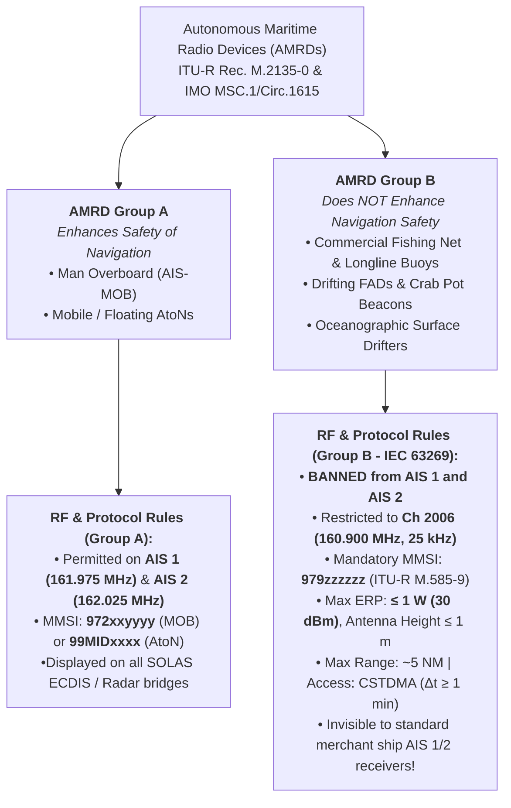
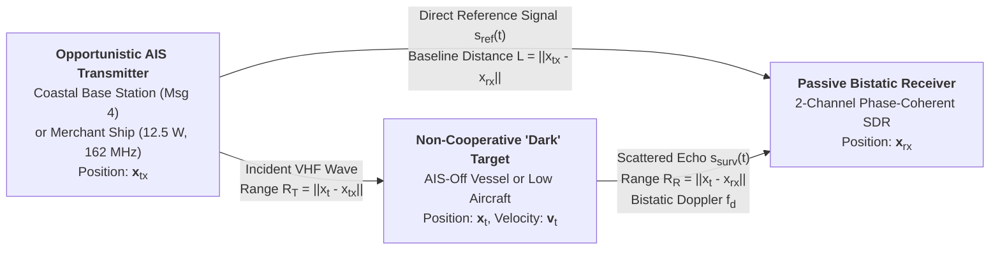

# Chapter 19: AIS for Fishing Gear, Autonomous Maritime Radio Devices (AMRDs), and Unintended User Hacks

---

## 19.1 Operational & Conceptual Overview: AIS for Fishing Gear and Autonomous Maritime Radio Devices (AMRDs)

When the International Maritime Organization (IMO) and the International Telecommunication Union (ITU) finalized the Self-Organized Time-Division Multiple Access (SOTDMA) architecture of the Automatic Identification System (AIS) in the late 1990s, every design parameter was dimensioned around **manned vessels** and **official Aids to Navigation (AtoNs)**. System architects assumed that within a standard $20\text{–}40\text{ NM}$ terrestrial VHF cell, no more than $200\text{ to }400$ vessels would simultaneously contend for the $4,500\text{ time slots per minute}$ available across AIS 1 ($161.975\text{ MHz}$, Channel 87B) and AIS 2 ($162.025\text{ MHz}$, Channel 88B).

They did not anticipate that within fifteen years, global commercial fishing fleets would attach **hundreds of thousands of uncertified, $25\text{–}$75 VHF AIS transmitters** directly to drifting fishing nets, longlines, crab pots, and Fish Aggregating Devices (FADs)—nor that mariners, yachtsmen, oceanographers, amateur radio operators, and radar engineers would repurpose the unauthenticated AIS protocol for everything from Red Sea anti-piracy deterrence broadcasts to opportunistic passive bistatic radar.

This chapter examines both sides of non-traditional AIS usage:
1. **Section 19.1** investigates how commercial fishing fleets adopted uncertified AIS gear buoys, why these devices created a severe VHF Data Link (VDL) and bridge-safety crisis across major shipping lanes, and how the international regulatory community responded by creating the **Autonomous Maritime Radio Device (AMRD)** framework under **Recommendation ITU-R M.2135-0** and **ITU-R M.585-9**.
2. **Section 19.2** catalogs the most important **unintended user hacks** that mariners, researchers, and radio hobbyists have engineered on top of the global AIS ecosystem.

---

### 19.1.1 How Fishing Fleets Adopted AIS Gear Buoys

Commercial pelagic and demersal fishing operations deploy vast expanses of high-value, unmoored or lightly moored gear that drifts with wind and ocean currents:
* **Pelagic Longliners:** A single industrial tuna or swordfish longliner pays out a monofilament mainline stretching **$40\text{ to }80\text{ NM}$ ($75\text{–}150\text{ km}$)** across the ocean, supported by surface floats and suspending $2,000\text{ to }4,000$ baited hooks. Because the line takes $6\text{ to }10\text{ hours}$ to set and $10\text{ to }14\text{ hours}$ to haul back, sections of the mainline routinely part due to shark bite-offs, strong shear currents, or merchant ship prop-cuts.
* **Drift Gillnetters and Trammel Netters:** Coastal and high-seas gillnet fleets deploy curtains of netting $2\text{ to }15\text{ NM}$ long that drift freely overnight in low-visibility fog or heavy seas.
* **Purse Seiners and Drifting FADs:** Tropical tuna purse-seine fleets deploy thousands of drifting **Fish Aggregating Devices (FADs)**—bamboo or polymer rafts trailing submerged webbing that attract schools of skipjack, yellowfin, and bigeye tuna.
* **Offshore Pot and Trap Vessels:** Deep-water snow crab, king crab, and offshore lobster vessels set long strings ("trawls") of heavy steel traps along the continental shelf edge.

Historically, fishing captains located their gear using bamboo flagpoles, kerosene lanterns, corner radar reflectors, or $2\text{–}4\text{ MHz}$ medium-frequency (MF) radio direction-finding (RDF) "tone buoys." However, once commercial fishing vessels installed wheelhouse chartplotters (such as Furuno, TimeZero, Olex, and Chinese domestic plotters) equipped with AIS receivers, electronics workshops—initially clustered in coastal Fujian, Zhejiang, and Guangdong provinces around 2009–2012—realized they could pair a cheap GPS module, a lithium-ion battery pack, a solar trickle-charger, and a single-chip VHF frequency synthesizer IC inside a waterproof plastic torpedo float for **$25 to $75 per unit**.

To a fishing captain, these "AIS net pingers" or "sun-buoys" were transformative: every float along a $60\text{ NM}$ longline appeared directly on the wheelhouse chartplotter screen with its exact GPS coordinates, speed and course of drift, net serial number, and real-time battery voltage.

---

### 19.1.2 Technical and Operational Anatomy of Uncertified Fishing Buoys

Because uncertified fishing buoys are engineered for minimum Bill of Materials (BoM) cost rather than compliance with **ITU-R M.1371-5** or **IEC 62287-1/2**, their RF and protocol implementations violate almost every rule of the AIS VHF Data Link:

| Parameter | Compliant Class B (CS) Shipborne AIS (IEC 62287-1) | Compliant AMRD Group B Buoy (ITU-R M.2135-0) | Typical Uncertified Fishing Net Buoy ("AIS Pinger") |
| :--- | :--- | :--- | :--- |
| **Operating Frequencies** | AIS 1 ($161.975\text{ MHz}$) & AIS 2 ($162.025\text{ MHz}$) | **Channel 2006 ($160.900\text{ MHz}$ only)** | AIS 1 ($161.975\text{ MHz}$) & AIS 2 ($162.025\text{ MHz}$) |
| **Transmitter Power (ERP)** | $2\text{ W}$ ($33\text{ dBm}$) nominal | **$\le 1\text{ W}$ ($30\text{ dBm}$) ERP** | **$2\text{ W}$ to $10\text{ W}$ ($33\text{–}40\text{ dBm}$)** |
| **Medium Access Protocol** | CSTDMA (receives AIS 1/2 to sense carrier + read Msg 20 FATDMA) | CSTDMA on Ch 2006 | **Transmit-only blind timer** (no VHF receiver at all!) or crude RSSI threshold |
| **Reporting Interval ($\Delta t$)** | $3\text{ min}$ (at $<2\text{ kts}$); $30\text{ s}$ (at $>2\text{ kts}$) | **$\ge 1\text{ min}$** (max 2 slots/min) | **$30\text{ s}$ to $3\text{ min}$** fixed timer regardless of speed |
| **AIS Message Types Broadcast** | Msg 18 (pos) + Msg 24A/24B (static) | Msg 21 (AtoN) or Msg 18/24 | **Spoofed Msg 1** (Class A!), **Msg 18 + 24A**, **Msg 19**, or **Msg 21** (AtoN!) |
| **MMSI Format** | `MIDxxxxxx` (valid national flag administration) | **`979zzzzzz`** (ITU-R M.585-9 AMRD Group B) | Fabricated: **`190xxxxxx`**, **`888xxxxxx`**, **`900xxxxxx`**, **`998xxxxxx`**, **`999xxxxxx`** |
| **Static `Vessel Name` Field** | Actual registered vessel name | Buoy ID / owner | Net ID + live telemetry: e.g., **`"NET-14 12.4V"`**, **`"BUOY08 84%"`**, **`"16888-3 11.9V"`** |

Three design shortcuts in uncertified fishing buoys are particularly destructive:
1. **Omission of the VHF Receiver (Blind Uncoordinated Transmission):** A compliant Class B Carrier-Sense TDMA (CSTDMA) transponder must include a dual-channel VHF receiver to listen to background noise levels during the first $1.14\text{ ms}$ of a $26.67\text{ ms}$ time slot and to decode Base Station Message 20 (FATDMA reserved slots) so it never steps on shore stations or nearby Class A ships. To save $8 in RF front-end components and halve battery drain, most uncertified fishing buoys are **transmit-only devices**. Their microcontroller wakes up on a free-running crystal oscillator every $30\text{ to }180\text{ seconds}$, reads the GPS UART, keys the power amplifier at $5\text{–}10\text{ W}$, and blasts an uncoordinated GMSK burst onto AIS 1 or AIS 2 without checking whether a ship is mid-transmission or even aligning its burst start to a UTC slot boundary.
2. **Protocol Impersonation (Spoofing Class A Ships and Official AtoNs):** Because early fishing chartplotters did not always render Class B Message 24 static names without user interaction, buoy firmware authors programmed net pingers to transmit **Message 1** (impersonating a SOLAS Class A merchant ship!), **Message 19** (Extended Class B Position Report containing both position and the 20-character name in a single 2-slot burst), or **Message 21** (impersonating an official Coast Guard Aid to Navigation diamond symbol!).
3. **Abuse of the `Vessel Name` Field for Battery Telemetry:** Rather than using an Application Specific Message (Message 6/8), uncertified buoys dynamically rewrite their 20-character 6-bit ASCII `Vessel Name` field every few minutes to append the buoy's lithium battery voltage or charge percentage—producing strings such as `"HAIWANG03 12.6V"`, `"NET-09 7.8V"`, or `"B14-92%"` on every merchant ship's ECDIS within $15\text{ NM}$.

---

## 19.2 Historical Context & Evolution (`schwehr/gis-history` Integration)

The collision between high-seas fishing gear tracking and maritime navigation safety followed a fifty-year technological arc:

* **1960s–1980s (MF Radio Tone & Selcall Buoys):** Distant-water Japanese, Soviet, and North Atlantic longline fleets tracked parted gear using $1.6\text{–}4.0\text{ MHz}$ MF/HF radio beacons. A selective-calling ("selcall") receiver on the fishing vessel's bridge measured the relative bearing to the buoy using a rotating ferrite-loop or Adcock antenna. Because these beacons operated in fisheries-allocated MF bands, they were completely invisible to merchant ship bridge equipment.
* **1978–1990s (Argos & GPS-Satellite Drifting FAD Buoys):** Following the creation of the **Argos** satellite system on NOAA TIROS-N polar-orbiting satellites (1978) and the maturation of civilian GPS + Inmarsat/Orbcomm/Iridium links in the late 1990s, industrial tropical tuna purse-seiners transitioned to satellite-linked GPS/echo-sounder buoys (manufactured by companies such as Zunibal, Satlink, and Marine Instruments) to monitor drifting FADs globally without polluting terrestrial VHF channels.
* **2002–2008 (SOLAS AIS Rollout and Class B Standardization):** After the IMO SOLAS Chapter V AIS carriage mandate took effect in 2002 and **IEC 62287-1** standardized lower-cost CSTDMA Class B transponders in 2006, AIS chartplotter displays became ubiquitous across coastal fishing fleets.
* **2010–2016 (The Uncertified Net-Buoy Explosion):** Low-cost VHF synthesizer chips enabled cottage-industry production of $30 AIS fishing buoys across East and Southeast Asia, rapidly spreading to West Africa, the Indian Ocean, and South America. By 2015, maritime authorities in China, Japan, the Republic of Korea, and Europe reported to the **ITU** and **IALA** that coastal fishing grounds in the East China Sea and Yellow Sea regularly contained **$500\text{ to }1,500$ simultaneous AIS net buoys** within a single vessel's radio horizon.
* **2014–2020 (`libais` and Global Fishing Watch Analytics):** As Kurt Schwehr's high-performance C++ **`libais`** decoder (originally built in 2010 for the *Deepwater Horizon* response and NOAA ERMA) was deployed by **SkyTruth** and **Global Fishing Watch (GFW)** to process billions of satellite AIS messages from Orbcomm and Spire constellations, data scientists discovered tens of millions of anomalous trajectories with MMSI prefixes `190`, `888`, `900`, `998`, and `999` moving at $0.3\text{–}1.8\text{ kts}$ alongside longline and gillnet vessels. GFW researchers subsequently developed machine-learning classifiers to separate gear buoys from fishing vessels—and paradoxically realized that tracking the uncertified buoys themselves revealed the exact spatial footprint, soak time, and set length of otherwise dark or poorly documented longline operations.
* **2019 (ITU WRC-19 and Recommendation ITU-R M.2135-0):** Recognizing that uncertified AIS gear buoys posed an existential threat to the integrity of the VHF Data Link, the **2019 World Radiocommunication Conference (WRC-19)** revised Appendix 18 of the ITU Radio Regulations, and the ITU Radiocommunication Sector enacted **Recommendation ITU-R M.2135-0** (*Technical characteristics of autonomous maritime radio devices operating in the frequency band 156-162.05 MHz*) alongside **ITU-R M.585-9**, legally banishing non-safety fishing gear buoys (`AMRD Group B`, MMSI `979zzzzzz`) from AIS 1 and AIS 2 to **Channel 2006 ($160.900\text{ MHz}$)**.

---

## 19.3 Deep Technical & Mathematical Foundations

### 19.3.1 Why Fishing Gear AIS Created a Maritime Safety Crisis

To understand why maritime safety authorities treated uncertified fishing buoys as a Tier-1 navigational hazard, we must quantify three cascading failure modes on a merchant ship transiting a dense fishing ground:

#### 1. VDL Time-Slot Saturation and Unslotted Aloha Collision Probability

Each AIS channel (AIS 1 and AIS 2) provides $2,250\text{ slots/min}$ ($37.5\text{ slots/s}$, slot duration $T_s = 26.67\text{ ms}$), yielding a combined dual-channel capacity of:

$$C_{\text{total}} = 4,500\text{ slots/min}$$

Suppose $K = 3$ pelagic longliners operate within a $25\text{ NM}$ radius, and each vessel deploys $M = 80$ uncertified AIS net buoys ($N_b = K \cdot M = 240$ buoys total), each transmitting a 1-slot position report every $\Delta t_b = 30\text{ s}$ ($2\text{ bursts/min}$) plus a 1-slot static name report every $\Delta t_{\text{static}} = 180\text{ s}$ ($0.333\text{ bursts/min}$). The aggregate buoy transmission rate is:

$$\Lambda_b = N_b \left(\frac{60}{\Delta t_b} + \frac{60}{\Delta t_{\text{static}}}\right) = 240 \times (2 + 0.333) = 560\text{ bursts/min}$$

If these buoys were properly slot-synchronized SOTDMA transmitters, $560\text{ bursts/min}$ would occupy $560 / 4500 = 12.4\%$ of the VDL. However, because transmit-only net buoys lack a GNSS 1-PPS slot synchronizer and lack a VHF carrier-sense receiver, they behave as **unslotted Pure Aloha** interferers against the slotted SOTDMA frame:
* Any asynchronous burst of length $T_{\text{burst}} \approx 24.5\text{ ms}$ initiated at a random phase $\tau \sim \mathcal{U}(0, T_s)$ overlaps **two consecutive SOTDMA time slots** with probability $P_{\text{double}} = T_{\text{burst}} / T_s \approx 0.92$.
* Under a Poisson arrival model with normalized channel load $G_b = \Lambda_b / C_{\text{total}} = 560 / 4500 = 0.1244$, the probability that a given SOTDMA slot suffers a destructive co-channel collision with at least one unslotted buoy burst is:

$$P_{\text{coll}} = 1 - \exp\!\left(-(1 + P_{\text{double}}) G_b\right) = 1 - \exp(-1.92 \times 0.1244) \approx 21.2\%$$

When $6$ to $10$ fishing vessels congregate along a thermal front ($N_b = 600\text{–}800$ buoys, or when buoys transmit 2-slot Message 19 bursts spanning $53.3\text{ ms}$), the effective vulnerability window triples, corrupting **$45\%\text{ to }65\%$ of all time slots** and blinding legitimate ship-to-ship position updates.

#### 2. ECDIS, ARPA, and Class A MKD Target Table Overflow

Shipborne navigational displays do not have infinite memory for tracking AIS targets. Under **IEC 61993-2** (Class A shipborne AIS) and legacy **IEC 62388 / IEC 61174** (Radar/ARPA and ECDIS performance standards), hardware target tables are dimensioned around a minimum required capacity $N_{\max}$ (historically $200\text{ to }300$ sleeping/active AIS targets on older bridge installations, and $400\text{ to }1,000$ on modern systems).

When a merchant vessel enters a fishing zone containing $N_b = 350$ net buoys within $6\text{ NM}$, the buoys lie closer to the own-ship than a closing merchant tanker at $R = 12\text{ NM}$. If the bridge display's target-table eviction algorithm prioritizes targets solely by **minimum range $R_i$** rather than filtering out non-vessel MMSIs or weighting by closing velocity $\dot{R}_i$:

$$\text{Priority}(i) = f(R_i) \quad \Longrightarrow \quad R_{\text{buoy}} \in [0.2, 5.0]\text{ NM} < R_{\text{tanker}} = 12.0\text{ NM}$$

the $350$ drifting buoys completely saturate the $N_{\max} = 300$ target table, causing the ECDIS or radar overlay to **silently drop or refuse to acquire the real approaching merchant ship**.

#### 3. Bridge CPA/TCPA Alarm Fatigue and Fatal Collision Casualties

Suppose a container ship steams at speed $v_s = 18\text{ kts}$ through a fishing ground where AIS net buoys are distributed with spatial density $\rho_b = 1.5\text{ buoys/NM}^2$. The Officer of the Watch (OOW) configures the bridge ECDIS/ARPA guard ring to trigger an audible collision alarm whenever any AIS target violates:

$$\text{CPA} \le D_{\text{CPA}} = 0.5\text{ NM} \quad \text{and} \quad 0 < \text{TCPA} \le T_{\text{TCPA}} = 15\text{ min}$$

Because the buoys drift at $v_b \approx 0.5\text{ kts} \ll v_s$, the ship sweeps out a rectangular collision-alarm corridor of width $W = 2 D_{\text{CPA}} = 1.0\text{ NM}$ at rate $v_s = 18\text{ NM/hr}$. The expected rate of audible bridge CPA alarms from fishing buoys alone is:

$$\lambda_{\text{alarm}} = 2 \, D_{\text{CPA}} \, v_s \, \rho_b = 2(0.5\text{ NM})(18\text{ NM/hr})(1.5\text{ buoys/NM}^2) = 27\text{ alarms/hour}$$

Confronted with a piercing bridge buzzer sounding **every 2.2 minutes for hours on end**, watch officers routinely either:
1. **Mute the audible CPA/TCPA alarm** entirely, or
2. **Switch off the AIS layer** on the radar/ECDIS display.

Numerous official casualty investigations by the China Maritime Safety Administration (MSA), the Japan Transport Safety Board (JTSB), the Korean Maritime Safety Tribunal (KMST), and the UK Marine Accident Investigation Branch (MAIB) have documented fatal nocturnal collisions in the East China Sea and Yellow Sea where a merchant ship's OOW disabled CPA alarms due to hundreds of `998`/`999` net-buoy targets and subsequently ran down an actual manned fishing vessel waiting at the end of its net string.

---

## 19.4 Hardware, Standards, & Software Ecosystem: The AMRD Regulatory Solution (ITU-R M.2135-0)

To restore the integrity of AIS 1 and AIS 2 without depriving fishermen and oceanographers of short-range VHF gear tracking, the **ITU**, **IMO**, **IALA**, and **IEC** established a formal regulatory taxonomy for **Autonomous Maritime Radio Devices (AMRDs)** between 2018 and 2022:

* **Recommendation ITU-R M.2135-0 (2019):** *Technical characteristics of autonomous maritime radio devices operating in the frequency band 156-162.05 MHz*.
* **ITU Radio Regulations Appendix 18 (WRC-19 Revision, Footnote `mm`):** Reallocated **Channel 2006 ($160.900\text{ MHz}$)** globally for AMRD Group B operation.
* **Recommendation ITU-R M.585-9 (2022):** *Assignment and use of identities in the maritime mobile service* (Section 5: Autonomous Maritime Radio Devices, assigning MMSI prefix **`979`**).
* **IMO MSC.1/Circ.1615 (2020):** *Interim guidelines for autonomous maritime radio devices*.
* **IEC 63269 (Ed. 1.0, 2023):** *Maritime navigation and radiocommunication equipment and systems — Autonomous maritime radio devices (AMRD) — Group B*.

### 19.4.1 AMRD Group A vs. AMRD Group B Architecture

Recommendation ITU-R M.2135-0 divides all uncrewed, floating maritime VHF radio devices into two strict legal categories based on whether they **enhance the safety of navigation**:



1. **AMRD Group A (Safety of Navigation):**
   * Includes lifejacket Man Overboard beacons (**AIS-MOB**, MMSI `972xxyyyy`) and floating/mobile Aids to Navigation (**AtoN**, MMSI `99MIDxxxx`).
   * Because every vessel in the vicinity must see an MOB casualty or a navigational hazard buoy, Group A devices are permitted to transmit on **AIS 1 ($161.975\text{ MHz}$) and AIS 2 ($162.025\text{ MHz}$)**.
2. **AMRD Group B (Non-Navigation / Commercial & Scientific Gear):**
   * Includes **fishing net buoys, longline floats, drifting FAD beacons, trap markers, and short-range oceanographic surface drifters**.
   * **Strict Prohibition on AIS 1 and AIS 2:** Group B devices are prohibited from transmitting on $161.975\text{ MHz}$ or $162.025\text{ MHz}$. Instead, they must transmit exclusively on **AIS Channel 2006 ($160.900\text{ MHz}$, $25\text{ kHz}$ channel spacing)** using $9.6\text{ kbps}$ GMSK modulation.
   * **MMSI Numbering (`979zzzzzz`):** Under ITU-R M.585-9 Annex 1, all AMRD Group B devices are assigned a 9-digit identity of the form:
     $$\text{MMSI}_{\text{AMRD-B}} = \texttt{979}z_1z_2z_3z_4z_5z_6 \quad (z_i \in \{0..9\})$$
     Notice that unlike AIS-SART (`970xxyyyy`) or AIS-MOB (`972xxyyyy`), AMRD Group B identities do not embed a 2-digit manufacturer ID `xx`; national administrations or international pools allocate the 6-digit suffix `zzzzzz`.
   * **Power, Antenna Height, and CSTDMA Constraints:** Group B transmitters are restricted to a maximum Effective Radiated Power of **$\text{ERP} \le 1\text{ W}$ ($30\text{ dBm}$)** with a maximum antenna height of **$h_{\text{ant}} \le 1\text{ m}$** above the sea surface (limiting radio horizon range to approximately $5\text{ NM}$), a minimum reporting interval of **$\Delta t \ge 60\text{ s}$** (occupying at most 2 slots per minute), and mandatory **CSTDMA carrier-sense listen-before-talk** on $160.900\text{ MHz}$.

By isolating AMRD Group B on $160.900\text{ MHz}$, fishing vessels can install a dedicated $160.900\text{ MHz}$ receiver channel on their wheelhouse chartplotters to track all of their nets and pots, while SOLAS merchant ships transiting the same waters on AIS 1 and AIS 2 experience **zero VDL congestion and zero ECDIS target clutter**. (Of course, legacy uncertified $5\text{ W}$ AIS 1/2 net buoys remain in widespread illegal circulation across several fishing basins, making automated software filtering—demonstrated in Section 19.6—essential for VTS and maritime analysts.)

---

## 19.5 Security, Adversarial Abuse, & Unintended User Hacks: What Hacks Have Users Come Up With to Use the AIS System in Unintended Ways?

Because AIS is a **global, unencrypted, unauthenticated, zero-subscription VHF broadcast network** monitored continuously by coastal base stations, LEO satellites, and public web aggregators (such as MarineTraffic, VesselFinder, and APRS.fi), mariners, hackers, scientists, and radio engineers have invented a remarkable ecosystem of unintended "user hacks" on top of the protocol. Below is a comprehensive technical catalog of the five major classes of real-world AIS hacks.

---

### 19.5.1 Hack Category 1: Free Global Text Messaging, Anti-Piracy Deterrence, and Commercial Signaling in Metadata Fields

Under **ITU-R M.1371-5**, AIS Message 5 (*Static and Voyage Related Data*) includes two free-form 6-bit ASCII string fields that can be edited at any time by the bridge watch officer via the Class A Minimum Keyboard and Display (MKD) or pilot-plug configuration software:
* **`Vessel Name`** (120 bits = **20 characters**, bits `112..231` in 0-based indexing).
* **`Destination`** (120 bits = **20 characters**, bits `302..421` in 0-based indexing).

Because satellite AIS constellations and terrestrial aggregators automatically ingest Message 5 and display `Destination` publicly on the internet within minutes—at **zero satellite airtime cost**—mariners rapidly repurposed the 20-character `Destination` field (and occasionally Message 14 *Safety Related Broadcast*) as a **free global status bar and geopolitical megaphone**:

#### 1. Anti-Piracy and Conflict-Zone Deterrence Broadcasts
During the Somali piracy crisis in the Gulf of Aden, Bab el-Mandeb, and Indian Ocean (2008–2014), pirate mother ships and shore spotters began using portable VHF AIS receivers and smartphone ship-tracking websites to select slow, low-freeboard merchant targets. In response, commercial shipmasters began overwriting their next port of call in the `Destination` field with tactical deterrence warnings designed to convince pirate skiffs to pick another target:
* **`"ARMED GUARDS ONBOARD"`** (exactly 20 characters!)
* **`"ARMED SECURITY ONBRD"`**
* **`"CITADEL SECURED"`** / **`"3 ARMED GUARDS"`** / **`"HIGH RISK AREA"`**

A dramatic geopolitical evolution of this hack occurred between **November 2023 and 2025** in the **Red Sea and Gulf of Aden** during the Houthi anti-shipping missile and drone campaign. Because Houthi targeting cells scraped public AIS feeds to identify vessels linked to Israel, the United States, or the United Kingdom—while pledging safe passage to Chinese and Russian vessels—hundreds of merchant captains transiting the Bab el-Mandeb overwrote their Message 5 `Destination` field with nationality, religion, and non-affiliation declarations:
* **`"CHINESE CREW ALL"`** / **`"ALL CHINESE"`** / **`"CHINA OWNER"`**
* **`"RUSSIAN CREW"`** / **`"SYRIAN CREW ONLY"`** / **`"ALL MUSLIM CREW"`**
* **`"NO CONTACT ISRAEL"`** / **`"NO LINK TO ISRAEL"`**

#### 2. Tramp Chartering, Spot-Market Signaling, and Structured UN/LOCODE Hacks
Dry-bulk carriers, Aframax/VLCC crude tankers, and liquefied natural gas (LNG) carriers sailing on the spot market frequently depart load ports before their cargo has been sold to a final buyer. Mariners and chartering desks developed standardized shorthand hacks inside the 20-character `Destination` field:
* **`"FOR ORDERS"`** / **`"AWAITING ORDERS"`** / **`"ORDER"`**: Signals commodity traders and shipbrokers worldwide that the vessel is steaming toward a waypoint (e.g., Gibraltar, Suez, or Singapore EOPL—*Eastern Outer Port Limits*) waiting for charterers to nominate a discharge port, or that the empty vessel is available for spot charter.
* **`"BUNKERING ONLY"`** / **`"STS TRANSFER"`** / **`"DRIFTING"`**: Signals port state authorities and market analysts that the vessel is not calling a berth for cargo operations.
* **IMO SN.1/Circ.244 Structured Port-Pair Hack (`LOCODE>LOCODE`):** Because 20 characters is too short to spell out full departure and arrival port names, mariners and the IMO formalized a compact delimiter syntax combining two 5-character **UN/LOCODEs** separated by `>`:
  $$\texttt{"NLRTM>USNYC"} \quad (\text{Rotterdam, Netherlands } \longrightarrow \text{ New York, USA})$$
  $$\texttt{"SGSIN>CNSHA"} \quad (\text{Singapore } \longrightarrow \text{ Shanghai, China})$$

#### 3. Fishermen & Crew Chat and Protest Messages
Sister trawlers fishing in packs routinely use the 20-character `Vessel Name` or `Destination` field—or unencrypted **Message 14** (*Safety Related Broadcast Message*, up to 161 characters)—as a free VHF text-chat channel to pass water temperatures (`"SST 14.2C GOOD"`), daily catch tallies, or instructions to switch to a private HF single-sideband frequency. Disgruntled or stranded seafarers abandoned by bankrupt shipowners at anchorage have even used the `Destination` field to broadcast distress appeals to the global press, such as **`"NO FOOD NO WATER"`** or **`"CREW UNPAID 6 MONTHS"`**.

---

### 19.5.2 Hack Category 2: Track-Art, Spoofed Graffiti, and Geopolitical Psychological Operations

Because AIS position reports are rendered as connected polylines on public web aggregators, both **real bridge crews steering physical ships** and **remote adversaries injecting spoofed RF/network feeds** have used vessel trajectories as a giant canvas:

1. **Physical Track-Art by Real Vessels:**
   * Bored watch officers on vessels waiting at outer anchorages, performing sea trials, or calibrating magnetic compasses have intentionally steered multi-mile geometric patterns in open water.
   * The most famous example occurred on **March 22–23, 2021**, immediately before the $400\text{ m}$ Ultra Large Container Vessel ***Ever Given*** (MMSI `353136000`) entered the Suez Canal and grounded diagonally for six days: while waiting in the Gulf of Suez south of the canal entrance, the vessel steered an elaborate phallic loop trajectory fully recorded by both terrestrial and satellite AIS receivers.
   * Conversely, tugboats, pilot launches, search-and-rescue lifeboats, and research vessels regularly steer deliberate celebratory or commemorative track-art—such as spelling out **`"NHS"`** or drawing hearts in UK ports during the 2020 COVID-19 lockdowns, drawing Christmas trees in the Baltic Sea, or tracing anchor emblems during maritime festivals.
2. **Spoofed Track Graffiti and Geopolitical Psychological Operations (2019–2025):**
   * Because unauthenticated NMEA `!AIVDM` UDP feeds sent to community web aggregators (and local VHF RF receivers) lack cryptographic verification, hackers and state-aligned information-operations units discovered they could synthesize false tracks anywhere on Earth.
   * **The May 2020 Point Reyes "Giant Ship" Incident:** Thousands of bogus AIS messages near Point Reyes, California made dozens of oil tankers and cargo ships appear to be steaming in synchronized circles over dry land.
   * **The June 2021 Black Sea Naval Spoofing Campaign:** Between June 18 and June 28, 2021—days before the real Royal Navy destroyer ***HMS Defender*** (`232002833`) and Royal Netherlands Navy frigate ***HNLMS Evertsen*** (`244820000`) conducted freedom-of-navigation transits in the Black Sea—spoofed AIS feeds showed *HMS Defender* and *HNLMS Evertsen* steaming to within **$2\text{ NM}$ of the Russian naval base at Sevastopol**, while a separate spoofed track used the MMSI of the US Navy destroyer ***USS Ross*** (`338995000`) to trace fake patrol patterns near Crimea. Simultaneous satellite Synthetic Aperture Radar (Sentinel-1 SAR) and optical imagery confirmed that the actual warships were still moored $180\text{ NM}$ away in Odesa, Ukraine!
   * In 2022–2024, similar spoofed AIS tracks were used to draw giant political slogans ($50\text{ NM}$ tall letters spelling `"Z"`, `"V"`, or anti-war messages) across the Black Sea and Baltic Sea on public ship-tracking maps.

---

### 19.5.3 Hack Category 3: DIY Yacht Tender Anti-Theft & Low-Cost Ocean Drifters

1. **Cruising Yacht Tender ("Dinghy") Anti-Theft Alarm Hack:**
   * Across Caribbean, Central American, and South Pacific cruising anchorages, the theft of inflatable RIB tenders and $15\text{–}40\text{ HP}$ outboard motors at night is a major hazard for liveaboard sailors. Commercial GPS/cellular trackers fail in remote island anchorages lacking cellular coverage, and satellite trackers have 15-minute latency.
   * Resourceful cruisers engineered a clever local AIS hack: wiring a low-cost **Class B CSTDMA transponder** inside the fiberglass console of the dinghy (or mounting a water/reed-switch-activated **AIS-MOB beacon** inside the outboard engine cowling wired to a hidden magnetic tether on the yacht's davits).
   * On the mother yacht's chartplotter (e.g., OpenCPN, Signal K, or B&G/Raymarine MFD), the skipper places a tight **$50\text{ m}$ guard-zone or anchor-watch alarm** around the dinghy's MMSI (or relies on the automatic `972` MOB siren). The instant a thief cuts the painter line at 03:00 local time and paddles or motors the dinghy $>50\text{ m}$ away from the yacht, the mother yacht's bridge alarm blasts and displays a real-time bearing and range vector to chase down the stolen tender—even inside a zero-cell-service atoll!
2. **Low-Cost Oceanographic Surface Drifters ("Poor Man's Argos"):**
   * Standard NOAA Global Drifter Program (GDP) SVP surface drifters equipped with Iridium satellite modems cost $1,500–$3,000 each plus ongoing monthly satellite data fees.
   * University coastal oceanographers and oil-spill researchers discovered they could bolt a **$90 OEM Class B AIS transmitter board** and a small $5\text{ W}$ solar panel inside a biodegradable wooden spar buoy or PVC pipe drifter. Within $30\text{ NM}$ of the coast (or offshore beneath commercial LEO S-AIS constellations), these DIY drifters transmit high-resolution GPS surface-current velocities every $1\text{ to }3\text{ minutes}$ directly into university shore receivers at zero recurring airtime cost. (Under current regulations, such scientific drifters should now be built as **AMRD Group B** devices on $160.900\text{ MHz}$ or properly licensed with the national administration.)

---

### 19.5.4 Hack Category 4: Amateur Radio VHF Tropospheric Ducting Monitors ("AIS DXing")

Under standard atmospheric conditions, VHF radio waves at $162\text{ MHz}$ propagate slightly beyond the geometric horizon due to normal refractive bending (effective Earth radius factor $k \approx 4/3$), giving a ship-to-shore radio horizon of:

$$d_{\text{horizon}}\text{ [NM]} \approx 2.23 \left(\sqrt{h_{\text{tx}}\text{ [m]}} + \sqrt{h_{\text{rx}}\text{ [m]}}\right)$$

For a ship antenna at $h_{\text{tx}} = 25\text{ m}$ and a coastal receiver at $h_{\text{rx}} = 36\text{ m}$, normal line-of-sight range is $d \approx 2.23(5 + 6) \approx 24.5\text{ NM}$.

However, when warm, dry continental air flows out over a cooler sea surface (creating a sharp temperature inversion and a rapid decrease in water-vapor pressure with height $z$), the **modified index of refraction $M(z)$** exhibits a negative vertical gradient:

$$M(z) = (n(z) - 1)\times 10^6 + \frac{z}{a_e}\times 10^6 = \frac{77.6}{T}\left(P + \frac{4810 \, e}{T}\right) + 157 \, z$$

Whenever the vertical gradient satisfies the **trapping condition**:

$$\frac{dM}{dz} < 0 \quad \Longleftrightarrow \quad \frac{dN}{dz} < -157\text{ N-units/km}$$

VHF rays launched at low elevation angles ($\theta_0 < 1^\circ$) are refracted downward with a radius of curvature smaller than the Earth's radius $a_e = 6,371\text{ km}$, trapping the $162\text{ MHz}$ energy inside a **marine evaporation duct** or **elevated surface-based tropospheric duct** that acts as a low-loss waveguide across the ocean surface!

**The Amateur Radio Hack:**
VHF/UHF amateur radio operators ("hams") chasing long-distance (**DX**) contacts on the **$2\text{-meter}$ ($144\text{–}148\text{ MHz}$)** and **$70\text{-centimeter}$ ($432\text{ MHz}$)** bands historically struggled to know when a marine tropospheric duct had opened over the ocean, because few amateur beacons exist at sea. Around 2007, ham operators realized that the world's merchant fleet forms a **dense, continuous, $12.5\text{ W}$ GPS-tagged VHF beacon network at $162\text{ MHz}$**—just $16\text{ MHz}$ above the $144\text{ MHz}$ 2-meter amateur band!

By running a $25 RTL-SDR dongle and **`AIS-catcher`** connected to **`APRS.fi`** or real-time DX cluster maps:
* Whenever a coastal ham station in Cornwall (UK), San Diego (USA), or Perth (Australia) suddenly decodes AIS position reports from ships **$400\text{ to }1,400\text{ NM}$ ($750\text{–}2,600\text{ km}$) away**—such as UK receivers decoding vessels off the Canary Islands, or California receivers decoding ships off Hawaii—the software triggers an immediate **Tropospheric Ducting Alert**, showing the exact azimuth, duct footprint, and path loss in real time.

---

### 19.5.5 Hack Category 5: Opportunistic Passive Bistatic Radar (PBR) and Sea-Clutter Sensing

Perhaps the most sophisticated engineering hack of the AIS protocol comes from radar physicists and defense researchers (including teams at Fraunhofer FHR, NATO STO, Politecnico di Milano, University of Cape Town, and Wuhan University), who realized that coastal AIS Base Stations (Message 4) and dense merchant ship traffic provide a **continuous, non-cooperative $162\text{ MHz}$ VHF illuminator of opportunity** for **Passive Bistatic Radar (PBR)**.



#### Mathematical Principle of AIS Passive Bistatic Radar
A passive receiver ashore uses two phase-coherent SDR channels (e.g., an Ettus USRP or KrakenSDR):
1. A **Reference Channel** $s_{\text{ref}}(t)$ (or a clean remodulated GMSK waveform reconstructed after decoding the error-free NMEA payload!) that captures the direct line-of-sight burst from the known AIS transmitter at $\mathbf{x}_{\text{tx}}$ (decoded directly from the AIS packet's own latitude/longitude!).
2. A **Surveillance Channel** $s_{\text{surv}}(t)$ connected to a directional Yagi or phased array pointed out to sea, which receives weak skin-echo reflections scattered off **non-cooperative ("dark") vessels that have turned their AIS off**.

By computing the **Bistatic Delay-Doppler Cross-Ambiguity Function (CAF)** over coherent integration time $T_{\text{int}}$:

$$\chi(\tau, f_d) = \int_{0}^{T_{\text{int}}} s_{\text{surv}}(t) \, s_{\text{ref}}^*(t - \tau) \, e^{-j 2\pi f_d t} \, dt$$

a peak at bistatic delay $\tau$ and bistatic Doppler shift $f_d$ reveals a dark physical target satisfying:
* **Bistatic Range Sum (Ellipsoid of Position):**
  $$R_B = R_T + R_R - L = c \, \tau$$
  where $R_T = \|\mathbf{x}_t - \mathbf{x}_{\text{tx}}\|$, $R_R = \|\mathbf{x}_t - \mathbf{x}_{\text{rx}}\|$, and $L = \|\mathbf{x}_{\text{tx}} - \mathbf{x}_{\text{rx}}\|$ is the known baseline between the AIS transmitter and the passive receiver.
* **Bistatic Doppler Shift:**
  $$f_d = -\frac{1}{\lambda_{\text{VHF}}} \left(\frac{(\mathbf{x}_t - \mathbf{x}_{\text{tx}}) \cdot (\mathbf{v}_t - \mathbf{v}_{\text{tx}})}{R_T} + \frac{(\mathbf{x}_t - \mathbf{x}_{\text{rx}}) \cdot \mathbf{v}_t}{R_R}\right)$$
  where $\lambda_{\text{VHF}} = c / f_0 \approx 1.85\text{ m}$ at $162\text{ MHz}$.

Even though the $9.6\text{ kbps}$ GMSK bandwidth ($B \approx 12\text{–}25\text{ kHz}$) yields a coarse bistatic range resolution $\Delta R_B \approx c / (2B) \approx 6\text{–}12\text{ km}$, the presence of **dozens of spatially distributed merchant ships and base stations** transmitting from different azimuths allows the passive radar to intersect multiple bistatic ellipses and high-resolution Doppler tracks—localizing dark vessels and even extracting first-order **Bragg sea-clutter Doppler lines**:

$$f_{\text{Bragg}} = \pm \sqrt{\frac{g \, \cos(\beta/2)}{\pi \, \lambda_{\text{VHF}}}} \approx \pm 1.18 \, \sqrt{\cos(\beta/2)}\text{ Hz}$$

to measure coastal ocean wave spectra and surface currents!

---

## 19.6 Practical Engineering / Code Walkthrough: Automated Anomaly Classifier for Uncertified Fishing Net Buoys, AMRDs, and Metadata Hacks

When building a Vessel Traffic Service (VTS) ingestion pipeline, an ECDIS smart-filter, or a maritime domain awareness (MDA) analytics engine, we must automatically separate **legitimate vessels** from **uncertified AIS fishing-gear buoys**, **compliant ITU-R M.2135-0 AMRD Group B devices**, and **metadata text hacks**.

Below is a complete, self-contained, runnable Python classifier (`detect_fishing_gear_and_hacks.py`) that:
1. Projects WGS84 coordinates $(\lambda, \phi)$ into a centered local **East-North-Up (ENU)** tangent plane (per `STYLE_GUIDE.md` Section 3) to perform exact metric spatial-clustering and drift-kinematics analysis around parent fishing vessels.
2. Evaluates multi-feature anomaly scores combining **MMSI prefix forensics** (`190`, `888`, `900`, `998`, `999` vs. `979`), **regex telemetry detection** in `Vessel Name` (battery voltages `12.4V`, charge percentages `84%`, and net serial patterns), **drift kinematics** ($\text{SOG} \le 2.5\text{ kts}$), and **spatial proximity to a mother fishing vessel**.
3. Parses Message 5 `Destination` strings to classify **anti-piracy/conflict deterrence broadcasts**, **tramp chartering `"FOR ORDERS"` status**, and **structured UN/LOCODE port-pair hacks**.

```python
#!/usr/bin/env python3
"""
Chapter 19 Reference Implementation:
Automated Classifier for Uncertified AIS Fishing-Gear Buoys, ITU-R M.2135-0
AMRD Group B Devices, and Unintended Metadata Field Hacks.
"""

from dataclasses import dataclass, field
import math
import re
from typing import Dict, List, Optional, Tuple

# WGS84 Ellipsoid Constants
WGS84_A = 6378137.0  # Semi-major axis [m]
WGS84_E2 = 0.00669437999014  # First eccentricity squared

# Regex patterns for uncertified fishing net buoy telemetry in Vessel Name
RE_VOLTAGE = re.compile(r"\b\d{1,2}\.\d\s*V\b", re.IGNORECASE)
RE_PERCENT = re.compile(r"\b(?:100|\d{1,2})\s*%", re.IGNORECASE)
RE_NET_ID = re.compile(
    r"^(?:NET|BUOY|FAD|PING|GEAR|B|N)[-_#\s]*\d+|\b\d{4,6}[-_]\d{1,3}\b",
    re.IGNORECASE,
)

# Known non-standard MMSI prefixes used by uncertified AIS fishing net buoys
ILLEGAL_BUOY_PREFIXES = ("190", "888", "900", "998", "999", "000", "111000")

# Regex patterns for Message 5 Destination field user hacks
RE_ANTIPIRACY_CONFLICT = re.compile(
    r"\b(?:ARMED\s+GUARDS?|ARMED\s+SEC|CITADEL|CHINESE\s+CREW|ALL\s+CHINESE|"
    r"NO\s+CONTACT\s+ISRAEL|NO\s+LINK\s+ISRAEL|RUSSIAN\s+CREW|MUSLIM\s+CREW)\b",
    re.IGNORECASE,
)
RE_TRAMP_ORDERS = re.compile(
    r"\b(?:FOR\s+ORDERS?|AWAITING\s+ORDERS?|F/O|BUNKERING\s+ONLY|STS\s+TRANSFER)\b",
    re.IGNORECASE,
)
RE_UNLOCODE_PAIR = re.compile(r"^([A-Z]{2}[A-Z2-9]{3})\s*[>-]\s*([A-Z]{2}[A-Z2-9]{3})$")


@dataclass
class AISTargetReport:
    """Normalized AIS position + static metadata report."""

    mmsi: str
    msg_type: int
    lat_deg: float
    lon_deg: float
    sog_kts: float
    cog_deg: float
    vessel_name: str = ""
    destination: str = ""
    ship_type: int = 0
    channel_mhz: float = 161.975


@dataclass
class ClassificationResult:
    """Output of the Chapter 19 anomaly and user-hack classifier."""

    mmsi: str
    category: str
    confidence: float
    parent_vessel_mmsi: Optional[str] = None
    distance_to_parent_nm: Optional[float] = None
    metadata_hacks: List[str] = field(default_factory=list)
    reasons: List[str] = field(default_factory=list)


def wgs84_to_local_enu(
    lat_deg: float, lon_deg: float, lat0_deg: float, lon0_deg: float
) -> Tuple[float, float]:
    """
    Projects WGS84 (lat, lon) into a local East-North-Up (ENU) tangent plane [m]
    centered at (lat0_deg, lon0_deg) to eliminate cosine-latitude distortion.
    """
    phi = math.radians(lat_deg)
    lam = math.radians(lon_deg)
    phi0 = math.radians(lat0_deg)
    lam0 = math.radians(lon0_deg)

    sin_phi0 = math.sin(phi0)
    # Prime vertical radius of curvature N(phi0) and meridional radius M(phi0)
    n_rad = WGS84_A / math.sqrt(1.0 - WGS84_E2 * sin_phi0 * sin_phi0)
    m_rad = (WGS84_A * (1.0 - WGS84_E2)) / (
        (1.0 - WGS84_E2 * sin_phi0 * sin_phi0) ** 1.5
    )

    east_m = (lam - lam0) * n_rad * math.cos(phi0)
    north_m = (phi - phi0) * m_rad
    return east_m, north_m


def classify_ais_targets(
    reports: List[AISTargetReport],
    lat0_deg: float,
    lon0_deg: float,
    max_gear_radius_nm: float = 35.0,
) -> List[ClassificationResult]:
    """
    Classifies a snapshot of AIS targets into:
      - COMPLIANT_AMRD_GROUP_B (ITU-R M.2135-0, MMSI 979zzzzzz on 160.900 MHz)
      - UNCERTIFIED_FISHING_BUOY (illegal AIS 1/2 net pinger)
      - COMMERCIAL_FISHING_VESSEL (potential mother vessel)
      - STANDARD_VESSEL (with optional metadata hack annotations)
    """
    # 1. Project all targets into local ENU meters
    enu_coords: Dict[str, Tuple[float, float]] = {}
    fishing_vessels: List[AISTargetReport] = []

    for r in reports:
        enu_coords[r.mmsi] = wgs84_to_local_enu(
            r.lat_deg, r.lon_deg, lat0_deg, lon0_deg
        )
        # Identify legitimate commercial fishing vessels (Ship Type 30)
        if r.ship_type == 30 and not r.mmsi.startswith(ILLEGAL_BUOY_PREFIXES + ("979",)):
            fishing_vessels.append(r)

    results: List[ClassificationResult] = []

    for r in reports:
        reasons: List[str] = []
        hacks: List[str] = []
        score = 0.0

        # Check for compliant ITU-R M.2135-0 AMRD Group B (MMSI 979zzzzzz)
        if r.mmsi.startswith("979") and len(r.mmsi) == 9:
            reasons.append("MMSI prefix 979 matches ITU-R M.585-9 AMRD Group B")
            if abs(r.channel_mhz - 160.900) < 0.005:
                reasons.append("Operating on dedicated Ch 2006 (160.900 MHz)")
            else:
                reasons.append(
                    f"WARNING: AMRD Group B MMSI transmitting on {r.channel_mhz:.3f} MHz!"
                )
            results.append(
                ClassificationResult(
                    mmsi=r.mmsi,
                    category="COMPLIANT_AMRD_GROUP_B",
                    confidence=0.99,
                    reasons=reasons,
                )
            )
            continue

        # Evaluate uncertified fishing-gear net-buoy features
        if r.mmsi.startswith(ILLEGAL_BUOY_PREFIXES):
            score += 0.45
            reasons.append(f"Fabricated non-ITU MMSI prefix ({r.mmsi[:3]}xxxxxx)")

        if RE_VOLTAGE.search(r.vessel_name):
            score += 0.40
            reasons.append(
                f"Battery voltage telemetry embedded in Vessel Name ('{r.vessel_name}')"
            )

        if RE_PERCENT.search(r.vessel_name):
            score += 0.35
            reasons.append(
                f"Battery percentage embedded in Vessel Name ('{r.vessel_name}')"
            )

        if RE_NET_ID.search(r.vessel_name):
            score += 0.25
            reasons.append(
                f"Net/buoy serial pattern in Vessel Name ('{r.vessel_name}')"
            )

        if r.msg_type == 21 and not r.mmsi.startswith("99"):
            score += 0.35
            reasons.append(
                "Spoofing AIS Message 21 (AtoN) without a valid 99MIDxxxx MMSI"
            )

        # Kinematic check: drifting with surface current (SOG <= 2.5 kts)
        if r.sog_kts <= 2.5 and score > 0.0:
            score += 0.15
            reasons.append(f"Low-speed drift kinematics (SOG = {r.sog_kts:.1f} kts)")

        # Spatial association with nearest parent commercial fishing vessel
        nearest_fv_mmsi: Optional[str] = None
        nearest_dist_nm: Optional[float] = None
        ex, ey = enu_coords[r.mmsi]

        for fv in fishing_vessels:
            if fv.mmsi == r.mmsi:
                continue
            fx, fy = enu_coords[fv.mmsi]
            dist_nm = math.hypot(ex - fx, ey - fy) / 1852.0
            if nearest_dist_nm is None or dist_nm < nearest_dist_nm:
                nearest_dist_nm = dist_nm
                nearest_fv_mmsi = fv.mmsi

        if (
            score >= 0.35
            and nearest_dist_nm is not None
            and nearest_dist_nm <= max_gear_radius_nm
        ):
            score += 0.15
            reasons.append(
                f"Spatially clustered {nearest_dist_nm:.2f} NM from mother fishing vessel {nearest_fv_mmsi}"
            )

        # Evaluate Message 5 Destination metadata hacks
        dest = r.destination.strip()
        if dest:
            if RE_ANTIPIRACY_CONFLICT.search(dest):
                hacks.append(
                    f"ANTI_PIRACY_OR_CONFLICT_DETERRENCE ('{dest}')"
                )
            if RE_TRAMP_ORDERS.search(dest):
                hacks.append(f"TRAMP_CHARTERING_SIGNAL ('{dest}')")
            locode_match = RE_UNLOCODE_PAIR.match(dest)
            if locode_match:
                hacks.append(
                    f"STRUCTURED_UNLOCODE_PAIR ({locode_match.group(1)} -> {locode_match.group(2)})"
                )

        # Assign final classification
        if score >= 0.50:
            category = "UNCERTIFIED_FISHING_BUOY"
        elif r.ship_type == 30:
            category = "COMMERCIAL_FISHING_VESSEL"
        else:
            category = "STANDARD_VESSEL"

        results.append(
            ClassificationResult(
                mmsi=r.mmsi,
                category=category,
                confidence=min(score if category == "UNCERTIFIED_FISHING_BUOY" else 0.95, 0.99),
                parent_vessel_mmsi=nearest_fv_mmsi if category == "UNCERTIFIED_FISHING_BUOY" else None,
                distance_to_parent_nm=nearest_dist_nm if category == "UNCERTIFIED_FISHING_BUOY" else None,
                metadata_hacks=hacks,
                reasons=reasons,
            )
        )

    return results


if __name__ == "__main__":
    # Synthetic East China Sea / Red Sea scenario demonstrating buoy & hack detection
    sample_stream = [
        AISTargetReport(
            mmsi="412440891",
            msg_type=1,
            lat_deg=28.5000,
            lon_deg=124.0000,
            sog_kts=3.8,
            cog_deg=45.0,
            vessel_name="ZHE YU 16888",
            ship_type=30,
        ),
        AISTargetReport(
            mmsi="998168881",
            msg_type=18,
            lat_deg=28.5320,
            lon_deg=124.0410,
            sog_kts=0.9,
            cog_deg=62.0,
            vessel_name="NET-01 12.4V",
        ),
        AISTargetReport(
            mmsi="888004129",
            msg_type=21,
            lat_deg=28.5610,
            lon_deg=124.0850,
            sog_kts=1.1,
            cog_deg=64.0,
            vessel_name="16888-02 86%",
        ),
        AISTargetReport(
            mmsi="979014205",
            msg_type=21,
            lat_deg=28.4850,
            lon_deg=123.9800,
            sog_kts=0.8,
            cog_deg=60.0,
            vessel_name="AMRD-FAD-05",
            channel_mhz=160.900,
        ),
        AISTargetReport(
            mmsi="538009123",
            msg_type=1,
            lat_deg=28.4100,
            lon_deg=124.1500,
            sog_kts=14.2,
            cog_deg=15.0,
            vessel_name="PACIFIC HARMONY",
            destination="ARMED GUARDS ONBOARD",
            ship_type=70,
        ),
        AISTargetReport(
            mmsi="248991000",
            msg_type=1,
            lat_deg=28.3500,
            lon_deg=124.2200,
            sog_kts=12.5,
            cog_deg=195.0,
            vessel_name="BALTIC TRADER",
            destination="NLRTM>USNYC",
            ship_type=80,
        ),
    ]

    classified = classify_ais_targets(sample_stream, lat0_deg=28.5, lon0_deg=124.0)
    print(f"{'MMSI':<11} | {'CATEGORY':<26} | {'CONF':<5} | {'DETAILS / HACKS'}")
    print("-" * 96)
    for res in classified:
        details = "; ".join(res.reasons + res.metadata_hacks)
        if not details:
            details = "Nominal SOLAS/Class B vessel"
        print(f"{res.mmsi:<11} | {res.category:<26} | {res.confidence:0.2f}  | {details}")
```

---

## 19.7 Key Takeaways & Operational Checklist

* **Uncertified AIS Fishing Net Buoys Are a Critical VDL Hazard:** Low-cost ($25–$75) uncertified net pingers transmit blindly on AIS 1 ($161.975\text{ MHz}$) and AIS 2 ($162.025\text{ MHz}$) at $2\text{–}10\text{ W}$ without carrier-sense or SOTDMA coordination, using fabricated MMSIs (`190`, `888`, `900`, `998`, `999`) and embedding battery voltage (`"12.4V"`) in the `Vessel Name` field.
* **Three Cascading Bridge Failure Modes:** Dense clusters of uncertified net buoys saturate up to $40\%$ of VDL slots via unslotted Aloha collisions, overflow legacy $200\text{–}300$ target tables on ECDIS/ARPA displays, and trigger non-stop CPA/TCPA alarms that induce watch officers to mute bridge collision alarms.
* **The Regulatory Solution (`ITU-R M.2135-0` & `M.585-9`):** Autonomous Maritime Radio Devices are divided into **AMRD Group A** (navigation safety devices like AIS-MOB `972`, allowed on AIS 1/2) and **AMRD Group B** (fishing gear buoys and oceanographic drifters, MMSI **`979zzzzzz`**), which are banned from AIS 1/2 and restricted to **Channel 2006 ($160.900\text{ MHz}$)** at $\le 1\text{ W}$ ERP with CSTDMA access and $\Delta t \ge 1\text{ min}$.
* **Operational Checklist for Mariners, VTS, and Data Engineers:**
  - [ ] **Never Mute Bridge CPA/TCPA Alarms in Fishing Grounds:** Instead of disabling the collision alarm or turning off AIS overlays when transiting dense buoy fields, rely on radar ARPA target tracking and filter sleeping non-standard MMSI prefixes where supported by type-approved ECDIS software.
  - [ ] **Filter Fabricated Net-Buoy MMSIs in Analytics Pipelines:** Before computing vessel traffic density or fishing-effort hours in satellite/terrestrial AIS archives, classify and separate uncertified gear buoys using MMSI prefix rules (`190`, `888`, `900`, `998`, `999`), voltage/percentage regex matching on `Vessel Name`, and drift kinematics ($\text{SOG} \le 2.5\text{ kts}$).
  - [ ] **Normalize Message 5 `Destination` Hacks Before Geocoding:** Do not pass raw Message 5 `Destination` strings directly into port lookup tables without first stripping anti-piracy/conflict declarations (`"ARMED GUARDS ONBOARD"`, `"CHINESE CREW ALL"`), spot-market status codes (`"FOR ORDERS"`), and splitting `LOCODE>LOCODE` pairs.

---

## 19.8 Cited References & Primary Sources

1. **International Telecommunication Union (ITU):** *Recommendation ITU-R M.2135-0: Technical characteristics of autonomous maritime radio devices operating in the frequency band 156-162.05 MHz*, Geneva, 2019. [https://www.itu.int/rec/R-REC-M.2135/](https://www.itu.int/rec/R-REC-M.2135/)
2. **International Telecommunication Union (ITU):** *Recommendation ITU-R M.585-9: Assignment and use of identities in the maritime mobile service* (Annex 1, Section 5: Autonomous Maritime Radio Devices, MMSI `979zzzzzz`), Geneva, 2022. [https://www.itu.int/rec/R-REC-M.585/](https://www.itu.int/rec/R-REC-M.585/)
3. **International Telecommunication Union (ITU):** *Report ITU-R M.2435-0: Technical studies on the autonomous maritime radio devices operating in the frequency band 156-162.05 MHz*, Geneva, 2018.
4. **International Maritime Organization (IMO):** *MSC.1/Circ.1615: Interim Guidelines for Autonomous Maritime Radio Devices (AMRDs)*, London, June 2020.
5. **International Electrotechnical Commission (IEC):** *IEC 63269:2023 — Maritime navigation and radiocommunication equipment and systems — Autonomous maritime radio devices (AMRD) — Group B*, Edition 1.0, Geneva, 2023.
6. **International Maritime Organization (IMO):** *SN.1/Circ.244/Rev.1: Guidance on the Use of the UN/LOCODE in the Destination Field in AIS Messages*, London, 2005/2014.
7. **Kroodsma, D. A., Mayorga, J., Hochberg, T., et al. (Global Fishing Watch):** "Tracking the global footprint of fisheries," *Science*, vol. 359, no. 6378, pp. 904–908, Feb. 2018. DOI: `10.1126/science.aao5646`.
8. **Hepburn, W.:** *Tropospheric Ducting Forecast and VHF/UHF Marine Evaporation Duct Propagation Index*, DX Info Centre. [https://www.dxinfocentre.com/tropo.html](https://www.dxinfocentre.com/tropo.html)
9. **Braca, P., Maresca, S., Grasso, R., Bryan, K., & Horstmann, J.:** "Maritime surveillance with multiple over-the-horizon HFSWR and opportunistic AIS passive radar," *IEEE Transactions on Aerospace and Electronic Systems*, vol. 51, no. 4, pp. 3240–3253, 2015.
10. **Gaglione, D., Clemente, C., Ilioudis, C. V., Persico, A. R., Proudler, I. K., & Soraghan, J. J.:** "Fractional Fourier based waveform analysis for VDES and AIS passive radar," *IET Radar, Sonar & Navigation*, vol. 12, no. 5, pp. 521–529, 2018.
