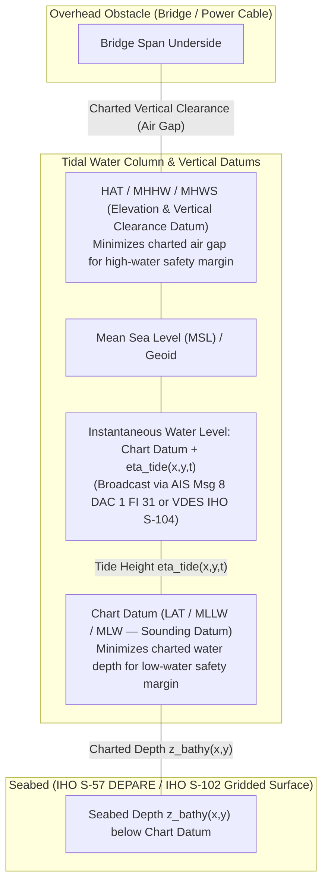
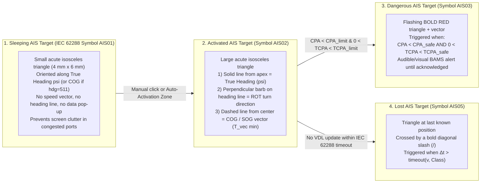
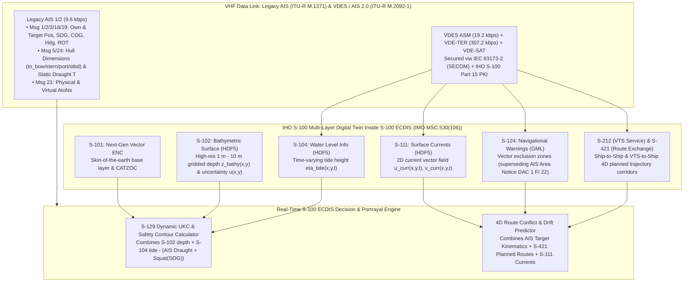

# Chapter 21: Nautical Charts, ECDIS vs. ENC, and the IHO S-100+ Ecosystem

> **Chapter Overview:** A shipborne Automatic Identification System (AIS) transceiver does not operate in a vacuum; on a modern ship's bridge or in a coastal Vessel Traffic Services (VTS) center, AIS targets are evaluated against the spatial backdrop of a nautical chart. Yet few domains in maritime engineering suffer from more persistent terminology confusion than the legal and technical distinctions between **Paper Charts**, **Raster Navigational Charts (RNCs)**, **Electronic Navigational Charts (ENCs)**, **Electronic Chart Systems (ECS)**, and **Electronic Chart Display and Information Systems (ECDIS)**. This chapter establishes the geodetic and hydrographic foundations of nautical charting (vertical chart datums, horizontal datum shifts, compilation scale, and **CATZOC** survey uncertainty), contrasts RNC, ENC, ECS, and ECDIS across SOLAS legal and technical dimensions, specifies the exact geometric symbology and portrayal rules for AIS targets under **IHO S-52** and **IEC 62288**, and provides a comprehensive engineering analysis of how AIS and **VDES (AIS 2.0)** integrate with the **IHO S-100 Universal Hydrographic Data Model** (**S-101**, **S-102**, **S-104**, **S-111**, **S-124**, **S-129**, **S-212**, **S-421**, and **IEC 63173-2 SECOM**) to compute real-time dynamic Under-Keel Clearance (UKC) and predictive route-conflict alerts.

---

## 1. Operational & Conceptual Overview: 21.1 Nautical Charts and the Legal/Technical Distinction Between Paper Charts, RNC, ENC, ECS, and ECDIS

### 21.1.1 Nautical Chart Fundamentals: Datums, Scale, and Zones of Confidence (CATZOC)

Before plotting a single AIS position report $(\phi_{\text{AIS}}, \lambda_{\text{AIS}})$ onto a digital display, both the mariner and the geospatial software engineer must account for four foundational hydrographic properties of the underlying chart:

#### 1. Vertical Datums (Sounding Datum vs. Elevation Datum)
A nautical chart employs **two distinct vertical reference surfaces** intentionally chosen to maximize safety margins under worst-case tidal extremes:



* **Chart Datum (CD) for Depths and Drying Heights:** All charted soundings, depth contours (`DEPCNT`), and depth areas (`DEPARE`) are referenced to a **low-water datum** so that the actual water depth almost always exceeds the charted depth. Depending on the Hydrographic Office (HO), Chart Datum is defined as:
  * **LAT (Lowest Astronomical Tide):** The lowest tide level that can be predicted to occur under average meteorological conditions and under any combination of astronomical conditions (adopted as the standard international Chart Datum by the International Hydrographic Organization [IHO] in Technical Resolution A2.5, used by the UK Hydrographic Office [UKHO], Australian Hydrographic Office, and most European/Commonwealth HOs).
  * **MLLW (Mean Lower Low Water):** The average height of the lower of the two daily low waters over a 19-year **National Tidal Datum Epoch (NTDE)** (used by **NOAA Office of Coast Survey** across all US coastal waters).
  * **MLW (Mean Low Water) / MLWS (Mean Low Water Springs):** Found on older charts and micro-tidal basins, whereas non-tidal inland seas (such as the Baltic Sea or North American Great Lakes) use a fixed Low Water Datum (LWD) or Baltic Sea Chart Datum 2000 (`BSCD2000`).
* **Elevation Datum for Vertical Clearances and Light Heights:** Conversely, bridge vertical clearances (air gap), overhead power cables, and lighthouse focal-plane elevations are referenced to a **high-water datum**—typically **HAT (Highest Astronomical Tide)**, **MHWS (Mean High Water Springs)**, or **MHHW (Mean Higher High Water)** in US waters—so that the actual overhead clearance is rarely less than the charted value.

#### 2. Horizontal Geodetic Datums (WGS84 vs. Legacy Local Datums)
Raw AIS position reports (Messages 1, 2, 3, 4, 9, 18, 19, 21, 27) are mandated by **ITU-R M.1371-5** and **IMO Resolution A.1106(29)** to be referenced to the **World Geodetic System 1984 (WGS84)** ellipsoid ($a = 6{,}378{,}137.0\text{ m}$, $1/f = 298.257223563$). While modern ENCs are natively compiled or transformed into WGS84 (or practically identical realizations of the International Terrestrial Reference Frame [ITRF] / NAD83 within $\sim 1\text{–}2\text{ m}$), older paper charts and scanned Raster Navigational Charts (RNCs) in remote archipelagos, Pacific atolls, and South American or Asian waters were originally surveyed on local non-geocentric astronomical datums:
* **NAD27 (North American Datum of 1927, Clarke 1866 ellipsoid):** Horizontal shifts relative to WGS84 reach $30\text{–}100\text{ m}$ along the US East/West Coasts and $>200\text{ m}$ in Alaska.
* **ED50 (European Datum 1950, International 1924 ellipsoid):** Shifts of $80\text{–}150\text{ m}$ across the North Sea and Mediterranean.
* **Tokyo Datum (Bessel 1841 ellipsoid):** Shifts of $\sim 450\text{ m}$ in latitude and $\sim 350\text{ m}$ in longitude across Japanese and Korean waters.
* **Luzon 1911 / Local Astro-Station Datums:** Uncorrected datum shifts on legacy island charts can exceed **$500\text{ m}$ to $>1{,}500\text{ m}$**. Plotting a raw WGS84 AIS or GNSS coordinate directly onto an unshifted non-WGS84 chart without applying the chart's datum-shift note ($\Delta\phi, \Delta\lambda$) places the vessel's displayed icon hundreds of meters away from actual reefs.

#### 3. Chart Scale, Compilation Scale (`CSCL`), and Display Scale (`SCAMIN`)
On a paper chart, scale is fixed at printing (e.g., $1:50{,}000$, where $1\text{ cm}$ on the chart represents $500\text{ m}$ on the Earth's surface at the chart's reference latitude). In an ENC, every vector cell has a metadata attribute called **Compilation Scale (`CSCL`)** defining the hydrographic survey density for which the dataset was compiled, organized into six standard **Navigational Purpose Usage Bands**:
1. **Band 1 — Overview** ($< 1:1{,}499{,}999$)
2. **Band 2 — General** ($1:350{,}000 \text{ to } 1:1{,}499{,}999$)
3. **Band 3 — Coastal** ($1:90{,}000 \text{ to } 1:349{,}999$)
4. **Band 4 — Approach** ($1:22{,}000 \text{ to } 1:89{,}999$)
5. **Band 5 — Harbour** ($1:4{,}000 \text{ to } 1:21{,}999$)
6. **Band 6 — Berthing** ($> 1:4{,}000$)

Individual ENC objects carry a **Scale Minimum (`SCAMIN`)** attribute (IHO S-57 Attribute Code `133`): if the watch officer zooms out to a display scale smaller than an object's `SCAMIN`, the ECDIS suppresses that object to prevent screen clutter. Conversely, if a watch officer **over-zooms** (zooming in to $1:5{,}000$ on a Band 3 $1:90{,}000$ chart), the AIS target icon looks reassuringly crisp, but the underlying bathymetry lacks the resolution to support close-quarters navigation—triggering a mandatory ECDIS **`Overscale` warning** (and vertical striped overscale pattern).

#### 4. Category of Zone of Confidence in Data (`CATZOC`)
Even on a modern WGS84 ENC, not all seabed soundings were collected by modern multibeam echosounders! In **IHO S-57** (`M_QUAL` meta-object, attribute `CATZOC`) and **IHO S-101** (`QualityOfBathymetricData`), hydrographic offices encode the horizontal position uncertainty ($U_H$, at $95\%$ confidence) and vertical depth uncertainty ($U_V = a + b\cdot d$, at $95\%$ confidence for depth $d$ in meters) of the underlying survey using six **Zones of Confidence**:

| CATZOC Category | ECDIS Symbol (Stars) | Position Accuracy $U_H$ ($95\%$ CI) | Depth Accuracy $U_V = a + b\cdot d$ ($95\%$ CI) | Typical Hydrographic Survey Method & Seafloor Coverage | Example $U_V$ at $d = 15\text{ m}$ |
|---|---|---|---|---|---|
| **ZOC A1** | `******` (6 stars) | $\pm(5\text{ m} + 5\%\,d)$ | $\pm(0.50\text{ m} + 1\%\,d)$ | Full-coverage multibeam echosounder + sidescan sonar; controlled DGPS/RTK; all significant seafloor features detected. | **$\pm 0.65\text{ m}$** |
| **ZOC A2** | `*****` (5 stars) | $\pm 20\text{ m}$ | $\pm(1.00\text{ m} + 2\%\,d)$ | Full-coverage modern sonar or mechanical sweep; controlled position. | **$\pm 1.30\text{ m}$** |
| **ZOC B** | `****` (4 stars) | $\pm 50\text{ m}$ | $\pm(1.00\text{ m} + 2\%\,d)$ | Single-beam echosounder line spacing without $100\%$ inter-line ensonification; uncharted pinnacles may exist between lines. | **$\pm 1.30\text{ m}$** |
| **ZOC C** | `***` (3 stars) | $\pm 500\text{ m}$ | $\pm(2.00\text{ m} + 5\%\,d)$ | Low-accuracy reconnaissance surveys or older lead-line / visual-sextant-fix soundings; depth anomalies expected. | **$\pm 2.75\text{ m}$** |
| **ZOC D** | `**` (2 stars) | Worse than ZOC C | Worse than ZOC C | Poor quality or unverified historical tracks; large depth and position errors likely. | **$>\pm 2.75\text{ m}$** |
| **ZOC U** | `U` (Unassessed) | Unassessed | Unassessed | Survey quality has not yet been evaluated by the issuing Hydrographic Office. | Unknown |

---

### 21.1.2 The Definitive Comparison Matrix: Paper Charts vs. RNC vs. ENC vs. ECS vs. ECDIS

In casual conversation, mariners and analysts often conflate "ENC" and "ECDIS," or refer to an iPad navigation app or recreational chartplotter as an "ECDIS." In international maritime law (**SOLAS Chapter V, Regulation 19**) and bridge systems engineering, these terms have strict, mutually exclusive definitions:

* **ENC (Electronic Navigational Chart)** is the **data** (the official vector hydrographic database issued by a national Hydrographic Office).
* **ECDIS (Electronic Chart Display and Information System)** is the **type-approved shipboard hardware and software computer system** that ingests Official ENCs alongside GNSS, gyro, speed log, radar, and AIS to legally replace paper charts on a SOLAS vessel.
* **ECS (Electronic Chart System)** is **any non-type-approved chartplotter or software** (from a recreational Garmin/Raymarine MFD or `OpenCPN` laptop to a commercial fishing plotter)—extremely valuable for situational awareness, but **not** legally sufficient to sail "paperless" under SOLAS.
* **RNC (Raster Navigational Chart)** is a **georeferenced digital bitmap scan** of a paper chart; its pixels contain color values (`RGB`/palette indices) rather than vector depth polygons, meaning an RNC **cannot** automatically trigger vector safety-contour anti-grounding alarms.

| Dimension / Attribute | Official Paper Chart | RNC (Raster Navigational Chart) | ENC (Electronic Navigational Chart) | ECS (Electronic Chart System) | ECDIS (Electronic Chart Display & Information System) |
|---|---|---|---|---|---|
| **Fundamental Nature** | Physical lithographic print on heavy water-resistant paper | **Official Raster Data:** Georeferenced digital bitmap scan of a paper chart | **Official Vector Data:** Structured spatial database of attributed points, lines, and polygons | **Non-SOLAS Hardware/Software:** Chartplotter, MFD, PC software, or tablet app | **SOLAS Type-Approved Bridge System:** Redundant marine computer + display + sensor suite |
| **Governing Standards** | IHO S-4 (*Regulations of the IHO for International [INT] Charts*) | **IHO S-61** (*Product Specification for Raster Navigational Charts*); NOAA BSB/KAP, UKHO ARCS | **IHO S-57 Ed. 3.1** (legacy ISO/IEC 8211 binary) & **IHO S-101** (S-100 GML/ISO 8211); encrypted via **IHO S-63 / S-100 Part 15** | **IEC 62376** / **RTCM 10900** (optional class standards); many recreational units are uncertified | **IMO Res. MSC.232(82)** & **MSC.530(106)/Rev.1**; **IEC 61174** (Testing); **IHO S-52** (Portrayal); **IEC 62288** |
| **Issuing / Certifying Authority** | National Hydrographic Office (NOAA, UKHO, BSH, JHA, SHOM) | National Hydrographic Office (Note: NOAA completed sunsetting all US RNCs/paper charts in 2024–2025 in favor of ENCs) | National Hydrographic Office, distributed via RENCs (**IC-ENC**, **PRIMAR**) | Commercial manufacturers (Garmin, Raymarine, Navico, Furuno, TimeZero, OpenCPN) | Notified Bodies / Classification Societies (DNV, Lloyd's Register, ABS, ClassNK, BSH) |
| **Underlying Data Geometry & Semantics** | Visual ink symbols and printed depth numerals | **Dumb Pixels:** Georeferenced raster grid; a "10 m contour" is just colored pixels with zero machine-readable depth value | **Intelligent Vector Objects:** `DEPARE`, `DEPCNT`, `WRECKS`, `OBSTRN`, `BCNLAT`, `M_QUAL` (`CATZOC`) with queryable depth attributes (`DRVAL1`, `DRVAL2`) | Displays either commercial proprietary charts (Navionics, C-Map, Garmin BlueChart) or unencrypted/S-63 ENCs | Mandatory ingestion of official up-to-date **S-57 / S-101 ENCs** (RNC RCDS mode only allowed where no ENC coverage exists) |
| **Automated Anti-Grounding & Safety Contour Alarms** | **None** (100% manual dividers and pencil plotting by OOW) | **None from chart pixels!** (In RCDS mode, OOW must manually draw vector safety corridors over the raster image) | **Provides the vector `DEPARE`/`DEPCNT` attributes** that power ECDIS look-ahead anti-grounding checks | Vendor-dependent; non-certified, no legal guarantee of IHO S-52 look-ahead alarm compliance | **Mandatory Automated Look-Ahead Watch Cone:** Continuously checks `DEPARE`, `WRECKS`, `OBSTRN`, and `CATZOC` against ship safety contour & draught |
| **AIS Integration & Symbology** | Manual plotting of VHF/radar range & bearing only | Can overlay AIS targets on the raster image if displayed in an ECDIS/ECS | Provides the vector base layer (`S-57`/`S-101`) onto which AIS targets are rendered | Renders AIS targets using vendor-custom icons or approximate S-52 triangles (often lacking ROT flags or true-scale hull outlines) | **Strict IHO S-52 / IEC 62288 Portrayal:** Sleeping, Activated, Dangerous, Lost, AtoN, SART, and True-Scale Ship Outlines with CPA/TCPA alarms |
| **Legal Status Under SOLAS Ch. V Reg. 19** | **Satisfies SOLAS** when kept fully corrected via weekly Notices to Mariners (NtM) | **Does NOT satisfy SOLAS alone:** ECDIS in RCDS mode is only permitted in areas lacking ENC coverage *and* requires a folio of paper charts | **Required Official Data Payload** that must be loaded into an ECDIS (with weekly S-63/S-100 permits & updates) | **Does NOT satisfy SOLAS chart carriage**—ships using an ECS must still carry a full, corrected portfolio of official paper charts | **Legally satisfies SOLAS Ch. V Reg. 19 ("Paperless Bridge")** when running official up-to-date ENCs + an approved independent backup arrangement (usually a 2nd ECDIS) |

> [!WARNING]
> **The "ENC on a Laptop" Legal Trap:** Loading official NOAA or S-63 ENCs into a non-type-approved program like `OpenCPN`, `QGIS`, or a commercial tablet app makes that device an **ECS**, *not* an **ECDIS*. Under **SOLAS Chapter V, Regulation 19.2.1.4**, a vessel subject to SOLAS cannot sail without paper charts unless both its hardware/software system (**ECDIS**, certified to **IEC 61174** with dedicated backup power, sensor redundancy, and IHO S-52/S-64 test-dataset verification) and its chart data (**Official ENCs**) are fully compliant.

---

## 2. Historical Context & Evolution (`schwehr/gis-history` Integration)

The convergence of hydrographic charting and real-time AIS vessel tracking represents the culmination of a five-century arc in geodesy, cartography, computer graphics, and maritime safety law documented in [`schwehr/gis-history`](https://github.com/schwehr/gis-history):

| Year / Era | Milestone (`schwehr/gis-history` & Hydrographic Lineage) | Engineering & Operational Significance |
|---|---|---|
| **1569** | **Gerardus Mercator** publishes his cylindrical conformal world map ($y = R \ln\tan(\frac{\pi}{4} + \frac{\phi}{2})$) | Transforms lines of constant compass bearing (**rhumb lines / loxodromes**) into straight lines on the chart, establishing the standard projection for coastal nautical charts and ECDIS displays. |
| **1761–1807** | **John Harrison's H4 chronometer** (1761); President Thomas Jefferson signs Act establishing the **US Survey of the Coast** (1807, precursor to NOAA) | Solves the longitude problem at sea and initiates systematic national hydrographic surveying of shoals, channels, and tidal datums. |
| **1903–1921** | **GEBCO** (General Bathymetric Chart of the Oceans) founded by Prince Albert I of Monaco (1903); ***RMS Titanic*** sinks (1912) $\rightarrow$ **SOLAS** (1914); **International Hydrographic Bureau (IHB / IHO)** founded in Monaco (1921) | Establishes international standardization of chart symbols, sounding datums, and mandatory shipboard navigation safety conventions. |
| **1927–1984** | **NAD27** (1927); **UTM** (1942); **PROJ** cartographic projection library by Gerald Evenden at USGS (1983); **WGS84** & **NMEA 0183** (1984) | Creates the computational geodesy stack (`PROJ`, `WGS84` ellipsoid, and `$GPGGA`/`!AIVDM` serial messaging) required to project satellite and AIS coordinates onto digital charts in real time. |
| **1989–1992** | ***Exxon Valdez* grounding** on Bligh Reef (March 24, 1989); **US OPA-90**; **IHO S-57** (*Transfer Standard for Digital Hydrographic Data*) adopted at XIVth International Hydrographic Conference (May 1992) | Bligh Reef becomes the catalyst for both mandatory tanker AIS/VTS tracking and automated electronic anti-grounding chart systems. |
| **1994–1996** | **Blender** initial release (1994); **OGC** & **PROJ4** (1994); **IMO Resolution A.817(19)** adopts first *Performance Standards for ECDIS* (Nov 1995); **IHO S-52** (Portrayal) & **IHO S-57 Edition 3.0** released (Nov 1996) | Freezes the S-57 Edition 3.0/3.1 ISO/IEC 8211 binary vector schema and S-52 Presentation Library so commercial ECDIS hardware manufacturers can build type-approved systems. |
| **2000–2003** | **GDAL/OGR** released by Frank Warmerdam (2000, including the open-source **OGR S-57 driver**); **IHO S-57 Ed. 3.1** frozen (Nov 2000); **SOLAS AIS mandate** effective (July 2002); **Blender** open-sourced under GPL (2002); **IHO S-63** data protection scheme (2003) | Open-source geospatial software (`GDAL/OGR`, `PostGIS`, `QGIS`) gains native read access to unencrypted S-57 ENCs (such as NOAA's free US ENC portfolio) at the exact moment AIS becomes mandatory on SOLAS ships. |
| **2006–2010** | **IMO Resolution MSC.232(82)** revises ECDIS standards (Dec 2006); **CCOM/UNH** (Kurt Schwehr et al.) pioneers 3D visualization of **`noaadata`/`libais` AIS tracks over multibeam bathymetry and S-57 charts in `Blender`**; **IMO MSC.282(86)** adopts mandatory SOLAS ECDIS carriage schedule (2009, phased in 2012–2018); **IHO S-100 Edition 1.0.0** published (Jan 2010); ***Deepwater Horizon* spill** & **NOAA ERMA** (April 2010) | Bridges 2D bridge navigation with 3D/4D scientific and emergency-response situational awareness; establishes the ISO 19100-aligned **IHO S-100** architecture to overcome the frozen limitations of 1992-era S-57. |
| **2013–2014** | ***USS Guardian* (MCM-5) grounding** on Tubbataha Reef, Philippines (Jan 2013 — caused by an $8\text{ NM}$ horizontal datum/chart compilation error in Digital Nautical Charts); ***M/V Ovit* grounding** on Varne Bank in Dover Strait (Sept 2013, MAIB report 2014 — caused by improper ECDIS safety contour configuration and muted audible alarms) | Exposes the human-machine interface (HMI) pitfalls of first-generation ECDIS and motivates the overhaul of **IHO S-52 Presentation Library Ed. 4.0** and **IEC 61174 Ed. 4.0 (2015)**. |
| **2022–2029** | **IMO Resolution MSC.530(106)** (Nov 2022) and **MSC.530(106)/Rev.1** (May 2024) adopt *Performance Standards for S-100 ECDIS*; **NOAA completes sunset of all traditional US paper and raster charts** (Jan 2025); **IHO S-100 Edition 5.2.0** operational rollout (2026–2029) | Legalizes S-100 ECDIS starting **January 1, 2026** and mandates S-100 compatibility for all new ECDIS installations on or after **January 1, 2029**, fusing live AIS/VDES streams directly with gridded S-102 bathymetry and S-104 tides. |

---

## 3. Deep Technical & Mathematical Foundations

### 21.2 Symbology and Portrayal of AIS Targets on ECDIS and Radar (IHO S-52 & IEC 62288)

To prevent confusion when a bridge watch officer moves between the X/S-band Marine Radar display and the ECDIS console—or transfers from a Furuno bridge to a Kongsberg, Wärtsilä, or JRC bridge—the International Maritime Organization (**IMO SN/Circ.243/Rev.2**), the International Electrotechnical Commission (**IEC 62288**, *Presentation of navigation-related information on shipborne navigational displays*), and the International Hydrographic Organization (**IHO S-52 Annex A**, *Presentation Library for ECDIS*) mandate a strict, uniform geometric symbology for AIS targets.

#### 21.2.1 Geometric Anatomy of Shipboard AIS Target States

Unlike tracked radar targets (ARPA), which are always depicted by **circles** (`○`), shipborne AIS vessel targets are always depicted by **acute isosceles triangles** (`△`, height $\approx 6\text{ mm}$, base $\approx 4\text{ mm}$ on standard bridge CRT/LCD viewing distances) centered on the target's reported GNSS position $(\phi_{\text{AIS}}, \lambda_{\text{AIS}})$:



Let us examine the exact rendering rules and mathematical conditions for all seven standard AIS target symbol classes:

| AIS Target Symbol State | IEC 62288 / IHO S-52 Code | Geometric Portrayal on ECDIS / Radar | Orientation & Vector Rules | Trigger Condition & Operational Semantics |
|---|---|---|---|---|
| **1. Sleeping AIS Target** | `AIS01` | Small acute isosceles triangle ($\sim 4\text{ mm}\times 6\text{ mm}$), thin green/black/white outline (palette-dependent: Day, Dusk, Night), **no vectors**. | Apex points along **True Heading** $\psi \in [0^\circ, 359^\circ]$. If True Heading is `511` (unavailable), apex points along **COG**; if COG is unavailable (`360.0°`), points toward top of display. | Default state for newly received Class A/B targets outside the automatic activation zone; prevents vector "spaghetti" when 200+ vessels are in port. |
| **2. Activated AIS Target** | `AIS02` | Larger acute isosceles triangle ($\sim 5\text{ mm}\times 7.5\text{ mm}$) with **three distinct kinematic indicators**:<br>1. **Dashed COG/SOG vector** originating at triangle centroid<br>2. **Solid True Heading line** extending from apex<br>3. **Perpendicular Rate of Turn (ROT) barb/flag** at the tip of the heading line | • **COG/SOG Vector:** Length $= v_{\text{SOG}} \cdot \Delta t_{\text{vec}}$ (adjustable $1\text{–}60\text{ min}$, with $1\text{-min}$ or $6\text{-min}$ time ticks).<br>• **ROT Barb:** Short $90^\circ$ flag pointing **Port** or **Starboard** when $\|\text{ROT}\| > 0^\circ/\text{min}$ (and `ROT != -128`).<br>• **Missing Heading (`511`):** Solid heading line is omitted; triangle aligns to COG with a short cross-bar cutting through the apex to warn the OOW that gyro heading is missing! | Activated manually by the watch officer clicking the target or automatically upon entering a user-configured **Guard Ring / Activation Zone**. |
| **3. Selected AIS Target** | `AIS02` + Selection Box | Broken/dashed **square selection box** (`[ △ ]`) drawn around a Sleeping or Activated target. | Retains underlying target orientation and vectors. | Target currently clicked by the OOW; displays full alphanumeric data card (**MMSI, IMO, Vessel Name, Call Sign, CPA, TCPA, Bearing, Range, COG, SOG, Heading, ROT, Navigational Status, Draught, Destination**). |
| **4. Dangerous AIS Target** | `AIS03` | **Bold red flashing** acute isosceles triangle (larger line weight, high-priority layer above chart features) with bold red COG/SOG vector and heading line. Stops flashing and turns solid red once acknowledged by OOW. | Full Activated vector suite rendered in **IHO S-52 Alert Red (`CHRED`)**. | Automatically triggered (even if the target was previously *Sleeping*!) whenever:<br>$\text{CPA} < \text{CPA}_{\text{limit}}$ **AND** $0 < \text{TCPA} \le \text{TCPA}_{\text{limit}}$. |
| **5. Lost AIS Target** | `AIS05` | Triangle at last reported position (or dead-reckoned position) **bisected by a bold diagonal slash (`╱`)** at $45^\circ$; flashes accompanied by a Lost Target alert if Lost Target warnings are enabled within range. | Vectors suppressed because kinematic data is stale. | Triggered when no valid position report is received within the **IEC 62288 Table 3 timeout window** (e.g., $18\text{–}30\text{ s}$ for a fast moving Class A vessel; $6\text{–}18\text{ min}$ for an anchored vessel). |
| **6. True-Scale Ship Outline** | `AIS_OUTLINE` | **Scaled 5-vertex or 6-vertex hull polygon** drawn to exact metric chart scale around the small cross/circle marking the **GNSS Antenna Reference Point (CCRP/EPFD)**, superimposed with the activated vector suite. | Oriented strictly along **True Heading $\psi$** (never drawn if `True Heading == 511` or if Message 5/24 hull dimensions are `0`). | Enabled on large display scales (typically harbor/berthing scales $> 1:10{,}000$ or when scaled ship length on screen exceeds $7.5\text{ mm}$). |
| **7. SAR Aircraft, AtoN & AIS-SART/MOB** | `AIS_SAR`, `AIS_ATON`, `AIS_SART` | • **SAR Aircraft (Msg 9):** Isosceles triangle with an **inscribed winged aircraft silhouette**.<br>• **AIS AtoN (Msg 21):** **Diamond (`◇`)** centered on `+` crosshair: **Solid diamond** = Real/Physical AtoN; **Dashed diamond (`V`)** = Virtual AtoN; **Flashing Red Diamond** = Off-Position (`Off-Position = 1`) or light failure!<br>• **AIS-SART / MOB / EPIRB-AIS (`970`/`972`/`974`):** **Bold circle with an inscribed Greek cross (`⊕`)** rendered in alert red. | • SAR Aircraft carries COG/SOG vector + altitude label.<br>• AtoN carries topmark symbol (North/South/East/West cardinal, port/starboard lateral, isolated danger) above the diamond. | Rendered immediately upon decoding Message 9, Message 21, or Message 1/14 from a `970xxyyyy` / `972xxyyyy` / `974xxyyyy` MMSI or `NavStatus = 14`. |

---

#### 21.2.2 Mathematical Derivation of CPA/TCPA Dangerous Target Triggering and True-Scale Hull Projection

##### 1. Relative Velocity CPA / TCPA Equations (Dangerous Target `AIS03`)
Let own ship at time $t_0$ occupy local East-North-Up (ENU) position $\mathbf{p}_O = (0, 0)$ with velocity vector $\mathbf{v}_O = (v_O \sin\chi_O, \, v_O \cos\chi_O)$ derived from own-ship SOG $v_O$ and COG $\chi_O$ (measured clockwise from True North). Let an AIS target report WGS84 coordinates projected into the same local tangent plane at relative offset $\mathbf{r} = \mathbf{p}_T - \mathbf{p}_O = (\Delta E, \Delta N)$ with velocity vector $\mathbf{v}_T = (v_T \sin\chi_T, \, v_T \cos\chi_T)$.

Defining the relative velocity vector of the target with respect to own ship as $\mathbf{v}_R = \mathbf{v}_T - \mathbf{v}_O = (v_{Rx}, v_{Ry})$, the future separation distance squared at time $t_0 + \tau$ (assuming constant velocity over the look-ahead horizon) is:

$$D^2(\tau) = \|\mathbf{r} + \mathbf{v}_R \tau\|^2 = \|\mathbf{r}\|^2 + 2(\mathbf{r} \cdot \mathbf{v}_R)\tau + \|\mathbf{v}_R\|^2 \tau^2$$

Differentiating with respect to $\tau$ and setting $\frac{d}{d\tau} D^2(\tau) = 0$ yields the **Time to Closest Point of Approach ($\text{TCPA}$)** and **Distance at Closest Point of Approach ($\text{CPA}$)**:

$$\text{TCPA} = -\frac{\mathbf{r} \cdot \mathbf{v}_R}{\|\mathbf{v}_R\|^2} = -\frac{\Delta E \, v_{Rx} + \Delta N \, v_{Ry}}{v_{Rx}^2 + v_{Ry}^2}, \qquad \text{CPA} = \left\| \mathbf{r} + \mathbf{v}_R \cdot \text{TCPA} \right\| = \frac{|\Delta E \, v_{Ry} - \Delta N \, v_{Rx}|}{\sqrt{v_{Rx}^2 + v_{Ry}^2}}$$

An ECDIS transitions any Sleeping (`AIS01`) or Activated (`AIS02`) target into the flashing red **Dangerous Target (`AIS03`)** state if and only if:

$$\left(\text{CPA} \le \text{CPA}_{\text{safe}}\right) \quad \land \quad \left(0 < \text{TCPA} \le \text{TCPA}_{\text{safe}}\right)$$

##### 2. True-Scale Ship Outline Projection Around the GNSS Antenna Reference Point (`AIS_OUTLINE`)
In **AIS Message 5** (bits `240–269`, 0-based) and **Message 24 Part B** (bits `132–161`), a vessel does *not* simply broadcast its overall length ($L_{\text{OA}}$) and beam ($B$). Instead, it broadcasts four unsigned integer offsets (in meters) relative to the physical location of the ship's **Electronic Position Fixing Device (EPFD / GNSS antenna)** connected to the AIS transponder:
* $d_{\text{bow}}$ (`to_bow`, 9 bits, $0\text{–}511\text{ m}$): Distance from GNSS antenna to the extreme bow.
* $d_{\text{stern}}$ (`to_stern`, 9 bits, $0\text{–}511\text{ m}$): Distance from GNSS antenna to the extreme stern ($L_{\text{OA}} = d_{\text{bow}} + d_{\text{stern}}$).
* $d_{\text{port}}$ (`to_port`, 6 bits, $0\text{–}63\text{ m}$): Distance from GNSS antenna to the port rail.
* $d_{\text{stbd}}$ (`to_starboard`, 6 bits, $0\text{–}63\text{ m}$): Distance from GNSS antenna to the starboard rail ($B = d_{\text{port}} + d_{\text{stbd}}$).

Let $(E_{\text{AIS}}, N_{\text{AIS}})$ be the reported AIS position in local tangent plane meters, and let $\psi \in [0^\circ, 359^\circ]$ be the vessel's **True Heading** from Message 1/2/3/18/19. In the ship's horizontal body frame centered at the GNSS antenna—where $+x_b$ points **Starboard** and $+y_b$ points **Forward (Bow)**—any hull vertex $(x_b, y_b)$ maps to local East-North chart coordinates $(E, N)$ via the clockwise rotation matrix $\mathbf{R}(\psi)$:

$$\begin{bmatrix} E \\ N \end{bmatrix} = \begin{bmatrix} E_{\text{AIS}} \\ N_{\text{AIS}} \end{bmatrix} + \begin{bmatrix} \cos\psi & \sin\psi \\ -\sin\psi & \cos\psi \end{bmatrix} \begin{bmatrix} x_b \\ y_b \end{bmatrix}$$

Specifically, the four primary bounding corners of the vessel's true-scale footprint on the ECDIS screen are:
1. **Port Bow:** $(x_b, y_b) = (-d_{\text{port}}, \, +d_{\text{bow}})$
2. **Starboard Bow:** $(x_b, y_b) = (+d_{\text{stbd}}, \, +d_{\text{bow}})$
3. **Starboard Stern:** $(x_b, y_b) = (+d_{\text{stbd}}, \, -d_{\text{stern}})$
4. **Port Stern:** $(x_b, y_b) = (-d_{\text{port}}, \, -d_{\text{stern}})$

(With a pointed bow apex at $\left(\frac{d_{\text{stbd}} - d_{\text{port}}}{2}, \, +d_{\text{bow}}\right)$ and shoulder vertices at $y_b = d_{\text{bow}} - 0.15 L_{\text{OA}}$ when rendered as a 5-vertex ship polygon).

> [!IMPORTANT]
> **Why True Heading $\psi$ vs. COG $\chi$ Matters on ECDIS:** Notice in the Activated AIS Target (`AIS02`) and True-Scale Ship Outline (`AIS_OUTLINE`) that the **hull triangle/polygon and solid heading line** are oriented along **True Heading $\psi$**, whereas the **dashed speed vector** points along **Course Over Ground $\chi$**. In a strong cross-current or cross-wind (such as a $400\text{ m}$ container ship crabbing through the Suez Canal or approaching a river bend at a $10^\circ$ leeway angle), the angle between the solid heading line and the dashed COG vector ($\beta = \chi - \psi$) gives the watch officer and harbor pilot an immediate visual measurement of the target vessel's **leeway / drift angle** and hydrodynamic swept path width:
> $$W_{\text{swept}} = L_{\text{OA}} |\sin(\chi - \psi)| + B \cos(\chi - \psi)$$

---

## 4. Hardware, Standards, & Software Ecosystem: 21.3 How Does AIS Work with the New IHO S-100+ Standards of Charting?

### 21.3.1 Why IHO S-57 Had to Be Replaced by the IHO S-100 Universal Hydrographic Data Model

Adopted in 1992 and frozen at **Edition 3.1 in November 2000**, **IHO S-57** served merchant shipping well for a quarter century, but suffered from five structural limitations that prevented modern digital integration with AIS and e-Navigation:
1. **Frozen Object & Attribute Catalog:** S-57's Feature Object Catalogue was permanently locked in 2000 so legacy ECDIS firmware would not crash on unknown object codes. Adding a single new maritime feature—such as an offshore wind farm turbine status, a Dynamic Management Area for North Atlantic Right Whales, or an AIS/VDES service zone—was impossible without issuing a multi-year rewrite of every ECDIS on Earth.
2. **Coarse Discrete Depth Contours Instead of Gridded Bathymetry:** S-57 encodes depth areas (`DEPARE`) separated by discrete contour steps (typically $5\text{ m}$, $10\text{ m}$, $15\text{ m}$, $20\text{ m}$, $30\text{ m}$). If a ship requires a $13.2\text{ m}$ safety contour on a chart that only contains $10\text{ m}$ and $15\text{ m}$ contours, an S-57 ECDIS is forced to jump conservatively outward to the **$15\text{ m}$ contour**, artificially closing navigable harbor channels!
3. **Static Low-Water Assumption (Zero Native Tidal/Current Integration):** An S-57 ENC is a static snapshot referenced to Chart Datum; it has no native mechanism to ingest real-time tidal water levels or surface current fields to dynamically adjust depth contours.
4. **Archaic ISO/IEC 8211 Binary Encoding:** S-57 relies on a 1980s tape-era binary directory structure (`ISO/IEC 8211`) incompatible with modern web-GIS, OGC, HDF5, and XML/GML spatial pipelines without specialized parsers like `GDAL/OGR`.
5. **Hard-Coded Portrayal Engine:** Updating symbol graphics under S-52 required costly onboard service technician visits to flash firmware across fleets.

To solve these problems permanently, the International Hydrographic Organization created **IHO S-100 (*Universal Hydrographic Data Model*, Edition 5.x)**, aligned directly with the **ISO 19100 series of geographic information standards**:
* **Dynamic Registry & Plug-and-Play Catalogs:** Instead of a frozen schema, S-100 uses an online **IHO GI Registry** (`registry.iho.int`). Each S-100 product specification ships with machine-readable XML **Feature Catalogues** and **Portrayal Catalogues** (written in **Lua** and **XSLT**). When an S-100 ECDIS receives a new feature catalogue over **VDES / IEC 63173-2 (SECOM)** or broadband satellite, it dynamically renders the new symbols without modifying the ECDIS core binary executable!
* **Multiple Modern Data Encodings:** S-100 supports **ISO/IEC 8211** (for compact vector ENCs), **OGC GML (Geography Markup Language)** (for human/machine-readable navigational warnings and routes), and **HDF5 (Hierarchical Data Format v5)** (for high-density gridded bathymetry, water levels, and surface currents).

#### The IMO S-100 ECDIS Regulatory Transition Timeline (`MSC.530(106)/Rev.1`)
Under **IMO Resolution MSC.530(106)** (adopted November 2022) and its revised schedule **MSC.530(106)/Rev.1** (adopted at MSC 108 in May 2024):
* **January 1, 2026:** S-100 ECDIS equipment becomes **legally permitted** for voluntary installation and operational use on SOLAS vessels.
* **January 1, 2026 – December 31, 2028 (Dual-Fuel Transition Window):** Hydrographic Offices and RENCs (IC-ENC, PRIMAR) operate in a "Dual-Fuel" governance regime, distributing both legacy **S-57 ENCs** and next-generation **S-100 datasets** (`S-101`, `S-102`, `S-104`, `S-111`, `S-124`, `S-129`).
* **January 1, 2029:** All new ECDIS systems installed on SOLAS vessels on or after this date **must** conform to the S-100 Performance Standards (`MSC.530(106)/Rev.1` and revised `IEC 61174`).

---

### 21.3.2 Direct Technical Interplay Between AIS / VDES (AIS 2.0) and the S-100 Product Family

In the S-100 architecture, **AIS and VDES (`ITU-R M.2092-1`) cease to be a separate "overlay" and become both a real-time kinematic state input and the primary sovereign over-the-air data-link pipe** feeding the S-100 ECDIS engine:



#### Summary of S-100 Product Specifications Interacting with AIS and VDES

| IHO S-100 Product ID | Official Specification Title | Encoding Format | Legacy AIS / Chart Equivalent Replaced or Enhanced | Technical Interaction with AIS & VDES (`ITU-R M.2092-1` / `SECOM`) |
|---|---|---|---|---|
| **IHO S-101** | *Electronic Navigational Chart (ENC)* | ISO/IEC 8211 | Legacy **IHO S-57 Ed. 3.1** ENC & **IHO S-52** Portrayal | Base vector "Skin of the Earth" layer. Renders AIS/VDES targets using Lua portrayal scripts; resolves S-52 alarm overload and links `QualityOfBathymetricData` directly to AIS true-scale ship footprints. |
| **IHO S-102** | *Bathymetric Surface* | **HDF5** (`BathymetryCoverage`) | Coarse discrete S-57 contours (`DEPCNT` at $5/10/15/20\text{ m}$) | Provides a regular grid (e.g., $1\text{ m}\times 1\text{ m}$ to $10\text{ m}\times 10\text{ m}$ in ports) with two bands per node: **`depth`** $z_{\text{bathy}}(x,y)$ and **`uncertainty`** $u_{\text{bathy}}(x,y)$. Enables continuous $0.1\text{ m}$ safety contour generation matched to own-ship and target-ship **AIS Message 5 Draught**. |
| **IHO S-104** | *Water Level Information for Surface Navigation* | **HDF5** (`WaterLevel`) | **AIS Message 8 Met/Hydro** (`DAC=1, FI=11/31`, `DAC=366` NOAA PORTS® point gauges) | Replaces single-point AIS binary tide gauges with a 2D time-varying water-level grid $\eta_{\text{tide}}(x,y,t)$ (astronomical tide + storm surge + river discharge) broadcast over **VDES (`VDE-TER` / `ASM`)** to update S-102 depths in real time. |
| **IHO S-111** | *Surface Currents* | **HDF5** (`SurfaceCurrent`) | **AIS Message 8 Current sensors** (NOAA PORTS® ADCP point broadcasts) | Delivers gridded 2D surface current speed and direction $\mathbf{v}_{\text{curr}}(x,y,t)$ over VDES. ECDIS compares $\mathbf{v}_{\text{curr}}$ against own-ship and target-ship **AIS $(\text{COG}\cdot\text{SOG} - \text{Heading}\cdot\text{STW})$** to validate hydrodynamic drift and predict crabbing sweeps in narrow channels. |
| **IHO S-124** | *Navigational Warnings* | **OGC GML** | **NAVTEX** ($518\text{ kHz}$ text) & **AIS Area Notice** (`Msg 8 DAC=1/366, FI=22`) | Next-generation vector successor to `ais-area-notice`! Broadcast over **VDES (`VDE-TER` / `VDE-SAT`)**, rendering machine-actionable polygons (military firing zones, whale slow zones, drifting hazards) that automatically trigger S-100 route-check alarms. |
| **IHO S-129** | *Under Keel Clearance Management (UKCM)* | **OGC GML** | Proprietary Portable Pilot Unit (PPU) shore UKC feeds | Encodes dynamic **"Go / No-Go" navigable area polygons** and tidal windows calculated from S-102 + S-104 + vessel AIS kinematics and draught, transmitted from shore VTS/Port Authorities to the vessel over VDES. |
| **IHO S-212** | *VTS Digital Information Service* | **OGC GML** | Voice VHF Ch 12/13/14 traffic clearances & AIS Msg 12/14 text | Developed jointly by **IALA** and **IHO**; transmits structured digital VTS traffic clearances, anchor assignments, and speed/passing instructions over VDES directly onto the ship's ECDIS. |
| **IHO S-421** (`IEC 63173-1`) | *Route Plan Based on S-100* | **OGC GML** | Legacy **IEC 61174 `.rtz`** & AIS Msg 8 `DAC=1, FI=27/28` Route Broadcast | Allows ships and VTS centers to exchange authenticated 4D planned waypoint trajectories (`S-421`, including XTD cross-track corridors and planned wheel-over arcs) over VDES alongside real-time kinematic AIS reports. |
| **IHO S-411 / S-412** | *Ice Information (WMO) & Weather Overlay* | **GML / HDF5** | AIS ice-area binary messages & HF radio facsimile | Delivers vector ice edges, iceberg tracks, and severe weather cells over VDE-SAT to polar and trans-oceanic vessels. |

---

### 21.3.3 Mathematical Formulation of Real-Time Dynamic Under-Keel Clearance (UKC) Using S-102, S-104, and AIS Kinematics

The single greatest operational leap of combining **AIS** with **IHO S-100** is the transition from **Static Charted Safety Contours** to **4D Dynamic Under-Keel Clearance (UKC) and Dynamic Safety Contours**.

Let a vessel (either own ship or a monitored VTS/pilotage target) broadcast its static hull geometry via **AIS Message 5** ($d_{\text{bow}}, d_{\text{stern}}, d_{\text{port}}, d_{\text{stbd}}$, and maximum present static draught $T_{\text{AIS}}$ in meters at $0.1\text{ m}$ resolution) and its real-time kinematic state via **AIS Message 1/2/3** (position $\mathbf{p}_{\text{AIS}}(t) = (E_{\text{AIS}}, N_{\text{AIS}})$, Speed Over Ground $v_{\text{kts}}$ in knots, Course Over Ground $\chi$, and True Heading $\psi$).

#### Step 1: Hull-Footprint Minimum Bathymetric Sampling on the S-102 Grid
Let $\mathcal{H}(\mathbf{p}_{\text{AIS}}, \psi) \subset \mathbb{R}^2$ denote the 2D horizontal polygon of the vessel's true-scale hull footprint rotated by True Heading $\psi$ around the GNSS antenna reference point $\mathbf{p}_{\text{AIS}}$ (derived in Section 21.2.2). Rather than evaluating chart depth solely at the single point $\mathbf{p}_{\text{AIS}}$ beneath the bridge GNSS antenna, an S-100 ECDIS queries all grid nodes $(x_i, y_j)$ of the **IHO S-102 HDF5 `BathymetryCoverage`** intersecting the hull footprint $\mathcal{H}(\mathbf{p}_{\text{AIS}}, \psi)$:

$$z_{\text{min}}(\mathbf{p}_{\text{AIS}}, \psi) = \min_{(x, y) \in \mathcal{H}(\mathbf{p}_{\text{AIS}}, \psi)} \left[ z_{\text{S-102}}(x, y) - u_{\text{S-102}}(x, y) \right]$$

where $z_{\text{S-102}}(x, y)$ is the charted S-102 depth below Chart Datum and $u_{\text{S-102}}(x, y)$ is the co-located S-102 vertical uncertainty (at $95\%$ confidence).

#### Step 2: Adding Real-Time S-104 Tidal Elevation ($\eta_{\text{tide}}$)
From the **IHO S-104 HDF5 `WaterLevel`** surface (delivered over VDES or coastal AIS ASM), the ECDIS interpolates the instantaneous water level height $\eta_{\text{S-104}}(x, y, t)$ above Chart Datum to obtain the **Guaranteed Dynamic Water Depth**:

$$D_{\text{dyn}}(x, y, t) = z_{\text{min}}(\mathbf{p}_{\text{AIS}}, \psi) + \eta_{\text{S-104}}(x, y, t)$$

#### Step 3: Hydrodynamic Squat $S_{\max}(v)$ from AIS/Water Speed
As a hull with block coefficient $C_b = \frac{\nabla}{L_{\text{PP}} \cdot B \cdot T}$ (ranging from $C_b \approx 0.60\text{–}0.68$ for fast container ships to $C_b \approx 0.80\text{–}0.85$ for bulk carriers and VLCC tankers) moves through shallow water, Bernoulli acceleration of the return flow beneath and alongside the hull creates a localized pressure drop that pulls the vessel bodily downward and trims it by the bow or stern (**hydrodynamic squat**). Using the industry-standard **Barrass Squat Formula** (Barrass, 2004/2009), maximum squat $S_{\max}$ (in meters) scales with the **square of vessel speed $v_{\text{kts}}$** (in knots):

$$S_{\max}(v_{\text{kts}}) = \begin{cases} \dfrac{C_b \, v_{\text{kts}}^2}{100}\text{ meters} & \text{in open / unconfined shallow water } \left(1.1 \le \dfrac{D}{T} \le 1.4\right) \\[10pt] \dfrac{C_b \, v_{\text{kts}}^2}{50}\text{ meters} & \text{in confined channels } \left(\text{blockage factor } S_b = \dfrac{A_{\text{ship}}}{A_{\text{channel}}} \ge 0.10\right) \end{cases}$$

*(Where **IHO S-111** surface current vectors $\mathbf{v}_{\text{curr}}(x,y,t)$ are available on the S-100 ECDIS, the kinematic **Speed Through Water** $v_{\text{STW}} = \|\mathbf{v}_{\text{AIS,SOG}} - \mathbf{v}_{\text{curr}}\|$ is substituted for $v_{\text{kts}}$, ensuring accurate squat prediction even when stemming a $3\text{ kt}$ ebb tide!)*

#### Step 4: Dynamic Under-Keel Clearance ($\text{UKC}_{\text{dyn}}$) and Dynamic S-100 Safety Contour ($z_{\text{safety}}$)
Subtracting the vessel's static draught $T_{\text{AIS}}$, hydrodynamic squat $S_{\max}(v)$, and wave/roll heave allowance $Z_{\text{wave}}$ from the dynamic water depth yields the real-time **Net Dynamic Under-Keel Clearance**:

$$\text{UKC}_{\text{dyn}}(\mathbf{p}_{\text{AIS}}, \psi, t, v) = \underbrace{z_{\text{S-102}}(x, y) - u_{\text{S-102}}(x, y) + \eta_{\text{S-104}}(x, y, t)}_{\text{Guaranteed Dynamic Water Depth } D_{\text{dyn}}} - \underbrace{\left( T_{\text{AIS}} + S_{\max}(v) + Z_{\text{wave}} \right)}_{\text{Dynamic Vessel Draught } T_{\text{dyn}}(v)}$$

Given a mandatory company or port-authority minimum net UKC policy $\text{UKC}_{\min}$ (e.g., $1.0\text{ m}$ or $10\%$ of static draught), the S-100 ECDIS continuously solves for the **Dynamic Charted Safety Contour** $z_{\text{safety}}(t, v)$ on the S-102 bathymetric grid:

$$z_{\text{safety}}(t, v) = T_{\text{AIS}} + S_{\max}(v) + Z_{\text{wave}} + u_{\text{S-102}} + \text{UKC}_{\min} - \eta_{\text{S-104}}(x, y, t)$$

Every S-102 grid cell where $z_{\text{S-102}}(x,y) < z_{\text{safety}}(t, v)$ is dynamically shaded as **No-Go (Unsafe Water)** in the **IHO S-129 UKCM** portrayal layer. As the tide rises ($\eta_{\text{S-104}} \uparrow$) or the ship slows down ($S_{\max}(v) \propto v^2 \downarrow$), the navigable "Go" corridor visibly widens on the ECDIS screen in real time!

---

### 21.3.4 Predictive Route De-Confliction via S-421 (`IEC 63173-1`) and S-212 Over VDES

A classic limitation of legacy AIS on S-57 ECDIS is that the **COG/SOG vector (`AIS02`) is strictly a linear extrapolation of instantaneous velocity**. If two vessels are approaching a $90^\circ$ river bend in the Western Scheldt or Houston Ship Channel from opposite directions, their straight-line AIS COG vectors point onto dry land rather than along the curved channel, giving zero warning of where the two hulls will actually meet 15 minutes later—or conversely triggering false CPA/TCPA alarms just before a planned waypoint turn.

**IHO S-421 (*Route Plan Based on S-100*, standardized as IEC 63173-1)** and **IHO S-212 (*VTS Digital Information Service*)** solve this by coupling real-time AIS position reports with 4D planned trajectories exchanged over **VDES (`ITU-R M.2092-1`)** via **IEC 63173-2 (SECOM)**:
1. Each vessel's S-100 ECDIS broadcasts a compact, digitally signed **S-421 route segment** comprising its upcoming $N$ waypoints $\{(\phi_k, \lambda_k)\}_{k=1}^N$, planned turn radii $R_k$, cross-track safety corridor widths ($\text{XTD}_{\text{port}}, \text{XTD}_{\text{stbd}}$), and planned speed profile $v_k(t)$.
2. Shore VTS consoles (**S-212**) and neighboring vessels ingest both the target's live **AIS Message 1/2/3 state** (providing exact current position along the route and real-time speed/ROT deviations) and its **S-421 planned trajectory**.
3. Instead of computing linear CPA/TCPA along a tangent ray, the S-100 ECDIS integrates the spatiotemporal intersection of the two vessels' curved **S-421 swept-hull envelopes** 15 to 45 minutes ahead of time, highlighting any bend where two deep-draught vessels would simultaneously occupy a narrow S-102/S-129 tidal corridor long before a rudder order is given.

---

### 21.3.5 IEC 63173-2 (SECOM), Data Protection (`S-63` vs. `S-100 Part 15`), and the Software Ecosystem

#### 1. Secure Communication Between Ship and Shore (`IEC 63173-2 SECOM` & `IHO S-100 Part 15`)
How do S-100 datasets (`S-102`, `S-104`, `S-111`, `S-124`, `S-212`, `S-421`) actually travel across **VDES (`ITU-R M.2092-1`)** or hybrid satellite/cellular links into the ship's ECDIS? The standardized transport and security layer is **IEC 63173-2 (*Secure Communication Between Ship and Shore — SECOM*)**:
* **Service Discovery & Mutual Authentication:** SECOM uses the **Maritime Connectivity Platform (MCP)** Identity Registry (`MIR`) and Service Registry (`MSR`). Every shore VTS station, Hydrographic Office, and shipborne S-100 ECDIS/VDES gateway possesses a unique **Maritime Resource Name (`urn:mrn:...`)** bound to an X.509v3 certificate using **ECDSA (Elliptic Curve Digital Signature Algorithm, `secp256r1` / `secp384r1`)**.
* **Evolution from Legacy `IHO S-63` to `IHO S-100 Part 15`:**
  * Under legacy **IHO S-63**, each S-57 ENC cell is encrypted with **56-bit Blowfish** (`BF-ECB`) and signed with **DSA/SHA-1**, unlocked on the ECDIS using a 64-hex-character **Cell Permit** derived from the ECDIS unit's 5-byte manufacturer ID (`M_ID`) and hardware key (`HW_ID`).
  * Under **IHO S-100 Part 15**, encryption upgrades to **AES-128 / AES-256 (CBC/GCM)** and digital signatures upgrade to **ECDSA P-256/P-384 with SHA-256/SHA-384**, supporting both subscription-locked datasets (`S-101`, `S-102`) and broadcast-signed, unencrypted safety payloads (`S-104`, `S-124`, `S-421`) delivered over VDES so any vessel within VTS range can verify the authenticity of a tidal or warning broadcast without pre-purchasing a cell permit.

#### 2. Open-Source and Commercial Charting / ECDIS Software Ecosystem
* **Open-Source Geospatial & ECS Stack:**
  * **`GDAL / OGR` (`libgdal`):** Provides the canonical open-source **`S57` vector driver** (parsing ISO/IEC 8211 `.000` base cells and `.001`–`.999` incremental update files into `DEPARE`, `DEPCNT`, `WRECKS`, `LIGHTS`, and `M_QUAL` layers) alongside newer **`S100` / `S102` / `S104` / `S111` HDF5 raster/multidimensional drivers** (`gdalinfo S102_...h5`).
  * **`OpenCPN` (`opencpn.org`):** Cross-platform C++/wxWidgets open-source **ECS** supporting unencrypted S-57 ENCs, S-63 encrypted ENCs (via the official `s63_pi` plugin), BSB/KAP RNCs, and full IHO S-52 AIS target portrayal (`AIS01`–`AIS05`, true-scale hull outlines, CPA/TCPA alarms, and AIS Area Notice polygons).
  * **`QGIS` & Python (`h5py`, `xarray`, `geopandas`):** Used by hydrographers and maritime data scientists to overlay millions of archived AIS trajectories directly onto `S-57` vector polygons and `S-102`/`S-104` HDF5 bathy-tidal grids.
* **Commercial Type-Approved ECDIS, VTS, and Portable Pilot Unit (PPU) Suites:**
  * **SOLAS ECDIS Bridge Systems:** **Furuno** (`FMD-3200/3300`), **Kongsberg Maritime** (`K-Bridge ECDIS`), **Wärtsilä Voyage / Transas** (`Navi-Sailor 4000`), **JRC (Japan Radio Co.)** (`JAN-9201/7201`), **Raytheon Anschütz** (`Synapsis ECDIS NX`), and **Danelec Marine** (`DM800 ECDIS G2`).
  * **Hydrographic SDKs & Portable Pilot Units (PPUs):** **SevenCs / ChartWorld** (`Nautilus` S-57/S-100 kernel), **QPS (`Qastor` PPU & `Qimera`)**, **SEAiq Pilot**, and **Navicom Dynamics (`HarbourPilot`)**—which harbor pilots connect directly to the ship's bridge **AIS Pilot Plug** (or Wi-Fi interface) to fuse centimeter-level RTK-GNSS and AIS target streams with 1-meter port authority S-102 bathymetry during high-precision docking.

---

## 5. Security, Adversarial Abuse, & Failure Modes

Integrating AIS with electronic charting introduces critical operational failure modes and cybersecurity attack surfaces that have directly contributed to major vessel groundings and near-misses:

### 5.1 ECDIS-Assisted Groundings and Human-Machine Interface (HMI) Failures
Just as the introduction of marine radar in the 1950s spawned "radar-assisted collisions" (*Andrea Doria* / *Stockholm*, 1956), the transition to ECDIS produced a well-documented class of **"ECDIS-assisted groundings"** investigated by the UK Marine Accident Investigation Branch (MAIB), the US National Transportation Safety Board (NTSB), and the Dutch Safety Board:
* ***M/V Ovit* Grounding on Varne Bank, Dover Strait (September 18, 2013; MAIB Report 24/2014):** While transiting the Dover Strait, the chemical tanker *Ovit* ran directly aground on the Varne Bank. The MAIB investigation revealed that the route had been planned across the shoal by an inexperienced junior officer on an ECDIS whose **safety contour was improperly configured**, the ECDIS **audible anti-grounding alarm was disabled/inoperative**, and the watch officers failed to recognize the `CATZOC` and contour shading on the display.
* ***CMA CGM Vasco de Gama* Grounding, Thorn Channel, Southampton (August 22, 2016; MAIB Report 23/2017) & *M/V Muros* Grounding, Haisborough Sand (December 3, 2016; MAIB Report 22/2017):** Demonstrated how watchstanders and pilots can become fixated on high-precision AIS/GNSS ship outlines on ECDIS or Portable Pilot Units (PPUs) while losing situational awareness of hydrodynamic bank interaction, turn rates, or disabled look-ahead safety cones.
* **The S-57 Discrete Contour Jump Trap:** As proven mathematically in Section 4, if an S-57 ENC only provides $10\text{ m}$ and $20\text{ m}$ contours in a harbor approach where a ship draws $11.5\text{ m}$, the ECDIS automatically defaults the displayed safety contour outward to **$20\text{ m}$**. Faced with an entire harbor approach shaded as "unsafe dark blue" inside the $20\text{ m}$ contour, watch officers routinely commit the fatal error of manually overriding their ECDIS safety contour down to $10\text{ m}$—leaving the $11.5\text{ m}$ hull with **zero automated alarm protection** against $10.5\text{ m}$ and $11.0\text{ m}$ shoals inside the $10\text{ m}\text{–}20\text{ m}$ depth area! (**IHO S-102** gridded bathymetry eliminates this failure mode by providing continuous $0.1\text{ m}$ contours).

### 5.2 Horizontal Datum Mismatches and the *USS Guardian* Grounding
On January 17, 2013, the US Navy Avenger-class mine countermeasures ship ***USS Guardian* (MCM-5)** ran hard aground on the South Atoll of **Tubbataha Reef** in the Sulu Sea, Philippines, resulting in the total loss and in-situ dismantling of the warship. The US Pacific Fleet investigation determined that the bridge watch team relied exclusively on a Coastal scale **Digital Nautical Chart (DNC)** produced by the National Geospatial-Intelligence Agency (NGA) in which the charted position of Tubbataha Reef was **misplaced by approximately $8\text{ nautical miles}$ ($14.8\text{ km}$)** due to legacy source compilation/datum errors, while failing to cross-check visual/radar cues or larger-scale charts. Whenever AIS or GNSS tracks are overlaid on legacy paper charts, RNCs, or poorly georeferenced coastal cells (`CATZOC C/D/U`), an uncompensated horizontal datum offset ($\Delta\phi, \Delta\lambda$) makes both own-ship and AIS target icons appear in deep water while the physical hulls are steaming onto a reef.

### 5.3 Misconfigured AIS Message 5 Antenna Offsets & Spoofed S-100/AIS Payloads
1. **Bow/Stern Sweep Errors from Misconfigured AIS Dimensions (`to_bow`, `to_stern`, `to_port`, `to_starboard`):**
   On a $400\text{ m}$ Ultra Large Container Vessel (ULCV) with an aft wheelhouse ($d_{\text{bow}} = 320\text{ m}, d_{\text{stern}} = 80\text{ m}$) or a forward wheelhouse ($d_{\text{bow}} = 60\text{ m}, d_{\text{stern}} = 340\text{ m}$), if the installation technician enters swapped or zeroed dimensions into the Class A AIS transponder, a neighboring vessel's ECDIS rendering the **True-Scale Ship Outline (`AIS_OUTLINE`)** at $1:5{,}000$ harbor scale will draw the target ship's bow and stern displaced by up to **$260\text{ meters}$** from reality! During a tight passing maneuver or turn, a $15^\circ$ heading change sweeps a $320\text{ m}$ bow laterally by $320 \sin(15^\circ) \approx 82.8\text{ m}$.
2. **Unauthenticated AIS Binary Messages vs. Cryptographically Signed S-100 (`S-63` & `S-100 Part 15` / `SECOM`):**
   As detailed in Chapters 16, 20, and 27, legacy **AIS Message 8** (including `DAC=1, FI=31` Met/Hydro tide broadcasts and `DAC=1, FI=22` Area Notices) has **zero cryptographic authentication**. An adversary with a Software-Defined Radio (SDR) could broadcast a forged Message 8 claiming a $+3.5\text{ m}$ storm surge tide ($\eta_{\text{tide}}$) or a false Area Notice closure. For this exact reason, **IMO MSC.530(106)** and **IEC 63173-2 (SECOM)** prohibit an S-100 ECDIS from altering its automated safety contour based on unauthenticated broadcasts: all official **S-101, S-102, S-104, S-111, S-124, and S-129** datasets delivered over VDES or satellite must be digitally signed using **IHO S-100 Part 15 (ECDSA P-256/P-384 X.509 certificates)** rooted in the IHO Data Protection Scheme and the **Maritime Connectivity Platform (MCP) Identity Registry**.

---

## 6. Practical Engineering / Code Walkthrough: Dynamic S-100 Under-Keel Clearance (UKC) & True-Scale AIS Hull Footprint Engine

The following complete, self-contained Python 3 engineering script demonstrates how an **S-100 ECDIS** or **VTS / Portable Pilot Unit (PPU)** software engine fuses:
1. **AIS Message 5** static hull dimensions (`to_bow`, `to_stern`, `to_port`, `to_starboard`) and static draught $T_{\text{AIS}}$,
2. **AIS Message 1** real-time position $(E_{\text{AIS}}, N_{\text{AIS}})$, Speed Over Ground ($v_{\text{kts}}$), Course Over Ground ($\chi$), and True Heading ($\psi$),
3. **True-Scale Ship Outline (`AIS_OUTLINE`)** 2D polygon projection in local East-North-Up (ENU) coordinates around the GNSS antenna reference point, sampling the minimum depth across the entire hull footprint rather than just beneath the GNSS antenna,
4. **IHO S-102** gridded bathymetry $z_{\text{S-102}}(x,y)$ and vertical uncertainty $u_{\text{S-102}}(x,y)$,
5. **IHO S-104** time-varying tidal elevation $\eta_{\text{S-104}}(x,y,t)$ delivered over VDES / AIS ASM, and
6. **Barrass Hydrodynamic Squat** $S_{\max}(v_{\text{kts}}) = \frac{C_b \, v_{\text{kts}}^2}{100}\text{ m}$ to compute real-time **Dynamic Under-Keel Clearance (UKC)**, the **Dynamic S-100 Safety Contour**, and **IHO S-129 Go / No-Go status**.

```python
#!/usr/bin/env python3
"""
Chapter 21 Engineering Walkthrough:
Dynamic IHO S-100 Under-Keel Clearance (UKC), Safety Contour, and True-Scale AIS
Hull Footprint Evaluator combining AIS Msg 1/5, S-102 Bathymetry, S-104 Tides,
and Barrass Shallow-Water Hydrodynamic Squat.
"""

import math
from dataclasses import dataclass
from typing import List, Tuple


@dataclass
class AISStaticMsg5:
    """Decoded ITU-R M.1371 Message 5 static and voyage data."""
    mmsi: int
    name: str
    to_bow_m: float         # Distance from GNSS antenna to bow (m)
    to_stern_m: float       # Distance from GNSS antenna to stern (m)
    to_port_m: float        # Distance from GNSS antenna to port beam (m)
    to_starboard_m: float   # Distance from GNSS antenna to starboard beam (m)
    draught_m: float        # Maximum present static draught (0.1 m resolution)
    block_coeff_cb: float   # Hull block coefficient C_b (dimensionless)


@dataclass
class AISPositionMsg1:
    """Decoded ITU-R M.1371 Message 1 dynamic position report in local ENU meters."""
    time_min: float         # Elapsed voyage time (minutes)
    x_enu_m: float          # Easting relative to channel origin (m)
    y_enu_m: float          # Northing along channel axis (m)
    sog_kts: float          # Speed Over Ground (knots)
    cog_deg: float          # Course Over Ground (degrees True)
    heading_deg: float      # True Heading from gyrocompass (degrees True)


def barrass_squat_m(cb: float, sog_kts: float, confined_channel: bool = False) -> float:
    """
    Computes maximum shallow-water hydrodynamic squat (in meters) using the
    Barrass formula:
      - Open / unconfined shallow water: S_max = (C_b * v_kts^2) / 100
      - Confined channel (blockage):     S_max = (C_b * v_kts^2) / 50
    """
    divisor = 50.0 if confined_channel else 100.0
    return (cb * (sog_kts ** 2)) / divisor


def hull_vertices_enu(
    pos: AISPositionMsg1, static: AISStaticMsg5
) -> List[Tuple[float, float]]:
    """
    Projects the 4 corners of the True-Scale Ship Outline (IHO S-52 / IEC 62288)
    into local East-North-Up (ENU) meters around the GNSS antenna reference point.
    Body frame: +X_b = Starboard, +Y_b = Bow.
    True heading psi is measured clockwise from True North (+Y_enu) toward East (+X_enu).
    """
    psi_rad = math.radians(pos.heading_deg)
    sin_p = math.sin(psi_rad)
    cos_p = math.cos(psi_rad)

    corners_body = [
        (-static.to_port_m, static.to_bow_m),        # Port Bow
        (static.to_starboard_m, static.to_bow_m),    # Starboard Bow
        (static.to_starboard_m, -static.to_stern_m), # Starboard Stern
        (-static.to_port_m, -static.to_stern_m),     # Port Stern
    ]
    corners_enu = []
    for xb, yb in corners_body:
        e_offset = xb * cos_p + yb * sin_p
        n_offset = -xb * sin_p + yb * cos_p
        corners_enu.append((pos.x_enu_m + e_offset, pos.y_enu_m + n_offset))
    return corners_enu


def s102_charted_depth_m(x_enu_m: float, y_enu_m: float) -> Tuple[float, float]:
    """
    Synthetic IHO S-102 gridded bathymetric surface (depth below Chart Datum MLLW,
    positive downward) and 95% vertical uncertainty u_bathy along a harbor approach
    channel (y from 0 to 3000 m) with a shoal sill centered at y = 1500 m and bank
    shoaling away from the centerline (x != 0).
    """
    gaussian_bar = 2.8 * math.exp(-((y_enu_m - 1500.0) / 450.0) ** 2)
    bank_shoaling = 0.00018 * (x_enu_m ** 2)
    z_bathy = 16.5 - gaussian_bar - bank_shoaling
    u_bathy = 0.25  # S-102 gridded vertical uncertainty (meters, 95% CI)
    return z_bathy, u_bathy


def s104_water_level_m(y_enu_m: float, time_min: float) -> float:
    """
    IHO S-104 dynamic tidal height above Chart Datum (meters), delivered over VDES.
    Models a rising semi-diurnal M2 flood tide with spatial phase lag up-estuary.
    """
    omega = (2.0 * math.pi) / 745.2  # M2 tidal period = 12.42 hours (745.2 min)
    phase_rad = math.radians(35.0) + omega * time_min - 0.00004 * y_enu_m
    return 1.20 + 1.15 * math.sin(phase_rad)


def main() -> None:
    vessel = AISStaticMsg5(
        mmsi=366998877,
        name="MV PACIFIC HORIZON",
        to_bow_m=265.0,
        to_stern_m=75.0,
        to_port_m=24.0,
        to_starboard_m=24.0,
        draught_m=13.8,
        block_coeff_cb=0.81,
    )

    # Sequence of AIS fixes (rows 3, 4, 5 compare crossing the y=1500 m sill at:
    #   - T=6.0 min at 14.0 kts [grounding breach due to 1.59 m squat],
    #   - T=6.0 min slowed to 8.0 kts [marginal UKC], and
    #   - T=96.0 min at 8.0 kts on the rising S-104 flood tide [safe GO passage])
    track = [
        AISPositionMsg1(time_min=0.0,   x_enu_m=0.0,  y_enu_m=300.0,  sog_kts=14.5, cog_deg=0.0,   heading_deg=0.0),
        AISPositionMsg1(time_min=3.0,   x_enu_m=15.0, y_enu_m=900.0,  sog_kts=14.2, cog_deg=2.0,   heading_deg=4.0),
        AISPositionMsg1(time_min=6.0,   x_enu_m=25.0, y_enu_m=1500.0, sog_kts=14.0, cog_deg=0.0,   heading_deg=3.0),
        AISPositionMsg1(time_min=6.0,   x_enu_m=25.0, y_enu_m=1500.0, sog_kts=8.0,  cog_deg=0.0,   heading_deg=3.0),
        AISPositionMsg1(time_min=96.0,  x_enu_m=25.0, y_enu_m=1500.0, sog_kts=8.0,  cog_deg=0.0,   heading_deg=3.0),
        AISPositionMsg1(time_min=102.0, x_enu_m=10.0, y_enu_m=2400.0, sog_kts=10.5, cog_deg=358.0, heading_deg=358.0),
    ]

    min_safe_ukc_m = 1.00  # Port / Company minimum required Net UKC (m)

    print(
        f"Vessel: {vessel.name} (MMSI {vessel.mmsi}) | "
        f"LOA: {vessel.to_bow_m + vessel.to_stern_m:.0f} m | "
        f"Beam: {vessel.to_port_m + vessel.to_starboard_m:.0f} m | "
        f"AIS Draught: {vessel.draught_m:.2f} m | Cb: {vessel.block_coeff_cb:.2f}"
    )
    print("-" * 118)
    print(
        f"{'T(min)' :>6} | {'Y (m)' :>5} | {'SOG' :>6} | {'Z_ant' :>6} | "
        f"{'Z_hull_min' :>10} | {'S-104 Tide' :>10} | {'Squat (O)' :>9} | "
        f"{'Dyn Depth' :>9} | {'Net UKC' :>8} | {'S-100 Safety Contour' :>20} | {'S-129 Status'}"
    )
    print("-" * 118)

    for pt in track:
        z_ant, u_bathy = s102_charted_depth_m(pt.x_enu_m, pt.y_enu_m)
        hull_pts = hull_vertices_enu(pt, vessel) + [(pt.x_enu_m, pt.y_enu_m)]
        z_hull_min = min(s102_charted_depth_m(px, py)[0] for px, py in hull_pts)
        tide_m = s104_water_level_m(pt.y_enu_m, pt.time_min)
        squat_m = barrass_squat_m(vessel.block_coeff_cb, pt.sog_kts, confined_channel=False)
        dyn_depth_m = z_hull_min + tide_m
        net_ukc_m = dyn_depth_m - (vessel.draught_m + squat_m + u_bathy)
        req_chart_contour_m = vessel.draught_m + squat_m + u_bathy + min_safe_ukc_m - tide_m

        if net_ukc_m < 0.0:
            status = "BREACH (GROUNDING!)"
        elif net_ukc_m < min_safe_ukc_m:
            status = "NO-GO (MARGINAL)"
        else:
            status = "GO (SAFE CORRIDOR)"

        print(
            f"{pt.time_min:6.1f} | {pt.y_enu_m:5.0f} | {pt.sog_kts:4.1f}kt | "
            f"{z_ant:5.2f}m | {z_hull_min:9.2f}m | {tide_m:+9.2f}m | "
            f"{squat_m:8.2f}m | {dyn_depth_m:8.2f}m | {net_ukc_m:+7.2f}m | "
            f"{req_chart_contour_m:19.2f}m | {status}"
        )


if __name__ == "__main__":
    main()
```

### Verified Execution Output

```text
Vessel: MV PACIFIC HORIZON (MMSI 366998877) | LOA: 340 m | Beam: 48 m | AIS Draught: 13.80 m | Cb: 0.81
----------------------------------------------------------------------------------------------------------------------
T(min) | Y (m) |    SOG |  Z_ant | Z_hull_min | S-104 Tide | Squat (O) | Dyn Depth |  Net UKC | S-100 Safety Contour | S-129 Status
----------------------------------------------------------------------------------------------------------------------
   0.0 |   300 | 14.5kt | 16.50m |     16.36m |     +1.85m |     1.70m |    18.21m |   +2.45m |               14.90m | GO (SAFE CORRIDOR)
   3.0 |   900 | 14.2kt | 15.99m |     14.31m |     +1.85m |     1.63m |    16.16m |   +0.48m |               14.83m | NO-GO (MARGINAL)
   6.0 |  1500 | 14.0kt | 13.59m |     13.41m |     +1.85m |     1.59m |    15.26m |   -0.37m |               14.79m | BREACH (GROUNDING!)
   6.0 |  1500 |  8.0kt | 13.59m |     13.41m |     +1.85m |     0.52m |    15.26m |   +0.70m |               13.72m | NO-GO (MARGINAL)
  96.0 |  1500 |  8.0kt | 13.59m |     13.41m |     +2.32m |     0.52m |    15.74m |   +1.17m |               13.24m | GO (SAFE CORRIDOR)
 102.0 |  2400 | 10.5kt | 16.43m |     16.16m |     +2.33m |     0.89m |    18.49m |   +3.55m |               13.62m | GO (SAFE CORRIDOR)
```

Three critical operational insights emerge immediately from the numerical output:
1. **Why Point-Sampling at the AIS Antenna Fails (`Z_ant` vs. `Z_hull_min`):** At $T = 3.0\text{ min}$ ($Y = 900\text{ m}$), the S-102 depth directly beneath the ship's aft GNSS antenna is a comfortable **$15.99\text{ m}$**. However, because the $340\text{ m}\times 48\text{ m}$ vessel has its GNSS antenna mounted aft ($d_{\text{bow}} = 265\text{ m}$) with a $4^\circ$ heading angle approaching the shoal bar, its forward starboard bow corner already overhangs the $14.31\text{ m}$ shoal slope (`Z_hull_min = 14.31 m`—a **$1.68\text{ m}$ shallower depth** than at the antenna!).
2. **Quadratic Speed Sensitivity of Hydrodynamic Squat:** Over the channel bar at $Y = 1500\text{ m}$ ($T = 6.0\text{ min}$), steaming at $14.0\text{ kts}$ induces **$1.59\text{ m}$ of Barrass squat**, driving Net UKC to **$-0.37\text{ m}$ (`BREACH (GROUNDING!)`)**. Simply reducing speed from $14.0\text{ kts}$ to $8.0\text{ kts}$ slashes squat by $67\%$ (to **$0.52\text{ m}$**), preventing hull contact (`+0.70 m`).
3. **S-104 Dynamic Tide + Speed Optimization (`S-129 GO`):** Combining the $8.0\text{ kt}$ speed reduction with a 90-minute tidal window wait ($T = 96.0\text{ min}$, where the **IHO S-104** tide broadcast rises from $+1.85\text{ m}$ to $+2.32\text{ m}$) lowers the required S-100 chart safety contour from **$14.79\text{ m}$ down to $13.24\text{ m}$**, achieving a compliant **$+1.17\text{ m}$ Net UKC (`GO (SAFE CORRIDOR)`)**.

---

## 7. Key Takeaways & Operational Checklist

* **ENC Is Data; ECDIS Is the Certified Bridge System:** An **ENC** (`IHO S-57` or `IHO S-101`) is the official vector hydrographic database issued by a national Hydrographic Office. An **ECDIS** (`IMO MSC.232(82) / MSC.530(106)` & `IEC 61174`) is the type-approved shipboard hardware/software computer that legally satisfies SOLAS Chapter V Regulation 19 paperless navigation when loaded with up-to-date official ENCs and backed by an approved secondary arrangement. An **ECS** is any non-SOLAS chartplotter or app, and an **RNC** is a scanned bitmap whose pixels cannot trigger vector safety-contour alarms.
* **Master IHO S-52 & IEC 62288 AIS Target Symbology:** Distinguish immediately between a **Sleeping AIS Target** (acute triangle oriented along True Heading or COG), an **Activated AIS Target** (dashed COG/SOG vector + solid True Heading line + perpendicular ROT turn barb), a **Dangerous AIS Target** (flashing bold red triangle breaching CPA and TCPA limits), a **Lost Target** (crossed by a diagonal slash), an **AIS AtoN** (solid diamond for Real, dashed diamond for Virtual, flashing red when off-position), and an **AIS-SART/MOB** (circle with inscribed cross `⊕`).
* **S-100 + VDES Transforms ECDIS into a Real-Time 4D Digital Twin (2026–2029):** By combining **S-101** ENCs, **S-102** gridded bathymetry, **S-104** dynamic water levels, **S-111** surface currents, **S-124** navigational warnings, **S-129** UKC corridors, and **S-212 / S-421** route exchange delivered over **VDES (`ITU-R M.2092-1`)** and **SECOM (`IEC 63173-2`)** alongside AIS kinematics and Message 5 draught, S-100 ECDIS eliminates the S-57 discrete contour jump trap and enables continuous dynamic Under-Keel Clearance management.
* **Operational & Engineering Verification Checklist:**
  - [ ] **Horizontal & Vertical Datum Audit:** Verify that any chart or GIS layer fused with WGS84 AIS coordinates uses a WGS84/ITRF horizontal realization (applying explicit datum shifts on legacy NAD27/ED50/Tokyo/local charts) and account for the Chart Datum (LAT vs. MLLW) when adding tidal elevations.
  - [ ] **CATZOC Uncertainty Allowance:** Never treat a charted sounding as exact without checking `CATZOC` (`M_QUAL`) or `S-102` vertical uncertainty $u_{\text{S-102}}(x,y)$—in `CATZOC B` or `C` waters, add $\ge 1.3\text{–}2.8\text{ m}$ of safety margin for unsurveyed inter-line pinnacles.
  - [ ] **Verify AIS Message 5 Hull Offsets (`to_bow`, `to_stern`, `to_port`, `to_starboard`) and Gyro Heading:** Before relying on True-Scale Ship Outlines (`AIS_OUTLINE`) in harbor berthing scales ($>1:10{,}000$), verify that `True Heading != 511` and that antenna offsets sum accurately to the vessel's $L_{\text{OA}}$ and Beam.
  - [ ] **Enforce S-63 / S-100 Part 15 Cryptographic Verification:** Ensure that automated ECDIS safety contour and S-124 warning updates only ingest payloads signed under **IHO S-63** or **IHO S-100 Part 15 / IEC 63173-2 (SECOM)** PKI certificates, never unauthenticated raw AIS Message 8 broadcasts alone.

---

## 8. Cited References & Primary Sources

1. **International Hydrographic Organization (IHO).** (2000–2014). *IHO Transfer Standard for Digital Hydrographic Data, Publication S-57* (Edition 3.1, including Supplement No. 3, June 2014). Monaco: IHO. [https://iho.int/en/standards-and-specifications](https://iho.int/en/standards-and-specifications)
2. **International Hydrographic Organization (IHO).** (2014). *Specifications for Chart Content and Display Aspects of ECDIS, Publication S-52* (Edition 6.1.1, and *Annex A: IHO Presentation Library for ECDIS*, Edition 4.0.3). Monaco: IHO.
3. **International Hydrographic Organization (IHO).** (2020). *IHO Data Protection Scheme, Publication S-63* (Edition 1.2.1). Monaco: IHO.
4. **International Hydrographic Organization (IHO).** (2022–2025). *IHO Universal Hydrographic Data Model, Publication S-100* (Edition 5.0.0 / 5.2.0), alongside Product Specifications *S-101 (Electronic Navigational Chart)*, *S-102 (Bathymetric Surface)*, *S-104 (Water Level Information for Surface Navigation)*, *S-111 (Surface Currents)*, *S-124 (Navigational Warnings)*, and *S-129 (Under Keel Clearance Management)*. Monaco: IHO.
5. **International Maritime Organization (IMO).** (2006). *Resolution MSC.232(82): Adoption of the Revised Performance Standards for Electronic Chart Display and Information Systems (ECDIS)* (adopted December 5, 2006). London: IMO.
6. **International Maritime Organization (IMO).** (2022/2024). *Resolution MSC.530(106) and MSC.530(106)/Rev.1: Performance Standards for Electronic Chart Display and Information Systems (ECDIS)* (introducing mandatory IHO S-100 framework phases, 2026–2029). London: IMO.
7. **International Maritime Organization (IMO).** (2019). *SN.1/Circ.243/Rev.2: Guidelines for the Presentation of Navigation-Related Symbols, Terms and Abbreviations*. London: IMO.
8. **International Electrotechnical Commission (IEC).** (2015–2024). *IEC 61174: Maritime navigation and radiocommunication equipment and systems – Electronic chart display and information system (ECDIS) – Operational and performance requirements, methods of testing and required test results* (Edition 4.0) and *IEC 62288: Presentation of navigation-related information on shipborne navigational displays – General requirements, methods of testing and required test results* (Edition 3.0). Geneva: IEC.
9. **International Electrotechnical Commission (IEC).** (2021–2022). *IEC 63173-1: Maritime navigation and radiocommunication equipment and systems – Data interface – Part 1: S-421 route plan based on S-100* and *IEC 63173-2: Part 2: Secure communication between ship and shore (SECOM)*. Geneva: IEC.
10. **Barrass, C. B.** (2004). *Ship Design and Performance for Masters and Mates*. Oxford: Elsevier Butterworth-Heinemann. ISBN `978-0-7506-6000-6`.
11. **UK Marine Accident Investigation Branch (MAIB).** (2014). *Report on the investigation of the grounding of Ovit on the Varne Bank in the Dover Strait on 18 September 2013* (MAIB Report No. 24/2014). Southampton: MAIB.
12. **United States Pacific Fleet.** (2013). *Command Investigation into the Grounding of USS Guardian (MCM 5) on Tubbataha Reef, Republic of the Philippines, that Occurred on 17 January 2013*. Pearl Harbor, HI: US Department of the Navy.
13. **Schwehr, K.** (2006–2026). *`gis-history`: A list of key events in the history of Geographic Information Systems (GIS) and spatial data processing* and *`ais-area-notice`: Reference Implementation for IMO Circular 289 AIS Area Notice Binary Messages*. GitHub. [https://github.com/schwehr/gis-history](https://github.com/schwehr/gis-history)
