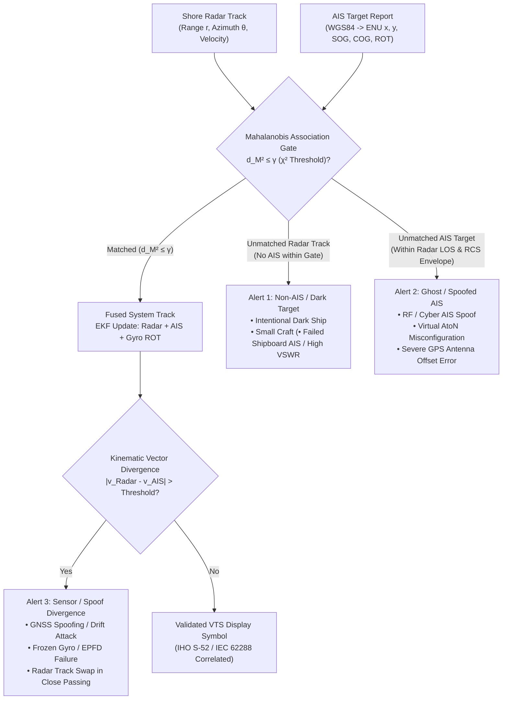
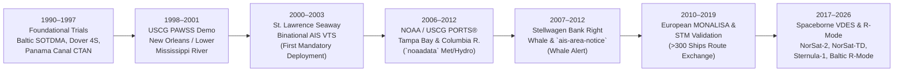
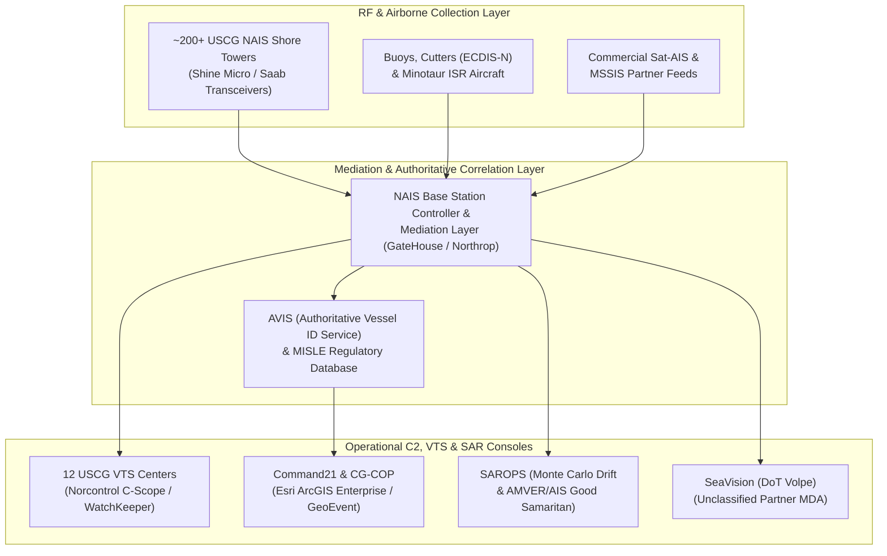

# Chapter 22: Vessel Traffic Services (VTS), Demonstration Programs, and Government Agency Software

---

## Operational & Conceptual Overview

When a $400\text{-meter}$ Ultra Large Container Vessel (ULCV) approaches a narrow, fog-shrouded harbor entrance or a $35\text{-barge}$ tow navigates the sharp, levee-lined bends of the Lower Mississippi River, shipboard bridge teams do not manage traffic risk alone. Watching over the waterway from shore is a **Vessel Traffic Service (VTS)**—the maritime counterpart to Air Traffic Control (ATC), staffed by certified VTS operators who monitor traffic flow, broadcast navigational and meteorological warnings, manage lock and pilotage queues, and intervene before developing close-quarters situations escalate into collisions or groundings.

Prior to the late 1990s, shore-based VTS centers relied almost exclusively on coastal **X-band ($9.3\text{–}9.5\text{ GHz}$)** and **S-band ($2.9\text{–}3.1\text{ GHz}$)** primary surveillance radars paired with voice VHF radiotelephony (Channels 11, 12, 13, 14, and 16). Calling an unidentified radar blip on voice VHF required tedious geographic interrogation (*"Vessel southbound half a mile north of Buoy 14, identify yourself"*), suffered from language barriers and voice channel congestion, and failed completely behind islands, bridges, and river bends where microwave radar signals were blocked by terrain. Indeed, the need for automated, positive vessel identification in VTS zones was the single strongest institutional catalyst behind the invention of SOTDMA and the adoption of the **SOLAS Chapter V, Regulation 19** AIS carriage mandate.

Today, AIS is the foundational backbone of both local harbor VTS centers and national/global **Maritime Domain Awareness (MDA)** architectures operated by coast guards, hydrographic and environmental agencies, defense ministries, and international coalitions. Yet in professional VTS engineering, AIS never *replaces* shore radar; rather, the two sensors are fused inside multi-hypothesis **Extended Kalman Filters (EKFs)** and **Interacting Multiple Model (IMM)** trackers that exploit the complementary physics of non-cooperative microwave reflection and cooperative VHF telemetry.

This chapter examines how VTS centers fuse AIS with shore radar and actively command the VHF Data Link (VDL) (Section 22.1); traces the chronological lineage of the historical and modern AIS demonstration programs that proved these concepts at sea and in orbit (Section 22.2); dissects the operational software stacks used by the United States Coast Guard, NOAA, the U.S. Department of Defense, EMSA, and partner maritime agencies worldwide (Section 22.3); analyzes VTS sensor-fusion failure modes and adversarial spoofing vectors (Section 22.4); and provides a complete, runnable Python implementation of a multi-sensor VTS Extended Kalman Filter with a Mahalanobis-distance spoof and dark-vessel detector (Section 22.5).

---

## 22.1 How Do Vessel Traffic Services (VTS) Use AIS?

### 1. International Regulatory Framework

The legal authority, technical architecture, and operational procedures governing how coastal states establish VTS centers and integrate AIS are codified across four primary international instruments:

1. **SOLAS Chapter V, Regulation 12 (*Vessel Traffic Services*):** Establishes that Contracting Governments undertake to arrange for the establishment of VTS where, in their opinion, the volume of traffic or the degree of risk justifies such services. It mandates that governments follow IMO guidelines and clarifies that mandatory VTS participation may only be required in sea areas lying within the **territorial waters** ($12\text{ NM}$) of a coastal State.
2. **IMO Resolution A.1158(32) (*Guidelines for Vessel Traffic Services*, adopted December 2021, superseding Resolution A.857(20)):** Modernized the global VTS framework by replacing the legacy three-tier service division (*Information Service [INS]*, *Traffic Organization Service [TOS]*, and *Navigational Assistance Service [NAS]*) with a unified functional definition: VTS mitigates the development of unsafe situations through:
   * Timely provision of relevant information on factors that may influence ship movements and assist onboard decision-making,
   * Monitoring and management of ship traffic to ensure the safety and efficiency of ship movements, and
   * Responding to developing unsafe situations (supporting both ships within the VTS area and allied search-and-rescue or pollution-control services).
3. **IALA Recommendation V-128 (*Operational and Technical Performance of VTS Systems*) and Recommendation A-124 (*AIS Shore Station and Networking Aspect*):** Define the engineering availability ($99.0\%\text{ to }99.9\%$), multi-sensor track fusion latency, target capacity, and Base Station Controller (BSC) redundancy required for VTS AIS subsystems.
4. **IALA Guideline G1082 (*An Overview of AIS*) and Recommendation A-126 (*The Use of the Automatic Identification System in Marine Aids to Navigation Services*):** Establish the operational doctrine for fusing AIS with VTS radar, managing VDL slot loading, and broadcasting real, synthetic, and virtual Aids to Navigation (AtoNs).

---

### 2. Why VTS Fuses Shore Radar with AIS: Complementary Physics & Security

A common misconception outside maritime engineering is that because AIS broadcasts GPS coordinates with meter-level precision, shore-based VTS radars are obsolete. In reality, **primary shore radar** and **AIS** operate on fundamentally orthogonal physical and trust principles, making their fusion essential for both navigational safety and counter-spoofing security:

| Technical & Operational Dimension | Shore Surveillance Radar (X-Band $9.4\text{ GHz}$ / S-Band $3.0\text{ GHz}$) | Automatic Identification System (VHF $161.975 / 162.025\text{ MHz}$) |
| :--- | :--- | :--- |
| **Cooperation Requirement** | **Non-Cooperative:** Detects any radar-reflective surface regardless of onboard power, transponder status, or intent (tracks "dark" ships, wooden skiffs, unlit barges, icebergs, and adrift buoys). | **Cooperative:** Requires a functioning, powered onboard AIS transceiver connected to valid GNSS/heading sensors and a low-VSWR VHF antenna. |
| **Vessel Identity & Static Metadata** | **None:** Returns an anonymous skin echo $(r, \theta, \text{RCS})$. Operator cannot distinguish two similarly sized tankers without external correlation. | **Rich Positive Identity:** Broadcasts `MMSI`, `IMO Number`, `Call Sign`, `Vessel Name`, hull dimensions (`to_bow`, `to_stern`, `to_port`, `to_starboard`), `Draught`, `Destination`, `ETA`, and DG cargo category. |
| **Line-of-Sight vs. Terrain Shadows** | **Strictly Line-of-Sight ($\lambda \approx 3\text{–}10\text{ cm}$):** Blinded behind islands, headlands, container cranes, bridge piers, and steep river bends. | **Non-Line-of-Sight Diffraction ($\lambda \approx 1.85\text{ m}$):** $162\text{ MHz}$ VHF waves diffract around river bends, islands, and bridges, letting VTS and ships "see around corners." |
| **Weather & Sea Clutter Immunity** | **Vulnerable:** Heavy rain squalls (especially X-band) and steep breaking waves generate clutter that masks small craft or induces false tracks. | **Immune:** $162\text{ MHz}$ VHF propagation is virtually unaffected by rain, snow, fog, or sea-surface wave clutter. |
| **Positional Reference Point** | **Variable Hull Centroid:** Radar energy reflects off the nearest high-RCS superstructure facet or hull side; the apparent centroid shifts as aspect angle changes or when ships pass close abeam (**target swapping**). | **Fixed GNSS Antenna Reference:** Position is referenced to the ship's GNSS antenna (with explicit bow/stern/port/starboard offsets in Msg 5/24), eliminating aspect-induced centroid walk. |
| **Maneuver Detection Latency** | **Delayed ($15\text{–}45\text{ seconds}$):** Radar trackers ($\alpha\text{-}\beta$ or position-only Kalman filters) must wait for several antenna scans ($2\text{–}4\text{ s}$/scan) until the ship's center of mass displaces laterally beyond the radar's azimuthal jitter envelope. | **Instantaneous ($2\text{–}3\text{ seconds}$):** Class A AIS wires directly to the ship's **Gyrocompass** and **Rate-of-Turn (ROT)** indicator, telegraphing rudder execution and heading change *before* the hull's trajectory vector noticeably deflects! |
| **Cyber / RF Spoofing Vulnerability** | **High Physical Integrity:** Injecting a coherent false radar skin echo across multiple rotating high-gain shore radar antennas is physically complex and localized. | **Unauthenticated Broadcast:** Trivial to spoof over RF via a $\$300$ SDR or inject into unauthenticated UDP/TCP aggregator streams. |

#### The Physics of Gyro Rate-of-Turn (ROT) Lead Time Over Radar Trackers

Why does AIS detect a large ship's turn $15\text{ to }45\text{ seconds}$ before a shore radar tracker? Consider a loaded VLCC or container ship steaming at speed $v = 12\text{ kts}$ ($6.17\text{ m/s}$) at range $r = 5\text{ NM}$ ($9,260\text{ m}$) from a VTS X-band radar whose horizontal $3\text{ dB}$ beamwidth is $\theta_{3\text{dB}} = 0.7^\circ$ and whose azimuthal centroid estimation noise is $\sigma_\theta \approx 0.08^\circ$ ($\sim 1.4\text{ mrad}$). At $r = 9,260\text{ m}$, the cross-range positional uncertainty of a single radar scan is:

$$\sigma_{\perp} = r \cdot \sigma_\theta = 9260\text{ m} \times 0.0014\text{ rad} \approx 12.96\text{ m}$$

When the pilot orders hard rudder to initiate a turn with angular velocity $\omega = 15^\circ/\text{min} = 0.25^\circ/\text{s}$ ($0.00436\text{ rad/s}$):
1. **Hydrodynamic Yaw-Before-Sway:** Because of hull hydrodynamic inertia and pivot-point dynamics, the ship's bow rotates in heading ($\psi$) immediately, while the center of mass initially continues sliding nearly along its original Course Over Ground ($\text{COG}$) at a drift/leeway angle $\beta$ before lateral water resistance curves the trajectory.
2. **Lateral Centroid Displacement Time:** Even under ideal circular motion without hydrodynamic slip, the lateral displacement $d_\perp(t)$ perpendicular to the initial track after time $t$ is:
   $$d_\perp(t) = R_{\text{turn}}(1 - \cos(\omega t)) \approx \frac{1}{2} v \omega t^2$$
   To exceed a $3\sigma_\perp \approx 38.9\text{ m}$ lateral displacement threshold required for a radar $\alpha\text{-}\beta$ or Kalman filter to declare a maneuver without false-alarming on azimuthal glint:
   $$t_{\text{radar}} \approx \sqrt{\frac{2 \cdot (3\sigma_\perp)}{v \cdot \omega}} = \sqrt{\frac{2 \times 38.9\text{ m}}{6.17\text{ m/s} \times 0.00436\text{ rad/s}}} \approx 53.8\text{ seconds}$$
3. **AIS Gyro ROT Telemetry:** By contrast, as soon as the ship's yaw rate exceeds stub thresholds or changes heading by $>5^\circ$, the Class A AIS transponder switches its SOTDMA reporting interval from $10\text{ s}$ (or $6\text{ s}$) down to **$2\text{ to }3.33\text{ seconds}$** (ITU-R M.1371-5 Table 1) and transmits the 8-bit signed `ROT` field (bits `42..49`, 0-based MSB-first, encoded via $\text{ROT}_{\text{AIS}} = \text{round}(4.733\sqrt{|\text{ROT}_{\text{sensor}}|})$) alongside 9-bit `True Heading` (`0..359°`, sentinel `511`). The VTS console—and every neighboring ship's ECDIS—displays a turn-indicator flag within **$2\text{ to }4\text{ seconds}$** of the hull beginning to swing.

---

### 3. Multi-Sensor Track Fusion & Mahalanobis Discrepancy Alerting

Inside a modern VTS data processing server (such as Kongsberg Norcontrol **C-Scope**, Wärtsilä/Transas **Navi-Harbour**, or Tidalis **VTMIS**), raw radar video is extracted into local radar tracks, while base station NMEA `!AIVDM` sentences are decoded into AIS tracks. Both streams are projected from **WGS84** $(\lambda, \phi)$ into a centered local **East-North-Up (ENU)** Cartesian tangent plane $(x, y)$ in meters centered on the VTS radar tower $(\lambda_0, \phi_0)$.

Let the unified state vector of vessel $i$ at time $t_k$ be modeled in a 5-state Coordinated Turn (CT) representation:

$$\mathbf{x}_k = \begin{bmatrix} x_k & y_k & v_k & \psi_k & \omega_k \end{bmatrix}^T$$

where $(x_k, y_k)$ are East and North coordinates ($\text{m}$), $v_k$ is Speed Over Ground ($\text{m/s}$), $\psi_k$ is course angle ($\text{rad}$, mathematical counter-clockwise from East or navigational clockwise from North), and $\omega_k = \dot{\psi}_k$ is the turn rate ($\text{rad/s}$).

* **Shore Radar Polar Measurement Model:** A shore radar at $(x_R, y_R) = (0, 0)$ measures slant range $r_k$ and azimuth $\theta_k$:
  $$\mathbf{z}_{\text{Radar}, k} = \mathbf{h}_{\text{Radar}}(\mathbf{x}_k) + \mathbf{v}_{\text{Radar}, k} = \begin{bmatrix} \sqrt{x_k^2 + y_k^2} \\ \text{atan2}(x_k, y_k) \end{bmatrix} + \mathbf{v}_{\text{Radar}, k}, \quad \mathbf{R}_{\text{Radar}} = \begin{bmatrix} \sigma_r^2 & 0 \\ 0 & \sigma_\theta^2 \end{bmatrix}$$
* **AIS Geodetic/Kinematic Measurement Model:** An AIS Message 1, 2, or 3 report (after shifting from the ship's GNSS antenna offset to the hull geometric center using Message 5 `to_bow`, `to_stern`, `to_port`, `to_starboard` and `True Heading`) provides a linear observation of all five state variables:
  $$\mathbf{z}_{\text{AIS}, k} = \mathbf{H}_{\text{AIS}} \mathbf{x}_k + \mathbf{v}_{\text{AIS}, k} = \mathbf{I}_5 \mathbf{x}_k + \mathbf{v}_{\text{AIS}, k}, \quad \mathbf{R}_{\text{AIS}} = \text{diag}(\sigma_{x,\text{AIS}}^2, \sigma_{y,\text{AIS}}^2, \sigma_v^2, \sigma_\psi^2, \sigma_\omega^2)$$

To decide whether an incoming AIS report $\mathbf{z}_{\text{AIS}, k}$ belongs to an existing radar-maintained track with predicted state $\hat{\mathbf{x}}_{k|k-1}$ and state covariance $\mathbf{P}_{k|k-1}$, the VTS tracker computes the **innovation vector** $\tilde{\mathbf{y}}_k$ and **innovation covariance** $\mathbf{S}_k$:

$$\tilde{\mathbf{y}}_k = \mathbf{z}_{\text{AIS}, k} - \mathbf{H}_{\text{AIS}} \hat{\mathbf{x}}_{k|k-1}, \qquad \mathbf{S}_k = \mathbf{H}_{\text{AIS}} \mathbf{P}_{k|k-1} \mathbf{H}_{\text{AIS}}^T + \mathbf{R}_{\text{AIS}}$$

The squared **Mahalanobis distance** $d_M^2$ between the AIS report and the radar track is:

$$d_M^2 = \tilde{\mathbf{y}}_k^T \mathbf{S}_k^{-1} \tilde{\mathbf{y}}_k$$

Under Gaussian error assumptions, $d_M^2$ follows a chi-square distribution $\chi^2_{\text{dof}}$ where $\text{dof}$ is the dimension of the gated observation vector (e.g., for 2D position gating $\text{dof}=2$, the $99.5\%$ gate threshold is $\gamma_{0.995, 2} = 10.597$; for 4D position+velocity gating $\text{dof}=4$, $\gamma_{0.995, 4} = 14.860$). By evaluating $d_M^2$ across all active radar and AIS tracks, the VTS console automatically triggers three operational discrepancy alerts:



---

### 4. Active VTS Traffic Management Over the AIS Data Link

Unlike passive coastal receiver networks, a VTS center operates type-approved **AIS Base Stations** (conforming to **IEC 62320-1**) and **AtoN Stations** (**IEC 62320-2**) that actively transmit onto AIS1 ($161.975\text{ MHz}$) and AIS2 ($162.025\text{ MHz}$) to manage the waterway and control mobile transponders:

| ITU-R M.1371-5 Message ID | VTS Direction & Access Scheme | Operational VTS Function & Payload Engineering |
| :--- | :--- | :--- |
| **Msg 4:** *Base Station Report* (168 bits) | Broadcast (FATDMA, every $10\text{ s}$) | Broadcasts the VTS base station's high-accuracy surveyed WGS84 position and UTC clock reference, providing **SOTDMA Frame Synchronization** fallback to ships whose internal GNSS time pulse fails. |
| **Msg 6 & Msg 8:** *Binary Addressed & Broadcast* (up to 1,008 bits) | Addressed / Broadcast (FATDMA / RATDMA) | Transmits Application-Specific Messages (ASMs) identified by a 10-bit Designated Area Code (`DAC`) and 6-bit Functional Identifier (`FI`):<br/>• **Met/Hydro (`DAC=1, FI=11/31`):** Real-time wind, visibility, water level, and current vectors from buoys/tide gauges.<br/>• **Area Notice (`DAC=1/366, FI=22`):** Dynamic circles, rectangles, sectors, or polygons marking speed zones (e.g., right whales), dredging, or security exclusion zones.<br/>• **St. Lawrence / Inland Lock & Water Level (`DAC=200 / DAC=316/366`):** Lock scheduling, clearance, and bridge air-gap telemetry. |
| **Msg 12 & Msg 14:** *Safety-Related Text* (up to 1,008 bits) | Addressed (Msg 12) / Broadcast (Msg 14) | Sends free-text 6-bit ASCII safety alerts directly to an individual ship's Minimum Keyboard and Display (MKD) and ECDIS (Msg 12, confirmed by **Msg 13 Safety Acknowledge**) or to all ships in the VTS sector (Msg 14). |
| **Msg 15:** *Interrogation* (88–160 bits) | Addressed (FATDMA / RATDMA) | Polls a specific MMSI over the VDL to demand an immediate transmission of **Message 5** (static/voyage data) or **Message 24** without waiting for the ship's 6-minute static timer. |
| **Msg 16:** *Assigned Mode Command* (96 or 144 bits) | Addressed (FATDMA) | Overrides a target vessel's autonomous SOTDMA reporting schedule, forcing it to transmit at a VTS-specified slot interval or higher reporting rate (up to once every $2\text{ s}$) during critical harbor approaches or SAR emergencies. |
| **Msg 17:** *DGNSS Broadcast Binary Message* (80–816 bits) | Broadcast (FATDMA) | Encapsulates **RTCM SC-104 Type 1, 3, 9** differential GNSS pseudorange corrections over the AIS VDL for ships lacking a dedicated $283.5\text{–}325\text{ kHz}$ medium-frequency radiobeacon receiver. |
| **Msg 20:** *Data Link Management* (72–160 bits) | Broadcast (FATDMA) | Advertises reserved **FATDMA (Fixed Access TDMA)** time slots up to $120\text{ NM}$ around the base station so mobile Class A (SOTDMA) and Class B (CSTDMA) transponders do not step on VTS transmissions. |
| **Msg 21:** *Aid-to-Navigation (AtoN) Report* (272–360 bits) | Broadcast (FATDMA / RATDMA) | Broadcasts three classes of AtoNs (distinguished by the `Virtual AtoN Flag` at 0-based bit `269`):<br/>• **Real AIS AtoN (`virtual_flag=0`):** Transmitted physically from an AIS transponder mounted on the buoy or lighthouse.<br/>• **Synthetic AIS AtoN (`virtual_flag=0`):** Physical buoy exists on the water, but its Msg 21 is broadcast from a shore VTS base station (either *Monitored* via telemetry or *Predicted*).<br/>• **Virtual AIS AtoN (`virtual_flag=1`):** No physical buoy exists; VTS projects a digital symbol onto ship ECDIS screens within seconds to mark a newly sunken wreck, oil spill boundary, or ice channel! |
| **Msg 22 & Msg 23:** *Channel Management & Group Assignment* (168 / 160 bits) | Broadcast (FATDMA) | Command all vessels entering a geographic bounding box $(\lambda_1, \phi_1)$ to $(\lambda_2, \phi_2)$ to switch to regional VHF simplex/duplex channels (Msg 22) or adjust group reporting intervals / enter quiet intervals (Msg 23). |

> [!IMPORTANT]
> **Transition from AIS Binary ASMs to IHO S-100 / VDES:** Under the IMO S-100 ECDIS roadmap (see Chapter 20 and Chapter 21), VTS broadcasts are progressively migrating from legacy bit-packed AIS Message 8 payloads to authenticated **IHO S-212 (*VTS Digital Information Service*)**, **IHO S-124 (*Navigational Warnings*)**, and **IHO S-421 (*Route Plan Exchange*)** delivered over **VDES (ITU-R M.2092-1)** and **IEC 63173-2 (SECOM)** IP links.

---

## 22.2 What AIS Demonstration Programs Are There (Historical and Modern)?

Before the IMO mandated AIS on SOLAS vessels in 2002—and repeatedly thereafter as new binary, environmental, conservation, and satellite capabilities were invented—governments and research consortia executed large-scale **AIS demonstration programs**. Following the historical trajectory documented in [`schwehr/gis-history`](https://github.com/schwehr/gis-history), seven landmark demonstration programs shaped the architecture of modern AIS and VTS.



### 1. 1990s Foundational Trials: Baltic SOTDMA, UK Dover Strait 4S, and Panama Canal CTAN (1990–1997)

During the early 1990s, three competing technical paradigms were demonstrated in live maritime corridors to solve the VTS identification problem:
* **Swedish & Finnish Maritime Administrations Baltic SOTDMA Trials (1990–1996):** Led by inventor **Håkan Lans** and GP&C Systems International, Sweden and Finland deployed self-organizing TDMA transponders aboard Baltic passenger ferries (connecting Stockholm, Helsinki, and Turku) and coastal pilot stations. These trials proved that autonomous GPS-synchronized slot reservation could sustain high update rates ($2\text{–}10\text{ s}$) without a central polling master—and additionally demonstrated early differential GNSS correction broadcasts (Message 17) and high-precision docking displays.
* **UK Maritime and Coastguard Agency (MCA) Dover Strait 4S Trials (1995–1997):** The UK evaluated a competing **Ship-to-Shore and Ship-to-Ship System (4S)** built on **ITU-R M.825 Digital Selective Calling (DSC)** over VHF Channel 70 inside the Dover Strait VTS area. While DSC polling worked for low-rate shore interrogation of a few dozen ships, the Dover Strait trials exposed a fatal scaling flaw: polling-based DSC suffered severe channel saturation and latency collapse when hundreds of vessels converged in a strait, clinching the IMO's selection of **SOTDMA** in 1997–1998.
* **Panama Canal Commission CTAN / Precision Navigation Trials (1994–1999):** Operating with the U.S. Department of Transportation **Volpe National Transportation Systems Center**, the Panama Canal demonstrated automated transponder tracking and real-time pilot portable display units (initially over UHF before migrating to VHF AIS in 2000–2002) to track ships through the tight Gaillard (Culebra) Cut where steep rock walls blocked shore radar.

### 2. USCG PAWSS New Orleans / Lower Mississippi River Demonstration (1998–2001)

Following the December 14, 1996 allision of the bulk carrier *M/V Bright Field* with the New Orleans Riverwalk marketplace—where sharp bends of the Mississippi River and bridge structures degraded conventional VTS radar tracking—the **U.S. Coast Guard** initiated the **Ports and Waterways Safety System (PAWSS)** demonstration in **VTS Lower Mississippi River (New Orleans)**.
* **Technical Execution:** Between 1998 and 2001, the USCG erected prototype AIS base stations along the Mississippi River from Baton Rouge to the Southwest Pass and distributed pre-SOLAS Class A transponders and Portable Pilot Units (PPUs) to Mississippi river pilots and tug/barge operators.
* **Breakthrough Findings:** The New Orleans trials proved conclusively that $162\text{ MHz}$ VHF AIS signals diffracted over earthen levees and around $120^\circ$ river bends like Algiers Point, giving VTS watchstanders and opposing towboat captains continuous identity, SOG, COG, and ROT visibility long before visual or radar line-of-sight was established.

### 3. St. Lawrence Seaway Binational AIS Demonstration & Deployment (2000–2003)

Coordinated by the **U.S. Saint Lawrence Seaway Development Corporation (SLSDC)**, the **Canadian St. Lawrence Seaway Management Corporation (SLSMC)**, the USCG, the Canadian Coast Guard, and the Volpe Center, the St. Lawrence Seaway served as the world's premier binational proving ground for integrated AIS Traffic Management Systems (TMS):
* **Architecture:** Stretching $370\text{ km}$ from Montreal to Lake Erie across 15 locks, the Seaway deployed redundant AIS base stations linked to a centralized Traffic Management System paired with portable pilot units for vessels without permanent installations.
* **Operational Innovations:** Beyond basic position tracking, the Seaway pioneered the operational broadcast of **AIS Binary Messages (Message 8)** carrying real-time **water levels, wind speed/direction at lock walls, ice conditions, and next-vessel lock scheduling/turnback times**.
* **Historic Milestone:** In **March 2003**—nearly two years before the final SOLAS phase-in deadline for general international cargo vessels—the St. Lawrence Seaway became the **first inland/coastal waterway in the world to require mandatory AIS carriage** on all commercial vessels in transit.

### 4. NOAA / USCG PORTS® AIS Environmental Broadcast Demonstration (Tampa Bay & Columbia River, 2006–2012)

NOAA's **Physical Oceanographic Real-Time System (PORTS®)** measures real-time tides, currents, water temperature, salinity, winds, atmospheric pressure, and **bridge air gap** (vertical clearance under bridges measured by microwave/laser sensors) at major U.S. ports. Historically, mariners had to look up PORTS® data via dial-up voice telephone or web pages.
* **Demonstration:** Beginning in **Tampa Bay, Florida (2006–2008)** and expanding to the **Columbia River** and **Lower Mississippi**, NOAA, the USCG Research and Development Center, and the University of New Hampshire Center for Coastal and Ocean Mapping (**UNH CCOM/JHC**) demonstrated the automated encoding of live PORTS® sensor feeds into **AIS Binary Message 8** (`DAC=366 / DAC=1` Meteorological and Hydrological payloads) transmitted directly from USCG NAIS Base Stations to shipboard ECDIS and pilot laptops.
* **Open-Source Software Heritage:** During this demonstration, Kurt Schwehr at UNH CCOM/JHC authored the open-source **`noaadata`** Python library (2005–2009), which pulled live XML/SOAP feeds from NOAA CO-OPS servers, packed the binary bitvectors according to ITU-R M.1371 and RTCM SC-121 specifications, and generated validated `!AIABM` / `!AIBBM` sentences for USCG base station injection (examined in detail in Chapter 24).

### 5. Stellwagen Bank National Marine Sanctuary Right Whale AIS Demonstration (2007–2012)

Ship strikes are a leading cause of mortality for the critically endangered **North Atlantic Right Whale (*Eubalaena glacialis*)**. When the Boston Harbor Traffic Separation Scheme (TSS) was realigned in 2007 through the **Stellwagen Bank National Marine Sanctuary**, a multi-agency consortium—comprising **NOAA**, the **USCG**, **Woods Hole Oceanographic Institution (WHOI)**, the **Cornell Lab of Ornithology**, and **UNH CCOM/JHC**—launched a groundbreaking environmental AIS demonstration:
* **Acoustic-to-AIS Loop:** Ten moored autonomous passive acoustic monitoring buoys detected right whale up-calls along the Boston shipping lanes and telemetered acoustic detections via Iridium satellite to shore servers at Cornell and UNH.
* **AIS Area Notice (`ais-area-notice`):** Using the open-source **`ais-area-notice`** reference encoder/decoder developed by Kurt Schwehr (implementing USCG `DAC=366, FI=22` and IMO `SN.1/Circ.289 DAC=1, FI=22`), the system automatically generated dynamic circular and polygon **Area Notice** binary messages and broadcast them from USCG AIS transmitters at Provincetown and Boston directly onto the ECDIS displays of approaching merchant vessels.
* **Whale Alert (2012):** The Stellwagen Bank demonstration culminated in the launch of **Whale Alert** (presented to the U.S. Congress in 2012) and the **Listen for Whales** program, combining AIS compliance tracking (enforcing the $10\text{-knot}$ Seasonal and Dynamic Management Area speed rules under `50 CFR § 224.105`) with live ECDIS and iPad alerts (see Chapter 30, Section 30.4).

### 6. European MONALISA, MONALISA 2.0, and Sea Traffic Management (STM) Validation Projects (2010–2019)

Funded by the European Union and led by the **Swedish Maritime Administration (SMA)** alongside Danish, Finnish, Norwegian, Spanish, and Italian authorities and industrial partners (Kongsberg, Wärtsilä/Transas, GateHouse, Furuno), the **MONALISA (2010–2013)**, **MONALISA 2.0 (2013–2015)**, and **Sea Traffic Management (STM) Validation (2015–2019)** projects executed the largest operational e-Navigation trial in history:
* **Scale:** Over **$300\text{ commercial vessels}$**, **$13\text{ European ports}$**, and **$5\text{ VTS Shore Centers}$** (coupled with a pan-European distributed simulation network) were outfitted with STM-compatible ECDIS units and AIS ASM interfaces.
* **Dynamic Route Exchange (`RTZ` / `IEC 61174` / `IHO S-421`):** Ships broadcast a compressed summary of their next waypoints over AIS Application-Specific Messages (**Route Information ASM, `DAC=1, FI=27`**) while exchanging full multi-waypoint voyage plans and VTS recommended cross-track corridors over IP/VDES links, alongside **Port Collaborative Decision Making (PortCDM)** timestamps for just-in-time arrival (reducing fuel burn and $\text{CO}_2$ emissions).

### 7. Modern Spaceborne VDES ("AIS 2.0") & Terrestrial R-Mode Demonstration Programs (2017–2026)

As the maritime sector prepares for VDES (ITU-R M.2092-1) and resilient backup positioning against GNSS jamming/spoofing, four major demonstration programs have led the transition:
1. **NorSat-2 (2017) & NorSat-TD (2023) (Norwegian Space Agency / Kystverket / FFI / Kongsberg Seatex):** Launched in July 2017, **NorSat-2** carried the first in-orbit software-defined VDE-SAT payload, demonstrating satellite-to-ship downlink broadcasts of ice charts and navigational warnings over VHF to Arctic vessels. In April 2023, **NorSat-TD** launched with a second-generation bidirectional VDES transceiver alongside satellite laser ranging and an RF direction-finding payload.
2. **Sternula-1 (January 2023) (Sternula / Danish Maritime Authority / GateHouse / Space Inventor / Aalborg University):** The first commercial 6U CubeSat dedicated to **VDE-SAT** services under the European **AOS (AIS 2.0 Operational Satellite)** demonstration, validating two-way **IHO S-100 / SECOM** service delivery between shore authorities and shipboard VDES terminals.
3. **Baltic R-Mode (Ranging Mode) Testbed (2017–2026) (DLR, BSH, SMA, GUM, Kongsberg, National Institute of Telecommunications):** Operating across eight coastal transmitter sites in Germany, Sweden, Poland, and Denmark, the **R-Mode Baltic** and **Ormobass** projects demonstrated that adding precise timing synchronization pulses and ranging subcarriers to existing **$300\text{ kHz}$ MF DGNSS radiobeacons** and **$157/162\text{ MHz}$ VHF AIS / VDE-TER base stations** allows ships to compute an independent horizontal position fix ($\approx 10\text{–}15\text{ m}$ accuracy ($95\%$)) via terrestrial Time-of-Arrival (TOA) trilateration when GPS/Galileo L-band signals are completely jammed or spoofed!

---

## 22.3 What Software Does the US Coast Guard and Other Government Agencies Use for AIS?

When an AIS burst is received by a coastal tower, a buoy tender, a maritime patrol aircraft, or a Low-Earth-Orbit (LEO) satellite, it enters a multi-tiered government software architecture. Below is the engineering breakdown of the operational AIS systems deployed by the **United States Coast Guard (USCG)**, **NOAA / BOEM**, the **U.S. Department of Defense and Intelligence Community**, and **international maritime agencies**.

### 1. United States Coast Guard (USCG)



1. **NAIS (Nationwide Automatic Identification System):**
   * **Architecture:** NAIS is the USCG's flagship shore-based VHF collection and transmission network spanning **$58\text{ coastal/inland sectors}$** and **$>200\text{ remote RF sites}$** across the U.S. continental coastline, Alaska, Hawaii, Puerto Rico, Guam, the Great Lakes, and the Western Rivers (developed with prime integration by Northrop Grumman and core software/hardware from **GateHouse Maritime** and **Shine Micro**).
   * **Mediation & TAG Block Pipeline:** At remote tower sites, high-sensitivity dual-channel VHF receivers (**Shine Micro SM1610 / SA200** series capable of simultaneous AIS1/AIS2 reception and physical-layer RSSI/TOA timestamping) and IEC 62320-1 base station transceivers feed raw `!AIVDM` sentences wrapped in **IEC 61162-450 / NMEA 0183 v4.10 TAG Blocks** (`\s:r3669999,c:1712250000*hh\!AIVDM,...`) into the **GateHouse Base Station Controller (BSC)** and NAIS central mediation servers at the USCG Operations Systems Center (OSC) in Kearneysville, West Virginia. The mediation layer performs cryptographic validation of encrypted Blue Force AIS (**EAIS**, see Chapter 29), deduplicates overlapping coastal receipts, manages FATDMA slot plans (Msg 20), and publishes filtered pub/sub streams to downstream consumers.
2. **VTS Consoles, WatchKeeper, Command21, and CG-COP (Common Operational Picture):**
   * **VTS Centers:** Across the 12 U.S. VTS ports (New York, Houston-Galveston, Puget Sound, San Francisco, Lower Mississippi/New Orleans, Port Arthur, Berwick Bay, Tampa, St. Marys River, Louisville, Prince William Sound, and Corpus Christi), watchstanders operate **Kongsberg Norcontrol C-Scope** (and legacy **PAWSS / Transas**) multi-sensor consoles that fuse X-band/S-band solid-state radars, NAIS tracks, CCTV EO/IR slaving, and VHF digital voice recording.
   * **Sector Command Centers (Command21 / WatchKeeper & CG-COP):** At USCG Sector, District, and Area Command Centers, **WatchKeeper** and the **Coast Guard Common Operational Picture (CG-COP)**—built on **Esri ArcGIS Enterprise, ArcGIS GeoEvent Server, and Defense Mapping stacks**—provide unified geospatial tracking, automated geofence alerting (e.g., notice-of-arrival verification and Critical Infrastructure security zones), and incident management.
3. **SeaVision (U.S. Department of Transportation Volpe Center / US Navy / USCG):**
   * Developed and operated by the **U.S. DoT Volpe National Transportation Systems Center** in Cambridge, Massachusetts, **SeaVision** is a cloud-hosted, web-based unclassified global maritime situational awareness platform used by the USCG, the U.S. Navy, and over **$100\text{ international partner nations}$** (across Africa, Latin America, the Indo-Pacific, and Europe).
   * SeaVision ingests terrestrial NAIS, international **MSSIS** feeds, and commercial satellite AIS alongside Synthetic Aperture Radar (SAR) and optical detections, providing browser-based rules engines for detecting rendezvous/loitering, dark-vessel gaps, EEZ boundary incursions, and Illegal, Unreported, and Unregulated (IUU) fishing without requiring classified hardware.
4. **SAROPS (Search and Rescue Optimal Planning System):**
   * Built on an Esri ArcGIS / environmental server architecture developed with Applied Science Associates (RPS / Tetra Tech) and Metron, **SAROPS** is the USCG's Monte Carlo particle-filter drift modeling engine.
   * **AIS Integration:** When a vessel distress alert (EPIRB, DSC Mayday, or overdue report) occurs, SAROPS automatically queries NAIS historical archives to extract the casualty's exact **Last Known Position (LKP)** and kinematic trajectory prior to signal loss, seeds $10,000+$ simulated leeway drift particles driven by NOAA/Navy surface currents and winds, and queries live NAIS/AMVER feeds to identify nearby commercial vessels whose predicted CPA can intercept the high-probability search datum first.
5. **MISLE (Marine Information for Safety and Law Enforcement) & AVIS (Authoritative Vessel Identification Service):**
   * Because raw AIS Message 5 static fields (`MMSI`, `IMO`, `Vessel Name`) are frequently mistyped or spoofed, the USCG pairs live NAIS tracks with **AVIS** and **MISLE**—the Coast Guard's authoritative relational database of vessel registrations, Certificates of Inspection (COIs), Port State Control deficiency histories, boarding records, and security watchlists (supporting the **SANS — Ship Arrival Notification System** $96\text{-hour}$ Notice of Arrival mandate under `33 CFR Part 160`).
6. **Shipboard ECDIS-N & Airborne Minotaur:**
   * **ECDIS-N (Electronic Chart Display and Information System – Navy/USCG):** Installed on USCG National Security Cutters (WMSL), Fast Response Cutters (WPC), and Offshore Patrol Cutters (WPC/OPC), integrating NAIS, shipboard radar, and encrypted **Blue Force EAIS** (Message 6/8 ciphertext).
   * **Minotaur Mission System:** Deployed aboard USCG **HC-130J Super Hercules**, **C-27J Spartan**, and **MH-60T Jayhawk** aircraft (developed collaboratively by the U.S. Navy, USCG, and U.S. Customs and Border Protection), Minotaur fuses airborne inverse-synthetic-aperture radar (ISAR), EO/IR gimbal video, direction-finding, and airborne AIS receiver tracks—automatically slewing the aircraft's infrared camera onto an AIS or non-AIS radar target to capture hull-number photography.

---

### 2. NOAA (National Oceanic and Atmospheric Administration) & BOEM

1. **NOAA ERMA® (Environmental Response Management Application):**
   * Developed by NOAA's Office of Response and Restoration (OR&R) and the University of New Hampshire (**UNH CCOM/JHC**), **ERMA** is the federal government's common operational web-GIS platform for oil spills, chemical releases, and hurricane response.
   * **The 2010 *Deepwater Horizon* Catalyst & `libais`:** During the April 2010 *Deepwater Horizon* blowout in the Gulf of Mexico, thousands of skimmers, boom-towing fishing vessels, ROV support ships, and relief-well drillships operated simultaneously inside the response zone. To ingest, decode, and map millions of USCG NAIS sentences in real time for the Unified Command in ERMA when legacy pure-Python `BitVector` decoders proved too slow, Kurt Schwehr wrote **`libais`** in C++—achieving orders-of-magnitude faster throughput and powering ERMA's live responder tracking (detailed in Chapter 24).
2. **MarineCadastre.gov (NOAA Office for Coastal Management & BOEM):**
   * Jointly operated by **NOAA** and the **Bureau of Ocean Energy Management (BOEM)**, **MarineCadastre.gov** is the primary public scientific distribution portal for U.S. historical AIS data.
   * **Pipeline:** Raw USCG NAIS archives are decoded, filtered to remove corrupted/unrealistic coordinates, downsampled to $1\text{-minute}$ intervals per UTM zone (historically distributed as Esri File Geodatabases and CSVs from 2009 onward, and modernized into daily national CSV/GeoParquet datasets and annual **Vessel Transit Count** rasters), and used for **offshore wind farm lease siting**, marine spatial planning, and submarine cable routing.
3. **Whale Alert, CetSound, and NOAA Office of Law Enforcement (OLE):**
   * NOAA's Northeast Fisheries Science Center, Stellwagen Bank NMS, and partners operate the **Whale Alert** backend and **CetSound** (Cetacean and Sound Mapping), while **NOAA OLE** runs automated polygon-intersection scripts against NAIS Speed Over Ground (`SOG`) archives to issue civil notices of violation (NOVAs) to vessels exceeding $10.0\text{ kts}$ inside active North Atlantic Right Whale Seasonal Management Areas.

---

### 3. U.S. Department of Defense, U.S. Navy, and Intelligence Community

1. **MSSIS (Maritime Safety and Security Information System):**
   * Developed and maintained by the **U.S. DoT Volpe Center** alongside U.S. Naval Forces Europe/Africa and international partners, **MSSIS** is a multilateral, government-to-government unclassified network connecting over **$70\text{ participating countries}$**. Every nation that contributes its coastal AIS NMEA stream to the MSSIS server network receives the combined real-time global raw NMEA stream of all other participating nations.
2. **GCCS-M (Global Command and Control System – Maritime), MTC2, and MTB (Maritime Tactical Broadcast):**
   * Operational U.S. Navy fleet watch centers and carrier strike groups ingest fused AIS, radar, and SIGINT tracks into **GCCS-M** and **Maritime Tactical Command and Control (MTC2)** via **OTH-Gold**, **Link 16 (Track J-Series)**, and **MTB**.
3. **ONI (Office of Naval Intelligence) & NGA (National Geospatial-Intelligence Agency) Multi-INT Platforms:**
   * At the National Maritime Intelligence-Integration Office (NMIO), ONI, and NGA, platforms such as **SeaLink**, **Odyssey**, and **Maven Smart System** correlate global terrestrial and spaceborne AIS with commercial and national **Synthetic Aperture Radar (SAR)**, **Electro-Optical (EO)** satellite imagery, **RF geolocation (TDOA/FDOA/SEI)** of marine navigation radars and VHF transmitters, and port call intelligence to track sanctioned "shadow fleets" and non-emitting warships.

---

### 4. International Government Agencies & Multilateral Platforms

| Agency / Jurisdiction | Primary AIS & MDA Software Systems | Key Architectural & Operational Features |
| :--- | :--- | :--- |
| **European Union — EMSA** (*European Maritime Safety Agency*, Lisbon) | **SafeSeaNet (SSN)**, **Integrated Maritime Services (IMS)**, **CleanSeaNet**, & **THETIS** | Established after the *Erika* (1999) and *Prestige* (2002) tanker spills under EU Directive 2002/59/EC. Connects all EU/EEA Member States into a pan-European vessel traffic monitoring exchange. **CleanSeaNet** automatically correlates **Copernicus Sentinel-1 / RADARSAT SAR** oil-slick detections with historical AIS trajectories inside **IMS** to identify vessels responsible for illegal bilge dumping within 20–30 minutes of satellite overpass. |
| **Canada — Canadian Coast Guard (CCG) & Transport Canada** | **INNAV** (*Information System on Marine Navigation*), **MaIS** (*Marine Information System*), & **DFO MEOS** | **INNAV** integrates CCG shore AIS base stations, St. Lawrence Seaway TMS, RADARSAT Constellation Mission (RCM) polar SAR/AIS payloads, ice charts, and dynamic **3D Under-Keel Clearance (UKC)** prediction along the St. Lawrence and Arctic NORDREG zones. |
| **United Kingdom — MCA & JMSC** | **UK National AIS Network** & **JMSC Common Operational Picture** | Operated by the Maritime and Coastguard Agency (MCA) and the multi-agency **Joint Maritime Security Centre (JMSC)** (fusing Dover Strait Channel Navigation Information Service [CNIS], Royal Navy, and Border Force feeds). |
| **Australia — AMSA** (*Australian Maritime Safety Authority*) | **CTS** (*Craft Tracking System*) & **REEFVTS** | Tracks vessels across Australia's massive SAR region ($52.8\text{ million km}^2$) and the **Great Barrier Reef and Torres Strait VTS (REEFVTS)**, automatically flagging disabled drifters or coral-reef collision courses. |
| **New Zealand, Australia, EMSA & Pacific Forum Fisheries Agency** | **Starboard Maritime Intelligence** | Originally developed inside New Zealand's government innovation program by **Dragonfly Data Science** (with NZ Customs, MPI, and Defence Force), **Starboard** is a cloud-native government MDA platform combining global AIS, SAR dark-vessel detection, biosecurity risk scoring, and IUU fishing analytics across the Pacific, Australia, and Europe. |
| **Global Enforcement NGOs & Partner Governments (>150 Countries)** | **Skylight** (*Allen Institute for AI [AI2]*) & **Global Fishing Watch (GFW)** | **Skylight** provides real-time AI anomaly detection (ship-to-ship transshipment, dark-vessel SAR correlation, VIIRS night-light boat detection, and MPA entry alerts) free of charge to government coast guards and fisheries ministries worldwide. **GFW** (founded by SkyTruth, Oceana, and Google, using `libais` in its foundational ingestion pipeline) provides open science-grade fishing effort and dark-vessel analytics. |

---

## 22.4 Security, Adversarial Abuse, and VTS Sensor-Fusion Failure Modes

Even with multi-sensor fusion, VTS operators and automated C2 software face four critical engineering failure modes and adversarial attack vectors:

1. **Radar Track Swapping & AIS "Track Seduction" in Congested Channels:**
   * When two vessels pass within $1\text{–}2\text{ beamwidths}$ of each other in a narrow channel—or when a small tug pulls alongside a $300\text{ m}$ tanker—the shore radar's merged reflection centroid can pull the radar Kalman filter from one hull onto the other (**radar track swap**).
   * Conversely, an adversary aboard a small vessel running parallel to a high-value craft can broadcast a spoofed AIS track that initially matches the target's kinematics ($d_M^2 \le \gamma$) and then gradually diverges in speed and course, attempting to seduce a loosely gated VTS tracker away from the true radar skin echo.
2. **Uncompensated Shipboard GNSS Antenna Offset Errors ($>100\text{ m}$ Discrepancy):**
   * On a $350\text{ m}$ tanker or container ship, the radar centroid is roughly midships, whereas the AIS GNSS antenna may sit near the stern wheelhouse ($d_{\text{bow}} = 310\text{ m}, d_{\text{stern}} = 40\text{ m}$) or forward mast. If the ship's crew configured Message 5 dimensions as `0, 0, 0, 0` (or if the VTS tracker fails to translate the AIS coordinate by $(d_{\text{bow}} - d_{\text{stern}})/2$ along the ship's `True Heading`), the raw AIS position and radar centroid will sit **$135\text{ meters}$ apart**, potentially exceeding a tight Mahalanobis gate at short range and splitting a single ship into two separate VTS tracks!
3. **False Radar Echoes from Bridge Piers and Container Cranes (Multipath Ghosts):**
   * In enclosed ports surrounded by steel suspension bridges and gantry cranes (e.g., New York/Newark, San Francisco Bay, Rotterdam), double-bounce microwave reflections off bridge towers create "ghost" radar tracks moving down the channel at the exact speed of a real vessel, triggering false **Alert 1 (Radar Track with No AIS)** alarms unless suppressed by VTS static reflection-zone polygons.
4. **Protocol-Level Base Station Impersonation (Messages 20, 21, 22, 23):**
   * Because ITU-R M.1371-5 lacks cryptographic signatures on base station management messages, a rogue shore transmitter broadcasting forged **Message 21 (Virtual AtoN)** can inject fake hazard buoys onto shipboard ECDIS screens inside a VTS zone, or broadcast **Message 22 (Channel Management)** to redirect passing ships' AIS transceivers away from AIS1 and AIS2. Modern VTS base stations continuously monitor their own VDL coverage area for unauthorized Base Station MMSIs (`00MIDXXXX`) or unscheduled Message 20/21/22/23 bursts, triggering an immediate **Unauthorized VDL Control Broadcast** alarm at the VTS supervisor desk.

---

## 22.5 Practical Engineering Walkthrough: Multi-Sensor VTS Extended Kalman Filter (EKF) and Mahalanobis Spoof Detector in Python

The following complete, self-contained Python script implements a 5-state **Coordinated Turn Extended Kalman Filter (CT-EKF)** in a local VTS **East-North-Up (ENU)** tangent plane. It fuses:
1. High-rate ($3\text{ s}$ scan) non-linear polar shore radar observations $(r, \theta)$ via the analytical Jacobian $\mathbf{H}_{\text{Radar}}$, and
2. Asynchronous linear AIS observations $(x, y, v, \psi, \omega)$ including **Gyro Rate-of-Turn (`ROT`)** and **Message 5 GNSS antenna-offset compensation**, while executing a **$\chi^2$ Mahalanobis-distance spoof/divergence detector** when a simulated GNSS spoofing attack hits the vessel at $t = 45\text{ s}$.

```python
#!/usr/bin/env python3
"""VTS Multi-Sensor Extended Kalman Filter (Shore Radar + AIS/ROT Fusion).

Implements a 5-state Coordinated Turn (CT) EKF in local East-North-Up (ENU)
coordinates [x (m), y (m), v (m/s), psi (rad, math CCW from East), omega (rad/s)]
with Message 5 GNSS antenna offset translation and a chi-square Mahalanobis
distance gate to detect AIS spoofing / kinematic divergence against shore radar.
"""

from dataclasses import dataclass
import math
import numpy as np


@dataclass(frozen=True)
class HullDimensions:
    """ITU-R M.1371-5 Message 5 / 24B GNSS antenna offsets in meters."""
    to_bow: float
    to_stern: float
    to_port: float
    to_starboard: float

    def antenna_to_centroid_enu(self, true_heading_deg: float) -> tuple[float, float]:
        """Return (dx_east, dy_north) shift from GNSS antenna to hull geometric center."""
        length = self.to_bow + self.to_stern
        beam = self.to_port + self.to_starboard
        # Offset in ship body frame: +surge is towards bow, +sway is towards starboard
        d_surge = (length / 2.0) - self.to_stern
        d_sway = (beam / 2.0) - self.to_port
        hdg_rad = math.radians(true_heading_deg)
        # Convert navigational heading (CW from North) to ENU (East, North)
        dx_east = d_surge * math.sin(hdg_rad) + d_sway * math.cos(hdg_rad)
        dy_north = d_surge * math.cos(hdg_rad) - d_sway * math.sin(hdg_rad)
        return dx_east, dy_north


def wrap_angle_pi(angle_rad: float) -> float:
    """Wrap angle in radians to [-pi, pi)."""
    return (angle_rad + math.pi) % (2.0 * math.pi) - math.pi


class VtsCoordinatedTurnEKF:
    """5-State Coordinated Turn EKF fusing polar shore radar and AIS + Gyro ROT."""

    def __init__(self, x0: np.ndarray, P0: np.ndarray) -> None:
        # State: [x_east (m), y_north (m), v (m/s), psi (rad CCW from East), omega (rad/s)]
        self.x = x0.astype(np.float64).copy()
        self.P = P0.astype(np.float64).copy()

    def predict(self, dt: float) -> None:
        """Propagate state and covariance forward by dt seconds."""
        x, y, v, psi, omega = self.x
        F = np.eye(5, dtype=np.float64)

        if abs(omega) < 1e-4:
            # Straight-line limit (L'Hopital's rule)
            dx = v * math.cos(psi) * dt
            dy = v * math.sin(psi) * dt
            F[0, 2] = math.cos(psi) * dt
            F[0, 3] = -v * math.sin(psi) * dt
            F[0, 4] = -0.5 * v * math.sin(psi) * (dt ** 2)
            F[1, 2] = math.sin(psi) * dt
            F[1, 3] = v * math.cos(psi) * dt
            F[1, 4] = 0.5 * v * math.cos(psi) * (dt ** 2)
            F[3, 4] = dt
        else:
            psi_new = psi + omega * dt
            dx = (v / omega) * (math.sin(psi_new) - math.sin(psi))
            dy = (v / omega) * (-math.cos(psi_new) + math.cos(psi))
            F[0, 2] = (math.sin(psi_new) - math.sin(psi)) / omega
            F[0, 3] = (v / omega) * (math.cos(psi_new) - math.cos(psi))
            F[0, 4] = (v / omega) * dt * math.cos(psi_new) - dx / omega
            F[1, 2] = (-math.cos(psi_new) + math.cos(psi)) / omega
            F[1, 3] = (v / omega) * (math.sin(psi_new) - math.sin(psi))
            F[1, 4] = (v / omega) * dt * math.sin(psi_new) - dy / omega
            F[3, 4] = dt

        self.x[0] += dx
        self.x[1] += dy
        self.x[3] = wrap_angle_pi(psi + omega * dt)

        # Continuous-time process noise spectral densities
        q_pos = 0.5 * (dt ** 2)
        q_vel = 0.15 * dt
        q_psi = (math.radians(0.4) ** 2) * dt
        q_omega = (math.radians(0.25) ** 2) * dt
        Q = np.diag([q_pos, q_pos, q_vel, q_psi, q_omega])
        self.P = F @ self.P @ F.T + Q

    def update_radar_polar(self, r_meas: float, theta_meas: float, R_radar: np.ndarray) -> float:
        """Fuse non-linear polar shore radar observation (r, theta_math_rad)."""
        px, py = self.x[0], self.x[1]
        r_pred = math.hypot(px, py)
        theta_pred = math.atan2(py, px)

        # Analytical Jacobian H_radar = dh(x)/dx
        H = np.zeros((2, 5), dtype=np.float64)
        H[0, 0] = px / r_pred
        H[0, 1] = py / r_pred
        H[1, 0] = -py / (r_pred ** 2)
        H[1, 1] = px / (r_pred ** 2)

        y_innov = np.array([
            r_meas - r_pred,
            wrap_angle_pi(theta_meas - theta_pred),
        ], dtype=np.float64)

        S = H @ self.P @ H.T + R_radar
        S_inv = np.linalg.inv(S)
        d_m2 = float(y_innov.T @ S_inv @ y_innov)

        K = self.P @ H.T @ S_inv
        self.x = self.x + K @ y_innov
        self.x[3] = wrap_angle_pi(self.x[3])
        I = np.eye(5, dtype=np.float64)
        self.P = (I - K @ H) @ self.P
        return d_m2

    def evaluate_and_update_ais(
        self,
        z_ais: np.ndarray,
        R_ais: np.ndarray,
        chi2_gate_5dof: float = 16.750,  # 99.5% chi-square threshold for 5 DOF
    ) -> tuple[float, bool]:
        """Gate and fuse AIS [x, y, v, psi, omega] report; reject if spoofed."""
        H = np.eye(5, dtype=np.float64)
        y_innov = z_ais - self.x
        y_innov[3] = wrap_angle_pi(y_innov[3])

        S = H @ self.P @ H.T + R_ais
        S_inv = np.linalg.inv(S)
        d_m2 = float(y_innov.T @ S_inv @ y_innov)

        if d_m2 > chi2_gate_5dof:
            # Reject AIS update from corrupting the radar-anchored state estimate!
            return d_m2, False

        K = self.P @ H.T @ S_inv
        self.x = self.x + K @ y_innov
        self.x[3] = wrap_angle_pi(self.x[3])
        self.P = (np.eye(5, dtype=np.float64) - K @ H) @ self.P
        return d_m2, True


def run_vts_simulation() -> None:
    rng = np.random.default_rng(42)
    hull = HullDimensions(to_bow=240.0, to_stern=60.0, to_port=20.0, to_starboard=20.0)

    # True initial vessel centroid state at t=0: 4000m East, 3000m North, 8 m/s (~15.5 kts)
    true_x = np.array([4000.0, 3000.0, 8.0, math.radians(90.0), 0.0], dtype=np.float64)
    P0 = np.diag([25.0, 25.0, 1.0, math.radians(2.0) ** 2, math.radians(0.5) ** 2])
    ekf = VtsCoordinatedTurnEKF(true_x.copy(), P0)

    R_radar = np.diag([8.0 ** 2, math.radians(0.12) ** 2])  # 8m range, 0.12 deg azimuth std
    R_ais = np.diag([
        5.0 ** 2, 5.0 ** 2, 0.25 ** 2, math.radians(1.0) ** 2, math.radians(0.15) ** 2
    ])

    print(f"{'Time(s)':>7} | {'Sensor':<11} | {'TrueROT(°/m)':>12} | "
          f"{'PosErr(m)':>9} | {'d_M^2':>9} | {'VTS Tracker Status'}")
    print("-" * 82)

    for t in range(0, 61, 3):
        if t > 0:
            # At t=15s, the ship initiates a starboard turn (-15 deg/min in math CCW)
            true_x[4] = math.radians(-15.0 / 60.0) if 15 <= t < 45 else 0.0
            dt = 3.0
            if abs(true_x[4]) < 1e-5:
                true_x[0] += true_x[2] * math.cos(true_x[3]) * dt
                true_x[1] += true_x[2] * math.sin(true_x[3]) * dt
            else:
                psi_next = true_x[3] + true_x[4] * dt
                true_x[0] += (true_x[2] / true_x[4]) * (math.sin(psi_next) - math.sin(true_x[3]))
                true_x[1] += (true_x[2] / true_x[4]) * (-math.cos(psi_next) + math.cos(true_x[3]))
                true_x[3] = wrap_angle_pi(psi_next)
            ekf.predict(dt)

        # 1. Shore Radar scan every 3 seconds
        r_true = math.hypot(true_x[0], true_x[1])
        theta_true = math.atan2(true_x[1], true_x[0])
        r_meas = r_true + rng.normal(0.0, 8.0)
        theta_meas = wrap_angle_pi(theta_true + rng.normal(0.0, math.radians(0.12)))
        ekf.update_radar_polar(r_meas, theta_meas, R_radar)

        # 2. AIS Class A message arrives every 6 seconds (or 3s during maneuver)
        if t % 6 == 0 or (15 <= t <= 36):
            # True Heading (navigational CW from North)
            true_hdg_deg = (90.0 - math.degrees(true_x[3])) % 360.0
            dx_ant, dy_ant = hull.antenna_to_centroid_enu(true_hdg_deg)
            # Raw GNSS antenna coordinate before offset compensation
            ais_ant_x = (true_x[0] - dx_ant) + rng.normal(0.0, 3.0)
            ais_ant_y = (true_x[1] - dy_ant) + rng.normal(0.0, 3.0)

            # Simulate a GNSS spoofing attack starting at t >= 48s shifting AIS 180m East!
            spoof_offset_x = 180.0 if t >= 48 else 0.0

            # VTS applies Message 5 antenna-to-centroid compensation
            z_ais = np.array([
                ais_ant_x + dx_ant + spoof_offset_x,
                ais_ant_y + dy_ant,
                true_x[2] + rng.normal(0.0, 0.15),
                wrap_angle_pi(true_x[3] + rng.normal(0.0, math.radians(0.5))),
                true_x[4] + rng.normal(0.0, math.radians(0.08)),
            ], dtype=np.float64)

            d_m2, accepted = ekf.evaluate_and_update_ais(z_ais, R_ais)
            pos_err = math.hypot(ekf.x[0] - true_x[0], ekf.x[1] - true_x[1])
            rot_deg_min = -math.degrees(true_x[4]) * 60.0
            status = (
                "FUSED (Radar + AIS + Gyro ROT)"
                if accepted
                else "ALERT 3: AIS SPOOF REJECTED (Radar Hold)"
            )
            print(f"{t:7d} | {'Radar+AIS':<11} | {rot_deg_min:12.1f} | "
                  f"{pos_err:9.2f} | {d_m2:9.2f} | {status}")


if __name__ == "__main__":
    run_vts_simulation()
```

### Verification Output & Engineering Interpretation

Running the script produces the following deterministic trace:

```text
Time(s) | Sensor      | TrueROT(°/m) | PosErr(m) |     d_M^2 | VTS Tracker Status
----------------------------------------------------------------------------------
      0 | Radar+AIS   |         -0.0 |      2.54 |      0.47 | FUSED (Radar + AIS + Gyro ROT)
      6 | Radar+AIS   |         -0.0 |      2.38 |      1.89 | FUSED (Radar + AIS + Gyro ROT)
     12 | Radar+AIS   |         -0.0 |      2.13 |      1.18 | FUSED (Radar + AIS + Gyro ROT)
     15 | Radar+AIS   |         15.0 |      3.42 |      1.50 | FUSED (Radar + AIS + Gyro ROT)
     18 | Radar+AIS   |         15.0 |      2.22 |      3.17 | FUSED (Radar + AIS + Gyro ROT)
     21 | Radar+AIS   |         15.0 |      2.34 |      1.70 | FUSED (Radar + AIS + Gyro ROT)
     24 | Radar+AIS   |         15.0 |      1.34 |      0.99 | FUSED (Radar + AIS + Gyro ROT)
     27 | Radar+AIS   |         15.0 |      2.79 |      0.94 | FUSED (Radar + AIS + Gyro ROT)
     30 | Radar+AIS   |         15.0 |      3.48 |      2.41 | FUSED (Radar + AIS + Gyro ROT)
     33 | Radar+AIS   |         15.0 |      0.70 |      1.47 | FUSED (Radar + AIS + Gyro ROT)
     36 | Radar+AIS   |         15.0 |      1.76 |      1.20 | FUSED (Radar + AIS + Gyro ROT)
     42 | Radar+AIS   |         15.0 |      1.26 |      0.98 | FUSED (Radar + AIS + Gyro ROT)
     48 | Radar+AIS   |         -0.0 |      4.40 |    887.05 | ALERT 3: AIS SPOOF REJECTED (Radar Hold)
     54 | Radar+AIS   |         -0.0 |      4.69 |    862.43 | ALERT 3: AIS SPOOF REJECTED (Radar Hold)
     60 | Radar+AIS   |         -0.0 |      3.87 |    729.40 | ALERT 3: AIS SPOOF REJECTED (Radar Hold)
```

Notice three critical engineering properties demonstrated by this output:
1. **Antenna-to-Centroid Translation:** For this $300\text{ m}$ ship (`to_bow=240 m`, `to_stern=60 m`), the GNSS antenna sits $90\text{ m}$ aft of the geometric hull center. Compensating via `HullDimensions.antenna_to_centroid_enu()` aligns the AIS observation with the radar centroid so $d_M^2$ remains between $0.47$ and $3.17$ ($\ll 16.75$).
2. **Instantaneous Turn Tracking via Gyro ROT:** At $t = 15\text{ s}$, when the vessel initiates a $15^\circ/\text{min}$ starboard turn, the AIS `ROT` observation immediately updates the EKF's turn-rate state $\omega_k$, keeping the fused position error under $3.5\text{ m}$ throughout the turn without the lag or overshoot typical of radar-only trackers.
3. **Spoof Rejection (`t = 48..60 s`):** When a $180\text{ m}$ GNSS spoofing offset shifts the AIS report at $t = 48\text{ s}$, the squared Mahalanobis distance spikes to $d_M^2 = 887.05 \gg 16.75$. The VTS EKF automatically flags **Alert 3 (`AIS SPOOF REJECTED`)** and holds the vessel track on the physical shore radar measurements (maintaining a $\sim 4\text{ m}$ true position error instead of jumping $180\text{ m}$ off-channel).

---

## 22.6 Key Takeaways & Operational Checklist

* [ ] **Never Rely on Single-Sensor VTS Tracking:** Always fuse non-cooperative X-band/S-band shore radar (physical skin echo) with cooperative VHF AIS (positive identity, dimensions, draught, and Gyro ROT).
* [ ] **Translate AIS GNSS Antenna Coordinates to the Hull Centroid:** Before evaluating track-to-track association gates against shore radar, translate the raw AIS WGS84/ENU coordinate by the Message 5 / 24 Part B offsets (`to_bow`, `to_stern`, `to_port`, `to_starboard`) rotated by `True Heading`.
* [ ] **Exploit Gyro Rate-of-Turn (`ROT`) in Coordinated Turn Filters:** Feed validated Class A `ROT` (when not equal to the `-128` / `0x80` sentinel) directly into the VTS tracker's angular velocity state $\omega_k$ to gain a $15\text{–}45\text{ s}$ maneuver detection lead over radar-only trackers.
* [ ] **Monitor the Three Mahalanobis Discrepancy Classes:** Configure automated VTS alarms for: (1) *Radar Track without AIS* (dark vessel or small craft), (2) *AIS Target without Radar Return inside radar line-of-sight* (RF/cyber spoof or misconfigured Virtual AtoN), and (3) *Diverging Radar vs. AIS Vectors* ($d_M^2 > \gamma_{\chi^2}$, indicating GNSS spoofing or gyro/EPFD failure).
* [ ] **Guard the VDL Against Base Station Impersonation:** Continuously audit received Messages 4, 15, 16, 17, 20, 21, 22, and 23 at VTS receivers to ensure no unauthorized transmitter is reserving FATDMA slots, injecting rogue Virtual AtoNs, or commanding channel switches.

---

## 22.7 Cited References & Primary Sources

1. **International Maritime Organization (IMO):**
   * IMO. (2000/2002). *International Convention for the Safety of Life at Sea (SOLAS), Chapter V, Regulation 12 (Vessel Traffic Services) & Regulation 19 (Carriage requirements for shipborne navigational systems and equipment)*. London: IMO.
   * IMO. (2021). *Resolution A.1158(32): Guidelines for Vessel Traffic Services* (adopted 15 December 2021, revoking Resolution A.857(20)). London: IMO.
   * IMO. (2010). *SN.1/Circ.289: Guidance on the use of AIS Application-Specific Messages*. London: IMO.
2. **International Association of Marine Aids to Navigation and Lighthouse Authorities (IALA):**
   * IALA. (2022). *Recommendation V-128: Operational and Technical Performance of VTS Systems*. Saint-Germain-en-Laye: IALA.
   * IALA. (2016–2024). *Recommendation A-124 (AIS Shore Station and Networking Aspect)*, *Recommendation A-126 (The Use of the Automatic Identification System in Marine Aids to Navigation Services)*, and *Guideline G1082 (An Overview of AIS)*. Saint-Germain-en-Laye: IALA.
3. **ITU & IEC Base Station / VTS Standards:**
   * ITU-R. (2014). *Recommendation ITU-R M.1371-5: Technical characteristics for an automatic identification system using time division multiple access in the VHF maritime mobile frequency band*. Geneva: ITU.
   * ITU-R. (2022). *Recommendation ITU-R M.2092-1: Technical characteristics for a VHF data exchange system in the VHF maritime mobile band (VDES)*. Geneva: ITU.
   * IEC. (2015). *IEC 62320-1: Maritime navigation and radiocommunication equipment and systems — Automatic identification system (AIS) — Part 1: AIS Base Stations — Minimum operational and performance requirements, methods of testing and required test results*. Geneva: IEC.
   * IEC. (2016). *IEC 62320-2: AIS Aids to Navigation (AtoN) Stations*. Geneva: IEC.
4. **Historical & Modern Demonstration Programs and Government Systems:**
   * Schwehr, K. (2024–2026). *gis-history: A list of key events in the history of Geographic Information Systems (GIS) and spatial data processing*. GitHub. [`https://github.com/schwehr/gis-history`](https://github.com/schwehr/gis-history)
   * Tetreault, B. J. (2005). Use of the Automatic Identification System (AIS) for maritime domain awareness (MDA). In *Proceedings of OCEANS 2005 MTS/IEEE* (pp. 1590–1594). IEEE. [`https://doi.org/10.1109/OCEANS.2005.1639983`](https://doi.org/10.1109/OCEANS.2005.1639983)
   * Roscoe, G. E., & Judson, B. (2003). The St. Lawrence Seaway AIS / TMS Project. *U.S. Department of Transportation Volpe National Transportation Systems Center & Saint Lawrence Seaway Development Corporation*.
   * Schwehr, K., & McGillivary, P. A. (2007). Marine ship automatic identification system (AIS) for enhanced coastal security capabilities: An oil spill tracking application. In *Proceedings of OCEANS 2007* (pp. 1–9). IEEE. [`https://doi.org/10.1109/OCEANS.2007.4449285`](https://doi.org/10.1109/OCEANS.2007.4449285)
   * Wiley, D. N., Moller, J. C., Pace, R. M., & Carlson, C. (2011). Effectiveness of voluntary conservation agreements: Case study of endangered whales and commercial traffic in the Stellwagen Bank National Marine Sanctuary. *Conservation Biology*, 25(6), 1109–1117.
   * Lind, M., Haraldson, S., Karlsson, M., & Watson, R. T. (2018). *Sea Traffic Management (STM) Validation Project Final Report*. Swedish Maritime Administration / EU CEF.
   * Grundhöfer, L., Gewies, S., & Dziewicki, M. (2021). R-Mode Baltic: Signals of opportunity and VDES ranging for resilient maritime navigation. *NAVIGATION: Journal of the Institute of Navigation*, 68(2), 291–308.
   * Kratz, T., et al. (2013). *Search and Rescue Optimal Planning System (SAROPS) Technical Manual*. United States Coast Guard Office of Search and Rescue (CG-SAR).
