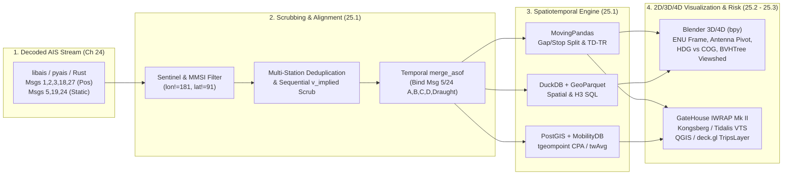
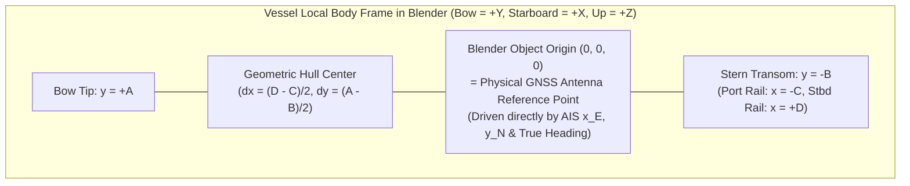

# Chapter 25: Software for Processing and Visualizing Decoded AIS Messages (Open Source, Blender 3D/4D, and Proprietary Suites)

---

## 1. Operational & Conceptual Overview

Decoding raw NMEA 0183 `!AIVDM` and `!AIVDO` sentences into structured dictionaries or C++/Rust structs (Chapter 24) is only the entry point of a maritime analytics or casualty-reconstruction workflow. A raw decoded Automatic Identification System (AIS) stream is **not** a clean, continuous set of vessel trajectories. Rather, it is an asynchronous, noisy, multi-rate point cloud in which:

1. **Dynamic and Static Attributes Are Decoupled in Time:** High-rate kinematic state vectors (Position Reports: Messages 1, 2, 3, 18, and 27) arrive every $2\text{ to }180\text{ seconds}$ keyed only by a 9-digit Maritime Mobile Service Identity (**MMSI**), whereas vessel identity, hull dimensions, GNSS antenna offsets, and static draught (Messages 5 and 24) arrive asynchronously every $6\text{ minutes}$—and frequently suffer from VHF Data Link (VDL) two-slot packet loss.
2. **Sensor Disconnects Produce Sentinel Coordinates:** Uninitialized GNSS receivers, disconnected gyrocompasses, and uncalibrated rate-of-turn (ROT) indicators inject legal ITU-R M.1371-5 "not available" sentinel values (`lon = 181.0°`, `lat = 91.0°`, `sog = 102.3 kts`, `cog = 360.0°`, `true_heading = 511°`, `rot = -128`) directly into the decoded table.
3. **Multi-Station Reception Duplicates Bursts:** In coastal networks and commercial feeds, a single $26.67\text{ ms}$ VHF burst is routinely demodulated by three to ten overlapping shore towers or low-Earth-orbit (LEO) satellites, creating near-simultaneous duplicate rows ($\Delta t \to 0$) that drive naive finite-difference velocity calculations ($v = \Delta s / \Delta t$) to infinity.
4. **Positions Represent the GNSS Antenna, Not the Hull Center:** Every AIS latitude and longitude $(\phi, \lambda)$ records the instantaneous location of the ship's **GNSS receiving antenna**, which on a $400\text{ m}$ container vessel or bulk carrier may sit $300\text{ to }350\text{ m}$ aft of the bulbous bow. Furthermore, a vessel crabbing through a cross-current or wind shear translates along its **Course Over Ground (COG)** while its hull points along its **True Heading (HDG)**.

To turn billions of raw AIS rows into statistically valid trajectories, courtroom-grade 3D collision reconstructions, or real-time Vessel Traffic Services (VTS) displays, engineers rely on three complementary software tiers covered in this chapter:

* **Section 25.1 — The Open-Source Spatiotemporal Data Science Stack:** Vectorized tabular and spatial processing in **`pandas`** and **`geopandas`**, trajectory segmentation and spatio-temporal compression in **`MovingPandas`**, out-of-core columnar SQL analytics over **`GeoParquet`** using **`DuckDB`** (`spatial` and `h3` extensions), algebraic moving-object queries in **`PostgreSQL` / `PostGIS` / `MobilityDB`**, and 2D visualization in **QGIS** and **`deck.gl`**.
* **Section 25.2 — 3D/4D Spatiotemporal Visualization and Forensic Reconstruction in Blender (`bpy`):** Transforming WGS84 tracks into a centered **East-North-Up (ENU)** local tangent plane to defeat single-precision `float32` vertex jitter, rigging parametric 3D hulls to the exact Message 5/24 **GNSS antenna reference point**, keyframing phase-unwrapped True Heading against COG/SOG to expose crabbing angles, raycasting bridge-wing blind sectors (`BVHTree`), rendering **COLREGs Annex I** navigation light cones, and animating dynamic **Under-Keel Clearance (UKC)** over **IHO S-102** bathymetry.
* **Section 25.3 — Proprietary VTS, Risk Modeling, and Maritime Intelligence Platforms:** Deep architectural analysis of **GateHouse Maritime** (IALA A-124 Base Station Controllers, stateful deduplication, and the **IWRAP Mk II** quantitative collision/grounding probability engine), enterprise VTS and bridge simulators (**Kongsberg Norcontrol**, **Tidalis**, **Wärtsilä Transas**, **Esri ArcGIS Velocity**), and commercial commodity/sanctions intelligence suites (**Kpler / MarineTraffic**, **Vortexa**, **Windward**, **Pole Star PurpleTRAC**, **Spire**, **S&P Global**, and **Starboard Maritime Intelligence**).



---

## 2. Historical Context & Evolution (`schwehr/gis-history` Integration)

The software tools used to process and visualize AIS trajectories today emerged from a forty-year convergence of open-source cartographic projection libraries, 3D computer graphics, hydrographic research, and moving-object database theory (documented in [`schwehr/gis-history`](https://github.com/schwehr/gis-history)):

| Year | Milestone (`schwehr/gis-history` & Maritime Lineage) | Architectural Impact on AIS Post-Processing & Visualization |
|---|---|---|
| **1983 – 1995** | Gerald Evenden releases **`PROJ`** at USGS (`1983`); Python (`1992`); **`PROJ4`** (`1994`); **`NumPy`** (`1995`) | Establishes fast C/Python geodetic transformations between WGS84 (`EPSG:4326`), UTM, ECEF, and local tangent planes. |
| **Jan 1994** | Ton Roosendaal and NeoGeo (Netherlands) release **`Blender` 1.00** | Created as an in-house 3D animation suite with an architecture designed for fast scene-graph manipulation and scripting. |
| **1998 – 2001** | Frank Warmerdam releases **`GDAL/OGR`** (`2000`); Refractions Research releases **`PostGIS`** (`2001`); GateHouse develops Danish national AIS network (`2001`) | Enables open-source vector/raster I/O (`OGR` S-57 ENC driver) and spatial SQL indexing (`GiST` R-trees) alongside the first national IALA A-124 AIS shore networks. |
| **July – Oct 2002** | **IMO SOLAS AIS mandate takes effect** (`July 1, 2002`); Gary Sherman starts **`QGIS`** (`July 2002`); **Blender open-sourced under the GNU GPL** (`Oct 13, 2002`) | Within a single 100-day window in 2002, mandatory global shipboard AIS broadcasting, open-source desktop GIS (`QGIS`), and open-source 3D scientific rendering (`Blender`) are born simultaneously. |
| **2006 – 2012** | **Kurt Schwehr** at **UNH CCOM/JHC** couples Python AIS decoders (`noaadata` / `libais`) with **Blender (`bpy`)**, PostGIS, and Google Earth (`2006–2011`); **Whale Alert** presented to US Congress (`2012`) | First automated 3D/4D scientific visualizations of AIS vessel traffic over multibeam sonar bathymetry, right-whale vocalization spheres, and ship-strike slow zones in Stellwagen Bank. |
| **2008 – 2013** | IALA & GateHouse release **`IWRAP Mk II`**; **GeoPandas** started by Kelsey Jordahl (`2013`); **"All the Ships"** Google I/O talk (`2013`) | Formalizes quantitative AIS collision/grounding probability modeling (`IWRAP`) and brings native spatial `GeoSeries` operations to Python `pandas`. |
| **Dec 2018 – 2021** | **`DuckDB`** started (`2018`); **Anita Graser** starts **`MovingPandas`** (`Dec 2018`); **`MobilityDB`** released (`2019`); **`GeoArrow`** (`2020`) & **`GeoParquet`** (`2021`) | Replaces slow row-by-row scripts with vectorized trajectory splitting, Top-Down Time-Ratio (TD-TR) compression, algebraic `tgeompoint` databases, and out-of-core columnar SQL over Parquet. |

---

## 3. Deep Technical & Mathematical Foundations

Before examining individual software packages, we derive the four foundational mathematical operations that every rigorous AIS post-processing and 3D visualization pipeline must implement:

1. **Sequential Geodesic Implied-Speed Outlier Scrubbing,**
2. **Spatiotemporal Trajectory Generalization (Top-Down Time-Ratio [TD-TR]),**
3. **IEEE 754 `float32` Quantization Error and Local Tangent Plane (ENU) Projection for 3D Engines,** and
4. **Parametric Hull-to-Antenna Offset Rigging and Dynamic Under-Keel Clearance (UKC).**

### 3.1 Sequential Geodesic Implied Velocity vs. Pairwise Differencing

Let an MMSI's chronologically ordered, deduplicated position sequence be $\{(t_k, \lambda_k, \phi_k)\}_{k=0}^{N-1}$ with $t_k > t_{k-1}$. On the WGS84 sphere/ellipsoid (mean radius $R_\oplus \approx 6{,}371{,}008.8\text{ m}$), the great-circle distance $\Delta s(P_{k-1}, P_k)$ via the Haversine formula is:

$$\Delta s(P_{k-1}, P_k) = 2 R_\oplus \arcsin\!\left(\sqrt{\sin^2\!\left(\frac{\phi_k - \phi_{k-1}}{2}\right) + \cos\phi_{k-1}\cos\phi_k \sin^2\!\left(\frac{\lambda_k - \lambda_{k-1}}{2}\right)}\right)$$

and the **implied speed over ground** across the interval $\Delta t_k = t_k - t_{k-1}$ is:

$$v_{\text{implied}}(P_{k-1}, P_k) = \frac{\Delta s(P_{k-1}, P_k)}{t_k - t_{k-1}}$$

> [!WARNING]
> **Why Naive Vectorized `df.diff()` Fails on Single-Point GPS Spikes:**
> Suppose a merchant vessel steaming steadily at $15\text{ kts}$ ($7.72\text{ m/s}$) emits a single corrupted position $P_k$ displaced by $50\text{ km}$ due to an unverified bit-flip or GNSS multipath spike, followed $10\text{ s}$ later by a valid position $P_{k+1}$ back on the true track.
> * A naive pairwise filter checks $v_{\text{implied}}(P_{k-1}, P_k) \approx 5{,}000\text{ m/s} > v_{\max}$ (flagging $P_k$) **and** checks $v_{\text{implied}}(P_k, P_{k+1}) \approx 5{,}000\text{ m/s} > v_{\max}$ (mistakenly flagging the valid recovery point $P_{k+1}$!).
> * Conversely, a **stateful sequential filter** (as implemented in `MovingPandas.OutlierCleaner` or a Numba/Rust state loop) maintains a pointer $i_{\text{last}}$ to the **last accepted valid fix**. When $v_{\text{implied}}(P_{i_{\text{last}}}, P_k) > v_{\max}$, $P_k$ is rejected while $i_{\text{last}}$ remains at $k-1$; on the next step, $P_{k+1}$ is tested against $P_{k-1}$, yielding $v_{\text{implied}}(P_{k-1}, P_{k+1}) = 7.72\text{ m/s} \le v_{\max}$, preserving $P_{k+1}$ without data loss.

### 3.2 Spatiotemporal Trajectory Compression: Synchronous Euclidean Distance (TD-TR)

Raw Class A AIS trajectories contain millions of collinear points along straight traffic lanes. However, compressing AIS tracks with classic **2D Spatial Douglas-Peucker (`DouglasPeuckerGeneralizer`)** destroys temporal fidelity. Spatial Douglas-Peucker measures the perpendicular geometric distance $d_\perp(P_k, \overline{P_i P_j})$ from an intermediate vertex $P_k = (x_k, y_k, t_k)$ to the spatial line segment $\overline{P_i P_j}$, completely ignoring the timestamp $t_k$. If a vessel steams down a straight channel at $14\text{ kts}$, stops dead in the water for $45\text{ minutes}$ along the exact same centerline, and then resumes at $14\text{ kts}$, Spatial Douglas-Peucker deletes all intermediate points during the stop because $d_\perp \approx 0\text{ m}$! Any subsequent Closest Point of Approach (CPA) or Blender animation interpolated across $\overline{P_i P_j}$ will place the vessel kilometers away from its true location at time $t_k$.

To preserve both spatial geometry and time synchronization, **Meratnia and de By (2004)** introduced the **Top-Down Time-Ratio (TD-TR)** algorithm (implemented in `MovingPandas` as `TopDownTimeRatioGeneralizer`). Given segment endpoints $P_i = (x_i, y_i, t_i)$ and $P_j = (x_j, y_j, t_j)$ in projected metric coordinates, TD-TR projects where the vessel *would* be at time $t_k \in [t_i, t_j]$ under constant-velocity linear interpolation:

$$\tau_k = \frac{t_k - t_i}{t_j - t_i} \in [0, 1], \qquad \hat{x}_k(t_k) = x_i + \tau_k(x_j - x_i), \qquad \hat{y}_k(t_k) = y_i + \tau_k(y_j - y_i)$$

The error metric is the **Synchronous Euclidean Distance ($d_{\text{SED}}$)**:

$$d_{\text{SED}}(P_k, \overline{P_i P_j}) = \sqrt{\big(x_k - \hat{x}_k(t_k)\big)^2 + \big(y_k - \hat{y}_k(t_k)\big)^2}$$

TD-TR recursively splits the trajectory at $k^* = \arg\max_{i < k < j} d_{\text{SED}}(P_k, \overline{P_i P_j})$ whenever $d_{\text{SED}}(P_{k^*}, \overline{P_i P_j}) > \varepsilon_{\text{SED}}$. This guarantees that at **every historical timestamp $t_k$**, the linearly interpolated position $(\hat{x}(t_k), \hat{y}(t_k))$ deviates from the observed AIS fix by at most $\varepsilon_{\text{SED}}$ meters.

### 3.3 IEEE 754 `float32` Vertex Quantization Physics in 3D Scene Graphs (Blender)

Scientific Python libraries (`numpy`, `pandas`, `pyproj`) compute coordinates in 64-bit IEEE 754 double precision (`float64`, 53-bit significand, $\approx 15\text{–}17$ decimal digits). In contrast, 3D rendering engines—including **Blender** (`MeshVertex.co`, `Object.matrix_world`, and OpenGL/Vulkan GPU vertex buffers)—store spatial coordinates in **32-bit IEEE 754 single precision (`float32`)**, which allocates 1 sign bit, 8 exponent bits, and $p - 1 = 23$ explicit fraction bits ($p = 24$ bits of significand precision).

For any coordinate of magnitude $|x| > 0$, the spacing between adjacent representable `float32` numbers—the **Unit in the Last Place ($\Delta_{\text{ULP}}$)**—is:

$$\Delta_{\text{ULP}}(x) = 2^{\lfloor \log_2 |x| \rfloor - 23}$$

| Coordinate System Imported into Blender | Typical Coordinate Magnitude $\|x\|$ | Binary Exponent $\lfloor \log_2 \|x\| \rfloor$ | `float32` Quantization Step $\Delta_{\text{ULP}}(x)$ | Visual & Forensic Artifact in Blender |
|---|---|---|---|---|
| **Raw ECEF (`EPSG:4978`)** | $6{,}378{,}137\text{ m}$ | $22$ ($2^{22} = 4{,}194{,}304$) | **$0.500\text{ m}$** ($500\text{ mm}$) | Severe hull mesh tearing; ships jump in half-meter discrete steps. |
| **Raw UTM Northing** (e.g., Boston / Stellwagen Bank, Zone 19N) | $4{,}700{,}000\text{ m}$ | $22$ ($2^{22} = 4{,}194{,}304$) | **$0.500\text{ m}$** ($500\text{ mm}$) | Bridge house and mast vertices snap between $0.5\text{ m}$ grid planes as the ship rotates; camera shakes violently. |
| **Raw UTM Easting** (False Easting $500\text{ km}$) | $500{,}000\text{ m}$ | $18$ ($2^{18} = 262{,}144$) | **$0.03125\text{ m}$** ($31.3\text{ mm}$) | Anisotropic quantization ($3.1\text{ cm}$ East vs. $50\text{ cm}$ North) distorts angular bearings. |
| **Centered Local ENU** ($\pm 10\text{ km}$ around scene origin) | $\le 10{,}000\text{ m}$ | $13$ ($2^{13} = 8{,}192$) | **$0.000977\text{ m}$** (**$0.98\text{ mm}$**) | Sub-millimeter smoothness across an entire port approach or traffic separation scheme. |
| **Centered Local ENU** ($\pm 1\text{ km}$ around collision point) | $\le 1{,}000\text{ m}$ | $9$ ($2^{9} = 512$) | **$0.000061\text{ m}$** (**$0.061\text{ mm}$**) | Micrometer-scale fidelity for bridge-wing camera raycasting and hull-to-pier contact forensics. |

To guarantee sub-millimeter precision in Blender, we select a fixed **Local Scene Origin** $(\lambda_0, \phi_0, h_0)$ (typically the collision point, bridge pier, or harbor entrance at mean sea level $h_0 = 0$). Using WGS84 ellipsoid parameters ($a = 6{,}378{,}137.0\text{ m}$, $e^2 = 2f - f^2 = 0.00669437999014$), we first convert $(\lambda, \phi, h)$ in `float64` to Earth-Centered, Earth-Fixed (**ECEF**) coordinates $(X, Y, Z)$ with prime-vertical radius of curvature $N(\phi) = \frac{a}{\sqrt{1 - e^2\sin^2\phi}}$:

$$\begin{bmatrix} X \\ Y \\ Z \end{bmatrix} = \begin{bmatrix} (N(\phi) + h)\cos\phi\cos\lambda \\ (N(\phi) + h)\cos\phi\sin\lambda \\ (N(\phi)(1 - e^2) + h)\sin\phi \end{bmatrix}$$

Subtracting the origin's ECEF vector $\mathbf{r}_0 = [X_0, Y_0, Z_0]^T$ in `float64` and multiplying by the orthonormal **East-North-Up (ENU)** rotation matrix yields the local metric coordinates $(x_{\text{E}}, y_{\text{N}}, z_{\text{U}})$ passed to Blender's $(+X, +Y, +Z)$ scene axes:

$$\begin{bmatrix} x_{\text{E}} \\ y_{\text{N}} \\ z_{\text{U}} \end{bmatrix} = \begin{bmatrix} -\sin\lambda_0 & \cos\lambda_0 & 0 \\ -\sin\phi_0\cos\lambda_0 & -\sin\phi_0\sin\lambda_0 & \cos\phi_0 \\ \cos\phi_0\cos\lambda_0 & \cos\phi_0\sin\lambda_0 & \sin\phi_0 \end{bmatrix} \begin{bmatrix} X - X_0 \\ Y - Y_0 \\ Z - Z_0 \end{bmatrix}$$

---

## 4. Hardware, Standards, & Software Ecosystem

### 25.1 Open-Source Software for Processing Decoded AIS Messages

#### 25.1.1 Vectorized Ingestion, Scrubbing, and Spatial Joins in `pandas` and `geopandas`

For datasets up to tens of millions of rows that fit in RAM (or per-day chunked pipelines), **`pandas`** and **`geopandas`** (built on **`shapely` 2.0+** vectorized C/GEOS ufuncs and **`pyproj`**) form the standard scientific Python preprocessing layer:

1. **ITU-R M.1371-5 Sentinel Scrubbing & Domain Validation:**
   * Filter out invalid coordinates (`lon == 181.0`, `lat == 91.0`, or out-of-bounds $|\lambda| > 180^\circ, |\phi| > 90^\circ$, as well as uninitialized `(0.0, 0.0)` "Null Island" fixes).
   * Replace kinematic sentinels with `np.nan` rather than dropping the position fix: `sog == 102.3` (`1023` raw), `cog == 360.0` (`3600` raw), `true_heading == 511`, and `rot == -128` (`0x80`).
2. **Multi-Station Duplicate Suppression:**
   * Sort by `["mmsi", "timestamp"]` and drop near-simultaneous duplicate receipts where $\Delta t < \Delta t_{\text{min}}$ (e.g., $0.5\text{ s}$) and $\Delta s < 1.0\text{ m}$.
3. **As-Of Temporal Joining (`pd.merge_asof`) of Static and Dynamic Reports:**
   * Because Message 5 (Class A static/voyage) and Message 24 (Class B static) arrive on a separate 6-minute cycle from Messages 1/2/3/18, a standard equality join on timestamp fails. `pd.merge_asof(pos_df, static_df, on="timestamp", by="mmsi", direction="backward", tolerance=pd.Timedelta("12h"))` attaches the active `(name, imo, shiptype, to_bow, to_stern, to_port, to_starboard, draught, destination)` state vector to every position report in $\mathcal{O}(N \log N)$ time.
4. **Vectorized Spatial Joins (`gpd.sjoin`):**
   * Converting `(lon, lat)` into a `GeoDataFrame` (`gpd.points_from_xy`) builds a packed **STRtree** spatial index in C (`shapely` 2.x), enabling million-point-per-second point-in-polygon tests (`gpd.sjoin(ais_gdf, port_polygons_gdf, predicate="within")`) against IHO sea areas, Exclusive Economic Zones (EEZs), Traffic Separation Schemes (TSS), and port berth polygons.

#### 25.1.2 Trajectory Analytics with `MovingPandas` (Anita Graser, 2018–Present)

Started in December 2018 by **Anita Graser** at the Austrian Institute of Technology (see [`schwehr/gis-history`](https://github.com/schwehr/gis-history) and Graser, 2019), **`MovingPandas`** (`movingpandas`) layers native movement-data abstractions—`Trajectory` and `TrajectoryCollection`—directly atop `GeoPandas` and `Shapely`. Instead of treating AIS records as independent points, `MovingPandas` models them as continuous space-time curves with five core maritime operators:

| `MovingPandas` Class | Maritime Analytical Purpose | Key Parameters & Algorithmic Behavior |
|---|---|---|
| **`OutlierCleaner`** | Scrubbing GNSS teleportation spikes and corrupted bit-flips | `OutlierCleaner(traj).clean(v_max=50, units=("nm", "h"))`: Sequentially evaluates geodesic speed from the *last accepted valid fix* (Section 3.1), discarding spikes exceeding $v_{\max}$. |
| **`ObservationGapSplitter`** | Breaking tracks when AIS goes dark or exits receiver range | `ObservationGapSplitter(traj).split(gap=timedelta(hours=1))`: Splits a vessel's MMSI stream into separate sub-trajectories whenever $\Delta t_k > T_{\text{gap}}$. |
| **`StopSplitter`** | Segmenting continuous MMSI streams into port-to-port voyages | `StopSplitter(traj).split(max_diameter=300, min_duration=timedelta(minutes=30))`: Splits a trajectory whenever the vessel stays inside a spatial bounding circle of diameter $D_{\max}$ for duration $\ge T_{\min}$. |
| **`SpeedSplitter`** | Extracting active underway transit vs. drifting/loitering segments | `SpeedSplitter(traj).split(speed=1.5, duration=timedelta(minutes=20))`: Splits tracks when sustained speed drops below threshold. |
| **`TopDownTimeRatioGeneralizer`** | Spatiotemporal trajectory compression preserving CPA timestamps | `TopDownTimeRatioGeneralizer(traj).generalize(tolerance=25.0)`: Implements **TD-TR** ($d_{\text{SED}} \le \varepsilon_{\text{SED}}$, Section 3.2), achieving $80\%\text{–}95\%$ vertex reduction while keeping synchronous time interpolation accurate. |
| **`TrajectoryStopDetector`** | Automated port-call, anchorage, and STS rendezvous detection | `get_stop_Points()` / `get_stop_segments()`: Returns point centroids, start/end timestamps, and residence durations of every stationary episode. |
| **`TrajectoryAggregator`** | Synthesizing directed maritime traffic flow graphs from raw tracks | `TrajectoryAggregator(tc, max_distance=1000, min_distance=200, min_stop_duration=...)`: Extracts characteristic trajectory points, builds Voronoi cells, and aggregates vessel transitions into weighted directed edges for fairway mapping. |

#### 25.1.3 High-Performance Columnar & Spatiotemporal Databases (`DuckDB`, `MobilityDB`, `Sedona`, `GeoParquet`) and 2D Visualization (`QGIS`, `deck.gl`)

When AIS archives scale from millions of rows (single port) to tens of billions of rows (multi-year global satellite + terrestrial archives), single-process in-memory `pandas` DataFrames exhaust system RAM. Modern maritime data engineering relies on four scalable architectures:

1. **Hive-Partitioned `GeoParquet` and `GeoArrow`:**
   * Storing decoded AIS data in Apache Parquet files adhering to the **OGC GeoParquet 1.1+** specification (with **`GeoArrow`** struct/WKB point encodings, Zstandard compression, and row groups sorted by **Uber H3** cell or Hilbert curve index alongside `mmsi` and `timestamp`) reduces disk footprint by $8\times\text{–}15\times$ compared to CSV and enables predicate pushdown on bounding boxes (`bbox.xmin`, `bbox.ymax`) and time ranges without reading unused columns.
2. **`DuckDB` (with `spatial` and `h3` Extensions):**
   * Created by Mark Raasveldt and Hannes Mühleisen in 2018, **`DuckDB`** is an in-process, vectorized OLAP SQL engine capable of querying hundreds of gigabytes of Hive-partitioned GeoParquet files directly on a single workstation using out-of-core streaming execution.
   * With the official `spatial` and community `h3` extensions loaded (`INSTALL spatial; INSTALL h3 FROM community;`), a single SQL query can filter Parquet partitions, compute sequential implied speeds via SQL window functions (`LAG(lon) OVER (PARTITION BY mmsi ORDER BY ts)`), bin vessel residence time into **H3** hexagonal cells (`h3_latlng_to_cell(lat, lon, 8)`), and export clean trajectories directly to Arrow/GeoDataFrame via zero-copy memory sharing.
3. **`PostgreSQL` + `PostGIS` + `MobilityDB` (Algebraic Moving Objects):**
   * Developed at Université Libre de Bruxelles (Zimányi et al., 2020), **`MobilityDB`** extends PostgreSQL and PostGIS with native temporal-spatial data types (`tgeompoint`, `tgeogpoint`, `tfloat`, `tint`) implementing Güting's moving-objects algebra.
   * Instead of storing 50,000 separate point rows for one voyage, MobilityDB packs the entire continuous piecewise-linear trajectory into a single `tgeompoint` sequence attribute indexed by a 4D spatiotemporal R-tree (`SP-GiST` / `GiST`) and supports exact continuous-time algebraic queries in SQL:
     ```sql
     -- Compute exact continuous-time Closest Point of Approach (CPA) distance
     -- and timestamp between every pair of vessels within 2 km in a TSS:
     SELECT
         a.mmsi AS mmsi_1,
         b.mmsi AS mmsi_2,
         nearestApproachDistance(a.traj, b.traj) AS cpa_meters,
         startTimestamp(nearestApproachInstant(a.traj, b.traj)) AS tcpa_utc,
         twAvg(a.sog_trace) AS vessel1_time_weighted_mean_sog
     FROM ais_voyages a
     JOIN ais_voyages b
       ON a.mmsi < b.mmsi
      AND a.traj && expandSpace(b.traj, 2000.0) -- 4D spatiotemporal bbox index hit
      AND edwithin(a.traj, b.traj, 2000.0)      -- Ever within 2000 m at the same instant
     ORDER BY cpa_meters ASC;
     ```
4. **Distributed Engines (`Apache Sedona`, `BigQuery`) & 2D Interactive Visualization (`QGIS`, `deck.gl`):**
   * For multi-petabyte cloud pipelines (such as Global Fishing Watch), **Google BigQuery** (`GEOGRAPHY` column type + native H3/S2 indexing) and **Apache Sedona** (distributed spatial R-tree joins on Apache Spark / DataFusion) process decades of global history in seconds.
   * For interactive 2D exploration, **QGIS** (using its native **Temporal Controller** over GeoParquet/PostGIS layers) and **`deck.gl` (`TripsLayer`)** / **`kepler.gl`** render hundreds of thousands of animated vessel trails in the browser by uploading `[x, y, timestamp]` vertex arrays directly to WebGL/WebGPU shaders.

---

### 25.2 3D/4D Spatiotemporal Visualization, Casualty Reconstruction, and Scientific Rendering with Blender (`bpy`, `BlenderGIS`, and Geometry Nodes)

While 2D GIS maps suffice for regional traffic heatmaps, maritime casualties, bridge allisions, groundings, and underwater acoustic studies are fundamentally **three-dimensional (3D) and four-dimensional (4D = 3D space + time)** physical processes:
* Could the Officer of the Watch (OOW) standing on the port bridge wing see the small fishing vessel over the forward stack of $40\text{-foot}$ shipping containers, or was it hidden in a geometric blind sector?
* As a $400\text{ m}$ container ship yawed $18^\circ$ in a narrow canal with its GNSS antenna mounted near the stern, by how many meters did its bulbous bow and flare sweep laterally into the bank or bridge pier?
* How much vertical **Under-Keel Clearance (UKC)** remained beneath the ship's rolling bilge keel and an **IHO S-102** bathymetric shoal at the exact minute of low tide?
* How did the three-dimensional underwater radiated noise (URN) sphere of a transiting tanker overlap with a foraging North Atlantic right whale's dive profile?

To answer these questions with engineering precision, maritime researchers and casualty investigators use **Blender** (`https://www.blender.org`) driven programmatically via its internal Python 3 API (**`bpy`**) and **`mathutils`**.

#### 25.2.1 Historical Lineage: From Blender's 1994/2002 Origins to UNH CCOM/JHC (`schwehr/gis-history`)

As recorded in [`schwehr/gis-history`](https://github.com/schwehr/gis-history), **Blender** was initially released in **January 1994** by **Ton Roosendaal** as the in-house 3D animation software of the Dutch animation studio NeoGeo, and later distributed by Not a Number (NaN). Following the collapse of dot-com investment in 2002, Roosendaal founded the non-profit Blender Foundation, raised €100,000 through the community "Free Blender" campaign, and released Blender's source code under the **GNU General Public License (GPL) on October 13, 2002**—the exact same year that the **IMO SOLAS Chapter V AIS carriage mandate** entered into force (July 1, 2002).

Between **2006 and 2011**, **Kurt Schwehr** and colleagues at the **University of New Hampshire Center for Coastal and Ocean Mapping / Joint Hydrographic Center (UNH CCOM/JHC)** pioneered the integration of open-source Python AIS decoders (**`noaadata`** and later **`libais`**, Chapter 24) with **Blender's Python API (`bpy`)**, PostGIS, and multibeam echosounder bathymetry:
1. **3D Port & Bathymetric Traffic Animation:** Importing high-resolution digital elevation models (DEMs) of Portsmouth Harbor, Boston Harbor, and San Francisco Bay into Blender and procedurally driving 3D vessel meshes from decoded USCG AIS streams.
2. **Stellwagen Bank Right-Whale Conservation & Acoustic Visualization:** In collaboration with the Stellwagen Bank National Marine Sanctuary (Dave Wiley et al.) and Woods Hole Oceanographic Institution (WHOI), Schwehr used `noaadata` and Blender (`bpy`) to co-render 3D commercial ship trajectories alongside DTAG-tracked North Atlantic right whale (*Eubalaena glacialis*) underwater foraging dives and passive acoustic monitoring (PAM) buoy detection spheres—demonstrating visually how mandatory speed zones and AIS Area Notices (`Whale Alert`, presented to the US Congress in 2012; Chapter 30) reduce lethal ship-strike and acoustic-masking risks.

#### 25.2.2 Parametric Hull Rigging from AIS Message 5 / 24 Antenna Offsets

The single most common mistake in amateur 3D ship animations is placing the Blender object's local origin `(0, 0, 0)` at the geometric center of the 3D hull mesh. As established in the Front Matter (`notation-and-conventions.md`, §4.3), an AIS position report $(\lambda, \phi)$ gives the coordinates of the **shipboard GNSS antenna**, and AIS Message 5 (or Message 24 Part B) provides four unsigned integer offsets (in meters) from that antenna to the hull boundaries:

$$A = d_{\text{bow}}, \qquad B = d_{\text{stern}}, \qquad C = d_{\text{port}}, \qquad D = d_{\text{starboard}}$$

with overall length $L_{\text{OA}} = A + B$, beam $W = C + D$, and static draught $T = d_{\text{draught}}$ (in meters, scaled from $\frac{1}{10}\text{ m}$ raw integer).



To rig a vessel mesh in Blender so that setting `obj.location = (x_E, y_N, z_U)` and `obj.rotation_euler.z = -radians(true_heading)` places every square meter of the physical hull in its exact geodetic position:
1. Start with a normalized template vessel mesh whose bounding box is centered at $(0, 0)$ in $(X, Y)$ with unit width $1.0\text{ m}$ ($x \in [-0.5, +0.5]$), unit length $1.0\text{ m}$ ($y \in [-0.5, +0.5]$, bow pointing toward $+Y$), and waterline at $z = 0$ (keel at $z = -T$, freeboard/superstructure at $z > 0$).
2. Scale the mesh vertices in **Edit / Mesh Data space** (`mesh.transform`) by $(W, L_{\text{OA}}, 1)$. Now the mesh spans $[-W/2, +W/2]$ in $X$ and $[-L_{\text{OA}}/2, +L_{\text{OA}}/2]$ in $Y$.
3. Translate all mesh vertices in **Edit / Mesh Data space** by the antenna-to-hull-center offset vector $(\Delta x_{\text{mesh}}, \Delta y_{\text{mesh}}, 0)$:

$$\Delta x_{\text{mesh}} = \frac{D - C}{2}, \qquad \Delta y_{\text{mesh}} = \frac{A - B}{2}$$

Verify the resulting local vertex bounds relative to the Blender Object's pivot `(0, 0, 0)`:
* **Bow coordinate:** $y_{\max} = +\frac{L_{\text{OA}}}{2} + \frac{A - B}{2} = \frac{(A + B) + (A - B)}{2} = +A$ (exact distance from antenna to bow!).
* **Stern coordinate:** $y_{\min} = -\frac{L_{\text{OA}}}{2} + \frac{A - B}{2} = \frac{-(A + B) + (A - B)}{2} = -B$ (exact distance from antenna to stern!).
* **Starboard beam coordinate:** $x_{\max} = +\frac{W}{2} + \frac{D - C}{2} = +D$.
* **Port beam coordinate:** $x_{\min} = -\frac{W}{2} + \frac{D - C}{2} = -C$.

> [!IMPORTANT]
> **Why Antenna-Origin Rigging Is Critical in Casualty Forensics (*Ever Given* & *MV Dali*):**
> On an Ultra Large Container Vessel ($L_{\text{OA}} = 400\text{ m}$, $W = 59\text{ m}$) or a large Neopanamax ship where the navigation bridge and AIS GNSS antenna are located aft ($A = 350\text{ m}$ to bow, $B = 50\text{ m}$ to stern), the distance from the GNSS antenna pivot to the geometric center is $\Delta y = \frac{350 - 50}{2} = 150\text{ m}$. If the vessel yaws by just $\Delta\psi = 20^\circ$ around its stern while pivoting in a canal or approaching a bridge pier, the bow sweeps laterally by:
> $$\Delta x_{\text{bow}} = A \sin(20^\circ) = 350 \times 0.34202 = \mathbf{119.71\text{ meters}}$$
> A naive 3D model pivoted at its geometric center ($L_{\text{OA}}/2 = 200\text{ m}$) places the bow at $200\sin(20^\circ) = 68.40\text{ m}$—an error of **$51.3\text{ meters}$** (nearly a full ship beam!), which can make an actual bank grounding or pier strike appear as a clean miss in a courtroom animation.

#### 25.2.3 4D Kinematic Keyframing: True Heading vs. COG (Crabbing/Leeway), Phase Unwrapping, and Geometry Nodes

1. **Decoupling Translation (`COG`/`SOG`) from Hull Orientation (`True Heading`):**
   * In Blender, a ship's translational trajectory curve `(obj.location.x, obj.location.y)` is keyframed from the ENU coordinates $(x_{\text{E}}(t_k), y_{\text{N}}(t_k))$ (optionally with Bezier handle tangent vectors set from velocity $\mathbf{v}_k = \text{SOG}_k \cdot [\sin(\text{COG}_k), \cos(\text{COG}_k)]^T$).
   * Simultaneously, `obj.rotation_euler.z` is keyframed **independently** from **True Heading (`HDG`, $\psi_k$)**—not from `COG`! When a ship transits a cross-current or decelerates under asymmetric rudder/thruster forces, the angle between the tangent of its travel path and its centerline is the **crabbing / leeway angle** $\beta(t) = \text{COG}(t) - \text{HDG}(t)$. Keyframing `location` from position and `rotation_euler.z` from `HDG` automatically renders the ship sliding sideways ("crabbing") down the channel.
2. **Phase Unwrapping Heading to Prevent the $359^\circ \to 1^\circ$ Full-Spin Artifact:**
   * Because True Heading is reported modulo $360^\circ$ in $[0^\circ, 359^\circ]$, a vessel steaming due North whose bow oscillates from $\psi_{k-1} = 359^\circ$ to $\psi_k = 1^\circ$ has a true angular change of $+2^\circ$. However, if raw angles $-359^\circ$ and $-1^\circ$ are inserted into Blender's `rotation_euler.z` F-Curve, Blender interpolates linearly from $-359^\circ$ to $-1^\circ$—spinning the ship **$358^\circ$ backwards** between the two frames!
   * Before inserting Euler keyframes, always apply 1D phase unwrapping in radians:
     $$\psi_{\text{unwrapped}}[k] = \text{ np.unwrap}\big(\text{np.radians}(\psi_{\text{deg}})\big)[k]$$
     Alternatively, use `obj.rotation_mode = 'QUATERNION'` and enforce hemisphere continuity ($\text{if } \mathbf{q}_k \cdot \mathbf{q}_{k-1} < 0: \mathbf{q}_k = -\mathbf{q}_k$) so spherical linear interpolation (`SLERP`) always takes the shortest arc.
3. **Animating 10,000+ Vessels with Blender Geometry Nodes:**
   * Creating a separate `bpy.types.Object` with animation F-Curves for $10{,}000+$ vessels over $10{,}000$ frames overwhelms Blender's scene dependency graph (`Depsgraph`).
   * For regional or global traffic visualizations, store all vessel states for frame $f$ as vertex attributes (`position` = $(x_{\text{E}}, y_{\text{N}}, z_{\text{U}})$, float attribute `heading_rad`, vector attribute `hull_scale` = $(W, L_{\text{OA}}, T)$, integer attribute `shiptype`) on a single **Point Cloud / Mesh object** updated via a lightweight frame-change handler (`bpy.app.handlers.frame_change_pre`) or imported as an Alembic/USD point cache. A **Blender Geometry Nodes** tree (`Instance on Points` $\to$ `Rotate Instances` by `heading_rad` $\to$ `Scale Instances` by `hull_scale`) instances detailed 3D ship models across $50{,}000+$ points on the GPU in milliseconds.

#### 25.2.4 Bridge Wing Viewshed Raycasting, COLREGs Navigation Light Cones, and 3D UKC / Acoustic Rendering

* **Bridge Wing Conning Camera & `BVHTree.ray_cast` Blind-Sector Quantification:**
  * By parenting a Blender camera (`cam.data.lens = 35.0`, human horizontal perspective) to the ship object at local coordinates `(x_wing, y_bridge, z_eye_above_wl)`—for example, $(0\text{ m centerline or } \pm D\text{ wing}, 0\text{ m at bridge house}, +38\text{ m height of eye})$—the rendered viewport shows the exact visual perspective of the Master, Pilot, or OOW.
  * Using `mathutils.bvhtree.BVHTree.FromObject(ship_obj, depsgraph)`, an investigator can cast rays from the bridge-wing eye position across a dense angular grid of azimuths and elevations toward the water surface or toward a target vessel's hull. Any ray that intersects the own-ship's container stacks or deck cranes before reaching the sea surface delineates the exact **3D geometric blind sector** (testing compliance with **SOLAS Chapter V, Regulation 22**, which requires that the view of the sea surface from the conning position not be obscured by more than $\min(2 L_{\text{OA}}, 500\text{ m})$ forward of the bow).
* **COLREGs Annex I Navigation Light Sector Cones:**
  * In nighttime collision reconstructions, parenting semi-transparent volumetric emission cones to each vessel's masthead, sidelight screens, and stern allows judges and juries to see the exact moment a target ship's aspect crossed from **Green ($112.5^\circ$ starboard sidelight)** to **Red ($112.5^\circ$ port sidelight)** or when both **forward and aft white masthead lights ($225^\circ$ sectors)** aligned during a head-on meeting (COLREGs Rules 20–23 and Annex I).
* **Dynamic 3D Under-Keel Clearance (UKC) & Volumetric Acoustic/RF Fields:**
  * Importing an **IHO S-102** bathymetric surface mesh $z_{\text{bathy}}(x_{\text{E}}, y_{\text{N}})$ and keyframing the vessel's vertical position $z_{\text{U}}(t) = \eta_{\text{tide}}(t) - \delta_{\text{squat}}(v(t))$ (where $\eta_{\text{tide}}(t)$ comes from **IHO S-104** or NOAA PORTS® water-level gauges and $\delta_{\text{squat}} \approx \frac{C_B S^{0.81} v_{\text{kts}}^{2.08}}{20}$ is hydrodynamic squat) places the submerged keel at $z_{\text{keel}}(t) = z_{\text{U}}(t) - T$. A Geometry Nodes `Geometry Proximity` shader on the seabed mesh colors the seafloor dynamically by instantaneous vertical clearance $\text{UKC}(x, y, t) = z_{\text{keel}}(t) - z_{\text{bathy}}(x, y)$, flashing red wherever $\text{UKC} < 1.0\text{ m}$.
  * Similarly, attaching a 3D spherical/hemispherical mesh with a Cycles **Principled Volume** shader driven by radial distance $R$ from the propeller renders **Underwater Radiated Noise (URN)** sound-pressure levels ($\text{SPL}(R) = \text{SL}(v) - 20\log_{10} R - \alpha R$) interacting with marine mammal dive tracks and bathymetric canyons.

---

### 25.3 Proprietary AIS Processing, VTS, Risk Modeling, and Maritime Intelligence Software

#### 25.3.1 GateHouse Maritime (Denmark): Base Station Controllers, IWRAP Mk II, and OceanIO

Founded in Nørresundby, Denmark, **GateHouse Maritime** provides the foundational software infrastructure behind many of the world's national coastal AIS networks (including the Danish Maritime Authority, HELCOM Baltic Sea network, UK MCA, Canadian Coast Guard, Australian Maritime Safety Authority, and core components of the USCG Nationwide AIS [NAIS] architecture). Its maritime software stack spans three critical layers:

1. **GateHouse AIS Base Station Controller & Network Management System (IALA A-124):**
   * Operates as the central real-time mediation and command backbone between hundreds of coastal **IEC 62320-1 AIS Base Stations / Repeaters** and national VTS centers, conforming strictly to **IALA Recommendation A-124** (*AIS Shore Station and Networking Aspect*).
   * **IEC 61162-450 TAG-Block Enrichment & Stateful Duplicate Suppression:** Every shore station wraps incoming `!AIVDM` sentences in an NMEA TAG block (`\s:BS_Skagen,r:1712000000,c:1712000000*hh\!AIVDM,...`) containing station ID, arrival timestamp, RSSI, and signal-to-noise ratio. Because coastal stations have overlapping $30\text{–}60\text{ NM}$ VHF footprints, a single vessel transmission is received by multiple towers within milliseconds. The GateHouse controller maintains an in-memory **sliding-window deduplication hash ring** keyed on `(MMSI, Message_ID, Channel, 6-bit_Payload_Hash)` across a configurable time window $\Delta t_{\text{dedup}} \in [0.5\text{ s}, 2.0\text{ s}]$. It emits a single canonical target update to downstream VTS consoles while archiving per-station reception metadata to compute real-time RF coverage maps and Time-Difference-of-Arrival (TDOA) range verification.
   * **Active VDL & FATDMA Management:** Remotely monitors base station health (transmitter forward/reflected power VSWR, receiver noise floor, UTC 1PPS lock) and coordinates **Fixed Access TDMA (FATDMA)** slot reservations (Message 20), Base Station Reports (Message 4), DGNSS corrections (Message 17), Virtual/Synthetic Aids to Navigation (Message 21), and group assignment commands (Messages 16 and 23) so neighboring towers never collide on the VHF Data Link.
2. **IWRAP Mk II (IALA Waterway Risk Assessment Program):**
   * Developed jointly by **GateHouse** and **IALA**, **IWRAP Mk II** is the international standard software tool for quantitative maritime collision and grounding risk assessment. It implements the mathematical **Friis-Hansen / Pedersen (1995, 2008)** model, which factors the expected annual frequency of accidents $\lambda_{\text{accident}}$ (accidents/year) into the product of two terms:

     $$\lambda_{\text{accident}} = N_G \times P_c$$

     * **$N_G$ (Geometric Number of Collision/Grounding Candidates):** The expected number of physical hull overlaps per year if ships steamed blindly along their historical AIS fairway distributions without ever taking evasive action. IWRAP ingests months or years of historical AIS trajectories, projects vessel crossings onto airway legs of length $L_w$, and fits continuous probability density functions $f_1(z), f_2(z)$ (Gaussian, Uniform, or Weibull mixtures) to the lateral cross-track offset $z$ of each vessel length/type class $(i, j)$:
       * **Head-On Geometric Candidates ($N_G^{\text{head-on}}$):** For opposing traffic streams $(1, 2)$ with annual passage counts $Q_{1i}, Q_{2j}$, mean speeds $V_{1i}, V_{2j}$, and beams $B_{1i}, B_{2j}$:

         $$N_G^{\text{head-on}} = L_w \sum_{i,j} \frac{V_{1i} + V_{2j}}{V_{1i} V_{2j}} \, Q_{1i} \, Q_{2j} \, P_{ij}^{\text{overlap}}\!\left(\frac{B_{1i} + B_{2j}}{2}\right)$$

         where for Gaussian lateral distributions $\mathcal{N}(\mu_1, \sigma_1^2)$ and $\mathcal{N}(\mu_2, \sigma_2^2)$ separated by $\Delta\mu = \mu_1 - \mu_2$ with combined half-beam $\bar{B}_{ij} = \frac{B_{1i} + B_{2j}}{2}$:

         $$P_{ij}^{\text{overlap}}(\bar{B}_{ij}) = \Phi\!\left(\frac{\bar{B}_{ij} - \Delta\mu}{\sqrt{\sigma_1^2 + \sigma_2^2}}\right) - \Phi\!\left(\frac{-\bar{B}_{ij} - \Delta\mu}{\sqrt{\sigma_1^2 + \sigma_2^2}}\right)$$

       * **Overtaking Geometric Candidates ($N_G^{\text{overtaking}}$):** Uses the identical integral for same-direction traffic ($V_{1i} > V_{2j}$) with relative speed term $\frac{V_{1i} - V_{2j}}{V_{1i} V_{2j}}$.
       * **Crossing Waterway Candidates ($N_G^{\text{crossing}}$):** At an intersection of angle $\theta$ between two legs with relative speed $V_{\text{rel},ij} = \sqrt{V_{1i}^2 + V_{2j}^2 - 2 V_{1i}V_{2j}\cos\theta}$ and projected geometric collision diameter $D_{ij}(\theta)$:

         $$N_G^{\text{crossing}} = \sum_{i,j} \frac{Q_{1i} \, Q_{2j}}{V_{1i} \, V_{2j}} \frac{D_{ij}(\theta) \, V_{\text{rel},ij}(\theta)}{|\sin\theta|}$$

       * **Powered Grounding Candidates ($N_G^{\text{grounding}}$):** Computes both *Category I* groundings (ships on a straight leg whose lateral cross-track distribution tail $\int_{z_{\text{shoal}}}^\infty f_i(z)\,dz$ intersects a bathymetric contour shallower than ship draught $T_i$) and *Category II* groundings (ships that fail to execute a scheduled waypoint turn at distance $d$ before a shoal because the OOW fails to check position during interval $d / V_i$, modeled as a Poisson navigator check process $\exp(-\lambda_{\text{check}} \cdot \frac{d}{V_i})$).
     * **$P_c$ (Causation Probability Factor):** The conditional probability that human watchkeeping or machinery fails to avert a geometric candidate ($P_c \approx 0.5\times 10^{-4}$ for head-on, $1.1\times 10^{-4}$ for overtaking, $1.3\times 10^{-4}$ for crossing, and $1.6\times 10^{-4}$ for forgotten waypoint turns, modified via Bayesian Belief Networks for VTS monitoring, pilotage, visibility, and traffic separation).
3. **GateHouse OceanIO:**
   * GateHouse's modern cloud-native data foundation that ingests global terrestrial and satellite AIS alongside met-ocean feeds to serve REST/streaming APIs for predictive vessel ETA, port congestion indexing, and automated behavioral anomaly alerting (loitering, dark gaps, anchor dragging over subsea cables).

#### 25.3.2 Enterprise VTS, Bridge Simulation, and Geospatial Suites

| Vendor & Platform Suite | Core Architecture & AIS Processing Capabilities | Primary Operational Deployments |
|---|---|---|
| **Kongsberg Maritime / Kongsberg Norcontrol** (`C-Scope VTS`, `K-Sim Navigation`, `TerraLens`) | Multi-hypothesis Extended/IMM Kalman tracker associating solid-state X/S-band shore radar returns with AIS targets; full-mission **DNV Class A bridge simulators** (`K-Sim`) replaying historical AIS casualty scenarios or injecting synthetic AIS traffic over 360° visual projection domes. | Norwegian Coastal Administration, USCG VTS ports, Maritime Academies worldwide. |
| **Tidalis** (formerly **Saab Maritime Traffic Management / HITT Traffic**) (`VTMIS`, `KleinPort`) | High-availability Vessel Traffic Management Information System integrating coastal AIS networks, shore radars, RDF bearings, CCTV/thermal cameras, hydro-meteo sensors, and pilot/tug scheduling. | Deployed in $>300$ VTS centers and ports globally (Port of Rotterdam, Hong Kong, Port of London). |
| **Wärtsilä Voyage** (formerly **Transas**) (`Navi-Harbour VTS`, `Navi-Sailor 4000 ECDIS`, `FOS`) | Unified ship-to-shore ecosystem linking shipboard ECDIS (`Navi-Sailor`) with shore VTS (`Navi-Harbour`) to support **IHO S-421 / STM route exchange**, dynamic UKC monitoring, and fleet fuel/speed optimization. | Major European, Asian, and Middle Eastern VTS authorities and commercial shipping fleets. |
| **Esri** (`ArcGIS Pro`, `ArcGIS Maritime`, `ArcGIS GeoEvent Server`, `ArcGIS Velocity`) | Enterprise GIS stack supporting **IHO S-57 / S-100** ENC rendering (`ArcGIS Maritime`) and distributed streaming AIS ingestion (`ArcGIS Velocity` / `GeoEvent Server`) for real-time polygon geofencing, proximity alerting, and **3D Space-Time Cube** netCDF aggregation. | US Navy, NGA, NOAA, port authorities, and national hydrographic offices. |

#### 25.3.3 Commercial Maritime Intelligence, Commodity, and Sanctions Platforms

| Platform / Provider | Technical Specialization & Proprietary Analytics | Primary User Base |
|---|---|---|
| **Kpler** (acquired **MarineTraffic** & **FleetMon** in 2023) | Operates the largest terrestrial crowdsourced + commercial AIS receiver network merged with LEO satellite feeds; pairs AIS draught changes (`Msg 5`) and port-berth geofences with customs bills of lading and fixture data to quantify global crude, LNG, LPG, and dry-bulk cargo flows in real time. | Commodity trading desks, energy majors, charterers, port operators. |
| **Vortexa** | Machine-learning cargo-tracking engine that resolves ambiguous Message 5 draught entries and incomplete destination strings to estimate floating storage volumes, refinery runs, and offshore Ship-to-Ship (STS) crude transfers. | Oil/gas hedge funds, physical energy traders, market analysts. |
| **Windward (`MAI` — Maritime AI)** | Behavioral AI engine designed for sanctions compliance and defense MDA; classifies dark-vessel episodes, GNSS manipulation ("location tampering" / circle spoofing), identity laundering, and **Deceptive Shipping Practices (DSP)** under OFAC/EU/UK maritime advisories. | Banks, P&I insurance clubs, bunker suppliers, defense/intelligence agencies. |
| **Pole Star Global (`PurpleTRAC`)** | Regulatory compliance platform that cross-screens live AIS trajectories against **Long-Range Identification and Tracking (LRIT)** positions (Chapter 30) and S&P Global beneficial-ownership graphs to audit sanctions exposure and voyage history. | Maritime trade finance banks, insurers, flag state registries. |
| **Spire Maritime (merged with `exactEarth`)** | Operates a large commercial CubeSat constellation equipped with spaceborne AIS receivers (including **exactView RT** real-time cross-linked payloads and satellite RF geolocation), delivering low-latency global ocean tracks via GraphQL/Kafka APIs. | Commercial aggregators, logistics platforms, national coast guards. |
| **S&P Global (`MINT` / `Sea-web` / `AISLive`)** | Sole official authority appointed by the IMO to assign permanent **7-digit IMO Ship and Company Identification Numbers**; couples authoritative hull/ownership/technical specs (`Sea-web`) with live terrestrial and satellite AIS (`AISLive`). | Admiralty lawyers, classification societies, port state control, economists. |
| **Starboard Maritime Intelligence** | Developed in New Zealand (originating at Dragonfly Data Science); fuses global AIS, fishing **Vessel Monitoring System (VMS)** feeds, and **Sentinel-1 / commercial SAR** dark-vessel detections with non-linear trajectory risk models. | New Zealand, Australia, Pacific Forum Fisheries Agency (FFA), EMSA, UK. |

---

## 5. Security, Adversarial Abuse, & Post-Processing Failure Modes

Even when using mature libraries (`MovingPandas`, `DuckDB`, `Blender`), four data-engineering pitfalls routinely corrupt maritime studies and forensic animations:

1. **The "Null Island" `(0, 0)` and Unfiltered `181° / 91°` Sentinel Trap:**
   * If a single row with `lon = 181.0, lat = 91.0` (ITU-R M.1371 "not available") or `lon = 0.0, lat = 0.0` (uninitialized GPS NMEA struct) survives into trajectory construction, it creates an artificial $10{,}000\text{ km}$ line segment across the globe. In `TopDownTimeRatioGeneralizer`, this single spike dominates the maximum synchronous distance $d_{\text{SED}}$, corrupting the entire recursion tree; in Blender, it shifts the scene bounding box by millions of meters and triggers severe `float32` precision loss.
2. **Antimeridian ($\pm 180^\circ$ Longitude) Wrapping Artifacts:**
   * When a trans-Pacific vessel crosses the $180^\circ$ meridian from $+179.95^\circ\text{ E}$ to $-179.95^\circ\text{ W}$, naive planar GIS lines (`EPSG:4326` or `EPSG:3857`) draw a $359.9^\circ$ horizontal scar across the entire map. Trajectories crossing the antimeridian must either be split at $\lambda = \pm 180^\circ$ (`shapely.ops.split`) or transformed into a continuous local projection (`pyproj` Azimuthal Equidistant / Local ENU or unwrapped longitude $\lambda \in [0^\circ, 360^\circ]$) before computing distances or 3D paths.
3. **Spoofed or Misconfigured Message 5 Hull Offsets (`A, B, C, D`):**
   * On many tugs, fishing vessels, and poorly configured merchant ships, the installer leaves Message 5 dimensions at `(0, 0, 0, 0)` or enters total length into `to_bow` with `to_stern = 0`. Worse, adversarial spoofing tools sometimes broadcast maximum 9-bit/6-bit dimensions (`A = 511, B = 511, C = 63, D = 63` $\implies 1{,}022\text{ m} \times 126\text{ m}$ "megaships"). Post-processing pipelines must cross-check $L_{\text{OA}} = A + B$ against vessel registry length (`Sea-web` / USCG CGMIX) and clamp or flag physically implausible aspect ratios ($L_{\text{OA}} / W \notin [2.0, 12.0]$).
4. **Linear Interpolation Across Multi-Hour "Dark" Gaps:**
   * If an analyst builds a single `MovingPandas.Trajectory` or `MobilityDB` `tgeompoint` without first running `ObservationGapSplitter` (e.g., splitting at $\Delta t > 30\text{–}60\text{ min}$), the software connects a pre-gap coastal fix to a post-gap fix 12 hours later with a straight line—drawing ships steaming straight across peninsulas, islands, and landmass polygons!

---

## 6. Practical Engineering / Code Walkthrough

### 6.1 Walkthrough 25-A: End-to-End Trajectory Scrubbing, `MovingPandas` TD-TR Compression, and `DuckDB` Spatial/H3 Analytics

The following runnable Python script demonstrates the complete open-source post-processing workflow: scrubbing ITU-R M.1371 sentinels, performing stateful sequential geodesic implied-speed filtering, segmenting and compressing trajectories with `MovingPandas` (`ObservationGapSplitter`, `StopSplitter`, `TopDownTimeRatioGeneralizer`), and executing an in-process `DuckDB` SQL query over the cleaned data.

```python
#!/usr/bin/env python3
"""Chapter 25 Walkthrough A: pandas/GeoPandas, MovingPandas, and DuckDB AIS pipeline."""

from datetime import datetime, timedelta, timezone
import numpy as np
import pandas as pd
import geopandas as gpd

# Optional imports (gracefully demonstrated if MovingPandas / DuckDB are installed)
try:
    import movingpandas as mpd
    HAS_MPD = True
except ImportError:
    HAS_MPD = False

try:
    import duckdb
    HAS_DUCKDB = True
except ImportError:
    HAS_DUCKDB = False


def haversine_meters(lon1: float, lat1: float, lon2: float, lat2: float) -> float:
    """Great-circle distance in meters on the WGS84 mean sphere (R = 6,371,008.8 m)."""
    r_earth = 6_371_008.8
    phi1, phi2 = np.radians(lat1), np.radians(lat2)
    dphi = np.radians(lat2 - lat1)
    dlambda = np.radians(lon2 - lon1)
    a = np.sin(dphi / 2.0) ** 2 + np.cos(phi1) * np.cos(phi2) * np.sin(dlambda / 2.0) ** 2
    return float(2.0 * r_earth * np.arcsin(np.sqrt(np.clip(a, 0.0, 1.0))))


def scrub_ais_dataframe(df: pd.DataFrame, v_max_knots: float = 50.0) -> pd.DataFrame:
    """
    1. Removes ITU-R M.1371-5 position sentinels (lon=181, lat=91) & Null Island (0,0).
    2. Masks kinematic sentinels (sog=102.3, cog=360.0, true_heading=511, rot=-128) as NaN.
    3. Deduplicates multi-station receipts (<0.5 s apart).
    4. Applies stateful sequential geodesic implied-speed scrubbing per MMSI.
    """
    clean = df.copy()

    # 1. Scrub position sentinels & invalid MMSI ranges
    valid_pos = (
        (clean["mmsi"].between(200_000_000, 799_999_999))
        & (clean["lon"].between(-180.0, 180.0))
        & (clean["lat"].between(-90.0, 90.0))
        & ~((clean["lon"].abs() < 1e-4) & (clean["lat"].abs() < 1e-4))
    )
    clean = clean.loc[valid_pos].copy()

    # 2. Replace non-position ITU-R M.1371 sentinels with NaN
    clean.loc[clean["sog"] >= 102.2, "sog"] = np.nan
    clean.loc[clean["cog"] >= 360.0, "cog"] = np.nan
    clean.loc[clean["true_heading"] == 511, "true_heading"] = np.nan
    if "rot" in clean.columns:
        clean.loc[clean["rot"] == -128, "rot"] = np.nan

    # 3. Sort chronologically per MMSI and drop multi-station burst duplicates
    clean = clean.sort_values(["mmsi", "timestamp"]).reset_index(drop=True)
    dt_raw = clean.groupby("mmsi")["timestamp"].diff().dt.total_seconds()
    clean = clean.loc[dt_raw.isna() | (dt_raw >= 0.5)].reset_index(drop=True)

    # 4. Stateful sequential implied-speed filter (avoids pairwise diff double-drop bug)
    v_max_mps = v_max_knots * 0.514444
    keep_mask = np.zeros(len(clean), dtype=bool)

    for _, group in clean.groupby("mmsi", sort=False):
        idxs = group.index.to_numpy()
        lons = group["lon"].to_numpy()
        lats = group["lat"].to_numpy()
        ts = group["timestamp"].astype("int64").to_numpy() / 1e9  # UTC epoch seconds

        last_valid = 0
        keep_mask[idxs[0]] = True
        for k in range(1, len(idxs)):
            dt = ts[k] - ts[last_valid]
            if dt <= 0.0:
                continue
            dist_m = haversine_meters(lons[last_valid], lats[last_valid], lons[k], lats[k])
            if (dist_m / dt) <= v_max_mps:
                keep_mask[idxs[k]] = True
                last_valid = k

    return clean.loc[keep_mask].reset_index(drop=True)


def run_demo_pipeline() -> None:
    t0 = datetime(2026, 3, 26, 5, 0, 0, tzinfo=timezone.utc)
    # Synthetic AIS stream including:
    # - A multi-station duplicate at t + 0.1 s
    # - An ITU-R M.1371 sentinel row (lon=181.0, lat=91.0, sog=102.3, hdg=511)
    # - A single GPS teleportation spike at t + 60 s (jumped 15 km East)
    raw_records = [
        {"mmsi": 563123450, "timestamp": t0 + timedelta(seconds=0),    "lon": -76.5300, "lat": 39.2100, "sog": 8.0,   "cog": 318.0, "true_heading": 319},
        {"mmsi": 563123450, "timestamp": t0 + timedelta(seconds=0.1),  "lon": -76.5300, "lat": 39.2100, "sog": 8.0,   "cog": 318.0, "true_heading": 319},  # Duplicate
        {"mmsi": 563123450, "timestamp": t0 + timedelta(seconds=30),   "lon": 181.0000, "lat": 91.0000, "sog": 102.3, "cog": 360.0, "true_heading": 511},  # Sentinel
        {"mmsi": 563123450, "timestamp": t0 + timedelta(seconds=30),   "lon": -76.5310, "lat": 39.2109, "sog": 8.1,   "cog": 318.5, "true_heading": 320},
        {"mmsi": 563123450, "timestamp": t0 + timedelta(seconds=60),   "lon": -76.3500, "lat": 39.2118, "sog": 8.0,   "cog": 319.0, "true_heading": 320},  # 15 km GPS spike!
        {"mmsi": 563123450, "timestamp": t0 + timedelta(seconds=90),   "lon": -76.5330, "lat": 39.2127, "sog": 7.9,   "cog": 319.0, "true_heading": 322},  # Valid recovery fix
        {"mmsi": 563123450, "timestamp": t0 + timedelta(seconds=120),  "lon": -76.5340, "lat": 39.2136, "sog": 7.6,   "cog": 320.0, "true_heading": 325},
    ]
    raw_df = pd.DataFrame(raw_records)
    clean_df = scrub_ais_dataframe(raw_df, v_max_knots=45.0)
    print(f"Raw rows: {len(raw_df)} -> Cleaned valid fixes: {len(clean_df)}")
    print(clean_df[["timestamp", "lon", "lat", "sog", "cog", "true_heading"]])

    if HAS_MPD:
        gdf = gpd.GeoDataFrame(
            clean_df,
            geometry=gpd.points_from_xy(clean_df["lon"], clean_df["lat"]),
            crs="EPSG:4326",
        )
        tc = mpd.TrajectoryCollection(gdf, traj_id_col="mmsi", t="timestamp")
        split_tc = mpd.ObservationGapSplitter(tc).split(gap=timedelta(minutes=30))
        tdtr_tc = mpd.TopDownTimeRatioGeneralizer(split_tc).generalize(tolerance=5.0)
        print(f"MovingPandas TD-TR generalized trajectories: {len(tdtr_tc)}")

    if HAS_DUCKDB:
        con = duckdb.connect()
        res = con.execute("""
            SELECT
                mmsi,
                COUNT(*) AS valid_pings,
                ROUND(AVG(sog), 2) AS mean_sog_kts,
                ROUND(AVG((cog - true_heading + 540.0) % 360.0 - 180.0), 2) AS mean_crab_angle_deg
            FROM clean_df
            GROUP BY mmsi
        """).df()
        print("\nDuckDB Summary:\n", res)


if __name__ == "__main__":
    run_demo_pipeline()
```

---

### 6.2 Walkthrough 25-B: Complete Blender Python (`bpy`) 3D/4D Maritime Casualty Reconstruction Script

The following self-contained **Blender Python (`bpy`)** script (`blender --background --python reconstruct_ais_casualty.py` or run inside Blender's Scripting workspace) builds a forensic 3D/4D maritime casualty scene. It:
1. Transforms WGS84 AIS/VDR trajectory fixes into a centered **Local Tangent Plane (East-North-Up [ENU])** so all vertex and keyframe coordinates sit within $\pm 1\text{ km}$ of `(0, 0, 0)` (eliminating `float32` vertex jitter),
2. Procedurally constructs a 3D container-vessel mesh scaled to **AIS Message 5 dimensions** ($A = 225\text{ m}$ to bow, $B = 75\text{ m}$ to stern, $C = 24\text{ m}$ to port, $D = 24\text{ m}$ to starboard, draught $T = 12.2\text{ m}$) and **shifts all mesh vertices in Edit/Data space** by $(\frac{D-C}{2}, \frac{A-B}{2}) = (0\text{ m}, +75\text{ m})$ so the object origin `(0, 0, 0)` sits at the exact physical **GNSS antenna reference point**,
3. Keyframes 4D ENU translation (`COG`/`SOG`), dynamic tidal + squat Z-elevation, and **phase-unwrapped True Heading (`HDG`)** yaw—exposing how a $16^\circ$ starboard yaw around an aft-mounted GNSS antenna sweeps the bow $62\text{ m}$ laterally into a bridge pier,
4. Parents a **Bridge Wing Conning Camera** and **COLREGs Annex I Navigation Light Sector Cones** ($112.5^\circ$ red/green sidelights, $225^\circ$ white masthead light, $135^\circ$ sternlight) to the ship, and
5. Uses `mathutils.bvhtree.BVHTree` to compute frame-by-frame **minimum 3D hull-to-pier distance** and **bridge-wing visual line-of-sight obstruction**.

```python
#!/usr/bin/env python3
"""
Chapter 25 Walkthrough B: Blender 3D/4D Maritime Casualty Reconstruction (bpy).
Run inside Blender Scripting tab or headless via:
    blender --background --python reconstruct_ais_casualty.py
"""

import math
import numpy as np
import bpy
import bmesh
from mathutils import Vector, Matrix
from mathutils.bvhtree import BVHTree

# ---------------------------------------------------------------------------
# 1. Geodetic WGS84 -> Centered Local Tangent Plane (ENU) in float64
# ---------------------------------------------------------------------------
WGS84_A = 6378137.0
WGS84_E2 = 0.00669437999014


def wgs84_to_ecef(lon_deg: float, lat_deg: float, h_m: float = 0.0) -> np.ndarray:
    """Convert WGS84 (lon, lat, height) to ECEF (X, Y, Z) meters in float64."""
    lam = math.radians(lon_deg)
    phi = math.radians(lat_deg)
    sin_phi, cos_phi = math.sin(phi), math.cos(phi)
    sin_lam, cos_lam = math.sin(lam), math.cos(lam)
    n_rad = WGS84_A / math.sqrt(1.0 - WGS84_E2 * sin_phi * sin_phi)
    x = (n_rad + h_m) * cos_phi * cos_lam
    y = (n_rad + h_m) * cos_phi * sin_lam
    z = (n_rad * (1.0 - WGS84_E2) + h_m) * sin_phi
    return np.array([x, y, z], dtype=np.float64)


def wgs84_to_local_enu(
    lon_deg: float, lat_deg: float, h_m: float,
    lon0_deg: float, lat0_deg: float, h0_m: float = 0.0,
) -> tuple[float, float, float]:
    """
    Transform WGS84 (lon, lat, h) into centered East-North-Up (ENU) meters
    relative to local scene origin (lon0, lat0, h0) to defeat float32 jitter.
    """
    r_pt = wgs84_to_ecef(lon_deg, lat_deg, h_m)
    r_0 = wgs84_to_ecef(lon0_deg, lat0_deg, h0_m)
    dr = r_pt - r_0

    lam0 = math.radians(lon0_deg)
    phi0 = math.radians(lat0_deg)
    sin_l, cos_l = math.sin(lam0), math.cos(lam0)
    sin_p, cos_p = math.sin(phi0), math.cos(phi0)

    rot_enu = np.array([
        [-sin_l,          cos_l,         0.0],
        [-sin_p * cos_l, -sin_p * sin_l, cos_p],
        [ cos_p * cos_l,  cos_p * sin_l, sin_p],
    ], dtype=np.float64)
    enu = rot_enu @ dr
    return float(enu[0]), float(enu[1]), float(enu[2])


# ---------------------------------------------------------------------------
# 2. Parametric Vessel Hull Mesh Rigged to AIS Message 5 GNSS Antenna Origin
# ---------------------------------------------------------------------------
def create_antenna_rigged_vessel(
    name: str,
    to_bow: float,
    to_stern: float,
    to_port: float,
    to_starboard: float,
    draught: float,
    freeboard: float = 16.0,
) -> bpy.types.Object:
    """
    Creates a 3D ship hull + forward container stack + aft bridge superstructure
    whose local Blender Object Origin (0, 0, 0) is at the exact physical
    AIS Message 5 GNSS antenna reference point at the waterline (z = 0):
      - Bow tip is at y = +to_bow
      - Stern transom is at y = -to_stern
      - Port rail is at x = -to_port
      - Starboard rail is at x = +to_starboard
      - Submerged keel is at z = -draught
    """
    loa = to_bow + to_stern
    beam = to_port + to_starboard
    dx_center = (to_starboard - to_port) / 2.0
    dy_center = (to_bow - to_stern) / 2.0

    mesh = bpy.data.meshes.new(f"{name}_Mesh")
    obj = bpy.data.objects.new(name, mesh)
    bpy.context.collection.objects.link(obj)

    bm = bmesh.new()
    # Build main hull box centered at (0,0) in X,Y, spanning [-draught, +freeboard] in Z
    bmesh.ops.create_cube(bm, size=1.0)
    bmesh.ops.scale(bm, vec=(beam, loa, draught + freeboard), verts=bm.verts)
    z_hull_shift = (freeboard - draught) / 2.0
    # Shift in Edit/Data space by (dx_center, dy_center, z_hull_shift) so (0,0,0) is GNSS antenna!
    bmesh.ops.translate(
        bm,
        vec=(dx_center, dy_center, z_hull_shift),
        verts=bm.verts,
    )

    # Taper bow vertices (y > to_bow - 0.15 * loa) into a pointed prow for visual & BVH fidelity
    bow_shoulder_y = to_bow - 0.18 * loa
    for v in bm.verts:
        if v.co.y > bow_shoulder_y:
            v.co.x = dx_center  # Converge to centerline at y = +to_bow

    # Add forward container stack block (creates realistic forward blind sector)
    stack_geom = bmesh.ops.create_cube(bm, size=1.0)
    stack_verts = stack_geom["verts"]
    stack_h = 18.0
    bmesh.ops.scale(bm, vec=(beam * 0.92, loa * 0.45, stack_h), verts=stack_verts)
    bmesh.ops.translate(
        bm,
        vec=(dx_center, dy_center + loa * 0.12, freeboard + stack_h / 2.0),
        verts=stack_verts,
    )

    bm.to_mesh(mesh)
    bm.free()
    mesh.update()
    return obj


# ---------------------------------------------------------------------------
# 3. COLREGs Annex I Navigation Light Sector Cone Builder
# ---------------------------------------------------------------------------
def add_colregs_sector_cone(
    parent_obj: bpy.types.Object,
    name: str,
    local_pos: tuple[float, float, float],
    start_az_deg: float,
    end_az_deg: float,
    radius_m: float = 180.0,
) -> bpy.types.Object:
    """
    Constructs a horizontal fan mesh representing a COLREGs Annex I light arc.
    Azimuths are in vessel body degrees clockwise from the Bow (+Y):
      - Masthead light: -112.5 deg to +112.5 deg (225 deg forward arc)
      - Starboard sidelight (Green): 0.0 deg to +112.5 deg
      - Port sidelight (Red): -112.5 deg to 0.0 deg
      - Sternlight: +112.5 deg to +247.5 deg (135 deg aft arc)
    """
    mesh = bpy.data.meshes.new(f"{name}_Mesh")
    cone_obj = bpy.data.objects.new(name, mesh)
    bpy.context.collection.objects.link(cone_obj)
    cone_obj.parent = parent_obj
    cone_obj.location = Vector(local_pos)

    bm = bmesh.new()
    v_origin = bm.verts.new((0.0, 0.0, 0.0))
    steps = 24
    ring_verts = []
    for i in range(steps + 1):
        az_rad = math.radians(start_az_deg + (end_az_deg - start_az_deg) * (i / steps))
        # In vessel body frame: +Y is Bow (0 deg), +X is Starboard (+90 deg)
        vx = radius_m * math.sin(az_rad)
        vy = radius_m * math.cos(az_rad)
        ring_verts.append(bm.verts.new((vx, vy, 0.0)))

    for i in range(steps):
        bm.faces.new((v_origin, ring_verts[i], ring_verts[i + 1]))

    bm.to_mesh(mesh)
    bm.free()
    return cone_obj


# ---------------------------------------------------------------------------
# 4. Build Complete 4D Casualty Scene, Keyframe Unwrapped Heading, & Raycast
# ---------------------------------------------------------------------------
def build_casualty_reconstruction_scene() -> None:
    # Clear default Blender scene objects
    bpy.ops.wm.read_factory_settings(use_empty=True)
    scene = bpy.context.scene
    scene.render.fps = 10

    # Store Local Tangent Plane (ENU) origin in scene custom properties (BlenderGIS convention)
    lon0, lat0 = -76.52850, 39.21700  # Bridge pier / channel origin
    scene["crs_type"] = "LOCAL_ENU_WGS84"
    scene["crs_lon0"] = lon0
    scene["crs_lat0"] = lat0

    # Create Bridge Pier obstacle at local ENU (0, 0, 0), size 24 m x 18 m x 35 m
    bpy.ops.mesh.primitive_cube_add(size=1.0, location=(0.0, 0.0, 5.0))
    pier_obj = bpy.context.active_object
    pier_obj.name = "Bridge_Pier_Obstacle"
    pier_obj.scale = (24.0, 18.0, 30.0)
    bpy.ops.object.transform_apply(location=False, rotation=False, scale=True)

    # Create Vessel rigged to AIS Message 5 offsets (LOA = 300 m, Beam = 48 m, Draught = 12.2 m)
    # Note: Antenna is aft (A = 225 m to bow, B = 75 m to stern)
    ship_obj = create_antenna_rigged_vessel(
        name="ULCV_MMSI_563123450",
        to_bow=225.0,
        to_stern=75.0,
        to_port=24.0,
        to_starboard=24.0,
        draught=12.2,
    )

    # Attach Bridge Wing Conning Camera at Port Bridge Wing (-24 m X, 0 m Y at bridge, +36 m Z)
    cam_data = bpy.data.cameras.new("Port_Bridge_Wing_Camera")
    cam_data.lens = 35.0
    cam_obj = bpy.data.objects.new("Port_Bridge_Wing_Camera", cam_data)
    bpy.context.collection.objects.link(cam_obj)
    cam_obj.parent = ship_obj
    cam_obj.location = Vector((-24.0, 0.0, 36.0))
    cam_obj.rotation_euler = (math.radians(82.0), 0.0, 0.0)  # Looking forward along +Y
    scene.camera = cam_obj

    # Attach COLREGs Annex I Navigation Light Sector Cones
    add_colregs_sector_cone(ship_obj, "COLREG_Masthead_225", (0.0, 120.0, 32.0), -112.5, 112.5)
    add_colregs_sector_cone(ship_obj, "COLREG_Stbd_Green_112_5", (24.0, 0.0, 28.0), 0.0, 112.5)
    add_colregs_sector_cone(ship_obj, "COLREG_Port_Red_112_5", (-24.0, 0.0, 28.0), -112.5, 0.0)
    add_colregs_sector_cone(ship_obj, "COLREG_Stern_135", (0.0, -75.0, 20.0), 112.5, 247.5)

    # Time series of AIS / VDR reports approaching the pier (showing crabbing after power loss)
    # Notice COG stays ~318 deg while True Heading yaws to 334 deg -> 16 deg crab angle!
    track_samples = [
        # (frame, lon, lat, sog_kts, cog_deg, true_hdg_deg, tide_m)
        (1,   -76.52380, 39.21320, 8.2, 318.0, 318.5, +0.35),
        (50,  -76.52505, 39.21420, 7.8, 318.2, 322.0, +0.35),
        (100, -76.52630, 39.21520, 7.2, 319.0, 328.5, +0.34),
        (150, -76.52745, 39.21610, 6.8, 320.5, 334.0, +0.34),
    ]

    # Phase-unwrap True Heading in radians so 359 -> 1 deg never spins 358 deg backwards
    raw_hdg_rad = np.radians([row[5] for row in track_samples])
    unwrapped_hdg_rad = np.unwrap(raw_hdg_rad)

    scene.frame_start = track_samples[0][0]
    scene.frame_end = track_samples[-1][0]

    for idx, (frame, lon, lat, sog, cog, hdg_deg, tide_m) in enumerate(track_samples):
        x_e, y_n, _ = wgs84_to_local_enu(lon, lat, 0.0, lon0, lat0, 0.0)
        # Hydrodynamic squat approximation (m)
        squat_m = 0.014 * (sog ** 2)
        z_u = tide_m - squat_m

        ship_obj.location = (x_e, y_n, z_u)
        # In Blender (+X = East, +Y = North), clockwise True Heading psi maps to Z-Euler = -psi
        ship_obj.rotation_euler = (0.0, 0.0, -float(unwrapped_hdg_rad[idx]))

        ship_obj.keyframe_insert(data_path="location", frame=frame)
        ship_obj.keyframe_insert(data_path="rotation_euler", frame=frame)

    # 5. Forensic BVHTree Evaluation at Frame 150 (3D Hull Clearance & Bridge Viewshed)
    scene.frame_set(150)
    depsgraph = bpy.context.evaluated_depsgraph_get()
    bvh_ship = BVHTree.FromObject(ship_obj, depsgraph)
    bvh_pier = BVHTree.FromObject(pier_obj, depsgraph)

    # Transform BVH trees to world (local ENU) coordinates via evaluated world matrices
    ship_verts_world = [ship_obj.matrix_world @ v.co for v in ship_obj.data.vertices]
    min_clearance = float("inf")
    for vw in ship_verts_world:
        loc_pier_local = pier_obj.matrix_world.inverted() @ vw
        hit_loc, _, _, dist = bvh_pier.find_nearest(loc_pier_local)
        if hit_loc is not None and dist < min_clearance:
            min_clearance = dist

    # Raycast from Port Bridge Wing Camera toward the pier to test container-stack obstruction
    cam_world_pos = cam_obj.matrix_world.translation
    pier_world_pos = pier_obj.matrix_world.translation
    ray_dir_world = (pier_world_pos - cam_world_pos).normalized()
    # Transform ray into ship_obj local space to test self-obstruction by container stacks
    inv_ship = ship_obj.matrix_world.inverted()
    ray_origin_local = inv_ship @ cam_world_pos
    ray_dir_local = (inv_ship.to_3x3() @ ray_dir_world).normalized()
    hit_loc, _, _, hit_dist = bvh_ship.ray_cast(ray_origin_local + ray_dir_local * 0.5, ray_dir_local)

    print(f"[Frame 150 Forensics] Ship GNSS Antenna ENU: ({ship_obj.location.x:.2f}, {ship_obj.location.y:.2f}) m")
    print(f"[Frame 150 Forensics] Minimum 3D Hull-to-Pier Clearance: {min_clearance:.2f} m")
    print(f"[Frame 150 Forensics] Bridge-Wing Line-of-Sight Obstructed by Own Stack: {hit_loc is not None}")


if __name__ == "__main__":
    build_casualty_reconstruction_scene()
```

---

## 7. Key Takeaways & Operational Checklist

1. **Never Skip ITU-R M.1371 Sentinel Scrubbing and Stateful Velocity Filtering:** Always strip `lon = 181.0°`, `lat = 91.0°`, and `(0.0, 0.0)` before building trajectories, mask `sog = 102.3` / `cog = 360.0` / `true_heading = 511` as `NaN`, deduplicate multi-station bursts ($\Delta t < 0.5\text{ s}$), and use **stateful sequential geodesic speed filtering** (testing against the last accepted fix rather than `df.diff()`) so single-point GPS spikes do not discard valid recovery fixes.
2. **Use Spatiotemporal Compression (`TD-TR`), Not 2D Spatial Douglas-Peucker:** When simplifying AIS trajectories (`MovingPandas`), always use `TopDownTimeRatioGeneralizer` ($d_{\text{SED}} \le \varepsilon_{\text{SED}}$) so linear time interpolation preserves synchronous timestamps across vessels for Closest Point of Approach (CPA) and 4D animation.
3. **Defeat `float32` Vertex Jitter in Blender via Centered Local ENU Coordinates:** Never import raw UTM ($N \sim 4.7\times 10^6\text{ m} \implies \Delta_{\text{ULP}} = 0.5\text{ m}$) or ECEF coordinates directly into Blender's single-precision `float32` scene graph. Project all WGS84 coordinates in `float64` into a centered **East-North-Up (ENU)** frame within $\pm 10\text{ km}$ of `(0, 0, 0)` to maintain $<1\text{ mm}$ vertex precision.
4. **Shift 3D Vessel Mesh Vertices to the Message 5/24 GNSS Antenna Reference Point:** Scale the hull to $(W, L_{\text{OA}}, T) = (C+D, A+B, \text{draught})$ and translate mesh vertices in Edit/Data space by $(\frac{D-C}{2}, \frac{A-B}{2})$ so the Blender Object origin `(0, 0, 0)` coincides with the physical GNSS antenna.
5. **Decouple Translation (`COG`/`SOG`) from Phase-Unwrapped Orientation (`True Heading`):** Keyframe `obj.location` from ENU positions and `obj.rotation_euler.z` from `np.unwrap(np.radians(true_heading))` to visually expose crabbing/leeway angles and prevent $359^\circ \to 1^\circ$ full-revolution spin bugs.
6. **Leverage Columnar, Algebraic, and Quantitative Risk Engines at Scale:** Use Hive-partitioned **GeoParquet** + **DuckDB** (`spatial` and `h3` extensions) for out-of-core tabular/grid analytics, **PostgreSQL + PostGIS + MobilityDB** (`tgeompoint`) for algebraic continuous-time CPA queries, and **GateHouse IWRAP Mk II** ($N_{\text{collisions}} = N_G \times P_c$) for formal IALA waterway risk assessments.

---

## 8. Cited References & Primary Sources

1. **Open-Source Trajectory, Columnar, and 3D Visualization Software:**
   * Graser, A. (2019). MovingPandas: Efficient structures for movement data in Python. *GI_Forum*, 2019(1), 54–68. [`https://doi.org/10.1553/giscience2019_01_s54`](https://doi.org/10.1553/giscience2019_01_s54)
   * Meratnia, N., & de By, R. A. (2004). Spatiotemporal compression techniques for moving point objects. In *Advances in Database Technology — EDBT 2004* (pp. 765–782). Springer. [`https://doi.org/10.1007/978-3-540-24741-8_44`](https://doi.org/10.1007/978-3-540-24741-8_44)
   * Zimányi, E., Sakr, M., & Lesuisse, A. (2020). MobilityDB: A mobility database based on PostgreSQL and PostGIS. *ACM Transactions on Database Systems (TODS)*, 45(4), 1–42. [`https://doi.org/10.1145/3406534`](https://doi.org/10.1145/3406534)
   * Raasveldt, M., & Mühleisen, H. (2019). DuckDB: An embeddable analytical database. In *Proceedings of the 2019 International Conference on Management of Data (SIGMOD)* (pp. 1981–1984). ACM. [`https://doi.org/10.1145/3299869.3320212`](https://doi.org/10.1145/3299869.3320212)
   * Blender Online Community. (1994/2002–present). *Blender — a 3D modelling and rendering package*. Blender Foundation, Amsterdam. [`https://www.blender.org`](https://www.blender.org) (and `BlenderGIS`: [`https://github.com/domlysz/BlenderGIS`](https://github.com/domlysz/BlenderGIS)).
2. **Historical Lineage, UNH CCOM/JHC 3D Visualization, and Marine Mammal Conservation:**
   * Schwehr, K. (2024–2026). *gis-history: A list of key events in the history of Geographic Information Systems (GIS) and spatial data processing*. GitHub. [`https://github.com/schwehr/gis-history`](https://github.com/schwehr/gis-history)
   * Schwehr, K. (2006–2011). *noaadata: Python library for NOAA/USCG AIS, water level messages, and 3D visualization*. UNH Center for Coastal and Ocean Mapping / Joint Hydrographic Center (CCOM/JHC). [`https://github.com/schwehr/noaadata`](https://github.com/schwehr/noaadata)
   * Wiley, D. N., Thompson, M., Pace, R. M., & Levenson, J. (2011). Modeling speed restrictions to mitigate lethal collisions between ships and whales in the Stellwagen Bank National Marine Sanctuary, USA. *Biological Conservation*, 144(9), 2377–2381. [`https://doi.org/10.1016/j.biocon.2011.05.007`](https://doi.org/10.1016/j.biocon.2011.05.007)
3. **Proprietary Shore Networks, Waterway Risk Modeling (IWRAP), and Standards:**
   * Friis-Hansen, P. (2008). *IWRAP MK II: Basic Modelling Principles for Prediction of Collision and Grounding Frequencies*. Technical University of Denmark (DTU) / GateHouse / IALA.
   * Pedersen, P. T. (1995). Collision and grounding mechanics. In *Proceedings of WEMT '95* (pp. 125–157). Copenhagen: The Danish Society of Naval Architects and Marine Engineers.
   * IALA. (2016–2024). *Recommendation A-124: The AIS Service (Shore Station and Networking Aspect)* & *Guideline G1123: The Use of IALA Waterway Risk Assessment Program (IWRAP MK II)*. Saint-Germain-en-Laye: International Organization for Marine Aids to Navigation.
   * IHO. (2022–2025). *S-100 Universal Hydrographic Data Model*, *S-102 Bathymetric Surface Product Specification*, and *S-104 Water Level Information for Surface Navigation*. Monaco: International Hydrographic Organization.
   * National Transportation Safety Board (NTSB). (2024). *Contact of Containership Dali with the Francis Scott Key Bridge and Subsequent Bridge Collapse, Baltimore, Maryland, March 26, 2024* (Marine Investigation Preliminary Report DCA24MM031). Washington, DC: NTSB.
