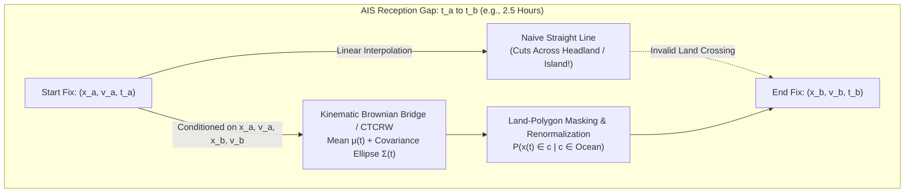

# Chapter 26: Spatial Statistics and Trajectory Modeling with AIS Data

> **Chapter Scope:** This chapter establishes a rigorous mathematical and algorithmic framework for computing spatial statistics, traffic density fields, and probabilistic trajectories from raw Automatic Identification System (AIS) observations. We prove why naive point-counting ("ping heatmaps") fails catastrophically due to four compounding physical and protocol biases—ITU-R M.1371 dynamic reporting rates ($90\times$ skew), spatially non-uniform VHF radio propagation $p_{\text{RF}}(\mathbf{x}, t)$, co-channel time-slot collisions $p_{\text{VDL}}(\mathbf{x}, t)$, and moving/uneven collector footprints $W(\mathbf{x}, t)$. We then derive continuous-time trajectory integration estimators (residence time and distance steamed), Horvitz-Thompson inverse-probability-of-detection weighting, moving-receiver spatiotemporal exposure normalization, kinematic Brownian Bridge / state-space gap interpolation with land masking, and equal-area / Discrete Global Grid System (Uber H3) spatial aggregation, complete with a self-contained, runnable Python implementation.

---

## 1. Operational & Conceptual Overview

Across maritime domain awareness (MDA), marine spatial planning, environmental impact assessment, and quantitative finance, the single most common analytical product derived from AIS archives is a **vessel density map**. Port authorities and Vessel Traffic Services (VTS) engineers use density maps to size tugboat fleets and dredge channels; wind-farm developers and naval architects use them in IALA Waterway Risk Assessment Program (**IWRAP Mk II**) models to compute ship-turbine allision probabilities; marine biologists overlay vessel density with whale habitat models to establish mandatory **10-knot Right Whale Slow Zones** (Chapters 1, 16, and 30); and fisheries scientists at **Global Fishing Watch** map global industrial fishing effort at $0.01^\circ$ to $0.05^\circ$ resolution.

Yet a startling fraction of published maritime studies, commercial dashboards, and GIS heatmaps commit a foundational statistical error: **they treat archived AIS messages as an independent, identically distributed (i.i.d.) spatial point process and plot raw message counts (`COUNT(*)`) per grid cell.**

```mermaid
flowchart LR
    subgraph Physical["1. True Maritime Traffic Process"]
        V["True Continuous Trajectories<br/>x_i(t), v_i(t), Class_i"]
    end

    subgraph Bias1["2. ITU-R M.1371 MAC Sampling"]
        R["Dynamic Reporting Interval<br/>Δt_nom ∈ [2 s, 180 s]<br/>(Up to 90× Rate Skew)"]
    end

    subgraph Bias2["3. VHF Channel & Network Physics"]
        RF["RF Propagation & Shadowing<br/>p_RF(x, t | h_tx, P_tx, M(z))"]
        VDL["VDL Co-Channel Collisions<br/>p_VDL(N_cell, SOTDMA/LEO)"]
        EXP["Collector Footprint Exposure<br/>W(x - x_rx(t)) (Shore / LEO / ASV)"]
    end

    subgraph Corr["4. Unbiased Spatial Estimators"]
        INT["Continuous Trajectory Ray-Marching<br/>Residence Time T_i(c) & Track L_i(c)"]
        HT["Horvitz-Thompson Weighting<br/>w_ik = 1 / P_det(x_ik, t_ik)"]
        BB["Kinematic Brownian Bridge / CTCRW<br/>Land-Masked Uncertainty Ellipses"]
        H3["Equal-Area Projection / Uber H3<br/>Exact Spherical Area Normalization A_c"]
    end

    V --> R
    R --> RF
    RF --> VDL
    VDL --> EXP
    EXP --> INT
    INT --> HT
    HT --> BB
    BB --> H3
```



In reality, an AIS database is *not* a uniform census of ship locations. It is a **doubly stochastic, state-dependent, censored spatio-temporal sampling process**:
1. **Protocol-Level State Dependence:** The shipboard transponder dynamically alters its transmission frequency by a factor of **$90\times$** ($2\text{ s}$ vs. $180\text{ s}$) based on instantaneous Speed Over Ground (SOG), Rate of Turn (ROT), navigation status, and device class (Class A vs. Class B CSTDMA/SOTDMA).
2. **Physical-Layer Censorship:** Even after a burst is transmitted at $161.975\text{ MHz}$ or $162.025\text{ MHz}$, whether it survives to appear in an analyst's Parquet file depends on coastal terrain diffraction, antenna height, tropospheric ducting, co-channel packet collisions inside congested ports or Low Earth Orbit (LEO) satellite footprints, and whether any receiver was physically listening within radio line-of-sight at that exact second.

To extract physically meaningful quantities—such as **vessel-hours per square kilometer** ($\text{vessel-hr}\cdot\text{km}^{-2}$) or **vessel-nautical-miles steamed per square kilometer** ($\text{NM}\cdot\text{km}^{-2}$)—an analyst must replace naive point-counting with continuous-time trajectory integration and inverse-probability-of-detection weighting.

---

## 2. Historical Context & Evolution (`schwehr/gis-history` Integration)

The mathematical tools required to debias AIS trajectories represent a convergence of three centuries of geodesy, survey sampling theory, optimal estimation, computer graphics ray-tracing, and animal movement ecology documented in [`schwehr/gis-history`](https://github.com/schwehr/gis-history):

| Year | Historical Milestone (`gis-history` & Spatial Statistics Lineage) | Impact on Modern AIS Trajectory & Spatial Modeling |
|---|---|---|
| **1569 / 1772** | Gerardus Mercator's conformal projection (**1569**) vs. Johann Heinrich Lambert's **Equal-Area projections (1772)** | Establishes why conformal navigation charts (`EPSG:3857`) preserve rhumb-line angles at the cost of $\sec^2\phi$ area inflation, requiring Lambert/cylindrical equal-area projections (`EPSG:6933`) for density mapping. |
| **1952** | **Daniel G. Horvitz & Donovan J. Thompson** publish *A Generalization of Sampling Without Replacement from a Finite Universe* (*JASA*) | Introduces the **Horvitz-Thompson estimator** $\hat{Y}_{\text{HT}} = \sum_{k \in S} y_k / \pi_k$, providing the exact mathematical foundation for correcting unequal AIS packet detection probabilities $\hat{P}_{\text{det}}(\mathbf{x}, t)$. |
| **1958 / 1960** | **Rudolf E. Kálmán** formulates the **Kalman Filter** (`gis-history` 1958; published 1960) and Rauch-Tung-Striebel (RTS) smoothing (1965) | Enables continuous-time state-space estimation of ship position and velocity $(\hat{\mathbf{x}}(t), \hat{\mathbf{v}}(t))$ across noisy or gappy AIS and radar observations. |
| **1987** | **John Amanatides & Andrew Woo** publish *A Fast Voxel Traversal Algorithm for Ray Tracing* (*Eurographics*) | Provides the $O(K)$ exact parametric grid-line traversal algorithm used to partition linear AIS trajectory segments into exact grid-cell residence times $T_i(c)$ and track lengths $L_i(c)$. |
| **1998 – 2006** | **ITU-R M.1371-0** (1998) defines Class A dynamic reporting intervals; **IEC 62287-1** (2006) introduces Class B CSTDMA | Hard-codes the 2-second to 3-minute variable reporting schedule into global maritime transponders, creating the $90\times$ sampling rate skew in raw AIS logs. |
| **2006 – 2010** | **UNH CCOM/JHC** (`noaadata` / `libais` / **Blender** 3D ship density & Stellwagen Bank right-whale co-occurrence models, Kurt Schwehr et al.) & **NOAA MarineCadastre** | Pioneers time-integrated vessel residence-time grids over equal-area cells to replace raw ping counts in North Atlantic Right Whale ship-strike risk assessments and the 2010 *Deepwater Horizon* response. |
| **2007 – 2008** | **Horne et al. (2007)** formulate the **Brownian Bridge Movement Model (BBMM)**; **Johnson et al. (2008)** introduce the **Continuous-Time Correlated Random Walk (CTCRW)** | Originally developed for gappy satellite telemetry on wildlife and marine mammals; rapidly adopted by maritime statisticians to model vessel position uncertainty ellipses across multi-hour satellite AIS gaps. |
| **2013 – 2018** | **"All the Ships"** (Google I/O 2013); **Global Fishing Watch** launched (2016; Kroodsma et al. 2018 *Science*); **Uber H3** open-sourced (2018); **MovingPandas** & **DuckDB** (2018) | Scales continuous trajectory segmentation, satellite exposure-time normalization, and hexagonal Discrete Global Grid System (DGGS) aggregation to tens of billions of global AIS messages. |
| **2024 – 2025** | **Paolo et al. (2024, *Nature*)** & Johnny Harris / GFW *"Dark Zones"* (2025) | Combines spatiotemporal satellite AIS reception-probability surfaces with Sentinel-1 Synthetic Aperture Radar (SAR) to separate RF packet loss from intentional dark-vessel activity. |

---

## 26.1 Why Naive Spatial Statistics ("Ping Count Heatmaps") Fail Catastrophically on AIS Data

Suppose an analyst executes the following naive SQL query on a multi-terabyte table of decoded AIS position reports (`Msg 1, 2, 3, 18, 19, 27`):

```sql
-- ANTI-PATTERN: Statistically invalid "Ping Count Heatmap"
SELECT
    FLOOR(lon * 100.0) / 100.0 AS lon_bin,
    FLOOR(lat * 100.0) / 100.0 AS lat_bin,
    COUNT(*) AS raw_ping_count
FROM ais_positions
GROUP BY 1, 2;
```

Let $N_{\text{raw}}(c)$ denote the number of decoded AIS messages falling inside spatial cell $c$ over study duration $[0, T_{\text{study}}]$. In expectation, $N_{\text{raw}}(c)$ is **not** proportional to the true number of vessels or vessel-hours in cell $c$. Instead, the expected raw ping count is governed by the four-factor product integral:

$$\mathbb{E}\!\left[N_{\text{raw}}(c)\right] = \sum_{i=1}^{M} \int_{0}^{T_{\text{study}}} \underbrace{\mathbb{I}\!\left(\mathbf{x}_i(t) \in c\right)}_{\text{True Presence}} \cdot \underbrace{f_{\text{tx}}\!\left(v_i(t), \omega_i(t), \text{Class}_i\right)}_{\text{1. Reporting Rate Bias (90}\times\text{)}} \cdot \underbrace{p_{\text{RF}}\!\left(\mathbf{x}_i(t), t\right)}_{\text{2. RF Shadowing/Ducting}} \cdot \underbrace{p_{\text{VDL}}\!\left(\mathbf{x}_i(t), t\right)}_{\text{3. Slot Collision Loss}} \cdot \underbrace{W\!\left(\mathbf{x}_i(t), t\right)}_{\text{4. Collector Exposure}} dt$$

When we unpack each of the four nuisance terms—$f_{\text{tx}}$, $p_{\text{RF}}$, $p_{\text{VDL}}$, and $W(\mathbf{x}, t)$—it becomes clear why raw ping heatmaps distort maritime reality by up to **three orders of magnitude**.

---

### 26.1.1 Bias 1: ITU-R M.1371 Dynamic Reporting Rate Bias ($90\times$ Sampling Skew)

To conserve VHF Data Link (VDL) time slots across the 2,250 slots per 60-second UTC frame on AIS 1 ($161.975\text{ MHz}$) and AIS 2 ($162.025\text{ MHz}$), **Recommendation ITU-R M.1371-5** (Annex 1, Tables 1 and 2) mandates that transponders dynamically adjust their nominal reporting interval $\Delta t_{\text{nom}}$ as a deterministic function of device class, navigation status, Speed Over Ground ($v = \text{SOG}$), and course change / Rate of Turn ($\omega = \text{ROT}$):

| Transceiver Class & Dynamic Condition (ITU-R M.1371-5 / IEC 62287) | Nominal Reporting Interval $\Delta t_{\text{nom}}$ | Transmission Rate $f_{\text{tx}}$ ($\text{pings/hr}$) | Relative Weight per Vessel-Hour vs. $180\text{ s}$ Baseline |
|---|---|---|---|
| **Class A:** Ship at anchor or moored, $v \le 3\text{ kts}$ | **$180\text{ s}$ ($3\text{ min}$)** | $20\text{ pings/hr}$ | **$1.0\times$** |
| **Class A:** Ship at anchor or moored, $v > 3\text{ kts}$ (dragging/swinging) | **$10\text{ s}$** | $360\text{ pings/hr}$ | **$18.0\times$** |
| **Class A:** Underway, $0 \le v \le 14\text{ kts}$ (steady course) | **$10\text{ s}$** | $360\text{ pings/hr}$ | **$18.0\times$** |
| **Class A:** Underway, $0 \le v \le 14\text{ kts}$ and **changing course** | **$3.33\text{ s}$ ($3\frac{1}{3}\text{ s}$)** | $1{,}080\text{ pings/hr}$ | **$54.0\times$** |
| **Class A:** Underway, $14 < v \le 23\text{ kts}$ (steady course) | **$6\text{ s}$** | $600\text{ pings/hr}$ | **$30.0\times$** |
| **Class A:** Underway, $14 < v \le 23\text{ kts}$ and **changing course** | **$2\text{ s}$** | $1{,}800\text{ pings/hr}$ | **$90.0\times$** |
| **Class A:** Underway, $v > 23\text{ kts}$ (steady or changing course) | **$2\text{ s}$** | $1{,}800\text{ pings/hr}$ | **$90.0\times$** |
| **Class B "CS" (CSTDMA):** Any status, $v \le 2\text{ kts}$ | **$180\text{ s}$ ($3\text{ min}$)** | $20\text{ pings/hr}$ | **$1.0\times$** |
| **Class B "CS" (CSTDMA):** Underway, $v > 2\text{ kts}$ (e.g., $10\text{ kts}$ trawler/yacht) | **$30\text{ s}$** | $120\text{ pings/hr}$ | **$6.0\times$** |
| **Class B "SO" (SOTDMA):** $v \le 2\text{ kts}$ | **$180\text{ s}$ ($3\text{ min}$)** | $20\text{ pings/hr}$ | **$1.0\times$** |
| **Class B "SO" (SOTDMA):** $2 < v \le 14\text{ kts}$ | **$30\text{ s}$** | $120\text{ pings/hr}$ | **$6.0\times$** |
| **Class B "SO" (SOTDMA):** $14 < v \le 23\text{ kts}$ | **$15\text{ s}$** | $240\text{ pings/hr}$ | **$12.0\times$** |
| **Class B "SO" (SOTDMA):** $v > 23\text{ kts}$ | **$5\text{ s}$** | $720\text{ pings/hr}$ | **$36.0\times$** |
| **Long-Range Satellite AIS (Message 27 on Ch 75/76):** Outside coastal VTS | **$180\text{ s}$ ($3\text{ min}$)** | $20\text{ pings/hr}$ | **$1.0\times$** |

> [!WARNING]
> **The $90\times$ Reporting-Rate Trap in Risk and Conservation Modeling:**
> Consider a $1\text{ km} \times 1\text{ km}$ grid cell in a coastal whale habitat.
> * **Scenario A (Per-Hour Residence Skew):** A high-speed Class A container ship or fast ferry ($>23\text{ kts}$, or $>14\text{ kts}$ turning around a headland) broadcasts **every 2 seconds** ($1{,}800\text{ pings/hr}$). A Class A vessel at $14\text{ kts}$ broadcasts **every 10 seconds** ($360\text{ pings/hr}$). A commercial fishing vessel or coastal workboat carrying a Class B CSTDMA transponder at $10\text{ kts}$ broadcasts **every 30 seconds** ($120\text{ pings/hr}$). An anchored tanker or a slow $<2\text{ kt}$ Class B gillnetter/sailboat broadcasts **every 3 minutes** ($20\text{ pings/hr}$). In a raw ping count map, 1 hour of presence by the fast/turning Class A vessel generates **$90\times$ more database rows** than 1 hour of presence by the anchored or slow Class B vessel, and **$15\times$ more rows** than the $10\text{ kt}$ Class B vessel!
> * **Scenario B (Channel Bend Artifact):** When a steady $16\text{ kt}$ Class A cargo ship ($\Delta t_{\text{nom}} = 6\text{ s}$) executes a $25^\circ$ course alteration at a Traffic Separation Scheme (TSS) waypoint, its Rate of Turn indicator triggers the M.1371 "changing course" threshold ($>5^\circ / 30\text{ s}$), tripling its broadcast rate to $\Delta t_{\text{nom}} = 2\text{ s}$. A raw ping heatmap therefore displays glowing "hotspots" at every river bend and TSS turn—even though the exact same queue of ships steamed through the straight reaches on either side at the exact same speed!

---

### 26.1.2 Bias 2: Spatially Non-Uniform RF Propagation & Terrain Shadowing $p_{\text{RF}}(\mathbf{x}, t)$

Even if two vessels transmit at the exact same interval $\Delta t_{\text{nom}}$, their probability of reaching a coastal or offshore receiver $r$ located at $\mathbf{x}_r$ with height $h_r$ varies dramatically across space and time:

1. **Transmit Power & Masthead Height Disparity ($12.5\text{ W}$ at $45\text{ m}$ vs. $2\text{ W}$ at $3\text{ m}$):**
   Under the standard $k = 4/3$ effective Earth radius refractive atmosphere (Chapter 5), the VHF radio horizon in nautical miles is:
   $$d_{\text{horizon, NM}}(h_i, h_r) \approx 2.23 \left(\sqrt{h_{i,\text{m}}} + \sqrt{h_{r,\text{m}}}\right)$$
   For a shore station at $h_r = 36\text{ m}$ ($100\text{ ft}$):
   * A Post-Panamax container ship with a Class A transponder ($P_i = 12.5\text{ W} = +41.0\text{ dBm}$) and masthead antenna at $h_i = 49\text{ m}$ enjoys a line-of-sight horizon of $d_{\text{LOS}} \approx 2.23(7 + 6) = \mathbf{29.0\text{ NM}}$ ($53.7\text{ km}$) and an $8\text{ dB}$ transmit power advantage.
   * A small fibreglass fishing boat or yacht with a Class B CSTDMA unit ($P_i = 2.0\text{ W} = +33.0\text{ dBm}$) and rail-mounted antenna at $h_i = 3.2\text{ m}$ has a radio horizon of only $d_{\text{LOS}} \approx 2.23(1.79 + 6) = \mathbf{17.4\text{ NM}}$ ($32.2\text{ km}$).
   Beyond $18\text{ NM}$ from shore, Class B vessels vanish from terrestrial archives while Class A vessels remain solidly tracked out to $30\text{–}45\text{ NM}$—creating a severe offshore vessel-type composition bias.
2. **Coastal Headlands, Fjords, and Island Knife-Edge Diffraction:**
   Granite headlands, barrier islands, and harbor breakwaters cast sharp VHF radio shadows (**Longley-Rice / Irregular Terrain Model [ITM]** knife-edge diffraction loss $L_{\text{diff}}(\nu) > 20\text{–}40\text{ dB}$, Chapter 6). A shipping lane passing $2\text{ NM}$ behind a coastal promontory can experience an $80\%$ drop in $p_{\text{RF}}(\mathbf{x})$ relative to an adjacent exposed reach.
3. **Anomalous Tropospheric Ducting ($M(z)$ Inversions):**
   When warm, dry continental air overrides a cool marine boundary layer ($dM/dz < 0$, where modified refractivity is $M(z) = N(z) + 0.157 z$), $162\text{ MHz}$ AIS signals become trapped inside a surface-based or elevated waveguide duct (Chapter 6). During summertime ducting events in the Mediterranean, Arabian Gulf, Southern California Bight, or North Sea, shore receivers routinely decode bursts from $200\text{ to }800\text{ NM}$ away. In a naive ping heatmap, seasonal tropospheric ducting masquerades as a phantom surge in offshore vessel traffic!

---

### 26.1.3 Bias 3: VDL Congestion & Satellite Footprint Collision Bias $p_{\text{VDL}}(\mathbf{x}, t)$

AIS operates over two shared $25\text{ kHz}$ simplex channels providing $N_{\text{slots}} = 2 \times 2{,}250 = 4{,}500$ time slots per minute. Whether a transmitted packet avoids co-channel destructive interference ($p_{\text{VDL}}$) depends strongly on the receiver platform:

1. **Terrestrial SOTDMA Cell Shrinking and Hidden-Terminal Collisions:**
   Within a single $20\text{–}30\text{ NM}$ SOTDMA cell, Class A transponders listen to peer slot reservations (Sync State 0–3, Chapter 11) and coordinate their transmissions. However, as documented in **ITU-R Report M.2287-0** (*Assessment of the VHF data link loading*), when VDL channel loading exceeds $50\%$ in mega-ports (Singapore Strait, Yangtze River Estuary, Rotterdam Europort, Houston Ship Channel), transponders intentionally reuse time slots occupied by the most distant stations ("cell shrinking"), and elevated shore antennas sitting on $300\text{–}1{,}000\text{ m}$ hills simultaneously hear 3 to 5 independent SOTDMA cells whose slot reservations are mutually uncoordinated (Chapter 10). Furthermore, $2\text{ W}$ Class B CSTDMA units use carrier-sense listen-before-talk and are routinely overpowered by the capture effect of distant $12.5\text{ W}$ Class A transmitters.
2. **The Spaceborne AIS (S-AIS) Footprint Paradox:**
   A Low Earth Orbit (LEO) satellite at altitude $H_{\text{sat}} = 600\text{ km}$ views an instantaneous spherical cap horizon of radius:
   $$d_{\text{slant, max}} = \sqrt{(R_E + H_{\text{sat}})^2 - R_E^2} \approx 2{,}830\text{ km} \quad (\text{Footprint Area } A_{\text{FP}} \approx 2.4 \times 10^7\text{ km}^2)$$
   This single footprint encompasses **hundreds of independent terrestrial SOTDMA cells simultaneously**. Relative to the satellite receiver, transmissions from vessels in different SOTDMA cells arrive as an uncoordinated Poisson / ALOHA-like stream with slot arrival intensity $\Lambda_{\text{FP}}$ (bursts per slot per channel):
   $$\Lambda_{\text{FP}}(t) = \frac{1}{4{,}500\text{ slots/min}} \sum_{i \in \text{Footprint}(t)} \frac{60\text{ s/min}}{\Delta t_{\text{nom}, i}(t)}$$
   Accounting for differential slant-range propagation delay spread ($\Delta \tau_{\max} \approx 7.2\text{ ms}$, or $27\%$ of a $26.67\text{ ms}$ slot, Chapter 17), a burst overlaps with vulnerability factor $\alpha_{\text{overlap}} \approx 1.27$. For a single-antenna satellite receiver without Successive Interference Cancellation (SIC) and capture-margin threshold $\gamma_{\text{cap}}$, the probability that a single transmitted burst survives co-channel collision is approximately:
   $$p_{\text{VDL, sat}}\!\left(N_{\text{FP}}\right) \approx \exp\!\left(-\alpha_{\text{overlap}} \, \kappa(\gamma_{\text{cap}}) \, \Lambda_{\text{FP}}\right)$$
   When a satellite passes over the East China Sea, Gulf of Mexico, or North Sea where $N_{\text{FP}} > 2{,}500\text{ vessels}$ ($\Lambda_{\text{FP}} > 3\text{ bursts/slot}$), **$50\%\text{ to }95\%$ of individual transmitted bursts collide and are lost!**

> [!IMPORTANT]
> **The Inverse-Density Paradox of Satellite AIS:**
> Because $p_{\text{VDL, sat}}(N_{\text{FP}})$ decays exponentially with total vessel count $N_{\text{FP}}$ inside the $5{,}000\text{ km}$-wide satellite footprint, a ship sailing through a high-density maritime choke point (e.g., the South China Sea or English Channel) has a **much lower per-ship satellite reception probability** than an identical ship sailing alone in the South Pacific! Plotting raw satellite ping counts therefore severely *under-estimates* vessel density in the world's busiest ocean regions.

---

### 26.1.4 Bias 4: Uneven Shore Networks & Moving Collectors (Satellites, Patrol Aircraft, ASVs)

Finally, the indicator function $W(\mathbf{x}, t) \in \{0, 1\}$ describing whether point $\mathbf{x}$ is inside the reception footprint of at least one active collector at time $t$ is profoundly non-uniform:

1. **Shore Network Geopolitics and Coastal Drop-Off:**
   Terrestrial receiver density is rich along Western Europe and North America, sparse along parts of Africa and South America, and subject to abrupt regulatory blackouts (e.g., China's November 2021 Data Security Law [DSL] and Personal Information Protection Law [PIPL], which cut off commercial foreign access to thousands of Chinese coastal terrestrial receivers overnight—Chapter 4).
2. **Orbital Inclination Latitude Bias of LEO Constellations:**
   Most AIS satellites fly in sun-synchronous or high-inclination polar orbits ($i \approx 82^\circ\text{–}98^\circ$). Because orbital ground tracks converge near the poles, the number of satellite passes per day—and thus cumulative daily observation time $E(\phi)$—scales approximately as:
   $$E(\phi) \propto \frac{1}{\sqrt{\sin^2 i - \sin^2 \phi}} \quad (\text{for } |\phi| < i)$$
   High-latitude waters ($>60^\circ\text{N/S}$, such as the Norwegian Sea, Barents Sea, and Alaska) are sampled **$3\times\text{ to }5\times$ more frequently per day** by polar-orbiting satellites than equatorial waters ($0^\circ\text{–}15^\circ$, such as the Gulf of Guinea or Indonesian archipelago)!
3. **Moving Collector Self-Correlation Bias (Cutters, Aircraft, UAVs, Wave Gliders, Saildrones):**
   When AIS is logged aboard a moving platform—such as a USCG cutter, a P-8 Poseidon / MQ-9 SeaGuardian patrol aircraft (Chapter 18), or an autonomous surface vehicle (Liquid Robotics Wave Glider, Saildrone, Chapter 10)—the reception window $W(\mathbf{x} - \mathbf{x}_{\text{rx}}(t))$ travels along the collector's own trajectory $\mathbf{x}_{\text{rx}}(t)$. If the patrol asset loiters in a specific patrol box for 48 hours and transits rapidly through an adjacent sector in 2 hours, raw ping counts will show a $24\times$ higher density in the loiter box even if true ocean traffic is uniform everywhere.

---

## 26.2 Rigorous Mathematical Framework for AIS Spatial Statistics

To eliminate all four compounding biases, we now construct a unified statistical pipeline that transforms discrete, irregularly sampled, lossy AIS bursts into unbiased spatial estimators.

---

### 26.2.1 Continuous-Time Trajectory Integration (Residence Time & Distance Steamed)

Let vessel $i \in \{1, \dots, M\}$ produce a sequence of chronologically ordered, kinematically validated AIS position reports:

$$\mathcal{O}_i = \left\{\left(\mathbf{x}_{i,k}, \mathbf{v}_{i,k}, t_{i,k}\right)\right\}_{k=1}^{K_i}, \qquad t_{i,1} < t_{i,2} < \dots < t_{i,K_i}$$

where $\mathbf{x}_{i,k} = (x_{i,k}, y_{i,k})^\top \in \mathbb{R}^2$ are projected metric coordinates (in an equal-area CRS or local East-North-Up [ENU] tangent plane, Section 26.2.5) and $\mathbf{v}_{i,k}$ is the instantaneous velocity vector derived from Speed Over Ground $v_{i,k}$ ($\text{m/s}$) and Course Over Ground $\chi_{i,k}$ (radians clockwise from true North):

$$\mathbf{v}_{i,k} = \begin{bmatrix} v_{i,k} \sin \chi_{i,k} \\ v_{i,k} \cos \chi_{i,k} \end{bmatrix}$$

#### 1. Piecewise-Linear and Cubic Hermite Trajectory Reconstruction
Between any two consecutive validated observations $t_{i,k}$ and $t_{i,k+1}$ separated by $\Delta t_{i,k} = t_{i,k+1} - t_{i,k} \le \Delta t_{\text{gap\_max}}$, let $u = \frac{t - t_{i,k}}{\Delta t_{i,k}} \in [0, 1]$ denote normalized segment time:

* **Piecewise-Linear Trajectory:**
  $$\hat{\mathbf{x}}_i^{\text{lin}}(t) = (1 - u)\,\mathbf{x}_{i,k} + u\,\mathbf{x}_{i,k+1}, \qquad \dot{\hat{\mathbf{x}}}_i^{\text{lin}}(t) = \frac{\mathbf{x}_{i,k+1} - \mathbf{x}_{i,k}}{\Delta t_{i,k}}$$
* **Kinematic Cubic Hermite Spline (Matching Position and SOG/COG Velocity at Both Endpoints):**
  Because AIS Message 1/2/3/18/19 reports both position $\mathbf{x}_{i,k}$ and instantaneous ground velocity $\mathbf{v}_{i,k}$, cubic Hermite interpolation preserves $C^1$ velocity continuity across curved turns:
  $$\hat{\mathbf{x}}_i^{\text{Herm}}(t) = h_{00}(u)\,\mathbf{x}_{i,k} + h_{10}(u)\,\Delta t_{i,k}\,\mathbf{v}_{i,k} + h_{01}(u)\,\mathbf{x}_{i,k+1} + h_{11}(u)\,\Delta t_{i,k}\,\mathbf{v}_{i,k+1}$$
  where the Hermite basis polynomials are:
  $$h_{00}(u) = 2u^3 - 3u^2 + 1, \quad h_{10}(u) = u^3 - 2u^2 + u, \quad h_{01}(u) = -2u^3 + 3u^2, \quad h_{11}(u) = u^3 - u^2$$

#### 2. Exact Cell Residence Time ($T_i(c)$) and Distance Steamed ($L_i(c)$)
Partition the marine study domain into disjoint spatial cells $\{c\}$ with exact surface areas $\{A_c\}$. We define two fundamental continuous-time functionals for vessel $i$ in cell $c$:

1. **Cell Residence Time (Vessel-Hours in Cell $c$):**
   $$T_i(c) = \int_{t_{\min}}^{t_{\max}} \mathbb{I}\!\left(\hat{\mathbf{x}}_i(t) \in c\right) dt, \qquad \rho_{\text{hours}}(c) = \frac{1}{A_c} \sum_{i=1}^{M} T_i(c)$$
   where $\rho_{\text{hours}}(c)$ has physical units of **$\text{vessel-hours per km}^2$** (when $T_i(c)$ is expressed in hours and $A_c$ in $\text{km}^2$). Dividing $\rho_{\text{hours}}(c)$ by the total study duration $T_{\text{study}}$ (in hours) yields the **instantaneous expected number of vessels per $\text{km}^2$** at any random instant!
2. **Cell Distance Steamed (Vessel-Nautical-Miles per $\text{km}^2$ in Cell $c$):**
   $$L_i(c) = \int_{t_{\min}}^{t_{\max}} \mathbb{I}\!\left(\hat{\mathbf{x}}_i(t) \in c\right) \left\|\dot{\hat{\mathbf{x}}}_i(t)\right\| dt, \qquad \rho_{\text{dist}}(c) = \frac{1}{A_c} \sum_{i=1}^{M} L_i(c)$$
   Note the critical operational distinction between $\rho_{\text{hours}}(c)$ and $\rho_{\text{dist}}(c)$:
   * **$\rho_{\text{hours}}(c)$ (Residence Time Density)** measures *temporal exposure*—essential for whale acoustic noise exposure, oil-spill anchorage risk, port congestion, and fishing effort hours. An anchored ship ($v \approx 0$) accumulates 24 vessel-hours per day in its anchorage cell.
   * **$\rho_{\text{dist}}(c)$ (Track-Length / Flux Density)** measures *geometric transit volume*—essential for shipping lane flux, IWRAP ship-structure collision frequency, and swept-area seabed trawling impact. An anchored ship ($v = 0$) contributes $L_i(c) = 0\text{ NM}$, whereas every transiting vessel crossing cell $c$ along the same path contributes the exact chord length $\Delta s_c$ regardless of whether it transits at $5\text{ kts}$ or $25\text{ kts}$!

#### 3. Proof of Reporting-Rate Invariance ($\Delta t$-Invariance Theorem)
**Theorem 26.1 (Invariance of $T_i(c)$ and $L_i(c)$ to Reporting Interval $\Delta t$):**
*Suppose a vessel moves along a locally linear trajectory $\mathbf{x}_i(t) = \mathbf{x}_0 + \mathbf{v}_0 (t - t_0)$ through convex spatial cell $c$, entering $c$ at time $t_{\text{in}}$ and exiting at time $t_{\text{out}}$. Let $\mathcal{T}_1 = \{t_{1,k}\}$ and $\mathcal{T}_2 = \{t_{2,m}\}$ be any two arbitrary sampling schedules spanning $[t_0, t_{\max}]$ (for example, $\Delta t_1 = 2\text{ s}$ Class A fast rate vs. $\Delta t_2 = 180\text{ s}$ Class B slow rate, or irregular packet loss). Then the piecewise-linear trajectory estimators $\hat{T}_i(c)$ and $\hat{L}_i(c)$ are strictly invariant to the sampling schedule:*

$$\hat{T}_i\!\left(c \mid \mathcal{T}_1\right) = \hat{T}_i\!\left(c \mid \mathcal{T}_2\right) = t_{\text{out}} - t_{\text{in}}, \qquad \hat{L}_i\!\left(c \mid \mathcal{T}_1\right) = \hat{L}_i\!\left(c \mid \mathcal{T}_2\right) = \|\mathbf{v}_0\|\left(t_{\text{out}} - t_{\text{in}}\right)$$

*Proof:* For any sampling schedule $\mathcal{T} = \{t_0, t_1, \dots, t_K\}$ with $t_0 \le t_{\text{in}} < t_{\text{out}} \le t_K$, on each sub-interval $[t_k, t_{k+1}]$, the linear interpolant is:

$$\hat{\mathbf{x}}_i(t) = \mathbf{x}_i(t_k) + \frac{t - t_k}{t_{k+1} - t_k}\left(\mathbf{x}_i(t_{k+1}) - \mathbf{x}_i(t_k)\right) = \mathbf{x}_0 + \mathbf{v}_0(t_k - t_0) + \frac{t - t_k}{t_{k+1} - t_k}\mathbf{v}_0(t_{k+1} - t_k) = \mathbf{x}_0 + \mathbf{v}_0(t - t_0) = \mathbf{x}_i(t)$$

By linearity of the Riemann integral over the partition $t_0 < t_1 < \dots < t_K$:

$$\hat{T}_i(c \mid \mathcal{T}) = \sum_{k=0}^{K-1} \int_{t_k}^{t_{k+1}} \mathbb{I}\!\left(\hat{\mathbf{x}}_i(t) \in c\right) dt = \int_{t_0}^{t_K} \mathbb{I}\!\left(\mathbf{x}_i(t) \in c\right) dt = \int_{t_{\text{in}}}^{t_{\text{out}}} 1 \, dt = t_{\text{out}} - t_{\text{in}}$$

Similarly, since $\|\dot{\hat{\mathbf{x}}}_i(t)\| = \|\mathbf{v}_0\|$ on every sub-interval $[t_k, t_{k+1}]$, summing over $k$ yields $\hat{L}_i(c \mid \mathcal{T}) = \|\mathbf{v}_0\|(t_{\text{out}} - t_{\text{in}})$, which is completely independent of the number or spacing of the sample timestamps $\{t_k\}$. $\blacksquare$

#### 4. Exact Parametric Ray-Marching Across Grid Cells (Amanatides & Woo)
To evaluate $T_i(c)$ and $L_i(c)$ numerically for a linear segment from $(\mathbf{x}_k, t_k)$ to $(\mathbf{x}_{k+1}, t_{k+1})$ across a regular 2D grid of cell width $\Delta g$, we do **not** need approximate discrete midpoint stepping; we use the exact **Amanatides & Woo (1987) parametric ray-marching algorithm**.

Parametrize the segment by $u \in [0, 1]$ where $\mathbf{x}(u) = \mathbf{x}_k + u\,\Delta \mathbf{x}$, $\Delta \mathbf{x} = (x_{k+1} - x_k, y_{k+1} - y_k)^\top$, total segment duration $\Delta t_k = t_{k+1} - t_k$, and total segment length $\Delta s_k = \|\Delta \mathbf{x}\|$. The vertical and horizontal grid boundaries occur at $x_m = m\,\Delta g$ and $y_n = n\,\Delta g$, corresponding to exact parameter values:

$$u_{x, m} = \frac{m\,\Delta g - x_k}{x_{k+1} - x_k}, \qquad u_{y, n} = \frac{n\,\Delta g - y_k}{y_{k+1} - y_k}$$

Sorting the unique boundary crossings $0 = u_0 < u_1 < u_2 < \dots < u_P = 1$ within $[0, 1]$, the segment resides strictly inside a single grid cell $c_p$ on each sub-interval $[u_p, u_{p+1}]$, contributing the exact analytical increments:

$$\Delta T_{i, k}(c_p) = \left(u_{p+1} - u_p\right) \Delta t_k, \qquad \Delta L_{i, k}(c_p) = \left(u_{p+1} - u_p\right) \Delta s_k$$

---

### 26.2.2 Horvitz-Thompson & Inverse-Probability-of-Detection Weighting for Packet Loss and RF Constraints

Continuous-time trajectory integration completely eliminates **Bias 1** (the $90\times$ reporting rate skew) and bridges short packet losses along observed tracks. However, when an analyst must estimate instantaneous point attributes (such as the distribution of ship speeds, draughts, or Message 5 cargo classes at a given timestamp) or when severe RF/VDL packet loss causes entire trajectory segments or vessels to be under-sampled, we must explicitly model the **burst detection probability** $\hat{P}_{\text{det}}(\mathbf{x}_{i,k}, t_{i,k})$.

#### 1. Multi-Receiver RF + VDL Observation Probability Decomposition
Let $\mathcal{R}(t)$ denote the set of all active AIS receivers (coastal towers, buoys, aircraft, and LEO satellites) operating at time $t$. For receiver $r \in \mathcal{R}(t)$ located at $\mathbf{x}_r(t)$, a single burst $k$ transmitted by vessel $i$ at $(\mathbf{x}_{i,k}, t_{i,k})$ with transmit power $P_i$ and antenna height $h_i$ is successfully decoded by receiver $r$ if and only if two physical events occur simultaneously:
1. **RF Link Closure ($p_{\text{RF}}$):** The received signal strength $P_{\text{rx}, r} = P_i + G_i + G_r - L_{\text{path}}(\mathbf{x}_{i,k}, \mathbf{x}_r(t) \mid h_i, h_r, M(z))$ exceeds the receiver's GMSK demodulation threshold ($S_{\min} \approx -107\text{ dBm}$ for IEC Class A/Base Station, or $-112\text{ to }-118\text{ dBm}$ for high-sensitivity coastal LNA chains):
   $$p_{\text{RF}}\!\left(\mathbf{x}_{i,k}, \mathbf{x}_r(t) \mid h_i, P_i, M(z)\right) = \Phi\!\left(\frac{\overline{P}_{\text{rx}}\!\left(\mathbf{x}_{i,k}, \mathbf{x}_r(t)\right) - S_{\min, r}}{\sigma_{\text{fading}}}\right)$$
   where $\Phi(\cdot)$ is the standard normal cumulative distribution function modeling log-normal shadowing/sea-state multipath fading of standard deviation $\sigma_{\text{fading}} \approx 4\text{–}6\text{ dB}$.
2. **VDL Slot Survival ($p_{\text{VDL}}$):** No higher-power co-channel packet collides destructively within receiver $r$'s time-slot capture window, governed by the active VDL traffic load $N_{\text{cell}}(r, t_{i,k})$ visible to receiver $r$.

Assuming conditional independence of fading and local interference across spatially separated receivers $r \in \mathcal{R}(t_{i,k})$, the probability that burst $(i, k)$ is decoded by **at least one** receiver in the network is:

$$\hat{P}_{\text{det}}\!\left(\mathbf{x}_{i,k}, t_{i,k}\right) = 1 - \prod_{r \in \mathcal{R}(t_{i,k})} \left[1 - p_{\text{RF}}\!\left(\mathbf{x}_{i,k}, \mathbf{x}_r(t_{i,k}) \mid h_i, P_i, M(z)\right) \cdot p_{\text{VDL}}\!\left(N_{\text{cell}}(r, t_{i,k})\right)\right]$$

#### 2. Empirical Estimation of $\hat{P}_{\text{det}}(\mathbf{x}, t)$ via the ITU-R M.1371 Inter-Arrival Gap Ratio
Remarkably, we do not even need a full 3D parabolic-equation RF solver to estimate $\hat{P}_{\text{det}}(\mathbf{x}, t)$ in regions where at least intermittent reception occurs! Because **ITU-R M.1371-5 deterministically dictates the exact nominal reporting interval** $\Delta t_{\text{nominal}}(v_{i,k}, \omega_{i,k}, \text{Class}_i)$ as a known function of each message's own payload fields (SOG $v_{i,k}$, ROT $\omega_{i,k}$, Navigation Status, and Message ID / Class), every observed inter-arrival time $\Delta t_{\text{observed}, i,k} = t_{i,k+1} - t_{i,k}$ directly measures how many intermediate bursts were dropped between message $k$ and message $k+1$!

Specifically, the expected number of bursts transmitted by vessel $i$ during the interval $(t_{i,k}, t_{i,k+1}]$ is $\hat{n}_{\text{tx}, i,k} = \max\!\left(1, \frac{\Delta t_{\text{observed}, i,k}}{\Delta t_{\text{nominal}}(v_{i,k}, \omega_{i,k}, \text{Class}_i)}\right)$, of which exactly $1$ terminal burst was received. Thus, the instantaneous empirical detection ratio for transition $(i, k)$ is:

$$\hat{p}_{i,k} = \min\!\left(1.0, \; \frac{\Delta t_{\text{nominal}}\!\left(v_{i,k}, \omega_{i,k}, \text{Class}_i\right)}{\Delta t_{\text{observed}, i,k}}\right)$$

Aggregating over all observed transitions $(i, k)$ within spatial cell $c$ and time window $\tau$ yields the **non-parametric empirical detection probability estimator**:

$$\hat{P}_{\text{det}}^{\text{emp}}(c, \tau, \text{Class}) = \frac{\sum_{(i,k) \in (c, \tau, \text{Class})} 1}{\sum_{(i,k) \in (c, \tau, \text{Class})} \max\!\left(1.0, \; \frac{\Delta t_{\text{observed}, i,k}}{\Delta t_{\text{nominal}}(v_{i,k}, \omega_{i,k}, \text{Class}_i)}\right)} = \frac{\text{Total Received Bursts in } (c, \tau)}{\text{Total Inferred Transmitted Bursts in } (c, \tau)}$$

#### 3. The Horvitz-Thompson Estimator, Variance Bounds, and Weight Truncation
Given the inclusion probability $\pi_{i,k} = \hat{P}_{\text{det}}(\mathbf{x}_{i,k}, t_{i,k})$ for each received AIS burst $k \in S_c$ in cell $c$, each received burst represents $\Delta t_{\text{nominal}}(v_{i,k}, \omega_{i,k})$ seconds of intended transmission time weighted by the inverse probability of detection $w_{i,k} = 1 / \pi_{i,k}$. The **Horvitz-Thompson (1952) estimator** of total vessel-seconds $\Lambda(c)$ in cell $c$ is:

$$\hat{\Lambda}_{\text{HT}}(c) = \sum_{i=1}^{M} \sum_{k \in S_{i,c}} \frac{\Delta t_{\text{nominal}}\!\left(v_{i,k}, \omega_{i,k}, \text{Class}_i\right)}{\hat{P}_{\text{det}}\!\left(\mathbf{x}_{i,k}, t_{i,k}\right)}$$

**Theorem 26.2 (Unbiasedness and Variance of $\hat{\Lambda}_{\text{HT}}(c)$):**
*Let $Z_{i,k} \in \{0, 1\}$ denote the Bernoulli indicator that transmitted burst $(i, k)$ is successfully decoded, with $\mathbb{E}[Z_{i,k}] = \pi_{i,k} = P_{\text{det}}(\mathbf{x}_{i,k}, t_{i,k}) > 0$ and pairwise joint inclusion probability $\pi_{i,k; j,m} = \mathbb{P}(Z_{i,k}=1 \land Z_{j,m}=1)$. Then $\hat{\Lambda}_{\text{HT}}(c)$ is strictly unbiased for the true transmitted vessel-time $\Lambda(c) = \sum_{i,k \in U_c} \Delta t_{\text{nom}, i,k}$:*

$$\mathbb{E}\!\left[\hat{\Lambda}_{\text{HT}}(c)\right] = \sum_{(i,k) \in U_c} \mathbb{E}[Z_{i,k}] \frac{\Delta t_{\text{nom}, i,k}}{\pi_{i,k}} = \sum_{(i,k) \in U_c} \Delta t_{\text{nom}, i,k} = \Lambda(c)$$

*Furthermore, its exact sampling variance is given by the Horvitz-Thompson covariance expansion:*

$$\text{Var}\!\left(\hat{\Lambda}_{\text{HT}}(c)\right) = \sum_{\alpha \in U_c} \frac{1 - \pi_\alpha}{\pi_\alpha} \Delta t_{\text{nom}, \alpha}^2 + \sum_{\alpha \in U_c} \sum_{\beta \neq \alpha \in U_c} \frac{\pi_{\alpha\beta} - \pi_\alpha \pi_\beta}{\pi_\alpha \pi_\beta} \Delta t_{\text{nom}, \alpha} \Delta t_{\text{nom}, \beta}$$

*where $\alpha = (i, k)$ and $\beta = (j, m)$ index transmitted bursts in $U_c$.*

> [!CAUTION]
> **Regularizing Horvitz-Thompson Weights (Clipping $\pi_{\min}$ and Hájek Stabilization):**
> Inspection of $\text{Var}(\hat{\Lambda}_{\text{HT}}(c))$ reveals that as $\pi_\alpha \to 0$ (e.g., at the extreme fringe of a coastal station or during an anomalous tropospheric ducting spike where $\hat{P}_{\text{det}} = 0.001$), a single lucky ping receives an inverse-probability weight of $w_\alpha = 1{,}000$, causing the estimator variance $\propto (1-\pi_\alpha)/\pi_\alpha$ to explode! In production AIS pipelines, two standard regularizations are mandatory:
> 1. **Winsorized Probability Floor ($\pi_{\min}$ Truncation):** Clamp the estimated detection probability below at a floor $\pi_{\min} \in [0.02, 0.05]$ (restricting the maximum inverse weight to $w_{\max} = 1/\pi_{\min} \in [20, 50]$):
>    $$\tilde{\pi}_{i,k} = \max\!\left(\pi_{\min}, \; \hat{P}_{\text{det}}(\mathbf{x}_{i,k}, t_{i,k})\right)$$
> 2. **Hájek (1971) Ratio Normalization:** When estimating spatial means (such as average speed or average vessel draught in cell $c$), normalize by the sum of inverse-probability weights $\sum w_{i,k}$ rather than the deterministic area-time constant to drastically reduce mean-squared error.

---

### 26.2.3 Accounting for Moving Receivers (Satellites, Aircraft, ASVs)

When AIS data are collected by moving platforms—such as LEO satellite constellations, maritime patrol aircraft, or autonomous surface vehicles (Wave Gliders, Saildrones)—a spatial cell $c$ is only observable during the intervals when at least one receiver's detection footprint overlaps $c$.

Let $\text{Footprint}(\mathcal{R}(t)) = \bigcup_{r \in \mathcal{R}(t)} \mathcal{B}\!\left(\mathbf{x}_r(t), R_{\text{max}, r}\right)$ denote the union of active receiver detection footprints at time $t$. We define the **cumulative spatiotemporal exposure time** $E(c)$ of cell $c$ over the study duration $[0, T_{\text{study}}]$:

$$E(c) = \int_{0}^{T_{\text{study}}} \mathbb{I}\!\left(c \in \text{Footprint}(\mathcal{R}(t))\right) dt$$

Or, incorporating the continuous detection probability $P_{\text{det}}(c, t)$ within the footprint (which rolls off near the footprint edge and degrades under high satellite VDL loading), the **effective detection-weighted exposure time** $E_{\text{eff}}(c)$ is:

$$E_{\text{eff}}(c) = \int_{0}^{T_{\text{study}}} \hat{P}_{\text{det}}(c, t) \, dt$$

Let $T_{\text{obs}}(c) = \sum_{i=1}^{M} \int_{0}^{T_{\text{study}}} \mathbb{I}\!\left(\hat{\mathbf{x}}_i(t) \in c \;\land\; c \in \text{Footprint}(\mathcal{R}(t))\right) dt$ denote the vessel-hours observed in cell $c$ *during the passes when the moving collector was actively observing cell $c$*. Assuming vessel presence in cell $c$ is statistically independent of the orbital/patrol schedule of the collector (which holds for LEO satellites and routine survey patterns), the **exposure-normalized total vessel-hours** $\hat{T}_{\text{total}}(c)$ over the full study period $T_{\text{study}}$ and the **time-averaged spatial vessel density** $\hat{\rho}_{\text{vessels}}(c)$ (expected vessels per $\text{km}^2$ at any instant) are:

$$\hat{T}_{\text{total}}(c) = T_{\text{obs}}(c) \cdot \frac{T_{\text{study}}}{E(c)}, \qquad \hat{\rho}_{\text{vessels}}(c) = \frac{\hat{T}_{\text{total}}(c)}{A_c \cdot T_{\text{study}}} = \frac{T_{\text{obs}}(c)}{A_c \cdot E(c)}$$

Notice how cleanly $\hat{\rho}_{\text{vessels}}(c) = \frac{T_{\text{obs}}(c)}{A_c \cdot E(c)}$ resolves both **latitude orbital bias** and **patrol-craft loiter bias**:
* If a polar-orbiting satellite observes a Barents Sea cell ($72^\circ\text{N}$) for $E(c_{\text{polar}}) = 6.0\text{ hr/day}$ and an equatorial cell ($0^\circ\text{N}$) for $E(c_{\text{eq}}) = 1.5\text{ hr/day}$, dividing observed vessel-hours $T_{\text{obs}}(c)$ by $E(c)$ places both cells on an identical, unbiased **vessels per $\text{km}^2$** scale!

---

### 26.2.4 Bridging Reception Gaps with State-Space Models & Brownian Bridges

When the reception gap $\Delta t_{i,k} = t_b - t_a$ between two consecutive observations $(\mathbf{x}_a, \mathbf{v}_a, t_a)$ and $(\mathbf{x}_b, \mathbf{v}_b, t_b)$ is short (e.g., $\Delta t \le 10\text{–}30\text{ minutes}$), deterministic piecewise-linear or cubic Hermite interpolation (Section 26.2.1) is highly accurate. However, in spaceborne AIS or coastal shadow zones where $\Delta t$ spans **30 minutes to 6 hours**:
1. Deterministic straight-line interpolation cuts straight across islands, peninsulas, and shoals.
2. Concentrating $100\%$ of the probability mass along a single infinitesimal curve understates the spatial uncertainty of where the vessel actually steamed during the gap.



#### 1. Standard Brownian Bridge Movement Model (BBMM) Conditioned on Positions $(\mathbf{x}_a, \mathbf{x}_b)$
Following Horne et al. (2007), suppose a vessel undergoes diffusive deviations with mobility variance parameter $\sigma_m^2$ ($\text{m}^2/\text{s}$) around its trajectory between Endpoint $a$ at $(\mathbf{x}_a, t_a)$ and Endpoint $b$ at $(\mathbf{x}_b, t_b)$, with endpoint GNSS measurement error variances $\delta_a^2, \delta_b^2$. For any intermediate time $t \in [t_a, t_b]$ with normalized fraction $u = \frac{t - t_a}{T_{\text{gap}}} \in [0, 1]$ ($T_{\text{gap}} = t_b - t_a$), the vessel's position $\mathbf{X}(t)$ is normally distributed:

$$\mathbf{X}(t) \;\Big|\; \mathbf{x}_a, \mathbf{x}_b \;\sim\; \mathcal{N}\!\left(\boldsymbol{\mu}_{\text{BB}}(t), \; \sigma_{\text{BB}}^2(t)\,\mathbf{I}_2\right)$$

$$\boldsymbol{\mu}_{\text{BB}}(t) = (1 - u)\,\mathbf{x}_a + u\,\mathbf{x}_b, \qquad \sigma_{\text{BB}}^2(t) = T_{\text{gap}}\,u(1 - u)\,\sigma_m^2 + (1 - u)^2 \delta_a^2 + u^2 \delta_b^2$$

Notice that the bridge variance $\sigma_{\text{BB}}^2(t)$ equals the GNSS error $\delta_a^2$ at $u=0$, grows parabolically to a maximum of $\frac{1}{4} T_{\text{gap}} \sigma_m^2 + \frac{1}{4}(\delta_a^2 + \delta_b^2)$ at the temporal midpoint $u = 0.5$, and shrinks back to $\delta_b^2$ at $u=1$.

#### 2. Kinematic Brownian Bridge / CTCRW Kalman Smoother Conditioned on Positions AND Velocities $(\mathbf{x}_a, \mathbf{v}_a, \mathbf{x}_b, \mathbf{v}_b)$
Unlike wildlife telemetry collars that only record position, AIS reports instantaneous ground velocity $\mathbf{v}_a$ and $\mathbf{v}_b$ (from SOG and COG) at both ends of the gap! Under a **Continuous-Time Correlated Random Walk (CTCRW)** (Johnson et al., 2008) or integrated Ornstein-Uhlenbeck velocity process with velocity autocorrelation decay rate $\beta$ and acceleration diffusion $\sigma_a^2$:

$$d\mathbf{x}(t) = \mathbf{v}(t)\,dt, \qquad d\mathbf{v}(t) = -\beta\left(\mathbf{v}(t) - \boldsymbol{\mu}_v\right) dt + \sigma_a\,d\mathbf{W}(t)$$

Conditioning on the full 4-tuple of endpoint states $(\mathbf{x}_a, \mathbf{v}_a)$ at $t_a$ and $(\mathbf{x}_b, \mathbf{v}_b)$ at $t_b$ in the small-damping kinematic limit ($\beta T_{\text{gap}} \ll 1$, integrated Wiener velocity bridge) yields the **Kinematic Cubic Hermite Brownian Bridge**:

$$\mathbf{X}(t) \;\Big|\; \mathbf{x}_a, \mathbf{v}_a, \mathbf{x}_b, \mathbf{v}_b \;\sim\; \mathcal{N}\!\left(\boldsymbol{\mu}_{\text{Herm}}(t), \; \boldsymbol{\Sigma}_{\text{kin}}(t)\right)$$

where the conditional mean $\boldsymbol{\mu}_{\text{Herm}}(t)$ is the exact cubic Hermite spline from Section 26.2.1:

$$\boldsymbol{\mu}_{\text{Herm}}(t) = \left(2u^3 - 3u^2 + 1\right)\mathbf{x}_a + \left(u^3 - 2u^2 + u\right) T_{\text{gap}}\mathbf{v}_a + \left(-2u^3 + 3u^2\right)\mathbf{x}_b + \left(u^3 - u^2\right) T_{\text{gap}}\mathbf{v}_b$$

and the conditional positional variance (incorporating velocity conditioning, which clamps both position and tangent slope at $u=0$ and $u=1$) scales as $u^2(1-u)^2$ rather than $u(1-u)$:

$$\sigma_{\text{kin}}^2(t) = \sigma_{\text{eff}}^2(u) = \sigma_m^2 \, T_{\text{gap}} \, u^2 (1 - u)^2 + (1 - u)^2 \delta_a^2 + u^2 \delta_b^2$$

To capture anisotropic uncertainty (since vessels vary speed along track differently than they deviate cross-track), we orient the covariance matrix $\boldsymbol{\Sigma}_{\text{kin}}(t)$ along the instantaneous tangent unit vector $\hat{\mathbf{e}}_{\parallel}(t) = \frac{\dot{\boldsymbol{\mu}}_{\text{Herm}}(t)}{\|\dot{\boldsymbol{\mu}}_{\text{Herm}}(t)\|}$ and normal vector $\hat{\mathbf{e}}_{\perp}(t)$:

$$\boldsymbol{\Sigma}_{\text{kin}}(t) = \mathbf{R}(t) \begin{bmatrix} \sigma_{\parallel}^2(t) & 0 \\ 0 & \sigma_{\perp}^2(t) \end{bmatrix} \mathbf{R}(t)^\top, \qquad \mathbf{R}(t) = \begin{bmatrix} \hat{\mathbf{e}}_{\parallel}(t) & \hat{\mathbf{e}}_{\perp}(t) \end{bmatrix}$$

#### 3. Land-Polygon Masking and Bathymetric Conditioning
Let $\mathcal{O}_{\text{nav}} \subset \mathbb{R}^2$ denote the navigable water domain (i.e., ocean polygons excluding land masses and shoals shallower than the vessel's Message 5 static `draught` $d_i$). At any time $t \in [t_a, t_b]$, the land-masked conditional probability that vessel $i$ resides in navigable grid cell $c \subset \mathcal{O}_{\text{nav}}$ is obtained by truncating and renormalizing the Gaussian bridge density over $\mathcal{O}_{\text{nav}}$:

$$P_{i}\!\left(\mathbf{X}(t) \in c \;\Big|\; \mathcal{O}_{\text{nav}}\right) = \frac{\mathbb{I}\!\left(c \subset \mathcal{O}_{\text{nav}}\right) \int_{c} \mathcal{N}\!\left(\mathbf{x} \;\Big|\; \boldsymbol{\mu}_{\text{Herm}}(t), \boldsymbol{\Sigma}_{\text{kin}}(t)\right) d\mathbf{x}}{\sum_{c' \subset \mathcal{O}_{\text{nav}}} \int_{c'} \mathcal{N}\!\left(\mathbf{x} \;\Big|\; \boldsymbol{\mu}_{\text{Herm}}(t), \boldsymbol{\Sigma}_{\text{kin}}(t)\right) d\mathbf{x}}$$

Integrating $P_i(\mathbf{X}(t) \in c \mid \mathcal{O}_{\text{nav}})$ over $t \in [t_a, t_b]$ distributes the exact gap duration $T_{\text{gap}} = t_b - t_a$ smoothly across the navigable water cells around the headland while assigning zero vessel-hours to land!

---

### 26.2.5 Equal-Area Projections and Discrete Global Grid Systems (Uber H3)

The final step in any spatial statistical pipeline is dividing the integrated vessel-hours $T(c)$ or distance steamed $L(c)$ by the cell area $A_c$. Here, choosing the wrong Coordinate Reference System (CRS) introduces a massive geometric bias.

#### 1. Why Unprojected `lat/lon` (`EPSG:4326`) and Web Mercator (`EPSG:3857`) Fail
On a spherical Earth of radius $R_E \approx 6{,}371.0088\text{ km}$ (or the WGS84 ellipsoid with semi-major axis $a = 6{,}378.137\text{ km}$ and eccentricity $e = 0.08181919$), the surface area of an equirectangular degree bin of width $\Delta \lambda \times \Delta \phi$ (in radians) centered at latitude $\phi$ is:

$$A_{\text{WGS84}}(\phi) = \int_{\lambda_0}^{\lambda_0 + \Delta\lambda} \int_{\phi - \Delta\phi/2}^{\phi + \Delta\phi/2} \frac{a^2(1 - e^2)}{\left(1 - e^2\sin^2\varphi\right)^2} \cos\varphi \, d\varphi \, d\lambda \;\approx\; R_E^2 \, \Delta\lambda \, \Delta\phi \, \cos\phi$$

| Latitude $\phi$ | Maritime Region Example | Cosine Factor $\cos\phi$ | Area of $0.01^\circ \times 0.01^\circ$ Bin ($\text{km}^2$) | Naive `EPSG:4326` Density Error vs. Equator | Web Mercator (`EPSG:3857`) Area Distortion $\sec^2\phi$ |
|---|---|---|---|---|---|
| **$0^\circ$ (Equator)** | Singapore Strait / Gulf of Guinea | $1.0000$ | **$1.2309\text{ km}^2$** | $1.00\times$ (Baseline) | $1.00\times$ |
| **$30^\circ\text{N}$** | Houston Ship Channel / Suez / Shanghai | $0.8660$ | **$1.0677\text{ km}^2$** | $1.15\times$ | $1.33\times$ |
| **$45^\circ\text{N}$** | St. Lawrence Seaway / Venice / Hokkaido | $0.7071$ | **$0.8732\text{ km}^2$** | $1.41\times$ | $2.00\times$ |
| **$60^\circ\text{N}$** | Oslo / Helsinki / Anchorage / Shetland | $0.5000$ | **$0.6186\text{ km}^2$** | **$2.00\times$ Error!** | **$4.00\times$ Error!** |
| **$75^\circ\text{N}$** | Barents Sea / Svalbard / Northwest Passage | $0.2588$ | **$0.3206\text{ km}^2$** | **$3.86\times$ Error!** | **$14.93\times$ Error!** |

If an analyst bins AIS data into $0.01^\circ \times 0.01^\circ$ `lat/lon` squares without dividing by $A_{\text{WGS84}}(\phi)$, a cell at $60^\circ\text{N}$ (Anchorage or Bergen) covers **half the physical ocean area** of a cell at the equator ($0.619\text{ km}^2$ vs. $1.231\text{ km}^2$), distorting comparative traffic density by **$200\%$**! Even worse, binning in Web Mercator (`EPSG:3857` meters) inflates cell area by $\sec^2\phi = 1/\cos^2\phi$, producing a **$400\%$ area error** at $60^\circ\text{N}$ and **$1{,}493\%$ error** at $75^\circ\text{N}$.

#### 2. Equal-Area Projections (`EPSG:6933`, LAEA) and Uber H3 Hexagonal Grids
To ensure mathematically valid spatial densities everywhere on Earth, analysts must use one of three approaches:
1. **Global or Regional Equal-Area Map Projections:**
   * **World Cylindrical Equal-Area (`EPSG:6933`):** Projects the globe onto an equal-area rectangular grid with standard parallels at $\pm 30^\circ$, so every $1{,}000\text{ m} \times 1{,}000\text{ m}$ raster pixel has an identical area of $A_c = 1.0000\text{ km}^2$ from the equator to the poles.
   * **Lambert Azimuthal Equal-Area (LAEA, e.g., `EPSG:3035` for Europe or custom centered LAEA):** Preserves exact area while minimizing shape distortion around a regional basin.
2. **Discrete Global Grid Systems — Uber H3 Hexagonal Hierarchy:**
   **Uber H3** partitions the icosahedral sphere into a hierarchical aperture-7 hexagonal grid across resolutions $r \in \{0, 1, \dots, 15\}$ (e.g., Resolution 7 has average hexagon area $\approx 5.16\text{ km}^2$; Resolution 8 has $\approx 0.737\text{ km}^2$; Resolution 9 has $\approx 0.105\text{ km}^2$).
   * **Isotropic Neighborhoods:** Unlike square grids (which have 4 edge-neighbors at distance $1.0\,\Delta g$ and 4 diagonal corner-neighbors at $\sqrt{2}\,\Delta g \approx 1.414\,\Delta g$), every H3 hexagon has **6 equidistant neighbors** sharing equal-length boundaries—making hexagonal grids vastly superior for isotropic kernel smoothing, Brownian bridge diffusion, and vessel flow transitions.
   * **Exact Spherical Area Normalization:** Because an icosahedral projection still exhibits minor area variation ($\pm 16\%$) across face centers vs. vertices, always divide each H3 cell's vessel-hours $T(h)$ by its exact spherical geodesic area `h3.cell_area(h, unit='km^2')`:
     $$\hat{\rho}_{\text{hours}}(h) = \frac{T(h)}{\text{h3.cell\_area}(h, \text{unit}=\text{'km\textasciicircum 2'})}$$

---

## 3. Hardware, Standards, & Software Ecosystem

| Component / Standard / Library | Role in AIS Spatial Statistics and Trajectory Modeling |
|---|---|
| **ITU-R M.1371-5 (Annex 1, Tables 1–2) & IEC 62287-1/2** | Defines the deterministic reporting schedule $\Delta t_{\text{nom}}(v, \omega, \text{Class})$ used to compute empirical packet detection probability $\hat{P}_{\text{det}} = \Delta t_{\text{nom}} / \Delta t_{\text{obs}}$. |
| **IALA Guideline G1117 & IWRAP Mk II (GateHouse)** | International standard for probabilistic waterway collision and grounding risk modeling; fits lateral traffic distributions (Gaussian + uniform tails) to cross-channel AIS gate transects. |
| **NOAA / BOEM MarineCadastre Vessel Transit Counts** | US federal coastal spatial data product that converts raw USCG NAIS pings into track lines and grids vessel transit counts and residence time across equal-area UTM/Albers grids. |
| **Global Fishing Watch (`pipe-ais`, BigQuery, Python)** | Processes $>60\text{ million}$ AIS messages/day into continuous segments, estimates satellite receiver footprint exposure $E(c, t)$, and publishes global fishing effort hours per $\text{km}^2$. |
| **`MovingPandas` (`geopandas` / `shapely`)** | Open-source Python library by Anita Graser providing `ObservationGapSplitter`, `SpeedSplitter`, `StopSplitter`, `OutlierCleaner`, and trajectory line-segment generation. |
| **`DuckDB` (`spatial` + `h3` extensions) & `GeoParquet`** | Columnar SQL engine capable of executing window-function lead/lag trajectory segmentation (`LEAD(lon) OVER (PARTITION BY mmsi ORDER BY ts)`) and H3 indexing over 100+ GB of AIS data in seconds. |
| **`aniMotum` / `crawl` (R / C++ TMB)** | State-space Continuous-Time Correlated Random Walk (CTCRW) Kalman filter/smoother packages by J.M. London and D.S. Johnson for fitting velocity-autocorrelated trajectories to gappy marine tracks. |

Here is how a production **`DuckDB` + `h3` + `spatial`** SQL query computes reporting-rate-invariant trajectory segments and empirical ITU-R M.1371 packet-loss ratios directly over a `GeoParquet` archive:

```sql
INSTALL spatial; LOAD spatial;
INSTALL h3 FROM community; LOAD h3;

WITH ordered_segments AS (
    SELECT
        mmsi,
        msg_type,
        ts AS t0,
        LEAD(ts) OVER w AS t1,
        EPOCH(LEAD(ts) OVER w - ts) AS dt_obs_sec,
        lon AS lon0, lat AS lat0,
        LEAD(lon) OVER w AS lon1, LEAD(lat) OVER w AS lat1,
        sog AS sog_kts,
        ABS(rot) AS abs_rot_deg_min,
        nav_status,
        -- ITU-R M.1371-5 Nominal Reporting Interval (seconds)
        CASE
            WHEN msg_type IN (18, 19) AND sog <= 2.0 THEN 180.0
            WHEN msg_type IN (18, 19) AND sog > 2.0  THEN 30.0
            WHEN nav_status IN (1, 5) AND sog <= 3.0 THEN 180.0
            WHEN sog > 23.0 THEN 2.0
            WHEN sog > 14.0 AND ABS(rot) > 10.0 THEN 2.0
            WHEN sog > 14.0 THEN 6.0
            WHEN ABS(rot) > 10.0 THEN 3.333
            ELSE 10.0
        END AS dt_nom_sec
    FROM read_parquet('ais_archive_*.parquet')
    WHERE lon BETWEEN -180.0 AND 180.0
      AND lat BETWEEN -90.0 AND 90.0
      AND sog < 102.2
    WINDOW w AS (PARTITION BY mmsi ORDER BY ts)
)
SELECT
    h3_latlng_to_cell(0.5 * (lat0 + lat1), 0.5 * (lon0 + lon1), 7) AS h3_res7,
    COUNT(*) AS received_segments,
    SUM(dt_obs_sec) / 3600.0 AS observed_vessel_hours,
    -- Empirical detection probability = sum(nominal) / sum(observed)
    LEAST(1.0, SUM(dt_nom_sec) / NULLIF(SUM(dt_obs_sec), 0)) AS emp_p_det,
    (SUM(dt_obs_sec) / 3600.0)
        / h3_cell_area(h3_latlng_to_cell(0.5 * (lat0 + lat1), 0.5 * (lon0 + lon1), 7), 'km^2')
        AS vessel_hours_per_km2
FROM ordered_segments
WHERE dt_obs_sec > 0.0 AND dt_obs_sec <= 1800.0 -- Exclude gaps > 30 min for linear pass
GROUP BY 1;
```

---

## 4. Security, Adversarial Abuse, & Failure Modes in Spatial Statistics

If an analyst applies continuous trajectory integration or Horvitz-Thompson weighting without defensive pre-filtering, adversarial spoofing and protocol failure modes will corrupt the resulting spatial surfaces:

1. **The "Spiderweb" Ray-Marching Failure from Uncleaned GNSS Jumps and Spoofing:**
   When a vessel encounters regional GNSS jamming/spoofing (e.g., jumping $300\text{ km}$ onto a coastal airport in the Black Sea, Baltic, or Eastern Mediterranean, Chapters 12 and 28) or bit-error coordinate corruption without CRC rejection, naive linear ray-marching draws a high-speed straight line from the ship's true ocean position to the spoofed coordinate and back. This paints a false "spiderweb" streak across hundreds of grid cells.
   * *Mitigation:* Always apply a **kinematic speed-gate filter** before ray-marching: reject or split any transition where implied ground speed $\|\mathbf{x}_{k+1} - \mathbf{x}_k\| / (t_{k+1} - t_k) > v_{\max}(\text{VesselType})$ (typically $35\text{ kts} \approx 18.0\text{ m/s}$ for merchant ships, or $55\text{ kts}$ for high-speed craft).
2. **MMSI Sharing ("Monster Tracks" Across Two Oceans):**
   Thousands of artisanal fishing vessels and improperly configured transponders share default MMSIs (`000000000`, `123456789`, `111111111`, Chapter 13), or a sanctioned shadow-fleet tanker spoofs the MMSI of a legitimate vessel operating in another ocean (Chapter 28). Grouping solely by `MMSI` causes the trajectory integrator to connect pings alternating between the South China Sea and the Gulf of Mexico every few seconds!
   * *Mitigation:* Perform **spatio-temporal track-stitching / multi-hypothesis clustering** (splitting a single MMSI into distinct sub-tracks `mmsi_seg_id` whenever simultaneous streams exceed kinematic feasibility).
3. **Intentional Transponder Disabling ("Going Dark") vs. Horvitz-Thompson Weighting:**
   Horvitz-Thompson weighting ($\hat{p}_{\text{det}} = \Delta t_{\text{nom}} / \Delta t_{\text{obs}}$) assumes that missing packets were transmitted by the vessel and lost in the RF/VDL channel. If a vessel *intentionally switches off its AIS transponder* for 8 hours to fish illegally inside a Marine Protected Area (Chapter 29), $\Delta t_{\text{obs}} = 28{,}800\text{ s}$ reflects transponder off-time, **not** RF packet loss!
   * *Mitigation:* Never estimate empirical RF/VDL $\hat{P}_{\text{det}}(\mathbf{x}, t)$ from a single suspect vessel; estimate the background reception field $\hat{P}_{\text{det}}(c, t)$ pooled across **all cooperative merchant vessels** transiting cell $c$ during time window $t$, and cap continuous trajectory integration at $\Delta t_{\text{gap\_max}}$ (switching to a Brownian Bridge for longer gaps).

---

## 5. Practical Engineering / Code Walkthrough

The following complete, self-contained Python script (`ch26_spatial_stats_pipeline.py`) implements all four mathematical pillars derived in this chapter using only the Python standard library and `math`:
1. **ITU-R M.1371-5 Nominal Interval Lookup & Empirical Packet-Loss Estimation** ($\hat{p}_{\text{det}} = \Delta t_{\text{nom}} / \Delta t_{\text{obs}}$),
2. **Exact Parametric Grid Ray-Marching (Amanatides & Woo)** proving exact invariance of residence time $T_i(c)$ and distance steamed $L_i(c)$ to a $90\times$ reporting rate skew,
3. **Horvitz-Thompson + Moving-Receiver Exposure-Time Normalization** ($E(c)$), and
4. **Kinematic Cubic Hermite Brownian Bridge Probability Density Estimation** across a 2-hour reception gap around an island headland, complete with land-polygon masking and probability renormalization.

```python
#!/usr/bin/env python3
"""Chapter 26 Reference Pipeline: AIS Spatial Statistics & Trajectory Modeling.

Implements:
1. ITU-R M.1371-5 deterministic nominal reporting interval & empirical P_det.
2. Exact Amanatides & Woo (1987) parametric line-grid residence time T_i(c)
   and distance steamed L_i(c) ray-marching (proving 90x rate invariance).
3. Horvitz-Thompson inverse-detection weighting with Winsorized floor pi_min
   and moving-receiver exposure-time normalization E(c).
4. Kinematic Cubic Hermite Brownian Bridge (BBMM/CTCRW) across an AIS gap
   with island/headland land-polygon masking and renormalization.
"""

from dataclasses import dataclass
import math
from typing import Dict, List, Set, Tuple

GridCell = Tuple[int, int]


@dataclass(frozen=True)
class AISPing:
  """Validated AIS position report projected into Equal-Area / ENU meters."""

  mmsi: int
  t: float  # UTC timestamp (seconds)
  x: float  # Easting (meters)
  y: float  # Northing (meters)
  sog_kts: float  # Speed Over Ground (knots)
  cog_deg: float  # Course Over Ground (degrees true, clockwise from North)
  rot_deg_min: float = 0.0  # Rate of Turn (deg/min)
  device_class: str = "A"  # "A", "B_CS", or "B_SO"
  nav_status: int = 0  # 0 = Underway using engine, 1 = At anchor, 5 = Moored

  @property
  def velocity_ms(self) -> Tuple[float, float]:
    """Returns (vx, vy) velocity vector in m/s from SOG (kts) and COG (deg)."""
    speed_ms = self.sog_kts * 0.5144444444444445
    rad = math.radians(self.cog_deg)
    return (speed_ms * math.sin(rad), speed_ms * math.cos(rad))


def itu_m1371_nominal_interval_sec(ping: AISPing) -> float:
  """Returns nominal reporting interval (s) per ITU-R M.1371-5 Annex 1."""
  turning = abs(ping.rot_deg_min) > 10.0  # > 5 deg / 30 s course change
  if ping.device_class == "B_CS":
    return 180.0 if ping.sog_kts <= 2.0 else 30.0
  if ping.device_class == "B_SO":
    if ping.sog_kts <= 2.0:
      return 180.0
    if ping.sog_kts <= 14.0:
      return 30.0
    return 15.0 if ping.sog_kts <= 23.0 else 5.0
  # Class A (ITU-R M.1371-5 Table 1)
  if ping.nav_status in (1, 5):
    return 180.0 if ping.sog_kts <= 3.0 else 10.0
  if ping.sog_kts > 23.0:
    return 2.0
  if ping.sog_kts > 14.0:
    return 2.0 if turning else 6.0
  return (10.0 / 3.0) if turning else 10.0


def estimate_empirical_p_det(
    pings: List[AISPing], max_gap_sec: float = 1800.0
) -> float:
  """Estimates empirical burst detection probability P_det = dt_nom / dt_obs."""
  tx_inferred, rx_observed = 0.0, 0
  for k in range(len(pings) - 1):
    dt_obs = pings[k + 1].t - pings[k].t
    if 0.0 < dt_obs <= max_gap_sec:
      dt_nom = itu_m1371_nominal_interval_sec(pings[k])
      tx_inferred += max(1.0, dt_obs / dt_nom)
      rx_observed += 1
  return (rx_observed / tx_inferred) if tx_inferred > 0.0 else 1.0


def ray_march_segment_exact(
    x0: float, y0: float, t0: float,
    x1: float, y1: float, t1: float,
    cell_size: float = 1000.0,
) -> Tuple[Dict[GridCell, float], Dict[GridCell, float]]:
  """Exact Amanatides & Woo (1987) parametric line-grid traversal."""
  dt_total, dx, dy = t1 - t0, x1 - x0, y1 - y0
  dist_total = math.hypot(dx, dy)
  u_breaks: List[float] = [0.0, 1.0]

  if abs(dx) > 1e-12:
    ix_min = int(math.floor(min(x0, x1) / cell_size))
    ix_max = int(math.floor(max(x0, x1) / cell_size))
    u_breaks.extend(
        (ix * cell_size - x0) / dx
        for ix in range(ix_min + 1, ix_max + 1)
        if 0.0 < (ix * cell_size - x0) / dx < 1.0
    )
  if abs(dy) > 1e-12:
    iy_min = int(math.floor(min(y0, y1) / cell_size))
    iy_max = int(math.floor(max(y0, y1) / cell_size))
    u_breaks.extend(
        (iy * cell_size - y0) / dy
        for iy in range(iy_min + 1, iy_max + 1)
        if 0.0 < (iy * cell_size - y0) / dy < 1.0
    )
  u_breaks.sort()

  residence_sec: Dict[GridCell, float] = {}
  distance_m: Dict[GridCell, float] = {}
  for idx in range(len(u_breaks) - 1):
    u_a, u_b = u_breaks[idx], u_breaks[idx + 1]
    du = u_b - u_a
    if du <= 1e-14:
      continue
    u_mid = 0.5 * (u_a + u_b)
    cell: GridCell = (
        int(math.floor((x0 + u_mid * dx) / cell_size)),
        int(math.floor((y0 + u_mid * dy) / cell_size)),
    )
    residence_sec[cell] = residence_sec.get(cell, 0.0) + du * dt_total
    distance_m[cell] = distance_m.get(cell, 0.0) + du * dist_total
  return residence_sec, distance_m


def integrate_trajectory_exact(
    pings: List[AISPing], cell_size: float = 1000.0
) -> Tuple[Dict[GridCell, float], Dict[GridCell, float]]:
  """Integrates total residence time (s) and distance steamed (m) across pings."""
  tot_time: Dict[GridCell, float] = {}
  tot_dist: Dict[GridCell, float] = {}
  for k in range(len(pings) - 1):
    p0, p1 = pings[k], pings[k + 1]
    seg_t, seg_d = ray_march_segment_exact(
        p0.x, p0.y, p0.t, p1.x, p1.y, p1.t, cell_size=cell_size
    )
    for cell, val in seg_t.items():
      tot_time[cell] = tot_time.get(cell, 0.0) + val
    for cell, val in seg_d.items():
      tot_dist[cell] = tot_dist.get(cell, 0.0) + val
  return tot_time, tot_dist


def horvitz_thompson_exposure_corrected_density(
    pings: List[Tuple[AISPing, float, float]],
    cell_exposure_hours: Dict[GridCell, float],
    study_hours: float,
    cell_size: float = 1000.0,
    pi_min: float = 0.02,
) -> Dict[GridCell, float]:
  """Horvitz-Thompson + moving-receiver exposure estimator (vessel-hr/km^2)."""
  cell_area_km2 = (cell_size / 1000.0) ** 2
  obs_vessel_sec: Dict[GridCell, float] = {}
  for ping, p_rf, p_vdl in pings:
    cell: GridCell = (
        int(math.floor(ping.x / cell_size)),
        int(math.floor(ping.y / cell_size)),
    )
    dt_nom = itu_m1371_nominal_interval_sec(ping)
    p_det_clamped = max(pi_min, p_rf * p_vdl)
    obs_vessel_sec[cell] = obs_vessel_sec.get(cell, 0.0) + dt_nom / p_det_clamped

  density_vh_km2: Dict[GridCell, float] = {}
  for cell, sec in obs_vessel_sec.items():
    exp_hr = cell_exposure_hours.get(cell, study_hours)
    if exp_hr > 0.0:
      density_vh_km2[cell] = (sec / 3600.0) * (study_hours / exp_hr) / cell_area_km2
  return density_vh_km2


def kinematic_brownian_bridge_gap_grid(
    p_start: AISPing, p_end: AISPing, sigma_m: float,
    land_cells: Set[GridCell], grid_bounds: Tuple[int, int, int, int],
    cell_size: float = 1000.0, time_steps: int = 40, gnss_sigma_m: float = 10.0,
) -> Dict[GridCell, float]:
  """Kinematic Cubic Hermite Brownian Bridge with Land-Polygon Masking."""
  t_gap = p_end.t - p_start.t
  if t_gap <= 0.0:
    return {}
  vx0, vy0 = p_start.velocity_ms
  vx1, vy1 = p_end.velocity_ms
  dt_step = t_gap / time_steps
  ix_min, ix_max, iy_min, iy_max = grid_bounds
  cell_residence_sec: Dict[GridCell, float] = {}

  for step in range(time_steps):
    u = (step + 0.5) / time_steps
    u2, u3 = u * u, u * u * u
    h00, h10 = 2.0 * u3 - 3.0 * u2 + 1.0, u3 - 2.0 * u2 + u
    h01, h11 = -2.0 * u3 + 3.0 * u2, u3 - u2

    mu_x = h00 * p_start.x + h10 * t_gap * vx0 + h01 * p_end.x + h11 * t_gap * vx1
    mu_y = h00 * p_start.y + h10 * t_gap * vy0 + h01 * p_end.y + h11 * t_gap * vy1
    var_t = (
        (sigma_m**2) * t_gap * (u2 * (1.0 - u) ** 2)
        + ((1.0 - u) ** 2 + u2) * (gnss_sigma_m**2)
    )
    inv_2var = 1.0 / (2.0 * var_t)

    step_weights: Dict[GridCell, float] = {}
    weight_sum = 0.0
    for ix in range(ix_min, ix_max + 1):
      cx = (ix + 0.5) * cell_size
      dx2 = (cx - mu_x) ** 2
      for iy in range(iy_min, iy_max + 1):
        cell: GridCell = (ix, iy)
        if cell in land_cells:
          continue
        cy = (iy + 0.5) * cell_size
        w = math.exp(-(dx2 + (cy - mu_y) ** 2) * inv_2var)
        if w > 1e-15:
          step_weights[cell] = w
          weight_sum += w

    if weight_sum > 0.0:
      for cell, w in step_weights.items():
        cell_residence_sec[cell] = (
            cell_residence_sec.get(cell, 0.0) + (w / weight_sum) * dt_step
        )
  return cell_residence_sec


if __name__ == "__main__":
  # 1. Demonstrate 90x Reporting-Rate Invariance across 3 cells (3,000 m)
  pings_2s = [
      AISPing(111000001, float(t), t * 10.0, 500.0, 19.438, 90.0, 15.0, "A")
      for t in range(0, 301, 2)
  ]
  pings_150s = [
      AISPing(222000002, float(t), t * 10.0, 500.0, 19.438, 90.0, 0.0, "B_CS")
      for t in range(0, 301, 150)
  ]
  t_fast, d_fast = integrate_trajectory_exact(pings_2s, cell_size=1000.0)
  t_slow, d_slow = integrate_trajectory_exact(pings_150s, cell_size=1000.0)
  print("=== 1. Exact Ray-Marching vs. Naive Ping Count Bias ===")
  print(f"Naive Ping Count: Fast Class A = {len(pings_2s)}, Slow = {len(pings_150s)}")
  for c in [(0, 0), (1, 0), (2, 0)]:
    print(f"Cell {c}: Fast T={t_fast[c]:.1f}s, Slow T={t_slow[c]:.1f}s | L={d_fast[c]:.1f}m")

  # 2. Empirical P_det from subsampled 2-second stream (true P_det = 0.20)
  emp_p = estimate_empirical_p_det(pings_2s[::5])
  print(f"\n=== 2. Empirical ITU-R M.1371 Detection Probability ===")
  print(f"True P_det = 0.2000 | Inferred Empirical P_det = {emp_p:.4f}")

  # 3. Kinematic Brownian Bridge around an Island Headland at Cell (2, 0)
  p_a = AISPing(366999001, 0.0, 500.0, 500.0, 10.0, 45.0, 0.0, "A")
  p_b = AISPing(366999001, 1000.0, 4500.0, 500.0, 10.0, 135.0, 0.0, "A")
  bb_res = kinematic_brownian_bridge_gap_grid(
      p_a, p_b, sigma_m=8.0, land_cells={(2, 0)},
      grid_bounds=(0, 4, 0, 2), cell_size=1000.0, time_steps=50,
  )
  print(f"\n=== 3. Land-Masked Kinematic Brownian Bridge (1,000 s Gap) ===")
  print(f"Total conserved gap residence time: {sum(bb_res.values()):.2f} s")
  print(f"Island cell (2, 0): {bb_res.get((2, 0), 0.0):.2f} s | Bypass (2, 1): {bb_res.get((2, 1), 0.0):.2f} s")
```

---

## 6. Key Takeaways & Operational Checklist

* [ ] **Never Plot Raw `COUNT(*)` Ping Heatmaps as Vessel Density:** Under ITU-R M.1371-5, a fast maneuvering Class A vessel ($\Delta t_{\text{nom}} = 2\text{ s}$) transmits **$90\times$ more messages per hour** than an anchored ship or slow Class B vessel ($\Delta t_{\text{nom}} = 180\text{ s}$). Always integrate continuous-time **cell residence time** $T_i(c)$ ($\text{vessel-hours/km}^2$) or **distance steamed** $L_i(c)$ ($\text{NM/km}^2$).
* [ ] **Distinguish Residence Time $\rho_{\text{hours}}(c)$ from Track Flux $\rho_{\text{dist}}(c)$:** Use time-integrated residence density $\rho_{\text{hours}}(c)$ for acoustic noise, emissions, fishing effort, and whale-strike exposure; use length-integrated flux density $\rho_{\text{dist}}(c)$ for shipping-lane transit volume and geometric collision probability.
* [ ] **Exploit Deterministic ITU-R M.1371 Reporting Intervals to Measure Packet Loss:** Because every AIS position report contains SOG, ROT, Navigation Status, and Message Class, compute $\Delta t_{\text{nom}}(v_{i,k}, \omega_{i,k})$ and compare against $\Delta t_{\text{obs}, i,k}$ to construct empirical detection probability surfaces $\hat{P}_{\text{det}}(c, t)$ and **Horvitz-Thompson** weights $w_{i,k} = 1 / \max(\pi_{\min}, \hat{P}_{\text{det}})$.
* [ ] **Normalize Moving Collectors by Spatiotemporal Footprint Exposure $E(c)$:** When analyzing LEO satellite, airborne patrol, or ASV datasets, divide observed vessel-hours by the fraction of time $E(c) / T_{\text{study}}$ that cell $c$ was physically inside the collector's detection horizon.
* [ ] **Bridge Multi-Hour Gaps with Land-Masked Kinematic Brownian Bridges:** For reception gaps exceeding $30\text{ minutes}$, replace straight-line interpolation with a **Cubic Hermite Brownian Bridge** or **CTCRW Kalman smoother** conditioned on both endpoint positions $(\mathbf{x}_a, \mathbf{x}_b)$ and velocity vectors $(\mathbf{v}_a, \mathbf{v}_b)$, masking land and shallow bathymetry polygons before renormalizing cell probabilities.
* [ ] **Always Normalize by True Geodesic Cell Area:** Never aggregate spatial densities on unprojected `EPSG:4326` degree bins ($2\times$ cosine-latitude area error at $60^\circ\text{N}$) or Web Mercator `EPSG:3857` ($4\times$ error at $60^\circ\text{N}$). Project into an equal-area CRS (`EPSG:6933`, LAEA) or use **Uber H3** hexagonal grids divided by `h3.cell_area(h, unit='km^2')`.

---

## 7. Cited References & Primary Sources

1. **Horvitz, D. G., & Thompson, D. J. (1952).** A generalization of sampling without replacement from a finite universe. *Journal of the American Statistical Association*, 47(260), 663–685. [`https://doi.org/10.1080/01621459.1952.10483446`](https://doi.org/10.1080/01621459.1952.10483446)
2. **Amanatides, J., & Woo, A. (1987).** A fast voxel traversal algorithm for ray tracing. *Proceedings of Eurographics '87*, 3–10. [`https://doi.org/10.2312/EGTP.19871000`](https://doi.org/10.2312/EGTP.19871000)
3. **Horne, J. S., Garton, E. O., Krone, S. M., & Lewis, J. S. (2007).** Analyzing animal movements using Brownian bridges. *Ecology*, 88(9), 2354–2363. [`https://doi.org/10.1890/06-0957.1`](https://doi.org/10.1890/06-0957.1)
4. **Johnson, D. S., London, J. M., Lea, M.-A., & Durban, J. W. (2008).** Continuous-time correlated random walk model for animal telemetry data. *Ecology*, 89(5), 1208–1215. [`https://doi.org/10.1890/07-1032.1`](https://doi.org/10.1890/07-1032.1)
5. **ITU-R (2014).** *Recommendation ITU-R M.1371-5: Technical characteristics for an automatic identification system using time division multiple access in the VHF maritime mobile frequency band* (Annex 1, Tables 1 & 2: Class A and Class B reporting intervals). Geneva: International Telecommunication Union. [`https://www.itu.int/rec/R-REC-M.1371/`](https://www.itu.int/rec/R-REC-M.1371/)
6. **ITU-R (2013).** *Report ITU-R M.2287-0: Assessment of the VHF data link loading*. Geneva: International Telecommunication Union.
7. **Høye, G. K., Eriksen, T., Meland, B. J., & Narheim, B. T. (2008).** Space-based AIS for global maritime traffic monitoring. *Acta Astronautica*, 62(2–3), 240–245. [`https://doi.org/10.1016/j.actaastro.2007.07.001`](https://doi.org/10.1016/j.actaastro.2007.07.001)
8. **Kroodsma, D. A., Mayorga, J., Hochberg, T., Miller, N. A., Boerder, K., Ferretti, F., ... & Worm, B. (2018).** Tracking the global footprint of fisheries. *Science*, 359(6378), 904–908. [`https://doi.org/10.1126/science.aao5646`](https://doi.org/10.1126/science.aao5646)
9. **Paolo, F. S., Kroodsma, D., Raynor, J., Hochberg, T., Davis, P., Cleary, J., ... & Halpern, B. S. (2024).** Satellite mapping reveals extensive industrial activity at sea. *Nature*, 625(7993), 85–91. [`https://doi.org/10.1038/s41586-023-06825-8`](https://doi.org/10.1038/s41586-023-06825-8)
10. **Graser, A. (2019).** MovingPandas: Efficient structures for movement data in Python. *GI_Forum – Journal for Geographic Information Science*, 2019(1), 54–68. [`https://doi.org/10.1553/giscience2019_01_s54`](https://doi.org/10.1553/giscience2019_01_s54)
11. **Brodsky, I. (2018).** *H3: Uber's Hexagonal Hierarchical Spatial Index*. Uber Engineering. [`https://github.com/uber/h3`](https://github.com/uber/h3)
12. **Schwehr, K. (2024–2026).** *gis-history: A list of key events in the history of Geographic Information Systems (GIS) and spatial data processing*. GitHub. [`https://github.com/schwehr/gis-history`](https://github.com/schwehr/gis-history)
