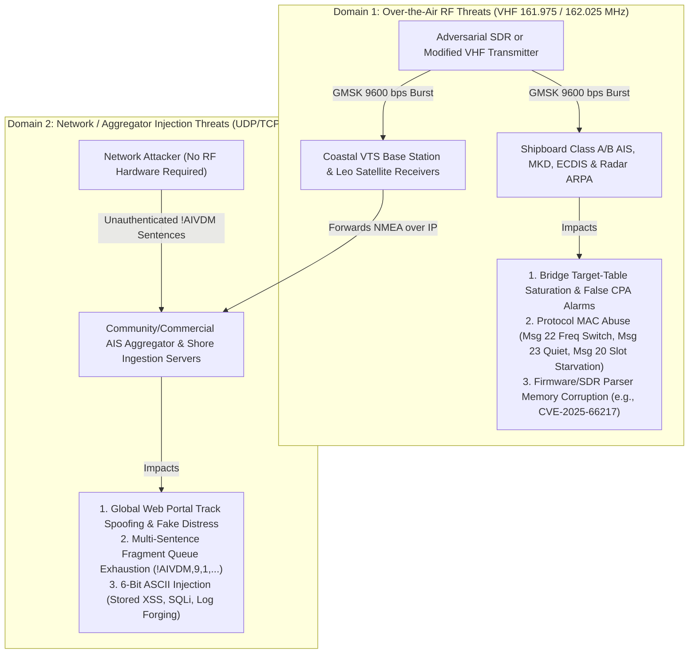
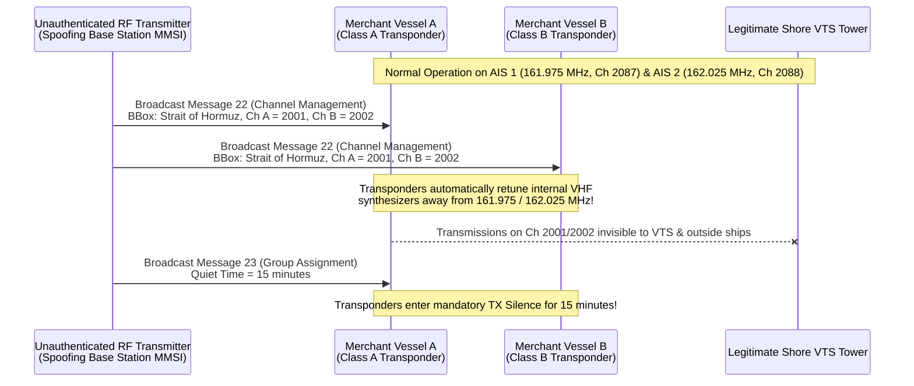

# Chapter 27: Cybersecurity of AIS: Malicious Data, DoS Attacks, and Hardware/Software Failure Modes

---

## 1. Operational & Conceptual Overview

When the International Telecommunication Union (ITU), the International Maritime Organization (IMO), and the International Association of Marine Aids to Navigation and Lighthouse Authorities (IALA) standardized the Automatic Identification System (AIS) in the 1990s, they engineered a cooperative safety-of-life broadcast protocol for a trusted RF environment. Under **Recommendation ITU-R M.1371**, every AIS transceiver—whether a $12.5\text{ W}$ Class A shipborne transponder, a $2\text{ W}$ Class B recreational unit, or a shore-based Vessel Traffic Services (VTS) Base Station—operates on an implicit assumption of honesty. Any radio transmitter capable of generating a $9,600\text{ bps}$ Gaussian Minimum Shift Keying (GMSK) signal on $161.975\text{ MHz}$ (AIS 1) or $162.025\text{ MHz}$ (AIS 2), or any network node capable of injecting an ASCII `!AIVDM` sentence into a UDP/TCP aggregator feed, is accepted as an authentic maritime participant.

For bridge watch officers, VTS operators, embedded firmware engineers, and maritime intelligence analysts, this architectural trust model creates two distinct but converging operational realities:

1. **Adversarial Vulnerability Across Four Attack Surfaces:** Because AIS lacks cryptographic authentication, message integrity codes, and replay protection, malicious or malformed frames can compromise systems far beyond simple "ghost ship" position spoofing. As demonstrated in security audits and real-world vulnerability disclosures, malformed over-the-air bursts and NMEA payloads can trigger **memory corruption (buffer overflows and integer underflows)** in C/C++ decoders, **exhaust multi-sentence fragment reassembly queues**, inject **6-bit ASCII payloads** (Cross-Site Scripting [XSS], SQL injection, and format-string tokens) into shore databases, **saturate finite hardware target tables** on bridge Electronic Chart Display and Information Systems (ECDIS) and Minimum Keyboard and Displays (MKDs), and **abuse ITU-R M.1371 MAC control messages** (Messages 16, 17, 20, 22, and 23) to silence, frequency-shift, or slot-starve legitimate vessels across an entire strait.
2. **Non-Malicious Hardware, RF, and Sensor Degradation:** In day-to-day maritime operations, the vast majority of anomalous AIS tracks, sudden vessel disappearances, and bizarre kinematic vectors are caused not by cyber adversaries, but by physical and software failure modes. A waterlogged PL-259 coaxial connector with a Voltage Standing Wave Ratio ($\text{VSWR}$) above $3:1$ can silently reduce a $12.5\text{ W}$ Class A transmitter to less than $100\text{ mW}$ of radiated power—creating the notorious **"1-mile AIS syndrome"** while the bridge transceiver's front-panel `TX` LED continues to blink normal green. Similarly, **GPS Week Number Rollover (WNRO)** epochs, drifted temperature-compensated crystal oscillators (TCXOs), failed PIN diodes in active VHF/AIS antenna splitters, and frozen NMEA 0183 `$HEHDT` gyrocompass repeaters routinely corrupt the global AIS data stream.

This chapter provides a rigorous engineering analysis of both domains: the foundational cybersecurity vulnerabilities of the AIS protocol and software ecosystem, and the physics and electronics of non-malicious hardware and sensor failures. It concludes with a complete, runnable **Python Defensive AIS Stream Sanitizer and Intrusion Detection System (IDS)** designed to protect shore ingestion pipelines and shipboard bridge networks from malformed frames, parser exploits, and unauthorized base-station control commands.

---

## 2. Historical Context & Evolution (`schwehr/gis-history` Integration)

The security posture and failure modes of modern AIS are direct artifacts of the technological era in which its underlying protocols were conceived. Tracing the lineage through `schwehr/gis-history` reveals a thirty-year gap between the design of unauthenticated serial/radio navigation standards and the rise of inexpensive Software-Defined Radios (SDRs) and internet-connected maritime infrastructure:

| Year / Era | Historical Milestone (`schwehr/gis-history` & Maritime Security Lineage) | Engineering & Security Consequence for AIS |
|---|---|---|
| **1972 – 1984** | **C programming language** (1972); **GPS Block I** launch (1978) with a 10-bit Week Number counter ($0\text{–}1023$); **NMEA 0183** serial interface & **WGS84** datum standardized (1984) | Legacy C pointer arithmetic without bounds checking becomes standard in embedded marine electronics; the 10-bit GPS week counter establishes recurring $1,024\text{-week}$ ($19.6\text{-year}$) rollover hazards. |
| **1988 – 1998** | **Håkan Lans** files STDMA patent priority (1988); ***Exxon Valdez* grounding** (1989) & **OPA-90** (1990); **ITU-R M.1371-0** published (Nov 1998) | AIS is designed for maximum bit efficiency inside a $25\text{ kHz}$ VHF channel ($256\text{-bit}$ single-slot frames). Every bit is allocated to navigation telemetry; **zero bits** are allocated to cryptographic signatures or full epoch timestamps. |
| **1999 (Aug 21)** | **First GPS Week Number Rollover (WNRO #1)** (end of GPS Week 1023) | Early marine GPS engines reset to January 6, 1980, demonstrating how unpatched embedded GNSS firmware corrupts timing and position outputs. |
| **2000 – 2004** | **GPS Selective Availability disabled** (May 2000); **SOLAS Chapter V Reg 19** AIS mandate adopted (Dec 2000) and enters into force (July 1, 2002); **PostGIS** (2001) & web mapping emerge | AIS transitions rapidly from isolated ship-to-ship VHF links to shore-based SQL databases and web portals, exposing legacy NMEA parsers to internet-scale ingestion. |
| **2006 – 2010** | **IEC 62287-1 Class B CSTDMA** standardized (2006); ***Deepwater Horizon* spill** (2010); **Kurt Schwehr releases `libais`** (2010); **RTL-SDR** & low-cost TX/RX SDRs (**USRP**, **HackRF**, **BladeRF**) proliferate (2010–2013) | Hardware required to transmit custom GMSK bursts on $162\text{ MHz}$ drops from $\$10,000+$ marine test sets to $\$300$ USB transceivers, while `libais` introduces systematic C++ bit-length verification and fuzz testing for AIS decoders. |
| **2013 – 2014** | **ITU-R M.1371-5** published (Feb 2014); **Marco Balduzzi, Alessandro Pasta, & Kyle Wilhoit** publish *"A Security Evaluation of AIS Automated Identification System"* at **BlackHat / ACSAC** (Dec 2014) | Landmark academic and industry proof that AIS is vulnerable across both **Network/Aggregator Injection** and **Over-the-Air RF Control/Spoofing** vectors, including Message 22 frequency hijacking and Message 20 slot starvation. |
| **2019 (Apr 6)** | **Second GPS Week Number Rollover (WNRO #2)** (end of GPS Week 2047) | Thousands of older Class A/B AIS transponders with unpatched GPS modules lose 1PPS SOTDMA synchronization or broadcast timestamps jumped back to August 1999. |
| **2020 – 2026+** | **ITU-R M.2092 VDES** (AIS 2.0) & **IEC 63173-2 (SECOM)** standards advance; **`CVE-2025-66217`** disclosed in `AIS-catcher` (< v0.64, Dec 2025) | Demonstrates that even modern open-source SDR decoders remain susceptible to over-the-air memory corruption (integer underflow leading to heap buffer overflow) if minimum bit lengths are not strictly enforced before payload subtraction. |

---

## 3. Deep Technical & Mathematical Foundations

### 3.1 Foundational Security Implications of AIS (27.1 & Balduzzi et al., 2014)

To understand why AIS is structurally vulnerable to both over-the-air manipulation and software injection, we examine the bit-level frame architecture of **ITU-R M.1371-5**. A standard 1-slot AIS burst occupies $26.67\text{ ms}$ ($256\text{ bits}$ at $9,600\text{ bps}$) and contains a $168\text{-bit}$ payload enclosed within a High-Level Data Link Control (HDLC) frame:

$$\underbrace{24\text{ bits}}_{\text{Ramp + Training}} \;\Vert\; \underbrace{8\text{ bits}}_{\text{Start Flag }\texttt{0x7E}} \;\Vert\; \underbrace{168\text{ bits}}_{\text{AIS Payload (Msg 1/2/3)}} \;\Vert\; \underbrace{16\text{ bits}}_{\text{CRC-16-CCITT}} \;\Vert\; \underbrace{8\text{ bits}}_{\text{End Flag }\texttt{0x7E}} \;\Vert\; \underbrace{24\text{ bits}}_{\text{Buffer}}$$

Four foundational cryptographic properties are completely absent from this frame:

1. **Zero Cryptographic Integrity or Digital Signatures (Linear CRC-16 Only):**
   The $16\text{-bit}$ Frame Check Sequence (FCS) uses the standard HDLC polynomial:
   $$G(x) = x^{16} + x^{12} + x^5 + 1$$
   While CRC-16-CCITT detects random bit errors caused by thermal noise or multipath fading, it is a linear function over $\text{GF}(2)$ with no secret key. Any party generating or modifying a payload $\mathbf{m}$ trivially computes $\text{CRC}(\mathbf{m})$ in microseconds, and any NMEA injector computes the 8-bit XOR checksum (`*HH`) at the end of an `!AIVDM` sentence via:
   $$\text{Checksum}_{\text{NMEA}} = \bigoplus_{k=1}^{N} \text{ASCII}(c_k)$$
2. **Zero Sender Identity Authentication:**
   The source identity of every AIS message is its $30\text{-bit}$ **User ID (MMSI)** at bit indices `8..37` (0-based MSB-first). In standard Class A/B transponders and SDR encoders, the MMSI is simply an unauthenticated $30\text{-bit}$ integer (`000000000` to `999999999`). There is no Public Key Infrastructure (PKI) binding a vessel's MMSI or Base Station ID to a cryptographic private key.
3. **Zero Replay Protection (6-Bit UTC Second Only):**
   Position reports (Messages 1, 2, 3, 18, and 19) do not contain a full UTC date or epoch timestamp. Instead, bits `137..142` (0-based MSB-first in Messages 1–3) store only a **6-bit Time Stamp** (`0–59` representing the UTC second of position generation, with `60` = timestamp not available, `61` = manual input mode, `62` = dead reckoning mode, `63` = positioning system inoperative). Consequently, any valid AIS burst recorded off the air can be replayed hours, days, or years later at the matching second of any minute without violating protocol semantics.
4. **Zero Confidentiality / Cleartext Broadcast:**
   All standard ITU-R M.1371 messages are transmitted in cleartext. Unless a military agency wraps encrypted payloads inside addressed/broadcast binary containers (Messages 6 and 8, examined in Chapter 29), every position, course, speed, cargo category, and safety message is readable by any receiver within VHF or LEO satellite range.

#### The Balduzzi, Pasta, and Wilhoit (2014) Threat Taxonomy

In their seminal paper *"A Security Evaluation of AIS Automated Identification System"* presented at the 30th Annual Computer Security Applications Conference (ACSAC 2014) and BlackHat, **Marco Balduzzi, Alessandro Pasta, and Kyle Wilhoit** established the canonical taxonomy of AIS threats by separating the attack surface into two distinct physical and logical domains:



| Threat Dimension | Over-the-Air RF Threats (Physical/Link Layer) | Network / Aggregator Injection Threats (Transport/Application Layer) |
|---|---|---|
| **Injection Medium** | VHF Maritime Mobile Band ($161.975\text{ MHz}$ / $162.025\text{ MHz}$) via GMSK modulation ($BT = 0.4$) | UDP/TCP sockets, HTTP APIs, or serial-to-Ethernet converters carrying ASCII `!AIVDM` sentences |
| **Spatial Reach** | Localized to VHF radio horizon ($\sim 15\text{–}40\text{ NM}$ surface-to-surface; wider under tropospheric ducting or into LEO satellites) | Global—instantly injects fabricated vessels anywhere on Earth into web trackers and cloud databases |
| **Impacted Victims** | **Actual ships at sea** (bridge ECDIS, ARPA radar overlays, MKDs), coastal VTS towers, and shore SDR receivers | Online tracking portals, port community software, financial/commodity analytics feeds, and unauthenticated shore VTS feeds |
| **Protocol MAC Control Abuse?** | **Yes**—shipboard transponders actively obey received Base Station commands (Messages 16, 20, 22, 23) over the VDL | **No**—shipboard transponders do not listen to internet aggregator feeds (unless a shore VTS re-broadcasts injected data) |

---

### 3.2 Can Malicious Data Cause DoS or Corruption in Receiving Hardware and Software? Four Attack Surfaces (27.2)

Can malicious data sent over AIS cause Denial of Service (DoS), memory corruption, or remote code execution in receiving hardware and software? **Yes.** Below is a deep technical analysis across all four maritime AIS attack surfaces.

---

#### Attack Surface 1: Software & Firmware Parser Memory Corruption (Buffer Overflows, Bit-Length Mismatches, and Documented CVEs)

AIS messages undergo a two-stage decoding pipeline: first, de-armoring 6-bit ASCII characters from one or more `!AIVDM` sentences (or demodulating HDLC bits off the air) into a contiguous bit vector $\mathbf{b}$ of length $L_{\text{bits}}$; second, branching on the 6-bit **Message ID** (`b[0..5]`) to extract typed fields at fixed or variable bit offsets.

##### 1. Payload Bit-Length Truncation and Overrun Attacks
Each of the 27 message types in ITU-R M.1371-5 has strict bit-length invariants. However, because HDLC framing (`0x7E` flags) and NMEA `!AIVDM` sentences allow arbitrary payload lengths between $0$ and $>1,000\text{ bits}$ regardless of what the first 6 bits (`Message ID`) declare, an anomalous or malicious frame can violate the expected bit length of its declared `Message ID`:

| Message ID | Message Name | Nominal Bit Length ($L_{\text{expected}}$) | Truncation Hazard ($L_{\text{actual}} \ll L_{\text{expected}}$) | Overrun Hazard ($L_{\text{actual}} \gg L_{\text{expected}}$) |
|---|---|---|---|---|
| **1, 2, 3** | Class A Position Report | Exactly $168\text{ bits}$ | Unchecked C/C++ parser reads bits `149..167` (SOTDMA state) past the end of a $32\text{-bit}$ heap allocation $\rightarrow$ **Out-of-bounds read / SIGSEGV** | Unchecked parser copies full payload into a fixed `uint8_t buf[21]` ($168\text{-bit}$) stack array $\rightarrow$ **Stack buffer overflow** |
| **5** | Class A Static & Voyage Data | $424\text{ bits}$ (or $420\text{–}426$ with spare padding) | Parser indexing `Destination` (`b[302..421]`) on a single-sentence $168\text{-bit}$ frame reads adjacent heap memory | Multi-sentence `!AIVDM` packing $1,200\text{ bits}$ into `Message 5` overflows fixed $64\text{-byte}$ static-message buffers |
| **6, 8** | Addressed / Broadcast Binary Message | Variable: $88\text{–}1,008\text{ bits}$ (Msg 6) or $56\text{–}1,008\text{ bits}$ (Msg 8) | Frame shorter than the header ($<88\text{ bits}$ for Msg 6 or $<56\text{ bits}$ for Msg 8) causes **unsigned integer underflow** when computing `app_data_len = bit_len - header_len`! | Frame exceeding $1,008\text{ bits}$ (5 slots) overflows fixed 5-slot binary payload buffers (`uint8_t data[128]`) |
| **24** | Class B Static Data Report | $160\text{ bits}$ (Part A) or $168\text{ bits}$ (Part B) | Truncated Part B frame ($<168\text{ bits}$) causes out-of-bounds read while extracting `Mothership MMSI` (`b[132..161]`) | Oversized frame overflows Class B static cache entry |

##### 2. Documented Vulnerability Case Study: `CVE-2025-66217` (`AIS-catcher` < v0.64)
A textbook real-world manifestation of bit-length truncation and integer underflow in an over-the-air AIS receiver is **`CVE-2025-66217`** (GHSA-657x-977v-Jf6g, disclosed December 2025, CVSSv4 8.7 High), affecting **`AIS-catcher`** versions prior to `v0.64`.

* **Root Cause in `AIS.cpp`:** When `AIS-catcher` decoded variable-length binary messages (**Message 6** Addressed Binary and **Message 8** Broadcast Binary) for JSON serialization (`NMEA2JSON`), it calculated the length of the variable application-specific binary payload by subtracting the fixed header bit length ($88\text{ bits}$ for Message 6, comprising the $72\text{-bit}$ transport header plus $16\text{-bit}$ DAC/FI; or $56\text{-bit}$ header for Message 8) from the received message bit length $L_{\text{rx}}$:
  $$\Delta L = L_{\text{rx}} - L_{\text{header}}$$
* **The Integer Underflow Mechanics:** If a short over-the-air RF burst or crafted `!AIVDM` sentence arrived with `Message ID = 6` or `8` but a total payload length $L_{\text{rx}} < L_{\text{header}}$ (for example, a $32\text{-bit}$ or $48\text{-bit}$ burst that still passed CRC-16), the subtraction $L_{\text{rx}} - L_{\text{header}}$ produced a negative value or wrapped around as an unsigned integer (`size_t` / `unsigned int`). When this underflowed length was passed to the payload extraction loop in `AIS.cpp`, it triggered a **heap-based buffer overflow**, crashing the `AIS-catcher` daemon immediately (Remote Denial of Service) and creating a potential vector for arbitrary code execution.
* **The Fix (`v0.64`):** Enforcing strict minimum and maximum bit-length bounds ($L_{\text{rx}} \ge L_{\text{header}}$ and $L_{\text{rx}} \le 1008$) *before* computing payload bit slices or allocating output buffers.

> [!IMPORTANT]
> **Historical Parser Vulnerabilities Across the Ecosystem:** `CVE-2025-66217` is not an isolated incident. Over the past fifteen years, fuzzing campaigns (`american-fuzzy-lop` / `libFuzzer`) against `gpsd`, Wireshark packet dissectors, and commercial chartplotter NMEA stacks have repeatedly uncovered out-of-bounds reads and buffer overflows triggered by malformed `!AIVDM` fill-bit fields (`fill_bits > 5`), truncated Message 20/21/24 payloads, and corrupted IEC 61162-450 TAG blocks. This was one of the primary engineering motivations behind Kurt Schwehr's design of `libais` (2010), which checks exact bit-length preconditions in every message constructor before touching the underlying `std::bitset`.

##### 3. Multi-Sentence Fragment Reassembly Queue Exhaustion (`!AIVDM,9,1,seq,...`)
Because a single NMEA 0183 sentence (`!AIVDM`) is limited to $82\text{ characters}$ (carrying at most $\sim 60\text{–}62$ 6-bit payload characters, or $360\text{–}372\text{ bits}$), multi-slot AIS messages such as **Message 5** ($424\text{ bits}$, 2 sentences) or 5-slot **Message 8** ($1,008\text{ bits}$, up to 3–4 sentences) are fragmented across multiple consecutive NMEA sentences:

```text
!AIVDM,2,1,3,B,55P5TL01VIaAL@7WKO@mBplU@<PDhh000000001S;AJ::4A80?4i@E53,0*3E
!AIVDM,2,2,3,B,1@0000000000000,2*55
```

Here, field 1 is `frag_cnt` ($1\text{–}9$), field 2 is `frag_num` ($1\text{–}9$), and field 3 is the sequential message identifier `seq_id` (`0`–`9`). A receiver must buffer incomplete fragments in memory indexed by `(channel, seq_id)` until `frag_num == frag_cnt`.
* **Embedded Fixed-Slot Eviction DoS:** If an attacker transmits a stream of orphan first fragments—e.g., `!AIVDM,9,1,0,A,...` through `!AIVDM,9,1,9,B,...`—at high rate without ever sending fragments `2..9`, any bridge ECDIS or NMEA multiplexer that stores only one active assembly slot per `(channel, seq_id)` will continuously overwrite legitimate in-flight **Message 5** and **Message 21** first fragments before their second sentence arrives, blinding the receiver to vessel names, dimensions, and draughts.
* **Unbounded Heap Exhaustion DoS:** Conversely, if a naive shore aggregator appends incoming fragments to an unbounded dictionary or list without enforcing a strict maximum fragment count ($\text{frag\_cnt} \le 5$ for valid ITU-R M.1371 messages), a per-key byte limit, and a short Time-To-Live ($\text{TTL} \le 3.0\text{ s}$) with Least-Recently-Used (LRU) eviction, an attacker flooding orphan fragments across thousands of spoofed TCP/UDP source tags will exhaust server RAM (`OutOfMemoryError`).

##### 4. 6-Bit ASCII Injection (XSS, SQL Injection, Log Forging, and Format-String Bugs)
In ITU-R M.1371-5 Table 44, text fields—including `Vessel Name` (20 chars, $120\text{ bits}$ in Msg 5/19/24A), `Call Sign` (7 chars, $42\text{ bits}$), `Destination` (20 chars, $120\text{ bits}$), and free-text safety messages (**Message 12** Addressed Safety up to 156 chars; **Message 14** Safety Broadcast up to 161 chars)—are encoded using **6-bit ASCII** (`0x00`–`0x3F`):

| 6-Bit Value (`Dec` / `Hex`) | Mapped ASCII Character | Security-Sensitive Metacharacters Included in Standard AIS 6-Bit ASCII |
|---|---|---|
| `0` (`0x00`) | `@` (Field padding / null equivalent) | `@` |
| `1` – `26` (`0x01`–`0x1A`) | `A` – `Z` | Uppercase alphabetic characters (`SCRIPT`, `SVG`, `ONLOAD`, `OR`, `DROP`, `SELECT`) |
| `27` – `31` (`0x1B`–`0x1F`) | `[`, `\`, `]`, `^`, `_` | `\` (escape character in SQL/JSON/logs) |
| `32` (`0x20`) | ` ` (Space) | Whitespace separator |
| `33` – `47` (`0x21`–`0x2F`) | `!`, `"`, `#`, `$`, `%`, `&`, `'`, `(`, `)`, `*`, `+`, `,`, `-`, `.`, `/` | `"` and `'` (string delimiters), `%` (`printf` format specifier), `--` (SQL comment), `/` (closing HTML tag `</`) |
| `48` – `57` (`0x30`–`0x39`) | `0` – `9` | Digits (`1=1`) |
| `58` – `63` (`0x3A`–`0x3F`) | `:`, `;`, `<`, `=`, `>`, `?` | `<` and `>` (HTML/XML tags), `;` (SQL statement terminator), `=` (attribute/comparison operator) |

Because `<`, `>`, `"`, `'`, `;`, `-`, `/`, and `%` are all first-class citizens of the AIS 6-bit character set, a 20-character `Vessel Name` or `Destination` or a 161-character `Message 14` safety broadcast can natively carry:
* **Stored Cross-Site Scripting (XSS):** A vessel name or Message 14 broadcast containing `<SVG/ONLOAD=ALERT(1)>` (21 chars in Msg 14) or `<SCRIPT SRC=//X.IO>` (19 chars—fits inside a standard 20-char `Vessel Name`!) is decoded into valid HTML/JavaScript. When an unescaped web-based AIS map or VTS browser dashboard renders the ship tooltip, the script executes in the operator's browser session.
* **SQL Injection (SQLi):** A `Destination` field containing `' OR 1=1;--@@@@@@@@@` (20 chars) breaks out of unparameterized SQL `INSERT INTO vessels (mmsi, dest) VALUES (..., '$dest')` queries in legacy shore logging scripts.
* **C `printf` Format-String Bugs:** A `Call Sign` or `Name` containing `%S%S%S%S%N` passed directly to `syslog(LOG_INFO, vessel_name)` or `snprintf(buf, sizeof(buf), vessel_name)` in embedded C firmware reads or writes arbitrary stack memory via the `%n` specifier.

---

#### Attack Surface 2: Bridge Hardware & ECDIS/MKD Target-Table Saturation DoS

Shipboard navigational equipment—including Class A Minimum Keyboard and Displays (MKDs), Electronic Chart Display and Information Systems (ECDIS, governed by **IEC 61174**), and marine radar Automatic Radar Plotting Aid (ARPA) overlays (**IEC 62388**)—operates on constrained embedded processors with deterministic memory budgets.

1. **Finite Hardware Target-Table Exhaustion:**
   Under **IEC 61993-2** and **IEC 62388**, certified bridge displays are required to maintain a bounded active AIS target table (typically sized between $200$ and $1,000$ simultaneous MMSIs depending on hardware generation and display class). Each active MMSI consumes a state slot storing its latest WGS84 position $(\lambda, \phi)$—where raw 28-bit Longitude (`0x6791AC0` = `181.0°` sentinel) and 27-bit Latitude (`0x3412140` = `91.0°` sentinel) are encoded in standard **two's complement**—along with SOG, COG, True Heading, 8-bit two's complement Rate of Turn (`-128` = `0x80` sentinel), static dimensions, and Closest Point of Approach (CPA) / Time to Closest Point of Approach (TCPA) vectors projected into a centered local tangent plane (**East-North-Up [ENU]**) relative to Own Ship to avoid cosine-latitude distortion and single-precision `float32` jitter.
   When a high-rate burst of $500$ to $1,500$ synthetic MMSIs is injected within a vessel's reception horizon:
   * **Target Eviction & Blindness:** Once the target table reaches capacity $N_{\text{max}}$, the display must either reject new MMSIs or evict existing entries. If the synthetic targets are generated with simulated positions closer to Own Ship than real vessels ($R_{\text{spoof}} < R_{\text{real}}$), distance-prioritized target tables **evict genuine nearby merchant ships** in favor of phantom targets!
   * **GUI Rendering Thread Freeze:** Rendering $1,000+$ overlapping vector triangles, heading lines, and text labels on an embedded bridge display can saturate the 2D graphics pipeline, freezing chart panning and radar overlay updates.
   * **CPA/TCPA Alarm Fatigue ("Alarm Flooding"):** If synthetic targets are placed on converging ENU vectors where $\text{CPA} < 0.5\text{ NM}$ and $0 < \text{TCPA} < 12\text{ min}$, the bridge system triggers continuous high-priority audible and visual collision alarms (**IEC 62923 Bridge Alert Management**). Confronted with dozens of simultaneous phantom collision alarms, watch officers have historically silenced alarms or disabled the AIS overlay entirely—removing collision-avoidance awareness right when real traffic is present.
2. **Virtual AtoN / Fake Wreck Spoofing (Message 21) & Fake SART Distress Floods (`970xxyyyy`):**
   * **Message 21 (Aids-to-Navigation Report):** A $272\text{–}360\text{-bit}$ broadcast with `Virtual AtoN Flag = 1` (bit 269, 0-based MSB-first; bit 270, 1-based ITU-R M.1371-5) places an official navigational symbol (e.g., an Isolated Danger Mark for a new wreck or a Lateral Buoy) directly onto the mariner's ECDIS screen without any physical buoy in the water. Unauthenticated virtual AtoNs can be used to herd a deep-draught vessel out of a dredged channel into shoal water or obstruct a harbor entrance.
   * **AIS-SART / MOB Distress Floods:** Any AIS Message 1 or Message 14 transmitted from an MMSI formatted as `970xxyyyy` (AIS-SART), `972xxyyyy` (Man Overboard), or `974xxyyyy` (EPIRB-AIS) with `Navigation Status = 14` (`SART is active`) forces every receiving Class A/B display within VHF range to render a high-priority flashing red circle-with-cross distress icon and sound a dedicated life-safety alarm, potentially triggering false Search and Rescue (SAR) asset scrambles.

---

#### Attack Surface 3: Protocol-Level MAC & Base Station Control Attacks (ITU-R M.1371 Abuse)

The most severe architectural flaw identified by Balduzzi et al. (2014) is that **ITU-R M.1371 includes remote administrative command-and-control messages intended for shore-based VTS Base Stations, yet mandates that shipborne Class A and Class B transponders obey these commands automatically without cryptographic verification**.



| Msg ID & Field Name | 0-Based MSB-First (`libais` / `gpsd`) | 1-Based MSB-First (ITU-R M.1371-5) | Bit Width | Encoding, Scaling, & Two's Complement Sentinel Values |
|---|---|---|---|---|
| **Msg 22:** `Channel A` / `Channel B` | `40..51` / `52..63` | `41..52` / `53..64` | $12$ each | Unsigned integer ITU-R M.1084 channel (`2087` = AIS 1, `2088` = AIS 2) |
| **Msg 22:** `Tx/Rx Mode` & `Power` | `64..67` & `68` | `65..68` & `69` | $4$ & $1$ | `0` = TxA/TxB, RxA/RxB; `1` = TxA only; `2` = TxB only; Power `0` = $12.5\text{ W}$, `1` = $1\text{ W}$ |
| **Msg 22:** `NE Lon` / `NE Lat` (Broadcast) | `69..86` / `87..103` | `70..87` / `88..104` | $18$ / $17$ | **Signed two's complement** in $0.1'$ ($1/600^\circ$); sentinels `181.0°` (`0x1A838`) / `91.0°` (`0xD558`) |
| **Msg 22:** `SW Lon` / `SW Lat` (Broadcast) | `104..121` / `122..138` | `105..122` / `123..139` | $18$ / $17$ | **Signed two's complement** in $0.1'$ ($1/600^\circ$); defines SW corner of hijack zone |
| **Msg 22:** `Addressed Indicator` | `139` | `140` | $1$ | `0` = Geographic Broadcast area; `1` = Addressed to individual MMSIs |
| **Msg 23:** `NE Lon/Lat` & `SW Lon/Lat` | `40..109` | `41..110` | $70$ total | Two's complement $18\text{-bit}$ Lon / $17\text{-bit}$ Lat corners in $0.1'$ resolution |
| **Msg 23:** `Station Type` & `Ship Type` | `110..113` & `114..121` | `111..114` & `115..122` | $4$ & $8$ | Target vessel class filter (`0` = all stations / all ship types) |
| **Msg 23:** `Tx/Rx Mode` & `Interval` | `140..141` & `142..145` | `141..142` & `143..146` | $2$ & $4$ | Forces single-channel mode or overrides reporting interval ($5\text{ s}$ to $10\text{ min}$) |
| **Msg 23:** `Quiet Time` | `146..149` | `147..150` | $4$ | `0` = None; **`1..15` = Mandatory complete TX silence for $1\text{–}15\text{ minutes}$** |

Five specific ITU-R M.1371 control messages create critical MAC and physical-layer vulnerabilities:

1. **Message 22 — Channel Management Hijack ($168\text{ bits}$):**
   Designed to allow a national maritime authority to transition vessels into a regional VDL frequency zone, **Message 22** specifies a geographic rectangle (`NE Longitude`, `NE Latitude`, `SW Longitude`, `SW Latitude`, bits `69..138`, when `Addressed Indicator = 0` at bit `139`) or targets up to two individual destination MMSIs (when `Addressed Indicator = 1`), along with 12-bit ITU-R M.1084 channel numbers for `Channel A` (bits `40..51`), `Channel B` (bits `52..63`), `Tx/Rx Mode` (bits `64..67`), and `Power` (`0` = $12.5\text{ W}$ high power, `1` = $1\text{ W}$ low power at bit `68`).
   * **Impact:** When a compliant Class A or Class B transponder inside the specified bounding box receives a broadcast Message 22, **its firmware automatically retunes its internal VHF synthesizers** away from the international AIS channels ($2087 = 161.975\text{ MHz}$, $2088 = 162.025\text{ MHz}$) to the commanded channels, drops TX power to $1\text{ W}$, or switches to single-channel transmit mode (`Tx/Rx Mode = 1` or `2`). Every affected vessel inside the bounding box immediately disappears from standard AIS receivers and coastal VTS screens without any physical jamming signal!
2. **Message 23 — Group Assignment Quiet-Time Command ($160\text{ bits}$):**
   Designed to allow a Base Station to reduce VDL congestion, **Message 23** defines a geographic bounding box (`NE Lon/Lat`, `SW Lon/Lat`, bits `40..109`), filters by `Station Type` (bits `110..113`) and `Ship and Cargo Type` (bits `114..121`), and includes a 4-bit **Quiet Time** field (`b[146..149]`, values `1` to `15` minutes).
   * **Impact:** Upon receiving Message 23 matching its location and vessel class, a transponder **must immediately cease all transmissions for $1\text{ to }15\text{ minutes}$**. By re-transmitting a single $26.67\text{ ms}$ Message 23 burst once every 15 minutes, an adversary can keep every compliant transponder in a port or strait completely silent indefinitely.
3. **Message 16 — Assigned Mode Rate Throttling ($96\text{ or }144\text{ bits}$):**
   Sent by a Base Station to force one or two specific target MMSIs (`Destination ID A` at bits `40..69`, `Destination ID B` at bits `92..121`) out of autonomous SOTDMA mode into **Assigned Mode**, overriding their normal kinematic reporting rate with a commanded `Offset` and `Increment`.
   * **Impact:** Can throttle a fast-maneuvering vessel's position reporting rate or force it onto colliding time slots, degrading collision-avoidance updates for nearby traffic.
4. **Message 20 — Data Link Management / FATDMA Slot Starvation ($72\text{–}160\text{ bits}$):**
   Used by shore Base Stations to reserve Fixed Access TDMA (FATDMA) time slots across the $2,250\text{-slot}$ frame (`Offset number`, `Reserved slots`, `Time-out`, and `Increment` for up to 4 reservation blocks per message).
   * **Impact:** Because honest SOTDMA (Class A) and CSTDMA (Class B) transponders must respect Base Station FATDMA reservations when selecting candidate transmission slots, broadcasting forged Message 20 reservations across the entire $2,250\text{-slot}$ frame starves legitimate ships of available time slots.
5. **Message 17 — DGNSS Broadcast Binary Message Poisoning ($80\text{–}816\text{ bits}$):**
   Allows a Base Station to broadcast RTCM SC-104 Type 1 or Type 9 differential GPS pseudorange corrections over the AIS VDL (`b[80..N]`).
   * **Impact:** If a shipborne AIS transponder's internal GNSS engine is configured to apply over-the-air Message 17 DGNSS corrections without plausibility gating against standalone multi-constellation GNSS, malicious pseudorange offsets ($\Delta \rho_i$) can smoothly slew the vessel's computed AIS position by hundreds of meters—potentially shifting the ship's reported track onto a reef or into an opposing traffic lane.

---

#### Attack Surface 4: Network / Aggregator Feed Injection & TAG-Block Forging

Unlike over-the-air attacks that require RF proximity, coastal and cloud AIS architectures rely on **IEC 61162-450** (Lightweight Ethernet / LWE) and community UDP/TCP NMEA relays. Many shore receivers forward raw NMEA streams with prepended **TAG Blocks** (`\s:station_id,c:1712000000*HH\!AIVDM,...`) over unencrypted UDP packets without mutual TLS (mTLS) or HMAC authentication. An attacker with network access—or anyone registering a free virtual feeder account on an unverified community aggregator—can inject arbitrary `!AIVDM` sentences with forged station source tags (`s:`) and timestamps (`c:`), polluting historical data lakes, triggering false sanctions-compliance alerts, or corrupting downstream analytical pipelines.

---

### 3.3 Non-Malicious Failure Modes of AIS Hardware and Software (27.3)

In operational maritime engineering, distinguishing a cyberattack from a mundane hardware or software failure is paramount. A silent ship or a teleporting position vector is far more frequently the result of RF impedance mismatch, oscillator aging, or firmware bugs than adversarial interference.

#### 1. RF & Hardware Failure Modes

##### Coaxial Cable Corrosion, Water Ingress, and High VSWR ("The 1-Mile AIS Syndrome")
Marine VHF antennas sit at the masthead exposed to salt spray, UV radiation, and mechanical vibration. Standard marine VHF whip antennas are specified in either dipole-relative gain ($\text{dBd}$) or isotropic gain ($\text{dBi}$), related by:

$$\text{Gain (dBi)} = \text{Gain (dBd)} + 2.15\text{ dB}$$

Thus, a nominal half-wave ($0\text{ dBd}$) marine whip has an isotropic gain $G_{\text{ant}} = +2.15\text{ dBi}$. When salt water wicks past poorly sealed **PL-259 / SO-239 (UHF)** or **N-type** connectors into the braided shield of RG-58, RG-8X, or RG-213 coaxial cable, copper oxide and dielectric contamination alter the transmission line's characteristic impedance away from $Z_0 = 50\text{ }\Omega$.
Given a load impedance $Z_L$, the voltage reflection coefficient $\Gamma$ and **Voltage Standing Wave Ratio ($\text{VSWR}$)** are:

$$\Gamma = \frac{Z_L - Z_0}{Z_L + Z_0}, \qquad \text{VSWR} = \frac{1 + |\Gamma|}{1 - |\Gamma|}$$

The fraction of forward transmitter power $P_{\text{fwd}}$ reflected back toward the AIS power amplifier is $|\Gamma|^2$, yielding a mismatch loss $L_{\text{VSWR}} = -10\log_{10}(1 - |\Gamma|^2)$:

$$P_{\text{reflected}} = P_{\text{fwd}} |\Gamma|^2 = P_{\text{fwd}} \left( \frac{\text{VSWR} - 1}{\text{VSWR} + 1} \right)^2$$

Modern Class A ($12.5\text{ W} = +41.0\text{ dBm}$) and Class B ($2\text{ W} = +33.0\text{ dBm}$) transponders incorporate an **Automatic Level Control (ALC) foldback circuit** to prevent high reflected power from destroying the final RF MOSFET transistor. When $\text{VSWR} > 3:1$ ($|\Gamma| > 0.5$, meaning $>25\%$ of power is reflected), combined with $L_{\text{coax}} \approx 12\text{–}18\text{ dB}$ of ohmic dielectric attenuation through a waterlogged coaxial braid and corroded whip, the ALC folds back amplifier output by $\sim 10\text{ dB}$ while the degraded feedline dissipates the rest as heat:

$$\text{EIRP}_{\text{fault}} = P_{\text{tx,foldback}}\text{ (+31 dBm)} - L_{\text{coax}}\text{ (15 dB)} - L_{\text{VSWR}}\text{ (2.5 dB)} + G_{\text{ant}}\text{ (2.15 dBi)} \approx +15.65\text{ dBm}\text{ ($\sim 37\text{ mW}$)}$$

* **Operational Symptom ("1-Mile AIS Syndrome"):** The effective isotropic radiated power drops from $+41.0\text{ dBm}$ ($12.5\text{ W}$) to $< +16\text{ to }+20\text{ dBm}$ ($<40\text{–}100\text{ mW}$). Because strong $+41.0\text{ dBm}$ transmissions from nearby ships can still overcome $15\text{ dB}$ of feedline loss to reach the receiver's $-107\text{ dBm}$ sensitivity threshold, **the watch officer still sees targets on the bridge display and sees the green `TX` LED flashing every few seconds**, remaining completely unaware that their own vessel cannot be heard beyond $0.5\text{–}1.5\text{ NM}$ unless the transceiver's Built-In Integrity Test (**BIIT**) VSWR alarm is wired and monitored!

##### Active VHF/AIS Antenna Splitter PIN-Diode Failures
Many smaller commercial vessels and yachts share a single masthead VHF antenna between a $25\text{ W}$ VHF voice transceiver and an AIS transponder using an active **VHF/AIS antenna splitter**. Inside the splitter, fast **PIN diodes** serve as solid-state Transmit/Receive (TR) switches that isolate the sensitive AIS receiver front-end when the $25\text{ W}$ ($+44\text{ dBm}$) VHF voice radio keys up.
* **Failure Mode:** Nearby lightning-induced static transients on the mast or keying the $25\text{ W}$ VHF radio during an antenna fault can short or open the PIN diode matrix. If the diode fails **open**, the AIS path experiences $20\text{–}30\text{ dB}$ of insertion loss; if it fails **shorted**, keying the $25\text{ W}$ VHF voice radio dumps $+44\text{ dBm}$ directly into the AIS receiver's Low-Noise Amplifier (LNA), permanently deafening the AIS receiver.

##### Aged TCXO Crystal Oscillator Frequency Drift ($> \pm 3\text{ kHz}$)
Under **IEC 61993-2** and **ITU-R M.1371-5**, an AIS transmitter's carrier frequency error on $161.975\text{ MHz}$ and $162.025\text{ MHz}$ must remain within $\pm 500\text{ Hz}$ ($\pm 3.1\text{ ppm}$) for Class A and $\pm 1,500\text{ Hz}$ ($\pm 9.3\text{ ppm}$) for Class B. Over 10–15 years of thermal cycling in an enclosed bridge console, aging in the internal **Temperature-Compensated Crystal Oscillator (TCXO)** or failed varactor compensation voltage can cause the carrier to drift by $> \pm 3.0\text{ kHz}$ ($> \pm 18\text{ ppm}$).
* **Failure Mode:** Because narrowband $25\text{ kHz}$ AIS receivers use digital Phase-Locked Loops (PLLs) and IF channel filters with a pull-in range of roughly $\pm 1.5\text{ to }\pm 2.5\text{ kHz}$, a transmitter that has drifted by $+3.5\text{ kHz}$ still radiates full $12.5\text{ W}$ RF power, yet its GMSK spectrum falls outside the discriminator passband of compliant receivers—rendering the ship intermittently or totally invisible.

##### Dead Internal RTC & GPS Backup Batteries
AIS transponders contain a coin-cell lithium battery (`CR2032` or soldered `BR2032`) or supercapacitor that maintains the internal Real-Time Clock (RTC) and GNSS ephemeris/almanac RAM across power cycles. When this battery dies after 5–8 years, every power interruption forces a **cold GNSS start**, delaying 1PPS acquisition and forcing the unit into fallback **RATDMA/CSTDMA** slot selection with `Time Stamp = 60` or `63` until the almanac finishes downloading ($12.5\text{ minutes}$).

---

#### 2. GNSS, Sensor, and Software Failure Modes

##### GPS Week Number Rollover (WNRO): The $1,024\text{-Week}$ ($19.6\text{-Year}$) Time Bomb
In the legacy GPS navigation message (**IS-GPS-200**, L1 C/A signal), the GPS Week Number is transmitted as a **10-bit unsigned integer** ($0$ to $1023$). Consequently, the week counter wraps to zero every $2^{10} = 1,024\text{ weeks}$ ($7,168\text{ days} \approx 19.62\text{ years}$):

$$t_{\text{rollover}}(k) = \text{1980-01-06 00:00:00 GPST} + k \times 1024\text{ weeks}$$

| Rollover Epoch ($k$) | Exact UTC Date | GPS Continuous Week | Impact on Marine AIS Transponders & Shore Base Stations |
|---|---|---|---|
| **Epoch 0 Start** | **January 6, 1980** | Week 0 | Origin of GPS Time (GPST). |
| **WNRO #1 ($k=1$)** | **August 21–22, 1999** | Week 1024 $\rightarrow 0$ | Pre-SOLAS AIS trials; early GPS receivers reverted to January 1980. |
| **WNRO #2 ($k=2$)** | **April 6–7, 2019** | Week 2048 $\rightarrow 0$ | **Major global AIS impact:** Thousands of Class A/B transponders manufactured in the early 2000s (using hardcoded firmware pivot dates around 1999–2005) jumped back to August 1999, causing Base Station **Message 4** UTC Year/Month/Day broadcasts to report `1999`, breaking 1PPS SOTDMA synchronization, or invalidating earth-orientation/magnetic-variation lookup tables. |
| **Intermediate Pivot Rollovers** | **2022 – 2038** | Manufacturer-specific $1024\text{-week}$ offset from firmware compile date | Many GNSS chipsets add $1024\text{ weeks}$ relative to a hardcoded firmware build week $W_{\text{pivot}}$ rather than Week 0. Those units suffer delayed WNRO exactly $19.6\text{ years}$ after their firmware release date! |
| **WNRO #3 ($k=3$)** | **November 20–21, 2038** | Week 3072 $\rightarrow 0$ | Next global 10-bit GPS L1 C/A rollover (occurring two months before the Unix 32-bit `time_t` rollover on January 19, 2038!). Modern CNAV (L2C/L5) uses a **13-bit** week counter ($8,192\text{ weeks} \approx 157\text{ years}$), but legacy L1 C/A AIS modules remain vulnerable. |

##### Frozen NMEA Gyrocompass (`$HEHDT`) and Rate-of-Turn (`$HEROT`) Sensors
Class A transponders ingest external shipboard heading and rate-of-turn via IEC 61162-1 (NMEA 0183) serial lines (`$HEHDT` for True Heading; `$HEROT` for Rate of Turn). A common bridge failure occurs when a serial-to-NMEA buffer box or gyro repeater hangs and **continuously repeats the last cached `$HEHDT` sentence** (or the AIS firmware fails to expire a stale heading cache after the NMEA cable disconnects).
* **Operational Symptom:** As the vessel executes a $90^\circ$ turn in a harbor, its GNSS **Course Over Ground (COG)** rotates smoothly, but its AIS **True Heading** remains frozen at the old course—causing ECDIS displays and 3D forensic reconstructions to render the vessel appearing to slide sideways ("crabbing" at $90^\circ$ to its hull orientation) until the analyst compares `COG` against `True Heading`.

##### Unconfigured Static Fields (`"@@@@@@@"`, Zero Hull Dimensions, and Stale Draught)
During rushed installations or transponder replacements, technicians frequently leave **Message 5 / Message 24 Part B** static parameters at factory defaults:
* **Zero Antenna Offsets (`to_bow = 0, to_stern = 0, to_port = 0, to_starboard = 0`):** Renders a $300\text{ m}$ tanker as a dimensionless point target on ECDIS and breaks parametric hull scaling in risk models (e.g., IWRAP Mk II).
* **Default `"@@@@@@@"` Call Signs / Names and Stale Voyage Data:** Crew members routinely forget to update `Draught`, `Navigation Status` (e.g., sailing at $14\text{ kts}$ while still set to `Status = 1 [At Anchor]` or `Status = 5 [Moored]`), and `Destination` for weeks after leaving port.

---

## 4. Hardware, Standards, & Software Ecosystem

| Standard / Specification | Issuing Body | Security, Integrity, & Failure-Monitoring Provisions |
|---|---|---|
| **ITU-R M.1371-5** (2014) | ITU | Defines all 27 message bit schemas, CRC-16, SOTDMA/FATDMA/RATDMA/CSTDMA slot access, and Base Station control messages (Msgs 4, 16, 17, 20, 22, 23)—with zero cryptographic authentication. |
| **IEC 61993-2** | IEC | Class A AIS performance and test standard; specifies **Built-In Integrity Testing (BIIT)** for high VSWR, TX power failure, synthesizer lock loss, and GNSS/1PPS loss. |
| **IEC 61162-450 / 61162-460** | IEC | Lightweight Ethernet (LWE) bridge network standard (`61162-450`) and **Safety & Security gateway extension (`61162-460`)** mandating network segmentation and firewalling between the shipboard navigation LAN and external IT/VSAT networks. |
| **ITU-R M.2092-1 (VDES)** | ITU / IALA | Next-generation VHF Data Exchange System ("AIS 2.0"); incorporates higher-capacity VDE terrestrial/satellite channels and architectural hooks for PKI digital signatures. |
| **IEC 63173-2 (SECOM)** | IEC / IHO | Secure Communication Between Ship and Shore for **IHO S-100** services, providing X.509 PKI authentication, TLS encryption, and digital signatures for next-generation maritime data exchange. |
| **`libais` / `pyais` / `AIS-catcher`** | Open Source | Reference C++/Python decoders (`schwehr/libais`, `M0r13n/pyais`, `jvde-github/AIS-catcher`); `AIS-catcher v0.64+` patches `CVE-2025-66217` via strict bit-length validation. |

---

## 5. Security, Adversarial Abuse, & Failure Modes: Diagnostic Matrix

When an anomalous AIS event occurs, engineers and VTS watchstanders must rapidly differentiate between a cyber/RF attack and a hardware/sensor fault:

| Observed Anomaly | Likely Adversarial Cause (Attack Surface 1–4) | Likely Non-Malicious Cause (Section 27.3) | Definitive Engineering Diagnostic |
|---|---|---|---|
| **All vessels in a sector suddenly vanish from AIS1/AIS2** | **Message 22** channel-switching hijack or **Message 23** quiet-time broadcast (or wideband VHF barrage jamming) | Local shore receiver coax/LNA failure or PIN-diode splitter burnout | Inspect raw VDL recordings immediately *prior* to dropout for an unauthenticated **Msg 22** or **Msg 23** frame; check shore receiver noise floor and local BIIT VSWR. |
| **Single vessel heard only within $<1.5\text{ NM}$ despite Class A status** | Targeted **Message 16** rate throttling | **High VSWR ($>3:1$) / waterlogged coax ("1-mile AIS syndrome")** or drifted TCXO ($>3\text{ kHz}$) | Measure RSSI vs. range curve and carrier frequency offset ($\Delta f_c$) on shore SDR; inspect shipboard BIIT alarm log and inline wattmeter/VSWR bridge. |
| **Shore decoder daemon crashes (`SIGSEGV` / `SIGABRT`)** | **Bit-length truncation/overrun exploit** (e.g., `CVE-2025-66217` short Msg 6/8 underflow) or format-string token | Corrupted serial baud rate with disabled NMEA checksum verification | Inspect core dump and dead-letter raw NMEA log; enforce strict pre-decode bit-length bounds per `Message ID`. |
| **Vessel `Message 5` static data never resolves despite strong `Msg 1` pings** | **Fragment queue exhaustion attack** (`!AIVDM,9,1,seq,...` flood evicting `2,1` fragments) | High VDL slot collision rate destroying longer 2-slot bursts disproportionately | Check NMEA reassembly drop counters for incomplete `frag_num=1` timeouts vs. CRC failure rates on 2-slot frames. |
| **Base Station `Msg 4` reports year `1999` or `2006`** | Replay attack of historical RF capture | **GPS Week Number Rollover (WNRO)** on unpatched GNSS timing receiver | Check whether the date offset equals an exact multiple of $1,024\text{ weeks}$ ($7,168\text{ days}$) from the current UTC date. |

---

## 6. Practical Engineering / Code Walkthrough: Defensive AIS Stream Sanitizer & Intrusion Detection System (IDS)

To protect shore ingestion pipelines, VTS displays, and maritime data lakes against the four attack surfaces analyzed in Section 27.2, **never pass raw NMEA `!AIVDM` sentences directly into legacy C/C++ decoders, SQL templates, or browser dashboards**.

Below is a complete, runnable, zero-dependency Python 3 **Defensive AIS Stream Sanitizer and Intrusion Detection System (IDS)** (`ais_security_sanitizer_ids.py`). It implements five defense-in-depth layers in a single pipeline:
1. **Strict NMEA Framing & XOR Checksum Verification:** Rejects sentences exceeding the $82\text{-character}$ NMEA 0183 limit, invalid `fill_bits` ($>5$), or mismatched `*HH` checksums.
2. **Bounded LRU Multi-Sentence Fragment Reassembly:** Caps `frag_cnt` at $5$ (the maximum valid ITU-R M.1371 multi-slot message length) and uses a bounded `OrderedDict` LRU cache with a $3.0\text{-second}$ TTL to neutralize `!AIVDM,9,1,...` fragment exhaustion attacks.
3. **Exact Bit-Length Bounds Enforcement per `Message ID` (`CVE-2025-66217` Mitigation):** Validates exact bit lengths for all 27 ITU-R M.1371 message types *before* any payload field subtraction or binary slicing occurs, eliminating integer underflows and buffer overruns.
4. **6-Bit ASCII Metacharacter Sanitization & Payload Inspection:** Unpacks 6-bit text fields (`Vessel Name`, `Call Sign`, `Destination`, and `Message 12/14` safety text), detects embedded XSS (`<SCRIPT`), SQL injection (`OR 1=1`, `--`), and `printf` format tokens (`%n`, `%s`), and strips dangerous HTML/SQL metacharacters before downstream storage.
5. **Over-the-Air Base Station Command & Target-Flood IDS:** Alerts immediately on unauthorized or anomalous **Messages 16, 17, 20, 22, and 23**, checks against an authorized VTS Base Station MMSI allowlist, and monitors for rapid MMSI target-table saturation floods.

```python
#!/usr/bin/env python3
"""
Defensive AIS Stream Sanitizer & Intrusion Detection System (IDS)
Chapter 27 — The Maritime Automatic Identification System (AIS) Handbook

Protects AIS ingestion pipelines and bridge networks against:
  1. CVE-2025-66217-style bit-length underflows/overruns (strict Message 1-27 bit bounds)
  2. Multi-sentence fragment queue exhaustion (!AIVDM,9,1,... floods via bounded LRU + TTL)
  3. 6-bit ASCII XSS, SQL injection, and C format-string payloads in Name/Dest/Safety text
  4. Unauthorized ITU-R M.1371 MAC control messages (Msgs 16, 17, 20, 22, 23)
  5. MMSI target-table saturation floods and GPS Week Number Rollover (WNRO) anomalies
"""

from collections import OrderedDict
from dataclasses import dataclass, field
import datetime
import re
from typing import Dict, List, Optional, Set, Tuple


# ---------------------------------------------------------------------------
# 1. ITU-R M.1371-5 Strict Bit-Length Bounds Table (0-based MSB-first)
# ---------------------------------------------------------------------------
# Maps Message ID (1..27) -> (min_bits, max_bits, allowed_exact_lengths_or_None)
AIS_MESSAGE_BIT_BOUNDS: Dict[int, Tuple[int, int, Optional[Set[int]]]] = {
    1:  (168, 168, {168}),
    2:  (168, 168, {168}),
    3:  (168, 168, {168}),
    4:  (168, 168, {168}),
    5:  (420, 426, {420, 422, 424, 426}),  # Nominal 424 bits (+2 spare padding tolerance)
    6:  (88, 1008, None),                  # Min 88 bits (72-bit hdr + 16-bit DAC/FI); prevents CVE-2025-66217
    7:  (72, 168, {72, 104, 136, 168}),
    8:  (56, 1008, None),                  # Min 56 bits (40-bit hdr + 16-bit DAC/FI); prevents CVE-2025-66217
    9:  (168, 168, {168}),
    10: (72, 72, {72}),
    11: (168, 168, {168}),
    12: (72, 1008, None),
    13: (72, 168, {72, 104, 136, 168}),
    14: (40, 1008, None),
    15: (88, 160, {88, 110, 140, 160}),
    16: (96, 144, {96, 144}),
    17: (80, 816, None),
    18: (168, 168, {168}),
    19: (312, 312, {312}),
    20: (72, 160, {72, 104, 136, 160}),
    21: (272, 360, None),
    22: (168, 168, {168}),
    23: (160, 160, {160}),
    24: (160, 168, {160, 168}),            # Part A = 160 bits, Part B = 168 bits
    25: (40, 168, None),
    26: (60, 1004, None),
    27: (96, 96, {96}),                    # Long-range satellite AIS = 96 bits
}

# ITU-R M.1371-5 Table 44: 6-bit ASCII character lookup (indices 0..63)
SIXBIT_ASCII_TABLE = (
    "@ABCDEFGHIJKLMNOPQRSTUVWXYZ[\\]^_ !\"#$%&'()*+,-./0123456789:;<=>?"
)

# Regex patterns for detecting malicious 6-bit ASCII injection payloads
INJECTION_SIGNATURES = [
    ("XSS_TAG", re.compile(r"<\s*(SCRIPT|SVG|IMG|IFRAME|BODY)", re.IGNORECASE)),
    ("XSS_EVENT", re.compile(r"ON(LOAD|ERROR|MOUSEOVER)\s*=", re.IGNORECASE)),
    ("SQL_INJECTION", re.compile(r"('|\")\s*(OR|AND|UNION|SELECT|DROP)\b|--|;\s*DROP", re.IGNORECASE)),
    ("FORMAT_STRING", re.compile(r"%[0-9$]*[nsxX]|%s%s", re.IGNORECASE)),
]


@dataclass
class SecurityAlert:
    severity: str       # "CRITICAL", "HIGH", "WARNING"
    category: str       # Alert classification code
    mmsi: Optional[int]
    msg_id: Optional[int]
    description: str
    raw_sentence: str


@dataclass
class SanitizedAISMessage:
    msg_id: int
    mmsi: int
    bit_length: int
    bitstream: str
    sanitized_text_fields: Dict[str, str] = field(default_factory=dict)
    alerts: List[SecurityAlert] = field(default_factory=list)


class AISStreamSanitizerIDS:
    """
    Stateful, memory-bounded AIS NMEA sanitizer and Intrusion Detection System.
    """

    def __init__(
        self,
        authorized_base_stations: Optional[Set[int]] = None,
        max_fragment_slots: int = 32,
        fragment_ttl_sec: float = 3.0,
        max_unique_mmsi_per_window: int = 300,
    ) -> None:
        self.authorized_base_stations: Set[int] = authorized_base_stations or set()
        self.max_fragment_slots = max_fragment_slots
        self.fragment_ttl_sec = fragment_ttl_sec
        self.max_unique_mmsi_per_window = max_unique_mmsi_per_window

        # Bounded LRU cache for multi-sentence fragment reassembly:
        # key = (channel, seq_id, frag_cnt) -> (timestamp, next_expected_num, payload_parts)
        self._frag_cache: OrderedDict[
            Tuple[str, str, int], Tuple[float, int, List[str]]
        ] = OrderedDict()

        # Sliding window tracker for target-table saturation detection
        self._recent_mmsis: Dict[int, float] = {}

    @staticmethod
    def verify_nmea_checksum(sentence: str) -> bool:
        """Verifies the NMEA 0183 8-bit XOR checksum between '!'/'$' and '*'."""
        sentence = sentence.strip()
        if not (sentence.startswith("!") or sentence.startswith("$")) or "*" not in sentence:
            return False
        body, _, checksum_hex = sentence[1:].rpartition("*")
        if len(checksum_hex) != 2:
            return False
        try:
            expected_crc = int(checksum_hex, 16)
        except ValueError:
            return False
        computed_crc = 0
        for ch in body:
            computed_crc ^= ord(ch)
        return computed_crc == expected_crc

    @staticmethod
    def unpack_nmea_armor_to_bits(payload: str, fill_bits: int) -> Optional[str]:
        """Converts NMEA 6-bit ASCII-armored characters into an MSB-first bitstring."""
        bits: List[str] = []
        for ch in payload:
            val = ord(ch) - 48
            if val > 40:
                val -= 8
            if val < 0 or val > 63:
                return None  # Illegal NMEA armor character
            bits.append(f"{val:06b}")
        full_bits = "".join(bits)
        if fill_bits > 0:
            if fill_bits >= len(full_bits):
                return None
            full_bits = full_bits[:-fill_bits]
        return full_bits

    @staticmethod
    def decode_6bit_ascii(bitstream: str, start_bit: int, num_chars: int) -> str:
        """Extracts a 6-bit ASCII string and strips trailing '@' padding."""
        chars: List[str] = []
        for i in range(num_chars):
            idx = start_bit + i * 6
            if idx + 6 > len(bitstream):
                break
            val = int(bitstream[idx : idx + 6], 2)
            chars.append(SIXBIT_ASCII_TABLE[val])
        return "".join(chars).rstrip("@").strip()

    @staticmethod
    def sanitize_text(raw_text: str) -> str:
        """Neutralizes HTML/JS, SQLi, and format-string metacharacters for safe storage."""
        # Allow only alphanumeric, spaces, and safe navigational punctuation (.,-/())
        return re.sub(r"[^A-Z0-9 .,\-/()]", "_", raw_text)

    def _evict_expired_fragments(self, now: float) -> None:
        expired = [
            k for k, (ts, _, _) in self._frag_cache.items()
            if (now - ts) > self.fragment_ttl_sec
        ]
        for k in expired:
            del self._frag_cache[k]

    def ingest_sentence(
        self, raw_line: str, now_ts: float = 0.0
    ) -> Tuple[Optional[SanitizedAISMessage], List[SecurityAlert]]:
        """
        Processes a raw NMEA 0183 sentence, returning a validated SanitizedAISMessage
        (once all fragments arrive) and any triggered SecurityAlerts.
        """
        alerts: List[SecurityAlert] = []
        line = raw_line.strip()

        # 1. Enforce NMEA 0183 physical length and checksum invariants
        if len(line) > 120:
            alerts.append(SecurityAlert(
                "HIGH", "NMEA_LINE_OVERFLOW", None, None,
                f"Sentence length ({len(line)} chars) exceeds safe NMEA bounds.", line[:80]
            ))
            return None, alerts

        if not self.verify_nmea_checksum(line):
            alerts.append(SecurityAlert(
                "WARNING", "NMEA_CHECKSUM_FAIL", None, None,
                "Invalid NMEA 0183 XOR checksum.", line
            ))
            return None, alerts

        body = line[1 : line.rfind("*")]
        fields = body.split(",")
        if len(fields) != 7 or fields[0] not in ("AIVDM", "AIVDO", "ABVDM", "BSVDM"):
            alerts.append(SecurityAlert(
                "WARNING", "NMEA_MALFORMED_FIELDS", None, None,
                "Malformed AIVDM field count or talker header.", line
            ))
            return None, alerts

        try:
            frag_cnt = int(fields[1])
            frag_num = int(fields[2])
            seq_id = fields[3]
            channel = fields[4]
            payload = fields[5]
            fill_bits = int(fields[6])
        except ValueError:
            alerts.append(SecurityAlert(
                "HIGH", "NMEA_INT_PARSE_ERR", None, None,
                "Non-integer fragment count, fragment number, or fill bits.", line
            ))
            return None, alerts

        # 2. Defend against Multi-Sentence Fragment Exhaustion (!AIVDM,9,1,...)
        # Maximum valid ITU-R M.1371 message is 5 slots (~1008 bits = at most 3-5 NMEA sentences)
        if frag_cnt < 1 or frag_cnt > 5 or frag_num < 1 or frag_num > frag_cnt or not (0 <= fill_bits <= 5):
            alerts.append(SecurityAlert(
                "CRITICAL", "FRAGMENT_BOUNDS_VIOLATION", None, None,
                f"Suspicious fragment header (frag_cnt={frag_cnt}, frag_num={frag_num}, fill={fill_bits}). "
                "Possible fragment queue exhaustion attempt.", line
            ))
            return None, alerts

        self._evict_expired_fragments(now_ts)

        if frag_cnt > 1:
            cache_key = (channel, seq_id, frag_cnt)
            if frag_num == 1:
                if len(self._frag_cache) >= self.max_fragment_slots:
                    evicted_key, _ = self._frag_cache.popitem(last=False)
                    alerts.append(SecurityAlert(
                        "HIGH", "FRAGMENT_LRU_EVICTION", None, None,
                        f"Fragment LRU cache full ({self.max_fragment_slots}); evicted {evicted_key}.", line
                    ))
                self._frag_cache[cache_key] = (now_ts, 2, [payload])
                return None, alerts
            else:
                if cache_key not in self._frag_cache:
                    alerts.append(SecurityAlert(
                        "WARNING", "ORPHAN_FRAGMENT", None, None,
                        f"Received orphan fragment {frag_num}/{frag_cnt} (seq={seq_id}).", line
                    ))
                    return None, alerts
                ts, expected_num, parts = self._frag_cache[cache_key]
                if frag_num != expected_num:
                    del self._frag_cache[cache_key]
                    alerts.append(SecurityAlert(
                        "HIGH", "OUT_OF_ORDER_FRAGMENT", None, None,
                        f"Expected fragment {expected_num}, got {frag_num}.", line
                    ))
                    return None, alerts
                parts.append(payload)
                if frag_num < frag_cnt:
                    self._frag_cache[cache_key] = (ts, expected_num + 1, parts)
                    self._frag_cache.move_to_end(cache_key)
                    return None, alerts
                # Reassembly complete!
                del self._frag_cache[cache_key]
                payload = "".join(parts)

        # 3. Unpack 6-bit armor and enforce strict Bit-Length Bounds (CVE-2025-66217 defense)
        bitstream = self.unpack_nmea_armor_to_bits(payload, fill_bits)
        if bitstream is None or len(bitstream) < 38:
            alerts.append(SecurityAlert(
                "CRITICAL", "TRUNCATED_AIS_HEADER", None, None,
                f"Payload bit length ({0 if bitstream is None else len(bitstream)} bits) "
                "is shorter than minimal 38-bit AIS header (MsgID + Repeat + MMSI)!", line
            ))
            return None, alerts

        msg_id = int(bitstream[0:6], 2)
        mmsi = int(bitstream[8:38], 2)
        bit_len = len(bitstream)

        if msg_id not in AIS_MESSAGE_BIT_BOUNDS:
            alerts.append(SecurityAlert(
                "CRITICAL", "INVALID_MESSAGE_ID", mmsi, msg_id,
                f"Illegal ITU-R M.1371 Message ID={msg_id} (bits={bit_len}).", line
            ))
            return None, alerts

        min_b, max_b, exact_set = AIS_MESSAGE_BIT_BOUNDS[msg_id]
        if bit_len < min_b or bit_len > max_b or (exact_set is not None and bit_len not in exact_set):
            alerts.append(SecurityAlert(
                "CRITICAL", "BIT_LENGTH_MISMATCH_EXPLOIT", mmsi, msg_id,
                f"Message {msg_id} bit length={bit_len} violates ITU-R M.1371 bounds "
                f"[{min_b}..{max_b}] (mitigates CVE-2025-66217 buffer underflow/overflow).", line
            ))
            return None, alerts

        # 4. Target-Table Saturation Flood Detection
        self._recent_mmsis = {
            k: t for k, t in self._recent_mmsis.items() if (now_ts - t) <= 60.0
        }
        self._recent_mmsis[mmsi] = now_ts
        if len(self._recent_mmsis) > self.max_unique_mmsi_per_window:
            alerts.append(SecurityAlert(
                "HIGH", "TARGET_TABLE_SATURATION_FLOOD", mmsi, msg_id,
                f"Active MMSI count ({len(self._recent_mmsis)}) exceeds bridge threshold "
                f"({self.max_unique_mmsi_per_window}).", line
            ))

        # 5. Inspect 6-Bit ASCII Fields for XSS / SQLi / Format-String Payloads
        sanitized_fields: Dict[str, str] = {}
        raw_text_fields: Dict[str, str] = {}
        if msg_id == 5:
            raw_text_fields["callsign"] = self.decode_6bit_ascii(bitstream, 70, 7)
            raw_text_fields["name"] = self.decode_6bit_ascii(bitstream, 112, 20)
            raw_text_fields["destination"] = self.decode_6bit_ascii(bitstream, 302, 20)
        elif msg_id == 12:
            raw_text_fields["safety_text"] = self.decode_6bit_ascii(bitstream, 72, (bit_len - 72) // 6)
        elif msg_id == 14:
            raw_text_fields["safety_text"] = self.decode_6bit_ascii(bitstream, 40, (bit_len - 40) // 6)
        elif msg_id == 24 and int(bitstream[38:40], 2) == 0:
            raw_text_fields["name"] = self.decode_6bit_ascii(bitstream, 40, 20)

        for field_name, raw_val in raw_text_fields.items():
            for sig_name, pattern in INJECTION_SIGNATURES:
                if pattern.search(raw_val):
                    alerts.append(SecurityAlert(
                        "CRITICAL", f"ASCII_INJECTION_{sig_name}", mmsi, msg_id,
                        f"Detected {sig_name} payload inside 6-bit field '{field_name}': {raw_val!r}", line
                    ))
            sanitized_fields[field_name] = self.sanitize_text(raw_val)

        # 6. Protocol-Level MAC & Base Station Control Message IDS (Msgs 16, 17, 20, 22, 23)
        if msg_id in (16, 17, 20, 22, 23):
            is_auth = mmsi in self.authorized_base_stations
            severity = "WARNING" if is_auth else "CRITICAL"
            detail = f"Base Station Control Message {msg_id} from MMSI {mmsi:09d} (Authorized={is_auth})"
            if msg_id == 22:
                chan_a = int(bitstream[40:52], 2)
                chan_b = int(bitstream[52:64], 2)
                detail += f" -> Channel Management command: ChA={chan_a}, ChB={chan_b}"
                if (chan_a, chan_b) != (2087, 2088):
                    severity = "CRITICAL"
                    detail += " [NON-STANDARD VHF CHANNELS - FREQUENCY HIJACK ALERT!]"
            elif msg_id == 23:
                quiet_min = int(bitstream[146:150], 2)
                detail += f" -> Group Assignment command: Quiet Time={quiet_min} min"
                if quiet_min > 0:
                    severity = "CRITICAL"
                    detail += " [TX SILENCE COMMAND ALERT!]"
            alerts.append(SecurityAlert(severity, f"MAC_CONTROL_MSG_{msg_id}", mmsi, msg_id, detail, line))

        # 7. Non-Malicious Failure Mode Check: GPS Week Number Rollover (WNRO) in Msg 4
        if msg_id == 4:
            utc_year = int(bitstream[38:52], 2)
            if 1980 <= utc_year <= 2024:
                alerts.append(SecurityAlert(
                    "HIGH", "HARDWARE_GNSS_WNRO_FAULT", mmsi, msg_id,
                    f"Base Station Message 4 broadcasts historical UTC Year={utc_year} "
                    "(indicative of 1024-week GPS Week Number Rollover fault!).", line
                ))

        return SanitizedAISMessage(
            msg_id=msg_id,
            mmsi=mmsi,
            bit_length=bit_len,
            bitstream=bitstream,
            sanitized_text_fields=sanitized_fields,
            alerts=alerts,
        ), alerts


# ---------------------------------------------------------------------------
# Self-Contained Verification Suite
# ---------------------------------------------------------------------------
def _make_aivdm(payload: str, frag_cnt: int = 1, frag_num: int = 1, seq: str = "", fill: int = 0) -> str:
    body = f"AIVDM,{frag_cnt},{frag_num},{seq},A,{payload},{fill}"
    crc = 0
    for c in body:
        crc ^= ord(c)
    return f"!{body}*{crc:02X}"


def _bits_to_armor(bitstring: str) -> Tuple[str, int]:
    fill = (6 - (len(bitstring) % 6)) % 6
    padded = bitstring + ("0" * fill)
    chars: List[str] = []
    for i in range(0, len(padded), 6):
        v = int(padded[i : i + 6], 2)
        chars.append(chr(v + 48 if v < 40 else v + 56))
    return "".join(chars), fill


def _encode_6bit_text(text: str, length_chars: int) -> str:
    padded = text.upper().ljust(length_chars, "@")[:length_chars]
    return "".join(f"{SIXBIT_ASCII_TABLE.index(c):06b}" for c in padded)


if __name__ == "__main__":
    ids = AISStreamSanitizerIDS(authorized_base_stations={3669999})

    # Test 1: Valid Class A Position Report (Message 1, 168 bits)
    valid_msg1 = "!AIVDM,1,1,,A,15Muq2001G?t0K`K5s2<84?w0000,0*76"
    # Recompute exact checksum for test sentence
    valid_msg1 = _make_aivdm("15Muq2001G?t0K`K5s2<84?w0000", fill=0)

    # Test 2: CVE-2025-66217 Simulation — Truncated Message 8 (only 42 bits < 56-bit header)
    trunc_msg8_bits = f"{8:06b}" + "00" + f"{366123456:030b}" + "0000"
    trunc_armor, trunc_fill = _bits_to_armor(trunc_msg8_bits)
    cve_test_sentence = _make_aivdm(trunc_armor, fill=trunc_fill)

    # Test 3: Fragment Queue Exhaustion Attempt (!AIVDM,9,1,7,A,...)
    frag_exhaust_sentence = _make_aivdm("55P5TL01VIaAL@7WKO@mBplU@<PDhh00", frag_cnt=9, frag_num=1, seq="7")

    # Test 4: Message 14 Safety Broadcast carrying 6-bit XSS + SQLi payload
    xss_sqli_text = "<SCRIPT>ALERT(1)</SCRIPT>' OR 1=1--"
    msg14_bits = f"{14:06b}" + "00" + f"{211999888:030b}" + "00" + _encode_6bit_text(xss_sqli_text, 35)
    msg14_armor, msg14_fill = _bits_to_armor(msg14_bits)
    xss_sentence = _make_aivdm(msg14_armor, fill=msg14_fill)

    # Test 5: Unauthorized Message 22 Channel Management Hijack (Switching to Ch 2001 / 2002)
    msg22_bits = (
        f"{22:06b}" + "00" + f"{999111222:030b}" + "00"
        + f"{2001:012b}" + f"{2002:012b}" + "0" * 104
    )
    msg22_armor, msg22_fill = _bits_to_armor(msg22_bits)
    msg22_sentence = _make_aivdm(msg22_armor, fill=msg22_fill)

    # Test 6: Message 4 Base Station Report with GPS WNRO Fault (Year = 1999)
    msg4_bits = f"{4:06b}" + "00" + f"{3669999:030b}" + f"{1999:014b}" + "0" * 116
    msg4_armor, msg4_fill = _bits_to_armor(msg4_bits)
    wnro_sentence = _make_aivdm(msg4_armor, fill=msg4_fill)

    test_stream = [
        ("1. Valid Class A Msg 1", valid_msg1),
        ("2. CVE-2025-66217 Truncated Msg 8", cve_test_sentence),
        ("3. Fragment Queue Exhaustion (9,1)", frag_exhaust_sentence),
        ("4. 6-Bit XSS & SQLi in Msg 14", xss_sentence),
        ("5. Unauthorized Msg 22 Freq Hijack", msg22_sentence),
        ("6. Base Station Msg 4 GPS WNRO (1999)", wnro_sentence),
    ]

    print("=" * 78)
    print("AIS DEFENSIVE SANITIZER & INTRUSION DETECTION SYSTEM (IDS) AUDIT REPORT")
    print("=" * 78)
    for label, sentence in test_stream:
        msg, triggered = ids.ingest_sentence(sentence, now_ts=1712000000.0)
        print(f"\n[{label}]")
        print(f"  Input : {sentence}")
        if msg:
            print(f"  Parsed: MsgID={msg.msg_id}, MMSI={msg.mmsi:09d}, Bits={msg.bit_length}")
            if msg.sanitized_text_fields:
                print(f"  SafeText: {msg.sanitized_text_fields}")
        else:
            print("  Parsed: [DROPPED BY SANITIZER PRE-DECODE GATE]")
        for a in triggered:
            print(f"  ALERT [{a.severity}] {a.category}: {a.description}")
```

---

## 7. Key Takeaways & Operational Checklist

* **AIS Has Zero Native Cryptographic Security:** Every ITU-R M.1371 message relies on a linear 16-bit CRC (`CRC-16-CCITT`) and a 6-bit UTC second (`0–59`), offering zero protection against spoofing, tampering, or replay across both Over-the-Air RF and Network/Aggregator domains (Balduzzi et al., 2014).
* **Validate Bit-Length Bounds Before Decoding Fields:** To prevent out-of-bounds memory reads and integer underflow vulnerabilities such as **`CVE-2025-66217`** (`AIS-catcher` < v0.64), every AIS parser must verify that `bit_length` satisfies the exact or minimum/maximum constraints of `Message ID` *before* subtracting header lengths or indexing bit offsets.
* **Bound Multi-Sentence Reassembly & Sanitize 6-Bit Strings:** Enforce `frag_cnt <= 5` with a bounded LRU cache and $3.0\text{ s}$ TTL to block `!AIVDM,9,1,...` exhaustion, and always parameterize SQL queries and HTML-escape 6-bit ASCII fields (`Vessel Name`, `Destination`, `Message 12/14` text), which natively allow `<`, `>`, `'`, `"`, `;`, `-`, and `%`.
* **Monitor VDL for Unauthorized Base Station Commands:** Shore VTS networks and shipboard IDS monitors must alert immediately if unauthenticated **Message 16** (Rate Assignment), **Message 17** (DGNSS Corrections), **Message 20** (FATDMA Slot Reservation), **Message 22** (Channel Management), or **Message 23** (Group Quiet Time) bursts appear on the VHF Data Link.
* **Verify Physical RF & Sensor Health First:** Before attributing a silent or erratic vessel to adversarial jamming or spoofing, inspect coaxial connectors and active splitters for high VSWR ("1-mile AIS syndrome"), verify TCXO carrier offset ($< \pm 500\text{ Hz}$), check GNSS firmware for $1,024\text{-week}$ **GPS Week Number Rollover (WNRO)** epochs, and cross-check `$HEHDT` True Heading against GNSS `COG`.

---

## 8. Cited References & Primary Sources

1. **Balduzzi, M., Pasta, A., & Wilhoit, K.** (2014). A security evaluation of AIS automated identification system. In *Proceedings of the 30th Annual Computer Security Applications Conference (ACSAC '14)* (pp. 436–445). ACM. [`https://doi.org/10.1145/2664243.2664257`](https://doi.org/10.1145/2664243.2664257)
2. **National Vulnerability Database (NVD) / GitHub Security Advisory.** (2025). *CVE-2025-66217 / GHSA-657x-977v-Jf6g: Heap-based buffer overflow via integer underflow in `AIS-catcher` (`AIS.cpp` `NMEA2JSON`) prior to v0.64*. [`https://github.com/jvde-github/AIS-catcher/security/advisories/GHSA-657x-977v-Jf6g`](https://github.com/jvde-github/AIS-catcher/security/advisories/GHSA-657x-977v-Jf6g)
3. **ITU-R.** (2014). *Recommendation ITU-R M.1371-5: Technical characteristics for an automatic identification system using time division multiple access in the VHF maritime mobile frequency band*. Geneva: International Telecommunication Union. [`https://www.itu.int/rec/R-REC-M.1371/`](https://www.itu.int/rec/R-REC-M.1371/)
4. **ITU-R.** (2022). *Recommendation ITU-R M.2092-1: Technical characteristics for a VHF data exchange system in the VHF maritime mobile band (VDES)*. Geneva: ITU.
5. **IEC.** (2018). *IEC 61993-2: Maritime navigation and radiocommunication equipment and systems — Automatic identification systems (AIS) — Part 2: Class A shipborne equipment of the automatic identification system (AIS) — Operational and performance requirements, methods of test and required test results*. Geneva: International Electrotechnical Commission.
6. **IEC.** (2022). *IEC 63173-2: Maritime navigation and radiocommunication equipment and systems — Data interface — Part 2: Secure communication between ship and shore (SECOM)*. Geneva: IEC.
7. **Schwehr, K.** (2010–present). *libais: C++/Python library for decoding maritime Automatic Identification System messages*. GitHub. [`https://github.com/schwehr/libais`](https://github.com/schwehr/libais)
8. **Schwehr, K.** (2024–2026). *gis-history: A list of key events in the history of Geographic Information Systems (GIS) and spatial data processing*. GitHub. [`https://github.com/schwehr/gis-history`](https://github.com/schwehr/gis-history)
9. **United States Coast Guard (USCG) Navigation Center & DHS CISA.** (2019). *GPS Week Number Rollover (WNRO) April 6, 2019 Maritime Advisory*. Alexandria, VA: USCG NAVCEN.
10. **Goudossis, A., & Katsikas, S. K.** (2019). Towards a secure automatic identification system (AIS). *Journal of Marine Science and Technology*, 24(2), 410–423. [`https://doi.org/10.1007/s00773-018-0561-3`](https://doi.org/10.1007/s00773-018-0561-3)
