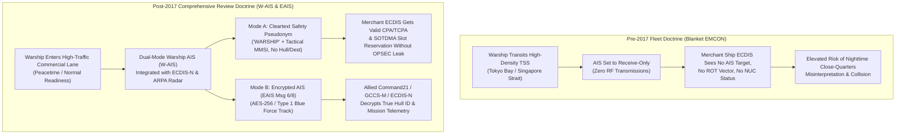
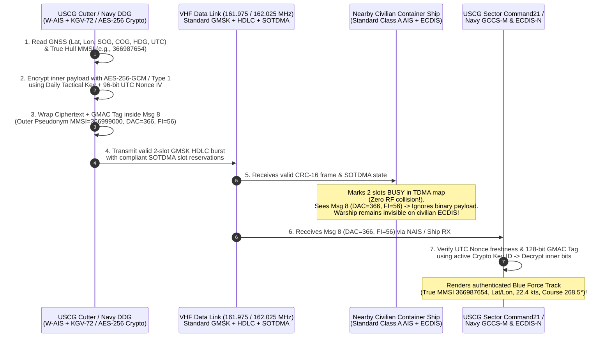
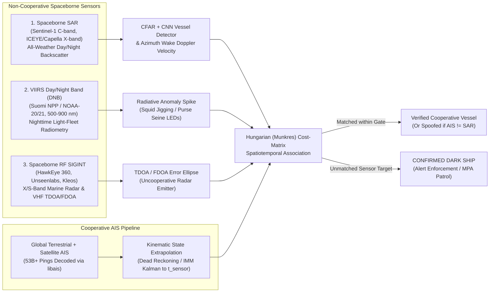

# Chapter 29: National Security, Blue Force Systems, Encryption, and Dark Ships

> **Chapter Overview:** The Automatic Identification System (AIS) was engineered in the 1990s for cooperative commercial navigation safety in a high-trust environment. In the modern geopolitical era, however, AIS operates at the center of a profound strategic paradox: it is simultaneously the foundational sensor of global coastal defense and Maritime Domain Awareness (MDA) and a severe Operations Security (OPSEC) liability for naval warships, submarines, and coast guard cutters. Meanwhile, across the world's oceans, illicit actors—from sanctions-evading "shadow fleets" and state-backed maritime militias to illegal, unreported, and unregulated (IUU) industrial fishing armadas—routinely manipulate or disable their transponders to vanish into oceanic "dark zones."
>
> This chapter examines the national security architecture of AIS across three intersecting domains:
> 1. **Naval OPSEC, Surface Force Collisions, and Grey-Zone Hybrid Warfare (§29.1):** How the fatal 2017 *USS Fitzgerald* and *USS John S. McCain* collisions transformed naval AIS doctrine, and how open-source AIS forensics unmask sanctions-evading shadow fleets, maritime militia swarms, and state-linked subsea cable and pipeline sabotage in the Baltic Sea.
> 2. **Blue Force Tracking and Encrypted AIS (EAIS & NATO W-AIS) (§29.2):** How the United States Coast Guard (USCG), US Department of Defense (DoD), and NATO allies encapsulate AES-256-GCM and NSA Type 1 encrypted position reports inside standard **ITU-R M.1371 Binary Messages (Message 6 and Message 8, `DAC = 366`)**—preserving Self-Organized Time Division Multiple Access (SOTDMA) RF slot harmony with civilian shipping while rendering live encrypted "Blue Force" tracks on military command displays.
> 3. **Unmasking the Ocean's "Dark Zones" with Global Fishing Watch (§29.3):** A technical deep dive into the **2025 Johnny Harris / Global Fishing Watch investigation** ([`https://youtu.be/2tuS1LLOcsI`](https://youtu.be/2tuS1LLOcsI)) and the landmark study by **Paolo et al. (2024, *Nature*)**, formulating the probabilistic Non-Homogeneous Poisson Process (NHPP) models that separate intentional AIS disabling from VHF Data Link (VDL) congestion dropouts and fuse AIS with Sentinel-1 Synthetic Aperture Radar (SAR), VIIRS night-lights, and spaceborne RF geolocation.

---

## 1. Operational & Conceptual Overview (`29.1 National Security Aspects of AIS`)

### 1.1 The Strategic Paradox of AIS: Maritime Domain Awareness vs. Naval OPSEC

For coastal defense agencies, intelligence analysts, and naval watchstanders, AIS is a double-edged sword:

1. **The Defensive Force Multiplier (Global MDA):** Before the 2002 SOLAS Chapter V carriage mandate and the deployment of Low Earth Orbit (LEO) satellite AIS constellations (Chapter 17), tracking thousands of merchant vessels across open oceans required sparse, classified ocean-surveillance radar/SIGINT satellites, Maritime Patrol Aircraft (MPA) sorties, and submarine acoustic arrays. Today, cooperative AIS broadcasts instantly identify and classify the vast majority of compliant commercial traffic, allowing defense analysts to focus scarce spaceborne Synthetic Aperture Radar (SAR), electro-optical, and signals-intelligence (SIGINT) assets on the small fraction of anomalous or non-emitting ("dark") contacts.
2. **The Operations Security (OPSEC) Vulnerability:** Conversely, if a guided-missile destroyer, fleet ballistic-missile submarine transiting on the surface, Coast Guard cutter conducting a counter-narcotics intercept, or Military Sealift Command (MSC) combat logistics oiler broadcasts standard unencrypted AIS Messages 1, 2, 3, and 5, it hands adversaries real-time targeting telemetry. Because global community aggregators (`MarineTraffic`, `VesselFinder`, `AISHub`) and commercial satellite networks ingest $161.975 / 162.025\text{ MHz}$ transmissions within seconds, any cleartext naval broadcast exposes:
   * Exact WGS84 coordinates $(\lambda, \phi)$ to within $\pm 10\text{ m}$ alongside Speed Over Ground (SOG), Course Over Ground (COG), and True Heading ($\psi$);
   * Unique hull identity via the vessel's permanently assigned 9-digit MMSI (e.g., US Navy/USCG federal blocks `3669xxxxx`, `3699xxxxx`, or `3038xxxxx`), call sign, and vessel name;
   * Operational schedule patterns, logistics replenishment rendezvous points, submarine sortie timings from naval bases (such as Faslane, Kings Bay, Bangor, or Yokosuka), and real-time inputs to adversary Over-the-Horizon Targeting (OTHT) anti-ship cruise and ballistic missile kill chains.

Under **SOLAS Chapter V, Regulation 1.4** and **Regulation 19.2.4**, warships, naval auxiliaries, and other state-owned vessels used only on government non-commercial service enjoy sovereign immunity and are legally exempt from mandatory AIS carriage and continuous cleartext transmission. For the first fifteen years of the AIS era (2002–2017), most Western navies resolved the OPSEC dilemma through a blunt operational policy: **warships routinely sailed in "AIS Receive-Only" (`EMCON` / silent) mode**, ingesting nearby merchant vessels' AIS broadcasts into their Combat Information Center (CIC) displays while transmitting nothing over the VHF Data Link.

### 1.2 The 2017 US Navy Western Pacific Collisions (*USS Fitzgerald* & *USS John S. McCain*) and Policy Reforms

During the summer of 2017, two catastrophic nighttime collisions in the US Seventh Fleet exposed the severe navigational hazard of operating warships completely dark (`AIS Receive-Only`) inside the world's most congested commercial shipping lanes:

1. ***USS Fitzgerald* (DDG-62) vs. *MV ACX Crystal* (June 17, 2017 — Approaches to Tokyo Bay, Japan):**
   * At approximately `01:30 JST` ($16\text{:}30\text{ UTC}$ on June 16), the *Arleigh Burke*-class guided-missile destroyer *USS Fitzgerald* collided with the $222.6\text{ m}$, $29{,}060\text{-GT}$ Philippine-flagged container ship *ACX Crystal* roughly $56\text{ NM}$ southwest of Yokosuka, Japan, killing seven US Navy Sailors in their flooded berthing compartments.
   * **AIS & Sensor Forensics (NTSB MAR-20/01 & US Navy JAG Manual Investigation):** *USS Fitzgerald* was steaming southward at $20\text{ knots}$ across a dense east-west coastal traffic stream while operating in **AIS Receive-Only mode**. On the destroyer's bridge, watchstanders lacked an integrated Electronic Chart Display and Information System (ECDIS) overlay fusing commercial AIS targets with ARPA radar tracks; a portable laptop receiving AIS in the pilothouse was not integrated into the primary conning radar display. Conversely, on the bridge of *ACX Crystal* (steaming on autopilot at $18.6\text{ knots}$), the darkened destroyer never appeared as an AIS target on the container ship's ECDIS, depriving the merchant watch officer of automated AIS Closest Point of Approach (CPA) / Time to CPA (TCPA) vector alarms and vessel-type identification until seconds before impact.
2. ***USS John S. McCain* (DDG-56) vs. *M/V Alnic MC* (August 21, 2017 — Singapore Strait Approach):**
   * Just 65 days later, at `05:24 SGT` ($21\text{:}24\text{ UTC}$ on August 20), *USS John S. McCain* suffered a loss of steering and thrust-control confusion while entering the Middle Channel of the Singapore Strait Traffic Separation Scheme (TSS) near Horsburgh Lighthouse (`Pedra Branca`). The destroyer sheared to port directly across the bow of the $183\text{ m}$, $30{,}040\text{-GT}$ Liberian-flagged chemical/oil tanker *Alnic MC*, killing ten US Navy Sailors.
   * **AIS & Operational Forensics (NTSB MAR-19/01):** Like *Fitzgerald*, *USS John S. McCain* had been transiting one of the busiest maritime chokepoints on Earth with its **AIS transmitter switched off (`Receive-Only`)**, switching AIS to transmit mode only moments before the collision. Furthermore, when the crew lowered the destroyer's masthead lighting configuration during the steering casualty, the crew of *Alnic MC* had neither an active AIS target nor anAIS Rate-of-Turn (ROT) / navigational status broadcast (`Not Under Command [NUC = 2]`) to warn them that the warship alongside them was executing an uncontrolled port turn.



In response, the US Navy's **Comprehensive Review of Recent Surface Force Incidents** (authored by Admiral Phil Davidson and released November 2, 2017) and the **Strategic Readiness Review** mandated sweeping hardware and doctrinal reforms across the entire surface fleet:
* **End of Blanket Peacetime AIS Silence in Congested Waters:** Commanding officers were directed to **transmit AIS whenever transiting high-density Traffic Separation Schemes, narrow straits, and harbor approaches** during normal peacetime operations, unless a specific, commander-authorized tactical EMCON condition applies.
* **Fleet-Wide Warship AIS (W-AIS) & ECDIS-N Integration:** Every surface combatant was outfitted with modernized commercial-off-the-shelf / military-hardened **W-AIS transceivers** wired directly into bridge **ECDIS-N** and surface-search ARPA radar consoles, supporting instantaneous switching between **Cleartext Safety Pseudonym Mode** (broadcasting generic `"WARSHIP"` or `"US GOV VESSEL"` with a non-attributable tactical MMSI), **Encrypted Blue Force Mode (EAIS)**, and **Hardwired EMCON Receive-Only Mode**.

### 1.3 Grey-Zone & Hybrid Maritime Warfare

Beyond conventional naval operations, AIS has become the primary battleground for **grey-zone and hybrid maritime operations**—coercive state actions that remain deliberately below the threshold of armed conflict:

#### 1. Sanctions-Evading "Shadow Fleets" (Russian, Iranian, and Venezuelan Crude, LNG, and Munitions)
Following tightened international sanctions on Iranian, Venezuelan, and Russian seaborne petroleum exports (including the December 2022 G7/EU $\$60/\text{barrel}$ crude oil price cap), a parallel **"shadow fleet"** (or "dark fleet") of over $600\text{–}1{,}000$ aging tankers (VLCCs, Suezmaxes, and Aframaxes, often $15\text{–}25\text{ years}$ old) emerged outside Western maritime jurisdiction. These vessels employ an escalating playbook of AIS manipulation (detailed at the RF layer in Chapter 28):
* **Dark Ship-to-Ship (STS) Transfers:** Switching off AIS transponders (or spoofing stationary anchor-loops via shore/barge relays) to conduct covert open-ocean cargo transfers in international waters just outside territorial seas—most notably in the **Laconian Gulf** (southern Greece), **Kalamata**, off **Ceuta** (Strait of Gibraltar), **Malta**, **Lomé** (Togo), and the **Eastern Malaysia Outer Port Limits (EOPL)** east of Tanjung Pengelih.
* **Flag-Hopping and Corporate Opacity:** Rapidly cycling through open registries with minimal oversight (e.g., Gabon, Cameroon, Comoros, Palau, Eswatini, Cook Islands) or broadcasting fraudulent MMSIs belonging to non-existent flags while operating without International Group of P&I Clubs oil-spill liability insurance.
* **Strategic Munitions Corridors ("The Syria Express" & Caspian Sea):** Russian state-affiliated roll-on/roll-off (Ro-Ro) and heavy-lift vessels (such as *Sparta II*, *Sparta IV*, *Ursa Major*, *Baltiyskiy Lider*, and *Lady R*) systematically disable AIS before transiting the Turkish Straits (Bosporus and Dardanelles), docking at Tartus, or ferrying artillery and Shahed UAV components across the Caspian Sea between Amirabad/Bandar Anzali (Iran) and Astrakhan/Olya (Russia).

#### 2. Chinese Maritime Militia (PAFMM) and Coast Guard Swarming Operations
In the South China Sea (Spratly and Paracel Islands) and East China Sea, the **People's Armed Forces Maritime Militia (PAFMM — *Zhongguo Haishang Minbing*)** operates alongside the **China Coast Guard (CCG)** to enforce disputed territorial claims (the "Nine-Dash Line") without deploying gray-hull PLA Navy warships.
* **Selective AIS Presence Operations ("Cognitive & Legal Warfare"):** Purpose-built, steel-hulled militia trawlers (such as the $60\text{ m}$ Sansha City fisheries vessels operating out of Hainan) frequently **turn their Class A or high-power Class B AIS transponders ON** when massing in dense, stationary formations—such as the **March 2021 Whitsun Reef (*Niu'e Jiao*) swarm**, where over 200 militia vessels anchored side-by-side in a boomerang formation for weeks—specifically so their overwhelming numbers register on regional VTS and commercial AIS maps as de facto administrative control.
* **Tactical Dark Interdictions:** Conversely, during kinetic "grey-zone" interdictions—such as blocking and water-cannoning Philippine resupply vessels approaching **Second Thomas Shoal (*Ayungin Shoal*)** or **Sabina Shoal (*Escoda Shoal*)**—CCG cutters and accompanying PAFMM vessels frequently toggle their AIS transponders off or broadcast duplicated/garbled domestic MMSIs (`412xxxxxx` / `413xxxxxx`) to complicate legal attribution under UNCLOS and COLREGs.

#### 3. State-Linked Subsea Sabotage and Anchor-Dragging Forensics
The shallow continental shelves of the Baltic Sea, North Sea, and Taiwan Strait are crisscrossed by subsea fiber-optic telecommunications cables, High-Voltage Direct Current (HVDC) power interconnectors, and natural gas pipelines. Between 2023 and 2024, a series of severe subsea infrastructure severances in the Baltic Sea demonstrated how high-resolution **AIS kinematic forensics** can prove intentional or reckless **anchor-dragging sabotage**:

| Incident Date | Vessel Name, Flag & MMSI | Damaged Subsea Infrastructure | AIS Kinematic & Forensic Signature |
|---|---|---|---|
| **Oct 7–8, 2023** | ***Newnew Polar Bear***<br/>(Hong Kong container ship, `MMSI 477333400`, `IMO 9313204`) | **Balticconnector** gas pipeline (Finland–Estonia) + **EE-S1** (Estonia–Sweden) & **C-Lion1** telecom cables | Steamed across the Gulf of Finland in gale conditions while dragging a $6\text{-tonne}$ port bower anchor for $>100\text{ NM}$. AIS logs captured abrupt SOG deceleration and heading oscillation at the exact UTC second of pipeline depressurization (`01:20 EEST`). Its broken anchor was later recovered on the seabed next to the ruptured pipe. |
| **Nov 17–18, 2024** | ***Yi Peng 3***<br/>(Chinese bulk carrier, `MMSI 414270000`, `IMO 9223253`) | **BCS East-West Interlink** (Lithuania–Sweden) & **C-Lion1** (Finland–Germany) fiber-optic cables | Departed Ust-Luga, Russia; dropped anchor while underway in the Kattegat/Baltic proper, dragging it for over $100\text{ NM}$. AIS trajectory analysis showed brief AIS blackouts paired with classic anchor-drag speed loss ($\Delta\text{SOG} \approx -2.8\text{ kts}$) and persistent yaw crabbing ($\Delta\psi = |\psi_{\text{HDG}} - \chi_{\text{COG}}| > 6^\circ$) across both cable crossings. |
| **Dec 25, 2024** | ***Eagle S***<br/>(Cook Islands shadow-fleet oil tanker, `MMSI 518999115`, `IMO 9329760`) | **Estlink 2** $650\text{ MW}$ HVDC power cable (Finland–Estonia) + 4 telecom cables | En route from Ust-Luga, Russia. At `12:26 EET`, AIS recorded an instantaneous speed drop from $9.2\text{ kts}$ to $5.8\text{ kts}$ exactly over the Estlink 2 corridor as its port anchor ploughed a $100\text{ km}$ trench along the seabed. Finnish Border Guard tactical helicopters boarded and seized the vessel in the Gulf of Finland before it reached Estlink 1. |

---

## 2. Historical Context & Evolution (`schwehr/gis-history` Integration)

The intersection of maritime tracking, cryptography, and dark-vessel detection evolved through seven foundational eras (cross-referenced with [`schwehr/gis-history`](https://github.com/schwehr/gis-history)):

* **1939–1945 (WWII Allied HF/DF & Operational Intelligence Plots):** During the Battle of the Atlantic, Royal Navy and US Navy Operational Intelligence Centers fused shore and shipboard High-Frequency Direction Finding (**HF/DF**, "Huff-Duff") bearings of German U-boat wolfpack radio transmissions with Enigma decrypts inside Admiralty plot rooms—establishing the core doctrine of **Emissions Control (EMCON)**: *any radio transmission at sea betrays the emitter's bearing and location*.
* **1950s–1990s (Cold War Ocean Surveillance & Tactical Data Links):** The US Navy deployed **SOSUS** (Sound Surveillance System) seabed hydrophone arrays, **Classic Wizard / White Cloud** Naval Ocean Surveillance System (NOSS) TDOA/FDOA satellite triplets, and the **OTH-Gold** (Over-the-Horizon targeting text protocol, 1970s) and **Link 11 / Link 16 (TADIL-J, MIL-STD-6016)** encrypted tactical data links to exchange friendly ("Blue Force") and hostile ("Red Force") tracks without exposing coordinates in the clear.
* **September 11, 2001 & November 2002 (The Homeland Security Pivot — MTSA 2002, NAIS, and MSSIS):** Following the September 11 attacks, the United States Congress enacted the **Maritime Transportation Security Act of 2002 (MTSA, Pub. L. 107-295)** just weeks before the December 31, 2002 SOLAS AIS mandate took effect. AIS was immediately elevated from a localized bridge-to-bridge collision-avoidance aid into the backbone of homeland security. The US Coast Guard established the **Nationwide Automatic Identification System (NAIS)**, while the US DOT Volpe Center launched the **Maritime Safety and Security Information System (MSSIS)** and **SeaVision** to share raw NMEA AIS feeds among more than 70 allied defense and coast guard agencies.
* **2004–2009 (USCG/DoD Encrypted AIS [EAIS] & NATO W-AIS Standardization):** Recognizing that USCG cutters and patrol boats enforcing port security and counter-drug operations could not safely disable SOTDMA slot reservations in crowded US harbors, the US Coast Guard and Department of Defense engineered **Encrypted AIS (EAIS)**—encapsulating NSA Type 1 (`KGV-72`) and AES-encrypted position reports inside ITU-R M.1371 Binary Messages 6 and 8 (`DAC = 366`). Simultaneously, NATO promulgated **STANAG 4668 / ANEP-77** defining **Warship AIS (W-AIS)** operational modes.
* **2010–2016 (`libais`, SkyTruth, and the Launch of Global Fishing Watch):** In April 2010, Kurt Schwehr created **`libais`** (`C++`/Python) to decode millions of USCG NAIS messages per second during the *Deepwater Horizon* oil spill response. Between 2014 and September 2016, **Google, SkyTruth, and Oceana** partnered to build **Global Fishing Watch (GFW)** on top of `libais` and Google Cloud/BigQuery, publishing the first open global map of commercial fishing activity from satellite AIS (**Kroodsma et al., 2018, *Science***).
* **Summer–November 2017 (*USS Fitzgerald* & *USS John S. McCain* Collisions):** The loss of 17 US Sailors in two Western Pacific collisions forced a historic overhaul of naval bridge systems, mandating dual-mode W-AIS/EAIS and ECDIS-N integration across the US Navy surface fleet.
* **January 2024 – 2025 (Paolo et al. *Nature* Study & Johnny Harris / GFW "Dark Zones" Investigation):** In January 2024, **Fernando Paolo, David Kroodsma, et al.** published *"Satellite mapping reveals extensive industrial activity at sea"* in ***Nature* (Vol. 625, pp. 85–91)**, applying deep-learning convolutional neural networks to $>2\text{ petabytes}$ of Sentinel-1 SAR and Sentinel-2 optical imagery fused with $53\text{ billion}$ AIS positions—proving that **75% of the world's industrial fishing vessels operate "dark" (untracked by public AIS)**. In **2025**, investigative journalist **Johnny Harris** and **Global Fishing Watch** released [*What's really happening in the ocean's "dark zones"*](https://youtu.be/2tuS1LLOcsI), bringing multi-sensor SAR + AIS dark-fleet forensics to global public and policy attention.

---

## 3. Deep Technical & Mathematical Foundations

### 3.1 Cryptographic and Protocol Engineering of Blue Force Encrypted AIS (`29.2`)

#### 3.1.1 Why Whole-Frame Encryption Breaks SOTDMA RF Harmony
A common misconception among general software engineers is that "Encrypted AIS" simply passes the 168-bit payload of a standard Class A Position Report (Message 1, 2, or 3) through an AES block cipher prior to HDLC framing. **Doing so would cause immediate RF chaos on the VHF Data Link (VDL)**:

1. **Destruction of Link-Layer SOTDMA Slot Reservations:** In a standard 168-bit Message 1/2/3 frame, the final 19 bits (`bits 149..167` in 0-based indexing) carry the **SOTDMA / ITDMA Communication State** (Sync State, Slot Time-Out, and Sub-message / Slot Offset or UTC Hour/Minute). Every surrounding merchant ship and VTS Base Station continuously decodes these 19 bits from every received burst to update its internal 2,250-slot channel map. If those bits were replaced by high-entropy AES ciphertext, nearby civilian transponders would interpret random bit patterns as valid slot reservations or slot releases, corrupting the distributed TDMA schedule!
2. **Corrupted Message IDs and Display Failures:** If `bits 0..5` (Message ID) were encrypted into random integers `0..63`, civilian bridge receivers would attempt to parse random ciphertext as DGNSS corrections (Message 17), Base Station channel-management commands (Message 22), or Aid-to-Navigation diamonds (Message 21), triggering phantom targets and false alarms on nearby commercial ships.

#### 3.1.2 The USCG / DoD Encrypted AIS (EAIS) Binary Encapsulation Architecture
To achieve cryptographic confidentiality, message authenticity, and replay protection **while maintaining 100% physical- and MAC-layer interoperability with civilian SOTDMA transponders**, **USCG / DoD Encrypted AIS (EAIS)** encapsulates encrypted Blue Force telemetry inside standard **ITU-R M.1371 Application-Specific Binary Messages**:
* **Message 8 (Broadcast Binary Message):** Used for one-to-many broadcast of encrypted Blue Force position, course, speed, and static identity reports to all key-holding USCG cutters, small boats, aircraft (`Minotaur`), shore sectors (`NAIS` / `Command21`), and US Navy units (`GCCS-M` / `ECDIS-N`).
* **Message 6 (Addressed Binary Message):** Used for point-to-point encrypted tactical text messaging, tasking orders, and target handoffs between a specific shore sector MMSI and a cutter/aircraft MMSI (acknowledged via Message 7).



#### 3.1.3 Bit-Level Specification of a 2-Slot EAIS Broadcast Profile (`Message 8, DAC = 366, FI = 56`)
Whether encrypted by an external **NSA Type 1 KGV-72** Programmable Cryptographic Module (used across DoD/USCG tactical networks) or an embedded **FIPS 140-3 AES-256-GCM** module (used for unclassified law-enforcement and allied coalition Blue Force sharing), an EAIS broadcast frame must fit inside 1 to 3 consecutive AIS time slots without exceeding the ITU-R M.1371 slot bit ceilings ($168\text{ bits}$ for 1 slot, $424\text{ bits}$ for 2 slots, $680\text{ bits}$ for 3 slots).

Let us examine the exact bit-level layout of a **2-slot ($416\text{-bit}$) AES-256-GCM Encrypted Blue Force Broadcast Message 8 (`DAC = 366`, `FI = 56`)**, listing both **0-based (`libais`)** and **1-based (`ITU-R M.1371`)** bit indices:

| Layer | Parameter Field | Width (Bits) | 0-Based Bits (`libais`) | 1-Based Bits (`ITU-R`) | Type / Encoding | Operational & Cryptographic Role |
|---|---|---|---|---|---|---|
| **Outer Header (Cleartext AAD, 56 bits)** | **Message ID** | `6` | `0–5` | `1–6` | `uint6` (`8`) | Identifies Broadcast Binary Message to all receivers |
| | **Repeat Indicator** | `2` | `6–7` | `7–8` | `uint2` (`0–3`) | Directives for shore/ship repeater hops |
| | **Source MMSI (Pseudonym)** | `30` | `8–37` | `9–38` | `uint30` | Tactical pseudonym (`366999000` or `000000000`) hiding hull identity |
| | **Spare** | `2` | `38–39` | `39–40` | `uint2` (`0`) | Must be zero; authenticated via GMAC AAD |
| | **Designated Area Code (DAC)** | `10` | `40–49` | `41–50` | `uint10` (`366`) | United States / USCG jurisdiction code |
| | **Functional ID (FI)** | `6` | `50–55` | `51–56` | `uint6` (`56`) | Encrypted Blue Force Position Report sub-schema |
| **Crypto Header (Cleartext AAD/IV, 72 bits)** | **Key ID / Crypto Epoch** | `8` | `56–63` | `57–64` | `uint8` (`0–255`) | Selects active daily/monthly symmetric key $K_{\text{ID}}$ |
| | **UTC Epoch Timestamp** | `32` | `64–95` | `65–96` | `uint32` | Unix UTC seconds $t_{\text{tx}}$; prevents capture-and-replay attacks |
| | **Monotonic Frame Counter** | `32` | `96–127` | `97–128` | `uint32` | Per-emitter counter $c_{\text{tx}}$; guarantees unique 96-bit GCM Nonce IV |
| **Encrypted Payload (Ciphertext, 160 bits)** | **Inner Bit `0–29`: True Hull MMSI** | `30` | `128–157` | `129–158` | Encrypted `uint30` | Actual hull MMSI (e.g., `366987654` USCGC *Bertholf*) |
| | **Inner Bit `30–35`: Tactical Unit Class** | `6` | `158–163` | `159–164` | Encrypted `uint6` | `1`=WMSL Cutter, `2`=WPC, `3`=DDG, `4`=SSN, `5`=MPA Aircraft |
| | **Inner Bit `36–63`: WGS84 Longitude** | `28` | `164–191` | `165–192` | Encrypted `int28` | Two's complement $\frac{1}{10{,}000}\text{ min}$ ($\pm 180^\circ$) |
| | **Inner Bit `64–90`: WGS84 Latitude** | `27` | `192–218` | `193–219` | Encrypted `int27` | Two's complement $\frac{1}{10{,}000}\text{ min}$ ($\pm 90^\circ$) |
| | **Inner Bit `91–100`: Speed Over Ground** | `10` | `219–228` | `220–229` | Encrypted `uint10` | $0.1\text{ knot}$ resolution ($0\text{–}102.2\text{ kts}$) |
| | **Inner Bit `101–112`: Course Over Ground** | `12` | `229–240` | `230–241` | Encrypted `uint12` | $0.1^\circ\text{ true}$ resolution ($0.0^\circ\text{–}359.9^\circ$) |
| | **Inner Bit `113–121`: True Heading** | `9` | `241–249` | `242–250` | Encrypted `uint9` | $1^\circ\text{ true}$ resolution ($0^\circ\text{–}359^\circ$, `511`=N/A) |
| | **Inner Bit `122–125`: Tactical Status** | `4` | `250–253` | `251–254` | Encrypted `uint4` | Mission readiness / intercept / flight-ops state |
| | **Inner Bit `126–159`: Mission Task / Spare** | `34` | `254–287` | `255–288` | Encrypted `uint34` | Reserved for Link 16 Track Number J-series correlation |
| **Authentication Tag (128 bits)** | **AES-256-GCM Auth Tag (GMAC)** | `128` | `288–415` | `289–416` | `128-bit` MAC | Authenticates both Outer Header (`bits 0–63`) and Ciphertext (`bits 128–287`) |

Let $K \in \{0,1\}^{256}$ be the shared 256-bit daily tactical key indexed by `Key ID`, let the 96-bit Initialization Vector be $\text{IV}_{96} = t_{\text{tx}} \parallel c_{\text{tx}} \parallel \text{ASCII}(\texttt{"EAIS"})$, and let the 64-bit Additional Authenticated Data be $\text{AAD}_{64} = \text{bits}[0..63]$ (comprising the outer ITU-R M.1371 header and `Key ID`). The encryption and authenticated decryption operations are:

$$(\mathbf{C}_{160}, \mathbf{T}_{128}) = \text{AES-256-GCM-ENC}_{K}\!\left(\text{IV}_{96},\; \mathbf{P}_{160},\; \text{AAD}_{64}\right)$$

Upon reception at UTC time $t_{\text{rx}}$, an authorized terminal accepts and plots the Blue Force track if and only if both **temporal anti-replay validation** and **GMAC cryptographic verification** succeed:

$$|t_{\text{rx}} - t_{\text{tx}}| \le \Delta t_{\text{max}} \quad (\text{typically } 30\text{ s}) \qquad \land \qquad \text{AES-256-GCM-DEC}_{K}\!\left(\text{IV}_{96},\; \mathbf{C}_{160},\; \mathbf{T}_{128},\; \text{AAD}_{64}\right) \ne \perp$$

> [!IMPORTANT]
> **Why Binding the Outer Header as Additional Authenticated Data (`AAD`) Is Critical:** Because the outer 56-bit ITU-R M.1371 header must remain in cleartext for VHF Data Link routing, an adversary with an SDR could intercept a legitimate EAIS burst, modify the outer `Source MMSI` or `Repeat Indicator`, recompute the unkeyed 16-bit HDLC CRC-CCITT, and rebroadcast the packet. By feeding `bits[0..63]` into the AES-GCM Galois field multiplier ($GF(2^{128})$) as `AAD`, any single-bit modification to the outer cleartext header causes the 128-bit GMAC authentication tag check to fail immediately!

#### 3.1.4 NATO Warship AIS (W-AIS / STANAG 4668) & Tactical Link 16 Correlation
Under **NATO STANAG 4668** (*Shipborne Automatic Identification System (AIS) Warship Criteria*, documented in **ANEP-77**), allied naval transceivers implement four discrete operational states controlled from the bridge and Combat Information Center:

1. **Mode 0 — Complete Hardware EMCON (`TX INHIBIT`):** A physical relay interlock interrupts DC bias to the VHF power amplifier stage and engages a dummy load or receiver-only path, guaranteeing zero unintentional RF leakage (`<-120 dBm`) during sensitive submarine or carrier strike group operations.
2. **Mode 1 — Cleartext Navigation Safety / Pseudonym Mode:** Used when transiting commercial choke points (Dover Strait, Strait of Gibraltar, Singapore Strait, Suez Canal) where alerting merchant vessels on their bridge ECDIS is essential for collision avoidance. The W-AIS unit transmits standard Messages 1, 3, and 5, but overrides identifying static fields:
   * **MMSI:** Set either to the universal tactical warship placeholder `000000000` (or `111111111` in older trials) or to an ephemeral pseudonym drawn from a national naval pool (`366999xxx` for USN/USCG, `232000xxx` for UK Royal Navy) rotated at random intervals outside coastal radar coverage;
   * **Vessel Name & Call Sign:** Set to `"WARSHIP"`, `"NATO WARSHIP"`, or `"US GOV VESSEL"`, Call Sign `"XXXX"`;
   * **Ship Type (Msg 5):** Set to `35` (*Engaged in military operations*);
   * **Draught & Destination:** Masked (`0.0 m`, `"OPEN OCEAN"` or `"FOR ORDERS"`).
3. **Mode 2 — Encrypted Blue Force Mode (EAIS / W-AIS Encrypted):** Transmits encrypted Binary Messages 6/8 (or STANAG-compliant encrypted slot payloads) while suppressing cleartext Messages 1/2/3/5.
4. **Mode 3 — Tactical Data Link Fusion (`Link 16 J2.2/J3.2 PPLI` & `OTH-Gold`):** On a carrier strike group's **GCCS-M** (Global Command and Control System – Maritime) console, every local AIS contact is passed through a multi-hypothesis **Kalman Track-to-Track Correlator** against encrypted **Link 16 Precise Participant Location and Identification (`J2.2` Air / `J3.2` Surface PPLI)** messages and surface radar tracks. If a surface radar contact matches a friendly Link 16 `J3.2` PPLI track or a decrypted EAIS Message 8 track within the Mahalanobis gating threshold $d_M^2 = (\hat{\mathbf{x}}_{\text{AIS}} - \hat{\mathbf{x}}_{\text{L16}})^T \mathbf{\Sigma}^{-1} (\hat{\mathbf{x}}_{\text{AIS}} - \hat{\mathbf{x}}_{\text{L16}}) \le \chi^2_{4, 0.99}$, the contact is tagged as an authenticated **Blue Force** unit even if its outer AIS MMSI is pseudonymized!

---

### 3.2 Dark Ships, Global Fishing Watch, and Unmasking the Ocean's "Dark Zones" (`29.3`)

#### 3.2.1 The 2025 Johnny Harris / Global Fishing Watch Investigation and Paolo et al. (2024, *Nature*)
While naval vessels use AIS encryption and pseudonymization under sovereign legal authority, commercial vessels operating in the ocean's **"dark zones"** disable or manipulate AIS to hide illicit industrial activity from coastal states and international regulators.

In **January 2024**, a research team led by **Fernando S. Paolo and David Kroodsma** at **Global Fishing Watch (GFW)**—in collaboration with Duke University, UC Santa Barbara, and SkyTruth—published a landmark study in ***Nature* (Vol. 625, pp. 85–91)** titled [*"Satellite mapping reveals extensive industrial activity at sea"*](https://doi.org/10.1038/s41586-023-06825-8), subsequently featured in the **2025 Johnny Harris / Global Fishing Watch investigative documentary** ([*"What's really happening in the ocean's 'dark zones'"*, `https://youtu.be/2tuS1LLOcsI`](https://youtu.be/2tuS1LLOcsI)).

To quantify how much of the world's seaborne human footprint is invisible to AIS, the GFW team assembled an unprecedented multi-petabyte earth-observation pipeline spanning **2017–2021**:
* **Input Sensor Corpus:** Over **$2\text{ petabytes}$ ($2{,}000\text{ terabytes}$)** of cloud-penetrating **ESA Copernicus Sentinel-1 C-band ($5.405\text{ GHz}$) Synthetic Aperture Radar (SAR)** dual-polarization (`VV + VH`) scenes and **Sentinel-2 optical** imagery covering $15\%$ of the global ocean area (representing $>95\%$ of all industrial fishing, shipping, and offshore energy zones), fused with **$53\text{ billion}$ AIS position reports** decoded via `libais`.
* **Deep-Learning Ensemble:** Three custom Convolutional Neural Networks (CNNs) trained to: (1) detect ships and fixed offshore structures in SAR backscatter while rejecting sea clutter, ice floes, and internal waves; (2) regress vessel hull length $L_{\text{SAR}}$ from pixel morphology; and (3) classify every detected vessel as either a **fishing vessel** or a **non-fishing transport/service vessel**.

The empirical findings overturned two decades of assumptions regarding global AIS completeness:

| Maritime Activity / Fleet Category | Key Empirical Finding (Paolo et al., 2024 *Nature* & GFW 2025) | Primary Geographic "Dark Zone" Hotspots |
|---|---|---|
| **Global Industrial Fishing Fleet** | **72% to 76% ($\approx 75\%$) of industrial fishing vessels ($\ge 15\text{ m}$) are NOT publicly tracked by AIS.** | South & East Asia ($>80\%$ dark), North Korean waters (illicit foreign squid fleets violating UN sanctions), North & West Africa, Mediterranean Sea, and along MPA boundaries (**Galápagos Marine Reserve**, **Great Barrier Reef**, **Argentine "Mile 201"**). |
| **Global Transport & Energy Vessels** | **21% to 30% ($>25\%$) of transport, cargo, tanker, and energy support vessels are NOT tracked in public AIS.** | Sanctioned oil/LNG transshipment zones (Persian Gulf, Black Sea, Caspian Sea, Eastern Malaysia, Venezuela), domestic cabotage corridors, and offshore oil-field supply fleets. |
| **Offshore Energy Infrastructure** | Mapped **$\sim 28{,}000$ fixed offshore structures** globally; between 2017 and 2021, **offshore wind turbines increased by $>140\%$**, surpassing oil platforms in total structure count by late 2020. | China (fastest offshore wind expansion), North Sea (UK, Germany, Denmark, Netherlands), Gulf of Mexico, Persian Gulf, and Southeast Asia. |

#### 3.2.2 Probabilistic Gap-Significance Modeling: Separating "Going Dark" from RF Coverage Dropouts
A critical scientific challenge highlighted by Global Fishing Watch is that **an observed time gap $\Delta t = t_2 - t_1$ in a vessel's AIS trajectory does NOT automatically mean the captain switched off the transponder**. As established in Chapters 6, 17, and 26, satellite AIS reception probability $p_{\text{rx}}(\mathbf{x}, t \mid \text{Class})$ varies by more than two orders of magnitude across the globe:
* Inside a low-earth-orbit (LEO) satellite's $2{,}500\text{–}3{,}200\text{ km}$ VHF horizon footprint over the **East China Sea**, **Northern Gulf of Mexico**, **North Sea**, or **Strait of Malacca**, tens of thousands of SOTDMA cells overlap simultaneously. Co-channel packet collisions destroy $85\%\text{–}99\%$ of Class B (`2 W` CSTDMA) and Class A (`12.5 W` SOTDMA) transmissions.
* Furthermore, at low-to-mid latitudes outside coastal VHF range, revisit gaps between LEO satellite passes naturally introduce $2\text{–}6\text{ hour}$ silent windows.

To prevent false accusations of intentional tampering in high-congestion or low-coverage waters, we formulate GFW's **Non-Homogeneous Poisson Process (NHPP) Gap-Significance Classifier**:

1. **Spatiotemporal Reception Rate Field $\lambda_{\text{eff}}(\mathbf{x}, t)$:**
   Partition the ocean into equal-area spatial cells (e.g., Uber H3 resolution 4/5 hexagons or $0.25^\circ \times 0.25^\circ$ cosine-corrected cells) and hourly time bins. For each vessel class $c \in \{\text{A}, \text{B}\}$, compute the empirical background reception rate $\lambda_{\text{eff}}(\mathbf{x}, t \mid c)$ (in received pings per vessel-hour) from all compliant vessels transiting cell $\mathbf{x}$ during hour $t$:

   $$\lambda_{\text{eff}}(\mathbf{x}, t \mid c) = \lambda_{\text{tx, nominal}}(v, \omega, c) \cdot \hat{p}_{\text{rx}}(\mathbf{x}, t \mid c)$$

2. **Null-Hypothesis Survival Probability of Zero Pings ($P(N = 0 \mid \mathcal{H}_0)$):**
   Suppose a vessel's last received AIS report occurs at $(\mathbf{x}_1, t_1)$ and its next report occurs at $(\mathbf{x}_2, t_2)$, where $\Delta t = t_2 - t_1$. Let $\hat{\mathbf{x}}(t)$ be the kinematic dead-reckoning / Brownian-bridge trajectory connecting $(\mathbf{x}_1, t_1)$ to $(\mathbf{x}_2, t_2)$. Under the **null hypothesis $\mathcal{H}_0$** that the vessel's AIS transponder remained continuously powered on and transmitting normally throughout $[t_1, t_2]$, the expected number of received pings across the gap is:

   $$\Lambda_{\text{gap}} = \int_{t_1}^{t_2} \lambda_{\text{eff}}\!\left(\hat{\mathbf{x}}(t), t \mid c\right) dt$$

   Under an NHPP arrival model, the probability of observing **zero** received messages ($N_{[t_1, t_2]} = 0$) purely by chance due to RF propagation loss and satellite/VDL packet collisions is:

   $$P\!\left(N_{[t_1, t_2]} = 0 \;\middle|\; \mathcal{H}_0\right) = \exp\!\left(-\Lambda_{\text{gap}}\right) = \exp\!\left(-\int_{t_1}^{t_2} \lambda_{\text{eff}}\!\left(\hat{\mathbf{x}}(t), t \mid c\right) dt\right)$$

3. **Decision Rule for Intentional Disabling ("Dark Event"):**
   An AIS gap $[t_1, t_2]$ is flagged as an **Intentional AIS Disabling Event ("Going Dark")** at significance level $\alpha_{\text{crit}}$ (e.g., $\alpha_{\text{crit}} = 10^{-3}$, requiring $\Lambda_{\text{gap}} > -\ln(10^{-3}) \approx 6.91$ expected pings) if and only if three conditions hold simultaneously:

   $$\text{DarkEvent}(t_1, t_2) = \mathbb{I}\!\Big(\underbrace{P(N_{[t_1,t_2]}=0 \mid \mathcal{H}_0) < \alpha_{\text{crit}}}_{\text{Statistically improbable dropout}} \;\land\; \underbrace{\lambda_{\text{eff}}(\mathbf{x}_1, t_1 \mid c) \ge \lambda_{\min}}_{\text{High ambient RX quality at start}} \;\land\; \underbrace{d_{\text{shore}}(\mathbf{x}_1) > d_{\min}}_{\text{Outside port blockage}}\Big)$$

   where $\lambda_{\min} \approx 0.5\text{–}1.0\text{ pings/hr}$ ensures the vessel did not simply enter a known RF dead zone, and $d_{\min} \approx 10\text{–}50\text{ NM}$ excludes legitimate power-downs alongside port repair berths or behind coastal cliffs.

#### 3.2.3 Multi-Sensor Fusion Equations: SAR, VIIRS Night-Lights, and Spaceborne RF Geolocation

Once a vessel disables its AIS transponder—or if it is part of the $75\%$ of industrial fishing vessels that never carry or activate AIS—analysts fuse three non-cooperative spaceborne sensor phenomenology layers to detect, classify, and track the dark ship:



1. **Spaceborne Synthetic Aperture Radar (SAR) Detection & Azimuth Doppler Wake Kinematics:**
   * **Two-Parameter CFAR + Deep CNN Detection:** Metallic ship hulls and corner reflectors on deck produce strong radar cross-section ($\sigma_0$) spikes against the Bragg-scattering capillary waves of the ocean surface, particularly in cross-polarization (`VH` or `HV`). In a sliding window with target pixel intensity $I_t$ and surrounding sea-clutter mean $\mu_c$ and standard deviation $\sigma_c$ (separated by a guard ring to prevent hull energy leakage), the Constant False Alarm Rate (CFAR) statistic is:
     $$Z_{\text{CFAR}} = \frac{I_t - \mu_c}{\sigma_c} > \tau_{\text{CFAR}}(P_{\text{FA}})$$
   * **Extracting a Dark Ship's Speed from SAR Azimuth Displacement ("Train-Off-The-Tracks" Effect):** Because SAR synthesizes a high-resolution image using the Doppler frequency history generated by the satellite's orbital velocity $V_{\text{sat}} \approx 7{,}500\text{ m/s}$, any target moving with a non-zero radial velocity $v_r$ toward or away from the radar line-of-sight at slant range $R_{\text{slant}}$ introduces an extra Doppler shift $\Delta f_D = -\frac{2 v_r}{\lambda_{\text{SAR}}}$. The SAR processor maps this Doppler shift into an **azimuth spatial displacement $\Delta x_{\text{az}}$** between the glowing metallic hull return and the apex of its turbulent/Kelvin wake on the sea surface:
     $$\Delta x_{\text{az}} = -\frac{R_{\text{slant}}}{V_{\text{sat}}} \, v_r = -\frac{R_{\text{slant}}}{V_{\text{sat}}} \, v_s \cos\phi_{\text{rel}} \sin\theta_{\text{inc}}$$
     where $v_s$ is the dark vessel's true speed over ground, $\phi_{\text{rel}}$ is its heading relative to the SAR range look direction, and $\theta_{\text{inc}}$ is the radar incidence angle! Measuring $\Delta x_{\text{az}}$ and the wake orientation allows analysts to determine a dark ship's exact speed and course from a single snapshot.
   * **Optimal Spatiotemporal Matching (Hungarian / Munkres Algorithm):** To match $M$ AIS trajectories against $K$ SAR vessel detections acquired at scene time $t_{\text{SAR}}$, every candidate AIS track $i$ with last position $(\mathbf{x}_{i,1}, t_{i,1})$ before $t_{\text{SAR}}$ and next position $(\mathbf{x}_{i,2}, t_{i,2})$ after $t_{\text{SAR}}$ is interpolated to $\hat{\mathbf{x}}_i(t_{\text{SAR}})$ with error covariance $\mathbf{\Sigma}_i(t_{\text{SAR}})$. We construct the $M \times K$ negative log-likelihood cost matrix $C_{i,k}$ combining spatial Mahalanobis distance and hull-length discrepancy ($L_{\text{AIS}, i}$ vs. $L_{\text{SAR}, k}$):
     $$C_{i,k} = \left(\mathbf{y}_{\text{SAR}, k} - \hat{\mathbf{x}}_i(t_{\text{SAR}})\right)^T \mathbf{\Sigma}_i^{-1}(t_{\text{SAR}}) \left(\mathbf{y}_{\text{SAR}, k} - \hat{\mathbf{x}}_i(t_{\text{SAR}})\right) + \frac{\left(L_{\text{SAR}, k} - L_{\text{AIS}, i}\right)^2}{\sigma_L^2}$$
     Solving the linear assignment problem via the Hungarian algorithm pairs cooperative ships with their radar echoes; any SAR detection $k$ whose minimum cost exceeds the gating threshold ($\min_i C_{i,k} > \gamma_{\text{gate}}$) is classified as a **confirmed Dark Vessel**.

2. **VIIRS Day/Night Band (DNB) Nighttime Radiometry ($500\text{–}900\text{ nm}$):**
   * Industrial squid-jigging fleets (such as the dark fleets operating along the **Argentine "Mile 201"** Patagonian shelf break, northwest of the **Galápagos**, and inside **North Korean waters**) and purse-seine light boats deploy banks of $100\text{–}300\text{ kW}$ metal-halide and LED floodlights at night to attract phototactic squid (*Illex argentinus*, *Dosidicus gigas*, *Todarodes pacificus*) to the surface.
   * Even when 100% of a fleet switches off AIS, the **Visible Infrared Imaging Radiometer Suite (VIIRS)** Day/Night Band sensor aboard the **Suomi NPP, NOAA-20, and NOAA-21** polar-orbiting satellites detects individual vessels at $750\text{ m}$ spatial resolution via upward-scattered lunar-corrected radiance spikes ($L_{\text{DNB}} > 0.5\text{–}50\text{ nW}\cdot\text{cm}^{-2}\cdot\text{sr}^{-1}$).

3. **Spaceborne RF Geolocation (TDOA / FDOA of Marine Navigation Radars):**
   * A captain who pulls the breaker on the bridge AIS transponder still cannot steam safely through fog, night, or congested straits without running the ship's **X-band ($9.3\text{–}9.5\text{ GHz}$) or S-band ($2.9\text{–}3.1\text{ GHz}$) marine navigation radar**.
   * Commercial SIGINT satellite constellations (**HawkEye 360**, **Unseenlabs**, **Kleos Space**) fly clusters of LEO microsatellites that intercept these radar pulses and VHF bridge-to-bridge voice transmissions, computing intersection hyperbolas of **Time Difference of Arrival (TDOA)** $\Delta \tau_{ab} = \frac{1}{c}(\|\mathbf{r}_a - \mathbf{x}_e\| - \|\mathbf{r}_b - \mathbf{x}_e\|)$ and **Frequency Difference of Arrival (FDOA)** $\Delta f_{ab} = -\frac{f_0}{c}\!\left(\dot{\mathbf{r}}_a \cdot \mathbf{u}_a - \dot{\mathbf{r}}_b \cdot \mathbf{u}_b\right)$ to geolocate the dark ship to within $1\text{–}5\text{ km}$ across the open ocean.

#### 3.2.4 Subsea Cable Sabotage Forensics: The Anchor-Drag Kinematic Equation
When investigating suspected hybrid-warfare cable cuts (*Newnew Polar Bear*, *Yi Peng 3*, *Eagle S*), forensic analysts examine three coupled kinematic anomalies in a vessel's high-rate AIS Message 1/2/3 stream:

$$\underbrace{m \frac{dv_s}{dt} = T_{\text{prop}}(n_{\text{rpm}}) - \frac{1}{2}\rho_w C_T S_{\text{wet}} v_s^2 - F_{\text{anchor}}(t)}_{\text{Longitudinal Surge Deceleration}} \qquad \land \qquad \underbrace{\Delta\psi_{\text{crab}}(t) = \left|\left(\psi_{\text{HDG}}(t) - \chi_{\text{COG}}(t) + 180^\circ\right) \bmod 360^\circ - 180^\circ\right|}_{\text{Asymmetric Hawsepipe Yaw Crabbing Angle}}$$

When a vessel underway at steady service speed $v_0$ ($10\text{–}14\text{ kts}$) drops its port or starboard bower anchor in $30\text{–}90\text{ m}$ water depth without stopping engines:
1. **Step Velocity Drop ($\Delta \text{SOG}$):** Seabed ploughing friction and chain catenary drag $F_{\text{anchor}} \approx 300\text{–}1{,}200\text{ kN}$ cause an immediate step drop in Speed Over Ground of $\Delta v_s \approx -2.0\text{ to }-4.5\text{ knots}$ while engine RPM remains high.
2. **Persistent Asymmetric Crabbing Angle ($\Delta \psi_{\text{crab}}$):** Because the port or starboard hawsepipe is offset laterally by $y_{\text{hawse}} \approx \pm (3\text{–}6\text{ m})$ from the hull centerline, the dragging anchor chain exerts a continuous yawing moment $M_z = F_{\text{anchor}} \cdot y_{\text{hawse}}$. To maintain course $\chi_{\text{COG}}$, the autopilot applies counter-rudder, forcing the vessel to steam with a persistent **crabbing angle $\Delta\psi_{\text{crab}} \in [5^\circ, 18^\circ]$** between True Heading ($\psi_{\text{HDG}}$) and Course Over Ground ($\chi_{\text{COG}}$), accompanied by jerky Rate-of-Turn ($\text{ROT}$) spikes whenever the anchor flukes snag and break free from seabed rock or a subsea cable!

---

## 4. Hardware, Standards, & Software Ecosystem

### 4.1 Governing Military, Intelligence, and International Standards

| Standard / Specification | Issuing Body | Scope & Technical Relevance to Chapter 29 |
|---|---|---|
| **SOLAS Ch. V, Reg. 1.4 & Reg. 19.2.4** | IMO | Sovereign exemption for warships, naval auxiliaries, and government vessels; Master's limited security discretion for merchant ships. |
| **IMO Resolution A.1106(29)** | IMO (2015) | *Revised Guidelines for the Onboard Operational Use of Shipborne AIS* (§21–22: conditions under which a Master may switch off AIS in piracy/security high-risk areas, requiring immediate VDR/logbook entry). |
| **ITU-R M.1371-5 (Msgs 6, 8)** | ITU-R | Defines Addressed Binary Message (Msg 6) and Broadcast Binary Message (Msg 8) framing (`1–5 slots`) used as the outer transport envelope for Encrypted AIS. |
| **USCG EAIS ICD (`DAC = 366`)** | USCG / DoD | Interface Control Document for US Coast Guard / DoD Encrypted AIS over Message 6 and Message 8 (`DAC = 366`), interfacing with NSA Type 1 (`KGV-72`) and AES-256 modules. |
| **NATO STANAG 4668 / ANEP-77** | NATO | *Shipborne Automatic Identification System (AIS) Warship Criteria (W-AIS)*: standardizes Receive-Only (`TX INHIBIT`), Pseudonym Cleartext (`000000000` / `"WARSHIP"`), and Encrypted Blue Force modes. |
| **MIL-STD-6016 (`Link 16 J2.2/J3.2`)** | US DoD / NATO | Tactical Data Link standard defining Precise Participant Location and Identification (PPLI) messages correlated with W-AIS/EAIS tracks in GCCS-M. |
| **OTH-Gold (Rev. C / Baseline 2000+)** | US Navy | Over-the-Horizon targeting gold-standard message format (`XCTC`, `OVLY`, `RMC`) used to disseminate correlated AIS and Blue Force tracks across C4ISR networks. |

### 4.2 Defense Hardware & Open-Source Dark-Vessel Software Stack
* **Military & Airborne W-AIS / EAIS Transceivers:**
  * **Shine Micro (`SM1610`, `SA161-MH`, `SA161-UA`):** Ruggedized military airborne and shipboard AIS transceivers deployed across USCG `HC-130J` and `MH-60T` aircraft (`Minotaur` mission architecture), US Navy `P-8A Poseidon` and `MQ-4C Triton` UAVs, and surface cutters, featuring native `KGV-72` encrypted binary messaging interfaces.
  * **Saab (`R5 SUPREME Military / W-AIS`) & Kongsberg (`Seatex AIS 200 W-AIS`):** NATO STANAG 4668-certified bridge systems providing single-button mode transitions (`Normal`, `Warship/Generic`, `Encrypted Blue Force`, `Receive-Only EMCON`) and `IEC 61162-450` LWE outputs to **ECDIS-N**.
* **Government Command & Control Software:** **USCG Command21 / WatchKeeper**, **US DOT Volpe SeaVision & MSSIS**, **US Navy GCCS-M**, and **Lockheed Martin / Northrop Grumman ECDIS-N**.
* **Global Fishing Watch & Open-Source Dark-Ship Analytics:**
  * **`libais` (Kurt Schwehr)** & **`pipe-ais` (Global Fishing Watch):** Petabyte-scale C++/Python/Cloud Dataflow decoding and trajectory normalization pipeline (`https://github.com/GlobalFishingWatch`).
  * **`xView3-SAR` & GFW Sentinel-1/2 CNN Models (Paolo et al., 2024):** Open-source deep-learning weights and training pipelines for detecting dark vessels and offshore infrastructure in Copernicus Sentinel-1 SAR imagery (`https://github.com/GlobalFishingWatch/vessel-detection-and-characterization`).

---

## 5. Security, Adversarial Abuse, & Failure Modes

### 5.1 Traffic Analysis, Outer-Header Leaks, and RF Fingerprinting of Encrypted AIS
A critical operational pitfall of Encrypted AIS (EAIS) is assuming that payload encryption makes a vessel invisible to adversary signals intelligence (SIGINT):
1. **Physical-Layer Emissions & Direction Finding (AoA / TDOA):** An EAIS Message 8 broadcast still radiates $12.5\text{ W}$ ($+41\text{ dBm}$) on $161.975 / 162.025\text{ MHz}$. An adversary coastal EW receiver or LEO SIGINT satellite does not need the AES-256 key to measure the burst's Angle of Arrival (AoA), Time Difference of Arrival (TDOA), and Specific Emitter Identification (SEI) power-amplifier transient fingerprint (Chapter 28).
2. **Cleartext Outer Header Fingerprinting (`DAC = 366`):** Because the outer 56-bit ITU-R M.1371 header (`Message ID = 8`, `Source MMSI`, `DAC = 366`, `FI`) is transmitted in the clear, **merely broadcasting an encrypted `DAC = 366` binary message instantly announces that the transmitter is a US Government / USCG / DoD platform!** If the operator also neglects to set the outer `Source MMSI` (`bits 8..37`) to a shared tactical pseudonym (`366999000` or `000000000`) and leaves the cutter's permanent hull MMSI in the outer header, open-source receivers immediately identify *which specific cutter* is operating in the area even though its coordinates inside the binary payload are encrypted.

### 5.2 SAR Ambiguities and False Positives in Dark-Vessel Detection
When fusing SAR imagery with AIS to flag "dark ships," analysts must filter out four systematic physical false-positive sources:
1. **SAR Azimuth Ambiguities ("Ghost Ships"):** Because a spaceborne SAR samples the Doppler spectrum at a finite Pulse Repetition Frequency ($\text{PRF}$), strong radar returns from a coastal crane, wind turbine, or large container ship create periodic **azimuth ghost targets** displaced forward and aft along the satellite track by:
   $$\Delta x_{\text{amb}} = \pm n \frac{\text{PRF} \cdot \lambda_{\text{SAR}} R_{\text{slant}}}{2 V_{\text{sat}}}, \qquad n \in \{1, 2, \dots\}$$
   Without an azimuth-ambiguity suppression filter, a real container ship steaming $5\text{ km}$ offshore can project a phantom "dark ship" inside a coastal Marine Protected Area.
2. **Fixed Offshore Infrastructure & Rocks:** Uncharted meteorological masts, new offshore wind monopiles, and intertidal rocks appear identical to stationary dark vessels unless cross-checked against multi-temporal persistence masks (Paolo et al., 2024).

---

## 6. Practical Engineering / Code Walkthrough

The following complete, self-contained Python 3 script implements three production-grade national-security and dark-vessel algorithms:
1. **Part A (`encode_eais_msg8` / `decode_eais_msg8`):** A bit-accurate **AES-256-GCM Encrypted AIS (EAIS) Binary Message 8 (`DAC = 366, FI = 56`)** encoder and decoder that packs covert Blue Force telemetry into a valid 2-slot NMEA 0183 `!AIVDM` sentence pair (`416 bits`), authenticates the outer cleartext ITU-R M.1371 header via GCM Additional Authenticated Data (`AAD`), and enforces anti-replay UTC window verification.
2. **Part B (`evaluate_dark_gap_and_sar`):** Global Fishing Watch's **Non-Homogeneous Poisson Process (NHPP) Dark-Gap Significance Classifier** and **Sentinel-1 SAR Dead-Reckoning Matcher**, demonstrating why a $6.5\text{-hour}$ AIS gap in the congested East China Sea is a benign RF dropout ($p = 0.210$) whereas an $8.0\text{-hour}$ gap outside the Galápagos MPA is an intentional dark event ($p = 7.27 \times 10^{-226}$) matched within $0.71\text{ NM}$ of a Sentinel-1 SAR target.
3. **Part C (`detect_anchor_drag_sabotage`):** A kinematic anomaly detector that scans a vessel's AIS trajectory over a subsea cable corridor (modeled on the Baltic Sea *Eagle S* / *Yi Peng 3* incidents) to flag simultaneous speed loss ($\Delta\text{SOG}$) and asymmetric hawsepipe yaw crabbing ($\Delta\psi_{\text{crab}} = |\psi_{\text{HDG}} - \chi_{\text{COG}}|$).

```python
#!/usr/bin/env python3
"""Chapter 29 Reference Implementation:
1. AES-256-GCM Encrypted AIS (EAIS) Message 8 (DAC=366, FI=56) Encoder/Decoder
2. Probabilistic NHPP Dark-Gap vs. VDL-Dropout Classifier & SAR Target Matcher
3. Subsea Cable Anchor-Drag Kinematic Sabotage Detector
"""

from dataclasses import dataclass
import math
import struct
from cryptography.exceptions import InvalidTag
from cryptography.hazmat.primitives.ciphers.aead import AESGCM


# =============================================================================
# PART A: Bit-Level Utilities & Encrypted AIS (EAIS Msg 8, DAC=366, FI=56)
# =============================================================================

def int_to_bits(val: int, width: int, signed: bool = False) -> list[int]:
    """Convert an integer to an MSB-first bit list (two's complement if signed)."""
    if signed and val < 0:
        val = (1 << width) + val
    return [(val >> (width - 1 - i)) & 1 for i in range(width)]


def bits_to_int(bits: list[int], signed: bool = False) -> int:
    """Extract an unsigned or two's complement signed integer from MSB-first bits."""
    val = 0
    for b in bits:
        val = (val << 1) | b
    if signed and bits and bits[0] == 1:
        val -= (1 << len(bits))
    return val


def bits_to_bytes(bits: list[int]) -> bytes:
    assert len(bits) % 8 == 0, "Bit length must be a multiple of 8"
    return bytes(
        bits_to_int(bits[i : i + 8], signed=False)
        for i in range(0, len(bits), 8)
    )


def bytes_to_bits(data: bytes) -> list[int]:
    bits: list[int] = []
    for byte in data:
        bits.extend(int_to_bits(byte, 8, signed=False))
    return bits


def armor_payload_6bit(bits: list[int]) -> tuple[str, int]:
    """Pack MSB-first bitstream into IEC 61162-1 6-bit ASCII armor."""
    pad = (6 - (len(bits) % 6)) % 6
    padded = bits + [0] * pad
    chars: list[str] = []
    for i in range(0, len(padded), 6):
        v = bits_to_int(padded[i : i + 6], signed=False)
        chars.append(chr(v + 48 if v < 40 else v + 56))
    return "".join(chars), pad


def dearmor_payload_6bit(payload: str, pad: int) -> list[int]:
    """Unpack IEC 61162-1 6-bit ASCII armor back into MSB-first bit array."""
    bits: list[int] = []
    for ch in payload:
        v = ord(ch) - 48
        if v > 40:
            v -= 8
        bits.extend(int_to_bits(v, 6, signed=False))
    return bits[:-pad] if pad > 0 else bits


def nmea_checksum(body: str) -> str:
    cs = 0
    for ch in body:
        cs ^= ord(ch)
    return f"{cs:02X}"


@dataclass
class BlueForceReport:
    pseudonym_mmsi: int
    true_hull_mmsi: int
    unit_class: int
    lon_deg: float
    lat_deg: float
    sog_kts: float
    cog_deg: float
    hdg_deg: int
    tactical_status: int
    key_id: int
    utc_epoch_sec: int
    msg_counter: int


def encode_eais_msg8(report: BlueForceReport, key_256: bytes) -> list[str]:
    """Encode a BlueForceReport into a 2-slot (416-bit) AES-256-GCM EAIS Msg 8."""
    # 1. Outer 56-bit ITU-R M.1371 header (0-based bits 0..55)
    header_bits = (
        int_to_bits(8, 6)                        # Message ID = 8
        + int_to_bits(0, 2)                      # Repeat Indicator = 0
        + int_to_bits(report.pseudonym_mmsi, 30) # Tactical Pseudonym MMSI
        + int_to_bits(0, 2)                      # Spare = 0
        + int_to_bits(366, 10)                   # DAC = 366 (USA / USCG)
        + int_to_bits(56, 6)                     # FI = 56 (Encrypted Blue Force)
    )

    # 2. Inner 160-bit (20-byte) tactical plaintext
    lon_raw = int(round(report.lon_deg * 600_000))
    lat_raw = int(round(report.lat_deg * 600_000))
    sog_raw = min(1022, int(round(report.sog_kts * 10)))
    cog_raw = int(round((report.cog_deg % 360.0) * 10))

    inner_bits = (
        int_to_bits(report.true_hull_mmsi, 30)
        + int_to_bits(report.unit_class, 6)
        + int_to_bits(lon_raw, 28, signed=True)
        + int_to_bits(lat_raw, 27, signed=True)
        + int_to_bits(sog_raw, 10)
        + int_to_bits(cog_raw, 12)
        + int_to_bits(report.hdg_deg, 9)
        + int_to_bits(report.tactical_status, 4)
        + int_to_bits(0, 34)
    )
    plaintext = bits_to_bytes(inner_bits)

    # 3. 96-bit Nonce IV and 64-bit Additional Authenticated Data (AAD)
    iv_96 = struct.pack(">II", report.utc_epoch_sec, report.msg_counter) + b"EAIS"
    aad = bits_to_bytes(header_bits + int_to_bits(report.key_id, 8))

    # 4. AES-256-GCM encryption -> 20B ciphertext + 16B (128-bit) GMAC tag
    ct_and_tag = AESGCM(key_256).encrypt(iv_96, plaintext, aad)
    full_bits = (
        header_bits
        + int_to_bits(report.key_id, 8)
        + int_to_bits(report.utc_epoch_sec, 32)
        + int_to_bits(report.msg_counter, 32)
        + bytes_to_bits(ct_and_tag)
    )
    assert len(full_bits) == 416

    armored, pad = armor_payload_6bit(full_bits)
    frag1, frag2 = armored[:56], armored[56:]
    s1_body = f"AIVDM,2,1,4,A,{frag1},0"
    s2_body = f"AIVDM,2,2,4,A,{frag2},{pad}"
    return [
        f"!{s1_body}*{nmea_checksum(s1_body)}",
        f"!{s2_body}*{nmea_checksum(s2_body)}",
    ]


def decode_eais_msg8(
    sentences: list[str], key_256: bytes, current_utc_sec: int, max_skew_sec: int = 30
) -> BlueForceReport:
    """Authenticate and decrypt a 2-sentence EAIS Message 8 broadcast."""
    payloads: list[str] = []
    last_pad = 0
    for s in sentences:
        body, cs_hex = s[1:].split("*")
        if nmea_checksum(body) != cs_hex.upper():
            raise ValueError("NMEA 0183 checksum mismatch")
        fields = body.split(",")
        payloads.append(fields[5])
        last_pad = int(fields[6])

    bits = dearmor_payload_6bit("".join(payloads), last_pad)
    if len(bits) != 416:
        raise ValueError(f"Expected 416 bits for EAIS Msg 8, got {len(bits)}")

    msg_id = bits_to_int(bits[0:6])
    pseudonym_mmsi = bits_to_int(bits[8:38])
    dac = bits_to_int(bits[40:50])
    fi = bits_to_int(bits[50:56])
    if (msg_id, dac, fi) != (8, 366, 56):
        raise ValueError(f"Not an EAIS Blue Force frame: ({msg_id}, {dac}, {fi})")

    key_id = bits_to_int(bits[56:64])
    utc_epoch_sec = bits_to_int(bits[64:96])
    msg_counter = bits_to_int(bits[96:128])

    if abs(current_utc_sec - utc_epoch_sec) > max_skew_sec:
        raise ValueError(
            f"Replay attack rejected: |t_rx - t_tx| = {abs(current_utc_sec - utc_epoch_sec)}s > {max_skew_sec}s"
        )

    ct_and_tag = bits_to_bytes(bits[128:416])
    iv_96 = struct.pack(">II", utc_epoch_sec, msg_counter) + b"EAIS"
    aad = bits_to_bytes(bits[0:64])

    plaintext = AESGCM(key_256).decrypt(iv_96, ct_and_tag, aad)
    inner = bytes_to_bits(plaintext)

    return BlueForceReport(
        pseudonym_mmsi=pseudonym_mmsi,
        true_hull_mmsi=bits_to_int(inner[0:30]),
        unit_class=bits_to_int(inner[30:36]),
        lon_deg=round(bits_to_int(inner[36:64], signed=True) / 600_000.0, 6),
        lat_deg=round(bits_to_int(inner[64:91], signed=True) / 600_000.0, 6),
        sog_kts=round(bits_to_int(inner[91:101]) / 10.0, 1),
        cog_deg=round(bits_to_int(inner[101:113]) / 10.0, 1),
        hdg_deg=bits_to_int(inner[113:122]),
        tactical_status=bits_to_int(inner[122:126]),
        key_id=key_id,
        utc_epoch_sec=utc_epoch_sec,
        msg_counter=msg_counter,
    )


# =============================================================================
# PART B: GFW Probabilistic Dark-Gap Classifier & SAR Dead-Reckoning Matcher
# =============================================================================

@dataclass
class AisGapCandidate:
    vessel_label: str
    mmsi: int
    ais_class: str
    gap_hours: float
    nominal_tx_per_hour: float
    grid_rx_prob: float
    lon1_deg: float
    lat1_deg: float
    sog1_kts: float
    cog1_deg: float


@dataclass
class SarTarget:
    target_id: str
    lon_deg: float
    lat_deg: float
    dt_from_gap_start_hours: float
    cnn_vessel_prob: float
    sar_length_m: float
    radial_vel_mps: float


def evaluate_dark_gap_and_sar(
    gap: AisGapCandidate, sar_targets: list[SarTarget], alpha_crit: float = 1e-3
) -> dict:
    """Classify an AIS gap using NHPP survival probability and match SAR detections."""
    lambda_eff = gap.nominal_tx_per_hour * gap.grid_rx_prob
    expected_pings = lambda_eff * gap.gap_hours
    p_null_zero_pings = math.exp(-expected_pings)

    is_intentional_dark = (p_null_zero_pings < alpha_crit) and (lambda_eff >= 0.5)

    matched_sar = None
    min_dist_nm = float("inf")
    for sar in sar_targets:
        if sar.cnn_vessel_prob < 0.85:
            continue
        dist_steamed_nm = gap.sog1_kts * sar.dt_from_gap_start_hours
        cog_rad = math.radians(gap.cog1_deg)
        d_north_nm = dist_steamed_nm * math.cos(cog_rad)
        d_east_nm = dist_steamed_nm * math.sin(cog_rad)

        pred_lat = gap.lat1_deg + (d_north_nm / 60.0)
        pred_lon = gap.lon1_deg + (
            d_east_nm / (60.0 * math.cos(math.radians(gap.lat1_deg)))
        )

        dx_nm = (sar.lon_deg - pred_lon) * 60.0 * math.cos(math.radians(gap.lat1_deg))
        dy_nm = (sar.lat_deg - pred_lat) * 60.0
        err_nm = math.hypot(dx_nm, dy_nm)

        gate_nm = max(1.5, 2.0 * math.sqrt(sar.dt_from_gap_start_hours))
        if err_nm <= gate_nm and err_nm < min_dist_nm:
            min_dist_nm = err_nm
            matched_sar = sar

    return {
        "vessel": gap.vessel_label,
        "lambda_eff_hr": round(lambda_eff, 3),
        "expected_pings": round(expected_pings, 2),
        "p_null_zero_pings": p_null_zero_pings,
        "classification": (
            "INTENTIONAL_DARK_EVENT"
            if is_intentional_dark
            else "BENIGN_RF_VDL_DROPOUT"
        ),
        "matched_sar_id": matched_sar.target_id if matched_sar else None,
        "dr_residual_nm": round(min_dist_nm, 2) if matched_sar else None,
    }


# =============================================================================
# PART C: Subsea Cable Anchor-Drag Kinematic Sabotage Detector
# =============================================================================

@dataclass
class KinematicPing:
    utc_time_str: str
    sog_kts: float
    cog_deg: float
    hdg_deg: float
    dist_to_cable_nm: float


def detect_anchor_drag_sabotage(
    track: list[KinematicPing], baseline_sog_kts: float
) -> list[dict]:
    """Flag anchor-dragging anomalies from simultaneous SOG drop & yaw crabbing."""
    alerts: list[dict] = []
    for p in track:
        sog_drop = baseline_sog_kts - p.sog_kts
        crab_deg = abs(((p.hdg_deg - p.cog_deg + 180.0) % 360.0) - 180.0)
        if p.dist_to_cable_nm <= 1.0 and sog_drop >= 2.0 and crab_deg >= 5.0:
            alerts.append(
                {
                    "utc": p.utc_time_str,
                    "sog_kts": p.sog_kts,
                    "sog_drop_kts": round(sog_drop, 1),
                    "crab_angle_deg": round(crab_deg, 1),
                    "dist_to_cable_nm": p.dist_to_cable_nm,
                    "status": "CRITICAL_ANCHOR_DRAG_OVER_SUBSEA_CABLE",
                }
            )
    return alerts


if __name__ == "__main__":
    print("=== 1. USCG / DoD Encrypted AIS (EAIS Msg 8, DAC=366, FI=56) ===")
    tactical_key = bytes.fromhex(
        "4f8b2c19a3d0e5716892bc4109fe3a8d715c64b0e2938a1f56d4c3b2a1908765"
    )
    tx_report = BlueForceReport(
        pseudonym_mmsi=366999000,
        true_hull_mmsi=366987654,
        unit_class=1,
        lon_deg=-122.4785,
        lat_deg=37.8199,
        sog_kts=22.4,
        cog_deg=268.5,
        hdg_deg=267,
        tactical_status=3,
        key_id=14,
        utc_epoch_sec=1759600800,
        msg_counter=1042,
    )
    nmea_sentences = encode_eais_msg8(tx_report, tactical_key)
    for line in nmea_sentences:
        print(f"  TX NMEA: {line}")

    rx_report = decode_eais_msg8(
        nmea_sentences, tactical_key, current_utc_sec=1759600802
    )
    print(f"  RX Decrypted: {rx_report}")

    print("\n=== 2. GFW Probabilistic Dark-Gap Classifier & SAR Fusion ===")
    gap_candidates = [
        AisGapCandidate(
            vessel_label="East China Sea Trawler (High VDL Congestion)",
            mmsi=412440199,
            ais_class="B",
            gap_hours=6.5,
            nominal_tx_per_hour=20.0,
            grid_rx_prob=0.012,
            lon1_deg=124.5000,
            lat1_deg=30.2000,
            sog1_kts=4.2,
            cog1_deg=45.0,
        ),
        AisGapCandidate(
            vessel_label="Galapagos MPA Boundary Reefer (High S-AIS Coverage)",
            mmsi=352891000,
            ais_class="A",
            gap_hours=8.0,
            nominal_tx_per_hour=360.0,
            grid_rx_prob=0.18,
            lon1_deg=-92.1500,
            lat1_deg=-1.4000,
            sog1_kts=11.5,
            cog1_deg=180.0,
        ),
    ]
    sar_scene = [
        SarTarget(
            target_id="S1A_IW_GRDH_GALAPAGOS_042",
            lon_deg=-92.1420,
            lat_deg=-2.1580,
            dt_from_gap_start_hours=4.0,
            cnn_vessel_prob=0.98,
            sar_length_m=134.0,
            radial_vel_mps=-4.1,
        )
    ]
    for cand in gap_candidates:
        print(" ", evaluate_dark_gap_and_sar(cand, sar_scene))

    print("\n=== 3. Subsea Cable Anchor-Drag Kinematic Detector ===")
    baltic_track = [
        KinematicPing("10:20:00Z", sog_kts=9.2, cog_deg=245.0, hdg_deg=245.0, dist_to_cable_nm=1.8),
        KinematicPing("10:26:00Z", sog_kts=5.8, cog_deg=245.5, hdg_deg=237.0, dist_to_cable_nm=0.1),
    ]
    for alert in detect_anchor_drag_sabotage(baltic_track, baseline_sog_kts=9.2):
        print(" ", alert)
```

### Verified Console Output
```text
=== 1. USCG / DoD Encrypted AIS (EAIS Msg 8, DAC=366, FI=56) ===
  TX NMEA: !AIVDM,2,1,4,A,85Mwmn1Kf0q`pF2P00044eLJ6`MLlMC`U5Bkp84IdMvbI@o0f:0V9c8s,0*76
  TX NMEA: !AIVDM,2,2,4,A,SVjo=m66ptG<S@,4*2A
  RX Decrypted: BlueForceReport(pseudonym_mmsi=366999000, true_hull_mmsi=366987654, unit_class=1, lon_deg=-122.4785, lat_deg=37.8199, sog_kts=22.4, cog_deg=268.5, hdg_deg=267, tactical_status=3, key_id=14, utc_epoch_sec=1759600800, msg_counter=1042)

=== 2. GFW Probabilistic Dark-Gap Classifier & SAR Fusion ===
  {'vessel': 'East China Sea Trawler (High VDL Congestion)', 'lambda_eff_hr': 0.24, 'expected_pings': 1.56, 'p_null_zero_pings': 0.21013607120076472, 'classification': 'BENIGN_RF_VDL_DROPOUT', 'matched_sar_id': None, 'dr_residual_nm': None}
  {'vessel': 'Galapagos MPA Boundary Reefer (High S-AIS Coverage)', 'lambda_eff_hr': 64.8, 'expected_pings': 518.4, 'p_null_zero_pings': 7.273452070869372e-226, 'classification': 'INTENTIONAL_DARK_EVENT', 'matched_sar_id': 'S1A_IW_GRDH_GALAPAGOS_042', 'dr_residual_nm': 0.71}

=== 3. Subsea Cable Anchor-Drag Kinematic Detector ===
  {'utc': '10:26:00Z', 'sog_kts': 5.8, 'sog_drop_kts': 3.4, 'crab_angle_deg': 8.5, 'dist_to_cable_nm': 0.1, 'status': 'CRITICAL_ANCHOR_DRAG_OVER_SUBSEA_CABLE'}
```

---

## 7. Key Takeaways & Operational Checklist

* [ ] **Never Operate Warships Receive-Only in High-Density Peacetime Traffic Separation Schemes Without Compensating Safeguards:** As demonstrated by the 2017 *USS Fitzgerald* and *USS John S. McCain* collisions, sailing dark (`AIS Receive-Only`) in congested commercial shipping lanes deprives merchant watchstanders of automated ECDIS CPA/TCPA alarms and Rate-of-Turn indicators. Use **W-AIS Cleartext Pseudonym Mode (`"WARSHIP"` + tactical MMSI)** or **Encrypted AIS (`EAIS`)** paired with full **ECDIS-N** radar fusion.
* [ ] **Always Pseudonymize the Outer MMSI of Encrypted Binary Broadcasts:** Encrypting the payload of an ITU-R M.1371 Message 6 or Message 8 (`DAC = 366`) hides coordinates from civilian chartplotters, but if the cutter's true hull MMSI is left in `bits 8..37` of the outer cleartext header, any open-source SDR receiver can still identify the specific unit and perform AoA/TDOA direction finding.
* [ ] **Bind Outer Header Fields as Additional Authenticated Data (`AAD`) and Enforce Strict UTC Anti-Replay Windows:** Never deploy unauthenticated block ciphers (ECB/CBC) or static nonces over AIS binary slots. Bind the outer 56-bit ITU-R M.1371 header + `Key ID` as AEAD `AAD` and reject any packet whose UTC epoch timestamp deviates by more than $\pm 30\text{ s}$.
* [ ] **Account for Spatiotemporal Reception Probability $p_{\text{rx}}(\mathbf{x}, t)$ Before Accusing a Vessel of "Going Dark":** Do not use naive duration thresholds ($\Delta t > 4\text{ h}$) to flag intentional AIS disabling. Evaluate the Non-Homogeneous Poisson Process survival probability $P(N = 0 \mid \mathcal{H}_0) = \exp(-\int \lambda_{\text{eff}}(t)\,dt)$ so that satellite packet collisions in high-density regions (East China Sea, Gulf of Mexico, Malacca Strait) are not misclassified as illicit dark events.
* [ ] **Fuse Non-Cooperative Spaceborne SAR, VIIRS DNB, and RF Geolocation to Unmask the 75% Dark Fishing Fleet:** Because Paolo et al. (2024, *Nature*) proved that ~75% of global industrial fishing vessels and >25% of transport/energy vessels are absent from public AIS, effective Maritime Domain Awareness requires multi-sensor Hungarian assignment across Sentinel-1/NISAR SAR detections, VIIRS night-light radiometry, and X/S-band marine radar RF geolocation.

---

## 8. Cited References & Primary Sources

1. **Paolo, F. S., Kroodsma, D., Raynor, J., Hochberg, T., Davis, P., Cleary, J., Marsaglia, L., Orofino, S., Thomas, C., & Halpern, B. S.** (2024). Satellite mapping reveals extensive industrial activity at sea. *Nature*, 625(7993), 85–91. [`https://doi.org/10.1038/s41586-023-06825-8`](https://doi.org/10.1038/s41586-023-06825-8)
2. **Harris, J., & Global Fishing Watch.** (2025). *What's really happening in the ocean's "dark zones"*. YouTube / Global Fishing Watch Investigative Report. [`https://youtu.be/2tuS1LLOcsI`](https://youtu.be/2tuS1LLOcsI)
3. **Kroodsma, D. A., Mayorga, J., Hochberg, T., Miller, N. A., Boerder, K., Ferretti, F., Wilson, A., Bergman, B., White, T. D., Block, B. A., Woods, P., Sullivan, B., Costello, C., & Worm, B.** (2018). Tracking the global footprint of fisheries. *Science*, 359(6378), 904–908. [`https://doi.org/10.1126/science.aao5646`](https://doi.org/10.1126/science.aao5646)
4. **Park, J., Lee, J., Seto, K., Hochberg, T., Wong, B. A., Miller, N. A., Takasaki, K., Kubota, H., Oozeki, Y., Doshi, S., Midzik, M., & Kroodsma, D.** (2020). Illuminating dark fishing fleets in North Korea. *Science Advances*, 6(30), eabb1197. [`https://doi.org/10.1126/sciadv.abb1197`](https://doi.org/10.1126/sciadv.abb1197)
5. **Welch, H., Clavelle, T., White, T. D., Cimino, M. A., Van Osdel, J., Hochberg, T., Kroodsma, D., & Hazen, E. L.** (2022). Hot spots of unseen fishing vessels. *Science Advances*, 8(44), eabq2109. [`https://doi.org/10.1126/sciadv.abq2109`](https://doi.org/10.1126/sciadv.abq2109)
6. **United States Navy, Fleet Forces Command.** (2017). *Comprehensive Review of Recent Surface Force Incidents* (Admiral Philip S. Davidson, Commander, U.S. Fleet Forces Command, November 2, 2017). Washington, DC: Department of the Navy.
7. **National Transportation Safety Board (NTSB).** (2019). *Collision between US Navy Destroyer John S McCain and Tanker Alnic MC, Singapore Strait, 5 Miles Northeast of Horsburgh Lighthouse, August 21, 2017* (Marine Accident Report NTSB/MAR-19/01). Washington, DC: NTSB.
8. **National Transportation Safety Board (NTSB).** (2020). *Collision between US Navy Destroyer Fitzgerald and Philippine-Flag Container Ship ACX Crystal, Sagami Nada Bay off Izu Peninsula, Honshu Island, Japan, June 17, 2017* (Marine Accident Report NTSB/MAR-20/01). Washington, DC: NTSB.
9. **NATO Standardization Office (NSO).** *STANAG 4668 / ANEP-77: Shipborne Automatic Identification System (AIS) Warship Criteria (W-AIS)*. Brussels: North Atlantic Treaty Organization.
10. **International Maritime Organization (IMO).** (2015). *Resolution A.1106(29): Revised Guidelines for the Onboard Operational Use of Shipborne Automatic Identification Systems (AIS)*. London: IMO.
11. **Schwehr, K.** (2010–present). *libais: C++/Python library for decoding maritime Automatic Identification System messages*. GitHub. [`https://github.com/schwehr/libais`](https://github.com/schwehr/libais)
12. **Schwehr, K.** (2024–2026). *gis-history: A list of key events in the history of Geographic Information Systems (GIS) and spatial data processing*. GitHub. [`https://github.com/schwehr/gis-history`](https://github.com/schwehr/gis-history)
