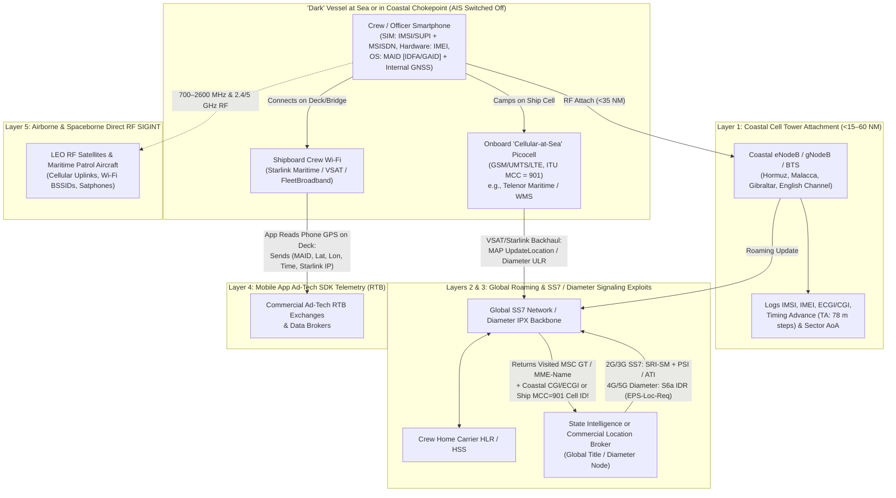
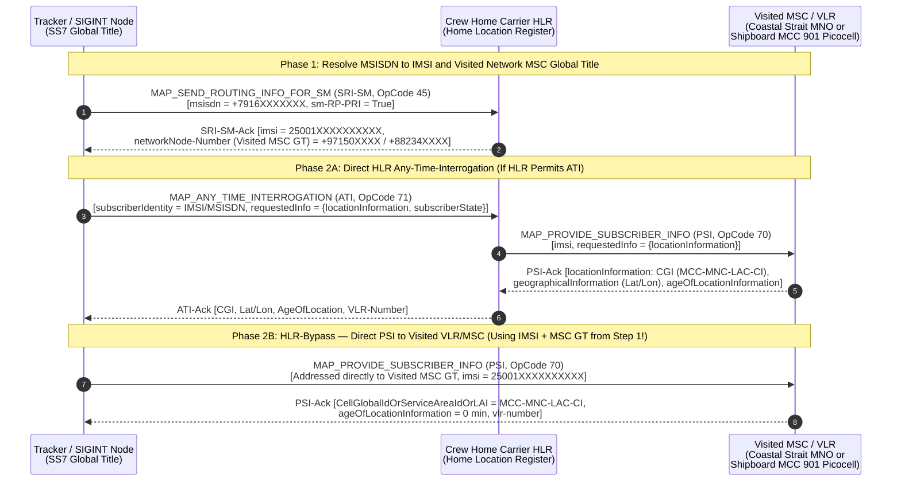
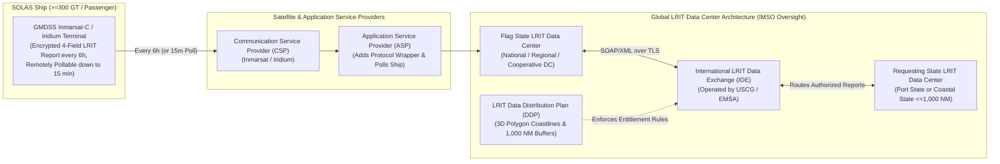
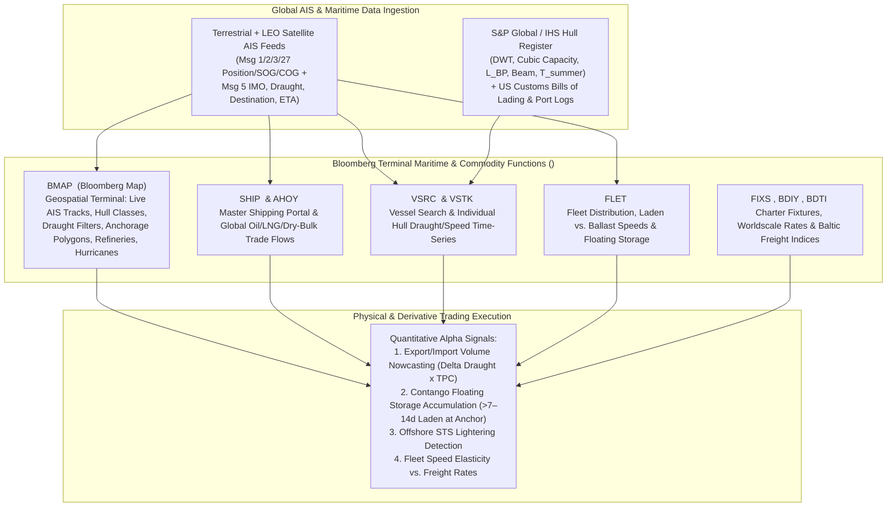
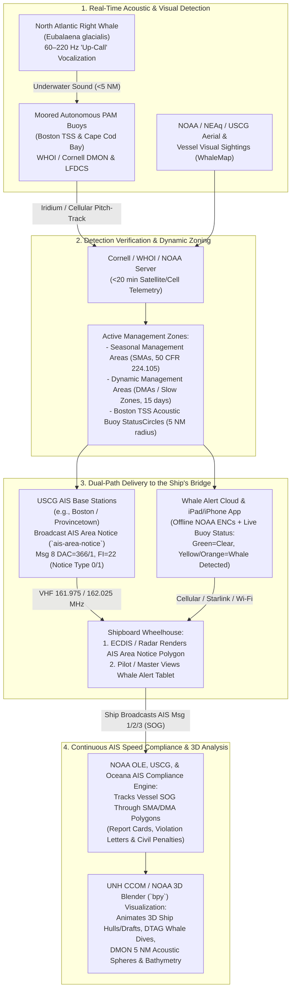

# Chapter 30: Other Ways to Track Ships (Mobile Phones, SS7/Diameter, VMS, VOS, LRIT), Commodity Traders, and Whale Alert

---

## 1. Operational & Conceptual Overview

Throughout this handbook, we have examined the Automatic Identification System (AIS) as the primary open-broadcast backbone of global maritime domain awareness. Yet a fundamental operational question confronts intelligence analysts, sanctions investigators, fisheries enforcement officers, commodity traders, and marine conservationists alike: **How do you track a vessel when its AIS transponder is switched off, spoofed, or legally exempt—and how is live ship tracking translated into multi-billion-dollar financial decisions and real-time endangered species protection?**

This closing chapter of Part VII synthesizes three critical domains that extend and operationalize maritime tracking beyond standard navigation:

1. **Non-AIS Technical Surveillance & Regulated Tracking Systems (Sections 3.1 & 3.2):**
   When a "dark" sanctions-evading tanker, illegal fishing vessel, or grey-zone auxiliary switches off its VHF AIS transceiver, it rarely achieves electromagnetic or digital silence. Onboard watchstanders, engineers, and passengers carry personal smartphones and satellite terminals that continuously interact with terrestrial and spaceborne networks across five distinct physical and signaling layers:
   * **Coastal 2G/3G/4G/5G Cellular Base Station Attachment** along strategic maritime chokepoints (Strait of Hormuz, Bab el-Mandeb, Malacca, Gibraltar, English Channel, Bosporus, Taiwan Strait),
   * **Onboard Maritime Cellular Networks ("Cellular-at-Sea" picocells/femtocells)** operating under ITU Mobile Country Code **`MCC = 901`** backhauled over VSAT or Starlink,
   * **Core Telecom Signaling Exploits**—specifically **`SS7` MAP** (`ITU-T Q.771–Q.775` / `3GPP TS 29.002`) for 2G/3G networks and **`Diameter`** (`RFC 6733` / `3GPP TS 29.272` `S6a`/`S6d` interfaces) for 4G LTE and 5G networks—allowing actors with signaling access to query a crew member's phone number (`MSISDN`) and retrieve the exact coastal **Cell Global Identity (`CGI` / `ECGI`)** or shipboard **`MCC 901` picocell ID** anywhere on Earth,
   * **Mobile Application Ad-Tech Telemetry (Real-Time Bidding [RTB] Location Brokers)** leaking smartphone GPS coordinates over shipboard Wi-Fi (**Starlink Maritime**, FleetBroadband), and
   * **Direct Airborne and Spaceborne RF Emission Collection** alongside regulated non-AIS tracking mandates: **Fisheries Vessel Monitoring Systems (VMS)**, **SOLAS Long-Range Identification and Tracking (LRIT)**, **NOAA's Volunteer Observing Ship (VOS)** meteorological program, and the **US Coast Guard's AMVER** search-and-rescue network.
2. **Physical Commodity Trading and the Bloomberg Terminal (Section 3.3):**
   In global energy, metals, and agricultural markets, physical cargo movements observed via AIS price crude oil (WTI, Brent, Dubai), Liquefied Natural Gas (LNG), iron ore, coal, and grains days or weeks before official customs declarations or government inventory reports (such as the US Energy Information Administration [EIA] Weekly Petroleum Status Report). Referencing the **University of Scranton Kania School of Management Alperin Financial Center *Bloomberg Training Manual***, we dissect how physical trading houses (Vitol, Trafigura, Glencore, Gunvor, Mercuria, Cargill) and quantitative hedge funds use the **Bloomberg Terminal** (`BMAP <GO>`, `SHIP <GO>`, `VSRC <GO>`, `VSTK <GO>`, `FLET <GO>`, `AHOY <GO>`, `FIXS <GO>`) and specialized maritime analytics platforms (**Kpler**, **Vortexa**) to derive cargo weights from AIS Message 5 draught changes ($\Delta T \times \text{TPC}$), monitor global floating storage during contango markets, and automatically detect offshore **Ship-to-Ship (STS)** crude oil transfers.
3. **Listen for Whales & Whale Alert — Dynamic Marine Mammal Conservation (Section 3.4):**
   Finally, we examine how the same AIS infrastructure used for surveillance and commerce has been harnessed to save one of the world's most endangered marine mammals: the **North Atlantic Right Whale (*Eubalaena glacialis*)**. Tracing the history of **Listen for Whales** and **Whale Alert** (presented to the US Congress in 2012 and documented in `schwehr/gis-history`), we detail the closed-loop engineering architecture linking **WHOI/Cornell DMON passive acoustic monitoring buoys**, **USCG AIS Area Notice binary broadcasts (`ais-area-notice`, Message 8 `DAC=366/1, FI=22`)**, bridge ECDIS displays, iPad/iPhone wheelhouse tablets, automated **50 CFR § 224.105 10-knot speed-rule enforcement**, and **3D spatiotemporal visualization in Blender (`bpy`)** developed at UNH CCOM/JHC and NOAA's Stellwagen Bank National Marine Sanctuary.

---

## 2. Historical Context & Evolution (`schwehr/gis-history` Integration)

The convergence of maritime meteorology, telecommunications signaling, financial terminal analytics, and acoustic marine conservation spans more than 170 years of scientific and engineering milestones documented in [`https://github.com/schwehr/gis-history`](https://github.com/schwehr/gis-history):

| Era / Year | Milestone (`schwehr/gis-history`, Telecom, Trading, & Conservation Lineage) | Significance to Alternative Tracking, Trading, & Whale Alert |
|---|---|---|
| **1853 – 1958** | **First International Meteorological Conference** in Brussels (Matthew Fontaine Maury, 1853) establishes standardized ship weather logbooks (precursor to **WMO/NOAA VOS**); **USCG AMVER** founded (1958) | Establishes the earliest global cooperative ship-reporting networks for marine weather forecasting and open-ocean Search and Rescue. |
| **1975 – 1991** | **CCITT / ITU-T Signaling System No. 7 (SS7)** standardized (1975–1988); **Bloomberg L.P.** founded and launches the **Bloomberg Terminal** (1981/1982); **GSM (2G)** deployed with **SS7 MAP** roaming (1991) | Global cellular roaming is built on unauthenticated SS7 MAP trust between Home Location Registers (HLRs) and Visited Location Registers (VLRs); financial terminals begin digitizing market data. |
| **1988 – 2002** | **Inmarsat-C** operational (1991) enabling early **Fisheries VMS**; **Blender** initial release (1994) & open-sourced under GPL (2002); **ITU-R M.1371-0** (1998); **SOLAS AIS mandate** takes effect (July 1, 2002) | Satellite VMS locks down closed fisheries monitoring while AIS opens unencrypted VHF tracking; Blender provides an open-source 3D engine just as digital ship tracks emerge. |
| **2004 – 2008** | **ITU assigns `MCC 901`** to non-geographic/maritime cellular networks (**Cellular-at-Sea** picocells); **IMO adopts SOLAS Reg V/19-1 (LRIT)** (May 2006); **Kurt Schwehr** at UNH CCOM/JHC develops **`noaadata`**, **`ais-area-notice`**, and **3D Blender + Python** animations of Stellwagen Bank vessels and right whales (2006–2009); **NOAA 10-knot Right Whale Speed Rule (`50 CFR § 224.105`)** enacted (Dec 2008) | Shipboard cellular picocells integrate merchant ships into global SS7 roaming; LRIT mandates 6-hour encrypted satellite tracking; UNH/NOAA pioneer binary AIS Area Notices (`FI=22`) and 3D Blender visualizations to mitigate lethal whale strikes. |
| **2009 – 2012** | **Bloomberg launches `BMAP <GO>` and live AIS commodity tracking** (2009–2010); **Wiley et al. (2011)** publish Stellwagen Bank speed-restriction lethality study; **RFC 6733 (Diameter)** & **3GPP 4G LTE `S6a`** standardized; **Whale Alert** app launched and **presented to the US Congress (2012)** | Commodity traders begin pricing oil and dry bulk in real time from AIS draughts on Bloomberg Terminals; Whale Alert closes the loop between DMON acoustic buoys, USCG AIS Base Stations, and ship bridges. |
| **2014 – 2020** | **Tobias Engel & Karsten Nohl** demonstrate global **SS7 MAP (`ATI`/`PSI`)** and **Diameter (`IDR`)** location tracking exploits at CCC / 60 Minutes (2014–2018); **Kpler** (2014) and **Vortexa** (2016) founded; **April 2020 oil contango crash** tracked via AIS VLCC floating storage; ***MV Wakashio* grounding** on Mauritius reef while crew sought mobile phone signal (July 2020) | Telecom signaling vulnerabilities (`SS7` and `Diameter`) and commercial mobile ad-tech SDKs become premier intelligence tools for locating crew phones on "dark" vessels; *Wakashio* proves the operational hazard of crew hunting for coastal cell coverage. |
| **2022 – 2026+** | **Starlink Maritime** LEO Ku-band terminals deployed across global merchant and fishing fleets; **Chile, Peru, Indonesia, Panama, and Norway** integrate national **VMS** feeds into **Global Fishing Watch**; **Paolo et al. (2024, *Nature*)** & **2025 Johnny Harris / GFW Dark Zones investigation** | High-bandwidth shipboard Wi-Fi dramatically increases mobile app ad-tech telemetry from sea, while multi-sensor fusion (AIS + VMS + SAR + RF + telecom) narrows the ocean's remaining dark zones. |

---

## 3. Deep Technical & Mathematical Foundations

### 3.1 Tracking Ships via Mobile Phones, Apps, RF Emissions, and Telecom Signaling (`SS7` for 2G/3G and `Diameter` for 4G/5G) (`TASK-707`)

When a vessel disables its Class A or Class B AIS transponder—by pulling the circuit breaker, engaging Silent Mode, or disconnecting the VHF antenna—bridge officers often assume the ship has vanished from non-visual tracking. In practice, modern merchant vessels, fishing boats, superyachts, and naval auxiliaries carry between $15$ and $6,000$ crew members and passengers, nearly all of whom possess personal smartphones (`iOS` / `Android`). Unless a ship enforces rigid military-grade Emissions Control (**EMCON Alpha**, locking all personal electronics inside shielded Faraday lockers and physically disabling shipboard Wi-Fi and picocells), crew mobile devices betray the vessel's identity, crew roster, and geographic coordinates across **five distinct technical layers**.



---

#### 3.1.1 Layer 1: Coastal Cellular Base Station Attachment ($<15\text{–}35\text{ NM}$, up to $60+\text{ NM}$ in Ducts)

As vessels transit coastal waters, port approaches, archipelagos, or international straits—including the **Strait of Hormuz** ($21\text{ NM}$ wide at its narrowest), **Bab el-Mandeb** ($14\text{ NM}$), **Strait of Malacca** ($1.5\text{–}20\text{ NM}$), **Strait of Gibraltar** ($7.7\text{ NM}$), **Dover Strait / English Channel** ($18\text{ NM}$), **Turkish Straits** ($<0.5\text{ NM}$), and **Taiwan Strait** ($70\text{–}90\text{ NM}$)—smartphones left powered on in crew cabins or on the bridge wing continuously scan terrestrial cellular bands ($700/800/850/900/1800/1900/2100/2600/3500\text{ MHz}$).

When a phone comes within RF range and timing limits of a coastal **Base Transceiver Station (`BTS`, 2G)**, **`NodeB` (3G UMTS)**, **`eNodeB` (4G LTE)**, or **`gNodeB` (5G NR)**, its baseband processor automatically executes an attach or tracking-area update procedure—even if the user has disabled mobile data roaming! This physical-layer attachment records four forensic artifacts inside the coastal Mobile Network Operator's (MNO) call detail and signaling logs:

1. **Permanent Hardware and Subscriber Identifiers:**
   * **`IMSI` (International Mobile Subscriber Identity, 2G/3G/4G) / `SUPI` (Subscription Permanent Identifier, 5G):** A 15-digit unique identifier (`MCC` [3 digits] + `MNC` [2–3 digits] + `MSIN` [9–10 digits]) stored on the crew member's SIM/eSIM card, immediately revealing the crew member's home country and carrier (e.g., `MCC 250` = Russia, `MCC 432` = Iran, `MCC 460` = China, `MCC 515` = Philippines, `MCC 202` = Greece).
   * **`IMEI` (International Mobile Equipment Identity):** The 15-digit hardware serial number of the physical handset (`TAC` + `SNR` + Luhn check digit), allowing analysts to track the exact physical device across SIM card swaps.
2. **Cell Global Identity (`CGI` / `ECGI` / `NCGI`):**
   * In 2G/3G: $\text{CGI} = \text{MCC} - \text{MNC} - \text{LAC} - \text{CI}$ (where $\text{LAC}$ is the 16-bit Location Area Code and $\text{CI}$ is the 16-bit Cell Identity).
   * In 4G LTE: $\text{ECGI} = \text{MCC} - \text{MNC} - \text{ECI}$ (where $\text{ECI}$ is the 28-bit E-UTRAN Cell Identifier, comprising a 20-bit `eNodeB ID` and an 8-bit sector `Cell ID`), paired with the 16-bit **Tracking Area Code (`TAC`)**.
3. **Timing Advance (`TA`) Range Rings:**
   Because TDMA (GSM) and OFDMA/SC-FDMA (LTE/5G) require all uplink bursts from mobile handsets at varying distances to arrive aligned at the base station receiver window, the base station continuously measures the round-trip propagation delay $\Delta \tau = \frac{2d}{c}$ and commands the phone to advance its transmit timing by integer step index $N_{\text{TA}}$:
   * **2G GSM (`3GPP TS 45.010`):** Symbol duration $T_{\text{bit}} = \frac{48}{13}\text{ }\mu\text{s} \approx 3.692\text{ }\mu\text{s}$. Each `TA` step ($0\text{–}63$, or up to $219$ in GSM Extended Range cells) corresponds to a one-way range ring of:
     $$\Delta d_{\text{GSM}} = \frac{c \cdot T_{\text{bit}}}{2} \approx 553.8\text{ m}$$
     Thus standard GSM caps cell attachment at $63 \times 553.8\text{ m} \approx 34.9\text{ km}$ ($18.8\text{ NM}$), while Extended Range coastal GSM cells reach $\sim 120\text{ km}$ ($65\text{ NM}$).
   * **4G LTE (`3GPP TS 36.211` / `TS 36.213`):** Basic time unit $T_s = \frac{1}{15000 \times 2048}\text{ s} \approx 32.552\text{ ns}$. Each Timing Advance command unit is $16\,T_s \approx 0.5208\text{ }\mu\text{s}$ round-trip, yielding a one-way range resolution of:
     $$\Delta d_{\text{LTE}} = \frac{c \cdot (16\,T_s)}{2} \approx 78.125\text{ m}, \qquad d_{\text{ship}} = N_{\text{TA}} \times 78.125\text{ m} \quad (N_{\text{TA}} \in [0, 1282])$$
     A standard LTE Random Access preamble (`Format 0–3`) supports $N_{\text{TA}} \le 1282$, corresponding to a maximum coastal range of **$100.16\text{ km}$ ($54.1\text{ NM}$)** when sea-surface evaporation ducts carry $700\text{–}900\text{ MHz}$ signals over the horizon!
4. **Antenna Sector Azimuth and Angle of Arrival (`AoA`):**
   Intersecting the $78.125\text{ m}$ LTE Timing Advance annulus with the coastal sector antenna azimuth ($60^\circ\text{–}120^\circ$ sector width, refined to $\pm 2^\circ\text{–}5^\circ$ via multi-element MIMO uplink phase-difference `AoA` estimation) localizes a phone on a dark ship passing through a strait to a bounding box of a few hundred meters.

> [!CAUTION]
> **The *MV Wakashio* Disaster (July 25, 2020) — When Crew Hunting for Coastal Cell Reception Causes a Grounding:**
> The interaction between mariners' smartphones and coastal cell towers is not merely a passive intelligence artifact; it is a documented cause of major maritime casualties. On July 25, 2020, the $299.5\text{ m}$, $203,130\text{ DWT}$ Newcastlemax bulk carrier ***MV Wakashio*** (`MMSI 372711000`, `IMO 9337119`), on ballast passage from Singapore to Tubarão, Brazil, intentionally altered course to pass within **$1\text{ NM}$** of the south-eastern coast of Mauritius instead of staying in the deep-water shipping lane $12\text{ NM}$ offshore. As established by the Mauritius Court of Investigation and Panama Maritime Authority VDR transcripts, the Master and Chief Officer brought the ship dangerously close to shore during a crew member's birthday party **specifically so the crew could connect their smartphones to Mauritius terrestrial 4G cell towers** ($<10\text{ NM}$ offshore range). With no proper lookout and an improperly scaled ECDIS chart, *Wakashio* ran hard aground on the Pointe d'Esny coral reef at $11\text{ knots}$, fracturing its hull and spilling over $1,000\text{ tonnes}$ of Very Low Sulfur Fuel Oil (VLSFO) into a pristine lagoon.

---

#### 3.1.2 Layer 2: Onboard Maritime Cellular Networks ("Cellular-at-Sea" Picocells, `MCC = 901`)

What happens when a vessel is $1,000\text{ NM}$ out in the Pacific or Atlantic Ocean, far beyond the reach of any coastal cell tower? Thousands of cruise ships, passenger ferries, offshore oil/gas platforms, mega-yachts, and modern merchant vessels carry **onboard maritime cellular base stations** (picocells or femtocells) installed on the accommodation decks and bridge.

* **ITU Non-Geographic Mobile Country Code (`MCC = 901`):**
  To prevent shipboard base stations from interfering with national terrestrial frequencies when near land and to enable unified international roaming agreements, the International Telecommunication Union (under **ITU-T Recommendation E.212**) assigns the global non-geographic Mobile Country Code **`MCC = 901`** to maritime and satellite network operators, paired with operator-specific Mobile Network Codes (`MNC`):

| Maritime Cellular Operator | ITU `MCC-MNC` | Typical Fleet Deployment | Satellite Backhaul |
|---|---|---|---|
| **Telenor Maritime (formerly Maritime Communications Partner [MCP])** | `901-12` | European/global cruise liners, North Sea ferries, offshore rigs, merchant vessels, tankers | Ku/Ka-band VSAT, Starlink Maritime |
| **Wireless Maritime Services (WMS — AT&T / Anuvu joint venture)** | `901-18` | Major cruise lines (Carnival, Royal Caribbean, NCL), commercial shipping fleets | Intelsat/SES VSAT, Starlink |
| **TIM Maritime (Telecom Italia Sparkle / OnWaves)** | `901-26` / `901-27` | Mediterranean/global passenger ferries, MSC/Costa vessels, cargo ships | VSAT, Inmarsat GX |
| **Globalstar / Iridium / Thuraya / Inmarsat** | `901-01` to `901-14` | Handheld and fixed maritime satellite terminals | L-band LEO/GEO constellations |

* **How Onboard Picocells Betray Ship Identity via Home-Network Roaming Signaling:**
  When a vessel crosses outside territorial waters (typically $>12\text{ NM}$ from land, controlled by a GNSS geofence inside the shipboard Base Station Controller), the ship's picocell powers up its indoor/deck $900/1800/2100\text{ MHz}$ antennas. Any crew member's smartphone with cellular radio enabled automatically camps on the ship's `MCC 901` network.
  To determine whether the phone is authorized to camp and receive calls/SMS, the shipboard network immediately sends a roaming location registration message (**`MAP_UPDATE_LOCATION`** over SS7 or **`Update-Location-Request [ULR]`** over Diameter) over its satellite backhaul (VSAT or Starlink) to the crew member's **home terrestrial mobile operator** (HLR/HSS).
  Crucially, **every shipboard picocell has a unique `Cell ID (CI)` / `ECGI` and `Location Area Code (LAC)` / `TAC` assigned to that specific vessel hull** in the maritime operator's database! Thus, the moment a crew member's phone camps on the shipboard cell—even if the crew member never makes a phone call or sends a text—the crew member's home HLR/HSS (and any entity querying it via SS7 or Diameter) learns the exact shipboard `MCC 901` cell identifier, linking that person to that specific ship in real time.

---

#### 3.1.3 Layer 3: Core Telecom Signaling Exploits (`SS7` for 2G/3G and `Diameter` for 4G/5G)

How can an intelligence agency, naval Maritime Operations Center, sanctions investigator, or commercial location intelligence provider (such as those documented in investigations of the surveillance industry) remotely locate a crew member's phone on a coastal strait or shipboard picocell using **only their phone number (`MSISDN`, e.g., `+63-917-...` or `+7-916-...`)**?

The answer lies in the global interconnect protocols that bind more than $800$ mobile network operators worldwide: **Signaling System No. 7 (`SS7`)** for 2G/3G and **Diameter** for 4G LTE / 5G Non-Standalone (NSA).

##### 1. 2G/3G `SS7 MAP` (Mobile Application Part, `ITU-T Q.771–Q.775` / `3GPP TS 29.002`) Location Tracking Flow
In 2G (GSM) and 3G (UMTS) networks, roaming mobility management and SMS delivery are governed by the **Mobile Application Part (`MAP`)** protocol running atop **TCAP** (Transaction Capabilities Application Part) and **SCCP** (Signaling Connection Control Part, addressed via **Global Titles [`GT`]**). Historically, any entity with leased or compromised access to a valid SS7 Point Code and Global Title on the international signaling network could send MAP queries to any HLR or VLR worldwide.

A standard two-step SS7 maritime crew-tracking interrogation proceeds as follows:



* **Step 1 — `MAP_SEND_ROUTING_INFO_FOR_SM` (`SRI-SM`, OpCode `45`) or `MAP_SEND_ROUTING_INFO` (`SRI`, OpCode `22`):**
  When an SMS Service Center (SMSC) wants to deliver a text message to a phone number (`MSISDN`), it must first ask the subscriber's Home Location Register (`HLR`) where the subscriber is currently located. The tracker spoofs an SMSC and sends an `SRI-SM` request containing only the target crew member's `MSISDN`.
  Even if the ship is completely dark on AIS, the home `HLR` responds with two critical fields:
  1. The crew member's **`IMSI`** (15 digits), and
  2. The **`networkNode-Number` (`Visited MSC Global Title`)** of the network where the phone last registered!
  * **Immediate Maritime Intelligence from Step 1 Alone:** Before even querying the cell tower, the prefix of the returned `MSC Global Title` instantly reveals which country's coast the ship is hugging (e.g., `+968` = Oman / Strait of Hormuz, `+60` = Malaysia / Malacca, `+20` = Egypt / Suez Canal, `+90` = Turkey / Bosporus) **or** whether the phone is registered on a maritime satellite picocell (`+47` Telenor Maritime MSC, `+1` WMS MSC)!
* **Step 2 — `MAP_ANY_TIME_INTERROGATION` (`ATI`, OpCode `71`) or Direct `MAP_PROVIDE_SUBSCRIBER_INFO` (`PSI`, OpCode `70`):**
  To obtain the exact coastal cell tower or shipboard picocell ID, the tracker either sends `MAP_ANY_TIME_INTERROGATION (ATI)` to the home HLR, or—because many home HLRs now block external `ATI` requests under **GSMA FS.11** firewall rules—sends **`MAP_PROVIDE_SUBSCRIBER_INFO (PSI, OpCode 70)`** (or `MAP_SEND_IDENTIFICATION` / `MAP_INSERT_SUBSCRIBER_DATA`) **directly to the Visited MSC/VLR Global Title** discovered in Step 1, using the `IMSI` discovered in Step 1!
  If the visited coastal or maritime VLR lacks strict Category 2 SS7 origin-validation filtering (verifying that the `PSI` sender actually matches the subscriber's home HLR country/operator), the visited VLR pages the handset (if idle) and returns a `LocationInformation` ASN.1 sequence (`3GPP TS 29.002 § 17.7.8`) containing:

| ASN.1 Field in `LocationInformation` (`3GPP TS 29.002`) | Size / Format | Maritime Intelligence Extracted |
|---|---|---|
| `AgeOfLocationInformation` | `INTEGER (0..32767)` minutes | Time elapsed since the phone last communicated with the cell (`0` if actively paged by `PSI`). |
| `GeographicalInformation` | `OCTET STRING (SIZE (8))` (`3GPP TS 23.032`) | Ellipsoid point with uncertainty circle: 24-bit `Latitude`, 24-bit `Longitude` derived by the visited network from cell sector centroid + Timing Advance! |
| `vlr-number` / `msc-Number` | `ISDN-AddressString` (`Global Title`) | Exact regional coastal switch or maritime satellite earth-station switch serving the vessel. |
| `cellGlobalIdOrServiceAreaIdOrLAI` | `OCTET STRING (SIZE (5..7))` | **`MCC` (3 digits) + `MNC` (2–3 digits) + `LAC` (16 bits) + `CI` (16 bits)**: Identifies the exact coastal antenna sector facing the strait, or the exact **`MCC 901` shipboard picocell `CI`** installed on that specific vessel! |

---

##### 2. 4G LTE & 5G NSA `Diameter` Signaling Exploits (`RFC 6733` / `3GPP TS 29.272` `S6a`/`S6d` Interfaces)

As coastal networks and shipboard picocells upgraded from 2G/3G to **4G LTE** and **5G Non-Standalone (NSA)**, the legacy SS7 stack was replaced by **Diameter** (`IETF RFC 6733`), an IP-based authentication, authorization, and accounting (AAA) protocol running over **SCTP (Stream Control Transmission Protocol)** or TCP across the global **IPX (IP Packet Exchange)** carrier backbone.

In 4G LTE / 5G NSA, the Home Location Register (HLR) is replaced by the **Home Subscriber Server (`HSS`)**, and the Visited MSC/VLR is replaced by the **Mobility Management Entity (`MME`)**. Communication between a roaming crew member's visited `MME` (on a coastal 4G/5G tower or an LTE-at-Sea shipboard picocell) and their home `HSS` occurs over the **`3GPP S6a` interface** (`3GPP TS 29.272`, Diameter `Application-ID = 16777251`).

Despite using IP/SCTP instead of legacy TDM circuits, Diameter inherited the same architectural vulnerability as SS7: if an operator's **Diameter Edge Agent (`DEA`)** does not enforce strict **GSMA FS.19** stateful roaming validation, an external actor with access to the IPX Diameter fabric can query a crew member's 4G/5G location using the **`S6a` `Insert-Subscriber-Data-Request (IDR)`** or **`SLg` `Provide-Location-Request (PLR)`** exploit chain:

```mermaid
sequenceDiagram
    autonumber
    participant Actor as Diameter Node on IPX<br/>(Spoofed Origin-Host / HSS)
    participant HSS as Crew Home Carrier HSS<br/>(Home Subscriber Server)
    participant MME as Visited Coastal or Shipboard MME<br/>(Serving 4G/5G eNodeB / Picocell)
    participant UE as Crew Smartphone (UE)<br/>on 'Dark' Vessel

    Note over Actor,HSS: Step 1: Resolve MSISDN to IMSI and Visited MME Identity
    Actor->>HSS: Diameter S6c Send-Routing-Info-for-SM-Request (SRR, Cmd 8388647)<br/>[MSISDN = +63917XXXXXXX]
    HSS-->>Actor: Send-Routing-Info-for-SM-Answer (SRA)<br/>[User-Name (IMSI) = 51502XXXXXXXXXX, Serving-Node (MME-Name / Realm)]

    Note over Actor,UE: Step 2: Query Visited MME via S6a Insert-Subscriber-Data-Request (IDR)
    Actor->>MME: Diameter S6a Insert-Subscriber-Data-Request (IDR, Cmd 319, AppID 16777251)<br/>[User-Name = IMSI, IDR-Flags = 0x0C (Bit 2: EPS-Location-Info-Req + Bit 3: Current-Loc-Req)]
    MME->>UE: S1-AP Paging / NAS Tracking Area Update (if Bit 3 Current-Location-Request set)
    UE-->>MME: RRC Connection + Exact Serving eNodeB ECGI & Timing Advance
    MME-->>Actor: Diameter S6a Insert-Subscriber-Data-Answer (IDA, Cmd 319)<br/>[EPS-Location-Information (AVP 1496) -> MME-Location-Information (AVP 1600):<br/>E-UTRAN-Cell-Global-Identity (ECGI, AVP 1602), Tracking-Area-Identity (TAI, AVP 1603),<br/>Geographical-Information (AVP 1604), Age-Of-Location-Information (AVP 1606)]
```

Let us examine the exact **Attribute-Value Pairs (`AVPs`)** defined in **`3GPP TS 29.272`** that make this 4G/5G location extraction work:

1. **Resolving `MSISDN` to `IMSI` and `MME-Name` (`S6c` `SRR` / `SH` `UDR`):**
   By sending a Diameter **`Send-Routing-Info-for-SM-Request (SRR, Command-Code 8388647)`** over the `S6c` interface (`3GPP TS 29.338`) or interworking with SS7 `SRI-SM`, the querying node obtains the target crew member's `User-Name` (`IMSI`) and the `Destination-Host` / `Destination-Realm` of the visited **`MME`** (e.g., `mme01.epc.mnc012.mcc901.3gppnetwork.org` for a shipboard Telenor Maritime LTE picocell, or `mme04.epc.mnc002.mcc424.3gppnetwork.org` for a UAE coastal LTE network bordering the Strait of Hormuz).
2. **Triggering Location Readout via `Insert-Subscriber-Data-Request (IDR, Command-Code 319)`:**
   In `3GPP TS 29.272 § 7.2.9`, the `IDR` command is normally used by a home `HSS` to push updated subscription profiles to a visited `MME`. However, `3GPP TS 29.272 § 7.3.111` defines the 32-bit **`IDR-Flags` (`AVP Code 1490`, Vendor-ID `10415` [3GPP])** bitmask:
   * **Bit 2 (`0x00000004`, `EPS-Location-Information-Request`):** Instructs the visited `MME` to include the subscriber's current cell location (`EPS-Location-Information`) in its response!
   * **Bit 3 (`0x00000008`, `Current-Location-Request`):** Instructs the visited `MME` not merely to return cached location data, but to **actively page the crew member's phone over the air (`S1-AP Paging`)** so the handset wakes up from `ECM-IDLE` state and reports its live serving cell (`ECGI`) at that exact second!
3. **Decoding the `Insert-Subscriber-Data-Answer (IDA, Command-Code 319)` Payload:**
   An unprotected visited `MME` replies with `Result-Code = 2001 (DIAMETER_SUCCESS)` and a grouped **`EPS-Location-Information` (`AVP 1496`)** containing **`MME-Location-Information` (`AVP 1600`)**:

| 3GPP TS 29.272 AVP Name | AVP Code | Data Type | Binary Structure & Maritime Geolocation Content |
|---|---|---|---|
| `E-UTRAN-Cell-Global-Identity` (`ECGI`) | `1602` | `OctetString` (7 octets) | **Octets 1–3:** BCD-encoded `MCC` and `MNC`.<br>**Octets 4–7:** 28-bit **E-UTRAN Cell Identity (`ECI`)** = 20-bit `eNodeB ID` + 8-bit `Cell/Sector ID`. Pinpoints the exact coastal LTE tower sector or onboard ship LTE picocell. |
| `Tracking-Area-Identity` (`TAI`) | `1603` | `OctetString` (5 octets) | **Octets 1–3:** `MCC` + `MNC`.<br>**Octets 4–5:** 16-bit **Tracking Area Code (`TAC`)** grouping coastal or shipboard cells. |
| `Geographical-Information` | `1604` | `OctetString` (8 octets) | `3GPP TS 23.032` WGS84 ellipsoid point with uncertainty circle computed by the visited MME/eNodeB. |
| `Geodetic-Information` | `1605` | `OctetString` (10 octets) | `ITU-T Q.763` calling party geodetic location (WGS84 latitude, longitude, uncertainty, and confidence). |
| `Age-Of-Location-Information` | `1606` | `Unsigned32` | Minutes elapsed since the `ECGI` was updated (`0` when Bit 3 `Current-Location-Request` forces live paging). |

> [!NOTE]
> **5G Standalone (5G SA) and HTTP/2 Service-Based Architecture (`SBA`):**
> In pure 5G Standalone (`5G SA`, `3GPP TS 23.501` / `TS 29.500`), Diameter is replaced by JSON/REST APIs over **HTTP/2** between Network Functions—specifically the **Unified Data Management (`UDM`)** and the **Access and Mobility Management Function (`AMF`)**, bridged across operators via the **Security Edge Protection Proxy (`SEPP`, `GSMA FS.36`)** using mutual TLS and JSON Web Encryption (`JWE`). While 5G SA protects the over-the-air subscriber identity by encrypting the `SUPI` into a **Subscription Concealed Identifier (`SUCI`)** using Elliptic Curve Integrated Encryption Scheme (`ECIES`), the vast majority of maritime coastal roaming and shipboard picocells in 2026 still interconnect via 4G LTE Diameter (`S6a`) or 2G/3G SS7 (`MAP`), requiring strict cross-protocol firewalling (`GSMA FS.11` / `FS.19` / `FS.36`) to prevent cross-layer downgrade queries.

---

#### 3.1.4 Layer 4: Mobile Application Ad-Tech SDK Telemetry (Real-Time Bidding [RTB] Location Brokers)

Even when a vessel is in the middle of the Indian Ocean or South Atlantic—far from coastal cell towers and without a shipboard `MCC 901` picocell—modern merchant ships, fishing vessels, and naval ships increasingly provide crew internet via **Starlink Maritime** (LEO Ku-band), **Inmarsat FleetBroadband / Fleet Xpress**, or **VSAT**.

This high-speed satellite Wi-Fi has opened a massive, non-AIS commercial tracking vector known as **Ad-Tech Real-Time Bidding (`RTB`) Telemetry**:
1. **How the Leak Occurs on Deck and on the Bridge:**
   A crew member or officer walks onto the bridge wing, weather deck, or near a cabin porthole where their smartphone has a clear view of the sky to receive **GPS / GLONASS / BeiDou / Galileo L1/L5 signals**, while simultaneously connected to the ship's **Starlink Maritime Wi-Fi** router.
2. **Embedded Ad-Tech and Weather SDKs:**
   When the crew member opens a free consumer mobile application that has been granted location permissions—such as a marine weather app, wind/tide forecast tool, prayer-time / Qibla compass app, mobile game, or social media app—embedded third-party monetization SDKs read the smartphone's internal **CoreLocation (`iOS`)** or **FusedLocationProvider (`Android`)** coordinates.
3. **Broadcasting to Commercial Data Brokers:**
   Over the ship's Starlink or VSAT internet connection, the SDK transmits an HTTPS JSON payload to commercial ad exchanges and location data brokers containing:
   $$\Bigl(\text{MAID }\bigl[\text{IDFA / GAID}\bigr],\; \phi_{\text{GPS}},\; \lambda_{\text{GPS}},\; \sigma_{\text{horiz}},\; t_{\text{UTC}},\; \text{Wi-Fi BSSID},\; \text{Public IP}_{\text{Starlink/VSAT}}\Bigr)$$
   Because the smartphone's own internal GNSS chip computed $(\phi_{\text{GPS}}, \lambda_{\text{GPS}})$ independently of the ship's bridge AIS transponder, **switching off the ship's AIS has zero effect on the crew phone's GPS coordinates**!
4. **Co-Travel Clustering and Port-Home Attribution:**
   Analysts querying commercial location datasets identify dark vessels by scanning open-ocean polygons for moving clusters of **Mobile Advertising IDs (`MAIDs`)** moving at $8\text{–}20\text{ knots}$ that share a common `Wi-Fi BSSID` or satellite exit IP. Furthermore, because those same `MAIDs` follow the crew members home on shore leave or visit specific port terminals and shipyards before departure, historical `MAID` trajectory graphs tie the dark vessel directly to its home port, crewing agency, or naval base.

---

#### 3.1.5 Layer 5: Direct Airborne and Spaceborne RF Emission Collection (`SIGINT`)

Finally, national defense agencies and commercial spaceborne RF reconnaissance operators (**HawkEye 360**, **Unseenlabs**, **Kleos Space**, **Spire RF**) detect electromagnetic emissions directly from vessels that have disabled AIS:
* **Marine Navigation Radar (`S-Band` $2.9\text{–}3.1\text{ GHz}$ & `X-Band` $9.2\text{–}9.5\text{ GHz}$):** Even a "dark" ship steaming at night in fog or congested waters must run its X-band or S-band navigation radar to avoid collision. Spaceborne RF satellites measure the radar's Pulse Repetition Frequency (`PRF`), pulse width, antenna scan period ($\sim 2.5\text{ s}$), and geolocate the emitter via **Time Difference of Arrival (`TDOA`)** and **Frequency Difference of Arrival (`FDOA`)** to within $0.5\text{–}2\text{ km}$.
* **VHF Marine Voice (`156–158 MHz`), UHF Onboard Walkie-Talkies (`450–470 MHz`), and Satphone Uplinks:** Crew deck coordination on UHF radios (`457.525\text{ MHz}`–`467.575\text{ MHz}` per `ITU-R M.1174`) and L-band uplinks from **Iridium, Thuraya, and Inmarsat** handsets ($1610\text{–}1660.5\text{ MHz}$) are routinely geolocated by maritime patrol aircraft (**US Navy P-8A Poseidon**, **USCG HC-130J / Casa HC-144 Minotaur**, **MQ-9B SeaGuardian**) and LEO SIGINT payloads.
* **Cellular Uplink Search Bursts & Wi-Fi `802.11` Beacon Frames:** Low-altitude UAVs and patrol aircraft detect $2.4/5\text{ GHz}$ shipboard Wi-Fi Service Set Identifiers (`SSIDs` / `BSSIDs`—which frequently include the ship's actual name or IMO number in the router's default SSID!) and $700\text{–}2600\text{ MHz}$ cellular `PRACH` random-access bursts from crew phones searching for towers.

---

### 3.2 Regulated Non-AIS Maritime Tracking Systems: VMS, LRIT, and NOAA VOS / AMVER (`TASK-708`)

Beyond open-broadcast VHF AIS and opportunistic cellular/RF intelligence, mariners and maritime authorities operate four primary **regulated, non-AIS ship reporting systems**: **Fisheries Vessel Monitoring Systems (VMS)**, **SOLAS Long-Range Identification and Tracking (LRIT)**, the **WMO / NOAA Volunteer Observing Ship (VOS)** meteorological program, and the **USCG Automated Mutual-Assistance Vessel Rescue (AMVER)** system.

#### 3.2.1 Master Technical and Regulatory Comparison Matrix

| System Dimension | AIS (Class A / B) | Fisheries VMS | SOLAS LRIT | NOAA / WMO VOS | USCG AMVER |
|---|---|---|---|---|---|
| **Governing Mandate / Legal Authority** | **SOLAS Ch. V Reg 19**; 33 CFR § 164.46; EU Dir. 2002/59/EC | National Fisheries Laws (e.g., US **Magnuson-Stevens Act**, 50 CFR § 600.1500) & **RFMOs** | **SOLAS Ch. V Reg 19-1** (IMO Res. MSC.202(81) & MSC.263(84), adopted 2006) | **Voluntary** (WMO Publication No. 47 / NOAA National Weather Service) | **Voluntary** (USCG global SAR program; 46 U.S.C. § 701) |
| **Mandatory / Target Vessel Classes** | International $\ge 300\text{ GT}$, domestic $\ge 500\text{ GT}$, passenger ships, US $\ge 65\text{ ft}$, EU fishing $\ge 15\text{ m}$ | Commercial fishing & support vessels holding federal or RFMO permits | International voyages: Cargo ships $\ge 300\text{ GT}$, all passenger ships, and MODUs | ~1,000–3,000 recruited merchant, research, and Coast Guard vessels worldwide | Merchant vessels $\ge 1,000\text{ GT}$ on voyages $\ge 24\text{ hours}$ |
| **Physical RF & Satellite Link** | **VHF $161.975 / 162.025\text{ MHz}$** (9,600 bps GMSK, terrestrial LOS + LEO S-AIS) | **Closed Satellite** (Inmarsat-C, Iridium, CLS/Argos, Woods Hole Group) | **Closed Satellite** (Existing GMDSS Inmarsat-C, Mini-C, or Iridium terminals) | **Satellite / IP** (Inmarsat-C, Iridium, VSAT/email via **TurboWin+** or **SEAS**) | **Satellite / Email / Web** (Inmarsat-C, Iridium, VSAT compressed AMVER format) |
| **Encryption & Confidentiality** | **None (Cleartext open broadcast)** — anyone with a $\$30$ SDR can receive | **Point-to-Point Encrypted** to national FMC (shared with **GFW** by 10+ partner states) | **Point-to-Point Encrypted** to National/Regional LRIT Data Centers | **Public GTS Broadcast**, but **Call Sign Masked (`"SHIP"` / `MASKSTID`)** if requested | **Strictly Confidential** SAR database (exempt from FOIA/commercial access) |
| **Nominal Reporting Interval** | **$2\text{ s}$ to $180\text{ s}$** (dynamic SOTDMA/CSTDMA) | **$30\text{ min}$ to $4\text{ hours}$** (escalated to $5\text{–}15\text{ min}$ near MPA geofences) | **Every $6\text{ hours}$** (remotely pollable down to **$15\text{ min}$** by authorized state) | **Every $3\text{ to }6\text{ hours}$** (`00, 06, 12, 18 UTC` synoptic hours; $1\text{ h}$ Automated AWS) | **At departure, every $24\text{–}48\text{ hours}$**, course deviations, and arrival |
| **Tamper Resistance** | **Low** (Power switch, Silent Mode, or coax disconnect) | **High** (Sealed "blue box", casing intrusion switches, independent battery backup) | **Moderate-High** (Tied to GMDSS safety terminal; disconnect triggers FMC alert) | **N/A** (Voluntary scientific submission by deck officers) | **N/A** (Voluntary SAR submission by Master) |

---

#### 3.2.2 Fisheries Vessel Monitoring Systems (`VMS`) and Global Fishing Watch Integration

For commercial fisheries enforcement, **VMS** was deployed in the late 1980s and 1990s—over a decade before SOLAS AIS—to monitor compliance with Exclusive Economic Zone (EEZ) boundaries, Marine Protected Areas (MPAs), and seasonal fishing closures.

1. **Hardware Tamper-Evidence ("The Sealed Blue Box"):**
   Unlike a bridge AIS unit that provides user-accessible power switches and NMEA configuration ports, a type-approved VMS transceiver (such as **CLS Triton/Leo**, **Thrane & Thrane / Cobham Sailor Inmarsat-C**, **SkyWave/ORBCOMM**, or **Woods Hole Group Thorium**) is an autonomous, sealed satellite terminal bolted to the vessel structure with **no external power switch**. Its GNSS antenna and satellite transceiver are housed inside a single weatherproof dome with optical/mechanical **casing-open tamper switches** and an internal lithium backup battery. If a crew member cuts the 24V DC ship power cable or covers the dome with a metal bucket, the internal battery powers an immediate tamper-alert transmission (or stores timestamped voltage-drop and casing-open fault flags transmitted the instant sky view is restored).
2. **Geofenced Dynamic Polling:**
   To minimize satellite airtime costs, VMS units normally transmit `(VMS_ID, Lat, Lon, SOG, COG, UTC_Time, Status_Flags)` once every **$1\text{ to }4\text{ hours}$**. However, modern VMS terminals store onboard **geofence polygons** (e.g., around the Galápagos Marine Reserve, Papahānaumokuākea, or Georges Bank closed areas). When the vessel crosses within a buffer zone of a restricted polygon, the onboard VMS firmware automatically escalates its reporting rate to **every $5\text{ to }15\text{ minutes}$**, and the shore **Fisheries Monitoring Center (`FMC`)** can send an over-the-air satellite command (`DNID` poll) to demand an immediate position fix.
3. **Bridging the VMS Confidentiality Wall via Global Fishing Watch (`GFW`):**
   Historically, VMS tracks were locked inside siloed national government databases—meaning a fishing vessel could turn off its public AIS and fish illegally in a neighboring state's waters while only its own Flag State saw its VMS track. Beginning with **Indonesia (2017)** and **Peru (2018)**, and expanding to **Chile, Panama, Costa Rica, Ecuador, Belize, Brazil, Papua New Guinea, and Norway**, more than a dozen maritime nations have signed transparency agreements publishing their national VMS feeds directly into **Global Fishing Watch**. As demonstrated by **Paolo et al. (2024, *Nature*)** and the **2025 Johnny Harris / GFW investigation**, cross-correlating public AIS with sovereign VMS feeds and Sentinel-1 Synthetic Aperture Radar (SAR) allows analysts to immediately distinguish authorized domestic fishing vessels (present on VMS, absent on AIS) from true illicit "dark" poachers (detected by SAR, absent on both AIS and VMS!).

---

#### 3.2.3 Long-Range Identification and Tracking (`LRIT`, SOLAS Chapter V, Regulation 19-1)

Adopted by the IMO Maritime Safety Committee in May 2006 (**Resolution MSC.202(81)**, entering into force January 1, 2008) at the urging of the United States Coast Guard following September 11, 2001, **Long-Range Identification and Tracking (`LRIT`)** provides sovereign states with global, encrypted satellite tracking of merchant shipping without exposing vessel locations to the public or pirates.



* **Minimalist 4-Field Payload & Existing GMDSS Hardware:**
  To avoid forcing shipowners to buy a second dedicated satellite terminal in 2008, IMO engineered LRIT to run as a firmware/DNID polling configuration on the ship's existing **Global Maritime Distress and Safety System (`GMDSS`)** **Inmarsat-C** (or **Iridium**) terminal. Under **IMO Resolution MSC.263(84)**, an LRIT position report contains only **four mandatory fields**:
  1. **LRIT Shipborne Equipment Identifier**,
  2. **WGS84 Latitude**,
  3. **WGS84 Longitude** (accurate to within $100\text{ m}$), and
  4. **Date and Time of Position (`UTC`)**.
* **Reporting Rate and Remote Polling:**
  By default, the shipborne terminal transmits one LRIT report **every $6\text{ hours}$** ($4$ fixes per day). However, an authorized LRIT Data Center can remotely command the terminal via the **Application Service Provider (`ASP`)** to increase its transmission frequency up to **once every $15\text{ minutes}$** (for example, during a maritime security incident, piracy hijacking, or environmental emergency) or execute an immediate one-time on-demand poll.
* **Strict Sovereign Access Entitlement Rules (SOLAS Reg V/19-1.8):**
  Unlike AIS, LRIT data is never publicly accessible. Every LRIT query routed through the **International LRIT Data Exchange (`IDE`)** is validated against the **LRIT Data Distribution Plan (`DDP`)**—a global geospatial database of sovereign coastlines and Exclusive Economic Zones maintained by the IMO and audited by the **International Mobile Satellite Organization (`IMSO`)**—enforcing four strict access tiers:
  1. **Flag State Entitlement:** A Flag State is entitled to receive LRIT reports from ships flying its own flag **anywhere in the world** at all times.
  2. **Port State Entitlement:** A Contracting Government is entitled to receive LRIT reports from foreign-flagged ships that have **formally declared their intention to enter a port or facility** under its jurisdiction, starting from the time of Notice of Arrival (or a specified distance/time threshold defined in the DDP), regardless of where the ship is outside the internal waters of another state.
  3. **Coastal State Entitlement ($\le 1,000\text{ NM}$ Rule):** A Contracting Government is entitled to receive LRIT reports from foreign-flagged ships passing within **$1,000\text{ nautical miles}$** of its coast, **even if the ship is not bound for one of its ports**, subject to two exceptions: (a) no state may receive LRIT data while a foreign vessel is inside the *internal waters* of another Contracting Government, and (b) under **Reg V/19-1.8.2**, a Flag State may file a formal declaration in the DDP opting its vessels out of sharing LRIT with a specific Coastal State while its ships are outside that Coastal State's $12\text{ NM}$ territorial sea (though doing so often triggers heightened port-state security inspections!).
  4. **Search and Rescue (`SAR`) Entitlement:** Rescue Coordination Centers (`RCCs`) are entitled to poll and receive LRIT positions **free of charge** from any vessel within a search area during an active SAR operation.

---

#### 3.2.4 NOAA Volunteer Observing Ship (`VOS`) Program and USCG `AMVER`

Two additional global non-AIS datasets—one scientific and one humanitarian—provide vital maritime cross-validation and historical context:

1. **The WMO / NOAA Volunteer Observing Ship (`VOS`) Program:**
   * **Operational Architecture:** Tracing its direct lineage to **Matthew Fontaine Maury's 1853 Brussels Maritime Conference**, the WMO/NOAA VOS program equips roughly $1,000\text{ to }3,000$ merchant vessels worldwide with calibrated marine barometers, sling/aspirated psychrometers, sea-water intake thermistors, anemometers, and shipboard software (**KNMI `TurboWin+`** or **NOAA `SEAS` [Shipboard Environmental Data Acquisition System]**). At the main synoptic hours (**`0000, 0600, 1200, and 1800 UTC`**, or hourly for automated **VOSClim / AWS** stations), deck officers encode a **WMO `FM 13 SHIP`** alphanumeric message or **`FM 94 BUFR`** binary bulletin containing the vessel's **Call Sign (`D...D`)**, **Latitude ($L_a L_a L_a$)**, **Longitude ($L_o L_o L_o L_o$)**, **9-point Quadrant ($Q_c$)**, **True Course ($D_s$)**, **Speed range ($v_s$)**, barometric pressure, air/sea temperature, wind speed/direction, and wave/swell heights. These reports are transmitted free of charge via Inmarsat-C or Iridium onto the **WMO Global Telecommunication System (`GTS` / `WIS 2.0`)** and archived permanently in the **International Comprehensive Ocean-Atmosphere Data Set (`ICOADS`)**.
   * **The Call-Sign Privacy Crisis and `"SHIP"` Masking (`MASKSTID`):** Because WMO `FM 13 SHIP` observations are broadcast globally in real time to weather centers and public university servers within minutes of observation, each report historically published the merchant vessel's **International Radio Call Sign (IRCS)** alongside its $0.1^\circ$ ($6\text{ NM}$) open-ocean coordinates! Between 2005 and 2012, two groups began exploiting public VOS weather reports: (a) **Somali pirate mother-ships** and intelligence brokers monitoring open-ocean transits in the Indian Ocean, and (b) **commodity analysts** tracking merchant hulls across mid-ocean satellite AIS gaps. To prevent captains from abandoning the 150-year-old VOS program, WMO and NOAA introduced the **`MASKSTID` protocol**, replacing the vessel's real Call Sign on public GTS feeds with the generic literal string **`"SHIP"`** (or a salted cryptographic hash).
   * **Cross-Correlating Masked VOS Reports with AIS Tracks:** Even when a VOS report is masked as `"SHIP"`, it contains timestamped position $(\phi_k, \lambda_k)$ at $0.1^\circ$ resolution, coarse true course code $D_s \in \{0..9\}$ ($45^\circ$ octants), and speed code $v_s \in \{0..9\}$ ($5\text{ kt}$ bins) every $6\text{ hours}$. Atmospheric scientists and maritime analysts cross-correlate VOS reports against satellite AIS trajectories by minimizing the kinematic Mahalanobis distance between consecutive 6-hour VOS fixes and candidate AIS tracks—allowing meteorological centers to bias-correct individual ship anemometers for bridge-superstructure height $h_{\text{anem}}$ (extracted from the matched vessel's IMO particulars!) while verifying that the ship's AIS position matches its independent SEAS/TurboWin+ GPS fix.
2. **USCG Automated Mutual-Assistance Vessel Rescue (`AMVER`):**
   Founded in 1958 and operated by the US Coast Guard, **AMVER** is a voluntary global computer-based ship reporting system used exclusively by Rescue Coordination Centers (`RCCs`) to locate the nearest merchant vessels capable of rendering assistance to a ship or aircraft in distress on the high seas. Participating ships submit four message types via satellite email/Inmarsat: **Sail Plan (`AMVER/SP`)**, **Position Report (`AMVER/PR`, at least every 48 hours)**, **Deviation Report (`AMVER/DR`)**, and **Final Arrival Report (`AMVER/FR`)**. By statutory mandate and international agreement, AMVER plot data is **strictly confidential** and never released to commercial entities, tax authorities, or fisheries/customs enforcement—ensuring that even vessels reluctant to broadcast public AIS in high-risk waters continue filing AMVER sail plans so they can rescue fellow mariners in distress.

---

### 3.3 Detailed Look at Commodity Traders and the Bloomberg Terminal (`TASK-709`)

While naval officers and coast guards view AIS through the lens of safety and security, physical commodity traders, energy economists, and quantitative hedge funds view the global AIS network as a **real-time macroeconomic sensor array**. Over $80\%$ of world merchandise trade by volume—and the overwhelming majority of intercontinental crude oil, refined petroleum products, Liquefied Natural Gas (LNG), iron ore, coal, and seaborne grains—moves aboard merchant hulls broadcasting Class A AIS.

Before the integration of terrestrial and satellite AIS into financial terminals around 2009–2012, physical oil and dry-bulk trading desks at firms like **Vitol, Trafigura, Glencore, Gunvor, Mercuria, Cargill, ADM, and Bunge**, as well as major oil companies (**Shell, BP, TotalEnergies, ExxonMobil**), operated in an environment of severe information asymmetry. Official customs import/export tables, **Joint Organisations Data Initiative (`JODI`)** oil statistics, and **US Energy Information Administration (`EIA`)** reports arrived with lags of **1 to 8 weeks**. Today, a commodity trader sitting in Geneva, London, Houston, Singapore, or Stamford watches a Very Large Crude Carrier (`VLCC`) load $2.0\text{ million}$ barrels of crude at Ras Tanura or Corpus Christi **in real time** as its AIS Message 5 draught increases from $10.5\text{ m}$ to $21.2\text{ m}$ on their terminal screen.

---

#### 3.3.1 Inside the Bloomberg Terminal Maritime & Commodity Suite (Scranton *Bloomberg Training Manual* Analysis)

As documented in the **University of Scranton Kania School of Management Alperin Financial Center *Bloomberg Training Manual*** ([`https://www.scranton.edu/academics/ksom/alperin/Bloomberg%20Training%20Manual.pdf`](https://www.scranton.edu/academics/ksom/alperin/Bloomberg%20Training%20Manual.pdf)) and Bloomberg's Commodities & Energy workflow documentation, the **Bloomberg Terminal** integrates live terrestrial and LEO satellite AIS feeds directly with securities pricing, futures curves, refinery outage alerts, and freight derivatives through a dedicated suite of terminal function codes (`<GO>` commands):



##### Table 30.1: Core Bloomberg Terminal Maritime, AIS, and Freight Functions

| Bloomberg Function Command | Official Function Name | Operational Capabilities & How Commodity Traders Use It with AIS |
|---|---|---|
| **`BMAP <GO>`** | **Bloomberg Map (Geospatial Analytics)** | The flagship interactive geospatial map on the Bloomberg Terminal (detailed in the Scranton *Bloomberg Training Manual*). Allows traders to layer **Live & Historical AIS Vessel Tracks** alongside **Energy Infrastructure** (oil/gas pipelines, crude refineries by Nelson Complexity Index, LNG liquefaction/regasification terminals, coal mines, grain elevators), **Port Anchorage Polygons**, and **Live Weather Overlays** (NHC hurricane forecast cones, wind fields, sea ice). Traders draw custom spatial polygons (e.g., around the Houston Ship Channel, Fujairah anchorage, or Singapore Strait) and configure automated alerts whenever a VLCC or Q-Max LNG carrier enters or exits the polygon or changes its AIS draught! |
| **`SHIP <GO>`** | **Shipping & Maritime Market Portal** | Central dashboard aggregating global shipping news, tanker and dry-bulk freight rates, bunker fuel prices (VLSFO / HSFO / MGO at Rotterdam, Fujairah, Singapore, Houston), port congestion indices, and links to vessel tracking tools. |
| **`VSRC <GO>`** | **Vessel Search & Fleet Screening** | Relational screening engine over $>120,000$ commercial hulls. Traders filter the global fleet by **Vessel Type** (`VLCC`, `Suezmax`, `Aframax`, `LR2`, `LR1`, `MR`, `LNG`, `LPG`, `Capesize`, `Panamax`, `Supramax`, `Container`), **Deadweight Tonnage (`DWT`)**, **Current AIS Status (`Laden` vs. `Ballast` inferred from `Draught / Max_Draught`)**, **Current Geographic Zone**, **Speed Over Ground (`SOG`)**, **Destination**, **Beneficial Owner**, and **P&I Insurance Club**. |
| **`VSTK <GO>`** | **Individual Vessel Tracking & History** | Deep-dive profile on a single vessel queried by Name, 9-digit `MMSI`, or 7-digit `IMO` number. Displays the ship's static hull specifications, ownership chain, port-call history, bill-of-lading manifest matches, and a dual time-series chart plotting **AIS Speed Over Ground (`SOG`)** and **AIS Message 5 Static Draught ($T$)** over the past $30\text{–}365\text{ days}$. |
| **`FLET <GO>`** | **Fleet Distribution & Utilization** | Macro-level fleet analytics. Aggregates individual AIS tracks by vessel class to compute: (1) **Regional Vessel Supply** (how many empty/ballast VLCCs are available to load in the Arabian Gulf or US Gulf over the next 14 days), (2) **Average Fleet Speed** (laden vs. ballast), (3) **Port Waiting Times / Congestion Queues** (e.g., Capesize iron-ore queues off Qingdao/Rizhao or Panamax grain queues off Santos/Paranaguá), and (4) **Global Floating Storage** volumes. |
| **`AHOY <GO>`** | **Bloomberg Trade Flows (Oil, LNG, Products)** | Quantitative cargo-flow matrix tracking origin-to-destination barrel and tonnage flows inferred by combining AIS berth/anchorage visits with Message 5 draught shifts ($\Delta T$). Tracks OPEC+ export compliance, Russian seaborne crude redirection (Urals/ESPO from Baltic/Black Sea to India and China), and global LNG cargo diversions between Europe (TTF) and Asia (JKM). |
| **`FIXS <GO>`** | **Shipping Charter Fixtures** | Live and historical feed of spot and time-charter vessel fixtures reported by shipbrokers (Vessel Name, Charterer [e.g., Unipec, Shell, Vitol], Loading Area, Laycan dates, Cargo Tonnage, and Worldscale / $\$/\text{ton}$ freight rate), cross-linked to the vessel's live AIS position on `BMAP <GO>`. |
| **`BDIY <GO>` / `BDTI <GO>` / `BCTI <GO>`** | **Baltic Exchange Dry, Dirty Tanker, & Clean Tanker Indices** | Benchmark freight rate indices (Capesize `BCI`, Panamax `BPI`, Supramax `BSI`, Dirty Tanker `BDTI`, Clean Tanker `BCTI`) and Forward Freight Agreements (`FFA` curves) traded against real-time AIS fleet utilization. |
| **`NRGZ <GO>` / `GLCO <GO>` / `BOIL <GO>`** | **Energy, Global Commodities, & Oil Dashboards** | Links physical AIS seaborne import/export flows directly to WTI (`CL1 <Comdty>`), Brent (`CO1 <Comdty>`), Henry Hub / TTF / JKM natural gas, iron ore, and CBOT grain futures pricing. |

> [!TIP]
> **Beyond the Bloomberg Terminal — Specialized Maritime Commodity Platforms (`Kpler` and `Vortexa`):**
> Alongside Bloomberg (`BMAP`/`AHOY`) and LSEG/Refinitiv Eikon, physical commodity trading desks subscribe to two specialized AI-driven cargo-tracking platforms: **Kpler** (which acquired **MarineTraffic** and **FleetMon** in 2023 to vertically integrate raw terrestrial/satellite AIS collection with cargo intelligence) and **Vortexa**. These platforms fuse AIS kinematics and Message 5 draught changes with customs manifests, port agent lineups, berth-level manifold maps (distinguishing whether a tanker is moored at a crude oil jetty vs. a fuel-oil bunker jetty inside the same port!), and high-resolution optical/SAR satellite imagery to track individual grades of crude (e.g., *Johan Sverdrup*, *WTI Midland*, *Murban*, *Espo*, *Merey-16*).

---

#### 3.3.2 Standard Tanker and Dry-Bulk Hull Classifications Tracked via AIS

To translate an AIS vessel track into commodity volume, analysts classify hulls by their physical dimensions, canal constraints, and cargo capacities:

| Hull Class | Primary Commodity | Typical DWT ($\text{metric tonnes}$) | Typical $L_{\text{OA}} \times \text{Beam} \times T_{\text{laden}}$ | Nominal Cargo Capacity | Key Chokepoint / Canal Constraint |
|---|---|---|---|---|---|
| **ULCC** (Ultra Large Crude Carrier) | Crude Oil | $320,000\text{–}550,000$ | $380\text{ m} \times 68\text{ m} \times 24.5\text{ m}$ | $\sim 3.0\text{–}3.2\text{M bbl}$ | Too deep for Suez/Malacca fully laden; requires LOOP (US) or offshore STS |
| **VLCC** (Very Large Crude Carrier) | Crude Oil | $200,000\text{–}320,000$ | $333\text{ m} \times 60\text{ m} \times 20.5\text{–}22.5\text{ m}$ | $\sim 2.0\text{–}2.2\text{M bbl}$ | Malaccamax ($20.5\text{ m}$ draught); Suez only partly laden (SUMED pipeline) or Cape of Good Hope |
| **Suezmax** | Crude / Heavy Fuel Oil | $120,000\text{–}200,000$ | $275\text{ m} \times 48\text{ m} \times 17.0\text{ m}$ | $\sim 1.0\text{M bbl}$ | Maximum dimensions to transit the Suez Canal fully laden ($20.1\text{ m}$ max Suez draught) |
| **Aframax / LR2** | Crude / Refined Products | $80,000\text{–}120,000$ | $245\text{ m} \times 42\text{ m} \times 14.8\text{ m}$ | $\sim 600,000\text{–}750,000\text{ bbl}$ | Workhorse of regional basins (North Sea, Med, Black Sea, US Gulf, Caribbean) |
| **Panamax / LR1** | Dirty / Clean Products | $55,000\text{–}80,000$ | $228\text{ m} \times 32.2\text{ m} \times 12.5\text{ m}$ | $\sim 400,000\text{–}500,000\text{ bbl}$ | Original Panama Canal lock width ($32.2\text{ m}$ beam) |
| **MR (Medium Range)** | Gasoline, Diesel, Jet Fuel | $40,000\text{–}55,000$ | $183\text{ m} \times 32.2\text{ m} \times 11.5\text{ m}$ | $\sim 300,000\text{ bbl}$ | Global refined product arbitrage fleet |
| **Q-Max / Conventional LNG** | Liquefied Natural Gas ($-162^\circ\text{C}$) | $75,000\text{–}130,000$ | $290\text{–}345\text{ m} \times 45\text{–}53.8\text{ m} \times 11.5\text{–}12.0\text{ m}$ | $174,000\text{–}266,000\text{ m}^3$ LNG | Cryogenic low-density cargo ($\rho_{\text{LNG}} \approx 0.45\text{ t/m}^3$) $\rightarrow$ small draught change ($\Delta T \approx 2.0\text{ m}$)! |
| **Valemax / Capesize** | Iron Ore, Coal | $150,000\text{–}400,000$ | $290\text{–}362\text{ m} \times 45\text{–}65\text{ m} \times 18.0\text{–}23.0\text{ m}$ | $170,000\text{–}390,000\text{ t}$ | Brazil (Tubarão/Ponta da Madeira) & Australia (Port Hedland/Dampier) to China |
| **Kamsarmax / Panamax Bulk** | Soybeans, Corn, Wheat, Coal | $65,000\text{–}85,000$ | $225\text{–}229\text{ m} \times 32.26\text{ m} \times 14.0\text{ m}$ | $65,000\text{–}82,000\text{ t}$ | Sized for Port Kamsar (Guinea bauxite) and Panama Canal grain/coal trade |

---

#### 3.3.3 Quantitative Hydrostatics: Estimating Cargo Tonnage and Crude Barrels from AIS Message 5 Draught ($\Delta T \times \text{TPC}$)

How does a quantitative trading algorithm convert an AIS **Message 5** broadcast into a cargo estimate in metric tonnes or barrels of crude oil?

In **ITU-R M.1371-5 Message 5** (*Static and Voyage Related Data*, 424 bits), bits `294..301` (0-based MSB-first, or `295..302` 1-based) encode an 8-bit unsigned integer **`draught`** ($I_{\text{draught}} \in [0, 255]$) representing the vessel's **Maximum Present Static Draught** in units of $\frac{1}{10}\text{ meter}$:

$$T_{\text{AIS}} = \frac{I_{\text{draught}}}{10.0}\quad [\text{meters}], \qquad T_{\text{AIS}} \in [0.1\text{ m},\; 25.5\text{ m}] \quad (0 = \text{Not Available})$$

##### 1. Archimedes' Principle, Block Coefficient ($C_b$), and Waterplane Area ($A_{WP}$)
By Archimedes' principle, the total mass displacement $\Delta$ (in metric tonnes) of a floating ship in seawater of density $\rho_{\text{sw}} \approx 1.025\text{ t/m}^3$ at mean draught $T$ is:

$$\Delta(T) = \rho_{\text{sw}} \cdot \nabla(T) = \rho_{\text{sw}} \cdot L_{\text{BP}} \cdot B \cdot T \cdot C_b(T)$$

where:
* $L_{\text{BP}}$ is the **Length Between Perpendiculars** (in meters; typically $L_{\text{BP}} \approx 0.96\,L_{\text{OA}}$, where $L_{\text{OA}} = d_{\text{bow}} + d_{\text{stern}}$ is extracted from AIS Message 5 bits `240..257` or the IMO hull register),
* $B$ is the **Molded Beam** (in meters; $B = d_{\text{port}} + d_{\text{starboard}}$ from Message 5 bits `258..269`),
* $C_b(T) \in [0.80, 0.86]$ (for full-bodied tankers and bulk carriers) is the dimensionless **Block Coefficient** at draught $T$.

The horizontal cross-sectional area of the hull slicing the water surface at draught $T$ is the **Waterplane Area** $A_{WP}(T)$:

$$A_{WP}(T) = L_{\text{BP}} \cdot B \cdot C_{WP}(T)$$

where $C_{WP}(T)$ is the **Waterplane Area Coefficient**. For merchant hulls, naval architecture empirical relations (**Schneekluth & Bertram, 1998**) relate $C_{WP}$ to the block coefficient $C_b$ at design draught $T_{\text{design}}$ and modulate it slightly with draught ratio $T / T_{\text{design}}$:

$$C_{WP}(T) \approx \bigl(0.70\,C_{b,\text{design}} + 0.30\bigr) \left(\frac{T}{T_{\text{design}}}\right)^{\alpha}, \qquad \alpha \approx 0.08\text{ to }0.12$$

##### 2. Tonnes Per Centimeter Immersion (`TPC`) and Integrated Displacement Change ($\Delta \text{Displacement}$)
The mass required to sink or raise the ship by $1\text{ centimeter}$ ($0.01\text{ m}$) at draught $T$ is the **Tonnes Per Centimeter immersion (`TPC`)**:

$$\text{TPC}(T) = \frac{d\Delta}{dT_{\text{cm}}} = \frac{\rho_{\text{sw}} \cdot A_{WP}(T)}{100} = \frac{1.025 \cdot L_{\text{BP}} \cdot B \cdot C_{WP}(T)}{100}\quad \left[\frac{\text{metric tonnes}}{\text{cm}}\right]$$

For a small draught change, $\Delta M \approx 100 \cdot \Delta T_{\text{m}} \cdot \text{TPC}$. Across a full loading cycle from ballast draught $T_0$ to laden draught $T_1$ (where $\Delta T = T_1 - T_0$ can exceed $9\text{–}11\text{ meters}$ on a VLCC), integrating $\text{TPC}(T)$ from $T_0$ to $T_1$ yields the net change in total displacement $\Delta_{\text{net}}$:

$$\Delta_{\text{net}}(T_0 \to T_1) = \int_{T_0}^{T_1} 100\,\text{TPC}(T)\,dT = \rho_{\text{sw}}\,L_{\text{BP}}\,B \int_{T_0}^{T_1} C_{WP}(T)\,dT$$

##### 3. Accounting for Ballast Water Discharge and Consumables ($\hat{M}_{\text{cargo}}$)
Crucially, an empty tanker or bulk carrier does **not** sail at zero cargo weight; to keep its propeller submerged and prevent bow slamming in ocean waves, a vessel in **ballast condition** ($T_0 \approx 0.45\text{–}0.55\,T_{\text{design}}$) carries $70,000\text{ to }100,000\text{ tonnes}$ of **segregated seawater ballast** ($M_{\text{ballast}}(T_0)$), which it pumps out into the harbor as crude oil or iron ore is loaded into its cargo tanks/holds!

Therefore, the actual **Cargo Mass Loaded** $\hat{M}_{\text{cargo}}$ is the sum of the net displacement increase $\Delta_{\text{net}}(T_0 \to T_1)$ plus the discharged ballast water mass $\Delta M_{\text{ballast}}$ (or equivalently, the total displacement at laden draught $T_1$ minus the vessel's **Lightweight Tonnage [`LWT`]** and fuel/stores deadweight $M_{\text{bunkers+constants}}$):

$$\hat{M}_{\text{cargo}}(T_1) = \Delta(T_1) - \text{LWT} - M_{\text{ballast,residual}}(T_1) - M_{\text{bunkers+constants}} \approx \text{DWT}_{\text{summer}} \times \left(\frac{\Delta(T_1) - \Delta(T_{\text{ballast,min}})}{\Delta(T_{\text{summer}}) - \Delta(T_{\text{ballast,min}})}\right) \times \eta_{\text{cargo}}$$

where $\eta_{\text{cargo}} \approx 0.95\text{–}0.97$ accounts for fuel oil, fresh water, and constants inside the vessel's total Deadweight Tonnage ($\text{DWT}_{\text{summer}}$).

##### 4. Converting Crude Oil Metric Tonnes to Barrels via API Gravity
For crude oil and refined petroleum products, physical contracts and futures (`WTI` / `Brent`) are traded in **US Barrels (`bbl`, $1\text{ bbl} = 42\text{ US gallons} \approx 0.1589873\text{ m}^3$)** rather than metric tonnes. Given the crude grade's **API Gravity** ($\text{API} \in [10^\circ, 50^\circ]$ at $60^\circ\text{F}$), the specific gravity $\text{SG}$ and volumetric conversion factor $k_{\text{bbl/t}}$ are:

$$\text{SG}_{60^\circ\text{F}} = \frac{141.5}{\text{API} + 131.5}, \qquad k_{\text{bbl/t}}(\text{API}) = \frac{1}{\rho_{\text{water}} \cdot \text{SG}_{60^\circ\text{F}} \cdot 0.1589873} \approx 6.28981 \times \frac{\text{API} + 131.5}{141.5}\quad \left[\frac{\text{bbl}}{\text{metric tonne}}\right]$$

For example:
* **Heavy Venezuelan *Merey-16* ($\text{API} = 16^\circ$):** $\text{SG} = 0.9593 \implies k_{\text{bbl/t}} = 6.556\text{ bbl/tonne}$.
* **Medium Russian *Urals* or *Arab Light* ($\text{API} = 31^\circ\text{–}33^\circ$):** $\text{SG} \approx 0.865 \implies k_{\text{bbl/t}} \approx 7.27\text{ bbl/tonne}$.
* **Light Sweet *WTI Midland* ($\text{API} = 42^\circ$):** $\text{SG} = 0.8156 \implies k_{\text{bbl/t}} = 7.712\text{ bbl/tonne}$.

Thus, a $300,000\text{ DWT}$ VLCC rising from $T_0 = 10.2\text{ m}$ (ballast) to $T_1 = 21.0\text{ m}$ (fully laden at $T_{\text{summer}} = 21.5\text{ m}$) carries $\hat{M}_{\text{cargo}} \approx 278,000\text{ metric tonnes}$, corresponding to **$2.02\text{ million barrels}$** of Arab Light crude or **$2.14\text{ million barrels}$** of light sweet WTI!

---

#### 3.3.4 Economic Signals: Speed Elasticity ($P \propto v^3$), Floating Storage Contango, and STS Detection

Beyond single-vessel draught estimation, commodity quants extract three macro-market trading signals from global AIS streams (`FLET <GO>` and `AHOY <GO>`):

1. **Fleet Speed vs. Freight Rate & Bunker Price Elasticity (The Cubic Law):**
   Because a ship's main-engine brake power $P_B$ and daily fuel consumption $F_{\text{day}}$ (tonnes/day of VLSFO) scale approximately with the **cube of speed through water** ($F_{\text{day}} \propto v^3 \cdot \Delta^{2/3}$ via the Admiralty Coefficient), a shipowner's optimal steaming speed $v^*$ maximizes daily **Time Charter Equivalent (`TCE`)** profit given freight rate $R$ ($\$ / \text{t-mile}$) and bunker fuel price $P_{\text{fuel}}$ ($\$ / \text{t}$):
   $$v^* \propto \sqrt{\frac{R}{P_{\text{fuel}}}}$$
   When tanker or dry-bulk freight rates collapse or bunker prices surge, the global VLCC and Capesize fleet slows down (**"slow steaming"** at $10.5\text{–}11.5\text{ knots}$ on AIS), effectively absorbing $10\%\text{–}15\%$ of global fleet carrying capacity! Conversely, when geopolitical shocks (e.g., Red Sea / Bab el-Mandeb diversions around the Cape of Good Hope) spike freight rates, fleet-wide AIS `SOG` accelerates to $14.0\text{–}15.0\text{ knots}$ within 48 hours.
2. **Floating Storage and Super-Contango Arbitrage:**
   When the crude oil futures curve enters **contango**—meaning the deferred futures price $F(t + \Delta t)$ exceeds the spot price $S(t)$ by more than the cost of chartering a VLCC, insurance, and financing:
   $$F(t + \Delta t) - S(t) > \left(\frac{\text{Daily VLCC Charter Rate} + \text{Insurance}}{\text{2,000,000 bbl}}\right) \Delta t + r_{\text{interest}}\,S(t)\,\Delta t$$
   physical traders buy spot crude, load it onto a VLCC, **anchor the fully laden VLCC offshore** (off Singapore/Malaysia, the US Gulf, Southwold UK, or Saldanha Bay), and simultaneously sell the forward futures contract to lock in a risk-free profit! On Bloomberg (`FLET <GO>` / `BMAP <GO>`), Vortexa, and Kpler, **Floating Storage** is automatically quantified by summing $\hat{V}_{\text{bbl}}$ over all tankers satisfying:
   $$\frac{T_{\text{AIS}}}{T_{\text{summer}}} \ge 0.80 \quad \land \quad \text{SOG} < 1.0\text{ kt} \quad \land \quad \Delta t_{\text{stationary}} \ge 7\text{ days (or } 14\text{ days)}$$
   During the historic **April 2020 COVID-19 oil demand crash** (when WTI May 2020 futures traded at $-\$37.63/\text{bbl}$ due to Cushing storage saturation), AIS floating storage trackers recorded an unprecedented surge past **$200\text{ million barrels}$** stored aboard anchored tankers worldwide—giving traders daily visibility into the exact inflection point when global oil inventories peaked and began drawing down.
3. **Automated Detection of Offshore Ship-to-Ship (`STS`) Transfers:**
   Whether conducted legitimately (lightering a deep-draft VLCC onto three Aframaxes in the US Gulf off Galveston so they can enter shallow Texas ports) or illicitly (transferring sanctioned Iranian, Venezuelan, or Russian crude off **Kalamata [Greece]**, **Ceuta [Spain]**, **Lomé [Togo]**, or **Tanjung Bruas / East Johor [Malaysia]**), an offshore **Ship-to-Ship (`STS`)** transfer leaves an unmistakable two-vessel kinematic and hydrostatic signature in AIS:
   * **Spatial Proximity:** Geodesic distance between Vessel $A$ and Vessel $B$ remains $d_{AB}(t) \le 150\text{ m}$ (accounting for hull beams $B_A + B_B \approx 90\text{–}110\text{ m}$ plus Yokohama pneumatic fenders and GNSS antenna offsets),
   * **Low-Speed Drifting or Anchored Alignment:** Both vessels maintain $\text{SOG}_A(t), \text{SOG}_B(t) \le 2.0\text{ kts}$ and parallel or anti-parallel headings ($|\psi_A - \psi_B| \le 15^\circ$ or $|| \psi_A - \psi_B | - 180^\circ| \le 15^\circ$),
   * **Minimum Pumping Duration:** Continuous proximity persists for $\Delta t_{\text{STS}} \ge 6.0\text{ hours}$ (typical crude transfer rates are $30,000\text{–}60,000\text{ bbl/hr}$, requiring $12\text{–}36\text{ hours}$ to transfer $500,000\text{–}1,000,000\text{ bbl}$), and
   * **Conservation of Mass across Draught Shifts:** Following separation, the donor vessel's AIS Message 5 draught decreases ($\Delta T_A < -2.0\text{ m}$) while the receiving vessel's draught increases ($\Delta T_B > +2.0\text{ m}$) such that $\hat{M}_{\text{discharged}}(A) \approx \hat{M}_{\text{loaded}}(B)$.

---

### 3.4 Listen for Whales / Whale Alert: Dynamic Marine Mammal Conservation (`TASK-710`)

If commodity trading demonstrates the economic power of AIS, **Listen for Whales** and **Whale Alert** represent one of its noblest scientific and environmental triumphs: transforming the maritime VHF Data Link and shipboard ECDIS into a real-time life-saving shield for the critically endangered **North Atlantic Right Whale (*Eubalaena glacialis*)**.

With fewer than **370 individual North Atlantic Right Whales** remaining on Earth, the species faces an existential threat from two anthropogenic hazards: entanglement in commercial fishing gear and **lethal vessel strikes**. Because right whales are slow swimmers ($1\text{–}4\text{ knots}$), lack a dorsal fin, have dark skin that blends into the sea surface, spend extended periods foraging and nursing just below the surface (at depths of $2\text{–}15\text{ meters}$, directly inside the draft zone of commercial ship hulls and propellers!), and migrate through some of the busiest shipping lanes in North America—including the **Boston Harbor Traffic Separation Scheme (TSS)** cutting across **NOAA's Stellwagen Bank National Marine Sanctuary (`SBNMS`)**, Cape Cod Bay, the New York Bight, and the Southeast US calving grounds off Georgia and Florida—visual lookouts on large merchant ships rarely spot a right whale in time to maneuver.

---

#### 3.4.1 The Biomechanics and Hydrodynamics of Vessel-Whale Collisions (Why 10 Knots Saves Lives)

Why did NOAA Fisheries enact the **Mandatory 10-Knot Vessel Speed Rule (`50 CFR § 224.105`)** in December 2008 for vessels $\ge 65\text{ ft}$ ($19.8\text{ m}$), and why did **David N. Wiley, Michael Thompson, Richard M. Pace III, and Jake Levenson (2011, *Biological Conservation*)** find that speed restrictions inside Stellwagen Bank reduce lethal right-whale collisions by **$80\%\text{ to }90\%$**?

Two coupled physical mechanisms govern ship-strike lethality:

1. **Blunt-Force Kinetic Energy and Logistic Probability of Lethality ($P_{\text{lethal}}(v)$):**
   The kinetic energy transferred during an inelastic impact scales with the square of vessel speed ($E_k = \frac{1}{2} m_{\text{eff}} v^2$). By compiling historical global records of large-whale vessel strikes with known vessel speeds $v$ (in knots), **Vanderlaan & Taggart (2007, *Marine Mammal Science*)** and **Conn & Silber (2013, *Ecosphere*)** derived the empirical logistic regression probability $P(\text{Lethal or Severe Injury} \mid v)$ given that a strike occurs at speed $v$:

   $$P(\text{Lethal} \mid v) = \frac{1}{1 + \exp\bigl(-(\beta_0 + \beta_1 v)\bigr)}$$

   where the Vanderlaan & Taggart (2007) parameters are $\beta_0 = -4.89$ and $\beta_1 = 0.410\text{ kt}^{-1}$ (and Conn & Silber [2013] refined parameters are $\beta_0 = -1.905,\; \beta_1 = 0.217\text{ kt}^{-1}$ paired with an encounter-rate multiplier):

| Vessel Speed Over Ground ($v$) | Kinetic Energy Ratio $(v / 10\text{ kt})^2$ | Vanderlaan & Taggart (2007) $P(\text{Lethal} \mid \text{Strike}, v)$ | Operational Interpretation |
|---|---|---|---|
| **$20.0\text{ knots}$** (Fast Container Ship) | $4.00\times$ | **$96.5\%$** | Near-certain fatal spinal/skull fracture or propeller severing |
| **$18.0\text{ knots}$** | $3.24\times$ | **$92.4\%$** | $>90\%$ fatal outcome |
| **$14.0\text{ knots}$** (Tanker / Bulk Carrier) | $1.96\times$ | **$69.9\%$** | Majority of strikes are lethal |
| **$12.0\text{ knots}$** | $1.44\times$ | **$50.7\%$** | Inflection point ($v_{50} \approx 11.9\text{ knots}$) |
| **$10.0\text{ knots}$ (Mandatory SMA/DMA Limit)** | **$1.00\times$** | **$31.2\%$** | **Lethality drops by two-thirds compared to $18\text{ kts}$!** |
| **$8.0\text{ knots}$** | $0.64\times$ | **$16.7\%$** | High probability of whale survival |

2. **Bernoulli Hydrodynamic Suction ("Propeller Draw"):**
   Crucially, a ship does not even need to hit a whale directly with its bulbous bow to kill it. As water accelerates underneath and alongside a moving displacement hull of block coefficient $C_b \approx 0.80$, **Bernoulli's equation** dictates a pressure drop $\Delta P$ proportional to $v^2$:
   $$\Delta P_{\text{suction}} = \frac{1}{2}\,\rho_{\text{sw}}\,\bigl(v_{\text{hull}}^2 - v_{\infty}^2\bigr) \propto \rho_{\text{sw}}\,v^2$$
   Naval architectural tow-tank experiments (**Silber et al., 2010**) proved that a large merchant ship steaming at $15\text{–}20\text{ knots}$ generates a powerful hydrodynamic suction force that **physically pulls a submerged right whale within $1\text{–}2\text{ hull beams}$ upward into the spinning $8\text{-meter}$ bronze propeller blades**! Slowing the ship to $\le 10\text{ knots}$ cuts this hydrodynamic suction force by **$55\%\text{ to }75\%$** and gives the whale acoustic and kinematic reaction time to dive clear.

---

#### 3.4.2 The Sensor-to-Bridge Architecture of Listen for Whales and Whale Alert

Developed by a coalition of **NOAA Stellwagen Bank National Marine Sanctuary (`SBNMS`)**, **Woods Hole Oceanographic Institution (`WHOI`)**, **Cornell University Lab of Ornithology (Bioacoustics Research Program)**, **UNH Center for Coastal and Ocean Mapping (`CCOM/JHC` — Kurt Schwehr, Colin Ware, Roland Arsenault)**, **United States Coast Guard (`USCG`)**, **International Fund for Animal Welfare (`IFAW`)**, **Conserve.IO / EarthNC**, **Excelerate Energy**, and **Suez LNG**—and formally **presented to the US Congress in 2012** (`schwehr/gis-history`)—**Listen for Whales** and **Whale Alert** created the world's first automated, real-time acoustic-to-AIS marine conservation network.



Let us trace each of the five engineering stages in this loop:

1. **Stage 1 — Real-Time Passive Acoustic Monitoring (`PAM`) via `DMON` / `LFDCS` Buoys:**
   A chain of surface-moored autonomous acoustic buoys—originally deployed across the **Boston Harbor Traffic Separation Scheme (`TSS`)** to satisfy LNG terminal conservation mandates (Neptune LNG / Northeast Gateway) and throughout Cape Cod Bay and the US East Coast—continuously samples underwater sound at $2,000\text{ Hz}$.
   * Inside each buoy's seafloor or stretch-hose **Digital Acoustic Monitoring (`DMON`)** package (**Baumgartner & Mussoline, 2011; Clark et al., 2010**), an onboard DSP executes the **Low-Frequency Detection and Classification System (`LFDCS`)**: computing a short-time Fourier transform (STFT) spectrogram, equalizing background shipping noise, tracing continuous tonal **pitch tracks**, and comparing candidate contour attributes (start frequency $\approx 60\text{–}100\text{ Hz}$, end frequency $\approx 180\text{–}220\text{ Hz}$, duration $\approx 0.8\text{–}1.2\text{ s}$, positive slope) against a multivariate discriminant function trained on **North Atlantic Right Whale contact "up-calls"**.
   * Every $20\text{ minutes}$ (or immediately upon trigger), the buoy transmits compressed pitch-track metadata over Iridium satellite or coastal cellular link to shore servers at WHOI and Cornell, where bioacousticians and automated classifiers confirm right-whale presence inside the buoy's **$5\text{ NM}$ ($9.26\text{ km}$) acoustic detection radius**.
2. **Stage 2 — Activating `SMAs`, `DMAs`, and `Right Whale Slow Zones`:**
   * **Seasonal Management Areas (`SMAs`):** Fixed statutory polygons and calendar windows mandated under **50 CFR § 224.105** (e.g., *Cape Cod Bay*: Jan 1 – May 15; *Off Race Point*: Mar 1 – Apr 30; *Great South Channel*: Apr 1 – Jul 31; *Mid-Atlantic U.S. Ports*: Nov 1 – Apr 30; *Southeast U.S. Calving Grounds*: Nov 15 – Apr 15) where all non-exempt vessels $\ge 65\text{ ft}$ **must travel at $\le 10.0\text{ knots}$**.
   * **Dynamic Management Areas (`DMAs`) and `Right Whale Slow Zones`:** Triggered dynamically whenever a visual survey observes $\ge 3$ right whales in close proximity ($\le 75\text{ sq NM}$)—or, under NOAA's modern **Right Whale Slow Zone** program launched in 2020, whenever **a single confirmed right-whale acoustic detection** is recorded on a DMON buoy or autonomous glider! A rectangular bounding box ($15\text{ NM}$ buffer around the whale aggregation or acoustic buoy) is activated for **$15\text{ days}$** requesting (or requiring) mariners to slow to $\le 10.0\text{ knots}$.
3. **Stage 3 — Over-the-Air `AIS Area Notice` Broadcast (`ais-area-notice`, Message 8 `DAC=366/1, FI=22`) and the `Whale Alert` App:**
   How does a ship captain learn that Buoy #3 in the Boston TSS just heard a right whale 15 minutes ago? Through two redundant channels:
   * **VHF Over-the-Air `AIS Area Notice` (`Message 8, DAC=366/1, FI=22`):** Using the open-source **`ais-area-notice`** software architecture created by **Kurt Schwehr** at UNH CCOM/JHC (detailed in Chapter 16), the US Coast Guard Research and Development Center and First Coast Guard District Base Stations encode the active SMA, DMA, and $5\text{ NM}$ acoustic buoy circles into ITU-R M.1371 **Message 8 Binary Broadcasts** with **`DAC = 366` (USCG) or `DAC = 1` (IMO `SN.1/Circ.289`), `FI = 22` (`Area Notice`)**:
     * **`Notice Description` (`7 bits`, values `0` or `1`):**
       * `0` = *"Caution Area: Marine mammals habitat (Cetaceans)"* (for advisory zones / zero recent detections), or
       * `1` = *"Caution Area: Marine mammals in area — reduce speed"* (for active SMAs, DMAs, and triggered acoustic buoys!).
     * **Chained `87-bit` Sub-Areas:** A `Sub-Area Type 0` (**Circle or Point**) centered on each Boston TSS acoustic buoy $(\lambda_i, \phi_i)$ with radius $R = 9,260\text{ m}$ ($5.0\text{ NM}$), or `Sub-Area Type 1` (**Rectangle**) / `Sub-Area Type 3` (**Polygon**) tracing the SMA/DMA boundary vertices, complete with start UTC timestamp (`month`, `day`, `hour`, `minute`) and expiration `duration_min`!
     * Compatible shipboard **ECDIS** and **Portable Pilot Units (`PPUs`)** decode the Message 8 Area Notice directly off the VHF Data Link and draw the polygon and speed warning onto the bridge navigation chart—without requiring internet connectivity!
   * **The `Whale Alert` Wheelhouse App (`Listen for Whales`):** Simultaneously, the **Whale Alert** mobile/tablet application displays official NOAA Electronic Navigational Charts (`ENCs`) overlaid with color-coded TSS acoustic buoy circles (**Green** = no right whale vocalization detected in the past 24 hours; **Yellow/Orange** = right whale vocalization detected within the past 24 hours!), active SMA/DMA/Slow Zone polygons, and automatic GPS geofence pop-up alerts as the ship approaches a zone.
4. **Stage 4 — Quantitative AIS Speed Compliance Auditing & NOAA OLE Enforcement:**
   Because every commercial vessel $\ge 65\text{ ft}$ is required under **33 CFR § 164.46** to broadcast AIS continuously, shore AIS networks (**USCG NAIS**, **NOAA MarineCadastre**, **WhaleAlert / SBNMS**, and **Oceana / Global Fishing Watch**) audit every vessel's speed over ground (`SOG`) as it transits an active SMA or DMA.
   For a vessel trajectory consisting of consecutive AIS position reports $(\mathbf{x}_0, t_0), (\mathbf{x}_1, t_1), \dots, (\mathbf{x}_K, t_K)$ clipped to the interior of a management polygon $\mathcal{P}$, let $d_k = \|\mathbf{x}_k - \mathbf{x}_{k-1}\|_{\text{WGS84}}$ be the geodesic segment length (in nautical miles) and $\bar{v}_k = \frac{1}{2}(v_{k-1} + v_k)$ (verified against implied segment speed $d_k / \Delta t_k$) be the segment speed in knots. Three statutory and scientific compliance metrics are computed per transit:
   * **Distance-Weighted Compliance Ratio ($C_{\text{dist}}$):**
     $$D_{\text{total}} = \sum_{k=1}^{K} d_k, \qquad D_{\text{excess}}(v_{\text{thresh}}) = \sum_{k=1}^{K} d_k \cdot \mathbb{I}\bigl(\bar{v}_k > v_{\text{thresh}}\bigr), \qquad C_{\text{dist}} = 1 - \frac{D_{\text{excess}}(10.0)}{D_{\text{total}}}$$
   * **Distance-Weighted Mean Speed ($\bar{v}_{\text{dist}}$) and Maximum Sustained Exceedance:**
     $$\bar{v}_{\text{dist}} = \frac{1}{D_{\text{total}}} \sum_{k=1}^{K} d_k\,\bar{v}_k$$
   * **Expected Relative Lethality Reduction Index ($\mathcal{R}_{\text{lethal}}$):**
     Integrating the Vanderlaan & Taggart (2007) logistic lethality probability $P(\text{Lethal} \mid \bar{v}_k)$ along the trajectory inside $\mathcal{P}$:
     $$\bar{P}_{\text{lethal}} = \frac{1}{D_{\text{total}}} \sum_{k=1}^{K} d_k \cdot \frac{1}{1 + \exp\bigl(-(-4.89 + 0.410\,\bar{v}_k)\bigr)}$$
   In the Stellwagen Bank National Marine Sanctuary, **NOAA SBNMS** issues annual **Corporate Responsibility Speed Report Cards** grading shipping companies from **`A+` ($\ge 95\%$ compliance)** to **`F` ($< 60\%$ compliance)**, while **NOAA Office of Law Enforcement (`OLE`)** uses verified AIS speed exceedance tracks ($D_{\text{excess}}(10.0) \ge 5.0\text{ NM}$) to issue **Notices of Violation and Assessment (`NOVAs`)** with civil penalties reaching tens of thousands of dollars per violation under the Endangered Species Act (`ESA`) and Marine Mammal Protection Act (`MMPA`).
5. **Stage 5 — 3D Spatiotemporal Visualization in `Blender` (`bpy`) at UNH CCOM/JHC & NOAA SBNMS:**
   How did researchers convince skeptical shipping executives, harbor pilots, and members of the US Congress that right whales and deep-draft container ships were occupying the exact same vertical water column in the Boston TSS?
   Between 2006 and 2012, **Kurt Schwehr, Colin Ware, and Roland Arsenault** at **UNH CCOM/JHC**, working closely with **David Wiley and Michael Thompson** at **NOAA SBNMS** and bioacousticians at **WHOI**, built a pioneering **3D/4D scientific animation pipeline in `Blender` (`bpy`)** (chronicled in `schwehr/gis-history` and Chapter 25):
   * **Multibeam Bathymetry Mesh:** High-resolution multibeam sonar grids of Stellwagen Bank and the Boston Harbor approach were projected into a local East-North-Up (`ENU`) tangent plane centered on the sanctuary $(\lambda_0 = -70.30^\circ, \phi_0 = 42.40^\circ)$ to prevent single-precision `float32` vertex jitter in Blender's viewport, with a vertical exaggeration factor ($Z_{\text{scale}} = 5\times\text{ to }10\times$) so the $25\text{–}100\text{ m}$ sand-bank shelf edge was visually distinct.
   * **3D Suction-Cup `DTAG` Right-Whale Foraging Dives:** North Atlantic right whales tagged by WHOI researchers with non-invasive suction-cup **Digital Acoustic Recording Tags (`DTAGs`, Johnson & Tyack, 2003)** recorded $50\text{ Hz}$ 3-axis accelerometers, 3-axis magnetometers, hydrostatic pressure (depth $z_w(t)$), and underwater audio. In Blender (`bpy`), a rigged 3D right-whale mesh was keyframed along its reconstructed 3D subsurface foraging trajectory $(x_w(t), y_w(t), z_w(t))$ with exact pitch, roll, and fluke-stroke orientation.
   * **3D AIS Ship Hulls with Submerged Draft & Propeller Strike Volumes:** Simultaneously, real AIS trajectories (`!AIVDM` decoded via `noaadata` / `libais`) of commercial container ships, tankers, and LNG carriers transiting the Boston TSS were keyframed along the sea surface $(z = 0)$, with their 3D hull meshes scaled to their exact AIS Message 5 dimensions ($L_{\text{OA}}, B$) and **extended downward to their exact Message 5 `draught` ($z = -T_{\text{AIS}}$, e.g., $-14.5\text{ m}$) plus a translucent red hydrodynamic propeller-suction hazard zone extending to $-2\times T_{\text{AIS}}$**!
   * **Volumetric `DMON` Acoustic Detection Spheres:** Each moored Boston TSS acoustic buoy was rendered with a pulsing translucent $5\text{ NM}$ ($9,260\text{ m}$) hemisphere that shifted from green (`0` calls) to glowing amber/red when an up-call was detected, while underwater ships radiated expanding 3D **Underwater Radiated Noise (`URN`)** spheres illustrating how a $20\text{-knot}$ container ship's $185\text{ dB re }1\,\mu\text{Pa}$ low-frequency propeller cavitation noise drowned out ("masked") the whales' $60\text{–}220\text{ Hz}$ contact calls!

---

## 4. Hardware, Standards, & Software Ecosystem

The multi-domain tracking, commodity intelligence, and marine conservation systems examined in this chapter are governed by an interlocking set of telecommunications, maritime, meteorological, and conservation standards:

| Domain | Standard / Specification / Software | Governing Body / Maintainer | Technical Scope & Role |
|---|---|---|---|
| **2G/3G Telecom Signaling** | **ITU-T Q.771–Q.775** & **3GPP TS 29.002 (`SS7 MAP`)** | ITU-T / 3GPP | Defines `MAP_SEND_ROUTING_INFO_FOR_SM` (`OpCode 45`), `MAP_PROVIDE_SUBSCRIBER_INFO` (`OpCode 70`), `MAP_ANY_TIME_INTERROGATION` (`OpCode 71`), and `LocationInformation` ASN.1 structures. |
| **4G/5G Telecom Signaling** | **IETF RFC 6733 (`Diameter`)** & **3GPP TS 29.272 (`S6a`/`S6d`) / TS 29.172 (`SLg`)** | IETF / 3GPP | Defines Diameter `Insert-Subscriber-Data-Request/Answer` (`IDR/IDA`, Command 319), `IDR-Flags` (`AVP 1490`), and `EPS-Location-Information` (`AVP 1496` $\rightarrow$ `ECGI` `AVP 1602`). |
| **Maritime Cellular Networks** | **ITU-T Rec. E.212 (`MCC = 901`)** & **GSMA FS.11 / FS.19 / FS.36** | ITU-T / GSMA | Assigns non-geographic `MCC 901` to onboard maritime picocells (Telenor Maritime `901-12`, WMS `901-18`, TIM `901-26`) and defines SS7/Diameter/5G-SEPP firewall security rules. |
| **Fisheries VMS** | **50 CFR § 600.1500** (US NOAA OLE Type-Approval) & **FAO / RFMO VMS Standards** | NOAA Fisheries / FAO / RFMOs | Mandates tamper-evident satellite VMS transceivers, polling intervals, and encrypted FMC reporting; integrated with **Global Fishing Watch** (`GFW`). |
| **SOLAS LRIT** | **SOLAS Chapter V, Regulation 19-1**; **IMO Res. MSC.202(81)** & **MSC.263(84)** | IMO / IMSO | Mandates 6-hour (pollable to 15-min) encrypted satellite position reports for ships $\ge 300\text{ GT}$ via LRIT Data Centers (`DCs`), the `IDE`, and the `DDP` ($1,000\text{ NM}$ coastal entitlement). |
| **Marine Meteorology & SAR** | **WMO Pub. No. 47 & No. 306 (`FM 13 SHIP` / `FM 94 BUFR`)**; **`TurboWin+` / `SEAS`**; **`ICOADS`**; **USCG `AMVER`** | WMO / NOAA / KNMI / USCG | Governs Volunteer Observing Ship (`VOS`) synoptic weather observations, `MASKSTID` (`"SHIP"`) call-sign masking, ICOADS climate archives, and confidential AMVER SAR plots. |
| **Commodity Trading & AIS** | **Bloomberg Terminal (`BMAP`, `SHIP`, `VSRC`, `VSTK`, `FLET`, `AHOY`, `FIXS`)**; **Kpler**; **Vortexa** | Bloomberg L.P. / University of Scranton *Bloomberg Training Manual* / Kpler / Vortexa | Integrates terrestrial/satellite AIS with hull particulars, Message 5 draught cargo models ($\Delta T \times \text{TPC}$), floating storage counters, and STS transfer detectors. |
| **Whale Alert & Area Notices** | **50 CFR § 224.105** (10-Knot Speed Rule); **IMO SN.1/Circ.289 / USCG `DAC=366/1, FI=22`**; **`ais-area-notice`**; **`libais`**; **`Blender` (`bpy`)** | NOAA Fisheries / SBNMS / USCG / WHOI / Cornell / Kurt Schwehr | Links DMON acoustic buoys to over-the-air AIS Area Notice binary broadcasts, the **Whale Alert** wheelhouse app, automated AIS speed enforcement, and 3D Blender scene rendering. |

---

## 5. Security, Adversarial Abuse, & Failure Modes

Each of the tracking and analytical systems covered in this chapter exhibits distinct operational pitfalls and adversarial failure modes that engineers and analysts must account for:

1. **Telecom Signaling Firewall Bypass vs. Crew OPSEC (`SS7` / `Diameter` / `RTB`):**
   * *Signaling Firewall Gaps:* Even when a crew member's home mobile carrier deploys a **GSMA FS.11 (SS7)** or **FS.19 (Diameter)** firewall at its perimeter to block external `ATI` queries, an attacker who obtains the subscriber's `IMSI` and `Visited MSC GT` / `MME-Name` via an initial `SRI-SM` / `SRR` query can often send `MAP_PROVIDE_SUBSCRIBER_INFO (PSI)` or `Diameter IDR` **directly to the visited coastal or maritime `MCC 901` network**, bypassing the home network's firewall if the visited network does not cross-check the sender's address against the subscriber's current roaming context.
   * *Dual-SIM and Local Port SIM Swaps:* Sanctions-evading crews frequently purchase prepaid local SIM cards in port (e.g., Fujairah, Singapore, or Istanbul) to avoid exposing home-country `IMSIs`. However, inserting a new SIM card into the same physical smartphone still transmits the device's hardware **`IMEI`** to the coastal base station (`EIR` check) and leaves the smartphone's OS-level **Mobile Advertising ID (`MAID`)** unchanged across ad-tech RTB broadcasts!
2. **VMS, LRIT, and VOS Operational Vulnerabilities:**
   * *VMS Power/Antenna Manipulation ("Bucket Spoofing"):* While sealed VMS units record casing tampering, some illicit fishing crews attempt to attenuate the satellite signal or claim accidental power loss while crossing an EEZ boundary—a tactic exposed when **Sentinel-1 SAR** or **VIIRS night-lights** detect the vessel actively fishing at the exact coordinates where the VMS "malfunctioned."
   * *VOS De-Anonymization:* Although WMO's `MASKSTID` replaces a ship's Call Sign with `"SHIP"`, publishing 6-hourly coordinates $(\phi_t, \lambda_t)$ along a continuous shipping lane allows automated track-linking algorithms to reconstruct the single ship's multi-day trajectory and match it against coastal AIS entry/exit points, inadvertently de-anonymizing the volunteer vessel unless spatial resolution is coarsened in high-risk piracy zones.
3. **Commodity Trading Pitfalls: The Manual AIS Message 5 `Draught` Trap:**
   * **Message 5 `Draught` Is Manually Entered by the Bridge Officer!** This is the single most important engineering caveat in maritime commodity trading. Unlike `Latitude`, `Longitude`, `SOG`, and `COG` (which are fed automatically every 2–10 seconds from the ship's GNSS receiver into Message 1/2/3), the 8-bit `Maximum Present Static Draught` field in **AIS Message 5** is **typed manually into the bridge Minimum Keyboard and Display (`MKD`) or ECDIS** by the Officer of the Watch prior to departure!
   * *Failure Mode 1 — Forgotten / Stale Draught Updates:* After discharging $2.0\text{ million}$ barrels of crude oil at a refinery terminal, a tired Second Officer frequently forgets to update the MKD draught from $20.8\text{ m}$ back down to $10.4\text{ m}$ before getting underway. A naive trading algorithm that relies purely on `msg5.draught` without checking berth residence time at a discharge manifold or ballast speed profile (`SOG` $> 13.5\text{ kts}$) will falsely conclude that the VLCC departed **still fully laden** (or is holding floating storage)!
   * *Failure Mode 2 — Deliberate Draught Falsification by "Shadow Fleet" Tankers:* Sanctioned tankers conducting covert offshore STS transfers off Malaysia or Kalamata deliberately **leave their AIS Message 5 draught unchanged** at $10.5\text{ m}$ (ballast) after loading $1.0\text{ million}$ barrels of crude so automated draught-change screens (`VSRC <GO>` / `AHOY <GO>`) do not flag the cargo transfer. Advanced commodity and sanctions algorithms defeat this by monitoring **kinematic acceleration and roll/yaw damping** (a laden tanker accelerates far more slowly and steams $1.5\text{–}2.5\text{ kts}$ slower for the same engine RPM than a light ballast tanker) and inspecting **high-resolution optical/SAR freeboard shadow length**!
   * *Failure Mode 3 — High-Value Low-Density Cargoes (`LNG` and Containers):* Because Liquefied Natural Gas has a cryogenic density of only $\rho_{\text{LNG}} \approx 0.45\text{ t/m}^3$, a $174,000\text{ m}^3$ LNG carrier's draught changes by only $\Delta T \approx 1.8\text{–}2.2\text{ m}$ between ballast ($9.6\text{ m}$) and fully laden ($11.5\text{ m}$). For LNG and container ships, berth manifold matching and optical boil-off / stack height modeling must supplement raw draught changes.
4. **Whale Alert & 10-Knot Speed Rule Edge Cases:**
   * *Speed Over Ground (`SOG`) vs. Speed Through Water (`STW`) in Strong Tidal Currents:* Under **50 CFR § 224.105**, the $10.0\text{-knot}$ limit is strictly defined and enforced using **Speed Over Ground (`SOG`)** (which matches AIS Message 1/2/3 `SOG`). In areas with $2\text{–}3\text{ knot}$ tidal currents (such as Race Point at the northern tip of Cape Cod or the entrance to the Delaware/Chesapeake Bays), a ship steaming with a $2.5\text{-knot}$ fair tide at $10.0\text{ knots}$ `SOG` is only making $7.5\text{ knots}$ through the water—which on some large single-screw hulls approaches minimum bare steerageway in heavy crosswinds! **50 CFR § 224.105(c)** provides an explicit navigational safety deviation clause allowing a Master to exceed $10.0\text{ knots}$ *only* when severely restricted maneuverability threatens the safety of the ship, provided the exact time, wind/current conditions, and reason are immediately entered into the ship's official deck logbook.
   * *Acoustic Masking and Silent Whales:* Passive acoustic monitoring (`DMON` buoys) can only detect right whales when they **vocalize** (`up-calls`). Mother-calf pairs in calving grounds and surface-skimming whales frequently remain acoustically silent for hours—meaning a **Green** buoy icon on Whale Alert indicates *"no vocalizations detected in the last 24 hours,"* **not** *"guaranteed absence of whales"*!

---

## 6. Practical Engineering / Code Walkthrough

Below is a complete, self-contained, runnable Python engineering suite implementing **both** quantitative workflows from Sections 3.3 and 3.4:
1. **Part A — Commodity Trading VLCC Hydrostatic Draught-to-Cargo Barrels Estimator & Offshore Ship-to-Ship (`STS`) Transfer Detector:**
   * Computes variable waterplane area $A_{WP}(T)$, Tonnes Per Centimeter immersion $\text{TPC}(T)$, net displacement change $\Delta_{\text{net}}$, cargo metric tonnes $\hat{M}_{\text{cargo}}$ (accounting for ballast water discharge), API-gravity crude oil barrel conversion ($\hat{V}_{\text{bbl}}$), and automatically detects an offshore **Ship-to-Ship (`STS`) transfer** between two tankers from their synchronized AIS trajectories and Message 5 draught shifts.
2. **Part B — Listen for Whales / Whale Alert `AIS Area Notice` (`DAC=366, FI=22`) Encoder, `50 CFR § 224.105` 10-Knot AIS Compliance Auditor, and 3D `Blender` (`bpy`) Scene Data Generator:**
   * Encodes a live Boston TSS right-whale acoustic detection zone into a valid ITU-R M.1371 **Message 8 `DAC=366, FI=22` Area Notice** bit vector (`ais-area-notice` schema), audits multi-vessel AIS trajectories through a Seasonal/Dynamic Management Area polygon (computing distance-weighted compliance $C_{\text{dist}}$, NOAA letter grades, and Vanderlaan & Taggart [2007] strike lethality probabilities), and generates ENU-centered 3D keyframe coordinates ready for **`Blender` (`bpy`)** rendering of the ship hull, submerged propeller-suction draft zone, DTAG whale dive profile, and $5\text{ NM}$ DMON acoustic sphere.

```python
#!/usr/bin/env python3
"""
Chapter 30 Verification & Engineering Suite:
1. Commodity Trading: VLCC Hydrostatic Draught-to-Cargo Barrels & STS Transfer Detector
2. Whale Alert: AIS Area Notice (Msg 8 DAC=366 FI=22), 50 CFR 224.105 10-Knot
   Compliance Auditor, and ENU-Centered 3D Blender (bpy) Keyframe Generator.
"""

from dataclasses import dataclass
import math
from typing import Dict, List, Optional, Tuple


# ===========================================================================
# GEODETIC & LOCAL TANGENT PLANE (ENU) UTILITIES (WGS84)
# ===========================================================================
EARTH_RADIUS_M = 6371008.8
METERS_PER_NM = 1852.0
SEAWATER_DENSITY_T_M3 = 1.025


def haversine_m(lat1: float, lon1: float, lat2: float, lon2: float) -> float:
    """Computes great-circle distance in meters between two WGS84 coordinates."""
    phi1, phi2 = math.radians(lat1), math.radians(lat2)
    dphi = math.radians(lat2 - lat1)
    dlam = math.radians(lon2 - lon1)
    a = (
        math.sin(dphi / 2.0) ** 2
        + math.cos(phi1) * math.cos(phi2) * math.sin(dlam / 2.0) ** 2
    )
    return 2.0 * EARTH_RADIUS_M * math.asin(min(1.0, math.sqrt(a)))


def wgs84_to_local_enu_m(
    lat: float, lon: float, z_m: float, lat0: float, lon0: float
) -> Tuple[float, float, float]:
    """
    Projects WGS84 (lat, lon, z_m) into a centered East-North-Up (ENU) frame
    in meters relative to (lat0, lon0, 0) so Blender float32 meshes never jitter.
    """
    dlat_rad = math.radians(lat - lat0)
    dlon_rad = math.radians(lon - lon0)
    lat0_rad = math.radians(lat0)
    east_m = EARTH_RADIUS_M * math.cos(lat0_rad) * dlon_rad
    north_m = EARTH_RADIUS_M * dlat_rad
    return (round(east_m, 3), round(north_m, 3), round(z_m, 3))


# ===========================================================================
# PART A: COMMODITY TRADING — HYDROSTATIC DRAUGHT-TO-CARGO & STS DETECTOR
# ===========================================================================
@dataclass
class TankerHullSpecs:
    mmsi: int
    imo: int
    name: str
    hull_class: str          # e.g., "VLCC", "Suezmax", "Aframax"
    dwt_summer_t: float      # Summer Deadweight Tonnage [metric tonnes]
    l_oa_m: float            # Length Overall [m] (from AIS Msg 5 A+B)
    beam_m: float            # Molded Beam [m] (from AIS Msg 5 C+D)
    t_summer_m: float        # Summer Laden Design Draught [m]
    t_ballast_m: float       # Nominal Normal Ballast Draught [m]
    cb_design: float = 0.825 # Block Coefficient C_b at design draught


@dataclass
class AISVesselPing:
    timestamp_s: float
    mmsi: int
    lat: float
    lon: float
    sog_kts: float
    cog_deg: float
    heading_deg: float
    draught_m: float         # AIS Msg 5 Maximum Present Static Draught [m]


@dataclass
class CargoEstimateResult:
    vessel_name: str
    hull_class: str
    t_initial_m: float
    t_final_m: float
    delta_t_m: float
    mean_tpc_t_per_cm: float
    net_displacement_change_t: float
    estimated_cargo_tonnes: float
    crude_api_gravity: float
    estimated_crude_barrels: float
    operation_type: str      # "LOADING", "DISCHARGE", or "STATIC"


@dataclass
class STSEncounterEvent:
    mmsi_donor: int
    name_donor: str
    mmsi_receiver: int
    name_receiver: str
    start_ts: float
    end_ts: float
    duration_hours: float
    min_distance_m: float
    mean_sog_kts: float
    donor_draught_change_m: float
    receiver_draught_change_m: float
    transferred_cargo_tonnes: float
    transferred_crude_barrels: float


class CommodityTankerAnalytics:
    """
    Implements Bloomberg / Kpler / Vortexa style hydrostatic cargo volume estimation
    from AIS Message 5 Static Draught and automated Ship-to-Ship (STS) transfer detection.
    """

    @staticmethod
    def waterplane_coeff(hull: TankerHullSpecs, draught_m: float) -> float:
        """
        Computes Waterplane Area Coefficient C_WP(T) using Schneekluth & Bertram (1998)
        relation modulated across draught ratio (T / T_summer).
        """
        c_wp_design = 0.70 * hull.cb_design + 0.30
        ratio = max(0.35, min(1.05, draught_m / hull.t_summer_m))
        return c_wp_design * (ratio ** 0.10)

    @classmethod
    def tpc_tonnes_per_cm(cls, hull: TankerHullSpecs, draught_m: float) -> float:
        """
        Computes Tonnes Per Centimeter immersion:
        TPC(T) = (rho_sw * L_BP * B * C_WP(T)) / 100.0
        """
        l_bp_m = 0.96 * hull.l_oa_m
        c_wp = cls.waterplane_coeff(hull, draught_m)
        a_wp_m2 = l_bp_m * hull.beam_m * c_wp
        return (SEAWATER_DENSITY_T_M3 * a_wp_m2) / 100.0

    @classmethod
    def estimate_cargo_from_draught_shift(
        cls,
        hull: TankerHullSpecs,
        t_initial_m: float,
        t_final_m: float,
        api_gravity: float = 32.0,
        cargo_dwt_utilization: float = 0.96,
    ) -> CargoEstimateResult:
        """
        Integrates TPC(T) from t_initial_m to t_final_m and converts to both
        net displacement shift and actual cargo loaded/discharged (accounting
        for segregated ballast water pumped out during cargo loading).
        """
        steps = 50
        dt = (t_final_m - t_initial_m) / steps
        net_disp_t = 0.0
        tpc_sum = 0.0
        for i in range(steps):
            t_mid = t_initial_m + (i + 0.5) * dt
            tpc = cls.tpc_tonnes_per_cm(hull, t_mid)
            tpc_sum += tpc
            net_disp_t += tpc * (dt * 100.0)
        mean_tpc = tpc_sum / steps

        # Integrate full ballast-to-summer displacement range for ballast-adjusted cargo scale
        full_range_steps = 50
        dt_full = (hull.t_summer_m - hull.t_ballast_m) / full_range_steps
        disp_ballast_to_summer_t = sum(
            cls.tpc_tonnes_per_cm(
                hull, hull.t_ballast_m + (i + 0.5) * dt_full
            ) * (dt_full * 100.0)
            for i in range(full_range_steps)
        )

        # Because tankers discharge segregated seawater ballast while loading cargo,
        # cargo mass scales with the ratio of net displacement shift to the full
        # ballast-to-summer displacement envelope times usable cargo DWT:
        usable_cargo_capacity_t = hull.dwt_summer_t * cargo_dwt_utilization
        cargo_tonnes = abs(net_disp_t / disp_ballast_to_summer_t) * usable_cargo_capacity_t

        # Convert metric tonnes of crude oil to US Barrels via API gravity
        # SG = 141.5 / (API + 131.5), 1 m^3 = 6.28981 bbl
        sg_oil = 141.5 / (api_gravity + 131.5)
        bbl_per_tonne = 6.28981 / sg_oil
        crude_barrels = cargo_tonnes * bbl_per_tonne

        if t_final_m - t_initial_m > 0.3:
            op_type = "LOADING"
        elif t_final_m - t_initial_m < -0.3:
            op_type = "DISCHARGE"
        else:
            op_type = "STATIC"

        return CargoEstimateResult(
            vessel_name=hull.name,
            hull_class=hull.hull_class,
            t_initial_m=t_initial_m,
            t_final_m=t_final_m,
            delta_t_m=round(t_final_m - t_initial_m, 2),
            mean_tpc_t_per_cm=round(mean_tpc, 2),
            net_displacement_change_t=round(net_disp_t, 1),
            estimated_cargo_tonnes=round(cargo_tonnes, 1),
            crude_api_gravity=api_gravity,
            estimated_crude_barrels=round(crude_barrels, 0),
            operation_type=op_type,
        )

    @classmethod
    def detect_sts_transfer(
        cls,
        hull_a: TankerHullSpecs,
        track_a: List[AISVesselPing],
        hull_b: TankerHullSpecs,
        track_b: List[AISVesselPing],
        api_gravity: float = 31.5,
        max_dist_m: float = 150.0,
        max_sog_kts: float = 1.5,
        min_duration_hours: float = 6.0,
    ) -> Optional[STSEncounterEvent]:
        """
        Detects an offshore Ship-to-Ship (STS) crude oil transfer between two tankers
        by verifying:
          1. Inter-vessel distance <= max_dist_m (150 m)
          2. Both vessels' SOG <= max_sog_kts (1.5 kts)
          3. Heading alignment parallel/anti-parallel (<= 15 deg)
          4. Continuous co-location duration >= min_duration_hours (6.0 h)
          5. Complementary post-encounter AIS Message 5 draught shifts.
        """
        b_by_ts: Dict[float, AISVesselPing] = {p.timestamp_s: p for p in track_b}
        matched_ts: List[float] = []
        distances: List[float] = []
        sogs: List[float] = []

        for pa in track_a:
            pb = b_by_ts.get(pa.timestamp_s)
            if pb is None:
                continue
            dist_m = haversine_m(pa.lat, pa.lon, pb.lat, pb.lon)
            hdg_diff = abs(pa.heading_deg - pb.heading_deg) % 360.0
            hdg_aligned = (
                hdg_diff <= 15.0
                or abs(hdg_diff - 180.0) <= 15.0
                or hdg_diff >= 345.0
            )
            if (
                dist_m <= max_dist_m
                and pa.sog_kts <= max_sog_kts
                and pb.sog_kts <= max_sog_kts
                and hdg_aligned
            ):
                matched_ts.append(pa.timestamp_s)
                distances.append(dist_m)
                sogs.append(0.5 * (pa.sog_kts + pb.sog_kts))

        if len(matched_ts) < 2:
            return None

        duration_h = (max(matched_ts) - min(matched_ts)) / 3600.0
        if duration_h < min_duration_hours:
            return None

        # Compare pre-encounter vs post-encounter AIS Message 5 draughts
        da_change = track_a[-1].draught_m - track_a[0].draught_m
        db_change = track_b[-1].draught_m - track_b[0].draught_m

        if da_change < -1.0 and db_change > 1.0:
            donor_hull, donor_t0, donor_t1 = hull_a, track_a[0].draught_m, track_a[-1].draught_m
            recv_hull, recv_t0, recv_t1 = hull_b, track_b[0].draught_m, track_b[-1].draught_m
        elif db_change < -1.0 and da_change > 1.0:
            donor_hull, donor_t0, donor_t1 = hull_b, track_b[0].draught_m, track_b[-1].draught_m
            recv_hull, recv_t0, recv_t1 = hull_a, track_a[0].draught_m, track_a[-1].draught_m
        else:
            return None

        est_donor = cls.estimate_cargo_from_draught_shift(
            donor_hull, donor_t0, donor_t1, api_gravity=api_gravity
        )
        est_recv = cls.estimate_cargo_from_draught_shift(
            recv_hull, recv_t0, recv_t1, api_gravity=api_gravity
        )
        reconciled_tonnes = 0.5 * (
            est_donor.estimated_cargo_tonnes + est_recv.estimated_cargo_tonnes
        )
        reconciled_bbl = 0.5 * (
            est_donor.estimated_crude_barrels + est_recv.estimated_crude_barrels
        )

        return STSEncounterEvent(
            mmsi_donor=donor_hull.mmsi,
            name_donor=donor_hull.name,
            mmsi_receiver=recv_hull.mmsi,
            name_receiver=recv_hull.name,
            start_ts=min(matched_ts),
            end_ts=max(matched_ts),
            duration_hours=round(duration_h, 2),
            min_distance_m=round(min(distances), 1),
            mean_sog_kts=round(sum(sogs) / len(sogs), 2),
            donor_draught_change_m=round(donor_t1 - donor_t0, 2),
            receiver_draught_change_m=round(recv_t1 - recv_t0, 2),
            transferred_cargo_tonnes=round(reconciled_tonnes, 1),
            transferred_crude_barrels=round(reconciled_bbl, 0),
        )


# ===========================================================================
# PART B: LISTEN FOR WHALES / WHALE ALERT — AREA NOTICE, 10-KT AUDITOR & 3D BLENDER
# ===========================================================================
@dataclass
class SMABoundingBox:
    zone_name: str
    lat_min: float
    lat_max: float
    lon_min: float
    lon_max: float
    speed_limit_kts: float = 10.0

    def contains(self, lat: float, lon: float) -> bool:
        return (
            self.lat_min <= lat <= self.lat_max
            and self.lon_min <= lon <= self.lon_max
        )


@dataclass
class WhaleAlertComplianceReport:
    mmsi: int
    vessel_name: str
    length_m: float
    zone_name: str
    total_distance_nm: float
    excess_distance_nm: float
    compliance_pct: float
    mean_sog_kts: float
    max_sog_kts: float
    mean_strike_lethality_prob: float
    noaa_grade: str
    enforcement_status: str


def vanderlaan_taggart_lethality_prob(speed_kts: float) -> float:
    """
    Computes probability of a lethal or severe injury given a right-whale strike
    at vessel speed v (in knots) per Vanderlaan & Taggart (2007, Marine Mammal Science):
      P(Lethal | v) = 1 / (1 + exp(-(-4.89 + 0.410 * v)))
    """
    logit = -4.89 + 0.410 * speed_kts
    return 1.0 / (1.0 + math.exp(-logit))


def encode_whale_alert_area_notice_msg8_bits(
    source_mmsi: int,
    link_id: int,
    notice_type: int,
    month: int,
    day: int,
    hour: int,
    minute: int,
    duration_min: int,
    buoy_lat: float,
    buoy_lon: float,
    radius_m: int = 9260,
    dac: int = 366,
) -> str:
    """
    Encodes a USCG / IMO AIS Area Notice (Message 8, DAC=366 or 1, FI=22) binary payload
    for a Listen for Whales / Whale Alert 5 NM (9,260 m) Boston TSS Acoustic Buoy circle,
    matching Kurt Schwehr's `ais-area-notice` bit schema (198 bits total: 56-bit Msg 8 header
    + 55-bit Area Notice header + 87-bit Sub-Area Type 0 Circle).
    """
    # 1. Message 8 Header (56 bits: bits 0..55, 0-based MSB-first)
    msg_id_bits = f"{8:06b}"
    repeat_bits = f"{0:02b}"
    mmsi_bits = f"{source_mmsi:030b}"
    spare_bits = "00"
    dac_bits = f"{dac:010b}"
    fi_bits = f"{22:06b}"  # FI = 22 (Area Notice)

    # 2. Area Notice Header (55 bits: bits 56..110)
    link_id_bits = f"{link_id:010b}"
    notice_bits = f"{notice_type:07b}"  # 0=Cetacean habitat, 1=Marine mammals reduce speed
    month_bits = f"{month:04b}"
    day_bits = f"{day:05b}"
    hour_bits = f"{hour:05b}"
    minute_bits = f"{minute:06b}"
    duration_bits = f"{duration_min:018b}"

    an_header_bits = (
        link_id_bits
        + notice_bits
        + month_bits
        + day_bits
        + hour_bits
        + minute_bits
        + duration_bits
    )

    # 3. Sub-Area Type 0: Circle or Point (87 bits: bits 111..197)
    shape_bits = f"{0:03b}"      # 0 = Circle/Point
    scale_factor = 100           # scale_factor = 2 -> 10^2 = 100 m steps (9260 m -> 93)
    scale_bits = f"{2:02b}"
    # 25-bit signed Longitude & 24-bit signed Latitude in 1/60,000 deg (0.001 arcmin)
    lon_raw = int(round(buoy_lon * 60000.0))
    lat_raw = int(round(buoy_lat * 60000.0))
    if lon_raw < 0:
        lon_raw = (1 << 25) + lon_raw
    if lat_raw < 0:
        lat_raw = (1 << 24) + lat_raw
    lon_bits = f"{lon_raw:025b}"
    lat_bits = f"{lat_raw:024b}"
    precision_bits = f"{4:03b}"
    radius_scaled = int(round(radius_m / scale_factor))
    radius_bits = f"{radius_scaled:012b}"
    subarea_spare = "0" * 18

    subarea_bits = (
        shape_bits
        + scale_bits
        + lon_bits
        + lat_bits
        + precision_bits
        + radius_bits
        + subarea_spare
    )
    return (
        msg_id_bits
        + repeat_bits
        + mmsi_bits
        + spare_bits
        + dac_bits
        + fi_bits
        + an_header_bits
        + subarea_bits
    )


def audit_whale_alert_10kt_compliance(
    mmsi: int,
    vessel_name: str,
    length_m: float,
    pings: List[AISVesselPing],
    zone: SMABoundingBox,
) -> WhaleAlertComplianceReport:
    """
    Audits a vessel's AIS trajectory through a North Atlantic Right Whale
    Seasonal/Dynamic Management Area (50 CFR 224.105 mandatory 10.0-knot rule for
    vessels >= 65 ft / 19.8 m).
    """
    inside = [p for p in pings if zone.contains(p.lat, p.lon)]
    if len(inside) < 2:
        return WhaleAlertComplianceReport(
            mmsi, vessel_name, length_m, zone.zone_name,
            0.0, 0.0, 100.0, 0.0, 0.0, 0.0, "N/A", "NO_TRANSIT"
        )

    total_dist_nm = 0.0
    excess_dist_nm = 0.0
    weighted_sog_sum = 0.0
    weighted_lethality_sum = 0.0
    max_sog = 0.0

    for i in range(1, len(inside)):
        p0, p1 = inside[i - 1], inside[i]
        seg_nm = haversine_m(p0.lat, p0.lon, p1.lat, p1.lon) / METERS_PER_NM
        seg_sog = 0.5 * (p0.sog_kts + p1.sog_kts)
        max_sog = max(max_sog, p0.sog_kts, p1.sog_kts)

        total_dist_nm += seg_nm
        if seg_sog > zone.speed_limit_kts:
            excess_dist_nm += seg_nm
        weighted_sog_sum += seg_nm * seg_sog
        weighted_lethality_sum += seg_nm * vanderlaan_taggart_lethality_prob(seg_sog)

    compliance_pct = (
        100.0 * (1.0 - (excess_dist_nm / total_dist_nm))
        if total_dist_nm > 0 else 100.0
    )
    mean_sog = weighted_sog_sum / total_dist_nm if total_dist_nm > 0 else 0.0
    mean_lethality = (
        weighted_lethality_sum / total_dist_nm if total_dist_nm > 0 else 0.0
    )

    if compliance_pct >= 95.0:
        grade = "A+"
    elif compliance_pct >= 90.0:
        grade = "A"
    elif compliance_pct >= 80.0:
        grade = "B"
    elif compliance_pct >= 70.0:
        grade = "C"
    elif compliance_pct >= 60.0:
        grade = "D"
    else:
        grade = "F"

    if length_m >= 19.8 and excess_dist_nm >= 5.0:
        status = "VIOLATION_FLAGGED_FOR_NOAA_OLE_NOVA"
    elif length_m >= 19.8 and excess_dist_nm > 0.0:
        status = "WARNING_LETTER_CANDIDATE"
    else:
        status = "COMPLIANT_50_CFR_224_105"

    return WhaleAlertComplianceReport(
        mmsi=mmsi,
        vessel_name=vessel_name,
        length_m=length_m,
        zone_name=zone.zone_name,
        total_distance_nm=round(total_dist_nm, 2),
        excess_distance_nm=round(excess_dist_nm, 2),
        compliance_pct=round(compliance_pct, 1),
        mean_sog_kts=round(mean_sog, 2),
        max_sog_kts=round(max_sog, 2),
        mean_strike_lethality_prob=round(mean_lethality, 3),
        noaa_grade=grade,
        enforcement_status=status,
    )


# ===========================================================================
# SELF-CONTAINED VERIFICATION EXECUTION
# ===========================================================================
if __name__ == "__main__":
    print("=" * 80)
    print("CHAPTER 30 ENGINEERING VERIFICATION SUITE: COMMODITY TRADING & WHALE ALERT")
    print("=" * 80)

    # -----------------------------------------------------------------------
    # 1. Test Part A: VLCC Draught-to-Cargo Barrels & Offshore STS Detection
    # -----------------------------------------------------------------------
    vlcc_donor = TankerHullSpecs(
        mmsi=538009111, imo=9811111, name="MT TITAN VLCC (DONOR)",
        hull_class="VLCC", dwt_summer_t=300000.0, l_oa_m=333.0, beam_m=60.0,
        t_summer_m=21.5, t_ballast_m=10.2, cb_design=0.83
    )
    aframax_receiver = TankerHullSpecs(
        mmsi=636019222, imo=9722222, name="MT NEPTUNE AFRAMAX (RECEIVER)",
        hull_class="Aframax", dwt_summer_t=115000.0, l_oa_m=245.0, beam_m=42.0,
        t_summer_m=14.9, t_ballast_m=7.4, cb_design=0.82
    )

    # First verify single-ship full VLCC terminal loading at Ras Tanura (10.2 m -> 21.2 m)
    vlcc_load = CommodityTankerAnalytics.estimate_cargo_from_draught_shift(
        vlcc_donor, t_initial_m=10.2, t_final_m=21.2, api_gravity=32.8
    )
    print("\n[PART A.1] VLCC Terminal Loading Hydrostatic Cargo Estimate:")
    print(f"  Vessel          : {vlcc_load.vessel_name} ({vlcc_load.hull_class})")
    print(f"  AIS Msg 5 Shift : {vlcc_load.t_initial_m:.1f} m (Ballast) -> {vlcc_load.t_final_m:.1f} m (Laden) [Delta T = +{vlcc_load.delta_t_m:.1f} m]")
    print(f"  Mean TPC        : {vlcc_load.mean_tpc_t_per_cm:.1f} tonnes/cm")
    print(f"  Estimated Cargo : {vlcc_load.estimated_cargo_tonnes:,.0f} metric tonnes")
    print(f"  Estimated Volume: {vlcc_load.estimated_crude_barrels:,.0f} bbl (API {vlcc_load.crude_api_gravity})")

    # Simulate an 8-hour Offshore Ship-to-Ship (STS) Lightering Transfer off Kalamata (36.65N, 22.12E)
    # Donor VLCC transfers ~100,000 tonnes (~730,000 bbl) to Receiver Aframax
    track_donor: List[AISVesselPing] = []
    track_recv: List[AISVesselPing] = []
    for hr in range(10):
        ts = 1712000000.0 + hr * 3600.0
        # Donor draught drops from 21.2 m to 17.5 m; Receiver rises from 7.5 m to 14.4 m
        d_donor = 21.2 if hr < 8 else 17.5
        d_recv = 7.5 if hr < 8 else 14.4
        track_donor.append(AISVesselPing(ts, vlcc_donor.mmsi, 36.6500, 22.1200, 0.4, 180.0, 182.0, d_donor))
        # Offset receiver by ~95 meters east (0.00106 deg lon at 36.65N)
        track_recv.append(AISVesselPing(ts, aframax_receiver.mmsi, 36.6500, 22.12106, 0.4, 180.0, 181.0, d_recv))

    sts_event = CommodityTankerAnalytics.detect_sts_transfer(
        vlcc_donor, track_donor, aframax_receiver, track_recv, api_gravity=31.5
    )
    print("\n[PART A.2] Automated Offshore Ship-to-Ship (STS) Crude Transfer Detection:")
    if sts_event:
        print(f"  STS Donor       : {sts_event.name_donor} (Delta T = {sts_event.donor_draught_change_m:+.1f} m)")
        print(f"  STS Receiver    : {sts_event.name_receiver} (Delta T = {sts_event.receiver_draught_change_m:+.1f} m)")
        print(f"  Proximity & Time: Min Dist = {sts_event.min_distance_m:.1f} m | Duration = {sts_event.duration_hours:.1f} hrs | Mean SOG = {sts_event.mean_sog_kts:.2f} kts")
        print(f"  Reconciled Cargo: {sts_event.transferred_cargo_tonnes:,.0f} tonnes ({sts_event.transferred_crude_barrels:,.0f} bbl transferred)")

    # -----------------------------------------------------------------------
    # 2. Test Part B: Whale Alert AIS Area Notice, 10-Kt Audit & 3D Blender ENU
    # -----------------------------------------------------------------------
    area_notice_bits = encode_whale_alert_area_notice_msg8_bits(
        source_mmsi=3669999, link_id=104, notice_type=1,
        month=4, day=4, hour=14, minute=20, duration_min=1440,
        buoy_lat=42.3350, buoy_lon=-70.4200, radius_m=9260, dac=366
    )
    print("\n[PART B.1] Whale Alert USCG AIS Area Notice (Msg 8, DAC=366, FI=22) Bitstream:")
    print(f"  Total Bit Length: {len(area_notice_bits)} bits (MsgID={int(area_notice_bits[0:6], 2)}, DAC={int(area_notice_bits[40:50], 2)}, FI={int(area_notice_bits[50:56], 2)})")
    print(f"  Notice Type Code: {int(area_notice_bits[66:73], 2)} ('Caution Area: Marine mammals in area - reduce speed')")
    print(f"  Buoy Sub-Area   : Shape={int(area_notice_bits[111:114], 2)} (Circle), Radius={int(area_notice_bits[168:180], 2) * 100} m (5.0 NM)")

    stellwagen_sma = SMABoundingBox(
        zone_name="Cape Cod Bay / Stellwagen Bank SMA (50 CFR 224.105)",
        lat_min=42.10, lat_max=42.50, lon_min=-70.60, lon_max=-70.10, speed_limit_kts=10.0
    )

    # Vessel 1: Compliant LNG Carrier steaming at 9.4 knots through Boston TSS
    compliant_track = [
        AISVesselPing(1712240000 + i * 600, 366111000, 42.20 + i * 0.015, -70.45, 9.4, 0.0, 0.0, 11.5)
        for i in range(12)
    ]
    # Vessel 2: Non-compliant Container Ship steaming at 17.8 knots through SMA
    violator_track = [
        AISVesselPing(1712240000 + i * 600, 255999000, 42.20 + i * 0.025, -70.40, 17.8, 0.0, 0.0, 14.2)
        for i in range(9)
    ]

    rep_ok = audit_whale_alert_10kt_compliance(366111000, "LNG EXEMPLAR", 290.0, compliant_track, stellwagen_sma)
    rep_bad = audit_whale_alert_10kt_compliance(255999000, "MV SPEEDING BOXSHIP", 335.0, violator_track, stellwagen_sma)

    print("\n[PART B.2] 50 CFR 224.105 Right Whale 10-Knot Speed Rule Compliance Audit:")
    for r in (rep_ok, rep_bad):
        print(f"  Vessel: {r.vessel_name:20s} | Dist={r.total_distance_nm:5.1f} NM | Excess={r.excess_distance_nm:5.1f} NM | "
              f"Comp={r.compliance_pct:5.1f}% (Grade {r.noaa_grade:2s}) | MeanSOG={r.mean_sog_kts:5.2f} kt | "
              f"P(Lethal|Strike)={r.mean_strike_lethality_prob*100:4.1f}% | {r.enforcement_status}")

    # 3D Blender ENU Co-Occurrence Check (Ship Hull Keel vs. Submerged DTAG Right Whale Foraging Dive)
    enu_origin_lat, enu_origin_lon = 42.3350, -70.4200
    ship_enu = wgs84_to_local_enu_m(42.3355, -70.4202, -14.2, enu_origin_lat, enu_origin_lon)
    whale_dtag_enu = wgs84_to_local_enu_m(42.3356, -70.4201, -11.5, enu_origin_lat, enu_origin_lon)
    print("\n[PART B.3] 3D Blender (bpy) Local Tangent Plane (ENU) Co-Occurrence Coordinates:")
    print(f"  Ship Keel Draft Tip (ENU m) : East={ship_enu[0]:+8.2f} m, North={ship_enu[1]:+8.2f} m, Z={ship_enu[2]:+6.2f} m")
    print(f"  DTAG Whale Dive Pos (ENU m) : East={whale_dtag_enu[0]:+8.2f} m, North={whale_dtag_enu[1]:+8.2f} m, Z={whale_dtag_enu[2]:+6.2f} m (INSIDE HULL DRAFT ZONE!)")
```

---

## 7. Key Takeaways & Operational Checklist

* **Dark Ships Are Not Invisible to Cellular, Telecom, or RF Intelligence:** Switching off a shipboard AIS transponder leaves crew and passenger smartphones exposed across five technical layers: (1) coastal cell tower attachments ($78.125\text{ m}$ LTE Timing Advance rings and sector `AoA`), (2) onboard **`MCC 901` Cellular-at-Sea picocells** sending roaming updates over satellite, (3) **2G/3G `SS7 MAP` (`SRI-SM` + `PSI`/`ATI`)** and **4G/5G `Diameter` (`S6a IDR` with `EPS-Location-Information-Request`)** signaling queries returning exact coastal `CGI`/`ECGI` or shipboard `MCC 901` cell IDs, (4) **ad-tech RTB SDK GPS leaks** over Starlink/VSAT Wi-Fi, and (5) spaceborne/airborne radar and L-band RF geolocation.
* **Distinguish AIS from VMS, LRIT, VOS, and AMVER:** Use **VMS** ($1\text{–}4\text{ hr}$ tamper-evident encrypted satellite polling, increasingly integrated into Global Fishing Watch) for fisheries compliance, **SOLAS LRIT** ($6\text{-hour}$ encrypted satellite reports accessible to Flag, Port, and $\le 1,000\text{ NM}$ Coastal States) for sovereign security tracking, **NOAA VOS** (`FM 13 SHIP` / `BUFR` with `"SHIP"` `MASKSTID` call-sign masking) for marine meteorology, and **USCG AMVER** for confidential high-seas SAR coordination.
* **Cross-Validate AIS Message 5 Draught in Commodity Trading Models:** Physical cargo tonnage is estimated via $\Delta_{\text{net}} = \int_{T_0}^{T_1} 100\,\text{TPC}(T)\,dT$ (adjusted for discharged ballast water and converted to crude barrels via API gravity). However, because Message 5 `draught` is **manually entered by bridge officers**, always cross-validate draught changes on **Bloomberg (`BMAP <GO>`, `VSTK <GO>`, `FLET <GO>`, `AHOY <GO>`)**, **Kpler**, and **Vortexa** against jetty manifold locations, laden vs. ballast speed elasticity ($P \propto v^3$), and multi-hour **Ship-to-Ship (`STS`)** proximity criteria ($d_{AB} \le 150\text{ m}$, $\text{SOG} \le 1.5\text{ kts}$, $\Delta t \ge 6\text{ hrs}$).
* **Maintain $\le 10.0\text{ Knots}$ and Monitor AIS Area Notices in Right Whale Zones:** Slowing from $18\text{ kts}$ to $\le 10.0\text{ kts}$ inside **Seasonal Management Areas (`SMAs`)**, **Dynamic Management Areas (`DMAs`)**, and **Right Whale Slow Zones** cuts blunt-force strike lethality (`Vanderlaan & Taggart, 2007`) and Bernoulli hydrodynamic propeller suction by **$80\%\text{–}90\%$**. Ensure bridge ECDIS and **Whale Alert** displays decode **USCG/IMO `AIS Area Notice` (`Message 8, DAC=366/1, FI=22`)** broadcasts (`ais-area-notice`), and remember that a green DMON acoustic buoy indicates only an absence of detected vocalizations—not a guarantee that silent whales are absent.

---

## 8. Cited References & Primary Sources

1. **3GPP.** (2024). *Technical Specification 29.002: Mobile Application Part (MAP) specification (Release 18)*, and *Technical Specification 29.272: Evolved Packet System (EPS); Mobility Management Entity (MME) and Serving GPRS Support Node (SGSN) related interfaces based on Diameter protocol (`S6a`/`S6d`)*. Valbonne: 3rd Generation Partnership Project.
2. **ITU-T.** (2022). *Recommendation ITU-T E.212: The international identification plan for public networks and subscriptions (including shared Mobile Country Code `MCC 901` for non-geographic/maritime networks)*, and *Recommendations Q.771–Q.775: Signalling System No. 7 — Transaction Capabilities Application Part (TCAP)*. Geneva: International Telecommunication Union.
3. **University of Scranton, Kania School of Management, Alperin Financial Center.** *Bloomberg Training Manual* (covering `BMAP <GO>`, `SHIP <GO>`, `VSRC <GO>`, `VSTK <GO>`, `FLET <GO>`). Scranton, PA: University of Scranton. [`https://www.scranton.edu/academics/ksom/alperin/Bloomberg%20Training%20Manual.pdf`](https://www.scranton.edu/academics/ksom/alperin/Bloomberg%20Training%20Manual.pdf)
4. **Wiley, D. N., Thompson, M., Pace, R. M., III, & Levenson, J.** (2011). Modeling speed restrictions to mitigate lethal collisions between ships and whales in the Stellwagen Bank National Marine Sanctuary, USA. *Biological Conservation*, 144(9), 2377–2381. [`https://doi.org/10.1016/j.biocon.2011.05.007`](https://doi.org/10.1016/j.biocon.2011.05.007)
5. **Vanderlaan, A. S. M., & Taggart, C. T.** (2007). Vessel collisions with whales: The probability of lethal injury based on vessel speed. *Marine Mammal Science*, 23(1), 144–156. [`https://doi.org/10.1111/j.1748-7692.2006.00098.x`](https://doi.org/10.1111/j.1748-7692.2006.00098.x)
6. **Conn, P. B., & Silber, G. K.** (2013). Vessel speed restrictions reduce risk of collision-related mortality for North Atlantic right whales. *Ecosphere*, 4(4), art43. [`https://doi.org/10.1890/ES13-00004.1`](https://doi.org/10.1890/ES13-00004.1)
7. **Baumgartner, M. F., & Mussoline, S. E.** (2011). A generalized baleen whale call detection and classification system. *The Journal of the Acoustical Society of America*, 129(5), 2889–2902. [`https://doi.org/10.1121/1.3562166`](https://doi.org/10.1121/1.3562166)
8. **Schwehr, K.** (2009–present). *ais-area-notice: Reference implementation for IMO Circular 289 and USCG AIS Area Notice binary messages (`DAC 1 / 366, FI 22`)*. GitHub. [`https://github.com/schwehr/ais-area-notice`](https://github.com/schwehr/ais-area-notice)
9. **Schwehr, K.** (2024–2026). *gis-history: A list of key events in the history of Geographic Information Systems (GIS) and spatial data processing*. GitHub. [`https://github.com/schwehr/gis-history`](https://github.com/schwehr/gis-history)
10. **IMO.** (2006/2008). *SOLAS Chapter V, Regulation 19-1: Long-Range Identification and Tracking of Ships (LRIT)* (Resolution MSC.202(81) & Revised Performance Standards Resolution MSC.263(84)). London: International Maritime Organization.
11. **NOAA Fisheries.** (2008). *Endangered Fish and Wildlife; Final Rule to Implement Speed Restrictions to Reduce the Threat of Ship Collisions With North Atlantic Right Whales*, **50 CFR § 224.105** (73 FR 60173, Oct. 10, 2008).
12. **Freeman, E., Woodruff, S. D., Worley, S. J., Lubker, S. J., Kent, E. C., Angel, W. E., ... & Smith, S. R.** (2017). ICOADS Release 3.0: A major update to the historical marine climate record. *International Journal of Climatology*, 37(5), 2211–2232. [`https://doi.org/10.1002/joc.4775`](https://doi.org/10.1002/joc.4775)
13. **Paolo, F. S., Kroodsma, D., Raynor, J., Hochberg, T., Davis, P., Cleary, J., ... & Halpern, B. S.** (2024). Satellite mapping reveals extensive industrial activity at sea. *Nature*, 625(7993), 85–91. [`https://doi.org/10.1038/s41586-023-06825-8`](https://doi.org/10.1038/s41586-023-06825-8)
14. **Harris, J., & Global Fishing Watch.** (2025). *What's really happening in the ocean's "dark zones"*. YouTube. [`https://youtu.be/2tuS1LLOcsI`](https://youtu.be/2tuS1LLOcsI)
