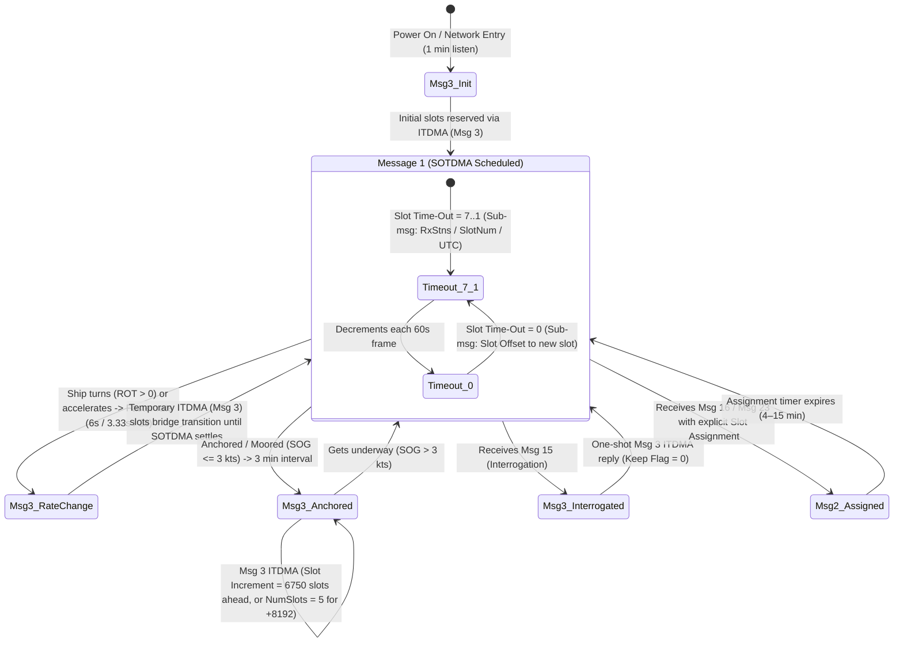

# Chapter 31: Messages 1, 2, and 3 — Class A Position Reports

## Operational & Conceptual Overview

Across the global maritime VHF Data Link (VDL), **ITU-R M.1371-5 Message 1** (*Position Report — Scheduled*), **Message 2** (*Position Report — Assigned Scheduled*), and **Message 3** (*Position Report — Special / Interrogated*) form the kinetic backbone of the Automatic Identification System (AIS). Together, these three 168-bit, single-slot packets account for approximately **67% to 77% of all AIS radio frames** transmitted worldwide. Whenever a SOLAS-class merchant vessel, passenger liner, tanker, tug, or high-speed craft maneuvers through a traffic separation scheme, its Class A transponder continuously broadcasts its WGS84 coordinates, Speed Over Ground ($\text{SOG}$), Course Over Ground ($\text{COG}$), gyrocompass True Heading ($\text{HDG}$), Rate of Turn ($\text{ROT}$), and navigational status inside one of these three messages.

```
0                   1                   2                   3
0 1 2 3 4 5 6 7 8 9 0 1 2 3 4 5 6 7 8 9 0 1 2 3 4 5 6 7 8 9 0 1
+-+-+-+-+-+-+-+-+-+-+-+-+-+-+-+-+-+-+-+-+-+-+-+-+-+-+-+-+-+-+-+-+
|  Msg ID   |R|                  MMSI (30 bits)                 |
+-+-+-+-+-+-+-+-+-+-+-+-+-+-+-+-+-+-+-+-+-+-+-+-+-+-+-+-+-+-+-+-+
|   MMSI    |NavStat|     ROT       |        SOG (10 bits)  |P|L|
+-+-+-+-+-+-+-+-+-+-+-+-+-+-+-+-+-+-+-+-+-+-+-+-+-+-+-+-+-+-+-+-+
|                     Longitude (28 bits)                   |Lat|
+-+-+-+-+-+-+-+-+-+-+-+-+-+-+-+-+-+-+-+-+-+-+-+-+-+-+-+-+-+-+-+-+
|                     Latitude (27 bits)                |  COG  |
+-+-+-+-+-+-+-+-+-+-+-+-+-+-+-+-+-+-+-+-+-+-+-+-+-+-+-+-+-+-+-+-+
|     COG (12b) |    True Heading   |TimeStmp |S|Spa|R|CommState|
+-+-+-+-+-+-+-+-+-+-+-+-+-+-+-+-+-+-+-+-+-+-+-+-+-+-+-+-+-+-+-+-+
|         Communication State (19 bits: SOTDMA / ITDMA)         |
+-+-+-+-+-+-+-+-+-+-+-+-+-+-+-+-+-+-+-+-+-+-+-+-+-+-+-+-+-+-+-+-+
```

To a casual consumer of decoded JSON or CSV maritime feeds, Messages 1, 2, and 3 appear identical: their first **149 bits (`bits[0:149]`) share the exact same schema** down to the individual bit and sentinel value. To an RF engineer, VTS system architect, or cybersecurity analyst, however, the distinction between Message 1, Message 2, and Message 3 is fundamental. The message identifier (`1`, `2`, or `3`) and the final **19-bit Communication State (`bits[149:168]`)** reveal the **Medium Access Control (MAC) state machine** governing the vessel's transmitter:

1. **Message 1 (Scheduled Position Report — SOTDMA):** Transmitted during steady-state, autonomous operation using **Self-Organized Time-Division Multiple Access (SOTDMA)**. The vessel reserves a recurring time slot across consecutive 60-second frames (2,250 slots per frame) and uses its 19-bit SOTDMA Communication State to count down the remaining frames (`Slot Time-Out = 7..0`) and pre-announce replacement slots before its lease expires.
2. **Message 2 (Assigned Scheduled Position Report — SOTDMA):** Transmitted when a shore-based **Vessel Traffic Service (VTS) Base Station** overrides the vessel's autonomous reporting schedule via **Message 16** (*Assigned Mode Command*) or **Message 23** (*Group Assignment Command*), locking the transponder onto specific assigned slots or reporting intervals while retaining an SOTDMA communication state structure.
3. **Message 3 (Special Position Report — ITDMA):** Transmitted using **Incremental Time-Division Multiple Access (ITDMA)** under three distinct operational conditions:
   - **Autonomous Rate Transitions:** When a vessel accelerates, turns, or changes navigational status—requiring a transition to a faster reporting interval (e.g., from `10 s` to `3.33 s` or `2 s`)—it injects temporary one-shot ITDMA Message 3 transmissions until its new recurring SOTDMA Message 1 slot leases stabilize.
   - **3-Minute Anchored/Moored Reporting:** When a vessel is at anchor or moored (`SOG <= 3 kts`) and reports only once every **3 minutes** (three 60-second frames), SOTDMA's single-frame slot reservation cannot span 3 frames; the transponder therefore uses Message 3 with ITDMA's extended slot increment (`Number of Slots = 5..7`, adding $+8{,}192$ slots) to point 3 minutes into the future.
   - **Polled / Interrogated Responses:** When a Base Station or another vessel polls the ship via **Message 15** (*Interrogation*) or when a competent authority assigns a rate change without explicit slot numbers, the transponder replies with Message 3.

> [!IMPORTANT]
> Because the 19-bit Communication State (`bits[149:168]`) changes its binary layout depending on whether the packet is **Message 1/2 (SOTDMA)** or **Message 3 (ITDMA)**—and because SOTDMA's own 14-bit sub-message (`bits[154:168]`) mutates across four different schemas depending on the 3-bit `Slot Time-Out` (`bits[151:154]`)—parsers that treat `bits[149:168]` as an opaque integer discard critical VDL health telemetry, including the vessel's local receiver density (`Received Stations`), its UTC clock synchronization health, and its next-frame slot reservation graph.

---

## Historical Context & Evolution (`schwehr/gis-history` Lineage)

The compact 168-bit architecture of Messages 1, 2, and 3 is the direct product of late-1980s Swedish aviation/maritime TDMA experiments and 1990s IMO vessel traffic safety mandates:

* **From Radar Ploting to Digital Transponders (1970s–1988):** Following catastrophic collisions and oil spills—most notably the *Torrey Canyon* (1967), the *Andrea Doria*–*Stockholm* collision (1956), and the *Exxon Valdez* grounding in Prince William Sound (1989)—IMO and IALA recognized that marine radar with Automatic Radar Plotting Aids (ARPA) suffered from target swapping in close quarters, rain/sea clutter attenuation, line-of-sight shadowing around headlands, and a 30-to-60-second tracker convergence lag whenever a target executed a sudden helm maneuver.
* **Håkan Lans and the GP&C SOTDMA Patent (1988–1997):** Swedish inventor **Håkan Lans** developed the colour graphics controller and subsequently pioneered **STDMA (Self-Organized TDMA)** for Sweden's Civil Aviation Administration and Maritime Administration (patented via GP&C Systems International, e.g., U.S. Patent 5,506,587). To fit a complete kinematic vessel state vector inside a single **26.67 ms time slot** at **9,600 bps GMSK** ($256\text{ bits}$ total per slot, leaving **168 payload bits** after ramp-up, 24-bit preamble, 8-bit HDLC start flag, 16-bit CRC-CCITT, 8-bit end flag, and propagation distance buffer), the drafting committees of **ITU-R M.1371-1 (1998)** and **IEC 61993-2** engineered tight fixed-point quantizations:
  - Coordinates were encoded in **ten-thousandths of an arcminute** ($1/10{,}000' = 1/600{,}000^\circ$), requiring exactly **28 bits for Longitude** and **27 bits for Latitude**, achieving $\sim 0.185\text{ m}$ resolution without IEEE 754 floating-point overhead.
  - Angular turn rate ($\text{ROT}$), which requires both $0.1^\circ/\text{min}$ sensitivity during slow course-keeping and $>700^\circ/\text{min}$ dynamic range during emergency hard-over turns, was compressed into a single **8-bit signed byte** via a square-root companding curve ($\text{ROT}_{\text{AIS}} = 4.733\sqrt{\omega}$).
* **Refinements Across ITU-R M.1371 Revisions (-1 through -5):**
  - **ITU-R M.1371-1 (1998) & -2 (2006):** Established the core 168-bit Class A Position Report (`Messages 1, 2, 3`) and mandated carriage under **SOLAS Chapter V, Regulation 19** (effective 2002–2004).
  - **ITU-R M.1371-3 (2007) & -4 (2010):** Repurposed two bits of the former 5-bit Spare field (`bits[143:145]`) into the **Special Manoeuvre Indicator** to support European Inland AIS ("Blue Sign" starboard-to-starboard passing), and defined `Navigation Status = 11` (towing astern), `12` (pushing ahead / towing alongside), and `14` (**AIS-SART**, later expanded in **M.1371-5 [2014]** to include **MOB-AIS** and **EPIRB-AIS** survival beacons).
* **Open-Source Decoding Milestones (`noaadata` $\rightarrow$ `gpsd` $\rightarrow$ `libais`):** In **2005–2007**, Kurt Schwehr (`noaadata`, UNH CCOM) and Eric S. Raymond (`gpsd`) documented and open-sourced the reference bit-unpacking decoders for Messages 1, 2, and 3, exposing widespread firmware bugs in early commercial transponders (such as uninitialized `-128` ROT bytes decoded as $720^\circ/\text{min}$ turns and unsigned coordinate bugs west of Greenwich). In **2010–2015**, Schwehr's C++ library **`libais`** (`src/libais/ais1_2_3.cpp`) standardized the zero-copy 168-bit `std::bitset` extraction including full SOTDMA/ITDMA sub-message decoding for planet-scale satellite AIS ingestion at Google and SkyTruth/Global Fishing Watch.

---

## 31.1 How Messages 1, 2, and 3 Work

### Complete 168-Bit Payload Layout

Messages 1, 2, and 3 occupy exactly **1 VDL time slot** ($26.67\text{ ms}$) and contain **168 payload bits** (`28` six-bit ASCII characters in `!AIVDM` / `!AIVDO`, with `0` fill bits). Table 31.1 specifies every field using both **0-based MSB-first indexing** (`libais`, `pyais`, `gpsd`) and **1-based MSB-first indexing** (ITU-R M.1371-5 Annex 8, §3.1, Table 44).

| Field Name | Variable (`libais` / `pyais`) | 0-Based Bits `[start:end)` | 1-Based ITU Bits | Width (Bits) | Data Type | Scale / Units | Valid Range | "Not Available" / Default Sentinel |
| :--- | :--- | :---: | :---: | :---: | :---: | :--- | :--- | :--- |
| **Message ID** | `message_id` / `msg_type` | `0:6` | `1–6` | `6` | `uint6` | Enumerated | `1`, `2`, or `3` | N/A (Mandatory `1`, `2`, `3`) |
| **Repeat Indicator** | `repeat_indicator` / `repeat` | `6:8` | `7–8` | `2` | `uint2` | Repeats (`0–3`) | `0..3` | `0` (Default); `3` = Do not repeat |
| **User ID (MMSI)** | `mmsi` | `8:38` | `9–38` | `30` | `uint30` | 9-digit ID | `1..999,999,999` | `0` (Unconfigured / Invalid) |
| **Navigation Status** | `nav_status` / `status` | `38:42` | `39–42` | `4` | `uint4` | Lookup Table (31.2) | `0..15` | `15` (`0xF`, Undefined / Default) |
| **Rate of Turn (ROT)** | `rot` / `turn` | `42:50` | `43–50` | `8` | `int8` (2's comp) | $4.733\sqrt{\|\omega_{\text{deg/min}}\|}$ | `-127..+127` | `-128` (`0x80`, No turn info) |
| **Speed Over Ground** | `sog` / `speed` | `50:60` | `51–60` | `10` | `uint10` | $0.1\text{ kt}$ | `0..1022` ($0..102.2\text{ kt}$) | `1023` (`0x3FF`, N/A); `1022` = $\ge 102.2\text{ kt}$ |
| **Position Accuracy** | `position_accuracy` / `accuracy` | `60:61` | `61` | `1` | `bool` | Flag | `0` ($>10\text{ m}$), `1` ($\le 10\text{ m}$) | `0` (Low / Autonomous GNSS) |
| **Longitude ($\lambda$)** | `x` / `lon` | `61:89` | `62–89` | `28` | `int28` (2's comp) | $1/10{,}000\text{ min}$ ($1/600{,}000^\circ$) | $\pm 108{,}000{,}000$ ($\pm 180^\circ$) | `108,600,000` (`0x6791AC0` = $+181.0^\circ$) |
| **Latitude ($\phi$)** | `y` / `lat` | `89:116` | `90–116` | `27` | `int27` (2's comp) | $1/10{,}000\text{ min}$ ($1/600{,}000^\circ$) | $\pm 54{,}000{,}000$ ($\pm 90^\circ$) | `54,600,000` (`0x3412140` = $+91.0^\circ$) |
| **Course Over Ground** | `cog` / `course` | `116:128` | `117–128` | `12` | `uint12` | $0.1^\circ$ True | `0..3599` ($0.0^\circ..359.9^\circ$) | `3600` (`0xE10`, N/A; `3601..4095` invalid) |
| **True Heading** | `true_heading` / `heading` | `128:137` | `129–137` | `9` | `uint9` | $1^\circ$ True | `0..359` ($0^\circ..359^\circ$) | `511` (`0x1FF`, N/A; `360..510` invalid) |
| **Time Stamp** | `timestamp` / `second` | `137:143` | `138–143` | `6` | `uint6` | UTC Second (`s`) | `0..59` (`60..63` mode flags) | `60` (N/A); `61`=Manual; `62`=DR; `63`=Inop |
| **Special Manoeuvre** | `special_manoeuvre` / `maneuver` | `143:145` | `144–145` | `2` | `uint2` | Enumerated | `0..2` (`1`=Not engaged, `2`=Engaged) | `0` (Not available / Default) |
| **Spare** | `spare` | `145:148` | `146–148` | `3` | `uint3` | Zero-padded | `0` | `0` (Must be `000`) |
| **RAIM Flag** | `raim` | `148:149` | `149` | `1` | `bool` | Flag | `0` (Not in use), `1` (In use) | `0` (Default) |
| **Communication State** | `sync_state` + SOTDMA/ITDMA | `149:168` | `150–168` | `19` | Composite | SOTDMA (Msg 1/2) or ITDMA (Msg 3) | See Tables 31.4 & 31.5 | N/A |

---

### Navigational Status (`bits[38:42]`)

The 4-bit `Navigation Status` field (`0–15`) reflects the vessel's COLREGs operational state as manually entered by the Officer of the Watch (OOW) via the Minimum Keyboard and Display (MKD) or connected ECDIS.

| Code | Hex | Binary | ITU-R M.1371-5 / COLREGs Definition | Operational Context & Notes |
| :---: | :---: | :---: | :--- | :--- |
| **`0`** | `0x0` | `0000` | **Under way using engine** | Normal underway steaming state for power-driven vessels. |
| **`1`** | `0x1` | `0001` | **At anchor** | Vessel anchored; drops reporting rate to `3 min` if $\text{SOG} \le 3\text{ kts}$. |
| **`2`** | `0x2` | `0010` | **Not under command (NUC)** | COLREGs Rule 3(f): exceptional circumstance (steering/engine failure) preventing maneuver. |
| **`3`** | `0x3` | `0011` | **Restricted in ability to manoeuvre (RAM)** | COLREGs Rule 3(g): dredging, cable/pipe laying, replenishment, buoy tending, minesweeping. |
| **`4`** | `0x4` | `0100` | **Constrained by her draught (CBD)** | COLREGs Rule 3(h): deep-draft vessel severely restricted from deviating from navigable channel. |
| **`5`** | `0x5` | `0101` | **Moored** | Fast to a pier, quay, bollard, or mooring buoy; `3 min` reporting rate. |
| **`6`** | `0x6` | `0110` | **Aground** | Hull resting on or stranded upon the seabed; triggers immediate VTS/SAR alerts. |
| **`7`** | `0x7` | `0111` | **Engaged in fishing** | COLREGs Rule 3(d): fishing with nets, lines, or trawls that restrict maneuverability (not trolling). |
| **`8`** | `0x8` | `1000` | **Under way sailing** | Vessel under sail alone (not propelling by machinery). |
| **`9`** | `0x9` | `1001` | **Reserved for HSC (DG/HS/MP Cat C)** | Reserved for future amendment for High-Speed Craft (HSC) carrying hazardous cargo. |
| **`10`** | `0xA` | `1010` | **Reserved for WIG (DG/HS/MP Cat A)** | Reserved for future amendment for Wing-in-Ground (WIG) craft carrying dangerous goods. |
| **`11`** | `0xB` | `1011` | **Power-driven vessel towing astern** | Regional use (e.g., USCG / Western Rivers / Inland waterways towing astern). |
| **`12`** | `0xC` | `1100` | **Power-driven vessel pushing ahead / towing alongside** | Regional use (e.g., articulated tug-barge [ATB], river towboats pushing barges). |
| **`13`** | `0xD` | `1101` | **Reserved for future use** | Unassigned. |
| **`14`** | `0xE` | `1110` | **AIS-SART (active), MOB-AIS, EPIRB-AIS** | **Distress homing beacon active** (`970xxyyyy`, `972xxyyyy`, `974xxyyyy`); triggers bridge alarm. |
| **`15`** | `0xF` | `1111` | **Undefined = default** | Power-on unconfigured state; also used by AIS-SART/MOB/EPIRB during self-test! |

---

### Nonlinear Rate of Turn (`ROT`, `bits[42:50]`)

To encode angular yaw rate $\omega_{\text{ROTI}}$ (in degrees per minute, $\text{deg/min}$, measured by an IMO-compliant Rate-of-Turn Indicator per IMO Resolution A.526(13)) into an 8-bit signed two's complement integer $\text{ROT}_{\text{AIS}} \in [-128, +127]$, ITU-R M.1371-5 Annex 2, §3.3.2 applies a square-root compression law:

$$\text{ROT}_{\text{AIS}} = \text{sgn}(\omega_{\text{ROTI}}) \cdot \text{round}\left(4.733 \sqrt{|\omega_{\text{ROTI}}|}\right)$$

where $\omega_{\text{ROTI}} > 0$ denotes turning to **starboard (right)** and $\omega_{\text{ROTI}} < 0$ denotes turning to **port (left)**.

When decoding a received packet where $\text{ROT}_{\text{AIS}} \in [-126, +126]$, the physical angular velocity in degrees per minute is recovered by inverting the companding curve:

$$\omega_{\text{deg/min}} = \text{sgn}(\text{ROT}_{\text{AIS}}) \cdot \left(\frac{\text{ROT}_{\text{AIS}}}{4.733}\right)^2 \approx \text{sgn}(\text{ROT}_{\text{AIS}}) \cdot 0.0446416 \cdot \left(\text{ROT}_{\text{AIS}}\right)^2$$

Why the constant $4.733$? Because at the maximum quantized sensor index $|\text{ROT}_{\text{AIS}}| = 126$:

$$\omega_{\max} = \left(\frac{126}{4.733}\right)^2 = (26.621593)^2 = 708.71^\circ/\text{min} \approx 11.81^\circ/\text{s}$$

Meanwhile, at the smallest non-zero step $|\text{ROT}_{\text{AIS}}| = 1$, the resolution is $(1/4.733)^2 = 0.0446^\circ/\text{min}$, giving fine discrimination during small helm corrections while preserving a $708^\circ/\text{min}$ full-scale range in a single byte.

| `ROT_AIS` Raw (`int8`) | Hex (`uint8`) | Binary | Sensor Source & Operational Meaning | Physical Turn Rate ($\omega_{\text{deg/min}}$) |
| :---: | :---: | :---: | :--- | :--- |
| **`0`** | `0x00` | `00000000` | **ROTI / Gyro connected:** Vessel not turning | $0.0^\circ/\text{min}$ |
| **`+1` .. `+126`** | `0x01..0x7E` | `00000001..01111110` | **ROTI connected:** Turning right (starboard) at indicated rate | $+0.045^\circ/\text{min}$ to $+708.7^\circ/\text{min}$ |
| **`-1` .. `-126`** | `0xFF..0x82` | `11111111..10000010` | **ROTI connected:** Turning left (port) at indicated rate | $-0.045^\circ/\text{min}$ to $-708.7^\circ/\text{min}$ |
| **`+127`** | `0x7F` | `01111111` | **No ROTI available (Gyro HDG diff only):** Turning right $> 5^\circ / 30\text{ s}$ | $> +10^\circ/\text{min}$ (Unquantified) |
| **`-127`** | `0x81` | `10000001` | **No ROTI available (Gyro HDG diff only):** Turning left $> 5^\circ / 30\text{ s}$ | $< -10^\circ/\text{min}$ (Unquantified) |
| **`-128`** | `0x80` | `10000000` | **No turn information available (Default)** | **`None` / `NaN`** (Do **NOT** square!) |

---

### Fixed-Point WGS84 Coordinates (`bits[61:89]` and `bits[89:116]`)

Both Longitude (`28 bits`, `bits[61:89]`) and Latitude (`27 bits`, `bits[89:116]`) are stored as signed two's complement integers in units of $10^{-4}\text{ arcminutes}$:

$$\lambda_{\text{deg}} = \frac{X_{\text{int28}}}{600{,}000}, \qquad \phi_{\text{deg}} = \frac{Y_{\text{int27}}}{600{,}000}$$

To sign-extend raw unsigned bit extractions $U_w$ of bit-width $w \in \{28, 27\}$ in any language without native 27-bit or 28-bit integer types:

$$I_{\text{signed}} = \begin{cases} U_w - 2^w & \text{if } U_w \ge 2^{w-1} \\ U_w & \text{if } U_w < 2^{w-1} \end{cases}$$

At the equator ($1^\circ \approx 111{,}319.49\text{ m}$), one LSB step ($1/600{,}000^\circ$) corresponds to a meridionally and zonally uniform step size of:

$$\Delta s_{\text{lat}} = \frac{111{,}132.95\text{ m}}{600{,}000} \approx \mathbf{0.1852\text{ m}} \quad (18.5\text{ cm}), \qquad \Delta s_{\text{lon}}(\phi) \approx 0.1855\text{ m} \cdot \cos\phi$$

---

### The 19-Bit Communication State (`bits[149:168]`): SOTDMA vs. ITDMA

The final 19 bits (`bits[149:168]`) are where **Messages 1 and 2** diverge structurally from **Message 3**. Both variants begin with a 2-bit **Sync State** (`bits[149:151]`):

| `Sync State` (`bits[149:151]`) | Binary | Synchronization Mode | Clock Reference & Operational Meaning |
| :---: | :---: | :--- | :--- |
| **`0`** | `00` | **UTC Direct** | Internal GNSS receiver is locked and providing a direct 1 PPS UTC timing pulse. |
| **`1`** | `01` | **UTC Indirect** | Internal GNSS 1 PPS lost; station is synchronizing indirectly via another UTC-Direct station. |
| **`2`** | `10` | **Sync to Base Station** | Station is slaved to frame/slot boundaries broadcast by an AIS Base Station (Message 4). |
| **`3`** | `11` | **Sync to Station with Highest Received Stations** | Fallback peer-to-peer TDMA synchronization when both GNSS and Base Stations are unavailable. |

#### 1. SOTDMA Communication State (Messages 1 and 2)

In **Messages 1 and 2**, the remaining 17 bits (`bits[151:168]`) consist of a **3-bit `Slot Time-Out`** (`bits[151:154]`, values `0..7`) followed by a **14-bit polymorphic `Sub-Message`** (`bits[154:168]`). The `Slot Time-Out` specifies how many future frames (from `7` down to `0`) the vessel will continue transmitting in this exact time slot. On each successive frame, `Slot Time-Out` decrements by 1, cycling the 14-bit `Sub-Message` through four different meanings (Table 31.4):

| `Slot Time-Out` (`bits[151:154]`) | Frames Left in Current Slot | 14-Bit `Sub-Message` Type (`bits[154:168]`) | Internal Sub-Message Bit Layout & Engineering Purpose |
| :---: | :---: | :--- | :--- |
| **`3`, `5`, `7`** | 3, 5, or 7 frames | **Received Stations** (`uint14`) | Integer `0..16383`: Total count of other AIS stations currently received by this ship (used by peers to resolve `Sync State = 3` and detect high VDL load). |
| **`2`, `4`, `6`** | 2, 4, or 6 frames | **Slot Number** (`uint14`) | Integer `0..2249`: The frame slot index (`0..2249`) used for *this* transmission (allows GNSS-denied receivers to learn the current slot number). |
| **`1`** | 1 frame left | **UTC Hour & Minute** (`5b + 7b + 2b`) | `bits[154:159]` = **UTC Hour** (`0..23`, `24`=N/A); `bits[159:166]` = **UTC Minute** (`0..59`, `60`=N/A); `bits[166:168]` = `00` spare. Broadcasts time-of-day to GNSS-denied peers! |
| **`0`** | **0 (Last frame in slot)** | **Slot Offset** (`uint14`) | Integer `0..2249`: Offset from the current slot to the **new replacement slot** that this station will occupy in the *next* frame (`0` = slot dropped / stream terminated). |

#### 2. ITDMA Communication State (Message 3)

In **Message 3**, the transponder uses **ITDMA** (ITU-R M.1371-5 Annex 2, §3.3.7.3.2) to make single-frame or long-horizon (`3 min`) reservations. The 17 bits after `Sync State` (`bits[151:168]`) have a fixed three-field layout (Table 31.5):

| ITDMA Sub-Field | 0-Based Bits | 1-Based Bits | Width | Type | Encoding & Operational Meaning |
| :--- | :---: | :---: | :---: | :---: | :--- |
| **Sync State** | `149:151` | `150–151` | `2` | `uint2` | `0` = UTC Direct, `1` = UTC Indirect, `2` = Base Station, `3` = Peer Station. |
| **Slot Increment** | `151:164` | `152–164` | `13` | `uint13` | Offset (`0..8191`) to the next slot to be used on this channel (`0` = no further transmission / release). Note: if `Number of Slots` is `5`, `6`, or `7`, add **`+8192`** to `Slot Increment`! |
| **Number of Slots** | `164:167` | `165–167` | `3` | `uint3` | Consecutive slots reserved at the target offset (ITU-R M.1371-5 Table 22):<br>• `0` = 1 slot (`offset = Slot Increment`)<br>• `1` = 2 slots (`offset = Slot Increment`)<br>• `2` = 3 slots (`offset = Slot Increment`)<br>• `3` = 4 slots (`offset = Slot Increment`)<br>• `4` = 5 slots (`offset = Slot Increment`)<br>• `5` = **1 slot with `offset = Slot Increment + 8192`** (used for `3 min` = `6750 slots` or extended intervals!)<br>• `6` = **2 slots with `offset = Slot Increment + 8192`**<br>• `7` = **3 slots with `offset = Slot Increment + 8192`** |
| **Keep Flag** | `167:168` | `168` | `1` | `bool` | `1` = Slot remains allocated for one additional frame; `0` = Release slot immediately after this transmission. |

---

### NMEA 0183 Encapsulation & NMEA 2000 PGN `129038` Mapping

#### NMEA 0183 (`!AIVDM` / `!AIVDO`)
Because $168 \div 6 = 28$ with remainder $0$, every valid Message 1, 2, or 3 fits inside a **single-sentence NMEA 0183 VDM/VDO frame** with **28 armored payload characters** and **0 fill bits**:

```text
!AIVDM,1,1,,A,15Muq20001G?tRrE`M:a@9vN087p,0*59
              ^                           ^
              |                           +-- Fill bits = 0
              +-- First 6-bit char: '1' (Msg 1), '2' (Msg 2), or '3' (Msg 3)
```

#### NMEA 2000 (`PGN 129038`: *AIS Class A Position Report*)
On modern integrated bridges and recreational vessels using an **NMEA 2000 (CAN bus / IEC 61162-3)** backbone, Class A transponders and NMEA 0183-to-2000 gateways translate Messages 1, 2, and 3 into **PGN `129038`** (*AIS Class A Position Report*, a 28-byte Fast-Packet frame). Engineers bridging NMEA 0183 and NMEA 2000 must account for three critical unit and endianness differences in PGN `129038`:
1. **Coordinates (`int32` at $10^{-7}\text{ deg}$):** Instead of 28-bit/27-bit $1/600{,}000^\circ$, PGN `129038` stores Longitude and Latitude as little-endian 32-bit signed integers scaled at $10^{-7}\text{ degrees}$ ($\approx 1.11\text{ cm}$), introducing a non-integer conversion factor of $10^7 / 600{,}000 = 50/3 \approx 16.6667$.
2. **Angles & Angular Rates in Radians (`COG`, `Heading`, `ROT`):** PGN `129038` encodes `COG` and `Heading` as `uint16` in **$10^{-4}\text{ radians}$**, and `Rate of Turn` as `int16` in **$3.125 \times 10^{-5}\text{ rad/s}$** ($1/32{,}000\text{ rad/s}$) rather than the companded $\text{ROT}_{\text{AIS}}$ byte.
3. **Speed in $\text{m/s}$ (`SOG`):** PGN `129038` encodes `SOG` as `uint16` in **$10^{-2}\text{ m/s}$** ($\text{cm/s}$), converted from knots via $1\text{ kt} = 0.514444\text{ m/s}$.

---

## 31.2 What Issues Messages 1, 2, and 3 Have

### 1. Coordinate Quantization Step Jitter ($0.185\text{ m}$)
Although $1/600{,}000^\circ$ ($\Delta y \approx 0.1852\text{ m}$) is more than sufficient for chart display, numerically differentiating consecutive AIS positions over high-rate reporting intervals ($\Delta t = 2\text{ s}$) injects severe quantization noise into derived velocity and acceleration estimates:

$$\sigma_{v,\text{quant}} = \frac{\Delta y}{\sqrt{6}\,\Delta t} \approx \frac{0.1852\text{ m}}{\sqrt{6} \times 2\text{ s}} \approx 0.0378\text{ m/s} \approx 0.073\text{ kts}, \qquad \Delta v_{\text{max step}} = \frac{0.1852\text{ m}}{2\text{ s}} = 0.0926\text{ m/s} \approx \mathbf{0.18\text{ kts}}$$

If a naive tracker computes acceleration or turn rate by differentiating raw `lon`/`lat` fields across 2-second packets instead of using the Doppler-derived `SOG`/`COG` and gyro-derived `ROT` fields, quantization steps create artificial $\pm 0.18\text{ kt}$ speed oscillations and false helm-maneuver detections.

### 2. Stale Manually Entered `Navigation Status`
Unlike `SOG`, `COG`, `Position`, and `ROT`—which are driven automatically by physical sensors—the 4-bit `Navigation Status` (`bits[38:42]`) requires **manual crew entry** on the transponder's MKD or ECDIS when getting underway, anchoring, mooring, or commencing fishing. Across global terrestrial and satellite datasets, **3% to 6% of underway vessels ($\text{SOG} > 5\text{ kts}$)** broadcast `Nav Status = 5 (Moored)` or `Nav Status = 1 (At Anchor)` for hours or days after leaving port because the bridge team neglected to update the status on departure. Conversely, ships newly berthed in port frequently broadcast `Nav Status = 0 (Under way using engine)` at `SOG = 0.0 kts` for their entire port stay.

### 3. Disconnected Gyrocompass (`HDG = 511`) and ROT (`-128`)
While SOLAS Chapter V requires Class A transponders to be interfaced to the vessel's gyrocompass and Rate-of-Turn Indicator (if fitted), smaller non-SOLAS workboats, fishing vessels, tugs, and vessels with faulty serial NMEA 0183 `HDT`/`ROT` talker wiring frequently transmit:
* `True Heading = 511` (`Not available`) and `ROT = -128` (`0x80`, `No turn info available`).
* When `True Heading = 511`, ECDIS displays cannot render a **true-scale ship outline** (even if dimensions `A, B, C, D` are known from Message 5), because a vessel crabbing in a cross-current or wind at low speed may have a `COG` that differs from its bow heading by $30^\circ\text{–}90^\circ$ (or $180^\circ$ when backing down on a tug).

### 4. 6-Bit UTC Second (`0–59`) Wrap-Around Ambiguity
The `Time Stamp` field (`bits[137:143]`) records only the **UTC second (`0..59`)** inside the minute when the position fix was generated—not the minute, hour, or date. Without an external NMEA 0183 v4.10 TAG block (`\c:1712000000*HH\`) prepended by the receiving station:
* Any RS-422 multiplexer congestion, satellite store-and-forward downlink latency, or TCP stream buffering $>60\text{ s}$ aliases the packet into the wrong UTC minute.
* Furthermore, values `60..63` are overloaded **status codes** (`60` = N/A, `61` = Manual, `62` = Dead Reckoning, `63` = Inoperative), not seconds. Software that computes `packet_time = minute_start + msg.timestamp` without checking `timestamp < 60` corrupts timestamps and fails to flag dead-reckoned (`62`) or manual (`61`) positions!

### 5. The Message 2 Rarity Paradox ($<0.01\%$ of Global Traffic)
Novice analysts often expect **Message 2** (*Position Report — Assigned Scheduled*) to be common inside busy VTS zones. Empirically, Message 2 accounts for **$<0.01\%$ of global AIS traffic** (fewer than 1 in 15,000 position reports). Two protocol mechanisms explain this rarity:
1. **Rate Assignment vs. Slot Assignment (ITU-R M.1371-5 Annex 2, §3.3.6 & §4.1):** When a VTS Base Station sends **Message 16** (*Assigned Mode Command*) or **Message 23** (*Group Assignment Command*) specifying only a **reporting rate** (leaving the vessel free to select its own slots autonomously), the Class A transponder continues using **Message 1 (SOTDMA)** and **Message 3 (ITDMA)**—it only switches to **Message 2** when the Base Station explicitly assigns exact **slot numbers and increments**!
2. Because explicit shore-side slot assignment requires the Base Station to maintain full hidden-terminal slot maps for every mobile station's horizon (risking slot collisions with distant vessels outside VTS coverage), operational VTS authorities almost universally issue *rate assignments* or *interrogations* (which elicit **Message 1** or **Message 3**) rather than hard slot assignments.

### 6. Integer Sign Extension & `ROT = -128` Decoding Bugs
Three classic parser bugs plague custom C, Python, Java, and SQL decoders for Messages 1, 2, and 3:
1. **Squaring `ROT = -128` (`0x80`):** If a parser forgets to check `if raw_rot == -128: return None` before evaluating $\text{sgn}(\text{ROT})\cdot(\text{ROT}/4.733)^2$, it decodes `No turn information available` as a catastrophic **$-731.39^\circ/\text{min}$ port turn**! Similarly, `±127` (`±10°/min` threshold without ROTI) gets mis-decoded as $\pm 720.01^\circ/\text{min}$.
2. **Unsigned `uint8` ROT Extraction:** Extracting `bits[42:50]` as an unsigned integer `0..255` causes a vessel turning slowly to port ($\text{ROT}_{\text{AIS}} = -5$, `0xFB = 251`) to be decoded as turning violently to starboard ($+251$).
3. **Missing 28-bit / 27-bit Two's Complement Sign Extension:** Extracting Longitude (`bits[61:89]`) or Latitude (`bits[89:116]`) into a standard 32-bit `int32_t` without sign-extending from bit 27 or bit 26 causes every vessel in the **Western Hemisphere ($\lambda < 0$)** to jump to $+267^\circ..+447^\circ\text{ E}$, and every vessel in the **Southern Hemisphere ($\phi < 0$)** to jump to $+133^\circ..+223^\circ\text{ N}$.

---

## 31.3 How Messages 1, 2, and 3 Relate to Other Messages

### 1. Mandatory MMSI Join with Message 5 (Static and Voyage Related Data)
Messages 1, 2, and 3 carry **zero static vessel identity or geometry**—only the 30-bit `MMSI`. To determine the ship's **IMO number**, **Call Sign**, **Vessel Name**, **Ship and Cargo Type**, **Draught**, **Destination**, **ETA**, and **GNSS Antenna Reference Point (`A, B, C, D`)**, a receiver must maintain a stateful session cache keyed by `MMSI` and join incoming Message 1/2/3 kinematic packets with **Message 5** (broadcast every 6 minutes or upon Message 15 interrogation).

> [!WARNING]
> **Antenna Offset Compensation (`A, B, C, D` + `True Heading`):** The `(lon, lat)` reported in Messages 1, 2, and 3 is the position of the **ship's GNSS antenna**, not the center of gravity or bow! On a 400 m Ultra-Large Container Vessel (ULCV) with a stern wheelhouse (`A = 330 m`, `B = 70 m`), if `True Heading` (`bits[128:137]`) is valid (`0..359°`), VTS and docking displays must rotate the `(A, B, C, D)` bounding box from Message 5 by `True Heading` around `(lon, lat)` to prevent a 330-meter bow position error.

### 2. MAC State-Machine Transitions Between Messages 1, 2, and 3
A single Class A transponder dynamically switches among Messages 1, 2, and 3 depending on its kinematic state and Base Station commands:



### 3. AIS-SART (`970`), MOB-AIS (`972`), and EPIRB-AIS (`974`) Pairing with Message 14
Search-and-Rescue homing transmitters (**AIS-SART** `970xxyyyy`, **MOB-AIS** `972xxyyyy`, and **EPIRB-AIS** `974xxyyyy`) do **not** have a dedicated position report message ID. Instead, per ITU-R M.1371-5 Annex 2, they transmit bursts of **8 position reports per minute** (4 on AIS 1, 4 on AIS 2) using **Message 1** with:
* `Navigation Status = 14` (`0xE`, active distress) or `15` (`0xF`, self-test mode), and
* Periodic **Message 14** (*Safety Related Broadcast Message*) carrying the ASCII text `"SART ACTIVE"` / `"MOB ACTIVE"` / `"EPIRB ACTIVE"` (or `"SART TEST"`).

---

## 31.4 Known Uses and Abuses

### Legitimate Operational & Analytical Uses
1. **Bridge Collision Avoidance (CPA / TCPA & Target Association):** ARPA radar trackers fuse Message 1/2/3 position, `SOG`, `COG`, `True Heading`, and `ROT` with radar echoes. Because `ROT` and `True Heading` update within 2 seconds of a helm order, AIS gives bridge officers a **15-to-40-second early warning** that an approaching vessel is altering course—long before the ARPA α-β/Kalman filter detects lateral displacement of the radar centroid.
2. **VTS Fairway Monitoring & Anchor-Watch Forensics:** Shore VTS centers monitor `ROT`, `SOG`, and high-accuracy DGNSS positions (`Position Accuracy = 1`) in narrow channels, and run automated anchor-drag alarms by tracking the swing circle of vessels broadcasting `Nav Status = 1 (At Anchor)`.
3. **Behavioral Classification & Global Supply-Chain Analytics:** Satellite and terrestrial AIS aggregators (Global Fishing Watch, UNCTAD, MarineTraffic) feed Message 1/3 `SOG`, `COG`, and Δ-heading sequences into Convolutional Neural Networks (CNNs) and Hidden Markov Models (HMMs) to distinguish bottom trawling, purse seining, longlining, transshipment encounters, and port congestion wait times.

### Known Adversarial Abuses & Operational Pathologies

#### 1. Uncertified Fishing-Gear Net Buoys Squatting on Message 1
The single largest source of VDL pollution in coastal waters across the East China Sea, South China Sea, West Africa, and South America is the proliferation of **hundreds of thousands of cheap, uncertified fishing-net marker buoys** ("AIS net pingers"). Instead of using legal **Message 21** (*Aid-to-Navigation Report*), these low-cost transmitters broadcast **Message 1** every 30 to 180 seconds using fabricated MMSIs (commonly prefixed `190...`, `888...`, `999...`, `000...`, or sequential integers), hardcoded `Nav Status = 0` or `15`, and **uncoordinated random slot access** (violating SOTDMA by failing to listen before transmitting). On SOLAS ship bridges, a single fishing ground can populate the ECDIS with 200+ false "Class A vessels" triggering continuous CPA collision alarms.

#### 2. Shadow-Fleet Dual-Transponder & Track-Synthesis Spoofing
Sanctions-evading tankers ("dark fleet" / "shadow fleet") conducting illicit Ship-to-Ship (STS) crude oil transfers regularly engage in two forms of Message 1 manipulation:
* **On-Board GNSS Emulator Injection ("Anchor Looping"):** While the tanker steams to a covert STS rendezvous point, its Class A transponder is switched from the real roof GNSS antenna to a software-defined GNSS simulator (or serial NMEA synthesizer) that feeds a realistic slow anchor-swing circle (`SOG = 0.1–0.4 kts`, `Nav Status = 1`) at a false anchorage 50 NM away.
* **Shore-Based / Third-Party Replay ("Zombie Vessels"):** A shore station or accomplice vessel transmits spoofed Message 1 frames bearing the sanctioned tanker's MMSI. This abuse can often be detected forensically by inspecting the **19-bit SOTDMA Communication State (`bits[149:168]`)**: synthetic shore injectors frequently hardcode `Received Stations = 0`, `Slot Time-Out = 0`, or invalid `Sync State` transitions that contradict the real RF environment.

#### 3. GNSS Spoofing Circles & Airport Displacements (C4ADS *Above Us Only Stars*)
When state actors activate high-power GNSS spoofing transmitters (documented extensively in the Black Sea, Eastern Mediterranean, Baltic Sea, and Kerch Strait), legitimate Class A transponders remain healthy but ingest spoofed L1 GPS signals. They consequently broadcast valid-looking **Message 1** packets (`Position Accuracy = 1`, `Time Stamp = 0..59`, `RAIM = 0`) that place dozens of merchant ships simultaneously inside circular tracks on land—typically centered on the ICAO coordinates of a nearby regional airport (to trigger consumer drone geofences).

#### 4. ECDIS Target-Table Overflow Denial-of-Service (Balduzzi et al., 2014)
As demonstrated by Balduzzi, Pasta, and Wilhoit (*"A Security Evaluation of AIS"*, ACSAC 2014), because Messages 1, 2, and 3 carry **no cryptographic authentication or message integrity code (MIC)**, an adversary with a $100 Software-Defined Radio (HackRF / USRP) can transmit 300 to 1,000 fabricated Message 1 packets with distinct MMSIs inside a 60-second frame. On legacy IEC 61993-2 MKDs and older ECDIS hardware with fixed-size target tables (e.g., 200–300 active targets), this flood either causes **target-table eviction** of real proximate vessels or saturates the serial `38,400 baud` RS-422 link between the AIS transponder and the bridge display.

---

## 31.5 Where and When Messages 1, 2, and 3 Are Used

### Autonomous Reporting Interval Schedule (ITU-R M.1371-5 Annex 1, Table 1)
A Class A transponder autonomously adjusts its Message 1/3 transmission interval ($R_r$) based on its current `Nav Status`, `SOG`, and whether it is changing course ($\Delta\text{HDG} > 5^\circ$ in $30\text{ s}$, i.e., $>10^\circ/\text{min}$):

| Ship's Dynamic Conditions | Nominal Reporting Interval ($R_r$) | Slots per 60 s Frame | Primary Message ID Used |
| :--- | :---: | :---: | :--- |
| **At anchor or moored** (`Nav Status = 1, 5`) and **not moving faster than $3\text{ kts}$** | **$3\text{ min}$** ($180\text{ s}$) | $0.33$ (1 per 3 frames) | **Message 3 (ITDMA)** (`NumSlots = 5`, $+8192$ offset) |
| **At anchor or moored** (`Nav Status = 1, 5`) and **moving faster than $3\text{ kts}$** | **$10\text{ s}$** | $6$ slots/frame | **Message 1 (SOTDMA)** |
| **Ship $0\text{–}14\text{ kts}$** | **$10\text{ s}$** | $6$ slots/frame | **Message 1 (SOTDMA)** |
| **Ship $0\text{–}14\text{ kts}$ and changing course** | **$3\frac{1}{3}\text{ s}$** ($3.33\text{ s}$) | $18$ slots/frame | **Message 3 (ITDMA transition)** $\rightarrow$ **Message 1** |
| **Ship $14\text{–}23\text{ kts}$** | **$6\text{ s}$** | $10$ slots/frame | **Message 1 (SOTDMA)** |
| **Ship $14\text{–}23\text{ kts}$ and changing course** | **$2\text{ s}$** | $30$ slots/frame | **Message 3 (ITDMA transition)** $\rightarrow$ **Message 1** |
| **Ship $> 23\text{ kts}$** | **$2\text{ s}$** | $30$ slots/frame | **Message 1 (SOTDMA)** |
| **Ship $> 23\text{ kts}$ and changing course** | **$2\text{ s}$** | $30$ slots/frame | **Message 1 (SOTDMA)** |

### Empirical Share of Global VDL Traffic
Across terrestrial coastal networks (USCG NAIS, Norwegian Coastal Administration, European EMSA) and LEO satellite constellations (Spire, Orbcomm, exactEarth):
* **Message 1 (SOTDMA Scheduled):** Accounts for **65% to 72%** of all AIS packets globally (and up to **80%** in open-ocean shipping lanes where Class B traffic is absent).
* **Message 3 (ITDMA Special / Interrogated / Anchored):** Accounts for **2% to 5%** of global traffic, peaking near anchorages (where `3 min` anchored reports use Message 3) and heavily maneuvered pilot boarding grounds / VTS interrogation zones.
* **Message 2 (SOTDMA Assigned Scheduled):** Accounts for **$<0.01\%$** of global traffic, observed almost exclusively during specialized VTS slot-assignment tests or specific military/port control exercises.

---

## 31.6 Software Support & Non-Support Matrix

Table 31.7 audits how 15 major open-source libraries, protocol analyzers, and operational maritime platforms parse and expose Messages 1, 2, and 3.

| Software / System | Module / Class / Struct | Msg 1/2/3 Core Fields (`0:149`) | `ROT` Companding (`4.733`) & `-128` Guard | `Nav Status = 11, 12, 14` (M.1371-5) | SOTDMA 4-Way Sub-Message (`bits[154:168]`) | ITDMA `NumSlots 5..7` (`+8192` Offset) | Known Quirks & Implementation Details |
| :--- | :--- | :---: | :---: | :---: | :---: | :---: | :--- |
| **`libais`** (C++ / Python) | `libais::Ais1_2_3` (`ais1_2_3.cpp`) | Full | Full (`rot_raw` + float `rot`, `rot_over_range`) | Full | **Full** (`received_stations`, `slot_number`, `utc_hour/min`, `slot_offset`) | Partial (Exposes `itdma_slot_inc` & `itdma_num_slots` raw) | Gold-standard zero-copy bitset unpacker; explicitly sets booleans `slot_number_valid`, `utc_valid`, etc. |
| **`gpsd`** (C) | `driver_ais.c` (`struct ais_t.type1`) | Full | Full (Returns `AIS_TURN_NOT_AVAILABLE` for `-128`) | Full | **Raw / Partial** (Unpacks `status`, `commstate` union in verbose mode) | Raw (`slot_increment`, `number_of_slots`, `keep`) | Scales `lon`/`lat` in internal integer units before dividing by `600000.0` in JSON output. |
| **`pyais`** (Python) | `MessageType1`, `2`, `3` (`messages.py`) | Full | Full (`turn` returns `float` or `None` for `-128`) | Full (`NavigationStatus` IntEnum) | Partial (Exposes raw `sync_state`, `slot_timeout`, `sub_message`) | Full (`slot_increment`, `num_slots`, `keep_flag`) | In `pyais`, `sub_message` (`bits[154:168]`) is left as a raw 14-bit `int` unless post-processed by the caller. |
| **`aisparser`** (C, Brian Lane) | `aismsg_1`, `aismsg_2`, `aismsg_3` | Full | Raw (`char rot` only; caller must apply `4.733`) | Partial (Pre-M.1371-4 enums) | Full (`sotdma_state` struct) | Full (`itdma_state` struct) | Classic embedded C parser; user must call `ais2dd()` to convert $1/10{,}000\text{ min}$ to decimal degrees. |
| **`noaadata`** (Python, Schwehr) | `ais_msg_1.py` | Full | Full (`Decimal` & float conversion) | M.1371-3 | Full | Full | Predecessor to `libais`; includes XML schema generators and PostgreSQL/PostGIS loaders. |
| **`AIS-catcher`** (C++ SDR) | `AIS::Message` JSON encoder | Full | Full | Full | Partial (Decoded in verbose JSON mode) | Partial | Performs direct RTL-SDR / Airspy GMSK demodulation and emits GeoJSON / NMEA / UDP directly. |
| **Rust `nmea-parser`** | `ais::VesselDynamicData` | Full | Full (`Option<f32>` for `rot`) | Full | Omitted in high-level struct | Omitted in high-level struct | Merges Msg 1, 2, 3, 18, 19 into a unified `VesselDynamicData` struct (`MessageType::StandardClassA`). |
| **Rust `ais` crate** | `PositionReport` (`messages/position_report.rs`) | Full | Full (`RateOfTurn` struct) | Full | Full (`CommunicationState::Sotdma` enum) | Full (`CommunicationState::Itdma` struct) | Idiomatic Rust `enum SubMessage` strongly types `ReceivedStations`, `SlotNumber`, `Utc`, and `SlotOffset`! |
| **Wireshark** | `packet-ais.c` / NMEA-0183 dissector | Full | Raw + Decoded tree | Full | Full bit-tree dissection | Full bit-tree dissection | Dissects all 168 bits including SOTDMA/ITDMA sub-fields when fed AIS over UDP. |
| **OpenCPN** | `AIS_Decoder.cpp` (`AIS_Target_Data`) | Full | Full (Renders turn indicator arrow on chart) | Full (Triggers SART alarm on `14`) | Ignored (`bits[149:168]` skipped) | Ignored | Drops `True Heading` outline rendering if `HDG == 511`; suppresses CPA if `NavStatus == 5` unless configured. |
| **Signal K** | `signalk-parser-nmea0183` | Full | Full (**Converts to $\text{rad/s}$!**) | Full (Mapped to string state) | Ignored | Ignored | **Unit warning:** Signal K converts `SOG` to $\text{m/s}$ and `COG`/`HDG`/`ROT` to **radians** ($\text{rad}$, $\text{rad/s}$)! |
| **GateHouse** | `IWRAP` / `GH AIS Engine` | Full | Full | Full | Full (Used for VTS link load & base station diagnostics) | Full | Commercial VTS middleware; uses SOTDMA `Received Stations` to map VDL congestion heatmaps. |
| **Kongsberg** | `C-Scope` / `Seatex AIS` | Full | Full | Full | Full | Full | Native support for issuing Msg 16/23 and tracking Msg 2/3 state transitions. |
| **USCG NAIS / SeaVision** | NAIS Core / SeaVision ingest | Full | Full | Full | Stripped in downstream archival feeds | Stripped in downstream archival feeds | MarineCadastre CSV/Parquet archives retain `MMSI, LAT, LON, SOG, COG, Heading, Status` but drop `ROT` and `CommState`! |
| **NOAA ERMA / MarineCadastre** | USCG / NOAA AIS Geodatabase | Subset | **Dropped in CSV/Parquet** | Full (`Status` column) | **Dropped** | **Dropped** | Analysts using NOAA MarineCadastre CSVs cannot inspect `ROT`, `Position Accuracy`, `RAIM`, or `CommState`. |
| **SOLAS ECDIS** (Furuno, JRC, Transas) | IEC 61174 / IEC 62288 target engine | Full | Full (Draws curved turn vector) | Full (Dedicated AIS-SART icon for `14`) | Hidden in diagnostic page | Hidden in diagnostic page | Applies Message 5 `(A, B, C, D)` antenna offsets only when `True Heading (0..359)` is valid and scale permits. |

---

## 31.7 Practical Engineering & Forensic Code Walkthrough

The following complete, self-contained Python 3 script implements a zero-dependency **bit-level forensic decoder and anomaly auditor** for Messages 1, 2, and 3. Unlike simplified decoders that ignore the final 19 bits or mis-decode `ROT = -128`, this implementation:
1. Unpacks all 168 bits from raw `!AIVDM` NMEA 0183 sentences and verifies the XOR checksum (`*HH`).
2. Implements exact two's complement sign extension (`int8`, `int28`, `int27`) and the inverse $\text{ROT}$ companding equation with full sentinel guards (`-128`, `±127`).
3. Decodes both the **4-way polymorphic SOTDMA Communication State** (Messages 1 & 2) and the **ITDMA Communication State** including the `+8192` extended slot-increment rule (`Number of Slots = 5..7` in Message 3).
4. Runs an automated **4-stage Forensic Audit** flagging:
   - Kinematic vs. `Navigation Status` contradictions (e.g., steaming at `14.5 kts` while broadcasting `Moored [5]`),
   - Uncertified **Fishing-Net Buoy Message 1 Impersonators** (`MMSI 190...` / invalid MID with random SOTDMA state),
   - Active **AIS-SART / MOB-AIS Distress Beacons** (`970...` + `Nav Status = 14`), and
   - Naive parser vulnerability triggers (`ROT = -128` and Western/Southern Hemisphere coordinates).

```python
#!/usr/bin/env python3
"""Forensic Bit-Level Decoder and Auditor for ITU-R M.1371-5 Messages 1, 2, and 3.

Decodes all 168 bits of Class A Position Reports, including the polymorphic
19-bit SOTDMA (Messages 1 & 2) and ITDMA (Message 3) communication states,
and executes automated forensic integrity checks.
"""

from dataclasses import dataclass
import math
from typing import Any, Dict, List, Optional

NAV_STATUS_MAP: Dict[int, str] = {
    0: "Under way using engine",
    1: "At anchor",
    2: "Not under command (NUC)",
    3: "Restricted in ability to manoeuvre (RAM)",
    4: "Constrained by her draught (CBD)",
    5: "Moored",
    6: "Aground",
    7: "Engaged in fishing",
    8: "Under way sailing",
    9: "Reserved for HSC (DG/HS/MP Cat C)",
    10: "Reserved for WIG (DG/HS/MP Cat A)",
    11: "Power-driven vessel towing astern (regional)",
    12: "Power-driven vessel pushing ahead / towing alongside",
    13: "Reserved for future use",
    14: "AIS-SART (active), MOB-AIS, EPIRB-AIS",
    15: "Undefined (default / test)",
}

SYNC_STATE_MAP: Dict[int, str] = {
    0: "UTC Direct",
    1: "UTC Indirect",
    2: "Sync to Base Station",
    3: "Sync to Station with Highest Rx Count",
}


def verify_nmea_checksum(sentence: str) -> bool:
  """Verifies the NMEA 0183 8-bit XOR checksum between '!' and '*'."""
  s = sentence.strip()
  if not (s.startswith("!") or s.startswith("$")) or "*" not in s:
    return False
  body, hex_cs = s[1:].split("*", 1)
  calc_cs = 0
  for ch in body:
    calc_cs ^= ord(ch)
  return calc_cs == int(hex_cs[:2], 16)


def armor_to_bits(payload: str) -> str:
  """Unpacks a 28-character 6-bit ASCII NMEA payload into a 168-bit binary string."""
  bits: List[str] = []
  for ch in payload:
    val = ord(ch) - 48
    if val > 40:
      val -= 8
    bits.append(f"{val:06b}")
  return "".join(bits)


def uint_bits(bitstr: str, start: int, end: int) -> int:
  """Extracts an unsigned integer from 0-based MSB-first slice [start:end)."""
  return int(bitstr[start:end], 2)


def sint_bits(bitstr: str, start: int, end: int) -> int:
  """Extracts a two's complement signed integer from 0-based slice [start:end)."""
  width = end - start
  val = int(bitstr[start:end], 2)
  if val >= (1 << (width - 1)):
    val -= 1 << width
  return val


def decode_rot(rot_raw: int) -> Dict[str, Any]:
  """Applies ITU-R M.1371-5 §3.3.2 inverse companding with full sentinel guards."""
  if rot_raw == -128:
    return {
        "rot_raw": rot_raw,
        "rot_deg_min": None,
        "roti_sensor_status": "No turn information available (0x80 default)",
        "naive_bug_deg_min": round(-((128.0 / 4.733) ** 2), 2),
    }
  if rot_raw == 127:
    return {
        "rot_raw": rot_raw,
        "rot_deg_min": None,
        "roti_sensor_status": "Turning right > 5 deg/30s (>10 deg/min), No TI",
        "naive_bug_deg_min": round((127.0 / 4.733) ** 2, 2),
    }
  if rot_raw == -127:
    return {
        "rot_raw": rot_raw,
        "rot_deg_min": None,
        "roti_sensor_status": "Turning left > 5 deg/30s (>10 deg/min), No TI",
        "naive_bug_deg_min": round(-((127.0 / 4.733) ** 2), 2),
    }
  sign = 1.0 if rot_raw >= 0 else -1.0
  deg_min = sign * ((abs(rot_raw) / 4.733) ** 2)
  return {
      "rot_raw": rot_raw,
      "rot_deg_min": round(deg_min, 2),
      "roti_sensor_status": "ROTI connected and active",
      "naive_bug_deg_min": round(deg_min, 2),
  }


def decode_comm_state(msg_id: int, bitstr: str) -> Dict[str, Any]:
  """Decodes the 19-bit SOTDMA (Msg 1/2) or ITDMA (Msg 3) Communication State."""
  sync_state = uint_bits(bitstr, 149, 151)
  base: Dict[str, Any] = {
      "sync_state": sync_state,
      "sync_state_str": SYNC_STATE_MAP.get(sync_state, "Unknown"),
  }
  if msg_id in (1, 2):
    slot_timeout = uint_bits(bitstr, 151, 154)
    sub_raw = uint_bits(bitstr, 154, 168)
    base["access_scheme"] = "SOTDMA"
    base["slot_timeout"] = slot_timeout
    if slot_timeout in (3, 5, 7):
      base["sub_message_type"] = "received_stations"
      base["received_stations"] = sub_raw
    elif slot_timeout in (2, 4, 6):
      base["sub_message_type"] = "slot_number"
      base["slot_number"] = sub_raw
    elif slot_timeout == 1:
      utc_hour = uint_bits(bitstr, 154, 159)
      utc_min = uint_bits(bitstr, 159, 166)
      base["sub_message_type"] = "utc_hour_minute"
      base["utc_hour"] = utc_hour if utc_hour < 24 else None
      base["utc_minute"] = utc_min if utc_min < 60 else None
    elif slot_timeout == 0:
      base["sub_message_type"] = "slot_offset"
      base["slot_offset"] = sub_raw
  else:
    slot_inc = uint_bits(bitstr, 151, 164)
    num_slots_code = uint_bits(bitstr, 164, 167)
    keep_flag = bool(uint_bits(bitstr, 167, 168))
    if num_slots_code >= 5:
      effective_offset = slot_inc + 8192
      allocated_slots = num_slots_code - 4
    else:
      effective_offset = slot_inc
      allocated_slots = num_slots_code + 1 if slot_inc > 0 else 0
    base.update({
        "access_scheme": "ITDMA",
        "slot_increment_raw": slot_inc,
        "num_slots_code": num_slots_code,
        "effective_slot_offset": effective_offset,
        "allocated_consecutive_slots": allocated_slots,
        "keep_flag": keep_flag,
    })
  return base


@dataclass
class ClassAPositionReport:
  """Decoded representation of ITU-R M.1371-5 Message 1, 2, or 3."""

  msg_id: int
  repeat: int
  mmsi: int
  nav_status: int
  nav_status_str: str
  rot_info: Dict[str, Any]
  sog_kts: Optional[float]
  pos_accuracy_high: bool
  lon_deg: Optional[float]
  lat_deg: Optional[float]
  cog_deg: Optional[float]
  true_heading_deg: Optional[int]
  timestamp_sec: int
  special_manoeuvre: int
  raim: bool
  comm_state: Dict[str, Any]
  anomalies: List[str]


def decode_msg_1_2_3(nmea_sentence: str) -> ClassAPositionReport:
  """Parses a single-sentence NMEA 0183 !AIVDM Message 1, 2, or 3."""
  if not verify_nmea_checksum(nmea_sentence):
    raise ValueError(f"Invalid NMEA checksum in: {nmea_sentence}")
  bitstr = armor_to_bits(nmea_sentence.strip().split(",")[5])
  if len(bitstr) < 168:
    raise ValueError(f"Expected 168 bits, got {len(bitstr)}")

  msg_id = uint_bits(bitstr, 0, 6)
  if msg_id not in (1, 2, 3):
    raise ValueError(f"Not a Class A Position Report (Msg ID={msg_id})")

  repeat, mmsi, nav_status = uint_bits(bitstr, 6, 8), uint_bits(bitstr, 8, 38), uint_bits(bitstr, 38, 42)
  rot_raw, sog_raw, pos_acc = sint_bits(bitstr, 42, 50), uint_bits(bitstr, 50, 60), bool(uint_bits(bitstr, 60, 61))
  lon_raw, lat_raw = sint_bits(bitstr, 61, 89), sint_bits(bitstr, 89, 116)
  cog_raw, hdg_raw, ts_raw = uint_bits(bitstr, 116, 128), uint_bits(bitstr, 128, 137), uint_bits(bitstr, 137, 143)
  spec_man, spare, raim = uint_bits(bitstr, 143, 145), uint_bits(bitstr, 145, 148), bool(uint_bits(bitstr, 148, 149))

  rot_info = decode_rot(rot_raw)
  sog_kts = None if sog_raw == 1023 else round(sog_raw * 0.1, 1)
  lon_deg = None if lon_raw == 0x6791AC0 else round(lon_raw / 600000.0, 6)
  lat_deg = None if lat_raw == 0x3412140 else round(lat_raw / 600000.0, 6)
  cog_deg = None if cog_raw >= 3600 else round(cog_raw * 0.1, 1)
  hdg_deg = None if hdg_raw == 511 else hdg_raw
  comm_state = decode_comm_state(msg_id, bitstr)

  anomalies: List[str] = []
  mmsi_str = f"{mmsi:09d}"
  mid = int(mmsi_str[:3])

  if nav_status in (1, 5) and sog_kts is not None and sog_kts > 3.5:
    anomalies.append(
        f"STALE_NAV_STATUS: Broadcasting '{NAV_STATUS_MAP[nav_status]}' (code {nav_status}) while steaming at SOG={sog_kts} kts!"
    )
  if (mid < 201 or mid > 775) and not mmsi_str.startswith(("970", "972", "974")):
    anomalies.append(
        f"ILLEGAL_MMSI_BUOY_SQUATTER: Invalid MID={mid} (MMSI={mmsi_str}) transmitting Class A Message 1/2/3 (likely uncertified fishing buoy)."
    )
  if mmsi_str.startswith(("970", "972", "974")) or nav_status == 14:
    anomalies.append(f"DISTRESS_BEACON_ALERT: MMSI={mmsi_str} with NavStatus={nav_status} ({NAV_STATUS_MAP[nav_status]}).")
  if hdg_deg is None and rot_raw == -128:
    anomalies.append(
        f"MISSING_GYRO_AND_ROTI: HDG=511 and ROT=-128 (0x80); naive parser would mis-decode ROT as {rot_info['naive_bug_deg_min']} deg/min!"
    )
  if ts_raw >= 61:
    mode_names = {61: "Manual Input", 62: "Dead Reckoning", 63: "EPFS Inoperative"}
    anomalies.append(f"DEGRADED_EPFS_TIMESTAMP: TimeStamp={ts_raw} ({mode_names[ts_raw]}).")
  if spare != 0:
    anomalies.append(f"NON_ZERO_SPARE_BITS: Spare bits[145:148]={spare} (expected 0).")

  return ClassAPositionReport(
      msg_id, repeat, mmsi, nav_status, NAV_STATUS_MAP.get(nav_status, "Unknown"),
      rot_info, sog_kts, pos_acc, lon_deg, lat_deg, cog_deg, hdg_deg,
      ts_raw, spec_man, raim, comm_state, anomalies,
  )


def build_synthetic_aivdm(
    msg_id: int, mmsi: int, nav_status: int, rot_raw: int, sog_kts: float,
    pos_acc: int, lon_deg: float, lat_deg: float, cog_deg: float, hdg_deg: int,
    timestamp: int, sync_state: int, slot_timeout_or_inc: int,
    sub_msg_or_num_slots: int, itdma_keep: int = 0,
) -> str:
  """Constructs a valid 168-bit !AIVDM sentence for forensic testing."""
  rot_u8, sog_u10 = rot_raw & 0xFF, min(1023, int(round(sog_kts * 10)))
  lon_i28 = int(round(lon_deg * 600000)) & ((1 << 28) - 1)
  lat_i27 = int(round(lat_deg * 600000)) & ((1 << 27) - 1)
  cog_u12 = min(3600, int(round(cog_deg * 10)))
  comm_bits = (
      f"{sync_state:02b}{slot_timeout_or_inc:03b}{sub_msg_or_num_slots:014b}"
      if msg_id in (1, 2)
      else f"{sync_state:02b}{slot_timeout_or_inc:013b}{sub_msg_or_num_slots:03b}{itdma_keep:01b}"
  )
  bits = (
      f"{msg_id:06b}{0:02b}{mmsi:030b}{nav_status:04b}{rot_u8:08b}"
      f"{sog_u10:010b}{pos_acc:01b}{lon_i28:028b}{lat_i27:027b}"
      f"{cog_u12:012b}{hdg_deg:09b}{timestamp:06b}{0:02b}{0:03b}{1:01b}" + comm_bits
  )
  chars = [chr(int(bits[i : i + 6], 2) + 48 + (8 if int(bits[i : i + 6], 2) + 48 > 87 else 0)) for i in range(0, 168, 6)]
  body = f"AIVDM,1,1,,A,{''.join(chars)},0"
  cs = 0
  for ch in body:
    cs ^= ord(ch)
  return f"!{body}*{cs:02X}"


if __name__ == "__main__":
  test_packets = [
      # Case 1: Normal Underway Class A Tanker turning starboard (Msg 1, SOTDMA TimeOut=3 -> RxStations=142)
      build_synthetic_aivdm(1, 366982000, 0, 15, 14.2, 1, -122.4194, 37.8199, 245.5, 244, 28, 0, 3, 142),
      # Case 2: Stale "Moored (5)" status while steaming at 16.8 kts + Missing Gyro/ROT (-128)
      build_synthetic_aivdm(1, 636019821, 5, -128, 16.8, 0, 103.8519, 1.2644, 88.0, 511, 62, 1, 0, 1125),
      # Case 3: Anchored Vessel using Msg 3 ITDMA 3-min horizon (6750 slots = 3 frames ahead)
      build_synthetic_aivdm(3, 257123400, 1, 0, 0.2, 1, 5.3221, 60.3913, 192.4, 189, 12, 0, 6750, 0, 0),
      # Case 4: Uncertified Fishing Net Buoy Squatting on Msg 1 (MMSI 190123456)
      build_synthetic_aivdm(1, 190123456, 15, -128, 0.6, 0, 121.5432, 28.1120, 114.2, 511, 60, 3, 7, 0),
  ]

  for idx, raw_nmea in enumerate(test_packets, 1):
    rep = decode_msg_1_2_3(raw_nmea)
    print(f"=== Packet #{idx}: {raw_nmea} ===")
    print(f"  Msg ID: {rep.msg_id} | MMSI: {rep.mmsi:09d} | NavStatus: {rep.nav_status} ({rep.nav_status_str})")
    print(
        f"  Pos: ({rep.lat_deg:.6f}, {rep.lon_deg:.6f}) | SOG: {rep.sog_kts} kts | "
        f"COG: {rep.cog_deg} deg | HDG: {rep.true_heading_deg} | ROT: {rep.rot_info['rot_deg_min']} deg/min (raw={rep.rot_info['rot_raw']})"
    )
    print(f"  CommState ({rep.comm_state['access_scheme']}): {rep.comm_state}")
    for a in rep.anomalies:
      print(f"  [!] FORENSIC ALERT: {a}")
    print()
```

---

## 31.8 Key Takeaways & Operational Checklist

1. **Never Assume `ROT` Is Linear or Always Numeric:** Always check `rot_raw == -128` (`0x80` = Not available) and `abs(rot_raw) == 127` (`> 10°/min` without ROTI) *before* applying $\omega = \text{sgn}(\text{ROT})\cdot(\text{ROT}/4.733)^2$.
2. **Sign-Extend 28-Bit Longitude and 27-Bit Latitude:** Standard 32-bit integers require explicit two's complement sign extension at bit 27 (`1 << 27`) for Longitude and bit 26 (`1 << 26`) for Latitude, plus exact sentinel filtering for `181.0°` (`0x6791AC0`) and `91.0°` (`0x3412140`).
3. **Cross-Validate `Nav Status` Against Kinematics:** Never rely solely on `Nav Status = 1 (At Anchor)` or `5 (Moored)` to suppress collision alarms or classify port stops; always cross-check against `SOG` and distance to shore/berth polygons.
4. **Decode the 19-Bit SOTDMA / ITDMA Communication State:** The final 19 bits (`bits[149:168]`) distinguish steady-state SOTDMA slot leases (Messages 1 & 2) from ITDMA rate transitions, 3-minute anchored reports, and interrogated replies (Message 3), and provide forensic ground truth (`Received Stations`, `Slot Number`, `UTC Hour/Min`) for spoofing detection.
5. **Filter Uncertified Fishing-Buoy Squatters Before Bridge/VTS Ingestion:** Validate the 3-digit Maritime Identification Digits (`MID` $\in [201, 775]$ or `970/972/974` SAR beacons) on all incoming Message 1 packets to prevent uncertified net buoys (`190...`, `888...`) from polluting collision-avoidance displays.

---

## 31.9 Cited References & Primary Sources

1. **ITU-R Recommendation M.1371-5 (2014):** *Technical characteristics for an automatic identification system using time division multiple access in the VHF maritime mobile frequency band*, Annex 2 (§3.3.2 Rate of Turn, §3.3.7 SOTDMA/ITDMA Communication State) and Annex 8 (§3.1 Messages 1, 2, 3).
2. **IEC 61993-2 (2018):** *Maritime navigation and radiocommunication equipment and systems — Automatic identification systems (AIS) — Part 2: Class A shipborne equipment of the automatic identification system (AIS) — Operational and performance requirements, methods of test and required test results*.
3. **IMO Resolution A.1106(29) (2015):** *Revised Guidelines for the Onboard Operational Use of Shipborne Automatic Identification Systems (AIS)*.
4. **NMEA 0183 / IEC 61162-1 & NMEA 2000 (IEC 61162-3):** Sentence `!AIVDM`/`!AIVDO` specification and NMEA 2000 PGN `129038` (*AIS Class A Position Report*) field definitions.
5. **Schwehr, K. (2010–2024):** *`libais`: C++ and Python decoder for Automatic Identification System (AIS) messages*, `src/libais/ais1_2_3.cpp`, GitHub (`https://github.com/schwehr/libais`).
6. **Raymond, E. S., & Schwehr, K. (2006–2024):** *AIVDM/AIVDO Protocol Decoding (`AIVDM.txt`)*, The GPSD Project (`https://gpsd.gitlab.io/gpsd/AIVDM.html`).
7. **Balduzzi, M., Pasta, A., & Wilhoit, K. (2014):** *"A Security Evaluation of AIS (Automatic Identification System),"* Proceedings of the 30th Annual Computer Security Applications Conference (ACSAC '14), pp. 436–445 (`https://doi.org/10.1145/2664243.2664257`).
8. **C4ADS (2019):** *Above Us Only Stars: Exposing GPS Spoofing in Russia and Syria*, Center for Advanced Defense Studies, Washington, D.C.
