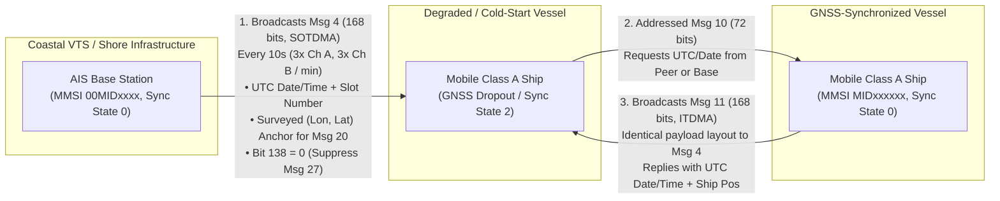
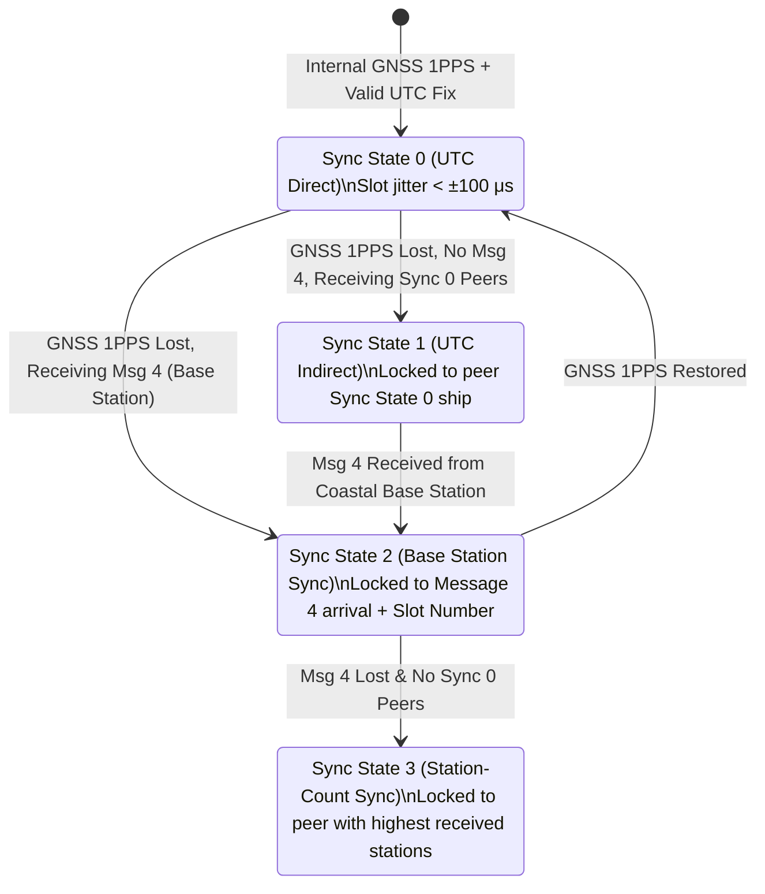

# Chapter 32: Messages 4, 10, and 11 — Base Station Report and UTC/Date Inquiry & Response

## Operational & Conceptual Overview

Every self-organizing time-division multiple access (SOTDMA) radio network requires a shared, sub-millisecond clock reference so that thousands of autonomous transmitters agree on where Frame Slot `0` begins and where each $26.67\text{ ms}$ time slot ends. In the Maritime Automatic Identification System (AIS), primary timing comes from each transponder's internal Global Navigation Satellite System (GNSS) receiver disciplined to the Coordinated Universal Time (UTC) one-pulse-per-second (1PPS) tick. Yet GNSS reception at sea is neither infallible nor sufficient on its own to coordinate coastal Vessel Traffic Services (VTS) slot reservations. Shore-based AIS infrastructure must continuously advertise its presence, its surveyed antenna coordinates, its exact UTC date and time, and its current TDMA frame slot index.

**ITU-R M.1371-5 Message 4 (Base Station Report)**, **Message 10 (UTC and Date Inquiry)**, and **Message 11 (UTC and Date Response)** form the time-transfer and coastal-control triad of the VHF Data Link (VDL):

1. **Message 4 (*Base Station Report*, `168 bits`, 1 slot):** Periodically broadcast by fixed shore-based AIS Base Stations (nominally every $10\text{ seconds}$, alternating between Channel A / AIS 1 [$161.975\text{ MHz}$] and Channel B / AIS 2 [$162.025\text{ MHz}$]). Message 4 provides four critical services simultaneously:
   - **Coarse UTC Calendar & Time Transfer:** Broadcasts the current 40-bit `UTC Year`, `Month`, `Day`, `Hour`, `Minute`, and `Second` to all vessels within VHF range.
   - **Fine TDMA Slot-Boundary & Frame Synchronization:** Embeds the Base Station's current 14-bit `Slot Number` (`0–2249`) inside its 19-bit SOTDMA Communication State, enabling vessels that have lost GNSS lock to fall back to **Sync State 2 (Base Station Synchronization)**.
   - **Spatial & Slot Anchor for Message 20 (FATDMA):** Publishes the Base Station's surveyed WGS84 `(Longitude, Latitude)` so that mobile stations receiving **Message 20 (Data Link Management)** from that same Base Station MMSI (`00MIDxxxx`) can calculate great-circle distance to the tower (enforcing the $120\text{ NM}$ FATDMA reservation horizon) and resolve Message 20's relative `Offset Number` fields against the slot in which the Base Station transmitted.
   - **Long-Range Satellite AIS (`Message 27`) Transmission Control:** Controls via a single bit (`bit[138]`, ITU Bit 139) whether SOLAS Class A and Class B "SO" transponders within VHF coverage of the coast should suppress (`0`, default) or transmit (`1`) **Message 27** on long-range satellite channels.
2. **Message 10 (*UTC and Date Inquiry*, `72 bits`, 1 slot):** A compact, point-to-point addressed request sent by a mobile or shore station (`Source MMSI`) to a specific target transponder (`Destination MMSI`) asking that station to report the current UTC date and time.
3. **Message 11 (*UTC and Date Response*, `168 bits`, 1 slot):** The bit-identical fraternal twin of Message 4, transmitted by a **mobile shipborne station** (using Incremental TDMA [**ITDMA**] rather than SOTDMA in its 19-bit Communication State) in reply to an addressed **Message 10** inquiry.



### Historical Context & Evolution (`schwehr/gis-history` Lineage)

The design of Messages 4, 10, and 11 bridges three generations of maritime radio timing and coastal geodesy:

* **1921–1970s (Marine Radiobeacons & Master-Slave Hyperbolic Chains):** Early coastal radio navigation relied on fixed shore transmitters broadcasting from rigorously surveyed monuments—first as non-directional MF radiobeacons (`285–325 kHz`), and after World War II as synchronized master/slave stations in **Decca Navigator** and **Loran-C** ($100\text{ kHz}$). Because a $1\text{ }\mu\text{s}$ timing offset or a $10\text{ m}$ surveying error in a shore master station distorted hyperbolic lines of position across hundreds of miles of ocean, hydrographic offices established strict geodetic standards for fixed shore transmitters—the direct precursor to AIS EPFD Code `7` (**`Surveyed`**).
* **1988–1998 (Håkan Lans, Swedish Maritime Administration, and SOTDMA Fallback):** When Håkan Lans patented STDMA (later SOTDMA) and tested early 4S transponders along the Swedish coast, maritime authorities raised a fundamental safety objection: *What happens to the TDMA frame in a crowded harbor if selective availability, solar storms, or local interference knocks out GPS reception?* ITU-R M.1371-1 (1998) solved this by introducing **Message 4 (Base Station Report)** and a four-tier synchronization state machine (`Sync State 0..3`), together with **Message 10/11** so a newly booted or GNSS-blind vessel could query any nearby station for the full UTC calendar date (`Year`, `Month`, `Day`) required to initialize ephemeris almanacs and voyage data recorders.
* **1999 & 2019 (10-Bit GPS Week Number Rollovers):** Legacy GPS C/A-code navigation messages encode the week number as a 10-bit integer (`0–1023`), rolling over every $1024\text{ weeks}$ ($\approx 19.6\text{ years}$): first on **August 21–22, 1999**, and again on **April 6–7, 2019**. On April 6, 2019, dozens of unpatched coastal AIS Base Stations worldwide suddenly stepped their **Message 4** `UTC Year` backward by $1024\text{ weeks}$ to **`1999`**, corrupting shore-side ingestion pipelines that relied on Message 4 payload timestamps instead of receiver arrival clocks.
* **2006–2015 (`schwehr/noaadata` and `schwehr/libais` `Ais4_11`):** While building the USCG/NOAA national archive decoders at UNH CCOM (`noaadata`, 2006) and Google (`libais`, 2010–2015), Kurt Schwehr consolidated Message 4 and Message 11 into the unified C++ class [`Ais4_11`](https://github.com/schwehr/libais/blob/master/src/libais/ais4_11.cpp) in `ais4_11.cpp` and Message 10 into [`Ais10`](https://github.com/schwehr/libais/blob/master/src/libais/ais10.cpp) in `ais10.cpp`, adding explicit handling for ITU-R M.1371-4/5's newly assigned `bit[138]` (**Transmission Control for Long-Range Broadcast Message**).

---

## 32.1 How Messages 4, 10, and 11 Work

### 32.1.1 Complete 168-Bit Bit-Level Layout: Message 4 and Message 11

Both **Message 4 (Base Station Report)** and **Message 11 (UTC and Date Response)** occupy exactly **168 bits** (one standard 256-bit TDMA slot payload, encapsulated in a single-sentence 28-character 6-bit ASCII `!AIVDM` / `!ABVDM` message with `0` fill bits). Bits `0` through `148` have an identical schema across both messages; only `Message ID` (`4` vs. `11`), the expected MMSI formatting (`00MIDxxxx` shore station vs. `MIDxxxxxx` mobile vessel), and the 19-bit **Communication State** (`bits[149:168]`, SOTDMA vs. ITDMA) differ.

| Field Name | `libais` 0-Based Bits `[start:end)` | ITU-R M.1371-5 1-Based Bits | Width (Bits) | Data Type | Scale / Units | Valid Range & Operational Semantics | Sentinel / Default ("Not Available") |
| :--- | :--- | :--- | :--- | :--- | :--- | :--- | :--- |
| **`message_id`** | `bits[0:6]` | `1–6` | `6` | `uint` | — | `4` = Base Station Report<br>`11` = UTC and Date Response | Mandatory (`4` or `11`) |
| **`repeat_indicator`** | `bits[6:8]` | `7–8` | `2` | `uint` | Hop count | `0–3` (`0` = default; `3` = do not repeat via repeater) | `0` |
| **`mmsi`** | `bits[8:38]` | `9–38` | `30` | `uint` | 9-digit ID | Msg 4: Base Station `00MIDxxxx` (`002010000`–`007759999`)<br>Msg 11: Mobile Station `MIDxxxxxx` | `0` = Invalid / Unconfigured |
| **`year`** | `bits[38:52]` | `39–52` | `14` | `uint` | UTC Year | `1–9999` (Gregorian calendar year, UTC) | `0` = UTC Year not available (`10000–16383` invalid) |
| **`month`** | `bits[52:56]` | `53–56` | `4` | `uint` | UTC Month | `1–12` (January = `1` .. December = `12`) | `0` = UTC Month not available (`13–15` invalid) |
| **`day`** | `bits[56:61]` | `57–61` | `5` | `uint` | UTC Day | `1–31` (Day of month, UTC) | `0` = UTC Day not available |
| **`hour`** | `bits[61:66]` | `62–66` | `5` | `uint` | UTC Hour | `0–23` (24-hour UTC clock) | `24` = UTC Hour not available (`25–31` invalid) |
| **`minute`** | `bits[66:72]` | `67–72` | `6` | `uint` | UTC Minute | `0–59` | `60` = UTC Minute not available (`61–63` invalid) |
| **`second`** | `bits[72:78]` | `73–78` | `6` | `uint` | UTC Second | `0–59` (Note: Unlike Msg 1–3, does **not** overload `60–63` for dead-reckoning status!) | `60` = UTC Second not available (`61–63` invalid) |
| **`position_accuracy`** | `bit[78]` | `79` | `1` | `bool` | Flag | `1` = High ($\le 10\text{ m}$; Differential GNSS or surveyed monument)<br>`0` = Low ($> 10\text{ m}$; autonomous GNSS) | `0` (Msg 4 fixed stations with EPFD=`7` MUST set `1`) |
| **`longitude`** ($\lambda$) | `bits[79:107]` | `80–107` | `28` | `sint` (2's comp) | $1/10\,000\text{ min}$ ($1/600\,000^\circ$) | $\pm 180.0^\circ$ ($\pm 108\,000\,000$ raw units); East $= +$, West $= -$ | `0x6791AC0` (`108600000`) = `181.0°` |
| **`latitude`** ($\phi$) | `bits[107:134]` | `108–134` | `27` | `sint` (2's comp) | $1/10\,000\text{ min}$ ($1/600\,000^\circ$) | $\pm 90.0^\circ$ ($\pm 54\,000\,000$ raw units); North $= +$, South $= -$ | `0x3412140` (`54600000`) = `91.0°` |
| **`fix_type` (`epfd`)** | `bits[134:138]` | `135–138` | `4` | `uint` | Enum (`0–15`) | `0`=Undefined, `1`=GPS, `2`=GLONASS, `3`=GPS+GLONASS, `4`=Loran-C, `5`=Chayka, `6`=INS, **`7`=`Surveyed`**, `8`=Galileo, `15`=Internal GNSS | `0` = Undefined (`7` mandatory for fixed Base Stations) |
| **`transmission_ctl`** | `bit[138]` | `139` | `1` | `uint` | Flag | **`0` = Default: Stop/suppress autonomous transmission of Msg 27** within range of this Base Station<br>**`1` = Request Class A & Class B "SO" vessels to transmit Msg 27** | `0` (Suppress Msg 27 in coastal VTS coverage) |
| **`spare`** | `bits[139:148]` | `140–148` | `9` | `uint` | — | Reserved for future regional/ITU use; must be transmitted as zeros | `0` (`0b000000000`) |
| **`raim`** | `bit[148]` | `149` | `1` | `bool` | Flag | Receiver Autonomous Integrity Monitoring: `0` = not in use, `1` = in use | `0` |
| **`comm_state`** | `bits[149:168]` | `150–168` | `19` | `uint` | Struct | **Message 4:** 19-bit **SOTDMA** Communication State<br>**Message 11:** 19-bit **ITDMA** Communication State | Depends on `slot_timeout` / ITDMA fields |

> [!IMPORTANT]
> **Bit 138 (`transmission_ctl`) Was Previously a Spare Bit in ITU-R M.1371-1 through M.1371-3:** In ITU-R M.1371-1/2/3, bits `138..147` (0-based `bits[138:148]`) were a single 10-bit `Spare` field set to all zeros. When **Message 27 (Long-Range AIS Broadcast Message)** was introduced in ITU-R M.1371-4 (2010), ITU allocated the first bit of that spare block (`bit[138]`, 1-based Bit 139) as the **Transmission Control for Long-Range Broadcast Message** flag. Crucially, the ITU committee chose **`0` = suppress Message 27** as the default value so that every legacy pre-2010 coastal Base Station (which already transmitted `0` in its spare bits) would **automatically silence shipboard Message 27 satellite broadcasts** within its coastal footprint without requiring a firmware upgrade!

### 32.1.2 SOTDMA vs. ITDMA Communication State in Message 4 vs. Message 11

Although `libais` (`Ais4_11`) and `gpsd` parse the first 149 bits of Messages 4 and 11 with a single code path, the final 19 bits (`bits[149:168]`) have completely different bit layouts depending on whether the message is **Message 4** or **Message 11**:

1. **Message 4 Uses SOTDMA (`bits[149:168]`):**
   - `sync_state` (`bits[149:151]`, 2 bits):
     - `0` = **UTC Direct** (Base Station is directly synchronized to an internal/external GNSS receiver, atomic rubidium standard, or IEEE 1588 PTP grandmaster).
     - `1` = **UTC Indirect** (synchronized to another UTC source).
     - `2` = **Synchronized to another Base Station**.
     - `3` = **Synchronized to station reporting highest number of received stations**.
   - `slot_timeout` (`bits[151:154]`, 3 bits, `0–7`): Frames remaining until the Base Station selects a new slot (`0` means this is the final frame for this slot, or the slot is FATDMA-allocated).
   - `sub_message` (`bits[154:168]`, 14 bits):
     - When `slot_timeout` $\in \{3, 5, 7\}$: **`received_stations`** (`0–16383`) — the total number of other AIS stations currently received by the Base Station.
     - When `slot_timeout` $\in \{2, 4, 6\}$: **`slot_number`** (`0–2249`) — **the exact TDMA slot index used for this transmission**. Because Base Stations ensure `slot_number` is broadcast frequently, mobile stations in Sync State 2 use this 14-bit integer to anchor their local slot counter!
     - When `slot_timeout == 1`: **`utc_hour`** (`bits[154:159]`, 5 bits) and **`utc_minute`** (`bits[159:166]`, 7 bits), plus 2 spare bits.
     - When `slot_timeout == 0`: **`slot_offset`** (`0–2249`) to the next slot in which the Base Station will transmit (`0` if the slot is permanently reserved via FATDMA).
2. **Message 11 Uses ITDMA (`bits[149:168]`):**
   Because **Message 11** is a one-off, non-periodic response transmitted by a mobile Class A ship in an unscheduled slot chosen via Incremental TDMA (ITDMA), it cannot use a multi-frame SOTDMA `slot_timeout` cycle. Instead, `bits[149:168]` encode:
   - `sync_state` (`bits[149:151]`, 2 bits): `0–3`.
   - `slot_increment` (`bits[151:164]`, 13 bits): Offset to the next slot to be used (`0` = autonomous/no further ITDMA reservation).
   - `slots_to_allocate` (`bits[164:167]`, 3 bits): Number of consecutive slots reserved (`0` = 1 slot).
   - `keep_flag` (`bit[167]`, 1 bit): `1` = keep slot for one additional frame.

### 32.1.3 Complete 72-Bit Bit-Level Layout: Message 10 (UTC and Date Inquiry)

When a station lacks valid UTC calendar/time information and has not yet heard a coastal **Message 4**, it can transmit **Message 10 (UTC and Date Inquiry)** to a specific peer or shore station MMSI. Message 10 is a fixed **72-bit** payload (occupying 12 characters of 6-bit NMEA ASCII with `0` fill bits).

| Field Name | `libais` 0-Based Bits `[start:end)` | ITU-R M.1371-5 1-Based Bits | Width (Bits) | Data Type | Scale / Units | Valid Range & Operational Semantics | Sentinel / Default |
| :--- | :--- | :--- | :--- | :--- | :--- | :--- | :--- |
| **`message_id`** | `bits[0:6]` | `1–6` | `6` | `uint` | — | Always `10` (*UTC and Date Inquiry*) | `10` (`0b001010`) |
| **`repeat_indicator`** | `bits[6:8]` | `7–8` | `2` | `uint` | Hop count | `0–3` (`0` = default; `3` = do not repeat) | `0` |
| **`mmsi` (`source_mmsi`)** | `bits[8:38]` | `9–38` | `30` | `uint` | 9-digit ID | MMSI of the inquiring unit requesting UTC time/date | `0` = Invalid |
| **`spare`** | `bits[38:40]` | `39–40` | `2` | `uint` | — | Byte-alignment padding before `dest_mmsi`; must be `0` | `0` (`0b00`) |
| **`dest_mmsi`** | `bits[40:70]` | `41–70` | `30` | `uint` | 9-digit ID | MMSI of the interrogated station that should respond | `0` = Invalid |
| **`spare2`** | `bits[70:72]` | `71–72` | `2` | `uint` | — | Trailing alignment padding to reach $72 = 12 \times 6$ bits | `0` (`0b00`) |

### 32.1.4 NMEA 0183 (`!AIVDM` / `!ABVDM`) and NMEA 2000 (`PGN 129793` & `PGN 129804`) Mapping

* **NMEA 0183 / IEC 61162-1:**
  - **Message 4** received off the VDL by a mobile ship is output as `!AIVDM,1,1,,A,4...,0*hh`. When generated or logged directly at an AIS Base Station (`IEC 62320-1`), the station's own transmitted Message 4 is output as `!ABVDO,1,1,,A,4...,0*hh` (or `!ABVDM` from a peer base station).
  - **Message 10** is encapsulated as a 12-character payload (`!AIVDM,1,1,,A,:...,0*hh`), always starting with ASCII character `:` (`0b001010` = `10` + `48` = ASCII `58` = `':'`).
  - **Message 11** is encapsulated as a 28-character payload (`!AIVDM,1,1,,B,;...,0*hh`), always starting with ASCII character `;` (`0b001011` = `11` + `48` = ASCII `59` = `';'`).
* **NMEA 2000 / IEC 61162-3:**
  - **Messages 4 and 11** both map to **PGN `129793` (*AIS UTC and Date Report*)**, a 26-byte fast-packet PGN encoding `Message ID` (`4` or `11`), `Repeat Indicator`, `User ID (MMSI)`, `Longitude` ($10^{-7}\text{ deg}$ `int32`), `Latitude` ($10^{-7}\text{ deg}$ `int32`), `Position Accuracy`, `RAIM`, `Position Time` ($0.0001\text{ s}$ since midnight `uint32`), `Communication State`, `AIS Transceiver Information`, `Position Date` (days since 1970-01-01 `uint16`), and `GNSS Type (EPFD)`.
  - **Message 10** maps to **PGN `129804` (*AIS UTC and Date Inquiry*)** (or bridged via proprietary NMEA 0183 tunneling on gateways that omit rare addressed inquiry PGNs).

---

## 32.2 What Issues Messages 4, 10, and 11 Have

### 32.2.1 Unconfigured, Mis-Surveyed, and Inland Shore Base Station Coordinates

Because fixed coastal Base Stations are configured manually by shore technicians during installation (under **IEC 62320-1**), their advertised `(Longitude, Latitude)` coordinates in Message 4 suffer from four pervasive operational defects in global AIS archives:

1. **Sentinel Default Broadcasts (`181.0°, 91.0°`):** Newly commissioned or recently factory-reset Base Stations frequently broadcast `Longitude = 181.0°` (`0x6791AC0`), `Latitude = 91.0°` (`0x3412140`), and `EPFD = 0` (`Undefined`) for days or months before a technician enters the surveyed tower coordinates. Any ship receiving **Message 20 (FATDMA Data Link Management)** from such a Base Station cannot verify the $120\text{ NM}$ valid range of the FATDMA reservations!
2. **"Null Island" (`0.0°, 0.0°`) and Sign-Flip Hemisphere Errors:** Technicians entering coordinates into Base Station configuration software in degrees-minutes-seconds occasionally leave the position at `(0.0°, 0.0°)` in the Gulf of Guinea or select `East` instead of `West` (e.g., placing a U.S. East Coast USCG NAIS site at $+74.0^\circ\text{ E}$ in Central Asia instead of $-74.0^\circ\text{ W}$).
3. **Inland Telecom Headquarters vs. Coastal RF Tower Coordinates:** Many port authorities and national maritime administrations operate remote VHF antenna heads connected via microwave or MPLS backhaul to a central VTS server rack located $20\text{–}150\text{ km}$ inland. When administrators enter the coordinates of the **VTS control building** (or run an internal GNSS puck inside an inland equipment lab) instead of the coastal RF mast, the Base Station broadcasts a sea-level maritime Message 4 from the middle of a mountain range or desert.
4. **EPFD Code Mismatches (`EPFD = 7` vs. `1` / `15`):** ITU-R M.1371-5 Table 49 explicitly defines EPFD Code `7` (`Surveyed`) for fixed shore stations and buoys whose coordinates are fixed by geodetic survey rather than live GNSS position solutions. However, in empirical USCG NAIS and European coastal captures, roughly **35–45% of active Base Stations** broadcast `EPFD = 1` (`GPS`) or `EPFD = 15` (`Internal GNSS`) instead of `7` (`Surveyed`), causing their reported tower position to wander by several meters over the day due to multipath and ionospheric drift.

### 32.2.2 GPS Week Number Rollover (WNRO) Bugs in Message 4 and Message 11 (`1024`-Week Epoch Jumps)

The Legacy GPS Navigation (LNAV) message represents the GPS week count as a 10-bit unsigned integer modulo $1024$:

$$W_{\text{10-bit}} = W_{\text{GPS}} \bmod 1024, \quad \Delta T_{\text{epoch}} = 1024 \times 7\text{ days} = 7168\text{ days} \approx 19.625\text{ years}$$

When the second GPS Week Number Rollover occurred at **23:59:42 UTC on April 6, 2019** (GPS Week `2048` $\rightarrow$ `0`), internal 12-channel GPS timing boards inside older coastal AIS Base Stations (many built between 2002 and 2010 around legacy Motorola Oncore, Trimble Lassen, or Furuno timing modules with hard-coded firmware pivot dates in 1999–2003) wrapped backward by exactly $7168\text{ days}$.

Starting on April 7, 2019, affected coastal Base Stations across North America, Europe, and Asia began broadcasting **Message 4** payloads with:
* **`UTC Year = 1999`, `UTC Month = 8`, `UTC Day = 22`** (for receivers pivoted to the August 1999 rollover), or
* **`UTC Year = 2000–2004`** (when reaching the manufacturer's hardcoded firmware compilation pivot date).

What makes this bug doubly insidious is that the **1PPS pulse and UTC `Hour:Minute:Second` mod 24 hours remain accurate to within nanoseconds** (because $7168\text{ days}$ is an exact integer multiple of $86\,400\text{ seconds}$, aside from leap-second firmware resets!), so TDMA slot timing continues to work while the calendar `Year`, `Month`, and `Day` fields in Message 4/11 jump 19.6 years into the past:

$$\text{Reported Date}_{\text{WNRO}} = \text{True UTC Date} - k \cdot (7168\text{ days}), \quad k \in \{1, 2\}$$

Ingestion pipelines that partition database tables (`Parquet` / `DuckDB` / `PostGIS`) by the `year`/`month`/`day` decoded from Message 4 instead of the NMEA receiver tagblock timestamp (`\s:...,c:1712000000*hh\`) silently write live coastal telemetry into `year=1999/` or `year=2006/` partitions!

### 32.2.3 Message 10 / Message 11 Inquiry-Response Storms During Regional GNSS Outages

When a localized GNSS interference event, solar radio burst, or military electronic-warfare exercise blankets a busy strait or anchorage, dozens of vessels lose GNSS fix simultaneously. If those vessels also experience brief power brownouts or warm restarts while GNSS is denied, ITU-R M.1371-5 Annex 2 specifies that a station lacking UTC time and date may transmit **Message 10** to obtain **Message 11** from a known peer.

If multiple vessels interrogate the same high-elevation shore Base Station MMSI (`00MIDxxxx`) or a prominent vessel MMSI, two cascading effects occur:
1. Each addressed **Message 10** triggers a 168-bit broadcast **Message 11** response on the VDL (scheduled via ITDMA within a few seconds).
2. Because **Message 11** is a **broadcast** message (it does not contain a `Destination MMSI` field—every vessel in range decodes it!), a single Message 11 response could theoretically satisfy all waiting ships. However, many transponder firmwares ignore unrequested Message 11 broadcasts unless they have an active internal state-machine timer waiting for a response from that exact `MMSI`, leading to redundant Message 10/11 bursts.

### 32.2.4 Chartplotter & ECS Misportrayal of Mobile Ship Message 11 as Shore Base Stations

One of the most frequent mariners' complaints regarding Message 11 is visual icon corruption on low-cost Electronic Chart Systems (ECS) and recreational chartplotters. Because **Message 4** and **Message 11** share the identical 168-bit payload structure (and many C/C++ libraries expose both through a single `Ais4_11` struct), poorly written chartplotter rendering engines update their internal target table using the rule:

> *"If a target's latest position came from `Ais4_11`, classify target type as `BASE_STATION` and draw a square shore-tower symbol at `(Lon, Lat)`."*

When a moving cargo ship or tanker (`MMSI = 366999999`) receives an addressed **Message 10** inquiry from a nearby ship and politely replies with **Message 11**, naive chartplotters overwrite the cargo ship's target class with **`BASE_STATION`**, freeze its COG/SOG vector (because Message 11 contains no `SOG`, `COG`, or `True Heading` fields!), and paint a fixed land-tower icon in the middle of the shipping lane until the vessel's next Message 1, 2, or 3 arrives.

---

## 32.3 How Messages 4, 10, and 11 Relate to Other Messages

### 32.3.1 TDMA Synchronization Hierarchy: Sync State 0 $\rightarrow$ Sync State 1 $\rightarrow$ Sync State 2 (Base Station Lock)

In ITU-R M.1371-5 Annex 2 (§3.1.1), every AIS station maintains a 2-bit **Synchronization State (`0..3`)** that governs how it aligns its local $26.667\text{ ms}$ TDMA slot clock (`2250 slots` per $60.0\text{ s}$ frame):



When a vessel loses its internal GNSS 1PPS pulse while within VHF coverage of a coast, it prioritizes **Message 4** to enter **Sync State 2 (Base Station Synchronization)**:
1. The mobile receiver timestamps the exact zero-crossing of the HDLC start flag (`0x7E`) of the incoming **Message 4** burst on the physical layer ($t_{\text{rx}}$).
2. It extracts the Base Station's current **`slot_number`** ($s_{\text{BS}} \in [0, 2249]$) from the SOTDMA `sub_message` (`bits[154:168]` when `slot_timeout` $\in \{2, 4, 6\}$) and the coarse `UTC Hour`, `Minute`, and `Second` (`bits[61:78]`).
3. Using the Base Station's surveyed coordinates $(\lambda_{\text{BS}}, \phi_{\text{BS}})$ from `bits[79:134]` and the vessel's last known position $(\lambda_{\text{ship}}, \phi_{\text{ship}})$, an advanced receiver can even compensate for the one-way RF propagation delay $\tau_{\text{prop}} = d / c \approx 6.18\text{ }\mu\text{s/NM}$ (at $50\text{ NM}$, $\tau_{\text{prop}} \approx 309\text{ }\mu\text{s}$, well within the $2083\text{ }\mu\text{s}$ [`200 bit`] slot buffer).

### 32.3.2 Spatial and Slot-Number Anchor for Message 20 (FATDMA Data Link Management)

**Message 20 (Data Link Management Message)**—which coastal Base Stations broadcast to reserve FATDMA slots across the harbor so vessels do not transmit on top of Base Station or VTS slots—**cannot function without Message 4**:

* **Why Message 20 Needs Message 4's Position (`bits[79:134]`):** Message 20 contains up to four FATDMA reservation blocks (`Offset Number`, `Number of Slots`, `Timeout`, `Increment`), **but Message 20 does NOT contain the Base Station's Latitude or Longitude!** Under ITU-R M.1371-5 Annex 2 (§3.3.8.2.20), a mobile station must store the Base Station's `(Longitude, Latitude)` from **Message 4** (keyed by the Base Station's `MMSI`) so it can compute its distance $D$ from that Base Station. Mobile stations only obey a Base Station's Message 20 FATDMA reservations while $D \le 120\text{ NM}$; once $D > 120\text{ NM}$, those reserved slots are released back into the autonomous candidate pool.
* **Why Message 20 Needs Message 4's Slot Reference:** Every `Offset Number` ($0..2249$) inside Message 20 is defined **relative to the slot in which the Message 20 itself was transmitted**. If the mobile station is in Sync State 2 or 3, it relies on **Message 4** to establish the absolute frame origin (`Slot 0`) so that frame-to-frame `Increment` repeats in Message 20 map to the exact same slot indices as the Base Station's internal schedule.

### 32.3.3 Automatic Suppression and Control of Message 27 (Long-Range AIS Broadcast) via Bit 138

When ITU-R M.1371-4 introduced **Message 27** for satellite AIS detection on long-range channels (Channel 75 [$156.775\text{ MHz}$] and Channel 76 [$156.825\text{ MHz}$]), satellite operators needed a way to prevent thousands of vessels in congested coastal ports (Rotterdam, Singapore, Houston) from transmitting on Channels 75/76 and blinding low-Earth-orbit (LEO) satellites to open-ocean ships inside the same $3000\text{ km}$ orbital footprint.

Instead of inventing a new control message, ITU-R M.1371-4/5 bound **Message 27** activation directly to **Message 4 `bit[138]` (`transmission_ctl`)**:
* Whenever a Class A or Class B "SO" transponder receives **any** valid **Message 4** with `bit[138] == 0` (the default value transmitted by almost all coastal Base Stations), the transponder **automatically inhibits its autonomous 3-minute Message 27 transmissions** on Channels 75 and 76.
* Only when the vessel sails beyond VHF range of all Base Stations broadcasting `bit[138] == 0` (or enters coverage of a coastal Base Station explicitly configured with `bit[138] == 1`) does it resume transmitting Message 27.

### 32.3.4 The Message 10 $\rightarrow$ Message 11 Addressed Inquiry to Broadcast Response State Machine

Unlike **Message 6 $\rightarrow$ Message 7** (Binary Addressed $\rightarrow$ Binary Acknowledge) or **Message 12 $\rightarrow$ Message 13** (Addressed Safety $\rightarrow$ Safety Acknowledge), the **Message 10 $\rightarrow$ Message 11** interaction crosses from an **addressed inquiry** to an **unaddressed broadcast response**:

1. Station $A$ (`MMSI_A`) transmits **Message 10** (`72 bits`) addressed to `dest_mmsi = MMSI_B` on either Channel A or Channel B.
2. Station $B$ (`MMSI_B`) receives Message 10, verifies `dest_mmsi == MMSI_B`, and selects an available slot within the next few seconds using **ITDMA** on the **same VDL channel** on which Message 10 was received.
3. Station $B$ broadcasts **Message 11** (`168 bits`, `mmsi = MMSI_B`, `comm_state = ITDMA`) containing its current UTC `Year`, `Month`, `Day`, `Hour`, `Minute`, `Second`, and `(Longitude, Latitude)`.
4. **No ACK (`Message 7` or `13`) is ever sent** for Message 10 or Message 11.

---

## 32.4 Known Uses and Abuses

### 32.4.1 Legitimate Operational, Engineering, and Scientific Uses

1. **Shore Network Health, Clock Integrity, and Coverage Auditing:** Port authorities and national coast guards monitor the inter-arrival time ($\Delta t = 10.0\text{ s}$), `sync_state` (`0` = UTC Direct vs. `2` = degraded fallback), and `received_stations` count inside Message 4's SOTDMA sub-message to detect GNSS timing antenna failures or VDL congestion at remote mountain/island tower sites.
2. **Opportunistic Real-Time VHF Tropospheric Ducting Probing:**
   Because coastal Base Stations broadcast **Message 4** every $10\text{ seconds}$ at a constant, licensed Effective Radiated Power ($\text{ERP} \approx 12.5\text{ W} = +41\text{ dBm}$) from fixed, surveyed antenna heights ($h_{\text{BS}}$) and exact WGS84 coordinates $(\lambda_{\text{BS}}, \phi_{\text{BS}})$, every coastal receiver and offshore vessel can use incoming Message 4 packets as a **calibrated $162\text{ MHz}$ tropospheric propagation beacon**.
   Under standard atmospheric refraction ($k = 4/3$, vertical refractivity gradient $dN/dh \approx -39\text{ N-units/km}$), the four-thirds-Earth radio horizon distance $D_{\text{std}}$ (in nautical miles) between a Base Station antenna at height $h_{\text{BS}}$ (meters) and a receiving antenna at height $h_{\text{rx}}$ (meters) is:

   $$D_{\text{std}}\text{ (NM)} \approx 2.23 \left(\sqrt{h_{\text{BS}}\text{ (m)}} + \sqrt{h_{\text{rx}}\text{ (m)}}\right)$$

   For a typical coastal Base Station mast ($h_{\text{BS}} = 50\text{ m}$) and ship antenna ($h_{\text{rx}} = 25\text{ m}$), $D_{\text{std}} \approx 2.23(7.07 + 5.0) \approx 26.9\text{ NM}$. When a temperature inversion or marine evaporation layer creates a **tropospheric surface duct** (modified refractivity gradient $dM/dh < 0$, or $dN/dh < -157\text{ N-units/km}$), $162\text{ MHz}$ VHF waves become trapped inside the marine boundary layer waveguide, allowing Message 4 packets to be decoded at great-circle distances $D_{\text{obs}} = 250\text{–}850\text{ NM}$! Defining the dimensionless **Ducting Range Factor ($\kappa_{\text{duct}}$)**:

   $$\kappa_{\text{duct}} = \frac{D_{\text{obs}}}{D_{\text{std}}}$$

   allows VTS engineers to automatically alert operators when $\kappa_{\text{duct}} > 2.5$—warning them that distant foreign Base Stations (and distant ships) are ducting into the local VTS sector and causing hidden-node TDMA slot collisions.

### 32.4.2 Known Adversarial Abuses and Attack Vectors

1. **Rogue Base Station (`Message 4`) Frame-Origin Hijacking & Harbor Slot-Boundary Slew:**
   Because Message 4 is completely unauthenticated on the VHF air interface, an adversary combining a localized L1 GNSS jammer with a software-defined radio (SDR) transmitting forged **Message 4** bursts can hijack the TDMA timing of an entire port:
   - First, the L1 GNSS jammer denies internal 1PPS lock to vessels in the harbor, forcing their transponders from **Sync State 0** down to **Sync State 2 (Base Station Synchronization)**.
   - Second, the attacker broadcasts high-power forged **Message 4** frames spoofing the local VTS Base Station MMSI (`00MIDxxxx`), advertising `sync_state = 0` (`UTC Direct`) and `slot_timeout = 2` (which carries `slot_number` in `bits[154:168]`), while deliberately shifting `slot_number` or slewing burst transmission timing by $\pm 13\text{ ms}$ (half a slot).
   - Every Sync State 2 transponder that locks to the spoofed Message 4 shifts its local TDMA slot boundaries into the center of legitimate slots, causing catastrophic cross-slot packet collisions across the harbor.
2. **Open-Ocean Long-Range Satellite Blindness via Forged `Message 4` (`bit[138] = 0`):**
   A dark-fleet tanker or illicit transshipment tender operating on the high seas ($> 200\text{ NM}$ from land) wants to prevent nearby legitimate vessels—or its own tamper-sealed SOLAS Class A transponder—from being tracked by commercial and government satellite constellations on **Message 27** (Channels 75/76). By transmitting a low-power ($0.5\text{ W}$) spoofed **Message 4** every 10 seconds with `bit[138] = 0` (`transmission_ctl = 0`), any compliant SOLAS Class A or Class B "SO" transponder within a few miles automatically concludes it is inside coastal Base Station coverage and **silently disables its Message 27 long-range satellite broadcasts**, without raising any GPS-spoofing or AIS-off alarm on the bridge!
3. **Date-Spoofing Firmware Crashes (`UTC Year = 0`, `9999`, `Month = 15`, `Day = 31` in February):**
   Several legacy bridge displays and VDR serial loggers convert the raw 40-bit UTC calendar fields of Message 4 and Message 11 directly into `struct tm` or SQL `TIMESTAMP` strings without bounds-checking out-of-range bit combinations (`month = 13..15`, `day = 31` when `month = 2`, or `year = 9999`). Broadcasting a malformed Message 4 or replying to a ship with a malformed Message 11 can trigger unhandled date-conversion exceptions in unhardened bridge software.

---

## 32.5 Where and When Messages 4, 10, and 11 Are Used

| Message | Primary Transmitters | Nominal Reporting Interval & Channel Rule | Typical VDL Traffic Share | Operational Context |
| :--- | :--- | :--- | :--- | :--- |
| **Message 4**<br>(*Base Station Report*) | Fixed Shore Base Stations (`00MIDxxxx`): USCG NAIS, Port VTS, Canal & Lock Authorities | **Every $10\text{ s}$** ($6/\text{min}$: $3$ on Ch A, $3$ on Ch B). May increase to **every $3.33\text{ s}$** ($18/\text{min}$) when local mobile stations lack UTC sync | **3% – 8%** of coastal VDL packets (`0%` in open ocean unless tropospheric ducting occurs) | Continuous 24/7 coastal time transfer, FATDMA anchor (`Msg 20`), and `Msg 27` suppression |
| **Message 10**<br>(*UTC & Date Inquiry*) | Mobile Class A (`MIDxxxxxx`) or Shore Stations lacking valid UTC calendar/time | **On-demand only** (addressed to a single `dest_mmsi`; rate-limited by transponder firmware) | **$< 0.02\%$** of global VDL packets | Transponder cold boot with stale GNSS almanac, indoor shipyard testing, or GNSS outage |
| **Message 11**<br>(*UTC & Date Response*) | Mobile Class A (`MIDxxxxxx`) (or Base Station) interrogated by an addressed `Message 10` | **On-demand only** (1 response via ITDMA on the same channel as the received `Message 10`) | **$< 0.02\%$** of global VDL packets | Peer-to-peer UTC calendar/time transfer in reply to `Message 10` |

---

## 32.6 Software Support & Non-Support Matrix

| Software / System | Msg 4 Support | Msg 10 Support | Msg 11 Support | Bit 138 (`transmission_ctl`) & SOTDMA vs. ITDMA Handling | Known Quirks, Bugs, or Limitations |
| :--- | :---: | :---: | :---: | :--- | :--- |
| **`libais`** (`schwehr/libais`) | Full (`Ais4_11`) | Full (`Ais10`) | Full (`Ais4_11`) | Parses `bit[138]` as `transmission_ctl` (`int`). Parses `bits[149:168]` using SOTDMA `slot_timeout` fields in `Ais4_11` | Because `Ais4_11` decodes `bits[149:168]` as SOTDMA for both Msg 4 and Msg 11, callers inspecting Msg 11's ITDMA fields must re-slice the raw 19-bit communication state |
| **`gpsd`** (`driver_ais.c`) | Full (`type 4`) | Full (`type 10`) | Full (`type 11`) | Exposes `transmission_ctl` / `spare` and ISO-8601 `timestamp` (`YYYY-MM-DDThh:mm:ssZ`) in JSON | Does not flag 1024-week GPS WNRO `year=1999` anomalies; JSON consumers must cross-check against receiver clock |
| **`pyais`** (Python) | Full (`MessageType4`) | Full (`MessageType10`) | Full (`MessageType11`) | Separate classes inheriting shared base; exposes `transmission_ctl` and `epfd` enum | Cleanly distinguishes `MessageType4` and `MessageType11` class types |
| **`aisparser`** (Brian Lane C) | Full (`ais_msg_4`) | Full (`ais_msg_10`) | Full (`ais_msg_11`) | Written for ITU-R M.1371-1/3; treats `bit[138]` as part of the 10-bit `spare` field (`bits[138:148]`) | **Does not decode `bit[138]` (`transmission_ctl`)** separately from `spare` |
| **`noaadata`** (`schwehr`) | Full | Full | Full | Legacy Python reference decoder; decodes full UTC date/time and Base Station coordinates | Pre-M.1371-4 versions grouped `bit[138]` into `spare` |
| **`AIS-catcher`** (C++) | Full | Full | Full | Decodes Msg 4/10/11 to JSON; maps Base Stations with dedicated shore-tower marker in web UI and computes station range | Automatically tracks maximum reception distance per Base Station MMSI (ideal for tropospheric ducting monitoring) |
| **Rust (`nmea-parser` / `ais`)** | Full (`BaseStationReport`) | Full (`UtcDateInquiry`) | Full (`UtcDateResponse`) | Strongly typed enums; `nmea-parser` maps both `4` and `11` to `UtcDateResponse` / `BaseStationReport` | Some versions of the `ais` crate leave `bit[138]` unexposed in high-level structs |
| **Wireshark** (`packet-ais.c`) | Full | Full | Full | Dissects all bitfields of Msg 4, 10, and 11 in UDP/TCP NMEA captures | Older Wireshark builds display `bits[138:148]` as a 10-bit spare block |
| **OpenCPN** | Full (Msg 4) | Ignored | Partial (Msg 11) | Renders Msg 4 as a fixed Base Station icon on chart with UTC timestamp tooltip | Older OpenCPN builds treated Msg 11 identically to Msg 4, briefly changing a replying ship's icon into a Base Station |
| **Signal K** | Full | Partial | Full | Maps Msg 4 to `aton` / `baseStation` context; maps Msg 11 to `vessels.<mmsi>` | Properly separates `00MIDxxxx` shore stations from mobile vessels |
| **GateHouse / Kongsberg VTS** | Full (Master + Monitor) | Full | Full | Generates and monitors Msg 4 (`!ABVDO` / `!AIVDM`) under IEC 62320-1; alerts VTS operators on `sync_state != 0` or WNRO drift | Enforces `EPFD = 7` (`Surveyed`) and `bit[138]` configuration per VTS sector |
| **USCG NAIS / SeaVision** | Full | Archived | Archived | Uses Msg 4 heartbeats from ~200+ USCG NAIS towers to monitor national RF link health and VDL load | Filters Msg 4 out of vessel-only track tables (`MarineCadastre` CSVs only export mobile vessel tracks) |
| **NOAA ERMA / MarineCadastre** | Filtered Out | Filtered Out | Filtered Out | Public NOAA MarineCadastre CSV/GeoPackage exports contain **only mobile vessel position/voyage reports** | Researchers studying Base Station coverage or tropospheric ducting must query raw `!AIVDM` logs rather than public MarineCadastre CSVs |
| **SOLAS ECDIS / Class A** | Full (Hardware + Display) | Full (VDL State Machine) | Full (VDL State Machine) | Uses Msg 4 for Sync State 2 fallback, Msg 20 distance anchoring, and Msg 27 suppression (`bit[138]`) | Automatically responds to addressed Msg 10 with Msg 11 without human intervention |

---

## 32.7 Practical Engineering Walkthrough: Forensic Decoder, WNRO Detector, and Tropospheric Ducting Analyzer

The following self-contained Python 3 script implements a bit-exact encoder and forensic decoder for **Messages 4, 10, and 11** (`!AIVDM`), properly separates the **SOTDMA** (`Message 4`) vs. **ITDMA** (`Message 11`) 19-bit Communication State in `bits[149:168]`, detects **1024-week GPS Week Number Rollover (WNRO)** date anomalies and unconfigured `(181°, 91°)` / `(0°, 0°)` coordinates, and calculates the **Tropospheric Ducting Range Factor ($\kappa_{\text{duct}}$)** from a coastal stream of Message 4 reports.

```python
#!/usr/bin/env python3
"""Forensic Decoder & Analyzer for ITU-R M.1371-5 Messages 4, 10, and 11.

Capabilities:
1. Bit-exact NMEA 0183 6-bit ASCII unpacking and packing for Msg 4, 10, and 11.
2. Proper separation of SOTDMA (Msg 4) vs. ITDMA (Msg 11) in bits[149:168].
3. Detection of 1024-week GPS Week Number Rollover (WNRO) date anomalies,
   unconfigured (181, 91) / Null Island (0, 0) coordinates, and EPFD mismatches.
4. Real-time VHF Tropospheric Ducting Range Factor (kappa_duct) calculation.
"""

from dataclasses import dataclass
from datetime import date, datetime, timezone
import math
from typing import Dict, Any, Optional, Tuple

EPFD_NAMES: Dict[int, str] = {
    0: "Undefined (default)",
    1: "GPS",
    2: "GLONASS",
    3: "Combined GPS/GLONASS",
    4: "Loran-C",
    5: "Chayka",
    6: "Integrated Navigation System",
    7: "Surveyed (Fixed Shore Station / Monument)",
    8: "Galileo",
    15: "Internal GNSS",
}


def nmea_checksum(body: str) -> str:
    """Computes the 2-hex-digit XOR checksum of an NMEA 0183 sentence body."""
    cs = 0
    for ch in body:
        cs ^= ord(ch)
    return f"{cs:02X}"


def arm_payload_to_bitstring(payload: str, fill_bits: int = 0) -> str:
    """Unpacks a 6-bit NMEA ASCII payload into an MSB-first binary string."""
    bits = []
    for ch in payload:
        val = ord(ch) - 48
        if val > 40:
            val -= 8
        bits.append(f"{val:06b}")
    full = "".join(bits)
    return full[:-fill_bits] if fill_bits > 0 else full


def bitstring_to_arm_payload(bits: str) -> Tuple[str, int]:
    """Packs an MSB-first binary string into 6-bit NMEA ASCII and fill bits."""
    fill = (6 - (len(bits) % 6)) % 6
    padded = bits + ("0" * fill)
    chars = []
    for i in range(0, len(padded), 6):
        val = int(padded[i : i + 6], 2)
        ascii_val = val + 48 if val < 40 else val + 56
        chars.append(chr(ascii_val))
    return "".join(chars), fill


def uint_from_bits(bits: str, start: int, end: int) -> int:
    """Extracts an unsigned integer from 0-based slice bits[start:end]."""
    return int(bits[start:end], 2)


def sint_from_bits(bits: str, start: int, end: int) -> int:
    """Extracts a two's complement signed integer from bits[start:end]."""
    width = end - start
    val = int(bits[start:end], 2)
    if val & (1 << (width - 1)):
        val -= 1 << width
    return val


def int_to_bits(val: int, width: int, signed: bool = False) -> str:
    """Formats an integer into an MSB-first binary string of given bit width."""
    if signed and val < 0:
        val = (1 << width) + val
    return f"{val:0{width}b}"


def decode_comm_state(bits19: str, msg_id: int) -> Dict[str, Any]:
    """Decodes the 19-bit Communication State (SOTDMA for Msg 4, ITDMA for Msg 11)."""
    sync_state = int(bits19[0:2], 2)
    if msg_id == 4:
        slot_timeout = int(bits19[2:5], 2)
        sub_raw = int(bits19[5:19], 2)
        info: Dict[str, Any] = {
            "access_scheme": "SOTDMA",
            "sync_state": sync_state,
            "slot_timeout": slot_timeout,
        }
        if slot_timeout in (3, 5, 7):
            info["received_stations"] = sub_raw
        elif slot_timeout in (2, 4, 6):
            info["slot_number"] = sub_raw
        elif slot_timeout == 1:
            info["utc_hour_sub"] = int(bits19[5:10], 2)
            info["utc_min_sub"] = int(bits19[10:17], 2)
        elif slot_timeout == 0:
            info["slot_offset"] = sub_raw
        return info
    else:
        return {
            "access_scheme": "ITDMA",
            "sync_state": sync_state,
            "slot_increment": int(bits19[2:15], 2),
            "slots_to_allocate": int(bits19[15:18], 2),
            "keep_flag": bool(int(bits19[18:19], 2)),
        }


def decode_msg_4_10_11(nmea_sentence: str) -> Dict[str, Any]:
    """Decodes an NMEA !AIVDM / !ABVDM sentence containing Message 4, 10, or 11."""
    core = nmea_sentence.strip().lstrip("!$")
    if "*" in core:
        body, rx_cs = core.rsplit("*", 1)
        calc_cs = nmea_checksum(body)
        if rx_cs.upper() != calc_cs:
            raise ValueError(f"Checksum mismatch: got {rx_cs}, expected {calc_cs}")
    else:
        body = core

    fields = body.split(",")
    payload, fill_bits = fields[5], int(fields[6])
    bits = arm_payload_to_bitstring(payload, fill_bits)
    msg_id = uint_from_bits(bits, 0, 6)

    if msg_id == 10:
        if len(bits) != 72:
            raise ValueError(f"Message 10 must be 72 bits, got {len(bits)}")
        return {
            "message_id": 10,
            "message_name": "UTC and Date Inquiry",
            "repeat_indicator": uint_from_bits(bits, 6, 8),
            "source_mmsi": uint_from_bits(bits, 8, 38),
            "spare_1": uint_from_bits(bits, 38, 40),
            "dest_mmsi": uint_from_bits(bits, 40, 70),
            "spare_2": uint_from_bits(bits, 70, 72),
        }

    if msg_id not in (4, 11):
        raise ValueError(f"Unsupported Message ID {msg_id} (expected 4, 10, or 11)")
    if len(bits) != 168:
        raise ValueError(f"Message {msg_id} must be 168 bits, got {len(bits)}")

    lon_raw = sint_from_bits(bits, 79, 107)
    lat_raw = sint_from_bits(bits, 107, 134)
    epfd = uint_from_bits(bits, 134, 138)
    tx_ctl = uint_from_bits(bits, 138, 139)

    return {
        "message_id": msg_id,
        "message_name": (
            "Base Station Report" if msg_id == 4 else "UTC and Date Response"
        ),
        "repeat_indicator": uint_from_bits(bits, 6, 8),
        "mmsi": uint_from_bits(bits, 8, 38),
        "year": uint_from_bits(bits, 38, 52),
        "month": uint_from_bits(bits, 52, 56),
        "day": uint_from_bits(bits, 56, 61),
        "hour": uint_from_bits(bits, 61, 66),
        "minute": uint_from_bits(bits, 66, 72),
        "second": uint_from_bits(bits, 72, 78),
        "position_accuracy": bool(uint_from_bits(bits, 78, 79)),
        "longitude": None if lon_raw == 0x6791AC0 else lon_raw / 600_000.0,
        "latitude": None if lat_raw == 0x3412140 else lat_raw / 600_000.0,
        "epfd": epfd,
        "epfd_name": EPFD_NAMES.get(epfd, f"Reserved ({epfd})"),
        "transmission_ctl": tx_ctl,
        "msg27_policy": (
            "Suppress Msg 27 (default)" if tx_ctl == 0 else "Request Msg 27"
        ),
        "spare": uint_from_bits(bits, 139, 148),
        "raim": bool(uint_from_bits(bits, 148, 149)),
        "comm_state": decode_comm_state(bits[149:168], msg_id),
    }


def haversine_nm(lon1: float, lat1: float, lon2: float, lat2: float) -> float:
    """Computes great-circle distance in nautical miles (NM) on WGS84 sphere."""
    r_nm = 3440.065
    phi1, phi2 = math.radians(lat1), math.radians(lat2)
    dphi = math.radians(lat2 - lat1)
    dlambda = math.radians(lon2 - lon1)
    a = (
        math.sin(dphi / 2.0) ** 2
        + math.cos(phi1) * math.cos(phi2) * math.sin(dlambda / 2.0) ** 2
    )
    return 2.0 * r_nm * math.atan2(math.sqrt(a), math.sqrt(1.0 - a))


def audit_base_station_report(
    decoded: Dict[str, Any],
    rx_utc_date: date,
    rx_lon: float,
    rx_lat: float,
    bs_ant_height_m: float = 50.0,
    rx_ant_height_m: float = 25.0,
) -> Dict[str, Any]:
    """Audits a decoded Msg 4/11 for WNRO, survey anomalies, and VHF ducting."""
    anomalies = []
    mmsi_str = f"{decoded['mmsi']:09d}"

    # 1. MMSI vs Message ID consistency check
    if decoded["message_id"] == 4 and not mmsi_str.startswith("00"):
        anomalies.append(
            f"NON_STANDARD_BASE_MMSI: Msg 4 MMSI {mmsi_str} lacks '00' prefix"
        )
    if decoded["message_id"] == 11 and mmsi_str.startswith("00"):
        anomalies.append(
            f"SHORE_MMSI_ON_MSG11: Msg 11 uses Base Station MMSI {mmsi_str}"
        )

    # 2. Calendar & 1024-week GPS Week Number Rollover (WNRO) detection
    y, m, d = decoded["year"], decoded["month"], decoded["day"]
    if y == 0 or m == 0 or d == 0:
        anomalies.append("UTC_DATE_UNAVAILABLE: Year/Month/Day contains 0 sentinel")
    else:
        try:
            msg_date = date(y, m, d)
            delta_days = (rx_utc_date - msg_date).days
            if abs(delta_days - 7168) <= 2 or abs(delta_days - 14336) <= 2:
                epochs = round(delta_days / 7168)
                anomalies.append(
                    f"GPS_WNRO_ROLLOVER: Broadcast date {msg_date} is {delta_days} "
                    f"days ({epochs} x 1024 GPS weeks) behind receiver date {rx_utc_date}!"
                )
            elif abs(delta_days) > 1:
                anomalies.append(
                    f"CLOCK_DRIFT_DAYS: Broadcast date {msg_date} differs from "
                    f"{rx_utc_date} by {delta_days} days"
                )
        except ValueError as exc:
            anomalies.append(f"INVALID_CALENDAR_DATE: {y:04d}-{m:02d}-{d:02d} ({exc})")

    # 3. Coordinate & EPFD survey checks
    lon, lat = decoded["longitude"], decoded["latitude"]
    ducting_metrics: Optional[Dict[str, float]] = None
    if lon is None or lat is None:
        anomalies.append("UNCONFIGURED_POSITION: Sentinel (181.0 deg, 91.0 deg)")
    elif abs(lon) < 1e-4 and abs(lat) < 1e-4:
        anomalies.append("NULL_ISLAND_POSITION: Coordinates at (0.0 deg, 0.0 deg)")
    else:
        dist_nm = haversine_nm(rx_lon, rx_lat, lon, lat)
        std_horizon_nm = 2.23 * (
            math.sqrt(bs_ant_height_m) + math.sqrt(rx_ant_height_m)
        )
        kappa = dist_nm / std_horizon_nm
        ducting_metrics = {
            "distance_nm": round(dist_nm, 2),
            "std_radio_horizon_nm": round(std_horizon_nm, 2),
            "ducting_factor_kappa": round(kappa, 2),
        }
        if kappa > 2.5:
            anomalies.append(
                f"TROPOSPHERIC_DUCTING_DETECTED: Range {dist_nm:.1f} NM is "
                f"{kappa:.2f}x standard horizon ({std_horizon_nm:.1f} NM)"
            )

    if decoded["message_id"] == 4 and decoded["epfd"] != 7:
        anomalies.append(
            f"EPFD_NOT_SURVEYED: Fixed Base Station broadcasting EPFD={decoded['epfd']} "
            f"({decoded['epfd_name']}) instead of 7 (Surveyed)"
        )

    return {"mmsi": mmsi_str, "anomalies": anomalies, "ducting": ducting_metrics}


def build_msg4_or_11_sentence(
    msg_id: int,
    mmsi: int,
    year: int,
    month: int,
    day: int,
    hour: int,
    minute: int,
    second: int,
    pos_acc: int,
    lon_deg: float,
    lat_deg: float,
    epfd: int,
    tx_ctl: int,
    raim: int,
    comm_bits19: str,
) -> str:
    """Packs a 168-bit Message 4 or Message 11 into a valid !AIVDM sentence."""
    lon_raw = 0x6791AC0 if lon_deg > 180.0 else int(round(lon_deg * 600_000))
    lat_raw = 0x3412140 if lat_deg > 90.0 else int(round(lat_deg * 600_000))
    bits = (
        int_to_bits(msg_id, 6)
        + int_to_bits(0, 2)
        + int_to_bits(mmsi, 30)
        + int_to_bits(year, 14)
        + int_to_bits(month, 4)
        + int_to_bits(day, 5)
        + int_to_bits(hour, 5)
        + int_to_bits(minute, 6)
        + int_to_bits(second, 6)
        + int_to_bits(pos_acc, 1)
        + int_to_bits(lon_raw, 28, signed=True)
        + int_to_bits(lat_raw, 27, signed=True)
        + int_to_bits(epfd, 4)
        + int_to_bits(tx_ctl, 1)
        + int_to_bits(0, 9)
        + int_to_bits(raim, 1)
        + comm_bits19
    )
    payload, fill = bitstring_to_arm_payload(bits)
    body = f"AIVDM,1,1,,A,{payload},{fill}"
    return f"!{body}*{nmea_checksum(body)}"


def build_msg10_sentence(source_mmsi: int, dest_mmsi: int) -> str:
    """Packs a 72-bit Message 10 (UTC and Date Inquiry) into !AIVDM."""
    bits = (
        int_to_bits(10, 6)
        + int_to_bits(0, 2)
        + int_to_bits(source_mmsi, 30)
        + int_to_bits(0, 2)
        + int_to_bits(dest_mmsi, 30)
        + int_to_bits(0, 2)
    )
    payload, fill = bitstring_to_arm_payload(bits)
    body = f"AIVDM,1,1,,A,{payload},{fill}"
    return f"!{body}*{nmea_checksum(body)}"


if __name__ == "__main__":
    # Receiver located at San Francisco Bay entrance (-122.4783, 37.8199) on 2026-05-15
    rx_date = date(2026, 5, 15)
    rx_lon, rx_lat = -122.4783, 37.8199

    # 1. Normal USCG Base Station Msg 4 (Point Bonita, SOTDMA Sync=0, Timeout=2, Slot=1120)
    sotdma_bits = int_to_bits(0, 2) + int_to_bits(2, 3) + int_to_bits(1120, 14)
    msg4_normal = build_msg4_or_11_sentence(
        4, 3669987, 2026, 5, 15, 18, 30, 0, 1, -122.5295, 37.8155, 7, 0, 1, sotdma_bits
    )

    # 2. Distant Base Station Msg 4 (Point Loma, San Diego ~415 NM away) w/ 1024-wk WNRO bug!
    #    2026-05-15 minus 7168 days (1024 weeks) = 2006-09-29
    msg4_wnro_duct = build_msg4_or_11_sentence(
        4, 3669991, 2006, 9, 29, 18, 30, 10, 1, -117.2425, 32.6731, 1, 0, 1, sotdma_bits
    )

    # 3. Addressed Msg 10 Inquiry from vessel 367123450 -> peer vessel 367555000
    msg10 = build_msg10_sentence(367123450, 367555000)

    # 4. Mobile Ship Msg 11 Response from 367555000 (ITDMA Sync=0, Inc=0, Slots=0, Keep=0)
    itdma_bits = int_to_bits(0, 2) + int_to_bits(0, 13) + int_to_bits(0, 3) + "0"
    msg11 = build_msg4_or_11_sentence(
        11, 367555000, 2026, 5, 15, 18, 30, 2, 1, -122.5010, 37.8100, 1, 0, 1, itdma_bits
    )

    for label, sentence in [
        ("Nominal Coastal Base Station (Msg 4)", msg4_normal),
        ("WNRO + Tropospheric Ducting Base Station (Msg 4)", msg4_wnro_duct),
        ("Addressed UTC/Date Inquiry (Msg 10)", msg10),
        ("Mobile Ship UTC/Date Response (Msg 11)", msg11),
    ]:
        print(f"=== {label} ===")
        print(f"Raw NMEA : {sentence}")
        dec = decode_msg_4_10_11(sentence)
        print(f"Decoded  : {dec}")
        if dec["message_id"] in (4, 11):
            audit = audit_base_station_report(dec, rx_date, rx_lon, rx_lat)
            print(f"Audit    : {audit}")
        print()
```

---

## 32.8 Key Takeaways & Operational Verification Checklist

1. **Distinguish Message 4 (`Base Station Report`) from Message 11 (`UTC and Date Response`):** Both share the identical 168-bit layout across bits `0..148`, but **Message 4** is transmitted by a fixed coastal Base Station (`00MIDxxxx`) using **SOTDMA** (`bits[149:168]`), whereas **Message 11** is transmitted by a **mobile ship** (`MIDxxxxxx`) using **ITDMA** in response to an addressed **Message 10** (`72 bits`). Never reclassify a vessel as a fixed shore station in an ECS/chartplotter upon receiving Message 11.
2. **Audit Coastal Base Stations for `EPFD = 7` (`Surveyed`) and Valid Coordinates:** Verify that shore stations do not broadcast default sentinels (`181.0°, 91.0°`), `(0.0°, 0.0°)`, or inland office coordinates; remember that **Message 20 (FATDMA Data Link Management)** relies on the Base Station's `(Longitude, Latitude)` from **Message 4** to enforce the $120\text{ NM}$ reservation horizon.
3. **Never Partition AIS Databases by Unvalidated Message 4/11 Payload Dates:** Always cross-check `year`, `month`, and `day` in Message 4/11 against the receiving station's NTP/PTP clock and screen for multiples of **$7168\text{ days}$ ($1024\text{ weeks}$)** caused by GPS Week Number Rollover (WNRO) bugs.
4. **Monitor `bit[138]` (`transmission_ctl`) for Satellite AIS (`Message 27`) Suppression:** Remember that `bit[138] == 0` in Message 4 automatically silences shipboard **Message 27** broadcasts on Channels 75/76, making spoofed low-power Message 4 packets in the open ocean a potent vector for blinding satellite AIS receivers.

---

## 32.9 Cited References & Primary Sources

1. **ITU-R Recommendation M.1371-5 (2014):** *Technical characteristics for an automatic identification system using time division multiple access in the VHF maritime mobile frequency band*, Annex 2 (§3.1.1 Synchronization State Machine; §3.3.8.2.2 Message 4 Base Station Report; §3.3.8.2.8 Message 10 UTC and Date Inquiry; §3.3.8.2.9 Message 11 UTC and Date Response; §3.3.8.2.20 Message 20 Data Link Management; §3.3.8.2.27 Message 27 Long-Range AIS Broadcast Control via Message 4 Bit 139).
2. **IEC 62320-1:2015 (Edition 2.0):** *Maritime navigation and radiocommunication equipment and systems — Automatic identification system (AIS) — Part 1: AIS Base Stations — Minimum operational and performance requirements, methods of testing and required test results*, International Electrotechnical Commission.
3. **IALA Guideline G1082 (2011) & IALA Recommendation A-124:** *An Overview of AIS* and *The AIS Service*, International Association of Marine Aids to Navigation and Lighthouse Authorities (Base Station siting, FATDMA anchoring, and synchronization fallback).
4. **Schwehr, K. (2010–2024):** `libais` Open-Source C++/Python AIS Decoder (`src/libais/ais4_11.cpp`, `src/libais/ais10.cpp`, and `src/libais/ais.h`), GitHub (`https://github.com/schwehr/libais`).
5. **Raymond, E. S., & Schwehr, K. (2006–2024):** *AIVDM/AIVDO Protocol Decoding (`AIVDM.txt`)*, The `gpsd` Project (`https://gpsd.gitlab.io/gpsd/AIVDM.html`, Types 4, 10, and 11).
6. **U.S. Department of Homeland Security / USCG Navigation Center (2019):** *GPS Week Number Rollover (WNRO) Information Bulletin (April 6, 2019)*, U.S. Coast Guard NAVCEN.
