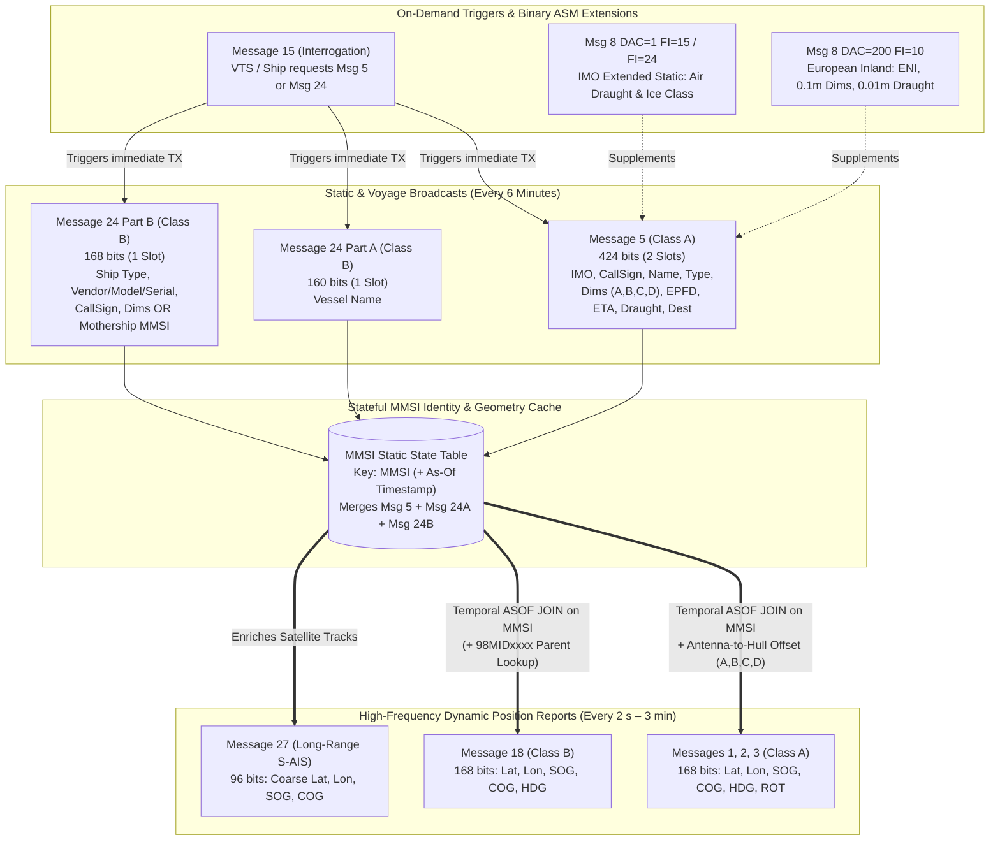

# Chapter 33: Deep Dive into Messages 5 and 24: Class A and Class B Static and Voyage-Related Data

## 1. Operational & Conceptual Overview

While dynamic position reports (**Messages 1, 2, 3, 18, and 27**) broadcast a vessel's instantaneous kinematics—where it is, how fast it is moving, and how rapidly it is turning—they contain **zero human-readable identity, zero physical hull geometry, and zero voyage intent** beyond a 30-bit numeric MMSI. Without a companion metadata broadcast, an Electronic Chart Display and Information System (ECDIS), Vessel Traffic Service (VTS) console, or spatial analytics pipeline sees only anonymous 9-digit numbers moving across the water. It cannot tell whether `MMSI 219018671` is a $400\text{-meter}$ Ultra-Large Container Vessel (ULCV) drawing $16.0\text{ meters}$ of water or a $12\text{-meter}$ harbor pilot launch, where the GNSS antenna is mounted relative to the bow and stern, or what port the vessel is bound for.

In ITU-R M.1371-5, this static and voyage-related metadata is carried by two complementary message families tailored to the media-access constraints of their respective transponders:

1. **Message 5 (*Static and Voyage Related Data* — 424 bits, 2 Slots):**
   Broadcast every **6 minutes** (or immediately following a parameter change or **Message 15** interrogation) by **SOLAS Class A** shipborne mobile equipment (**IEC 61993-2**) using **RATDMA**, **SOTDMA**, or **ITDMA**. Packed into a 2-slot frame ($424\text{ payload bits}$) and transported across NMEA 0183 shipboard buses as a **2-sentence multi-fragment `!AIVDM` sequence**, Message 5 delivers:
   * **Permanent & Regulatory Identity:** The 7-digit **IMO Ship Identification Number** (which stays with the steel hull from keel-laying to the scrapyard), the international **Radio Call Sign** ($7\text{ characters}$), and the **Vessel Name** ($20\text{ characters}$).
   * **Physical Hull Geometry & GNSS Antenna Offset:** The 8-bit **Ship and Cargo Type** (`0–99`), the 4-bit **Electronic Position Fixing Device (EPFD)** type, and the 30-bit **Overall Dimension / Reference for Position** block $(A, B, C, D)$, which defines both the ship's overall length ($L_{\text{OA}} = A + B$) and beam ($W = C + D$) and the exact horizontal offset of the GNSS antenna reference point relative to all four hull boundaries.
   * **Voyage-Related Data:** The 20-bit **Estimated Time of Arrival (ETA)** (`Month`, `Day`, `Hour`, `Minute` in UTC), the 8-bit **Maximum Present Static Draught** ($0.1\text{ m}$ steps, `0.0–25.5 m`), and the 20-character free-text **Destination**.
2. **Message 24 (*Static Data Report* — Part A [160 bits] & Part B [168 bits], 1 Slot Each):**
   Broadcast every **6 minutes** by **Class B "CS" (Carrier-Sense TDMA, IEC 62287-1)** and **Class B "SO" (SOTDMA, IEC 62287-2)** transponders. Because a Class B "CS" unit listens for an empty slot immediately before transmitting and cannot reserve two contiguous slots in advance, transmitting a 2-slot burst in congested coastal waters would risk colliding with a scheduled Class A position report in the second slot. To keep every Class B transmission strictly within **1 slot ($\le 168\text{ bits}$)**, ITU-R M.1371-3 introduced **Message 24**, splitting Class B static identity into two independent single-slot sub-messages distinguished by a 2-bit **`Part Number` (`bits[38:40]`)**:
   * **Message 24 Part A (`Part Number = 0`, 160 bits):** Broadcasts the 20-character **Vessel Name**.
   * **Message 24 Part B (`Part Number = 1`, 168 bits):** Broadcasts the **Ship and Cargo Type**, a 42-bit **Vendor ID / Unit Model / Serial Number** block, the 7-character **Call Sign**, and a polymorphic 30-bit field (`bits[132:162]`) that encodes either the vessel's **Hull Dimensions $(A, B, C, D)$** or—when transmitted by an auxiliary craft with an MMSI of the form `98MIDxxxx`—the 30-bit **`Mothership MMSI`**.

---

## 2. Historical Context & Evolution (`schwehr/gis-history` Integration)

The structure, quirks, and security vulnerabilities of Messages 5 and 24 reflect four decades of maritime regulatory compromises and software engineering lessons documented in [`schwehr/gis-history`](https://github.com/schwehr/gis-history):

* **1965 / 1987 / 2002 — Lloyd's Register and the IMO Ship Identification Number:** In 1965, Lloyd's Register of Shipping introduced a 6-digit (later 7-digit) permanent hull numbering system including a modulo-10 check digit to prevent clerical transcription errors. The International Maritime Organization adopted this system via **IMO Resolution A.600(15)** (1987) and made it mandatory under **SOLAS Chapter XI-1, Regulation 3** (effective January 1, 1996, and required to be permanently welded/marked on the hull and bulkhead following the December 2002 ISPS Code diplomatic conference). Embedding this 30-bit `IMO Number` directly into `bits[40:70]` of AIS Message 5 created the primary forensic anchor used today to unmask re-flagged "shadow fleet" tankers.
* **1998–2001 — ITU-R M.1371-1 and the 2-Slot Design of Message 5:** During the drafting of **ITU-R M.1371-1** (1998) and its revision **M.1371-1 (08/2001)**, IMO and IALA working groups debated how frequently static ship data should be broadcast. Because Vessel Name ($120\text{ bits}$), Destination ($120\text{ bits}$), Call Sign ($42\text{ bits}$), IMO Number ($30\text{ bits}$), Dimensions ($30\text{ bits}$), and ETA/Draught ($28\text{ bits}$) totaled **424 bits**, Message 5 required **2 consecutive TDMA slots** ($53.33\text{ ms}$ on air). To prevent 2-slot static broadcasts from starving 1-slot dynamic collision-avoidance reports, the standard fixed the nominal autonomous reporting interval of Message 5 at **6 minutes** ($360\text{ s}$), while providing **Message 15 (*Interrogation*)** so shore VTS stations or approaching ships could demand an immediate Message 5 response on entry.
* **2006–2007 — The Failure of Message 19 and Birth of Message 24 (`ITU-R M.1371-2/3` & `IEC 62287-1`):** Early drafts for Class B AIS envisioned using **Message 19** (*Extended Class B Equipment Position Report*, 312 bits, 2 slots) to transmit position and static name/dimensions together. However, RF link-budget and VDL loading simulations for **Carrier-Sense TDMA (CSTDMA)** demonstrated a severe flaw: a Class B "CS" transceiver checks RSSI over a $1.14\text{ ms}$ window at the start of Slot $k$ to verify that Slot $k$ is unoccupied, but it has **no way to sense whether Slot $k+1$ is free** until Slot $k+1$ actually begins! Furthermore, CSTDMA units do not decode the 19-bit SOTDMA reservation map of other ships (`ITU-R M.1371-5` Annex 7). Consequently, a 2-slot CSTDMA transmission blindly blotted out whatever Class A vessel had reserved Slot $k+1$. To eliminate 2-slot CSTDMA transmissions altogether, **ITU-R M.1371-3** (2007) and **IEC 62287-1** introduced **Message 24**, splitting Class B static data into two single-slot parts (**Part A** and **Part B**) transmitted within 1 minute of each other every 6 minutes.
* **2010 — `ITU-R M.1371-4` Repartitions the Message 24 Part B `Vendor ID` Field (`bits[48:90]`):** In ITU-R M.1371-3, `bits[48:90]` ($42\text{ bits}$) of Message 24 Part B was defined as a 7-character 6-bit ASCII `Vendor ID`. In **ITU-R M.1371-4** (2010) and **M.1371-5** (2014), the ITU repurposed the final 24 bits of that 42-bit field into a 4-bit numeric **`Unit Model Code` (`bits[66:70]`)** and a 20-bit numeric **`Unit Serial Number` (`bits[70:90]`)**, shrinking the ASCII `Vendor ID` to 3 characters (`bits[48:66]`, matching the 3-letter NMEA manufacturer mnemonic). Because Message 24 lacks an `AIS Version` field, decoders must expose both interpretations!
* **2010–2025 — `libais`, Deepwater Horizon Static-to-Dynamic Joins, and `CVE-2025-66217`:** During the April 2010 *Deepwater Horizon* response (`schwehr/libais`), researchers processing millions of USCG NAIS sentences confronted two endemic realities of Message 5: (1) slightly truncated 420-bit or 422-bit Message 5 payloads emitted by early transponders that omitted the final `DTE`/`Spare` bits, and (2) out-of-order or cross-spliced 2-line `!AIVDM` fragments. Fifteen years later, in **December 2025 (`CVE-2025-66217`)**, security audits disclosed that feeding a crafted single-sentence or heavily truncated `<420-bit` Message 5 payload into older `libais` (`<0.18`) or C++ decoders triggered an out-of-bounds buffer read/write when unpacking `Destination` at `bits[302:422]`.

---

## 3. Deep Technical & Mathematical Foundations

### 33.1 How Messages 5 and 24 Work

#### 33.1.1 Complete 424-Bit Anatomy of Message 5 (Class A Static and Voyage Related Data)

Message 5 has a standard length of **424 bits**, occupying **2 contiguous 256-bit TDMA slots** ($512\text{ channel bits}$ total). Taking into account the physical-layer HDLC overhead (8-bit ramp-up, 24-bit training preamble, 8-bit start flag `0x7E`, 424-bit payload, up to ~10–16 bits of HDLC zero-bit stuffing, 16-bit CRC-CCITT FCS, 8-bit end flag `0x7E`, and 24-bit guard buffer), the 424-bit payload fits comfortably inside two consecutive slots ($\le 424\text{ maximum unstuffed payload bits}$ for a 2-slot non-Comm-State burst).

On an IEC 61162-1 / NMEA 0183 serial bus, because a single 82-character `!AIVDM` sentence can hold at most $60\text{–}62$ 6-bit ASCII characters ($360\text{–}372\text{ bits}$), a 424-bit Message 5 is **always fragmented across 2 sentences**:
* **Sentence 1 (`!AIVDM,2,1,seq,ch,<60_chars>,0*HH`):** Carries the first $60 \times 6 = 360\text{ bits}$ (`bits[0:360]`) with `fill_bits = 0`.
* **Sentence 2 (`!AIVDM,2,2,seq,ch,<11_chars>,2*HH`):** Carries the remaining $64\text{ bits}$ (`bits[360:424]`) encoded in $11$ 6-bit ASCII characters ($11 \times 6 = 66\text{ bits}$), with **`fill_bits = 2`** indicating that the final 2 bits (`bits[424:426]`) are zero-padding added solely to complete the 71st 6-bit ASCII character:

$$71\text{ ASCII chars} \times 6\text{ bits/char} = 426\text{ bits} = 424\text{ payload bits} + 2\text{ fill bits}$$

```
0                   1                   2                   3
0 1 2 3 4 5 6 7 8 9 0 1 2 3 4 5 6 7 8 9 0 1 2 3 4 5 6 7 8 9 0 1
+-+-+-+-+-+-+-+-+-+-+-+-+-+-+-+-+-+-+-+-+-+-+-+-+-+-+-+-+-+-+-+-+
|  Msg ID (5) |R|                  MMSI (30b)                   |
+-+-+-+-+-+-+-+-+-+-+-+-+-+-+-+-+-+-+-+-+-+-+-+-+-+-+-+-+-+-+-+-+
|   MMSI (c.) |V|                IMO Number (30b)               |
+-+-+-+-+-+-+-+-+-+-+-+-+-+-+-+-+-+-+-+-+-+-+-+-+-+-+-+-+-+-+-+-+
|    IMO (c.)   |                Call Sign (42b)                |
+-+-+-+-+-+-+-+-+-+-+-+-+-+-+-+-+-+-+-+-+-+-+-+-+-+-+-+-+-+-+-+-+
|         Call Sign (cont., 7 x 6-bit ASCII characters)         |
+-+-+-+-+-+-+-+-+-+-+-+-+-+-+-+-+-+-+-+-+-+-+-+-+-+-+-+-+-+-+-+-+
|  Call Sign (c)|                                               |
+-+-+-+-+-+-+-+-+                                               +
|                                                               |
+                   Vessel Name (120b = 20 chars)               +
|                                                               |
+               +-+-+-+-+-+-+-+-+-+-+-+-+-+-+-+-+-+-+-+-+-+-+-+-+
|               |Ship/Cargo (8b)|     Dim to Bow A (9b)   |Dim B|
+-+-+-+-+-+-+-+-+-+-+-+-+-+-+-+-+-+-+-+-+-+-+-+-+-+-+-+-+-+-+-+-+
|Dim to Stern B |Dim C to Port|Dim D to Stbd|EPFD |ETA Mo |ETA D|
+-+-+-+-+-+-+-+-+-+-+-+-+-+-+-+-+-+-+-+-+-+-+-+-+-+-+-+-+-+-+-+-+
|ETA Day|ETA Hr (5b)|ETA Minute |  Draught (8b) |               |
+-+-+-+-+-+-+-+-+-+-+-+-+-+-+-+-+-+-+-+-+-+-+-+-+               +
|                                                               |
+                   Destination (120b = 20 chars)               +
|                                                               |
+                                               +-+-+-+-+-+-+-+-+
|                                               |D|S| (424 bits)|
+-+-+-+-+-+-+-+-+-+-+-+-+-+-+-+-+-+-+-+-+-+-+-+-+-+-+-+-+-+-+-+-+
```

#### Table 33.1: Complete Bit-Level Layout of Message 5 (424 Bits, 2 Contiguous Slots, RATDMA/SOTDMA/ITDMA)

| 0-Based (`libais`) | 1-Based (ITU-R) | Width | Field Name | `libais` / `pyais` Field | Data Type | Scale / Units | Valid Range & Sentinel ("Not Available") |
|---|---|---:|---|---|---|---|---|
| `0..5` | `1..6` | 6 | **Message ID** | `message_id` / `msg_type` | `uint6` | Enum | Always `5` (`000101` binary; first NMEA char is always `'5'`) |
| `6..7` | `7..8` | 2 | **Repeat Indicator** | `repeat_indicator` / `repeat` | `uint2` | Hops | `0–3` (`0` = default; `3` = do not repeat any further) |
| `8..37` | `9..38` | 30 | **User ID (MMSI)** | `mmsi` | `uint30` | 9-digit ID | `000000000`–`999999999` (Class A mobile station `MIDxxxxxx`) |
| `38..39` | `39..40` | 2 | **AIS Version Indicator** | `ais_version` | `uint2` | Enum | `0` = ITU-R M.1371-1; `1` = M.1371-3; `2` = M.1371-5; `3` = Future |
| `40..69` | `41..70` | 30 | **IMO Number** | `imo_num` / `imo` | `uint30` | 7-digit ID | `1000000`–`9999999` (valid IMO); **`0` = N/A (default / inland / non-SOLAS)**; `1073741823` (`0x3FFFFFFF`) = corrupt N/A sentinel |
| `70..111` | `71..112` | 42 | **Call Sign** | `callsign` | `str6` (7 ch) | 6-bit ASCII | 7 × 6-bit ASCII chars; **`@@@@@@@` = N/A (default)**; padded on right with `@` (`0x00`) or spaces (`0x20`) |
| `112..231` | `113..232` | 120 | **Name** | `name` / `shipname` | `str6` (20 ch) | 6-bit ASCII | 20 × 6-bit ASCII chars; **`@@@@@@@@@@@@@@@@@@@@` = N/A**; padded with `@` |
| `232..239` | `233..240` | 8 | **Type of Ship and Cargo Type** | `type_and_cargo` / `shiptype` | `uint8` | Enum (`0–99`) | Table 33.2; **`0` = Not available / no ship type (default)**; `100–255` = reserved (map to `0`) |
| `240..248` | `241..249` | 9 | **Dimension to Bow ($A$)** | `dim_a` / `to_bow` | `uint9` | $1\text{ m}$ | `0–511 m` (`511` = $\ge 511\text{ m}$); **`0` if $A=B=0$ (N/A) or antenna position unknown ($B = L_{\text{OA}}$)** |
| `249..257` | `250..258` | 9 | **Dimension to Stern ($B$)** | `dim_b` / `to_stern` | `uint9` | $1\text{ m}$ | `0–511 m` (`511` = $\ge 511\text{ m}$); **`0` when $A=B=0$ (Dimensions N/A)** |
| `258..263` | `259..264` | 6 | **Dimension to Port ($C$)** | `dim_c` / `to_port` | `uint6` | $1\text{ m}$ | `0–63 m` (`63` = $\ge 63\text{ m}$); **`0` if $C=D=0$ (N/A) or antenna position unknown ($D = W$)** |
| `264..269` | `265..270` | 6 | **Dimension to Starboard ($D$)** | `dim_d` / `to_starboard` | `uint6` | $1\text{ m}$ | `0–63 m` (`63` = $\ge 63\text{ m}$); **`0` when $C=D=0$ (Dimensions N/A)** |
| `270..273` | `271..274` | 4 | **Type of EPFD** | `fix_type` / `epfd` | `uint4` | Enum (`0–15`) | Table 33.3; **`0` = Undefined (default)**; `1` = GPS, `2` = GLONASS, `3` = Combined, `8` = Galileo, **`15` = Internal GNSS / N/A** |
| `274..277` | `275..278` | 4 | **ETA Month (UTC)** | `eta_month` / `month` | `uint4` | Month | `1–12`; **`0` = Not available (default)** (`13–15` invalid) |
| `278..282` | `279..283` | 5 | **ETA Day (UTC)** | `eta_day` / `day` | `uint5` | Day | `1–31`; **`0` = Not available (default)** |
| `283..287` | `284..288` | 5 | **ETA Hour (UTC)** | `eta_hour` / `hour` | `uint5` | Hour | `0–23`; **`24` = Not available (default)** (`25–31` invalid) |
| `288..293` | `289..294` | 6 | **ETA Minute (UTC)** | `eta_minute` / `minute` | `uint6` | Minute | `0–59`; **`60` = Not available (default)** (`61–63` invalid) |
| `294..301` | `295..302` | 8 | **Maximum Present Static Draught** | `draught` | `uint8` | $0.1\text{ m}$ | `0.1–25.5 m` (`255` = $\ge 25.5\text{ m}$); **`0` = Not available (default)** |
| `302..421` | `303..422` | 120 | **Destination** | `destination` | `str6` (20 ch) | 6-bit ASCII | 20 × 6-bit ASCII chars; **`@@@@@@@@@@@@@@@@@@@@` = N/A (default)** |
| `422..422` | `423..423` | 1 | **Data Terminal Equipment (DTE)** | `dte` | `bool` / `uint1` | Flag | **`0` = Data terminal ready / available**; **`1` = Not ready (default)** |
| `423..423` | `424..424` | 1 | **Spare** | `spare` | `uint1` | — | `0` (Must be set to zero) |

---

#### 33.1.2 Deep Dive into Key Message 5 Fields

##### 1. The 7-Digit IMO Ship Identification Number and Modulo-10 Check Digit (`bits[40:70]`, 30 bits)
Under **SOLAS Chapter XI-1, Regulation 3**, every propelled sea-going merchant ship of $\ge 100\text{ GT}$ (and since 2013/2017, fishing vessels $\ge 12\text{ m}$ operating outside national waters under IMO Resolution A.1117(30)) is assigned a permanent 7-digit number $D = d_1 d_2 d_3 d_4 d_5 d_6 d_7$ issued by S&P Global / IHS Maritime & Trade on behalf of the IMO. Unlike the MMSI (`bits[8:38]`), which changes whenever a ship changes flag state (MID), the IMO number is welded into the ship's stern or main beam and **never changes across the lifetime of the hull**.

To validate whether the 30-bit integer extracted from `bits[40:70]` is a genuine IMO number rather than pilot-entered garbage or a spoofed integer, software decoders must verify the **IMO Modulo-10 Weighted Check Digit** ($d_7$). Given the first six decimal digits $d_1, d_2, d_3, d_4, d_5, d_6$ (from most significant to least significant), the 7th digit $d_7$ must satisfy:

$$d_7 = \left( 7 d_1 + 6 d_2 + 5 d_3 + 4 d_4 + 3 d_5 + 2 d_6 \right) \bmod 10 = \left( \sum_{i=1}^{6} (8 - i) \, d_i \right) \bmod 10$$

For example, for the container ship *Ever Given* (`IMO 9811000`):
$$(7 \times 9) + (6 \times 8) + (5 \times 1) + (4 \times 1) + (3 \times 0) + (2 \times 0) = 63 + 48 + 5 + 4 + 0 + 0 = 120 \implies 120 \bmod 10 = 0 = d_7 \quad (\text{Valid})$$

*Note on recent 8-digit / 9-digit numbers:* ITU-R M.1371-5 allocates 30 bits (`0` to `1,073,741,823`), stating `0000000001–0999999999` as the numeric envelope. In practice, standard IMO ship numbers fall in the 7-digit range `5000000–9999999` (or `1000000–4999999` for recently expanded series), while `0` indicates an inland barge, yacht, tug, or warship exempt from IMO numbering.

##### 2. Type of Ship and Cargo Type (`bits[232:240]`, 8 bits, Codes `0–99`)
The 8-bit `Type of Ship and Cargo Type` field encodes a two-digit decimal classification $C = 10 d_1 + d_2 \in [0, 99]$. For commercial transport categories ($d_1 \in \{2, 4, 6, 7, 8, 9\}$), the tens digit $d_1$ specifies the vessel architecture, while the units digit $d_2$ specifies the **IMO MARPOL Annex II / IBC Code / IMDG Code hazardous cargo category** (historically denoted Categories **A, B, C, D** in ITU-R M.1371-1 and updated to **X, Y, Z, OS** following the 2007 MARPOL Annex II revision):

#### Table 33.2: Complete ITU-R M.1371-5 Ship and Cargo Type Matrix (`bits[232:240]`, Codes `0–99`)

| Code Range | Tens Digit ($d_1$) Category | Units Digit $d_2 = 0$ | $d_2 = 1$ (Cat X / A: Major Hazard) | $d_2 = 2$ (Cat Y / B: Hazard) | $d_2 = 3$ (Cat Z / C: Minor Hazard) | $d_2 = 4$ (Cat OS / D: Other Substances) | $d_2 = 5..8$ | $d_2 = 9$ |
|---|---|---|---|---|---|---|---|---|
| **`0`** | **Not available** | `0`: Default / N/A | — | — | — | — | — | — |
| **`10–19`** | **Reserved** | `10`: Reserved | `11`: Reserved | `12`: Reserved | `13`: Reserved | `14`: Reserved | `15–18`: Res. | `19`: Reserved |
| **`20–29`** | **Wing in Ground (WIG)** | `20`: All WIG craft | `21`: WIG DG/HS/MP Cat X | `22`: WIG DG/HS/MP Cat Y | `23`: WIG DG/HS/MP Cat Z | `24`: WIG DG/HS/MP Cat OS | `25–28`: Res. | `29`: WIG (No info) |
| **`30–39`** | **Special Maritime Operations** | **`30`: Fishing** | **`31`: Towing** | **`32`: Towing ($L>200\text{ m}$ or $W>25\text{ m}$)** | **`33`: Dredging / underwater ops** | **`34`: Diving ops** | **`35`: Military ops**<br>**`36`: Sailing**<br>**`37`: Pleasure craft** | `38–39`: Reserved |
| **`40–49`** | **High-Speed Craft (HSC)** | `40`: All HSC | `41`: HSC DG/HS/MP Cat X | `42`: HSC DG/HS/MP Cat Y | `43`: HSC DG/HS/MP Cat Z | `44`: HSC DG/HS/MP Cat OS | `45–48`: Res. | `49`: HSC (No info) |
| **`50–59`** | **Special Service Vessels** | **`50`: Pilot vessel** | **`51`: Search and Rescue (SAR)** | **`52`: Tug** | **`53`: Port tender** | **`54`: Anti-pollution equipment** | **`55`: Law enforcement**<br>`56–57`: Spare (Local)<br>**`58`: Medical transport** | **`59`: Noncombatant ship (RR Res. 18)** |
| **`60–69`** | **Passenger Ships** | `60`: All Passenger ships | `61`: Passenger Cat X | `62`: Passenger Cat Y | `63`: Passenger Cat Z | `64`: Passenger Cat OS | `65–68`: Res. | `69`: Passenger (No info) |
| **`70–79`** | **Cargo Ships** | `70`: All Cargo ships | `71`: Cargo Cat X | `72`: Cargo Cat Y | `73`: Cargo Cat Z | `74`: Cargo Cat OS | `75–78`: Res. | `79`: Cargo (No info) |
| **`80–89`** | **Tankers** | `80`: All Tankers | `81`: Tanker Cat X | `82`: Tanker Cat Y | `83`: Tanker Cat Z | `84`: Tanker Cat OS | `85–88`: Res. | `89`: Tanker (No info) |
| **`90–99`** | **Other Types of Ship** | `90`: All Other ships | `91`: Other Cat X | `92`: Other Cat Y | `93`: Other Cat Z | `94`: Other Cat OS | `95–98`: Res. | `99`: Other (No info) |

##### 3. Overall Dimension / Reference for Position $(A, B, C, D)$ and Exact Geodetic Hull Geometry (`bits[240:270]`)
The coordinates $(\lambda_{\text{ant}}, \phi_{\text{ant}})$ reported in Messages 1, 2, 3, 18, 19, and 21 are the coordinates of the **GNSS antenna phase center**, *not* the center of the ship! On an oil tanker or bulk carrier with an aft accommodation superstructure, the GNSS antenna is located $250\text{ to }300\text{ meters}$ behind the bow ($A \approx 280\text{ m}, B \approx 50\text{ m}$) and is often mounted on the port or starboard bridge wing ($C \neq D$). Conversely, on a geared container ship or heavy-lift vessel with a forward bridge house, $A \approx 30\text{ m}$ and $B \approx 350\text{ m}$.

Given `dim_a` ($A$), `dim_b` ($B$), `dim_c` ($C$), and `dim_d` ($D$) in meters, the vessel's overall length $L_{\text{OA}}$, beam $W$, and the offset $(\Delta x_{\text{body}}, \Delta y_{\text{body}})$ from the GNSS antenna reference point to the **geometric center of the bounding box** in the ship's body-fixed frame (where $+x_{\text{body}}$ is Starboard and $+y_{\text{body}}$ is Forward/Bow) are:

$$L_{\text{OA}} = A + B, \qquad W = C + D$$

$$\Delta x_{\text{body}} = \frac{D - C}{2}, \qquad \Delta y_{\text{body}} = \frac{A - B}{2}$$

When the ship is at True Heading $\psi$ (in radians clockwise from True North; or Course Over Ground if $\psi = 511$), rotating the body-frame offset $(\Delta x_{\text{body}}, \Delta y_{\text{body}})$ into the local **East-North-Up (ENU)** tangent plane yields the exact Easting and Northing shift $(\Delta E_{\text{center}}, \Delta N_{\text{center}})$ from the reported GNSS antenna position $(E_{\text{ant}}, N_{\text{ant}})$ to the geometric center of the ship:

$$\begin{bmatrix} \Delta E_{\text{center}} \\ \Delta N_{\text{center}} \end{bmatrix} = \begin{bmatrix} \cos\psi & \sin\psi \\ -\sin\psi & \cos\psi \end{bmatrix} \begin{bmatrix} \Delta x_{\text{body}} \\ \Delta y_{\text{body}} \end{bmatrix} = \begin{bmatrix} \frac{D - C}{2}\cos\psi + \frac{A - B}{2}\sin\psi \\ -\frac{D - C}{2}\sin\psi + \frac{A - B}{2}\cos\psi \end{bmatrix}$$

Similarly, the four corners of the vessel's bounding box in local ENU meters relative to the GNSS antenna $(E_{\text{ant}}, N_{\text{ant}})$ are obtained by substituting $(x_k, y_k) \in \{(-C, +A)_{\text{Port-Bow}}, (+D, +A)_{\text{Stbd-Bow}}, (+D, -B)_{\text{Stbd-Stern}}, (-C, -B)_{\text{Port-Stern}}\}$:

$$\begin{bmatrix} E_k \\ N_k \end{bmatrix} = \begin{bmatrix} E_{\text{ant}} \\ N_{\text{ant}} \end{bmatrix} + \begin{bmatrix} \cos\psi & \sin\psi \\ -\sin\psi & \cos\psi \end{bmatrix} \begin{bmatrix} x_k \\ y_k \end{bmatrix}$$

> [!IMPORTANT]
> **Critical Casualty Forensics Lesson (The $300\text{-Meter}$ Antenna Offset):**
> In close-quarters collision investigations (such as *Alexandra 1* v. *Ever Smart* `[2021] UKSC 6` or the 2024 *MV Dali* Key Bridge allision) and 3D **Blender (`bpy`)** reconstructions, plotting two ships as center-pivoted meshes at their raw AIS $(\lambda_{\text{ant}}, \phi_{\text{ant}})$ coordinates shifts the bow of an aft-bridge VLCC by **up to $140\text{ meters}$** from its true physical position! Every 3D Blender rig and VTS proximity gate must offset the hull geometry by $(\Delta x_{\text{body}}, \Delta y_{\text{body}})$ unless $A = 0$ and $C = 0$ (which signals that the antenna offset is unconfigured and $B = L_{\text{OA}}, D = W$).

##### 4. Electronic Position Fixing Device (`Type of EPFD`, `bits[270:274]`, 4 bits)

#### Table 33.3: Electronic Position Fixing Device (`EPFD`) Codes (`bits[270:274]`)

| Code | EPFD System (ITU-R M.1371-5) | Operational Context |
|---:|---|---|
| **`0`** | **Undefined (default)** | Default when the external GNSS sentence (`$GPGGA`/`$GNS`) does not specify system type |
| **`1`** | **GPS** | United States NAVSTAR GPS |
| **`2`** | **GLONASS** | Russian Federation GLONASS |
| **`3`** | **Combined GPS/GLONASS** | Multi-constellation GNSS receiver |
| **`4`** | **Loran-C** | Legacy terrestrial $100\text{ kHz}$ hyperbolic system (now replaced by eLORAN trials) |
| **`5`** | **Chayka** | Russian terrestrial hyperbolic system |
| **`6`** | **Integrated navigation system** | Shipboard INS / Kalman-fused multi-sensor position |
| **`7`** | **Surveyed** | Fixed surveyed coordinates (used in Message 4 Base Stations and Message 21 fixed AtoNs) |
| **`8`** | **Galileo** | European Union Galileo |
| **`9–14`**| Reserved for future use | (`BeiDou` is mapped by some regional transponders to `15` or combined codes pending ITU revision) |
| **`15`** | **Internal GNSS** | *Critical nuance:* In **ITU-R M.1371-4**, `15` meant *"Internal GNSS"*; in **ITU-R M.1371-5**, `15` is listed as *"Not available"* (though many Class A/B units still transmit `15` when running on their internal backup GPS patch antenna!) |

---

#### 33.1.3 Complete 160-Bit / 168-Bit Anatomy of Message 24 (Class B Static Data Report, Part A & Part B)

To enable **Class B "CS"** (Carrier-Sense TDMA) and **Class B "SO"** (SOTDMA) vessels to broadcast static data without ever exceeding a single 168-bit slot, **Message 24** uses a 2-bit **`Part Number` (`bits[38:40]`)** selector to multiplex two completely different schemas under `Message ID = 24`:

```
MESSAGE 24 PART A (Part Number = 0, 160 bits [or 168 bits with 8-bit Spare]):
0                   1                   2                   3
0 1 2 3 4 5 6 7 8 9 0 1 2 3 4 5 6 7 8 9 0 1 2 3 4 5 6 7 8 9 0 1
+-+-+-+-+-+-+-+-+-+-+-+-+-+-+-+-+-+-+-+-+-+-+-+-+-+-+-+-+-+-+-+-+
| Msg ID (24) |R|                  MMSI (30b)                   |
+-+-+-+-+-+-+-+-+-+-+-+-+-+-+-+-+-+-+-+-+-+-+-+-+-+-+-+-+-+-+-+-+
|   MMSI (c.) |0|                                               |
+-+-+-+-+-+-+-+-+                                               +
|                                                               |
+                   Vessel Name (120b = 20 chars)               +
|                                                               |
+               +-+-+-+-+-+-+-+-+-+-+-+-+-+-+-+-+-+-+-+-+-+-+-+-+
|               |  Spare (8b)   |
+-+-+-+-+-+-+-+-+-+-+-+-+-+-+-+-+

MESSAGE 24 PART B (Part Number = 1, 168 bits):
0                   1                   2                   3
0 1 2 3 4 5 6 7 8 9 0 1 2 3 4 5 6 7 8 9 0 1 2 3 4 5 6 7 8 9 0 1
+-+-+-+-+-+-+-+-+-+-+-+-+-+-+-+-+-+-+-+-+-+-+-+-+-+-+-+-+-+-+-+-+
| Msg ID (24) |R|                  MMSI (30b)                   |
+-+-+-+-+-+-+-+-+-+-+-+-+-+-+-+-+-+-+-+-+-+-+-+-+-+-+-+-+-+-+-+-+
|   MMSI (c.) |1|Ship/Cargo (8b)|     Vendor ID (18b, 3 ch)     |
+-+-+-+-+-+-+-+-+-+-+-+-+-+-+-+-+-+-+-+-+-+-+-+-+-+-+-+-+-+-+-+-+
|Vend.|Model|        Unit Serial Number (20b)       | Call Sign |
+-+-+-+-+-+-+-+-+-+-+-+-+-+-+-+-+-+-+-+-+-+-+-+-+-+-+-+-+-+-+-+-+
|             Call Sign (42b = 7 x 6-bit ASCII chars)           |
+-+-+-+-+-+-+-+-+-+-+-+-+-+-+-+-+-+-+-+-+-+-+-+-+-+-+-+-+-+-+-+-+
|  Call Sign  |  Dimensions (A,B,C,D) OR Mothership MMSI (30b)  |
+-+-+-+-+-+-+-+-+-+-+-+-+-+-+-+-+-+-+-+-+-+-+-+-+-+-+-+-+-+-+-+-+
|Dims/Mother|  Spare (6b) |
+-+-+-+-+-+-+-+-+-+-+-+-+-+
```

#### Table 33.4: Complete Bit-Level Layout of Message 24 Part A and Part B (1 Slot Each, CSTDMA / SOTDMA / ITDMA)

| Sub-Message | 0-Based (`libais`) | 1-Based (ITU-R) | Width | Field Name | `libais` / `pyais` Field | Data Type | Valid Range, Polymorphism, & Sentinels |
|---|---|---|---:|---|---|---|---|
| **Common Header** | `0..5` | `1..6` | 6 | **Message ID** | `message_id` / `msg_type` | `uint6` | Always `24` (`011000` binary; first NMEA char is `'H'`) |
| **Common Header** | `6..7` | `7..8` | 2 | **Repeat Indicator** | `repeat_indicator` | `uint2` | `0–3` (`0` = default; `3` = do not repeat) |
| **Common Header** | `8..37` | `9..38` | 30 | **User ID (MMSI)** | `mmsi` | `uint30` | `000000000`–`999999999` (check if prefix is `98MIDxxxx`!) |
| **Common Header** | `38..39` | `39..40` | 2 | **Part Number** | `part_num` / `partno` | `uint2` | **`0` = Part A**; **`1` = Part B**; `2` & `3` = Invalid / Reserved |
| **Part A (`part_num=0`)** | `40..159` | `41..160` | 120 | **Name** | `name` / `shipname` | `str6` (20 ch) | 20 × 6-bit ASCII chars; **`@@@@@@@@@@@@@@@@@@@@` = N/A** |
| **Part A (`part_num=0`)** | `160..167` | `161..168` | 0 or 8 | **Spare** | `spare` | `uint8` | Omitted in 160-bit (`27` NMEA chars, `fill=2`) or `0` in 168-bit (`28` chars, `fill=0`) |
| **Part B (`part_num=1`)** | `40..47` | `41..48` | 8 | **Type of Ship and Cargo** | `type_and_cargo` / `shiptype` | `uint8` | Codes `0–99` (Table 33.2); **`0` = N/A (default)** |
| **Part B (`part_num=1`)** *(M.1371-3 Legacy)* | `48..89` | `49..90` | 42 | **Vendor ID (7-char)** | `vendor_id` | `str6` (7 ch) | In **ITU-R M.1371-3**, all 42 bits were 7 × 6-bit ASCII chars |
| **Part B (`part_num=1`)** *(M.1371-4 & -5)* | `48..65` | `49..66` | 18 | **Vendor ID (Manufacturer)**| `vendor_id` | `str6` (3 ch) | 3 × 6-bit ASCII chars (registered NMEA/ITU manufacturer code; `@@@` = N/A) |
| **Part B (`part_num=1`)** *(M.1371-4 & -5)* | `66..69` | `67..70` | 4 | **Unit Model Code** | `model` | `uint4` | `1–15` = Manufacturer's model number; **`0` = N/A (default)** |
| **Part B (`part_num=1`)** *(M.1371-4 & -5)* | `70..89` | `71..90` | 20 | **Unit Serial Number** | `serial` | `uint20` | `1–1048575` = Factory unit serial number; **`0` = N/A (default)** |
| **Part B (`part_num=1`)** | `90..131` | `91..132` | 42 | **Call Sign** | `callsign` | `str6` (7 ch) | 7 × 6-bit ASCII chars; **`@@@@@@@` = N/A (default)** |
| **Part B (`part_num=1`)** *(Standard Vessel)* | `132..140`<br>`141..149`<br>`150..155`<br>`156..161` | `133..141`<br>`142..150`<br>`151..156`<br>`157..162` | 9<br>9<br>6<br>6 | **Dimension to Bow ($A$)**<br>**Dimension to Stern ($B$)**<br>**Dimension to Port ($C$)**<br>**Dimension to Stbd ($D$)** | `dim_a`<br>`dim_b`<br>`dim_c`<br>`dim_d` | `uint9`<br>`uint9`<br>`uint6`<br>`uint6` | **Used when sender MMSI is NOT `98MIDxxxx`:**<br>$A \in [0, 511]\text{ m}$, $B \in [0, 511]\text{ m}$,<br>$C \in [0, 63]\text{ m}$, $D \in [0, 63]\text{ m}$ |
| **Part B (`part_num=1`)** *(Auxiliary Craft)* | `132..161` | `133..162` | 30 | **Mothership MMSI** | `mothership_mmsi` | `uint30` | **Used when sender MMSI is `98MIDxxxx` ($980000000 \le \text{MMSI} \le 989999999$):**<br>30-bit MMSI of parent vessel (`0` = N/A) |
| **Part B (`part_num=1`)** | `162..167` | `163..168` | 6 | **Spare** | `spare` | `uint6` | `0` |

##### Two Critical Polymorphisms in Message 24 Part B
1. **The `Vendor ID` Evolution (`bits[48:90]`, 42 bits):**
   In **ITU-R M.1371-3** (2007), `bits[48:90]` was a single 42-bit (`7-character`) 6-bit ASCII string (`vendor_id`). In **ITU-R M.1371-4** (2010) and **M.1371-5** (2014), the ITU realized that a 3-letter manufacturer mnemonic (`bits[48:66]`, 18 bits, such as `"SRT"` for SRT Marine Technology, `"FUR"` for Furuno, `"GRM"` for Garmin, `"RAY"` for Raymarine) was sufficient, and split the remaining 24 bits into a 4-bit **`Unit Model Code` (`bits[66:70]`)** and a 20-bit **`Unit Serial Number` (`bits[70:90]`)**.
   * *How decoders must handle it:* Because a 7-character ASCII string from an older M.1371-3 transponder maps its 4th through 7th characters directly into `bits[66:90]`, and a modern M.1371-5 transponder maps its 24-bit binary model/serial into those exact same bits, a rigorous parser (like `pyais` or our reference decoder in Section 6) extracts **both** `vendor_id_3char + model + serial` (M.1371-5) and `vendor_id_7char` (M.1371-3).
2. **The Overloaded `Dimensions` vs. `Mothership MMSI` Field (`bits[132:162]`, 30 bits):**
   According to **ITU-R M.585-9**, an MMSI beginning with the two digits **`98`** followed by a 3-digit Maritime Identification Digit (`98MIDxxxx`, i.e., $980{,}000{,}000 \le \text{MMSI} \le 989{,}999{,}999$) identifies a **craft associated with a parent ship** (such as a fast rescue boat, daughter craft, tender, workboat, or shipboard lifeboat).
   * When a standard Class B vessel ($\text{MMSI} \notin [980{,}000{,}000, 989{,}999{,}999]$) transmits Message 24 Part B, `bits[132:162]` contain $(A\text{ [9b]}, B\text{ [9b]}, C\text{ [6b]}, D\text{ [6b]})$.
   * When an auxiliary craft ($\lfloor \text{MMSI} / 10{,}000{,}000 \rfloor = 98$) transmits Message 24 Part B, `bits[132:162]` instead contain the **30-bit unsigned `Mothership MMSI`** of its parent vessel!

---

#### 33.1.4 NMEA 2000 (IEC 61162-3) Parameter Group Number (PGN) Mapping

On modern shipboard CAN buses (**NMEA 2000 / IEC 61162-3**), Messages 5 and 24 are translated into three multi-frame Fast-Packet Parameter Group Numbers (**PGNs**):

#### Table 33.5: NMEA 2000 PGN Mapping for Messages 5 and 24

| ITU-R Message | NMEA 2000 PGN | PGN Name | CAN Transport | Unit & Representation Differences vs. ITU-R M.1371-5 |
|---|---:|---|---|---|
| **Message 5** | **`129794`** | *AIS Class A Static and Voyage Related Data* | Fast-Packet (76 bytes / 11 CAN frames) | • **Draught** is converted from $0.1\text{ m}$ steps to $0.01\text{ m}$ (`uint16`, meters $\times 100$)!<br>• **Hull Dimensions** are transformed from $(A, B, C, D)$ into **Total Length (`uint16`, $0.1\text{ m}$)**, **Total Beam (`uint16`, $0.1\text{ m}$)**, **Position Ref from Starboard (`uint16`, $0.1\text{ m}$)**, and **Position Ref from Bow (`uint16`, $0.1\text{ m}$)**!<br>• **ETA** is split into `Estimated Date of Arrival` (`uint16`, days since Jan 1, 1970) and `Estimated Time of Arrival` (`uint32`, $0.0001\text{ s}$ since midnight)! |
| **Message 24 Part A** | **`129809`** | *AIS Class B "CS" Static Data Report, Part A* | Fast-Packet (26 bytes / 4 CAN frames) | Carries `Message ID` (`24`), `Repeat Indicator`, `User ID (MMSI)` (`uint32`), and 20-byte ASCII `Name`. |
| **Message 24 Part B** | **`129810`** | *AIS Class B "CS" Static Data Report, Part B* | Fast-Packet (37 bytes / 6 CAN frames) | Carries `Ship Type`, `Vendor ID` (7 bytes combining vendor/model/serial), `Call Sign` (7 bytes), `Vessel Length/Beam/Ref Stbd/Ref Bow` ($0.1\text{ m}$ `uint16`), and explicit `Mothership MMSI` (`uint32`)! |

> [!WARNING]
> **The NMEA 2000 `PGN 129794` Year-Inference Trap:**
> Because ITU-R M.1371-5 Message 5 transmits `ETA` only as `(Month, Day, Hour, Minute)` without a `Year`, an NMEA 0183 $\rightarrow$ NMEA 2000 gateway constructing `PGN 129794` must **guess the calendar year** to compute `Days Since 1970-01-01`! If the gateway's internal clock is unset (defaulting to `1970` or `2000` after a power cycle or GPS Week Number Rollover), or if a vessel in December sets an ETA in January and the gateway does not increment the year across the New Year boundary, `PGN 129794` displays a corrupted arrival date on NMEA 2000 chartplotters.

---

## 4. Hardware, Standards, & Software Ecosystem

### 33.2 What Issues Messages 5 and 24 Have

#### 1. Unauthenticated Multi-Sentence `!AIVDM` Fragmentation & Cross-Splicing Bugs
Because every Message 5 requires two NMEA 0183 sentences linked only by a **single-digit `Sequential Message ID` (`seq_id` $\in \{0..9\}$)**:
```text
!AIVDM,2,1,3,A,55?MbV02;H;s<HtKR20EHE:0@T4@Dn2222222216L961O5Gf0NSQEp6ClRp8,0*1E
!AIVDM,2,2,3,A,88888888880,2*27
```
* **The Multiplexer Cross-Splicing Bug:** Each independent AIS receiver increments its own `seq_id` from `0` to `9`. When a shore aggregation server or shipboard NMEA combiner merges raw TCP/UDP streams from 10+ coastal receivers *without* attaching **IEC 61162-450 TAG block group headers (`\g:1-2-7384,s:r01*HH\`)** or keying the reassembly state machine by `(receiver_station_id, channel, seq_id)`, there is a **10% collision probability** that Station X emits `!AIVDM,2,1,3,A,...` for *Ship Alpha* milliseconds before Station Y emits `!AIVDM,2,2,3,A,...` for *Ship Beta*! A naive reassembler concatenates Sentence 1 of *Ship Alpha* (`bits[0:360]`, containing *Alpha*'s MMSI, Name, Dimensions, and Draught) with Sentence 2 of *Ship Beta* (`bits[360:424]`, containing the last 10 characters of *Beta*'s Destination), producing a silently corrupted hybrid record whose NMEA XOR checksums both passed!
* **UDP Out-of-Order Arrival:** When NMEA sentences are transported over individual UDP datagrams, Sentence `2,2` occasionally arrives before Sentence `2,1`. Decoders that reset their buffer whenever they see `frag_num != expected_frag_num` drop both sentences.

#### 2. `CVE-2025-66217` and Truncated Message 5 Heap/Stack Buffer Overflows
By standard, Message 5 is **424 bits**. However, two distinct classes of non-424-bit Message 5 payloads occur in the wild:
1. **Benign 420-Bit / 422-Bit Firmware Truncation:** Several first-generation Class A transponders built under ITU-R M.1371-1 omitted the final `DTE` (`bit 422`) and `Spare` (`bit 423`) bits—or omitted the 2 fill bits on the second NMEA sentence—emitting **420-bit or 422-bit** Message 5 payloads.
2. **Malicious or Dropped-Fragment Truncation (`CVE-2025-66217`):** If an attacker transmits a single-slot burst with `Message ID = 5` (e.g., 168 bits) or injects a single-line `!AIVDM,1,1,,A,55?MbV02;H;s<HtKR20EHE:0@T4@Dn2222222216L961O5Gf0NSQEp6ClRp8,0*1F` ($360\text{ bits}$), C/C++ decoders that dispatch to the Message 5 parser based on `msg_id == 5` without verifying `num_bits >= 420` attempt to read `bits[302:422]` (`Destination`) past the end of the allocated bit buffer. In **`libais` prior to `0.18` (`CVE-2025-66217`)** and unpatched embedded chartplotters, this out-of-bounds read/write causes deterministic segmentation faults or heap memory corruption.
   * **Defensive Engineering Rule:** A production Message 5 decoder must **reject any payload with `len(bits) < 420`**, gracefully zero-pad `420 <= len(bits) < 424` up to 424 bits (setting `dte = 1, spare = 0`), and ignore any trailing bits beyond `424`.

#### 3. Rampant Manual Entry Garbage in `Destination`, `ETA`, and `Draught`
Unlike MMSI, IMO Number, Call Sign, Vessel Name, and Dimensions $(A, B, C, D)$—which are password-protected inside the transponder's commissioning configuration menu during installation—the three voyage-related fields (**`Destination`**, **`ETA`**, and **`Draught`**) must be manually updated by the bridge watch officer on the transponder's **Minimum Keyboard and Display (MKD)** or ECDIS interface before each voyage:
* **Free-Text `Destination` Chaos:** Although **IMO Resolution A.1106(29)** recommends entering standardized 5-letter **UN/LOCODE** port codes (e.g., `"NLRTM"` for Rotterdam, `"SGSIN"` for Singapore, `"USHOU"` for Houston, or `"SGSIN>NLRTM"` for origin-to-destination), watch officers typing on a clumsy 1990s membrane keypad routinely enter `"ROTTERDAM"`, `"RTM"`, `"ROTERDAM"`, `"HOUSTON TX"`, `"FOR ORDERS"` (awaiting charterer instructions), `"HIGH SEAS"`, `"FISHING GROUNDS"`, or leave the destination from three voyages ago!
* **Stale `Draught` After Cargo Operations:** Tankers and bulk carriers discharging cargo frequently depart port at $8.5\text{ m}$ ballast draught while still broadcasting their inbound $16.2\text{ m}$ laden draught in Message 5 because the Officer of the Watch forgot to update the MKD.
* **`ETA` Missing Calendar Year:** Because `ETA` (`bits[274:294]`) encodes only `Month (4b)`, `Day (5b)`, `Hour (5b)`, and `Minute (6b)`, archival AIS datasets must infer the year from the receiver's TAG block timestamp $t_{\text{rx}}$ (accounting for December $\rightarrow$ January rollovers and stale un-updated ETAs from months earlier).

#### 4. Quantization and Saturation Ceilings (`Draught = 25.5 m`, `A/B = 511 m`, `C/D = 63 m`)
* **The `25.5 m` (`255`) Static Draught Ceiling:** While $25.5\text{ m}$ covers even fully laden ULCC supertankers ($\sim 24.5\text{ m}$), it overflows for **deep-draft offshore SPAR platforms, tension-leg platforms (TLPs), semi-submersible drilling rigs under tow, and the Troll A / Condeep gravity base structures** (which draw $30\text{ m}$ to $>100\text{ m}$), forcing them to saturate at `255` ($25.5\text{ m}$). Conversely, on shallow European rivers (`Draught` resolution $0.1\text{ m} = 10\text{ cm}$), a $10\text{ cm}$ quantization step wastes up to $250\text{ tonnes}$ of cargo capacity per barge—requiring the **European Inland AIS (`DAC=200, FI=10`)** binary extension with $0.01\text{ m}$ ($1\text{ cm}$) draught resolution (see [Chapter 39](ch39-regional-asm-inland-and-uk-gla.md)).
* **The `511 m` Length and `63 m` Beam Ceilings:** Each bow/stern offset ($A, B$) is 9 bits (`0–511 m`), and each port/starboard offset ($C, D$) is 6 bits (`0–63 m`).
  * When a tug is towing a long seismic streamer array or floating pipeline with a total length exceeding $511\text{ m}$ aft of the GNSS antenna, $B$ saturates at `511`.
  * When an ultra-wide heavy-lift catamaran vessel such as Allseas' ***Pioneering Spirit*** ($L_{\text{OA}} = 382\text{ m}$, **Beam $W = 124\text{ m}$**) has its GNSS antenna mounted near one side of its twin hulls, the distance to the opposite side exceeds $63\text{ m}$, forcing saturation at `63` and requiring ITU-R M.1371-5's overflow rule ($D = 63, C = \min(63, W - 63) = 61$).

#### 5. Orphaned Message 24 Part A / Part B Halves
Because a Class B transponder transmits **Message 24 Part A** (`Name`) and **Message 24 Part B** (`Ship Type`, `Dimensions`, `Call Sign`) in two separate time slots, RF interference or packet collision frequently drops one part while the other succeeds:
* If **Part A** is received but **Part B** is lost, the ECDIS displays the yacht's name (`"SV WANDERLUST"`) but has `shiptype = 0` and zero hull dimensions.
* If **Part B** is received but **Part A** is lost, the ECDIS knows the target is a $15\text{-meter}$ sailing vessel (`shiptype = 36`), but displays only a raw numeric MMSI (`"MMSI 368123456"`) until the next 6-minute broadcast cycle!

---

### 33.3 How Messages 5 and 24 Relate to Other Messages



1. **The Mandatory Stateful MMSI Cache Join with Messages 1, 2, 3, 18, and 27:**
   In every shipboard ECDIS, VTS tracker, and cloud data warehouse (`DuckDB`, `BigQuery`, `Spark`), high-frequency position reports (arriving every $2\text{–}10\text{ seconds}$) must be joined against the most recent static record for the same `MMSI` using a **temporal `ASOF JOIN`** (matching each position report at timestamp $t_{\text{pos}}$ to the latest Message 5 or merged Message 24A+24B received at $t_{\text{static}} \le t_{\text{pos}}$).
   * *Why a plain `GROUP BY mmsi` static table fails:* Over multi-month or multi-year archives, **MMSIs are recycled** when vessels are sold or scrapped, **multiple artisanal vessels spoof the same MMSI** (`123456789`, `000000000`), and **voyage fields (`Draught`, `Destination`, `ETA`) change at every port call**! Therefore, analytical pipelines must join on `(mmsi, asof_timestamp)`—and cross-check `imo_num`—rather than treating MMSI-to-Static as a timeless 1-to-1 lookup.
2. **Supersession of Message 19 by Message 18 + Message 24 (Part A & B):**
   **Message 19** (*Extended Class B Equipment Position Report*, 312 bits, 2 slots) was designed before Message 24 existed, packing a Message 18 position report and static name/dimensions into a single 2-slot frame. Once **ITU-R M.1371-3** introduced **Message 24 (Part A & Part B)**, the pairing of single-slot **Message 18** (every $30\text{ s}$ or $3\text{ min}$) + single-slot **Message 24A/24B** (every $6\text{ min}$) completely superseded Message 19 for autonomous Class B operation.
3. **On-Demand Triggering via Message 15 (*Interrogation*):**
   Because $6\text{ minutes}$ is a long time when a ship is steaming at $20\text{ knots}$ ($2\text{ NM}$ traveled before its first static report arrives!), a coastal VTS Base Station or an approaching vessel can transmit **Message 15 (*Interrogation*)** addressed to the unknown target's MMSI with `Message ID 1.1 = 5` (for Class A) or `Message ID 1.1 = 24` (for Class B). The interrogated transponder automatically responds with Message 5 (or both Message 24 Part A and Part B) on the requested channel.
4. **Parent-Child Relational Join for `98MIDxxxx` Auxiliary Craft:**
   When a workboat, tender, or fast rescue craft (`MMSI = 98MIDxxxx`) broadcasts **Message 24 Part B**, its 30-bit `Mothership MMSI` at `bits[132:162]` provides a foreign-key pointer directly into the **Message 5** record of its parent ship (e.g., an offshore construction vessel, cruise ship, or icebreaker), allowing VTS and SAR operators to associate every tender with its mother vessel.
5. **High-Precision Binary ASM Extensions (`DAC=1, FI=15/24` and `DAC=200, FI=10`):**
   * **Air Draught (Bridge Clearance Height) & Ice Class:** Message 5 contains water draught (`bits[294:302]`), but has **no field for Air Draught** (height from waterline to the highest masthead). IMO added **Message 8 `DAC=1, FI=15`** (SN/Circ.236) and **`DAC=1, FI=24`** (SN.1/Circ.289) so vessels passing under bridges (e.g., Bayonne Bridge, Great Belt Bridge, Panama Canal Bridge of the Americas) can broadcast their `Air Draught` in $0.1\text{ m}$ steps (`bits[56:69]`) and `Ice Class` (see [Chapters 37](ch37-international-asm-dac1-legacy.md) and [38](ch38-international-asm-dac1-modern.md)).
   * **European Inland Waterway Precision (`DAC=200, FI=10`):** Supplements Message 5 on the Rhine, Danube, and Main with an 8-character **ENI number**, **$0.1\text{ m}$ convoy length/beam**, and **$0.01\text{ m}$ centimeter draught** (see [Chapter 39](ch39-regional-asm-inland-and-uk-gla.md)).

---

## 5. Security, Adversarial Abuse, & Failure Modes

### 33.4 Known Uses and Abuses

#### 1. Legitimate Operational, Engineering, and Financial Uses
* **Bridge Watchkeeping & VHF Radio Calling:** Watch officers click an approaching target on ECDIS/Radar to read its **Vessel Name** and **Call Sign** from Message 5 / 24, enabling positive voice contact on VHF Channel 16/13 (`"Container ship Ever Given, call sign H3RC, on my starboard bow..."`) instead of ambiguous geographic descriptions (`"Ship at 12 miles bearing 040..."`).
* **True-Scale ECDIS Outlines & 3D Blender (`bpy`) Forensic Hull Rigging:** Whenever ECDIS display scale is zoomed in enough that a vessel's scaled length $L_{\text{OA}} = A + B$ exceeds the size of the generic triangle icon ($>6\text{ mm}$ on screen under **IEC 62288**), the ECDIS switches to rendering a **true-scale ship outline** anchored precisely at $(A, B, C, D)$ around the GNSS antenna! In 3D casualty animations built in **Blender**, $(A, B, C, D)$ and `Draught` parameterize the exact 3D hull mesh scale, waterline immersion depth, and GNSS antenna pivot offset.
* **Quantitative Commodity Trading (`Bloomberg VSRC/FLET`, Kpler, Vortexa):**
  As detailed in [Chapter 30](../part7-security-intelligence/ch30-alternative-tracking-ss7-diameter-traders-and-whales.md), physical oil, LNG, iron ore, and grain traders monitor global **Message 5 `Draught`** and **`Destination`** transitions in real time. Given a bulk carrier or tanker's **Tonnes Per Centimeter Immersion ($\text{TPC}$, in $\text{metric tonnes/cm}$)** at its current waterline, the cargo mass $\Delta M_{\text{cargo}}$ loaded or discharged between pre-berth draught $T_1$ and post-berth draught $T_2$ (reported in decimeters in `bits[294:302]`) is estimated via:

  $$\Delta M_{\text{cargo}} \approx 100 \cdot (T_2 - T_1)_{\text{meters}} \cdot \text{TPC}(T) \quad [\text{metric tonnes}]$$

  When two tankers loiter alongside each other offshore (e.g., off Kalamata, Ceuta, or Tanjung Pelepas) and Tanker X's Message 5 `Draught` decreases from $21.0\text{ m}$ to $11.5\text{ m}$ while Tanker Y's `Draught` increases from $10.0\text{ m}$ to $20.5\text{ m}$, commodity algorithms automatically flag a **Ship-to-Ship (STS) crude oil transfer**!

#### 2. Known Adversarial Abuses and Operator Hacks
1. **Geopolitical, Anti-Piracy, and Crew-Safety Signaling in `Destination` (`bits[302:422]`):**
   Because the 20-character `Destination` string is visible to every ship and public web tracker worldwide, mariners routinely repurpose it as an unencrypted broadcast billboard:
   * **Somali Basin / Gulf of Aden Anti-Piracy Deterrence (2009–present):** Merchant vessels transiting high-risk piracy waters replace their port code with **`"ARMED GUARDS ONBOARD"`**, **`"CITADEL SECURED"`**, or **`"ARMED SECURITY TEAM"`** to deter skiff attacks before pirates approach within visual range.
   * **Red Sea & Bab el-Mandeb Nationality Signaling (2023–2026):** During Houthi missile and drone attacks on commercial shipping in the Red Sea, hundreds of merchant vessels replaced their Message 5 `Destination` with **`"ALL CHINESE CREW"`**, **`"CHINESE OWNER"`**, **`"NO CONTACT ISRAEL"`**, or **`"NO ISRAEL LINK"`** to broadcast nationality and non-affiliation over VHF to shore/maritime monitors.
   * **Informal Crew Chat & Protest Messages:** Fishing fleets occasionally use `Destination` to pass coded catch status or rendezvous notes between sister vessels, while unpaid crews stranded at anchorage have typed **`"NO PAY NO FOOD HELP"`** into `Destination` to alert port state control and the International Transport Workers' Federation (ITF).
2. **Shadow-Fleet Identity Laundering ("Zombie Ships") and the IMO Number Forensics Trap:**
   Sanctioned oil tankers engaging in deceptive shipping practices frequently reprogram their Class A transponder's `MMSI`, `Vessel Name`, and `Call Sign` to impersonate a clean, unsanctioned or recently scrapped vessel ("zombie ship"). However:
   * **The Forgotten `IMO Number` Leak:** On many commercial Class A transponders, changing the `MMSI` via a service cable or menu reset leaves the 30-bit **`IMO Number` (`bits[40:70]`)** or the exact **$(A, B, C, D)$ hull dimensions (`bits[240:270]`)** untouched in NVRAM! Analysts routinely catch spoofed shadow-fleet tankers because a vessel claiming a brand-new MMSI and name is still broadcasting the true hull's `IMO Number`—or broadcasting a fabricated 7-digit number that fails the **IMO modulo-10 check digit** ($d_7 \neq (\sum (8-i)d_i)\bmod 10$)!
3. **Cross-Site Scripting (XSS) and SQL Injection in `Name` and `Destination`:**
   As demonstrated by Balduzzi, Pasta, and Wilhoit (2014), the 6-bit ASCII character table (`Table 44` of ITU-R M.1371-5) includes `<`, `>`, `"`, `'`, `(`, `)`, `;`, `-`, `/`, and `=`. An attacker can broadcast a Message 5 or Message 24 Part A whose 20-character `Name` and 20-character `Destination` contain SQL injection payloads (`' OR 1=1;--`) or HTML/JavaScript fragments (`"><script src=//x.cn`), exploiting unescaped web-based AIS dashboards and naive SQL ingestion scripts that use string interpolation instead of parameterized queries.

---

### 33.5 Where and When Messages 5 and 24 Are Used

#### Table 33.6: Broadcast Cadence, Access Schemes, and Global VDL Traffic Share of Messages 5 and 24

| Metric / Operational Dimension | Message 5 (Class A Static & Voyage) | Message 24 Part A & Part B (Class B Static) |
|---|---|---|
| **Transmitting Stations** | All SOLAS Class A vessels, tugs, inland vessels, and high-end offshore vessels (**IEC 61993-2**) | All Class B "CS" (**IEC 62287-1**) and Class B "SO" (**IEC 62287-2**) recreational, fishing, and workboat vessels + `98MIDxxxx` tenders |
| **Nominal Autonomous Interval** | **Every 6 minutes ($360\text{ s}$)** alternating on AIS 1 and AIS 2 | **Every 6 minutes ($360\text{ s}$)**; Part B is transmitted within $1\text{ minute}$ after Part A |
| **Event-Driven / On-Demand Triggers** | 1. Immediately (within $1\text{ min}$) after any static/voyage field is edited on the MKD.<br>2. Immediately upon receiving **Message 15 (*Interrogation*)** requesting Msg 5. | 1. Immediately after configuration change.<br>2. Upon receiving **Message 15 (*Interrogation*)** requesting Msg 24 (transmits both Part A and Part B). |
| **TDMA Access Scheme** | **RATDMA**, **SOTDMA**, or **ITDMA** (2 contiguous slots) | **CSTDMA** (Class B "CS", 1 slot each), **SOTDMA** (Class B "SO"), or **ITDMA** (when interrogated) |
| **Share of Global Terrestrial Packets** | **~4.5% – 7.5% of decoded messages** | **~1.5% – 4.0% of decoded messages** (up to 10% in yacht marinas during summer) |
| **Share of Global VDL Slot Occupancy** | **~8.5% – 14.0% of occupied time slots!** *(Because every Message 5 consumes 2 contiguous slots and 2 NMEA sentences)* | **~1.5% – 4.0% of occupied time slots** (1 slot per part) |
| **LEO Satellite (S-AIS) Reception Rate** | **Low in high-density zones ($\sim 5\text{–}20\%$):** Because a 2-slot ($53.33\text{ ms}$) burst is twice as long as a 1-slot burst, its probability of surviving multi-cell co-channel collision from orbit is $P_{\text{2-slot}} \approx (P_{\text{1-slot}})^2$! | **Moderate ($\sim 15\text{–}35\%$ per part):** Single-slot duration improves survival vs. Msg 5, though $2\text{ W}$ Class B ERP is $7.8\text{ dB}$ weaker than $12.5\text{ W}$ Class A. |

---

### 33.6 Software Support & Non-Support Matrix

#### Table 33.7: Comprehensive Software Support & Implementation Audit for Messages 5 and 24

| Software / Platform | Msg 5 Support | Msg 24 (Part A & B) Support | Specific Implementation Details, Quirks, & Version Notes |
|---|---|---|---|
| **`libais` (C++ / Python)**<br>(`src/libais/ais5.cpp`, `ais24.cpp`) | **Full Decode** (`Ais5`) | **Full Decode** (`Ais24`) | • **Security note (`CVE-2025-66217`):** Upgrade to `libais >= 0.18` (or verify `bit_length >= 420` before passing to `Ais5`) to prevent out-of-bounds buffer reads on truncated single-line Msg 5 inputs.<br>• `Ais24` branches cleanly on `part_num` (`0` vs `1`). |
| **`gpsd` (`driver_ais.c` / `AIVDM.txt`)** | **Full Decode** | **Full Decode** | • Handles 420-bit, 422-bit, and 424-bit Msg 5 variants.<br>• Explicitly checks `mmsi / 10000000 == 98` in Msg 24 Part B to populate either `mothership_mmsi` or `to_bow`/`to_stern`/`to_port`/`to_starboard`. |
| **`pyais` (Python)** | **Decode + Encode** (`MessageType5`) | **Decode + Encode** (`MessageType24`) | • Automatically reassembles 2-fragment `!AIVDM` sentences via `IterMessages` / `NMEAMessage.assemble_from_iterable`.<br>• Exposes both `mothership_mmsi` and `to_bow..to_starboard` on Msg 24 Part B. |
| **`aisparser` (Brian C. Lane, C)** | **Full Decode** (`aismsg_5`) | **Full Decode** (`aismsg_24`) | • Classic C implementation (`parse_ais_5`, `parse_ais_24A`, `parse_ais_24B`); note that legacy `aismsg_24` struct uses the M.1371-3 7-char `vendor_id` layout rather than splitting `model`/`serial`. |
| **`noaadata` (Python)** | **Full Decode** | **Partial (Early M.1371-3)** | • Historical NOAA/USCG reference parser; supports Msg 5 with XML/SQL schema generation; superseded by `libais` and `pyais` for modern M.1371-5 Msg 24 Part B fields. |
| **`AIS-catcher` (C++ SDR)** | **Full Decode + JSON** | **Full Decode + JSON** | • Real-time SDR demodulator and JSON decoder; maintains an internal in-memory MMSI static cache to enrich live web map targets with Msg 5 / Msg 24 vessel names and dimensions. |
| **Rust (`nmea-parser` & `ais` crates)**| **Full Decode** (`StaticDataReport`) | **Full Decode** (`StaticDataReport`) | • Strongly typed Rust enums for `VesselStaticData`; enforces bit bounds safely via Rust slice checks (immune to C-style buffer overruns, returning `Err` on `<420` bits). |
| **Wireshark (`packet-ais.c`)** | **Full Dissection** | **Full Dissection** | • Dissects IEC 61162-450 LWE / UDP `!AIVDM` packets; requires reassembly across UDP frames for 2-sentence Msg 5 payloads. |
| **OpenCPN & Signal K** | **Full Support** | **Full Support** | • Merges Msg 24 Part A and Part B by MMSI in the target table; renders true-scale hull outlines when $(A, B, C, D)$ are non-zero and chart zoom is high. |
| **Enterprise / Gov (`GateHouse`, `Kongsberg`, `USCG NAIS / SeaVision`, `NOAA ERMA`)** | **Full Support + Historical Archiving** | **Full Support** | • USCG NAIS and GateHouse attach IEC 61162-450 TAG block group IDs (`\g:1-2-xxxx\`) to every Msg 5 pair to prevent multi-receiver `seq_id` cross-splicing. |
| **SOLAS ECDIS (`Furuno`, `JRC`, `Kongsberg`, `Transas/Wärtsilä`)** | **Mandatory (IEC 61174 / 62288)** | **Mandatory (M.1371-3+)** | • Displays Msg 5/24 static attributes in the Target Data dialog; triggers CPA/TCPA and scaled-outline rendering using $(A, B, C, D)$. Older pre-2008 MKDs may not display Msg 24 Part A names. |

---

## 6. Practical Engineering / Code Walkthrough

The following complete, self-contained Python 3 script (`ch33_msg5_msg24_forensics.py`) implements a production-hardened forensic decoder and validator for **Message 5** and **Message 24 (Part A & Part B)**, featuring:
1. **Defensive Bounds Checking Against `CVE-2025-66217`:** Rejects maliciously truncated `<420-bit` Message 5 payloads while gracefully padding legacy `420/422-bit` payloads to `424 bits`.
2. **Multi-Sentence Reassembly with Station/Channel Isolation:** Prevents `seq_id` cross-splicing by keying fragment buffers on `(station_id, channel, seq_id)`.
3. **7-Digit IMO Modulo-10 Check-Digit Verification:** Detects invalid or spoofed IMO numbers (`bits[40:70]`).
4. **Exact Geodetic Hull-Center & 4-Corner ENU Offset Computation:** Converts $(A, B, C, D)$ and heading $\psi$ into true East-North-Up (ENU) hull coordinates and detects the unconfigured-antenna (`A=0, C=0`) fallback state.
5. **Polymorphic Message 24 Part B Unpacking:** Extracts both the ITU-R M.1371-5 (`3-char Vendor + 4b Model + 20b Serial`) and M.1371-3 (`7-char Vendor`) views of `bits[48:90]`, and automatically switches `bits[132:162]` between **Hull Dimensions $(A,B,C,D)$** and **`Mothership MMSI`** whenever the sender is a `98MIDxxxx` auxiliary craft.
6. **Free-Text `Destination` Normalizer & Anomaly Detector:** Resolves noisy manual destinations (`"ROTTERDAM"`, `"NLRTM"`, `"SGSIN>NLRTM"`) to UN/LOCODEs and flags geopolitical/anti-piracy signaling strings (`"ARMED GUARDS ONBOARD"`, `"ALL CHINESE CREW"`).

```python
#!/usr/bin/env python3
"""
Chapter 33 Reference Forensic Decoder & Validator for AIS Messages 5 and 24.
Covers:
  - Message 5 (424-bit Class A Static & Voyage Related Data)
  - Message 24 Part A (160/168-bit Class B Static Name) & Part B (168-bit Details)
  - CVE-2025-66217 defensive bounds checking (<420-bit truncation guard)
  - 7-digit IMO check-digit validation (SOLAS XI-1 Reg 3)
  - (A, B, C, D) GNSS antenna offset to ENU hull center & 4-corner transformation
  - 98MIDxxxx Auxiliary Craft Mothership MMSI polymorphism
  - Free-text Destination UN/LOCODE normalization & signaling detection
"""

from __future__ import annotations
import math
import re
from dataclasses import dataclass
from typing import Dict, List, Optional, Tuple


AIS_6BIT_ASCII = (
    "@ABCDEFGHIJKLMNOPQRSTUVWXYZ[\\]^_ !\"#$%&'()*+,-./0123456789:;<=>?"
)


def verify_nmea_checksum(sentence: str) -> bool:
    """Verify the 8-bit XOR checksum (*HH) of an NMEA 0183 sentence."""
    if "!" not in sentence or "*" not in sentence:
        return False
    nmea_part = sentence[sentence.index("!") + 1 :]
    body, checksum_hex = nmea_part.rsplit("*", 1)
    calc_xor = 0
    for ch in body:
        calc_xor ^= ord(ch)
    return calc_xor == int(checksum_hex[:2], 16)


def dearmor_payload_to_bits(payload: str, fill_bits: int = 0) -> str:
    """Unpack 6-bit ASCII armor into an MSB-first '0'/'1' bitstring."""
    chunks: List[str] = []
    for ch in payload:
        val = ord(ch) - 48
        if val > 40:
            val -= 8
        if not (0 <= val <= 63):
            raise ValueError(f"Invalid 6-bit armor char: {ch!r}")
        chunks.append(f"{val:06b}")
    bits = "".join(chunks)
    if fill_bits < 0 or fill_bits > 5:
        raise ValueError(f"Invalid fill_bits={fill_bits} (must be 0..5)")
    return bits[:-fill_bits] if fill_bits > 0 else bits


def get_uint(bits: str, start: int, width: int) -> int:
    """Extract unsigned integer from 0-based MSB-first slice [start : start+width]."""
    if start < 0 or start + width > len(bits):
        raise ValueError(
            f"Out-of-bounds bit read [{start}:{start + width}] on {len(bits)}-bit payload"
        )
    return int(bits[start : start + width], 2)


def get_ais_str(bits: str, start: int, width: int) -> str:
    """Decode 6-bit ASCII string from slice [start : start+width], stripping '@' padding."""
    if start < 0 or start + width > len(bits):
        raise ValueError(
            f"Out-of-bounds string read [{start}:{start + width}] on {len(bits)}-bit payload"
        )
    chars: List[str] = []
    for offset in range(start, start + width - 5, 6):
        code = int(bits[offset : offset + 6], 2)
        chars.append(AIS_6BIT_ASCII[code])
    return "".join(chars).rstrip("@").strip()


# ---------------------------------------------------------------------------
# IMO Number Modulo-10 Check-Digit Validator & Hull Geometry Calculator
# ---------------------------------------------------------------------------

def validate_imo_number(imo: int) -> Tuple[bool, str]:
    """
    Validate a 7-digit IMO Ship Identification Number per SOLAS XI-1 Reg 3:
      d7 == (7*d1 + 6*d2 + 5*d3 + 4*d4 + 3*d5 + 2*d6) % 10
    """
    if imo == 0:
        return True, "N/A (0 = Inland / Non-SOLAS / Unconfigured)"
    if not (1_000_000 <= imo <= 9_999_999):
        return False, f"Invalid range ({imo} is not a 7-digit IMO number)"
    digits = [int(ch) for ch in f"{imo:07d}"]
    expected_check = sum((8 - idx) * digits[idx - 1] for idx in range(1, 7)) % 10
    if digits[6] == expected_check:
        return True, f"Valid IMO {imo} (check digit {digits[6]} verified)"
    return (
        False,
        f"FAILED IMO check digit for {imo}: expected d7={expected_check}, got {digits[6]}",
    )


def compute_hull_geometry_enu(
    dim_a: int, dim_b: int, dim_c: int, dim_d: int, heading_deg: float
) -> Dict[str, object]:
    """
    Compute overall hull dimensions and East-North-Up (ENU) offsets (in meters)
    from the GNSS antenna reference point to the geometric hull center and 4 corners.
    """
    loa = dim_a + dim_b
    beam = dim_c + dim_d
    if loa == 0 and beam == 0:
        return {"status": "DIMENSIONS_UNAVAILABLE", "loa_m": 0, "beam_m": 0}

    # Check ITU-R M.1371-5 fallback convention: A=0, B=LOA, C=0, D=Beam
    antenna_unconfigured = (dim_a == 0 and dim_b > 0) or (dim_c == 0 and dim_d > 0)
    if antenna_unconfigured:
        dx_body, dy_body = 0.0, 0.0
    else:
        dx_body = (dim_d - dim_c) / 2.0  # +x_body = Starboard
        dy_body = (dim_a - dim_b) / 2.0  # +y_body = Forward (Bow)

    psi = math.radians(heading_deg)
    cos_p, sin_p = math.cos(psi), math.sin(psi)

    # Rotate body-frame offset into local East-North-Up (ENU) meters
    center_east_m = dx_body * cos_p + dy_body * sin_p
    center_north_m = -dx_body * sin_p + dy_body * cos_p

    corners_body = {
        "port_bow": (-float(dim_c), float(dim_a)),
        "stbd_bow": (float(dim_d), float(dim_a)),
        "stbd_stern": (float(dim_d), -float(dim_b)),
        "port_stern": (-float(dim_c), -float(dim_b)),
    }
    corners_enu = {
        name: (
            round(xb * cos_p + yb * sin_p, 2),
            round(-xb * sin_p + yb * cos_p, 2),
        )
        for name, (xb, yb) in corners_body.items()
    }

    return {
        "status": (
            "ANTENNA_OFFSET_UNKNOWN_FALLBACK"
            if antenna_unconfigured
            else "SURVEYED_ANTENNA_OFFSET"
        ),
        "loa_m": loa,
        "beam_m": beam,
        "saturated": (dim_a == 511 or dim_b == 511 or dim_c == 63 or dim_d == 63),
        "body_offset_to_center_m": (dx_body, dy_body),
        "enu_offset_to_center_m": (round(center_east_m, 2), round(center_north_m, 2)),
        "corners_enu_m": corners_enu,
    }


# ---------------------------------------------------------------------------
# Destination Normalizer & Geopolitical / Anti-Piracy Signaling Classifier
# ---------------------------------------------------------------------------

UNLOCODE_ALIASES: Dict[str, str] = {
    "NLRTM": "NLRTM (Rotterdam, NL)",
    "ROTTERDAM": "NLRTM (Rotterdam, NL)",
    "RTM": "NLRTM (Rotterdam, NL)",
    "SGSIN": "SGSIN (Singapore, SG)",
    "SINGAPORE": "SGSIN (Singapore, SG)",
    "SIN": "SGSIN (Singapore, SG)",
    "USHOU": "USHOU (Houston, US)",
    "HOUSTON": "USHOU (Houston, US)",
    "CNSHA": "CNSHA (Shanghai, CN)",
    "SHANGHAI": "CNSHA (Shanghai, CN)",
    "BEANR": "BEANR (Antwerp, BE)",
    "ANTWERP": "BEANR (Antwerp, BE)",
    "USNYC": "USNYC (New York, US)",
    "NEW YORK": "USNYC (New York, US)",
}

SIGNALING_PATTERNS = [
    (re.compile(r"ARMED\s*GUARD|SECURITY|CITADEL"), "ANTI_PIRACY_DETERRENCE"),
    (re.compile(r"CHINESE|NO\s*ISRAEL|ALL\s*CREW"), "GEOPOLITICAL_NATIONALITY_SIGNAL"),
    (re.compile(r"FOR\s*ORDER|TBN|TBA|ORDER"), "AWAITING_CHARTERER_ORDERS"),
    (re.compile(r"<SCRIPT|SELECT\s+|OR\s+1=1|--"), "XSS_OR_SQLI_INJECTION_ATTEMPT"),
]


def classify_destination(raw_dest: str) -> Dict[str, Optional[str]]:
    """Normalize free-text AIS Destination into UN/LOCODE or operational signal."""
    clean = raw_dest.strip().upper()
    if not clean:
        return {"raw": raw_dest, "category": "EMPTY", "normalized": None}

    for pattern, category in SIGNALING_PATTERNS:
        if pattern.search(clean):
            return {"raw": raw_dest, "category": category, "normalized": clean}

    # Check origin>destination format (e.g. "SGSIN>NLRTM" or "SGSIN-NLRTM")
    tokens = [t.strip() for t in re.split(r"[>\-/ ]+", clean) if t.strip()]
    if tokens and tokens[-1] in UNLOCODE_ALIASES:
        return {
            "raw": raw_dest,
            "category": "UNLOCODE_RESOLVED",
            "normalized": UNLOCODE_ALIASES[tokens[-1]],
        }
    if clean in UNLOCODE_ALIASES:
        return {
            "raw": raw_dest,
            "category": "UNLOCODE_RESOLVED",
            "normalized": UNLOCODE_ALIASES[clean],
        }
    return {"raw": raw_dest, "category": "UNSTRUCTURED_FREE_TEXT", "normalized": clean}


# ---------------------------------------------------------------------------
# Decoders for Message 5 and Message 24 (Part A & Part B)
# ---------------------------------------------------------------------------

def decode_message_5(bits: str) -> Dict[str, object]:
    """
    Decode ITU-R M.1371-5 Message 5 (424 bits) with defensive bounds checking
    against CVE-2025-66217 (<420-bit truncated payload buffer overflow).
    """
    bit_len = len(bits)
    if bit_len < 420:
        raise ValueError(
            f"CVE-2025-66217 Guard: Rejecting truncated Message 5 payload "
            f"with {bit_len} bits (minimum required: 420 bits, standard: 424 bits)"
        )
    # Gracefully pad 420..423-bit legacy transponders up to 424 bits (DTE=1, Spare=0)
    if bit_len < 424:
        default_tail = "10"  # DTE=1 (not ready), Spare=0
        bits = (bits + default_tail[: 424 - bit_len]).ljust(424, "0")

    msg_id = get_uint(bits, 0, 6)
    if msg_id != 5:
        raise ValueError(f"Expected Message ID 5, got {msg_id}")

    imo_num = get_uint(bits, 40, 30)
    imo_valid, imo_note = validate_imo_number(imo_num)

    dim_a = get_uint(bits, 240, 9)
    dim_b = get_uint(bits, 249, 9)
    dim_c = get_uint(bits, 258, 6)
    dim_d = get_uint(bits, 264, 6)

    raw_draught = get_uint(bits, 294, 8)
    destination = get_ais_str(bits, 302, 120)

    return {
        "message_id": msg_id,
        "repeat_indicator": get_uint(bits, 6, 2),
        "mmsi": get_uint(bits, 8, 30),
        "ais_version": get_uint(bits, 38, 2),
        "imo_num": imo_num,
        "imo_valid": imo_valid,
        "imo_validation_note": imo_note,
        "callsign": get_ais_str(bits, 70, 42),
        "name": get_ais_str(bits, 112, 120),
        "type_and_cargo": get_uint(bits, 232, 8),
        "dim_a": dim_a,
        "dim_b": dim_b,
        "dim_c": dim_c,
        "dim_d": dim_d,
        "fix_type": get_uint(bits, 270, 4),
        "eta_month": get_uint(bits, 274, 4),
        "eta_day": get_uint(bits, 278, 5),
        "eta_hour": get_uint(bits, 283, 5),
        "eta_minute": get_uint(bits, 288, 6),
        "draught_m": round(raw_draught * 0.1, 1),
        "draught_saturated": (raw_draught == 255),
        "destination": destination,
        "destination_analysis": classify_destination(destination),
        "dte": get_uint(bits, 422, 1),
        "spare": get_uint(bits, 423, 1),
        "raw_bit_length": bit_len,
    }


def decode_message_24(bits: str) -> Dict[str, object]:
    """
    Decode ITU-R M.1371-5 Message 24 (Part A: 160/168 bits; Part B: 168 bits).
    Automatically detects 98MIDxxxx Auxiliary Craft Mothership MMSI vs. Hull Dims.
    """
    bit_len = len(bits)
    if bit_len < 160:
        raise ValueError(
            f"Rejecting truncated Message 24 payload ({bit_len} bits < 160 bits)"
        )

    msg_id = get_uint(bits, 0, 6)
    if msg_id != 24:
        raise ValueError(f"Expected Message ID 24, got {msg_id}")

    repeat = get_uint(bits, 6, 2)
    mmsi = get_uint(bits, 8, 30)
    part_num = get_uint(bits, 38, 2)

    if part_num == 0:
        # Message 24 Part A (Vessel Name)
        return {
            "message_id": 24,
            "repeat_indicator": repeat,
            "mmsi": mmsi,
            "part_num": 0,
            "part_label": "Part A",
            "name": get_ais_str(bits, 40, 120),
            "spare": get_uint(bits, 160, 8) if bit_len >= 168 else 0,
        }
    elif part_num == 1:
        # Message 24 Part B (Ship Type, Vendor/Model/Serial, Call Sign, Dims/Mothership)
        if bit_len < 168:
            bits = bits.ljust(168, "0")
        is_auxiliary_craft = 980_000_000 <= mmsi <= 989_999_999

        result: Dict[str, object] = {
            "message_id": 24,
            "repeat_indicator": repeat,
            "mmsi": mmsi,
            "part_num": 1,
            "part_label": "Part B",
            "type_and_cargo": get_uint(bits, 40, 8),
            # ITU-R M.1371-4 & -5 split (18b Vendor + 4b Model + 20b Serial)
            "vendor_id_m1371_5": get_ais_str(bits, 48, 18),
            "unit_model_code": get_uint(bits, 66, 4),
            "unit_serial_num": get_uint(bits, 70, 20),
            # ITU-R M.1371-3 legacy 42-bit 7-char Vendor ID view
            "vendor_id_m1371_3_7char": get_ais_str(bits, 48, 42),
            "callsign": get_ais_str(bits, 90, 42),
            "is_auxiliary_craft_98": is_auxiliary_craft,
            "spare": get_uint(bits, 162, 6),
        }

        if is_auxiliary_craft:
            result["mothership_mmsi"] = get_uint(bits, 132, 30)
            result["dim_a"] = None
            result["dim_b"] = None
            result["dim_c"] = None
            result["dim_d"] = None
        else:
            result["mothership_mmsi"] = None
            result["dim_a"] = get_uint(bits, 132, 9)
            result["dim_b"] = get_uint(bits, 141, 9)
            result["dim_c"] = get_uint(bits, 150, 6)
            result["dim_d"] = get_uint(bits, 156, 6)
        return result
    else:
        raise ValueError(f"Invalid Message 24 Part Number: {part_num} (must be 0 or 1)")


# ---------------------------------------------------------------------------
# Verification Suite & Forensic Demonstration
# ---------------------------------------------------------------------------

if __name__ == "__main__":
    print("=" * 76)
    print("1. DECODING 2-FRAGMENT MESSAGE 5 & COMPUTING ENU HULL GEOMETRY")
    print("=" * 76)
    msg5_frag1 = "!AIVDM,2,1,3,A,55?MbV02;H;s<HtKR20EHE:0@T4@Dn2222222216L961O5Gf0NSQEp6ClRp8,0*1E"
    msg5_frag2 = "!AIVDM,2,2,3,A,88888888880,2*27"
    assert verify_nmea_checksum(msg5_frag1) and verify_nmea_checksum(msg5_frag2)

    bits_5 = (
        dearmor_payload_to_bits(msg5_frag1.split(",")[5], 0)
        + dearmor_payload_to_bits(msg5_frag2.split(",")[5], 2)
    )
    decoded_5 = decode_message_5(bits_5)
    print(f"MMSI:        {decoded_5['mmsi']} | Name: {decoded_5['name']!r}")
    print(f"IMO Check:   {decoded_5['imo_validation_note']}")
    print(f"Call Sign:   {decoded_5['callsign']!r} | Ship Type: {decoded_5['type_and_cargo']}")
    print(
        f"Dimensions:  A={decoded_5['dim_a']}m, B={decoded_5['dim_b']}m, "
        f"C={decoded_5['dim_c']}m, D={decoded_5['dim_d']}m | Draught={decoded_5['draught_m']}m"
    )
    print(f"Destination: {decoded_5['destination_analysis']}")

    hull_geo = compute_hull_geometry_enu(
        decoded_5["dim_a"],
        decoded_5["dim_b"],
        decoded_5["dim_c"],
        decoded_5["dim_d"],
        heading_deg=45.0,
    )
    print(f"Hull ENU (@ HDG 045°): {hull_geo}\n")

    print("=" * 76)
    print("2. MESSAGE 24 PART A & PART B (STANDARD VESSEL vs. 98MIDxxxx TENDER)")
    print("=" * 76)
    # Construct bit-exact Message 24 Part A & Part B for Standard Class B Yacht (MMSI 368123456)
    def encode_6bit_str(text: str, length: int) -> str:
        padded = text.upper()[:length].ljust(length, "@")
        return "".join(f"{AIS_6BIT_ASCII.index(ch):06b}" for ch in padded)

    part_a_bits = f"{24:06b}{0:02b}{368123456:030b}{0:02b}" + encode_6bit_str("SV WANDERLUST", 20) + f"{0:08b}"
    part_b_vessel_bits = (
        f"{24:06b}{0:02b}{368123456:030b}{1:02b}"
        f"{36:08b}"  # Ship Type 36 = Sailing
        + encode_6bit_str("SRT", 3)
        + f"{4:04b}{524287:020b}"  # Vendor SRT, Model 4, Serial 524287
        + encode_6bit_str("WDE9999", 7)
        + f"{8:09b}{7:09b}{2:06b}{2:06b}"  # A=8m, B=7m, C=2m, D=2m
        + f"{0:06b}"
    )
    # Construct Message 24 Part B for Auxiliary Craft (MMSI 983660001 -> Mothership 366999000)
    part_b_tender_bits = (
        f"{24:06b}{0:02b}{983660001:030b}{1:02b}"
        f"{53:08b}"  # Ship Type 53 = Port tender
        + encode_6bit_str("FUR", 3)
        + f"{2:04b}{10042:020b}"
        + encode_6bit_str("TENDER1", 7)
        + f"{366999000:030b}"  # Overloaded 30-bit Mothership MMSI!
        + f"{0:06b}"
    )

    print("Part A (Yacht):        ", decode_message_24(part_a_bits))
    print("Part B (Yacht Dims):   ", decode_message_24(part_b_vessel_bits))
    print("Part B (98xxxx Tender):", decode_message_24(part_b_tender_bits), "\n")

    print("=" * 76)
    print("3. CVE-2025-66217 TRUNCATED MESSAGE 5 DEFENSE & SIGNALING DETECTION")
    print("=" * 76)
    try:
        # Simulate single-sentence 168-bit truncated Message 5 exploit payload
        decode_message_5(bits_5[:168])
    except ValueError as exc:
        print(f"[PASS] Blocked truncated Msg 5 exploit: {exc}")

    for sample_dest in ["SGSIN>NLRTM", "ARMED GUARDS ONBOARD", "ALL CHINESE CREW", "\"><script>"]:
        print(f"Destination {sample_dest!r:24} -> {classify_destination(sample_dest)}")
```

---

## 7. Key Takeaways & Operational Checklist

1. **Why Class A Uses 2-Slot Message 5 While Class B Uses 1-Slot Message 24 (Part A & Part B):**
   Message 5 packs all static and voyage data into **424 bits (2 contiguous TDMA slots)**, requiring two `!AIVDM` sentences (`fill_bits = 2` on Sentence 2). Because Class B "CS" (CSTDMA) units cannot reserve 2 contiguous slots in advance, **Message 24** splits Class B static data into two single-slot frames: **Part A (`Part Number = 0`, 160/168 bits, `Name`)** and **Part B (`Part Number = 1`, 168 bits, `Ship Type`, `Vendor/Model/Serial`, `Call Sign`, and `Dimensions / Mothership MMSI`)**.
2. **Always Check for `98MIDxxxx` Auxiliary Craft Before Unpacking Message 24 Part B `bits[132:162]`:**
   When a vessel's MMSI begins with `98` ($980{,}000{,}000 \le \text{MMSI} \le 989{,}999{,}999$), `bits[132:162]` of Message 24 Part B do **not** contain $(A, B, C, D)$ hull dimensions—they contain the **30-bit `Mothership MMSI`** of the parent vessel!
3. **Offset Every 3D Blender Hull and Proximity Gate by $(A, B, C, D)$—Except When $A=0$ or $C=0$:**
   The reported AIS position $(\lambda, \phi)$ is the **GNSS antenna reference point**, shifted from the geometric hull center by $(\Delta x_{\text{body}}, \Delta y_{\text{body}}) = \left(\frac{D-C}{2}, \frac{A-B}{2}\right)$. However, when $A = 0, B > 0$ or $C = 0, D > 0$, the antenna position was never surveyed ($B = L_{\text{OA}}, D = W$) and the hull must not be shifted to the port-bow corner.
4. **Harden All C/C++/Python Pipelines Against `CVE-2025-66217` and `seq_id` Cross-Splicing:**
   Reject any Message 5 bitstring with `len(bits) < 420` before unpacking `Destination` (`bits[302:422]`), and key multi-sentence `!AIVDM` reassembly buffers on `(station_id, channel, seq_id)` or IEC 61162-450 TAG block group headers (`\g:...\`).
5. **Verify the 7-Digit IMO Check Digit ($d_7$) to Catch Shadow-Fleet Identity Laundering:**
   Unlike MMSI, Call Sign, and Vessel Name, the 7-digit `IMO Number` (`bits[40:70]`) is permanently welded to the ship's hull and satisfies $d_7 = (\sum_{i=1}^{6}(8-i)d_i) \bmod 10$. Cross-checking `(MMSI, IMO Number, Dimensions)` across historical tracks immediately exposes re-flagged "zombie ships" and spoofed transponders.

---

## 8. Cited References & Primary Sources

1. **ITU-R.** (2014). *Recommendation ITU-R M.1371-5: Technical characteristics for an automatic identification system using time division multiple access in the VHF maritime mobile frequency band* (Annex 8, §3.5 Message 5 & §3.24 Message 24, pp. 107–110, 134–136). Geneva: International Telecommunication Union. [`https://www.itu.int/rec/R-REC-M.1371/`](https://www.itu.int/rec/R-REC-M.1371/)
2. **ITU-R.** (2022). *Recommendation ITU-R M.585-9: Assignment and use of identities in the maritime mobile service* (Annex 1, §3 Craft associated with a parent ship `98MIDxxxx`). Geneva: ITU.
3. **IMO.** (1987 / 2017). *Resolution A.600(15): IMO Ship Identification Number Scheme* (and *Resolution A.1117(30)*; codified in *SOLAS Chapter XI-1, Regulation 3*). London: International Maritime Organization.
4. **IMO.** (2015). *Resolution A.1106(29): Revised guidelines for the onboard operational use of shipborne Automatic Identification Systems (AIS)*. London: IMO.
5. **IEC.** (2018). *IEC 61993-2: Maritime navigation and radiocommunication equipment and systems — Automatic identification systems (AIS) — Part 2: Class A shipborne equipment of the universal automatic identification system (AIS)*. Geneva: International Electrotechnical Commission.
6. **IEC.** (2017). *IEC 62287-1 / IEC 62287-2: Class B shipborne equipment of the automatic identification system (AIS) — Part 1: Carrier-sense time division multiple access (CSTDMA) techniques; Part 2: Self-organising time division multiple access (SOTDMA) techniques*. Geneva: IEC.
7. **NMEA.** (2019). *NMEA 2000® Standard for Serial-Data Networking of Marine Electronic Devices (IEC 61162-3)* (Appendix B: PGN `129794`, PGN `129809`, and PGN `129810`). Severna Park, MD: National Marine Electronics Association.
8. **Schwehr, K.** (2010–present). *libais: C++/Python library for decoding maritime Automatic Identification System messages* (`src/libais/ais5.cpp`, `src/libais/ais24.cpp`). GitHub. [`https://github.com/schwehr/libais`](https://github.com/schwehr/libais)
9. **Schwehr, K.** (2024–2026). *gis-history: A list of key events in the history of Geographic Information Systems (GIS) and spatial data processing*. GitHub. [`https://github.com/schwehr/gis-history`](https://github.com/schwehr/gis-history)
10. **NIST National Vulnerability Database (NVD).** (2025). *CVE-2025-66217: Out-of-bounds buffer vulnerability in truncated AIS Message 5 decoding*. [`https://nvd.nist.gov/vuln/detail/CVE-2025-66217`](https://nvd.nist.gov/vuln/detail/CVE-2025-66217)
11. **Raymond, E. S., Schwehr, K., & Lane, B. C.** (2006–present). *AIVDM/AIVDO Protocol Decoding* (Type 5: Static and Voyage Related Data; Type 24: Static Data Report). The `gpsd` Project. [`https://gpsd.gitlab.io/gpsd/AIVDM.html`](https://gpsd.gitlab.io/gpsd/AIVDM.html)
12. **Balduzzi, M., Pasta, A., & Wilhoit, K.** (2014). A security evaluation of AIS automated identification system. In *Proceedings of the 30th Annual Computer Security Applications Conference (ACSAC)* (pp. 436–445). ACM. [`https://doi.org/10.1145/2664243.2664257`](https://doi.org/10.1145/2664243.2664257)
13. **University of Scranton, Alperin Financial Center.** *Bloomberg Training Manual* (`BMAP`, `SHIP`, `VSRC`, `VSTK`, `FLET`). [`https://www.scranton.edu/academics/ksom/alperin/Bloomberg%20Training%20Manual.pdf`](https://www.scranton.edu/academics/ksom/alperin/Bloomberg%20Training%20Manual.pdf)
