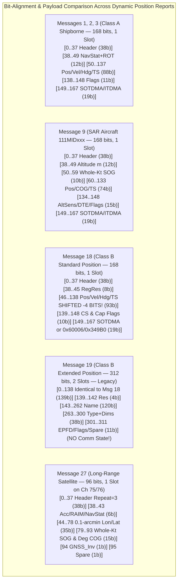
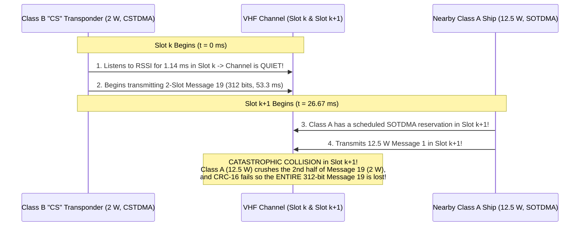
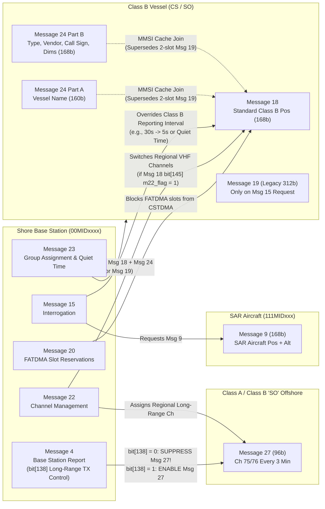

# Chapter 34: Deep Dive into Messages 9, 18, 19, and 27: SAR Aircraft, Class B Position Reports, and Long-Range Satellite AIS

> **Chapter Scope:** While **Messages 1, 2, and 3** ([Chapter 31](ch31-messages-1-2-3-class-a-position-reports.md)) form the kinematic backbone for SOLAS Class A merchant shipping, four specialized dynamic position reports extend the Automatic Identification System across three radically different physical and operational domains: airborne search-and-rescue (**Message 9**), recreational and non-SOLAS commercial vessels (**Messages 18 and 19**), and Low Earth Orbit (LEO) satellite surveillance (**Message 27**). This chapter provides a forensic bit-level engineering profile of all four message types across the six mandatory Part VIII dimensions: (1) complete bit-level layouts, MAC state machines, and NMEA 2000 PGN mappings; (2) protocol design flaws, parser bugs, and physical-layer collision traps; (3) cross-message state couplings with Messages 4, 15, 22, 23, and 24; (4) legitimate uses versus adversarial abuses (fishing-buoy squatting and low-power smuggling); (5) empirical VDL traffic distributions; and (6) a comprehensive software support matrix alongside a runnable Python decoder and multi-resolution trajectory fusion pipeline.

---

## 1. Operational & Conceptual Overview

Why could ITU-R M.1371 not simply use **Message 1** for every mobile platform on, above, or observed from above the ocean? Each of the three non-Class-A mobile regimes violates a core physical or Medium Access Control (MAC) assumption baked into the 168-bit Class A Position Report:

1. **Search and Rescue (SAR) Aircraft (`Message 9`, `168 bits`, `1 slot`):**
   * *The Kinematic Mismatch:* In Messages 1, 2, and 3, the 10-bit `Speed Over Ground (SOG)` field is scaled in $0.1\text{-knot}$ increments and saturates at **$102.2\text{ knots}$** (`1022`), while bits `38..49` (`12 bits`) encode maritime `Navigation Status` (`4 bits`) and marine gyrocompass `Rate of Turn (ROT)` (`8 bits`). A rescue helicopter (`HH-60J Jayhawk`, `AW139`) dashes at $140\text{–}160\text{ knots}$, and a fixed-wing maritime patrol aircraft (`HC-130J`, `P-8A Poseidon`, `Dash 8`) cruises at $250\text{–}490\text{ knots}$ at altitudes of hundreds to thousands of meters.
   * *The Message 9 Solution:* **Message 9** repurposes the 12-bit `Navigation Status + ROT` block (`bits[38:50]`) into a 12-bit **`Altitude`** field in whole meters (`0–4,094 m`, `4095` = N/A) and rescales the 10-bit **`SOG`** field (`bits[50:60]`) by a factor of $10\times$ into **whole knots (`0–1,022 kts`)**. It also replaces `True Heading` (`9 bits`) and `Maneuver Indicator` (`2 bits`) with an **`Altitude Sensor`** flag (`0` = GNSS, `1` = barometric), a **`DTE`** terminal readiness bit, and a **`Communication State Selector Flag`** (`bit[148]`) allowing either **SOTDMA** (*Message 9 Mode A*) or **ITDMA** (*Message 9 Mode B*).

2. **Non-SOLAS Class B Vessels (`Message 18` [`168 bits`, `1 slot`] & `Message 19` [`312 bits`, `2 slots`]):**
   * *The Hardware Cost & MAC Mismatch:* A SOLAS Class A transponder (**IEC 61993-2**) requires a $12.5\text{ W}$ transmitter, continuous dual-channel SOTDMA slot-map memory, a heading/ROT gyro interface, and a dedicated Minimum Keyboard and Display (MKD). To bring AIS to tens of thousands of yachts, sailboats, workboats, and artisanal fishing vessels at a fraction of the cost and power budget, **IEC 62287-1** introduced **Class B "CS" (Carrier-Sense TDMA, $2\text{ W}$)** and **IEC 62287-2** later added **Class B "SO" (Self-Organizing TDMA, $5\text{ W}$)**.
   * *The Message 18 & 19 Solution:* Because Class B vessels lack rate-of-turn indicators and manual bridge navigation-status switches, **Message 18** replaces `Navigation Status` (`4 bits`) and `ROT` (`8 bits`) with only **8 bits of `Regional Reserved`** (`bits[38:46]`)—shifting the entire coordinate block (`SOG`, `Accuracy`, `Lon`, `Lat`, `COG`, `Heading`, `Time Stamp`) **4 bits earlier** than in Message 1! The 4 freed bits are moved to the tail of the message (`bits[141:148]`) to encode seven **Class B Capability Flags** (`CS Unit`, `Display`, `DSC`, `Band`, `Msg 22`, `Assigned Mode`, `RAIM`) plus the `Comm State Selector Flag`. When `CS Unit = 1` (a $2\text{ W}$ CSTDMA unit that listens for carrier silence rather than maintaining a slot reservation map), `bit[148]` is forced to `1` (`ITDMA`) and the 19-bit Communication State (`bits[149:168]`) is hardcoded to the constant dummy bitstring **`1100000000000000110`** (`0x60006` in 19-bit unsigned hex, also cited in legacy `AIVDM.txt` tables as `0x349B0`). **Message 19** attempted to append static vessel metadata (`Name`, `Ship Type`, `Dimensions`) onto the Message 18 kinematic block in a single **312-bit (2-slot)** burst, but suffered severe VDL collision losses under CSTDMA and was functionally superseded by pairing **Message 18** with single-slot **Message 24 (Part A & Part B)** ([Chapter 33](ch33-messages-5-and-24-static-and-voyage-data.md)).

3. **Long-Range Satellite AIS (`Message 27`, `96 bits`, `1 slot` on Channels 75 & 76):**
   * *The Orbital Footprint & Delay-Spread Crisis:* As derived in [Chapter 17](../part4-space-air-vdes/ch17-satellite-ais-reception-and-transmission.md), a LEO satellite at $h = 600\text{ km}$ views a $5{,}300\text{ km}$ ground swath containing over **$1{,}200$ independent terrestrial SOTDMA cells** simultaneously, while the slant-range propagation delay from nadir ($600\text{ km}$, $2.0\text{ ms}$) to the limb ($2{,}829\text{ km}$, $9.4\text{ ms}$) spans **$\Delta\tau \approx 7.4\text{ ms}$ ($\sim 71\text{ bits}$)**—overflowing the $2.5\text{ ms}$ ($24\text{-bit}$) terrestrial guard buffer and colliding into adjacent time slots.
   * *The Message 27 Solution:* Standardized in **ITU-R M.1371-4 (2010)** and **M.1371-5 (2014)**, **Message 27** offloads satellite tracking onto dedicated VHF uplink channels **Channel 75 ($156.775\text{ MHz}$)** and **Channel 76 ($156.825\text{ MHz}$)**. By quantizing `Longitude` (`18 bits`) and `Latitude` (`17 bits`) to **$0.1\text{ arc-minute}$ ($\frac{1}{600}^\circ \approx 185.2\text{ m}$)**, `SOG` to **whole knots (`0–62 kts`, `6 bits`)**, and `COG` to **whole degrees (`0–359°`, `9 bits`)**, and stripping out `ROT`, `Heading`, `Time Stamp`, and the entire 19-bit `Communication State`, Message 27 compresses the payload from $168\text{ bits}$ down to **$96\text{ bits}$ ($10.0\text{ ms}$ payload / $15.83\text{ ms}$ total burst)**—leaving a massive **$10.83\text{ ms}$ ($104\text{-bit}$) guard buffer** that absorbs orbital slant-range delay without ever overlapping the next slot.



---

## 2. Historical Context & Evolution (`schwehr/gis-history` Integration)

The evolution of Messages 9, 18, 19, and 27 reflects two decades of friction between theoretical radio committee designs and empirical VDL physics ([`schwehr/gis-history`](https://github.com/schwehr/gis-history); [Cutlip, 2017](https://globalfishingwatch.org/article/ais-brief-history/)):

| Year | Standard / Milestone | Technical Significance for Messages 9, 18, 19, and 27 |
|---|---|---|
| **1998** | **ITU-R M.1371-0** | Defines **Message 9** (*Standard SAR Aircraft Position Report*) alongside Messages 1–3 so helicopters and fixed-wing rescue aircraft (`111MIDxxx`) can display directly on shipboard ECDIS/radar during joint SAR operations. |
| **2001** | **ITU-R M.1371-1** | Introduces **Message 18** (*Standard Class B Position Report*, 168 bits) and **Message 19** (*Extended Class B Position Report*, 312 bits) ahead of the July 2002 SOLAS mandate, assuming Class B units would use ITDMA/SOTDMA slot reservations. |
| **2006–2007** | **IEC 62287-1 (Class B "CS")** & **ITU-R M.1371-2 / -3** | Standardizes low-cost $2\text{ W}$ **Carrier-Sense TDMA (CSTDMA)** Class B transponders. Because a CSTDMA radio only checks RSSI for $1.14\text{ ms}$ at the start of Slot $k$ and cannot protect Slot $k+1$ in a 2-slot **Message 19** burst, M.1371-3 deprecates autonomous Message 19 transmissions in favor of single-slot **Message 24 (Part A & Part B)**. |
| **2006–2010** | **`aisparser`, `gpsd` `AIVDM.txt`, and `libais`** | Open-source authors (**Kurt Schwehr**, **Eric S. Raymond**, **Brian C. Lane**) document the 4-bit coordinate offset between Message 1 and Message 18/19, the hardcoded CSTDMA communication state (`1100000000000000110`), and Message 9's whole-knot SOG scaling in `libais` (`Ais9`, `Ais18`, `Ais19`, and later `Ais27`). |
| **2010–2014** | **ITU-R M.1371-4 (2010)**, **ITU WRC-12**, & **ITU-R M.1371-5 (2014)** | Following orbital collision studies on **TacSat-2**, **NTS**, and **AISSat-1**, ITU-R M.1371-4/5 standardizes the 96-bit **Message 27** on dedicated long-range frequencies **Channel 75 ($156.775\text{ MHz}$)** and **Channel 76 ($156.825\text{ MHz}$)**, controlled near shore by **Message 4 `bit[138]`**. |
| **2013–2018** | **IEC 62287-2 (Class B "SO" / Class B+)** | Certifies $5\text{ W}$ SOTDMA Class B transponders (`CS Unit = 0` in Message 18), restoring full SOTDMA slot reservations and faster speed-dependent reporting ($5\text{ s}$ above $23\text{ kts}$) for fast yachts, pilot launches, and patrol craft. |

---

## 3. Deep Technical & Mathematical Foundations (Section 34.1: How Messages 9, 18, 19, and 27 Work)

### 34.1.1 Complete 168-Bit Layout of Message 9 (Standard SAR Aircraft Position Report)

**Message 9** is transmitted every **$10\text{ seconds}$** (alternating between **AIS 1** [$161.975\text{ MHz}$] and **AIS 2** [$162.025\text{ MHz}$]) by airborne Search and Rescue platforms assigned a 9-digit MMSI of the form **`111MIDxxx`** under **ITU-R M.585-9** (where `111MID1xx` denotes fixed-wing aircraft and `111MID5xx` denotes rotary-wing helicopters; see [Chapter 13](../part3-timing-protocol/ch13-mmsi-and-maritime-identity.md)). In NMEA 0183 (`!AIVDM`), a 168-bit Message 9 packs into a single 28-character 6-bit ASCII string (`0` fill bits) beginning with character **`9`**.

```
0                   1                   2                   3
0 1 2 3 4 5 6 7 8 9 0 1 2 3 4 5 6 7 8 9 0 1 2 3 4 5 6 7 8 9 0 1
+-+-+-+-+-+-+-+-+-+-+-+-+-+-+-+-+-+-+-+-+-+-+-+-+-+-+-+-+-+-+-+-+
|MsgID=9(6b)|R I|                MMSI (111MIDxxx)               |
+-+-+-+-+-+-+-+-+-+-+-+-+-+-+-+-+-+-+-+-+-+-+-+-+-+-+-+-+-+-+-+-+
|     MMSI (cont.)      |      Altitude (12b, m)    |  SOG (10b)|
+-+-+-+-+-+-+-+-+-+-+-+-+-+-+-+-+-+-+-+-+-+-+-+-+-+-+-+-+-+-+-+-+
|SOG (kt, c)|P|                  Longitude (28b)                |
+-+-+-+-+-+-+-+-+-+-+-+-+-+-+-+-+-+-+-+-+-+-+-+-+-+-+-+-+-+-+-+-+
|  Lon (c.) |                    Latitude (27b)                 |
+-+-+-+-+-+-+-+-+-+-+-+-+-+-+-+-+-+-+-+-+-+-+-+-+-+-+-+-+-+-+-+-+
|  Lat (c.) |        COG (12b)      |Time Stamp |A|  Spare (7b) |
+-+-+-+-+-+-+-+-+-+-+-+-+-+-+-+-+-+-+-+-+-+-+-+-+-+-+-+-+-+-+-+-+
|S|D|Spr(3)|M|R|C|          SOTDMA / ITDMA Comm State           |
+-+-+-+-+-+-+-+-+-+-+-+-+-+-+-+-+-+-+-+-+-+-+-+-+-+-+-+-+-+-+-+-+
|  Comm State (c.)  |
+-+-+-+-+-+-+-+-+-+-+
```

#### Table 34.1: Complete 168-Bit Layout of Message 9 (Standard SAR Aircraft Position Report — 1 Slot)

| 0-Based Slice (`bits[a:b]`) | 0-Based Range | 1-Based ITU Bits | Width | Field Name | `libais` / `pyais` Field | Data Type | Scale / Units | Valid Range, Encoding, & Sentinel ("Not Available") |
|---|---|---|---:|---|---|---|---|---|
| `bits[0:6]` | `0..5` | `1..6` | 6 | Message ID | `message_id` / `msg_type` | `uint6` | Enum | Always **`9`** (`001001`) |
| `bits[6:8]` | `6..7` | `7..8` | 2 | Repeat Indicator | `repeat_indicator` / `repeat` | `uint2` | Hops | `0–3` (`0` = default; `3` = do not repeat) |
| `bits[8:38]` | `8..37` | `9..38` | 30 | User ID (MMSI) | `mmsi` | `uint30` | 9-digit ID | **`111MIDxxx`** (`111MID1xx` fixed-wing, `111MID5xx` helicopter) |
| **`bits[38:50]`** | **`38..49`** | **`39..50`** | **12** | **Altitude** | `alt` | `uint12` | **$1\text{ meter}$** | `0–4,094 m` (`4094` = $\ge 4{,}094\text{ m}$); **`4095` (`0xFFF`) = N/A** *(replaces `Nav Status` + `ROT`!)* |
| **`bits[50:60]`** | **`50..59`** | **`51..60`** | **10** | **Speed Over Ground (SOG)** | `sog` | `uint10` | **$1\text{ knot}$ (whole kts!)** | `0–1,022 kts` (`1022` = $\ge 1{,}022\text{ kts}$); **`1023` (`0x3FF`) = N/A** *($10\times$ Msg 1/18 scale!)* |
| `bits[60:61]` | `60..60` | `61..61` | 1 | Position Accuracy | `position_accuracy` / `accuracy` | `bool` | Flag | `1` = High ($\le 10\text{ m}$ DGNSS/SBAS); `0` = Low ($>10\text{ m}$, default) |
| `bits[61:89]` | `61..88` | `62..89` | 28 | Longitude ($\lambda$) | `x` / `lon` | `int28` | $\frac{1}{10{,}000}\text{ min}$ ($\frac{1}{600{,}000}^\circ$) | $[-180^\circ, +180^\circ]$; **`181.0°` (`108,600,000` / `0x6791AC0`) = N/A** |
| `bits[89:116]` | `89..115` | `90..116` | 27 | Latitude ($\phi$) | `y` / `lat` | `int27` | $\frac{1}{10{,}000}\text{ min}$ ($\frac{1}{600{,}000}^\circ$) | $[-90^\circ, +90^\circ]$; **`91.0°` (`54,600,000` / `0x3412140`) = N/A** |
| `bits[116:128]` | `116..127` | `117..128` | 12 | Course Over Ground (COG) | `cog` | `uint12` | $0.1^\circ\text{ true}$ | `0.0°–359.9°` (`0–3599`); **`360.0°` (`3600` / `0xE10`) = N/A** |
| `bits[128:134]` | `128..133` | `129..134` | 6 | Time Stamp | `timestamp` / `second` | `uint6` | UTC second | `0–59 s`; `60` = N/A, `61` = Manual, `62` = Dead reckoning, `63` = Inop |
| **`bits[134:135]`** | **`134..134`** | **`135..135`** | **1** | **Altitude Sensor** | `alt_sensor` | `bool` | Sensor Type | **`0` = GNSS altitude**; **`1` = Barometric altitude sensor** |
| `bits[135:142]` | `135..141` | `136..142` | 7 | Spare | `spare` | `uint7` | — | `0` (Reserved for regional/future use) |
| `bits[142:143]` | `142..142` | `143..143` | 1 | Data Terminal Equipment (DTE) | `dte` | `bool` | Flag | `0` = Data terminal ready/available; `1` = Not available (default) |
| `bits[143:146]` | `143..145` | `144..146` | 3 | Spare | `spare2` | `uint3` | — | `0` |
| `bits[146:147]` | `146..146` | `147..147` | 1 | Assigned Mode Flag | `assigned` | `bool` | Mode | `0` = Autonomous and continuous mode; `1` = Assigned mode |
| `bits[147:148]` | `147..147` | `148..148` | 1 | RAIM Flag | `raim` | `bool` | Integrity | `0` = RAIM not in use (default); `1` = RAIM in use |
| **`bits[148:149]`** | **`148..148`** | **`149..149`** | **1** | **Comm State Selector Flag** | `commstate_flag` | `bool` | MAC Selector | **`0` = SOTDMA (*Message 9 Mode A*)**; **`1` = ITDMA (*Message 9 Mode B*)** |
| `bits[149:168]` | `149..167` | `150..168` | 19 | Communication State | `sync_state`, `slot_timeout` / `slot_increment` | `uint19` | SOTDMA or ITDMA | Parsed as SOTDMA if `bit[148] == 0`, or ITDMA if `bit[148] == 1` |

**Why Two Modes (`Mode A` SOTDMA vs. `Mode B` ITDMA) Exist for Message 9:**
Because an aircraft flying at $300\text{ knots}$ ($154\text{ m/s}$) at $3{,}000\text{ m}$ altitude has a VHF radio horizon exceeding $120\text{ NM}$ ($222\text{ km}$) and traverses local surface SOTDMA cells rapidly, its slot map changes much faster than a surface ship's. **Message 9 Mode A (`bit[148] = 0`)** uses standard **SOTDMA** (`Sync State [2b]`, `Slot Time-Out [3b]`, `Sub-Message [14b]`), whereas **Message 9 Mode B (`bit[148] = 1`)** uses **ITDMA** (`Sync State [2b]`, `Slot Increment [13b]`, `Number of Slots [3b]`, `Keep Flag [1b]`), allowing the aircraft transponder to select free slots dynamically per burst without committing to multi-minute frame reservations.

---

### 34.1.2 Complete 168-Bit Layout of Message 18 (Standard Class B Equipment Position Report)

**Message 18** is the universal single-slot dynamic position report for both **Class B "CS" (Carrier-Sense TDMA, $2\text{ W}$, IEC 62287-1)** and **Class B "SO" (Self-Organizing TDMA, $5\text{ W}$, IEC 62287-2)** shipborne equipment. In NMEA 0183 (`!AIVDM`), a 168-bit Message 18 encodes into 28 6-bit ASCII characters (`0` fill bits) beginning with character **`B`**.

> [!IMPORTANT]
> **The 4-Bit Coordinate Shift Between Message 1 and Message 18:**
> In Class A **Messages 1, 2, and 3**, `Navigation Status` (`4 bits`) + `ROT` (`8 bits`) occupy **12 bits (`bits[38:50]`)**, placing `SOG` at `bits[50:60]`, `Longitude` at `bits[61:89]`, and `Latitude` at `bits[89:116]`.
> In Class B **Messages 18 and 19**, `Navigation Status` and `ROT` are replaced by only **8 bits of `Regional Reserved` (`bits[38:46]`)**. Consequently, **`SOG` (`bits[46:56]`), `Position Accuracy` (`bit[56]`), `Longitude` (`bits[57:85]`), `Latitude` (`bits[85:112]`), `COG` (`bits[112:124]`), `True Heading` (`bits[124:133]`), and `Time Stamp` (`bits[133:139]`) are all shifted 4 bits earlier** than in Class A! Reusing a Message 1 bit-slicer on a Message 18 payload corrupts every kinematic field.

#### Table 34.2: Complete 168-Bit Layout of Message 18 (Standard Class B Equipment Position Report — 1 Slot)

| 0-Based Slice (`bits[a:b]`) | 0-Based Range | 1-Based ITU Bits | Width | Field Name | `libais` / `pyais` Field | Data Type | Scale / Units | Valid Range, Encoding, & Sentinel ("Not Available") |
|---|---|---|---:|---|---|---|---|---|
| `bits[0:6]` | `0..5` | `1..6` | 6 | Message ID | `message_id` / `msg_type` | `uint6` | Enum | Always **`18`** (`010010`) |
| `bits[6:8]` | `6..7` | `7..8` | 2 | Repeat Indicator | `repeat_indicator` / `repeat` | `uint2` | Hops | `0–3` (`0` = default; `3` = do not repeat) |
| `bits[8:38]` | `8..37` | `9..38` | 30 | User ID (MMSI) | `mmsi` | `uint30` | 9-digit ID | Standard ship (`MIDxxxxxx`) or daughter craft (`98MIDxxxx`) |
| `bits[38:46]` | `38..45` | `39..46` | 8 | Regional Reserved | `reserved_1` | `uint8` | — | Default **`0`** *(replaces `Nav Status` & `ROT`; saves 4 bits)* |
| `bits[46:56]` | `46..55` | `47..56` | 10 | Speed Over Ground (SOG) | `sog` | `uint10` | $0.1\text{ knot}$ | `0.0–102.2 kts` (`1022` = $\ge 102.2\text{ kts}$); **`102.3` (`1023`) = N/A** |
| `bits[56:57]` | `56..56` | `57..57` | 1 | Position Accuracy | `position_accuracy` / `accuracy` | `bool` | Flag | `1` = High ($\le 10\text{ m}$); `0` = Low ($>10\text{ m}$) |
| `bits[57:85]` | `57..84` | `58..85` | 28 | Longitude ($\lambda$) | `x` / `lon` | `int28` | $\frac{1}{10{,}000}\text{ min}$ ($\frac{1}{600{,}000}^\circ$) | $[-180^\circ, +180^\circ]$; **`181.0°` (`108,600,000` / `0x6791AC0`) = N/A** |
| `bits[85:112]` | `85..111` | `86..112` | 27 | Latitude ($\phi$) | `y` / `lat` | `int27` | $\frac{1}{10{,}000}\text{ min}$ ($\frac{1}{600{,}000}^\circ$) | $[-90^\circ, +90^\circ]$; **`91.0°` (`54,600,000` / `0x3412140`) = N/A** |
| `bits[112:124]` | `112..123` | `113..124` | 12 | Course Over Ground (COG) | `cog` | `uint12` | $0.1^\circ\text{ true}$ | `0.0°–359.9°` (`0–3599`); **`360.0°` (`3600` / `0xE10`) = N/A** |
| `bits[124:133]` | `124..132` | `125..133` | 9 | True Heading (HDG) | `true_heading` / `heading` | `uint9` | $1^\circ\text{ true}$ | `0°–359°`; **`511` (`0x1FF`) = N/A** (most Class B lack gyro/compass input!) |
| `bits[133:139]` | `133..138` | `134..139` | 6 | Time Stamp | `timestamp` / `second` | `uint6` | UTC second | `0–59 s`; `60` = N/A (default for Class B "CS" without internal 1PPS sync) |
| `bits[139:141]` | `139..140` | `140..141` | 2 | Regional Reserved | `reserved_2` | `uint2` | — | Default **`0`** (`00`) |
| **`bits[141:142]`** | **`141..141`** | **`142..142`** | **1** | **Class B Unit Flag (`CS`)** | `unit_flag` / `cs` | `bool` | Hardware Class | **`0` = Class B "SO" (SOTDMA, $5\text{ W}$, IEC 62287-2)**; **`1` = Class B "CS" (CSTDMA, $2\text{ W}$, IEC 62287-1)** |
| **`bits[142:143]`** | **`142..142`** | **`143..143`** | **1** | **Class B Display Flag** | `display_flag` / `display` | `bool` | Capability | `0` = No visual display for Msg 12/14 text; `1` = Equipped with visual display |
| **`bits[143:144]`** | **`143..143`** | **`144..144`** | **1** | **Class B DSC Flag** | `dsc_flag` / `dsc` | `bool` | Capability | `0` = No VHF DSC function; `1` = Equipped with dedicated/time-shared Ch 70 DSC RX |
| **`bits[144:145]`** | **`144..144`** | **`145..145`** | **1** | **Class B Band Flag** | `band_flag` / `band` | `bool` | Capability | `0` = Upper $525\text{ kHz}$ marine band only; `1` = Whole marine VHF band |
| **`bits[145:146]`** | **`145..145`** | **`146..146`** | **1** | **Class B Message 22 Flag** | `m22_flag` / `msg22` | `bool` | Capability | `0` = No Msg 22 frequency management (AIS 1/2 only); `1` = Supports Msg 22 |
| **`bits[146:147]`** | **`146..146`** | **`147..147`** | **1** | **Assigned Mode Flag** | `mode_flag` / `assigned` | `bool` | Mode | `0` = Autonomous and continuous mode; `1` = Assigned mode |
| **`bits[147:148]`** | **`147..147`** | **`148..148`** | **1** | **RAIM Flag** | `raim` | `bool` | Integrity | `0` = RAIM not in use; `1` = RAIM in use |
| **`bits[148:149]`** | **`148..148`** | **`149..149`** | **1** | **Comm State Selector Flag** | `commstate_flag` | `bool` | MAC Selector | `0` = SOTDMA state follows; **`1` = ITDMA state follows (forced to `1` when `CS = 1`)** |
| **`bits[149:168]`** | **`149..167`** | **`150..168`** | **19** | **Communication State** | `sync_state`, `slot_increment`, etc. | `uint19` | SOTDMA / ITDMA | When `CS = 1`, hardcoded to **`1100000000000000110`** (`0x60006` / `0x349B0`) |

**Forensic Anatomy of the Hardcoded Class B "CS" Communication State (`1100000000000000110`):**
Why does ITU-R M.1371-5 Annex 8 (§3.18) mandate that every Class B "CS" (`bit[141] = 1`) unit set `bit[148] = 1` (ITDMA) and fill `bits[149:168]` with the exact 19-bit constant **`1100000000000000110`**?
Because a Carrier-Sense (CSTDMA) unit does not maintain a long-term slot reservation table (save for avoiding FATDMA slots reserved by Base Station Message 20 and slots actively reserved by nearby Class A SOTDMA bursts), it has no future slot offset to announce! Unpacking the 19-bit ITDMA fields of `1100000000000000110` (`393,222` decimal = `0x60006` in 19-bit binary; note that `gpsd`'s `AIVDM.txt` historically transcribed this constant in prose as `0x349B0` = `215,472`, though IEC 62287-1 hardware transmits the ITU bitstring `1100000000000000110`) reveals how it safely neutralizes every peer receiver's slot-reservation parser:
* `bits[149:151]` (`2 bits`, `Sync State`): **`11` (`3`)** = *Station is synchronized to another station based on highest number of received stations (Peer Sync)*—the lowest priority in the 4-tier sync hierarchy, guaranteeing no Class A ship will ever degrade its own clock to follow a Class B CS unit.
* `bits[151:164]` (`13 bits`, `Slot Increment`): **`0000000000000` (`0`)** = *No future slot offset announced (autonomous CSTDMA operation)*.
* `bits[164:167]` (`3 bits`, `Number of Slots`): **`011` (`3`)** = Standard dummy ITDMA value indicating a single-slot uncommitted transmission.
* `bits[167:168]` (`1 bit`, `Keep Flag`): **`0`** = *Do not keep the current slot for the next frame*.

---

### 34.1.3 Complete 312-Bit Layout of Message 19 (Extended Class B Equipment Position Report)

**Message 19** (`312 bits`, occupying **2 contiguous time slots**) was designed in ITU-R M.1371-1 to combine the dynamic kinematics of Message 18 (`bits[0:139]`) with the core static vessel identity fields (`Name`, `Type of Ship and Cargo`, `Dimensions A/B/C/D`, and `EPFD`) in a single message—eliminating the need for a separate static message. In NMEA 0183 (`!AIVDM`), $312\text{ bits} / 6 = 52$ characters (`0` fill bits), starting with character **`C`** (either in a single 52-character payload or split across a 2-sentence `!AIVDM,2,1...` / `!AIVDM,2,2...` pair). Notably, Message 19 contains **zero Communication State bits**.

#### Table 34.3: Complete 312-Bit Layout of Message 19 (Extended Class B Equipment Position Report — 2 Slots)

| 0-Based Slice (`bits[a:b]`) | 0-Based Range | 1-Based ITU Bits | Width | Field Name | `libais` / `pyais` Field | Data Type | Scale / Units | Valid Range, Encoding, & Sentinel ("Not Available") |
|---|---|---|---:|---|---|---|---|---|
| `bits[0:6]` | `0..5` | `1..6` | 6 | Message ID | `message_id` / `msg_type` | `uint6` | Enum | Always **`19`** (`010011`) |
| `bits[6:8]` | `6..7` | `7..8` | 2 | Repeat Indicator | `repeat_indicator` / `repeat` | `uint2` | Hops | `0–3` |
| `bits[8:38]` | `8..37` | `9..38` | 30 | User ID (MMSI) | `mmsi` | `uint30` | 9-digit ID | `000000000`–`999999999` |
| `bits[38:46]` | `38..45` | `39..46` | 8 | Regional Reserved | `reserved_1` | `uint8` | — | Default `0` |
| `bits[46:56]` | `46..55` | `47..56` | 10 | Speed Over Ground (SOG) | `sog` | `uint10` | $0.1\text{ knot}$ | `0.0–102.2 kts`; **`102.3` (`1023`) = N/A** |
| `bits[56:57]` | `56..56` | `57..57` | 1 | Position Accuracy | `position_accuracy` / `accuracy` | `bool` | Flag | `1` = High ($\le 10\text{ m}$); `0` = Low ($>10\text{ m}$) |
| `bits[57:85]` | `57..84` | `58..85` | 28 | Longitude ($\lambda$) | `x` / `lon` | `int28` | $\frac{1}{10{,}000}\text{ min}$ | $[-180^\circ, +180^\circ]$; **`181.0°` (`0x6791AC0`) = N/A** |
| `bits[85:112]` | `85..111` | `86..112` | 27 | Latitude ($\phi$) | `y` / `lat` | `int27` | $\frac{1}{10{,}000}\text{ min}$ | $[-90^\circ, +90^\circ]$; **`91.0°` (`0x3412140`) = N/A** |
| `bits[112:124]` | `112..123` | `113..124` | 12 | Course Over Ground (COG) | `cog` | `uint12` | $0.1^\circ\text{ true}$ | `0.0°–359.9°`; **`360.0°` (`3600`) = N/A** |
| `bits[124:133]` | `124..132` | `125..133` | 9 | True Heading (HDG) | `true_heading` / `heading` | `uint9` | $1^\circ\text{ true}$ | `0°–359°`; **`511` = N/A** |
| `bits[133:139]` | `133..138` | `134..139` | 6 | Time Stamp | `timestamp` / `second` | `uint6` | UTC second | `0–59 s`; `60–63` = fallback status |
| `bits[139:143]` | `139..142` | `140..143` | 4 | Regional Reserved | `reserved_2` | `uint4` | — | Default `0` (`0000`) |
| **`bits[143:263]`** | **`143..262`** | **`144..263`** | **120** | **Name** | `name` / `shipname` | `str6` (20 chars) | 6-bit ASCII | 20 characters (`@` padded); **`@@@@@@@@@@@@@@@@@@@@` = N/A** |
| **`bits[263:271]`** | **`263..270`** | **`264..271`** | **8** | **Type of Ship and Cargo** | `type_and_cargo` / `shiptype` | `uint8` | Enum (`0–99`) | Standard ITU Table (`36` = Sailing, `37` = Pleasure craft, `0` = N/A) |
| **`bits[271:280]`** | **`271..279`** | **`272..280`** | **9** | **Dimension to Bow ($A$)** | `dim_a` / `to_bow` | `uint9` | $1\text{ meter}$ | `0–511 m` ($A=B=0 \Rightarrow$ N/A) |
| **`bits[280:289]`** | **`280..288`** | **`281..289`** | **9** | **Dimension to Stern ($B$)** | `dim_b` / `to_stern` | `uint9` | $1\text{ meter}$ | `0–511 m` |
| **`bits[289:295]`** | **`289..294`** | **`290..295`** | **6** | **Dimension to Port ($C$)** | `dim_c` / `to_port` | `uint6` | $1\text{ meter}$ | `0–63 m` ($C=D=0 \Rightarrow$ N/A) |
| **`bits[295:301]`** | **`295..300`** | **`296..301`** | **6** | **Dimension to Starboard ($D$)** | `dim_d` / `to_starboard` | `uint6` | $1\text{ meter}$ | `0–63 m` |
| `bits[301:305]` | `301..304` | `302..305` | 4 | Type of EPFD | `fix_type` / `epfd` | `uint4` | Enum (`0–15`) | `1` = GPS, `2` = GLONASS, `3` = Combined, `8` = Galileo, `0`/`15` = N/A |
| `bits[305:306]` | `305..305` | `306..306` | 1 | RAIM Flag | `raim` | `bool` | Integrity | `0` = Not in use; `1` = In use |
| `bits[306:307]` | `306..306` | `307..307` | 1 | DTE | `dte` | `bool` | Flag | `0` = Available; `1` = Not available (default) |
| `bits[307:308]` | `307..307` | `308..308` | 1 | Assigned Mode Flag | `assigned` | `bool` | Mode | `0` = Autonomous mode; `1` = Assigned mode |
| `bits[308:312]` | `308..311` | `309..312` | 4 | Spare | `spare` | `uint4` | — | `0` (`0000`) |

---

### 34.1.4 Complete 96-Bit Layout of Message 27 (Position Report for Long-Range Applications)

**Message 27** (`96 bits`, $10.0\text{ ms}$ payload duration inside a single $26.667\text{ ms}$ time slot) is broadcast every **$3\text{ minutes}$** by Class A and Class B "SO" shipborne stations on **Channel 75 ($156.775\text{ MHz}$)** and **Channel 76 ($156.825\text{ MHz}$)** (or regional long-range channels designated via Message 22) whenever the vessel is outside the coverage of a coastal Base Station broadcasting Message 4 with `Long-Range TX Control = 0`. In NMEA 0183 (`!AIVDM`), $96\text{ bits} / 6 = 16$ characters (`0` fill bits), beginning with character **`K`**.

```
0                   1                   2                   3
0 1 2 3 4 5 6 7 8 9 0 1 2 3 4 5 6 7 8 9 0 1 2 3 4 5 6 7 8 9 0 1
+-+-+-+-+-+-+-+-+-+-+-+-+-+-+-+-+-+-+-+-+-+-+-+-+-+-+-+-+-+-+-+-+
|MsgID27(6b)|R=3|                 MMSI (30b)                    |
+-+-+-+-+-+-+-+-+-+-+-+-+-+-+-+-+-+-+-+-+-+-+-+-+-+-+-+-+-+-+-+-+
|   MMSI (cont.)    |P|R|NavStat|       Longitude (18b, 0.1')   |
+-+-+-+-+-+-+-+-+-+-+-+-+-+-+-+-+-+-+-+-+-+-+-+-+-+-+-+-+-+-+-+-+
|      Lon (cont.)          |         Latitude (17b, 0.1')      |
+-+-+-+-+-+-+-+-+-+-+-+-+-+-+-+-+-+-+-+-+-+-+-+-+-+-+-+-+-+-+-+-+
|    Lat (cont.)    |  SOG (6b) |      COG (9b)   |G|S|
+-+-+-+-+-+-+-+-+-+-+-+-+-+-+-+-+-+-+-+-+-+-+-+-+-+-+-+
```

#### Table 34.4: Complete 96-Bit Layout of Message 27 (Long-Range AIS Broadcast Message — 1 Slot)

| 0-Based Slice (`bits[a:b]`) | 0-Based Range | 1-Based ITU Bits | Width | Field Name | `libais` / `pyais` Field | Data Type | Scale / Units | Valid Range, Encoding, & Sentinel ("Not Available") |
|---|---|---|---:|---|---|---|---|---|
| `bits[0:6]` | `0..5` | `1..6` | 6 | Message ID | `message_id` / `msg_type` | `uint6` | Enum | Always **`27`** (`011011`) |
| `bits[6:8]` | `6..7` | `7..8` | 2 | Repeat Indicator | `repeat_indicator` / `repeat` | `uint2` | Hops | **Always `3` (`11` = Do not repeat!)** to prevent surface repeaters from echoing |
| `bits[8:38]` | `8..37` | `9..38` | 30 | User ID (MMSI) | `mmsi` | `uint30` | 9-digit ID | `000000000`–`999999999` |
| `bits[38:39]` | `38..38` | `39..39` | 1 | Position Accuracy | `position_accuracy` / `accuracy` | `bool` | Flag | `1` = High ($\le 10\text{ m}$); `0` = Low ($>10\text{ m}$) |
| `bits[39:40]` | `39..39` | `40..40` | 1 | RAIM Flag | `raim` | `bool` | Integrity | `0` = Not in use; `1` = In use |
| `bits[40:44]` | `40..43` | `41..44` | 4 | Navigation Status | `nav_status` / `status` | `uint4` | Enum (`0–15`) | Standard Class A Navigation Status (`0` = Under way using engine; `15` = N/A) |
| **`bits[44:62]`** | **`44..61`** | **`45..62`** | **18** | **Longitude ($\lambda$)** | `x` / `lon` | **`int18`** | **$\frac{1}{10}\text{ arcmin}$ ($\frac{1}{600}^\circ \approx 185.2\text{ m}$)** | $[-180^\circ, +180^\circ]$ (`±108,000`); **`181.0°` (`108,600` / `0x1A838`) = N/A** |
| **`bits[62:79]`** | **`62..78`** | **`63..79`** | **17** | **Latitude ($\phi$)** | `y` / `lat` | **`int17`** | **$\frac{1}{10}\text{ arcmin}$ ($\frac{1}{600}^\circ \approx 185.2\text{ m}$)** | $[-90^\circ, +90^\circ]$ (`±54,000`); **`91.0°` (`54,600` / `0xD548`) = N/A** |
| **`bits[79:85]`** | **`79..84`** | **`80..85`** | **6** | **Speed Over Ground (SOG)** | `sog` | **`uint6`** | **$1\text{ knot}$ (whole knots)** | `0–62 knots`; **`63` (`0x3F`) = N/A** |
| **`bits[85:94]`** | **`85..93`** | **`86..94`** | **9** | **Course Over Ground (COG)** | `cog` | **`uint9`** | **$1^\circ\text{ true}$ (whole degrees)** | `0°–359°`; **`511` (`0x1FF`) = N/A** |
| **`bits[94:95]`** | **`94..94`** | **`95..95`** | **1** | **GNSS Position Status** | `gnss` | **`bool`** | **Latency Flag** | **`0` = Current GNSS position ($<5\text{ s}$ old)**; **`1` = NOT current GNSS position (default)!** |
| `bits[95:96]` | `95..95` | `96..96` | 1 | Spare | `spare` | `uint1` | — | `0` |

**Mathematical Derivation of Message 27 Coordinate Quantization ($185.2\text{ m}$ Grid):**
In standard Messages 1, 2, 3, 9, 18, and 19, coordinates are stored in $\frac{1}{10{,}000}\text{ arc-minute}$ ($\Delta\phi_{\text{std}} = \frac{1}{600{,}000}^\circ$), yielding a north-south grid spacing of:
$$\Delta y_{\text{std}} = \frac{1{,}852\text{ m/arcmin}}{10{,}000} = 0.1852\text{ m}$$
In **Message 27** (as well as the reference station coordinates of Message 17 and the bounding-box corners of Messages 22 and 23), coordinates are quantized $1{,}000\times$ more coarsely in **$\frac{1}{10}\text{ arc-minute}$ ($\Delta\phi_{27} = \frac{1}{600}^\circ \approx 0.0016667^\circ$)** using 18-bit (`Longitude`) and 17-bit (`Latitude`) signed two's complement integers:
$$\lambda_{\text{deg}} = \frac{X_{\text{int18}}}{600}, \qquad \phi_{\text{deg}} = \frac{Y_{\text{int17}}}{600}$$
$$\Delta y_{27} = 0.1\text{ arcmin} = 185.2\text{ m}, \qquad \Delta x_{27}(\phi) = 185.2\cos\phi\text{ m}$$
Assuming uniform rounding quantization error across $[-\frac{\Delta}{2}, +\frac{\Delta}{2}]$, the Root-Mean-Square (RMS) horizontal quantization noise introduced by Message 27 alone is:
$$\sigma_{y,27} = \frac{185.2\text{ m}}{\sqrt{12}} \approx 53.46\text{ m}, \qquad \sigma_{x,27}(\phi) = \frac{185.2\cos\phi\text{ m}}{\sqrt{12}} \approx 53.46\cos\phi\text{ m}$$

---

### 34.1.5 NMEA 2000 (IEC 61162-3) PGN Mapping

On modern vessel bridges equipped with an **NMEA 2000** CAN bus ([Chapter 14](../part3-timing-protocol/ch14-nmea-0183-nmea-2000-tag-blocks-and-vdr.md)), Messages 9, 18, and 19 map to dedicated Fast-Packet Parameter Group Numbers (**PGNs**), converting maritime knots and tenths of a degree into SI units ($\text{m/s}$ and $\text{radians}$):

| ITU Message | NMEA 2000 PGN | Official PGN Name | Key Unit Conversions & Field Transformations |
|---|---|---|---|
| **Message 9** | **`PGN 129798`** | *AIS SAR Aircraft Position Report* | `Lon`/`Lat` $\rightarrow$ `int32` ($10^{-7}\text{ deg}$); `Altitude` $\rightarrow$ `int64` ($10^{-6}\text{ m}$); `SOG` (whole kts) $\rightarrow$ `uint16` ($0.01\text{ m/s}$, where $1\text{ kt} = 0.514444\text{ m/s}$); `COG` $\rightarrow$ `uint16` ($10^{-4}\text{ rad}$). |
| **Message 18** | **`PGN 129039`** | *AIS Class B Position Report* | `Lon`/`Lat` $\rightarrow$ `int32` ($10^{-7}\text{ deg}$); `SOG` ($0.1\text{ kt}$) $\rightarrow$ `uint16` ($0.01\text{ m/s}$); `COG` & `True Heading` $\rightarrow$ `uint16` ($10^{-4}\text{ rad}$); preserves `Unit` (`CS`/`SO`), `Display`, `DSC`, `Band`, `Msg 22`, and `Mode` flags. |
| **Message 19** | **`PGN 129040`** | *AIS Class B Extended Position Report* | Combines `PGN 129039` kinematics with `Ship Type` (`uint8`), `Length`/`Beam`/`Ref Starboard`/`Ref Bow` ($0.1\text{ m}$ `uint16`), and 20-byte ASCII `Vessel Name`. |
| **Message 27** | *Mapped to `129038` or NMEA 0183* | *(No dedicated Msg 27 PGN in legacy N2K)* | Because Message 27 is transmitted upward to satellites (and blocked from shipboard repeaters via `Repeat = 3`), NMEA 2000 gateways receiving Msg 27 either pass `!AIVDM` over LWE (`IEC 61162-450`) or map it into `PGN 129038` (*Class A Position Report*) with `Heading = N/A` and `ROT = N/A`. |

---

## 4. Known Protocol & Implementation Issues (Section 34.2)

### 34.2.1 Message 9's `4,094 m` (`13,432 ft`) Altitude Ceiling and Whole-Knot `SOG` Parser Bugs

Message 9 suffers from two notorious engineering traps:
1. **The `4,094 m` (`13,432 ft`) Altitude Saturation Ceiling:**
   When ITU-R M.1371-0 allocated 12 bits (`bits[38:50]`) for aircraft altitude in 1-meter increments, the authors envisioned low-flying search-and-rescue helicopters (`HH-60`, `Sea King`, `Dauphin`) operating between $50\text{ m}$ and $1{,}500\text{ m}$ ($150\text{–}5{,}000\text{ ft}$) above the waves. However, modern long-range maritime patrol aircraft and high-altitude UAVs—such as the US Navy **`P-8A Poseidon`** (cruising at $25{,}000\text{–}41{,}000\text{ ft} \approx 7{,}620\text{–}12{,}500\text{ m}$), USCG **`HC-130J Super Hercules`** ($28{,}000\text{ ft} \approx 8{,}534\text{ m}$), and **`MQ-4C Triton`** ($50{,}000+\text{ ft} \approx 15{,}240\text{ m}$)—routinely fly far above $4{,}094\text{ m}$. Per ITU-R M.1371-5, any altitude $\ge 4{,}094\text{ m}$ must be clamped to **`4094` (`0xFFE`)** (since `4095` [`0xFFF`] means "not available"). Worse, a few poorly tested military/UAV AIS transponder firmwares fail to clamp before bit-packing (`alt_m & 0xFFF`), causing an aircraft climbing through $4{,}096\text{ m}$ ($13{,}438\text{ ft}$) to wrap modulo $4{,}096$ back to **`0 meters`**, or hit `4095` (`N/A`) at exactly $4{,}095\text{ m}$!
2. **The $10\times$ `SOG` Scaling Bug in Naive Decoders:**
   In Messages 1, 2, 3, 18, and 19, `SOG` (`10 bits`) is stored in **tenths of a knot** ($\text{SOG}_{\text{kts}} = \text{raw} \times 0.1$). In **Message 9**, `SOG` (`bits[50:60]`, `10 bits`) is stored in **whole knots** ($\text{SOG}_{\text{kts}} = \text{raw} \times 1.0$). Custom or copy-pasted parsers that share a generic `decode_sog_10bit(raw) -> raw * 0.1` helper across all 168-bit messages erroneously divide every SAR aircraft's speed by $10$—reporting a $180\text{-knot}$ rescue helicopter as crawling at **`18.0 knots`**!
3. **Barometric vs. GNSS Ellipsoid/Geoid Altitude Discrepancies (`bit[134]`):**
   When `alt_sensor = 0`, `Altitude` comes from the aircraft's GNSS receiver (which may output height above the WGS84 ellipsoid $h_{\text{ellip}}$ or EGM96/EGM2008 geoid height $H_{\text{MSL}}$, differing by up to $\pm 100\text{ m}$ globally). When `alt_sensor = 1`, `Altitude` comes from a barometric altimeter referenced to standard pressure ($1013.25\text{ hPa}$ above transition altitude or local QNH), which can diverge from geometric altitude by $>300\text{ m}$ in deep extratropical cyclones.

### 34.2.2 Message 18 Missing `ROT` / `Nav Status` and the 30-Second CSTDMA Stale-Vector Trap

For bridge watchstanders and VTS collision-avoidance algorithms (ARPA/ECDIS CPA/TCPA), Class B **Message 18** introduces three operational blind spots compared to Class A Message 1:
1. **No `Navigation Status` and No `Rate of Turn (ROT)`:** Because `bits[38:46]` are zeroed regional bits, a Class B vessel never transmits whether it is *Under way sailing*, *Engaged in fishing*, *Restricted in ability to maneuver*, or *At anchor*, nor does it transmit `ROT`. Furthermore, because most recreational yachts and small fishing boats do not wire a gyrocompass or NMEA 2000 fluxgate heading sensor into their Class B unit, **`True Heading` (`bits[124:133]`) is almost always `511` (`Not Available`)**. On ECDIS ([Chapter 21](../part5-navigation-vts/ch21-nautical-charts-ecdis-enc-and-s100.md)), a target with `Heading = 511` is rendered without a heading line (or oriented only along its noisy `COG` vector).
2. **The 30-Second Flat Reporting Rate of Class B "CS" (`IEC 62287-1`):**
   Look back at Table 15.2: whereas a Class A ship (or $5\text{ W}$ Class B "SO" unit) accelerates its reporting rate as it speeds up or turns—transmitting every **$2\text{ seconds}$** above $23\text{ knots}$—a $2\text{ W}$ **Class B "CS" (`CS Unit = 1`) transponder transmits only once every $30\text{ seconds}$ whenever $\text{SOG} > 2\text{ knots}$** (and once every $3\text{ minutes}$ when $\text{SOG} \le 2\text{ knots}$), **regardless of how fast it is moving or how sharply it is turning** (unless explicitly commanded to speed up via a shore Base Station **Message 23** Group Assignment Command!).
   * *Quantitative Impact:* A high-speed rigid-hulled inflatable boat (RHIB) or motor yacht equipped with a Class B "CS" transponder traveling at $30\text{ knots}$ ($15.43\text{ m/s}$) covers **$463\text{ meters}$ ($0.25\text{ NM}$) between consecutive Message 18 updates**! If it executes a $90^\circ$ turn inside a harbor channel, its ECDIS icon on nearby ships continues projecting along its old straight-line course for up to $30\text{ seconds}$ (nearly half a kilometer of dead-reckoning error).
3. **Polite Carrier-Sense Deferral to Class A:** Before transmitting in a candidate slot, a Class B "CS" receiver measures the VHF channel RSSI during the first **$1.14\text{ ms}$ ($1{,}140\text{ }\mu\text{s}$, ~11 bits)** of the slot. If the measured RSSI exceeds the dynamic background noise floor by a threshold ($+6\text{ dB}$ to $+10\text{ dB}$ above the minimum channel level measured over the last $4\text{ minutes}$), the Class B "CS" unit aborts its transmission and backs off to the next candidate slot. While this protects Class A SOTDMA traffic, in heavily congested ports a $2\text{ W}$ Class B "CS" boat can suffer repeated deferrals and capture-effect losses.

### 34.2.3 Why Message 19 Failed in Practice (The 2-Slot Unreserved CSTDMA Collision Trap)

Why is **Message 19** (*Extended Class B Position Report*, 312 bits, 2 slots) practically extinct on the modern VHF Data Link, having been superseded by **Message 24** (*Static Data Report*, Part A [160b] & Part B [168b], 1 slot each)?



The flaw is a textbook collision between **unreserved Carrier-Sense MAC (CSTDMA)** and **multi-slot HDLC framing**:
1. A 312-bit Message 19 frame (`312` data bits + `56` overhead bits = `368 bits` $\approx 38.3\text{ ms}$) spans **two consecutive time slots** ($\text{Slot } k$ and $\text{Slot } k+1$) protected by a **single trailing 16-bit CRC-CCITT** at the end of $\text{Slot } k+1$.
2. When a Class B "CS" unit wakes up at the start of $\text{Slot } k$, it can only sense whether $\text{Slot } k$ is currently free by measuring RSSI during the first $1.14\text{ ms}$ of $\text{Slot } k$. Because a Class B "CS" unit does **not** decode the full SOTDMA reservation table of surrounding vessels (under original IEC 62287-1 minimal hardware rules), **it has no way of knowing during $\text{Slot } k$ whether a $12.5\text{ W}$ Class A ship has reserved $\text{Slot } k+1$**!
3. The instant $\text{Slot } k+1$ begins ($t = 26.667\text{ ms}$), any Class A vessel scheduled for $\text{Slot } k+1$ keys its $12.5\text{ W}$ transmitter right on top of the second half of the $2\text{ W}$ Message 19 burst—destroying the trailing CRC-16 and causing **100% of the 312-bit Message 19 (both static and dynamic fields)** to be discarded by every receiver!
4. Recognizing this defect, **ITU-R M.1371-3** and **IEC 62287-1** restricted Class B "CS" units from autonomously transmitting Message 19, replacing it with two independent 1-slot bursts: **Message 24 Part A** (`160 bits`, 1 slot) and **Message 24 Part B** (`168 bits`, 1 slot), where each slot is carrier-sensed independently! Today, legitimate Class B units transmit Message 19 *only* if explicitly interrogated for Message 19 via **Message 15** or commanded by a shore station.

### 34.2.4 Message 27's Two Classic Parser & Analytics Traps

Software engineers and maritime data scientists integrating **Message 27** into global vessel tracking pipelines routinely fall victim to two subtle traps:

#### Trap 1: Inverted `GNSS Position Status` Polarity (`bit[94]`, ITU Bit `95`)
In every other AIS position message, boolean quality flags use positive logic (`Position Accuracy = 1` means high accuracy $\le 10\text{ m}$; `RAIM = 1` means RAIM active). In **Message 27**, however, **`bit[94]` (`GNSS Position Status`) uses inverted latency logic**:
* **`bit[94] = 0`:** Current GNSS position (computed $< 5\text{ seconds}$ before transmission)—**GOOD / LIVE FIX!**
* **`bit[94] = 1`:** *Not* current GNSS position (latency $\ge 5\text{ seconds}$, stale/cached position, or default)—**STALE / DEGRADED FIX!**

Why did ITU-R M.1371-4/5 define `0` as current and `1` as not current? Because internal GNSS modules inside low-power or intermittent wake-up transponders may take several seconds to acquire a cold/warm fix; making `1` ("not current") the uninitialized default state ensures a transponder that boots without a fresh fix defaults to warning receivers that its position is stale. Unfortunately, dozens of third-party SQL scripts and Python pipelines mistakenly filter `WHERE gnss_status = 1` thinking `1` means "has valid GNSS," thereby **discarding all fresh real-time fixes and keeping only stale positions**!

#### Trap 2: The `185.2 m` ($0.1\text{ arcmin}$) Quantization Stair-Stepping Sawtooth
When a vessel sails between $40\text{ NM}$ and $150\text{ NM}$ off a coastline (or near islands/offshore platforms), its **Message 1** bursts ($1/10{,}000\text{ arcmin} = 0.1852\text{ m}$ resolution, transmitted every $2\text{–}10\text{ s}$ on AIS 1/2) and its **Message 27** bursts ($1/10\text{ arcmin} = 185.2\text{ m}$ resolution, transmitted every $180\text{ s}$ on Ch 75/76) are both captured by LEO satellites and coastal/tropospheric receivers and merged into a single MMSI table by commercial aggregators (Spire, ORBCOMM, MarineTraffic).

Suppose a cargo ship sails due north at a steady $12.0\text{ knots}$ ($6.173\text{ m/s}$). At $t = 100.0\text{ s}$, it transmits a Message 1 fix at true latitude $\phi = 37^\circ 00.0490'\text{ N}$ ($37.000817^\circ\text{ N}$). Just $2.0\text{ seconds}$ later ($t = 102.0\text{ s}$, after moving $+12.3\text{ m}$ north to $37^\circ 00.0556'\text{ N}$), it transmits a Message 27 burst on Channel 75. Because Message 27 rounds latitude to the nearest $0.1\text{ arcmin}$ ($37^\circ 00.1'\text{ N} = 37.001667^\circ\text{ N}$), the reported position jumps forward by **$+82.2\text{ meters}$ in $2.0\text{ seconds}$**! Two seconds later ($t = 104.0\text{ s}$), the next Message 1 reports $37^\circ 00.0623'\text{ N}$—an apparent **backward jump of $-69.8\text{ meters}$**!
A naive finite-difference velocity calculator ($v = \Delta d / \Delta t$) computes:
$$v_{\text{naive}}(100 \to 102\text{ s}) = \frac{82.2\text{ m}}{2.0\text{ s}} = 41.1\text{ m/s} = \mathbf{79.9\text{ knots!}}$$
$$v_{\text{naive}}(102 \to 104\text{ s}) = \frac{-69.8\text{ m}}{2.0\text{ s}} = -34.9\text{ m/s} = \mathbf{67.8\text{ knots ASTERN!}}$$
In [Section 6](#6-practical-engineering--code-walkthrough), we implement a **Message-Aware Dual-Resolution Kalman Filter** that scales the measurement covariance matrix $\mathbf{R}_k$ by message type ($\sigma_{\text{pos}} = 5.0\text{ m}$ for Msg 1/18 vs. $\sigma_{\text{pos}} = 65.0\text{ m}$ for Msg 27), completely eliminating Message 27 quantization spikes while preserving continuous open-ocean tracking.

---

## 5. How Messages 9, 18, 19, and 27 Relate to Other Messages (Section 34.3)

None of the four messages operate in isolation; each participates in tightly coupled multi-message state machines across the VHF Data Link:



1. **Message 18 + Message 24 (Part A & Part B) Superseding Message 19:**
   Because **Message 18** carries only kinematic data and `MMSI`, a receiving ECDIS or shore database must perform a stateful `MMSI` cache join against **Message 24 Part A** (`Part Number = 0`, providing the 20-character `Vessel Name`) and **Message 24 Part B** (`Part Number = 1`, providing `Ship Type`, `Vendor ID`, `Call Sign`, and either `Hull Dimensions A/B/C/D` or `Mothership MMSI` for `98MIDxxxx` tenders; see [Chapter 33](ch33-messages-5-and-24-static-and-voyage-data.md)). Together, `Msg 18 + Msg 24A + Msg 24B` transmit the exact same information as **Message 19**, plus `Call Sign` and `Vendor ID`, using three independent 1-slot bursts that never suffer multi-slot CSTDMA mid-burst collisions.
2. **Message 4 (`bit[138]`, ITU Bit `139`) Controlling Automatic Message 27 Suppression:**
   To prevent thousands of ships inside coastal VTS coverage from needlessly congesting Channels 75 and 76 (and wasting transmitter time that would interrupt reception on secondary receivers), every Class A and Class B "SO" transponder monitors incoming **Message 4 (*Base Station Report*)** frames ([Chapter 32](ch32-messages-4-10-11-base-station-and-utc-time.md)):
   * When a vessel receives a Message 4 with **`bit[138] = 0` (`Transmission control for long-range broadcast message = 0`, default)**, the transponder **immediately inhibits automatic Message 27 broadcasts** on Channels 75/76 for as long as Message 4 continues to be received (plus a holdover timeout of $3\text{–}6\text{ minutes}$ after losing the final Base Station as the ship sails offshore).
   * If a coastal authority explicitly sets **`bit[138] = 1`** in Message 4, vessels within that Base Station's footprint are instructed to *enable* Message 27 transmissions even while near shore.
3. **Messages 15, 20, 22, and 23 Controlling Class B (`Msg 18`) and SAR Aircraft (`Msg 9`):**
   * **Message 20 (*Data Link Management*):** Even $2\text{ W}$ Class B "CS" units are required by IEC 62287-1 to decode **Message 20** and mark all FATDMA slots reserved by coastal Base Stations and AtoNs as off-limits for carrier-sense transmission.
   * **Message 22 (*Channel Management*):** If a Class B unit sets `band_flag = 1` (`bit[144]`) and `m22_flag = 1` (`bit[145]`) in its Message 18 reports, it obeys regional VHF channel handovers broadcast in Message 22. Message 22 can also reassign the regional long-range channels used by **Message 27**.
   * **Message 23 (*Group Assignment Command*):** Because individual **Message 16** (*Assigned Mode*) only addresses two MMSIs, VTS operators manage Class B fleets inside a harbor polygon using **Message 23** (`Station Type = 2` [All types of Class B mobile stations] or `5` [Class B "CS" shipborne mobile equipment only]). Message 23 can accelerate Class B "CS" reporting from $30\text{ s}$ down to $5\text{ s}$ (`Interval Code = 10`), throttle it to $10\text{ minutes}$ (`Code = 1`), or silence all Class B transmitters for $1\text{–}15\text{ minutes}$ via `Quiet Time`.
4. **Message 9 + Message 24 (`Part A & Part B`) for SAR Aircraft Identity:**
   Because Message 9 contains no aircraft call sign or tail number, modern SAR aircraft transponders broadcast **Message 24 Part A and Part B** every $6\text{ minutes}$ under their `111MIDxxx` MMSI to display their rescue call sign (e.g., `"RESCUE 6508"`, `"COAST GUARD 1712"`) on nearby vessels' ECDIS screens.

---

## 6. Known Uses, Adversarial Abuses, Where/When Used, and Software Support (Sections 34.4–34.6)

### 34.4.1 Legitimate Operational Uses vs. Adversarial Abuses

| Message | Legitimate Operational & Scientific Uses | Known Real-World Abuses & Failure Pathologies |
|---|---|---|
| **Message 9** (*SAR Aircraft*) | • **Joint Maritime/Airborne SAR:** USCG (`HH-60T`, `HC-144`, `HC-130J`), UK HM Coastguard, RNLI, EMSA, and Norwegian Rescue Service aircraft broadcasting live 3D position + altitude so surface On-Scene Coordinators (OSCs) and merchant ships see rescue aircraft vectors on ECDIS.<br/>• **Airborne Pollution & Ice Reconnaissance:** Patrol aircraft coordinating with icebreakers and oil-spill response vessels ([Chapter 18](../part4-space-air-vdes/ch18-aircraft-drones-sar-and-direction-finding.md)). | • **Spoofed Military/SAR Aircraft Tracks:** Adversaries using SDRs (`HackRF`) to inject fake `111MIDxxx` Message 9 targets flying at $500\text{ kts}$ over contested straits (Black Sea, Baltic, Taiwan Strait) to trigger false alerts or test coastal air-defense/VTS correlation.<br/>• **Altitude Wrap-Around:** High-altitude UAVs/patrol planes saturating at `4094 m` or wrapping modulo `4096`. |
| **Message 18** (*Class B Standard*) | • **Recreational & Small Commercial Safety:** Yachts, sailboats, harbor tugs, pilot boats, workboats, and coastal fishing vessels.<br/>• **Daughter Craft & Tenders (`98MIDxxxx`):** Lifeboats, seismic workboats, and law-enforcement boarding RHIBs deployed from mother ships. | • **Uncertified Fishing Net-Buoy Squatting:** Millions of low-cost ($15–$35) Chinese driftnet/longline gear buoys ([Chapter 19](../part4-space-air-vdes/ch19-fishing-gear-amrds-and-user-hacks.md)) illegally transmit **Message 18** (with fabricated MMSIs like `190xxxxxx`, `888xxxxxx`, `900xxxxxx`, or sequential `412xxxxxx`) every $1\text{–}3\text{ minutes}$ at $5\text{–}10\text{ W}$ without carrier-sense, saturating coastal VDL channels in the East/South China Sea and West Africa.<br/>• **Low-Power Smuggling & Sanctions Evasion ("Class B Downgrade"):** Narcotics traffickers, fuel smugglers, and dark-fleet support craft switch off their $12.5\text{ W}$ Class A unit and turn on a $2\text{ W}$ Class B "CS" Message 18 unit (often through an inline attenuator or stub antenna). This satisfies visual port-inspection checks within $1\text{ NM}$ of a patrol boat while dropping below the detection threshold of distant shore stations and LEO satellites! |
| **Message 19** (*Class B Extended*) | • **Legacy / Interrogated Static+Dynamic Report:** Occasionally seen when an older coastal VTS interrogates a Class B transponder via Message 15. | • **Counterfeit Buoy & Legacy Firmware Broadcasts:** Ironically, while certified IEC 62287-1 yacht transponders stopped autonomously broadcasting Message 19 around 2008, **uncertified fishing-net pingers** cloned from early 2004-era microcontroller firmware still broadcast autonomous 2-slot **Message 19** frames (carrying buoy battery voltage and owner initials inside the 20-char `Name` field like `"90% 12.4V NET-08"`), causing severe 2-slot collisions! |
| **Message 27** (*Long-Range Satellite*) | • **Blue-Water LEO Satellite Tracking:** Primary collision-resistant position report on Channels 75 and 76 across open oceans ($>50\text{ NM}$ from shore), enabling global tracking of $>100{,}000$ SOLAS and Class B "SO" vessels by Spire, ORBCOMM, and government constellations.<br/>• **High-Seas MPA & IUU Enforcement:** Global Fishing Watch monitoring distant-water fleets near the Galápagos, Argentine Mile 201, and Southern Ocean. | • **Selective Channel 75/76 Filtering or Message 4 Suppression Spoofing:** A vessel attempting to hide from LEO satellites on the high seas while remaining visible to nearby transshipment partners on local VHF can install a bandstop notch filter on $156.775 / 156.825\text{ MHz}$ (blocking Ch 75/76 while passing $162\text{ MHz}$ AIS 1/2), or inject a local low-power **Message 4 with `bit[138] = 0`** into its ownAIS RX port so its unmodified Class A transponder dutifully suppresses Message 27! |

---

### 34.5 Where and When Messages 9, 18, 19, and 27 Are Used (Empirical VDL Share)

The geographic and spectral distribution of Messages 9, 18, 19, and 27 varies dramatically between coastal harbors, fishing grounds, and open-ocean satellite footprints:

| Message ID | VHF Channels | Nominal Broadcast Cadence | Terrestrial Coastal VDL Share (AIS 1 & 2) | Spaceborne LEO S-AIS Share (All 4 Channels) | Primary Geographic Hotspots |
|---|---|---|---|---|---|
| **Message 9** | AIS 1 & AIS 2 | Every **$10\text{ s}$** while airborne | **$0.02\%\text{–}0.15\%$** | $< 0.01\%$ | Coastal USCG Air Stations (Kodiak, Astoria, Elizabeth City, Miami), North Sea offshore helicopter corridors (Aberdeen, Stavanger), English Channel, Mediterranean SAR zones. |
| **Message 18** | AIS 1 & AIS 2 | **$30\text{ s}$** ($>2\text{ kts}$ CS), **$5\text{–}30\text{ s}$** (SO), **$3\text{ min}$** ($\le 2\text{ kts}$) | **$12\%\text{–}22\%$** globally (**up to $55\%\text{–}75\%$** in marinas & yacht hubs!) | **$3\%\text{–}8\%$** (lower $2\text{ W}$ ERP limits LEO reception in dense zones) | Solent/English Channel, Mediterranean (Balearics, Côte d'Azur, Aegean), US East Coast/ICW, Puget Sound, Caribbean, plus dense net-buoy clusters in the East China Sea. |
| **Message 19** | AIS 1 & AIS 2 | Legacy / Msg 15 response (or $3\text{ min}$ on rogue buoys) | **$0.05\%\text{–}0.40\%$** ($>80\%$ from uncertified fishing buoys!) | $< 0.02\%$ (2-slot bursts rarely survive orbital collisions) | East China Sea, Yellow Sea, South China Sea, West Africa (where uncertified net-buoys broadcast Msg 19). |
| **Message 27** | **Ch 75 ($156.775\text{ MHz}$) & Ch 76 ($156.825\text{ MHz}$)** | Every **$3\text{ minutes}$** ($180\text{ s}$) outside Msg 4 coverage | **$0.0\%\text{ on AIS 1/2}$**; $<0.5\%$ near shore on Ch 75/76 (suppressed by Msg 4) | **$85\%\text{–}98\%$ of Ch 75/76 traffic** ($\sim 15\%\text{–}30\%$ of total open-ocean S-AIS fixes) | Mid-Pacific, North/South Atlantic, Indian Ocean, Southern Ocean, and offshore EEZ margins $>50\text{ NM}$ beyond coastal Base Station horizons. |

---

### 34.6 Software Support & Non-Support Matrix

Table 34.5 audits how major open-source libraries, shipboard buses, and maritime GIS/ECDIS platforms handle Messages 9, 18, 19, and 27—including known edge-case bugs.

#### Table 34.5: Software Support and Implementation Audit for Messages 9, 18, 19, and 27

| Software / Standard | Message 9 (`SAR Aircraft`) | Message 18 (`Class B Std`) | Message 19 (`Class B Ext`) | Message 27 (`Long-Range`) | Forensic Implementation Notes & Edge Cases |
|---|---|---|---|---|---|
| **`libais`** (C++ / Python, Kurt Schwehr) | **Full** (`libais::Ais9` in `ais9.cpp`) | **Full** (`libais::Ais18` in `ais18.cpp`) | **Full** (`libais::Ais19` in `ais19.cpp`) | **Full** (`libais::Ais27` in `ais27.cpp`) | Correctly decodes whole-knot `sog` in `Ais9` and `Ais27`, switches SOTDMA/ITDMA on `commstate_flag` (`bit[148]`) in `Ais9` and `Ais18`, and enforces `bit_length == 96` (or `96..168` for non-standard padded firmware) in `Ais27`. |
| **`gpsd`** (`driver_ais.c` & `AIVDM.txt`) | **Full** (`type 9`) | **Full** (`type 18`) | **Full** (`type 19`) | **Full** (`type 27`) | `AIVDM.txt` documents both `1100000000000000110` and `0x349B0` for Class B CS and explicitly warns about Message 27's inverted `gnss` status bit (`0` = current). |
| **`pyais`** (Python) | **Full** (`MessageType9`) | **Full** (`MessageType18`) | **Full** (`MessageType19`) | **Full** (`MessageType27`) | Returns `sog` as `float` (whole knots in Msg 9/27, `0.1 kt` in Msg 18/19) and `lon`/`lat` in decimal degrees (`1/600` in Msg 27). |
| **`aisparser`** (Brian C. Lane, C) | **Full** (`ais_msg_9`) | **Full** (`ais_msg_18`) | **Full** (`ais_msg_19`) | **Unsupported in v1.x** | Written in 2006 prior to ITU-R M.1371-4 (2010), original unpatched `aisparser` drops `Message ID = 27` as an unknown message ID. |
| **`AIS-catcher`** (Jasper Vries, C++) | **Full** | **Full** | **Full** | **Full** (incl. Ch 75/76 multi-channel SDR) | Can simultaneously demodulate AIS 1/2 ($162\text{ MHz}$) and Ch 75/76 ($156.8\text{ MHz}$) if SDR bandwidth covers $\ge 6\text{ MHz}$ (e.g., Airspy / SDRplay). |
| **Rust (`nmea-parser` / `ais` crates)** | **Full** | **Full** | **Full** | **Full** | Strongly typed enums for SOTDMA/ITDMA comm states and `AltitudeSensor`. |
| **OpenCPN & Signal K** | **Full** (renders aircraft icon + alt) | **Full** | **Full** | **Full** | OpenCPN renders `Msg 9` with a dedicated SAR aircraft symbol (`S-52` `AIRARE`/`SAR`) and `alt` in meters/feet. |
| **Shipboard ECDIS (IEC 62288 / S-52)** | **Full** (SAR Aircraft symbol) | **Full** (sleeping/activated triangle) | **Full** | **Often Ignored Locally** | Because `Repeat Indicator = 3` and ships do not monitor Ch 75/76 for local collision avoidance (200 m coarse accuracy violates ARPA requirements!), shipboard ECDIS ignores Msg 27 or requires Msg 1/18 for trial maneuvers. |

> [!CAUTION]
> **The 168-Bit Padded Message 27 Firmware Bug (`96 bits` vs. `168 bits`):**
> Although ITU-R M.1371-5 specifies that **Message 27** is strictly **`96 bits`** long, several early satellite-ground-station gateways and test encoders zero-pad Message 27 out to a standard 1-slot length of **`168 bits`** (`28` NMEA characters instead of `16`). Strict decoders that check `if (bit_length != 96) return AIS_ERR_BAD_BIT_COUNT;` will reject these padded satellite feeds! Production parsers (including `libais` `Ais27`) should accept `96 <= bit_length <= 168` and unpack the first `96` bits.

---

## 7. Practical Engineering / Code Walkthrough

The following complete, self-contained Python 3 script provides:
1. **Bit-exact encoders and decoders for Messages 9, 18, 19, and 27**, generating valid `!AIVDM` sentences with 6-bit ASCII armor and XOR checksums, and verifying every field anomaly (Message 9's whole-knot `SOG` and `4094 m` altitude ceiling, Message 18's `-4 bit` coordinate shift and `1100000000000000110` CSTDMA state, Message 19's 312-bit 2-slot layout, and Message 27's $1/600^\circ$ resolution and inverted `gnss` flag).
2. **A Message-Aware Dual-Resolution 2D Kinematic Kalman Filter** in local East-North-Up (ENU) coordinates that fuses $0.185\text{ m}$ **Message 1/18** fixes with $185.2\text{ m}$ **Message 27** satellite fixes—demonstrating how naive finite-difference tracking suffers massive $>60\text{ kt}$ sawtooth velocity spikes whereas message-aware covariance weighting ($\mathbf{R}_{\text{Msg27}} \gg \mathbf{R}_{\text{Msg18}}$) recovers the true smooth trajectory.

```python
#!/usr/bin/env python3
"""
Chapter 34 Reference Implementation:
1. Bit-Exact Encoder & Decoder for ITU-R M.1371-5 Messages 9, 18, 19, and 27.
2. Dual-Resolution ENU Kalman Filter fusing 0.185 m (Msg 1/18) and 185.2 m (Msg 27) fixes.
"""

from dataclasses import dataclass
from typing import Dict, List, Tuple

SIXBIT_CHARS = "@ABCDEFGHIJKLMNOPQRSTUVWXYZ[\\]^_ !\"#$%&'()*+,-./0123456789:;<=>?"


def int_to_bits(val: int, width: int, signed: bool = False) -> str:
  if signed and val < 0:
    val = (1 << width) + val
  return format(val & ((1 << width) - 1), f"0{width}b")


def bits_to_int(bits: str, signed: bool = False) -> int:
  val = int(bits, 2)
  return val - (1 << len(bits)) if signed and (val & (1 << (len(bits) - 1))) else val


def str_to_sixbit(text: str, length: int = 20) -> str:
  padded = text.upper().ljust(length, "@")[:length]
  return "".join(int_to_bits(SIXBIT_CHARS.index(ch), 6) for ch in padded)


def sixbit_to_str(bits: str) -> str:
  return "".join(
      SIXBIT_CHARS[int(bits[i : i + 6], 2)] for i in range(0, len(bits), 6)
  ).rstrip("@ ")


def pack_nmea_aivdm(bitstream: str, channel: str = "A") -> str:
  fill = (6 - (len(bitstream) % 6)) % 6
  padded = bitstream + ("0" * fill)
  chars = [
      chr((v + 48) if (v := int(padded[i : i + 6], 2)) < 40 else (v + 56))
      for i in range(0, len(padded), 6)
  ]
  body = f"AIVDM,1,1,,{channel},{''.join(chars)},{fill}"
  cs = 0
  for ch in body:
    cs ^= ord(ch)
  return f"!{body}*{cs:02X}"


def unpack_nmea_aivdm(sentence: str) -> str:
  core = sentence.split("*")[0].lstrip("!$").split(",")
  payload, fill = core[5], int(core[6])
  bits = "".join(
      format((v - 8) if (v := ord(ch) - 48) > 40 else v, "06b") for ch in payload
  )
  return bits[:-fill] if fill > 0 else bits


def encode_msg9(
    mmsi: int, alt_m: int, sog_kts: int, lon: float, lat: float, cog: float,
    sec: int = 15, alt_sensor: int = 0, comm_flag: int = 0,
) -> str:
  """Encode 168-bit Message 9 (Standard SAR Aircraft Position Report)."""
  alt_c = 4095 if alt_m < 0 else min(4094, alt_m)
  sog_c = 1023 if sog_kts < 0 else min(1022, sog_kts)
  bits = (
      int_to_bits(9, 6) + int_to_bits(0, 2) + int_to_bits(mmsi, 30)
      + int_to_bits(alt_c, 12)                      # bits[38:50]: whole meters (0..4094)
      + int_to_bits(sog_c, 10)                      # bits[50:60]: whole knots (0..1022)
      + int_to_bits(1, 1)                           # bit[60]: Position Accuracy = 1
      + int_to_bits(round(lon * 600_000), 28, True)
      + int_to_bits(round(lat * 600_000), 27, True)
      + int_to_bits(round(cog * 10), 12) + int_to_bits(sec, 6)
      + int_to_bits(alt_sensor, 1) + int_to_bits(0, 7) + int_to_bits(0, 1)
      + int_to_bits(0, 3) + int_to_bits(0, 1) + int_to_bits(1, 1)
      + int_to_bits(comm_flag, 1) + int_to_bits(0, 19)
  )
  assert len(bits) == 168
  return pack_nmea_aivdm(bits, "A")


def decode_msg9(bits: str) -> Dict[str, object]:
  assert len(bits) == 168 and bits_to_int(bits[0:6]) == 9
  alt_raw, sog_raw = bits_to_int(bits[38:50]), bits_to_int(bits[50:60])
  return {
      "msg_type": 9, "mmsi": bits_to_int(bits[8:38]),
      "alt_m": None if alt_raw == 4095 else alt_raw,
      "alt_saturated": alt_raw == 4094,
      "sog_kts": None if sog_raw == 1023 else float(sog_raw),
      "lon": round(bits_to_int(bits[61:89], True) / 600_000.0, 6),
      "lat": round(bits_to_int(bits[89:116], True) / 600_000.0, 6),
      "cog": bits_to_int(bits[116:128]) / 10.0,
      "alt_sensor": "Barometric" if bits[134] == "1" else "GNSS",
      "comm_mode": "ITDMA (Mode B)" if bits[148] == "1" else "SOTDMA (Mode A)",
  }


def encode_msg18(
    mmsi: int, sog_kts: float, lon: float, lat: float, cog: float,
    hdg: int = 511, cs_unit: int = 1,
) -> str:
  """Encode 168-bit Message 18 (Standard Class B Position Report)."""
  comm_flag = 1 if cs_unit == 1 else 0
  # When CS Unit = 1, bits[149:168] are hardcoded to 1100000000000000110 (0x60006 / 0x349B0)
  comm_state = "1100000000000000110" if cs_unit == 1 else int_to_bits(0, 19)
  bits = (
      int_to_bits(18, 6) + int_to_bits(0, 2) + int_to_bits(mmsi, 30)
      + int_to_bits(0, 8)                           # bits[38:46]: Regional Reserved (-4b shift!)
      + int_to_bits(round(sog_kts * 10), 10) + int_to_bits(1, 1)
      + int_to_bits(round(lon * 600_000), 28, True)
      + int_to_bits(round(lat * 600_000), 27, True)
      + int_to_bits(round(cog * 10), 12) + int_to_bits(hdg, 9)
      + int_to_bits(60, 6) + int_to_bits(0, 2) + int_to_bits(cs_unit, 1)
      + "011101" + int_to_bits(comm_flag, 1) + comm_state
  )
  assert len(bits) == 168
  return pack_nmea_aivdm(bits, "B")


def decode_msg18(bits: str) -> Dict[str, object]:
  assert len(bits) == 168 and bits_to_int(bits[0:6]) == 18
  cs_unit, comm_bits = int(bits[141]), bits[149:168]
  return {
      "msg_type": 18, "mmsi": bits_to_int(bits[8:38]),
      "sog_kts": bits_to_int(bits[46:56]) / 10.0,
      "lon": round(bits_to_int(bits[57:85], True) / 600_000.0, 6),
      "lat": round(bits_to_int(bits[85:112], True) / 600_000.0, 6),
      "cog": bits_to_int(bits[112:124]) / 10.0,
      "heading": bits_to_int(bits[124:133]),
      "class_b_type": "CSTDMA (2W CS)" if cs_unit == 1 else "SOTDMA (5W SO)",
      "comm_state_bits": comm_bits,
      "is_cstdma_const": comm_bits == "1100000000000000110",
  }


def encode_msg19(
    mmsi: int, sog_kts: float, lon: float, lat: float, cog: float,
    name: str, shiptype: int, dims: Tuple[int, int, int, int],
) -> str:
  """Encode 312-bit Message 19 (Extended Class B Position Report, 2 slots)."""
  a, b, c, d = dims
  bits = (
      int_to_bits(19, 6) + int_to_bits(0, 2) + int_to_bits(mmsi, 30)
      + int_to_bits(0, 8) + int_to_bits(round(sog_kts * 10), 10) + int_to_bits(1, 1)
      + int_to_bits(round(lon * 600_000), 28, True)
      + int_to_bits(round(lat * 600_000), 27, True)
      + int_to_bits(round(cog * 10), 12) + int_to_bits(511, 9) + int_to_bits(20, 6)
      + int_to_bits(0, 4) + str_to_sixbit(name, 20) + int_to_bits(shiptype, 8)
      + int_to_bits(a, 9) + int_to_bits(b, 9) + int_to_bits(c, 6) + int_to_bits(d, 6)
      + int_to_bits(1, 4) + "100" + int_to_bits(0, 4)
  )
  assert len(bits) == 312
  return pack_nmea_aivdm(bits, "A")


def decode_msg19(bits: str) -> Dict[str, object]:
  assert len(bits) == 312 and bits_to_int(bits[0:6]) == 19
  return {
      "msg_type": 19, "mmsi": bits_to_int(bits[8:38]),
      "sog_kts": bits_to_int(bits[46:56]) / 10.0,
      "lon": round(bits_to_int(bits[57:85], True) / 600_000.0, 6),
      "lat": round(bits_to_int(bits[85:112], True) / 600_000.0, 6),
      "name": sixbit_to_str(bits[143:263]),
      "shiptype": bits_to_int(bits[263:271]),
      "length_m": bits_to_int(bits[271:280]) + bits_to_int(bits[280:289]),
      "beam_m": bits_to_int(bits[289:295]) + bits_to_int(bits[295:301]),
  }


def encode_msg27(
    mmsi: int, nav_status: int, lon: float, lat: float,
    sog_kts: int, cog_deg: int, gnss_is_current: bool = True,
) -> str:
  """Encode 96-bit Message 27 (Long-Range Broadcast on Ch 75/76)."""
  gnss_bit = 0 if gnss_is_current else 1  # Inverted: 0 = current (<5s), 1 = not current!
  bits = (
      int_to_bits(27, 6) + int_to_bits(3, 2) + int_to_bits(mmsi, 30)
      + int_to_bits(1, 1) + int_to_bits(1, 1) + int_to_bits(nav_status, 4)
      + int_to_bits(round(lon * 600), 18, True)     # bits[44:62]: 1/10 arcmin = 1/600 deg
      + int_to_bits(round(lat * 600), 17, True)     # bits[62:79]: 1/10 arcmin = 1/600 deg
      + int_to_bits(min(62, sog_kts), 6)            # bits[79:85]: whole knots (0..62)
      + int_to_bits(cog_deg % 360, 9)               # bits[85:94]: whole degrees (0..359)
      + int_to_bits(gnss_bit, 1) + "0"
  )
  assert len(bits) == 96
  return pack_nmea_aivdm(bits, "A")


def decode_msg27(bits: str) -> Dict[str, object]:
  assert 96 <= len(bits) <= 168 and bits_to_int(bits[0:6]) == 27
  lon_raw, lat_raw = bits_to_int(bits[44:62], True), bits_to_int(bits[62:79], True)
  sog_raw, cog_raw, gnss_flag = bits_to_int(bits[79:85]), bits_to_int(bits[85:94]), int(bits[94])
  return {
      "msg_type": 27, "repeat": bits_to_int(bits[6:8]), "mmsi": bits_to_int(bits[8:38]),
      "nav_status": bits_to_int(bits[40:44]),
      "lon": None if lon_raw == 108600 else round(lon_raw / 600.0, 6),
      "lat": None if lat_raw == 54600 else round(lat_raw / 600.0, 6),
      "sog_kts": None if sog_raw == 63 else float(sog_raw),
      "cog_deg": None if cog_raw == 511 else float(cog_raw),
      "gnss_raw_bit": gnss_flag, "gnss_is_current": gnss_flag == 0,
  }


@dataclass
class FixObservation:
  t_sec: float
  msg_type: int
  y_north_m: float


def run_dual_resolution_kalman_demo() -> None:
  """Demonstrate how mixing Msg 27 (185.2m) & Msg 18 (0.185m) creates sawtooths
  in naive trackers, and how a 1D North-axis Constant-Velocity Kalman filter
  weighted by message resolution eliminates the quantization spike."""
  v_true_mps = 12.0 * 0.514444  # 12.0 knots due North = 6.1733 m/s
  schedule = [(90.0, 18), (100.0, 18), (102.0, 27), (104.0, 18), (114.0, 18)]
  obs_list: List[FixObservation] = []
  for t, mtype in schedule:
    y_true = 1852.0 * 0.018 + v_true_mps * t
    step = 185.2 if mtype == 27 else 0.1852
    obs_list.append(FixObservation(t, mtype, round(y_true / step) * step))

  y_est, vy_est = obs_list[0].y_north_m, v_true_mps
  p00, p01, p11, q_accel = 25.0, 0.0, 1.0, 0.02
  print("\n--- Dual-Resolution Trajectory Fusion (True Speed = 12.00 kts) ---")
  print(f"{'t (s)':>6} | {'Msg':>3} | {'Meas Y (m)':>10} | {'Naive Speed (kts)':>17} | {'Kalman Speed (kts)':>18}")
  print("-" * 66)
  for i, ob in enumerate(obs_list):
    if i == 0:
      print(f"{ob.t_sec:6.1f} | {ob.msg_type:3d} | {ob.y_north_m:10.2f} | {'---':>17} | {vy_est / 0.514444:18.2f}")
      continue
    dt = ob.t_sec - obs_list[i - 1].t_sec
    naive_v_kts = ((ob.y_north_m - obs_list[i - 1].y_north_m) / dt) / 0.514444
    y_pred, vy_pred = y_est + vy_est * dt, vy_est
    p00_p = p00 + 2 * dt * p01 + (dt**2) * p11 + 0.25 * (dt**4) * q_accel
    p01_p = p01 + dt * p11 + 0.5 * (dt**3) * q_accel
    p11_p = p11 + (dt**2) * q_accel
    r_var = (65.0 if ob.msg_type == 27 else 3.0) ** 2
    innov, s_cov = ob.y_north_m - y_pred, p00_p + r_var
    k0, k1 = p00_p / s_cov, p01_p / s_cov
    y_est, vy_est = y_pred + k0 * innov, vy_pred + k1 * innov
    p00, p01, p11 = (1.0 - k0) * p00_p, (1.0 - k0) * p01_p, p11_p - k1 * p01_p
    print(f"{ob.t_sec:6.1f} | {ob.msg_type:3d} | {ob.y_north_m:10.2f} | {naive_v_kts:17.2f} | {vy_est / 0.514444:18.2f}")


if __name__ == "__main__":
  nmea9 = encode_msg9(111366101, 8500, 285, -122.5000, 37.8000, 270.5, alt_sensor=1, comm_flag=1)
  print("Msg 9 NMEA :", nmea9, "\nMsg 9 Dec  :", decode_msg9(unpack_nmea_aivdm(nmea9)))
  nmea18 = encode_msg18(367999111, 7.4, -122.4194, 37.7749, 182.3, cs_unit=1)
  print("Msg 18 NMEA:", nmea18, "\nMsg 18 Dec :", decode_msg18(unpack_nmea_aivdm(nmea18)))
  nmea19 = encode_msg19(367999111, 7.4, -122.4194, 37.7749, 182.3, "SV PACIFIC STAR", 36, (8, 6, 2, 2))
  print("Msg 19 NMEA:", nmea19, "\nMsg 19 Dec :", decode_msg19(unpack_nmea_aivdm(nmea19)))
  nmea27 = encode_msg27(366123456, 0, -140.2518, 25.6184, 14, 245, gnss_is_current=True)
  print("Msg 27 NMEA:", nmea27, "\nMsg 27 Dec :", decode_msg27(unpack_nmea_aivdm(nmea27)))
  run_dual_resolution_kalman_demo()
```

---

## 8. Key Takeaways & Operational Checklist

* [ ] **Never Reuse Message 1 Bit Offsets on Message 18 or 19:** Because `Navigation Status` (`4b`) and `ROT` (`8b`) are replaced by an 8-bit `Regional Reserved` field (`bits[38:46]`), `SOG`, `Position Accuracy`, `Longitude`, `Latitude`, `COG`, `True Heading`, and `Time Stamp` in **Messages 18 and 19** are shifted **4 bits earlier** than in Messages 1–3 (`Longitude` starts at `bit[57]` instead of `bit[61]`).
* [ ] **Scale `SOG` in Whole Knots for Messages 9 and 27:** In **Message 9** (`bits[50:60]`, `0–1022 kts`) and **Message 27** (`bits[79:85]`, `0–62 kts`), `SOG` is encoded in **whole knots (`1 kt` LSB)**, not $0.1\text{ kt}$. Check for `alt == 4094` ($\ge 4{,}094\text{ m}$ saturation) in Message 9 when tracking high-altitude patrol aircraft.
* [ ] **Inspect `bit[141]` (`CS Unit`) and `bits[149:168]` in Message 18:** Distinguish $2\text{ W}$ **Class B "CS" (`CS Unit = 1`, IEC 62287-1)** from $5\text{ W}$ **Class B "SO" (`CS Unit = 0`, IEC 62287-2)**. Remember that a Class B "CS" unit updates only every $30\text{ seconds}$ regardless of speed or turn rate, and hardcodes its 19-bit ITDMA Communication State to **`1100000000000000110`** (`0x60006` / `0x349B0`).
* [ ] **Invert `bit[94]` (`GNSS Position Status`) in Message 27 and Filter for $185.2\text{ m}$ Quantization:** In **Message 27**, **`bit[94] = 0` means a current GNSS position ($<5\text{ s}$)** and **`1` means stale/not current**. Never differentiate raw `(lon, lat)` across mixed Message 1/18 ($0.185\text{ m}$) and Message 27 ($185.2\text{ m}$) tracks without message-aware covariance weighting.

---

## 9. Cited References & Primary Sources

1. **International Telecommunication Union (ITU-R):** *Recommendation ITU-R M.1371-5: Technical characteristics for an automatic identification system using time division multiple access in the VHF maritime mobile frequency band*, Geneva, Feb. 2014 (Annex 2 §3.4 CSTDMA, Annex 7 Long-Range Broadcast by Satellite, Annex 8 §3.9 Message 9, §3.18 Message 18, §3.19 Message 19, §3.27 Message 27). [https://www.itu.int/rec/R-REC-M.1371-5-201402-I/en](https://www.itu.int/rec/R-REC-M.1371-5-201402-I/en)
2. **International Electrotechnical Commission (IEC):** *IEC 62287-1: Maritime navigation and radiocommunication equipment and systems — Class B shipborne equipment of the automatic identification system (AIS) — Part 1: Carrier-sense time division multiple access (CSTDMA) techniques* (2017) & *IEC 62287-2: Part 2: Self-organising time division multiple access (SOTDMA) techniques* (2017).
3. **International Telecommunication Union (ITU-R):** *Recommendation ITU-R M.585-9: Assignment and use of identities in the maritime mobile service*, Geneva, May 2022 (Annex 3: SAR Aircraft `111MIDxxx` MMSI assignments).
4. **Schwehr, K.** (2010–present). *`libais`: C++/Python library for decoding maritime Automatic Identification System messages* (`src/libais/ais9.cpp`, `ais18.cpp`, `ais19.cpp`, `ais27.cpp`), GitHub. [https://github.com/schwehr/libais](https://github.com/schwehr/libais)
5. **Raymond, E. S., Schwehr, K., & Lane, B. C.** (2006–present). *AIVDM/AIVDO Protocol Decoding (`AIVDM.txt`)*, The `gpsd` Project. [https://gpsd.gitlab.io/gpsd/AIVDM.html](https://gpsd.gitlab.io/gpsd/AIVDM.html)
6. **National Marine Electronics Association (NMEA):** *NMEA 2000® Standard (IEC 61162-3) Appendix B: Parameter Group Numbers `129039`, `129040`, and `129798`*.
7. **Eriksen, T., Høye, G., Narheim, B., & Meland, B. J.** (2006). "Maritime traffic monitoring using a space-based AIS receiver," *Acta Astronautica*, 58(10), 537–549. [https://doi.org/10.1016/j.actaastro.2005.12.016](https://doi.org/10.1016/j.actaastro.2005.12.016)
8. **Cervera, M. A., Ginesi, A., & Eckstein, K.** (2011). "Satellite-based vessel Automatic Identification System: A feasibility and performance analysis," *International Journal of Satellite Communications and Networking*, 29(2), 117–142. [https://doi.org/10.1002/sat.957](https://doi.org/10.1002/sat.957)
