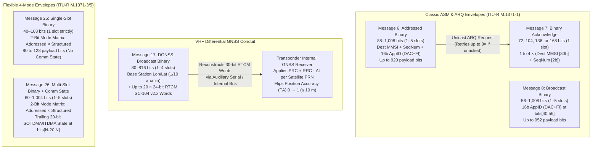

# Chapter 36: Messages 6, 7, 8, 17, 25, and 26 — Binary Message Envelopes and DGNSS Broadcasts

---

## 36.1 Operational & Conceptual Overview: The Six Binary Envelopes of the VHF Data Link

While the overwhelming majority of Automatic Identification System (AIS) transmissions consist of fixed-schema kinematic position reports (Messages 1, 2, 3, 18, and 27) or static voyage metadata (Messages 5 and 24), the designers of **ITU-R M.1371** recognized that a global maritime VHF Data Link (VDL) operating at $9,600\text{ bps}$ would inevitably need to transport arbitrary, extensible binary payloads. Ports and lock authorities needed to broadcast real-time water levels, icebreaker convoys, and dynamic speed zones; vessel traffic services (VTS) needed reliable point-to-point telemetry with individual ships; coastal base stations needed a VHF conduit to deliver **Differential Global Navigation Satellite System (DGNSS)** pseudorange corrections to ships lacking medium-frequency ($283.5\text{–}325.0\text{ kHz}$) radiobeacon antennas; and autonomous ocean buoys needed compact single-slot telemetry bursts.

To satisfy these diverse requirements without modifying the core 6-bit Message ID dispatch table every time a new maritime sensor or regulatory notice was invented, ITU-R M.1371-5 defines **six binary message types** that act as transport envelopes:

1. **Message 6 (*Addressed Binary Message*, `88–1,008 bits`, 1–5 slots):** A point-to-point unicast binary envelope addressed from a `Source MMSI` to a specific `Destination MMSI`, tagged with a 2-bit `Sequence Number (0–3)`, a `Retransmit Flag`, and a mandatory 16-bit **Application Identifier (`AppID` = 10-bit `DAC` + 6-bit `FI`)** followed by up to **920 bits** of structured application payload.
2. **Message 7 (*Binary Acknowledge*, `72, 104, 136, or 168 bits`, 1 slot):** The link-layer Automatic Repeat Request (ARQ) acknowledgment returned by the recipient of one to four **Message 6** transmissions, pairing up to four `(Destination MMSI [30b], Sequence Number [2b])` tuples in a single TDMA slot.
3. **Message 8 (*Broadcast Binary Message*, `56–1,008 bits`, 1–5 slots):** The unaddressed broadcast counterpart to Message 6. By omitting the 30-bit `Destination MMSI` and sequence control bits, Message 8 places its 16-bit `AppID (DAC + FI)` directly at `bits[40:56]` and carries up to **952 bits** of application payload across 1 to 5 slots. It is the workhorse transport for **Application-Specific Messages (ASMs)** such as Meteorological and Hydrological Data (`DAC=1, FI=11` / `FI=31`), **Area Notices (`DAC=1, FI=22` and `DAC=366, FI=22`)**, St. Lawrence Seaway lock scheduling, and European Inland AIS (`DAC=200`).
4. **Message 17 (*DGNSS Broadcast Binary Message*, `80–816 bits`, 1–4 slots):** A specialized broadcast transmitted exclusively by coastal AIS Base Stations (`00MIDxxxx`). It prefixes a rough 35-bit reference station coordinate (`18-bit Longitude` + `17-bit Latitude` in $1/10\text{ arcmin}$ steps) to an encapsulated stream of parity-stripped **24-bit RTCM SC-104 v2.x Differential GNSS words** (`bits[80:816]`, up to **736 bits** or 29 RTCM words). When an AIS Class A or Class B transponder receives Message 17, it reconstructs the 6-bit RTCM Hamming parity bits and feeds the differential corrections directly into its internal GNSS engine, upgrading the ship's navigation solution to **`Position Accuracy = 1` ($\le 10\text{ m}$)**.
5. **Message 25 (*Single-Slot Binary Message*, `40–168 bits`, 1 slot):** Introduced to eliminate the multi-slot collision fragility of Messages 6 and 8 for short telemetry bursts. Controlled by a 2-bit header mode matrix (`Addressed Flag` at `bit[38]` and `Structured Flag` at `bit[39]`), Message 25 can operate as broadcast or addressed, and either carry a 16-bit `AppID` (*Structured*) or omit the `AppID` entirely (*Unstructured*, freeing up to **128 bits** of raw binary payload starting at `bit[40]`).
6. **Message 26 (*Multiple-Slot Binary Message with Communications State*, `60–1,004 bits`, 1–5 slots):** Shares the exact 4-mode variable header matrix of Message 25 (`Addressed` $\times$ `Structured`), scales up to 5 slots (`1,004 bits` max), and appends a **trailing 20-bit SOTDMA/ITDMA Communication State (`bits[N-20 : N]`)** at the very end of the variable-length bit-vector so receiving stations can track the transmitter's slot reservations.



---

## 36.2 Historical Context & Evolution (`schwehr/gis-history` Lineage)

The architecture of these six binary messages reflects three intersecting engineering histories from the 1980s through the 2010s:

1. **RTCM SC-104 and the Fight Against Selective Availability (1983–2000):**
   In November 1983, the **Radio Technical Commission for Maritime Services (RTCM)** established **Special Committee 104 (SC-104)**, chaired by **Dr. Rudolph M. Kalafus** of the U.S. Department of Transportation's Volpe National Transportation Systems Center. At the time, the U.S. Department of Defense planned to degrade civilian GPS Standard Positioning Service (C/A-code on $1575.42\text{ MHz}$ L1) via **Selective Availability (SA)**, dithering satellite clock frequencies and truncating broadcast ephemerides to induce $\sim 100\text{ m}$ ($2\text{dRMS}$) horizontal errors—far too coarse for harbor entrance channels. Kalafus and RTCM SC-104 designed a differential correction protocol (**RTCM SC-104 v1.0 in 1985, v2.0 in 1990, v2.1 in 1994, v2.2 in 1998, and v2.3 in 2001**) modeled directly on the **30-bit GPS L1 navigation subframe word** (`24 data bits + 6 bits of (32,26) extended Hamming parity`). Instead of broadcasting raw receiver positions, a surveyed reference station computed per-satellite **Pseudorange Corrections ($PRC$, 16-bit signed)** and **Range-Rate Corrections ($RRC$, 8-bit signed)** tied to a specific **Issue of Data Ephemeris ($IOD$, 8-bit)**. Throughout the 1990s, the U.S. Coast Guard and the Swedish Maritime Administration deployed networks of **Medium-Frequency (MF) Marine Radiobeacons ($283.5\text{–}325.0\text{ kHz}$)** modulated with Minimum Shift Keying (MSK) at $100\text{–}200\text{ bps}$. When **Håkan Lans** and IALA standardized the $9,600\text{ bps}$ VHF AIS link in **ITU-R M.1371-1 (1998–2001)**, they created **Message 17** so coastal VTS Base Stations could strip the redundant 6-bit Hamming parity from each 30-bit RTCM word (relying instead on the AIS HDLC frame's 16-bit CRC-CCITT FCS) and broadcast packed **24-bit RTCM words** directly to every AIS transponder in harbor range—eliminating the need for a separate MF radiobeacon antenna on the ship's mast. Even after President Bill Clinton ordered Selective Availability turned off at midnight on **May 1, 2000**, Message 17 remained critical for correcting unmodeled ionospheric/tropospheric delays and broadcasting real-time satellite integrity warnings (`UDRE = 3` or `PRC = -32768`) within $2\text{–}5\text{ seconds}$ (compared to the $30\text{–}300\text{ s}$ latency of GPS navigation message health flags).
2. **The Application-Specific Message (ASM) Registry (`DAC` / `FI`) and `libais` (2001–2015):**
   To prevent national authorities from colliding when defining custom binary payloads inside **Messages 6 and 8**, ITU-R M.1371 partitioned the 16-bit **Application Identifier (`AppID`)** into a 10-bit **Designated Area Code (`DAC`, $0\text{–}1023$)**—matching the 3-digit Maritime Identification Digits (`MID`) assigned to countries by the ITU, plus `DAC = 1` reserved for international IMO standards and `DAC = 200` for the Central Commission for the Navigation of the Rhine (CCNR) European Inland AIS—and a 6-bit **Functional Identifier (`FI`, $0\text{–}63$)**. The IMO published the first international ASM trial catalog in **SN/Circ.236 (May 2004)** and overhauled it in **SN.1/Circ.289 (June 2010)** after discovering that the original meteorological (`DAC=1, FI=11`) and area notice schemas lacked UTC date ambiguity resolution and flexible geometry primitives. Between 2006 and 2015, **Kurt Schwehr** (Center for Coastal and Ocean Mapping, University of New Hampshire / USCG R&D Center / Google), working alongside **Eric S. Raymond** (`gpsd`) and the **St. Lawrence Seaway Management Corporation**, authored the reference open-source C++ and Python decoders (`noaadata`, `ais-area-notice`, and **`libais`**) that cataloged and decoded dozens of regional and international `DAC/FI` sub-messages (`ais8_1_22.cpp`, `ais8_366_22.cpp`, `ais8_200_*.cpp`).
3. **Why Messages 25 and 26 Were Added in ITU-R M.1371-2/3 (2006–2007):**
   Operational experience with Messages 6 and 8 exposed two architectural flaws:
   - First, a 1-slot Message 6 (`88-bit` header) leaves only **80 bits** (`10 bytes`) for application data, and even a 1-slot Message 8 (`56-bit` header) wastes 16 bits on `DAC + FI` when a closed-system buoy or autonomous vessel simply wants to transmit a 16-byte (`128-bit`) encrypted telemetry block in a single slot.
   - Second, multi-slot Messages 6 and 8 use **RATDMA** or **ITDMA** slot allocation *without* embedding a Communication State inside the packet, blinding neighboring transponders to the sender's slot reservations during high-duty-cycle binary bursts.
   **ITU-R M.1371-2 (2006)** and **M.1371-3 (2007)** introduced **Message 25 (*Single-Slot Binary Message*)** and **Message 26 (*Multiple-Slot Binary Message with Communications State*)** with a dynamic 2-bit flag matrix (`Addressed` $\times$ `Structured`) and, in Message 26, a trailing 20-bit Communication State placed at the end of the bitstream (`bits[N-20 : N]`).

---

## 36.3 Addressed and Broadcast Binary Envelopes (Messages 6, 7, and 8)

### 36.3.1 How Messages 6, 7, and 8 Work: Complete Bit-Level Tables

Throughout this chapter, we list both **0-based half-open slice indices `bits[start:end]`** (`libais`, `pyais`, and `gpsd` `AIVDM.txt` convention) and **1-based inclusive bit numbers** (ITU-R M.1371-5 Annex 8 tables).

#### Message 6: Addressed Binary Message (`88–1,008 bits`, 1–5 slots)

Message 6 transports a binary payload to a specific `Destination MMSI` and requests a link-layer **Message 7 (*Binary Acknowledge*)** matching the 2-bit `Sequence Number`.

| Field Name | Bit Slice (`0-based`) | ITU-R Bits (`1-based`) | Width | Data Type | Units / Coding / Sentinel Values |
| :--- | :--- | :--- | :--- | :--- | :--- |
| **Message ID** | `bits[0:6]` | `1–6` | `6` | `uint` | Always `6` (`000110`) |
| **Repeat Indicator** | `bits[6:8]` | `7–8` | `2` | `uint` | `0–3` (`0` = default; `3` = do not repeat further) |
| **Source MMSI** | `bits[8:38]` | `9–38` | `30` | `uint` | 9-digit MMSI of originating station |
| **Sequence Number** | `bits[38:40]` | `39–40` | `2` | `uint` | `0–3`; transaction ID echoed back by recipient in **Message 7** |
| **Destination MMSI** | `bits[40:70]` | `41–70` | `30` | `uint` | 9-digit MMSI of intended recipient station |
| **Retransmit Flag** | `bits[70:71]` | `71` | `1` | `bool` | `0` = initial transmission / no retransmit; `1` = retransmitted after timeout |
| **Spare** | `bits[71:72]` | `72` | `1` | `uint` | `0` (reserved) |
| **Designated Area Code (`DAC`)** | `bits[72:82]` | `73–82` | `10` | `uint` | First 10 bits of `16-bit AppID`: `1` = International (IMO), `200` = EU Inland, `316`/`366`/`367` = North America |
| **Functional Identifier (`FI`)** | `bits[82:88]` | `83–88` | `6` | `uint` | Lower 6 bits of `16-bit AppID` (`0–63`): selects specific schema within `DAC` |
| **Application Data** | `bits[88:N]` | `89–N` | `0–920` | `raw` | Variable binary payload ($88 \le N \le 1008$ bits; byte-aligned on transmit) |

#### Message 7: Binary Acknowledge (`72, 104, 136, or 168 bits`, 1 slot)

When a station receives a **Message 6** addressed to its own MMSI, its transponder automatically generates a **Message 7** within the next $4\text{ seconds}$ (using RATDMA/ITDMA) containing the sender's `MMSI` in `Destination MMSI 1` and the received 2-bit `Sequence Number` in `Sequence Number 1`. Up to four distinct Message 6 transactions can be acknowledged in a single 1-slot Message 7.

> [!NOTE] Shared Parser Architecture (`Ais7_13` in `libais`)
> The bit layout of **Message 7 (*Binary Acknowledge*)** is 100% identical to **Message 13 (*Safety Related Acknowledge*, which acknowledges Message 12)**. Consequently, `libais` implements both in a single class `Ais7_13` (`ais7_13.cpp`), branching only on `message_id == 7 || message_id == 13`.

| Field Name | Bit Slice (`0-based`) | ITU-R Bits (`1-based`) | Width | Data Type | Units / Coding / Sentinel Values |
| :--- | :--- | :--- | :--- | :--- | :--- |
| **Message ID** | `bits[0:6]` | `1–6` | `6` | `uint` | Always `7` (`000111`) |
| **Repeat Indicator** | `bits[6:8]` | `7–8` | `2` | `uint` | `0–3` |
| **Source MMSI** | `bits[8:38]` | `9–38` | `30` | `uint` | 9-digit MMSI of station sending the acknowledgment |
| **Spare** | `bits[38:40]` | `39–40` | `2` | `uint` | `0` (`00`) |
| **Destination MMSI 1** | `bits[40:70]` | `41–70` | `30` | `uint` | MMSI of 1st acknowledged Message 6 sender (required) |
| **Sequence Number 1** | `bits[70:72]` | `71–72` | `2` | `uint` | `0–3` matching `Sequence Number` of 1st Message 6 (`N = 72 bits`) |
| **Destination MMSI 2** | `bits[72:102]` | `73–102` | `30` | `uint` | Optional 2nd acknowledged MMSI (present if $N \ge 104$) |
| **Sequence Number 2** | `bits[102:104]` | `103–104` | `2` | `uint` | `0–3` for 2nd MMSI (`N = 104 bits`) |
| **Destination MMSI 3** | `bits[104:134]` | `105–134` | `30` | `uint` | Optional 3rd acknowledged MMSI (present if $N \ge 136$) |
| **Sequence Number 3** | `bits[134:136]` | `135–136` | `2` | `uint` | `0–3` for 3rd MMSI (`N = 136 bits`) |
| **Destination MMSI 4** | `bits[136:166]` | `137–166` | `30` | `uint` | Optional 4th acknowledged MMSI (present if $N = 168$) |
| **Sequence Number 4** | `bits[166:168]` | `167–168` | `2` | `uint` | `0–3` for 4th MMSI (`N = 168 bits`) |

#### Message 8: Broadcast Binary Message (`56–1,008 bits`, 1–5 slots)

By eliminating the 30-bit `Destination MMSI`, 2-bit `Sequence Number`, and 1-bit `Retransmit Flag` of Message 6, **Message 8** trims the envelope header from 88 bits to **56 bits**, gaining an extra **32 bits (`4 bytes`)** of payload capacity at every slot length.

| Field Name | Bit Slice (`0-based`) | ITU-R Bits (`1-based`) | Width | Data Type | Units / Coding / Sentinel Values |
| :--- | :--- | :--- | :--- | :--- | :--- |
| **Message ID** | `bits[0:6]` | `1–6` | `6` | `uint` | Always `8` (`001000`) |
| **Repeat Indicator** | `bits[6:8]` | `7–8` | `2` | `uint` | `0–3` (`0` = default; `3` = do not repeat) |
| **Source MMSI** | `bits[8:38]` | `9–38` | `30` | `uint` | 9-digit MMSI of broadcasting vessel, buoy, or Base Station |
| **Spare** | `bits[38:40]` | `39–40` | `2` | `uint` | `0` (`00`) |
| **Designated Area Code (`DAC`)** | `bits[40:50]` | `41–50` | `10` | `uint` | Upper 10 bits of `16-bit AppID` (`1` = IMO, `200` = EU RIS, `366`/`367` = US) |
| **Functional Identifier (`FI`)** | `bits[50:56]` | `51–56` | `6` | `uint` | Lower 6 bits of `16-bit AppID` (`0–63`) |
| **Application Data** | `bits[56:N]` | `57–N` | `0–952` | `raw` | Variable binary payload ($56 \le N \le 1008$ bits; byte-aligned on transmit) |

---

### 36.3.2 Slot Geometry, Byte-Alignment Rules, and NMEA `!AIVDM` Fragmentation

On the $9,600\text{ bps}$ VHF Data Link, a single TDMA slot lasts $26.67\text{ ms}$ ($256\text{ bit periods}$). In a 1-slot transmission, $88\text{ bits}$ are consumed by the ramp-up ($8\text{b}$), training sequence ($24\text{b}$), start flag ($8\text{b}$), 16-bit CRC-CCITT FCS ($16\text{b}$), end flag ($8\text{b}$), and distance delay buffer ($24\text{b}$), leaving exactly **$168\text{ payload bits}$**. When a message spans $k \in \{2, 3, 4, 5\}$ contiguous slots, the intermediate slot boundaries do not repeat the ramp-up, training sequence, flags, or FCS; instead, each additional slot contributes the full **$256\text{ bits}$** of raw VDL capacity, subject to an explicit **ITU-R M.1371-5 Annex 2 §3.3.7 hard ceiling of $1,008\text{ bits}$** (for Messages 6 and 8) or **$1,004\text{ bits}$** (for Message 26) at 5 slots:

$$N_{\text{max}}(k) = \min\!\Big(168 + 256 \cdot (k - 1),\; 1008\Big) \quad \text{for } k \in \{1, 2, 3, 4, 5\}$$

 Furthermore, ITU-R M.1371-5 requires that the transmitted HDLC frame prior to bit-stuffing be an integral number of 8-bit bytes (`byte-aligned`), whereas the NMEA 0183 `!AIVDM` presentation interface packs bits into **6-bit ASCII characters** (`61` or `62` characters max per NMEA sentence under IEC 61162-1's 82-character line limit) and records `fill_bits` ($0\text{–}5$).

| Contiguous Slots ($k$) | RF Burst Duration | Total VDL Frame Capacity ($N_{\text{max}}$) | Msg 6 Max App Data (`N - 88`) | Msg 8 Max App Data (`N - 56`) | Msg 17 Max RTCM Bits (`N - 80`) | Msg 26 Max App Data (`N - 60` to `N - 108`) | Typical `!AIVDM` Fragments |
| :--- | :--- | :--- | :--- | :--- | :--- | :--- | :--- |
| **1 Slot** | $26.67\text{ ms}$ | **`168 bits`** (`21 B`) | `80 bits` (`10 B`) | `112 bits` (`14 B`) | `88 bits` (`3` RTCM words) | `60–108 bits` (or Msg 25: `80–128b`) | `1` sentence (`28 chars`) |
| **2 Slots** | $53.33\text{ ms}$ | **`424 bits`** (`53 B`) | `336 bits` (`42 B`) | `368 bits` (`46 B`) | `344 bits` (`14` RTCM words) | `316–364 bits` | `2` sentences (`71 chars`) |
| **3 Slots** | $80.00\text{ ms}$ | **`680 bits`** (`85 B`) | `592 bits` (`74 B`) | `624 bits` (`78 B`) | `600 bits` (`25` RTCM words) | `572–620 bits` | `2` sentences (`114 chars`) |
| **4 Slots** | $106.67\text{ ms}$ | **`936 bits`** (`117 B`) | `848 bits` (`106 B`) | `880 bits` (`110 B`) | **`736 bits`** (`29` RTCM words, cap `816b`) | `828–876 bits` | `3` sentences (`156 chars`) |
| **5 Slots** | $133.33\text{ ms}$ | **`1,008 bits`** (`126 B`) | **`920 bits`** (`115 B`) | **`952 bits`** (`119 B`) | *Not permitted (max 4 slots)* | **`896–944 bits`** (cap `1,004b`) | `3` sentences (`168 chars`) |

---

### 36.3.3 Issues & Multi-Slot Collision Vulnerability

While a 5-slot Message 8 (`952` application data bits) looks attractive on paper for broadcasting complex polygon Area Notices or dense hydrological grids, multi-slot binary transmissions suffer severe physical and MAC-layer fragility in the real world:

1. **Exponential Multi-Slot Collision Probability on Terrestrial VDL:**
   Suppose an AIS channel has an uncoordinated or hidden-terminal slot collision rate of $L \in (0, 1)$ per slot (caused by vessels beyond VHF horizon of the transmitter, Class B CS transponders, or unannounced RATDMA bursts). Because the entire 5-slot HDLC frame shares a **single 16-bit CRC-CCITT FCS at the end of Slot 5**, a single bit error or co-channel burst in *any* of the $k$ contiguous slots destroys the entire frame:
   $$P_{\text{frame\_success}}(k) = (1 - L)^k$$
   If a busy port approach experiences $L = 0.25$ effective slot contention, a 1-slot Message 25 succeeds with probability $0.75$, whereas an unreserved 5-slot Message 8 (`133.33 ms` continuous key-down) succeeds with probability $(0.75)^5 = 0.237$—losing over **76% of broadcasts**!
2. **Near-Zero LEO Satellite Reception Without FATDMA Reservations:**
   A Low Earth Orbit (LEO) satellite at $600\text{ km}$ altitude views a footprint $\sim 5,000\text{ km}$ in diameter containing $M \approx 30\text{ to }100$ independent terrestrial SOTDMA cells whose slot reservations are completely uncorrelated. Under a Poisson arrival model with aggregate offered load $G$ packets per slot across the satellite footprint, the probability that $k$ consecutive slots remain free of overlapping co-channel interference is:
   $$P_{\text{sat\_clean}}(k) = e^{-G \cdot (k + 1)}$$
   At $G = 1.2$, a 1-slot packet has a baseline collision-free window of $e^{-2.4} \approx 9.1\%$ (before co-channel SIC/blind demodulation), whereas a 5-slot Message 8 drops to $e^{-7.2} \approx 0.075\%$. Consequently, shore authorities broadcasting multi-slot Message 8 or Message 17 frames **must** protect those slots across the local VTS area by broadcasting **Message 20 (*Data Link Management Message*, FATDMA)** reservations so mobile stations do not transmit on top of the multi-slot burst.
3. **Lack of Communication State in Messages 6 and 8:**
   Unlike Message 26, neither Message 6 nor Message 8 carries a trailing 20-bit SOTDMA/ITDMA Communication State. When a ship transmits a multi-slot Message 6 or 8 via RATDMA, neighboring ships cannot update their internal slot map from that frame.
4. **NMEA `!AIVDM` Fill-Bit Padding vs. ITU Byte-Alignment Mismatch:**
   In `libais` (`ais8.cpp` and `ais6.cpp`), variable-length binary sub-messages frequently arrive with 1 to 7 trailing zero bits added by the transmitting station to satisfy HDLC byte alignment, *plus* 0 to 5 fill bits added by the receiving NMEA multiplexer to pad the last 6-bit ASCII character. If a parser fails to subtract `fill_bits` before passing the bit-vector to a sub-message decoder (such as `Ais8_1_22` Area Notice, which divides the remaining bits `(num_bits - 111) / 87` to count sub-areas), trailing padding bits can either trigger a spurious `AIS_ERR_BAD_BIT_COUNT` error or hallucinate an extra zero-filled sub-area!

---

## 36.4 DGNSS Broadcast Binary Message (Message 17, `80–816 bits`, 1–4 Slots)

### 36.4.1 How Message 17 Works: Outer AIS Envelope & Inner 24-Bit RTCM SC-104 Unpacking

**Message 17** (`80–816 bits`, spanning 1 to 4 contiguous slots) is transmitted by an AIS Base Station (`Source MMSI` of the form `00MIDxxxx`) to broadcast **RTCM SC-104 v2.x Differential GNSS corrections** over the VHF Data Link.

#### Part A: Outer AIS Message 17 Envelope (`bits[0:80]`, 80 bits)

| Field Name | Bit Slice (`0-based`) | ITU-R Bits (`1-based`) | Width | Data Type | Units / Coding / Sentinel Values |
| :--- | :--- | :--- | :--- | :--- | :--- |
| **Message ID** | `bits[0:6]` | `1–6` | `6` | `uint` | Always `17` (`010001`) |
| **Repeat Indicator** | `bits[6:8]` | `7–8` | `2` | `uint` | `0–3` (typically `0` so repeaters do not introduce stale $PRC$ latency) |
| **Source MMSI** | `bits[8:38]` | `9–38` | `30` | `uint` | 9-digit MMSI of transmitting DGNSS Base Station |
| **Spare 1** | `bits[38:40]` | `39–40` | `2` | `uint` | `0` (`00`) |
| **Longitude** | `bits[40:58]` | `41–58` | `18` | `int` (2's comp) | Reference station longitude in **$1/10\text{ arcmin}$** ($\frac{1}{600}^\circ \approx 185.2\text{ m}$); sentinel `108600` (`0x1A838`) = `181.0°` |
| **Latitude** | `bits[58:75]` | `59–75` | `17` | `int` (2's comp) | Reference station latitude in **$1/10\text{ arcmin}$** ($\frac{1}{600}^\circ$); sentinel `54600` (`0xD548`) = `91.0°` |
| **Spare 2** | `bits[75:80]` | `76–80` | `5` | `uint` | `0` (`00000`) |
| **DGNSS Data Words** | `bits[80:N]` | `81–N` | `0–736` | `raw` | $M$ contiguous **24-bit parity-stripped RTCM SC-104 v2.x words** ($M \in \{0, 2..29\}$, $N = 80 + 24M \le 816$) |

#### Part B: How RTCM SC-104 v2.x Words Are Parity-Stripped and Packed (`bits[80:816]`)

In native **RTCM SC-104 v2.x** (used on $283.5\text{–}325.0\text{ kHz}$ marine radiobeacons), every message consists of $N_{\text{words}}$ **30-bit words** (`d1..d24` data bits followed by `d25..d30` extended Hamming $(32,26)$ parity bits that depend on the last two bits $D_{29}^*, D_{30}^*$ of the preceding word). Because the AIS VHF link already wraps every frame in a 16-bit HDLC CRC-CCITT checksum, **ITU-R M.1371-5 Annex 2 §3.7 strips the 6 parity bits (`d25..d30`) from every 30-bit RTCM word** and packs only the **24 data bits (`d1..d24`, MSB-first)** into `bits[80:816]`. Up to **29 twenty-four-bit RTCM words (`696 bits`, total message `776 bits`)**—or theoretically 30 words (`720 bits`, total `800 bits`, within the `736-bit` / `816-bit` 4-slot limit)—fit inside a single Message 17.

Every encapsulated RTCM SC-104 v2.x frame inside `bits[80:N]` begins with the mandatory **Two-Word RTCM Header (`48 bits` = `Word 1 [24b]` + `Word 2 [24b]`, occupying `bits[80:128]`)**:

| RTCM Header Field | Bit Slice inside Msg 17 (`0-based`) | RTCM Word & Bits | Width | Data Type | Units / Coding / Operational Meaning |
| :--- | :--- | :--- | :--- | :--- | :--- |
| **Preamble** | `bits[80:88]` | Word 1 (`d1–d8`) | `8` | `uint` | Fixed magic byte **`01100110` (`0x66` = `102`)** |
| **RTCM Message Type** | `bits[88:94]` | Word 1 (`d9–d14`) | `6` | `uint` | `1` = Full GPS Corrections; `3` = Ref Station XYZ; `9` = Partial GPS Corrections; `16` = Special Text |
| **Reference Station ID** | `bits[94:104]` | Word 1 (`d15–d24`) | `10` | `uint` | `0–1023` (identifies the surveyed DGNSS reference antenna) |
| **Modified Z-Count** | `bits[104:117]` | Word 2 (`d1–d13`) | `13` | `uint` | Reference epoch $t_0$ in **$0.6\text{ s}$ steps** (`0–5999` $\rightarrow 0.0\text{–}3599.4\text{ s}$, rolls over every $3,600\text{ s}$ / 1 hour) |
| **Sequence Number** | `bits[117:120]` | Word 2 (`d14–d16`) | `3` | `uint` | `0–7` (increments by 1 each RTCM frame to detect dropped frames) |
| **Length of Frame ($N_{\text{words}}$)** | `bits[120:125]` | Word 2 (`d17–d21`) | `5` | `uint` | Total 24-bit RTCM words in this frame (`2..31`, including Words 1 & 2; payload words $= N_{\text{words}} - 2$) |
| **Station Health** | `bits[125:128]` | Word 2 (`d22–d24`) | `3` | `uint` | `0` = normal ($UDRE\text{ scale}=1.0$); `6` = not monitored; `7` = **Reference station not working (DO NOT USE)** |

#### Part C: Unpacking 40-Bit Per-Satellite Correction Blocks (RTCM Message Types 1 and 9)

When `RTCM Message Type == 1` (*Differential GPS Corrections*, all visible satellites) or `Type == 9` (*GPS Partial Correction Set*, typically 1, 2, or 3 satellites per burst), the data words (`Word 3` through `Word` $N_{\text{words}}$, starting at **`bit[128]`**) contain a contiguous bitstream of **40-bit satellite correction blocks**. Because $40\text{ bits}$ does not divide evenly into $24\text{ bits}$ ($\text{LCM}(40, 24) = 120\text{ bits} = 5\text{ RTCM data words} = 3\text{ satellites}$), every 3 satellite blocks pack cleanly into 5 twenty-four-bit RTCM words (`120 bits`), with any remaining bits in the final 24-bit word filled with alternating `1010...` fill bits:

| Satellite Block Field (Block $i = 0, 1, \dots$) | Offset within 40-Bit Block (`bit[128 + 40i + ...]`) | Width | Data Type | Units / Scale Factor ($s$) / Sentinel Values |
| :--- | :--- | :--- | :--- | :--- |
| **Scale Factor ($s_i$)** | `+0..+1` | `1` | `uint` | `0` $\rightarrow$ High precision ($PRC\text{ step}=0.02\text{ m}$, $RRC\text{ step}=0.002\text{ m/s}$)<br/>`1` $\rightarrow$ Coarse precision ($PRC\text{ step}=0.32\text{ m}$, $RRC\text{ step}=0.032\text{ m/s}$) |
| **UDRE ($\text{UDRE}_i$)** | `+1..+3` | `2` | `uint` | User Differential Range Error ($1\sigma$): `0` $\le 1\text{ m}$; `1` $\in (1, 4]\text{ m}$; `2` $\in (4, 8]\text{ m}$; `3` $> 8\text{ m}$ |
| **Satellite ID ($\text{PRN}_i$)** | `+3..+8` | `5` | `uint` | GPS PRN number: `1–31` directly; **`0` represents `PRN 32`** |
| **Pseudorange Correction ($PRC_i$)** | `+8..+24` | `16` | `int` (2's comp) | Range correction in **$0.02\text{ m}$** ($s_i=0$, range $\pm 655.34\text{ m}$) or **$0.32\text{ m}$** ($s_i=1$, range $\pm 10,485.44\text{ m}$).<br/>Sentinel **`-32768` (`0x8000`) = Satellite unhealthy / DO NOT USE** |
| **Range-Rate Correction ($RRC_i$)** | `+24..+32` | `8` | `int` (2's comp) | Rate of change in **$0.002\text{ m/s}$** ($s_i=0$, range $\pm 0.254\text{ m/s}$) or **$0.032\text{ m/s}$** ($s_i=1$, range $\pm 4.064\text{ m/s}$).<br/>Sentinel **`-128` (`0x80`) = DO NOT USE** |
| **Issue of Data ($\text{IOD}_i$)** | `+32..+40` | `8` | `uint` | `0–255`; matches the 8-bit `IODE` of the broadcast GPS navigation ephemeris used to compute $PRC_i$ |

---

### 36.4.2 Relationships, Uses, Issues, and the Spoofed Message 17 Pseudorange Drift Attack

#### 1. How Transponders Apply Message 17 to Achieve `Position Accuracy = 1` ($\le 10\text{ m}$)

Inside an AIS Class A or Class B transponder, when a valid Message 17 arrives from a Base Station within the vessel's configured DGNSS service radius (typically $\le 150\text{ NM}$, verified using the 18-bit `Longitude` and 17-bit `Latitude` in `bits[40:75]`), the transponder processor reconstructs the 6-bit $(32,26)$ Hamming parity tail for each 24-bit word and streams the resulting 30-bit RTCM SC-104 words to its internal GNSS receiver (or out the auxiliary RS-422 DGNSS port). For each tracked GPS satellite $i$ whose broadcast ephemeris matches $\text{IOD}_i$, the GNSS engine propagates the correction from the reference Modified Z-Count epoch $t_0$ to the current measurement epoch $t$:

$$\Delta \rho_i(t) = PRC_i(t_0) + RRC_i(t_0) \cdot (t - t_0)$$

$$\rho_{\text{corrected}}^{(i)}(t) = \rho_{\text{measured}}^{(i)}(t) + \Delta \rho_i(t)$$

Once at least 4 satellites have valid, non-expired ($\Delta t < 30\text{ s}$) differential corrections applied and the Horizontal Dilution of Precision ($\text{HDOP}$) yields a 95% horizontal error circle $\le 10\text{ m}$, the transponder sets **`Position Accuracy (PA) = 1`** in all outgoing Position Reports (**Messages 1, 2, 3, 18, and 19**).

#### 2. Adversarial Abuse: The Spoofed Message 17 Pseudorange Drift Attack

> [!CAUTION] Silent Navigation Hijacking via VHF Without GPS L1 Jamming
> Because **Message 17 is completely unauthenticated** on the VHF Data Link, an attacker with a $\$300$ VHF software-defined radio (SDR) can manipulate the internal GNSS position of ships in a harbor or approach channel **without ever transmitting a single watt on the $1575.42\text{ MHz}$ GPS L1 band**!

Suppose a ship at true ECEF position $\mathbf{x}_0$ tracks $K$ GPS satellites with unit line-of-sight direction cosine vectors $\mathbf{e}_1, \dots, \mathbf{e}_K$. The linear navigation observation matrix is:

$$\mathbf{G} = \begin{bmatrix} -e_{1,x} & -e_{1,y} & -e_{1,z} & 1 \\ \vdots & \vdots & \vdots & \vdots \\ -e_{K,x} & -e_{K,y} & -e_{K,z} & 1 \end{bmatrix} \in \mathbb{R}^{K \times 4}$$

If an attacker desires to displace the vessel's computed internal GNSS position and clock state by an arbitrary 4-vector $\Delta \mathbf{x}_{\text{spoof}} = [\Delta E,\; \Delta N,\; \Delta U,\; c\,\Delta \delta t]^T$ in local East-North-Up (ENU) coordinates, the attacker simply computes the required pseudorange perturbation vector:

$$\Delta \boldsymbol{\rho}_{\text{inject}}(t) = \mathbf{G}_{\text{ENU}} \, \Delta \mathbf{x}_{\text{spoof}}(t)$$

and encodes $\Delta \rho_{\text{inject}, i}(t)$ into the 16-bit $PRC_i$ and 8-bit $RRC_i$ fields of a forged **Message 17 (RTCM Type 1)** using the current live ephemeris $\text{IOD}_i$ values observed from the sky! Because all $K$ satellites receive a geometrically consistent pseudorange shift ($\mathbf{r}_{\text{post-fit}} = \Delta \boldsymbol{\rho} - \mathbf{G}\hat{\Delta\mathbf{x}} = \mathbf{0}$), **Receiver Autonomous Integrity Monitoring (RAIM) residuals remain zero**, `Position Accuracy` remains `1` ($\le 10\text{ m}$), and no GPS L1 jamming/spoofing detector (`$GPVTG` C/N0 drop or AGC spike) triggers. With `Scale Factor = 0` ($0.02\text{ m}$ steps), the attacker can walk a ship up to **$\pm 655\text{ m}$** laterally; if the receiver accepts `Scale Factor = 1` ($0.32\text{ m}$ steps), the maximum offset reaches **$\pm 10,485\text{ m}$ ($10.48\text{ km}$)**!

---

## 36.5 Single-Slot and Multiple-Slot Binary Messages (Messages 25 and 26)

### 36.5.1 How Messages 25 and 26 Work: The 4-Mode Header Matrix & Trailing Comm State

**Message 25 (*Single-Slot Binary Message*, `40–168 bits`, 1 slot)** and **Message 26 (*Multiple-Slot Binary Message with Communications State*, `60–1,004 bits`, 1–5 slots)** share an identical 40-bit prefix (`bits[0:40]`) whose last two bits (`bit[38]` and `bit[39]`) dynamically reconfigure the layout of the remainder of the packet.

#### Fixed 40-Bit Prefix (`bits[0:40]`) for Both Message 25 and Message 26

| Field Name | Bit Slice (`0-based`) | ITU-R Bits (`1-based`) | Width | Data Type | Units / Coding / Sentinel Values |
| :--- | :--- | :--- | :--- | :--- | :--- |
| **Message ID** | `bits[0:6]` | `1–6` | `6` | `uint` | `25` (`011001`) for Single-Slot; `26` (`011010`) for Multi-Slot |
| **Repeat Indicator** | `bits[6:8]` | `7–8` | `2` | `uint` | `0–3` (`0` = default; `3` = do not repeat) |
| **Source MMSI** | `bits[8:38]` | `9–38` | `30` | `uint` | 9-digit MMSI of transmitting station |
| **Destination Indicator (`Addressed`)** | `bits[38:39]` | `39` | `1` | `bool` | `0` = Broadcast (no `Dest MMSI`); `1` = Addressed (`30b Dest MMSI + 2b Spare` present at `bits[40:72]`) |
| **Binary Data Flag (`Structured`)** | `bits[39:40]` | `40` | `1` | `bool` | `0` = Unstructured raw binary (no `AppID`); `1` = Structured (`16b AppID = 10b DAC + 6b FI` present) |

#### The 4-Mode Variable Header Matrix (`Addressed` $\times$ `Structured`)

Depending on the 2-bit tuple $(\text{Addressed}, \text{Structured}) = (\text{bit}[38], \text{bit}[39])$, the starting bit offset $B_{\text{start}}$ of the `Application Data` shifts across four possible positions (`40`, `56`, `72`, or `88`), while the end bit offset $B_{\text{end}}$ is **`N`** for Message 25 and **`N - 20`** for Message 26:

| Mode Tuple (`bit[38], bit[39]`) | Mode Name | `bits[40:56]` (`16b`) | `bits[56:72]` (`16b`) | `bits[72:88]` (`16b`) | App Data Start ($B_{\text{start}}$) | Msg 25 Max App Data (`168 - B_start`) | Msg 26 Max App Data (`984 - B_start`) |
| :--- | :--- | :--- | :--- | :--- | :--- | :--- | :--- |
| **`0, 0`** | **Broadcast Unstructured** | *Application Data* | *Application Data* | *Application Data* | **`bit[40]`** | **`128 bits`** (`16 B`) | **`944 bits`** (`118 B`) |
| **`0, 1`** | **Broadcast Structured** | `DAC (10b) + FI (6b)` | *Application Data* | *Application Data* | **`bit[56]`** | **`112 bits`** (`14 B`) | **`928 bits`** (`116 B`) |
| **`1, 0`** | **Addressed Unstructured** | `Dest MMSI [0:16]` | `Dest MMSI [16:30] + Spare (2b)` | *Application Data* | **`bit[72]`** | **`96 bits`** (`12 B`) | **`912 bits`** (`114 B`) |
| **`1, 1`** | **Addressed Structured** | `Dest MMSI [0:16]` | `Dest MMSI [16:30] + Spare (2b)` | `DAC (10b) + FI (6b)` | **`bit[88]`** | **`80 bits`** (`10 B`) | **`896 bits`** (`112 B`) |

#### The Trailing 20-Bit Communication State in Message 26 (`bits[N-20 : N]`)

In **Message 26**, the final 20 bits of the packet (`bits[N-20 : N]`, where $60 \le N \le 1004$) **always** encode the transmitter's TDMA Communication State:

| Trailing Field in Message 26 | Bit Slice (`0-based`) | Width | Data Type | Coding / Operational Meaning |
| :--- | :--- | :--- | :--- | :--- |
| **Application Data** | `bits[B_start : N-20]` | `0–944` | `raw` | Variable binary payload ($B_{\text{start}} \in \{40, 56, 72, 88\}$) |
| **Comm State Selector Flag** | `bits[N-20 : N-19]` | `1` | `uint` | `0` = **SOTDMA** communication state follows; `1` = **ITDMA** communication state follows |
| **SOTDMA / ITDMA Comm State** | `bits[N-19 : N]` | `19` | `struct` | If `0` (SOTDMA): `sync_state (2b)` + `slot_timeout (3b)` + `sub_message (14b)`.<br/>If `1` (ITDMA): `sync_state (2b)` + `slot_increment (13b)` + `slots_to_allocate (3b)` + `keep_flag (1b)`. |

> [!WARNING] Why Off-By-One Fill-Bit Errors Corrupt Message 26 Communication State
> Because Message 26 anchors its 20-bit Communication State relative to the **total bit length $N$ (`bits[N-20 : N]`)** rather than at a fixed header offset, any error in the NMEA 0183 `!AIVDM` `fill_bits` field ($0\text{–}5$) shifts $N$ directly. If an NMEA multiplexer emits `fill_bits = 0` instead of `2` on a 1-slot Message 26, a parser extracts `bits[N-20 : N]` two bits too late—turning a valid SOTDMA `sync_state = 0` (UTC direct) and `slot_timeout` into garbage, while appending 2 phantom bits to `Application Data`! Furthermore, parsers must verify $N \ge B_{\text{start}} + 20$ before slicing `bits[B_start : N-20]`; in `libais` (`ais26.cpp`), Kurt Schwehr added explicit length guards (`if (num_bits < 88 + 20) { status = AIS_ERR_BAD_BIT_COUNT; return; }`) to prevent unsigned integer underflow when malformed short frames arrive with `Addressed = 1, Structured = 1`.

---

### 36.5.2 Uses & Abuses of Messages 25 and 26

1. **Legitimate Uses:**
   - **Autonomous Surface Vessels (ASVs) & Oceanographic Buoys (`Message 25`, Mode `00` or `01`):** Wave gliders, drifting acoustic buoys, and seismic survey tail-buoys use 1-slot **Message 25** (`Mode 00`, `128 bits` = `16 bytes` of raw payload) to transmit compact battery, wave-spectrum, or encrypted acoustic-array telemetry in a single $26.67\text{ ms}$ burst, maximizing satellite pass reception probability and minimizing battery draw.
   - **High-Rate Multi-Slot ASM Broadcasts (`Message 26`, Mode `01`):** Smart-port environmental stations and icebreakers broadcasting multi-slot binary payloads without Base Station FATDMA support use Message 26 so their SOTDMA/ITDMA slot reservations remain visible to surrounding Class A vessels.
2. **Adversarial Abuses (Covert Unstructured C2 Channels):**
   - Because **Unstructured Mode (`Structured = 0`, `bit[39] = 0`)** in Messages 25 and 26 omits the 16-bit `DAC/FI` Application Identifier entirely, coastal VTS firewalls and commercial AIS analytics platforms that filter binary messages by `(dac, fi)` either silently drop unstructured packets or log them as opaque hex blobs. Red-team exercises and maritime malware proofs-of-concept (such as *Balduzzi et al.*, 2014) have demonstrated using **Message 25 Mode `00` (`128 bits` = `16 bytes`, matching one AES-128 cipher block!)** as a covert, unattributed VHF/satellite command-and-control (C2) channel that blends seamlessly into background VDL traffic.

---

## 36.6 Where and When Used & Software Support Matrix

### 36.6.1 Empirical VDL Traffic Share

Across terrestrial coastal networks (USCG NAIS, Norwegian Coastal Administration, European EMSA) and LEO satellite constellations, the six binary messages exhibit distinct spatial and temporal signatures:

| Message ID & Name | Global Terrestrial VDL Share | High-Density Regional / Port Share | Primary Transmitters & Typical Duty Cycle |
| :--- | :--- | :--- | :--- |
| **Message 6** (*Addressed Binary*) | **`0.1% – 0.5%`** | Up to **`1.5%`** in locks/canals (St. Lawrence Seaway, Panama Canal, Rhine) | Lock masters & VTS polling individual vessels (`DAC=1, FI=12/14/16/18/20/22`, `DAC=316`, `DAC=200`); Class A responses |
| **Message 7** (*Binary Acknowledge*) | **`0.1% – 0.5%`** | **`0.5% – 1.5%`** (1:1 paired with Message 6) | Automatic link-layer ARQ reply sent within $4\text{ s}$ by every station receiving a Message 6 |
| **Message 8** (*Broadcast Binary*) | **`2.0% – 5.0%`** | **`5.0% – 12.0%`** near weather AtoNs, locks, and USCG/IMO Area Notice zones | Met/Hydro stations (`DAC=1, FI=11/31` every $6\text{–}10\text{ min}$), USCG/IMO Area Notices (`FI=22`), EU Inland ERI (`DAC=200`) |
| **Message 17** (*DGNSS Broadcast*) | **`0.5% – 2.0%`** | **`2.0% – 4.5%`** within $50\text{ NM}$ of DGNSS-enabled AIS Base Stations | Coastal AIS Base Stations (`00MIDxxxx`) broadcasting RTCM Type 1/9 corrections every $5\text{–}15\text{ s}$ on FATDMA slots |
| **Message 25** (*Single-Slot Binary*) | **`< 0.05%`** | **`0.1% – 0.8%`** during offshore seismic surveys, naval exercises, or ASV trials | Seismic tail-buoys, autonomous surface vessels, encrypted military/law-enforcement tactical telemetry |
| **Message 26** (*Multi-Slot + Comm*) | **`< 0.02%`** | **`< 0.1%`** (rarely deployed; most authorities still use Msg 8 + Msg 20 FATDMA) | Specialized SOTDMA/ITDMA telemetry transponders requiring multi-slot binary + slot map continuity |

---

### 36.6.2 Software Support Matrix & NMEA 2000 PGN Mapping

| Parser / Standard | Msg 6 (`Addressed`) | Msg 7 (`Binary Ack`) | Msg 8 (`Broadcast`) | Msg 17 (`DGNSS RTCM`) | Msg 25 (`1-Slot 4-Mode`) | Msg 26 (`Multi-Slot + Comm`) | Implementation Details & Known Quirks |
| :--- | :--- | :--- | :--- | :--- | :--- | :--- | :--- |
| **`libais`** (C++ / Python, Schwehr) | `Ais6` (`ais6.cpp` + `DAC/FI` subclasses) | `Ais7_13` (`ais7_13.cpp`, up to 4 acks) | `Ais8` (`ais8.cpp` + `ais8_1_*`, `ais8_200_*`, `ais8_366_22`) | `Ais17` (`ais17.cpp`; extracts `x, y` & raw payload bits) | `Ais25` (`ais25.cpp`; full 4-mode matrix) | `Ais26` (`ais26.cpp`; 4-mode matrix + trailing 20b SOTDMA/ITDMA) | Gold-standard bit-level bounds checking; richest library of `DAC/FI` sub-decoders (`IMO Circ.236`, `Circ.289`, `EU RIS 200`, `USCG 366`). |
| **`gpsd`** (C, Raymond et al.) | Full (`type 6` + IMO/Inland `dac/fi`) | Full (`type 7`, `mmsi1..4`, `seqno1..4`) | Full (`type 8` + extensive `dac/fi` JSON) | Outer envelope (`lon, lat` + hex `data` blob) | Full (`type 25`, `addressed`, `structured`, `data`) | Full (`type 26`, 4-mode + `commstate`) | `AIVDM.txt` serves as the de facto specification for `DAC/FI` JSON field names. |
| **`pyais`** (Python, Léonard) | `MessageType6` + common ASMs | `MessageType7` | `MessageType8` + `DAC=1, FI=11/22/31` | `MessageType17` (`lon, lat, data` bytes) | `MessageType25` (4-mode dynamic parsing) | `MessageType26` (4-mode + trailing comm state) | Clean dataclass/dict output; does not unpack inner 24-bit RTCM SC-104 satellite $PRC/RRC$ blocks inside Msg 17. |
| **`AIS-catcher`** (C++, Jasper) | Envelope + major `DAC/FI` | Full | Envelope + Met/Hydro & Area Notice | Outer `lon, lat` + payload length | Full | Full | High-speed SDR demodulator + JSON output. |
| **Rust (`nmea-parser` / `ais`)** | Envelope (`dac, fi, data`) | Full (vec of `(mmsi, seq)`) | Envelope + select ASMs | Outer `lon, lat` + bitvec | Full 4-mode enum | Full 4-mode + `CommState` | Zero-copy `bitvec` slicing; safe against negative slice underflow. |
| **NMEA 2000 (IEC 61162-3)** | **PGN `129795`** (*AIS Addressed Binary*) | **PGN `129796`** (*AIS Acknowledge*) | **PGN `129797`** (*AIS Binary Broadcast*) | **PGN `129792`** (*AIS DGNSS Broadcast Binary*) | **PGN `129804`** (*Single-Slot Binary*) | **PGN `129805`** (*Multi-Slot Binary*) | CAN-bus Fast-Packet framing (`up to 223 bytes`) bridges VHF binary payloads to MFD chartplotters. |

---

## 36.7 Practical Engineering & Forensic Code Walkthrough

The following complete, self-contained Python script implements:
1. Bit-level (`0-based MSB-first`) encoders and decoders for **Messages 6, 7, 8, 17, 25, and 26**, including **all 4 `Addressed × Structured` modes** of Messages 25 and 26 and the **trailing 20-bit SOTDMA/ITDMA Communication State** of Message 26.
2. A full **Message 17 Inner RTCM SC-104 v2.x Unpacker & 30-Bit Hamming Parity Reconstructor** that strips out the 24-bit words, parses the 2-word RTCM header (`Preamble 0x66`, `Type 1/9`, `Reference Station ID`, `Modified Z-Count`, `Station Health`), unpacks every **40-bit per-satellite correction block** (`Scale Factor`, `UDRE`, `PRN`, **`PRC` in meters**, **`RRC` in m/s**, and **`IOD`**), and reconstructs the standard 30-bit RTCM words with $(32,26)$ Hamming parity!
3. A **Forensic Spoofed Message 17 $PRC$ Drift & Scale-Factor Anomaly Detector** that catches VHF DGNSS spoofing attacks.

```python
#!/usr/bin/env python3
"""Forensic Decoder, RTCM SC-104 v2.x Unpacker, and DGNSS Spoofing Detector
for AIS Binary Messages 6, 7, 8, 17, 25, and 26 (ITU-R M.1371-5).
"""

from dataclasses import dataclass
from typing import Dict, List, Optional, Tuple


# ---------------------------------------------------------------------------
# 1. Bit-Vector & 6-Bit NMEA ASCII Utilities (0-based MSB-first)
# ---------------------------------------------------------------------------

def uint_to_bits(val: int, width: int) -> str:
    return format(val & ((1 << width) - 1), f"0{width}b")


def int_to_bits(val: int, width: int) -> str:
    if val < 0:
        val = (1 << width) + val
    return uint_to_bits(val, width)


def bits_to_uint(bits: str, start: int, end: int) -> int:
    return int(bits[start:end], 2)


def bits_to_int(bits: str, start: int, end: int) -> int:
    width = end - start
    val = int(bits[start:end], 2)
    if val & (1 << (width - 1)):
        val -= 1 << width
    return val


def pack_nmea_payload(bits: str) -> Tuple[str, int]:
    """Packs a bitstring into 6-bit NMEA ASCII armoring and returns (payload, fill_bits)."""
    fill_bits = (6 - (len(bits) % 6)) % 6
    padded = bits + ("0" * fill_bits)
    chars = []
    for i in range(0, len(padded), 6):
        val = int(padded[i : i + 6], 2)
        ascii_val = val + 48 if val < 40 else val + 56
        chars.append(chr(ascii_val))
    return "".join(chars), fill_bits


def unpack_nmea_payload(payload: str, fill_bits: int) -> str:
    """Unpacks 6-bit NMEA ASCII payload and strips trailing fill_bits."""
    chunks = []
    for ch in payload:
        val = ord(ch) - 48
        if val > 40:
            val -= 8
        chunks.append(format(val & 0x3F, "06b"))
    full_bits = "".join(chunks)
    return full_bits[:-fill_bits] if fill_bits > 0 else full_bits


# ---------------------------------------------------------------------------
# 2. Decoders for Classic Binary Envelopes: Messages 6, 7, and 8
# ---------------------------------------------------------------------------

def decode_msg6(bits: str) -> Dict:
    if len(bits) < 88 or len(bits) > 1008:
        raise ValueError(f"Message 6 invalid bit length: {len(bits)}")
    return {
        "msg_id": bits_to_uint(bits, 0, 6),
        "repeat": bits_to_uint(bits, 6, 8),
        "source_mmsi": bits_to_uint(bits, 8, 38),
        "seq_num": bits_to_uint(bits, 38, 40),
        "dest_mmsi": bits_to_uint(bits, 40, 70),
        "retransmit": bool(bits_to_uint(bits, 70, 71)),
        "spare": bits_to_uint(bits, 71, 72),
        "dac": bits_to_uint(bits, 72, 82),
        "fi": bits_to_uint(bits, 82, 88),
        "app_data_bits": bits[88:],
        "num_bits": len(bits),
    }


def decode_msg7(bits: str) -> Dict:
    if len(bits) not in (72, 104, 136, 168):
        raise ValueError(f"Message 7 invalid bit length: {len(bits)}")
    acks = []
    for offset in range(40, len(bits), 32):
        acks.append({
            "dest_mmsi": bits_to_uint(bits, offset, offset + 30),
            "seq_num": bits_to_uint(bits, offset + 30, offset + 32),
        })
    return {
        "msg_id": bits_to_uint(bits, 0, 6),
        "repeat": bits_to_uint(bits, 6, 8),
        "source_mmsi": bits_to_uint(bits, 8, 38),
        "spare": bits_to_uint(bits, 38, 40),
        "acks": acks,
    }


def decode_msg8(bits: str) -> Dict:
    if len(bits) < 56 or len(bits) > 1008:
        raise ValueError(f"Message 8 invalid bit length: {len(bits)}")
    return {
        "msg_id": bits_to_uint(bits, 0, 6),
        "repeat": bits_to_uint(bits, 6, 8),
        "source_mmsi": bits_to_uint(bits, 8, 38),
        "spare": bits_to_uint(bits, 38, 40),
        "dac": bits_to_uint(bits, 40, 50),
        "fi": bits_to_uint(bits, 50, 56),
        "app_data_bits": bits[56:],
        "num_bits": len(bits),
    }


# ---------------------------------------------------------------------------
# 3. Message 17 Decoder, RTCM SC-104 v2.x Unpacker & Parity Reconstructor
# ---------------------------------------------------------------------------

@dataclass
class RtcmSatCorrection:
    prn: int
    scale_factor: int
    udre: int
    prc_raw: int
    prc_meters: Optional[float]
    rrc_raw: int
    rrc_mps: Optional[float]
    iod: int


def reconstruct_rtcm_30bit_word(data24: int, d29_star: int, d30_star: int) -> Tuple[int, int, int]:
    """Reconstructs a 30-bit GPS/RTCM SC-104 word from 24 data bits and previous (D29*, D30*)."""
    # In GPS/RTCM (32,26) Hamming code, if D30* == 1, the 24 data bits are inverted on the wire
    # before appending parity bits d25..d30. Here we compute standard GPS ICD-200 parity bits:
    d = [(data24 >> (23 - i)) & 1 for i in range(24)]  # d[0] is d1, d[23] is d24
    # Parity equations per IS-GPS-200 / RTCM SC-104 v2.3 (1-based indices mapped to 0-based):
    p25 = d29_star ^ d[0] ^ d[1] ^ d[2] ^ d[4] ^ d[5] ^ d[9] ^ d[10] ^ d[11] ^ d[12] ^ d[13] ^ d[16] ^ d[17] ^ d[19] ^ d[22]
    p26 = d30_star ^ d[1] ^ d[2] ^ d[3] ^ d[5] ^ d[6] ^ d[10] ^ d[11] ^ d[12] ^ d[13] ^ d[14] ^ d[17] ^ d[18] ^ d[20] ^ d[23]
    p27 = d29_star ^ d[0] ^ d[2] ^ d[3] ^ d[4] ^ d[6] ^ d[7] ^ d[11] ^ d[12] ^ d[13] ^ d[14] ^ d[15] ^ d[18] ^ d[19] ^ d[21]
    p28 = d30_star ^ d[1] ^ d[3] ^ d[4] ^ d[5] ^ d[7] ^ d[8] ^ d[12] ^ d[13] ^ d[14] ^ d[15] ^ d[16] ^ d[19] ^ d[20] ^ d[22]
    p29 = d30_star ^ d[0] ^ d[2] ^ d[4] ^ d[5] ^ d[6] ^ d[8] ^ d[9] ^ d[13] ^ d[14] ^ d[15] ^ d[16] ^ d[17] ^ d[20] ^ d[21] ^ d[23]
    p30 = d29_star ^ d[2] ^ d[4] ^ d[5] ^ d[7] ^ d[8] ^ d[9] ^ d[10] ^ d[12] ^ d[14] ^ d[18] ^ d[21] ^ d[22] ^ d[23]
    parity6 = (p25 << 5) | (p26 << 4) | (p27 << 3) | (p28 << 2) | (p29 << 1) | p30
    tx_data24 = (data24 ^ 0xFFFFFF) if d30_star else data24
    word30 = (tx_data24 << 6) | parity6
    return word30, p29, p30


def decode_msg17(bits: str) -> Dict:
    """Decodes AIS Message 17 and unpacks inner 24-bit RTCM SC-104 v2.x Type 1/9 corrections."""
    if len(bits) < 80 or len(bits) > 816:
        raise ValueError(f"Message 17 invalid bit length: {len(bits)}")
    lon_raw = bits_to_int(bits, 40, 58)
    lat_raw = bits_to_int(bits, 58, 75)
    lon_deg = None if lon_raw == 108600 else lon_raw / 600.0
    lat_deg = None if lat_raw == 54600 else lat_raw / 600.0

    rtcm_bits = bits[80:]
    num_rtcm_words = len(rtcm_bits) // 24
    rtcm_words_24 = [bits_to_uint(rtcm_bits, i * 24, (i + 1) * 24) for i in range(num_rtcm_words)]

    # Reconstruct 30-bit RTCM words with (32,26) Hamming parity
    d29_s, d30_s = 0, 0
    rtcm_words_30 = []
    for w24 in rtcm_words_24:
        w30, d29_s, d30_s = reconstruct_rtcm_30bit_word(w24, d29_s, d30_s)
        rtcm_words_30.append(w30)

    rtcm_header = None
    sat_corrections: List[RtcmSatCorrection] = []
    if num_rtcm_words >= 2:
        preamble = bits_to_uint(rtcm_bits, 0, 8)
        rtcm_type = bits_to_uint(rtcm_bits, 8, 14)
        ref_station_id = bits_to_uint(rtcm_bits, 14, 24)
        z_count_raw = bits_to_uint(rtcm_bits, 24, 37)
        seq_num = bits_to_uint(rtcm_bits, 37, 40)
        frame_len = bits_to_uint(rtcm_bits, 40, 45)
        station_health = bits_to_uint(rtcm_bits, 45, 48)
        rtcm_header = {
            "preamble": hex(preamble),
            "rtcm_type": rtcm_type,
            "ref_station_id": ref_station_id,
            "modified_z_count_sec": round(z_count_raw * 0.6, 1),
            "seq_num": seq_num,
            "frame_length_words": frame_len,
            "station_health": station_health,
        }
        # If RTCM Type 1 (Full GPS Corrections) or Type 9 (Partial GPS Corrections),
        # unpack 40-bit satellite correction blocks from bits[48 : frame_len * 24]
        if preamble == 0x66 and rtcm_type in (1, 9):
            payload_bits = rtcm_bits[48 : min(len(rtcm_bits), frame_len * 24)]
            num_sats = len(payload_bits) // 40
            for s_idx in range(num_sats):
                b0 = s_idx * 40
                scale = bits_to_uint(payload_bits, b0, b0 + 1)
                udre = bits_to_uint(payload_bits, b0 + 1, b0 + 3)
                prn_raw = bits_to_uint(payload_bits, b0 + 3, b0 + 8)
                prn = 32 if prn_raw == 0 else prn_raw
                prc_raw = bits_to_int(payload_bits, b0 + 8, b0 + 24)
                rrc_raw = bits_to_int(payload_bits, b0 + 24, b0 + 32)
                iod = bits_to_uint(payload_bits, b0 + 32, b0 + 40)

                prc_step = 0.32 if scale == 1 else 0.02
                rrc_step = 0.032 if scale == 1 else 0.002
                prc_m = None if prc_raw == -32768 else round(prc_raw * prc_step, 3)
                rrc_mps = None if rrc_raw == -128 else round(rrc_raw * rrc_step, 4)

                sat_corrections.append(
                    RtcmSatCorrection(
                        prn=prn,
                        scale_factor=scale,
                        udre=udre,
                        prc_raw=prc_raw,
                        prc_meters=prc_post := prc_m,
                        rrc_raw=rrc_raw,
                        rrc_mps=rrc_mps,
                        iod=iod,
                    )
                )

    return {
        "msg_id": bits_to_uint(bits, 0, 6),
        "repeat": bits_to_uint(bits, 6, 8),
        "source_mmsi": bits_to_uint(bits, 8, 38),
        "lon_deg": lon_deg,
        "lat_deg": lat_deg,
        "num_rtcm_words": num_rtcm_words,
        "rtcm_header": rtcm_header,
        "sat_corrections": sat_corrections,
        "rtcm_words_30bit_hex": [f"0x{w:08X}" for w in rtcm_words_30],
    }


# ---------------------------------------------------------------------------
# 4. Decoders for Messages 25 & 26 (4-Mode Matrix + Trailing 20-Bit Comm State)
# ---------------------------------------------------------------------------

def decode_msg25_26(bits: str) -> Dict:
    """Decodes Message 25 (Single-Slot) and Message 26 (Multi-Slot + Trailing Comm State)."""
    if len(bits) < 40:
        raise ValueError(f"Message 25/26 too short: {len(bits)} bits")
    msg_id = bits_to_uint(bits, 0, 6)
    if msg_id not in (25, 26):
        raise ValueError(f"Expected Message 25 or 26, got {msg_id}")
    if msg_id == 25 and len(bits) > 168:
        raise ValueError(f"Message 25 exceeds 1 slot (168 bits): {len(bits)}")
    if msg_id == 26 and (len(bits) < 60 or len(bits) > 1004):
        raise ValueError(f"Message 26 invalid bit length: {len(bits)}")

    repeat = bits_to_uint(bits, 6, 8)
    source_mmsi = bits_to_uint(bits, 8, 38)
    addressed = bool(bits_to_uint(bits, 38, 39))
    structured = bool(bits_to_uint(bits, 39, 40))

    # Resolve the 4-Mode Header Matrix
    cursor = 40
    dest_mmsi = None
    spare = None
    dac = None
    fi = None

    if addressed:
        if len(bits) < cursor + 32:
            raise ValueError("Truncated Addressed header in Message 25/26")
        dest_mmsi = bits_to_uint(bits, cursor, cursor + 30)
        spare = bits_to_uint(bits, cursor + 30, cursor + 32)
        cursor += 32

    if structured:
        if len(bits) < cursor + 16:
            raise ValueError("Truncated Structured AppID (DAC+FI) in Message 25/26")
        dac = bits_to_uint(bits, cursor, cursor + 10)
        fi = bits_to_uint(bits, cursor + 10, cursor + 16)
        cursor += 16

    # Handle Trailing 20-Bit Communication State for Message 26
    comm_state = None
    data_end = len(bits)
    if msg_id == 26:
        data_end = len(bits) - 20
        if data_end < cursor:
            raise ValueError(
                f"Message 26 negative payload underflow: header ends at bit {cursor}, "
                f"comm state starts at bit {data_end}"
            )
        comm_selector = bits_to_uint(bits, data_end, data_end + 1)
        sync_state = bits_to_uint(bits, data_end + 1, data_end + 3)
        if comm_selector == 0:  # SOTDMA
            slot_timeout = bits_to_uint(bits, data_end + 3, data_end + 6)
            sub_msg = bits_to_uint(bits, data_end + 6, data_end + 20)
            comm_state = {
                "type": "SOTDMA",
                "sync_state": sync_state,
                "slot_timeout": slot_timeout,
                "sub_message": sub_msg,
            }
        else:  # ITDMA
            slot_inc = bits_to_uint(bits, data_end + 3, data_end + 16)
            slots_alloc = bits_to_uint(bits, data_end + 16, data_end + 19)
            keep_flag = bool(bits_to_uint(bits, data_end + 19, data_end + 20))
            comm_state = {
                "type": "ITDMA",
                "sync_state": sync_state,
                "slot_increment": slot_inc,
                "slots_to_allocate": slots_alloc,
                "keep_flag": keep_flag,
            }

    app_data_bits = bits[cursor:data_end]
    return {
        "msg_id": msg_id,
        "repeat": repeat,
        "source_mmsi": source_mmsi,
        "mode_tuple": (int(addressed), int(structured)),
        "addressed": addressed,
        "structured": structured,
        "dest_mmsi": dest_mmsi,
        "dac": dac,
        "fi": fi,
        "app_data_start_bit": cursor,
        "app_data_len_bits": len(app_data_bits),
        "app_data_bits": app_data_bits,
        "comm_state": comm_state,
    }


# ---------------------------------------------------------------------------
# 5. Forensic Detector for Spoofed Message 17 PRC Drift Attacks
# ---------------------------------------------------------------------------

def detect_msg17_spoofing(decoded_msg17: Dict) -> List[str]:
    """Audits a decoded Message 17 for VHF DGNSS pseudorange spoofing anomalies."""
    alerts = []
    mmsi_str = f"{decoded_msg17['source_mmsi']:09d}"
    if not mmsi_str.startswith("00"):
        alerts.append(f"NON_BASE_STATION_MMSI: Source MMSI {mmsi_str} lacks '00MIDxxxx' prefix")

    for sat in decoded_msg17["sat_corrections"]:
        if sat.scale_factor == 1:
            alerts.append(
                f"COARSE_SCALE_FACTOR_1: PRN {sat.prn} uses Scale Factor=1 (0.32m steps, "
                f"PRC={sat.prc_meters}m), enabling up to ±10.4 km position walk"
            )
        if sat.prc_meters is not None and abs(sat.prc_meters) > 25.0:
            alerts.append(
                f"EXTREME_PRC_BIAS: PRN {sat.prn} PRC={sat.prc_meters:+.2f}m exceeds post-SA "
                f"physical ionospheric/clock bound (±25.0m)"
            )
        if sat.rrc_mps is not None and abs(sat.rrc_mps) > 0.05:
            alerts.append(
                f"RAPID_RRC_DRIFT: PRN {sat.prn} RRC={sat.rrc_mps:+.4f}m/s indicates active "
                f"pseudorange ramp injection"
            )
    return alerts


# ---------------------------------------------------------------------------
# 6. Demonstration & Verification Suite
# ---------------------------------------------------------------------------

if __name__ == "__main__":
    # A. Build & Decode a realistic Message 17 (Base Station 003669987) with 3 satellites
    #    (2 header words + 5 data words = 7 RTCM 24-bit words = 168 RTCM bits, total 248 bits)
    hdr_bits = (
        uint_to_bits(17, 6)
        + uint_to_bits(0, 2)
        + uint_to_bits(3669987, 30)
        + uint_to_bits(0, 2)
        + int_to_bits(int(-122.40 * 600), 18)  # -122.40 deg W
        + int_to_bits(int(37.80 * 600), 17)    # +37.80 deg N
        + uint_to_bits(0, 5)
    )
    # RTCM Word 1 & Word 2 Header (48 bits): Preamble=0x66, Type=1, Station=260, Z=1000 (600s), Seq=3, Len=7, Health=0
    rtcm_w1_w2 = (
        uint_to_bits(0x66, 8)
        + uint_to_bits(1, 6)
        + uint_to_bits(260, 10)
        + uint_to_bits(1000, 13)
        + uint_to_bits(3, 3)
        + uint_to_bits(7, 5)
        + uint_to_bits(0, 3)
    )
    # Three 40-bit satellite blocks (120 bits = 5 RTCM words):
    # PRN 5 (normal: PRC=-2.40m, RRC=+0.004m/s), PRN 12 (normal: PRC=+1.80m), PRN 24 (SPOOFED: Scale=1, PRC=+480.0m, RRC=+0.160m/s)
    sat1 = uint_to_bits(0, 1) + uint_to_bits(0, 2) + uint_to_bits(5, 5) + int_to_bits(-120, 16) + int_to_bits(2, 8) + uint_to_bits(71, 8)
    sat2 = uint_to_bits(0, 1) + uint_to_bits(0, 2) + uint_to_bits(12, 5) + int_to_bits(90, 16) + int_to_bits(-1, 8) + uint_to_bits(104, 8)
    sat3 = uint_to_bits(1, 1) + uint_to_bits(0, 2) + uint_to_bits(24, 5) + int_to_bits(1500, 16) + int_to_bits(5, 8) + uint_to_bits(219, 8)

    msg17_bits = hdr_bits + rtcm_w1_w2 + sat1 + sat2 + sat3
    decoded17 = decode_msg17(msg17_bits)
    print("=== Decoded AIS Message 17 (DGNSS Broadcast) ===")
    print(f"Base Station MMSI: {decoded17['source_mmsi']:09d} at ({decoded17['lat_deg']:.4f}N, {decoded17['lon_deg']:.4f}E)")
    print(f"RTCM SC-104 Header: {decoded17['rtcm_header']}")
    for s in decoded17["sat_corrections"]:
        print(f"  PRN {s.prn:02d} | Scale={s.scale_factor} | UDRE={s.udre} | PRC={s.prc_meters:+8.2f} m | RRC={s.rrc_mps:+.4f} m/s | IOD={s.iod}")
    print("Forensic Spoofing Alerts:", detect_msg17_spoofing(decoded17))

    # B. Verify all 4 Modes of Message 25 & Message 26 with Trailing Comm State
    print("\n=== Message 25 & 26 4-Mode Header Matrix Verification ===")
    for addr in (0, 1):
        for struct in (0, 1):
            m26_bits = (
                uint_to_bits(26, 6)
                + uint_to_bits(0, 2)
                + uint_to_bits(366123456, 30)
                + uint_to_bits(addr, 1)
                + uint_to_bits(struct, 1)
                + (uint_to_bits(366999999, 30) + uint_to_bits(0, 2) if addr else "")
                + (uint_to_bits(366, 10) + uint_to_bits(22, 6) if struct else "")
                + "10101100" * 8  # 64 bits of application data
                + uint_to_bits(0, 1)  # SOTDMA selector = 0
                + uint_to_bits(0, 2)  # sync_state = 0 (UTC direct)
                + uint_to_bits(3, 3)  # slot_timeout = 3
                + uint_to_bits(42, 14)  # sub_message = 42
            )
            d26 = decode_msg25_26(m26_bits)
            print(
                f"Mode ({addr}, {struct}) -> AppData starts at bit[{d26['app_data_start_bit']}], "
                f"len={d26['app_data_len_bits']}b, DAC={d26['dac']}, FI={d26['fi']}, "
                f"CommState={d26['comm_state']}"
            )
```

---

## 36.8 Key Takeaways & Operational Checklist

1. **Choose the Right Binary Envelope for Link Reliability:**
   - For short ($\le 14\text{ bytes}$ structured or $\le 16\text{ bytes}$ unstructured) broadcast bursts, prefer **Message 25** or a **1-slot Message 8** (`168 bits`) to avoid the $(1 - L)^k$ multi-slot collision penalty.
   - Whenever broadcasting a multi-slot **Message 8** (`2–5 slots`) or **Message 17** (`2–4 slots`) from a shore station, protect the contiguous slot block using **Message 20 (*FATDMA Data Link Management*)** reservations.
2. **Enforce Strict `fill_bits` Handling and Underflow Guards on Messages 25 and 26:**
   - Always strip the NMEA 0183 `!AIVDM` `fill_bits` ($0\text{–}5$) *before* indexing `bits[N-20 : N]` on **Message 26**, and verify that $N \ge B_{\text{start}} + 20$ (`60, 76, 92, or 108 bits` for modes `00, 01, 10, 11`) to prevent unsigned slice underflow.
3. **Audit Message 17 DGNSS Streams for Pseudorange Spoofing:**
   - Because post-2000 GPS without Selective Availability never experiences natural pseudorange errors exceeding $\pm 15\text{–}25\text{ m}$, any **Message 17** frame advertising `Scale Factor = 1` ($0.32\text{ m}$ steps) or $|PRC_i| > 25\text{ m}$ is either a malfunctioning reference station (`Station Health = 7`) or an active VHF DGNSS spoofing attack.

---

## 36.9 Cited References & Primary Sources

1. **ITU-R Recommendation M.1371-5 (2014):** *Technical characteristics for an automatic identification system using time division multiple access in the VHF maritime mobile frequency band*, Annex 2 §3.3.7 (Slot length limits) & §3.7 (DGNSS broadcast handling), and Annex 8 §3.6 (Message 6), §3.7 (Message 7), §3.8 (Message 8), §3.17 (Message 17), §3.25 (Message 25), and §3.26 (Message 26).
2. **RTCM Recommended Standards for Differential GNSS (Global Navigation Satellite Systems) Service, Version 2.3 (RTCM Paper 136-2001/SC104-STD, Aug 2001):** Special Committee 104, Radio Technical Commission for Maritime Services, Arlington, VA. (Originally chaired by **Dr. Rudolph M. Kalafus**, RTCM SC-104 v1.0, Nov 1985).
3. **IMO SN.1/Circ.289 (June 2, 2010):** *Guidance on the Use of AIS Application-Specific Messages* (superseding IMO SN/Circ.236, May 2004). International Maritime Organization, London.
4. **IALA Recommendation A-124 (Edition 2.0, Dec 2012):** *The AIS Service — Appendix 14: DGNSS Broadcasts via the AIS Service (Message 17)*. International Association of Marine Aids to Navigation and Lighthouse Authorities.
5. **Schwehr, K. (2006–2018):** *`libais`: C++ and Python Decoder for ITU-R M.1371 Automatic Identification System Messages* (`src/libais/ais6.cpp`, `ais7_13.cpp`, `ais8.cpp`, `ais17.cpp`, `ais25.cpp`, `ais26.cpp`). GitHub: `https://github.com/schwehr/libais`.
6. **Balduzzi, M., Pasta, A., & Wilhoit, K. (2014):** "A Security Evaluation of AIS Automated Identification System," *Proceedings of the 30th Annual Computer Security Applications Conference (ACSAC '14)*, ACM, pp. 436–445, DOI: `10.1145/2664243.2664257`.
