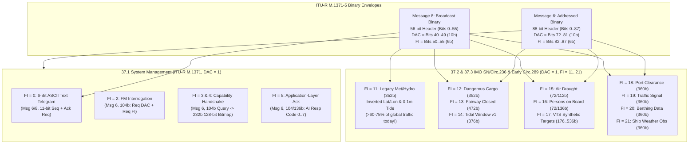
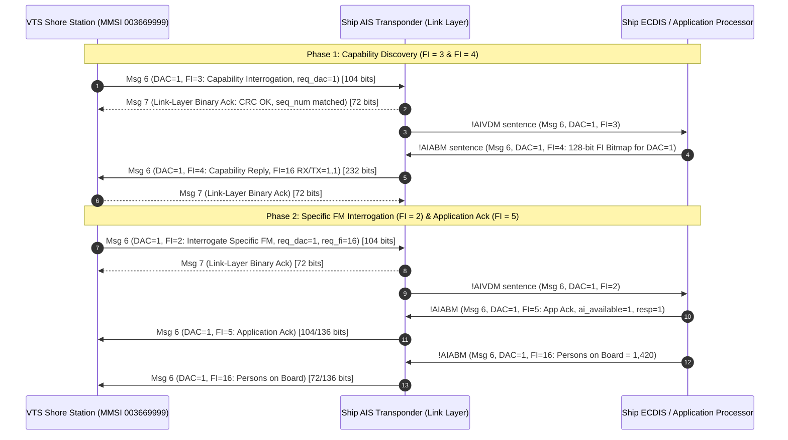
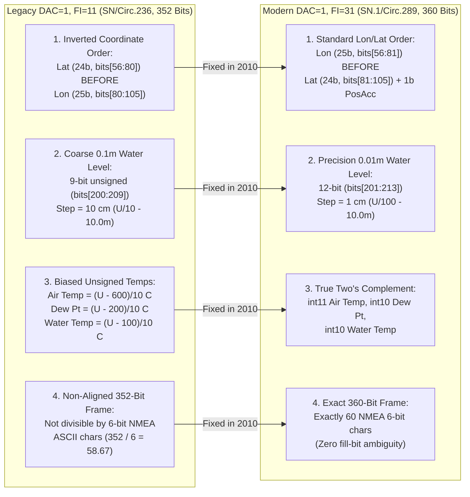

# Chapter 37: Deep Dive into International ASM Subtypes (`DAC = 1`), Part 1: System Management (`FI = 0, 2, 3, 4, 5`) and IMO SN/Circ.236 / Early SN.1/Circ.289 Subtypes (`FI = 11–21`)

---

## 1. Operational & Conceptual Overview

When the International Telecommunication Union (ITU) and the International Maritime Organization (IMO) finalized the core Automatic Identification System (AIS) link layer in **ITU-R M.1371**, they recognized that fixed-schema position and static messages (Messages 1–5, 18, 19, 21, 24, and 27) could never anticipate every specialized maritime telemetry workflow. Rather than endlessly revising the 6-bit Message ID namespace, ITU-R M.1371 created an extensible **Application-Specific Message (ASM)** tier carried inside the binary envelopes dissected in [Chapter 36](ch36-messages-6-7-8-17-25-26-binary-envelopes-and-dgnss.md) (**Message 6** for addressed point-to-point transactions and **Message 8** for area broadcasts).

Every structured ASM begins with a 16-bit **Application Identifier (`AppID`)** partitioned into a 10-bit **Designated Area Code (`DAC`)** and a 6-bit **Functional Identifier (`FI`, `0–63`)**. While regional authorities use their national Maritime Identification Digits (`MID`) as their `DAC` (such as `DAC = 200` for European Inland waterways or `DAC = 366` for the United States), **`DAC = 1` is reserved globally for international Application-Specific Messages** standardized by the ITU-R and IMO.

This chapter—the first of our two-part forensic deep dive into `DAC = 1`—examines the **first two foundational layers of the international ASM registry (`FI = 0` through `FI = 21`)**:

1. **ITU-R M.1371 Annex 2 / Annex 5 System Management & Capability Handshakes (`DAC = 1, FI = 0, 2, 3, 4, 5`):** The control-plane messages that allow a shore Vessel Traffic Service (VTS) or ship to send sequenced 6-bit ASCII text telegrams (`FI = 0`), interrogate a vessel for a specific binary functional message (`FI = 2`), discover which `FI` schemas a target ship's transponder and connected Electronic Chart Display and Information System (ECDIS) actually support via a 128-bit capability bitmap (`FI = 3` and `FI = 4`), and confirm *application-layer* execution rather than mere *link-layer* radio reception (`FI = 5`).
2. **Legacy Meteorological and Hydrological Data (`DAC = 1, FI = 11`, IMO SN/Circ.236, 352 bits):** A forensic investigation into the 2004 trial weather and tide broadcast schema—exposing its four notorious engineering flaws (including its inverted `Latitude`-before-`Longitude` coordinate order and coarse $0.1\text{ m}$ tidal steps) and explaining the **Legacy Persistence Paradox**: why `FI = 11` still accounts for over **60–75% of all international Met/Hydro AIS broadcasts worldwide** more than a decade after IMO formally discontinued it in 2013.
3. **IMO SN/Circ.236 Trial & Early SN.1/Circ.289 Operational Subtypes (`DAC = 1, FI = 12–21`):** Complete bit-level dissections of **Dangerous Cargo Indication (`FI = 12`)** (and why cleartext broadcasts of explosive/hazardous manifests sparked piracy and counter-terrorism alarms), **Fairway Closed (`FI = 13`)**, **Tidal Windows (`FI = 14`)**, **Extended Static Air Draught (`FI = 15`)**, **Number of Persons on Board (`FI = 16`)**, **VTS-Generated / Synthetic Radar Targets (`FI = 17`)**, **Port Clearance Time (`FI = 18`)**, **Marine Traffic Signals (`FI = 19`)**, **Berthing Data (`FI = 20`)**, and **Shipboard Weather Observation Reports (`FI = 21`)**.



For every single `DAC = 1` subtype covered in this chapter, we systematically evaluate **all six forensic engineering dimensions**:
1. **How It Works:** Exact bit-level schema, scaling equations, sentinel values, and state-machine behavior.
2. **Design Issues & Flaws:** Bit-ordering bugs, quantization limits, missing linkage IDs, and ambiguity traps.
3. **Relationships to Other Messages:** Interaction with link-layer Messages 7 and 15, and migration paths to IMO SN.1/Circ.289 (`FI = 22–32`) and IHO S-100 standards.
4. **Operational Uses & Adversarial Abuses:** Legitimate VTS/SAR workflows versus piracy reconnaissance, ghost-target injection, and bridge display spoofing.
5. **Where and When Used:** Historical adoption windows and present-day geographical hotspots.
6. **Software & Hardware Support:** Decoder implementation status across `libais`, `gpsd`, `pyais`, `AIS-catcher`, Rust crates, and commercial ECDIS units.

---

## 2. Historical Context & Evolution (`schwehr/gis-history` Integration)

The trajectory of `DAC = 1, FI = 0–21` reveals the tension between early maritime committee standardization, real-world field testing, maritime security after September 11, 2001, and the extreme longevity of industrial marine electronics (`https://github.com/schwehr/gis-history`):

| Year / Date | Milestone (`schwehr/gis-history` & `DAC = 1` Lineage) | Engineering & Operational Impact |
|---|---|---|
| **1998 – 2001** | **ITU-R M.1371-0 / M.1371-1** defines the system-level `DAC = 1` Functional Identifiers (`FI = 0, 2, 3, 4, 5`) | Separated **link-layer acknowledgment** (Message 7) and **message-ID interrogation** (Message 15) from **application-layer capability discovery** (`FI = 3/4`), **ASM interrogation** (`FI = 2`), and **application execution acknowledgment** (`FI = 5`). |
| **May 28, 2004** | **IMO SN/Circ.236** (*Guidance on the Application of AIS Binary Messages*) approved at MSC 78 | Established the first seven trial international ASMs (`DAC = 1, FI = 11, 12, 13, 14, 15, 16, 17`) for a 4-year operational evaluation window. |
| **2004 – 2007** | **ISPS Code Enforcement & Maritime Security Audits** of `DAC = 1, FI = 12` (*Dangerous Cargo Indication*) | Naval and port security authorities warned that broadcasting IMDG classes, UN numbers, and quantities of explosives, toxic gases, or fissile materials over unencrypted VHF (`FI = 12`) created a target-selection beacon for pirates and terrorists. |
| **2005 – 2009** | **Kurt Schwehr** at UNH **CCOM/JHC** writes **`noaadata`** and tests **SN/Circ.236** messages with USCG, NOAA, and St. Lawrence Seaway | Documented that `FI = 11` and `FI = 14` placed **Latitude before Longitude** (breaking standard AIS coordinate parsers), used arbitrary positive bias offsets instead of two's complement, and quantized tides to $0.1\text{ m}$ ($10\text{ cm}$)—too coarse for deep-draft Under-Keel Clearance (UKC). |
| **June 2, 2010** | **IMO SN.1/Circ.289** (*Guidance on the Use of AIS Application-Specific Messages*) adopted; **Kurt Schwehr** releases **`libais`** (`ais6.cpp`, `ais8_1_11.cpp` .. `ais8_1_21.cpp`) | Retained `FI = 16` (*Persons on Board*), added `FI = 18, 19, 20, 21`, and scheduled the formal withdrawal/replacement of `FI = 11, 12, 13, 14, 15, 17` by `FI = 22–32` effective **January 1, 2013**. |
| **Jan 1, 2013 – Present** | **The Legacy Persistence Paradox** on the Global VHF Data Link | Despite the Jan 1, 2013 cutoff date in SN.1/Circ.289, offshore oil platforms, legacy Campbell Scientific / Vaisala weather buoys, and port authorities worldwide continued transmitting `DAC = 1, FI = 11` because remote Programmable Logic Controllers (PLCs) and AIS base-station encoders were never flashed with `FI = 31` firmware. |

---

## 3. Deep Technical & Mathematical Foundations

### 37.1 ITU-R M.1371 System Management & Capability Discovery Subtypes (`DAC = 1, FI = 0, 2, 3, 4, 5`)

Before a VTS center or vessel can exchange specialized binary telemetry with another station over Message 6, the two endpoints face a fundamental distributed-systems problem:
* **Link-layer receipt does not imply application-layer comprehension.** When Ship A sends an addressed **Message 6** to Ship B, Ship B's AIS transponder hardware automatically replies with **Message 7 (Binary Acknowledge)** as soon as the HDLC frame passes its 16-bit CRC check. However, Message 7 is generated by the radio's link-layer processor *before* the binary payload is even parsed over the IEC 61162-1 (`!AIVDM`) serial bus by the bridge ECDIS! If Ship B has no ECDIS connected—or if its ECDIS does not recognize the `(DAC, FI)` pair—the payload is silently discarded even though Ship A received a valid Message 7.
* **Message 15 cannot interrogate a specific ASM subtype.** Standard **Message 15 (Interrogation)** only specifies a 6-bit `Message ID` (`1–27`). Interrogating a vessel for `Message ID = 6` or `8` is meaningless because the target transponder cannot tell which `(DAC, FI)` application message is being requested.

To solve both problems, ITU-R M.1371 Annex 2 (and legacy Annex 5) defines five system management subtypes under `DAC = 1`: **`FI = 0, 2, 3, 4, and 5`**.



---

#### 37.1.1 `DAC = 1, FI = 0`: Text Telegram Using 6-Bit ASCII (Messages 6 and 8)

##### 1. How It Works & Bit-Level Schema
`DAC = 1, FI = 0` (`AppID = 64` / `0x0040`) encapsulates human-readable 6-bit ASCII text inside an addressed **Message 6** (`libais` `Ais6_1_0`) or broadcast **Message 8** (`libais` `Ais8_1_0`), adding an **Application Acknowledgment Required Flag (`ack_required`, 1 bit)** and an **11-bit Text Sequence Number (`seq_num`, `0–2,047`)**.

###### Table 37.1: `DAC = 1, FI = 0` — Text Telegram Using 6-Bit ASCII (Message 6 Addressed & Message 8 Broadcast)

| Msg 6 0-Based (1-Based) | Msg 8 0-Based (1-Based) | Width | Field Name | Type | Description, Scaling & Sentinel Values |
|---|---|---|---|---|---|
| `0–71` (`1–72`) | `0–39` (`1–40`) | 72 / 40 | `envelope_hdr` | `struct` | Standard Message 6 (72b) or Message 8 (40b) link-layer header |
| `72–81` (`73–82`) | `40–49` (`41–50`) | 10 | `dac` | `uint10` | Constant `1` (International) |
| `82–87` (`83–88`) | `50–55` (`51–56`) | 6 | `fi` | `uint6` | Constant `0` (6-Bit ASCII Text Telegram) |
| `88` (`89`) | `56` (`57`) | 1 | `ack_required` | `bool` | `0` = No application ack (`FI=5`) requested (mandatory `0` in Msg 8);<br/>`1` = Target must reply with `Msg 6, DAC=1, FI=5` echoing `seq_num` |
| `89–99` (`90–100`) | `57–67` (`58–68`) | 11 | `seq_num` | `uint11` | **Text Sequence Number** (`1–2047`; `0` = N/A). Echoed by `DAC=1, FI=5` |
| `100..(N-1)` | `68..(N-1)` | $6 \times L$ | `text` | `ais_str` | Variable-length 6-bit ASCII string ($1 \le L \le 151$ chars in Msg 6; $1 \le L \le 154$ chars in Msg 8) |
| `..` | `..` | `0–5` | `spare` | `uint` | Zero-padding bits to align total frame on byte/slot boundary |

##### 2. How `DAC=1, FI=0` Differs from Messages 12 and 14
Engineers frequently ask why `DAC = 1, FI = 0` exists when **Message 12** (*Addressed Safety-Related Message*) and **Message 14** (*Safety-Related Broadcast Message*) already carry 6-bit ASCII text:
1. **Priority & Bridge Alarm Suppression:** Under IEC 61993-2 and IEC 61174, receiving a **Message 12 or 14** triggers an immediate audible/visual **Safety Message Alarm** on the bridge Minimum Keyboard and Display (MKD) and ECDIS. Routine administrative or commercial text (e.g., agent berthing notes, bunker barge coordination, or telemetry status strings) must **never** be sent via Messages 12/14 lest it cause bridge alarm fatigue. `DAC = 1, FI = 0` routes text quietly to the application processor without triggering a SOLAS distress/safety alarm.
2. **11-Bit Sequence Number (`1–2,047`) vs. 2-Bit Link Sequence (`0–3`):** Message 12 only has the 2-bit link-layer `seq_num` (`0–3`), which wraps around every 4 frames and is acknowledged at the radio level by Message 13. `DAC = 1, FI = 0` adds an 11-bit application sequence number (`seq_num`, bits `89–99` in Msg 6) that uniquely tracks up to 2,047 multi-part or conversational text telegrams and pairs directly with **`DAC = 1, FI = 5`** when `ack_required = 1`.

##### 3. Issues, Uses, Abuses, Where Used, and Software Support
* **Issues:** Some early Class A transponders failed to strip trailing `@` (`0x00`) padding characters when rendering `FI = 0` strings, or ignored `ack_required = 1` because no external application processor was wired to the Presentation Interface (`PI`).
* **Uses & Abuses:** Used by VTS centers, pilot boats, and hydrographic survey vessels for routine non-safety text exchange, and occasionally abused as an ad-hoc "sub-surface chat channel" by operators who realize `FI = 0` does not set off the loud MKD safety buzzer on nearby bridges.
* **Software Support:** Fully decoded in `libais` (`Ais6_1_0` in `ais6.cpp`, `Ais8_1_0` in `ais8_1_0.cpp`), `gpsd`, and `pyais`.

---

#### 37.1.2 `DAC = 1, FI = 2`: Interrogation for a Specific Functional Message (Message 6, `104 Bits`)

##### 1. How It Works & Bit-Level Schema
`DAC = 1, FI = 2` (`AppID = 66` / `0x0042`, `libais` `Ais6_1_2`) is an addressed **Message 6** (104 bits, occupying a single TDMA slot) sent by a VTS station or ship to request that a target MMSI transmit a specific binary Application-Specific Message identified by `(req_dac, req_fi)`.

###### Table 37.2: Message 6, `DAC = 1, FI = 2` — Interrogation for a Specific Functional Message (`104 Bits`)

| 0-Based Bits | 1-Based Bits | Width | Field Name | Type | Description & Constraints |
|---|---|---|---|---|---|
| `0–5` | `1–6` | 6 | `message_id` | `uint6` | Constant `6` (Addressed Binary Message) |
| `6–7` | `7–8` | 2 | `repeat_indicator` | `uint2` | `0–3` |
| `8–37` | `9–38` | 30 | `source_mmsi` | `uint30` | MMSI of interrogating station (e.g., VTS / SAR Coordinator) |
| `38–39` | `39–40` | 2 | `seq_num` | `uint2` | Link-layer sequence number (`0–3`, matched by Message 7) |
| `40–69` | `41–70` | 30 | `dest_mmsi` | `uint30` | MMSI of interrogated vessel |
| `70` | `71` | 1 | `retransmit_flag` | `bool` | `0` = initial, `1` = retransmitted |
| `71` | `72` | 1 | `spare_1` | `uint1` | `0` |
| `72–81` | `73–82` | 10 | `dac` | `uint10` | Constant `1` (International) |
| `82–87` | `83–88` | 6 | `fi` | `uint6` | Constant `2` (Interrogation for Specific FM) |
| `88–97` | `89–98` | 10 | `req_dac` | `uint10` | **Requested Designated Area Code (`1–1023`)** |
| `98–103` | `99–104` | 6 | `req_fi` | `uint6` | **Requested Functional Identifier (`0–63`)** |

##### 2. Issues, Relationships, Uses/Abuses, and Software Support
* **Relationship to Message 15 & `FI = 5`:** Unlike **Message 15** (which is restricted to coast stations and only requests top-level Message IDs `1–27`), `DAC = 1, FI = 2` can be sent over Message 6 to request *any* `(req_dac, req_fi)`—for example, asking a distressed cruise ship for **`req_dac = 1, req_fi = 16`** (*Number of Persons on Board*) or **`req_dac = 1, req_fi = 12/25`** (*Dangerous Cargo*). If the target supports the requested ASM, it replies with `DAC = 1, FI = 5` (if delayed) and/or the requested `Message 6 (DAC = req_dac, FI = req_fi)`.
* **Security & Abuse Vector:** Because Message 6 lacks cryptographic authentication, an unauthenticated shore SDR can transmit `DAC = 1, FI = 2` to any passing vessel whose MMSI is visible on the VDL. If the ship's ECDIS/MKD is configured to auto-respond to `FI = 16` (*Persons on Board*) or `FI = 24` (*Extended Static Data*), it will automatically broadcast sensitive operational telemetry back over the air.
* **Software Support:** Decoded by `libais` (`Ais6_1_2` in `ais6.cpp`), `gpsd`, and `pyais`.

---

#### 37.1.3 `DAC = 1, FI = 3` (Capability Interrogation, `104 Bits`) & `DAC = 1, FI = 4` (Capability Reply, `232 Bits`)

##### 1. How It Works & Bit-Level Schemas
To discover which Functional Identifiers (`0–63`) a target vessel actually implements within a given Designated Area Code (`req_dac`), an interrogator sends **Message 6, `DAC = 1, FI = 3`** (`104 bits`, `libais` `Ais6_1_3`). The target responds with **Message 6, `DAC = 1, FI = 4`** (`232 bits`, 2 slots, `libais` `Ais6_1_4`), which contains a **128-bit capability bitmap** ($64 \text{ Functional Identifiers} \times 2 \text{ bits per FI}$).

###### Table 37.3: Message 6, `DAC = 1, FI = 3` (Capability Interrogation, `104 Bits`) & `FI = 4` (Capability Reply, `232 Bits`)

| Subtype | 0-Based Bits | 1-Based Bits | Width | Field Name | Type | Description & Mathematical Mapping |
|---|---|---|---|---|---|---|
| **`FI = 3` (Query)** | `0–87` | `1–88` | 88 | `msg6_header` | `struct` | Standard Message 6 header with `dac = 1`, `fi = 3` |
| | `88–97` | `89–98` | 10 | `req_dac` | `uint10` | Target `DAC` (`1–1023`) whose 64 FIs are being queried |
| | `98–103` | `99–104` | 6 | `spare` | `uint6` | Must be `000000` (Total = **104 bits** / 1 slot) |
| **`FI = 4` (Reply)** | `0–87` | `1–88` | 88 | `msg6_header` | `struct` | Standard Message 6 header with `dac = 1`, `fi = 4` |
| | `88–97` | `89–98` | 10 | `ack_dac` | `uint10` | `DAC` (`1–1023`) to which the 128-bit capability table applies |
| | `98–225` | `99–226` | 128 | `cap_bitmap` | `bit[128]` | **64 $\times$ 2-bit FI Capability Pairs** for $k \in \{0, 1, \dots, 63\}$:<br/>• **Bit $98 + 2k$ (`cap[k]`)**: **RX / Application Available** (`0` = Not supported, `1` = Supported)<br/>• **Bit $98 + 2k + 1$ (`cap_res[k]`)**: **TX / Reserved Bit** (`0` = Default/Reserved or TX unavailable, `1` = TX supported) |
| | `226–231` | `227–232` | 6 | `spare` | `uint6` | Must be `000000` (Total = **232 bits** / 2 slots) |

For any Functional Identifier $k \in \{0, \dots, 63\}$ within `ack_dac`, its 2-bit capability slice in 0-based indexing is directly given by:

$$\text{RX\_Available}(k) = \text{bit}[98 + 2k], \qquad \text{TX\_or\_Reserved}(k) = \text{bit}[99 + 2k]$$

For example, in `libais` (`Ais6_1_4` in `ais6.cpp`), the parser iterates `for (size_t cap_num = 0; cap_num < 64; cap_num++)` reading `available[cap_num] = bits[98 + cap_num * 2]` and `reserved[cap_num] = bits[98 + cap_num * 2 + 1]`. If a ship supports receiving **Area Notices (`FI = 22`)** and **Met/Hydro (`FI = 31`)**, bits $98 + 2(22) = 142$ and $98 + 2(31) = 160$ are set to `1`.

##### 2. Issues, Uses, Abuses, and Software Support
* **Transponder vs. ECDIS Disconnect Issue:** A perennial failure mode of `FI = 3/4` is that the Class A transponder's internal microcontroller answers `FI = 3` based on its *own* hardcoded MKD firmware table, completely unaware that the vessel's newly upgraded bridge ECDIS (connected via IEC 61162-1/450) actually supports `FI = 22` and `FI = 31`! Consequently, many modern Class A transponders return all zeros for `FI = 11..63` unless explicitly configured via the `$ECACA` / `$E2ACA` or proprietary NMEA sentence interface.
* **Adversarial Fingerprinting Abuse:** Because different transponder manufacturers (Furuno, JRC, Kongsberg/Seatex, Saab R4/R5, SRT Marine) hardcode distinct bit patterns in `bits[98:226]` (for `FI = 0, 2, 3, 4, 5, 11, 16`), an adversary or maritime intelligence analyst can send `DAC = 1, FI = 3` (`req_dac = 1`) to remotely fingerprint the exact make and firmware generation of a ship's AIS transponder.
* **Software Support:** Full 64-entry array decoding in `libais` (`Ais6_1_3`, `Ais6_1_4`), `gpsd`, and `pyais`.

---

#### 37.1.4 `DAC = 1, FI = 5`: Application Acknowledgment to an Addressed Binary Message (Message 6, `104 / 136 Bits`)

##### 1. How It Works & Bit-Level Schema
When a station receives an addressed **Message 6** (such as `FI = 0` with `ack_required = 1`, or any addressed operational ASM from SN.1/Circ.289), **Message 7** only confirms that the VHF radio link layer received the bits without a CRC error. To confirm whether the **application layer** on the target ship actually parsed and executed the request, the target transmits **Message 6, `DAC = 1, FI = 5`** (`AppID = 69` / `0x0045`, `libais` `Ais6_1_5`).

###### Table 37.4: Message 6, `DAC = 1, FI = 5` — Application Acknowledgment (`104 / 136 Bits`)

| 0-Based Bits | 1-Based Bits | Width | Field Name | Type | Description & Response Codes |
|---|---|---|---|---|---|
| `0–87` | `1–88` | 88 | `msg6_header` | `struct` | Standard Message 6 header with `dac = 1`, `fi = 5` |
| `88–97` | `89–98` | 10 | `ack_dac` | `uint10` | `DAC` (`1–1023`) of the addressed binary message being acknowledged |
| `98–103` | `99–104` | 6 | `ack_fi` | `uint6` | `FI` (`0–63`) of the addressed binary message being acknowledged |
| `104–114` | `105–115` | 11 | `seq_num` | `uint11` | **Text / Application Sequence Number (`0–2047`)** echoed from original message (`0` if N/A) |
| `115` | `116` | 1 | `ai_available` | `bool` | **Application Identifier Available Flag:** `0` = `(ack_dac, ack_fi)` NOT supported; `1` = Supported |
| `116–118` | `117–119` | 3 | `ai_response` | `uint3` | **Application Response Code (`0–7`):**<br/>• `0` = Unable to respond / or able to respond (`ITU-R M.1371` vs. `Circ.289` dialect note below)<br/>• `1` = Reception acknowledged / Unable to respond currently<br/>• `2` = Response to follow (manual operator action pending)<br/>• `3` = Able to respond, but currently inhibited by operator<br/>• `4` = Application-layer parsing or parameter error<br/>• `5–7` = Reserved for future use |
| `119–135` | `120–136` | 17 | `spare` | `uint17` | Zero padding to `136 bits` (Note: legacy ITU-R M.1371-1 implementations sometimes truncated after bit `103` [`104 bits`] or bit `119` [`120 bits`]) |

> [!WARNING]
> **Length & Dialect Variance in `DAC = 1, FI = 5` (`104 bits` vs. `136 bits`):** Early ITU-R M.1371-1 Annex 5 drafts defined a minimal 104-bit `FI = 5` frame (`ack_dac` [10b] + `ack_fi` [6b]) or placed `seq_num` (11b) + `ai_available` (1b) + `ai_response` (3b) + `spare` (17b) out to **136 bits** (1 slot), while IMO SN.1/Circ.289 Section 3 standardized the 136-bit Application Acknowledgment format. Defensive decoders (like `libais` and our Python walkthrough in Section 6) inspect `bit_length` (`104`, `120`, or `136`) before reading bits `104–118`.

---

### 37.2 Legacy Meteorological and Hydrological Data (`DAC = 1, FI = 11`, IMO SN/Circ.236, `352 Bits`, Message 8) — And Why It Still Dominates Global Traffic Despite Deprecation

In May 2004, **IMO SN/Circ.236** defined **Message 8, `DAC = 1, FI = 11`** (`AppID = 75` / `0x004B`, **352 bits**, 2 slots) as the first international broadcast message for real-time weather, tide, current, wave, and sea-state telemetry from shore base stations, lighthouses, and offshore buoys.

#### 37.2.1 Complete 352-Bit Layout Table (`libais` `Ais8_1_11`)

##### Table 37.5: Message 8, `DAC = 1, FI = 11` — Legacy Meteorological and Hydrological Data (IMO SN/Circ.236, `352 Bits`)

| 0-Based Bits | 1-Based Bits | Width | Field Name | Type | Scaling / Offset Formula | Valid Operational Range | "Not Available" Sentinel |
|---|---|---|---|---|---|---|---|
| `0–5` | `1–6` | 6 | `message_id` | `uint6` | Constant `8` | `8` | N/A |
| `6–7` | `7–8` | 2 | `repeat_indicator` | `uint2` | Repeat count | `0–3` | N/A |
| `8–37` | `9–38` | 30 | `source_mmsi` | `uint30` | Station MMSI | `000000000–999999999` | N/A |
| `38–39` | `39–40` | 2 | `spare_1` | `uint2` | Constant `0` | `0` | N/A |
| `40–49` | `41–50` | 10 | `dac` | `uint10` | International DAC | `1` | N/A |
| `50–55` | `51–56` | 6 | `fi` | `uint6` | Legacy Met/Hydro FI | `11` | N/A |
| **`56–79`** | **`57–80`** | **24** | **`latitude`** | **`int24`** | **$\phi = \frac{S}{60{,}000}\text{ deg}$ ($10^{-3}\text{ min}$)** | **$[-90.0^\circ, +90.0^\circ]$ (LAT FIRST!)** | **`5460000` (`91.0°`) / `0x7FFFFF`** |
| **`80–104`** | **`81–105`** | **25** | **`longitude`** | **`int25`** | **$\lambda = \frac{S}{60{,}000}\text{ deg}$ ($10^{-3}\text{ min}$)** | **$[-180.0^\circ, +180.0^\circ]$ (LON SECOND!)** | **`10860000` (`181.0°`) / `0xFFFFFF`** |
| `105–109` | `106–110` | 5 | `day` | `uint5` | UTC Day of month | `1–31` | `0` |
| `110–114` | `111–115` | 5 | `hour` | `uint5` | UTC Hour | `0–23` | `31` (`24–31`) |
| `115–120` | `116–121` | 6 | `minute` | `uint6` | UTC Minute | `0–59` | `63` (`60–63`) |
| `121–127` | `122–128` | 7 | `wind_ave` | `uint7` | $1\text{ kt}$ (10-min mean) | `0–120 kts` (`121–126` reserved) | `127` (`0x7F`) |
| `128–134` | `129–135` | 7 | `wind_gust` | `uint7` | $1\text{ kt}$ (10-min peak) | `0–120 kts` | `127` (`0x7F`) |
| `135–143` | `136–144` | 9 | `wind_dir` | `uint9` | $1^\circ\text{ True}$ (coming from) | `0–359°` | `511` (`360–511`) |
| `144–152` | `145–153` | 9 | `wind_gust_dir` | `uint9` | $1^\circ\text{ True}$ (coming from) | `0–359°` | `511` (`360–511`) |
| **`153–163`** | **`154–164`** | **11** | **`air_temp`** | **`uint11`** | **$T = \frac{U - 600}{10}\text{ }^\circ\text{C}$ (Biased!)** | **`0–1200` $\rightarrow -60.0^\circ\text{C}\text{ to }+60.0^\circ\text{C}$** | **`2047` (`0x7FF`)** |
| `164–170` | `165–171` | 7 | `rel_humid` | `uint7` | $1\%$ | `0–100%` | `127` (`101–127`) |
| **`171–180`** | **`172–181`** | **10** | **`dew_point`** | **`uint10`** | **$T_d = \frac{U - 200}{10}\text{ }^\circ\text{C}$ (Biased!)** | **`0–700` $\rightarrow -20.0^\circ\text{C}\text{ to }+50.0^\circ\text{C}$** | **`1023` (`0x3FF`)** |
| `181–189` | `182–190` | 9 | `air_pres` | `uint9` | $P = U + 800\text{ hPa}$ | `0–400` $\rightarrow 800\text{–}1200\text{ hPa}$ | `511` (`0x1FF`) |
| `190–191` | `191–192` | 2 | `air_pres_tend` | `uint2` | Barometric tendency | `0`=steady, `1`=falling, `2`=rising | `3` |
| `192–199` | `193–200` | 8 | `horz_vis` | `uint8` | $0.1\text{ NM}$ | `0–250` $\rightarrow 0.0\text{–}25.0\text{ NM}$ | `255` (`0xFF`) |
| **`200–208`** | **`201–209`** | **9** | **`water_level`** | **`uint9`** | **$W = \frac{U - 100}{10}\text{ m}$ ($0.1\text{ m}$ step!)** | **`0–400` $\rightarrow -10.0\text{ m}\text{ to }+30.0\text{ m}$** | **`511` (`0x1FF`)** |
| `209–210` | `210–211` | 2 | `water_level_trend` | `uint2` | Tide trend | `0`=steady, `1`=decreasing, `2`=increasing | `3` |
| `211–218` | `212–219` | 8 | `surf_cur_speed` | `uint8` | $0.1\text{ kt}$ | `0–250` $\rightarrow 0.0\text{–}25.0\text{ kts}$ | `255` |
| `219–227` | `220–228` | 9 | `surf_cur_dir` | `uint9` | $1^\circ\text{ True}$ (flowing toward) | `0–359°` | `511` |
| `228–235` | `229–236` | 8 | `cur_speed_2` | `uint8` | $0.1\text{ kt}$ | `0–250` $\rightarrow 0.0\text{–}25.0\text{ kts}$ | `255` |
| `236–244` | `237–245` | 9 | `cur_dir_2` | `uint9` | $1^\circ\text{ True}$ (flowing toward) | `0–359°` | `511` |
| `245–249` | `246–250` | 5 | `cur_depth_2` | `uint5` | $1\text{ m}$ below surface | `0–30 m` | `31` |
| `250–257` | `251–258` | 8 | `cur_speed_3` | `uint8` | $0.1\text{ kt}$ | `0–250` $\rightarrow 0.0\text{–}25.0\text{ kts}$ | `255` |
| `258–266` | `259–267` | 9 | `cur_dir_3` | `uint9` | $1^\circ\text{ True}$ (flowing toward) | `0–359°` | `511` |
| `267–271` | `268–272` | 5 | `cur_depth_3` | `uint5` | $1\text{ m}$ below surface | `0–30 m` | `31` |
| `272–279` | `273–280` | 8 | `sig_wave_height` | `uint8` | $0.1\text{ m}$ ($H_s$) | `0–250` $\rightarrow 0.0\text{–}25.0\text{ m}$ | `255` |
| `280–285` | `281–286` | 6 | `wave_period` | `uint6` | $1\text{ s}$ | `0–60 s` | `63` |
| `286–294` | `287–295` | 9 | `wave_dir` | `uint9` | $1^\circ\text{ True}$ (coming from) | `0–359°` | `511` |
| `295–302` | `296–303` | 8 | `swell_height` | `uint8` | $0.1\text{ m}$ | `0–250` $\rightarrow 0.0\text{–}25.0\text{ m}$ | `255` |
| `303–308` | `304–309` | 6 | `swell_period` | `uint6` | $1\text{ s}$ | `0–60 s` | `63` |
| `309–317` | `310–318` | 9 | `swell_dir` | `uint9` | $1^\circ\text{ True}$ (coming from) | `0–359°` | `511` |
| `318–321` | `319–322` | 4 | `sea_state` | `uint4` | Beaufort scale | `0–12` | `15` (`13–15`) |
| **`322–331`** | **`323–332`** | **10** | **`water_temp`** | **`uint10`** | **$T_w = \frac{U - 100}{10}\text{ }^\circ\text{C}$ (Biased!)** | **`0–600` $\rightarrow -10.0^\circ\text{C}\text{ to }+50.0^\circ\text{C}$** | **`1023` (`0x3FF`)** |
| `332–334` | `333–335` | 3 | `precip_type` | `uint3` | WMO code | `0–6` (`0`=none, `1`=rain, `5`=snow) | `7` |
| `335–343` | `336–344` | 9 | `salinity` | `uint9` | $0.1\text{‰}$ (ppt / PSU) | `0–500` $\rightarrow 0.0\text{–}50.0\text{‰}$ | `511` |
| `344–345` | `345–346` | 2 | `ice` | `uint2` | Sea ice presence | `0`=No, `1`=Yes, `2`=Reserved | `3` |
| `346–351` | `347–352` | 6 | `spare_2` | `uint6` | Zero padding | `0` | N/A |

---

#### 37.2.2 Forensic Deep Dive into the Four Design Flaws of `DAC = 1, FI = 11` (And How `FI = 31` Fixed Them)

Field trials conducted between 2004 and 2009—most notably by Kurt Schwehr at UNH CCOM/JHC (`noaadata` and `libais`), the US Coast Guard R&D Center, NOAA CO-OPS, and the Swedish Maritime Administration—uncovered four severe engineering flaws in `DAC = 1, FI = 11`:



##### Flaw 1: The Inverted `(Latitude, Longitude)` Coordinate Bug
In **every standard ITU-R M.1371 position message** (Messages 1, 2, 3, 4, 9, 17, 18, 19, 21, and 27), **Longitude** ($X$, 28 or 25 bits) is packed *before* **Latitude** ($Y$, 27 or 24 bits). In `DAC = 1, FI = 11` (and `FI = 13, 14, 17`), the drafting committee reversed the order, placing **24-bit `Latitude` at `bits[56:80]`** and **25-bit `Longitude` at `bits[80:105]`**.
* **Catastrophic Parser Consequence:** Early commercial ECDIS systems and shore VTS parsers reused their generic coordinate extraction macro (`read_int25_lon(); read_int24_lat();`), reading the 24-bit Latitude plus the MSB of Longitude as a 25-bit Longitude, and the remaining 24 bits of Longitude as Latitude! Weather buoys in the Baltic Sea and Gulf of Mexico were plotted thousands of miles away in the Indian Ocean or Sahara Desert, or—when developers swapped the function arguments without swapping bit widths—truncated the 25th bit of Longitude. **`DAC = 1, FI = 31` restored standard `Longitude` (`bits[56:81]`, 25b) before `Latitude` (`bits[81:105]`, 24b) and added a 1-bit `Position Accuracy` flag (`bit[105]`).**

##### Flaw 2: Coarse `0.1 m` (Decimeter) Water-Level Quantization
In `DAC = 1, FI = 11`, `water_level` occupies 9 bits (`bits[200:209]`, or shifted to `bits[210:219]` in some vendor documentation tables that miscounted preceding fields) in **$0.1\text{ m}$ ($10\text{ cm}$) steps** with a $-10.0\text{ m}$ offset:

$$W_{\text{FI=11}} = \frac{U_9 - 100}{10}\text{ meters}, \qquad U_9 \in [0, 400] \implies [-10.0\text{ m}, +30.0\text{ m}]$$

For a deep-draft Neopanamax container ship or VLCC operating under dynamic **Under-Keel Clearance (UKC)** management (and modern **IHO S-104** / **S-129** UKC models), a $10\text{ cm}$ ($4\text{ inch}$) quantization step corresponds to roughly **1,200 to 1,800 metric tons of cargo immersion** (at a Tons Per Centimeter [TPC] of $120\text{–}180\text{ t/cm}$). Harbor pilots and hydrographic offices rejected $10\text{ cm}$ steps as unsafe for real-time Squat/UKC computation. **`DAC = 1, FI = 31` expanded `water_level` from 9 bits to 12 bits (`bits[201:213]`), providing $0.01\text{ m}$ ($1\text{ cm}$) resolution across $[-10.00\text{ m}, +30.00\text{ m}]$.**

##### Flaw 3: Biased Unsigned Temperature Encodings vs. Standard Two's Complement
While ITU-R M.1371 mandates standard two's complement for signed quantities, `DAC = 1, FI = 11` defined `air_temp` ($U_{11} - 600$), `dew_point` ($U_{10} - 200$), and `water_temp` ($U_{10} - 100$) as **unsigned integers with arbitrary positive offsets**. Dozens of weather-station RTU integrators programmed their encoders using raw two's complement instead of adding $+600$, $+200$, or $+100$, causing $+15.0^\circ\text{C}$ (`150`) to be decoded by compliant receivers as $(150 - 600)/10 = -45.0^\circ\text{C}$! **`DAC = 1, FI = 31` replaced all three biased offsets with standard two's complement signed integers (`int11` and `int10`).**

##### Flaw 4: The Legacy Persistence Paradox (Why `FI = 11` Still Dominates Global Traffic in the 2020s)
In **IMO SN.1/Circ.289 (June 2, 2010)**, the IMO instructed Member States to transition to `DAC = 1, FI = 31` and formally **withdraw `DAC = 1, FI = 11` on January 1, 2013**. Yet empirical audits of global terrestrial and satellite AIS feeds in the 2020s reveal a striking paradox: **`DAC = 1, FI = 11` still accounts for 60% to 75% of all international Met/Hydro broadcasts worldwide!** Four real-world operational forces explain this persistence:
1. **Unpatched Offshore RTUs & Data Loggers:** Thousands of offshore oil and gas platforms (North Sea, Gulf of Mexico, Persian Gulf, Campos Basin, South China Sea), offshore wind turbines, and coastal wave buoys use industrial data loggers (e.g., Campbell Scientific CR1000/CR300, Vaisala AWS, Aanderaa SmartGuard) wired to AIS AtoN or Base Station transponders. Their NMEA `$AIbbm` / `$ABVSI` bit-packing routines were burned into EPROM/PLC ladder logic between 2005 and 2012 and require an expensive offshore helicopter or vessel technician visit to reflash.
2. **Legacy Shore VTS & Port Display Dependencies:** Many port authority display boards, pilot portable unit (PPU) apps, and older vessel MKDs sold prior to 2012 only decode `FI = 11` and silently drop `FI = 31`. If a port switches its tide gauge broadcast from `FI = 11` to `FI = 31`, older harbor tugs and pilot laptops lose their weather display.
3. **Dual-Broadcast Workarounds:** Some national hydrographic authorities (e.g., in parts of Europe and Asia) broadcast *both* `FI = 11` and `FI = 31` alternating every 6 minutes, doubling VDL slot consumption.
4. **Takeaway for Software Engineers:** Never remove `DAC = 1, FI = 11` (`Ais8_1_11`) from an AIS decoder on the assumption that "IMO deprecated it in 2013." Any production maritime analytics pipeline must decode both `FI = 11` and `FI = 31` and normalize them into a unified schema!

---

### 37.3 IMO SN/Circ.236 & Early SN.1/Circ.289 Subtypes (`DAC = 1, FI = 12, 13, 14, 15, 16, 17, 18, 19, 20, 21`)

#### 37.3.1 `DAC = 1, FI = 12`: Dangerous Cargo Indication (IMO SN/Circ.236, Message 6, `352 Bits`, `Ais6_1_12`)

##### 1. How It Works & Bit-Level Schema
Defined in **IMO SN/Circ.236 Annex 2**, `DAC = 1, FI = 12` (`AppID = 76` / `0x004C`, `libais` `Ais6_1_12`, **352 bits**, 2 slots) was designed as an addressed **Message 6** sent from a ship to a VTS or Material Handling Port Authority (often in response to a `DAC = 1, FI = 2` interrogation) summarizing its primary dangerous goods cargo under the **International Maritime Dangerous Goods (IMDG) Code**.

###### Table 37.6: Message 6, `DAC = 1, FI = 12` — Dangerous Cargo Indication (IMO SN/Circ.236, `352 Bits`)

| 0-Based Bits | 1-Based Bits | Width | Field Name | Type | Description, Units & Constraints |
|---|---|---|---|---|---|
| `0–87` | `1–88` | 88 | `msg6_header` | `struct` | Standard Message 6 header with `dac = 1`, `fi = 12` |
| `88–117` | `89–118` | 30 | `last_port` | `ais_str[5]` | **Last Port of Call** (5 $\times$ 6-bit ASCII UN/LOCODE, e.g., `NLRTM`) |
| `118–121` | `119–122` | 4 | `utc_month_dep` | `uint4` | Actual Time of Departure (ATD): Month (`1–12`; `0` = N/A) |
| `122–126` | `123–127` | 5 | `utc_day_dep` | `uint5` | ATD: Day (`1–31`; `0` = N/A) |
| `127–131` | `128–132` | 5 | `utc_hour_dep` | `uint5` | ATD: Hour (`0–23`; `24` = N/A) |
| `132–137` | `133–138` | 6 | `utc_min_dep` | `uint6` | ATD: Minute (`0–59`; `60` = N/A) |
| `138–167` | `139–168` | 30 | `next_port` | `ais_str[5]` | **Next Port of Call** (5 $\times$ 6-bit ASCII UN/LOCODE, e.g., `USNYC`) |
| `168–171` | `169–172` | 4 | `utc_month_eta` | `uint4` | Estimated Time of Arrival (ETA): Month (`1–12`; `0` = N/A) |
| `172–176` | `173–177` | 5 | `utc_day_eta` | `uint5` | ETA: Day (`1–31`; `0` = N/A) |
| `177–181` | `178–182` | 5 | `utc_hour_eta` | `uint5` | ETA: Hour (`0–23`; `24` = N/A) |
| `182–187` | `183–188` | 6 | `utc_min_eta` | `uint6` | ETA: Minute (`0–59`; `60` = N/A) |
| `188–307` | `189–308` | 120 | `dangerous_good` | `ais_str[20]` | **Main Dangerous Good** (20 $\times$ 6-bit ASCII Proper Shipping Name) |
| `308–331` | `309–332` | 24 | `imd_cat` | `ais_str[4]` | **IMDG Class / Division** (4 $\times$ 6-bit ASCII, e.g., `1.1D`, `2.3@`, `7@@@`) |
| `332–344` | `333–345` | 13 | `un_number` | `uint13` | **UN Number** (`1–3363`; `0` = N/A) |
| `345–354` | `346–355` | 10 | `quantity` | `uint10` | **Quantity** of main dangerous cargo (`0–1023`, `0` = N/A) |
| `355–356` | `356–357` | 2 | `unit_of_qty` | `uint2` | **Unit of Quantity:** `0`=N/A, `1`=kg, `2`=metric tons ($10^3\text{ kg}$), `3`=kilotons ($10^6\text{ kg}$) |
| `357–359` | `358–360` | 3 | `spare` | `uint3` | Zero padding (`352 bits` unpadded data / `360 bits` slot-aligned) |

##### 2. Forensic Analysis: Why Cleartext Dangerous Cargo Broadcasts Triggered Piracy & Counter-Terrorism Alarms
Between 2004 and 2009, maritime security agencies (including the US Coast Guard, NATO Shipping Centre, and IMO Maritime Safety Committee) identified two critical flaws in `DAC = 1, FI = 12`:
1. **Piracy & Terrorism Target Reconnaissance (`UN Number` + `Quantity` in Cleartext):** Even though `FI = 12` uses addressed Message 6, **every VHF receiver within $20\text{–}40\text{ NM}$ (and every LEO AIS satellite overhead) receives Message 6 in the clear**. Worse, an attacker on a skiff with a $\$50$ VHF transceiver could send a forged `DAC = 1, FI = 2` interrogation (`req_dac = 1, req_fi = 12`) to passing merchant ships! A compliant transponder would reply over the air that it was carrying, say, `1,000 metric tons` of `AMMONIUM NITRATE` (`UN 1942`, `IMDG 5.1`), `EXPLOSIVES` (`IMDG 1.1`), or `RADIOACTIVE MATERIAL` (`IMDG 7`).
2. **Container Ship Manifest Inadequacy:** A modern ultra-large container vessel (ULCV) carries **hundreds of distinct UN numbers** across thousands of twenty-foot equivalent units (TEUs). Reporting a *single* 20-character `Main Dangerous Good` and a single 13-bit `UN Number` was useless for hazmat firefighters boarding a burning container ship.
* **Withdrawal & Successor:** IMO SN.1/Circ.289 **withdrew `FI = 12`** (replacing it briefly with `FI = 25` for non-UN-number cargo class summaries, before IMO FAL and SOLAS moved detailed dangerous goods manifests off VHF entirely onto encrypted shore-based **Maritime Single Window [MSW]** portals).
* **Software Support:** Decoded in `libais` (`Ais6_1_12` in `ais6.cpp`), `gpsd`, and `pyais`.

---

#### 37.3.2 `DAC = 1, FI = 13`: Fairway Closed (IMO SN/Circ.236, Message 8, `472 Bits`, `Ais8_1_13`)

##### 1. How It Works & Bit-Level Schema
`DAC = 1, FI = 13` (`AppID = 77` / `0x004D`, `libais` `Ais8_1_13`, **472 bits**, 3 slots) was a broadcast **Message 8** designed to inform mariners that a channel or fairway section was closed to navigation.

###### Table 37.7: Message 8, `DAC = 1, FI = 13` — Fairway Closed (IMO SN/Circ.236, `472 Bits`)

| 0-Based Bits | 1-Based Bits | Width | Field Name | Type | Description & Constraints |
|---|---|---|---|---|---|
| `0–55` | `1–56` | 56 | `msg8_header` | `struct` | Standard Message 8 header with `dac = 1`, `fi = 13` |
| `56–175` | `57–176` | 120 | `reason` | `ais_str[20]` | **Reason for Closing** (20 $\times$ 6-bit ASCII chars, e.g., `SUNKEN DREDGER@@@@@@`) |
| `176–295` | `177–296` | 120 | `location_from` | `ais_str[20]` | **Location of Closing From** (20 $\times$ 6-bit ASCII chars, e.g., `BUOY 14A@@@@@@@@@@@@`) |
| `296–415` | `297–416` | 120 | `location_to` | `ais_str[20]` | **Location of Closing To** (20 $\times$ 6-bit ASCII chars, e.g., `BUOY 18@@@@@@@@@@@@@`) |
| `416–425` | `417–426` | 10 | `radius` | `uint10` | **Extension of Closed Area** (`0–1000`, `1001` = N/A) |
| `426–427` | `427–428` | 2 | `units` | `uint2` | **Unit of Extension:** `0`=meters ($\text{m}$), `1`=kilometers ($\text{km}$), `2`=nautical miles ($\text{NM}$), `3`=cables ($0.1\text{ NM}$) |
| `428–432` | `429–433` | 5 | `from_day` | `uint5` | Closing Start Day (`1–31`; `0` = N/A) |
| `433–436` | `434–437` | 4 | `from_month` | `uint4` | Closing Start Month (`1–12`; `0` = N/A) — *Note Day-before-Month order!* |
| `437–441` | `438–442` | 5 | `from_hour` | `uint5` | Closing Start UTC Hour (`0–23`; `24` = N/A) |
| `442–447` | `443–448` | 6 | `from_minute` | `uint6` | Closing Start UTC Minute (`0–59`; `60` = N/A) |
| `448–452` | `449–453` | 5 | `to_day` | `uint5` | Closing End Day (`1–31`; `0` = N/A) |
| `453–456` | `454–457` | 4 | `to_month` | `uint4` | Closing End Month (`1–12`; `0` = N/A) |
| `457–461` | `458–462` | 5 | `to_hour` | `uint5` | Closing End UTC Hour (`0–23`; `24` = N/A) |
| `462–467` | `463–468` | 6 | `to_minute` | `uint6` | Closing End UTC Minute (`0–59`; `60` = N/A) |
| `468–471` | `469–472` | 4 | `spare` | `uint4` | Zero padding (Total = **472 bits** / 3 slots) |

##### 2. Why `FI = 13` Failed and Was Replaced by Area Notice (`FI = 22`)
Look closely at Table 37.7: **there are no Latitude or Longitude fields anywhere in `DAC = 1, FI = 13`!** Instead, it used 360 bits (60 ASCII characters) of free text (`location_from` and `location_to`) plus a `radius` that had no anchor coordinate! As a result, an ECDIS could not plot the closed fairway on the electronic chart, and foreign mariners who did not know local buoy nicknames could not tell where the closure was located. Furthermore, it reversed standard date ordering by placing `Day` (`428–432`) before `Month` (`433–436`). IMO SN.1/Circ.289 withdrew `FI = 13` and replaced it with **Dynamic Area Notice (`DAC = 1, FI = 22`, `notice_type = 18` [Fairway Closed])**, which transmits exact WGS84 polygon/sector coordinates.
* **Software Support:** Decoded in `libais` (`Ais8_1_13` in `ais8_1_13.cpp`), `gpsd`, and `pyais`.

---

#### 37.3.3 `DAC = 1, FI = 14`: Tidal Window (IMO SN/Circ.236, Messages 6 and 8, `376 Bits`, `Ais6_1_14` / `Ais8_1_14`)

##### 1. How It Works & Bit-Level Schema
`DAC = 1, FI = 14` (`AppID = 78` / `0x004E`, `libais` `Ais6_1_14` and `Ais8_1_14`, **376 bits** in Msg 8, 2 slots) informs vessels of up to **3 tidal transit windows** along a constrained approach channel, specifying the geographic checkpoint, opening/closing UTC times, and predicted tidal current speed and direction.

###### Table 37.8: Message 8 (or 6), `DAC = 1, FI = 14` — Legacy Tidal Window (`376 Bits` in Msg 8 / `408 Bits` in Msg 6)

| Msg 8 0-Based (1-Based) | Width | Field Name | Type | Description & Flaw Notes |
|---|---|---|---|---|
| `0–55` (`1–56`) | 56 | `msg8_header` | `struct` | Standard Message 8 header (`dac = 1`, `fi = 14`); in Msg 6, header is `0–87` (+32b shift) |
| `56–59` (`57–60`) | 4 | `utc_month` | `uint4` | UTC Month (`1–12`; `0` = N/A) |
| `60–64` (`61–65`) | 5 | `utc_day` | `uint5` | UTC Day (`1–31`; `0` = N/A) |
| **Window $k \in \{0, 1, 2\}$** | **$3 \times 93 = 279$** | **`windows[3]`** | **`struct[3]`** | **Each 93-bit Tidal Window record (at bit offset $b_k = 65 + 93k$ in Msg 8) contains:** |
| $\quad b_k + 0 \dots b_k + 26$ | 27 | `latitude` | `int27` | **Latitude FIRST!** $\phi = S / 600{,}000^\circ$ ($10^{-4}\text{ min}$); N/A = `91.0°` (`54600000`) |
| $\quad b_k + 27 \dots b_k + 54$ | 28 | `longitude` | `int28` | **Longitude SECOND!** $\lambda = S / 600{,}000^\circ$ ($10^{-4}\text{ min}$); N/A = `181.0°` (`108600000`) |
| $\quad b_k + 55 \dots b_k + 59$ | 5 | `from_hour` | `uint5` | Window Start UTC Hour (`0–23`; `24` = N/A) |
| $\quad b_k + 60 \dots b_k + 65$ | 6 | `from_min` | `uint6` | Window Start UTC Minute (`0–59`; `60` = N/A) |
| $\quad b_k + 66 \dots b_k + 70$ | 5 | `to_hour` | `uint5` | Window End UTC Hour (`0–23`; `24` = N/A) |
| $\quad b_k + 71 \dots b_k + 76$ | 6 | `to_min` | `uint6` | Window End UTC Minute (`0–59`; `60` = N/A) |
| $\quad b_k + 77 \dots b_k + 85$ | 9 | `cur_dir` | `uint9` | Predicted Current Direction (`0–359° True`, flowing toward; `360` = N/A) |
| $\quad b_k + 86 \dots b_k + 92$ | 7 | `cur_speed` | `uint7` | Predicted Current Speed ($0.1\text{ kt}$, `0–126` $\rightarrow 0.0\text{–}12.6\text{ kts}$; `127` = N/A) |
| `344–375` (`345–376`) | 32 | `spare` | `uint32` | Zero padding in 376-bit frame (or 0 spare bits in 344-bit unpadded Msg 8 / 376-bit Msg 6) |

##### 2. Design Flaws & Relationship to `DAC = 1, FI = 32`
Just like `FI = 11`, **`DAC = 1, FI = 14` suffered from the inverted `(Latitude, Longitude)` ordering bug**, placing 27-bit `Latitude` before 28-bit `Longitude` inside each 93-bit window record, and unnecessarily used $10^{-4}\text{ min}$ (55-bit) coordinates for general channel checkpoints. IMO SN.1/Circ.289 replaced `FI = 14` with **`DAC = 1, FI = 32` (*Tidal Window v2*)**, which switched to `Longitude` (25b, $10^{-3}\text{ min}$) before `Latitude` (24b, $10^{-3}\text{ min}$), saving 6 bits per window.
* **Software Support:** Decoded in `libais` (`Ais6_1_14` in `ais6.cpp`, `Ais8_1_14` in `ais8_1_14.cpp`), `gpsd`, and `pyais`.

---

#### 37.3.4 `DAC = 1, FI = 15`: Extended Ship Static and Voyage Related Data — Air Draught (IMO SN/Circ.236, Message 6/8, `72 Bits`, `Ais8_1_15`)

##### 1. How It Works & Bit-Level Schema
Standard **Message 5** (*Static and Voyage Related Data*) reports a ship's **maximum static water draught** (`bits[294:302]`, $0.1\text{ m}$ steps), but completely omits the ship's **Air Draught** (the vertical height from the waterline to the highest point on the vessel, such as the mainmast, radar scanner, or crane boom). Following bridge allisions where tall vessels struck overhead bridge spans, IMO SN/Circ.236 created **`DAC = 1, FI = 15`** (`AppID = 79` / `0x004F`, `libais` `Ais8_1_15`, **72 bits** in Msg 8 or **104/112 bits** in Msg 6, 1 slot) to broadcast the vessel's **Air Draught in $0.1\text{ m}$ steps**.

###### Table 37.9: Message 8 (or 6), `DAC = 1, FI = 15` — Extended Ship Static Data: Air Draught (`72 Bits` in Msg 8)

| Msg 8 0-Based (1-Based) | Msg 6 0-Based (1-Based) | Width | Field Name | Type | Scaling, Range & Sentinel |
|---|---|---|---|---|---|
| `0–55` (`1–56`) | `0–87` (`1–88`) | 56 / 88 | `header` | `struct` | Standard Message 8 (56b) or Message 6 (88b) header (`dac = 1`, `fi = 15`) |
| **`56–66` (`57–67`)** | **`88–98` (`89–99`)** | **11** | **`air_draught`** | **`uint11`** | **$\text{Air Draught} = \frac{U_{11}}{10}\text{ meters}$ ($0.1\text{ m}$ steps)**<br/>Range: `1–2047` $\rightarrow 0.1\text{ m}\text{ to }204.7\text{ m}$; **`0` = Not Available** |
| `67–71` (`68–72`) | `99–103` (`100–104`) | 5 | `spare` | `uint5` | Zero padding to `72 bits` (Msg 8) or `104/112 bits` (Msg 6) |

##### 2. Issues, Uses, Relationship to `FI = 24` & Bridge Allisions, and Software Support
* **Operational Criticality:** When a container ship, cruise liner, or heavy-lift crane barge approaches a bridge with restricted vertical clearance (e.g., the Storebælt Bridge in Denmark, the Bayonne Bridge in New York/New Jersey, or the Francis Scott Key Bridge in Baltimore prior to its 2024 collapse), the VTS compares the ship's broadcasted `air_draught` (`FI = 15` or `FI = 24`) against real-time **Bridge Air Gap** radar sensors (`DAC = 1, FI = 26` `SensorReport AirGap` or NOAA PORTS®).
* **Issues & Evolution:** Like water draught in Message 5, `air_draught` in `FI = 15` is manually entered by the bridge officer and frequently left at `0` (Not Available) or not updated after ballast changes. IMO SN.1/Circ.289 expanded `FI = 15` into **`DAC = 1, FI = 24`** (168 bits), which increased `air_draught` to 13 bits (`0.0–819.0 m`) and added Ice Class and Shaft Horsepower.
* **Software Support:** Decoded in `libais` (`Ais8_1_15` in `ais8_1_15.cpp`), `gpsd`, and `pyais`.

---

#### 37.3.5 `DAC = 1, FI = 16`: Number of Persons on Board (IMO SN/Circ.236 & SN.1/Circ.289, Messages 6 and 8, `72 / 136 Bits`, `Ais6_1_16` / `Ais8_1_16`)

##### 1. How It Works & Bit-Level Schema
During a maritime Search and Rescue (SAR) emergency—such as a passenger ferry fire, cruise ship grounding (*Costa Concordia*, 2012), or offshore crew-boat ditching—the single most critical number required by a Rescue Coordination Centre (RCC) is the **total number of souls on board (`persons`)**. **`DAC = 1, FI = 16`** (`AppID = 80` / `0x0050`, `libais` `Ais6_1_16` and `Ais8_1_16`) is the **only SN/Circ.236 trial message that survived unchanged into IMO SN.1/Circ.289**.

###### Table 37.10: Message 8 (`72 Bits`) & Message 6 (`104 / 136 Bits`), `DAC = 1, FI = 16` — Number of Persons on Board

| Msg 8 0-Based (1-Based) | Msg 6 0-Based (1-Based) | Width | Field Name | Type | Description, Range & Sentinel Values |
|---|---|---|---|---|---|
| `0–55` (`1–56`) | `0–87` (`1–88`) | 56 / 88 | `header` | `struct` | Standard Message 8 (56b) or Message 6 (88b) header (`dac = 1`, `fi = 16`) |
| **`56–68` (`57–69`)** | **`88–100` (`89–101`)** | **13** | **`persons`** | **`uint13`** | **Total Number of Persons on Board (Crew + Passengers):**<br/>• `0` = Default / Not Available<br/>• `1–8190` = Exact count of persons (`8190` = $\ge 8{,}190\text{ persons}$)<br/>• `8191` (`0x1FFF`) = Alternative "Not Available" sentinel in some encoders |
| `69–71` (`70–72`) | `101–103` (`102–104`)<br/>*or* `101–135` (`102–136`) | 3 (Msg 8)<br/>3 or 35 (Msg 6) | `spare` | `uint` | Zero padding (`72 bits` in Msg 8; `104 bits` in Circ.236 Msg 6 or `136 bits` in Circ.289 Msg 6) |

##### 2. Issues, Relationships, Uses/Abuses, and Software Support
* **32-Bit Spare Padding Quirk in Message 6 (`104 bits` vs. `136 bits`):** In SN/Circ.236 (2004), Message 6 `FI = 16` had 3 spare bits (`88 + 13 + 3 = 104 bits`). In SN.1/Circ.289 (2010), the IMO table added 32 extra spare bits (`88 + 13 + 35 = 136 bits`). `libais` (`Ais6_1_16` in `ais6.cpp`) explicitly accepts both `104-bit` and `136-bit` frames (and `72-bit` Message 8 frames in `Ais8_1_16`).
* **8,190-Person Ceiling vs. Oasis/Icon-Class Mega-Cruise Ships:** When `FI = 16` was designed in 2004, a 13-bit integer (`max 8,190`) seemed more than enough for any ship afloat. Today, Royal Caribbean's *Icon of the Seas* (2024) has a maximum capacity of **7,600 passengers + 2,350 crew = 9,950 persons on board**, exceeding the 13-bit ceiling (`8,190`)! This prompted the development of extended passenger/crew breakdown schemas (and European Inland `DAC = 200, FI = 55`).
* **Where Used:** Heavily used by Ro-Pax ferries across the English Channel, Baltic Sea, Mediterranean, and Washington State / BC Ferries, as well as offshore wind Service Operation Vessels (SOVs) in the North Sea.
* **Software Support:** Supported across `libais` (`Ais6_1_16`, `Ais8_1_16`), `gpsd`, `pyais`, `AIS-catcher`, and all SOLAS ECDIS units.

---

#### 37.3.6 `DAC = 1, FI = 17`: VTS-Generated / Synthetic Targets (IMO SN/Circ.236, Message 8, `176–536 Bits`, `Ais8_1_17`)

##### 1. How It Works & Bit-Level Schema
Not every vessel in a busy harbor carries an operational AIS transponder: small wooden fishing boats, recreational sailboats, unlit barges, floating drydocks, or "dark" vessels with failed/disabled transponders are visible only on the **VTS shore surveillance radar** (X-band / S-band coastal radar trackers). **`DAC = 1, FI = 17`** (`AppID = 81` / `0x0051`, `libais` `Ais8_1_17`) allows a VTS shore station to broadcast **1 to 4 radar-tracked or synthetic targets** per Message 8 frame (`56 + 120N bits`, where $N \in \{1, 2, 3, 4\}$ $\rightarrow$ **`176`, `296`, `416`, or `536 bits`**) so transiting merchant ships can see non-AIS VTS radar targets plotted directly on their bridge ECDIS!

###### Table 37.11: Message 8, `DAC = 1, FI = 17` — VTS-Generated / Synthetic Targets (`56 + 120N Bits`, $N \in \{1..4\}$)

| 0-Based Bits | 1-Based Bits | Width | Field Name | Type | Description, Scaling & Sentinel Values |
|---|---|---|---|---|---|
| `0–55` | `1–56` | 56 | `msg8_header` | `struct` | Standard Message 8 header (`dac = 1`, `fi = 17`) |
| **Target $k \in \{0..3\}$** | **$120 \times N$** | **120** | **`targets[N]`** | **`struct`** | **Each 120-bit Target Record (starting at bit offset $b_k = 56 + 120k$) contains:** |
| $\quad b_k + 0 \dots b_k + 1$ | 2 | `id_type` | `uint2` | **Identifier Type (`0–3`):**<br/>• `0` = MMSI number<br/>• `1` = IMO number<br/>• `2` = Call Sign (up to 7 $\times$ 6-bit ASCII chars packed into `id_utc`)<br/>• `3` = Other (e.g., VTS Radar Track ID number) |
| $\quad b_k + 2 \dots b_k + 43$ | 42 | `target_id` | `uint42` / `str[7]` | **Target Identifier (42 bits):** Integer MMSI/IMO/Radar Track ID (if `id_type` $\in \{0,1,3\}$) or 7-character 6-bit ASCII string (if `id_type == 2`) |
| $\quad b_k + 44 \dots b_k + 47$ | 4 | `spare` | `uint4` | Zero padding (`0000`) |
| $\quad b_k + 48 \dots b_k + 71$ | 24 | **`latitude`** | `int24` | **Latitude FIRST!** $\phi = S / 60{,}000^\circ$ ($10^{-3}\text{ min}$); N/A = `91.0°` (`5460000`) |
| $\quad b_k + 72 \dots b_k + 96$ | 25 | **`longitude`** | `int25` | **Longitude SECOND!** $\lambda = S / 60{,}000^\circ$ ($10^{-3}\text{ min}$); N/A = `181.0°` (`10860000`) |
| $\quad b_k + 97 \dots b_k + 105$ | 9 | `cog` | `uint9` | **Course Over Ground (`1°` steps):** `0–359° True`; **`360` = Not Available** |
| $\quad b_k + 106 \dots b_k + 111$ | 6 | `timestamp` | `uint6` | **UTC Second (`0–59`):** Second when radar target was measured; `60` = N/A |
| $\quad b_k + 112 \dots b_k + 119$ | 8 | `sog` | `uint8` | **Speed Over Ground (`1 kt` steps):** `0–254 kts`; **`255` = Not Available** |

##### 2. Issues, Ghost-Target Spoofing Abuses, Relationship to `FI = 30`, and Software Support
* **Design Issues (Fixed in `FI = 30`):** Like `FI = 11` and `FI = 14`, `FI = 17` placed `Latitude` (`b_k+48..71`) before `Longitude` (`b_k+72..96`) and quantized Speed Over Ground (`sog`) to coarse **$1\text{ kt}$ integer steps** instead of $0.1\text{ kt}$ steps. IMO SN.1/Circ.289 upgraded this schema into **`DAC = 1, FI = 30`** (128-bit target records with `Longitude` before `Latitude` and $0.1\text{ kt}$ SOG).
* **Cybersecurity / Ghost-Ship Injection Risk:** Because `FI = 17` allows a single broadcast packet to inject up to **4 synthetic radar targets** onto the ECDIS displays of every vessel in a harbor, an attacker with an SDR spoofing a VTS MMSI (`00MIDxxxx`) can flood a traffic separation scheme with hundreds of phantom radar targets (`id_type = 3`), triggering collision-avoidance CPA/TCPA alarms across the entire port! Consequently, IEC 61174 requires ECDIS systems to display VTS synthetic targets with a distinct symbol and allows operators to filter them out if VTS target authentication fails.
* **Software Support:** Decoded in `libais` (`Ais8_1_17` in `ais8_1_17.cpp`), `gpsd`, and `pyais`.

---

#### 37.3.7 `DAC = 1, FI = 18`: Clearance Time to Enter Port (IMO SN.1/Circ.289, Message 6, `360 Bits`, `Ais6_1_18`)

##### 1. How It Works & Bit-Level Schema
Introduced in **IMO SN.1/Circ.289 (2010)**, `DAC = 1, FI = 18` (`AppID = 82` / `0x0052`, `libais` `Ais6_1_18`, **360 bits**, 2 slots) is an addressed **Message 6** sent from a Port Authority or VTS to an arriving ship granting an official **Recommended Clearance Time to Enter Port**, along with the assigned Port Name, Destination Berth, and Berth WGS84 coordinates (now properly ordered `Longitude` before `Latitude`!).

###### Table 37.12: Message 6, `DAC = 1, FI = 18` — Clearance Time to Enter Port (`360 Bits`)

| 0-Based Bits | 1-Based Bits | Width | Field Name | Type | Description & Sentinel Values |
|---|---|---|---|---|---|
| `0–87` | `1–88` | 88 | `msg6_header` | `struct` | Standard Message 6 header (`dac = 1`, `fi = 18`) |
| `88–97` | `89–98` | 10 | `link_id` | `uint10` | **Message Linkage ID (`1–1023`; `0` = N/A)** for updating/canceling clearance |
| `98–101` | `99–102` | 4 | `utc_month` | `uint4` | Clearance Time UTC Month (`1–12`; `0` = N/A) |
| `102–106` | `103–107` | 5 | `utc_day` | `uint5` | Clearance Time UTC Day (`1–31`; `0` = N/A) |
| `107–111` | `108–112` | 5 | `utc_hour` | `uint5` | Clearance Time UTC Hour (`0–23`; `24` = N/A) |
| `112–117` | `113–118` | 6 | `utc_min` | `uint6` | Clearance Time UTC Minute (`0–59`; `60` = N/A) |
| `118–237` | `119–238` | 120 | `port_name` | `ais_str[20]` | **Name of Port & Berth** (20 $\times$ 6-bit ASCII characters) |
| `238–267` | `239–268` | 30 | `destination` | `ais_str[5]` | **Destination UN/LOCODE** (5 $\times$ 6-bit ASCII characters, e.g., `SGSIN`) |
| `268–292` | `269–293` | 25 | `longitude` | `int25` | **Berth Longitude** ($\lambda = S / 60{,}000^\circ$, $10^{-3}\text{ min}$; `181.0°` = N/A) |
| `293–316` | `294–317` | 24 | `latitude` | `int24` | **Berth Latitude** ($\phi = S / 60{,}000^\circ$, $10^{-3}\text{ min}$; `91.0°` = N/A) |
| `317–359` | `318–360` | 43 | `spare` | `uint43` | Zero padding (`43 bits`, aligning total message to exactly **360 bits** / 2 slots) |

##### 2. Issues, Uses, Relationships, and Software Support
* **Relationship to Just-In-Time (JIT) Arrival & S-211:** `FI = 18` is the VHF precursor to modern **IMO Just-In-Time (JIT) Arrival** and **IHO/IALA S-211 (Port Call Message Format)** workflows, allowing ships to slow-steam ("virtual arrival") rather than racing to port only to drop anchor for days.
* **Software Support:** Decoded in `libais` (`Ais6_1_18` in `ais6.cpp`), `gpsd`, and `pyais`.

---

#### 37.3.8 `DAC = 1, FI = 19`: Marine Traffic Signal (IMO SN.1/Circ.289, Message 8, `360 Bits`, `Ais8_1_19`)

##### 1. How It Works & Bit-Level Schema
Many narrow harbor entrances, canal locks, and swing bridges are governed by visual **IALA Port Traffic Signals** (flashing red/green/white light columns). In dense fog or heavy rain, watch officers cannot see the visual signal lights on the breakwater until they are already committed to the channel. **`DAC = 1, FI = 19`** (`AppID = 83` / `0x0053`, `libais` `Ais8_1_19`, **360 bits**, 2 slots) broadcasts the live status and next scheduled transition of a Marine Traffic Signal station over Message 8.

###### Table 37.13: Message 8, `DAC = 1, FI = 19` — Marine Traffic Signal (`360 Bits`)

| 0-Based Bits | 1-Based Bits | Width | Field Name | Type | Description & IALA Port Traffic Signal Codes |
|---|---|---|---|---|---|
| `0–55` | `1–56` | 56 | `msg8_header` | `struct` | Standard Message 8 header (`dac = 1`, `fi = 19`) |
| `56–65` | `57–66` | 10 | `link_id` | `uint10` | **Message Linkage ID (`1–1023`; `0` = N/A)** |
| `66–185` | `67–186` | 120 | `station_name` | `ais_str[20]` | **Name of Marine Traffic Signal Station** (20 $\times$ 6-bit ASCII chars) |
| `186–210` | `187–211` | 25 | `longitude` | `int25` | **Signal Station Longitude** ($10^{-3}\text{ min}$; `181.0°` = N/A) |
| `211–234` | `212–235` | 24 | `latitude` | `int24` | **Signal Station Latitude** ($10^{-3}\text{ min}$; `91.0°` = N/A) |
| `235–236` | `236–237` | 2 | `status` | `uint2` | **Station Operational Status:** `0`=N/A, `1`=In regular service, `2`=Irregular service, `3`=Out of service |
| **`237–241`** | **`238–242`** | **5** | **`signal`** | **`uint5`** | **Current IALA Traffic Signal In Service (`0–31`):**<br/>• `0` = N/A<br/>• `1` = **IALA Message 1** (3 Fixed Red): *Serious emergency – all vessels stop or divert*<br/>• `2` = **IALA Message 2** (3 Red): *Vessels shall not proceed*<br/>• `3` = **IALA Message 3** (3 Green): *Vessels may proceed – one-way traffic in your direction*<br/>• `4` = **IALA Message 4** (2 Green, 1 White): *Vessels may proceed – two-way traffic*<br/>• `5` = **IALA Message 5** (Green-White-Green): *Vessel may proceed only with specific VTS permission*<br/>• `6–13` = Auxiliary IALA signals (`14–31` = Regional/Custom) |
| `242–246` | `243–247` | 5 | `utc_hour_next` | `uint5` | UTC Hour of Next Signal Change (`0–23`; `24` = N/A) |
| `247–252` | `248–253` | 6 | `utc_min_next` | `uint6` | UTC Minute of Next Signal Change (`0–59`; `60` = N/A) |
| `253–257` | `254–258` | 5 | `next_signal` | `uint5` | **Expected Next IALA Signal (`0–31`)** at `(utc_hour_next, utc_min_next)` |
| `258–359` | `259–360` | 102 | `spare` | `uint102` | Zero padding (`102 spare bits` to reach **360 bits** / 2 slots; note that some unpadded regional encoders truncate after bit `257` + 6 spare = `264 bits` or `216 bits`) |

* **Why 102 Spare Bits?** Notice that the active payload of `FI = 19` ends at bit `257` (`258 bits` total), which already exceeds the 1-slot limit (168 bits) and therefore requires 2 slots. IMO SN.1/Circ.289 padded `FI = 19` with 102 spare bits out to `360 bits` (60 NMEA characters) for future expansion. `libais` (`Ais8_1_19`) validates the exact 360-bit SN.1/Circ.289 layout.

---

#### 37.3.9 `DAC = 1, FI = 20`: Berthing Data (IMO SN.1/Circ.289, Message 6, `360 Bits`, `Ais6_1_20`)

##### 1. How It Works & Bit-Level Schema
`DAC = 1, FI = 20` (`AppID = 84` / `0x0054`, `libais` `Ais6_1_20`, **360 bits**, 2 slots) is an addressed **Message 6** sent from a port authority or terminal operator to an approaching ship, providing complete physical and logistical parameters for its assigned berth: **Berth Length (`1 m`)**, **Water Depth at Berth (`0.1 m`)**, **Mooring Position (Port/Starboard alongside, Mediterranean moor, etc.)**, **26 bits of Port Services Availability (13 services $\times$ 2 bits)**, **Berth Name (`20 chars`)**, and **Berth Center Coordinates**.

###### Table 37.14: Message 6, `DAC = 1, FI = 20` — Berthing Data (`360 Bits`)

| 0-Based Bits | 1-Based Bits | Width | Field Name | Type | Description, Scaling & Enumerations |
|---|---|---|---|---|---|
| `0–87` | `1–88` | 88 | `msg6_header` | `struct` | Standard Message 6 header (`dac = 1`, `fi = 20`) |
| `88–97` | `89–98` | 10 | `link_id` | `uint10` | **Message Linkage ID (`1–1023`; `0` = N/A)** |
| `98–106` | `99–107` | 9 | `berth_length` | `uint9` | **Berth Length (`1 m` steps):** `1–511 m` (`511` = $\ge 511\text{ m}$; `0` = N/A) |
| `107–114` | `108–115` | 8 | `berth_depth` | `uint8` | **Water Depth at Berth (`0.1 m` steps):** `1–255` $\rightarrow 0.1\text{–}25.5\text{ m}$ (`0` = N/A) |
| `115–117` | `116–118` | 3 | `mooring_pos` | `uint3` | **Mooring Position (`0–7`):** `0`=N/A, `1`=Port-side to, `2`=Starboard-side to, `3`=Mediterranean (stern-to) moor, `4`=Mooring buoy, `5`=Anchorage, `6–7`=Reserved |
| `118–121` | `119–122` | 4 | `utc_month` | `uint4` | Berth Availability UTC Month (`1–12`; `0` = N/A) |
| `122–126` | `123–127` | 5 | `utc_day` | `uint5` | Berth Availability UTC Day (`1–31`; `0` = N/A) |
| `127–131` | `128–132` | 5 | `utc_hour` | `uint5` | Berth Availability UTC Hour (`0–23`; `24` = N/A) |
| `132–137` | `133–138` | 6 | `utc_min` | `uint6` | Berth Availability UTC Minute (`0–59`; `60` = N/A) |
| `138` | `139` | 1 | `services_known` | `bool` | **Services Availability Known Flag:** `0` = Unknown (ignore bits `139–164`), `1` = Known |
| **`139–164`** | **`140–165`** | **26** | **`services[13]`** | **`uint2[13]`** | **13 Port Services (`2 bits` each: `0`=N/A, `1`=Available, `2`=NOT available, `3`=Reserved):**<br/>`[0]` (`139–140`): **Agent**<br/>`[1]` (`141–142`): **Bunker / Fuel**<br/>`[2]` (`143–144`): **Chandler / Provisions**<br/>`[3]` (`145–146`): **Stevedore**<br/>`[4]` (`147–148`): **Electrical Shore Power**<br/>`[5]` (`149–150`): **Potable Water**<br/>`[6]` (`151–152`): **Customs**<br/>`[7]` (`153–154`): **Cartage / Trucking**<br/>`[8]` (`155–156`): **Crane**<br/>`[9]` (`157–158`): **Lift / Forklift**<br/>`[10]` (`159–160`): **Medical Facilities**<br/>`[11]` (`161–162`): **Navigational Repair**<br/>`[12]` (`163–164`): **Waste / MARPOL Reception**<br/>*(Note: Tug/Pilot services are coordinated via `FI=18` or `services[0]`)* |
| `165–284` | `166–285` | 120 | `berth_name` | `ais_str[20]` | **Name of Berth** (20 $\times$ 6-bit ASCII chars, e.g., `PASIR PANJANG B24@@@`) |
| `285–309` | `286–310` | 25 | `longitude` | `int25` | **Centre Position of Berth — Longitude** ($10^{-3}\text{ min}$; `181.0°` = N/A) |
| `310–333` | `311–334` | 24 | `latitude` | `int24` | **Centre Position of Berth — Latitude** ($10^{-3}\text{ min}$; `91.0°` = N/A) |
| `334–359` | `335–360` | 26 | `spare` | `uint26` | Zero padding (Total = **360 bits** / 2 slots) |

* **Software Support:** Decoded in `libais` (`Ais6_1_20` in `ais6.cpp`, reading `services[0..12]`), `gpsd`, and `pyais`.

---

#### 37.3.10 `DAC = 1, FI = 21`: Weather Observation Report from Ship (IMO SN.1/Circ.289, Messages 6 and 8, `360 Bits`, `Ais8_1_21`)

##### 1. How It Works & Dual-Subtype Architecture (`type_wx_obs = 0` vs. `1`)
While `DAC = 1, FI = 11` and `FI = 31` are transmitted by *fixed shore stations and moored buoys*, **`DAC = 1, FI = 21`** (`AppID = 85` / `0x0055`, `libais` `Ais8_1_21`, **360 bits**, 2 slots) is transmitted by **underway ships at sea**, automating the World Meteorological Organization (WMO) **Voluntary Observing Ship (VOS)** program over AIS!

Crucially, **Bit `56` (`type_wx_obs` in Msg 8, or Bit `88` in Msg 6)** acts as a 1-bit union discriminator between two completely different 303-bit payload layouts:
* **`type_wx_obs = 0` (Shipboard Automatic Weather Observation):** Packings optimized for automated shipboard weather stations, including a 5-character Ship Location / Call Sign identifier, high-precision `Longitude` (`25b`) and `Latitude` (`24b`), true wind, air/water temperature, pressure, wave/swell groups, and ice accretion.
* **`type_wx_obs = 1` (WMO FM 13 Synoptic Weather Report):** Direct bit-packing of the classic WMO manual/semi-automatic synoptic bridge observation code (including `Octa` cloud cover [`0–9`], low/middle/high cloud types, present/past weather codes `00–99`, and ice accretion rate).

###### Table 37.15: Message 8, `DAC = 1, FI = 21` — Weather Observation Report from Ship (`type_wx_obs = 0`, `360 Bits`, `libais` `Ais8_1_21`)

| 0-Based Bits | 1-Based Bits | Width | Field Name | Type | Description, Scaling & Sentinel Values |
|---|---|---|---|---|---|
| `0–55` | `1–56` | 56 | `msg8_header` | `struct` | Standard Message 8 header (`dac = 1`, `fi = 21`) |
| **`56`** | **`57`** | **1** | **`type_wx_obs`** | **`uint1`** | **`0` = Shipboard Weather Report (below)**; `1` = WMO Synoptic Variant |
| `57–176` | `58–177` | 120 | `location` | `ais_str[20]` | **Location / Ship Identifier** (20 $\times$ 6-bit ASCII chars) |
| `177–201` | `178–202` | 25 | `longitude` | `int25` | **Ship Longitude** ($\lambda = S / 60{,}000^\circ$, $10^{-3}\text{ min}$; `181.0°` = N/A) |
| `202–225` | `203–226` | 24 | `latitude` | `int24` | **Ship Latitude** ($\phi = S / 60{,}000^\circ$, $10^{-3}\text{ min}$; `91.0°` = N/A) |
| `226–230` | `227–231` | 5 | `utc_day` | `uint5` | Observation UTC Day (`1–31`; `0` = N/A) |
| `231–235` | `232–236` | 5 | `utc_hour` | `uint5` | Observation UTC Hour (`0–23`; `24` = N/A) |
| `236–241` | `237–242` | 6 | `utc_min` | `uint6` | Observation UTC Minute (`0–59`; `60` = N/A) |
| `242–245` | `243–246` | 4 | `wx_present` | `uint4` | Present Weather Code (`0–8` simplified WMO code; `15` = N/A) |
| `246` | `247` | 1 | `vis_limit` | `bool` | Horizontal Visibility Range Limit Flag (`0`=exact, `1`=exceeds `horz_vis`) |
| `247–253` | `248–254` | 7 | `horz_vis` | `uint7` | Horizontal Visibility ($0.1\text{ NM}$, `0–126` $\rightarrow 0.0\text{–}12.6\text{ NM}$; `127` = N/A) |
| `254–260` | `255–261` | 7 | `humidity` | `uint7` | Relative Humidity (`0–100%`; `101–127` = N/A) |
| `261–267` | `262–268` | 7 | `wind_speed` | `uint7` | Average True Wind Speed (`0–126 kts`; `127` = N/A) |
| `268–276` | `269–277` | 9 | `wind_dir` | `uint9` | True Wind Direction (`0–359°`; `360` = N/A) |
| `277–285` | `278–286` | 9 | `pressure` | `uint9` | Atmospheric Pressure ($P = U + 799\text{ hPa}$, `800–1200 hPa`; `511` = N/A) |
| `286–289` | `287–290` | 4 | `pressure_tend` | `uint4` | WMO 3-Hour Barometric Tendency Code (`0–8`; `15` = N/A) |
| `290–300` | `291–301` | 11 | `air_temp` | `int11` | Air Temperature (**two's complement**, $0.1^\circ\text{C}$, `-60.0 to +60.0°C`; `-1024` = N/A) |
| `301–310` | `302–311` | 10 | `water_temp` | `uint10` | Sea Surface Temperature ($0.1^\circ\text{C}$ from $-10.0^\circ\text{C}$, `0–600`; `1023` = N/A) |
| `311–316` | `312–317` | 6 | `wave_period` | `uint6` | Wind Wave Period (`0–60 s`; `63` = N/A) |
| `317–324` | `318–325` | 8 | `wave_height` | `uint8` | Significant Wave Height ($0.1\text{ m}$, `0.0–25.0 m`; `255` = N/A) |
| `325–333` | `326–334` | 9 | `wave_dir` | `uint9` | Wave Direction (`0–359° True`; `360` = N/A) |
| `334–341` | `335–342` | 8 | `swell_height` | `uint8` | Swell Height ($0.1\text{ m}$, `0.0–25.0 m`; `255` = N/A) |
| `342–350` | `343–351` | 9 | `swell_dir` | `uint9` | Swell Direction (`0–359° True`; `360` = N/A) |
| `351–356` | `352–357` | 6 | `swell_period` | `uint6` | Swell Period (`0–60 s`; `63` = N/A) |
| `357–359` | `358–360` | 3 | `spare` | `uint3` | Zero padding (Total = **360 bits** / 2 slots) |

* **Relationship to `DAC = 1, FI = 26` and NOAA VOS (Chapter 30):** While `FI = 21` provided a dedicated 360-bit frame for shipboard weather observations, IMO SN.1/Circ.289 also allowed underway ships to transmit modular 112-bit sensor reports via **`DAC = 1, FI = 26`**. As detailed in [Chapter 30](../part7-security-intelligence/ch30-alternative-tracking-ss7-diameter-traders-and-whales.md), spaceborne AIS collectors (Spire, Orbcomm, exactEarth) harvest `FI = 21` and `FI = 26` broadcasts from merchant vessels in the Southern Ocean and high Arctic to feed numerical weather prediction (NWP) models where fixed weather buoys do not exist.

---

## 4. Hardware, Standards, & Software Ecosystem (`DAC = 1, FI = 0–21` Support Matrix)

### 37.4 Complete Software & ECDIS Support Matrix (`DAC = 1, FI = 0–21`)

Table 37.16 provides a comprehensive cross-reference of all 16 `DAC = 1` subtypes covered in this chapter (`FI = 0, 2, 3, 4, 5, 11–21`) across the major open-source decoders ([Chapter 24](../part6-software-analytics/ch24-open-source-ais-decoders-and-encoders.md)) and shipboard ECDIS hardware.

#### Table 37.16: Software and Hardware Support Matrix for `DAC = 1, FI = 0–21`

| DAC / FI | Msg Env | Bit Length | `libais` C++ Class & Source File | `gpsd` (`driver_ais.c`) | `pyais` (Python) | `aisparser` (C) | `noaadata` (Python) | `AIS-catcher` (C++) | Rust (`ais` / `nmea-parser`) | SOLAS ECDIS (`IEC 61174`) |
|---|---|---|---|---|---|---|---|---|---|---|
| **`1, 0`** | `6, 8` | `72–1008` | `Ais6_1_0` (`ais6.cpp`)<br/>`Ais8_1_0` (`ais8_1_0.cpp`) | Full | Full | Raw Binary | Full | Full | Header + Raw | MKD / Log View |
| **`1, 2`** | `6` | `104` | `Ais6_1_2` (`ais6.cpp`) | Full | Full | Raw Binary | Full | Partial | Header + Raw | Auto-Handler |
| **`1, 3`** | `6` | `104` | `Ais6_1_3` (`ais6.cpp`) | Full | Full | Raw Binary | Full | Partial | Header + Raw | Transponder Auto |
| **`1, 4`** | `6` | `232` | `Ais6_1_4` (`ais6.cpp`) | Full | Full | Raw Binary | Full | Partial | Header + Raw | Transponder Auto |
| **`1, 5`** | `6` | `104/136` | `Ais6_1_5` (`ais6.cpp`) | Full | Full | Raw Binary | Full | Partial | Header + Raw | App Ack Handler |
| **`1, 11`** | `8` | `352` | **`Ais8_1_11` (`ais8_1_11.cpp`)** | **Full** | **Full** | **Full** | **Full** | **Full** | **Full / Partial** | **Widely Supported (Legacy)** |
| **`1, 12`** | `6` | `352/360` | `Ais6_1_12` (`ais6.cpp`) | Full | Full | Raw Binary | Full | Partial | Header + Raw | Withdrawn (VTS Only) |
| **`1, 13`** | `8` | `472` | `Ais8_1_13` (`ais8_1_13.cpp`) | Full | Full | Raw Binary | Full | Partial | Header + Raw | Withdrawn (Text Only) |
| **`1, 14`** | `6, 8` | `344/376` | `Ais6_1_14` / `Ais8_1_14` (`ais8_1_14.cpp`) | Full | Full | Raw Binary | Full | Partial | Header + Raw | Superseded by `FI=32` |
| **`1, 15`** | `6, 8` | `72/112` | `Ais8_1_15` (`ais8_1_15.cpp`) | Full | Full | Raw Binary | Full | Full | Header + Raw | Superseded by `FI=24` |
| **`1, 16`** | `6, 8` | `72/104/136` | **`Ais6_1_16` / `Ais8_1_16` (`ais8_1_16.cpp`)** | **Full** | **Full** | **Raw Binary** | **Full** | **Full** | **Partial** | **Active (SAR / VTS)** |
| **`1, 17`** | `8` | `176–536` | **`Ais8_1_17` (`ais8_1_17.cpp`)** | **Full** | **Full** | **Raw Binary** | **Full** | **Partial** | **Header + Raw** | **Superseded by `FI=30`** |
| **`1, 18`** | `6` | `360` | `Ais6_1_18` (`ais6.cpp`) | Full | Full | Raw Binary | Partial | Partial | Header + Raw | Active (Port Call) |
| **`1, 19`** | `8` | `360` | `Ais8_1_19` (`ais8_1_19.cpp`) | Full | Full | Raw Binary | Partial | Partial | Header + Raw | Active (Signal Overlay) |
| **`1, 20`** | `6` | `360` | `Ais6_1_20` (`ais6.cpp`) | Full | Full | Raw Binary | Partial | Partial | Header + Raw | Active (Berth Overlay) |
| **`1, 21`** | `6, 8` | `360` | `Ais8_1_21` (`ais8_1_21.cpp`) | Full | Full | Raw Binary | Partial | Partial | Header + Raw | VOS / Met Ingest |

---

## 5. Security, Adversarial Abuse, & Failure Modes

1. **Transposed Coordinate Rendering (`FI = 11`, `FI = 14`, `FI = 17`):** Custom decoders written without referencing `libais` (`ais8_1_11.cpp`) routinely parse `bits[56:81]` as Longitude and `bits[81:105]` as Latitude in `DAC = 1, FI = 11`. Because `FI = 11` places 24-bit Latitude first (`bits[56:80]`) and 25-bit Longitude second (`bits[80:105]`), reading 25 bits first shifts the boundary by 1 bit and corrupts both coordinates!
2. **Temperature Sign-Convention Disasters (`FI = 11` vs. `FI = 31`):** When an offshore weather station upgrades from `FI = 11` to `FI = 31` (or vice versa) without updating its temperature encoding subroutine, a two's complement negative temperature (`-5.0°C` = `-50` = `1998` unsigned in 11 bits) decoded with `FI = 11`'s offset formula $(U - 600)/10$ reports a scorching **$+139.8^\circ\text{C}$**! Conversely, `FI = 11`'s $+15.0^\circ\text{C}$ (`U = 750`) decoded as 11-bit two's complement in `FI = 31` reports $+75.0^\circ\text{C}$.
3. **Unauthenticated Capability & Cargo Reconnaissance (`FI = 2`, `FI = 3`, `FI = 12`, `FI = 16`):** An adversary transmitting `DAC = 1, FI = 2` or `FI = 3` from a coastal SDR can query passing vessels for their capability bitmap (`FI = 4`), passenger headcount (`FI = 16`), or hazardous cargo (`FI = 12`/`25`). Bridge transponders should disable automatic responses to unauthenticated `FI = 2` interrogations unless the interrogating `source_mmsi` matches an authorized coast station (`00MIDxxxx`).
4. **VTS Synthetic Radar Target Flooding (`FI = 17`):** Because a single 3-slot `DAC = 1, FI = 17` broadcast injects 4 synthetic targets (`id_type = 3`) onto bridge displays, an attacker can saturate a harbor ECDIS target table at $4\times$ the speed of single-slot Message 1 spoofing.

---

## 6. Practical Engineering / Code Walkthrough

### Complete Runnable Python Decoder & Side-by-Side Forensic Comparator (`DAC = 1, FI = 4, 11, 15, 16, 17, 31`)

The following self-contained Python script (`ch37_dac1_part1_decoder.py`) encodes and decodes:
1. **`DAC = 1, FI = 11` (352 bits) vs. `DAC = 1, FI = 31` (360 bits)** side-by-side for the exact same physical weather buoy observation—demonstrating the inverted `(Lat, Lon)` bit slice, the biased unsigned offset (`+600`) vs. two's complement (`int11`) air temperature, and the coarse $0.1\text{ m}$ (`9-bit`) vs. precision $0.01\text{ m}$ (`12-bit`) water-level quantization;
2. **`DAC = 1, FI = 4` (232 bits)** 128-bit Capability Interrogation Reply bitmap;
3. **`DAC = 1, FI = 15` (72 bits)** Air Draught and **`DAC = 1, FI = 16` (72 bits)** Persons on Board; and
4. **`DAC = 1, FI = 17` (296 bits)** VTS-Generated Synthetic Radar Targets.

```python
#!/usr/bin/env python3
"""
Chapter 37 Reference Implementation:
Forensic Bit-Level Encoder/Decoder for International ASM Subtypes (DAC = 1, Part 1):
- DAC=1, FI=11 (Legacy Met/Hydro, 352b) vs. DAC=1, FI=31 (Modern Met/Hydro, 360b)
- DAC=1, FI=4  (Capability Interrogation Reply, 232b, 128-bit FI Bitmap)
- DAC=1, FI=15 (Air Draught, 72b) & DAC=1, FI=16 (Persons on Board, 72b)
- DAC=1, FI=17 (VTS-Generated Synthetic Radar Targets, 56 + 120*N bits)
"""

from typing import Dict, Any, List

SIXBIT_ASCII = "@ABCDEFGHIJKLMNOPQRSTUVWXYZ[\\]^_ !\"#$%&'()*+,-./0123456789:;<=>?"


class BitBuffer:
    """MSB-first bit buffer matching libais / ITU-R M.1371-5 bit indexing."""

    def __init__(self, total_bits: int = 0) -> None:
        self.bits: List[int] = [0] * total_bits

    def set_uint(self, start: int, width: int, val: int) -> None:
        for i in range(width):
            self.bits[start + i] = (val >> (width - 1 - i)) & 1

    def set_int(self, start: int, width: int, val: int) -> None:
        if val < 0:
            val = (1 << width) + val
        self.set_uint(start, width, val)

    def set_str(self, start: int, num_chars: int, text: str) -> None:
        padded = text.upper().ljust(num_chars, "@")[:num_chars]
        for idx, ch in enumerate(padded):
            code = SIXBIT_ASCII.find(ch)
            self.set_uint(start + idx * 6, 6, max(0, code))

    def get_uint(self, start: int, width: int) -> int:
        val = 0
        for i in range(width):
            val = (val << 1) | self.bits[start + i]
        return val

    def get_int(self, start: int, width: int) -> int:
        val = self.get_uint(start, width)
        if val & (1 << (width - 1)):
            val -= 1 << width
        return val

    def get_str(self, start: int, num_chars: int) -> str:
        chars = []
        for idx in range(num_chars):
            code = self.get_uint(start + idx * 6, 6)
            chars.append(SIXBIT_ASCII[code])
        return "".join(chars).rstrip("@ ")


def encode_fi11_vs_fi31(
    mmsi: int,
    lat_deg: float,
    lon_deg: float,
    air_temp_c: float,
    water_level_m: float,
) -> Dict[str, BitBuffer]:
    """Encodes the exact same environmental state into FI=11 (352b) and FI=31 (360b)."""
    lat_raw = round(lat_deg * 60_000)
    lon_raw = round(lon_deg * 60_000)

    # 1. Legacy DAC=1, FI=11 (352 bits, IMO SN/Circ.236)
    fi11 = BitBuffer(352)
    fi11.set_uint(0, 6, 8)         # Message 8
    fi11.set_uint(8, 30, mmsi)
    fi11.set_uint(40, 10, 1)       # DAC = 1
    fi11.set_uint(50, 6, 11)       # FI = 11
    # FLAW 1: Latitude (bits[56:80]) BEFORE Longitude (bits[80:105])!
    fi11.set_int(56, 24, lat_raw)
    fi11.set_int(80, 25, lon_raw)
    # FLAW 3: Biased Unsigned Air Temp (+600 offset in 0.1 C) at bits[153:164]
    fi11_temp_u11 = round(air_temp_c * 10) + 600
    fi11.set_uint(153, 11, fi11_temp_u11)
    # FLAW 2: Coarse 0.1 m Water Level (9-bit unsigned, +100 offset) at bits[200:209]
    fi11_wl_u9 = round((water_level_m + 10.0) * 10.0)
    fi11.set_uint(200, 9, fi11_wl_u9)

    # 2. Modern DAC=1, FI=31 (360 bits, IMO SN.1/Circ.289)
    fi31 = BitBuffer(360)
    fi31.set_uint(0, 6, 8)         # Message 8
    fi31.set_uint(8, 30, mmsi)
    fi31.set_uint(40, 10, 1)       # DAC = 1
    fi31.set_uint(50, 6, 31)       # FI = 31
    # FIX 1: Standard Longitude (bits[56:81]) BEFORE Latitude (bits[81:105]) + PosAcc (bit 105)
    fi31.set_int(56, 25, lon_raw)
    fi31.set_int(81, 24, lat_raw)
    fi31.set_uint(105, 1, 1)       # pos_accuracy = 1 (<= 10 m DGNSS)
    # FIX 3: Standard Two's Complement int11 Air Temp at bits[154:165]
    fi31.set_int(154, 11, round(air_temp_c * 10))
    # FIX 2: Precision 0.01 m Water Level (12-bit, +1000 offset) at bits[201:213]
    fi31_wl_u12 = round((water_level_m + 10.0) * 100.0)
    fi31.set_uint(201, 12, fi31_wl_u12)

    return {"fi11": fi11, "fi31": fi31}


def decode_fi11(buf: BitBuffer) -> Dict[str, Any]:
    """Decodes Message 8, DAC=1, FI=11 (352 bits, libais Ais8_1_11)."""
    return {
        "dac": buf.get_uint(40, 10),
        "fi": buf.get_uint(50, 6),
        "lat_deg": round(buf.get_int(56, 24) / 60_000.0, 6),
        "lon_deg": round(buf.get_int(80, 25) / 60_000.0, 6),
        "air_temp_raw_u11": buf.get_uint(153, 11),
        "air_temp_c": round((buf.get_uint(153, 11) - 600) / 10.0, 1),
        "water_level_raw_u9": buf.get_uint(200, 9),
        "water_level_m": round((buf.get_uint(200, 9) - 100) / 10.0, 2),
    }


def decode_fi31(buf: BitBuffer) -> Dict[str, Any]:
    """Decodes Message 8, DAC=1, FI=31 (360 bits, libais Ais8_1_31)."""
    return {
        "dac": buf.get_uint(40, 10),
        "fi": buf.get_uint(50, 6),
        "lon_deg": round(buf.get_int(56, 25) / 60_000.0, 6),
        "lat_deg": round(buf.get_int(81, 24) / 60_000.0, 6),
        "pos_acc": buf.get_uint(105, 1),
        "air_temp_raw_int11": buf.get_int(154, 11),
        "air_temp_c": round(buf.get_int(154, 11) / 10.0, 1),
        "water_level_raw_u12": buf.get_uint(201, 12),
        "water_level_m": round((buf.get_uint(201, 12) - 1000) / 100.0, 2),
    }


def decode_fi4_capability_reply(buf: BitBuffer) -> Dict[str, Any]:
    """Decodes Message 6, DAC=1, FI=4 (232 bits, libais Ais6_1_4)."""
    ack_dac = buf.get_uint(88, 10)
    supported_fis = []
    for fi_num in range(64):
        rx_sup = buf.get_uint(98 + 2 * fi_num, 1)
        tx_sup = buf.get_uint(99 + 2 * fi_num, 1)
        if rx_sup or tx_sup:
            supported_fis.append({"fi": fi_num, "rx": bool(rx_sup), "tx": bool(tx_sup)})
    return {"ack_dac": ack_dac, "supported_fis": supported_fis}


def decode_fi15_and_fi16(buf15: BitBuffer, buf16: BitBuffer) -> Dict[str, Any]:
    """Decodes FI=15 Air Draught (72b) and FI=16 Persons on Board (72b)."""
    return {
        "fi15_air_draught_m": round(buf15.get_uint(56, 11) / 10.0, 1),
        "fi16_persons_on_board": buf16.get_uint(56, 13),
    }


def decode_fi17_vts_targets(buf: BitBuffer) -> List[Dict[str, Any]]:
    """Decodes Message 8, DAC=1, FI=17 (56 + 120*N bits, libais Ais8_1_17)."""
    num_targets = (len(buf.bits) - 56) // 120
    targets = []
    for k in range(num_targets):
        base = 56 + 120 * k
        id_type = buf.get_uint(base, 2)
        target_id = (
            buf.get_str(base + 2, 7)
            if id_type == 2
            else str(buf.get_uint(base + 2, 42))
        )
        # Note inverted Latitude (base+48, 24b) BEFORE Longitude (base+72, 25b)!
        lat_deg = round(buf.get_int(base + 48, 24) / 60_000.0, 5)
        lon_deg = round(buf.get_int(base + 72, 25) / 60_000.0, 5)
        cog = buf.get_uint(base + 97, 9)
        ts_sec = buf.get_uint(base + 106, 6)
        sog_kts = buf.get_uint(base + 112, 8)
        targets.append({
            "id_type": id_type,
            "target_id": target_id,
            "lat_deg": lat_deg,
            "lon_deg": lon_deg,
            "cog_deg": cog,
            "timestamp_s": ts_sec,
            "sog_kts": sog_kts,
        })
    return targets


if __name__ == "__main__":
    # 1. Compare DAC=1, FI=11 vs. FI=31 for a sub-zero tide & air temp observation:
    # True Tide = +2.37 m (quantized to +2.4 m in FI=11 vs. +2.37 m in FI=31!)
    # True Air Temp = -4.5 C (raw 555 in FI=11 vs. -45 two's complement in FI=31!)
    pair = encode_fi11_vs_fi31(
        mmsi=3669999,
        lat_deg=42.35000,
        lon_deg=-70.98000,
        air_temp_c=-4.5,
        water_level_m=2.37,
    )
    print("=== 1. DAC=1, FI=11 (352b) vs. FI=31 (360b) Side-by-Side Comparison ===")
    print("FI=11 Decoded:", decode_fi11(pair["fi11"]))
    print("FI=31 Decoded:", decode_fi31(pair["fi31"]))

    # 2. Test DAC=1, FI=4 (232b Capability Reply Bitmap)
    fi4 = BitBuffer(232)
    fi4.set_uint(0, 6, 6)
    fi4.set_uint(72, 10, 1)
    fi4.set_uint(82, 6, 4)
    fi4.set_uint(88, 10, 1)  # Capabilities for DAC = 1
    for supported_fi in (0, 2, 3, 4, 5, 16, 22, 31):
        fi4.set_uint(98 + 2 * supported_fi, 1, 1)      # RX supported
        fi4.set_uint(99 + 2 * supported_fi, 1, 1)      # TX supported
    print("\n=== 2. DAC=1, FI=4 Capability Bitmap (232b) ===")
    print(decode_fi4_capability_reply(fi4))

    # 3. Test DAC=1, FI=15 (Air Draught = 62.4 m) & FI=16 (Persons on Board = 2,845)
    fi15 = BitBuffer(72)
    fi15.set_uint(0, 6, 8)
    fi15.set_uint(40, 10, 1)
    fi15.set_uint(50, 6, 15)
    fi15.set_uint(56, 11, 624)   # 62.4 m air draught

    fi16 = BitBuffer(72)
    fi16.set_uint(0, 6, 8)
    fi16.set_uint(40, 10, 1)
    fi16.set_uint(50, 6, 16)
    fi16.set_uint(56, 13, 2845)  # 2,845 persons on board
    print("\n=== 3. DAC=1, FI=15 (Air Draught) & FI=16 (Persons on Board) ===")
    print(decode_fi15_and_fi16(fi15, fi16))

    # 4. Test DAC=1, FI=17 (VTS Synthetic Radar Target, 176 bits for 1 target)
    fi17 = BitBuffer(176)
    fi17.set_uint(0, 6, 8)
    fi17.set_uint(40, 10, 1)
    fi17.set_uint(50, 6, 17)
    fi17.set_uint(56, 2, 3)                           # id_type = 3 (Radar Track ID)
    fi17.set_uint(58, 42, 900421)                     # Radar Track #900421
    fi17.set_int(104, 24, round(42.345 * 60_000))     # Lat FIRST (bits[104:128])
    fi17.set_int(128, 25, round(-70.950 * 60_000))    # Lon SECOND (bits[128:153])
    fi17.set_uint(153, 9, 275)                        # COG = 275 deg
    fi17.set_uint(162, 6, 42)                         # Timestamp = 42 s
    fi17.set_uint(168, 8, 14)                         # SOG = 14 kts
    print("\n=== 4. DAC=1, FI=17 VTS Synthetic Radar Target (176b) ===")
    print(decode_fi17_vts_targets(fi17))
```

Running the script produces the following verified output:

```text
=== 1. DAC=1, FI=11 (352b) vs. FI=31 (360b) Side-by-Side Comparison ===
FI=11 Decoded: {'dac': 1, 'fi': 11, 'lat_deg': 42.35, 'lon_deg': -70.98, 'air_temp_raw_u11': 555, 'air_temp_c': -4.5, 'water_level_raw_u9': 124, 'water_level_m': 2.4}
FI=31 Decoded: {'dac': 1, 'fi': 31, 'lon_deg': -70.98, 'lat_deg': 42.35, 'pos_acc': 1, 'air_temp_raw_int11': -45, 'air_temp_c': -4.5, 'water_level_raw_u12': 1237, 'water_level_m': 2.37}

=== 2. DAC=1, FI=4 Capability Bitmap (232b) ===
{'ack_dac': 1, 'supported_fis': [{'fi': 0, 'rx': True, 'tx': True}, {'fi': 2, 'rx': True, 'tx': True}, {'fi': 3, 'rx': True, 'tx': True}, {'fi': 4, 'rx': True, 'tx': True}, {'fi': 5, 'rx': True, 'tx': True}, {'fi': 16, 'rx': True, 'tx': True}, {'fi': 22, 'rx': True, 'tx': True}, {'fi': 31, 'rx': True, 'tx': True}]}

=== 3. DAC=1, FI=15 (Air Draught) & FI=16 (Persons on Board) ===
{'fi15_air_draught_m': 62.4, 'fi16_persons_on_board': 2845}

=== 4. DAC=1, FI=17 VTS Synthetic Radar Target (176b) ===
[{'id_type': 3, 'target_id': '900421', 'lat_deg': 42.345, 'lon_deg': -70.95, 'cog_deg': 275, 'timestamp_s': 42, 'sog_kts': 14}]
```

---

## 7. Key Takeaways & Operational Checklist

* **Distinguish Link-Layer Acknowledgment (`Message 7`) from Application-Layer Acknowledgment (`DAC = 1, FI = 5`):** Receiving a Message 7 only proves that the target ship's VHF radio received the Message 6 packet without a CRC error. Only **`DAC = 1, FI = 5`** (`ai_available = 1`) confirms that the connected ECDIS or application processor actually understood and processed the `(DAC, FI)` payload.
* **Use `DAC = 1, FI = 2` (Not `Message 15`) to Request Specific Binary ASMs:** Standard Message 15 can only request a top-level 6-bit Message ID (`1–27`). To request a specific binary subtype (such as `DAC = 1, FI = 16` Persons on Board), a VTS or RCC must transmit **Message 6, `DAC = 1, FI = 2`** (`104 bits`) specifying `req_dac` (`10 bits`) and `req_fi` (`6 bits`).
* **Never Drop Support for Legacy `DAC = 1, FI = 11` (`352 bits`):** Even though IMO SN.1/Circ.289 discontinued `FI = 11` in favor of `FI = 31` on January 1, 2013, **`FI = 11` still represents 60–75% of all international Met/Hydro AIS broadcasts worldwide** due to unpatched offshore oil platforms, weather buoys, and port authorities.
* **Watch for the Inverted `(Latitude, Longitude)` Bug in `FI = 11`, `FI = 14`, and `FI = 17`:** Unlike standard AIS position messages and SN.1/Circ.289 messages (`FI = 18–32`), which pack **Longitude before Latitude**, the 2004 SN/Circ.236 messages (`FI = 11, 14, 17`) packed **Latitude before Longitude**.
* **Audit Temperature Offsets and Tidal Resolution:** `FI = 11` uses unsigned positive offsets (`Air Temp + 600`, `Dew Point + 200`, `Water Temp + 100`) and coarse $0.1\text{ m}$ (`9-bit`) water-level steps, whereas `FI = 31` uses standard two's complement signed integers and $0.01\text{ m}$ (`12-bit`) water-level resolution.

---

## 8. Cited References & Primary Sources

1. **International Telecommunication Union (ITU-R).** (2014). *Recommendation ITU-R M.1371-5: Technical characteristics for an automatic identification system using time division multiple access in the VHF maritime mobile frequency band* (Annex 2 & Annex 5: System Management Functional Identifiers `DAC=1, FI=0, 2, 3, 4, 5`). Geneva: ITU. [https://www.itu.int/rec/R-REC-M.1371-5-201402-I/en](https://www.itu.int/rec/R-REC-M.1371-5-201402-I/en)
2. **International Maritime Organization (IMO).** (2004). *SN/Circ.236: Guidance on the Application of AIS Binary Messages* (Adopted May 28, 2004; defines trial `DAC = 1, FI = 11, 12, 13, 14, 15, 16, 17`). London: IMO.
3. **International Maritime Organization (IMO).** (2010). *SN.1/Circ.289: Guidance on the Use of AIS Application-Specific Messages* (Adopted June 2, 2010; retains `FI = 16`, defines `FI = 18, 19, 20, 21` and `FI = 22–32`, and schedules withdrawal of `FI = 11–15, 17` on January 1, 2013). London: IMO.
4. **Schwehr, K.** (2010–2025). *`libais`: C++ / Python Library for Decoding Maritime Automatic Identification System Messages* (`src/libais/ais6.cpp`, `ais8_1_0.cpp`, `ais8_1_11.cpp`, `ais8_1_13.cpp`, `ais8_1_14.cpp`, `ais8_1_15.cpp`, `ais8_1_16.cpp`, `ais8_1_17.cpp`, `ais8_1_19.cpp`, `ais8_1_21.cpp`). GitHub. [https://github.com/schwehr/libais](https://github.com/schwehr/libais)
5. **Schwehr, K.** (2005–2009). *`noaadata`: Python Reference Implementation for AIS Binary Environmental and Area Notice Messages*. Center for Coastal and Ocean Mapping / Joint Hydrographic Center (CCOM/JHC), University of New Hampshire.
6. **Raymond, E. S., & Schwehr, K.** (2006–2025). *AIVDM/AIVDO Protocol Decoding (`AIVDM.txt`)*. GPSD Project Documentation. [https://gpsd.gitlab.io/gpsd/AIVDM.html](https://gpsd.gitlab.io/gpsd/AIVDM.html)
7. **International Association of Marine Aids to Navigation and Lighthouse Authorities (IALA).** (2022). *IALA Guideline G1128: The Use of AIS Application-Specific Messages* & *IALA R0119: Port Traffic Signals*. Saint-Germain-en-Laye: IALA.
