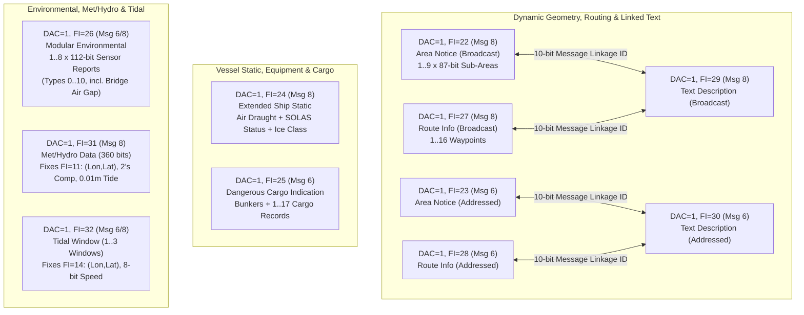
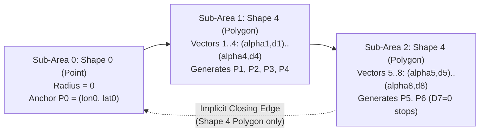
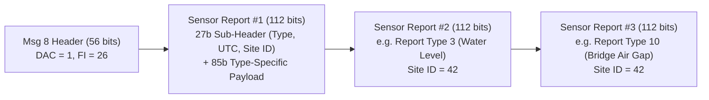

# Chapter 38: International Application-Specific Message Subtypes (`DAC = 1`), Part 2: IMO SN.1/Circ.289 and SN.1/Circ.290 Modern Operational Subtypes

## 1. Operational & Conceptual Overview

When the International Maritime Organization (IMO) Sub-Committee on Safety of Navigation (NAV 55) finalized **IMO SN.1/Circ.289** (*Guidance on the Use of AIS Application-Specific Messages*, adopted 2 June 2010 and brought into force on **1 January 2013**), it conducted a sweeping architectural overhaul of the original trial catalogue established six years earlier under **IMO SN/Circ.236** (Chapter 37). Six years of operational deployments by Coast Guards, hydrographic offices, icebreaking commands, and open-source researchers had exposed critical structural deficiencies in the first-generation `DAC = 1` subtypes (`FI = 11` through `FI = 21`):

1. **Inconsistent Geodetic Coordinate Ordering and Precision:** Legacy `DAC = 1, FI = 11` (*Meteorological and Hydrological Data*) and `FI = 14` (*Tidal Window*) placed **Latitude before Longitude** (`(Lat, Lon)`), violating the `(Lon, Lat)` ordering used in every standard ITU-R M.1371 position message (Messages 1, 2, 3, 4, 9, 18, 21, 27).
2. **Unsigned Temperature Offset Bias vs. Two's Complement:** Legacy `FI = 11` encoded `Air Temperature`, `Dew Point`, and `Water Temperature` using arbitrary unsigned integer biases (`+60.0°C`, `+20.0°C`, `+10.0°C`), causing frequent off-by-offset encoding bugs in weather buoys across high-latitude winter waters.
3. **Coarse Hydrographic Resolution:** Legacy `FI = 11` encoded `Water Level` in coarse $0.1\text{ m}$ ($10\text{ cm}$) steps using only 9 bits—insufficient for deep-draft Neo-Panamax container ships and Ultra-Large Crude Carriers (ULCCs) calculating under-keel clearance (UKC) or bridge air-gap clearance to centimeter precision.
4. **Missing Dynamic Geometry and Routing Primitives:** First-generation ASMs lacked any standardized mechanism for shore authorities to broadcast dynamic spatial polygons (such as moving marine mammal slow zones, search-and-rescue [SAR] boxes, or offshore ordnance exclusion zones) or multi-waypoint icebreaker corridors directly onto shipboard Electronic Chart Display and Information Systems (ECDIS).

To resolve these limitations, **IMO SN.1/Circ.289** introduced eleven modern International Function Identifiers (`DAC = 1, FI = 22` through `FI = 32`), later refined by **IMO SN.1/Circ.290** (2010):

| `DAC` | `FI` | Carrier Msg | Official IMO SN.1/Circ.289 Title | `libais` Class | Primary Operational Role |
| :--- | :--- | :--- | :--- | :--- | :--- |
| **`1`** | **`22`** | **Msg 8** (Broadcast) | **Area Notice — Broadcast** | `Ais8_1_22` | Dynamic geographic points, circles, rectangles, sectors, polylines, and polygons (Right Whale slow zones, SAR areas, naval exclusion zones). |
| **`1`** | **`23`** | **Msg 6** (Addressed) | **Area Notice — Addressed** | `Ais6_1_23` | Point-to-point addressed delivery of a dynamic geometric `Area Notice` to a specific MMSI. |
| **`1`** | **`24`** | **Msg 8** (Broadcast) | **Extended Ship Static and Voyage Related Data** | `Ais8_1_24` | Replaces `FI = 15` and `FI = 16`; reports `Air Draught`, 3 UN/LOCODE ports, 13-item **SOLAS Equipment Status** bitmask, `Ice Class`, and `Shaft Horsepower`. |
| **`1`** | **`25`** | **Msg 6** (Addressed) | **Dangerous Cargo Indication** | `Ais6_1_25` | Replaces `FI = 12`; reports total bunker oil and up to 17 bulk/packaged hazardous cargo records (`IMDG`, `IGC`, `IBC`, `MARPOL Annex I`). |
| **`1`** | **`26`** | **Msg 6 / Msg 8** | **Environmental** | `Ais8_1_26` / `Ais6_1_26` | Modular container packing **1 to 8 self-describing 112-bit Sensor Reports** (`Report Types 0–10`), including **Bridge Air Gap** (`Type 10`) and **Water Level** (`Type 3`). |
| **`1`** | **`27`** | **Msg 8** (Broadcast) | **Route Information — Broadcast** | `Ais8_1_27` | Broadcasts mandatory, recommended, or icebreaker routes containing up to 16 full-precision `(Lon, Lat)` waypoints. |
| **`1`** | **`28`** | **Msg 6** (Addressed) | **Route Information — Addressed** | `Ais6_1_28` | Addressed tactical route recommendation or ship route plan (`FI = 28`) between VTS/icebreakers and an individual vessel. |
| **`1`** | **`29`** | **Msg 8** (Broadcast) | **Text Description — Broadcast** | `Ais8_1_29` | Attaches up to 162 characters of 6-bit ASCII text to a broadcast `Area Notice` (`FI = 22`) or `Route Information` (`FI = 27`) via `Message Linkage ID`. |
| **`1`** | **`30`** | **Msg 6** (Addressed) | **Text Description — Addressed** | `Ais6_1_30` | Addressed equivalent of `FI = 29`, linking explanatory text to `FI = 23` or `FI = 28` via `Message Linkage ID`. |
| **`1`** | **`31`** | **Msg 8** (Broadcast) | **Meteorological and Hydrographic Data** | `Ais8_1_31` | Direct replacement for `FI = 11`: fixes `(Lon, Lat)` ordering, adopts **signed two's complement** temperatures, and upgrades `Water Level` to **$0.01\text{ m}$ (12-bit)** resolution. |
| **`1`** | **`32`** | **Msg 6 / Msg 8** | **Tidal Window** | `Ais8_1_32` / `Ais6_1_32` | Direct replacement for `FI = 14`: fixes `(Lon, Lat)` ordering and upgrades predicted current speed to `8 bits` across 1–3 tidal windows. |



> [!IMPORTANT]
> **Message 8 (`56-Bit` Header) vs. Message 6 (`88-Bit` Header) Bit-Offset Shift:**
> Throughout this chapter, bit indices are specified in **0-based MSB-first** notation (`libais` and `gpsd` convention). For **Message 8 (Broadcast Binary)** subtypes (`FI = 22, 24, 26, 27, 29, 31, 32`), the 56-bit header spans `bits[0:56]` (`Message ID [6b]`, `Repeat [2b]`, `Source MMSI [30b]`, `Spare [2b]`, `DAC [10b]`, `FI [6b]`), so the application payload begins at **`bit 56`**. For **Message 6 (Addressed Binary)** subtypes (`FI = 23, 25, 26, 28, 30, 32`), the insertion of `Sequence Number (2b)`, `Destination MMSI (30b)`, `Retransmit Flag (1b)`, and `Spare (1b)` shifts the `DAC`/`FI` header by **+32 bits**, placing the start of the application payload at **`bit 88`**.

---

## 2. Historical Context & Evolution (`schwehr/gis-history` Integration)

The three anchor architectures of Chapter 38—**Dynamic Area Notices (`FI = 22/23`)**, **Modular Environmental Sensor Reports (`FI = 26`)**, and **Corrected Met/Hydro (`FI = 31`)**—trace their origins directly to collaborative engineering between the U.S. Coast Guard (USCG), the National Oceanic and Atmospheric Administration (NOAA), the Radio Technical Commission for Maritime Services (**RTCM Special Committee 121**), and open-source maritime software researchers between 2006 and 2010:

1. **Stellwagen Bank Right Whale Acoustic Buoys and `ais-area-notice` (2007–2010):**
   In the approaches to Boston Harbor through the **Stellwagen Bank National Marine Sanctuary**, ship strikes were the leading cause of mortality for the critically endangered North Atlantic right whale (*Eubalaena glacialis*). When a LNG deepwater port was permitted in Massachusetts Bay, an array of 10 Cornell University / Woods Hole Oceanographic Institution (WHOI) near-real-time **Marine Autonomous Recording Units (MARUs)** was deployed along the Traffic Separation Scheme (TSS) to detect right whale up-calls acoustically. Kurt Schwehr (then at the Center for Coastal and Ocean Mapping / Joint Hydrographic Center [CCOM/JHC], University of New Hampshire) and USCG/NOAA colleagues designed the **AIS Area Notice** binary encoding (`ais-area-notice` Python/C++ reference library) so that when a buoy detected right whale vocalizations, USCG shore stations could automatically broadcast dynamic circular slow-zone notices (`Notice Description = 1`: *Caution Area: Marine mammals in area — reduce speed*) directly onto the ECDIS displays of inbound LNG tankers and container vessels. This design was standardized internationally by RTCM SC-121 and IMO NAV 55 as **`DAC = 1, FI = 22` and `FI = 23`**.
2. **NOAA PORTS®, Tampa Bay Bridge Clearances, and `noaadata` (`DAC = 1, FI = 26`, 2008–2010):**
   Following the 1980 **Sunshine Skyway Bridge disaster** in Tampa Bay (where the bulk carrier MV *Summit Venture* struck a bridge pier in a squall, killing 35 people), NOAA established the **Physical Oceanographic Real-Time System (PORTS®)**. However, fixed monolithic weather messages (`FI = 11`) could not represent bridge vertical clearance (**Air Gap**), multi-bin Acoustic Doppler Current Profiler (**ADCP**) profiles, or station metadata without wasting VHF time slots on empty fields. Working with NOAA CO-OPS and USCG R&D Center, Schwehr authored the open-source `noaadata` reference implementation for a composable **112-bit modular sensor report packet**, which IMO standardized in SN.1/Circ.289 as **`DAC = 1, FI = 26` (*Environmental*)**.
3. **The 2010–2013 Transition from SN/Circ.236 to SN.1/Circ.289 and SN.1/Circ.290:**
   At IMO NAV 55 (July 2009) and in **SN.1/Circ.289** (June 2010), the IMO scheduled the formal retirement of the SN/Circ.236 subtypes (`FI = 11–21`) for **1 January 2013**. Six months later, **IMO SN.1/Circ.290** (*Guidance on the Presentation and Display of AIS Application-Specific Messages Information*, December 2010) standardized the ECDIS symbology rules (dashed boundary lines, notice icons, and pick-report popups) and added the `WMO ID` reference indicator bit to `FI = 31`.

---

## 3. Deep Technical & Mathematical Foundations

We now examine each of the eleven subtypes (`DAC = 1, FI = 22` through `FI = 32`) across all six required operational and forensic dimensions:
1. **How It Works (Bit-Level Architecture & Mathematical Formulation)**
2. **Structural & Operational Issues**
3. **Relationships to Other Messages**
4. **Legitimate Uses & Adversarial Abuses**
5. **Where and When Used**
6. **Hardware & Software Support**

---

### 38.1 Dynamic Area Notices (`DAC = 1, FI = 22` Broadcast & `FI = 23` Addressed) and Linked Text (`DAC = 1, FI = 29` & `FI = 30`)

#### 38.1.1 How `DAC = 1, FI = 22` (`Ais8_1_22`) and `FI = 23` (`Ais6_1_23`) Work

An **Area Notice** message consists of a **fixed 111-bit header** in Message 8 (`FI = 22`, or **143-bit header** in Message 6 `FI = 23`) followed by **$k \in \{1, 2, \dots, 9\}$ chained 87-bit `Sub-Area` blocks**:

$$\text{Total Length (FI = 22)} = 111 + 87k \text{ bits}, \quad k \in \{1..9\} \implies 198 \text{ to } 894 \text{ bits (2 to 5 TDMA slots)}$$

$$\text{Total Length (FI = 23)} = 143 + 87k \text{ bits}, \quad k \in \{1..9\} \implies 230 \text{ to } 926 \text{ bits (2 to 5 TDMA slots)}$$

##### Fixed Header Layout (`DAC = 1, FI = 22` Broadcast vs. `FI = 23` Addressed)

| Field Name | `FI = 22` (Msg 8) Bits | `FI = 23` (Msg 6) Bits | Width | Type | Units / Scaling | Sentinel / Operational Meaning |
| :--- | :--- | :--- | :--- | :--- | :--- | :--- |
| **Standard Header + `DAC=1, FI=22/23`** | `0..55` | `0..87` | `56` / `88` | Unsigned | — | `DAC = 1`, `FI = 22` (Msg 8) or `FI = 23` (Msg 6). |
| **Message Linkage ID** | `56..65` | `88..97` | `10` | Unsigned | `1–1023` | `0` = No linkage. Links this notice to `FI = 29`/`30` text or updates/cancels a prior notice from the same MMSI. |
| **Notice Description** | `66..72` | `98..104` | `7` | Unsigned | `0–127` | Coded area category (see Table 38.1 below); `127` = Undefined / N/A. |
| **Start UTC Month** | `73..76` | `105..108` | `4` | Unsigned | `1–12` | Month of start of notice; `0` = N/A. |
| **Start UTC Day** | `77..81` | `109..113` | `5` | Unsigned | `1–31` | Day of start of notice; `0` = N/A. |
| **Start UTC Hour** | `82..86` | `114..118` | `5` | Unsigned | `0–23` | UTC Hour of start of notice; `24` = N/A. |
| **Start UTC Minute** | `87..92` | `119..124` | `6` | Unsigned | `0–59` | UTC Minute of start of notice; `60` = N/A. |
| **Duration** | `93..110` | `125..142` | `18` | Unsigned | `1 min` | `0` = **Cancel notice**; `1–262,142` min ($\approx 182.04\text{ d}$); `262,143` (`0x3FFFF`) = N/A / Indefinite. |

##### Table 38.1: Selected IMO SN.1/Circ.289 `Notice Description` Codes (`7 Bits`, `0–127`)

| Code | Category & Official IMO Meaning | ECDIS Display Symbol (SN.1/Circ.290) |
| :--- | :--- | :--- |
| **`0`** | **Caution Area: Marine mammals habitat** | Dashed boundary + Marine mammal caution icon |
| **`1`** | **Caution Area: Marine mammals in area — reduce speed** (Right Whale DMA/SMA) | Dashed boundary + Whale icon + speed advisory |
| **`2`** | **Caution Area: Marine mammals in area — stay clear** | Dashed boundary + Whale stay-clear icon |
| **`3`** | **Caution Area: Marine mammals in area — report sightings** | Dashed boundary + Whale reporting icon |
| **`4`** | **Caution Area: Protected habitat — reduce speed** | Dashed boundary + Protected habitat icon |
| **`7`** | **Caution Area: Derelicts (drifting objects / lost containers)** | Dashed boundary + Drifting hazard icon |
| **`8`** | **Caution Area: Traffic congestion** | Dashed boundary + Congestion caution icon |
| **`9`** | **Caution Area: Marine event (regatta / race / fireworks)** | Dashed boundary + Marine event icon |
| **`10`** | **Caution Area: Diver operations** | Dashed boundary + Diver flag (`Alpha`) icon |
| **`12`** | **Caution Area: Dredge operations** | Dashed boundary + Dredger caution icon |
| **`13`** | **Caution Area: Survey operations (seismic / hydrographic)** | Dashed boundary + Survey caution icon |
| **`14`** | **Caution Area: Underwater operation (ROV / cable laying)** | Dashed boundary + Subsurface operation icon |
| **`16`** | **Caution Area: Fishery — nets in water (e.g., Tuna nets)** | Dashed boundary + Fishing net icon |
| **`21`** | **Caution Area: Wreck** | Dashed boundary + Dangerous wreck symbol |
| **`23`** | **Environmental Caution Area: Storm front (line squall)** | Dashed boundary + Meteorological warning icon |
| **`24`** | **Environmental Caution Area: Hazardous sea ice** | Dashed boundary + Ice hazard symbol |
| **`32`** | **Restricted Area: Fishing prohibited** | Dashed boundary + Fishing prohibited (`T`-ticks) |
| **`33`** | **Restricted Area: No anchoring** | Dashed boundary + Anchoring prohibited icon |
| **`35`** | **Restricted Area: No wake** | Dashed boundary + No-wake warning icon |
| **`40` / `41`** | **Anchorage Area: Open (`40`) / Closed (`41`)** | Anchorage symbol (open or crossed out) |
| **`56`–`58`** | **Security Alert — ISPS Level 1 (`56`), Level 2 (`57`), Level 3 (`58`)** | Security exclusion boundary (Area To Be Avoided) |
| **`64`** | **Distress Area: Vessel disabled and adrift** | Distress flare / disabled vessel caution |
| **`65`** | **Speed Restricted Area** | Dashed boundary + Speed limit alert |
| **`88`** | **Mandatory No-Anchoring Area (Submarine Cable / Pipeline Protection)** | Mandatory prohibition boundary |
| **`94`** | **SAR Area: Search and rescue operations in progress** | SAR operational boundary box |
| **`96`** | **Warning: Unexploded ordnance (UXO) / naval firing practice** | Danger area + UXO / firing symbol |
| **`120` / `122`** | **Route: Recommended route (`120`) / Compulsory route (`122`)** | Centerline polyline with directional arrows |
| **`125`** | **Other — see associated text (`Shape 5` or `FI = 29`)** | Generic caution symbol + text callout |

##### Chained 87-Bit Sub-Area Geometries (`Shapes 0` through `5`)

Each 87-bit Sub-Area $i \in \{0, \dots, k-1\}$ begins at bit offset $b_i = 111 + 87i$ (in `FI = 22`) or $b_i = 143 + 87i$ (in `FI = 23`). Within each 87-bit sub-area (`sub_bits[0:87]`), the first 3 bits (`sub_bits[0:3]`) specify the **`Sub-Area Shape` (`0–5`)**, and for geometric shapes (`0–4`), `sub_bits[3:5]` (`2 bits`) specify the **`Scale Factor` $s \in \{0, 1, 2, 3\}$**, which scales linear dimensions by $10^s\text{ meters}$:

$$\text{ScaleMultiplier}(s) = 10^s \text{ m} = \begin{cases} 1\text{ m} & s = 0 \\ 10\text{ m} & s = 1 \\ 100\text{ m} & s = 2 \\ 1000\text{ m} & s = 3 \end{cases}$$

###### 1. `Shape 0`: Circle or Point (`87 Bits`)
When `Radius == 0`, `Shape 0` defines a **Point**—either a standalone point hazard or the **mandatory anchor coordinate $P_0 = (\lambda_0, \phi_0)$** that immediately precedes a `Shape 3` (`Polyline`) or `Shape 4` (`Polygon`) sub-area. When `Radius > 0`, it defines a circle of radius $R = \text{Radius} \times 10^s\text{ meters}$ centered at $(\lambda, \phi)$.

| Sub-Area Bits | Width | Field Name | Type | Scaling / Units | Sentinel / Meaning |
| :--- | :--- | :--- | :--- | :--- | :--- |
| `0..2` | `3` | **Sub-Area Shape** | Unsigned | Constant `0` (`000_2`) | Circle (`Radius > 0`) or Point (`Radius == 0`). |
| `3..4` | `2` | **Scale Factor ($s$)** | Unsigned | $10^s\text{ m}$ ($1, 10, 100, 1000\text{ m}$) | Multiplier for `Radius`. |
| `5..29` | `25` | **Longitude ($\lambda$)** | Signed (2's comp) | $1/1000\text{ min}$ ($\approx 1.85\text{ m}$) | $\pm 180^\circ$; `10,860,000` (`181.0°`, `0xA5B640`) = N/A. |
| `30..53` | `24` | **Latitude ($\phi$)** | Signed (2's comp) | $1/1000\text{ min}$ ($\approx 1.85\text{ m}$) | $\pm 90^\circ$; `5,460,000` (`91.0°`, `0x535040`) = N/A. |
| `54..56` | `3` | **Precision** | Unsigned | `0–4` | Display decimal places of minutes (`4` = default / N/A). |
| `57..68` | `12` | **Radius** | Unsigned | $\text{Radius} \times 10^s\text{ m}$ | **`0` = Point (or Polygon/Polyline Anchor $P_0$)**; `1–4095` = Circle radius up to $4,095\text{ km}$. |
| `69..86` | `18` | **Spare** | Unsigned | `0` | Reserved (`0`). |

> [!WARNING]
> **Forensic Pitfall — USCG/RTCM `28b/27b` (`1/10,000 min`) vs. IMO SN.1/Circ.289 `25b/24b` (`1/1000 min`) Coordinate Split:**
> In the pre-2010 USCG/NOAA Stellwagen Bank specification and RTCM SC-121 draft (supported in `libais` via a compile/runtime variant), `Shapes 0, 1, 2` used **28-bit Longitude** and **27-bit Latitude** ($1/10,000\text{ min}$ resolution), consuming 6 additional bits from `Spare`. When IMO NAV 55 finalized **SN.1/Circ.289**, it reduced `Lon` to **25 bits** and `Lat` to **24 bits** ($1/1000\text{ min}$ resolution) so that `Shape 2` (`Sector`) could fit inside 87 bits without overflowing! A parser that applies 28/27-bit unpacking to an IMO SN.1/Circ.289 `Shape 0/1/2` packet shifts `Precision`, `Radius`, and dimensions by 6 bits, plotting a corrupt circle hundreds of miles away.

###### 2. `Shape 1`: Rectangle (`87 Bits`)
Defines a rectangle anchored at its **South-West corner** $(\lambda_{\text{SW}}, \phi_{\text{SW}})$ prior to clockwise rotation by `Orientation` ($\theta \in [0^\circ, 359^\circ]$):

| Sub-Area Bits | Width | Field Name | Type | Scaling / Units | Sentinel / Meaning |
| :--- | :--- | :--- | :--- | :--- | :--- |
| `0..2` | `3` | **Sub-Area Shape** | Unsigned | Constant `1` (`001_2`) | Rectangle. |
| `3..4` | `2` | **Scale Factor ($s$)** | Unsigned | $10^s\text{ m}$ | Multiplier for `E Dimension` and `N Dimension`. |
| `5..29` | `25` | **Longitude ($\lambda_{\text{SW}}$)** | Signed (2's comp) | $1/1000\text{ min}$ | SW corner Longitude; `181.0°` = N/A. |
| `30..53` | `24` | **Latitude ($\phi_{\text{SW}}$)** | Signed (2's comp) | $1/1000\text{ min}$ | SW corner Latitude; `91.0°` = N/A. |
| `54..56` | `3` | **Precision** | Unsigned | `0–4` | Display precision (`4` = default). |
| `57..64` | `8` | **E Dimension ($L_E$)** | Unsigned | $L_E \times 10^s\text{ m}$ | `0` = North–South line; `1–255` = Eastward width up to $255\text{ km}$. |
| `65..72` | `8` | **N Dimension ($L_N$)** | Unsigned | $L_N \times 10^s\text{ m}$ | `0` = East–West line; `1–255` = Northward length up to $255\text{ km}$. |
| `73..81` | `9` | **Orientation ($\theta$)** | Unsigned | $1^\circ\text{ true}$ | `0–359°` clockwise rotation of the N-axis; `>= 360` = N/A (`0°`). |
| `82..86` | `5` | **Spare** | Unsigned | `0` | Reserved (`0`). |

###### 3. `Shape 2`: Sector (`87 Bits`)
Defines a circular sector ("pie wedge") centered at $(\lambda, \phi)$ of radius $R = \text{Radius} \times 10^s\text{ m}$, swept **clockwise** from `Left Bound` bearing to `Right Bound` bearing:

| Sub-Area Bits | Width | Field Name | Type | Scaling / Units | Sentinel / Meaning |
| :--- | :--- | :--- | :--- | :--- | :--- |
| `0..2` | `3` | **Sub-Area Shape** | Unsigned | Constant `2` (`010_2`) | Circular Sector. |
| `3..4` | `2` | **Scale Factor ($s$)** | Unsigned | $10^s\text{ m}$ | Multiplier for `Radius`. |
| `5..29` | `25` | **Longitude ($\lambda$)** | Signed (2's comp) | $1/1000\text{ min}$ | Sector apex Longitude; `181.0°` = N/A. |
| `30..53` | `24` | **Latitude ($\phi$)** | Signed (2's comp) | $1/1000\text{ min}$ | Sector apex Latitude; `91.0°` = N/A. |
| `54..56` | `3` | **Precision** | Unsigned | `0–4` | Display precision (`4` = default). |
| `57..68` | `12` | **Radius** | Unsigned | $\text{Radius} \times 10^s\text{ m}$ | `1–4095` ($1\text{ m}$ to $4,095\text{ km}$); `0` = N/A. |
| `69..77` | `9` | **Left Bound ($\alpha_L$)** | Unsigned | $1^\circ\text{ true}$ | `0–359°` starting radial bearing; `>= 360` = N/A. |
| `78..86` | `9` | **Right Bound ($\alpha_R$)** | Unsigned | $1^\circ\text{ true}$ | `0–359°` ending radial bearing (clockwise from $\alpha_L$). |

###### 4. `Shape 3` (`Polyline`) and `Shape 4` (`Polygon`) — Polar Vector Chaining (`87 Bits`)
Neither `Shape 3` (open waypoint line) nor `Shape 4` (closed area ring) stores a starting latitude or longitude. Instead, **a sequence of one or more `Shape 3` or `Shape 4` sub-areas MUST be immediately preceded by a `Shape 0` sub-area with `Radius = 0`**, which establishes the initial anchor vertex $P_0 = (\lambda_0, \phi_0)$. Each `Shape 3` or `Shape 4` sub-area then packs **up to 4 relative polar vectors** $(\alpha_j, d_j)$ for $j \in \{1, 2, 3, 4\}$:

| Sub-Area Bits | Width | Field Name | Type | Scaling / Units | Sentinel / Meaning |
| :--- | :--- | :--- | :--- | :--- | :--- |
| `0..2` | `3` | **Sub-Area Shape** | Unsigned | `3` (`011_2`) or `4` (`100_2`) | `3` = Open Polyline; `4` = Closed Polygon. |
| `3..4` | `2` | **Scale Factor ($s$)** | Unsigned | $10^s\text{ m}$ | Multiplier for all 4 distances in this sub-area. |
| `5..14` | `10` | **Point 1 Angle ($A_1$)** | Unsigned | $0.5^\circ\text{ true}$ | $\alpha_1 = 0.5^\circ \times A_1 \in [0.0^\circ, 359.5^\circ]$; **`720` = No point / End of list**. |
| `15..24` | `10` | **Point 1 Distance ($D_1$)** | Unsigned | $D_1 \times 10^s\text{ m}$ | **`0` = No point / End of list**; `1–1023` = step length from $P_0$ to $P_1$. |
| `25..34` | `10` | **Point 2 Angle ($A_2$)** | Unsigned | $0.5^\circ\text{ true}$ | True bearing from $P_1$ to $P_2$; `720` = End of list. |
| `35..44` | `10` | **Point 2 Distance ($D_2$)** | Unsigned | $D_2 \times 10^s\text{ m}$ | Step length from $P_1$ to $P_2$; `0` = End of list. |
| `45..54` | `10` | **Point 3 Angle ($A_3$)** | Unsigned | $0.5^\circ\text{ true}$ | True bearing from $P_2$ to $P_3$; `720` = End of list. |
| `55..64` | `10` | **Point 3 Distance ($D_3$)** | Unsigned | $D_3 \times 10^s\text{ m}$ | Step length from $P_2$ to $P_3$; `0` = End of list. |
| `65..74` | `10` | **Point 4 Angle ($A_4$)** | Unsigned | $0.5^\circ\text{ true}$ | True bearing from $P_3$ to $P_4$; `720` = End of list. |
| `75..84` | `10` | **Point 4 Distance ($D_4$)** | Unsigned | $D_4 \times 10^s\text{ m}$ | Step length from $P_3$ to $P_4$; `0` = End of list. |
| `85..86` | `2` | **Spare** | Unsigned | `0` | Reserved (`0`). *(Note: IMO SN.1/Circ.289 Table 10.5 printed "1 bit" due to an arithmetic typo where $3+2+80=85$ vs. $87$; actual spare width is **2 bits**!)* |



For each active vector $j \in \{1..M\}$ across chained `Shape 3` or `Shape 4` sub-areas (continuing until $D_j = 0$, $A_j \ge 720$, or a non-continuation sub-area is encountered), the vertex $P_j = (\lambda_j, \phi_j)$ is stepped recursively from $P_{j-1} = (\lambda_{j-1}, \phi_{j-1})$ using local tangent-plane or geodesic direct projection:

$$\Delta N_j = d_j \cos\left(\alpha_j \frac{\pi}{180}\right), \qquad \Delta E_j = d_j \sin\left(\alpha_j \frac{\pi}{180}\right), \qquad d_j = D_j \cdot 10^{s_j}$$

$$\phi_j \approx \phi_{j-1} + \frac{\Delta N_j}{M(\phi_{j-1})} \frac{180}{\pi}, \qquad \lambda_j \approx \lambda_{j-1} + \frac{\Delta E_j}{N(\phi_{j-1})\cos\phi_{j-1}} \frac{180}{\pi}$$

where $M(\phi)$ and $N(\phi)$ are the WGS84 meridional and prime-vertical radii of curvature. For `Shape 4` (`Polygon`), the renderer automatically connects the final valid vertex $P_M$ back to the `Shape 0` anchor $P_0 = (\lambda_0, \phi_0)$ to form a closed polygon ring.

###### 5. `Shape 5`: Associated Text (`87 Bits`)
Attaches inline 6-bit ASCII text to the immediately preceding geometric sub-area:
* `sub_bits[0:3]` (`3 bits`): `Sub-Area Shape = 5` (`101_2`).
* `sub_bits[3:87]` (`84 bits`): **`14` $\times$ 6-bit ASCII characters** (ITU-R M.1371 Table 47; trailing `@` = `0x00` stripped). Multiple `Shape 5` sub-areas can be chained consecutively to form up to $8 \times 14 = 112\text{ characters}$ of inline text following a single geometric sub-area.

#### 38.1.2 How `DAC = 1, FI = 29` (`Ais8_1_29`) and `FI = 30` (`Ais6_1_30`) Work (*Text Description*)

When an `Area Notice` (`FI = 22/23`) or `Route Information` (`FI = 27/28`) uses all available sub-areas for complex polygon vertices or waypoints, explanatory text is transmitted in a separate companion message—**`DAC = 1, FI = 29` (Msg 8 Broadcast)** or **`DAC = 1, FI = 30` (Msg 6 Addressed)**—bound together by the **10-bit `Message Linkage ID`**:

| Field Name | `FI = 29` (Msg 8) Bits | `FI = 30` (Msg 6) Bits | Width | Type | Operational Meaning |
| :--- | :--- | :--- | :--- | :--- | :--- |
| **Standard Header + `DAC=1, FI=29/30`** | `0..55` | `0..87` | `56` / `88` | Unsigned | `DAC = 1`, `FI = 29` (Msg 8) or `FI = 30` (Msg 6). |
| **Message Linkage ID** | `56..65` | `88..97` | `10` | Unsigned | **`1–1023`** (`0` = invalid). Must match the `(Source MMSI, Message Linkage ID)` of the target `FI = 22/23` or `FI = 27/28` message. |
| **Text Description** | `66..(66+6C-1)` | `98..(98+6C-1)` | $6C$ | 6-bit ASCII | $C \in \{1..162\}$ characters (Msg 8) or $C \in \{1..154\}$ characters (Msg 6). |
| **Spare** | Remaining | Remaining | `0–5` | Unsigned | Zero-padding to byte/slot boundary. |

#### 38.1.3 Issues, Relationships, Uses & Abuses, Where/When Used, and Software Support (`FI = 22, 23, 29, 30`)

* **Structural & Mathematical Issues:**
  1. **Cumulative Polar Quantization Drift in `Shape 3` and `Shape 4`:** Because each polygon vertex $P_j$ is stepped relative to $P_{j-1}$ using a 10-bit angle ($\Delta\alpha = 0.5^\circ$, max quantization error $\pm 0.25^\circ \approx \pm 4.36\text{ mrad}$) and a 10-bit scaled distance ($\Delta d = 10^s\text{ m}$), quantization errors accumulate along the chain ($\sigma_{\text{pos}} \propto \sqrt{M}$). Over an 8-sub-area (32-vertex) polygon with $10\text{ km}$ edges ($s=1$), angular quantization alone introduces up to $\pm 43.6\text{ m}$ lateral error per edge unless the encoder performs **closed-loop residual compensation**—computing each vector $(\alpha_j, D_j)$ from the *quantized* position $\hat{P}_{j-1}$ rather than the ideal unquantized vertex $P_{j-1}$!
  2. **The 9-Sub-Area (5-Slot) Ceiling:** A single `FI = 22` message can carry at most 9 sub-areas ($894\text{ bits}$), limiting a polygon to 1 anchor (`Shape 0`) + 8 `Shape 4` sub-areas = **32 relative edges**.
  3. **Orphaned Linkage State:** If an `FI = 29` text packet arrives before its corresponding `FI = 22` geometry packet (or if packet loss drops one of the two), stateless decoders discard the text unless they maintain a bidirectional `(source_mmsi, link_id)` cache with a 15-minute TTL.
* **Relationships to Other Messages:** Replaces `DAC = 1, FI = 14` (`Tidal Window` for spatial zones) and regional USCG `DAC = 366, FI = 22` / St. Lawrence Seaway notices. Works in tandem with **Message 21** (Virtual AtoNs marking point hazards) and **`DAC = 1, FI = 27/28`** (which provides high-precision absolute waypoint routes when polar `Shape 3` polylines are too coarse).
* **Uses & Adversarial Abuses:**
  * *Legitimate Uses:* North Atlantic right whale Dynamic Management Areas (DMAs) and Seasonal Management Areas (SMAs) off New England; USCG distress SAR search boxes; offshore wind farm construction exclusion zones; subsea cable-repair warning circles; and temporary regatta/fireworks restricted zones.
  * *Adversarial Abuses:* Because AIS lacks cryptographic authentication, an adversary with a $\$300$ SDR can spoof a coastal authority MMSI and broadcast a `DAC = 1, FI = 22` Area Notice (`Notice Description = 58` [Security Level 3] or `96` [Unexploded Ordnance / Firing Area]) across a major strait or port approach, drawing an official red-hatched exclusion polygon directly onto the ECDIS screens of commercial traffic (**ECDIS Graphical Denial-of-Service / Traffic Redirection**).
* **Where & When Used:** Actively broadcast by USCG NAIS across the U.S. East Coast (Boston/Stellwagen Bank, Cape Cod Bay, Block Island, Chesapeake Bay approaches), San Francisco Bay VTS, Alaska (Aleutian Island ATBAs), and select European VTS testbeds.
* **Software Support:** Full reference support in Kurt Schwehr's `ais-area-notice` and `libais` (`Ais8_1_22`, `Ais6_1_23`, `Ais8_1_29`, `Ais6_1_30`), `gpsd`, `pyais`, **OpenCPN** (renders polygons and hover text natively), **NOAA ERMA** (Environmental Response Management Application), and IEC 62388 / IMO SN.1/Circ.290-compliant ECDIS units (Furuno, JRC, Transas/Wärtsilä, Kongsberg).

---

### 38.2 Extended Ship Static (`DAC = 1, FI = 24`) and Dangerous Cargo (`DAC = 1, FI = 25`)

#### 38.2.1 How `DAC = 1, FI = 24` Works (*Extended Ship Static and Voyage Related Data*, `Ais8_1_24`)

`DAC = 1, FI = 24` consolidates and expands the legacy `FI = 15` (*Extended Ship Static — Air Draught*) and `FI = 16` (*Number of Persons on Board*) subtypes into a modern voyage/equipment status broadcast.

> [!IMPORTANT]
> **Forensic Discrepancy — The Canonical 224-Bit (`168-Bit` Payload) IMO SN.1/Circ.289 Spec vs. the 368-Bit NAV 54/55 Draft:**
> During the drafting of SN.1/Circ.289 at IMO NAV 54 and NAV 55, an early **2-slot (368-bit)** version of `DAC = 1, FI = 24` included additional fields after `Shaft Horsepower`: `VHF Working Channel (12b)`, `Lloyd's Ship Type (42b = 7 chars)`, `Gross Tonnage (18b)`, `Laden/Ballast (2b)`, four `14-bit` bunker fuel counters (`Heavy Fuel Oil`, `Light Fuel/Diesel`, `Lube Oil`, `Total Bunker Oil`), and `Persons on Board (13b)`. In the final published **IMO SN.1/Circ.289 Annex, Application 5**, the IMO truncated `FI = 24` at **224 bits total** (fitting inside a single 168-bit slot only if spare/header is compressed, or requiring **2 slots** at 224 bits), moving bunker oil to `FI = 25` (`Dangerous Cargo`) and keeping `Persons on Board` in `Msg 6 (DAC = 1, FI = 16 / FI = 40)`. Both layouts are detailed below because maritime parsers encounter both 224-bit and 368-bit encoders in the wild.

##### Complete Bit Layout of `DAC = 1, FI = 24` (Msg 8 Broadcast, `Ais8_1_24`)

| Bit Range (`0-based`) | Width | Field Name | Type | Units / Scaling | Sentinel / Meaning |
| :--- | :--- | :--- | :--- | :--- | :--- |
| `0..55` | `56` | **Msg 8 + IAI Header** | Unsigned | — | `Message ID = 8`, `DAC = 1`, `FI = 24`. |
| `56..65` | `10` | **Message Linkage ID** | Unsigned | `0–1023` | `0` = No linkage. |
| `66..78` | `13` | **Air Draught** | Unsigned | $0.1\text{ m}$ | `0` = N/A; `1–8191` $\implies 0.1\text{–}819.1\text{ m}$ vertical height from waterline to highest mast/antenna. |
| `79..108` | `30` | **Last Port of Call** | 6-bit ASCII | 5 chars | 5-character **UN/LOCODE** (e.g., `NLRTM`, `USNYC`); `@@@@@` = N/A. |
| `109..138` | `30` | **Next Port of Call #1** | 6-bit ASCII | 5 chars | 5-character **UN/LOCODE** of immediate destination port. |
| `139..168` | `30` | **Next Port of Call #2** | 6-bit ASCII | 5 chars | 5-character **UN/LOCODE** of subsequent port on itinerary. |
| `169..194` | `26` | **SOLAS Equipment Status** | Bit-pairs (`13 x 2b`) | `0–3` per item | **`13` navigation systems $\times$ `2 bits`** (`0` = N/A or not fitted, `1` = Operational, `2` = **Malfunctioning / Defective**, `3` = No data):<br/>1. `169..170`: AIS<br/>2. `171..172`: Automatic Tracking Aid (ATA)<br/>3. `173..174`: BNWAS<br/>4. `175..176`: ECDIS / Backup Charts<br/>5. `177..178`: Echo Sounder<br/>6. `179..180`: Electronic Plotting Aid (EPA/ARPA)<br/>7. `181..182`: Emergency Steering Gear<br/>8. `183..184`: GNSS Receiver<br/>9. `185..186`: Gyro Compass<br/>10. `187..188`: LRIT<br/>11. `189..190`: Magnetic Compass<br/>12. `191..192`: Radar<br/>13. `193..194`: Rate-of-Turn Indicator (ROTI) / VDR |
| `195..198` | `4` | **Ice Class** | Unsigned | `0–15` | `0` = N/A, `1` = Unclassified, `2` = IC, `3` = IB, `4` = IA, `5` = **IA Super**, `6` = **PC 7**, `7` = **PC 6**, `8` = **PC 5**, `9` = **PC 4**, `10` = **PC 3**, `11` = **PC 2**, `12` = **PC 1**, `13–15` = Reserved. |
| `199..216` | `18` | **Shaft Horsepower** | Unsigned | $1\text{ HP}$ | `0` = N/A; `1–262,142` HP; `262,143` = $\ge 262,143\text{ HP}$ total main propulsion power. |
| `217..223` | `7` | **Spare (SN.1/Circ.289 Final)** | Unsigned | `0` | Terminates the canonical **224-bit** IMO SN.1/Circ.289 message. |
| *`217..228`* | *`12`* | *(Draft Variant)* **VHF Working Channel** | *Unsigned* | *ITU Channel* | *Only in 368-bit pre-Circ.289 draft encoders.* |
| *`229..270`* | *`42`* | *(Draft Variant)* **Lloyd's Ship Type** | *6-bit ASCII* | *7 chars* | *Only in 368-bit draft variant.* |
| *`271..288`* | *`18`* | *(Draft Variant)* **Gross Tonnage** | *Unsigned* | *GT* | *Only in 368-bit draft variant.* |
| *`289..290`* | *`2`* | *(Draft Variant)* **Laden or Ballast** | *Unsigned* | *`1`=Laden, `2`=Ballast* | *Only in 368-bit draft variant.* |
| *`291..346`* | *`56`* | *(Draft Variant)* **Bunker Oil (`4 x 14b`)** | *Unsigned* | *Tonnes* | *HFO (`14b`), Diesel (`14b`), Lube Oil (`14b`), Total Bunkers (`14b`).* |
| *`347..359`* | *`13`* | *(Draft Variant)* **Persons on Board** | *Unsigned* | *`0–8191`* | *Plus `8 bits` spare (`360..367`) = `368 bits`.* |

#### 38.2.2 How `DAC = 1, FI = 25` Works (*Dangerous Cargo Indication*, Msg 6 Addressed, `Ais6_1_25`)

`DAC = 1, FI = 25` replaces the legacy `FI = 12` dangerous cargo message. Because broadcasting explosive, toxic, or nuclear cargo quantities in cleartext over VHF poses severe piracy and terrorism risks, `FI = 25` is strictly an **Addressed Binary Message (Message 6)** sent point-to-point from a ship to a VTS/Port State authority MMSI:

| Bit Range (`0-based`) | Width | Field Name | Type | Units / Scaling | Sentinel / Meaning |
| :--- | :--- | :--- | :--- | :--- | :--- |
| `0..87` | `88` | **Msg 6 + IAI Header** | Unsigned | — | `Message ID = 6`, `DAC = 1`, `FI = 25`. |
| `88..89` | `2` | **Unit of Quantity ($u$)** | Unsigned | `0–3` | `0` = N/A, `1` = $\text{kg}$, `2` = $\text{tonnes}$ ($10^3\text{ kg}$), `3` = $\text{kilotonnes}$ ($10^6\text{ kg}$). |
| `90..102` | `13` | **Total Bunker Oil** | Unsigned | $1\text{ tonne}$ | `0` = N/A, `1–8190` tonnes total fuel oil on board, `8191` = $\ge 8191\text{ t}$. |
| `103..105` | `3` | **Spare** | Unsigned | `0` | Aligns fixed header to `106 bits`. |
| `106..(106+49N-1)` | $49N$ | **Cargo Records ($1 \le N \le 17$)** | Struct Array | `49 bits` / record | Each 49-bit Cargo Record $i \in \{0..N-1\}$ contains:<br/>• `rec[0:4]` (`4b`): **Cargo Code System** (`1` = **IMDG** [UN Number], `2` = **IGC** [Gas], `3` = **IBC** [Chemical], `4` = **MARPOL Annex I** [Oil], `5` = **IMSBC** [Solid Bulk], `6` = **INF** [Radioactive])<br/>• `rec[4:17]` (`13b`): **Cargo Code / UN Number** (`0–8191`, e.g., `1203` = Gasoline)<br/>• `rec[17:21]` (`4b`): **Cargo Sub-Class / Division**<br/>• `rec[21:24]` (`3b`): **Packing Group** (`1` = PG I, `2` = PG II, `3` = PG III)<br/>• `rec[24:26]` (`2b`): **Marine Pollutant / Flashpoint Flag**<br/>• `rec[26:45]` (`19b`): **Cargo Quantity** (in `Unit of Quantity` $u$)<br/>• `rec[45:49]` (`4b`): **Spare** (`0`). |

#### 38.2.3 Issues, Relationships, Uses & Abuses, Where/When Used, and Software Support (`FI = 24, 25`)

* **Issues:**
  1. **Self-Incrimination Disincentive in `FI = 24` (`SOLAS Equipment Status`):** Expecting a ship's master to voluntarily broadcast `2` (*Malfunctioning*) for Gyro Compass, Radar, or Emergency Steering Gear over open VHF (`bits[169:195]`) where Port State Control inspectors and charterers can log it automatically proved operationally unrealistic; nearly all observed `FI = 24` packets leave `SOLAS Equipment Status` set to `0` (N/A) or `1` (Operational).
  2. **UN/LOCODE Collisions with Message 5 `Destination`:** While `FI = 24` enforces clean 5-character UN/LOCODEs (`Last Port`, `Next Port #1`, `Next Port #2`), officers rarely update a separate ASM screen in addition to the standard Message 5 MKD entry.
* **Relationships to Other Messages:** `FI = 24` supplements **Message 5** (`Ship Static and Voyage Related Data`) and replaces **`DAC = 1, FI = 15`** (`Air Draught`). Particularly in the **Baltic Sea (`Ice Class` + `Shaft Horsepower`)**, icebreaker routers require both the Finnish-Swedish `Ice Class` (`IA Super` vs. `IB`) and main engine `Shaft Horsepower` from `FI = 24` to determine whether a merchant vessel qualifies for independent ice transit or requires icebreaker escort (`FI = 27/28`).
* **Uses & Adversarial Abuses:** Used in Baltic winter navigation (Finnish Transport Infrastructure Agency *Väylävirasto* / Swedish Maritime Administration *Sjöfartsverket* IBNet) and Panama/Suez Canal approaches (`Air Draught`). Adversarially, interception of cleartext `FI = 25` (`Dangerous Cargo`) packets reveals high-value or hazardous cargoes (`INF` nuclear or `IMDG` Class 1 explosives), which is why NATO and national maritime authorities largely prohibit over-the-air `FI = 25` transmission in favor of encrypted shore-side Single Window EDI (`FAL Form 7`).
* **Software Support:** Supported in `libais` (`Ais8_1_24`, `Ais6_1_25`), `gpsd`, and `pyais`.

---

### 38.3 Modular Environmental Sensor Reports (`DAC = 1, FI = 26`) vs. Modern Met/Hydro (`DAC = 1, FI = 31`)

#### 38.3.1 How `DAC = 1, FI = 31` Works (*Meteorological and Hydrographic Data*, Msg 8, `Ais8_1_31`)

`DAC = 1, FI = 31` (`360 bits` total, occupying **2 TDMA slots**) is the direct, fixed-layout replacement for the deprecated `DAC = 1, FI = 11` (Chapter 37). It corrects every architectural flaw of `FI = 11` while Increasing total length by only 8 bits (`352 bits` $\to$ `360 bits`):

1. **Restores `(Longitude, Latitude)` Order:** Places `Longitude (25b)` at `bits[56:81]` **before** `Latitude (24b)` at `bits[81:105]`, and adds a 1-bit `Position Accuracy` flag at `bit[105]`.
2. **Replaces Unsigned Biases with Signed Two's Complement:** `Air Temperature (11b)`, `Dew Point (10b)`, and `Water Temperature (10b)` are encoded in standard **two's complement** ($0.1^\circ\text{C}$ resolution), with minimum negative powers of two (`-1024` = `0x400` and `-512` = `0x200`) reserved as "not available" sentinels.
3. **Upgrades `Water Level` from 9-Bit ($0.1\text{ m}$) to 12-Bit ($0.01\text{ m}$) Resolution:** Spans `bits[201:213]` (`12 bits`, `0–4000`) in **centimeter ($0.01\text{ m}$) increments** with a $-10.00\text{ m}$ offset:
   $$\text{Water Level (m)} = \text{raw}_{12} \times 0.01 - 10.00 \in [-10.00\text{ m}, +30.00\text{ m}]$$
4. **Adds MSB Range-Overflow Flag to `Horizontal Visibility` (`8 bits`, `bits[193:201]`):** `bit[193]` (`MSB`) is a boolean range flag (`0` = exact value in `bits[194:201]`, `1` = visibility exceeds threshold, e.g., $\ge 12.7\text{ NM}$), while `bits[194:201]` (`7 bits`) give $0.0\text{–}12.6\text{ NM}$ in $0.1\text{ NM}$ steps (`127` = N/A).

##### Complete 360-Bit Layout of `DAC = 1, FI = 31` (`Ais8_1_31`, IMO SN.1/Circ.289 & Circ.290)

| Bit Range (`0-based`) | Width | Field Name | Type | Scaling & Formula | Valid Range | Sentinel (`N/A`) |
| :--- | :--- | :--- | :--- | :--- | :--- | :--- |
| `0..5` | `6` | **Message ID** | Unsigned | Constant `8` | `8` | — |
| `6..7` | `2` | **Repeat Indicator** | Unsigned | `0–3` | `0–3` | — |
| `8..37` | `30` | **Source MMSI** | Unsigned | 9-digit MMSI | $0\text{–}999,999,999$ | — |
| `38..39` | `2` | **Spare** | Unsigned | Constant `0` | `0` | — |
| `40..49` | `10` | **Designated Area Code (`DAC`)** | Unsigned | Constant `1` | `1` | — |
| `50..55` | `6` | **Function Identifier (`FI`)** | Unsigned | Constant `31` | `31` | — |
| `56..80` | `25` | **Longitude ($\lambda$)** | **Signed (2's comp)** | $\lambda = \text{raw} / 60,000^\circ$ ($1/1000\text{ min}$) | $\pm 180.0000^\circ$ | `10,860,000` (`181.0°`, `0xA5B640`) |
| `81..104` | `24` | **Latitude ($\phi$)** | **Signed (2's comp)** | $\phi = \text{raw} / 60,000^\circ$ ($1/1000\text{ min}$) | $\pm 90.0000^\circ$ | `5,460,000` (`91.0°`, `0x535040`) |
| `105` | `1` | **Position Accuracy** | Boolean | `0` = Low ($>10\text{ m}$), `1` = High ($\le 10\text{ m}$) | `0–1` | `0` |
| `106..110` | `5` | **UTC Day** | Unsigned | $1\text{ d}$ | `1–31` | `0` |
| `111..115` | `5` | **UTC Hour** | Unsigned | $1\text{ h}$ | `0–23` | `24` (`24–31`) |
| `116..121` | `6` | **UTC Minute** | Unsigned | $1\text{ min}$ | `0–59` | `60` (`60–63`) |
| `122..128` | `7` | **Average Wind Speed** | Unsigned | $1\text{ kt}$ (10-min avg) | `0–125 kt` (`126` = $\ge 126\text{ kt}$) | `127` (`0x7F`) |
| `129..135` | `7` | **Wind Gust** | Unsigned | $1\text{ kt}$ (max 3-s gust) | `0–125 kt` (`126` = $\ge 126\text{ kt}$) | `127` (`0x7F`) |
| `136..144` | `9` | **Wind Direction** | Unsigned | $1^\circ\text{ true}$ | `0–359°` | `360` (`360–511`) |
| `145..153` | `9` | **Wind Gust Direction** | Unsigned | $1^\circ\text{ true}$ | `0–359°` | `360` (`360–511`) |
| `154..164` | `11` | **Air Temperature** | **Signed (2's comp)** | $T_{\text{air}} = \text{raw} \times 0.1^\circ\text{C}$ | $-60.0^\circ\text{C}\text{ to }+60.0^\circ\text{C}$ | **`-1024`** (`0x400`) |
| `165..171` | `7` | **Relative Humidity** | Unsigned | $1\%$ | `0–100%` | `101` (`101–127`) |
| `172..181` | `10` | **Dew Point** | **Signed (2's comp)** | $T_{\text{dew}} = \text{raw} \times 0.1^\circ\text{C}$ | $-20.0^\circ\text{C}\text{ to }+50.0^\circ\text{C}$ | **`-512`** (`0x200`) |
| `182..190` | `9` | **Air Pressure** | Unsigned | $P = \text{raw} + 799\text{ hPa}$ | `0` ($\le 799$), `1–401` ($800\text{–}1200\text{ hPa}$), `402` ($\ge 1201$) | `511` (`403–511`) |
| `191..192` | `2` | **Air Pressure Tendency** | Unsigned | `0`=Steady, `1`=Decreasing, `2`=Increasing | `0–2` | `3` |
| `193..200` | `8` | **Horizontal Visibility** | `1b` Flag + `7b` Val | `bit[193]`=`1` if $>$ limit; `bits[194:201]` $\times 0.1\text{ NM}$ | $0.0\text{–}12.6\text{ NM}$ | `127` in lower 7b (`0x7F`) |
| `201..212` | `12` | **Water Level (incl. Tide)** | Unsigned | $\text{WL} = \text{raw} \times 0.01 - 10.00\text{ m}$ | $-10.00\text{ m to }+30.00\text{ m}$ (`4001` = $>30\text{ m}$) | **`4095`** (`0xFFF`) |
| `213..214` | `2` | **Water Level Trend** | Unsigned | `0`=Steady, `1`=Decreasing, `2`=Increasing | `0–2` | `3` |
| `215..222` | `8` | **Surface Current Speed** | Unsigned | $0.1\text{ kt}$ | $0.0\text{–}25.0\text{ kt}$ (`251` = $>25\text{ kt}$) | `255` (`0xFF`) |
| `223..231` | `9` | **Surface Current Direction** | Unsigned | $1^\circ\text{ true}$ (set towards) | `0–359°` | `360` |
| `232..239` | `8` | **Current Speed #2** | Unsigned | $0.1\text{ kt}$ | $0.0\text{–}25.0\text{ kt}$ | `255` |
| `240..248` | `9` | **Current Direction #2** | Unsigned | $1^\circ\text{ true}$ | `0–359°` | `360` |
| `249..253` | `5` | **Current Measuring Level #2** | Unsigned | $1\text{ m}$ depth | `0–30 m` | `31` |
| `254..261` | `8` | **Current Speed #3** | Unsigned | $0.1\text{ kt}$ | $0.0\text{–}25.0\text{ kt}$ | `255` |
| `262..270` | `9` | **Current Direction #3** | Unsigned | $1^\circ\text{ true}$ | `0–359°` | `360` |
| `271..275` | `5` | **Current Measuring Level #3** | Unsigned | $1\text{ m}$ depth | `0–30 m` | `31` |
| `276..283` | `8` | **Significant Wave Height** | Unsigned | $0.1\text{ m}$ ($H_s$) | $0.0\text{–}25.0\text{ m}$ (`251` = $>25\text{ m}$) | `255` |
| `284..289` | `6` | **Wave Period** | Unsigned | $1\text{ s}$ | `0–60 s` | `63` |
| `290..298` | `9` | **Wave Direction** | Unsigned | $1^\circ\text{ true}$ (coming from) | `0–359°` | `360` |
| `299..306` | `8` | **Swell Height** | Unsigned | $0.1\text{ m}$ | $0.0\text{–}25.0\text{ m}$ | `255` |
| `307..312` | `6` | **Swell Period** | Unsigned | $1\text{ s}$ | `0–60 s` | `63` |
| `313..321` | `9` | **Swell Direction** | Unsigned | $1^\circ\text{ true}$ (coming from) | `0–359°` | `360` |
| `322..325` | `4` | **Sea State** | Unsigned | Beaufort Scale (`0–12`) | `0–12` | `13` (`13–15`) |
| `326..335` | `10` | **Water Temperature** | **Signed (2's comp)** | $T_{\text{water}} = \text{raw} \times 0.1^\circ\text{C}$ | $-10.0^\circ\text{C}\text{ to }+50.0^\circ\text{C}$ | **`-512`** (`0x200`) |
| `336..338` | `3` | **Precipitation Type** | Unsigned | WMO code (`0–6`) | `0–6` | `7` |
| `339..347` | `9` | **Salinity** | Unsigned | $0.1\text{ PSU}$ ($\text{\textperthousand}$) | $0.0\text{–}50.0\text{ PSU}$ (`501` = $>50$) | `510` (No sensor), `511` (N/A) |
| `348..349` | `2` | **Ice** | Unsigned | `0`=No, `1`=Yes | `0–1` | `3` |
| `350..359` | `10` | **Spare / Circ.290 Flag** | Unsigned | `bit[350]` = Water Level Datum / WMO flag in SN.1/Circ.290; `bits[351:360]` = `0` | `0` | — |

---

#### 38.3.2 How `DAC = 1, FI = 26` Works (*Modular Environmental Sensor Reports*, `Ais8_1_26` & `Ais6_1_26`)

While `DAC = 1, FI = 31` forces every station to transmit a fixed 360-bit (2-slot) frame regardless of which sensors are actually installed, **`DAC = 1, FI = 26` (*Environmental*)** uses a **self-describing, composable array of 1 to 8 modular `112-bit` Sensor Report blocks**:

$$\text{Total Length (FI = 26, Msg 8)} = 56 + 112k \text{ bits}, \quad k \in \{1..8\} \implies 168 \text{ to } 952 \text{ bits (1 to 5 TDMA slots)}$$

Notice the brilliance of choosing **112 bits** per Sensor Report: when $k = 1$, a single Sensor Report plus the 56-bit Message 8 header equals **$56 + 112 = 168\text{ bits}$—fitting inside a single 1-slot AIS burst with zero wasted bits!** Moreover, because each 112-bit block carries its own **7-bit `Site ID` (`0–127`)**, a single shore-based AIS Base Station (e.g., USCG Sector Tampa or San Francisco VTS) can multiplex real-time telemetry from up to 128 distinct tide gauges, current profilers, weather towers, and highway bridges into one or more `FI = 26` transmissions.



##### Common 27-Bit Sensor Report Sub-Header (`rep_bits[0:27]` of Each 112-Bit Block)

| Sub-Block Bits | Width | Field Name | Type | Range / Units | Sentinel / Meaning |
| :--- | :--- | :--- | :--- | :--- | :--- |
| `0..3` | `4` | **Report Type** | Unsigned | `0–10` (`11–15` reserved) | Selects which of the 11 sensor schemas occupies `rep_bits[27:112]` (`85 bits`). |
| `4..8` | `5` | **UTC Day** | Unsigned | `1–31` | Observation UTC Day; `0` = N/A. |
| `9..13` | `5` | **UTC Hour** | Unsigned | `0–23` | Observation UTC Hour; `24` = N/A. |
| `14..19` | `6` | **UTC Minute** | Unsigned | `0–59` | Observation UTC Minute; `60` = N/A. |
| `20..26` | `7` | **Site ID** | Unsigned | `0–127` | Unique station identifier within this `Source MMSI`'s sensor network; links `Type 0` (Location) and `Type 1` (Name) to `Types 2–10`! |

##### All 11 Modular 85-Bit Sensor Payloads (`rep_bits[27:112]`, `Report Types 0` through `10`)

| `Report Type` | Official Name | Exact 85-Bit Payload Layout (`rep_bits[27:112]`, Total = `85 Bits`) |
| :--- | :--- | :--- |
| **`0`** | **Site Location** | • `Lon` (`28b` signed, $1/10,000\text{ min}$, `181°`=N/A)<br/>• `Lat` (`27b` signed, $1/10,000\text{ min}$, `91°`=N/A)<br/>• `Altitude` (`11b`, $0.1\text{ m}$ steps, $0.0\text{–}200.2\text{ m}$, `2003`=N/A)<br/>• `Owner` (`4b`: `0`=Unknown, `1`=Hydrographic, `2`=Inland Waterway, `3`=Coastal, `4`=Met/Env, `5`=AtoN/VTS, `6`=USCG)<br/>• `Timeout` (`3b`: `0`=None, `1`=10m, `2`=1h, `3`=6h, `4`=12h, `5`=24h)<br/>• `Spare` (`12b`). ($28+27+11+4+3+12 = 85\text{b}$) |
| **`1`** | **Station ID** | • `Station Name` (`84b` = **`14` $\times$ 6-bit ASCII characters**, `@` padded)<br/>• `Spare` (`1b`). ($84+1 = 85\text{b}$) |
| **`2`** | **Wind** | • `Avg Wind Speed` (`7b`, kt, `127`=N/A), `Wind Gust` (`7b`, kt), `Wind Dir` (`9b`, deg, `360`=N/A), `Gust Dir` (`9b`, deg)<br/>• `Sensor Description` (`3b`: `0`=N/A, `1`=Raw real-time, `2`=Smoothed, `3`=Manual, `4`=Forecast, `5`=Nowcast)<br/>• `Forecast Speed` (`7b`, kt), `Forecast Gust` (`7b`, kt), `Forecast Dir` (`9b`, deg)<br/>• `Forecast Day` (`5b`), `Forecast Hour` (`5b`), `Forecast Minute` (`6b`), `Duration` (`8b`, min)<br/>• `Spare` (`3b`). ($7+7+9+9+3+7+7+9+5+5+6+8+3 = 85\text{b}$) |
| **`3`** | **Water Level** | • `WL Type` (`1b`: `0`=Relative to datum, `1`=Water depth)<br/>• **`Water Level`** (`16b` **signed two's complement**, **$0.01\text{ m}$ steps**, $-327.67\text{ m}$ to $+327.67\text{ m}$, `-32768`=`0x8000`=N/A)<br/>• `Trend` (`2b`: `0`=Steady, `1`=Decreasing, `2`=Increasing, `3`=N/A)<br/>• **`Reference Datum`** (`5b`: `0`=`MLLW`, `1`=`IGLD-85`, `2`=River Datum, `3`=`STND`, `4`=`MHHW`, `5`=`MHW`, `6`=`MSL`, `7`=`MLW`, `8`=`NGVD-29`, `9`=`NAVD-88`, `10`=`WGS-84`, `11`=`LAT`, `12`=Pool, `13`=Gauge, `31`=N/A)<br/>• `Sensor Description` (`3b`)<br/>• `Forecast WL Type` (`1b`), `Forecast Water Level` (`16b` signed, $0.01\text{ m}$)<br/>• `Forecast Day` (`5b`), `Hour` (`5b`), `Minute` (`6b`), `Duration` (`8b`, min)<br/>• `Spare` (`17b`). ($1+16+2+5+3+1+16+5+5+6+8+17 = 85\text{b}$) |
| **`4`** | **Current Flow (2D)** | • **3 Depth Layers** $j \in \{1,2,3\}$ of `(Speed [8b, 0.1 kt], Direction [9b, deg], Depth [9b, 0–361 m, 362=N/A])` = $3 \times 26 = 78\text{b}$<br/>• `Sensor Description` (`3b`) + `Spare` (`4b`). ($78+3+4 = 85\text{b}$) |
| **`5`** | **Current Flow (3D)** | • **2 Depth Layers** $j \in \{1,2\}$ of `(North [8b, 0.1 kt], East [8b, 0.1 kt], Up [8b, 0.1 kt], Depth [9b, m])` = $2 \times 33 = 66\text{b}$<br/>• `Sensor Description` (`3b`) + `Spare` (`16b`). ($66+3+16 = 85\text{b}$) |
| **`6`** | **Horizontal Current** | • **2 Horizontal Bins** $j \in \{1,2\}$ (for HFR / side-looking ADCP across a channel) of `(Bearing [9b, deg], Distance [7b, 10 m steps], Speed [8b, 0.1 kt], Direction [9b, deg], Depth [9b, m])` = $2 \times 42 = 84\text{b}$<br/>• `Spare` (`1b`). ($84+1 = 85\text{b}$) |
| **`7`** | **Sea State** | • `Swell Height` (`8b`, $0.1\text{ m}$), `Swell Period` (`6b`, s), `Swell Dir` (`9b`, deg), `Sea State` (`4b`, Beaufort), `Swell Sensor` (`3b`)<br/>• `Water Temp` (`10b` signed, $0.1^\circ\text{C}$), `Temp Depth` (`7b`, $0.1\text{ m}$), `Temp Sensor` (`3b`)<br/>• `Wave Height` (`8b`, $0.1\text{ m}$), `Wave Period` (`6b`, s), `Wave Dir` (`9b`, deg), `Wave Sensor` (`3b`)<br/>• `Salinity` (`9b`, $0.1\text{ PSU}$). ($8+6+9+4+3+10+7+3+8+6+9+3+9 = 85\text{b}$) |
| **`8`** | **Salinity** | • `Water Temp` (`10b`, $0.1^\circ\text{C}$), `Conductivity` (`10b`, $0.01\text{ S/m}$), `Water Pressure` (`16b`, $0.1\text{ dbar}$)<br/>• `Salinity` (`9b`, $0.1\text{ PSU}$), `Salinity Type` (`2b`: `0`=Measured, `1`=PSS-78, `2`=Other), `Sensor Description` (`3b`)<br/>• `Spare` (`35b`). ($10+10+16+9+2+3+35 = 85\text{b}$) |
| **`9`** | **Weather** | • `Air Temp` (`11b` signed, $0.1^\circ\text{C}$), `Air Temp Sensor` (`3b`), `Precip Type` (`3b`), `Visibility` (`8b`, $0.1\text{ NM}$)<br/>• `Dew Point` (`10b` signed, $0.1^\circ\text{C}$), `Dew Point Sensor` (`3b`), `Air Pressure` (`9b`, $+799\text{ hPa}$), `Pressure Tendency` (`2b`), `Pressure Sensor` (`3b`)<br/>• `Salinity` (`9b`, $0.1\text{ PSU}$), `Spare` (`24b`). ($11+3+3+8+10+3+9+2+3+9+24 = 85\text{b}$) |
| **`10`** | **Air Gap / Air Draft** | • `Air Draught` (`13b`, $0.01\text{ m}$ or $0.1\text{ m}$ steps, `0`=N/A)<br/>• **`Air Gap`** (`13b`, **real-time bridge vertical clearance**, $1.00\text{–}82.90\text{ m}$ in $0.01\text{ m}$ steps: $\text{Gap} = 1.00 + \text{raw}\times 0.01\text{ m}$, `0`=N/A)<br/>• `Air Gap Trend` (`2b`: `0`=Steady, `1`=Decreasing clearance, `2`=Increasing clearance, `3`=N/A)<br/>• `Forecast Air Gap` (`13b`, $0.01\text{ m}$ steps)<br/>• `Forecast Day` (`5b`), `Forecast Hour` (`5b`), `Forecast Minute` (`6b`)<br/>• `Spare` (`28b`). ($13+13+2+13+5+5+6+28 = 85\text{b}$) |

#### 38.3.3 Issues, Relationships, Uses & Abuses, Where/When Used, and Software Support (`FI = 26` vs. `FI = 31`)

* **Issues:**
  1. **Stateful `Site ID` Resolution in `FI = 26`:** Because `Report Types 2` through `10` contain only a 7-bit `Site ID` (`0–127`) and **no `(Lon, Lat)` coordinates**, an ECDIS or chart plotter cannot place a `Type 3` (`Water Level`) or `Type 10` (`Bridge Air Gap`) report on the chart until it has received the corresponding `Type 0` (`Site Location`) and `Type 1` (`Station ID`) reports for that same `(Source MMSI, Site ID)` pair! NOAA PORTS® transmitters broadcast `Type 0` and `Type 1` every 10–15 minutes while broadcasting `Types 2, 3, 4, 10` every 6 minutes.
  2. **Vertical Datum Misinterpretation (`MLLW` vs. `LAT` vs. `MSL`):** Whereas `FI = 26 Report Type 3` explicitly encodes a **5-bit `Reference Datum`** (`0 = MLLW`, `1 = IGLD-85`, `6 = MSL`, `11 = LAT`), `FI = 31` has only a single SN.1/Circ.290 spare bit (`bit[350]`) to distinguish Chart Datum from MSL.
* **Where & When Used:**
  * **`DAC = 1, FI = 31`** is the global standard for standalone offshore weather buoys, lighthouses, and VTS met/hydro broadcasts in Europe, Asia, Australia, and North America (having largely superseded `FI = 11` after 2013, though USCG NAIS and some European authorities still dual-broadcast or translate NOAA data into `FI = 31`).
  * **`DAC = 1, FI = 26`** is used by **NOAA PORTS® / USCG** for multi-sensor harbor networks and **real-time Microwave/Laser Bridge Air-Gap sensors** (`Report Type 10`) beneath major U.S. bridges (Bayonne Bridge, Verrazzano-Narrows Bridge, Sunshine Skyway Bridge, Gerald Desmond Bridge, San Francisco–Oakland Bay Bridge).
* **Software Support:** Both `FI = 26` and `FI = 31` have gold-standard implementations in `libais` (`Ais8_1_26`, `Ais6_1_26`, `Ais8_1_31`), `noaadata`, `gpsd`, `pyais`, OpenCPN, and modern ECDIS.

---

### 38.4 Route Information (`DAC = 1, FI = 27` & `FI = 28`) and Tidal Window (`DAC = 1, FI = 32`)

#### 38.4.1 How `DAC = 1, FI = 27` (`Ais8_1_27`) and `FI = 28` (`Ais6_1_28`) Work (*Route Information*)

Unlike `FI = 22` `Shape 3` (`Polyline`), which encodes coarse relative polar vectors, **`DAC = 1, FI = 27` (Broadcast)** and **`DAC = 1, FI = 28` (Addressed)** transmit **up to 16 full-precision (`1/10,000 min` $\approx 18.5\text{ cm}$) absolute WGS84 `(Lon, Lat)` waypoints**:

$$\text{Total Length (FI = 27, Msg 8)} = 117 + 55N \text{ bits}, \quad N \in \{0..16\} \implies 117 \text{ to } 997 \text{ bits (1 to 5 TDMA slots)}$$

$$\text{Total Length (FI = 28, Msg 6)} = 149 + 55N \text{ bits}, \quad N \in \{0..15\} \implies 149 \text{ to } 974 \text{ bits (1 to 5 TDMA slots)}$$

##### Complete Bit Layout of `DAC = 1, FI = 27` (Msg 8) and `FI = 28` (Msg 6)

| Field Name | `FI = 27` (Msg 8) Bits | `FI = 28` (Msg 6) Bits | Width | Type | Units / Scaling | Sentinel / Meaning |
| :--- | :--- | :--- | :--- | :--- | :--- | :--- |
| **Standard Header + `DAC=1, FI=27/28`** | `0..55` | `0..87` | `56` / `88` | Unsigned | — | `DAC = 1`, `FI = 27` (Msg 8) or `FI = 28` (Msg 6). |
| **Message Linkage ID** | `56..65` | `88..97` | `10` | Unsigned | `0–1023` | Links to `FI = 29`/`30` text or chains multi-segment routes. |
| **Sender Classification** | `66..68` | `98..100` | `3` | Unsigned | `0–7` | **`0` = Ship**, **`1` = Authority** (VTS / Icebreaker / Coast Guard), `2–7` = Reserved. |
| **Route Type** | `69..73` | `101..105` | `5` | Unsigned | `0–31` | `0` = Undefined<br/>**`1` = Mandatory route**<br/>**`2` = Recommended route**<br/>**`3` = Alternative route**<br/>**`4` = Recommended route through ice**<br/>**`5` = Ship route plan**<br/>**`31` = Cancel route identified by `Message Linkage ID`**. |
| **Start UTC Month** | `74..77` | `106..109` | `4` | Unsigned | `1–12` | `0` = N/A. |
| **Start UTC Day** | `78..82` | `110..114` | `5` | Unsigned | `1–31` | `0` = N/A. |
| **Start UTC Hour** | `83..87` | `115..119` | `5` | Unsigned | `0–23` | `24` = N/A. |
| **Start UTC Minute** | `88..93` | `120..125` | `6` | Unsigned | `0–59` | `60` = N/A. |
| **Duration** | `94..111` | `126..143` | `18` | Unsigned | `1 min` | **`0` = Cancel route**; `1–262,142` min; `262,143` = N/A. |
| **Waypoints Count ($N$)** | `112..116` | `144..148` | `5` | Unsigned | `0–16` | Number of 55-bit waypoints following. |
| **Waypoints ($i = 0..N-1$)** | `117 + 55i .. 171 + 55i` | `149 + 55i .. 203 + 55i` | $55N$ | Struct Array | `55 bits` / waypoint | Each 55-bit Waypoint $i$ contains:<br/>• `wp[0:28]` (`28b` signed): **Longitude** ($1/10,000\text{ min}$, `181°` = `0x6791AC0` N/A)<br/>• `wp[28:55]` (`27b` signed): **Latitude** ($1/10,000\text{ min}$, `91°` = `0x3412140` N/A). |

#### 38.4.2 How `DAC = 1, FI = 32` Works (*Tidal Window*, `Ais8_1_32` & `Ais6_1_32`)

`DAC = 1, FI = 32` replaces the legacy `DAC = 1, FI = 14` (`Tidal Window`, IMO SN/Circ.236). In `FI = 14`, each repeating tidal window placed `Latitude (27b)` **before** `Longitude (28b)` and used a 7-bit speed field. In **`DAC = 1, FI = 32`**, the IMO:
1. Placed **`Longitude (25 bits, 1/1000 min)` BEFORE `Latitude (24 bits, 1/1000 min)`**.
2. Widened **`Current Speed Predicted`** from `7 bits` to **`8 bits`** ($0.0\text{–}25.0\text{ kt}$ in $0.1\text{ kt}$ steps, `255` = N/A), yielding **88 bits per Tidal Window record** (`1 to 3` records per message):

| Field Name | `FI = 32` (Msg 8) Bits | `FI = 32` (Msg 6) Bits | Width | Type | Units / Scaling | Sentinel / Meaning |
| :--- | :--- | :--- | :--- | :--- | :--- | :--- |
| **Standard Header + `DAC=1, FI=32`** | `0..55` | `0..87` | `56` / `88` | Unsigned | — | `DAC = 1`, `FI = 32`. |
| **UTC Month** | `56..59` | `88..91` | `4` | Unsigned | `1–12` | `0` = N/A. |
| **UTC Day** | `60..64` | `92..96` | `5` | Unsigned | `1–31` | `0` = N/A. |
| **Tidal Windows ($i = 0..W-1$, $W \in \{1..3\}$)** | `65 + 88i .. 152 + 88i` | `97 + 88i .. 184 + 88i` | $88W$ | Struct Array | `88 bits` / window | Each 88-bit Tidal Window $i$ contains:<br/>• `win[0:25]` (`25b` signed): **Longitude** ($1/1000\text{ min}$, `181°` = `0xA5B640` N/A)<br/>• `win[25:49]` (`24b` signed): **Latitude** ($1/1000\text{ min}$, `91°` = `0x535040` N/A)<br/>• `win[49:54]` (`5b`): **From UTC Hour** (`0–23`, `24`=N/A)<br/>• `win[54:60]` (`6b`): **From UTC Minute** (`0–59`, `60`=N/A)<br/>• `win[60:65]` (`5b`): **To UTC Hour** (`0–23`, `24`=N/A)<br/>• `win[65:71]` (`6b`): **To UTC Minute** (`0–59`, `60`=N/A)<br/>• `win[71:80]` (`9b`): **Current Direction Predicted** (`0–359°`, `360`=N/A)<br/>• `win[80:88]` (`8b`): **Current Speed Predicted** ($0.1\text{ kt}$, `0–250` $\implies 0.0\text{–}25.0\text{ kt}$, `255`=N/A). |

#### 38.4.3 Issues, Relationships, Uses & Abuses, Where/When Used, and Software Support (`FI = 27, 28, 32`)

* **Uses & Operational Context:**
  * **Baltic & Arctic Icebreaker Escort (`FI = 27/28`, `Route Type = 4`):** In the Gulf of Bothnia and Gulf of Finland during winter, icebreakers cutting a channel through shifting pack ice broadcast `DAC = 1, FI = 27` (`Route Type = 4`: *Recommended route through ice*) or address `FI = 28` directly to escorted merchant vessels so the exact open lead appears immediately on the merchant ship's ECDIS.
  * **e-Navigation Route Exchange (`Route Type = 5`):** Used in Sea Traffic Management (STM) / MONALISA trials in the Baltic and North Sea for ship-to-ship and ship-to-VTS tactical route sharing.
* **Adversarial Abuses:** A spoofed `DAC = 1, FI = 28` addressed message with `Sender Classification = 1` (*Authority*) and `Route Type = 1` (*Mandatory route*) can inject a fraudulent VTS route directive onto a target vessel's ECDIS display. Because IEC 62388 / IMO SN.1/Circ.290 strictly requires manual officer acceptance before any AIS route modifies the active track-control plan, automated autopilot hijacking is prevented, but cognitive deception of the Officer of the Watch (OOW) remains a serious threat.

---

## 4. Hardware, Standards, & Complete Software Support Matrix (`DAC = 1, FI = 22..32`)

| Subtype (`DAC = 1`) | IMO Circular | `libais` (C++ / Python) | Specialized Reference Lib | `gpsd` | `pyais` | OpenCPN | NOAA ERMA | ECDIS (IEC 62388 / Circ.290) |
| :--- | :--- | :--- | :--- | :--- | :--- | :--- | :--- | :--- |
| **`FI = 22`** (*Area Notice — Broadcast*) | SN.1/Circ.289 App. 3 | `Ais8_1_22` (Full) | `ais-area-notice` (Full) | Full | Full | Native Polygon Overlay | Full | Full (Dashed boundary + icon) |
| **`FI = 23`** (*Area Notice — Addressed*) | SN.1/Circ.289 App. 3 | `Ais6_1_23` (Full) | `ais-area-notice` (Full) | Full | Full | Native Overlay | Full | Full |
| **`FI = 24`** (*Extended Ship Static*) | SN.1/Circ.289 App. 5 | `Ais8_1_24` (Full) | — | Full | Full | Target Query | Partial | Target Pick-Report |
| **`FI = 25`** (*Dangerous Cargo*) | SN.1/Circ.289 App. 6 | `Ais6_1_25` (Full) | — | Full | Full | No | No | VTS Display Only |
| **`FI = 26`** (*Environmental — Modular*) | SN.1/Circ.289 App. 7 | `Ais8_1_26` / `Ais6_1_26` | `noaadata` (Full) | Full | Full | Met/Hydro Plugin | Full | Pick-Report (`Types 0–10`) |
| **`FI = 27`** (*Route Info — Broadcast*) | SN.1/Circ.289 App. 8 | `Ais8_1_27` (Full) | — | Full | Full | Route Overlay | Partial | Full (Dashed Route Line) |
| **`FI = 28`** (*Route Info — Addressed*) | SN.1/Circ.289 App. 8 | `Ais6_1_28` (Full) | — | Full | Full | Route Overlay | No | Full (Addressed Route) |
| **`FI = 29`** (*Text Desc — Broadcast*) | SN.1/Circ.289 App. 9 | `Ais8_1_29` (Full) | `ais-area-notice` | Full | Full | Linked Popup | Full | Linked Pick-Report |
| **`FI = 30`** (*Text Desc — Addressed*) | SN.1/Circ.289 App. 9 | `Ais6_1_30` (Full) | `ais-area-notice` | Full | Full | Linked Popup | No | Linked Pick-Report |
| **`FI = 31`** (*Met/Hydro Data*) | SN.1/Circ.289 App. 1 | `Ais8_1_31` (Full) | — | Full | Full | Met/Hydro Target | Full | Full (Met/Hydro Symbol) |
| **`FI = 32`** (*Tidal Window*) | SN.1/Circ.289 App. 10 | `Ais8_1_32` / `Ais6_1_32` | — | Full | Full | Tidal Arrow | No | Tidal Vector Pick-Report |

---

## 5. Security, Adversarial Abuse, & Failure Modes

1. **Uncompensated Polar Polygon Drift (`DAC = 1, FI = 22 Shape 4`):**
   If a shore encoder computes each polar step $(\alpha_j, D_j)$ from the *ideal* floating-point coordinates $(P_{j-1}, P_j)$ rather than from the *quantized reconstructed vertex* $\hat{P}_{j-1}$, quantization errors accumulate as a random walk across sub-areas. High-assurance encoders (such as `ais-area-notice`) maintain the exact quantized decoder state $\hat{P}_{j-1}$ during encoding and solve for $(\alpha_j, D_j)$ from $\hat{P}_{j-1} \to P_j$, bounding worst-case vertex error to a single quantization step ($\le 0.5\cdot 10^s\text{ m}$) regardless of polygon length.
2. **Orphaned `Site ID` Telemetry in `DAC = 1, FI = 26`:**
   Because `FI = 26` `Report Type 3` (`Water Level`) and `Report Type 10` (`Bridge Air Gap`) omit latitude/longitude and rely on a 7-bit `Site ID` (`0–127`), any MMSI spoofing attack that broadcasts a forged `Report Type 0` (`Site Location`) with `Site ID = 1` can silently relocate an entire harbor's tide gauge or bridge clearance marker on receiving displays.
3. **`DAC = 1, FI = 11` vs. `FI = 31` Misconfiguration on Legacy Weather Stations:**
   When a shore station upgrades its `FI` field from `11` to `31` in firmware without updating the payload packer (or vice versa), `Longitude` and `Latitude` are transposed (`(Lat, Lon)` vs. `(Lon, Lat)`), and temperatures jump by $+60.0^\circ\text{C}$ due to unsigned bias vs. two's complement decoding.

---

## 6. Practical Engineering / Code Walkthrough

The complete, self-contained Python 3 script below implements bit-exact encoders and decoders for three flagship IMO SN.1/Circ.289 operational workflows:
1. **`DAC = 1, FI = 22` (*Area Notice — Broadcast*):** Encodes and decodes a multi-sub-area **Stellwagen Bank Right Whale Dynamic Management Area (DMA) Polygon** (`Shape 0` Point anchor + `Shape 4` 4-vertex closed polygon + `Shape 5` inline text `"RIGHT WHALE SL"`), demonstrating closed-loop polar vertex reconstruction.
2. **`DAC = 1, FI = 26` (*Environmental — Modular*):** Encodes and decodes a 3-report **NOAA PORTS® Sunshine Skyway Bridge** multi-sensor packet chaining `Report Type 0` (*Site Location*), `Report Type 3` (*Water Level* in $0.01\text{ m}$ relative to `MLLW`), and `Report Type 10` (*Bridge Air Gap* vertical clearance in $0.01\text{ m}$).
3. **`DAC = 1, FI = 27` (*Route Information — Broadcast*):** Encodes and decodes a **Baltic Icebreaker Recommended Route Through Ice (`Route Type = 4`)** with full-precision (`1/10,000 min`) WGS84 waypoints.

```python
#!/usr/bin/env python3
"""Bit-exact encoder and decoder for IMO SN.1/Circ.289 International ASMs (DAC=1):
1. DAC=1, FI=22 (Area Notice - Broadcast): Multi-sub-area Polygon + Associated Text
2. DAC=1, FI=26 (Environmental - Modular): Chained 112-bit Site Location + Water Level + Bridge Air Gap
3. DAC=1, FI=27 (Route Information - Broadcast): Baltic Icebreaker Route Through Ice
"""

import math
from typing import Any, Dict, List, Tuple

AIS_CHARS = "@ABCDEFGHIJKLMNOPQRSTUVWXYZ[\\]^_ !\"#$%&'()*+,-./0123456789:;<=>?"


class BitBuffer:
    """MSB-first bit packer and unpacker matching ITU-R M.1371 and libais."""

    def __init__(self, bits: str = "") -> None:
        self.bits = bits

    def append_uint(self, val: int, width: int) -> None:
        if val < 0 or val >= (1 << width):
            raise ValueError(f"Unsigned {val} out of range for {width} bits")
        self.bits += f"{val:0{width}b}"

    def append_sint(self, val: int, width: int) -> None:
        lo, hi = -(1 << (width - 1)), (1 << (width - 1)) - 1
        if val < lo or val > hi:
            raise ValueError(f"Signed {val} out of range [{lo}, {hi}]")
        self.bits += f"{(1 << width) + val if val < 0 else val:0{width}b}"

    def append_ais_str(self, text: str, num_chars: int) -> None:
        for ch in text.upper()[:num_chars].ljust(num_chars, "@"):
            idx = AIS_CHARS.find(ch)
            self.append_uint(0 if idx < 0 else idx, 6)

    def get_uint(self, start: int, width: int) -> int:
        return int(self.bits[start : start + width], 2)

    def get_sint(self, start: int, width: int) -> int:
        val = self.get_uint(start, width)
        return val - (1 << width) if val >= (1 << (width - 1)) else val

    def get_ais_str(self, start: int, num_chars: int) -> str:
        return "".join(AIS_CHARS[self.get_uint(start + 6 * i, 6)] for i in range(num_chars)).rstrip("@ ")

    def to_nmea_armor(self) -> Tuple[str, int]:
        pad = (6 - (len(self.bits) % 6)) % 6
        padded = self.bits + ("0" * pad)
        out = []
        for i in range(0, len(padded), 6):
            v = int(padded[i : i + 6], 2)
            out.append(chr(v + 48 if v < 40 else v + 56))
        return "".join(out), pad


def step_polar_wgs84(lon_deg: float, lat_deg: float, angle_deg: float, dist_m: float) -> Tuple[float, float]:
    """Steps (lon, lat) by (angle_deg true, dist_m) on a local tangent sphere."""
    r_earth, ang_rad = 6371000.0, math.radians(angle_deg)
    dlat = math.degrees((dist_m * math.cos(ang_rad)) / r_earth)
    dlon = math.degrees((dist_m * math.sin(ang_rad)) / (r_earth * math.cos(math.radians(lat_deg))))
    return lon_deg + dlon, lat_deg + dlat


def encode_dac1_fi22_whale_polygon(
    mmsi: int, link_id: int, notice_desc: int, month: int, day: int, hour: int, minute: int,
    duration_min: int, anchor_lon: float, anchor_lat: float, polar_steps: List[Tuple[float, int]],
    scale_exp: int, inline_text: str,
) -> BitBuffer:
    """Encodes a DAC=1, FI=22 Area Notice with Shape 0 (Point), Shape 4 (Polygon), and Shape 5 (Text)."""
    buf = BitBuffer()
    for val, width in [(8, 6), (0, 2), (mmsi, 30), (0, 2), (1, 10), (22, 6)]:
        buf.append_uint(val, width)  # 56-bit Msg 8 + IAI header
    for val, width in [(link_id, 10), (notice_desc, 7), (month, 4), (day, 5), (hour, 5), (minute, 6), (duration_min, 18)]:
        buf.append_uint(val, width)  # 55-bit Area Notice header (bits[56:111])

    # Sub-Area 0: Shape 0 (Point Anchor, Radius = 0) -> 87 bits
    buf.append_uint(0, 3)   # Shape = 0 (Circle/Point)
    buf.append_uint(0, 2)   # Scale factor = 0 (1m)
    buf.append_sint(round(anchor_lon * 60000.0), 25)
    buf.append_sint(round(anchor_lat * 60000.0), 24)
    buf.append_uint(4, 3)   # Precision = 4
    buf.append_uint(0, 12)  # Radius = 0 -> Point anchor!
    buf.append_uint(0, 18)  # Spare = 18 bits

    # Sub-Area 1: Shape 4 (Polygon, up to 4 relative polar vectors) -> 87 bits
    buf.append_uint(4, 3)          # Shape = 4 (Polygon)
    buf.append_uint(scale_exp, 2)  # Scale factor exponent s (10^s m)
    for i in range(4):
        ang_deg, unscaled_dist = polar_steps[i] if i < len(polar_steps) else (360.0, 0)
        buf.append_uint(round(ang_deg * 2.0), 10)  # 0.5 deg steps (720 = terminator)
        buf.append_uint(unscaled_dist, 10)
    buf.append_uint(0, 2)  # 2 spare bits (85 + 2 = 87 bits)

    # Sub-Area 2: Shape 5 (Associated Text, 14 chars) -> 87 bits
    buf.append_uint(5, 3)
    buf.append_ais_str(inline_text, 14)
    assert len(buf.bits) == 111 + 3 * 87
    return buf


def decode_dac1_fi22(buf: BitBuffer) -> Dict[str, Any]:
    """Decodes a DAC=1, FI=22 Area Notice and reconstructs polygon coordinates."""
    out: Dict[str, Any] = {
        "mmsi": buf.get_uint(8, 30), "dac": buf.get_uint(40, 10), "fi": buf.get_uint(50, 6),
        "link_id": buf.get_uint(56, 10), "notice_desc": buf.get_uint(66, 7),
        "duration_min": buf.get_uint(93, 18), "sub_areas": [],
    }
    cur_lon = cur_lat = anchor_lon = anchor_lat = 0.0
    for i in range((len(buf.bits) - 111) // 87):
        b = 111 + 87 * i
        shape = buf.get_uint(b, 3)
        if shape == 0:
            scale = 10 ** buf.get_uint(b + 3, 2)
            lon, lat = buf.get_sint(b + 5, 25) / 60000.0, buf.get_sint(b + 30, 24) / 60000.0
            radius_m = buf.get_uint(b + 57, 12) * scale
            cur_lon, cur_lat, anchor_lon, anchor_lat = lon, lat, lon, lat
            out["sub_areas"].append({"shape": "Point" if radius_m == 0 else "Circle", "lon": lon, "lat": lat, "radius_m": radius_m})
        elif shape in (3, 4):
            scale = 10 ** buf.get_uint(b + 3, 2)
            ring = [(anchor_lon, anchor_lat)]
            for j in range(4):
                ang_raw, dist_raw = buf.get_uint(b + 5 + 20 * j, 10), buf.get_uint(b + 15 + 20 * j, 10)
                if ang_raw >= 720 or dist_raw == 0:
                    break
                cur_lon, cur_lat = step_polar_wgs84(cur_lon, cur_lat, ang_raw * 0.5, dist_raw * scale)
                ring.append((round(cur_lon, 5), round(cur_lat, 5)))
            if shape == 4 and ring[-1] != ring[0]:
                ring.append((round(anchor_lon, 5), round(anchor_lat, 5)))
            out["sub_areas"].append({"shape": "Polygon" if shape == 4 else "Polyline", "vertices": ring})
        elif shape == 5:
            out["sub_areas"].append({"shape": "AssociatedText", "text": buf.get_ais_str(b + 3, 14)})
    return out


def encode_dac1_fi26_bridge_ports(
    mmsi: int, site_id: int, day: int, hour: int, minute: int,
    lon: float, lat: float, water_level_m: float, datum: int,
    air_gap_m: float, forecast_air_gap_m: float,
) -> BitBuffer:
    """Encodes a 3-report DAC=1, FI=26 packet: Type 0 (Location) + Type 3 (Water Level) + Type 10 (Air Gap)."""
    buf = BitBuffer()
    for val, width in [(8, 6), (0, 2), (mmsi, 30), (0, 2), (1, 10), (26, 6)]:
        buf.append_uint(val, width)

    # Sensor Report #1: Report Type 0 (Site Location, 112 bits)
    for val, width in [(0, 4), (day, 5), (hour, 5), (minute, 6), (site_id, 7)]:
        buf.append_uint(val, width)
    buf.append_sint(round(lon * 600000.0), 28)
    buf.append_sint(round(lat * 600000.0), 27)
    for val, width in [(15, 11), (4, 4), (2, 3), (0, 12)]:
        buf.append_uint(val, width)

    # Sensor Report #2: Report Type 3 (Water Level, 112 bits)
    for val, width in [(3, 4), (day, 5), (hour, 5), (minute, 6), (site_id, 7), (0, 1)]:
        buf.append_uint(val, width)
    buf.append_sint(round(water_level_m * 100.0), 16)
    for val, width in [(2, 2), (datum, 5), (1, 3), (0, 1)]:
        buf.append_uint(val, width)
    buf.append_sint(round((water_level_m + 0.35) * 100.0), 16)
    for val, width in [(day, 5), ((hour + 3) % 24, 5), (minute, 6), (180, 8), (0, 17)]:
        buf.append_uint(val, width)

    # Sensor Report #3: Report Type 10 (Bridge Air Gap, 112 bits)
    for val, width in [(10, 4), (day, 5), (hour, 5), (minute, 6), (site_id, 7), (0, 13)]:
        buf.append_uint(val, width)
    buf.append_uint(round((air_gap_m - 1.00) * 100.0), 13)
    buf.append_uint(1, 2)  # Decreasing clearance trend
    buf.append_uint(round((forecast_air_gap_m - 1.00) * 100.0), 13)
    for val, width in [(day, 5), ((hour + 3) % 24, 5), (minute, 6), (0, 28)]:
        buf.append_uint(val, width)

    assert len(buf.bits) == 56 + 3 * 112
    return buf


def decode_dac1_fi26(buf: BitBuffer) -> Dict[str, Any]:
    """Decodes a multi-report DAC=1, FI=26 Environmental message."""
    reports = []
    for i in range((len(buf.bits) - 56) // 112):
        b = 56 + 112 * i
        rtype, site_id, p = buf.get_uint(b, 4), buf.get_uint(b + 20, 7), b + 27
        if rtype == 0:
            reports.append({"type": 0, "name": "Site Location", "site_id": site_id,
                            "lon": round(buf.get_sint(p, 28) / 600000.0, 6), "lat": round(buf.get_sint(p + 28, 27) / 600000.0, 6)})
        elif rtype == 3:
            reports.append({"type": 3, "name": "Water Level", "site_id": site_id,
                            "water_level_m": buf.get_sint(p + 1, 16) * 0.01, "datum": "MLLW" if buf.get_uint(p + 19, 5) == 0 else "OTHER"})
        elif rtype == 10:
            reports.append({"type": 10, "name": "Bridge Air Gap", "site_id": site_id,
                            "air_gap_m": round(1.00 + buf.get_uint(p + 13, 13) * 0.01, 2),
                            "forecast_air_gap_m": round(1.00 + buf.get_uint(p + 28, 13) * 0.01, 2)})
    return {"mmsi": buf.get_uint(8, 30), "dac": 1, "fi": 26, "reports": reports}


def encode_dac1_fi27_ice_route(mmsi: int, link_id: int, waypoints: List[Tuple[float, float]]) -> BitBuffer:
    """Encodes a DAC=1, FI=27 Recommended Route Through Ice (Route Type = 4)."""
    buf = BitBuffer()
    for val, width in [(8, 6), (0, 2), (mmsi, 30), (0, 2), (1, 10), (27, 6),
                       (link_id, 10), (1, 3), (4, 5), (2, 4), (14, 5), (6, 5), (0, 6), (720, 18), (len(waypoints), 5)]:
        buf.append_uint(val, width)
    for lon, lat in waypoints:
        buf.append_sint(round(lon * 600000.0), 28)
        buf.append_sint(round(lat * 600000.0), 27)
    return buf


def decode_dac1_fi27(buf: BitBuffer) -> Dict[str, Any]:
    """Decodes a DAC=1, FI=27 Route Information message."""
    wps = [(round(buf.get_sint(117 + 55 * i, 28) / 600000.0, 6),
            round(buf.get_sint(145 + 55 * i, 27) / 600000.0, 6)) for i in range(buf.get_uint(112, 5))]
    return {"mmsi": buf.get_uint(8, 30), "link_id": buf.get_uint(56, 10),
            "sender_class": buf.get_uint(66, 3), "route_type": buf.get_uint(69, 5), "waypoints": wps}


if __name__ == "__main__":
    fi22_buf = encode_dac1_fi22_whale_polygon(
        mmsi=3669999, link_id=101, notice_desc=1, month=4, day=15, hour=12, minute=0, duration_min=21600,
        anchor_lon=-70.3500, anchor_lat=42.2000, polar_steps=[(0.0, 150), (90.0, 120), (180.0, 150)],
        scale_exp=2, inline_text="RIGHT WHALE SL",
    )
    print("=== 1. DAC=1, FI=22 Area Notice (Broadcast) ===")
    print(f"Bits: {len(fi22_buf.bits)} | Armor: {fi22_buf.to_nmea_armor()[0]} | Decoded: {decode_dac1_fi22(fi22_buf)}\n")

    fi26_buf = encode_dac1_fi26_bridge_ports(
        mmsi=3669145, site_id=42, day=15, hour=14, minute=18,
        lon=-82.655500, lat=27.620300, water_level_m=0.64, datum=0, air_gap_m=54.28, forecast_air_gap_m=53.93,
    )
    print("=== 2. DAC=1, FI=26 Modular Environmental (3 x 112-bit Sensor Reports) ===")
    print(f"Bits: {len(fi26_buf.bits)} | Armor: {fi26_buf.to_nmea_armor()[0]} | Decoded: {decode_dac1_fi26(fi26_buf)}\n")

    fi27_buf = encode_dac1_fi27_ice_route(
        mmsi=2300010, link_id=55, waypoints=[(21.150000, 63.400000), (21.425000, 63.650000), (21.800000, 63.920000)],
    )
    print("=== 3. DAC=1, FI=27 Route Information (Icebreaker Route Type 4) ===")
    print(f"Bits: {len(fi27_buf.bits)} | Armor: {fi27_buf.to_nmea_armor()[0]} | Decoded: {decode_dac1_fi27(fi27_buf)}")
```

---

## 7. Key Takeaways & Operational Checklist

1. **Always Precede `FI = 22` Polylines (`Shape 3`) and Polygons (`Shape 4`) with a `Shape 0` (`Radius = 0`) Point Anchor:** Neither `Shape 3` nor `Shape 4` carries starting coordinates; parsers must initialize the current vertex $(\lambda_0, \phi_0)$ from the preceding `Shape 0` Point sub-area and accumulate relative polar vectors $(\alpha_j, D_j \cdot 10^s)$ sequentially across chained sub-areas.
2. **Account for the `25b/24b` (IMO SN.1/Circ.289) vs. `28b/27b` (USCG/RTCM) `FI = 22` Coordinate Split:** Verify whether a regional `Area Notice` stream follows the IMO SN.1/Circ.289 `1/1000 min` (`25b Lon, 24b Lat`) standard or legacy USCG/RTCM `1/10,000 min` (`28b Lon, 27b Lat`) packing.
3. **Never Confuse `DAC = 1, FI = 11` with `DAC = 1, FI = 31`:** `FI = 31` (`360 bits`) places `Longitude (25b)` **before** `Latitude (24b)`, encodes `Air Temp`, `Dew Point`, and `Water Temp` in **signed two's complement**, and reports `Water Level` in **$0.01\text{ m}$ (12-bit)** increments relative to a $-10.00\text{ m}$ offset.
4. **Cache `(Source MMSI, Site ID)` Metadata for `DAC = 1, FI = 26`:** Because `FI = 26` `Report Types 2–10` omit position coordinates, stream processors must join each 112-bit sensor report against cached `Report Type 0` (*Site Location*) and `Report Type 1` (*Station ID*) packets keyed on `(mmsi, site_id)`.
5. **Enforce Officer-in-the-Loop Validation on `FI = 27/28` Routes and `FI = 22/23` Exclusion Zones:** Treat all over-the-air binary Area Notices and Route Information packets as unauthenticated advisories subject to radar, visual, and NAVTEX cross-verification.

---

## 8. Cited References & Primary Sources

1. **IMO SN.1/Circ.289:** *Guidance on the Use of AIS Application-Specific Messages*, International Maritime Organization, Ref. T2-OSS/2.7.1, 2 June 2010 (effective 1 January 2013).
2. **IMO SN.1/Circ.290:** *Guidance on the Presentation and Display of AIS Application-Specific Messages Information*, International Maritime Organization, 2 December 2010.
3. **ITU-R M.1371-5:** *Technical characteristics for an automatic identification system using time division multiple access in the VHF maritime mobile frequency band*, International Telecommunication Union, February 2014.
4. **RTCM Standard 12100.0:** *Application Specific Messages (ASM) in the Automatic Identification System (AIS)*, Radio Technical Commission for Maritime Services, Special Committee 121.
5. **Schwehr, K., & McGillivary, P. (2007):** *"Marine Ship Automatic Identification System (AIS) for Enhanced Coastal Security Capabilities: An Oil Spill Tracking Application,"* *Proceedings of IEEE OCEANS 2007*, Vancouver, BC, DOI: `10.1109/OCEANS.2007.4449285`.
6. **Schwehr, K. (2010–2024):** *`libais`, `ais-area-notice`, and `noaadata`: C++/Python Reference Implementations for ITU-R M.1371 and IMO SN.1/Circ.289 Application-Specific Messages*, GitHub (`https://github.com/schwehr/libais`, `https://github.com/schwehr/ais-area-notice`, `https://github.com/schwehr/noaadata`).
7. **Hatch, L., Clark, C., Merrick, R., Van Parijs, S., Ponirakis, D., Schwehr, K., Thompson, M., & Wiley, D. (2008):** *"Characterizing the Relative Contributions of Large Vessels to Total Ocean Noise Fields: A Case Study Using the Gerry E. Studds Stellwagen Bank National Marine Sanctuary,"* *Environmental Management*, 42(5), 735–752.
8. **Raymond, E. S. (2024):** *GPSD AIVDM/AIVDO Protocol Decoding Guide*, GPSD Project (`https://gpsd.gitlab.io/gpsd/AIVDM.html`).
