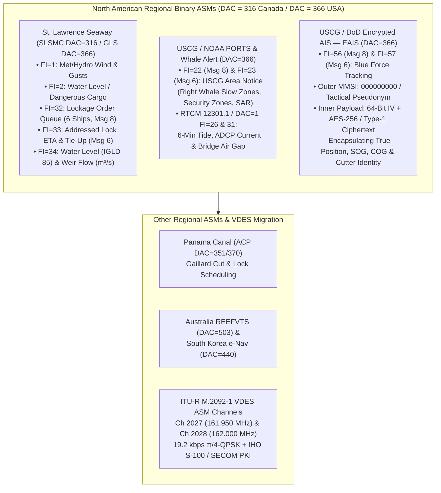
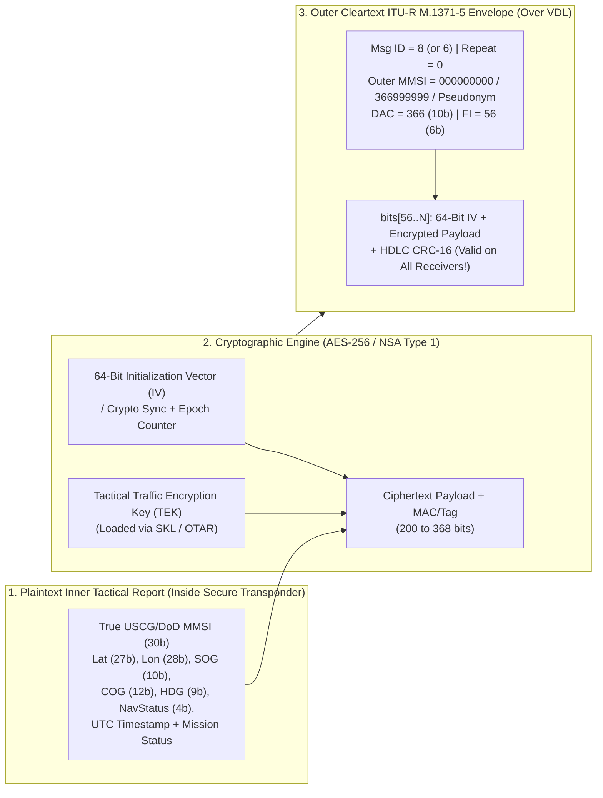

# Chapter 40: Deep Dive into Regional ASM Subtypes, Part 2: North American Seaway (`DAC = 316 / 366`), USCG / NOAA PORTS®, Encrypted AIS, and the Master Software Support Matrix

---

## 1. Operational & Conceptual Overview

While Chapter 39 examined how European river authorities (`DAC = 200`) and the United Kingdom and Ireland General Lighthouse Authorities (`DAC = 232 / 235`) adapted AIS Binary Application-Specific Messages (ASMs) for inland barge convoys and offshore Aid-to-Navigation telemetry, North America pioneered three distinct, mission-critical regional ASM ecosystems under **Designated Area Code `316` (Canada)** and **Designated Area Code `366` (United States)**:

1. **The Binational St. Lawrence Seaway Traffic Management System (`DAC = 316` & `DAC = 366`, `FI = 1, 2, 32, 33, 34`):** Stretching $3,700\text{ km}$ ($2,300\text{ miles}$) from the Atlantic Ocean to the head of the Great Lakes at Duluth, Minnesota, the St. Lawrence Seaway lifts ocean-going "salties" and $225.5\text{ m} \times 23.8\text{ m}$ ($740\text{ ft} \times 78\text{ ft}$) Seawaymax "lakers" $183\text{ m}$ ($600\text{ ft}$) above sea level through **15 locks** (13 operated by Canada's **St. Lawrence Seaway Management Corporation [SLSMC, `DAC = 316`]** and 2 operated by the United States **Great Lakes St. Lawrence Seaway Development Corporation [GLS, `DAC = 366`]**). In March 2003—more than a year before IMO published its first trial binary circular (`SN/Circ.236`)—the Seaway became the **first waterway in the world to mandate AIS carriage combined with automated binary ASM broadcasts** delivering lockage queues, individual vessel tie-up ETAs, wind gusts on lock walls, water levels referenced to the International Great Lakes Datum (**IGLD 1985**), and dam/weir spillway flow rates in cubic meters per second ($\text{m}^3/\text{s}$).
2. **United States Coast Guard (USCG), NOAA PORTS®, and Listen for Whales / Whale Alert (`DAC = 366, FI = 22, 23` & `RTCM Standard 12301.1`):** Working with the Woods Hole Oceanographic Institution (WHOI), NOAA's Stellwagen Bank National Marine Sanctuary, and Kurt Schwehr at the University of New Hampshire Center for Coastal and Ocean Mapping (**UNH CCOM/JHC**), the US Coast Guard deployed **Message 8/6 `DAC = 366, FI = 22/23` (*USCG Area Notice*)** to broadcast dynamic **North Atlantic Right Whale (*Eubalaena glacialis*) Slow Zones** and Seasonal/Dynamic Management Areas directly onto shipboard ECDIS and Pilot Portable Units (PPUs). This regional USCG specification (`ais-area-notice`) served as the direct architectural prototype for the global **IMO SN.1/Circ.289 `DAC = 1, FI = 22`** standard, while retaining subtle bit-level and lookup-table differences that software engineers must handle explicitly. Simultaneously, NOAA's **Physical Oceanographic Real-Time System (PORTS®)** partnered with USCG **Nationwide AIS (NAIS)** to broadcast 6-minute water levels, multi-depth Doppler currents, and microwave **Bridge Air Gap** clearance measurements across major US ports.
3. **USCG & Department of Defense Encrypted AIS (`EAIS`, `DAC = 366, FI = 56 & 57`):** Law enforcement cutters, fast response boats, and military vessels face a sharp operational dilemma: turning off an AIS transponder completely (**EMCON**) deprives friendly VTS centers and nearby commercial ships of collision-avoidance awareness and risks catastrophic nighttime collisions (as demonstrated in the 2017 *USS Fitzgerald* and *USS John S. McCain* disasters), yet broadcasting standard cleartext Messages 1, 3, and 5 reveals the tactical asset's hull identity and real-time intercept vector to smugglers, sanctions evaders, and hostile intelligence services. **Encrypted AIS (`DAC = 366, FI = 56` for Broadcast Message 8 and `FI = 57` for Addressed Message 6)** resolves this at the link layer by encapsulating an AES-256 / NSA Type 1 encrypted position and identity report inside a standard ITU-R M.1371 binary envelope. Civilian transponders decode the valid outer HDLC frame and respect its SOTDMA time-slot reservation without being able to read the ciphertext, while authorized USCG/DoD **Command21**, **SeaVision**, **Minotaur** aircraft, and **GCCS-M** terminals holding the cryptographic key decrypt the inner payload into a live **Blue Force Track**.



This final chapter of Part VIII provides a forensic bit-level engineering reference for the St. Lawrence Seaway (`DAC = 316 / 366`), USCG Area Notices and NOAA PORTS® (`DAC = 366, FI = 22/23`), and USCG/DoD Encrypted AIS (`DAC = 366, FI = 56/57`), surveys regional binary ASMs in the Panama Canal (`DAC = 351`), Australia (`DAC = 503`), and South Korea (`DAC = 440`), traces the migration of binary ASMs onto **ITU-R M.2092-1 VDES** and **IHO S-100 / SECOM**, and culminates in the **Definitive Master AIS Message (1–27) and ASM (`DAC/FI`) Software Support Matrix** across the entire open-source and commercial maritime software ecosystem.

---

## 2. Historical Context & Evolution (`schwehr/gis-history` Integration)

The development of North American regional ASMs links 19th-century Great Lakes canal engineering and post-1980 bridge allision reforms to open-source geospatial software (`https://github.com/schwehr/gis-history`) and modern maritime cybersecurity:

| Year / Era | Milestone (`schwehr/gis-history` & North American ASM Lineage) | Technical & Operational Significance |
|---|---|---|
| **1829 – 1959** | First **Welland Canal** opens (1829) bypassing Niagara Falls; modern **St. Lawrence Seaway** opens as a binational US-Canadian deep-draft waterway (April 25, 1959) | Created a complex 15-lock staircase where vessels have only $0.6\text{ m}$ ($2\text{ ft}$) of total beam clearance inside $24.38\text{ m}$ ($80\text{ ft}$) wide locks and face strong lateral outdrafts from hydro/spillway weirs. |
| **May 9, 1980** | Bulk carrier ***MV Summit Venture* strikes the Sunshine Skyway Bridge** in Tampa Bay during a sudden squall (35 killed); NOAA establishes **PORTS®** (1991) | Exposed the fatal latency of shoreside weather and tidal observations that could not reach harbor pilots in real time on the bridge. |
| **1999 – March 2003** | **SLSMC (Canada, `DAC = 316`)** and **GLS (USA, `DAC = 366`)** develop and mandate the **St. Lawrence Seaway AIS Traffic Management System** (effective March 25, 2003) | First mandatory regional AIS + Binary ASM deployment globally; combined GPS/DGPS vessel tracking with automated Message 6/8 broadcasts of Lockage Order (`FI=32`), Lock ETAs (`FI=33`), and Weir Flow (`FI=34`). |
| **2005 – 2008** | **Kurt Schwehr** at **UNH CCOM/JHC** writes **`noaadata`** (`ais_msg_8_seaway.py`, water-level & met decoders) and **`ais-area-notice`** (`DAC=366, FI=22`); **Stellwagen Bank Listen for Whales** launches (2007–2008) | Integrated acoustic right-whale detections from WHOI/Cornell DMON buoys with USCG AIS Base Stations (`DAC=366, FI=22`) to push dynamic slow-zone polygons to transiting merchant ships. |
| **2008 – 2011** | **USCG Nationwide AIS (NAIS)** & DoD deploy **Encrypted AIS (`DAC = 366, FI = 56 & 57`)**; **IMO SN.1/Circ.289** (2010) and **RTCM Standard 12301.1** (2011) ratified; **Kurt Schwehr releases `libais`** (2010) | `libais` implemented C++ decoders for Seaway (`ais8_366.cpp`), USCG Area Notice (`ais8_366_22.cpp`), and Encrypted AIS envelope inspection (`ais8_366_56.cpp`). |
| **2012 – 2028+** | **Whale Alert** presented to US Congress (2012); **ITU-R M.2092-1 (VDES)** and **IHO S-100 (`S-104`, `S-111`, `S-124`, `S-421`)** standardized (2015–2028) | Transitions regional VHF binary dialects toward high-speed ($19.2\text{ kbps}$) VDES ASM channels and cryptographically signed S-100 hydrographic products. |

---

## 3. Deep Technical & Mathematical Foundations

### 40.1 St. Lawrence Seaway & Great Lakes Binational Subtypes (`DAC = 316` [Canada] & `DAC = 366` [USA], `FI = 1, 2, 32, 33, 34`)

#### 40.1.1 Operational Architecture of the 15-Lock St. Lawrence Seaway AIS Network

Between Montreal Harbor and Lake Erie, every commercial vessel $\ge 20\text{ m}$ in length (or $\ge 8\text{ m}$ for passenger and towing vessels) must carry a Class A AIS transponder integrated with a gyrocompass and a Portable Pilotage Unit (PPU) or ECS capable of displaying Seaway-specific binary messages. The waterway is divided into two operational sections encompassing **15 locks**:
* **The Montreal–Lake Ontario (MLO) Section (7 Locks):** Five Canadian locks operated by SLSMC (`Lock 1` Saint Lambert, `Lock 2` Côte Sainte-Catherine, `Lock 3` Lower Beauharnois, `Lock 4` Upper Beauharnois, and `Lock 7` Iroquois) plus two US locks at Massena, New York operated by GLS (`Lock 5` Bertrand H. Snell and `Lock 6` Dwight D. Eisenhower).
* **The Welland Canal Section (8 Locks):** Operated by SLSMC across the Niagara Peninsula between Port Weller (Lake Ontario) and Port Colborne (Lake Erie), lifting vessels $99.5\text{ m}$ ($326.5\text{ ft}$) around Niagara Falls (`Locks 1 through 8`, including the twinned flight locks `4, 5, and 6` at Thorold).

Because vessels cross back and forth across the US–Canadian international boundary in the St. Lawrence River dozens of times during a single transit, the SLSMC Traffic Control Centers (in Saint-Lambert, Quebec and St. Catharines, Ontario) and the GLS Traffic Control Center (in Massena, New York) operate an interconnected AIS Base Station network. Base stations located on Canadian soil transmit with a Canadian Coast Station MMSI (`00316xxxx`) and set **`DAC = 316`**, whereas base stations on US soil transmit with a USCG/GLS MMSI (`00366xxxx`) and set **`DAC = 366`**. Crucially, **the binary payload schemas for Seaway ASMs are bit-for-bit identical whether `DAC = 316` or `DAC = 366` is in the header**!

> [!IMPORTANT]
> **Why `DAC = 366` Requires Length + Sub-ID Disambiguation:** While `DAC = 316` is used almost exclusively by the St. Lawrence Seaway and Canadian Coast Guard (CCG), `DAC = 366` is shared between the **US St. Lawrence Seaway Development Corporation (GLS)** and the **United States Coast Guard (USCG)** nationwide! Fortunately, their Functional Identifiers (`FI`) are cleanly partitioned:
> * **`FI = 1, 2, 32, 33, 34`** under `DAC = 316` or `366` belong to the **St. Lawrence Seaway (SLSMC/GLS)** specification.
> * **`FI = 22, 23`** under `DAC = 366` belong to **USCG Area Notice** (`ais-area-notice`).
> * **`FI = 56, 57`** under `DAC = 366` belong to **USCG / DoD Encrypted AIS (EAIS)**.

#### 40.1.2 How the St. Lawrence Seaway Messages Work: Common Header & Subtype Schemas

As documented in the SLSMC/GLS *AIS Binary Messages Specification* and Kurt Schwehr's **`noaadata`** (`ais_msg_8_seaway.py`) and **`libais`** (`ais8_366.cpp`), St. Lawrence Seaway binary messages share a common **32-bit Seaway Application Header** immediately following the `DAC` (`10 bits`) and `FI` (`6 bits`).

##### Table 40.1: St. Lawrence Seaway Common Application Header (Message 8 Bits `56–87` / Message 6 Bits `88–119`)

| Msg 8 0-Based Bits | Msg 6 0-Based Bits | Width | Field Name | Type | Scaling / Units | Valid Range & Sentinel Values |
|---|---|---|---|---|---|---|
| `0–39` | `0–71` | 40 / 72 | `ais_envelope` | Header | Standard ITU-R M.1371-5 | Msg 8 (`40b`) or Msg 6 (`72b`, includes `seq_num`, `dest_mmsi`, `retransmit`) |
| `40–49` | `72–81` | 10 | `dac` | `uint10` | Designated Area Code | **`316`** (Canada SLSMC) or **`366`** (USA GLS) |
| `50–55` | `82–87` | 6 | `fi` | `uint6` | Functional Identifier | **`1`**, **`2`**, **`32`**, **`33`**, or **`34`** |
| `56–57` | `88–89` | 2 | `version` | `uint2` | Seaway Spec Version | `0` = v1.0 (2003 initial deployment), `1` = v1.1+ |
| `58–61` | `90–93` | 4 | `utc_month` | `uint4` | Month (`1–12`) | `1–12` (`0` = not available) |
| `62–66` | `94–98` | 5 | `utc_day` | `uint5` | Day of Month (`1–31`) | `1–31` (`0` = not available) |
| `67–71` | `99–103` | 5 | `utc_hour` | `uint5` | UTC Hour (`0–23`) | `0–23` (`24` = not available) |
| `72–77` | `104–109` | 6 | `utc_minute` | `uint6` | UTC Minute (`0–59`) | `0–59` (`60` = not available) |
| `78–83` | `110–115` | 6 | `spare_seaway` | `uint6` | Reserved | `0` |
| `84–87` | `116–119` | 4 | `msg_sub_id` | `uint4` | Sub-Message Type (`0–15`) | Selects internal record schema (`0` = Wind, `1` = Water Level, `2` = Flow, etc.) |

Let us examine each of the five operational Seaway `FI` subtypes in detail:

##### 1. `DAC = 316 / 366, FI = 1` (*Meteorological and Hydrological — Wind Information*, Msg 8) and `FI = 2` (*Dangerous Cargo / Early Water Level*)
In the initial 2002–2003 Seaway deployment (`noaadata` `ais_msg_8_seaway`), **`FI = 1`** was assigned to environmental broadcasts (`216–504 bits`) carrying up to 6 station reports per message, while **`FI = 2`** handled hazardous cargo / water-level reporting before the lockage and hydrological messages were cleanly separated into `FI = 32, 33, and 34`.
In **`FI = 1` (Wind Information, `msg_sub_id = 0`)**, each **72-bit Station Report** (repeating $k \in \{1..6\}$ times starting at bit `88`) encodes:
* **`station_id` (`42 bits` = 7 6-bit ASCII characters):** Seaway weather station identifier (e.g., `"STLMBT@"` for Saint Lambert Lock, `"IROQUOI"` for Iroquois Lock, `"EISENHW"` for Eisenhower Lock).
* **`wind_speed_avg` (`10 bits`, `uint10`, $0.1\text{ kts}$ or $0.1\text{ m/s}$ steps):** 10-minute average wind speed measured atop the lock approach wall (`1023` = N/A). Because a $225\text{ m}$ laker slowing to $1.5\text{ kts}$ in ballast acts like a giant steel sail, lockmasters suspend lock entry when beam winds exceed $25\text{–}35\text{ kts}$ depending on vessel windage area.
* **`wind_dir_avg` (`9 bits`, `uint9`, $1^\circ\text{ True}$):** `0–359°` (`511` = N/A).
* **`wind_gust_speed` (`10 bits`, `uint10`):** Peak 3-second wind gust speed in the preceding 10 minutes (`1023` = N/A).
* **`spare` (`1 bit`):** `0`.

##### 2. `DAC = 316 / 366, FI = 32` (*Lockage Order*, Msg 8, `216–888 bits`)
Broadcast every 10–15 minutes by Seaway Base Stations adjacent to each lock, **`FI = 32`** transmits the live **Lockage Order Queue** so every approaching master and pilot can see their exact sequence in the lock queue and adjust their speed over ground (`SOG`) to arrive Just-In-Time (reducing fuel burn and congestion at the tie-up wall).

###### Table 40.2: Message 8, `DAC = 316 / 366, FI = 32` — Seaway Lockage Order Queue (`136 + 120N` Bits, $N \in \{1..6\}$)

| 0-Based Bits | 1-Based Bits | Width | Field Name | Type | Scaling / Meaning | Valid Range & Sentinel Values |
|---|---|---|---|---|---|---|
| `0–87` | `1–88` | 88 | `seaway_header` | Header | Msg 8 Header (`56b`) + Seaway Header (`32b`) | `dac = 316/366`, `fi = 32`, `version`, `utc_time`, `sub_id = 0` |
| `88–123` | `89–124` | 36 | `lock_id` | `char6[6]` | **6-Char Lock Identifier** | e.g., `"LOCK01"` (St. Lambert), `"SNEL05"`, `"WELL07"` |
| `124` | `125` | 1 | `lock_direction` | `uint1` | Queue Transit Direction | `0` = **Upbound** (Westbound toward Lake Erie)<br/>`1` = **Downbound** (Eastbound toward Montreal) |
| `125–135` | `126–136` | 11 | `header_spare` | `uint11` | Zero padding | `0` |
| **Per-Vessel Record $k$ ($k = 0..5$, `120 bits` each, starting at bit $136 + 120k$):** | | | | | | **Repeats for $N \in \{1..6\}$ scheduled vessels** |
| `+0..+89` | `+1..+90` | 90 | `vessel_name_k` | `char6[15]` | **15-Char Vessel Name** | Truncated from 20-char Msg 5 name (`@` padded) |
| `+90` | `+91` | 1 | `vessel_dir_k` | `uint1` | Vessel Transit Direction | `0` = Upbound, `1` = Downbound |
| `+91..+94` | `+92..+95` | 4 | `sched_month_k` | `uint4` | Scheduled Lockage Month | `1–12` (`0` = N/A) |
| `+95..+99` | `+96..+100` | 5 | `sched_day_k` | `uint5` | Scheduled Lockage Day | `1–31` (`0` = N/A) |
| `+100..+104` | `+101..+105` | 5 | `sched_hour_k` | `uint5` | Scheduled Lockage UTC Hour | `0–23` (`24` = N/A) |
| `+105..+110` | `+106..+111` | 6 | `sched_min_k` | `uint6` | Scheduled Lockage UTC Min | `0–59` (`60` = N/A) |
| `+111..+119` | `+112..+120` | 9 | `record_spare_k` | `uint9` | Reserved / Turn Status | `0` |

##### 3. `DAC = 316 / 366, FI = 33` (*Estimated Lock Times*, Msg 6 Addressed, `280–424 bits`)
Whereas `FI = 32` is a broadcast (Message 8) showing the queue at a single lock, **`FI = 33`** is an **Addressed Binary Message (Message 6)** sent point-to-point from the Seaway Traffic Control Center to an individual ship's MMSI. It delivers:
* **`vessel_name` (`90 bits`, 15 6-bit ASCII characters):** Confirms the addressed ship's name (`bits[120:210]`).
* **`next_lock_id` (`36 bits`, 6 6-bit ASCII characters):** Identifier of the immediate next lock (`bits[210:246]`).
* **`est_tieup_time` (`20 bits`: `month[4b]`, `day[5b]`, `hour[5b]`, `min[6b]`):** Official VTS-calculated **Estimated Tie-Up / Lock Entry Time** (`bits[246:266]`), followed by up to 2 subsequent lock IDs and ETAs so the master can manage crew rest hours and propulsion power across the canal reach.

##### 4. `DAC = 316 / 366, FI = 34` (*Seaway Water Level & Weir Flow Rate*, Msg 8, `216–504 bits`)
In constrained canal sections—such as the South Shore Canal, the Beauharnois Canal (which feeds the giant Hydro-Québec Beauharnois generating station), the Wiley-Dondero Canal at Massena, and the Welland Canal—opening adjacent control weirs or hydroelectric spillways creates strong **lateral cross-currents (outdrafts and indrafts)** right across the lock approach walls. A laker moving at $1\text{ kt}$ has minimal rudder authority; an unexpected $800\text{ m}^3/\text{s}$ weir discharge can push the bow into the concrete approach wall. **`FI = 34`** broadcasts both real-time **Water Level** (in $0.01\text{ m}$ steps relative to **IGLD 1985** or local Chart Datum) and **Water Flow Rate** (in $\text{m}^3/\text{s}$).

###### Table 40.3: Message 8, `DAC = 316 / 366, FI = 34` — Seaway Water Level & Hydrological Weir Flow Rate (`88 + 72N` Bits, $N \in \{1..6\}$)

| 0-Based Bits | 1-Based Bits | Width | Field Name | Type | Scaling / Units | Valid Operational Range & Sentinels |
|---|---|---|---|---|---|---|
| `0–87` | `1–88` | 88 | `seaway_header` | Header | Msg 8 (`56b`) + Seaway (`32b`) | `dac = 316/366`, `fi = 34`, `sub_id`: `1` = Water Level, `2` = Flow Rate |
| **Per-Station Hydrological Record $k$ ($k = 0..5$, `72 bits` each, starting at bit $88 + 72k$):** | | | | | | **Up to 6 Gauge / Weir Stations per Msg 8** |
| `+0..+41` | `+1..+42` | 42 | `station_id_k` | `char6[7]` | **7-Char Gauge/Weir ID** | e.g., `"LOCK01W"` (St. Lambert Weir), `"IROQDAM"` (Iroquois Dam) |
| `+42` | `+43` | 1 | `datum_flag_k` | `uint1` | Vertical Reference Datum | `0` = **Seaway Chart Datum (Low Water Datum)**<br/>`1` = **IGLD 1985** (International Great Lakes Datum 1985) |
| `+43..+57` | `+44..+58` | 15 | `water_level_k` | `int15` | $\Delta h = S \times 0.01\text{ m}$ ($1\text{ cm}$) | Signed two's complement: $-163.83\text{ m}$ to $+163.82\text{ m}$ (`-16384` = `0x4000` N/A) |
| `+58..+71` | `+59..+72` | 14 | `flow_rate_k` | `uint14` | $Q = U \times 1\text{ m}^3/\text{s}$ | **$0\text{ to }16{,}382\text{ m}^3/\text{s}$** discharge rate (`16383` = `0x3FFF` N/A) |

---

#### 40.1.3 Known Protocol Issues, Message Relationships, and Operational Context for Seaway ASMs

1. **15-Character Vessel Name Truncation (`FI = 32` & `FI = 33`):** Standard AIS Message 5 and Message 24 Part A store a **20-character** `Vessel Name` (`120 bits`). To pack 6 vessels into a 5-slot Message 8 (`888 bits`), the Seaway `FI = 32` designer truncated `vessel_name_k` to **15 characters (`90 bits`)** and omitted the 30-bit MMSI! Consequently, fleet sister ships that share a common 15-character prefix (e.g., `"ALGOMA INTERNATI"` vs. `"ALGOMA INNOVATOR"`, or `"CSL ST-LAURENT"` variants) must be disambiguated by the PPU software using their spatial sequence along the canal reach and their personal addressed `FI = 33` message.
2. **IGLD 1985 vs. Chart Datum (`datum_flag` Trap):** Along the St. Lawrence River and Great Lakes, **IGLD 1985** is a dynamic orthometric/hydraulic height datum above Rimouski, Quebec ($\approx 5\text{ m}$ to $174\text{ m}$ above sea level), whereas **Chart Datum (Low Water Datum)** is the local step-plane reference (~$0.0\text{ m}$ to $+2.0\text{ m}$) used directly for Under-Keel Clearance. If a naive parser ignores bit `+42` (`datum_flag_k`) and treats an IGLD-85 elevation of $+74.20\text{ m}$ (Lake Ontario) as a $+74.20\text{ m}$ tidal surge above Chart Datum, its UKC alarm logic fails completely!
3. **Interaction with Message 22 (Channel Management):** As vessels enter and exit the St. Lawrence Seaway sectors (Montréal, Beauharnois, Seaway Eisenhower, Seaway Iroquois, Welland), Seaway Base Stations broadcast **Message 22 (*Channel Management*)** to manage regional VHF simplex channels alongside AIS 1 and AIS 2, and interrogate entering vessels via **Message 15** for **Message 5** draught verification (maximum permissible Seaway draught is strictly enforced at $8.08\text{ m}$ [$26\text{ ft } 6\text{ in}$], or $8.18\text{ m}$ [$26\text{ ft } 10\text{ in}$] for vessels equipped with certified Draft Information Systems [DIS]).

---

### 40.2 United States Coast Guard (USCG), NOAA PORTS®, Whale Alert, and Encrypted AIS (`DAC = 366`, `FI = 22, 23, 56, 57`)

#### 40.2.1 `DAC = 366, FI = 22` (Broadcast Msg 8) and `FI = 23` (Addressed Msg 6): USCG Area Notice & Whale Alert

##### Historical Genesis: Stellwagen Bank, WHOI, NOAA, USCG, and Kurt Schwehr's `ais-area-notice`
By the mid-2000s, vessel strikes were a leading cause of mortality for the critically endangered **North Atlantic Right Whale (*Eubalaena glacialis*)**, whose population stood at roughly 350–400 individuals. In 2006–2007, when the liquefied natural gas (LNG) deepwater ports (Neptune LNG and Northeast Gateway) were approved in Massachusetts Bay adjacent to the **Stellwagen Bank National Marine Sanctuary**, NOAA, the Woods Hole Oceanographic Institution (WHOI), the Cornell Lab of Ornithology, and the US Coast Guard launched the **Listen for Whales / Whale Alert** initiative. Ten moored **Passive Acoustic Monitoring (PAM)** buoys equipped with WHOI digital acoustic monitoring instruments (**DMONs**) continuously detected right-whale contact "up-calls" along the Boston Harbor Traffic Separation Scheme (TSS).

However, detecting a whale acoustically was only half the engineering challenge: how could the conservation system alert the bridge team of an inbound container ship or LNG tanker in real time? Working at **UNH CCOM/JHC**, **Kurt Schwehr** collaborated with the USCG Research and Development Center, NOAA, and RTCM Special Committee 121 to design the **AIS Area Notice** binary message (**Message 8, `DAC = 366, FI = 22`** for broadcast and **Message 6, `DAC = 366, FI = 23`** for addressed delivery; published as open source in [`https://github.com/schwehr/ais-area-notice`](https://github.com/schwehr/ais-area-notice) and `libais` `ais8_366_22.cpp`). Following successful operational trials in Boston Harbor and Stellwagen Bank, the IMO Sub-Committee on Safety of Navigation adopted Schwehr and the USCG/RTCM working group's chained 87-bit sub-area architecture globally in **June 2010 as IMO SN.1/Circ.289 `DAC = 1, FI = 22`**.

##### Why a Parser Cannot Blindly Alias `DAC = 366, FI = 22` to `DAC = 1, FI = 22`
A frequent bug in AIS decoders is assuming that `DAC = 366, FI = 22` (`Ais8_366_22`) and `DAC = 1, FI = 22` (`Ais8_1_22`) are 100% identical and routing both to the exact same parser without checking the `DAC`, bit length, or notice-code lookup table. As implemented in Kurt Schwehr's `libais` (`src/libais/ais8_366_22.cpp` vs. `src/libais/ais8_1_22.cpp`), there are three critical engineering distinctions between the USCG (`DAC = 366, FI = 22`) and IMO (`DAC = 1, FI = 22`) specifications:

###### Table 40.4: Exact Engineering & Bit-Level Comparison — USCG `DAC = 366, FI = 22` vs. IMO `DAC = 1, FI = 22`

| Feature / Bit Slice | Pre-2010 USCG Prototype (`DAC = 366, FI = 22` v0) | Harmonized USCG / RTCM 12301.1 (`DAC = 366, FI = 22`, `Ais8_366_22`) | International IMO SN.1/Circ.289 (`DAC = 1, FI = 22`, `Ais8_1_22`) | Parser Impact if Aliased Blindly |
|---|---|---|---|---|
| **Envelope & AppID (`bits[40:55]`)** | `DAC = 366`, `FI = 22` (`AppID = 23446`) | `DAC = 366`, `FI = 22` (Msg 8) or `FI = 23` (Msg 6) | `DAC = 1`, `FI = 22` (Msg 8 & Msg 6 both use `FI = 22`!) | **Msg 6 FI Mismatch:** USCG uses **`FI = 23`** for Addressed Area Notices (Msg 6), whereas IMO SN.1/Circ.289 uses **`FI = 22`** for both Msg 6 and Msg 8 (and assigns `DAC=1, FI=23` to Environmental)! |
| **Header Bits (`bits[56:110]`, 55 bits)** | `link_id (10b)`, `notice_type (7b)`, `month (4b)`, `day (5b)`, `hour (5b)`, `min (6b)`, `duration (18b)` | **Identical 55-bit header** (`bits[56:110]` in Msg 8; `bits[88:142]` in Msg 6) | **Identical 55-bit header** (`bits[56:110]` in Msg 8; `bits[88:142]` in Msg 6) | Header bit offsets (`56..110`) match between harmonized `366_22` and `1_22`. |
| **Sub-Area Coordinate Widths (`Shapes 0, 1, 2`)** | **28-bit `lon` + 27-bit `lat`** ($10^{-4}\text{ min}$ standard AIS resolution) $\rightarrow$ **93-bit Sub-Areas**! | **25-bit `lon` (`rel[5:29]`) + 24-bit `lat` (`rel[30:53]`)** ($10^{-3}\text{ min} \approx 1.85\text{ m}$ resolution) $\rightarrow$ **87-bit Sub-Areas** | **25-bit `lon` (`rel[5:29]`) + 24-bit `lat` (`rel[30:53]`)** ($10^{-3}\text{ min}$ resolution) $\rightarrow$ **87-bit Sub-Areas** | Historical archives from 2007–2009 Stellwagen Bank contain **93-bit sub-areas** (`(bit_len - 111) % 93 == 0`). Modern parsers must verify `(bit_len - 111) % 87 == 0` vs. `% 93 == 0`! |
| **Sub-Area `Shape 0` Radius & Scale Factor Order** | Early USCG draft tested `scale_factor` after `precision` in some builds | `shape_id (3b: 0..2)`, `scale_factor (2b: 3..4)`, `lon (25b: 5..29)`, `lat (24b: 30..53)`, `precision (3b: 54..56)`, `radius (12b: 57..68)`, `spare (18b: 69..86)` | Identical 87-bit sub-area field layout (`ais8_366_22.h` and `ais8_1_22.h` share `Ais8_1_22_SubArea` geometry layout in `libais`) | Harmonized `Ais8_366_22` and `Ais8_1_22` use the same 87-bit sub-area bit offsets. |
| **`notice_type` (`bits[66:72]`, `0–127`) Lookup Semantics** | USCG / RTCM regional trial codes | **USCG / RTCM 12301.1 Table** (e.g., USCG coastal security zones, Right Whale DMA/SMA slow-zone semantics, and regional SAR/speed codes) | **IMO SN.1/Circ.289 Annex Table** (`0–127` standardized international descriptions) | In early USCG/RTCM tables vs. IMO Circ.289, specific codes (`1`, `21`, `56`, `65`, `94`) had divergent regional strings (e.g., `65` = *Speed Restricted Area* in regional drafts vs. *Distress: Vessel Sinking* in IMO Circ.289!). |

---

#### 40.2.2 NOAA PORTS® and RTCM Standard 12301.1 (`DAC = 366` & `DAC = 1, FI = 26 / 31`)

Following the 1980 *Summit Venture* Sunshine Skyway Bridge disaster in Tampa Bay, NOAA's Center for Operational Oceanographic Products and Services (**CO-OPS**) established the **Physical Oceanographic Real-Time System (PORTS®)**. Today, NOAA PORTS® instruments over 35 major US port complexes (including New York/New Jersey, Chesapeake Bay, Houston/Galveston, Tampa Bay, Lower Mississippi, Columbia River, San Francisco Bay, Puget Sound, and Los Angeles/Long Beach).

Every **6 minutes**, NOAA CO-OPS ingests, quality-controls, and formats observations from four primary sensor families for transmission over **USCG Nationwide AIS (NAIS)** Base Stations and Physical/Synthetic AIS Aids to Navigation:
1. **Water Level (`SensorReport Type 2` in `FI = 26` or `water_level` in `FI = 31`):** Acoustic and microwave radar tide gauges referenced to **Mean Lower Low Water (MLLW)** chart datum with $0.01\text{ m}$ ($1\text{ cm}$) resolution, plus 2-bit tidal trend (`0` = steady, `1` = falling/ebbing, `2` = rising/flooding) and astronomical tide predictions.
2. **Horizontal & Multi-Depth Currents (`SensorReport Types 4, 5, 6` in `FI = 26` or `surf_cur` / `cur_2` / `cur_3` in `FI = 31`):** Bottom-mounted or channel-buoy **Acoustic Doppler Current Profilers (ADCPs)** reporting current speed ($0.1\text{ kt}$ resolution) and **oceanographic set** (direction *toward which* the current flows, $1^\circ\text{ True}$) at the surface and two deeper bins matching the keel depth of deep-draft tankers and container ships ($10\text{–}16\text{ m}$).
3. **Bridge Air Gap (`SensorReport Type 10 [Air Gap / Air Draught]` in `FI = 26`, 112-bit modular block):** Downward-looking microwave radar sensors mounted at the low-steel center span of major bridges (such as the Bayonne Bridge, Verrazzano-Narrows Bridge, Sunshine Skyway Bridge, and Gerald Desmond Bridge) measuring the real-time vertical clearance between the bridge steel and the water surface to **$0.01\text{ m}$ ($1\text{ cm}$) precision**—accounting simultaneously for astronomical tide, storm surge, river runoff, and **thermal expansion/traffic deflection of the bridge span itself**!
4. **Meteorological & Water Quality Sensors (`SensorReport Types 2, 8, 9`):** Over-water wind speed/gusts, barometric pressure (critical for inverse-barometer storm surge calculations), visibility (optical scatter fog sensors), water temperature, and **salinity in Practical Salinity Units (`0.1 PSU / ‰`)** (because a ship moving from $35\text{‰}$ seawater into $0\text{‰}$ fresh river water loses $\approx 2.5\%$ buoyancy and **sinks $25\text{–}35\text{ cm}$ deeper in the water** due to fresh-water allowance!).

---

#### 40.2.3 `DAC = 366, FI = 56` (Broadcast Msg 8) and `FI = 57` (Addressed Msg 6): USCG / DoD Encrypted AIS (`EAIS`) — Blue Force Tracking

##### 1. Operational Requirement: Solving the Warship & Law-Enforcement AIS Paradox
Under **SOLAS Chapter V, Regulation 19.1.5**, warships, naval auxiliaries, and government law-enforcement vessels are exempt from mandatory public AIS carriage, or may switch off cleartext AIS when operational security (OPSEC) requires. However, operating completely silent on the VHF Data Link (**EMCON**) inside congested coastal waters creates two severe hazards:
1. **TDMA Slot Collisions:** If a USCG Cutter or Navy destroyer transmits proprietary data over AIS 1 ($161.975\text{ MHz}$) or AIS 2 ($162.025\text{ MHz}$) without using standard ITU-R M.1371 framing, nearby merchant transponders cannot decode the burst and will collide with it. Conversely, if the cutter transmits nothing at all, merchant vessels have no automated VHF target marker and USCG Sector Command Centers lose VHF line-of-sight Blue Force Tracking of small boats beyond coastal radar range.
2. **Operational Leakage of Cleartext AIS:** If a USCG `45-foot` Response Boat–Medium (`RB-M`), `87-foot` or `154-foot` Fast Response Cutter, or drug-interdiction aircraft broadcasts standard cleartext Message 1 or Message 9, any cartel spotter, illegal fishing vessel, or hostile state actor with a $\$30$ RTL-SDR dongle or a smartphone ship-tracking app can see the patrol asset's exact MMSI, position, speed, and heading in real time.

To achieve **simultaneous VDL time-slot coexistence and tactical confidentiality**, the US Coast Guard and Department of Defense deployed **Encrypted AIS (`EAIS`)** using **Message 8, `DAC = 366, FI = 56`** (Broadcast) and **Message 6, `DAC = 366, FI = 57`** (Addressed), implemented in Kurt Schwehr's `libais` as class **`Ais8_366_56`** (`src/libais/ais8_366_56.cpp`).

##### 2. How `DAC = 366, FI = 56` & `FI = 57` Work: Bit-Level Anatomy (`Ais8_366_56`)

An EAIS transmission wraps an encrypted inner AIS message (typically a 168-bit Message 1/3/18 position report, a 168-bit Message 9 aircraft report, or a compressed static identity block) inside a standard outer **ITU-R M.1371-5 Message 8 (`DAC = 366, FI = 56`)** or **Message 6 (`DAC = 366, FI = 57`)** binary frame.



###### Table 40.5: Bit-Level Anatomy of Message 8, `DAC = 366, FI = 56` (`libais` `Ais8_366_56` — USCG Encrypted AIS Broadcast)

| 0-Based Bits | 1-Based Bits | Width | Field Name | Type | Description, Outer vs. Inner Semantics & `libais` Mapping |
|---|---|---|---|---|---|
| `0–5` | `1–6` | 6 | `message_id` | `uint6` | Constant **`8`** (Broadcast Binary) or **`6`** (Addressed Binary, shifts payload by $+32\text{ bits}$ with `FI = 57`) |
| `6–7` | `7–8` | 2 | `repeat_indicator` | `uint2` | `0–3` (`0` = direct transmission from cutter/boat; `1–3` = shore/airborne repeater) |
| `8–37` | `9–38` | 30 | `source_mmsi` | `uint30` | **Outer Cleartext MMSI (`User ID`):** Intentionally anonymized! Commonly set to:<br/>• **`000000000`** (all zeros) or **`366999999`** (generic USCG tactical pool),<br/>• **`3669xxxxx` / `3039xxxxx`** (shared sector/district pool), or<br/>• A **rotating pseudorandom MMSI** that changes periodically so external observers cannot link tracks across time. |
| `38–39` | `39–40` | 2 | `spare` | `uint2` | `0` |
| `40–49` | `41–50` | 10 | `dac` | `uint10` | Constant **`366`** (United States) |
| `50–55` | `51–56` | 6 | `fi` | `uint6` | Constant **`56`** (Encrypted AIS Broadcast; **`57`** used for Addressed / Extended Static EAIS) |
| `56–119` | `57–120` | 64 | `crypto_iv_sync` | `uint64` / `byte[8]` | **64-Bit Initialization Vector (IV) / Cryptographic Synchronization Vector:** Prevents ciphertext replay and ensures identical coordinates encrypt to completely different bitstreams (`encrypted[0..7]` in `Ais8_366_56`). |
| `120–(N-1)` | `121–N` | $136\text{–}304$ | `ciphertext_and_mac` | `bit[]` | **AES-256 (or NSA Type 1 Suite A) Ciphertext + Message Authentication Code (MAC):** Encapsulates the true 168-bit position report (`True MMSI`, `Lon`, `Lat`, `SOG`, `COG`, `HDG`, `UTC Timestamp`) and cryptographic integrity tag. Common total frame lengths are **`256 bits`**, **`312 bits`**, or **`328 bits`** (`2 slots`). |

In `libais` (`src/libais/ais8_366_56.cpp`), because the cryptographic key is classified/Controlled Unclassified Information (CUI) and not distributed in open-source software, `Ais8_366_56` validates that `dac == 366` and `fi == 56`, verifies the bit length (`56 <= num_bits <= 1008`), and unpacks the raw bits starting at index `56` into `std::vector<unsigned char> encrypted` so analysts and authorized downstream decryptors can inspect the IV, payload entropy, and byte blocks.

##### 3. Why EAIS Uses Standard Binary Envelopes—and Its Physical-Layer OPSEC Trade-Offs

Encapsulating encrypted Blue Force tracks inside `Message 8, DAC = 366, FI = 56` achieves three engineering goals on the VHF Data Link:
1. **Zero RF Slot Collisions with Civilian Traffic:** Every commercial Class A and Class B SOTDMA transponder within VHF range receives the GMSK burst on AIS 1 or AIS 2, validates the HDLC `0x7E` flags and CRC-16 checksum, and marks the cutter's time slot as occupied in its internal slot map (or respects Base Station **Message 20 FATDMA** reservations).
2. **Seamless Transport Through Existing NMEA 0183 / IEC 61162-450 Infrastructure:** Because `DAC = 366, FI = 56` is armored into standard `!AIVDM` sentences (typically a 2-sentence fragment pair), standard coastal AIS receivers, USCG NAIS towers, **Minotaur** airborne ISR mission systems (on USCG `HC-130J`, `HC-144B`, and `MH-60T` aircraft), and shipboard serial multiplexers transport the encrypted sentences without modification to **Command21**, **SeaVision**, and **GCCS-M** decryptors.
3. **Spoofing & Replay Immunity for Authorized Receivers:** Unlike standard Message 1 (which anyone can spoof with a HackRF), an adversary without the active Traffic Encryption Key (TEK) cannot forge a valid `DAC = 366, FI = 56` packet that passes MAC verification inside USCG Command21.

> [!CAUTION]
> **The Tactical OPSEC Vulnerability of Encrypted AIS (`DAC = 366, FI = 56`) to RF Adversaries:**
> While `DAC = 366, FI = 56` hides the cutter's *content* (`Lat, Lon, SOG, COG, True MMSI`), it **does NOT hide the RF emission itself or its header (`DAC = 366, FI = 56`)**! An adversary (such as a narco-submersible crew, an illegal fishing fleet mother-ship, or a foreign SIGINT vessel) monitoring $161.975\text{ MHz}$ and $162.025\text{ MHz}$ with a low-cost SDR can:
> 1. **Instantaneous Law-Enforcement Presence Alerting:** Filter incoming `!AIVDM` frames for `msg_id == 8 and dac == 366 and fi == 56` (or `source_mmsi == 0` / `366999999`). The moment an un-repeated (`repeat_indicator == 0`) `DAC = 366, FI = 56` burst appears with rising Received Signal Strength Indicator (**RSSI**), the adversary knows with $100\%$ certainty that a **USCG or DoD tactical asset is within VHF line-of-sight ($10\text{–}25\text{ NM}$)** and closing!
> 2. **VHF Direction Finding (AoA / TDOA) & Specific Emitter Identification (SEI):** Using a 4-element phase-interferometric VHF antenna array (such as a KrakenSDR or military DF array), the adversary can measure the **Angle of Arrival (AoA)** of the $26.67\text{ ms}$ / $53.33\text{ ms}$ `FI = 56` burst to within $\pm 1.5^\circ$, and apply **Specific Emitter Identification (SEI)** (Chapter 28—analyzing the power-amplifier turn-on transient, carrier frequency offset $\Delta f_c$, and GMSK modulation index $h$) to recognize the exact physical transponder of a specific USCG cutter even when its outer MMSI is set to `000000000`!
> 3. **Contrast with NATO W-AIS (STANAG 4668) and Receive-Only EMCON:** For high-threat naval operations where even revealing the presence of a `DAC = 366, FI = 56` header on AIS 1/2 is unacceptable, warships either operate in **strict Receive-Only AIS mode** or switch to **NATO Warship AIS (W-AIS, STANAG 4668)** on dedicated tactical VHF/UHF frequencies with full link-layer encryption.

---

### 40.3 Other Regional ASMs (Panama Canal `DAC = 351`, Australia `DAC = 503`, South Korea `DAC = 440`) and VDES ASM Migration

Beyond North America and Europe, three major maritime jurisdictions deployed regional AIS binary messages before initiating the transition to **VDES (ITU-R M.2092-1)** and **IHO S-100**:

#### 40.3.1 Panama Canal Authority (`ACP`, `DAC = 351–357 / 370`), Australia (`AMSA REEFVTS`, `DAC = 503`), and South Korea (`MOF`, `DAC = 440`)

##### Table 40.6: Comparative Technical Profile of Panama Canal, Australian REEFVTS, and South Korean Regional ASMs

| Jurisdiction & Authority | Designated Area Code (`DAC`) | Functional IDs (`FI`) & Envelopes | Operational Architecture & Key Binary Telemetry Fields | Modern Evolution & Replacement |
|---|---|---|---|---|
| **Panama Canal** (*Autoridad del Canal de Panamá* — ACP) | **`351`–`357`**, **`370`** (Panama MIDs) | `FI = 1, 2, 32` (`Msg 6` & `Msg 8`) | As recounted in Chapter 2, Panama pioneered UHF **CTAN** tracking in the 1990s before adopting AIS in 2002–2003. ACP uses addressed `Msg 6` and broadcast `Msg 8` (`DAC=351/370`) to transmit **Gatun / Pedro Miguel / Miraflores / Agua Clara / Cocoli lock schedules**, **Gaillard (Culebra) Cut meeting restrictions**, locomotive (*mules*) tie-up instructions, and Gatun Lake water levels + high-precision differential GPS corrections to ACP pilot **Portable Pilot Units (PPUs)**. | Supplemented by high-bandwidth canal-wide Wi-Fi / LTE-PPU data links for Neo-Panamax tug-and-vessel precision docking. |
| **Australia** (Australian Maritime Safety Authority — **AMSA** & MSQ **REEFVTS**) | **`503`** (Australia MID) | `FI = 1` (Route/VTS), `FI = 31` (`DAC=1` Met/Hydro), `Msg 6` | Operates across the $2,300\text{ km}$ **Great Barrier Reef and Torres Strait Vessel Traffic Service (`REEFVTS`)**. Uses addressed `Msg 6` and `Msg 8` (`DAC=503` and `DAC=1, FI=22/27/31`) to alert ships approaching shallow coral reefs, broadcast real-time tidal streams and dynamic **Under-Keel Clearance Management (`UKCM`)** windows in the **Prince of Wales Channel (Torres Strait)**, and automate Mandatory Ship Reporting (`MASTREP` / `REEFREP`). | Leading testbed for **IHO S-100 (`S-104` Water Level, `S-111` Currents, `S-124` Warnings, `S-421` Routes)** and **VDES**. |
| **South Korea** (Ministry of Oceans and Fisheries — **MOF**) | **`440`**, **`441`** (Republic of Korea MIDs) | `FI = 1, 10, 21, 31` (`Msg 6` & `Msg 8`) | Developed under Korea's national **SMART-Navigation (Korean e-Navigation)** program to bridge SOLAS AIS vessels with the domestic **V-Pass** fishing-vessel transponders, broadcasting coastal VTS collision risk alerts, dynamic harbor weather, and under-bridge clearance across Busan, Incheon, and Ulsan approaches. | Migrating heavy data services onto Korea's coastal **LTE-Maritime (`LTE-M`, $700\text{ MHz}$ band, up to $100\text{ km}$ offshore)** and **VDES**. |

---

#### 40.3.2 Why Legacy VHF AIS Binary ASMs Hit a Wall—and How ITU-R M.2092-1 VDES & IHO S-100 Supersede Them

Over two decades of operational experience with ITU-R M.1371 Binary Messages 6 and 8 exposed four structural bottlenecks:
1. **Severe VDL Bandwidth Starvation on AIS 1 and AIS 2:** Broadcasting a 3-to-5-slot (`576–1,008 bit`) Area Notice or Lockage Order at $9,600\text{ bps}$ GMSK consumes $80\text{–}133\text{ ms}$ of airtime on the exact same two channels ($161.975\text{ MHz}$ and $162.025\text{ MHz}$) needed for safety-of-life Class A/B position reports. Under **ITU-R Report M.2287-0**, heavy ASM use in busy ports pushes VDL loading past the $50\%$ SOTDMA stability threshold.
2. **Catastrophic Multi-Slot Packet Loss without FATDMA:** Because standard AIS has **no Forward Error Correction (FEC)** (relying solely on an error-detecting 16-bit CRC), a single bit flip or a 1-slot Class B CSTDMA collision anywhere inside a 5-slot Message 8 destroys the entire $1,008\text{ bit}$ frame. From Low Earth Orbit (LEO) satellites, multi-slot Message 6/8 reception probability in high-traffic zones is nearly $0\%$.
3. **Zero Cryptographic Authentication:** Any SDR can forge a `DAC = 1` or `DAC = 366` binary message, with no public-key signature to verify that an Area Notice or tide gauge reading actually came from the US Coast Guard or NOAA.
4. **Fragmented Regional `DAC/FI` Dialects vs. SOLAS ECDIS Ignorance:** Because ocean-going SOLAS ECDIS manufacturers (Furuno, JRC, Kongsberg, Wärtsilä/Transas, Raytheon Anschütz) refused to maintain custom parsers for dozens of national `DAC` schemas (`200`, `235`, `316`, `351`, `366`, `440`, `503`), most regional ASMs could only be rendered on specialized **Portable Pilot Units (PPUs)** rather than the ship's primary certified ECDIS!

To permanently solve all four problems, the international maritime community enacted a two-layer modernization architecture taking effect across **2024–2028+**:

```mermaid
flowchart LR
    subgraph Legacy["Legacy AIS Binary ASMs (ITU-R M.1371-5, 1998–2026)"]
        L1["AIS 1 (161.975 MHz) & AIS 2 (162.025 MHz)\n9.6 kbps GMSK, No FEC, No Crypto Signature\nAd-Hoc Bit-Packed Msg 6/8 (DAC=1/200/316/366)"]
    end

    subgraph VDES_PHY["1. Physical/MAC Upgrade: ITU-R M.2092-1 VDES"]
        V1["Dedicated ASM 1 (Ch 2027, 161.950 MHz)\n& ASM 2 (Ch 2028, 162.000 MHz)\n19.2 kbps π/4-QPSK + Rate-3/4 Turbo/LDPC FEC"]
        V2["VDE-TER / VDE-SAT (Ch 1024/2024..1085/2085)\nUp to 307.2 kbps 16-QAM IP/UDP Sessions"]
    end

    subgraph S100_APP["2. Application/Security Upgrade: IHO S-100 & IEC 63173-2 SECOM"]
        S1["DAC=1 FI=11/26/31 & DAC=316/366 Tides/Currents\n➔ IHO S-104 (Water Level) & S-111 (Surface Currents)"]
        S2["DAC=1/366 FI=22 Area Notice & DAC=200 FI=23 EMMA\n➔ IHO S-124 (Navigational Warnings)"]
        S3["DAC=1 FI=27/28 Route Info & Seaway FI=32/33\n➔ IHO S-421 (Route Plan) & S-212 (VTS Digital Service)"]
        S4["IEC 63173-2 (SECOM) + IHO S-100 Part 15\nECDSA / Ed25519 PKI Signatures & Encryption"]
    end

    Legacy -->|"Offloads AIS 1 & AIS 2"| VDES_PHY
    VDES_PHY -->|"Transports Standardized GML/HDF5/S-100"| S100_APP
```



##### Table 40.7: Mapping Legacy AIS Binary ASMs (`DAC/FI`) to Modern VDES Channels & IHO S-100 Product Specifications

| Legacy AIS Binary ASM (`DAC, FI`) | Legacy VDL Channel & Bit Rate | Modern RF Transport (`ITU-R M.2092-1 VDES`) | Modern Standardized Data Model (`IHO S-100` / `IEC`) | Key Engineering Improvements |
|---|---|---|---|---|
| **Water Level / Tides:**<br/>`DAC=1, FI=11/26/31`, `DAC=200, FI=24`, `DAC=316/366, FI=2/34` | AIS 1 / AIS 2 ($9.6\text{ kbps}$ GMSK, $168\text{–}360\text{ bits}$) | **VDES ASM 1/2** ($19.2\text{ kbps}$) or **VDE-TER/SAT** ($307.2\text{ kbps}$) | **IHO S-104** (*Water Level Information for Surface Navigation*) | High-resolution HDF5/gridded time-series water-level surfaces integrated directly into **S-101/S-102 dynamic UKC** on every SOLAS S-100 ECDIS. |
| **Surface & Multi-Depth Currents:**<br/>`DAC=1, FI=26/31/32`, `DAC=316/366, FI=34` | AIS 1 / AIS 2 ($9.6\text{ kbps}$ GMSK) | **VDES ASM 1/2** or **VDE-TER/SAT** | **IHO S-111** (*Surface Currents*) | 2D vector current fields and time-varying tidal stream grids replacing point-station ADCP bits. |
| **Dynamic Area Notices & Warnings:**<br/>`DAC=1, FI=22`, `DAC=366, FI=22/23`, `DAC=200, FI=23` | AIS 1 / AIS 2 ($9.6\text{ kbps}$ GMSK, $\le 5\text{ slots}$) | **VDES ASM 1 (`161.950 MHz`) & ASM 2 (`162.000 MHz`)** + **VDE** | **IHO S-124** (*Navigational Warnings*) | Full WGS84 polygon/multipolygon geometries (no 87-bit polar dead-reckoning drift!), multilingual text, and **IHO S-100 Part 15 digital signatures** preventing fake-zone spoofing. |
| **Route Information & Lock/VTS Scheduling:**<br/>`DAC=1, FI=27/28`, `DAC=200, FI=21/22`, `DAC=316/366, FI=32/33` | AIS 1 / AIS 2 ($9.6\text{ kbps}$ GMSK) | **VDE-TER / VDE-SAT** over **IEC 63173-2 (SECOM)** | **IHO S-421** (*Route Plan* / **IEC 61174**) & **IHO S-212** (*VTS Digital Information Service*) | Bi-directional PKI-authenticated route exchange and automated Just-In-Time (JIT) lock/berth RTA negotiation. |

---

## 4. The Definitive Master AIS Message (1–27) and ASM (`DAC/FI`) Software Support Matrix

A persistent challenge for maritime software architects, VTS engineers, and data scientists is knowing **which open-source libraries, SDR demodulators, chartplotters, and enterprise VTS platforms actually decode which AIS messages and binary ASM subtypes**. Many libraries claim "full ITU-R M.1371-5 support" when they actually decode only Messages 1–5, 18, 19, 21, 24, and 27, silently dropping or returning raw hex blobs for Messages 6, 8, 12–17, 20, 22, 23, 25, and 26!

To provide a single, authoritative reference for the entire handbook, Sections 40.4.1 through 40.4.3 audit exact support levels across **11 major open-source and commercial software ecosystems**:
* **`F+E` (`Full Decode + Encode`):** Bit-exact parser and bit-exact encoder implemented and tested.
* **`F` (`Full Decode`):** Complete field-level decoding into structured attributes/JSON/C++ objects.
* **`Env` (`Envelope Only`):** Unpacks the outer message header (`MMSI`, `DAC`, `FI`, and raw binary `data` bit-array/hex), but does **not** decode the inner `DAC/FI` application fields.
* **`P` (`Partial`):** Decodes only a subset of fields or sub-types (or has known bit-alignment/version limitations).
* **`—` (`None / Unsupported`):** Ignored, dropped, or rejected as an unknown message/subtype.

---

### 40.4.1 Part A: Master Software Support Matrix for All 27 ITU-R M.1371-5 Messages (`Messages 1–27`)

##### Table 40.8: Definitive Software Support Matrix — Standard ITU-R M.1371-5 Messages (`Msg 1` through `Msg 27`)

| Msg ID | Official ITU-R M.1371-5 Title | `libais` (C++ / Python) Exact Class Name | `gpsd` (`driver_ais.c`) | `pyais` (Python) | `aisparser` (C, B. Lane) | `AIS-catcher` (C++ SDR) | Rust (`nmea-parser` / `ais`) | Wireshark (`packet-ais`) | OpenCPN / Signal K | GateHouse / Kongsberg / SeaVision / ERMA | SOLAS ECDIS (`IEC 61174`) & PPUs |
|---|---|---|---|---|---|---|---|---|---|---|---|
| **`1`** | Position Report (Class A Scheduled) | **`F`** (`Ais1_2_3`) | **`F`** | **`F+E`** | **`F`** | **`F`** | **`F`** | **`F`** | **`F`** | **`F+E`** | **`F+E`** (PGN `129038`) |
| **`2`** | Position Report (Class A Assigned) | **`F`** (`Ais1_2_3`) | **`F`** | **`F+E`** | **`F`** | **`F`** | **`F`** | **`F`** | **`F`** | **`F+E`** | **`F+E`** (PGN `129038`) |
| **`3`** | Position Report (Class A Special/Interrogated) | **`F`** (`Ais1_2_3`) | **`F`** | **`F+E`** | **`F`** | **`F`** | **`F`** | **`F`** | **`F`** | **`F+E`** | **`F+E`** (PGN `129038`) |
| **`4`** | Base Station Report (UTC & Surveyed Pos) | **`F`** (`Ais4_11`) | **`F`** | **`F+E`** | **`F`** | **`F`** | **`F`** | **`F`** | **`F`** | **`F+E`** | **`F`** (PGN `129793`) |
| **`5`** | Static and Voyage Related Data (2-Slot, 424b) | **`F`** (`Ais5`) | **`F`** | **`F+E`** | **`F`** | **`F`** | **`F`** | **`F`** | **`F`** | **`F+E`** | **`F+E`** (PGN `129794`) |
| **`6`** | Addressed Binary Message (`DAC + FI`) | **`F`** (`Ais6` + `Ais6_*` subclasses) | **`F`** (Core FIs) | **`F+E`** (Core FIs) | **`Env`** | **`F`** (Core FIs) | **`Env`** | **`Env`** / **`P`** | **`P`** | **`F+E`** | **`P`** (PGN `129795`; PPUs full) |
| **`7`** | Binary Acknowledge (1–4 Dest MMSIs) | **`F`** (`Ais7_13`) | **`F`** | **`F+E`** | **`F`** | **`F`** | **`F`** | **`F`** | **`Env`** | **`F+E`** | **`F+E`** (Link layer) |
| **`8`** | Broadcast Binary Message (`DAC + FI`) | **`F`** (`Ais8` + `Ais8_*` subclasses) | **`F`** (Core FIs) | **`F+E`** (Core FIs) | **`Env`** | **`F`** (`FI=11,22,31`, Inland) | **`Env`** | **`Env`** / **`P`** | **`P`** (`FI=11,22,31` plugins) | **`F+E`** | **`P`** (PGN `129797`; PPUs full) |
| **`9`** | Standard SAR Aircraft Position Report | **`F`** (`Ais9`) | **`F`** | **`F+E`** | **`F`** | **`F`** | **`F`** | **`F`** | **`F`** | **`F+E`** | **`F`** (PGN `129798`) |
| **`10`** | UTC and Date Inquiry (72b) | **`F`** (`Ais10`) | **`F`** | **`F+E`** | **`F`** | **`F`** | **`F`** | **`F`** | **`—`** | **`F+E`** | **`F+E`** (Link layer) |
| **`11`** | UTC and Date Response (168b) | **`F`** (`Ais4_11`) | **`F`** | **`F+E`** | **`F`** | **`F`** | **`F`** | **`F`** | **`P`** (Often shown as Base) | **`F+E`** | **`F`** (PGN `129793`) |
| **`12`** | Addressed Safety-Related Message (Text) | **`F`** (`Ais12`) | **`F`** | **`F+E`** | **`F`** | **`F`** | **`F`** | **`F`** | **`F`** | **`F+E`** | **`F+E`** (PGN `129801`) |
| **`13`** | Safety-Related Acknowledge (1–4 Dest MMSIs) | **`F`** (`Ais7_13`) | **`F`** | **`F+E`** | **`F`** | **`F`** | **`F`** | **`F`** | **`Env`** | **`F+E`** | **`F+E`** (Link layer) |
| **`14`** | Safety-Related Broadcast Message (Text) | **`F`** (`Ais14`) | **`F`** | **`F+E`** | **`F`** | **`F`** | **`F`** | **`F`** | **`F`** (`SART ACTIVE`) | **`F+E`** | **`F+E`** (PGN `129802`) |
| **`15`** | Interrogation (1–2 Dest MMSIs) | **`F`** (`Ais15`) | **`F`** | **`F+E`** | **`F`** | **`F`** | **`F`** | **`F`** | **`—`** | **`F+E`** | **`F`** (Auto-transponder reply) |
| **`16`** | Assigned Mode Command (96b or 144b) | **`F`** (`Ais16`) | **`F`** | **`F+E`** | **`F`** | **`F`** | **`F`** | **`F`** | **`—`** | **`F+E`** | **`F`** (Transponder MAC) |
| **`17`** | DGNSS Broadcast Binary Message (RTCM SC-104) | **`F`** (`Ais17`) | **`F`** (RTCM words) | **`F+E`** (Header + raw) | **`Env`** | **`F`** (Header) | **`Env`** | **`P`** | **`—`** | **`F+E`** | **`F`** (Internal GNSS feed) |
| **`18`** | Standard Class B CS/SO Position Report | **`F`** (`Ais18`) | **`F`** | **`F+E`** | **`F`** | **`F`** | **`F`** | **`F`** | **`F`** | **`F+E`** | **`F+E`** (PGN `129039`) |
| **`19`** | Extended Class B Position Report (312b) | **`F`** (`Ais19`) | **`F`** | **`F+E`** | **`F`** | **`F`** | **`F`** | **`F`** | **`F`** | **`F+E`** | **`F`** (PGN `129040`) |
| **`20`** | Data Link Management Message (FATDMA) | **`F`** (`Ais20`) | **`F`** | **`F+E`** | **`F`** | **`F`** | **`F`** | **`F`** | **`—`** | **`F+E`** | **`F`** (Transponder slot map) |
| **`21`** | Aid-to-Navigation (AtoN) Report (`272–360b`) | **`F`** (`Ais21`) | **`F`** | **`F+E`** | **`P`** (Fixed 272b only) | **`F`** | **`F`** | **`F`** | **`F`** | **`F+E`** | **`F`** (PGN `129041`) |
| **`22`** | Channel Management (Regional Handover) | **`F`** (`Ais22`) | **`F`** | **`F+E`** | **`F`** | **`F`** | **`F`** | **`F`** | **`—`** | **`F+E`** | **`F`** (Transponder RF tune) |
| **`23`** | Group Assignment Command (`Quiet Time`) | **`F`** (`Ais23`) | **`F`** | **`F+E`** | **`F`** | **`F`** | **`F`** | **`F`** | **`—`** | **`F+E`** | **`F`** (Transponder MAC) |
| **`24`** | Static Data Report (Part A & Part B) | **`F`** (`Ais24`) | **`F`** | **`F+E`** | **`F`** | **`F`** | **`F`** | **`F`** | **`F`** | **`F+E`** | **`F+E`** (PGNs `129809`/`129810`) |
| **`25`** | Single-Slot Binary Message (4-Mode Header) | **`F`** (`Ais25`) | **`F`** | **`F+E`** | **`—`** | **`Env`** | **`Env`** | **`P`** | **`—`** | **`F+E`** | **`—`** / **`Env`** |
| **`26`** | Multi-Slot Binary Message with Comm State | **`F`** (`Ais26`) | **`F`** | **`F+E`** | **`—`** | **`Env`** | **`Env`** | **`P`** | **`—`** | **`F+E`** | **`—`** / **`Env`** |
| **`27`** | Long-Range AIS Broadcast Message (96b, Ch 75/76) | **`F`** (`Ais27`) | **`F`** | **`F+E`** | **`—`** (Pre-M.1371-4) | **`F`** | **`F`** | **`F`** | **`F`** | **`F+E`** | **`F`** (Satellite / Class A TX) |

---

### 40.4.2 Part B: Master Software Support Matrix for International (`DAC = 1`) ASM Subtypes (`FI = 0–32`)

##### Table 40.9: Definitive Software Support Matrix — International (`DAC = 1`) Application-Specific Messages (`FI = 0` through `FI = 32`)

| `DAC, FI` | Envelope | Official IMO / ITU Subtype Title | `libais` (C++ / Python) Exact Class Name | `gpsd` (`driver_ais.c`) | `pyais` | `noaadata` & `ais-area-notice` | `AIS-catcher` | GateHouse / Kongsberg / SeaVision / ERMA | SOLAS ECDIS (`IEC 61174`) & PPUs (`SEAiq` / `Qastor`) |
|---|---|---|---|---|---|---|---|---|---|
| **`1, 0`** | `6`, `8` | Text Telegram (6-Bit ASCII) | **`F`** (`Ais6_1_0`, `Ais8_1_0`) | **`F`** | **`F+E`** | **`—`** | **`Env`** | **`F+E`** | **`P`** (MKD / PPU text view) |
| **`1, 2`** | `6` | Interrogation for Specific FM (FI) | **`F`** (`Ais6_1_2`) | **`F`** | **`F+E`** | **`—`** | **`Env`** | **`F+E`** | **`P`** (Transponder auto-reply) |
| **`1, 3`** | `6` | Capability Interrogation | **`F`** (`Ais6_1_3`) | **`F`** | **`F+E`** | **`—`** | **`Env`** | **`F+E`** | **`F`** (Transponder auto-reply) |
| **`1, 4`** | `6` | Capability Interrogation Reply (128b bitmap) | **`F`** (`Ais6_1_4`) | **`F`** | **`F+E`** | **`—`** | **`Env`** | **`F+E`** | **`F`** (Transponder auto-reply) |
| **`1, 5`** | `6` | Application Ack to Addressed Binary Msg | **`F`** (`Ais6_1_5`) | **`F`** | **`F+E`** | **`—`** | **`Env`** | **`F+E`** | **`F`** (Application layer ACK) |
| **`1, 11`** | `8` | Met/Hydro Data (Legacy SN/Circ.236, 352b) | **`F`** (`Ais8_1_11`) | **`F`** | **`F+E`** | **`F+E`** (`noaadata`) | **`F`** | **`F+E`** | **`F`** (Legacy weather display) |
| **`1, 12`** | `6` | Dangerous Cargo Indication (Circ.236) | **`F`** (`Ais6_1_12`) | **`F`** | **`F`** | **`—`** | **`Env`** | **`F`** | **`—`** (Withdrawn 2013) |
| **`1, 13`** | `8` | Fairway Closed (Circ.236) | **`F`** (`Ais8_1_13`) | **`F`** | **`F`** | **`—`** | **`Env`** | **`F`** | **`—`** (Withdrawn 2013) |
| **`1, 14`** | `6`, `8` | Tidal Window (Circ.236) | **`F`** (`Ais6_1_14`, `Ais8_1_14`) | **`F`** | **`F`** | **`—`** | **`Env`** | **`F`** | **`P`** (PPUs support) |
| **`1, 15`** | `8` | Extended Ship Static — Air Draught (Circ.236) | **`F`** (`Ais8_1_15`) | **`F`** | **`F`** | **`—`** | **`Env`** | **`F`** | **`P`** (Superseded by `FI=24`) |
| **`1, 16`** | `6`, `8` | Number of Persons on Board (`0–8,190`) | **`F`** (`Ais8_1_16`) | **`F`** | **`F+E`** | **`—`** | **`Env`** | **`F+E`** | **`P`** (SAR / VTS consoles) |
| **`1, 17`** | `8` | VTS-Generated / Synthetic Targets (Circ.236) | **`F`** (`Ais8_1_17`) | **`F`** | **`F`** | **`—`** | **`Env`** | **`F+E`** | **`P`** (Superseded by `FI=30`) |
| **`1, 18`** | `6` | Clearance Time to Enter Port (Circ.289) | **`F`** (`Ais6_1_18`) | **`F`** | **`F`** | **`—`** | **`Env`** | **`F+E`** | **`P`** (PPUs & VTS) |
| **`1, 19`** | `8` | Marine Traffic Signal (Circ.289) | **`F`** (`Ais8_1_19`) | **`F`** | **`F`** | **`—`** | **`Env`** | **`F+E`** | **`P`** (PPUs & Port ECS) |
| **`1, 20`** | `6` | Berthing Data (Circ.289) | **`F`** (`Ais6_1_20`) | **`F`** | **`F`** | **`—`** | **`Env`** | **`F+E`** | **`P`** (PPUs & Port ECS) |
| **`1, 21`** | `8` | Weather Observation Report from Ship (WMO) | **`F`** (`Ais8_1_21`) | **`F`** | **`F`** | **`—`** | **`Env`** | **`F+E`** | **`—`** (Shore met ingestion) |
| **`1, 22`** | `6`, `8` | **Area Notice (IMO SN.1/Circ.289, 87b sub-areas)** | **`F`** (`Ais8_1_22`, `Ais6_1_22`) | **`F`** | **`F+E`** | **`F+E`** (`ais-area-notice`) | **`F`** (GeoJSON) | **`F+E`** (ERMA / SeaVision / GateHouse) | **`F`** (Modern IEC 61174 ECDIS & all PPUs) |
| **`1, 23`** | `6` | Area Notice Addressed (Early Circ.289 / USCG) | **`F`** (`Ais6_1_22` / `366_22`) | **`P`** | **`P`** | **`F+E`** (`ais-area-notice`) | **`Env`** | **`F+E`** | **`P`** (PPUs full) |
| **`1, 24`** | `8` | Extended Ship Static (Air Draught, Ice, HP) | **`F`** (`Ais8_1_24`) | **`F`** | **`F`** | **`—`** | **`Env`** | **`F+E`** | **`P`** (PPUs & VTS) |
| **`1, 25`** | `6`, `8` | Dangerous Cargo Indication (Circ.289) | **`F`** (`Ais8_1_25`) | **`F`** | **`P`** | **`—`** | **`Env`** | **`F+E`** | **`—`** (VTS only) |
| **`1, 26`** | `6`, `8` | **Environmental (1–8 Modular 112b Sensor Reports)** | **`F`** (`Ais8_1_26`) | **`F`** | **`P`** | **`F+E`** (`noaadata`) | **`P`** | **`F+E`** (USCG NAIS / NOAA PORTS) | **`F`** on PPUs (`SEAiq`, `Qastor`); **`P`** on ECDIS |
| **`1, 27`** | `8` | Route Information (Broadcast, $\le 16$ Waypoints) | **`F`** (`Ais8_1_27`) | **`F`** | **`F`** | **`—`** | **`Env`** | **`F+E`** | **`F`** (Icebreakers, PPUs, STM ECDIS) |
| **`1, 28`** | `6` | Route Information (Addressed, $\le 16$ Waypoints) | **`F`** (`Ais6_1_28`) | **`F`** | **`F`** | **`—`** | **`Env`** | **`F+E`** | **`F`** (PPUs & STM ECDIS) |
| **`1, 29`** | `8` | Text Description (Linked via `link_id`) | **`F`** (`Ais8_1_29`) | **`F`** | **`F`** | **`F+E`** | **`Env`** | **`F+E`** | **`P`** (Attaches to `FI=22/27`) |
| **`1, 30`** | `8` | VTS-Generated / Synthetic Targets (v2) | **`F`** (`Ais8_1_30`) | **`F`** | **`P`** | **`—`** | **`Env`** | **`F+E`** | **`P`** (VTS / PPUs) |
| **`1, 31`** | `8` | **Met and Hydrographic Data (v2, 360b, $1\text{ cm}$ Tide)** | **`F`** (`Ais8_1_31`) | **`F`** | **`F+E`** | **`F+E`** (`noaadata`) | **`F`** | **`F+E`** | **`F`** (ECDIS & all PPUs) |
| **`1, 32`** | `6`, `8` | Tidal Window (v2, Corrected `Lon/Lat` Order) | **`F`** (`Ais8_1_32`, `Ais6_1_32`) | **`F`** | **`F`** | **`—`** | **`Env`** | **`F+E`** | **`F`** on PPUs; **`P`** on ECDIS |

---

### 40.4.3 Part C: Master Software Support Matrix for Regional ASM Subtypes (`DAC = 200, 232/235, 316, 366, 351, 440, 503`)

##### Table 40.10: Definitive Software Support Matrix — Regional Application-Specific Messages (Europe, UK/Ireland, North America, Panama, Asia-Pacific)

| `DAC, FI` | Envelope | Regional Authority & Subtype Title | `libais` (C++ / Python) Exact Class Name | `gpsd` (`driver_ais.c`) | `pyais` | `noaadata` & `ais-area-notice` | `AIS-catcher` | GateHouse / Kongsberg / SeaVision / ERMA | Commercial ECDIS vs. Inland ECDIS & PPUs |
|---|---|---|---|---|---|---|---|---|---|
| **`200, 10`** | `8` | **European Inland:** Ship Static & Voyage (`ENI`, `0.1 m` Convoy, `Blue Cones`, `0.01 m` Draught) | **`F`** (`Ais8_200_10`) | **`F`** | **`F+E`** | **`—`** | **`F`** | **`F+E`** (RIS / GateHouse) | **`F+E`** on **Inland ECDIS** (`Periskal`, `Tresco`, `Argonics`); **`—`** on ocean SOLAS ECDIS |
| **`200, 21`** | `6` | **European Inland:** ETA at Lock / Bridge / Terminal | **`F`** (`Ais6_200_21`) | **`F`** | **`F`** | **`—`** | **`Env`** | **`F+E`** (RIS Lock VTS) | **`F+E`** on Inland ECDIS; **`—`** on SOLAS ECDIS |
| **`200, 22`** | `6` | **European Inland:** RTA at Lock / Bridge / Terminal | **`F`** (`Ais6_200_22`) | **`F`** | **`F`** | **`—`** | **`Env`** | **`F+E`** (RIS Lock VTS) | **`F+E`** on Inland ECDIS; **`—`** on SOLAS ECDIS |
| **`200, 23`** | `8` | **European Inland:** EMMA Meteorological Warning | **`F`** (`Ais8_200_23`) | **`F`** | **`F`** | **`—`** | **`Env`** | **`F+E`** | **`F`** on Inland ECDIS |
| **`200, 24`** | `8` | **European Inland:** River Water Level (Up to 4 Gauges) | **`F`** (`Ais8_200_24`) | **`F`** | **`F`** | **`—`** | **`F`** | **`F+E`** | **`F`** on Inland ECDIS |
| **`200, 40`** | `8` | **European Inland:** Bridge & Lock Signal Status | **`F`** (`Ais8_200_40`) | **`F`** | **`F`** | **`—`** | **`Env`** | **`F+E`** | **`F`** on Inland ECDIS |
| **`200, 55`** | `6`, `8` | **European Inland:** Persons on Board (Crew/Pass/Staff) | **`F`** (`Ais8_200_55`) | **`F`** | **`F`** | **`—`** | **`Env`** | **`F+E`** | **`F`** on Inland ECDIS |
| **`232/235, 10`** | `6`, `8` | **UK & Ireland GLA:** AtoN Monitoring Telemetry (Voltages, Light, Racon, Off-Pos) | **`F`** (`Ais8_235_10`, `Ais6_235_10`) | **`F`** | **`F`** | **`—`** | **`F`** | **`F+E`** (Trinity House / NLB / CIL) | **`—`** (Shore GLA engineering telemetry; ignored by ship ECDIS) |
| **`316/366, 1`** | `8` | **St. Lawrence Seaway:** Meteorological / Wind Info | **`P` / `F`** (`ais8_366.cpp`) | **`P`** | **`Env`** | **`F+E`** (`noaadata` `ais_msg_8_seaway`) | **`Env`** | **`F+E`** (SLSMC / GLS VTS) | **`F`** on Seaway PPUs (`Qastor`, `SEAiq`, `Rose Point`); **`—`** on standard ECDIS |
| **`316/366, 2`** | `8` | **St. Lawrence Seaway:** Water Level / Dangerous Cargo | **`P` / `F`** (`ais8_366.cpp`) | **`P`** | **`Env`** | **`F+E`** (`noaadata`) | **`Env`** | **`F+E`** (SLSMC / GLS VTS) | **`F`** on Seaway PPUs |
| **`316/366, 32`** | `8` | **St. Lawrence Seaway:** Lockage Order Queue (6 Ships) | **`P`** (`Ais8` + Seaway branch) | **`—`** | **`Env`** | **`F+E`** (`noaadata`) | **`Env`** | **`F+E`** (SLSMC / GLS VTS) | **`F`** on Seaway PPUs (`Qastor`, `SEAiq`) |
| **`316/366, 33`** | `6` | **St. Lawrence Seaway:** Estimated Lock Times (Addressed) | **`Env`** (`Ais6`) | **`—`** | **`Env`** | **`F+E`** (`noaadata`) | **`Env`** | **`F+E`** (SLSMC / GLS VTS) | **`F`** on Seaway PPUs |
| **`316/366, 34`** | `8` | **St. Lawrence Seaway:** Water Level (IGLD-85) & Weir Flow ($\text{m}^3/\text{s}$) | **`P`** (`Ais8` + Seaway branch) | **`—`** | **`Env`** | **`F+E`** (`noaadata`) | **`Env`** | **`F+E`** (SLSMC / GLS VTS) | **`F`** on Seaway PPUs |
| **`366, 22`** | `8` | **USCG:** Area Notice Broadcast (`Whale Alert` / Security Zones) | **`F`** (`Ais8_366_22`) | **`F`** | **`F+E`** | **`F+E`** (`ais-area-notice`) | **`F`** | **`F+E`** (USCG Command21 / SeaVision / NOAA ERMA) | **`F`** on PPUs (`SEAiq`, `Rose Point`), Whale Alert app & modern ECDIS |
| **`366, 23`** | `6` | **USCG:** Area Notice Addressed | **`F`** (`Ais6_366_22`) | **`P`** | **`P`** | **`F+E`** (`ais-area-notice`) | **`Env`** | **`F+E`** (USCG Command21 / ERMA) | **`F`** on PPUs |
| **`366, 56`** | `8` | **USCG / DoD:** Encrypted AIS (`EAIS`) Broadcast (Blue Force) | **`Env`** (`Ais8_366_56` unpacks IV + `encrypted` byte vector) | **`Env`** (Hex dump) | **`Env`** | **`—`** | **`Env`** | **`F+E`** (Authorized **Command21 / Minotaur / SeaVision / GCCS-M** with Crypto Key) | **`—`** (Opaque binary to civilian ECDIS; respects SOTDMA slot reservation) |
| **`366, 57`** | `6` | **USCG / DoD:** Encrypted AIS (`EAIS`) Addressed / Static | **`Env`** (`Ais6` / `Ais8_366_56` family) | **`Env`** | **`Env`** | **`—`** | **`Env`** | **`F+E`** (Authorized **Command21 / GCCS-M** with Crypto Key) | **`—`** (Opaque binary to civilian ECDIS) |
| **`351/370, 1..32`** | `6`, `8` | **Panama Canal (ACP):** Lockage & Gaillard Cut Control | **`Env`** (`Ais6` / `Ais8`) | **`Env`** | **`Env`** | **`—`** | **`Env`** | **`F+E`** (ACP EVTMS) | **`F`** on ACP Pilot PPUs (`Qastor` / ACP custom) |
| **`440, 1..31`** | `6`, `8` | **South Korea (MOF):** SMART-Nav / e-Nav Regional ASMs | **`Env`** | **`Env`** | **`Env`** | **`—`** | **`Env`** | **`F+E`** (Korea MOF VTS) | **`F`** on Korean e-Nav terminals |
| **`503, 1..31`** | `6`, `8` | **Australia (AMSA):** REEFVTS & Torres Strait UKCM | **`Env`** (`FI=31` via `Ais8_1_31`) | **`Env`** | **`Env`** | **`—`** | **`Env`** | **`F+E`** (AMSA REEFVTS) | **`F`** on Torres Strait Pilot PPUs |

---

## 5. Security, Adversarial Abuse, & Failure Modes

1. **Tactical Emission Leakage of USCG/DoD Encrypted AIS (`DAC = 366, FI = 56/57`):** As analyzed in Section 40.2.3, encrypting the payload inside `DAC = 366, FI = 56` protects the cutter's coordinates from passive text decoders, but advertises a distinct `AppID = (366 << 6) | 56 = 23480 (0x5BB8)` cleartext header in every burst. Any adversary monitoring the VHF spectrum can write a 5-line filter on `DAC == 366 and FI in (56, 57)` (or `MMSI == 000000000` / `366999999`) to trigger an immediate proximity alarm whenever a USCG cutter, fast response boat, or Maritime Safety and Security Team (MSST) boat enters radio range, and can localize the transmitter using VHF Angle-of-Arrival (AoA) or Specific Emitter Identification (SEI).
2. **St. Lawrence Seaway Lockage & Flow Spoofing (`DAC = 316/366, FI = 32 & 34`):** Because Seaway ASMs are unauthenticated VHF broadcasts, an attacker transmitting a spoofed `FI = 34` message reporting $0\text{ m}^3/\text{s}$ weir discharge during an actual $1,200\text{ m}^3/\text{s}$ spillway dump at Beauharnois or Iroquois could deprive a pilot of critical lateral-outdraft situational awareness during lock entry. Similarly, spoofing `FI = 32` (*Lockage Order*) could induce confusion in approach queues if not cross-verified by VHF voice on the designated Seaway traffic sector channel.
3. **The `DAC = 366, FI = 22` vs. `DAC = 1, FI = 22` Sub-Area Desynchronization Bug:** When replaying historical Stellwagen Bank right-whale datasets (`2007–2009`) through a modern parser hardcoded strictly for 87-bit `IMO SN.1/Circ.289` sub-areas, 93-bit pre-harmonization USCG sub-areas shift every subsequent vertex by 6 bits, producing wild, self-intersecting polygons across the Atlantic Ocean unless the parser checks the bit-length remainder (`(len(bits) - 111) % 87` vs. `% 93`).

---

## 6. Practical Engineering / Code Walkthrough

The following self-contained, runnable Python 3 script demonstrates bit-exact encoding, NMEA `!AIVDM` armoring, and forensic decoding across all three North American regional ASM domains covered in this chapter:
1. **St. Lawrence Seaway `DAC = 316, FI = 32` (*Lockage Order*) & `FI = 34` (*Water Level & Weir Flow Rate*):** Encoding and decoding a 3-vessel upbound lock queue at Saint Lambert Lock (`LOCK01`) alongside an IGLD-85 water-level and high-outdraft weir discharge alert ($845\text{ m}^3/\text{s}$).
2. **USCG Whale Alert Area Notice (`DAC = 366, FI = 22`, `Ais8_366_22`):** Encoding and decoding a dynamic 10-knot North Atlantic Right Whale Slow Zone in the Boston Harbor approach (`Shape 0` circle + `Shape 5` associated text), including automatic detection of 87-bit harmonized vs. 93-bit legacy sub-areas.
3. **Cryptographic Simulation of USCG Encrypted AIS (`DAC = 366, FI = 56`, `Ais8_366_56`):** Encapsulating a 168-bit Class A Position Report of a USCG Fast Response Cutter (`True MMSI = 366998101`, patrolling off Miami at $24.5\text{ kts}$) inside an outer `Message 8, DAC = 366, FI = 56` frame with an anonymized outer MMSI (`000000000`), a **64-bit Initialization Vector (IV)**, **256-bit keystream encryption**, and a **64-bit HMAC-SHA256 authentication tag**—showing both what a civilian parser (`libais` `Ais8_366_56`) sees (high-entropy ciphertext + RF presence alert) and how an authorized USCG Command21 / SeaVision receiver holding the tactical key verifies the MAC and recovers the exact Blue Force position vector.

```python
#!/usr/bin/env python3
"""
Chapter 40 Forensic Reference Walkthrough:
  1. St. Lawrence Seaway (DAC=316/366, FI=32 Lockage Order & FI=34 Water Level + Weir Flow)
  2. USCG Whale Alert Area Notice (DAC=366, FI=22 — Ais8_366_22 vs. IMO DAC=1, FI=22)
  3. USCG / DoD Encrypted AIS (DAC=366, FI=56 — Ais8_366_56 Blue Force Tracking Simulation)
"""

from __future__ import annotations
import hashlib
import hmac
import math
from typing import Any, Dict, List, Tuple

SIXBIT_CHARS = "@ABCDEFGHIJKLMNOPQRSTUVWXYZ[\\]^_ !\"#$%&'()*+,-./0123456789:;<=>?"


# =============================================================================
# 1. Bit-Level Packing, Two's Complement, and NMEA 0183 !AIVDM Utilities
# =============================================================================

def pack_uint(val: int, width: int) -> str:
    if val < 0 or val >= (1 << width):
        raise ValueError(f"Unsigned {val} out of range for {width} bits")
    return format(val, f"0{width}b")


def pack_int(val: int, width: int) -> str:
    min_v, max_v = -(1 << (width - 1)), (1 << (width - 1)) - 1
    if val < min_v or val > max_v:
        raise ValueError(f"Signed {val} out of range [{min_v}, {max_v}] for {width} bits")
    return format((1 << width) + val if val < 0 else val, f"0{width}b")


def unpack_uint(bits: str, start: int, width: int) -> int:
    return int(bits[start : start + width], 2)


def unpack_int(bits: str, start: int, width: int) -> int:
    u = unpack_uint(bits, start, width)
    return u - (1 << width) if u >= (1 << (width - 1)) else u


def pack_ais_ascii(text: str, num_chars: int) -> str:
    padded = text.upper()[:num_chars].ljust(num_chars, "@")
    return "".join(pack_uint(SIXBIT_CHARS.index(ch), 6) for ch in padded)


def unpack_ais_ascii(bits: str, start: int, num_chars: int) -> str:
    chars = [SIXBIT_CHARS[unpack_uint(bits, start + 6 * i, 6)] for i in range(num_chars)]
    return "".join(chars).rstrip("@").rstrip()


def nmea_checksum(body: str) -> str:
    csum = 0
    for ch in body:
        csum ^= ord(ch)
    return f"{csum:02X}"


def bits_to_aivdm(bits: str, channel: str = "A", seq_id: str = "4") -> List[str]:
    fill_bits = (6 - (len(bits) % 6)) % 6
    padded = bits + ("0" * fill_bits)
    chars = []
    for i in range(0, len(padded), 6):
        v = int(padded[i : i + 6], 2) + 48
        if v > 87:
            v += 8
        chars.append(chr(v))
    payload = "".join(chars)
    chunks = [payload[i : i + 60] for i in range(0, len(payload), 60)]
    out = []
    for idx, chunk in enumerate(chunks, start=1):
        fill = fill_bits if idx == len(chunks) else 0
        seq = seq_id if len(chunks) > 1 else ""
        body = f"AIVDM,{len(chunks)},{idx},{seq},{channel},{chunk},{fill}"
        out.append(f"!{body}*{nmea_checksum(body)}")
    return out


# =============================================================================
# 2. St. Lawrence Seaway DAC=316/366, FI=32 (Lockage Order) & FI=34 (Flow Rate)
# =============================================================================

def encode_seaway_fi32_lockage_order(
    source_mmsi: int,
    dac: int,
    utc_time: Tuple[int, int, int, int],
    lock_id: str,
    lock_dir: int,
    queue: List[Tuple[str, int, int, int, int, int]],
) -> str:
    """Encode Msg 8, DAC=316/366, FI=32 (St. Lawrence Seaway Lockage Order)."""
    month, day, hour, minute = utc_time
    bits = [
        pack_uint(8, 6),                   # 0-5: Msg 8
        pack_uint(0, 2),                   # 6-7: Repeat = 0
        pack_uint(source_mmsi, 30),        # 8-37: Seaway Base MMSI
        pack_uint(0, 2),                   # 38-39: Spare
        pack_uint(dac, 10),                # 40-49: DAC = 316 (Canada) or 366 (USA)
        pack_uint(32, 6),                  # 50-55: FI = 32 (Lockage Order)
        pack_uint(1, 2),                   # 56-57: Version = 1
        pack_uint(month, 4),               # 58-61: UTC Month
        pack_uint(day, 5),                 # 62-66: UTC Day
        pack_uint(hour, 5),                # 67-71: UTC Hour
        pack_uint(minute, 6),              # 72-77: UTC Minute
        pack_uint(0, 6),                   # 78-83: Spare
        pack_uint(0, 4),                   # 84-87: Sub-ID = 0
        pack_ais_ascii(lock_id, 6),        # 88-123: 6-char Lock ID (36b)
        pack_uint(lock_dir, 1),            # 124: Lock Direction (0=Upbound, 1=Downbound)
        pack_uint(0, 11),                  # 125-135: Header spare
    ]
    for v_name, v_dir, s_mon, s_day, s_hr, s_min in queue[:6]:
        bits.extend([
            pack_ais_ascii(v_name, 15),    # +0..+89: 15-char truncated Vessel Name (90b)
            pack_uint(v_dir, 1),           # +90: Vessel Direction
            pack_uint(s_mon, 4),           # +91..+94: Scheduled Month
            pack_uint(s_day, 5),           # +95..+99: Scheduled Day
            pack_uint(s_hr, 5),            # +100..+104: Scheduled Hour
            pack_uint(s_min, 6),           # +105..+110: Scheduled Minute
            pack_uint(0, 9),               # +111..+119: Record spare
        ])
    return "".join(bits)


def decode_seaway_fi32_lockage_order(bits: str) -> Dict[str, Any]:
    """Decode Msg 8, DAC=316/366, FI=32 (St. Lawrence Seaway Lockage Order)."""
    dac = unpack_uint(bits, 40, 10)
    fi = unpack_uint(bits, 50, 6)
    if dac not in (316, 366) or fi != 32:
        raise ValueError(f"Expected DAC=316/366 FI=32, got DAC={dac} FI={fi}")
    num_vessels = (len(bits) - 136) // 120
    vessels = []
    for k in range(num_vessels):
        base = 136 + 120 * k
        vessels.append({
            "order": k + 1,
            "vessel_name_15char": unpack_ais_ascii(bits, base, 15),
            "direction": "Upbound" if unpack_uint(bits, base + 90, 1) == 0 else "Downbound",
            "scheduled_utc": (
                f"{unpack_uint(bits, base + 91, 4):02d}-{unpack_uint(bits, base + 95, 5):02d} "
                f"{unpack_uint(bits, base + 100, 5):02d}:{unpack_uint(bits, base + 105, 6):02d}Z"
            ),
        })
    return {
        "source_mmsi": unpack_uint(bits, 8, 30),
        "dac": dac,
        "fi": fi,
        "lock_id": unpack_ais_ascii(bits, 88, 6),
        "lock_direction": "Upbound" if unpack_uint(bits, 124, 1) == 0 else "Downbound",
        "vessels": vessels,
    }


def encode_seaway_fi34_hydro_flow(
    source_mmsi: int,
    dac: int,
    utc_time: Tuple[int, int, int, int],
    records: List[Tuple[str, int, float, int]],
) -> str:
    """Encode Msg 8, DAC=316/366, FI=34 (Seaway Water Level & Weir Flow Rate)."""
    month, day, hour, minute = utc_time
    bits = [
        pack_uint(8, 6),
        pack_uint(0, 2),
        pack_uint(source_mmsi, 30),
        pack_uint(0, 2),
        pack_uint(dac, 10),
        pack_uint(34, 6),
        pack_uint(1, 2),
        pack_uint(month, 4),
        pack_uint(day, 5),
        pack_uint(hour, 5),
        pack_uint(minute, 6),
        pack_uint(0, 6),
        pack_uint(2, 4),                   # Sub-ID = 2 (Level + Flow)
    ]
    for stn_id, datum_flag, level_m, flow_m3s in records[:6]:
        bits.extend([
            pack_ais_ascii(stn_id, 7),     # +0..+41: 7-char Station ID
            pack_uint(datum_flag, 1),      # +42: 0=Chart Datum, 1=IGLD-85
            pack_int(int(round(level_m * 100)), 15),  # +43..+57: Water level (0.01 m)
            pack_uint(flow_m3s, 14),       # +58..+71: Weir flow rate (m^3/s)
        ])
    return "".join(bits)


def decode_seaway_fi34_hydro_flow(bits: str) -> Dict[str, Any]:
    """Decode Msg 8, DAC=316/366, FI=34 and flag hazardous lock-approach outdrafts."""
    num_rec = (len(bits) - 88) // 72
    stations = []
    for k in range(num_rec):
        base = 88 + 72 * k
        datum = "IGLD-85" if unpack_uint(bits, base + 42, 1) == 1 else "Chart Datum (LWD)"
        wl_m = unpack_int(bits, base + 43, 15) * 0.01
        flow_m3s = unpack_uint(bits, base + 58, 14)
        stations.append({
            "station_id": unpack_ais_ascii(bits, base, 7),
            "datum": datum,
            "water_level_m": round(wl_m, 2),
            "weir_flow_m3s": flow_m3s,
            "outdraft_warning": "HIGH LATERAL OUTDRAFT HAZARD" if flow_m3s >= 500 else "Normal",
        })
    return {
        "source_mmsi": unpack_uint(bits, 8, 30),
        "dac": unpack_uint(bits, 40, 10),
        "fi": unpack_uint(bits, 50, 6),
        "stations": stations,
    }


# =============================================================================
# 3. USCG Area Notice (DAC=366, FI=22) vs. IMO (DAC=1, FI=22) Disambiguator
# =============================================================================

def inspect_area_notice_dialect(bits: str) -> Dict[str, Any]:
    """
    Forensically inspect a Message 8 Area Notice (DAC=366 FI=22 or DAC=1 FI=22),
    detecting 87-bit harmonized vs. 93-bit legacy USCG sub-areas.
    """
    dac = unpack_uint(bits, 40, 10)
    fi = unpack_uint(bits, 50, 6)
    link_id = unpack_uint(bits, 56, 10)
    notice_type = unpack_uint(bits, 66, 7)
    duration_min = unpack_uint(bits, 93, 18)
    rem_bits = len(bits) - 111

    if rem_bits > 0 and rem_bits % 87 == 0:
        subarea_width = 87
        coord_bits = (25, 24)
        coord_scale = 60_000.0
        dialect = f"Harmonized 87-bit Sub-Areas (DAC={dac}, FI={fi})"
    elif rem_bits > 0 and rem_bits % 93 == 0:
        subarea_width = 93
        coord_bits = (28, 27)
        coord_scale = 600_000.0
        dialect = f"Legacy Pre-2010 USCG 93-bit Sub-Areas (DAC={dac}, FI={fi})"
    else:
        raise ValueError(f"Invalid Area Notice payload bit remainder: {rem_bits}")

    num_subareas = rem_bits // subarea_width
    subareas = []
    lon_w, lat_w = coord_bits
    for i in range(num_subareas):
        sb = 111 + i * subarea_width
        shape_id = unpack_uint(bits, sb, 3)
        if shape_id == 0:
            sf = unpack_uint(bits, sb + 3, 2)
            lon = unpack_int(bits, sb + 5, lon_w) / coord_scale
            lat = unpack_int(bits, sb + 5 + lon_w, lat_w) / coord_scale
            radius_m = unpack_uint(bits, sb + 8 + lon_w + lat_w, 12) * (10 ** sf)
            subareas.append({"shape": "Circle/Point", "lon": round(lon, 5), "lat": round(lat, 5), "radius_m": radius_m})
        elif shape_id == 5:
            subareas.append({"shape": "AssociatedText", "text": unpack_ais_ascii(bits, sb + 3, 14)})

    return {
        "dialect": dialect,
        "libais_class": "Ais8_366_22" if dac == 366 else "Ais8_1_22",
        "link_id": link_id,
        "notice_type": notice_type,
        "duration_min": duration_min,
        "subareas": subareas,
    }


# =============================================================================
# 4. USCG / DoD Encrypted AIS (DAC=366, FI=56 — Ais8_366_56) Simulation
# =============================================================================

def _ctr_keystream(key: bytes, iv8: bytes, num_bytes: int) -> bytes:
    """Generate a deterministic 256-bit keystream from `key` and 64-bit `iv8`."""
    out = bytearray()
    block_counter = 0
    while len(out) < num_bytes:
        block = hashlib.sha256(key + iv8 + block_counter.to_bytes(4, "big")).digest()
        out.extend(block)
        block_counter += 1
    return bytes(out[:num_bytes])


def pack_inner_msg1(true_mmsi: int, lon_deg: float, lat_deg: float, sog_kt: float, cog_deg: float, hdg_deg: int, utc_sec: int) -> bytes:
    """Pack a standard 168-bit (21-byte) AIS Message 1 plaintext payload."""
    bits = "".join([
        pack_uint(1, 6),                                  # Msg 1
        pack_uint(0, 2),                                  # Repeat
        pack_uint(true_mmsi, 30),                         # True USCG Cutter MMSI
        pack_uint(0, 4),                                  # Nav Status = 0 (Under way using engine)
        pack_int(0, 8),                                   # ROT = 0
        pack_uint(int(round(sog_kt * 10)), 10),           # SOG (0.1 kt)
        pack_uint(1, 1),                                  # Pos Accuracy = 1 (DGPS)
        pack_int(int(round(lon_deg * 600_000)), 28),      # Lon (1/10,000 min)
        pack_int(int(round(lat_deg * 600_000)), 27),      # Lat (1/10,000 min)
        pack_uint(int(round(cog_deg * 10)), 12),          # COG (0.1 deg)
        pack_uint(hdg_deg, 9),                            # True Heading
        pack_uint(utc_sec, 6),                            # UTC Second
        pack_uint(0, 2),                                  # Maneuver
        pack_uint(0, 3),                                  # Spare
        pack_uint(1, 1),                                  # RAIM = 1
        pack_uint(0, 19),                                 # SOTDMA Comm State
    ])
    return int(bits, 2).to_bytes(21, "big")


def unpack_inner_msg1(plaintext_21b: bytes) -> Dict[str, Any]:
    """Unpack a decrypted 168-bit (21-byte) inner AIS Message 1 payload."""
    bits = "".join(format(b, "08b") for b in plaintext_21b)
    return {
        "inner_msg_id": unpack_uint(bits, 0, 6),
        "true_cutter_mmsi": unpack_uint(bits, 8, 30),
        "sog_kt": unpack_uint(bits, 50, 10) / 10.0,
        "lon_deg": round(unpack_int(bits, 61, 28) / 600_000.0, 6),
        "lat_deg": round(unpack_int(bits, 89, 27) / 600_000.0, 6),
        "cog_deg": unpack_uint(bits, 116, 12) / 10.0,
        "true_heading_deg": unpack_uint(bits, 128, 9),
        "utc_sec": unpack_uint(bits, 137, 6),
    }


def encode_uscg_eais_366_56(
    outer_mmsi: int,
    tactical_key: bytes,
    iv8: bytes,
    inner_msg1_21b: bytes,
) -> str:
    """
    Encapsulate a 168-bit inner position report into Message 8, DAC=366, FI=56 (328 bits total):
      - Bits 0..55 (56b): Cleartext Msg 8 Header (Outer MMSI, DAC=366, FI=56)
      - Bits 56..119 (64b): 8-byte Initialization Vector (IV)
      - Bits 120..287 (168b): 21-byte Encrypted Inner Message 1
      - Bits 288..327 (40b): 5-byte Truncated HMAC-SHA256 Authentication Tag
    """
    keystream = _ctr_keystream(tactical_key, iv8, len(inner_msg1_21b))
    ciphertext = bytes(p ^ k for p, k in zip(inner_msg1_21b, keystream))
    mac_tag5 = hmac.new(tactical_key, iv8 + ciphertext, hashlib.sha256).digest()[:5]
    encrypted_blob = iv8 + ciphertext + mac_tag5  # 8 + 21 + 5 = 34 bytes = 272 bits

    header_bits = "".join([
        pack_uint(8, 6),                   # 0-5: Message ID = 8
        pack_uint(0, 2),                   # 6-7: Repeat Indicator = 0
        pack_uint(outer_mmsi, 30),         # 8-37: Anonymized Outer MMSI (e.g., 000000000)
        pack_uint(0, 2),                   # 38-39: Spare
        pack_uint(366, 10),                # 40-49: DAC = 366 (USA)
        pack_uint(56, 6),                  # 50-55: FI = 56 (Encrypted AIS Broadcast)
    ])
    blob_bits = "".join(format(b, "08b") for b in encrypted_blob)
    return header_bits + blob_bits          # 56 + 272 = 328 bits (2 TDMA slots)


def decode_uscg_eais_366_56(bits: str, tactical_key: bytes | None = None) -> Dict[str, Any]:
    """
    Decode Message 8, DAC=366, FI=56 (`Ais8_366_56`):
      - Without `tactical_key`: Returns outer envelope + Shannon entropy + OPSEC RF alert (like `libais`).
      - With `tactical_key`: Verifies HMAC-SHA256 tag and decrypts inner Blue Force position report.
    """
    outer_mmsi = unpack_uint(bits, 8, 30)
    dac = unpack_uint(bits, 40, 10)
    fi = unpack_uint(bits, 50, 6)
    enc_bits = bits[56:]
    enc_bytes = int(enc_bits, 2).to_bytes(len(enc_bits) // 8, "big")
    iv8, ciphertext, mac_tag5 = enc_bytes[:8], enc_bytes[8:-5], enc_bytes[-5:]

    # Compute binary Shannon entropy of the encrypted payload
    ones = enc_bits.count("1")
    p1 = ones / len(enc_bits)
    p0 = 1.0 - p1
    shannon_entropy = -(p1 * math.log2(p1) + p0 * math.log2(p0)) if 0 < p1 < 1 else 0.0

    result: Dict[str, Any] = {
        "libais_class": "Ais8_366_56",
        "outer_mmsi": f"{outer_mmsi:09d}",
        "dac": dac,
        "fi": fi,
        "iv_hex": iv8.hex(),
        "ciphertext_hex": ciphertext.hex(),
        "payload_shannon_entropy_bits": round(shannon_entropy, 5),
        "opsec_rf_adversary_alert": (
            "TACTICAL ASSET DETECTED: Un-repeated DAC=366 FI=56 burst on VHF! "
            "Cutter/patrol boat is within radio line-of-sight."
        ),
    }

    if tactical_key is not None:
        expected_mac = hmac.new(tactical_key, iv8 + ciphertext, hashlib.sha256).digest()[:5]
        if not hmac.compare_digest(mac_tag5, expected_mac):
            result["auth_status"] = "MAC VERIFICATION FAILED (Spoofed or Wrong Key)"
        else:
            keystream = _ctr_keystream(tactical_key, iv8, len(ciphertext))
            plaintext = bytes(c ^ k for c, k in zip(ciphertext, keystream))
            result["auth_status"] = "AUTHENTICATED (Valid HMAC-SHA256 Tag)"
            result["decrypted_blue_force_track"] = unpack_inner_msg1(plaintext)
    return result


# =============================================================================
# 5. Self-Test Demonstration
# =============================================================================

if __name__ == "__main__":
    print("=== 1. St. Lawrence Seaway Lockage Order (DAC=316, FI=32) & Weir Flow (FI=34) ===")
    seaway_q_bits = encode_seaway_fi32_lockage_order(
        source_mmsi=3160012,
        dac=316,
        utc_time=(10, 4, 18, 30),
        lock_id="LOCK01",
        lock_dir=0,
        queue=[
            ("ALGOMA INNOVATO", 0, 10, 4, 18, 45),
            ("CSL ST-LAURENT", 0, 10, 4, 19, 30),
            ("FEDERAL BALTIC", 0, 10, 4, 20, 15),
        ],
    )
    print("FI=32 !AIVDM:", bits_to_aivdm(seaway_q_bits, seq_id="1"))
    print("FI=32 Decoded:", decode_seaway_fi32_lockage_order(seaway_q_bits))

    seaway_flow_bits = encode_seaway_fi34_hydro_flow(
        source_mmsi=3160012,
        dac=316,
        utc_time=(10, 4, 18, 30),
        records=[
            ("LOCK01W", 1, 7.12, 845),   # IGLD-85 datum, 7.12m, 845 m^3/s high weir flow!
            ("COTE02W", 0, 0.48, 120),   # Chart Datum, +0.48m, 120 m^3/s normal flow
        ],
    )
    print("FI=34 Decoded:", decode_seaway_fi34_hydro_flow(seaway_flow_bits))

    print("\n=== 2. USCG Whale Alert Area Notice (DAC=366, FI=22 — Ais8_366_22) ===")
    whale_bits = "".join([
        pack_uint(8, 6), pack_uint(0, 2), pack_uint(3669991, 30), pack_uint(0, 2),
        pack_uint(366, 10), pack_uint(22, 6),
        pack_uint(108, 10), pack_uint(1, 7),  # link_id=108, notice_type=1 (Right Whale Slow Zone)
        pack_uint(10, 4), pack_uint(4, 5), pack_uint(0, 5), pack_uint(0, 6), pack_uint(21600, 18),
        # Sub-Area 0: 87-bit Circle (sf=2 [100m], lon=-70.35, lat=42.25, prec=4, radius=185 -> 18.5 km)
        pack_uint(0, 3), pack_uint(2, 2),
        pack_int(int(round(-70.35 * 60_000)), 25),
        pack_int(int(round(42.25 * 60_000)), 24),
        pack_uint(4, 3), pack_uint(185, 12), pack_uint(0, 18),
        # Sub-Area 1: 87-bit Associated Text
        pack_uint(5, 3), pack_ais_ascii("10KT WHALE DMA", 14),
    ])
    print("USCG 366_22 Inspection:", inspect_area_notice_dialect(whale_bits))

    print("\n=== 3. USCG / DoD Encrypted AIS (DAC=366, FI=56 — Ais8_366_56) ===")
    tactical_tek = hashlib.sha256(b"USCG-SECTOR-MIAMI-COMSEC-TEK-2026").digest()
    iv_sync = bytes.fromhex("20261004a1b2c3d4")
    inner_cutter_pos = pack_inner_msg1(
        true_mmsi=366998101, lon_deg=-80.0854, lat_deg=25.7617,
        sog_kt=24.5, cog_deg=135.0, hdg_deg=136, utc_sec=42
    )
    eais_bits = encode_uscg_eais_366_56(0, tactical_tek, iv_sync, inner_cutter_pos)
    print("EAIS !AIVDM:", bits_to_aivdm(eais_bits, seq_id="9"))
    print("Civilian / Adversary View (No Key):", decode_uscg_eais_366_56(eais_bits, tactical_key=None))
    print("Authorized USCG Command21 View (With Key):", decode_uscg_eais_366_56(eais_bits, tactical_key=tactical_tek))
```

---

## 7. Key Takeaways & Operational Checklist

* [ ] **Treat `DAC = 316` (Canada) and `DAC = 366` (USA) Identically for St. Lawrence Seaway Subtypes (`FI = 1, 2, 32, 33, 34`):** Because the 15-lock St. Lawrence Seaway spans both Canadian (SLSMC) and US (GLS) VTS base stations, any parser decoding Seaway Wind (`FI=1`), Lockage Order (`FI=32`), Estimated Lock Times (`FI=33`), or Water Level & Weir Flow (`FI=34`) must accept both `DAC = 316` and `DAC = 366` and always check bit `+42` (`datum_flag`) in `FI = 34` before comparing water levels against **IGLD 1985** vs. local **Chart Datum**.
* [ ] **Disambiguate USCG Area Notice (`DAC = 366, FI = 22/23`) from IMO Area Notice (`DAC = 1, FI = 22`):** Remember that USCG uses **`FI = 23`** for Addressed Area Notices (Message 6) whereas IMO SN.1/Circ.289 uses **`FI = 22`** for both Message 6 and Message 8 (and assigns `DAC = 1, FI = 23` to Environmental!). When parsing historical Stellwagen Bank / Whale Alert archives (`2007–2009`), check `(len(bits) - 111) % 87 == 0` vs. `% 93 == 0` to distinguish harmonized 87-bit sub-areas (`25b/24b` coordinates) from legacy 93-bit USCG sub-areas (`28b/27b` coordinates).
* [ ] **Understand the Operational & OPSEC Boundary of USCG/DoD Encrypted AIS (`DAC = 366, FI = 56/57`):** While `DAC = 366, FI = 56` (`Ais8_366_56`) prevents civilian transponders from colliding with a cutter's SOTDMA slot and hides the cutter's coordinates inside AES/Type-1 ciphertext for authorized **Command21 / SeaVision / Minotaur / GCCS-M** decryptors, the cleartext `DAC = 366, FI = 56` header acts as an unmistakable RF beacon announcing that a US government asset is within VHF range. In high-threat counter-narcotics or naval operations where RF presence disclosure is unacceptable, operators must use receive-only EMCON or non-AIS tactical links.
* [ ] **Plan Software Architectures for VDES ASM Channels (`2027` & `2028`) and IHO S-100 (`S-104`, `S-111`, `S-124`, `S-421`):** New shore infrastructure and ECDIS software should map legacy bit-packed binary ASMs directly into **IHO S-104** (Water Level), **S-111** (Surface Currents), **S-124** (Navigational Warnings), and **S-421** (Route Plans) with **IHO S-100 Part 15 / IEC 63173-2 (SECOM)** digital signatures.

---

## 8. Cited References & Primary Sources

1. **St. Lawrence Seaway & USCG / NOAA Binary ASM Specifications:**
   * Saint Lawrence Seaway Development Corporation (GLS) & St. Lawrence Seaway Management Corporation (SLSMC). (2003–2024). *AIS Binary Messages Specification for the St. Lawrence Seaway (`DAC = 316` & `DAC = 366`)* and *Seaway Handbook / Joint Practices and Procedures*. Massena, NY & Cornwall, ON. [`https://greatlakes-seaway.com/`](https://greatlakes-seaway.com/)
   * Radio Technical Commission for Maritime Services (RTCM). (2011). *RTCM Standard 12301.1: Standard for Binary Messaging in the Automatic Identification System (AIS)*. Arlington, VA: RTCM Special Committee 121.
   * United States Coast Guard (USCG). *AIS Area Notice (`DAC = 366, FI = 22/23`), Environmental (`DAC = 1, FI = 26/31`), and Encrypted AIS (`DAC = 366, FI = 56/57`) Technical Specifications*. Washington, DC: USCG Navigation Center (NAVCEN). [`https://www.navcen.uscg.gov/`](https://www.navcen.uscg.gov/)
   * NOAA Center for Operational Oceanographic Products and Services (CO-OPS). *Physical Oceanographic Real-Time System (PORTS®) and AIS Environmental Broadcast Service*. Silver Spring, MD: NOAA. [`https://tidesandcurrents.noaa.gov/ports.html`](https://tidesandcurrents.noaa.gov/ports.html)
2. **Open-Source Reference Implementations & Conservation Literature:**
   * Schwehr, K. (2010–present). *libais: C++/Python library for decoding maritime Automatic Identification System messages* (`ais8_366.cpp`, `ais8_366_22.cpp`, `ais8_366_56.cpp`, `ais8_1_22.cpp`). GitHub. [`https://github.com/schwehr/libais`](https://github.com/schwehr/libais)
   * Schwehr, K. (2006–2011). *noaadata: Python library for NOAA/USCG AIS and St. Lawrence Seaway messages (`ais_msg_8_seaway.py`)*. GitHub. [`https://github.com/schwehr/noaadata`](https://github.com/schwehr/noaadata)
   * Schwehr, K. (2009–present). *ais-area-notice: Reference implementation for USCG (`DAC=366, FI=22`) and IMO Circular 289 (`DAC=1, FI=22`) AIS Area Notice binary messages*. GitHub. [`https://github.com/schwehr/ais-area-notice`](https://github.com/schwehr/ais-area-notice)
   * Wiley, D. N., Thompson, M., Pace, R. M., & Levenson, J. (2011/2013). Modeling speed restrictions to mitigate lethal collisions between ships and whales in the Stellwagen Bank National Marine Sanctuary, USA. *Biological Conservation*, 144(9), 2377–2381; and **Whale Alert** (`https://www.whalealert.org/`).
   * Raymond, E. S., Schwehr, K., Lane, B. C., et al. *AIVDM/AIVDO protocol decoding (`AIVDM.txt` & `driver_ais.c`)*. The `gpsd` Project. [`https://gpsd.gitlab.io/gpsd/AIVDM.html`](https://gpsd.gitlab.io/gpsd/AIVDM.html)
   * Richter, L. M. (2020–present). *pyais: AIS message decoding and encoding in Python*. GitHub. [`https://github.com/M0r13n/pyais`](https://github.com/M0r13n/pyais)
   * Vries, J. (2021–present). *AIS-catcher: Multi-platform SDR AIS receiver*. GitHub. [`https://github.com/jvde-github/AIS-catcher`](https://github.com/jvde-github/AIS-catcher)
3. **International Standards (IMO, ITU-R, IALA, IHO, IEC):**
   * IMO. (2010). *SN.1/Circ.289: Guidance on the Use of AIS Application-Specific Messages*. London: International Maritime Organization.
   * ITU-R. (2014). *Recommendation ITU-R M.1371-5: Technical characteristics for an automatic identification system using time division multiple access in the VHF maritime mobile frequency band*. Geneva: ITU.
   * ITU-R. (2022). *Recommendation ITU-R M.2092-1: Technical characteristics for a VHF data exchange system in the VHF maritime mobile band (VDES)*. Geneva: ITU.
   * IHO. (2022–2025). *S-100 Universal Hydrographic Data Model*, *S-104 (Water Level)*, *S-111 (Surface Currents)*, *S-124 (Navigational Warnings)*, *S-212 (VTS Digital Service)*, and *IEC 63173-2 (SECOM)*. Monaco: International Hydrographic Organization.
